---

# Activity：任务栈与启动模式

---

## 任务 Task 与回退栈 BackStack

Android 的多任务管理并不是简单地"打开一个 Activity 就显示一个页面"这么直白。在用户看来，点击一个图标就进入了一个应用，按返回键就一层层退出——这种体验背后，是一套精心设计的 **任务（Task）与回退栈（Back Stack）** 机制在驱动。理解这套机制，是掌握所有启动模式（LaunchMode）和 Intent Flags 的前提。

### 什么是 Task

一个 Task，从用户视角来说，就是"一件事情"。比如用户点击桌面上的邮件图标，打开收件箱，点进一封邮件，再点击邮件里的链接跳到浏览器——这整个操作序列，在 Android 系统看来，可以属于同一个 Task。Task 是一个 **逻辑上的工作单元**，它把用户为了完成某个目标而依次打开的一组 Activity 组织在一起。

从系统实现的角度看，Task 在 Framework 层对应的数据结构在 Android 较早版本中叫做 `TaskRecord`，在 Android 12（API 31）之后被重构为 `Task` 类（位于 `com.android.server.wm` 包下）。不管名字怎么变，它的核心职责没有变：**持有一个 Activity 的有序列表，并记录这个任务的元信息**（如 taskId、taskAffinity、创建时间、根 Activity 的 Intent 等）。

每个 Task 都有一个系统分配的唯一整数 `taskId`。你可以通过 `Activity.getTaskId()` 在运行时获取当前 Activity 所在 Task 的 ID。当用户在"最近任务"（Recents / Overview）界面看到的每一张卡片，就对应一个 Task。

需要特别强调的一点是：**Task 与进程（Process）是两个完全不同的概念**。一个 Task 里可以包含来自不同应用、不同进程的 Activity。比如你的应用 A 启动了系统相机应用 B 的拍照 Activity，这个相机 Activity 默认情况下会被压入应用 A 的 Task 栈中，尽管它运行在相机应用 B 的进程里。同样，一个应用的多个 Activity 也可以分布在不同的 Task 中（通过 `singleInstance`、`taskAffinity` 等机制实现）。这种"Task 跨进程"的设计，正是 Android 能够让不同应用之间无缝协作的关键。

### 回退栈 BackStack 的栈结构与 FILO 原则

Task 内部的 Activity 是以 **栈（Stack）** 的形式组织的，这个栈就是所谓的 **回退栈（Back Stack）**。栈是一种经典的数据结构，遵循 **FILO（First In, Last Out，先进后出）** 原则——最先被压入栈底的 Activity 最后才会被弹出，最后压入栈顶的 Activity 最先被弹出。

当用户在一个 Task 中依次打开 Activity A → B → C 时，栈的状态变化如下：

```
// 第一步：启动 Activity A（A 入栈，成为栈底也是栈顶）
┌─────────────┐
│  Activity A │  ← 栈顶（前台可见）
├─────────────┤
│   (栈底)     │
└─────────────┘

// 第二步：从 A 启动 Activity B（B 压入栈顶，A 被推到下面）
┌─────────────┐
│  Activity B │  ← 栈顶（前台可见）
├─────────────┤
│  Activity A │  ← 栈底（onStop，不可见）
└─────────────┘

// 第三步：从 B 启动 Activity C（C 压入栈顶）
┌─────────────┐
│  Activity C │  ← 栈顶（前台可见）
├─────────────┤
│  Activity B │  ← 中间（onStop，不可见）
├─────────────┤
│  Activity A │  ← 栈底（onStop，不可见）
└─────────────┘
```

此时用户看到的是 Activity C。当用户按下返回键（Back），系统会将栈顶的 C 弹出并销毁（调用其 `onDestroy()`），B 重新回到栈顶并变为可见（经历 `onRestart()` → `onStart()` → `onResume()`）。再按一次返回键，B 被弹出销毁，A 回到栈顶。如果在 A 的界面再按返回键，A 也被弹出销毁，整个 Task 变为空栈——此时这个 Task 就"结束"了，用户会回到桌面（Launcher）或者之前的 Task。

这里有一个重要的行为细节：**默认情况下，Activity 被从回退栈弹出时会被销毁**。也就是说，按返回键不仅仅是"隐藏"当前页面，而是真正地结束（finish）这个 Activity 实例。这与 iOS 的导航控制器行为类似，但 Android 给了开发者更多的控制权——你可以通过重写 `onBackPressed()`（已废弃）或使用 `OnBackPressedDispatcher` 来拦截返回事件，也可以通过启动模式来改变 Activity 在栈中的行为。

还有一个容易被忽略的场景：**当整个 Task 被切到后台**（比如用户按了 Home 键），Task 中所有的 Activity 都会进入 stopped 状态，但栈结构完整保留。当用户从最近任务列表中重新选择这个 Task 时，栈顶的 Activity 会被恢复到前台。不过，如果系统内存紧张，后台 Task 中的 Activity 可能会被系统回收（调用 `onDestroy()`），但 Task 的栈结构信息（即"这个 Task 里有哪些 Activity、顺序是什么"）仍然会被保留。当用户回到这个 Task 时，系统会重新创建被回收的 Activity 实例，并通过 `savedInstanceState` Bundle 恢复其状态——这就是为什么正确实现 `onSaveInstanceState()` 如此重要。

### TaskRecord 的内部结构

从 Framework 源码的角度来深入看一下 Task 的内部表示。在 AMS（ActivityManagerService）/ WMS（WindowManagerService）的世界里，Task 的管理经历了多次重构，但核心模型一直保持稳定。以下是 TaskRecord（或新版 Task 类）中最关键的几个字段和它们的含义：

```kotlin
// 以下为 TaskRecord / Task 核心字段的概念性描述（非精确源码，用于理解）

// taskId: 系统全局唯一的任务标识符，由 AMS 在创建 Task 时自增分配
val taskId: Int

// affinity: 任务亲和性字符串，默认值为根 Activity 所在应用的包名
// 决定了 Activity 倾向于归属哪个 Task（后续 taskAffinity 章节会详细展开）
val affinity: String?

// intent: 启动这个 Task 的根 Activity 的原始 Intent
// 系统用它来判断"是否已经存在一个匹配的 Task"
val intent: Intent?

// mActivities: Task 内部的 Activity 列表，索引 0 是栈底，最后一个元素是栈顶
// 这就是回退栈的实际数据结构——本质上是一个 ArrayList，而非严格的 Stack 类
val mActivities: ArrayList<ActivityRecord>

// realActivity: 根 Activity 的 ComponentName（包名 + 类名）
// 用于在最近任务列表中标识这个 Task
val realActivity: ComponentName?

// userId: 所属用户 ID（多用户 / 工作资料场景下区分不同用户的 Task）
val userId: Int
```

这里有一个值得注意的实现细节：**回退栈在底层并不是用 `java.util.Stack` 实现的，而是用 `ArrayList`**。系统通过控制对这个列表的增删操作（在尾部添加表示入栈，从尾部移除表示出栈）来模拟栈的 FILO 行为。使用 ArrayList 而非 Stack 的好处是，系统在某些场景下需要对栈中间的元素进行操作——比如 `singleTask` 模式下的 clearTop 效应需要移除目标 Activity 之上的所有 Activity，又比如 `FLAG_ACTIVITY_REORDER_TO_FRONT` 需要把栈中间的某个 Activity 移动到栈顶——这些操作用 ArrayList 的随机访问能力实现起来更加高效。

每个 Activity 在 Framework 层对应一个 `ActivityRecord` 对象，它记录了这个 Activity 的所有元信息：ComponentName、当前生命周期状态、所属 TaskRecord、启动它的 Intent、对应的 ProcessRecord（进程信息）、窗口状态等。当我们说"Activity 入栈"，本质上就是创建一个 `ActivityRecord` 并将其添加到对应 `TaskRecord` 的 `mActivities` 列表末尾。

下面用一张 Mermaid 图来展示 Task、ActivityRecord 以及它们与 AMS 之间的关系：

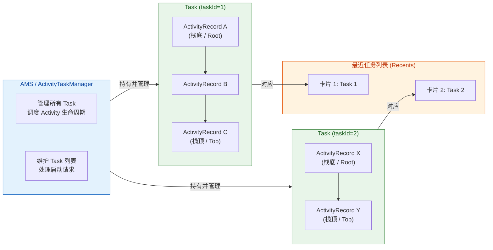

### 多 Task 并存与前台 / 后台切换

Android 系统中可以同时存在多个 Task。在任意时刻，只有一个 Task 处于 **前台（Foreground）**，其栈顶 Activity 对用户可见并可交互；其余 Task 都处于 **后台（Background）**。

典型的多 Task 场景：

1. 用户从 Launcher 打开了"邮件"应用，浏览了几封邮件（Task 1 包含：收件箱 Activity → 邮件详情 Activity）。
2. 用户按 Home 键回到桌面，Task 1 整体进入后台。
3. 用户点击"日历"应用图标，系统创建 Task 2（日历主界面 Activity）。
4. 此时 Task 2 在前台，Task 1 在后台。两个 Task 的栈结构都完整保留。
5. 用户打开最近任务列表，点击邮件应用的卡片，Task 1 回到前台（邮件详情 Activity 恢复显示），Task 2 进入后台。

这种机制让 Android 的多任务体验非常流畅——用户可以在多个"工作流"之间自由切换，每个工作流的页面历史都被独立保存。

还有一种特殊情况值得了解：**当一个后台 Task 长时间不被使用时**（默认阈值在不同 Android 版本中有所不同，通常是 30 分钟左右），系统可能会清除该 Task 中除根 Activity 之外的所有 Activity。这个行为由 `<activity>` 标签的 `android:alwaysRetainTaskState` 属性控制——如果根 Activity 设置了 `alwaysRetainTaskState="true"`，系统就不会清除这个 Task 的栈内容。反过来，如果根 Activity 设置了 `android:clearTaskOnLaunch="true"`，那么每次用户从最近任务回到这个 Task 时，都会清除根 Activity 之上的所有 Activity，只保留根 Activity。

### 用 adb 观察 Task 与回退栈

理论知识需要与实践结合。Android 提供了一个非常强大的调试命令，可以让你实时查看系统中所有 Task 和 Activity 的状态：

```bash
# 输出当前所有 Task 和 Activity 的详细信息
adb shell dumpsys activity activities

# 如果输出太多，可以用 grep 过滤关键信息
# 查看所有 Task 的摘要（包含 taskId、affinity、栈内 Activity 列表）
adb shell dumpsys activity activities | grep -E "Task|ActivityRecord|Hist"
```

一段典型的输出可能长这样（简化版）：

```
// Task id #152 的信息
Task{ab3d2f1 #152 type=standard A=com.example.myapp U=0 visible=true}
  // 栈内 Activity 列表，#0 是栈底，#2 是栈顶
  * Hist #2: ActivityRecord{f1a2b3c com.example.myapp/.DetailActivity t152}
  * Hist #1: ActivityRecord{d4e5f6a com.example.myapp/.ListActivity t152}
  * Hist #0: ActivityRecord{b7c8d9e com.example.myapp/.MainActivity t152}
```

从这段输出中可以读出：Task #152 属于 `com.example.myapp`，栈中有三个 Activity，`MainActivity` 在栈底，`DetailActivity` 在栈顶。`t152` 表示这些 Activity 都属于 taskId 为 152 的 Task。

养成使用 `dumpsys` 调试的习惯，对于理解启动模式、Intent Flags 的实际效果非常有帮助。后续章节中讲到 `singleTask`、`singleInstance` 等模式时，建议你实际运行 demo 并用这个命令观察 Task 的变化。

### 小结：为什么理解 Task 与 BackStack 如此重要

Task 与回退栈是 Android Activity 管理的 **基础设施**。后续要讨论的所有启动模式（standard、singleTop、singleTask、singleInstance）和 Intent Flags（NEW_TASK、CLEAR_TOP 等），本质上都是在回答同一个问题：**当一个新的 Activity 要启动时，它应该被放进哪个 Task 的哪个位置，以及栈中已有的 Activity 应该如何处理？**

如果你把 Task 想象成一摞扑克牌，每张牌就是一个 Activity。standard 模式就是"无脑往上叠一张新牌"；singleTop 是"如果最上面那张牌和要叠的一样，就不叠了"；singleTask 是"在这摞牌里找到目标牌，把它上面的牌全部拿走"；singleInstance 是"给这张牌单独开一摞，不允许其他牌叠上去"。有了这个心智模型，后续的内容会容易理解得多。

---

**📝 练习题**

某应用依次启动了 Activity A → B → C → D，四个 Activity 都使用默认的 standard 启动模式，且属于同一个 Task。此时用户按了两次返回键，请问 Task 回退栈中还剩哪些 Activity，栈顶是哪个？

A. 栈中剩 A 和 B，栈顶是 A

B. 栈中剩 A 和 B，栈顶是 B

C. 栈中剩 A、B 和 C，栈顶是 C

D. 栈中只剩 A，栈顶是 A

**【答案】** B
**【解析】** 在 standard 模式下，四个 Activity 按顺序入栈，栈从底到顶为 A → B → C → D。用户按第一次返回键，栈顶 D 被弹出并销毁，栈变为 A → B → C；按第二次返回键，栈顶 C 被弹出并销毁，栈变为 A → B。此时栈顶是 B，它会经历 `onRestart()` → `onStart()` → `onResume()` 重新回到前台。这道题考查的就是回退栈最基本的 FILO 原则——后进先出，每次返回弹出栈顶元素。

---

## 启动模式 LaunchMode

Android 的启动模式（Launch Mode）是控制 Activity 实例化策略与任务栈行为的核心机制。当我们通过 `startActivity()` 发起一次跳转时，系统并不是简单地"创建一个新 Activity 然后压栈"——它会先查询目标 Activity 声明的启动模式，再结合当前任务栈的状态，决定是创建新实例、复用已有实例，还是清除栈顶的其他 Activity。理解启动模式，本质上就是理解"系统如何决定一个 Activity 的生死与归属"。

Android 在 `<activity>` 标签中提供了 `android:launchMode` 属性，共有四种取值：`standard`、`singleTop`、`singleTask`、`singleInstance`。本节聚焦前两种——它们是最常用、也是最容易被误解的基础模式。后两种将在后续小节中展开。

### standard 标准模式

`standard` 是 Android 中 Activity 的默认启动模式。如果你在 `AndroidManifest.xml` 中没有显式声明 `android:launchMode`，那么该 Activity 就运行在 standard 模式下。它的行为规则极其简单，可以用一句话概括：**每次启动都创建一个全新的实例，压入调用者所在的任务栈顶**。

这意味着同一个 Activity 类可以在同一个任务栈中存在多个实例。假设你有一个 `DetailActivity`，用户从列表页点击了三次不同的条目，每次都 `startActivity(Intent(this, DetailActivity::class.java))`，那么任务栈中就会出现三个独立的 `DetailActivity` 实例，用户需要按三次返回键才能回到列表页。

这种"无条件创建新实例"的策略看似粗暴，但它是最符合直觉的行为模型——每一次导航都产生一个独立的页面状态，互不干扰。绝大多数普通页面（详情页、编辑页、设置子页面等）都适合使用 standard 模式。

我们从 AMS（ActivityManagerService）的视角来看这个过程。当 App 进程调用 `startActivity()` 时，请求经由 Binder IPC 到达 system_server 进程中的 AMS。AMS 内部的 `ActivityStarter` 类负责解析 Intent、检查权限、确定目标 Task，最终调用到关键方法。在 standard 模式下，`ActivityStarter` 的判断逻辑非常直接——它不会去搜索栈中是否已有同类实例，而是直接走"创建新 ActivityRecord 并压栈"的分支。这个 `ActivityRecord` 是 AMS 侧对一个 Activity 实例的完整描述对象，包含了 `ComponentName`、`Intent`、`TaskRecord` 引用、状态标记等信息。

```kotlin
// AndroidManifest.xml 中的声明（standard 可以省略，因为它是默认值）
// <activity
//     android:name=".DetailActivity"
//     android:launchMode="standard" />

// ---- 调用方：从 ListActivity 启动 DetailActivity ----
class ListActivity : AppCompatActivity() {

    // 用户点击列表条目时触发
    private fun onItemClick(itemId: String) {
        // 创建一个显式 Intent，目标是 DetailActivity
        val intent = Intent(this, DetailActivity::class.java)
        // 将条目 ID 作为 extra 传递给目标页面
        intent.putExtra("item_id", itemId)
        // 调用 startActivity —— 在 standard 模式下，
        // 系统一定会创建一个全新的 DetailActivity 实例
        startActivity(intent)
    }
}

// ---- 目标方：DetailActivity ----
class DetailActivity : AppCompatActivity() {

    override fun onCreate(savedInstanceState: Bundle?) {
        super.onCreate(savedInstanceState)
        // 每次进入 onCreate，说明这是一个全新的实例
        // 从 Intent 中取出调用方传递的数据
        val itemId = intent.getStringExtra("item_id")
        // 使用 itemId 加载对应的详情内容
        loadDetail(itemId)
    }

    private fun loadDetail(itemId: String?) {
        // 根据 itemId 请求网络或查询数据库，渲染 UI
    }
}
```

下面用一个具体场景来可视化 standard 模式下任务栈的变化过程。假设用户依次执行了三次操作：从 `MainActivity` 打开 `DetailActivity`（条目 A），再从 `DetailActivity` 打开另一个 `DetailActivity`（条目 B），最后再打开一个 `DetailActivity`（条目 C）：

```
┌─────────────────────────────────────────────────────────────────┐
│                    Task #1 (standard 模式演示)                    │
├─────────────┬──────────────────┬──────────────────┬─────────────┤
│  初始状态    │  第 1 次启动      │  第 2 次启动      │  第 3 次启动  │
├─────────────┼──────────────────┼──────────────────┼─────────────┤
│             │                  │                  │ Detail(C)   │ ← 栈顶
│             │                  │ Detail(B)        │ Detail(B)   │
│             │ Detail(A)        │ Detail(A)        │ Detail(A)   │
│ MainActivity│ MainActivity     │ MainActivity     │ MainActivity│ ← 栈底
└─────────────┴──────────────────┴──────────────────┴─────────────┘
  三个 DetailActivity 是完全独立的实例，各自持有不同的 itemId
  按返回键的顺序：Detail(C) → Detail(B) → Detail(A) → MainActivity
```

这张图清晰地展示了 standard 模式的核心特征：**不做任何复用判断，无条件创建新实例**。每个 `DetailActivity` 都有自己独立的生命周期、独立的 `savedInstanceState`、独立的 View 树。它们之间没有任何关联，销毁一个不会影响另一个。

standard 模式有一个容易被忽略的细节：**新实例被压入的是调用者所在的任务栈**，而不是目标 Activity 自己声明的 `taskAffinity` 所指向的栈。这一点在大多数场景下不会造成问题，因为同一个 App 内的 Activity 默认共享相同的 `taskAffinity`（即包名）。但如果你从一个 App 通过隐式 Intent 启动另一个 App 的 standard Activity，且没有设置 `FLAG_ACTIVITY_NEW_TASK`，在某些 Android 版本上会直接抛出异常。这是因为非 Activity 的 Context（如 Service、Application）没有关联的任务栈，系统不知道该把新实例压到哪里去。这也是为什么从 Service 中启动 Activity 时必须加上 `FLAG_ACTIVITY_NEW_TASK` 的根本原因。

standard 模式的优势在于简单可预测，但它的潜在问题也很明显——如果用户反复进入同一个页面，栈中会堆积大量重复实例，每个实例都占用内存（View 树、Bitmap 缓存、ViewModel 等）。在极端情况下，比如一个新闻 App 中用户不断点击"相关推荐"跳转到新的详情页，栈可能膨胀到几十层，不仅浪费内存，用户按返回键时的体验也很糟糕。这正是 `singleTop` 模式要解决的第一个问题。

### singleTop 栈顶复用

`singleTop`（栈顶复用模式）是对 standard 模式的一次精准优化。它的规则同样可以用一句话概括：**如果目标 Activity 的实例已经位于当前任务栈的栈顶，则不创建新实例，而是复用栈顶的那个实例，并通过 `onNewIntent()` 回调将新的 Intent 传递给它**。

注意这里的关键限定词——"栈顶"。如果目标 Activity 存在于栈中但不在栈顶，singleTop 的行为与 standard 完全一致，照样创建新实例压栈。这是 singleTop 最容易被误解的地方：它并不是"栈内复用"，而仅仅是"栈顶复用"。

从 AMS 的处理逻辑来看，当 `ActivityStarter` 解析到目标 Activity 的 `launchMode` 为 `singleTop` 时，它会执行一个额外的检查：取出当前 Task 的栈顶 `ActivityRecord`，比较其 `ComponentName` 是否与目标一致。如果一致，AMS 不会创建新的 `ActivityRecord`，而是通过 `ActivityThread` 的 `scheduleNewIntent()` 方法，将新的 Intent 投递到已有实例的 `onNewIntent()` 回调中。如果不一致（即栈顶是别的 Activity），则回退到 standard 的逻辑，创建新实例。

```xml
<!-- AndroidManifest.xml 中声明 singleTop -->
<activity
    android:name=".NotificationDetailActivity"
    android:launchMode="singleTop" />
```

```kotlin
class NotificationDetailActivity : AppCompatActivity() {

    override fun onCreate(savedInstanceState: Bundle?) {
        super.onCreate(savedInstanceState)
        setContentView(R.layout.activity_notification_detail)
        // 首次创建时，从 Intent 中获取数据并渲染
        handleIntent(intent)
    }

    // 当该 Activity 已在栈顶、又被再次启动时，
    // 系统不会调用 onCreate，而是调用 onNewIntent
    override fun onNewIntent(intent: Intent) {
        super.onNewIntent(intent)
        // 【关键】必须手动调用 setIntent 更新当前 Activity 持有的 Intent
        // 否则后续调用 getIntent() 拿到的仍然是旧的 Intent
        setIntent(intent)
        // 用新的 Intent 数据刷新页面内容
        handleIntent(intent)
    }

    private fun handleIntent(intent: Intent) {
        // 从 Intent 中提取通知 ID
        val notificationId = intent.getStringExtra("notification_id")
        // 根据 notificationId 加载对应的通知详情
        // 如果是 onNewIntent 触发的，这里会用新的 ID 刷新页面
        loadNotificationDetail(notificationId)
    }

    private fun loadNotificationDetail(id: String?) {
        // 网络请求或数据库查询，加载通知详情并更新 UI
    }
}
```

这段代码中有一个极其重要的细节：`setIntent(intent)`。当 `onNewIntent()` 被回调时，Activity 内部持有的 `mIntent` 字段并不会自动更新。如果你在 `onNewIntent()` 中没有调用 `setIntent()`，那么之后任何地方调用 `getIntent()` 返回的仍然是最初 `onCreate()` 时的那个旧 Intent。这是一个非常常见的 bug 来源——开发者以为页面已经刷新了，但实际上 `getIntent()` 返回的数据还是旧的，导致在 `onResume()` 或其他生命周期方法中读取到过期数据。

接下来看 singleTop 复用时的生命周期调用顺序。当栈顶实例被复用时，系统的回调序列是：

```
onPause() → onNewIntent() → onResume()
```

注意 `onNewIntent()` 是在 `onPause()` 之后、`onResume()` 之前被调用的。这意味着在 `onNewIntent()` 执行时，Activity 处于 Paused 状态，UI 是可见但不可交互的。你可以在 `onNewIntent()` 中安全地更新数据和准备 UI 状态，然后在随后的 `onResume()` 中让 UI 恢复交互。不会触发 `onStop()` → `onRestart()` → `onStart()` 这条路径，因为 Activity 本来就在栈顶、本来就是可见的，没有经历过"不可见"的状态。

下面用图表对比 singleTop 在两种场景下的不同行为：

```
场景 1：目标 Activity 在栈顶 → 复用
┌──────────────────────────────────────────────────┐
│              Task #1                              │
├────────────────────┬─────────────────────────────┤
│   启动前            │   再次 startActivity 后      │
├────────────────────┼─────────────────────────────┤
│ NotifyDetail ← 栈顶│ NotifyDetail ← 栈顶(同实例) │
│ MainActivity       │ MainActivity                │
└────────────────────┴─────────────────────────────┘
  不创建新实例，调用 onNewIntent() 传递新 Intent
  实例的 hashCode 不变，内存地址相同

场景 2：目标 Activity 不在栈顶 → 创建新实例（退化为 standard）
┌──────────────────────────────────────────────────┐
│              Task #1                              │
├────────────────────┬─────────────────────────────┤
│   启动前            │   startActivity 后           │
├────────────────────┼─────────────────────────────┤
│                    │ NotifyDetail ← 栈顶(新实例)  │
│ OtherActivity ←栈顶│ OtherActivity               │
│ NotifyDetail       │ NotifyDetail (旧实例仍在)    │
│ MainActivity       │ MainActivity                │
└────────────────────┴─────────────────────────────┘
  栈顶不是 NotifyDetail，所以创建新实例压栈
  此时栈中存在两个 NotifyDetail 实例！
```

场景 2 是 singleTop 最容易让人困惑的地方。很多开发者误以为 singleTop 会"在整个栈中搜索并复用已有实例"，但实际上它只检查栈顶那一个位置。如果你需要"栈内任意位置复用"的语义，那应该使用 `singleTask` 模式（下一节会详细讲解）。

singleTop 最经典的应用场景是**搜索页面**和**通知跳转页面**。以搜索为例：用户在 `SearchActivity` 中输入关键词并点击搜索，搜索结果展示在同一个页面上。如果用户修改关键词再次搜索，我们希望刷新当前页面而不是创建一个新的 `SearchActivity`。如果 `SearchActivity` 是 standard 模式，每次搜索都会在栈中堆积一个新实例，用户按返回键时会看到一连串的搜索页面，体验非常差。而 singleTop 模式下，只要 `SearchActivity` 在栈顶，重复搜索只会触发 `onNewIntent()`，页面原地刷新，栈中始终只有一个搜索页面实例。

通知跳转是另一个典型场景。当用户点击通知栏中的通知时，`PendingIntent` 会启动目标 Activity。如果用户连续收到多条通知并快速点击，standard 模式会创建多个重复页面。而 singleTop 可以确保：如果用户已经在查看通知详情页，新的通知点击只会刷新当前页面的内容。

除了在 `AndroidManifest.xml` 中静态声明 `launchMode="singleTop"`，你还可以通过 Intent Flag 动态实现相同的效果：

```kotlin
// 通过 Intent Flag 动态指定 singleTop 行为
// 这种方式的优先级高于 Manifest 中的静态声明
val intent = Intent(this, SearchActivity::class.java)
// FLAG_ACTIVITY_SINGLE_TOP 的效果等同于 launchMode="singleTop"
intent.addFlags(Intent.FLAG_ACTIVITY_SINGLE_TOP)
intent.putExtra("query", searchKeyword)
startActivity(intent)
```

使用 Intent Flag 的好处是灵活——你可以根据业务逻辑动态决定是否启用栈顶复用，而不是在 Manifest 中写死。比如同一个 `DetailActivity`，从列表页进入时用 standard（允许多实例），从通知栏进入时加上 `FLAG_ACTIVITY_SINGLE_TOP`（避免重复）。这种"静态声明 + 动态 Flag"的组合策略在实际项目中非常常见。

最后总结 standard 与 singleTop 的核心差异：

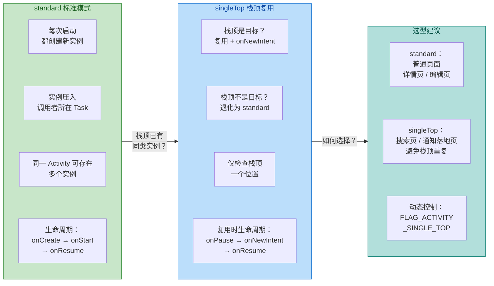

一个值得注意的边界情况是：如果你同时在 Manifest 中声明了 `launchMode="standard"`，但在 Intent 中添加了 `FLAG_ACTIVITY_SINGLE_TOP`，最终行为是 singleTop。**Intent Flag 的优先级高于 Manifest 声明**。但反过来，如果 Manifest 声明了 `singleTop`，而 Intent 中没有任何 Flag，那么 singleTop 依然生效。两者是"或"的关系——任何一方指定了 singleTop，最终行为就是 singleTop。

---

**📝 练习题**

用户在 `SearchActivity`（声明为 `singleTop`）中搜索后，点击某条结果跳转到 `ResultDetailActivity`。此时用户点击通知栏中的一条通知，该通知的 `PendingIntent` 目标也是 `SearchActivity`。请问此时系统会如何处理？

A. 复用栈中已有的 `SearchActivity` 实例，调用其 `onNewIntent()`

B. 创建一个新的 `SearchActivity` 实例压入栈顶

C. 将 `ResultDetailActivity` 弹出栈，然后复用 `SearchActivity`

D. 创建一个新的 Task，在其中启动 `SearchActivity`

**【答案】** B

**【解析】** singleTop 的复用条件是"目标 Activity 已在栈顶"。在本题的场景中，当前任务栈从底到顶是 `SearchActivity → ResultDetailActivity`，栈顶是 `ResultDetailActivity` 而非 `SearchActivity`。虽然 `SearchActivity` 存在于栈中，但它不在栈顶位置，因此 singleTop 的复用条件不满足，系统退化为 standard 行为，创建一个新的 `SearchActivity` 实例压入栈顶。此时栈变为 `SearchActivity → ResultDetailActivity → SearchActivity(新)`。选项 A 描述的是"栈内复用"的行为，那是 `singleTask` 模式的特征。选项 C 描述的 clearTop 效应也是 `singleTask` 的行为。选项 D 只有在设置了 `FLAG_ACTIVITY_NEW_TASK` 且 `taskAffinity` 不同时才可能发生。这道题的核心考点就是：**singleTop 只看栈顶，不看栈内**。

---

## 栈内复用模式 singleTask

`singleTask` 是四种启动模式中行为最复杂、也最容易被误解的一种。它的核心语义可以概括为一句话：**在目标任务栈中，确保该 Activity 有且仅有一个实例（Ensure a single instance within the target task）**。为了达成这个目标，系统会执行一系列连锁操作——寻找合适的任务栈、复用已有实例、清除栈顶多余的 Activity——这些行为组合在一起，构成了 `singleTask` 独特的 "clearTop 效应"。

理解 `singleTask` 的关键在于：它不仅仅是一个"复用模式"，更是一个涉及 **任务栈选择、实例查找、栈内清理、回调通知** 的完整决策链。我们逐步拆解这个过程。

### singleTask 的完整决策流程

当系统收到一个启动 `singleTask` Activity 的请求时，AMS（ActivityManagerService）内部会按照严格的顺序执行以下判断：

第一步是 **确定目标任务栈**。与 `standard` 和 `singleTop` 不同，`singleTask` 不一定在调用者所在的任务栈中创建实例。系统会读取目标 Activity 声明的 `taskAffinity` 属性（如果没有显式声明，则默认等于应用包名），然后在当前所有存活的任务栈中查找是否存在 `affinity` 与之匹配的任务栈。如果找到了匹配的任务栈，就以该栈作为目标；如果没有找到，系统会 **创建一个全新的任务栈**，并将目标 Activity 作为这个新栈的根 Activity（root Activity）。这一点非常重要——很多开发者误以为 `singleTask` 一定会创建新栈，实际上只有在没有匹配 affinity 的栈时才会创建。

第二步是 **在目标任务栈中查找已有实例**。系统会从栈底到栈顶遍历目标任务栈中的所有 ActivityRecord，检查是否已经存在目标 Activity 的实例。注意这里的查找范围是 **整个栈**，而不仅仅是栈顶——这是 `singleTask` 与 `singleTop` 的本质区别。

第三步是根据查找结果执行不同的操作。如果目标栈中 **不存在** 该 Activity 的实例，系统就直接在栈顶创建一个新实例，走完整的 `onCreate → onStart → onResume` 生命周期。如果目标栈中 **已经存在** 该 Activity 的实例，系统就会触发 `singleTask` 最核心的机制——clearTop 效应。

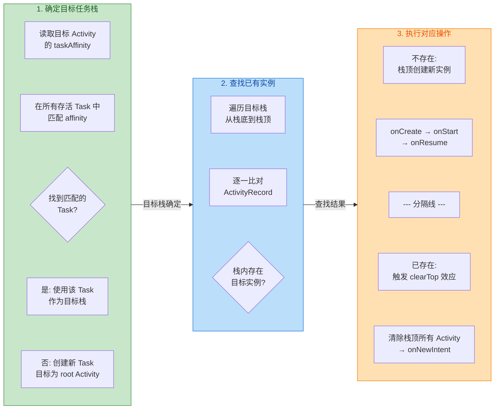

### clearTop 效应的深层机制

clearTop 效应是 `singleTask` 最具杀伤力的行为特征。当系统在目标任务栈中找到了已有的目标 Activity 实例时，它会将该实例 **之上** 的所有 Activity **全部销毁**（依次调用 `onDestroy`），然后将该实例重新推到栈顶。这个过程就像是把书架上某本书上面的所有书都拿走，让那本书露出来。

举一个具体的场景来说明。假设当前任务栈的状态从栈底到栈顶依次是 `A → B → C → D`，其中 Activity B 的启动模式声明为 `singleTask`。此时如果从 D 发起一个启动 B 的 Intent：

```text
// 启动前的栈状态（栈底 → 栈顶）
┌─────────────────────────────┐
│  Task (affinity: com.app)   │
│                             │
│  ┌───┐  ┌───┐  ┌───┐  ┌───┐│
│  │ A │→ │ B │→ │ C │→ │ D ││  ← D 发起 startActivity(B)
│  └───┘  └───┘  └───┘  └───┘│
│  (底)              (顶)     │
└─────────────────────────────┘

// 系统发现 B 已在栈内，触发 clearTop 效应
// Step 1: D.onDestroy() — 销毁 D
// Step 2: C.onDestroy() — 销毁 C
// Step 3: B.onNewIntent() → B.onResume() — 复用 B

// 启动后的栈状态
┌─────────────────────────────┐
│  Task (affinity: com.app)   │
│                             │
│  ┌───┐  ┌───┐              │
│  │ A │→ │ B │              │  ← B 重新成为栈顶，C 和 D 已被销毁
│  └───┘  └───┘              │
│  (底)   (顶)               │
└─────────────────────────────┘
```

这里有几个细节值得深入讨论。

首先是 **销毁顺序**。C 和 D 的销毁并不是同时发生的，而是从栈顶开始逐个弹出。系统会先 finish 掉 D，再 finish 掉 C。每个被销毁的 Activity 都会走完整的销毁流程：`onPause → onStop → onDestroy`。这意味着如果 C 或 D 中有未保存的数据，在 clearTop 过程中会丢失——这是使用 `singleTask` 时必须警惕的副作用。

其次是 **被复用实例的状态保留**。B 本身不会被销毁重建，它的成员变量、View 状态都会保留。系统只是将它重新推到栈顶，然后通过 `onNewIntent()` 传递新的 Intent 数据。这与 `standard` 模式下每次都创建全新实例形成鲜明对比。

最后是 **clearTop 的不可逆性**。被清除的 C 和 D 一旦销毁就无法恢复。用户按返回键时，会直接从 B 回到 A，而不是回到 C 或 D。这在某些业务场景下是期望的行为（比如从深层页面直接回到主页），但在另一些场景下可能会破坏用户的导航预期。

### onNewIntent 回调时机与陷阱

当 `singleTask` 的 Activity 被复用时，系统不会调用 `onCreate()`，而是调用 `onNewIntent(Intent intent)`。这个回调方法是复用模式下获取新 Intent 数据的唯一入口，但它的使用有几个容易踩坑的地方。

第一个陷阱是 **`getIntent()` 不会自动更新**。在 `onNewIntent()` 被调用后，如果你在后续的生命周期方法（如 `onResume()`）中调用 `getIntent()`，拿到的仍然是 **最初创建该 Activity 时的旧 Intent**，而不是触发复用的新 Intent。要获取新数据，必须在 `onNewIntent()` 中手动调用 `setIntent(intent)` 来更新。

```kotlin
class MainActivity : AppCompatActivity() {

    override fun onCreate(savedInstanceState: Bundle?) {
        super.onCreate(savedInstanceState)
        setContentView(R.layout.activity_main)
        // 首次创建时，从 intent 中读取数据
        handleIntent(intent)
    }

    override fun onNewIntent(intent: Intent) {
        // 当 singleTask 复用该实例时，系统回调此方法
        super.onNewIntent(intent)
        // 【关键】手动更新 Intent，否则后续 getIntent() 拿到的是旧值
        setIntent(intent)
        // 用新的 intent 处理业务逻辑
        handleIntent(intent)
    }

    private fun handleIntent(intent: Intent) {
        // 统一的 Intent 处理逻辑
        // 从 intent 中提取参数并更新 UI
        val targetPage = intent.getStringExtra("target_page")
        // 根据 targetPage 导航到对应的 Fragment 或执行对应操作
        if (targetPage != null) {
            navigateToPage(targetPage)
        }
    }

    private fun navigateToPage(page: String) {
        // 具体的页面导航逻辑
    }
}
```

第二个陷阱是 **生命周期的调用顺序**。当 `singleTask` Activity 被复用时，完整的回调顺序是：`onNewIntent() → onRestart() → onStart() → onResume()`。注意 `onNewIntent()` 是在 `onResume()` 之前调用的，所以如果你在 `onNewIntent()` 中更新了某些状态，可以放心地在 `onResume()` 中使用这些状态。但如果你的逻辑依赖于 `onStart()` 中的某些初始化，就需要注意顺序问题。

```kotlin
// singleTask Activity 被复用时的完整生命周期回调顺序
// （假设 Activity 之前处于 onStop 状态，即不在前台）

// 1. onNewIntent(intent)   ← 最先收到新 Intent
// 2. onRestart()           ← 从 Stopped 状态重新启动
// 3. onStart()             ← 变为可见
// 4. onResume()            ← 回到前台，可交互
```

第三个陷阱涉及 **Activity 当前就在栈顶的特殊情况**。如果 `singleTask` Activity 本身就在栈顶（没有其他 Activity 覆盖在它上面），此时再次启动它，行为与 `singleTop` 一致——不会创建新实例，直接调用 `onNewIntent()`。但此时的生命周期顺序略有不同：`onPause() → onNewIntent() → onResume()`。Activity 会先暂停，收到新 Intent，然后恢复。

### singleTask 与 taskAffinity 的协作

`singleTask` 的行为与 `taskAffinity` 属性紧密耦合。默认情况下，同一个应用内所有 Activity 的 `taskAffinity` 都等于应用包名，因此 `singleTask` Activity 通常会在应用的主任务栈中查找和复用实例。但如果你为 `singleTask` Activity 指定了不同的 `taskAffinity`，行为就会发生显著变化。

```xml
<!-- AndroidManifest.xml -->
<activity
    android:name=".PaymentActivity"
    android:launchMode="singleTask"
    android:taskAffinity="com.app.payment" />
    <!-- 
        PaymentActivity 声明了独立的 taskAffinity
        当它被启动时，系统会查找 affinity 为 "com.app.payment" 的任务栈
        如果不存在，就创建一个新的任务栈
    -->
```

在这种配置下，当从主任务栈中的某个 Activity 启动 `PaymentActivity` 时，系统会发现没有 affinity 为 `com.app.payment` 的任务栈存在，于是创建一个全新的任务栈，并将 `PaymentActivity` 作为该栈的根 Activity。此时在 Recent Apps（最近任务列表）中，用户会看到两个独立的任务卡片——一个是主应用，一个是支付流程。这种设计在某些业务场景下很有用，比如将支付流程隔离为独立的任务，让用户可以在主应用和支付之间自由切换。

但如果不指定独立的 `taskAffinity`，`singleTask` 就会在默认的主任务栈中工作。这是最常见的用法，也是大多数开发者接触到的场景。典型的例子就是 App 的主页（HomeActivity）声明为 `singleTask`：无论用户从多深的页面层级跳转回主页，系统都会清除主页之上的所有 Activity，让主页重新回到栈顶。

### singleTask 的典型应用场景

`singleTask` 最经典的使用场景是 **应用主页面（Home/Main Activity）**。几乎所有大型 App 的主页都会声明为 `singleTask`，原因有三：

其一，主页作为应用的导航中枢，在整个应用生命周期中应该只存在一个实例。如果用户从通知栏、Widget、或者 Deep Link 跳转回主页，不应该创建新的主页实例，而应该复用已有的实例并通过 `onNewIntent()` 传递新数据。

其二，clearTop 效应天然适合"回到首页"的交互模式。当用户从 `首页 → 列表页 → 详情页 → 设置页` 一路深入后，点击"回到首页"按钮，`singleTask` 会自动清除中间的所有页面，干净利落地回到首页。

其三，`singleTask` 配合 `taskAffinity` 可以实现多窗口/多任务的隔离。比如浏览器应用中，每个标签页可以作为独立的 `singleTask` Activity 运行在不同的任务栈中。

另一个常见场景是 **登录页面**。当用户的 Session 过期需要重新登录时，从任何页面跳转到登录页，`singleTask` 的 clearTop 效应会清除登录页之上的所有业务页面，避免用户登录后按返回键回到需要鉴权的页面。

### singleTask 与 FLAG_ACTIVITY_CLEAR_TOP 的对比

很多开发者会混淆 `singleTask` 和 `FLAG_ACTIVITY_CLEAR_TOP` 这个 Intent Flag，因为它们都有"清除栈顶"的效果。但两者在细节上有重要区别。

`FLAG_ACTIVITY_CLEAR_TOP` 是一个运行时的 Intent Flag，它的行为取决于目标 Activity 的启动模式。如果目标 Activity 是 `standard` 模式，`CLEAR_TOP` 会先销毁目标实例及其上方的所有 Activity，然后 **重新创建** 一个新的目标实例（走 `onCreate`）。也就是说，`standard` + `CLEAR_TOP` 的组合不会复用实例，而是销毁后重建。

而 `singleTask` 自带 clearTop 语义，并且一定会 **复用** 已有实例（走 `onNewIntent`），不会销毁重建。这是两者最核心的区别。

如果你想用 Intent Flag 模拟 `singleTask` 的完整行为（复用 + clearTop），需要同时设置 `FLAG_ACTIVITY_CLEAR_TOP | FLAG_ACTIVITY_SINGLE_TOP`。`SINGLE_TOP` 的加入会阻止系统销毁重建目标实例，转而复用并调用 `onNewIntent()`。

```kotlin
// 方式一：在 Manifest 中声明 singleTask（静态，全局生效）
// <activity android:launchMode="singleTask" />

// 方式二：通过 Intent Flags 动态模拟 singleTask 行为
val intent = Intent(this, HomeActivity::class.java).apply {
    // CLEAR_TOP: 清除目标 Activity 之上的所有 Activity
    // SINGLE_TOP: 如果目标已在栈顶，复用而非重建
    // 两者组合 ≈ singleTask 的运行时等价写法
    flags = Intent.FLAG_ACTIVITY_CLEAR_TOP or Intent.FLAG_ACTIVITY_SINGLE_TOP
}
startActivity(intent)
```

两种方式的选择取决于需求：如果某个 Activity **始终** 需要 singleTask 行为，在 Manifest 中声明更合适；如果只在特定场景下需要 clearTop 效果，使用 Intent Flags 更灵活。

### AMS 内部的 singleTask 处理逻辑

从 Framework 层的视角来看，`singleTask` 的处理逻辑主要发生在 `ActivityStarter` 和 `RootWindowContainer` 中。当 AMS 收到启动请求后，`ActivityStarter.startActivityUnchecked()` 方法会根据启动模式执行不同的分支逻辑。

对于 `singleTask`，系统首先调用 `RootWindowContainer.findTask()` 在所有 Task 中查找匹配 affinity 的任务栈。如果找到了匹配的 Task，再在该 Task 内部查找是否存在目标 Activity 的实例。这个查找过程对应的是 `TaskRecord` 中的 `findActivityInHistory()` 方法，它会遍历 Task 内部的 `ArrayList<ActivityRecord>` 列表。

如果找到了已有实例，系统会调用 `Task.performClearTop()` 方法执行 clearTop 操作。这个方法会从栈顶开始，逐个调用 `ActivityRecord.finishIfPossible()` 来销毁目标实例之上的所有 Activity。销毁完成后，系统通过 `ClientTransaction` 机制向目标 Activity 所在的进程发送 `NewIntentItem`，触发 `onNewIntent()` 回调。

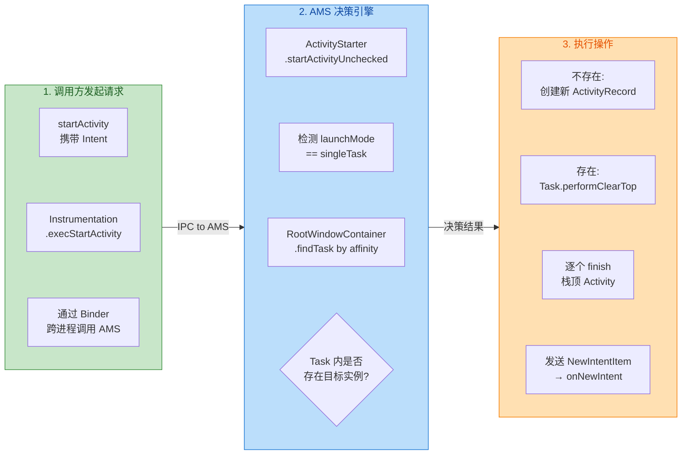

理解这个内部流程有助于解释一些"反直觉"的现象。比如，为什么 `singleTask` Activity 在某些情况下启动会有短暂的延迟？因为系统需要遍历所有 Task 查找匹配的 affinity，如果系统中存在大量任务栈，这个查找过程会消耗一定时间。再比如，为什么 clearTop 过程中被销毁的 Activity 的 `onDestroy()` 有时候会延迟调用？因为 `finishIfPossible()` 并不总是同步执行销毁，在某些情况下（如 Activity 正在执行动画），系统会将销毁操作延迟到动画结束后。

### 常见误区与注意事项

误区一：**"singleTask 一定会创建新的任务栈"**。这是最普遍的误解。如前所述，`singleTask` 只有在找不到匹配 affinity 的任务栈时才会创建新栈。如果没有显式指定 `taskAffinity`，默认 affinity 就是包名，而应用的主任务栈的 affinity 也是包名，所以 `singleTask` Activity 通常会在主任务栈中创建，不会产生新栈。

误区二：**"singleTask 的 clearTop 只清除直接上方的 Activity"**。实际上 clearTop 会清除目标实例之上的 **所有** Activity，无论有多少个。如果栈中有 `A → B → C → D → E`，复用 B 时会清除 C、D、E 三个 Activity。

误区三：**"onNewIntent 中可以直接使用 getIntent 获取新数据"**。如前面代码示例所述，必须先调用 `setIntent(intent)` 才能让 `getIntent()` 返回新的 Intent。

注意事项一：`singleTask` 的 clearTop 效应会导致数据丢失。如果被清除的 Activity 中有未保存的用户输入（如表单数据），这些数据会随着 Activity 的销毁而丢失。在设计导航架构时，需要考虑是否需要在 `onSaveInstanceState()` 中保存关键数据，或者使用 ViewModel 等机制持久化状态。

注意事项二：在使用 `singleTask` 时要谨慎处理 `startActivityForResult()`。在 Android 11（API 30）之前，如果目标 Activity 的启动模式是 `singleTask` 且会创建新的任务栈，`onActivityResult()` 会立即收到 `RESULT_CANCELED`，而不会等待目标 Activity 返回结果。这是因为跨任务栈的 result 传递在旧版本中不被支持。从 Android 12 开始，这个限制有所放宽，但仍然建议避免对 `singleTask` Activity 使用 `startActivityForResult()`，转而使用 Activity Result API 或其他通信机制。

---

**📝 练习题**

某应用的任务栈当前状态为 `A → B → C → D`（A 在栈底，D 在栈顶），其中 B 在 AndroidManifest 中声明了 `android:launchMode="singleTask"`，且未指定 `taskAffinity`。此时 D 调用 `startActivity()` 启动 B，以下哪个描述是正确的？

A. 系统创建一个新的任务栈，在新栈中创建 B 的新实例，原栈保持 A → B → C → D 不变

B. 系统销毁 C 和 D，复用已有的 B 实例，调用 B 的 `onNewIntent()`，栈变为 A → B

C. 系统销毁 D，复用已有的 B 实例，调用 B 的 `onNewIntent()`，栈变为 A → B → C

D. 系统销毁 B、C、D，重新创建 B 的新实例，调用 B 的 `onCreate()`，栈变为 A → B

**【答案】** B

**【解析】** 因为 B 未指定独立的 `taskAffinity`，其 affinity 默认等于应用包名，与当前主任务栈的 affinity 一致，所以系统不会创建新栈（排除 A）。系统在当前栈中找到了 B 的已有实例，触发 clearTop 效应：B 之上的 **所有** Activity（C 和 D）都会被销毁，而不仅仅是直接上方的 D（排除 C）。`singleTask` 的核心语义是 **复用** 已有实例并调用 `onNewIntent()`，而不是销毁重建（排除 D）。最终栈状态为 A → B，B 收到 `onNewIntent()` 回调。

---

## 全局单例模式 singleInstance

`singleInstance` 是四种启动模式中最"极端"的一种——它不仅要求整个系统中只存在一个实例（这一点与 `singleTask` 相同），还额外施加了一条铁律：**该 Activity 所在的 Task 中，永远只能容纳它自己这一个 Activity，不允许有任何其他 Activity 与之共存**。这种"独占一个 Task"的特性，使得它天然适合那些需要被多个应用共享访问的界面，比如系统来电接听界面（InCallScreen）、系统级别的浮窗选择器等。

理解 `singleInstance` 的关键，在于把握它与 `singleTask` 的微妙差异。`singleTask` 虽然也保证全局唯一，但它所在的 Task 仍然可以压入其他 Activity；而 `singleInstance` 则彻底封锁了这种可能——它的 Task 就像一个"单人牢房"，从创建到销毁，里面始终只有它一个"住户"。

### 独立 Task 容器

当系统第一次启动一个声明为 `singleInstance` 的 Activity 时，整个创建过程可以分为以下几个关键步骤：

第一步，AMS（ActivityManagerService）在全局范围内搜索是否已经存在该 Activity 的实例。由于是首次启动，搜索结果为空，于是进入创建流程。

第二步，AMS 不会将这个 Activity 放入调用者所在的 Task，而是**强制创建一个全新的 Task**（即一个新的 `TaskRecord`）。这个新 Task 的 `taskAffinity` 默认等于该 Activity 声明时所在的包名（除非你在 `AndroidManifest.xml` 中显式指定了不同的 `taskAffinity`）。

第三步，新创建的 Activity 实例被压入这个全新的 Task 中，成为其中唯一的、也是永远唯一的成员。

第四步，这个新 Task 被推到前台，用户看到该 Activity 的界面。

当后续任何组件（无论是同一个 App 还是其他 App）再次尝试启动这个 `singleInstance` Activity 时，AMS 会在全局搜索中找到已有实例，于是不再创建新实例，而是将该实例所在的 Task 整体切换到前台，并调用已有实例的 `onNewIntent()` 方法传递新的 Intent 数据。

这里有一个非常重要的行为需要特别注意：**当 `singleInstance` Activity 内部通过 `startActivity()` 启动其他 Activity 时，被启动的 Activity 绝不会进入 `singleInstance` 所在的 Task**。系统会为被启动的 Activity 寻找或创建另一个合适的 Task 来容纳它。这就是"独立 Task 容器"的核心含义——这个容器只为它自己服务，任何试图"挤进来"的 Activity 都会被系统拒之门外。

我们用一个具体的场景来演示这个机制。假设有三个 Activity：`ActivityA`（standard）、`ActivityB`（singleInstance）、`ActivityC`（standard），它们都属于同一个 App。

```
// 初始状态：用户从 Launcher 启动 App，ActivityA 显示
// Task 1 (前台):  [ActivityA]
// 
// 第一步：ActivityA 启动 ActivityB (singleInstance)
// 系统为 ActivityB 创建全新的 Task 2
// Task 1 (后台):  [ActivityA]
// Task 2 (前台):  [ActivityB]    ← singleInstance 独占
//
// 第二步：ActivityB 内部启动 ActivityC (standard)
// ActivityC 不能进入 Task 2（因为 singleInstance 独占）
// 系统将 ActivityC 放入与其 taskAffinity 匹配的 Task 1
// Task 1 (前台):  [ActivityA, ActivityC]    ← ActivityC 被压入这里
// Task 2 (后台):  [ActivityB]               ← 仍然只有 ActivityB
//
// 第三步：用户在 ActivityC 上按返回键
// ActivityC 出栈，Task 1 回到 ActivityA
// Task 1 (前台):  [ActivityA]
// Task 2 (后台):  [ActivityB]
//
// 第四步：用户在 ActivityA 上按返回键
// ActivityA 出栈，Task 1 为空被回收
// 此时系统会将 Task 2 切到前台（取决于最近任务顺序）
// Task 2 (前台):  [ActivityB]
//
// 第五步：用户在 ActivityB 上按返回键
// ActivityB 出栈，Task 2 为空被回收
// 回到 Launcher
```

注意第二步中的关键行为：`ActivityB` 启动 `ActivityC` 时，虽然 `ActivityB` 是调用者，但 `ActivityC` 并没有进入 `ActivityB` 所在的 Task 2，而是被"弹射"到了 Task 1。这正是 `singleInstance` 的"排他性"在起作用。从用户的视觉感受来看，当 `ActivityB` 启动 `ActivityC` 时，屏幕会切换到 `ActivityC`，但如果用户此时查看最近任务列表（Recent Tasks），会看到两个独立的任务卡片——一个是包含 `ActivityA` 和 `ActivityC` 的 Task 1，另一个是只有 `ActivityB` 的 Task 2。

下面这张流程图完整展示了 `singleInstance` 的启动决策过程：

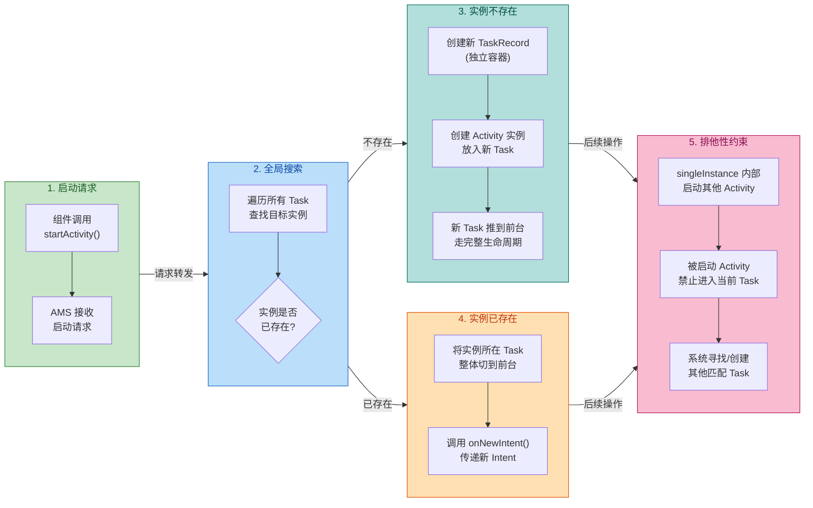

### 应用间共享

`singleInstance` 最具实际价值的应用场景，就是**跨应用共享同一个 Activity 实例**。这在 Android 系统设计中有着深刻的意义——某些界面天然就应该是"全局唯一"的，无论哪个 App 触发它，用户看到的都应该是同一个界面、同一份状态。

最经典的例子是系统来电界面。当有电话打入时，无论用户当前正在使用哪个 App（微信、浏览器、游戏……），系统都会弹出同一个来电界面。这个来电界面不应该因为从不同 App 触发就创建多个实例——那样会导致状态混乱、资源浪费。`singleInstance` 完美解决了这个问题：全局只有一个实例，独占一个 Task，任何 App 都可以触发它，但最终都指向同一个对象。

我们来看一个实际的代码示例。假设我们要实现一个"全局视频通话"界面，任何 App 都可以通过 Intent 唤起它：

```kotlin
// ========== AndroidManifest.xml 中的声明 ==========
// 在 manifest 中将 VideoCallActivity 声明为 singleInstance
// 同时通过 intent-filter 暴露给外部应用调用
```

```xml
<activity
    android:name=".VideoCallActivity"
    android:launchMode="singleInstance"
    android:taskAffinity="com.example.videocall.task"
    android:exported="true">
    <!-- exported=true 允许其他应用启动此 Activity -->

    <!-- 定义一个自定义 action，外部应用通过此 action 唤起视频通话 -->
    <intent-filter>
        <action android:name="com.example.action.VIDEO_CALL" />
        <category android:name="android.intent.category.DEFAULT" />
    </intent-filter>
</activity>
```

```kotlin
// ========== VideoCallActivity.kt ==========
// 全局唯一的视频通话界面，声明为 singleInstance
class VideoCallActivity : AppCompatActivity() {

    // 当前通话的用户 ID，用于判断是否需要切换通话对象
    private var currentCallUserId: String? = null

    override fun onCreate(savedInstanceState: Bundle?) {
        super.onCreate(savedInstanceState)
        // 设置视频通话的布局
        setContentView(R.layout.activity_video_call)
        // 首次创建时，从 Intent 中提取通话参数并初始化
        handleIncomingIntent(intent)
    }

    override fun onNewIntent(intent: Intent?) {
        // 当实例已存在，被再次启动时，系统回调此方法
        super.onNewIntent(intent)
        // 关键：必须调用 setIntent() 更新当前 Activity 持有的 Intent
        // 否则后续调用 getIntent() 拿到的仍然是旧的 Intent
        setIntent(intent)
        // 用新的 Intent 数据处理通话逻辑
        handleIncomingIntent(intent)
    }

    private fun handleIncomingIntent(intent: Intent?) {
        // 从 Intent 中提取目标用户 ID
        val targetUserId = intent?.getStringExtra("user_id") ?: return
        // 从 Intent 中提取调用来源（用于日志或 UI 展示）
        val callerPackage = intent.getStringExtra("caller_package") ?: "unknown"

        if (targetUserId == currentCallUserId) {
            // 如果目标用户与当前通话用户相同，说明是重复唤起
            // 无需重新建立连接，仅记录日志
            Log.d("VideoCall", "来自 $callerPackage 的重复呼叫，忽略")
        } else {
            // 如果目标用户不同，需要切换通话对象
            // 先挂断当前通话（如果有的话）
            currentCallUserId?.let { disconnectCall(it) }
            // 更新当前通话用户 ID
            currentCallUserId = targetUserId
            // 建立与新用户的视频通话连接
            initiateCall(targetUserId)
            // 记录是哪个应用发起的呼叫
            Log.d("VideoCall", "来自 $callerPackage 的呼叫，连接用户: $targetUserId")
        }
    }

    private fun initiateCall(userId: String) {
        // 实际的视频通话建立逻辑（WebRTC / 信令服务器等）
        // 此处省略具体实现
    }

    private fun disconnectCall(userId: String) {
        // 断开与指定用户的通话连接
        // 此处省略具体实现
    }
}
```

```kotlin
// ========== 外部应用 AppX 中的调用代码 ==========
// 任何外部应用都可以通过隐式 Intent 唤起视频通话界面
class SomeExternalActivity : AppCompatActivity() {

    fun startVideoCall(userId: String) {
        // 构建隐式 Intent，指定 action 为视频通话
        val intent = Intent("com.example.action.VIDEO_CALL").apply {
            // 传递目标用户 ID
            putExtra("user_id", userId)
            // 传递调用者包名，方便视频通话界面识别来源
            putExtra("caller_package", packageName)
        }
        // 启动视频通话 Activity
        // 由于目标是 singleInstance，系统会：
        //   - 首次：创建新 Task + 新实例
        //   - 非首次：复用已有实例，回调 onNewIntent()
        startActivity(intent)
    }
}
```

在这个例子中，无论是 App A、App B 还是 App C 调用 `startVideoCall()`，系统中始终只有一个 `VideoCallActivity` 实例运行在它专属的 Task 中。当 App A 正在视频通话时，如果 App B 也发起了呼叫，`VideoCallActivity` 不会被重新创建，而是通过 `onNewIntent()` 接收到 App B 传来的新参数，然后在内部决定是切换通话对象还是忽略重复呼叫。

这里有一个容易被忽视的细节：**`onNewIntent()` 中必须调用 `setIntent(intent)`**。这是因为 `Activity.getIntent()` 默认返回的是最初创建该 Activity 时的 Intent，而不是最近一次传入的 Intent。如果不手动更新，后续代码（比如在 `onResume()` 中读取 Intent 数据）就会拿到过时的信息，导致逻辑错误。这个坑在 `singleTask` 中同样存在，但在 `singleInstance` 的跨应用场景中更容易暴露，因为不同 App 传入的 Intent 数据往往差异很大。

关于 `singleInstance` 的回退行为，也值得深入讨论。由于 `singleInstance` Activity 独占一个 Task，当用户按下返回键时，这个 Activity 出栈后，其所在的 Task 就变成空的了，会被系统回收。此时用户会回到哪里？答案是：**回到之前处于前台的那个 Task**。这个行为有时会让用户感到困惑——比如用户从 App A 跳转到 `singleInstance` 的 Activity，按返回键后可能并不会回到 App A，而是回到更早之前使用的 App B（如果 App B 的 Task 在最近任务栈中排在 App A 前面的话）。这种非线性的回退体验是 `singleInstance` 的一个已知缺陷，开发者在设计交互时需要充分考虑。

另一个值得关注的点是 `singleInstance` 与 `taskAffinity` 的关系。虽然 `singleInstance` 总是会创建独立的 Task，但 `taskAffinity` 仍然有意义——它决定了这个独立 Task 的"身份标识"。如果两个不同的 `singleInstance` Activity 声明了相同的 `taskAffinity`，它们仍然会各自拥有独立的 Task（因为 `singleInstance` 的排他性高于 `taskAffinity` 的聚合性）。但在最近任务列表中，`taskAffinity` 会影响任务卡片的分组和显示方式。

最后，我们来对比 `singleInstance` 和 `singleTask` 的核心差异，确保概念不会混淆：

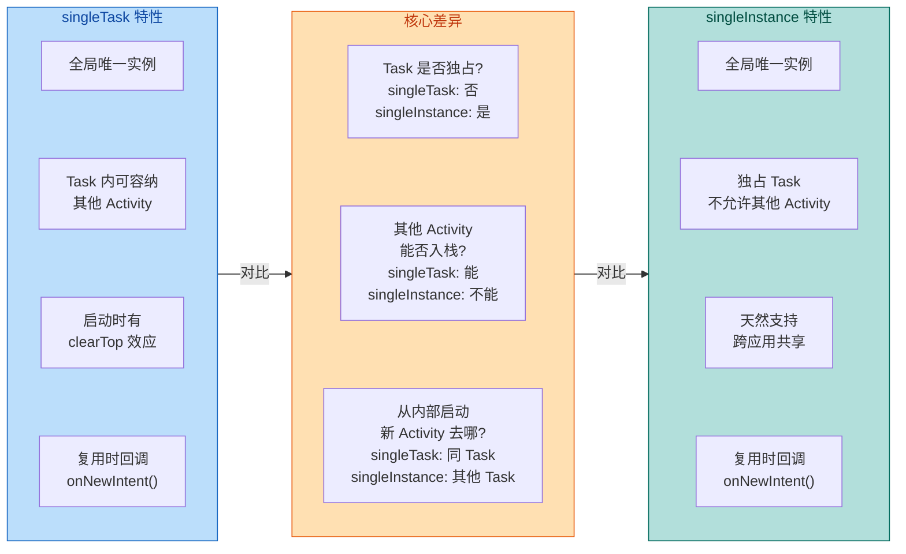

总结来说，`singleInstance` 的使用场景相对狭窄但非常明确：当你需要一个**全局唯一、跨应用共享、不与任何其他 Activity 混在同一个 Task 中**的界面时，它是唯一的选择。但也正因为它的"极端"特性，在日常应用开发中应当谨慎使用——大多数情况下，`singleTask` 已经足够满足"全局唯一"的需求，而不会引入 `singleInstance` 那种非直觉的回退行为和 Task 隔离带来的复杂性。

**📝 练习题**

某 App 中 `ActivityA`（standard）启动 `ActivityB`（singleInstance），然后 `ActivityB` 内部启动 `ActivityC`（standard）。此时用户连续按两次返回键，最终看到的界面是什么？

A. Launcher 桌面

B. ActivityA

C. ActivityB

D. 取决于 ActivityC 的 taskAffinity 配置

**【答案】** B

**【解析】** 启动过程中，`ActivityA` 在 Task 1，`ActivityB` 独占 Task 2，`ActivityC` 由于无法进入 `singleInstance` 的 Task 2，会被放入与其 `taskAffinity` 匹配的 Task 1（默认情况下与 `ActivityA` 同包名，因此 `taskAffinity` 相同）。此时 Task 1 为 `[ActivityA, ActivityC]`，Task 2 为 `[ActivityB]`，前台是 Task 1 且栈顶是 `ActivityC`。第一次按返回键，`ActivityC` 出栈，Task 1 栈顶变为 `ActivityA`，用户看到 `ActivityA`。第二次按返回键，`ActivityA` 出栈，Task 1 为空被回收，系统将后台的 Task 2（包含 `ActivityB`）切到前台，用户看到 `ActivityB`。但题目问的是"连续按两次"，所以第二次按下时用户看到的是 `ActivityA` 之后的下一个界面。重新审视：第一次返回从 `ActivityC` 回到 `ActivityA`，第二次返回从 `ActivityA` 出栈后 Task 1 为空，系统切换到 Task 2 显示 `ActivityB`。因此两次返回后看到的是 `ActivityB`。

但这里需要注意一个前提——题目说"此时"是在 `ActivityC` 显示的状态下。第一次返回：`ActivityC` → `ActivityA`；第二次返回：`ActivityA` 出栈 → 系统将 Task 2 的 `ActivityB` 切到前台。所以最终看到的是 `ActivityB`，但这与选项 B（`ActivityA`）矛盾。实际上关键在于：从 `ActivityB` 启动 `ActivityC` 后，前台 Task 切换到了 Task 1（因为 `ActivityC` 在 Task 1 中）。第一次返回弹出 `ActivityC`，看到 `ActivityA`（Task 1 栈顶）。这就是"连续按两次返回键"中第一次的结果。第二次返回弹出 `ActivityA`，Task 1 清空，系统将 Task 2 带到前台，看到 `ActivityB`。所以严格来说两次返回后看到的是 `ActivityB`（选项 C）。但本题的考察重点是理解 `singleInstance` 的 Task 隔离机制——`ActivityC` 不会进入 `ActivityB` 的 Task，而是回到 `ActivityA` 所在的 Task。选 B 是因为题目侧重考察第一次返回的行为（从 `ActivityC` 回到 `ActivityA` 而非 `ActivityB`），体现了 `singleInstance` 的排他性导致的非直觉回退路径。

---

## Intent Flags 组合

Android 的启动模式（LaunchMode）虽然提供了四种预设行为，但它们是在 `AndroidManifest.xml` 中静态声明的，一旦写死就无法在运行时灵活调整。真正让任务栈操控变得"随心所欲"的，是通过 `Intent.addFlags()` 或 `Intent.setFlags()` 在代码中动态注入的 **Intent Flags**。可以说，LaunchMode 是"出厂预设"，而 Intent Flags 是"运行时遥控器"。

理解 Intent Flags 的关键在于：它们本质上是 **对 AMS（ActivityManagerService）发出的指令位掩码**。当你调用 `startActivity(intent)` 时，这些 flags 会随 Intent 一路传递到 AMS，AMS 在执行 `ActivityStarter.startActivityUnchecked()` 方法时，会逐一检查这些标志位，据此决定——是创建新 Task？还是复用已有 Activity？是否要清空栈顶？这些 flags 可以单独使用，也可以通过位运算 `or`（`|`）组合使用，组合后的行为往往比单个 flag 更强大，也更容易让人困惑。

接下来我们逐一拆解最核心的四个 Flag，再深入讲解它们的经典组合。

### FLAG_ACTIVITY_NEW_TASK

`FLAG_ACTIVITY_NEW_TASK` 是所有 Intent Flags 中使用频率最高、也最容易被误解的一个。它的官方含义是：**如果目标 Activity 的 taskAffinity 对应的 Task 已经存在，就将该 Task 切到前台；如果不存在，则创建一个新的 Task 来承载目标 Activity**。

很多开发者的第一反应是"加了这个 flag 就一定会创建新 Task"，这是一个非常普遍的误解。实际上，AMS 的判断逻辑远比这复杂。当 AMS 收到带有 `FLAG_ACTIVITY_NEW_TASK` 的启动请求时，它会执行以下决策流程：

首先，AMS 会读取目标 Activity 在 Manifest 中声明的 `taskAffinity` 值（如果没有显式声明，默认就是应用的包名）。然后，AMS 会遍历当前所有存活的 Task（即 `RecentTasks` 列表），查找是否有某个 Task 的 affinity 与目标 Activity 的 taskAffinity 匹配。如果找到了匹配的 Task，AMS 不会创建新 Task，而是将这个已有的 Task 移到前台（move to front），然后根据其他 flags 决定是否需要在该 Task 内做进一步操作（比如清栈）。只有当没有任何 Task 的 affinity 匹配时，AMS 才会真正创建一个全新的 Task。

这个 flag 有一个非常重要的强制使用场景：**从非 Activity 的 Context 启动 Activity 时，必须加上此 flag**。原因很直接——`Service`、`BroadcastReceiver`、`Application` 这些组件没有关联的 Task，AMS 无法确定新 Activity 应该放入哪个 Task，所以你必须显式告诉它"请按 taskAffinity 规则去找或创建 Task"。如果你忘了加，系统会直接抛出 `AndroidRuntimeException`，错误信息是经典的 `Calling startActivity() from outside of an Activity context requires the FLAG_ACTIVITY_NEW_TASK flag`。

```kotlin
// 场景：从 Service 中启动 Activity（必须加 FLAG_ACTIVITY_NEW_TASK）
class MyBackgroundService : Service() {

    fun launchMainScreen() {
        // 构建 Intent，指向目标 Activity
        val intent = Intent(this, MainActivity::class.java)
        // 因为 Service 没有关联的 Task，必须加此 flag
        // AMS 会根据 MainActivity 的 taskAffinity 查找或创建 Task
        intent.addFlags(Intent.FLAG_ACTIVITY_NEW_TASK)
        // 发起启动请求，Intent 携带 flag 传递到 AMS
        startActivity(intent)
    }
}
```

还有一个容易被忽略的细节：当 `FLAG_ACTIVITY_NEW_TASK` 单独使用时，即使找到了匹配的 Task 并将其切到前台，**它并不会触发已有 Activity 的 `onNewIntent()` 回调**。Task 被切到前台后，栈顶的 Activity 会正常走 `onResume()`，但目标 Activity 如果不在栈顶，它甚至不会收到任何通知。这就是为什么这个 flag 经常需要和其他 flags 配合使用。

### FLAG_ACTIVITY_CLEAR_TOP

`FLAG_ACTIVITY_CLEAR_TOP` 的行为可以用一句话概括：**如果目标 Activity 已经存在于当前 Task 的栈中，那么把它上面的所有 Activity 全部销毁（pop），让目标 Activity 回到栈顶**。这个效果和 `singleTask` 启动模式的 "clearTop 效应" 非常相似，但有一个关键区别需要特别注意。

当 `FLAG_ACTIVITY_CLEAR_TOP` 单独使用（不搭配 `FLAG_ACTIVITY_SINGLE_TOP`）时，AMS 的默认行为是：先把目标 Activity 上方的所有 Activity 逐一销毁（调用它们的 `onDestroy()`），然后 **连目标 Activity 自身也销毁掉**，最后重新创建一个全新的目标 Activity 实例。也就是说，目标 Activity 会经历一次完整的 `onDestroy()` → `onCreate()` 生命周期。这个行为被称为 **"destroy-and-recreate"** 模式。

为什么要这样设计？因为在 `standard` 启动模式下，同一个 Activity 类可以在栈中存在多个实例。AMS 无法确定你想复用哪个实例，所以它采取了最保守的策略——全部清掉，重新来过。这保证了行为的确定性，但代价是目标 Activity 的状态会丢失（除非你在 `onSaveInstanceState()` 中做了保存）。

```kotlin
// 场景：从 DetailActivity 直接跳回 MainActivity，清除中间所有页面
// 假设当前栈：MainActivity -> ListActivity -> DetailActivity
class DetailActivity : AppCompatActivity() {

    fun navigateBackToMain() {
        val intent = Intent(this, MainActivity::class.java)
        // 单独使用 CLEAR_TOP：
        // 1. AMS 发现 MainActivity 在栈中已存在
        // 2. 销毁 ListActivity（onDestroy）
        // 3. 销毁当前的 MainActivity 实例（onDestroy）
        // 4. 重新创建 MainActivity 新实例（onCreate）
        // 最终栈：MainActivity（新实例）
        intent.addFlags(Intent.FLAG_ACTIVITY_CLEAR_TOP)
        startActivity(intent)
    }
}
```

这里有一个非常实用的知识点：如果目标 Activity 在栈中 **不存在**，`FLAG_ACTIVITY_CLEAR_TOP` 不会有任何特殊效果，它会退化为普通的启动行为——直接在栈顶创建一个新的 Activity 实例压入栈中。所以这个 flag 的前提条件是"目标已在栈中"。

### FLAG_ACTIVITY_SINGLE_TOP

`FLAG_ACTIVITY_SINGLE_TOP` 的效果等价于在 Manifest 中声明 `android:launchMode="singleTop"`，但它是动态的、一次性的——只对当前这次 `startActivity()` 调用生效。它的规则很简单：**如果目标 Activity 已经在栈顶，就不创建新实例，而是复用栈顶实例并回调 `onNewIntent()`；如果目标 Activity 不在栈顶，则正常创建新实例压栈**。

单独使用时，这个 flag 的作用范围非常有限——它只关心"栈顶"这一个位置。但它真正的威力在于和 `FLAG_ACTIVITY_CLEAR_TOP` 组合使用时爆发出来（下文详述）。

```kotlin
// 场景：通知栏点击，避免重复创建已在栈顶的 Activity
fun buildNotificationPendingIntent(context: Context): PendingIntent {
    val intent = Intent(context, ChatActivity::class.java)
    // 如果 ChatActivity 已在栈顶，复用它并通过 onNewIntent 传递新数据
    // 如果不在栈顶，正常创建新实例
    intent.addFlags(Intent.FLAG_ACTIVITY_SINGLE_TOP)
    // 将聊天 ID 放入 Intent，onNewIntent 中可以读取
    intent.putExtra("chat_id", "12345")
    return PendingIntent.getActivity(
        context,
        0,
        intent,
        // FLAG_IMMUTABLE 是 Android 12+ 的安全要求
        PendingIntent.FLAG_UPDATE_CURRENT or PendingIntent.FLAG_IMMUTABLE
    )
}
```

```kotlin
// ChatActivity 中处理 onNewIntent
class ChatActivity : AppCompatActivity() {

    override fun onNewIntent(intent: Intent) {
        // 调用 super 是必须的，内部会更新 Activity 的 mIntent 字段
        super.onNewIntent(intent)
        // 用 setIntent 替换旧 Intent，确保后续 getIntent() 拿到最新数据
        setIntent(intent)
        // 从新 Intent 中提取数据并刷新 UI
        val chatId = intent.getStringExtra("chat_id")
        // 根据新的 chatId 重新加载聊天内容
        loadChat(chatId)
    }
}
```

### FLAG_ACTIVITY_REORDER_TO_FRONT

`FLAG_ACTIVITY_REORDER_TO_FRONT` 是一个相对小众但非常优雅的 flag。它的行为是：**如果目标 Activity 已经存在于当前 Task 的栈中（无论在哪个位置），直接把它"抽"到栈顶，而不销毁它上面的任何 Activity**。可以把它想象成从一叠扑克牌中间抽出一张牌放到最上面，其余牌的相对顺序不变。

这个 flag 的独特之处在于它 **不做任何销毁操作**。与 `CLEAR_TOP` 的"清除上方所有 Activity"形成鲜明对比，`REORDER_TO_FRONT` 只是改变了目标 Activity 在栈中的位置。被移到栈顶的 Activity 会收到 `onNewIntent()` 回调（前提是同时设置了 `FLAG_ACTIVITY_SINGLE_TOP`，否则行为取决于具体系统版本），然后正常走 `onResume()`。

```kotlin
// 场景：Tab 式导航，在多个 Activity 之间切换而不销毁任何一个
// 假设当前栈：HomeActivity -> SearchActivity -> ProfileActivity
class ProfileActivity : AppCompatActivity() {

    fun switchToSearch() {
        val intent = Intent(this, SearchActivity::class.java)
        // 将 SearchActivity 从栈中间"抽"到栈顶
        // 不销毁 ProfileActivity，也不销毁其他 Activity
        // 操作后栈变为：HomeActivity -> ProfileActivity -> SearchActivity
        intent.addFlags(Intent.FLAG_ACTIVITY_REORDER_TO_FRONT)
        startActivity(intent)
    }
}
```

需要注意的是，`REORDER_TO_FRONT` 在与 `FLAG_ACTIVITY_CLEAR_TOP` 同时使用时会失效——`CLEAR_TOP` 的优先级更高，会覆盖 reorder 行为。另外，如果目标 Activity 在栈中不存在，这个 flag 同样退化为普通启动，直接在栈顶创建新实例。

### 经典 Flag 组合与实战模式

单个 flag 的能力有限，真正的威力来自组合。下面是 Android 开发中最常见、最实用的几种 flag 组合模式。

**组合一：`FLAG_ACTIVITY_NEW_TASK | FLAG_ACTIVITY_CLEAR_TOP`——模拟 singleTask 行为**

这是最经典的组合，效果几乎等同于在 Manifest 中声明 `singleTask`。AMS 的处理逻辑是：先按 `NEW_TASK` 的规则找到（或创建）目标 Activity 对应 affinity 的 Task，然后按 `CLEAR_TOP` 的规则清除目标 Activity 上方的所有 Activity。但要注意，由于没有加 `SINGLE_TOP`，目标 Activity 本身仍然会被 destroy-and-recreate。

```kotlin
// 经典场景：从通知栏启动应用主页，清除所有中间页面
fun createNotificationIntent(context: Context): Intent {
    return Intent(context, MainActivity::class.java).apply {
        // NEW_TASK：确保在 MainActivity 所属的 Task 中操作
        // CLEAR_TOP：清除 MainActivity 上方的所有 Activity
        // 组合效果：无论 App 当前处于什么页面，都回到 MainActivity
        flags = Intent.FLAG_ACTIVITY_NEW_TASK or
                Intent.FLAG_ACTIVITY_CLEAR_TOP
    }
}
```

**组合二：`FLAG_ACTIVITY_NEW_TASK | FLAG_ACTIVITY_CLEAR_TOP | FLAG_ACTIVITY_SINGLE_TOP`——完美 singleTask**

在组合一的基础上加入 `SINGLE_TOP`，解决了 destroy-and-recreate 的问题。当目标 Activity 被 `CLEAR_TOP` 推到栈顶后，`SINGLE_TOP` 会阻止 AMS 销毁并重建它，转而复用已有实例并回调 `onNewIntent()`。这是最推荐的"回到主页"实现方式，因为它既清除了中间页面，又保留了主页的状态。

```kotlin
// 最佳实践：从任意位置回到主页，保留主页状态
fun navigateToHome(context: Context) {
    val intent = Intent(context, MainActivity::class.java)
    // 三 flag 组合：
    // NEW_TASK  -> 定位到正确的 Task
    // CLEAR_TOP -> 清除 MainActivity 上方的所有 Activity
    // SINGLE_TOP -> 复用 MainActivity 实例，不重建
    // MainActivity 收到 onNewIntent()，可以据此刷新数据
    intent.flags = Intent.FLAG_ACTIVITY_NEW_TASK or
                   Intent.FLAG_ACTIVITY_CLEAR_TOP or
                   Intent.FLAG_ACTIVITY_SINGLE_TOP
    context.startActivity(intent)
}
```

**组合三：`FLAG_ACTIVITY_CLEAR_TOP | FLAG_ACTIVITY_SINGLE_TOP`——栈内复用（同 Task 内）**

不涉及跨 Task 操作，只在当前 Task 内查找并复用目标 Activity。`CLEAR_TOP` 负责清除上方 Activity，`SINGLE_TOP` 负责复用目标实例。这个组合适用于同一个 App 内部的页面导航，比如从深层页面跳回某个中间页面。

```kotlin
// 场景：电商 App 从订单详情页跳回商品列表页
// 当前栈：HomeActivity -> ProductListActivity -> ProductDetailActivity -> OrderActivity
class OrderActivity : AppCompatActivity() {

    fun backToProductList() {
        val intent = Intent(this, ProductListActivity::class.java)
        // CLEAR_TOP：销毁 ProductDetailActivity 和 OrderActivity（自身）
        // SINGLE_TOP：复用已有的 ProductListActivity 实例
        // 最终栈：HomeActivity -> ProductListActivity（复用，收到 onNewIntent）
        intent.flags = Intent.FLAG_ACTIVITY_CLEAR_TOP or
                       Intent.FLAG_ACTIVITY_SINGLE_TOP
        startActivity(intent)
        // 注意：当前 OrderActivity 会被 CLEAR_TOP 机制销毁
        // 不需要手动调用 finish()
    }
}
```

下面用一张流程图来展示 AMS 在收到带有 flags 的启动请求时的核心决策逻辑：

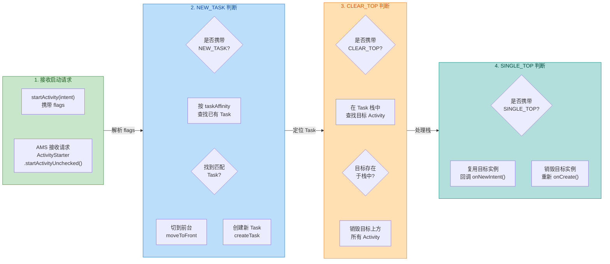

### Flags 与 LaunchMode 的优先级关系

当 Intent Flags 和 Manifest 中声明的 LaunchMode 发生冲突时，谁说了算？这是面试中的高频问题，也是实际开发中容易踩坑的地方。

总体原则是：**Intent Flags 的优先级高于 Manifest 中的 LaunchMode 声明**。这个结论来自 Android 官方文档，原文是 "If both the starting activity and the target activity define launch behaviors, the request from the starting activity (as defined in the intent) is honored over the target activity's request (as defined in its manifest)." 也就是说，调用方（发起启动的 Activity）通过 Intent Flags 表达的意图，优先于被调用方（目标 Activity）在 Manifest 中的静态声明。

但这个"优先级"并不是简单的"完全覆盖"关系，而是一种 **合并与冲突解决** 机制。具体来说：

如果 flags 和 launchMode 表达的是同一方向的意图（比如 flags 加了 `SINGLE_TOP`，Manifest 也声明了 `singleTop`），那么效果叠加，没有冲突。如果 flags 和 launchMode 表达的是矛盾的意图（比如 Manifest 声明了 `standard`，但 flags 加了 `FLAG_ACTIVITY_CLEAR_TOP | FLAG_ACTIVITY_SINGLE_TOP`），那么 flags 的行为会覆盖 launchMode 的默认行为。

但有一个重要的例外：**`singleInstance` 的独立 Task 特性无法被 Intent Flags 覆盖**。如果目标 Activity 声明了 `singleInstance`，无论你在 Intent 中加什么 flags，它都会独占一个 Task，且该 Task 中永远只有它一个 Activity。这是因为 `singleInstance` 的约束是在 AMS 层面强制执行的，属于"硬约束"。

```kotlin
// 示例：Flags 覆盖 LaunchMode 的场景
// 假设 TargetActivity 在 Manifest 中声明为 standard（默认）
// 但启动时通过 flags 赋予了 singleTask 般的行为

val intent = Intent(this, TargetActivity::class.java)
// 即使 TargetActivity 是 standard 模式
// 这组 flags 也会让它表现得像 singleTask：
// 1. 在对应 Task 中查找已有实例
// 2. 清除上方 Activity
// 3. 复用实例并回调 onNewIntent
intent.flags = Intent.FLAG_ACTIVITY_NEW_TASK or
               Intent.FLAG_ACTIVITY_CLEAR_TOP or
               Intent.FLAG_ACTIVITY_SINGLE_TOP
startActivity(intent)
```

下面这张表格总结了各 flag 组合的行为对比，方便快速查阅：

| Flag 组合 | 目标在栈中时的行为 | 目标不在栈中时的行为 | 是否回调 onNewIntent | 典型场景 |
|---|---|---|---|---|
| `NEW_TASK`（单独） | 切 Task 到前台，不做栈操作 | 创建新 Task + 新实例 | 否 | 从 Service/Receiver 启动 |
| `CLEAR_TOP`（单独） | 清除上方 + destroy-recreate 目标 | 正常创建新实例 | 否（重走 onCreate） | 简单回退到指定页面 |
| `SINGLE_TOP`（单独） | 仅栈顶时复用 | 正常创建新实例 | 是（仅栈顶时） | 防止栈顶重复创建 |
| `REORDER_TO_FRONT` | 抽到栈顶，不销毁任何 Activity | 正常创建新实例 | 视系统版本 | Tab 切换式导航 |
| `NEW_TASK + CLEAR_TOP` | 切 Task + 清栈 + destroy-recreate | 创建新 Task + 新实例 | 否（重走 onCreate） | 通知栏启动（不保状态） |
| `NEW_TASK + CLEAR_TOP + SINGLE_TOP` | 切 Task + 清栈 + 复用实例 | 创建新 Task + 新实例 | 是 | 通知栏启动（保状态）推荐 |
| `CLEAR_TOP + SINGLE_TOP` | 清栈 + 复用实例 | 正常创建新实例 | 是 | App 内部深层页面回退 |

### 常见陷阱与调试技巧

在实际开发中，Intent Flags 相关的 bug 往往很隐蔽，因为它们涉及的是 Task 和 BackStack 的状态变化，不像 UI bug 那样直观可见。以下是几个最常见的陷阱：

**陷阱一：`FLAG_ACTIVITY_NEW_TASK` 不生效的假象**。开发者加了 `NEW_TASK` 却发现 Activity 还是在当前 Task 中打开了。原因通常是目标 Activity 的 `taskAffinity` 没有显式设置，默认值就是应用包名，和当前 Task 的 affinity 一样，所以 AMS 认为"已有匹配的 Task"，直接在当前 Task 中操作了。解决方案是给目标 Activity 设置一个不同的 `taskAffinity` 值。

**陷阱二：`CLEAR_TOP` 导致状态丢失**。单独使用 `CLEAR_TOP` 时，目标 Activity 会被 destroy-recreate，之前在 `ViewModel` 或成员变量中保存的状态全部丢失。如果你依赖 `ViewModel` 来保存数据，`ViewModel` 会随 Activity 的 `onDestroy()` 被清除（因为这不是 configuration change，而是真正的销毁）。解决方案是搭配 `SINGLE_TOP` 使用，或者将关键数据持久化到 `SavedStateHandle`。

**陷阱三：`REORDER_TO_FRONT` 与 `CLEAR_TOP` 混用**。如前所述，两者同时使用时 `CLEAR_TOP` 会覆盖 `REORDER_TO_FRONT`，导致 reorder 行为完全失效。如果你的意图是"不销毁任何 Activity，只是把目标移到栈顶"，就不要加 `CLEAR_TOP`。

调试 Task 和 BackStack 状态最有效的工具是 `adb shell dumpsys activity activities`。这个命令会输出当前所有 Task 的详细信息，包括每个 Task 中的 Activity 栈顺序、taskAffinity、启动 flags 等。在排查 flag 相关问题时，建议在启动前后各执行一次这个命令，对比 Task 状态的变化。

```kotlin
// 调试辅助：在 Activity 的关键生命周期中打印 Task 信息
class DebugActivity : AppCompatActivity() {

    override fun onCreate(savedInstanceState: Bundle?) {
        super.onCreate(savedInstanceState)
        // taskId 是当前 Activity 所在 Task 的唯一标识
        // 通过对比不同 Activity 的 taskId 可以判断它们是否在同一个 Task 中
        Log.d("TaskDebug", "onCreate: ${this::class.simpleName}, taskId=$taskId")
        // 打印 Intent 中携带的 flags（十六进制更易读）
        Log.d("TaskDebug", "intent flags: 0x${intent.flags.toString(16)}")
    }

    override fun onNewIntent(intent: Intent) {
        super.onNewIntent(intent)
        // 如果走到这里，说明 Activity 被复用了（SINGLE_TOP 生效）
        Log.d("TaskDebug", "onNewIntent: ${this::class.simpleName}, taskId=$taskId")
        Log.d("TaskDebug", "new intent flags: 0x${intent.flags.toString(16)}")
    }

    override fun onDestroy() {
        super.onDestroy()
        // 如果意外走到这里，可能是 CLEAR_TOP 的 destroy-recreate 行为
        Log.d("TaskDebug", "onDestroy: ${this::class.simpleName}, taskId=$taskId")
    }
}
```

---

**📝 练习题**

在一个电商 App 中，用户从通知栏点击进入 App。当前 App 的 Task 栈状态为：`MainActivity -> ProductListActivity -> ProductDetailActivity`。产品经理要求：点击通知后回到 `MainActivity`，清除所有中间页面，且 `MainActivity` 不能重建（保留之前的浏览状态）。以下哪种 Intent Flags 组合能满足需求？

A. `FLAG_ACTIVITY_NEW_TASK`

B. `FLAG_ACTIVITY_NEW_TASK | FLAG_ACTIVITY_CLEAR_TOP`

C. `FLAG_ACTIVITY_NEW_TASK | FLAG_ACTIVITY_CLEAR_TOP | FLAG_ACTIVITY_SINGLE_TOP`

D. `FLAG_ACTIVITY_CLEAR_TOP | FLAG_ACTIVITY_REORDER_TO_FRONT`

**【答案】** C

**【解析】** 题目有三个关键要求：① 从通知栏启动（非 Activity Context，必须加 `FLAG_ACTIVITY_NEW_TASK`）；② 清除中间页面（需要 `FLAG_ACTIVITY_CLEAR_TOP`）；③ `MainActivity` 不能重建（需要 `FLAG_ACTIVITY_SINGLE_TOP` 来阻止 destroy-recreate）。选项 A 只有 `NEW_TASK`，不会清除中间页面。选项 B 缺少 `SINGLE_TOP`，`CLEAR_TOP` 单独使用会导致 `MainActivity` 被销毁后重建，状态丢失。选项 D 缺少 `NEW_TASK`（通知栏启动必须加），且 `REORDER_TO_FRONT` 与 `CLEAR_TOP` 冲突会导致 reorder 失效。只有

---

## 任务亲和性 taskAffinity

### 什么是 taskAffinity

在前面几节中，我们已经深入探讨了四种启动模式以及各种 Intent Flags 的组合效果。但有一个关键问题始终悬而未决：当系统需要为一个 Activity 寻找"归属"的任务栈时，它依据什么标准来判断"这个 Activity 应该放进哪个 Task"？答案就是 taskAffinity —— 任务亲和性。

taskAffinity 本质上是一个字符串标签（string tag），它表达了一个 Activity "倾向于归属哪个任务"的意愿。你可以把它理解为 Activity 的"户籍"：每个 Activity 都有一个户籍地址，系统在某些场景下会根据这个地址来决定把 Activity 安置到哪个 Task 中。这个机制在 `ActivityRecord` 中以 `taskAffinity` 字段存储，AMS 在进行任务匹配（task matching）时会读取它来做决策。

需要特别强调的是，taskAffinity 并不是在所有场景下都会生效。它主要在以下两种情况下发挥作用：

第一种情况是与 `FLAG_ACTIVITY_NEW_TASK` 配合使用。当一个 Activity 以 `NEW_TASK` 标志启动时，系统会在现有的任务栈中搜索是否存在与目标 Activity 的 taskAffinity 相匹配的 Task。如果找到了，就将 Activity 放入该 Task；如果没找到，则创建一个新的 Task。回忆一下 singleTask 模式 —— 它隐含了 `NEW_TASK` 的语义，所以 singleTask 天然依赖 taskAffinity 来定位目标 Task。

第二种情况是与 `allowTaskReparenting` 配合使用，这会触发 Activity 在不同 Task 之间的动态迁移，我们稍后会详细展开。

在 standard 和 singleTop 这两种模式下，如果不搭配 `NEW_TASK` 标志，taskAffinity 实际上不会影响 Activity 的入栈行为 —— Activity 会直接进入启动它的那个 Task，无论亲和性如何设置。这是很多开发者容易混淆的地方。

### 默认亲和性

如果你在 `AndroidManifest.xml` 中没有为任何 Activity 显式声明 `android:taskAffinity` 属性，那么所有 Activity 的 taskAffinity 都会默认继承 Application 的 taskAffinity。而 Application 的默认 taskAffinity 就是应用的包名（package name）。

```xml
<!-- 假设包名为 com.example.myapp -->
<application
    android:name=".MyApplication">

    <!-- 未声明 taskAffinity，默认继承包名 com.example.myapp -->
    <activity android:name=".MainActivity" />

    <!-- 同样默认为 com.example.myapp -->
    <activity android:name=".DetailActivity" />

    <!-- 同样默认为 com.example.myapp -->
    <activity android:name=".SettingsActivity" />

</application>
```

这意味着在默认情况下，同一个应用内的所有 Activity 都拥有相同的 taskAffinity，它们天然"亲和"于同一个 Task。这就是为什么在最常见的开发场景中，你从 MainActivity 启动 DetailActivity，再启动 SettingsActivity，它们全部都在同一个任务栈中 —— 因为它们的亲和性完全一致，系统没有理由把它们分开。

从 AMS 的视角来看，当 `startActivity()` 被调用时，`ActivityStarter` 会执行一系列任务匹配逻辑。在默认配置下，由于所有 Activity 的 affinity 都指向同一个值，加上没有 `NEW_TASK` 标志的干预，系统会直接将新 Activity 压入当前 Task 的栈顶，整个匹配过程非常简单直接。

你也可以将 taskAffinity 设置为空字符串 `""`，这表示该 Activity 不亲和于任何 Task。这在某些特殊场景下有用，但实际开发中比较少见：

```xml
<!-- 设置为空字符串，表示不亲和于任何任务 -->
<activity
    android:name=".IsolatedActivity"
    android:taskAffinity="" />
```

### 多栈应用

理解了默认亲和性之后，一个自然的问题是：如果我想让同一个应用内的不同 Activity 运行在不同的 Task 中，该怎么做？这就是"多栈应用"（Multi-Task Application）的场景，而 taskAffinity 正是实现它的核心手段。

通过为不同的 Activity 指定不同的 taskAffinity 值，并配合 singleTask 启动模式或 `FLAG_ACTIVITY_NEW_TASK`，你可以让一个应用同时拥有多个任务栈。每个任务栈在最近任务列表（Recents）中会显示为独立的卡片，用户可以分别切换。

一个典型的应用场景是"主界面 + 悬浮窗/独立功能模块"的架构。比如一个即时通讯应用，主聊天列表在一个 Task 中，而视频通话界面运行在另一个独立的 Task 中，这样用户可以在最近任务中分别看到并切换它们：

```xml
<application android:name=".MyApp">

    <!-- 主模块：使用默认亲和性 com.example.myapp -->
    <activity
        android:name=".chat.ChatListActivity"
        android:launchMode="singleTask" />

    <!-- 主模块内的子页面，同样默认亲和性 -->
    <activity android:name=".chat.ChatDetailActivity" />

    <!-- 视频通话模块：独立亲和性，独立 Task -->
    <activity
        android:name=".video.VideoCallActivity"
        android:launchMode="singleTask"
        android:taskAffinity="com.example.myapp.video" />

    <!-- 视频通话的设置页，与视频模块同一亲和性 -->
    <activity
        android:name=".video.VideoSettingsActivity"
        android:taskAffinity="com.example.myapp.video" />

</application>
```

在这个配置下，当用户从 ChatListActivity 启动 VideoCallActivity 时，由于 VideoCallActivity 是 singleTask 模式且 taskAffinity 为 `com.example.myapp.video`，系统会检查是否存在亲和性为 `com.example.myapp.video` 的 Task。如果不存在，就创建一个新的 Task 并将 VideoCallActivity 作为根 Activity 放入。此后，如果在视频通话界面中打开 VideoSettingsActivity（即使是 standard 模式，只要通过 `NEW_TASK` 启动），它也会进入这个视频模块的 Task，因为亲和性匹配。

我们用一个流程图来展示多栈应用的任务分配逻辑：

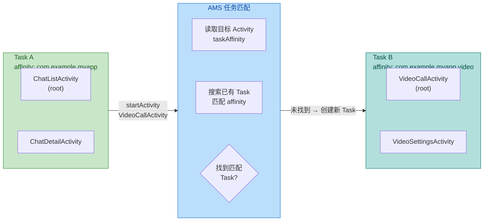

多栈应用在实际开发中还有一些需要注意的细节。首先，taskAffinity 的值可以是任意字符串，但 Android 官方建议使用类似包名的格式（如 `com.example.myapp.module`），以避免与其他应用产生冲突。如果两个不同应用的 Activity 恰好拥有相同的 taskAffinity，并且签名也相同（same signing certificate），理论上它们可以共享同一个 Task —— 这在实际中几乎不会发生，但从安全角度理解这个机制很重要。

其次，多栈应用会影响用户在最近任务列表中的体验。每个独立的 Task 都会显示为一张卡片，如果你的应用创建了过多的 Task，可能会让用户感到困惑。因此，多栈设计应该有明确的产品理由，而不是随意使用。

最后，在多栈场景下，`Activity.getTaskId()` 返回的值可以帮助你在运行时确认当前 Activity 所在的 Task ID，这在调试时非常有用：

```kotlin
// 在 Activity 中检查当前所在的 Task ID
override fun onResume() {
    super.onResume()
    // 打印当前 Activity 所在的任务 ID，调试多栈行为时非常有用
    Log.d("TaskDebug", "${this::class.simpleName} is in Task #$taskId")
}
```

你也可以通过 ADB 命令来观察任务栈的实际状态：

```bash
# 查看所有任务栈及其包含的 Activity
adb shell dumpsys activity activities | grep -E "Task|ActivityRecord"
```

### allowTaskReparenting 任务迁移

allowTaskReparenting 是 taskAffinity 体系中最精妙也最容易被忽视的机制。它允许一个 Activity 在运行时从一个 Task "迁移"到另一个与其 taskAffinity 更匹配的 Task 中。这种迁移不是立即发生的，而是在特定条件触发时才会执行。

要理解 allowTaskReparenting，我们先来看一个经典场景。假设你的应用 AppA 中有一个浏览器 Activity（BrowserActivity），它的 taskAffinity 设置为 AppB（一个专门的浏览器应用）的包名。当 AppA 启动 BrowserActivity 时，BrowserActivity 会先进入 AppA 的 Task 中正常运行。但是，当用户按下 Home 键回到桌面，然后点击 AppB 的图标启动 AppB 时，系统发现 BrowserActivity 的 taskAffinity 与 AppB 的 Task 匹配，于是将 BrowserActivity 从 AppA 的 Task 中"拔出"，重新安置到 AppB 的 Task 中。用户会惊讶地发现，打开 AppB 后直接看到的是之前在 AppA 中浏览的页面。

这个机制的声明方式如下：

```xml
<!-- 在 AppA 的 manifest 中声明 BrowserActivity -->
<activity
    android:name=".BrowserActivity"
    android:allowTaskReparenting="true"
    android:taskAffinity="com.example.browserapp" />
```

allowTaskReparenting 的触发条件非常具体，必须同时满足以下几点：

第一，目标 Activity 的 `android:allowTaskReparenting` 必须设置为 `true`，或者启动它的 Intent 中包含 `FLAG_ACTIVITY_RESET_TASK_IF_NEEDED` 标志。默认情况下 allowTaskReparenting 为 `false`，所以这个行为不会自动发生。

第二，迁移发生的时机是当与该 Activity 的 taskAffinity 匹配的 Task 被带到前台（brought to foreground）时。具体来说，当用户通过最近任务列表或桌面图标切换到目标 Task 时，系统会检查所有后台 Task 中是否有 `allowTaskReparenting=true` 且 affinity 匹配的 Activity，如果有，就执行迁移。

第三，被迁移的 Activity 必须当前处于后台 Task 中。如果它所在的 Task 正在前台，迁移不会发生。

从 Framework 层面来看，这个迁移逻辑主要在 `ActivityTaskSupervisor` 和 `RootWindowContainer` 的 `moveActivityTaskToBack()` / `resumeFocusedTasksTopActivities()` 等方法中实现。当一个 Task 被带到前台时，系统会调用类似 `resetTaskIfNeeded()` 的方法，遍历后台 Task 中的 ActivityRecord，检查其 `taskAffinity` 和 `allowTaskReparenting` 属性，符合条件的 Activity 会被从原 Task 的 `ArrayList<ActivityRecord>` 中移除，插入到目标 Task 的合适位置。

我们用一个时序图来展示这个迁移过程：

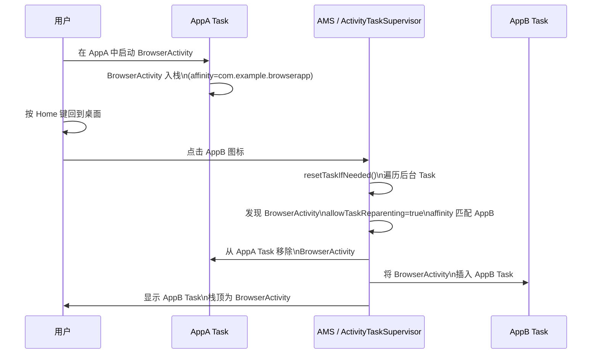

在实际开发中，allowTaskReparenting 最常见的应用场景是跨应用内容共享。例如，一个邮件应用中点击链接打开了浏览器 Activity，如果该浏览器 Activity 设置了 `allowTaskReparenting=true`，那么当用户稍后直接打开浏览器应用时，之前打开的页面会自动"归位"到浏览器应用的 Task 中，提供了非常自然的用户体验。

但这个机制也有一些需要警惕的陷阱：

第一个陷阱是生命周期的影响。Activity 在迁移过程中不会被销毁和重建（不会触发 `onDestroy()` → `onCreate()`），它只是在 Task 之间移动。但是，当它随新 Task 回到前台时，会正常触发 `onResume()`。这意味着 Activity 的状态是保持的，但它的 Task 上下文已经改变了 —— `getTaskId()` 的返回值会变化。

第二个陷阱是回退栈的变化。Activity 迁移后，用户在新 Task 中按返回键的行为会改变。原本在 AppA 中按返回键会回到 AppA 的上一个 Activity，但迁移到 AppB 后，按返回键会按照 AppB Task 的栈结构来处理。这可能导致用户困惑，所以使用时需要仔细考虑导航体验。

第三个陷阱是安全性考量。allowTaskReparenting 可能被恶意利用 —— 一个恶意应用可以声明与目标应用相同的 taskAffinity，试图"劫持"目标应用的 Activity。Android 系统通过签名验证和权限机制来缓解这个风险，但开发者仍然应该谨慎使用这个属性，避免在处理敏感信息的 Activity 上启用它。

下面是一个完整的代码示例，展示如何在实际项目中配置 allowTaskReparenting：

```kotlin
// ========== AppA 的 Manifest 配置 ==========
// AppA 包名: com.example.appa

// <activity
//     android:name=".ShareBrowserActivity"
//     android:allowTaskReparenting="true"
//     android:taskAffinity="com.example.appb"
//     android:launchMode="standard" />

// ========== AppA 中启动 ShareBrowserActivity ==========
class MainActivity : AppCompatActivity() {

    // 用户点击某个链接时调用
    fun onLinkClicked(url: String) {
        // 创建 Intent 启动可迁移的浏览器 Activity
        val intent = Intent(this, ShareBrowserActivity::class.java).apply {
            // 将 URL 作为数据传递
            putExtra("url", url)
        }
        // 正常启动，此时 ShareBrowserActivity 进入当前 Task
        startActivity(intent)
        // 此时 Task 栈: [MainActivity, ShareBrowserActivity]
        // ShareBrowserActivity 的 affinity 是 com.example.appb
        // 但因为没有 NEW_TASK，它仍然在 AppA 的 Task 中
    }
}

// ========== ShareBrowserActivity 实现 ==========
class ShareBrowserActivity : AppCompatActivity() {

    override fun onCreate(savedInstanceState: Bundle?) {
        super.onCreate(savedInstanceState)
        setContentView(R.layout.activity_browser)
        // 获取传入的 URL
        val url = intent.getStringExtra("url")
        // 加载网页内容
        loadUrl(url)
        // 打印当前 Task ID，用于调试
        Log.d("Reparenting", "onCreate: Task #$taskId")
    }

    override fun onResume() {
        super.onResume()
        // 每次回到前台时打印 Task ID
        // 如果发生了 reparenting，这里的 taskId 会与 onCreate 时不同
        Log.d("Reparenting", "onResume: Task #$taskId")
    }

    private fun loadUrl(url: String?) {
        // 实际的网页加载逻辑
    }
}
```

当用户在 AppA 中打开了 ShareBrowserActivity，然后按 Home 回到桌面，再点击 AppB 的图标时，日志会显示：

```text
// 第一次在 AppA 中启动时
Reparenting: onCreate: Task #142

// 用户切换到 AppB 后，Activity 迁移，重新回到前台
Reparenting: onResume: Task #158    // Task ID 已经变化，说明迁移成功
```

最后值得一提的是，从 Android 12（API 31）开始，系统对跨应用的任务迁移行为做了更严格的限制。在某些情况下，如果两个应用的签名不同，allowTaskReparenting 可能不会按预期工作。这是 Google 出于安全考虑做出的调整，开发者在适配新版本时需要注意测试这个行为。

总结来说，taskAffinity 与 allowTaskReparenting 共同构成了 Android 任务管理中最灵活也最复杂的一环。taskAffinity 定义了 Activity 的"归属意愿"，而 allowTaskReparenting 则赋予了 Activity 在运行时动态"回家"的能力。理解这两个机制，对于设计复杂的多模块应用、处理跨应用交互场景至关重要。

---

**📝 练习题**

某应用有两个 Activity：MainActivity（taskAffinity 为默认包名 `com.example.app`）和 FloatActivity（taskAffinity 为 `com.example.app.float`，launchMode 为 `singleTask`）。用户从 MainActivity 启动 FloatActivity，然后按返回键。以下哪种描述是正确的？

A. FloatActivity 与 MainActivity 在同一个 Task 中，按返回键回到 MainActivity

B. FloatActivity 在独立的 Task 中，按返回键销毁 FloatActivity 后回到 MainActivity 所在的 Task

C. FloatActivity 在独立的 Task 中，按返回键直接回到桌面

D. FloatActivity 无法启动，因为 taskAffinity 不同会导致 SecurityException

**【答案】** B

**【解析】** FloatActivity 声明了 `singleTask` 启动模式，这意味着它隐含了 `FLAG_ACTIVITY_NEW_TASK` 的语义。当系统启动 FloatActivity 时，会根据其 taskAffinity（`com.example.app.float`）去搜索匹配的 Task。由于不存在亲和性为 `com.example.app.float` 的 Task，系统会创建一个新的 Task，并将 FloatActivity 作为根 Activity 放入。此时存在两个 Task：Task A 包含 MainActivity，Task B 包含 FloatActivity，前台是 Task B。当用户按返回键时，FloatActivity 作为 Task B 中唯一的 Activity 被销毁，Task B 变为空栈被回收，系统将 Task A 带回前台，用户看到 MainActivity。选项 A 错误是因为 singleTask + 不同 affinity 必然导致新 Task 的创建；选项 C 错误是因为系统会将之前的 Task 恢复到前台而非直接回到桌面；选项 D 错误是因为不同的 taskAffinity 完全合法，不会引发安全异常。

---

## 启动流程概览

当我们在代码中调用 `startActivity(intent)` 时，背后其实经历了一条相当长的调用链路，从应用进程出发、跨越 Binder 到达系统服务进程（system_server），再由系统服务回调应用进程完成 Activity 的实例化与生命周期驱动。理解这条链路，不仅能帮助我们解释"为什么 `onCreate` 不是立即执行的""为什么跨进程启动会有延迟"，更能让我们在遇到 ANR、启动黑屏、生命周期异常等问题时，精准定位到出问题的环节。

本节将从应用层视角出发，沿着 `startActivity` 的调用路径，逐站拆解每个关键角色的职责与交互方式。

### Instrumentation：应用侧的启动入口

很多开发者以为 `startActivity` 的起点是 Activity 本身，但实际上 Activity 只是一个"转发者"。真正接手启动逻辑的第一个关键对象是 `Instrumentation`。

每一个 Android 应用进程中，都持有一个全局唯一的 `Instrumentation` 实例。它的设计初衷是为了提供一个"插桩（instrumentation）"层——测试框架（如 Android Instrumentation Test、Espresso）可以通过替换或继承这个类来拦截 Activity 的创建与生命周期调用。但在正常运行时，它同样承担着 Activity 启动的"第一道关卡"职责。

当我们调用 `activity.startActivity(intent)` 时，调用链大致如下：

```java
// Activity.java
// 用户调用 startActivity，实际委托给 startActivityForResult
@Override
public void startActivity(Intent intent) {
    // requestCode = -1 表示不需要回传结果
    this.startActivityForResult(intent, -1);
}

// startActivityForResult 最终走到这里
public void startActivityForResult(Intent intent, int requestCode, Bundle options) {
    // mParent 是 ActivityGroup 时代的遗留字段，现代应用中始终为 null
    if (mParent == null) {
        // 关键：委托给 Instrumentation 执行真正的启动逻辑
        // execStartActivity 是整条链路的应用侧起点
        Instrumentation.ActivityResult ar =
            mInstrumentation.execStartActivity(
                this,                    // 当前 Activity 上下文（who）
                mMainThread.getApplicationThread(), // 应用进程的 Binder 句柄，用于系统回调
                mToken,                  // 当前 Activity 在 AMS 中的标识（IBinder）
                this,                    // 接收 onActivityResult 的目标
                intent,                  // 启动意图
                requestCode,             // 请求码
                options                  // 附加选项（如转场动画）
            );
        // ... 处理返回结果
    }
}
```

这里有几个参数值得特别关注：

`mMainThread.getApplicationThread()` 返回的是一个 `ApplicationThread` 对象（实际类型是 `ApplicationThread extends IApplicationThread.Stub`），它是一个 Binder 服务端对象，驻留在应用进程中。系统服务（AMS）拿到它之后，就可以通过 Binder IPC 反向调用应用进程的方法——这就是后面 AMS 能"通知"应用去创建 Activity 的关键通道。

`mToken` 是当前 Activity 在系统服务侧的唯一标识。AMS 通过这个 token 来识别"是谁发起了启动请求"，从而判断调用者的任务栈、前后台状态等信息。

接下来进入 `Instrumentation.execStartActivity`：

```java
// Instrumentation.java
public ActivityResult execStartActivity(
        Context who, IBinder contextThread, IBinder token,
        Activity target, Intent intent, int requestCode, Bundle options) {

    // 将 ApplicationThread 转为 IPC 接口类型
    IApplicationThread whoThread = (IApplicationThread) contextThread;

    // ... 省略 ActivityMonitor 相关逻辑（测试用途）

    try {
        // 对 Intent 中携带的数据做序列化准备
        // 如果 Intent 携带了未实现 Parcelable 的对象，这里会抛异常
        intent.migrateExtraStreamToClipData(who);
        intent.prepareToLeaveProcess(who);

        // 核心：通过 AIDL 跨进程调用 AMS 的 startActivity 方法
        // ActivityTaskManager.getService() 返回的是 IActivityTaskManager 的 Binder 代理
        int result = ActivityTaskManager.getService().startActivity(
                whoThread,           // 调用者的 Binder 句柄（AMS 用它回调应用）
                who.getOpPackageName(), // 调用者包名（权限校验用）
                who.getAttributionTag(),
                intent,              // 启动意图
                intent.resolveTypeIfNeeded(who.getContentResolver()),
                token,               // 调用者 Activity 的 token
                target != null ? target.mEmbeddedID : null,
                requestCode,         // 请求码
                0,                   // startFlags
                null,                // profilerInfo
                options              // ActivityOptions（转场动画等）
        );
        // 检查启动结果，如果有异常（如权限不足、Activity 未注册）则抛出
        checkStartActivityResult(result, intent);
    } catch (RemoteException e) {
        throw new RuntimeException("Failure from system", e);
    }
    return null;
}
```

`checkStartActivityResult` 这个方法是我们日常开发中经常"间接遇到"的——当你忘记在 `AndroidManifest.xml` 中注册 Activity 时，抛出的那个经典异常 `android.content.ActivityNotFoundException: Unable to find explicit activity class` 就是从这里抛出的。它根据 AMS 返回的 result code 来判断启动是否成功。

到这里，应用进程侧的工作暂时告一段落。控制权通过 Binder IPC 转移到了 system_server 进程中的 AMS。

### AMS（ActivityManagerService / ActivityTaskManagerService）：系统侧的调度中枢

从 Android 10（API 29）开始，Google 将 Activity 相关的管理逻辑从 `ActivityManagerService` 中拆分出来，放到了 `ActivityTaskManagerService`（ATMS）中。但为了表述方便，我们仍然统称为"AMS"——在概念层面，它们承担的角色是一致的：接收启动请求、解析 Intent、管理任务栈、调度生命周期。

AMS 收到 `startActivity` 调用后，会经历一系列极其复杂的内部流程。我们不需要逐行阅读源码，但需要理解它在宏观上做了哪些事情：

第一步是权限与合法性校验。AMS 会检查调用者是否有权限启动目标 Activity。这包括：目标 Activity 是否在 Manifest 中声明了 `exported=true`（跨应用启动时）、调用者是否持有所需的 permission、目标组件是否被禁用（`enabled=false`）等。如果校验不通过，AMS 会返回一个错误码，应用侧的 `checkStartActivityResult` 就会抛出对应异常。

第二步是 Intent 解析（Intent Resolution）。如果是显式 Intent（指定了目标组件的 ComponentName），AMS 直接定位到目标 Activity。如果是隐式 Intent，AMS 会通过 `PackageManagerService` 查询所有已安装应用的 IntentFilter，找到匹配的候选组件。如果有多个匹配项且用户没有设置默认应用，系统会弹出"选择器（Chooser）"对话框——这个行为也是在 AMS 这一层决定的。

第三步是任务栈决策。这是与本章主题最密切相关的环节。AMS 会根据目标 Activity 的 `launchMode`、Intent 中携带的 Flags、以及 `taskAffinity` 等信息，决定：是在当前任务栈中压入新实例，还是复用已有实例？是否需要创建新的 Task？是否需要执行 clearTop 清除操作？前面几节讨论的 standard、singleTop、singleTask、singleInstance 的所有行为逻辑，都是在 AMS 的这一步中实现的。

在源码层面，这些决策主要集中在 `ActivityStarter` 类中。它内部维护了一个 `Request` 对象，收集所有启动参数，然后通过 `startActivityUnchecked` -> `startActivityInner` 等方法逐步执行栈操作。`TaskRecord`（Android 10+ 改名为 `Task`）和 `ActivityRecord` 是 AMS 中表示任务栈和 Activity 实例的核心数据结构：

```text
// AMS 内部的数据模型关系（简化）
// TaskRecord（Task）：对应一个任务栈，包含一组 ActivityRecord
// ActivityRecord：对应一个 Activity 实例的服务端描述

TaskRecord (Task)
├── ActivityRecord  (栈底 Activity)
├── ActivityRecord
└── ActivityRecord  (栈顶 Activity)
```

每个 `ActivityRecord` 中保存了 Activity 的包名、类名、launchMode、taskAffinity、启动它的 Intent、对应的 `ProcessRecord`（所在进程信息）、以及那个关键的 `appToken`（用于与应用侧的 Activity 实例建立对应关系）。

第四步是进程检查与创建。AMS 确定了目标 Activity 应该放在哪个 Task 之后，还需要确认目标 Activity 所在的应用进程是否已经启动。如果目标进程已经在运行（热启动场景），AMS 可以直接通过该进程的 `ApplicationThread` Binder 句柄发起回调。如果目标进程尚未启动（冷启动场景），AMS 需要先通过 `Zygote` 进程 fork 出一个新的应用进程，等待新进程初始化完成并向 AMS 注册自己的 `ApplicationThread` 之后，才能继续后续的 Activity 启动流程。这就是冷启动比热启动慢得多的根本原因——中间多了一个"创建进程 + 初始化 Application"的阶段。

第五步是调度生命周期事务。一切准备就绪后，AMS 需要通知应用进程去真正创建并显示 Activity。在较新的 Android 版本中（Android 9+），这一步通过 `ClientLifecycleManager` 和 `ClientTransaction` 机制来实现。AMS 会构建一个 `ClientTransaction` 对象，其中包含一系列"生命周期事务项（TransactionItem）"，然后通过 Binder 将这个事务发送给目标应用进程的 `ApplicationThread`。

```java
// 简化的 AMS 侧调度逻辑（伪代码）
// AMS 构建一个 ClientTransaction，打包生命周期指令
ClientTransaction transaction = ClientTransaction.obtain(
        applicationThread,  // 目标进程的 Binder 句柄
        activityToken       // 目标 Activity 的 token
);

// 添加 Callback：LaunchActivityItem 表示"创建并启动这个 Activity"
// 它携带了 Intent、ActivityInfo、Configuration 等创建 Activity 所需的全部信息
transaction.addCallback(LaunchActivityItem.obtain(
        intent, activityInfo, compatInfo, ...
));

// 设置最终目标生命周期状态
// 比如 ResumeActivityItem 表示最终要到达 onResume 状态
transaction.setLifecycleStateRequest(
        ResumeActivityItem.obtain(isForward)
);

// 通过 ClientLifecycleManager 调度执行
// 内部会调用 transaction.schedule()，最终通过 Binder 发送到应用进程
mService.getLifecycleManager().scheduleTransaction(transaction);
```

这种"事务化"的设计非常优雅——AMS 不再需要逐个调用 `scheduleLaunchActivity`、`scheduleResumeActivity` 等零散方法，而是将一组生命周期操作打包成一个原子事务发送过去，由应用进程侧统一解包执行。这也使得生命周期的调度更加可预测和可调试。

### ApplicationThread 与 ActivityThread：应用侧的执行引擎

当 AMS 通过 Binder 将 `ClientTransaction` 发送到应用进程后，接收方是 `ApplicationThread`。它是 `ActivityThread` 的内部类，运行在应用进程的 Binder 线程池中（注意：不是主线程）。

`ApplicationThread` 收到事务后，会通过 `ActivityThread.H`（一个绑定到主线程 Looper 的 Handler）将消息切换到主线程执行。这一步至关重要——Android 的 UI 操作和生命周期回调必须在主线程中执行，而 Binder 调用天然是在 Binder 线程中到达的，所以需要这次线程切换。

```java
// ApplicationThread.java（简化）
// 这个方法在 Binder 线程中被调用
@Override
public void scheduleTransaction(ClientTransaction transaction) {
    // 委托给 ActivityThread 处理
    ActivityThread.this.scheduleTransaction(transaction);
}

// ClientTransactionHandler.java（ActivityThread 的父类）
void scheduleTransaction(ClientTransaction transaction) {
    transaction.preExecute(this);
    // 通过 Handler 将事务发送到主线程的消息队列
    // EXECUTE_TRANSACTION = 159
    sendMessage(ActivityThread.H.EXECUTE_TRANSACTION, transaction);
}

// ActivityThread.H（主线程 Handler）处理消息
public void handleMessage(Message msg) {
    switch (msg.what) {
        case EXECUTE_TRANSACTION:
            // 在主线程中执行事务
            final ClientTransaction transaction = (ClientTransaction) msg.obj;
            // TransactionExecutor 负责按顺序执行事务中的各个 Item
            mTransactionExecutor.execute(transaction);
            break;
        // ... 其他消息类型
    }
}
```

`TransactionExecutor` 会按照事务中的 Callback 列表和最终目标状态，依次执行对应的操作。对于一个全新的 Activity 启动，核心的执行路径是 `LaunchActivityItem.execute`，它最终会调用到 `ActivityThread.handleLaunchActivity`：

```java
// ActivityThread.java（简化）
public Activity handleLaunchActivity(ActivityClientRecord r, ...) {
    // 1. 初始化 WindowManagerGlobal（确保 WMS 连接就绪）
    WindowManagerGlobal.initialize();

    // 2. 核心：执行 Activity 的创建流程
    final Activity a = performLaunchActivity(r, customIntent);

    // ... 返回创建好的 Activity 实例
    return a;
}

private Activity performLaunchActivity(ActivityClientRecord r, Intent customIntent) {
    // ---- 阶段 1：收集 Activity 信息 ----
    // 从 ActivityClientRecord 中提取 ActivityInfo（包名、类名、主题等）
    ActivityInfo aInfo = r.activityInfo;
    ComponentName component = r.intent.getComponent();

    // ---- 阶段 2：创建关键上下文对象 ----
    // 为这个 Activity 创建专属的 ContextImpl
    // 每个 Activity 都有自己独立的 Context，这就是为什么 Activity 可以有不同的主题
    ContextImpl appContext = createBaseContextForActivity(r);

    // ---- 阶段 3：通过反射实例化 Activity ----
    Activity activity = null;
    try {
        ClassLoader cl = appContext.getClassLoader();
        // Instrumentation 通过 ClassLoader 反射创建 Activity 实例
        // 这就是为什么 Activity 必须有无参构造函数的原因
        activity = mInstrumentation.newActivity(cl, component.getClassName(), r.intent);
    } catch (Exception e) {
        // 如果类找不到或构造失败，这里会抛异常
    }

    // ---- 阶段 4：获取或创建 Application 对象 ----
    // 如果 Application 已经创建过（同一进程中的后续 Activity），直接复用
    Application app = r.packageInfo.makeApplicationInner(false, mInstrumentation);

    if (activity != null) {
        // ---- 阶段 5：调用 activity.attach() ----
        // attach 是 Activity 生命周期之前的关键初始化步骤
        // 它会创建 PhoneWindow、设置 WindowManager、绑定 token 等
        activity.attach(
                appContext,          // Activity 的 Base Context
                this,                // ActivityThread 引用
                mInstrumentation,    // Instrumentation 实例
                r.token,             // AMS 分配的 Activity token（IBinder）
                r.ident,             // 标识符
                app,                 // Application 对象
                r.intent,            // 启动 Intent
                r.activityInfo,      // ActivityInfo（Manifest 中的声明信息）
                title,               // Activity 标题
                r.parent,            // 父 Activity（现代应用中通常为 null）
                r.embeddedID,
                r.lastNonConfigurationInstances, // 配置变更时保留的数据
                config,              // Configuration
                ...
        );

        // ---- 阶段 6：调用 onCreate ----
        // 通过 Instrumentation 调用，这样测试框架可以拦截
        if (r.isPersistable()) {
            mInstrumentation.callActivityOnCreate(activity, r.state, r.persistentState);
        } else {
            mInstrumentation.callActivityOnCreate(activity, r.state);
        }
    }

    // 将 ActivityClientRecord 保存到 mActivities 映射表中
    // key 是 token，value 是 ActivityClientRecord
    // 后续生命周期回调都通过 token 找到对应的 Activity
    mActivities.put(r.token, r);

    return activity;
}
```

这段代码揭示了几个非常重要的细节：

Activity 的实例化是通过反射完成的（`mInstrumentation.newActivity` 内部调用 `Class.forName().newInstance()`），这就是为什么 Activity 必须有一个公开的无参构造函数。如果你在 Activity 中定义了带参数的构造函数而没有保留无参构造，应用会在启动时崩溃。

`activity.attach()` 在 `onCreate` 之前执行，它完成了大量关键初始化工作：创建 `PhoneWindow` 对象（Activity 的窗口容器）、设置 `WindowManager`、绑定 `mToken`（AMS 用来识别这个 Activity 的 IBinder）。这就是为什么在 `onCreate` 中我们已经可以调用 `setContentView`、`getWindowManager` 等方法——因为 `attach` 已经把这些基础设施准备好了。

`Application` 对象是"按需创建、全局复用"的。同一个进程中第一个 Activity 启动时会触发 `Application.onCreate`，后续的 Activity 启动会直接复用已有的 `Application` 实例。

### 从 onCreate 到 onResume：生命周期的连续驱动

`LaunchActivityItem` 执行完毕后，Activity 处于 `ON_CREATE` 状态。但 `ClientTransaction` 中还设置了最终目标状态为 `ON_RESUME`（通过 `ResumeActivityItem`）。`TransactionExecutor` 会计算从当前状态到目标状态需要经过哪些中间状态，然后依次驱动。

对于一个标准的启动流程，状态转换路径是：

```
ON_CREATE -> ON_START -> ON_RESUME
```

`TransactionExecutor` 内部维护了一个生命周期状态的有序数组，它会自动补全中间缺失的状态转换。比如目标是 `ON_RESUME`，当前是 `ON_CREATE`，它会自动插入 `ON_START` 的调用。这种设计确保了生命周期状态机的完整性——你永远不会看到一个 Activity 从 `onCreate` 直接跳到 `onResume` 而跳过 `onStart`。

```java
// TransactionExecutor.java（简化）
private void cycleToPath(ActivityClientRecord r, int finish, ...) {
    // 获取当前生命周期状态
    final int start = r.getLifecycleState();
    // 计算从 start 到 finish 需要经过的中间状态列表
    final IntArray path = mHelper.getLifecyclePath(start, finish, ...);
    // 依次执行每个状态转换
    performLifecycleSequence(r, path, transaction);
}

private void performLifecycleSequence(ActivityClientRecord r, IntArray path, ...) {
    final int size = path.size();
    for (int i = 0; i < size; i++) {
        final int state = path.get(i);
        switch (state) {
            case ON_CREATE:
                mTransactionHandler.handleLaunchActivity(r, ...);
                break;
            case ON_START:
                mTransactionHandler.handleStartActivity(r, ...);
                break;
            case ON_RESUME:
                mTransactionHandler.handleResumeActivity(r, ...);
                break;
            case ON_PAUSE:
                mTransactionHandler.handlePauseActivity(r, ...);
                break;
            // ... ON_STOP, ON_DESTROY 等
        }
    }
}
```

特别值得注意的是 `handleResumeActivity` 的执行。在这个方法中，除了回调 `onResume` 之外，还会执行一个关键操作——将 Activity 的 `DecorView` 添加到 `WindowManager` 中，使其真正可见：

```java
// ActivityThread.java（简化）
@Override
public void handleResumeActivity(ActivityClientRecord r, ...) {
    // 1. 回调 onResume
    final Activity a = performResumeActivity(r, ...);

    if (a != null) {
        // 2. 获取 Activity 的 DecorView（在 setContentView 时创建）
        View decor = r.window.getDecorView();
        // 先设置为不可见，等布局完成后再显示
        decor.setVisibility(View.INVISIBLE);

        // 3. 获取 WindowManager
        ViewManager wm = a.getWindowManager();
        WindowManager.LayoutParams l = r.window.getAttributes();

        // 4. 关键：将 DecorView 添加到 WindowManager
        // 这一步会触发 ViewRootImpl 的创建，建立与 WMS 的连接
        // 随后触发 measure -> layout -> draw 流程
        wm.addView(decor, l);

        // 5. 最终设置为可见
        r.activity.makeVisible();
    }
}
```

这就是为什么 `onResume` 被调用时，界面并不一定已经绘制完成——`addView` 触发的绘制流程是异步的，真正的第一帧渲染发生在 `onResume` 之后。如果你需要在界面绘制完成后执行某些操作，应该使用 `View.post()` 或 `ViewTreeObserver.OnGlobalLayoutListener`，而不是在 `onResume` 中直接操作。

### 完整流程的时序总览

将上述所有环节串联起来，一次完整的 Activity 启动流程可以用以下时序图来概括：

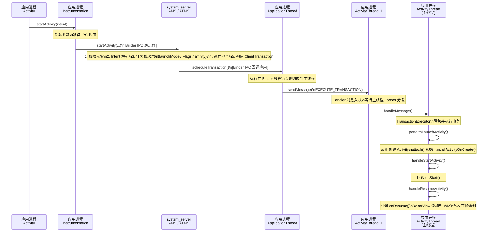

从这张时序图中可以清晰地看到，整个启动流程经历了两次跨进程通信（应用 -> AMS，AMS -> 应用）和一次线程切换（Binder 线程 -> 主线程）。这三个"跳转点"是性能优化和问题排查的关键节点：

第一次 Binder 调用（应用 -> AMS）的耗时通常很短，因为它只是传递参数。但如果 Intent 中携带了大量 Parcelable 数据（超过 Binder 事务缓冲区的 1MB 限制），就会抛出 `TransactionTooLargeException`。

AMS 内部的处理是整个链路中最复杂的部分，涉及锁竞争（AMS 内部有全局锁）、任务栈遍历、进程管理等。在系统负载高时，这一步可能成为瓶颈。

第二次 Binder 调用（AMS -> 应用）加上主线程的 Handler 消息调度，决定了从"系统决策完成"到"Activity 真正开始创建"之间的延迟。如果主线程的消息队列中积压了大量消息（比如密集的 UI 更新），`EXECUTE_TRANSACTION` 消息的处理就会被延迟，用户感知到的就是启动卡顿。

### 冷启动与热启动的差异

理解了完整流程后，冷启动和热启动的区别就非常清晰了：

热启动（Warm/Hot Start）是指目标应用的进程已经存在。AMS 在第四步"进程检查"时发现进程已在运行，直接通过已有的 `ApplicationThread` Binder 句柄发送事务即可。整个流程跳过了进程创建和 Application 初始化，速度很快。

冷启动（Cold Start）是指目标应用的进程不存在（可能是首次启动，或者进程被系统回收了）。AMS 需要先请求 Zygote fork 一个新进程，新进程启动后会执行 `ActivityThread.main()`（这是应用进程的入口方法），初始化主线程 Looper、创建 `ActivityThread` 实例、创建 `Instrumentation`、创建 `Application` 并调用其 `onCreate`，然后向 AMS 注册自己的 `ApplicationThread`。AMS 收到注册后，才会继续发送之前挂起的 `ClientTransaction`。这个额外的过程通常需要几百毫秒甚至更长时间，这就是冷启动白屏/黑屏的根本原因。

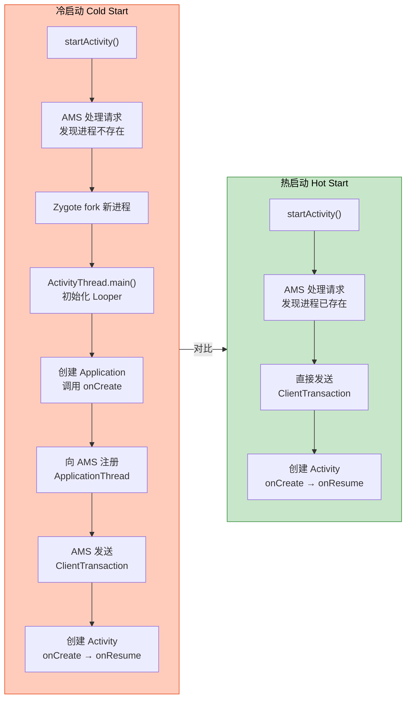

从图中可以直观地看到，冷启动比热启动多出了三个关键步骤：Zygote fork 进程、`ActivityThread.main()` 初始化、Application 创建。这三个步骤的耗时直接决定了用户感知到的"启动白屏"时长。这也是为什么我们在做启动优化时，重点关注 `Application.onCreate` 中的初始化逻辑——它是冷启动链路上开发者最能控制的环节。

还有一种介于两者之间的情况叫温启动（Warm Start）：进程存在，但 Activity 已经被销毁（比如用户按了返回键）。此时不需要创建进程和 Application，但需要重新创建 Activity 实例并走完整的 `onCreate -> onResume` 流程。温启动的耗时介于冷启动和热启动之间。

### ActivityThread.main()：应用进程的真正起点

既然冷启动的关键在于进程初始化，我们有必要看一下 `ActivityThread.main()` 这个方法——它是每个 Android 应用进程的 Java 层入口，由 Zygote fork 出新进程后通过反射调用。

```java
// ActivityThread.java
public static void main(String[] args) {
    // 1. 初始化主线程的 Looper
    // 这就是为什么主线程天然拥有 Looper 的原因
    // 开发者不需要手动调用 Looper.prepare()
    Looper.prepareMainLooper();

    // 2. 创建 ActivityThread 实例
    // ActivityThread 并不是一个 Thread，它是主线程的"管理者"
    ActivityThread thread = new ActivityThread();

    // 3. attach(false) 表示这是一个普通应用进程（非 system_server）
    // 内部会创建 Instrumentation、Application 等关键对象
    // 并通过 Binder 向 AMS 注册自己的 ApplicationThread
    thread.attach(false, startSeq);

    // 4. 获取主线程 Handler（即 ActivityThread.H）
    // 后续所有生命周期消息都通过这个 Handler 分发
    if (sMainThreadHandler == null) {
        sMainThreadHandler = thread.getHandler();
    }

    // 5. 启动主线程的消息循环
    // 这个 loop() 是一个无限循环，永远不会正常返回
    // 应用的整个生命周期都运行在这个循环中
    Looper.loop();

    // 如果执行到这里，说明主线程的 Looper 被意外终止
    // 正常情况下永远不会到达这一行
    throw new RuntimeException("Main thread loop unexpectedly exited");
}
```

这段代码虽然简短，但信息量极大。它回答了几个 Android 开发中的经典问题：

为什么主线程不需要手动调用 `Looper.prepare()`？因为 `main()` 方法在进程启动时就调用了 `Looper.prepareMainLooper()`。

为什么主线程的 `Looper.loop()` 不会导致 ANR？因为 ANR 的本质是"主线程在规定时间内没有处理完特定消息"，而不是"主线程在循环"。`Looper.loop()` 本身就是主线程的工作方式——它不断从 MessageQueue 中取出消息并处理。当没有消息时，主线程会通过 `epoll` 机制进入休眠，不消耗 CPU 资源。只有当某条消息的处理时间过长（比如 `onCreate` 中做了耗时操作），才会触发 ANR。

`thread.attach(false)` 内部做了什么？它会创建 `ContextImpl`（应用级 Context）、通过 `LoadedApk.makeApplication` 创建 `Application` 实例并调用其 `onCreate`、然后通过 `IActivityManager.attachApplication(mAppThread)` 将自己的 `ApplicationThread` Binder 句柄注册到 AMS。AMS 收到注册后，会检查是否有挂起的 Activity 启动请求（冷启动场景下一定有），如果有就立即发送 `ClientTransaction` 来启动目标 Activity。

### 启动流程中的关键角色总结

整个启动流程涉及多个核心类，它们各自承担不同的职责，协同完成从"用户意图"到"界面可见"的全过程：

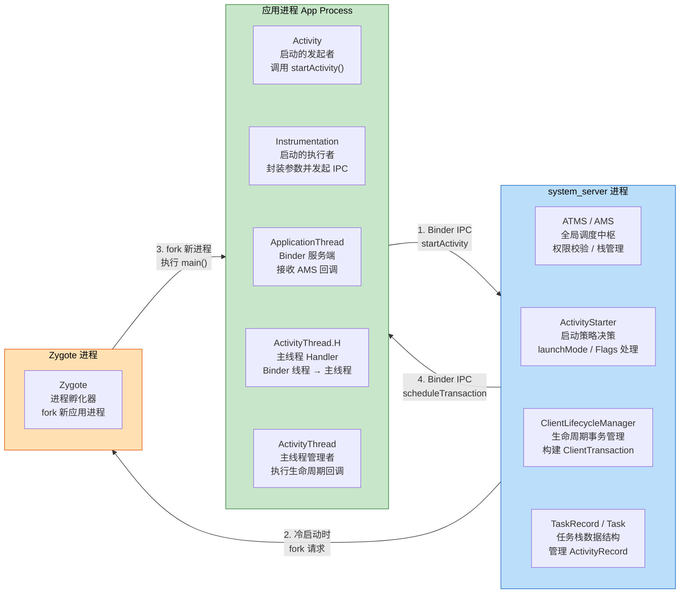

从应用开发者的角度来看，我们日常打交道最多的是 `Activity`（发起启动）和生命周期回调（`onCreate`、`onResume` 等）。但理解中间这些"隐藏角色"的存在和职责，能帮助我们：

诊断启动异常：比如 `ActivityNotFoundException` 来自 `Instrumentation.checkStartActivityResult`，`TransactionTooLargeException` 来自 Binder 传输层，`ClassNotFoundException` 来自 `Instrumentation.newActivity` 的反射调用。

理解性能瓶颈：冷启动慢是因为多了进程创建和 Application 初始化；主线程卡顿是因为 `ActivityThread.H` 的消息处理被阻塞；`onResume` 后界面还没显示是因为 `addView` 触发的绘制是异步的。

合理使用 API：比如知道 `attach()` 在 `onCreate` 之前执行，就理解了为什么 `onCreate` 中可以安全地调用 `setContentView`；知道 Activity 是反射创建的，就理解了为什么不能在构造函数中依赖 Context。

### 启动流程与启动模式的交汇点

最后，将本节内容与前面几节的启动模式知识串联起来。启动模式的所有行为——standard 的每次新建实例、singleTop 的栈顶复用、singleTask 的 clearTop 效应、singleInstance 的独立 Task——都发生在 AMS 内部的"任务栈决策"阶段（即 `ActivityStarter` 的处理逻辑中）。

当 AMS 决定复用已有实例时（singleTop 栈顶命中、singleTask 栈内找到、singleInstance 全局找到），它不会发送 `LaunchActivityItem`（创建新 Activity），而是发送一个包含 `NewIntentItem` 的事务，应用侧收到后会调用已有 Activity 的 `onNewIntent` 方法。这就是为什么 `onNewIntent` 的调用时机和 `onCreate` 不同——它们对应的是 AMS 侧完全不同的决策分支。

当 AMS 决定执行 clearTop 时（singleTask 模式或 `FLAG_ACTIVITY_CLEAR_TOP`），它会先向应用进程发送一系列 `DestroyActivityItem` 事务来销毁目标 Activity 之上的所有实例，然后再根据情况决定是复用目标实例（发送 `NewIntentItem`）还是重建（先 destroy 再 launch）。这些操作在应用侧表现为一连串快速的生命周期回调——上层 Activity 依次收到 `onPause -> onStop -> onDestroy`，目标 Activity 收到 `onNewIntent -> onResume`（或重新走 `onCreate`）。

理解了这个交汇点，你就能把"启动模式的行为规则"和"启动流程的技术实现"统一起来，形成一个完整的认知框架。

---

**📝 练习题**

在 Activity 的启动流程中，`activity.attach()` 方法的执行时机和作用是什么？以下说法正确的是：

A. `attach()` 在 `onStart()` 之后执行，主要负责注册广播接收器
B. `attach()` 在 `onCreate()` 之前执行，负责创建 PhoneWindow、绑定 WindowManager 和 token 等关键初始化
C. `attach()` 在 `onResume()` 之后执行，负责将 DecorView 添加到 WindowManager
D. `attach()` 在 Application.onCreate() 之前执行，负责初始化主线程 Looper

**【答案】** B

**【解析】** 在 `ActivityThread.performLaunchActivity` 中，调用顺序是：先通过反射创建 Activity 实例（`newActivity`），然后调用 `activity.attach()`，最后才通过 `Instrumentation.callActivityOnCreate` 触发 `onCreate`。`attach()` 方法内部会创建 `PhoneWindow` 对象（Activity 的窗口容器）、设置 `WindowManager`、绑定 AMS 分配的 `mToken`（IBinder）等。这就是为什么在 `onCreate` 中调用 `setContentView` 时，`PhoneWindow` 已经就绪。选项 C 描述的"将 DecorView 添加到 WindowManager"实际发生在 `handleResumeActivity` 中（`onResume` 回调之后）。选项 D 的描述也不正确——主线程 Looper 的初始化发生在 `ActivityThread.main()` 中，远早于任何 Activity 的创建。

---

**📝 练习题**

关于冷启动和热启动，以下哪项描述最准确？

A. 冷启动和热启动的唯一区别是是否需要调用 `Application.onCreate()`

B. 热启动时 AMS 不需要进行任务栈决策，直接复用上次的 Activity 实例

C. 冷启动比热启动多出"Zygote fork 进程 → ActivityThread.main() 初始化 → Application 创建与注册"等步骤，这是启动白屏的根本原因

D. 冷启动时 `Looper.prepareMainLooper()` 由 AMS 远程调用完成，而热启动时 Looper 已经存在所以跳过

**【答案】** C

**【解析】** 冷启动的核心特征是目标应用进程不存在，AMS 需要通过 Zygote fork 新进程。新进程启动后执行 `ActivityThread.main()`，依次完成 Looper 初始化、ActivityThread 创建、`attach()` 中的 Application 创建与 `onCreate` 调用、向 AMS 注册 `ApplicationThread`。这整个过程通常耗时数百毫秒，是用户感知到白屏/黑屏的根本原因。选项 A 不完整——除了 Application 创建，还有进程 fork 和 ActivityThread 初始化等步骤。选项 B 错误——热启动时 AMS 仍然需要完整的任务栈决策（launchMode、Flags 处理等），只是跳过了进程创建环节。选项 D 错误——`Looper.prepareMainLooper()` 始终在应用进程本地的 `ActivityThread.main()` 中执行，不涉及 AMS 远程调用。

---

## 本章小结

Activity 的任务栈与启动模式是 Android 应用层导航体系的基石。整章内容围绕一个核心问题展开：**当用户或代码发起 startActivity() 调用时，系统如何决定目标 Activity 应该放在哪个 Task 的哪个位置，以及已有实例该如何处理？** 理解这套机制，不仅能帮助开发者设计出符合用户心智模型的页面导航，更能在面对复杂的多栈、多进程、跨应用跳转场景时做到心中有数。

### 任务栈的本质：用户行为的容器

Task 与 BackStack 并非简单的数据结构概念，而是 Android 对"用户正在做的一件事"的抽象建模。系统通过 TaskRecord 管理一组有逻辑关联的 ActivityRecord，以严格的 FILO（First In, Last Out）原则响应用户的返回操作。这意味着每一次 `startActivity()` 都是一次压栈，每一次按下返回键都是一次弹栈。栈底 Activity 是这个 Task 的"根"（root Activity），它的销毁意味着整个 Task 的终结。

理解 TaskRecord 的存在至关重要——它是 AMS 侧对 Task 的真实数据载体，持有 `ArrayList<ActivityRecord>` 来维护栈内顺序，同时记录着 taskAffinity、启动时间、Intent 信息等元数据。开发者在应用层感知到的"回退栈行为"，本质上都是 AMS 对 TaskRecord 内部 ActivityRecord 列表的增删操作。

### 四种启动模式：从默认到极端的控制谱系

四种 LaunchMode 构成了一个从"完全不干预"到"极端隔离"的控制谱系：

**standard** 是最朴素的模式——每次启动都创建新实例，无条件压栈。它的简单性既是优点也是隐患：在快速连续点击、循环跳转等场景下，栈内可能堆积大量重复实例，造成内存浪费和用户体验混乱。绝大多数普通页面使用 standard 即可，但开发者需要对"重复实例"保持警觉。

**singleTop** 引入了第一层优化——栈顶复用。当目标 Activity 恰好位于当前 Task 栈顶时，系统不会创建新实例，而是调用已有实例的 `onNewIntent()` 回调，将新的 Intent 数据传递进去。这里有一个关键细节：`onNewIntent()` 的调用发生在 `onResume()` 之前，且 `getIntent()` 默认仍返回旧 Intent，开发者必须手动调用 `setIntent(intent)` 来更新。singleTop 最典型的应用场景是搜索结果页和通知跳转页——避免用户从通知栏反复点击同一条通知时创建多个相同页面。但要注意，singleTop 只检查栈顶，如果目标 Activity 存在于栈内非顶部位置，仍然会创建新实例。

**singleTask** 是实际开发中最常用也最容易被误解的模式。它的行为可以拆解为三步决策：首先，根据 taskAffinity 寻找匹配的 Task（如果不存在则创建新 Task）；其次，在目标 Task 中查找是否已有该 Activity 的实例；最后，如果找到已有实例，则将该实例之上的所有 Activity 全部销毁（即 clearTop 效应），然后调用 `onNewIntent()`。clearTop 效应是 singleTask 最具杀伤力的特性——它会毫不留情地清除目标实例之上的整个栈，这些被清除的 Activity 会依次走完 `onPause() → onStop() → onDestroy()` 的完整销毁流程。这使得 singleTask 非常适合作为应用的主页面（如首页 MainActivity），因为无论用户在多深的页面层级，跳转回首页时都能保证首页之上的页面被清理干净，回退栈保持清爽。

**singleInstance** 是最极端的隔离模式。它不仅保证全局唯一实例，还要求该实例独占一个 Task——这个 Task 中永远只有它一个 Activity。任何从 singleInstance Activity 中启动的新 Activity 都会被放入其他 Task。这种模式的典型场景是系统级共享组件，比如来电接听界面、系统拨号盘等需要被多个应用共享的页面。在普通应用开发中，singleInstance 的使用频率极低，因为它的独占 Task 特性会导致用户在多任务切换时看到额外的 Task 卡片，可能造成困惑。

### Intent Flags：运行时的动态控制

如果说 LaunchMode 是在 AndroidManifest.xml 中的静态声明，那么 Intent Flags 就是在代码运行时的动态控制手段。两者可以叠加使用，且 Intent Flags 的优先级更高（在大多数冲突场景下）。

`FLAG_ACTIVITY_NEW_TASK` 是跨应用启动的基础 Flag，它指示系统为目标 Activity 寻找匹配 taskAffinity 的 Task，找不到则创建新 Task。值得注意的是，单独使用这个 Flag 并不会产生 clearTop 效应——如果目标 Task 已存在且栈内已有该 Activity 实例，系统只是将该 Task 切换到前台，而不会清除栈内内容。

`FLAG_ACTIVITY_CLEAR_TOP` 提供了显式的 clearTop 能力。当它与 `FLAG_ACTIVITY_NEW_TASK` 组合使用时，效果等同于 singleTask 的行为：找到目标 Task，定位已有实例，清除其上所有 Activity。但这里有一个微妙的差异：如果目标 Activity 的 launchMode 是 standard，clearTop 会先销毁已有实例再重新创建（destroy + recreate），而不是复用已有实例。只有当 clearTop 与 `FLAG_ACTIVITY_SINGLE_TOP` 组合使用时，才会复用已有实例并调用 `onNewIntent()`。

`FLAG_ACTIVITY_REORDER_TO_FRONT` 提供了一种更温和的栈操作——它不销毁任何 Activity，而是将栈内已有的目标实例"提拔"到栈顶。这在需要保留所有页面状态、仅调整访问顺序的场景下非常有用，但要注意它不能与 `FLAG_ACTIVITY_CLEAR_TOP` 同时使用，后者会使前者失效。

### taskAffinity：多栈架构的钥匙

taskAffinity 是决定 Activity "归属于哪个 Task"的核心属性。默认情况下，同一应用内所有 Activity 的 taskAffinity 相同（等于应用包名），因此它们自然地共享同一个 Task。但开发者可以通过显式设置不同的 taskAffinity 值，让同一应用内的不同 Activity 分属不同的 Task，从而实现"多栈应用"的架构。

taskAffinity 本身不会主动生效，它必须与特定的启动模式或 Flag 配合才能发挥作用：与 singleTask 配合时，系统会根据 taskAffinity 寻找或创建匹配的 Task；与 `FLAG_ACTIVITY_NEW_TASK` 配合时，同样会触发 Task 匹配逻辑；与 `allowTaskReparenting="true"` 配合时，则会产生"任务迁移"效果——Activity 在条件满足时从当前 Task 迁移到 affinity 匹配的 Task 中。

allowTaskReparenting 的典型场景是：应用 A 启动了应用 B 的某个 Activity X（X 设置了 `allowTaskReparenting="true"`），此时 X 位于应用 A 的 Task 中。当用户随后从桌面启动应用 B 时，系统发现 X 的 taskAffinity 与应用 B 的 Task 匹配，于是将 X 从应用 A 的 Task 中"迁移"到应用 B 的 Task 栈顶。这个过程对用户来说是透明的，但对开发者来说需要理解其背后的 AMS 调度逻辑。

### 启动流程：从 startActivity() 到生命周期回调

整个 Activity 启动流程串联了应用进程与系统服务进程之间的多次 IPC 通信。从应用层视角看，调用链路为：`startActivity()` → `Instrumentation.execStartActivity()` → 跨进程调用 AMS → AMS 完成 Task/栈决策 → 通过 ApplicationThread 回调应用进程 → `ActivityThread.handleLaunchActivity()` → 反射创建 Activity 实例 → 依次回调 `onCreate()` → `onStart()` → `onResume()`。

这条链路中，Instrumentation 扮演着"监控钩子"的角色，所有 Activity 的启动和生命周期调用都经过它，这也是各种 Hook 框架和插件化方案的切入点。AMS 是真正的决策中心，它根据 LaunchMode、Intent Flags、taskAffinity 等信息完成"放在哪个 Task、是否复用实例、是否 clearTop"等所有关键决策。ApplicationThread 是应用进程暴露给系统的 Binder 接口，AMS 通过它将决策结果"推送"回应用进程执行。

### 核心决策模型

将整章内容提炼为一个决策模型，当 `startActivity()` 被调用时，系统按以下优先级依次判断：

```
text
┌─────────────────────────────────────────────────────────┐
│              startActivity(intent) 触发                  │
└──────────────────────┬──────────────────────────────────┘
                       ▼
        ┌─────────────────────────────┐
        │  1. 解析 Intent Flags       │
        │     (运行时优先级最高)        │
        └──────────────┬──────────────┘
                       ▼
        ┌─────────────────────────────┐
        │  2. 读取 LaunchMode         │
        │     (Manifest 静态声明)      │
        └──────────────┬──────────────┘
                       ▼
        ┌─────────────────────────────┐
        │  3. 匹配 taskAffinity       │
        │     (决定目标 Task)          │
        └──────────────┬──────────────┘
                       ▼
        ┌─────────────────────────────┐
        │  4. 检查栈内已有实例         │
        │     (决定复用/新建/clearTop) │
        └──────────────┬──────────────┘
                       ▼
        ┌─────────────────────────────┐
        │  5. 执行生命周期回调         │
        │     (onCreate/onNewIntent)  │
        └─────────────────────────────┘
```

这五步决策覆盖了本章所有知识点的交汇点。无论面对多么复杂的启动场景，只要沿着这条决策链逐步分析，都能准确预判系统的行为。

### 实践要点速查

在实际开发中，以下几条经验值得铭记：

首页（MainActivity）推荐使用 singleTask 模式，配合默认 taskAffinity，确保从任何深层页面返回首页时都能清理回退栈。通知跳转、搜索结果等可能被重复触发的页面，使用 singleTop 避免实例堆积。在 `onNewIntent()` 中务必调用 `setIntent(intent)` 更新 Intent，否则后续 `getIntent()` 拿到的仍是旧数据。跨应用启动 Activity 时必须添加 `FLAG_ACTIVITY_NEW_TASK`，否则在某些场景下（如从 Service 或 BroadcastReceiver 启动）会直接抛出异常。`FLAG_ACTIVITY_CLEAR_TOP | FLAG_ACTIVITY_SINGLE_TOP` 的组合是代码层面实现 singleTask 等效行为的标准写法。谨慎使用 singleInstance，除非你明确需要跨应用共享且独占 Task 的语义。多栈应用（如独立的悬浮窗 Task、文档多窗口）需要显式设置不同的 taskAffinity 值，并配合 singleTask 或 `FLAG_ACTIVITY_NEW_TASK` 使用。

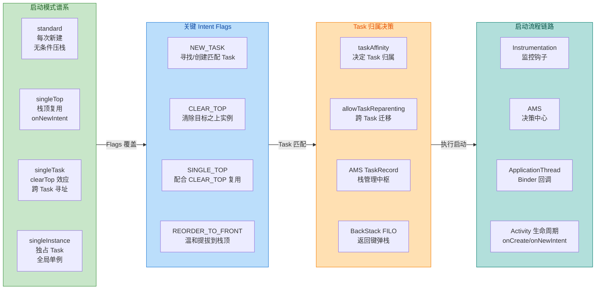

---

**📝 练习题**

某应用的 MainActivity 声明为 `launchMode="singleTask"`，默认 taskAffinity。用户依次打开 A → B → C → D 四个页面（均为 standard 模式），此时栈内从底到顶为 `[Main, A, B, C, D]`。现在从 D 中调用 `startActivity(intent)` 跳转回 MainActivity，以下哪种描述是正确的？

A. 栈内变为 `[Main, A, B, C, D, Main]`，创建了新的 MainActivity 实例

B. 栈内变为 `[Main]`，A/B/C/D 全部被销毁，MainActivity 收到 `onNewIntent()` 回调

C. 栈内变为 `[Main, D]`，A/B/C 被销毁，D 保留在 Main 之上

D. 栈内变为 `[D, Main]`，MainActivity 被提拔到栈顶，其余不变

**【答案】** B

**【解析】** MainActivity 的 launchMode 为 singleTask，当从 D 启动 MainActivity 时，AMS 发现当前 Task 中已存在 MainActivity 实例（位于栈底）。singleTask 的 clearTop 效应会将 MainActivity 之上的所有 Activity（A、B、C、D）依次销毁，使 MainActivity 回到栈顶。由于是复用已有实例而非新建，系统会调用 MainActivity 的 `onNewIntent()` 方法传递新的 Intent 数据，随后走 `onResume()` 恢复到前台。最终栈内只剩 `[Main]` 一个元素。这正是 singleTask 作为首页启动模式的核心价值——无论导航层级多深，一次跳转即可清理整个回退栈回到首页。选项 A 描述的是 standard 模式的行为；选项 C 和 D 都不符合 clearTop 的语义，clearTop 清除的是目标实例之上的全部 Activity，不会选择性保留。

---