---

# Activity：生命周期与状态

---

## Activity 本质

Android 应用中，Activity 是用户与应用交互的最基本单元。但如果仅仅把它理解为"一个页面"，就过于表面了。要真正掌握 Activity，需要从三个维度来认识它的本质：它是一个 **Window 容器**，负责承载和管理窗口；它是一个 **交互控制器**，协调用户输入与 UI 响应；它还是一个 **Context 实现**，拥有访问系统资源和服务的完整能力。这三重身份相互交织，共同构成了 Activity 在 Android 应用层中的核心地位。理解这三重身份，是深入掌握生命周期中每个回调"在做什么"以及"为什么在这个时机做"的基石。

### Window 容器：Activity 与窗口系统的关系

很多开发者习惯性地认为"Activity 就是界面"，但准确地说，Activity 本身并不直接绑定任何 UI 元素，也不负责绘制任何像素。真正负责承载 UI 视图树（View Hierarchy）并显示内容的是 **Window**，而 Activity 扮演的角色是 Window 的 **持有者和管理者**——即 Window 容器。

在 Android 的窗口体系中，每个 Activity 内部都持有一个 `Window` 对象，其唯一实现类是 `PhoneWindow`。PhoneWindow 内部又持有一个叫做 `DecorView` 的顶层 ViewGroup（继承自 FrameLayout），它才是整个 View 层级树的根节点。当我们调用 `setContentView(R.layout.activity_main)` 时，这行代码背后发生了一系列精密的委托操作——Activity 并没有自己去解析 XML 布局、创建 View 树，而是将这项工作完全委托给了 PhoneWindow。

这个层级关系可以用下面的结构来理解：

```text
Activity
 └── PhoneWindow                  (Window 的唯一实现)
      └── DecorView               (顶层 ViewGroup，继承自 FrameLayout)
           ├── StatusBar 区域      (系统状态栏占位)
           ├── Title/ActionBar     (标题栏区域，取决于主题)
           └── ContentFrameLayout  (android.R.id.content)
                └── 你的布局 XML    (setContentView 传入的布局)
```

理解这个层级关系非常重要，因为它直接影响到很多实际开发场景。比如，当你调用 `findViewById()` 时，搜索的起点其实是 DecorView 下的 content 区域；当你做 Edge-to-Edge 沉浸式适配时，需要理解 DecorView 包含了系统栏区域；当你处理触摸事件分发时，事件也是从 DecorView 开始逐层向下传递的。

我们来看 Activity 中 `setContentView` 的源码逻辑，理解这个委托过程：

```java
// Activity.java 中的 setContentView 方法
public void setContentView(@LayoutRes int layoutResID) {
    // Activity 不自己处理布局，而是直接委托给 Window 对象
    // 这里的 getWindow() 返回的就是 PhoneWindow 实例
    getWindow().setContentView(layoutResID);
    // 初始化 ActionBar（如果当前主题包含 ActionBar 的话）
    initWindowDecorActionBar();
}
```

```java
// PhoneWindow.java 中的 setContentView 方法（简化）
@Override
public void setContentView(int layoutResID) {
    // mContentParent 就是 id 为 android.R.id.content 的 FrameLayout
    // 首次调用时它为 null，需要先安装 DecorView
    if (mContentParent == null) {
        // installDecor() 会创建 DecorView 和 mContentParent
        // 这是整个窗口视图层级的初始化入口
        // 它会根据当前主题/窗口特性来决定 DecorView 的内部结构
        installDecor();
    } else if (!hasFeature(FEATURE_CONTENT_TRANSITIONS)) {
        // 如果不是首次调用且没有内容转场动画
        // 先清空之前的所有子 View
        mContentParent.removeAllViews();
    }
    if (hasFeature(FEATURE_CONTENT_TRANSITIONS)) {
        // 如果启用了内容转场，走转场动画的设置流程
        final Scene newScene = Scene.getSceneForLayout(
            mContentParent, layoutResID, getContext()
        );
        transitionTo(newScene);
    } else {
        // 核心操作：将开发者传入的布局 XML inflate 到 mContentParent 中
        // 这一步才真正把你写的布局变成 View 对象并添加到视图树中
        mLayoutInflater.inflate(layoutResID, mContentParent);
    }
    // 通知 DecorView 内容已经改变，触发 WindowInsets 的重新应用
    mContentParent.requestApplyInsets();
    // 回调通知 Activity 内容已变更
    final Callback cb = getCallback();
    if (cb != null && !isDestroyed()) {
        // Activity 实现了 Window.Callback 接口
        // 这个回调让 Activity 有机会在内容变更后做额外处理
        cb.onContentChanged();
    }
}
```

从这段源码可以清晰地看到：Activity 自身不做任何 View 层面的操作，它只是把请求转发给 PhoneWindow，由 PhoneWindow 完成 DecorView 的创建、布局的 inflate、以及视图树的组装。这种设计体现了 **关注点分离**（Separation of Concerns）的架构思想——Activity 负责生命周期和业务逻辑的协调，Window 负责视图的管理和渲染。

这里还有一个重要的时序细节：`installDecor()` 会根据当前的窗口特性（Window Features）来决定 DecorView 的内部结构。这就是为什么 `requestWindowFeature()` 必须在 `setContentView()` 之前调用——因为一旦 `installDecor()` 执行完毕，DecorView 的结构就固定了，再修改窗口特性已经来不及了。

那么 PhoneWindow 又是在什么时候被创建的呢？答案是在 `Activity.attach()` 方法中。这个方法在 `onCreate()` 之前就被 `ActivityThread` 调用了，它是 Activity 初始化的第一步，也是 Activity 三重身份同时确立的关键时刻：

```java
// Activity.java 的 attach 方法（简化关键部分）
final void attach(Context context, ActivityThread aThread,
        Instrumentation instr, IBinder token, int ident,
        Application application, Intent intent, ActivityInfo info,
        CharSequence title, Activity parent, String id,
        NonConfigurationInstances lastNonConfigurationInstances,
        Configuration config, String referrer, IVoiceInteractor voiceInteractor,
        Window window, ActivityConfigCallback activityConfigCallback,
        IBinder assistToken, IBinder shareableActivityToken) {

    // 第一步：绑定 Context —— 确立"Context 实现"身份
    // 调用 attachBaseContext，将 ContextImpl 赋值给 mBase
    // 从此 Activity 拥有了访问系统资源和服务的完整能力
    attachBaseContext(context);

    // 第二步：创建 PhoneWindow —— 确立"Window 容器"身份
    // Activity 的窗口从这里诞生
    mWindow = new PhoneWindow(this, window, activityConfigCallback);

    // 第三步：设置 Window.Callback —— 确立"交互控制器"身份
    // Activity 自身作为 Window.Callback 传入
    // 窗口中的按键事件、触摸事件、菜单事件等都会回调到 Activity
    mWindow.setWindowControllerCallback(mWindowControllerCallback);
    mWindow.setCallback(this);
    mWindow.setOnWindowDismissedCallback(this);

    // 为 PhoneWindow 设置 WindowManager
    // WindowManager 是与系统 WMS（WindowManagerService）通信的 IPC 桥梁
    // 后续 DecorView 的添加、移除、更新都通过它来完成
    mWindow.setWindowManager(
            (WindowManager) context.getSystemService(Context.WINDOW_SERVICE),
            mToken,  // IBinder token，Activity 在 AMS 中的身份标识
            mComponent.flattenToString(),
            (info.flags & ActivityInfo.FLAG_HARDWARE_ACCELERATED) != 0);
    // 保存 WindowManager 引用，方便后续使用
    mWindowManager = mWindow.getWindowManager();
}
```

这段代码揭示了几个关键事实。第一，PhoneWindow 在 `attach()` 阶段就创建好了，远早于 `onCreate()`，所以在 `onCreate()` 中调用 `setContentView()` 时，Window 已经就绪。第二，Activity 将自己设置为 Window 的 Callback（`mWindow.setCallback(this)`），这意味着 Activity 实现了 `Window.Callback` 接口，窗口中发生的按键事件（`dispatchKeyEvent`）、触摸事件（`dispatchTouchEvent`）、菜单事件等都会回调到 Activity 中——这就是 Activity 能够处理用户交互的根本原因。第三，WindowManager 在这里被关联到 Window 上，它是应用进程与系统 WindowManagerService（WMS）之间的 IPC 桥梁。

现在我们来看从 Activity 创建到视图最终显示在屏幕上的完整流程：

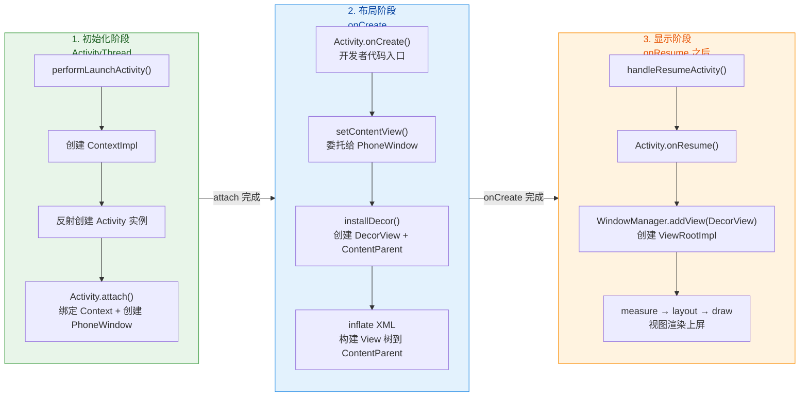
```mermaid
graph LR
    subgraph Phase1["1. 初始化阶段\nActivityThread"]
        direction TB
        A1["performLaunchActivity()"]
        A2["创建 ContextImpl"]
        A3["反射创建 Activity 实例"]
        A4["Activity.attach()\n绑定 Context + 创建 PhoneWindow"]
        A1 --> A2
        A2 --> A3
        A3 --> A4
    end

    subgraph Phase2["2. 布局阶段\nonCreate"]
        direction TB
        B1["Activity.onCreate()\n开发者代码入口"]
        B2["setContentView()\n委托给 PhoneWindow"]
        B3["installDecor()\n创建 DecorView + ContentParent"]
        B4["inflate XML\n构建 View 树到 ContentParent"]
        B1 --> B2
        B2 --> B3
        B3 --> B4
    end

    subgraph Phase3["3. 显示阶段\nonResume 之后"]
        direction TB
        C1["handleResumeActivity()"]
        C2["Activity.onResume()"]
        C3["WindowManager.addView(DecorView)\n创建 ViewRootImpl"]
        C4["measure → layout → draw\n视图渲染上屏"]
        C1 --> C2
        C2 --> C3
        C3 --> C4
    end

    Phase1 -->|"attach 完成"| Phase2 -->|"onCreate 完成"| Phase3

    classDef phase1Style fill:#E8F5E9,stroke:#43A047,color:#1B5E20
    classDef phase2Style fill:#E3F2FD,stroke:#1E88E5,color:#0D47A1
    classDef phase3Style fill:#FFF3E0,stroke:#FB8C00,color:#E65100

    class Phase1 phase1Style
    class Phase2 phase2Style
    class Phase3 phase3Style
```

特别值得注意的是第三阶段。DecorView 并不是在 `onCreate()` 中就被添加到窗口系统的，而是在 `onResume()` 之后，由 `ActivityThread.handleResumeActivity()` 调用 `WindowManager.addView(decorView)` 才真正将 DecorView 交给系统。我们来看这段关键代码：

```java
// ActivityThread.handleResumeActivity() 简化逻辑
public void handleResumeActivity(ActivityClientRecord r,
        boolean finalStateRequest, boolean isForward, String reason) {

    // 1. 先触发 Activity.onResume() 回调
    // 此时 View 树已构建但尚未提交给系统绘制
    if (!performResumeActivity(r, finalStateRequest, reason)) {
        return;
    }

    final Activity a = r.activity;

    // 2. onResume() 之后，将 DecorView 添加到 WindowManager
    if (r.window == null && !a.mFinished && willBeVisible) {
        r.window = r.activity.getWindow();
        View decor = r.window.getDecorView();
        // 先设置为不可见，等布局完成后再显示
        decor.setVisibility(View.INVISIBLE);
        ViewManager wm = a.getWindowManager();
        WindowManager.LayoutParams l = r.window.getAttributes();
        a.mDecor = decor;

        // 关键调用：addView 会创建 ViewRootImpl
        // ViewRootImpl 是应用进程中 View 系统与 WMS 之间的核心纽带
        // 它负责触发 measure、layout、draw 三大流程
        // 最终将像素数据通过 Surface 提交给 SurfaceFlinger 合成显示
        wm.addView(decor, l);
    }

    // 3. 让 DecorView 变为可见
    if (r.activity.mVisibleFromClient) {
        r.activity.makeVisible();
        // makeVisible() 内部：mDecor.setVisibility(View.VISIBLE)
    }
}
```

这段代码清晰地展示了一个关键事实：**在 `onCreate()` 和 `onStart()` 阶段，虽然 View 树已经在内存中构建完毕，但它还没有被真正提交给系统进行绘制**。DecorView 要等到 `onResume()` 之后才会通过 `WindowManager.addView()` 添加到窗口系统，`addView` 操作会创建 `ViewRootImpl`，由它触发 measure → layout → draw 三大流程。

这也解释了一个经典的面试问题：**为什么在 `onCreate()` 中获取 View 的宽高为 0？** 因为此时 DecorView 还没有被添加到窗口系统，measure 和 layout 都还没有执行，View 的尺寸自然是未确定的。你需要使用 `View.post {}` 或 `ViewTreeObserver.OnGlobalLayoutListener` 来在布局完成后获取尺寸。

理解"Activity 是 Window 容器"这一本质后，很多看似奇怪的行为就变得合理了。比如 Dialog 也有自己的 Window（同样是 PhoneWindow 实例），所以 Dialog 可以独立于 Activity 的内容区域浮动显示；再比如 `WindowManager.LayoutParams` 中的 `type` 字段决定了窗口的层级（Z-order），这就是为什么系统弹窗（Toast、悬浮窗）能覆盖在 Activity 之上。

### 交互控制器：事件分发与用户输入的协调

Activity 的第二重身份是 **交互控制器**。当用户触摸屏幕时，触摸事件并不是直接发送给被触摸的那个 Button 或 TextView，而是经过一条严格的分发链，而这条链的 **应用层起点** 正是 Activity。

Activity 实现了 `Window.Callback` 和 `KeyEvent.Callback` 接口，这使得它成为用户输入事件在应用层的第一级处理者。完整的事件传递路径是：硬件 → InputManagerService → WindowManagerService → 应用进程 InputChannel → ViewRootImpl → DecorView → **Activity.dispatchTouchEvent()** → PhoneWindow.superDispatchTouchEvent() → DecorView → ViewGroup → View。

注意这里有一个看似"绕路"的设计：事件从 DecorView 进来后，先交给了 Activity，Activity 又交回给 PhoneWindow，PhoneWindow 再交给 DecorView 往下分发。这个"回旋"设计的目的是给 Activity 一个 **全局拦截的机会**——在事件到达任何 View 之前，Activity 就可以决定是否要拦截处理。

```java
// Activity.java 中的触摸事件分发 —— 事件分发的应用层入口
// 每一个触摸事件都会先经过这里
public boolean dispatchTouchEvent(MotionEvent ev) {
    // ACTION_DOWN 表示一次新的触摸序列开始
    if (ev.getAction() == MotionEvent.ACTION_DOWN) {
        // onUserInteraction() 是一个空方法，供子类重写
        // 常用于：重置屏幕超时计时器、统计用户活跃度
        // 记录用户最后交互时间等场景
        onUserInteraction();
    }
    // 将事件委托给 PhoneWindow 的 superDispatchTouchEvent
    // PhoneWindow 内部会调用 DecorView.dispatchTouchEvent()
    // 然后沿着 ViewGroup → View 的标准路径向下传递
    if (getWindow().superDispatchTouchEvent(ev)) {
        // 如果 View 层级中有任何一个 View 消费了这个事件
        // 返回 true，分发结束
        return true;
    }
    // 如果整个 View 树都没有消费这个事件
    // 最终由 Activity 自己的 onTouchEvent() 兜底处理
    // 这是 Activity 作为"最后防线"的体现
    return onTouchEvent(ev);
}
```

这段代码体现了经典的 **责任链模式（Chain of Responsibility）**。Activity 站在链的最顶端，它同时是事件分发链的 **起点** 和 **终点**，形成了一个"U 形"的分发机制。Activity 可以选择三种策略：

1. **在 `dispatchTouchEvent()` 中拦截**：重写此方法，在事件到达任何 View 之前就处理掉。比如某些全屏手势场景，你可能希望在 Activity 层面统一处理滑动，而不让子 View 干扰。

2. **让事件正常流转**：大多数情况下，Activity 不做干预，事件沿着 ViewGroup 的 `onInterceptTouchEvent()` 和 View 的 `onTouchEvent()` 正常分发。

3. **在 `onTouchEvent()` 中兜底**：如果所有 View 都不处理，Activity 的 `onTouchEvent()` 作为最后的接收者。默认实现几乎什么都不做，但你可以重写它来处理"点击空白区域关闭页面"之类的需求。

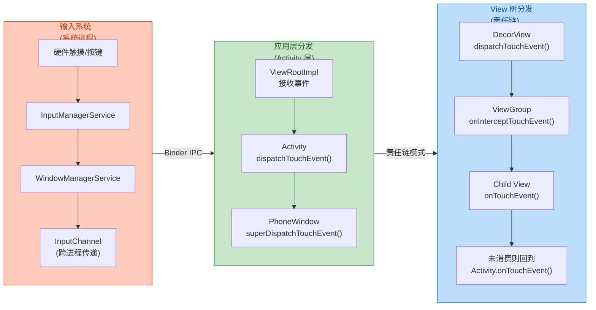
```mermaid
graph LR
    subgraph Input["输入系统\n(系统进程)"]
        direction TB
        I1["硬件触摸/按键"]
        I2["InputManagerService"]
        I3["WindowManagerService"]
        I4["InputChannel\n(跨进程传递)"]
        I1 --> I2
        I2 --> I3
        I3 --> I4
    end

    subgraph App["应用层分发\n(Activity 层)"]
        direction TB
        A1["ViewRootImpl\n接收事件"]
        A2["Activity\ndispatchTouchEvent()"]
        A3["PhoneWindow\nsuperDispatchTouchEvent()"]
        A1 --> A2
        A2 --> A3
    end

    subgraph Views["View 树分发\n(责任链)"]
        direction TB
        V1["DecorView\ndispatchTouchEvent()"]
        V2["ViewGroup\nonInterceptTouchEvent()"]
        V3["Child View\nonTouchEvent()"]
        V4["未消费则回到\nActivity.onTouchEvent()"]
        V1 --> V2
        V2 --> V3
        V3 --> V4
    end

    Input -->|"Binder IPC"| App -->|"责任链模式"| Views

    classDef sysStyle fill:#FFCCBC,stroke:#E64A19,color:#BF360C
    classDef appStyle fill:#C8E6C9,stroke:#388E3C,color:#1B5E20
    classDef viewStyle fill:#BBDEFB,stroke:#1976D2,color:#0D47A1

    class Input sysStyle
    class App appStyle
    class Views viewStyle
```

除了触摸事件，Activity 还负责协调以下几类交互：

**按键事件处理**：Activity 实现了 `KeyEvent.Callback` 接口，物理返回键、音量键等硬件按键事件同样先到达 `Activity.dispatchKeyEvent()`，再向下分发。`onKeyDown()`、`onKeyUp()`、`onBackPressed()`（已废弃，现在推荐使用 `OnBackPressedDispatcher`）等方法都是在这个框架下工作的。当用户按下返回键时，事件同样先经过 View 层级，如果没有被消费，才会到达 Activity 的返回处理逻辑。

**菜单与 ActionBar 管理**：`onCreateOptionsMenu()`、`onOptionsItemSelected()` 等回调也是 `Window.Callback` 接口的一部分。Activity 通过这些回调来管理菜单的创建和点击响应。

**焦点与窗口状态**：`onWindowFocusChanged(boolean hasFocus)` 回调告诉 Activity 当前窗口是否获得了焦点。这个回调在实际开发中非常有用——它是判断 Activity 是否"真正可见且可交互"的最可靠信号。与 `onResume()` 不同，`onWindowFocusChanged(true)` 被调用时，View 的 measure 和 layout 已经完成，此时获取 View 的宽高是安全的。

**Fragment 交互协调**：Activity 作为交互控制器的另一个重要职责是协调 Fragment 的交互。当 Activity 收到返回键事件时，它会先询问 FragmentManager 是否有 Fragment 需要处理这个事件（比如弹出回退栈），只有当所有 Fragment 都不处理时，Activity 才会执行自己的返回逻辑。这种层层委托的模式贯穿了整个 Android 交互框架。

理解 Activity 作为交互控制器的角色，对实际开发有直接指导意义。例如，当你遇到"子 View 的点击事件和父 ViewGroup 的滑动手势冲突"时，你需要清楚事件是从 Activity 开始、自顶向下分发的，冲突的解决方案（外部拦截法或内部拦截法）都建立在这条分发链的基础之上。

### Context 实现：Activity 的系统能力来源

Activity 的第三重身份，也是最容易被忽视的一重——它是 `Context` 的一个具体实现。在 Android 中，`Context` 是一个极其重要的抽象类，它代表了应用的 **运行环境**，定义了访问系统服务、资源、文件系统、启动组件等几乎一切能力的标准接口。没有 Context，你几乎什么都做不了——无法获取资源、无法启动 Activity、无法访问数据库、无法获取系统服务。

Android 中 Context 的继承体系采用了经典的 **装饰器模式（Decorator Pattern）**：

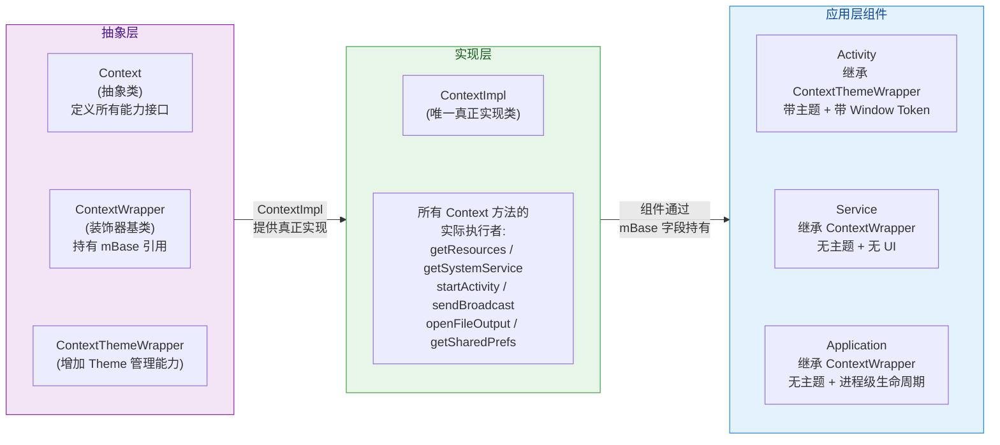
```mermaid
graph LR
    subgraph Abstract["抽象层"]
        direction TB
        A1["Context\n(抽象类)\n定义所有能力接口"]
        A2["ContextWrapper\n(装饰器基类)\n持有 mBase 引用"]
        A3["ContextThemeWrapper\n(增加 Theme 管理能力)"]
        A1 ~~~ A2
        A2 ~~~ A3
    end

    subgraph Impl["实现层"]
        direction TB
        B1["ContextImpl\n(唯一真正实现类)"]
        B2["所有 Context 方法的\n实际执行者:\ngetResources / getSystemService\nstartActivity / sendBroadcast\nopenFileOutput / getSharedPrefs"]
        B1 ~~~ B2
    end

    subgraph AppLayer["应用层组件"]
        direction TB
        C1["Activity\n继承 ContextThemeWrapper\n带主题 + 带 Window Token"]
        C2["Service\n继承 ContextWrapper\n无主题 + 无 UI"]
        C3["Application\n继承 ContextWrapper\n无主题 + 进程级生命周期"]
        C1 ~~~ C2
        C2 ~~~ C3
    end

    Abstract -->|"ContextImpl\n提供真正实现"| Impl -->|"组件通过\nmBase 字段持有"| AppLayer

    classDef abstractStyle fill:#F3E5F5,stroke:#8E24AA,color:#4A148C
    classDef implStyle fill:#E8F5E9,stroke:#43A047,color:#1B5E20
    classDef appStyle fill:#E3F2FD,stroke:#1E88E5,color:#0D47A1

    class Abstract abstractStyle
    class Impl implStyle
    class AppLayer appStyle
```

这个体系中有几个关键点需要深入理解：

**ContextImpl 是真正干活的人**。`Context` 抽象类定义了接口（`getSystemService()`、`getResources()`、`startActivity()` 等），而 `ContextImpl` 是这些接口的唯一真正实现。无论是 Activity、Service 还是 Application，它们内部都通过 `ContextWrapper` 的 `mBase` 字段持有一个 `ContextImpl` 实例，所有 Context 方法的调用最终都委托给这个 `ContextImpl`。调用链如下：

```text
Activity.getSystemService()
  → ContextThemeWrapper.getSystemService()
    → ContextWrapper.getSystemService()
      → mBase.getSystemService()         // mBase 是 ContextImpl 实例
        → ContextImpl.getSystemService() // 真正的实现逻辑
```

**Activity 继承的是 ContextThemeWrapper，而非普通的 ContextWrapper**。这个区别至关重要。`ContextThemeWrapper` 在 `ContextWrapper` 的基础上增加了 **主题（Theme）** 的管理能力。这意味着 Activity 的 Context 是"带主题的"——当你在 Activity 中调用 `getResources()` 获取颜色、尺寸等资源时，返回的值会受到当前 Activity 主题的影响（比如 `?attr/colorPrimary` 能被正确解析）。而 `Application` 和 `Service` 继承的是普通的 `ContextWrapper`，没有主题信息（或者说使用的是默认主题），这就是为什么用 Application Context 来 inflate 布局或创建 View 时，Material 主题的按钮可能退化为默认样式。

**Activity 的 Context 是何时被创建和绑定的？** 这个过程发生在 `ActivityThread.performLaunchActivity()` 中，早于 `onCreate()` 的调用：

```java
// ActivityThread.performLaunchActivity() 简化逻辑
private Activity performLaunchActivity(ActivityClientRecord r, Intent customIntent) {
    // 1. 创建 ContextImpl —— 这是真正的 Context 实现
    // createActivityContext 会关联 packageInfo、activityInfo、token 等信息
    ContextImpl appContext = ContextImpl.createActivityContext(
        this, r.packageInfo, r.activityInfo, r.token, displayId, r.overrideConfig
    );

    // 2. 通过反射创建 Activity 实例
    // 此时 Activity 还是一个"空壳"，没有任何 Context 能力
    Activity activity = mInstrumentation.newActivity(
        cl, component.getClassName(), r.intent
    );

    // 3. 调用 activity.attach() —— 关键的绑定步骤
    // 在这里，Activity 同时获得了三重身份：
    //   - Context 能力（通过 attachBaseContext 绑定 ContextImpl）
    //   - Window 容器（创建 PhoneWindow）
    //   - 交互控制器（设置 Window.Callback）
    activity.attach(
        appContext,       // ContextImpl 实例，将赋值给 mBase
        this,             // ActivityThread 引用
        mInstrumentation, // Instrumentation 用于监控和测试
        r.token,          // IBinder token，Activity 在 AMS 中的身份标识
        r.ident,          // 标识符
        app,              // Application 实例
        r.intent,         // 启动 Intent
        r.activityInfo,   // AndroidManifest 中声明的 Activity 信息
        title,            // 窗口标题
        r.parent,         // 父 Activity（用于嵌入模式，现已少用）
        r.embeddedID,
        r.lastNonConfigurationInstances, // 配置变更时保留的数据
        config,           // Configuration 配置信息
        r.referrer,
        r.voiceInteractor,
        window,           // Window 参数
        r.configCallback,
        r.assistToken,
        r.shareableActivityToken
    );

    // 4. 最后才调用 onCreate()
    // 到这里 Activity 已经拥有了完整的 Context 能力
    // 可以安全地调用 setContentView、getResources、getSystemService 等
    if (r.isPersistable()) {
        mInstrumentation.callActivityOnCreate(activity, r.state, r.persistentState);
    } else {
        mInstrumentation.callActivityOnCreate(activity, r.state);
    }

    return activity;
}
```

这段代码清晰地展示了 Activity 三重身份的初始化顺序：先创建 ContextImpl（Context 能力），再通过 `attach()` 绑定 Context 并创建 PhoneWindow（Window 容器能力）和设置 Callback（交互控制器能力），最后在 `onCreate()` 中开发者开始设置 UI 和业务逻辑。三者缺一不可，共同构成了一个完整的 Activity。

**Context 的选择直接影响内存安全**。这是实际开发中最常踩的坑之一。Activity Context 的生命周期与 Activity 实例绑定——当 Activity 被销毁时，如果某个长生命周期的对象（如单例、静态变量、后台线程）仍然持有 Activity Context 的引用，就会导致 Activity 无法被 GC 回收，造成 **内存泄漏**。这种泄漏尤其危险，因为 Activity 持有整个 View 树、Window、以及所有 Drawable 和 Bitmap 资源的引用，一个 Activity 泄漏可能意味着数十 MB 的内存无法释放。

```kotlin
// ❌ 危险示例：单例持有 Activity Context
object ToastManager {
    // 这个 context 字段会持有 Activity 的引用
    // 当 Activity 被销毁（如旋转屏幕）时，旧 Activity 无法被 GC 回收
    private lateinit var context: Context

    fun init(context: Context) {
        // 直接保存了传入的 Context（可能是 Activity）
        this.context = context
    }

    fun showToast(message: String) {
        Toast.makeText(context, message, Toast.LENGTH_SHORT).show()
    }
}

// ✅ 正确做法：使用 Application Context
object ToastManager {
    private lateinit var context: Context

    fun init(context: Context) {
        // applicationContext 的生命周期与进程一致
        // 不会因 Activity 销毁而导致泄漏
        this.context = context.applicationContext
    }

    fun showToast(message: String) {
        Toast.makeText(context, message, Toast.LENGTH_SHORT).show()
    }
}
```

以下是不同场景下 Context 选择的经验法则：

| 场景 | 推荐 Context | 原因 |
|------|-------------|------|
| UI 相关（inflate 布局、创建 Dialog、显示 PopupWindow） | Activity Context | 需要主题信息和正确的 Window Token |
| 显示 Toast | 两者皆可 | Toast 有自己的 Window，不依赖 Activity 主题 |
| 启动 Activity | Activity Context | 自然继承当前 Task 栈，无需额外 Flag |
| 用 Application Context 启动 Activity | 需加 `FLAG_ACTIVITY_NEW_TASK` | 因为 Application 没有关联的 Activity Task 栈 |
| 启动 Service / 发送 Broadcast | 两者皆可 | 与 UI 无关，但注意生命周期匹配 |
| 单例 / 全局缓存 / Repository | Application Context | 避免持有 Activity 引用导致泄漏 |
| Room / SharedPreferences / 文件操作 | Application Context | 数据层生命周期应与应用进程一致 |
| 获取 WindowManager 等显示相关服务 | Activity Context | 才能拿到正确的 Display 和窗口信息 |
| 注册 BroadcastReceiver | 视情况而定 | 动态注册需在对应生命周期中 unregister，否则泄漏 |

一个简单的判断原则：**如果操作与 UI 显示相关，用 Activity Context；如果操作与 UI 无关且需要长期持有，用 Application Context**。

最后，值得一提的是 Android 中 Context 实例的数量。一个应用进程中的 Context 总数 = Activity 数量 + Service 数量 + 1（Application）。每个 Activity 和 Service 被创建时，系统都会为其创建一个独立的 `ContextImpl` 实例。这些 ContextImpl 虽然都指向同一个 Application 和同一个 Package，但它们各自携带不同的配置信息（比如 Activity 可能有不同的 theme、不同的 display configuration），这保证了每个组件都能在自己的上下文环境中正确运行。

总结来说，Activity 绝不仅仅是"一个页面"。它是 Window 的容器，负责管理窗口的创建、显示和销毁；它是交互的控制器，站在事件分发链的顶端统筹用户输入；它是 Context 的实现，为应用代码提供访问系统资源和服务的完整能力。这三重身份在 `Activity.attach()` 方法中同时确立，在 `onCreate()` 之前就已经就绪，为后续的生命周期流转奠定了基础。

---

**📝 练习题 1**

关于 Activity 中 `setContentView()` 的执行过程，以下说法正确的是：

A. `setContentView()` 直接将布局 XML 解析为 View 并添加到 Activity 中

B. `setContentView()` 委托给 PhoneWindow，由 PhoneWindow 创建 DecorView 并将布局 inflate 到 `android.R.id.content` 容器中

C. DecorView 在 `setContentView()` 调用时就被添加到 WindowManagerService 中进行显示

D. `requestWindowFeature()` 可以在 `setContentView()` 之后调用，因为窗口特性是动态生效的

**【答案】** B

**【解析】** Activity 的 `setContentView()` 内部调用的是 `getWindow().setContentView()`，即委托给 PhoneWindow 处理。PhoneWindow 会先通过 `installDecor()` 创建 DecorView 和 id 为 `android.R.id.content` 的 ContentParent（如果尚未创建），然后将开发者传入的布局 XML inflate 到 ContentParent 中。

选项 A 错误，Activity 本身不直接处理布局解析。

选项 C 错误，DecorView 被添加到 WMS 是在 `onResume()` 之后由 `ActivityThread.handleResumeActivity()` 中的 `WindowManager.addView()` 完成的，而非 `setContentView()` 时。

选项 D 错误，`requestWindowFeature()` 必须在 `setContentView()` 之前调用，因为 `installDecor()` 会根据窗口特性决定 DecorView 的内部结构，一旦创建完毕就无法更改。

**📝 练习题 2**

一个单例类持有了 Activity 的引用用于显示 Toast，当用户反复旋转屏幕后，发现应用内存持续增长。以下哪种修复方案最合理？

A. 在 `onDestroy()` 中手动将单例的引用置为 `null`

B. 将单例持有的 Context 替换为 `activity.applicationContext`

C. 使用 `WeakReference<Activity>` 包装引用

D. 在 `onConfigurationChanged` 中阻止 Activity 重建

**【答案】** B

**【解析】** 问题的根源在于单例（生命周期 = 进程）持有了 Activity Context（生命周期 = Activity 实例），导致旋转屏幕时旧 Activity 无法被回收。

方案 A 虽然能解决问题，但依赖开发者手动管理，容易遗漏且不够健壮——如果 Activity 是被系统回收而非正常 finish，`onDestroy()` 的调用时机也不完全可靠。

方案 C 使用弱引用虽然不会阻止 GC，但 Toast 显示时引用可能已被回收导致空指针，需要额外的 null 检查，使用体验不佳。

方案 D 通过 `android:configChanges` 阻止重建是回避问题而非解决问题，且会带来资源适配的副作用（比如横竖屏布局无法自动切换）。

方案 B 是最佳实践：`applicationContext` 的生命周期与进程一致，不会因 Activity 销毁而泄漏，且 Toast 的显示并不依赖 Activity 的主题信息（Toast 有自己独立的 Window），因此使用 Application Context 完全可行且最为安全。

---

## 生命周期回调详解

Android Activity 的生命周期是整个应用层开发中最核心、最基础的知识体系。Google 将 Activity 的存活过程抽象为一系列 **有序的回调方法（Lifecycle Callbacks）**，每个回调代表 Activity 进入了一个特定的状态。理解这些回调的 **触发时机、执行顺序、以及背后的系统调度逻辑**，是写出健壮 Android 应用的前提。

我们先从宏观视角建立一个完整的心智模型，再逐一深入每个回调。

### 生命周期状态机全景

Activity 的生命周期本质上是一个 **有限状态机（Finite State Machine）**。系统通过 `ActivityManagerService`（AMS）远程调度，经由 `ApplicationThread` Binder 回调到应用进程，最终由 `ActivityThread` 中的 `TransactionExecutor` 按照状态转换路径依次执行对应的生命周期方法。对于应用层开发者而言，你不需要直接与 AMS 打交道，但你需要清楚：**每一个生命周期回调都不是你主动调用的，而是系统在合适的时机"推"给你的**。

Activity 共有 **六个核心回调** 和 **五个可感知状态**：

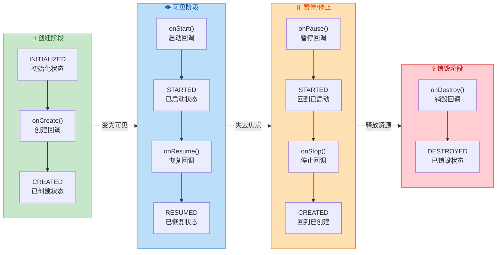
```mermaid
graph LR
    subgraph S1["🚀 创建阶段"]
        direction TB
        A["INITIALIZED\n初始化状态"]
        B["onCreate()\n创建回调"]
        C["CREATED\n已创建状态"]
        A --> B
        B --> C
    end

    subgraph S2["👁️ 可见阶段"]
        direction TB
        D["onStart()\n启动回调"]
        E["STARTED\n已启动状态"]
        F["onResume()\n恢复回调"]
        G["RESUMED\n已恢复状态"]
        D --> E
        E --> F
        F --> G
    end

    subgraph S3["⏸️ 暂停/停止"]
        direction TB
        H["onPause()\n暂停回调"]
        I["STARTED\n回到已启动"]
        J["onStop()\n停止回调"]
        K["CREATED\n回到已创建"]
        H --> I
        I --> J
        J --> K
    end

    subgraph S4["💀 销毁阶段"]
        direction TB
        L["onDestroy()\n销毁回调"]
        M["DESTROYED\n已销毁状态"]
        L --> M
    end

    S1 -->|"变为可见"| S2 -->|"失去焦点"| S3 -->|"释放资源"| S4

    classDef greenNode fill:#C8E6C9,stroke:#388E3C,color:#1B5E20
    classDef blueNode fill:#BBDEFB,stroke:#1976D2,color:#0D47A1
    classDef orangeNode fill:#FFE0B2,stroke:#F57C20,color:#E65100
    classDef redNode fill:#FFCDD2,stroke:#E53935,color:#B71C1C

    class S1 greenNode
    class S2 blueNode
    class S3 orangeNode
    class S4 redNode
```

这里有一个关键概念需要厘清：**回调方法（Callback）和状态（State）是两回事**。`onCreate()` 是一个回调方法，执行完毕后 Activity 进入 `CREATED` 状态。Jetpack 的 `Lifecycle` 组件正是基于这套状态模型设计的，它将状态定义为 `Lifecycle.State` 枚举（`INITIALIZED`, `CREATED`, `STARTED`, `RESUMED`, `DESTROYED`），将回调抽象为 `Lifecycle.Event`（`ON_CREATE`, `ON_START` 等）。理解这层映射关系，对后续使用 `LifecycleObserver` 至关重要。

### onCreate()：Activity 的诞生

`onCreate()` 是 Activity 生命周期中 **第一个被调用的回调**，也是整个生命周期中 **唯一只会被调用一次** 的方法（除非 Activity 被销毁后重建）。它的职责非常明确：**执行一次性的初始化逻辑**。

当系统决定启动一个 Activity 时，`ActivityThread` 会通过反射创建 Activity 实例，然后依次调用 `attach()` 和 `onCreate()`。在 `attach()` 阶段，系统已经为 Activity 绑定了 `Context`、创建了 `PhoneWindow` 对象、关联了 `WindowManager`。所以当 `onCreate()` 被调用时，Activity 已经具备了完整的 Context 能力，你可以安全地访问资源、创建 View、绑定数据。

`onCreate()` 接收一个 `Bundle? savedInstanceState` 参数。这个参数在 **首次创建时为 null**，在 **配置变更或系统回收后重建时携带之前保存的状态数据**。这是 Android 状态恢复机制的入口，后面在异常生命周期章节会详细展开。

```kotlin
// Activity 的 onCreate 回调 —— 整个生命周期的起点
override fun onCreate(savedInstanceState: Bundle?) {
    // 必须首先调用 super.onCreate()
    // 父类会在这里恢复 Fragment 状态、初始化 Loader 等
    super.onCreate(savedInstanceState)

    // setContentView 内部做了三件事：
    // 1. 通过 PhoneWindow.setContentView() 创建 DecorView（如果还没有）
    // 2. 将你的布局 XML inflate 成 View 树
    // 3. 将 View 树添加到 DecorView 的 content 区域（id 为 android.R.id.content 的 FrameLayout）
    setContentView(R.layout.activity_main)

    // 此时 View 树已经创建完毕，但尚未进行 measure/layout/draw
    // 所以你可以安全地 findViewById 或使用 ViewBinding
    val binding = ActivityMainBinding.bind(
        findViewById(android.R.id.content) // 获取 content 根布局
    )

    // 判断是否为重建场景
    if (savedInstanceState != null) {
        // 从 Bundle 中恢复之前保存的状态
        val scrollPosition = savedInstanceState.getInt("scroll_pos", 0)
        binding.recyclerView.scrollToPosition(scrollPosition)
    }

    // 初始化 ViewModel —— ViewModel 的生命周期跨越配置变更
    // 所以即使 Activity 重建，ViewModel 中的数据依然存在
    val viewModel: MainViewModel by viewModels()

    // 设置 RecyclerView Adapter、注册点击监听等一次性操作
    binding.recyclerView.adapter = MyAdapter(viewModel.items)
}
```

有一个常见的误区需要澄清：**`onCreate()` 执行完毕后，Activity 对用户来说仍然是不可见的**。View 树虽然已经创建，但还没有被添加到 `WindowManager`，也没有经历 measure/layout/draw 流程。真正的"可见"要等到 `onStart()` 之后、甚至 `onResume()` 之后窗口才会完成绘制。这就是为什么你在 `onCreate()` 中调用 `view.width` 会得到 0 —— 布局还没发生。

从 Android 12（API 31）开始，`onCreate()` 阶段还与 **SplashScreen API** 产生了交互。系统会在 `onCreate()` 之前显示启动画面，你可以通过 `installSplashScreen()` 来控制启动画面的持续时间和退出动画，但这个调用必须在 `setContentView()` 之前。

### onStart()：从不可见到可见的转变

`onStart()` 标志着 Activity **进入可见状态**。从系统层面看，此时 `WindowManager` 已经将 Activity 的 `DecorView` 添加到窗口系统中，View 树开始进行首次 measure 和 layout（但首帧绘制可能还未完成）。

`onStart()` 的调用场景有两种：
1. **首次启动**：紧跟 `onCreate()` 之后调用。
2. **从后台回到前台**：用户按了 Home 键后又切回来，或者从另一个全屏 Activity 返回，此时 `onRestart()` → `onStart()` 依次调用。

`onStart()` 适合执行 **与可见性相关但不需要焦点的操作**。典型场景包括：

```kotlin
override fun onStart() {
    // 调用 super 确保 Lifecycle 状态正确转移到 STARTED
    // 此时所有注册了 ON_START 事件的 LifecycleObserver 会收到通知
    super.onStart()

    // 注册广播接收器 —— 只在 Activity 可见时接收广播
    // 与 onStop() 中的 unregister 配对
    registerReceiver(networkReceiver, IntentFilter(ConnectivityManager.CONNECTIVITY_ACTION))

    // 开始监听数据变化
    // LiveData 在 STARTED 状态下才会分发数据给 Observer
    // 所以这里是确认 LiveData 观察生效的时机
    viewModel.userData.observe(this) { user ->
        binding.userName.text = user.name
    }

    // 检查权限状态 —— 用户可能在设置中修改了权限
    checkLocationPermission()
}
```

一个重要的细节：**`onStart()` 和 `onStop()` 是对称的**。你在 `onStart()` 中注册的资源，应该在 `onStop()` 中释放。这种对称性是 Android 生命周期设计的核心哲学 —— 每个"获取"操作都有对应的"释放"操作，且它们处于同一层级。

### onResume()：获得焦点，完全交互就绪

`onResume()` 是 Activity 进入 **前台（Foreground）** 的标志。此时 Activity 位于 Activity 栈的最顶部，拥有用户输入焦点，可以接收触摸事件和按键事件。这是 Activity 生命周期中 **用户交互最活跃的状态**。

从状态机的角度看，`RESUMED` 是 Activity 能达到的 **最高活跃状态**。只有处于 `RESUMED` 状态的 Activity 才被认为是"正在与用户交互"的。

```kotlin
override fun onResume() {
    // super.onResume() 之后，Lifecycle 状态变为 RESUMED
    // 所有 LifecycleObserver 收到 ON_RESUME 事件
    super.onResume()

    // 恢复动画、视频播放等需要焦点的操作
    // 这些操作在 onPause() 中被暂停
    videoPlayer.resume()

    // 开始请求传感器数据 —— 传感器回调频率高，只在前台时监听
    sensorManager.registerListener(
        accelerometerListener,
        accelerometer,
        SensorManager.SENSOR_DELAY_UI  // UI 级别的采样率
    )

    // 刷新 UI 状态 —— 用户可能从其他 Activity 返回
    // 比如从设置页面修改了主题，回来后需要刷新
    refreshThemeIfNeeded()

    // 启动周期性 UI 更新（如倒计时、实时时钟）
    startUiUpdateTimer()
}
```

需要特别注意的是：**`onResume()` 并不意味着 Activity 对用户一定是完全可见的**。在多窗口模式（Multi-Window）下，一个 Activity 可能处于 `RESUMED` 状态但只占据屏幕的一部分，甚至被另一个窗口部分遮挡。从 Android 10（API 29）开始，系统支持 **多个 Activity 同时处于 RESUMED 状态**（Multi-Resume），这在折叠屏设备上尤为常见。如果你的逻辑依赖"当前 Activity 是否是唯一的前台 Activity"，需要额外使用 `onTopResumedActivityChanged()` 回调来判断。

### onPause()：失去焦点的第一信号

`onPause()` 是 Activity **开始失去前台焦点** 的信号。它的触发场景非常多样：

- 用户按了返回键（在 Android 12+ 的预测性返回手势中，`onPause()` 的触发时机有所变化）
- 一个新的 Activity 启动并覆盖在当前 Activity 之上
- 一个对话框样式的 Activity 或透明 Activity 出现（此时当前 Activity 仍然可见，但失去焦点）
- 用户触发多窗口模式切换
- 系统弹出权限请求对话框

`onPause()` 的执行有一个关键特性：**它必须快速完成**。在 Android 的 Activity 启动流程中，新 Activity 的 `onResume()` 要等到前一个 Activity 的 `onPause()` 执行完毕后才会被调用。如果你在 `onPause()` 中执行耗时操作（比如同步写数据库、网络请求），会直接导致 **页面切换卡顿**，用户体验极差。

```kotlin
override fun onPause() {
    // super.onPause() 将 Lifecycle 状态从 RESUMED 降为 STARTED
    super.onPause()

    // 暂停动画和视频 —— 失去焦点后不应继续播放
    videoPlayer.pause()

    // 停止传感器监听 —— 减少不必要的电量消耗
    sensorManager.unregisterListener(accelerometerListener)

    // 停止周期性 UI 更新
    stopUiUpdateTimer()

    // ⚠️ 不要在这里做耗时操作！
    // 错误示范：database.saveAllDataSync() ← 这会阻塞 UI 线程
    // 正确做法：使用协程或 WorkManager 异步保存
    lifecycleScope.launch(Dispatchers.IO) {
        // 异步保存用户的临时编辑状态
        repository.saveDraft(currentDraft)
    }
}
```

这里有一个经典的面试考点：**当 Activity A 启动 Activity B 时，回调的执行顺序是什么？** 答案是：

```
A.onPause() → B.onCreate() → B.onStart() → B.onResume() → A.onStop()
```

注意 `A.onStop()` 是在 `B.onResume()` **之后** 才执行的。这意味着在 `A.onPause()` 到 `A.onStop()` 之间，A 仍然处于 `STARTED`（可见）状态。这个时序对于理解透明 Activity 覆盖场景尤为重要 —— 如果 B 是透明的或对话框样式的，A 的 `onStop()` 根本不会被调用，因为 A 仍然可见。

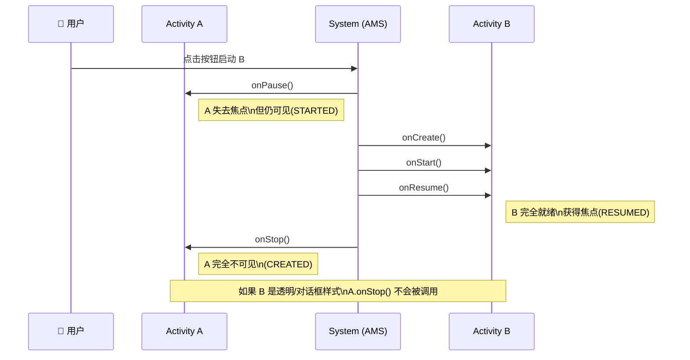
```mermaid
sequenceDiagram
    participant U as 👤 用户
    participant A as Activity A
    participant S as System (AMS)
    participant B as Activity B

    U->>S: 点击按钮启动 B
    S->>A: onPause()
    Note right of A: A 失去焦点\n但仍可见(STARTED)
    S->>B: onCreate()
    S->>B: onStart()
    S->>B: onResume()
    Note right of B: B 完全就绪\n获得焦点(RESUMED)
    S->>A: onStop()
    Note right of A: A 完全不可见\n(CREATED)
    Note over A,B: 如果 B 是透明/对话框样式\nA.onStop() 不会被调用
```

### onStop()：完全不可见

`onStop()` 在 Activity **对用户完全不可见** 时被调用。此时 Activity 的状态回退到 `CREATED`。常见的触发场景包括：用户按 Home 键回到桌面、新的全屏 Activity 完全覆盖了当前 Activity、用户通过最近任务列表切换到其他应用。

与 `onPause()` 不同，`onStop()` 中可以执行 **相对耗时的操作**，因为此时 Activity 已经不可见，不会影响用户感知的流畅度。这是执行数据持久化、释放重量级资源的理想时机。

```kotlin
override fun onStop() {
    // super.onStop() 将 Lifecycle 状态降为 CREATED
    super.onStop()

    // 注销广播接收器 —— 与 onStart() 中的注册配对
    unregisterReceiver(networkReceiver)

    // 持久化数据 —— onStop() 是保存数据的最佳时机
    // 从 Android 7.0 (API 24) 开始，系统保证 onStop() 一定会被调用
    // （之前只保证 onPause() 一定被调用）
    lifecycleScope.launch(Dispatchers.IO) {
        // 将用户编辑的内容保存到数据库
        repository.saveUserProgress(currentProgress)
    }

    // 释放重量级资源
    // 比如关闭相机预览 —— 相机是独占资源，不释放会阻止其他应用使用
    cameraProvider.unbindAll()

    // 取消不再需要的网络请求
    pendingRequests.forEach { it.cancel() }
}
```

从 Android 7.0（API 24）开始，Google 对 `onStop()` 的保证做了一个重要的变更：**系统保证 `onStop()` 和 `onSaveInstanceState()` 一定会被调用**。在此之前，系统只保证 `onPause()` 一定被调用，`onStop()` 在极端内存压力下可能被跳过。这个变更使得 `onStop()` 成为了比 `onPause()` 更可靠的数据保存时机。同时，`onSaveInstanceState()` 的调用时序也从 `onStop()` 之前变为了 `onStop()` 之后，这意味着 Fragment 事务（Fragment Transactions）在 `onStop()` 中仍然可以安全提交，而在 `onSaveInstanceState()` 之后提交则会抛出 `IllegalStateException`。

### onDestroy()：生命的终结

`onDestroy()` 是 Activity 生命周期中 **最后一个被调用的回调**。调用完毕后，Activity 实例将被 GC 回收（如果没有内存泄漏的话）。它的触发有两种原因：

1. **用户主动销毁**：调用了 `finish()`，或用户按返回键退出。此时 `isFinishing()` 返回 `true`。
2. **系统被动销毁**：配置变更（如横竖屏切换）导致 Activity 重建，或系统因内存不足回收了 Activity。此时 `isFinishing()` 返回 `false`。

区分这两种情况非常重要，因为它决定了你在 `onDestroy()` 中应该释放哪些资源：

```kotlin
override fun onDestroy() {
    // super.onDestroy() 将 Lifecycle 状态设为 DESTROYED
    // 所有 LifecycleObserver 收到 ON_DESTROY 事件
    // LiveData 的 Observer 会被自动移除（Lifecycle-aware 的优势）
    super.onDestroy()

    if (isFinishing) {
        // 用户主动退出 —— 执行彻底的清理
        // 清除缓存、关闭数据库连接、释放所有资源
        cache.evictAll()
        database.close()

        // 取消所有后台任务
        // 注意：lifecycleScope 会在 onDestroy 后自动取消
        // 但如果你使用了自定义的 CoroutineScope，需要手动取消
        customScope.cancel()
    } else {
        // 配置变更导致的重建 —— 只释放与 View 相关的资源
        // ViewModel 会存活，不需要清理 ViewModel 中的数据
        // 但需要释放持有 Activity 引用的对象，防止内存泄漏
        binding = null  // 清除 ViewBinding 引用
    }

    // 无论哪种情况，都应该释放的资源：
    // 注销不再需要的回调、关闭流、释放 Native 资源
    mediaPlayer?.release()
    mediaPlayer = null
}
```

一个容易被忽视的细节：**`onDestroy()` 不保证一定会被调用**。如果应用进程被系统直接杀死（比如用户在设置中强制停止应用，或系统在极端内存压力下直接 kill 进程），`onDestroy()` 不会执行。因此，**关键数据的持久化绝不能依赖 `onDestroy()`**，应该在 `onStop()` 中完成。`onDestroy()` 更适合做"锦上添花"的清理工作 —— 释放内存、关闭连接等。即使这些清理没有执行，进程被杀后操作系统也会回收所有资源。

### 完整生命周期时序与配对关系

理解了每个回调的职责后，我们需要建立一个 **配对（Pairing）** 的思维模型。Android 的生命周期回调是成对设计的，每一对负责管理不同级别的资源：

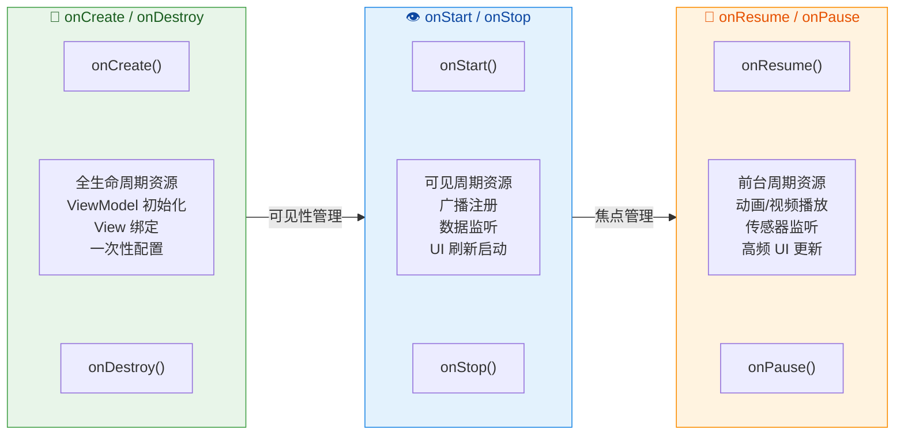
```mermaid
graph LR
    subgraph P1["🔧 onCreate / onDestroy"]
        direction TB
        A1["onCreate()"] ~~~ A2["全生命周期资源\nViewModel 初始化\nView 绑定\n一次性配置"] ~~~ A3["onDestroy()"]
    end

    subgraph P2["👁️ onStart / onStop"]
        direction TB
        B1["onStart()"] ~~~ B2["可见周期资源\n广播注册\n数据监听\nUI 刷新启动"] ~~~ B3["onStop()"]
    end

    subgraph P3["🎯 onResume / onPause"]
        direction TB
        C1["onResume()"] ~~~ C2["前台周期资源\n动画/视频播放\n传感器监听\n高频 UI 更新"] ~~~ C3["onPause()"]
    end

    P1 -->|"可见性管理"| P2 -->|"焦点管理"| P3

    classDef pair1 fill:#E8F5E9,stroke:#43A047,color:#1B5E20
    classDef pair2 fill:#E3F2FD,stroke:#1E88E5,color:#0D47A1
    classDef pair3 fill:#FFF3E0,stroke:#FB8C00,color:#E65100

    class P1 pair1
    class P2 pair2
    class P3 pair3
```

这三对回调形成了一个 **嵌套结构**：`onCreate/onDestroy` 是最外层，管理整个生命周期的资源；`onStart/onStop` 是中间层，管理可见期间的资源；`onResume/onPause` 是最内层，管理前台交互期间的资源。资源的获取和释放严格遵循 **后进先出（LIFO）** 的顺序，就像栈一样。

最后，还有一个经常被遗忘的回调：**`onRestart()`**。它只在 Activity 从 `STOPPED` 状态重新回到 `STARTED` 状态时被调用（即 `onStop()` → `onRestart()` → `onStart()`）。首次启动时不会调用。它的使用场景比较少，通常用于在"回到前台"时执行一些特殊的刷新逻辑，比如检查数据是否在后台期间被其他组件修改过。

---

**📝 练习题**

当用户从 Activity A 启动一个 **透明主题（Theme.Translucent）** 的 Activity B 时，A 的生命周期回调执行到哪一步？

A. `onPause()` → `onStop()` → `onDestroy()`

B. `onPause()` → `onStop()`

C. `onPause()`

D. 不会触发任何回调

**【答案】** C

**【解析】** 当新启动的 Activity B 使用透明主题或对话框样式时，Activity A 在视觉上仍然是 **部分可见的**（透过 B 可以看到 A）。根据 Android 的生命周期规则，`onStop()` 只在 Activity **完全不可见** 时才会被调用。因此 A 只会执行到 `onPause()`（失去焦点），不会执行 `onStop()`。A 此时处于 `STARTED` 状态 —— 可见但没有焦点。当 B 被关闭后，A 会直接收到 `onResume()` 回调（而不是 `onRestart()` → `onStart()` → `onResume()`，因为 A 从未进入 `STOPPED` 状态）。

这个行为差异在处理视频播放、动画等场景时尤为关键：如果你把暂停逻辑放在 `onStop()` 而不是 `onPause()`，那么在透明 Activity 覆盖时视频会继续播放，这可能是你想要的效果，也可能不是 —— 取决于具体的产品需求。

---

**📝 练习题**

以下关于 `onSaveInstanceState()` 调用时序的描述，在 Android 9（API 28）及以上版本中哪个是正确的？

A. 在 `onPause()` 之前调用

B. 在 `onPause()` 和 `onStop()` 之间调用

C. 在 `onStop()` 之后调用

D. 在 `onDestroy()` 之后调用

**【答案】** C

**【解析】** 这是一个重要的版本差异知识点。在 Android 9（API 28，对应 Android P）之前，`onSaveInstanceState()` 的调用时机是在 `onStop()` **之前**（具体是在 `onPause()` 之后、`onStop()` 之前，即选项 B 的描述）。但从 Android 9 开始，Google 将其调整为在 `onStop()` **之后** 调用。

这个变更的原因是：在旧的时序下，`onStop()` 中提交的 Fragment 事务可能与已经保存的状态产生冲突，导致状态丢失。新的时序保证了 `onStop()` 中的所有操作（包括 Fragment 事务）都能被 `onSaveInstanceState()` 正确捕获和保存。完整的时序变为：`onPause()` → `onStop()` → `onSaveInstanceState()`。这也是为什么 Google 推荐将数据持久化逻辑放在 `onStop()` 而非 `onSaveInstanceState()` 中的原因之一。

---

## 异常生命周期

Android 系统中，Activity 并不总是按照用户主动操作的"正常路径"走完生命周期。系统资源紧张时的强制回收、屏幕旋转等配置变更触发的销毁重建，都属于 **异常生命周期（Abnormal Lifecycle）**。理解这些场景的底层机制，是写出健壮 App 的关键——因为如果你不处理，用户填了半天的表单、滚动到一半的列表位置，都会在一瞬间丢失。

### 系统回收（Process Death / Low Memory Kill）

#### 为什么会被回收

Android 是一个资源受限的移动操作系统，它必须在有限的内存中同时维护多个应用的运行状态。当系统可用内存降到阈值以下时，**LowMemoryKiller（LMK）** 守护进程会根据进程的 **OOM Adj 优先级** 选择性地杀死进程。这不是一个"温柔"的过程——系统不会调用你的 `onDestroy()`，而是直接终止整个进程（process kill）。

要理解这个机制，需要先了解 Android 对进程的优先级分类。系统为每个进程维护一个 `oom_adj` 值，数值越大，越容易被杀：

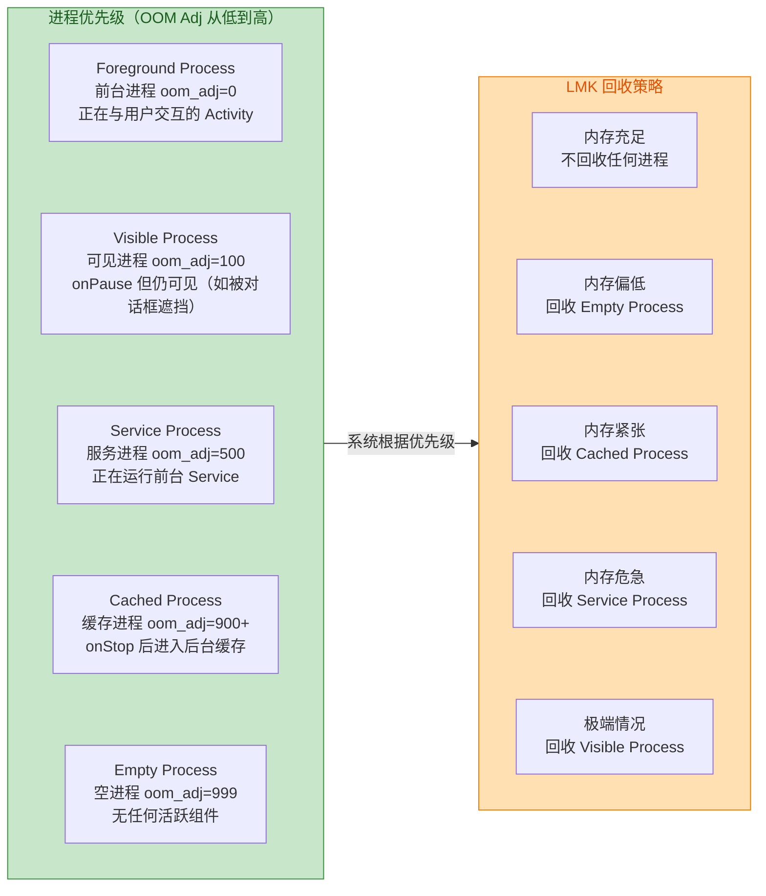
```mermaid
graph LR
    subgraph Priority["进程优先级（OOM Adj 从低到高）"]
        direction TB
        FG["Foreground Process\n前台进程 oom_adj=0\n正在与用户交互的 Activity"]
        VIS["Visible Process\n可见进程 oom_adj=100\nonPause 但仍可见（如被对话框遮挡）"]
        SVC["Service Process\n服务进程 oom_adj=500\n正在运行前台 Service"]
        CACHE["Cached Process\n缓存进程 oom_adj=900+\nonStop 后进入后台缓存"]
        EMPTY["Empty Process\n空进程 oom_adj=999\n无任何活跃组件"]
        FG ~~~ VIS
        VIS ~~~ SVC
        SVC ~~~ CACHE
        CACHE ~~~ EMPTY
    end

    subgraph Kill["LMK 回收策略"]
        direction TB
        K1["内存充足\n不回收任何进程"]
        K2["内存偏低\n回收 Empty Process"]
        K3["内存紧张\n回收 Cached Process"]
        K4["内存危急\n回收 Service Process"]
        K5["极端情况\n回收 Visible Process"]
        K1 ~~~ K2
        K2 ~~~ K3
        K3 ~~~ K4
        K4 ~~~ K5
    end

    Priority -->|"系统根据优先级"| Kill

    classDef greenNode fill:#C8E6C9,stroke:#388E3C,color:#1B5E20
    classDef orangeNode fill:#FFE0B2,stroke:#F57C00,color:#E65100
    class Priority greenNode
    class Kill orangeNode
```

关键点在于：当用户按下 Home 键或切换到其他 App 时，你的 Activity 会走到 `onStop()`，进程变为 **Cached Process**。此时它仍然存活在内存中（这就是为什么切回来时恢复很快），但一旦系统内存吃紧，这个进程随时可能被杀掉。被杀掉后，从用户视角看，这个 App 仍然出现在最近任务列表（Recents）中——用户点击它时，系统会重新创建进程并恢复 Activity，这就是所谓的 **"进程死亡后恢复"（restore after process death）**。

#### 回收时机的细节

一个常见的误解是"系统会在 `onStop()` 之后立即回收"。实际上，回收的时机完全取决于系统内存压力，可能是几秒后，也可能是几小时后，甚至永远不会发生（如果内存一直充足）。但有一点是确定的：**系统保证在杀死进程之前，已经调用过 `onSaveInstanceState()`**。这是系统给你的最后一次"保存遗言"的机会。

另一个重要细节是：系统回收的粒度是 **进程（Process）**，而不是单个 Activity。一个进程中可能有多个 Activity 实例（比如 A 启动了 B，B 启动了 C），当进程被杀时，所有 Activity 都会消失。但系统会为 **每一个** Activity 分别保存其 `Bundle` 状态，恢复时也会按照 back stack 的顺序逐一重建。

#### 如何模拟系统回收

开发中最大的问题是：系统回收在日常调试时很难自然触发。很多开发者从未测试过这个场景，导致线上出现大量 crash。以下是几种可靠的模拟方式：

第一种方式是使用 Android Studio 的 **"Terminate Application"** 按钮。在 Logcat 面板中，选中你的进程，点击停止按钮。然后从最近任务列表中切回 App，系统就会走恢复流程。

第二种方式是使用 adb 命令：

```bash
# 先把 App 切到后台（按 Home 键），然后执行：
adb shell am kill com.example.myapp
# 注意：是 "am kill" 而不是 "am force-stop"
# am kill 会模拟 LMK 的行为，保留 saved state
# am force-stop 则会清除所有状态，相当于用户强制停止
```

第三种方式是在开发者选项中开启 **"Don't keep activities"（不保留活动）**。这个选项会在 Activity 进入后台时立即销毁它（但不杀进程），可以快速验证状态保存逻辑。不过要注意，这与真正的进程死亡还是有区别的——进程中的单例、静态变量、Application 对象都还在。

### 配置变更重建（Configuration Change & Recreation）

#### 什么是配置变更

当设备的 **运行时配置（Runtime Configuration）** 发生变化时，Android 系统默认会销毁当前 Activity 并重新创建一个新实例。这些配置变化包括但不限于：

- **屏幕方向变化**（`orientation`）：用户旋转设备
- **屏幕尺寸变化**（`screenSize`）：折叠屏展开/折叠、分屏模式切换
- **语言/区域变化**（`locale`）：用户在设置中切换系统语言
- **字体缩放变化**（`fontScale`）：用户调整系统字体大小
- **深色模式切换**（`uiMode`）：用户切换 Light/Dark 主题
- **键盘可用性变化**（`keyboard`）：外接键盘插拔
- **屏幕密度变化**（`density`）：连接外部显示器

#### 为什么要销毁重建而不是"刷新"

这是一个非常好的设计问题。Android 选择销毁重建而非简单刷新，核心原因是 **资源限定符（Resource Qualifiers）** 机制。Android 的资源系统允许你为不同配置提供不同的资源文件，例如：

- `res/layout/activity_main.xml`（竖屏布局）
- `res/layout-land/activity_main.xml`（横屏布局）
- `res/values-zh/strings.xml`（中文字符串）
- `res/values-night/colors.xml`（深色模式颜色）

当配置变更时，系统需要重新加载匹配新配置的资源。而 `setContentView()` 在 `onCreate()` 中调用，View 树的构建、数据绑定、各种初始化逻辑都在生命周期回调中完成。与其设计一套复杂的"局部刷新"机制（需要处理无数边界情况），不如直接走一遍完整的销毁-创建流程，让开发者用已有的生命周期模型来处理。这是一个 **简洁性优于性能** 的设计取舍。

#### 配置变更时的生命周期时序

当屏幕旋转（最常见的配置变更场景）发生时，Activity 会经历以下完整的回调序列：

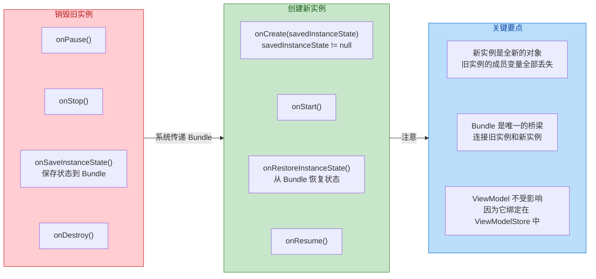
```mermaid
graph LR
    subgraph Destroy["销毁旧实例"]
        direction TB
        P["onPause()"]
        S["onStop()"]
        SAVE["onSaveInstanceState()\n保存状态到 Bundle"]
        D["onDestroy()"]
        P ~~~ S
        S ~~~ SAVE
        SAVE ~~~ D
    end

    subgraph Create["创建新实例"]
        direction TB
        C["onCreate(savedInstanceState)\nsavedInstanceState != null"]
        ST["onStart()"]
        RESTORE["onRestoreInstanceState()\n从 Bundle 恢复状态"]
        R["onResume()"]
        C ~~~ ST
        ST ~~~ RESTORE
        RESTORE ~~~ R
    end

    subgraph Key["关键要点"]
        direction TB
        N1["新实例是全新的对象\n旧实例的成员变量全部丢失"]
        N2["Bundle 是唯一的桥梁\n连接旧实例和新实例"]
        N3["ViewModel 不受影响\n因为它绑定在 ViewModelStore 中"]
        N1 ~~~ N2
        N2 ~~~ N3
    end

    Destroy -->|"系统传递 Bundle"| Create -->|"注意"| Key

    classDef redNode fill:#FFCDD2,stroke:#D32F2F,color:#B71C1C
    classDef greenNode fill:#C8E6C9,stroke:#388E3C,color:#1B5E20
    classDef blueNode fill:#BBDEFB,stroke:#1976D2,color:#0D47A1
    class Destroy redNode
    class Create greenNode
    class Key blueNode
```

这里有一个容易被忽略的细节：`onSaveInstanceState()` 的调用时机在 `onStop()` **之后**（Android P 及以上）。在 Android P 之前，它在 `onStop()` 之前调用。这个变化的原因是为了保证 Fragment 事务（FragmentTransaction）的状态一致性——在 `onStop()` 之后保存，可以确保所有 Fragment 的状态都已经稳定。

#### 使用 android:configChanges 阻止重建

如果你确实不希望某些配置变更触发重建，可以在 `AndroidManifest.xml` 中声明：

```xml
<!-- 声明 Activity 自行处理屏幕方向和屏幕尺寸变化 -->
<!-- 注意：orientation 和 screenSize 通常需要一起声明 -->
<activity
    android:name=".VideoPlayerActivity"
    android:configChanges="orientation|screenSize|screenLayout|smallestScreenSize" />
```

声明后，配置变更时系统不再销毁重建 Activity，而是回调 `onConfigurationChanged()`：

```kotlin
// 当声明了 configChanges 后，配置变更时系统调用此方法
// 而不是走 onDestroy -> onCreate 的重建流程
override fun onConfigurationChanged(newConfig: Configuration) {
    // 必须调用 super，否则会抛出 SuperNotCalledException
    super.onConfigurationChanged(newConfig)

    // 通过 newConfig 判断当前的配置状态
    when (newConfig.orientation) {
        // 横屏：可以切换到横屏专用的 UI 布局
        Configuration.ORIENTATION_LANDSCAPE -> {
            // 例如视频播放器进入全屏模式
            enterFullScreen()
        }
        // 竖屏：恢复默认的竖屏布局
        Configuration.ORIENTATION_PORTRAIT -> {
            // 退出全屏模式
            exitFullScreen()
        }
    }
}
```

但这种方式有明显的代价：你需要 **手动处理所有资源更新**。系统不会自动重新加载 `layout-land/` 下的布局、`values-night/` 下的颜色等。对于视频播放器这类场景（旋转时只需调整播放器尺寸，不需要换布局），`configChanges` 是合理的。但对于大多数普通页面，**推荐使用默认的销毁重建 + ViewModel 保持数据** 的方式，这样更安全、更符合 Android 的设计哲学。

### onSaveInstanceState 保存机制

#### 调用时机与保证

`onSaveInstanceState(Bundle)` 是系统提供的状态保存回调。它的核心契约是：**当 Activity 有可能被系统销毁时（而非用户主动销毁），系统一定会在销毁前调用此方法**。

"有可能被系统销毁"包括以下场景：
- 用户按 Home 键（Activity 进入后台，可能被 LMK 回收）
- 用户切换到其他 App（同上）
- 屏幕旋转等配置变更（系统主动销毁重建）
- 用户按下电源键锁屏
- 从当前 Activity 启动新的 Activity（当前 Activity 进入 stopped 状态）

"用户主动销毁"则 **不会** 触发此回调：
- 用户按 Back 键退出 Activity（这是用户明确表示"我不要了"）
- 代码中调用 `finish()`（开发者明确表示销毁）
- 从最近任务列表中滑动移除 App

这个区分非常重要——它体现了 Android 的设计意图：**状态保存是为了应对"意外中断"，而不是为了持久化用户数据**。如果用户主动关闭页面，说明他不需要恢复状态；只有当系统"偷偷"杀掉 Activity 时，才需要在用户回来时假装什么都没发生。

#### Bundle 的本质与限制

`Bundle` 本质上是一个 `ArrayMap<String, Object>` 的包装类，它实现了 `Parcelable` 接口，可以跨进程传输。系统将 Bundle 序列化后保存在 **system_server 进程** 的内存中（具体来说是 `ActivityRecord` 对象的 `icicle` 字段）。这意味着即使你的 App 进程被杀死，状态数据仍然安全地保存在系统进程中。

但正因为 Bundle 需要跨进程序列化，它有严格的限制：

```kotlin
// Bundle 只能存储以下类型的数据：
// 1. 基本类型：Int, Long, Float, Double, Boolean, String
// 2. 基本类型数组：IntArray, LongArray, StringArray 等
// 3. Parcelable 对象：实现了 Parcelable 接口的对象
// 4. Serializable 对象：实现了 Serializable 接口的对象（性能较差）
// 5. 嵌套 Bundle

// ❌ 不能存储的：
// - 普通对象（没有实现 Parcelable/Serializable）
// - Bitmap（太大，应该存文件路径）
// - Context 引用（会导致内存泄漏）
// - 大量数据（Bundle 总大小限制约 1MB，超过会抛 TransactionTooLargeException）
```

**1MB 的限制** 是一个经常被踩到的坑。这个限制来自 Binder 事务的缓冲区大小。实际上，由于 Bundle 中还包含系统自动保存的 View 状态（如 EditText 的文本、ScrollView 的滚动位置），留给开发者的空间更少。经验法则是：**Bundle 中只保存轻量级的 UI 状态标识（如 ID、位置索引、筛选条件），不要保存大数据（如列表数据、图片）**。

#### 自动保存与手动保存

Android 的状态保存分为两层：**View 层自动保存** 和 **开发者手动保存**。

View 层自动保存是 Android 框架内建的机制。当 `onSaveInstanceState()` 被调用时，系统会遍历整个 View 树，调用每个 View 的 `onSaveInstanceState()` 方法。前提是这个 View 必须有一个 **唯一的 `android:id`**——没有 id 的 View 不会被保存状态。系统自动保存的内容包括：

- `EditText`：用户输入的文本内容
- `CheckBox` / `RadioButton`：选中状态
- `ScrollView`：滚动位置
- `RecyclerView`：滚动位置（通过 LayoutManager 的状态保存）
- `ViewPager2`：当前页面索引

开发者手动保存则用于那些 View 系统无法自动处理的自定义状态：

```kotlin
class OrderFormActivity : AppCompatActivity() {

    // 这些成员变量在 Activity 重建后会丢失（因为是新对象）
    // 需要手动保存到 Bundle 中
    private var selectedCityId: Int = -1          // 用户选择的城市 ID
    private var currentStep: Int = 0              // 当前表单步骤
    private var isDiscountApplied: Boolean = false // 是否已应用优惠券

    override fun onSaveInstanceState(outState: Bundle) {
        // 必须先调用 super，让系统保存 View 树的状态
        // 如果忘记调用 super，EditText 的文本、ScrollView 的位置等都会丢失
        super.onSaveInstanceState(outState)

        // 手动保存自定义的 UI 状态
        // 使用常量 Key 避免拼写错误
        outState.putInt(KEY_SELECTED_CITY, selectedCityId)
        outState.putInt(KEY_CURRENT_STEP, currentStep)
        outState.putBoolean(KEY_DISCOUNT_APPLIED, isDiscountApplied)

        // ⚠️ 不要在这里保存大对象！
        // 例如不要保存从网络获取的订单列表数据
        // 那些数据应该放在 ViewModel + Repository 中管理
    }

    companion object {
        // 使用常量定义 Bundle 的 Key，防止拼写错误导致的 Bug
        private const val KEY_SELECTED_CITY = "key_selected_city"
        private const val KEY_CURRENT_STEP = "key_current_step"
        private const val KEY_DISCOUNT_APPLIED = "key_discount_applied"
    }
}
```

#### 保存机制的底层流程

从应用层到系统层，`onSaveInstanceState()` 的调用链路如下：

当 Activity 即将进入可能被销毁的状态时（例如 `onStop()` 之后），`ActivityThread`（App 进程的主线程调度器）会收到来自 `system_server` 的指令。`ActivityThread` 调用 `performStopActivity()` 方法，其中会触发 `callActivityOnSaveInstanceState()`。这个方法创建一个空的 `Bundle` 对象，传给 Activity 的 `onSaveInstanceState()`。Activity 填充完数据后，`ActivityThread` 通过 Binder IPC 将这个 Bundle 发送回 `system_server`，由 `ActivityTaskManagerService`（ATMS，Android 10+ 从 AMS 拆分出来的）保存在对应的 `ActivityRecord` 中。

整个过程发生在主线程，因此 `onSaveInstanceState()` 中不应执行耗时操作，否则会导致 UI 卡顿。

### onRestoreInstanceState 恢复机制

#### 两个恢复入口

状态恢复有两个入口，开发者可以选择任意一个（或两个都用，但通常选一个）：

第一个入口是 `onCreate(savedInstanceState: Bundle?)`。这是最常用的恢复位置，因为大多数初始化逻辑本来就在 `onCreate()` 中。需要注意的是，`savedInstanceState` 参数可能为 `null`——当 Activity 是首次创建（而非恢复）时，它就是 `null`。因此必须做空判断：

```kotlin
override fun onCreate(savedInstanceState: Bundle?) {
    // 调用 super 时传入 savedInstanceState
    // 系统会在 super.onCreate() 中恢复 Fragment 的状态、View 树的状态等
    super.onCreate(savedInstanceState)
    setContentView(R.layout.activity_order_form)

    // 判断是否是从保存状态恢复
    if (savedInstanceState != null) {
        // 恢复场景：从 Bundle 中取回之前保存的状态
        selectedCityId = savedInstanceState.getInt(KEY_SELECTED_CITY, -1)
        currentStep = savedInstanceState.getInt(KEY_CURRENT_STEP, 0)
        isDiscountApplied = savedInstanceState.getBoolean(KEY_DISCOUNT_APPLIED, false)

        // 根据恢复的状态更新 UI
        // 例如跳转到之前的表单步骤
        navigateToStep(currentStep)
    } else {
        // 首次创建场景：执行默认初始化
        // 例如从 Intent 中读取初始参数
        selectedCityId = intent.getIntExtra("city_id", -1)
        currentStep = 0
        isDiscountApplied = false
    }
}
```

第二个入口是 `onRestoreInstanceState(savedInstanceState: Bundle)`。注意它的参数 **不是可空类型**——这个方法只在确实有保存状态需要恢复时才会被调用。如果 Activity 是首次创建，这个方法根本不会执行。它的调用时机在 `onStart()` 之后、`onResume()` 之前：

```kotlin
override fun onRestoreInstanceState(savedInstanceState: Bundle) {
    // 调用 super 让系统恢复 View 树的状态
    // 包括 EditText 文本、CheckBox 选中状态、ScrollView 滚动位置等
    super.onRestoreInstanceState(savedInstanceState)

    // 这里不需要判空，因为只有确实有保存状态时才会调用
    selectedCityId = savedInstanceState.getInt(KEY_SELECTED_CITY, -1)
    currentStep = savedInstanceState.getInt(KEY_CURRENT_STEP, 0)
    isDiscountApplied = savedInstanceState.getBoolean(KEY_DISCOUNT_APPLIED, false)

    // 恢复 UI 状态
    updateStepIndicator(currentStep)
}
```

#### 选择哪个入口

两者的核心区别在于：

- `onCreate()` 中恢复：可以将"首次创建"和"恢复"的逻辑放在一起，通过 `if (savedInstanceState != null)` 分支处理。适合大多数场景，代码更集中。
- `onRestoreInstanceState()` 中恢复：将恢复逻辑与初始化逻辑分离，代码更清晰。适合恢复逻辑较复杂、需要在 View 初始化完成后才能执行的场景。

实际开发中，**推荐在 `onCreate()` 中恢复**，因为这是最直观的位置，也是 Google 官方示例中最常用的方式。`onRestoreInstanceState()` 更多用于需要覆盖系统默认 View 恢复行为的高级场景。

#### 完整的保存-恢复示例

下面是一个综合示例，展示了一个搜索页面如何正确处理异常生命周期：

```kotlin
class SearchActivity : AppCompatActivity() {

    // UI 状态：这些变量在 Activity 重建后会丢失
    private var searchQuery: String = ""        // 当前搜索关键词
    private var filterType: Int = FILTER_ALL    // 当前筛选类型
    private var isFilterPanelOpen: Boolean = false // 筛选面板是否展开

    // ViewModel：不受配置变更影响，但进程死亡后会丢失
    // 如果需要进程死亡后也能恢复，使用 SavedStateHandle
    private val viewModel: SearchViewModel by viewModels()

    override fun onCreate(savedInstanceState: Bundle?) {
        super.onCreate(savedInstanceState)
        setContentView(R.layout.activity_search)

        if (savedInstanceState != null) {
            // ---- 恢复场景 ----
            // 从 Bundle 恢复轻量级 UI 状态
            searchQuery = savedInstanceState.getString(KEY_QUERY, "")
            filterType = savedInstanceState.getInt(KEY_FILTER, FILTER_ALL)
            isFilterPanelOpen = savedInstanceState.getBoolean(KEY_PANEL_OPEN, false)

            // 恢复 UI 表现
            // 注意：EditText 的文本会被系统自动恢复（因为它有 android:id）
            // 但我们可能需要根据 searchQuery 做额外逻辑
            if (isFilterPanelOpen) {
                showFilterPanel()
            }
        }

        // 无论是首次创建还是恢复，都需要观察 ViewModel 的数据
        // ViewModel 在配置变更时不会丢失，所以搜索结果还在
        // 但进程死亡后 ViewModel 也会丢失，此时 ViewModel 内部
        // 可以通过 SavedStateHandle 恢复关键参数并重新请求数据
        viewModel.searchResults.observe(this) { results ->
            // 更新搜索结果列表
            updateResultList(results)
        }
    }

    override fun onSaveInstanceState(outState: Bundle) {
        // 先让系统保存 View 树状态
        super.onSaveInstanceState(outState)

        // 保存自定义 UI 状态
        outState.putString(KEY_QUERY, searchQuery)
        outState.putInt(KEY_FILTER, filterType)
        outState.putBoolean(KEY_PANEL_OPEN, isFilterPanelOpen)

        // ❌ 不要这样做：
        // outState.putParcelableArrayList(KEY_RESULTS, searchResults)
        // 搜索结果可能很大，应该由 ViewModel/Repository 管理
        // ViewModel 可以通过 SavedStateHandle 保存搜索参数
        // 恢复时重新请求数据即可
    }

    companion object {
        private const val KEY_QUERY = "key_search_query"
        private const val KEY_FILTER = "key_filter_type"
        private const val KEY_PANEL_OPEN = "key_filter_panel_open"
        private const val FILTER_ALL = 0
    }

    // ... 省略 showFilterPanel(), updateResultList() 等方法
}
```

#### 状态保存的分层策略

在现代 Android 开发中，状态保存不应该只依赖 `onSaveInstanceState()`。正确的做法是根据数据的性质选择不同的保存层级：

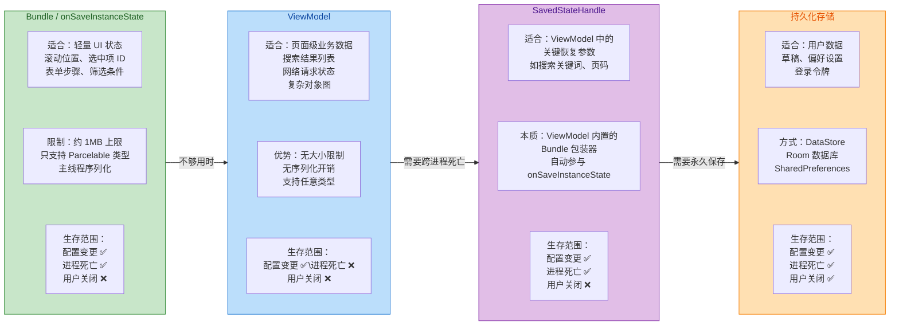
```mermaid
graph LR
    subgraph Layer1["Bundle / onSaveInstanceState"]
        direction TB
        L1A["适合：轻量 UI 状态\n滚动位置、选中项 ID\n表单步骤、筛选条件"]
        L1B["限制：约 1MB 上限\n只支持 Parcelable 类型\n主线程序列化"]
        L1C["生存范围：\n配置变更 ✅\n进程死亡 ✅\n用户关闭 ❌"]
        L1A ~~~ L1B
        L1B ~~~ L1C
    end

    subgraph Layer2["ViewModel"]
        direction TB
        L2A["适合：页面级业务数据\n搜索结果列表\n网络请求状态\n复杂对象图"]
        L2B["优势：无大小限制\n无序列化开销\n支持任意类型"]
        L2C["生存范围：\n配置变更 ✅\进程死亡 ❌\n用户关闭 ❌"]
        L2A ~~~ L2B
        L2B ~~~ L2C
    end

    subgraph Layer3["SavedStateHandle"]
        direction TB
        L3A["适合：ViewModel 中的\n关键恢复参数\n如搜索关键词、页码"]
        L3B["本质：ViewModel 内置的\nBundle 包装器\n自动参与 onSaveInstanceState"]
        L3C["生存范围：\n配置变更 ✅\n进程死亡 ✅\n用户关闭 ❌"]
        L3A ~~~ L3B
        L3B ~~~ L3C
    end

    subgraph Layer4["持久化存储"]
        direction TB
        L4A["适合：用户数据\n草稿、偏好设置\n登录令牌"]
        L4B["方式：DataStore\nRoom 数据库\nSharedPreferences"]
        L4C["生存范围：\n配置变更 ✅\n进程死亡 ✅\n用户关闭 ✅"]
        L4A ~~~ L4B
        L4B ~~~ L4C
    end

    Layer1 -->|"不够用时"| Layer2 -->|"需要跨进程死亡"| Layer3 -->|"需要永久保存"| Layer4

    classDef green fill:#C8E6C9,stroke:#388E3C,color:#1B5E20
    classDef blue fill:#BBDEFB,stroke:#1976D2,color:#0D47A1
    classDef purple fill:#E1BEE7,stroke:#7B1FA2,color:#4A148C
    classDef orange fill:#FFE0B2,stroke:#F57C00,color:#E65100
    class Layer1 green
    class Layer2 blue
    class Layer3 purple
    class Layer4 orange
```

这四层策略的核心思想是：**越轻量的数据用越轻量的机制保存，越重要的数据用越持久的机制保存**。`onSaveInstanceState()` 只是其中一层，它最适合保存那些"丢了会让用户体验变差，但不会造成数据丢失"的瞬态 UI 状态。

#### SavedStateHandle 深入

`SavedStateHandle` 是 Jetpack Lifecycle 库提供的一个关键组件，它解决了一个长期困扰开发者的问题：**ViewModel 在进程死亡后无法存活**。很多开发者误以为 ViewModel 能扛住一切，实际上它只能扛住配置变更（因为 `ViewModelStore` 绑定在 `Activity` 的 `NonConfigurationInstances` 上，配置变更时会被系统保留）。但进程被杀后，`ViewModelStore` 也随之消亡。

`SavedStateHandle` 的原理是在 ViewModel 内部维护一个类似 Bundle 的键值对存储，它会自动参与 Activity 的 `onSaveInstanceState()` 流程。当进程死亡后恢复时，系统会将保存的 Bundle 传递给 `SavedStateHandle`，ViewModel 就能从中恢复关键参数：

```kotlin
// 使用 SavedStateHandle 的 ViewModel
// SavedStateHandle 由 ViewModelProvider 自动注入
class SearchViewModel(
    // savedStateHandle 自动参与 Activity 的状态保存/恢复
    private val savedStateHandle: SavedStateHandle
) : ViewModel() {

    // 使用 SavedStateHandle 存储搜索关键词
    // getLiveData() 返回一个与 SavedStateHandle 双向绑定的 LiveData
    // 当 LiveData 的值变化时，SavedStateHandle 自动更新
    // 当进程恢复时，SavedStateHandle 自动恢复值到 LiveData
    val searchQuery: MutableLiveData<String> =
        savedStateHandle.getLiveData("query", "")

    // 也可以使用 StateFlow（Kotlin Coroutines 风格）
    // getStateFlow() 返回一个与 SavedStateHandle 绑定的 StateFlow
    val currentPage: StateFlow<Int> =
        savedStateHandle.getStateFlow("page", 0)

    // 搜索结果不需要保存到 SavedStateHandle
    // 因为它可以根据 searchQuery 和 currentPage 重新请求
    private val _searchResults = MutableLiveData<List<SearchResult>>()
    val searchResults: LiveData<List<SearchResult>> = _searchResults

    // 执行搜索
    fun search(query: String) {
        // 更新 SavedStateHandle 中的值
        // 这个值会在进程死亡时自动保存
        savedStateHandle["query"] = query
        savedStateHandle["page"] = 0

        // 发起网络请求获取搜索结果
        viewModelScope.launch {
            val results = repository.search(query, page = 0)
            _searchResults.value = results
        }
    }

    // 进程恢复后，Activity 可以调用此方法重新加载数据
    // 因为 searchQuery 和 currentPage 已经从 SavedStateHandle 恢复
    fun restoreSearch() {
        val query = savedStateHandle.get<String>("query") ?: return
        val page = savedStateHandle.get<Int>("page") ?: 0
        viewModelScope.launch {
            val results = repository.search(query, page)
            _searchResults.value = results
        }
    }
}
```

`SavedStateHandle` 的底层实现依赖于 `SavedStateRegistry`，它是 `ComponentActivity` 中的一个组件。在 `onSaveInstanceState()` 时，`SavedStateRegistry` 会收集所有注册的 `SavedStateProvider`（包括 `SavedStateHandle`）的状态，合并到总的 Bundle 中。恢复时，再将 Bundle 中对应的部分分发给各个 Provider。这种设计让状态保存的职责从 Activity 分散到了各个组件中，符合 **关注点分离（Separation of Concerns）** 原则。

### 状态转换场景实战分析

理论讲完了，接下来我们逐一分析几个高频场景下的生命周期行为，这些是面试和实际开发中最常遇到的。

#### 横竖屏切换

这是最经典的配置变更场景。当用户旋转设备时（假设没有声明 `android:configChanges`），完整的回调序列是：

```
旧实例: onPause() → onStop() → onSaveInstanceState() → onDestroy()
新实例: onCreate(bundle) → onStart() → onRestoreInstanceState(bundle) → onResume()
```

几个关键细节：

第一，**旧实例和新实例是完全不同的 Java 对象**。旧实例的所有成员变量、所有 View 引用都会被 GC 回收。如果你在旧实例中持有了某些资源（如 Handler 的 callback、动画监听器），必须在 `onDestroy()` 中清理，否则旧实例可能因为被回调引用而无法被回收，造成内存泄漏。

第二，**Fragment 的状态也会被保存和恢复**。系统会在 `super.onSaveInstanceState()` 中保存 FragmentManager 的状态，包括所有 Fragment 的 back stack、每个 Fragment 的 `arguments`、以及 Fragment 自己的 `onSaveInstanceState()` 中保存的数据。恢复时，`super.onCreate(savedInstanceState)` 会自动重建这些 Fragment。这就是为什么你不应该在 `onCreate()` 中无条件地 `add()` Fragment——如果 `savedInstanceState != null`，Fragment 已经被系统恢复了，再 `add()` 一次会导致重复：

```kotlin
override fun onCreate(savedInstanceState: Bundle?) {
    super.onCreate(savedInstanceState)
    setContentView(R.layout.activity_main)

    // ✅ 正确做法：只在首次创建时添加 Fragment
    if (savedInstanceState == null) {
        // 首次创建，手动添加 Fragment
        supportFragmentManager.beginTransaction()
            .add(R.id.container, HomeFragment(), "home")
            .commit()
    }
    // 如果 savedInstanceState != null，Fragment 已经被系统自动恢复
    // 不需要再手动添加
}
```

第三，**ViewModel 在旋转时不会被销毁**。这是 ViewModel 最核心的价值之一。它的生存机制依赖于 `Activity.onRetainNonConfigurationInstance()`——这是一个在配置变更时被系统调用的方法，它返回的对象会被传递给新的 Activity 实例。`ComponentActivity` 利用这个机制保留了 `ViewModelStore`，从而让所有 ViewModel 在旋转后依然存活。

#### 按 Home 键

用户按下 Home 键时，Activity 不会被销毁，只是进入后台：

```
onPause() → onStop() → onSaveInstanceState()
```

注意 `onSaveInstanceState()` 在这里也会被调用，因为系统无法预知 Activity 在后台期间是否会被回收。这是一个"预防性保存"。

当用户从最近任务列表切回时：

```
onRestart() → onStart() → onResume()
```

`onRestart()` 是一个经常被忽略的回调。它只在 Activity 从 stopped 状态重新变为 started 状态时调用（即"重新启动"），首次创建时不会调用。它的典型用途是刷新可能在后台期间变化的数据，例如检查用户的登录状态是否过期。

但如果在后台期间进程被系统回收了，切回时的流程就完全不同了：

```
// 进程重新创建
Application.onCreate()
// Activity 从保存状态恢复
onCreate(savedInstanceState) → onStart() → onRestoreInstanceState() → onResume()
```

这就是为什么测试进程死亡场景如此重要——用户的操作完全相同（按 Home 再切回），但底层走的是完全不同的代码路径。

#### 锁屏与解锁

锁屏的行为与按 Home 键非常相似：

```
锁屏: onPause() → onStop() → onSaveInstanceState()
解锁: onRestart() → onStart() → onResume()
```

但有一个特殊情况：如果 Activity 设置了 `android:showWhenLocked="true"`（或在代码中调用 `setShowWhenLocked(true)`），Activity 会在锁屏界面之上显示。此时锁屏不会触发 `onPause()`，因为 Activity 仍然处于前台可见状态。这个特性常用于闹钟、来电等需要在锁屏上显示的场景。

#### 透明 Activity 覆盖

当一个透明主题（`Theme.Translucent`）或对话框主题（`Theme.Dialog`）的 Activity B 启动并覆盖在 Activity A 之上时，A 的生命周期行为与普通 Activity 覆盖不同：

```
// 普通不透明 Activity B 覆盖 A：
A: onPause() → onStop()    // A 完全不可见，走到 onStop

// 透明/对话框 Activity B 覆盖 A：
A: onPause()                // A 仍然可见（透过 B 能看到），只走到 onPause
                            // 不会调用 onStop！
```

这个区别的根本原因在于 `onStop()` 的语义是"Activity 完全不可见"。当被透明 Activity 覆盖时，底层 Activity 仍然部分可见，所以系统只调用 `onPause()`（表示"失去焦点但仍可见"）。

这对开发者的影响是：如果你在 `onStop()` 中释放了某些资源（如相机预览、地图渲染），在透明 Activity 覆盖的场景下这些资源不会被释放，用户仍然能看到它们在正常工作。但如果你在 `onPause()` 中释放，那么即使是透明覆盖也会导致资源释放，用户会看到预览画面消失。因此，**资源释放的时机需要根据业务需求仔细选择**。

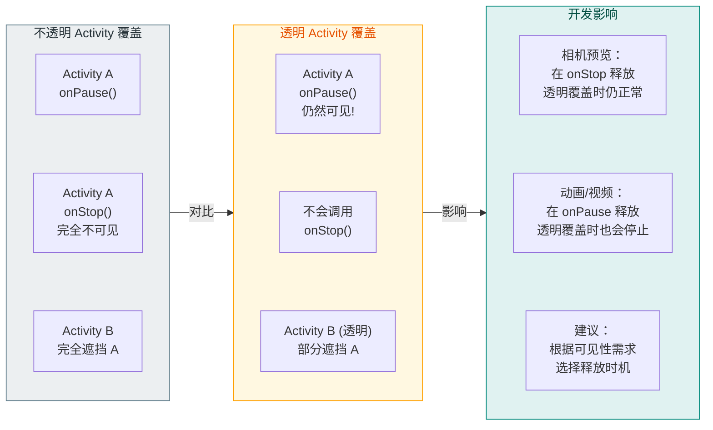
```mermaid
graph LR
    subgraph Normal["不透明 Activity 覆盖"]
        direction TB
        NA["Activity A\nonPause()"]
        NB["Activity A\nonStop()\n完全不可见"]
        NC["Activity B\n完全遮挡 A"]
        NA ~~~ NB
        NB ~~~ NC
    end

    subgraph Trans["透明 Activity 覆盖"]
        direction TB
        TA["Activity A\nonPause()\n仍然可见!"]
        TB["不会调用\nonStop()"]
        TC["Activity B (透明)\n部分遮挡 A"]
        TA ~~~ TB
        TB ~~~ TC
    end

    subgraph Impact["开发影响"]
        direction TB
        I1["相机预览：\n在 onStop 释放\n透明覆盖时仍正常"]
        I2["动画/视频：\n在 onPause 释放\n透明覆盖时也会停止"]
        I3["建议：\n根据可见性需求\n选择释放时机"]
        I1 ~~~ I2
        I2 ~~~ I3
    end

    Normal -->|"对比"| Trans -->|"影响"| Impact

    classDef gray fill:#ECEFF1,stroke:#607D8B,color:#263238
    classDef amber fill:#FFF8E1,stroke:#FFA000,color:#E65100
    classDef teal fill:#E0F2F1,stroke:#00897B,color:#004D40
    class Normal gray
    class Trans amber
    class Impact teal
```

### 常见陷阱与最佳实践

#### 陷阱一：静态变量在进程死亡后被清零

这是一个极其隐蔽的 Bug。很多开发者使用 `companion object` 或顶层 `object` 中的静态变量来存储全局状态（如用户登录信息、缓存数据）。在配置变更时，这些变量不受影响（因为进程还在）。但进程死亡后，所有静态变量都会被重置为默认值。如果你的代码依赖这些变量而没有做空判断，就会出现 `NullPointerException` 或逻辑错误：

```kotlin
// ❌ 危险的做法：依赖静态变量存储关键状态
object UserSession {
    // 进程死亡后，这个变量会变回 null
    // 但 Activity 可能从 savedInstanceState 恢复
    // 此时 Activity 以为用户已登录，但 currentUser 是 null
    var currentUser: User? = null
}

// ✅ 安全的做法：从持久化存储中恢复
object UserSession {
    // 每次访问都从 DataStore/SharedPreferences 中读取
    // 或者在 Application.onCreate() 中从持久化存储初始化
    suspend fun getCurrentUser(context: Context): User? {
        // 从 DataStore 读取用户信息
        return context.userDataStore.data.first().toUser()
    }
}
```

#### 陷阱二：在 onSaveInstanceState 中保存过大的数据

前面提到 Bundle 有约 1MB 的限制，但实际触发 `TransactionTooLargeException` 的阈值可能更低，因为 Binder 缓冲区是所有事务共享的。一个常见的错误是将 `RecyclerView` 的整个数据列表序列化到 Bundle 中：

```kotlin
// ❌ 危险：列表数据可能非常大
override fun onSaveInstanceState(outState: Bundle) {
    super.onSaveInstanceState(outState)
    // 如果 articleList 有几百条数据，每条包含标题、摘要、图片 URL
    // 序列化后可能超过 1MB，导致 TransactionTooLargeException
    outState.putParcelableArrayList("articles", ArrayList(articleList))
}

// ✅ 正确：只保存恢复所需的最小信息
override fun onSaveInstanceState(outState: Bundle) {
    super.onSaveInstanceState(outState)
    // 只保存当前页码和筛选条件
    // 恢复时根据这些参数重新请求数据
    outState.putInt("page", currentPage)
    outState.putString("category", selectedCategory)
}
```

#### 陷阱三：忘记调用 super

`onSaveInstanceState()` 和 `onRestoreInstanceState()` 的 `super` 调用承担着重要职责——保存和恢复 View 树的状态、Fragment 的状态等。忘记调用 `super` 会导致：

- `EditText` 中用户输入的文本丢失
- `CheckBox` 的选中状态丢失
- `ScrollView` / `RecyclerView` 的滚动位置丢失
- Fragment back stack 丢失，可能导致 Fragment 重叠或消失

这类 Bug 非常难排查，因为它们只在特定场景（旋转屏幕、进程恢复）下出现，日常开发中很容易遗漏。

#### 最佳实践总结

```kotlin
// 一个健壮的 Activity 状态管理模板
class RobustActivity : AppCompatActivity() {

    // 1. 使用 ViewModel 管理业务数据（扛配置变更）
    private val viewModel: MyViewModel by viewModels()

    // 2. 轻量 UI 状态用成员变量 + onSaveInstanceState 保存
    private var uiState: Int = 0

    override fun onCreate(savedInstanceState: Bundle?) {
        super.onCreate(savedInstanceState)
        setContentView(R.layout.activity_robust)

        // 3. 区分首次创建和恢复
        if (savedInstanceState == null) {
            // 首次创建：初始化 Fragment、读取 Intent 参数
            initFragments()
            parseIntentParams()
        } else {
            // 恢复：从 Bundle 恢复轻量状态
            uiState = savedInstanceState.getInt("ui_state", 0)
            // Fragment 由系统自动恢复，不要重复添加
        }

        // 4. 观察 ViewModel 数据（无论首次还是恢复都需要）
        observeViewModel()
    }

    override fun onSaveInstanceState(outState: Bundle) {
        // 5. 永远先调用 super
        super.onSaveInstanceState(outState)
        // 6. 只保存轻量级 UI 状态标识
        outState.putInt("ui_state", uiState)
    }

    // 7. 在 onStop 中保存需要持久化的用户数据
    override fun onStop() {
        super.onStop()
        // 将草稿保存到数据库/DataStore
        // 这样即使进程死亡，用户数据也不会丢失
        viewModel.saveDraft()
    }

    // ... 省略其他方法
}
```

---

**📝 练习题**

一个 Activity 在后台被系统回收（Process Death），用户从最近任务列表切回。以下哪个说法是正确的？

A. `onDestroy()` 会在进程被杀之前调用，开发者可以在其中保存状态

B. `ViewModel` 中的数据会被保留，因为 `ViewModel` 的生命周期比 Activity 长

C. `onCreate()` 的 `savedInstanceState` 参数不为 null，且静态变量会被重置为默认值

D. `onRestoreInstanceState()` 会在 `onCreate()` 之前调用

**【答案】** C

**【解析】** 进程死亡（Process Death）是系统直接终止进程，**不会调用 `onDestroy()`**（排除 A）。

`ViewModel` 绑定在进程内存中的 `ViewModelStore` 上，进程死亡后 `ViewModelStore` 也随之消亡，ViewModel 中的数据会丢失（排除 B，ViewModel 只能扛住配置变更，不能扛住进程死亡；如需跨进程死亡保存，应使用 `SavedStateHandle`）。

`onRestoreInstanceState()` 的调用时机是在 `onStart()` 之后、`onResume()` 之前，而不是在 `onCreate()` 之前（排除 D）。

正确答案 C：系统在杀死进程前已经调用过 `onSaveInstanceState()` 并将 Bundle 保存在 `system_server` 中，恢复时 `onCreate()` 会收到非空的 `savedInstanceState`；同时，由于进程被重新创建，所有静态变量（`companion object`、`object` 单例中的变量）都会被重置为声明时的默认值，这是一个常见的 Bug 来源。

---

## 状态转换场景

Activity 的生命周期并非只是一组静态的回调方法，它真正的复杂性体现在 **各种用户操作和系统行为所触发的状态转换序列** 上。理解这些场景下回调的精确时序，是写出健壮 Android 应用的基本功。本节将逐一拆解横竖屏切换、按 Home 键、锁屏、以及透明 Activity 覆盖这四大经典场景，深入分析每种情况下 Activity 经历了怎样的状态流转，以及背后的系统调度逻辑。

### 横竖屏切换（Configuration Change）

横竖屏切换是 Android 开发中最经典、也最容易踩坑的状态转换场景。它的本质是一次 **Configuration Change（配置变更）**，而 Android 系统对配置变更的默认处理策略是：**销毁当前 Activity 实例，然后重新创建一个全新的实例**。

这个设计初看起来很"暴力"，但它背后有着深思熟虑的合理性。当屏幕方向从竖屏（portrait）切换到横屏（landscape）时，可用的屏幕宽高比发生了根本性变化，布局文件可能需要切换（比如从 `res/layout/` 切换到 `res/layout-land/`），drawable 资源的分辨率适配也可能不同，甚至字符串资源都可能因为可用宽度变化而需要调整。与其让开发者手动处理所有这些资源的重新加载，系统选择了一种更彻底的方式——重走一遍完整的创建流程，让资源系统自动匹配最合适的 qualifier 目录。

横竖屏切换时，Activity 经历的完整回调序列如下：

```
旧实例销毁：onPause() → onStop() → onSaveInstanceState() → onDestroy()
新实例创建：onCreate(savedInstanceState) → onStart() → onRestoreInstanceState() → onResume()
```

需要特别注意的是，`onSaveInstanceState()` 的调用时机在不同 Android 版本上有细微差异。在 Android 9（API 28）及以上版本中，`onSaveInstanceState()` 在 `onStop()` **之后** 调用；而在更早的版本中，它在 `onStop()` **之前** 调用。这个变化的原因是 Android 9 引入了更严格的生命周期保证——确保 `onStop()` 调用时 Activity 已经对用户完全不可见，而状态保存可以安全地延后到这个时间点之后。

我们用一个 Mermaid 时序图来清晰展示这个过程：

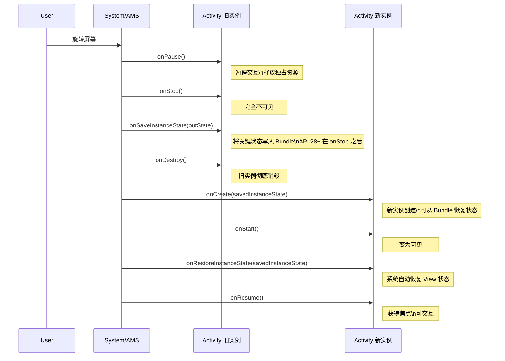
```mermaid
sequenceDiagram
    participant U as User
    participant S as System/AMS
    participant A1 as Activity 旧实例
    participant A2 as Activity 新实例

    U->>S: 旋转屏幕
    S->>A1: onPause()
    Note right of A1: 暂停交互\n释放独占资源
    S->>A1: onStop()
    Note right of A1: 完全不可见
    S->>A1: onSaveInstanceState(outState)
    Note right of A1: 将关键状态写入 Bundle\nAPI 28+ 在 onStop 之后
    S->>A1: onDestroy()
    Note right of A1: 旧实例彻底销毁

    S->>A2: onCreate(savedInstanceState)
    Note right of A2: 新实例创建\n可从 Bundle 恢复状态
    S->>A2: onStart()
    Note right of A2: 变为可见
    S->>A2: onRestoreInstanceState(savedInstanceState)
    Note right of A2: 系统自动恢复 View 状态
    S->>A2: onResume()
    Note right of A2: 获得焦点\n可交互
```

在实际开发中，处理横竖屏切换有三种主流策略：

**策略一：拥抱默认的销毁重建机制。** 这是 Google 官方推荐的做法。通过 `onSaveInstanceState()` 保存轻量级的 UI 状态（如滚动位置、用户输入的文本、选中的 Tab 索引等），在 `onCreate()` 或 `onRestoreInstanceState()` 中恢复。对于较重的数据（如网络请求结果、数据库查询结果），则通过 `ViewModel` 来持有——`ViewModel` 的生命周期跨越配置变更，不会随 Activity 的销毁重建而丢失。

```kotlin
class ArticleActivity : AppCompatActivity() {

    // ViewModel 在配置变更时不会被销毁，数据得以保留
    private val viewModel: ArticleViewModel by viewModels()

    override fun onCreate(savedInstanceState: Bundle?) {
        super.onCreate(savedInstanceState)
        setContentView(R.layout.activity_article)

        // 如果 savedInstanceState 不为 null，说明是重建而非首次创建
        if (savedInstanceState != null) {
            // 恢复轻量级 UI 状态，比如用户正在编辑的草稿文本
            val draftText = savedInstanceState.getString("key_draft", "")
            // 将草稿文本回填到 EditText
            findViewById<EditText>(R.id.editDraft).setText(draftText)
        }

        // ViewModel 中的 LiveData/StateFlow 数据在旋转后依然存在
        // 只需重新 observe 即可，无需重新请求
        viewModel.articleList.observe(this) { articles ->
            // 更新 RecyclerView 的数据源
            adapter.submitList(articles)
        }
    }

    override fun onSaveInstanceState(outState: Bundle) {
        super.onSaveInstanceState(outState)
        // 保存用户正在编辑但尚未提交的草稿内容
        val currentDraft = findViewById<EditText>(R.id.editDraft).text.toString()
        // 写入 Bundle，key 自定义，value 必须是可序列化的轻量数据
        outState.putString("key_draft", currentDraft)
    }
}
```

**策略二：在 Manifest 中声明 `android:configChanges` 来阻止销毁重建。** 当你在 `<activity>` 标签中声明了 `android:configChanges="orientation|screenSize"` 时，系统在屏幕旋转时不再销毁重建 Activity，而是回调 `onConfigurationChanged()` 方法，让你自行处理配置变化。

```xml
<!-- AndroidManifest.xml 中声明拦截方向和屏幕尺寸变化 -->
<activity
    android:name=".VideoPlayerActivity"
    android:configChanges="orientation|screenSize|screenLayout|smallestScreenSize" />
```

```kotlin
class VideoPlayerActivity : AppCompatActivity() {

    override fun onConfigurationChanged(newConfig: Configuration) {
        // 必须调用 super，否则会抛出 SuperNotCalledException
        super.onConfigurationChanged(newConfig)

        // 根据新的方向调整 UI 布局
        when (newConfig.orientation) {
            // 横屏时隐藏标题栏，让播放器全屏
            Configuration.ORIENTATION_LANDSCAPE -> {
                supportActionBar?.hide()
                enterFullScreenMode()
            }
            // 竖屏时恢复标题栏，退出全屏
            Configuration.ORIENTATION_PORTRAIT -> {
                supportActionBar?.show()
                exitFullScreenMode()
            }
        }
    }
}
```

这种方式看似简单，但 Google 官方文档明确指出它是一种 **"last resort"（最后手段）**。原因在于：你拦截了系统的自动资源重载机制，这意味着如果你有 `layout-land/` 目录下的横屏专用布局，系统不会自动切换过去，你需要自己手动 inflate 并替换。同样，`values-land/` 中的尺寸、字符串等资源也不会自动更新。这在简单场景下可控，但在复杂 UI 中极易遗漏，导致横竖屏显示异常。

**策略三：锁定屏幕方向。** 对于某些明确只支持单一方向的应用（如大多数游戏锁定横屏，某些工具类 App 锁定竖屏），直接在 Manifest 中声明 `android:screenOrientation="portrait"` 或 `"landscape"` 即可彻底规避旋转问题。但这会牺牲用户在不同设备形态（如折叠屏、平板）上的体验，需要权衡。

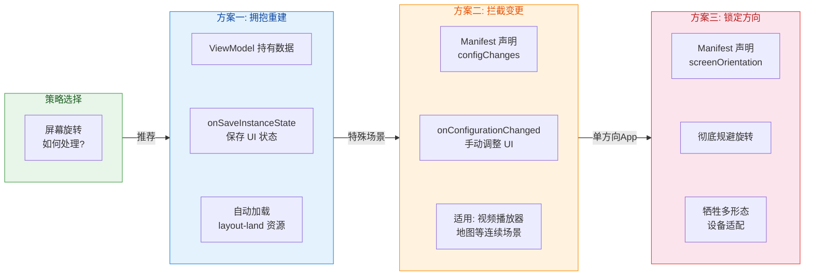
```mermaid
graph LR
    subgraph S1["策略选择"]
        direction TB
        Q["屏幕旋转\n如何处理?"]
    end

    subgraph S2["方案一: 拥抱重建"]
        direction TB
        A1["ViewModel 持有数据"]
        A2["onSaveInstanceState\n保存 UI 状态"]
        A3["自动加载\nlayout-land 资源"]
        A1 ~~~ A2
        A2 ~~~ A3
    end

    subgraph S3["方案二: 拦截变更"]
        direction TB
        B1["Manifest 声明\nconfigChanges"]
        B2["onConfigurationChanged\n手动调整 UI"]
        B3["适用: 视频播放器\n地图等连续场景"]
        B1 ~~~ B2
        B2 ~~~ B3
    end

    subgraph S4["方案三: 锁定方向"]
        direction TB
        C1["Manifest 声明\nscreenOrientation"]
        C2["彻底规避旋转"]
        C3["牺牲多形态\n设备适配"]
        C1 ~~~ C2
        C2 ~~~ C3
    end

    S1 -->|"推荐"| S2 -->|"特殊场景"| S3 -->|"单方向App"| S4

    classDef startStyle fill:#E8F5E9,stroke:#43A047,color:#1B5E20
    classDef recommendStyle fill:#E3F2FD,stroke:#1E88E5,color:#0D47A1
    classDef cautionStyle fill:#FFF3E0,stroke:#FB8C00,color:#E65100
    classDef lockStyle fill:#FCE4EC,stroke:#E53935,color:#B71C1C

    class S1 startStyle
    class S2 recommendStyle
    class S3 cautionStyle
    class S4 lockStyle
```

还有一个容易被忽视的细节：**多窗口模式（Multi-Window）下的配置变更**。从 Android 7.0 开始，用户可以在分屏模式下调整窗口大小，这同样会触发 Configuration Change。如果你只在 `configChanges` 中声明了 `orientation`，分屏调整大小时 Activity 仍然会被销毁重建。因此，如果要全面拦截，还需要加上 `screenSize|smallestScreenSize|screenLayout` 等属性。但这进一步说明了为什么策略一（拥抱重建 + ViewModel）才是最稳健的方案——你不需要穷举所有可能的配置变更类型。

### 按 Home 键

按 Home 键是用户最频繁的操作之一，它将当前 Activity 从前台切换到后台。与横竖屏切换不同，按 Home 键 **不会销毁 Activity**（除非系统内存不足需要回收），Activity 实例仍然存活在内存中，只是从 **Resumed（前台可交互）** 状态退回到 **Stopped（后台不可见）** 状态。

按 Home 键时的回调序列非常简洁：

```
离开前台：onPause() → onStop() → onSaveInstanceState()
```

当用户通过最近任务列表（Recents）或再次点击 App 图标回到这个 Activity 时：

```
回到前台：onRestart() → onStart() → onResume()
```

这里有几个关键点值得深入理解：

**`onPause()` 与 `onStop()` 的分界线是"可见性"。** 当用户按下 Home 键的瞬间，系统首先调用 `onPause()`，此时 Activity 失去了焦点但可能仍部分可见（比如在过渡动画期间）。紧接着，当 Activity 完全被 Launcher 覆盖、对用户彻底不可见时，`onStop()` 被调用。在实际开发中，这两个回调之间的时间间隔非常短（通常在同一帧或相邻帧内完成），但从语义上它们承担着不同的职责：`onPause()` 负责释放与用户交互相关的资源（如暂停动画、暂停视频播放），`onStop()` 负责释放与可见性相关的资源（如注销广播接收器、停止位置更新）。

**`onSaveInstanceState()` 在按 Home 键时也会被调用。** 很多开发者误以为只有配置变更才会触发状态保存，实际上，只要 Activity 进入后台（即有可能被系统回收的状态），系统都会调用 `onSaveInstanceState()` 来保存状态快照。这是一种"防御性保存"——虽然此刻 Activity 还活着，但系统无法保证它在后台期间不会因为内存压力被杀死。如果后续确实被回收了，用户再回来时系统会用这个 Bundle 重建 Activity，用户感知不到任何异常。

**`onRestart()` 是区分"从后台回来"和"首次创建"的标志。** 在 Activity 的生命周期回调中，`onRestart()` 是唯一一个只在 Activity 从 Stopped 状态重新回到前台时才会调用的方法。首次创建时的路径是 `onCreate() → onStart() → onResume()`，而从后台回来的路径是 `onRestart() → onStart() → onResume()`。如果你需要在"用户回到页面"时执行某些刷新逻辑（比如检查数据是否有更新），`onRestart()` 或 `onStart()` 是合适的时机。

```kotlin
class NewsActivity : AppCompatActivity() {

    // 用于追踪 Activity 是否处于前台
    private var isInForeground = false

    override fun onStart() {
        super.onStart()
        // Activity 变为可见，注册需要在可见期间监听的广播
        registerNetworkCallback()
        isInForeground = true
    }

    override fun onResume() {
        super.onResume()
        // 获得焦点，恢复动画、传感器监听等交互相关资源
        resumeAutoScrollBanner()
    }

    override fun onPause() {
        super.onPause()
        // 失去焦点，暂停动画以节省 CPU
        pauseAutoScrollBanner()
    }

    override fun onStop() {
        super.onStop()
        // 完全不可见，注销广播以避免后台无意义的回调
        unregisterNetworkCallback()
        isInForeground = false
    }

    override fun onRestart() {
        super.onRestart()
        // 从后台回到前台，检查是否需要刷新数据
        // 比如用户离开了 5 分钟，新闻列表可能已经过时
        checkAndRefreshIfNeeded()
    }

    private fun checkAndRefreshIfNeeded() {
        // 计算距离上次刷新的时间间隔
        val elapsed = System.currentTimeMillis() - lastRefreshTimestamp
        // 如果超过 5 分钟，自动触发一次刷新
        if (elapsed > 5 * 60 * 1000L) {
            viewModel.refreshNewsList()
        }
    }
}
```

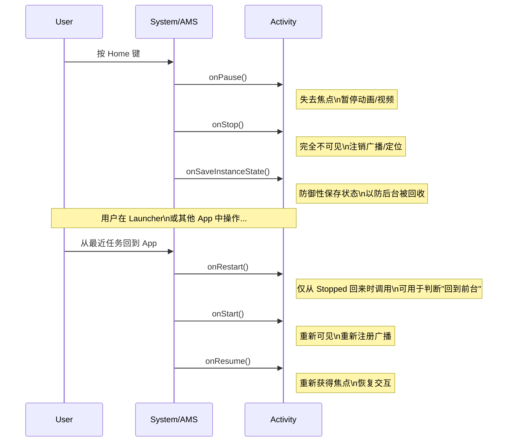
```mermaid
sequenceDiagram
    participant U as User
    participant S as System/AMS
    participant A as Activity

    U->>S: 按 Home 键
    S->>A: onPause()
    Note right of A: 失去焦点\n暂停动画/视频
    S->>A: onStop()
    Note right of A: 完全不可见\n注销广播/定位
    S->>A: onSaveInstanceState()
    Note right of A: 防御性保存状态\n以防后台被回收

    Note over U,A: 用户在 Launcher\n或其他 App 中操作...

    U->>S: 从最近任务回到 App
    S->>A: onRestart()
    Note right of A: 仅从 Stopped 回来时调用\n可用于判断"回到前台"
    S->>A: onStart()
    Note right of A: 重新可见\n重新注册广播
    S->>A: onResume()
    Note right of A: 重新获得焦点\n恢复交互
```

还有一个实际开发中常见的问题：**按 Home 键与按 Back 键的区别**。按 Home 键是将 Activity 放入后台（Stopped 状态），Activity 实例保留；而按 Back 键（在 Android 12 之前的默认行为）是 **finish 掉 Activity**，走的是 `onPause() → onStop() → onDestroy()` 的完整销毁流程，且 `onSaveInstanceState()` **不会** 被调用——因为用户明确表达了"离开"的意图，系统认为没有必要保存状态。不过从 Android 12 开始，系统引入了 **predictive back gesture（预测性返回手势）**，默认行为变成了将 Activity 移到后台而非销毁，这使得 Back 键的行为在某些情况下更接近 Home 键。开发者可以通过 `OnBackPressedDispatcher` 来自定义返回行为。

### 锁屏

锁屏场景的生命周期行为与按 Home 键非常相似，但存在一些微妙的差异，这些差异源于锁屏的本质——**屏幕被关闭（screen off），而非被另一个 Activity 覆盖**。

当用户按下电源键锁屏时，回调序列为：

```
锁屏：onPause() → onStop()
```

当用户解锁屏幕回到 Activity 时：

```
解锁：onRestart() → onStart() → onResume()
```

从回调序列上看，锁屏和按 Home 键几乎一致。但有几个重要的差异点：

**差异一：锁屏不一定触发 `onSaveInstanceState()`。** 在某些 OEM 厂商的定制系统上，如果系统判断锁屏后 Activity 不太可能被回收（比如内存充裕），可能会跳过 `onSaveInstanceState()` 的调用。但这不是一个你应该依赖的行为——标准 AOSP 实现中，进入 Stopped 状态后通常都会触发状态保存。最佳实践是：**始终假设 `onSaveInstanceState()` 会被调用，并在其中保存必要的状态**。

**差异二：锁屏涉及 `FLAG_KEEP_SCREEN_ON` 和 WakeLock 的交互。** 如果你的 Activity 设置了 `FLAG_KEEP_SCREEN_ON`（比如视频播放器），用户手动按电源键锁屏时，这个 Flag 会被系统忽略——用户的主动操作优先级高于 App 的保持亮屏请求。但如果是系统超时自动锁屏，`FLAG_KEEP_SCREEN_ON` 会阻止屏幕关闭。

**差异三：锁屏与 Keyguard（锁屏界面）的关系。** 从 Window 层级的角度看，锁屏时系统会在你的 Activity 之上显示 Keyguard 窗口。这个 Keyguard 窗口的 Z-order 高于所有普通 Activity 窗口，因此你的 Activity 变得不可见，触发 `onStop()`。如果你的 Activity 声明了 `android:showWhenLocked="true"`（API 27+）或调用了 `setShowWhenLocked(true)`，Activity 可以显示在锁屏之上（常见于闹钟、来电界面），此时 Activity 不会走到 `onStop()`，而是保持在 Resumed 状态。

```kotlin
class AlarmActivity : AppCompatActivity() {

    override fun onCreate(savedInstanceState: Bundle?) {
        super.onCreate(savedInstanceState)

        // 允许 Activity 显示在锁屏之上（API 27+）
        setShowWhenLocked(true)
        // 允许 Activity 解锁 Keyguard（配合使用）
        setTurnScreenOn(true)

        // 对于 API 26 及以下，需要使用 Window Flag（已废弃但仍有效）
        // window.addFlags(
        //     WindowManager.LayoutParams.FLAG_SHOW_WHEN_LOCKED or
        //     WindowManager.LayoutParams.FLAG_TURN_SCREEN_ON
        // )

        setContentView(R.layout.activity_alarm)
    }
}
```

**差异四：屏幕关闭时的资源释放策略。** 锁屏意味着屏幕物理关闭，GPU 不再需要渲染帧。如果你的 Activity 使用了 `SurfaceView`、`TextureView` 或 OpenGL 渲染，锁屏时应该释放 GL 上下文或暂停渲染线程，否则会造成无意义的 GPU 功耗。相比之下，按 Home 键时虽然 Activity 不可见，但屏幕仍然亮着（显示 Launcher），系统对 GPU 资源的回收策略可能略有不同。

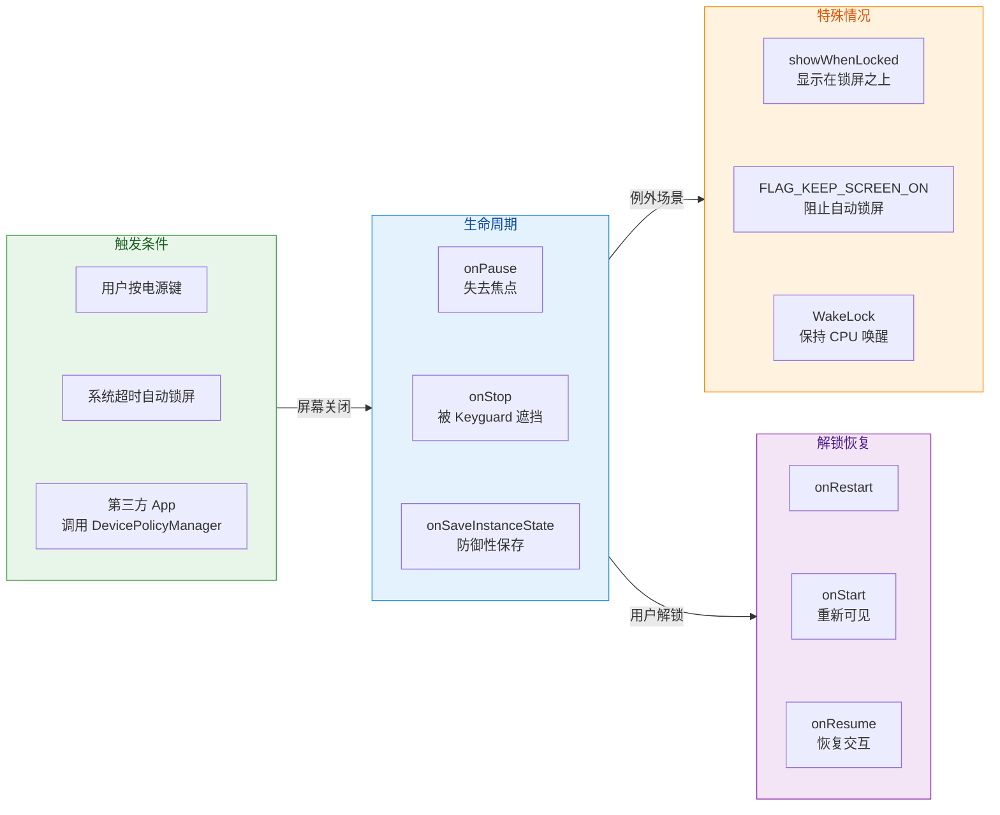
```mermaid
graph LR
    subgraph S1["触发条件"]
        direction TB
        A1["用户按电源键"]
        A2["系统超时自动锁屏"]
        A3["第三方 App\n调用 DevicePolicyManager"]
        A1 ~~~ A2
        A2 ~~~ A3
    end

    subgraph S2["生命周期"]
        direction TB
        B1["onPause\n失去焦点"]
        B2["onStop\n被 Keyguard 遮挡"]
        B3["onSaveInstanceState\n防御性保存"]
        B1 ~~~ B2
        B2 ~~~ B3
    end

    subgraph S3["特殊情况"]
        direction TB
        C1["showWhenLocked\n显示在锁屏之上"]
        C2["FLAG_KEEP_SCREEN_ON\n阻止自动锁屏"]
        C3["WakeLock\n保持 CPU 唤醒"]
        C1 ~~~ C2
        C2 ~~~ C3
    end

    subgraph S4["解锁恢复"]
        direction TB
        D1["onRestart"]
        D2["onStart\n重新可见"]
        D3["onResume\n恢复交互"]
        D1 ~~~ D2
        D2 ~~~ D3
    end

    S1 -->|"屏幕关闭"| S2 -->|"例外场景"| S3
    S2 -->|"用户解锁"| S4

    classDef triggerStyle fill:#E8F5E9,stroke:#43A047,color:#1B5E20
    classDef lifecycleStyle fill:#E3F2FD,stroke:#1E88E5,color:#0D47A1
    classDef specialStyle fill:#FFF3E0,stroke:#FB8C00,color:#E65100
    classDef resumeStyle fill:#F3E5F5,stroke:#8E24AA,color:#4A148C

    class S1 triggerStyle
    class S2 lifecycleStyle
    class S3 specialStyle
    class S4 resumeStyle
```

### 透明 Activity 覆盖

透明 Activity 覆盖是一个非常有趣的场景，因为它打破了我们对 `onPause()` 和 `onStop()` 的常规认知。在前面的场景中，`onPause()` 和 `onStop()` 总是成对出现——Activity 失去焦点后很快就会变得不可见。但透明 Activity 覆盖创造了一种 **"失去焦点但仍然可见"** 的中间状态。

当一个新的透明 Activity（或 Dialog 主题的 Activity）启动并覆盖在当前 Activity 之上时，底层 Activity 的回调序列为：

```
被透明 Activity 覆盖：onPause()    ← 仅此一步，不会调用 onStop()
```

当上层透明 Activity 关闭后：

```
透明 Activity 关闭：onResume()     ← 直接恢复，不经过 onRestart/onStart
```

这个行为的根本原因在于 **`onStop()` 的触发条件是 Activity 对用户完全不可见**。而透明 Activity 或 Dialog 主题 Activity 并没有完全遮挡底层 Activity——用户仍然可以透过透明区域看到底层的内容。因此，底层 Activity 只是失去了焦点（不再接收用户输入），但仍然处于"可见"状态，系统只调用 `onPause()` 而不调用 `onStop()`。

要创建一个透明主题的 Activity，通常在 `styles.xml` 中定义：

```xml
<!-- res/values/themes.xml -->
<style name="Theme.Transparent" parent="Theme.MaterialComponents.DayNight.Dialog">
    <!-- 窗口背景设为透明 -->
    <item name="android:windowBackground">@android:color/transparent</item>
    <!-- 窗口本身是透明的 -->
    <item name="android:windowIsTranslucent">true</item>
    <!-- 不使用默认的窗口标题 -->
    <item name="android:windowNoTitle">true</item>
    <!-- 允许窗口浮动（不占满全屏） -->
    <item name="android:windowIsFloating">true</item>
</style>
```

```xml
<!-- AndroidManifest.xml 中为 Activity 指定透明主题 -->
<activity
    android:name=".ConfirmDialogActivity"
    android:theme="@style/Theme.Transparent" />
```

这种 `onPause()` 但不 `onStop()` 的状态对开发者有重要的实践意义：

**影响一：资源释放的粒度需要更细。** 如果你把所有资源释放逻辑都放在 `onPause()` 中，那么当一个透明 Dialog Activity 弹出时，底层 Activity 的动画、视频等都会被暂停，用户体验会很差——用户明明还能看到底层内容，但内容却"冻住"了。正确的做法是区分两类资源：

- **`onPause()` 中释放**：与焦点/交互强相关的资源，如相机预览（因为相机是独占资源，上层 Activity 可能也需要用）、传感器监听。
- **`onStop()` 中释放**：与可见性相关的资源，如动画、视频播放、广播接收器、位置更新。

**影响二：`onSaveInstanceState()` 不会在仅 `onPause()` 时被调用。** 由于 `onSaveInstanceState()` 的调用时机是在 Activity 进入可能被系统回收的状态时（即 `onStop()` 之后），而透明 Activity 覆盖只触发了 `onPause()`，底层 Activity 并未进入 Stopped 状态，因此 `onSaveInstanceState()` 不会被调用。这意味着如果你在 `onPause()` 中修改了某些状态但依赖 `onSaveInstanceState()` 来保存，这些状态在透明覆盖场景下不会被保存。不过这通常不是问题，因为 Activity 实例本身还活着，内存中的数据不会丢失。

**影响三：多 Activity 栈中的可见性判断。** 在 AMS（ActivityManagerService）的视角中，一个 Activity 是否"可见"取决于它上方的所有 Activity 是否都是透明的或非全屏的。如果 Task 栈中有 A → B → C 三个 Activity，其中 B 和 C 都是透明的，那么 A、B、C 三个 Activity 都处于"可见"状态，只有 C 拥有焦点。A 和 B 都只会收到 `onPause()` 而不会收到 `onStop()`。这种多层透明叠加的场景在实际开发中并不罕见——比如一个页面上弹出了一个半透明的确认对话框，对话框上又弹出了一个权限请求的系统 Dialog。

我们用一个对比图来总结透明覆盖与不透明覆盖的差异：

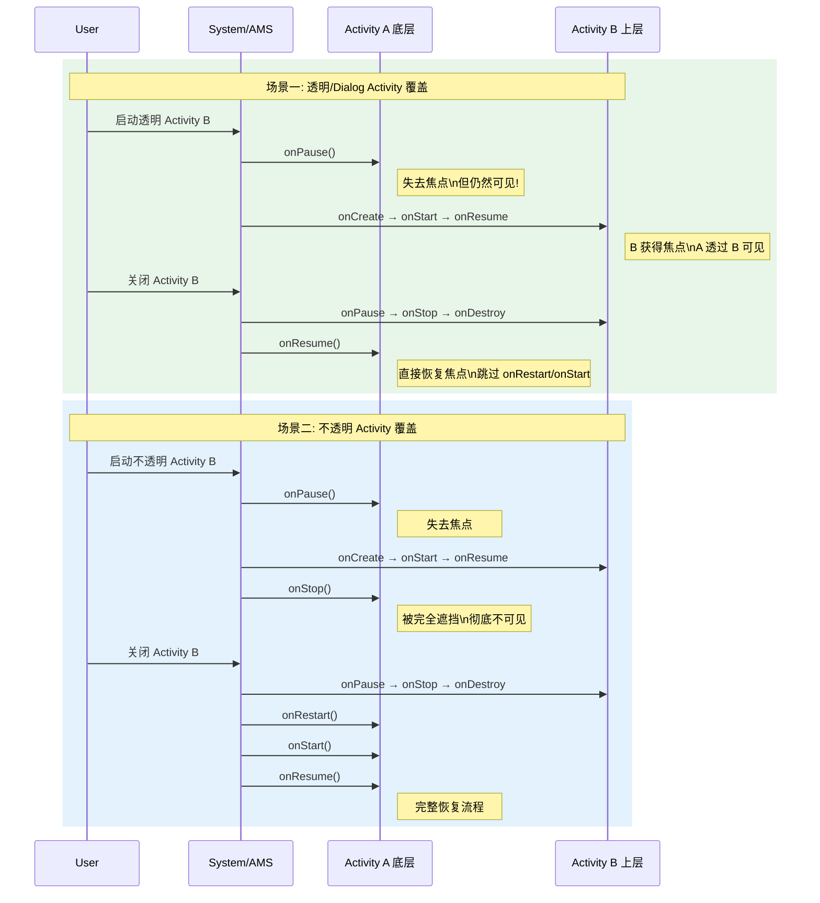
```mermaid
sequenceDiagram
    participant U as User
    participant S as System/AMS
    participant A as Activity A 底层
    participant B as Activity B 上层

    rect rgb(232, 245, 233)
        Note over U,B: 场景一: 透明/Dialog Activity 覆盖
        U->>S: 启动透明 Activity B
        S->>A: onPause()
        Note right of A: 失去焦点\n但仍然可见!
        S->>B: onCreate → onStart → onResume
        Note right of B: B 获得焦点\nA 透过 B 可见

        U->>S: 关闭 Activity B
        S->>B: onPause → onStop → onDestroy
        S->>A: onResume()
        Note right of A: 直接恢复焦点\n跳过 onRestart/onStart
    end

    rect rgb(227, 242, 253)
        Note over U,B: 场景二: 不透明 Activity 覆盖
        U->>S: 启动不透明 Activity B
        S->>A: onPause()
        Note right of A: 失去焦点
        S->>B: onCreate → onStart → onResume
        S->>A: onStop()
        Note right of A: 被完全遮挡\n彻底不可见

        U->>S: 关闭 Activity B
        S->>B: onPause → onStop → onDestroy
        S->>A: onRestart()
        S->>A: onStart()
        S->>A: onResume()
        Note right of A: 完整恢复流程
    end
```

**一个常见的误区：Dialog 与 Dialog 主题 Activity 的区别。** 普通的 `AlertDialog` 或 `DialogFragment` 是当前 Activity 内部的一个 Window 层级更高的视图，它 **不会** 触发宿主 Activity 的任何生命周期回调——因为 Dialog 不是一个独立的 Activity，它只是当前 Activity 的 Window 上叠加的一个子窗口。只有当你启动了一个 **使用 Dialog 主题的独立 Activity** 时，底层 Activity 才会收到 `onPause()` 回调。这个区别在面试中经常被考到，也是实际开发中容易混淆的点。

```kotlin
// 情况一：弹出普通 Dialog —— 不影响 Activity 生命周期
// Activity 不会收到 onPause()
AlertDialog.Builder(this)
    .setTitle("确认")                    // 设置对话框标题
    .setMessage("确定要删除吗？")          // 设置对话框内容
    .setPositiveButton("确定") { _, _ ->  // 确定按钮的点击回调
        deleteItem()                     // 执行删除操作
    }
    .setNegativeButton("取消", null)      // 取消按钮，无额外操作
    .show()                              // 显示对话框

// 情况二：启动 Dialog 主题的 Activity —— 底层 Activity 会收到 onPause()
val intent = Intent(this, ConfirmDialogActivity::class.java)
startActivity(intent)                    // 启动新的 Activity
// 此时当前 Activity 的 onPause() 会被调用
```

### 四大场景对比总结

将四种状态转换场景放在一起对比，可以更清晰地看出它们的共性与差异：


```mermaid
graph LR
    subgraph S1["横竖屏切换"]
        direction TB
        A1["触发: Configuration Change"]
        A2["旧实例: onPause → onStop\n→ onSaveInstanceState\n→ onDestroy"]
        A3["新实例: onCreate\n→ onStart\n→ onRestoreInstanceState\n→ onResume"]
        A4["特点: 销毁重建\nViewModel 存活"]
        A1 ~~~ A2
        A2 ~~~ A3
        A3 ~~~ A4
    end

    subgraph S2["按 Home 键"]
        direction TB
        B1["触发: 用户主动回到桌面"]
        B2["离开: onPause → onStop\n→ onSaveInstanceState"]
        B3["返回: onRestart\n→ onStart → onResume"]
        B4["特点: 实例保留\n可能被后台回收"]
        B1 ~~~ B2
        B2 ~~~ B3
        B3 ~~~ B4
    end

    subgraph S3["锁屏"]
        direction TB
        C1["触发: 电源键 / 超时"]
        C2["锁屏: onPause → onStop"]
        C3["解锁: onRestart\n→ onStart → onResume"]
        C4["特点: 类似 Home\nshowWhenLocked 例外"]
        C1 ~~~ C2
        C2 ~~~ C3
        C3 ~~~ C4
    end

    subgraph S4["透明 Activity 覆盖"]
        direction TB
        D1["触发: 启动透明/Dialog\n主题 Activity"]
        D2["覆盖: 仅 onPause\n不调用 onStop"]
        D3["关闭: 直接 onResume\n跳过 onRestart/onStart"]
        D4["特点: 可见但无焦点\n普通 Dialog 无影响"]
        D1 ~~~ D2
        D2 ~~~ D3
        D3 ~~~ D4
    end

    classDef rotateStyle fill:#E8F5E9,stroke:#43A047,color:#1B5E20
    classDef homeStyle fill:#E3F2FD,stroke:#1E88E5,color:#0D47A1
    classDef lockStyle fill:#FFF3E0,stroke:#FB8C00,color:#E65100
    classDef transparentStyle fill:#F3E5F5,stroke:#8E24AA,color:#4A148C

    class S1 rotateStyle
    class S2 homeStyle
    class S3 lockStyle
    class S4 transparentStyle
```

从这个对比中可以提炼出几条核心原则：

1. **`onStop()` 的语义是"完全不可见"**，而非"失去焦点"。透明覆盖场景完美地证明了这一点。
2. **`onSaveInstanceState()` 是一种防御性机制**，它在 Activity 有可能被系统回收时触发，而非仅在配置变更时触发。按 Home 键、锁屏都会触发它。
3. **只有配置变更会导致 Activity 销毁重建**（默认行为下）。按 Home 键和锁屏只是将 Activity 推入后台，实例仍然存活。
4. **资源释放应该按语义分层**：交互相关的放 `onPause()`/`onResume()`，可见性相关的放 `onStop()`/`onStart()`，生命周期相关的放 `onDestroy()`/`onCreate()`。

最后，还有一个跨场景的实践建议：**不要在 `onPause()` 中执行耗时操作**。`onPause()` 的执行速度直接影响下一个 Activity 的启动速度——系统会等待当前 Activity 的 `onPause()` 完成后，才开始创建和显示新的 Activity。如果你在 `onPause()` 中执行了数据库写入、网络请求或大量的 SharedPreferences commit 操作，用户会明显感受到页面切换的卡顿。正确的做法是将耗时操作移到 `onStop()` 中（此时新 Activity 已经显示），或者使用异步方式（如 `apply()` 代替 `commit()`）。

```kotlin
// ❌ 错误示范：在 onPause 中执行耗时的同步写入
override fun onPause() {
    super.onPause()
    // commit() 是同步操作，会阻塞主线程
    // 这会延迟下一个 Activity 的显示
    getSharedPreferences("prefs", MODE_PRIVATE)
        .edit()
        .putString("draft", longDraftText)  // 大量文本数据
        .commit()                            // 同步写入，阻塞!
}

// ✅ 正确做法：使用 apply() 异步写入，或移到 onStop()
override fun onPause() {
    super.onPause()
    // apply() 是异步操作，立即返回，不阻塞主线程
    getSharedPreferences("prefs", MODE_PRIVATE)
        .edit()
        .putString("draft", longDraftText)  // 同样的数据
        .apply()                             // 异步写入，不阻塞!
}
```

---

**📝 练习题**

一个 Activity A 正在前台运行，此时用户点击按钮启动了一个使用 `Theme.Dialog` 透明主题的 Activity B。请问 Activity A 会经历哪些生命周期回调？如果此时用户按下 Home 键，Activity A 又会额外经历哪些回调？

A. 启动 B 时：A.onPause() → A.onStop()；按 Home 键：无额外回调
B. 启动 B 时：A.onPause()；按 Home 键：A.onStop()
C. 启动 B 时：A.onPause() → A.onStop()；按 Home 键：A.onSaveInstanceState()
D. 启动 B 时：无回调（Dialog 不影响生命周期）；按 Home 键：A.onPause() → A.onStop()

**【答案】** B

**【解析】** 当透明/Dialog 主题的 Activity B 启动并覆盖在 A 之上时，A 失去了焦点但仍然可见（用户可以透过 B 的透明区域看到 A），因此 A 只会收到 `onPause()` 而不会收到 `onStop()`。此时 A 处于 Paused 状态。当用户按下 Home 键后，A 和 B 都被 Launcher 完全遮挡，A 从 Paused 状态进一步转入 Stopped 状态，因此会额外收到 `onStop()`（以及 `onSaveInstanceState()`）。选项 A 错误，因为透明 Activity 覆盖不会触发 `onStop()`。选项 C 错误，因为启动透明 B 时 A 不会走到 `onStop()`。选项 D 错误，因为 Dialog 主题的 **Activity**（注意不是普通 Dialog）确实会影响底层 Activity 的生命周期。这道题的关键区分点在于：`onStop()` 的触发条件是"完全不可见"，而非"失去焦点"。

---

## 优雅的销毁

Activity 的销毁看似简单——调用 `finish()` 然后等 `onDestroy()` 回调就好了——但实际开发中，"销毁"是内存泄漏、资源残留、崩溃异常的重灾区。一个 Activity 在其生命周期末尾需要处理的事情远比想象中复杂：动画要停、网络请求要取消、数据库游标要关闭、注册的广播接收器要反注册、与 Service 的绑定要解除……任何一个环节的遗漏都可能导致问题。更关键的是，Activity 的销毁并非只有用户主动触发这一种情况，系统回收、配置变更重建都会触发销毁流程，而这些场景下的行为差异，正是需要深入理解的核心。

### isFinishing 判断

#### 为什么需要 isFinishing

在 `onDestroy()` 被调用时，开发者面临一个根本性的问题：**这次销毁到底是"真正的结束"还是"临时的重建"？** 这两种情况对应着完全不同的处理策略。

Activity 被销毁有两大类原因：

第一类是 **用户主动结束**（User-initiated finish）。当用户按下返回键、代码中调用了 `finish()`、或者从最近任务列表中滑掉了这个 Activity，此时 Activity 是真正要"死掉"了，不会再回来。这种情况下 `isFinishing()` 返回 `true`。

第二类是 **系统驱动的销毁**（System-initiated destroy）。最典型的场景就是配置变更（Configuration Change），比如屏幕旋转。系统会先销毁当前 Activity 实例，然后立即创建一个新实例。此外，当系统内存不足时，也可能回收处于后台的 Activity。这些情况下 `isFinishing()` 返回 `false`——Activity 虽然被销毁了，但它并没有"完成"，它还会以某种形式"复活"。

`isFinishing()` 这个方法定义在 `Activity` 类中，其内部实现非常直接——它检查的是 Activity 内部的一个 `mFinished` 标志位。当 `finish()` 被调用时，这个标志位被设为 `true`；而系统因配置变更或内存回收而销毁 Activity 时，这个标志位保持 `false`。

```kotlin
// Activity.java 源码中的关键片段（简化）
// mFinished 是 Activity 内部维护的布尔标志
private boolean mFinished;

// 当调用 finish() 时，mFinished 被置为 true
public void finish() {
    // ... 省略其他逻辑
    mFinished = true; // 标记：这个 Activity 是被主动结束的
    // 通知 ActivityTaskManager 完成销毁流程
}

// isFinishing() 只是简单地返回这个标志
public boolean isFinishing() {
    return mFinished; // 返回当前 Activity 是否处于"正在结束"状态
}
```

理解了这个机制，就能明白为什么 `isFinishing()` 在 `onPause()`、`onStop()` 中也能调用并返回正确的值——因为 `finish()` 调用发生在生命周期回调之前，标志位已经被设置好了。

#### 实际应用场景

在 `onDestroy()` 中根据 `isFinishing()` 的返回值做不同处理，是一种非常常见且重要的模式：

```kotlin
override fun onDestroy() {
    super.onDestroy()

    if (isFinishing) {
        // ---- 真正结束：执行不可逆的清理 ----
        // 清除本地草稿缓存，用户明确要离开了
        draftRepository.deleteDraft(articleId)
        // 关闭独占的数据库连接
        exclusiveDbConnection.close()
        // 通知服务端用户已离开编辑页面
        analyticsTracker.trackEvent("editor_closed_permanently")
    } else {
        // ---- 配置变更 / 系统回收：保守处理 ----
        // 不要删除草稿！用户马上就会回来
        // 不要关闭共享资源，新实例还需要用
        // 可以做一些轻量级的引用解除
        analyticsTracker.trackEvent("editor_recreating")
    }

    // ---- 无论哪种情况都要做的清理 ----
    // 取消协程作用域，防止泄漏（新实例会创建自己的作用域）
    coroutineScope.cancel()
    // 移除回调引用，避免持有旧 Activity 实例
    viewModel.callback = null
}
```

值得注意的是，`isFinishing()` 不仅可以在 `onDestroy()` 中使用。在 `onPause()` 和 `onStop()` 中同样可以调用它来判断当前的暂停/停止是否是因为 Activity 即将结束。这在某些场景下非常有用，比如在 `onPause()` 中决定是否要保存用户的编辑进度：

```kotlin
override fun onPause() {
    super.onPause()
    if (isFinishing) {
        // 用户主动离开，可以弹出"是否保存"的确认
        // （实际上这个逻辑更适合放在 onBackPressed 中）
    } else {
        // 只是被遮挡或进入后台，自动保存草稿
        saveDraftSilently()
    }
}
```

#### isFinishing 与 isChangingConfigurations 的配合

从 API 11 开始，Android 还提供了 `isChangingConfigurations()` 方法，它能更精确地告诉你：当前的销毁是否是由配置变更引起的。将两者结合使用，可以实现三级判断：

```kotlin
override fun onDestroy() {
    super.onDestroy()

    when {
        isFinishing -> {
            // 情况 1：用户主动结束，执行完整清理
            performFullCleanup()
        }
        isChangingConfigurations -> {
            // 情况 2：配置变更（如旋转屏幕），新实例即将创建
            // 可以传递一些昂贵的非 Parcelable 对象给新实例
            // （现代做法是通过 ViewModel 持有这些对象）
            retainExpensiveResources()
        }
        else -> {
            // 情况 3：系统内存回收，Activity 可能稍后被重建
            // 状态已通过 onSaveInstanceState 保存
            releaseMemoryHeavyResources()
        }
    }
}
```

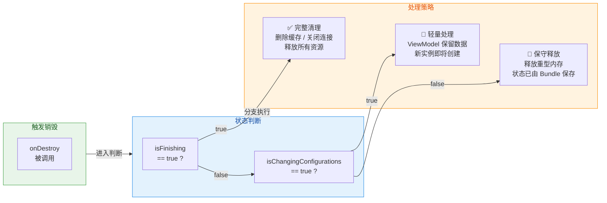
```mermaid
graph LR
    subgraph Trigger["触发销毁"]
        direction TB
        A["onDestroy\n被调用"]
    end

    subgraph Check["状态判断"]
        direction TB
        B["isFinishing\n== true ?"]
        C["isChangingConfigurations\n== true ?"]
        B ~~~ C
    end

    subgraph Action["处理策略"]
        direction TB
        D["✅ 完整清理\n删除缓存 / 关闭连接\n释放所有资源"]
        E["🔄 轻量处理\nViewModel 保留数据\n新实例即将创建"]
        F["💾 保守释放\n释放重型内存\n状态已由 Bundle 保存"]
        D ~~~ E ~~~ F
    end

    Trigger -->|"进入判断"| Check -->|"分支执行"| Action

    B -->|"true"| D
    B -->|"false"| C
    C -->|"true"| E
    C -->|"false"| F

    classDef triggerStyle fill:#E8F5E9,stroke:#43A047,color:#1B5E20
    classDef checkStyle fill:#E3F2FD,stroke:#1E88E5,color:#0D47A1
    classDef actionStyle fill:#FFF3E0,stroke:#FB8C00,color:#E65100

    class Trigger triggerStyle
    class Check checkStyle
    class Action actionStyle
```

### onDestroy 资源释放

#### onDestroy 的调用时机与特性

`onDestroy()` 是 Activity 生命周期中的最后一个回调，但有一个非常重要的事实必须牢记：**`onDestroy()` 不保证一定会被调用**。在极端的内存压力下，系统可能直接杀死整个进程（Process Kill），此时 `onDestroy()` 根本没有执行的机会。因此，关键数据的持久化不应该依赖 `onDestroy()`，而应该在 `onPause()` 或 `onStop()` 中完成。

那 `onDestroy()` 适合做什么？它适合做那些"做了更好、没做也不会丢数据"的清理工作——释放内存、解除引用、关闭不再需要的资源。这些操作的目的是帮助 GC 更快地回收内存，以及防止内存泄漏。

从 Framework 层面看，当 `ActivityThread` 收到来自 AMS（ActivityManagerService）的销毁指令后，会依次调用 `onPause()` → `onStop()` → `onDestroy()`（如果之前的回调还没执行的话）。在 `onDestroy()` 执行完毕后，Activity 的 Window 会被移除，DecorView 会与 Window 解绑，Activity 对象本身则等待 GC 回收。

#### 需要释放的资源类型

一个典型的 Activity 在运行过程中可能持有多种类型的资源，每种资源都有其对应的释放方式：

```kotlin
class EditorActivity : AppCompatActivity() {

    // ---- 各类需要管理的资源 ----
    private lateinit var sensorManager: SensorManager          // 系统服务
    private lateinit var locationCallback: LocationCallback     // 位置回调
    private var mediaPlayer: MediaPlayer? = null                // 媒体播放器
    private var webSocketConnection: WebSocket? = null          // 网络长连接
    private var broadcastReceiver: BroadcastReceiver? = null    // 广播接收器
    private var serviceConnection: ServiceConnection? = null    // Service 绑定
    private var animatorSet: AnimatorSet? = null                // 属性动画

    override fun onDestroy() {
        super.onDestroy()

        // 1. 停止并释放媒体资源
        // MediaPlayer 持有底层 native 资源（音频解码器、AudioTrack）
        // 如果不显式 release()，native 内存不会被 Java GC 回收
        mediaPlayer?.apply {
            stop()       // 先停止播放
            release()    // 释放底层 native 资源
        }
        mediaPlayer = null  // 解除 Java 层引用

        // 2. 关闭网络长连接
        // WebSocket 连接如果不关闭，服务端会一直维持会话
        // 同时客户端的读写线程也不会停止
        webSocketConnection?.close(
            code = 1000,                    // 正常关闭的状态码
            reason = "Activity destroyed"   // 关闭原因
        )
        webSocketConnection = null

        // 3. 取消属性动画
        // 运行中的 Animator 会通过 Choreographer 持有对 View 的引用
        // View 又持有对 Activity 的引用，形成泄漏链
        animatorSet?.apply {
            cancel()            // 立即取消动画
            removeAllListeners() // 移除所有监听器，断开回调引用
        }
        animatorSet = null

        // 4. 反注册广播接收器
        // 通过 registerReceiver() 注册的接收器如果不反注册
        // 系统会在 Activity 销毁后打印泄漏警告日志
        broadcastReceiver?.let {
            unregisterReceiver(it)  // 从系统中移除注册
        }
        broadcastReceiver = null

        // 5. 解绑 Service
        // bindService() 建立的连接如果不 unbind
        // 会导致 ServiceConnectionLeaked 异常
        serviceConnection?.let {
            unbindService(it)   // 解除与 Service 的绑定
        }
        serviceConnection = null

        // 6. 注销传感器监听
        // 传感器监听器如果不注销，即使 Activity 销毁
        // SensorManager 仍会持续回调，浪费电量和 CPU
        sensorManager.unregisterListener(sensorEventListener)

        // 7. 移除位置更新回调
        // FusedLocationProviderClient 的回调同理
        fusedLocationClient.removeLocationUpdates(locationCallback)
    }
}
```

上面的代码展示了一个"大而全"的清理模板，但在实际项目中，现代 Android 开发已经通过 **Lifecycle-aware components** 大幅简化了这个过程。使用 `LifecycleObserver` 或 `DefaultLifecycleObserver`，可以让每个资源自己管理自己的生命周期，而不是把所有清理逻辑都堆在 `onDestroy()` 里。

#### 资源释放的层次化策略

并非所有资源都应该在 `onDestroy()` 中释放。根据资源的性质和重要程度，应该在不同的生命周期阶段进行释放：

```kotlin
class WellManagedActivity : AppCompatActivity() {

    override fun onPause() {
        super.onPause()
        // ---- onPause：释放"前台独占"资源 ----
        // 相机预览：其他 App 可能需要使用相机
        cameraSource.stop()
        // 关键数据持久化：onPause 之后进程可能随时被杀
        saveUserProgress()
    }

    override fun onStop() {
        super.onStop()
        // ---- onStop：释放"用户不可见时不需要"的资源 ----
        // 停止动画：用户看不到了，没必要继续消耗 CPU/GPU
        lottieAnimationView.cancelAnimation()
        // 暂停视频播放
        videoPlayer.pause()
        // 反注册需要 UI 更新的广播接收器
        localBroadcastManager.unregisterReceiver(uiUpdateReceiver)
    }

    override fun onDestroy() {
        super.onDestroy()
        // ---- onDestroy：释放"与 Activity 实例绑定"的资源 ----
        // 这些资源在 Activity 重建时需要重新创建
        mediaPlayer?.release()      // native 资源
        webSocket?.close(1000, "")  // 网络连接
        coroutineScope.cancel()     // 协程作用域
        // 清除对 Activity 的强引用
        callback = null
    }
}
```

这种分层策略的核心思想是：**越早释放的资源，越不容易泄漏；越关键的数据，越要在早期回调中持久化**。`onPause()` 是唯一一个在进程被杀之前 **保证执行** 的回调（从 Android 3.0 / Honeycomb 开始，`onStop()` 也基本保证执行，但 `onPause()` 仍然是最安全的时机）。

#### Lifecycle-aware 组件的现代实践

手动在 `onDestroy()` 中逐一释放资源的做法虽然直观，但存在明显的缺陷：容易遗漏、代码臃肿、职责不清。现代 Android 开发推荐使用 `Lifecycle` 组件让资源自己感知生命周期：

```kotlin
/**
 * 一个能感知生命周期的 WebSocket 管理器
 * 实现 DefaultLifecycleObserver 接口，自动响应宿主的生命周期事件
 */
class LifecycleAwareWebSocket(
    private val url: String,           // WebSocket 服务端地址
    private val okHttpClient: OkHttpClient // 共享的 OkHttp 客户端
) : DefaultLifecycleObserver {

    private var webSocket: WebSocket? = null  // 当前 WebSocket 连接实例

    // 当宿主（Activity/Fragment）进入 STARTED 状态时自动连接
    override fun onStart(owner: LifecycleOwner) {
        // 创建 WebSocket 连接请求
        val request = Request.Builder().url(url).build()
        // 建立连接，传入消息监听器
        webSocket = okHttpClient.newWebSocket(request, messageListener)
    }

    // 当宿主进入 STOPPED 状态时自动断开
    override fun onStop(owner: LifecycleOwner) {
        // 正常关闭 WebSocket 连接
        webSocket?.close(1000, "Lifecycle stopped")
        webSocket = null
    }

    // 当宿主被销毁时，自动从生命周期观察者列表中移除自己
    override fun onDestroy(owner: LifecycleOwner) {
        // 移除观察者，彻底断开与宿主的关联
        owner.lifecycle.removeObserver(this)
    }
}

// ---- 在 Activity 中使用 ----
class ChatActivity : AppCompatActivity() {
    override fun onCreate(savedInstanceState: Bundle?) {
        super.onCreate(savedInstanceState)

        // 创建 WebSocket 管理器并注册为生命周期观察者
        val ws = LifecycleAwareWebSocket("wss://chat.example.com", okHttpClient)
        // 一行代码完成注册，无需在 onDestroy 中手动清理
        lifecycle.addObserver(ws)
        // 从此 ws 会自动跟随 Activity 的生命周期连接/断开
    }
    // 注意：onDestroy() 中不需要任何关于 WebSocket 的清理代码
}
```

这种模式的优势在于 **关注点分离**（Separation of Concerns）：每个资源管理器只关心自己的逻辑，Activity 不需要知道它们的清理细节。当项目中有十几种需要生命周期管理的资源时，这种模式的价值就非常明显了。

### 泄漏检测

#### 什么是 Activity 内存泄漏

Activity 内存泄漏（Activity Memory Leak）是 Android 开发中最常见也最严重的内存问题之一。它的本质是：**Activity 实例在 `onDestroy()` 之后，由于被其他长生命周期对象持有强引用，导致 GC 无法回收它**。

一个 Activity 对象本身可能并不大，但它持有对整个 View 树（DecorView → ViewGroup → 所有子 View）的引用，而 View 树又持有 Drawable、Bitmap 等资源。一个被泄漏的 Activity 可能间接导致几十 MB 甚至上百 MB 的内存无法释放。如果用户反复进出同一个页面，每次都泄漏一个实例，App 很快就会 OOM（OutOfMemoryError）崩溃。

#### 常见的泄漏模式

理解泄漏的根源比知道如何检测更重要。以下是 Android 应用层开发中最高频的几种泄漏模式：

**模式一：非静态内部类 / 匿名类持有外部类引用**

这是最经典的泄漏场景。Java/Kotlin 中的非静态内部类（包括匿名类）会隐式持有外部类（即 Activity）的引用。如果这个内部类的实例被传递给了一个生命周期比 Activity 更长的对象（比如 Handler 的消息队列、单例对象、静态变量），泄漏就发生了。

```kotlin
// ❌ 错误示范：匿名 Runnable 隐式持有 Activity 引用
class LeakyActivity : AppCompatActivity() {
    override fun onCreate(savedInstanceState: Bundle?) {
        super.onCreate(savedInstanceState)

        // 这个匿名 Runnable 是 LeakyActivity 的内部类
        // 它隐式持有 LeakyActivity.this 的引用
        val delayedTask = Runnable {
            // 10 秒后更新 UI
            textView.text = "Updated"
        }
        // 将 Runnable 投递到主线程 Handler 的消息队列
        // 如果 Activity 在 10 秒内被销毁
        // 这个 Runnable 仍然在消息队列中等待执行
        // 它持有的 Activity 引用阻止了 GC 回收
        Handler(Looper.getMainLooper()).postDelayed(delayedTask, 10_000)
    }
}
```

```kotlin
// ✅ 正确做法：在 onDestroy 中移除回调，或使用 lifecycleScope
class SafeActivity : AppCompatActivity() {

    // 保存 Handler 引用以便后续移除回调
    private val handler = Handler(Looper.getMainLooper())
    // 保存 Runnable 引用以便精确移除
    private val delayedTask = Runnable {
        textView.text = "Updated"
    }

    override fun onCreate(savedInstanceState: Bundle?) {
        super.onCreate(savedInstanceState)
        handler.postDelayed(delayedTask, 10_000)
    }

    override fun onDestroy() {
        super.onDestroy()
        // 移除消息队列中所有与 delayedTask 关联的消息
        // 断开引用链，允许 Activity 被 GC 回收
        handler.removeCallbacks(delayedTask)
    }
}

// ✅ 更现代的做法：使用 lifecycleScope，自动跟随生命周期取消
class ModernActivity : AppCompatActivity() {
    override fun onCreate(savedInstanceState: Bundle?) {
        super.onCreate(savedInstanceState)
        // lifecycleScope 在 onDestroy 时自动取消所有协程
        // 无需手动清理，不会泄漏
        lifecycleScope.launch {
            delay(10_000)           // 挂起 10 秒，不阻塞主线程
            textView.text = "Updated" // Activity 若已销毁，协程已被取消，此行不执行
        }
    }
}
```

**模式二：单例 / 全局对象持有 Activity 引用**

当 Activity 将自身（或其内部类实例）注册到一个单例对象中，而忘记在销毁时反注册，单例的生命周期与进程相同，Activity 就永远无法被回收。

```kotlin
// ❌ 典型的单例泄漏
object EventBus {
    // listeners 列表的生命周期 = 进程生命周期
    private val listeners = mutableListOf<OnEventListener>()

    fun register(listener: OnEventListener) {
        listeners.add(listener) // Activity 被加入列表
    }

    fun unregister(listener: OnEventListener) {
        listeners.remove(listener)
    }
}

class LeakyActivity : AppCompatActivity(), OnEventListener {
    override fun onCreate(savedInstanceState: Bundle?) {
        super.onCreate(savedInstanceState)
        EventBus.register(this) // 将 Activity 自身注册为监听器
        // 如果忘记在 onDestroy 中调用 EventBus.unregister(this)
        // 单例 EventBus 会一直持有这个 Activity 的强引用
    }
}
```

**模式三：将 Activity 作为 Context 传递给长生命周期对象**

这是一个非常隐蔽的泄漏源。很多第三方库或工具类需要一个 `Context` 参数，如果传入的是 Activity 而不是 Application Context，就可能造成泄漏。

```kotlin
// ❌ 将 Activity Context 传给单例
class ImageCache private constructor(context: Context) {
    // 这个 context 如果是 Activity，就会导致泄漏
    // 因为 ImageCache 是单例，生命周期 = 进程生命周期
    private val ctx = context  // 强引用！

    companion object {
        @Volatile
        private var instance: ImageCache? = null

        fun getInstance(context: Context): ImageCache {
            return instance ?: synchronized(this) {
                instance ?: ImageCache(
                    // ✅ 修复：始终使用 Application Context
                    // applicationContext 的生命周期 = 进程生命周期
                    // 不会导致任何 Activity 泄漏
                    context.applicationContext
                ).also { instance = it }
            }
        }
    }
}
```

下面这张引用链图展示了泄漏发生时的对象关系：

```text
┌─────────────────────────────────────────────────────────────────┐
│                     GC Root (GC 根)                             │
│                          │                                      │
│                    ┌─────▼──────┐                               │
│                    │  Singleton  │  ← 生命周期 = 进程            │
│                    │  (单例对象)  │                               │
│                    └─────┬──────┘                               │
│                          │ 强引用 (listeners / context)         │
│                    ┌─────▼──────────┐                           │
│                    │   Activity ⚠️   │  ← 已调用 onDestroy      │
│                    │  (应该被回收)    │     但无法被 GC 回收      │
│                    └─────┬──────────┘                           │
│                          │ 持有引用                              │
│              ┌───────────┼───────────┐                          │
│        ┌─────▼────┐ ┌────▼────┐ ┌────▼─────┐                   │
│        │ DecorView│ │ ViewTree│ │ Bitmaps  │  ← 几十 MB 内存   │
│        │ (根视图)  │ │ (视图树) │ │ (位图资源)│     全部无法释放   │
│        └──────────┘ └─────────┘ └──────────┘                   │
└─────────────────────────────────────────────────────────────────┘
```

只要 Singleton → Activity 这条强引用链存在，整个 Activity 及其持有的所有对象都无法被垃圾回收器回收。

#### LeakCanary：自动化泄漏检测

[LeakCanary](https://square.github.io/leakcanary/) 是 Square 公司开源的 Android 内存泄漏检测库，它是目前 Android 生态中最成熟、最广泛使用的泄漏检测工具。理解它的工作原理，不仅能帮助你更好地使用它，还能加深对 Java/Android 内存管理机制的理解。

**LeakCanary 的核心检测原理**

LeakCanary 的检测机制建立在 Java 的 `WeakReference`（弱引用）和 `ReferenceQueue`（引用队列）之上。其核心逻辑可以概括为四个步骤：

第一步，**监听 Activity 销毁**。LeakCanary 通过 `Application.registerActivityLifecycleCallbacks()` 监听所有 Activity 的生命周期。当某个 Activity 的 `onDestroy()` 被调用时，LeakCanary 开始"盯上"这个实例。

第二步，**创建弱引用并关联引用队列**。LeakCanary 为这个即将被销毁的 Activity 创建一个 `WeakReference`，并将其关联到一个 `ReferenceQueue`。根据 Java 的 GC 机制，当一个只被 `WeakReference` 引用的对象被 GC 回收时，这个 `WeakReference` 会被自动加入到关联的 `ReferenceQueue` 中。

第三步，**等待并检查**。LeakCanary 等待 5 秒（给 GC 足够的时间），然后检查 `ReferenceQueue`：如果队列中出现了这个 `WeakReference`，说明 Activity 已被正常回收，一切正常；如果队列中没有，说明 Activity 仍然被某个强引用持有，**泄漏疑似发生**。

第四步，**触发 GC 并确认**。为了排除"GC 还没来得及运行"的误报，LeakCanary 会主动触发一次 GC（`Runtime.getRuntime().gc()`），然后再次检查。如果 Activity 仍然没有被回收，LeakCanary 就确认泄漏发生，并 dump 一份 heap（堆转储），分析引用链，找出是谁在持有这个 Activity。

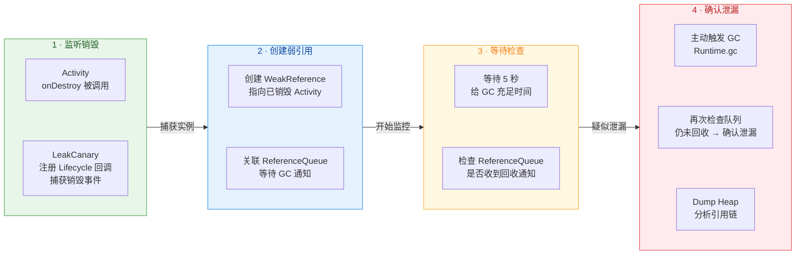
```mermaid
graph LR
    subgraph Phase1["1 · 监听销毁"]
        direction TB
        A["Activity\nonDestroy 被调用"]
        B["LeakCanary\n注册 Lifecycle 回调\n捕获销毁事件"]
        A ~~~ B
    end

    subgraph Phase2["2 · 创建弱引用"]
        direction TB
        C["创建 WeakReference\n指向已销毁 Activity"]
        D["关联 ReferenceQueue\n等待 GC 通知"]
        C ~~~ D
    end

    subgraph Phase3["3 · 等待检查"]
        direction TB
        E["等待 5 秒\n给 GC 充足时间"]
        F["检查 ReferenceQueue\n是否收到回收通知"]
        E ~~~ F
    end

    subgraph Phase4["4 · 确认泄漏"]
        direction TB
        G["主动触发 GC\nRuntime.gc"]
        H["再次检查队列\n仍未回收 → 确认泄漏"]
        I["Dump Heap\n分析引用链"]
        G ~~~ H ~~~ I
    end

    Phase1 -->|"捕获实例"| Phase2 -->|"开始监控"| Phase3 -->|"疑似泄漏"| Phase4

    classDef p1Style fill:#E8F5E9,stroke:#43A047,color:#1B5E20
    classDef p2Style fill:#E3F2FD,stroke:#1E88E5,color:#0D47A1
    classDef p3Style fill:#FFF8E1,stroke:#F9A825,color:#F57F17
    classDef p4Style fill:#FFEBEE,stroke:#E53935,color:#B71C1C

    class Phase1 p1Style
    class Phase2 p2Style
    class Phase3 p3Style
    class Phase4 p4Style
```

**集成 LeakCanary**

LeakCanary 的集成极其简单，只需要在 `build.gradle` 中添加一行依赖：

```kotlin
dependencies {
    // 仅在 debug 构建中包含 LeakCanary
    // debugImplementation 确保 release 包中不会包含任何 LeakCanary 代码
    debugImplementation("com.squareup.leakcanary:leakcanary-android:2.14")
}
```

不需要写任何初始化代码。LeakCanary 利用 `ContentProvider` 的自动初始化机制（在 AndroidManifest 中声明一个 `ContentProvider`，它会在 `Application.onCreate()` 之前被系统自动创建），在 App 启动时自动完成初始化和 Activity 监听的注册。这是一个非常巧妙的设计——zero-code initialization。

**阅读 LeakCanary 的泄漏报告**

当 LeakCanary 检测到泄漏时，它会在通知栏弹出提醒，点击后可以看到详细的引用链（Leak Trace）。理解如何阅读这个引用链是定位和修复泄漏的关键：

```text
```text
┌──────────────────────────────────────────────────────────────┐
│  LeakCanary Leak Trace 示例                                  │
│                                                              │
│  ┌─ GC Root: Thread (main)                                  │
│  │                                                           │
│  ├─ android.os.HandlerThread                                │
│  │    ↓ instance field: mHandler                            │
│  │                                                           │
│  ├─ com.example.app.DataManager (Singleton)                 │
│  │    ↓ instance field: mCallback                           │
│  │    ~ 泄漏原因在这里：单例持有了 Activity 的回调引用 ~      │
│  │                                                           │
│  ╰→ com.example.app.DetailActivity (DESTROYED)              │
│       ↑ 这就是被泄漏的 Activity 实例                         │
│       ↑ 状态已经是 DESTROYED，但无法被 GC 回收               │
└──────────────────────────────────────────────────────────────┘
```

阅读引用链时，从下往上看：最底部是被泄漏的对象（Activity），沿着箭头向上追溯，就能找到是哪个对象通过哪个字段持有了它的引用。在上面的例子中，`DataManager` 这个单例通过 `mCallback` 字段持有了 `DetailActivity` 的引用，而 `DataManager` 作为单例挂在 `HandlerThread` 上，最终连接到 GC Root。修复方案就是在 `DetailActivity.onDestroy()` 中将 `DataManager.mCallback` 置为 `null`，或者改用 `WeakReference` 持有回调。

#### Android Studio Profiler 内存分析

除了 LeakCanary 这种自动化工具，Android Studio 内置的 Memory Profiler 提供了更全面的内存分析能力，适合深入排查复杂的内存问题。

Memory Profiler 的核心功能包括：

**实时内存监控**：在 App 运行时，Profiler 会实时绘制内存使用曲线，按类别（Java Heap、Native Heap、Graphics、Stack、Code 等）分色显示。当你反复进出某个 Activity 时，如果 Java Heap 的基线持续上升而不回落，就是典型的泄漏信号。

**Heap Dump 分析**：点击 "Dump Java Heap" 按钮可以捕获当前时刻的堆快照。在快照中可以按类名搜索，查看某个类有多少个实例。比如搜索你怀疑泄漏的 Activity 类名，如果发现有多个实例存在（而正常情况下应该只有 0 或 1 个），就确认了泄漏。

**Allocation Tracking**：记录一段时间内所有对象的分配情况，可以看到哪些代码路径在频繁创建对象，帮助定位内存抖动（Memory Churn）问题。

一个实用的手动检测流程如下：

```kotlin
/**
 * 手动泄漏检测辅助工具
 * 在 debug 构建中使用，配合 Memory Profiler 定位泄漏
 */
object LeakDetectionHelper {

    // 使用 WeakReference 追踪 Activity 实例
    // 如果 Activity 被正常回收，WeakReference.get() 会返回 null
    private val trackedActivities = mutableListOf<WeakReference<Activity>>()

    /**
     * 在 Activity 的 onDestroy 中调用此方法
     * 将 Activity 加入追踪列表
     */
    fun trackActivity(activity: Activity) {
        // 用 WeakReference 包装，不会阻止 GC 回收
        trackedActivities.add(WeakReference(activity))
    }

    /**
     * 在合适的时机调用（比如点击 debug 菜单）
     * 检查是否有已销毁但未被回收的 Activity
     */
    fun checkLeaks(): List<String> {
        // 先主动建议 GC 运行（注意：这只是建议，不保证立即执行）
        Runtime.getRuntime().gc()

        val leakedActivities = mutableListOf<String>()

        // 使用迭代器遍历，方便在遍历过程中安全移除元素
        val iterator = trackedActivities.iterator()
        while (iterator.hasNext()) {
            val ref = iterator.next()
            val activity = ref.get()

            if (activity == null) {
                // WeakReference.get() 返回 null
                // 说明 Activity 已被 GC 正常回收，从列表中移除
                iterator.remove()
            } else if (activity.isDestroyed) {
                // Activity 仍然存在于内存中，但状态已经是 DESTROYED
                // 这就是泄漏！记录类名用于排查
                leakedActivities.add(activity::class.java.simpleName)
            }
            // 如果 activity 不为 null 且未 destroyed，说明它还在正常运行中
        }

        return leakedActivities
    }

    /**
     * 打印泄漏报告到 Logcat
     * 建议在 Application 中定期调用，或绑定到 debug 按钮
     */
    fun reportLeaks() {
        val leaks = checkLeaks()
        if (leaks.isNotEmpty()) {
            // 使用 Log.e 输出，方便在 Logcat 中用红色高亮过滤
            Log.e("LeakDetection",
                "⚠️ 检测到 ${leaks.size} 个泄漏的 Activity: ${leaks.joinToString()}")
        } else {
            Log.d("LeakDetection", "✅ 未检测到 Activity 泄漏")
        }
    }
}
```

#### StrictMode：开发阶段的防御性检测

`StrictMode` 是 Android 系统内置的开发者工具，可以在开发阶段检测常见的性能问题和资源泄漏。虽然它不像 LeakCanary 那样专门针对内存泄漏，但它能捕获一些 LeakCanary 覆盖不到的问题，比如未关闭的 `Cursor`、未关闭的 `InputStream`、主线程上的磁盘/网络操作等。

```kotlin
class MyApplication : Application() {
    override fun onCreate() {
        super.onCreate()

        // 仅在 debug 构建中启用 StrictMode
        if (BuildConfig.DEBUG) {
            // ---- 线程策略：检测主线程上的不当操作 ----
            StrictMode.setThreadPolicy(
                StrictMode.ThreadPolicy.Builder()
                    .detectDiskReads()      // 检测主线程磁盘读取
                    .detectDiskWrites()     // 检测主线程磁盘写入
                    .detectNetwork()        // 检测主线程网络访问
                    .detectCustomSlowCalls() // 检测自定义的慢操作标记
                    .penaltyLog()           // 违规时输出到 Logcat
                    .penaltyFlashScreen()   // 违规时屏幕闪烁红色边框（非常直观）
                    .build()
            )

            // ---- VM 策略：检测虚拟机级别的资源泄漏 ----
            StrictMode.setVmPolicy(
                StrictMode.VmPolicy.Builder()
                    .detectLeakedSqlLiteObjects()    // 检测未关闭的 SQLite 游标
                    .detectLeakedClosableObjects()   // 检测未关闭的 Closeable 对象
                    .detectActivityLeaks()           // 检测 Activity 泄漏
                    .detectLeakedRegistrationObjects() // 检测未反注册的广播接收器等
                    .penaltyLog()                    // 违规时输出到 Logcat
                    .build()
            )
        }
    }
}
```

`StrictMode` 的 `detectActivityLeaks()` 检测原理与 LeakCanary 不同：它通过检查 `InstanceTracker`（一个内部的实例计数器）来判断某个 Activity 类是否有过多的实例同时存在。如果同一个 Activity 类有超过预期数量的实例（默认阈值通常是 1），StrictMode 就会报告潜在泄漏。这种方式比较粗糙，但胜在零依赖、零配置。

#### 泄漏防御的最佳实践总结

将前面讨论的所有内容汇总，形成一套可操作的防泄漏策略：

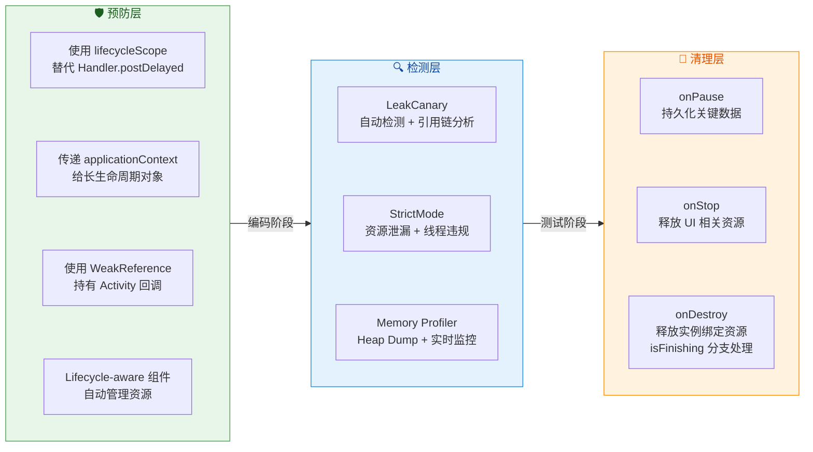
```mermaid
graph LR
    subgraph Prevention["🛡️ 预防层"]
        direction TB
        P1["使用 lifecycleScope\n替代 Handler.postDelayed"]
        P2["传递 applicationContext\n给长生命周期对象"]
        P3["使用 WeakReference\n持有 Activity 回调"]
        P4["Lifecycle-aware 组件\n自动管理资源"]
        P1 ~~~ P2 ~~~ P3 ~~~ P4
    end

    subgraph Detection["🔍 检测层"]
        direction TB
        D1["LeakCanary\n自动检测 + 引用链分析"]
        D2["StrictMode\n资源泄漏 + 线程违规"]
        D3["Memory Profiler\nHeap Dump + 实时监控"]
        D1 ~~~ D2 ~~~ D3
    end

    subgraph Cleanup["🧹 清理层"]
        direction TB
        C1["onPause\n持久化关键数据"]
        C2["onStop\n释放 UI 相关资源"]
        C3["onDestroy\n释放实例绑定资源\nisFinishing 分支处理"]
        C1 ~~~ C2 ~~~ C3
    end

    Prevention -->|"编码阶段"| Detection -->|"测试阶段"| Cleanup

    classDef prevStyle fill:#E8F5E9,stroke:#43A047,color:#1B5E20
    classDef detStyle fill:#E3F2FD,stroke:#1E88E5,color:#0D47A1
    classDef cleanStyle fill:#FFF3E0,stroke:#FB8C00,color:#E65100

    class Prevention prevStyle
    class Detection detStyle
    class Cleanup cleanStyle
```

预防层是第一道防线，通过正确的编码习惯从源头避免泄漏；检测层是第二道防线，在开发和测试阶段尽早发现遗漏的问题；清理层是最后的保障，确保即使前两层有疏漏，资源也能在生命周期结束时被正确释放。三层协同工作，才能构建出真正健壮的 Activity 生命周期管理。

---

**📝 练习题**

某个 Activity 中使用了一个匿名内部类作为 `View.OnClickListener`，并在点击时通过 `Handler.postDelayed()` 延迟 30 秒执行一个更新 UI 的任务。用户在点击按钮后 5 秒内按下返回键退出了该 Activity。以下哪种说法是正确的？

A. Activity 会立即被 GC 回收，因为用户已经按下返回键触发了 `finish()`

B. Activity 会在 `onDestroy()` 执行后被 GC 回收，因为系统会自动清理 Handler 消息队列

C. Activity 在剩余 25 秒内无法被 GC 回收，因为 Handler 消息队列中的 Runnable 隐式持有 Activity 的强引用

D. Activity 不会泄漏，因为 `postDelayed` 的 Runnable 运行在主线程，主线程与 Activity 生命周期同步

**【答案】** C

**【解析】** 匿名内部类（包括匿名 `Runnable`）会隐式持有外部类（Activity）的引用。当 `Handler.postDelayed()` 将这个 Runnable 投递到主线程的 `MessageQueue` 时，引用链为：`主线程 Looper` → `MessageQueue` → `Message` → `Runnable`（callback 字段）→ `Activity`。主线程的 Looper 是 GC Root，因此在 Message 被处理（即 30 秒延迟到期并执行 Runnable）之前，Activity 无法被回收。`onDestroy()` 的调用不会自动清理 Handler 的消息队列——这是开发者的责任。正确做法是在 `onDestroy()` 中调用 `handler.removeCallbacksAndMessages(null)` 清除所有待处理消息，或者使用 `lifecycleScope.launch { delay(30_000) }` 让协程自动跟随生命周期取消。

选项 A 忽略了引用链的存在；选项 B 错误地假设系统会自动清理；选项 D 混淆了线程归属与引用持有的概念——Runnable 虽然运行在主线程，但它作为对象存在于消息队列中，与 Activity 的生命周期没有自动绑定关系。

---

## 边缘到边缘 Edge-to-Edge

### 什么是 Edge-to-Edge 以及为什么需要它

在传统的 Android 应用中，系统会为状态栏（Status Bar）和导航栏（Navigation Bar）预留出固定的不透明区域，应用的内容被"夹"在这两条系统栏之间。这种做法虽然安全，但在视觉上会让应用显得"被框住了"——尤其是在全面屏设备普及之后，屏幕四周的圆角、挖孔摄像头（Display Cutout）以及手势导航条的出现，使得传统的系统栏预留方式越来越不合时宜。

Edge-to-Edge（边缘到边缘）是 Google 从 Android 10 开始大力推行、并在 Android 15（API 35）中强制启用的一种显示模式。它的核心思想非常简单：**让应用的内容绘制区域延伸到整个屏幕，包括状态栏和导航栏所在的区域**。系统栏本身变为半透明或全透明，"浮"在应用内容之上。这样做的好处是显而易见的：

- 视觉沉浸感大幅提升，内容可以利用整块屏幕。
- 与现代手势导航（Gesture Navigation）配合更加自然——手势导航条本身就是一个细小的半透明指示器，如果下方还有一块不透明的导航栏区域，视觉上会非常割裂。
- 应用在不同设备（手机、平板、折叠屏）上的表现更加一致。

但 Edge-to-Edge 也带来了一个必须解决的问题：当应用内容延伸到系统栏区域后，**如何避免重要的交互元素（按钮、文本、输入框）被系统栏遮挡？** 这就是 WindowInsets 机制要解决的核心问题。

### 启用 Edge-to-Edge 的方式

在 Android 15（API 35，targetSdkVersion 35）及以上，系统会自动为所有 Activity 启用 Edge-to-Edge，开发者无需手动调用任何 API。但对于 targetSdkVersion 低于 35 的应用，或者需要向下兼容到更早版本的场景，需要手动启用。

Google 推荐的做法是使用 AndroidX 提供的 `enableEdgeToEdge()` 扩展函数，它封装了所有版本兼容逻辑：

```kotlin
// 在 Activity 的 onCreate 中，setContentView 之前调用
class MainActivity : ComponentActivity() {
    override fun onCreate(savedInstanceState: Bundle?) {
        // 必须在 super.onCreate 之前或之后、setContentView 之前调用
        // enableEdgeToEdge() 会自动处理以下事项：
        // 1. 调用 WindowCompat.setDecorFitsSystemWindows(window, false)
        //    告诉系统"我的内容要自己处理系统栏区域，不需要你帮我留白"
        // 2. 将状态栏背景设为透明
        // 3. 将导航栏背景设为透明（或在旧版三键导航上设为半透明遮罩）
        // 4. 根据系统版本自动选择最佳的兼容策略
        enableEdgeToEdge()

        super.onCreate(savedInstanceState)
        setContentView(R.layout.activity_main)
    }
}
```

如果不使用 `enableEdgeToEdge()`，也可以手动实现等价效果，但需要处理更多细节：

```kotlin
class MainActivity : ComponentActivity() {
    override fun onCreate(savedInstanceState: Bundle?) {
        super.onCreate(savedInstanceState)

        // 核心开关：告诉 DecorView 不要自动为系统栏留出 padding
        // 这一行是 Edge-to-Edge 的本质——关闭系统的自动 insets 消费
        WindowCompat.setDecorFitsSystemWindows(window, false)

        // 将状态栏和导航栏背景设为透明
        // 注意：在 Android 10 以下，导航栏透明可能导致三键导航按钮看不清
        // 所以实际项目中通常需要根据 SDK 版本做条件判断
        window.statusBarColor = Color.TRANSPARENT
        window.navigationBarColor = Color.TRANSPARENT
    }
}
```

`enableEdgeToEdge()` 内部做的事情远比上面两行代码多——它会检测当前设备的导航模式（手势导航 vs 三键导航）、系统版本、深色模式状态，然后选择最合适的系统栏背景色和图标颜色。这就是为什么 Google 强烈推荐使用它而不是手动设置。

### WindowInsets 体系：理解系统栏的"占位信息"

启用 Edge-to-Edge 之后，应用内容会延伸到屏幕边缘，但状态栏、导航栏、输入法键盘等系统 UI 仍然存在。系统通过 **WindowInsets** 机制告诉应用："这些区域被系统 UI 占据了，你需要自己决定如何处理。"

WindowInsets 本质上就是一组 **边距值**（top、bottom、left、right），描述了屏幕各边缘被系统 UI 占据的像素数。不同类型的系统 UI 对应不同的 Insets 类型：

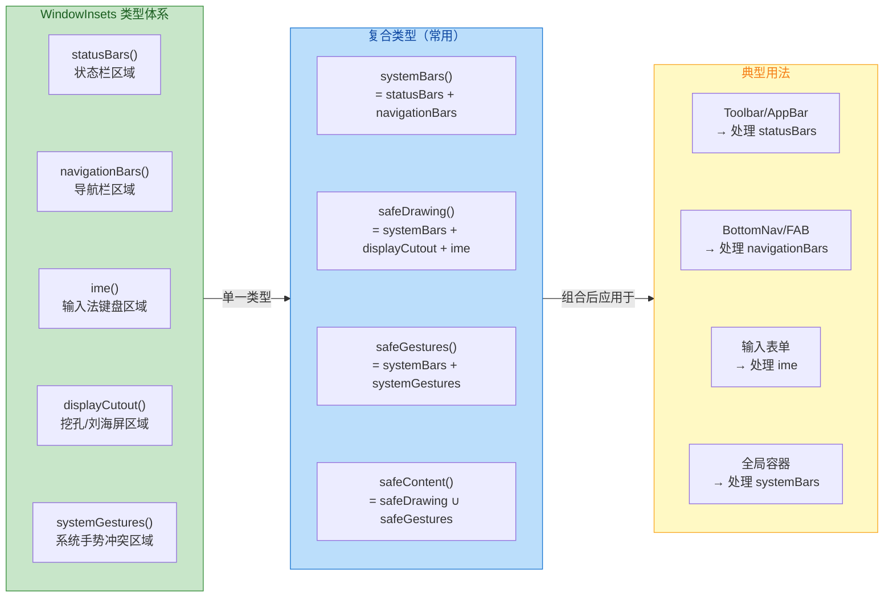
```mermaid
graph LR
    subgraph Types["WindowInsets 类型体系"]
        direction TB
        A["statusBars()\n状态栏区域"] ~~~ B["navigationBars()\n导航栏区域"]
        B ~~~ C["ime()\n输入法键盘区域"]
        C ~~~ D["displayCutout()\n挖孔/刘海屏区域"]
        D ~~~ E["systemGestures()\n系统手势冲突区域"]
    end

    subgraph Compound["复合类型（常用）"]
        direction TB
        F["systemBars()\n= statusBars + navigationBars"] ~~~ G["safeDrawing()\n= systemBars + displayCutout + ime"]
        G ~~~ H["safeGestures()\n= systemBars + systemGestures"]
        H ~~~ I["safeContent()\n= safeDrawing ∪ safeGestures"]
    end

    subgraph Usage["典型用法"]
        direction TB
        J["Toolbar/AppBar\n→ 处理 statusBars"] ~~~ K["BottomNav/FAB\n→ 处理 navigationBars"]
        K ~~~ L["输入表单\n→ 处理 ime"]
        L ~~~ M["全局容器\n→ 处理 systemBars"]
    end

    Types -->|"单一类型"| Compound -->|"组合后应用于"| Usage

    classDef typeStyle fill:#C8E6C9,stroke:#388E3C,color:#1B5E20
    classDef compoundStyle fill:#BBDEFB,stroke:#1976D2,color:#0D47A1
    classDef usageStyle fill:#FFF9C4,stroke:#F9A825,color:#F57F17

    class Types typeStyle
    class Compound compoundStyle
    class Usage usageStyle
```

理解这些类型之间的关系非常重要。`systemBars()` 是最常用的复合类型，它等于 `statusBars()` 和 `navigationBars()` 的并集。而 `safeDrawing()` 则更加全面，它还包含了 `displayCutout()` 和 `ime()` 的区域——这意味着如果你用 `safeDrawing()` 来设置 padding，你的内容不仅不会被系统栏遮挡，也不会被刘海屏挖孔或弹出的键盘遮挡。

### 使用 WindowInsetsCompat 处理 Insets（View 体系）

在传统的 View 体系中，处理 Insets 的标准方式是通过 `ViewCompat.setOnApplyWindowInsetsListener` 注册一个监听器。当系统分发 Insets 时，这个监听器会被回调，开发者在回调中根据 Insets 值调整 View 的 padding 或 margin：

```kotlin
// 典型场景：为根布局设置 padding，避免内容被系统栏遮挡
ViewCompat.setOnApplyWindowInsetsListener(findViewById(R.id.main_container)) { view, windowInsets ->
    // 从 windowInsets 中提取 systemBars 类型的边距值
    // 这会返回一个 Insets 对象，包含 top/bottom/left/right 四个值
    val systemBarsInsets = windowInsets.getInsets(WindowInsetsCompat.Type.systemBars())

    // 将系统栏的边距值设置为 View 的 padding
    // 这样 View 的内容就不会绘制到系统栏区域下方
    // left/right 在横屏或有侧边导航栏的设备上会有值
    view.setPadding(
        systemBarsInsets.left,   // 左侧系统栏（横屏时可能出现）
        systemBarsInsets.top,    // 状态栏高度
        systemBarsInsets.right,  // 右侧系统栏（横屏时可能出现）
        systemBarsInsets.bottom  // 导航栏高度
    )

    // 返回 windowInsets 表示"我没有消费这些 insets"
    // 这样子 View 也能收到同样的 insets 信息并做出自己的调整
    // 如果返回 WindowInsetsCompat.CONSUMED，子 View 将不再收到 insets
    windowInsets
}
```

这里有一个非常关键的设计决策：**应该对哪些 View 设置 Insets 处理？** 一般原则是：

- **根容器**：设置 `systemBars()` 的 padding，确保整体内容不被遮挡。
- **顶部 Toolbar / AppBar**：单独处理 `statusBars()` 的 top padding，让 Toolbar 的背景延伸到状态栏区域（视觉上更沉浸），但 Toolbar 的实际内容（标题、按钮）不会被状态栏遮挡。
- **底部导航栏 / FAB**：处理 `navigationBars()` 的 bottom padding 或 margin。
- **可滚动列表（RecyclerView）**：通常设置 bottom padding 等于导航栏高度，并启用 `clipToPadding = false`，这样列表内容可以滚动到导航栏下方，但最后一项滚动到底时不会被遮挡。

下面是一个更贴近实际项目的完整示例：

```kotlin
class EdgeToEdgeActivity : ComponentActivity() {
    override fun onCreate(savedInstanceState: Bundle?) {
        // 启用 Edge-to-Edge
        enableEdgeToEdge()
        super.onCreate(savedInstanceState)
        setContentView(R.layout.activity_edge_to_edge)

        // 获取各个需要处理 insets 的 View
        val toolbar = findViewById<MaterialToolbar>(R.id.toolbar)
        val recyclerView = findViewById<RecyclerView>(R.id.recycler_view)
        val fab = findViewById<FloatingActionButton>(R.id.fab)

        // 处理 Toolbar：让背景延伸到状态栏，但内容不被遮挡
        ViewCompat.setOnApplyWindowInsetsListener(toolbar) { view, insets ->
            // 只取状态栏的 top 值
            val statusBarInsets = insets.getInsets(WindowInsetsCompat.Type.statusBars())
            // 增加 Toolbar 的 top padding，使其内容（标题、菜单按钮）下移
            // 但 Toolbar 的背景色会自然填充到状态栏区域
            view.updatePadding(top = statusBarInsets.top)
            // 不消费 insets，让其他 View 也能处理
            insets
        }

        // 处理 RecyclerView：底部留出导航栏空间，但允许内容滚动到导航栏下方
        ViewCompat.setOnApplyWindowInsetsListener(recyclerView) { view, insets ->
            val navBarInsets = insets.getInsets(WindowInsetsCompat.Type.navigationBars())
            // 设置底部 padding 等于导航栏高度
            view.updatePadding(bottom = navBarInsets.bottom)
            // clipToPadding = false 是关键：
            // 它允许子项在滚动时绘制到 padding 区域内
            // 但当滚动到底部时，最后一项会停在 padding 边界上方
            view.clipToPadding = false
            insets
        }

        // 处理 FAB：通过 margin 将其上移，避免被导航栏遮挡
        ViewCompat.setOnApplyWindowInsetsListener(fab) { view, insets ->
            val navBarInsets = insets.getInsets(WindowInsetsCompat.Type.navigationBars())
            // 使用 margin 而非 padding，因为 FAB 是浮动元素
            val params = view.layoutParams as ViewGroup.MarginLayoutParams
            // 在原有 margin 基础上加上导航栏高度
            params.bottomMargin = navBarInsets.bottom + 16.dpToPx(view.context)
            view.layoutParams = params
            insets
        }
    }
}
```

### Insets 的分发与消费机制

WindowInsets 的分发遵循一套类似于触摸事件分发的树形机制，理解它对于正确处理复杂布局至关重要。

当系统产生新的 Insets（例如键盘弹出、系统栏可见性变化）时，Insets 从 DecorView 开始，沿着 View 树自顶向下分发。每个 View 在收到 Insets 后可以选择：

1. **不消费（pass through）**：直接返回原始的 `WindowInsetsCompat` 对象，子 View 会收到完全相同的 Insets 值。这是最常见也是最推荐的做法。
2. **部分消费**：通过 `WindowInsetsCompat.Builder` 构造一个新的 Insets 对象，将某些类型的值归零后返回。子 View 收到的 Insets 中，被消费的部分将为 0。
3. **完全消费**：返回 `WindowInsetsCompat.CONSUMED`，子 View 将不再收到任何 Insets 回调。

```kotlin
// 示例：自定义 ViewGroup 消费掉 statusBars 的 insets
// 这样其子 View 就不需要再处理状态栏了
ViewCompat.setOnApplyWindowInsetsListener(customHeader) { view, insets ->
    val statusBars = insets.getInsets(WindowInsetsCompat.Type.statusBars())
    // 自己处理状态栏 padding
    view.updatePadding(top = statusBars.top)

    // 构造新的 insets，将 statusBars 部分清零
    // 这样子 View 收到的 insets 中 statusBars.top 将为 0
    WindowInsetsCompat.Builder(insets)
        .setInsets(WindowInsetsCompat.Type.statusBars(), Insets.NONE)
        .build()
}
```

一个常见的陷阱是：如果父 View 返回了 `WindowInsetsCompat.CONSUMED`，那么它的所有子 View 都不会收到 Insets 回调。在 `FrameLayout` 等可能有多个重叠子 View 的容器中，这可能导致某些子 View 无法正确处理 Insets。AndroidX 的 `ViewCompat` 版本已经修复了早期 Android 版本中"Insets 只分发给第一个子 View"的 bug，但开发者仍需注意消费逻辑的正确性。

### WindowInsetsController：控制系统栏的可见性与外观

`WindowInsetsController`（以及其兼容版本 `WindowInsetsControllerCompat`）是 Android 11（API 30）引入的 API，用于替代之前散落在 `Window`、`View.setSystemUiVisibility()` 等多处的系统栏控制逻辑。它提供了一个统一的、语义清晰的接口来控制系统栏的可见性和外观。

```kotlin
class ImmersiveActivity : ComponentActivity() {
    override fun onCreate(savedInstanceState: Bundle?) {
        enableEdgeToEdge()
        super.onCreate(savedInstanceState)
        setContentView(R.layout.activity_immersive)

        // 获取兼容版本的 WindowInsetsController
        // 使用 WindowCompat 而非 window.insetsController，以确保向下兼容
        val insetsController = WindowCompat.getInsetsController(window, window.decorView)

        // === 控制系统栏图标颜色 ===
        // 当状态栏背景为浅色时，需要深色图标（时间、电量等）
        // isAppearanceLightStatusBars = true → 深色图标（适合浅色背景）
        // isAppearanceLightStatusBars = false → 浅色图标（适合深色背景）
        insetsController.isAppearanceLightStatusBars = true

        // 同理，控制导航栏按钮/手势指示器的颜色
        insetsController.isAppearanceLightNavigationBars = true
    }

    // 进入全屏沉浸模式（例如视频播放、游戏、图片查看）
    private fun enterImmersiveMode() {
        val insetsController = WindowCompat.getInsetsController(window, window.decorView)

        // 隐藏状态栏和导航栏
        // Type.systemBars() = statusBars() | navigationBars()
        insetsController.hide(WindowInsetsCompat.Type.systemBars())

        // 设置隐藏后的行为模式
        // BEHAVIOR_SHOW_TRANSIENT_BARS_BY_SWIPE：
        //   用户从屏幕边缘滑动时，系统栏会短暂显示（半透明覆盖在内容上），
        //   几秒后自动隐藏。这是最常用的沉浸模式。
        // BEHAVIOR_DEFAULT：
        //   用户从屏幕边缘滑动时，系统栏会永久显示，
        //   需要再次调用 hide() 才能隐藏。
        insetsController.systemBarsBehavior =
            WindowInsetsControllerCompat.BEHAVIOR_SHOW_TRANSIENT_BARS_BY_SWIPE
    }

    // 退出全屏沉浸模式
    private fun exitImmersiveMode() {
        val insetsController = WindowCompat.getInsetsController(window, window.decorView)
        // 显示系统栏
        insetsController.show(WindowInsetsCompat.Type.systemBars())
    }
}
```

`WindowInsetsController` 还可以用来控制输入法键盘的显示和隐藏，这在某些场景下比传统的 `InputMethodManager` 更加简洁：

```kotlin
// 显示软键盘
// 前提：目标 EditText 必须已经获得焦点
insetsController.show(WindowInsetsCompat.Type.ime())

// 隐藏软键盘
insetsController.hide(WindowInsetsCompat.Type.ime())
```

### Jetpack Compose 中的 Edge-to-Edge 处理

在 Compose 中，Insets 的处理被大幅简化了。`androidx.compose.foundation.layout` 包提供了一系列开箱即用的 Modifier 和 Composable：

```kotlin
@Composable
fun EdgeToEdgeScreen() {
    Scaffold(
        topBar = {
            TopAppBar(
                title = { Text("Edge-to-Edge Demo") },
                // TopAppBar 内部已经自动处理了 statusBars 的 insets
                // 无需手动设置 padding
            )
        },
        bottomBar = {
            NavigationBar {
                // NavigationBar 内部已经自动处理了 navigationBars 的 insets
            }
        }
    ) { innerPadding ->
        // Scaffold 会通过 innerPadding 参数传递已经计算好的安全区域 padding
        // 这个 padding 已经包含了 topBar 和 bottomBar 的高度以及系统栏的 insets
        LazyColumn(
            // 将 innerPadding 应用到 LazyColumn 的 contentPadding
            // 这样列表内容不会被 topBar/bottomBar/系统栏遮挡
            contentPadding = innerPadding,
            modifier = Modifier.fillMaxSize()
        ) {
            items(100) { index ->
                Text(
                    text = "Item #$index",
                    modifier = Modifier
                        .fillMaxWidth()
                        .padding(16.dp)
                )
            }
        }
    }
}
```

如果不使用 `Scaffold`，也可以直接使用 Insets 相关的 Modifier：

```kotlin
@Composable
fun CustomEdgeToEdgeLayout() {
    Column(
        modifier = Modifier
            .fillMaxSize()
            // safeDrawingPadding() 会自动为所有安全绘制区域添加 padding
            // 等价于 View 体系中处理 safeDrawing 类型的 insets
            // 包括状态栏、导航栏、刘海屏、键盘
            .safeDrawingPadding()
    ) {
        Text("这段文字不会被任何系统 UI 遮挡")
    }

    // 也可以更精细地控制：
    Column(
        modifier = Modifier
            .fillMaxSize()
            // 只处理状态栏的 padding
            .statusBarsPadding()
            // 只处理导航栏的 padding
            .navigationBarsPadding()
    ) {
        Text("分别处理不同类型的 insets")
    }

    // 获取具体的 insets 值用于自定义逻辑
    val density = LocalDensity.current
    // WindowInsets.systemBars 提供了当前系统栏的 insets 值
    val statusBarTop = WindowInsets.statusBars.getTop(density)
}
```

Compose 的 Material 3 组件（`TopAppBar`、`NavigationBar`、`BottomAppBar` 等）内部已经自动处理了对应的 Insets，开发者在大多数情况下不需要手动干预。这是 Compose 相比 View 体系在 Edge-to-Edge 适配上的一大优势。

### Display Cutout（刘海屏/挖孔屏）适配

Display Cutout 是 Android 9（API 28）引入的概念，用于描述屏幕上被摄像头、传感器等硬件占据的非矩形区域。在 Edge-to-Edge 模式下，应用内容可能延伸到 Cutout 区域，因此需要正确处理。

系统通过 `WindowManager.LayoutParams.layoutInDisplayCutoutMode` 属性控制应用如何与 Cutout 区域交互：

```kotlin
// 在 Activity 中设置 Cutout 模式
window.attributes.layoutInDisplayCutoutMode =
    // LAYOUT_IN_DISPLAY_CUTOUT_MODE_ALWAYS：
    //   内容始终延伸到 Cutout 区域（推荐，Edge-to-Edge 的标准做法）
    //   Android 15 强制 Edge-to-Edge 后，这是默认行为
    WindowManager.LayoutParams.LAYOUT_IN_DISPLAY_CUTOUT_MODE_ALWAYS

    // LAYOUT_IN_DISPLAY_CUTOUT_MODE_SHORT_EDGES：
    //   仅在短边（通常是竖屏的顶部和底部）延伸到 Cutout 区域
    //   横屏时不延伸（避免侧边 Cutout 遮挡内容）

    // LAYOUT_IN_DISPLAY_CUTOUT_MODE_NEVER：
    //   永远不延伸到 Cutout 区域（系统会在 Cutout 区域显示黑色填充）
    //   不推荐，会浪费屏幕空间
```

在处理 Insets 时，`displayCutout()` 类型会提供 Cutout 区域的边距信息。如果你已经在使用 `safeDrawing()` 或 `systemBars()`，通常不需要单独处理 `displayCutout()`，因为 `safeDrawing()` 已经包含了它。

### 完整的 Edge-to-Edge 适配流程

将上述知识串联起来，一个完整的 Edge-to-Edge 适配流程如下：

```mermaid
graph LR
    subgraph Step1["1. 启用 Edge-to-Edge"]
        direction TB
        A1["调用 enableEdgeToEdge()\n在 onCreate 中"] ~~~ A2["系统栏变为透明\n内容延伸到全屏"]
    end

    subgraph Step2["2. 处理 Insets"]
        direction TB
        B1["识别需要避让的 View\nToolbar / BottomNav / FAB"] ~~~ B2["注册 OnApplyWindowInsets\n监听器"]
        B2 ~~~ B3["根据 Insets 类型\n设置 padding 或 margin"]
    end

    subgraph Step3["3. 控制系统栏外观"]
        direction TB
        C1["WindowInsetsController\n设置图标深浅色"] ~~~ C2["可选：全屏沉浸模式\nhide systemBars"]
    end

    subgraph Step4["4. 处理特殊场景"]
        direction TB
        D1["Display Cutout\n刘海屏适配"] ~~~ D2["IME 键盘\n输入框不被遮挡"]
        D2 ~~~ D3["横竖屏切换\nInsets 值会变化"]
    end

    Step1 -->|"内容全屏后"| Step2 -->|"避让完成后"| Step3 -->|"外观调整后"| Step4

    classDef step1Style fill:#C8E6C9,stroke:#388E3C,color:#1B5E20
    classDef step2Style fill:#BBDEFB,stroke:#1976D2,color:#0D47A1
    classDef step3Style fill:#E1BEE7,stroke:#7B1FA2,color:#4A148C
    classDef step4Style fill:#FFE0B2,stroke:#F57C00,color:#E65100

    class Step1 step1Style
    class Step2 step2Style
    class Step3 step3Style
    class Step4 step4Style
```

### Android 15 强制 Edge-to-Edge 的影响

从 Android 15（API 35）开始，当应用的 `targetSdkVersion` 设为 35 或更高时，系统会强制启用 Edge-to-Edge，并且忽略以下旧版 API 的设置：

- `window.statusBarColor` 和 `window.navigationBarColor` 将被忽略（系统栏始终透明）。
- `R.attr#statusBarColor` 和 `R.attr#navigationBarColor` 主题属性将被忽略。
- `View.setSystemUiVisibility()` 中与系统栏颜色相关的 flag 将被忽略。

这意味着如果你的应用之前依赖 `window.navigationBarColor = Color.WHITE` 来"假装"没有启用 Edge-to-Edge（给导航栏设一个不透明的白色背景），在 Android 15 上这个做法将失效，导航栏区域会变成透明的，应用内容会直接显示在导航栏下方。如果没有正确处理 Insets，底部的按钮或导航栏组件就会被系统导航栏遮挡。

因此，**尽早适配 Edge-to-Edge 是所有 Android 应用的必修课**。即使你的 `targetSdkVersion` 还没有升到 35，也应该提前做好准备，因为这是不可逆的趋势。

### 常见问题与最佳实践

**问题 1：底部按钮被导航栏遮挡。**
这是最常见的 Edge-to-Edge 适配问题。解决方案是为底部按钮的容器设置 `navigationBars()` 类型的 bottom padding 或 margin。如果底部按钮在一个固定定位的容器中，使用 margin 通常比 padding 更合适，因为 padding 会改变容器内部的布局空间，而 margin 只是将整个容器上移。

**问题 2：RecyclerView 最后一项被导航栏遮挡。**
设置 `recyclerView.clipToPadding = false` 并为其添加 bottom padding。`clipToPadding = false` 的作用是允许子项在滚动过程中绘制到 padding 区域内（产生"内容从导航栏下方滑出"的视觉效果），但当列表滚动到底部时，最后一项会停在 padding 边界上方，不会被遮挡。

**问题 3：键盘弹出时输入框被遮挡。**
在 Edge-to-Edge 模式下，传统的 `android:windowSoftInputMode="adjustResize"` 仍然有效，但更推荐的做法是监听 `ime()` 类型的 Insets 变化，动态调整布局：

```kotlin
ViewCompat.setOnApplyWindowInsetsListener(inputContainer) { view, insets ->
    // ime() 返回输入法键盘占据的区域
    // 当键盘隐藏时，bottom 值为 0
    // 当键盘弹出时，bottom 值为键盘高度
    val imeInsets = insets.getInsets(WindowInsetsCompat.Type.ime())
    val navBarInsets = insets.getInsets(WindowInsetsCompat.Type.navigationBars())

    // 取 ime 和 navigationBars 的较大值
    // 因为键盘弹出时会覆盖导航栏，此时应该用键盘高度
    // 键盘隐藏时应该用导航栏高度
    val bottomInset = maxOf(imeInsets.bottom, navBarInsets.bottom)
    view.updatePadding(bottom = bottomInset)
    insets
}
```

**问题 4：横屏时左右两侧出现意外的空白或遮挡。**
在横屏模式下，导航栏可能出现在屏幕左侧或右侧（取决于设备和导航模式），Display Cutout 也可能出现在侧边。因此处理 Insets 时不要只关注 top 和 bottom，left 和 right 同样重要。使用 `systemBars()` 或 `safeDrawing()` 可以一次性覆盖所有方向。

**问题 5：深色模式下系统栏图标看不清。**
当应用切换到深色模式时，背景变为深色，但如果 `isAppearanceLightStatusBars` 仍然为 `true`（深色图标），状态栏上的时间、电量等信息就会因为深色图标在深色背景上而难以辨认。解决方案是根据当前主题动态设置：

```kotlin
// 根据当前是否为深色模式，动态设置系统栏图标颜色
val insetsController = WindowCompat.getInsetsController(window, window.decorView)
val isDarkMode = resources.configuration.uiMode and
    Configuration.UI_MODE_NIGHT_MASK == Configuration.UI_MODE_NIGHT_YES

// 深色模式 → 浅色图标（false）
// 浅色模式 → 深色图标（true）
insetsController.isAppearanceLightStatusBars = !isDarkMode
insetsController.isAppearanceLightNavigationBars = !isDarkMode
```

如果使用 `enableEdgeToEdge()`，这个逻辑已经被自动处理了——它会检测当前的深色模式状态并设置正确的图标颜色。这也是推荐使用 `enableEdgeToEdge()` 而非手动设置的又一个理由。

**最佳实践总结**：

- 始终使用 `enableEdgeToEdge()` 而非手动设置透明系统栏，它封装了大量版本兼容逻辑。
- 优先使用 `safeDrawing()` 或 `systemBars()` 复合类型，而非单独处理每种 Insets 类型。
- 在 `OnApplyWindowInsetsListener` 中，除非有明确理由，否则不要消费 Insets（直接返回原始 `windowInsets`）。
- 对于 `RecyclerView` / `LazyColumn`，使用 contentPadding + `clipToPadding = false` 的组合。
- 在 Compose 中优先使用 `Scaffold` 和 Material 3 组件，它们已经内置了 Insets 处理。
- 测试时务必覆盖：手势导航 vs 三键导航、竖屏 vs 横屏、有无 Display Cutout、键盘弹出/收起、深色模式 vs 浅色模式。

---

## Activity 结果传递

在 Android 应用开发中，Activity 之间的数据传递是最基础也是最高频的交互场景之一。早期我们使用 `startActivityForResult()` + `onActivityResult()` 这对经典组合来完成"启动一个 Activity 并等待它返回结果"的操作，但这套 API 存在诸多设计缺陷：请求码（requestCode）散落各处难以管理、`onActivityResult` 回调中充斥着大量 `if-else` 分支、Fragment 中的结果回调路由混乱等。从 AndroidX Activity 1.2.0 开始，Google 引入了全新的 Activity Result API，以 `ActivityResultLauncher` 为核心，配合"协定"（Contract）模式，彻底重塑了结果传递的编程范式。这套新 API 不仅解决了旧 API 的所有痛点，还带来了类型安全、关注点分离、可测试性等现代化工程优势。

### 旧 API 的问题与演进动机

要理解新 API 为何这样设计，我们必须先深入剖析旧 API `startActivityForResult` 的核心痛点。

第一个问题是 **requestCode 的管理混乱**。在旧模式下，每次调用 `startActivityForResult` 都需要传入一个 `Int` 类型的请求码，用于在 `onActivityResult` 回调中区分是哪个请求返回的结果。当一个 Activity 中存在多个不同的启动场景时——比如既要拍照、又要选图片、还要跳转到设置页——你就需要定义多个 `companion object` 常量，然后在 `onActivityResult` 中用 `when` 或 `if-else` 逐一匹配。随着业务增长，这些请求码会像野草一样蔓延，维护成本急剧上升。

第二个问题是 **类型不安全**。`onActivityResult` 的签名是 `(requestCode: Int, resultCode: Int, data: Intent?)`，返回的数据统一装在一个可空的 `Intent` 里。你必须手动从 Intent 中用字符串 Key 取值，再强制类型转换，整个过程没有任何编译期保障。一旦 Key 拼写错误或类型不匹配，只能在运行时才能发现问题。

第三个问题是 **Fragment 中的路由噩梦**。当 Fragment 调用 `startActivityForResult` 时，结果会先到达宿主 Activity 的 `onActivityResult`，再由 Activity 分发给 Fragment。如果嵌套了多层 Fragment，这条分发链路会变得极其脆弱，经常出现"Fragment 收不到回调"的诡异 Bug。开发者不得不在 Activity 中手动调用 `super.onActivityResult()` 并祈祷分发链路没有断裂。

第四个问题是 **与生命周期的耦合**。`onActivityResult` 是 Activity/Fragment 的一个生命周期方法，这意味着结果处理逻辑被硬编码在组件内部，无法抽离、无法复用、无法单独测试。如果你想把"拍照并裁剪"这个流程封装成一个独立模块，在旧 API 下几乎不可能优雅地实现。

正是这些积重难返的问题，促使 Google 设计了全新的 Activity Result API。其核心思想可以概括为三个词：**协定化（Contract）、注册制（Register）、启动器化（Launcher）**。

### ActivityResultContract：协定的本质

Activity Result API 的灵魂是 `ActivityResultContract<I, O>` 这个抽象类。它定义了一次"请求-响应"交互的完整协定（Contract），其中泛型 `I` 代表输入类型（Input），`O` 代表输出类型（Output）。这个设计直接从根源上解决了类型安全问题——输入和输出的类型在编译期就被锁定，不再需要手动解析 Intent。

`ActivityResultContract` 只有两个核心抽象方法需要理解：

```kotlin
// ActivityResultContract 的核心结构
// 泛型 I = 启动时传入的参数类型, O = 返回的结果类型
abstract class ActivityResultContract<I, O> {

    // 职责：将类型安全的输入 I 转换为系统能理解的 Intent
    // 这个方法在调用 launcher.launch(input) 时被框架自动调用
    // context 参数用于构建 Intent（比如需要 packageName 等信息）
    abstract fun createIntent(context: Context, input: I): Intent

    // 职责：将 onActivityResult 收到的原始数据解析为类型安全的输出 O
    // resultCode 就是目标 Activity 通过 setResult() 设置的结果码
    // intent 就是目标 Activity 通过 setResult() 附带的数据 Intent
    abstract fun parseResult(resultCode: Int, intent: Intent?): O
}
```

这两个方法构成了一个完美的"编解码器"：`createIntent` 负责"编码"——把你的业务参数打包成系统能识别的 Intent；`parseResult` 负责"解码"——把系统返回的原始 Intent 数据解析成你期望的业务对象。整个过程对调用方完全透明，调用方只需要关心"我传入什么类型、我拿到什么类型"，中间的 Intent 构建和解析细节全部被封装在 Contract 内部。

此外还有一个可选的方法 `getSynchronousResult`，它允许 Contract 在不实际启动 Activity 的情况下直接返回结果。这在某些场景下非常有用，比如当用户已经授予了某个权限时，权限请求 Contract 可以直接返回 `true` 而无需弹出系统对话框。

### 内置协定一览

AndroidX 在 `androidx.activity.result.contract.ActivityResultContracts` 中预置了大量常用协定，覆盖了日常开发中绑bindbindbindbindmost 高频的场景。理解这些内置协定不仅能直接使用，更能帮助你理解 Contract 的设计哲学。

**`StartActivityForResult`** 是最通用的协定，它的输入类型是 `Intent`，输出类型是 `ActivityResult`（包含 resultCode 和 data Intent）。它本质上就是旧 API 的直接映射，适用于你需要完全控制 Intent 构建和结果解析的场景。当其他内置协定都不满足需求时，它就是你的兜底选择。

**`RequestPermission`** 和 **`RequestMultiplePermissions`** 分别用于请求单个权限和多个权限。`RequestPermission` 的输入是权限字符串（如 `Manifest.permission.CAMERA`），输出是 `Boolean`（是否授权）。`RequestMultiplePermissions` 的输入是权限字符串数组，输出是 `Map<String, Boolean>`（每个权限的授权状态）。这两个协定彻底终结了权限请求代码散落在 `onRequestPermissionsResult` 中的混乱局面。

**`TakePicturePreview`** 用于拍照并获取缩略图 Bitmap，输入为 `Void?`（不需要参数），输出为 `Bitmap?`。**`TakePicture`** 则用于拍照并保存到指定 Uri，输入为 `Uri`（你预先创建的文件 Uri），输出为 `Boolean`（是否拍照成功）。注意两者的区别：前者返回的是低分辨率缩略图，适合头像预览等场景；后者保存全尺寸照片，适合需要原图的场景。

**`PickVisualMedia`** 和 **`PickMultipleVisualMedia`** 是 Android 13 引入的照片选择器（Photo Picker）对应的协定。它们利用系统级的媒体选择界面，无需申请存储权限即可让用户选择图片或视频。输入是 `PickVisualMediaRequest`（可指定媒体类型），输出是 `Uri?` 或 `List<Uri>`。这是目前 Google 推荐的媒体选择方案。

**`GetContent`** 用于通过系统文件选择器获取内容，输入是 MIME 类型字符串（如 `"image/*"`），输出是 `Uri?`。**`CreateDocument`** 用于创建文档，输入是建议的文件名，输出是用户选择的保存位置 `Uri?`。**`OpenDocumentTree`** 用于选择整个目录，输出是目录的 `Uri?`。

以下是一个展示各协定关系的结构图：

```mermaid
graph LR
    subgraph Base["ActivityResultContract〈I, O〉"]
        direction TB
        M1["createIntent(Context, I): Intent"]
        M2["parseResult(resultCode, Intent?): O"]
        M1 ~~~ M2
    end

    subgraph General["通用协定"]
        direction TB
        C1["StartActivityForResult\nI=Intent  O=ActivityResult"]
        C2["RequestPermission\nI=String  O=Boolean"]
        C3["RequestMultiplePermissions\nI=Array〈String〉  O=Map"]
        C1 ~~~ C2
        C2 ~~~ C3
    end

    subgraph Media["媒体协定"]
        direction TB
        C4["TakePicture\nI=Uri  O=Boolean"]
        C5["TakePicturePreview\nI=Void?  O=Bitmap?"]
        C6["PickVisualMedia\nI=Request  O=Uri?"]
        C4 ~~~ C5
        C5 ~~~ C6
    end

    subgraph Document["文档协定"]
        direction TB
        C7["GetContent\nI=String  O=Uri?"]
        C8["CreateDocument\nI=String  O=Uri?"]
        C9["OpenDocumentTree\nI=Uri?  O=Uri?"]
        C7 ~~~ C8
        C8 ~~~ C9
    end

    Base -->|"派生"| General -->|"扩展"| Media -->|"扩展"| Document

    classDef baseStyle fill:#E8F5E9,stroke:#2E7D32,color:#1B5E20
    classDef generalStyle fill:#E3F2FD,stroke:#1565C0,color:#0D47A1
    classDef mediaStyle fill:#FFF3E0,stroke:#E65100,color:#BF360C
    classDef docStyle fill:#F3E5F5,stroke:#6A1B9A,color:#4A148C

    class Base baseStyle
    class General generalStyle
    class Media mediaStyle
    class Document docStyle
```

### 注册与启动：registerForActivityResult 的时机约束

理解了 Contract 之后，下一步是注册。注册通过 `registerForActivityResult()` 方法完成，它接收一个 Contract 实例和一个回调 Lambda，返回一个 `ActivityResultLauncher` 对象。这个方法有一个极其重要的时机约束：**必须在 Activity 或 Fragment 的 `CREATED` 状态之前调用**，也就是说，必须在 `onCreate()` 中（或更早，如成员变量初始化时）完成注册。

为什么有这个约束？这涉及到 Activity Result API 的底层实现机制。当你调用 `registerForActivityResult` 时，框架会在内部的 `ActivityResultRegistry` 中注册一个条目，并将回调与当前组件的 `Lifecycle` 绑定。如果 Activity 因配置变更（如横竖屏切换）被销毁重建，框架需要在重建后重新关联之前挂起的结果与对应的回调。这个重新关联的过程发生在 `onCreate` 阶段——框架会从 `SavedStateRegistry` 中恢复之前的注册信息。如果你在 `onCreate` 之后才注册，框架就无法正确恢复状态，可能导致结果丢失。

```kotlin
class PhotoActivity : AppCompatActivity() {

    // ✅ 推荐方式：在成员变量声明时直接注册
    // 这确保了注册发生在 onCreate 之前（属性初始化在构造阶段执行）
    // Contract = TakePicture，输入 Uri，输出 Boolean
    private val takePictureLauncher: ActivityResultLauncher<Uri> =
        registerForActivityResult(
            // 第一个参数：指定使用哪个协定
            ActivityResultContracts.TakePicture()
        ) { success: Boolean ->
            // 第二个参数：结果回调 Lambda
            // success 就是 Contract.parseResult() 的返回值
            // 已经是类型安全的 Boolean，无需手动解析 Intent
            if (success) {
                // 拍照成功，photoUri 中已保存了照片
                loadImage(photoUri)
            } else {
                // 用户取消了拍照或拍照失败
                showToast("拍照已取消")
            }
        }

    // 用于保存照片的 Uri，需要在启动相机前创建
    private lateinit var photoUri: Uri

    override fun onCreate(savedInstanceState: Bundle?) {
        super.onCreate(savedInstanceState)
        setContentView(R.layout.activity_photo)

        // ❌ 错误示范：不要在按钮点击等运行时回调中注册
        // button.setOnClickListener {
        //     registerForActivityResult(...) // 这会抛出 IllegalStateException
        // }

        // ✅ 正确：在 onCreate 中只负责触发启动
        findViewById<Button>(R.id.btn_take_photo).setOnClickListener {
            // 创建一个临时文件 Uri 用于保存照片
            photoUri = createTempImageUri()
            // 调用 launch() 启动相机，传入 Uri 作为输入参数
            takePictureLauncher.launch(photoUri)
        }
    }

    private fun createTempImageUri(): Uri {
        // 使用 FileProvider 创建安全的内容 Uri
        val file = File.createTempFile("photo_", ".jpg", cacheDir)
        return FileProvider.getUriForFile(this, "${packageName}.fileprovider", file)
    }

    private fun loadImage(uri: Uri) { /* 加载图片到 ImageView */ }
    private fun showToast(msg: String) { /* 显示 Toast */ }
}
```

在 Fragment 中的注册方式完全一致，但有一个细微差别值得注意：Fragment 的 `registerForActivityResult` 实际上是委托给宿主 Activity 的 `ActivityResultRegistry` 来管理的。这意味着即使 Fragment 被 detach 再 reattach，只要宿主 Activity 还在，注册信息就不会丢失。这彻底解决了旧 API 中 Fragment 结果路由混乱的问题。

### 完整工作流程的内部机制

当你调用 `launcher.launch(input)` 时，框架内部会执行一系列精密的操作。理解这个流程有助于你在遇到问题时快速定位原因。

首先，`launch()` 方法会调用 Contract 的 `getSynchronousResult()` 检查是否可以同步返回结果。如果可以（比如权限已授予），直接回调结果，流程结束。如果不能同步返回，框架会调用 Contract 的 `createIntent()` 方法，将你传入的类型安全的输入参数转换为 Intent。

接着，框架会生成一个唯一的 requestCode（这个 requestCode 由 `ActivityResultRegistry` 内部自动管理，开发者完全不需要关心），然后通过 `ActivityCompat.startActivityForResult()` 启动目标 Activity。是的，底层仍然使用的是旧的 `startActivityForResult` 机制，但这一切都被封装在框架内部。

当目标 Activity 完成并返回时，系统会回调宿主 Activity 的 `onActivityResult()`。`ComponentActivity`（AppCompatActivity 的父类）已经重写了这个方法，它会将结果转发给 `ActivityResultRegistry`。Registry 根据 requestCode 找到对应的注册条目，调用 Contract 的 `parseResult()` 方法将原始的 `(resultCode, Intent?)` 解析为类型安全的输出 `O`，最后回调你在注册时提供的 Lambda。

```mermaid
sequenceDiagram
    participant App as 调用方 Activity
    participant Launcher as ActivityResultLauncher
    participant Contract as ActivityResultContract
    participant Registry as ActivityResultRegistry
    participant System as Android System
    participant Target as 目标 Activity

    App->>Launcher: launch(input: I)
    Launcher->>Contract: getSynchronousResult(input)
    Contract-->>Launcher: null（需要异步）

    Launcher->>Contract: createIntent(context, input)
    Contract-->>Launcher: Intent

    Launcher->>Registry: 生成 requestCode 并记录
    Registry->>System: startActivityForResult(intent, code)
    System->>Target: 启动目标 Activity

    Target->>System: setResult(RESULT_OK, data)
    Target->>System: finish()

    System->>App: onActivityResult(code, resultCode, data)
    App->>Registry: 转发结果
    Registry->>Contract: parseResult(resultCode, data)
    Contract-->>Registry: output: O（类型安全）
    Registry->>App: 回调 Lambda(output)
```

这个流程中有一个关键的容错机制：如果在结果返回时 Activity 已经因为配置变更被销毁重建了怎么办？`ActivityResultRegistry` 会将未消费的结果暂存在 `SavedStateRegistry` 中。当新的 Activity 实例在 `onCreate` 中重新注册时，Registry 会检查是否有暂存的结果，如果有，就立即回调。这就是为什么注册必须在 `onCreate` 中完成——只有这样，框架才能在重建后正确恢复并分发结果。

### 自定义 Contract：封装业务级交互

内置协定覆盖了通用场景，但实际业务中你经常需要自定义 Contract 来封装特定的 Activity 间交互。自定义 Contract 的核心价值在于：**将 Intent 的构建和解析逻辑从 Activity 中抽离出来，形成独立的、可复用的、可测试的模块**。

假设我们有一个编辑用户资料的场景：从主页跳转到 `EditProfileActivity`，传入当前用户 ID，返回编辑后的用户名和头像 Uri。

```kotlin
// 自定义 Contract：编辑用户资料
// 输入类型 I = String（用户 ID）
// 输出类型 O = ProfileResult?（编辑结果，null 表示用户取消）
class EditProfileContract : ActivityResultContract<String, ProfileResult?>() {

    // 将用户 ID 打包成启动 EditProfileActivity 的 Intent
    override fun createIntent(context: Context, input: String): Intent {
        // 创建显式 Intent 指向目标 Activity
        return Intent(context, EditProfileActivity::class.java).apply {
            // 将用户 ID 作为 Extra 放入 Intent
            putExtra(EXTRA_USER_ID, input)
        }
    }

    // 将目标 Activity 返回的原始数据解析为类型安全的 ProfileResult
    override fun parseResult(resultCode: Int, intent: Intent?): ProfileResult? {
        // 如果结果码不是 OK 或 Intent 为空，说明用户取消了编辑
        if (resultCode != Activity.RESULT_OK || intent == null) {
            return null
        }
        // 从 Intent 中提取编辑后的数据
        val newName = intent.getStringExtra(EXTRA_NEW_NAME) ?: return null
        val avatarUri = intent.getParcelableExtra<Uri>(EXTRA_AVATAR_URI)
        // 构造类型安全的结果对象返回
        return ProfileResult(newName, avatarUri)
    }

    // 伴生对象中定义 Intent Extra 的 Key 常量
    // 这些 Key 只在 Contract 和目标 Activity 之间共享
    companion object {
        const val EXTRA_USER_ID = "extra_user_id"
        const val EXTRA_NEW_NAME = "extra_new_name"
        const val EXTRA_AVATAR_URI = "extra_avatar_uri"
    }
}

// 结果数据类：类型安全，不再需要手动从 Intent 中解析
data class ProfileResult(
    val newName: String,        // 编辑后的用户名
    val avatarUri: Uri?         // 新头像的 Uri，可能为空（未修改头像）
)
```

在调用方使用这个自定义 Contract：

```kotlin
class MainActivity : AppCompatActivity() {

    // 注册自定义协定，回调中直接拿到 ProfileResult? 类型
    private val editProfileLauncher = registerForActivityResult(
        EditProfileContract()  // 使用我们自定义的 Contract
    ) { result: ProfileResult? ->
        // result 已经是类型安全的 ProfileResult?
        // 不需要检查 requestCode，不需要解析 Intent
        if (result != null) {
            // 用户完成了编辑，更新 UI
            updateProfileUI(result.newName, result.avatarUri)
        }
        // result 为 null 说明用户取消，不做任何处理
    }

    override fun onCreate(savedInstanceState: Bundle?) {
        super.onCreate(savedInstanceState)
        setContentView(R.layout.activity_main)

        findViewById<Button>(R.id.btn_edit_profile).setOnClickListener {
            // 启动编辑页面，只需传入用户 ID（类型安全的 String）
            // 不需要手动构建 Intent，Contract 会处理
            editProfileLauncher.launch("user_12345")
        }
    }

    private fun updateProfileUI(name: String, avatarUri: Uri?) { /* 更新界面 */ }
}
```

目标 Activity 这边的代码也很清晰：

```kotlin
class EditProfileActivity : AppCompatActivity() {

    override fun onCreate(savedInstanceState: Bundle?) {
        super.onCreate(savedInstanceState)
        setContentView(R.layout.activity_edit_profile)

        // 从 Intent 中获取用户 ID（使用 Contract 中定义的常量）
        val userId = intent.getStringExtra(EditProfileContract.EXTRA_USER_ID)
        // 加载用户数据并填充表单...

        findViewById<Button>(R.id.btn_save).setOnClickListener {
            // 构建返回数据的 Intent
            val resultIntent = Intent().apply {
                // 使用 Contract 中定义的 Key 常量，保持一致性
                putExtra(EditProfileContract.EXTRA_NEW_NAME, "新用户名")
                putExtra(EditProfileContract.EXTRA_AVATAR_URI, newAvatarUri)
            }
            // 设置结果码和数据 Intent
            setResult(RESULT_OK, resultIntent)
            // 关闭当前 Activity，结果会通过框架回传给调用方
            finish()
        }
    }
}
```

这种模式的优势非常明显：所有与 Intent Extra Key 相关的常量都集中在 Contract 中，调用方和目标 Activity 都引用同一个 Contract 的常量，消除了 Key 不一致的风险。调用方完全不需要知道目标 Activity 的 Intent 结构，只需要知道"传入 String，拿到 ProfileResult?"。

### 权限请求的现代化实践

权限请求是 Activity Result API 最能体现其优势的场景之一。旧的权限请求流程需要重写 `onRequestPermissionsResult`，手动匹配 requestCode，处理 `shouldShowRequestPermissionRationale` 的逻辑，代码极其冗长。新 API 将这一切简化到了极致。

```kotlin
class CameraFeature(private val activity: ComponentActivity) {

    // 单权限请求：输入 String（权限名），输出 Boolean（是否授权）
    private val cameraPermissionLauncher = activity.registerForActivityResult(
        ActivityResultContracts.RequestPermission()
    ) { isGranted: Boolean ->
        if (isGranted) {
            // 用户授予了相机权限，可以启动相机
            openCamera()
        } else {
            // 用户拒绝了权限
            // 检查是否应该显示权限说明（用户是否勾选了"不再询问"）
            val shouldShowRationale = ActivityCompat.shouldShowRequestPermissionRationale(
                activity,
                Manifest.permission.CAMERA
            )
            if (shouldShowRationale) {
                // 用户只是拒绝了，但没有勾选"不再询问"
                // 可以显示一个解释对话框，说明为什么需要这个权限
                showPermissionRationaleDialog()
            } else {
                // 用户勾选了"不再询问"，需要引导用户去设置页手动开启
                showGoToSettingsDialog()
            }
        }
    }

    // 多权限请求：输入 Array<String>，输出 Map<String, Boolean>
    private val multiplePermissionsLauncher = activity.registerForActivityResult(
        ActivityResultContracts.RequestMultiplePermissions()
    ) { permissions: Map<String, Boolean> ->
        // permissions 是一个 Map，Key 是权限名，Value 是是否授权
        val cameraGranted = permissions[Manifest.permission.CAMERA] ?: false
        val micGranted = permissions[Manifest.permission.RECORD_AUDIO] ?: false

        when {
            // 两个权限都授予了，可以开始录像
            cameraGranted && micGranted -> startVideoRecording()
            // 只有相机权限，可以拍照但不能录像
            cameraGranted -> openCameraPhotoOnly()
            // 都没授予，显示功能不可用的提示
            else -> showFeatureUnavailable()
        }
    }

    // 对外暴露的方法：请求相机权限
    fun requestCameraPermission() {
        // launch() 传入权限字符串即可，Contract 会处理剩下的一切
        cameraPermissionLauncher.launch(Manifest.permission.CAMERA)
    }

    // 对外暴露的方法：请求录像所需的多个权限
    fun requestVideoPermissions() {
        // launch() 传入权限数组
        multiplePermissionsLauncher.launch(
            arrayOf(
                Manifest.permission.CAMERA,
                Manifest.permission.RECORD_AUDIO
            )
        )
    }

    private fun openCamera() { /* 启动相机 */ }
    private fun startVideoRecording() { /* 开始录像 */ }
    private fun openCameraPhotoOnly() { /* 仅拍照模式 */ }
    private fun showPermissionRationaleDialog() { /* 权限说明对话框 */ }
    private fun showGoToSettingsDialog() { /* 引导去设置页 */ }
    private fun showFeatureUnavailable() { /* 功能不可用提示 */ }
}
```

注意上面的代码中，`CameraFeature` 是一个普通类而非 Activity 或 Fragment。这展示了 Activity Result API 的一个重要特性：**你可以在任何持有 `ComponentActivity` 或 `ActivityResultRegistry` 引用的类中注册 Launcher**。这使得权限请求逻辑可以被封装到独立的功能模块中，实现真正的关注点分离。

### Photo Picker：现代媒体选择方案

上一部分我们讲到了 Photo Picker 的单选注册，现在继续完整展开这个现代媒体选择方案。

Photo Picker 的核心优势在于它是一个**沙箱化的系统组件**——用户在系统提供的界面中浏览和选择媒体文件，应用只能拿到用户明确选择的那些文件的临时访问 Uri，而无法窥探用户的整个媒体库。这种设计完美契合了 Android 隐私优先（Privacy-first）的演进方向。在 Android 13 之前，应用要让用户选图片，要么申请 `READ_EXTERNAL_STORAGE` 权限（用户可能因此拒绝安装），要么使用 `ACTION_GET_CONTENT` 或 `ACTION_OPEN_DOCUMENT`（体验不够好）。Photo Picker 一举解决了这些问题。

值得注意的是，Google 通过 Google Play 系统更新（Project Mainline）将 Photo Picker 回移植（backport）到了 Android 11 和 12 的设备上。`PickVisualMedia` 协定内部会自动检测设备是否支持 Photo Picker，如果不支持则会优雅降级为 `ACTION_OPEN_DOCUMENT` Intent。这意味着你只需要写一套代码，框架会帮你处理兼容性。

```kotlin
class GalleryActivity : AppCompatActivity() {

    // 单选媒体：输入 PickVisualMediaRequest，输出 Uri?
    private val pickMediaLauncher = registerForActivityResult(
        ActivityResultContracts.PickVisualMedia()
    ) { uri: Uri? ->
        // uri 为 null 表示用户取消了选择
        if (uri != null) {
            // 获取到用户选择的媒体文件 Uri
            // 注意：这个 Uri 是临时授权的，应用进程重启后可能失效
            // 如果需要持久访问，必须调用 takePersistableUriPermission
            contentResolver.takePersistableUriPermission(
                uri,
                Intent.FLAG_GRANT_READ_URI_PERMISSION
            )
            // 加载图片到 ImageView
            imageView.setImageURI(uri)
        }
    }

    // 多选媒体：输入 PickVisualMediaRequest，输出 List<Uri>
    // 注意泛型参数的变化：输出从 Uri? 变成了 List<Uri>
    private val pickMultipleMediaLauncher = registerForActivityResult(
        // 构造函数参数指定最大可选数量
        // 不同设备对最大数量的支持不同，框架会自动适配
        ActivityResultContracts.PickMultipleVisualMedia(maxItems = 5)
    ) { uris: List<Uri> ->
        // 空列表表示用户取消了选择
        if (uris.isNotEmpty()) {
            // 遍历所有选中的 Uri
            uris.forEach { uri ->
                // 对每个 Uri 获取持久化权限
                contentResolver.takePersistableUriPermission(
                    uri,
                    Intent.FLAG_GRANT_READ_URI_PERMISSION
                )
            }
            // 更新 UI 显示选中的图片列表
            updateGalleryGrid(uris)
        }
    }

    override fun onCreate(savedInstanceState: Bundle?) {
        super.onCreate(savedInstanceState)
        setContentView(R.layout.activity_gallery)

        // 选择单张图片
        findViewById<Button>(R.id.btn_pick_image).setOnClickListener {
            // 构建请求，指定只选择图片类型
            pickMediaLauncher.launch(
                PickVisualMediaRequest(
                    // ImageOnly 表示只显示图片，不显示视频
                    ActivityResultContracts.PickVisualMedia.ImageOnly
                )
            )
        }

        // 选择多个视频
        findViewById<Button>(R.id.btn_pick_videos).setOnClickListener {
            pickMultipleMediaLauncher.launch(
                PickVisualMediaRequest(
                    // VideoOnly 表示只显示视频
                    ActivityResultContracts.PickVisualMedia.VideoOnly
                )
            )
        }

        // 选择图片和视频混合
        findViewById<Button>(R.id.btn_pick_any).setOnClickListener {
            pickMediaLauncher.launch(
                PickVisualMediaRequest(
                    // ImageAndVideo 表示同时显示图片和视频
                    ActivityResultContracts.PickVisualMedia.ImageAndVideo
                )
            )
        }

        // 按 MIME 类型精确筛选（比如只选 GIF）
        findViewById<Button>(R.id.btn_pick_gif).setOnClickListener {
            pickMediaLauncher.launch(
                PickVisualMediaRequest(
                    // SingleMimeType 允许指定精确的 MIME 类型
                    ActivityResultContracts.PickVisualMedia.SingleMimeType("image/gif")
                )
            )
        }
    }

    // 检查设备是否原生支持 Photo Picker（非降级模式）
    private fun isPhotoPickerAvailable(): Boolean {
        return ActivityResultContracts.PickVisualMedia.isPhotoPickerAvailable(this)
    }

    private lateinit var imageView: ImageView
    private fun updateGalleryGrid(uris: List<Uri>) { /* 更新网格视图 */ }
}
```

关于 Photo Picker 返回的 Uri 有一个重要的生命周期细节需要理解：默认情况下，系统授予的 Uri 读取权限是临时的，当你的应用进程被杀死后，这个权限就会失效。如果你需要在应用重启后仍然能访问这些媒体文件（比如用户选择了头像，下次打开 App 还要显示），就必须调用 `contentResolver.takePersistableUriPermission()` 来获取持久化权限。但要注意，持久化权限的数量是有上限的（通常是 128 或 512 个，取决于设备），超出后最早获取的权限会被自动回收。

### ActivityResultRegistry：脱离组件的注册机制

前面的所有示例都是在 Activity 或 Fragment 中通过 `registerForActivityResult()` 便捷方法来注册的。但 Activity Result API 的设计远比这灵活——它的核心注册中心 `ActivityResultRegistry` 是一个独立的对象，你可以在任何地方使用它，只要你能拿到它的引用。

`ComponentActivity` 内部持有一个 `ActivityResultRegistry` 实例，你可以通过 `activity.activityResultRegistry` 属性获取。这个 Registry 提供了一个更底层的注册方法：

```kotlin
// ActivityResultRegistry 的核心注册方法签名
fun <I, O> register(
    key: String,                          // 唯一标识符，用于状态保存和恢复
    lifecycleOwner: LifecycleOwner,       // 生命周期所有者，用于自动取消注册
    contract: ActivityResultContract<I, O>, // 协定
    callback: ActivityResultCallback<O>   // 结果回调
): ActivityResultLauncher<I>
```

这里的 `key` 参数非常关键。当你使用 Activity/Fragment 的便捷方法 `registerForActivityResult()` 时，框架会自动生成一个基于注册顺序的 Key（类似 `"activity_rq#0"`, `"activity_rq#1"`）。这也是为什么注册顺序必须在配置变更前后保持一致——如果你在某个条件分支中注册，可能导致重建后 Key 错位，结果被分发给错误的回调。

而当你直接使用 `ActivityResultRegistry.register()` 时，你可以自己指定一个有意义的 Key，这样就不依赖注册顺序了。这在以下场景中特别有用：

```kotlin
// 在 ViewModel 或其他非 UI 组件中使用 ActivityResultRegistry
// 这种模式实现了结果处理逻辑与 UI 组件的完全解耦
class ProfileViewModel(
    private val registry: ActivityResultRegistry
) : ViewModel() {

    // 用 LiveData 暴露结果给 UI 层
    private val _profileResult = MutableLiveData<ProfileResult?>()
    val profileResult: LiveData<ProfileResult?> = _profileResult

    // 持有 Launcher 引用，用于在 ViewModel 中触发启动
    private lateinit var editLauncher: ActivityResultLauncher<String>

    // 在 ViewModel 初始化时注册（由 Activity 在 onCreate 中调用）
    // 传入 LifecycleOwner 确保生命周期感知
    fun registerLauncher(owner: LifecycleOwner) {
        editLauncher = registry.register(
            // 自定义 Key，不依赖注册顺序
            "edit_profile_key",
            // 绑定到 Activity 的生命周期
            owner,
            // 使用自定义 Contract
            EditProfileContract()
        ) { result: ProfileResult? ->
            // 结果处理在 ViewModel 中完成
            // 通过 LiveData 通知 UI 层更新
            _profileResult.value = result
        }
    }

    // 对外暴露启动方法
    fun editProfile(userId: String) {
        editLauncher.launch(userId)
    }
}
```

对应的 Activity 变得极其简洁：

```kotlin
class MainActivity : AppCompatActivity() {

    // 通过工厂方法创建 ViewModel，注入 ActivityResultRegistry
    private val viewModel: ProfileViewModel by viewModels {
        ProfileViewModelFactory(activityResultRegistry)
    }

    override fun onCreate(savedInstanceState: Bundle?) {
        super.onCreate(savedInstanceState)
        setContentView(R.layout.activity_main)

        // 在 onCreate 中完成注册（满足时机约束）
        viewModel.registerLauncher(this)

        // 观察结果
        viewModel.profileResult.observe(this) { result ->
            // 纯 UI 更新，不包含任何业务逻辑
            result?.let { updateUI(it) }
        }

        // 按钮点击触发编辑
        findViewById<Button>(R.id.btn_edit).setOnClickListener {
            viewModel.editProfile("user_12345")
        }
    }

    private fun updateUI(result: ProfileResult) { /* 更新界面 */ }
}

// ViewModel 工厂，用于注入 ActivityResultRegistry
class ProfileViewModelFactory(
    private val registry: ActivityResultRegistry
) : ViewModelProvider.Factory {
    @Suppress("UNCHECKED_CAST")
    override fun <T : ViewModel> create(modelClass: Class<T>): T {
        return ProfileViewModel(registry) as T
    }
}
```

这种模式的最大价值在于**可测试性**。在单元测试中，你可以创建一个假的 `ActivityResultRegistry`，完全模拟结果返回，而不需要真正启动任何 Activity：

```kotlin
// 单元测试中使用假的 Registry
@Test
fun testEditProfileResult() {
    // 创建一个测试用的 Registry
    // 它会在 launch() 被调用时立即返回预设的结果
    val testRegistry = object : ActivityResultRegistry() {
        override fun <I, O> onLaunch(
            requestCode: Int,
            contract: ActivityResultContract<I, O>,
            input: I,
            options: ActivityOptionsCompat?
        ) {
            // 模拟目标 Activity 返回成功结果
            // 直接调用 dispatchResult 触发回调
            dispatchResult(
                requestCode,
                Activity.RESULT_OK,
                Intent().apply {
                    putExtra(EditProfileContract.EXTRA_NEW_NAME, "测试用户")
                }
            )
        }
    }

    // 使用测试 Registry 创建 ViewModel
    val viewModel = ProfileViewModel(testRegistry)
    // 注册（使用测试用的 LifecycleOwner）
    viewModel.registerLauncher(TestLifecycleOwner())
    // 触发启动
    viewModel.editProfile("test_user")
    // 验证结果
    assertEquals("测试用户", viewModel.profileResult.value?.newName)
}
```

### 多 Launcher 组合：复杂业务流程编排

实际业务中，一个功能往往需要串联多个 Activity 交互。比如"发布动态"功能可能需要：先请求相机权限 → 拍照 → 裁剪 → 上传。每个步骤都是一个独立的 Launcher，它们之间通过回调串联起来。

```kotlin
class PublishActivity : AppCompatActivity() {

    private lateinit var photoUri: Uri
    private lateinit var croppedUri: Uri

    // 第一步：请求相机权限
    private val cameraPermissionLauncher = registerForActivityResult(
        ActivityResultContracts.RequestPermission()
    ) { granted: Boolean ->
        if (granted) {
            // 权限获取成功，进入第二步：拍照
            photoUri = createTempUri("photo")
            takePictureLauncher.launch(photoUri)
        } else {
            showToast("需要相机权限才能拍照")
        }
    }

    // 第二步：拍照
    private val takePictureLauncher = registerForActivityResult(
        ActivityResultContracts.TakePicture()
    ) { success: Boolean ->
        if (success) {
            // 拍照成功，进入第三步：裁剪
            croppedUri = createTempUri("cropped")
            cropImageLauncher.launch(CropRequest(photoUri, croppedUri))
        } else {
            showToast("拍照已取消")
        }
    }

    // 第三步：裁剪（使用自定义 Contract）
    private val cropImageLauncher = registerForActivityResult(
        CropImageContract()
    ) { resultUri: Uri? ->
        if (resultUri != null) {
            // 裁剪完成，显示预览并准备上传
            showPreview(resultUri)
            enablePublishButton(resultUri)
        } else {
            showToast("裁剪已取消")
        }
    }

    override fun onCreate(savedInstanceState: Bundle?) {
        super.onCreate(savedInstanceState)
        setContentView(R.layout.activity_publish)

        // 用户点击拍照按钮，触发整个流程的第一步
        findViewById<Button>(R.id.btn_capture).setOnClickListener {
            // 从第一步开始：请求权限
            cameraPermissionLauncher.launch(Manifest.permission.CAMERA)
        }
    }

    private fun createTempUri(prefix: String): Uri {
        val file = File.createTempFile("${prefix}_", ".jpg", cacheDir)
        return FileProvider.getUriForFile(this, "${packageName}.fileprovider", file)
    }

    private fun showPreview(uri: Uri) { /* 显示裁剪后的图片预览 */ }
    private fun enablePublishButton(uri: Uri) { /* 启用发布按钮 */ }
    private fun showToast(msg: String) { Toast.makeText(this, msg, Toast.LENGTH_SHORT).show() }
}
```

这种链式调用模式虽然直观，但当步骤增多时会形成"回调嵌套"。在实际项目中，更推荐将每个步骤的结果通过 `StateFlow` 或 `LiveData` 暴露给 ViewModel，由 ViewModel 统一编排流程状态，UI 层只负责观察状态变化并触发对应的 Launcher。这样既保持了代码的线性可读性，又实现了关注点分离。

```mermaid
graph LR
    subgraph Step1["Step 1: 权限请求"]
        direction TB
        S1A["RequestPermission"]
        S1B["granted = true?"]
        S1A --> S1B
    end

    subgraph Step2["Step 2: 拍照"]
        direction TB
        S2A["TakePicture"]
        S2B["success = true?"]
        S2A --> S2B
    end

    subgraph Step3["Step 3: 裁剪"]
        direction TB
        S3A["CropImageContract"]
        S3B["uri != null?"]
        S3A --> S3B
    end

    subgraph Step4["Step 4: 完成"]
        direction TB
        S4A["显示预览"]
        S4B["启用发布按钮"]
        S4A --> S4B
    end

    Step1 -->|"授权成功"| Step2 -->|"拍照成功"| Step3 -->|"裁剪完成"| Step4

    classDef permStyle fill:#E8F5E9,stroke:#2E7D32,color:#1B5E20
    classDef cameraStyle fill:#E3F2FD,stroke:#1565C0,color:#0D47A1
    classDef cropStyle fill:#FFF3E0,stroke:#E65100,color:#BF360C
    classDef doneStyle fill:#F3E5F5,stroke:#6A1B9A,color:#4A148C

    class Step1 permStyle
    class Step2 cameraStyle
    class Step3 cropStyle
    class Step4 doneStyle
```

### 常见陷阱与最佳实践

在使用 Activity Result API 的过程中，有几个容易踩的坑需要特别注意。

**陷阱一：在运行时条件注册**。前面已经强调过，注册必须在 `CREATED` 之前完成，且每次重建后的注册顺序必须一致。以下是一个典型的错误模式：

```kotlin
// ❌ 错误：条件注册导致重建后 Key 错位
override fun onCreate(savedInstanceState: Bundle?) {
    super.onCreate(savedInstanceState)
    // 假设 isProUser 在重建前后可能不同（比如用户在其他页面升级了）
    if (isProUser) {
        // 这个注册在非 Pro 用户时不会执行
        // 导致后续注册的 Key 偏移
        proFeatureLauncher = registerForActivityResult(ProContract()) { /* ... */ }
    }
    // 这个 Launcher 的自动生成 Key 会因为上面的条件而变化
    basicLauncher = registerForActivityResult(BasicContract()) { /* ... */ }
}

// ✅ 正确：无条件注册所有 Launcher，在 launch() 时做条件判断
override fun onCreate(savedInstanceState: Bundle?) {
    super.onCreate(savedInstanceState)
    // 始终注册，保证 Key 顺序稳定
    proFeatureLauncher = registerForActivityResult(ProContract()) { /* ... */ }
    basicLauncher = registerForActivityResult(BasicContract()) { /* ... */ }
}
```

**陷阱二：忽略 Uri 权限的临时性**。通过 `PickVisualMedia`、`GetContent` 等协定获取的 Uri 默认只有临时读取权限。如果你把这个 Uri 保存到数据库，下次应用启动时尝试读取就会抛出 `SecurityException`。解决方案是在获取 Uri 后立即调用 `takePersistableUriPermission()`，或者将文件内容复制到应用私有目录。

**陷阱三：在 Launcher 回调中执行耗时操作**。Launcher 的回调运行在主线程上，如果你在回调中直接执行文件 IO、网络请求等耗时操作，会导致 UI 卡顿甚至 ANR。正确做法是在回调中将结果传递给 ViewModel，由 ViewModel 在协程中处理耗时逻辑。

**最佳实践总结**：

第一，始终在成员变量声明处或 `onCreate` 中注册 Launcher，绝不在运行时动态注册。第二，优先使用内置 Contract，只有当内置 Contract 无法满足需求时才自定义。第三，自定义 Contract 时，将所有 Intent Extra Key 定义在 Contract 的 `companion object` 中，确保调用方和目标方引用同一套常量。第四，对于复杂的多步骤流程，将流程编排逻辑放在 ViewModel 中，UI 层只负责触发 Launcher 和观察状态。第五，需要持久化访问的 Uri 务必调用 `takePersistableUriPermission()`。第六，利用 `ActivityResultRegistry` 的可替换性编写单元测试，验证结果处理逻辑的正确性。

---

**📝 练习题**

某开发者在 Activity 中注册了一个 `ActivityResultLauncher`，代码如下：

```kotlin
class MyActivity : AppCompatActivity() {
    private lateinit var launcher: ActivityResultLauncher<Intent>

    override fun onCreate(savedInstanceState: Bundle?) {
        super.onCreate(savedInstanceState)
        setContentView(R.layout.activity_my)

        findViewById<Button>(R.id.btn).setOnClickListener {
            launcher = registerForActivityResult(
                ActivityResultContracts.StartActivityForResult()
            ) { result ->
                handleResult(result)
            }
            launcher.launch(Intent(this, TargetActivity::class.java))
        }
    }
}
```

当用户在 `TargetActivity` 中触发横竖屏切换后返回 `MyActivity`，最可能出现的问题是：

A. `launcher.launch()` 抛出 `IllegalStateException`，因为 Contract 类型不匹配

B. `handleResult` 正常被调用，但 `result.resultCode` 始终为 `RESULT_CANCELED`

C. 注册在按钮点击时执行，横竖屏重建后框架无法恢复注册状态，导致结果丢失或抛出异常

D. `TargetActivity` 无法正常返回结果，因为 `StartActivityForResult` 协定不支持配置变更

**【答案】** C

**【解析】** Activity Result API 要求 `registerForActivityResult()` 必须在 Activity 的 `CREATED` 状态之前调用（即在 `onCreate` 中或成员变量初始化时）。这是因为当配置变更（如横竖屏切换）导致 Activity 重建时，框架需要在 `onCreate` 阶段从 `SavedStateRegistry` 中恢复之前的注册信息，并将挂起的结果与对应的回调重新关联。在本题中，`registerForActivityResult` 被放在了按钮的点击监听器中，这意味着它在运行时才执行。当用户在 `TargetActivity` 中触发横竖屏切换后，`MyActivity` 会被销毁重建，新的 `onCreate` 执行时并不会自动重新注册这个 Launcher（因为注册代码在点击回调里，不会自动执行）。当 `TargetActivity` 返回结果时，`ActivityResultRegistry` 找不到对应的注册条目，结果就会丢失。

实际上，在较新版本的 AndroidX 中，如果在 `CREATED` 之后调用 `registerForActivityResult`，会直接抛出 `IllegalStateException`。选项 A 错误，因为 Contract 类型是匹配的；选项 B 错误，问题不在 resultCode；选项 D 错误，`StartActivityForResult` 完全支持配置变更场景。

---

**📝 练习题**

关于 `ActivityResultContract` 的 `getSynchronousResult` 方法，以下说法正确的是：

A. 它是一个必须实现的抽象方法，所有自定义 Contract 都需要重写

B. 当它返回非 null 值时，框架会跳过 Activity 启动，直接将结果回调给调用方

C. 它的作用是在目标 Activity 启动之前预先缓存结果，提高响应速度

D. 它只在 `RequestPermission` 协定中有实现，其他内置协定均返回 null

**【答案】** B

**【解析】** `getSynchronousResult` 是 `ActivityResultContract` 中的一个可选方法（有默认实现，返回 null），而非抽象方法，因此选项 A 错误。当这个方法返回一个非 null 的 `SynchronousResult<O>` 对象时，框架会认为"不需要启动目标 Activity 就能得到结果"，于是直接将该结果回调给调用方，整个过程不会触发任何 Activity 跳转。这在 `RequestPermission` 协定中有典型应用：如果检测到权限已经被授予，`getSynchronousResult` 会直接返回 `SynchronousResult(true)`，避免弹出不必要的权限对话框。但它并非只在 `RequestPermission` 中有实现，`RequestMultiplePermissions` 等协定也有类似实现，因此选项 D 不准确。选项 C 的描述也不正确，它不是"缓存"机制，而是一种"短路"机制——当结果已经确定时，跳过整个异步流程直接返回。

---

## 本章小结

Activity 是 Android 应用层开发中最基础、也是最核心的组件之一。它不仅仅是一个"页面"，更是一个承载 Window 的容器、一个用户交互的控制器、一个 Context 体系的具体实现。理解 Activity，就是理解 Android 应用如何与用户、与系统进行对话的第一步。

本章从 Activity 的本质出发，逐步展开了它在整个生命周期中的行为模式、状态流转机制，以及在各种真实场景下的表现。这里对全章的核心脉络做一次系统性的回顾与串联。

### 从本质到生命周期：Activity 的三重身份

我们首先明确了 Activity 的三重身份。作为 Window 容器，Activity 通过 `PhoneWindow` 持有 `DecorView`，构成了从 Activity 到像素渲染的完整链路；作为交互控制器，Activity 是触摸事件分发链的起点，`dispatchTouchEvent()` → `onTouchEvent()` 的调用链从 Activity 开始，经过 Window 和 ViewGroup，最终到达具体的 View；作为 Context 实现，Activity 继承自 `ContextThemeWrapper`，拥有主题感知能力，这也是为什么只有 Activity 的 Context 才适合用于 UI 相关操作（如 Dialog 的创建），而 Application Context 则不行。

这三重身份决定了 Activity 的生命周期不是一个孤立的状态机，而是与 Window 管理、事件分发、资源访问深度耦合的系统行为。理解了这一点，才能真正理解为什么生命周期回调的时序是那样设计的。

### 正常生命周期：六大回调的时序与语义

六大生命周期回调 `onCreate()` → `onStart()` → `onResume()` → `onPause()` → `onStop()` → `onDestroy()` 构成了 Activity 从诞生到消亡的完整轨迹。每个回调都有其精确的语义：

`onCreate()` 是一次性初始化的场所，布局加载、ViewModel 获取、依赖注入都应在此完成。`onStart()` 标志着 Activity 进入可见状态，但尚未获得焦点，适合注册与 UI 可见性相关的监听器。`onResume()` 是 Activity 真正处于前台可交互的时刻，相机预览、动画播放等需要用户注意力的操作应在此启动。`onPause()` 是失去焦点的信号，它的执行必须轻量快速，因为新 Activity 的 `onResume()` 要等当前 Activity 的 `onPause()` 完成后才会执行。`onStop()` 表示 Activity 完全不可见，重量级资源的释放应在此进行。`onDestroy()` 是最终的清理时机，但它不保证一定被调用（进程可能被直接杀死），因此不应将关键数据的持久化逻辑放在这里。

特别值得强调的是 `onPause()` 与 `onStop()` 的配对关系，以及 `onStart()` 与 `onResume()` 的配对关系。前者对应"可见性"维度（visible vs. invisible），后者对应"交互性"维度（interactive vs. non-interactive）。这两个维度的正交组合，解释了为什么在多窗口模式下 Activity 可以处于 `onPause()` 但仍然可见——它失去了焦点（non-interactive），但并未失去可见性。

### 异常生命周期：系统回收与配置变更

正常生命周期描述的是理想路径，而真实的 Android 环境充满了"意外"。系统内存不足时会按照优先级回收进程，配置变更（如屏幕旋转、语言切换、深色模式切换）会触发 Activity 的销毁与重建。这些异常场景是 Android 开发中 bug 的高发区。

`onSaveInstanceState()` 是系统提供的状态保存机制，它在 `onStop()` 之前被调用（Android P 及以后），将瞬态 UI 状态序列化到 `Bundle` 中。与之配对的 `onRestoreInstanceState()` 在 `onStart()` 之后被调用，但只在确实发生了异常销毁重建时才会触发。这与 `onCreate()` 中通过 `savedInstanceState` 参数恢复状态的方式形成互补——`onCreate()` 的 Bundle 在正常启动时为 null，而 `onRestoreInstanceState()` 则保证被调用时 Bundle 一定非空。

我们还深入讨论了 `Bundle` 的大小限制（Binder 事务缓冲区约 1MB，实际可用远小于此）以及由此引发的 `TransactionTooLargeException`。这提醒我们：`onSaveInstanceState()` 只适合保存轻量级的 UI 状态（如滚动位置、文本输入、选中项索引），而不适合保存大型数据对象。大型数据应通过 `ViewModel`（跨配置变更存活）或持久化存储（Room、DataStore）来管理。

### 状态转换场景：理论照进现实

理论上的生命周期回调序列，在不同的用户操作场景下会呈现出不同的组合模式。我们逐一分析了几个高频场景：

横竖屏切换是最经典的配置变更场景，默认行为是完整的 `onPause()` → `onStop()` → `onSaveInstanceState()` → `onDestroy()` → `onCreate()` → `onStart()` → `onRestoreInstanceState()` → `onResume()` 序列。通过在 `AndroidManifest.xml` 中声明 `android:configChanges`，可以拦截特定配置变更，避免重建，转而在 `onConfigurationChanged()` 中手动处理。但这是一把双刃剑——它要求开发者自行保证所有资源（布局、字符串、drawable）在新配置下的正确性。

按 Home 键将 Activity 推入后台，触发 `onPause()` → `onStop()` 序列，Activity 进入 stopped 状态但实例仍然存活。再次从最近任务列表返回时，走 `onRestart()` → `onStart()` → `onResume()` 路径。锁屏的行为与此类似，但在某些设备上可能还会触发与屏幕状态相关的额外回调。

透明 Activity 覆盖是一个容易被忽视的场景。当一个透明主题（或 Dialog 主题）的 Activity 覆盖在当前 Activity 之上时，底层 Activity 只会走到 `onPause()` 而不会走到 `onStop()`，因为它仍然部分可见。这再次印证了 `onPause()` 与 `onStop()` 在"可见性"维度上的语义差异。

### 优雅的销毁：资源释放与泄漏防范

Activity 的销毁不仅仅是调用 `finish()` 那么简单。我们讨论了 `isFinishing()` 与 `isChangingConfigurations()` 这两个关键判断方法——前者区分"用户主动关闭"与"系统回收"，后者区分"配置变更重建"与"真正的销毁"。在 `onDestroy()` 中根据这些标志做出不同的清理策略，是编写健壮代码的关键。

内存泄漏是 Activity 销毁环节最常见的问题。我们分析了几种典型的泄漏模式：匿名内部类持有外部 Activity 引用、静态变量持有 Activity 引用、Handler 消息队列间接持有 Activity 引用、未注销的监听器和回调。对应的防范策略包括使用 `WeakReference`、在 `onDestroy()` 中显式注销监听器、使用 `Lifecycle-aware` 组件自动管理生命周期绑定，以及借助 LeakCanary 等工具进行运行时检测。

### Edge-to-Edge：现代沉浸式体验

从 Android 15 开始，Edge-to-Edge 成为默认行为，应用内容会延伸到状态栏和导航栏区域之下。这不再是一个"可选的美化"，而是每个 Android 开发者必须面对的适配工作。

核心 API 是 `WindowInsetsCompat` 和 `ViewCompat.setOnApplyWindowInsetsListener()`。通过监听 `WindowInsetsCompat.Type.systemBars()` 和 `WindowInsetsCompat.Type.ime()` 等不同类型的 insets，开发者可以精确地为不同的 UI 元素设置合适的 padding 或 margin，确保内容不被系统 UI 遮挡。`WindowInsetsControllerCompat` 则提供了对状态栏和导航栏外观（亮色/暗色图标）以及可见性的控制能力。

我们还讨论了 `Modifier.windowInsetsPadding()` 在 Jetpack Compose 中的声明式用法，以及 Material 3 组件（如 `Scaffold`、`TopAppBar`）对 insets 的自动处理能力，这大大简化了 Compose 项目中的 Edge-to-Edge 适配工作。

### Activity 结果传递：类型安全的现代方案

传统的 `startActivityForResult()` + `onActivityResult()` 模式存在请求码管理混乱、类型不安全、与生命周期耦合紧密等问题。`Activity Result API` 通过 `ActivityResultLauncher` 和 `ActivityResultContract` 的组合，提供了一套类型安全、解耦、可测试的结果传递机制。

`registerForActivityResult()` 必须在 `CREATED` 状态之前调用（通常在字段初始化或 `onCreate()` 中），这是因为注册过程需要在 Activity 的生命周期状态机中占据一个稳定的位置，以便在配置变更重建后能够正确地重新关联回调。系统内置了丰富的 Contract（如 `TakePicture`、`PickVisualMedia`、`RequestPermission`），同时也支持自定义 Contract 来封装业务特定的跨 Activity 通信协议。

### 贯穿全章的核心思想

回顾整章内容，有几条核心思想贯穿始终：

第一，Activity 的生命周期本质上是 AMS（ActivityManagerService）对应用进程的调度协议。每一个回调都不是 Activity 自己决定调用的，而是系统通过 Binder IPC 跨进程通知的。理解这一点，才能理解为什么某些回调的执行时机看起来"不直觉"——因为它们服从的是系统全局的调度策略，而非单个 Activity 的局部逻辑。

第二，状态保存与恢复是 Android 应用健壮性的基石。Android 系统随时可能回收后台 Activity 甚至整个进程，开发者必须假设任何 Activity 都可能在任何时刻被销毁，并确保用户在返回时能看到一致的状态。`onSaveInstanceState()` + `ViewModel` + 持久化存储的三层状态管理策略，是应对这一挑战的标准方案。

第三，现代 Android 开发正在从命令式向声明式演进。`Activity Result API` 替代了 `onActivityResult()`，`WindowInsetsCompat` 替代了直接操作 `SystemUiVisibility` flag，Jetpack Compose 的声明式 UI 正在改变我们与 Activity 交互的方式。但无论 API 如何演进，底层的生命周期模型和状态管理原则始终不变。

掌握了 Activity 的生命周期与状态管理，就掌握了 Android 应用层开发的地基。后续章节中涉及的 Fragment、Navigation、多窗口、进程间通信等主题，都将以本章的知识为基础展开。

---

**📝 练习题 1**

在 Android 12（API 31）设备上，用户正在 Activity A 中操作，此时按下 Home 键回到桌面，然后立即打开另一个应用并使用了较长时间，系统因内存不足回收了 Activity A 所在的进程。当用户从最近任务列表重新点击 Activity A 的任务卡片时，以下哪个描述是正确的？

A. 系统直接调用 Activity A 的 `onRestart()` → `onStart()` → `onResume()`，因为 Activity 实例仍在内存中

B. 系统重新创建 Activity A 的实例，调用 `onCreate(savedInstanceState)` 其中 `savedInstanceState` 为 null，因为进程已被杀死，Bundle 数据丢失

C. 系统重新创建 Activity A 的实例，调用 `onCreate(savedInstanceState)` 其中 `savedInstanceState` 非 null，随后在 `onStart()` 之后调用 `onRestoreInstanceState()`

D. 系统重新创建 Activity A 的实例，但由于进程被回收，`onSaveInstanceState()` 未曾被调用，因此无法恢复任何状态

**【答案】** C

**【解析】** 当用户按下 Home 键时，Activity A 会依次经历 `onPause()` → `onStop()` 的回调。在 `onStop()` 之前（Android P 及以后的行为），系统会调用 `onSaveInstanceState()` 将 UI 瞬态数据序列化到 Bundle 中。这个 Bundle 由系统（AMS）在 system_server 进程中持有，而非存储在应用进程内存中，因此即使应用进程被完全杀死，Bundle 数据依然存活。当用户从最近任务列表返回时，系统会重新创建进程和 Activity 实例，`onCreate()` 的 `savedInstanceState` 参数将携带之前保存的 Bundle（非 null），随后 `onRestoreInstanceState()` 也会在 `onStart()` 之后被调用。选项 A 错误，因为进程已被回收，Activity 实例不存在了；选项 B 错误，因为 Bundle 由系统进程保管，不会随应用进程一起丢失；选项 D 错误，因为 `onSaveInstanceState()` 在 `onStop()` 之前已经被调用过了。

---

**📝 练习题 2**

以下关于 `Activity Result API` 的说法，哪一项是错误的？

A. `registerForActivityResult()` 必须在 Activity 的 `CREATED` 状态之前调用，否则会抛出 `IllegalStateException`

B. `ActivityResultContract` 的 `parseResult()` 方法在目标 Activity 所在的进程中执行，将结果解析后通过 Binder 传回调用方

C. 即使 Activity 因配置变更被销毁重建，已注册的 `ActivityResultLauncher` 仍能正确接收结果回调

D. 开发者可以自定义 `ActivityResultContract`，将 `Intent` 的构建和结果解析逻辑封装在 Contract 内部，实现类型安全的跨 Activity 通信

**【答案】** B

**【解析】** 选项 B 的描述是错误的。`ActivityResultContract` 的 `parseResult(resultCode, intent)` 方法是在调用方（即发起请求的 Activity）所在的进程中执行的，而非在目标 Activity 的进程中。目标 Activity 通过 `setResult(resultCode, intent)` 设置原始的结果码和 Intent，系统将这些原始数据通过标准的 Activity 结果传递机制（经由 AMS）回传给调用方，然后调用方的 `ActivityResultContract.parseResult()` 负责将原始的 `resultCode` 和 `Intent` 解析为类型安全的结果对象。选项 A 正确，这是 API 的硬性约束，确保注册信息能在生命周期状态机中被正确管理；选项 C 正确，这正是 `Activity Result API` 相比旧方案的核心优势之一——框架层负责在重建后重新关联回调；选项 D 正确，自定义 Contract 是该 API 的重要扩展点。

---