---

# Android 应用模型与环境

---

## Android 系统架构概览

理解 Android 系统架构是每一位应用开发者的必修课。虽然我们日常工作主要聚焦于 Application Layer，但清晰地认识整个系统的分层设计，能够帮助我们更好地理解应用的运行环境、性能瓶颈的根源，以及与系统交互时的各种行为表现。Android 采用经典的 **分层架构（Layered Architecture）** 设计思想，每一层都有明确的职责边界，层与层之间通过定义良好的接口进行通信。

### 架构全景与设计哲学

Android 系统架构从底向上可以划分为五个主要层级：**Linux Kernel（Linux 内核层）**、**Hardware Abstraction Layer（硬件抽象层）**、**Native Libraries & Android Runtime（原生库与运行时）**、**Application Framework（应用框架层）**、以及 **Applications（应用层）**。这种分层设计遵循了软件工程中 **"关注点分离（Separation of Concerns）"** 的核心原则——每一层只需要关心自己的职责，通过向上提供服务、向下调用能力的方式协同工作。

这种架构带来的最大好处是 **解耦（Decoupling）**。举个例子，当硬件厂商更换了摄像头传感器，只需要在 HAL 层提供新的驱动实现，而上层的 Camera Framework 和应用代码完全不需要修改。同样地，当 Google 升级了 ART 虚拟机的垃圾回收算法，应用开发者也无需关心这些底层变化，应用依然能够正常运行。

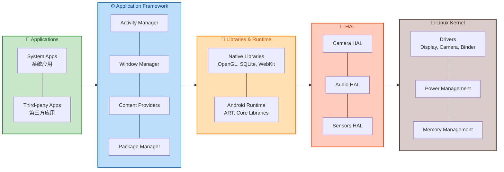
```mermaid
graph LR
    subgraph APP["📱 Applications"]
        direction TB
        A1["System Apps<br/>系统应用"]
        A2["Third-party Apps<br/>第三方应用"]
        A1 --- A2
    end

    subgraph FWK["⚙️ Application Framework"]
        direction TB
        F1["Activity Manager"]
        F2["Window Manager"]
        F3["Content Providers"]
        F4["Package Manager"]
        F1 --- F2
        F2 --- F3
        F3 --- F4
    end

    subgraph NATIVE["🔧 Libraries & Runtime"]
        direction TB
        N1["Native Libraries<br/>OpenGL, SQLite, WebKit"]
        N2["Android Runtime<br/>ART, Core Libraries"]
        N1 --- N2
    end

    subgraph HAL["🔌 HAL"]
        direction TB
        H1["Camera HAL"]
        H2["Audio HAL"]
        H3["Sensors HAL"]
        H1 --- H2
        H2 --- H3
    end

    subgraph KERNEL["🐧 Linux Kernel"]
        direction TB
        K1["Drivers<br/>Display, Camera, Binder"]
        K2["Power Management"]
        K3["Memory Management"]
        K1 --- K2
        K2 --- K3
    end

    APP --> FWK
    FWK --> NATIVE
    NATIVE --> HAL
    HAL --> KERNEL

    classDef appLayer fill:#C8E6C9,stroke:#388E3C,stroke-width:2px,color:#1B5E20
    classDef fwkLayer fill:#BBDEFB,stroke:#1976D2,stroke-width:2px,color:#0D47A1
    classDef nativeLayer fill:#FFE0B2,stroke:#F57C00,stroke-width:2px,color:#E65100
    classDef halLayer fill:#FFCCBC,stroke:#E64A19,stroke-width:2px,color:#BF360C
    classDef kernelLayer fill:#D7CCC8,stroke:#5D4037,stroke-width:2px,color:#3E2723

    class APP appLayer
    class FWK fwkLayer
    class NATIVE nativeLayer
    class HAL halLayer
    class KERNEL kernelLayer
```

### Linux 内核层（Linux Kernel）

Android 的根基是一个经过定制的 **Linux 内核**。选择 Linux 作为底层操作系统内核，是 Android 设计之初最重要的决策之一。Linux 内核经过数十年的发展，已经成为世界上最稳定、最安全、支持硬件最广泛的操作系统内核之一。Android 继承了 Linux 的全部优势，包括成熟的 **进程管理**、**内存管理**、**文件系统**、**网络协议栈** 以及 **安全模型**。

#### 核心职责与能力

Linux 内核在 Android 系统中承担着最底层、最关键的职责：

**进程与线程管理**：内核负责创建、调度和销毁进程。每个 Android 应用都运行在独立的 Linux 进程中，这是 Android 安全沙箱模型的基础。内核的 CFS（Completely Fair Scheduler）调度器确保各个进程能够公平地获得 CPU 时间片。

**内存管理**：Linux 内核提供虚拟内存机制，每个进程都拥有独立的虚拟地址空间，进程之间无法直接访问彼此的内存。内核还负责物理内存的分配与回收，以及在内存紧张时触发 OOM Killer 来终止低优先级进程。

**驱动程序框架**：所有硬件设备的驱动都运行在内核空间。显示驱动、触摸屏驱动、摄像头驱动、音频驱动等都是内核模块。应用层对硬件的所有操作，最终都会通过系统调用进入内核，由相应的驱动程序完成实际的硬件交互。

#### Android 特有的内核扩展

虽然 Android 使用的是标准 Linux 内核，但 Google 为其添加了若干重要的扩展模块，这些扩展是 Android 系统正常运行的关键：

**Binder 驱动**：这是 Android 最核心的内核扩展，没有之一。Binder 是 Android 独创的高效进程间通信（IPC）机制。与传统的 Linux IPC 方式（如管道、Socket、共享内存）相比，Binder 只需要一次数据拷贝，性能更高，同时还内置了身份验证机制，安全性更好。应用与系统服务之间的几乎所有通信都依赖 Binder，比如启动 Activity、绑定 Service、获取系统服务等。

**Ashmem（Anonymous Shared Memory）**：匿名共享内存机制，允许进程之间高效地共享大块内存数据。与标准 Linux 共享内存不同，Ashmem 支持内核在内存紧张时主动回收未被锁定的共享内存区域，这对于内存受限的移动设备非常重要。

**Low Memory Killer（LMK）**：Android 定制的低内存管理机制。当系统内存不足时，LMK 会根据进程的 oom_adj 值（优先级）来决定杀死哪些进程。这个机制直接影响着应用的存活时间，是我们后续讨论进程保活时的核心知识点。

**Wakelocks**：电源管理扩展，允许应用或系统服务阻止设备进入休眠状态。这对于需要在后台执行任务的应用非常重要，但滥用 Wakelock 也是导致电池快速耗尽的主要原因之一。

```kotlin
// 从应用层视角理解内核的作用
// 当我们调用以下代码时，背后涉及多个内核子系统的协作

class KernelInteractionExample {
    
    fun demonstrateKernelInteraction(context: Context) {
        // 1. 文件操作 - 触发内核的 VFS（虚拟文件系统）和具体文件系统驱动
        val file = File(context.filesDir, "data.txt")  // 内核分配 inode
        file.writeText("Hello")                         // 内核处理写缓冲、磁盘调度
        
        // 2. 网络请求 - 触发内核的网络协议栈
        // TCP/IP 协议处理、Socket 缓冲区管理都在内核完成
        val url = URL("https://api.example.com")
        val connection = url.openConnection()           // 内核创建 Socket
        
        // 3. 获取系统服务 - 触发 Binder 驱动进行跨进程通信
        // 应用进程 -> Binder 驱动 -> system_server 进程
        val activityManager = context.getSystemService(Context.ACTIVITY_SERVICE)
        
        // 4. 申请 WakeLock - 触发内核电源管理子系统
        val powerManager = context.getSystemService(Context.POWER_SERVICE) as PowerManager
        val wakeLock = powerManager.newWakeLock(
            PowerManager.PARTIAL_WAKE_LOCK,             // 内核记录 wakelock 引用计数
            "MyApp::MyWakeLockTag"
        )
    }
}
```

### 硬件抽象层（Hardware Abstraction Layer, HAL）

HAL 层位于 Linux 内核之上，是连接硬件驱动与上层 Framework 的桥梁。它的核心使命是 **屏蔽硬件差异，提供统一接口**。不同厂商的手机可能使用完全不同的摄像头传感器、指纹识别模块或 GPS 芯片，但只要它们都实现了 Android 定义的 HAL 接口，上层的 Framework 和应用就能以统一的方式使用这些硬件功能。

#### HAL 的设计动机

为什么需要 HAL 层？这个问题的答案涉及到 **开源协议** 和 **商业利益** 的平衡。Linux 内核采用 GPL 协议，这意味着任何基于内核的修改都必须开源。然而，硬件厂商通常不愿意公开其驱动程序的实现细节，因为这涉及到核心技术机密。

HAL 层的引入巧妙地解决了这个问题。HAL 运行在用户空间（User Space），采用 Apache 2.0 协议，厂商可以以闭源的方式提供 HAL 实现。这样，厂商只需要在内核中提供最基本的驱动支持，而将具体的硬件控制逻辑放在 HAL 层实现，既满足了 GPL 协议的要求，又保护了商业机密。

#### HAL 的演进：从 Legacy HAL 到 HIDL

早期的 Android 使用 **Legacy HAL** 架构，HAL 模块以动态链接库（.so 文件）的形式存在，Framework 通过 `dlopen()` 加载这些库并直接调用其中的函数。这种方式简单直接，但存在一个严重问题：HAL 模块与 Framework 运行在同一个进程中，如果 HAL 模块崩溃，整个 Framework 进程也会崩溃。

从 Android 8.0 开始，Google 引入了 **HIDL（HAL Interface Definition Language）** 架构。在新架构下，HAL 模块运行在独立的进程中，Framework 通过 Binder IPC 与 HAL 进程通信。这种设计带来了更好的稳定性和安全性——即使某个 HAL 模块崩溃，也不会影响 Framework 进程。同时，HIDL 还支持 HAL 模块的独立升级，厂商可以在不更新整个系统的情况下修复 HAL 层的 Bug。


```mermaid
graph LR
    subgraph APP_PROCESS["📱 App Process"]
        direction TB
        AP1["Camera2 API<br/>应用调用"]
    end

    subgraph SYSTEM_SERVER["⚙️ System Server"]
        direction TB
        SS1["CameraService<br/>系统服务"]
    end

    subgraph HAL_PROCESS["🔌 HAL Process"]
        direction TB
        HP1["Camera HAL<br/>Implementation"]
        HP2["Vendor Library<br/>厂商私有库"]
        HP1 --> HP2
    end

    subgraph KERNEL["🐧 Kernel"]
        direction TB
        K1["Camera Driver<br/>V4L2"]
        K2["Hardware<br/>Camera Sensor"]
        K1 --> K2
    end

    AP1 -->|"Binder IPC"| SS1
    SS1 -->|"HIDL/Binder"| HP1
    HP2 -->|"ioctl"| K1

    classDef appStyle fill:#C8E6C9,stroke:#388E3C,stroke-width:2px,color:#1B5E20
    classDef sysStyle fill:#BBDEFB,stroke:#1976D2,stroke-width:2px,color:#0D47A1
    classDef halStyle fill:#FFE0B2,stroke:#F57C00,stroke-width:2px,color:#E65100
    classDef kernelStyle fill:#D7CCC8,stroke:#5D4037,stroke-width:2px,color:#3E2723

    class APP_PROCESS appStyle
    class SYSTEM_SERVER sysStyle
    class HAL_PROCESS halStyle
    class KERNEL kernelStyle
```

#### 常见的 HAL 模块

Android 系统定义了数十种 HAL 接口，覆盖了移动设备的各种硬件能力：

| HAL 模块 | 功能描述 | 对应的 Framework API |
|---------|---------|---------------------|
| Camera HAL | 摄像头控制、图像采集 | Camera2 API |
| Audio HAL | 音频输入输出、音效处理 | AudioManager, MediaPlayer |
| Sensors HAL | 加速度计、陀螺仪、光线传感器等 | SensorManager |
| Graphics HAL (Gralloc) | 图形缓冲区分配 | SurfaceFlinger |
| Bluetooth HAL | 蓝牙协议栈 | BluetoothAdapter |
| WiFi HAL | WiFi 连接管理 | WifiManager |
| GNSS HAL | GPS 定位 | LocationManager |
| Fingerprint HAL | 指纹识别 | FingerprintManager |
| Power HAL | 电源管理、性能调节 | PowerManager |

### 原生库与 Android 运行时（Native Libraries & Android Runtime）

这一层包含两个重要组成部分：**Native Libraries（原生 C/C++ 库）** 和 **Android Runtime（ART 运行时）**。它们共同为上层的 Java/Kotlin 代码提供运行环境和底层能力支持。

#### Native Libraries

Android 系统包含大量用 C/C++ 编写的原生库，这些库提供了高性能的底层功能：

**OpenGL ES / Vulkan**：图形渲染库，所有的 2D/3D 图形绑制最终都依赖这些库。当我们在应用中使用 Canvas 绑制、播放视频或运行游戏时，底层都是通过这些图形库与 GPU 交互。

**SQLite**：轻量级关系型数据库引擎。Android 的 Room 持久化库、SharedPreferences（部分实现）以及许多应用的本地数据存储都基于 SQLite。

**WebKit / Chromium**：网页渲染引擎。WebView 组件使用这个引擎来显示网页内容。

**libc (Bionic)**：Android 定制的 C 标准库，比标准的 glibc 更轻量，专门针对移动设备优化。所有的 Native 代码都依赖这个库。

**Media Framework**：音视频编解码框架，支持各种音视频格式的播放和录制。MediaPlayer、MediaCodec 等 API 的底层实现都在这里。

#### Android Runtime (ART)

ART 是 Android 应用的运行时环境，负责执行应用的 Dalvik 字节码（DEX 格式）。理解 ART 的工作原理对于优化应用性能至关重要。

**从 Dalvik 到 ART 的演进**：在 Android 5.0 之前，Android 使用 Dalvik 虚拟机，采用 **JIT（Just-In-Time）** 编译策略——应用运行时才将字节码编译为机器码。这种方式启动快，但运行时性能较差，且每次运行都需要重新编译。

Android 5.0 引入了 ART，采用 **AOT（Ahead-Of-Time）** 编译策略——应用安装时就将字节码预编译为机器码。这大幅提升了运行时性能，但也带来了安装时间长、占用存储空间大的问题。

从 Android 7.0 开始，ART 采用 **混合编译** 策略，结合了 AOT、JIT 和 Profile-Guided Compilation 的优点：
- 应用首次安装时不进行完整的 AOT 编译，保证安装速度
- 运行时使用 JIT 编译热点代码，同时收集运行时 Profile 信息
- 设备空闲充电时，根据 Profile 信息对热点代码进行 AOT 编译
- 后续运行时直接使用预编译的机器码，获得最佳性能

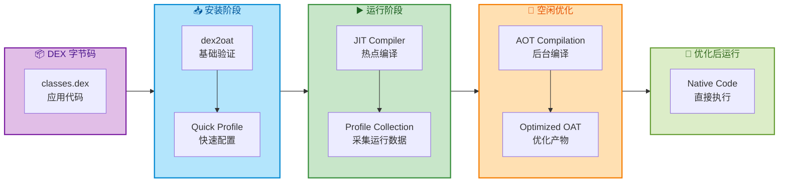
```mermaid
graph LR
    subgraph DEX["📦 DEX 字节码"]
        direction TB
        D1["classes.dex<br/>应用代码"]
    end

    subgraph INSTALL["📥 安装阶段"]
        direction TB
        I1["dex2oat<br/>基础验证"]
        I2["Quick Profile<br/>快速配置"]
        I1 --> I2
    end

    subgraph RUNTIME["▶️ 运行阶段"]
        direction TB
        R1["JIT Compiler<br/>热点编译"]
        R2["Profile Collection<br/>采集运行数据"]
        R1 --> R2
    end

    subgraph IDLE["🔋 空闲优化"]
        direction TB
        ID1["AOT Compilation<br/>后台编译"]
        ID2["Optimized OAT<br/>优化产物"]
        ID1 --> ID2
    end

    subgraph OPTIMIZED["🚀 优化后运行"]
        direction TB
        O1["Native Code<br/>直接执行"]
    end

    DEX --> INSTALL
    INSTALL --> RUNTIME
    RUNTIME --> IDLE
    IDLE --> OPTIMIZED

    classDef dexStyle fill:#E1BEE7,stroke:#7B1FA2,stroke-width:2px,color:#4A148C
    classDef installStyle fill:#B3E5FC,stroke:#0288D1,stroke-width:2px,color:#01579B
    classDef runtimeStyle fill:#C8E6C9,stroke:#388E3C,stroke-width:2px,color:#1B5E20
    classDef idleStyle fill:#FFE0B2,stroke:#F57C00,stroke-width:2px,color:#E65100
    classDef optStyle fill:#DCEDC8,stroke:#689F38,stroke-width:2px,color:#33691E

    class DEX dexStyle
    class INSTALL installStyle
    class RUNTIME runtimeStyle
    class IDLE idleStyle
    class OPTIMIZED optStyle
```

**垃圾回收（Garbage Collection）**：ART 的 GC 机制直接影响应用的流畅度。ART 使用 **Concurrent Copying GC** 算法，大部分 GC 工作可以与应用线程并发执行，减少了 "Stop-The-World" 暂停时间。但在某些情况下（如内存严重不足），GC 仍然可能导致明显的卡顿。理解 GC 的触发条件和优化策略，是性能优化的重要课题。

### 应用框架层（Application Framework）

Application Framework 是应用开发者最直接打交道的一层。它提供了构建 Android 应用所需的全部 Java/Kotlin API，包括四大组件、UI 系统、资源管理、数据存储等。这一层的代码主要运行在 **system_server** 进程中，以系统服务的形式对外提供能力。

#### 核心系统服务

Framework 层包含数十个系统服务，每个服务负责特定的功能领域：

**ActivityManagerService (AMS)**：Android 系统最核心的服务之一，负责管理所有应用的 Activity、Service、BroadcastReceiver 和 ContentProvider。当我们调用 `startActivity()` 时，请求会通过 Binder 发送到 AMS，由 AMS 决定是否允许启动、如何调度生命周期回调。AMS 还负责进程的创建和销毁、任务栈管理、以及 ANR 检测。

**WindowManagerService (WMS)**：负责窗口管理，包括窗口的创建、布局、层级排序和动画。每个 Activity 都对应一个 Window，WMS 决定了这些窗口如何在屏幕上显示。状态栏、导航栏、对话框、Toast 等都是由 WMS 管理的窗口。

**PackageManagerService (PMS)**：负责应用包的安装、卸载、更新和查询。它维护着系统中所有已安装应用的信息，包括包名、版本、权限、组件声明等。当我们调用 `getPackageManager().getPackageInfo()` 时，实际上是在查询 PMS 的数据。

**ContentService**：ContentProvider 的管理服务，负责跨进程数据共享的协调工作。

**NotificationManagerService**：通知管理服务，处理所有应用的通知发送、更新和取消。

**PowerManagerService**：电源管理服务，控制设备的休眠、唤醒，管理 WakeLock。

```kotlin
// 应用与 Framework 系统服务的交互示例
class FrameworkInteractionDemo(private val context: Context) {
    
    // 获取系统服务的标准方式
    // 底层通过 ServiceManager 查找服务，再通过 Binder 获取代理对象
    private val activityManager: ActivityManager = 
        context.getSystemService(Context.ACTIVITY_SERVICE) as ActivityManager
    
    private val packageManager: PackageManager = 
        context.packageManager  // 等价于 getSystemService + 类型转换
    
    private val windowManager: WindowManager = 
        context.getSystemService(Context.WINDOW_SERVICE) as WindowManager
    
    fun demonstrateAMSInteraction() {
        // 查询正在运行的应用进程 - 与 AMS 通信
        val runningProcesses = activityManager.runningAppProcesses
        runningProcesses?.forEach { processInfo ->
            // processInfo.importance 反映了进程的优先级
            // 这个值由 AMS 根据进程状态动态计算
            Log.d("AMS", "Process: ${processInfo.processName}, " +
                        "Importance: ${processInfo.importance}")
        }
        
        // 获取内存信息 - AMS 汇总各进程的内存使用情况
        val memoryInfo = ActivityManager.MemoryInfo()
        activityManager.getMemoryInfo(memoryInfo)
        Log.d("AMS", "Available memory: ${memoryInfo.availMem / 1024 / 1024} MB")
    }
    
    fun demonstratePMSInteraction() {
        // 查询已安装的应用 - 与 PMS 通信
        val installedApps = packageManager.getInstalledApplications(0)
        Log.d("PMS", "Installed apps count: ${installedApps.size}")
        
        // 查询特定包的信息
        try {
            val packageInfo = packageManager.getPackageInfo(
                context.packageName,
                PackageManager.GET_PERMISSIONS  // 同时获取权限信息
            )
            Log.d("PMS", "Version: ${packageInfo.versionName}")
            packageInfo.requestedPermissions?.forEach { permission ->
                Log.d("PMS", "Requested permission: $permission")
            }
        } catch (e: PackageManager.NameNotFoundException) {
            // 包不存在
        }
    }
    
    fun demonstrateWMSInteraction() {
        // 获取屏幕信息 - 与 WMS 通信
        val displayMetrics = DisplayMetrics()
        windowManager.defaultDisplay.getMetrics(displayMetrics)
        Log.d("WMS", "Screen: ${displayMetrics.widthPixels} x ${displayMetrics.heightPixels}")
        Log.d("WMS", "Density: ${displayMetrics.density}")
    }
}
```

#### Binder 通信机制

应用与 Framework 系统服务之间的通信几乎全部依赖 **Binder IPC**。理解 Binder 的工作原理，对于理解 Android 系统的运作方式至关重要。

Binder 通信采用 **Client-Server** 模型。系统服务（如 AMS、WMS）作为 Server 端，运行在 system_server 进程中；应用作为 Client 端，运行在自己的进程中。当应用调用系统 API 时，实际上是通过 Binder 代理对象（Proxy）向 Server 端发送请求，Server 端处理完成后将结果返回给 Client。

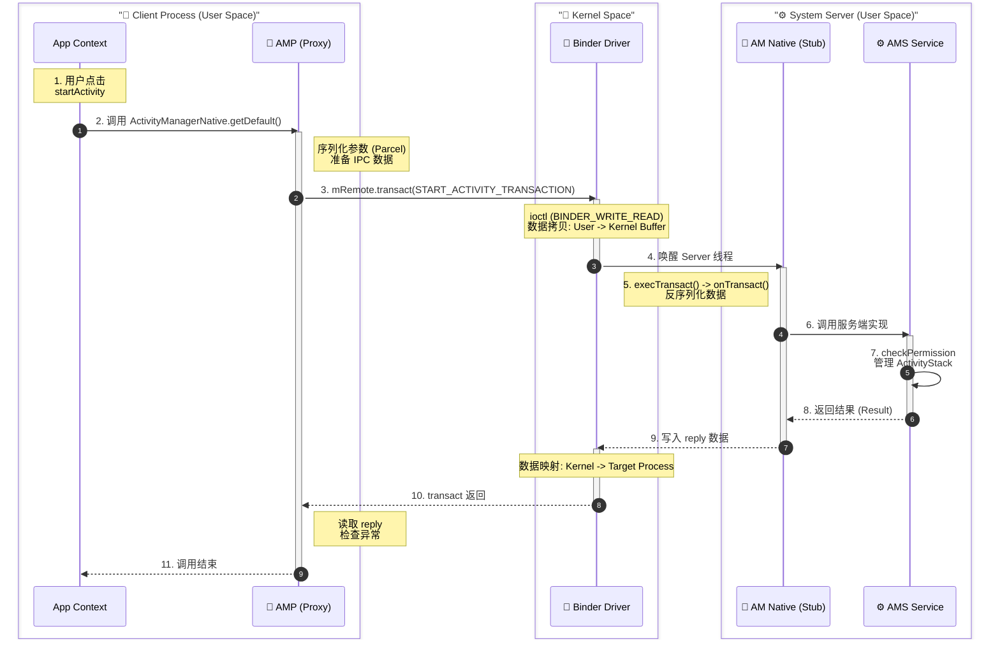
```mermaid
sequenceDiagram
    autonumber
    
    %% --- 1. 发起端：应用进程 (用户空间) ---
    box "📱 Client Process (User Space)" #E8F5E9
        participant App as App Context
        participant Proxy as 🧩 AMP (Proxy)
    end

    %% --- 2. 传输介质：内核空间 ---
    box "🐧 Kernel Space" #FFF3E0
        participant Binder as 🔗 Binder Driver
    end

    %% --- 3. 接收端：系统服务 (用户空间) ---
    box "⚙️ System Server (User Space)" #E1F5FE
        participant Stub as 🧩 AM Native (Stub)
        participant AMS as ⚙️ AMS Service
    end

    %% --- 流程开始 ---
    Note over App: 1. 用户点击<br/>startActivity
    App->>Proxy: 2. 调用 ActivityManagerNative.getDefault()
    
    activate Proxy
    Note right of Proxy: 序列化参数 (Parcel)<br/>准备 IPC 数据
    
    Proxy->>Binder: 3. mRemote.transact(START_ACTIVITY_TRANSACTION)
    activate Binder
    
    Note over Binder: ioctl (BINDER_WRITE_READ)<br/>数据拷贝: User -> Kernel Buffer
    
    Binder->>Stub: 4. 唤醒 Server 线程
    deactivate Binder
    
    activate Stub
    Note left of Stub: 5. execTransact() -> onTransact()<br/>反序列化数据
    
    Stub->>AMS: 6. 调用服务端实现
    activate AMS
    
    AMS->>AMS: 7. checkPermission<br/>管理 ActivityStack
    
    AMS-->>Stub: 8. 返回结果 (Result)
    deactivate AMS
    
    Stub-->>Binder: 9. 写入 reply 数据
    deactivate Stub
    activate Binder
    
    Note over Binder: 数据映射: Kernel -> Target Process
    Binder-->>Proxy: 10. transact 返回
    deactivate Binder
    
    Note right of Proxy: 读取 reply<br/>检查异常
    Proxy-->>App: 11. 调用结束
    deactivate Proxy
```

### 应用层（Applications）

最顶层是 Applications 层，包括系统预装应用（如电话、短信、设置、相机）和用户安装的第三方应用。从架构角度看，系统应用和第三方应用没有本质区别——它们都运行在独立的进程中，都通过 Framework API 与系统交互，都受到 Android 安全沙箱的约束。

系统应用的"特权"主要体现在两个方面：
1. **签名权限**：系统应用使用平台签名，可以申请 `signature` 级别的权限，访问普通应用无法触及的系统能力
2. **预装位置**：系统应用安装在 `/system/app` 或 `/system/priv-app` 目录，享有更高的进程优先级，不容易被系统杀死

作为应用开发者，我们的代码就运行在这一层。我们通过 Framework 提供的 API 构建用户界面、处理用户交互、存储数据、与网络通信。虽然我们不直接接触下层的 HAL、Native Libraries 或 Linux Kernel，但理解这些底层机制如何影响应用行为，能够帮助我们写出更高效、更稳定的代码。

### 层级间的协作：一次点击的完整旅程

为了更直观地理解各层之间的协作关系，让我们追踪一个简单操作的完整流程：用户点击屏幕上的一个按钮。

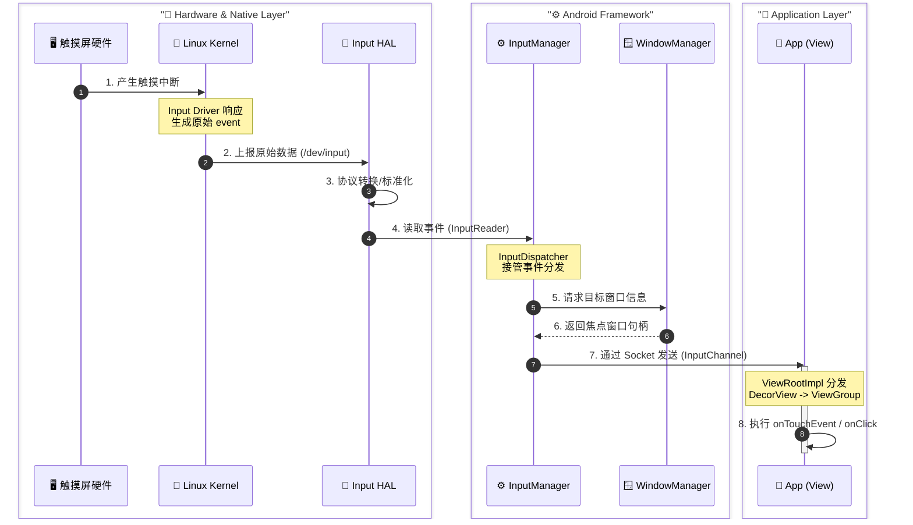
```mermaid
sequenceDiagram
    autonumber
    
    %% --- 1. 底层硬件与运行时 (Native/Kernel Layer) - 橙色系 ---
    box "🔧 Hardware & Native Layer" #FFF3E0
        participant HW as 🖥️ 触摸屏硬件
        participant Kernel as 🐧 Linux Kernel
        participant HAL as 🔌 Input HAL
    end

    %% --- 2. 核心框架层 (Framework Layer) - 蓝色系 ---
    box "⚙️ Android Framework" #E1F5FE
        participant FWK as ⚙️ InputManager
        participant WMS as 🪟 WindowManager
    end

    %% --- 3. 应用层 (Application Layer) - 绿色系 ---
    box "📱 Application Layer" #E8F5E9
        participant App as 📱 App (View)
    end

    %% --- 流程开始 ---
    HW->>Kernel: 1. 产生触摸中断
    Note over Kernel: Input Driver 响应<br/>生成原始 event
    
    Kernel->>HAL: 2. 上报原始数据 (/dev/input)
    HAL->>HAL: 3. 协议转换/标准化
    
    HAL->>FWK: 4. 读取事件 (InputReader)
    Note over FWK: InputDispatcher<br/>接管事件分发
    
    FWK->>WMS: 5. 请求目标窗口信息
    WMS-->>FWK: 6. 返回焦点窗口句柄
    
    FWK->>App: 7. 通过 Socket 发送 (InputChannel)
    
    activate App
    Note over App: ViewRootImpl 分发<br/>DecorView -> ViewGroup
    App->>App: 8. 执行 onTouchEvent / onClick
    deactivate App
```

这个流程清晰地展示了各层的职责：
- **硬件层**：检测物理触摸，产生电信号
- **内核层**：将电信号转换为标准化的输入事件
- **HAL 层**：提供统一的输入事件接口
- **Framework 层**：管理事件分发，确定目标窗口
- **应用层**：处理事件，执行业务逻辑

### 架构理解对应用开发的指导意义

理解 Android 系统架构不仅仅是为了应付面试，更重要的是它能指导我们的日常开发实践：

**性能优化方向**：当应用出现卡顿时，我们需要判断瓶颈在哪一层。是 UI 线程做了太多工作（应用层）？是 Binder 通信太频繁（Framework 层）？还是 GC 压力太大（Runtime 层）？不同层级的问题需要不同的优化策略。

**问题排查思路**：当遇到诡异的 Bug 时，理解系统架构能帮助我们缩小排查范围。比如，如果多个不相关的应用同时出现摄像头问题，那很可能是 Camera HAL 或驱动层的问题，而不是应用代码的问题。

**API 设计理解**：很多 Android API 的设计决策都源于架构约束。比如，为什么 `startActivity()` 是异步的？因为它需要跨进程与 AMS 通信。为什么某些操作必须在主线程执行？因为 UI 系统的设计就是单线程模型。

**安全意识**：理解进程隔离和权限模型，能帮助我们写出更安全的代码，避免敏感数据泄露，正确处理跨进程通信。

---

**📝 练习题**

某应用在调用 `startActivity()` 启动另一个 Activity 时，涉及到多个系统组件的协作。以下关于这个过程的描述，哪一项是**错误**的？

A. 应用进程通过 Binder IPC 将启动请求发送给运行在 system_server 进程中的 ActivityManagerService

B. AMS 会检查目标 Activity 是否在 AndroidManifest.xml 中注册，以及调用方是否有权限启动它

C. 如果目标 Activity 属于另一个应用且该应用进程不存在，AMS 会请求 Zygote 进程 fork 出新的应用进程

D. 整个 startActivity 的调用是同步阻塞的，调用方会一直等待直到目标 Activity 完全显示在屏幕上

**【答案】** D

**【解析】** `startActivity()` 是一个**异步**操作，调用后会立即返回，不会等待目标 Activity 启动完成。这是因为启动 Activity 涉及跨进程通信、可能的进程创建、Activity 生命周期回调等一系列复杂操作，如果同步等待会导致调用方 UI 线程长时间阻塞。实际上，调用 `startActivity()` 后，当前 Activity 会继续执行后续代码，然后在某个时刻收到 `onPause()` 回调（如果目标 Activity 会遮挡当前 Activity）。选项 A、B、C 的描述都是正确的，准确反映了 Activity 启动过程中各组件的协作方式。

---

## 应用程序入口

当用户点击桌面上的应用图标时，一个看似简单的动作背后，实际上触发了一系列复杂的系统级操作。从 Zygote 进程 fork 出新进程，到 ActivityThread 的 main 函数开始执行，再到第一个 Activity 呈现在用户面前，这个过程涉及多个系统组件的精密协作。深入理解应用程序的启动入口，不仅能帮助我们优化启动性能，还能让我们更好地理解 Android 应用的运行机制。

### 从点击图标到进程创建

在深入 ActivityThread 之前，我们需要先了解应用进程是如何被创建的。这个过程的起点是用户的点击操作，终点是一个全新的应用进程准备就绪。

当用户点击应用图标时，Launcher 应用会调用 `startActivity()` 发起启动请求。这个请求通过 Binder IPC 到达 system_server 进程中的 **ActivityManagerService (AMS)**。AMS 首先会检查目标应用的进程是否已经存在：

- **如果进程已存在**：AMS 直接通知该进程启动目标 Activity
- **如果进程不存在**：AMS 需要先请求创建新进程

对于需要创建新进程的情况，AMS 会向 **Zygote** 进程发送请求。Zygote 是 Android 系统中所有应用进程的"孵化器"，它在系统启动时就已经预加载了 Android Framework 的核心类和资源。当收到创建进程的请求时，Zygote 通过 `fork()` 系统调用复制自身，创建出一个新的子进程。由于 fork 采用 **Copy-On-Write（写时复制）** 机制，子进程可以直接共享 Zygote 已加载的类和资源，这大大加快了应用的启动速度。

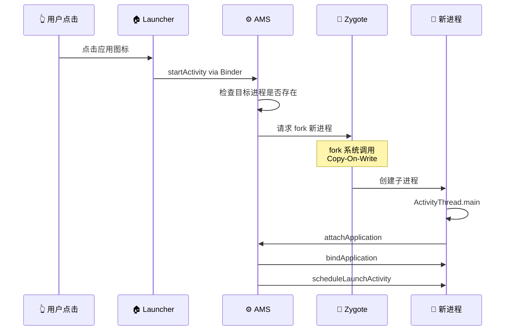
```mermaid
sequenceDiagram
    participant User as 👆 用户点击
    participant Launcher as 🏠 Launcher
    participant AMS as ⚙️ AMS
    participant Zygote as 🥚 Zygote
    participant App as 📱 新进程

    User->>Launcher: 点击应用图标
    Launcher->>AMS: startActivity via Binder
    AMS->>AMS: 检查目标进程是否存在
    AMS->>Zygote: 请求 fork 新进程
    Note over Zygote: fork 系统调用<br/>Copy-On-Write
    Zygote->>App: 创建子进程
    App->>App: ActivityThread.main
    App->>AMS: attachApplication
    AMS->>App: bindApplication
    AMS->>App: scheduleLaunchActivity
```

### ActivityThread：应用的真正入口

**ActivityThread** 是每个 Android 应用进程的核心类，尽管它的名字中包含 "Thread"，但它本身并不是一个线程类，而是运行在应用主线程上的核心调度器。可以说，ActivityThread 就是应用进程的"大脑"，负责管理应用的整个生命周期。

#### main 函数：一切的起点

当 Zygote fork 出新进程后，新进程会执行 `ActivityThread.main()` 方法。这是应用代码执行的真正起点，也是我们理解应用启动流程的关键入口。

```java
// ActivityThread.java - 简化版 main 函数
public static void main(String[] args) {
    // 1. 初始化当前进程的 Trace 标签，用于 Systrace 性能分析
    Trace.traceBegin(Trace.TRACE_TAG_ACTIVITY_MANAGER, "ActivityThreadMain");
    
    // 2. 安装选择性的系统调用拦截器（用于严格模式等）
    AndroidOs.install();
    
    // 3. 初始化当前进程的运行环境
    Environment.initForCurrentUser();
    
    // 4. 确保 TrustedCertificateStore 能找到正确的证书目录
    final File configDir = Environment.getUserConfigDirectory(UserHandle.myUserId());
    TrustedCertificateStore.setDefaultUserDirectory(configDir);
    
    // 5. 设置进程名称为 "<pre-initialized>"，后续会被真正的进程名替换
    Process.setArgV0("<pre-initialized>");
    
    // 6. 【关键】准备主线程的 Looper
    // 这一步创建了主线程的消息队列，是整个消息驱动机制的基础
    Looper.prepareMainLooper();
    
    // 7. 获取启动时传入的序列号，用于后续与 AMS 通信
    long startSeq = 0;
    if (args != null) {
        for (int i = args.length - 1; i >= 0; --i) {
            if (args[i] != null && args[i].startsWith(PROC_START_SEQ_IDENT)) {
                startSeq = Long.parseLong(
                    args[i].substring(PROC_START_SEQ_IDENT.length()));
            }
        }
    }
    
    // 8. 【关键】创建 ActivityThread 实例
    // ActivityThread 是应用进程的核心管理者
    ActivityThread thread = new ActivityThread();
    
    // 9. 【关键】将当前进程附加到 AMS
    // 这一步建立了应用进程与系统服务的连接
    thread.attach(false, startSeq);
    
    // 10. 获取主线程的 Handler，用于处理来自 AMS 的消息
    if (sMainThreadHandler == null) {
        sMainThreadHandler = thread.getHandler();
    }
    
    // 11. 结束 Trace 标记
    Trace.traceEnd(Trace.TRACE_TAG_ACTIVITY_MANAGER);
    
    // 12. 【关键】启动消息循环，开始处理消息
    // 这是一个无限循环，应用的所有事件都通过这个循环处理
    // 一旦 loop() 返回，意味着应用即将退出
    Looper.loop();
    
    // 13. 如果执行到这里，说明消息循环异常退出
    throw new RuntimeException("Main thread loop unexpectedly exited");
}
```

从这段代码中，我们可以提炼出 main 函数的几个核心职责：

1. **初始化主线程 Looper**：调用 `Looper.prepareMainLooper()` 创建主线程的消息队列
2. **创建 ActivityThread 实例**：这是应用进程的核心管理对象
3. **附加到 AMS**：通过 `attach()` 方法与系统建立连接
4. **启动消息循环**：调用 `Looper.loop()` 进入无限循环，等待并处理消息

### Looper 与消息驱动机制

Android 应用采用 **消息驱动（Message-Driven）** 的架构模式。主线程不是简单地顺序执行代码，而是不断地从消息队列中取出消息并处理。这种设计使得应用能够响应各种异步事件，包括用户输入、系统回调、定时任务等。

#### 为什么需要消息驱动？

想象一下，如果没有消息驱动机制，应用该如何处理用户的触摸事件？一种方式是不断轮询检查是否有新的触摸事件，但这会浪费大量 CPU 资源。另一种方式是使用回调，但如果回调来自不同的线程，就会面临复杂的线程同步问题。

消息驱动机制优雅地解决了这些问题：
- **高效等待**：当没有消息时，线程会进入休眠状态，不消耗 CPU
- **统一入口**：所有事件都转化为消息，在主线程的消息循环中统一处理
- **线程安全**：跨线程通信通过发送消息实现，避免了直接的线程同步

#### Looper 的工作原理

`Looper` 是消息循环的核心类，每个线程最多只能有一个 Looper 实例。主线程的 Looper 在 `ActivityThread.main()` 中通过 `Looper.prepareMainLooper()` 创建，这是一个特殊的 Looper，不允许被退出。

```kotlin
// Looper 核心机制示意（简化版）
class LooperMechanism {
    
    // 演示 Looper 的基本工作流程
    fun demonstrateLooperFlow() {
        // 1. prepareMainLooper 的核心逻辑
        // 创建 Looper 实例并存储在 ThreadLocal 中
        // ThreadLocal 保证每个线程只有一个 Looper
        
        // 2. Looper 内部持有一个 MessageQueue
        // MessageQueue 是一个按时间排序的消息优先队列
        
        // 3. loop() 方法的核心是一个无限循环
        // 伪代码如下：
        
        fun loop() {
            val looper = myLooper()           // 获取当前线程的 Looper
            val queue = looper.messageQueue   // 获取消息队列
            
            while (true) {
                // 从队列中取出下一条消息
                // 如果队列为空，会阻塞等待
                val msg = queue.next()        // 可能阻塞
                
                if (msg == null) {
                    // 消息为 null 表示队列已退出
                    return
                }
                
                // 将消息分发给对应的 Handler 处理
                msg.target.dispatchMessage(msg)
                
                // 回收消息对象，放入对象池复用
                msg.recycleUnchecked()
            }
        }
        
    }
}
```

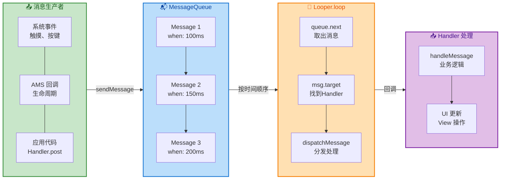
```mermaid
graph LR
    subgraph PRODUCER["📤 消息生产者"]
        direction TB
        P1["系统事件<br/>触摸、按键"]
        P2["AMS 回调<br/>生命周期"]
        P3["应用代码<br/>Handler.post"]
        P1 --- P2
        P2 --- P3
    end

    subgraph QUEUE["📬 MessageQueue"]
        direction TB
        Q1["Message 1<br/>when: 100ms"]
        Q2["Message 2<br/>when: 150ms"]
        Q3["Message 3<br/>when: 200ms"]
        Q1 --> Q2
        Q2 --> Q3
    end

    subgraph LOOPER["🔄 Looper.loop"]
        direction TB
        L1["queue.next<br/>取出消息"]
        L2["msg.target<br/>找到Handler"]
        L3["dispatchMessage<br/>分发处理"]
        L1 --> L2
        L2 --> L3
    end

    subgraph HANDLER["📥 Handler 处理"]
        direction TB
        H1["handleMessage<br/>业务逻辑"]
        H2["UI 更新<br/>View 操作"]
        H1 --> H2
    end

    PRODUCER -->|"sendMessage"| QUEUE
    QUEUE -->|"按时间顺序"| LOOPER
    LOOPER -->|"回调"| HANDLER

    classDef producerStyle fill:#C8E6C9,stroke:#388E3C,stroke-width:2px,color:#1B5E20
    classDef queueStyle fill:#BBDEFB,stroke:#1976D2,stroke-width:2px,color:#0D47A1
    classDef looperStyle fill:#FFE0B2,stroke:#F57C00,stroke-width:2px,color:#E65100
    classDef handlerStyle fill:#E1BEE7,stroke:#7B1FA2,stroke-width:2px,color:#4A148C

    class PRODUCER producerStyle
    class QUEUE queueStyle
    class LOOPER looperStyle
    class HANDLER handlerStyle
```

#### 主线程 Looper 的特殊性

主线程的 Looper 与普通线程的 Looper 有几个重要区别：

1. **不可退出**：调用 `Looper.prepareMainLooper()` 创建的 Looper，其 `quit()` 方法会抛出异常。这是因为主线程的消息循环是应用存活的基础，一旦退出，应用就会终止。

2. **系统级消息**：主线程 Looper 不仅处理应用自己发送的消息，还处理来自系统的各种回调，包括 Activity 生命周期、View 绑制、输入事件等。

3. **ANR 监控**：系统会监控主线程消息的处理时间。如果某条消息的处理时间过长（如超过 5 秒），系统会认为应用无响应（ANR）。

```kotlin
// 主线程 Handler 的典型使用场景
class MainThreadHandlerDemo : Activity() {
    
    // 主线程 Handler，用于在主线程执行代码
    private val mainHandler = Handler(Looper.getMainLooper())
    
    fun performBackgroundTask() {
        // 在后台线程执行耗时操作
        Thread {
            // 模拟耗时操作（网络请求、数据库查询等）
            val result = doHeavyWork()
            
            // 切换回主线程更新 UI
            // 这里发送的消息会进入主线程的 MessageQueue
            // 然后由主线程的 Looper 取出并处理
            mainHandler.post {
                // 这段代码在主线程执行
                updateUI(result)
            }
        }.start()
    }
    
    // 延迟执行任务
    fun scheduleDelayedTask() {
        // 消息会被放入队列，并标记执行时间为 "当前时间 + 1000ms"
        // Looper 会在适当的时机取出并执行
        mainHandler.postDelayed({
            showToast("1秒后执行")
        }, 1000L)
    }
    
    private fun doHeavyWork(): String = "Result"
    private fun updateUI(result: String) { /* 更新界面 */ }
    private fun showToast(message: String) { /* 显示 Toast */ }
}
```

### attach 过程：与系统建立连接

在 `ActivityThread.main()` 中，创建 ActivityThread 实例后会立即调用 `attach()` 方法。这个方法的作用是将新创建的应用进程"注册"到 AMS，建立应用与系统之间的通信通道。

```java
// ActivityThread.attach() 简化版
private void attach(boolean system, long startSeq) {
    // 保存当前 ActivityThread 实例到静态变量
    // 这使得其他地方可以通过 ActivityThread.currentActivityThread() 获取
    sCurrentActivityThread = this;
    mSystemThread = system;
    
    if (!system) {
        // 非系统进程（普通应用）的处理流程
        
        // 1. 设置应用的 DDMS 名称（用于调试工具显示）
        android.ddm.DdmHandleAppName.setAppName("<pre-initialized>",
                                                UserHandle.myUserId());
        
        // 2. 设置运行时的 TargetSdkVersion 回调
        RuntimeInit.setApplicationObject(mAppThread.asBinder());
        
        // 3. 【关键】获取 AMS 的 Binder 代理
        final IActivityManager mgr = ActivityManager.getService();
        
        try {
            // 4. 【关键】调用 AMS 的 attachApplication 方法
            // 将当前进程的 ApplicationThread 传递给 AMS
            // ApplicationThread 是一个 Binder 对象，AMS 通过它回调应用
            mgr.attachApplication(mAppThread, startSeq);
        } catch (RemoteException ex) {
            throw ex.rethrowFromSystemServer();
        }
        
        // 5. 注册 GC 监听器，当内存紧张时会收到通知
        BinderInternal.addGcWatcher(new Runnable() {
            @Override
            public void run() {
                if (!mSomeActivitiesChanged) {
                    return;
                }
                Runtime runtime = Runtime.getRuntime();
                long dalvikMax = runtime.maxMemory();
                long dalvikUsed = runtime.totalMemory() - runtime.freeMemory();
                if (dalvikUsed > ((3 * dalvikMax) / 4)) {
                    // 内存使用超过 75%，尝试释放一些 Activity
                    mSomeActivitiesChanged = false;
                    try {
                        ActivityTaskManager.getService().releaseSomeActivities(mAppThread);
                    } catch (RemoteException e) {
                        throw e.rethrowFromSystemServer();
                    }
                }
            }
        });
    } else {
        // 系统进程的处理流程（system_server）
        // 这里的逻辑与普通应用不同，不在本章讨论范围
    }
    
    // 6. 注册 Configuration 变化的回调
    ViewRootImpl.ConfigChangedCallback configChangedCallback = ...;
    ViewRootImpl.addConfigCallback(configChangedCallback);
}
```

#### ApplicationThread：AMS 的回调通道

在 attach 过程中，有一个关键对象被传递给 AMS：**ApplicationThread**。这是一个实现了 `IApplicationThread` 接口的 Binder 对象，运行在应用进程中。AMS 持有这个对象的代理，通过它可以向应用进程发送各种指令。

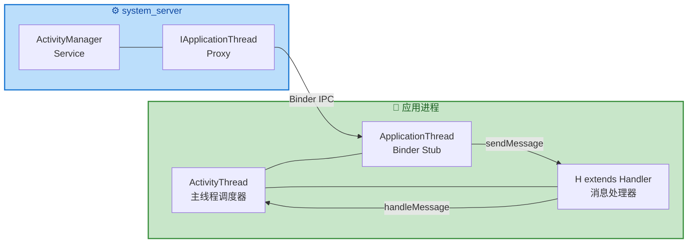
```mermaid
graph LR
    subgraph APP_PROCESS["📱 应用进程"]
        direction TB
        AT["ActivityThread<br/>主线程调度器"]
        APT["ApplicationThread<br/>Binder Stub"]
        H["H extends Handler<br/>消息处理器"]
        AT --- APT
        AT --- H
    end

    subgraph SYSTEM_SERVER["⚙️ system_server"]
        direction TB
        AMS["ActivityManager<br/>Service"]
        PROXY["IApplicationThread<br/>Proxy"]
        AMS --- PROXY
    end

    PROXY -->|"Binder IPC"| APT
    APT -->|"sendMessage"| H
    H -->|"handleMessage"| AT

    classDef appStyle fill:#C8E6C9,stroke:#388E3C,stroke-width:2px,color:#1B5E20
    classDef sysStyle fill:#BBDEFB,stroke:#1976D2,stroke-width:2px,color:#0D47A1

    class APP_PROCESS appStyle
    class SYSTEM_SERVER sysStyle
```

ApplicationThread 是应用进程中非常重要的组件，它接收来自 AMS 的所有指令，包括：

- **scheduleLaunchActivity**：启动 Activity
- **scheduleResumeActivity**：恢复 Activity
- **schedulePauseActivity**：暂停 Activity
- **scheduleStopActivity**：停止 Activity
- **scheduleDestroyActivity**：销毁 Activity
- **bindApplication**：绑定 Application
- **scheduleReceiver**：处理广播
- **scheduleCreateService**：创建 Service

这些方法都运行在 Binder 线程池中，而不是主线程。为了保证线程安全，ApplicationThread 会将这些调用转换为消息，发送到主线程的 Handler（即 `H` 类）中处理。

```kotlin
// ApplicationThread 的工作机制示意
class ApplicationThreadMechanism {
    
    // ApplicationThread 接收 AMS 的调用（运行在 Binder 线程）
    // 然后通过 Handler 转发到主线程处理
    
    
    // 简化的 ApplicationThread 实现
    private inner class ApplicationThread : IApplicationThread.Stub() {
        
        // AMS 调用此方法启动 Activity
        override fun scheduleLaunchActivity(intent: Intent, ...) {
            // 创建 ActivityClientRecord 保存 Activity 信息
            val r = ActivityClientRecord()
            r.intent = intent
            // ...
            
            // 发送消息到主线程的 Handler
            // LAUNCH_ACTIVITY 是消息类型常量
            sendMessage(H.LAUNCH_ACTIVITY, r)
        }
        
        // AMS 调用此方法暂停 Activity
        override fun schedulePauseActivity(token: IBinder, ...) {
            sendMessage(H.PAUSE_ACTIVITY, token)
        }
        
        // 其他生命周期方法类似...
    }
    
    
    // H 类是 ActivityThread 的内部 Handler
    // 负责在主线程处理各种消息
    
    private inner class H : Handler() {
        override fun handleMessage(msg: Message) {
            when (msg.what) {
                LAUNCH_ACTIVITY -> {
                    // 在主线程执行 Activity 启动逻辑
                    val r = msg.obj as ActivityClientRecord
                    handleLaunchActivity(r)
                }
                PAUSE_ACTIVITY -> {
                    // 在主线程执行 Activity 暂停逻辑
                    handlePauseActivity(msg.obj as IBinder)
                }
                // 其他消息类型...
            }
        }
    }
    
}
```

### Instrumentation：应用行为的监控者

**Instrumentation** 是 Android 提供的一个强大的监控和控制机制。每个应用进程都有一个 Instrumentation 实例，它充当着应用与系统之间的"中间人"角色，所有的组件创建和生命周期调用都会经过 Instrumentation。

#### Instrumentation 的核心职责

Instrumentation 主要负责以下工作：

1. **创建 Application 对象**：`newApplication()` 方法负责实例化 Application 类
2. **创建 Activity 对象**：`newActivity()` 方法负责实例化 Activity 类
3. **调用生命周期方法**：`callActivityOnCreate()`、`callActivityOnResume()` 等方法负责调用 Activity 的生命周期回调
4. **监控应用行为**：可以拦截和监控应用的各种操作

```kotlin
// Instrumentation 在 Activity 启动过程中的作用
class InstrumentationRole {
    
    // 演示 Instrumentation 如何参与 Activity 的创建和启动
    fun demonstrateActivityCreation() {
        
        // ActivityThread.performLaunchActivity() 简化版
        
        private fun performLaunchActivity(r: ActivityClientRecord): Activity? {
            // 1. 获取 Activity 的类信息
            val component = r.intent.component
            val activityClass = component.className
            
            // 2. 【关键】通过 Instrumentation 创建 Activity 实例
            // 这里使用反射机制实例化 Activity
            val activity = mInstrumentation.newActivity(
                classLoader,      // 类加载器
                activityClass,    // Activity 类名
                r.intent          // 启动 Intent
            )
            
            // 3. 创建 Activity 的 Context
            val appContext = createBaseContextForActivity(r)
            
            // 4. 调用 Activity.attach() 初始化 Activity
            activity.attach(
                appContext,       // Context
                this,             // ActivityThread
                mInstrumentation, // Instrumentation
                r.token,          // Activity 的 Binder 令牌
                application,      // Application 实例
                r.intent,         // Intent
                // ... 其他参数
            )
            
            // 5. 【关键】通过 Instrumentation 调用 onCreate
            mInstrumentation.callActivityOnCreate(activity, r.state)
            
            return activity
        }
        
    }
}
```

#### 为什么需要 Instrumentation？

Instrumentation 的设计体现了 **控制反转（Inversion of Control）** 的思想。应用的组件不是自己创建和管理的，而是由系统（通过 Instrumentation）来创建和控制。这种设计带来了几个重要好处：

**统一的创建入口**：所有 Activity 的创建都经过 `Instrumentation.newActivity()`，系统可以在这里进行统一的处理，如性能监控、安全检查等。

**可测试性**：在自动化测试中，可以替换默认的 Instrumentation 实现，从而控制和监控应用的行为。Android 的 UI 测试框架（如 Espresso）就是基于这个机制实现的。

**生命周期的精确控制**：所有生命周期方法的调用都经过 Instrumentation，系统可以精确地控制调用时机，确保生命周期的正确顺序。

```kotlin
// 自定义 Instrumentation 用于测试
class TestInstrumentation : Instrumentation() {
    
    // 记录所有创建的 Activity
    private val createdActivities = mutableListOf<Activity>()
    
    // 重写 newActivity 方法，可以拦截 Activity 的创建
    override fun newActivity(
        cl: ClassLoader,
        className: String,
        intent: Intent
    ): Activity {
        // 调用父类方法创建 Activity
        val activity = super.newActivity(cl, className, intent)
        
        // 记录创建的 Activity（用于测试验证）
        createdActivities.add(activity)
        
        // 可以在这里进行额外的初始化或监控
        logActivityCreation(className)
        
        return activity
    }
    
    // 重写 callActivityOnCreate，可以监控 onCreate 的调用
    override fun callActivityOnCreate(
        activity: Activity,
        icicle: Bundle?
    ) {
        // 记录 onCreate 开始时间
        val startTime = System.currentTimeMillis()
        
        // 调用真正的 onCreate
        super.callActivityOnCreate(activity, icicle)
        
        // 计算 onCreate 耗时
        val duration = System.currentTimeMillis() - startTime
        logOnCreateDuration(activity.javaClass.simpleName, duration)
    }
    
    private fun logActivityCreation(className: String) {
        // 记录日志
    }
    
    private fun logOnCreateDuration(name: String, duration: Long) {
        // 记录 onCreate 耗时
    }
}
```

### 完整的应用启动时序

现在让我们把所有的知识点串联起来，看看从点击图标到第一个 Activity 显示的完整流程：

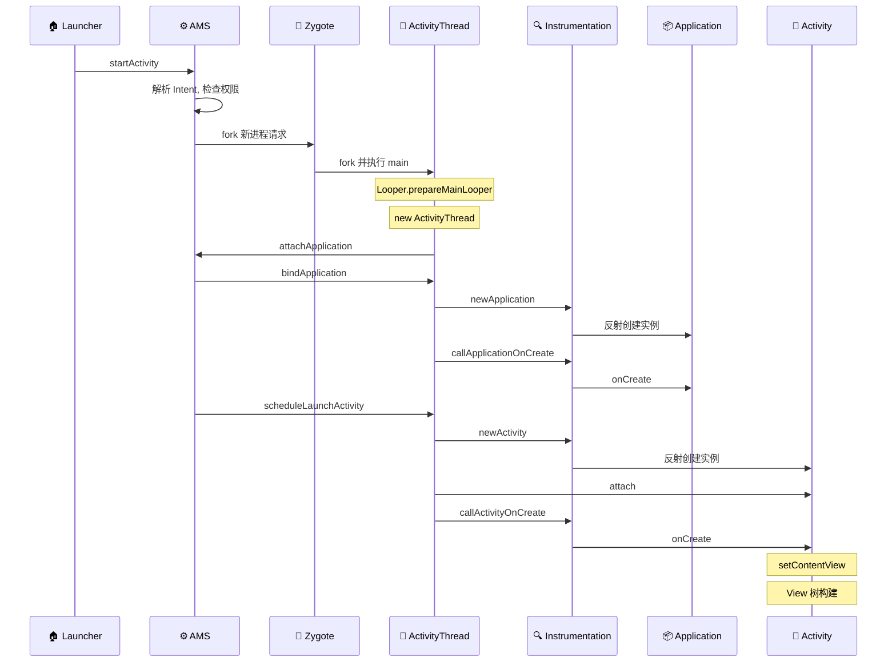
```mermaid
sequenceDiagram
    participant L as 🏠 Launcher
    participant AMS as ⚙️ AMS
    participant Z as 🥚 Zygote
    participant AT as 📱 ActivityThread
    participant Inst as 🔍 Instrumentation
    participant App as 📦 Application
    participant Act as 🎯 Activity

    L->>AMS: startActivity
    AMS->>AMS: 解析 Intent, 检查权限
    AMS->>Z: fork 新进程请求
    Z->>AT: fork 并执行 main
    
    Note over AT: Looper.prepareMainLooper
    Note over AT: new ActivityThread
    
    AT->>AMS: attachApplication
    AMS->>AT: bindApplication
    
    AT->>Inst: newApplication
    Inst->>App: 反射创建实例
    AT->>Inst: callApplicationOnCreate
    Inst->>App: onCreate
    
    AMS->>AT: scheduleLaunchActivity
    AT->>Inst: newActivity
    Inst->>Act: 反射创建实例
    AT->>Act: attach
    AT->>Inst: callActivityOnCreate
    Inst->>Act: onCreate
    
    Note over Act: setContentView
    Note over Act: View 树构建
```

这个流程可以分为几个关键阶段：

**阶段一：进程创建**
1. Launcher 调用 `startActivity()`
2. AMS 判断需要创建新进程
3. Zygote fork 出新进程
4. 新进程执行 `ActivityThread.main()`

**阶段二：进程初始化**
5. 创建主线程 Looper
6. 创建 ActivityThread 实例
7. 调用 `attach()` 连接到 AMS

**阶段三：Application 创建**
8. AMS 回调 `bindApplication`
9. Instrumentation 创建 Application 实例
10. 调用 `Application.onCreate()`

**阶段四：Activity 启动**
11. AMS 回调 `scheduleLaunchActivity`
12. Instrumentation 创建 Activity 实例
13. 调用 `Activity.attach()` 和 `Activity.onCreate()`

### 启动性能优化的切入点

理解了应用启动流程后，我们就能更有针对性地进行启动性能优化：

**Application.onCreate() 优化**：这是应用代码最早执行的地方，很多第三方 SDK 的初始化都放在这里。应该将非必要的初始化延迟到真正需要时再执行，或者放到后台线程异步执行。

**避免主线程阻塞**：主线程的 Looper 需要持续处理消息，任何耗时操作都会阻塞消息处理，导致启动变慢甚至 ANR。

**减少布局复杂度**：Activity 的 `setContentView()` 会触发布局文件的解析和 View 树的构建，复杂的布局会显著增加启动时间。

**利用启动窗口**：系统在 Activity 真正显示之前会先显示一个启动窗口（通常是白屏或主题背景）。可以通过设置 `windowBackground` 来优化用户的感知体验。

```kotlin
// 启动优化示例
class OptimizedApplication : Application() {
    
    override fun onCreate() {
        super.onCreate()
        
        // 1. 必要的同步初始化（尽量精简）
        initCrashReporter()  // 崩溃上报必须最先初始化
        
        // 2. 非必要初始化延迟到后台线程
        Thread {
            initAnalytics()      // 数据统计
            initImageLoader()    // 图片加载库
            initNetworkClient()  // 网络库
        }.start()
        
        // 3. 某些初始化可以延迟到首屏显示后
        // 使用 IdleHandler 在主线程空闲时执行
        Looper.myQueue().addIdleHandler {
            initNonCriticalSDKs()
            false  // 返回 false 表示只执行一次
        }
    }
    
    private fun initCrashReporter() { /* 崩溃上报初始化 */ }
    private fun initAnalytics() { /* 数据统计初始化 */ }
    private fun initImageLoader() { /* 图片库初始化 */ }
    private fun initNetworkClient() { /* 网络库初始化 */ }
    private fun initNonCriticalSDKs() { /* 非关键 SDK 初始化 */ }
}
```

---

**📝 练习题**

关于 Android 应用的启动流程，以下说法正确的是：

A. ActivityThread 是一个线程类，它继承自 Thread，代表应用的主线程

B. ApplicationThread 运行在主线程，直接处理 AMS 发来的生命周期回调

C. Looper.loop() 是一个无限循环，主线程通过不断从 MessageQueue 取出消息并处理来响应各种事件

D. Instrumentation 只在自动化测试时才会被使用，正常运行时不参与 Activity 的创建过程

**【答案】** C

**【解析】** 选项 A 错误，ActivityThread 虽然名字中有 "Thread"，但它并不是一个线程类，不继承自 Thread。它是运行在主线程上的应用核心调度器。选项 B 错误，ApplicationThread 是一个 Binder 对象，它的方法运行在 Binder 线程池中，而不是主线程。它会将 AMS 的调用转换为消息发送到主线程的 Handler 处理。选项 C 正确，`Looper.loop()` 确实是一个无限循环，它不断调用 `MessageQueue.next()` 获取消息，然后分发给对应的 Handler 处理。这是 Android 消息驱动机制的核心。选项 D 错误，Instrumentation 在应用正常运行时也会参与工作，所有 Activity 的创建和生命周期调用都会经过 Instrumentation，它不仅仅用于测试。

---

## 清单文件 AndroidManifest

AndroidManifest.xml 是每个 Android 应用的"身份证"和"说明书"。它是一个 XML 格式的配置文件，位于项目的根目录下，在应用构建时会被打包到 APK 中。系统在安装应用时会首先解析这个文件，从中获取应用的基本信息、组件声明、权限需求等关键数据。可以说，没有 AndroidManifest.xml，Android 系统就无法识别和运行一个应用。

理解 AndroidManifest 的结构和各项配置的含义，对于应用开发至关重要。很多看似诡异的运行时问题，追根溯源往往是清单文件配置不当导致的。

### 清单文件的核心作用

AndroidManifest.xml 承担着多重职责，它是应用与 Android 系统之间的"契约"：

**声明应用身份**：包名（Package Name）是应用在整个 Android 生态中的唯一标识符。Google Play 商店、系统的包管理器、其他应用的隐式 Intent 调用，都依赖包名来识别应用。一旦应用发布，包名就不应该再改变，否则会被视为一个全新的应用。

**注册应用组件**：Android 四大组件（Activity、Service、BroadcastReceiver、ContentProvider）必须在清单文件中注册后才能被系统识别。未注册的组件无法通过 Intent 启动，系统也不会向其分发广播或提供内容查询服务。

**声明权限需求**：应用需要访问敏感资源（如相机、位置、通讯录）时，必须在清单文件中声明相应的权限。系统会在安装时（Android 6.0 之前）或运行时（Android 6.0 及之后）向用户展示这些权限请求。

**定义应用特性**：包括支持的 Android 版本范围、需要的硬件特性（如摄像头、GPS）、屏幕适配策略等。这些信息会影响应用在 Google Play 商店的可见性和兼容性。

### 清单文件的基本结构

一个典型的 AndroidManifest.xml 文件结构如下：

```xml
<?xml version="1.0" encoding="utf-8"?>
<!-- 
    AndroidManifest.xml 根元素
    xmlns:android 声明 Android 命名空间，用于访问 Android 特有的属性
-->
<manifest 
    xmlns:android="http://schemas.android.com/apk/res/android"
    xmlns:tools="http://schemas.android.com/tools"
    package="com.example.myapp">
    
    <!-- 权限声明区域 -->
    <uses-permission android:name="android.permission.INTERNET" />
    <uses-permission android:name="android.permission.CAMERA" />
    
    <!-- 硬件特性声明 -->
    <uses-feature 
        android:name="android.hardware.camera"
        android:required="false" />
    
    <!-- 应用配置区域 -->
    <application
        android:name=".MyApplication"
        android:allowBackup="true"
        android:icon="@mipmap/ic_launcher"
        android:label="@string/app_name"
        android:theme="@style/AppTheme">
        
        <!-- 组件注册区域 -->
        <activity android:name=".MainActivity">
            <intent-filter>
                <action android:name="android.intent.action.MAIN" />
                <category android:name="android.intent.category.LAUNCHER" />
            </intent-filter>
        </activity>
        
        <service android:name=".MyService" />
        
        <receiver android:name=".MyReceiver" />
        
        <provider
            android:name=".MyContentProvider"
            android:authorities="com.example.myapp.provider" />
            
        <!-- 元数据配置 -->
        <meta-data
            android:name="com.example.API_KEY"
            android:value="your-api-key-here" />
            
    </application>
    
</manifest>
```

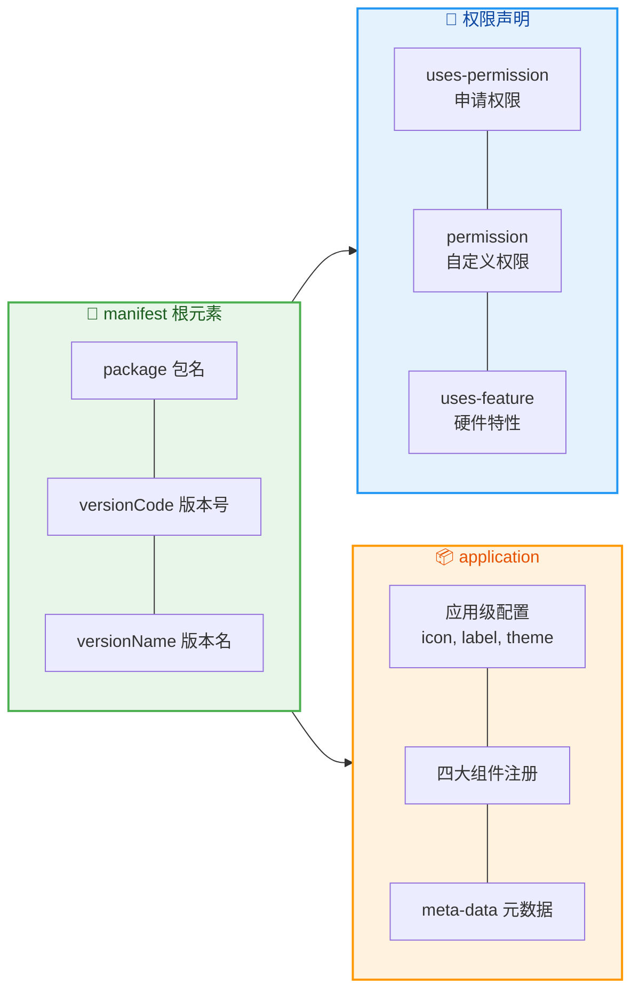
```mermaid
graph LR
    subgraph MANIFEST["📄 manifest 根元素"]
        direction TB
        M1["package 包名"]
        M2["versionCode 版本号"]
        M3["versionName 版本名"]
        M1 --- M2
        M2 --- M3
    end

    subgraph PERMISSIONS["🔐 权限声明"]
        direction TB
        P1["uses-permission<br/>申请权限"]
        P2["permission<br/>自定义权限"]
        P3["uses-feature<br/>硬件特性"]
        P1 --- P2
        P2 --- P3
    end

    subgraph APPLICATION["📦 application"]
        direction TB
        A1["应用级配置<br/>icon, label, theme"]
        A2["四大组件注册"]
        A3["meta-data 元数据"]
        A1 --- A2
        A2 --- A3
    end

    MANIFEST --> PERMISSIONS
    MANIFEST --> APPLICATION

    classDef manifestStyle fill:#E8F5E9,stroke:#4CAF50,stroke-width:2px,color:#1B5E20
    classDef permStyle fill:#E3F2FD,stroke:#2196F3,stroke-width:2px,color:#0D47A1
    classDef appStyle fill:#FFF3E0,stroke:#FF9800,stroke-width:2px,color:#E65100

    class MANIFEST manifestStyle
    class PERMISSIONS permStyle
    class APPLICATION appStyle
```

### 包名（Package Name）的重要性

包名是 Android 应用最核心的标识符，它的重要性怎么强调都不为过。在整个 Android 生态系统中，包名扮演着"身份证号"的角色。

#### 包名的命名规范

包名采用反向域名（Reverse Domain Name）的命名约定，例如 `com.google.android.apps.maps`。这种命名方式有几个好处：

1. **全局唯一性**：由于域名本身是唯一的，反向域名可以最大程度避免包名冲突
2. **组织归属清晰**：从包名可以直接看出应用属于哪个组织或公司
3. **层次结构**：便于管理同一组织下的多个应用

```kotlin
// 包名的使用场景示例
class PackageNameUsage(private val context: Context) {
    
    // 1. 获取当前应用的包名
    fun getCurrentPackageName(): String {
        // context.packageName 返回清单文件中声明的包名
        return context.packageName  // 例如: "com.example.myapp"
    }
    
    // 2. 通过包名启动其他应用
    fun launchOtherApp(packageName: String) {
        // 获取该包名应用的启动 Intent
        val intent = context.packageManager
            .getLaunchIntentForPackage(packageName)
        
        intent?.let {
            context.startActivity(it)
        }
    }
    
    // 3. 检查某个应用是否已安装
    fun isAppInstalled(packageName: String): Boolean {
        return try {
            // 尝试获取包信息，如果抛出异常说明未安装
            context.packageManager.getPackageInfo(packageName, 0)
            true
        } catch (e: PackageManager.NameNotFoundException) {
            false
        }
    }
    
    // 4. 包名用于构建 ContentProvider 的 URI
    fun buildContentUri(): Uri {
        // authority 通常基于包名，确保唯一性
        return Uri.parse("content://com.example.myapp.provider/users")
    }
    
    // 5. 包名用于文件存储路径
    fun getAppSpecificDirectory(): File {
        // 返回 /data/data/com.example.myapp/files
        // 系统根据包名为每个应用分配独立的存储目录
        return context.filesDir
    }
}
```

#### applicationId 与 package 的区别

在使用 Gradle 构建系统后，出现了一个容易混淆的概念：`applicationId`。理解它与 `package` 的区别非常重要：

**package（清单文件中）**：
- 定义了 R 类的包名
- 定义了代码中相对类名的解析基准
- 在构建过程中可能被 applicationId 覆盖

**applicationId（build.gradle 中）**：
- 定义了应用在设备和商店中的唯一标识
- 最终会替换 APK 中清单文件的 package 属性
- 支持通过 Build Variants 为不同版本设置不同的 applicationId

```kotlin
// build.gradle.kts (Module level)
android {
    namespace = "com.example.myapp"  // 替代清单文件中的 package
    
    defaultConfig {
        // 这是应用的真正唯一标识
        applicationId = "com.example.myapp"
        // ...
    }
    
    buildTypes {
        debug {
            // Debug 版本使用不同的 applicationId
            // 这样可以同时安装 debug 和 release 版本
            applicationIdSuffix = ".debug"
            // 最终 applicationId: com.example.myapp.debug
        }
    }
    
    flavorDimensions += "version"
    productFlavors {
        create("free") {
            applicationIdSuffix = ".free"
            // 最终 applicationId: com.example.myapp.free
        }
        create("paid") {
            applicationIdSuffix = ".paid"
            // 最终 applicationId: com.example.myapp.paid
        }
    }
}
```

### 组件注册详解

Android 四大组件必须在清单文件中注册才能正常工作。每种组件的注册方式和可配置属性各有不同。

#### Activity 注册

Activity 是用户界面的载体，其注册配置直接影响着用户的交互体验。

```xml
<!-- Activity 完整注册示例 -->
<activity
    android:name=".ui.MainActivity"
    
    android:label="@string/main_activity_title"
    
    android:icon="@mipmap/ic_main"
    
    android:theme="@style/Theme.MyApp.Main"
    
    android:screenOrientation="portrait"
    
    android:launchMode="singleTop"
    
    android:taskAffinity="com.example.myapp.main"
    
    android:windowSoftInputMode="adjustResize"
    
    android:configChanges="orientation|screenSize|keyboardHidden"
    
    android:exported="true">
    
    <!-- Intent Filter 定义该 Activity 可以响应的 Intent -->
    <intent-filter>
        <!-- MAIN action 表示这是应用的入口点 -->
        <action android:name="android.intent.action.MAIN" />
        <!-- LAUNCHER category 表示在桌面显示图标 -->
        <category android:name="android.intent.category.LAUNCHER" />
    </intent-filter>
    
    <!-- 可以有多个 intent-filter，响应不同类型的 Intent -->
    <intent-filter>
        <action android:name="android.intent.action.VIEW" />
        <category android:name="android.intent.category.DEFAULT" />
        <category android:name="android.intent.category.BROWSABLE" />
        <!-- 处理特定 scheme 的 URL -->
        <data
            android:scheme="myapp"
            android:host="open" />
    </intent-filter>
    
</activity>
```

**关键属性解析**：

| 属性 | 作用 | 常用值 |
|-----|------|-------|
| `launchMode` | 控制 Activity 的启动模式和任务栈行为 | standard, singleTop, singleTask, singleInstance |
| `screenOrientation` | 锁定屏幕方向 | portrait, landscape, sensor, unspecified |
| `configChanges` | 声明自行处理的配置变化，避免 Activity 重建 | orientation, screenSize, locale |
| `windowSoftInputMode` | 软键盘弹出时的窗口调整策略 | adjustResize, adjustPan, adjustNothing |
| `exported` | 是否允许其他应用启动此 Activity | true/false（Android 12+ 必须显式声明） |
| `taskAffinity` | 指定 Activity 所属的任务栈 | 包名格式的字符串 |

#### Service 注册

Service 用于在后台执行长时间运行的操作，其注册配置影响着服务的可见性和运行方式。

```xml
<!-- Service 注册示例 -->

<!-- 普通后台服务 -->
<service
    android:name=".service.DownloadService"
    android:enabled="true"
    android:exported="false"
    android:description="@string/download_service_desc">
</service>

<!-- 前台服务（Android 9+ 需要声明前台服务类型） -->
<service
    android:name=".service.MusicPlayerService"
    android:enabled="true"
    android:exported="false"
    android:foregroundServiceType="mediaPlayback">
</service>

<!-- 可被其他应用绑定的服务 -->
<service
    android:name=".service.RemoteService"
    android:enabled="true"
    android:exported="true"
    android:permission="com.example.myapp.permission.BIND_REMOTE_SERVICE">
    <intent-filter>
        <action android:name="com.example.myapp.action.REMOTE_SERVICE" />
    </intent-filter>
</service>

<!-- 运行在独立进程的服务 -->
<service
    android:name=".service.IsolatedService"
    android:process=":isolated"
    android:isolatedProcess="true">
</service>
```

**前台服务类型（Android 10+）**：

从 Android 10 开始，前台服务必须声明 `foregroundServiceType`，常见类型包括：

- `camera`：使用相机
- `microphone`：使用麦克风
- `location`：访问位置信息
- `mediaPlayback`：媒体播放
- `mediaProjection`：屏幕录制
- `phoneCall`：电话相关
- `dataSync`：数据同步
- `connectedDevice`：连接外部设备

#### BroadcastReceiver 注册

广播接收器可以通过两种方式注册：静态注册（清单文件）和动态注册（代码）。从 Android 8.0 开始，大部分隐式广播不再支持静态注册，这是为了优化系统性能和电池续航。

```xml
<!-- BroadcastReceiver 静态注册示例 -->

<!-- 接收开机完成广播（少数仍支持静态注册的系统广播） -->
<receiver
    android:name=".receiver.BootCompletedReceiver"
    android:enabled="true"
    android:exported="true">
    <intent-filter>
        <action android:name="android.intent.action.BOOT_COMPLETED" />
    </intent-filter>
</receiver>

<!-- 接收应用自定义广播 -->
<receiver
    android:name=".receiver.CustomActionReceiver"
    android:enabled="true"
    android:exported="false">
    <intent-filter>
        <action android:name="com.example.myapp.action.CUSTOM_EVENT" />
    </intent-filter>
</receiver>

<!-- 带权限保护的广播接收器 -->
<receiver
    android:name=".receiver.SecureReceiver"
    android:permission="com.example.myapp.permission.SEND_SECURE_BROADCAST"
    android:exported="true">
    <intent-filter>
        <action android:name="com.example.myapp.action.SECURE_EVENT" />
    </intent-filter>
</receiver>
```

```kotlin
// 动态注册广播接收器（推荐方式）
class DynamicReceiverExample : Activity() {
    
    // 定义广播接收器
    private val networkReceiver = object : BroadcastReceiver() {
        override fun onReceive(context: Context, intent: Intent) {
            // 处理网络状态变化
            val isConnected = checkNetworkConnectivity(context)
            updateUI(isConnected)
        }
    }
    
    override fun onStart() {
        super.onStart()
        // 在 Activity 可见时注册接收器
        val filter = IntentFilter(ConnectivityManager.CONNECTIVITY_ACTION)
        registerReceiver(networkReceiver, filter)
    }
    
    override fun onStop() {
        super.onStop()
        // 在 Activity 不可见时注销接收器，避免内存泄漏
        unregisterReceiver(networkReceiver)
    }
    
    private fun checkNetworkConnectivity(context: Context): Boolean = true
    private fun updateUI(isConnected: Boolean) { /* 更新界面 */ }
}
```

#### ContentProvider 注册

ContentProvider 用于跨应用共享数据，其注册配置涉及数据访问的安全性控制。

```xml
<!-- ContentProvider 注册示例 -->
<provider
    android:name=".provider.UserDataProvider"
    
    android:authorities="com.example.myapp.provider.userdata"
    
    android:exported="true"
    
    android:readPermission="com.example.myapp.permission.READ_USER_DATA"
    android:writePermission="com.example.myapp.permission.WRITE_USER_DATA"
    
    android:grantUriPermissions="true">
    
    <!-- 细粒度的 URI 权限控制 -->
    <path-permission
        android:pathPrefix="/public"
        android:readPermission="android.permission.INTERNET" />
        
    <grant-uri-permission android:pathPattern="/shared/.*" />
    
</provider>

<!-- FileProvider 用于安全地共享文件（Android 7.0+ 必需） -->
<provider
    android:name="androidx.core.content.FileProvider"
    android:authorities="${applicationId}.fileprovider"
    android:exported="false"
    android:grantUriPermissions="true">
    <meta-data
        android:name="android.support.FILE_PROVIDER_PATHS"
        android:resource="@xml/file_paths" />
</provider>
```

### 权限声明体系

Android 的权限系统是保护用户隐私和设备安全的重要机制。应用必须在清单文件中声明所需的权限，系统会根据权限的危险等级采取不同的授权策略。

#### 权限的分类

Android 将权限分为几个保护级别（Protection Level）：

**Normal 权限**：低风险权限，安装时自动授予，用户无感知。例如：`INTERNET`、`ACCESS_NETWORK_STATE`、`VIBRATE`。

**Dangerous 权限**：涉及用户隐私或设备安全的高风险权限，需要用户明确授权。例如：`CAMERA`、`READ_CONTACTS`、`ACCESS_FINE_LOCATION`。

**Signature 权限**：只有与定义该权限的应用使用相同签名的应用才能获得。通常用于系统应用或同一开发者的应用之间。

**SignatureOrSystem 权限**：已废弃，被 `signature|privileged` 替代。

```xml
<!-- 权限声明示例 -->
<manifest ...>
    
    <!-- Normal 权限：安装时自动授予 -->
    <uses-permission android:name="android.permission.INTERNET" />
    <uses-permission android:name="android.permission.ACCESS_NETWORK_STATE" />
    <uses-permission android:name="android.permission.VIBRATE" />
    <uses-permission android:name="android.permission.WAKE_LOCK" />
    
    <!-- Dangerous 权限：需要运行时请求 -->
    <uses-permission android:name="android.permission.CAMERA" />
    <uses-permission android:name="android.permission.RECORD_AUDIO" />
    <uses-permission android:name="android.permission.READ_CONTACTS" />
    <uses-permission android:name="android.permission.ACCESS_FINE_LOCATION" />
    <uses-permission android:name="android.permission.ACCESS_COARSE_LOCATION" />
    
    <!-- 后台位置权限（Android 10+ 需要单独声明） -->
    <uses-permission android:name="android.permission.ACCESS_BACKGROUND_LOCATION" />
    
    <!-- 存储权限（Android 版本差异较大） -->
    <uses-permission android:name="android.permission.READ_EXTERNAL_STORAGE" 
        android:maxSdkVersion="32" />
    <uses-permission android:name="android.permission.READ_MEDIA_IMAGES" />
    <uses-permission android:name="android.permission.READ_MEDIA_VIDEO" />
    
    <!-- 特殊权限：需要引导用户到设置页面手动开启 -->
    <!-- SYSTEM_ALERT_WINDOW: 悬浮窗权限 -->
    <uses-permission android:name="android.permission.SYSTEM_ALERT_WINDOW" />
    <!-- WRITE_SETTINGS: 修改系统设置 -->
    <uses-permission android:name="android.permission.WRITE_SETTINGS" />
    
</manifest>
```

#### 自定义权限

应用可以定义自己的权限，用于保护敏感组件或功能：

```xml
<manifest ...>
    
    <!-- 定义自定义权限 -->
    <permission
        android:name="com.example.myapp.permission.ACCESS_PREMIUM_FEATURES"
        android:label="@string/permission_premium_label"
        android:description="@string/permission_premium_description"
        android:protectionLevel="signature" />
    
    <permission
        android:name="com.example.myapp.permission.RECEIVE_PUSH"
        android:label="@string/permission_push_label"
        android:description="@string/permission_push_description"
        android:protectionLevel="normal" />
    
    <application ...>
        
        <!-- 使用自定义权限保护组件 -->
        <activity
            android:name=".PremiumActivity"
            android:permission="com.example.myapp.permission.ACCESS_PREMIUM_FEATURES"
            android:exported="true" />
            
        <receiver
            android:name=".PushReceiver"
            android:permission="com.example.myapp.permission.RECEIVE_PUSH"
            android:exported="true">
            <intent-filter>
                <action android:name="com.example.myapp.action.PUSH_MESSAGE" />
            </intent-filter>
        </receiver>
        
    </application>
    
</manifest>
```

### 元数据（Meta-Data）配置

`<meta-data>` 元素允许在清单文件中存储键值对形式的配置数据。这些数据可以在运行时通过 PackageManager 读取，常用于第三方 SDK 的配置、应用的全局参数等场景。

#### 元数据的使用场景

```xml
<application ...>
    
    <!-- 场景1：第三方 SDK 配置 -->
    <!-- Google Maps API Key -->
    <meta-data
        android:name="com.google.android.geo.API_KEY"
        android:value="AIzaSyXXXXXXXXXXXXXXXXXXXXXXXXXXXXX" />
    
    <!-- Firebase 配置 -->
    <meta-data
        android:name="com.google.firebase.messaging.default_notification_icon"
        android:resource="@drawable/ic_notification" />
    
    <meta-data
        android:name="com.google.firebase.messaging.default_notification_channel_id"
        android:value="@string/default_notification_channel_id" />
    
    <!-- 场景2：应用全局配置 -->
    <meta-data
        android:name="com.example.myapp.CONFIG_ENV"
        android:value="production" />
    
    <meta-data
        android:name="com.example.myapp.FEATURE_FLAGS"
        android:resource="@xml/feature_flags" />
    
    <!-- 场景3：组件级别的元数据 -->
    <activity android:name=".MainActivity">
        <meta-data
            android:name="android.app.shortcuts"
            android:resource="@xml/shortcuts" />
    </activity>
    
    <service android:name=".MyJobService"
        android:permission="android.permission.BIND_JOB_SERVICE">
        <meta-data
            android:name="com.example.myapp.JOB_PRIORITY"
            android:value="high" />
    </service>
    
    <!-- 场景4：FileProvider 路径配置 -->
    <provider
        android:name="androidx.core.content.FileProvider"
        android:authorities="${applicationId}.fileprovider"
        android:exported="false"
        android:grantUriPermissions="true">
        <meta-data
            android:name="android.support.FILE_PROVIDER_PATHS"
            android:resource="@xml/file_paths" />
    </provider>
    
</application>
```

#### 在代码中读取元数据

```kotlin
// 读取 Meta-Data 的各种方式
class MetaDataReader(private val context: Context) {
    
    // 读取 Application 级别的元数据
    fun readApplicationMetaData() {
        try {
            // 获取 ApplicationInfo，包含 meta-data 信息
            val appInfo = context.packageManager.getApplicationInfo(
                context.packageName,
                PackageManager.GET_META_DATA  // 必须指定这个 flag
            )
            
            // 从 Bundle 中读取不同类型的值
            val metaData: Bundle = appInfo.metaData ?: return
            
            // 读取字符串值
            val apiKey = metaData.getString("com.google.android.geo.API_KEY")
            
            // 读取整数值
            val configValue = metaData.getInt("com.example.myapp.CONFIG_INT", -1)
            
            // 读取布尔值
            val featureEnabled = metaData.getBoolean("com.example.myapp.FEATURE_ENABLED", false)
            
            // 读取资源引用（返回资源 ID）
            val resourceId = metaData.getInt("com.example.myapp.FEATURE_FLAGS")
            
            Log.d("MetaData", "API Key: $apiKey")
            Log.d("MetaData", "Config: $configValue")
            Log.d("MetaData", "Feature: $featureEnabled")
            
        } catch (e: PackageManager.NameNotFoundException) {
            Log.e("MetaData", "Package not found", e)
        }
    }
    
    // 读取 Activity 级别的元数据
    fun readActivityMetaData(activityClass: Class<*>) {
        try {
            val activityInfo = context.packageManager.getActivityInfo(
                ComponentName(context, activityClass),
                PackageManager.GET_META_DATA
            )
            
            val metaData = activityInfo.metaData ?: return
            val shortcutsRes = metaData.getInt("android.app.shortcuts")
            
            Log.d("MetaData", "Shortcuts resource: $shortcutsRes")
            
        } catch (e: PackageManager.NameNotFoundException) {
            Log.e("MetaData", "Activity not found", e)
        }
    }
    
    // 读取 Service 级别的元数据
    fun readServiceMetaData(serviceClass: Class<*>) {
        try {
            val serviceInfo = context.packageManager.getServiceInfo(
                ComponentName(context, serviceClass),
                PackageManager.GET_META_DATA
            )
            
            val metaData = serviceInfo.metaData ?: return
            val priority = metaData.getString("com.example.myapp.JOB_PRIORITY")
            
            Log.d("MetaData", "Job priority: $priority")
            
        } catch (e: PackageManager.NameNotFoundException) {
            Log.e("MetaData", "Service not found", e)
        }
    }
    
    // 读取 Receiver 级别的元数据
    fun readReceiverMetaData(receiverClass: Class<*>) {
        try {
            val receiverInfo = context.packageManager.getReceiverInfo(
                ComponentName(context, receiverClass),
                PackageManager.GET_META_DATA
            )
            
            val metaData = receiverInfo.metaData
            // 处理元数据...
            
        } catch (e: PackageManager.NameNotFoundException) {
            Log.e("MetaData", "Receiver not found", e)
        }
    }
}
```

### 硬件与软件特性声明

`<uses-feature>` 元素用于声明应用依赖的硬件或软件特性。这些声明主要影响应用在 Google Play 商店的可见性——如果设备不具备应用声明的必需特性，该应用将不会出现在该设备的商店搜索结果中。

```xml
<manifest ...>
    
    <!-- 硬件特性声明 -->
    
    <!-- 相机特性 -->
    <uses-feature 
        android:name="android.hardware.camera"
        android:required="true" />
    <!-- 自动对焦（可选） -->
    <uses-feature 
        android:name="android.hardware.camera.autofocus"
        android:required="false" />
    
    <!-- 位置特性 -->
    <uses-feature 
        android:name="android.hardware.location.gps"
        android:required="false" />
    
    <!-- 传感器特性 -->
    <uses-feature 
        android:name="android.hardware.sensor.accelerometer"
        android:required="false" />
    <uses-feature 
        android:name="android.hardware.sensor.gyroscope"
        android:required="false" />
    
    <!-- 蓝牙特性 -->
    <uses-feature 
        android:name="android.hardware.bluetooth"
        android:required="false" />
    <uses-feature 
        android:name="android.hardware.bluetooth_le"
        android:required="false" />
    
    <!-- NFC 特性 -->
    <uses-feature 
        android:name="android.hardware.nfc"
        android:required="false" />
    
    <!-- 触摸屏特性（大多数应用隐式需要） -->
    <uses-feature 
        android:name="android.hardware.touchscreen"
        android:required="false" />
    
    <!-- 软件特性声明 -->
    
    <!-- OpenGL ES 版本要求 -->
    <uses-feature 
        android:glEsVersion="0x00030000"
        android:required="true" />
    
</manifest>
```

**required 属性的重要性**：

- `required="true"`（默认值）：设备必须具备此特性，否则应用不可见
- `required="false"`：特性可选，应用可以在不具备此特性的设备上运行，但需要在代码中检查并优雅降级

```kotlin
// 运行时检查硬件特性
class FeatureChecker(private val context: Context) {
    
    private val packageManager = context.packageManager
    
    // 检查相机是否可用
    fun hasCameraFeature(): Boolean {
        return packageManager.hasSystemFeature(PackageManager.FEATURE_CAMERA_ANY)
    }
    
    // 检查 GPS 是否可用
    fun hasGpsFeature(): Boolean {
        return packageManager.hasSystemFeature(PackageManager.FEATURE_LOCATION_GPS)
    }
    
    // 检查蓝牙 LE 是否可用
    fun hasBluetoothLeFeature(): Boolean {
        return packageManager.hasSystemFeature(PackageManager.FEATURE_BLUETOOTH_LE)
    }
    
    // 检查 NFC 是否可用
    fun hasNfcFeature(): Boolean {
        return packageManager.hasSystemFeature(PackageManager.FEATURE_NFC)
    }
    
    // 根据特性可用性调整 UI
    fun setupCameraButton(button: Button) {
        if (hasCameraFeature()) {
            button.isEnabled = true
            button.setOnClickListener { openCamera() }
        } else {
            button.isEnabled = false
            button.text = "相机不可用"
        }
    }
    
    private fun openCamera() { /* 打开相机 */ }
}
```

### SDK 版本配置

虽然 SDK 版本配置现在主要在 `build.gradle` 中设置，但理解这些配置的含义对于应用兼容性至关重要。

```kotlin
// build.gradle.kts
android {
    compileSdk = 34  // 编译时使用的 SDK 版本
    
    defaultConfig {
        minSdk = 21      // 最低支持的 Android 版本（Android 5.0）
        targetSdk = 34   // 目标 SDK 版本（Android 14）
    }
}
```

**三个版本号的含义**：

| 配置项 | 含义 | 影响 |
|-------|------|------|
| `compileSdk` | 编译时使用的 Android SDK 版本 | 决定了可以使用哪些 API，不影响运行时行为 |
| `minSdk` | 应用支持的最低 Android 版本 | 低于此版本的设备无法安装应用 |
| `targetSdk` | 应用针对的目标 Android 版本 | 影响系统对应用的兼容性行为 |

**targetSdk 的特殊作用**：

`targetSdk` 是一个非常重要但容易被误解的配置。它告诉系统"这个应用是针对哪个版本开发和测试的"。系统会根据这个值决定是否对应用启用新版本的行为变更：

```kotlin
// targetSdk 影响示例
class TargetSdkBehavior(private val context: Context) {
    
    // 示例：运行时权限
    // targetSdk < 23: 权限在安装时自动授予
    // targetSdk >= 23: 危险权限需要运行时请求
    
    // 示例：后台限制
    // targetSdk < 26: 可以自由启动后台服务
    // targetSdk >= 26: 后台启动服务受限，需要使用 startForegroundService
    
    // 示例：存储访问
    // targetSdk < 29: 可以自由访问外部存储
    // targetSdk >= 29: 启用分区存储（Scoped Storage）
    // targetSdk >= 30: 强制分区存储，无法通过 requestLegacyExternalStorage 绕过
    
    fun startBackgroundWork() {
        if (Build.VERSION.SDK_INT >= Build.VERSION_CODES.O) {
            // Android 8.0+ 需要使用前台服务
            val intent = Intent(context, MyForegroundService::class.java)
            context.startForegroundService(intent)
        } else {
            // 旧版本可以直接启动后台服务
            val intent = Intent(context, MyBackgroundService::class.java)
            context.startService(intent)
        }
    }
}
```

### 清单文件合并机制

在实际项目中，最终的 AndroidManifest.xml 是由多个清单文件合并而成的：主模块的清单、库模块的清单、AAR 依赖的清单等。理解合并机制有助于解决清单冲突问题。

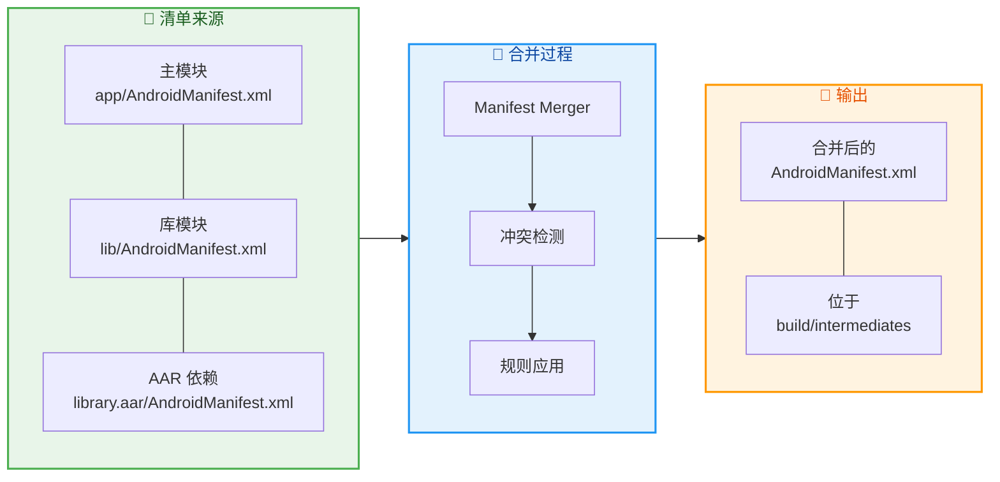
```mermaid
graph LR
    subgraph SOURCES["📁 清单来源"]
        direction TB
        S1["主模块<br/>app/AndroidManifest.xml"]
        S2["库模块<br/>lib/AndroidManifest.xml"]
        S3["AAR 依赖<br/>library.aar/AndroidManifest.xml"]
        S1 --- S2
        S2 --- S3
    end

    subgraph MERGE["🔄 合并过程"]
        direction TB
        M1["Manifest Merger"]
        M2["冲突检测"]
        M3["规则应用"]
        M1 --> M2
        M2 --> M3
    end

    subgraph OUTPUT["📄 输出"]
        direction TB
        O1["合并后的<br/>AndroidManifest.xml"]
        O2["位于<br/>build/intermediates"]
        O1 --- O2
    end

    SOURCES --> MERGE
    MERGE --> OUTPUT

    classDef sourceStyle fill:#E8F5E9,stroke:#4CAF50,stroke-width:2px,color:#1B5E20
    classDef mergeStyle fill:#E3F2FD,stroke:#2196F3,stroke-width:2px,color:#0D47A1
    classDef outputStyle fill:#FFF3E0,stroke:#FF9800,stroke-width:2px,color:#E65100

    class SOURCES sourceStyle
    class MERGE mergeStyle
    class OUTPUT outputStyle
```

#### 使用 tools 命名空间解决冲突

当多个清单文件存在冲突时，可以使用 `tools` 命名空间中的属性来控制合并行为：

```xml
<manifest 
    xmlns:android="http://schemas.android.com/apk/res/android"
    xmlns:tools="http://schemas.android.com/tools"
    package="com.example.myapp">
    
    <!-- 替换库中声明的属性值 -->
    <application
        android:icon="@mipmap/ic_launcher"
        android:label="@string/app_name"
        tools:replace="android:icon,android:label">
        
        <!-- 移除库中声明的某个组件 -->
        <activity
            android:name="com.thirdparty.UnwantedActivity"
            tools:node="remove" />
        
        <!-- 覆盖库中组件的某些属性 -->
        <service
            android:name="com.thirdparty.SomeService"
            android:exported="false"
            tools:replace="android:exported" />
        
        <!-- 强制保留某个属性，即使库中没有声明 -->
        <receiver
            android:name=".MyReceiver"
            android:enabled="true"
            tools:node="merge"
            tools:strict="android:enabled" />
            
    </application>
    
    <!-- 移除库中声明的权限 -->
    <uses-permission 
        android:name="android.permission.WRITE_EXTERNAL_STORAGE"
        tools:node="remove" />
    
</manifest>
```

**常用的 tools 属性**：

| 属性 | 作用 |
|-----|------|
| `tools:node="remove"` | 移除该元素 |
| `tools:node="replace"` | 完全替换该元素 |
| `tools:node="merge"` | 合并该元素（默认行为） |
| `tools:replace="attr1,attr2"` | 替换指定的属性 |
| `tools:remove="attr1,attr2"` | 移除指定的属性 |
| `tools:strict="attr"` | 严格模式，属性值必须一致否则报错 |

---

**📝 练习题**

某应用在 Android 12 设备上安装后，点击桌面图标无法启动，Logcat 显示 "Activity not exported" 错误。以下哪项是最可能的原因？

A. Activity 没有在 AndroidManifest.xml 中注册

B. Activity 声明了 intent-filter 但没有显式设置 `android:exported` 属性

C. 应用的 targetSdk 设置过低，不兼容 Android 12

D. Activity 的 `android:enabled` 属性被设置为 false

**【答案】** B

**【解析】** 从 Android 12（API 31）开始，如果 Activity、Service 或 BroadcastReceiver 声明了 `<intent-filter>`，则必须显式声明 `android:exported` 属性，否则应用无法安装或运行。这是 Android 12 引入的安全增强措施，旨在防止开发者无意中暴露组件。对于作为应用入口的 MainActivity，由于它声明了 `MAIN` action 和 `LAUNCHER` category 的 intent-filter，必须设置 `android:exported="true"` 才能被 Launcher 启动。选项 A 的情况会导致编译错误而非运行时错误；选项 C 中 targetSdk 过低不会导致此问题；选项 D 会导致组件被禁用，但错误信息会不同。

---

## Application 类详解

Application 类是 Android 应用程序的**全局入口点**与**生命周期容器**。当系统为你的应用创建进程时，Application 实例是第一个被构造的组件对象，它的生命周期与整个应用进程绑定——从进程诞生到进程被杀死，Application 实例始终存在。理解 Application 的设计哲学与运作机制，是掌握 Android 应用架构的基础。

### 单例模式与全局上下文

#### Application 的单例本质

从设计模式角度看，Application 类天然具备**单例特性**（Singleton Pattern），但这个单例并非由开发者通过 `private constructor + static instance` 手动实现，而是由 **Android Framework 在进程级别强制保证**的。每个应用进程有且仅有一个 Application 实例，这个保证来自于 `ActivityThread` 的启动流程。

当 Zygote fork 出新的应用进程后，`ActivityThread.main()` 方法会被调用。在这个过程中，系统会通过 `Instrumentation.newApplication()` 方法**反射创建**你在 `AndroidManifest.xml` 中声明的 Application 子类（如果没有声明，则创建默认的 `android.app.Application`）。这个创建过程**只会发生一次**，后续任何组件获取 Application 引用时，都是获取这同一个实例。

```kotlin
// Application 单例的获取方式对比
class MyApplication : Application() {
    
    companion object {
        // 方式一：静态变量持有（常见但需注意初始化时机）
        // lateinit 表示延迟初始化，在 onCreate 中赋值
        lateinit var instance: MyApplication
            private set  // 外部只读，内部可写
    }
    
    override fun onCreate() {
        super.onCreate()
        // 在 onCreate 中初始化静态引用
        // 此时 Application 已完全构造完成，可以安全使用
        instance = this
    }
}

// 方式二：通过 Context 获取（推荐，更安全）
class SomeClass(private val context: Context) {
    
    fun doSomething() {
        // applicationContext 返回的就是 Application 实例
        // 这是 Android 官方推荐的获取方式
        val app = context.applicationContext as MyApplication
        
        // 或者直接使用 applicationContext，无需强转
        // 适用于只需要 Context 功能而不需要自定义方法的场景
        val appContext: Context = context.applicationContext
    }
}
```

#### 为什么 Application 适合作为全局容器

Application 作为全局单例容器有其**合理性**，但也存在**滥用风险**。理解其适用边界非常重要：

**适合放在 Application 中的内容**：
- **全局配置初始化**：如日志框架（Timber）、崩溃收集（Crashlytics）、网络库配置（OkHttp 的全局拦截器）
- **依赖注入容器**：如 Dagger/Hilt 的 Component、Koin 的 Module 注册
- **进程级别的单例服务**：如全局的 EventBus 实例、数据库实例（Room Database）

**不适合放在 Application 中的内容**：
- **Activity/Fragment 相关的引用**：会导致内存泄漏
- **大量业务数据缓存**：应使用专门的缓存层或 ViewModel
- **UI 相关的资源**：如 Bitmap、Drawable 的长期持有

```kotlin
// 正确示例：Application 作为依赖注入的根容器
class MyApplication : Application() {
    
    // 懒加载的全局服务实例
    // by lazy 保证线程安全且只初始化一次
    val networkModule: NetworkModule by lazy {
        // 创建网络模块，传入 Application Context
        // 使用 applicationContext 而非 this 是一种防御性编程
        NetworkModule(applicationContext)
    }
    
    // 数据库实例，整个应用共享
    val database: AppDatabase by lazy {
        // Room 数据库构建，需要 Context 参数
        Room.databaseBuilder(
            applicationContext,           // 使用 Application Context
            AppDatabase::class.java,      // 数据库类
            "app_database"                // 数据库文件名
        ).build()
    }
    
    override fun onCreate() {
        super.onCreate()
        // 初始化必须在应用启动时完成的组件
        initializeLogging()      // 日志系统
        initializeCrashReporting() // 崩溃上报
    }
    
    private fun initializeLogging() {
        // 仅在 Debug 构建时启用详细日志
        if (BuildConfig.DEBUG) {
            // Timber 是一个流行的日志库
            // DebugTree 会自动添加类名和行号
            Timber.plant(Timber.DebugTree())
        }
    }
    
    private fun initializeCrashReporting() {
        // 生产环境启用崩溃收集
        if (!BuildConfig.DEBUG) {
            // 初始化 Firebase Crashlytics
            FirebaseCrashlytics.getInstance().setCrashlyticsCollectionEnabled(true)
        }
    }
}
```

#### Context 继承体系中的 Application

Application 类继承自 `ContextWrapper`，而 `ContextWrapper` 继承自 `Context`。这意味着 Application **本身就是一个 Context**，但它是一种特殊的 Context——**Application Context**。理解 Application Context 与 Activity Context 的区别至关重要：

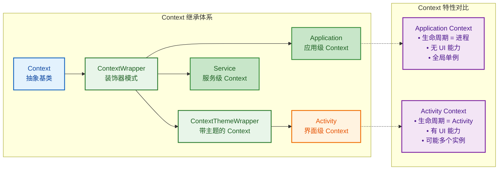
```mermaid
graph LR
    subgraph ContextHierarchy["Context 继承体系"]
        direction TB
        A["Context<br/>抽象基类"]
        B["ContextWrapper<br/>装饰器模式"]
        C["ContextThemeWrapper<br/>带主题的 Context"]
        D["Application<br/>应用级 Context"]
        E["Activity<br/>界面级 Context"]
        F["Service<br/>服务级 Context"]
        
        A --> B
        B --> C
        B --> D
        B --> F
        C --> E
    end
    
    subgraph Characteristics["Context 特性对比"]
        direction TB
        G["Application Context<br/>• 生命周期 = 进程<br/>• 无 UI 能力<br/>• 全局单例"]
        H["Activity Context<br/>• 生命周期 = Activity<br/>• 有 UI 能力<br/>• 可能多个实例"]
    end
    
    D -.-> G
    E -.-> H
    
    classDef abstract fill:#E3F2FD,stroke:#1565C0,stroke-width:2px,color:#0D47A1
    classDef wrapper fill:#E8F5E9,stroke:#2E7D32,stroke-width:2px,color:#1B5E20
    classDef app fill:#C8E6C9,stroke:#388E3C,stroke-width:2px,color:#1B5E20
    classDef activity fill:#FFF3E0,stroke:#EF6C00,stroke-width:2px,color:#E65100
    classDef info fill:#F3E5F5,stroke:#7B1FA2,stroke-width:2px,color:#4A148C
    
    class A abstract
    class B,C wrapper
    class D,F app
    class E activity
    class G,H info
```

**关键区别**：Application Context **不能用于启动 Activity**（除非添加 `FLAG_ACTIVITY_NEW_TASK`），也**不能用于创建 Dialog**，因为它没有关联的窗口（Window）。但它非常适合用于那些生命周期需要超越单个 Activity 的场景，如网络请求、数据库操作等。

### onCreate 初始化时机

#### 调用时机的精确定义

Application 的 `onCreate()` 方法是整个应用**最早的可控初始化入口**。它的调用时机非常明确：**在 Application 对象构造完成之后，在任何其他组件（Activity、Service、BroadcastReceiver、ContentProvider）的生命周期方法被调用之前**。

但这里有一个重要的例外：**ContentProvider 的 `onCreate()` 会在 Application 的 `onCreate()` 之前被调用**。这个设计是为了让 ContentProvider 能够在应用启动的最早期就准备好数据，但它也带来了一些初始化顺序的陷阱。

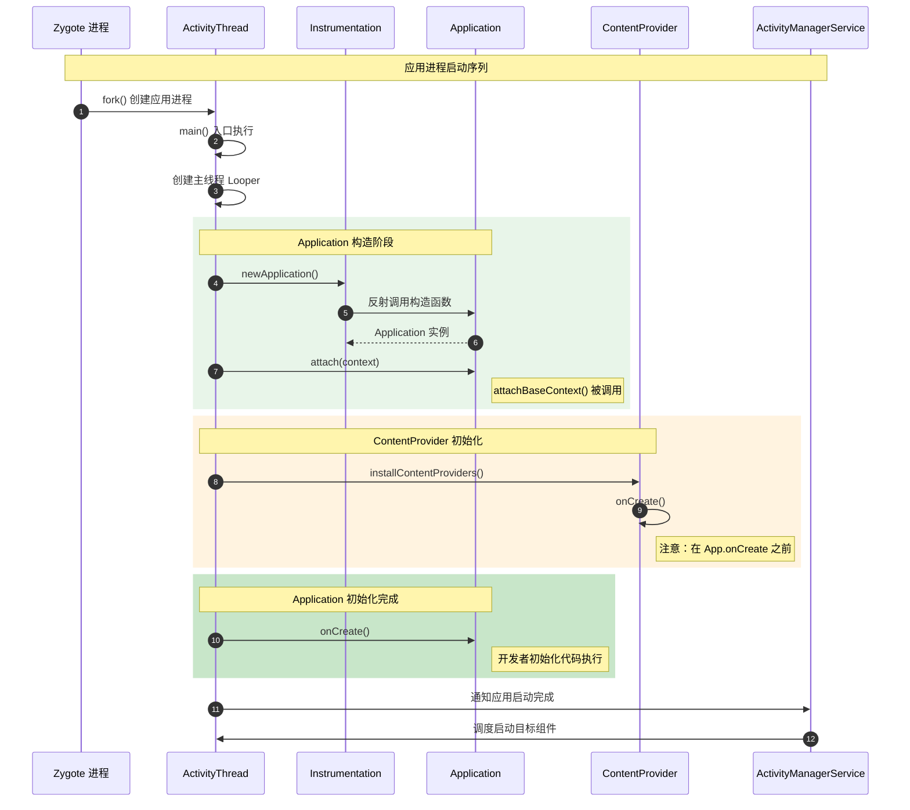
```mermaid
sequenceDiagram
    autonumber
    participant Zygote as Zygote 进程
    participant AT as ActivityThread
    participant Inst as Instrumentation
    participant App as Application
    participant CP as ContentProvider
    participant AMS as ActivityManagerService
    
    Note over Zygote,AMS: 应用进程启动序列
    
    Zygote->>AT: fork() 创建应用进程
    AT->>AT: main() 入口执行
    AT->>AT: 创建主线程 Looper
    
    rect rgb(232, 245, 233)
        Note over AT,App: Application 构造阶段
        AT->>Inst: newApplication()
        Inst->>App: 反射调用构造函数
        App-->>Inst: Application 实例
        AT->>App: attach(context)
        Note right of App: attachBaseContext() 被调用
    end
    
    rect rgb(255, 243, 224)
        Note over AT,CP: ContentProvider 初始化
        AT->>CP: installContentProviders()
        CP->>CP: onCreate()
        Note right of CP: 注意：在 App.onCreate 之前
    end
    
    rect rgb(200, 230, 201)
        Note over AT,App: Application 初始化完成
        AT->>App: onCreate()
        Note right of App: 开发者初始化代码执行
    end
    
    AT->>AMS: 通知应用启动完成
    AMS->>AT: 调度启动目标组件
```

#### attachBaseContext 与 onCreate 的区别

很多开发者只知道 `onCreate()`，却忽略了 `attachBaseContext()`。这两个方法的调用时机不同，适用场景也不同：

```kotlin
class MyApplication : Application() {
    
    // attachBaseContext 是最早的初始化时机
    // 此时 Application 的 Context 刚刚被绑定
    override fun attachBaseContext(base: Context) {
        // 必须首先调用 super，否则后续代码无法使用 Context
        super.attachBaseContext(base)
        
        // 适合在这里做的事情：
        // 1. MultiDex 安装（Android 5.0 以下需要）
        //    MultiDex.install(this)
        
        // 2. 热修复框架的早期初始化
        //    因为热修复需要在类加载之前介入
        //    Tinker.install(this)
        
        // 3. 某些需要极早初始化的安全检测
        //    SecurityChecker.init(this)
        
        // 注意：此时 ContentProvider 尚未初始化
        // 不要在这里访问 ContentProvider
    }
    
    override fun onCreate() {
        super.onCreate()
        
        // onCreate 是常规初始化时机
        // 此时 ContentProvider 已经初始化完成
        // 可以安全地进行各种初始化操作
        
        // 适合在这里做的事情：
        // 1. 第三方 SDK 初始化
        initializeThirdPartySDKs()
        
        // 2. 全局异常处理器
        setupGlobalExceptionHandler()
        
        // 3. 应用配置加载
        loadAppConfiguration()
    }
    
    private fun initializeThirdPartySDKs() {
        // 按照依赖顺序初始化各个 SDK
        // 网络库通常最先初始化，因为其他 SDK 可能依赖它
        initializeNetworking()
        
        // 然后是分析和监控类 SDK
        initializeAnalytics()
        
        // 最后是业务相关的 SDK
        initializeBusinessSDKs()
    }
    
    private fun setupGlobalExceptionHandler() {
        // 获取默认的异常处理器
        val defaultHandler = Thread.getDefaultUncaughtExceptionHandler()
        
        // 设置自定义的全局异常处理器
        Thread.setDefaultUncaughtExceptionHandler { thread, throwable ->
            // 记录崩溃日志
            logCrash(thread, throwable)
            
            // 调用默认处理器（通常会终止应用）
            defaultHandler?.uncaughtException(thread, throwable)
        }
    }
    
    private fun logCrash(thread: Thread, throwable: Throwable) {
        // 将崩溃信息写入本地文件
        // 下次启动时上传到服务器
        Timber.e(throwable, "Crash on thread: ${thread.name}")
    }
    
    private fun loadAppConfiguration() {
        // 从 SharedPreferences 或远程配置加载应用设置
        // 这些配置会影响后续的应用行为
    }
    
    private fun initializeNetworking() { /* ... */ }
    private fun initializeAnalytics() { /* ... */ }
    private fun initializeBusinessSDKs() { /* ... */ }
}
```

#### 启动性能优化：延迟初始化策略

`onCreate()` 中的代码会**阻塞应用启动**。如果在这里执行耗时操作，用户会看到明显的启动延迟（白屏或黑屏时间变长）。因此，现代 Android 开发强调**延迟初始化**（Lazy Initialization）和**异步初始化**（Async Initialization）。

```kotlin
class MyApplication : Application() {
    
    override fun onCreate() {
        super.onCreate()
        
        // 策略一：只初始化启动必需的组件
        // 这些组件如果不初始化，应用无法正常显示第一个界面
        initializeCriticalComponents()
        
        // 策略二：使用 IdleHandler 在主线程空闲时初始化
        // 这样不会阻塞界面渲染
        scheduleIdleInitialization()
        
        // 策略三：使用后台线程初始化非 UI 相关组件
        // 注意：某些 SDK 要求在主线程初始化，需要查阅文档
        scheduleBackgroundInitialization()
    }
    
    private fun initializeCriticalComponents() {
        // 只放启动必需的初始化
        // 例如：崩溃收集（需要尽早启动以捕获启动阶段的崩溃）
        // 例如：路由框架（否则无法跳转到正确的 Activity）
    }
    
    private fun scheduleIdleInitialization() {
        // 获取主线程的消息队列
        Looper.myQueue().addIdleHandler {
            // 当主线程空闲时（没有待处理的消息），这个回调会被执行
            // 适合初始化那些"不急但最好早点有"的组件
            
            initializeAnalyticsSDK()  // 数据分析 SDK
            initializePushSDK()       // 推送 SDK
            
            // 返回 false 表示这个 IdleHandler 只执行一次
            // 返回 true 则每次空闲都会执行
            false
        }
    }
    
    private fun scheduleBackgroundInitialization() {
        // 使用协程在后台线程执行初始化
        // GlobalScope 在 Application 中使用是安全的
        // 因为 Application 的生命周期等于进程生命周期
        GlobalScope.launch(Dispatchers.IO) {
            // 这些初始化不需要在主线程执行
            // 也不需要在应用启动时立即完成
            
            initializeImageLoader()   // 图片加载库
            initializeDatabase()      // 数据库预热
            preloadCommonData()       // 预加载常用数据
        }
    }
    
    private fun initializeAnalyticsSDK() { /* ... */ }
    private fun initializePushSDK() { /* ... */ }
    private fun initializeImageLoader() { /* ... */ }
    private fun initializeDatabase() { /* ... */ }
    private fun preloadCommonData() { /* ... */ }
}
```

### 生命周期回调

#### 完整的生命周期回调方法

Application 类提供了一系列生命周期回调方法，让开发者能够响应应用级别的状态变化。这些回调与 Activity 的生命周期回调不同——它们反映的是**整个应用进程**的状态，而非单个界面的状态。

```kotlin
class MyApplication : Application() {
    
    // ==================== 核心生命周期 ====================
    
    override fun attachBaseContext(base: Context) {
        super.attachBaseContext(base)
        // 最早的初始化时机
        // Context 刚刚绑定，ContentProvider 尚未创建
    }
    
    override fun onCreate() {
        super.onCreate()
        // 标准初始化时机
        // ContentProvider 已创建，可以安全使用各种 Context 功能
    }
    
    override fun onTerminate() {
        super.onTerminate()
        // 应用进程终止时调用
        // 重要：这个方法只在模拟器中被调用！
        // 在真实设备上，进程被杀死时不会调用此方法
        // 因此不要依赖它来做清理工作
    }
    
    // ==================== 配置变更回调 ====================
    
    override fun onConfigurationChanged(newConfig: Configuration) {
        super.onConfigurationChanged(newConfig)
        // 设备配置发生变化时调用
        // 例如：屏幕旋转、语言切换、字体大小变化、深色模式切换
        
        // 检查具体是什么配置发生了变化
        when {
            // 检查是否是深色模式变化
            newConfig.uiMode and Configuration.UI_MODE_NIGHT_MASK == 
                Configuration.UI_MODE_NIGHT_YES -> {
                // 切换到深色模式
                onDarkModeEnabled()
            }
            newConfig.uiMode and Configuration.UI_MODE_NIGHT_MASK == 
                Configuration.UI_MODE_NIGHT_NO -> {
                // 切换到浅色模式
                onDarkModeDisabled()
            }
        }
        
        // 检查语言变化
        val currentLocale = if (Build.VERSION.SDK_INT >= Build.VERSION_CODES.N) {
            newConfig.locales[0]
        } else {
            @Suppress("DEPRECATION")
            newConfig.locale
        }
        onLocaleChanged(currentLocale)
    }
    
    private fun onDarkModeEnabled() {
        // 通知各个模块切换到深色主题资源
        Timber.d("Dark mode enabled")
    }
    
    private fun onDarkModeDisabled() {
        // 通知各个模块切换到浅色主题资源
        Timber.d("Dark mode disabled")
    }
    
    private fun onLocaleChanged(locale: Locale) {
        // 语言变化时可能需要重新加载某些资源
        Timber.d("Locale changed to: ${locale.language}")
    }
    
    // ==================== 内存管理回调 ====================
    
    override fun onLowMemory() {
        super.onLowMemory()
        // 系统内存严重不足时调用
        // 这是一个强烈的信号：必须立即释放内存，否则进程可能被杀死
        // 详见下一节的深入讲解
    }
    
    override fun onTrimMemory(level: Int) {
        super.onTrimMemory(level)
        // 系统请求应用释放内存
        // level 参数表示内存压力的程度
        // 详见下一节的深入讲解
    }
}
```

#### ComponentCallbacks2 接口与内存级别

Application 实现了 `ComponentCallbacks2` 接口，这个接口定义了 `onTrimMemory(level: Int)` 方法。`level` 参数是一个整数常量，表示当前的内存压力级别。理解这些级别对于正确响应系统的内存管理请求至关重要：

```kotlin
class MyApplication : Application() {
    
    override fun onTrimMemory(level: Int) {
        super.onTrimMemory(level)
        
        when (level) {
            // ========== 应用在前台运行时的级别 ==========
            
            TRIM_MEMORY_RUNNING_MODERATE -> {
                // 级别 5：系统内存开始紧张，但应用仍在前台
                // 建议：释放不必要的缓存
                Timber.d("Memory: Running Moderate - 释放部分缓存")
                releaseNonCriticalCaches()
            }
            
            TRIM_MEMORY_RUNNING_LOW -> {
                // 级别 10：系统内存较低，应用仍在前台
                // 建议：释放更多缓存，减少内存占用
                Timber.d("Memory: Running Low - 释放更多缓存")
                releaseMoreCaches()
            }
            
            TRIM_MEMORY_RUNNING_CRITICAL -> {
                // 级别 15：系统内存严重不足，应用仍在前台
                // 建议：释放所有可释放的内存
                // 如果不释放，后台应用会被杀死
                Timber.d("Memory: Running Critical - 释放所有非必要内存")
                releaseAllNonEssentialMemory()
            }
            
            // ========== 应用 UI 不可见时的级别 ==========
            
            TRIM_MEMORY_UI_HIDDEN -> {
                // 级别 20：应用的 UI 已经不可见（用户按了 Home 键）
                // 这是释放 UI 相关资源的好时机
                // 例如：释放大图片、清除 View 缓存
                Timber.d("Memory: UI Hidden - 释放 UI 资源")
                releaseUIResources()
            }
            
            // ========== 应用在后台时的级别 ==========
            
            TRIM_MEMORY_BACKGROUND -> {
                //级别 40：应用进程在 LRU 列表的开头（最近使用）
                // 系统内存紧张，但应用暂时安全
                // 建议：释放容易恢复的资源
                Timber.d("Memory: Background - 释放可恢复资源")
                releaseRecoverableResources()
            }
            
            TRIM_MEMORY_MODERATE -> {
                // 级别 60：应用进程在 LRU 列表的中间位置
                // 如果内存继续紧张，进程可能被杀死
                // 建议：释放更多资源
                Timber.d("Memory: Moderate - 进程可能被杀死，释放更多资源")
                releaseMoreResources()
            }
            
            TRIM_MEMORY_COMPLETE -> {
                // 级别 80：应用进程在 LRU 列表的末尾（最久未使用）
                // 进程随时可能被杀死
                // 建议：释放所有可释放的资源
                Timber.d("Memory: Complete - 进程即将被杀死，释放一切")
                releaseEverythingPossible()
            }
        }
    }
    
    // 分级释放策略的具体实现
    private fun releaseNonCriticalCaches() {
        // 释放非关键缓存，如预加载的数据
        imageLoader?.clearMemoryCache(percentage = 25)
    }
    
    private fun releaseMoreCaches() {
        // 释放更多缓存
        imageLoader?.clearMemoryCache(percentage = 50)
        dataCache?.trimToSize(dataCache.maxSize() / 2)
    }
    
    private fun releaseAllNonEssentialMemory() {
        // 释放所有非必要内存
        imageLoader?.clearMemoryCache(percentage = 100)
        dataCache?.evictAll()
    }
    
    private fun releaseUIResources() {
        // 释放 UI 相关资源
        // 例如：通知图片加载库清除内存缓存
        Glide.get(this).clearMemory()
    }
    
    private fun releaseRecoverableResources() {
        // 释放可以从磁盘或网络恢复的资源
        releaseUIResources()
        clearInMemoryDatabaseCache()
    }
    
    private fun releaseMoreResources() {
        releaseRecoverableResources()
        // 释放更多资源，如预编译的正则表达式、缓存的计算结果等
    }
    
    private fun releaseEverythingPossible() {
        releaseMoreResources()
        // 最后的努力：释放一切可以释放的
        System.gc()  // 建议 GC（不保证立即执行）
    }
    
    // 占位符变量，实际项目中应该是真实的实例
    private var imageLoader: ImageLoader? = null
    private var dataCache: LruCache<String, Any>? = null
    
    private fun clearInMemoryDatabaseCache() { /* ... */ }
}

// 辅助接口定义
interface ImageLoader {
    fun clearMemoryCache(percentage: Int)
}
```

下图展示了 `onTrimMemory` 各级别与应用状态的对应关系：

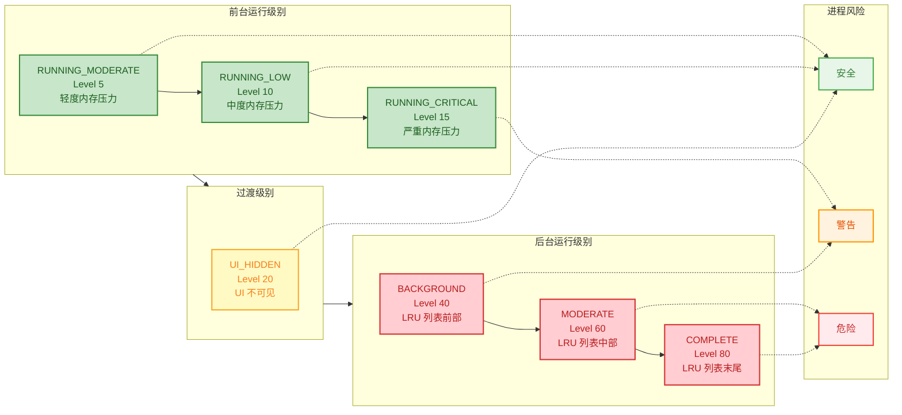
```mermaid
graph LR
    subgraph ForegroundLevels["前台运行级别"]
        direction TB
        F1["RUNNING_MODERATE<br/>Level 5<br/>轻度内存压力"]
        F2["RUNNING_LOW<br/>Level 10<br/>中度内存压力"]
        F3["RUNNING_CRITICAL<br/>Level 15<br/>严重内存压力"]
        F1 --> F2 --> F3
    end
    
    subgraph TransitionLevel["过渡级别"]
        direction TB
        T1["UI_HIDDEN<br/>Level 20<br/>UI 不可见"]
    end
    
    subgraph BackgroundLevels["后台运行级别"]
        direction TB
        B1["BACKGROUND<br/>Level 40<br/>LRU 列表前部"]
        B2["MODERATE<br/>Level 60<br/>LRU 列表中部"]
        B3["COMPLETE<br/>Level 80<br/>LRU 列表末尾"]
        B1 --> B2 --> B3
    end
    
    ForegroundLevels --> TransitionLevel --> BackgroundLevels
    
    subgraph RiskLevel["进程风险"]
        direction TB
        R1["安全"]
        R2["警告"]
        R3["危险"]
    end
    
    F1 -.-> R1
    F2 -.-> R1
    F3 -.-> R2
    T1 -.-> R1
    B1 -.-> R2
    B2 -.-> R3
    B3 -.-> R3
    
    classDef foreground fill:#C8E6C9,stroke:#388E3C,stroke-width:2px,color:#1B5E20
    classDef transition fill:#FFF9C4,stroke:#F9A825,stroke-width:2px,color:#F57F17
    classDef background fill:#FFCDD2,stroke:#D32F2F,stroke-width:2px,color:#B71C1C
    classDef safe fill:#E8F5E9,stroke:#4CAF50,stroke-width:2px,color:#2E7D32
    classDef warning fill:#FFF3E0,stroke:#FF9800,stroke-width:2px,color:#E65100
    classDef danger fill:#FFEBEE,stroke:#F44336,stroke-width:2px,color:#C62828
    
    class F1,F2,F3 foreground
    class T1 transition
    class B1,B2,B3 background
    class R1 safe
    class R2 warning
    class R3 danger
```

### onLowMemory 深入解析

#### onLowMemory 与 onTrimMemory 的关系

`onLowMemory()` 是一个**遗留 API**，在 Android 4.0（API 14）之前是唯一的内存警告回调。从 API 14 开始，`onTrimMemory()` 提供了更细粒度的内存压力级别。但 `onLowMemory()` 仍然被保留，并且在某些极端情况下仍会被调用。

**调用时机**：当系统内存极度紧张，即将开始杀死后台进程时，`onLowMemory()` 会被调用。这相当于 `onTrimMemory(TRIM_MEMORY_COMPLETE)` 的语义，但它是一个更强烈的信号。

```kotlin
class MyApplication : Application() {
    
    override fun onLowMemory() {
        super.onLowMemory()
        
        // onLowMemory 被调用意味着系统内存已经非常紧张
        // 必须立即释放所有可释放的内存
        
        Timber.w("onLowMemory called - 系统内存严重不足！")
        
        // 1. 清除所有内存缓存
        clearAllMemoryCaches()
        
        // 2. 释放所有可释放的资源
        releaseAllResources()
        
        // 3. 通知所有注册的监听器
        notifyLowMemoryListeners()
        
        // 4. 建议进行垃圾回收
        // 注意：System.gc() 只是建议，不保证立即执行
        System.gc()
    }
    
    // 内存监听器列表
    private val lowMemoryListeners = mutableListOf<LowMemoryListener>()
    
    fun registerLowMemoryListener(listener: LowMemoryListener) {
        lowMemoryListeners.add(listener)
    }
    
    fun unregisterLowMemoryListener(listener: LowMemoryListener) {
        lowMemoryListeners.remove(listener)
    }
    
    private fun notifyLowMemoryListeners() {
        // 通知所有监听器释放内存
        lowMemoryListeners.forEach { listener ->
            try {
                listener.onLowMemory()
            } catch (e: Exception) {
                // 捕获异常，确保一个监听器的错误不会影响其他监听器
                Timber.e(e, "Error notifying low memory listener")
            }
        }
    }
    
    private fun clearAllMemoryCaches() {
        // 清除图片缓存
        Glide.get(this).clearMemory()
        
        // 清除自定义缓存
        // ...
    }
    
    private fun releaseAllResources() {
        // 释放所有可释放的资源
        // ...
    }
}

// 低内存监听器接口
interface LowMemoryListener {
    fun onLowMemory()
}
```

#### 实际应用：图片加载库的内存管理

以 Glide 图片加载库为例，展示如何在 Application 中正确响应内存回调：

```kotlin
class MyApplication : Application() {
    
    override fun onCreate() {
        super.onCreate()
        // Glide 会自动注册为 ComponentCallbacks2 的监听器
        // 但我们也可以手动控制其行为
    }
    
    override fun onTrimMemory(level: Int) {
        super.onTrimMemory(level)
        // Glide 提供了便捷的内存管理方法
        Glide.get(this).trimMemory(level)
    }
    
    override fun onLowMemory() {
        super.onLowMemory()
        // 清除 Glide 的所有内存缓存
        Glide.get(this).clearMemory()
    }
}

// 自定义 Glide 模块，配置内存缓存策略
@GlideModule
class CustomGlideModule : AppGlideModule() {
    
    override fun applyOptions(context: Context, builder: GlideBuilder) {
        // 配置内存缓存大小
        val memoryCacheSizeBytes = 1024 * 1024 * 20  // 20 MB
        builder.setMemoryCache(LruResourceCache(memoryCacheSizeBytes.toLong()))
        
        // 配置 Bitmap 池大小
        val bitmapPoolSizeBytes = 1024 * 1024 * 30  // 30 MB
        builder.setBitmapPool(LruBitmapPool(bitmapPoolSizeBytes.toLong()))
    }
    
    override fun isManifestParsingEnabled(): Boolean {
        // 禁用清单解析以提高启动速度
        return false
    }
}
```

### 多进程场景下的 Application

#### 多进程导致的 Application 多次创建

当应用配置了多进程组件（通过 `android:process` 属性），每个进程都会创建自己的 Application 实例。这意味着 `onCreate()` 会被调用多次——每个进程一次。这是一个常见的陷阱，可能导致重复初始化、资源浪费甚至崩溃。

```xml
<!-- AndroidManifest.xml 中的多进程配置 -->
<application android:name=".MyApplication">
    
    <!-- 主进程中的 Activity -->
    <activity android:name=".MainActivity" />
    
    <!-- 独立进程中的 Service -->
    <!-- :remote 表示私有进程，完整名称是 包名:remote -->
    <service 
        android:name=".RemoteService"
        android:process=":remote" />
    
    <!-- 另一个独立进程中的 ContentProvider -->
    <provider
        android:name=".DataProvider"
        android:authorities="${applicationId}.provider"
        android:process=":provider"
        android:exported="false" />
        
</application>
```

```kotlin
class MyApplication : Application() {
    
    override fun onCreate() {
        super.onCreate()
        
        // 获取当前进程名称
        val processName = getProcessName()
        
        // 根据进程名称决定初始化策略
        when {
            processName == packageName -> {
                // 主进程：执行完整初始化
                initializeMainProcess()
            }
            processName?.endsWith(":remote") == true -> {
                // remote 进程：只初始化该进程需要的组件
                initializeRemoteProcess()
            }
            processName?.endsWith(":provider") == true -> {
                // provider 进程：最小化初始化
                initializeProviderProcess()
            }
            else -> {
                // 未知进程：基础初始化
                initializeBaseComponents()
            }
        }
    }
    
    private fun getProcessName(): String? {
        // 方法一：通过 ActivityManager 获取（兼容性好）
        val pid = android.os.Process.myPid()
        val activityManager = getSystemService(Context.ACTIVITY_SERVICE) as ActivityManager
        
        return activityManager.runningAppProcesses?.find { 
            it.pid == pid 
        }?.processName
        
        // 方法二：Android 9+ 可以直接获取
        // return if (Build.VERSION.SDK_INT >= Build.VERSION_CODES.P) {
        //     Application.getProcessName()
        // } else {
        //     // 使用方法一的逻辑
        // }
    }
    
    private fun initializeMainProcess() {
        Timber.d("Initializing main process")
        
        // 主进程需要完整的初始化
        initializeUI()           // UI 相关
        initializeNetworking()   // 网络
        initializeDatabase()     // 数据库
        initializeAnalytics()    // 数据分析
        initializePush()         // 推送
    }
    
    private fun initializeRemoteProcess() {
        Timber.d("Initializing remote process")
        
        // Remote 进程可能只需要网络和特定的业务逻辑
        initializeNetworking()
        initializeRemoteServiceComponents()
    }
    
    private fun initializeProviderProcess() {
        Timber.d("Initializing provider process")
        
        // Provider 进程只需要数据库
        initializeDatabase()
    }
    
    private fun initializeBaseComponents() {
        Timber.d("Initializing base components")
        
        // 所有进程都需要的基础组件
        initializeLogging()
        initializeCrashReporting()
    }
    
    // 各个初始化方法的占位实现
    private fun initializeUI() { /* ... */ }
    private fun initializeNetworking() { /* ... */ }
    private fun initializeDatabase() { /* ... */ }
    private fun initializeAnalytics() { /* ... */ }
    private fun initializePush() { /* ... */ }
    private fun initializeRemoteServiceComponents() { /* ... */ }
    private fun initializeLogging() { /* ... */ }
    private fun initializeCrashReporting() { /* ... */ }
}
```

#### 进程间 Application 实例的隔离性

每个进程的 Application 实例是**完全独立**的。它们不共享内存，静态变量在不同进程中有不同的值。这意味着：

```kotlin
class MyApplication : Application() {
    
    companion object {
        // 这个变量在每个进程中都有独立的副本
        // 在主进程中修改它，不会影响 :remote 进程中的值
        var sharedData: String = "initial"
    }
    
    override fun onCreate() {
        super.onCreate()
        
        // 演示进程隔离
        val processName = getProcessName()
        Timber.d("Process: $processName, sharedData before: $sharedData")
        
        sharedData = "modified in $processName"
        Timber.d("Process: $processName, sharedData after: $sharedData")
        
        // 输出结果（假设主进程先启动，然后 :remote 进程启动）：
        // 主进程：sharedData before: initial, after: modified in com.example.app
        // :remote 进程：sharedData before: initial, after: modified in com.example.app:remote
        // 注意：:remote 进程看到的 before 值仍然是 "initial"，而不是主进程修改后的值
    }
    
    private fun getProcessName(): String? {
        // 实现同上
        return null
    }
}
```

如果需要在多进程间共享数据，必须使用**进程间通信（IPC）**机制：
- **ContentProvider**：适合结构化数据的共享
- **AIDL/Messenger**：适合方法调用和复杂交互
- **BroadcastReceiver**：适合事件通知
- **文件/SharedPreferences**：适合简单数据（注意并发问题）

---

**📝 练习题**

某应用在 `Application.onCreate()` 中初始化了一个静态的 `UserManager` 单例，用于管理用户登录状态。该应用配置了一个 `:push` 进程用于处理推送消息。当用户在主进程登录后，`:push` 进程收到推送消息时尝试获取用户信息，发现 `UserManager` 显示用户未登录。以下哪个选项最准确地解释了这个现象？

A. `Application.onCreate()` 在 `:push` 进程中没有被调用，导致 `UserManager` 未初始化

B. 静态变量在不同进程中是隔离的，主进程的登录状态不会自动同步到 `:push` 进程

C. `:push` 进程的 `Application` 实例与主进程共享，但 `UserManager` 的初始化存在线程安全问题

D. Android 系统限制了后台进程访问用户敏感信息，因此 `:push` 进程无法获取登录状态

**【答案】** B

**【解析】** 这道题考查的是 Android 多进程模型的核心特性。当应用配置了多进程组件时，每个进程都会创建独立的 Application 实例，并且每个进程拥有独立的内存空间。静态变量（包括单例）在不同进程中是完全隔离的——它们各自有独立的副本。因此，主进程中 `UserManager` 记录的登录状态，对 `:push` 进程是不可见的。`:push` 进程有自己的 `UserManager` 实例，其初始状态是未登录。要解决这个问题，需要使用进程间通信机制（如 ContentProvider、SharedPreferences 配合 `MODE_MULTI_PROCESS`（已废弃）、或者 MMKV 等支持多进程的存储方案）来同步登录状态。选项 A 错误，因为每个进程启动时都会调用 `Application.onCreate()`；选项 C 错误，因为不同进程的 Application 实例是独立的，不存在共享；选项 D 错误，这不是权限问题，而是进程隔离的设计。

---

## 进程模型

Android 应用的进程模型是理解应用运行机制的基石。每一个 Android 应用都运行在独立的 Linux 进程中，这种设计源于 Android 对安全性和稳定性的核心追求。当我们点击一个应用图标时，系统会经历一系列复杂的进程创建流程，从 Zygote 进程 fork 出新进程，分配独立的 UID/PID，最终在主线程中启动 MainLooper 消息循环。深入理解这一模型，不仅能帮助我们写出更高效的代码，还能在排查 ANR、内存泄漏等问题时做到心中有数。

### 应用进程 Fork 流程

#### Zygote 进程：Android 应用的"母体"

Android 系统中所有应用进程都是从 **Zygote 进程** fork 而来的。Zygote 这个名字来源于生物学术语"受精卵"，形象地表达了它作为所有应用进程"母体"的角色。这种设计是 Android 系统的一个精妙之处，它通过 **Copy-On-Write (COW)** 机制极大地加速了应用启动过程。

Zygote 进程在系统启动时由 init 进程启动，它会预加载大量的 Android Framework 类和资源。当需要启动新应用时，Zygote 通过 fork 系统调用创建子进程，子进程会继承父进程已加载的所有类和资源。由于 Linux 的 COW 机制，fork 操作本身非常快速——子进程最初与父进程共享相同的内存页面，只有当某一方尝试修改内存时，系统才会真正复制该页面。这意味着新应用进程无需重新加载 Framework 类库，可以直接"站在巨人的肩膀上"开始运行。

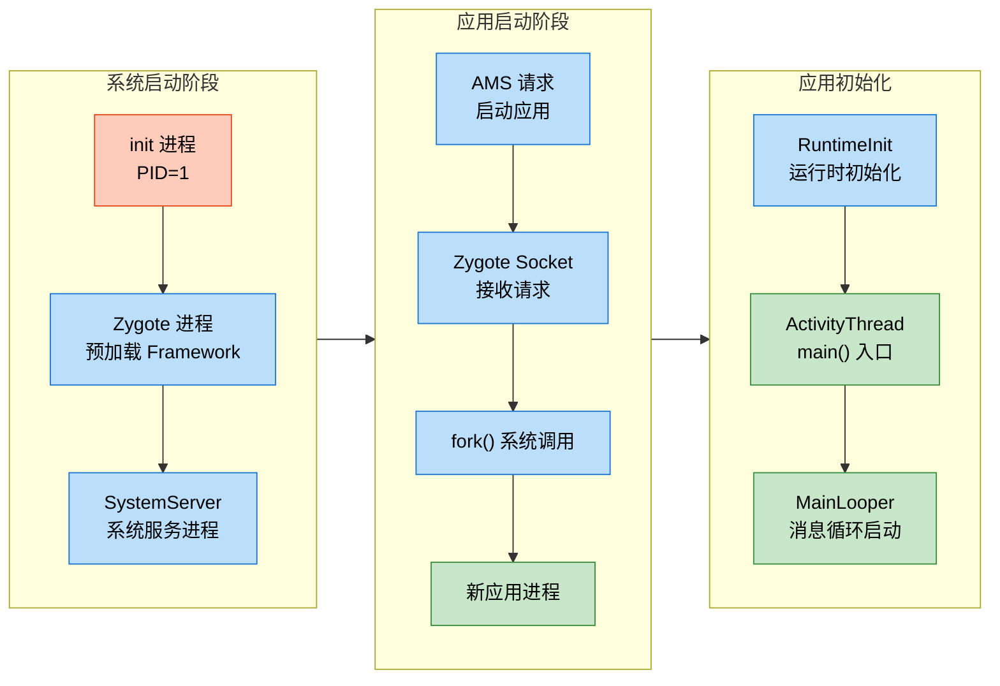
```mermaid
graph LR
    subgraph SystemBoot["系统启动阶段"]
        direction TB
        A["init 进程<br/>PID=1"]
        B["Zygote 进程<br/>预加载 Framework"]
        C["SystemServer<br/>系统服务进程"]
        A --> B
        B --> C
    end
    
    subgraph AppLaunch["应用启动阶段"]
        direction TB
        D["AMS 请求<br/>启动应用"]
        E["Zygote Socket<br/>接收请求"]
        F["fork() 系统调用"]
        G["新应用进程"]
        D --> E
        E --> F
        F --> G
    end
    
    subgraph AppInit["应用初始化"]
        direction TB
        H["RuntimeInit<br/>运行时初始化"]
        I["ActivityThread<br/>main() 入口"]
        J["MainLooper<br/>消息循环启动"]
        H --> I
        I --> J
    end
    
    SystemBoot --> AppLaunch
    AppLaunch --> AppInit
    
    classDef kernelStyle fill:#FFCCBC,stroke:#E64A19,color:#000
    classDef frameworkStyle fill:#BBDEFB,stroke:#1976D2,color:#000
    classDef appStyle fill:#C8E6C9,stroke:#388E3C,color:#000
    classDef processStyle fill:#E1BEE7,stroke:#7B1FA2,color:#000
    
    class A kernelStyle
    class B,C,D,E,F,H frameworkStyle
    class G,I,J appStyle
```

#### 从点击图标到进程诞生：完整流程剖析

当用户点击 Launcher 上的应用图标时，会触发一系列跨进程通信，最终导致新进程的诞生。让我们详细追踪这个过程：

**第一阶段：Launcher 发起启动请求**

Launcher 本身也是一个普通的 Android 应用，当用户点击图标时，它会调用 `startActivity()` 方法。这个调用会通过 Binder IPC 传递到 **ActivityManagerService (AMS)**，AMS 是运行在 SystemServer 进程中的核心系统服务，负责管理所有应用的 Activity 生命周期和进程调度。

**第二阶段：AMS 判断是否需要创建新进程**

AMS 收到启动请求后，首先会检查目标应用的进程是否已经存在。如果进程已存在，AMS 会直接通知该进程启动目标 Activity；如果进程不存在，AMS 就需要请求 Zygote 创建新进程。这个判断逻辑位于 `ActivityManagerService.startProcessLocked()` 方法中。

**第三阶段：通过 Socket 与 Zygote 通信**

AMS 与 Zygote 之间的通信并非使用 Binder，而是使用 **Unix Domain Socket**。这是因为 Zygote 进程启动时 Binder 机制尚未完全初始化，而且 Socket 通信对于这种简单的进程创建请求已经足够高效。AMS 通过 `ZygoteProcess.start()` 方法向 Zygote 发送请求，请求中包含了新进程需要的各种参数：目标类名、UID、GID、运行时标志等。

**第四阶段：Zygote fork 新进程**

Zygote 进程中有一个专门的线程在监听 Socket 连接。当收到 AMS 的请求后，Zygote 调用 `Zygote.forkAndSpecialize()` 方法执行 fork 操作。fork 之后，父进程（Zygote）继续监听下一个请求，而子进程则开始执行应用特定的初始化逻辑。

```java
// ZygoteConnection.java 中的核心逻辑（简化版）
// 这段代码展示了 Zygote 如何处理来自 AMS 的进程创建请求
public Runnable processCommand(ZygoteServer zygoteServer, boolean multipleOK) {
    // 解析来自 AMS 的参数，包括 uid、gid、目标类名等
    ZygoteArguments parsedArgs = ZygoteArguments.getInstance(args);
    
    // 执行 fork 系统调用，这是进程诞生的关键时刻
    // fork 返回两次：在父进程中返回子进程 PID，在子进程中返回 0
    int pid = Zygote.forkAndSpecialize(
        parsedArgs.mUid,           // 新进程的用户 ID
        parsedArgs.mGid,           // 新进程的组 ID
        parsedArgs.mGids,          // 补充组 ID 数组
        parsedArgs.mRuntimeFlags,  // 运行时标志，如是否开启调试
        rlimits,                   // 资源限制配置
        parsedArgs.mMountExternal, // 外部存储挂载模式
        parsedArgs.mSeInfo,        // SELinux 安全信息
        parsedArgs.mNiceName,      // 进程的友好名称
        fdsToClose,                // 需要关闭的文件描述符
        fdsToIgnore,               // 需要忽略的文件描述符
        parsedArgs.mStartChildZygote,  // 是否启动子 Zygote
        parsedArgs.mInstructionSet,    // CPU 指令集
        parsedArgs.mAppDataDir,        // 应用数据目录
        parsedArgs.mIsTopApp           // 是否为前台应用
    );
    
    if (pid == 0) {
        // 子进程分支：这里是新应用进程的起点
        // 关闭从父进程继承的 Zygote Socket，子进程不需要它
        zygoteServer.closeServerSocket();
        
        // 返回一个 Runnable，稍后会执行 ActivityThread.main()
        return handleChildProc(parsedArgs, childPipeFd, parsedArgs.mStartChildZygote);
    } else {
        // 父进程分支：Zygote 继续等待下一个请求
        // 向 AMS 返回新进程的 PID
        handleParentProc(pid, serverPipeFd);
        return null;
    }
}
```

**第五阶段：新进程初始化**

fork 完成后，新进程会执行 `RuntimeInit.zygoteInit()` 方法进行运行时初始化。这个阶段会完成以下关键工作：

1. **设置默认的 UncaughtExceptionHandler**：确保未捕获的异常能够被正确处理和上报
2. **设置时区和语言环境**：继承系统的区域设置
3. **初始化 Binder 线程池**：调用 `ZygoteInit.nativeZygoteInit()` 启动 Binder 线程，使新进程能够接收来自其他进程的 Binder 调用
4. **调用应用入口方法**：通过反射调用 `ActivityThread.main()` 方法

#### 为什么选择 fork 而非 exec？

理解 Android 选择 fork 机制的原因，有助于我们更深入地理解系统设计哲学。在传统的 Unix/Linux 系统中，创建新进程通常使用 `fork + exec` 组合：fork 创建进程副本，exec 加载新的可执行文件。但 Android 只使用 fork，不使用 exec，这是一个经过深思熟虑的设计决策。

**性能优势**：如果使用 exec，每个新应用都需要重新加载 Dalvik/ART 虚拟机、Framework 类库、系统资源等，这个过程可能需要数秒钟。而通过 fork，新进程直接继承 Zygote 已加载的所有内容，应用启动时间可以缩短到几百毫秒甚至更短。

**内存优势**：由于 COW 机制，所有应用进程共享 Zygote 预加载的只读内存页面（如 Framework 类的代码段）。这意味着系统中运行 10 个应用和运行 100 个应用，Framework 代码占用的物理内存是相同的。这对于内存受限的移动设备来说至关重要。

**一致性优势**：所有应用都从相同的 Zygote 状态 fork 而来，确保了运行环境的一致性。这减少了因环境差异导致的兼容性问题。

### UID/PID：进程的身份标识

#### Linux 进程标识基础

在深入 Android 的进程标识机制之前，我们需要先理解 Linux 系统中的基本概念。每个 Linux 进程都有两个核心标识符：

**PID (Process ID)**：进程标识符，是系统分配给每个进程的唯一数字。PID 在进程的整个生命周期内保持不变，进程终止后 PID 可能被回收并分配给新进程。在 Android 中，我们可以通过 `android.os.Process.myPid()` 获取当前进程的 PID。

**UID (User ID)**：用户标识符，表示进程所属的用户。在传统 Linux 系统中，UID 用于区分不同的登录用户；而在 Android 中，UID 被赋予了全新的含义——它用于区分不同的应用程序。

#### Android 的 UID 分配策略

Android 对 Linux 的 UID 机制进行了创造性的改造，将其用于实现应用沙箱隔离。每个应用在安装时都会被分配一个唯一的 UID，这个 UID 在应用的整个生命周期内保持不变（除非应用被卸载后重新安装）。

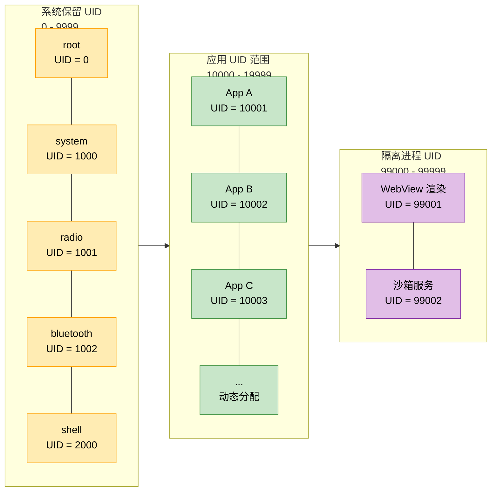
```mermaid
graph LR
    subgraph SystemUID["系统保留 UID<br/>0 - 9999"]
        direction TB
        S1["root<br/>UID = 0"]
        S2["system<br/>UID = 1000"]
        S3["radio<br/>UID = 1001"]
        S4["bluetooth<br/>UID = 1002"]
        S5["shell<br/>UID = 2000"]
        S1 --- S2
        S2 --- S3
        S3 --- S4
        S4 --- S5
    end
    
    subgraph AppUID["应用 UID 范围<br/>10000 - 19999"]
        direction TB
        A1["App A<br/>UID = 10001"]
        A2["App B<br/>UID = 10002"]
        A3["App C<br/>UID = 10003"]
        A4["...<br/>动态分配"]
        A1 --- A2
        A2 --- A3
        A3 --- A4
    end
    
    subgraph IsolatedUID["隔离进程 UID<br/>99000 - 99999"]
        direction TB
        I1["WebView 渲染<br/>UID = 99001"]
        I2["沙箱服务<br/>UID = 99002"]
        I1 --- I2
    end
    
    SystemUID --> AppUID
    AppUID --> IsolatedUID
    
    classDef systemStyle fill:#FFECB3,stroke:#FFA000,color:#000
    classDef appStyle fill:#C8E6C9,stroke:#388E3C,color:#000
    classDef isolatedStyle fill:#E1BEE7,stroke:#7B1FA2,color:#000
    
    class S1,S2,S3,S4,S5 systemStyle
    class A1,A2,A3,A4 appStyle
    class I1,I2 isolatedStyle
```

**系统 UID 范围 (0 - 9999)**：这个范围保留给系统核心进程和服务。例如：
- UID 0 是 root 用户，拥有最高权限
- UID 1000 是 system 用户，SystemServer 进程运行在这个 UID 下
- UID 2000 是 shell 用户，adb shell 命令运行在这个 UID 下

**应用 UID 范围 (10000 - 19999)**：普通应用的 UID 从 10000 开始分配。PackageManagerService 在安装应用时负责分配 UID，它会选择一个未被使用的 UID 分配给新应用。这个 UID 会被记录在 `/data/system/packages.xml` 文件中。

**隔离进程 UID 范围 (99000 - 99999)**：用于运行在隔离沙箱中的进程，如 WebView 的渲染进程。这些进程拥有极其有限的权限，即使被攻击也难以对系统造成危害。

#### SharedUserId：打破沙箱的合法途径

默认情况下，每个应用都运行在独立的沙箱中，无法访问其他应用的数据。但有时候，同一开发者的多个应用需要共享数据，Android 提供了 **SharedUserId** 机制来满足这一需求。

```xml
<!-- 在 AndroidManifest.xml 中声明 SharedUserId -->
<!-- 注意：从 Android 10 开始，SharedUserId 已被标记为废弃 -->
<manifest xmlns:android="http://schemas.android.com/apk/res/android"
    package="com.example.app1"
    android:sharedUserId="com.example.shared">
    
    <!-- 应用组件声明 -->
    
</manifest>
```

当多个应用声明相同的 `sharedUserId` 并且使用相同的签名证书时，它们会被分配相同的 UID。这意味着：

1. **文件共享**：这些应用可以直接访问彼此的私有文件目录
2. **进程共享**：通过配置 `android:process` 属性，这些应用甚至可以运行在同一个进程中
3. **权限共享**：一个应用获得的权限，其他共享 UID 的应用也能使用

然而，SharedUserId 机制存在诸多问题，Google 已在 Android 10 中将其标记为废弃（deprecated）。主要问题包括：

- **安全风险**：共享 UID 的应用之间没有任何隔离，一个应用的漏洞可能影响所有共享应用
- **升级困难**：一旦应用使用了 SharedUserId，就无法在后续版本中移除它（会导致数据丢失）
- **签名限制**：所有共享 UID 的应用必须使用相同的签名，增加了密钥管理的复杂性

现代 Android 开发推荐使用 **ContentProvider**、**FileProvider** 或 **Android 11 引入的 Package Visibility** 机制来实现应用间的数据共享。

#### 通过代码获取进程标识

在应用开发中，我们经常需要获取当前进程的 UID 和 PID 信息，用于日志记录、调试或权限检查：

```kotlin
// ProcessIdentityHelper.kt
// 演示如何获取和使用进程标识信息

import android.os.Process
import android.util.Log

object ProcessIdentityHelper {
    
    private const val TAG = "ProcessIdentity"
    
    /**
     * 获取并打印当前进程的完整标识信息
     * 这在调试多进程应用时特别有用
     */
    fun logProcessIdentity() {
        // 获取当前进程的 PID（进程标识符）
        // 每次应用启动时 PID 可能不同，因为它是系统动态分配的
        val pid: Int = Process.myPid()
        
        // 获取当前进程的 UID（用户标识符）
        // UID 在应用安装后保持不变，除非应用被卸载重装
        val uid: Int = Process.myUid()
        
        // 获取当前线程的 TID（线程标识符）
        // 在主线程中，TID 等于 PID
        val tid: Int = Process.myTid()
        
        // 将 UID 转换为更易读的应用 ID 格式
        // 应用 ID = UID - 10000（对于普通应用）
        val appId: Int = uid % 100000  // 处理多用户场景
        
        // 检查当前进程是否为 64 位进程
        val is64Bit: Boolean = Process.is64Bit()
        
        // 获取当前进程的用户句柄（多用户场景）
        val userHandle: Int = uid / 100000
        
        Log.d(TAG, """
            |========== 进程标识信息 ==========
            |PID (进程ID): $pid
            |UID (用户ID): $uid
            |TID (线程ID): $tid
            |App ID: $appId
            |User Handle: $userHandle
            |Is 64-bit: $is64Bit
            |==================================
        """.trimMargin())
    }
    
    /**
     * 检查调用者是否具有系统级权限
     * 这在实现需要权限验证的 Service 或 ContentProvider 时很有用
     */
    fun isSystemCaller(callingUid: Int): Boolean {
        // 系统进程的 UID 范围是 0-9999
        // UID 0 是 root，UID 1000 是 system
        return callingUid < Process.FIRST_APPLICATION_UID  // FIRST_APPLICATION_UID = 10000
    }
    
    /**
     * 检查两个 UID 是否属于同一个应用
     * 在多用户设备上，同一应用在不同用户下有不同的 UID
     */
    fun isSameApp(uid1: Int, uid2: Int): Boolean {
        // 通过取模运算提取 App ID，忽略用户 ID 部分
        return (uid1 % 100000) == (uid2 % 100000)
    }
}
```

#### UID 与 Android 安全模型

UID 是 Android 安全模型的基石。系统通过 UID 实现以下安全机制：

**文件系统隔离**：每个应用的私有数据目录（`/data/data/<package_name>`）的所有者就是该应用的 UID。Linux 内核的文件权限机制确保其他 UID 的进程无法访问这些文件。

**进程间通信控制**：当应用 A 尝试通过 Binder 调用应用 B 的服务时，系统会将调用者的 UID 传递给被调用方。被调用方可以通过 `Binder.getCallingUid()` 获取调用者 UID，并据此决定是否允许该调用。

**权限检查**：Android 的权限系统与 UID 紧密绑定。当应用请求某个权限时，系统会将该权限与应用的 UID 关联。后续的权限检查实际上是检查特定 UID 是否拥有特定权限。

### 主线程 MainLooper

#### 为什么需要消息循环？

在深入 MainLooper 的实现细节之前，我们需要理解一个根本性的问题：为什么 Android 应用需要消息循环机制？

想象一下没有消息循环的世界：应用启动后执行完初始化代码就会退出，就像一个普通的命令行程序。但 GUI 应用需要持续响应用户输入、处理系统事件、更新界面显示——这些都是异步发生的，应用必须"活着"等待这些事件。

消息循环（Message Loop）就是解决这个问题的经典模式。它让主线程进入一个无限循环，不断从消息队列中取出消息并处理。当没有消息时，线程会阻塞等待，不消耗 CPU 资源；当有新消息到来时，线程被唤醒并处理消息。这种模式在几乎所有 GUI 框架中都有应用：Windows 的消息泵、macOS 的 RunLoop、Qt 的事件循环等。

#### MainLooper 的诞生时刻

MainLooper 的创建发生在 `ActivityThread.main()` 方法中，这是每个 Android 应用的真正入口点：

```java
// ActivityThread.java（简化版）
// 这是 Android 应用的入口方法，由 Zygote fork 后通过反射调用

public static void main(String[] args) {
    // 第一步：为主线程准备 Looper
    // prepareMainLooper() 会创建一个特殊的 Looper 并标记为主线程 Looper
    // 这个方法只能调用一次，重复调用会抛出异常
    Looper.prepareMainLooper();
    
    // 第二步：创建 ActivityThread 实例
    // ActivityThread 并不是一个 Thread，而是应用的"管家"
    // 它负责管理应用中所有组件的生命周期
    ActivityThread thread = new ActivityThread();
    
    // 第三步：关联到 AMS
    // attach(false) 表示这是一个普通应用（非系统进程）
    // 这个方法会通过 Binder 向 AMS 注册当前应用进程
    thread.attach(false, startSeq);
    
    // 第四步：获取主线程的 Handler
    // 这个 Handler 绑定到主线程的 Looper，用于处理来自 AMS 的消息
    if (sMainThreadHandler == null) {
        sMainThreadHandler = thread.getHandler();
    }
    
    // 第五步：启动消息循环
    // 这是一个无限循环，应用的整个生命周期都在这个循环中度过
    // 只有当 Looper.quit() 被调用时，循环才会退出，应用随之终止
    Looper.loop();
    
    // 如果代码执行到这里，说明消息循环已退出
    // 这通常意味着应用即将终止
    throw new RuntimeException("Main thread loop unexpectedly exited");
}
```

#### Looper、Handler、MessageQueue 三剑客

Android 的消息机制由三个核心类组成，它们协同工作，构成了应用的"神经系统"：

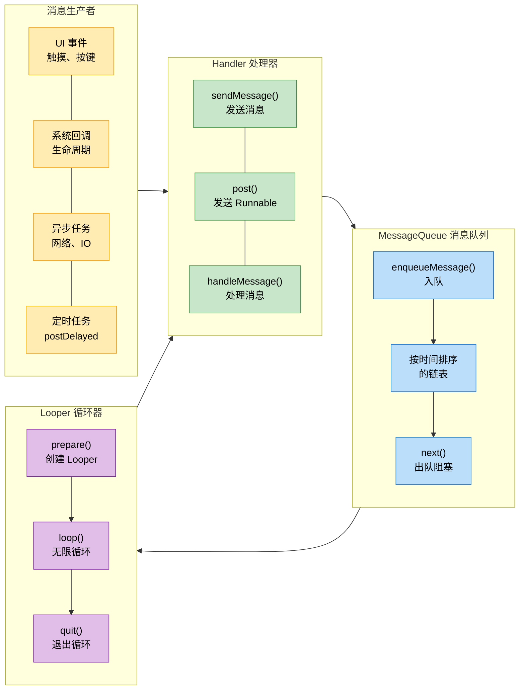
```mermaid
graph LR
    subgraph Producer["消息生产者"]
        direction TB
        P1["UI 事件<br/>触摸、按键"]
        P2["系统回调<br/>生命周期"]
        P3["异步任务<br/>网络、IO"]
        P4["定时任务<br/>postDelayed"]
        P1 --- P2
        P2 --- P3
        P3 --- P4
    end
    
    subgraph Handler["Handler 处理器"]
        direction TB
        H1["sendMessage()<br/>发送消息"]
        H2["post()<br/>发送 Runnable"]
        H3["handleMessage()<br/>处理消息"]
        H1 --- H2
        H2 --- H3
    end
    
    subgraph MessageQueue["MessageQueue 消息队列"]
        direction TB
        M1["enqueueMessage()<br/>入队"]
        M2["按时间排序<br/>的链表"]
        M3["next()<br/>出队阻塞"]
        M1 --> M2
        M2 --> M3
    end
    
    subgraph Looper["Looper 循环器"]
        direction TB
        L1["prepare()<br/>创建 Looper"]
        L2["loop()<br/>无限循环"]
        L3["quit()<br/>退出循环"]
        L1 --> L2
        L2 --> L3
    end
    
    Producer --> Handler
    Handler --> MessageQueue
    MessageQueue --> Looper
    Looper --> Handler
    
    classDef producerStyle fill:#FFECB3,stroke:#FFA000,color:#000
    classDef handlerStyle fill:#C8E6C9,stroke:#388E3C,color:#000
    classDef queueStyle fill:#BBDEFB,stroke:#1976D2,color:#000
    classDef looperStyle fill:#E1BEE7,stroke:#7B1FA2,color:#000
    
    class P1,P2,P3,P4 producerStyle
    class H1,H2,H3 handlerStyle
    class M1,M2,M3 queueStyle
    class L1,L2,L3 looperStyle
```

**Looper（循环器）**：每个线程最多只能有一个 Looper。Looper 的核心职责是不断从 MessageQueue 中取出消息，并将消息分发给对应的 Handler 处理。主线程的 Looper 由系统自动创建，工作线程如果需要处理消息，必须手动调用 `Looper.prepare()` 和 `Looper.loop()`。

**MessageQueue（消息队列）**：这是一个按执行时间排序的优先级队列，底层使用单链表实现。MessageQueue 的 `next()` 方法会阻塞等待，直到有消息可以处理。它还支持同步屏障（Sync Barrier）机制，用于优先处理异步消息（如 UI 渲染）。

**Handler（处理器）**：Handler 是消息的发送者和处理者。每个 Handler 在创建时会绑定到当前线程的 Looper。通过 Handler 发送的消息会进入其绑定 Looper 的 MessageQueue，最终由该 Looper 所在的线程处理。

#### 深入 Looper.loop() 的实现

`Looper.loop()` 是整个消息机制的核心，让我们深入分析它的实现：

```java
// Looper.java 中的 loop() 方法（简化版）
// 这个方法包含了应用主线程的核心循环逻辑

public static void loop() {
    // 获取当前线程的 Looper 实例
    // 如果当前线程没有调用过 prepare()，这里会返回 null
    final Looper me = myLooper();
    if (me == null) {
        throw new RuntimeException("No Looper; Looper.prepare() wasn't called on this thread.");
    }
    
    // 获取 Looper 关联的 MessageQueue
    final MessageQueue queue = me.mQueue;
    
    // 确保当前线程的身份是本进程的身份
    ```java
    // 这是一个安全检查，确保 Binder 调用的身份正确
    Binder.clearCallingIdentity();
    final long ident = Binder.clearCallingIdentity();
    
    // 进入无限循环，这就是"消息循环"的本体
    // 应用的整个生命周期都在这个 for 循环中度过
    for (;;) {
        // 从消息队列中获取下一条消息
        // 这是一个可能阻塞的调用：如果队列为空，线程会在这里等待
        // 底层使用 Linux 的 epoll 机制实现高效等待
        Message msg = queue.next();  // might block
        
        // 如果 next() 返回 null，说明消息队列正在退出
        // 这通常发生在调用 Looper.quit() 之后
        if (msg == null) {
            // 没有消息表示消息队列正在退出，结束循环
            return;
        }
        
        // 用于性能监控的日志打印器
        // 可以通过 Looper.setMessageLogging() 设置
        final Printer logging = me.mLogging;
        if (logging != null) {
            // 打印消息开始处理的日志，格式如：>>>>> Dispatching to Handler...
            logging.println(">>>>> Dispatching to " + msg.target + " " +
                    msg.callback + ": " + msg.what);
        }
        
        // 记录消息开始处理的时间，用于检测 ANR
        final long dispatchStart = SystemClock.uptimeMillis();
        
        // ★★★ 核心：将消息分发给目标 Handler 处理 ★★★
        // msg.target 就是发送这条消息的 Handler
        // dispatchMessage() 会调用 Handler 的 handleMessage() 或执行 Runnable
        msg.target.dispatchMessage(msg);
        
        // 记录消息处理结束的时间
        final long dispatchEnd = SystemClock.uptimeMillis();
        
        // 检查消息处理是否超时（可能导致 ANR）
        final long newIdent = Binder.clearCallingIdentity();
        if (ident != newIdent) {
            // 如果身份发生变化，记录警告日志
            Log.wtf(TAG, "Thread identity changed from 0x"
                    + Long.toHexString(ident) + " to 0x"
                    + Long.toHexString(newIdent) + " while dispatching to "
                    + msg.target.getClass().getName() + " "
                    + msg.callback + " what=" + msg.what);
        }
        
        if (logging != null) {
            // 打印消息处理完成的日志
            logging.println("<<<<< Finished to " + msg.target + " " + msg.callback);
        }
        
        // 回收 Message 对象到对象池，避免频繁创建对象
        // Message 使用享元模式，通过 obtain() 获取，通过 recycle() 回收
        msg.recycleUnchecked();
    }
}
```

#### 主线程阻塞与 ANR 的关系

一个常见的误解是"主线程不能阻塞"。实际上，主线程在 `MessageQueue.next()` 中大部分时间都处于阻塞状态——这是正常的，因为没有消息需要处理时，线程应该休眠以节省 CPU 资源。

真正导致 ANR（Application Not Responding）的不是阻塞本身，而是 **消息处理时间过长**。当一条消息的处理时间超过阈值时，系统会认为应用无响应：

- **输入事件**：5 秒内未处理完成
- **广播接收器**：前台广播 10 秒，后台广播 60 秒
- **Service**：前台服务 20 秒，后台服务 200 秒

```kotlin
// ANR 风险示例与正确做法对比

class MainActivity : AppCompatActivity() {
    
    // ❌ 错误做法：在主线程执行耗时操作
    // 这会阻塞消息循环，导致后续的 UI 事件无法及时处理
    fun badPractice() {
        // 假设这是一个点击事件的处理方法
        val result = performHeavyComputation()  // 耗时 3 秒
        updateUI(result)
        // 在这 3 秒内，用户的任何触摸操作都不会得到响应
        // 如果用户在此期间点击屏幕，5 秒后就会触发 ANR
    }
    
    // ✅ 正确做法：将耗时操作移到后台线程
    fun goodPractice() {
        // 使用协程在 IO 调度器上执行耗时操作
        lifecycleScope.launch {
            // withContext 会挂起当前协程，但不会阻塞主线程
            // 主线程可以继续处理其他消息
            val result = withContext(Dispatchers.IO) {
                performHeavyComputation()  // 在后台线程执行
            }
            // 自动切回主线程更新 UI
            updateUI(result)
        }
    }
    
    // ✅ 另一种正确做法：使用 Handler 切换线程
    fun goodPracticeWithHandler() {
        // 创建后台线程
        Thread {
            // 在后台线程执行耗时操作
            val result = performHeavyComputation()
            
            // 通过 Handler 将结果发送回主线程
            // mainLooper 是主线程的 Looper
            Handler(Looper.getMainLooper()).post {
                // 这个 Runnable 会在主线程执行
                updateUI(result)
            }
        }.start()
    }
    
    private fun performHeavyComputation(): String {
        // 模拟耗时计算
        Thread.sleep(3000)
        return "计算结果"
    }
    
    private fun updateUI(result: String) {
        // 更新界面
        textView.text = result
    }
}
```

#### 主线程与 UI 线程的关系

在 Android 中，"主线程"和"UI 线程"通常指的是同一个线程，但严格来说它们是两个不同的概念：

**主线程（Main Thread）**：应用进程启动时创建的第一个线程，运行 `ActivityThread.main()` 方法，拥有 MainLooper。

**UI 线程（UI Thread）**：负责处理 UI 操作的线程。Android 的 View 系统不是线程安全的，所有 UI 操作必须在 UI 线程执行。

在绝大多数情况下，主线程就是 UI 线程。但在某些特殊场景下（如使用 `WindowManager` 在其他线程创建窗口），UI 线程可能不是主线程。不过这种情况极为罕见，在日常开发中可以认为主线程 = UI 线程。

```kotlin
// 检查当前是否在主线程

fun isOnMainThread(): Boolean {
    // 方法一：比较 Looper
    // 如果当前线程的 Looper 是 MainLooper，说明在主线程
    return Looper.myLooper() == Looper.getMainLooper()
}

fun isOnMainThreadAlternative(): Boolean {
    // 方法二：比较线程对象
    // mainLooper.thread 返回主线程的 Thread 对象
    return Thread.currentThread() == Looper.getMainLooper().thread
}

// 确保代码在主线程执行的工具方法
inline fun runOnMainThread(crossinline action: () -> Unit) {
    if (isOnMainThread()) {
        // 已经在主线程，直接执行
        action()
    } else {
        // 不在主线程，通过 Handler 切换到主线程
        Handler(Looper.getMainLooper()).post { action() }
    }
}
```

#### HandlerThread：自带 Looper 的工作线程

当我们需要在后台线程中使用 Handler 机制时，可以使用 `HandlerThread`。它是一个已经配置好 Looper 的线程，开箱即用：

```kotlin
// HandlerThread 使用示例

class BackgroundTaskManager {
    
    // 创建一个后台 HandlerThread
    // 参数是线程名称，方便在调试时识别
    private val backgroundThread = HandlerThread("BackgroundTaskThread").apply {
        // 设置线程优先级，THREAD_PRIORITY_BACKGROUND 表示后台优先级
        // 这样不会与 UI 线程竞争 CPU 资源
        priority = Process.THREAD_PRIORITY_BACKGROUND
        // 启动线程，这会创建 Looper 并开始消息循环
        start()
    }
    
    // 创建绑定到后台线程的 Handler
    // 通过这个 Handler 发送的消息会在后台线程处理
    private val backgroundHandler = Handler(backgroundThread.looper) { msg ->
        // 这个 lambda 在后台线程执行
        when (msg.what) {
            MSG_DOWNLOAD -> handleDownload(msg.obj as String)
            MSG_PROCESS -> handleProcess(msg.obj as ByteArray)
        }
        true  // 返回 true 表示消息已处理
    }
    
    // 主线程 Handler，用于将结果回调到主线程
    private val mainHandler = Handler(Looper.getMainLooper())
    
    /**
     * 在后台线程执行下载任务
     */
    fun downloadInBackground(url: String) {
        // 创建消息并发送到后台线程
        backgroundHandler.obtainMessage(MSG_DOWNLOAD, url).sendToTarget()
    }
    
    /**
     * 清理资源
     * 在不需要时必须调用，否则后台线程会一直运行
     */
    fun shutdown() {
        // quitSafely() 会处理完队列中的消息后退出
        // quit() 会立即退出，丢弃未处理的消息
        backgroundThread.quitSafely()
    }
    
    private fun handleDownload(url: String) {
        // 这个方法在后台线程执行
        val data = performDownload(url)
        
        // 下载完成后，切换到主线程更新 UI
        mainHandler.post {
            onDownloadComplete(data)
        }
    }
    
    companion object {
        private const val MSG_DOWNLOAD = 1
        private const val MSG_PROCESS = 2
    }
}
```

#### 消息机制的内存模型

理解消息机制的内存结构有助于避免内存泄漏：

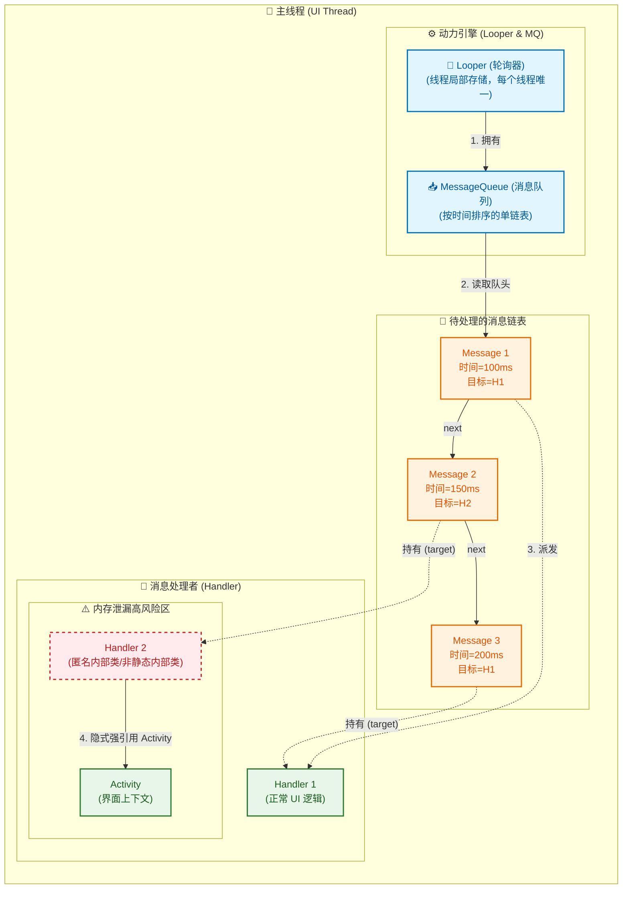
```mermaid
graph LR
    %% --- 样式定义 ---
    classDef fw fill:#E1F5FE,stroke:#0277bd,stroke-width:2px,color:#01579b
    classDef app fill:#E8F5E9,stroke:#2E7D32,stroke-width:2px,color:#1B5E20
    classDef data fill:#FFF3E0,stroke:#EF6C00,stroke-width:2px,color:#E65100
    classDef warn fill:#FFEBEE,stroke:#C62828,stroke-width:2px,stroke-dasharray: 5 5,color:#B71C1C

    subgraph MAIN_THREAD ["🧵 主线程 (UI Thread)"]
        direction TB

        %% 1. 核心循环系统
        subgraph ENGINE ["⚙️ 动力引擎 (Looper & MQ)"]
            direction TB
            LOOPER["🔄 Looper (轮询器)\n(线程局部存储，每个线程唯一)"]:::fw
            MQ["📥 MessageQueue (消息队列)\n(按时间排序的单链表)"]:::fw
        end

        %% 2. 消息链表
        subgraph LIST ["📨 待处理的消息链表"]
            direction LR
            M1["Message 1\n时间=100ms\n目标=H1"]:::data
            M2["Message 2\n时间=150ms\n目标=H2"]:::data
            M3["Message 3\n时间=200ms\n目标=H1"]:::data
        end

        %% 3. 处理者与上下文
        subgraph CONSUMERS ["📱 消息处理者 (Handler)"]
            direction TB
            H1["Handler 1\n(正常 UI 逻辑)"]:::app
            
            subgraph LEAK_RISK ["⚠️ 内存泄漏高风险区"]
                direction TB
                H2["Handler 2\n(匿名内部类/非静态内部类)"]:::warn
                ACT["Activity\n(界面上下文)"]:::app
            end
        end
    end

    %% --- 关系连接 ---
    LOOPER -- "1. 拥有" --> MQ
    MQ -- "2. 读取队头" --> M1
    
    M1 -- "next" --> M2
    M2 -- "next" --> M3
    
    M1 -.->|"3. 派发"| H1
    M2 -.->|"持有 (target)"| H2
    M3 -.->|"持有 (target)"| H1
    
    H2 -- "4. 隐式强引用 Activity" --> ACT
```

**内存泄漏的典型场景**：当 Handler 作为 Activity 的内部类时，它会隐式持有 Activity 的引用。如果 Handler 中有延迟消息（如 `postDelayed`），而 Activity 在消息处理前被销毁，Activity 就无法被垃圾回收，造成内存泄漏。

```kotlin
// ❌ 内存泄漏示例
class LeakyActivity : AppCompatActivity() {
    
    // 内部类 Handler 隐式持有外部类 Activity 的引用
    private val handler = object : Handler(Looper.getMainLooper()) {
        override fun handleMessage(msg: Message) {
            // 处理消息时访问 Activity 的成员
            updateUI()
        }
    }
    
    override fun onCreate(savedInstanceState: Bundle?) {
        super.onCreate(savedInstanceState)
        // 发送一个 10 分钟后执行的延迟消息
        handler.sendEmptyMessageDelayed(0, 10 * 60 * 1000)
    }
    
    // 如果用户在 10 分钟内退出 Activity，Activity 无法被回收
    // 因为 Message 持有 Handler，Handler 持有 Activity
}

// ✅ 正确做法：使用静态内部类 + 弱引用
class SafeActivity : AppCompatActivity() {
    
    // 静态内部类不持有外部类引用
    private class SafeHandler(activity: SafeActivity) : Handler(Looper.getMainLooper()) {
        // 使用弱引用持有 Activity
        private val activityRef = WeakReference(activity)
        
        override fun handleMessage(msg: Message) {
            // 通过弱引用获取 Activity，可能为 null
            val activity = activityRef.get() ?: return
            activity.updateUI()
        }
    }
    
    private val handler = SafeHandler(this)
    
    override fun onDestroy() {
        super.onDestroy()
        // 移除所有待处理的消息，彻底切断引用链
        handler.removeCallbacksAndMessages(null)
    }
}
```

---

**📝 练习题**

某应用在启动时崩溃，日志显示 `RuntimeException: Can't create handler inside thread that has not called Looper.prepare()`。以下哪种情况最可能导致这个错误？

A. 在 Application.onCreate() 中创建 Handler
B. 在 Activity.onCreate() 中创建 Handler
C. 在 Thread { }.start() 的 run 方法中直接创建 Handler
D. 在 Service.onStartCommand() 中创建 Handler

**【答案】** C

**【解析】** 这道题考查的是 Handler 与 Looper 的绑定关系。Handler 在创建时需要绑定到当前线程的 Looper，如果当前线程没有 Looper，就会抛出这个异常。

- **选项 A**：Application.onCreate() 运行在主线程，主线程在 ActivityThread.main() 中已经调用了 `Looper.prepareMainLooper()`，所以可以正常创建 Handler。
- **选项 B**：Activity.onCreate() 同样运行在主线程，有 MainLooper，可以正常创建 Handler。
- **选项 C（正确答案）**：通过 `Thread { }.start()` 创建的新线程是一个普通的工作线程，默认没有 Looper。在这个线程中直接创建 Handler 会失败。正确做法是先调用 `Looper.prepare()`，或者使用 `HandlerThread`。
- **选项 D**：Service.onStartCommand() 也运行在主线程（除非 Service 配置了独立进程），有 MainLooper，可以正常创建 Handler。

---

## 进程优先级与保活

Android 系统运行在资源受限的移动设备上，内存管理是系统稳定性的核心挑战之一。当系统内存紧张时，必须决定"杀死哪些进程"来回收资源。这个决策机制的核心就是 **进程优先级（Process Priority）** 系统。理解这套机制，不仅能帮助开发者写出更"长寿"的应用，更能深刻理解 Android 的设计哲学：**用户体验优先，资源按需分配**。

### OOM_ADJ 策略与 LMK 机制

#### 什么是 OOM_ADJ

**OOM_ADJ（Out of Memory Adjustment）** 是 Linux 内核提供的一种进程优先级调整机制，Android 在此基础上构建了一套精细化的进程管理策略。每个进程都有一个 `oom_adj` 值（在较新系统中演进为 `oom_score_adj`），这个数值直接决定了进程在内存回收时的"生死顺序"。

**核心原则非常直观**：`oom_adj` 值越大，进程越容易被杀死；值越小（甚至为负数），进程越受保护。这就像一个"危险系数"——系数越高，在资源紧张时越先被"牺牲"。

Android Framework 层的 `ActivityManagerService（AMS）` 负责根据进程当前的状态（是否有前台 Activity、是否正在播放音乐、是否有绑定的 Service 等）动态计算并更新每个进程的 `oom_adj` 值。这个计算过程相当复杂，涉及到组件状态、用户交互、进程依赖关系等多个维度。

#### OOM_ADJ 数值体系

Android 定义了一系列常量来表示不同的进程优先级等级，这些常量定义在 `ProcessList` 类中：

```kotlin
/**
 * Android 进程优先级常量定义
 * 数值越小 = 优先级越高 = 越不容易被杀
 * 数值越大 = 优先级越低 = 越容易被杀
 */
object ProcessOomAdjConstants {
    // ==================== 系统关键进程 ====================
    const val NATIVE_ADJ = -1000          // 原生系统进程，如 init、zygote，绝对不能杀
    const val SYSTEM_ADJ = -900           // system_server 进程，系统核心，杀了就重启
    const val PERSISTENT_PROC_ADJ = -800  // 持久化进程，如电话、蓝牙等核心系统应用
    
    // ==================== 前台相关进程 ====================
    const val FOREGROUND_APP_ADJ = 0      // 前台应用，用户正在交互，最高应用优先级
    const val VISIBLE_APP_ADJ = 100       // 可见但非前台，如被对话框部分遮挡的 Activity
    const val PERCEPTIBLE_APP_ADJ = 200   // 用户可感知，如后台播放音乐、正在导航
    
    // ==================== 后台服务进程 ====================
    const val BACKUP_APP_ADJ = 300        // 正在执行备份操作的进程
    const val HEAVY_WEIGHT_APP_ADJ = 400  // 重量级后台应用，有大量状态需要保存
    const val SERVICE_ADJ = 500           // 持有已启动 Service 的进程
    const val HOME_APP_ADJ = 600          // Launcher 桌面进程，特殊保护
    const val PREVIOUS_APP_ADJ = 700      // 上一个前台应用，方便用户快速切回
    
    // ==================== 缓存进程 ====================
    const val SERVICE_B_ADJ = 800         // 老旧 Service 进程，B 类服务
    const val CACHED_APP_MIN_ADJ = 900    // 缓存进程最小值
    const val CACHED_APP_MAX_ADJ = 999    // 缓存进程最大值，最容易被杀
}
```

#### Low Memory Killer（LMK）机制

**LMK（Low Memory Killer）** 是 Android 特有的内存回收机制，它是标准 Linux OOM Killer 的增强版本。传统的 Linux OOM Killer 只在内存完全耗尽时才触发，这对于移动设备来说太"迟钝"了——等到内存耗尽，系统早已卡顿得无法使用。

LMK 的设计思想是 **"未雨绸缪，分级回收"**。它定义了多个内存阈值（memory threshold），当可用内存降到某个阈值以下时，就开始杀死对应优先级及以下的进程：

```kotlin
/**
 * LMK 内存阈值与进程优先级对应关系示意
 * 实际阈值由系统根据设备内存大小动态计算
 */
data class LmkThreshold(
    val memoryThresholdMB: Int,  // 当可用内存低于此值时触发
    val minOomAdj: Int,          // 开始杀死 oom_adj >= 此值的进程
    val description: String      // 描述
)

val lmkThresholds = listOf(
    // 内存非常充足时，只清理最低优先级的缓存进程
    LmkThreshold(memoryThresholdMB = 64, minOomAdj = 900, description = "清理缓存进程"),
    
    // 内存开始紧张，清理更多后台进程
    LmkThreshold(memoryThresholdMB = 48, minOomAdj = 700, description = "清理后台应用"),
    
    // 内存紧张，开始影响服务进程
    LmkThreshold(memoryThresholdMB = 32, minOomAdj = 500, description = "清理服务进程"),
    
    // 内存严重不足，可感知进程也可能被杀
    LmkThreshold(memoryThresholdMB = 16, minOomAdj = 200, description = "清理可感知进程"),
    
    // 内存极度紧张，可见进程也不安全
    LmkThreshold(memoryThresholdMB = 8, minOomAdj = 100, description = "清理可见进程"),
    
    // 最后防线，只保护前台和系统进程
    LmkThreshold(memoryThresholdMB = 4, minOomAdj = 0, description = "仅保护前台进程")
)
```

从 Android 10 开始，Google 引入了 **LMKD（Low Memory Killer Daemon）** 作为用户空间的替代方案，它比内核态的 LMK 更加灵活，可以结合 PSI（Pressure Stall Information）等现代内核特性做出更智能的决策。

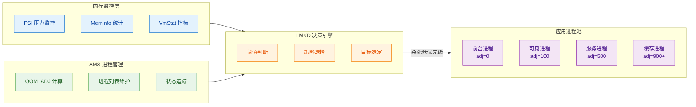
```mermaid
graph LR
    subgraph 内存监控["内存监控层"]
        direction TB
        PSI["PSI 压力监控"]
        MemInfo["MemInfo 统计"]
        VmStat["VmStat 指标"]
    end
    
    subgraph LMKD["LMKD 决策引擎"]
        direction TB
        Threshold["阈值判断"]
        Strategy["策略选择"]
        Target["目标选定"]
    end
    
    subgraph AMS["AMS 进程管理"]
        direction TB
        OomAdj["OOM_ADJ 计算"]
        ProcList["进程列表维护"]
        StateTrack["状态追踪"]
    end
    
    subgraph 进程池["应用进程池"]
        direction TB
        FG["前台进程<br/>adj=0"]
        VIS["可见进程<br/>adj=100"]
        SVC["服务进程<br/>adj=500"]
        CACHE["缓存进程<br/>adj=900+"]
    end
    
    内存监控 --> LMKD
    AMS --> LMKD
    LMKD -->|"杀死低优先级"| 进程池
    
    classDef monitor fill:#E3F2FD,stroke:#1976D2,color:#0D47A1
    classDef lmkd fill:#FFF3E0,stroke:#F57C00,color:#E65100
    classDef ams fill:#E8F5E9,stroke:#43A047,color:#1B5E20
    classDef proc fill:#F3E5F5,stroke:#8E24AA,color:#4A148C
    
    class PSI,MemInfo,VmStat monitor
    class Threshold,Strategy,Target lmkd
    class OomAdj,ProcList,StateTrack ams
    class FG,VIS,SVC,CACHE proc
```

### 前台进程（Foreground Process）

**前台进程是 Android 系统中优先级最高的应用进程**，它代表用户当前正在直接交互的应用。系统会尽一切可能保护前台进程不被杀死——只有在内存极度紧张、不杀死前台进程系统就无法运行的极端情况下，才会考虑终止它。

#### 前台进程的判定条件

一个进程被判定为前台进程，需要满足以下任一条件：

**第一种情况：持有正在与用户交互的 Activity**。这是最常见的前台进程场景。当用户打开一个应用，该应用的 Activity 处于 `onResume()` 状态，能够接收用户的触摸、按键等输入事件，此时该进程就是前台进程。

**第二种情况：持有绑定到前台 Activity 的 Service**。如果一个 Service 被前台 Activity 通过 `bindService()` 绑定，那么持有这个 Service 的进程也会被提升为前台进程。这种设计确保了 Activity 依赖的服务不会在交互过程中被意外杀死。

**第三种情况：持有正在执行生命周期回调的 Service**。当 Service 正在执行 `onCreate()`、`onStartCommand()` 或 `onDestroy()` 等生命周期方法时，系统会临时将其提升为前台优先级，确保这些关键操作能够完成。

**第四种情况：持有正在执行 `onReceive()` 的 BroadcastReceiver**。广播接收器在处理广播时，其所在进程会被临时提升为前台优先级。这就是为什么 `onReceive()` 方法有 10 秒的执行时间限制——系统不希望一个进程长时间占据前台优先级。

```kotlin
/**
 * 演示各种获得前台进程优先级的场景
 */
class ForegroundProcessDemo {
    
    /**
     * 场景一：Activity 处于 resumed 状态
     * 这是最直接的前台进程场景
     */
    class InteractiveActivity : AppCompatActivity() {
        override fun onResume() {
            super.onResume()
            // 此时进程的 oom_adj = FOREGROUND_APP_ADJ (0)
            // 进程处于最高应用优先级，几乎不可能被杀死
            Log.d("Process", "Activity resumed, process is foreground")
        }
        
        override fun onPause() {
            super.onPause()
            // Activity 不再是前台，但如果仍然可见（如被对话框遮挡）
            // 进程会变成可见进程而非前台进程
            Log.d("Process", "Activity paused, priority may decrease")
        }
    }
    
    /**
     * 场景二：Service 被前台 Activity 绑定
     * 绑定关系会"传递"优先级
     */
    class BoundService : Service() {
        // 当前台 Activity 绑定此 Service 时
        // 此 Service 所在进程也会获得前台优先级
        override fun onBind(intent: Intent): IBinder {
            Log.d("Process", "Service bound, inheriting client's priority")
            return LocalBinder()
        }
        
        inner class LocalBinder : Binder() {
            fun getService(): BoundService = this@BoundService
        }
    }
    
    /**
     * 场景三：BroadcastReceiver 正在执行 onReceive
     * 临时获得前台优先级
     */
    class ImportantReceiver : BroadcastReceiver() {
        override fun onReceive(context: Context, intent: Intent) {
            // 在 onReceive 执行期间，进程是前台优先级
            // 但这个窗口期很短（约 10 秒），必须快速完成
            
            // 错误做法：在这里执行耗时操作
            // Thread.sleep(15000) // 会导致 ANR！
            
            // 正确做法：快速处理或启动 Service 处理
            val workIntent = Intent(context, ProcessingService::class.java)
            context.startForegroundService(workIntent)
            
            Log.d("Process", "Receiver executing, temporarily foreground")
        }
    }
}
```

#### 前台 Service 的特殊地位

从 Android 8.0（Oreo）开始，Google 对后台执行施加了严格限制。如果应用需要在后台执行长时间运行的任务，必须使用 **前台 Service（Foreground Service）**。前台 Service 会在通知栏显示一个持续通知，让用户知道应用正在后台运行，同时也让进程获得接近前台的优先级（`PERCEPTIBLE_APP_ADJ`）。

```kotlin
/**
 * 前台 Service 完整实现示例
 * 适用于音乐播放、文件下载、位置追踪等场景
 */
class MusicPlayerService : Service() {
    
    companion object {
        // 通知渠道 ID，Android 8.0+ 必须
        private const val CHANNEL_ID = "music_playback_channel"
        // 前台 Service 通知 ID，必须大于 0
        private const val NOTIFICATION_ID = 1001
    }
    
    override fun onCreate() {
        super.onCreate()
        // 创建通知渠道（Android 8.0+ 必须在显示通知前创建）
        createNotificationChannel()
    }
    
    override fun onStartCommand(intent: Intent?, flags: Int, startId: Int): Int {
        // 构建前台通知
        val notification = buildForegroundNotification()
        
        // 关键调用：将 Service 提升为前台 Service
        // 必须在 Service 启动后 5 秒内调用，否则系统会抛出异常
        startForeground(NOTIFICATION_ID, notification)
        
        // 开始实际的音乐播放逻辑
        startMusicPlayback()
        
        // START_STICKY：Service 被杀后系统会尝试重建
        // 适合需要持续运行的服务
        return START_STICKY
    }
    
    /**
     * 创建通知渠道
     * Android 8.0+ 强制要求，否则通知无法显示
     */
    private fun createNotificationChannel() {
        if (Build.VERSION.SDK_INT >= Build.VERSION_CODES.O) {
            val channel = NotificationChannel(
                CHANNEL_ID,
                "音乐播放",  // 用户可见的渠道名称
                NotificationManager.IMPORTANCE_LOW  // 低重要性，不发出声音
            ).apply {
                description = "显示当前正在播放的音乐"
                // 前台 Service 通知通常不需要震动和声音
                setSound(null, null)
                enableVibration(false)
            }
            
            val notificationManager = getSystemService(NotificationManager::class.java)
            notificationManager.createNotificationChannel(channel)
        }
    }
    
    /**
     * 构建前台 Service 的通知
     * 这个通知会持续显示在通知栏，用户可以看到应用在后台运行
     */
    private fun buildForegroundNotification(): Notification {
        // 点击通知时打开的 Activity
        val pendingIntent = PendingIntent.getActivity(
            this,
            0,
            Intent(this, MusicPlayerActivity::class.java),
            PendingIntent.FLAG_IMMUTABLE  // Android 12+ 必须指定
        )
        
        return NotificationCompat.Builder(this, CHANNEL_ID)
            .setContentTitle("正在播放")
            .setContentText("歌曲名称 - 艺术家")
            .setSmallIcon(R.drawable.ic_music_note)
            .setContentIntent(pendingIntent)
            .setOngoing(true)  // 用户无法滑动删除
            .setCategory(NotificationCompat.CATEGORY_SERVICE)
            // 添加媒体控制按钮
            .addAction(R.drawable.ic_previous, "上一首", createActionIntent("PREVIOUS"))
            .addAction(R.drawable.ic_pause, "暂停", createActionIntent("PAUSE"))
            .addAction(R.drawable.ic_next, "下一首", createActionIntent("NEXT"))
            .setStyle(androidx.media.app.NotificationCompat.MediaStyle()
                .setShowActionsInCompactView(0, 1, 2))
            .build()
    }
    
    private fun createActionIntent(action: String): PendingIntent {
        val intent = Intent(this, MusicPlayerService::class.java).apply {
            this.action = action
        }
        return PendingIntent.getService(
            this, action.hashCode(), intent,
            PendingIntent.FLAG_IMMUTABLE
        )
    }
    
    private fun startMusicPlayback() {
        // 实际的音乐播放逻辑
        Log.d("MusicService", "Starting playback with foreground priority")
    }
    
    override fun onBind(intent: Intent?): IBinder? = null
    
    override fun onDestroy() {
        super.onDestroy()
        // 停止前台状态，移除通知
        stopForeground(STOP_FOREGROUND_REMOVE)
    }
}
```

### 可见进程（Visible Process）

**可见进程是指持有用户可以看到、但不能直接交互的组件的进程**。它的优先级仅次于前台进程，`oom_adj` 值为 `VISIBLE_APP_ADJ (100)`。

#### 可见进程的典型场景

最常见的可见进程场景是 **Activity 被部分遮挡**。例如，当一个 Activity 弹出一个对话框样式的 Activity（`Theme.Dialog`）或者一个透明 Activity 时，底层的 Activity 虽然仍然可见，但已经失去了焦点，无法接收用户输入。此时，底层 Activity 所在的进程就是可见进程。

另一个场景是 **多窗口模式（Split Screen）**。在分屏模式下，两个 Activity 同时可见，但只有一个拥有焦点。没有焦点的那个 Activity 所在进程就是可见进程。

```kotlin
/**
 * 可见进程场景演示
 */
class VisibleProcessDemo {
    
    /**
     * 场景一：Activity 被对话框样式的 Activity 遮挡
     */
    class MainScreenActivity : AppCompatActivity() {
        
        fun showDialogActivity() {
            // 启动一个对话框样式的 Activity
            // 此时 MainScreenActivity 仍然可见（在对话框后面）
            // 但已经不是前台，变成了可见进程
            val intent = Intent(this, DialogStyleActivity::class.java)
            startActivity(intent)
        }
        
        override fun onPause() {
            super.onPause()
            // 被对话框遮挡时会调用 onPause，但不会调用 onStop
            // 因为 Activity 仍然可见
            Log.d("Lifecycle", "Paused but still visible - now a visible process")
        }
        
        override fun onStop() {
            super.onStop()
            // 只有完全不可见时才会调用 onStop
            // 此时进程优先级会进一步降低
            Log.d("Lifecycle", "Stopped and invisible - priority decreased")
        }
    }
    
    /**
     * 对话框样式的 Activity
     * 在 AndroidManifest.xml 中设置 android:theme="@style/Theme.AppCompat.Dialog"
     */
    class DialogStyleActivity : AppCompatActivity() {
        // 这个 Activity 显示为对话框
        // 它所在的进程是前台进程
        // 而被它遮挡的 Activity 所在进程变成可见进程
    }
    
    /**
     * 场景二：使用 Picture-in-Picture 模式
     * 视频播放器缩小为画中画窗口
     */
    class VideoPlayerActivity : AppCompatActivity() {
        
        override fun onUserLeaveHint() {
            super.onUserLeaveHint()
            // 用户按 Home 键时，进入画中画模式
            if (Build.VERSION.SDK_INT >= Build.VERSION_CODES.O) {
                enterPictureInPictureMode(
                    PictureInPictureParams.Builder()
                        .setAspectRatio(Rational(16, 9))
                        .build()
                )
            }
        }
        
        override fun onPictureInPictureModeChanged(
            isInPictureInPictureMode: Boolean,
            newConfig: Configuration
        ) {
            super.onPictureInPictureModeChanged(isInPictureInPictureMode, newConfig)
            if (isInPictureInPictureMode) {
                // 进入画中画模式
                // Activity 仍然可见（小窗口），但不是前台
                // 进程变为可见进程
                Log.d("PiP", "Entered PiP mode - visible process")
            }
        }
    }
}
```

#### 可见进程与前台进程的关键区别

虽然可见进程的优先级很高，但它与前台进程有一个本质区别：**可见进程不能接收用户输入**。这意味着：

1. **生命周期状态不同**：前台 Activity 处于 `RESUMED` 状态，可见 Activity 处于 `STARTED` 或 `PAUSED` 状态
2. **资源分配不同**：系统可能会降低可见进程的 CPU 调度优先级
3. **被杀风险不同**：在内存压力下，可见进程比前台进程更容易被杀死

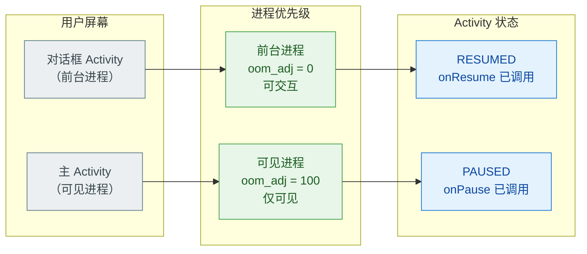
```mermaid
graph LR
    subgraph 用户视角["用户屏幕"]
        direction TB
        Dialog["对话框 Activity<br/>（前台进程）"]
        Main["主 Activity<br/>（可见进程）"]
    end
    
    subgraph 进程状态["进程优先级"]
        direction TB
        FG["前台进程<br/>oom_adj = 0<br/>可交互"]
        VIS["可见进程<br/>oom_adj = 100<br/>仅可见"]
    end
    
    subgraph 生命周期["Activity 状态"]
        direction TB
        Resumed["RESUMED<br/>onResume 已调用"]
        Paused["PAUSED<br/>onPause 已调用"]
    end
    
    Dialog --> FG
    Main --> VIS
    FG --> Resumed
    VIS --> Paused
    
    classDef screen fill:#ECEFF1,stroke:#607D8B,color:#37474F
    classDef priority fill:#E8F5E9,stroke:#43A047,color:#1B5E20
    classDef lifecycle fill:#E3F2FD,stroke:#1976D2,color:#0D47A1
    
    class Dialog,Main screen
    class FG,VIS priority
    class Resumed,Paused lifecycle
```

### 服务进程（Service Process）

**服务进程是指持有已启动 Service（通过 `startService()` 启动）但不属于前台或可见类别的进程**。它的 `oom_adj` 值为 `SERVICE_ADJ (500)`，在内存紧张时有被杀死的风险，但系统会尽量保持它运行。

#### 服务进程的生命周期管理

服务进程的一个重要特性是 **系统可能会在内存紧张时杀死它，但之后会尝试重新启动**。这个行为由 `onStartCommand()` 的返回值控制：

```kotlin
/**
 * Service 重启策略详解
 * onStartCommand 的返回值决定了 Service 被杀后的行为
 */
class ServiceRestartDemo : Service() {
    
    override fun onStartCommand(intent: Intent?, flags: Int, startId: Int): Int {
        // flags 参数说明：
        // 0 - 正常启动
        // START_FLAG_REDELIVERY - 这是重新投递的 Intent（配合 START_REDELIVER_INTENT）
        // START_FLAG_RETRY - 上次 onStartCommand 异常退出后的重试
        
        when {
            // 场景一：数据同步服务
            // 被杀后需要重启，但不需要重新投递 Intent
            intent?.action == "SYNC_DATA" -> {
                performDataSync()
                return START_STICKY
                // START_STICKY：Service 被杀后，系统会重建 Service
                // 但 onStartCommand 收到的 intent 为 null
                // 适合：音乐播放器、位置追踪等需要持续运行的服务
            }
            
            // 场景二：文件上传服务
            // 被杀后需要重启，且必须重新投递原始 Intent
            intent?.action == "UPLOAD_FILE" -> {
                val filePath = intent.getStringExtra("file_path")
                uploadFile(filePath)
                return START_REDELIVER_INTENT
                // START_REDELIVER_INTENT：Service 被杀后，系统会重建 Service
                // 并重新投递最后一个 Intent
                // 适合：文件上传、消息发送等不能丢失任务的服务
            }
            
            // 场景三：一次性任务服务
            // 被杀后不需要重启
            intent?.action == "ONE_TIME_TASK" -> {
                performOneTimeTask()
                return START_NOT_STICKY
                // START_NOT_STICKY：Service 被杀后，系统不会重建
                // 除非有新的 startService 调用
                // 适合：一次性任务，如发送统计数据
            }
            
            else -> return START_NOT_STICKY
        }
    }
    
    /**
     * 服务进程的优先级提升技巧
     * 通过绑定关系可以临时提升优先级
     */
    private val binder = LocalBinder()
    
    inner class LocalBinder : Binder() {
        fun getService(): ServiceRestartDemo = this@ServiceRestartDemo
    }
    
    override fun onBind(intent: Intent): IBinder {
        // 当有客户端绑定时，Service 的优先级会受到客户端影响
        // 如果绑定的是前台 Activity，Service 也会获得前台优先级
        return binder
    }
    
    private fun performDataSync() { /* 同步逻辑 */ }
    private fun uploadFile(path: String?) { /* 上传逻辑 */ }
    private fun performOneTimeTask() { /* 一次性任务 */ }
}
```

#### 服务进程的优先级动态变化

服务进程的优先级并非固定不变，它会根据多种因素动态调整：

```kotlin
/**
 * 服务进程优先级变化示意
 */
class ServicePriorityDemo {
    
    /**
     * 优先级变化场景分析
     */
    fun analyzePriorityChanges() {
        // 场景 1：纯后台 Service，无绑定
        // oom_adj = SERVICE_ADJ (500)
        // 这是服务进程的基准优先级
        
        // 场景 2：被后台 Activity 绑定
        // oom_adj 会提升到与绑定者相近的级别
        // 但不会超过 VISIBLE_APP_ADJ
        
        // 场景 3：被前台 Activity 绑定
        // oom_adj 会提升到 FOREGROUND_APP_ADJ (0)
        // 这是通过绑定提升优先级的常用技巧
        
        // 场景 4：Service 运行时间过长（超过 30 分钟）
        // 系统会将其降级为 SERVICE_B_ADJ (800)
        // 这是为了防止"僵尸服务"长期占用资源
    }
    
    /**
     * 使用 WorkManager 替代长时间运行的 Service
     * 这是 Google 推荐的现代做法
     */
    fun useWorkManagerInstead(context: Context) {
        // WorkManager 会智能选择执行时机
        // 系统会在合适的时候批量执行任务，更省电
        val uploadWork = OneTimeWorkRequestBuilder<UploadWorker>()
            .setConstraints(
                Constraints.Builder()
                    .setRequiredNetworkType(NetworkType.CONNECTED)
                    .setRequiresBatteryNotLow(true)
                    .build()
            )
            .setBackoffCriteria(
                BackoffPolicy.EXPONENTIAL,
                OneTimeWorkRequest.MIN_BACKOFF_MILLIS,
                TimeUnit.MILLISECONDS
            )
            .build()
        
        WorkManager.getInstance(context).enqueue(uploadWork)
    }
}

/**
 * WorkManager 的 Worker 实现
 */
class UploadWorker(
    context: Context,
    params: WorkerParameters
) : CoroutineWorker(context, params) {
    
    override suspend fun doWork(): Result {
        return try {
            // 执行上传任务
            performUpload()
            Result.success()
        } catch (e: Exception) {
            if (runAttemptCount < 3) {
                // 重试
                Result.retry()
            } else {
                // 最终失败
                Result.failure()
            }
        }
    }
    
    private suspend fun performUpload() {
        // 实际上传逻辑
    }
}
```

### 缓存进程（Cached Process）

**缓存进程是优先级最低的进程类别**，它们不持有任何活跃组件，存在的唯一目的是 **加速应用的再次启动**。当用户按下 Home 键或切换到其他应用时，原来的前台应用通常会变成缓存进程。

#### 缓存进程的设计哲学

Android 的缓存进程机制体现了一种 **"空间换时间"** 的设计思想。与其在用户切换应用时立即杀死进程，不如让它留在内存中"待命"。这样，当用户再次打开这个应用时，可以跳过进程创建、Application 初始化等耗时步骤，实现"秒开"体验。

但缓存进程也是系统回收内存的"蓄水池"。当内存紧张时，系统会按照 LRU（Least Recently Used，最近最少使用）顺序杀死缓存进程。最久没有被使用的进程会最先被杀死。

```kotlin
/**
 * 缓存进程的生命周期与状态保存
 */
class CachedProcessDemo : AppCompatActivity() {
    
    // 用户数据，需要在进程被杀时保存
    private var userInput: String = ""
    private var scrollPosition: Int = 0
    
    /**
     * 当 Activity 进入后台时，应该保存关键状态
     * 因为缓存进程随时可能被杀死
     */
    override fun onSaveInstanceState(outState: Bundle) {
        super.onSaveInstanceState(outState)
        
        // 保存用户输入和 UI 状态
        // 这些数据会在进程被杀后、Activity 重建时恢复
        outState.putString("user_input", userInput)
        outState.putInt("scroll_position", scrollPosition)
        
        Log.d("Lifecycle", "State saved - process may become cached and be killed")
    }
    
    override fun onRestoreInstanceState(savedInstanceState: Bundle) {
        super.onRestoreInstanceState(savedInstanceState)
        
        // 恢复之前保存的状态
        userInput = savedInstanceState.getString("user_input", "")
        scrollPosition = savedInstanceState.getInt("scroll_position", 0)
        
        Log.d("Lifecycle", "State restored - process was killed and recreated")
    }
    
    /**
     * onStop 之后，进程可能变成缓存进程
     */
    override fun onStop() {
        super.onStop()
        
        // 此时 Activity 完全不可见
        // 如果没有其他活跃组件，进程会变成缓存进程
        // oom_adj 会变成 CACHED_APP_MIN_ADJ (900) 或更高
        
        // 建议：在这里保存持久化数据
        saveDataToDisk()
        
        Log.d("Lifecycle", "Activity stopped - may become cached process")
    }
    
    /**
     * 使用 ViewModel 保存配置变更时的数据
     * ViewModel 在进程存活期间会保持数据
     */
    private val viewModel: MyViewModel by viewModels()
    
    /**
     * 使用 SavedStateHandle 保存进程被杀时的数据
     * 这是 ViewModel + onSaveInstanceState 的结合
     */
    class MyViewModel(
        private val savedStateHandle: SavedStateHandle
    ) : ViewModel() {
        
        // 这个数据会在进程被杀后自动恢复
        var userInput: String
            get() = savedStateHandle.get<String>("user_input") ?: ""
            set(value) { savedStateHandle["user_input"] = value }
        
        // 普通的 ViewModel 数据，进程被杀后会丢失
        var temporaryCache: List<Item> = emptyList()
    }
    
    private fun saveDataToDisk() {
        // 将重要数据保存到 SharedPreferences 或数据库
    }
    
    data class Item(val id: Int, val name: String)
}
```

#### 缓存进程的数量限制

系统会限制缓存进程的数量，通常保持在 **16-32 个**左右（具体数量取决于设备内存大小）。超出限制的缓存进程会被立即杀死，即使内存并不紧张。

```mermaid
graph LR
    subgraph 活跃进程["活跃进程区"]
        direction TB
        FG["前台进程"]
        VIS["可见进程"]
        SVC["服务进程"]
    end
    
    subgraph 缓存池["缓存进程池 (LRU)"]
        direction TB
        C1["最近使用 #1<br/>adj=900"]
        C2["最近使用 #2<br/>adj=910"]
        C3["最近使用 #3<br/>adj=920"]
        CD["...<br/>按 LRU 排序"]
        CN["最久未用 #N<br/>adj=999"]
    end
    
    subgraph 回收["内存回收"]
        direction TB
        LMK["LMK 触发"]
        Kill["杀死进程"]
        Free["释放内存"]
    end
    
    活跃进程 -->|"用户离开"| 缓存池
    缓存池 -->|"用户返回"| 活跃进程
    缓存池 -->|"内存紧张"| 回收
    CN -->|"优先杀死"| Kill
    
    classDef active fill:#E8F5E9,stroke:#43A047,color:#1B5E20
    classDef cached fill:#FFF3E0,stroke:#F57C00,color:#E65100
    classDef reclaim fill:#FFEBEE,stroke:#E53935,color:#B71C1C
    
    class FG,VIS,SVC active
    class C1,C2,C3,CD,CN cached
    class LMK,Kill,Free reclaim
```

### 进程保活策略与最佳实践

进程保活是一个敏感话题。一方面，某些应用确实需要在后台持续运行（如即时通讯、健康监测）；另一方面，过度的保活会导致系统资源浪费、电池消耗加剧，损害用户体验。

#### 合法的保活手段

**第一种：使用前台 Service**。这是 Google 官方推荐的方式，适用于用户明确知道并期望应用在后台运行的场景。前台 Service 必须显示通知，这既是对用户的尊重，也是系统的强制要求。

**第二种：使用 WorkManager**。对于可以延迟执行的后台任务，WorkManager 是最佳选择。它会智能地选择执行时机，在保证任务完成的同时最大限度地节省电量。

**第三种：使用 AlarmManager 配合 BroadcastReceiver**。对于需要精确定时执行的任务，可以使用 AlarmManager。但要注意，从 Android 6.0 开始，Doze 模式会延迟非精确闹钟的触发。

```kotlin
/**
 * 合法保活策略示例
 */
class LegitimateKeepAliveDemo {
    
    /**
     * 策略一：前台 Service（适用于持续性任务）
     * 如：音乐播放、导航、健身追踪
     */
    class LocationTrackingService : Service() {
        
        override fun onStartCommand(intent: Intent?, flags: Int, startId: Int): Int {
            // 创建前台通知
            val notification = createNotification()
            startForeground(NOTIFICATION_ID, notification)
            
            // 开始位置追踪
            startLocationUpdates()
            
            return START_STICKY
        }
        
        private fun createNotification(): Notification {
            // 构建通知...
            return NotificationCompat.Builder(this, CHANNEL_ID)
                .setContentTitle("正在记录运动轨迹")
                .setContentText("已运动 5.2 公里")
                .setSmallIcon(R.drawable.ic_run)
                .setOngoing(true)
                .build()
        }
        
        private fun startLocationUpdates() {
            // 位置更新逻辑
        }
        
        override fun onBind(intent: Intent?): IBinder? = null
        
        companion object {
            private const val NOTIFICATION_ID = 1
            private const val CHANNEL_ID = "location_tracking"
        }
    }
    
    /**
     * 策略二：WorkManager（适用于可延迟任务）
     * 如：数据同步、日志上传、缓存清理
     */
    fun schedulePeriodicSync(context: Context) {
        // 创建周期性任务，每 15 分钟执行一次
        val syncRequest = PeriodicWorkRequestBuilder<DataSyncWorker>(
            15, TimeUnit.MINUTES,  // 重复间隔
            5, TimeUnit.MINUTES    // 弹性时间窗口
        )
            .setConstraints(
                Constraints.Builder()
                    .setRequiredNetworkType(NetworkType.CONNECTED)
                    .setRequiresBatteryNotLow(true)
                    .build()
            )
            .build()
        
        // 使用 KEEP 策略，避免重复创建
        WorkManager.getInstance(context)
            .enqueueUniquePeriodicWork(
                "data_sync",
                ExistingPeriodicWorkPolicy.KEEP,
                syncRequest
            )
    }
    
    /**
     * 策略三：精确闹钟（适用于定时提醒）
     * 如：闹钟、日程提醒、服药提醒
     */
    fun scheduleExactAlarm(context: Context, triggerTime: Long) {
        val alarmManager = context.getSystemService(Context.ALARM_SERVICE) as AlarmManager
        
        val intent = Intent(context, AlarmReceiver::class.java)
        val pendingIntent = PendingIntent.getBroadcast(
            context, 0, intent,
            PendingIntent.FLAG_UPDATE_CURRENT or PendingIntent.FLAG_IMMUTABLE
        )
        
        if (Build.VERSION.SDK_INT >= Build.VERSION_CODES.S) {
            // Android 12+ 需要检查精确闹钟权限
            if (alarmManager.canScheduleExactAlarms()) {
                alarmManager.setExactAndAllowWhileIdle(
                    AlarmManager.RTC_WAKEUP,
                    triggerTime,
                    pendingIntent
                )
            } else {
                // 引导用户开启权限
                val settingsIntent = Intent(Settings.ACTION_REQUEST_SCHEDULE_EXACT_ALARM)
                context.startActivity(settingsIntent)
            }
        } else {
            alarmManager.setExactAndAllowWhileIdle(
                AlarmManager.RTC_WAKEUP,
                triggerTime,
                pendingIntent
            )
        }
    }
}

class DataSyncWorker(
    context: Context,
    params: WorkerParameters
) : CoroutineWorker(context, params) {
    
    override suspend fun doWork(): Result {
        // 执行数据同步
        return Result.success()
    }
}

class AlarmReceiver : BroadcastReceiver() {
    override fun onReceive(context: Context, intent: Intent) {
        // 处理闹钟触发
    }
}
```

#### 应该避免的保活手段

以下是一些曾经流行但现在 **不推荐** 的保活手段，它们要么已经失效，要么会导致应用被系统或应用商店惩罚：

```kotlin
/**
 * 不推荐的保活手段（仅作为反面教材）
 * 这些方法在现代 Android 版本上大多已失效
 * 且可能导致应用被标记为"恶意软件"
 */
class DeprecatedKeepAliveMethods {
    
    /**
     * ❌ 1像素 Activity
     * 在锁屏时启动一个 1x1 像素的透明 Activity
     * 问题：Android 10+ 限制后台启动 Activity，已失效
     */
    // 不要这样做！
    
    /**
     * ❌ 双进程守护
     * 两个进程互相监控，一个被杀就拉起另一个
     * 问题：系统会同时杀死关联进程，且浪费资源
     */
    // 不要这样做！
    
    /**
     * ❌ 播放无声音乐
     * 在后台持续播放无声音频以保持进程活跃
     * 问题：浪费电量，可能被系统检测并限制
     */
    // 不要这样做！
    
    /**
     * ❌ 利用系统漏洞
     * 如利用某些系统广播的漏洞保持唤醒
     * 问题：漏洞会被修复，且可能导致应用被下架
     */
    // 不要这样做！
    
    /**
     * ✅ 正确的做法：接受进程可能被杀的现实
     * 设计应用时就考虑进程重建的场景
     */
    fun designForProcessDeath() {
        // 1. 使用 onSaveInstanceState 保存 UI 状态
        // 2. 使用 ViewModel + SavedStateHandle 保存业务状态
        // 3. 重要数据及时持久化到数据库
        // 4. 使用 WorkManager 处理后台任务
        // 5. 真正需要后台运行时，使用前台 Service 并告知用户
    }
}
```

#### 进程优先级调试技巧

开发过程中，了解应用进程的实际优先级对于优化非常有帮助：

```kotlin
/**
 * 进程优先级调试工具
 */
object ProcessPriorityDebugger {
    
    /**
     * 通过 ADB 查看进程的 oom_adj 值
     * 在终端执行：adb shell cat /proc/<pid>/oom_score_adj
     */
    fun getOomAdjViaAdb(pid: Int): String {
        return "adb shell cat /proc/$pid/oom_score_adj"
    }
    
    /**
     * 查看所有应用进程的优先级
     * adb shell dumpsys activity processes
     */
    fun dumpAllProcesses(): String {
        return "adb shell dumpsys activity processes"
    }
    
    /**
     * 在代码中获取当前进程的重要性级别
     */
    fun getCurrentProcessImportance(context: Context): String {
        val activityManager = context.getSystemService(Context.ACTIVITY_SERVICE) 
            as ActivityManager
        
        val myPid = android.os.Process.myPid()
        val runningProcesses = activityManager.runningAppProcesses
        
        val myProcess = runningProcesses?.find { it.pid == myPid }
        
        return myProcess?.let { process ->
            val importance = process.importance
            val importanceName = when (importance) {
                ActivityManager.RunningAppProcessInfo.IMPORTANCE_FOREGROUND -> 
                    "FOREGROUND"
                ActivityManager.RunningAppProcessInfo.IMPORTANCE_FOREGROUND_SERVICE -> 
                    "FOREGROUND_SERVICE"
                ActivityManager.RunningAppProcessInfo.IMPORTANCE_VISIBLE -> 
                    "VISIBLE"
                ActivityManager.RunningAppProcessInfo.IMPORTANCE_SERVICE -> 
                    "SERVICE"
                ActivityManager.RunningAppProcessInfo.IMPORTANCE_CACHED -> 
                    "CACHED"
                else -> "UNKNOWN ($importance)"
            }
            
            "PID: $myPid, Importance: $importanceName"
        } ?: "Process not found"
    }
    
    /**
     * 模拟低内存情况，测试应用的健壮性
     * 使用 ADB 命令触发 trim memory
     */
    fun simulateLowMemory(): List<String> {
        return listOf(
            // 模拟中等内存压力
            "adb shell am send-trim-memory <package_name> MODERATE",
            // 模拟严重内存压力
            "adb shell am send-trim-memory <package_name> COMPLETE",
            // 直接杀死后台进程
            "adb shell am kill <package_name>"
        )
    }
}
```

#### 响应系统内存压力

当系统内存紧张时，会通过 `onTrimMemory()` 回调通知应用。正确响应这些回调可以降低应用被杀死的概率：

```kotlin
/**
 * 正确响应系统内存压力
 * 在 Application、Activity、Service、Fragment 中都可以重写此方法
 */
class MemoryAwareApplication : Application() {
    
    // 图片缓存，内存紧张时可以清理
    private val imageCache = LruCache<String, Bitmap>(50)
    
    // 数据缓存
    private val dataCache = mutableMapOf<String, Any>()
    
    override fun onTrimMemory(level: Int) {
        super.onTrimMemory(level)
        
        when (level) {
            // ==================== 应用在前台时的回调 ====================
            
            TRIM_MEMORY_RUNNING_MODERATE -> {
                // 系统内存略微紧张，应用仍在前台
                // 建议：清理不必要的缓存
                Log.d("Memory", "Running moderate - consider clearing some cache")
                clearNonEssentialCache()
            }
            
            TRIM_MEMORY_RUNNING_LOW -> {
                // 系统内存紧张，应用仍在前台
                // 建议：积极清理缓存
                Log.d("Memory", "Running low - clearing more cache")
                clearMostCache()
            }
            
            TRIM_MEMORY_RUNNING_CRITICAL -> {
                // 系统内存严重不足，应用仍在前台
                // 建议：清理所有可清理的内存
                Log.d("Memory", "Running critical - clearing all possible cache")
                clearAllCache()
            }
            
            // ==================== 应用在后台时的回调 ====================
            
            TRIM_MEMORY_UI_HIDDEN -> {
                // 应用 UI 不再可见（进入后台）
                // 这是释放 UI 相关资源的好时机
                Log.d("Memory", "UI hidden - releasing UI resources")
                releaseUiResources()
            }
            
            TRIM_MEMORY_BACKGROUND -> {
                // 应用在后台，系统内存紧张
                // 进程在 LRU 列表的开头（最近使用）
                Log.d("Memory", "Background - near top of LRU list")
                clearMostCache()
            }
            
            TRIM_MEMORY_MODERATE -> {
                // 应用在后台，系统内存紧张
                // 进程在 LRU 列表的中间位置
                Log.d("Memory", "Moderate - middle of LRU list")
                clearAllCache()
            }
            
            TRIM_MEMORY_COMPLETE -> {
                // 应用在后台，系统内存严重不足
                // 进程在 LRU 列表的末尾，即将被杀死
                // 这可能是保存数据的最后机会
                Log.d("Memory", "Complete - near end of LRU list, may be killed soon")
                clearAllCache()
                saveImportantData()
            }
        }
    }
    
    /**
     * 清理非必要缓存
     */
    private fun clearNonEssentialCache() {
        // 清理一半的图片缓存
        imageCache.trimToSize(imageCache.maxSize() / 2)
    }
    
    /**
     * 清理大部分缓存
     */
    private fun clearMostCache() {
        // 清理大部分图片缓存
        imageCache.trimToSize(imageCache.maxSize() / 4)
        // 清理数据缓存
        dataCache.clear()
    }
    
    /**
     * 清理所有缓存
     */
    private fun clearAllCache() {
        imageCache.evictAll()
        dataCache.clear()
        // 如果使用 Glide，也清理其缓存
        // Glide.get(this).clearMemory()
    }
    
    /**
     * 释放 UI 相关资源
     */
    private fun releaseUiResources() {
        // 释放大图片、动画资源等
        // 这些资源在应用回到前台时可以重新加载
    }
    
    /**
     * 保存重要数据
     */
    private fun saveImportantData() {
        // 将内存中的重要数据持久化
        // 这可能是进程被杀前的最后机会
    }
    
    /**
     * 同时实现 ComponentCallbacks2 接口的完整示例
     * 可以在任何组件中使用
     */
    inner class MemoryCallback : ComponentCallbacks2 {
        override fun onTrimMemory(level: Int) {
            this@MemoryAwareApplication.onTrimMemory(level)
        }
        
        override fun onConfigurationChanged(newConfig: Configuration) {
            // 配置变更处理
        }
        
        override fun onLowMemory() {
            // 兼容旧版本的低内存回调
            // 相当于 TRIM_MEMORY_COMPLETE
            clearAllCache()
        }
    }
}
```

#### 进程优先级完整流程图

```mermaid
graph LR
    subgraph 用户操作["用户操作"]
        direction TB
        Open["打开应用"]
        Use["使用应用"]
        Home["按 Home 键"]
        Back["按返回键退出"]
    end
    
    subgraph 进程状态变迁["进程状态变迁"]
        direction TB
        FG["前台进程<br/>adj = 0"]
        VIS["可见进程<br/>adj = 100"]
        SVC["服务进程<br/>adj = 500"]
        CACHE["缓存进程<br/>adj = 900+"]
    end
    
    subgraph 系统决策["系统内存管理"]
        direction TB
        Monitor["内存监控"]
        Evaluate["评估优先级"]
        Kill["终止进程"]
        Restart["重启服务"]
    end
    
    subgraph 应用响应["应用响应"]
        direction TB
        Save["保存状态"]
        Trim["释放内存"]
        Restore["恢复状态"]
    end
    
    Open --> FG
    Use --> FG
    FG -->|"弹出对话框"| VIS
    FG -->|"启动服务后离开"| SVC
    Home --> CACHE
    Back --> CACHE
    
    CACHE --> Monitor
    Monitor --> Evaluate
    Evaluate -->|"内存紧张"| Kill
    Kill -->|"START_STICKY"| Restart
    
    FG --> Save
    VIS --> Save
    Save --> Trim
    Restart --> Restore
    
    classDef user fill:#E3F2FD,stroke:#1976D2,color:#0D47A1
    classDef process fill:#E8F5E9,stroke:#43A047,color:#1B5E20
    classDef system fill:#FFF3E0,stroke:#F57C00,color:#E65100
    classDef app fill:#F3E5F5,stroke:#8E24AA,color:#4A148C
    
    class Open,Use,Home,Back user
    class FG,VIS,SVC,CACHE process
    class Monitor,Evaluate,Kill,Restart system
    class Save,Trim,Restore app
```

### 本节核心要点总结

理解 Android 进程优先级机制对于开发高质量应用至关重要。以下是关键要点：

**OOM_ADJ 是进程生死的"判决书"**。数值越小越安全，数值越大越危险。系统会根据进程持有的组件状态动态调整这个值。

**五级进程优先级形成了清晰的"生存阶梯"**：前台进程（用户正在交互）→ 可见进程（用户能看到）→ 服务进程（后台工作）→ 缓存进程（等待复用）。每一级都比上一级更容易被杀死。

**前台 Service 是合法保活的首选方案**。它需要显示通知，让用户知道应用在后台运行。这是 Google 推荐的方式，也是唯一可靠的长期后台运行方案。

**设计应用时要假设进程随时可能被杀死**。使用 `onSaveInstanceState()`、`ViewModel + SavedStateHandle`、持久化存储等机制保存状态，确保用户数据不会丢失。

**正确响应 `onTrimMemory()` 回调**。在内存紧张时主动释放缓存，可以降低被杀死的概率，同时也是良好公民应用的表现。

---

**📝 练习题**

某即时通讯应用需要在后台持续接收消息推送。以下哪种方案是 Android 官方推荐的最佳实践？

A. 使用双进程守护，两个进程互相监控并拉起对方
B. 在后台播放无声音乐，保持进程为媒体播放状态
C. 使用前台 Service 配合 FCM（Firebase Cloud Messaging）推送
D. 利用 1 像素透明 Activity 在锁屏时保持前台状态

**【答案】** C

**【解析】** 选项 C 是 Google 官方推荐的方案。对于即时通讯类应用，正确的做法是：使用 FCM 等推送服务接收消息通知，当用户需要实时通讯时（如正在聊天），启动前台 Service 并显示通知告知用户。这种方案既能保证消息的及时性，又尊重了系统的资源管理策略。

选项 A（双进程守护）在 Android 5.0+ 已基本失效，系统会同时杀死关联进程，且这种行为会被应用商店标记为恶意行为。选项 B（无声音乐）浪费电量，且现代 Android 系统能够检测并限制这种行为。选项 D（1 像素 Activity）在 Android 10+ 已完全失效，系统禁止后台应用启动 Activity。

---

**📝 练习题**

当系统回调 `onTrimMemory(TRIM_MEMORY_COMPLETE)` 时，以下描述正确的是？

A. 应用正在前台运行，系统内存充足
B. 应用在后台，处于 LRU 列表末尾，即将被杀死
C. 应用的 UI 刚刚变为不可见
D. 系统正在进行常规的内存整理，无需特别处理

**【答案】** B

**【解析】** `TRIM_MEMORY_COMPLETE` 是最严重的内存警告级别，表示应用进程处于 LRU 缓存列表的末尾，系统随时可能杀死该进程以回收内存。收到这个回调时，应用应该：1）立即释放所有可释放的内存（清空缓存、释放大对象）；2）保存所有重要的未持久化数据，因为这可能是进程被杀前的最后机会。

选项 A 描述的是 `TRIM_MEMORY_RUNNING_*` 系列回调的场景。选项 C 描述的是 `TRIM_MEMORY_UI_HIDDEN` 的场景。选项 D 的描述完全错误，`TRIM_MEMORY_COMPLETE` 是非常紧急的情况，必须认真处理。

---

## 运行时权限系统

Android 的权限系统是保护用户隐私和设备安全的核心防线。在 Android 6.0 (API 23) 之前，所有权限都在安装时一次性授予——用户要么全盘接受，要么放弃安装。这种"全有或全无"的模式饱受诟病：用户无法精细控制权限，而开发者也容易滥用权限。Runtime Permission 机制的引入彻底改变了这一局面，它将敏感权限的授予时机从"安装时"推迟到"运行时"，让用户在真正需要某项功能时才做出决定。

从应用层开发者的视角来看，理解运行时权限系统不仅仅是学会调用几个 API，更重要的是理解其背后的设计哲学：**最小权限原则 (Principle of Least Privilege)** 和 **用户知情同意 (Informed Consent)**。系统希望应用只在必要时请求必要的权限，并且让用户清楚地知道为什么需要这些权限。

### 权限分类与危险权限列表

Android 将所有权限划分为几个保护级别 (Protection Level)，这个分类决定了权限的授予方式和时机。

**Normal Permissions（普通权限）** 是那些对用户隐私和设备安全影响较小的权限。例如 `INTERNET`、`ACCESS_NETWORK_STATE`、`VIBRATE` 等。这类权限在应用安装时自动授予，无需用户确认，也不会在设置中显示给用户。系统认为这些权限的风险可控，不值得打扰用户。

**Dangerous Permissions（危险权限）** 则涉及用户的敏感数据或设备的关键功能。这类权限必须在运行时动态请求，用户可以选择授予或拒绝，也可以随时在设置中撤销。危险权限是运行时权限系统的核心关注点。

**Signature Permissions（签名权限）** 只有与定义该权限的应用使用相同签名的应用才能获得。这通常用于同一开发者的多个应用之间的特权通信。

**Special Permissions（特殊权限）** 如 `SYSTEM_ALERT_WINDOW`（悬浮窗）和 `WRITE_SETTINGS`（修改系统设置），这些权限既不是普通权限也不是标准的危险权限，需要引导用户到特定的系统设置页面手动开启。

危险权限被组织成若干 **权限组 (Permission Group)**，这个分组机制在 Android 的演进中经历了重要变化。在早期版本中，授予组内一个权限会自动授予同组的其他权限；但从 Android 10 开始，系统逐渐弱化了权限组的概念，每个权限都需要独立授予。以下是主要的危险权限分组：

```kotlin
/**
 * Android 危险权限完整列表（按权限组分类）
 * 这些权限都需要在运行时动态请求
 */
object DangerousPermissions {
    
    // ==================== 日历权限组 ====================
    // 访问用户的日程安排，可能泄露用户的行程和会议信息
    val CALENDAR = listOf(
        "android.permission.READ_CALENDAR",    // 读取日历事件和详情
        "android.permission.WRITE_CALENDAR"    // 创建、修改、删除日历事件
    )
    
    // ==================== 通话记录权限组 ====================
    // Android 9 (API 28) 新增的独立权限组，从 PHONE 组分离出来
    // 通话记录包含敏感的通信历史
    val CALL_LOG = listOf(
        "android.permission.READ_CALL_LOG",    // 读取通话历史记录
        "android.permission.WRITE_CALL_LOG",   // 修改通话记录
        "android.permission.PROCESS_OUTGOING_CALLS"  // 监听/重定向外拨电话（已废弃）
    )
    
    // ==================== 相机权限组 ====================
    // 相机可以捕获用户周围的视觉信息
    val CAMERA = listOf(
        "android.permission.CAMERA"            // 访问相机硬件进行拍照/录像
    )
    
    // ==================== 联系人权限组 ====================
    // 联系人数据是高度敏感的社交关系信息
    val CONTACTS = listOf(
        "android.permission.READ_CONTACTS",    // 读取联系人数据
        "android.permission.WRITE_CONTACTS",   // 修改联系人数据
        "android.permission.GET_ACCOUNTS"      // 获取设备上的账户列表
    )
    
    // ==================== 位置权限组 ====================
    // 位置信息可以追踪用户的物理行踪
    val LOCATION = listOf(
        "android.permission.ACCESS_FINE_LOCATION",      // 精确位置（GPS）
        "android.permission.ACCESS_COARSE_LOCATION",    // 粗略位置（基站/WiFi）
        "android.permission.ACCESS_BACKGROUND_LOCATION" // 后台位置（Android 10+）
    )
    
    // ==================== 麦克风权限组 ====================
    // 麦克风可以录制用户的对话和周围声音
    val MICROPHONE = listOf(
        "android.permission.RECORD_AUDIO"      // 录制音频
    )
    
    // ==================== 电话权限组 ====================
    // 涉及电话功能和设备标识
    val PHONE = listOf(
        "android.permission.READ_PHONE_STATE",      // 读取电话状态和设备标识
        "android.permission.READ_PHONE_NUMBERS",    // 读取设备电话号码
        "android.permission.CALL_PHONE",            // 直接拨打电话
        "android.permission.ANSWER_PHONE_CALLS",    // 自动接听来电
        "android.permission.ADD_VOICEMAIL",         // 添加语音邮件
        "android.permission.USE_SIP",               // 使用 SIP 网络电话
        "android.permission.ACCEPT_HANDOVER"        // 接受从其他应用转移的通话
    )
    
    // ==================== 传感器权限组 ====================
    // 身体传感器数据涉及用户健康信息
    val SENSORS = listOf(
        "android.permission.BODY_SENSORS",              // 心率等身体传感器
        "android.permission.BODY_SENSORS_BACKGROUND"    // 后台访问身体传感器（Android 13+）
    )
    
    // ==================== 短信权限组 ====================
    // 短信可能包含验证码、私密对话等敏感内容
    val SMS = listOf(
        "android.permission.SEND_SMS",         // 发送短信
        "android.permission.RECEIVE_SMS",      // 接收短信
        "android.permission.READ_SMS",         // 读取短信内容
        "android.permission.RECEIVE_WAP_PUSH", // 接收 WAP 推送消息
        "android.permission.RECEIVE_MMS"       // 接收彩信
    )
    
    // ==================== 存储权限组 ====================
    // 存储权限在不同 Android 版本中变化最大
    val STORAGE = listOf(
        "android.permission.READ_EXTERNAL_STORAGE",     // 读取外部存储（Android 13 前）
        "android.permission.WRITE_EXTERNAL_STORAGE",    // 写入外部存储（Android 10 前有效）
        "android.permission.READ_MEDIA_IMAGES",         // 读取图片（Android 13+）
        "android.permission.READ_MEDIA_VIDEO",          // 读取视频（Android 13+）
        "android.permission.READ_MEDIA_AUDIO"           // 读取音频（Android 13+）
    )
    
    // ==================== 附近设备权限组（Android 12+）====================
    // 蓝牙和 WiFi 扫描可能泄露位置信息
    val NEARBY_DEVICES = listOf(
        "android.permission.BLUETOOTH_SCAN",       // 扫描附近蓝牙设备
        "android.permission.BLUETOOTH_ADVERTISE",  // 让设备对附近蓝牙可见
        "android.permission.BLUETOOTH_CONNECT",    // 连接已配对的蓝牙设备
        "android.permission.NEARBY_WIFI_DEVICES"   // 扫描附近 WiFi 设备（Android 13+）
    )
    
    // ==================== 通知权限（Android 13+）====================
    // 通知权限从普通权限升级为危险权限
    val NOTIFICATIONS = listOf(
        "android.permission.POST_NOTIFICATIONS"    // 发送通知
    )
}
```

值得特别关注的是，存储权限在 Android 版本迭代中经历了剧烈变化。Android 10 引入了 **Scoped Storage（分区存储）**，限制应用对外部存储的访问范围；Android 11 进一步强化了这一机制；到了 Android 13，传统的 `READ_EXTERNAL_STORAGE` 被细分为 `READ_MEDIA_IMAGES`、`READ_MEDIA_VIDEO`、`READ_MEDIA_AUDIO` 三个独立权限。这种演进反映了 Android 对用户隐私保护的持续加强。

```mermaid
graph LR
    subgraph Install["安装时权限"]
        direction TB
        N1["Normal Permissions<br/>普通权限"]
        N2["INTERNET<br/>ACCESS_NETWORK_STATE<br/>VIBRATE"]
        N1 --> N2
    end
    
    subgraph Runtime["运行时权限"]
        direction TB
        D1["Dangerous Permissions<br/>危险权限"]
        D2["CAMERA / LOCATION<br/>CONTACTS / STORAGE<br/>MICROPHONE"]
        D1 --> D2
    end
    
    subgraph Special["特殊权限"]
        direction TB
        S1["Special Permissions<br/>需手动开启"]
        S2["SYSTEM_ALERT_WINDOW<br/>WRITE_SETTINGS<br/>MANAGE_EXTERNAL_STORAGE"]
        S1 --> S2
    end
    
    subgraph Signature["签名权限"]
        direction TB
        G1["Signature Permissions<br/>同签名应用"]
        G2["系统级 API<br/>跨应用特权通信"]
        G1 --> G2
    end
    
    Install --> Runtime
    Runtime --> Special
    Special --> Signature
    
    classDef installClass fill:#C8E6C9,stroke:#388E3C,color:#1B5E20
    classDef runtimeClass fill:#BBDEFB,stroke:#1976D2,color:#0D47A1
    classDef specialClass fill:#FFE0B2,stroke:#F57C00,color:#E65100
    classDef signatureClass fill:#E1BEE7,stroke:#7B1FA2,color:#4A148C
    
    class N1,N2 installClass
    class D1,D2 runtimeClass
    class S1,S2 specialClass
    class G1,G2 signatureClass
```

### requestPermissions 流程

理解权限请求的完整流程，需要从应用层 API 调用一直追踪到系统服务的处理逻辑。这个流程涉及 Activity、PackageManager、PermissionController 等多个组件的协作。

#### 权限请求的前置检查

在发起权限请求之前，应用应该首先检查权限的当前状态。`ContextCompat.checkSelfPermission()` 方法返回两种结果：`PERMISSION_GRANTED`（已授权）或 `PERMISSION_DENIED`（未授权）。这个检查是轻量级的，直接查询 PackageManager 中缓存的权限状态，不会触发任何 UI 交互。

```kotlin
/**
 * 权限请求的完整实现示例
 * 展示了从检查到请求到结果处理的完整流程
 */
class CameraActivity : AppCompatActivity() {
    
    // 使用 ActivityResultLauncher 替代已废弃的 onRequestPermissionsResult
    // 这是 Android 官方推荐的现代化权限请求方式
    private val cameraPermissionLauncher = registerForActivityResult(
        ActivityResultContracts.RequestPermission()  // 单个权限请求合约
    ) { isGranted: Boolean ->
        // 这个 lambda 在用户做出选择后被回调
        // isGranted 直接告诉我们权限是否被授予
        if (isGranted) {
            // 用户授予了权限，可以安全地使用相机功能
            openCamera()
        } else {
            // 用户拒绝了权限，需要优雅地处理这种情况
            handlePermissionDenied()
        }
    }
    
    // 多权限请求的 Launcher，用于同时请求多个相关权限
    private val multiplePermissionsLauncher = registerForActivityResult(
        ActivityResultContracts.RequestMultiplePermissions()  // 多权限请求合约
    ) { permissions: Map<String, Boolean> ->
        // 返回一个 Map，key 是权限名，value 是是否授予
        // 需要检查每个权限的状态
        val allGranted = permissions.entries.all { it.value }
        val cameraGranted = permissions[Manifest.permission.CAMERA] ?: false
        val audioGranted = permissions[Manifest.permission.RECORD_AUDIO] ?: false
        
        when {
            allGranted -> {
                // 所有权限都已授予，可以开始录制视频
                startVideoRecording()
            }
            cameraGranted && !audioGranted -> {
                // 只有相机权限，可以拍照但不能录制带声音的视频
                showMessage("只能拍照，无法录制声音")
                openCameraForPhotoOnly()
            }
            else -> {
                // 相机权限被拒绝，功能完全不可用
                showMessage("需要相机权限才能使用此功能")
            }
        }
    }
    
    /**
     * 启动相机功能的入口方法
     * 展示了权限请求的标准流程
     */
    fun launchCamera() {
        when {
            // 第一步：检查权限是否已经授予
            // ContextCompat 提供了向后兼容的权限检查方法
            ContextCompat.checkSelfPermission(
                this,
                Manifest.permission.CAMERA
            ) == PackageManager.PERMISSION_GRANTED -> {
                // 权限已授予，直接执行功能
                // 这是最理想的情况，无需打扰用户
                openCamera()
            }
            
            // 第二步：检查是否需要显示权限说明
            // shouldShowRequestPermissionRationale 返回 true 表示：
            // 用户之前拒绝过这个权限，但没有勾选"不再询问"
            shouldShowRequestPermissionRationale(Manifest.permission.CAMERA) -> {
                // 用户之前拒绝过，需要解释为什么需要这个权限
                // 这是提升用户体验的关键步骤
                showPermissionRationaleDialog()
            }
            
            // 第三步：首次请求或用户愿意重新考虑
            else -> {
                // 直接发起权限请求
                // 系统会显示标准的权限请求对话框
                cameraPermissionLauncher.launch(Manifest.permission.CAMERA)
            }
        }
    }
    
    /**
     * 显示权限说明对话框
     * 向用户解释为什么应用需要这个权限
     */
    private fun showPermissionRationaleDialog() {
        // 使用 Material Design 的对话框组件
        MaterialAlertDialogBuilder(this)
            .setTitle("需要相机权限")
            .setMessage(
                "拍照功能需要访问您的相机。\n\n" +
                "我们只会在您主动拍照时使用相机，" +
                "不会在后台访问或上传任何照片。"
            )
            .setPositiveButton("授予权限") { _, _ ->
                // 用户理解后，再次发起权限请求
                cameraPermissionLauncher.launch(Manifest.permission.CAMERA)
            }
            .setNegativeButton("暂不授权") { dialog, _ ->
                // 用户仍然拒绝，尊重用户的选择
                dialog.dismiss()
                showMessage("您可以稍后在设置中授予权限")
            }
            .show()
    }
    
    /**
     * 处理权限被拒绝的情况
     * 需要区分"普通拒绝"和"永久拒绝"
     */
    private fun handlePermissionDenied() {
        if (!shouldShowRequestPermissionRationale(Manifest.permission.CAMERA)) {
            // shouldShowRequestPermissionRationale 返回 false 有两种情况：
            // 1. 首次请求前（但我们已经请求过了，所以排除这种情况）
            // 2. 用户勾选了"不再询问"（永久拒绝）
            // 此时只能引导用户去系统设置中手动开启
            showGoToSettingsDialog()
        } else {
            // 用户只是普通拒绝，下次还可以请求
            showMessage("相机功能暂时不可用")
        }
    }
    
    /**
     * 引导用户前往系统设置
     * 当用户永久拒绝权限时的最后手段
     */
    private fun showGoToSettingsDialog() {
        MaterialAlertDialogBuilder(this)
            .setTitle("权限已被禁用")
            .setMessage(
                "您已禁用相机权限。\n\n" +
                "如需使用拍照功能，请前往系统设置手动开启。"
            )
            .setPositiveButton("前往设置") { _, _ ->
                // 构建跳转到应用详情页的 Intent
                val intent = Intent(Settings.ACTION_APPLICATION_DETAILS_SETTINGS).apply {
                    // 使用应用的包名构建 URI
                    data = Uri.fromParts("package", packageName, null)
                }
                startActivity(intent)
            }
            .setNegativeButton("取消", null)
            .show()
    }
    
    // ... 其他方法省略
}
```

#### 系统层面的权限请求处理

当应用调用 `requestPermissions()` 时，请求会经过一系列系统组件的处理。理解这个流程有助于我们理解为什么权限请求有时会有延迟，以及为什么某些情况下对话框不会显示。

```mermaid
graph LR
    %% --- 3. 智能语义配色 (Material Design) ---
    %% 使用标准双引号与逗号分隔样式，确保 100% 兼容性
    classDef app fill:#E8F5E9,stroke:#2E7D32,stroke-width:2px
    classDef fw fill:#E1F5FE,stroke:#0277bd,stroke-width:2px
    classDef native fill:#FFF3E0,stroke:#EF6C00,stroke-width:2px
    classDef warn fill:#FFEBEE,stroke:#C62828,stroke-width:2px,stroke-dasharray: 5, 5

    %% --- 1. 布局架构 (4:3 矩阵法则) - 全局 LR ---
    
    subgraph S_APP ["📱 应用层 (Application)"]
        %% 子图内部 TB：形成竖直列
        direction TB
        Node_Launcher["Launcher\n(桌面启动器)"]:::app
        Node_Phone["Phone\n(电话应用)"]:::app
        Node_WeChat["3rd Party App\n(微信/支付宝)"]:::app
    end

    subgraph S_FW ["⚙️ 框架层 (Framework)"]
        direction TB
        Node_AMS["Activity Manager\nService (AMS)"]:::fw
        Node_WMS["Window Manager\nService (WMS)"]:::fw
        Node_PMS["Package Manager\nService (PMS)"]:::fw
    end

    subgraph S_NATIVE ["🔧 运行时 & Native"]
        direction TB
        Node_ART["Android Runtime\n(ART/Dalvik)"]:::native
        Node_JNI["JNI Interface\n(Java Native Interface)"]:::native
        Node_Libs["Native Libraries\n(OpenGL/SSL/Libc)"]:::native
    end

    subgraph S_KERNEL ["🐧 内核 & 硬件层"]
        direction TB
        %% 将 HAL 标为 Native 样式，因为它属于用户空间，但为了布局放在此处
        Node_HAL["Hardware Abstraction\n(HAL)"]:::native
        Node_Binder["Binder Driver\n(IPC 通信核心)"]:::warn
        Node_Drivers["Linux Drivers\n(Audio/Display)"]:::native
    end

    %% --- 连接线 & 交互逻辑 ---
    %% 关键路径：从左向右
    Node_Launcher -->|1. startActivity| Node_AMS
    Node_WeChat -->|2. requestLayout| Node_WMS
    
    Node_AMS -->|3. JNI 调用| Node_JNI
    Node_WMS -->|4. Surface Composer| Node_Libs
    
    Node_JNI -->|5. ioctl / binder| Node_Binder
    Node_Libs -->|6. Syscall| Node_Drivers
    
    %% 反馈回路：从右向左 (虚线)
    Node_Binder -.->|7. 跨进程回调| Node_AMS
    
    %% 逻辑修正：硬件事件通常是从下往上 (Driver -> HAL)
    Node_Drivers -.->|8. 硬件事件上报| Node_HAL
```

```mermaid
sequenceDiagram
    autonumber
    participant App as 应用进程<br/>Activity
    participant AM as ActivityManager<br/>System Server
    participant PM as PackageManager<br/>权限管理
    participant PC as PermissionController<br/>系统应用
    participant User as 用户
    
    App->>App: checkSelfPermission()<br/>检查当前权限状态
    
    Note over App: 权限未授予，需要请求
    
    App->>AM: requestPermissions()<br/>发起权限请求
    
    AM->>PM: 查询权限信息<br/>验证权限有效性
    
    PM-->>AM: 返回权限元数据<br/>保护级别、权限组等
    
    AM->>PC: 启动权限对话框<br/>Intent 跳转
    
    Note over PC: PermissionController<br/>是独立的系统应用<br/>运行在自己的进程中
    
    PC->>PC: 构建权限 UI<br/>显示权限说明
    
    PC->>User: 显示权限对话框
    
    User->>PC: 用户选择<br/>允许/拒绝
    
    PC->>PM: 更新权限状态<br/>grantRuntimePermission()
    
    PM->>PM: 持久化权限状态<br/>写入 runtime-permissions.xml
    
    PC->>AM: 返回请求结果
    
    AM->>App: onRequestPermissionsResult()<br/>回调通知应用
    
    Note over App: 根据结果执行<br/>相应的业务逻辑
```

从这个时序图可以看出几个关键点：

**PermissionController 是独立应用**：权限对话框并不是由请求权限的应用显示的，而是由系统的 PermissionController 应用负责。这确保了权限对话框的 UI 和逻辑不会被恶意应用篡改。PermissionController 运行在自己的进程中，拥有系统签名，是用户与权限系统交互的唯一可信界面。

**权限状态的持久化**：用户的权限选择会被 PackageManager 持久化到 `/data/system/users/{userId}/runtime-permissions.xml` 文件中。这意味着权限状态在应用重启、设备重启后都会保留，直到用户主动修改或应用被卸载。

**异步回调机制**：整个权限请求过程是异步的。应用发起请求后会继续执行（通常是等待），直到用户做出选择后才通过回调得到结果。这就是为什么我们不能在 `requestPermissions()` 调用后立即使用需要权限的功能。

#### 权限请求的内部实现

深入 Activity 的源码，可以看到 `requestPermissions()` 的实现细节：

```java
// Activity.java 中的权限请求实现（简化版）
public final void requestPermissions(
        @NonNull String[] permissions,  // 要请求的权限数组
        int requestCode) {               // 请求码，用于区分不同的请求
    
    // 检查是否有 PackageManager
    if (mHasCurrentPermissionsRequest) {
        // 如果已经有一个权限请求正在进行，记录警告
        Log.w(TAG, "Can only request permissions from an Activity");
    }
    
    // 构建启动 PermissionController 的 Intent
    Intent intent = getPackageManager()
        .buildRequestPermissionsIntent(permissions);
    
    // 通过 startActivityForResult 启动权限对话框
    // 这就是为什么权限请求本质上是一个 Activity 跳转
    startActivityForResult(
        REQUEST_PERMISSIONS_WHO_PREFIX,  // 特殊前缀标识这是权限请求
        intent,
        requestCode,                      // 传递请求码
        null                              // 无额外选项
    );
    
    mHasCurrentPermissionsRequest = true;
}
```

这段代码揭示了一个重要事实：**权限请求本质上是一个 Activity 跳转**。系统通过 `startActivityForResult` 启动 PermissionController 的权限对话框 Activity，然后通过 `onActivityResult` 机制接收结果。这也解释了为什么权限请求必须从 Activity 发起（Fragment 的权限请求最终也是委托给宿主 Activity）。

### shouldShowRequestPermissionRationale 详解

`shouldShowRequestPermissionRationale()` 是权限系统中最容易被误解的 API 之一。它的返回值在不同场景下有不同的含义，正确理解这个方法对于实现良好的用户体验至关重要。

#### 返回值的含义

这个方法的命名暗示了它的用途：**判断是否应该向用户展示权限说明（Rationale）**。但它的返回值逻辑并不直观：

```kotlin
/**
 * shouldShowRequestPermissionRationale 的行为分析
 * 这个方法的返回值取决于权限的历史状态
 */
class PermissionRationaleAnalysis {
    
    /**
     * 分析 shouldShowRequestPermissionRationale 的返回值
     * 
     * 返回 TRUE 的情况：
     * - 用户之前拒绝过这个权限
     * - 但用户没有勾选"不再询问"（Don't ask again）
     * - 这意味着用户可能只是暂时不想授权，还有说服的机会
     * 
     * 返回 FALSE 的情况（有两种截然不同的场景）：
     * 场景 A - 首次请求：用户从未见过这个权限请求
     * 场景 B - 永久拒绝：用户勾选了"不再询问"
     * 
     * 关键问题：如何区分场景 A 和场景 B？
     * 答案：需要应用自己记录权限请求的历史
     */
    
    // 使用 SharedPreferences 记录是否请求过某个权限
    private val prefs: SharedPreferences by lazy {
        context.getSharedPreferences("permission_prefs", Context.MODE_PRIVATE)
    }
    
    /**
     * 判断权限的完整状态
     * 返回一个枚举值，明确表示当前处于哪种状态
     */
    fun getPermissionStatus(permission: String): PermissionStatus {
        // 首先检查权限是否已经授予
        val isGranted = ContextCompat.checkSelfPermission(
            context, permission
        ) == PackageManager.PERMISSION_GRANTED
        
        if (isGranted) {
            return PermissionStatus.GRANTED  // 已授权，最理想的状态
        }
        
        // 权限未授予，需要进一步判断
        val shouldShowRationale = ActivityCompat
            .shouldShowRequestPermissionRationale(activity, permission)
        
        // 检查我们是否之前请求过这个权限
        val hasRequestedBefore = prefs.getBoolean(
            "requested_$permission", 
            false
        )
        
        return when {
            shouldShowRationale -> {
                // 返回 true：用户之前拒绝过，但没有永久拒绝
                // 这是展示权限说明的最佳时机
                PermissionStatus.DENIED_CAN_ASK_AGAIN
            }
            hasRequestedBefore -> {
                // shouldShowRationale 返回 false，但我们之前请求过
                // 说明用户选择了"不再询问"，这是永久拒绝
                PermissionStatus.DENIED_PERMANENTLY
            }
            else -> {
                // shouldShowRationale 返回 false，且从未请求过
                // 这是首次请求的场景
                PermissionStatus.NOT_REQUESTED_YET
            }
        }
    }
    
    /**
     * 记录权限请求历史
     * 在每次调用 requestPermissions 之前调用此方法
     */
    fun markPermissionAsRequested(permission: String) {
        prefs.edit()
            .putBoolean("requested_$permission", true)
            .apply()
    }
    
    /**
     * 权限状态枚举
     * 提供比系统 API 更精细的状态区分
     */
    enum class PermissionStatus {
        GRANTED,              // 已授权
        NOT_REQUESTED_YET,    // 从未请求过（首次）
        DENIED_CAN_ASK_AGAIN, // 拒绝但可以再次请求
        DENIED_PERMANENTLY    // 永久拒绝（勾选了不再询问）
    }
}
```

#### 状态转换图

权限状态的转换遵循特定的规则，理解这个状态机有助于设计正确的权限请求流程：

```mermaid
stateDiagram-v2
    [*] --> NotRequested: 应用安装
    
    NotRequested --> Granted: 用户允许
    NotRequested --> DeniedOnce: 用户拒绝
    
    DeniedOnce --> Granted: 用户允许
    DeniedOnce --> DeniedOnce: 用户再次拒绝
    DeniedOnce --> DeniedPermanently: 勾选不再询问
    
    DeniedPermanently --> Granted: 设置中手动开启
    Granted --> DeniedPermanently: 设置中手动关闭
    
    note right of NotRequested
        shouldShowRationale = false
        首次请求场景
    end note
    
    note right of DeniedOnce
        shouldShowRationale = true
        应该展示权限说明
    end note
    
    note right of DeniedPermanently
        shouldShowRationale = false
        只能引导去设置
    end note
```

从状态图可以看出，`shouldShowRequestPermissionRationale()` 返回 `true` 的窗口期其实很短——只有在用户拒绝过但没有永久拒绝的情况下。一旦用户勾选了"不再询问"，应用就失去了通过系统对话框请求权限的机会，只能引导用户去系统设置中手动开启。

#### 最佳实践：权限请求的用户体验设计

良好的权限请求体验应该遵循以下原则：

**上下文相关性 (Contextual Relevance)**：在用户即将使用需要权限的功能时才请求权限，而不是在应用启动时一股脑请求所有权限。例如，当用户点击"拍照"按钮时请求相机权限，而不是在进入应用时就请求。这样用户能够理解为什么需要这个权限。

**渐进式请求 (Progressive Disclosure)**：如果应用需要多个权限，不要一次性全部请求。根据用户的使用路径，在需要时逐个请求。这样可以减少用户的决策负担，也能提高每个权限的授予率。

**优雅降级 (Graceful Degradation)**：当权限被拒绝时，应用应该仍然可用，只是某些功能受限。例如，地图应用在没有位置权限时可以让用户手动输入地址，而不是完全无法使用。

```kotlin
/**
 * 权限请求的最佳实践封装
 * 提供统一的权限请求流程和用户体验
 */
class PermissionManager(
    private val activity: ComponentActivity  // 使用 ComponentActivity 以支持 ActivityResult API
) {
    // 存储权限请求的历史记录
    private val prefs = activity.getSharedPreferences(
        "permission_history",
        Context.MODE_PRIVATE
    )
    
    // 动态创建的权限请求 Launcher 缓存
    private val launchers = mutableMapOf<String, ActivityResultLauncher<String>>()
    
    /**
     * 请求单个权限的完整流程
     * 
     * @param permission 要请求的权限
     * @param rationale 权限说明配置
     * @param onResult 结果回调
     */
    fun requestPermission(
        permission: String,
        rationale: PermissionRationale,
        onResult: (PermissionResult) -> Unit
    ) {
        // 获取或创建对应的 Launcher
        val launcher = getOrCreateLauncher(permission, onResult)
        
        when (getPermissionState(permission)) {
            // 已授权：直接回调成功
            PermissionState.GRANTED -> {
                onResult(PermissionResult.Granted)
            }
            
            // 首次请求：可以选择先展示说明，或直接请求
            PermissionState.NOT_REQUESTED -> {
                if (rationale.showBeforeFirstRequest) {
                    // 某些敏感权限建议在首次请求前就说明
                    showRationaleDialog(permission, rationale, launcher)
                } else {
                    // 大多数情况下，首次请求直接弹出系统对话框
                    markAsRequested(permission)
                    launcher.launch(permission)
                }
            }
            
            // 之前被拒绝但可以再次请求：必须先展示说明
            PermissionState.DENIED_CAN_ASK -> {
                showRationaleDialog(permission, rationale, launcher)
            }
            
            // 永久拒绝：只能引导去设置
            PermissionState.DENIED_PERMANENTLY -> {
                showSettingsDialog(rationale)
                onResult(PermissionResult.PermanentlyDenied)
            }
        }
    }
    
    /**
     * 获取权限的当前状态
     * 综合系统 API 和本地记录来判断
     */
    private fun getPermissionState(permission: String): PermissionState {
        // 检查是否已授权
        val isGranted = ContextCompat.checkSelfPermission(
            activity, permission
        ) == PackageManager.PERMISSION_GRANTED
        
        if (isGranted) return PermissionState.GRANTED
        
        // 检查 shouldShowRationale
        val shouldShow = ActivityCompat
            .shouldShowRequestPermissionRationale(activity, permission)
        
        // 检查是否请求过
        val hasRequested = prefs.getBoolean("requested_$permission", false)
        
        return when {
            shouldShow -> PermissionState.DENIED_CAN_ASK
            hasRequested -> PermissionState.DENIED_PERMANENTLY
            else -> PermissionState.NOT_REQUESTED
        }
    }
    
    /**
     * 显示权限说明对话框
     */
    private fun showRationaleDialog(
        permission: String,
        rationale: PermissionRationale,
        launcher: ActivityResultLauncher<String>
    ) {
        MaterialAlertDialogBuilder(activity)
            .setTitle(rationale.title)
            .setMessage(rationale.message)
            .setIcon(rationale.iconRes)
            .setPositiveButton(rationale.positiveButton) { _, _ ->
                markAsRequested(permission)
                launcher.launch(permission)
            }
            .setNegativeButton(rationale.negativeButton) { dialog, _ ->
                dialog.dismiss()
            }
            .setCancelable(false)  // 强制用户做出选择
            .show()
    }
    
    /**
     * 显示引导去设置的对话框
     */
    private fun showSettingsDialog(rationale: PermissionRationale) {
        MaterialAlertDialogBuilder(activity)
            .setTitle("需要在设置中开启权限")
            .setMessage(rationale.settingsMessage)
            .setPositiveButton("前往设置") { _, _ ->
                openAppSettings()
            }
            .setNegativeButton("取消", null)
            .show()
    }
    
    /**
     * 打开应用的系统设置页面
     */
    private fun openAppSettings() {
        Intent(Settings.ACTION_APPLICATION_DETAILS_SETTINGS).apply {
            data = Uri.fromParts("package", activity.packageName, null)
            activity.startActivity(this)
        }
    }
    
    /**
     * 记录权限已被请求过
     */
    private fun markAsRequested(permission: String) {
        prefs.edit().putBoolean("requested_$permission", true).apply()
    }
    
    /**
     * 获取或创建权限请求的 Launcher
     * 注意：Launcher 必须在 Activity 的 CREATED 状态之前注册
     */
    private fun getOrCreateLauncher(
        permission: String,
        onResult: (PermissionResult) -> Unit
    ): ActivityResultLauncher<String> {
        return launchers.getOrPut(permission) {
            activity.registerForActivityResult(
                ActivityResultContracts.RequestPermission()
            ) { isGranted ->
                if (isGranted) {
                    onResult(PermissionResult.Granted)
                } else {
                    // 请求后再次检查状态，判断是普通拒绝还是永久拒绝
                    val state = getPermissionState(permission)
                    if (state == PermissionState.DENIED_PERMANENTLY) {
                        onResult(PermissionResult.PermanentlyDenied)
                    } else {
                        onResult(PermissionResult.Denied)
                    }
                }
            }
        }
    }
    
    /**
     * 权限状态枚举
     */
    enum class PermissionState {
        GRANTED,            // 已授权
        NOT_REQUESTED,      // 从未请求
        DENIED_CAN_ASK,     // 拒绝但可再次请求
        DENIED_PERMANENTLY  // 永久拒绝
    }
    
    /**
     * 权限请求结果
     */
    sealed class PermissionResult {
        object Granted : PermissionResult()           // 授权成功
        object Denied : PermissionResult()            // 被拒绝（可再次请求）
        object PermanentlyDenied : PermissionResult() // 永久拒绝
    }
    
    /**
     * 权限说明配置
     */
    data class PermissionRationale(
        val title: String,                    // 对话框标题
        val message: String,                  // 说明内容
        val settingsMessage: String,          // 引导去设置时的说明
        val positiveButton: String = "授权",   // 确认按钮文字
        val negativeButton: String = "取消",   // 取消按钮文字
        @DrawableRes val iconRes: Int? = null, // 图标资源
        val showBeforeFirstRequest: Boolean = false  // 是否在首次请求前展示
    )
}
```

### Android 版本演进中的权限变化

Android 的权限系统在每个大版本中都有重要更新，了解这些变化对于开发兼容性良好的应用至关重要。

**Android 6.0 (API 23)** 引入了运行时权限的基础框架。在此之前，所有权限都在安装时授予。这个版本定义了 Normal 和 Dangerous 权限的分类，以及 `requestPermissions()`、`checkSelfPermission()`、`shouldShowRequestPermissionRationale()` 等核心 API。

**Android 8.0 (API 26)** 对权限组的行为做了调整。在之前的版本中，如果用户授予了权限组中的一个权限，同组的其他权限会自动授予。从 Android 8.0 开始，系统会在应用请求同组其他权限时自动授予，但不会提前授予。这是一个微妙但重要的变化。

**Android 10 (API 29)** 引入了 **后台位置权限** 的概念。应用需要单独请求 `ACCESS_BACKGROUND_LOCATION` 才能在后台获取位置信息。同时，这个版本引入了 Scoped Storage，改变了存储权限的行为。

**Android 11 (API 30)** 增加了 **一次性权限 (One-time Permission)** 选项。用户可以选择"仅此一次"授予位置、相机、麦克风权限，应用进入后台后权限会自动撤销。此外，如果应用长时间未使用（几个月），系统会自动撤销其运行时权限。

**Android 12 (API 31)** 将蓝牙相关权限从位置权限中分离出来，引入了 `BLUETOOTH_SCAN`、`BLUETOOTH_CONNECT`、`BLUETOOTH_ADVERTISE` 等新权限。同时增加了 **大致位置 (Approximate Location)** 选项，用户可以选择只授予粗略位置而非精确位置。

**Android 13 (API 33)** 将通知权限 `POST_NOTIFICATIONS` 升级为危险权限，应用需要动态请求才能发送通知。存储权限被进一步细分为 `READ_MEDIA_IMAGES`、`READ_MEDIA_VIDEO`、`READ_MEDIA_AUDIO`。

**Android 14 (API 34)** 对照片和视频权限增加了 **部分访问 (Partial Access)** 选项，用户可以选择只授予对特定照片/视频的访问权限，而非整个媒体库。

```kotlin
/**
 * 处理不同 Android 版本的权限兼容性
 */
object PermissionCompat {
    
    /**
     * 获取位置权限列表
     * 根据 Android 版本返回需要请求的权限
     */
    fun getLocationPermissions(needBackground: Boolean): Array<String> {
        val permissions = mutableListOf(
            Manifest.permission.ACCESS_FINE_LOCATION,
            Manifest.permission.ACCESS_COARSE_LOCATION
        )
        
        // Android 10+ 需要单独请求后台位置权限
        // 注意：后台位置权限必须在前台位置权限授予后单独请求
        if (needBackground && Build.VERSION.SDK_INT >= Build.VERSION_CODES.Q) {
            // 不要在这里添加 ACCESS_BACKGROUND_LOCATION
            // 它需要单独请求，否则整个请求可能失败
        }
        
        return permissions.toTypedArray()
    }
    
    /**
     * 获取存储权限列表
     * Android 13 前后的权限完全不同
     */
    fun getStoragePermissions(
        needImages: Boolean = true,
        needVideo: Boolean = true,
        needAudio: Boolean = true
    ): Array<String> {
        return if (Build.VERSION.SDK_INT >= Build.VERSION_CODES.TIRAMISU) {
            // Android 13+：使用细分的媒体权限
            buildList {
                if (needImages) add(Manifest.permission.READ_MEDIA_IMAGES)
                if (needVideo) add(Manifest.permission.READ_MEDIA_VIDEO)
                if (needAudio) add(Manifest.permission.READ_MEDIA_AUDIO)
            }.toTypedArray()
        } else if (Build.VERSION.SDK_INT >= Build.VERSION_CODES.Q) {
            // Android 10-12：Scoped Storage 下只需要读权限
            arrayOf(Manifest.permission.READ_EXTERNAL_STORAGE)
        } else {
            // Android 9 及以下：需要读写权限
            arrayOf(
                Manifest.permission.READ_EXTERNAL_STORAGE,
                Manifest.permission.WRITE_EXTERNAL_STORAGE
            )
        }
    }
    
    /**
     * 获取蓝牙权限列表
     * Android 12 引入了新的蓝牙权限模型
     */
    fun getBluetoothPermissions(): Array<String> {
        return if (Build.VERSION.SDK_INT >= Build.VERSION_CODES.S) {
            // Android 12+：使用新的蓝牙权限
            arrayOf(
                Manifest.permission.BLUETOOTH_SCAN,
                Manifest.permission.BLUETOOTH_CONNECT
            )
        } else {
            // Android 11 及以下：蓝牙扫描需要位置权限
            arrayOf(Manifest.permission.ACCESS_FINE_LOCATION)
        }
    }
    
    /**
     * 检查是否需要请求通知权限
     * Android 13+ 通知权限变为危险权限
     */
    fun needsNotificationPermission(): Boolean {
        return Build.VERSION.SDK_INT >= Build.VERSION_CODES.TIRAMISU
    }
    
    /**
     * 请求后台位置权限的正确方式
     * 必须在前台位置权限已授予的情况下单独请求
     */
    fun requestBackgroundLocationPermission(
        activity: Activity,
        launcher: ActivityResultLauncher<String>
    ) {
        if (Build.VERSION.SDK_INT < Build.VERSION_CODES.Q) {
            // Android 10 以下不需要单独的后台位置权限
            return
        }
        
        // 首先检查前台位置权限是否已授予
        val hasForegroundLocation = ContextCompat.checkSelfPermission(
            activity,
            Manifest.permission.ACCESS_FINE_LOCATION
        ) == PackageManager.PERMISSION_GRANTED
        
        if (!hasForegroundLocation) {
            // 前台位置权限未授予，不能请求后台位置权限
            throw IllegalStateException(
                "必须先获得前台位置权限，才能请求后台位置权限"
            )
        }
        
        // 单独请求后台位置权限
        // 系统会显示专门的后台位置权限对话框
        launcher.launch(Manifest.permission.ACCESS_BACKGROUND_LOCATION)
    }
}
```

### 权限系统的底层机制

从系统架构的角度来看，权限检查和授予涉及多个系统服务的协作。理解这些底层机制有助于我们更好地理解权限系统的行为。

**PackageManagerService (PMS)** 是权限管理的核心服务。它负责解析应用的 AndroidManifest.xml，维护权限的定义和授予状态，以及处理权限的授予和撤销请求。权限状态被持久化在 `/data/system/users/{userId}/runtime-permissions.xml` 文件中。

**PermissionManagerService** 是从 PMS 中分离出来的专门处理权限逻辑的服务（Android 9+）。它实现了权限检查的核心算法，包括 UID 映射、权限组处理、特殊权限的判断等。

**AppOpsService** 提供了比权限更细粒度的操作控制。即使应用拥有某个权限，AppOps 也可以在运行时禁止特定操作。这是 Android 实现"仅此一次"权限和后台权限限制的基础。

```kotlin
// 权限检查的简化流程（伪代码）
fun checkPermission(permission: String, uid: Int, pid: Int): Int {
    // 1. 检查是否是 Root 或 System 进程
    if (uid == Process.ROOT_UID || uid == Process.SYSTEM_UID) {
        return PERMISSION_GRANTED  // 系统进程拥有所有权限
    }
    
    // 2. 获取权限的保护级别
    val permissionInfo = getPermissionInfo(permission)
    
    // 3. 根据保护级别进行不同的检查
    when (permissionInfo.protectionLevel) {
        PROTECTION_NORMAL -> {
            // 普通权限：检查是否在 Manifest 中声明
            return if (isPermissionDeclared(uid, permission)) {
                PERMISSION_GRANTED
            } else {
                PERMISSION_DENIED
            }
        }
        
        PROTECTION_DANGEROUS -> {
            // 危险权限：检查运行时授权状态
            return checkRuntimePermission(uid, permission)
        }
        
        PROTECTION_SIGNATURE -> {
            // 签名权限：检查签名是否匹配
            return if (hasMatchingSignature(uid, permission)) {
                PERMISSION_GRANTED
            } else {
                PERMISSION_DENIED
            }
        }
    }
}
```

权限检查是一个高频操作，系统对其进行了大量优化。权限状态被缓存在内存中，大多数检查可以在微秒级完成。只有在权限状态发生变化时（授予、撤销、应用更新），缓存才会被刷新。

---

**📝 练习题**

某应用需要在后台持续获取用户位置以提供导航服务。在 Android 11 设备上，以下哪种权限请求策略是正确的？

A. 同时请求 `ACCESS_FINE_LOCATION` 和 `ACCESS_BACKGROUND_LOCATION`，让用户一次性授权

B. 先请求 `ACCESS_FINE_LOCATION`，获得授权后再单独请求 `ACCESS_BACKGROUND_LOCATION`

C. 只请求 `ACCESS_BACKGROUND_LOCATION`，它会自动包含前台位置权限

D. 请求 `ACCESS_FINE_LOCATION` 并在 Manifest 中声明 `ACCESS_BACKGROUND_LOCATION`，系统会自动授予后台权限

**【答案】** B

**【解析】** 从 Android 10 开始，后台位置权限 (`ACCESS_BACKGROUND_LOCATION`) 必须与前台位置权限分开请求。如果应用同时请求这两个权限（选项 A），系统会忽略后台位置权限的请求，只显示前台位置权限的对话框。正确的做法是先请求并获得前台位置权限，然后再单独请求后台位置权限。此时系统会显示专门的后台位置权限对话框，明确告知用户应用将在后台访问位置。选项 C 错误是因为后台位置权限不包含前台权限，它是一个增强权限。选项 D 错误是因为危险权限不会因为在 Manifest 中声明就自动授予，必须在运行时请求。这种分步请求的设计是为了让用户更清楚地意识到应用的后台位置访问行为，体现了 Android 对用户隐私保护的重视。

---

**📝 练习题**

在实现权限请求逻辑时，`shouldShowRequestPermissionRationale()` 方法返回 `false`。以下哪种情况 **不可能** 导致这个返回值？

A. 用户从未被请求过该权限（首次请求场景）

B. 用户之前拒绝了权限并勾选了"不再询问"

C. 该权限已经被用户授予

D. 用户之前拒绝了权限但没有勾选"不再询问"

**【答案】** D

**【解析】** `shouldShowRequestPermissionRationale()` 的设计目的是帮助开发者判断是否应该向用户展示权限说明。当用户之前拒绝过权限但没有勾选"不再询问"时（选项 D），这个方法会返回 `true`，表示这是展示权限说明的好时机——用户可能只是因为不理解为什么需要这个权限而拒绝，一个好的解释可能会改变他们的想法。

该方法返回 `false` 的情况包括：
- 首次请求（选项 A）：用户还没有做出过选择，系统认为不需要额外解释
- 永久拒绝（选项 B）：用户明确表示不想再被询问，此时展示说明也没有意义
- 已授权（选项 C）：权限已经有了，不需要再请求

这个 API 的一个常见陷阱是无法区分"首次请求"和"永久拒绝"，因为两种情况都返回 `false`。开发者需要自己记录权限请求的历史来区分这两种场景，这也是为什么最佳实践中建议使用 SharedPreferences 记录是否请求过某个权限。

---

## 本章小结

本章系统性地剖析了 Android 应用模型与运行环境的核心知识体系。从宏观的系统架构到微观的进程调度，从应用启动的第一行代码到权限系统的用户交互，我们建立了一个完整的认知框架。

### 核心知识回顾

**系统架构的分层设计** 是理解 Android 的基石。五层架构（Linux Kernel → HAL → Native Libraries/ART → Framework → Applications）体现了经典的分层抽象思想。每一层都向上层提供服务，同时隐藏实现细节。对于应用开发者而言，Framework 层是最直接的交互对象，但理解底层机制有助于写出更高效、更健壮的代码。ART 虚拟机的 AOT 编译、GC 策略、JNI 调用开销等知识，都会在性能优化时派上用场。

**应用程序入口** 揭示了一个 Android 应用从无到有的完整过程。`ActivityThread.main()` 作为应用进程的 Java 层入口，完成了三件关键事情：创建主线程 Looper、实例化 ActivityThread、启动消息循环。这个设计确保了所有 UI 操作都在单一线程中串行执行，避免了多线程并发带来的复杂性。`Instrumentation` 作为"仪表盘"，监控着所有组件的生命周期调用，这也是各种测试框架和插件化方案的切入点。

**AndroidManifest.xml** 是应用的"身份证"和"说明书"。它不仅声明了应用的基本信息（包名、版本、图标），更重要的是注册了所有四大组件、声明了所需权限、定义了 Intent Filter。系统在安装应用时会解析这个文件，将信息存入 PackageManagerService。理解 Manifest 的合并规则（来自库模块、依赖项）对于排查组件注册问题至关重要。

**Application 类** 是应用级别的单例，它的生命周期与应用进程绑定。`onCreate()` 是进行全局初始化的最佳位置，但要注意避免耗时操作影响启动速度。`onLowMemory()` 和 `onTrimMemory()` 提供了系统内存压力的感知能力，合理响应这些回调可以降低应用被杀死的概率。多进程应用中 Application 会被多次实例化，这是一个常见的陷阱。

**进程模型** 解释了 Android 应用的运行载体。Zygote 进程通过 fork 机制高效创建应用进程，共享的内存页面大大加速了启动过程。每个应用进程拥有独立的 UID，这是 Android 安全沙箱的基础。主线程（UI 线程）承载着所有界面渲染和用户交互，5 秒的 ANR 阈值时刻提醒我们不要在主线程执行耗时操作。

**进程优先级与保活** 是理解应用生死存亡的关键。OOM_ADJ 值决定了进程在内存紧张时的存活优先级。前台进程几乎不会被杀死，而缓存进程随时可能被回收。理解这个机制后，我们就能明白为什么前台 Service 需要显示通知，为什么 WorkManager 比自己管理后台任务更可靠。各种"保活黑科技"本质上都是在试图欺骗系统提升 OOM_ADJ，但随着 Android 版本迭代，这些手段越来越难以奏效。

**运行时权限系统** 是 Android 6.0 以来最重要的用户隐私保护机制。危险权限必须在运行时动态请求，用户可以随时授予或撤销。`shouldShowRequestPermissionRationale()` 帮助我们判断是否需要向用户解释权限用途。权限系统在每个 Android 版本都有更新，从 Android 10 的后台位置权限分离，到 Android 13 的通知权限和细分媒体权限，开发者需要持续关注这些变化。

### 知识脉络图

```mermaid
graph LR
    subgraph Architecture["系统架构"]
        direction TB
        A1["Linux Kernel"]
        A2["HAL"]
        A3["ART Runtime"]
        A4["Framework"]
        A5["Application"]
        A1 --> A2 --> A3 --> A4 --> A5
    end
    
    subgraph Process["进程模型"]
        direction TB
        P1["Zygote Fork"]
        P2["ActivityThread.main"]
        P3["MainLooper"]
        P4["Application.onCreate"]
        P1 --> P2 --> P3 --> P4
    end
    
    subgraph Priority["优先级管理"]
        direction TB
        R1["Foreground"]
        R2["Visible"]
        R3["Service"]
        R4["Cached"]
        R1 --> R2 --> R3 --> R4
    end
    
    subgraph Permission["权限系统"]
        direction TB
        M1["Manifest 声明"]
        M2["运行时请求"]
        M3["用户授权"]
        M4["权限检查"]
        M1 --> M2 --> M3 --> M4
    end
    
    Architecture --> Process
    Process --> Priority
    Priority --> Permission
    
    classDef kernelClass fill:#FFCCBC,stroke:#E64A19,color:#BF360C
    classDef frameworkClass fill:#BBDEFB,stroke:#1976D2,color:#0D47A1
    classDef appClass fill:#C8E6C9,stroke:#388E3C,color:#1B5E20
    classDef processClass fill:#E1BEE7,stroke:#7B1FA2,color:#4A148C
    
    class A1,A2,A3 kernelClass
    class A4,R1,R2,R3,R4 frameworkClass
    class A5,P1,P2,P3,P4,M1,M2,M3,M4 appClass
```

### 开发实践要点

基于本章内容，以下是应用开发中需要特别注意的实践要点：

**启动优化方面**，Application.onCreate() 中的初始化代码直接影响冷启动时间。建议将非必要的初始化延迟到首屏显示之后，或者使用 App Startup 库进行依赖管理和懒加载。ContentProvider 的 onCreate() 在 Application.onCreate() 之前执行，这是一个容易被忽视的启动耗时点。

**内存管理方面**，响应 onTrimMemory() 回调释放缓存资源，可以有效降低被系统杀死的概率。避免在 Application 中持有 Activity 引用导致内存泄漏。理解进程优先级机制，在合适的时机使用前台 Service 提升存活率。

**权限处理方面**，始终在使用功能前检查权限状态，不要假设权限一直有效（用户可能在设置中撤销）。使用 ActivityResult API 替代已废弃的 onRequestPermissionsResult()。针对不同 Android 版本适配不同的权限请求策略，特别是存储权限和位置权限。

**多进程方面**，如果应用使用了多进程（android:process 属性），要注意 Application 会被多次实例化。SharedPreferences 在多进程环境下不是进程安全的，考虑使用 ContentProvider 或 DataStore 进行跨进程数据共享。

### 延伸学习方向

本章建立的基础知识将在后续章节中不断深化：

- **四大组件** 章节将详细讲解 Activity、Service、BroadcastReceiver、ContentProvider 的生命周期和使用场景，它们都运行在本章介绍的进程和线程模型之上。

- **Handler 消息机制** 章节将深入 Looper、MessageQueue、Handler 的实现原理，这是理解 Android 异步编程的核心。

- **Binder IPC** 章节将揭示应用进程与系统服务通信的底层机制，本章提到的 AMS、PMS 等系统服务都通过 Binder 提供接口。

- **性能优化** 章节将运用本章的进程优先级、内存管理知识，讲解如何打造流畅、省电、稳定的应用。

---

**📝 练习题**

关于 Android 应用的启动过程，以下说法正确的是：

A. Application.onCreate() 是应用进程中第一个被执行的 Java 方法

B. ContentProvider.onCreate() 在 Application.onCreate() 之后执行

C. ActivityThread.main() 中创建的 Looper 就是主线程的 MainLooper

D. Instrumentation 对象在 Application 对象之后创建

**【答案】** C

**【解析】** 让我们逐一分析各选项：

选项 A 错误：应用进程的第一个 Java 方法是 `ActivityThread.main()`，它是进程的入口点。在此之前，Zygote fork 出新进程后会通过反射调用这个静态 main 方法。

选项 B 错误：实际上 ContentProvider.onCreate() 在 Application.onCreate() **之前**执行。这是一个重要的知识点，也是为什么一些库（如 Firebase、App Startup）利用 ContentProvider 进行自动初始化的原因。执行顺序是：Application 构造函数 → Application.attachBaseContext() → ContentProvider.onCreate() → Application.onCreate()。

选项 C 正确：在 `ActivityThread.main()` 方法中，`Looper.prepareMainLooper()` 创建了主线程的 Looper，随后 `Looper.loop()` 启动消息循环。这个 Looper 就是我们通过 `Looper.getMainLooper()` 获取的 MainLooper，所有 UI 操作都必须在这个 Looper 所在的线程（主线程）中执行。

选项 D 错误：Instrumentation 对象在 Application 对象**之前**创建。在 `ActivityThread.handleBindApplication()` 方法中，先创建 Instrumentation，再创建 Application，然后通过 Instrumentation 调用 Application 的生命周期方法。这种设计使得 Instrumentation 能够监控 Application 的整个生命周期。

---

**📝 练习题**

某应用在后台运行一个下载任务，当系统内存紧张时，该应用进程被杀死。以下哪种方案最适合确保下载任务能够完成？

A. 在 Application.onLowMemory() 中将下载进度保存到本地，下次启动时恢复

B. 使用 startForegroundService() 启动前台服务执行下载，显示下载进度通知

C. 通过 1 像素 Activity 和循环播放无声音频提升进程优先级

D. 在 AndroidManifest.xml 中设置 android:persistent="true"

**【答案】** B

**【解析】** 这道题考察进程优先级和后台任务的最佳实践：

选项 A 不是最佳方案：虽然保存进度是好习惯，但这只是一种"事后补救"措施，无法防止进程被杀死，用户体验不佳（下载中断需要重新启动应用）。

选项 B 是正确答案：前台服务（Foreground Service）会将进程提升到前台进程级别（OOM_ADJ 接近 0），几乎不会被系统杀死。Android 要求前台服务必须显示一个持续的通知，这既是系统的强制要求，也是良好的用户体验——用户可以看到下载进度并随时取消。这是 Android 官方推荐的长时间后台任务执行方式。

选项 C 是典型的"保活黑科技"：1 像素透明 Activity 试图让应用看起来像前台应用，无声音频利用音频焦点机制。这些手段在早期 Android 版本可能有效，但现在已被系统识别和限制，而且严重影响用户体验和电池寿命，属于不推荐的做法。

选项 D 无效：`android:persistent="true"` 属性只对系统应用有效，普通应用设置此属性会被忽略。即使是系统应用，这个属性也只是表示"希望常驻"，并不能绝对保证不被杀死。

补充说明：对于不需要立即完成的下载任务，还可以考虑使用 WorkManager，它能够在应用被杀死后自动恢复任务，并且会智能地选择执行时机（如设备充电、连接 WiFi 时）。

---

