---

# BroadcastReceiver：消息分发

---

## 广播机制模型

Android 的 BroadcastReceiver 是四大组件中最"轻量"但也最容易被误解的一个。它既不像 Activity 那样拥有可见的界面，也不像 Service 那样持有长时间运行的上下文，而是以一种 **"事件驱动、即用即走"** 的姿态存在于系统之中。要真正理解广播的工作方式，我们需要从三个递进的视角来审视它的架构模型：首先是它所遵循的设计模式——发布-订阅模式（Publish-Subscribe Pattern）；其次是它在 Android 系统中扮演的角色——全局消息总线（Global Message Bus）；最后是它背后真正的调度引擎——AMS 分发中心（ActivityManagerService Dispatch Center）。

### 发布-订阅模式

#### 从观察者模式说起

在经典的 GoF 设计模式中，**观察者模式（Observer Pattern）** 描述了一种一对多的依赖关系：当一个对象（Subject）状态发生变化时，所有依赖于它的对象（Observer）都会收到通知并自动更新。Java 标准库中的 `java.util.Observable` 和 `java.util.Observer` 就是这一模式的直接实现——Subject 持有 Observer 列表的引用，状态变化时遍历列表逐一调用 `update()` 方法。

然而，观察者模式有一个天然的约束：**发送方和接收方之间存在直接的引用关系**。Subject 必须"认识"每一个 Observer，Observer 也只能监听自己注册到的那个 Subject。在一个组件化、模块化的大型应用中，这种紧耦合的通知机制会带来严重的维护成本——模块 A 要通知模块 B，就必须在编译期持有对方的类型引用，这违背了"面向接口编程"和"依赖倒置"的基本原则。

#### 发布-订阅模式的核心改进

**发布-订阅模式（Publish-Subscribe Pattern）** 正是为了解决这一耦合问题而演进出来的。它在 Subject 和 Observer 之间引入了一个 **中间代理层（Broker / Event Channel）**，彻底切断了两者的直接依赖：

- **发布者（Publisher）** 只负责将消息投递给中间代理，它不知道也不关心谁会接收这条消息。
- **订阅者（Subscriber）** 只向中间代理声明自己感兴趣的消息类型，它不知道也不关心消息是谁发出的。
- **中间代理（Broker）** 负责维护"消息类型 → 订阅者列表"的映射表，当收到某一类型的消息后，根据映射表将消息分发给所有匹配的订阅者。

这三者之间的关系可以用一个核心等式来概括：**Publisher → Broker → Subscriber**，其中 Publisher 和 Subscriber 彼此完全透明。

#### Android 广播与发布-订阅的映射

将这一模式映射到 Android 广播机制上，对应关系非常清晰：

| 发布-订阅概念 | Android 广播实现 | 具体表现 |
|---|---|---|
| **Publisher（发布者）** | 任何调用 `sendBroadcast()` 的组件 | Activity、Service、系统进程等 |
| **Broker（中间代理）** | ActivityManagerService（AMS） | 运行在 `system_server` 进程中的系统服务 |
| **Subscriber（订阅者）** | 注册了 IntentFilter 的 BroadcastReceiver | 静态注册或动态注册的接收器 |
| **消息类型（Topic）** | Intent 的 Action 字符串 | 如 `android.intent.action.BOOT_COMPLETED` |
| **消息载荷（Payload）** | Intent 的 Extras Bundle | 携带的键值对数据 |

这种架构带来了几个关键优势。第一，**解耦性**：发送广播的组件完全不需要知道有谁在监听。一个应用发送了 `com.example.DATA_UPDATED` 广播，可能有零个、一个或十个接收器响应，发送方的代码完全不需要改变。第二，**跨进程能力**：由于中间代理是系统级的 AMS，广播天然支持跨进程通信（IPC），这一点是应用内的 Observer 模式或 EventBus 做不到的。第三，**动态性**：订阅者可以在运行时随时注册和注销，订阅关系不需要在编译期确定。

但也正是因为这种完全解耦的设计，广播机制也引入了一些代价：消息经过 AMS 中转意味着 **跨进程的 Binder 通信开销**；全局可见的广播意味着 **潜在的安全风险**（任何应用都可能截获你的广播）；以及 AMS 作为单点中间代理意味着 **系统级的性能瓶颈**（大量广播可能导致分发延迟）。这些问题我们在后续的"广播权限与安全"和"本地广播"章节中会逐一展开。

### 全局消息总线

#### 消息总线的概念

在软件架构中，**消息总线（Message Bus）** 是一种将系统中所有组件连接到同一条通信通道上的中间件模式。任何组件都可以向总线上投递消息，任何组件也都可以从总线上订阅和接收消息。消息总线的核心价值在于：它提供了一个 **统一的、全局可达的通信基础设施**，使得系统内的任意两个组件之间都可以通信，而无需为每一对通信关系建立专门的连接通道。

Android 的广播机制正是这样一条 **系统级别的全局消息总线**。理解这一点非常重要，因为它解释了广播为什么是"全局"的——这里的"全局"有两层含义：

第一层是 **跨组件全局**。在同一个应用进程内，Activity、Service、ContentProvider 以及任意普通类，都可以通过 `Context.sendBroadcast()` 发送广播，也都可以通过 `Context.registerReceiver()` 接收广播。广播提供了组件之间不依赖绑定关系的通信能力。

第二层是 **跨进程全局**。更关键的是，这条消息总线横跨了整个 Android 系统中所有正在运行的进程。应用 A 发出的广播可以被应用 B 接收，系统进程发出的广播（如开机完成、网络变化）可以被所有注册了相应 IntentFilter 的应用接收。这种跨进程能力的底层支撑是 Android 的 **Binder IPC 机制**——每一次广播发送和接收，本质上都是一次或多次跨进程的 Binder 调用。

#### 消息总线上的"信封"：Intent

在这条全局消息总线上流转的"消息"，其载体就是 **Intent**。Intent 在广播场景中扮演的角色，类似于邮政系统中的一封信件——它既包含了"寄往何处"的路由信息，也包含了"信件内容"的数据载荷：

- **Action**：最核心的路由标识符。接收器通过在 IntentFilter 中声明自己关注的 Action 字符串来订阅特定类型的广播，例如 `android.net.conn.CONNECTIVITY_CHANGE` 表示网络状态变化。Action 就是发布-订阅模型中的 "Topic"。
- **Category**：对 Action 的补充分类信息，在广播场景中使用较少，但在隐式 Intent 解析中扮演重要角色。
- **Data / Type**：用于进一步限定 Intent 匹配范围的 URI 和 MIME 类型。
- **Extras**：以 `Bundle` 形式携带的键值对数据，是广播消息的实际 payload。例如电量变化广播中，`BatteryManager.EXTRA_LEVEL` 携带了当前电量百分比。
- **Component**：如果显式指定了目标组件（包名+类名），则广播将绕过 IntentFilter 匹配，直接定向发送给指定的接收器。这相当于在总线上发了一封"指名信"。
- **Flags**：控制广播行为的标志位，例如 `FLAG_INCLUDE_STOPPED_PACKAGES` 决定是否将广播发送给处于 stopped 状态的应用。

#### 总线的路由机制：IntentFilter 匹配

当一条广播被投递到总线上后，AMS 需要决定"这条广播应该分发给谁"。这个路由决策过程就是 **IntentFilter 匹配（Intent Resolution）**。AMS 维护着两个关键的注册表：

第一个是 **静态注册表**。在系统启动阶段，PackageManagerService（PMS）会扫描所有已安装应用的 `AndroidManifest.xml`，解析其中声明的 `<receiver>` 标签及其 `<intent-filter>`，形成一个全局的"包名 → 静态接收器列表"映射。这个表在应用安装或卸载时动态更新。

第二个是 **动态注册表**。每当应用在运行时调用 `Context.registerReceiver(receiver, intentFilter)` 时，AMS 会将这个接收器和其 IntentFilter 记录到内存中的动态注册表里。当应用调用 `unregisterReceiver()` 或进程死亡时，对应的记录会被移除。

当 AMS 收到一条广播后，它会将该广播的 Intent 同时与这两个注册表进行匹配，匹配规则按优先级从高到低依次是：Action 匹配 → Category 匹配 → Data（URI + MIME Type）匹配。只有三项全部通过的 IntentFilter 才会被视为匹配成功，其对应的 BroadcastReceiver 才会被加入本次广播的接收者列表。

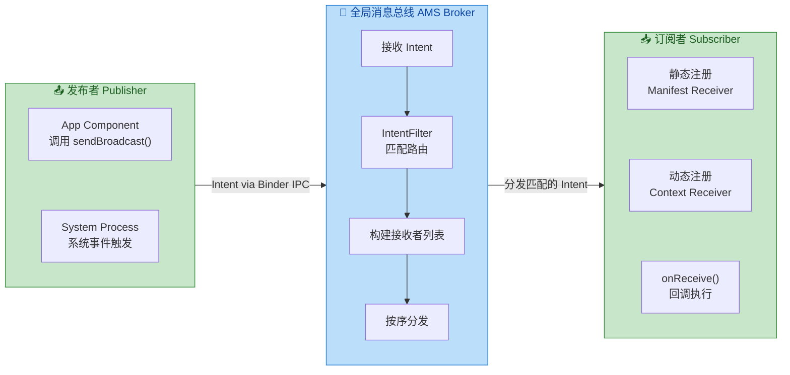

### AMS 分发中心

#### AMS 在广播中的核心地位

前面我们将 AMS 类比为"中间代理"和"消息总线的路由器"，但它的实际职责远比一个简单的转发器要复杂得多。**ActivityManagerService** 作为 Android Framework 层最核心的系统服务之一，运行在 `system_server` 进程中，它不仅负责 Activity 和 Service 的生命周期管理，也是 **整个广播系统的调度中枢**。

从应用层开发者的视角来看，当你调用 `context.sendBroadcast(intent)` 时，看似只是执行了一行简单的 API 调用，但在底层，这触发了一条复杂的跨进程调用链。我们以一次标准广播（Normal Broadcast）的完整分发流程为例，逐步拆解 AMS 在其中的工作：

**第一步：应用进程发起广播（App Process → AMS）。** 应用层调用 `sendBroadcast(intent)` 后，`ContextImpl`（Context 的实际实现类）会通过内部持有的 `ActivityManager` 代理对象，发起一次 **Binder IPC 调用**，将 Intent 数据序列化后传递给运行在 `system_server` 进程中的 AMS。这次跨进程调用的关键接口方法是 `ActivityManagerService.broadcastIntentLocked()`。注意，由于 Binder 调用是同步的，发送方线程会短暂阻塞直到 AMS 确认收到广播（但不会等待所有接收者处理完毕）。

**第二步：AMS 执行 Intent Resolution。** AMS 收到 Intent 后，进入核心的分发逻辑。它首先进行一系列 **安全与权限校验**：检查发送方是否具有发送该广播的权限（Permission Check），检查该广播是否是受保护的系统广播（Protected Broadcast），检查是否有包名限定（Package Restriction）。通过安全校验后，AMS 调用 `PackageManagerService` 的 `queryIntentReceivers()` 方法，将 Intent 与前述的静态注册表和动态注册表进行匹配，生成两个列表——静态接收者列表（来自 Manifest）和动态接收者列表（来自运行时注册）。

**第三步：AMS 构建 BroadcastRecord 并入队。** AMS 将匹配结果封装成一个 **`BroadcastRecord`** 对象，这是广播在系统内部的核心数据结构，包含了 Intent 信息、发送者信息、所有匹配的接收者列表以及各种状态标记。随后，根据广播类型的不同，这个 BroadcastRecord 会被放入不同的队列：

- **前台广播队列（Foreground Broadcast Queue）**：处理带有 `Intent.FLAG_RECEIVER_FOREGROUND` 标志的广播，超时时间较短（约 10 秒）。
- **后台广播队列（Background Broadcast Queue）**：处理普通广播，超时时间较长（约 60 秒）。
- **Offload 广播队列**：Android 10 引入，用于卸载一些不紧急的系统广播，减轻主队列压力。

这种分队列设计的目的是 **优先级隔离**——确保前台广播（如交互相关的事件）不会因为大量排队的后台广播而被延迟分发。

**第四步：AMS 逐一分发给接收者（AMS → Receiver Process）。** 广播队列的处理由 `BroadcastQueue.processNextBroadcastLocked()` 方法驱动。对于每一个匹配的接收者，AMS 的分发行为取决于接收者的类型：

对于 **动态注册的接收者**，由于其所在进程已经存在，AMS 通过 Binder IPC 直接调用该进程中 `ApplicationThread` 的 `scheduleRegisteredReceiver()` 方法。应用进程收到调用后，会将 `onReceive()` 回调 post 到主线程的 `Handler` 消息队列中，等待主线程 Looper 取出并执行。

对于 **静态注册的接收者**，情况更为复杂。如果接收者所在的应用进程尚未启动，AMS 需要先触发 **进程创建**（通过 Zygote fork），等待进程初始化完成后，再将广播分发过去。这也是为什么静态注册的广播能够"唤醒"未启动的应用——AMS 拥有启动目标进程的能力。但从 Android 8.0（API 26）开始，Google 对这一行为施加了严格的 **隐式广播限制（Implicit Broadcast Limitations）**：大部分隐式广播不再分发给静态注册的接收者（少数豁免广播除外），其目的是减少系统因广播而大量唤醒后台进程所带来的内存和电量消耗。

**第五步：超时监控与 ANR。** AMS 在分发广播时会启动一个 **超时定时器**。如果某个接收者在规定时间内没有完成 `onReceive()` 的执行（前台广播 10 秒，后台广播 60 秒），AMS 会判定该接收者超时，记录 ANR（Application Not Responding）信息，并跳过该接收者继续分发给队列中的下一个。这也是为什么我们在 `onReceive()` 中 **绝对不能执行耗时操作** 的根本原因——不是建议，而是系统级的硬性约束。

#### 一次广播的完整调用链

下面用一段精简的伪代码来描绘一次标准广播从发送到接收的完整调用链，帮助你建立全局视角：

```kotlin
// ==================== 应用进程（发送端）====================

// 1. 开发者在 Activity/Service 中调用 sendBroadcast
context.sendBroadcast(intent)

// 2. ContextImpl 将调用转发给 AMS 的 Binder 代理
// ContextImpl.sendBroadcast() 内部实现：
ActivityManager.getService()               // 获取 AMS 的 Binder 代理对象（IActivityManager）
    .broadcastIntent(                      // 通过 Binder IPC 跨进程调用 AMS
        caller = mMainThread.getApplicationThread(), // 发送方的 ApplicationThread 引用
        intent = intent,                   // 广播携带的 Intent
        // ... 权限、用户ID等参数
    )

// ==================== system_server 进程（AMS）====================

// 3. AMS 收到 Binder 调用，进入广播分发核心逻辑
fun broadcastIntentLocked(/* 参数 */) {
    // 3a. 安全校验：权限检查、Protected Broadcast 检查
    checkBroadcastPermission(callerUid, intent)

    // 3b. Intent Resolution：查询匹配的接收者
    val staticReceivers = packageManager.queryIntentReceivers(intent, flags)  // 静态注册
    val dynamicReceivers = mReceiverResolver.queryIntent(intent, flags)       // 动态注册

    // 3c. 合并接收者列表，构建 BroadcastRecord
    val record = BroadcastRecord(intent, receivers = staticReceivers + dynamicReceivers)

    // 3d. 根据 Intent flags 选择队列并入队
    val queue = if (intent.isForegrounded()) foregroundQueue else backgroundQueue
    queue.enqueueBroadcastLocked(record)

    // 3e. 触发队列处理
    queue.scheduleBroadcastsLocked()
}

// 4. BroadcastQueue 处理队列中的每条 BroadcastRecord
fun processNextBroadcastLocked() {
    val record = mOrderedBroadcasts.first()  // 取出队首记录
    for (receiver in record.receivers) {
        if (receiver.isDynamic) {
            // 4a. 动态接收者：直接通过 Binder 回调到其所在进程
            receiver.applicationThread.scheduleRegisteredReceiver(intent)
        } else {
            // 4b. 静态接收者：可能需要先启动目标进程
            if (!receiver.processRunning) {
                startProcessLocked(receiver.packageName)  // 通过 Zygote fork 新进程
            }
            receiver.applicationThread.scheduleReceiver(intent)
        }
        // 4c. 启动超时定时器（前台 10s / 后台 60s）
        setBroadcastTimeoutLocked(timeoutMs)
    }
}

// ==================== 应用进程（接收端）====================

// 5. ApplicationThread 收到 AMS 的 Binder 回调
fun scheduleRegisteredReceiver(intent: Intent) {
    // 将 onReceive 回调封装为 Message，post 到主线程 Handler
    mH.post {
        receiver.onReceive(context, intent)  // 在主线程执行
    }
}
```

#### AMS 分发的关键设计决策

理解了完整的分发流程后，我们可以归纳出 AMS 在广播系统设计上的几个关键决策及其对应用层开发的影响：

**集中式管理 vs 去中心化。** Android 选择了 AMS 作为中心化的广播调度器，而不是让应用之间直接通信。这种设计的好处是统一的权限控制和系统级的可观测性（AMS 可以记录所有广播的发送和接收情况，方便调试和性能分析），代价是所有广播都要经过 `system_server` 进程的处理，造成单点性能瓶颈。这也是为什么 Android 后续引入了 LocalBroadcastManager（虽然已废弃）和推荐使用 LiveData / Flow 等应用内通信方案——目的就是让不需要跨进程的消息绕开 AMS，避免不必要的系统开销。

**动态接收者优先于静态接收者。** 在标准广播的分发过程中，AMS 会先将广播分发给所有动态注册的接收者，然后再分发给静态注册的接收者。这是因为动态接收者的进程一定是活跃的（否则注册会随进程死亡而失效），分发成本低；而静态接收者可能需要唤醒进程，成本高。这一顺序对于有序广播（Ordered Broadcast）尤其重要，因为它决定了在同优先级下谁先收到广播。

**主线程执行模型。** AMS 分发广播时，最终的 `onReceive()` 回调默认运行在接收者所在进程的 **主线程（Main Thread / UI Thread）** 上。这一设计选择与 Android 整体的"UI 线程模型"保持一致——所有组件的生命周期回调都在主线程执行，保证了线程安全但也要求开发者严格控制回调中的执行时间。从 Android 11 开始，`registerReceiver()` 新增了可以指定 `Executor` 的重载方法，允许开发者将 `onReceive()` 调度到工作线程执行，这是对传统主线程限制的一次重要松绑。

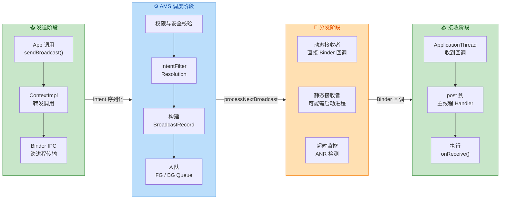

---

**📝 练习题**

当应用通过 `context.sendBroadcast(intent)` 发送一条标准广播时，以下关于 AMS 分发流程的描述，哪一项是**错误**的？

A. 广播 Intent 通过 Binder IPC 从应用进程传递到 system_server 进程中的 AMS

B. AMS 会同时查询静态注册表和动态注册表来确定匹配的接收者

C. 发送方线程会阻塞等待，直到所有匹配的接收者都完成 onReceive() 执行后才返回

D. 如果静态注册的接收者所在进程未启动，AMS 有能力触发该进程的创建

**【答案】** C

**【解析】** `sendBroadcast()` 的底层确实是一次同步的 Binder IPC 调用，但发送方线程 **只会阻塞到 AMS 确认收到广播并完成入队操作**，而不会等待所有接收者执行完毕。广播的实际分发是由 AMS 异步驱动的——AMS 将 BroadcastRecord 放入广播队列后，会通过 `scheduleBroadcastsLocked()` 触发后续的异步处理。如果发送方需要等待所有接收者完成，整个系统的吞吐量将急剧下降，任何一个接收者的延迟都会阻塞发送方。选项 A 正确描述了 Binder IPC 传输过程；选项 B 正确，AMS 会查询 PMS 的静态注册表和自身维护的动态注册表；选项 D 也正确，这正是静态注册广播能"唤醒"应用的核心机制（尽管 Android 8.0+ 对隐式广播做了限制）。

---

## 注册方式

BroadcastReceiver 要想接收广播，必须先向系统"报到"——这个报到过程就是 **注册（Registration）**。Android 提供了两条截然不同的注册路径：一条在编译期通过 AndroidManifest.xml 声明（静态注册），另一条在运行期通过代码调用 `Context.registerReceiver()` 完成（动态注册）。两者在 **生效时机、生命周期、可接收的广播类型** 上存在本质差异，选错方式轻则功能失效，重则引发内存泄漏或安全漏洞。本节将从应用层视角深入剖析这两条路径的使用方法、底层分发机制，以及在实际开发中至关重要的 **生命周期解绑** 策略。

### 静态注册 AndroidManifest

静态注册是指在应用的 `AndroidManifest.xml` 文件中，通过 `<receiver>` 标签声明一个 BroadcastReceiver。这种方式的最大特点是：**即使应用进程没有运行，系统在分发匹配的广播时也能将应用拉起（cold start）来执行 `onReceive()` 回调**。这一特性让静态注册成为监听 `BOOT_COMPLETED`、`PACKAGE_ADDED` 等系统级事件的首选手段——因为这些广播发出时，你的应用极有可能并未启动。

从底层机制来看，当应用安装（或设备启动时扫描已安装应用）后，**PackageManagerService（PMS）** 会解析每个 APK 的 Manifest 文件，把所有 `<receiver>` 声明及其 `<intent-filter>` 信息记录到系统的 "包数据库" 中。当 AMS 收到一条 `sendBroadcast()` 请求时，它不仅会查询当前运行中的动态注册列表，还会向 PMS 查询匹配的静态注册记录。如果匹配到，AMS 会通过 `ActivityThread` 创建目标应用进程（若未启动），实例化对应的 Receiver 类，然后调用 `onReceive()`。整个过程对应用开发者来说是透明的：你只需在 Manifest 里写好声明，剩下的由系统完成。

下面是一个典型的静态注册示例：

```xml
<!-- AndroidManifest.xml -->
<receiver
    android:name=".receiver.BootCompletedReceiver"
    android:exported="true"
    android:enabled="true">
    <!-- exported="true" 表示允许外部应用或系统向此 Receiver 发送广播 -->
    <!-- enabled="true" 表示此 Receiver 处于启用状态,可正常接收广播 -->

    <intent-filter>
        <!-- 声明感兴趣的广播 Action -->
        <action android:name="android.intent.action.BOOT_COMPLETED" />
    </intent-filter>
</receiver>
```

```kotlin
// BootCompletedReceiver.kt
// 对应 Manifest 中声明的 Receiver 类
class BootCompletedReceiver : BroadcastReceiver() {

    // 系统分发匹配广播时回调此方法
    // context: 受限的 Application Context,不可用于启动 Activity（需加 FLAG_ACTIVITY_NEW_TASK）
    // intent: 携带广播 Action 及附加数据的 Intent 对象
    override fun onReceive(context: Context, intent: Intent) {
        // 校验 Action,防止误触发
        if (intent.action == Intent.ACTION_BOOT_COMPLETED) {
            // 执行轻量级初始化,如调度 WorkManager 任务
            // 注意: onReceive() 有严格的时间限制(约 10 秒),禁止耗时操作
            BootTaskScheduler.schedulePeriodicSync(context)
        }
    }
}
```

然而，静态注册的"唤醒"能力也是一把双刃剑。在 Android 早期版本中，大量应用滥用静态注册监听 `CONNECTIVITY_CHANGE`、`NEW_PICTURE` 等高频广播，导致每次网络切换或拍照都会唤醒数十个后台进程，严重拖垮系统性能与电池续航。Google 从 **Android 8.0（API 26）** 开始实施了一项重大限制，称为 **Implicit Broadcast Restrictions（隐式广播限制）**：除了一份明确的豁免列表（exempted broadcasts）之外，**静态注册的 Receiver 将不再能接收大多数隐式广播**。所谓"隐式广播"是指那些不指定目标包名、面向所有应用的广播，如 `ACTION_CONNECTIVITY_CHANGE`。这意味着从 Android 8.0 开始，如果你的 `targetSdkVersion >= 26`，在 Manifest 中静态注册一个监听网络变化的 Receiver 将 **完全无效**——系统根本不会分发给它。

豁免列表中保留的广播主要是那些"低频且对应用初始化至关重要"的系统事件，例如 `BOOT_COMPLETED`、`LOCALE_CHANGED`、`USB_ACCESSORY_ATTACHED` 等。完整列表可在官方文档 *Implicit Broadcast Exceptions* 中查阅。对于不在豁免列表中的广播，开发者必须改用动态注册。

此外，`<receiver>` 标签中有几个关键属性值得关注。`android:exported` 控制该 Receiver 是否对外部应用可见——从 **Android 12（API 31）** 起，如果 Receiver 声明了 `<intent-filter>`，则 **必须显式指定** `exported` 属性，否则应用安装时会直接报错。`android:permission` 可以指定发送方必须持有的权限，用于安全管控（这在后续"广播权限与安全"一节展开）。`android:enabled` 则可以通过 `PackageManager.setComponentEnabledSetting()` 在运行时动态开关，实现按需激活的策略。

### 动态注册 Context.register

动态注册是指在代码运行时（通常在 Activity、Service 或 Application 的生命周期方法中）调用 `Context.registerReceiver()` 来注册一个 BroadcastReceiver 实例。与静态注册相比，动态注册的 Receiver **只在注册后到注销前的这段时间窗口内** 有效，完全由开发者的代码控制其生死。这种方式更加灵活，也是 Android 8.0 之后监听大多数隐式广播的 **唯一途径**。

调用 `registerReceiver()` 时，你需要提供两样东西：一个 `BroadcastReceiver` 实例和一个 `IntentFilter` 对象。`IntentFilter` 描述了你感兴趣的广播 Action（可以添加多个）。注册完成后，系统会把这对"Receiver + Filter"信息保存到 AMS 的一张 **动态注册表（ReceiverList）** 中，并返回一个 `Intent` 对象（对于粘性广播，它会返回最近一次匹配的 sticky Intent；对于普通广播返回 `null`）。当 AMS 分发广播时，它会遍历这张动态注册表，找到所有 IntentFilter 匹配的 Receiver 并逐一回调。

从跨进程通信的视角看，`registerReceiver()` 内部通过 Binder IPC 将一个 `IIntentReceiver` 代理对象注册到 AMS。当广播到达时，AMS 再通过这个 Binder 代理回调到应用进程，最终由 `ActivityThread` 的内部 Handler 将 `onReceive()` 投递到主线程执行。整个过程的链路可以概括为：`App.registerReceiver()` → Binder → `AMS.registerReceiverWithFeature()` → AMS 存储映射 → 广播到达 → AMS 匹配 → Binder 回调 → `ActivityThread.handleReceiver()` → `onReceive()` 在主线程执行。

下面是一个在 Activity 中动态注册网络变化广播的标准示例：

```kotlin
class NetworkAwareActivity : AppCompatActivity() {

    // 声明 Receiver 实例为成员变量,以便后续注销时引用同一对象
    private val networkReceiver = object : BroadcastReceiver() {
        // 每次网络状态变化时,系统会回调此方法
        override fun onReceive(context: Context, intent: Intent) {
            // 从 Intent 中提取网络信息(此 API 已废弃,仅作示意)
            val isConnected = intent
                .getBooleanExtra(ConnectivityManager.EXTRA_NO_CONNECTIVITY, false)
                .not()
            // 根据网络状态更新 UI 或暂停/恢复网络请求
            updateNetworkBanner(isConnected)
        }
    }

    override fun onStart() {
        super.onStart()
        // 构建 IntentFilter,指定监听的广播 Action
        val filter = IntentFilter(ConnectivityManager.CONNECTIVITY_ACTION)
        // 调用 registerReceiver() 向系统注册
        // 从 Android 13(API 33)开始,需要额外传入 RECEIVER_NOT_EXPORTED 或 RECEIVER_EXPORTED 标志
        registerReceiver(networkReceiver, filter)
    }

    override fun onStop() {
        super.onStop()
        // 必须在对应的生命周期方法中注销,否则会导致内存泄漏
        unregisterReceiver(networkReceiver)
    }
}
```

值得特别说明的是 **Android 13（API 33）** 引入的安全增强。从该版本开始，动态注册时必须通过 `Context.registerReceiver()` 的新重载方法显式声明 `RECEIVER_EXPORTED` 或 `RECEIVER_NOT_EXPORTED` 标志。如果你的 Receiver 只接收应用自身或系统发送的广播，应当使用 `RECEIVER_NOT_EXPORTED` 以阻止外部应用向其投递消息，这是一项重要的安全最佳实践。如果需要接收其他应用的广播，则使用 `RECEIVER_EXPORTED`，并配合权限保护。忘记传这个标志（在 `targetSdkVersion >= 33` 时）会直接抛出 `SecurityException`。

```kotlin
// Android 13+ 安全注册示例
if (Build.VERSION.SDK_INT >= Build.VERSION_CODES.TIRAMISU) {
    // 第三个参数指定导出属性
    // RECEIVER_NOT_EXPORTED: 仅接收本应用或系统广播,外部应用无法触达
    registerReceiver(networkReceiver, filter, RECEIVER_NOT_EXPORTED)
} else {
    // 低版本无需此标志,但也无法享受该安全保护
    registerReceiver(networkReceiver, filter)
}
```

动态注册还有一个常用变体：`registerReceiver(receiver, filter, permission, handler)`。其中 `permission` 参数可以要求广播发送方必须持有指定权限（与静态注册中 `android:permission` 效果相同），`handler` 参数则允许你指定 `onReceive()` 回调运行在哪个线程的 Handler 上——默认是主线程的 Handler，但如果你传入一个绑定到后台 `HandlerThread` 的 Handler，回调就会在后台线程执行，这在需要做少量 I/O 操作时非常实用（但仍需注意 ANR 时限）。

### 生命周期解绑

动态注册的最大陷阱就是 **忘记注销（unregister）**。如果一个 Activity 在 `onStart()` 中注册了 Receiver 却没有在 `onStop()` 中注销，那么当 Activity 被销毁后，AMS 中仍然持有对该 Receiver 的 Binder 引用，而 Receiver 又隐式持有对 Activity 的引用（因为它通常是匿名内部类或 lambda）。这条引用链将阻止 Activity 被垃圾回收，造成 **内存泄漏（Memory Leak）**。更糟的是，当广播到达时，系统尝试回调一个已被销毁的 Activity 的 Receiver，可能引发 `IllegalStateException` 或 `NullPointerException` 等崩溃。

Android 系统对此有一定的防御机制：如果一个 Activity 被销毁时仍有未注销的 Receiver，系统会在 Logcat 中打印一条经典的警告日志 `"Activity has leaked IntentReceiver"` 并自动完成注销。但这只是兜底行为，开发者不应依赖它——因为在泄漏被检测到之前，内存已经被占用了一段时间，而且这条警告在调试阶段很容易被忽略，到线上就变成了真实的 OOM 隐患。

正确的做法是严格遵循 **对称注册/注销** 原则，即在哪个生命周期方法中注册，就在对应的配对方法中注销：

| 注册位置 | 注销位置 | 适用场景 |
|---|---|---|
| `onCreate()` | `onDestroy()` | Receiver 需要贯穿整个 Activity 生命周期 |
| `onStart()` | `onStop()` | Receiver 仅在用户可见时工作（**推荐默认选择**） |
| `onResume()` | `onPause()` | Receiver 仅在前台交互时工作（较少使用） |

其中 `onStart()/onStop()` 是最常用的配对，因为它覆盖了用户可以看到界面的整个时段，同时避免了在多窗口模式下 `onPause()` 不等于不可见的陷阱。

在现代 Android 开发中，**Jetpack Lifecycle** 提供了更优雅的生命周期感知方案。通过实现 `DefaultLifecycleObserver` 接口，可以让注册/注销逻辑自包含在一个独立的 Observer 类中，减少 Activity 的代码膨胀，也从根本上避免"写了注册忘了注销"的低级错误：

```kotlin
// 将广播注册/注销逻辑封装为 LifecycleObserver
// 实现 DefaultLifecycleObserver 接口,自动感知宿主(Activity/Fragment)的生命周期
class NetworkReceiverObserver(
    private val context: Context,               // 用于调用 registerReceiver / unregisterReceiver
    private val onNetworkChanged: (Boolean) -> Unit // 网络变化后的回调,由外部定义具体逻辑
) : DefaultLifecycleObserver {

    // 内部持有 Receiver 实例
    private val receiver = object : BroadcastReceiver() {
        override fun onReceive(ctx: Context, intent: Intent) {
            // 解析网络连接状态并回调
            val noConnectivity = intent
                .getBooleanExtra(ConnectivityManager.EXTRA_NO_CONNECTIVITY, false)
            onNetworkChanged(!noConnectivity)
        }
    }

    // 当宿主进入 STARTED 状态时自动注册
    override fun onStart(owner: LifecycleOwner) {
        val filter = IntentFilter(ConnectivityManager.CONNECTIVITY_ACTION)
        context.registerReceiver(receiver, filter)
    }

    // 当宿主离开 STARTED 状态时自动注销 —— 与 onStart 严格配对
    override fun onStop(owner: LifecycleOwner) {
        context.unregisterReceiver(receiver)
    }
}
```

```kotlin
// 在 Activity 中使用: 仅需一行代码即可完成注册与生命周期绑定
class MainActivity : AppCompatActivity() {
    override fun onCreate(savedInstanceState: Bundle?) {
        super.onCreate(savedInstanceState)
        // 将 Observer 添加到当前 Activity 的 Lifecycle 上
        // Lifecycle 框架会自动在 onStart/onStop 时调用 Observer 对应的方法
        lifecycle.addObserver(
            NetworkReceiverObserver(this) { isConnected ->
                // 在此处理网络变化,例如显示/隐藏离线提示条
                binding.offlineBanner.isVisible = !isConnected
            }
        )
    }
    // 无需手动编写 registerReceiver / unregisterReceiver
    // Lifecycle 框架保证了注册-注销的对称性,彻底杜绝泄漏风险
}
```

这种模式的优势在于：Observer 自身就是一个完整的 "注册 + 注销" 单元，无论被添加到哪个 `LifecycleOwner`（Activity、Fragment、甚至自定义的 LifecycleOwner），都能自动执行对称操作。当 Activity 被销毁时，`Lifecycle` 会先触发 `onStop()` 再触发 `onDestroy()`，保证 Receiver 一定在 Activity 销毁前被注销。

下面通过一张流程图梳理静态注册与动态注册从声明到回调的完整分发路径：

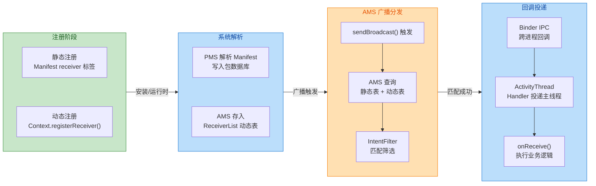

最后做一个关键对比总结。静态注册的核心优势是 **"进程无需存活即可接收广播"**，适合监听低频的系统事件（如开机完成、应用安装）。但从 Android 8.0 起，它被严格限制只能监听豁免列表中的隐式广播，且无法灵活控制注册时机。动态注册则完全由代码控制，灵活性强、不受隐式广播限制（因为进程已经在运行），但开发者必须自行管理生命周期，确保注销操作不遗漏。在实际项目中，二者往往配合使用：用静态注册处理冷启动场景的系统广播，用动态注册处理运行时的状态变化监听。

---

**📝 练习题**

在一个 Activity 的 `onResume()` 中调用 `registerReceiver()` 注册了一个 BroadcastReceiver，但在 `onDestroy()` 中才调用 `unregisterReceiver()`。当用户按下 Home 键后再返回应用，以下哪种情况 **最可能** 发生？

A. Receiver 在 Home 键按下后立即被注销，返回应用后重新注册，一切正常

B. Receiver 始终保持注册状态，功能正常，但违反了对称原则；返回应用后 `onResume()` 会再次注册，导致同一广播被回调两次

C. 系统检测到不对称注册，自动在 `onPause()` 时注销 Receiver，避免重复注册

D. `onDestroy()` 中的 `unregisterReceiver()` 会抛出 `IllegalArgumentException`，因为 Receiver 已被系统自动回收

**【答案】** B

**【解析】** 按下 Home 键后，Activity 经历 `onPause()` → `onStop()`，但 **不会** 经历 `onDestroy()`（Activity 仅进入后台，并未销毁）。由于注销代码写在 `onDestroy()` 中，此时 Receiver 仍然处于注册状态，不会被注销。当用户返回应用时，Activity 经历 `onStart()` → `onResume()`，`onResume()` 中的 `registerReceiver()` 会 **再次执行**，将同一个 Receiver 实例注册第二次。此时 AMS 的动态注册表中存在两条指向同一 Receiver 的记录，每次广播到达都会回调两次 `onReceive()`。更深层的问题是，后续 `onDestroy()` 中只调用一次 `unregisterReceiver()`，只能移除其中一条记录，另一条将造成泄漏。这正是 **注册/注销必须严格对称配对** 的原因——`onResume()` 注册就必须在 `onPause()` 注销。

---

## 广播类型

Android 的广播机制之所以能够适配如此多样的通信场景，核心原因在于系统提供了**多种不同语义的广播类型**。每种类型在分发策略、执行顺序、数据流转方式上都有本质区别。理解这些区别，不仅能帮助开发者选择正确的 API，更能深入理解 AMS（ActivityManagerService）作为"分发中心"时的调度逻辑。本节将围绕三种经典广播类型展开：**标准广播（Normal Broadcast）**、**有序广播（Ordered Broadcast）**、以及已被废弃的**粘性广播（Sticky Broadcast）**，逐一剖析它们的运行机制与适用场景。

### 标准广播 Normal Broadcast

标准广播是 Android 中最常见、最基础的广播形式，通过 `Context.sendBroadcast(Intent)` 发出。它的核心特征可以用一个词概括：**并行（Concurrent）**。当 AMS 收到一条标准广播后，会将其**几乎同时**分发给所有已注册的匹配接收器（BroadcastReceiver），各接收器之间没有先后依赖关系，也无法相互影响。

从 AMS 的分发视角来看，标准广播的处理流程大致如下：App 进程调用 `sendBroadcast()` 后，通过 Binder IPC 将 Intent 传递给 system_server 进程中的 AMS。AMS 在内部维护着一个广播队列（BroadcastQueue），它会根据 Intent 的 Action、Category、Data 等信息，查询 PackageManagerService（PMS）中静态注册的接收器，以及 AMS 自身维护的动态注册接收器列表，汇总出所有匹配的 Receiver。然后，AMS 将这条广播**以"平行投递"的方式**逐一调度到各个接收器所在的进程。这里所说的"几乎同时"并非严格意义上的多线程并发——AMS 仍然是按一定内部顺序逐个发送的——但关键在于：**每个接收器不需要等待上一个接收器完成处理**，它们之间不存在"传递链"的概念。

这意味着标准广播有几个重要的行为特征。首先，**任何接收器都无法拦截（abort）广播**，即调用 `abortBroadcast()` 在标准广播中不会生效（实际上会抛出异常或被忽略）。其次，**接收器之间不能传递额外数据**，因为它们是独立接收同一份 Intent 的副本，没有"结果传递"机制。最后，**执行顺序不可控**——虽然 AMS 内部按某种顺序遍历接收器列表，但开发者不应依赖这个顺序来设计业务逻辑。

标准广播的典型使用场景是**纯通知类消息**，比如"网络状态变了"、"用户登录成功了"这类事件。发送方只关心"消息已发出"，不关心谁收到了、收到后做了什么、做完没有。来看一个最基础的发送示例：

```kotlin
// 构建一条自定义广播 Intent
// action 字符串建议使用包名前缀以避免与其他应用冲突
val intent = Intent("com.example.app.ACTION_USER_LOGIN")
// 可以携带少量轻量数据（注意 Intent extras 大小不要超过 1MB）
intent.putExtra("user_id", 10086)
// 发送标准广播：AMS 将并行分发给所有匹配的接收器
context.sendBroadcast(intent)
```

需要特别注意一点：从 Android 8.0（API 26）开始，系统对**隐式广播的静态注册**施加了严格限制。如果一条标准广播使用的是隐式 Intent（即只指定 Action 而不指定目标组件），那么通过 AndroidManifest 静态注册的接收器**大部分情况下将无法收到**这条广播（少数系统豁免广播除外）。这是 Google 为了优化后台功耗而做的限制。因此，在现代 Android 开发中，自定义标准广播通常搭配**动态注册**使用，或者使用 `Intent.setPackage()` / `Intent.setComponent()` 将其变为显式广播。

### 有序广播 Ordered Broadcast

有序广播是标准广播的"增强版"，通过 `Context.sendOrderedBroadcast()` 发出。与标准广播最根本的区别在于：**接收器按优先级排成一条链，逐个串行执行**。每个接收器处理完毕后，才会将广播传递给链中的下一个。更关键的是，链上的接收器可以**修改广播携带的数据**甚至**直接终止（abort）广播的继续传递**。

AMS 在处理有序广播时的调度逻辑与标准广播有显著差异。当 AMS 收集到所有匹配的接收器后，会根据每个接收器声明的 **priority（优先级）** 进行排序——priority 值越大，优先级越高，越先收到广播。静态注册时通过 `<intent-filter android:priority="100">` 指定，动态注册时通过 `IntentFilter.setPriority(100)` 设置。优先级范围理论上是 `Integer.MIN_VALUE` 到 `Integer.MAX_VALUE`，但实际建议保持在 -1000 到 1000 之间。当两个接收器优先级相同时，动态注册的接收器通常先于静态注册的，但这个行为在不同 Android 版本上并非 100% 一致，不应作为设计依赖。

排序完成后，AMS 按优先级从高到低的顺序，**逐个**将广播分发给接收器。核心在于"逐个"——AMS 会等待当前接收器的 `onReceive()` 方法执行完毕（或超时），才会将广播发往下一个接收器。这就形成了一条**串行执行链（Serial Chain）**。在这条链上，每个接收器都拥有以下能力：

第一，**读取和修改结果数据**。有序广播维护着一组"结果"字段，包括 result code（整型）、result data（字符串）和 result extras（Bundle）。高优先级的接收器可以通过 `setResultCode()`、`setResultData()`、`setResultExtras()` 设置或修改这些值，低优先级的接收器则通过 `getResultCode()`、`getResultData()`、`getResultExtras()` 读取前一个接收器传来的结果。这使得有序广播具备了**"数据沿链传递并逐步加工"**的能力。

第二，**终止广播传递**。任何链上的接收器都可以调用 `abortBroadcast()` 来中断传播。一旦调用，后续优先级更低的接收器将**不再收到**这条广播。这个机制在某些场景下非常有用，比如短信拦截——高优先级的拦截器可以在读取短信内容后决定是否让系统默认短信应用收到它。

第三，在发送时，开发者可以指定一个**最终接收器（Result Receiver）**。无论链上的接收器是否调用了 `abortBroadcast()`，这个最终接收器**都会被执行**，且它能拿到经过整条链加工后的最终结果数据。这为"收集汇总"类场景提供了便利。

下面的代码展示了有序广播的完整使用模式：

```kotlin
// ─── 发送方 ───
val intent = Intent("com.example.app.ACTION_PROCESS_ORDER")
intent.putExtra("order_id", "ORD-2025-001")

// sendOrderedBroadcast 参数说明：
// 参数1: Intent —— 广播的意图
// 参数2: receiverPermission —— 接收方必须持有的权限，null 表示无限制
// 参数3: resultReceiver —— 最终接收器（链尾兜底），无论是否被 abort 都会执行
// 参数4: scheduler —— 指定最终接收器执行所在的 Handler，null 表示主线程
// 参数5: initialCode —— 初始结果码，通常传 Activity.RESULT_OK
// 参数6: initialData —— 初始结果字符串，可为 null
// 参数7: initialExtras —— 初始结果 Bundle，可为 null
context.sendOrderedBroadcast(
    intent,                          // 广播 Intent
    null,                            // 不要求接收权限
    object : BroadcastReceiver() {   // 最终接收器（Result Receiver）
        override fun onReceive(ctx: Context, intent: Intent) {
            // 无论中间是否被 abort，这里都会执行
            // 获取经过整条链加工后的最终结果
            val finalData = getResultData()
            Log.d("FinalReceiver", "链式处理最终结果: $finalData")
        }
    },
    null,                            // 使用主线程 Handler
    Activity.RESULT_OK,              // 初始 result code
    null,                            // 初始 result data
    null                             // 初始 result extras
)
```

```kotlin
// ─── 高优先级接收器（priority = 100）───
class HighPriorityReceiver : BroadcastReceiver() {
    override fun onReceive(context: Context, intent: Intent) {
        // 读取发送方传来的原始数据
        val orderId = intent.getStringExtra("order_id")
        Log.d("HighPriority", "优先处理订单: $orderId")

        // 向结果链写入加工后的数据，供下游接收器读取
        resultData = "已校验: $orderId"

        // 如果需要拦截，可以调用 abortBroadcast()
        // abortBroadcast()  // 取消注释则后续接收器不再收到
    }
}
```

```kotlin
// ─── 低优先级接收器（priority = 50）───
class LowPriorityReceiver : BroadcastReceiver() {
    override fun onReceive(context: Context, intent: Intent) {
        // 读取上游接收器写入的结果数据
        val processed = resultData
        Log.d("LowPriority", "收到上游结果: $processed")

        // 继续加工并传递给更下游（或最终接收器）
        resultData = "$processed -> 已入库"
    }
}
```

有序广播的串行特性虽然功能强大，但也带来了**性能隐患**。由于每个接收器必须等待前一个完成，如果链上某个接收器的 `onReceive()` 执行耗时过长（前台广播超过 10 秒、后台广播超过 60 秒），AMS 会触发 **ANR（Application Not Responding）**。因此，有序广播的每个接收器同样必须遵守"禁止耗时操作"的原则。如果确实需要在接收广播后执行异步任务，应使用 `goAsync()` 获取 `PendingResult` 对象，在后台线程完成工作后调用 `finish()`——但即便如此，总超时限制依然存在。

下面用一张流程图来对比标准广播与有序广播的分发差异：

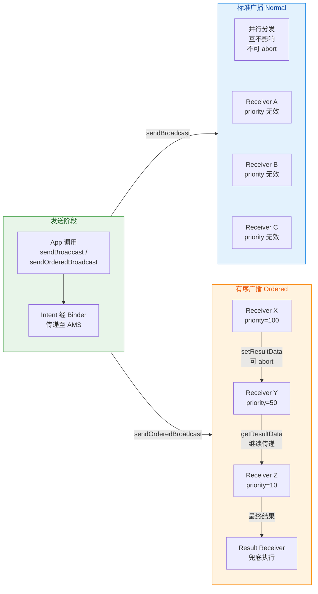

从图中可以直观看出：标准广播的接收器是**平铺并行**的"扇形"结构，而有序广播是**串联链式**的"管道"结构。两者在分发模型上的本质差异决定了它们适用于完全不同的场景——标准广播适合"广而告之"的通知，有序广播适合"层层过滤、逐步加工"的处理流水线。

### 粘性广播 Sticky Broadcast（已废弃）

粘性广播（Sticky Broadcast）是 Android 早期引入的一种特殊广播形式，通过 `Context.sendStickyBroadcast(Intent)` 发出。它最独特的行为是：**广播发出后会被系统"粘住"（Stick），长期驻留在 AMS 中**。即使在广播发出之后才注册的接收器，也能**立刻收到最近一次粘性广播的 Intent**。换言之，粘性广播解决的是一个**时序问题**——当接收器注册晚于广播发送时，标准广播和有序广播都会导致接收器"错过"消息，而粘性广播通过缓存最后一次 Intent 来确保后来者也能获取到最新状态。

这个机制的典型用例是**系统状态查询**。例如，在 Android 早期版本中，电池电量信息就是通过粘性广播分发的——`Intent.ACTION_BATTERY_CHANGED` 是一个粘性广播。当你注册一个监听电量变化的接收器时，即便此刻系统并没有"刚好"发出电量变化广播，你的接收器也能**立即**收到上一次缓存的电量 Intent，从而拿到当前电量值。这就避免了"注册后要干等到下一次电量变化才能知道当前电量"的尴尬。

然而粘性广播从 **API 21（Android 5.0 Lollipop）** 开始就被标记为 `@Deprecated`，并在后续版本中逐步弱化。Google 废弃它的原因是多方面的，且每一条都指向了**严重的架构缺陷**：

**安全性几乎为零。** 粘性广播是完全**全局可见**的——系统中任何应用都能注册接收器来读取粘性广播携带的数据。更糟糕的是，`sendStickyBroadcast()` 方法**不支持指定权限参数**（与 `sendBroadcast(Intent, String)` 不同），这意味着发送方无法限定"只有持有某个权限的接收器才能接收"。任何第三方应用，只要知道 Action 字符串，就能拿到粘性广播中的数据。对于包含敏感信息（如电量具体值、网络 SSID 等）的广播而言，这是一个严重的信息泄漏风险。

**数据可被任意篡改。** 更危险的是，任何持有 `BROADCAST_STICKY` 权限的应用都可以调用 `removeStickyBroadcast()` 移除已缓存的粘性广播，甚至可以**伪造一条新的同 Action 粘性广播来覆盖原有数据**。这意味着恶意应用可以篡改系统状态信息，让其他依赖该粘性广播的应用读取到错误数据。这种攻击面在早期 Android 安全模型中几乎无法防御。

**全局命名空间污染。** 粘性广播被缓存在 AMS 的一个全局 HashMap 中（以 Action 字符串为 key）。由于任何应用都能发送粘性广播，不同应用之间如果使用了相同的 Action 字符串，就会发生**缓存覆盖冲突**。这不像有序广播那样有优先级机制来协调，粘性广播的缓存是简单的"后到覆前"——最后一个发送者的 Intent 会覆盖之前所有发送者的缓存。在没有中心化 Action 注册机制的 Android 生态中，这个问题几乎不可控。

**内存泄漏风险。** 粘性广播一旦发出，对应的 Intent 对象就会被 AMS **无限期缓存**，直到有人显式调用 `removeStickyBroadcast()` 移除它。如果应用只发送而从不清理，这些缓存的 Intent 会持续占用系统内存。在设备运行时间较长且安装了大量应用的情况下，这种内存膨胀问题会逐渐显现。

**与现代架构理念相悖。** 粘性广播本质上是一种**全局可变状态（Global Mutable State）**——它在系统层面维护了一份"最新状态快照"，任何人都能读写。这与现代 Android 架构推崇的**单一数据源（Single Source of Truth）**、**可观察数据流（Observable Data Flow）** 等原则严重冲突。在 Jetpack 生态日趋成熟的今天，这种设计模式已经没有存在的必要。

那么，粘性广播要解决的"后注册者也能拿到最新状态"这个需求，在现代 Android 中应该如何实现？根据场景不同，有以下几种推荐的替代方案：

对于**应用内状态同步**，`LiveData`（特别是它的"粘性"特性——新观察者会立即收到最后一次值）、`StateFlow`（Kotlin 协程流，同样持有最新值语义）、或 `SharedFlow(replay=1)` 都是理想替代。它们天然具备生命周期感知能力，数据仅在应用内流转，安全且高效。

对于**跨应用状态查询**，应使用 `ContentProvider` 或 `bindService()` 模式。前者提供了标准化的数据访问接口并支持权限控制，后者通过 Binder 通信实现进程间数据交换，两者都远比粘性广播安全可控。

对于**系统广播的初始状态获取**（如电量），现代 API 通常提供了**直接查询方法**。例如获取当前电量不需要依赖粘性广播，可以直接通过 `BatteryManager` 系统服务查询：

```kotlin
// 获取 BatteryManager 系统服务
val batteryManager = context.getSystemService(Context.BATTERY_SERVICE) as BatteryManager
// 直接查询当前电量百分比，无需注册接收器等待广播
// BATTERY_PROPERTY_CAPACITY 返回 0-100 的整数
val batteryLevel = batteryManager.getIntProperty(BatteryManager.BATTERY_PROPERTY_CAPACITY)
Log.d("Battery", "当前电量: $batteryLevel%")
```

下面用一张对比表来总结三种广播类型的核心差异：

```text
┌──────────────┬─────────────────┬──────────────────┬──────────────────┐
│     特性      │  标准广播 Normal │  有序广播 Ordered │  粘性广播 Sticky  │
├──────────────┼─────────────────┼──────────────────┼──────────────────┤
│   发送 API    │ sendBroadcast() │sendOrderedBroad- │sendStickyBroad-  │
│              │                 │    cast()        │    cast()        │
├──────────────┼─────────────────┼──────────────────┼──────────────────┤
│   分发模式    │  并行(Parallel)  │  串行(Serial)    │  并行 + 缓存     │
├──────────────┼─────────────────┼──────────────────┼──────────────────┤
│  优先级排序   │     无效         │   有效(高→低)    │      无效        │
├──────────────┼─────────────────┼──────────────────┼──────────────────┤
│  可否 abort   │      否         │       是         │       否         │
├──────────────┼─────────────────┼──────────────────┼──────────────────┤
│  结果传递     │      否         │       是         │       否         │
│(setResult)   │                 │(Code/Data/Extras)│                  │
├──────────────┼─────────────────┼──────────────────┼──────────────────┤
│  Intent 缓存  │      否         │       否         │   是(AMS 驻留)   │
├──────────────┼─────────────────┼──────────────────┼──────────────────┤
│  后注册可收到  │      否         │       否         │       是         │
├──────────────┼─────────────────┼──────────────────┼──────────────────┤
│  权限控制     │      支持       │      支持        │     不支持       │
├──────────────┼─────────────────┼──────────────────┼──────────────────┤
│  当前状态     │      可用       │      可用        │  API 21 废弃     │
├──────────────┼─────────────────┼──────────────────┼──────────────────┤
│  推荐替代     │      —         │       —          │LiveData/StateFlow│
│              │                 │                  │ContentProvider   │
└──────────────┴─────────────────┴──────────────────┴──────────────────┘
```

最后有一点值得深思：从 Android 广播类型的演化历程来看，Google 一直在**收紧广播机制的作用边界**。粘性广播被废弃是第一步；Android 8.0 对隐式静态广播的限制是第二步；`LocalBroadcastManager` 的废弃是第三步。这些变化背后的统一思路是——**广播应该回归"事件通知"的本职**，不应承担状态管理、数据同步等超出其设计初衷的职责。对于状态管理，Jetpack 提供了 `ViewModel` + `LiveData`/`StateFlow`；对于组件间通信，有 `Navigation`、`WorkManager` 回调等更精确的手段。理解这个演化方向，有助于在实际项目中做出更合理的架构选择。

---

**📝 练习题**

当使用 `sendOrderedBroadcast()` 发送有序广播时，有三个接收器 A（priority=200）、B（priority=100）、C（priority=50），且 B 在 `onReceive()` 中调用了 `abortBroadcast()`。同时发送方指定了一个 Result Receiver。以下关于执行结果的描述，正确的是：

A. A、B、C 和 Result Receiver 全部执行

B. 仅 A 和 B 执行，C 和 Result Receiver 均不执行

C. A 和 B 执行，C 不执行，但 Result Receiver 仍然执行

D. 仅 A 执行，B 调用 abort 后自身也不再执行

**【答案】** C

**【解析】** 有序广播按 priority 从高到低串行分发：A（200）最先收到并执行完毕，随后 B（100）收到并执行，B 在 `onReceive()` 中调用 `abortBroadcast()` 后，AMS 会标记这条广播为已终止，**后续普通接收器 C（50）将不再收到**。但是，发送方通过 `sendOrderedBroadcast()` 指定的 **Result Receiver 是一个特殊的"兜底"接收器**，它的设计语义就是"无论链上是否发生了 abort，我都必须执行"。这是 AMS 对 Result Receiver 的硬性保证——它在整条链处理完毕（或被中断）后**总会被调度执行**，并且能通过 `getResultCode()`、`getResultData()` 拿到链上最后一个成功执行的接收器所设置的结果数据。因此 A 和 B 正常执行，C 被跳过，Result Receiver 依然执行，选 C。

---

**📝 练习题**

关于粘性广播（Sticky Broadcast），以下说法**错误**的是：

A. 粘性广播发出后，即使接收器尚未注册，后续注册时也能立即收到最近一次缓存的 Intent

B. `sendStickyBroadcast()` 支持通过第二个参数指定接收权限字符串来限制接收方

C. 粘性广播的 Intent 会被 AMS 无限期缓存，直到显式调用 `removeStickyBroadcast()` 移除

D. 粘性广播已在 API 21 被废弃，现代开发推荐使用 LiveData 或 StateFlow 等替代方案

**【答案】** B

**【解析】** 选项 B 的说法是错误的。`sendStickyBroadcast(Intent)` 方法**只接受一个 Intent 参数**，与 `sendBroadcast(Intent, String receiverPermission)` 不同，它**没有提供权限参数**。这恰恰是粘性广播被废弃的核心原因之一——发送方无法通过权限机制限制谁可以接收这条广播，导致任何应用都可以读取粘性广播中的数据，存在严重的信息泄漏风险。选项 A 描述的是粘性广播的核心"粘性"语义，正确。选项 C 描述的 AMS 无限期缓存行为是粘性广播的内存泄漏根源，正确。选项 D 描述的废弃时间和替代方案均正确。

---

## 接收器回调

BroadcastReceiver 整个组件的设计哲学可以用一句话概括：**"快进快出"（Fire and Forget）**。它不像 Activity 拥有完整的生命周期状态机，也不像 Service 可以长时间驻留后台执行任务。系统对 BroadcastReceiver 的定位是一个 **轻量级的消息响应端点**——收到广播、处理逻辑、立即退出。这种设计直接决定了 `onReceive()` 回调在执行环境、时间约束、进程优先级等方面都有非常严格的限制。理解这些限制，是正确使用 BroadcastReceiver 的前提，也是面试中高频考察的知识点。

### onReceive 生命周期限制

很多开发者习惯性地将 BroadcastReceiver 与 Activity、Service 并列看待，认为它也拥有类似 `onCreate → onStart → onResume` 的生命周期链条。但事实上，BroadcastReceiver 的"生命周期"极其短暂，**短暂到只有一个方法调用的跨度**。

当 AMS（ActivityManagerService）完成广播的匹配和分发后，会通过 Binder IPC 调用到应用进程的 `ActivityThread`。在应用进程一侧，`ActivityThread` 的内部类 `ApplicationThread` 接收到来自 AMS 的 `scheduleReceiver()` 调用后，会向主线程的 `Handler`（即 `mH`）发送一条 `RECEIVER` 消息。当主线程 Looper 取出这条消息并执行时，核心处理流程如下：

1. **实例化 Receiver**：如果是静态注册（Manifest 声明）的广播接收器，系统会通过 `ClassLoader` 反射创建一个 **全新的 BroadcastReceiver 实例**。如果是动态注册的，则直接复用 `registerReceiver()` 时传入的那个实例对象。

2. **调用 `onReceive(Context, Intent)`**：系统将 Application Context（静态注册时）或注册时的 Context（动态注册时）和携带广播数据的 Intent 传入回调方法。

3. **标记为"已完成"**：`onReceive()` 方法 return 之后，系统 **立即认为这个 BroadcastReceiver 的使命已经结束**。对于静态注册的 Receiver，这个刚刚创建的对象实例会被标记为可 GC 回收的状态；对于动态注册的，虽然对象本身还在（因为外部持有引用），但本次回调的"活跃窗口"也已经关闭。

这意味着一个至关重要的结论：**`onReceive()` 执行完毕后，该 BroadcastReceiver 的宿主进程可能随时被系统回收。** 具体来说，如果一个应用没有任何 Activity 或 Service 处于活跃状态，仅仅因为一次广播被唤醒并创建了进程，那么当 `onReceive()` return 之后，这个进程的 oom_adj 值会被调高，变成一个 **空进程（Empty Process）**，系统在内存紧张时会优先杀掉它。

我们可以用一个精简的时序来理解这个过程：

```
AMS                         App 进程 (ActivityThread)            BroadcastReceiver
 │                                    │                                  │
 │── scheduleReceiver() ──>           │                                  │
 │   (Binder IPC)                     │                                  │
 │                                    │── H.RECEIVER msg ──>            │
 │                                    │   (post 到主线程)                │
 │                                    │                                  │
 │                                    │   1. ClassLoader 实例化          │
 │                                    │      (静态注册时)                │
 │                                    │                                  │
 │                                    │── onReceive(ctx, intent) ──────>│
 │                                    │                                  │── 执行业务逻辑
 │                                    │                                  │── return
 │                                    │<─────── 方法返回 ───────────────│
 │                                    │                                  │
 │                                    │   2. 通知 AMS 处理完成           │ ← 此刻 Receiver
 │<── finishReceiver() ──────────────│                                  │   "生命周期终结"
 │                                    │                                  │
 │   3. 重新评估进程优先级             │                                  │
 │      (可能降为空进程)               │                                  │
```

这个流程揭示了几个关键的设计细节。首先，**静态注册的 Receiver 每次广播触发都会创建新实例**，因此不要在 BroadcastReceiver 中保存成员变量状态，期望下次广播时还能读到——那已经是一个全新的对象了。其次，`onReceive()` 的 `Context` 参数本身也有限制：对于静态注册的 Receiver，传入的是 `ReceiverRestrictedContext`，这是一个被限制过的 Context，**不允许调用 `bindService()`**（会直接抛出异常），也不允许调用 `registerReceiver()`。这是系统有意为之，防止开发者在如此短暂的生命周期内尝试建立长期绑定关系。

从源码角度看，`ActivityThread.handleReceiver()` 方法中的关键逻辑如下：

```java
// ActivityThread.handleReceiver() 简化逻辑
private void handleReceiver(ReceiverData data) {
    // 1. 获取该 Receiver 对应的 Application 对象（必要时创建进程和 Application）
    Application app = packageInfo.makeApplication(false, mInstrumentation);

    // 2. 获取 Context —— 静态注册时会创建 ReceiverRestrictedContext
    //    该 Context 限制了 bindService / registerReceiver 等操作
    ContextImpl context = (ContextImpl) app.getBaseContext();

    // 3. 通过 ClassLoader 反射实例化 BroadcastReceiver（静态注册）
    //    每次广播到来都是一个全新的实例
    BroadcastReceiver receiver = packageInfo.getAppFactory()
            .instantiateReceiver(cl, data.info.name, data.intent);

    // 4. 调用 onReceive —— 这是 Receiver 唯一的 "生命周期方法"
    receiver.onReceive(context.getReceiverRestrictedContext(), data.intent);

    // 5. onReceive 返回后，立即通知 AMS 本次广播处理完毕
    //    此后进程优先级可能被降级，Receiver 实例等待 GC
    if (receiver.getPendingResult() != null) {
        data.finish();  // 内部调用 AMS.finishReceiver()
    }
}
```

这段代码清晰地说明了：从实例化到 `onReceive()` 到通知 AMS 完成，**整个过程是同步、线性、不可中断的**。没有任何"暂停"、"恢复"的概念，也没有 `onDestroy()` 供你做清理。

### 主线程执行

`onReceive()` 默认运行在 **应用的主线程（Main Thread / UI Thread）** 上。这一行为的底层原因需要从 `ActivityThread` 的消息调度机制说起。

当 AMS 通过 Binder 调用 `ApplicationThread.scheduleReceiver()` 时，这个调用本身运行在 Binder 线程池中的某个工作线程上。但 `scheduleReceiver()` 的实现并不会直接在 Binder 线程上执行 `onReceive()`，而是将任务封装为一条 `Message`，通过 `mH`（ActivityThread 内部的 Handler，绑定在主线程 Looper 上）post 到主线程的 MessageQueue 中。等到主线程的 Looper 循环取出并分发这条消息时，`handleReceiver()` 才真正被调用，`onReceive()` 也因此在主线程上下文中执行。

这个设计选择并非偶然，而是 Android 框架的一个统一模式：**所有四大组件的生命周期回调都在主线程上被调度执行**。Activity 的 `onCreate()`、Service 的 `onStartCommand()`、ContentProvider 的 `query()` 以及 BroadcastReceiver 的 `onReceive()`，无一例外。这种设计保证了组件回调之间不会出现并发竞争问题，简化了应用开发的线程模型。

但主线程执行带来了一个严格约束：**`onReceive()` 中的所有操作都会阻塞主线程。** 如果你在 `onReceive()` 中执行网络请求、大文件 IO、数据库批量写入或复杂的计算任务，主线程将被 block 住，直到这些操作完成。由于主线程同时承担着 UI 事件循环（View 绘制、触摸事件分发、动画帧更新等），一旦被长时间阻塞，用户会感知到明显的界面卡顿甚至 ANR（Application Not Responding）弹窗。

那么，系统为 `onReceive()` 分配的时间窗口到底有多大？答案是与广播类型相关：

对于 **前台广播（Foreground Broadcast）**，AMS 设定的超时阈值是 **10 秒**。前台广播通过 `Intent.FLAG_RECEIVER_FOREGROUND` 标记，优先级更高，分发更快，但超时更敏感。对于 **后台广播（Background Broadcast）**，即绝大多数普通广播，超时阈值是 **60 秒**。但这并不意味着你可以安心地在 `onReceive()` 中执行 59 秒的操作——这个阈值是 ANR 触发的硬上限，在实际开发中，**Google 官方文档明确建议 `onReceive()` 的执行时间不应超过 10 秒**，无论前台还是后台广播。

ANR 的触发机制是这样的：AMS 在分发广播时会同时启动一个 **超时计时器**（通过 `BroadcastHandler` post 一条延迟消息 `BROADCAST_TIMEOUT_MSG`）。如果在规定时间内没有收到应用进程的 `finishReceiver()` 回调（即 `onReceive()` 没有 return），AMS 就会触发 ANR 流程——弹出对话框、dump 堆栈、写入 traces.txt。

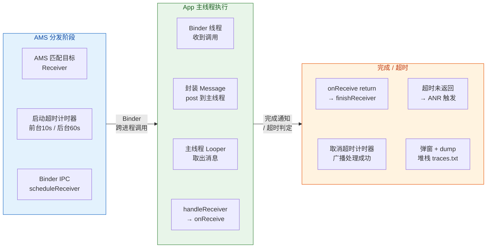

还有一个容易被忽略的问题：**动态注册时可以通过 `registerReceiver()` 的重载版本指定 Handler 来改变回调线程。** 从 API Level 26 开始，`Context.registerReceiver(BroadcastReceiver, IntentFilter, String, Handler)` 允许你传入一个绑定到子线程 Looper 的 Handler。这样，`onReceive()` 就会在该 Handler 所关联的线程上执行，而不是主线程。但这个特性在实际项目中使用较少，因为 BroadcastReceiver 本身就不适合承载重量级任务，改变执行线程只是缓解而非根治问题。

```kotlin
// 创建一个后台线程的 HandlerThread，用于接收广播回调
val handlerThread = HandlerThread("broadcast-worker")
// 启动线程，创建内部 Looper
handlerThread.start()
// 基于该线程的 Looper 创建 Handler
val bgHandler = Handler(handlerThread.looper)

// 注册广播接收器，指定在 bgHandler 线程上执行 onReceive
context.registerReceiver(
    myReceiver,           // BroadcastReceiver 实例
    intentFilter,         // 匹配规则
    null,                 // 权限字符串（此处不限制）
    bgHandler             // 指定回调线程 —— onReceive 将在 handlerThread 上执行
)
```

不过，即便你指定了子线程来执行 `onReceive()`，前面提到的 **进程优先级降级** 和 **ANR 超时机制** 依然有效。AMS 并不关心你的 `onReceive()` 跑在哪个线程上，它只关心 `finishReceiver()` 有没有在超时窗口内被调用。

### 禁止耗时操作

基于以上两个约束——生命周期极短和主线程执行——一个核心开发铁律呼之欲出：**绝对不要在 `onReceive()` 中执行耗时操作。** 以下是一些典型的错误实践和正确替代方案。

**错误实践一：在 onReceive 中发起网络请求**

有些开发者收到"新消息到达"的广播后，试图在 `onReceive()` 中直接调用 Retrofit 同步接口拉取消息内容。这不仅会阻塞主线程引发 ANR，而且由于 `onReceive()` return 后进程可能被杀死，异步回调甚至可能永远不会被执行。

**错误实践二：在 onReceive 中启动长时间的后台线程**

一些开发者认为"既然不能直接做耗时操作，那我开一个新线程去做就好了"。但问题在于：`onReceive()` return 之后，系统认为这个 Receiver 的工作已经结束，进程优先级随即下降。如果此时你的后台线程还在运行，进程有可能在线程完成之前就被系统杀掉，导致任务半途而废、数据不一致。

**错误实践三：在 onReceive 中弹出 Dialog**

`onReceive()` 接收到的 Context 在静态注册场景下是 `ReceiverRestrictedContext`，它不是一个 Activity Context，无法作为 Dialog 的宿主。强行使用会抛出 `BadTokenException`。即便是动态注册场景下 Context 可能是 Activity，但由于 Receiver 的生命周期不受控，Dialog 的显示和管理也会面临各种边界问题。

那么正确的做法是什么？核心思路是 **将耗时任务委托给拥有独立生命周期的组件**：

```kotlin
class MyReceiver : BroadcastReceiver() {

    override fun onReceive(context: Context, intent: Intent) {
        // ✅ 正确做法一：启动 Foreground Service 执行长时间任务
        // Service 有独立的生命周期，进程优先级由 Service 状态保证
        val serviceIntent = Intent(context, MyForegroundService::class.java).apply {
            // 将广播携带的数据透传给 Service
            putExtras(intent)
        }
        // Android 8.0+ 必须使用 startForegroundService
        ContextCompat.startForegroundService(context, serviceIntent)

        // ✅ 正确做法二：使用 WorkManager 调度后台任务
        // WorkManager 能保证任务最终执行，即使进程被杀也会重新调度
        val workRequest = OneTimeWorkRequestBuilder<MySyncWorker>()
            .setInputData(workDataOf(
                // 将广播中的关键数据传递给 Worker
                "message_id" to intent.getStringExtra("message_id")
            ))
            .build()
        // 入队执行 —— WorkManager 自行管理线程和进程存活
        WorkManager.getInstance(context).enqueue(workRequest)

        // ✅ 正确做法三：使用 goAsync() 延长执行窗口（适合轻量异步操作）
        // goAsync() 返回一个 PendingResult，允许在子线程中完成操作后手动调用 finish()
        val pendingResult: PendingResult = goAsync()
        // 在协程/线程中执行短时异步操作
        Thread {
            try {
                // 执行数据库写入等轻量操作（仍需在超时窗口内完成）
                val db = AppDatabase.getInstance(context)
                db.messageDao().markAsNotified(
                    intent.getStringExtra("message_id") ?: return@Thread
                )
            } finally {
                // 必须调用 finish()，否则 AMS 会认为广播未处理完毕，最终触发 ANR
                pendingResult.finish()
            }
        }.start()
    }
}
```

上面代码中的第三种方案 `goAsync()` 值得特别展开讲解。`goAsync()` 是 BroadcastReceiver 提供的一个特殊机制，其核心作用是 **告诉系统"我还没处理完，先别把我标记为完成"**。调用 `goAsync()` 后，`onReceive()` 方法仍然可以正常 return（释放主线程），但 AMS 不会收到 `finishReceiver()` 通知，因此进程优先级会暂时保持在 Receiver 活跃状态。开发者需要在异步操作完成后 **手动调用 `PendingResult.finish()`** 来通知系统处理结束。

但 `goAsync()` 并非万能钥匙，它有两个关键限制。第一，**超时机制依然生效**——即便你调用了 `goAsync()`，如果在前台 10 秒 / 后台 60 秒内没有调用 `finish()`，ANR 照样触发。所以它只适合处理"比同步操作稍长但仍然很短"的任务，比如一次数据库写入或一次 SharedPreferences 提交，而不适合网络请求这种耗时不可控的操作。第二，**`PendingResult.finish()` 必须被调用**，否则就是资源泄漏。务必在 `finally` 块中调用它，防止异常导致遗漏。

下面用一张对比表来总结各种方案的适用场景：

| 方案 | 执行线程 | 进程保活 | 适用任务时长 | 典型场景 |
|------|---------|---------|------------|---------|
| 直接在 `onReceive` 中执行 | 主线程 | 无保证 | < 1~2 秒 | 更新 UI 状态、发送 Notification |
| `goAsync()` + 子线程 | 子线程 | 短暂维持 | < 10 秒 | 数据库写入、轻量 IO |
| `startForegroundService()` | Service 线程 | Service 保证 | 分钟级 | 文件下载、音频播放 |
| `WorkManager.enqueue()` | Worker 线程 | 系统调度保证 | 不限 | 数据同步、日志上传 |

最后还有一个高频踩坑点值得强调。在 Kotlin 协程普及的今天，很多开发者会本能地在 `onReceive()` 中启动一个 `CoroutineScope.launch {}`。但这和开一个普通 Thread 面临的问题完全一样——`onReceive()` return 后 scope 可能随进程被杀而取消。如果你需要在 Receiver 中使用协程，正确的组合是 `goAsync()` + 协程：

```kotlin
class MyCoroutineReceiver : BroadcastReceiver() {

    override fun onReceive(context: Context, intent: Intent) {
        // 获取 PendingResult，延长 Receiver 生命周期窗口
        val pendingResult = goAsync()

        // 使用 GlobalScope 或自定义 Scope 启动协程
        // 注意：这里用 GlobalScope 是因为 Receiver 没有自己的生命周期 Scope
        // 在 Receiver 这种 "一次性" 场景下，GlobalScope 是合理的选择
        GlobalScope.launch(Dispatchers.IO) {
            try {
                // 在 IO 调度器上执行数据库操作
                val dao = AppDatabase.getInstance(context).eventDao()
                // 将广播携带的事件信息写入本地数据库
                dao.insert(
                    EventEntity(
                        type = intent.action ?: "unknown",
                        timestamp = System.currentTimeMillis()
                    )
                )
            } finally {
                // 协程完成后（无论成功还是异常），必须通知系统广播处理结束
                pendingResult.finish()
            }
        }
        // onReceive 立即返回，释放主线程
        // 但 AMS 的超时计时器仍在运行，协程必须在时限内完成
    }
}
```

总结来看，`onReceive()` 的设计理念非常清晰：它是一个 **同步的、受时间约束的、一次性的消息处理入口**。开发者应当把它视为一个"调度器"而非"执行器"——在 `onReceive()` 中做决策（判断广播类型、提取数据），然后将实际工作分发给更合适的组件（Service、WorkManager、Repository 等）。这种职责分离不仅能避免 ANR，还能让代码架构更加清晰和可测试。

---

**📝 练习题**

当一个通过 AndroidManifest 静态注册的 BroadcastReceiver 收到广播后，开发者在 `onReceive()` 中调用 `goAsync()` 获取了 `PendingResult`，随后在子线程中执行数据库写入操作，但忘记调用 `pendingResult.finish()`。以下关于后续行为的描述，哪一项是正确的？

A. 不会有任何影响，系统在 `onReceive()` return 时就已经标记广播处理完成

B. 子线程的数据库操作会被系统强制中断并回滚

C. AMS 的超时计时器到期后会触发 ANR，应用弹出"无响应"对话框

D. 系统会自动在 GC 回收 PendingResult 对象时调用 `finish()`

**【答案】** C
**【解析】** 调用 `goAsync()` 的核心语义是"告诉 AMS 我还没处理完这条广播"。此时 `onReceive()` 的 return 不会触发 `finishReceiver()` 通知——这正是 `goAsync()` 的设计目的，它将"方法返回"与"广播完成通知"解耦了。因此选项 A 错误。AMS 在分发广播时启动了超时计时器（后台广播 60 秒，前台广播 10 秒），如果在规定时间内没有收到 `finishReceiver()`（即 `PendingResult.finish()` 没被调用），AMS 会判定该广播接收器处理超时，触发 ANR 流程，所以 C 正确。选项 B 错误，系统不会主动中断应用层线程的执行，更不会回滚数据库事务。选项 D 错误，`PendingResult` 的 `finish()` 不会被 GC finalizer 自动调用，Android 框架没有这样的兜底机制，这也是为什么官方文档反复强调必须在 `finally` 块中手动调用 `finish()`。

---

## 本地广播 LocalBroadcastManager

### 应用内安全通信

在前面的章节中，我们详细讨论了标准广播（Normal Broadcast）和有序广播（Ordered Broadcast）的工作方式。它们有一个共同特征——**广播消息经由系统级的 AMS（ActivityManagerService）进行中转分发**。这意味着，即便你只是想在自己 App 的两个组件之间传递一条简单消息，这条消息也必须先跨进程发送到 `system_server`，再由 AMS 查询匹配的接收器，最后跨进程回调到你的 App 进程。这种"绕一大圈"的方式存在两个根本性问题：

第一是 **安全隐患**。当你调用 `sendBroadcast(intent)` 时，系统会遍历所有已注册的 BroadcastReceiver。如果其他恶意应用恰好注册了一个匹配你 Intent Action 的接收器，它就能拦截到这条原本只打算在你 App 内部流转的消息。反过来，恶意应用也可以伪造一条与你 App 内部约定的 Action 相同的广播，向你的 Receiver 注入虚假数据。虽然可以通过权限字符串（permission）和 `exported=false` 属性进行防护，但这些措施增加了开发复杂度，且一旦配置疏漏就会导致安全漏洞。

第二是 **性能开销**。全局广播走的是 Binder IPC 通道：发送端通过 Binder 将 Intent 序列化后传给 AMS，AMS 在 `system_server` 进程内完成接收器匹配和权限校验后，再通过 Binder 回调目标进程的 `onReceive()`。整个过程涉及至少两次跨进程序列化/反序列化、线程切换、以及 AMS 内部的锁竞争。对于 App 内部高频次的事件通知（比如下载进度更新、登录状态变化），这种开销完全是不必要的。

正是基于这两个痛点，Android Support Library 提供了 `LocalBroadcastManager`——一个 **纯应用进程内（in-process）** 的广播分发机制。它的核心设计哲学非常简单：**既然消息的发送者和接收者都在同一个进程里，那就完全没有必要让消息离开这个进程**。LocalBroadcastManager 把"全局消息总线"缩小为"应用内消息总线"，所有注册、发送、分发操作都在 App 进程内通过普通的 Java 方法调用完成，不走 Binder、不经过 AMS，从根本上消除了安全和性能两大问题。

它的使用 API 被刻意设计得与全局广播几乎一致，降低了学习成本。对比一下两者的调用方式：

```kotlin
// ===================== 全局广播 =====================
// 注册：通过 Context 向 AMS 注册，接收器信息存储在 system_server 进程中
val filter = IntentFilter("com.example.ACTION_DATA_SYNC")
context.registerReceiver(myReceiver, filter)
// 发送：Intent 通过 Binder 传递给 AMS，由 AMS 分发给所有匹配的接收器
context.sendBroadcast(Intent("com.example.ACTION_DATA_SYNC"))
// 注销：通知 AMS 移除该接收器的注册记录
context.unregisterReceiver(myReceiver)

// ================ 本地广播（LocalBroadcastManager） ================
// 获取单例：每个进程内只有一个 LocalBroadcastManager 实例
val lbm = LocalBroadcastManager.getInstance(context)
// 注册：接收器信息存储在当前进程的内存中（一个 HashMap），不经过 AMS
val filter = IntentFilter("com.example.ACTION_DATA_SYNC")
lbm.registerReceiver(myReceiver, filter)
// 发送：Intent 直接在当前进程内分发，不走 Binder IPC
lbm.sendBroadcast(Intent("com.example.ACTION_DATA_SYNC"))
// 注销：从内存中的 HashMap 移除记录即可
lbm.unregisterReceiver(myReceiver)
```

从 API 角度看，区别仅仅是把 `context.xxx` 替换为 `LocalBroadcastManager.getInstance(context).xxx`。但它带来的三个关键保证是全局广播无法提供的：**数据不出进程**（其他 App 无法接收）、**无法被伪造**（其他 App 无法向你的本地接收器发送消息）、**无 IPC 开销**（纯内存操作，性能接近直接方法调用）。

---

### Handler 实现原理

LocalBroadcastManager 的源码非常精简，总共只有约 200 行，是 Android 源码中"以最小复杂度解决实际问题"的典范。理解它的实现原理，关键要抓住三个核心数据结构和一个分发机制。

**三个核心数据结构**：

LocalBroadcastManager 内部维护了两个关键的 `HashMap` 和一个 `ArrayList`，用于管理接收器的注册关系和待分发的广播：

```java
// ====== LocalBroadcastManager 核心字段（简化自 AOSP 源码） ======

// 数据结构一：以 BroadcastReceiver 为 key，存储该 Receiver 关联的所有 IntentFilter
// 作用：在 unregisterReceiver 时，能快速找到某个 Receiver 对应的所有 filter 并一并移除
private final HashMap<BroadcastReceiver, ArrayList<ReceiverRecord>> mReceivers;

// 数据结构二：以 Action 字符串为 key，存储所有监听该 Action 的 ReceiverRecord
// 作用：在 sendBroadcast 时，能根据 Intent 的 Action 快速定位到所有匹配的接收器
private final HashMap<String, ArrayList<ReceiverRecord>> mActions;

// 数据结构三：待分发的广播队列，每个元素是一个 BroadcastRecord（含 Intent 和匹配的接收器列表）
// 作用：暂存已匹配但尚未分发的广播，等待 Handler 在主线程中统一执行回调
private final ArrayList<BroadcastRecord> mPendingBroadcasts;
```

其中 `ReceiverRecord` 是一个简单的包装类，将一个 `BroadcastReceiver` 和它对应的 `IntentFilter` 绑定在一起。`BroadcastRecord` 则将一个 `Intent` 和它匹配到的 `ReceiverRecord` 列表绑定在一起。这种双向索引（Receiver → Filters 和 Action → Receivers）的设计在注册/注销/匹配三个操作上都能达到接近 O(1) 的效率。

**注册流程**：

当调用 `registerReceiver(receiver, filter)` 时，LocalBroadcastManager 做两件事：首先把 `ReceiverRecord` 添加到 `mReceivers` 中该 receiver 对应的列表里；然后遍历 filter 中声明的所有 action，将同一个 `ReceiverRecord` 添加到 `mActions` 中每个 action 对应的列表里。整个过程在 `synchronized(mReceivers)` 锁保护下完成，保证线程安全。

```java
// ====== registerReceiver 核心逻辑（简化） ======
public void registerReceiver(@NonNull BroadcastReceiver receiver,
                             @NonNull IntentFilter filter) {
    synchronized (mReceivers) {
        // 创建包装对象，将 receiver 和 filter 绑定
        ReceiverRecord entry = new ReceiverRecord(filter, receiver);

        // 第一步：维护 mReceivers 映射（Receiver → Filter 列表）
        // 用于 unregister 时快速找到该 receiver 的所有注册记录
        ArrayList<ReceiverRecord> filters = mReceivers.get(receiver);
        if (filters == null) {
            filters = new ArrayList<>(1);
            mReceivers.put(receiver, filters);   // 首次注册，创建新列表
        }
        filters.add(entry);

        // 第二步：维护 mActions 映射（Action → Receiver 列表）
        // 遍历 filter 中声明的每一个 action
        for (int i = 0; i < filter.countActions(); i++) {
            String action = filter.getAction(i);
            ArrayList<ReceiverRecord> entries = mActions.get(action);
            if (entries == null) {
                entries = new ArrayList<>(1);
                mActions.put(action, entries);    // 该 action 首次被监听
            }
            entries.add(entry);
        }
    }
}
```

**发送与分发流程——Handler 的核心作用**：

这是 LocalBroadcastManager 最精妙的部分。当调用 `sendBroadcast(intent)` 时，它**不会立即调用** `onReceive()`，而是分为"匹配入队"和"Handler 调度执行"两个阶段。这种设计的原因在于：`sendBroadcast()` 可能在任意线程被调用，但 `onReceive()` 必须在主线程执行（与全局广播行为保持一致）。Handler 正是完成"从任意线程切换到主线程"这一关键转换的桥梁。

```java
// ====== LocalBroadcastManager 的 Handler 初始化 ======
// 在构造函数中，创建一个绑定到主线程 Looper 的 Handler
// 这保证了后续通过该 Handler 发送的 Message 一定在主线程被处理
private final Handler mHandler;

private LocalBroadcastManager(Context context) {
    mAppContext = context;
    // Looper.getMainLooper() 返回主线程的消息循环
    // 所有通过 mHandler.sendMessage() 投递的消息都将在主线程执行
    mHandler = new Handler(context.getMainLooper()) {
        @Override
        public void handleMessage(Message msg) {
            // 当主线程处理到这条 Message 时，执行真正的广播分发
            executePendingBroadcasts();
        }
    };
}
```

下面是 `sendBroadcast()` 的完整逻辑——它只做匹配和入队，不做实际回调：

```java
// ====== sendBroadcast 核心逻辑（简化） ======
public boolean sendBroadcast(@NonNull Intent intent) {
    synchronized (mReceivers) {
        // 提取 Intent 的基本信息，用于后续匹配
        final String action = intent.getAction();
        final String type = intent.resolveTypeIfNeeded(mAppContext.getContentResolver());
        final Uri data = intent.getData();
        final String scheme = intent.getScheme();
        final Set<String> categories = intent.getCategories();

        // 根据 action 从 mActions 中取出所有候选接收器
        ArrayList<ReceiverRecord> entries = mActions.get(action);
        if (entries == null) {
            return false;  // 没有任何接收器监听这个 action，直接返回
        }

        ArrayList<ReceiverRecord> receivers = null;
        // 遍历候选接收器，逐一执行 IntentFilter 匹配
        for (int i = 0; i < entries.size(); i++) {
            ReceiverRecord receiver = entries.get(i);
            // 调用 IntentFilter.match() 检查 action/type/data/scheme/categories 是否全部匹配
            if (receiver.filter.match(action, type, scheme, data, categories, "LBM") >= 0) {
                if (receivers == null) {
                    receivers = new ArrayList<>();
                }
                receivers.add(receiver);  // 匹配成功，加入待回调列表
                receiver.broadcasting = true;
            }
        }

        if (receivers != null) {
            // 将 Intent 和匹配的接收器列表封装为 BroadcastRecord，加入待分发队列
            mPendingBroadcasts.add(new BroadcastRecord(intent, receivers));

            // 关键一步：通过 Handler 向主线程消息队列投递一条 MSG_EXEC_PENDING_BROADCASTS
            // 如果队列中已有未处理的同类消息（hasMessages 返回 true），则不重复投递
            if (!mHandler.hasMessages(MSG_EXEC_PENDING_BROADCASTS)) {
                mHandler.sendEmptyMessage(MSG_EXEC_PENDING_BROADCASTS);
            }
            return true;
        }
    }
    return false;
}
```

当主线程的 Looper 轮转到这条 Message 时，`executePendingBroadcasts()` 被调用，真正执行所有待分发的广播回调：

```java
// ====== executePendingBroadcasts 核心逻辑 ======
void executePendingBroadcasts() {
    // 外层 while(true)：因为在分发过程中（锁外执行 onReceive），
    // 其他线程可能又调用了 sendBroadcast 添加了新的 pending 广播
    // 所以需要循环直到队列真正清空
    while (true) {
        final BroadcastRecord[] brs;
        synchronized (mReceivers) {
            final int N = mPendingBroadcasts.size();
            if (N <= 0) {
                return;  // 队列为空，退出循环
            }
            // 取出所有待分发记录，并清空队列
            brs = new BroadcastRecord[N];
            mPendingBroadcasts.toArray(brs);
            mPendingBroadcasts.clear();
        }
        // 注意：以下回调在锁外执行，避免 onReceive 中的代码造成死锁
        for (int i = 0; i < brs.length; i++) {
            final BroadcastRecord br = brs[i];
            final int nbr = br.receivers.size();
            for (int j = 0; j < nbr; j++) {
                // 逐个调用匹配到的 Receiver 的 onReceive 方法
                // 此时一定在主线程中执行
                br.receivers.get(j).receiver.onReceive(mAppContext, br.intent);
            }
        }
    }
}
```

为了直观展示这一流程，以下时序图描述了从 `sendBroadcast()` 到 `onReceive()` 的完整调用链：

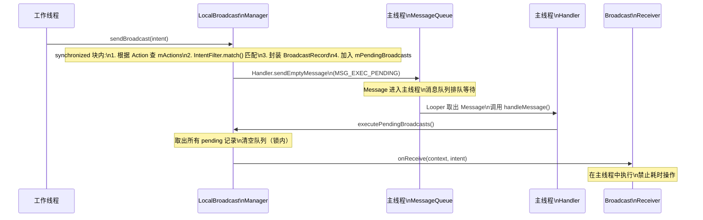

**总结一下 Handler 在 LocalBroadcastManager 中的作用**：它充当了一个 **线程切换器 + 批量合并器**。线程切换器是指：无论 `sendBroadcast()` 在哪个线程被调用，最终的 `onReceive()` 回调一定在主线程执行。批量合并器是指：如果在同一个消息循环周期内连续调用了多次 `sendBroadcast()`，它们的 BroadcastRecord 会积累在 `mPendingBroadcasts` 中，由同一次 `executePendingBroadcasts()` 调用批量分发，避免了频繁的 Message 投递开销。

还有一个值得注意的方法是 `sendBroadcastSync(Intent)`。与异步版本不同，它**不经过 Handler**，而是直接在调用线程上立即执行匹配和回调。这意味着如果在工作线程调用 `sendBroadcastSync()`，`onReceive()` 也会在工作线程执行。这个方法适用于需要"发送后立即处理完毕再继续执行"的同步场景，但使用时需要格外注意线程安全。

---

### 废弃与替代

LocalBroadcastManager 在 **AndroidX 1.1.0（2018 年底）** 中被标记为 `@Deprecated`。Google 在废弃说明中给出的理由是：

> "It is an application-wide event bus and embraces layer violations... use of LocalBroadcastManager is an anti-pattern."

这段话的意思是，LocalBroadcastManager 本质上是一个 **应用全局的事件总线（event bus）**，它鼓励了"任何组件都能向任何其他组件发消息"的松散耦合模式。虽然松耦合本身不是坏事，但当它成为 App 内部通信的主要手段时，会导致以下实际工程问题：

**第一，隐式依赖难以追踪**。发送方只知道自己发了一条 Action 为 `"com.example.DATA_UPDATED"` 的广播，但不知道谁在接收；接收方只知道自己监听了这个 Action，但不知道谁会发送。当项目规模变大，这种"发布者和订阅者互不知情"的关系会形成一张看不见的依赖网。重构、删除、修改某个广播时，编译器不会给你任何提示——错误只会在运行时暴露。

**第二，生命周期管理不够自动化**。虽然 LocalBroadcastManager 比全局广播轻量，但开发者仍然需要手动在 `onStart()/onStop()` 或 `onResume()/onPause()` 中注册和注销接收器。忘记注销会导致内存泄漏（Receiver 持有外部引用），忘记注册会导致事件丢失。这种手动管理方式与现代 Lifecycle-aware 组件的理念相悖。

**第三，缺乏类型安全**。广播传递数据完全依赖 `Intent` 的 `putExtra()`，取数据时需要手动 `getStringExtra()` / `getIntExtra()` 并进行类型转换。键名拼写错误、类型不匹配等问题只会在运行时引发 bug，编译期无法检查。

**替代方案一：LiveData（适用于 UI 响应式数据流）**

如果你的场景是"某个数据源发生变化，需要通知 UI 层更新"，`LiveData` 是最自然的替代。它天然具备 Lifecycle 感知能力——当 Activity/Fragment 处于 STARTED 或 RESUMED 状态时自动接收更新，处于 STOPPED 或 DESTROYED 状态时自动停止观察，彻底消除了手动注册/注销的负担。

```kotlin
// ====== 使用 LiveData 替代 LocalBroadcast 的典型模式 ======

// 1. 在共享的 ViewModel 或单例 Repository 中定义 LiveData
object SyncRepository {
    // MutableLiveData 作为可写数据源，仅内部可修改
    private val _syncState = MutableLiveData<SyncState>()
    // 对外暴露不可变的 LiveData，观察者只能读取
    val syncState: LiveData<SyncState> = _syncState

    // 在数据同步完成时，更新 LiveData 的值
    // setValue() 必须在主线程调用；postValue() 可在任意线程调用
    fun notifySyncComplete(result: SyncState) {
        _syncState.postValue(result)  // 线程安全的更新方式
    }
}

// 2. 在 Activity/Fragment 中观察（替代 registerReceiver）
class SyncActivity : AppCompatActivity() {
    override fun onCreate(savedInstanceState: Bundle?) {
        super.onCreate(savedInstanceState)
        // observe() 自动绑定到 this（LifecycleOwner）的生命周期
        // 当 Activity 销毁时，观察自动移除——不需要手动 unregister
        SyncRepository.syncState.observe(this) { state ->
            // 回调一定在主线程执行，可直接更新 UI
            when (state) {
                SyncState.SUCCESS -> showSuccess()
                SyncState.FAILURE -> showError()
            }
        }
    }
    // 无需 onDestroy 中手动移除观察 —— Lifecycle 自动处理
}
```

**替代方案二：Kotlin SharedFlow / StateFlow（适用于更灵活的事件流）**

如果你的需求不仅仅是"数据状态通知"，还包括"一次性事件"（如显示 Toast、导航到新页面），或者需要在非 Lifecycle-aware 的场景中使用（如 Service、后台调度器），`SharedFlow` 是更灵活的选择。与 LiveData 的"状态持有"语义不同，SharedFlow 可以配置为"事件流"——发出一次即消费一次，不保留旧值。

```kotlin
// ====== 使用 SharedFlow 替代 LocalBroadcast ======

// 1. 定义事件源（通常在 ViewModel 或共享 Repository 中）
class EventBus {
    // replay = 0 表示不缓存旧事件，新订阅者不会收到历史事件
    // extraBufferCapacity = 1 允许在无订阅者时缓冲一个事件，防止 emit 挂起
    private val _events = MutableSharedFlow<AppEvent>(
        replay = 0,
        extraBufferCapacity = 1,
        onBufferOverflow = BufferOverflow.DROP_OLDEST  // 背压策略：丢弃最旧事件
    )
    val events: SharedFlow<AppEvent> = _events.asSharedFlow()

    // 发送事件——tryEmit 非挂起，适合在非协程环境中调用
    fun post(event: AppEvent) {
        _events.tryEmit(event)
    }
}

// 2. 在 Activity/Fragment 中收集事件
class MainActivity : AppCompatActivity() {
    private val eventBus: EventBus by inject()  // 通过 DI 获取共享实例

    override fun onCreate(savedInstanceState: Bundle?) {
        super.onCreate(savedInstanceState)
        // repeatOnLifecycle 保证只在 STARTED 状态时收集
        // 当 Activity 进入 STOPPED 时自动取消收集，STARTED 时自动恢复
        lifecycleScope.launch {
            repeatOnLifecycle(Lifecycle.State.STARTED) {
                eventBus.events.collect { event ->
                    // 处理事件——类型安全，编译期可检查
                    when (event) {
                        is AppEvent.NetworkChanged -> updateNetworkUI(event.isConnected)
                        is AppEvent.UserLoggedOut -> navigateToLogin()
                    }
                }
            }
        }
    }
}
```

**替代方案三：如果只是简单的组件间回调**，考虑直接使用接口回调、`ViewModel` 共享、或 Jetpack 的 `FragmentResult` API，避免引入事件总线的复杂性。

下面的对比图总结了三种通信机制在关键维度上的差异：

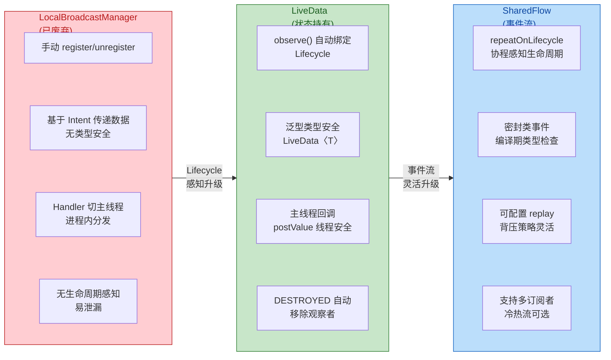

**迁移建议的决策逻辑**是这样的：如果你的广播主要用于"数据变化 → UI 更新"这种 **状态驱动** 场景，迁移到 `LiveData`（Java 项目）或 `StateFlow`（Kotlin 项目）；如果你的广播主要用于"发生了某件事 → 做出响应"这种 **事件驱动** 场景（尤其是一次性事件），迁移到 `SharedFlow`；如果你的广播仅用于两个特定组件之间的简单通信，考虑直接用接口回调或 `FragmentResult` API，不需要引入任何总线机制。

值得一提的是，虽然 LocalBroadcastManager 已被废弃，但系统级的 `Context.sendBroadcast()` 和 `Context.registerReceiver()` 并没有被废弃。全局广播在跨应用通信、接收系统事件（如开机完成、网络变化）等场景中仍然是不可替代的。**废弃的是"用广播做应用内通信"这个模式**，而不是广播机制本身。

---

**📝 练习题**

在 LocalBroadcastManager 的实现中，`sendBroadcast(intent)` 方法被调用后，`onReceive()` 回调是如何保证在主线程执行的？

A. LocalBroadcastManager 内部使用了 `synchronized` 锁，将 `onReceive()` 的执行同步到主线程

B. `sendBroadcast()` 内部会检查当前线程，如果不是主线程就通过 `Looper.getMainLooper().post()` 直接投递 `onReceive()`

C. `sendBroadcast()` 将匹配结果加入 pending 队列，然后通过一个绑定主线程 Looper 的 Handler 发送 Message，在 `handleMessage()` 中批量执行 `onReceive()`

D. `sendBroadcast()` 通过 Binder 将回调请求发送给 AMS，由 AMS 调度在 App 主线程执行

**【答案】** C

**【解析】** LocalBroadcastManager 在构造时创建了一个绑定 `Looper.getMainLooper()` 的 Handler。当 `sendBroadcast()` 被调用时（无论在哪个线程），它在 `synchronized` 块内完成 IntentFilter 匹配，将匹配结果封装为 `BroadcastRecord` 加入 `mPendingBroadcasts` 队列，然后通过 `mHandler.sendEmptyMessage()` 向主线程消息队列投递一条消息。当主线程 Looper 处理到这条消息时，`handleMessage()` 调用 `executePendingBroadcasts()`，批量遍历 pending 队列并逐一调用 `onReceive()`。选项 A 错误，因为 `synchronized` 只保证数据结构的线程安全，不能实现线程切换；选项 B 的实现方式理论可行但并不是 LocalBroadcastManager 的实际做法，它采用的是 Handler + Message 机制而非直接 post Runnable；选项 D 完全错误，LocalBroadcastManager 的核心特点就是不经过 AMS、不走 Binder IPC。

---

## 广播权限与安全

Android 的广播机制本质上是一个 **全局消息总线**（Global Message Bus），任何应用都可以向系统发送广播，也可以注册接收器监听感兴趣的广播。这种开放式设计在提供灵活性的同时，也引入了显而易见的安全隐患：**恶意应用可以伪造广播欺骗你的接收器，也可以窃听你发出的广播获取敏感数据**。因此，Android 在广播机制中设计了多层安全防线，从权限声明、组件导出控制到精确的包名定向发送，形成了一套 **"发送端 + 接收端"双向约束** 的安全模型。理解这些机制不仅是面试高频考点，更是编写安全、健壮应用的基本功。

### sendBroadcast 权限字符串

广播权限的核心思想可以用一句话概括：**"我发出的广播，只有持有特定权限的应用才能收到；我注册的接收器，只接受持有特定权限的应用发来的广播"**。这是一种双向的权限校验机制，分别作用于发送端（Sender Side）和接收端（Receiver Side）。

**发送端施加权限约束**（Sender-side Permission）是最常见的用法。当你调用 `sendBroadcast(Intent, String)` 的重载方法时，第二个参数就是一个 **permission string**。AMS 在分发这条广播时，会检查每一个候选接收器所在的应用是否在其 `AndroidManifest.xml` 中通过 `<uses-permission>` 声明了该权限。只有声明了的应用，其接收器才会被纳入分发列表；未声明的接收器会被直接跳过。这就好比你在一个聊天群里发消息时设置了"仅管理员可见"，没有管理员身份的成员根本看不到这条消息。

举个典型场景：你的应用发送了一条包含用户订单信息的广播，你当然不希望任意第三方应用都能截获这些敏感数据。此时你可以自定义一个权限，然后在发送时指定它：

```kotlin
// ---- 第一步：在 AndroidManifest.xml 中声明自定义权限 ----
// protectionLevel 设为 signature，表示只有与声明者使用相同签名的应用才能获得此权限
// 这是应用间权限控制中最安全的级别之一
```

```xml
<!-- 在发送端应用的 AndroidManifest.xml 中定义权限 -->
<permission
    android:name="com.example.ORDER_BROADCAST_PERMISSION"
    android:protectionLevel="signature" />
```

```kotlin
// ---- 第二步：发送广播时携带权限字符串 ----
val intent = Intent("com.example.ACTION_ORDER_UPDATE") // 构造广播 Intent，指定自定义 action
intent.putExtra("order_id", "ORD-20260223-001")        // 携带订单编号等敏感数据
intent.putExtra("status", "shipped")                    // 携带订单状态

// 调用带权限参数的 sendBroadcast 重载
// 第二个参数即权限字符串，AMS 会用它过滤接收者
sendBroadcast(intent, "com.example.ORDER_BROADCAST_PERMISSION")
```

在接收端应用中，必须在清单文件里声明 `<uses-permission>` 才能收到这条广播：

```xml
<!-- 接收端应用的 AndroidManifest.xml -->
<!-- 如果 protectionLevel 是 signature，则此应用必须与发送端使用同一签名密钥 -->
<uses-permission android:name="com.example.ORDER_BROADCAST_PERMISSION" />
```

**接收端施加权限约束**（Receiver-side Permission）则是从另一个方向加固安全。当你注册接收器时，无论是静态注册还是动态注册，都可以指定一个权限字符串，要求 **只有持有该权限的应用发出的广播** 才会被投递到这个接收器。这防止了恶意应用伪造广播来触发你的业务逻辑。

静态注册时，通过 `<receiver>` 标签的 `android:permission` 属性指定：

```xml
<!-- 接收端应用的 AndroidManifest.xml -->
<receiver
    android:name=".OrderReceiver"
    android:permission="com.example.ORDER_BROADCAST_PERMISSION"
    android:exported="true">
    <!-- 设置 permission 后，只有持有该权限的应用发来的广播才会被 onReceive 接收 -->
    <intent-filter>
        <action android:name="com.example.ACTION_ORDER_UPDATE" />
    </intent-filter>
</receiver>
```

动态注册时，使用 `registerReceiver()` 的多参数重载版本：

```kotlin
val receiver = OrderUpdateReceiver()                     // 实例化接收器
val filter = IntentFilter("com.example.ACTION_ORDER_UPDATE") // 构建 IntentFilter

// 第三个参数是权限字符串：只有持有此权限的发送者的广播才会被投递
// 第四个参数是 Handler，传 null 表示在主线程回调
registerReceiver(
    receiver,                                            // BroadcastReceiver 实例
    filter,                                              // IntentFilter
    "com.example.ORDER_BROADCAST_PERMISSION",            // 要求发送者必须持有此权限
    null                                                 // scheduler，null 代表主线程
)
```

下面这张图展示了 AMS 在分发广播时进行双向权限校验的完整流程：

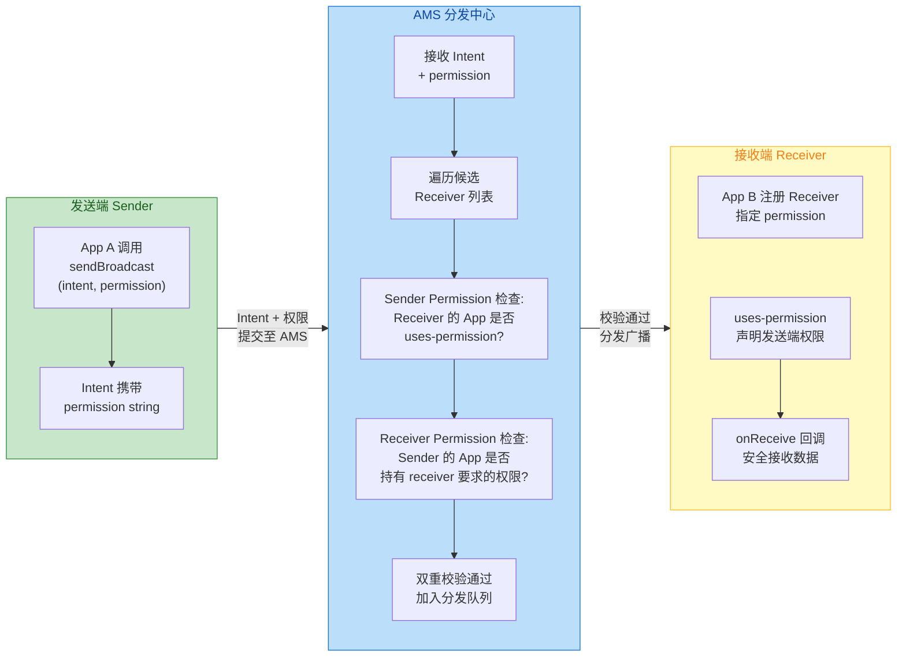

关于 **`protectionLevel`** 的选择，这是权限安全的关键一环。`normal` 级别的权限在安装时自动授予，基本没有防护意义；`dangerous` 级别需要用户运行时授权，适合敏感资源访问但不适合应用间通信；**`signature`** 级别是广播权限的最佳实践——它要求持有权限的应用必须与定义权限的应用使用 **同一个签名密钥**（same signing key）。这意味着只有你自己开发的一组应用（或由同一团队签名的应用）之间才能互相通信，第三方应用即使在清单中声明了 `<uses-permission>` 也无法获得该权限，从而实现了 **"签名级别的应用间信任圈"**。

### exported 属性

从 Android 12（API 31）开始，Google 强制要求所有声明了 `<intent-filter>` 的四大组件（Activity、Service、BroadcastReceiver、ContentProvider）必须 **显式声明 `android:exported` 属性**，否则应用将无法安装。这一变更的背景是：在早期版本中，如果组件声明了 `<intent-filter>` 但没有写 `exported`，系统默认将其视为 `exported="true"`，这导致大量开发者在 **无意中** 将内部组件暴露给了外部应用，形成了严重的安全隐患。

对于 BroadcastReceiver 而言，`exported` 属性直接决定了这个接收器 **是否能接收来自其他应用的广播**：

`android:exported="true"` 表示该接收器是"对外公开"的。系统中的任何应用——包括系统自身——发出的匹配广播都可以被投递到该接收器。典型的使用场景包括：监听系统广播（如 `BOOT_COMPLETED`、网络变化等，这些广播由系统进程发出，必须 exported 才能收到）、提供跨应用的广播接口供合作伙伴调用等。

`android:exported="false"` 表示该接收器是"仅限内部"的。只有 **同一应用内** 或 **具有相同 user ID**（通过 `sharedUserId`）的应用发出的广播才能被投递。外部应用的广播会被 AMS 直接过滤掉。当你的接收器仅用于应用内部模块间通信时，应该始终设置为 `false`。

```xml
<!-- 示例 1：监听系统开机广播，必须 exported="true" -->
<!-- 因为 BOOT_COMPLETED 由系统进程 (system_server) 发出，属于外部广播 -->
<receiver
    android:name=".BootCompletedReceiver"
    android:exported="true">
    <intent-filter>
        <action android:name="android.intent.action.BOOT_COMPLETED" />
    </intent-filter>
</receiver>

<!-- 示例 2：应用内部的数据同步通知接收器，设为 exported="false" -->
<!-- 只接受本应用发出的广播，外部应用无法触发 -->
<receiver
    android:name=".DataSyncReceiver"
    android:exported="false">
    <intent-filter>
        <action android:name="com.example.ACTION_SYNC_COMPLETE" />
    </intent-filter>
</receiver>
```

有一个容易混淆的问题：**动态注册的接收器是否受 `exported` 约束？** 答案是：动态注册通过代码调用 `registerReceiver()`，不在 `AndroidManifest.xml` 中声明，因此无法直接设置 XML 属性。但从 Android 13（API 33，即 `TIRAMISU`）开始，`registerReceiver()` 新增了一个 flag 参数，允许开发者显式控制动态接收器的导出行为：

```kotlin
// Android 13+ 动态注册时显式指定 exported 行为
val receiver = DataSyncReceiver()
val filter = IntentFilter("com.example.ACTION_SYNC_COMPLETE")

if (Build.VERSION.SDK_INT >= Build.VERSION_CODES.TIRAMISU) {
    // RECEIVER_NOT_EXPORTED：等效于 exported="false"
    // 该接收器只接收来自本应用的广播，外部广播被过滤
    registerReceiver(receiver, filter, Context.RECEIVER_NOT_EXPORTED)

    // 如果需要接收外部广播（如系统广播），则使用：
    // registerReceiver(receiver, filter, Context.RECEIVER_EXPORTED)
}
```

`Context.RECEIVER_EXPORTED` 和 `Context.RECEIVER_NOT_EXPORTED` 这两个常量是 Android 13 引入的，它们解决了动态注册长期以来的安全盲区。在 Android 13 之前，动态注册的接收器 **默认就是 exported 的**，这意味着任何外部应用都可以向其发送广播。如果你的 `targetSdkVersion >= 33`，调用 `registerReceiver()` 时如果既不传 `RECEIVER_EXPORTED` 也不传 `RECEIVER_NOT_EXPORTED`，系统会抛出 `SecurityException`，强制你做出明确的安全选择。

这里有一个实践上的决策原则：**如果你不确定应该选哪个，就选 `RECEIVER_NOT_EXPORTED` / `exported="false"`**。只有当你 **确实需要** 接收来自外部应用或系统的广播时，才将其设为 exported，并且最好搭配权限字符串做进一步约束。这符合安全设计中的 **最小权限原则**（Principle of Least Privilege）。

### 包名定向发送

除了权限约束和 exported 控制之外，Android 还提供了一种更为直接的安全手段——**显式指定广播的目标包名或组件名**（Explicit Broadcast）。这种方式跳过了 AMS 的隐式解析（Intent Resolution）过程，直接将广播 **"点对点"** 投递到指定的接收器，从根本上杜绝了广播被第三方截获或伪造的可能性。

最基本的方式是通过 `Intent.setPackage(String packageName)` 限定广播只能被 **特定包名的应用** 接收：

```kotlin
val intent = Intent("com.example.ACTION_PAYMENT_RESULT") // 定义支付结果广播
intent.putExtra("amount", 99.99)                          // 携带支付金额
intent.putExtra("transaction_id", "TXN-20260223-ABC")     // 携带交易号

// 通过 setPackage 将广播限定到指定包名的应用
// AMS 在分发时只会在该包名下搜索匹配的接收器
intent.setPackage("com.example.merchant")                  // 目标包名：商户应用

sendBroadcast(intent)                                      // 发送定向广播
```

更精确的做法是通过 `Intent.setComponent(ComponentName)` 直接指定目标接收器的 **完整组件名**（包名 + 类名），这相当于在信封上写了详细的收件人姓名和地址：

```kotlin
val intent = Intent("com.example.ACTION_PAYMENT_RESULT")
intent.putExtra("amount", 99.99)
intent.putExtra("transaction_id", "TXN-20260223-ABC")

// setComponent 直接指定目标接收器的完整类名
// 这是最精确的定向方式，AMS 无需做任何隐式解析
val target = ComponentName(
    "com.example.merchant",                   // 目标应用的包名
    "com.example.merchant.PaymentReceiver"    // 目标接收器的完全限定类名
)
intent.component = target                     // 设置目标组件

sendBroadcast(intent)                         // 发送显式广播
```

`setPackage` 和 `setComponent` 有一个关键区别：`setPackage` 仍然依赖 Intent Filter 匹配，只是 **把搜索范围限缩到了单个应用内**；而 `setComponent` 完全绕过了 Intent Filter 机制，直接定位到具体的接收器类。因此，使用 `setComponent` 时，目标接收器 **甚至不需要声明 `<intent-filter>`**，只要组件存在且 exported 允许就能收到广播。

需要特别注意的一个历史变更：从 **Android 8.0（API 26，Oreo）** 开始，系统对 **隐式广播的静态注册接收器** 做了严格限制。如果一个广播是隐式的（即没有通过 `setPackage` 或 `setComponent` 指定目标），那么在 `AndroidManifest.xml` 中静态注册的接收器 **将不会收到该广播**（少数豁免的系统广播除外，如 `BOOT_COMPLETED`、`LOCALE_CHANGED` 等）。这一限制的目的是减少后台唤醒，改善电池续航。但如果你通过 `setPackage` 或 `setComponent` 将广播变为显式广播，静态接收器仍然可以正常接收。这也是包名定向发送在 Android 8.0 之后变得尤为重要的原因之一。

下面总结三种安全机制的适用场景和防护能力对比：

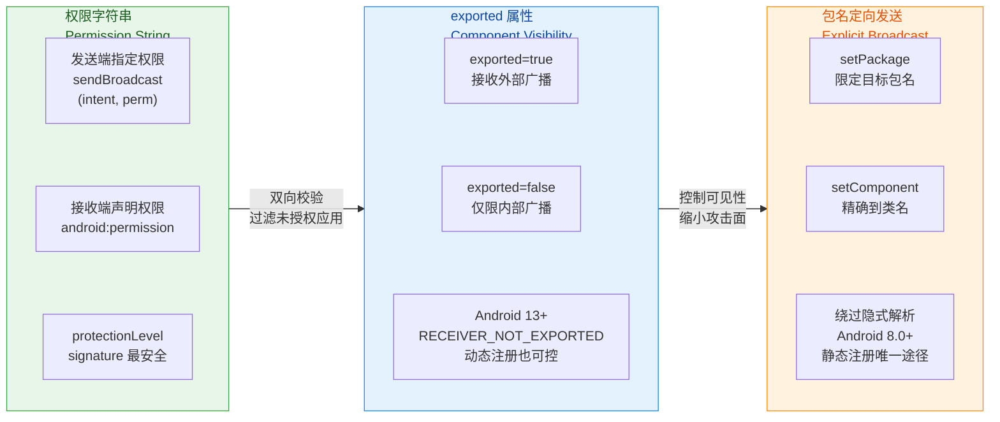

在实际开发中，这三种机制往往 **组合使用** 以实现纵深防御（Defense in Depth）。例如，一个安全级别较高的支付结果广播，可能同时采用：`setPackage` 确保只发往商户应用 + `sendBroadcast(intent, permission)` 要求商户应用持有签名级权限 + 商户应用的接收器设置 `exported="true"`（因为必须接收外部广播）并通过 `android:permission` 反向要求发送者也持有权限。三层防护叠加，几乎不可能被恶意应用绕过。

最后强调一个常被忽视的安全建议：**如果你的广播仅用于应用内部通信，应优先使用 `LocalBroadcastManager`（虽已废弃）的替代方案，如 `LiveData`、`Flow`、或 EventBus，而非全局广播**。全局广播即使加了权限和 exported 限制，仍然要经过 AMS 的进程间通信（IPC）路径，这既有性能开销，也增加了攻击面。应用内通信根本不需要经过系统中转，选择进程内方案才是最安全、最高效的做法。

---

**📝 练习题**

在 Android 12+ 设备上，某开发者在 `AndroidManifest.xml` 中静态注册了一个 BroadcastReceiver，声明了 `<intent-filter>` 但忘记添加 `android:exported` 属性。以下哪种情况会发生？

A. 接收器默认 `exported="true"`，可以正常接收外部广播

B. 接收器默认 `exported="false"`，只能接收内部广播

C. 应用在安装时会失败，系统拒绝安装该 APK

D. 应用可以正常安装，但接收器在运行时会抛出 SecurityException

**【答案】** C
**【解析】** 从 Android 12（API 31）开始，如果应用的 `targetSdkVersion >= 31`，那么所有声明了 `<intent-filter>` 的组件都 **必须显式指定 `android:exported`** 属性。如果缺失该属性，应用在安装阶段（无论是通过 adb install、Google Play 还是其他方式）就会被系统拒绝，抛出 `INSTALL_FAILED_VERIFICATION_FAILURE` 错误。这是 Google 为了消除"默认导出"这一历史安全隐患而做出的强制性改变。选项 A 描述的是 Android 12 之前的旧行为；选项 B 不正确，因为系统不会为你选择默认值，而是直接拒绝安装；选项 D 的错误在于问题在安装期就会暴露，不会拖延到运行时。

---

## 常见系统广播

Android 系统在运行过程中，会在各种 **硬件状态变化** 或 **系统事件发生** 时，由对应的系统服务（如 ConnectivityService、BatteryService、PowerManagerService 等）向全局发送广播。这些广播是应用层与底层系统交互的"信号线"——应用无需轮询（Polling）就能被动感知外界变化，从而做出相应调整。理解常见系统广播的 Action 字符串、携带的 Extra 数据、触发时机以及 Android 各版本的限制策略，是每一位应用开发者的基本功。

本节将围绕四类高频系统广播展开：**网络状态变化、开机启动、电量变化、屏幕亮灭与解锁**，每一类都会从"广播何时发出 → 携带什么数据 → 应用层如何监听 → 各版本有何限制"这条主线进行深度解读。

---

### 网络状态变化广播

网络状态变化可能是应用层监听最频繁的系统事件之一。一个即时通讯应用需要在断网时缓存消息、恢复后批量发送；一个视频播放器需要在切换到移动数据时提示用户流量消耗；一个下载管理器需要在 Wi-Fi 连接时自动恢复暂停的任务。这些场景的背后，都依赖系统对网络变化的广播通知。

Android 在网络广播的设计上经历了一次重大迁移：从早期的 `CONNECTIVITY_ACTION` 广播模型，逐步过渡到 `ConnectivityManager.NetworkCallback` 回调模型。理解这个演进过程，对于编写兼容性良好的网络感知代码至关重要。

**传统广播：`CONNECTIVITY_ACTION`**

在 Android 7.0（API 24）之前，应用监听网络变化的标准做法是注册 `android.net.conn.CONNECTIVITY_CHANGE` 这个 Action。当系统的网络连接状态发生任何改变——Wi-Fi 连接或断开、移动数据开启或关闭、从 Wi-Fi 切换到蜂窝网络等——`ConnectivityService` 就会向全局发送一条标准广播（Normal Broadcast）。这条广播中通过 Extra 携带了一个关键对象 `NetworkInfo`，应用可以从中读取当前网络类型（Wi-Fi / Mobile / Ethernet 等）和连接状态（Connected / Disconnected / Connecting 等）。

```kotlin
// ===== 传统方式：通过广播接收器监听网络变化（API < 24 时代的主流做法） =====
class LegacyNetworkReceiver : BroadcastReceiver() {

    override fun onReceive(context: Context, intent: Intent) {
        // 判断 Action 是否是网络变化广播
        if (intent.action == ConnectivityManager.CONNECTIVITY_ACTION) {
            // 从系统服务获取 ConnectivityManager 实例
            val cm = context.getSystemService(Context.CONNECTIVITY_SERVICE)
                    as ConnectivityManager
            // 获取当前活跃的网络信息（已废弃但在旧 API 仍可用）
            val activeNetwork = cm.activeNetworkInfo
            // 判断网络是否可用：activeNetwork 非空且处于已连接状态
            val isConnected = activeNetwork?.isConnected == true
            // 获取网络类型名称，如 "WIFI"、"MOBILE"
            val typeName = activeNetwork?.typeName ?: "NONE"
            // 根据网络状态执行业务逻辑
            Log.d("Network", "Connected=$isConnected, Type=$typeName")
        }
    }
}
```

这种方式简单直观，但有一个致命问题：**每次网络状态变化都会唤醒所有注册了该广播的应用**。设想一个场景——用户进入电梯，Wi-Fi 信号断断续续，几秒内可能触发数次 `CONNECTIVITY_CHANGE`。如果设备上有 50 个应用通过静态注册（Manifest 声明）监听了这条广播，系统就必须短时间内启动 50 个进程、实例化 50 个 BroadcastReceiver、执行 50 次 `onReceive()`。这不仅严重消耗 CPU 和内存资源，还会导致明显的电量消耗。这正是 Google 在后续版本大力限制隐式广播（Implicit Broadcast）的直接原因之一。

**版本限制演进**

从 Android 7.0（API 24）开始，Google 对 `CONNECTIVITY_ACTION` 施加了第一轮限制：**在 Manifest 中静态注册的接收器将不再收到此广播**，只有通过 `Context.registerReceiver()` 动态注册的接收器仍能正常工作。这意味着应用必须在前台运行（至少有一个存活的组件，如可见的 Activity 或前台 Service）才能接收网络变化通知。

到了 Android 8.0（API 26），隐式广播的限制被进一步扩大为全面策略：除了一小部分白名单内的广播（如 `BOOT_COMPLETED`、`LOCALE_CHANGED`），绝大多数隐式广播的静态注册都不再生效。`CONNECTIVITY_ACTION` 自然在限制范围之内。

Android 10（API 29）则彻底废弃了 `NetworkInfo` 类，转而要求开发者使用 `NetworkCapabilities` 和 `LinkProperties` 来查询网络属性。

**现代方案：`ConnectivityManager.NetworkCallback`**

Google 推荐的替代方案是使用 `ConnectivityManager` 的 `registerDefaultNetworkCallback()` 或 `registerNetworkCallback()` 方法注册一个 `NetworkCallback` 对象。这种基于回调的 API 不仅避免了广播的"群发唤醒"问题，还提供了更细粒度的网络事件通知——网络可用、网络丢失、网络能力变化、链路属性变化等都有独立的回调方法。

```kotlin
// ===== 现代方式：使用 NetworkCallback 监听网络变化（推荐） =====
class NetworkMonitor(context: Context) {

    // 获取 ConnectivityManager 系统服务
    private val connectivityManager =
        context.getSystemService(Context.CONNECTIVITY_SERVICE) as ConnectivityManager

    // 定义回调对象，覆写感兴趣的事件方法
    private val networkCallback = object : ConnectivityManager.NetworkCallback() {

        // 当一个满足条件的网络变为可用时回调
        override fun onAvailable(network: Network) {
            super.onAvailable(network)
            // network 对象代表当前可用的网络实例
            Log.d("NetworkMonitor", "网络已连接: $network")
        }

        // 当网络连接丢失时回调
        override fun onLost(network: Network) {
            super.onLost(network)
            Log.d("NetworkMonitor", "网络已断开: $network")
        }

        // 当网络能力发生变化时回调（如从无 Internet 变为有 Internet）
        override fun onCapabilitiesChanged(
            network: Network,
            capabilities: NetworkCapabilities
        ) {
            super.onCapabilitiesChanged(network, capabilities)
            // 判断该网络是否具备 Internet 访问能力
            val hasInternet = capabilities
                .hasCapability(NetworkCapabilities.NET_CAPABILITY_INTERNET)
            // 判断该网络是否经过系统验证（能真正访问互联网，非 Captive Portal）
            val isValidated = capabilities
                .hasCapability(NetworkCapabilities.NET_CAPABILITY_VALIDATED)
            // 判断传输类型：是 Wi-Fi 还是蜂窝
            val isWifi = capabilities
                .hasTransport(NetworkCapabilities.TRANSPORT_WIFI)
            val isCellular = capabilities
                .hasTransport(NetworkCapabilities.TRANSPORT_CELLULAR)
            Log.d("NetworkMonitor",
                "Internet=$hasInternet, Validated=$isValidated, " +
                "WiFi=$isWifi, Cellular=$isCellular")
        }
    }

    // 开始监听：注册默认网络的回调
    fun startMonitoring() {
        // registerDefaultNetworkCallback 监听系统当前"默认路由"网络的变化
        // 无需构建 NetworkRequest，适用于大多数场景
        connectivityManager.registerDefaultNetworkCallback(networkCallback)
    }

    // 停止监听：必须在组件销毁时反注册，避免内存泄漏
    fun stopMonitoring() {
        connectivityManager.unregisterNetworkCallback(networkCallback)
    }
}
```

这里有一个容易忽视的细节：`onCapabilitiesChanged()` 中的 `NET_CAPABILITY_VALIDATED` 非常重要。很多开发者只检查 `NET_CAPABILITY_INTERNET`，但这仅表示该网络"声称"自己能访问互联网。实际上，在连接了一个需要登录的公共 Wi-Fi（Captive Portal）时，`NET_CAPABILITY_INTERNET` 为 true，但 `NET_CAPABILITY_VALIDATED` 为 false——因为系统通过访问一个验证 URL（通常是 `connectivitycheck.gstatic.com`）发现请求被重定向了。只有当 `VALIDATED` 也为 true 时，才能确认网络真正可用。

如果应用需要监听特定类型的网络（比如只关心 Wi-Fi），可以构建一个 `NetworkRequest` 进行精确过滤：

```kotlin
// ===== 仅监听 Wi-Fi 网络变化 =====
fun monitorWifiOnly() {
    // 构建网络请求，指定传输类型为 Wi-Fi
    val request = NetworkRequest.Builder()
        // 要求网络具备 Internet 能力
        .addCapability(NetworkCapabilities.NET_CAPABILITY_INTERNET)
        // 限定传输方式为 Wi-Fi
        .addTransportType(NetworkCapabilities.TRANSPORT_WIFI)
        .build()
    // 使用带 NetworkRequest 参数的 registerNetworkCallback
    // 只有满足条件的网络事件才会触发回调
    connectivityManager.registerNetworkCallback(request, networkCallback)
}
```

下面用一张时序图总结网络变化从系统底层到应用层的传递过程：

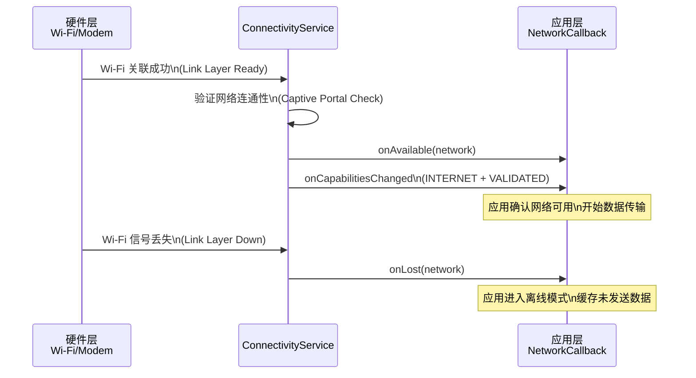

**实践建议**：在现代 Android 开发中，推荐将 `NetworkCallback` 封装进一个具有生命周期感知能力的组件中（如实现 `DefaultLifecycleObserver`），在 `onStart()` 中注册、`onStop()` 中反注册，从而彻底避免泄漏风险。如果使用 Kotlin Coroutines，还可以将网络状态封装为 `StateFlow`，让 UI 层以响应式的方式消费网络状态的变化。

---

### 开机启动广播 BOOT_COMPLETED

`android.intent.action.BOOT_COMPLETED` 是 Android 系统中最"特殊"的广播之一。它在设备完成启动序列、用户解锁屏幕（对于直接启动设备是开机即发，对于 FBE 加密设备则是首次解锁后）之后，由系统一次性发出。这条广播的特殊之处在于：即便在 Android 8.0 以后隐式广播的静态注册被大面积限制的背景下，`BOOT_COMPLETED` 仍然被保留在白名单中，**允许通过 Manifest 静态注册接收**。原因很简单——开机启动是许多应用不可替代的初始化时机：闹钟应用需要在开机后重新注册所有定时器（AlarmManager 的 alarm 不会在重启后保留）、消息推送应用需要重新建立长连接、健康监测应用需要重启后台传感器采集服务。

**注册与权限**

要接收 `BOOT_COMPLETED`，应用必须同时满足两个条件：在 Manifest 中声明 `RECEIVE_BOOT_COMPLETED` 权限，并静态注册一个接收器。

```xml
<!-- AndroidManifest.xml -->

<!-- 1. 声明权限：告知系统本应用需要接收开机广播 -->
<uses-permission android:name="android.permission.RECEIVE_BOOT_COMPLETED" />

<application ...>
    <!-- 2. 静态注册接收器 -->
    <receiver
        android:name=".BootCompletedReceiver"
        android:exported="true"
        android:enabled="true">
        <!--
            exported="true" 是必须的：
            因为这条广播由系统发出（发送方是 system_server 进程），
            如果 exported 为 false，系统无法将广播投递到本应用。
        -->
        <intent-filter>
            <!-- 3. 声明感兴趣的 Action -->
            <action android:name="android.intent.action.BOOT_COMPLETED" />
        </intent-filter>
    </receiver>
</application>
```

```kotlin
// ===== 开机启动接收器 =====
class BootCompletedReceiver : BroadcastReceiver() {

    override fun onReceive(context: Context, intent: Intent) {
        // 防御性判断：确认确实是开机广播
        if (intent.action == Intent.ACTION_BOOT_COMPLETED) {
            // 典型操作 1：重新调度之前设置的闹钟/提醒
            rescheduleAlarms(context)
            // 典型操作 2：启动一个前台 Service 恢复后台任务
            // 注意：Android 8.0+ 后台启动 Service 受限，
            // 必须在数秒内调用 startForeground()，否则 ANR
            val serviceIntent = Intent(context, SyncService::class.java)
            ContextCompat.startForegroundService(context, serviceIntent)
            // 典型操作 3：使用 WorkManager 调度周期性任务
            WorkManagerHelper.enqueuePeriodicSync(context)
        }
    }

    private fun rescheduleAlarms(context: Context) {
        // 从 SharedPreferences / 数据库中读取用户设置的提醒时间
        // 重新调用 AlarmManager.setExactAndAllowWhileIdle() 注册
        // （具体实现省略）
    }
}
```

**关键时序与注意事项**

`BOOT_COMPLETED` 的发送时机晚于你的直觉。系统启动的完整流程是：Bootloader → Kernel → init 进程 → Zygote → SystemServer → 各系统服务就绪 → Launcher 启动 → 用户解锁屏幕。只有在 **用户首次解锁屏幕之后**，`BOOT_COMPLETED` 才会被发送。这意味着如果用户开机后一直停留在锁屏界面不解锁，你的应用不会收到这条广播。

对于运行 Android 7.0+（API 24）并启用了 **FBE（File-Based Encryption，基于文件的加密）** 的设备，情况更为精细。在用户首次解锁之前，设备处于 **Direct Boot 模式**，此时只有标记了 `android:directBootAware="true"` 的组件才能运行，并且它们只能访问设备加密存储（Device Encrypted Storage），无法访问凭据加密存储（Credential Encrypted Storage）。在这个阶段，系统会发送 `ACTION_LOCKED_BOOT_COMPLETED` 而非 `BOOT_COMPLETED`。只有当用户解锁后，标准的 `BOOT_COMPLETED` 才会发出。

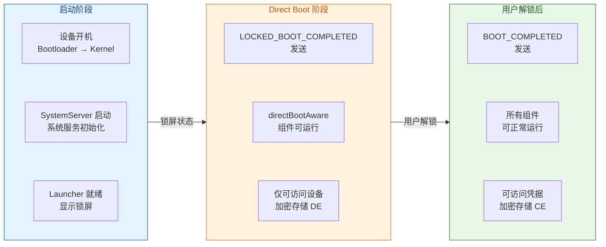

还需要注意的是，在 `onReceive()` 中执行的代码有严格的时间限制。前面章节已经讲过，`onReceive()` 默认运行在主线程，且系统给予的执行窗口大约只有 **10 秒**（前台广播）。如果你需要在开机后执行较长的初始化逻辑，正确的做法是在 `onReceive()` 中启动一个前台 Service 或通过 `goAsync()` 获取一个 `PendingResult` 来延长生命周期（上限约 30 秒），或者更推荐的方式——使用 `WorkManager` 调度一个一次性任务（OneTimeWorkRequest），由系统在合适的时机执行。

另一个常见的"坑"是：**应用安装后必须至少被用户手动启动过一次**，才能收到 `BOOT_COMPLETED`。这是从 Android 3.1（API 12）引入的 "stopped state" 机制——新安装但从未打开过的应用处于"停止"状态（类似 iOS 上"从未启动"的概念），系统不会向其投递任何隐式广播。用户打开应用一次后，应用就脱离了 stopped state，后续重启就能正常接收开机广播了。同理，如果用户在设置中对应用执行了"强制停止"（Force Stop），应用也会重新进入 stopped state，直到下次手动启动。

---

### 电量变化广播

电池状态对移动应用的策略影响深远。一个优秀的应用应当在电量充足时执行同步与预加载，在电量不足时减少后台活动、降低刷新频率，在连接充电器时恢复被抑制的任务。Android 系统围绕电池状态提供了多条广播，形成了一个完整的电量感知体系。

**核心电量广播一览**

Android 系统与电量相关的广播主要有以下几条，每一条的触发场景和用途各不相同：

`ACTION_BATTERY_CHANGED`（`android.intent.action.BATTERY_CHANGED`）是最底层、最详细的电量广播。**它是一条粘性广播（Sticky Broadcast）**——虽然粘性广播机制本身在 API 21 已被废弃，但 `BATTERY_CHANGED` 作为系统内部使用的特例仍然保持着粘性行为。这意味着即使你在电量变化发生之后才注册接收器，仍然能立即收到最后一次的电量状态。这条广播的 Intent 中携带了极为丰富的 Extra 信息：当前电量值（`EXTRA_LEVEL`）、电量总刻度（`EXTRA_SCALE`，通常是 100）、充电状态（`EXTRA_STATUS`：充电中 / 放电中 / 已充满 / 未充电）、充电方式（`EXTRA_PLUGGED`：USB / AC 适配器 / 无线充电）、电池健康状态（`EXTRA_HEALTH`）、电池温度（`EXTRA_TEMPERATURE`，单位为 0.1°C）和电池电压（`EXTRA_VOLTAGE`，单位为 mV）等。但有一个重要限制：**这条广播只能通过动态注册接收**，在 Manifest 中静态注册无效。原因在于电量变化过于频繁（每 1% 的变化都会触发一次），如果允许静态注册，所有监听它的应用都会被频繁唤醒，造成电量消耗的恶性循环。

`ACTION_BATTERY_LOW`（`android.intent.action.BATTERY_LOW`）在电量降至系统定义的"低电量"阈值（通常为 15%~20%，因 OEM 而异）时发送。`ACTION_BATTERY_OKAY`（`android.intent.action.BATTERY_OKAY`）则在电量从低电量状态恢复到正常水平时发送。这两条广播支持静态注册。

`ACTION_POWER_CONNECTED` 和 `ACTION_POWER_DISCONNECTED` 分别在充电器连接和断开时发送，同样支持静态注册。

```kotlin
// ===== 动态注册接收 BATTERY_CHANGED，获取详细电量信息 =====
class BatteryMonitor(private val context: Context) {

    // 定义接收器
    private val batteryReceiver = object : BroadcastReceiver() {
        override fun onReceive(ctx: Context, intent: Intent) {
            // 确认是电量变化广播
            if (intent.action == Intent.ACTION_BATTERY_CHANGED) {
                // 当前电量值，默认 -1 表示获取失败
                val level = intent.getIntExtra(BatteryManager.EXTRA_LEVEL, -1)
                // 电量满格刻度，通常为 100
                val scale = intent.getIntExtra(BatteryManager.EXTRA_SCALE, 100)
                // 计算电量百分比
                val percentage = (level * 100) / scale

                // 充电状态：BATTERY_STATUS_CHARGING / DISCHARGING / FULL / NOT_CHARGING
                val status = intent.getIntExtra(
                    BatteryManager.EXTRA_STATUS, -1
                )
                val isCharging = status == BatteryManager.BATTERY_STATUS_CHARGING
                        || status == BatteryManager.BATTERY_STATUS_FULL

                // 充电方式：BATTERY_PLUGGED_AC / USB / WIRELESS
                val plugged = intent.getIntExtra(
                    BatteryManager.EXTRA_PLUGGED, -1
                )
                val chargingSource = when (plugged) {
                    BatteryManager.BATTERY_PLUGGED_AC -> "AC 适配器"
                    BatteryManager.BATTERY_PLUGGED_USB -> "USB"
                    BatteryManager.BATTERY_PLUGGED_WIRELESS -> "无线充电"
                    else -> "未连接"
                }

                // 电池温度：单位为 0.1°C，需除以 10 得到实际温度
                val temperature = intent.getIntExtra(
                    BatteryManager.EXTRA_TEMPERATURE, 0
                ) / 10.0

                Log.d("Battery",
                    "电量=${percentage}%, 充电=$isCharging, " +
                    "方式=$chargingSource, 温度=${temperature}°C")
            }
        }
    }

    fun startMonitoring() {
        // 注册时使用 IntentFilter 指定 ACTION_BATTERY_CHANGED
        val filter = IntentFilter(Intent.ACTION_BATTERY_CHANGED)
        // registerReceiver 的返回值就是最新的粘性广播 Intent
        // 即使当前没有电量变化事件，也能立即获得当前电池状态
        val stickyIntent = context.registerReceiver(batteryReceiver, filter)
        // stickyIntent 可以直接用来读取当前电池信息
        stickyIntent?.let { processBatteryInfo(it) }
    }

    fun stopMonitoring() {
        context.unregisterReceiver(batteryReceiver)
    }

    private fun processBatteryInfo(intent: Intent) {
        // 与 onReceive 中相同的解析逻辑（省略重复代码）
    }
}
```

**无需注册即可获取当前电量**

一个非常实用的技巧是：由于 `BATTERY_CHANGED` 是粘性广播，你可以在不注册任何接收器的情况下，通过 `registerReceiver(null, filter)` 直接获取当前电池状态的快照。这种"一次性查询"模式非常适合在需要时才检查电量的场景（如在执行下载前判断电量是否充足）：

```kotlin
// ===== 一次性获取当前电量状态（无需注册接收器） =====
fun getCurrentBatteryPercentage(context: Context): Int {
    // 传入 null 作为 receiver 参数
    // 系统会返回最近一次粘性广播的 Intent，而不会实际注册接收器
    val batteryStatus: Intent? = context.registerReceiver(
        null,  // 不注册接收器
        IntentFilter(Intent.ACTION_BATTERY_CHANGED)  // 仅匹配电量广播
    )
    // 从返回的 Intent 中解析电量
    val level = batteryStatus?.getIntExtra(BatteryManager.EXTRA_LEVEL, -1) ?: -1
    val scale = batteryStatus?.getIntExtra(BatteryManager.EXTRA_SCALE, 100) ?: 100
    return (level * 100) / scale
}
```

另外，从 Android 5.0（API 21）起，`BatteryManager` 本身也作为系统服务提供了直接查询接口，不再必须依赖广播：

```kotlin
// ===== 通过 BatteryManager 系统服务直接查询（API 21+） =====
fun getBatteryInfo(context: Context) {
    // 获取 BatteryManager 系统服务
    val bm = context.getSystemService(Context.BATTERY_SERVICE) as BatteryManager
    // 直接获取电量百分比（已经是 0~100 的整数）
    val percentage = bm.getIntProperty(BatteryManager.BATTERY_PROPERTY_CAPACITY)
    // 判断当前是否正在充电
    val isCharging = bm.isCharging
    // 获取瞬时电流（单位微安 μA，负值表示放电）
    val currentNow = bm.getIntProperty(
        BatteryManager.BATTERY_PROPERTY_CURRENT_NOW
    )
    Log.d("Battery",
        "电量=${percentage}%, 充电=$isCharging, 电流=${currentNow}μA")
}
```

**电量感知的最佳实践**

在实际应用中，持续监听 `BATTERY_CHANGED` 并不总是最佳选择，因为它触发过于频繁。更合理的策略是根据业务需求选择合适的广播粒度：如果只需要在充电状态变化时调整策略，监听 `ACTION_POWER_CONNECTED` / `ACTION_POWER_DISCONNECTED` 就足够了；如果只需要在电量过低时暂停非关键任务，监听 `ACTION_BATTERY_LOW` 即可。对于需要精细电量感知的场景，`WorkManager` 的 `Constraints` 提供了声明式的电量条件约束——你可以指定"只在充电时"或"只在电量不低时"执行任务，将复杂的电量判断逻辑交给系统框架处理：

```kotlin
// ===== 使用 WorkManager 的电量约束调度任务 =====
val constraints = Constraints.Builder()
    // 要求设备正在充电
    .setRequiresCharging(true)
    // 要求电量不处于低电状态
    .setRequiresBatteryNotLow(true)
    .build()

// 创建一次性任务请求并附加约束条件
val syncWork = OneTimeWorkRequestBuilder<DataSyncWorker>()
    .setConstraints(constraints)
    .build()

// 提交给 WorkManager，系统会在约束条件满足时自动执行
WorkManager.getInstance(context).enqueue(syncWork)
```

---

### 屏幕亮灭与解锁广播

屏幕状态是衡量用户是否正在与设备交互的最直接指标。当屏幕亮起时，用户可能正在查看通知或准备使用应用；当屏幕熄灭时，设备通常进入口袋模式或桌面待机。应用可以利用屏幕状态广播来精细控制自身的资源消耗，例如：视频播放器在屏幕关闭时暂停播放、动画在屏幕熄灭时停止渲染、计步器在屏幕关闭时降低传感器采样频率。

Android 系统提供了三条与屏幕状态直接相关的广播：

`ACTION_SCREEN_ON`（`android.intent.action.SCREEN_ON`）在屏幕被点亮时发送。这包括用户按下电源键亮屏、抬起手机触发抬手亮屏（Lift to Wake）、收到通知亮屏等所有情况。注意，此时屏幕虽然亮了，但可能仍然处于锁屏界面。

`ACTION_SCREEN_OFF`（`android.intent.action.SCREEN_OFF`）在屏幕熄灭时发送。触发原因可能是用户按下电源键、超时自动锁屏、接打电话时的近距传感器触发熄屏等。

`ACTION_USER_PRESENT`（`android.intent.action.USER_PRESENT`）在用户成功解锁屏幕后发送。如果设备没有设置锁屏密码/图案/指纹等安全锁，那么 `SCREEN_ON` 之后几乎立即就会收到 `USER_PRESENT`。如果设置了安全锁，则 `USER_PRESENT` 要等到用户通过身份验证后才会发送。

这三条广播中，`SCREEN_ON` 和 `SCREEN_OFF` **只能通过动态注册接收**（与 `BATTERY_CHANGED` 类似，静态注册无效），而 `USER_PRESENT` 在 Android 8.0 以前支持静态注册，但从 Android 8.0 起同样被限制为仅动态注册。

```kotlin
// ===== 屏幕状态监听器 =====
class ScreenStateReceiver : BroadcastReceiver() {

    override fun onReceive(context: Context, intent: Intent) {
        when (intent.action) {
            // 屏幕点亮：设备可能即将被用户使用
            Intent.ACTION_SCREEN_ON -> {
                Log.d("Screen", "屏幕已亮起")
                // 可在此预加载数据、恢复轻量动画
            }
            // 屏幕熄灭：用户已停止交互
            Intent.ACTION_SCREEN_OFF -> {
                Log.d("Screen", "屏幕已关闭")
                // 暂停动画渲染、释放相机/传感器等硬件资源
                // 降低后台任务的优先级
            }
            // 用户已解锁：确认用户正在主动使用设备
            Intent.ACTION_USER_PRESENT -> {
                Log.d("Screen", "用户已解锁")
                // 可在此触发数据刷新、检查更新等操作
            }
        }
    }
}

// ===== 在 Activity 或 Service 中动态注册 =====
class MainActivity : AppCompatActivity() {

    // 创建接收器实例
    private val screenReceiver = ScreenStateReceiver()

    override fun onStart() {
        super.onStart()
        // 构建 IntentFilter，同时监听三种屏幕事件
        val filter = IntentFilter().apply {
            addAction(Intent.ACTION_SCREEN_ON)   // 亮屏
            addAction(Intent.ACTION_SCREEN_OFF)  // 熄屏
            addAction(Intent.ACTION_USER_PRESENT) // 解锁
        }
        // 动态注册接收器
        registerReceiver(screenReceiver, filter)
    }

    override fun onStop() {
        super.onStop()
        // 必须反注册，防止内存泄漏
        unregisterReceiver(screenReceiver)
    }
}
```

**屏幕状态的判断也可以不依赖广播**。如果你只是需要在某个时刻查询当前屏幕是否亮着，可以通过 `PowerManager` 或 `DisplayManager` 直接查询：

```kotlin
// ===== 主动查询当前屏幕状态 =====
fun isScreenOn(context: Context): Boolean {
    val powerManager = context.getSystemService(Context.POWER_SERVICE) as PowerManager
    // isInteractive() 在 API 20+ 替代了已废弃的 isScreenOn()
    // 返回 true 表示设备处于"交互"状态（屏幕亮且未处于 Doze 深度休眠）
    return powerManager.isInteractive
}
```

**屏幕事件的触发顺序**

一个完整的用户交互周期中，这些广播的发送顺序如下：

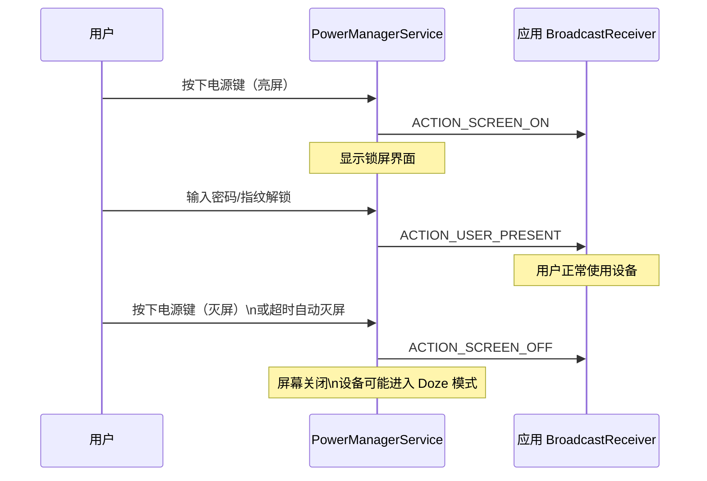

理解这个时序有助于避免一些常见的逻辑错误。例如，不要在 `SCREEN_ON` 时就认为用户已经在使用应用——此时用户可能还在锁屏界面上。如果你的业务逻辑需要"用户真正进入桌面"这个时机，应该等待 `USER_PRESENT`。

---

### 系统广播的版本限制全景

前面各小节中分散提到了不同版本的限制策略，这里做一个统一的梳理。理解广播限制的演进脉络，对于编写具有良好兼容性的广播代码至关重要。

Android 对隐式广播的限制本质上是在 **应用的响应性** 和 **系统的续航/性能** 之间寻找平衡。早期 Android 的设计哲学偏向开放，任何应用都能注册任何广播；但随着生态中应用数量爆炸式增长，"一条广播唤醒数十个后台进程"的问题变得不可接受。Google 从 Android 7.0 开始逐步收紧，最终形成了"静态注册仅限白名单广播、动态注册不受限但绑定组件生命周期"的现代模型。

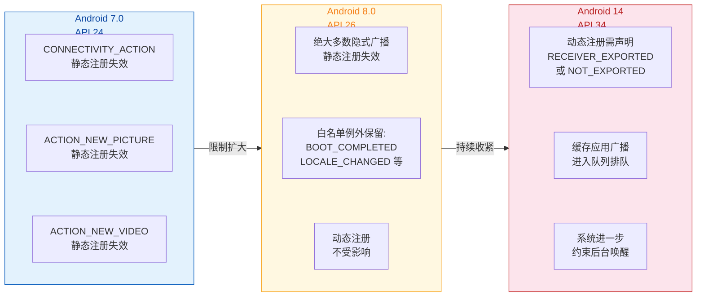

特别值得关注的是 Android 14（API 34）引入的 **context-registered receiver export 声明**要求。从这个版本开始，通过 `Context.registerReceiver()` 动态注册的接收器，如果接收的是系统广播以外的广播，必须通过 flag 明确声明自己是 `RECEIVER_EXPORTED`（可被外部应用发送的广播触达）还是 `RECEIVER_NOT_EXPORTED`（仅限本应用内部广播）。如果不声明，系统会抛出 `SecurityException`。这一变化进一步堵住了通过动态注册接收恶意广播的攻击面。

```kotlin
// ===== Android 14+ 动态注册时必须声明 export 状态 =====

// 场景 1：接收系统广播（如 SCREEN_ON），无需额外 flag
// 系统广播由 system_server 发出，天然受信任
context.registerReceiver(screenReceiver, filter)

// 场景 2：接收来自其他应用的自定义广播
// 必须显式声明 RECEIVER_EXPORTED
context.registerReceiver(
    customReceiver,
    IntentFilter("com.other.app.CUSTOM_ACTION"),
    Context.RECEIVER_EXPORTED  // 明确声明可被外部触达
)

// 场景 3：只接收本应用内部广播（更安全）
context.registerReceiver(
    internalReceiver,
    IntentFilter("com.my.app.INTERNAL_ACTION"),
    Context.RECEIVER_NOT_EXPORTED  // 外部应用无法触达
)
```

---

### 自定义广播 vs 系统广播的实践对照

在实际开发中，应用经常需要同时处理系统广播和自定义广播。一个清晰的认知框架是：**系统广播是被动响应外部环境变化，自定义广播是主动在应用内部或应用之间传递消息**。两者在注册方式、安全考量和生命周期管理上有诸多差异。

对于系统广播的监听，现代 Android 开发的基本原则可以总结为：优先使用专用 API（如 `NetworkCallback`、`BatteryManager`）而非广播；当必须使用广播时，优先动态注册并绑定组件生命周期；仅在确实需要在进程不存在时也能被唤醒的场景（如 `BOOT_COMPLETED`），才使用静态注册。

---

**📝 练习题**

某应用需要在 Android 12（API 31）设备上监听网络变化，以便在 Wi-Fi 断开时自动切换到低画质模式。开发者在 `AndroidManifest.xml` 中静态注册了一个 `BroadcastReceiver` 监听 `android.net.conn.CONNECTIVITY_CHANGE`。该应用运行后发现无法收到网络变化通知。以下哪种方案能正确解决该问题？

A. 在 Manifest 的 `<receiver>` 中增加 `android:exported="true"` 属性

B. 添加 `<uses-permission android:name="android.permission.ACCESS_NETWORK_STATE"/>` 权限声明

C. 改为使用 `ConnectivityManager.registerDefaultNetworkCallback()` 动态注册 `NetworkCallback`

D. 将 `targetSdkVersion` 降低到 23 以绕过系统限制

**【答案】** C
**【解析】** 从 Android 7.0（API 24）起，`CONNECTIVITY_ACTION` 的静态注册已被系统禁止。在 Android 12 设备上，无论是否设置 `exported` 属性或添加权限声明，通过 Manifest 注册的接收器都不会收到该广播。选项 A 的 `exported` 属性仅控制接收器是否对外部组件可见，不影响系统对隐式广播的投递限制。选项 B 的 `ACCESS_NETWORK_STATE` 权限用于查询网络状态信息，即使添加了也无法让被禁止的静态注册重新生效。选项 D 降低 `targetSdkVersion` 理论上可以让旧行为继续工作，但这会导致应用无法使用新版本的 API 特性、无法在 Google Play 上架（Play Store 对 `targetSdkVersion` 有最低要求），并且这不是正确的工程实践。选项 C 使用 `ConnectivityManager.registerDefaultNetworkCallback()` 是 Google 官方推荐的现代方案，通过回调机制获取网络变化通知，不受隐式广播限制的影响，并且提供了更丰富的网络状态信息（如 `NetworkCapabilities`），是最正确的解决方案。

---

**📝 练习题**

关于 `ACTION_BATTERY_CHANGED` 广播，以下说法正确的是：

A. 可以在 `AndroidManifest.xml` 中静态注册接收器来监听此广播

B. 调用 `registerReceiver(null, IntentFilter(Intent.ACTION_BATTERY_CHANGED))` 会导致空指针异常

C. 该广播属于粘性广播，即使注册时机晚于广播发送，仍能立即获得最近一次的电池状态

D. 该广播仅在电量百分比发生整数变化时才发送，充电状态变化不会触发

**【答案】** C
**【解析】** `ACTION_BATTERY_CHANGED` 是 Android 系统中为数不多保持粘性广播行为的特例。虽然 `sendStickyBroadcast()` API 在 API 21 已被废弃，但系统内部对电量广播的粘性投递机制仍然有效。这意味着调用 `registerReceiver()` 时，系统会立即返回最近一次电量广播的 Intent，应用无需等待下一次电量变化就能获取当前状态。选项 A 错误，该广播因触发极其频繁（电量、温度、电压等任何变化都会触发），系统明确禁止静态注册。选项 B 错误，传入 `null` 作为 receiver 是 Android 官方文档记载的合法用法，专门用于读取粘性广播的最后一条 Intent 而不实际注册接收器，返回值即为该 Intent。选项 D 错误，`BATTERY_CHANGED` 不仅在电量百分比变化时触发，充电状态改变、充电方式切换、电池温度波动等事件都会导致系统发送此广播。

---

## 本章小结

BroadcastReceiver 是 Android 四大组件中最具"事件驱动"特征的一个。它将操作系统级别的事件（网络切换、电量变化、开机完成）和应用内部的自定义事件，统一抽象成一套 **发布-订阅（Publish-Subscribe）** 模型，让组件之间无需直接持有引用就能完成通信。回顾整章内容，可以从架构模型、注册机制、广播类型、回调约束、安全策略以及实践选型六个维度做一次系统性梳理。

### 架构模型：AMS 居中的全局消息总线

广播机制的本质是一条由 **ActivityManagerService（AMS）** 居中调度的全局消息总线。发送方调用 `sendBroadcast()` 后，Intent 经由 Binder IPC 到达 AMS；AMS 在内部维护的 `mRegisteredReceivers`（动态注册表）和 `mReceivers`（静态注册表，由 PackageManagerService 在安装时解析 AndroidManifest 所得）中检索匹配的接收器，再按照广播类型（Normal / Ordered）决定是并行还是串行地将消息 **逐一回调** 到各接收器的 `onReceive()` 方法。整个流程对 App 来说是透明的——开发者只需关注"注册 IntentFilter"和"实现 onReceive()"，中间的跨进程投递、队列排序、权限校验全部由系统完成。这种 **"发送方与接收方完全解耦"** 的设计，正是经典观察者模式在操作系统层面的工程实现。

### 注册机制：静态与动态的取舍

注册方式决定了接收器的 **生存周期** 和 **触发时机**。静态注册（在 AndroidManifest 中声明 `<receiver>`）使接收器具备"进程未启动也能被唤醒"的能力，适合监听 `BOOT_COMPLETED` 等必须在冷启动前响应的系统事件；但自 Android 8.0（API 26）起，Google 对隐式静态广播施加了严格限制——除少数白名单广播外，大多数隐式广播不再投递给静态接收器，目的是遏制后台进程被随意唤醒导致的电量与内存消耗。动态注册（通过 `Context.registerReceiver()`）则将接收器的生命周期绑定到注册它的组件上：Activity 在 `onResume()` 注册、`onPause()` 解注册是最常见的模式；如果忘记 `unregisterReceiver()`，不仅会导致 **IntentReceiver 泄漏**（系统会在 Logcat 中打印明确警告），还可能让已销毁的 Activity 被回调引用链间接持有而无法回收。因此，动态注册的核心纪律就是 **"谁注册、谁解注册，且必须成对出现在对称的生命周期回调中"**。

### 广播类型：并行与串行的语义差异

标准广播（Normal Broadcast）采用 **并行投递**，AMS 会近乎同时将 Intent 分发给所有匹配的接收器，效率高但不可拦截、不可排序。有序广播（Ordered Broadcast）则走 **串行队列**，接收器按 `android:priority`（或 `IntentFilter.setPriority()`）从高到低依次执行，高优先级接收器可以通过 `setResultData()` 向后传递修改后的数据，也可以调用 `abortBroadcast()` 直接截断后续链路——这种机制非常适合做"拦截型"逻辑，例如短信拦截（虽然现代版本已收紧权限）。至于粘性广播（Sticky Broadcast），它曾允许 Intent 在 AMS 中 **持久驻留**，后来的接收器注册时也能立即获取最近一条消息；但由于它存在明显的安全隐患（任何应用都能读取粘性 Intent）、内存浪费以及无法精细化权限控制，已在 API 21 被正式标记为 `@Deprecated`，现代开发中应使用 LiveData、StateFlow 或 SharedPreferences 等机制替代其"状态快照"语义。

### 回调约束：onReceive 的 10 秒生死线

`onReceive()` 运行在 **主线程**，且其宿主 BroadcastReceiver 对象的生命周期极短——方法返回后，系统即认为该接收器已完成工作，其进程优先级可能立即降低甚至被杀死。这意味着两条硬性禁令：第一，**禁止在 onReceive() 中执行任何耗时操作**（网络请求、数据库写入、文件 IO），否则会触发 ANR（前台广播约 10 秒超时，后台广播约 60 秒）；第二，**禁止在 onReceive() 中启动子线程并期望它能跑完**，因为方法返回后进程随时可能被回收，子线程的执行没有任何保障。正确的做法是将耗时任务委托给 `Service`（或更现代的 `WorkManager` / `goAsync()` 配合协程），让系统知道"还有后台工作在进行"从而维持进程优先级。`goAsync()` 返回的 `PendingResult` 对象可以将回调的完成时机延迟到异步任务结束后再调用 `finish()`，但即便如此，总时长仍不应超过 10 秒，它只是把执行权从主线程转移到了工作线程，并未真正延长超时窗口。

### 安全策略：权限、exported 与定向发送

广播天然具有"跨应用"通信能力，这也带来了安全风险。Android 提供了三层防护机制：其一，**发送端权限**——调用 `sendBroadcast(intent, "com.example.MY_PERMISSION")` 可以要求接收方必须在 Manifest 中声明持有该权限，否则 AMS 不会投递；其二，**接收端 `android:exported` 属性**——设为 `false` 的接收器只接受同应用（同 UID）发出的广播，从根本上杜绝外部应用的恶意触发；其三，**包名定向发送**——通过 `intent.setPackage("com.example.target")` 将广播限定为只投递给指定包名的接收器，兼顾了跨应用通信的灵活性和精确性。在实际工程中，这三种手段往往组合使用，尤其在涉及敏感数据传递（如登录状态同步、支付结果通知）时，**必须至少启用一种安全限制**，否则就是在向所有第三方应用"广播"你的隐私数据。

### 本地广播的兴衰与现代替代

`LocalBroadcastManager` 曾是 Android 官方推荐的 **应用内通信方案**。它完全绕过 AMS，在进程内部用一个 Handler + 消息队列实现发布-订阅，既避免了跨进程 IPC 开销，又天然隔绝了外部应用的窃听与伪造。然而，Google 在 AndroidX 1.1.0 中将其标记为 `@Deprecated`，原因并非它不安全，而是它的 API 设计（基于 Intent + IntentFilter 的字符串匹配）过于粗糙，无法提供类型安全、生命周期感知等现代架构所需的能力。官方推荐的替代方案包括：`LiveData`（生命周期感知的可观察数据，适合 UI 层）、`SharedFlow / StateFlow`（Kotlin 协程生态下的响应式流，适合 ViewModel 与 Repository 层通信）、以及 `EventBus` 等第三方库（虽非官方推荐，但在遗留项目中仍有广泛使用）。核心思路是 **"应用内通信不再需要广播机制，响应式数据流才是正道"**。

### 系统广播的实践要点

Android 系统定义了大量广播 Action，开发者最常打交道的包括：`CONNECTIVITY_ACTION`（网络变化，API 28 后不再支持静态注册，需改用 `ConnectivityManager.NetworkCallback`）、`BOOT_COMPLETED`（开机完成，仍在静态广播白名单中，但需要 `RECEIVE_BOOT_COMPLETED` 权限）、`ACTION_BATTERY_LOW / ACTION_BATTERY_CHANGED`（电量状态）、`ACTION_SCREEN_ON / ACTION_USER_PRESENT`（屏幕与解锁事件）。随着 Android 版本的演进，越来越多的系统广播被限制或废弃，取而代之的是更细粒度的回调 API（如 `JobScheduler`、`WorkManager` 的约束条件、`ActivityLifecycleCallbacks` 等）。开发者在选型时应遵循一个原则：**如果存在专用 API 能监听同一事件，优先使用专用 API 而非广播**，因为专用 API 通常具备更好的生命周期管理和更低的系统开销。

### 全章知识脉络

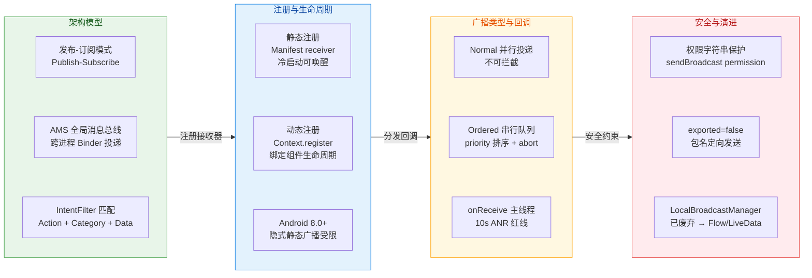

### 选型决策速查

在实际开发中，面对"组件间通信"这一需求时，是否选用 BroadcastReceiver 应当基于以下判断逻辑：如果通信发生在 **同一应用内部**，首选 `LiveData`、`SharedFlow/StateFlow` 或 `EventBus`，它们具备类型安全和生命周期感知能力，远优于广播的字符串匹配机制。如果需要 **监听系统级事件**（开机、网络变化、电量），则广播仍是标准手段，但要优先检查是否有更现代的专用 API 可用。如果需要 **跨应用通信**，广播配合权限声明和包名定向发送是可行方案，但对于复杂的跨进程数据交换，`ContentProvider` 或 `AIDL` 通常更合适。最后，**任何场景下都不应在 `onReceive()` 中执行耗时逻辑**，这是广播机制最核心的使用禁区。

---

**📝 练习题**

某应用需要在用户开机后自动执行一次数据同步任务（耗时约 30 秒），以下方案中最合理的是：

A. 静态注册 `BOOT_COMPLETED` 广播，在 `onReceive()` 中直接启动子线程执行 30 秒的同步任务

B. 静态注册 `BOOT_COMPLETED` 广播，在 `onReceive()` 中调用 `goAsync()` 获取 `PendingResult`，在子线程中执行 30 秒同步后调用 `finish()`

C. 静态注册 `BOOT_COMPLETED` 广播，在 `onReceive()` 中通过 `WorkManager` 调度一个一次性同步任务

D. 动态注册 `BOOT_COMPLETED` 广播，在 `onReceive()` 中启动前台 Service 执行同步

**【答案】** C

**【解析】** 此题考查 `onReceive()` 的生命周期约束与开机广播的注册方式。选项 A 的致命问题在于，`onReceive()` 返回后进程优先级立即降低，系统随时可能杀死进程，子线程的 30 秒任务极大概率无法跑完。选项 B 虽然使用了 `goAsync()` 将执行转移到工作线程，但 `goAsync()` 并不会真正延长广播的超时窗口——后台广播的超时仍约为 60 秒，且系统仍可能因内存压力回收进程，30 秒的长任务风险依然很高。选项 D 的问题在于 `BOOT_COMPLETED` 要求接收器在进程尚未启动时就能被系统唤醒，动态注册必须在代码运行后才能生效，开机时应用进程尚未存活，根本无法收到广播。选项 C 是最佳实践：静态注册确保冷启动时能收到开机广播，`onReceive()` 中仅做一件轻量操作——向 `WorkManager` 提交一个 `OneTimeWorkRequest`，然后立即返回；`WorkManager` 会自行管理进程保活、任务重试与约束条件（如网络可用），完美适配长耗时后台任务的场景。

---

