---

# ContentProvider：数据共享

---

## 内容提供者角色

Android 系统的核心设计哲学之一，是将每个应用运行在独立的进程和独立的 Linux 用户空间中。这种 **沙箱（Sandbox）隔离机制** 从根本上保障了应用之间的数据安全——进程 A 无法随意读取进程 B 的私有数据库或文件。然而，在真实的移动生态中，应用之间的数据流通又是刚需：通讯录应用需要把联系人数据暴露给拨号器，相册应用需要把图片信息暴露给社交分享工具，日历应用需要允许第三方插件读取日程安排。如何在"严格隔离"与"灵活共享"之间找到平衡点？Android 的回答就是四大组件之一的 **ContentProvider（内容提供者）**。

ContentProvider 并非一个简单的"数据库包装器"，虽然很多初学者会这样理解。它是 Android Framework 层精心设计的一套 **跨进程数据共享标准协议**。理解 ContentProvider 的角色，需要从三个维度来看：它为什么是"标准"、它的"接口"如何做到统一、以及它在"安全隔离"层面提供了哪些保障。

### 跨进程数据共享标准

要理解 ContentProvider 存在的必要性，首先必须清楚 Android 进程隔离的底层机制。每个 Android 应用默认运行在自己的 Dalvik/ART 虚拟机实例中，对应一个独立的 Linux 进程。Linux 内核通过 UID（User ID）机制为每个应用分配不同的用户身份，使得一个应用的数据目录（`/data/data/<package_name>/`）对其他应用而言是不可访问的。这种设计意味着，进程 A 创建的 SQLite 数据库文件，进程 B 在文件系统层面就无权打开。

在这种强隔离的环境下，如果没有一个系统级的"中间人"协议，应用间的数据共享将面临以下困境：

**第一，缺乏统一的寻址方式。** 假设应用 A 想读取应用 B 的数据，它该如何"找到"这些数据？用文件路径？文件路径是应用 B 的私有实现细节，A 根本不应该知道，也不应该依赖。用数据库名？不同应用的数据库 schema 和命名完全不同。Android 需要一种与底层存储实现无关的、标准化的资源寻址方式——这就是 **Content URI**，后续章节会详细展开。

**第二，缺乏标准化的操作语义。** 即便 A 能够以某种方式"到达"B 的数据，它要用什么"动词"来操作？直接执行 SQL？这将完全暴露数据库结构，且不同应用可能使用完全不同的存储方案（有的用 SQLite，有的用文件，有的用网络缓存）。Android 需要一组 **与存储实现无关的标准 CRUD 操作** 来屏蔽底层差异。

**第三，缺乏系统级的安全管控点。** 在没有 ContentProvider 的世界里，如果两个进程要共享数据，它们只能通过 Socket、共享文件、甚至 Broadcast 传递 Serializable 对象等"土办法"。这些方式的共同问题是：**Android Framework 无法在其中插入统一的权限检查逻辑**。谁能读？谁能写？粒度能细化到哪一行数据？这些问题在"土办法"中都无法优雅解决。

ContentProvider 正是为了同时解决以上三个问题而被设计为 Android 的 **标准跨进程数据共享协议**。从架构层面看，它的运作涉及以下几个关键角色：

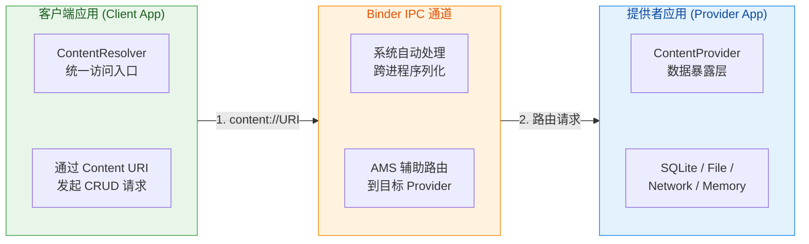

整个过程的核心流转逻辑如下：客户端应用（可能在进程 A 中）通过 `Context.getContentResolver()` 获取系统提供的 `ContentResolver` 实例，然后以一个 **Content URI**（如 `content://com.example.contacts/people/3`）为参数，调用 `query()`、`insert()` 等标准方法。`ContentResolver` 并不直接持有目标 ContentProvider 的引用——毕竟它们在不同进程中。它会通过 **Binder IPC** 机制，将请求经由 `ActivityManagerService`（AMS）路由到拥有该 ContentProvider 的进程。在目标进程中，对应的 `ContentProvider` 子类接收到请求后，执行具体的数据操作（可能查询 SQLite 数据库，可能读取文件，甚至可能发起网络请求），然后将结果通过 Binder 返回给客户端。

值得特别强调的是，ContentProvider 本质上是一个 **"被动组件"（Passive Component）**。它不像 Activity 那样有明确的用户可见的启动时机，也不像 Service 那样被显式 `startService()` 或 `bindService()` 启动。一个 ContentProvider 的实例，是在有客户端首次通过其 Authority 发起请求时，由系统 **自动创建并初始化** 的（准确说，在应用进程创建后、`Application.onCreate()` 之前就已经完成了 `ContentProvider.onCreate()` 的调用，这一点在"线程模型"部分会详细讨论）。一旦创建，它便持续驻留在进程中，等待后续请求。这种设计让 ContentProvider 成为了一个 **"始终就绪的数据服务端点"**。

从 Android 系统的全局视角看，ContentProvider 实际上建立了一种类似 **RESTful API** 的范式：Content URI 是 endpoint，CRUD 方法是 HTTP Method（GET/POST/PUT/DELETE 的映射），Cursor 返回值类似 JSON Response，而 `ContentValues` 类似 Request Body。这种类比虽然不完全精确，但有助于理解其设计思想——**将进程间的数据访问抽象为一种标准化的"数据服务"**。

### 统一数据接口

ContentProvider 最核心的设计决策之一，是定义了一套 **与底层存储完全解耦的统一抽象接口**。无论 Provider 的实现者内部使用的是 SQLite 数据库、SharedPreferences、普通文件、内存缓存、甚至是网络 API，对于客户端而言，访问方式是完全一致的。这种统一性体现在三个层面：统一的寻址（URI）、统一的操作（CRUD 方法签名）、以及统一的结果格式（Cursor / Uri）。

**寻址统一：Content URI 作为唯一标识符。** 客户端永远不需要知道数据在磁盘上的物理位置。它只需知道一个逻辑地址——Content URI。例如，读取系统通讯录中 ID 为 5 的联系人，URI 是 `content://com.android.contacts/contacts/5`；读取外部存储上的所有图片，URI 是 `content://media/external/images/media`。URI 的 scheme 固定为 `content://`，后面跟着 Authority（标识哪个 Provider）和 Path（标识 Provider 中的哪类数据或哪条记录）。这种机制让客户端与 Provider 之间形成了一层干净的 **"契约（Contract）"**。

**操作统一：固定的 CRUD 方法签名。** ContentProvider 抽象类定义了六个核心方法，每一个子类都必须实现：

```kotlin
// ContentProvider 的六大核心抽象方法（必须由子类实现）
abstract class ContentProvider {

    // 初始化方法，在 Provider 被系统首次加载时调用
    // 返回 true 表示初始化成功
    abstract fun onCreate(): Boolean

    // 查询操作：根据 URI 和条件返回一个 Cursor（结果集）
    // uri: 要查询的数据资源标识
    // projection: 需要返回的列名数组（类似 SQL 的 SELECT 列列表）
    // selection: 筛选条件（类似 SQL 的 WHERE 子句）
    // selectionArgs: 筛选条件中占位符的值
    // sortOrder: 排序规则（类似 SQL 的 ORDER BY）
    abstract fun query(
        uri: Uri,                    // 定位到哪张"表"或哪条记录
        projection: Array<String>?,  // 要返回哪些"列"
        selection: String?,          // 过滤条件模板
        selectionArgs: Array<String>?, // 过滤条件参数
        sortOrder: String?           // 排序规则
    ): Cursor?

    // 插入操作：向指定 URI 对应的集合中插入一条新数据
    // 返回新插入数据的 URI（通常包含新生成的 ID）
    abstract fun insert(
        uri: Uri,                    // 定位到目标"表"
        values: ContentValues?       // 要插入的键值对数据
    ): Uri?

    // 更新操作：更新符合条件的数据行
    // 返回受影响的行数
    abstract fun update(
        uri: Uri,                    // 定位到目标"表"或特定记录
        values: ContentValues?,      // 需要更新的键值对
        selection: String?,          // 过滤条件
        selectionArgs: Array<String>? // 过滤条件参数
    ): Int

    // 删除操作：删除符合条件的数据行
    // 返回被删除的行数
    abstract fun delete(
        uri: Uri,                    // 定位到目标"表"或特定记录
        selection: String?,          // 过滤条件
        selectionArgs: Array<String>? // 过滤条件参数
    ): Int

    // 返回指定 URI 对应的 MIME 类型
    // 用于标识数据是单条记录还是记录集合，以及数据的具体类型
    abstract fun getType(uri: Uri): String?
}
```

这套接口的精妙之处在于 **"够用但不过度"**。它没有暴露 SQL 的全部能力（如 JOIN、子查询、事务控制等），而是提供了一组足以覆盖 90% 数据共享场景的基本操作。这种设计是刻意的：更复杂的操作应当封装在 Provider 内部实现中，对外只暴露简洁的语义。

**结果统一：Cursor 作为标准返回格式。** 查询操作返回的是一个 `Cursor` 对象，它是一个 **行列结构的数据游标**（类似数据库的 ResultSet）。不管 Provider 内部是从 SQLite 读的数据、从文件解析的数据、还是从网络拉取的数据，最终呈现给客户端的都是统一的 Cursor 接口。客户端可以用 `cursor.moveToNext()` 遍历行，用 `cursor.getString(columnIndex)` 读取列值。这种统一性极大地简化了客户端代码——**客户端编程时完全不需要关心数据的来源和存储方式**。

以下是一个典型的客户端访问示例，展示了这种"统一接口"带来的简洁性：

```kotlin
// 客户端代码：通过 ContentResolver 读取通讯录中所有联系人的姓名
// 注意：客户端完全不需要知道联系人数据存储在哪个数据库、什么表结构

// 获取 ContentResolver 实例（每个 Context 都可以获取）
val resolver: ContentResolver = context.contentResolver

// 定义要查询的 Content URI（指向系统通讯录的联系人集合）
val uri: Uri = ContactsContract.Contacts.CONTENT_URI

// 定义只需要返回的列（投影）——这里只要显示名称
val projection: Array<String> = arrayOf(
    ContactsContract.Contacts.DISPLAY_NAME_PRIMARY  // 联系人显示名
)

// 执行查询：ContentResolver 会通过 Binder 将请求路由到通讯录 Provider
val cursor: Cursor? = resolver.query(
    uri,         // 目标 URI
    projection,  // 返回哪些列
    null,        // 不设筛选条件（返回全部）
    null,        // 无筛选参数
    null         // 不指定排序（使用默认）
)

// 遍历 Cursor 读取结果
cursor?.use { c ->  // use 扩展函数确保 Cursor 使用后自动关闭
    // 预先获取列索引，避免在循环中重复查找
    val nameIndex: Int = c.getColumnIndexOrThrow(
        ContactsContract.Contacts.DISPLAY_NAME_PRIMARY
    )
    // 逐行遍历
    while (c.moveToNext()) {
        // 读取当前行的联系人名称
        val name: String = c.getString(nameIndex)
        Log.d("Contacts", "联系人: $name")
    }
}
```

上面这段代码如果要改成读取媒体库的图片列表，只需要更换 URI（`MediaStore.Images.Media.EXTERNAL_CONTENT_URI`）和 projection（如 `MediaStore.Images.Media.DISPLAY_NAME`），**调用模式完全不变**。这就是"统一数据接口"的威力。

这种统一性还带来了一个重要的架构优势：**可替换性（Pluggability）**。假设你的应用原本将数据存储在 SQLite 中，并通过 ContentProvider 暴露给外部。后来你决定迁移到 Room 数据库，甚至改用远程 API 作为数据源。只要 Provider 对外暴露的 URI 和数据格式不变，**所有客户端代码无需任何修改**。Provider 的内部实现变化对客户端是完全透明的。这也是为什么 Android 系统自身的联系人、媒体库、日历等数据服务全部采用 ContentProvider 来暴露——即便这些服务的底层实现在不同 Android 版本间发生了剧烈变化，第三方应用的访问代码依然兼容。

### 进程间安全隔离

如果说"统一数据接口"是 ContentProvider 的 **便利性** 所在，那么"安全隔离"就是它的 **必要性** 所在。ContentProvider 被设计为 Android 权限体系的一个关键执行点（enforcement point），它在进程间数据流通的路径上嵌入了多层安全检查，确保数据不会被未授权的应用窃取或篡改。

**第一层：基于 Permission 的静态权限声明。** ContentProvider 的提供者可以在 `AndroidManifest.xml` 中通过 `android:readPermission` 和 `android:writePermission` 属性声明访问权限。例如，系统通讯录 Provider 声明了 `android.permission.READ_CONTACTS` 和 `android.permission.WRITE_CONTACTS`。任何想要读取联系人的客户端应用，都必须在自己的 Manifest 中声明 `<uses-permission android:name="android.permission.READ_CONTACTS" />`，并且在 Android 6.0+ 上还需要在运行时获得用户的动态授权。如果权限不满足，系统会直接抛出 `SecurityException`，请求根本到不了 Provider 的实现代码。

```xml
<!-- Provider 端：在 Manifest 中声明权限要求 -->
<provider
    android:name=".MyDataProvider"
    android:authorities="com.example.mydata"
    android:exported="true"
    android:readPermission="com.example.permission.READ_DATA"
    android:writePermission="com.example.permission.WRITE_DATA" />
```

这种权限声明是 **粗粒度的**：要么允许读整个 Provider，要么不允许。对于大多数场景这已经足够，但有时我们需要更精细的控制。

**第二层：基于 Path 的细粒度权限（path-permission）。** ContentProvider 支持在 Manifest 中声明 `<path-permission>` 子元素，为 URI 路径的不同部分设置不同的权限。例如，一个医疗数据 Provider 可能允许所有经过认证的应用读取一般健康建议（`/tips/`），但只允许持有特殊权限的应用读取个人病历（`/records/`）：

```xml
<!-- Provider 端：对不同路径设置不同权限 -->
<provider
    android:name=".HealthProvider"
    android:authorities="com.example.health"
    android:exported="true"
    android:readPermission="com.example.permission.READ_HEALTH">

    <!-- /records/ 路径需要更高级别的权限 -->
    <path-permission
        android:pathPrefix="/records/"
        android:readPermission="com.example.permission.READ_MEDICAL_RECORDS" />
</provider>
```

**第三层：URI 临时授权（Grant URI Permissions）。** 这是 ContentProvider 安全模型中最精巧的设计之一。考虑这样一个场景：用户在"文件管理器"应用中选择了一张图片，想要通过"邮件"应用发送。邮件应用本身并没有读取文件管理器私有数据的权限，但文件管理器可以通过 `Intent.FLAG_GRANT_READ_URI_PERMISSION` 标志，**临时授予** 邮件应用对该特定图片 URI 的读取权限。这种授权具有以下特征：

- **范围精确**：只针对特定的 URI（甚至是单条记录），不是整个 Provider。
- **时效有限**：当接收方的 Activity 或 Task 结束后，授权自动撤销。也可以通过 `Context.revokeUriPermission()` 手动撤销。
- **无需预声明**：接收方应用不需要在 Manifest 中声明任何特殊权限。

```kotlin
// 发送端（文件管理器）：创建一个 Intent 并附带临时 URI 权限
// 构造指向特定文件的 Content URI（通常通过 FileProvider 生成）
val fileUri: Uri = FileProvider.getUriForFile(
    context,                              // 当前上下文
    "com.example.filemanager.fileprovider", // FileProvider 的 authority
    targetFile                            // 要分享的 File 对象
)

// 创建发送 Intent
val shareIntent: Intent = Intent(Intent.ACTION_SEND).apply {
    type = "image/jpeg"                   // 设置 MIME 类型
    putExtra(Intent.EXTRA_STREAM, fileUri) // 附带文件 URI
    // 关键：授予接收方对该 URI 的临时读取权限
    addFlags(Intent.FLAG_GRANT_READ_URI_PERMISSION)
}

// 启动选择器让用户选择接收应用
startActivity(Intent.createChooser(shareIntent, "分享图片"))
```

临时授权机制的底层实现涉及 AMS 中的 `UriPermissionOwner` 和 `UriGrantsManagerService`。当发送方设置了 `FLAG_GRANT_READ_URI_PERMISSION` 后，AMS 会在系统层面记录一条授权记录，将特定 URI 与接收方应用的 UID 关联起来。后续接收方通过 ContentResolver 访问该 URI 时，系统在权限检查阶段会查询这些临时授权记录，发现匹配后予以放行。这整个过程对应用开发者来说是透明的——你只需要在 Intent 上设置正确的 Flag，系统自动处理其余一切。

**第四层：exported 属性控制可见性。** 最基础也是最容易被忽视的一层安全屏障是 `android:exported` 属性。当 `exported="false"` 时，这个 Provider 只能被同一应用（同一 UID）内的组件访问，外部应用完全无法发现和连接它。从 Android 12（API 31）开始，如果你在 Manifest 中声明了包含 `<intent-filter>` 的组件却没有显式设置 `exported` 属性，编译将直接报错。这是 Android 在不断强化安全默认值的体现。

这四层安全机制可以用下面的模型来理解整体防护体系：

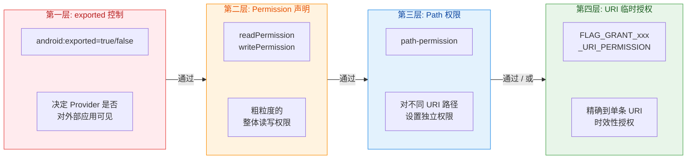

从外到内，每一层都是一个安全关卡。一个来自外部应用的数据请求，必须依次通过 `exported` 可见性检查、静态 Permission 检查、Path 级权限检查，最终才能到达 Provider 的实际代码。而临时授权机制则提供了一条"旁路"——在权限检查失败时，如果存在有效的 URI 临时授权记录，系统同样会放行。

需要特别指出的是，这些安全检查 **全部发生在系统 Framework 层**（主要是 AMS 和 `ContentProvider.Transport` 这个 Binder Stub 内部），而不是在你的 Provider 代码中。这意味着，即使你的 `query()` 实现中没有任何安全检查逻辑，只要你在 Manifest 中正确声明了权限，系统就会替你挡住未授权的访问。这是 ContentProvider 作为 **系统级组件** 的核心价值之一——安全逻辑不依赖于应用开发者的正确实现，而是由 Framework 强制执行。

总结而言，ContentProvider 在 Android 生态中扮演着 **"安全的、标准化的跨进程数据网关"** 的角色。它不仅仅是一个组件或一个 API——它是 Android 应用间数据互操作的基础设施。理解了这个角色定位，后续学习 URI 匹配、CRUD 接口实现、权限配置、FileProvider 等具体技术点时，就能清楚地看到它们各自在整体拼图中的位置。

---

**📝 练习题**

某公司开发了一个"企业通讯录"应用，希望允许公司内部其他应用读取员工信息，但不允许修改。同时，有一个特殊的"HR管理"应用需要具备写入权限。以下哪种 ContentProvider 权限配置方案最合理？

A. 设置 `android:exported="true"`，不声明任何 permission，在 `insert()` / `update()` / `delete()` 方法内部手动检查调用方包名

B. 设置 `android:exported="true"`，声明 `android:readPermission="com.corp.READ_CONTACTS"`，声明 `android:writePermission="com.corp.WRITE_CONTACTS"`，让 HR 应用在 Manifest 中同时声明两个权限

C. 设置 `android:exported="false"`，通过 `grantUriPermission` 临时授权给每一个需要读取的应用

D. 设置 `android:exported="true"`，只声明 `android:writePermission="com.corp.WRITE_CONTACTS"`，不设 readPermission，这样所有应用都能读但只有声明了写权限的应用能写

**【答案】** B

**【解析】** 方案 B 是最符合 Android 安全最佳实践的配置。通过分别声明 `readPermission` 和 `writePermission`，实现了读写权限的分离：内部应用只需声明读权限即可获取员工信息，而 HR 应用额外声明写权限以获得修改能力。

方案 A 是典型的安全反模式。在 Provider 代码中手动检查包名不仅容易出错（包名可以被伪造，`Binder.getCallingUid()` 才是可靠的身份标识），而且绕过了 Framework 层的标准权限体系。Android 官方文档明确反对这种做法。

方案 C 不适合这种"长期稳定的读取关系"。`grantUriPermission` 的设计初衷是用于一次性、临时性的数据分享（如分享文件），而不是持久化的权限授予。而且 `exported="false"` 会导致外部应用在没有临时授权时完全无法发现该 Provider。

方案 D 看似可行，但存在安全风险：不声明 `readPermission` 意味着**任何应用**——包括设备上的所有第三方应用——都可以自由读取企业通讯录数据。在企业场景下这通常是不可接受的，应当限制为只有经过授权的内部应用才能读取。

---

## URI 资源定位

ContentProvider 之所以能在多进程甚至多应用之间精准定位数据，核心靠的就是 **URI（Uniform Resource Identifier，统一资源标识符）**。就像我们在浏览器地址栏输入一个 URL 就能访问到互联网上某台服务器的某个页面一样，Android 中的 Content URI 让任何一个组件——无论它处于哪个进程——都能通过一串标准化的字符串，精确找到目标 ContentProvider 中的某张"表"甚至某一"行"数据。理解 URI 的结构与匹配机制，是正确使用 ContentProvider 进行数据共享的第一步，也是最关键的一步。

### Authority 授权

Authority 是 Content URI 中 **最核心的身份标识段**，它的作用类似于网络 URL 中的域名——用来唯一标识一个 ContentProvider 实例。当你调用 `ContentResolver.query(uri, ...)` 时，系统会从 URI 中提取 Authority 字段，然后在全局已注册的 Provider 列表中查找与之匹配的那个 ContentProvider，找到后才会把后续的 CRUD 请求路由过去。

一个标准 Content URI 的完整结构如下：

```
content://com.example.myapp.provider/users/42
\____/   \___________________________/ \___/ \/
scheme            authority              path  id
```

其中 `scheme` 固定为 `content://`，这是 Android 识别"这是一个内容 URI"的标志；紧随其后的 `com.example.myapp.provider` 就是 Authority。

**Authority 的命名规则与注册方式**

Authority 必须在 `AndroidManifest.xml` 中通过 `<provider>` 标签的 `android:authorities` 属性声明。一旦声明，PackageManagerService（PMS）就会在应用安装时将其注册到系统的全局 Provider 表中。如果两个应用声明了相同的 Authority，后安装的那个会因为冲突而 **安装失败**（在 Android 11+ 上默认严格校验），这与域名不能重复是同一个道理。因此业界通用的做法是以 **应用包名作为前缀** 来保证全局唯一性：

```xml
<!-- AndroidManifest.xml 中注册 ContentProvider -->
<!-- authorities 的值就是 Authority，全局唯一 -->
<provider
    android:name=".data.UserContentProvider"
    android:authorities="com.example.myapp.provider"
    android:exported="false" />
```

当 `ContentResolver` 拿到一个 URI 后，系统的解析路径大致为：`ContentResolver` → `ActivityManagerService`（AMS）→ 根据 Authority 查表 → 找到目标 Provider 所在进程 → 如果进程未启动则先拉起进程并初始化 Provider → 通过 Binder 将请求转发给 Provider 的具体方法。**Authority 在这条链路中扮演的就是"寻址键"的角色**，没有它，系统根本不知道该把请求发往何处。

**多 Authority 声明**

一个 ContentProvider 实际上可以同时响应多个 Authority。只需在 `android:authorities` 中用分号分隔即可：

```xml
<!-- 同一个 Provider 响应两个不同的 Authority -->
<provider
    android:name=".data.UnifiedProvider"
    android:authorities="com.example.myapp.provider;com.example.myapp.legacy"
    android:exported="false" />
```

这在应用重构、包名迁移或需要兼容旧版 URI 时非常有用。不过日常开发中，保持 **一个 Provider 对应一个 Authority** 的简洁映射更易于维护。

**BuildConfig 动态化 Authority**

在实际项目中，debug 包和 release 包的 `applicationId` 往往不同（比如 debug 包会带 `.debug` 后缀）。如果 Authority 写死了包名字符串，就会出现两个构建变体（build variant）无法同时安装在同一台设备上的问题，因为 Authority 冲突了。解决方案是通过 `${applicationId}` 占位符让构建系统自动替换：

```xml
<!-- 使用占位符，Gradle 构建时自动替换为实际的 applicationId -->
<provider
    android:name=".data.UserContentProvider"
    android:authorities="${applicationId}.provider"
    android:exported="false" />
```

对应地，在代码中需要通过 `BuildConfig` 拼接 Authority：

```kotlin
// 在代码中动态获取 Authority，与 Manifest 保持一致
// BuildConfig.APPLICATION_ID 会在编译时被替换为真实的 applicationId
companion object {
    // 拼接 Authority：applicationId + ".provider"
    const val AUTHORITY = "${BuildConfig.APPLICATION_ID}.provider"
}
```

这样无论是 `com.example.myapp` 还是 `com.example.myapp.debug`，Authority 都能自动匹配，彻底避免冲突。

### Path 路径

如果说 Authority 决定了"去哪个 Provider"，那么 **Path（路径）** 就决定了"去这个 Provider 里的哪张表、哪类数据"。它紧跟在 Authority 之后，以 `/` 分隔，可以有多级层次结构，语义上类似 RESTful API 中的资源路径。

```
content://com.example.myapp.provider/users
                                     \___/
                                      path（指向 users 这张"表"）

content://com.example.myapp.provider/users/42/orders
                                     \______________/
                                      多级 path（用户 42 的订单列表）
```

**Path 的设计理念**

ContentProvider 本质上是一个 **数据抽象层**，它并不强制要求底层必须是 SQLite 数据库。Path 也不一定对应数据库中的表名，它可以映射到文件目录、网络资源、内存缓存——任何你想以"内容"形式暴露出去的数据。但在最常见的数据库场景下，我们通常把一级 Path 设计为表名，让 URI 看起来清晰自然：

| URI 示例 | 语义 |
|---|---|
| `content://authority/users` | 访问 users 表的所有记录 |
| `content://authority/users/42` | 访问 users 表中 ID 为 42 的单条记录 |
| `content://authority/orders` | 访问 orders 表的所有记录 |
| `content://authority/users/42/orders` | 访问用户 42 关联的所有订单 |

这种分级路径设计天然适合表达 **资源的层级关系与从属关系**，和 RESTful URL 的设计哲学高度一致。

**Uri.parse() 与 ContentUris**

在代码中构造 Content URI，最基础的方式是使用 `Uri.parse()` 将字符串解析为 `Uri` 对象：

```kotlin
// 手动拼接 URI 字符串，然后解析为 Uri 对象
// 这种方式简单直接，但拼接 ID 时容易出错（比如忘记加斜杠）
val tableUri: Uri = Uri.parse("content://com.example.myapp.provider/users")
```

但当需要在路径末尾追加一个数字 ID 时，Android SDK 提供了更优雅的工具类 **`ContentUris`**：

```kotlin
// 基础表 URI，不含 ID
val baseUri: Uri = Uri.parse("content://com.example.myapp.provider/users")

// 使用 ContentUris.withAppendedId() 追加 ID 到路径末尾
// 结果：content://com.example.myapp.provider/users/42
val singleRowUri: Uri = ContentUris.withAppendedId(baseUri, 42L)

// 反向操作：从带 ID 的 URI 中提取出数字 ID
// 结果：42
val userId: Long = ContentUris.parseId(singleRowUri)
```

使用 `ContentUris` 的好处不仅是减少手动拼接字符串的出错概率，还能让代码的 **语义更明确**——一眼就能看出"这里是在构造一个指向单行记录的 URI"。

**常量化管理 URI**

良好的工程实践会把所有 URI 相关常量集中到一个 **Contract 类**（契约类）中统一管理。这个类不持有任何实例状态，仅包含静态常量和内部类，充当 Provider 与调用方之间的"协议文档"：

```kotlin
// Contract 类：ContentProvider 的"接口协议"
// 所有表名、列名、URI 常量集中在此，调用方只需引用这些常量
object MyContract {

    // Authority 常量，与 Manifest 中注册的保持一致
    const val AUTHORITY = "com.example.myapp.provider"

    // Users 表的协议定义
    object Users {
        // 表路径
        const val PATH = "users"
        // 完整的表级 URI（指向所有用户）
        val CONTENT_URI: Uri = Uri.parse("content://$AUTHORITY/$PATH")
        // 列名常量
        const val COLUMN_ID = "_id"
        const val COLUMN_NAME = "name"
        const val COLUMN_EMAIL = "email"
    }

    // Orders 表的协议定义
    object Orders {
        const val PATH = "orders"
        val CONTENT_URI: Uri = Uri.parse("content://$AUTHORITY/$PATH")
        const val COLUMN_ID = "_id"
        const val COLUMN_USER_ID = "user_id"
        const val COLUMN_AMOUNT = "amount"
    }
}
```

调用方只需 `MyContract.Users.CONTENT_URI`，无需关心 Authority 是什么、Path 拼错了怎么办，**将 URI 的管理集中化、强类型化**。这在多模块协作的大型项目中尤其重要。

### ID 匹配

ID 匹配是 Content URI 从 **"集合级操作"** 细化到 **"单条记录级操作"** 的核心机制。简单来说：

- **不带 ID 的 URI**（如 `content://authority/users`）表示操作整个集合（所有用户）。
- **带 ID 的 URI**（如 `content://authority/users/42`）表示只操作 ID 为 42 的那一条记录。

这种区分在 ContentProvider 的每一个 CRUD 方法实现中都需要处理。以 `query()` 为例，Provider 必须判断传入的 URI 是 "查全部" 还是 "查单条"，然后生成不同的 SQL：

```kotlin
// ContentProvider 的 query 方法内部需要区分 URI 类型
override fun query(
    uri: Uri,              // 调用方传入的 URI
    projection: Array<String>?,  // 要查询的列
    selection: String?,    // WHERE 条件
    selectionArgs: Array<String>?, // WHERE 参数
    sortOrder: String?     // 排序
): Cursor? {
    val db = dbHelper.readableDatabase  // 获取只读数据库

    // 使用 UriMatcher 判断 URI 类型（后面会详解）
    return when (uriMatcher.match(uri)) {
        // 匹配到集合 URI：content://authority/users
        CODE_USERS -> {
            // 直接用传入的 selection 查询全表
            db.query("users", projection, selection, selectionArgs, null, null, sortOrder)
        }
        // 匹配到单条 URI：content://authority/users/42
        CODE_USER_ID -> {
            // 从 URI 路径末尾提取 ID
            val id = ContentUris.parseId(uri)
            // 在 WHERE 条件中追加 _id 过滤
            // 如果调用方还传了额外的 selection，用 AND 拼接
            val finalSelection = "_id = $id" +
                if (!selection.isNullOrEmpty()) " AND ($selection)" else ""
            db.query("users", projection, finalSelection, selectionArgs, null, null, sortOrder)
        }
        // 未知 URI，抛出异常
        else -> throw IllegalArgumentException("Unknown URI: $uri")
    }
}
```

**这种模式在 `insert`、`update`、`delete` 中同样适用**。`insert` 通常只接受集合 URI（往集合里添加一条新记录），而 `update` 和 `delete` 则需要同时支持集合 URI（批量操作）和单条 URI（精确操作）。

**`insert` 返回值中的 ID**

值得注意的是，当通过集合 URI 调用 `insert()` 成功插入一条新记录后，Provider 应该返回一个 **带有新生成 ID 的完整 URI**，这样调用方就能立即拿到新记录的精确定位符：

```kotlin
override fun insert(uri: Uri, values: ContentValues?): Uri? {
    // 仅允许对集合 URI 执行插入操作
    when (uriMatcher.match(uri)) {
        CODE_USERS -> {
            val db = dbHelper.writableDatabase
            // 插入数据并获取新行的 rowId（即 _id）
            val newRowId = db.insert("users", null, values)
            if (newRowId != -1L) {
                // 通知所有正在监听此 URI 的 ContentObserver 数据已变化
                context?.contentResolver?.notifyChange(uri, null)
                // 返回带有新 ID 的 URI：content://authority/users/newRowId
                return ContentUris.withAppendedId(uri, newRowId)
            }
        }
    }
    return null
}
```

这种"插入后返回带 ID 的 URI"的设计，让 ContentProvider 的调用方可以 **链式操作**：先 insert 拿到 URI，再用这个 URI 去 query 或 update 同一条记录，整个流程连贯且语义清晰。

### UriMatcher 工具

从前面的 `query()` 示例中已经可以看到，ContentProvider 的每个 CRUD 方法都需要 **根据 URI 的不同模式执行不同的逻辑**。如果用手动字符串解析（比如自己 `uri.getPathSegments()` 然后一段段 if-else 判断），不仅代码冗长，而且极易出错。**`UriMatcher`** 正是 Android SDK 为解决这个问题提供的官方工具类——它本质上是一个 **URI 模式到整型常量的映射器**。

**UriMatcher 的工作原理**

`UriMatcher` 内部维护了一棵 **前缀树（Trie）**。每次你调用 `addURI(authority, path, code)` 注册一条匹配规则时，它会将 `authority/path` 拆分成若干段，逐段插入到树节点中。当运行时调用 `match(uri)` 时，它会从根节点开始，沿着 URI 的各段逐级向下匹配，直到叶节点，返回对应的整型 code。如果没有任何规则命中，则返回构造时传入的默认值（通常为 `UriMatcher.NO_MATCH`，值为 -1）。

其中有一个特殊的通配符 `#`，它代表 **任意数字**。比如路径 `users/#` 可以匹配 `users/1`、`users/42`、`users/999`，但不会匹配 `users/abc` 或 `users/1/orders`。另一个通配符 `*` 代表 **任意文本**，但在 ContentProvider 场景下用得较少。

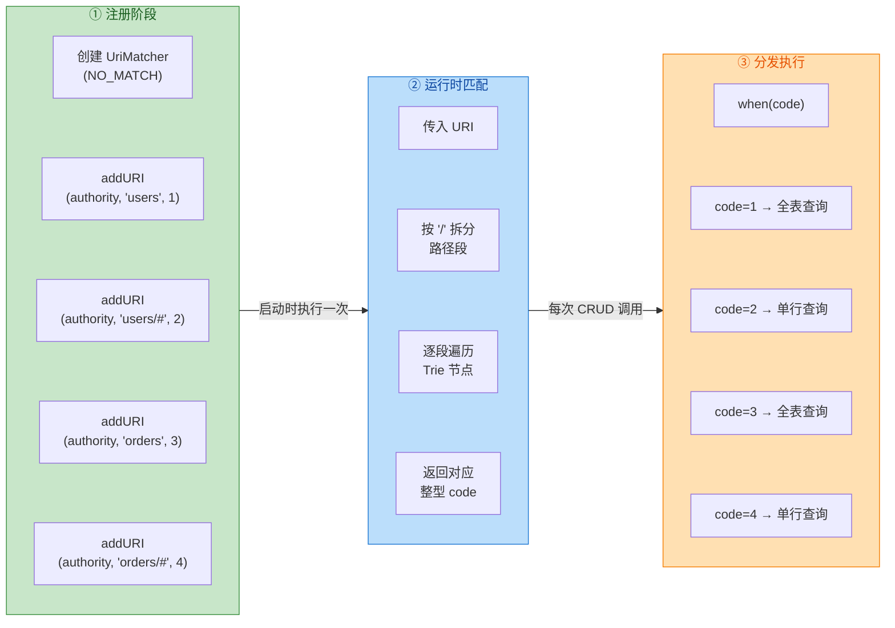

**标准实现模板**

以下是一个完整的、包含 UriMatcher 初始化和使用的 ContentProvider 模板。注意 UriMatcher 必须在 **companion object（或 static 块）** 中初始化，因为它是无状态的纯映射表，在类加载时就应该准备好：

```kotlin
class UserContentProvider : ContentProvider() {

    // 数据库 Helper，在 onCreate 中初始化
    private lateinit var dbHelper: UserDbHelper

    companion object {
        // Authority 常量
        private const val AUTHORITY = "com.example.myapp.provider"

        // 整型 code 常量：每个 URI 模式一个唯一的数字
        // 集合 URI 用偶数、单条 URI 用奇数——这只是一种命名惯例，非强制
        private const val CODE_USERS = 100       // 匹配 users 表全集合
        private const val CODE_USER_ID = 101     // 匹配 users 表单条记录
        private const val CODE_ORDERS = 200      // 匹配 orders 表全集合
        private const val CODE_ORDER_ID = 201    // 匹配 orders 表单条记录

        // 创建 UriMatcher，默认不匹配时返回 NO_MATCH（-1）
        private val uriMatcher = UriMatcher(UriMatcher.NO_MATCH).apply {
            // 注册规则：Authority + Path 模式 → 整型 code
            // "users" 精确匹配表路径
            addURI(AUTHORITY, "users", CODE_USERS)
            // "users/#" 中的 # 匹配任意数字（即记录 ID）
            addURI(AUTHORITY, "users/#", CODE_USER_ID)
            // orders 表同理
            addURI(AUTHORITY, "orders", CODE_ORDERS)
            addURI(AUTHORITY, "orders/#", CODE_ORDER_ID)
        }
    }

    override fun onCreate(): Boolean {
        // 初始化数据库 Helper
        dbHelper = UserDbHelper(context!!)
        return true  // 返回 true 表示 Provider 初始化成功
    }

    override fun query(
        uri: Uri,
        projection: Array<String>?,
        selection: String?,
        selectionArgs: Array<String>?,
        sortOrder: String?
    ): Cursor? {
        val db = dbHelper.readableDatabase

        // 根据 URI 模式分发到不同的查询逻辑
        val cursor = when (uriMatcher.match(uri)) {
            CODE_USERS -> {
                // 集合查询：直接使用调用方传入的 selection
                db.query("users", projection, selection, selectionArgs, null, null, sortOrder)
            }
            CODE_USER_ID -> {
                // 单条查询：从 URI 末尾提取 ID，追加到 WHERE 条件
                val id = ContentUris.parseId(uri)
                db.query(
                    "users", projection,
                    "_id = ?",             // WHERE _id = ?
                    arrayOf(id.toString()), // 参数化防注入
                    null, null, sortOrder
                )
            }
            CODE_ORDERS -> {
                db.query("orders", projection, selection, selectionArgs, null, null, sortOrder)
            }
            CODE_ORDER_ID -> {
                val id = ContentUris.parseId(uri)
                db.query(
                    "orders", projection,
                    "_id = ?",
                    arrayOf(id.toString()),
                    null, null, sortOrder
                )
            }
            // 无法匹配的 URI，说明调用方传了一个本 Provider 不认识的路径
            else -> throw IllegalArgumentException("Unknown URI: $uri")
        }

        // 为 Cursor 设置通知 URI
        // 当此 URI 对应的数据发生变化时，持有此 Cursor 的 Loader/LiveData 会自动重新查询
        cursor?.setNotificationUri(context?.contentResolver, uri)
        return cursor
    }

    // insert / update / delete / getType 省略，模式完全一致
    // 都是先 uriMatcher.match(uri)，再 when 分发

    override fun insert(uri: Uri, values: ContentValues?): Uri? { /* ... */ return null }
    override fun update(uri: Uri, values: ContentValues?, selection: String?, selectionArgs: Array<String>?): Int { return 0 }
    override fun delete(uri: Uri, selection: String?, selectionArgs: Array<String>?): Int { return 0 }
    override fun getType(uri: Uri): String? { /* ... */ return null }
}
```

**code 常量的命名惯例**

在实际项目中，当表的数量增多后，code 值的管理会变得重要。一种常见的惯例是 **以百位数区分表，个位数区分操作类型**：

| Code | 含义 |
|------|------|
| 100 | users 表 - 集合 |
| 101 | users 表 - 单条 |
| 200 | orders 表 - 集合 |
| 201 | orders 表 - 单条 |
| 300 | products 表 - 集合 |
| 301 | products 表 - 单条 |

这种编号体系让你在 `when` 分支中只看数字就能迅速判断 **哪张表、什么粒度**，大幅提升可读性。

**UriMatcher 的局限与替代方案**

`UriMatcher` 虽然好用，但它有几个值得注意的局限：

1. **只支持 `#`（数字）和 `*`（文本）两种通配符**，无法表达更复杂的正则匹配逻辑。如果你的路径中包含复合参数（比如 `users/age/18-30`），UriMatcher 无法直接处理，需要在命中某个粗粒度 code 后再手动解析 path segments。

2. **不支持 Query Parameters 匹配**。URI 中 `?key=value` 形式的查询参数不参与 UriMatcher 的匹配。如果需要根据 query parameter 区分行为，仍需在 code 命中后用 `uri.getQueryParameter("key")` 手动提取。

3. **性能方面完全不是瓶颈**。UriMatcher 的 Trie 匹配是 O(n) 复杂度（n 为路径段数，通常只有 2-3 段），即使在高频调用场景下也几乎不产生可测量的开销。

对于极其复杂的路径结构，一些开发者会选择自行实现基于正则的 URI 路由器，但这种情况在标准 ContentProvider 开发中非常罕见。**绝大多数场景下，UriMatcher 就是最佳选择**。

**URI 完整解析速查**

最后，将一个完整 URI 的各组成部分做一个总结性对照：

```kotlin
// 一个完整的 Content URI 示例
// content://com.example.myapp.provider/users/42?notify=true#section1
//
// ┌─────────┐ ┌──────────────────────────────┐ ┌─────┐ ┌──┐ ┌───────────┐ ┌────────┐
// │ scheme   │ │         authority             │ │path │ │id│ │  query    │ │fragment│
// │content://│ │com.example.myapp.provider     │ │users│ │42│ │notify=true│ │section1│
// └─────────┘ └──────────────────────────────┘ └─────┘ └──┘ └───────────┘ └────────┘
//
// uri.scheme        → "content"
// uri.authority     → "com.example.myapp.provider"
// uri.path          → "/users/42"
// uri.pathSegments  → ["users", "42"]
// uri.lastPathSegment → "42"
// ContentUris.parseId(uri) → 42L
// uri.getQueryParameter("notify") → "true"
// uri.fragment      → "section1"
```

在实际 ContentProvider 开发中，`scheme` 固定为 `content`，`fragment` 几乎不使用，`query parameter` 偶尔用于传递控制标志（如是否触发通知），真正核心的就是 **authority + path + id** 这三段。掌握了它们的作用与 UriMatcher 的匹配机制，你就拥有了精准路由一切 ContentProvider 请求的能力。

---

**📝 练习题**

在 ContentProvider 中使用 `UriMatcher` 注册了如下规则：

```kotlin
uriMatcher.addURI("com.test.provider", "books", 1)
uriMatcher.addURI("com.test.provider", "books/#", 2)
```

当调用方传入 URI `content://com.test.provider/books/abc` 时，`uriMatcher.match(uri)` 的返回值是什么？

A. 1
B. 2
C. -1（`UriMatcher.NO_MATCH`）
D. 抛出 `IllegalArgumentException`

**【答案】** C

**【解析】** `UriMatcher` 中的 `#` 通配符 **只匹配纯数字字符串**（如 `42`、`100`），不匹配包含字母的路径段。`books/abc` 中的 `abc` 不是纯数字，因此不满足 `books/#` 这条规则。同时它也不满足 `books`（因为路径段数不同：`books` 只有一段，`books/abc` 有两段）。两条规则都不命中，`match()` 就会返回构造 `UriMatcher` 时传入的默认值，即 `UriMatcher.NO_MATCH`（-1）。它不会抛出异常——`UriMatcher` 的设计是"匹配不到就返回默认值"，让调用方自己决定如何处理（通常是在 `else` 分支中抛异常或返回 null）。如果需要匹配任意文本（包括字母），应使用 `*` 通配符：`addURI("com.test.provider", "books/*", 3)`。

---

**📝 练习题**

以下关于 ContentProvider 中 Authority 的说法，哪一项是 **错误** 的？

A. Authority 在系统中必须全局唯一，两个应用声明相同的 Authority 会导致安装冲突

B. 一个 ContentProvider 可以通过分号分隔在 `android:authorities` 中声明多个 Authority

C. 系统通过 Authority 在 AMS 维护的全局表中查找目标 ContentProvider 所在的进程

D. Authority 支持使用 `*` 通配符，一次匹配多个不同的调用方来源

**【答案】** D

**【解析】** Authority 是一个 **精确的字符串标识符**，不支持任何形式的通配符匹配。它的作用是在系统全局 Provider 注册表中进行精确查找（类似 HashMap 的 key lookup），而不是模式匹配。选项 A 正确：Android 系统不允许两个应用注册相同的 Authority（Android 11+ 默认强制执行签名校验）。选项 B 正确：`android:authorities` 属性支持分号分隔的多个值。选项 C 正确：当 `ContentResolver` 发起请求时，AMS 会根据 URI 中的 Authority 查找目标 Provider 的进程信息，必要时启动目标进程。通配符（`#` 和 `*`）是 `UriMatcher` 在 **Path 段** 中使用的匹配机制，与 Authority 无关。

---

## CRUD 核心接口

ContentProvider 作为 Android 四大组件之一，其核心价值在于提供了一套 **标准化的数据操作接口**。无论底层数据源是 SQLite 数据库、文件系统、网络服务还是内存中的数据结构，外部调用者都通过统一的 `query()`、`insert()`、`update()`、`delete()` 四大方法进行交互，再加上用于声明数据类型的 `getType()` 方法，共同构成了 ContentProvider 的 **CRUD 核心接口体系**。

这套接口体系的设计深受 REST 架构风格的影响——URI 标识资源，HTTP 动词对应操作。在 Android 的语境中，`content://` URI 定位数据资源，而 CRUD 方法则扮演了类似 HTTP GET/POST/PUT/DELETE 的角色。这种设计使得 **跨进程的数据操作如同访问本地数据库表一样直观**，极大降低了进程间数据共享的认知负担。

从调用链路的角度来看，外部应用并不直接持有 ContentProvider 的实例引用。调用方通过 `Context.getContentResolver()` 获取 `ContentResolver` 对象，再由 ContentResolver 将请求经由 Binder IPC 转发到目标进程中的 ContentProvider 实现类。这意味着开发者需要同时理解两个视角：**作为提供方（Provider）如何实现这五个方法**，以及 **作为消费方（Resolver）如何正确调用它们**。本节将从这两个视角出发，逐一深入剖析每个接口的设计意图、参数语义、实现要点与常见陷阱。

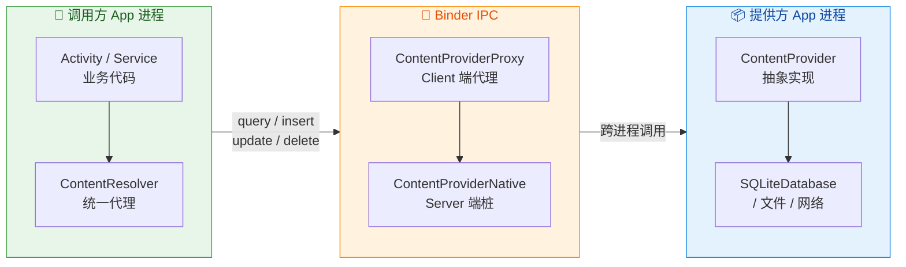

上图清晰地展示了一次 CRUD 调用的完整链路：调用方的业务代码调用 ContentResolver 的对应方法，ContentResolver 内部通过 Binder 代理对象将请求跨进程发送到目标 ContentProvider，ContentProvider 再操作其底层数据源并返回结果。理解这条链路后，我们便能明白为什么 ContentProvider 的方法签名中需要传入 URI——因为 ContentResolver 需要通过 URI 中的 authority 字段来定位目标 Provider 所在的进程和组件。

### query 查询

`query()` 是 ContentProvider 中使用频率最高、参数最复杂的方法。它的职责是 **根据调用方指定的条件，从数据源中检索出符合要求的数据行，并以 Cursor 游标的形式返回**。Cursor 是 Android 对"结果集"概念的抽象，调用方通过移动游标逐行读取数据，这与 JDBC 的 ResultSet 设计理念一脉相承。

#### 方法签名与参数语义

先来看 ContentProvider 中 `query()` 方法的完整签名：

```kotlin
// ContentProvider 子类中必须重写的 query 方法
override fun query(
    uri: Uri,                      // 资源定位符，标识要查询的数据集合或特定行
    projection: Array<String>?,    // 投影列，指定返回哪些列（类似 SQL 的 SELECT 列表）
    selection: String?,            // 筛选条件，相当于 SQL 的 WHERE 子句（不含 WHERE 关键字）
    selectionArgs: Array<String>?, // 筛选参数，替换 selection 中的 ? 占位符，防止 SQL 注入
    sortOrder: String?             // 排序规则，相当于 SQL 的 ORDER BY 子句
): Cursor? {
    // 实现查询逻辑并返回 Cursor
}
```

**`uri` 参数** 是整个调用的核心定位依据。当 URI 的 path 指向一个集合（如 `content://com.example.provider/books`）时，意味着查询可能返回多行数据；当 URI 尾部追加了 ID（如 `content://com.example.provider/books/42`）时，意味着查询的是特定的一行记录。在实现 `query()` 方法时，开发者通常通过 `UriMatcher` 来区分这两种情况，并据此构建不同的查询语句。

**`projection` 参数** 控制返回数据的"宽度"。传入 `null` 表示返回所有列，但这在实际开发中往往是不推荐的做法——尤其在跨进程场景下，多余的列意味着多余的序列化与反序列化开销，也可能泄露不必要的数据。良好的实践是调用方明确声明所需的列名数组。

**`selection` 和 `selectionArgs`** 是一对搭档，共同控制返回数据的"高度"（即行数）。`selection` 中使用 `?` 占位符，由 `selectionArgs` 按顺序填充实际值。这种参数化查询的设计 **从根本上杜绝了 SQL 注入攻击**——因为 `selectionArgs` 中的值永远不会被当作 SQL 语句的一部分来解析，而只会被视为纯文本数据。如果开发者直接将用户输入拼接到 `selection` 字符串中而不使用占位符，那么恶意输入就可能篡改查询逻辑，造成数据泄露或破坏。

**`sortOrder` 参数** 决定结果集的排列顺序。传入 `null` 时，数据源会按默认顺序返回，具体行为取决于底层实现（SQLite 通常按 rowid 顺序）。传入的字符串格式与 SQL 的 ORDER BY 子句相同，例如 `"title ASC, publish_date DESC"` 表示先按标题升序再按出版日期降序。

#### Provider 端实现示例

下面展示一个典型的基于 SQLite 的 `query()` 实现。假设我们正在构建一个图书管理的 ContentProvider：

```kotlin
// 图书管理 ContentProvider 的 query 实现
override fun query(
    uri: Uri,                      // 调用方传入的目标 URI
    projection: Array<String>?,    // 需要返回的列
    selection: String?,            // WHERE 条件
    selectionArgs: Array<String>?, // WHERE 条件的参数
    sortOrder: String?             // ORDER BY 子句
): Cursor? {
    // 获取可读的数据库实例（不需要写权限时应使用 readableDatabase）
    val db: SQLiteDatabase = dbHelper.readableDatabase

    // 用于构建查询的 SQLiteQueryBuilder，它能帮助我们安全地组装 SQL
    val queryBuilder = SQLiteQueryBuilder()

    // 根据 URI 类型决定查询范围
    when (uriMatcher.match(uri)) {
        // URI 匹配到集合路径 content://authority/books
        BOOKS_COLLECTION -> {
            // 设置查询的目标表名
            queryBuilder.tables = BookContract.TABLE_NAME
        }
        // URI 匹配到单条记录路径 content://authority/books/{id}
        BOOK_SINGLE_ITEM -> {
            // 同样设置目标表名
            queryBuilder.tables = BookContract.TABLE_NAME
            // 追加 WHERE 条件，限定只查询 URI 中指定 ID 的那一行
            // ContentUris.parseId() 从 URI 尾部提取数字 ID
            queryBuilder.appendWhere(
                "${BookContract.COLUMN_ID} = ${ContentUris.parseId(uri)}"
            )
        }
        // URI 无法匹配任何已知模式，说明调用方传入了非法 URI
        else -> throw IllegalArgumentException("未知 URI: $uri")
    }

    // 确定排序规则：调用方未指定时使用默认排序
    val finalSortOrder = if (sortOrder.isNullOrEmpty()) {
        // 默认按书名升序排列
        "${BookContract.COLUMN_TITLE} ASC"
    } else {
        // 使用调用方指定的排序规则
        sortOrder
    }

    // 执行查询，返回 Cursor 游标对象
    val cursor: Cursor = queryBuilder.query(
        db,              // 数据库实例
        projection,      // 投影列（SELECT 列表）
        selection,       // WHERE 子句
        selectionArgs,   // WHERE 参数
        null,            // GROUP BY（通常不在 Provider 层分组）
        null,            // HAVING（通常不在 Provider 层过滤分组）
        finalSortOrder   // ORDER BY 子句
    )

    // 关键：为 Cursor 设置通知 URI
    // 当该 URI 对应的数据发生变更时，使用此 Cursor 的 ContentObserver 会收到通知
    // 这是 ContentProvider 响应式数据更新机制的基础
    cursor.setNotificationUri(context?.contentResolver, uri)

    // 返回 Cursor 给调用方（跨进程时，Cursor 的数据通过共享内存传递）
    return cursor
}
```

这段代码中有一个容易被忽视但极其重要的调用：`cursor.setNotificationUri()`。它将返回的 Cursor 与特定的 URI 绑定在一起。当后续的 `insert()`、`update()` 或 `delete()` 操作调用了 `contentResolver.notifyChange(uri)` 时，所有通过该 URI 查询并持有活跃 Cursor 的观察者都会收到数据变更通知。这是实现 **数据驱动 UI 自动刷新** 的关键机制——CursorLoader（或现代的 LiveData/Flow 封装）正是依赖这一特性来实现"数据变化时自动重新查询并更新界面"的效果。

#### Resolver 端调用示例

作为调用方（消费者），通过 ContentResolver 发起查询的代码如下：

```kotlin
// 在 Activity 或 ViewModel 中查询图书数据
fun loadBooks(context: Context): List<Book> {
    // 结果列表
    val books = mutableListOf<Book>()

    // 定义需要查询的列（投影），只取需要的列以优化性能
    val projection = arrayOf(
        BookContract.COLUMN_ID,     // 图书 ID
        BookContract.COLUMN_TITLE,  // 书名
        BookContract.COLUMN_AUTHOR  // 作者
    )

    // 定义筛选条件：查找作者名中包含指定关键字的图书
    val selection = "${BookContract.COLUMN_AUTHOR} LIKE ?"
    // 占位符的实际值，% 是 SQL 的通配符
    val selectionArgs = arrayOf("%Kotlin%")

    // 排序规则：按书名升序
    val sortOrder = "${BookContract.COLUMN_TITLE} ASC"

    // 通过 ContentResolver 发起跨进程查询
    // 返回的 Cursor 可能为 null（Provider 出错或数据为空时）
    val cursor: Cursor? = context.contentResolver.query(
        BookContract.CONTENT_URI, // 目标 URI: content://com.example.provider/books
        projection,               // 投影列
        selection,                // WHERE 条件
        selectionArgs,            // WHERE 参数
        sortOrder                 // ORDER BY
    )

    // 使用 Kotlin 的 use 扩展函数确保 Cursor 在使用后自动关闭
    // Cursor 实现了 Closeable 接口，不关闭会导致内存泄漏和资源耗尽
    cursor?.use { c ->
        // 预先获取列索引，避免在循环中反复调用 getColumnIndexOrThrow
        // 这是一个常见的性能优化技巧
        val idIndex = c.getColumnIndexOrThrow(BookContract.COLUMN_ID)
        val titleIndex = c.getColumnIndexOrThrow(BookContract.COLUMN_TITLE)
        val authorIndex = c.getColumnIndexOrThrow(BookContract.COLUMN_AUTHOR)

        // 遍历 Cursor 中的每一行数据
        while (c.moveToNext()) {
            // 从当前行中按列索引提取数据
            val book = Book(
                id = c.getLong(idIndex),       // 读取 Long 类型的 ID
                title = c.getString(titleIndex), // 读取 String 类型的书名
                author = c.getString(authorIndex) // 读取 String 类型的作者
            )
            // 添加到结果列表
            books.add(book)
        }
    }

    return books
}
```

关于 Cursor 的使用有几个关键注意事项值得强调。第一，**Cursor 必须及时关闭**。Cursor 底层持有数据库连接或共享内存窗口（CursorWindow），如果不关闭会导致严重的资源泄漏。在跨进程场景下，CursorWindow 使用的是 `ashmem`（Anonymous Shared Memory），默认大小为 2MB，泄漏若干个 Cursor 就可能触发 OOM。Kotlin 的 `use {}` 扩展函数（等价于 Java 的 try-with-resources）是管理 Cursor 生命周期的最佳实践。

第二，**Cursor 并非一次性将所有数据拷贝到调用方进程**。跨进程查询返回的 Cursor 实际上是 `CursorToBulkCursorAdaptor` 和 `BulkCursorToCursorAdaptor` 配合工作的结果——数据通过共享内存以"窗口"（CursorWindow）的形式传递。当 Cursor 遍历超出当前窗口范围时，会自动请求 Provider 端填充下一个窗口。这种设计使得即使查询结果有数万行，也不会一次性占用巨大内存。

第三，**列索引应在循环外预先获取**。`getColumnIndexOrThrow()` 虽然时间复杂度仅为 O(n)（n 为列数，通常很小），但在循环内反复调用仍然是不必要的开销。更重要的是，如果列名不存在，该方法会抛出 `IllegalArgumentException`，提前调用可以让错误更快暴露。

### insert 插入

`insert()` 方法的职责是 **向数据源中添加一条新记录，并返回该记录的 URI**。相比 `query()` 的多参数设计，`insert()` 的签名简洁得多——它只需要知道往哪里插（URI）和插什么（ContentValues）。

#### 方法签名与参数语义

```kotlin
// ContentProvider 子类中必须重写的 insert 方法
override fun insert(
    uri: Uri,                // 目标集合的 URI（如 content://authority/books）
    values: ContentValues?   // 要插入的键值对数据（列名 -> 值）
): Uri? {
    // 插入数据并返回新记录的 URI
}
```

**`uri` 参数** 在 `insert()` 场景下通常指向一个 **集合**（collection）而非单条记录。例如 `content://com.example.provider/books` 表示向 books 集合中添加一条新记录。如果调用方传入的是带 ID 的 URI（如 `.../books/42`），在语义上是不合理的——你不能"插入一条已经有 ID 的记录"，因此实现中通常应对此抛出异常。

**`ContentValues`** 是 Android 提供的一个轻量级键值对容器，类似于 `Map<String, Object>`，但它只支持 Android 数据库所支持的基本数据类型（String、Integer、Long、Float、Double、byte[] 等）。它的内部实现实际上就是一个 `HashMap<String, Object>`，但提供了类型安全的 put/get 方法。ContentValues 的设计意图是 **将一行数据的各列值打包成一个可序列化的对象，便于跨进程传输**（通过 Parcel 机制）。

#### Provider 端实现示例

```kotlin
// 图书管理 ContentProvider 的 insert 实现
override fun insert(uri: Uri, values: ContentValues?): Uri? {
    // 校验 URI 必须指向集合路径，不允许向单条记录路径执行 insert
    if (uriMatcher.match(uri) != BOOKS_COLLECTION) {
        throw IllegalArgumentException("insert 操作不支持此 URI: $uri")
    }

    // 防御性检查：ContentValues 不能为 null 或空
    requireNotNull(values) { "ContentValues 不能为 null" }

    // 可选：在此处进行业务校验
    // 例如检查必填字段是否存在
    require(values.containsKey(BookContract.COLUMN_TITLE)) {
        "缺少必填字段: ${BookContract.COLUMN_TITLE}"
    }

    // 获取可写的数据库实例
    val db: SQLiteDatabase = dbHelper.writableDatabase

    // 执行插入操作
    // 第二个参数 nullColumnHack：当 values 为空时，
    // SQLite 不允许插入完全为空的行，此参数指定一个列名用于插入 NULL 值
    // 由于我们已经检查了 values 非空，这里传 null 即可
    val rowId: Long = db.insert(
        BookContract.TABLE_NAME, // 目标表名
        null,                    // nullColumnHack
        values                   // 要插入的数据
    )

    // db.insert() 返回 -1 表示插入失败
    if (rowId == -1L) {
        // 记录日志，但通常不应抛出异常
        // 因为跨进程场景下异常的传递链较复杂
        Log.e(TAG, "向 $uri 插入数据失败")
        return null
    }

    // 构造新记录的 URI：在集合 URI 后追加新生成的行 ID
    // 例如 content://com.example.provider/books/42
    val newUri: Uri = ContentUris.withAppendedId(uri, rowId)

    // 关键：通知所有注册在该 URI 上的 ContentObserver 数据已变更
    // 第二个参数 observer 传 null 表示通知所有观察者
    context?.contentResolver?.notifyChange(newUri, null)

    // 返回新记录的完整 URI
    return newUri
}
```

`insert()` 实现中的 `notifyChange()` 调用不可遗漏。它的作用是触发数据变更广播，使得所有通过 `query()` 获取了该 URI 相关 Cursor 的组件（如使用 CursorLoader 或 ContentObserver 的界面）能够自动感知数据更新。如果忘记调用 `notifyChange()`，就会出现"数据已插入数据库但界面没有刷新"的经典问题。

关于返回值，`insert()` 返回的 URI 应该是 **新记录的完整标识**，即集合 URI 加上新生成的 ID。`ContentUris.withAppendedId()` 是一个便利方法，等价于 `Uri.withAppendedPath(uri, String.valueOf(rowId))` 但语义更明确。调用方可以拿到这个返回的 URI，后续对该条记录进行查询、更新或删除操作。

#### Resolver 端调用示例

```kotlin
// 在 Activity 或 ViewModel 中插入一条新图书记录
fun addBook(context: Context, title: String, author: String): Uri? {
    // 构造要插入的数据
    val values = ContentValues().apply {
        // put 方法会根据参数类型自动选择合适的存储方式
        put(BookContract.COLUMN_TITLE, title)   // 书名
        put(BookContract.COLUMN_AUTHOR, author) // 作者
        // 注意：不需要手动指定 _id 列，数据库会自动生成自增主键
    }

    // 通过 ContentResolver 发起跨进程插入
    // 返回新记录的 URI，如 content://com.example.provider/books/42
    val newBookUri: Uri? = context.contentResolver.insert(
        BookContract.CONTENT_URI, // 集合 URI
        values                    // 要插入的数据
    )

    // 如果需要获取新记录的 ID，可以从返回的 URI 中提取
    newBookUri?.let {
        val newId: Long = ContentUris.parseId(it) // 提取 URI 尾部的数字 ID
        Log.d(TAG, "新图书 ID: $newId")
    }

    return newBookUri
}
```

值得一提的是，ContentProvider 还提供了 `bulkInsert()` 方法用于批量插入。默认实现只是在循环中逐条调用 `insert()`，效率极低。如果有批量插入的需求，**务必重写 `bulkInsert()` 方法并使用数据库事务**：

```kotlin
// 重写 bulkInsert 实现高效批量插入
override fun bulkInsert(uri: Uri, valuesArray: Array<ContentValues>): Int {
    // 获取可写的数据库实例
    val db: SQLiteDatabase = dbHelper.writableDatabase
    // 记录成功插入的行数
    var insertCount = 0

    // 开启数据库事务，将多次插入合并为一个原子操作
    // 事务内的所有操作共享同一次磁盘写入，性能可提升 10~100 倍
    db.beginTransaction()
    try {
        // 遍历所有待插入的数据
        for (values in valuesArray) {
            // 逐条插入，但由于在事务内，不会每次都触发磁盘 I/O
            val id = db.insert(BookContract.TABLE_NAME, null, values)
            // 插入成功时累计计数
            if (id != -1L) {
                insertCount++
            }
        }
        // 标记事务成功，endTransaction 时会执行 COMMIT
        // 如果不调用此方法，endTransaction 会执行 ROLLBACK
        db.setTransactionSuccessful()
    } finally {
        // 无论成功与否都要结束事务，释放数据库锁
        db.endTransaction()
    }

    // 批量插入完成后统一发送一次变更通知（而非每条都通知）
    if (insertCount > 0) {
        context?.contentResolver?.notifyChange(uri, null)
    }

    // 返回实际成功插入的行数
    return insertCount
}
```

事务化的 `bulkInsert()` 之所以能带来巨大的性能提升，原因在于 SQLite 的默认行为：**如果不显式开启事务，每条 INSERT 语句都会被包裹在一个隐式事务中**，而每个事务的 COMMIT 都需要执行一次 `fsync()` 系统调用来确保数据落盘。机械硬盘的 `fsync()` 耗时约 10ms，闪存约 1-2ms，插入 1000 条记录就需要 1-2 秒。而开启显式事务后，1000 条 INSERT 共享一次 COMMIT，只需一次 `fsync()`，总耗时可以降到毫秒级。

### update 更新

`update()` 方法用于 **修改数据源中已存在的记录**，其参数设计结合了 `insert()` 的 ContentValues 和 `query()` 的条件筛选机制。

#### 方法签名与参数语义

```kotlin
// ContentProvider 子类中必须重写的 update 方法
override fun update(
    uri: Uri,                      // 目标资源 URI（集合或单条记录）
    values: ContentValues?,        // 要更新的列及其新值
    selection: String?,            // WHERE 条件（仅在集合 URI 时有意义）
    selectionArgs: Array<String>?  // WHERE 条件的参数
): Int {
    // 执行更新操作并返回受影响的行数
}
```

`update()` 返回的是 **受影响的行数**（an integer representing the number of rows affected），这个信息对调用方很有价值——它不仅可以用来判断更新是否成功（返回 0 说明没有任何行被修改），还能帮助调用方了解操作的影响范围。

与 `insert()` 不同，`update()` 的 URI 既可以指向集合也可以指向单条记录。当 URI 指向集合时，`selection` 和 `selectionArgs` 共同决定哪些行会被更新；当 URI 指向单条记录（带 ID）时，通常只更新该特定行，但实现中仍应正确处理同时带有 URI ID 和 selection 条件的情况（两个条件应取 AND 关系）。

#### Provider 端实现示例

```kotlin
// 图书管理 ContentProvider 的 update 实现
override fun update(
    uri: Uri,
    values: ContentValues?,
    selection: String?,
    selectionArgs: Array<String>?
): Int {
    // 获取可写数据库实例
    val db: SQLiteDatabase = dbHelper.writableDatabase
    // 记录受影响的行数
    val rowsUpdated: Int

    when (uriMatcher.match(uri)) {
        // 集合路径：更新满足 selection 条件的所有行
        BOOKS_COLLECTION -> {
            rowsUpdated = db.update(
                BookContract.TABLE_NAME, // 目标表名
                values,                  // 要更新的列值对
                selection,               // WHERE 条件
                selectionArgs            // WHERE 参数
            )
        }
        // 单条记录路径：只更新指定 ID 的行
        BOOK_SINGLE_ITEM -> {
            // 从 URI 中提取记录 ID
            val id = ContentUris.parseId(uri)

            // 构建最终的 WHERE 条件
            // 首先限定 ID，然后如果调用方还传入了额外的 selection 条件，
            // 使用 AND 将两个条件组合起来
            val finalSelection = "${BookContract.COLUMN_ID} = $id" +
                if (!selection.isNullOrEmpty()) " AND ($selection)" else ""

            rowsUpdated = db.update(
                BookContract.TABLE_NAME, // 目标表名
                values,                  // 要更新的列值对
                finalSelection,          // 组合后的 WHERE 条件
                selectionArgs            // WHERE 参数（对应 selection 中的 ? 占位符）
            )
        }
        // 未知 URI
        else -> throw IllegalArgumentException("update 不支持此 URI: $uri")
    }

    // 如果有行被更新，通知所有观察者
    if (rowsUpdated > 0) {
        context?.contentResolver?.notifyChange(uri, null)
    }

    // 返回受影响的行数
    return rowsUpdated
}
```

这里有一个实现上的细节值得注意：当处理 `BOOK_SINGLE_ITEM` 类型的 URI 时，我们将 URI 中的 ID 条件与调用方传入的 `selection` 条件用 AND 组合。这样做的好处是 **既保证了 URI 语义的正确性（只操作指定 ID 的行），又允许调用方附加额外的约束**（例如"只有当 status = 'draft' 时才允许更新"）。将调用方的 `selection` 用括号包裹是为了防止 OR 操作符导致条件优先级混乱。

另一个值得讨论的问题是：**`notifyChange()` 的通知粒度应该如何选择？** 在上面的实现中，我们直接使用调用方传入的 `uri` 进行通知。如果是集合 URI 更新，通知的也是集合 URI，这意味着 **所有观察该集合的 Cursor 都会收到通知**，即使某些 Cursor 关注的是不同的筛选条件。这种"宽泛通知"的策略虽然可能导致不必要的重新查询，但实现简单且不会遗漏任何需要更新的观察者。在大多数应用场景下，这种策略的性能开销是完全可以接受的。

#### Resolver 端调用示例

```kotlin
// 更新指定图书的标题
fun updateBookTitle(context: Context, bookId: Long, newTitle: String): Boolean {
    // 构造要更新的列值对
    val values = ContentValues().apply {
        // 只 put 需要修改的列，其他列保持不变
        put(BookContract.COLUMN_TITLE, newTitle)
    }

    // 构造指向特定图书记录的 URI
    val bookUri: Uri = ContentUris.withAppendedId(
        BookContract.CONTENT_URI, // 基础集合 URI
        bookId                    // 记录 ID
    )

    // 执行更新，返回受影响的行数
    val rowsUpdated: Int = context.contentResolver.update(
        bookUri, // 目标 URI: content://com.example.provider/books/42
        values,  // 要更新的数据
        null,    // 不需要额外的 WHERE 条件（URI 中已包含 ID）
        null     // 无 WHERE 参数
    )

    // 返回是否更新成功（至少有一行被修改）
    return rowsUpdated > 0
}
```

注意 `ContentValues` 的一个重要特性：**只有显式 put 进去的列才会被更新**，未包含在 ContentValues 中的列会保持原值不变。这意味着你不需要先查询出完整记录再修改再写回——直接构造只包含变更列的 ContentValues 即可，这是非常高效的"增量更新"模式。

### delete 删除

`delete()` 方法的设计与 `update()` 高度相似——都需要通过 URI 定位目标，通过 `selection`/`selectionArgs` 限定操作范围，并返回受影响的行数。区别仅在于 `delete()` 不需要 ContentValues 参数（因为删除操作不涉及新值）。

#### 方法签名与参数语义

```kotlin
// ContentProvider 子类中必须重写的 delete 方法
override fun delete(
    uri: Uri,                      // 目标资源 URI
    selection: String?,            // WHERE 条件
    selectionArgs: Array<String>?  // WHERE 参数
): Int {
    // 执行删除操作并返回被删除的行数
}
```

一个容易被忽视的语义约定是：**当 `selection` 为 null 且 URI 指向集合时，行为是删除所有行还是不删除任何行？** Android 官方文档明确指出，传入 `null` 的 `selection` 应被理解为 "no selection means delete all rows"（无条件即删除所有行）。但出于安全考虑，一些开发者会在 Provider 实现中对此加以限制，要求调用方必须显式传入 `"1"` 作为 selection 来确认"删除全部"的意图，防止因参数疏忽导致的灾难性数据丢失。

#### Provider 端实现示例

```kotlin
// 图书管理 ContentProvider 的 delete 实现
override fun delete(
    uri: Uri,
    selection: String?,
    selectionArgs: Array<String>?
): Int {
    // 获取可写数据库实例
    val db: SQLiteDatabase = dbHelper.writableDatabase
    // 记录被删除的行数
    val rowsDeleted: Int

    when (uriMatcher.match(uri)) {
        // 集合路径：删除满足 selection 条件的所有行
        BOOKS_COLLECTION -> {
            rowsDeleted = db.delete(
                BookContract.TABLE_NAME, // 目标表名
                selection,               // WHERE 条件（null 表示删除所有行）
                selectionArgs            // WHERE 参数
            )
        }
        // 单条记录路径：只删除指定 ID 的行
        BOOK_SINGLE_ITEM -> {
            // 从 URI 提取 ID
            val id = ContentUris.parseId(uri)

            // 组合 ID 条件与调用方的 selection 条件
            val finalSelection = "${BookContract.COLUMN_ID} = $id" +
                if (!selection.isNullOrEmpty()) " AND ($selection)" else ""

            rowsDeleted = db.delete(
                BookContract.TABLE_NAME, // 目标表名
                finalSelection,          // 组合后的 WHERE 条件
                selectionArgs            // WHERE 参数
            )
        }
        // 未知 URI
        else -> throw IllegalArgumentException("delete 不支持此 URI: $uri")
    }

    // 即使 rowsDeleted 为 0，某些场景也可能需要通知
    // 但通常只在确实删除了数据时才通知，避免不必要的 UI 刷新
    if (rowsDeleted > 0) {
        context?.contentResolver?.notifyChange(uri, null)
    }

    // 返回被删除的行数
    return rowsDeleted
}
```

`delete()` 的实现模式与 `update()` 几乎是对称的，这并非巧合——它们的本质都是"按条件定位行并执行操作"，差异仅在于操作类型。这种对称性使得开发者可以通过模板化的方式快速实现所有 CRUD 方法，只需根据操作类型替换核心的数据库调用即可。

#### Resolver 端调用示例

```kotlin
// 删除指定 ID 的图书
fun deleteBook(context: Context, bookId: Long): Boolean {
    // 构造指向特定记录的 URI
    val bookUri = ContentUris.withAppendedId(BookContract.CONTENT_URI, bookId)

    // 执行删除
    val rowsDeleted = context.contentResolver.delete(
        bookUri, // 目标 URI
        null,    // 不需要额外 WHERE 条件
        null     // 无 WHERE 参数
    )

    return rowsDeleted > 0
}

// 删除某个作者的所有图书（基于集合 URI + selection 条件）
fun deleteBooksByAuthor(context: Context, author: String): Int {
    // 使用参数化查询防止 SQL 注入
    val selection = "${BookContract.COLUMN_AUTHOR} = ?"
    val selectionArgs = arrayOf(author)

    // 通过集合 URI 执行批量删除
    return context.contentResolver.delete(
        BookContract.CONTENT_URI, // 集合 URI
        selection,                // WHERE 条件
        selectionArgs             // WHERE 参数
    )
}
```

在实际项目中，`delete()` 操作往往不是真正从数据库中移除记录（physical delete），而是采用 **逻辑删除**（soft delete）的方式——即在表中增加一个 `is_deleted` 标志列，`delete()` 的实现本质上是执行 `update()`，将该列设为 true。查询时则在 WHERE 条件中自动附加 `is_deleted = 0` 的过滤。这种策略的好处是数据可恢复、有审计追踪能力，且不会破坏外键关系。ContentProvider 的抽象层使得调用方完全不需要关心底层是物理删除还是逻辑删除——接口一致，实现自由。

### getType MIME 类型

`getType()` 是五个核心方法中最容易被轻视的一个，但它在 ContentProvider 的整体架构中扮演着 **数据类型声明** 的关键角色。它的职责是 **根据传入的 URI，返回该 URI 所指向数据的 MIME 类型字符串**。

#### 为什么需要 MIME 类型

MIME（Multipurpose Internet Mail Extensions）类型最初用于电子邮件和 HTTP 协议中声明数据格式。Android 将这一概念引入 ContentProvider 体系，主要出于以下几个目的：

**第一，Intent 解析需要 MIME 类型来匹配目标组件。** 当一个 Activity 通过 `Intent.setDataAndType()` 或仅通过 `Intent.setData()` 设置了一个 `content://` URI 时，系统需要知道该 URI 指向什么类型的数据，才能找到声明了对应 `<data android:mimeType="..." />` 的 IntentFilter 的 Activity 来处理。`getType()` 正是系统获取这一信息的途径。如果你的 Provider 暴露了数据但没有正确实现 `getType()`，那么通过隐式 Intent 打开该数据的场景就会失败。

**第二，数据复制粘贴和拖放操作依赖 MIME 类型。** Android 的 `ClipData` 和拖放 API 使用 MIME 类型来声明剪贴板或拖放数据的格式，接收方根据 MIME 类型判断是否能够处理该数据。

**第三，它是 ContentProvider 契约的一部分。** MIME 类型的声明使得 Provider 的数据模型具有自描述能力——调用方无需查阅文档就能通过 `getType()` 了解某个 URI 返回的是集合还是单条记录，以及数据的业务类型。

#### Android 的 MIME 类型约定

Android 为 ContentProvider 定义了一套特殊的 MIME 类型格式，区分集合类型和单项类型：

```text
集合类型（多行数据）:  vnd.android.cursor.dir/vnd.<authority>.<table>
单项类型（单行数据）:  vnd.android.cursor.item/vnd.<authority>.<table>
```

拆解来看：
- **`vnd.android.cursor.dir`**：表示这是一个"游标目录"（Cursor Directory），即结果集包含多行。其中 `vnd` 是 vendor（厂商自定义）的缩写，`dir` 是 directory（目录/集合）的缩写。
- **`vnd.android.cursor.item`**：表示这是一个"游标项"（Cursor Item），即结果集只有一行。
- **`/` 之后的部分**：是子类型（subtype），用于标识具体的数据类型。`vnd.<authority>.<table>` 是推荐的命名格式，确保全局唯一性。

#### Provider 端实现示例

```kotlin
// 图书管理 ContentProvider 的 getType 实现
override fun getType(uri: Uri): String? {
    // 根据 URI 模式返回对应的 MIME 类型
    return when (uriMatcher.match(uri)) {
        // 集合路径 content://com.example.provider/books
        // 返回目录类型的 MIME，表示查询结果是多行数据
        BOOKS_COLLECTION ->
            "vnd.android.cursor.dir/vnd.${BookContract.AUTHORITY}.${BookContract.TABLE_NAME}"

        // 单条记录路径 content://com.example.provider/books/{id}
        // 返回单项类型的 MIME，表示查询结果是单行数据
        BOOK_SINGLE_ITEM ->
            "vnd.android.cursor.item/vnd.${BookContract.AUTHORITY}.${BookContract.TABLE_NAME}"

        // 未知 URI 返回 null
        else -> null
    }
}
```

为了提升代码的可维护性，推荐将 MIME 类型字符串定义为常量，集中存放在 Contract 类中：

```kotlin
// BookContract.kt - 数据契约类，定义所有与外部共享的常量
object BookContract {
    // ContentProvider 的 authority，必须与 AndroidManifest.xml 中的声明一致
    const val AUTHORITY = "com.example.bookprovider"

    // 数据表名
    const val TABLE_NAME = "books"

    // 内容 URI：外部访问 books 集合的入口
    val CONTENT_URI: Uri = Uri.parse("content://$AUTHORITY/$TABLE_NAME")

    // MIME 类型常量：集合（目录）类型
    const val CONTENT_TYPE =
        "vnd.android.cursor.dir/vnd.$AUTHORITY.$TABLE_NAME"

    // MIME 类型常量：单条记录类型
    const val CONTENT_ITEM_TYPE =
        "vnd.android.cursor.item/vnd.$AUTHORITY.$TABLE_NAME"

    // 列名常量
    const val COLUMN_ID = "_id"       // 主键列（建议使用 _id 以兼容 CursorAdapter）
    const val COLUMN_TITLE = "title"  // 书名列
    const val COLUMN_AUTHOR = "author" // 作者列
}
```

使用 Contract 类定义常量的做法是 Android 开发中的标准模式（Standard Pattern），它的核心价值在于 **将 Provider 与 Resolver 之间的"数据契约"显式化**。调用方只需依赖 Contract 类就能获取所有必要的常量（URI、列名、MIME 类型），而不需要硬编码字符串。当 Provider 的结构发生变化时，只需修改 Contract 类，编译器就能帮你找到所有需要同步更新的调用方代码。

#### CRUD 接口协作全景

最后，让我们从全局视角审视这五个核心接口如何协同工作：

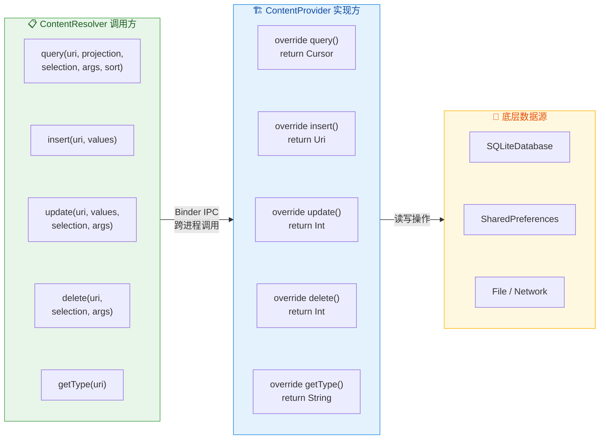

从这张全景图中可以清晰地看到：ContentResolver 的五个方法与 ContentProvider 的五个抽象方法一一对应，形成了完美的 **镜像关系**（Mirror Pattern）。Resolver 端的每次调用都会通过 Binder IPC 被路由到 Provider 端的对应实现，而 Provider 再根据实际情况操作底层数据源。这种"接口镜像 + IPC 透明化"的设计使得跨进程的数据操作对调用方来说 **完全透明**——你甚至不需要知道数据是存储在另一个进程的 SQLite 中还是来自网络请求，调用方式都是一样的。

总结这五个核心接口的关键特征：

| 方法 | 输入核心参数 | 返回值 | 典型用途 |
|------|-------------|--------|---------|
| `query()` | URI + projection + selection + sort | `Cursor?` | 读取数据，支持条件筛选和排序 |
| `insert()` | URI + ContentValues | `Uri?` | 添加新记录，返回新记录的 URI |
| `update()` | URI + ContentValues + selection | `Int` | 修改现有记录，返回受影响行数 |
| `delete()` | URI + selection | `Int` | 删除记录，返回被删除行数 |
| `getType()` | URI | `String?` | 声明数据的 MIME 类型 |

---

**📝 练习题**

在 ContentProvider 的 `insert()` 方法实现中，以下哪种做法能最显著地提升批量插入 1000 条记录的性能？

A. 在每次 `db.insert()` 后立即调用 `notifyChange()` 通知观察者

B. 重写 `bulkInsert()` 方法，在 `beginTransaction()` 和 `endTransaction()` 之间执行所有插入操作，最后统一调用一次 `notifyChange()`

C. 将所有数据拼接成一条 INSERT SQL 语句并通过 `execSQL()` 执行

D. 为每条记录创建一个独立的线程执行 `insert()` 以实现并行写入

**【答案】** B
**【解析】** SQLite 的默认行为是为每条不在显式事务中的写操作自动包裹一个隐式事务，每个事务的 COMMIT 都需要调用 `fsync()` 将数据刷盘，这是极其耗时的 I/O 操作。选项 B 通过显式开启事务，将 1000 次插入合并为一个原子操作，COMMIT 只执行一次 `fsync()`，性能可提升数十到上百倍。同时，统一在事务结束后调用一次 `notifyChange()` 避免了 1000 次重复的 UI 刷新通知。选项 A 恰恰相反，每次插入都通知会触发大量不必要的 UI 重绘。选项 C 虽然减少了事务开销，但将大量数据拼接成单条 SQL 存在 SQL 注入风险、SQL 长度限制问题，且 `execSQL()` 不返回插入结果，无法判断哪些行插入成功。选项 D 则会因为 SQLite 的写锁机制（同一时刻只允许一个写操作）导致线程竞争和严重的锁等待，性能反而更差。

---

**📝 练习题**

某应用通过 ContentResolver 查询另一个应用的 ContentProvider，查询返回的 Cursor 对象在使用完毕后未调用 `close()`。以下关于资源泄漏的描述，哪一项是最准确的？

A. 不会有任何影响，GC 会在 Cursor 对象被回收时自动关闭底层资源

B. 仅导致调用方进程的内存泄漏，不影响 Provider 所在进程

C. 可能导致 CursorWindow（基于共享内存 ashmem 的数据窗口）泄漏，持续未关闭的 Cursor 积累后可能引发 OOM 或文件描述符耗尽

D. 仅在 Provider 端数据库连接耗尽时才会出现问题

**【答案】** C
**【解析】** 跨进程查询返回的 Cursor 内部持有一个 `CursorWindow` 对象，这是一块通过 `ashmem`（Android Anonymous Shared Memory）分配的共享内存区域，默认大小为 2MB。CursorWindow 同时还占用文件描述符（file descriptor）。如果 Cursor 不被关闭，CursorWindow 占用的共享内存和文件描述符都不会被释放。虽然 Cursor 的 `finalize()` 方法中确实会尝试关闭资源（选项 A 部分正确），但 `finalize()` 的执行时机完全不可预测，在高内存压力下 GC 可能来不及回收这些对象。当泄漏的 Cursor 积累到一定数量后，要么共享内存耗尽导致 OOM，要么文件描述符达到系统限制（通常每个进程 1024 个）导致后续的数据库操作和网络请求全部失败。因此，**始终使用 `cursor.use {}` 或 try-finally 确保 Cursor 被及时关闭**是不可妥协的编程纪律。

---

## 线程模型

ContentProvider 作为 Android 四大组件中最早被实例化的组件，其线程模型有着独特而重要的设计考量。很多开发者在使用 ContentProvider 时，往往只关注 CRUD 接口的实现，却忽略了一个关键问题：**这些方法究竟在哪个线程上被调用？调用方和提供方各自处于什么样的线程环境？** 如果对这些问题没有清晰的认知，轻则出现数据不一致，重则引发 ANR 甚至死锁。本节将从 Binder 线程池的执行机制入手，剖析 ContentProvider 在进程启动过程中的初始化时序，最终落脚到开发者必须遵守的线程安全规范。

### Binder 线程池执行

要理解 ContentProvider 的线程模型，首先必须理解 Android 的跨进程通信基础——Binder 机制。当一个应用（Client 进程）通过 `ContentResolver` 调用另一个应用（Server 进程）的 ContentProvider 时，这个调用请求会经由 Binder 驱动从 Client 进程传递到 Server 进程。**Server 进程中负责接收并处理这个请求的，并不是主线程（UI Thread），而是 Binder 线程池中的某一个工作线程。**

这一点是 ContentProvider 线程模型中最核心、最容易被误解的事实。很多开发者想当然地认为 ContentProvider 的 `query()`、`insert()` 等方法和 Activity 的生命周期回调一样运行在主线程上，但事实并非如此。我们需要分两种场景来讨论。

**场景一：跨进程调用（Remote Call）**

当调用方与 ContentProvider 位于不同进程时，整个调用链路如下：调用方在自己的线程（可以是主线程，也可以是工作线程）中发起 `ContentResolver.query()` 等操作，这个调用会通过 Binder 代理对象（`IContentProvider.Proxy`）将请求序列化并发送到 Binder 驱动。驱动将请求转发到目标进程后，目标进程的 Binder 线程池会取出一个空闲线程来反序列化请求参数，然后调用 ContentProvider 对应的 CRUD 方法。方法执行完毕后，返回值再经由 Binder 驱动回传给调用方。

这意味着 ContentProvider 的 CRUD 方法在远程调用场景下，**始终运行在 Binder 线程池的工作线程上**。Android 默认为每个进程维护一个最大容量为 **16 个线程**的 Binder 线程池（这个值由 `ProcessState` 中的 `DEFAULT_MAX_BINDER_THREADS` 决定，加上主 Binder 线程共 16 个）。如果同时有大量跨进程请求涌入，超过线程池容量的请求将被阻塞，直到有线程空闲出来。

**场景二：同进程调用（Local Call）**

当调用方与 ContentProvider 处于同一进程时，情况有所不同。系统会跳过 Binder IPC 的序列化/反序列化过程，直接在**调用方的当前线程**上执行 ContentProvider 的方法。也就是说，如果你在主线程中调用 `ContentResolver.query()`，而目标 ContentProvider 恰好在同一进程中，那么 `query()` 方法就会在主线程上同步执行。这种情况下，如果 `query()` 内部涉及耗时的数据库操作，就可能直接导致 ANR。

以下时序图展示了这两种场景的线程切换差异：

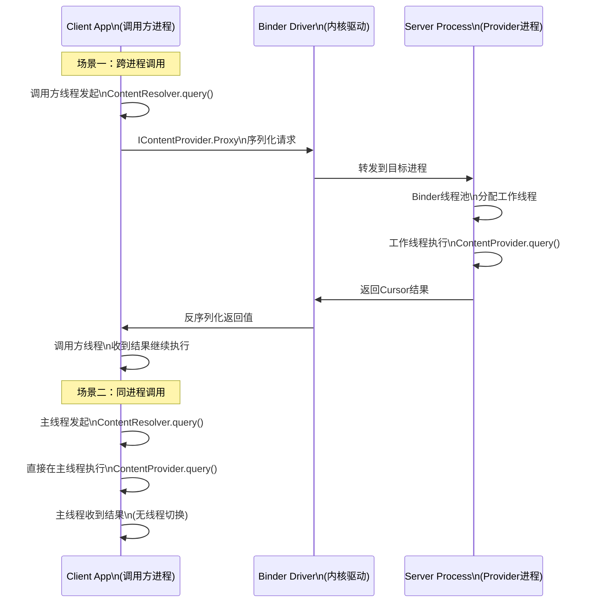

这种设计带来了一个重要的实践意义：**即使你的 ContentProvider 只供自己 App 使用（同进程），也应该在子线程中调用 ContentResolver 的方法**，因为你无法保证底层数据源（SQLite、网络等）的响应时间。而如果你的 ContentProvider 对外暴露（跨进程），则必须意识到 CRUD 方法可能被多个 Binder 线程并发调用，必须做好同步保护。

关于 Binder 调用的同步阻塞特性，还需要特别强调：**Binder IPC 默认是同步的（synchronous）**。调用方线程在发起 Binder 调用后会进入休眠状态，直到远端方法执行完毕并返回结果。这意味着如果 ContentProvider 的 `query()` 方法执行了 5 秒钟，那么调用方线程也会被阻塞 5 秒钟。如果调用方恰好是主线程，这就直接触发了 ANR。因此，**无论同进程还是跨进程，ContentResolver 的调用都应该放在后台线程中完成**，这是一条不可动摇的最佳实践。

### Application 初始化前的启动顺序

ContentProvider 在 Android 组件生命周期中有一个非常特殊的地位：**它是四大组件中最早被初始化的，甚至早于 `Application.onCreate()`**。这个设计初衷是为了确保在 App 的任何业务代码开始运行之前，数据层就已经准备就绪。然而，这个特性也引发了大量的启动顺序问题和潜在陷阱。

让我们完整地梳理一下 Android 应用进程的启动流程，特别关注 ContentProvider 在其中的位置。

当系统需要启动一个新的应用进程时（比如因为需要访问该应用的 ContentProvider，或者需要启动该应用的 Activity），`Zygote` 进程会 fork 出一个新的子进程。这个新进程会执行 `ActivityThread.main()` 方法，这就是应用进程的入口点。在 `main()` 方法中，会创建主线程的 `Looper` 并进入消息循环。接下来，`ActivityThread` 会通过 Binder 调用向 AMS（ActivityManagerService）报到，AMS 随后会回调 `ActivityThread.handleBindApplication()` 方法，将应用的配置信息传递过来。

**关键的初始化顺序就发生在 `handleBindApplication()` 内部**，其伪代码简化如下：

```java
// ActivityThread.handleBindApplication() 简化流程
private void handleBindApplication(AppBindData data) {
    // 第一步：创建 Application 对象（但不调用 onCreate）
    // 通过 Instrumentation.newApplication() 反射创建 Application 实例
    Application app = data.info.makeApplication(false, mInstrumentation);

    // 第二步：安装所有在 AndroidManifest 中声明的 ContentProvider
    // 这一步会遍历所有声明的 Provider，逐一实例化并调用其 onCreate()
    if (!data.restrictedBackupMode) {
        installContentProviders(app, data.providers);
        // 此时所有 ContentProvider 已经完成 onCreate()
    }

    // 第三步：调用 Application.onCreate()
    // 注意：这是在所有 ContentProvider.onCreate() 之后才执行的
    mInstrumentation.callApplicationOnCreate(app);
}
```

`installContentProviders()` 内部会对每一个声明的 ContentProvider 执行以下操作：

```java
// installContentProviders 内部对每个 Provider 的处理
private void installProvider(Context context, ProviderInfo info) {
    // 1. 通过反射创建 ContentProvider 实例
    ContentProvider provider = (ContentProvider) cl.loadClass(info.name).newInstance();

    // 2. 调用 ContentProvider.attachInfo()
    //    该方法内部会调用 ContentProvider.onCreate()
    provider.attachInfo(context, info);

    // 3. 将 Provider 注册到 ActivityThread 的 ProviderMap 中
    //    后续的 ContentResolver 调用会通过这个 Map 找到对应的 Provider
}
```

因此，完整的初始化时序是：

```
Application 构造函数 → ContentProvider.onCreate() → Application.onCreate()
```

这个顺序可以用下面的流程图更直观地表示：

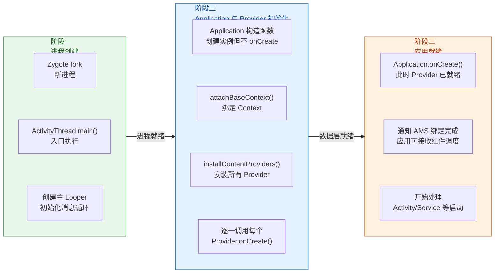

这个启动顺序带来了几个重要的实践影响：

**影响一：ContentProvider.onCreate() 中不能依赖 Application.onCreate() 的初始化逻辑。**

这是最常见的踩坑点。很多 App 会在 `Application.onCreate()` 中初始化全局的依赖注入框架、网络库、数据库 ORM 等基础设施。如果某个 ContentProvider 的 `onCreate()` 中需要使用这些尚未初始化的组件，就会立即崩溃。例如：

```kotlin
// ❌ 错误示例：在 ContentProvider.onCreate() 中使用尚未初始化的全局单例
class MyProvider : ContentProvider() {
    override fun onCreate(): Boolean {
        // 假设 AppDatabase 在 Application.onCreate() 中才完成初始化
        // 此时 Application.onCreate() 还没有被调用！
        // 这行代码会抛出 NullPointerException 或类似的初始化异常
        val db = AppDatabase.getInstance()  // 💥 崩溃！
        return true
    }
}
```

正确的做法是在 ContentProvider 中采用**延迟初始化（Lazy Initialization）**策略：

```kotlin
// ✅ 正确示例：使用 lazy 延迟初始化，直到第一次真正需要时才获取实例
class MyProvider : ContentProvider() {

    // 使用 Kotlin 的 lazy 委托，在第一次访问 db 时才执行初始化
    // 此时 Application.onCreate() 早已执行完毕
    private val db by lazy { AppDatabase.getInstance(context!!) }

    override fun onCreate(): Boolean {
        // onCreate() 中只做轻量级的准备工作
        // 不要在这里访问可能尚未就绪的全局依赖
        return true
    }

    override fun query(
        uri: Uri,
        projection: Array<out String>?,
        selection: String?,
        selectionArgs: Array<out String>?,
        sortOrder: String?
    ): Cursor? {
        // 首次 query 时 db 才会被初始化
        // 此时所有全局依赖已经就绪
        return db.rawQuery("SELECT * FROM table", null)
    }

    // ... 其他 CRUD 方法
}
```

**影响二：ContentProvider.onCreate() 运行在主线程上，直接影响应用冷启动时间。**

`handleBindApplication()` 整个方法都在主线程上执行，`installContentProviders()` 自然也不例外。这意味着每一个 ContentProvider 的 `onCreate()` 方法都会在主线程上同步执行，它们的耗时会直接累加到应用的冷启动时间中。如果你的 App 声明了多个 ContentProvider，或者某个 ContentProvider 在 `onCreate()` 中做了数据库建表、数据迁移等耗时操作，冷启动时间会显著增长。

这也是为什么许多第三方库（如 Firebase、WorkManager、Lifecycle 等）利用 ContentProvider 的 `onCreate()` 来实现"**无侵入式自动初始化**"时，会引起社区对启动性能的广泛讨论。Jetpack 团队后来推出了 **App Startup** 库（`androidx.startup`），本质上就是用一个单一的 ContentProvider（`InitializationProvider`）来替代多个库各自声明的 ContentProvider，从而减少初始化开销。

```xml
<!-- AndroidManifest.xml 中 App Startup 的典型配置 -->
<!-- 只需要一个 InitializationProvider，替代多个库各自的 ContentProvider -->
<provider
    android:name="androidx.startup.InitializationProvider"
    android:authorities="${applicationId}.androidx-startup"
    android:exported="false">
    <!-- 通过 meta-data 声明需要初始化的 Initializer -->
    <meta-data
        android:name="com.example.MyInitializer"
        android:value="androidx.startup" />
</provider>
```

**影响三：多个 ContentProvider 的初始化顺序不确定。**

如果你的 App 声明了多个 ContentProvider，它们的 `onCreate()` 调用顺序取决于在 `AndroidManifest.xml` 中的声明顺序（以及 Manifest Merger 合并后的最终顺序），但这个顺序并没有明确的 API 保证。因此，**ContentProvider 之间不应该存在初始化依赖关系**。如果确实需要控制初始化顺序，应该使用 App Startup 库提供的依赖声明机制。

**影响四：`attachBaseContext()` 是唯一早于 ContentProvider 的 Application 回调。**

更精确地说，`Application.attachBaseContext()` 的调用时机在 ContentProvider 初始化**之前**。因此，如果某些全局初始化逻辑必须在 ContentProvider 之前完成，可以将其放在 `attachBaseContext()` 中而非 `onCreate()` 中。但需注意，`attachBaseContext()` 中能做的事情有限，因为此时 Application 的 Context 才刚刚绑定，很多依赖完整 Context 的 API 可能尚不可用。

```kotlin
class MyApplication : Application() {

    override fun attachBaseContext(base: Context) {
        // 这个方法在所有 ContentProvider.onCreate() 之前调用
        super.attachBaseContext(base)
        // 可以在这里做最基础的初始化
        // 例如 MultiDex 安装（在 minSdk < 21 时需要）
        // 或者极少数必须在 Provider 之前就绪的配置
    }

    override fun onCreate() {
        // 这个方法在所有 ContentProvider.onCreate() 之后调用
        super.onCreate()
        // 常规的全局初始化放在这里
    }
}
```

### 线程安全要求

明确了 ContentProvider 的线程执行环境后，线程安全就成为一个无法回避的话题。核心问题在于：**ContentProvider 的 CRUD 方法可以被多个线程同时调用**，开发者必须为这种并发访问提供充分的保护。

**为什么会出现并发？**

在跨进程场景下，多个来自不同客户端进程的 Binder 请求会被 Binder 线程池中的不同工作线程分别处理，这些线程会**同时**调用同一个 ContentProvider 实例的方法。即使是同进程场景，如果多个工作线程同时通过 ContentResolver 发起操作，也会出现并发调用。

Android 官方文档对此有明确说明：

> "The methods `query()`, `insert()`, `delete()`, `update()`, and `getType()` can be called from multiple threads at the same time, so they must be implemented in a thread-safe manner."

**ContentProvider 的单例特性**

对于同一个 Authority，系统只会创建**一个** ContentProvider 实例（per process）。所有的调用——无论来自本进程的多个线程还是来自其他进程的 Binder 线程——都会路由到这同一个实例上。这就像一个"多线程访问的共享对象"，如果不做同步控制，就会出现经典的竞态条件（Race Condition）问题。

**具体的线程安全策略**

根据底层数据源的不同，线程安全策略也有所差异。以下是几种常见场景的分析：

**策略一：基于 SQLite 的 ContentProvider —— 利用 SQLiteDatabase 的内置锁机制**

如果你的 ContentProvider 底层使用 `SQLiteDatabase` 作为数据存储，那么可以在一定程度上依赖 SQLite 自身的并发控制机制。`SQLiteDatabase` 在默认的**日志模式（Journal Mode）**下使用读写锁：允许多个并发读操作，但写操作会获取排他锁。从 API 16 开始，Android 支持 **WAL（Write-Ahead Logging）**模式，该模式允许读写并发执行，大幅提升了并发性能。

但这里有一个关键前提：**必须确保所有线程使用的是同一个 `SQLiteDatabase` 实例**。如果每次调用都创建新的数据库连接，SQLite 的内置锁机制就无法在进程内部协调，可能导致 "database is locked" 异常。

```kotlin
// ✅ 正确做法：使用单例的 SQLiteOpenHelper，确保共享同一个数据库连接
class MyProvider : ContentProvider() {

    // 伴生对象持有单例的 Helper 引用
    companion object {
        // volatile 确保多线程可见性
        @Volatile
        private var dbHelper: MyDatabaseHelper? = null

        // 双重检查锁定获取单例
        private fun getHelper(context: Context): MyDatabaseHelper {
            return dbHelper ?: synchronized(this) {
                dbHelper ?: MyDatabaseHelper(context.applicationContext).also {
                    dbHelper = it
                }
            }
        }
    }

    override fun onCreate(): Boolean {
        // onCreate 中只做轻量准备，不在此处初始化数据库
        return true
    }

    override fun query(
        uri: Uri,
        projection: Array<out String>?,
        selection: String?,
        selectionArgs: Array<out String>?,
        sortOrder: String?
    ): Cursor? {
        // 通过单例 Helper 获取可读数据库实例（共享连接）
        val db = getHelper(context!!).readableDatabase
        // SQLiteDatabase 内部的锁机制会保护并发读操作
        return db.query("my_table", projection, selection, selectionArgs, null, null, sortOrder)
    }

    override fun insert(uri: Uri, values: ContentValues?): Uri? {
        // 通过同一个单例 Helper 获取可写数据库实例
        val db = getHelper(context!!).writableDatabase
        // SQLiteDatabase 内部的锁机制会保护写操作
        val id = db.insert("my_table", null, values)
        // 通知观察者数据已变化
        context?.contentResolver?.notifyChange(uri, null)
        // 返回新插入行的 URI
        return ContentUris.withAppendedId(uri, id)
    }

    // update / delete 类似，均通过同一个 Helper 获取数据库连接
    // ...
}
```

**策略二：基于内存数据结构的 ContentProvider —— 必须手动同步**

如果你的 ContentProvider 底层使用 `HashMap`、`ArrayList` 等内存数据结构而非数据库，那么你必须**自行实现同步机制**。常见的选择包括：

- 使用 `synchronized` 块或 `ReentrantReadWriteLock` 保护共享数据结构
- 使用线程安全的并发集合（如 `ConcurrentHashMap`）
- 使用 Kotlin 的 `Mutex`（协程场景）

```kotlin
// 基于内存 Map 的 ContentProvider：使用读写锁提升并发性能
class InMemoryProvider : ContentProvider() {

    // 底层数据存储：普通 HashMap（非线程安全）
    private val dataStore = HashMap<Long, ContentValues>()

    // 读写锁：允许多个并发读，写操作排他
    private val lock = ReentrantReadWriteLock()

    // 自增 ID 生成器：使用 AtomicLong 保证原子性
    private val idGenerator = AtomicLong(0)

    override fun onCreate(): Boolean = true

    override fun query(
        uri: Uri,
        projection: Array<out String>?,
        selection: String?,
        selectionArgs: Array<out String>?,
        sortOrder: String?
    ): Cursor? {
        // 获取读锁：多个 query 可以同时执行
        lock.readLock().lock()
        try {
            // 在读锁保护下安全地遍历 dataStore
            val cursor = MatrixCursor(projection ?: arrayOf("_id", "name"))
            dataStore.forEach { (id, values) ->
                // 将每条数据添加到 MatrixCursor 中
                cursor.addRow(arrayOf(id, values.getAsString("name")))
            }
            return cursor
        } finally {
            // finally 块确保锁一定被释放，避免死锁
            lock.readLock().unlock()
        }
    }

    override fun insert(uri: Uri, values: ContentValues?): Uri? {
        // 获取写锁：排他访问，其他读写操作都必须等待
        lock.writeLock().lock()
        try {
            // 在写锁保护下安全地修改 dataStore
            val id = idGenerator.incrementAndGet()
            values?.let { dataStore[id] = it }
            // 通知观察者数据变化
            context?.contentResolver?.notifyChange(uri, null)
            return ContentUris.withAppendedId(uri, id)
        } finally {
            // 确保写锁释放
            lock.writeLock().unlock()
        }
    }

    // update / delete 同样需要获取写锁
    // ...
}
```

使用 `ReentrantReadWriteLock` 而不是简单的 `synchronized` 的好处在于：读操作（`query`）之间不会互相阻塞，只有写操作（`insert`/`update`/`delete`）才需要排他访问。对于读多写少的场景（这在 ContentProvider 中很常见），这种策略能显著提升吞吐量。

**策略三：批量操作的原子性 —— `applyBatch()` 与事务**

ContentProvider 提供了 `applyBatch()` 方法，允许客户端一次性提交多个操作（`ContentProviderOperation` 列表）。在默认实现中，`applyBatch()` 只是简单地逐一执行每个操作，**并不保证原子性**。如果你需要"要么全部成功，要么全部回滚"的事务语义，必须在 ContentProvider 中重写 `applyBatch()` 并显式使用数据库事务：

```kotlin
// 重写 applyBatch 以提供事务级别的原子性保证
override fun applyBatch(
    operations: ArrayList<ContentProviderOperation>
): Array<ContentProviderResult> {
    // 获取可写数据库实例
    val db = dbHelper.writableDatabase
    // 开启 SQLite 事务
    db.beginTransaction()
    try {
        // 调用父类的 applyBatch 逐一执行所有操作
        // 每个操作内部会调用对应的 insert/update/delete 方法
        val results = super.applyBatch(operations)
        // 标记事务成功：如果前面没有异常，所有操作会在 endTransaction 时提交
        db.setTransactionSuccessful()
        // 返回每个操作的执行结果
        return results
    } finally {
        // 结束事务：如果没有调用 setTransactionSuccessful()，所有操作会被回滚
        db.endTransaction()
    }
}
```

**常见的线程安全陷阱总结**

下面汇总几个在实际开发中频繁出现的线程安全问题：

| 陷阱 | 症状 | 根因 | 解决方案 |
|------|------|------|---------|
| 多个 `SQLiteOpenHelper` 实例 | `SQLiteDatabaseLockedException` | 同一进程内多个数据库连接竞争文件锁 | 确保 `SQLiteOpenHelper` 为单例 |
| `Cursor` 跨线程使用 | 数据不一致或崩溃 | `Cursor` 不是线程安全的 | 在同一线程内消费 Cursor，或拷贝数据后传递 |
| `onCreate()` 中的长耗时操作 | 应用冷启动 ANR | `onCreate()` 运行在主线程 | 延迟初始化，仅在首次 CRUD 时才完成准备 |
| 忽略 `notifyChange` 的线程问题 | 观察者收不到通知 | `notifyChange` 可安全地在任意线程调用，但观察者的 `onChange()` 回调线程取决于注册时传入的 Handler | 确保观察者的 Handler 与期望的回调线程匹配 |
| `applyBatch` 不使用事务 | 批量操作部分成功部分失败 | 默认实现无原子性保证 | 重写 `applyBatch()`，包裹在数据库事务中 |

**关于 `bulkInsert()` 的优化**

ContentProvider 还提供了 `bulkInsert()` 方法用于批量插入。默认实现只是循环调用 `insert()`，效率很低。对于大量数据的批量插入，应该重写此方法并使用数据库事务包裹：

```kotlin
// 重写 bulkInsert 以使用事务优化批量插入性能
override fun bulkInsert(uri: Uri, values: Array<out ContentValues>): Int {
    val db = dbHelper.writableDatabase
    // 开启事务：批量插入在单个事务中完成，避免每行都触发磁盘同步
    db.beginTransaction()
    try {
        var insertCount = 0
        // 遍历所有待插入的 ContentValues
        for (value in values) {
            // 执行单行插入，-1 表示插入失败
            val id = db.insert("my_table", null, value)
            if (id != -1L) {
                // 插入成功，计数加一
                insertCount++
            }
        }
        // 标记事务成功
        db.setTransactionSuccessful()
        // 事务完成后统一发送一次变更通知（而非每行都通知）
        context?.contentResolver?.notifyChange(uri, null)
        // 返回成功插入的行数
        return insertCount
    } finally {
        // 确保事务结束（成功则提交，失败则回滚）
        db.endTransaction()
    }
}
```

使用事务包裹的 `bulkInsert()` 与逐行 `insert()` 相比，性能差距可以达到**数十倍**。原因在于 SQLite 在没有显式事务的情况下，每次 `insert` 操作都会隐式开启并提交一个事务，而每次事务提交都需要将数据同步（fsync）到磁盘。批量事务只需在最后提交一次，极大地减少了磁盘 I/O。

---

**📝 练习题**

以下关于 ContentProvider 线程模型的说法，哪一项是**正确**的？

A. ContentProvider 的 `query()` 方法总是运行在主线程上，因此调用方无需在子线程中发起查询

B. ContentProvider 的 `onCreate()` 方法在 `Application.onCreate()` 之后调用，可以安全使用 Application 中初始化的全局依赖

C. 跨进程调用 ContentProvider 时，Provider 的 CRUD 方法运行在 Binder 线程池的工作线程上，而非主线程

D. 同一个 Authority 的 ContentProvider 可以存在多个实例，系统会根据调用量动态创建

**【答案】** C

**【解析】** 选项 A 是错误的。跨进程调用时，ContentProvider 的 CRUD 方法运行在 Binder 线程池的工作线程上；同进程调用时，运行在调用方的当前线程上（不一定是主线程）。无论哪种情况，都应该在子线程中发起调用以避免阻塞主线程。选项 B 颠倒了顺序——ContentProvider 的 `onCreate()` 在 `Application.onCreate()` **之前**调用，此时 Application 的 `onCreate()` 尚未执行，全局依赖可能尚未初始化。选项 D 也是错误的，同一 Authority 的 ContentProvider 在每个进程中只有一个单例实例。选项 C 准确描述了跨进程场景下的线程行为：Binder 线程池中的工作线程负责执行 Provider 端的 CRUD 方法，这正是开发者必须在 ContentProvider 中实现线程安全的根本原因。

---

**📝 练习题**

某 App 在 `Application.onCreate()` 中初始化了一个全局的网络请求单例 `NetworkManager.init()`。同时该 App 声明了一个 `SyncProvider extends ContentProvider`，其 `onCreate()` 中调用了 `NetworkManager.getInstance()` 来预加载配置。应用首次冷启动时最可能出现什么问题？

A. 正常运行，因为 `Application.onCreate()` 先于所有组件执行

B. `SyncProvider.onCreate()` 中抛出空指针或未初始化异常，因为 `NetworkManager` 尚未被 `init()`

C. 应用启动缓慢但不会崩溃，因为系统会自动延迟 Provider 的初始化

D. `SyncProvider` 不会被创建，因为没有外部进程调用它

**【答案】** B

**【解析】** Android 应用进程的初始化顺序是：`Application` 构造函数 → `Application.attachBaseContext()` → 所有 ContentProvider 的 `onCreate()` → `Application.onCreate()`。因此，当 `SyncProvider.onCreate()` 执行时，`Application.onCreate()` 尚未被调用，`NetworkManager.init()` 也就尚未执行。此时调用 `NetworkManager.getInstance()` 会因为单例未初始化而抛出异常（通常是 `NullPointerException` 或自定义的 `IllegalStateException`）。选项 A 的描述与实际初始化顺序相反。选项 C 不成立——系统不会自动延迟 Provider 初始化，所有在 Manifest 中声明的 Provider 都会在应用启动时同步安装。选项 D 也不对——ContentProvider 的创建不依赖于是否有外部调用，它在进程启动时就会被无条件实例化。正确的修复方式是将 `NetworkManager` 的初始化移到 `attachBaseContext()` 中，或者在 `SyncProvider` 中采用延迟初始化策略。

---

## 权限控制

ContentProvider 作为 Android 跨进程数据共享的标准组件，天然面临一个严峻的安全问题：**如果任何应用都能随意读写你暴露的数据，那数据隔离就形同虚设**。Android 从设计之初就在 ContentProvider 上构建了一套多层次、细粒度的权限控制体系，从静态的 Manifest 权限声明，到运行时的 URI 级临时授权，层层把关，确保数据在"共享"与"安全"之间达到精确平衡。

理解这套权限机制，不仅是开发自定义 Provider 的必备知识，也是正确调用系统 Provider（如联系人、媒体库）时排查 `SecurityException` 的关键。本节将从最基本的读写权限声明讲起，逐步深入到路径级权限、临时授权的底层流转，以及实际开发中的最佳实践。

### readPermission 与 writePermission

#### 基本概念与声明方式

ContentProvider 的权限控制最基础的一层，就是在 `AndroidManifest.xml` 中为 `<provider>` 标签声明 **读权限（readPermission）** 和 **写权限（writePermission）**。这两个属性的语义非常直观：

- **`android:readPermission`**：任何外部应用在调用该 Provider 的 `query()` 方法时，必须在自己的 Manifest 中声明（并获得）此权限，否则系统会直接抛出 `SecurityException`。
- **`android:writePermission`**：任何外部应用在调用 `insert()`、`update()`、`delete()` 方法时，必须持有此权限。

还有一个更粗粒度的 **`android:permission`** 属性，它同时控制读和写。当你既声明了 `android:permission` 又声明了 `readPermission` 或 `writePermission` 时，**细粒度的声明会覆盖粗粒度的声明**。也就是说，`readPermission` 优先于 `permission` 对读操作生效，`writePermission` 优先于 `permission` 对写操作生效。

先看一个典型的权限声明流程。首先，提供数据的应用（Provider 端）需要自定义权限并将其绑定到 Provider：

```xml
<!-- ========== Provider 端：声明自定义权限并绑定到 Provider ========== -->

<!-- 第一步：自定义"读"权限，protectionLevel 决定了授权门槛 -->
<!-- "normal" 级别：安装时自动授予，用户无感知 -->
<!-- "dangerous" 级别：运行时需要用户手动同意（Android 6.0+） -->
<!-- "signature" 级别：只有与 Provider 应用签名相同的应用才能获得 -->
<permission
    android:name="com.example.myapp.READ_DATA"
    android:protectionLevel="signature" />

<!-- 第二步：自定义"写"权限，同样使用 signature 级别保护 -->
<permission
    android:name="com.example.myapp.WRITE_DATA"
    android:protectionLevel="signature" />

<!-- 第三步：将权限绑定到 Provider 声明上 -->
<provider
    android:name=".data.MyContentProvider"
    android:authorities="com.example.myapp.provider"
    android:exported="true"
    android:readPermission="com.example.myapp.READ_DATA"
    android:writePermission="com.example.myapp.WRITE_DATA" />
<!-- exported="true" 表示允许外部应用访问 -->
<!-- 但即使 exported，没有对应权限的应用依然会被拒绝 -->
```

然后，需要访问数据的外部应用（Client 端）必须在自己的 Manifest 中声明使用这些权限：

```xml
<!-- ========== Client 端：申请权限 ========== -->

<!-- 声明需要使用 Provider 端定义的读权限 -->
<uses-permission android:name="com.example.myapp.READ_DATA" />

<!-- 声明需要使用 Provider 端定义的写权限 -->
<uses-permission android:name="com.example.myapp.WRITE_DATA" />
```

#### protectionLevel 的选择策略

权限声明中最关键的属性是 `android:protectionLevel`，它决定了权限的"授权门槛"有多高。在 ContentProvider 场景下，不同的保护级别适用于完全不同的业务场景：

**`normal`（普通级别）**：系统在安装时自动授予，用户甚至不会看到任何提示。这种级别适合那些数据敏感性较低的场景，比如暴露一些应用的公开配置信息。但需要注意，`normal` 级别几乎等于"对所有应用开放"，因为任何应用只要声明 `<uses-permission>` 就能自动获得，没有任何额外校验。

**`dangerous`（危险级别）**：在 Android 6.0（API 23）之前，安装时展示给用户确认；在 6.0 及之后，必须在运行时通过 `requestPermissions()` 动态申请，用户明确同意后才能使用。系统内置的联系人、日历、通话记录等 Provider 就采用这个级别。适合那些涉及用户隐私但确实需要跨应用共享的数据。

**`signature`（签名级别）**：只有与定义该权限的应用使用 **相同签名证书** 打包的应用才能获得此权限。这是自定义 ContentProvider 最常用也是 **最推荐** 的保护级别——它意味着只有你自己的应用套件（比如同一家公司的多个 App）之间才能互相访问数据，第三方应用完全无法获取。这在企业级多模块应用、应用矩阵（App Suite）场景下极为常见。

**`signature|privileged`（签名+特权级别）**：除了签名匹配外，还允许系统分区（`/system/priv-app/`）中的特权应用获取。这主要用于 OEM 定制和系统级应用，普通开发者几乎用不到。

#### 权限校验的底层流转

当一个外部应用通过 `ContentResolver` 发起对 Provider 的调用时，权限校验并不是发生在 Provider 进程内部，而是由系统的 **ActivityManagerService（AMS）** 在 Binder 调用的中间环节统一拦截和校验的。整个流转过程如下：

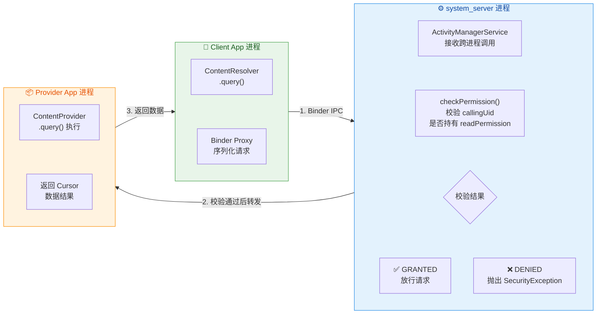

这个流程有几个关键点值得深入理解：

**第一，校验发生在 AMS 而非 Provider 内部**。这意味着如果权限不满足，请求根本不会到达 Provider 的 `query()` 或 `insert()` 方法。Provider 的代码无需自行做权限检查（当然，你可以在 Provider 内部做额外的业务级校验，这是锦上添花）。AMS 通过 `Binder.getCallingUid()` 和 `Binder.getCallingPid()` 获取调用方的身份信息，再对照 PackageManager 中记录的权限授予状态来判断。

**第二，`exported` 属性是第一道门**。如果 `android:exported="false"`，那么外部应用的请求在 AMS 层就会被直接拒绝，根本不会走到权限校验环节。`exported` 和 `permission` 是两道独立的防线：`exported` 决定"是否允许外部访问"，`permission` 决定"允许谁访问"。

**第三，同一应用内的调用不受权限限制**。当调用方和 Provider 处于同一个应用（相同 UID）时，系统会跳过权限检查，直接放行。这是因为 Android 的安全模型基于 Linux UID 隔离，同一个应用的所有组件共享同一个 UID，自然拥有对自身数据的完全访问权。

#### path-permission：路径级细粒度控制

有时候，一个 ContentProvider 对外暴露多种类型的数据，而你希望对不同路径施加不同的权限要求。例如，同一个 Provider 可能既暴露"公开文章"（所有应用可读）又暴露"用户隐私笔记"（仅签名应用可读）。此时可以使用 `<path-permission>` 进行路径级权限细分：

```xml
<!-- Provider 声明：整体使用较松的权限，特定路径使用更严格的权限 -->
<provider
    android:name=".data.ArticleProvider"
    android:authorities="com.example.articles"
    android:exported="true"
    android:readPermission="com.example.READ_PUBLIC">

    <!-- 对 /private/ 路径下的数据施加更严格的签名级权限 -->
    <!-- pathPrefix 表示"以此前缀开头的所有路径" -->
    <path-permission
        android:pathPrefix="/private/"
        android:readPermission="com.example.READ_PRIVATE"
        android:writePermission="com.example.WRITE_PRIVATE" />

    <!-- 对 /admin/ 路径使用精确匹配 -->
    <!-- path 表示完全匹配，不含通配 -->
    <path-permission
        android:path="/admin/config"
        android:readPermission="com.example.ADMIN_ACCESS"
        android:writePermission="com.example.ADMIN_ACCESS" />
</provider>
```

权限的匹配优先级遵循 **"最具体的优先"** 原则：`<path-permission>` 中 `path`（精确匹配）优先于 `pathPrefix`（前缀匹配），而 `<path-permission>` 整体优先于 `<provider>` 标签上声明的全局 `readPermission` / `writePermission`。如果请求的 URI 没有命中任何 `<path-permission>`，则回退到全局权限。

### URI 临时授权 grantUriPermissions

#### 为什么需要临时授权

静态权限声明虽然简单直接，但有一个根本性的局限：**它是"全有或全无"的**。一旦某个应用获得了 `readPermission`，它就能读取该 Provider 下所有（匹配权限路径的）数据；如果没有权限，则完全无法访问。

然而，现实中有大量场景需要 **"恰好够用"** 的临时性、单条记录级别的访问权限。最典型的例子是：

- **文件分享**：你的应用生成了一张图片，想让用户选择的第三方应用（如微信、邮件客户端）来打开它。你不希望给微信永久读取你所有文件的权限，而只是让它 **临时访问这一张图片**。
- **相机拍照**：你调用系统相机拍照，通过 `MediaStore` 或 `FileProvider` 给相机应用一个临时写入权限的 URI，让它把照片写到你指定的位置。拍完照后，权限自动回收。
- **内容选择器**：用户从你的应用中选择了一条联系人记录，你通过 Intent 把这条记录的 URI 传给另一个应用处理，另一个应用只需临时读取这一条。

这就是 **URI 临时授权（URI Permission Grant）** 机制的核心价值：**在不授予全局权限的前提下，让另一个应用临时获得对特定 URI 的读/写能力，用完即回收。**

#### 启用临时授权的前提配置

要让一个 ContentProvider 支持 URI 临时授权，必须在 Manifest 中进行相应配置。有两种方式：

**方式一：全局启用**——在 `<provider>` 标签上设置 `android:grantUriPermissions="true"`，表示该 Provider 下的所有 URI 都可以被临时授权：

```xml
<!-- 全局启用：该 Provider 的任何 URI 都可以被临时授权给其他应用 -->
<provider
    android:name=".data.FileShareProvider"
    android:authorities="com.example.files"
    android:exported="false"
    android:grantUriPermissions="true" />
<!-- 注意：即使 exported="false"，临时授权依然能让外部应用访问特定 URI -->
<!-- 这正是临时授权的精妙之处——整体不开放，按需单点突破 -->
```

**方式二：限定路径启用**——如果你不想让所有 URI 都可以被临时授权，可以通过 `<grant-uri-permission>` 子标签限定哪些路径允许临时授权：

```xml
<!-- 仅允许 /shared/ 路径下的 URI 被临时授权 -->
<provider
    android:name=".data.FileShareProvider"
    android:authorities="com.example.files"
    android:exported="false"
    android:grantUriPermissions="false">

    <!-- 只有以 /shared/ 开头的路径可以被临时授权 -->
    <grant-uri-permission android:pathPrefix="/shared/" />

    <!-- 也可以使用精确路径匹配 -->
    <grant-uri-permission android:path="/public/readme" />
</provider>
<!-- 当 grantUriPermissions="false" 时，必须有 <grant-uri-permission> 子标签 -->
<!-- 否则任何临时授权请求都会被拒绝 -->
```

这两种方式的区别在于灵活性与安全性的权衡。全局启用更简单，但意味着攻击面更大；限定路径启用更安全，但需要你事先规划好哪些数据可能被分享。

#### 临时授权的两种触发方式

配置好 Provider 之后，实际触发临时授权有两种机制，分别适用于不同的使用场景：

**方式一：通过 Intent Flag（最常用）**

这是最自然、最推荐的方式。当你通过 `Intent` 启动另一个应用的组件（Activity、Service 等），并将 Provider 的 URI 作为 Intent 的 `data` 或 `ClipData` 传递时，可以在 Intent 上设置权限 Flag：

```kotlin
// === 通过 Intent Flag 授予临时 URI 权限 ===

// 构建要分享的内容 URI（通常由 FileProvider 生成）
val contentUri: Uri = FileProvider.getUriForFile(
    context,                            // 当前上下文
    "com.example.myapp.fileprovider",   // 在 Manifest 中声明的 authority
    File(context.filesDir, "report.pdf") // 要分享的文件
)

// 创建用于打开 PDF 的 Intent
val shareIntent = Intent(Intent.ACTION_VIEW).apply {
    // 设置数据和 MIME 类型
    setDataAndType(contentUri, "application/pdf")

    // 【关键】添加临时读权限 Flag
    // FLAG_GRANT_READ_URI_PERMISSION: 授予目标应用对此 URI 的临时读权限
    addFlags(Intent.FLAG_GRANT_READ_URI_PERMISSION)

    // 如果还需要写权限，可以同时添加：
    // addFlags(Intent.FLAG_GRANT_WRITE_URI_PERMISSION)
}

// 启动目标 Activity
// 当目标 Activity 结束（或任务栈被清理）时，临时权限自动回收
startActivity(shareIntent)
```

当系统处理这个 Intent 时，AMS 会记录一条临时权限授予记录：**"允许目标应用的 UID 临时读取此 URI"**。这条记录的生命周期与目标组件绑定——当接收 Intent 的 Activity 被销毁（`finish()`），或者该应用的任务栈被系统回收时，临时权限自动失效。

**方式二：通过 Context.grantUriPermission()（精确控制）**

如果你不通过 Intent 传递 URI，而是需要在代码中精确控制授权时机和目标，可以使用 `Context.grantUriPermission()` 方法：

```kotlin
// === 通过 API 显式授予和撤销临时 URI 权限 ===

// 要授权的目标应用包名
val targetPackage = "com.example.partner.app"

// 要共享的 URI
val dataUri = Uri.parse("content://com.example.myapp.provider/records/42")

// 显式授予读权限
// 参数：目标包名、URI、权限标志
context.grantUriPermission(
    targetPackage,                              // 精确指定哪个应用获得权限
    dataUri,                                    // 精确指定哪条 URI
    Intent.FLAG_GRANT_READ_URI_PERMISSION       // 读权限（也可用 WRITE 或两者 OR）
)

// ... 目标应用在此期间可以通过 ContentResolver 读取该 URI ...

// 当不再需要共享时，显式撤销权限
// 这比 Intent Flag 方式更精确——你完全控制权限的生命周期
context.revokeUriPermission(
    dataUri,                                    // 撤销此 URI 的临时权限
    Intent.FLAG_GRANT_READ_URI_PERMISSION       // 撤销读权限
)
// 撤销后，目标应用再访问该 URI 就会收到 SecurityException
```

`grantUriPermission()` 方式授予的权限 **不会自动回收**（除非应用被卸载或设备重启），必须由授权方显式调用 `revokeUriPermission()` 来撤销。因此，使用这种方式时务必管理好权限的生命周期，避免遗忘撤销导致的安全风险。

#### 临时授权的底层机制

URI 临时授权在系统内部的实现涉及 AMS 中的 **`UriPermissionOwner`** 和 **`UriPermission`** 数据结构。理解这个机制有助于排查各种权限相关的疑难问题：

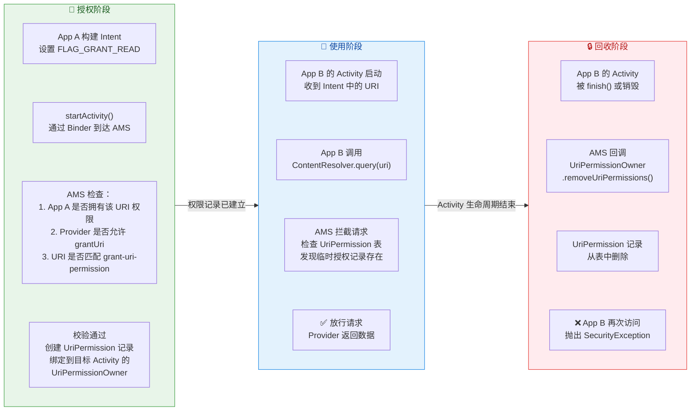

从这个流程中可以提炼出几条重要的实践结论：

**授权方必须自身拥有权限**。App A 只有在自己拥有对该 URI 的访问权限（通常是因为它就是 Provider 所在的应用）时，才能通过 Intent Flag 或 `grantUriPermission()` 将权限临时转授给别人。如果 App A 本身就没有权限，AMS 会拒绝授权请求。

**临时授权可以绕过 `exported="false"`**。这是一个常被误解的点——很多开发者以为 `exported="false"` 就意味着外部应用完全无法访问。实际上，临时授权机制专门为此而设计：Provider 整体不对外暴露（`exported="false"`），但通过临时授权，可以精确地"打开一个小口"让特定应用访问特定数据。**这是 Android 安全设计中"最小权限原则（Principle of Least Privilege）"的典型体现。**

**Intent Flag 方式的权限回收是自动的**，与目标 Activity 的生命周期绑定。但如果目标是 Service，权限会在 Service 停止时回收；如果多个组件共享同一个 URI 的临时权限，所有持有者都释放后才会完全回收。

#### 实际开发中的权限设计最佳实践

综合以上机制，在实际项目中设计 ContentProvider 的权限策略时，建议遵循以下原则：

```kotlin
// === 推荐的 Provider 权限设计模式 ===

// 1. 默认不导出，除非有明确的跨应用需求
// android:exported="false"

// 2. 如果确实需要跨应用共享，优先使用 signature 级权限
// 这样只有你自己的应用套件能访问

// 3. 对于"偶尔分享给第三方"的场景，使用 exported="false" + grantUriPermissions="true"
// 配合 Intent Flag 实现最小权限的临时授权

// 4. Provider 内部可以做额外校验（Defense in Depth，纵深防御）
class SecureProvider : ContentProvider() {

    override fun query(
        uri: Uri,                                   // 请求的 URI
        projection: Array<out String>?,             // 请求的列
        selection: String?,                         // 过滤条件
        selectionArgs: Array<out String>?,          // 过滤参数
        sortOrder: String?                          // 排序
    ): Cursor? {
        // 即使 AMS 已经做了权限校验，Provider 内部依然可以做额外的业务级检查
        // 这就是"纵深防御"思想

        // 获取调用方的包名（通过 Binder 获取调用方 UID，再查包名）
        val callingPackage = callingPackage          // ContentProvider 内置方法
            ?: throw SecurityException("Unable to identify calling package")

        // 可以根据调用方身份做更精细的数据过滤
        // 比如：即使有读权限，也只返回与该应用相关的数据行
        val filteredSelection = if (isExternalCaller(callingPackage)) {
            // 外部调用者只能看到"公开"标记的记录
            "(${selection ?: "1=1"}) AND is_public = 1"     // 追加公开过滤条件
        } else {
            selection                                        // 内部调用不限制
        }

        // 执行查询并返回结果
        return database.query(
            getTableName(uri),                      // 根据 URI 映射表名
            projection,                             // 投影列
            filteredSelection,                      // 可能被追加了过滤条件
            selectionArgs,                          // 过滤参数
            null,                                   // groupBy
            null,                                   // having
            sortOrder                               // 排序
        )
    }

    // 判断是否为外部调用者
    private fun isExternalCaller(pkg: String): Boolean {
        // 如果调用方包名与自身不同，视为外部调用
        return pkg != context?.packageName           // 比较包名
    }
}
```

**关于 `android:exported` 在不同 API 级别的默认行为变化**：在 Android 12（API 31）之前，如果一个 `<provider>` 声明了 `<intent-filter>`，其 `exported` 默认为 `true`；如果没有 `<intent-filter>`，默认为 `false`。但从 **Android 12 开始，系统强制要求显式声明 `android:exported`**，不再允许隐式默认值。如果目标 SDK 为 31 或以上且未声明 `exported`，应用将无法安装。这是 Google 推动安全最佳实践的重要举措——迫使开发者主动思考每个组件的暴露面。

最后，将三种权限机制的特性总结为对比：

| 维度 | 静态权限 (readPermission/writePermission) | 路径权限 (path-permission) | URI 临时授权 (grantUriPermissions) |
|---|---|---|---|
| **粒度** | Provider 级别（所有 URI） | 路径前缀或精确路径 | 单条 URI |
| **生命周期** | 永久（安装时/运行时授予） | 永久 | 临时（组件销毁或显式撤销） |
| **适用场景** | 已知的长期合作应用 | 同一 Provider 内不同数据的差异化保护 | 一次性分享给未知的第三方应用 |
| **是否需要目标应用声明 uses-permission** | ✅ 是 | ✅ 是 | ❌ 不需要 |
| **是否可绕过 exported=false** | ❌ 不可以 | ❌ 不可以 | ✅ 可以 |
| **安全性排序** | 中（取决于 protectionLevel） | 中高（更精细） | 最高（最小权限原则） |

---

**📝 练习题**

某应用的 ContentProvider 配置如下：
```xml
<provider
    android:name=".MyProvider"
    android:authorities="com.example.provider"
    android:exported="false"
    android:grantUriPermissions="true" />
```
App B 没有声明任何与该 Provider 相关的 `<uses-permission>`。现在 App A（Provider 所在应用）通过以下代码启动 App B 的 Activity：
```kotlin
val intent = Intent(Intent.ACTION_VIEW)
intent.setDataAndType(uri, "image/png")
intent.addFlags(Intent.FLAG_GRANT_READ_URI_PERMISSION)
startActivity(intent)
```
App B 的 Activity 中调用 `contentResolver.query(uri, ...)` 会发生什么？

A. 抛出 `SecurityException`，因为 `exported="false"` 禁止任何外部访问

B. 抛出 `SecurityException`，因为 App B 没有声明 `<uses-permission>`

C. 正常返回 Cursor 数据，因为 Intent Flag 赋予了临时读权限

D. 正常返回 Cursor 数据，但仅限于 App B 的 Activity 存活期间，且因为 `grantUriPermissions="true"` 允许临时授权

**【答案】** D

**【解析】** 这道题考查 URI 临时授权机制的三个关键特性。首先，选项 A 的理解是错误的——`exported="false"` 确实禁止了常规的外部直接访问，但 URI 临时授权机制专门设计了"绕过 exported 限制"的能力，这正是它的核心价值所在。其次，选项 B 也不正确——临时授权不需要目标应用声明任何 `<uses-permission>`，权限的授予完全在运行时由 AMS 动态管理。选项 C 描述的结果是对的（能正常查询），但没有说明关键约束条件。选项 D 最完整：`grantUriPermissions="true"` 是临时授权的前提配置，`FLAG_GRANT_READ_URI_PERMISSION` 在 Intent 传递时触发 AMS 创建临时权限记录，该权限与目标 Activity 的生命周期绑定，Activity 销毁后权限自动回收。这体现了 Android 安全模型中"最小权限原则"的精妙设计——整体封闭，按需精确打开。

---

## 监听数据变化

在实际应用开发中，数据并非静态不变的——联系人可能被新增、媒体库可能有新图片扫入、自定义数据库的某条记录可能被远端同步更新。如果调用方只能在每次需要时主动 `query`，就意味着它无法感知"数据何时变了"，只能依赖轮询（polling），这既浪费资源又不及时。Android 的 ContentProvider 体系为此设计了一套 **观察者-通知（Observer-Notify）** 机制：ContentProvider 在数据发生变更时主动广播通知，而关心该数据的客户端则通过注册 `ContentObserver` 来被动接收变更信号。这套机制贯穿了系统级应用（如联系人同步、媒体库刷新）和自定义 Provider 的几乎所有场景，是 ContentProvider 从"被动数据仓库"进化为"响应式数据源"的关键一环。

从宏观上看，这套机制的运转涉及三个角色：**数据变更方**（ContentProvider 或通过 ContentResolver 执行写操作的客户端）、**中转调度中心**（ContentResolver 及其背后的系统服务 `ContentService`）、以及**数据观察方**（注册了 ContentObserver 的客户端）。变更方在完成 insert/update/delete 后调用 `ContentResolver.notifyChange(uri)`，系统服务根据 URI 匹配找到所有注册在该 URI 上的观察者，逐一回调其 `onChange` 方法。整个过程是跨进程安全的——观察者和 Provider 可以在不同进程中运行，通知通过 Binder 传递。

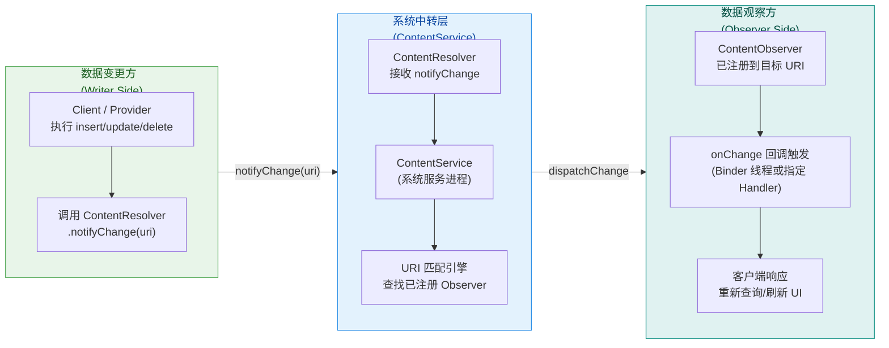

理解了全局流转之后，我们分别深入两个核心主题：ContentObserver 的注册与回调机制，以及 notifyChange 的通知触发与传播细节。

---

### ContentObserver 观察者

#### 什么是 ContentObserver

`ContentObserver` 是 Android 框架提供的一个抽象观察者类（位于 `android.database.ContentObserver`），其职责非常单一：**监听某个 Content URI 所代表的数据是否发生了变化**。当被监听的 URI 对应的数据发生 insert、update 或 delete 操作，且 Provider 端正确调用了 `notifyChange` 后，系统会回调观察者的 `onChange` 方法，观察者据此执行相应的响应逻辑（如重新查询数据、刷新 UI、触发同步等）。

从设计模式的角度看，ContentObserver 是经典 **观察者模式（Observer Pattern）** 在 Android 数据层的落地实现。ContentProvider（及其背后的 ContentService）扮演 Subject（被观察者），ContentObserver 扮演 Observer（观察者），URI 是将两者关联起来的"主题标识"。

#### ContentObserver 的构造与 Handler 线程选择

ContentObserver 的构造函数接收一个 `Handler` 参数，这个参数决定了 `onChange` 回调将在哪个线程上执行：

```kotlin
// ContentObserver 的构造需要传入一个 Handler
// 该 Handler 决定了 onChange 回调在哪个线程执行
val observer = object : ContentObserver(handler) {
    override fun onChange(selfChange: Boolean) {
        // selfChange: 表示是否是"自身"触发的变更（通常为 false）
        // 此回调运行在构造时传入的 Handler 所在的线程
    }
}
```

这里的线程选择非常重要，因为它直接影响你在 `onChange` 中能做什么：

- **传入主线程 Handler（`Handler(Looper.getMainLooper())`）**：`onChange` 在主线程执行，可以安全地直接操作 UI（如调用 `adapter.notifyDataSetChanged()`、更新 `TextView` 等），但**绝不能**在其中执行耗时操作（如重新 `query` 大量数据），否则会阻塞主线程导致 ANR。
- **传入子线程 Handler**：`onChange` 在子线程执行，适合在回调中直接执行 `query` 等 I/O 操作，但若需更新 UI 则必须切回主线程。
- **传入 `null`**：`onChange` 将直接在 **Binder 线程池** 的调用线程上执行。这意味着回调既不在主线程，也不在你可控的子线程，而是在系统分配的某个 Binder 线程上。这种方式最轻量但最不可控，一般不推荐用于需要更新 UI 的场景。

在实际开发中最常见的做法是：传入主线程 Handler，在 `onChange` 中发起一次异步查询（通过协程、RxJava 或 AsyncTask），查询完成后刷新 UI。这样既保证了 `onChange` 本身不阻塞，又能安全地响应数据变化。

#### 注册与注销观察者

观察者的注册通过 `ContentResolver.registerContentObserver()` 完成，注销通过 `unregisterContentObserver()` 完成。我们来看完整的注册/注销流程及其每个参数的含义：

```kotlin
// === 注册观察者 ===
contentResolver.registerContentObserver(
    uri,                // 要监听的 Content URI
    notifyForDescendants, // 是否监听子 URI 的变化
    observer            // ContentObserver 实例
)

// === 注销观察者 ===
contentResolver.unregisterContentObserver(observer)
```

其中第二个参数 `notifyForDescendants` 是理解 URI 监听粒度的关键。它是一个布尔值，控制的是 **URI 匹配的宽度**：

- **`false`（精确匹配）**：只有当 `notifyChange` 通知的 URI 与注册时的 URI **完全相同**时，才会触发回调。例如你注册监听 `content://com.example/users`，那么只有 `notifyChange(content://com.example/users)` 能触发，而 `notifyChange(content://com.example/users/42)` 不会。
- **`true`（后代匹配）**：注册 URI 的所有"子路径"URI 的变更也会触发回调。例如你注册监听 `content://com.example/users` 并设为 `true`，那么 `content://com.example/users/42`、`content://com.example/users/42/profile` 等任何以 `/users` 开头的 URI 变更都会触发回调。

这个设计非常巧妙——它让你可以选择"监听整张表的所有变化"（`notifyForDescendants = true`，注册在表级 URI 上）或"只监听某条特定记录的变化"（`notifyForDescendants = false`，注册在行级 URI 上），从而在 **响应灵敏度** 和 **回调频率** 之间取得平衡。

#### onChange 回调的多个重载

自 API 16（Android 4.1）起，ContentObserver 的 `onChange` 提供了带 URI 参数的重载版本，在 API 30（Android 11）又新增了带 flags 的版本：

```kotlin
class MyObserver(handler: Handler) : ContentObserver(handler) {

    // === 最基础的重载（API 1+）===
    // 只知道"有变化发生"，不知道具体是哪个 URI 变了
    override fun onChange(selfChange: Boolean) {
        super.onChange(selfChange)
        // selfChange: 如果是自身操作触发的变更，为 true
        // 实际开发中这个参数几乎总是 false，少有实用价值
    }

    // === 带 URI 的重载（API 16+）===
    // 能知道具体是哪个 URI 发生了变化
    override fun onChange(selfChange: Boolean, uri: Uri?) {
        super.onChange(selfChange, uri)
        // uri: 发生变化的具体 URI
        // 例如可以据此判断是 users/42 还是 users/99 发生了变化
        // 从而做更精确的局部刷新，而非全量重新查询
    }

    // === 带 URI 和 flags 的重载（API 30+）===
    // 除了 URI，还能知道变化的类型（插入/更新/删除）
    override fun onChange(selfChange: Boolean, uri: Uri?, flags: Int) {
        super.onChange(selfChange, uri, flags)
        // flags 可能的值：
        // ContentResolver.NOTIFY_INSERT  (1) — 数据被插入
        // ContentResolver.NOTIFY_UPDATE  (2) — 数据被更新
        // ContentResolver.NOTIFY_DELETE  (4) — 数据被删除
        // 可通过位运算判断具体类型
    }

    // === 批量 URI 变更的重载（API 30+）===
    // 一次通知可能涉及多个 URI 的变化
    override fun onChange(
        selfChange: Boolean,
        uris: Collection<Uri>,  // 变化的 URI 集合
        flags: Int              // 变化类型 flags
    ) {
        super.onChange(selfChange, uris, flags)
        // 适用于批量操作（如 applyBatch）一次性变更多条数据的场景
        // 避免为每个 URI 单独触发一次 onChange
    }
}
```

需要特别注意的是，`onChange` 的调用链是**从高版本重载向低版本逐级委托**的。系统首先调用参数最全的版本（如带 `Collection<Uri>` 和 `flags` 的），如果你没有重写它，它的默认实现会依次调用参数较少的版本，最终落到 `onChange(selfChange: Boolean)` 上。因此你只需重写你关心的那个版本即可，不需要每个都实现。实际项目中最常重写的是 `onChange(selfChange: Boolean, uri: Uri?)` 版本，因为它在绝大多数 API 级别上都可用，且提供了足够的变更信息。

#### 完整的使用示例：在 Activity 中监听联系人变化

下面用一个贴近真实场景的完整示例，演示如何在 Activity 中监听系统联系人数据的变化：

```kotlin
class ContactListActivity : AppCompatActivity() {

    // 声明观察者为成员变量，以便在 onDestroy 中注销
    private lateinit var contactObserver: ContentObserver

    override fun onCreate(savedInstanceState: Bundle?) {
        super.onCreate(savedInstanceState)
        setContentView(R.layout.activity_contact_list)

        // 创建 ContentObserver，绑定到主线程 Handler
        // 这样 onChange 回调会在主线程执行
        contactObserver = object : ContentObserver(Handler(Looper.getMainLooper())) {

            // 重写带 URI 参数的版本，获取变更的具体 URI
            override fun onChange(selfChange: Boolean, uri: Uri?) {
                super.onChange(selfChange, uri)
                // 日志记录，方便调试
                Log.d("ContactObserver", "联系人数据变化，URI: $uri")
                // 触发异步重新查询联系人列表
                // 注意：不要在这里直接执行同步 query，因为当前在主线程
                refreshContactListAsync()
            }
        }

        // 注册观察者，监听联系人表级 URI
        // notifyForDescendants = true: 任何联系人子 URI 变更都会触发
        // （如某个具体联系人 content://com.android.contacts/contacts/123 的变更）
        contentResolver.registerContentObserver(
            ContactsContract.Contacts.CONTENT_URI, // 联系人表的 Content URI
            true,                                   // 监听所有后代 URI
            contactObserver                         // 观察者实例
        )

        // 初始加载联系人列表
        refreshContactListAsync()
    }

    // 异步查询联系人数据并刷新 UI
    private fun refreshContactListAsync() {
        // 使用协程在 IO 线程执行查询
        lifecycleScope.launch {
            val contacts = withContext(Dispatchers.IO) {
                // 在 IO 线程执行 ContentResolver 查询
                loadContactsFromProvider()
            }
            // 切回主线程更新 UI
            updateRecyclerView(contacts)
        }
    }

    override fun onDestroy() {
        super.onDestroy()
        // 必须注销观察者，否则会导致内存泄漏
        // 因为 ContentService 持有观察者的 Binder 引用
        contentResolver.unregisterContentObserver(contactObserver)
    }
}
```

这个示例中有几个关键的最佳实践值得强调：

第一，**生命周期管理**。观察者在 `onCreate` 中注册，在 `onDestroy` 中注销。如果忘记注销，ContentService（系统服务进程）会一直持有你的观察者的 Binder 代理引用，而该引用间接持有 Activity 实例，导致 Activity 无法被 GC 回收——这是一种典型的跨进程内存泄漏。在使用 Fragment 时同样需要注意在 `onDestroyView` 或 `onDestroy` 中注销。

第二，**避免在 onChange 中做重操作**。由于我们传入了主线程 Handler，`onChange` 运行在主线程上。直接在其中执行同步 `query` 会阻塞 UI。正确做法是在 `onChange` 中仅"标记需要刷新"或"启动异步任务"。

第三，**notifyForDescendants 的选择**。此处设为 `true` 是因为我们希望任何联系人的变化（无论是新增、修改还是删除）都能触发刷新。如果你只关心某个特定联系人（如 `contacts/42`），可以将监听 URI 改为行级 URI 并设为 `false`，减少不必要的回调。

#### 内部机制：注册后系统做了什么

当你调用 `contentResolver.registerContentObserver(uri, notifyForDescendants, observer)` 时，内部发生了以下事情：

1. **ContentResolver** 将你的 `ContentObserver` 封装为一个 `ContentObserver.Transport` 对象。这个 Transport 实际上是一个 Binder 对象（实现了 `IContentObserver.aidl` 接口），它是观察者在跨进程通信中的"代理人"。
2. ContentResolver 通过 Binder IPC 调用系统服务 **ContentService**（运行在 `system_server` 进程中）的 `registerContentObserver` 方法，将 URI、`notifyForDescendants` 标志和 Transport Binder 传递过去。
3. ContentService 内部维护着一棵 **URI 树（ObserverNode tree）**，每个节点对应一个 URI 路径段。它将这个 Transport 对象挂载到对应 URI 节点上。
4. 当后续有 `notifyChange(uri)` 调用时，ContentService 遍历 URI 树，找到所有匹配的观察者节点，通过 Binder IPC 回调每个 Transport 的 `onChange` 方法，Transport 再通过之前绑定的 Handler 将调用转发到目标线程，最终触发你重写的 `onChange`。

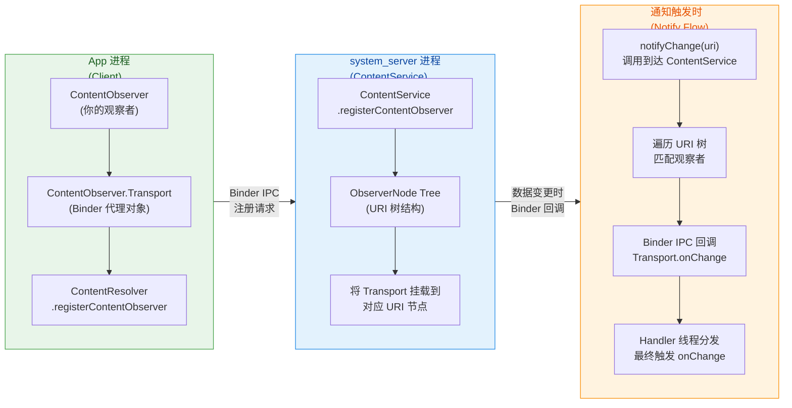

理解这个内部机制有助于你明白几个实际问题：为什么 `onChange` 可以跨进程工作（因为 Transport 是 Binder 对象）、为什么不注销会导致泄漏（因为 `system_server` 持有 Transport 引用，Transport 持有你的 Observer 引用）、为什么 Handler 参数决定回调线程（因为 Transport 收到 Binder 回调后通过 Handler.post 分发）。

---

### notifyChange 通知机制

#### 通知的触发：谁来调、何时调

数据变更通知的触发入口是 `ContentResolver.notifyChange()` 方法。一个至关重要的认知是：**ContentProvider 本身并不会自动发出变更通知**——你必须在 Provider 的 `insert`、`update`、`delete` 等方法中 **显式调用** `notifyChange`。如果你忘了调，所有注册的 ContentObserver 将永远收不到任何回调，即使数据确实已经被修改。这是初学者最常犯的错误之一。

让我们来看一个典型的自定义 ContentProvider 中 `insert` 方法的实现，展示通知是如何被触发的：

```kotlin
class UserProvider : ContentProvider() {

    // 数据库帮助类实例
    private lateinit var dbHelper: UserDbHelper

    override fun insert(uri: Uri, values: ContentValues?): Uri? {
        // 获取可写数据库实例
        val db = dbHelper.writableDatabase

        // 通过 UriMatcher 判断请求的目标表
        val id: Long = when (uriMatcher.match(uri)) {
            CODE_USERS -> {
                // 向 users 表插入一行数据，返回新行的 rowId
                db.insert("users", null, values)
            }
            else -> throw IllegalArgumentException("不支持的 URI: $uri")
        }

        // 如果插入成功（id != -1），构建新行的 URI 并发出通知
        if (id != -1L) {
            // 构建新插入行的 URI，例如 content://com.example/users/42
            val newUri = ContentUris.withAppendedId(uri, id)

            // ★★★ 核心：通知所有监听该 URI 的观察者 ★★★
            // context 不可能为 null（Provider 已经被系统初始化）
            context?.contentResolver?.notifyChange(newUri, null)

            // 返回新行的 URI
            return newUri
        }

        // 插入失败返回 null
        return null
    }

    override fun update(uri: Uri, values: ContentValues?,
                        selection: String?, selectionArgs: Array<String>?): Int {
        val db = dbHelper.writableDatabase
        // 执行更新操作
        val rowsAffected = db.update("users", values, selection, selectionArgs)

        // 只有在确实有行被更新时才发出通知
        // 避免无意义的通知导致观察者做不必要的刷新
        if (rowsAffected > 0) {
            context?.contentResolver?.notifyChange(uri, null)
        }

        // 返回受影响的行数
        return rowsAffected
    }

    override fun delete(uri: Uri, selection: String?,
                        selectionArgs: Array<String>?): Int {
        val db = dbHelper.writableDatabase
        // 执行删除操作
        val rowsDeleted = db.delete("users", selection, selectionArgs)

        // 同样，只有在确实有行被删除时才通知
        if (rowsDeleted > 0) {
            context?.contentResolver?.notifyChange(uri, null)
        }

        // 返回被删除的行数
        return rowsDeleted
    }
}
```

注意以上代码中的一个重要细节：`update` 和 `delete` 中我们加了 `if (rowsAffected > 0)` 的条件判断。这不是必须的，但属于 **最佳实践**——如果没有任何数据被实际修改，发出通知只会让观察者白白执行一次重新查询，浪费 CPU 和 I/O 资源。

#### notifyChange 方法的完整签名与参数

`ContentResolver.notifyChange` 有多个重载版本，我们逐一解释每个参数的含义：

```kotlin
// === 最基本的版本 ===
contentResolver.notifyChange(
    uri: Uri,              // 发生变化的数据 URI
    observer: ContentObserver? // 要排除通知的观察者（通常传 null）
)

// === 带 syncToNetwork 的版本 ===
contentResolver.notifyChange(
    uri: Uri,
    observer: ContentObserver?,
    syncToNetwork: Boolean  // 是否触发网络同步（SyncAdapter 机制）
)

// === API 30+ 带 flags 的版本 ===
contentResolver.notifyChange(
    uri: Uri,
    observer: ContentObserver?,
    flags: Int  // 通知标志位，可指定变更类型和同步行为
)
```

**第一个参数 `uri`** 是变更数据的 URI。它决定了哪些观察者会被触发——只有注册在该 URI（或其祖先 URI 且设置了 `notifyForDescendants = true`）上的观察者才会收到通知。

**第二个参数 `observer`** 是一个"排除项"。如果你传入一个非 null 的 ContentObserver，那么该观察者会被跳过，不会收到这次通知。这在一种场景下很有用：当数据的修改者本身也是一个观察者时，它不需要被自己的修改触发回调（因为它已经知道数据变了）。大多数情况下传 `null` 即可，表示不排除任何人。

**第三个参数 `syncToNetwork`（或 flags 中的 `NOTIFY_SYNC_TO_NETWORK`）** 涉及 Android 的 **SyncAdapter** 同步框架。当设为 `true` 时，系统除了通知本地观察者外，还会将这次变更标记为"需要同步到网络"，触发对应的 SyncAdapter 执行同步任务。这是 Android 联系人同步、日历同步等机制的底层基础。如果你的 Provider 不涉及网络同步，传 `false` 或忽略此参数即可。

**API 30+ 的 flags 参数** 是一个位标志（bitmask），可以通过按位或（`or`）组合多个标志：

```kotlin
// API 30+ 示例：通知一条数据被插入，并且需要网络同步
contentResolver.notifyChange(
    newUri,                      // 新插入行的 URI
    null,                        // 不排除任何观察者
    ContentResolver.NOTIFY_INSERT or  // 标记为"插入"类型
    ContentResolver.NOTIFY_SYNC_TO_NETWORK // 同时触发网络同步
)
```

可用的 flags 包括：
- `NOTIFY_INSERT` (1)：数据被插入
- `NOTIFY_UPDATE` (2)：数据被更新
- `NOTIFY_DELETE` (4)：数据被删除
- `NOTIFY_SYNC_TO_NETWORK`：触发 SyncAdapter 网络同步

这些 flags 会被传递到观察者的 `onChange(selfChange, uri, flags)` 重载中，让观察者能够区分变更类型从而做出更精确的响应（例如插入时在列表末尾追加一项，删除时移除对应项，而不是每次都全量刷新）。

#### 通知的传播与 URI 匹配规则

理解通知如何从 `notifyChange(uri)` 传播到各个观察者，需要理解 ContentService 内部的 **URI 树匹配算法**。这个算法的核心规则可以总结为一句话：**通知向"上"传播（ancestor match），注册向"下"监听（descendant watch）**。

具体而言：

- 当 `notifyChange(content://com.example/users/42)` 被调用时：
  - 注册在 `content://com.example/users/42`（精确匹配）上的观察者 → **触发**
  - 注册在 `content://com.example/users`（祖先 URI）且 `notifyForDescendants = true` 的观察者 → **触发**
  - 注册在 `content://com.example`（更高祖先）且 `notifyForDescendants = true` 的观察者 → **触发**
  - 注册在 `content://com.example/users/42/profile`（子孙 URI）的观察者 → **不触发**（通知不向下传播）
  - 注册在 `content://com.example/orders`（无关路径）的观察者 → **不触发**

```kotlin
// 场景演示：不同注册方式的观察者收到通知的情况

// 观察者 A：监听整个 users 表，启用后代匹配
contentResolver.registerContentObserver(
    Uri.parse("content://com.example/users"), // 表级 URI
    true,     // notifyForDescendants = true
    observerA // 观察者 A
)

// 观察者 B：只精确监听 users 表级 URI
contentResolver.registerContentObserver(
    Uri.parse("content://com.example/users"), // 同样是表级 URI
    false,    // notifyForDescendants = false
    observerB // 观察者 B
)

// 观察者 C：精确监听 users/42
contentResolver.registerContentObserver(
    Uri.parse("content://com.example/users/42"), // 行级 URI
    false,    // notifyForDescendants = false
    observerC // 观察者 C
)

// --- 当 Provider 发出以下通知时 ---

// 通知1：notifyChange("content://com.example/users/42")
// 观察者 A → 触发 ✅ （祖先 URI + descendant=true）
// 观察者 B → 不触发 ❌ （祖先 URI 但 descendant=false，不匹配子路径）
// 观察者 C → 触发 ✅ （精确匹配）

// 通知2：notifyChange("content://com.example/users")
// 观察者 A → 触发 ✅ （精确匹配）
// 观察者 B → 触发 ✅ （精确匹配）
// 观察者 C → 不触发 ❌ （通知不向下传播到子 URI）
```

这个匹配规则告诉我们一个实用结论：如果你希望 **一个观察者能捕获某张表的所有变化**（无论是表级批量操作还是单行操作），就应该在表级 URI 上注册并设 `notifyForDescendants = true`。而 Provider 端在发通知时，应尽量使用 **最精确的 URI**（如行级 URI），这样注册了精确 URI 的观察者能准确匹配，注册了宽泛 URI 的观察者也能通过祖先匹配收到通知，两全其美。

#### Cursor 的自动通知机制

除了显式注册 ContentObserver，Android 还提供了一个更隐式的通知消费机制：**通过 Cursor 的 `setNotificationUri`**。这个机制在 CursorLoader（已被 Jetpack 的 `ContentProviderLiveData` 等取代，但原理仍然适用）和 CursorAdapter 的自动刷新中扮演核心角色。

原理是这样的：当 ContentProvider 的 `query` 方法返回 Cursor 时，Provider 可以调用 `cursor.setNotificationUri(contentResolver, uri)` 将该 Cursor 与一个 URI 关联起来。此后，当该 URI 的数据发生变化（`notifyChange` 被调用），Cursor 内部自带的 ContentObserver 会收到通知，并将 Cursor 标记为"过期"。如果这个 Cursor 被 CursorLoader 持有，Loader 会检测到过期并自动重新查询；如果被 CursorAdapter 持有，Adapter 会触发 UI 刷新。

```kotlin
class UserProvider : ContentProvider() {

    override fun query(
        uri: Uri,
        projection: Array<String>?,
        selection: String?,
        selectionArgs: Array<String>?,
        sortOrder: String?
    ): Cursor? {
        val db = dbHelper.readableDatabase

        // 执行数据库查询，获取 Cursor
        val cursor = db.query("users", projection, selection,
            selectionArgs, null, null, sortOrder)

        // ★★★ 关键：将 Cursor 与 URI 关联 ★★★
        // 这会在 Cursor 内部注册一个隐式的 ContentObserver
        // 当该 URI 的 notifyChange 被调用时，Cursor 会收到通知
        cursor.setNotificationUri(context?.contentResolver, uri)

        // 返回带通知能力的 Cursor
        return cursor
    }
}
```

如果你在 `query` 中忘记调用 `setNotificationUri`，那么即使 `insert`/`update`/`delete` 中正确调用了 `notifyChange`，使用 CursorLoader 的客户端也不会自动刷新——因为 Cursor 没有注册监听，根本收不到通知。这是另一个常见的"数据明明改了但 UI 不刷新"的排障点。

整个通知-刷新闭环可以用以下流程概括：

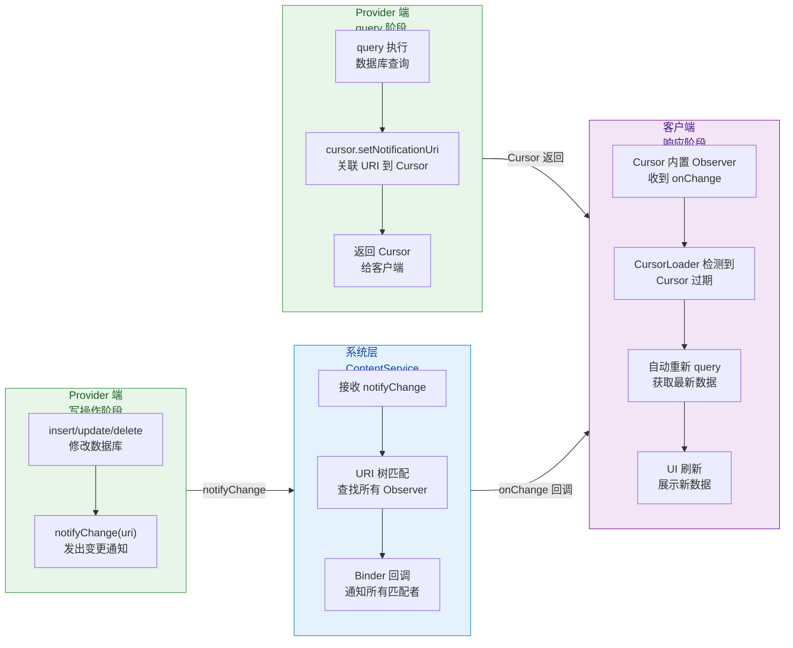

#### 批量操作中的通知优化

在执行批量操作（如通过 `ContentProviderOperation` 的 `applyBatch`）时，如果每个子操作都触发一次 `notifyChange`，会导致观察者被反复回调，每次都重新查询——这既低效又可能导致 UI 闪烁。最佳实践是 **在批量操作完成后只发一次通知**：

```kotlin
class UserProvider : ContentProvider() {

    override fun applyBatch(
        operations: ArrayList<ContentProviderOperation>
    ): Array<ContentProviderResult> {
        val db = dbHelper.writableDatabase

        // 开启数据库事务，保证批量操作的原子性
        db.beginTransaction()
        try {
            // 调用父类的 applyBatch 逐个执行操作
            // 但注意：此时各个 insert/update/delete 不应各自 notifyChange
            val results = super.applyBatch(operations)

            // 标记事务成功
            db.setTransactionSuccessful()

            // ★★★ 事务完成后，统一发出一次通知 ★★★
            // 使用表级 URI，让所有监听该表的观察者都能收到
            context?.contentResolver?.notifyChange(
                Uri.parse("content://com.example/users"),
                null
            )

            return results
        } finally {
            // 结束事务（如果没有 setTransactionSuccessful，会自动回滚）
            db.endTransaction()
        }
    }
}
```

为了实现"子操作不通知、批量完成后统一通知"，一种常见的技巧是在 Provider 中维护一个布尔标志 `isBatchMode`：在 `applyBatch` 开始时设为 `true`，结束后设为 `false`。在 `insert`/`update`/`delete` 中检查这个标志，如果处于批量模式则跳过 `notifyChange`。

```kotlin
class UserProvider : ContentProvider() {

    // 批量操作标志，控制是否在单个写操作中发通知
    // 使用 ThreadLocal 确保线程安全（Binder 线程池中可能有并发调用）
    private val batchMode = ThreadLocal<Boolean>()

    override fun insert(uri: Uri, values: ContentValues?): Uri? {
        val db = dbHelper.writableDatabase
        val id = db.insert("users", null, values)

        if (id != -1L) {
            val newUri = ContentUris.withAppendedId(uri, id)
            // 只有在非批量模式下才发通知
            if (batchMode.get() != true) {
                context?.contentResolver?.notifyChange(newUri, null)
            }
            return newUri
        }
        return null
    }

    override fun applyBatch(
        operations: ArrayList<ContentProviderOperation>
    ): Array<ContentProviderResult> {
        val db = dbHelper.writableDatabase

        // 进入批量模式，抑制子操作的通知
        batchMode.set(true)
        db.beginTransaction()
        try {
            val results = super.applyBatch(operations)
            db.setTransactionSuccessful()
            return results
        } finally {
            db.endTransaction()
            // 退出批量模式
            batchMode.set(false)
            // 统一发出一次通知
            context?.contentResolver?.notifyChange(
                Uri.parse("content://com.example/users"), null
            )
        }
    }
}
```

这种模式在性能敏感的场景（如通讯录同步一次导入数百个联系人）中尤为重要——将数百次通知合并为一次，观察者只需重新查询一次。

#### 常见问题与排障

在实际开发中，围绕 `notifyChange` 和 `ContentObserver` 最常遇到的问题及其原因如下：

**问题 1：数据改了，但观察者没收到通知**
- 最常见原因：Provider 的 `insert`/`update`/`delete` 中 **忘了调用 `notifyChange`**。这是第一排查项。
- 第二常见原因：`notifyChange` 传入的 URI 与观察者注册的 URI **不匹配**。例如通知发到 `content://com.example/users/42` 而观察者注册在 `content://com.example/users` 且 `notifyForDescendants = false`。
- 第三种可能：观察者已经被 **提前注销**（如 Activity 已经 `onDestroy`）或根本没有成功注册。

**问题 2：CursorLoader 不自动刷新**
- Provider 的 `query` 方法中 **忘了调用 `cursor.setNotificationUri`**。没有这一步，Cursor 不会关联任何 URI，自然收不到通知。

**问题 3：观察者被反复触发，UI 疯狂闪烁**
- 批量操作中每个子操作都调用了 `notifyChange`，应采用前述的批量通知优化策略。
- 或者 `onChange` 中的刷新逻辑自身又触发了数据写入和通知，形成了 **通知循环**。此时应使用 `notifyChange` 的第二个参数排除自身观察者，或在 `onChange` 中加防重入标志。

**问题 4：观察者 onChange 中直接操作 UI 报错**
- 构造 ContentObserver 时传入了 `null` 作为 Handler，导致 `onChange` 在 Binder 线程上执行。在 Binder 线程中不能直接操作 UI。解决方法是传入主线程 Handler。

---

**📝 练习题**

某开发者在自定义 ContentProvider 中正确实现了 `insert` 方法并调用了 `notifyChange(newUri, null)`，客户端也通过 `CursorLoader` 加载数据。但 UI 始终不会在数据插入后自动刷新。以下哪项最可能是问题原因？

A. `CursorLoader` 只在 Activity `onResume` 时查询一次，不支持自动刷新

B. Provider 的 `query` 方法中未调用 `cursor.setNotificationUri()`，导致 Cursor 没有关联监听 URI

C. `notifyChange` 的第二个参数传了 `null`，导致通知被所有观察者忽略

D. `CursorLoader` 内部使用的 ContentObserver 默认运行在 Binder 线程，无法触发 UI 刷新

**【答案】** B
**【解析】** CursorLoader 的自动刷新机制依赖于 Cursor 内部的 ContentObserver。这个 Observer 是在 `cursor.setNotificationUri(contentResolver, uri)` 调用时自动注册的——该方法将 Cursor 与指定 URI 关联，并在 Cursor 内部创建一个"自通知观察者"（`SelfContentObserver`）注册到 ContentService 上。当 `notifyChange(uri)` 被触发时，这个内置观察者收到回调，将 Cursor 标记为"内容已变化"，CursorLoader 检测到这个状态后自动发起重新查询。如果 Provider 的 `query` 中缺少了 `setNotificationUri` 这一步，Cursor 根本没有注册任何观察者，`notifyChange` 发出的通知无人接收，CursorLoader 自然不知道数据已经变了，UI 也就不会刷新。选项 A 错误，CursorLoader 正是为自动刷新设计的；选项 C 错误，`null` 表示不排除任何观察者，是正确用法；选项 D 错误，CursorLoader 内部已正确处理了线程切换问题。

---

**📝 练习题**

关于 `ContentResolver.registerContentObserver(uri, notifyForDescendants, observer)` 中 `notifyForDescendants` 参数的作用，以下说法正确的是？

A. 当设为 `true` 时，`notifyChange` 会自动向下通知注册在子 URI 上的所有观察者

B. 当设为 `true` 时，注册在该 URI 上的观察者会额外接收到所有子 URI 的变更通知

C. 当设为 `false` 时，即使 `notifyChange` 的 URI 与注册 URI 完全相同也不会触发回调

D. 该参数控制的是 `notifyChange` 的通知传播方向，而非观察者的接收范围

**【答案】** B
**【解析】** `notifyForDescendants` 控制的是 **观察者的接收范围**，而非通知的传播方向。当设为 `true` 时，观察者不仅能接收到精确匹配其注册 URI 的通知，还能接收到所有"后代 URI"（即以注册 URI 为前缀的更长路径）的变更通知。例如注册在 `content://com.example/users` 且 `notifyForDescendants = true`，那么 `notifyChange(content://com.example/users/42)` 也会触发该观察者。选项 A 混淆了方向——`notifyForDescendants` 影响的是"注册侧的匹配宽度"，而非"通知侧的传播范围"；选项 C 错误，`false` 只是不匹配子 URI，精确匹配仍然会触发；选项 D 恰好说反了，该参数控制的正是观察者的接收范围。

---

## 文件共享

在 Android 应用开发中，"将一个文件分享给另一个应用"是极其常见的需求——拍照后把图片交给裁剪应用、把 PDF 交给阅读器、把 APK 交给安装器……在 Android 7.0（API 24）之前，开发者只需要构造一个 `file://` 形式的 Uri，通过 Intent 传递给目标应用即可。然而，这种看似简便的方式隐藏着巨大的安全隐患：任何拿到 `file://` Uri 的应用都可以通过 Linux 文件系统权限直接读取该文件的绝对路径，甚至可以利用路径推断应用的内部目录结构、读取其他敏感文件。为了彻底堵住这个漏洞，Google 从 Android 7.0 开始强制要求应用间文件共享必须使用 `content://` Uri，而 **FileProvider** 就是官方提供的、开箱即用的 ContentProvider 子类，专门用于安全地将应用私有文件以 `content://` Uri 的形式暴露给外部应用。

FileProvider 本质上是 `android.support.v4.content.FileProvider`（现已迁移至 `androidx.core.content.FileProvider`），它继承自 ContentProvider，但与我们前几节讨论的增删改查型 ContentProvider 不同，FileProvider **只关注文件级别的流式读写**，它不走 `query()` 返回结构化的 Cursor 数据，而是通过 `openFile()` 返回 `ParcelFileDescriptor`，让目标应用通过 Binder 跨进程拿到文件描述符（File Descriptor），在自己的进程空间中读写文件内容。这意味着目标应用 **永远不知道文件的真实路径**，它只知道一个 `content://your.authority/some_name/filename` 形式的 Uri，所有的文件 I/O 都通过 ContentProvider 的 Binder 通道中转，安全性由此得到根本保证。

### FileProvider 配置

要在应用中使用 FileProvider，需要完成两个步骤的配置：一是在 `AndroidManifest.xml` 中注册 FileProvider 组件，二是在 XML 资源文件中声明允许共享的目录映射（即 "file paths"）。这两步缺一不可，缺少任何一步都会导致运行时抛出异常。

**第一步：在 AndroidManifest.xml 中声明 FileProvider**

FileProvider 是一个 ContentProvider，因此它必须像任何 ContentProvider 一样在清单文件中通过 `<provider>` 标签进行注册。但它有几个关键属性需要特别注意：

```xml
<!-- AndroidManifest.xml -->
<application>

    <!-- 声明 FileProvider，它本质上是一个 ContentProvider -->
    <provider
        android:name="androidx.core.content.FileProvider"
        android:authorities="${applicationId}.fileprovider"
        android:exported="false"
        android:grantUriPermissions="true">

        <!-- meta-data 指向路径配置文件，FileProvider 启动时会解析该文件 -->
        <meta-data
            android:name="android.support.FILE_PROVIDER_PATHS"
            android:resource="@xml/file_paths" />

    </provider>

</application>
```

我们逐一解析这些属性的含义与设计意图：

- **`android:name`**：指定 Provider 的实现类。如果你没有自定义 FileProvider 的需求，直接填写 `androidx.core.content.FileProvider` 即可。如果你需要在多个库模块中各自声明 FileProvider（例如你引入的某个第三方库也声明了同名 authority 的 FileProvider），则可以创建一个空的子类继承 FileProvider，用不同的类名避免清单合并冲突（Manifest Merger Conflict）。

- **`android:authorities`**：这是 FileProvider 的 **authority**，是 `content://` Uri 中标识"哪个 Provider"的关键部分。推荐使用 `${applicationId}.fileprovider` 这种模式，因为 `applicationId` 在同一设备上是唯一的，这样可以确保不同应用的 FileProvider authority 不会冲突。如果冲突了，后安装的应用会因为 authority 重复而安装失败。

- **`android:exported="false"`**：这是 **安全性的核心**。设置为 `false` 意味着这个 Provider 不允许被外部应用直接访问。外部应用无法通过 `ContentResolver` 随意查询你的 FileProvider。那外部应用如何拿到文件？答案是通过 **URI 临时授权**（`FLAG_GRANT_READ_URI_PERMISSION` / `FLAG_GRANT_WRITE_URI_PERMISSION`），我们在上一节"权限控制"中详细讲过这个机制。

- **`android:grantUriPermissions="true"`**：允许对该 Provider 的 Uri 授予临时权限。与 `exported="false"` 配合使用，形成了 **"默认拒绝、按需授权"** 的安全模型——只有你通过 Intent 显式授权的那个 Uri，目标应用才能访问；其他 Uri 一概拒绝。

- **`<meta-data>`**：这是 FileProvider 的独有配置。`android.support.FILE_PROVIDER_PATHS` 这个固定 name 告诉 FileProvider："去哪里找路径映射配置"。`android:resource` 指向 `res/xml/file_paths.xml`，FileProvider 在第一次被调用时（即 `attachInfo()` 阶段）会解析这个 XML 文件，建立"虚拟路径名 → 真实目录"的映射表。

**第二步：创建路径映射文件 `res/xml/file_paths.xml`**

这个 XML 文件是 FileProvider 的 **安全边界声明**，它明确列出了"哪些目录下的文件允许被共享"。FileProvider 在生成 `content://` Uri 时，会检查目标文件是否落在这些声明的目录范围内；如果文件不在任何已声明的目录中，`getUriForFile()` 会直接抛出 `IllegalArgumentException`。

```xml
<?xml version="1.0" encoding="utf-8"?>
<!-- res/xml/file_paths.xml -->
<!-- 根标签必须是 paths -->
<paths xmlns:android="http://schemas.android.com/apk/res/android">

    <!-- 映射应用内部文件目录: Context.getFilesDir() -->
    <!-- name 是 Uri 路径中的虚拟名，path 是该根目录下的子目录 -->
    <files-path
        name="internal_files"
        path="documents/" />

    <!-- 映射应用内部缓存目录: Context.getCacheDir() -->
    <cache-path
        name="internal_cache"
        path="images/" />

    <!-- 映射外部存储应用专属目录: Context.getExternalFilesDir(null) -->
    <external-files-path
        name="external_files"
        path="photos/" />

    <!-- 映射外部存储应用专属缓存: Context.getExternalCacheDir() -->
    <external-cache-path
        name="external_cache"
        path="tmp/" />

    <!-- 映射外部存储根目录: Environment.getExternalStorageDirectory() -->
    <!-- 此标签在 Scoped Storage 时代已基本不可用，慎用 -->
    <external-path
        name="external_root"
        path="Download/" />

    <!-- 映射应用内部根目录: Context.getDataDir()（API 24+） -->
    <!-- 很少使用，因为它暴露的范围太大 -->
    <root-path
        name="root"
        path="" />

</paths>
```

下面用一张表格来系统地梳理所有 path 标签与其映射的物理目录：

| XML 标签 | 映射到的物理根目录 | 典型物理路径 |
|---|---|---|
| `<files-path>` | `Context.getFilesDir()` | `/data/data/pkg/files/` |
| `<cache-path>` | `Context.getCacheDir()` | `/data/data/pkg/cache/` |
| `<external-files-path>` | `Context.getExternalFilesDir(null)` | `/sdcard/Android/data/pkg/files/` |
| `<external-cache-path>` | `Context.getExternalCacheDir()` | `/sdcard/Android/data/pkg/cache/` |
| `<external-path>` | `Environment.getExternalStorageDirectory()` | `/sdcard/` |
| `<external-media-path>` | `Context.getExternalMediaDirs()` | `/sdcard/Android/media/pkg/` |
| `<root-path>` | 设备文件系统根 `/` | `/` |

每个标签有两个属性：**`name`** 和 **`path`**。`name` 是你自定义的虚拟路径段，它会出现在最终生成的 `content://` Uri 中，起到"隐藏真实目录"的作用；`path` 是相对于该标签根目录的子目录路径，设为空字符串 `""` 表示整个根目录都允许共享。例如，`<files-path name="docs" path="reports/">` 意味着 `Context.getFilesDir()/reports/` 目录下的文件可以被共享，且 Uri 中的路径段是 `docs`。

FileProvider 在内部维护了一个 `HashMap<String, File>`，key 是 `name`，value 是对应的物理目录 `File` 对象。当调用 `getUriForFile()` 时，它会遍历这个 map，找到文件所在的最匹配目录，用 `name` 替换真实路径前缀，拼接成 `content://` Uri。反过来，当外部应用通过 `content://` Uri 请求文件时，FileProvider 会反向查找 map，将虚拟 `name` 还原为物理目录，再拼接文件名，得到真实的 `File` 路径——这个还原过程 **完全在你的应用进程内执行**，外部应用无从感知。

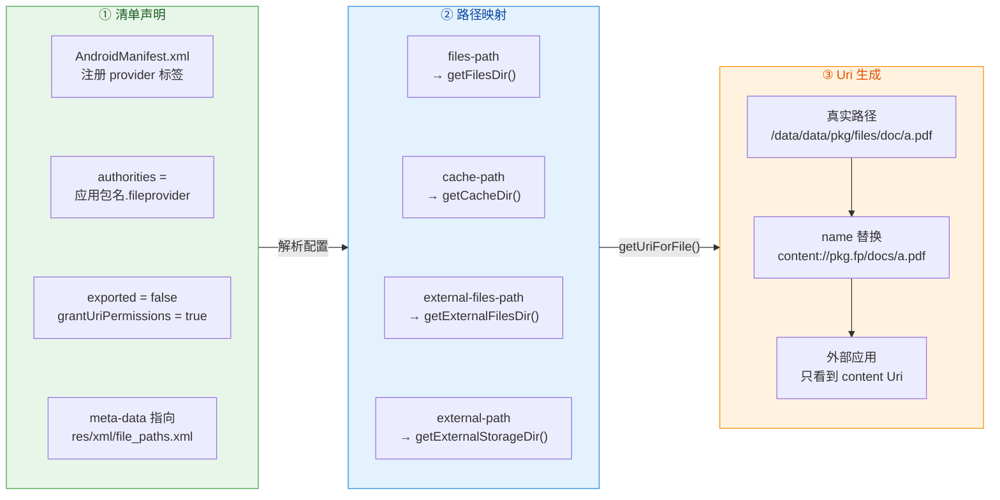

**多模块 / 多库冲突问题**

在实际项目中，你可能会遇到第三方库（如某些相机库、图片选择库）也声明了自己的 FileProvider，且使用了与你相同的 `authorities` 值，导致清单合并失败。解决方案有两种：

第一种，**创建自定义子类**。让你的 FileProvider 和第三方库的 FileProvider 使用不同的类名，即使 authority 相同也不会冲突（实际上 authority 也必须不同，否则系统无法区分）。但更常见的做法是：

```kotlin
// 创建一个空的 FileProvider 子类，用于避免清单合并冲突
// 这个类不需要覆写任何方法，仅仅是换一个类名
class MyAppFileProvider : FileProvider()
```

然后在清单中用 `MyAppFileProvider` 注册，authority 用你自己的包名前缀。

第二种，如果第三方库允许配置 authority，确保它使用了 `${applicationId}` 变量而非硬编码字符串。

### getUriForFile 安全转换

`FileProvider.getUriForFile()` 是将一个本地 `File` 对象转换为安全的 `content://` Uri 的核心 API。理解它的工作机制，是掌握 FileProvider 文件共享流程的关键。

**方法签名与参数解析**

```java
// FileProvider 的静态方法，将 File 转换为 content:// Uri
public static Uri getUriForFile(
    @NonNull Context context,     // 当前上下文，用于查找 Provider 信息
    @NonNull String authority,    // 清单中声明的 authorities 值
    @NonNull File file            // 要共享的本地文件
)
```

该方法的内部执行逻辑可以概括为以下几个阶段：

**阶段一：加载路径映射策略（PathStrategy）**。FileProvider 内部持有一个静态缓存 `sCache`（`HashMap<String, PathStrategy>`），以 authority 为 key。第一次调用时，它会通过 `PackageManager` 查找该 authority 对应的 `<provider>` 声明，解析其 `<meta-data>` 指向的 XML 资源文件，构建 `SimplePathStrategy` 对象。这个 `SimplePathStrategy` 内部维护了一个 `HashMap<String, File>`，存储的就是前面 `file_paths.xml` 中每个标签的 `name → 物理目录` 映射。

**阶段二：查找匹配目录**。拿到 `PathStrategy` 后，方法会调用 `strategy.getUriForFile(file)`。在这个方法内部，它遍历所有已注册的目录映射，**检查传入的 file 的 canonical path 是否以某个注册目录的 canonical path 作为前缀**。如果找到了匹配的目录，就用该目录对应的 `name` 替换掉真实路径的前缀部分。

**阶段三：拼接 content Uri**。替换后，最终的 Uri 形如 `content://{authority}/{name}/{relativePath}`。例如，如果文件真实路径是 `/data/data/com.example/files/documents/report.pdf`，而你在 `file_paths.xml` 中声明了 `<files-path name="docs" path="documents/">`，那么生成的 Uri 就是 `content://com.example.fileprovider/docs/report.pdf`。

**如果没有找到匹配的目录**——也就是说文件不在任何已声明的共享目录中——方法会直接抛出 `IllegalArgumentException: Failed to find configured root that contains /xxx/xxx`。这是 FileProvider 的 **安全边界机制**：未声明的目录中的文件绝不允许被共享。

下面是一个完整的文件共享实战示例，演示如何用 FileProvider 安全地将一张照片分享给其他应用：

```kotlin
// 场景：将应用内部存储中的一张图片分享给其他应用
fun shareImage(context: Context, imageFile: File) {
    // 第一步：通过 getUriForFile 将 File 转换为 content:// Uri
    // authority 必须与 AndroidManifest.xml 中声明的完全一致
    val contentUri: Uri = FileProvider.getUriForFile(
        context,                                    // 当前 Context
        "${context.packageName}.fileprovider",      // 与清单中 authorities 一致
        imageFile                                   // 要共享的文件
    )
    // 此时 contentUri 形如：
    // content://com.example.app.fileprovider/internal_files/photo.jpg
    // 外部应用看不到真实路径 /data/data/com.example.app/files/documents/photo.jpg

    // 第二步：构建分享 Intent
    val shareIntent = Intent(Intent.ACTION_SEND).apply {
        // 设置数据类型为图片
        type = "image/jpeg"
        // 将 content Uri 附加到 Intent 的 extra 中
        putExtra(Intent.EXTRA_STREAM, contentUri)
        // 第三步：授予目标应用临时读取权限
        // 这一步至关重要！因为 FileProvider 的 exported=false
        // 没有这个 flag，目标应用会收到 SecurityException
        addFlags(Intent.FLAG_GRANT_READ_URI_PERMISSION)
    }

    // 第四步：启动系统分享选择器
    // createChooser 可以避免某些应用被设为默认处理器时跳过选择界面
    context.startActivity(
        Intent.createChooser(shareIntent, "分享图片到...")
    )
}
```

**临时权限的生命周期**：当你通过 `Intent.FLAG_GRANT_READ_URI_PERMISSION` 授权时，目标应用获得的读权限 **仅在接收该 Intent 的组件存活期间有效**。如果接收方是一个 Activity，那么当该 Activity finish 后，权限自动撤销。如果接收方通过 `Context.grantUriPermission()` 显式授权，则需要通过 `revokeUriPermission()` 手动撤销或等设备重启。这种"短生命周期授权"的设计，将安全风险控制到了最小。

**调用相机拍照是 FileProvider 最经典的使用场景**，因为你需要先创建一个空文件让相机往里写，然后把这个文件的 Uri 传给相机应用：

```kotlin
// 场景：调用系统相机拍照，保存到应用私有目录
fun takePicture(activity: Activity, requestCode: Int) {
    // 在应用私有的外部存储目录中创建图片文件
    // getExternalFilesDir(Environment.DIRECTORY_PICTURES) 返回的路径
    // 对应 file_paths.xml 中的 <external-files-path>
    val photoFile: File = File(
        activity.getExternalFilesDir(Environment.DIRECTORY_PICTURES),  // 私有外部图片目录
        "photo_${System.currentTimeMillis()}.jpg"                      // 唯一文件名
    )

    // 将 File 转换为安全的 content:// Uri
    val photoUri: Uri = FileProvider.getUriForFile(
        activity,                                       // Context
        "${activity.packageName}.fileprovider",         // authority
        photoFile                                       // 目标文件
    )

    // 构建拍照 Intent
    val takePictureIntent = Intent(MediaStore.ACTION_IMAGE_CAPTURE).apply {
        // 告诉相机应用：把拍到的照片写入这个 Uri 指向的位置
        putExtra(MediaStore.EXTRA_OUTPUT, photoUri)
        // 授予相机应用对该 Uri 的写权限（相机需要往里写数据）
        addFlags(Intent.FLAG_GRANT_WRITE_URI_PERMISSION)
        // 同时也授予读权限（某些相机应用在写入前会先检查文件是否存在）
        addFlags(Intent.FLAG_GRANT_READ_URI_PERMISSION)
    }

    // 确保设备上有能处理拍照 Intent 的应用
    // resolveActivity 避免 ActivityNotFoundException
    takePictureIntent.resolveActivity(activity.packageManager)?.let {
        // 启动相机
        activity.startActivityForResult(takePictureIntent, requestCode)
    }
}
```

**`getUriForFile` 的线程安全性**：由于内部使用了静态 `HashMap` 缓存 `PathStrategy`，并且在首次加载时有同步块保护，因此 `getUriForFile()` 是线程安全的，可以在任何线程中调用。但文件本身的创建和写入操作应当遵循常规的 I/O 线程规范，不要在主线程进行。

**常见异常排查**：

1. **`IllegalArgumentException: Failed to find configured root`**——文件不在任何已声明的路径映射目录中。检查 `file_paths.xml` 中是否遗漏了对应的 path 标签，或 `path` 属性是否写错了子目录名。
2. **`SecurityException: Permission Denial`**——Intent 中忘记添加 `FLAG_GRANT_READ_URI_PERMISSION` 或 `FLAG_GRANT_WRITE_URI_PERMISSION`。
3. **`NullPointerException` 在 `getExternalFilesDir()` 返回值上**——外部存储不可用（如 SD 卡被移除）。应先检查存储状态。

### 7.0+ 文件路径暴露限制

Android 7.0（API 24，代号 Nougat）引入了 **StrictMode** 层面的 `VmPolicy` 变更，对 `file://` Uri 的跨应用传递进行了严格限制。这是 Android 安全演进中的一个关键里程碑，理解它的来龙去脉，对于把握 Android 文件共享的历史演变非常有帮助。

**为什么 `file://` Uri 不安全？**

在 Android 7.0 之前，一个应用可以这样把文件传递给另一个应用：

```kotlin
// 危险做法（Android 7.0 之前能用，之后会崩溃）
val file = File(getExternalFilesDir(null), "secret.pdf")
// 直接使用 Uri.fromFile()，生成的是 file:// 开头的 Uri
val unsafeUri = Uri.fromFile(file)
// unsafeUri = file:///storage/emulated/0/Android/data/com.example/files/secret.pdf
// 目标应用拿到这个 Uri 后，可以清楚看到完整的文件系统路径

val intent = Intent(Intent.ACTION_VIEW).apply {
    setDataAndType(unsafeUri, "application/pdf")
}
startActivity(intent)
```

这种方式有三个根本性的安全问题：

**第一，路径泄露（Path Disclosure）**。`file://` Uri 直接暴露了文件的绝对路径，目标应用可以据此推断你的包名、内部目录结构，甚至尝试访问同目录下的其他文件。

**第二，权限绕过**。`file://` Uri 的访问控制完全依赖 Linux 文件系统权限（owner/group/world）。如果文件在外部存储（`/sdcard/`），任何拥有 `READ_EXTERNAL_STORAGE` 权限的应用都能读取，不受 Android 应用级权限控制。

**第三，无法细粒度授权**。使用 `file://` Uri 时，你无法只授权某一个特定文件的访问权，也无法控制"只读"或"读写"，更无法设置授权的有效期限。

**Android 7.0 的强制措施**

从 API 24 开始，Android 系统在 `StrictMode.VmPolicy` 中默认启用了 **`detectFileUriExposure()`** 检查。当你的应用（`targetSdkVersion >= 24`）尝试通过 Intent 向外部应用传递 `file://` Uri 时，系统会直接抛出 `FileUriExposedException`：

```
android.os.FileUriExposedException: 
file:///storage/emulated/0/xxx/photo.jpg exposed beyond app through Intent.getData()
```

这不是一个可以被 catch 后忽略的小问题——它是一个 **RuntimeException**，直接导致应用崩溃。Google 通过这种"硬崩溃"的方式，强制所有开发者迁移到 `content://` Uri + FileProvider 的方案。

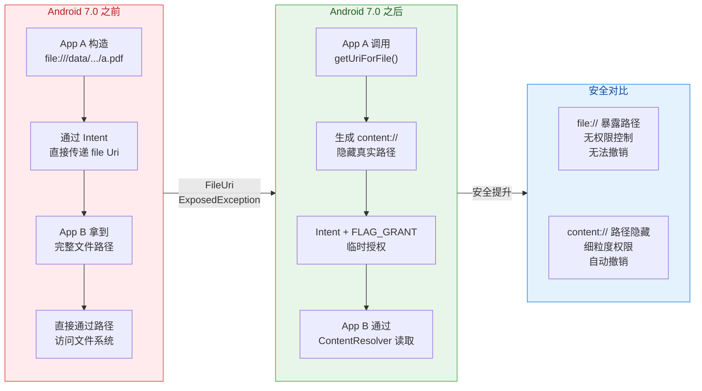

**完整的适配方案**

以安装 APK 为例（这是 7.0 适配中最容易被遗忘的场景之一），展示从 `file://` 迁移到 `content://` 的完整过程：

```kotlin
// 安装 APK 的兼容方案
fun installApk(context: Context, apkFile: File) {
    // 构建安装 Intent
    val installIntent = Intent(Intent.ACTION_VIEW)

    // 根据系统版本选择不同的 Uri 构建方式
    if (Build.VERSION.SDK_INT >= Build.VERSION_CODES.N) {
        // Android 7.0+ 必须使用 FileProvider
        // 使用 content:// Uri 替代 file:// Uri
        val apkUri = FileProvider.getUriForFile(
            context,                                    // Context
            "${context.packageName}.fileprovider",      // authority
            apkFile                                     // APK 文件
        )
        // 设置数据和 MIME 类型
        installIntent.setDataAndType(apkUri, "application/vnd.android.package-archive")
        // 必须授予临时读权限，否则安装器无法读取 APK
        installIntent.addFlags(Intent.FLAG_GRANT_READ_URI_PERMISSION)
    } else {
        // Android 7.0 以下可以使用 file:// Uri（但也推荐使用 FileProvider）
        val apkUri = Uri.fromFile(apkFile)
        installIntent.setDataAndType(apkUri, "application/vnd.android.package-archive")
    }

    // 添加 NEW_TASK flag，因为安装界面需要在新任务栈中启动
    installIntent.addFlags(Intent.FLAG_ACTIVITY_NEW_TASK)

    // 启动安装界面
    context.startActivity(installIntent)
}
```

值得注意的是，从 **Android 8.0（API 26）** 开始，安装未知来源 APK 还需要额外申请 `REQUEST_INSTALL_PACKAGES` 权限，并在运行时通过 `canRequestPackageInstalls()` 检查用户是否已授权。这是又一层安全保障，与 FileProvider 的文件路径安全形成互补。

**一些开发者的"暴力绕过"做法及其危害**

有些开发者为了图省事，在 `Application.onCreate()` 中通过反射重置 StrictMode 的 VmPolicy，从而"绕过" FileUriExposedException 检查：

```kotlin
// 极度不推荐的做法！仅用于说明"反模式"
// 这段代码会关闭 StrictMode 的 file:// Uri 暴露检查
if (Build.VERSION.SDK_INT >= Build.VERSION_CODES.N) {
    val builder = StrictMode.VmPolicy.Builder()
    StrictMode.setVmPolicy(builder.build())
    // 这样做虽然不会崩溃了，但 file:// 的安全隐患依然存在
    // 在 Android 10+ 的 Scoped Storage 环境下，file:// 路径
    // 很可能根本不可被其他应用访问，导致功能异常
}
```

**永远不要在生产代码中使用这种做法。** 它不仅绕过了安全检查，还会在 Android 10+（Scoped Storage）环境下引发更严重的兼容性问题，因为外部存储的文件路径对其他应用来说可能根本不可见。

**与 Scoped Storage 的关系**

Android 10（API 29）引入的 **Scoped Storage（分区存储）** 进一步强化了文件隔离。在分区存储模式下：

- 应用无法直接通过 `File` API 访问外部存储中其他应用的文件。
- `MediaStore` 成为访问共享媒体文件的标准方式。
- FileProvider 仍然是应用间 **共享自身私有文件** 的推荐方案。

换句话说，FileProvider 解决的是"我主动把我的文件分享给你"的场景，Scoped Storage 解决的是"你不能随意翻看我的文件"的场景，两者从不同维度共同构建了 Android 的文件安全体系。

**适配的最佳实践总结**：

1. **无论 `targetSdkVersion` 是多少，都应使用 FileProvider**。即使你的 target 低于 24，提前适配可以避免未来升级时的大量迁移工作。
2. **`file_paths.xml` 中只声明必要的目录**，不要图方便用 `<root-path name="root" path="" />` 暴露整个文件系统。
3. **Intent 中始终添加 `FLAG_GRANT_READ_URI_PERMISSION`**（需要写入时加 `FLAG_GRANT_WRITE_URI_PERMISSION`），这是外部应用能访问 `content://` Uri 的前提。
4. **为每个需要共享的文件起有意义的 `name`**，便于调试和日志追踪。

---

**📝 练习题**

在 Android 7.0+ 设备上，应用 A 想把一个私有目录中的 PDF 文件通过 Intent 分享给应用 B 查看。以下哪种做法是正确的？

A. 使用 `Uri.fromFile(pdfFile)` 构建 Uri，设置到 Intent 的 data 中并启动

B. 使用 `FileProvider.getUriForFile()` 构建 `content://` Uri，并在 Intent 中添加 `FLAG_GRANT_READ_URI_PERMISSION`

C. 使用 `FileProvider.getUriForFile()` 构建 `content://` Uri，但无需添加任何 FLAG，因为 FileProvider 已配置 `grantUriPermissions="true"`

D. 在 StrictMode 中禁用 `detectFileUriExposure()`，继续使用 `file://` Uri

**【答案】** B

**【解析】** 在 Android 7.0+ 上，`Uri.fromFile()` 生成的 `file://` Uri 传递给其他应用会触发 `FileUriExposedException`，因此选项 A 直接导致崩溃。选项 D 虽然在技术上可以绕过检查，但这是严重的安全反模式，不应在生产环境中使用。选项 C 有一个常见的误解：`grantUriPermissions="true"` 只是 **允许** 对该 Provider 进行临时授权，但授权动作本身还需要通过 Intent 的 `FLAG_GRANT_READ_URI_PERMISSION` 或 `FLAG_GRANT_WRITE_URI_PERMISSION` 来 **触发**，两者缺一不可。选项 B 是完整正确的做法：使用 `getUriForFile()` 隐藏真实路径生成安全的 `content://` Uri，同时通过 Intent FLAG 授予目标应用临时读取权限，权限在接收方 Activity 结束后自动撤销。

---

**📝 练习题**

调用 `FileProvider.getUriForFile()` 时抛出了 `IllegalArgumentException: Failed to find configured root that contains /data/data/com.example/cache/temp/video.mp4`。以下哪项最可能是原因？

A. `AndroidManifest.xml` 中 `FileProvider` 的 `android:exported` 属性被设置为了 `true`

B. `res/xml/file_paths.xml` 中未声明 `<cache-path>` 标签，或其 `path` 属性未覆盖 `temp/` 子目录

C. 目标文件 `video.mp4` 不存在

D. 应用未申请 `WRITE_EXTERNAL_STORAGE` 权限

**【答案】** B

**【解析】** `getUriForFile()` 的核心逻辑是在 `PathStrategy` 的映射表中查找传入文件路径的"最长前缀匹配"。错误信息 `Failed to find configured root` 明确表示没有任何已注册的路径映射能够覆盖该文件的位置。文件路径 `/data/data/com.example/cache/temp/video.mp4` 对应的是 `Context.getCacheDir()` 下的 `temp/` 子目录，因此需要在 `file_paths.xml` 中声明 `<cache-path name="xxx" path="temp/" />` 或 `<cache-path name="xxx" path="" />`（覆盖整个 cache 目录）。选项 A 不会导致此异常，`exported` 属性影响的是外部应用的直接访问权限，而非 Uri 生成过程。选项 C 也不是原因，`getUriForFile()` **不检查文件是否实际存在**，它只做路径匹配和 Uri 转换。选项 D 与内部存储无关，`/data/data/` 下的文件不需要外部存储权限。

---

## 常用系统提供者

Android 系统本身就是 ContentProvider 架构最大的实践者。从联系人、媒体库到日历和通话记录，系统将用户最核心的数据资产全部通过 ContentProvider 暴露给第三方应用。理解这些系统提供者，不仅是日常开发的刚需，更能深刻体会 ContentProvider 在真实场景中的设计哲学——**统一接口、权限隔离、结构化数据模型**。本节将逐一深入四大系统提供者，涵盖数据模型、查询技巧、写入规范以及 Android 版本演进带来的权限变化。

### 联系人 Contacts

联系人系统是 Android 中最复杂的 ContentProvider 之一，其复杂性源于一个核心设计理念：**聚合（Aggregation）**。一个用户在手机上可能同时拥有 Google 账户、SIM 卡、微信等多个来源的联系人数据，系统需要将"同一个人"的多条原始记录聚合为一条对用户可见的联系人。这催生了三层数据模型。

#### 三层数据模型

联系人数据库 `contacts2.db` 围绕三张核心表组织，理解它们的层级关系是正确操作联系人数据的前提。

最底层是 **Data 表**（`ContactsContract.Data`），它存储联系人的每一个具体数据项——一个电话号码是一行、一个邮箱地址是一行、一个头像也是一行。每行通过 `MIMETYPE` 列区分数据类型（如 `vnd.android.cursor.item/phone_v2` 表示电话号码），同时通过 `RAW_CONTACT_ID` 外键关联到上层的 RawContact。Data 表采用了一种称为 **Entity-Attribute-Value (EAV)** 的通用模型：`DATA1` 到 `DATA15` 这 15 个通用列根据 MIMETYPE 的不同承载不同含义。例如当 MIMETYPE 为电话号码时，`DATA1` 存储号码字符串，`DATA2` 存储号码类型（手机/家庭/工作）；当 MIMETYPE 为姓名时，`DATA1` 存储显示名，`DATA2` 存储名，`DATA3` 存储姓。这种设计虽然牺牲了直观性，但换来了极高的扩展性——任何应用都可以定义自己的 MIMETYPE 来存储自定义数据。

中间层是 **RawContacts 表**（`ContactsContract.RawContacts`），代表某个同步账户（Account）下的一条原始联系人记录。例如，张三在 Google 账户中有一条 RawContact，在 SIM 卡中也有一条 RawContact。每条 RawContact 通过 `ACCOUNT_TYPE` 和 `ACCOUNT_NAME` 标识其来源。一条 RawContact 下可以挂载多条 Data 记录（一对多关系）。

最上层是 **Contacts 表**（`ContactsContract.Contacts`），代表聚合后的联系人。系统通过姓名匹配、电话号码匹配等策略，自动将"看起来是同一个人"的多条 RawContact 聚合到一条 Contact 下。用户在通讯录应用中看到的每一条联系人，就是一条 Contact 记录。Contact 表的 `DISPLAY_NAME`、`PHOTO_URI` 等字段都是从其关联的 RawContacts 中自动选择得出的。

```mermaid
graph LR
    subgraph Contact["📇 Contacts 表\n聚合层"]
        direction TB
        C1["Contact #1\nDISPLAY_NAME=张三\nPHOTO_URI=..."]
    end

    subgraph RawContact["📋 RawContacts 表\n账户层"]
        direction TB
        RC1["RawContact #1\nACCOUNT=Google\nCONTACT_ID=1"]
        RC2["RawContact #2\nACCOUNT=SIM\nCONTACT_ID=1"]
    end

    subgraph DataTable["📝 Data 表\n数据项层"]
        direction TB
        D1["Data: 电话\n138xxxx0001\nRAW_CONTACT_ID=1"]
        D2["Data: 邮箱\nzhang@gmail.com\nRAW_CONTACT_ID=1"]
        D3["Data: 电话\n139xxxx0002\nRAW_CONTACT_ID=2"]
        D4["Data: 姓名\n张三\nRAW_CONTACT_ID=2"]
    end

    Contact -->|"1 : N\n聚合关系"| RawContact -->|"1 : N\n归属关系"| DataTable

    classDef contactCls fill:#E8F5E9,stroke:#2E7D32,color:#1B5E20
    classDef rawCls fill:#E3F2FD,stroke:#1565C0,color:#0D47A1
    classDef dataCls fill:#FFF3E0,stroke:#E65100,color:#BF360C

    class Contact contactCls
    class RawContact rawCls
    class DataTable dataCls
```

#### 查询联系人

查询联系人时，根据需求的不同，应该选择不同层级的 URI。如果只需要显示联系人列表（姓名+头像），直接查 Contacts 表即可；如果需要获取某个联系人的全部电话号码，则需要查 Data 表并按 RawContact 过滤。

```kotlin
// === 场景一：查询所有联系人的姓名和头像 ===
// 使用 Contacts 表的 URI，获取聚合后的联系人列表
val contactsCursor = contentResolver.query(
    // Contacts 表的标准 URI
    ContactsContract.Contacts.CONTENT_URI,
    // 投影：只取需要的列，避免查询多余数据
    arrayOf(
        ContactsContract.Contacts._ID,           // 联系人聚合 ID
        ContactsContract.Contacts.DISPLAY_NAME,   // 显示名称（系统自动从 RawContacts 中选取最佳）
        ContactsContract.Contacts.PHOTO_URI,      // 头像 URI（可能为 null）
        ContactsContract.Contacts.HAS_PHONE_NUMBER // 是否有电话号码（"1" 或 "0"）
    ),
    // 筛选条件：只查有电话号码的联系人
    "${ContactsContract.Contacts.HAS_PHONE_NUMBER} = ?",
    // 筛选参数
    arrayOf("1"),
    // 排序：按显示名升序
    "${ContactsContract.Contacts.DISPLAY_NAME} ASC"
)

// 遍历结果
contactsCursor?.use { cursor ->
    // 预先获取列索引，避免在循环中重复查找
    val idIndex = cursor.getColumnIndexOrThrow(ContactsContract.Contacts._ID)
    val nameIndex = cursor.getColumnIndexOrThrow(ContactsContract.Contacts.DISPLAY_NAME)
    val photoIndex = cursor.getColumnIndexOrThrow(ContactsContract.Contacts.PHOTO_URI)

    while (cursor.moveToNext()) {
        val contactId = cursor.getLong(idIndex)       // 取出联系人 ID
        val name = cursor.getString(nameIndex)         // 取出显示名
        val photoUri = cursor.getString(photoIndex)    // 取出头像 URI（可能为 null）
        // 拿到 contactId 后，可以进一步查询该联系人的电话、邮箱等详细数据
    }
}
```

当需要查询某个联系人的全部电话号码时，需要深入到 Data 表。系统为常见的数据类型提供了便捷的子类和预定义 URI：

```kotlin
// === 场景二：根据联系人 ID 查询其所有电话号码 ===
// Phone 是 Data 表中 MIMETYPE 为电话号码的便捷访问类
val phoneCursor = contentResolver.query(
    // Phone.CONTENT_URI 实际上指向 Data 表，但自动过滤 MIMETYPE 为电话号码
    ContactsContract.CommonDataKinds.Phone.CONTENT_URI,
    // 投影：电话号码和号码类型
    arrayOf(
        ContactsContract.CommonDataKinds.Phone.NUMBER,  // 电话号码字符串（即 DATA1）
        ContactsContract.CommonDataKinds.Phone.TYPE      // 号码类型：手机/家庭/工作（即 DATA2）
    ),
    // 筛选条件：通过 CONTACT_ID 定位到特定联系人
    "${ContactsContract.CommonDataKinds.Phone.CONTACT_ID} = ?",
    // 传入之前查到的 contactId
    arrayOf(contactId.toString()),
    // 不需要排序
    null
)

phoneCursor?.use { cursor ->
    val numberIndex = cursor.getColumnIndexOrThrow(
        ContactsContract.CommonDataKinds.Phone.NUMBER
    )
    val typeIndex = cursor.getColumnIndexOrThrow(
        ContactsContract.CommonDataKinds.Phone.TYPE
    )

    while (cursor.moveToNext()) {
        val number = cursor.getString(numberIndex)   // 如 "13812345678"
        val type = cursor.getInt(typeIndex)           // 如 Phone.TYPE_MOBILE = 2
        // Phone.getTypeLabel() 可以将 type 整数转换为 "手机"、"家庭" 等本地化字符串
        val typeLabel = ContactsContract.CommonDataKinds.Phone.getTypeLabel(
            resources, type, "" // 自定义标签为空时的默认值
        )
    }
}
```

#### 插入联系人

插入联系人涉及多张表的协同写入，Android 推荐使用 **批量操作（Batch Operations）** 来保证原子性。核心思路是：先创建一条 RawContact，然后在 Data 表中插入该 RawContact 的各项数据（姓名、电话、邮箱等），所有操作放在一个 `ArrayList<ContentProviderOperation>` 中一次性执行。

```kotlin
// 构建批量操作列表
val ops = ArrayList<ContentProviderOperation>()

// 第 0 步：插入 RawContact 记录（指定账户类型和名称）
ops.add(
    ContentProviderOperation.newInsert(
        ContactsContract.RawContacts.CONTENT_URI   // 目标表：RawContacts
    )
    .withValue(ContactsContract.RawContacts.ACCOUNT_TYPE, null)  // 本地联系人，不关联账户
    .withValue(ContactsContract.RawContacts.ACCOUNT_NAME, null)  // 本地联系人
    .build()
)

// 第 1 步：插入姓名数据（Data 表）
ops.add(
    ContentProviderOperation.newInsert(
        ContactsContract.Data.CONTENT_URI           // 目标表：Data
    )
    // withValueBackReference：引用第 0 步操作返回的 RawContact ID
    // 第一个参数是列名，第二个参数是 ops 中的操作索引（0 代表第一步）
    .withValueBackReference(ContactsContract.Data.RAW_CONTACT_ID, 0)
    // 指定数据类型为结构化姓名
    .withValue(
        ContactsContract.Data.MIMETYPE,
        ContactsContract.CommonDataKinds.StructuredName.CONTENT_ITEM_TYPE
    )
    // DISPLAY_NAME 对应 DATA1
    .withValue(ContactsContract.CommonDataKinds.StructuredName.DISPLAY_NAME, "张三")
    .build()
)

// 第 2 步：插入电话号码（Data 表）
ops.add(
    ContentProviderOperation.newInsert(ContactsContract.Data.CONTENT_URI)
    .withValueBackReference(ContactsContract.Data.RAW_CONTACT_ID, 0)  // 同样引用第 0 步的 ID
    .withValue(
        ContactsContract.Data.MIMETYPE,
        ContactsContract.CommonDataKinds.Phone.CONTENT_ITEM_TYPE       // 数据类型：电话号码
    )
    .withValue(ContactsContract.CommonDataKinds.Phone.NUMBER, "13812345678") // 号码
    .withValue(
        ContactsContract.CommonDataKinds.Phone.TYPE,
        ContactsContract.CommonDataKinds.Phone.TYPE_MOBILE              // 类型：手机
    )
    .build()
)

// 第 3 步：插入邮箱地址（Data 表）
ops.add(
    ContentProviderOperation.newInsert(ContactsContract.Data.CONTENT_URI)
    .withValueBackReference(ContactsContract.Data.RAW_CONTACT_ID, 0)
    .withValue(
        ContactsContract.Data.MIMETYPE,
        ContactsContract.CommonDataKinds.Email.CONTENT_ITEM_TYPE       // 数据类型：邮箱
    )
    .withValue(ContactsContract.CommonDataKinds.Email.ADDRESS, "zhangsan@example.com")
    .withValue(
        ContactsContract.CommonDataKinds.Email.TYPE,
        ContactsContract.CommonDataKinds.Email.TYPE_WORK                // 类型：工作邮箱
    )
    .build()
)

// 一次性执行所有操作，保证原子性
// 如果任何一步失败，整个批量操作会回滚
try {
    val results = contentResolver.applyBatch(ContactsContract.AUTHORITY, ops)
    // results[0].uri 包含新创建的 RawContact 的 URI
} catch (e: Exception) {
    // RemoteException 或 OperationApplicationException
    e.printStackTrace()
}
```

`withValueBackReference` 是批量操作中的关键机制。它的作用是"引用前面某步操作返回的结果 ID"。因为在执行第 0 步之前，我们并不知道新 RawContact 的 ID 是多少，所以 Data 表的插入操作无法硬编码 `RAW_CONTACT_ID`。`withValueBackReference` 告诉系统："这个值，请在运行时从第 0 步的返回结果中取。"这是一种声明式的跨操作依赖，使得整个批量操作可以在一次 Binder 调用中完成。

#### 权限演进

联系人权限在 Android 版本迭代中经历了显著变化：

在 Android 6.0 (API 23) 之前，只需在 AndroidManifest 中静态声明 `READ_CONTACTS` / `WRITE_CONTACTS` 即可。从 Android 6.0 开始，联系人权限被归入 **CONTACTS 权限组**，属于 **危险权限（Dangerous Permission）**，必须在运行时动态申请。用户可以选择拒绝，应用必须优雅降级。

从 Android 11 (API 30) 开始，如果用户多次拒绝某项权限请求，系统会自动触发 **"不再询问"** 状态，此后 `requestPermissions` 不会再弹出系统对话框，而是直接返回拒绝结果。应用需要通过 `shouldShowRequestPermissionRationale` 判断当前状态，并在适当时机引导用户前往设置页手动开启权限。

### 媒体库 MediaStore

MediaStore 是 Android 系统中管理多媒体文件（图片、视频、音频、下载文件）的核心 ContentProvider。它不直接存储文件本身，而是维护一个 **索引数据库**，记录每个媒体文件的元数据（文件名、大小、时长、路径、缩略图等）和存储位置。应用通过 MediaStore 查询可以快速检索设备上的所有媒体文件，而无需自己遍历文件系统。

#### 数据分类与 URI

MediaStore 将媒体数据划分为几大集合（Collection），每个集合对应一个独立的 URI 体系：

**图片集合** `MediaStore.Images.Media.EXTERNAL_CONTENT_URI` 对应 `content://media/external/images/media`，存储 JPEG、PNG、WEBP 等图片文件的元数据。常用列包括 `_ID`（唯一标识）、`DISPLAY_NAME`（文件名）、`SIZE`（文件大小）、`DATE_ADDED`（添加时间戳）、`WIDTH` 和 `HEIGHT`（图片尺寸）、`RELATIVE_PATH`（相对路径，Android 10+ 可用）。

**视频集合** `MediaStore.Video.Media.EXTERNAL_CONTENT_URI` 对应 `content://media/external/video/media`，额外提供 `DURATION`（时长，毫秒）、`RESOLUTION`（分辨率字符串）等视频特有列。

**音频集合** `MediaStore.Audio.Media.EXTERNAL_CONTENT_URI` 对应 `content://media/external/audio/media`，额外提供 `ARTIST`（艺术家）、`ALBUM`（专辑）、`DURATION`（时长）等音乐元数据。

**下载集合** `MediaStore.Downloads.EXTERNAL_CONTENT_URI`（Android 10+ 引入）对应 `content://media/external/downloads`，索引通过浏览器或 DownloadManager 下载的文件。

**文件集合** `MediaStore.Files.getContentUri("external")` 是一个跨类型的超集，可以查询所有类型的媒体文件。在需要混合查询时特别有用。

#### 查询媒体文件

以查询设备上的所有图片为例，以下代码展示了完整的查询流程。在实际开发中，通常需要配合分页（LIMIT + OFFSET 或 `Bundle` 参数）避免一次性加载过多数据：

```kotlin
// 查询设备上所有外部存储中的图片，按添加时间降序
val projection = arrayOf(
    MediaStore.Images.Media._ID,            // 图片在 MediaStore 中的唯一 ID
    MediaStore.Images.Media.DISPLAY_NAME,   // 文件名，如 "photo_001.jpg"
    MediaStore.Images.Media.SIZE,           // 文件大小，单位为字节
    MediaStore.Images.Media.DATE_ADDED,     // 添加到 MediaStore 的时间戳（秒）
    MediaStore.Images.Media.WIDTH,          // 图片宽度（像素）
    MediaStore.Images.Media.HEIGHT          // 图片高度（像素）
)

// 筛选条件：只查大于 100KB 的图片（过滤掉缩略图等小文件）
val selection = "${MediaStore.Images.Media.SIZE} > ?"
val selectionArgs = arrayOf((100 * 1024).toString()) // 100 KB = 102400 bytes

// 排序：最新添加的图片排在前面
val sortOrder = "${MediaStore.Images.Media.DATE_ADDED} DESC"

val cursor = contentResolver.query(
    MediaStore.Images.Media.EXTERNAL_CONTENT_URI,  // 外部存储图片集合
    projection,
    selection,
    selectionArgs,
    sortOrder
)

cursor?.use { c ->
    val idColumn = c.getColumnIndexOrThrow(MediaStore.Images.Media._ID)
    val nameColumn = c.getColumnIndexOrThrow(MediaStore.Images.Media.DISPLAY_NAME)
    val sizeColumn = c.getColumnIndexOrThrow(MediaStore.Images.Media.SIZE)

    while (c.moveToNext()) {
        val id = c.getLong(idColumn)
        val name = c.getString(nameColumn)
        val size = c.getLong(sizeColumn)

        // 通过 ID 构建该图片的内容 URI
        // 结果形如 content://media/external/images/media/42
        val contentUri = ContentUris.withAppendedId(
            MediaStore.Images.Media.EXTERNAL_CONTENT_URI,
            id
        )
        // 此 contentUri 可直接传给 ImageView.setImageURI() 或 Glide/Coil 加载
    }
}
```

需要特别注意的是，从 Android 10 开始，`DATA` 列（即 `_data`，存储文件的绝对路径）**已被弃用且不可靠**。正确的做法是通过 `ContentUris.withAppendedId()` 构建内容 URI，然后通过 `contentResolver.openInputStream(uri)` 或图片加载库来访问文件内容。

#### 写入媒体文件（Scoped Storage 适配）

Android 10 (API 29) 引入的 **Scoped Storage（分区存储）** 从根本上改变了应用写入媒体文件的方式。在此之前，应用可以直接通过 `File` API 向外部存储的任意位置写文件；分区存储之后，应用只能通过 MediaStore 的 `insert` + `openOutputStream` 来向共享媒体目录写入文件。

```kotlin
// 向设备的 Pictures/MyApp 目录保存一张图片（Android 10+ 兼容写法）
fun saveImageToGallery(context: Context, bitmap: Bitmap): Uri? {
    // 构建媒体文件的元数据
    val values = ContentValues().apply {
        // 文件名
        put(MediaStore.Images.Media.DISPLAY_NAME, "photo_${System.currentTimeMillis()}.jpg")
        // MIME 类型
        put(MediaStore.Images.Media.MIME_TYPE, "image/jpeg")
        // Android 10+ 使用 RELATIVE_PATH 指定存储子目录
        // 最终文件路径为 /storage/emulated/0/Pictures/MyApp/
        if (Build.VERSION.SDK_INT >= Build.VERSION_CODES.Q) {
            put(MediaStore.Images.Media.RELATIVE_PATH, "Pictures/MyApp")
            // IS_PENDING = 1 表示文件正在写入中，其他应用暂时不可见
            // 写入完成后需要设回 0
            put(MediaStore.Images.Media.IS_PENDING, 1)
        }
    }

    val resolver = context.contentResolver
    // 向 MediaStore 插入一条记录，获得新文件的 content URI
    val uri = resolver.insert(
        MediaStore.Images.Media.EXTERNAL_CONTENT_URI,
        values
    ) ?: return null  // 插入失败返回 null

    // 通过 content URI 打开输出流，写入 Bitmap 数据
    resolver.openOutputStream(uri)?.use { outputStream ->
        // 将 Bitmap 以 JPEG 格式压缩写入，质量 95%
        bitmap.compress(Bitmap.CompressFormat.JPEG, 95, outputStream)
    }

    // Android 10+：写入完成后，将 IS_PENDING 设为 0，使文件对其他应用可见
    if (Build.VERSION.SDK_INT >= Build.VERSION_CODES.Q) {
        val updateValues = ContentValues().apply {
            put(MediaStore.Images.Media.IS_PENDING, 0)  // 标记写入完成
        }
        resolver.update(uri, updateValues, null, null)
    }

    return uri  // 返回新创建的媒体文件 URI
}
```

`IS_PENDING` 机制非常精巧。它解决了一个实际问题：在文件写入过程中，如果 MediaStore 的扫描器或其他应用恰好查询到了这条记录，它们可能会读取到一个不完整的文件。`IS_PENDING = 1` 相当于一把"逻辑锁"，使得正在写入的文件对其他应用不可见，直到写入完成后将其设为 0。

#### 权限模型的巨大变化

MediaStore 相关权限经历了 Android 历史上最剧烈的变化，理解这些变化对于正确适配至关重要：

**Android 9 (API 28) 及以下**：声明 `READ_EXTERNAL_STORAGE` 即可读取所有外部存储文件（包括其他应用的文件），`WRITE_EXTERNAL_STORAGE` 即可向任意位置写文件。这是一个极其宽泛的权限模型。

**Android 10 (API 29)**：引入 Scoped Storage。应用默认只能访问自己创建的 MediaStore 条目（无需权限），访问其他应用创建的媒体文件仍需 `READ_EXTERNAL_STORAGE`。可在 Manifest 中添加 `requestLegacyExternalStorage="true"` 临时退出分区存储（兼容过渡）。

**Android 11 (API 30)**：强制 Scoped Storage，`requestLegacyExternalStorage` 不再生效。新增 `MANAGE_EXTERNAL_STORAGE` 权限用于文件管理器等特殊场景（需要引导用户在设置中手动授权，且 Google Play 审核非常严格）。

**Android 13 (API 33)**：`READ_EXTERNAL_STORAGE` 被拆分为三个细粒度权限——`READ_MEDIA_IMAGES`（图片）、`READ_MEDIA_VIDEO`（视频）、`READ_MEDIA_AUDIO`（音频）。应用按需申请，不再需要申请笼统的存储权限。

**Android 14 (API 34)**：进一步引入 **照片选择器（Photo Picker）**的增强支持和部分媒体访问。用户可以选择只授权部分照片给应用，而非全部。新增 `READ_MEDIA_VISUAL_USER_SELECTED` 权限，支持用户每次选择性地授权一部分照片。

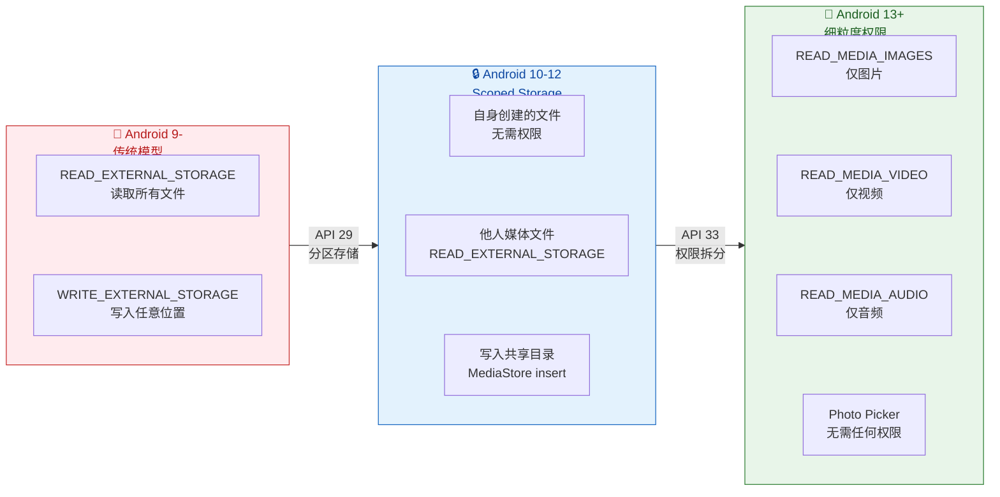

值得一提的是 **Photo Picker**（`ACTION_PICK_IMAGES`），它是 Android 13 引入、并通过 Google Play 系统更新回溯到 Android 11+ 的系统级图片选择器。应用使用 Photo Picker 时 **完全不需要声明任何存储权限**，因为用户是通过系统 UI 主动选择并授权特定文件的。这是 Google 推荐的最佳实践方案，在不需要浏览全部媒体库的场景下，应优先使用 Photo Picker 而非申请 `READ_MEDIA_IMAGES`。

### 日历 Calendar

CalendarProvider 管理设备上的日历账户、事件、提醒和参与者数据。其数据模型的复杂度介于联系人和媒体库之间，核心围绕 **日历 → 事件 → 提醒/参与者** 的层级关系。

#### 数据模型

**Calendars 表**（`CalendarContract.Calendars`）代表一个日历账户。一台设备上可能存在多个日历：Google 日历、Exchange 日历、本地日历等。每个日历有 `ACCOUNT_NAME`（账户名）、`CALENDAR_DISPLAY_NAME`（显示名称）、`CALENDAR_COLOR`（日历颜色）、`OWNER_ACCOUNT`（所有者邮箱）等属性。重要的是，日历记录通常由同步适配器（Sync Adapter）创建和管理，普通应用不应随意增删日历账户。

**Events 表**（`CalendarContract.Events`）是最常操作的表，存储每一条日历事件。核心列包括：`CALENDAR_ID`（所属日历）、`TITLE`（标题）、`DESCRIPTION`（描述）、`DTSTART`（开始时间，UTC 毫秒时间戳）、`DTEND`（结束时间）、`EVENT_TIMEZONE`（时区）、`ALL_DAY`（是否全天事件）、`RRULE`（重复规则，遵循 RFC 5545 iCalendar 标准）、`EVENT_LOCATION`（地点）。

**Reminders 表**（`CalendarContract.Reminders`）存储事件的提醒设置，通过 `EVENT_ID` 关联到 Events。`MINUTES` 列表示事件开始前多少分钟触发提醒，`METHOD` 列表示提醒方式（弹窗、邮件等）。

**Attendees 表**（`CalendarContract.Attendees`）存储事件的参与者信息，同样通过 `EVENT_ID` 关联。包含 `ATTENDEE_EMAIL`（参与者邮箱）、`ATTENDEE_STATUS`（接受/拒绝/待定）等。

#### 查询与插入事件

```kotlin
// === 查询未来 7 天内的所有事件 ===
val now = System.currentTimeMillis()                    // 当前时间（毫秒时间戳）
val oneWeekLater = now + 7 * 24 * 60 * 60 * 1000L      // 7 天后

val eventProjection = arrayOf(
    CalendarContract.Events._ID,             // 事件 ID
    CalendarContract.Events.TITLE,           // 事件标题
    CalendarContract.Events.DTSTART,         // 开始时间（UTC 毫秒）
    CalendarContract.Events.DTEND,           // 结束时间（UTC 毫秒）
    CalendarContract.Events.EVENT_LOCATION,  // 地点
    CalendarContract.Events.CALENDAR_ID      // 所属日历 ID
)

// 查询开始时间在 [now, oneWeekLater] 范围内的事件
val eventCursor = contentResolver.query(
    CalendarContract.Events.CONTENT_URI,     // 事件表 URI
    eventProjection,
    // 筛选条件：开始时间 >= 现在 且 开始时间 <= 一周后
    "${CalendarContract.Events.DTSTART} >= ? AND ${CalendarContract.Events.DTSTART} <= ?",
    arrayOf(now.toString(), oneWeekLater.toString()),
    // 按开始时间升序排列
    "${CalendarContract.Events.DTSTART} ASC"
)

eventCursor?.use { cursor ->
    val titleIndex = cursor.getColumnIndexOrThrow(CalendarContract.Events.TITLE)
    val startIndex = cursor.getColumnIndexOrThrow(CalendarContract.Events.DTSTART)

    while (cursor.moveToNext()) {
        val title = cursor.getString(titleIndex)     // 如 "团队周会"
        val startMillis = cursor.getLong(startIndex)  // UTC 毫秒时间戳
        // 将时间戳转换为可读时间
        val startTime = java.text.SimpleDateFormat("yyyy-MM-dd HH:mm", java.util.Locale.getDefault())
            .format(java.util.Date(startMillis))
    }
}
```

插入事件同样使用 ContentResolver 的标准接口：

```kotlin
// === 向默认日历插入一条新事件 ===
val calendarId = 1L  // 假设已查询到目标日历的 ID

val eventValues = ContentValues().apply {
    // 关联到目标日历
    put(CalendarContract.Events.CALENDAR_ID, calendarId)
    // 事件标题
    put(CalendarContract.Events.TITLE, "项目评审会议")
    // 事件描述
    put(CalendarContract.Events.DESCRIPTION, "Q4 项目进度评审，请准备演示材料")
    // 事件地点
    put(CalendarContract.Events.EVENT_LOCATION, "3 楼大会议室")
    // 开始时间：明天下午 2 点（需转为 UTC 毫秒）
    val startMillis = Calendar.getInstance().apply {
        add(Calendar.DAY_OF_MONTH, 1)  // 明天
        set(Calendar.HOUR_OF_DAY, 14)  // 下午 2 点
        set(Calendar.MINUTE, 0)
        set(Calendar.SECOND, 0)
    }.timeInMillis
    put(CalendarContract.Events.DTSTART, startMillis)
    // 结束时间：明天下午 3 点（持续 1 小时）
    put(CalendarContract.Events.DTEND, startMillis + 60 * 60 * 1000)
    // 时区：使用设备默认时区
    put(CalendarContract.Events.EVENT_TIMEZONE, TimeZone.getDefault().id)
}

// 执行插入
val eventUri = contentResolver.insert(
    CalendarContract.Events.CONTENT_URI,
    eventValues
)

// 从返回的 URI 中提取新事件的 ID
val eventId = eventUri?.lastPathSegment?.toLongOrNull()

// 为新事件添加一个提前 15 分钟的提醒
if (eventId != null) {
    val reminderValues = ContentValues().apply {
        put(CalendarContract.Reminders.EVENT_ID, eventId)   // 关联事件
        put(CalendarContract.Reminders.MINUTES, 15)          // 提前 15 分钟
        put(CalendarContract.Reminders.METHOD,               // 提醒方式：弹窗通知
            CalendarContract.Reminders.METHOD_ALERT)
    }
    contentResolver.insert(
        CalendarContract.Reminders.CONTENT_URI,
        reminderValues
    )
}
```

#### 处理重复事件

重复事件是日历系统中一个相当复杂的话题。Events 表中，一个重复事件只有一条记录（通过 `RRULE` 列描述重复规则），但在查询时需要展开为多个实际发生的时间点。系统提供了 **Instances 表**（`CalendarContract.Instances`）来解决这个问题——它不是一个真正的数据库表，而是一个虚拟表（Virtual Table），系统在查询时根据 RRULE 动态计算并展开重复事件的所有实例。

查询 Instances 表时必须使用特殊的 `Instances.query()` 方法或通过 `Uri.Builder` 指定时间范围，因为无限重复的事件无法一次性展开所有实例。这也是为什么查询日历事件通常推荐查 Instances 表而非 Events 表——前者已经处理好了重复事件的展开，后者需要应用自己解析 RRULE。

日历操作需要 `READ_CALENDAR`（查询）和 `WRITE_CALENDAR`（插入/更新/删除）权限，两者都属于 CALENDAR 权限组中的危险权限。

### 通话记录

通话记录 ContentProvider（`CallLog.Calls`）记录设备上所有的通话历史，包括呼入、呼出、未接来电和被拒来电。相比前三个系统提供者，通话记录的数据模型要简单得多——只有一张核心表。

#### 数据模型与核心列

通话记录表（`CallLog.Calls`）的每一行代表一次通话记录。核心列如下：

`NUMBER`（`String`）存储对方电话号码。`TYPE`（`int`）表示通话类型，取值包括 `INCOMING_TYPE`（呼入，值为 1）、`OUTGOING_TYPE`（呼出，值为 2）、`MISSED_TYPE`（未接，值为 3）、`REJECTED_TYPE`（拒接，值为 5）等。`DATE`（`long`）记录通话发生的时间戳（UTC 毫秒）。`DURATION`（`long`）记录通话时长（秒），未接来电此值为 0。`CACHED_NAME`（`String`）是系统从联系人中缓存的对方姓名（如果对方号码在通讯录中的话），可能为 null。`NEW`（`int`）标记该条通话记录是否为"新的"（未被用户查看过），1 为新，0 为已查看。

```kotlin
// === 查询最近 50 条通话记录 ===
val callProjection = arrayOf(
    CallLog.Calls._ID,          // 记录 ID
    CallLog.Calls.NUMBER,       // 对方号码
    CallLog.Calls.TYPE,         // 通话类型（呼入/呼出/未接/拒接）
    CallLog.Calls.DATE,         // 通话时间（UTC 毫秒时间戳）
    CallLog.Calls.DURATION,     // 通话时长（秒）
    CallLog.Calls.CACHED_NAME   // 从通讯录缓存的联系人姓名
)

val callCursor = contentResolver.query(
    CallLog.Calls.CONTENT_URI,   // 通话记录表 URI: content://call_log/calls
    callProjection,
    null,                         // 不过滤，查询所有记录
    null,
    // 按通话时间降序，限制 50 条
    "${CallLog.Calls.DATE} DESC LIMIT 50"
)

callCursor?.use { cursor ->
    val numberIndex = cursor.getColumnIndexOrThrow(CallLog.Calls.NUMBER)
    val typeIndex = cursor.getColumnIndexOrThrow(CallLog.Calls.TYPE)
    val dateIndex = cursor.getColumnIndexOrThrow(CallLog.Calls.DATE)
    val durationIndex = cursor.getColumnIndexOrThrow(CallLog.Calls.DURATION)
    val nameIndex = cursor.getColumnIndexOrThrow(CallLog.Calls.CACHED_NAME)

    while (cursor.moveToNext()) {
        val number = cursor.getString(numberIndex)       // 如 "13812345678"
        val type = cursor.getInt(typeIndex)               // 1=呼入, 2=呼出, 3=未接
        val dateMillis = cursor.getLong(dateIndex)         // 时间戳
        val durationSec = cursor.getLong(durationIndex)    // 通话秒数
        val cachedName = cursor.getString(nameIndex)       // 可能为 null

        // 将类型整数转换为可读字符串
        val typeStr = when (type) {
            CallLog.Calls.INCOMING_TYPE -> "呼入"
            CallLog.Calls.OUTGOING_TYPE -> "呼出"
            CallLog.Calls.MISSED_TYPE   -> "未接"
            CallLog.Calls.REJECTED_TYPE -> "拒接"
            else -> "未知"
        }
    }
}
```

#### 写入通话记录

普通应用很少需要写入通话记录（通常由系统电话应用完成），但在某些特殊场景下（如 VoIP 应用记录通话历史），可以通过 `insert` 写入：

```kotlin
// VoIP 应用在通话结束后写入一条通话记录
val callValues = ContentValues().apply {
    put(CallLog.Calls.NUMBER, "+8613912345678")     // 对方号码
    put(CallLog.Calls.TYPE, CallLog.Calls.OUTGOING_TYPE)  // 呼出
    put(CallLog.Calls.DATE, System.currentTimeMillis())    // 通话发生时间
    put(CallLog.Calls.DURATION, 180)                       // 通话时长 3 分钟
    put(CallLog.Calls.NEW, 0)                              // 非新记录（用户已知晓）
}

contentResolver.insert(CallLog.Calls.CONTENT_URI, callValues)
```

#### 权限特殊性

通话记录权限从 Android 9 (API 28) 开始发生了重大变化。在此之前，通话记录权限（`READ_CALL_LOG` / `WRITE_CALL_LOG`）和电话权限（`READ_PHONE_STATE`）同属 **PHONE 权限组**，这意味着用户授权了 `READ_PHONE_STATE` 后，应用就能顺带访问通话记录——这显然是不合理的。

从 Android 9 开始，Google 将 `READ_CALL_LOG` 和 `WRITE_CALL_LOG` 独立为 **CALL_LOG 权限组**，不再与 PHONE 权限组共享。这意味着即使用户已经授权了电话相关权限，访问通话记录仍需单独申请 `READ_CALL_LOG`。

更进一步，从 **Google Play 政策** 层面，Google 对通话记录权限的审核极为严格。自 2019 年起，只有被认定为"默认电话应用"或"默认短信应用"的应用才被允许在 Google Play 上架时声明 `READ_CALL_LOG` / `WRITE_CALL_LOG` 权限。普通应用如果声明了这些权限，必须提交 **权限声明表**（Permission Declaration Form）解释使用理由，否则会被拒绝上架或下架。这是 Google 在应用分发层面对敏感数据的额外保护。

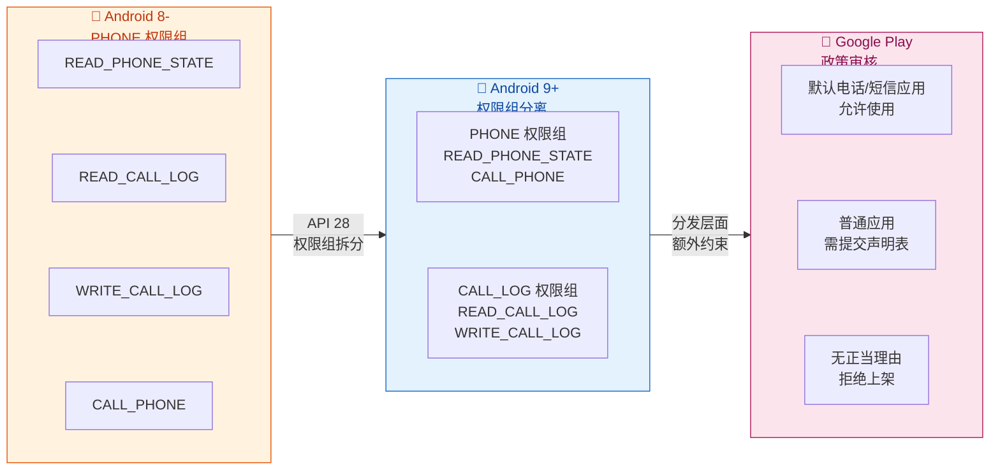

### 系统提供者的共性开发模式

在深入了解了四大系统 ContentProvider 之后，可以总结出一些跨场景的通用最佳实践：

**异步查询是必须的**。所有 ContentProvider 查询都通过 Binder 进行 IPC 调用，涉及数据库操作，绝不能在主线程执行。推荐使用 Kotlin 协程（`withContext(Dispatchers.IO)`）、`CursorLoader`（已不推荐，被 ViewModel + LiveData/Flow 替代）或 Jetpack 的 `ContentResolver` 扩展来确保异步执行。

**Cursor 的及时关闭**。每次查询返回的 `Cursor` 都持有数据库连接资源。如果不及时关闭，会导致数据库连接泄漏（`CursorWindowAllocationException`）。Kotlin 的 `use {}` 扩展函数是最安全的做法，它在代码块结束时自动调用 `cursor.close()`。

**投影（Projection）最小化**。查询时只请求需要的列，不要传入 `null`（等价于 `SELECT *`）。这不仅减少了数据传输量（Cursor 通过共享内存 `CursorWindow` 在进程间传递，默认窗口大小为 2MB），也减少了数据库的 I/O 负担。

**ContentObserver 监听变化**。如果应用需要实时感知系统数据的变化（如联系人被编辑、新照片被拍摄），可以通过 `contentResolver.registerContentObserver()` 注册监听，在 `onChange()` 回调中刷新数据。记得在不需要时调用 `unregisterContentObserver()` 避免内存泄漏。

**权限的运行时申请与优雅降级**。所有系统提供者的权限都属于危险权限，必须在运行时动态申请。当用户拒绝权限时，应用不应 crash 或反复弹窗骚扰用户，而是应该展示解释说明（通过 `shouldShowRequestPermissionRationale` 判断）并提供降级体验。

---

**📝 练习题**

在 Android 13 (API 33) 设备上，一个相册应用希望读取用户的所有图片和视频来展示网格列表。以下哪种权限申请方式是正确的？

A. 只申请 `READ_EXTERNAL_STORAGE` 即可，系统会自动兼容新版本

B. 申请 `READ_MEDIA_IMAGES` 和 `READ_MEDIA_VIDEO` 两个权限

C. 申请 `MANAGE_EXTERNAL_STORAGE`，因为需要访问所有媒体文件

D. 不需要申请任何权限，直接使用 `MediaStore.Images.Media.EXTERNAL_CONTENT_URI` 查询

**【答案】** B
**【解析】** Android 13 将原来笼统的 `READ_EXTERNAL_STORAGE` 拆分为三个细粒度权限：`READ_MEDIA_IMAGES`（图片）、`READ_MEDIA_VIDEO`（视频）、`READ_MEDIA_AUDIO`（音频）。应用应当按需申请，相册应用只需要图片和视频权限。选项 A 不正确，因为在 targetSdkVersion >= 33 的应用上，`READ_EXTERNAL_STORAGE` 不再授予任何媒体访问权限，系统不会自动映射为新权限。选项 C 的 `MANAGE_EXTERNAL_STORAGE` 是面向文件管理器等极少数特殊应用的权限，Google Play 审核极其严格，普通相册应用不应也不必使用它。选项 D 不正确，因为查询其他应用创建的媒体文件仍然需要对应的 READ_MEDIA 权限；只有查询应用自己通过 MediaStore 创建的文件才无需权限。

---

**📝 练习题**

关于 Android 联系人 ContentProvider 的三层数据模型，以下说法正确的是？

A. 一条 Contact 记录对应一条 RawContact 记录，是一对一的关系

B. Data 表中所有行的列结构完全相同，通过 MIMETYPE 区分不同数据类型时使用不同的列

C. 使用批量操作 `applyBatch` 插入联系人时，`withValueBackReference` 用于引用同一批次中前序操作返回的 ID

D. 查询联系人的电话号码应直接查询 Contacts 表的 `PHONE_NUMBER` 列

**【答案】** C
**【解析】** `withValueBackReference` 是 `ContentProviderOperation` 批量操作中的核心机制。当批量操作中的后续步骤需要引用前序步骤产生的 ID 时（例如先插入 RawContact 获得 ID，再用这个 ID 作为 Data 表记录的 `RAW_CONTACT_ID`），就使用 `withValueBackReference(columnName, backReferenceIndex)` 声明这种跨操作依赖。选项 A 错误，Contact 与 RawContact 是一对多关系——系统会将同一个人在不同账户下的多条 RawContact 聚合为一条 Contact。选项 B 的描述有误，Data 表所有行的列结构确实相同（都是 DATA1~DATA15），但正因如此，不同 MIMETYPE 的数据复用的是相同的列（不是不同的列），只是同一列在不同 MIMETYPE 下的语义不同。选项 D 错误，Contacts 表没有 `PHONE_NUMBER` 列，电话号码存储在 Data 表中，应通过 `ContactsContract.CommonDataKinds.Phone.CONTENT_URI` 查询。

---

## 本章小结

ContentProvider 是 Android 四大组件中最容易被低估、却在系统架构中承担关键角色的一环。它不仅仅是"数据库的包装器"，更是 Android 跨进程数据共享的 **唯一标准化通道**。回顾本章内容，我们从角色定位出发，逐步深入到 URI 寻址、CRUD 接口设计、线程模型、权限体系、数据变更监听、文件安全共享以及系统级 Provider 的实际应用，形成了一条完整的知识链路。以下是对全章核心要点的系统性梳理与提炼。

---

### 架构定位回顾

ContentProvider 的本质是一个 **基于 Binder IPC 的、以 URI 为寻址方式的、对上层暴露统一 CRUD 语义的数据访问抽象层**。它解决了三个核心问题：第一，**跨进程数据共享的标准化**——任何应用无需了解数据的底层存储形式（SQLite、文件、网络、内存），只要知道 URI 就能完成数据操作；第二，**统一数据接口**——无论数据来源如何变化，对外暴露的 `query/insert/update/delete` 接口始终不变，实现了数据消费者与数据生产者之间的彻底解耦（Decoupling）；第三，**进程间安全隔离**——通过 Android 权限模型和 URI 级别的临时授权机制，精细控制哪些应用、在什么范围内、能执行何种操作，从而在开放共享与数据安全之间取得平衡。

从系统启动的视角来看，ContentProvider 的特殊地位还体现在它的 **初始化时机早于 Application.onCreate()**。这意味着当 `onCreate()` 被调用时，应用进程已经完成了所有已注册 Provider 的实例化和 `onCreate()` 回调。这一特性既是 Jetpack 中 `App Startup` 库利用 Provider 进行无侵入初始化的原理基础，也是开发者需要特别注意的性能陷阱——在 Provider 的 `onCreate()` 中执行耗时操作会直接拖慢应用的冷启动速度。

---

### 核心知识脉络

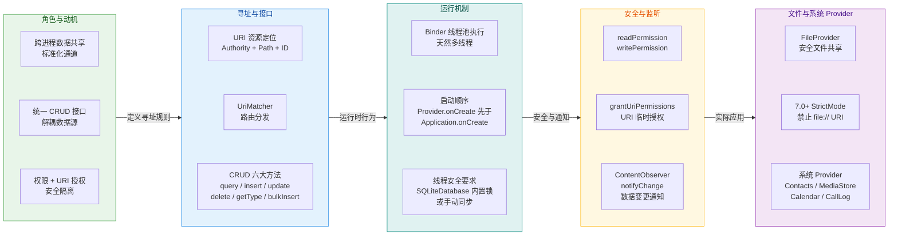

上图将本章五大知识板块串联为一条从"为什么需要 ContentProvider"到"在真实场景中怎么用"的完整路径。每个板块的核心要点如下：

**第一板块：角色与动机。** ContentProvider 存在的根本原因是 Android 的多进程沙箱模型——每个应用运行在独立进程中，直接访问其他应用的数据库或文件是不可能的。Provider 通过 Binder IPC 桥接了这一鸿沟，同时对上层抽象出统一的 `ContentResolver` API，使得数据消费方完全不需要知道数据存储在 SQLite 还是文件系统中，甚至不需要知道数据是否来自远程服务器。这种设计高度契合了 **面向接口编程（Programming to Interface）** 的思想。

**第二板块：寻址与接口。** URI 是整个 ContentProvider 体系的"地址系统"。`content://authority/path/id` 这一结构清晰地将命名空间（Authority）、资源类型（Path）和具体资源（ID）三个维度编码到一个字符串中。`UriMatcher` 则充当了服务端的路由表，将不同的 URI 模式映射到不同的处理逻辑——这本质上就是一个 **URL Router**，与 Web 后端框架中路由的概念完全一致。六大 CRUD 方法构成了 Provider 的全部对外契约，其中 `getType()` 返回的 MIME 类型用于帮助系统或其他应用判断数据格式，`bulkInsert()` 则为批量写入场景提供了默认的事务优化入口。

**第三板块：运行机制。** 这是最容易被忽视却至关重要的部分。ContentProvider 的所有 CRUD 方法都运行在 Binder 线程池中（而非主线程），这意味着它们 **天然是多线程并发执行的**。如果底层使用 SQLiteDatabase，由于 SQLiteDatabase 自身在启用 WAL（Write-Ahead Logging）模式后支持"一写多读"并发，大部分场景下是线程安全的。但如果底层使用的是 SharedPreferences、HashMap 或文件系统，开发者 **必须自行保证线程安全**，否则会出现数据竞争和不一致问题。此外，Provider 的启动顺序这一知识点——`ContentProvider.onCreate()` 在 `Application.onCreate()` 之前被调用——不仅是面试高频考点，更是理解 `App Startup`、Firebase 等库初始化机制的关键前提。

**第四板块：安全与监听。** 权限控制是 ContentProvider 相较于直接文件共享最大的优势之一。静态权限（`readPermission` / `writePermission`）提供了应用级别的粗粒度控制；`grantUriPermissions` 配合 `Intent.FLAG_GRANT_READ_URI_PERMISSION` 则实现了 **URI 级别的临时授权**——授权范围精确到某一条 URI，授权生命周期绑定到接收方 Activity 的结束或手动撤销。这种机制既保证了"最小权限原则（Principle of Least Privilege）"，又不需要接收方在 Manifest 中声明永久权限。数据变更监听方面，`ContentObserver` + `notifyChange()` 构成了一套轻量级的 **观察者模式（Observer Pattern）** 实现，使得 UI 层能够在数据发生变化时自动刷新，这正是 CursorLoader（以及现代架构中 Room + LiveData/Flow）背后的核心驱动力。

**第五板块：文件共享与系统 Provider。** FileProvider 是 Android 7.0（API 24）之后处理应用间文件共享的标准方案。它本质上是一个预实现的 ContentProvider 子类，将文件系统路径转换为 `content://` URI，从而避免了 `file://` URI 被 StrictMode 拦截导致的 `FileUriExposedException`。系统级 Provider（ContactsProvider、MediaStore、CalendarProvider、CallLogProvider）则是 Android 平台最大规模的 ContentProvider 实践案例——它们管理着设备上最核心的用户数据，并通过标准化的 URI 和权限模型向第三方应用开放访问能力。理解这些系统 Provider 的 URI 结构和查询方式，是构建通讯录、相册、日历等功能的基础。

---

### 关键设计思想提炼

纵观本章内容，ContentProvider 的设计体现了几个深层次的架构思想，值得开发者在日常设计中反复体会：

**1. 抽象与解耦（Abstraction & Decoupling）。** ContentProvider 将"数据如何存储"与"数据如何被访问"完全分离。消费方通过 ContentResolver 发起请求，只需要知道 URI 和列名，完全不依赖数据提供方的具体实现。这使得数据提供方可以自由地将底层存储从 SQLite 切换到 Room、从本地文件切换到网络接口，而不影响任何消费方的代码。这种解耦力度在 Android 四大组件中是最彻底的。

**2. 最小权限原则（Principle of Least Privilege）。** URI 临时授权机制是这一原则的典范实现。一个应用不需要获得对整个 Provider 的读写权限，只需要在特定操作（如分享一张图片）时获得对特定 URI 的临时读取权限，操作完成后权限自动回收。这比传统的"要么全给、要么不给"的权限模型精细得多。

**3. 观察者模式与响应式思维（Observer Pattern & Reactive Thinking）。** `ContentObserver` + `notifyChange()` 是 Android 系统中最早的"数据驱动 UI"实现之一。数据变化时主动通知观察者，而非让 UI 轮询数据——这一思想贯穿了后来的 LiveData、StateFlow、Compose State 等现代响应式框架。可以说，ContentProvider 的通知机制是 Android 响应式编程的 **思想源头之一**。

**4. 契约式设计（Design by Contract）。** Provider 对外暴露的接口（URI 格式、列名、MIME 类型）构成了一份隐式契约。系统 Provider 如 `ContactsContract`、`MediaStore` 都以 Contract 类的形式将这些契约显式化，包含 URI 常量、列名常量、MIME 类型常量等。这种做法极大降低了 API 的使用门槛，也减少了拼写错误带来的运行时异常。在自定义 Provider 时，为消费方提供一个配套的 Contract 类是非常推荐的最佳实践。

---

### 高频陷阱与最佳实践速查

| 类别 | 陷阱 / 常见错误 | 最佳实践 |
|------|-----------------|---------|
| **启动性能** | 在 `ContentProvider.onCreate()` 中执行耗时初始化，拖慢冷启动 | 延迟初始化（Lazy Init），或使用 `App Startup` 控制初始化顺序与时机 |
| **线程安全** | 假设 CRUD 方法运行在主线程或单线程中 | 明确认知 Binder 线程池并发模型；非 SQLiteDatabase 场景手动加锁 |
| **URI 匹配** | 硬编码字符串比较 URI，遗漏 `#` 通配符 | 始终使用 `UriMatcher`，为集合路径和单条路径分别注册匹配码 |
| **权限遗漏** | 未声明 `readPermission` / `writePermission`，Provider 对外完全开放 | 在 Manifest 中显式声明权限；`exported=false` 用于纯内部 Provider |
| **文件分享** | 在 Android 7.0+ 使用 `file://` URI 传递文件路径 | 使用 FileProvider + `getUriForFile()` 生成 `content://` URI |
| **Cursor 泄漏** | 查询后忘记关闭 Cursor | 使用 `use {}` 扩展函数（Kotlin）或 try-with-resources（Java）确保关闭 |
| **通知遗漏** | `insert/update/delete` 后忘记调用 `notifyChange()` | 在每个写操作末尾统一调用 `context.contentResolver.notifyChange(uri, null)` |
| **批量操作** | 逐条 insert 导致性能低下 | 重写 `bulkInsert()` 并使用数据库事务包裹；或使用 `applyBatch()` 提交 `ContentProviderOperation` 列表 |
| **MIME 类型** | `getType()` 返回 null 或格式不正确 | 集合类型返回 `vnd.android.cursor.dir/vnd.authority.table`，单条返回 `vnd.android.cursor.item/vnd.authority.table` |

---

### 在现代架构中的定位

随着 Jetpack 的全面普及，许多开发者可能会疑问：在 Room + LiveData/Flow + ViewModel 的现代架构中，ContentProvider 是否已经过时？答案是 **否定的**——它们的职责层级不同，互为补充而非替代。

**Room** 是 SQLite 的抽象层，负责 **应用内部** 的结构化数据持久化，它提供编译期 SQL 校验、与协程/Flow 的原生集成等现代开发体验。**ContentProvider** 则工作在更上层，负责 **跨进程、跨应用** 的数据共享——即使底层使用 Room 作为存储引擎，对外暴露数据仍然需要通过 ContentProvider。事实上，Room 官方文档明确支持在 Provider 的 CRUD 方法内部委托 Room DAO 来执行具体操作，两者的组合使用是完全自然的。

此外，ContentProvider 在以下场景中仍然不可替代：

- **与系统服务交互**：访问联系人、媒体库、日历等系统数据，必须通过系统 Provider。
- **对外暴露数据给其他应用**：如果你的应用需要作为数据源供第三方应用查询，ContentProvider 是唯一的标准方案。
- **搜索建议（Search Suggestions）**：Android 系统的搜索框架要求通过 Provider 提供搜索建议数据。
- **App Widgets 数据加载**：RemoteViewsService 加载 Widget 列表数据时，ContentProvider 是推荐的数据通道。
- **SyncAdapter 同步框架**：Android 的账户同步机制（SyncAdapter）要求搭配 ContentProvider 使用。
- **无侵入初始化**：Jetpack App Startup、Firebase、WorkManager 等库利用 Provider 的早期初始化特性，在不修改 Application 类的情况下完成自身初始化。

因此，ContentProvider 与其说是"旧时代的遗留物"，不如说是 Android 平台 **进程间通信基础设施** 的一部分。即使你在日常开发中不常自定义 Provider，理解它的运作原理也能帮助你更好地使用系统 API、诊断跨进程数据问题、以及理解 Jetpack 库的内部机制。

---

### 知识图谱总览

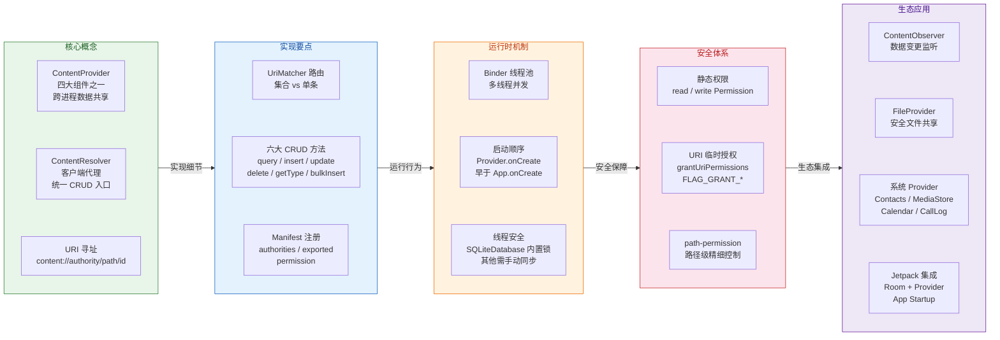

---

### 一句话总结

> **ContentProvider 是 Android 跨进程数据共享的唯一标准化组件——它以 URI 为寻址、以 CRUD 为契约、以 Binder 为传输通道、以权限模型为安全屏障，在开放共享与数据隔离之间架设了一座精密的桥梁。无论 Jetpack 生态如何演进，ContentProvider 作为平台级基础设施的地位始终不可替代。**

---

**📝 练习题**

某团队在自定义 ContentProvider 中实现了 `insert()` 方法，使用 HashMap 作为底层存储（非 SQLiteDatabase）。上线后发现偶尔出现数据丢失和 ConcurrentModificationException。以下哪项是最根本的原因？

A. ContentProvider 的 `insert()` 运行在主线程，与后台线程并发访问 HashMap 导致冲突

B. ContentProvider 的 CRUD 方法运行在 Binder 线程池中，多个客户端请求并发执行，而 HashMap 非线程安全

C. ContentProvider 没有调用 `notifyChange()`，导致数据未持久化

D. HashMap 不支持 `null` 作为 key，插入时触发异常导致数据丢失

**【答案】** B
**【解析】** ContentProvider 的所有 CRUD 方法（`query`、`insert`、`update`、`delete`）都运行在 **Binder 线程池** 中，而非主线程。当多个客户端（甚至同一客户端的多个线程）同时发起请求时，这些方法会被并发调用。HashMap 是非线程安全的数据结构（not thread-safe），在并发读写时会出现数据不一致甚至抛出 `ConcurrentModificationException`。选项 A 错在"运行在主线程"——这是一个非常常见的误解，事实上 Provider 的 CRUD 方法从不运行在主线程。选项 C 中 `notifyChange()` 仅用于通知 ContentObserver 数据变更，与数据持久化无关。选项 D 中 HashMap 实际上允许 `null` key。正确的修复方案是将 HashMap 替换为 `ConcurrentHashMap`，或在所有 CRUD 方法上加 `synchronized` 关键字，或者更推荐的做法是切换到 SQLiteDatabase/Room 等本身具备并发控制能力的存储方案。

---

**📝 练习题**

关于 ContentProvider 在应用启动过程中的初始化顺序，以下说法正确的是？

A. `Application.onCreate()` → `ContentProvider.onCreate()` → 首个 Activity 启动

B. `ContentProvider.onCreate()` → `Application.attachBaseContext()` → `Application.onCreate()`

C. `Application.attachBaseContext()` → `ContentProvider.onCreate()` → `Application.onCreate()`

D. 首个 Activity.onCreate() → `ContentProvider.onCreate()` → `Application.onCreate()`

**【答案】** C
**【解析】** Android 应用进程的启动顺序是一个精确的流程：首先，`ActivityThread.main()` 作为进程入口被调用；接着 Application 对象被创建，并调用 `Application.attachBaseContext()`——此时 Application 的 Context 已就绪但 `onCreate()` 尚未执行；随后系统遍历 AndroidManifest 中声明的所有 ContentProvider，逐一实例化并调用它们的 `onCreate()`；最后才轮到 `Application.onCreate()` 执行。这一顺序可以简记为 **"attach → Provider → App.onCreate"**。选项 A 将 Application.onCreate 排在 Provider 之前，这是错误的。选项 B 将 `attachBaseContext` 排在 Provider 之后，也不正确——如果 `attachBaseContext` 尚未执行，Provider 的 `getContext()` 将返回 null，这在实际运行中不会发生。Jetpack 的 `App Startup` 库正是利用了 Provider 早于 `Application.onCreate()` 这一特性，通过一个特殊的 `InitializationProvider` 来触发各库的初始化逻辑，从而避免在 Application 类中手动添加初始化代码。

---

