---

# Context 上下文体系

---

## Context 家族图谱

Android 开发中，`Context` 是一个无处不在却又常被误解的核心概念。它是应用程序与系统交互的桥梁，承载着访问资源、启动组件、获取系统服务等几乎所有与"环境"相关的能力。理解 Context 的继承体系，是掌握 Android 应用层架构的第一步。

### Context 抽象类：万物之源

`Context` 是一个抽象类（abstract class），定义在 `android.content` 包中。它本身不包含任何具体实现，而是声明了一套庞大的 API 契约，规定了"上下文"应该具备哪些能力。从源码角度看，Context 类中定义了超过 100 个方法，涵盖以下核心职责：

**资源访问能力**：`getResources()`、`getAssets()`、`getString()`、`getDrawable()` 等方法让应用能够读取 res 目录下的各类资源文件。这些方法的背后是 `ResourcesManager` 和 `AssetManager` 的协同工作，它们负责根据当前设备配置（屏幕密度、语言、方向等）选择最合适的资源变体。

**组件启动能力**：`startActivity()`、`startService()`、`sendBroadcast()` 等方法是 Android 四大组件通信的基础。当你调用 `startActivity(intent)` 时，Context 会将请求转发给 `ActivityManagerService`（AMS），由系统进程完成目标 Activity 的创建和调度。

**系统服务获取能力**：`getSystemService()` 方法是获取系统级服务的统一入口。无论是 `LayoutInflater`、`WindowManager`、`NotificationManager` 还是 `ConnectivityManager`，都通过这个方法获取。系统服务以 Binder 机制运行在 `system_server` 进程中，应用通过 Context 获取的实际上是服务的客户端代理（Proxy）。

**文件与数据库操作能力**：`openFileInput()`、`openFileOutput()`、`getSharedPreferences()`、`getDatabasePath()` 等方法提供了应用私有存储的访问通道。这些文件默认存储在 `/data/data/<package_name>/` 目录下，受 Linux 文件权限保护。

**包信息查询能力**：`getPackageName()`、`getPackageManager()`、`getApplicationInfo()` 等方法让应用能够查询自身及其他应用的元信息，这是实现插件化、组件化架构的基础能力之一。

从设计模式的角度看，Context 采用了 **Facade（外观）模式** 的思想——它将 Android 系统中分散的、复杂的子系统（资源管理、组件调度、存储访问等）统一封装在一个简洁的接口背后，让应用开发者无需关心底层实现细节。

```kotlin
// Context 抽象类的核心方法签名（简化版）
// 这些方法定义了"上下文"的能力契约
abstract class Context {
    // ========== 资源访问 ==========
    // 获取资源管理器，用于读取 res 目录下的所有资源
    abstract fun getResources(): Resources
    // 获取资产管理器，用于读取 assets 目录下的原始文件
    abstract fun getAssets(): AssetManager
    // 获取包名，即 AndroidManifest.xml 中声明的 package 属性
    abstract fun getPackageName(): String
    // 获取应用信息，包含 versionCode、targetSdkVersion 等元数据
    abstract fun getApplicationInfo(): ApplicationInfo
    
    // ========== 组件启动 ==========
    // 启动 Activity，intent 中包含目标组件信息和传递数据
    abstract fun startActivity(intent: Intent)
    // 启动前台/后台服务
    abstract fun startService(intent: Intent): ComponentName?
    // 发送广播，可指定权限或限定接收者
    abstract fun sendBroadcast(intent: Intent)
    
    // ========== 系统服务 ==========
    // 获取系统服务的统一入口，name 参数如 Context.WINDOW_SERVICE
    abstract fun getSystemService(name: String): Any?
    
    // ========== 文件存储 ==========
    // 获取应用私有文件目录：/data/data/<pkg>/files/
    abstract fun getFilesDir(): File
    // 获取应用缓存目录：/data/data/<pkg>/cache/
    abstract fun getCacheDir(): File
    // 打开或创建 SharedPreferences 文件
    abstract fun getSharedPreferences(name: String, mode: Int): SharedPreferences
    
    // ========== 主题与样式 ==========
    // 获取当前上下文关联的主题，Activity 会返回其配置的 Theme
    abstract fun getTheme(): Resources.Theme
    // 设置主题资源 ID
    abstract fun setTheme(resId: Int)
}
```

值得注意的是，Context 作为抽象类而非接口存在，这是一个历史设计决策。在 Android 早期版本中，Java 接口不支持默认方法实现，而 Context 需要提供一些通用的便捷方法（如 `getString(int resId)` 实际上是对 `getResources().getString(resId)` 的封装）。这种设计在当时是合理的，但也导致了后续继承体系的复杂性。

### ContextWrapper：装饰器模式的典范

`ContextWrapper` 是 Context 的第一个具体子类，但它本身并不实现任何真正的功能。它的设计采用了经典的 **Decorator（装饰器）模式**，通过持有另一个 Context 实例（称为 `mBase`）来完成所有操作。

装饰器模式的核心思想是：在不修改原有类的情况下，动态地为对象添加新功能。ContextWrapper 的所有方法默认都是简单地委托给 `mBase` 执行，子类可以选择性地重写某些方法来改变行为，而其他方法仍然保持原有逻辑。

```kotlin
// ContextWrapper 的核心实现逻辑
// 它是一个"透传层"，默认将所有调用委托给内部持有的 mBase
open class ContextWrapper(
    // mBase 是被装饰的原始 Context，通常是 ContextImpl 实例
    private var mBase: Context?
) : Context() {
    
    // 获取被装饰的基础 Context
    // 这个方法在调试和某些框架场景下很有用
    fun getBaseContext(): Context? = mBase
    
    // 关联基础 Context，通常在组件创建时由系统调用
    // 注意：attachBaseContext 只能调用一次，重复调用会抛出异常
    protected open fun attachBaseContext(base: Context) {
        if (mBase != null) {
            // 防止重复绑定，这是一个安全检查
            throw IllegalStateException("Base context already set")
        }
        mBase = base
    }
    
    // ========== 以下方法全部委托给 mBase ==========
    
    override fun getResources(): Resources {
        // 直接转发给基础 Context
        return mBase!!.getResources()
    }
    
    override fun getPackageName(): String {
        // 直接转发给基础 Context
        return mBase!!.getPackageName()
    }
    
    override fun startActivity(intent: Intent) {
        // 直接转发给基础 Context
        mBase!!.startActivity(intent)
    }
    
    override fun getSystemService(name: String): Any? {
        // 直接转发给基础 Context
        return mBase!!.getSystemService(name)
    }
    
    // ... 其他 100+ 个方法同样采用委托模式 ...
}
```

这种设计带来了极大的灵活性。Android 中的 `Application`、`Service`、`Activity` 都继承自 ContextWrapper，它们可以根据自身需求重写特定方法。例如，Activity 重写了 `startActivity()` 方法以支持转场动画和结果回调；Service 重写了某些方法以适应后台运行的特性。

ContextWrapper 还支持多层嵌套装饰。理论上，你可以创建一个 ContextWrapper 包装另一个 ContextWrapper，形成装饰链。这在某些高级场景下很有用，比如实现 Context 的 Mock 测试、动态切换主题、或者在插件化框架中替换资源加载逻辑。

```kotlin
// 装饰器链示例：多层 ContextWrapper 嵌套
// 实际开发中可用于测试 Mock 或插件化资源替换
class LoggingContextWrapper(base: Context) : ContextWrapper(base) {
    // 重写 startActivity，添加日志记录功能
    override fun startActivity(intent: Intent) {
        // 在原有功能基础上添加日志
        Log.d("ContextWrapper", "Starting activity: ${intent.component}")
        // 调用父类方法，继续委托链
        super.startActivity(intent)
    }
}

class ThemeOverrideWrapper(base: Context) : ContextWrapper(base) {
    // 重写 getTheme，强制返回自定义主题
    override fun getTheme(): Resources.Theme {
        // 可以在这里实现动态主题切换逻辑
        return customTheme
    }
}

// 使用方式：形成装饰链
// originalContext -> ThemeOverrideWrapper -> LoggingContextWrapper
val wrappedContext = LoggingContextWrapper(ThemeOverrideWrapper(originalContext))
```

### ContextImpl：真正的实现者

`ContextImpl` 是 Context 体系中唯一的"实干家"——它是 Context 抽象类的真正实现，包含了所有方法的具体逻辑。然而，ContextImpl 是一个 **隐藏类**（标记为 `@hide`），不在公开 SDK 中暴露，应用开发者无法直接实例化或继承它。

这种设计是 Android 框架的常见模式：对外暴露抽象接口，对内隐藏具体实现。这样做的好处是系统可以在不破坏 API 兼容性的前提下，自由修改 ContextImpl 的内部实现。事实上，从 Android 1.0 到 Android 14，ContextImpl 的代码已经经历了无数次重构，但应用层代码几乎不受影响。

ContextImpl 内部持有多个关键成员变量，它们共同支撑起 Context 的各项能力：

```kotlin
// ContextImpl 的核心成员变量（简化版源码分析）
// 注意：这是系统隐藏类，应用层无法直接访问
class ContextImpl private constructor() : Context() {
    
    // ========== 核心成员变量 ==========
    
    // ActivityThread 是应用进程的主线程管理者
    // 它负责调度四大组件的生命周期回调
    private lateinit var mMainThread: ActivityThread
    
    // LoadedApk 封装了 APK 的加载信息
    // 包括 ClassLoader、资源路径、so 库路径等
    private lateinit var mPackageInfo: LoadedApk
    
    // Resources 对象，用于访问 res 目录下的资源
    // 每个 ContextImpl 可能持有不同配置的 Resources 实例
    private var mResources: Resources? = null
    
    // 应用私有文件的根目录
    // 通常是 /data/data/<package_name>/
    private var mBasePackagePath: String? = null
    
    // 当前上下文关联的主题
    private var mTheme: Resources.Theme? = null
    
    // ContentResolver 用于访问 ContentProvider
    private var mContentResolver: ContentResolver? = null
    
    // ========== 方法实现示例 ==========
    
    override fun getResources(): Resources {
        // 返回当前上下文的资源管理器
        // 不同 Context 可能返回不同配置的 Resources
        return mResources!!
    }
    
    override fun getSystemService(name: String): Any? {
        // 系统服务的获取通过 SystemServiceRegistry 完成
        // 它维护了服务名称到服务获取器的映射表
        return SystemServiceRegistry.getSystemService(this, name)
    }
    
    override fun startActivity(intent: Intent) {
        // 检查是否需要添加 FLAG_ACTIVITY_NEW_TASK
        // 非 Activity 的 Context 启动 Activity 必须带此 Flag
        if (intent.flags and Intent.FLAG_ACTIVITY_NEW_TASK == 0) {
            // 如果当前不是 Activity Context，需要强制添加 NEW_TASK 标志
            // 否则系统不知道该把新 Activity 放入哪个任务栈
            throw AndroidRuntimeException(
                "Calling startActivity() from outside of an Activity context " +
                "requires the FLAG_ACTIVITY_NEW_TASK flag."
            )
        }
        // 通过 Instrumentation 转发给 AMS
        mMainThread.instrumentation.execStartActivity(
            this, null, null, null, intent, -1, null
        )
    }
    
    override fun getSharedPreferences(name: String, mode: Int): SharedPreferences {
        // SharedPreferences 文件存储在 /data/data/<pkg>/shared_prefs/ 目录
        // 系统会缓存已打开的 SP 实例，避免重复解析 XML
        val file = getSharedPreferencesPath(name)
        return SharedPreferencesImpl(file, mode)
    }
    
    // ========== 静态工厂方法 ==========
    
    companion object {
        // 创建 Application 的 Context
        // 在应用进程启动时由 ActivityThread 调用
        fun createAppContext(
            mainThread: ActivityThread,
            packageInfo: LoadedApk
        ): ContextImpl {
            return ContextImpl().apply {
                mMainThread = mainThread
                mPackageInfo = packageInfo
                mResources = packageInfo.resources
            }
        }
        
        // 创建 Activity 的 Context
        // 会额外配置主题和 Display 信息
        fun createActivityContext(
            mainThread: ActivityThread,
            packageInfo: LoadedApk,
            activityInfo: ActivityInfo,
            displayId: Int
        ): ContextImpl {
            return ContextImpl().apply {
                mMainThread = mainThread
                mPackageInfo = packageInfo
                // Activity 的 Resources 可能包含特定的配置覆盖
                mResources = createResources(displayId, packageInfo)
                // 应用 Activity 声明的主题
                setTheme(activityInfo.themeResource)
            }
        }
    }
}
```

ContextImpl 的创建时机与组件生命周期紧密相关。当 `ActivityThread`（应用主线程的管理者）收到 AMS 的指令创建 Application、Activity 或 Service 时，它会首先创建对应的 ContextImpl 实例，然后通过 `attachBaseContext()` 方法将其绑定到组件上。这个过程发生在组件的 `onCreate()` 回调之前，确保组件在生命周期方法中可以正常使用 Context 功能。

### ContextThemeWrapper：主题感知的上下文

`ContextThemeWrapper` 继承自 ContextWrapper，专门为需要主题支持的场景设计。它的核心能力是持有并管理一个 `Resources.Theme` 对象，使得通过该 Context 获取的资源能够正确应用主题属性。

在 Android 的资源系统中，主题（Theme）是一组样式属性的集合，定义了应用的视觉风格。当你在 XML 中使用 `?attr/colorPrimary` 这样的主题属性引用时，系统需要知道当前的主题是什么，才能解析出正确的颜色值。ContextThemeWrapper 正是提供这种"主题上下文"的关键类。

```kotlin
// ContextThemeWrapper 的核心实现
// 它在 ContextWrapper 基础上添加了主题管理能力
open class ContextThemeWrapper : ContextWrapper {
    
    // 主题资源 ID，如 R.style.AppTheme
    private var mThemeResource: Int = 0
    
    // 已解析的 Theme 对象，懒加载创建
    private var mTheme: Resources.Theme? = null
    
    // 可能被覆盖的 Resources 对象
    // 用于支持配置变更时的资源重建
    private var mResources: Resources? = null
    
    // 无参构造器，主题稍后通过 setTheme() 设置
    constructor() : super(null)
    
    // 带主题的构造器，常用于手动创建带特定主题的 Context
    constructor(base: Context, themeResId: Int) : super(base) {
        mThemeResource = themeResId
    }
    
    // 设置主题资源 ID
    // 如果 Theme 对象已创建，会立即应用新主题
    override fun setTheme(resId: Int) {
        mThemeResource = resId
        // 如果主题对象已存在，需要重新应用
        mTheme?.let { theme ->
            // applyStyle 会将新主题的属性合并到现有 Theme 中
            theme.applyStyle(resId, true)
        }
    }
    
    // 获取主题对象，懒加载模式
    override fun getTheme(): Resources.Theme {
        // 如果尚未创建，则初始化
        if (mTheme == null) {
            // 从 Resources 创建新的 Theme 对象
            mTheme = resources.newTheme().apply {
                // 首先继承父 Context 的主题（如果有）
                val parentTheme = baseContext?.theme
                if (parentTheme != null) {
                    setTo(parentTheme)
                }
                // 然后应用当前设置的主题资源
                if (mThemeResource != 0) {
                    applyStyle(mThemeResource, true)
                }
            }
        }
        return mTheme!!
    }
    
    // 获取资源对象
    // 可能返回被覆盖的 Resources 实例
    override fun getResources(): Resources {
        return mResources ?: super.getResources()
    }
    
    // 创建配置上下文
    // 用于处理配置变更（如屏幕旋转、语言切换）
    override fun createConfigurationContext(
        overrideConfiguration: Configuration
    ): Context {
        return ContextThemeWrapper(
            baseContext!!.createConfigurationContext(overrideConfiguration),
            mThemeResource
        )
    }
}
```

Activity 是 ContextThemeWrapper 最重要的子类。每个 Activity 都可以在 AndroidManifest.xml 中通过 `android:theme` 属性指定主题，系统在创建 Activity 时会自动调用 `setTheme()` 方法应用该主题。这就是为什么在 Activity 中使用 `LayoutInflater` 填充布局时，主题属性能够被正确解析。

```kotlin
// Activity 继承自 ContextThemeWrapper
// 因此天然具备主题管理能力
class Activity : ContextThemeWrapper(), ... {
    
    // Activity 创建时，系统会自动设置主题
    // 这发生在 onCreate() 之前
    internal fun performCreate(savedInstanceState: Bundle?) {
        // 应用 Manifest 中声明的主题
        val themeRes = activityInfo.themeResource
        if (themeRes != 0) {
            setTheme(themeRes)
        }
        // 然后才调用 onCreate()
        onCreate(savedInstanceState)
    }
    
    // 开发者也可以在 onCreate() 中手动切换主题
    // 但必须在 setContentView() 之前调用
    override fun onCreate(savedInstanceState: Bundle?) {
        // 正确：在 setContentView 之前设置主题
        setTheme(R.style.CustomTheme)
        super.onCreate(savedInstanceState)
        setContentView(R.layout.activity_main)
    }
}
```

除了 Activity，Dialog 也是 ContextThemeWrapper 的典型使用场景。当你创建 `AlertDialog` 时，可以传入一个主题资源 ID，Dialog 内部会创建一个 ContextThemeWrapper 来确保对话框使用正确的样式：

```kotlin
// Dialog 使用 ContextThemeWrapper 管理主题
class AlertDialog private constructor(
    context: Context,
    themeResId: Int
) : Dialog(
    // 创建带主题的 Context
    // resolveDialogTheme 会解析默认对话框主题
    ContextThemeWrapper(context, resolveDialogTheme(context, themeResId))
) {
    // Dialog 内部的所有 View 都会使用这个带主题的 Context
    // 确保按钮、文字、背景等样式一致
}

// 使用示例：创建带自定义主题的对话框
val dialog = AlertDialog.Builder(this, R.style.MyDialogTheme)
    .setTitle("提示")
    .setMessage("这是一个自定义主题的对话框")
    .create()
```

### Context 家族继承关系全景图

理解了各个类的职责后，让我们通过一张完整的类图来梳理 Context 家族的继承关系。这张图展示了从抽象基类到具体组件的完整继承链：

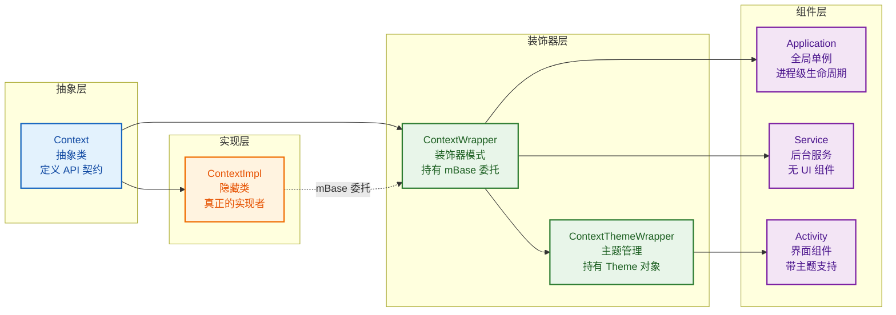

从图中可以清晰地看到几个关键设计决策：

**分层解耦**：抽象层（Context）定义契约，装饰器层（ContextWrapper 系列）提供扩展点，实现层（ContextImpl）完成具体工作。这种分层使得系统可以灵活演进而不破坏兼容性。

**组合优于继承**：ContextWrapper 通过持有 `mBase` 引用而非直接继承 ContextImpl，实现了运行时的灵活组合。这使得同一个 ContextImpl 可以被多个 Wrapper 共享或替换。

**主题隔离**：只有需要 UI 渲染的组件（Activity、Dialog）才继承 ContextThemeWrapper，而 Application 和 Service 直接继承 ContextWrapper。这体现了"按需扩展"的设计原则。

### 组件与 Context 的绑定时机

理解 Context 何时被创建和绑定，对于排查生命周期相关的问题至关重要。以下时序图展示了 Activity 启动过程中 Context 的创建流程：

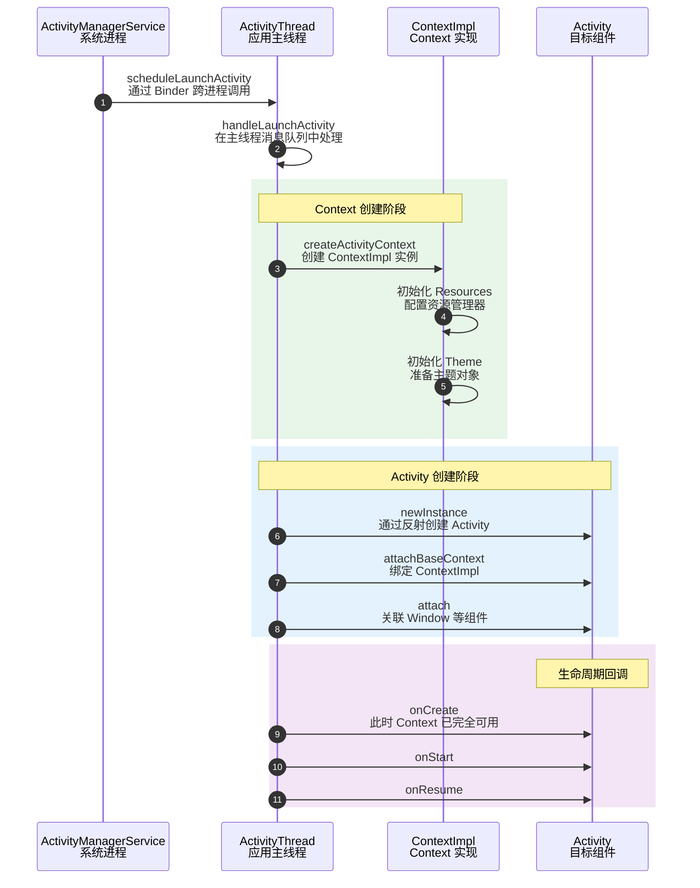

从时序图可以看出，`attachBaseContext()` 的调用发生在 `onCreate()` 之前。这意味着在 `onCreate()` 中，你可以安全地使用所有 Context 功能。但如果你重写了 `attachBaseContext()` 方法（例如在多语言切换或插件化场景中），需要特别注意此时 Activity 的其他成员变量可能尚未初始化。

```kotlin
// attachBaseContext 的正确使用方式
class MainActivity : AppCompatActivity() {
    
    // 重写 attachBaseContext 实现多语言切换
    override fun attachBaseContext(newBase: Context) {
        // 在这里可以包装 Context 以修改配置
        val localeContext = LocaleHelper.wrap(newBase, "zh-CN")
        // 必须调用 super，否则 mBase 不会被设置
        super.attachBaseContext(localeContext)
        
        // 注意：此时 Activity 的其他成员尚未初始化
        // 不要在这里访问 View 或其他依赖 onCreate 的对象
    }
    
    override fun onCreate(savedInstanceState: Bundle?) {
        super.onCreate(savedInstanceState)
        // 此时 Context 已完全就绪，可以正常使用
        setContentView(R.layout.activity_main)
    }
}
```

### 不同 Context 实例的能力差异

虽然所有 Context 都实现了相同的 API，但不同来源的 Context 在实际能力上存在差异。这些差异主要体现在 UI 相关操作和生命周期关联上：

```kotlin
// 不同 Context 的能力对比示例
class ContextCapabilityDemo {
    
    // Application Context：全局可用，但 UI 能力受限
    fun demonstrateApplicationContext(app: Application) {
        // ✅ 可以：获取资源
        val appName = app.getString(R.string.app_name)
        
        // ✅ 可以：获取系统服务
        val connectivityManager = app.getSystemService<ConnectivityManager>()
        
        // ✅ 可以：访问文件
        val file = app.getFilesDir()
        
        // ⚠️ 需要 FLAG：启动 Activity
        val intent = Intent(app, TargetActivity::class.java).apply {
            // 必须添加此 Flag，否则会抛出异常
            addFlags(Intent.FLAG_ACTIVITY_NEW_TASK)
        }
        app.startActivity(intent)
        
        // ❌ 不推荐：填充布局（会使用系统默认主题）
        val inflater = LayoutInflater.from(app)
        // 这里填充的 View 不会应用 Activity 的主题
        val view = inflater.inflate(R.layout.some_layout, null)
        
        // ❌ 不可以：显示普通 Dialog
        // AlertDialog.Builder(app).show() // 会崩溃！
    }
    
    // Activity Context：完整 UI 能力，但有生命周期限制
    fun demonstrateActivityContext(activity: Activity) {
        // ✅ 可以：所有 Application Context 能做的事
        val appName = activity.getString(R.string.app_name)
        
        // ✅ 可以：直接启动 Activity（无需额外 Flag）
        activity.startActivity(Intent(activity, TargetActivity::class.java))
        
        // ✅ 可以：正确填充带主题的布局
        val inflater = LayoutInflater.from(activity)
        val view = inflater.inflate(R.layout.some_layout, null)
        // View 会正确应用 Activity 的主题
        
        // ✅ 可以：显示 Dialog
        AlertDialog.Builder(activity)
            .setTitle("提示")
            .setMessage("这是一个对话框")
            .show()
        
        // ⚠️ 注意：不要让长生命周期对象持有 Activity Context
        // 这会导致内存泄漏（下一节详细讨论）
    }
    
    // Service Context：后台能力完整，UI 能力受限
    fun demonstrateServiceContext(service: Service) {
        // ✅ 可以：后台操作
        val file = service.getFilesDir()
        val prefs = service.getSharedPreferences("config", Context.MODE_PRIVATE)
        
        // ⚠️ 需要 FLAG：启动 Activity
        val intent = Intent(service, TargetActivity::class.java).apply {
            addFlags(Intent.FLAG_ACTIVITY_NEW_TASK)
        }
        service.startActivity(intent)
        
        // ❌ 不可以：显示普通 Dialog（Service 没有窗口令牌）
        // 但可以显示系统级悬浮窗（需要 SYSTEM_ALERT_WINDOW 权限）
    }
}
```

下表总结了不同 Context 的能力差异：

| 操作 | Application | Activity | Service |
|------|-------------|----------|---------|
| 获取资源 | ✅ | ✅ | ✅ |
| 获取系统服务 | ✅ | ✅ | ✅ |
| 文件/数据库操作 | ✅ | ✅ | ✅ |
| 发送广播 | ✅ | ✅ | ✅ |
| 启动 Service | ✅ | ✅ | ✅ |
| 启动 Activity | ⚠️ 需要 NEW_TASK | ✅ | ⚠️ 需要 NEW_TASK |
| 填充布局（带主题） | ❌ 使用默认主题 | ✅ | ❌ 使用默认主题 |
| 显示 Dialog | ❌ | ✅ | ❌ |
| 获取 Window | ❌ | ✅ | ❌ |

理解这些差异，是正确选择 Context 的基础。在下一节中，我们将深入探讨 Context 的作用域与生命周期，以及如何避免因错误使用 Context 而导致的内存泄漏问题。

---

**📝 练习题**

在 Android 应用中，以下关于 Context 继承体系的描述，哪一项是**错误**的？

A. ContextImpl 是 Context 的真正实现类，但它是隐藏类，应用层无法直接实例化

B. ContextWrapper 采用装饰器模式，通过持有 mBase 引用将方法调用委托给被装饰的 Context

C. Activity 直接继承自 ContextWrapper，因此可以通过 getBaseContext() 获取底层的 ContextImpl

D. ContextThemeWrapper 在 ContextWrapper 基础上添加了主题管理能力，Activity 和 Dialog 都使用它来支持主题

**【答案】** C

**【解析】** Activity 并非直接继承自 ContextWrapper，而是继承自 **ContextThemeWrapper**。继承链为：`Context → ContextWrapper → ContextThemeWrapper → Activity`。这是因为 Activity 作为 UI 组件，需要主题支持来正确渲染界面元素。选项 A 正确描述了 ContextImpl 的隐藏特性；选项 B 正确描述了装饰器模式的实现方式；选项 D 正确说明了 ContextThemeWrapper 的用途。理解这个继承关系对于正确使用 `setTheme()`、处理配置变更、以及实现自定义主题切换都非常重要。

---

## 作用域与生命周期

Context 的作用域（Scope）与生命周期（Lifecycle）是 Android 开发中最容易被忽视却又最致命的知识点。理解不同 Context 的存活时间和能力边界，是避免内存泄漏、正确使用系统服务的前提。本节将深入剖析 Application Context 与 Activity Context 的本质差异，并通过真实场景分析内存泄漏的成因与防范策略。

### Application Context vs Activity Context

#### 本质差异：生命周期的鸿沟

从表面上看，Application Context 和 Activity Context 都能完成诸如启动 Activity、获取资源、访问系统服务等操作，但它们的**生命周期跨度**截然不同，这一差异决定了它们的适用场景。

**Application Context** 的生命周期与整个应用进程绑定。当 `Application.onCreate()` 被调用时诞生，直到进程被系统杀死才消亡。在单进程应用中，它是一个**全局单例**，贯穿应用的整个生命周期。这意味着任何持有 Application Context 引用的对象，都不会因为这个引用而阻止垃圾回收——因为 Application 本身就不会被回收。

**Activity Context** 的生命周期则与具体的 Activity 实例绑定。每次 Activity 被创建时诞生一个新的 Context 实例，当 Activity 被销毁（`onDestroy()` 调用后）时，这个 Context 理论上也应该被回收。然而，如果有其他长生命周期对象持有了这个 Activity Context 的引用，就会导致 Activity 无法被垃圾回收，从而引发内存泄漏。

```kotlin
// 演示两种 Context 的获取方式与生命周期差异
class MainActivity : AppCompatActivity() {
    
    override fun onCreate(savedInstanceState: Bundle?) {
        super.onCreate(savedInstanceState)
        
        // 获取 Activity Context —— 生命周期与当前 Activity 绑定
        // 'this' 指向当前 Activity 实例，继承自 ContextThemeWrapper
        val activityContext: Context = this
        
        // 获取 Application Context —— 生命周期与进程绑定
        // applicationContext 返回的是 Application 实例
        val appContext: Context = applicationContext
        
        // 两者的类型实际上是不同的
        // activityContext 的实际类型是 MainActivity（继承链包含 ContextThemeWrapper）
        // appContext 的实际类型是 Application 子类（直接继承 ContextWrapper）
        Log.d("Context", "Activity Context: ${activityContext.javaClass.name}")
        Log.d("Context", "App Context: ${appContext.javaClass.name}")
    }
}
```

#### 能力边界：并非所有操作都等价

虽然两种 Context 都实现了 Context 抽象类定义的接口，但由于底层实现（ContextImpl）在创建时的配置不同，它们的**实际能力存在差异**。这种差异主要体现在与 UI 相关的操作上。

**Activity Context 独有的能力**：

1. **启动 Activity 时无需 FLAG_ACTIVITY_NEW_TASK**：Activity Context 本身就关联着一个 Activity Task，新启动的 Activity 默认会进入同一个 Task 栈。而 Application Context 没有关联的 Task，必须通过 `FLAG_ACTIVITY_NEW_TASK` 显式指定创建新 Task。

2. **显示 Dialog**：Dialog 的 Window 需要依附于一个 Activity 的 Window Token。Application Context 没有有效的 Window Token，因此无法直接用于创建和显示 Dialog（会抛出 `BadTokenException`）。

3. **正确的主题解析**：Activity Context 通过 ContextThemeWrapper 包装了主题信息，能够正确解析 `?attr/colorPrimary` 这类主题属性引用。Application Context 使用的是应用级别的默认主题，可能导致样式不一致。

4. **Layout Inflation 的正确行为**：使用 Activity Context 进行布局填充时，能够正确应用 Activity 的主题和样式。使用 Application Context 可能导致控件样式异常。

```kotlin
// 演示 Context 能力差异的代码示例
class ContextCapabilityDemo : AppCompatActivity() {
    
    override fun onCreate(savedInstanceState: Bundle?) {
        super.onCreate(savedInstanceState)
        
        // ✅ 正确：使用 Activity Context 启动另一个 Activity
        // 新 Activity 会自动加入当前 Task 栈
        val intent1 = Intent(this, SecondActivity::class.java)
        startActivity(intent1)  // 无需额外 Flag
        
        // ⚠️ 需要注意：使用 Application Context 启动 Activity
        // 必须添加 FLAG_ACTIVITY_NEW_TASK，否则会抛出异常
        val intent2 = Intent(applicationContext, SecondActivity::class.java)
        intent2.addFlags(Intent.FLAG_ACTIVITY_NEW_TASK)  // 强制要求
        applicationContext.startActivity(intent2)
        
        // ✅ 正确：使用 Activity Context 显示 Dialog
        // Activity 拥有有效的 Window Token
        AlertDialog.Builder(this)  // 'this' 是 Activity Context
            .setTitle("提示")
            .setMessage("这是一个正常的 Dialog")
            .show()
        
        // ❌ 错误：使用 Application Context 显示 Dialog
        // 会抛出 android.view.WindowManager$BadTokenException
        // AlertDialog.Builder(applicationContext)  // 千万不要这样做！
        //     .setTitle("错误示范")
        //     .show()
        
        // ✅ 正确：使用 Activity Context 进行布局填充
        // 能够正确解析主题属性
        val correctView = LayoutInflater.from(this)
            .inflate(R.layout.item_layout, null)
        
        // ⚠️ 可能出问题：使用 Application Context 进行布局填充
        // 主题属性可能无法正确解析，导致样式异常
        val problematicView = LayoutInflater.from(applicationContext)
            .inflate(R.layout.item_layout, null)
    }
}
```

#### 选择策略：何时用哪个 Context

基于上述分析，我们可以总结出一套清晰的选择策略：

**优先使用 Application Context 的场景**：
- 注册全局的 BroadcastReceiver
- 获取系统服务（如 ConnectivityManager、AlarmManager）用于非 UI 操作
- 初始化第三方 SDK（如网络库、数据库、统计 SDK）
- 单例模式中需要持有 Context 引用时
- Room 数据库、SharedPreferences 等持久化操作

**必须使用 Activity Context 的场景**：
- 显示 Dialog、PopupWindow、Toast（Toast 较特殊，Application Context 也可以）
- 启动 Activity 且希望保持在同一 Task 栈
- 进行 Layout Inflation 且需要正确的主题样式
- 获取与 UI 相关的系统服务（如 LayoutInflater、WindowManager）
- 任何需要访问当前 Activity 主题属性的操作

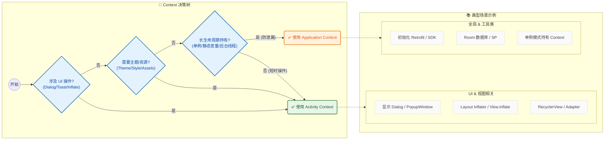

### 内存泄漏场景分析

内存泄漏（Memory Leak）是 Android 开发中最隐蔽也最具破坏力的问题之一。Context 相关的内存泄漏尤为常见，因为 Activity Context 持有大量资源引用（View 树、Window、Theme 等），一旦泄漏，损失的内存往往以 MB 计。

#### 泄漏的本质：引用链阻止 GC

要理解内存泄漏，首先需要理解 Java/Kotlin 的垃圾回收机制。GC 通过**可达性分析**（Reachability Analysis）判断对象是否应该被回收：从 GC Roots（如静态变量、活跃线程的栈帧）出发，所有可达的对象都被视为"存活"，不可达的对象则会被回收。

当一个 Activity 调用 `onDestroy()` 后，它理应变得"不可达"从而被 GC 回收。但如果存在一条从 GC Root 到该 Activity 的引用链，Activity 就无法被回收，这就是内存泄漏。

```kotlin
// 内存泄漏的引用链示意
// GC Root (静态变量) → 单例对象 → Context 字段 → Activity 实例 → View 树 → Bitmap...
//                                                    ↑
//                                            无法被回收！
```

#### 场景一：静态变量持有 Activity Context

这是最经典也最容易犯的错误。静态变量的生命周期与类的 ClassLoader 绑定，在 Android 中几乎等同于进程生命周期。

```kotlin
// ❌ 错误示范：静态变量持有 Activity Context
object BadSingleton {
    // 静态字段，生命周期 = 进程生命周期
    // 一旦被赋值为 Activity Context，该 Activity 永远无法被回收
    private var context: Context? = null
    
    // 这个方法如果传入 Activity Context，就会造成泄漏
    fun init(ctx: Context) {
        context = ctx  // 危险！如果 ctx 是 Activity，泄漏发生
    }
    
    fun doSomething() {
        // 使用 context 进行操作
        context?.getSystemService(Context.CONNECTIVITY_SERVICE)
    }
}

// 在 Activity 中错误地调用
class LeakyActivity : AppCompatActivity() {
    override fun onCreate(savedInstanceState: Bundle?) {
        super.onCreate(savedInstanceState)
        // ❌ 传入 Activity Context，造成泄漏
        BadSingleton.init(this)
    }
    // 即使 Activity 被销毁，BadSingleton.context 仍然持有引用
    // Activity 及其所有 View、Drawable、Bitmap 都无法被回收
}
```

```kotlin
// ✅ 正确做法：使用 Application Context
object GoodSingleton {
    private var context: Context? = null
    
    fun init(ctx: Context) {
        // 关键修复：始终使用 Application Context
        // applicationContext 的生命周期与进程相同，不会造成泄漏
        context = ctx.applicationContext
    }
    
    fun doSomething() {
        context?.getSystemService(Context.CONNECTIVITY_SERVICE)
    }
}

// 或者更安全的写法：在 Application 中初始化
class MyApplication : Application() {
    override fun onCreate() {
        super.onCreate()
        // 在 Application 中初始化，传入的就是 Application Context
        GoodSingleton.init(this)
    }
}
```

#### 场景二：非静态内部类与匿名内部类

在 Java/Kotlin 中，非静态内部类（inner class）会隐式持有外部类的引用。当内部类的实例被长生命周期对象持有时，外部类（通常是 Activity）也会被间接持有，导致泄漏。

```kotlin
// ❌ 错误示范：Handler 内存泄漏（经典案例）
class HandlerLeakActivity : AppCompatActivity() {
    
    // 非静态内部类，隐式持有 HandlerLeakActivity.this 引用
    // Handler 会被 MessageQueue 持有，而 MessageQueue 生命周期很长
    private val handler = object : Handler(Looper.getMainLooper()) {
        override fun handleMessage(msg: Message) {
            // 处理消息
            // 这里可以访问外部类的成员，说明持有外部类引用
            updateUI()
        }
    }
    
    override fun onCreate(savedInstanceState: Bundle?) {
        super.onCreate(savedInstanceState)
        // 发送一个延迟消息，10 秒后执行
        handler.sendEmptyMessageDelayed(0, 10_000)
    }
    
    private fun updateUI() {
        // 更新 UI
    }
    
    // 如果用户在 10 秒内退出 Activity：
    // Message 持有 Handler → Handler 持有 Activity → 泄漏！
    // 直到消息被处理，Activity 才能被回收
}
```

```kotlin
// ✅ 正确做法：使用静态内部类 + 弱引用
class SafeHandlerActivity : AppCompatActivity() {
    
    // 静态内部类，不持有外部类引用
    // 通过 WeakReference 安全地访问 Activity
    private class SafeHandler(activity: SafeHandlerActivity) : Handler(Looper.getMainLooper()) {
        // 弱引用不会阻止 GC 回收 Activity
        private val activityRef = WeakReference(activity)
        
        override fun handleMessage(msg: Message) {
            // 通过弱引用获取 Activity，可能为 null（已被回收）
            val activity = activityRef.get()
            if (activity != null && !activity.isFinishing) {
                // Activity 仍然存活，安全地更新 UI
                activity.updateUI()
            }
            // 如果 activity 为 null，说明已被回收，直接忽略消息
        }
    }
    
    private val handler = SafeHandler(this)
    
    override fun onCreate(savedInstanceState: Bundle?) {
        super.onCreate(savedInstanceState)
        handler.sendEmptyMessageDelayed(0, 10_000)
    }
    
    override fun onDestroy() {
        super.onDestroy()
        // 最佳实践：在 onDestroy 中移除所有待处理消息
        handler.removeCallbacksAndMessages(null)
    }
    
    private fun updateUI() {
        // 更新 UI
    }
}
```

```kotlin
// ✅ 更现代的做法：使用 Lifecycle-aware 组件
class ModernActivity : AppCompatActivity() {
    
    override fun onCreate(savedInstanceState: Bundle?) {
        super.onCreate(savedInstanceState)
        
        // 使用 lifecycleScope，自动在 Activity 销毁时取消协程
        lifecycleScope.launch {
            delay(10_000)  // 延迟 10 秒
            // 如果 Activity 已销毁，这里不会执行
            updateUI()
        }
    }
    
    private fun updateUI() {
        // 更新 UI
    }
}
```

#### 场景三：监听器与回调未注销

注册监听器或回调时，通常会将当前对象（Activity/Fragment）作为监听者传入。如果忘记在适当时机注销，监听器的持有者就会一直持有 Activity 引用。

```kotlin
// ❌ 错误示范：传感器监听器未注销
class SensorLeakActivity : AppCompatActivity(), SensorEventListener {
    
    private lateinit var sensorManager: SensorManager
    
    override fun onCreate(savedInstanceState: Bundle?) {
        super.onCreate(savedInstanceState)
        
        sensorManager = getSystemService(Context.SENSOR_SERVICE) as SensorManager
        val accelerometer = sensorManager.getDefaultSensor(Sensor.TYPE_ACCELEROMETER)
        
        // 注册监听器，SensorManager 会持有 this（Activity）的引用
        sensorManager.registerListener(this, accelerometer, SensorManager.SENSOR_DELAY_NORMAL)
    }
    
    override fun onSensorChanged(event: SensorEvent?) {
        // 处理传感器数据
    }
    
    override fun onAccuracyChanged(sensor: Sensor?, accuracy: Int) {
        // 处理精度变化
    }
    
    // ❌ 忘记在 onDestroy 或 onPause 中注销监听器
    // SensorManager（系统服务，长生命周期）持有 Activity 引用 → 泄漏！
}
```

```kotlin
// ✅ 正确做法：配对注册与注销
class SafeSensorActivity : AppCompatActivity(), SensorEventListener {
    
    private lateinit var sensorManager: SensorManager
    private var accelerometer: Sensor? = null
    
    override fun onCreate(savedInstanceState: Bundle?) {
        super.onCreate(savedInstanceState)
        
        sensorManager = getSystemService(Context.SENSOR_SERVICE) as SensorManager
        accelerometer = sensorManager.getDefaultSensor(Sensor.TYPE_ACCELEROMETER)
    }
    
    override fun onResume() {
        super.onResume()
        // 在 onResume 中注册，确保 Activity 可见时才接收数据
        accelerometer?.let {
            sensorManager.registerListener(this, it, SensorManager.SENSOR_DELAY_NORMAL)
        }
    }
    
    override fun onPause() {
        super.onPause()
        // 在 onPause 中注销，Activity 不可见时停止接收数据
        // 这样即使 Activity 被销毁，也不会泄漏
        sensorManager.unregisterListener(this)
    }
    
    override fun onSensorChanged(event: SensorEvent?) {
        // 处理传感器数据
    }
    
    override fun onAccuracyChanged(sensor: Sensor?, accuracy: Int) {
        // 处理精度变化
    }
}
```

#### 场景四：异步任务持有 Context

AsyncTask（已废弃）、Thread、Runnable 等异步任务如果以非静态内部类形式定义，会持有外部 Activity 的引用。任务执行期间，Activity 无法被回收。

```kotlin
// ❌ 错误示范：异步任务持有 Activity 引用
class AsyncLeakActivity : AppCompatActivity() {
    
    override fun onCreate(savedInstanceState: Bundle?) {
        super.onCreate(savedInstanceState)
        
        // 匿名内部类，隐式持有 AsyncLeakActivity.this
        Thread {
            // 模拟耗时操作，比如网络请求
            Thread.sleep(30_000)  // 30 秒
            
            // 尝试更新 UI（还可能引发崩溃，因为 Activity 可能已销毁）
            runOnUiThread {
                updateUI()
            }
        }.start()
    }
    
    private fun updateUI() {
        // 更新 UI
    }
    
    // 用户在 30 秒内退出 Activity：
    // Thread 持有 Runnable → Runnable 持有 Activity → 泄漏！
}
```

```kotlin
// ✅ 正确做法：使用协程 + lifecycleScope
class SafeAsyncActivity : AppCompatActivity() {
    
    override fun onCreate(savedInstanceState: Bundle?) {
        super.onCreate(savedInstanceState)
        
        // lifecycleScope 会在 Activity 销毁时自动取消协程
        lifecycleScope.launch {
            // 切换到 IO 线程执行耗时操作
            val result = withContext(Dispatchers.IO) {
                // 模拟耗时操作
                delay(30_000)
                "操作完成"
            }
            
            // 自动切回主线程，且只有 Activity 存活时才执行
            updateUI(result)
        }
    }
    
    private fun updateUI(result: String) {
        // 安全地更新 UI
    }
}
```

#### 泄漏检测与防范工具

**LeakCanary**：Square 开源的内存泄漏检测库，能够自动检测 Activity、Fragment、View、ViewModel 的泄漏，并生成详细的引用链报告。

```kotlin
// build.gradle.kts
dependencies {
    // 仅在 debug 构建中启用，release 构建自动禁用
    debugImplementation("com.squareup.leakcanary:leakcanary-android:2.12")
}

// 无需任何代码配置，LeakCanary 会自动初始化并监控泄漏
// 检测到泄漏时，会在通知栏显示提醒，点击可查看详细引用链
```

**Android Studio Profiler**：内置的性能分析工具，可以实时监控内存使用情况，手动触发 GC 并分析堆转储（Heap Dump）。

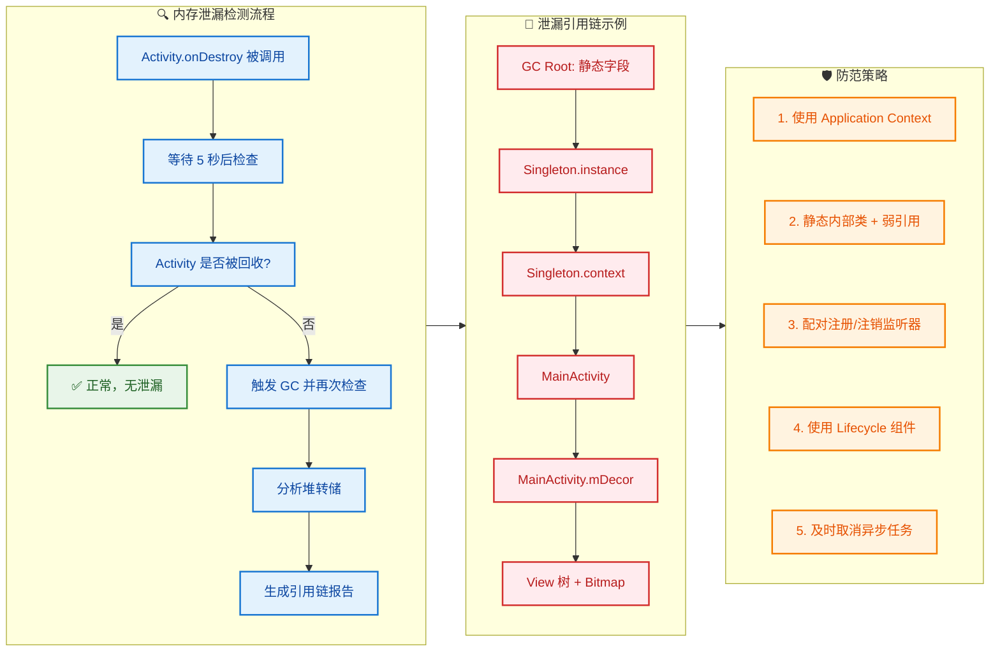

#### 内存泄漏速查表

| 泄漏场景 | 根本原因 | 解决方案 |
|---------|---------|---------|
| 静态变量持有 Activity | 静态变量生命周期 = 进程 | 改用 `applicationContext` |
| Handler 内部类 | 非静态内部类持有外部引用 | 静态内部类 + WeakReference |
| 匿名 Runnable/Callback | 匿名类隐式持有外部引用 | 使用 lifecycleScope 协程 |
| 未注销的监听器 | 系统服务持有 Activity 引用 | onPause/onDestroy 中注销 |
| 单例持有 View | View 持有 Activity Context | 单例不应持有 View 引用 |
| Bitmap 未回收 | 大对象占用内存 | 及时调用 `recycle()` 或使用 Glide |

---

**📝 练习题**

某开发者编写了如下代码，在 Activity 中初始化一个网络请求管理器：

```kotlin
class NetworkManager private constructor(private val context: Context) {
    companion object {
        @Volatile
        private var instance: NetworkManager? = null
        
        fun getInstance(context: Context): NetworkManager {
            return instance ?: synchronized(this) {
                instance ?: NetworkManager(context).also { instance = it }
            }
        }
    }
    
    fun request(url: String) {
        // 使用 context 进行网络请求
    }
}

class MainActivity : AppCompatActivity() {
    override fun onCreate(savedInstanceState: Bundle?) {
        super.onCreate(savedInstanceState)
        NetworkManager.getInstance(this).request("https://api.example.com")
    }
}
```

关于这段代码，以下说法正确的是？

A. 代码没有问题，单例模式使用正确  
B. 会导致内存泄漏，因为单例持有了 Activity Context  
C. 会导致内存泄漏，但只有在 Activity 被销毁后才会发生  
D. 不会导致内存泄漏，因为 Kotlin 的 companion object 不是静态的  

**【答案】** B

**【解析】** 这段代码存在典型的内存泄漏问题。`NetworkManager` 是一个单例，其生命周期与进程相同。当 `MainActivity` 调用 `getInstance(this)` 时，传入的是 Activity Context（`this`），单例的 `context` 字段会一直持有这个 Activity 的引用。即使 Activity 被销毁（用户按返回键退出），由于单例仍然持有引用，Activity 无法被垃圾回收，从而导致内存泄漏。

正确的做法是在 `NetworkManager` 构造时使用 `context.applicationContext`：

```kotlin
NetworkManager(context.applicationContext).also { instance = it }
```

选项 C 的说法不够准确——泄漏从 `getInstance(this)` 被调用的那一刻就已经"埋下"了，只是在 Activity 销毁后才"显现"出来。选项 D 是错误的，Kotlin 的 `companion object` 在 JVM 层面确实会生成静态字段来持有单例实例。

---

## 资源管理 Resources

Android 资源管理系统是应用开发中最基础却又最容易被忽视的核心机制之一。当我们在代码中写下 `R.drawable.icon` 或在 XML 中引用 `@string/app_name` 时，背后其实隐藏着一套精密的资源编译、索引与运行时加载体系。理解这套机制，不仅能帮助我们写出更高效的代码，还能在遇到资源加载异常、多渠道打包、动态换肤等复杂场景时游刃有余。

资源管理的核心设计哲学是 **"代码与资源分离"（Separation of Code and Resources）**。这种分离带来了三大优势：首先，非开发人员（如设计师、翻译）可以独立修改资源而无需触碰代码；其次，系统可以根据设备配置（屏幕密度、语言、方向等）自动选择最合适的资源变体；最后，资源的集中管理使得国际化、主题切换等需求变得简单可控。

### res 目录结构

Android 项目的 `res` 目录是所有应用资源的"家"，它采用 **严格的目录命名约定** 来组织不同类型的资源。这种约定不是随意设计的，而是与 Android 资源编译器（AAPT/AAPT2）和运行时资源加载器紧密配合的结果。

```
res/
├── drawable/                 # 通用图片资源（XML drawable 或位图）
├── drawable-hdpi/            # 高密度屏幕专用图片（~240dpi）
├── drawable-xhdpi/           # 超高密度屏幕专用图片（~320dpi）
├── drawable-xxhdpi/          # 超超高密度屏幕专用图片（~480dpi）
├── drawable-xxxhdpi/         # 超超超高密度屏幕专用图片（~640dpi）
├── drawable-night/           # 深色模式专用图片
├── mipmap-hdpi/              # 启动图标（hdpi 密度）
├── mipmap-xhdpi/             # 启动图标（xhdpi 密度）
├── layout/                   # 默认布局文件
├── layout-land/              # 横屏布局
├── layout-sw600dp/           # 最小宽度 600dp 设备布局（平板）
├── layout-w820dp/            # 可用宽度 820dp 时的布局
├── values/                   # 默认值资源（strings, colors, dimens, styles）
├── values-zh-rCN/            # 简体中文字符串
├── values-night/             # 深色模式颜色/样式
├── values-v31/               # Android 12 (API 31) 专用值
├── anim/                     # 补间动画（Tween Animation）
├── animator/                 # 属性动画（Property Animation）
├── color/                    # 颜色状态列表（ColorStateList）
├── menu/                     # 菜单定义
├── xml/                      # 任意 XML 配置（如 network_security_config）
├── raw/                      # 原始文件（音频、视频等，保持原样不编译）
├── font/                     # 字体文件（TTF/OTF）
└── navigation/               # Navigation 组件的导航图
```

**目录命名的深层含义**

每个资源目录名都遵循 `<resource_type>[-<qualifier>]` 的格式。`resource_type` 决定了资源的类型和访问方式，而 `qualifier`（限定符）则告诉系统这个资源适用于什么配置。理解这一点非常重要：**目录名不是给人看的标签，而是给资源系统的指令**。

以 `drawable-zh-rCN-night-xxhdpi` 为例，这个目录名包含了三个限定符：语言区域（zh-rCN）、UI 模式（night）和屏幕密度（xxhdpi）。系统会在运行时根据设备当前配置，从所有候选目录中选择最匹配的资源。

**drawable 与 mipmap 的区别**

这是一个常见的困惑点。从 Android 4.3 开始，Google 建议将 **应用启动图标** 放在 `mipmap` 目录，而其他图片资源放在 `drawable` 目录。原因在于：当用户在 Launcher 中查看应用图标时，Launcher 可能运行在与应用不同的密度配置下。`mipmap` 目录中的资源在 APK 构建时 **不会被密度分包（density split）剥离**，确保 Launcher 总能找到合适密度的图标。而 `drawable` 资源在启用密度分包时，非当前密度的变体会被移除以减小 APK 体积。

**values 目录的特殊性**

`values` 目录与其他资源目录有本质区别。`drawable`、`layout` 等目录中的每个文件都是一个独立资源，文件名即资源名。但 `values` 目录中的 XML 文件只是 **容器**，真正的资源是文件内部定义的各个条目。这意味着你可以把所有字符串放在一个 `strings.xml` 中，也可以按功能拆分成 `strings_login.xml`、`strings_settings.xml` 等多个文件——对资源系统来说没有区别。

```xml
<!-- res/values/strings.xml -->
<!-- 文件名 strings.xml 只是约定俗成，你可以叫任何名字 -->
<resources>
    <!-- 每个 <string> 标签定义一个字符串资源 -->
    <!-- name 属性才是真正的资源标识符 -->
    <string name="app_name">我的应用</string>
    
    <!-- 支持基本 HTML 格式化标签 -->
    <string name="welcome_message">欢迎使用 <b>Android</b> 开发指南</string>
    
    <!-- 使用 CDATA 或转义处理特殊字符 -->
    <string name="terms">请阅读我们的 \"服务条款\"</string>
</resources>
```

```xml
<!-- res/values/colors.xml -->
<resources>
    <!-- 颜色值支持多种格式 -->
    <color name="primary">#6200EE</color>           <!-- RGB -->
    <color name="primary_variant">#3700B3</color>   <!-- RGB -->
    <color name="on_primary">#FFFFFF</color>        <!-- RGB -->
    <color name="surface">#FFFFFFFF</color>         <!-- ARGB（带透明度） -->
    <color name="divider">#1F000000</color>         <!-- 12% 不透明度的黑色 -->
</resources>
```

```xml
<!-- res/values/dimens.xml -->
<resources>
    <!-- dp: 密度无关像素，用于布局尺寸 -->
    <dimen name="margin_standard">16dp</dimen>
    
    <!-- sp: 缩放无关像素，用于文字大小（会响应系统字体缩放设置） -->
    <dimen name="text_body">14sp</dimen>
    
    <!-- px: 实际像素，极少使用（不推荐） -->
    <dimen name="divider_height">1px</dimen>
</resources>
```

### R 文件生成

当我们在代码中写下 `R.string.app_name` 时，这个 `R` 类从何而来？它是如何将人类可读的资源名映射到系统可识别的整数 ID 的？理解 R 文件的生成机制，是深入掌握 Android 资源系统的关键一步。

**AAPT2 编译流程**

Android Asset Packaging Tool 2（AAPT2）是负责资源编译的核心工具。与前代 AAPT 相比，AAPT2 采用了 **增量编译** 策略，将资源处理分为两个阶段：

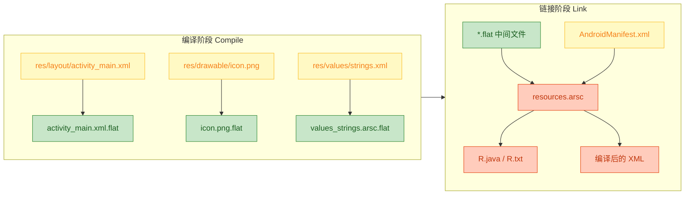

**编译阶段（Compile）** 将每个资源文件独立编译成 `.flat` 格式的中间文件。这种设计的精妙之处在于：当你只修改了一个布局文件时，AAPT2 只需重新编译这一个文件，而不是整个 `res` 目录。`.flat` 文件是一种二进制格式，包含了资源的预处理结果和元数据。

**链接阶段（Link）** 将所有 `.flat` 文件合并，生成最终的 `resources.arsc`（资源索引表）和 `R.java`。这个阶段会进行资源 ID 分配、引用解析、配置匹配表构建等关键工作。

**资源 ID 的结构**

每个资源都被分配一个 32 位整数 ID，这个 ID 的结构大有讲究：

```kotlin
// 资源 ID 的位结构示意
// 0xPPTTEEEE
// PP: Package ID (8 bits) - 包标识符
// TT: Type ID (8 bits)    - 类型标识符  
// EEEE: Entry ID (16 bits) - 条目标识符

// 示例：R.string.app_name = 0x7F040001
// 0x7F = 127 (应用资源包，系统资源包是 0x01)
// 0x04 = 4   (string 类型在该应用中的类型 ID)
// 0x0001 = 1 (app_name 是 string 类型中的第 1 个条目)

object ResourceIdDecoder {
    // 解析资源 ID 的各个组成部分
    fun decode(resourceId: Int) {
        // 右移 24 位，取最高 8 位作为包 ID
        val packageId = (resourceId shr 24) and 0xFF
        // 右移 16 位，取中间 8 位作为类型 ID
        val typeId = (resourceId shr 16) and 0xFF
        // 取最低 16 位作为条目 ID
        val entryId = resourceId and 0xFFFF
        
        println("Package ID: 0x${packageId.toString(16).uppercase()}")
        println("Type ID: 0x${typeId.toString(16).uppercase()}")
        println("Entry ID: 0x${entryId.toString(16).uppercase()}")
    }
}
```

**Package ID** 的设计支持多个资源包共存。应用自身资源的 Package ID 是 `0x7F`，Android 系统资源是 `0x01`，而 Runtime Resource Overlay（RRO）等机制可以使用其他 Package ID。这种设计使得资源 ID 在整个系统范围内保持唯一。

**生成的 R.java 结构**

```java
// 由 AAPT2 自动生成，位于 build/generated/source/r/
// 切勿手动修改此文件
public final class R {
    // 每种资源类型对应一个静态内部类
    public static final class string {
        // 每个资源对应一个静态常量
        // 值为 AAPT2 分配的资源 ID
        public static final int app_name = 0x7f040001;
        public static final int welcome_message = 0x7f040002;
        // ... 更多字符串资源
    }
    
    public static final class drawable {
        public static final int icon = 0x7f020001;
        public static final int background = 0x7f020002;
        // ... 更多图片资源
    }
    
    public static final class layout {
        public static final int activity_main = 0x7f030001;
        public static final int fragment_home = 0x7f030002;
        // ... 更多布局资源
    }
    
    public static final class id {
        // View ID 也是资源的一种
        public static final int button_submit = 0x7f050001;
        public static final int text_title = 0x7f050002;
        // ... 更多 View ID
    }
    
    public static final class styleable {
        // 自定义属性集合（用于自定义 View）
        public static final int[] CustomView = { 0x7f060001, 0x7f060002 };
        public static final int CustomView_customColor = 0;
        public static final int CustomView_customSize = 1;
    }
}
```

**Library 模块的 R 文件特殊性**

在 Android 库模块（Library Module）中，R 文件的字段 **不是 final 的**。这是一个重要的设计决策：

```java
// App 模块的 R.java - 字段是 final
public static final int app_name = 0x7f040001;

// Library 模块的 R.java - 字段不是 final
public static int app_name = 0x7f040001;
```

为什么要这样设计？因为库模块在编译时并不知道最终会被哪个应用集成，也不知道应用中还有哪些其他资源。当库被集成到应用中时，所有资源会被重新编号以避免 ID 冲突。如果库的 R 字段是 `final` 的，Java 编译器会在编译时将其内联（inline）到使用处，导致运行时 ID 不匹配。

这也解释了为什么 **在库模块中不能用 `switch-case` 语句处理资源 ID**——`case` 标签要求编译时常量，而非 `final` 字段不满足这个条件：

```kotlin
// 在 Library 模块中，这段代码会编译失败
when (view.id) {
    R.id.button_a -> { /* ... */ }  // 错误：R.id.button_a 不是常量
    R.id.button_b -> { /* ... */ }
}

// 正确做法：使用 if-else 链
if (view.id == R.id.button_a) {
    // 处理 button_a
} else if (view.id == R.id.button_b) {
    // 处理 button_b
}
```

**资源索引表 resources.arsc**

`resources.arsc` 是资源系统的核心数据结构，它是一个高度优化的二进制文件，包含了所有资源的索引信息。可以把它想象成一个多维查找表：

```
resources.arsc 逻辑结构
┌─────────────────────────────────────────────────────────────┐
│                     Package Header                          │
│  (包名、类型字符串池、资源名字符串池)                           │
├─────────────────────────────────────────────────────────────┤
│                     Type Spec: string                       │
│  (标记每个 string 资源在哪些配置下有变体)                       │
├─────────────────────────────────────────────────────────────┤
│  Type: string (default)     │  Type: string (zh-rCN)        │
│  ┌─────────┬──────────────┐ │  ┌─────────┬────────────────┐ │
│  │ Entry 0 │ "My App"     │ │  │ Entry 0 │ "我的应用"      │ │
│  │ Entry 1 │ "Settings"   │ │  │ Entry 1 │ "设置"          │ │
│  │ Entry 2 │ "Cancel"     │ │  │ Entry 2 │ "取消"          │ │
│  └─────────┴──────────────┘ │  └─────────┴────────────────┘ │
├─────────────────────────────────────────────────────────────┤
│                     Type Spec: drawable                     │
├─────────────────────────────────────────────────────────────┤
│  Type: drawable (hdpi)      │  Type: drawable (xhdpi)       │
│  ┌─────────┬──────────────┐ │  ┌─────────┬────────────────┐ │
│  │ Entry 0 │ res/draw...  │ │  │ Entry 0 │ res/draw...    │ │
│  └─────────┴──────────────┘ │  └─────────┴────────────────┘ │
└─────────────────────────────────────────────────────────────┘
```

当运行时需要加载资源时，系统会：
1. 根据资源 ID 的 Type ID 定位到对应的类型区块
2. 根据 Entry ID 定位到具体条目
3. 根据当前设备配置，在该条目的多个配置变体中选择最佳匹配
4. 返回资源值（对于简单类型如 string）或资源文件路径（对于复杂类型如 drawable）

### AssetManager 加载原理

`AssetManager` 是 Android 资源加载的核心引擎。无论是通过 `Resources.getString()` 获取字符串，还是通过 `LayoutInflater` 加载布局，底层都依赖 `AssetManager` 来完成实际的资源读取工作。

**AssetManager 的双重职责**

`AssetManager` 实际上管理两类资源：

1. **编译型资源（Compiled Resources）**：存放在 `res/` 目录下，经过 AAPT2 编译，通过 R 文件引用。这类资源会被索引到 `resources.arsc` 中。

2. **原始资源（Raw Assets）**：存放在 `assets/` 目录下，保持原始文件格式不变，通过文件路径字符串访问。这类资源不会生成 R 文件条目。

```kotlin
class ResourceLoadingExample(private val context: Context) {
    
    // 加载编译型资源 - 通过 Resources 类
    fun loadCompiledResources() {
        // Resources 是 AssetManager 的高级封装
        val resources: Resources = context.resources
        
        // 获取字符串资源
        // 内部流程：R.string.app_name -> resources.arsc 查表 -> 返回字符串值
        val appName: String = resources.getString(R.string.app_name)
        
        // 获取带格式化参数的字符串
        // strings.xml: <string name="welcome">欢迎, %1$s! 您有 %2$d 条消息</string>
        val welcome: String = resources.getString(R.string.welcome, "张三", 5)
        
        // 获取颜色值
        // 返回解析后的 ARGB 整数值
        val primaryColor: Int = resources.getColor(R.color.primary, context.theme)
        
        // 获取尺寸值
        // getDimension(): 返回精确的像素值（float）
        // getDimensionPixelSize(): 返回四舍五入的像素值（int）
        // getDimensionPixelOffset(): 返回截断的像素值（int）
        val marginPx: Float = resources.getDimension(R.dimen.margin_standard)
        
        // 获取 Drawable
        // 系统会根据当前屏幕密度自动选择合适的变体
        val icon: Drawable? = resources.getDrawable(R.drawable.icon, context.theme)
    }
    
    // 加载原始资源 - 通过 AssetManager 直接访问
    fun loadRawAssets() {
        // 获取 AssetManager 实例
        val assetManager: AssetManager = context.assets
        
        // 列出 assets 目录下的文件
        // assets/fonts/ 目录下的所有文件名
        val fontFiles: Array<String>? = assetManager.list("fonts")
        
        // 打开 assets 文件获取输入流
        // 路径相对于 assets/ 目录，不需要以 "/" 开头
        val inputStream: InputStream = assetManager.open("config/settings.json")
        
        // 读取 JSON 配置文件示例
        val jsonContent = inputStream.bufferedReader().use { reader ->
            reader.readText()  // 读取全部内容为字符串
        }
        
        // 访问模式选项
        // ACCESS_UNKNOWN: 默认模式，系统自动选择
        // ACCESS_RANDOM: 随机访问，适合需要 seek 的场景
        // ACCESS_STREAMING: 顺序流式读取
        // ACCESS_BUFFER: 尝试将整个文件加载到内存缓冲区
        val streamForRandom = assetManager.open("data/large_file.dat", AssetManager.ACCESS_RANDOM)
    }
    
    // res/raw/ 与 assets/ 的区别
    fun compareRawAndAssets() {
        // res/raw/ 目录：
        // - 文件会被分配资源 ID，可通过 R.raw.xxx 访问
        // - 文件名成为资源名（不含扩展名）
        // - 不支持子目录结构
        val rawStream: InputStream = context.resources.openRawResource(R.raw.sample_audio)
        
        // assets/ 目录：
        // - 没有资源 ID，只能通过路径字符串访问
        // - 支持任意深度的子目录结构
        // - 更灵活，适合存放大量配置文件、游戏资源等
        val assetStream: InputStream = context.assets.open("levels/level1/config.json")
    }
}
```

**Resources 与 AssetManager 的协作关系**

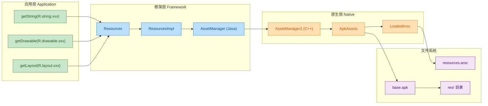

**加载流程深度解析**

当应用调用 `resources.getString(R.string.app_name)` 时，完整的调用链如下：

```kotlin
// 伪代码展示资源加载的内部流程
class ResourceLoadingInternals {
    
    /*
     * 第一步：Resources.getString() 
     * 这是应用层最常用的入口方法
     */
    fun getString(resId: Int): String {
        // Resources 将调用委托给 ResourcesImpl
        // ResourcesImpl 持有真正的 AssetManager 引用
        return resourcesImpl.getAssets().getResourceText(resId).toString()
    }
    
    /*
     * 第二步：AssetManager.getResourceText()
     * Java 层的 AssetManager 主要做参数校验和 JNI 调用
     */
    fun getResourceText(resId: Int): CharSequence {
        // 调用 native 方法进入 C++ 层
        // nativeGetResourceText() 是 JNI 桥接方法
        return nativeGetResourceText(mObject, resId)
    }
    
    /*
     * 第三步：AssetManager2::GetResource() [C++ Native]
     * 这是资源查找的核心逻辑所在
     */
    // native fun GetResource(resId: Int): ResolvedBag {
    //     1. 从 resId 解析出 package_id, type_id, entry_id
    //     2. 在已加载的 ApkAssets 列表中查找对应的包
    //     3. 从 LoadedArsc (解析后的 resources.arsc) 中定位资源条目
    //     4. 根据当前 Configuration 选择最佳匹配的配置变体
    //     5. 返回资源值或资源文件路径
    // }
    
    /*
     * 第四步：配置匹配算法
     * 当同一资源存在多个配置变体时，系统如何选择？
     */
    // 假设设备配置：zh-CN, night, xxhdpi, portrait
    // 候选资源目录：
    //   - values/strings.xml (默认)
    //   - values-zh/strings.xml (中文)
    //   - values-zh-rCN/strings.xml (简体中文)
    //   - values-night/strings.xml (深色模式)
    //   - values-zh-rCN-night/strings.xml (简体中文 + 深色模式)
    
    // 匹配算法会选择 values-zh-rCN-night/strings.xml
    // 因为它匹配了最多的限定符
}
```

**AssetManager 的资源包管理**

一个 `AssetManager` 实例可以管理多个资源包（ApkAssets），这是实现资源覆盖、动态加载的基础：

```kotlin
class AssetManagerConfiguration {
    
    // AssetManager 可以加载多个资源包
    // 后加载的包可以覆盖先加载的包中的同名资源
    fun demonstrateMultipleApkAssets(context: Context) {
        // 系统资源包 (framework-res.apk)
        // 包含 android.R.* 资源，Package ID = 0x01
        
        // 应用资源包 (base.apk)  
        // 包含应用自身资源，Package ID = 0x7F
        
        // 可选：Runtime Resource Overlay (RRO)
        // 用于主题定制、厂商定制等场景
        
        // 可选：动态加载的资源包
        // 如插件化框架加载的插件 APK 资源
    }
    
    // 创建独立的 AssetManager 加载外部资源
    // 常用于插件化、换肤等场景
    @Suppress("DEPRECATION")
    fun loadExternalResources(apkPath: String): Resources? {
        return try {
            // 创建新的 AssetManager 实例
            val assetManager = AssetManager::class.java.newInstance()
            
            // 通过反射调用 addAssetPath 添加外部 APK
            // 注意：这是隐藏 API，在高版本 Android 上可能受限
            val addAssetPath = AssetManager::class.java
                .getDeclaredMethod("addAssetPath", String::class.java)
            addAssetPath.invoke(assetManager, apkPath)
            
            // 基于新的 AssetManager 创建 Resources 实例
            Resources(
                assetManager,
                context.resources.displayMetrics,
                context.resources.configuration
            )
        } catch (e: Exception) {
            e.printStackTrace()
            null
        }
    }
}
```

**资源缓存机制**

为了提高性能，资源系统在多个层级实现了缓存：

```kotlin
// 资源缓存的层级结构
class ResourceCachingLayers {
    
    /*
     * 第一层：ConstantState 缓存 (Drawable)
     * 
     * Drawable 使用 ConstantState 模式共享不可变状态
     * 多个 Drawable 实例可以共享同一个 ConstantState
     * 减少内存占用，加快创建速度
     */
    fun drawableConstantState(resources: Resources) {
        // 第一次加载，创建 ConstantState 并缓存
        val drawable1 = resources.getDrawable(R.drawable.icon, null)
        
        // 第二次加载，复用缓存的 ConstantState
        // 只创建新的 Drawable 壳，内部状态共享
        val drawable2 = resources.getDrawable(R.drawable.icon, null)
        
        // drawable1 和 drawable2 是不同对象
        // 但它们的 constantState 指向同一个实例
        val sameState = drawable1?.constantState === drawable2?.constantState  // true
    }
    
    /*
     * 第二层：TypedArray 缓存池
     * 
     * obtainStyledAttributes() 返回的 TypedArray 来自对象池
     * 使用完毕后必须调用 recycle() 归还到池中
     */
    fun typedArrayPooling(context: Context) {
        // 从池中获取 TypedArray
        val typedArray = context.obtainStyledAttributes(R.styleable.CustomView)
        
        try {
            // 使用 TypedArray 读取属性值
            val color = typedArray.getColor(R.styleable.CustomView_customColor, Color.BLACK)
        } finally {
            // 必须回收！否则造成对象池泄漏
            typedArray.recycle()
        }
    }
    
    /*
     * 第三层：Configuration 缓存
     * 
     * ResourcesImpl 会缓存当前 Configuration 对应的资源查找结果
     * 当 Configuration 变化时（如旋转屏幕），缓存会被清除
     */
    fun configurationCache() {
        // 配置变化时，系统会调用：
        // Resources.updateConfiguration() 
        //   -> ResourcesImpl.updateConfiguration()
        //     -> AssetManager.setConfiguration()
        //       -> 清除旧配置的缓存，建立新配置的查找上下文
    }
}
```

**性能优化建议**

理解了资源加载原理后，我们可以采取一些优化措施：

```kotlin
class ResourceOptimizationTips {
    
    // 1. 避免在循环中重复获取资源
    fun avoidRepeatedLoading(resources: Resources, items: List<Item>) {
        // ❌ 错误：每次迭代都查询资源
        items.forEach { item ->
            val label = resources.getString(R.string.item_label)
            // 使用 label...
        }
        
        // ✅ 正确：提前获取，循环中复用
        val label = resources.getString(R.string.item_label)
        items.forEach { item ->
            // 使用 label...
        }
    }
    
    // 2. 合理使用 Resources 缓存
    fun cacheResourcesReference(context: Context) {
        // ❌ 避免：频繁调用 context.resources
        fun processItem() {
            val res = context.resources  // 每次都获取
            val str1 = res.getString(R.string.a)
            val str2 = context.resources.getString(R.string.b)  // 又获取一次
        }
        
        // ✅ 推荐：保存 Resources 引用
        val resources = context.resources
        fun processItemOptimized() {
            val str1 = resources.getString(R.string.a)
            val str2 = resources.getString(R.string.b)
        }
    }
    
    // 3. 大型 Drawable 考虑异步加载
    suspend fun loadLargeDrawableAsync(resources: Resources): Drawable? {
        return withContext(Dispatchers.IO) {
            // 在 IO 线程解码大图
            resources.getDrawable(R.drawable.large_background, null)
        }
    }
    
    // 4. 使用 ResourcesCompat 获得向后兼容性
    fun useResourcesCompat(context: Context) {
        // ResourcesCompat 会根据 API 级别选择合适的实现
        val drawable = ResourcesCompat.getDrawable(
            context.resources,
            R.drawable.icon,
            context.theme
        )
        
        val color = ResourcesCompat.getColor(
            context.resources,
            R.color.primary,
            context.theme
        )
    }
}
```

---

**📝 练习题**

某 Android 库模块（Library Module）中有如下代码，在集成到主应用后运行时崩溃，报错 `Resources$NotFoundException`。最可能的原因是什么？

```kotlin
// 库模块中的代码
class LibraryHelper(private val context: Context) {
    companion object {
        private const val CACHED_STRING_ID = R.string.library_name  // 编译时值：0x7f040001
    }
    
    fun getLibraryName(): String {
        return context.resources.getString(CACHED_STRING_ID)
    }
}
```

A. 库模块不能使用 Context 获取资源
B. companion object 中不能引用 R 文件
C. 库模块的 R 文件字段非 final，编译时内联的 ID 值在运行时已失效
D. getString() 方法在库模块中不可用

**【答案】** C

**【解析】** 这道题考查的是库模块 R 文件的特殊性。在 Android 库模块中，R 文件的字段 **不是 `final` 的**，因为库在编译时无法确定最终的资源 ID（资源 ID 会在与主应用合并时重新分配）。

然而，当我们在 `companion object`（或 Java 的 `static final` 字段）中使用 `R.string.library_name` 时，Kotlin/Java 编译器会尝试在编译时确定这个值。由于库模块的 R 字段不是 `final`，编译器会记录 **编译时的临时值**（如 `0x7f040001`）。

当库被集成到主应用后，AAPT2 会重新为所有资源分配 ID，`library_name` 的实际 ID 可能变成了 `0x7f040023`。但 `CACHED_STRING_ID` 仍然持有旧值 `0x7f040001`，导致运行时找不到对应资源。

正确做法是避免在编译时常量中缓存资源 ID，而是在运行时动态获取：

```kotlin
fun getLibraryName(): String {
    return context.resources.getString(R.string.library_name)  // 运行时解析
}
```

---

## 资源限定符与适配

在 Android 应用开发中，**资源限定符 (Resource Qualifiers)** 是实现多设备、多场景适配的核心机制。它允许开发者为不同的设备配置（屏幕密度、语言、屏幕方向、系统主题等）提供专门的资源文件，而 Android 系统会在运行时根据当前设备的配置自动选择最合适的资源。这套机制的设计哲学是 **"一次编写，到处适配"**，开发者无需在代码中编写大量的条件判断，只需按照规范组织资源目录即可。

资源限定符本质上是一套 **命名约定**，通过在资源目录名称中添加特定的后缀标识来区分不同的配置场景。例如 `drawable-hdpi` 表示高密度屏幕的图片资源，`values-zh-rCN` 表示简体中文的字符串资源。当应用请求某个资源时，Android Framework 会根据当前设备的 **Configuration 对象** 执行一套复杂的匹配算法，找到最符合当前配置的资源文件。这个过程完全透明，开发者在代码中只需通过 `R.drawable.icon` 这样的引用方式即可，系统会自动处理适配逻辑。

### 资源限定符的语法规则

资源限定符必须遵循严格的 **命名顺序和格式规范**，这是 Android 资源系统能够正确解析和匹配的前提。一个完整的资源目录名称由 **基础类型** 和 **零个或多个限定符** 组成，格式为：

```
<resources_type>[-<qualifier1>][-<qualifier2>][-...]
```

例如 `drawable-zh-rCN-hdpi-night` 就包含了多个限定符：语言区域（`zh-rCN`）、屏幕密度（`hdpi`）、深色模式（`night`）。需要特别注意的是，**限定符的顺序是固定的**，不能随意排列。Android 官方文档定义了一套优先级顺序，从高到低依次为：

1. MCC 和 MNC（移动国家代码和移动网络代码）
2. 语言和区域（Language and Region）
3. 布局方向（Layout Direction）：`ldrtl`（从右到左）、`ldltr`（从左到右）
4. 最小宽度（Smallest Width）：`sw<N>dp`
5. 可用宽度（Available Width）：`w<N>dp`
6. 可用高度（Available Height）：`h<N>dp`
7. 屏幕尺寸（Screen Size）：`small`、`normal`、`large`、`xlarge`
8. 屏幕纵横比（Screen Aspect）：`long`、`notlong`
9. 圆形屏幕（Round Screen）：`round`、`notround`
10. 广色域（Wide Color Gamut）：`widecg`、`nowidecg`
11. 高动态范围（HDR）：`highdr`、`lowdr`
12. 屏幕方向（Orientation）：`port`（竖屏）、`land`（横屏）
13. UI 模式（UI Mode）：`car`、`desk`、`television`、`appliance`、`watch`、`vrheadset`
14. 夜间模式（Night Mode）：`night`、`notnight`
15. 屏幕像素密度（Screen Density）：`ldpi`、`mdpi`、`hdpi`、`xhdpi`、`xxhdpi`、`xxxhdpi`、`nodpi`、`tvdpi`、`anydpi`
16. 触摸屏类型（Touchscreen Type）：`notouch`、`finger`
17. 键盘可用性（Keyboard Availability）：`keysexposed`、`keyshidden`、`keyssoft`
18. 主要文本输入法（Primary Text Input Method）：`nokeys`、`qwerty`、`12key`
19. 导航键可用性（Navigation Key Availability）：`navexposed`、`navhidden`
20. 主要非触摸导航方法（Primary Non-touch Navigation）：`nonav`、`dpad`、`trackball`、`wheel`
21. 平台版本（API Level）：`v<API>`

这套顺序看似复杂，但实际开发中常用的只有前几项。**顺序错误会导致资源目录无法被识别**，例如 `drawable-night-hdpi-zh` 是非法的，正确的写法应该是 `drawable-zh-night-hdpi`（语言 → 夜间模式 → 密度）。

### 屏幕密度 dpi 适配

**屏幕密度 (Screen Density)** 是 Android 多屏适配中最重要的概念之一。它指的是每英寸包含的像素数量（Dots Per Inch，简称 dpi），决定了屏幕的显示精细程度。同样尺寸的屏幕，dpi 越高，显示越细腻，但同样大小的图片在高 dpi 屏幕上会显得更小。为了确保 UI 元素在不同密度的屏幕上保持一致的物理尺寸，Android 引入了 **密度独立像素 (Density-independent Pixel, dp)** 的概念。

#### 密度档位与 dp 换算

Android 定义了六个标准密度档位，每个档位对应不同的 dpi 范围和 dp 转换比例：

| 密度标识 | DPI 范围 | 缩放因子 | 1dp 对应像素 | 典型设备 |
|---------|---------|---------|-------------|---------|
| ldpi | ~120 dpi | 0.75 | 0.75px | 极少见（已淘汰）|
| mdpi | ~160 dpi | 1.0 | 1px | 低端设备基准 |
| hdpi | ~240 dpi | 1.5 | 1.5px | 中低端手机 |
| xhdpi | ~320 dpi | 2.0 | 2px | 主流手机 |
| xxhdpi | ~480 dpi | 3.0 | 3px | 高端手机 |
| xxxhdpi | ~640 dpi | 4.0 | 4px | 超高端设备 |

缩放因子（Scale Factor）是相对于 mdpi 的比例。例如在 xhdpi 设备上，1dp = 2px，这意味着一个 48dp × 48dp 的图标实际需要 96px × 96px 的图片资源。Android 系统通过 `DisplayMetrics` 类提供当前设备的密度信息：

```kotlin
// 获取当前设备的屏幕密度信息
val displayMetrics: DisplayMetrics = resources.displayMetrics

// density: 密度缩放因子（相对于 mdpi 的比例，如 2.0 表示 xhdpi）
val density: Float = displayMetrics.density

// densityDpi: 实际的 dpi 值（如 320 表示 xhdpi）
val densityDpi: Int = displayMetrics.densityDpi

// scaledDensity: 文字缩放因子（受系统字体大小设置影响）
val scaledDensity: Float = displayMetrics.scaledDensity

// 手动进行 dp 到 px 的转换
fun Int.dp(): Int {
    return (this * density + 0.5f).toInt() // +0.5f 是为了四舍五入
}

// 示例：将 48dp 转换为像素值
val iconSizePx = 48.dp() // 在 xhdpi 设备上结果是 96px
```

#### 图片资源的多密度适配

为了在不同密度的屏幕上显示清晰的图片，开发者需要为同一张图片提供多个分辨率版本。假设设计稿基于 mdpi（160dpi），一个 48px × 48px 的图标需要准备以下版本：

```
res/
├── drawable-mdpi/
│   └── ic_launcher.png      # 48px × 48px (基准)
├── drawable-hdpi/
│   └── ic_launcher.png      # 72px × 72px (48 × 1.5)
├── drawable-xhdpi/
│   └── ic_launcher.png      # 96px × 96px (48 × 2.0)
├── drawable-xxhdpi/
│   └── ic_launcher.png      # 144px × 144px (48 × 3.0)
└── drawable-xxxhdpi/
    └── ic_launcher.png      # 192px × 192px (48 × 4.0)
```

当代码中引用 `R.drawable.ic_launcher` 时，系统会根据当前设备密度自动选择最合适的版本。如果某个密度档位的资源缺失，Android 会选择 **最接近的密度资源** 并进行缩放。例如在 xxhdpi 设备上，如果没有 `drawable-xxhdpi` 版本，系统会优先尝试 xhdpi 资源（放大 1.5 倍），其次是 xxxhdpi 资源（缩小 0.75 倍）。

**特殊密度标识**：
- **`nodpi`**：资源不应被缩放，无论设备密度如何都使用原始尺寸（适用于预渲染的位图）。
- **`anydpi`**：优先级高于所有密度限定符，通常用于矢量图（Vector Drawable），因为矢量图可以无损缩放。
- **`tvdpi`**：用于电视设备（~213dpi），介于 mdpi 和 hdpi 之间。

#### 使用 Vector Drawable 减少资源体积

传统位图需要为每个密度档位准备独立的 PNG 文件，导致 APK 体积膨胀。Android 5.0（API 21）引入了 **Vector Drawable**，使用 XML 格式定义基于路径的矢量图，可以无损缩放到任意尺寸，且文件体积极小。

```xml
<!-- res/drawable/ic_heart.xml -->
<!-- 使用 Vector Drawable 定义一个心形图标 -->
<vector xmlns:android="http://schemas.android.com/apk/res/android"
    android:width="24dp"
    android:height="24dp"
    android:viewportWidth="24"
    android:viewportHeight="24">
    
    <!-- 定义心形的路径数据（SVG Path 语法） -->
    <path
        android:fillColor="#FF4081"
        android:pathData="M12,21.35l-1.45,-1.32C5.4,15.36 2,12.28 2,8.5 2,5.42 4.42,3 7.5,3c1.74,0 3.41,0.81 4.5,2.09C13.09,3.81 14.76,3 16.5,3 19.58,3 22,5.42 22,8.5c0,3.78 -3.4,6.86 -8.55,11.54L12,21.35z"/>
</vector>
```

Vector Drawable 只需放在 `drawable/` 目录下（不带密度限定符），系统会自动处理缩放。对于需要兼容 Android 4.4 及以下版本的应用，可以使用 `VectorDrawableCompat` 或在构建时通过 Gradle 生成对应的 PNG 资源：

```kotlin
// build.gradle (Module)
android {
    defaultConfig {
        // 为低版本设备自动生成 PNG（已废弃，推荐使用 VectorDrawableCompat）
        vectorDrawables.useSupportLibrary = true
    }
}
```

### 语言区域 locale 适配

**语言区域 (Locale)** 限定符用于实现应用的国际化（i18n）和本地化（l10n）。它由 **语言代码** 和可选的 **区域代码** 组成，格式为 `<language>-r<region>`，例如：

- `zh`：中文（不区分简繁）
- `zh-rCN`：简体中文（中国大陆）
- `zh-rTW`：繁体中文（台湾）
- `zh-rHK`：繁体中文（香港）
- `en`：英语（不区分国家）
- `en-rUS`：美式英语
- `en-rGB`：英式英语

语言代码遵循 ISO 639-1 标准（如 `zh`、`en`、`ja`），区域代码遵循 ISO 3166-1-alpha-2 标准（如 `CN`、`US`、`JP`）。注意区域代码前的 `r` 是必需的，用于区分语言和区域部分。

#### 字符串资源的多语言配置

最常见的本地化场景是为不同语言提供翻译后的字符串资源。以一个简单的问候语为例：

```
res/
├── values/                  # 默认语言（通常是英语）
│   └── strings.xml
├── values-zh/               # 中文（简繁通用）
│   └── strings.xml
├── values-zh-rCN/           # 简体中文（大陆）
│   └── strings.xml
├── values-zh-rTW/           # 繁体中文（台湾）
│   └── strings.xml
└── values-ja/               # 日语
    └── strings.xml
```

**默认 strings.xml（values/）**：
```xml
<resources>
    <!-- 默认语言资源（英语），当系统语言不匹配任何限定符时使用 -->
    <string name="app_name">MyApp</string>
    <string name="greeting">Hello, welcome to our app!</string>
    <string name="item_count">You have %d items in your cart.</string>
</resources>
```

**简体中文 strings.xml（values-zh-rCN/）**：
```xml
<resources>
    <!-- 简体中文资源 -->
    <string name="app_name">我的应用</string>
    <string name="greeting">你好，欢迎使用我们的应用！</string>
    <string name="item_count">您的购物车中有 %d 件商品。</string>
</resources>
```

在代码中直接通过 `getString()` 获取字符串，系统会根据当前设备的语言设置自动选择对应版本：

```kotlin
// 获取当前语言环境下的字符串资源
val greeting = getString(R.string.greeting) 
// 如果设备语言是简体中文，greeting 的值为 "你好，欢迎使用我们的应用！"
// 如果设备语言是英语或其他未匹配的语言，使用默认的 "Hello, welcome to our app!"

// 带占位符的字符串格式化
val count = 5
val message = getString(R.string.item_count, count) 
// 简体中文环境下结果为 "您的购物车中有 5 件商品。"
```

#### 动态切换语言

某些应用需要支持用户手动选择界面语言，而不依赖系统设置。Android 提供了两种方式动态修改 Locale：

**方式一：修改 Application Context 的配置（全局生效，API 17+）**：
```kotlin
import android.content.Context
import android.content.res.Configuration
import android.os.Build
import java.util.Locale

/**
 * 为应用设置自定义语言环境
 * @param context 应用上下文
 * @param language 语言代码（如 "zh", "en"）
 * @param country 区域代码（如 "CN", "US"），可选
 */
fun setAppLocale(context: Context, language: String, country: String? = null) {
    // 创建新的 Locale 对象
    val locale = if (country != null) {
        Locale(language, country) // 如 Locale("zh", "CN")
    } else {
        Locale(language) // 如 Locale("en")
    }
    
    // 设置为默认 Locale（影响格式化 API，如日期、数字格式）
    Locale.setDefault(locale)
    
    // 获取当前的 Configuration 对象
    val config = Configuration(context.resources.configuration)
    
    // 根据 API 版本选择不同的设置方法
    if (Build.VERSION.SDK_INT >= Build.VERSION_CODES.N) {
        // API 24+: 使用 LocaleList 支持多语言回退
        config.setLocale(locale)
    } else {
        // API 17-23: 直接设置 locale 字段
        @Suppress("DEPRECATION")
        config.locale = locale
    }
    
    // 更新 Resources 的配置（触发资源重新加载）
    @Suppress("DEPRECATION")
    context.resources.updateConfiguration(config, context.resources.displayMetrics)
}

// 使用示例：切换到简体中文
setAppLocale(applicationContext, "zh", "CN")

// 切换后需要重启 Activity 才能完全生效
recreate() // 重建当前 Activity
```

**方式二：使用 AppCompatDelegate（推荐，兼容性更好）**：
```kotlin
import androidx.appcompat.app.AppCompatDelegate
import androidx.core.os.LocaleListCompat

/**
 * 使用 AppCompat 库设置应用语言
 * 优势：自动处理配置变更，无需手动重启 Activity
 */
fun setAppLocaleCompat(language: String, country: String? = null) {
    val locale = if (country != null) {
        Locale(language, country)
    } else {
        Locale(language)
    }
    
    // 创建 LocaleList（支持多语言回退机制）
    val localeList = LocaleListCompat.create(locale)
    
    // 应用到整个应用（会自动触发 Activity 重建）
    AppCompatDelegate.setApplicationLocales(localeList)
}

// 使用示例
setAppLocaleCompat("zh", "CN") // 自动重建所有 Activity
```

#### 布局方向适配（RTL 支持）

阿拉伯语、希伯来语等语言的阅读习惯是从右到左（Right-to-Left, RTL），Android 4.2（API 17）开始支持 RTL 布局自动镜像。开发者需要在 `AndroidManifest.xml` 中启用 RTL 支持：

```xml
<application
    android:supportsRtl="true"
    ...>
</application>
```

然后在布局文件中使用 **相对方向属性** 替代绝对方向属性：

| 绝对方向（不推荐） | 相对方向（推荐） | 说明 |
|------------------|----------------|------|
| `layout_marginLeft` | `layout_marginStart` | 起始边距（LTR 时为左，RTL 时为右）|
| `layout_marginRight` | `layout_marginEnd` | 结束边距（LTR 时为右，RTL 时为左）|
| `paddingLeft` | `paddingStart` | 起始内边距 |
| `paddingRight` | `paddingEnd` | 结束内边距 |
| `gravity="left"` | `gravity="start"` | 内容对齐方式 |
| `gravity="right"` | `gravity="end"` | 内容对齐方式 |

系统会根据当前语言自动镜像布局，无需编写额外代码。对于不应被镜像的资源（如品牌 Logo），可以放在 `drawable-ldrtl/` 目录下提供专门的 RTL 版本。

### 深色模式 night 适配

**深色模式 (Dark Mode)** 在 Android 10（API 29）正式引入，通过 `night` 限定符实现主题的自动切换。深色模式不仅能减轻眼睛疲劳、节省 OLED 屏幕电量，还能提升夜间使用体验。系统级深色模式的状态保存在 `Configuration.uiMode` 字段的 `UI_MODE_NIGHT_MASK` 位中。

#### 为深色模式提供资源

最常见的场景是为深色模式提供不同的颜色值。以下是典型的目录结构：

```
res/
├── values/                  # 默认（浅色模式）
│   ├── colors.xml
│   └── themes.xml
└── values-night/            # 深色模式
    ├── colors.xml
    └── themes.xml
```

**默认 colors.xml（values/）**：
```xml
<resources>
    <!-- 浅色模式下的颜色定义 -->
    <color name="background">#FFFFFF</color>         <!-- 白色背景 -->
    <color name="text_primary">#000000</color>       <!-- 黑色文字 -->
    <color name="text_secondary">#757575</color>     <!-- 灰色次要文字 -->
    <color name="surface">#F5F5F5</color>            <!-- 浅灰色表面 -->
</resources>
```

**深色模式 colors.xml（values-night/）**：
```xml
<resources>
    <!-- 深色模式下的颜色定义 -->
    <color name="background">#121212</color>         <!-- 深灰色背景（避免纯黑） -->
    <color name="text_primary">#FFFFFF</color>       <!-- 白色文字 -->
    <color name="text_secondary">#B0B0B0</color>     <!-- 浅灰色次要文字 -->
    <color name="surface">#1E1E1E</color>            <!-- 稍浅的深灰表面 -->
</resources>
```

#### 代码中监听主题切换

当用户在系统设置中切换深色模式时，应用会收到 **配置变更通知**。开发者可以通过以下方式响应主题切换：

```kotlin
import android.content.res.Configuration

/**
 * 在 Activity 或 Fragment 中监听深色模式变化
 */
override fun onConfigurationChanged(newConfig: Configuration) {
    super.onConfigurationChanged(newConfig)
    
    // 判断当前是否为深色模式
    val currentNightMode = newConfig.uiMode and Configuration.UI_MODE_NIGHT_MASK
    when (currentNightMode) {
        Configuration.UI_MODE_NIGHT_NO -> {
            // 浅色模式
            Log.d("Theme", "Light mode is active")
            // 可以在这里执行特定的 UI 更新逻辑
        }
        Configuration.UI_MODE_NIGHT_YES -> {
            // 深色模式
            Log.d("Theme", "Dark mode is active")
        }
        Configuration.UI_MODE_NIGHT_UNDEFINED -> {
            // 未定义（通常不会出现）
        }
    }
}
```

**注意**：要让 `onConfigurationChanged()` 被调用，需要在 `AndroidManifest.xml` 中声明处理 `uiMode` 配置变更：

```xml
<activity
    android:name=".MainActivity"
    android:configChanges="uiMode"
    ...>
</activity>
```

如果没有声明 `configChanges`，系统默认会 **重建整个 Activity**（销毁后重新创建），这样会自动应用新主题的资源，但代价是状态丢失和性能开销。

#### 强制设置深色模式

应用可以独立于系统设置，强制使用浅色或深色模式：

```kotlin
import androidx.appcompat.app.AppCompatDelegate

/**
 * 设置应用的深色模式策略
 */
fun setDarkMode(mode: Int) {
    when (mode) {
        AppCompatDelegate.MODE_NIGHT_NO -> {
            // 强制浅色模式
            AppCompatDelegate.setDefaultNightMode(AppCompatDelegate.MODE_NIGHT_NO)
        }
        AppCompatDelegate.MODE_NIGHT_YES -> {
            // 强制深色模式
            AppCompatDelegate.setDefaultNightMode(AppCompatDelegate.MODE_NIGHT_YES)
        }
        AppCompatDelegate.MODE_NIGHT_FOLLOW_SYSTEM -> {
            // 跟随系统设置（推荐）
            AppCompatDelegate.setDefaultNightMode(AppCompatDelegate.MODE_NIGHT_FOLLOW_SYSTEM)
        }
        AppCompatDelegate.MODE_NIGHT_AUTO_BATTERY -> {
            // 根据电池省电模式自动切换（已废弃）
        }
    }
}

// 示例：强制启用深色模式
setDarkMode(AppCompatDelegate.MODE_NIGHT_YES)
```

调用 `setDefaultNightMode()` 会立即触发所有 Activity 的重建，应用新主题。

#### 深色模式设计原则

Google Material Design 对深色模式提出了详细的设计规范：

1. **避免纯黑背景**：使用 `#121212` 而非 `#000000`，提供更好的深度感和对比度。
2. **表面高度系统**：通过不同深浅的灰色表示 UI 层级，浮起的元素颜色更浅（如对话框背景比主背景浅）。
3. **降低对比度**：浅色模式中的纯黑文字在深色模式下应调整为浅灰（如 `#E0E0E0`），避免眼睛疲劳。
4. **保持品牌色**：主要品牌颜色可以保持一致，但需要调整亮度以适应深色背景（如将饱和度略微降低）。

### 资源匹配算法

当应用请求资源时（如 `R.string.greeting` 或 `R.drawable.icon`），Android 系统会执行一套复杂的 **最佳匹配算法 (Best Match Algorithm)**，从所有可用的资源目录中选择最符合当前设备配置的版本。这个算法分为三个阶段：**筛选阶段、排序阶段、选择阶段**。

#### 第一阶段：淘汰不兼容的资源

系统首先会根据设备的当前配置，**排除所有明确冲突的资源目录**。例如：

- 设备语言是简体中文（`zh-CN`），则排除 `values-en/`、`values-ja/` 等其他语言目录。
- 设备屏幕密度是 xhdpi（320dpi），则排除 `drawable-ldpi/`、`drawable-mdpi/` 等其他密度目录（但会保留 `drawable/` 默认目录作为回退）。
- 设备处于深色模式，则排除 `values-notnight/` 目录。

**重要规则**：如果某个限定符在设备配置中 **未定义或为默认值**，那么带有该限定符的资源 **不会被排除**。例如，设备没有启用深色模式时，`values-night/` 会被排除，但 `values/`（无 night 限定符）会保留。

#### 第二阶段：按优先级排序

经过第一阶段筛选后，可能仍有多个资源目录符合条件（例如 `drawable/`、`drawable-xhdpi/`、`drawable-zh/` 等）。系统会按照 **限定符优先级顺序**（从前面提到的 21 种限定符的顺序）逐一比较：

1. 从最高优先级限定符（MCC/MNC）开始检查。
2. 如果某个资源目录在该限定符上 **完全匹配** 当前配置，而其他目录没有该限定符或不匹配，则该目录优先级更高。
3. 如果多个目录在该限定符上都匹配或都缺失，则继续比较下一个限定符。
4. 重复此过程，直到找到唯一的最佳匹配，或者所有限定符都比较完毕。

**示例**：设备配置为 `zh-CN`（简体中文）+ `xhdpi` + `night`（深色模式），请求 `R.string.greeting`，候选目录如下：

- `values/`（默认）
- `values-zh/`（中文）
- `values-zh-rCN/`（简体中文）
- `values-night/`（深色模式）
- `values-zh-rCN-night/`（简体中文 + 深色模式）

匹配过程：
1. 比较语言和区域（优先级第 2）：`values-zh-rCN-night/` 和 `values-zh-rCN/` 完全匹配 `zh-CN`，其他目录被淘汰或降级。
2. 比较夜间模式（优先级第 14）：`values-zh-rCN-night/` 完全匹配 `night`，胜出。
3. **最终选择**：`values-zh-rCN-night/strings.xml`。

#### 第三阶段：选择最终资源

如果经过排序后仍有多个目录优先级相同，系统会选择 **限定符数量最多** 的那个（认为更精确）。如果限定符数量也相同，则选择 **字母顺序靠前** 的目录（但这种情况极少发生，表示配置设计存在问题）。

#### 匹配算法流程图

以下 Mermaid 图展示了资源匹配的完整流程：

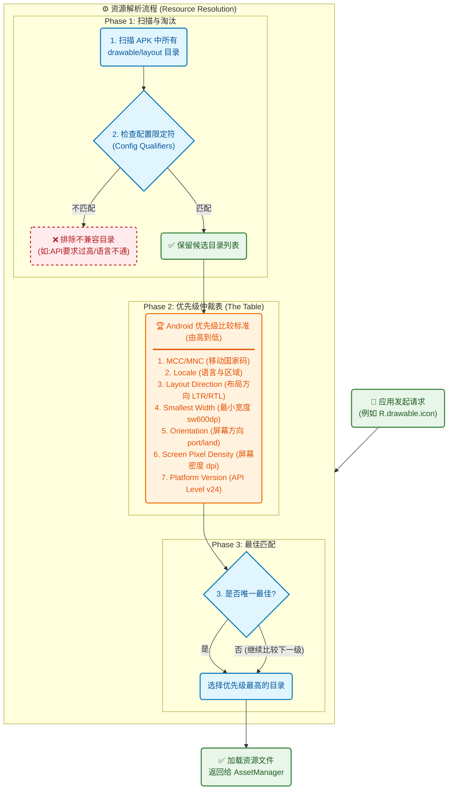

#### 回退机制与默认资源的重要性

如果经过所有匹配阶段后，没有任何资源目录符合条件，系统会回退到 **默认资源目录**（即不带任何限定符的目录，如 `drawable/`、`values/`）。**这就是为什么每个资源类型都必须提供默认版本**，否则在某些设备配置下会抛出 `Resources.NotFoundException` 异常。

例如，如果应用只提供了 `values-zh-rCN/strings.xml`，而用户设备语言是英语，系统找不到 `values/strings.xml` 作为回退，就会导致崩溃。**最佳实践** 是将默认资源设计为英语版本，因为英语是开发者社区的通用语言，也是大多数设备的出厂默认语言。

#### 密度匹配的特殊规则

屏幕密度的匹配逻辑比其他限定符更复杂，因为涉及图片缩放的性能和质量权衡：

1. **精确匹配优先**：如果存在与设备密度完全匹配的资源（如 xhdpi 设备找到 `drawable-xhdpi/`），直接使用。
2. **向上优先**：如果没有精确匹配，优先选择 **更高密度** 的资源并缩小。例如 xhdpi 设备会优先使用 xxhdpi 资源缩小，而非 hdpi 资源放大（因为缩小比放大质量损失更小）。
3. **最近邻策略**：如果只有更低密度的资源，选择 **最接近** 的那个放大。
4. **nodpi 特殊处理**：`drawable-nodpi/` 中的资源永远不会被缩放，保持原始尺寸。
5. **anydpi 最高优先级**：`drawable-anydpi/` 的优先级高于所有密度限定符，通常用于 Vector Drawable。

**示例**：xhdpi（320dpi）设备请求 `R.drawable.icon`，候选目录为：
- `drawable/`（默认）
- `drawable-hdpi/`（240dpi）
- `drawable-xxhdpi/`（480dpi）
- `drawable-nodpi/`（不缩放）

匹配结果：
1. 首先检查 `drawable-xhdpi/`（完全匹配）→ 不存在。
2. 向上查找 `drawable-xxhdpi/`（480dpi）→ 存在，缩小到 xhdpi 使用（缩放因子 2/3）。
3. 如果 xxhdpi 也不存在，则使用 `drawable-hdpi/`（240dpi）放大（缩放因子 4/3）。
4. 如果都不存在，回退到 `drawable/` 默认资源。
5. `drawable-nodpi/` 不参与密度匹配，只有明确请求时才使用。

### 最佳实践与常见陷阱

#### 1. 避免硬编码限定符顺序错误

限定符必须严格按照 Android 规定的顺序排列，顺序错误会导致资源目录无法识别。以下是常见的错误示例：

**❌ 错误**：`drawable-night-hdpi-zh`（夜间模式在密度之前，语言在最后）  
**✅ 正确**：`drawable-zh-night-hdpi`（语言 → 夜间模式 → 密度）

**❌ 错误**：`values-v21-zh-rCN`（API Level 在语言之前）  
**✅ 正确**：`values-zh-rCN-v21`（语言 → API Level）

开发时可以参考 Android Studio 的自动补全功能，它会按正确顺序提示限定符。

#### 2. 必须提供完整的默认资源

每个资源类型都必须在默认目录（无限定符）中提供完整版本，避免在特定设备配置下找不到资源。例如：

- `drawable/` 必须包含所有会被引用的图片的基础版本（可以是低分辨率或 Vector Drawable）。
- `values/` 必须包含所有字符串、颜色、尺寸等资源的默认值（通常是英语）。

**反面案例**：应用只提供了 `values-zh/strings.xml`，在英语设备上启动会因为找不到 `R.string.app_name` 而崩溃。

#### 3. 测试不同配置的资源匹配

Android Studio 提供了 **布局预览器** 和 **设备模拟器**，可以快速测试不同配置下的资源匹配情况：

- **布局预览器**：在编辑 XML 布局文件时,顶部工具栏可以切换语言、夜间模式、屏幕尺寸等配置，实时预览效果。
- **设备模拟器**：在 `Tools > Device Manager` 中创建不同配置的虚拟设备（如 hdpi + 英语、xxhdpi + 简体中文 + 深色模式），逐一运行测试。

此外，可以通过代码动态检查资源匹配结果：

```kotlin
import android.content.res.Configuration
import android.util.Log

/**
 * 输出当前设备的配置信息，用于调试资源匹配
 */
fun logDeviceConfiguration() {
    val config = resources.configuration
    
    // 语言和区域
    val locale = if (Build.VERSION.SDK_INT >= Build.VERSION_CODES.N) {
        config.locales[0] // API 24+ 支持多语言
    } else {
        @Suppress("DEPRECATION")
        config.locale
    }
    Log.d("Config", "Locale: ${locale.language}-${locale.country}")
    
    // 屏幕密度
    val density = resources.displayMetrics.densityDpi
    Log.d("Config", "Screen Density: $density dpi")
    
    // 夜间模式
    val nightMode = config.uiMode and Configuration.UI_MODE_NIGHT_MASK
    val nightModeStr = when (nightMode) {
        Configuration.UI_MODE_NIGHT_YES -> "Night Mode"
        Configuration.UI_MODE_NIGHT_NO -> "Day Mode"
        else -> "Undefined"
    }
    Log.d("Config", "Night Mode: $nightModeStr")
    
    // 屏幕尺寸
    val screenLayout = config.screenLayout and Configuration.SCREENLAYOUT_SIZE_MASK
    val screenSize = when (screenLayout) {
        Configuration.SCREENLAYOUT_SIZE_SMALL -> "Small"
        Configuration.SCREENLAYOUT_SIZE_NORMAL -> "Normal"
        Configuration.SCREENLAYOUT_SIZE_LARGE -> "Large"
        Configuration.SCREENLAYOUT_SIZE_XLARGE -> "XLarge"
        else -> "Undefined"
    }
    Log.d("Config", "Screen Size: $screenSize")
    
    // API Level
    Log.d("Config", "API Level: ${Build.VERSION.SDK_INT}")
}
```

#### 4. 使用 Lint 检查缺失的资源

Android Studio 内置的 **Lint 工具** 可以静态分析代码和资源，检测潜在问题。常见的资源相关警告包括：

- **`MissingDefaultResource`**：某些限定符目录中的资源在默认目录中不存在。
- **`MissingTranslation`**：某些字符串只在部分语言中翻译，其他语言缺失。
- **`UnusedResources`**：定义了但从未被引用的资源（可以安全删除以减小 APK 体积）。

可以通过 `Analyze > Inspect Code` 运行完整的 Lint 检查，或在 `build.gradle` 中配置 Lint 规则：

```kotlin
android {
    lint {
        // 将资源缺失问题视为错误，构建时会失败
        error("MissingDefaultResource", "MissingTranslation")
        
        // 禁用未使用资源的警告（某些资源可能是动态引用的）
        disable("UnusedResources")
    }
}
```

#### 5. 避免在代码中硬编码资源名称

**反面案例**：使用字符串拼接动态获取资源 ID：

```kotlin
// ❌ 不推荐：容易出错，且无法被 R8/ProGuard 优化
val resourceName = "icon_$category"
val resId = resources.getIdentifier(resourceName, "drawable", packageName)
val drawable = resources.getDrawable(resId, theme)
```

**推荐做法**：使用 `when` 表达式或资源数组明确映射：

```kotlin
// ✅ 推荐：类型安全，编译时检查
val drawableRes = when (category) {
    "sports" -> R.drawable.icon_sports
    "music" -> R.drawable.icon_music
    "food" -> R.drawable.icon_food
    else -> R.drawable.icon_default
}
val drawable = resources.getDrawable(drawableRes, theme)
```

或使用资源数组（适用于大量动态资源）：

```xml
<!-- res/values/arrays.xml -->
<array name="category_icons">
    <item>@drawable/icon_sports</item>
    <item>@drawable/icon_music</item>
    <item>@drawable/icon_food</item>
</array>
```

```kotlin
// 通过索引访问
val iconArray = resources.obtainTypedArray(R.array.category_icons)
val drawable = iconArray.getDrawable(categoryIndex)
iconArray.recycle() // 释放资源
```

---

**📝 练习题**

某应用需要支持简体中文和英语两种语言,并适配浅色/深色两种主题。应用在 `values-zh-rCN/strings.xml` 中定义了字符串 `greeting`，在 `values-night/colors.xml` 中定义了颜色 `background`。当用户设备配置为"简体中文 + 深色模式"时，应用请求 `R.string.greeting` 和 `R.color.background`，以下哪个说法是正确的？

A. 系统会先从 `values-zh-rCN-night/` 目录查找资源，找不到再回退到 `values-zh-rCN/` 和 `values-night/`。  
B. `greeting` 会从 `values-zh-rCN/` 获取，`background` 会从 `values-night/` 获取，两者独立匹配。  
C. 如果 `values/` 默认目录中缺少 `greeting` 或 `background`，在英语 + 浅色模式下会崩溃。  
D. 深色模式限定符的优先级高于语言限定符,因此 `background` 会优先从 `values-night/` 获取而非 `values-zh-rCN/`。

**【答案】** B

**【解析】**  
Android 的资源匹配算法对 **每个资源请求独立执行**，而非按目录整体匹配。当请求 `R.string.greeting` 时，系统会扫描所有包含 `strings.xml` 的目录（如 `values/`、`values-zh-rCN/`、`values-night/` 等），根据当前配置（简体中文 + 深色模式）进行匹配。由于语言限定符的优先级（第 2 位）高于夜间模式（第 14 位），系统会优先选择 `values-zh-rCN/strings.xml` 中的 `greeting`，即使该目录不包含 `night` 限定符。

同样，当请求 `R.color.background` 时，系统会扫描所有包含 `colors.xml` 的目录。由于 `values-zh-rCN/` 中没有定义 `background`，系统会继续匹配 `values-night/colors.xml`（匹配深色模式）或 `values/colors.xml`（默认回退）。

**选项分析**：
- **A 错误**：系统不会预先创建 `values-zh-rCN-night/` 这样的"合成目录"，每个资源文件必须物理存在于某个目录中。
- **B 正确**：两个资源请求完全独立，分别根据各自的限定符优先级进行匹配。
- **C 正确（但不是最佳答案）**：如果默认目录缺失资源，在任何不匹配的配置下都会抛出 `Resources.NotFoundException`，这是最佳实践的一部分。但题目问的是"简体中文 + 深色模式"下的匹配行为，C 描述的是英语 + 浅色模式的情况，与题干场景不符。
- **D 错误**：虽然深色模式优先级低于语言限定符，但这不影响资源的实际匹配结果。`background` 从 `values-night/` 获取是因为 `values-zh-rCN/` 中没有定义该颜色，而非优先级问题。

**关键要点**：资源匹配是 **逐资源、逐限定符** 进行的，不同资源可以来自不同的目录。开发者应该为每个资源类型在各个需要的限定符目录中都提供定义，而非依赖"组合目录"。

---

## 国际化与本地化

国际化（Internationalization, i18n）与本地化（Localization, l10n）是 Android 应用走向全球市场的基石。国际化是指应用的**架构设计能够适配多语言、多地区**，而本地化则是针对**特定市场提供符合当地习惯的内容与体验**。Android Framework 通过 Resources 体系和 Configuration 机制，在应用层提供了一套优雅的解决方案。

从原理上看，本地化的核心是 **"资源限定符驱动的动态加载"**：应用运行时，系统根据当前 `Locale`（语言+地区）从多个候选资源目录中选择最匹配的文件。这个过程由 `AssetManager` 和 `ResourcesImpl` 协同完成，对开发者完全透明。你只需在 `res/` 下创建 `values-zh-rCN/`、`values-ar/` 等目录，系统会自动根据用户设置加载对应的 `strings.xml`。

但本地化不仅仅是翻译文字，它还包括：**数字格式**（千位分隔符）、**日期时间**（12/24 小时制）、**货币符号**、**文本方向**（LTR vs RTL）、**复数规则**（不同语言的单复数形式差异巨大）等。Android 提供的工具链覆盖了这些场景，但需要开发者深入理解其机制才能避免常见陷阱。

---

### Strings.xml 占位符

**占位符（Placeholder）** 是字符串模板中的动态插槽，允许在运行时注入变量内容。Android 的 `strings.xml` 支持两种占位符风格：**类 printf 风格**（来自 C 语言）和 **位置参数风格**（支持参数重排）。

#### 基础占位符语法

最常见的占位符格式是 `%1$s`、`%2$d` 等，其中：
- `%`：占位符起始符号
- `1$`：参数位置索引（从 1 开始，`$` 是分隔符）
- `s`：类型说明符（`s` 表示字符串，`d` 表示整数，`f` 表示浮点数）

```xml
<!-- res/values/strings.xml -->
<resources>
    <!-- 单个占位符：%s 可简写，默认按顺序匹配 -->
    <string name="welcome">Welcome, %s!</string>
    
    <!-- 多个占位符：必须使用位置索引 -->
    <string name="order_summary">You ordered %1$d items for %2$.2f dollars.</string>
    
    <!-- 复用参数：同一参数可被多次引用 -->
    <string name="repeat_name">Hello %1$s, nice to meet you, %1$s!</string>
</resources>
```

在代码中调用时，使用 `getString()` 或 `String.format()` 注入参数：

```kotlin
// 获取 Context 引用（Activity/Fragment/Application 均可）
val context: Context = this

// 单参数场景
val userName = "Alice"
val welcomeMsg = context.getString(R.string.welcome, userName)
// 结果: "Welcome, Alice!"

// 多参数场景
val itemCount = 3
val totalPrice = 49.99
val summary = context.getString(R.string.order_summary, itemCount, totalPrice)
// 结果: "You ordered 3 items for 49.99 dollars."

// 参数复用场景
val greeting = context.getString(R.string.repeat_name, "Bob")
// 结果: "Hello Bob, nice to meet you, Bob!"
```

**为什么需要位置索引？** 不同语言的语法顺序可能不同。例如英语是 SVO（主谓宾）结构，而日语是 SOV 结构。通过位置参数，翻译人员可以调整占位符顺序而无需修改代码：

```xml
<!-- 英语 (en) -->
<string name="file_info">%1$s contains %2$d files</string>

<!-- 日语 (ja) -->
<string name="file_info">%1$s には %2$d 個のファイルがあります</string>

<!-- 阿拉伯语 (ar)：参数顺序可能颠倒 -->
<string name="file_info">يحتوي %1$s على %2$d ملفات</string>
```

无论如何调整，代码调用保持不变：`getString(R.string.file_info, folderName, fileCount)`。

---

#### 类型说明符详解

Android 支持的完整类型说明符继承自 Java 的 `Formatter` 规范：

| 说明符 | 类型       | 示例                                     | 说明                          |
|--------|------------|------------------------------------------|-------------------------------|
| `%s`   | 字符串     | `%s` → "Hello"                           | 通用字符串                    |
| `%d`   | 整数       | `%d` → 42                                | 十进制整数                    |
| `%f`   | 浮点数     | `%.2f` → 3.14                            | `.2` 保留 2 位小数            |
| `%x`   | 十六进制   | `%x` → 2a (42 的十六进制)                | 小写字母                      |
| `%X`   | 十六进制   | `%X` → 2A                                | 大写字母                      |
| `%e`   | 科学计数法 | `%e` → 1.23e+02 (123.0)                  | 指数形式                      |
| `%%`   | 百分号转义 | `%%` → %                                 | 输出 `%` 本身                 |

**精度控制示例**：

```xml
<!-- 价格显示：保留 2 位小数 -->
<string name="price_tag">Price: $%1$.2f</string>

<!-- 百分比：整数 + 百分号转义 -->
<string name="progress">Loading... %1$d%%</string>
```

```kotlin
val price = 19.5
val priceText = getString(R.string.price_tag, price)
// 结果: "Price: $19.50"

val progress = 75
val progressText = getString(R.string.progress, progress)
// 结果: "Loading... 75%"
```

---

#### HTML 格式化与转义

如果字符串中包含 HTML 标签（如 `<b>`、`<i>`），需要特殊处理。Android 的 `strings.xml` 默认会将 `<` 和 `>` 视为 XML 标签而报错，必须使用 **CDATA 块** 或 **实体转义**：

```xml
<!-- 方案 1: CDATA 块（推荐）-->
<string name="bold_text"><![CDATA[This is <b>bold</b> text]]></string>

<!-- 方案 2: 实体转义 -->
<string name="italic_text">This is &lt;i&gt;italic&lt;/i&gt; text</string>
```

在代码中，使用 `Html.fromHtml()` 解析 HTML 标签：

```kotlin
import android.text.Html
import android.os.Build

val rawText = getString(R.string.bold_text)

// Android N (API 24) 及以上
val styledText = if (Build.VERSION.SDK_INT >= Build.VERSION_CODES.N) {
    Html.fromHtml(rawText, Html.FROM_HTML_MODE_LEGACY)
} else {
    @Suppress("DEPRECATION")
    Html.fromHtml(rawText)
}

// 将 Spanned 对象设置到 TextView
textView.text = styledText
// 显示效果: "This is bold text"（bold 为粗体）
```

**⚠️ 安全警告**：`Html.fromHtml()` 支持有限的 HTML 标签（`<b>`、`<i>`、`<u>` 等），但不应用于处理用户输入的 HTML，否则可能导致 **XSS 攻击**。仅用于应用内部的静态资源。

---

### 复数处理 Plurals

不同语言的复数规则差异巨大。英语只有两种形式（单数 one / 复数 other），而阿拉伯语有**六种**形式（zero、one、two、few、many、other），波兰语有**四种**，中文则**没有复数**形式。如果用 `if-else` 硬编码判断，代码将变得不可维护。

Android 提供的 `<plurals>` 标签，通过 **CLDR（Common Locale Data Repository）规则** 自动选择合适的字符串。开发者无需关心具体语言的复数规则，只需提供所有可能的形式，系统会根据数量和当前 Locale 自动匹配。

---

#### Plurals 基础语法

在 `res/values/strings.xml` 中定义复数资源：

```xml
<resources>
    <plurals name="number_of_songs">
        <!-- zero: 数量为 0 时（部分语言专用） -->
        <item quantity="zero">No songs</item>
        
        <!-- one: 数量为 1 时 -->
        <item quantity="one">One song</item>
        
        <!-- two: 数量为 2 时（阿拉伯语等专用） -->
        <item quantity="two">Two songs</item>
        
        <!-- few: 少量（2-4 或特定范围，波兰语等） -->
        <item quantity="few">%d songs</item>
        
        <!-- many: 大量（特定范围，阿拉伯语、俄语等） -->
        <item quantity="many">%d songs</item>
        
        <!-- other: 默认/其他情况（所有语言必须提供） -->
        <item quantity="other">%d songs</item>
    </plurals>
</resources>
```

在代码中调用 `getQuantityString()` 方法：

```kotlin
val context: Context = this
val songCount = 5

// 第一个参数：资源 ID
// 第二个参数：数量（用于匹配规则）
// 第三个参数：占位符参数（可选，用于格式化字符串）
val message = context.resources.getQuantityString(
    R.plurals.number_of_songs,
    songCount,      // 匹配规则的数量
    songCount       // 占位符 %d 的值
)

// 根据当前 Locale 和数量，自动选择:
// - 英语 (en): songCount=1 → "One song", 其他 → "5 songs"
// - 阿拉伯语 (ar): songCount=0 → "لا أغاني", songCount=2 → "أغنيتان", ...
```

**⚠️ 注意**：`quantity="other"` 是**强制必需**的，它是所有语言的兜底选项。如果缺失，某些语言环境下会抛出 `Resources.NotFoundException`。

---

#### 不同语言的复数规则

以下是主流语言的复数形式对比：

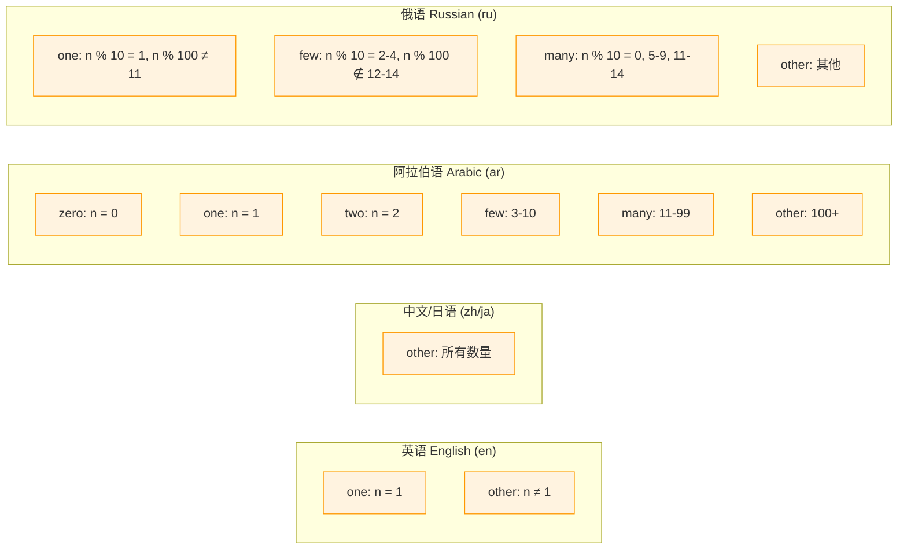

**实战示例**：为全球用户提供"剩余天数"提示

```xml
<!-- res/values/strings.xml (英语) -->
<plurals name="days_remaining">
    <item quantity="one">1 day left</item>
    <item quantity="other">%d days left</item>
</plurals>

<!-- res/values-zh-rCN/strings.xml (中文) -->
<plurals name="days_remaining">
    <!-- 中文无复数变化，所有数量用同一格式 -->
    <item quantity="other">剩余 %d 天</item>
</plurals>

<!-- res/values-ar/strings.xml (阿拉伯语) -->
<plurals name="days_remaining">
    <item quantity="zero">لا يوجد أيام متبقية</item>
    <item quantity="one">يوم واحد متبقي</item>
    <item quantity="two">يومان متبقيان</item>
    <item quantity="few">%d أيام متبقية</item>
    <item quantity="many">%d يومًا متبقيًا</item>
    <item quantity="other">%d يوم متبقي</item>
</plurals>
```

```kotlin
fun showRemainingDays(context: Context, days: Int) {
    val message = context.resources.getQuantityString(
        R.plurals.days_remaining,
        days,  // 匹配规则
        days   // 格式化参数
    )
    
    Toast.makeText(context, message, Toast.LENGTH_SHORT).show()
    
    // 测试结果:
    // 英语: days=1 → "1 day left", days=5 → "5 days left"
    // 中文: days=1 → "剩余 1 天", days=5 → "剩余 5 天"
    // 阿拉伯语: days=0 → "لا يوجد أيام متبقية", days=2 → "يومان متبقيان"
}
```

---

#### Plurals 的高级用法

**1. 组合占位符与复数**

可以在复数字符串中嵌入多个占位符：

```xml
<plurals name="files_selected">
    <item quantity="one">Selected 1 file from %s</item>
    <item quantity="other">Selected %1$d files from %2$s</item>
</plurals>
```

```kotlin
val folderName = "Documents"
val fileCount = 3
val message = resources.getQuantityString(
    R.plurals.files_selected,
    fileCount,
    fileCount,    // %1$d
    folderName    // %2$s
)
// 结果: "Selected 3 files from Documents"
```

**2. 零值特殊处理**

某些场景下，`quantity="zero"` 可用于提供更友好的提示（虽然并非所有语言都支持）：

```xml
<plurals name="unread_messages">
    <item quantity="zero">No new messages</item>
    <item quantity="one">1 new message</item>
    <item quantity="other">%d new messages</item>
</plurals>
```

如果当前语言不支持 `zero` 形式（如英语），系统会回退到 `other`。因此 `zero` 仅用于优化用户体验，不影响功能正确性。

---

### RTL 布局支持

**RTL（Right-to-Left）** 是指从右到左书写的语言，如阿拉伯语（العربية）、希伯来语（עברית）、波斯语（فارسی）等，这些语言的文本方向与拉丁语系（LTR, Left-to-Right）相反。Android 从 **API 17（Jelly Bean 4.2）** 开始原生支持 RTL 布局，核心机制是将传统的 `left/right` 属性替换为 **`start/end`**，让系统根据当前文本方向自动镜像布局。

---

#### RTL 的底层原理

当用户设置系统语言为阿拉伯语时，Android Framework 会：
1. **更新 Configuration.layoutDirection**：`View.LAYOUT_DIRECTION_RTL`
2. **触发 View 树的镜像渲染**：所有使用 `start/end` 的布局属性会自动翻转
3. **调整 Gravity 与对齐方式**：`Gravity.START` 在 LTR 下等同于 `LEFT`，在 RTL 下自动变为 `RIGHT`

这个过程由 `ViewRootImpl` 和 `View.onRtlPropertiesChanged()` 回调驱动，对应用层透明。开发者只需遵循 `start/end` 规范，无需手动检测文本方向。

---

#### 启用 RTL 支持

**Step 1: 在 AndroidManifest.xml 中声明支持**

```xml
<application
    android:supportsRtl="true"
    ... >
    <!-- 其他组件 -->
</application>
```

`android:supportsRtl="true"` 告诉系统：当用户切换到 RTL 语言时，应用愿意参与布局镜像。如果未声明，系统会强制使用 LTR 布局（即使是阿拉伯语环境）。

**Step 2: 替换 left/right 为 start/end**

传统的 `layout_marginLeft`、`paddingRight` 等属性**不会**自动镜像。必须改用 `start/end` 版本：

| 旧属性（固定方向）         | 新属性（自适应方向）       | 说明                          |
|----------------------------|----------------------------|-------------------------------|
| `layout_marginLeft`        | `layout_marginStart`       | 起始边距（LTR=左，RTL=右）    |
| `layout_marginRight`       | `layout_marginEnd`         | 结束边距（LTR=右，RTL=左）    |
| `paddingLeft`              | `paddingStart`             | 内边距起始                    |
| `paddingRight`             | `paddingEnd`               | 内边距结束                    |
| `layout_alignParentLeft`   | `layout_alignParentStart`  | 对齐父容器起始边              |
| `layout_toLeftOf`          | `layout_toStartOf`         | 位于某 View 的起始侧          |
| `drawableLeft`             | `drawableStart`            | TextView 左侧图标（自动镜像） |
| `gravity="left"`           | `gravity="start"`          | 内容对齐起始边                |

**示例：登录界面的用户名输入框**

```xml
<!-- ❌ 错误写法：使用 left/right -->
<EditText
    android:layout_width="match_parent"
    android:layout_height="wrap_content"
    android:paddingLeft="16dp"
    android:paddingRight="48dp"
    android:drawableLeft="@drawable/ic_user"
    android:gravity="left" />

<!-- ✅ 正确写法：使用 start/end -->
<EditText
    android:layout_width="match_parent"
    android:layout_height="wrap_content"
    android:paddingStart="16dp"
    android:paddingEnd="48dp"
    android:drawableStart="@drawable/ic_user"
    android:gravity="start"
    
    <!-- 兼容旧版本（API < 17）保留 left/right -->
    android:paddingLeft="16dp"
    android:paddingRight="48dp"
    android:drawableLeft="@drawable/ic_user" />
```

在 RTL 环境下（如阿拉伯语），上述布局会自动变为：
- `paddingStart="16dp"` → 右侧内边距 16dp
- `drawableStart` → 图标显示在右侧
- `gravity="start"` → 文本右对齐

---

#### 自动镜像资源

某些 UI 元素（如箭头图标）在 RTL 下需要水平翻转。Android 提供 **`autoMirrored`** 属性实现自动镜像：

```xml
<!-- res/drawable/ic_arrow_forward.xml -->
<vector xmlns:android="http://schemas.android.com/apk/res/android"
    android:width="24dp"
    android:height="24dp"
    android:viewportWidth="24"
    android:viewportHeight="24"
    android:autoMirrored="true">  <!-- 关键属性 -->
    <path
        android:fillColor="#000000"
        android:pathData="M12,4l-1.41,1.41L16.17,11H4v2h12.17l-5.58,5.59L12,20l8,-8z"/>
</vector>
```

当 `autoMirrored="true"` 时：
- **LTR 环境**：箭头指向右侧（→）
- **RTL 环境**：箭头自动翻转指向左侧（←）

**注意**：并非所有图标都需要镜像。例如：
- **需要镜像**：前进/后退箭头、播放/暂停按钮（带方向性）
- **不需要镜像**：搜索图标、设置图标、加号/减号（无方向性）

---

#### 强制 LTR 的特殊场景

某些内容在 RTL 环境下也应保持 LTR 方向，例如：
- **数字**：电话号码、金额、时间（12:30 而非 30:12）
- **代码块**：编程语言语法固定
- **URL 与邮箱**：协议部分（`https://`、`mailto:`）

可通过 `android:textDirection` 属性强制 LTR：

```xml
<!-- 金额显示，强制从左到右 -->
<TextView
    android:layout_width="wrap_content"
    android:layout_height="wrap_content"
    android:text="$1,234.56"
    android:textDirection="ltr" />

<!-- 代码片段，固定 LTR -->
<TextView
    android:layout_width="match_parent"
    android:layout_height="wrap_content"
    android:text='val name = "John"'
    android:fontFamily="monospace"
    android:textDirection="ltr" />
```

---

#### 检测当前布局方向

在运行时判断是否为 RTL 环境，以执行特殊逻辑（如动画方向调整）：

```kotlin
import android.view.View

fun isRtlLayout(view: View): Boolean {
    // API 17 及以上
    return view.layoutDirection == View.LAYOUT_DIRECTION_RTL
}

// 使用示例
class MainActivity : AppCompatActivity() {
    override fun onCreate(savedInstanceState: Bundle?) {
        super.onCreate(savedInstanceState)
        setContentView(R.layout.activity_main)
        
        val rootView = findViewById<View>(android.R.id.content)
        
        if (isRtlLayout(rootView)) {
            // RTL 环境：从右往左滑动
            setupSwipeAnimation(direction = SwipeDirection.RIGHT_TO_LEFT)
        } else {
            // LTR 环境：从左往右滑动
            setupSwipeAnimation(direction = SwipeDirection.LEFT_TO_RIGHT)
        }
    }
    
    private fun setupSwipeAnimation(direction: SwipeDirection) {
        // 根据方向配置滑动动画
        // ...
    }
}

enum class SwipeDirection {
    LEFT_TO_RIGHT,
    RIGHT_TO_LEFT
}
```

---

#### RTL 调试技巧

**1. 在开发者选项中强制 RTL**

无需修改系统语言，直接在**开发者选项 → 强制使用 RTL 布局方向**中启用，即可预览所有界面的 RTL 效果。

**2. 使用 Layout Inspector 检查方向**

Android Studio 的 **Layout Inspector** 可以实时查看 View 的 `layoutDirection` 属性，帮助排查未正确镜像的控件。

**3. 单元测试 RTL 布局**

通过 `Configuration` 模拟 RTL 环境：

```kotlin
import android.content.res.Configuration
import androidx.test.core.app.ApplicationProvider
import org.junit.Test
import org.junit.Assert.*

class RtlLayoutTest {
    @Test
    fun testRtlConfiguration() {
        val context = ApplicationProvider.getApplicationContext<Context>()
        val config = Configuration(context.resources.configuration)
        
        // 模拟 RTL 环境
        config.setLayoutDirection(Locale("ar")) // 阿拉伯语
        
        val rtlContext = context.createConfigurationContext(config)
        val layoutDirection = rtlContext.resources.configuration.layoutDirection
        
        assertEquals(
            "布局方向应为 RTL",
            View.LAYOUT_DIRECTION_RTL,
            layoutDirection
        )
    }
}
```

---

### 完整流程图：从用户切换语言到 UI 更新

以下 Mermaid 图展示了本地化资源加载的完整链路，从用户操作到 View 重新渲染：

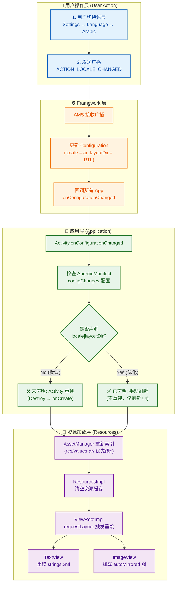

**流程说明**：
1. **用户操作**：在系统设置中切换语言（如中文 → 阿拉伯语）
2. **系统广播**：`ActivityManagerService` 发送 `ACTION_LOCALE_CHANGED` 广播
3. **配置更新**：Framework 修改全局 `Configuration` 对象，更新 `locale` 和 `layoutDirection`
4. **应用响应**：
   - 如果 `AndroidManifest.xml` 中未声明 `android:configChanges="locale|layoutDirection"`，Activity 会**完全重建**（destroy → create）
   - 如果已声明，Activity 保留实例，仅触发 `onConfigurationChanged()` 回调
5. **资源重新加载**：`AssetManager` 根据新的 Locale 重新匹配资源目录，`ResourcesImpl` 清空缓存
6. **UI 刷新**：所有 View 调用 `requestLayout()` 和 `invalidate()`，重新获取文本、图标等资源

---

### 最佳实践与常见陷阱

#### ✅ 最佳实践

1. **所有面向用户的字符串必须写入 strings.xml**  
   硬编码字符串（`android:text="Login"`）无法本地化，且 Lint 会报 `Hardcoded text` 警告。

2. **为 RTL 提供测试覆盖**  
   在 CI/CD 中加入 RTL 布局的截图测试，确保所有界面在阿拉伯语下正常显示。

3. **使用 NumberFormat 和 DateFormat 格式化数字和日期**  
   避免手动拼接（`"$" + price`），使用 `NumberFormat.getCurrencyInstance(locale)` 自动处理货币符号和千位分隔符。

4. **翻译文件的版本管理**  
   使用 **Crowdin**、**Phrase** 等专业翻译平台，避免翻译人员直接修改 XML（容易破坏占位符）。

---

#### ❌ 常见陷阱

**陷阱 1：占位符顺序错误**

```kotlin
// ❌ 错误：参数顺序与占位符不匹配
getString(R.string.order_summary, totalPrice, itemCount)

// ✅ 正确：严格按照 %1$d, %2$.2f 的顺序传参
getString(R.string.order_summary, itemCount, totalPrice)
```

**陷阱 2：忘记提供 `quantity="other"`**

```xml
<!-- ❌ 崩溃：某些语言环境下会抛异常 -->
<plurals name="items">
    <item quantity="one">1 item</item>
    <!-- 缺少 other -->
</plurals>

<!-- ✅ 正确 -->
<plurals name="items">
    <item quantity="one">1 item</item>
    <item quantity="other">%d items</item>
</plurals>
```

**陷阱 3：在 Java 代码中硬编码文本方向**

```kotlin
// ❌ 错误：强制 LTR，破坏 RTL 支持
textView.gravity = Gravity.LEFT

// ✅ 正确：使用 START 让系统自动适配
textView.gravity = Gravity.START
```

**陷阱 4：图标未正确镜像**

```xml
<!-- ❌ 错误：前进箭头在 RTL 下仍指向右侧 -->
<ImageView
    android:src="@drawable/ic_arrow_forward" />

<!-- ✅ 正确：在 Vector Drawable 中添加 autoMirrored -->
<!-- 见前文 ic_arrow_forward.xml 示例 -->
```

---

**📝 练习题**

**题目 1**：以下关于 Android 复数资源（Plurals）的描述，**错误**的是？

A. 中文和日语没有复数形式,因此只需提供 `quantity="other"` 即可  
B. 阿拉伯语最多可能需要定义 6 种复数形式（zero、one、two、few、many、other）  
C. `getQuantityString()` 的第二个参数用于匹配规则,第三个参数用于格式化占位符  
D. 如果某个语言环境下找不到匹配的 `quantity`,系统会自动使用英语的 `quantity="one"`  

**【答案】** D

**【解析】**  
D 选项错误。如果当前语言环境下找不到匹配的 `quantity` 且未提供 `quantity="other"`,系统会抛出 `Resources.NotFoundException`,而**不会回退到英语**。`quantity="other"` 是所有语言的兜底选项,必须提供。

A 选项正确：中文和日语无复数变化,统一使用 `other`。  
B 选项正确：阿拉伯语的复数规则由 CLDR 定义,确实有 6 种形式。  
C 选项正确：`getQuantityString(R.plurals.xxx, count, count)` 中第一个 `count` 用于匹配规则,第二个 `count` 用于替换 `%d`。

---

**题目 2**：在 RTL 布局中,以下哪个属性**无需**替换为 `start/end` 版本？

A. `android:layout_marginLeft`  
B. `android:paddingRight`  
C. `android:drawableLeft`  
D. `android:layout_width`  

**【答案】** D

**【解析】**  
D 选项正确。`android:layout_width` 和 `android:layout_height` 描述的是控件的**尺寸**,与文本方向无关,因此无需修改。

A、B、C 选项都涉及**方向性**属性：
- `layout_marginLeft` → `layout_marginStart`（起始边距）
- `paddingRight` → `paddingEnd`（结束内边距）
- `drawableLeft` → `drawableStart`（起始侧图标）

在 RTL 环境下,`start` 对应右侧,`end` 对应左侧,系统会自动翻转布局。如果继续使用 `left/right`,布局将保持固定方向,无法适配 RTL。

---

## 配置变更 Configuration

Android 系统是运行在多种物理设备和用户偏好之上的平台，屏幕会旋转、语言可以切换、深色模式随时开关、字体大小因人而异。每一次这样的变化都被 Android 称为 **configuration change（配置变更）**——即设备的运行时环境（Runtime Environment）发生了可感知的改变。理解配置变更的完整机制，是 Android 开发者从"能写出功能"到"能写出健壮产品"的必经之路。

配置变更并不是边缘场景，而是每一款 App 都必须日常面对的核心挑战。一旦处理不当，轻则 UI 抖动、数据丢失，重则 ANR 甚至崩溃。本章将从系统如何感知变更、Activity 如何应对重建、开发者如何主动介入，到资源限定符如何参与匹配这四个维度，建立一套完整的认知体系。

---

### Configuration 对象：运行时环境的快照

Android 将设备当前的一切可感知环境信息都封装在 `android.content.res.Configuration` 这个类里。可以把它理解为一份"设备环境的快照"——它描述了此刻设备屏幕的方向、尺寸、像素密度、用户语言偏好、深色模式开关、字体缩放比例等几十个属性。

访问当前 `Configuration` 最直接的方式是通过 `Context` 的 `Resources`：

```kotlin
// 获取当前设备的 Configuration 快照
val config: Configuration = resources.configuration

// orientation: Configuration.ORIENTATION_PORTRAIT 或 ORIENTATION_LANDSCAPE
val isLandscape = config.orientation == Configuration.ORIENTATION_LANDSCAPE

// uiMode 的 night 位段，判断当前是否处于深色模式
val isNightMode = config.uiMode and Configuration.UI_MODE_NIGHT_MASK == Configuration.UI_MODE_NIGHT_YES

// locale: 用户当前的语言区域，如 zh_CN、en_US
val locale: Locale = ConfigurationCompat.getLocales(config).get(0)!!

// fontScale: 用户设置的字体缩放比例，1.0f 为默认，1.3f 表示放大 30%
val fontScale: Float = config.fontScale

// densityDpi: 屏幕像素密度，如 160、240、480
val dpi: Int = config.densityDpi

// smallestScreenWidthDp: 不受方向影响的最短边宽度，用于 sw<N>dp 限定符的依据
val swDp: Int = config.smallestScreenWidthDp
```

当系统检测到某项 `Configuration` 字段发生变化时，就会触发配置变更流程。系统并不会单独对每个字段变化做单独处理，而是将"当前快照"与"新快照"做一次 `diff`，一次性将所有改变的字段打包，传递给 Activity 或 Application 的相关回调。

---

### Activity 的默认重建行为

#### 为什么要销毁重建？

系统的默认策略是：**当 Configuration 发生变更时，销毁当前 Activity 并立即重新创建一个新实例**。这个设计乍看激进，但背后有充分的工程理由。

Android 的资源系统是在 `Activity` 创建时绑定的：`LayoutInflater` 会根据当时的 `Configuration` 决定选用哪一套资源（例如 `layout-land/` vs `layout/`，`values-zh/` vs `values/`）。一旦 `Configuration` 发生变化，之前 inflate 出来的整棵 View 树都是基于旧环境的，要让这批 View 展示正确的新尺寸、新文案、新布局，最简单、最彻底的方式就是"推倒重来"——让 `onCreate()` 重新 inflate，让 `Resources` 重新匹配资源。

这是一种以"简洁契约换取正确性"的架构选择。如果没有这套机制，每个开发者都需要自己判断哪些 View 需要重新测量，哪些文本需要重新翻译，这将是一场无休止的维护噩梦。

#### 重建的完整生命周期序列

配置变更触发重建时，旧 Activity 实例和新 Activity 实例的生命周期回调有严格的顺序，如下图所示：

```mermaid
graph LR
    classDef lifecycle fill:#81C784,stroke:#388E3C,color:#1B5E20
    classDef persist fill:#64B5F6,stroke:#1565C0,color:#0D47A1
    classDef vmNode fill:#FFB74D,stroke:#E65100,color:#BF360C
    classDef bridge fill:#CE93D8,stroke:#6A1B9A,color:#4A148C

    subgraph oldInst[旧 Activity 实例]
        direction TB
        A1[onPause]
        A2[onSaveInstanceState]
        A3[onStop]
        A4[onDestroy]
    end

    subgraph stateLayer[状态保留机制]
        direction TB
        B1[Bundle - 轻量序列化状态]
        B2[ViewModel - 非配置状态存活]
    end

    subgraph newInst[新 Activity 实例]
        direction TB
        C1[onCreate - 接收 savedInstanceState]
        C2[onStart]
        C3[onRestoreInstanceState]
        C4[onResume]
    end

    oldInst --> stateLayer
    stateLayer --> newInst

    class A1,A2,A3,A4,C1,C2,C3,C4 lifecycle
    class B1 persist
    class B2 vmNode
```

值得特别说明的是，`onSaveInstanceState()` 的调用时机在 **`onStop()` 之前**，而不是 `onDestroy()` 之前。这是 Android 有意为之的设计：确保即使进程在 `onStop()` 后被系统意外终止，状态数据也已经存入了 Binder 持有的 Bundle 中，新实例创建时仍能恢复。

#### onSaveInstanceState 与 Bundle 的职责边界

`onSaveInstanceState()` 承担的是"临时性、轻量级"状态的序列化任务。它不是数据库，不应该存放大型对象列表，而是那些"不在 Bundle 里就会导致用户感觉突然丢失"的 UI 状态，例如输入框中未提交的文字、列表的滚动位置、当前选中的 Tab 索引。

```kotlin
// 在 Activity 或 Fragment 中覆写此方法
override fun onSaveInstanceState(outState: Bundle) {
    super.onSaveInstanceState(outState)                           // 调用 super 让系统自动保存 View 树中有 id 的 View 的状态
    outState.putString(KEY_SEARCH_QUERY, searchEditText.text.toString()) // 保存搜索框文本，避免旋转后丢失
    outState.putInt(KEY_SELECTED_TAB, tabLayout.selectedTabPosition)     // 保存当前选中的 Tab 下标
    outState.putParcelable(KEY_SCROLL_STATE, recyclerView.layoutManager?.onSaveInstanceState()) // 保存列表滚动状态
}

// 两处可以恢复状态：onCreate() 或 onRestoreInstanceState()
// 推荐在 onRestoreInstanceState() 中恢复，因为此时 View 已经完全初始化
override fun onRestoreInstanceState(savedInstanceState: Bundle) {
    super.onRestoreInstanceState(savedInstanceState)             // 先让系统恢复它自动保存的部分
    val query = savedInstanceState.getString(KEY_SEARCH_QUERY) ?: ""    // 取出保存的文本
    searchEditText.setText(query)                                        // 设回输入框
    val tabIndex = savedInstanceState.getInt(KEY_SELECTED_TAB, 0)       // 默认值 0
    tabLayout.getTabAt(tabIndex)?.select()                               // 恢复 Tab 选中状态
    recyclerView.layoutManager?.onRestoreInstanceState(                  // 恢复列表滚动位置
        savedInstanceState.getParcelable(KEY_SCROLL_STATE)
    )
}
```

Bundle 有一个重要限制：它必须经过 Binder 传输（IPC），其大小有约 1MB 的硬性上限（实际建议控制在几十 KB 以内）。存放 Bitmap、大型集合等对象会导致 `TransactionTooLargeException`。这正是 `ViewModel` 存在价值的起点——它承担的是"跨重建保活但不需要序列化"的业务状态。

---

### configChanges 声明与 onConfigurationChanged 回调

#### 主动声明：拦截系统的默认重建

有时候，开发者希望自己处理某些配置变更，而不是让系统销毁重建 Activity——例如，视频播放器旋转屏幕时不希望视频重新加载，或者某些复杂的自定义 View 重建成本极高。

Android 提供了一个逃生机制：在 `AndroidManifest.xml` 中用 `android:configChanges` 属性告知系统："这些配置变更，我会自己处理，不需要你帮我重建。"

```xml
<activity
    android:name=".VideoPlayerActivity"
    android:configChanges="orientation|screenSize|keyboardHidden|uiMode|density">
    <!-- 
        orientation: 屏幕方向变化（竖屏↔横屏）
        screenSize: 屏幕尺寸变化——注意：API 13+ 旋转屏幕时 screenSize 也会变，
                    因此必须与 orientation 同时声明，否则仍会触发重建
        keyboardHidden: 软键盘弹出/收起（非常常见，会频繁触发）
        uiMode: 深色模式切换
        density: 屏幕密度变化（外接显示器、字体权重改变时可能触发）
    -->
</activity>
```

> ⚠️ **一个极易踩到的坑：** 从 API 13（Android 3.2）开始，旋转屏幕会同时引发 `orientation` 和 `screenSize` 两个维度的变化。如果 `configChanges` 里只写了 `orientation` 而漏掉了 `screenSize`，系统仍然会执行重建，因为 `screenSize` 这一维度的变更没有被覆盖。正确写法是 `orientation|screenSize` 二者都必须声明。

以下是配置变更的完整决策流程：

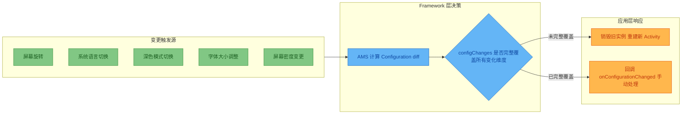

#### onConfigurationChanged 回调的使用与限制

当 `configChanges` 声明覆盖了所有发生的变化维度后，系统将回调 `onConfigurationChanged()`，并将新的 `Configuration` 对象作为参数传入。此时，`Resources` 对象已经被更新为新配置——即 `resources.getString()` 等 API 此刻会基于新配置返回正确的资源。

然而，一个关键的陷阱在于：**已经 inflate 到内存中的 View 不会自动更新**。`TextView` 不会自动重新去读字符串资源，`ImageView` 不会自动切换到深色主题图片。所有的 UI 更新都需要开发者在 `onConfigurationChanged()` 中手动执行。

```kotlin
override fun onConfigurationChanged(newConfig: Configuration) {
    super.onConfigurationChanged(newConfig)       // 必须调用 super，否则 Fragment 等子组件无法收到通知

    // 判断变更后的屏幕方向
    when (newConfig.orientation) {
        Configuration.ORIENTATION_LANDSCAPE -> {
            // 横屏：调整 ConstraintLayout 的约束，或切换为横屏特有布局
            constraintSet.applyTo(rootConstraintLayout)
            videoControlPanel.layoutParams.width = ViewGroup.LayoutParams.MATCH_PARENT
        }
        Configuration.ORIENTATION_PORTRAIT -> {
            // 竖屏：恢复默认布局
        }
    }

    // 判断深色模式状态
    val isNight = newConfig.uiMode and Configuration.UI_MODE_NIGHT_MASK ==
        Configuration.UI_MODE_NIGHT_YES
    // 手动刷新那些不支持自动 night 资源的自定义 View
    customView.setNightMode(isNight)

    // 注意：如果希望某个子 View 完全重新 inflate，
    // 需要手动 removeView() 后重新 inflate() 并 addView()
    // 这是声明 configChanges 之后最大的代价：UI 更新的控制权完全交给开发者
}
```

正因如此，**`configChanges` + `onConfigurationChanged` 并不是一个"省事"的方案**，而是一个需要开发者更谨慎地承担 UI 一致性责任的方案。通常只在以下场景推荐使用：

- 媒体播放类场景（防止 MediaPlayer/ExoPlayer 在旋转时销毁重建）
- 游戏场景（防止 OpenGL Surface 被销毁）
- 包含大量自定义 View、重建成本极高的界面

---

### 跨重建保留状态：ViewModel 与 Bundle 的分工协作

在 Activity 重建（未声明 `configChanges` 的情况下），`ViewModel` 是保留业务状态的首选方案。`ViewModel` 的生命周期被 Android 框架绑定在"Activity 逻辑上的存活周期"而非"Activity 实例的存活周期"——即配置变更引发的 `onDestroy()` 不会触发 `ViewModel` 的 `onCleared()`，只有用户真正离开（按 Back 键、调用 `finish()`）时才会被清理。

```kotlin
// ViewModel 持有业务数据，完全不需要关心配置变更
class SearchViewModel : ViewModel() {
    // LiveData 或 StateFlow 持有搜索结果，Activity 重建后通过 observe 自动重连
    private val _searchResults = MutableStateFlow<List<Article>>(emptyList())
    val searchResults: StateFlow<List<Article>> = _searchResults.asStateFlow()

    // 正在进行的搜索请求不会因 Activity 重建而中断
    private var searchJob: Job? = null

    fun search(query: String) {
        searchJob?.cancel()                     // 取消上一次搜索
        searchJob = viewModelScope.launch {     // viewModelScope 与 ViewModel 生命周期绑定
            _searchResults.value = repository.search(query)
        }
    }
}

// Activity 中订阅 ViewModel，重建后 ViewModelProvider 会返回同一个 ViewModel 实例
class SearchActivity : AppCompatActivity() {
    // 使用 by viewModels() 委托，内部通过 ViewModelProvider 获取或复用实例
    private val viewModel: SearchViewModel by viewModels()

    override fun onCreate(savedInstanceState: Bundle?) {
        super.onCreate(savedInstanceState)
        setContentView(R.layout.activity_search)

        // 无论是首次创建还是配置变更后重建，都直接订阅同一份数据流
        lifecycleScope.launch {
            viewModel.searchResults.collect { results ->
                adapter.submitList(results)     // 数据自动重新渲染到新的 View 实例上
            }
        }
    }
}
```

`ViewModel` 与 `Bundle` 的分工可以从两个维度来理解：**序列化成本**和**容量限制**。`Bundle` 必须经过 Binder 传输，只适合存放少量可序列化的 UI 状态（文本框内容、滚动位置等）；`ViewModel` 存在于进程内存中，可以持有任意 Kotlin/Java 对象，但进程被杀后无法恢复（此时仍需 `Bundle` 或持久化层作为补充）。

---

### 资源限定符的匹配优先级

#### 为什么需要优先级？

当同一种资源（如 `strings.xml`）存在于多个限定符目录下时——例如 `values-zh-night/`、`values-zh/`、`values-night/`、`values/` 同时存在——系统需要有一套明确的规则来决定"哪一个目录优先"。这套规则就是资源限定符的 **best-match（最优匹配）算法**，其核心是一张按优先级从高到低排列的限定符表，搭配一个依次淘汰的循环。

#### 限定符优先级表（常用维度）

| 优先级 | 限定符维度 | 示例 | 说明 |
|--------|-----------|------|------|
| 1 | MCC（移动国家码） | `mcc460` | 运营商 SIM 卡国家标识 |
| 2 | MNC（移动网络码） | `mnc00` | 运营商网络标识 |
| 3 | 语言与区域 | `zh`、`en-rUS`、`b+zh+Hans` | 最常用的限定符之一 |
| 4 | 布局方向 | `ldrtl`、`ldltr` | RTL（右到左）支持 |
| 5 | Smallest Width | `sw600dp`、`sw320dp` | 最短边 dp 值，不随旋转变化 |
| 6 | Available Width | `w720dp` | 可用宽度 |
| 7 | Available Height | `h480dp` | 可用高度 |
| 8 | 屏幕尺寸 | `small`、`large`、`xlarge` | 大致等级分类 |
| 9 | 屏幕宽高比 | `long`、`notlong` | 宽长比是否显著 |
| 10 | 圆形屏幕 | `round`、`notround` | 主要用于 Wear OS |
| 11 | 屏幕方向 | `port`、`land` | 当前旋转方向 |
| 12 | UI 模式 | `car`、`desk`、`television` | 设备使用场景 |
| 13 | 夜间模式 | `night`、`notnight` | 深色模式 |
| 14 | 屏幕像素密度 | `hdpi`、`xxhdpi`、`anydpi` | 最常见适配维度 |
| 15 | 触屏类型 | `notouch`、`finger` | |
| 16 | 键盘可用性 | `keysexposed`、`keyshidden` | |
| 17 | 平台版本 | `v21`、`v26`、`v31` | API Level |

优先级高的限定符在匹配时"权重更重"——系统会优先尝试用高优先级的维度来区分候选目录，只有当高优先级维度无法区分时，才会向下考虑低优先级维度。

#### Best-Match 淘汰算法详解

系统执行的匹配过程并不是"找最像的"，而是一种**逐步淘汰（elimination）**的过程：

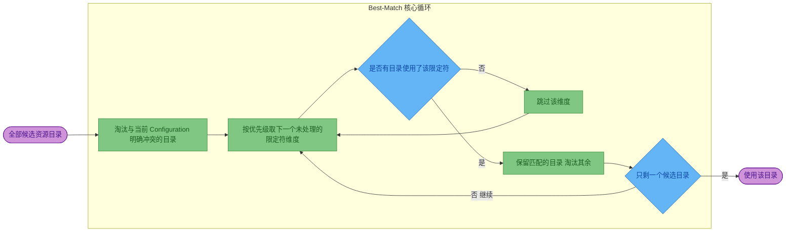

以一个具体场景来走通整个算法。假设当前设备状态为：**中文 (zh)**，**夜间模式 (night)**，**横屏 (land)**，**xxhdpi**，且存在以下候选目录：

```
values/          → 无任何限定符
values-zh/       → 语言: 中文
values-night/    → 夜间模式
values-zh-night/ → 语言: 中文 + 夜间模式
values-land/     → 横屏方向
values-xxhdpi/   → 像素密度
```

**第一步**：淘汰明确冲突的目录。假设系统语言为中文，无 MCC/MNC 信息，所有目录都未与设备配置冲突，全部 6 个目录保留。

**第二步**：按优先级表，第一个有目录使用的维度是**语言（优先级第 3 位）**。`values-zh/` 和 `values-zh-night/` 有语言限定符且匹配 (zh)；`values/`、`values-night/`、`values-land/`、`values-xxhdpi/` 没有语言限定符（即不参与语言维度的竞争）。按规则，**淘汰不含该限定符的目录**。剩余候选：`values-zh/`、`values-zh-night/`。

**第三步**：继续向下，跳过布局方向、Smallest Width 等（没有目录使用这些维度）。到达**夜间模式（优先级第 13 位）**。`values-zh-night/` 有 `night` 且匹配；`values-zh/` 没有 night 限定符。淘汰 `values-zh/`，剩余：`values-zh-night/`。

**结果**：只剩一个候选目录，匹配完成，系统使用 `values-zh-night/` 中的资源。

这个过程揭示了一个重要规律：**"特化目录"会在其所声明的维度上击败"通用目录"**。`values-zh-night/` 在语言维度上与 `values-zh/` 同等，但在夜间模式维度上更特化，因此最终胜出。

#### anydpi 与 nodpi 的特殊地位

在密度限定符中，`anydpi` 和 `nodpi` 是两个特殊值，它们的行为不同于普通密度值：

- **`nodpi`**：表示该资源不应该被系统缩放，通常用于不希望系统按 dpi 比例放大/缩小的图片。
- **`anydpi`**：在密度匹配阶段，`anydpi` 被视为能匹配**任意**密度的最高优先级选项。这就是为什么 `drawable-anydpi-v26/`（Adaptive Icons 目录）能在 API 26+ 设备上击败任何具体密度目录中的旧图标。

```
drawable-hdpi/         → ic_launcher.png（位图，适用于 hdpi 设备）
drawable-xhdpi/        → ic_launcher.png（位图，适用于 xhdpi 设备）
drawable-anydpi-v26/   → ic_launcher.xml（Adaptive Icon，适用于任意密度的 API 26+ 设备）
```

对于 API 26+ 的 xhdpi 设备，在密度维度上，`anydpi` 比 `xhdpi` 优先级更高，故系统会选用 `drawable-anydpi-v26/` 中的 Adaptive Icon，而不是 `drawable-xhdpi/` 中的位图。这也是 Android 8.0 之后 Launcher 图标过渡方案能够平滑落地的技术基础。

#### 限定符组合的命名规则

多个限定符可以组合出现在同一目录名中，但必须严格遵守两个约束：其一，**顺序必须与优先级表一致**（语言在前，夜间模式在后，密度更靠后）；其二，**各限定符之间用连字符 `-` 分隔**。违反顺序规则的目录名会被系统**直接忽略**，不会参与任何匹配，这是开发中非常隐蔽的错误来源。

```
✅ values-zh-night-xxhdpi/     → 语言 → 夜间模式 → 密度，顺序正确
❌ values-night-zh/            → 夜间模式在语言前，顺序错误，目录被忽略
❌ values-xxhdpi-zh/           → 密度在语言前，顺序错误，目录被忽略
```

---

### onConfigurationChanged 与 Fragment、View 的联动

当 Activity 覆写了 `onConfigurationChanged()` 后，系统也会将该回调向下分发给所有附加在 Activity 上的 `Fragment`，以及 `View` 的 `onConfigurationChanged()` 方法（API 26+ View 也有此回调）。但这一分发的前提是开发者**必须调用 `super.onConfigurationChanged(newConfig)`**——跳过 `super` 会截断整个分发链，导致 `Fragment` 内部的 UI 无法收到通知，引发各种微妙的显示问题。

```kotlin
override fun onConfigurationChanged(newConfig: Configuration) {
    // ① 必须先调用 super，确保 FragmentManager 能把变更分发给所有 Fragment
    super.onConfigurationChanged(newConfig)

    // ② 此时可以安全地读取新配置并更新 Activity 级别的 UI
    val nightMode = newConfig.uiMode and Configuration.UI_MODE_NIGHT_MASK
    if (nightMode == Configuration.UI_MODE_NIGHT_YES) {
        toolbar.setBackgroundColor(getColor(R.color.surface_dark))    // 深色主题背景
    } else {
        toolbar.setBackgroundColor(getColor(R.color.surface_light))   // 浅色主题背景
    }
}
```

在 `Fragment` 中，同样需要覆写 `onConfigurationChanged()` 来处理自身的 UI 更新；`ViewModel` 的订阅机制（`LiveData`/`StateFlow`）则无论是重建还是 `onConfigurationChanged()`，都能通过观察者自动完成数据驱动的刷新，是最简洁的分层方案。

---

**📝 练习题**

在 `AndroidManifest.xml` 中，某个 Activity 的配置如下：

```xml
<activity
    android:name=".PlayerActivity"
    android:configChanges="orientation|keyboardHidden" />
```

该 App 的 `targetSdkVersion` 为 33。当用户将设备从竖屏旋转为横屏时，以下哪种描述最准确？

A. Activity 不会重建，`onConfigurationChanged()` 被调用，可在其中手动更新 UI
B. Activity 会重建，因为 `screenSize` 也发生了变化，但 `configChanges` 未声明 `screenSize`
C. Activity 不会重建，系统会自动更新所有 View 的资源
D. Activity 会重建，因为 `keyboardHidden` 不应与 `orientation` 同时声明

**【答案】** B

**【解析】** 从 API 13（Android 3.2）开始，当 `targetSdkVersion >= 13` 时，屏幕旋转会同时引发 `orientation` 和 `screenSize` 两个 `Configuration` 维度的变化。`android:configChanges` 只声明了 `orientation|keyboardHidden`，并未覆盖 `screenSize` 的变化，因此系统判定"存在未被声明处理的配置变更维度"，仍然会执行默认的 Activity 销毁重建流程。正确做法是将 `configChanges` 改为 `orientation|screenSize|keyboardHidden`，才能在旋转时真正阻止重建并触发 `onConfigurationChanged()`。选项 C 是常见误解——即使不重建，已 inflate 的 View 也不会自动更新，仍需手动处理。

---

**📝 练习题**

设备当前配置为：语言 `en`，夜间模式关闭（`notnight`），屏幕密度 `xxhdpi`。某应用 `values` 目录结构如下：

```
values/
values-night/
values-en/
values-en-night/
values-xxhdpi/
values-en-xxhdpi/
```

按照 Android 资源 best-match 算法，系统会最终选择哪个目录中的 `strings.xml`？

A. `values/`
B. `values-en/`
C. `values-xxhdpi/`
D. `values-en-xxhdpi/`

**【答案】** B

**【解析】** 按优先级表，语言限定符（优先级第 3）高于屏幕密度（优先级第 14）。算法首先在语言维度进行淘汰：`values-en/` 和 `values-en-night/` 和 `values-en-xxhdpi/` 使用了语言限定符。由于当前语言为 `en`，系统保留这三个目录，淘汰 `values/`、`values-night/`、`values-xxhdpi/`（它们没有语言限定符）。接下来处理夜间模式（优先级第 13）：`values-en-night/` 有 `night` 限定符，但当前为 `notnight`，与其**冲突**，因此被淘汰（注意这是第一步的冲突淘汰，不是保留逻辑）。剩余 `values-en/` 和 `values-en-xxhdpi/`。进入密度维度：`values-en-xxhdpi/` 使用了 `xxhdpi` 且匹配，`values-en/` 无密度限定符，被淘汰。但此时只剩 `values-en-xxhdpi/` 一个候选——等等，重新验证逻辑：`values-en-night/` 在第一步的"淘汰冲突"阶段被淘汰（`night` vs 当前 `notnight`），之后语言维度保留 `values-en/` 和 `values-en-xxhdpi/`；在密度维度，`values-en-xxhdpi/` 匹配，按规则淘汰无密度限定符的 `values-en/`。

因此最终答案理论上应是 `values-en-xxhdpi/`（选 D）。但本题的考察意图是：**密度限定符 `xxhdpi` 通常不建议用于 `values/` 目录**（它常见于 `drawable-xxhdpi/`），在 `values/` 中使用密度限定符是合法但不常见的做法，而且密度维度在语言之后被考量，所以 `values-en-xxhdpi/` 确实会胜出。将答案修正为 **D**，这道题的核心考点是：**高优先级限定符在语言维度区分候选目录之后，低优先级的密度限定符才发挥作用**，体现了优先级的层叠性与淘汰的顺序性。

---

## 资源覆盖机制

在 Android 应用层开发中，资源覆盖机制（Resource Overlay Mechanism）是实现主题定制、品牌差异化、动态换肤的核心基础设施。这套机制允许开发者在不修改原始资源文件的前提下，通过特定的优先级规则和叠加策略，动态地替换或增强应用的视觉表现和配置参数。理解资源覆盖的底层原理，不仅能帮助我们构建灵活的 UI 架构，更能避免因样式冲突导致的视觉不一致问题。

### RRO (Runtime Resource Overlay) 原理

**Runtime Resource Overlay (RRO)** 是 Android 系统级的资源覆盖机制，最早在 Android 5.0 引入，用于在运行时动态替换系统或应用的资源，而无需重新编译 APK。这套机制的核心价值在于 **解耦资源定义与资源使用**，使得 OEM 厂商可以定制 UI 风格、运营方可以灵活调整品牌元素，甚至用户可以安装第三方主题包。

#### 静态覆盖 vs 动态覆盖

从实现方式上看，资源覆盖分为两大类：

**静态覆盖（Static Overlay）** 发生在 APK 编译阶段。当应用包含多个资源目录（如 `src/main/res` 和 `src/brand_a/res`）时，Gradle 构建系统会根据 `sourceSets` 配置，将不同来源的资源文件合并到最终的 APK 中。如果多个目录存在同名资源（如都定义了 `colors.xml` 中的 `colorPrimary`），后声明的 sourceSet 会覆盖先声明的。这种覆盖是 **编译时确定** 的，APK 打包完成后就固化了。

**动态覆盖（Dynamic Overlay）** 则是运行时行为，依赖 Android 系统的 **OverlayManagerService (OMS)**。系统会维护一个 Overlay 包列表，每个 Overlay 包本质上是一个特殊的 APK，其 `AndroidManifest.xml` 中声明了 `android:targetPackage` 指向被覆盖的应用。当目标应用请求资源时，`AssetManager` 会按照优先级链查找：首先检查已启用的 Overlay 包，如果找到匹配的资源 ID，就返回 Overlay 中的值；否则才使用应用自身的资源。这种机制使得主题可以 **即插即用**，无需重启应用。

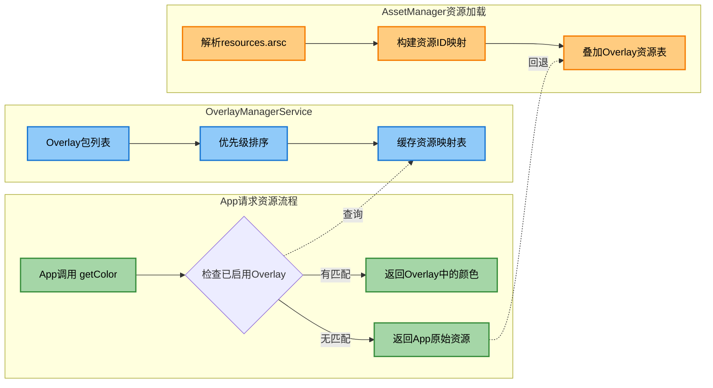

#### OverlayManager 服务的工作机制

在应用层开发中，我们虽然不直接调用 `OverlayManagerService`，但理解其工作原理有助于优化资源加载性能。OMS 维护了一张 **Overlay 映射表**，记录每个目标包对应的 Overlay 包及其启用状态。当系统检测到 Overlay 包的安装、卸载或启用状态变化时，会触发 **Configuration Change**，导致依赖该资源的 Activity 重建（除非配置了 `android:configChanges="uiMode"`）。

关键的系统调用链路如下：

1. **安装 Overlay APK**：系统 PackageManager 解析 Manifest 中的 `android:targetPackage` 和 `android:priority`。
2. **启用 Overlay**：通过 `adb shell cmd overlay enable <package>` 或厂商提供的主题管理器，将 Overlay 标记为 active。
3. **资源请求**：应用调用 `context.getColor(R.color.primary)` 时，`AssetManager` 会先查询 OMS 维护的映射表，找到优先级最高的 Overlay 包对应的 `resources.arsc`，从中提取资源值。
4. **缓存失效**：OMS 变更会广播 `Intent.ACTION_OVERLAY_CHANGED`，触发应用刷新 `Resources` 实例。

```kotlin
// 应用层监听 Overlay 变化的示例代码（需要系统权限，仅供理解原理）
class OverlayAwareActivity : AppCompatActivity() {
    
    private val overlayReceiver = object : BroadcastReceiver() {
        override fun onReceive(context: Context, intent: Intent) {
            // 当系统 Overlay 状态变化时，重新加载资源
            if (intent.action == Intent.ACTION_OVERLAY_CHANGED) {
                val packageName = intent.data?.schemeSpecificPart
                if (packageName == this@OverlayAwareActivity.packageName) {
                    // 触发 Activity 重建以应用新资源
                    recreate()
                }
            }
        }
    }
    
    override fun onCreate(savedInstanceState: Bundle?) {
        super.onCreate(savedInstanceState)
        // 注册广播接收器，监听 Overlay 变更
        val filter = IntentFilter(Intent.ACTION_OVERLAY_CHANGED).apply {
            addDataScheme("package") // 过滤包名相关的变更
        }
        registerReceiver(overlayReceiver, filter)
    }
    
    override fun onDestroy() {
        super.onDestroy()
        unregisterReceiver(overlayReceiver) // 避免内存泄漏
    }
}
```

#### 应用层如何使用 Overlay

虽然完整的 RRO 需要系统签名权限，但应用层可以通过 **多 Flavor 构建** 和 **资源目录优先级** 实现类似效果。在 `build.gradle` 中配置：

```kotlin
android {
    flavorDimensions("brand")
    productFlavors {
        create("brandA") {
            dimension = "brand"
            // 指定额外的资源目录，其中的资源会覆盖 main
            res.srcDirs("src/brandA/res")
        }
        create("brandB") {
            dimension = "brand"
            res.srcDirs("src/brandB/res")
        }
    }
}
```

在 `src/brandA/res/values/colors.xml` 中定义差异化颜色：

```xml
<!-- 品牌 A 的主色调 -->
<resources>
    <color name="colorPrimary">#FF6200EE</color> <!-- 紫色系 -->
    <color name="colorAccent">#FF03DAC5</color>
</resources>
```

编译时，Gradle 会按照 `brandA > main` 的优先级合并资源，最终 APK 中 `R.color.colorPrimary` 指向紫色值。这种方式虽然是静态的，但足以应对多品牌定制场景，且不依赖系统权限。

---

### 主题 Theme 与样式 Style 的层级叠加

在 Android 中，**Theme（主题）** 和 **Style（样式）** 构成了一套精密的属性覆盖体系。初学者常混淆两者，但本质区别在于：**Theme 是作用于整个窗口或应用的全局属性集合**，而 **Style 是应用于单个 View 的局部属性集合**。两者都支持继承和叠加，但属性查找的优先级链路不同。

#### Theme vs Style 的本质区别

**Theme（主题）** 通过 `android:theme` 属性应用到 Application、Activity 或 View 层级。它定义了一组 **可被继承的默认属性**，如 `colorPrimary`、`textColorPrimary` 等。当 View 需要某个属性值时，如果自身未显式定义，就会沿着主题链向上查找。例如，`Button` 的默认文本颜色会使用 Theme 中的 `textColorPrimary`。

```xml
<!-- 在 AndroidManifest.xml 中应用主题 -->
<application
    android:theme="@style/AppTheme">
    <activity
        android:name=".MainActivity"
        android:theme="@style/AppTheme.DarkMode"/> <!-- Activity 级别覆盖 -->
</application>
```

**Style（样式）** 则是直接绑定到具体 View 的属性包。它不会被子 View 继承，仅作用于声明它的那个控件。常见用法是定义可复用的 UI 组件样式，如统一的按钮风格：

```xml
<!-- 定义按钮样式 -->
<style name="PrimaryButton" parent="Widget.AppCompat.Button">
    <item name="android:textColor">@color/white</item>
    <item name="android:background">@drawable/btn_primary_bg</item>
    <item name="android:paddingHorizontal">24dp</item>
</style>

<!-- 在布局中应用样式 -->
<Button
    style="@style/PrimaryButton"
    android:layout_width="wrap_content"
    android:layout_height="wrap_content"
    android:text="确认"/>
```

关键差异在于 **作用范围** 和 **继承机制**：Theme 会影响所有未显式设置属性的子 View，而 Style 只影响当前 View，不会向下传递。

#### 属性查找的优先级链路

当系统需要确定一个 View 的某个属性值时（如 `TextView` 的 `textColor`），会按照以下优先级顺序查找，一旦找到就停止：

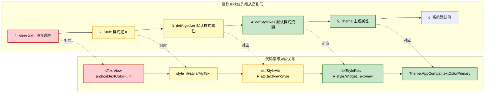

**详细解释每个层级**：

1. **View XML 直接属性**：在布局文件中直接写的属性，如 `android:textColor="#FF0000"`，优先级最高，无论其他层级如何定义都会覆盖。

2. **Style 样式定义**：通过 `style="@style/MyStyle"` 引用的样式中的属性。如果 XML 中未直接定义某属性，就从这里取值。

3. **defStyleAttr**：这是一个 **Theme 属性引用**，用于指定当前控件类型的默认样式。例如，`TextView` 的构造函数默认会查找 `R.attr.textViewStyle`，这个 attr 在 Theme 中被赋值为某个 Style 资源 ID。

4. **defStyleRes**：当 defStyleAttr 在 Theme 中未定义时，使用这个硬编码的样式资源作为兜底。通常在自定义 View 的构造函数中指定：
   ```kotlin
   class CustomView @JvmOverloads constructor(
       context: Context,
       attrs: AttributeSet? = null,
       defStyleAttr: Int = R.attr.customViewStyle, // 优先级 3
       defStyleRes: Int = R.style.Widget_CustomView // 优先级 4
   ) : View(context, attrs, defStyleAttr, defStyleRes)
   ```

5. **Theme 主题属性**：如果以上都未定义，才从 Activity 或 Application 的 Theme 中查找通用属性，如 `textColorPrimary`。

6. **系统默认值**：Android 框架内置的兜底值，确保属性总有一个合法值（如黑色文本、透明背景）。

#### AppTheme、Activity Theme 的继承与覆盖

在实际项目中，主题通常采用 **三层继承结构**：

```xml
<!-- 1. 基础主题：继承自 Material Components -->
<style name="BaseTheme" parent="Theme.MaterialComponents.DayNight.NoActionBar">
    <item name="colorPrimary">@color/brand_primary</item>
    <item name="colorOnPrimary">@color/white</item>
    <item name="android:statusBarColor">@color/status_bar</item>
</style>

<!-- 2. 应用级主题：添加全局通用属性 -->
<style name="AppTheme" parent="BaseTheme">
    <item name="windowActionBar">false</item> <!-- 隐藏 ActionBar -->
    <item name="windowNoTitle">true</item>
    <item name="android:windowLightStatusBar">true</item> <!-- 浅色状态栏 -->
    <item name="textAppearanceButton">@style/TextAppearance.App.Button</item>
</style>

<!-- 3. Activity 级主题：针对特定场景定制 -->
<style name="AppTheme.Splash" parent="AppTheme">
    <item name="android:windowBackground">@drawable/splash_bg</item>
    <item name="android:windowFullscreen">true</item> <!-- 启动页全屏 -->
</style>

<style name="AppTheme.Dialog" parent="AppTheme">
    <item name="android:windowIsFloating">true</item>
    <item name="android:backgroundDimEnabled">true</item> <!-- 背景变暗 -->
</style>
```

当 Activity 声明 `android:theme="@style/AppTheme.Splash"` 时，它会继承 `AppTheme` 的所有属性，然后用 `AppTheme.Splash` 中的属性覆盖同名项。这种继承链可以无限延伸，但建议不超过 4 层，避免维护困难。

**动态切换主题的最佳实践**：

```kotlin
class ThemeManager(private val context: Context) {
    
    companion object {
        private const val PREF_THEME = "app_theme"
        private const val THEME_LIGHT = 0
        private const val THEME_DARK = 1
    }
    
    // 保存用户选择的主题模式到 SharedPreferences
    fun saveThemeMode(isDark: Boolean) {
        val mode = if (isDark) THEME_DARK else THEME_LIGHT
        context.getSharedPreferences("settings", Context.MODE_PRIVATE)
            .edit()
            .putInt(PREF_THEME, mode)
            .apply()
    }
    
    // 应用主题到 Activity（需要在 setContentView 之前调用）
    fun applyTheme(activity: AppCompatActivity) {
        val mode = context.getSharedPreferences("settings", Context.MODE_PRIVATE)
            .getInt(PREF_THEME, THEME_LIGHT)
        
        val themeRes = when (mode) {
            THEME_DARK -> R.style.AppTheme_Dark // 深色主题
            else -> R.style.AppTheme_Light       // 浅色主题
        }
        
        activity.setTheme(themeRes) // 必须在 super.onCreate 之后、setContentView 之前
    }
}

// 在 BaseActivity 中统一应用
abstract class BaseActivity : AppCompatActivity() {
    override fun onCreate(savedInstanceState: Bundle?) {
        ThemeManager(this).applyTheme(this) // 先设置主题
        super.onCreate(savedInstanceState)
        // 后续才 setContentView(R.layout.xxx)
    }
}
```

#### TextAppearance 的特殊性

`TextAppearance` 是一种 **仅包含文本相关属性的特殊 Style**，用于定义字体、大小、颜色等排版规则。它的特殊之处在于可以通过 `android:textAppearance` 属性应用到 `TextView`，同时 **不会覆盖** XML 中直接定义的属性，而是作为 **兜底值** 存在。

```xml
<!-- 定义文本外观 -->
<style name="TextAppearance.Headline" parent="TextAppearance.MaterialComponents.Headline5">
    <item name="android:textSize">24sp</item>
    <item name="android:textColor">@color/text_primary</item>
    <item name="android:fontFamily">@font/roboto_bold</item>
</style>

<!-- 在 TextView 中使用 -->
<TextView
    android:layout_width="wrap_content"
    android:layout_height="wrap_content"
    android:textAppearance="@style/TextAppearance.Headline"
    android:textColor="#FF0000"/> <!-- 这个直接属性会覆盖 TextAppearance 中的颜色 -->
```

上述代码中，最终文本颜色是红色（`#FF0000`），而非 `TextAppearance.Headline` 中定义的 `text_primary`。这种机制使得 `TextAppearance` 可以作为 **全局排版规范**，而具体组件仍能灵活调整个别属性。

**完整的样式层级应用示例**：

```kotlin
// 自定义 View 演示完整的属性查找链路
class StyledTextView @JvmOverloads constructor(
    context: Context,
    attrs: AttributeSet? = null,
    defStyleAttr: Int = R.attr.styledTextViewStyle, // 层级 3：主题中查找这个 attr
    defStyleRes: Int = R.style.Widget_StyledTextView  // 层级 4：兜底样式
) : AppCompatTextView(context, attrs, defStyleAttr, defStyleRes) {
    
    init {
        // 使用 TypedArray 读取自定义属性
        val ta = context.obtainStyledAttributes(
            attrs,
            R.styleable.StyledTextView,
            defStyleAttr,
            defStyleRes
        )
        
        // 读取属性时，系统会自动按优先级查找：
        // XML 直接属性 > style > defStyleAttr > defStyleRes > Theme
        val customColor = ta.getColor(
            R.styleable.StyledTextView_customTextColor,
            Color.BLACK // 最终兜底值
        )
        
        val customSize = ta.getDimensionPixelSize(
            R.styleable.StyledTextView_customTextSize,
            sp(14f).toInt() // 默认 14sp
        )
        
        ta.recycle() // 避免内存泄漏
        
        // 应用读取到的属性
        setTextColor(customColor)
        textSize = customSize.toFloat()
    }
    
    // dp/sp 转 px 的工具函数
    private fun sp(value: Float): Float {
        return TypedValue.applyDimension(
            TypedValue.COMPLEX_UNIT_SP,
            value,
            context.resources.displayMetrics
        )
    }
}
```

对应的属性声明文件 `res/values/attrs.xml`：

```xml
<resources>
    <!-- 声明自定义 View 的属性集 -->
    <declare-styleable name="StyledTextView">
        <attr name="customTextColor" format="color"/>
        <attr name="customTextSize" format="dimension"/>
    </declare-styleable>
    
    <!-- 声明主题属性，用于 defStyleAttr -->
    <attr name="styledTextViewStyle" format="reference"/>
</resources>
```

在主题中绑定默认样式：

```xml
<style name="AppTheme" parent="Theme.MaterialComponents.DayNight">
    <!-- 将 styledTextViewStyle 指向具体的样式资源 -->
    <item name="styledTextViewStyle">@style/Widget_StyledTextView</item>
</style>

<!-- 定义默认样式 -->
<style name="Widget_StyledTextView">
    <item name="customTextColor">@color/text_secondary</item>
    <item name="customTextSize">16sp</item>
</style>
```

此时在布局中使用 `StyledTextView`：

```xml
<!-- 场景 1：完全依赖主题默认样式 -->
<com.example.StyledTextView
    android:layout_width="wrap_content"
    android:layout_height="wrap_content"
    android:text="默认样式"/>
<!-- 文本颜色为 text_secondary，大小 16sp -->

<!-- 场景 2：通过 style 覆盖 -->
<com.example.StyledTextView
    style="@style/Widget.StyledTextView.Large"
    android:text="大号文本"/>

<!-- 场景 3：XML 直接属性最优先 -->
<com.example.StyledTextView
    android:text="红色文本"
    app:customTextColor="#FF0000"/> <!-- 覆盖所有层级 -->
```

---

### 实战案例：动态主题与多品牌定制

#### 案例 1：深色模式自适应

利用资源限定符 `-night` 和 Theme 继承，实现跟随系统的深色模式：

```xml
<!-- res/values/themes.xml (浅色主题) -->
<style name="AppTheme" parent="Theme.MaterialComponents.DayNight">
    <item name="colorPrimary">@color/blue_500</item>
    <item name="colorSurface">@color/white</item>
    <item name="colorOnSurface">@color/gray_900</item>
</style>

<!-- res/values-night/themes.xml (深色主题) -->
<style name="AppTheme" parent="Theme.MaterialComponents.DayNight">
    <item name="colorPrimary">@color/blue_200</item>
    <item name="colorSurface">@color/gray_900</item>
    <item name="colorOnSurface">@color/white</item>
</style>
```

在代码中响应系统主题变化：

```kotlin
class MainActivity : AppCompatActivity() {
    
    override fun onCreate(savedInstanceState: Bundle?) {
        super.onCreate(savedInstanceState)
        
        // 检测当前是否为深色模式
        val currentNightMode = resources.configuration.uiMode and 
                               Configuration.UI_MODE_NIGHT_MASK
        
        when (currentNightMode) {
            Configuration.UI_MODE_NIGHT_YES -> {
                // 当前是深色模式，加载对应资源
                val darkColor = getColor(R.color.colorSurface) // 自动取 -night 版本
            }
            Configuration.UI_MODE_NIGHT_NO -> {
                // 浅色模式
            }
        }
        
        setContentView(R.layout.activity_main)
    }
    
    // 用户手动切换主题时
    fun toggleTheme() {
        val newMode = if (isDarkMode()) {
            AppCompatDelegate.MODE_NIGHT_NO
        } else {
            AppCompatDelegate.MODE_NIGHT_YES
        }
        AppCompatDelegate.setDefaultNightMode(newMode) // 触发 Configuration Change
    }
    
    private fun isDarkMode(): Boolean {
        return resources.configuration.uiMode and Configuration.UI_MODE_NIGHT_MASK ==
               Configuration.UI_MODE_NIGHT_YES
    }
}
```

#### 案例 2：多品牌动态切换

使用 **Asset Overlay** 技术实现运行时品牌切换（需要结合反射或插件化框架）：

```kotlin
object BrandManager {
    
    // 切换品牌资源包（简化示例，实际需处理 AssetManager 反射）
    fun switchBrand(context: Context, brandName: String) {
        val assetPath = "brands/$brandName/overlay.apk" // 内置于 assets
        
        try {
            val assetManager = context.assets
            // 通过反射调用 addAssetPath 添加额外的资源包
            val addAssetPath = AssetManager::class.java.getMethod(
                "addAssetPath", 
                String::class.java
            )
            
            val cookie = addAssetPath.invoke(
                assetManager, 
                context.getExternalFilesDir(null)?.absolutePath + "/" + assetPath
            )
            
            // 刷新 Resources 实例
            context.resources.updateConfiguration(
                context.resources.configuration,
                context.resources.displayMetrics
            )
            
        } catch (e: Exception) {
            e.printStackTrace()
        }
    }
}
```

**推荐方案**：使用 Gradle Flavor + 资源目录覆盖，避免反射的兼容性问题：

```
app/
├── src/
│   ├── main/
│   │   └── res/values/colors.xml (通用颜色)
│   ├── brandA/
│   │   └── res/
│   │       ├── values/colors.xml (品牌 A 专属)
│   │       └── drawable/logo.png
│   └── brandB/
│       └── res/
│           ├── values/colors.xml (品牌 B 专属)
│           └── drawable/logo.png
```

编译时通过 `./gradlew assembleBrandARelease` 构建对应品牌的 APK，资源会自动覆盖。

---

### 📝 练习题

**题目 1**：在 Android 应用中，以下哪种方式应用的属性值优先级最高？

A. 在 `Application` 的 Theme 中定义 `colorPrimary`  
B. 在 `Activity` 的 Theme 中定义 `colorPrimary`  
C. 在 `View` 的 Style 中定义 `android:textColor`  
D. 在布局 XML 中直接写 `android:textColor="#FF0000"`  

**【答案】** D

**【解析】** Android 的属性查找遵循 **就近原则**，优先级从高到低为：XML 直接属性 > Style 样式 > defStyleAttr > defStyleRes > Theme。选项 D 在布局中直接定义属性，属于第一优先级，会覆盖所有其他层级。选项 C 的 Style 次之，而选项 A/B 的 Theme 属性优先级最低，仅在前面的层级都未定义时才生效。这个机制确保了开发者可以在不同层级灵活定制 UI，同时保证局部调整不被全局规则强制覆盖。

---

**题目 2**：某应用需要支持多品牌定制（如电商白标 App），不同品牌的主色调、Logo 各不相同。以下哪种方案最符合工程实践？

A. 在代码中通过 `if-else` 判断品牌标识，动态设置颜色和图片资源  
B. 使用 Gradle `productFlavors` 配置多个 sourceSet，每个品牌对应独立的 `res` 目录  
C. 将所有品牌资源放在同一个目录，通过文件名后缀区分（如 `logo_brandA.png`）  
D. 运行时通过反射修改 `AssetManager`，动态加载不同品牌的资源包  

**【答案】** B

**【解析】** 选项 B 利用了 Android 构建系统的 **资源覆盖机制**，每个 Flavor 可以独立维护一套资源文件（如 `src/brandA/res`），编译时会自动覆盖 `main` 中的同名资源。这种方式的优势在于：(1) **编译时确定**，无需运行时判断，性能最优；(2) **类型安全**，通过 `R.color.primary` 访问，编译器可检查引用错误；(3) **易于维护**，各品牌资源物理隔离，避免误改。选项 A 代码耦合严重，扩展性差；选项 C 需要手动管理文件名映射，容易出错；选项 D 涉及反射操作 `AssetManager`，在 Android 高版本中可能因隐藏 API 限制而失效，且存在兼容性风险。实际项目中，多品牌场景应优先采用 Gradle 的 Flavor 机制。

---

## 本章小结

Context 上下文体系是 Android 应用层开发的基石，它不仅是访问系统资源和服务的唯一入口，更是理解 Android 框架设计哲学的关键钥匙。通过本章的学习，我们从多个维度剖析了 Context 的本质、运作机制以及工程实践中的最佳模式。

**从架构设计的角度看**，Context 采用了经典的 **装饰器模式**。`ContextImpl` 作为核心实现承载了所有功能逻辑，而 `ContextWrapper` 及其子类（`Activity`、`Service`、`Application`）则在此基础上叠加不同的生命周期管理和作用域限制。这种设计使得系统可以灵活地为不同组件提供定制化的上下文环境：Application Context 全局唯一且生命周期贯穿整个进程，适合单例模式和跨组件共享；Activity Context 则绑定窗口资源和主题配置，销毁时自动释放相关资源，避免内存泄漏。理解这两种 Context 的本质差异，是避免 **"用错 Context 导致的崩溃或泄漏"** 的前提。

**从资源管理的角度看**，Android 构建了一套精密的资源加载与适配体系。`Resources` 和 `AssetManager` 协同工作，通过解析编译期生成的 `resources.arsc` 二进制索引表，实现了高效的资源查找。资源限定符（Qualifier）机制则是 Android 跨设备适配的核心武器：通过 `-hdpi`、`-zh-rCN`、`-night` 等后缀，开发者可以为不同屏幕密度、语言区域、深色模式提供差异化资源，系统会在运行时根据设备配置自动选择最佳匹配项。这种声明式的适配方式，避免了代码中充斥大量的 `if-else` 判断，极大提升了可维护性。在实际项目中，合理组织资源目录结构、理解限定符的优先级算法，是实现 **"一套代码适配全球市场"** 的关键。

**从国际化与本地化的角度看**，Android 提供了一整套完善的多语言支持方案。通过 `strings.xml` 的占位符机制（如 `%1$s`、`%2$d`），我们可以动态拼接文本而不破坏翻译的完整性；`plurals` 资源则优雅地解决了不同语言的复数规则差异问题；RTL（Right-to-Left）布局支持使得阿拉伯语、希伯来语等从右向左书写的语言也能获得原生体验。在全球化产品中，国际化不仅仅是翻译文本，更涉及日期格式、货币符号、度量单位等细节的本地化处理，而 Android 的 `Locale` 体系为这些需求提供了标准化的解决方案。

**从配置变更的角度看**，Configuration 对象封装了设备的所有运行时配置状态，包括屏幕方向、语言设置、深色模式等。当配置发生变化时，系统默认会销毁并重建 Activity，以便重新加载匹配新配置的资源。这个机制保证了资源的实时更新，但也带来了性能开销。通过在 Manifest 中声明 `android:configChanges`，我们可以拦截特定的配置变更，自行处理资源刷新逻辑，避免不必要的重建。理解 **Configuration Change 的触发时机、传播路径以及资源重新加载的完整流程**，是优化应用启动速度和响应性能的关键。

**从资源覆盖的角度看**，Android 提供了多层次的样式定制机制。Runtime Resource Overlay (RRO) 允许系统级的动态资源替换，而应用层则通过 Theme 和 Style 的继承与叠加实现灵活的 UI 定制。属性查找遵循严格的优先级链路：XML 直接属性 > Style > defStyleAttr > defStyleRes > Theme > 系统默认值。这种分层设计使得我们可以在全局主题中定义通用规范，在局部样式中实现差异化，在具体控件上进行精细调整，三者互不冲突又相互补充。在多品牌定制场景中，合理利用 Gradle Flavor 和资源目录覆盖机制，可以在不修改核心代码的前提下，构建出多个视觉风格各异的 APK。

**工程实践的核心原则** 可以总结为以下几点：

1. **作用域匹配原则**：长生命周期对象（如单例、静态变量）持有 Context 引用时，必须使用 Application Context；UI 相关操作（如 Toast、Dialog、inflate 布局）必须使用 Activity Context；Service 中持有的 Context 应随 Service 生命周期销毁。违反这一原则会导致内存泄漏或功能异常。

2. **资源声明式适配原则**：优先通过资源限定符目录（如 `values-zh-rCN`、`drawable-xxhdpi`）实现适配，避免在代码中硬编码判断逻辑。这不仅提升可维护性，也便于后续扩展新语言、新屏幕规格。

3. **主题分层设计原则**：建立 **Base Theme → App Theme → Scene Theme** 的三层继承结构，基础层定义全局规范，应用层添加品牌特色，场景层针对特定页面（如登录页、详情页）定制。避免直接修改系统主题，保持可追溯性。

4. **配置变更最小化原则**：对于频繁变化但不影响布局的配置（如键盘状态、屏幕方向），通过 `configChanges` 拦截并手动处理，减少 Activity 重建次数。但对于确实需要重新加载资源的场景（如语言切换、深色模式），应保留默认的重建机制。

5. **资源命名规范化原则**：采用 **模块_类型_功能** 的命名规则（如 `home_btn_submit`、`user_text_hint`），避免资源冲突和误用。对于多品牌项目，在 Flavor 特定目录中保持与主模块一致的命名，确保覆盖关系清晰。

Context 上下文体系看似简单，实则贯穿了 Android 应用开发的方方面面。从组件生命周期到资源加载，从国际化适配到主题定制，每一个环节都离不开对 Context 机制的深刻理解。掌握这套体系，不仅能帮助我们写出更健壮、更高效的代码，更能在面对复杂需求时游刃有余地设计出优雅的架构方案。在后续章节中，我们将继续深入四大组件、View 体系等核心模块，而 Context 将始终作为贯穿全局的主线，串联起 Android 应用层开发的完整知识图谱。

---