---

# Fragment：模块化容器

---

## Fragment 设计初衷

Fragment 是 Android 应用开发中最核心的 UI 构建单元之一，它的诞生并非偶然，而是 Android 团队在面对日益复杂的设备生态和 UI 需求时，做出的一次深思熟虑的架构决策。要真正理解 Fragment，我们必须先回到它被创造的那个时代背景，搞清楚它到底解决了什么问题，以及为什么 Activity 独挑大梁的模式走不通了。

### 平板适配：大屏幕催生的架构需求

2011 年，Android 3.0（Honeycomb）发布，这是 Android 第一个专门为平板设备设计的系统版本。在此之前，Android 应用的 UI 架构非常简单——一个屏幕对应一个 Activity。这在手机的小屏幕上运行得很好：列表页是一个 Activity，详情页是另一个 Activity，用户点击列表项后通过 `startActivity()` 跳转到详情页。这种 "one screen, one Activity" 的模型直观且易于理解。

但平板的出现打破了这个假设。一块 10 英寸的屏幕如果只显示一个列表或只显示一个详情页，空间利用率极低，用户体验也很差。更合理的做法是：左侧显示列表，右侧显示详情，形成经典的 Master-Detail 布局（主从布局）。问题来了——如果列表和详情各自是一个 Activity，Android 系统不允许两个 Activity 同时显示在同一个屏幕上（在当时的架构下）。Activity 是系统级的组件，它与窗口（Window）、任务栈（Task）紧密绑定，一个 Activity 独占一个窗口，这是由 WindowManagerService（WMS）和 ActivityManagerService（AMS）共同决定的。

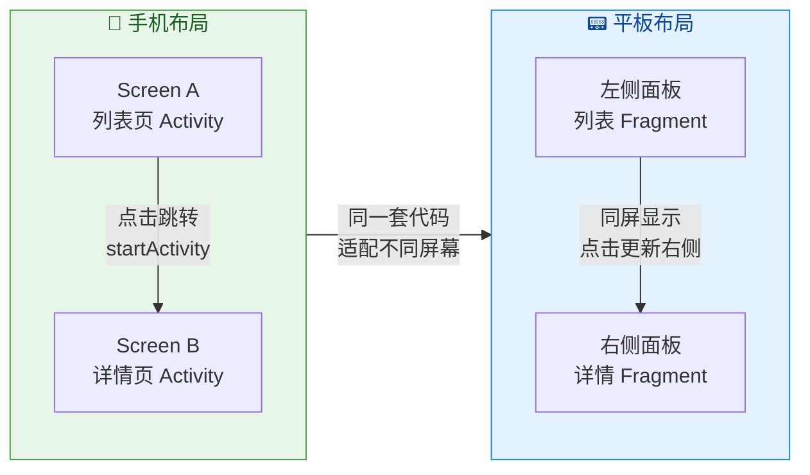
```mermaid
graph LR
    subgraph Phone["📱 手机布局"]
        direction TB
        P1["Screen A\n列表页 Activity"]
        P2["Screen B\n详情页 Activity"]
        P1 -->|"点击跳转\nstartActivity"| P2
    end

    subgraph Tablet["📟 平板布局"]
        direction TB
        T1["左侧面板\n列表 Fragment"]
        T2["右侧面板\n详情 Fragment"]
        T1 -->|"同屏显示\n点击更新右侧"| T2
    end

    Phone -->|"同一套代码\n适配不同屏幕"| Tablet

    classDef phoneStyle fill:#E8F5E9,stroke:#43A047,color:#1B5E20
    classDef tabletStyle fill:#E3F2FD,stroke:#1E88E5,color:#0D47A1

    class Phone phoneStyle
    class Tablet tabletStyle
```

Android 团队需要一种比 Activity 更轻量、更灵活的 UI 单元，它可以被自由地组合到同一个 Activity 的布局中。这个单元必须拥有自己的生命周期（lifecycle），能够独立管理自己的视图（View）和逻辑，但又不像 Activity 那样是系统级的重量级组件。Fragment 就是在这个需求下诞生的。

Fragment 的英文含义是"碎片"或"片段"，这个命名精准地表达了它的设计意图：**将一个完整的屏幕界面拆分成多个可复用的 UI 片段**。每个 Fragment 封装了自己的布局（layout）、交互逻辑和生命周期，但它必须依附于一个宿主 Activity 才能存在。你可以把 Activity 想象成一个画框，而 Fragment 就是画框里可以自由拼接的画布块。

在平板上，一个 Activity 可以同时承载列表 Fragment 和详情 Fragment；在手机上，同样的列表 Fragment 和详情 Fragment 可以分别放在两个 Activity 中。Fragment 的代码完全不需要改动，改变的只是它们的宿主容器和布局配置。这就是 Fragment 最初被设计出来要解决的核心问题——**用同一套 UI 模块适配不同尺寸的屏幕**。

从 Android 系统架构的角度来看，Activity 的创建和销毁涉及 AMS 的调度、跨进程通信（Binder IPC）、窗口的创建与销毁等一系列重量级操作。而 Fragment 的创建和销毁完全发生在应用进程内部，由 FragmentManager 管理，不涉及系统服务的调度。这意味着在同一个 Activity 内切换 Fragment 的开销远小于启动一个新的 Activity。这个性能优势在平板的 Master-Detail 场景中尤为明显——用户每点击一个列表项，只需要替换右侧的详情 Fragment，而不是启动一个全新的 Activity。

### 动态 UI：运行时灵活组装界面

平板适配只是 Fragment 的起点，它真正的威力在于为 Android 应用带来了 **运行时动态组装 UI** 的能力。在 Fragment 出现之前，Activity 的布局在 `setContentView()` 调用后基本就固定了。虽然你可以通过 `View.setVisibility()` 来显示或隐藏某些视图，或者用 `ViewGroup.addView()` 动态添加 View，但这些操作都缺乏生命周期管理——你需要自己处理视图的创建、销毁、状态保存和恢复，代码很快就会变得混乱不堪。

Fragment 提供了一套完整的事务机制（FragmentTransaction），让开发者可以在运行时对界面进行原子化的增删替换操作。所谓"事务"（Transaction），借鉴了数据库事务的概念：一组操作要么全部执行成功，要么全部不执行，保证 UI 状态的一致性。通过 FragmentTransaction，你可以：

- 使用 `add()` 将一个 Fragment 添加到容器中
- 使用 `remove()` 将一个 Fragment 从容器中移除
- 使用 `replace()` 用一个新的 Fragment 替换容器中现有的 Fragment
- 使用 `hide()` / `show()` 控制 Fragment 的显隐
- 使用 `addToBackStack()` 将事务加入回退栈，支持用户按返回键撤销操作

这套机制让 Android 应用的 UI 变得真正"动态"起来。一个典型的例子是新闻类应用：主界面可能有"头条"、"科技"、"体育"等多个频道标签，每个标签对应一个 Fragment。用户切换标签时，应用通过 FragmentTransaction 替换当前显示的 Fragment，而不是启动新的 Activity。每个频道 Fragment 独立管理自己的数据加载、列表滚动位置和刷新状态，互不干扰。

```kotlin
// 动态替换 Fragment 的典型操作
// 获取 FragmentManager，它是管理 Fragment 的核心入口
val fragmentManager = supportFragmentManager

// 开启一个事务，所有 Fragment 操作必须在事务中进行
fragmentManager.commit {
    // replace() 会先移除容器中已有的 Fragment，再添加新的
    // R.id.fragment_container 是布局中的容器 ID
    replace(R.id.fragment_container, TechNewsFragment())

    // 将此事务加入回退栈，用户按返回键可以回到上一个 Fragment
    // "tech_news" 是回退栈记录的名称，可用于后续定位
    addToBackStack("tech_news")
}
```

动态 UI 的另一个重要场景是 **条件化界面构建**。应用可以根据用户的登录状态、权限级别、A/B 测试分组等条件，在运行时决定显示哪些 Fragment。例如，一个电商应用可以根据用户是否是会员，动态决定是否在首页添加"会员专区" Fragment。这种灵活性是纯 Activity 架构难以优雅实现的。

更进一步，Fragment 的动态特性与 Android 的资源限定符（resource qualifiers）系统完美配合。你可以在 `res/layout/` 中为手机定义单面板布局，在 `res/layout-sw600dp/` 中为平板定义双面板布局，然后在 Activity 的代码中根据当前加载的布局来决定 Fragment 的添加策略。布局文件负责"结构"，Fragment 负责"内容"，Activity 负责"协调"，三者各司其职，职责清晰。

### 轻量级界面：比 Activity 更低的开销

理解 Fragment 的"轻量"特性，需要先理解 Activity 到底有多"重"。当你调用 `startActivity()` 时，背后发生了一连串复杂的系统级操作：

1. 应用进程通过 Binder IPC 向 system_server 进程中的 ActivityManagerService（AMS）发送启动请求
2. AMS 进行权限检查、Intent 解析、任务栈管理等一系列操作
3. AMS 通知 WindowManagerService（WMS）为新 Activity 创建窗口（Window）
4. AMS 通过 Binder 回调通知应用进程创建 Activity 实例
5. 应用进程中的 ActivityThread 通过反射创建 Activity 对象，并依次调用 `onCreate()` → `onStart()` → `onResume()` 等生命周期方法
6. Activity 创建 PhoneWindow，PhoneWindow 创建 DecorView，最终将视图树添加到窗口中

这个过程涉及至少两次跨进程通信（Binder IPC），窗口的创建和配置，以及系统级的任务栈管理。每一步都有不可忽略的性能开销。

相比之下，Fragment 的创建过程完全发生在应用进程内部：

1. FragmentManager 通过反射（或 FragmentFactory）创建 Fragment 实例
2. FragmentManager 驱动 Fragment 经历生命周期状态转换
3. Fragment 在 `onCreateView()` 中创建视图树
4. FragmentManager 将视图树添加到宿主 Activity 布局中的指定容器（ViewGroup）

没有跨进程通信，没有系统服务的参与，没有独立窗口的创建。Fragment 的视图直接作为宿主 Activity 视图树的一部分存在，共享同一个 Window 和 DecorView。这使得 Fragment 的创建和切换速度比 Activity 快得多，内存占用也更小。

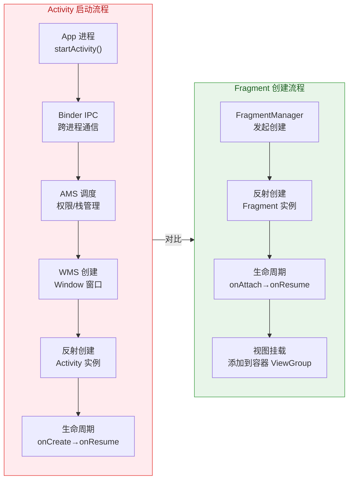
```mermaid
graph LR
    subgraph ActivityCost["Activity 启动流程"]
        direction TB
        A1["App 进程\nstartActivity()"]
        A2["Binder IPC\n跨进程通信"]
        A3["AMS 调度\n权限/栈管理"]
        A4["WMS 创建\nWindow 窗口"]
        A5["反射创建\nActivity 实例"]
        A6["生命周期\nonCreate→onResume"]
        A1 --> A2
        A2 --> A3
        A3 --> A4
        A4 --> A5
        A5 --> A6
    end

    subgraph FragmentCost["Fragment 创建流程"]
        direction TB
        F1["FragmentManager\n发起创建"]
        F2["反射创建\nFragment 实例"]
        F3["生命周期\nonAttach→onResume"]
        F4["视图挂载\n添加到容器 ViewGroup"]
        F1 --> F2
        F2 --> F3
        F3 --> F4
    end

    ActivityCost -->|"对比"| FragmentCost

    classDef heavyStyle fill:#FFEBEE,stroke:#E53935,color:#B71C1C
    classDef lightStyle fill:#E8F5E9,stroke:#43A047,color:#1B5E20

    class ActivityCost heavyStyle
    class FragmentCost lightStyle
```

Fragment 的轻量特性还体现在它对 **单 Activity 架构**（Single Activity Architecture）的支持上。在现代 Android 开发中，Google 官方推荐的架构模式是：整个应用只有一个 Activity（通常是 MainActivity），所有的"页面"都用 Fragment 来实现，页面之间的导航由 Jetpack Navigation 组件管理。这种架构的优势非常明显：

- 页面切换不再涉及系统级的 Activity 生命周期调度，性能更好
- 所有 Fragment 共享同一个 Activity 的 ViewModel 作用域，数据共享更方便
- 转场动画（Transition Animation）可以在 Fragment 之间实现更流畅的共享元素过渡（Shared Element Transition），因为它们在同一个窗口内
- 避免了 Activity 之间传递数据时的序列化/反序列化开销（Intent extras 需要 Parcelable/Serializable）

当然，"轻量"不意味着"简单"。Fragment 的生命周期实际上比 Activity 更复杂，因为它既有自己的生命周期，又要与宿主 Activity 的生命周期同步。Fragment 还有一个独立的 View 生命周期（View Lifecycle），它与 Fragment 自身的生命周期并不完全一致——Fragment 实例可能还活着，但它的 View 已经被销毁了（比如 Fragment 被放入回退栈时）。这种复杂性是 Fragment 被开发者诟病多年的原因之一，但也正是理解 Fragment 的关键所在。

从设计哲学的角度来看，Fragment 本质上是 Android 团队在 Activity（太重）和 View（太轻，没有生命周期）之间找到的一个平衡点。View 只负责绘制和交互，没有生命周期感知能力，无法自动响应应用的前后台切换、配置变更等事件。Activity 拥有完整的生命周期，但它是系统级组件，创建和销毁的开销太大，不适合作为 UI 的基本组合单元。Fragment 恰好填补了这个空白——它拥有生命周期，能感知宿主的状态变化，同时又足够轻量，可以在同一个 Activity 内自由组合。

```kotlin
// Fragment 的核心特征：拥有生命周期 + 管理视图 + 依附于 Activity
class ArticleFragment : Fragment() {

    // Fragment 可以声明自己的布局资源
    // 通过构造函数传入布局 ID 是推荐的简洁写法
    // 等价于在 onCreateView 中手动 inflate
    constructor() : super(R.layout.fragment_article)

    // onViewCreated 是操作视图的最佳时机
    // view 参数就是 onCreateView 返回的根视图
    override fun onViewCreated(view: View, savedInstanceState: Bundle?) {
        super.onViewCreated(view, savedInstanceState)

        // viewLifecycleOwner 是 Fragment 的 View 生命周期持有者
        // 用它来观察 LiveData 可以避免视图销毁后仍收到数据更新
        // 这是 Fragment 区别于普通 View 的关键能力之一
        viewModel.article.observe(viewLifecycleOwner) { article ->
            // 当数据变化时更新 UI
            bindArticle(article)
        }
    }
}
```

总结来说，Fragment 的设计初衷可以归纳为三个递进的层次：首先，它解决了平板时代多面板布局的刚需，让同一套 UI 模块能适配不同尺寸的屏幕；其次，它为 Android 应用带来了运行时动态组装界面的能力，通过事务机制实现了灵活的 UI 管理；最后，它作为一个拥有生命周期的轻量级 UI 容器，填补了 Activity 和 View 之间的架构空白，成为现代 Android 单 Activity 架构的基石。理解这三个层次，是深入掌握 Fragment 后续所有机制（生命周期、事务、通信、嵌套等）的前提。

---

**📝 练习题**

在现代 Android 开发中，Google 推荐使用单 Activity 架构（Single Activity Architecture），所有页面都用 Fragment 实现。以下关于 Fragment 相比 Activity 的优势，哪一项描述是不准确的？

A. Fragment 的创建和销毁完全在应用进程内完成，不涉及 AMS 的跨进程调度，因此切换开销更小

B. 同一个 Activity 内的多个 Fragment 共享同一个 Window，可以实现更流畅的共享元素转场动画

C. Fragment 拥有独立的 Window 和 DecorView，因此可以独立于宿主 Activity 显示

D. Fragment 之间通过 ViewModel 共享数据时，无需像 Activity 间传递数据那样进行序列化

**【答案】** C

**【解析】** Fragment 并不拥有独立的 Window 和 DecorView。Fragment 的视图树是作为宿主 Activity 视图树的一部分存在的，它被添加到 Activity 布局中的某个 ViewGroup 容器内，与 Activity 共享同一个 PhoneWindow 和 DecorView。这正是 Fragment "轻量"的核心原因——它不需要系统级的窗口资源。选项 A 准确描述了 Fragment 不涉及 AMS 调度的特性；选项 B 正确指出了共享 Window 带来的动画优势；选项 D 正确说明了同进程内通过 ViewModel 共享数据无需序列化。只有 C 的描述与 Fragment 的实际机制相悖。

---

## 生命周期同步机制

Fragment 的生命周期是 Android 应用层中最精密、也最容易让开发者困惑的状态机之一。它之所以复杂，根本原因在于 Fragment **并不是一个独立存在的组件**——它的一切生命周期状态都必须与宿主 Activity 保持同步。理解这套同步机制，不仅能帮你写出健壮的 UI 代码，更能让你在面对各种诡异的崩溃（比如 `IllegalStateException: Can not perform this action after onSaveInstanceState`）时迅速定位根因。

### onAttach 与 onDetach：建立和断开宿主关联

Fragment 生命周期的第一个回调不是 `onCreate`，而是 `onAttach(Context)`。这个设计传达了一个核心理念：**Fragment 必须先"依附"到一个宿主上，才有资格开始自己的生命历程**。

当 FragmentManager 执行一个事务（比如 `add` 或 `replace`），它会在内部调用 `moveToState()` 方法将 Fragment 推进到目标状态。如果 Fragment 当前处于 `INITIALIZING` 状态，第一步就是调用 `onAttach()`。此时 Fragment 获得了宿主 Activity 的 Context 引用，可以安全地访问资源、获取系统服务、进行依赖注入等操作。

```kotlin
// Fragment 的 onAttach 回调
// 这是 Fragment 生命周期中最早被调用的方法
override fun onAttach(context: Context) {
    // 必须调用 super，FragmentManager 内部会在此设置 mHost 引用
    super.onAttach(context)
    // 此时 context 就是宿主 Activity
    // 可以安全地进行类型转换来获取 Activity 引用
    // 但更推荐通过 requireActivity() 在需要时获取
    Log.d("Fragment", "onAttach: 已关联到 ${context::class.simpleName}")
    // 典型用途：获取依赖注入的组件、注册监听器等
}
```

与之对称的是 `onDetach()`，它在 Fragment 与 Activity 彻底解除关联时调用。调用完 `onDetach()` 后，Fragment 内部持有的 `mHost` 引用会被置空，此后任何对 `requireActivity()` 或 `requireContext()` 的调用都会抛出 `IllegalStateException`。这就是为什么你不能在 `onDetach()` 之后还尝试访问 Activity 资源的原因。

```kotlin
// Fragment 的 onDetach 回调
// 这是 Fragment 生命周期中最后被调用的方法
override fun onDetach() {
    // 在这里清理与 Activity 相关的引用
    // 此回调之后，getActivity() 将返回 null
    // requireActivity() 将抛出 IllegalStateException
    Log.d("Fragment", "onDetach: 已与宿主断开关联")
    super.onDetach()
}
```

一个容易被忽视的细节是：`onAttach()` 的调用时机早于 Fragment 自身的 `onCreate()`，而 `onDetach()` 的调用时机晚于 `onDestroy()`。这意味着在 `onCreate()` 中你可以放心使用 `requireContext()`，而在 `onDestroy()` 中也仍然可以访问 Activity——因为此时 `onDetach()` 还没有执行。

在早期的 Fragment API 中，`onAttach(Activity)` 是标准签名，开发者经常在这里将 Activity 强转为自定义接口来建立通信通道。但从 `AndroidX Fragment` 开始，这个方法被标记为 deprecated，取而代之的是 `onAttach(Context)`。这一变化反映了 Fragment 宿主不再局限于 Activity 的设计演进——理论上任何实现了 `FragmentHostCallback` 的对象都可以作为宿主。

### onCreateView 与 onDestroyView：视图的创建与销毁

如果说 `onAttach/onDetach` 管理的是 Fragment 与宿主的"组织关系"，那么 `onCreateView/onDestroyView` 管理的就是 Fragment 最核心的资产——**视图层级（View Hierarchy）**。

`onCreateView()` 是 Fragment 创建其 UI 的地方。FragmentManager 在将 Fragment 推进到 `CREATED` 之后、进入 `ACTIVITY_CREATED` 之前，会调用此方法。你需要在这里 inflate 布局并返回根 View。如果 Fragment 没有 UI（比如一个纯逻辑的 headless Fragment），可以返回 null。

```kotlin
// 创建 Fragment 的视图层级
// inflater: 用于从 XML 膨胀布局的 LayoutInflater
// container: Fragment 将被放入的父 ViewGroup（不要自己 addView）
// savedInstanceState: 如果是重建，包含之前保存的状态
override fun onCreateView(
    inflater: LayoutInflater,
    container: ViewGroup?,
    savedInstanceState: Bundle?
): View? {
    // inflate 的第三个参数必须传 false
    // 因为 FragmentManager 会负责将 View 添加到 container 中
    // 如果传 true，会导致 View 被添加两次，抛出异常
    return inflater.inflate(R.layout.fragment_example, container, false)
}
```

紧随 `onCreateView()` 之后的是 `onViewCreated(View, Bundle?)`，这是一个非常重要的回调。在 `onCreateView()` 中你只负责创建 View，而在 `onViewCreated()` 中你才应该进行视图的初始化操作——绑定控件、设置监听器、观察 LiveData 等。这种分离的设计意图是：`onCreateView()` 保持纯粹的视图构建职责，`onViewCreated()` 处理视图的业务逻辑绑定。

```kotlin
// onViewCreated 在 onCreateView 返回非 null View 后立即调用
// 这里是初始化视图组件的最佳位置
override fun onViewCreated(view: View, savedInstanceState: Bundle?) {
    // 调用 super（虽然默认实现为空，但保持良好习惯）
    super.onViewCreated(view, savedInstanceState)
    // 通过 view 参数查找子控件
    val textView = view.findViewById<TextView>(R.id.tv_title)
    // 设置点击监听器
    textView.setOnClickListener {
        // 处理点击事件
    }
    // 观察 ViewModel 数据
    // 注意：这里使用 viewLifecycleOwner 而不是 this
    // 因为 Fragment 的生命周期比 View 的生命周期更长
    viewModel.data.observe(viewLifecycleOwner) { value ->
        textView.text = value
    }
}
```

上面代码中 `viewLifecycleOwner` 的使用是一个关键的最佳实践。Fragment 存在一个非常特殊的现象：**Fragment 实例的生命周期可能比它的 View 更长**。典型场景是 Fragment 被放入回退栈（back stack）——当用户按返回键回到上一个 Fragment 时，当前 Fragment 的 View 会被销毁（`onDestroyView` 被调用），但 Fragment 实例本身并不会被销毁（`onDestroy` 不会调用）。当用户再次导航回来时，`onCreateView` 会重新调用，创建全新的 View。

这就引出了 `onDestroyView()` 的核心职责：**清理所有对 View 的引用，防止内存泄漏**。

```kotlin
// 当 Fragment 的视图层级被销毁时调用
// 典型场景：Fragment 进入回退栈、被 replace 等
override fun onDestroyView() {
    // 在 super 调用之前清理视图引用
    // 如果你持有了 View 的引用（如 binding），必须在这里置空
    // 否则已销毁的 View 树会因为被 Fragment 实例引用而无法被 GC 回收
    _binding = null
    super.onDestroyView()
}
```

Fragment 拥有两条并行的生命周期这一事实，是 `ViewBinding` 和 `DataBinding` 在 Fragment 中使用时必须在 `onDestroyView` 中置空 binding 引用的根本原因。AndroidX 为此专门提供了 `viewLifecycleOwner`，它的生命周期严格跟随 View 的创建和销毁，而非 Fragment 实例本身。

```kotlin
// Fragment 双生命周期的内存模型示意
// 展示 Fragment 实例与 View 的生命周期差异

// Fragment 实例生命周期（长）
// ┌─────────────────────────────────────────────────┐
// │  onCreate ──────────────────────── onDestroy     │
// │     │                                  │         │
// │     │  ┌── View 生命周期（短）──┐      │         │
// │     │  │ onCreateView          │      │         │
// │     │  │ onViewCreated         │      │         │
// │     │  │ onStart               │      │         │
// │     │  │ onResume              │      │         │
// │     │  │ onPause               │      │         │
// │     │  │ onStop                │      │         │
// │     │  │ onDestroyView ────────┘      │         │
// │     │  │                              │         │
// │     │  │  （回退栈中等待...）          │         │
// │     │  │                              │         │
// │     │  ┌── 新 View 生命周期 ───┐      │         │
// │     │  │ onCreateView（再次）  │      │         │
// │     │  │ onViewCreated         │      │         │
// │     │  │ ...                   │      │         │
// │     │  └───────────────────────┘      │         │
// └─────────────────────────────────────────────────┘
```

### 与 Activity 状态对齐：同步调度的核心机制

Fragment 生命周期最精妙的部分在于它与 Activity 的状态同步机制。FragmentManager 内部维护了一套状态常量，从低到高依次为：`INITIALIZING(0)` → `ATTACHED(1)` → `CREATED(2)` → `VIEW_CREATED(3)` → `AWAITING_EXIT_EFFECTS(4)` → `ACTIVITY_CREATED(5)` → `STARTED(6)` → `RESUMED(7)`。核心调度方法 `moveToState()` 负责将 Fragment 从当前状态推进（或回退）到目标状态，而这个目标状态的上限，就是宿主 Activity 当前所处的状态。

这条规则可以用一句话概括：**Fragment 的状态永远不会超过其宿主 Activity 的状态**。

当 Activity 进入 `onResume()` 时，FragmentManager 会遍历所有已添加的 Fragment，将它们逐一推进到 `RESUMED` 状态。当 Activity 进入 `onStop()` 时，所有 Fragment 也会被回退到 `STARTED` 以下。这种"天花板"机制确保了 Fragment 不会在 Activity 不可见时还处于 `RESUMED` 状态，从而避免了各种不一致的问题。

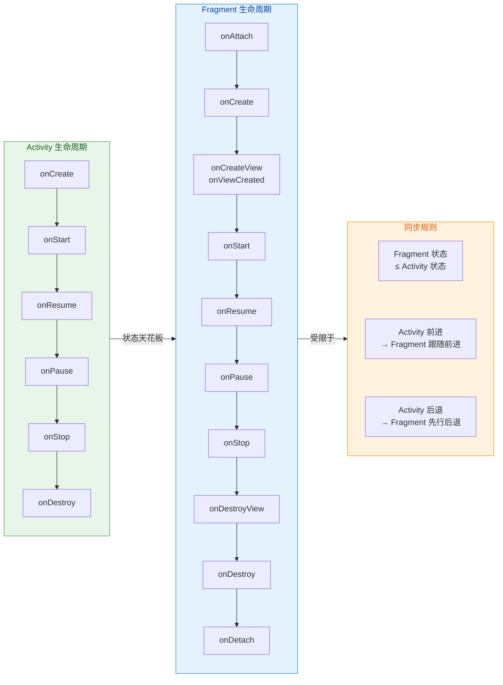
```mermaid
graph LR
    subgraph Activity["Activity 生命周期"]
        direction TB
        A1["onCreate"]
        A2["onStart"]
        A3["onResume"]
        A4["onPause"]
        A5["onStop"]
        A6["onDestroy"]
        A1 --> A2
        A2 --> A3
        A3 --> A4
        A4 --> A5
        A5 --> A6
    end

    subgraph Fragment["Fragment 生命周期"]
        direction TB
        F0["onAttach"]
        F1["onCreate"]
        F2["onCreateView\nonViewCreated"]
        F3["onStart"]
        F4["onResume"]
        F5["onPause"]
        F6["onStop"]
        F7["onDestroyView"]
        F8["onDestroy"]
        F9["onDetach"]
        F0 --> F1
        F1 --> F2
        F2 --> F3
        F3 --> F4
        F4 --> F5
        F5 --> F6
        F6 --> F7
        F7 --> F8
        F8 --> F9
    end

    subgraph Sync["同步规则"]
        direction TB
        S1["Fragment 状态\n≤ Activity 状态"]
        S2["Activity 前进\n→ Fragment 跟随前进"]
        S3["Activity 后退\n→ Fragment 先行后退"]
        S1 ~~~ S2
        S2 ~~~ S3
    end

    Activity -->|"状态天花板"| Fragment
    Fragment -->|"受限于"| Sync

    classDef activityStyle fill:#E8F5E9,stroke:#43A047,color:#1B5E20
    classDef fragmentStyle fill:#E3F2FD,stroke:#1E88E5,color:#0D47A1
    classDef syncStyle fill:#FFF3E0,stroke:#FB8C00,color:#E65100

    class Activity activityStyle
    class Fragment fragmentStyle
    class Sync syncStyle
```

让我们通过一个具体的场景来理解这套同步机制的运作方式。假设用户打开一个包含 Fragment 的 Activity：

当 Activity 的 `onCreate()` 执行时，如果此时通过 FragmentTransaction 添加了一个 Fragment，FragmentManager 会将该 Fragment 推进到 `ACTIVITY_CREATED` 状态。在这个过程中，Fragment 会依次经历 `onAttach()` → `onCreate()` → `onCreateView()` → `onViewCreated()` → `onActivityCreated()`（已废弃但仍会调用）。注意，此时 Fragment 不会进入 `onStart()`，因为 Activity 自身还没有 `onStart()`——天花板限制了 Fragment 的状态上限。

接着 Activity 进入 `onStart()`，FragmentManager 收到通知后，将所有处于 `ACTIVITY_CREATED` 的 Fragment 推进到 `STARTED`，触发 Fragment 的 `onStart()`。同理，Activity 的 `onResume()` 会触发 Fragment 的 `onResume()`。

回退过程则是镜像的，但有一个重要的顺序差异：**前进时 Activity 先行、Fragment 跟随；后退时 Fragment 先行、Activity 跟随**。当用户按下 Home 键，Activity 的 `onPause()` 被调用之前，FragmentManager 会先将所有 Fragment 从 `RESUMED` 回退到 `STARTED`，触发它们的 `onPause()`。然后 Activity 自身的 `onPause()` 才执行。这种"洋葱模型"确保了内层组件（Fragment）总是比外层容器（Activity）更早进入非活跃状态。

```kotlin
// 演示 Activity 与 Fragment 生命周期的调用顺序
// 通过日志可以清晰观察同步机制

// === Activity 代码 ===
class HostActivity : AppCompatActivity() {
    override fun onCreate(savedInstanceState: Bundle?) {
        super.onCreate(savedInstanceState)
        Log.d("Lifecycle", "Activity: onCreate")
        // 设置布局
        setContentView(R.layout.activity_host)
        // 仅在首次创建时添加 Fragment，避免配置变更后重复添加
        if (savedInstanceState == null) {
            supportFragmentManager.beginTransaction()
                // 将 Fragment 添加到容器中
                .add(R.id.fragment_container, ExampleFragment())
                .commit()
        }
    }

    override fun onStart() {
        super.onStart()
        // 此时 Fragment 的 onStart 已经被调用（在 super 内部触发）
        Log.d("Lifecycle", "Activity: onStart")
    }

    override fun onResume() {
        super.onResume()
        // 此时 Fragment 的 onResume 已经被调用
        Log.d("Lifecycle", "Activity: onResume")
    }

    override fun onPause() {
        // 注意：super.onPause() 内部会先触发 Fragment 的 onPause
        Log.d("Lifecycle", "Activity: onPause (before super)")
        super.onPause()
        Log.d("Lifecycle", "Activity: onPause (after super)")
    }

    override fun onStop() {
        // super.onStop() 内部会先触发 Fragment 的 onStop
        super.onStop()
        Log.d("Lifecycle", "Activity: onStop")
    }

    override fun onDestroy() {
        super.onDestroy()
        Log.d("Lifecycle", "Activity: onDestroy")
    }
}

// === Fragment 代码 ===
class ExampleFragment : Fragment() {
    override fun onAttach(context: Context) {
        super.onAttach(context)
        Log.d("Lifecycle", "  Fragment: onAttach")
    }

    override fun onCreate(savedInstanceState: Bundle?) {
        super.onCreate(savedInstanceState)
        Log.d("Lifecycle", "  Fragment: onCreate")
    }

    override fun onCreateView(
        inflater: LayoutInflater,
        container: ViewGroup?,
        savedInstanceState: Bundle?
    ): View? {
        Log.d("Lifecycle", "  Fragment: onCreateView")
        return inflater.inflate(R.layout.fragment_example, container, false)
    }

    override fun onViewCreated(view: View, savedInstanceState: Bundle?) {
        super.onViewCreated(view, savedInstanceState)
        Log.d("Lifecycle", "  Fragment: onViewCreated")
    }

    override fun onStart() {
        super.onStart()
        Log.d("Lifecycle", "  Fragment: onStart")
    }

    override fun onResume() {
        super.onResume()
        Log.d("Lifecycle", "  Fragment: onResume")
    }

    override fun onPause() {
        super.onPause()
        Log.d("Lifecycle", "  Fragment: onPause")
    }

    override fun onStop() {
        super.onStop()
        Log.d("Lifecycle", "  Fragment: onStop")
    }

    override fun onDestroyView() {
        super.onDestroyView()
        Log.d("Lifecycle", "  Fragment: onDestroyView")
    }

    override fun onDestroy() {
        super.onDestroy()
        Log.d("Lifecycle", "  Fragment: onDestroy")
    }

    override fun onDetach() {
        super.onDetach()
        Log.d("Lifecycle", "  Fragment: onDetach")
    }
}
```

运行上述代码，打开 Activity 时的日志输出顺序为：

```
Activity: onCreate
  Fragment: onAttach
  Fragment: onCreate
  Fragment: onCreateView
  Fragment: onViewCreated
  Fragment: onStart
Activity: onStart
  Fragment: onResume
Activity: onResume
```

按 Home 键退出时的日志输出顺序为：

```
  Fragment: onPause
Activity: onPause
  Fragment: onStop
Activity: onStop
```

彻底销毁时的日志输出顺序为：

```
  Fragment: onDestroyView
  Fragment: onDestroy
  Fragment: onDetach
Activity: onDestroy
```

从日志中可以清晰看到"洋葱模型"的运作：前进时外层（Activity）先到达某个状态，然后内层（Fragment）跟随；后退时内层先回退，外层再跟随。唯一的例外是 `onCreate` 阶段——因为 Fragment 是在 Activity 的 `onCreate` 内部被添加的，所以 Fragment 的 `onAttach` 到 `onViewCreated` 都发生在 Activity 的 `onCreate` 执行期间。

### FragmentLifecycleCallbacks：全局监听生命周期

FragmentManager 提供了 `registerFragmentLifecycleCallbacks` 方法，允许你注册一个全局的生命周期观察者，监听所有 Fragment 的状态变化。这在调试、日志记录、以及实现 AOP（面向切面编程）风格的横切关注点时非常有用。

```kotlin
// 在 Activity 中注册全局 Fragment 生命周期监听
// 第二个参数 recursive 表示是否递归监听子 FragmentManager 中的 Fragment
supportFragmentManager.registerFragmentLifecycleCallbacks(
    object : FragmentManager.FragmentLifecycleCallbacks() {
        // 当任何 Fragment 被 attach 时回调
        override fun onFragmentAttached(
            fm: FragmentManager,
            f: Fragment,
            context: Context
        ) {
            Log.d("GlobalCallback", "${f::class.simpleName} attached")
        }

        // 当任何 Fragment 的 View 被创建时回调
        override fun onFragmentViewCreated(
            fm: FragmentManager,
            f: Fragment,
            v: View,
            savedInstanceState: Bundle?
        ) {
            Log.d("GlobalCallback", "${f::class.simpleName} view created")
        }

        // 当任何 Fragment 被 destroy 时回调
        override fun onFragmentDestroyed(fm: FragmentManager, f: Fragment) {
            Log.d("GlobalCallback", "${f::class.simpleName} destroyed")
        }
    },
    true // recursive = true，递归监听嵌套 Fragment
)
```

### setMaxLifecycle：手动控制 Fragment 状态上限

从 `AndroidX Fragment 1.1.0` 开始，FragmentTransaction 新增了 `setMaxLifecycle()` 方法，允许开发者为特定 Fragment 设置一个生命周期状态的上限。这个 API 的典型应用场景是 `ViewPager2` 的懒加载实现。

在传统的 ViewPager 中，为了实现懒加载，开发者不得不依赖 `setUserVisibleHint()` 这个已被废弃的方法。而 `setMaxLifecycle` 提供了一种更优雅、更符合生命周期语义的方案：将不可见的 Fragment 限制在 `STARTED` 状态，只有当前可见的 Fragment 才被允许进入 `RESUMED`。

```kotlin
// setMaxLifecycle 的使用示例
// 场景：手动管理两个 Fragment 的可见性
supportFragmentManager.beginTransaction()
    // 添加 FragmentA，但限制其最大生命周期为 STARTED
    // 这意味着 FragmentA 的 onResume() 不会被调用
    .add(R.id.container, fragmentA)
    .setMaxLifecycle(fragmentA, Lifecycle.State.STARTED)
    // 添加 FragmentB，允许其进入 RESUMED（完全可见）
    .add(R.id.container, fragmentB)
    .setMaxLifecycle(fragmentB, Lifecycle.State.RESUMED)
    .commit()

// 当需要切换可见 Fragment 时
supportFragmentManager.beginTransaction()
    // 将 FragmentA 提升到 RESUMED（变为可见）
    .setMaxLifecycle(fragmentA, Lifecycle.State.RESUMED)
    // 将 FragmentB 降级到 STARTED（变为不可见但仍存活）
    .setMaxLifecycle(fragmentB, Lifecycle.State.STARTED)
    .commit()
```

`setMaxLifecycle` 的内部实现原理并不复杂：FragmentManager 在 `moveToState()` 中会检查 Fragment 的 `mMaxState` 字段，取 `min(宿主状态, mMaxState)` 作为实际的目标状态。这样就在 Activity 状态天花板的基础上，又加了一层开发者可控的天花板。

`ViewPager2` 的 `FragmentStateAdapter` 内部正是利用了这个机制。它默认将所有离屏 Fragment 的 max lifecycle 设置为 `STARTED`，只有当前页面的 Fragment 才被设置为 `RESUMED`。这就是为什么在 ViewPager2 中，`onResume()` 可以可靠地表示"当前页面对用户可见"——这在旧版 ViewPager 中是做不到的。

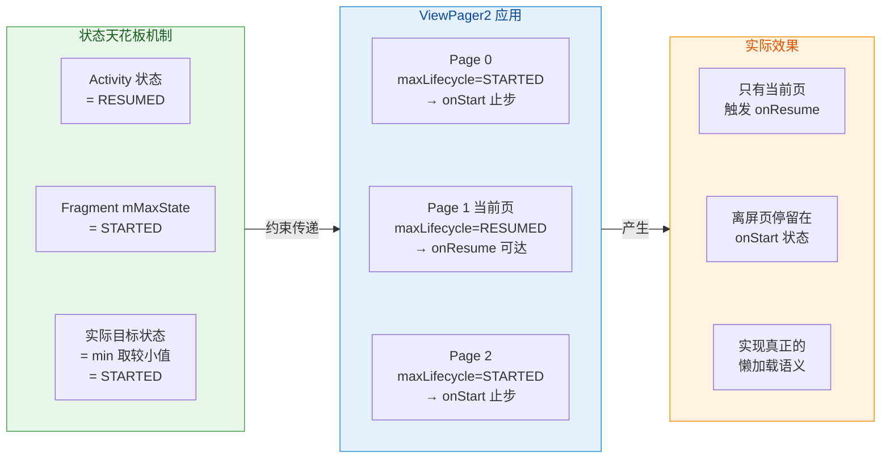
```mermaid
graph LR
    subgraph Ceiling["状态天花板机制"]
        direction TB
        C1["Activity 状态\n= RESUMED"]
        C2["Fragment mMaxState\n= STARTED"]
        C3["实际目标状态\n= min 取较小值\n= STARTED"]
        C1 ~~~ C2
        C2 ~~~ C3
    end

    subgraph VP2["ViewPager2 应用"]
        direction TB
        V1["Page 0\nmaxLifecycle=STARTED\n→ onStart 止步"]
        V2["Page 1 当前页\nmaxLifecycle=RESUMED\n→ onResume 可达"]
        V3["Page 2\nmaxLifecycle=STARTED\n→ onStart 止步"]
        V1 ~~~ V2
        V2 ~~~ V3
    end

    subgraph Effect["实际效果"]
        direction TB
        E1["只有当前页\n触发 onResume"]
        E2["离屏页停留在\nonStart 状态"]
        E3["实现真正的\n懒加载语义"]
        E1 ~~~ E2
        E2 ~~~ E3
    end

    Ceiling -->|"约束传递"| VP2
    VP2 -->|"产生"| Effect

    classDef ceilingStyle fill:#E8F5E9,stroke:#43A047,color:#1B5E20
    classDef vp2Style fill:#E3F2FD,stroke:#1E88E5,color:#0D47A1
    classDef effectStyle fill:#FFF3E0,stroke:#FB8C00,color:#E65100

    class Ceiling ceilingStyle
    class VP2 vp2Style
    class Effect effectStyle
```

### 配置变更与生命周期重建

当设备发生配置变更（如屏幕旋转）时，默认行为是 Activity 被销毁并重建。此时 Fragment 的生命周期会经历一次完整的销毁和重建流程。理解这个过程对于正确处理状态保存至关重要。

配置变更时的完整回调序列如下：

首先是销毁阶段：`onPause()` → `onStop()` → `onDestroyView()` → `onDestroy()` → `onDetach()`。然后是重建阶段：`onAttach()` → `onCreate(savedState)` → `onCreateView()` → `onViewCreated()` → `onStart()` → `onResume()`。

关键点在于：重建时 FragmentManager 会自动恢复之前添加的 Fragment。它通过 Activity 的 `onSaveInstanceState` 机制保存了 Fragment 的类名、Arguments、状态等信息。这就是为什么你不应该通过带参数的构造函数创建 Fragment——因为系统重建时会使用无参构造函数通过反射实例化 Fragment，然后重新设置之前保存的 Arguments。

```kotlin
// 错误示范：使用带参构造函数
// 配置变更后系统无法通过反射重建，会崩溃
class BadFragment(private val userId: String) : Fragment()

// 正确做法：使用 companion object + newInstance 工厂方法
class GoodFragment : Fragment() {
    companion object {
        // 参数 key 常量
        private const val ARG_USER_ID = "arg_user_id"

        // 工厂方法：创建 Fragment 实例并通过 arguments 传参
        fun newInstance(userId: String): GoodFragment {
            return GoodFragment().apply {
                // arguments 会被 FragmentManager 自动保存和恢复
                arguments = Bundle().apply {
                    putString(ARG_USER_ID, userId)
                }
            }
        }
    }

    // 在 onCreate 中安全地读取参数
    override fun onCreate(savedInstanceState: Bundle?) {
        super.onCreate(savedInstanceState)
        // requireArguments() 确保 arguments 不为 null
        val userId = requireArguments().getString(ARG_USER_ID)
    }
}
```

值得一提的是，从 `AndroidX Fragment 1.3.0` 开始，你可以通过 `FragmentFactory` 注册自定义的 Fragment 构造逻辑，从而支持依赖注入框架（如 Dagger/Hilt）向Fragment 构造函数注入参数。Hilt 的 `@AndroidEntryPoint` 注解在 Fragment 上的工作原理，正是通过自动注册一个 `FragmentFactory` 来实现的。

### 生命周期感知组件与 Fragment 的协作

Fragment 实现了 `LifecycleOwner` 接口，这意味着它可以与所有 Jetpack 生命周期感知组件（Lifecycle-aware components）无缝协作。但正如前面提到的，Fragment 实际上暴露了两个 `LifecycleOwner`：

第一个是 Fragment 自身（`this`），其生命周期跨越 `onCreate` 到 `onDestroy`。第二个是 `viewLifecycleOwner`，其生命周期跨越 `onCreateView` 到 `onDestroyView`。

选择哪个 LifecycleOwner 取决于你观察的数据与什么绑定。如果数据与 UI 展示相关（绑定到 View 上），应该使用 `viewLifecycleOwner`；如果数据与 Fragment 的业务逻辑相关（比如一个后台任务的状态），可以使用 Fragment 自身。

```kotlin
// 正确使用 viewLifecycleOwner 的示例
class UserProfileFragment : Fragment(R.layout.fragment_user_profile) {

    // 通过 activityViewModels 或 viewModels 获取 ViewModel
    private val viewModel: UserProfileViewModel by viewModels()

    override fun onViewCreated(view: View, savedInstanceState: Bundle?) {
        super.onViewCreated(view, savedInstanceState)

        // ✅ 正确：使用 viewLifecycleOwner 观察 UI 相关数据
        // 当 View 被销毁时（如进入回退栈），观察会自动取消
        // 当 View 重建时，在新的 onViewCreated 中重新注册观察
        viewModel.userName.observe(viewLifecycleOwner) { name ->
            view.findViewById<TextView>(R.id.tv_name).text = name
        }

        // ✅ 正确：使用 repeatOnLifecycle 收集 Flow
        // viewLifecycleOwner.lifecycleScope 确保协程跟随 View 生命周期
        viewLifecycleOwner.lifecycleScope.launch {
            // repeatOnLifecycle 在 STARTED 时启动收集，STOPPED 时取消
            viewLifecycleOwner.repeatOnLifecycle(Lifecycle.State.STARTED) {
                viewModel.uiState.collect { state ->
                    // 更新 UI
                    updateUI(state)
                }
            }
        }

        // ❌ 错误：使用 this（Fragment 自身）作为 LifecycleOwner
        // 如果 Fragment 进入回退栈后 View 被销毁，
        // 但 Fragment 实例仍存活，观察不会取消
        // 当 LiveData 发射新值时，会尝试更新已销毁的 View，导致崩溃
        // viewModel.userName.observe(this) { name ->
        //     view.findViewById<TextView>(R.id.tv_name).text = name
        // }
    }
}
```

这里有一个微妙但重要的时序问题：`viewLifecycleOwner` 只有在 `onCreateView` 返回非 null 之后才可用。如果你在 `onCreate` 中尝试访问 `viewLifecycleOwner`，会得到一个 `IllegalStateException`。这也是为什么所有与 View 相关的观察都应该放在 `onViewCreated` 中，而不是 `onCreate` 中。

### 常见生命周期陷阱与最佳实践

在实际开发中，Fragment 生命周期的复杂性经常导致一些隐蔽的 bug。以下是几个最常见的陷阱及其解决方案。

第一个陷阱是在 `onDestroyView` 之后仍然持有 View 引用。当使用 ViewBinding 时，如果不在 `onDestroyView` 中将 binding 置空，Fragment 进入回退栈后，旧的 View 树会因为被 binding 对象引用而无法被垃圾回收。正确的做法是使用一个 nullable 的 backing field：

```kotlin
// ViewBinding 在 Fragment 中的标准用法
class StandardFragment : Fragment(R.layout.fragment_standard) {

    // backing field 使用 nullable 类型
    private var _binding: FragmentStandardBinding? = null
    // 对外暴露非空属性，仅在 View 存活期间使用
    // 通过 !! 断言，如果在错误的时机访问会立即崩溃（fail-fast）
    private val binding get() = _binding!!

    override fun onViewCreated(view: View, savedInstanceState: Bundle?) {
        super.onViewCreated(view, savedInstanceState)
        // 绑定 View
        _binding = FragmentStandardBinding.bind(view)
        // 安全地使用 binding
        binding.tvTitle.text = "Hello"
    }

    override fun onDestroyView() {
        // 必须在 super 之前置空，释放对 View 树的引用
        _binding = null
        super.onDestroyView()
    }
}
```

第二个陷阱是在错误的生命周期阶段执行 FragmentTransaction。如果在 `onSaveInstanceState` 之后调用 `commit()`，会抛出著名的 `IllegalStateException: Can not perform this action after onSaveInstanceState`。这是因为 `onSaveInstanceState` 之后，FragmentManager 已经保存了当前状态的快照，任何新的事务都无法被记录到快照中，系统为了防止状态丢失而主动抛出异常。解决方案是使用 `commitAllowingStateLoss()`，但这应该是最后手段——更好的做法是确保事务在正确的生命周期窗口内执行。

第三个陷阱与协程作用域有关。Fragment 提供了 `lifecycleScope`（绑定 Fragment 实例生命周期）和 `viewLifecycleOwner.lifecycleScope`（绑定 View 生命周期）两个协程作用域。如果你在 `lifecycleScope` 中启动了一个更新 UI 的协程，当 Fragment 进入回退栈、View 被销毁后，协程仍然在运行（因为 Fragment 实例还活着），此时访问 View 就会崩溃。正确做法是将所有 UI 更新协程绑定到 `viewLifecycleOwner.lifecycleScope`。

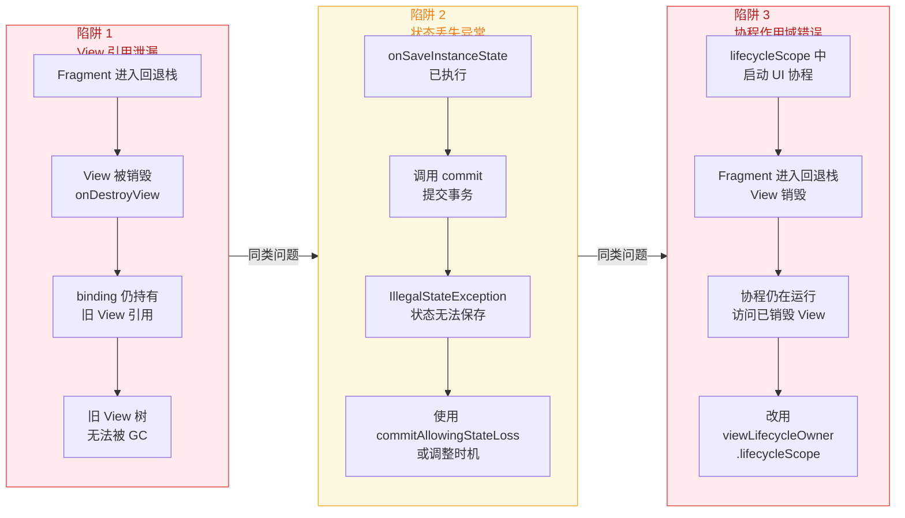
```mermaid
graph LR
    subgraph Pitfall1["陷阱 1\nView 引用泄漏"]
        direction TB
        P1A["Fragment 进入回退栈"]
        P1B["View 被销毁\nonDestroyView"]
        P1C["binding 仍持有\n旧 View 引用"]
        P1D["旧 View 树\n无法被 GC"]
        P1A --> P1B
        P1B --> P1C
        P1C --> P1D
    end

    subgraph Pitfall2["陷阱 2\n状态丢失异常"]
        direction TB
        P2A["onSaveInstanceState\n已执行"]
        P2B["调用 commit\n提交事务"]
        P2C["IllegalStateException\n状态无法保存"]
        P2D["使用 commitAllowingStateLoss\n或调整时机"]
        P2A --> P2B
        P2B --> P2C
        P2C --> P2D
    end

    subgraph Pitfall3["陷阱 3\n协程作用域错误"]
        direction TB
        P3A["lifecycleScope 中\n启动 UI 协程"]
        P3B["Fragment 进入回退栈\nView 销毁"]
        P3C["协程仍在运行\n访问已销毁 View"]
        P3D["改用\nviewLifecycleOwner\n.lifecycleScope"]
        P3A --> P3B
        P3B --> P3C
        P3C --> P3D
    end

    Pitfall1 -->|"同类问题"| Pitfall2
    Pitfall2 -->|"同类问题"| Pitfall3

    classDef pitfallStyle fill:#FFEBEE,stroke:#E53935,color:#B71C1C
    classDef solutionStyle fill:#E8F5E9,stroke:#43A047,color:#1B5E20
    classDef warnStyle fill:#FFF8E1,stroke:#F9A825,color:#F57F17

    class Pitfall1 pitfallStyle
    class Pitfall2 warnStyle
    class Pitfall3 pitfallStyle
```

---

**📝 练习题**

一个 Fragment 被 `replace` 并加入回退栈（addToBackStack），当用户按返回键回到该 Fragment 时，以下哪些回调会被重新调用？

A. `onAttach()` → `onCreate()` → `onCreateView()` → `onStart()` → `onResume()`

B. `onCreateView()` → `onViewCreated()` → `onStart()` → `onResume()`

C. `onStart()` → `onResume()`

D. `onCreate()` → `onCreateView()` → `onViewCreated()` → `onStart()` → `onResume()`

**【答案】** B

**【解析】** 当 Fragment 被 replace 并加入回退栈时，它的 View 会被销毁（`onDestroyView` 被调用），但 Fragment 实例本身不会被销毁（`onDestroy` 和 `onDetach` 不会调用）。Fragment 停留在 `CREATED` 状态。当用户按返回键，FragmentManager 从回退栈中弹出事务并恢复该 Fragment 时，需要重新创建 View，因此从 `onCreateView()` 开始重新走视图相关的生命周期：`onCreateView()` → `onViewCreated()` → `onStart()` → `onResume()`。`onAttach()` 和 `onCreate()` 不会再次调用，因为 Fragment 实例一直存活且从未与宿主断开关联。这正是 Fragment "双生命周期"机制的直接体现——Fragment 实例的生命周期比 View 的生命周期更长。

---

## FragmentManager 管理器

FragmentManager 是 Android Fragment 体系中的"中枢调度器"。如果说 Fragment 是一个个独立的 UI 模块，那么 FragmentManager 就是负责管理这些模块的"容器管理员"——它决定哪些 Fragment 当前处于活跃状态、维护着所有事务的执行队列、并管理着用户按下返回键时的回退栈（Back Stack）。理解 FragmentManager 的工作机制，是写出健壮 Fragment 代码的前提。

从架构角度看，FragmentManager 并不是一个简单的"列表容器"。它内部维护了一套完整的状态机（Fragment State Machine），每个被添加的 Fragment 都会被 FragmentManager 驱动经历一系列状态迁移（从 `INITIALIZING` 到 `RESUMED`），而这些状态迁移的时机，完全由 FragmentManager 根据宿主 Activity 的生命周期状态来决定。换句话说，FragmentManager 是 Fragment 生命周期的真正驱动者（the actual driver of Fragment lifecycle transitions）。

### FragmentManager 的获取方式与层级关系

在实际开发中，我们会遇到两种 FragmentManager，它们的获取方式和作用域完全不同，混淆使用是导致 Fragment 嵌套 Bug 的常见原因。

第一种是 Activity 级别的 FragmentManager，通过 `getSupportFragmentManager()`（在 Kotlin 中直接访问 `supportFragmentManager` 属性）获取。它管理的是直接挂载在 Activity 上的所有 Fragment，是整个 Fragment 层级树的根节点管理器。当你在 Activity 中添加、替换 Fragment 时，使用的就是这个管理器。

第二种是 Fragment 级别的 ChildFragmentManager，通过 Fragment 内部的 `getChildFragmentManager()` 获取。它管理的是嵌套在当前 Fragment 内部的子 Fragment。比如一个 Fragment 内部使用了 ViewPager2 来展示多个子页面，这些子页面 Fragment 就应该由父 Fragment 的 ChildFragmentManager 来管理。

与 ChildFragmentManager 对应的还有一个 `getParentFragmentManager()`，它返回的是"管理当前 Fragment 的那个 FragmentManager"。如果当前 Fragment 是直接挂在 Activity 上的，那 `parentFragmentManager` 就等同于 Activity 的 `supportFragmentManager`；如果当前 Fragment 是某个父 Fragment 的子 Fragment，那 `parentFragmentManager` 就是父 Fragment 的 `childFragmentManager`。

这种层级关系可以用下面的图来理解：

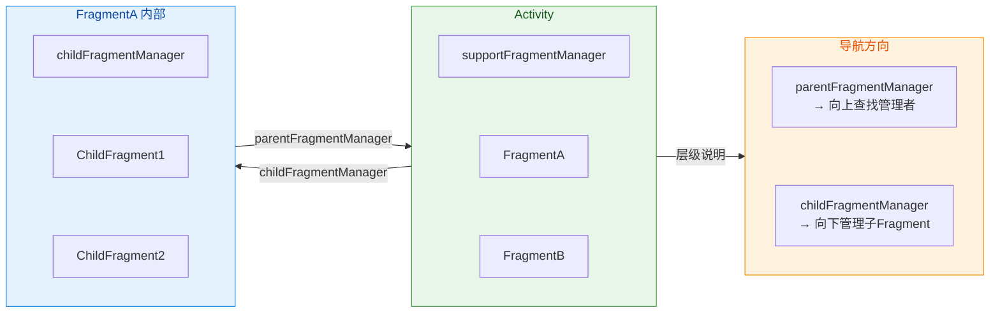
```mermaid
graph LR
    subgraph Activity["Activity"]
        direction TB
        SFM["supportFragmentManager"]
        FA["FragmentA"]
        FB["FragmentB"]
        SFM ~~~ FA
        FA ~~~ FB
    end

    subgraph FragAScope["FragmentA 内部"]
        direction TB
        CFM["childFragmentManager"]
        FC["ChildFragment1"]
        FD["ChildFragment2"]
        CFM ~~~ FC
        FC ~~~ FD
    end

    subgraph NavDirection["导航方向"]
        direction TB
        N1["parentFragmentManager\n→ 向上查找管理者"]
        N2["childFragmentManager\n→ 向下管理子Fragment"]
        N1 ~~~ N2
    end

    Activity -->|"childFragmentManager"| FragAScope
    FragAScope -->|"parentFragmentManager"| Activity
    Activity -->|"层级说明"| NavDirection

    classDef activityStyle fill:#E8F5E9,stroke:#43A047,color:#1B5E20
    classDef fragStyle fill:#E3F2FD,stroke:#1E88E5,color:#0D47A1
    classDef navStyle fill:#FFF3E0,stroke:#FB8C00,color:#E65100

    class Activity activityStyle
    class FragAScope fragStyle
    class NavDirection navStyle
```

一个极其常见的错误是：在子 Fragment 内部想要添加自己的子 Fragment 时，错误地使用了 `parentFragmentManager` 而不是 `childFragmentManager`。这会导致子 Fragment 被添加到了上一级的管理域中，生命周期分发出现混乱，甚至在父 Fragment 被销毁时子 Fragment 仍然残留。记住一个简单的原则：**向下管理用 `childFragmentManager`，向上通信用 `parentFragmentManager`**。

### findFragmentById 与 findFragmentByTag

FragmentManager 提供了两种核心的查找方法，让我们能够在运行时获取到已经添加的 Fragment 实例。

`findFragmentById(int id)` 根据容器的 View ID 来查找当前挂载在该容器中的 Fragment。这里的 id 参数是 Fragment 所在的容器布局 ID（比如 `R.id.fragment_container`），而不是 Fragment 自身的某个 ID。当一个容器中通过 `replace` 操作只保留了一个 Fragment 时，这个方法能精确返回当前显示的那个 Fragment。但如果同一个容器中通过 `add` 操作叠加了多个 Fragment，`findFragmentById` 只会返回最后添加的那个——这一点容易被忽略。

```kotlin
// 在 Activity 中查找当前容器内的 Fragment
// findFragmentById 的参数是容器的 ID，不是 Fragment 的布局 ID
val currentFragment = supportFragmentManager
    .findFragmentById(R.id.fragment_container)  // 返回该容器中最后添加的 Fragment

// 需要进行类型判断和安全转换
if (currentFragment is HomeFragment) {
    // 当前显示的是 HomeFragment，可以安全调用其方法
    currentFragment.refreshData()
}
```

`findFragmentByTag(String tag)` 则是根据我们在添加 Fragment 时手动指定的 tag 字符串来查找。这种方式更加灵活和精确，因为 tag 是我们自己定义的唯一标识符，不受容器 ID 的限制。即使 Fragment 没有被添加到任何容器中（比如无 UI 的 headless Fragment），也可以通过 tag 来找到它。

```kotlin
// 添加 Fragment 时指定 tag
supportFragmentManager.beginTransaction()
    .add(R.id.fragment_container, HomeFragment(), "HOME")  // "HOME" 就是 tag
    .commit()

// 之后在任何地方通过 tag 查找
val homeFragment = supportFragmentManager
    .findFragmentByTag("HOME")  // 根据 tag 精确查找，不依赖容器 ID

// tag 查找的一个经典用途：防止重复添加
// 比如屏幕旋转后 Activity 重建，Fragment 会被系统自动恢复
// 如果不检查就再次 add，会导致重复叠加
if (supportFragmentManager.findFragmentByTag("HOME") == null) {
    // 只有在找不到时才添加，避免重复
    supportFragmentManager.beginTransaction()
        .add(R.id.fragment_container, HomeFragment(), "HOME")
        .commit()
}
```

`findFragmentByTag` 在实际项目中有一个非常重要的应用场景：**防止 Fragment 重复添加**。当 Activity 因为配置变更（如屏幕旋转）被销毁重建时，系统会自动恢复之前添加的 Fragment（通过 `onSaveInstanceState` 机制）。如果我们在 `onCreate` 中不做检查就直接 `add` 一个新的 Fragment，就会导致容器中出现两个相同的 Fragment 实例叠加在一起。通过 `findFragmentByTag` 先检查是否已存在，是解决这个问题的标准做法。

还有一个细节值得注意：这两个查找方法的搜索范围仅限于当前 FragmentManager 管理的 Fragment。也就是说，Activity 的 `supportFragmentManager.findFragmentByTag("CHILD_TAG")` 是找不到某个 Fragment 内部通过 `childFragmentManager` 添加的子 Fragment 的。查找操作不会递归穿透层级边界。

### 事务队列与异步调度机制

FragmentManager 内部维护了一个事务队列（a pending transaction queue），所有通过 `commit()` 提交的事务并不会立即执行，而是被投递到主线程 Handler 的消息队列中，等待下一次消息循环时才被批量处理。这个设计是 Fragment 事务系统中最容易引发困惑的地方之一。

为什么要设计成异步的？核心原因是 **性能优化与一致性保证**。想象一个场景：在一个方法中连续提交了三个事务——移除 FragmentA、添加 FragmentB、隐藏 FragmentC。如果每个事务都立即执行，就意味着每次都要触发一轮完整的生命周期回调和视图更新，造成不必要的中间状态渲染。而异步批量处理的方式，可以让 FragmentManager 在一次消息循环中把这三个事务合并处理，只触发一次最终的视图更新，效率更高，状态也更一致。

但异步执行也带来了一个问题：在 `commit()` 调用之后、事务真正执行之前，如果你立即去 `findFragmentByTag` 查找刚刚添加的 Fragment，会返回 `null`，因为事务还没有被处理。

```kotlin
// 演示异步 commit 的"延迟生效"问题
supportFragmentManager.beginTransaction()
    .add(R.id.container, MyFragment(), "MY_TAG")
    .commit()  // 事务被投递到 Handler 消息队列，但尚未执行

// ⚠️ 此时立即查找，返回 null！因为事务还在队列中等待
val fragment = supportFragmentManager.findFragmentByTag("MY_TAG")
// fragment == null  ← 这不是 Bug，是异步调度的正常行为
```

为了解决这个问题，FragmentManager 提供了 `executePendingTransactions()` 方法，它会强制立即同步执行队列中所有待处理的事务：

```kotlin
supportFragmentManager.beginTransaction()
    .add(R.id.container, MyFragment(), "MY_TAG")
    .commit()  // 投递到队列

// 强制立即执行所有待处理事务
supportFragmentManager.executePendingTransactions()

// 现在可以安全查找了
val fragment = supportFragmentManager.findFragmentByTag("MY_TAG")
// fragment != null ✓
```

不过，`executePendingTransactions()` 会执行队列中的所有待处理事务，而不仅仅是你刚刚提交的那一个。在复杂场景下，这可能会导致其他事务被提前执行，产生意料之外的副作用。因此，Android 后来引入了 `commitNow()` 方法，它让单个事务立即同步执行，而不影响队列中的其他事务（关于 `commit` 与 `commitNow` 的详细对比，将在下一节"事务操作 Transaction"中展开）。

下面这张图展示了事务从提交到执行的完整流程：

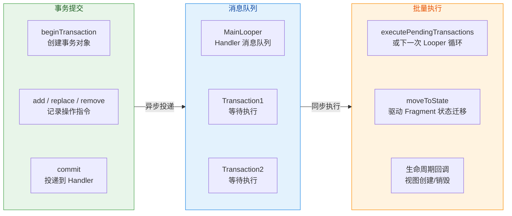
```mermaid
graph LR
    subgraph Submit["事务提交"]
        direction TB
        S1["beginTransaction\n创建事务对象"]
        S2["add / replace / remove\n记录操作指令"]
        S3["commit\n投递到 Handler"]
        S1 ~~~ S2
        S2 ~~~ S3
    end

    subgraph Queue["消息队列"]
        direction TB
        Q1["MainLooper\nHandler 消息队列"]
        Q2["Transaction1\n等待执行"]
        Q3["Transaction2\n等待执行"]
        Q1 ~~~ Q2
        Q2 ~~~ Q3
    end

    subgraph Execute["批量执行"]
        direction TB
        E1["executePendingTransactions\n或下一次 Looper 循环"]
        E2["moveToState\n驱动 Fragment 状态迁移"]
        E3["生命周期回调\n视图创建/销毁"]
        E1 ~~~ E2
        E2 ~~~ E3
    end

    Submit -->|"异步投递"| Queue -->|"同步执行"| Execute

    classDef submitStyle fill:#E8F5E9,stroke:#43A047,color:#1B5E20
    classDef queueStyle fill:#E3F2FD,stroke:#1E88E5,color:#0D47A1
    classDef execStyle fill:#FFF3E0,stroke:#FB8C00,color:#E65100

    class Submit submitStyle
    class Queue queueStyle
    class Execute execStyle
```

事务队列的内部实现其实并不复杂。FragmentManager 内部持有一个 `ArrayList<BackStackRecord>` 类型的 `mPendingActions` 列表。每次 `commit()` 被调用时，对应的 `BackStackRecord`（它实现了 `FragmentTransaction` 接口）会被添加到这个列表中，同时通过 `mHost.getHandler().post()` 向主线程 Handler 投递一个执行任务。当这个任务被 Looper 取出执行时，FragmentManager 会遍历 `mPendingActions` 中的所有记录，依次执行每个事务中记录的操作（add、remove、replace 等），并通过内部的 `moveToState()` 方法驱动相关 Fragment 进行状态迁移。

### 回退栈管理（Back Stack）

回退栈是 FragmentManager 提供的一个非常实用的功能，它让 Fragment 的导航体验可以像 Activity 栈一样支持"返回"操作。当用户按下返回键时，如果回退栈中有记录，FragmentManager 会自动弹出栈顶的事务并反向执行（undo），恢复到上一个 Fragment 状态，而不是直接关闭 Activity。

要将一个事务加入回退栈，只需要在提交前调用 `addToBackStack(String name)` 方法：

```kotlin
supportFragmentManager.beginTransaction()
    .replace(R.id.container, DetailFragment())  // 用 DetailFragment 替换当前内容
    .addToBackStack("detail")  // 将这个事务压入回退栈，name 可以为 null
    .commit()

// 当用户按返回键时，FragmentManager 会自动：
// 1. 弹出栈顶事务（即这个 replace 操作）
// 2. 反向执行：移除 DetailFragment，恢复之前被替换掉的 Fragment
```

`addToBackStack` 的参数 `name` 是一个可选的标识符，可以传 `null`。这个 name 的作用是在后续需要弹出到特定位置时作为标记使用（通过 `popBackStack(String name, int flags)` 方法）。

理解回退栈的关键在于：**回退栈记录的是事务（Transaction），而不是 Fragment 本身**。当一个事务被弹出时，FragmentManager 执行的是该事务的逆操作。比如事务中执行了 `replace(container, B)`（先 remove A 再 add B），那么弹出时就会执行逆操作：remove B 再 add A。这意味着被替换掉的 Fragment A 并没有被销毁（如果事务在回退栈中），它的实例会被 FragmentManager 保留，只是视图被销毁了（走到 `onDestroyView`），等到事务被弹出恢复时，会重新走 `onCreateView` 创建视图。

```kotlin
// 回退栈的弹出操作
// 方式一：弹出栈顶的一个事务（等同于用户按返回键的效果）
supportFragmentManager.popBackStack()

// 方式二：弹出到指定 name 的事务（包含该事务本身）
// flag = FragmentManager.POP_BACK_STACK_INCLUSIVE 表示连 name 对应的事务也一起弹出
supportFragmentManager.popBackStack("detail", FragmentManager.POP_BACK_STACK_INCLUSIVE)

// 方式三：弹出到指定 name 的事务（不包含该事务本身）
// flag = 0 表示弹出 "detail" 之上的所有事务，但保留 "detail" 本身
supportFragmentManager.popBackStack("detail", 0)

// 方式四：清空整个回退栈
// 传入 null 和 INCLUSIVE 标志，会弹出所有事务
supportFragmentManager.popBackStack(null, FragmentManager.POP_BACK_STACK_INCLUSIVE)
```

`popBackStack` 方法同样是异步的（投递到 Handler 队列），如果需要同步立即执行，可以使用 `popBackStackImmediate()` 系列方法。

回退栈还有一个容易被忽视的行为差异：**`add` 与 `replace` 在配合回退栈时的表现完全不同**。当使用 `replace` + `addToBackStack` 时，被替换的 Fragment 不会走 `onDestroy`（因为回退栈持有事务记录，需要保留 Fragment 实例以便恢复），但会走 `onDestroyView`（视图被移除）。而当使用 `add` + `addToBackStack` 时，新 Fragment 被叠加在旧 Fragment 之上，旧 Fragment 的视图甚至都不会被销毁——它只是被新 Fragment 遮挡了。

```kotlin
// 场景对比：replace vs add 配合回退栈

// 场景 1：replace + addToBackStack
// 假设当前容器中有 FragmentA
supportFragmentManager.beginTransaction()
    .replace(R.id.container, FragmentB())  // 移除 A 的视图，添加 B
    .addToBackStack(null)
    .commit()
// FragmentA 的生命周期：onPause → onStop → onDestroyView（视图销毁，但实例保留）
// FragmentB 的生命周期：onAttach → onCreate → onCreateView → onStart → onResume
// 按返回键弹出后：
// FragmentB：onPause → onStop → onDestroyView → onDestroy → onDetach（完全销毁）
// FragmentA：onCreateView → onStart → onResume（视图重建，实例复用）

// 场景 2：add + addToBackStack
// 假设当前容器中有 FragmentA
supportFragmentManager.beginTransaction()
    .add(R.id.container, FragmentB())  // B 叠加在 A 之上
    .addToBackStack(null)
    .commit()
// FragmentA 的生命周期：无变化！A 仍然处于 RESUMED 状态
// FragmentB 的生命周期：onAttach → onCreate → onCreateView → onStart → onResume
// 按返回键弹出后：
// FragmentB：完全销毁
// FragmentA：无变化（它一直都在）
```

这个差异在实际开发中非常重要。如果你使用 `add` 叠加 Fragment 但没有意识到底层 Fragment 仍然处于 `RESUMED` 状态，可能会导致底层 Fragment 继续响应事件、继续执行网络请求等不期望的行为。

我们可以通过 `getBackStackEntryCount()` 和 `getBackStackEntryAt(int index)` 来查询回退栈的当前状态，还可以通过 `addOnBackStackChangedListener` 监听回退栈的变化：

```kotlin
// 监听回退栈变化，常用于根据栈深度更新 UI（如显示/隐藏返回按钮）
supportFragmentManager.addOnBackStackChangedListener {
    // 每当回退栈发生变化（push 或 pop）时回调
    val stackDepth = supportFragmentManager.backStackEntryCount  // 当前栈深度
    
    // 典型用法：栈为空时隐藏 Toolbar 的返回箭头
    val showBackButton = stackDepth > 0
    supportActionBar?.setDisplayHomeAsUpEnabled(showBackButton)
    
    // 也可以遍历栈中的条目获取详细信息
    for (i in 0 until stackDepth) {
        val entry = supportFragmentManager.getBackStackEntryAt(i)
        // entry.name 就是 addToBackStack 时传入的 name
        // entry.id 是系统分配的唯一 ID
        Log.d("BackStack", "Entry $i: name=${entry.name}, id=${entry.id}")
    }
}
```

### FragmentManager 的内部状态机

FragmentManager 内部为每个 Fragment 维护了一个状态值（`mState`），这个状态值是一个整数，对应着 Fragment 从创建到销毁的各个阶段。FragmentManager 通过核心方法 `moveToState()` 来驱动 Fragment 在这些状态之间迁移，而迁移的目标状态取决于宿主 Activity 当前的生命周期状态。

Fragment 的内部状态常量定义如下（从低到高）：

```kotlin
// Fragment 内部状态常量（源码中的定义）
// 这些状态值是递增的整数，FragmentManager 通过比较当前状态和目标状态来决定前进还是后退

// static final int INITIALIZING = -1   // Fragment 刚被实例化，尚未 attach
// static final int ATTACHED = 0        // 已 attach 到 Activity，但 onCreate 未调用
// static final int CREATED = 1         // onCreate 已调用
// static final int VIEW_CREATED = 2    // onCreateView + onViewCreated 已调用（Jetpack 新增）
// static final int AWAITING_EXIT_EFFECTS = 3  // 等待退出动画完成
// static final int ACTIVITY_CREATED = 4 // onActivityCreated 已调用（已废弃但仍在状态机中）
// static final int STARTED = 5         // onStart 已调用，Fragment 可见
// static final int AWAITING_ENTER_EFFECTS = 6 // 等待进入动画完成
// static final int RESUMED = 7         // onResume 已调用，Fragment 可交互
```

当 Activity 进入 `RESUMED` 状态时，FragmentManager 会将所有活跃 Fragment 的目标状态设为 `RESUMED`，然后对每个 Fragment 调用 `moveToState(RESUMED)`。如果某个 Fragment 当前处于 `CREATED` 状态，`moveToState` 就会依次将其推进经过 `VIEW_CREATED` → `ACTIVITY_CREATED` → `STARTED` → `RESUMED`，每一步都会触发对应的生命周期回调。反之，当 Activity 进入 `STOPPED` 状态时，FragmentManager 会将目标状态降为 `STARTED` 以下，驱动 Fragment 反向迁移，触发 `onPause` → `onStop` 等回调。

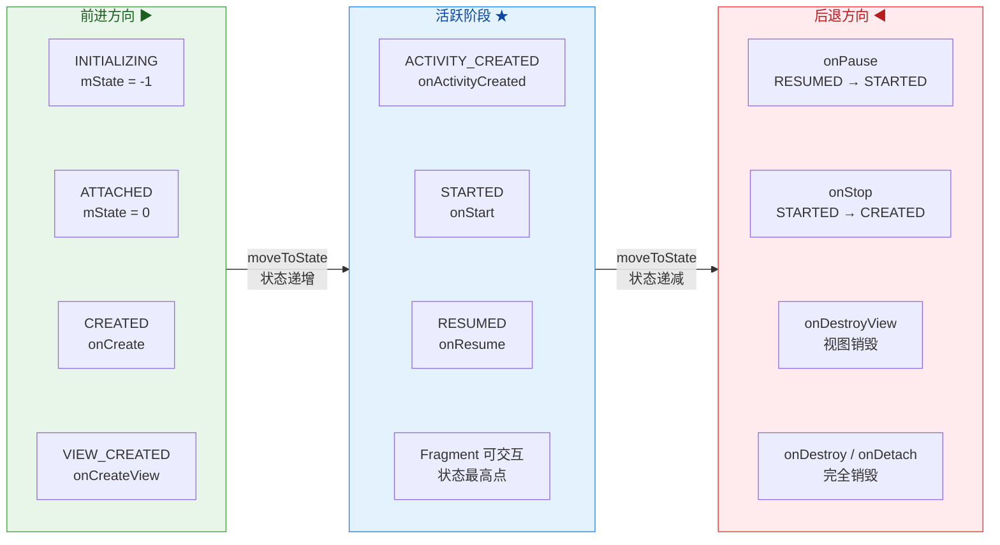
```mermaid
graph LR
    subgraph Forward["前进方向 ▶"]
        direction TB
        F1["INITIALIZING\nmState = -1"]
        F2["ATTACHED\nmState = 0"]
        F3["CREATED\nonCreate"]
        F4["VIEW_CREATED\nonCreateView"]
        F1 ~~~ F2
        F2 ~~~ F3
        F3 ~~~ F4
    end

    subgraph Active["活跃阶段 ★"]
        direction TB
        A1["ACTIVITY_CREATED\nonActivityCreated"]
        A2["STARTED\nonStart"]
        A3["RESUMED\nonResume"]
        A4["Fragment 可交互\n状态最高点"]
        A1 ~~~ A2
        A2 ~~~ A3
        A3 ~~~ A4
    end

    subgraph Backward["后退方向 ◀"]
        direction TB
        B1["onPause\nRESUMED → STARTED"]
        B2["onStop\nSTARTED → CREATED"]
        B3["onDestroyView\n视图销毁"]
        B4["onDestroy / onDetach\n完全销毁"]
        B1 ~~~ B2
        B2 ~~~ B3
        B3 ~~~ B4
    end

    Forward -->|"moveToState\n状态递增"| Active -->|"moveToState\n状态递减"| Backward

    classDef fwdStyle fill:#E8F5E9,stroke:#43A047,color:#1B5E20
    classDef activeStyle fill:#E3F2FD,stroke:#1E88E5,color:#0D47A1
    classDef bwdStyle fill:#FFEBEE,stroke:#E53935,color:#B71C1C

    class Forward fwdStyle
    class Active activeStyle
    class Backward bwdStyle
```

这个状态机机制解释了一个常见的疑问：为什么在 `commit()` 一个 `add` 事务之后，Fragment 的 `onCreateView` 不会立即被调用？因为 `commit()` 只是把事务放入队列，真正的 `moveToState()` 调用要等到事务被执行时才会发生。而且，`moveToState()` 推进到哪个状态，取决于此刻 Activity 处于什么生命周期阶段。如果 Activity 当前处于 `STARTED`（可见但不可交互），那么新添加的 Fragment 最多只会被推进到 `STARTED` 状态，`onResume` 要等到 Activity 自身 `onResume` 之后才会被调用。

### FragmentManager 的实用 API 汇总

除了前面详细讨论的查找和回退栈操作，FragmentManager 还提供了一些在日常开发中经常用到的 API：

```kotlin
// ① 获取当前所有已添加的 Fragment 列表
val allFragments: List<Fragment> = supportFragmentManager.fragments
// 注意：这个列表包含所有通过 add 添加的 Fragment（包括 hide 状态的）
// 但不包含已经被 remove 且不在回退栈中的 Fragment

// ② 判断当前是否有待执行的事务
// isStateSaved 返回 true 表示 Activity 已经执行了 onSaveInstanceState
// 此时再 commit 会抛出 IllegalStateException
val isSaved: Boolean = supportFragmentManager.isStateSaved

// ③ 注册 FragmentLifecycleCallbacks 监听所有 Fragment 的生命周期
// 这是一个非常强大的调试和监控工具
supportFragmentManager.registerFragmentLifecycleCallbacks(
    object : FragmentManager.FragmentLifecycleCallbacks() {
        // recursive = true 表示也监听子 FragmentManager 中的 Fragment
        override fun onFragmentCreated(
            fm: FragmentManager,
            f: Fragment,
            savedInstanceState: Bundle?
        ) {
            // 任何 Fragment 的 onCreate 被调用时都会触发
            Log.d("FragmentMonitor", "${f::class.simpleName} created")
        }

        override fun onFragmentResumed(fm: FragmentManager, f: Fragment) {
            Log.d("FragmentMonitor", "${f::class.simpleName} resumed")
        }

        override fun onFragmentDestroyed(fm: FragmentManager, f: Fragment) {
            Log.d("FragmentMonitor", "${f::class.simpleName} destroyed")
        }
    },
    true  // recursive: 是否递归监听子 Fragment
)

// ④ 设置 FragmentFactory（自定义 Fragment 实例化方式）
// 默认情况下 FragmentManager 通过反射调用无参构造函数来创建 Fragment
// 通过 FragmentFactory 可以实现依赖注入
supportFragmentManager.fragmentFactory = object : FragmentFactory() {
    override fun instantiate(classLoader: ClassLoader, className: String): Fragment {
        // 根据类名返回自定义构造的 Fragment 实例
        return when (className) {
            HomeFragment::class.java.name -> HomeFragment(repository)  // 注入依赖
            else -> super.instantiate(classLoader, className)  // 其他走默认逻辑
        }
    }
}
```

`FragmentLifecycleCallbacks` 特别值得关注。它提供了一种全局监听 Fragment生命周期的能力，而不需要在每个 Fragment 内部插入日志代码。在大型项目中，它常被用于：统一的页面埋点（tracking）、内存泄漏检测（检查 `onDestroyed` 后是否仍有引用）、以及调试复杂的 Fragment 嵌套问题。`recursive` 参数设为 `true` 时，连 `childFragmentManager` 管理的子 Fragment 的生命周期也会被捕获，这在排查 ViewPager2 内嵌 Fragment 的生命周期问题时非常有用。

### FragmentManager 常见陷阱与最佳实践

在实际项目中，FragmentManager 的使用有几个高频踩坑点，值得逐一展开。

**陷阱一：在 `onSaveInstanceState` 之后 `commit` 导致崩溃。** 这是 Fragment 开发中最经典的异常之一：`IllegalStateException: Can not perform this action after onSaveInstanceState`。原因是当 Activity 执行了 `onSaveInstanceState` 之后，系统已经对当前的 Fragment 状态做了快照保存。如果此时再提交新的事务，这些事务的效果不会被包含在已保存的状态中，当 Activity 被系统杀死后恢复时，这些事务就会丢失，导致状态不一致。为了防止这种"静默丢失"，FragmentManager 选择直接抛出异常来提醒开发者。

```kotlin
// ❌ 错误示范：在异步回调中直接 commit，可能此时 Activity 已经 onSaveInstanceState
fun onDataLoaded(data: Data) {
    // 如果这个回调在 Activity onStop 之后才到达，commit 会崩溃
    supportFragmentManager.beginTransaction()
        .replace(R.id.container, ResultFragment())
        .commit()  // 💥 IllegalStateException
}

// ✅ 方案一：使用 commitAllowingStateLoss()
// 允许状态丢失，不会抛异常，但事务可能在恢复时丢失
fun onDataLoaded(data: Data) {
    supportFragmentManager.beginTransaction()
        .replace(R.id.container, ResultFragment())
        .commitAllowingStateLoss()  // 不会崩溃，但有状态丢失风险
}

// ✅ 方案二（推荐）：检查生命周期状态，确保在安全时机执行
fun onDataLoaded(data: Data) {
    // 利用 Lifecycle 确保只在 STARTED 之后执行
    if (lifecycle.currentState.isAtLeast(Lifecycle.State.STARTED)) {
        supportFragmentManager.beginTransaction()
            .replace(R.id.container, ResultFragment())
            .commit()
    }
}

// ✅ 方案三（最佳）：结合 LifecycleOwner 自动调度
// 使用 lifecycleScope 确保协程在生命周期安全时执行
lifecycleScope.launchWhenStarted {
    val data = repository.loadData()  // 挂起等待数据
    // 恢复时一定处于 STARTED 之后，commit 安全
    supportFragmentManager.beginTransaction()
        .replace(R.id.container, ResultFragment())
        .commit()
}
```

`commitAllowingStateLoss()` 虽然能避免崩溃，但它本质上是在告诉系统"我接受这个事务可能丢失"。在用户可见的核心导航流程中使用它是不推荐的，因为一旦状态丢失，用户可能会看到界面回退到了一个意料之外的状态。它更适合用于那些"丢了也无所谓"的场景，比如更新一个非关键的 UI 提示。

**陷阱二：Fragment 重叠问题。** 前面在 `findFragmentByTag` 部分已经提到过，Activity 重建时系统会自动恢复 Fragment。如果开发者在 `onCreate` 中无条件地添加 Fragment，就会导致恢复的旧实例和新创建的实例同时存在于容器中，视觉上表现为两个 Fragment 重叠。

```kotlin
// ❌ 错误示范：每次 onCreate 都无条件添加
override fun onCreate(savedInstanceState: Bundle?) {
    super.onCreate(savedInstanceState)
    setContentView(R.layout.activity_main)
    
    // 屏幕旋转后，系统已经恢复了之前的 HomeFragment
    // 这里又添加了一个新的，导致重叠
    supportFragmentManager.beginTransaction()
        .add(R.id.container, HomeFragment(), "HOME")
        .commit()
}

// ✅ 正确做法：检查 savedInstanceState 或使用 findFragmentByTag
override fun onCreate(savedInstanceState: Bundle?) {
    super.onCreate(savedInstanceState)
    setContentView(R.layout.activity_main)
    
    // 方式一：savedInstanceState 为 null 说明是首次创建，不是恢复
    if (savedInstanceState == null) {
        supportFragmentManager.beginTransaction()
            .add(R.id.container, HomeFragment(), "HOME")
            .commit()
    }
    // 如果是恢复（savedInstanceState != null），系统已经自动恢复了 Fragment，无需再添加
    
    // 方式二：通过 tag 检查是否已存在
    if (supportFragmentManager.findFragmentByTag("HOME") == null) {
        supportFragmentManager.beginTransaction()
            .add(R.id.container, HomeFragment(), "HOME")
            .commit()
    }
}
```

两种方式都可以，但 `savedInstanceState == null` 的判断更加简洁和语义明确，是 Google 官方推荐的写法。

**陷阱三：在错误的 FragmentManager 层级上操作。** 这个问题在嵌套 Fragment 场景中尤为常见。比如在一个子 Fragment 中想要弹出自己所在的回退栈，如果错误地使用了 `childFragmentManager.popBackStack()`（子 Fragment 自己的 childFragmentManager），而不是 `parentFragmentManager.popBackStack()`（管理自己的那个 FragmentManager），操作就不会生效，因为你弹的是错误层级的栈。

```kotlin
// 在子 Fragment 中想要"返回上一页"
class DetailChildFragment : Fragment() {
    
    fun navigateBack() {
        // ❌ 错误：childFragmentManager 管理的是自己内部的子 Fragment
        // 弹它的栈不会影响自己在父级中的位置
        childFragmentManager.popBackStack()
        
        // ✅ 正确：parentFragmentManager 是管理自己的那个 FragmentManager
        // 弹它的栈才能把自己从父级中移除
        parentFragmentManager.popBackStack()
    }
}
```

**最佳实践总结：**

在日常开发中，围绕 FragmentManager 有几条值得遵循的实践原则。首先，始终在 `savedInstanceState == null` 时才初始化添加 Fragment，避免重叠问题。其次，优先使用 `findFragmentByTag` 而不是 `findFragmentById` 来查找 Fragment，因为 tag 是你自己控制的唯一标识，不会因为容器中 Fragment 的叠加顺序而产生歧义。第三，在异步回调中提交事务时，务必检查当前生命周期状态，或者使用 `lifecycleScope` 等生命周期感知组件来自动管理时机。第四，善用 `FragmentLifecycleCallbacks` 进行全局监控，它在调试阶段能帮你快速定位生命周期异常。最后，在嵌套 Fragment 场景中，时刻明确你操作的是哪一级 FragmentManager——向下管理子 Fragment 用 `childFragmentManager`，向上操作自身用 `parentFragmentManager`。

---

**📝 练习题**

在一个 Activity 中，先后执行了以下两个事务：

```kotlin
// 事务 1
supportFragmentManager.beginTransaction()
    .add(R.id.container, FragmentA(), "A")
    .addToBackStack("first")
    .commit()

// 事务 2
supportFragmentManager.beginTransaction()
    .replace(R.id.container, FragmentB(), "B")
    .addToBackStack("second")
    .commit()
```

此时用户按下返回键，以下哪个描述是正确的？

A. FragmentB 被移除，FragmentA 的 `onCreateView` 被重新调用，FragmentA 显示在屏幕上

B. FragmentB 被移除，FragmentA 的 `onResume` 被直接调用（不经过 `onCreateView`），FragmentA 显示在屏幕上

C. FragmentA 和 FragmentB 都被移除，容器变为空白

D. FragmentB 被隐藏（hide），FragmentA 变为可见

**【答案】** A

**【解析】** 事务 2 使用的是 `replace`，它的语义是"移除容器中所有已有 Fragment，再添加新的 Fragment"。因此执行事务 2 时，FragmentA 被从容器中移除，FragmentB 被添加。但由于事务 2 调用了 `addToBackStack`，FragmentA 的实例不会被销毁（`onDestroy` 不会调用），只是视图被销毁了（`onDestroyView` 被调用）。当用户按返回键时，栈顶事务（事务 2）被弹出并反向执行：FragmentB 被 remove 并完全销毁，FragmentA 被重新 add 回容器。由于 FragmentA 的实例还在但视图已经被销毁过，所以会重新走 `onCreateView` → `onViewCreated` → `onStart` → `onResume` 来重建视图。因此选 A。选项 B 错误是因为 `replace` 会导致被替换 Fragment 的视图销毁，恢复时必须重新创建视图。选项 C 错误是因为弹出的只是事务 2，事务 1 仍然在回退栈中，FragmentA 会被恢复。选项 D 错误是因为 `replace` 不是 `hide`，它是真正的移除和添加操作。

---

## 事务操作 Transaction

Fragment 的动态管理全部依赖 **FragmentTransaction**（事务）来完成。所谓"事务"，借用的是数据库事务的概念——把一组操作打包成一个原子单元，要么全部执行，要么全部不执行。FragmentManager 本身不直接暴露 `add()`、`remove()` 这些方法，而是通过 `beginTransaction()` 返回一个 `FragmentTransaction` 对象，让开发者在上面链式调用各种操作，最后统一提交。这种设计的好处是：多个操作可以合并为一次 UI 更新，避免中间状态闪烁，同时天然支持回退栈（Back Stack）的整体回滚。

理解事务操作的关键在于搞清楚每个操作对 Fragment 生命周期的影响。不同的操作会把 Fragment 推进到不同的生命周期状态，这直接决定了视图是否存在、是否可见、是否会被销毁。下面逐一展开。

### add 与 replace 的本质区别

`add()` 和 `replace()` 是最常用的两个事务操作，表面上看都是"往容器里放一个 Fragment"，但它们对容器中已有 Fragment 的处理方式截然不同，由此引发的生命周期差异也很大。

`add()` 的语义是"叠加"。它把新的 Fragment 添加到指定容器中，但 **不会动容器里已有的任何 Fragment**。已有的 Fragment 依然处于 `RESUMED` 状态，它们的视图依然存在于视图树中，只是被新 Fragment 的视图遮挡了（如果新 Fragment 的背景不透明的话）。这意味着被遮挡的 Fragment 仍然在消耗内存和资源，它的 `onPause()` / `onStop()` 都不会被调用。

`replace()` 的语义是"替换"。它等价于先对容器中所有已有的 Fragment 执行 `remove()`，再对新 Fragment 执行 `add()`。被 remove 的 Fragment 会走完销毁流程：`onPause()` → `onStop()` → `onDestroyView()` → `onDestroy()` → `onDetach()`。如果这个事务被加入了回退栈（`addToBackStack()`），情况会有所不同——被替换的 Fragment 只会走到 `onDestroyView()`，不会走 `onDestroy()` 和 `onDetach()`，因为 FragmentManager 需要保留 Fragment 实例以便用户按返回键时恢复。

用一个具体场景来说明：假设容器中已经有 FragmentA，现在要展示 FragmentB。

```kotlin
// 方式一：add —— FragmentA 的视图和状态完全不受影响
// FragmentA 仍然处于 RESUMED 状态，视图仍在容器中
supportFragmentManager.beginTransaction()
    .add(R.id.container, FragmentB())  // 在容器中叠加 FragmentB
    .addToBackStack(null)              // 加入回退栈，按返回键可移除 FragmentB
    .commit()                          // 异步提交事务

// 方式二：replace —— FragmentA 会被移除
// 如果加了 addToBackStack，FragmentA 走到 onDestroyView（视图销毁，实例保留）
// 如果没加 addToBackStack，FragmentA 走到 onDetach（彻底销毁）
supportFragmentManager.beginTransaction()
    .replace(R.id.container, FragmentB())  // 移除容器中所有 Fragment，再添加 FragmentB
    .addToBackStack(null)                  // 加入回退栈
    .commit()                              // 异步提交事务
```

这两种方式在回退时的行为也不同。对于 `add` + `addToBackStack` 的情况，按返回键会移除 FragmentB，FragmentA 重新露出来，但 FragmentA 根本没有经历任何生命周期变化，因为它一直都在。对于 `replace` + `addToBackStack` 的情况，按返回键会移除 FragmentB 并重新创建 FragmentA 的视图（从 `onCreateView()` 开始），因为 FragmentA 的视图之前已经被销毁了，但 Fragment 实例还在，所以 `onCreate()` 不会再次调用。

下面这张图清晰地展示了两种操作在有回退栈时的生命周期差异：

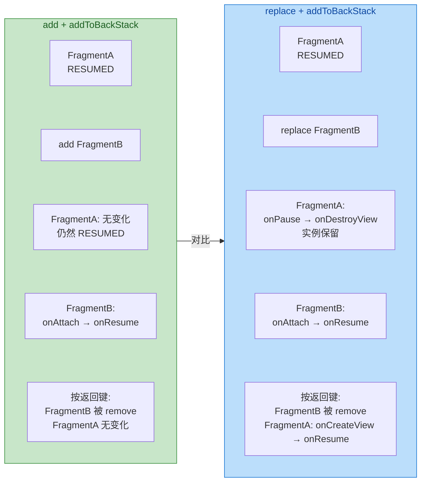
```mermaid
graph LR
    subgraph ADD["add + addToBackStack"]
        direction TB
        A1["FragmentA\nRESUMED"] ~~~ A2["add FragmentB"]
        A2 ~~~ A3["FragmentA: 无变化\n仍然 RESUMED"]
        A3 ~~~ A4["FragmentB:\nonAttach → onResume"]
        A4 ~~~ A5["按返回键:\nFragmentB 被 remove\nFragmentA 无变化"]
    end

    subgraph REPLACE["replace + addToBackStack"]
        direction TB
        R1["FragmentA\nRESUMED"] ~~~ R2["replace FragmentB"]
        R2 ~~~ R3["FragmentA:\nonPause → onDestroyView\n实例保留"]
        R3 ~~~ R4["FragmentB:\nonAttach → onResume"]
        R4 ~~~ R5["按返回键:\nFragmentB 被 remove\nFragmentA: onCreateView → onResume"]
    end

    ADD -->|"对比"| REPLACE

    classDef addStyle fill:#C8E6C9,stroke:#388E3C,color:#1B5E20
    classDef replaceStyle fill:#BBDEFB,stroke:#1976D2,color:#0D47A1
    class ADD addStyle
    class REPLACE replaceStyle
```

那么实际开发中该如何选择？一般的经验法则是：

如果你的场景是"页面切换"，比如底部导航栏切换不同的 Tab 页面，通常用 `replace` 更合适。因为同一时刻只需要展示一个页面，被替换掉的页面没必要保留视图占用内存。配合 `addToBackStack`，Fragment 实例会被保留，切回来时只需要重建视图，成本并不高。

如果你的场景是"叠加层"，比如在当前页面上方弹出一个半透明的 Fragment（类似对话框），那就应该用 `add`，因为底层的 Fragment 需要保持可见。

还有一种常见的做法是用 `add` 配合 `hide/show` 来实现 Tab 切换，这就引出了下一个话题。

### hide 与 show 的显隐控制

`hide()` 和 `show()` 是一对轻量级的显隐操作。它们的实现非常简单——直接操作 Fragment 根视图的 `visibility` 属性：`hide()` 将视图设为 `View.GONE`，`show()` 将视图设为 `View.VISIBLE`。仅此而已，**不会触发任何生命周期回调**。

这意味着被 `hide()` 的 Fragment 仍然处于 `RESUMED` 状态，它的视图仍然存在于内存中，只是不可见。这和 `replace` 有本质区别——`replace` 会销毁被替换 Fragment 的视图，而 `hide` 只是把视图藏起来。

```kotlin
// 典型的底部导航 Tab 切换实现
class MainActivity : AppCompatActivity() {

    // 持有所有 Tab 对应的 Fragment 引用
    private val homeFragment = HomeFragment()
    private val searchFragment = SearchFragment()
    private val profileFragment = ProfileFragment()
    private var activeFragment: Fragment = homeFragment  // 记录当前显示的 Fragment

    override fun onCreate(savedInstanceState: Bundle?) {
        super.onCreate(savedInstanceState)
        setContentView(R.layout.activity_main)

        // 初始化：将所有 Fragment 都 add 到容器中，但只 show 第一个
        supportFragmentManager.beginTransaction()
            .add(R.id.container, profileFragment, "profile")   // 添加 profileFragment（隐藏）
            .hide(profileFragment)                              // 立即隐藏
            .add(R.id.container, searchFragment, "search")     // 添加 searchFragment（隐藏）
            .hide(searchFragment)                               // 立即隐藏
            .add(R.id.container, homeFragment, "home")         // 添加 homeFragment（显示）
            .commit()                                           // 提交事务

        // 底部导航点击事件
        bottomNav.setOnItemSelectedListener { item ->
            val targetFragment = when (item.itemId) {
                R.id.nav_home -> homeFragment
                R.id.nav_search -> searchFragment
                R.id.nav_profile -> profileFragment
                else -> homeFragment
            }
            switchTab(targetFragment)  // 切换到目标 Tab
            true
        }
    }

    // 切换 Tab：隐藏当前 Fragment，显示目标 Fragment
    private fun switchTab(target: Fragment) {
        if (target == activeFragment) return  // 如果目标就是当前显示的，直接返回
        supportFragmentManager.beginTransaction()
            .hide(activeFragment)   // 隐藏当前 Fragment（设置 View.GONE）
            .show(target)           // 显示目标 Fragment（设置 View.VISIBLE）
            .commit()               // 提交事务
        activeFragment = target     // 更新当前活跃 Fragment 的引用
    }
}
```

这种 `add + hide/show` 的方案在 Tab 切换场景中非常流行，因为切换时不需要重建视图，用户体验更流畅——列表滚动位置、输入框内容等都天然保留。但代价是所有 Tab 的视图都常驻内存。如果每个 Tab 的视图都很重（比如包含大量图片或复杂列表），内存压力会比较大。

既然 `hide/show` 不触发生命周期回调，那 Fragment 怎么知道自己是否对用户可见呢？在 AndroidX Fragment 1.3+ 中，推荐的做法是监听 Fragment 根视图的可见性变化，或者使用 `onHiddenChanged()` 回调：

```kotlin
class HomeFragment : Fragment() {

    // 当 Fragment 的 hidden 状态发生变化时回调
    // 注意：首次 add 时如果没有 hide，这个方法不会被调用
    override fun onHiddenChanged(hidden: Boolean) {
        super.onHiddenChanged(hidden)
        if (hidden) {
            // Fragment 被隐藏了，可以暂停一些不必要的操作
            // 比如暂停视频播放、停止位置更新等
        } else {
            // Fragment 重新可见了，可以恢复操作
            // 比如刷新数据、恢复播放等
        }
    }
}
```

`hide/show` 与 `replace` 的选择本质上是一个 **内存 vs 性能** 的权衡：`hide/show` 用更多内存换取更快的切换速度；`replace` 用更少的内存但每次切换都要重建视图。现代设备内存充裕，Tab 切换场景下 `hide/show` 通常是更好的选择，但如果 Fragment 数量很多或视图很重，`replace` + `addToBackStack` 可能更合适。

还有一个容易混淆的操作是 `detach()` 和 `attach()`。`detach()` 会销毁 Fragment 的视图（走到 `onDestroyView()`），但保留 Fragment 实例在 FragmentManager 中；`attach()` 会重新创建视图（从 `onCreateView()` 开始）。它的效果介于 `hide/show` 和 `remove/add` 之间——比 `hide/show` 更省内存（视图被销毁了），比 `remove/add` 更轻量（Fragment 实例不需要重新创建和 attach）。不过在实际开发中，`detach/attach` 的使用频率远低于前两者。

### commit 家族：四种提交方式的差异

事务构建完成后，必须调用某种 `commit` 方法才能生效。FragmentTransaction 提供了四种提交方式，它们的执行时机和约束各不相同，选错了轻则行为不符合预期，重则直接崩溃。

**`commit()`** 是最常用的提交方式。它将事务 **异步** 调度到主线程的消息队列中执行。"异步"意味着调用 `commit()` 后事务不会立即执行，而是等到主线程处理到这条消息时才执行。这通常发生在当前方法返回、当前消息处理完毕之后。`commit()` 有一个重要约束：**必须在 Activity 的 `onSaveInstanceState()` 之前调用**，否则会抛出 `IllegalStateException: Can not perform this action after onSaveInstanceState`。这是因为 `onSaveInstanceState()` 之后，Activity 的状态已经被快照保存了，如果此时再修改 Fragment 状态，这些修改就会丢失，系统认为这是一个 bug 而不是正常行为。

**`commitAllowingStateLoss()`** 和 `commit()` 一样是异步的，但它 **允许在 `onSaveInstanceState()` 之后调用**，不会抛异常。代价是：如果 Activity 随后被系统杀死并恢复，这次事务的效果可能会丢失。这个方法适用于那些"丢了也无所谓"的场景，比如展示一个临时的提示 Fragment。但如果你的事务涉及关键的页面导航，用这个方法就是在埋雷。

**`commitNow()`** 是 **同步** 执行的。调用后事务立即执行，不经过消息队列。这在某些场景下很有用——比如你需要在事务执行后立即通过 `findFragmentByTag()` 获取刚添加的 Fragment。但 `commitNow()` 有一个严格限制：**不能与 `addToBackStack()` 一起使用**。原因是回退栈要求事务按照提交顺序排列，而 `commitNow()` 会插队执行，破坏顺序。如果你同时调用了 `addToBackStack()` 和 `commitNow()`，会直接抛出 `IllegalStateException`。

**`commitNowAllowingStateLoss()`** 是 `commitNow()` 的宽松版本，同步执行且允许状态丢失。同样不能与 `addToBackStack()` 一起使用。

```kotlin
val fm = supportFragmentManager

// ① commit()：异步提交，最常用
// 事务会被 post 到主线程消息队列，稍后执行
fm.beginTransaction()
    .replace(R.id.container, DetailFragment())
    .addToBackStack("detail")   // 可以配合回退栈使用
    .commit()                   // 异步提交

// 注意：此时事务尚未执行，findFragmentByTag 可能返回 null
// 如果需要立即执行，可以调用 executePendingTransactions()
fm.executePendingTransactions()  // 强制立即执行所有待处理的异步事务

// ② commitNow()：同步提交，立即执行
// 适用于需要立即获取 Fragment 引用的场景
fm.beginTransaction()
    .add(R.id.container, LoadingFragment(), "loading")
    // .addToBackStack(null)    // ❌ 不能与 commitNow 一起使用！
    .commitNow()                // 同步执行，方法返回时事务已完成

// 此时可以安全地获取 Fragment
val loading = fm.findFragmentByTag("loading")  // 一定不为 null

// ③ commitAllowingStateLoss()：异步提交，允许状态丢失
// 适用于 onSaveInstanceState 之后仍需提交事务的场景
fm.beginTransaction()
    .replace(R.id.container, ToastFragment())
    .commitAllowingStateLoss()  // 不会抛异常，但状态可能丢失
```

还有一个相关的方法值得一提：`executePendingTransactions()`。它会 **同步执行所有已经通过 `commit()` 提交但尚未执行的事务**。这是一种"补救"手段——当你用了 `commit()` 但又需要事务立即生效时，可以紧接着调用它。不过要注意，它会执行 **所有** 待处理事务，不仅仅是你刚提交的那一个，这可能带来意想不到的副作用。如果你只需要某一个事务同步执行，直接用 `commitNow()` 更精确。

下面这张表格总结了四种提交方式的关键差异：

| 提交方式 | 执行时机 | 支持 addToBackStack | 状态丢失风险 | 典型场景 |
|---------|---------|-------------------|------------|---------|
| `commit()` | 异步（消息队列） | ✅ 支持 | ❌ 会抛异常 | 常规页面导航 |
| `commitAllowingStateLoss()` | 异步（消息队列） | ✅ 支持 | ⚠️ 可能丢失 | 非关键 UI 更新 |
| `commitNow()` | 同步（立即） | ❌ 不支持 | ❌ 会抛异常 | 需要立即获取 Fragment |
| `commitNowAllowingStateLoss()` | 同步（立即） | ❌ 不支持 | ⚠️ 可能丢失 | 非关键且需立即执行 |

### 事务的内部执行机制

理解事务的内部工作方式有助于解释很多"奇怪"的行为。当你调用 `beginTransaction()` 时，FragmentManager 创建了一个 `BackStackRecord` 对象（它实现了 `FragmentTransaction` 接口）。你在上面调用的每一个操作（`add`、`remove`、`replace` 等）都不会立即执行，而是被记录为一个 `Op` 对象，存入一个操作列表中。

当你调用 `commit()` 时，这个 `BackStackRecord` 被加入 FragmentManager 的待处理队列，然后通过 `Handler.post()` 向主线程消息队列发送一条消息。当主线程处理到这条消息时，FragmentManager 会遍历待处理队列，按顺序执行每个 `BackStackRecord` 中的所有 `Op`。

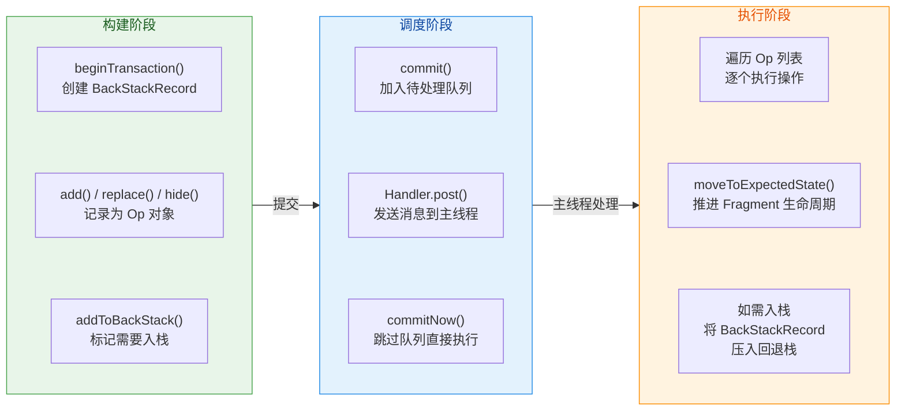
```mermaid
graph LR
    subgraph BUILD["构建阶段"]
        direction TB
        B1["beginTransaction()\n创建 BackStackRecord"] ~~~ B2["add() / replace() / hide()\n记录为 Op 对象"]
        B2 ~~~ B3["addToBackStack()\n标记需要入栈"]
    end

    subgraph SCHEDULE["调度阶段"]
        direction TB
        S1["commit()\n加入待处理队列"] ~~~ S2["Handler.post()\n发送消息到主线程"]
        S2 ~~~ S3["commitNow()\n跳过队列直接执行"]
    end

    subgraph EXECUTE["执行阶段"]
        direction TB
        E1["遍历 Op 列表\n逐个执行操作"] ~~~ E2["moveToExpectedState()\n推进 Fragment 生命周期"]
        E2 ~~~ E3["如需入栈\n将 BackStackRecord\n压入回退栈"]
    end

    BUILD -->|"提交"| SCHEDULE -->|"主线程处理"| EXECUTE

    classDef buildStyle fill:#E8F5E9,stroke:#43A047,color:#1B5E20
    classDef scheduleStyle fill:#E3F2FD,stroke:#1E88E5,color:#0D47A1
    classDef executeStyle fill:#FFF3E0,stroke:#FB8C00,color:#E65100
    class BUILD buildStyle
    class SCHEDULE scheduleStyle
    class EXECUTE executeStyle
```

这个机制解释了几个常见问题：

第一，为什么 `commit()` 之后立即 `findFragmentByTag()` 可能返回 null？因为事务还没执行，Fragment 还没被添加到 FragmentManager 中。

第二，为什么在一个方法中连续调用多个 `commit()`，它们的执行顺序是确定的？因为它们按照 `commit()` 的调用顺序被加入待处理队列，执行时也按这个顺序。

第三，为什么 `commitNow()` 不支持 `addToBackStack()`？假设你先 `commit()` 了事务 A（带回退栈），然后 `commitNow()` 了事务 B（也想带回退栈）。事务 B 会立即执行，但事务 A 还在队列里等着。这样回退栈中事务 B 在事务 A 前面，但实际提交顺序是 A 先 B 后，回退栈的顺序就乱了。为了避免这种混乱，系统直接禁止了这种组合。

### 事务操作的最佳实践

在实际项目中，事务操作有一些经过验证的最佳实践值得遵循。

首先，**优先使用 `replace()` 而非 `add()`** 进行页面导航。`replace` 的语义更清晰——容器中同一时刻只有一个 Fragment，不会出现多个 Fragment 叠加导致的点击穿透、过度绘制等问题。配合 `addToBackStack()`，用户体验和内存效率都能兼顾。

其次，**给事务设置 Tag 或给 Fragment 设置 Tag**，方便后续查找和调试。`addToBackStack(name)` 的 name 参数可以用来标识这个事务，后续可以通过 `popBackStack(name, flags)` 精确回退到指定位置。Fragment 的 tag 则可以通过 `findFragmentByTag()` 来检索。

```kotlin
// 良好实践：设置有意义的 tag 和回退栈名称
supportFragmentManager.beginTransaction()
    .replace(
        R.id.container,                    // 容器 ID
        DetailFragment.newInstance(itemId), // 使用工厂方法创建 Fragment
        "detail_fragment"                  // Fragment tag，便于后续查找
    )
    .addToBackStack("detail")              // 回退栈条目名称，便于精确回退
    .setReorderingAllowed(true)            // 允许事务重排序优化（推荐始终开启）
    .commit()
```

上面代码中的 `setReorderingAllowed(true)` 值得特别说明。这个方法允许 FragmentManager 对事务中的操作进行重排序和优化。比如，如果你在一个事务中先 `add` 了 FragmentA，又在紧接着的另一个事务中 `replace` 掉了 FragmentA，开启重排序后，FragmentManager 可能会优化掉第一个 `add` 操作，因为它的效果马上就被覆盖了。在使用 Navigation Component 或 Fragment 的 `setMaxLifecycle()` 等现代 API 时，`setReorderingAllowed(true)` 是必须开启的。**AndroidX Fragment 官方文档建议始终开启此选项。**

最后，**避免在异步回调中直接 `commit()`**。网络请求、数据库查询等异步操作的回调可能在 `onSaveInstanceState()` 之后才到达，此时 `commit()` 会崩溃。解决方案有几种：使用 `commitAllowingStateLoss()`（如果可以接受状态丢失）；使用 Lifecycle 感知组件确保只在安全状态下提交；或者更好的做法是，通过 ViewModel + LiveData/Flow 将数据传递给 Fragment，让 Fragment 自己在合适的生命周期阶段决定是否需要执行事务。

---

**📝 练习题**

在一个 Activity 中，容器 `R.id.container` 已经显示了 FragmentA。现在执行以下代码：

```kotlin
supportFragmentManager.beginTransaction()
    .replace(R.id.container, FragmentB())
    .addToBackStack("b")
    .commit()
```

用户按下返回键后，关于 FragmentA 的描述正确的是？

A. FragmentA 从 `onAttach()` 开始重新走完整生命周期

B. FragmentA 从 `onCreateView()` 开始恢复，`onCreate()` 不会再次调用

C. FragmentA 的 `onHiddenChanged(false)` 被调用

D. FragmentA 保持 `RESUMED` 状态，无任何生命周期变化

**【答案】** B

**【解析】** `replace` + `addToBackStack` 的组合下，被替换的 FragmentA 只会走到 `onDestroyView()`（视图被销毁），但 Fragment 实例被 FragmentManager 保留（不会走 `onDestroy()` 和 `onDetach()`）。当用户按返回键，回退栈弹出事务被反向执行，FragmentA 需要重新创建视图，因此从 `onCreateView()` → `onViewCreated()` → `onViewStateRestored()` → `onStart()` → `onResume()` 恢复。`onCreate()` 不会再次调用，因为 Fragment 实例一直存在。选项 A 错误，因为 Fragment 实例没有被销毁，不需要重新 attach。选项 C 描述的是 `hide/show` 操作的回调，与 `replace` 无关。选项 D 描述的是 `add` 操作的行为，`replace` 会改变被替换 Fragment 的生命周期状态。

---

## 静态与动态添加

Fragment 加入 Activity 的方式只有两种：一种是在 XML 布局文件中直接声明，称为"静态添加"；另一种是在运行时通过 FragmentManager 事务动态插入，称为"动态添加"。这两种方式在底层走的初始化路径截然不同，对生命周期时序、可替换性、状态恢复都有深远影响。理解它们的差异，是写出灵活 UI 架构的前提。

### XML `<fragment>` 标签：静态添加的经典方式

在早期 Android 开发中，最直观的做法是像声明一个 View 一样，在布局 XML 里用 `<fragment>` 标签把 Fragment 写死：

```xml
<!-- activity_main.xml -->
<!-- 静态声明一个 Fragment，编译期就确定了类型 -->
<fragment
    android:id="@+id/fragment_static"
    android:name="com.example.MyFragment"
    android:layout_width="match_parent"
    android:layout_height="match_parent" />
```

当 Activity 调用 `setContentView()` 进行布局填充（Layout Inflation）时，系统的 `LayoutInflater` 会遍历 XML 节点树。遇到 `<fragment>` 标签时，它并不会像处理普通 View 那样直接实例化一个 View 对象，而是走一条特殊路径：`FragmentManager` 介入，根据 `android:name` 属性反射创建 Fragment 实例，然后立即执行该 Fragment 的生命周期，将其 `onCreateView()` 返回的 View 插入到 `<fragment>` 标签所在的位置。

这个过程的关键时序是：Fragment 的创建和首次生命周期回调发生在 `Activity.onCreate()` 中 `setContentView()` 执行的那一刻，而不是在 Activity 的 `onCreate()` 结束之后。这意味着在 `setContentView()` 返回时，静态 Fragment 已经走完了 `onAttach()` → `onCreate()` → `onCreateView()` → `onViewCreated()`。

```kotlin
// Activity 中的典型代码
class MainActivity : AppCompatActivity() {
    override fun onCreate(savedInstanceState: Bundle?) {
        super.onCreate(savedInstanceState)
        // 当这行执行时，XML 中的 <fragment> 就会被 FragmentManager 实例化
        // 并且该 Fragment 的 onAttach → onCreate → onCreateView → onViewCreated 会在此期间完成
        setContentView(R.layout.activity_main)
        // 此时静态 Fragment 已经存在于 FragmentManager 中，可以通过 findFragmentById 获取
        val fragment = supportFragmentManager.findFragmentById(R.id.fragment_static)
        // fragment 不为 null，且其 view 已经创建完毕
    }
}
```

静态添加虽然写法简洁，但它有几个严重的限制，这些限制在实际项目中会不断暴露问题：

第一个限制是"不可替换性"。一旦在 XML 中用 `<fragment>` 声明了某个 Fragment，你就无法在运行时用 FragmentTransaction 的 `replace()` 把它换成另一个 Fragment。准确地说，技术上你可以对这个容器执行 `replace()`，但行为是不可预测的——静态添加的 Fragment 由 LayoutInflater 管理其初始创建，而 FragmentManager 的事务系统对它的控制权是不完整的。在配置变更（Configuration Change）时，静态 Fragment 会被 LayoutInflater 重新创建，这与 FragmentManager 自身的状态恢复机制产生冲突，可能导致 Fragment 重叠（overlapping）或状态丢失。

第二个限制是"传参困难"。动态添加时，我们可以在创建 Fragment 实例后、添加事务之前，通过 `arguments` Bundle 传递参数。但静态添加的 Fragment 是由系统反射创建的，你没有机会在创建和 `onAttach()` 之间插入参数设置的代码。虽然可以在 `onAttach()` 之后通过其他方式（如 ViewModel、Activity 方法调用）传递数据，但这破坏了 Fragment 的自包含性（self-contained）原则——Fragment 应该能通过自己的 `arguments` 获取启动所需的一切信息。

第三个限制是"测试不友好"。静态 Fragment 与特定的 Activity 布局文件绑定，你无法在单元测试或 UI 测试中独立启动这个 Fragment 而不牵扯整个 Activity。Google 推出的 `FragmentScenario` 测试工具就是为动态 Fragment 设计的，对静态 Fragment 的支持非常有限。

正因为这些问题，Google 在 AndroidX Fragment 1.3.0 之后，正式将 `<fragment>` 标签标记为 **deprecated**（已废弃），并在官方文档中明确建议所有场景都改用 `FragmentContainerView`。

### FragmentContainerView：现代容器的正确选择

`FragmentContainerView` 是 AndroidX Fragment 库提供的一个专用容器，它继承自 `FrameLayout`，但针对 Fragment 的托管做了大量定制优化。它既可以在 XML 中声明时指定初始 Fragment（类似静态添加的便利性），也完全支持运行时动态替换（保留动态添加的灵活性）。

```xml
<!-- 方式一：在 XML 中指定初始 Fragment（推荐的"类静态"写法） -->
<!-- 注意：这里用的是 android:name 属性，和旧的 <fragment> 标签看起来类似 -->
<!-- 但底层机制完全不同 -->
<androidx.fragment.app.FragmentContainerView
    android:id="@+id/fragment_container"
    android:name="com.example.MyFragment"
    android:layout_width="match_parent"
    android:layout_height="match_parent"
    android:tag="my_fragment_tag" />
```

```xml
<!-- 方式二：纯容器，不指定初始 Fragment，完全由代码控制 -->
<!-- 这是最灵活的用法，适合需要根据条件动态决定显示哪个 Fragment 的场景 -->
<androidx.fragment.app.FragmentContainerView
    android:id="@+id/fragment_container"
    android:layout_width="match_parent"
    android:layout_height="match_parent" />
```

当使用方式一（XML 中指定 `android:name`）时，`FragmentContainerView` 的行为与旧的 `<fragment>` 标签有本质区别。旧标签是在 `LayoutInflater` 解析 XML 的过程中同步创建 Fragment 并执行生命周期；而 `FragmentContainerView` 则是在自身被 inflate 后，通过 `FragmentTransaction.add()` 的方式将指定的 Fragment 添加进来。这意味着 Fragment 的创建走的是标准的 FragmentManager 事务路径，与动态添加完全一致。

这个差异带来了几个重要的好处：

首先，Fragment 的生命周期时序更加可预测。它不再嵌套在 `setContentView()` 的调用栈中，而是遵循标准的事务提交流程。这让 Fragment 的初始化时机与 Activity 的生命周期阶段对齐得更加清晰。

其次，`FragmentContainerView` 中的 Fragment 可以被 `replace()` 替换，不会出现旧标签那种控制权冲突的问题。因为初始 Fragment 本身就是通过事务添加的，后续的事务操作（replace、remove）与之完全兼容。

再者，`FragmentContainerView` 支持通过 `android:tag` 属性为初始 Fragment 设置 tag，方便后续通过 `findFragmentByTag()` 查找。

```kotlin
// 使用方式二：在代码中动态添加 Fragment 到 FragmentContainerView
class MainActivity : AppCompatActivity() {
    override fun onCreate(savedInstanceState: Bundle?) {
        super.onCreate(savedInstanceState)
        setContentView(R.layout.activity_main)

        // 关键检查：只在首次创建时添加 Fragment
        // 如果 savedInstanceState 不为 null，说明是配置变更后的重建
        // FragmentManager 会自动恢复之前的 Fragment，无需重复添加
        if (savedInstanceState == null) {
            supportFragmentManager.commit {
                // setReorderingAllowed 优化事务执行顺序，推荐始终开启
                setReorderingAllowed(true)
                // 将 MyFragment 添加到 FragmentContainerView 容器中
                add<MyFragment>(R.id.fragment_container)
            }
        }
    }
}
```

上面代码中 `savedInstanceState == null` 的判断极其重要，这是一个非常常见的错误点。当屏幕旋转等配置变更发生时，Activity 会被销毁重建，`onCreate()` 会再次被调用。但此时 FragmentManager 已经从 saved state 中恢复了之前的 Fragment。如果不做这个判断，就会重复添加一个新的 Fragment 实例，导致容器中出现两个 Fragment 叠加显示。而使用 `FragmentContainerView` 的方式一（XML 中指定 `android:name`）则不需要这个判断，因为容器内部已经处理了这个逻辑——它会检查 FragmentManager 中是否已存在对应的 Fragment，如果存在就跳过添加。

### FragmentContainerView 的底层优化细节

`FragmentContainerView` 不仅仅是一个"推荐的容器"，它在底层做了多项针对 Fragment 的专门优化，这些优化是普通 `FrameLayout` 无法提供的：

第一项优化是 **Fragment 进出场动画（Transition & Animation）的正确处理**。当你对 Fragment 设置了 `setEnterTransition()` / `setExitTransition()` 或 `setCustomAnimations()` 时，如果容器是普通的 `FrameLayout`，在 `replace()` 操作中，退出的 Fragment 的 View 和进入的 Fragment 的 View 会同时存在于容器中，它们的绘制顺序（Z-order）可能不正确，导致退出动画被进入的 View 遮挡。`FragmentContainerView` 重写了 `addView()` 和 `removeView()` 等方法，确保在动画执行期间，退出 Fragment 的 View 始终绘制在进入 Fragment 的 View 之上（通过 `DrawingOrder` 控制），从而保证动画视觉效果的正确性。

第二项优化是 **`WindowInsets` 分发的修正**。在标准的 View 层级中，`WindowInsets`（如状态栏高度、导航栏高度、键盘高度等）的分发遵循"消费即停止"的规则——一旦某个子 View 消费了 Insets，同级的其他子 View 就收不到了。这在 Fragment 场景中会造成问题：如果容器中有多个 Fragment 的 View（比如 `replace()` 动画期间），只有第一个子 View 能收到 Insets。`FragmentContainerView` 修改了 Insets 分发逻辑，确保每个子 View 都能独立收到完整的 `WindowInsets`，避免了 Fragment 中 `fitsSystemWindows` 或 `setOnApplyWindowInsetsListener` 失效的问题。

第三项优化是 **禁止通过 `addView()` 直接添加普通 View**。`FragmentContainerView` 重写了 `addView()` 方法，如果你试图在代码中直接调用 `fragmentContainerView.addView(someView)`，它会抛出 `UnsupportedOperationException`。这是一种防御性设计——这个容器专门用于托管 Fragment，不应该混入非 Fragment 管理的 View，否则会干扰 Fragment 的生命周期和状态管理。只有 FragmentManager 内部才被允许向这个容器添加和移除 View。

```kotlin
// FragmentContainerView 源码中的关键逻辑（简化）
class FragmentContainerView : FrameLayout {

    // 重写 addView，禁止外部直接添加 View
    override fun addView(child: View, index: Int, params: LayoutParams) {
        // 只有 FragmentManager 在执行事务时才会通过内部方法添加 View
        // 外部调用会检查标志位，如果不是来自 FragmentManager 则抛异常
        if (FragmentManager.isFragmentManagerAdding) {
            super.addView(child, index, params)  // 允许 FragmentManager 的内部调用
        } else {
            throw UnsupportedOperationException(
                "FragmentContainerView 不支持直接添加 View，请使用 FragmentTransaction"
            )
        }
    }

    // 重写 Insets 分发，确保所有子 View 都能收到
    override fun dispatchApplyWindowInsets(insets: WindowInsets): WindowInsets {
        for (i in 0 until childCount) {
            // 每个子 View 都收到原始的、未被消费的 insets 副本
            getChildAt(i).dispatchApplyWindowInsets(WindowInsets(insets))
        }
        return insets  // 返回原始 insets，不标记为已消费
    }
}
```

### 静态与动态添加的对比总结

为了更清晰地理解两种方式以及容器选择的差异，下面用一张流程图展示从 XML 声明到 Fragment 最终显示的不同路径：

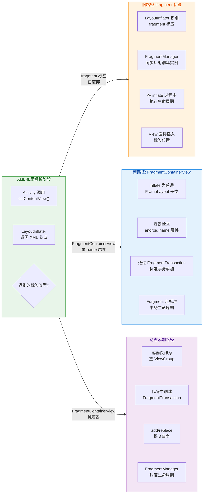
```mermaid
graph LR
    subgraph XMLInflation["XML 布局解析阶段"]
        direction TB
        A["Activity 调用\nsetContentView()"] ~~~ B["LayoutInflater\n遍历 XML 节点"]
        B ~~~ C{"遇到的标签类型?"}
    end

    subgraph LegacyPath["旧路径: fragment 标签"]
        direction TB
        D["LayoutInflater 识别\nfragment 标签"] ~~~ E["FragmentManager\n同步反射创建实例"]
        E ~~~ F["在 inflate 过程中\n执行生命周期"]
        F ~~~ G["View 直接插入\n标签位置"]
    end

    subgraph ModernPath["新路径: FragmentContainerView"]
        direction TB
        H["inflate 为普通\nFrameLayout 子类"] ~~~ I["容器检查\nandroid:name 属性"]
        I ~~~ J["通过 FragmentTransaction\n标准事务添加"]
        J ~~~ K["Fragment 走标准\n事务生命周期"]
    end

    subgraph DynamicPath["动态添加路径"]
        direction TB
        L["容器仅作为\n空 ViewGroup"] ~~~ M["代码中创建\nFragmentTransaction"]
        M ~~~ N["add/replace\n提交事务"]
        N ~~~ O["FragmentManager\n调度生命周期"]
    end

    XMLInflation -->|"fragment 标签\n已废弃"| LegacyPath
    XMLInflation -->|"FragmentContainerView\n带 name 属性"| ModernPath
    XMLInflation -->|"FragmentContainerView\n纯容器"| DynamicPath

    classDef inflateStyle fill:#E8F5E9,stroke:#43A047,color:#1B5E20
    classDef legacyStyle fill:#FFF3E0,stroke:#FB8C00,color:#E65100
    classDef modernStyle fill:#E3F2FD,stroke:#1E88E5,color:#0D47A1
    classDef dynamicStyle fill:#F3E5F5,stroke:#8E24AA,color:#4A148C

    class XMLInflation inflateStyle
    class LegacyPath legacyStyle
    class ModernPath modernStyle
    class DynamicPath dynamicStyle
```

从实际开发的角度，选择策略非常明确：如果你的 Fragment 在整个 Activity 生命周期中不会被替换（比如一个固定的底部导航栏 Fragment），使用 `FragmentContainerView` 并在 XML 中指定 `android:name` 是最简洁的方式，它兼具声明式的简洁和事务系统的正确性。如果 Fragment 需要根据用户操作动态切换（比如导航目的地、Tab 页内容），则使用纯容器的 `FragmentContainerView` 配合代码中的 `FragmentTransaction` 是标准做法。无论哪种情况，都不应该再使用旧的 `<fragment>` 标签。

### 从 `<fragment>` 迁移到 FragmentContainerView

对于存量项目中仍在使用 `<fragment>` 标签的代码，迁移过程非常简单，但有几个细节需要注意：

```xml
<!-- 迁移前：旧写法 -->
<fragment
    android:id="@+id/nav_host"
    android:name="androidx.navigation.fragment.NavHostFragment"
    android:layout_width="match_parent"
    android:layout_height="match_parent"
    app:navGraph="@navigation/nav_graph"
    app:defaultNavHost="true" />
```

```xml
<!-- 迁移后：新写法 -->
<!-- 只需将标签名从 fragment 改为 FragmentContainerView 的全限定名 -->
<!-- 其余属性（id、name、自定义属性）保持不变 -->
<androidx.fragment.app.FragmentContainerView
    android:id="@+id/nav_host"
    android:name="androidx.navigation.fragment.NavHostFragment"
    android:layout_width="match_parent"
    android:layout_height="match_parent"
    app:navGraph="@navigation/nav_graph"
    app:defaultNavHost="true" />
```

迁移后有一个行为变化需要特别注意：使用旧的 `<fragment>` 标签时，`findFragmentById()` 在 `setContentView()` 之后立即就能返回非 null 的 Fragment 实例，因为 Fragment 是在 inflate 过程中同步创建的。但换成 `FragmentContainerView` 后，如果你在 `setContentView()` 之后、事务真正执行之前就调用 `findFragmentById()`，可能会得到 null。这是因为 `FragmentContainerView` 通过事务添加 Fragment，而事务的执行时机可能略有延迟（取决于是 `commit()` 还是 `commitNow()`）。

解决方案是使用 `FragmentManager` 的 `executePendingTransactions()` 强制立即执行挂起的事务，或者更好的做法是，不要在 `onCreate()` 中立即依赖 Fragment 的存在，而是通过 `FragmentLifecycleCallbacks` 或其他观察机制来响应 Fragment 的就绪状态：

```kotlin
class MainActivity : AppCompatActivity() {
    override fun onCreate(savedInstanceState: Bundle?) {
        super.onCreate(savedInstanceState)
        setContentView(R.layout.activity_main)

        // 方案一：强制执行挂起事务（简单但不够优雅）
        // 调用后，FragmentContainerView 中通过 android:name 指定的 Fragment 会立即可用
        supportFragmentManager.executePendingTransactions()
        // 此时 findFragmentById 可以安全返回非 null
        val navHost = supportFragmentManager.findFragmentById(R.id.nav_host)

        // 方案二：注册生命周期回调（更健壮的做法）
        supportFragmentManager.registerFragmentLifecycleCallbacks(
            object : FragmentManager.FragmentLifecycleCallbacks() {
                // 当任何 Fragment 的 View 创建完成时回调
                override fun onFragmentViewCreated(
                    fm: FragmentManager,
                    f: Fragment,
                    v: View,
                    savedInstanceState: Bundle?
                ) {
                    // 在这里安全地与 Fragment 交互
                    if (f is NavHostFragment) {
                        // NavHostFragment 已就绪，可以进行导航相关操作
                    }
                }
            },
            false  // false 表示不递归监听子 FragmentManager
        )
    }
}
```

这个迁移虽然看起来只是改了一个标签名，但它背后代表的是从"LayoutInflater 驱动的同步创建"到"FragmentManager 事务驱动的标准创建"的范式转变。理解这个转变，才能在遇到迁移后的行为差异时快速定位问题。

---

**📝 练习题**

在将布局中的 `<fragment>` 标签迁移为 `FragmentContainerView`（保留 `android:name` 属性）后，开发者发现原本在 `setContentView()` 之后立即调用 `findFragmentById()` 能获取到的 Fragment 实例，现在返回了 null。以下哪项是导致这一行为变化的根本原因？

A. `FragmentContainerView` 不支持通过 `android:name` 属性指定初始 Fragment，必须在代码中手动添加

B. `FragmentContainerView` 通过标准 `FragmentTransaction` 添加初始 Fragment，事务可能尚未执行，而旧标签是在 inflate 过程中同步创建的

C. `FragmentContainerView` 继承自 `ConstraintLayout` 而非 `FrameLayout`，导致 Fragment 的查找方式不同

D. 迁移后必须使用 `findFragmentByTag()` 替代 `findFragmentById()`，因为 `FragmentContainerView` 不保留 `android:id`

**【答案】** B

**【解析】** 这道题考察的是 `<fragment>` 标签与 `FragmentContainerView` 在 Fragment 创建时机上的核心差异。旧的 `<fragment>` 标签在 `LayoutInflater` 解析 XML 的过程中同步创建 Fragment 并执行其生命周期，因此 `setContentView()` 返回时 Fragment 已经存在于 FragmentManager 中。而 `FragmentContainerView` 虽然也支持 `android:name` 属性，但它是通过内部提交一个 `FragmentTransaction` 来添加 Fragment 的，这个事务遵循标准的事务调度机制，可能在 `setContentView()` 返回时尚未执行。选项 A 错误，`FragmentContainerView` 明确支持 `android:name`。选项 C 错误，它继承自 `FrameLayout`。选项 D 错误，`findFragmentById()` 仍然有效，问题不在查找方式而在时机。

---

## 组件通信

Fragment 作为模块化容器，天然面临一个核心问题：**Fragment 与 Fragment 之间、Fragment 与宿主 Activity 之间如何安全、解耦地交换数据？** 这个问题贯穿了 Android 架构演进的整个历史。早期开发者习惯通过直接持有对方引用或强制类型转换来通信，这导致了严重的耦合和生命周期安全隐患。Google 在 Jetpack 时代给出了三套逐步演进的官方方案：共享 ViewModel、FragmentResultListener、以及经典的接口回调。理解它们各自的适用场景、底层机制和局限性，是写出健壮 Fragment 架构的关键。

### ViewModel 共享数据

#### 核心思想：用 "作用域" 实现天然共享

共享 ViewModel 是目前 Google 最推荐的 Fragment 间通信方式。它的核心思想极其简洁——**如果两个 Fragment 从同一个 ViewModelStoreOwner 获取同一个 ViewModel 类的实例，那么它们拿到的就是同一个对象**。既然是同一个对象，任何一方对其中 LiveData 或 StateFlow 的修改，另一方都能立即观察到。

这里的关键概念是 **ViewModelStoreOwner**。Activity 实现了这个接口，NavBackStackEntry 也实现了这个接口。当我们在 Fragment 中写 `ViewModelProvider(requireActivity())` 时，实际上是在说："请从我的宿主 Activity 的 ViewModelStore 中取出（或创建）这个 ViewModel。" 由于同一个 Activity 下的所有 Fragment 共享同一个 ViewModelStore，它们自然拿到同一个实例。

这种机制之所以优于直接引用，根本原因在于 **ViewModel 的生命周期由 ViewModelStore 管理，而非由任何一个 Fragment 管理**。即使某个 Fragment 被 replace 销毁了，ViewModel 依然存活在 Activity 的 ViewModelStore 中，数据不会丢失。另一个 Fragment 随时可以重新订阅。

#### 实现方式与代码

假设有一个商品列表页 `ProductListFragment` 和一个商品详情页 `ProductDetailFragment`，用户在列表页点击某个商品后，详情页需要展示对应数据：

```kotlin
// SharedProductViewModel.kt
// 共享 ViewModel，作用域绑定到宿主 Activity
class SharedProductViewModel : ViewModel() {

    // 内部可变的 LiveData，仅 ViewModel 自身可写
    private val _selectedProduct = MutableLiveData<Product>()

    // 对外暴露不可变的 LiveData，Fragment 只能读和观察
    val selectedProduct: LiveData<Product> = _selectedProduct

    // 由列表页调用，设置当前选中的商品
    fun selectProduct(product: Product) {
        _selectedProduct.value = product
    }
}
```

```kotlin
// ProductListFragment.kt
class ProductListFragment : Fragment() {

    // 关键：by activityViewModels() 委托从宿主 Activity 的 ViewModelStore 获取实例
    // 这确保了与 DetailFragment 拿到的是同一个 ViewModel 对象
    private val sharedViewModel: SharedProductViewModel by activityViewModels()

    override fun onViewCreated(view: View, savedInstanceState: Bundle?) {
        super.onViewCreated(view, savedInstanceState)

        // 用户点击列表项时，通过 ViewModel 传递选中的商品
        adapter.onItemClick = { product ->
            // 写入共享 ViewModel，DetailFragment 会自动收到通知
            sharedViewModel.selectProduct(product)
        }
    }
}
```

```kotlin
// ProductDetailFragment.kt
class ProductDetailFragment : Fragment() {

    // 同样从宿主 Activity 的 ViewModelStore 获取，拿到的是同一个实例
    private val sharedViewModel: SharedProductViewModel by activityViewModels()

    override fun onViewCreated(view: View, savedInstanceState: Bundle?) {
        super.onViewCreated(view, savedInstanceState)

        // 观察共享数据，一旦 ListFragment 调用了 selectProduct()，这里立即回调
        // viewLifecycleOwner 确保只在视图存活期间接收更新，避免内存泄漏
        sharedViewModel.selectedProduct.observe(viewLifecycleOwner) { product ->
            // 更新详情页 UI
            binding.productName.text = product.name
            binding.productPrice.text = product.price.toString()
        }
    }
}
```

#### activityViewModels() 与 viewModels() 的作用域差异

这两个 KTX 委托的区别是理解共享机制的核心：

`by viewModels()` 将 ViewModel 绑定到当前 Fragment 自身的 ViewModelStore。每个 Fragment 实例都有独立的 ViewModel，Fragment 销毁时 ViewModel 跟着清除。这适用于 Fragment 内部私有的状态管理。

`by activityViewModels()` 将 ViewModel 绑定到宿主 Activity 的 ViewModelStore。同一 Activity 下所有 Fragment 共享同一个实例，Activity 销毁时才清除。这就是跨 Fragment 通信的基础。

在 Navigation 组件中还有第三种作用域——`by navGraphViewModels(R.id.nav_graph_id)`，它将 ViewModel 绑定到某个导航图的 NavBackStackEntry。这意味着只有在同一个导航图内的 Fragment 才共享该 ViewModel，导航图出栈时 ViewModel 自动清除。这比 Activity 级别的作用域更精细，避免了 ViewModel 在 Activity 级别"活得太久"导致的内存浪费问题。

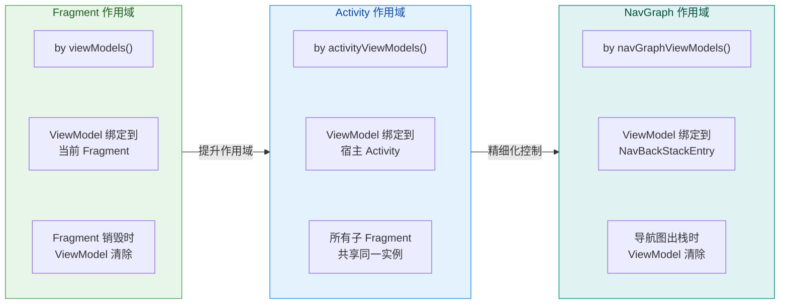
```mermaid
graph LR
    subgraph ScopeFragment["Fragment 作用域"]
        direction TB
        F1["by viewModels()"]
        F2["ViewModel 绑定到\n当前 Fragment"]
        F3["Fragment 销毁时\nViewModel 清除"]
        F1 ~~~ F2
        F2 ~~~ F3
    end

    subgraph ScopeActivity["Activity 作用域"]
        direction TB
        A1["by activityViewModels()"]
        A2["ViewModel 绑定到\n宿主 Activity"]
        A3["所有子 Fragment\n共享同一实例"]
        A1 ~~~ A2
        A2 ~~~ A3
    end

    subgraph ScopeNavGraph["NavGraph 作用域"]
        direction TB
        N1["by navGraphViewModels()"]
        N2["ViewModel 绑定到\nNavBackStackEntry"]
        N3["导航图出栈时\nViewModel 清除"]
        N1 ~~~ N2
        N2 ~~~ N3
    end

    ScopeFragment -->|"提升作用域"| ScopeActivity -->|"精细化控制"| ScopeNavGraph

    classDef greenStyle fill:#E8F5E9,stroke:#43A047,color:#1B5E20
    classDef blueStyle fill:#E3F2FD,stroke:#1E88E5,color:#0D47A1
    classDef tealStyle fill:#E0F2F1,stroke:#00897B,color:#004D40

    class ScopeFragment greenStyle
    class ScopeActivity blueStyle
    class ScopeNavGraph tealStyle
```

#### 优势与局限

共享 ViewModel 的优势非常明显：通信双方完全解耦，ListFragment 不需要知道 DetailFragment 的存在，反之亦然；数据在配置变更（屏幕旋转）时自动保留；基于 LiveData/StateFlow 的观察模式天然具备生命周期安全性。

但它也有局限。首先，**共享 ViewModel 适合持续性的状态共享，不适合一次性事件传递**。比如"弹一个 Toast"这种事件，如果放在 LiveData 中，屏幕旋转后会重新触发（sticky 特性）。虽然可以用 SingleLiveEvent 或 Channel/SharedFlow 来规避，但这增加了复杂度。其次，Activity 级别的共享 ViewModel 生命周期过长，如果只是两个临时 Fragment 之间传个值，用 Activity 级 ViewModel 就显得"杀鸡用牛刀"，数据会一直驻留到 Activity 销毁。对于这种"传完即忘"的场景，FragmentResultListener 是更合适的选择。

---

### FragmentResultListener 结果传递

#### 设计动机：一次性结果的轻量传递

FragmentResultListener 是 AndroidX Fragment 1.3.0 引入的 API，专门解决 **"Fragment A 需要从 Fragment B 获取一个一次性结果"** 的场景。典型例子包括：从一个日期选择 DialogFragment 返回用户选择的日期、从一个筛选页返回筛选条件、从一个确认弹窗返回用户的选择（确认/取消）。

在这个 API 出现之前，开发者通常用 `setTargetFragment()` + `onActivityResult()` 来实现 Fragment 间的结果回传。但 `setTargetFragment()` 在 Fragment 重建时存在引用失效的风险，而且它要求发起方直接持有目标 Fragment 的引用，耦合度高。Google 在 Fragment 1.3.0 中将 `setTargetFragment()` 标记为 `@Deprecated`，并用 FragmentResultListener 取而代之。

#### 工作机制

FragmentResultListener 的底层机制非常巧妙：**它利用 FragmentManager 作为中间人（mediator），通过一个字符串 key 来匹配发送方和接收方**。

具体流程是这样的：

1. 接收方（Fragment A）在自己的 FragmentManager 上注册一个监听器，声明"我关心 key 为 `request_key` 的结果"。
2. 发送方（Fragment B）完成操作后，通过同一个 FragmentManager 调用 `setFragmentResult("request_key", bundle)`，将结果存入 FragmentManager。
3. FragmentManager 检查是否有监听器注册了这个 key。如果有，并且接收方当前处于 STARTED 及以上状态，立即回调；如果接收方尚未到达 STARTED 状态（比如还在后台），FragmentManager 会暂存结果，等接收方恢复到 STARTED 时再投递。
4. 结果一旦被消费，就会从 FragmentManager 中移除，不会重复投递。

这个"暂存 + 生命周期感知投递"的机制，正是它优于旧方案的关键。它确保了结果不会在 Fragment 不可见时被处理（避免 crash），也不会因为 Fragment 重建而丢失。

#### 同级 Fragment 通信

当两个 Fragment 是同级关系（都由同一个 FragmentManager 管理，比如都 add/replace 到同一个 Activity 的容器中），它们通过 **父级 FragmentManager**（即 `parentFragmentManager`）来交换结果：

```kotlin
// FilterFragment.kt — 发送方（筛选页）
class FilterFragment : Fragment() {

    // 用户点击"应用筛选"按钮时调用
    private fun applyFilter() {
        // 构建结果 Bundle
        val result = bundleOf(
            "category" to selectedCategory,   // 选中的分类
            "price_range" to selectedRange     // 选中的价格区间
        )
        // 通过 parentFragmentManager 发送结果
        // "filter_request" 是约定的 key，接收方必须用同一个 key 注册监听
        parentFragmentManager.setFragmentResult("filter_request", result)

        // 发送完结果后关闭自身（回退到上一个 Fragment）
        parentFragmentManager.popBackStack()
    }
}
```

```kotlin
// ProductListFragment.kt — 接收方（商品列表页）
class ProductListFragment : Fragment() {

    override fun onViewCreated(view: View, savedInstanceState: Bundle?) {
        super.onViewCreated(view, savedInstanceState)

        // 在 parentFragmentManager 上注册监听器
        // viewLifecycleOwner 确保监听器在视图销毁时自动移除，防止泄漏
        parentFragmentManager.setFragmentResultListener(
            "filter_request",        // 与发送方约定的 key
            viewLifecycleOwner       // 生命周期所有者，控制回调时机
        ) { requestKey, bundle ->
            // 从 Bundle 中提取结果
            val category = bundle.getString("category")
            val priceRange = bundle.getString("price_range")
            // 根据筛选条件刷新列表
            viewModel.applyFilter(category, priceRange)
        }
    }
}
```

#### 父子 Fragment 通信

当 Fragment B 是 Fragment A 的子 Fragment（通过 `childFragmentManager` 添加），通信路径略有不同。子 Fragment 用 `parentFragmentManager`（即父 Fragment 的 `childFragmentManager`）发送结果，父 Fragment 在自己的 `childFragmentManager` 上注册监听：

```kotlin
// ConfirmDialogFragment.kt — 子 Fragment（确认弹窗）
class ConfirmDialogFragment : DialogFragment() {

    private fun onConfirmClicked() {
        val result = bundleOf("confirmed" to true)
        // 子 Fragment 的 parentFragmentManager 就是父 Fragment 的 childFragmentManager
        parentFragmentManager.setFragmentResult("confirm_request", result)
        dismiss()
    }

    private fun onCancelClicked() {
        val result = bundleOf("confirmed" to false)
        parentFragmentManager.setFragmentResult("confirm_request", result)
        dismiss()
    }
}
```

```kotlin
// OrderFragment.kt — 父 Fragment
class OrderFragment : Fragment() {

    override fun onViewCreated(view: View, savedInstanceState: Bundle?) {
        super.onViewCreated(view, savedInstanceState)

        // 注意：这里用 childFragmentManager 注册监听，因为弹窗是子 Fragment
        childFragmentManager.setFragmentResultListener(
            "confirm_request",
            viewLifecycleOwner
        ) { _, bundle ->
            val confirmed = bundle.getBoolean("confirmed")
            if (confirmed) {
                // 用户确认，提交订单
                viewModel.submitOrder()
            }
        }

        // 点击按钮弹出确认弹窗
        binding.submitButton.setOnClickListener {
            ConfirmDialogFragment().show(childFragmentManager, "confirm_dialog")
        }
    }
}
```

这里有一个容易混淆的点：**发送方始终用 `parentFragmentManager`，接收方根据关系选择——同级用 `parentFragmentManager`，父子用 `childFragmentManager`**。本质上，双方必须操作的是同一个 FragmentManager 实例，这样 key 才能匹配上。

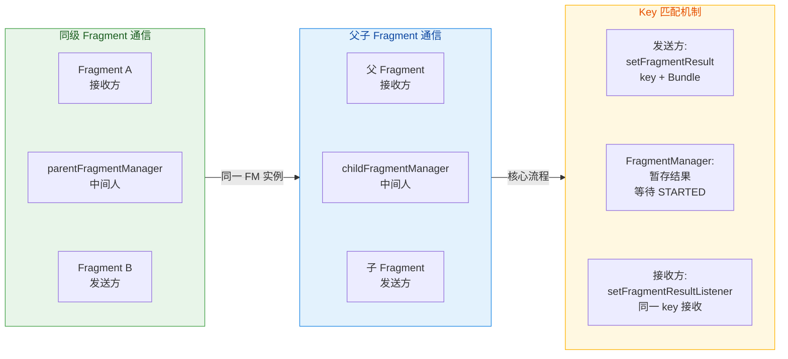
```mermaid
graph LR
    subgraph PeerComm["同级 Fragment 通信"]
        direction TB
        P1["Fragment A\n接收方"]
        P2["parentFragmentManager\n中间人"]
        P3["Fragment B\n发送方"]
        P1 ~~~ P2
        P2 ~~~ P3
    end

    subgraph ParentChild["父子 Fragment 通信"]
        direction TB
        C1["父 Fragment\n接收方"]
        C2["childFragmentManager\n中间人"]
        C3["子 Fragment\n发送方"]
        C1 ~~~ C2
        C2 ~~~ C3
    end

    subgraph KeyMatch["Key 匹配机制"]
        direction TB
        K1["发送方:\nsetFragmentResult\nkey + Bundle"]
        K2["FragmentManager:\n暂存结果\n等待 STARTED"]
        K3["接收方:\nsetFragmentResultListener\n同一 key 接收"]
        K1 ~~~ K2
        K2 ~~~ K3
    end

    PeerComm -->|"同一 FM 实例"| ParentChild -->|"核心流程"| KeyMatch

    classDef greenStyle fill:#E8F5E9,stroke:#43A047,color:#1B5E20
    classDef blueStyle fill:#E3F2FD,stroke:#1E88E5,color:#0D47A1
    classDef amberStyle fill:#FFF8E1,stroke:#FFB300,color:#E65100

    class PeerComm greenStyle
    class ParentChild blueStyle
    class KeyMatch amberStyle
```

#### 与 ViewModel 共享的对比

FragmentResultListener 和共享 ViewModel 并不是互相替代的关系，而是互补的：

FragmentResultListener 适合 **一次性、事件型** 的数据传递。结果被消费后即清除，不会像 LiveData 那样在重新订阅时重放旧值。它不需要创建额外的 ViewModel 类，对于简单场景（返回一个字符串、一个布尔值）非常轻量。但它的局限在于只能传递 Bundle 支持的类型，且不适合持续性的状态同步。

共享 ViewModel 适合 **持续性、状态型** 的数据共享。多个 Fragment 需要长期观察同一份数据的变化，比如购物车内容、用户登录状态等。ViewModel 可以持有复杂的业务逻辑和数据转换，功能远比 Bundle 传值强大。

一个实用的判断标准：**如果你需要的是"回调一个结果"，用 FragmentResultListener；如果你需要的是"共享一份状态"，用 ViewModel。**

---

### 接口回调

#### 经典模式的由来

接口回调是 Android 最早期的 Fragment 通信方式，在 Jetpack 出现之前几乎是唯一的官方推荐方案。它的思路直接来源于面向对象设计中的 **依赖倒置原则（Dependency Inversion Principle）**：Fragment 不直接依赖具体的 Activity 类，而是依赖一个抽象接口；Activity 实现这个接口，Fragment 在 `onAttach()` 时获取接口引用。

这种模式在 Android 官方文档中存在了很多年，至今仍然能在大量存量项目中看到。虽然 Google 现在更推荐 ViewModel 和 FragmentResultListener，但理解接口回调依然重要——它帮助你理解 Fragment 通信的本质问题，也是面试中的高频考点。

#### 实现步骤

完整的接口回调模式包含四个步骤：

第一步，在 Fragment 中定义通信接口：

```kotlin
// ArticleListFragment.kt
class ArticleListFragment : Fragment() {

    // 第一步：定义接口，声明 Fragment 需要宿主提供的能力
    // 接口名通常以 Listener/Callback 结尾
    interface OnArticleSelectedListener {
        // 当用户选中某篇文章时调用
        fun onArticleSelected(articleId: Long)
    }

    // 持有接口引用，初始为 null
    private var listener: OnArticleSelectedListener? = null

    // 第二步：在 onAttach 中获取接口实现
    // onAttach 是 Fragment 与 Activity 建立关联的最早时机
    override fun onAttach(context: Context) {
        super.onAttach(context)
        // 检查宿主 Activity 是否实现了接口
        listener = context as? OnArticleSelectedListener
            ?: throw ClassCastException(
                "${context::class.java.simpleName} must implement OnArticleSelectedListener"
            )
    }

    // 第三步：在合适的时机通过接口回调通知宿主
    private fun onItemClicked(articleId: Long) {
        // 安全调用，避免 onDetach 后的空指针
        listener?.onArticleSelected(articleId)
    }

    // 第四步：在 onDetach 中释放引用，防止内存泄漏
    override fun onDetach() {
        super.onDetach()
        // 切断对 Activity 的引用
        listener = null
    }
}
```

第二步，宿主 Activity 实现接口：

```kotlin
// MainActivity.kt
class MainActivity : AppCompatActivity(), ArticleListFragment.OnArticleSelectedListener {

    // 实现接口方法，处理 Fragment 传来的事件
    override fun onArticleSelected(articleId: Long) {
        // 收到文章 ID 后，可以启动详情 Fragment 或传递给其他 Fragment
        val detailFragment = ArticleDetailFragment.newInstance(articleId)
        supportFragmentManager.beginTransaction()
            .replace(R.id.fragment_container, detailFragment)
            .addToBackStack(null)
            .commit()
    }
}
```

#### 为什么这种模式逐渐被取代

接口回调模式虽然逻辑清晰，但存在几个实际痛点：

**耦合度仍然不低。** 虽然 Fragment 依赖的是接口而非具体类，但 `onAttach()` 中的强制类型转换意味着 Fragment 隐式要求宿主必须实现特定接口。如果一个 Fragment 被复用到不同的 Activity 中，每个 Activity 都必须实现该接口，否则运行时 crash。

**接口爆炸问题。** 当 Fragment 需要向宿主传递多种事件时，要么在一个接口中堆积大量方法（违反接口隔离原则），要么定义多个接口（导致 Activity 的 implements 列表越来越长）。在复杂项目中，一个 Activity 实现七八个 Fragment 回调接口的情况并不罕见。

**Fragment 之间无法直接通信。** 接口回调本质上是 Fragment → Activity 的单向通道。如果 Fragment A 要把数据传给 Fragment B，必须先回调给 Activity，再由 Activity 转发给 Fragment B。Activity 变成了一个"中转站"，承担了不属于它的职责。

**生命周期风险。** 如果开发者忘记在 `onDetach()` 中置空引用，或者在异步回调中使用了 listener，就可能在 Fragment 已经 detach 后仍然调用 Activity 的方法，导致 crash 或内存泄漏。

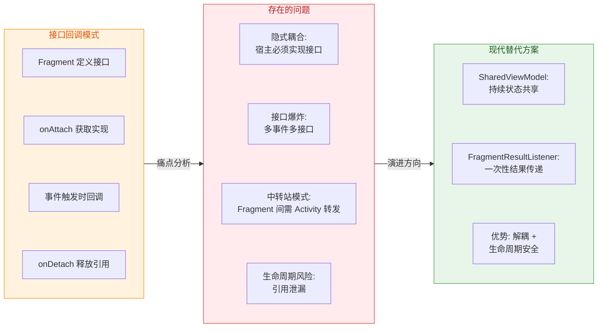
```mermaid
graph LR
    subgraph InterfaceCallback["接口回调模式"]
        direction TB
        IC1["Fragment 定义接口"]
        IC2["onAttach 获取实现"]
        IC3["事件触发时回调"]
        IC4["onDetach 释放引用"]
        IC1 ~~~ IC2
        IC2 ~~~ IC3
        IC3 ~~~ IC4
    end

    subgraph Problems["存在的问题"]
        direction TB
        PR1["隐式耦合:\n宿主必须实现接口"]
        PR2["接口爆炸:\n多事件多接口"]
        PR3["中转站模式:\nFragment 间需 Activity 转发"]
        PR4["生命周期风险:\n引用泄漏"]
        PR1 ~~~ PR2
        PR2 ~~~ PR3
        PR3 ~~~ PR4
    end

    subgraph Modern["现代替代方案"]
        direction TB
        M1["SharedViewModel:\n持续状态共享"]
        M2["FragmentResultListener:\n一次性结果传递"]
        M3["优势: 解耦 +\n生命周期安全"]
        M1 ~~~ M2
        M2 ~~~ M3
    end

    InterfaceCallback -->|"痛点分析"| Problems -->|"演进方向"| Modern

    classDef orangeStyle fill:#FFF3E0,stroke:#FB8C00,color:#E65100
    classDef redStyle fill:#FFEBEE,stroke:#E53935,color:#B71C1C
    classDef greenStyle fill:#E8F5E9,stroke:#43A047,color:#1B5E20

    class InterfaceCallback orangeStyle
    class Problems redStyle
    class Modern greenStyle
```

#### 现代项目中的定位

在新项目中，接口回调已经不再是首选方案。但在以下场景中它仍然有存在价值：

- **极简场景**：Fragment 只需要通知宿主一个简单事件（如"关闭自己"），不值得为此创建 ViewModel 或注册 ResultListener。
- **库/SDK 开发**：如果你开发的是一个供外部使用的 Fragment 组件，接口回调是最通用的契约方式，不依赖 Jetpack 的特定版本。
- **存量代码维护**：大量老项目使用接口回调，理解它才能安全地重构。

---

### 三种方案的选型决策

在实际项目中，三种通信方式往往共存。选择哪种方案取决于两个维度：**数据的生命周期**（一次性还是持续性）和 **通信的方向**（单向结果回传还是双向状态同步）。

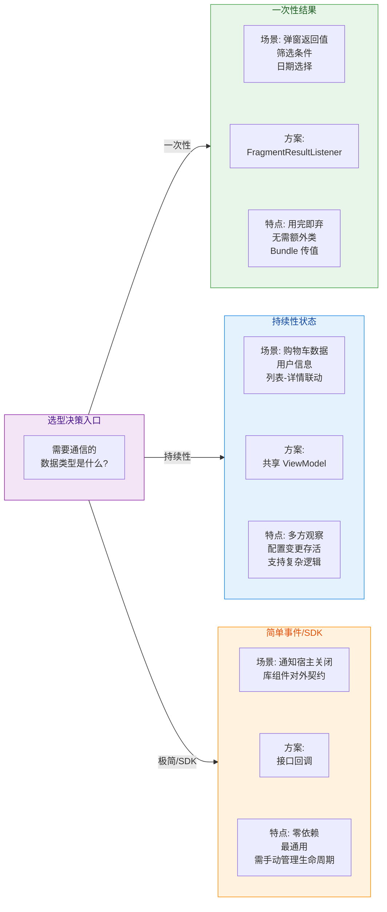
```mermaid
graph LR
    subgraph Decision["选型决策入口"]
        direction TB
        D1["需要通信的\n数据类型是什么?"]
    end

    subgraph OneTime["一次性结果"]
        direction TB
        O1["场景: 弹窗返回值\n筛选条件\n日期选择"]
        O2["方案:\nFragmentResultListener"]
        O3["特点: 用完即弃\n无需额外类\nBundle 传值"]
        O1 ~~~ O2
        O2 ~~~ O3
    end

    subgraph Continuous["持续性状态"]
        direction TB
        C1["场景: 购物车数据\n用户信息\n列表-详情联动"]
        C2["方案:\n共享 ViewModel"]
        C3["特点: 多方观察\n配置变更存活\n支持复杂逻辑"]
        C1 ~~~ C2
        C2 ~~~ C3
    end

    subgraph Legacy["简单事件/SDK"]
        direction TB
        L1["场景: 通知宿主关闭\n库组件对外契约"]
        L2["方案:\n接口回调"]
        L3["特点: 零依赖\n最通用\n需手动管理生命周期"]
        L1 ~~~ L2
        L2 ~~~ L3
    end

    Decision -->|"一次性"| OneTime
    Decision -->|"持续性"| Continuous
    Decision -->|"极简/SDK"| Legacy

    classDef decisionStyle fill:#F3E5F5,stroke:#8E24AA,color:#4A148C
    classDef oneTimeStyle fill:#E8F5E9,stroke:#43A047,color:#1B5E20
    classDef continuousStyle fill:#E3F2FD,stroke:#1E88E5,color:#0D47A1
    classDef legacyStyle fill:#FFF3E0,stroke:#FB8C00,color:#E65100

    class Decision decisionStyle
    class OneTime oneTimeStyle
    class Continuous continuousStyle
    class Legacy legacyStyle
```

一个常见的组合模式是：用共享 ViewModel 管理核心业务状态（如当前选中的商品、购物车内容），用 FragmentResultListener 处理临时交互结果（如弹窗确认、筛选条件），在极少数需要与宿主 Activity 直接交互的场景保留接口回调。三者各司其职，互不冲突。

值得强调的是，无论选择哪种方案，**Fragment 之间都不应该直接持有对方的引用**。这是 Fragment 通信的第一原则。直接引用会导致生命周期不同步、内存泄漏、以及 Fragment 重建后引用失效等一系列问题。所有官方推荐的方案，本质上都是通过一个中间层（ViewModel、FragmentManager、接口）来解耦通信双方。

---

**📝 练习题**

在一个 Activity 中有 FragmentA 和 FragmentB（同级关系）。FragmentA 弹出一个 DialogFragment（作为 FragmentA 的子 Fragment）让用户选择日期，选择完成后需要将日期传递给 FragmentB 刷新列表。以下方案中最合理的是：

A. DialogFragment 通过 `parentFragmentManager.setFragmentResult()`传递日期给 FragmentA，FragmentA 再通过 `parentFragmentManager.setFragmentResult()` 转发给 FragmentB

B. DialogFragment 直接通过 `activity?.supportFragmentManager?.setFragmentResult()` 将日期发送给 FragmentB

C. DialogFragment 通过 `parentFragmentManager.setFragmentResult()` 传递日期给 FragmentA，FragmentA 收到后写入 `activityViewModels()` 级别的共享 ViewModel，FragmentB 观察该 ViewModel 获取日期

D. DialogFragment 持有 FragmentB 的引用，直接调用 FragmentB 的 `updateDate()` 方法

**【答案】** C

**【解析】** 这道题考察的是跨层级 Fragment 通信的组合策略。

先分析通信链路：DialogFragment 是 FragmentA 的子 Fragment，而 FragmentB 是 FragmentA 的同级 Fragment。这意味着 DialogFragment 和 FragmentB 之间隔了两层关系，它们不在同一个 FragmentManager 中，无法直接通过单次 `setFragmentResult()` 完成通信。

选项 A 的思路是对的——先通过 `childFragmentManager` 链路把结果从 DialogFragment 传到 FragmentA，再由 FragmentA 通过 `parentFragmentManager` 转发给 FragmentB。这在技术上可行，但存在一个问题：FragmentA 变成了纯粹的"中转站"，需要注册两个 ResultListener（一个监听子 Fragment，一个转发给同级），代码冗余且职责不清。对于"日期"这种可能被多处使用的数据，用事件链转发并不优雅。

选项 B 试图让 DialogFragment 绕过父 Fragment，直接操作 Activity 级别的 FragmentManager。虽然 `activity?.supportFragmentManager` 在技术上可以访问到，但 FragmentB 的 ResultListener 注册在 `parentFragmentManager`（即 Activity 的 `supportFragmentManager`）上时，DialogFragment 的 `parentFragmentManager` 实际上是 FragmentA 的 `childFragmentManager`，两者不是同一个实例。要让这条路走通，DialogFragment 必须显式获取 `activity?.supportFragmentManager` 来发送结果，这破坏了 Fragment 的层级封装，子 Fragment 不应该越级操作。

选项 C 是最合理的组合方案：DialogFragment → FragmentA 使用 FragmentResultListener（一次性结果传递，符合"选完日期返回"的语义），FragmentA → FragmentB 使用共享 ViewModel（日期作为一个可观察的状态，FragmentB 随时可以读取最新值）。这种方案每一段通信都使用了最适合的工具，且 FragmentA 的处理逻辑有实际意义——它不是无脑转发，而是将一次性事件转化为持久状态写入 ViewModel。

选项 D 违反了 Fragment 通信的第一原则：**Fragment 之间不应直接持有对方引用**。DialogFragment 作为 FragmentA 的子 Fragment，更不应该跨层级持有 FragmentB 的引用，这会导致生命周期不同步和潜在的内存泄漏。

---

## 嵌套 Fragment

Fragment 从诞生之初就支持在 Activity 中使用，但早期版本并不允许在一个 Fragment 内部再嵌套另一个 Fragment。直到 Android 4.2（API 17）引入了 `getChildFragmentManager()` 之后，嵌套 Fragment 才成为官方支持的能力。这一特性的出现，根本原因在于现实 UI 的复杂度远超"Activity → Fragment"这一层扁平结构所能承载的范围。

考虑一个典型场景：一个主界面使用 ViewPager2 做页面切换，每个页面本身是一个 Fragment，而其中某个页面内部又需要展示一个带有 Tab 切换的子区域——这个子区域的每个 Tab 页同样是独立的 Fragment。如果没有嵌套能力，开发者要么把所有逻辑堆在一个巨型 Fragment 里，要么用各种 hack 手段绕过限制。嵌套 Fragment 的设计，就是为了让 UI 的组合层级能够自然地映射到 Fragment 的管理层级上，每一层都有自己独立的 FragmentManager、独立的回退栈、独立的生命周期分发链路。

理解嵌套 Fragment 的关键，不在于 API 调用本身——那只是几行代码的事——而在于深刻理解 ChildFragmentManager 的职责边界、父子生命周期的分发顺序，以及在 ViewPager2 这类容器中如何正确适配。这三个维度构成了嵌套 Fragment 的核心知识体系。

### ChildFragmentManager

要理解 ChildFragmentManager，首先需要回顾 FragmentManager 的层级结构。在没有嵌套的简单场景中，Activity 持有一个 `supportFragmentManager`（也叫 host FragmentManager），所有直接添加到 Activity 的 Fragment 都由它管理。但当某个 Fragment 内部需要再托管子 Fragment 时，就不能再使用 Activity 的 FragmentManager 了——否则子 Fragment 的生命周期将直接与 Activity 对齐，完全脱离了父 Fragment 的控制，这在父 Fragment 被 detach 或 destroy 时会导致严重的状态不一致。

每个 Fragment 实例都持有一个专属的 `childFragmentManager`，它是 `FragmentManagerImpl` 的一个独立实例，专门负责管理该 Fragment 内部的子 Fragment。与此同时，每个 Fragment 还持有一个 `parentFragmentManager` 的引用，指向管理自己的那个 FragmentManager（可能是 Activity 的 supportFragmentManager，也可能是更上层父 Fragment 的 childFragmentManager）。这样就形成了一棵树状的管理结构：

```kotlin
// FragmentManager 的层级树结构示意
// Activity.supportFragmentManager          ← 根管理器
//   ├── FragmentA                          ← 由 supportFragmentManager 管理
//   │     └── FragmentA.childFragmentManager  ← A 的子管理器
//   │           ├── ChildFragment1         ← 由 A 的 childFragmentManager 管理
//   │           └── ChildFragment2         ← 由 A 的 childFragmentManager 管理
//   └── FragmentB                          ← 由 supportFragmentManager 管理
```

在代码层面，获取这两个管理器的方式非常直观：

```kotlin
class ParentFragment : Fragment(R.layout.fragment_parent) {

    override fun onViewCreated(view: View, savedInstanceState: Bundle?) {
        super.onViewCreated(view, savedInstanceState)

        // childFragmentManager：管理当前 Fragment 内部的子 Fragment
        // 当你要在这个 Fragment 的布局中添加子 Fragment 时，必须使用它
        val childFm: FragmentManager = childFragmentManager

        // parentFragmentManager：管理当前 Fragment 自身的那个 FragmentManager
        // 如果当前 Fragment 是直接添加到 Activity 的，它就等于 Activity.supportFragmentManager
        // 如果当前 Fragment 是某个父 Fragment 的子 Fragment，它就等于父 Fragment 的 childFragmentManager
        val parentFm: FragmentManager = parentFragmentManager

        // 在父 Fragment 的布局中添加一个子 Fragment
        // 注意：这里必须用 childFragmentManager，而不是 activity 的 supportFragmentManager
        if (savedInstanceState == null) {
            childFm.commit {
                // R.id.child_container 是 fragment_parent.xml 中的 FragmentContainerView
                replace(R.id.child_container, ChildFragment())
            }
        }
    }
}
```

一个极其常见的错误是在父 Fragment 内部使用 `parentFragmentManager` 或 `requireActivity().supportFragmentManager` 来添加子 Fragment。这样做表面上可能"能跑"，但子 Fragment 实际上被注册到了更上层的管理器中，它的生命周期不再跟随父 Fragment，当父 Fragment 被 replace 或 detach 时，这些"伪子 Fragment"不会被正确销毁，轻则内存泄漏，重则崩溃。判断原则很简单：**谁的布局里有容器，就用谁的 childFragmentManager**。

ChildFragmentManager 拥有完全独立的事务队列和回退栈。这意味着你可以在子 Fragment 层级中执行 `addToBackStack()` 操作，按返回键时的弹栈行为只影响子层级，不会波及父 Fragment 或 Activity 的回退栈。当然，这也要求开发者在处理返回键事件时，需要考虑多层回退栈的消费顺序——系统默认会从最内层的 FragmentManager 开始尝试 popBackStack，逐层向外传递。

```kotlin
class ParentFragment : Fragment(R.layout.fragment_parent) {

    override fun onViewCreated(view: View, savedInstanceState: Bundle?) {
        super.onViewCreated(view, savedInstanceState)

        // childFragmentManager 拥有独立的回退栈
        childFragmentManager.commit {
            replace(R.id.child_container, FirstChildFragment())
            // 这条记录被压入 childFragmentManager 自己的回退栈
            // 与 Activity 或父 Fragment 的回退栈完全隔离
            addToBackStack("first_child")
        }
    }

    // 如果需要手动拦截返回键（通常配合 OnBackPressedDispatcher 使用）
    // 可以先检查子回退栈是否有内容需要弹出
    fun handleBackPress(): Boolean {
        // 检查 childFragmentManager 的回退栈是否非空
        if (childFragmentManager.backStackEntryCount > 0) {
            // 弹出子回退栈的最顶层事务
            childFragmentManager.popBackStack()
            return true // 表示已消费该返回事件
        }
        return false // 未消费，交给上层处理
    }
}
```

ChildFragmentManager 还有一个容易被忽视的特性：当父 Fragment 的 View 被销毁（比如进入回退栈时触发 `onDestroyView`），childFragmentManager 会自动对所有子 Fragment 执行相应的生命周期回调，将它们的状态也推进到 View 销毁阶段。当父 Fragment 从回退栈恢复时，childFragmentManager 同样会自动恢复所有子 Fragment 的状态。这种自动化的状态同步，正是使用 childFragmentManager 而非手动管理的核心价值。

### 父子生命周期分发

嵌套 Fragment 最需要深入理解的部分，就是父子之间生命周期的分发顺序。这不是一个简单的"父先子后"就能概括的——在不同阶段，分发的顺序和时机有着精确的规则，而这些规则直接影响你在各个回调中能安全做什么操作。

核心原则可以归纳为一句话：**创建阶段父先子后，销毁阶段子先父后**。这与 Activity 和 Fragment 之间的关系完全一致，本质上是一种"由外向内构建、由内向外拆除"的对称结构，就像搭积木和拆积木的顺序天然相反。

具体到每个生命周期回调，完整的分发顺序如下：

```
// ═══════════════════════════════════════════════════════
//  创建阶段（由外向内，父 Fragment 的回调先于子 Fragment）
// ═══════════════════════════════════════════════════════
//
//  Parent.onAttach()
//  Parent.onCreate()
//  Parent.onCreateView()
//  Parent.onViewCreated()        ← 通常在这里通过 childFragmentManager 添加子 Fragment
//    Child.onAttach()
//    Child.onCreate()
//    Child.onCreateView()
//    Child.onViewCreated()
//    Child.onStart()
//  Parent.onStart()              ← 注意：子 Fragment 的 onStart 在父的 onStart 之前
//    Child.onResume()
//  Parent.onResume()             ← 同理：子的 onResume 在父的 onResume 之前
//
// ═══════════════════════════════════════════════════════
//  销毁阶段（由内向外，子 Fragment 的回调先于父 Fragment）
// ═══════════════════════════════════════════════════════
//
//  Parent.onPause()
//    Child.onPause()
//  Parent.onStop()
//    Child.onStop()
//    Child.onDestroyView()
//  Parent.onDestroyView()
//    Child.onDestroy()
//    Child.onDetach()
//  Parent.onDestroy()
//  Parent.onDetach()
```

这里有一个容易让人困惑的细节：在创建阶段的后半段（onStart 和 onResume），子 Fragment 的回调反而出现在父 Fragment 之前。这看起来违反了"父先子后"的直觉，但实际上是 FragmentManager 内部 `moveToState()` 方法的调度逻辑决定的。当父 Fragment 被推进到 STARTED 状态时，FragmentManager 会先递归地将所有子 Fragment 推进到 STARTED，然后才标记父 Fragment 自身完成 STARTED 转换并回调 `onStart()`。这种设计保证了当父 Fragment 的 `onStart()` 被调用时，所有子 Fragment 已经处于 STARTED 状态，父 Fragment 可以安全地与子 Fragment 交互。

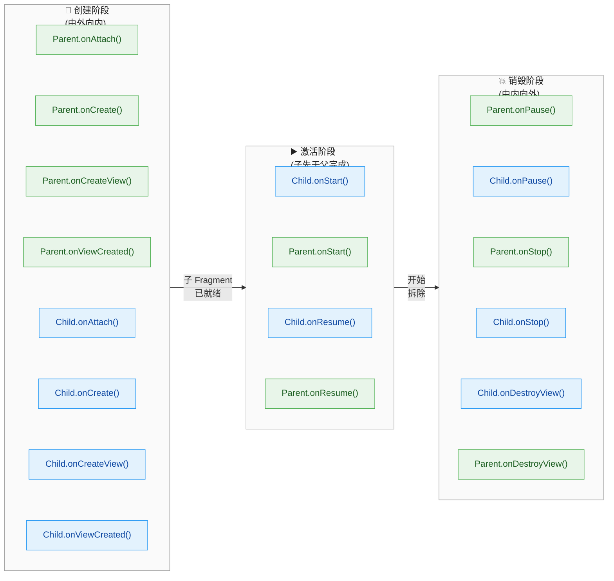
```mermaid
graph LR
    subgraph Create["🔨 创建阶段\n(由外向内)"]
        direction TB
        PA["Parent.onAttach()"]
        PC["Parent.onCreate()"]
        PCV["Parent.onCreateView()"]
        PVCR["Parent.onViewCreated()"]
        CA["Child.onAttach()"]
        CCR["Child.onCreate()"]
        CCV["Child.onCreateView()"]
        CVCR["Child.onViewCreated()"]
        PA ~~~ PC
        PC ~~~ PCV
        PCV ~~~ PVCR
        PVCR ~~~ CA
        CA ~~~ CCR
        CCR ~~~ CCV
        CCV ~~~ CVCR
    end

    subgraph Active["▶️ 激活阶段\n(子先于父完成)"]
        direction TB
        CS["Child.onStart()"]
        PS["Parent.onStart()"]
        CR["Child.onResume()"]
        PR["Parent.onResume()"]
        CS ~~~ PS
        PS ~~~ CR
        CR ~~~ PR
    end

    subgraph Destroy["💥 销毁阶段\n(由内向外)"]
        direction TB
        PPa["Parent.onPause()"]
        CPa["Child.onPause()"]
        PSt["Parent.onStop()"]
        CSt["Child.onStop()"]
        CDV["Child.onDestroyView()"]
        PDV["Parent.onDestroyView()"]
        PPa ~~~ CPa
        CPa ~~~ PSt
        PSt ~~~ CSt
        CSt ~~~ CDV
        CDV ~~~ PDV
    end

    Create -->|"子 Fragment\n已就绪"| Active -->|"开始\n拆除"| Destroy

    classDef parentStyle fill:#E8F5E9,stroke:#4CAF50,color:#1B5E20
    classDef childStyle fill:#E3F2FD,stroke:#2196F3,color:#0D47A1
    classDef subgraphStyle fill:#FAFAFA,stroke:#9E9E9E,color:#212121

    class PA,PC,PCV,PVCR,PS,PR,PPa,PSt,PDV parentStyle
    class CA,CCR,CCV,CVCR,CS,CR,CPa,CSt,CDV childStyle
    class Create,Active,Destroy subgraphStyle
```

理解这个分发顺序，对于避免实际开发中的 bug 至关重要。举几个典型的陷阱场景：

第一个陷阱是在父 Fragment 的 `onCreate()` 中尝试通过 `childFragmentManager.findFragmentByTag()` 查找子 Fragment。如果子 Fragment 是在 `onViewCreated()` 中动态添加的，那么在 `onCreate()` 时子 Fragment 尚未被添加，查找结果必然为 null。但如果是配置变更后的重建场景，childFragmentManager 会在父 Fragment 的 `onCreate()` 阶段自动恢复之前的子 Fragment，此时反而能找到。这种"有时能找到有时找不到"的不确定性，是很多诡异 bug 的根源。

第二个陷阱是在子 Fragment 的 `onAttach()` 或 `onCreate()` 中尝试访问父 Fragment 的 View。根据分发顺序，子 Fragment 的 `onAttach()` 发生在父 Fragment 的 `onViewCreated()` 之后（因为通常是在 `onViewCreated()` 中添加子 Fragment），但如果子 Fragment 是通过 XML 静态声明的，情况就不同了——子 Fragment 的创建会在父 Fragment 的 `onCreateView()` inflate 过程中触发，此时父 Fragment 的 View 树尚未完全构建完成。

```kotlin
class ChildFragment : Fragment(R.layout.fragment_child) {

    override fun onAttach(context: Context) {
        super.onAttach(context)
        // ✅ 安全：可以通过 parentFragment 获取父 Fragment 的引用
        val parent = parentFragment
        // ⚠️ 不安全：父 Fragment 的 View 可能尚未创建完成
        // 尤其在 XML 静态声明子 Fragment 的场景下
        // val parentView = parentFragment?.view  // 可能为 null
    }

    override fun onViewCreated(view: View, savedInstanceState: Bundle?) {
        super.onViewCreated(view, savedInstanceState)
        // ✅ 安全：此时父 Fragment 的 View 已经创建完成
        // 但仍然建议通过 ViewModel 或 FragmentResultListener 通信
        // 而不是直接操作父 Fragment 的 View
    }
}
```

第三个陷阱与 `viewLifecycleOwner` 有关。父 Fragment 和子 Fragment 各自拥有独立的 `viewLifecycleOwner`，它们的生命周期范围不同。如果子 Fragment 观察了一个由父 Fragment 的 `viewLifecycleOwner` 作用域创建的 LiveData 或 Flow，当父 Fragment 的 View 被销毁但子 Fragment 的 View 尚未销毁的那个短暂窗口期内（根据销毁顺序，子的 `onDestroyView` 先于父的 `onDestroyView`，所以这个窗口期实际上不存在），理论上不会出问题。但反过来，如果父 Fragment 持有子 Fragment 的 viewLifecycleOwner 引用并在子 Fragment 销毁后使用，就会崩溃。最佳实践是：**每个 Fragment 只使用自己的 viewLifecycleOwner**。

还有一个与生命周期密切相关的实际问题：`setMaxLifecycle()`。当父 Fragment 通过 FragmentTransaction 对子 Fragment 调用 `setMaxLifecycle(Lifecycle.State.STARTED)` 时，子 Fragment 的生命周期将被限制在 STARTED 状态，不会进入 RESUMED。这在 ViewPager2 的 FragmentStateAdapter 中被广泛使用——非当前可见页面的 Fragment 会被限制为 STARTED，只有当前页面才处于 RESUMED。这种机制确保了只有用户真正可见的页面才会收到 onResume 回调，开发者可以据此精确控制资源的获取与释放。

### ViewPager2 适配

ViewPager2 是嵌套 Fragment 最典型、最高频的应用场景。它内部使用 RecyclerView 作为滑动容器，通过 `FragmentStateAdapter` 将每个页面映射为一个 Fragment，而这些页面 Fragment 正是通过宿主 Fragment（或 Activity）的 childFragmentManager（或 supportFragmentManager）来管理的。

`FragmentStateAdapter` 的构造函数接受一个 `Fragment` 或 `FragmentActivity` 参数，这个参数决定了它内部使用哪个 FragmentManager 来管理页面 Fragment。这是一个关键的选择点：

```kotlin
class ParentFragment : Fragment(R.layout.fragment_parent) {

    override fun onViewCreated(view: View, savedInstanceState: Bundle?) {
        super.onViewCreated(view, savedInstanceState)

        val viewPager = view.findViewById<ViewPager2>(R.id.view_pager)

        // ✅ 正确：传入 this（当前 Fragment），Adapter 内部会使用 childFragmentManager
        // 页面 Fragment 的生命周期将正确跟随 ParentFragment
        viewPager.adapter = MyPagerAdapter(this)

        // ❌ 错误：传入 requireActivity()，Adapter 会使用 Activity 的 supportFragmentManager
        // 页面 Fragment 的生命周期脱离 ParentFragment 的控制
        // viewPager.adapter = MyPagerAdapter(requireActivity())
    }
}

class MyPagerAdapter(
    fragment: Fragment  // 接收父 Fragment 作为参数
) : FragmentStateAdapter(fragment) {

    // 定义页面总数
    override fun getItemCount(): Int = 3

    // 根据位置创建对应的页面 Fragment
    // FragmentStateAdapter 内部会通过 childFragmentManager 管理这些 Fragment
    override fun createFragment(position: Int): Fragment {
        return when (position) {
            0 -> FirstPageFragment()   // 第一个页面
            1 -> SecondPageFragment()  // 第二个页面
            2 -> ThirdPageFragment()   // 第三个页面
            else -> throw IllegalArgumentException("Invalid position: $position")
        }
    }
}
```

当你把 `FragmentStateAdapter` 的构造参数设为当前 Fragment（而非 Activity）时，Adapter 内部会调用 `fragment.childFragmentManager` 和 `fragment.viewLifecycleOwner.lifecycle` 来管理页面。这意味着：页面 Fragment 是当前 Fragment 的子 Fragment，它们的生命周期完全受父 Fragment 控制。当父 Fragment 进入回退栈（View 被销毁）时，所有页面 Fragment 的 View 也会被正确销毁；当父 Fragment 恢复时，页面 Fragment 也会被正确恢复。

FragmentStateAdapter 对离屏页面的生命周期管理策略值得深入了解。默认情况下，ViewPager2 的 `offscreenPageLimit` 为 `OFFSCREEN_PAGE_LIMIT_DEFAULT`（值为 -1），表示使用 RecyclerView 的默认缓存策略。在这种模式下，只有当前可见页面和即将滑入的页面会被保持在 attached 状态，其余页面的 Fragment View 会被销毁（但 Fragment 实例本身可能被保留，状态通过 `SavedStateRegistry` 保存）。

```kotlin
class ParentFragment : Fragment(R.layout.fragment_parent) {

    override fun onViewCreated(view: View, savedInstanceState: Bundle?) {
        super.onViewCreated(view, savedInstanceState)

        val viewPager = view.findViewById<ViewPager2>(R.id.view_pager)
        viewPager.adapter = MyPagerAdapter(this)

        // offscreenPageLimit 控制离屏页面的保留数量
        // 默认值 OFFSCREEN_PAGE_LIMIT_DEFAULT (-1)：由 RecyclerView 自行管理
        // 设为 1：当前页面左右各保留 1 个页面的 View 不被销毁
        // 设为 2：当前页面左右各保留 2 个页面
        viewPager.offscreenPageLimit = 1

        // 配合 TabLayout 使用（常见组合）
        val tabLayout = view.findViewById<TabLayout>(R.id.tab_layout)
        TabLayoutMediator(tabLayout, viewPager) { tab, position ->
            // 为每个 Tab 设置标题文本
            tab.text = when (position) {
                0 -> "首页"
                1 -> "发现"
                2 -> "我的"
                else -> ""
            }
        }.attach() // 调用 attach() 建立 TabLayout 与 ViewPager2 的联动
    }
}
```

FragmentStateAdapter 内部使用了 `setMaxLifecycle()` 来精确控制页面 Fragment 的生命周期上限。当前可见页面被设置为 `RESUMED`，而所有离屏但仍 attached 的页面被限制为 `STARTED`。这个机制带来了一个非常实用的特性：你可以在页面 Fragment 中通过判断 `onResume` / `onPause` 来感知页面是否真正对用户可见，而不需要像旧版 ViewPager 那样依赖已被废弃的 `setUserVisibleHint()` 方法。

```kotlin
class PageFragment : Fragment(R.layout.fragment_page) {

    override fun onResume() {
        super.onResume()
        // ✅ 在 ViewPager2 + FragmentStateAdapter 中
        // onResume 被调用意味着当前页面确实对用户可见
        // 可以在这里开始加载数据、启动动画、上报页面曝光埋点等
        loadData()
        startAnimation()
    }

    override fun onPause() {
        super.onPause()
        // ✅ onPause 被调用意味着页面不再对用户可见
        // 可以在这里暂停动画、释放资源
        stopAnimation()
    }

    // 不再需要旧版 ViewPager 中的 setUserVisibleHint()
    // 也不需要自定义 lazyLoad 逻辑（除非有更精细的懒加载需求）
}
```

在 ViewPager2 嵌套 Fragment 的场景中，还有一个高频问题：**滑动冲突**。当 ViewPager2 内部的页面 Fragment 中又包含一个可水平滑动的组件（比如另一个 ViewPager2、HorizontalScrollView 或可横向滑动的 RecyclerView）时，内外两层的水平滑动手势会产生冲突。Google 官方提供了一个工具类 `NestedScrollableHost` 的参考实现来解决这个问题，其核心思路是在子 View 需要消费水平滑动时，通过 `requestDisallowInterceptTouchEvent()` 阻止外层 ViewPager2 拦截触摸事件：

```kotlin
/**
 * 解决 ViewPager2 嵌套滑动冲突的包装布局
 * 将需要水平滑动的子 View 包裹在此布局中
 * 当子 View 可以水平滑动时，阻止外层 ViewPager2 拦截触摸事件
 */
class NestedScrollableHost @JvmOverloads constructor(
    context: Context,
    attrs: AttributeSet? = null
) : FrameLayout(context, attrs) {

    // 记录触摸起始点的 X 坐标
    private var touchSlop = 0
    private var initialX = 0f
    private var initialY = 0f

    // 获取父级 ViewPager2 实例（向上遍历 View 树查找）
    private val parentViewPager: ViewPager2?
        get() {
            var v: View? = parent as? View
            while (v != null && v !is ViewPager2) {
                v = v.parent as? View
            }
            return v as? ViewPager2
        }

    init {
        // 获取系统定义的最小滑动距离阈值
        touchSlop = ViewConfiguration.get(context).scaledTouchSlop
    }

    override fun onInterceptTouchEvent(e: MotionEvent): Boolean {
        handleInterceptTouchEvent(e)
        return super.onInterceptTouchEvent(e)
    }

    private fun handleInterceptTouchEvent(e: MotionEvent) {
        val orientation = parentViewPager?.orientation ?: return

        // 如果子 View 在 ViewPager2 的滑动方向上不能继续滚动，则不干预
        if (!canChildScroll(orientation, -1f) && !canChildScroll(orientation, 1f)) {
            return
        }

        when (e.action) {
            MotionEvent.ACTION_DOWN -> {
                // 记录按下位置，并立即请求父级不要拦截
                initialX = e.x
                initialY = e.y
                parent.requestDisallowInterceptTouchEvent(true)
            }
            MotionEvent.ACTION_MOVE -> {
                // 计算水平和垂直方向的滑动距离
                val dx = e.x - initialX
                val dy = e.y - initialY
                val isVpHorizontal = orientation == ViewPager2.ORIENTATION_HORIZONTAL

                // 判断主要滑动方向
                val scaledDx = dx.absoluteValue * if (isVpHorizontal) 0.5f else 1f
                val scaledDy = dy.absoluteValue * if (isVpHorizontal) 1f else 0.5f

                if (scaledDx > touchSlop || scaledDy > touchSlop) {
                    if (isVpHorizontal == (scaledDy > scaledDx)) {
                        // 滑动方向与 ViewPager2 方向垂直，允许父级拦截
                        parent.requestDisallowInterceptTouchEvent(false)
                    } else {
                        // 滑动方向与 ViewPager2 方向一致
                        // 检查子 View 是否还能在该方向上滚动
                        if (canChildScroll(orientation, if (isVpHorizontal) -dx else -dy)) {
                            // 子 View 还能滚动，阻止父级拦截
                            parent.requestDisallowInterceptTouchEvent(true)
                        } else {
                            // 子 View 已到边界，允许父级 ViewPager2 接管滑动
                            parent.requestDisallowInterceptTouchEvent(false)
                        }
                    }
                }
            }
        }
    }

    // 检查子 View 是否可以在指定方向上滚动
    private fun canChildScroll(orientation: Int, delta: Float): Boolean {
        val direction = -delta.toInt()
        return when (orientation) {
            0 -> children.any { it.canScrollHorizontally(direction) }
            1 -> children.any { it.canScrollVertically(direction) }
            else -> false
        }
    }
}
```

最后，关于 ViewPager2 中页面 Fragment 之间的通信，由于所有页面 Fragment 都是同一个父 Fragment 的子 Fragment，它们共享同一个 `parentFragment`。因此，最自然的通信方式是通过父 Fragment 作用域的 ViewModel 来共享数据：

```kotlin
class ParentFragment : Fragment(R.layout.fragment_parent) {

    // 在父 Fragment 作用域创建 ViewModel
    // 所有子页面 Fragment 都可以通过 parentFragment 获取同一个实例
    private val sharedViewModel: SharedViewModel by viewModels()

    override fun onViewCreated(view: View, savedInstanceState: Bundle?) {
        super.onViewCreated(view, savedInstanceState)
        val viewPager = view.findViewById<ViewPager2>(R.id.view_pager)
        viewPager.adapter = MyPagerAdapter(this)
    }
}

class FirstPageFragment : Fragment(R.layout.fragment_first_page) {

    // 通过 requireParentFragment() 获取父 Fragment 作用域的 ViewModel
    // 这样所有页面 Fragment 拿到的是同一个 ViewModel 实例
    private val sharedViewModel: SharedViewModel by viewModels(
        ownerProducer = { requireParentFragment() }
    )

    override fun onViewCreated(view: View, savedInstanceState: Bundle?) {
        super.onViewCreated(view, savedInstanceState)

        // 向共享 ViewModel 写入数据
        view.findViewById<Button>(R.id.btn_send).setOnClickListener {
            sharedViewModel.updateMessage("来自第一个页面的消息")
        }
    }
}

class SecondPageFragment : Fragment(R.layout.fragment_second_page) {

    // 同样通过 requireParentFragment() 获取同一个 ViewModel 实例
    private val sharedViewModel: SharedViewModel by viewModels(
        ownerProducer = { requireParentFragment() }
    )

    override fun onViewCreated(view: View, savedInstanceState: Bundle?) {
        super.onViewCreated(view, savedInstanceState)

        // 观察共享数据的变化
        // 使用 viewLifecycleOwner 确保在 View 销毁时自动取消观察
        viewLifecycleOwner.lifecycleScope.launch {
            viewLifecycleOwner.repeatOnLifecycle(Lifecycle.State.STARTED) {
                sharedViewModel.message.collect { msg ->
                    // 当 FirstPageFragment 更新数据时，这里会收到通知
                    view.findViewById<TextView>(R.id.tv_message).text = msg
                }
            }
        }
    }
}

// 共享 ViewModel，作用域绑定在父 Fragment 上
class SharedViewModel : ViewModel() {
    // 使用 StateFlow 作为数据源
    private val _message = MutableStateFlow("")
    val message: StateFlow<String> = _message.asStateFlow()

    // 更新消息的方法，任何持有此 ViewModel 的页面都可以调用
    fun updateMessage(msg: String) {
        _message.value = msg
    }
}
```

这里的关键在于 `ownerProducer = { requireParentFragment() }` 这个参数。`by viewModels()` 委托默认使用当前 Fragment 作为 ViewModelStoreOwner，每个页面 Fragment 会各自创建独立的 ViewModel 实例，无法共享数据。通过将 owner 指定为 `requireParentFragment()`，所有页面 Fragment 都从父 Fragment 的 ViewModelStore 中获取 ViewModel，自然拿到的是同一个实例。这比使用 `activityViewModels()` 更精确——`activityViewModels()` 的作用域是整个 Activity，ViewModel 的生命周期过长，可能在父 Fragment 销毁后仍然存活，造成不必要的内存占用和逻辑混乱。

除了 ViewModel 共享之外，`FragmentResultListener` 也可以在嵌套场景中使用。子 Fragment 之间如果需要一次性的结果传递（而非持续的数据流），可以通过父 Fragment 的 childFragmentManager 来注册和发送结果：

```kotlin
class FirstPageFragment : Fragment(R.layout.fragment_first_page) {

    override fun onViewCreated(view: View, savedInstanceState: Bundle?) {
        super.onViewCreated(view, savedInstanceState)

        // 在父 Fragment 的 childFragmentManager 上注册结果监听
        // 这样同一个 childFragmentManager 下的兄弟 Fragment 发送的结果都能收到
        parentFragmentManager.setFragmentResultListener(
            "page_result_key",           // 结果的唯一标识 key
            viewLifecycleOwner           // 生命周期 owner，View 销毁时自动取消监听
        ) { _, bundle ->
            // 收到兄弟 Fragment 发送的结果
            val data = bundle.getString("data", "")
            view.findViewById<TextView>(R.id.tv_result).text = data
        }
    }
}

class SecondPageFragment : Fragment(R.layout.fragment_second_page) {

    override fun onViewCreated(view: View, savedInstanceState: Bundle?) {
        super.onViewCreated(view, savedInstanceState)

        view.findViewById<Button>(R.id.btn_send_result).setOnClickListener {
            // 通过 parentFragmentManager 发送结果
            // 同一个 FragmentManager 下注册了 "page_result_key" 的 Fragment 会收到
            parentFragmentManager.setFragmentResult(
                "page_result_key",       // 与监听方使用相同的 key
                bundleOf("data" to "来自第二个页面的结果")
            )
        }
    }
}
```

注意这里两个页面 Fragment 使用的都是 `parentFragmentManager`（即父 Fragment 的 childFragmentManager），因为它们是兄弟关系，共享同一个管理器。如果错误地使用了各自的 `childFragmentManager`，结果将无法跨 Fragment 传递。

将嵌套 Fragment 的核心要点做一个整体梳理：

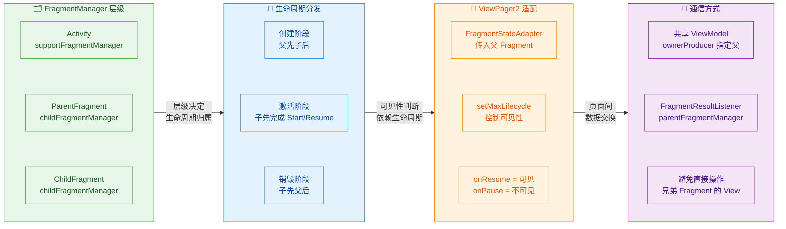
```mermaid
graph LR
    subgraph Manager["🗂️ FragmentManager 层级"]
        direction TB
        M1["Activity\nsupportFragmentManager"]
        M2["ParentFragment\nchildFragmentManager"]
        M3["ChildFragment\nchildFragmentManager"]
        M1 ~~~ M2
        M2 ~~~ M3
    end

    subgraph Lifecycle["🔄 生命周期分发"]
        direction TB
        L1["创建阶段\n父先子后"]
        L2["激活阶段\n子先完成 Start/Resume"]
        L3["销毁阶段\n子先父后"]
        L1 ~~~ L2
        L2 ~~~ L3
    end

    subgraph VP2["📱 ViewPager2 适配"]
        direction TB
        V1["FragmentStateAdapter\n传入父 Fragment"]
        V2["setMaxLifecycle\n控制可见性"]
        V3["onResume = 可见\nonPause = 不可见"]
        V1 ~~~ V2
        V2 ~~~ V3
    end

    subgraph Comm["💬 通信方式"]
        direction TB
        C1["共享 ViewModel\nownerProducer 指定父"]
        C2["FragmentResultListener\nparentFragmentManager"]
        C3["避免直接操作\n兄弟 Fragment 的 View"]
        C1 ~~~ C2
        C2 ~~~ C3
    end

    Manager -->|"层级决定\n生命周期归属"| Lifecycle -->|"可见性判断\n依赖生命周期"| VP2 -->|"页面间\n数据交换"| Comm

    classDef managerStyle fill:#E8F5E9,stroke:#43A047,color:#1B5E20
    classDef lifecycleStyle fill:#E3F2FD,stroke:#1E88E5,color:#0D47A1
    classDef vp2Style fill:#FFF3E0,stroke:#FB8C00,color:#E65100
    classDef commStyle fill:#F3E5F5,stroke:#8E24AA,color:#4A148C

    class M1,M2,M3 managerStyle
    class L1,L2,L3 lifecycleStyle
    class V1,V2,V3 vp2Style
    class C1,C2,C3 commStyle
    class Manager managerStyle
    class Lifecycle lifecycleStyle
    class VP2 vp2Style
    class Comm commStyle
```

嵌套 Fragment 的使用并不复杂，但它对开发者的心智模型提出了更高要求。你需要时刻清楚当前操作的 Fragment 处于哪一层、它的 FragmentManager 是谁、它的生命周期受谁控制。一旦这些关系在脑中建立起清晰的树状模型，嵌套 Fragment 就会从"容易出 bug 的高危区域"变成"灵活组合 UI 的强力工具"。

---

**📝 练习题**

在一个 Activity 中，ParentFragment 通过 ViewPager2 + FragmentStateAdapter 托管了三个页面 Fragment（PageA、PageB、PageC）。当用户从 PageA 滑动到 PageB 时，以下哪个描述是正确的？

A. PageA 的 `onDestroyView()` 会被立即调用，因为它不再可见

B. PageA 会收到 `onPause()` 回调，PageB 会收到 `onResume()` 回调

C. PageA 和 PageB 都处于 `RESUMED` 状态，因为它们都在屏幕附近

D. PageA 的 `onStop()` 会被调用，Fragment 实例被销毁

**【答案】** B

**【解析】** FragmentStateAdapter 内部通过 `setMaxLifecycle()` 精确控制页面 Fragment 的生命周期上限。当前可见页面被设置为 `RESUMED`，而离屏但仍 attached 的页面被限制为 `STARTED`。因此，当用户从 PageA 滑到 PageB 时，PageA 的最大生命周期从 RESUMED 降为 STARTED，触发 `onPause()` 回调；PageB 的最大生命周期从 STARTED 提升为 RESUMED，触发 `onResume()` 回调。选项 A 错误，因为在默认 `offscreenPageLimit` 下，相邻页面的 View 通常会被 RecyclerView 缓存保留，不会立即销毁。选项 C 错误，同一时刻只有一个页面处于 RESUMED 状态。选项 D 错误，PageA 只是降到 STARTED，并未被 stop 或 destroy，Fragment 实例仍然存活。这正是 ViewPager2 相比旧版 ViewPager 的重大改进——开发者可以直接依赖 `onResume` / `onPause` 判断页面可见性，无需再使用已废弃的 `setUserVisibleHint()` 方法。

---

## 状态保存与恢复

Android 系统随时可能因为内存不足、配置变更（屏幕旋转、语言切换、深色模式切换等）而销毁并重建 Activity 及其托管的 Fragment。如果开发者不做任何处理，用户在界面上填写的表单数据、滚动位置、选中状态等都会在重建后丢失，体验极差。Fragment 的状态保存与恢复机制，就是为了解决这个问题而设计的一整套"数据快照 → 序列化 → 反序列化 → 还原"流水线。

要真正理解这套机制，需要区分三个层面的"状态"：

- **Fragment 实例状态（Instance State）**：Fragment 对象本身携带的业务数据，比如通过 `arguments` 传入的参数、开发者在 `onSaveInstanceState` 中手动保存的键值对。
- **View 状态（View State）**：Fragment 所持有的视图树中，各个 View 自动保存的 UI 状态，比如 EditText 的文本内容、ScrollView 的滚动偏移量、CheckBox 的选中状态。
- **ViewModel 状态**：存活于 ViewModelStore 中的数据，它的生命周期独立于 Fragment 视图，能跨越配置变更存活，但无法跨越进程被杀。

这三个层面各有各的保存时机、存储介质和恢复方式，开发者需要根据数据的性质选择合适的策略。

### Arguments 传参持久性

#### Arguments 的本质与设计意图

Fragment 的 `arguments` 是一个 `Bundle` 对象，它在 Fragment 的整个生命周期中扮演着"初始化配置参数"的角色。它的设计意图非常明确：Fragment 必须拥有一个无参的公共构造函数（public no-arg constructor），系统在重建 Fragment 时只会调用这个无参构造函数，然后把之前保存的 `arguments` Bundle 重新设置回去。这就是为什么 Android 官方一直推荐使用 `newInstance` 工厂方法模式来创建 Fragment，而不是通过带参构造函数传递数据。

```kotlin
// ✅ 推荐：工厂方法模式，参数通过 arguments Bundle 传递
class UserProfileFragment : Fragment(R.layout.fragment_user_profile) {

    companion object {
        // 定义 Bundle 中的 key 常量，避免硬编码字符串
        private const val ARG_USER_ID = "arg_user_id"
        private const val ARG_DISPLAY_NAME = "arg_display_name"
        private const val ARG_IS_EDITABLE = "arg_is_editable"

        // 工厂方法：外部通过此方法创建 Fragment 实例
        // 所有初始化参数都被打包进 arguments Bundle
        fun newInstance(
            userId: Long,
            displayName: String,
            isEditable: Boolean = false
        ): UserProfileFragment {
            // 创建 Fragment 实例（调用无参构造函数）
            return UserProfileFragment().apply {
                // 将参数打包到 arguments 中
                arguments = bundleOf(
                    ARG_USER_ID to userId,           // Long 类型参数
                    ARG_DISPLAY_NAME to displayName, // String 类型参数
                    ARG_IS_EDITABLE to isEditable    // Boolean 类型参数
                )
            }
        }
    }

    // 在 Fragment 内部通过 arguments 取出参数
    // requireArguments() 会在 arguments 为 null 时抛出异常，比 arguments!! 更安全
    private val userId: Long by lazy {
        requireArguments().getLong(ARG_USER_ID)
    }

    private val displayName: String by lazy {
        requireArguments().getString(ARG_DISPLAY_NAME, "")
    }

    private val isEditable: Boolean by lazy {
        requireArguments().getBoolean(ARG_IS_EDITABLE, false)
    }
}
```

```kotlin
// ❌ 反模式：通过构造函数传参
// 系统重建时只调用无参构造函数，这些参数会全部丢失
class UserProfileFragment(
    private val userId: Long,        // 重建后变为默认值 0
    private val displayName: String  // 重建后变为默认值 ""
) : Fragment(R.layout.fragment_user_profile)
```

#### Arguments 在系统重建中的存活机制

当系统因配置变更或内存回收而销毁 Activity 时，FragmentManager 会遍历所有被管理的 Fragment，将每个 Fragment 的关键信息序列化保存。这个过程中，`arguments` Bundle 会被完整地写入到 `FragmentState` 对象中，而 `FragmentState` 又会被保存到 Activity 的 `savedInstanceState` Bundle 里。整个链路可以用下面的时序图来描述：

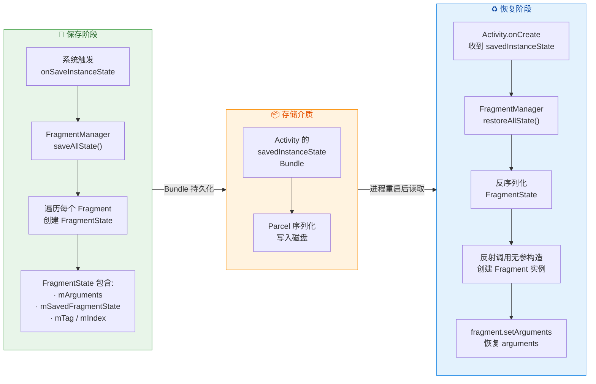
```mermaid
graph LR
    subgraph Save["💾 保存阶段"]
        direction TB
        S1["系统触发\nonSaveInstanceState"]
        S2["FragmentManager\nsaveAllState()"]
        S3["遍历每个 Fragment\n创建 FragmentState"]
        S4["FragmentState 包含:\n· mArguments\n· mSavedFragmentState\n· mTag / mIndex"]
        S1 --> S2
        S2 --> S3
        S3 --> S4
    end

    subgraph Store["📦 存储介质"]
        direction TB
        B1["Activity 的\nsavedInstanceState\nBundle"]
        B2["Parcel 序列化\n写入磁盘"]
        B1 --> B2
    end

    subgraph Restore["♻️ 恢复阶段"]
        direction TB
        R1["Activity.onCreate\n收到 savedInstanceState"]
        R2["FragmentManager\nrestoreAllState()"]
        R3["反序列化\nFragmentState"]
        R4["反射调用无参构造\n创建 Fragment 实例"]
        R5["fragment.setArguments\n恢复 arguments"]
        R1 --> R2
        R2 --> R3
        R3 --> R4
        R4 --> R5
    end

    Save -->|"Bundle 持久化"| Store
    Store -->|"进程重启后读取"| Restore

    classDef saveStyle fill:#E8F5E9,stroke:#43A047,color:#1B5E20
    classDef storeStyle fill:#FFF3E0,stroke:#FB8C00,color:#E65100
    classDef restoreStyle fill:#E3F2FD,stroke:#1E88E5,color:#0D47A1

    class Save saveStyle
    class Store storeStyle
    class Restore restoreStyle
```

从这个流程可以看出几个关键点：

第一，`arguments` 的保存是 FragmentManager 自动完成的，开发者不需要在 `onSaveInstanceState` 中手动保存 arguments 里的数据。只要你在创建 Fragment 时正确设置了 arguments，系统重建后这些数据就一定还在。

第二，`arguments` 中的数据必须是可序列化的（实现 `Parcelable` 或 `Serializable` 接口的对象，或者 Bundle 原生支持的基本类型）。因为整个保存过程最终要经过 Parcel 序列化写入磁盘，不可序列化的对象会导致运行时崩溃。

第三，`arguments` 适合存放"初始化配置"类的数据——那些在 Fragment 整个生命周期中不会改变的参数。如果你需要保存运行时动态变化的状态（比如用户输入、网络请求结果），应该使用 `onSaveInstanceState` 或 ViewModel。

#### Arguments 的不可变性约定

虽然从 API 层面来说，`arguments` 返回的 Bundle 是可变的，你可以在 Fragment 运行过程中往里面塞新数据，但这是一个非常不推荐的做法。原因在于：`arguments` 的语义是"创建时的初始参数"，如果你在运行时修改它，会导致代码的可读性和可维护性急剧下降——其他开发者无法分辨 arguments 中的某个值到底是创建时传入的，还是运行过程中被修改的。

更重要的是，从 Fragment 1.3.0 开始，如果 Fragment 已经被添加到 FragmentManager 中，再调用 `setArguments()` 会抛出 `IllegalStateException`。这进一步强化了 arguments 的不可变语义。

```kotlin
// ❌ 不推荐：运行时修改 arguments
override fun onViewCreated(view: View, savedInstanceState: Bundle?) {
    super.onViewCreated(view, savedInstanceState)
    // 这种做法虽然技术上可行（直接操作已有 Bundle），但违反设计意图
    arguments?.putString("runtime_data", "some_value")
}

// ✅ 推荐：运行时变化的数据使用 ViewModel 或 onSaveInstanceState
class UserProfileViewModel : ViewModel() {
    // 运行时动态数据放在 ViewModel 中管理
    private val _editedName = MutableLiveData<String>()
    val editedName: LiveData<String> = _editedName

    fun updateName(name: String) {
        _editedName.value = name
    }
}
```

#### Fragment 1.3+ 与 FragmentFactory 的现代化传参

随着 AndroidX Fragment 库的演进，Google 引入了 `FragmentFactory` 机制，允许开发者使用带参构造函数创建 Fragment，同时保证系统重建时也能正确调用该构造函数。这在依赖注入（Dagger/Hilt）场景下特别有用。

```kotlin
// 自定义 FragmentFactory：告诉系统如何创建带参 Fragment
class MyFragmentFactory(
    private val repository: UserRepository  // 通过 DI 注入的依赖
) : FragmentFactory() {

    // 系统重建 Fragment 时会调用此方法
    // className 是 Fragment 的全限定类名
    override fun instantiate(classLoader: ClassLoader, className: String): Fragment {
        // 根据类名判断需要创建哪个 Fragment
        return when (loadFragmentClass(classLoader, className)) {
            // 对需要依赖注入的 Fragment，手动调用带参构造函数
            UserProfileFragment::class.java -> UserProfileFragment(repository)
            // 其他 Fragment 走默认的反射创建逻辑
            else -> super.instantiate(classLoader, className)
        }
    }
}

// 在 Activity 中注册 FragmentFactory
// 必须在 super.onCreate() 之前设置，否则系统重建时用不上
class MainActivity : AppCompatActivity() {

    @Inject
    lateinit var repository: UserRepository

    override fun onCreate(savedInstanceState: Bundle?) {
        // 在 super.onCreate 之前注册 Factory
        // 这样系统恢复 Fragment 时就会使用我们的 Factory
        supportFragmentManager.fragmentFactory = MyFragmentFactory(repository)
        // super.onCreate 内部会触发 Fragment 的恢复流程
        super.onCreate(savedInstanceState)
        setContentView(R.layout.activity_main)
    }
}
```

不过即使使用了 FragmentFactory，`arguments` 仍然是传递"页面级参数"（如 userId、itemId）的首选方式。FragmentFactory 解决的是"依赖注入"问题（如 Repository、UseCase），而 arguments 解决的是"业务参数"问题。两者互补，不是替代关系。

### onSaveInstanceState 视图状态

#### View 的自动状态保存机制

在深入 Fragment 的 `onSaveInstanceState` 之前，先理解 Android View 系统自带的状态保存机制非常重要。Android 中的很多标准 View（EditText、CheckBox、ScrollView、RecyclerView 等）都内置了状态保存逻辑。当系统触发状态保存时，ViewGroup 会递归遍历整棵视图树，调用每个 View 的 `onSaveInstanceState()` 方法，将返回的 `Parcelable` 对象以 View 的 `android:id` 为 key 存入一个 `SparseArray<Parcelable>` 中。

这个机制有两个前提条件：

第一，View 必须设置了 `android:id`。没有 id 的 View，系统无法在恢复时找到对应的 View 来还原状态。这是开发中最常见的"状态丢失"原因之一。

第二，`android:saveEnabled` 属性必须为 true（默认就是 true）。如果你显式设置为 false，该 View 的状态不会被保存。

```xml
<!-- ✅ 有 id 的 EditText：文本内容会自动保存和恢复 -->
<EditText
    android:id="@+id/et_username"
    android:layout_width="match_parent"
    android:layout_height="wrap_content"
    android:hint="请输入用户名" />

<!-- ❌ 没有 id 的 EditText：文本内容在重建后丢失 -->
<EditText
    android:layout_width="match_parent"
    android:layout_height="wrap_content"
    android:hint="请输入密码" />

<!-- ❌ 显式禁用状态保存：即使有 id 也不会保存 -->
<EditText
    android:id="@+id/et_temp"
    android:layout_width="match_parent"
    android:layout_height="wrap_content"
    android:saveEnabled="false" />
```

Fragment 在这个过程中的角色是：FragmentManager 会在适当的时机调用 `Fragment.saveViewState()`，该方法内部会对 Fragment 的根 View 调用 `saveHierarchyState()`，从而触发整棵视图树的状态收集。收集到的 `SparseArray<Parcelable>` 会被存入 Fragment 的 `mSavedViewState` 字段，最终随 `FragmentState` 一起被序列化。

```kotlin
// Fragment 源码中的视图状态保存逻辑（简化版）
// 这段代码帮助理解内部机制，实际开发中不需要手动调用
internal fun saveViewState() {
    if (mView != null) {
        // 创建一个 SparseArray 来收集所有 View 的状态
        mSavedViewState = SparseArray()
        // 递归遍历视图树，每个有 id 的 View 都会贡献自己的状态
        mView!!.saveHierarchyState(mSavedViewState)
    }
}
```

#### Fragment 的 onSaveInstanceState 详解

除了 View 的自动状态保存，Fragment 还提供了 `onSaveInstanceState(Bundle)` 回调，让开发者手动保存那些不属于 View 状态、但又需要跨重建存活的数据。典型场景包括：当前页码、筛选条件、临时计算结果、网络请求的分页 token 等。

```kotlin
class SearchFragment : Fragment(R.layout.fragment_search) {

    // 这些运行时状态不属于任何 View，需要手动保存
    private var currentPage = 1                    // 当前加载到第几页
    private var searchKeyword = ""                 // 当前搜索关键词
    private var selectedFilterIds = mutableSetOf<Int>()  // 用户选中的筛选条件
    private var isListViewMode = true              // 列表/网格视图切换状态

    companion object {
        // 定义保存状态用的 key 常量
        private const val STATE_CURRENT_PAGE = "state_current_page"
        private const val STATE_SEARCH_KEYWORD = "state_search_keyword"
        private const val STATE_FILTER_IDS = "state_filter_ids"
        private const val STATE_LIST_VIEW_MODE = "state_list_view_mode"
    }

    override fun onViewCreated(view: View, savedInstanceState: Bundle?) {
        super.onViewCreated(view, savedInstanceState)

        // 恢复状态：优先从 savedInstanceState 中读取
        // 如果是首次创建（savedInstanceState 为 null），使用默认值
        if (savedInstanceState != null) {
            // 从 Bundle 中取出之前保存的状态
            currentPage = savedInstanceState.getInt(STATE_CURRENT_PAGE, 1)
            searchKeyword = savedInstanceState.getString(STATE_SEARCH_KEYWORD, "")
            // IntArray 转为 MutableSet<Int>
            selectedFilterIds = savedInstanceState
                .getIntArray(STATE_FILTER_IDS)
                ?.toMutableSet() ?: mutableSetOf()
            isListViewMode = savedInstanceState.getBoolean(STATE_LIST_VIEW_MODE, true)

            // 根据恢复的状态重新设置 UI
            restoreUIState()
        }

        setupSearchBar()
        setupFilterPanel()
        setupViewModeToggle()
    }

    // 系统在 Fragment 即将被销毁前调用此方法
    // 注意：这个方法可能在 onDestroyView 之前或之后调用
    // 从 Fragment 1.3.0 开始，保证在 onStop 之后、onDestroyView 之前调用
    override fun onSaveInstanceState(outState: Bundle) {
        super.onSaveInstanceState(outState)
        // 将运行时状态写入 Bundle
        outState.putInt(STATE_CURRENT_PAGE, currentPage)
        outState.putString(STATE_SEARCH_KEYWORD, searchKeyword)
        // MutableSet<Int> 转为 IntArray 存储
        outState.putIntArray(STATE_FILTER_IDS, selectedFilterIds.toIntArray())
        outState.putBoolean(STATE_LIST_VIEW_MODE, isListViewMode)
    }

    private fun restoreUIState() {
        // 根据恢复的数据重建界面状态
        // 比如重新设置搜索框文本、重新勾选筛选项、切换视图模式等
    }

    private fun setupSearchBar() { /* ... */ }
    private fun setupFilterPanel() { /* ... */ }
    private fun setupViewModeToggle() { /* ... */ }
}
```

#### onSaveInstanceState 的调用时机

理解 `onSaveInstanceState` 的调用时机对于正确使用它至关重要。在不同版本的 Fragment 库中，这个时机有所不同：

在早期版本中，`onSaveInstanceState` 的调用时机与 Activity 的 `onSaveInstanceState` 对齐，可能在 `onStop` 之前或之后调用，这导致了一些令人困惑的行为。从 AndroidX Fragment 1.3.0 开始，调用顺序被严格规范化：`onStop` → `onSaveInstanceState` → `onDestroyView` → `onDestroy`。这意味着在 `onSaveInstanceState` 被调用时，View 仍然存在，你可以安全地从 View 中读取状态。

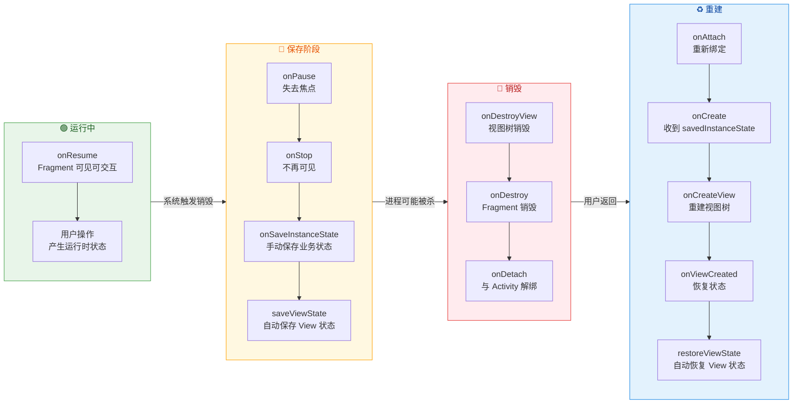
```mermaid
graph LR
    subgraph Running["🟢 运行中"]
        direction TB
        A1["onResume\nFragment 可见可交互"]
        A2["用户操作\n产生运行时状态"]
        A1 --> A2
    end

    subgraph Saving["💾 保存阶段"]
        direction TB
        B1["onPause\n失去焦点"]
        B2["onStop\n不再可见"]
        B3["onSaveInstanceState\n手动保存业务状态"]
        B4["saveViewState\n自动保存 View 状态"]
        B1 --> B2
        B2 --> B3
        B3 --> B4
    end

    subgraph Destroyed["🔴 销毁"]
        direction TB
        C1["onDestroyView\n视图树销毁"]
        C2["onDestroy\nFragment 销毁"]
        C3["onDetach\n与 Activity 解绑"]
        C1 --> C2
        C2 --> C3
    end

    subgraph Rebuild["♻️ 重建"]
        direction TB
        D1["onAttach\n重新绑定"]
        D2["onCreate\n收到 savedInstanceState"]
        D3["onCreateView\n重建视图树"]
        D4["onViewCreated\n恢复状态"]
        D5["restoreViewState\n自动恢复 View 状态"]
        D1 --> D2
        D2 --> D3
        D3 --> D4
        D4 --> D5
    end

    Running -->|"系统触发销毁"| Saving
    Saving -->|"进程可能被杀"| Destroyed
    Destroyed -->|"用户返回"| Rebuild

    classDef runStyle fill:#E8F5E9,stroke:#43A047,color:#1B5E20
    classDef saveStyle fill:#FFF8E1,stroke:#FFA000,color:#E65100
    classDef destroyStyle fill:#FFEBEE,stroke:#E53935,color:#B71C1C
    classDef rebuildStyle fill:#E3F2FD,stroke:#1E88E5,color:#0D47A1

    class Running runStyle
    class Saving saveStyle
    class Destroyed destroyStyle
    class Rebuild rebuildStyle
```

#### savedInstanceState 的大小限制与陷阱

`savedInstanceState` Bundle 最终会通过 Binder 事务传递给系统进程（system_server），而 Binder 事务有一个约 1MB 的缓冲区大小限制（这个缓冲区是进程级共享的，所有 Binder 调用共用）。如果你在 `onSaveInstanceState` 中保存了过大的数据（比如一个包含几百条记录的列表、一张 Bitmap），就可能触发 `TransactionTooLargeException`，导致应用崩溃。

```kotlin
// ❌ 危险：保存大量数据到 savedInstanceState
override fun onSaveInstanceState(outState: Bundle) {
    super.onSaveInstanceState(outState)
    // 假设 searchResults 包含 500 条搜索结果，每条包含图片 URL、描述等
    // 序列化后可能超过 500KB，非常危险
    outState.putParcelableArrayList("results", ArrayList(searchResults))
}

// ✅ 正确：只保存恢复所需的最小信息
override fun onSaveInstanceState(outState: Bundle) {
    super.onSaveInstanceState(outState)
    // 只保存搜索关键词和页码，重建后重新请求数据
    outState.putString("keyword", searchKeyword)
    outState.putInt("page", currentPage)
    // 列表数据放在 ViewModel 中（配置变更时存活）
    // 或者缓存到本地数据库/文件（进程被杀时存活）
}
```

一个实用的经验法则是：`savedInstanceState` 中只保存"轻量级的恢复线索"（ID、关键词、页码、枚举值等），而不是"完整的业务数据"。完整数据应该放在 ViewModel（跨配置变更）或本地持久化存储（跨进程死亡）中。

#### 三层状态保存策略的协作

在实际开发中，Arguments、onSaveInstanceState 和 ViewModel 三者需要协同工作，各司其职。下面用一个完整的示例来展示它们的分工：

```kotlin
class ArticleDetailFragment : Fragment(R.layout.fragment_article_detail) {

    companion object {
        private const val ARG_ARTICLE_ID = "arg_article_id"       // arguments: 初始参数
        private const val STATE_SCROLL_Y = "state_scroll_y"       // savedInstanceState: UI 状态
        private const val STATE_IS_BOOKMARKED = "state_bookmarked" // savedInstanceState: 轻量业务状态

        fun newInstance(articleId: String): ArticleDetailFragment {
            return ArticleDetailFragment().apply {
                // 第一层：arguments 保存不变的初始参数
                arguments = bundleOf(ARG_ARTICLE_ID to articleId)
            }
        }
    }

    // 第三层：ViewModel 保存跨配置变更的业务数据
    // 文章内容、评论列表等较大的数据放在 ViewModel 中
    private val viewModel: ArticleDetailViewModel by viewModels()

    // 运行时 UI 状态
    private var scrollY = 0
    private var isBookmarked = false

    override fun onViewCreated(view: View, savedInstanceState: Bundle?) {
        super.onViewCreated(view, savedInstanceState)

        // 从 arguments 中取出文章 ID（第一层：始终可用）
        val articleId = requireArguments().getString(ARG_ARTICLE_ID, "")

        // 从 savedInstanceState 中恢复 UI 状态（第二层：跨重建）
        if (savedInstanceState != null) {
            scrollY = savedInstanceState.getInt(STATE_SCROLL_Y, 0)
            isBookmarked = savedInstanceState.getBoolean(STATE_IS_BOOKMARKED, false)
        }

        // 观察 ViewModel 中的数据（第三层：跨配置变更）
        // 如果是配置变更重建，ViewModel 中已有数据，不会重新请求
        // 如果是进程被杀重建，ViewModel 是新的，需要重新加载
        viewModel.article.observe(viewLifecycleOwner) { article ->
            // 渲染文章内容
            renderArticle(article)
            // 恢复滚动位置（需要在内容渲染完成后执行）
            view.findViewById<ScrollView>(R.id.scroll_view).post {
                view.findViewById<ScrollView>(R.id.scroll_view).scrollTo(0, scrollY)
            }
        }

        // 触发数据加载（ViewModel 内部会判断是否需要重新请求）
        viewModel.loadArticle(articleId)
    }

    override fun onSaveInstanceState(outState: Bundle) {
        super.onSaveInstanceState(outState)
        // 第二层：保存轻量级 UI 状态
        // 注意：此时 View 仍然存在（Fragment 1.3.0+）
        outState.putInt(STATE_SCROLL_Y,
            view?.findViewById<ScrollView>(R.id.scroll_view)?.scrollY ?: 0)
        outState.putBoolean(STATE_IS_BOOKMARKED, isBookmarked)
    }

    private fun renderArticle(article: Article) { /* ... */ }
}
```

```kotlin
// ViewModel：管理较重的业务数据
class ArticleDetailViewModel(
    private val savedStateHandle: SavedStateHandle  // 可选：跨进程死亡保存
) : ViewModel() {

    // LiveData 持有文章数据，配置变更时不会丢失
    private val _article = MutableLiveData<Article>()
    val article: LiveData<Article> = _article

    fun loadArticle(articleId: String) {
        // 如果已经加载过，直接返回（避免配置变更时重复请求）
        if (_article.value != null) return

        // 发起网络请求加载文章
        viewModelScope.launch {
            val result = repository.getArticle(articleId)
            _article.value = result
        }
    }
}
```

下面这张表格清晰地总结了三层策略的适用场景：

```
┌──────────────────┬──────────────────┬──────────────────┬──────────────────┐
│     保存机制      │    存活范围       │    适合数据类型    │     大小限制      │
├──────────────────┼──────────────────┼──────────────────┼──────────────────┤
│   arguments      │ 跨配置变更        │ 初始化参数        │ Bundle 大小限制   │
│   (Bundle)       │ 跨进程死亡        │ ID、模式、标志位   │ (建议 < 50KB)    │
├──────────────────┼──────────────────┼──────────────────┼──────────────────┤
│ onSaveInstance   │ 跨配置变更        │ 轻量 UI 状态      │ Bundle 大小限制   │
│   State          │ 跨进程死亡        │ 滚动位置、页码     │ (建议 < 50KB)    │
├──────────────────┼──────────────────┼──────────────────┼──────────────────┤
│   ViewModel      │ 跨配置变更        │ 业务数据          │ 内存大小限制      │
│                  │ ❌ 进程死亡后丢失  │ 列表、网络响应     │ (受 JVM 堆约束)  │
├──────────────────┼──────────────────┼──────────────────┼──────────────────┤
│ ViewModel +      │ 跨配置变更        │ 关键业务状态       │ Bundle 大小限制   │
│ SavedStateHandle │ 跨进程死亡        │ 搜索词、选中 ID    │ (建议 < 50KB)    │
├──────────────────┼──────────────────┼──────────────────┼──────────────────┤
│ 本地持久化        │ 跨配置变更        │ 用户数据、缓存     │ 磁盘空间限制      │
│ (Room/DataStore) │ 跨进程死亡        │ 设置项、草稿       │ (几乎无限)       │
│                  │ 跨应用卸载(可选)   │                   │                  │
└──────────────────┴──────────────────┴──────────────────┴──────────────────┘
```

#### SavedStateHandle：ViewModel 的进程死亡保险

前面提到 ViewModel 无法跨越进程被杀存活，这在很多场景下是个问题。比如用户在搜索页输入了关键词、选择了筛选条件，然后切到其他 App，系统因内存不足杀掉了你的进程。用户返回时，ViewModel 是全新的，之前的搜索状态全部丢失。

`SavedStateHandle` 就是为了解决这个问题而设计的。它本质上是一个包装了 `savedInstanceState` Bundle 的 Map 接口，嵌入在 ViewModel 内部。当进程被杀时，SavedStateHandle 中的数据会随 Activity 的 savedInstanceState 一起被持久化；进程重建时，系统会把这些数据重新注入到新创建的 ViewModel 中。

```kotlin
class SearchViewModel(
    // SavedStateHandle 由框架自动注入（使用 by viewModels() 时）
    private val savedStateHandle: SavedStateHandle
) : ViewModel() {

    // 使用 SavedStateHandle 管理需要跨进程死亡存活的状态
    // getLiveData 返回的 MutableLiveData 会自动与 SavedStateHandle 同步
    // 写入 LiveData 的值会自动保存到 SavedStateHandle 中
    val searchKeyword: MutableLiveData<String> =
        savedStateHandle.getLiveData("search_keyword", "")

    val currentPage: MutableLiveData<Int> =
        savedStateHandle.getLiveData("current_page", 1)

    // 也可以使用 Kotlin StateFlow（Fragment 1.5.0+ / Lifecycle 2.5.0+）
    val sortOrder: StateFlow<SortOrder> =
        savedStateHandle.getStateFlow("sort_order", SortOrder.DATE_DESC)

    // 普通的 ViewModel 数据：只跨配置变更，不跨进程死亡
    // 进程重建后需要根据 savedStateHandle 中的参数重新加载
    private val _searchResults = MutableLiveData<List<Article>>()
    val searchResults: LiveData<List<Article>> = _searchResults

    fun search(keyword: String) {
        // 更新 SavedStateHandle 中的关键词（自动持久化）
        savedStateHandle["search_keyword"] = keyword
        // 重置页码
        savedStateHandle["current_page"] = 1

        // 发起搜索请求
        viewModelScope.launch {
            val results = repository.search(keyword, page = 1)
            _searchResults.value = results
        }
    }

    fun loadNextPage() {
        val page = (savedStateHandle.get<Int>("current_page") ?: 1) + 1
        savedStateHandle["current_page"] = page

        viewModelScope.launch {
            val keyword = savedStateHandle.get<String>("search_keyword") ?: return@launch
            val results = repository.search(keyword, page)
            // 追加到现有列表
            _searchResults.value = (_searchResults.value.orEmpty()) + results
        }
    }
}
```

SavedStateHandle 的引入让状态保存的职责划分更加清晰：Fragment 的 `onSaveInstanceState` 专注于保存纯 UI 状态（滚动位置、展开/折叠状态等），而业务逻辑相关的状态（搜索词、分页信息、筛选条件等）统一由 ViewModel + SavedStateHandle 管理。这样 Fragment 变得更"薄"，只负责 UI 渲染和事件分发。

#### 自定义 View 的状态保存

如果你开发了自定义 View，也需要实现状态保存逻辑，否则在 Fragment 重建时你的自定义 View 状态会丢失。实现方式是重写 `onSaveInstanceState()` 和 `onRestoreInstanceState()`，返回一个继承自 `BaseSavedState` 的自定义 Parcelable 对象。

```kotlin
// 自定义评分控件：支持半星评分
class StarRatingView @JvmOverloads constructor(
    context: Context,
    attrs: AttributeSet? = null,
    defStyleAttr: Int = 0
) : View(context, attrs, defStyleAttr) {

    // 当前评分值（需要保存的状态）
    var rating: Float = 0f
        set(value) {
            field = value.coerceIn(0f, 5f)  // 限制在 0-5 之间
            invalidate()                     // 触发重绘
        }

    // 是否允许用户交互修改评分（需要保存的状态）
    var isInteractive: Boolean = true

    // 保存状态：系统在 Fragment/Activity 保存状态时自动调用
    override fun onSaveInstanceState(): Parcelable {
        // 先调用父类保存基础状态（如 View 的可见性等）
        val superState = super.onSaveInstanceState()
        // 创建自定义的 SavedState，把需要保存的字段写入
        return SavedState(superState).apply {
            savedRating = rating
            savedIsInteractive = isInteractive
        }
    }

    // 恢复状态：系统在 Fragment/Activity 恢复状态时自动调用
    override fun onRestoreInstanceState(state: Parcelable?) {
        // 类型检查：确保是我们自定义的 SavedState
        if (state is SavedState) {
            // 先让父类恢复基础状态
            super.onRestoreInstanceState(state.superState)
            // 从 SavedState 中取出保存的值
            rating = state.savedRating
            isInteractive = state.savedIsInteractive
        } else {
            // 如果不是我们的 SavedState，直接交给父类处理
            super.onRestoreInstanceState(state)
        }
    }

    // 自定义 SavedState 类：实现 Parcelable 序列化
    // 继承 BaseSavedState 以复用父类的状态保存逻辑
    internal class SavedState : BaseSavedState {
        var savedRating: Float = 0f
        var savedIsInteractive: Boolean = true

        // 从 Parcel 中读取数据的构造函数（反序列化）
        constructor(parcel: Parcel) : super(parcel) {
            savedRating = parcel.readFloat()
            // readInt 返回 0 或 1，转为 Boolean
            savedIsInteractive = parcel.readInt() == 1
        }

        // 包装父类状态的构造函数（序列化时使用）
        constructor(superState: Parcelable?) : super(superState)

        // 将数据写入 Parcel（序列化）
        override fun writeToParcel(out: Parcel, flags: Int) {
            super.writeToParcel(out, flags)
            out.writeFloat(savedRating)
            // Boolean 转为 Int 写入
            out.writeInt(if (savedIsInteractive) 1 else 0)
        }

        companion object CREATOR : Parcelable.Creator<SavedState> {
            // 从 Parcel 创建 SavedState 实例
            override fun createFromParcel(parcel: Parcel): SavedState = SavedState(parcel)
            // 创建 SavedState 数组
            override fun newArray(size: Int): Array<SavedState?> = arrayOfNulls(size)
        }
    }
}
```

#### 常见的状态丢失陷阱与排查

在实际开发中，状态保存与恢复是 Bug 高发区。以下是几个最常见的陷阱：

**陷阱一：Fragment 重叠。** 当 Activity 被重建时，FragmentManager 会自动恢复之前所有的 Fragment。如果开发者在 `onCreate` 中无条件地创建并添加新的 Fragment，就会导致恢复的 Fragment 和新创建的 Fragment 同时存在，视觉上表现为两个 Fragment 重叠。

```kotlin
// ❌ 错误：每次 onCreate 都添加新 Fragment，导致重建后重叠
class MainActivity : AppCompatActivity() {
    override fun onCreate(savedInstanceState: Bundle?) {
        super.onCreate(savedInstanceState)
        setContentView(R.layout.activity_main)
        // 无论是否重建，都会添加一个新的 Fragment
        // 但系统已经自动恢复了之前的 Fragment！
        supportFragmentManager.beginTransaction()
            .add(R.id.container, HomeFragment())
            .commit()
    }
}

// ✅ 正确：只在首次创建时添加 Fragment
class MainActivity : AppCompatActivity() {
    override fun onCreate(savedInstanceState: Bundle?) {
        super.onCreate(savedInstanceState)
        setContentView(R.layout.activity_main)
        // savedInstanceState 为 null 表示首次创建，不是重建
        if (savedInstanceState == null) {
            supportFragmentManager.beginTransaction()
                .add(R.id.container, HomeFragment())
                .commit()
        }
        // 如果是重建，FragmentManager 已经自动恢复了 HomeFragment
        // 不需要手动添加
    }
}
```

**陷阱二：在错误的生命周期阶段读取状态。** `savedInstanceState` 在 `onCreate`、`onCreateView`、`onViewCreated` 中都可以访问，但 View 状态的自动恢复发生在 `onViewStateRestored` 回调中。如果你在 `onViewCreated` 中读取 EditText 的文本来做某些逻辑判断，此时 EditText 的文本可能还没有被系统恢复。

```kotlin
// ❌ 可能有问题：在 onViewCreated 中读取 View 的自动恢复状态
override fun onViewCreated(view: View, savedInstanceState: Bundle?) {
    super.onViewCreated(view, savedInstanceState)
    // 此时 EditText 的文本可能还没被系统自动恢复
    val text = binding.etSearch.text.toString()
    if (text.isNotEmpty()) {
        performSearch(text)  // 可能读到空字符串
    }
}

// ✅ 正确：在 onViewStateRestored 中读取 View 的自动恢复状态
override fun onViewStateRestored(savedInstanceState: Bundle?) {
    super.onViewStateRestored(savedInstanceState)
    // 此时所有 View 的自动状态恢复已经完成
    val text = binding.etSearch.text.toString()
    if (text.isNotEmpty()) {
        performSearch(text)  // 一定能读到恢复后的文本
    }
}
```

**陷阱三：忘记调用 super。** `onSaveInstanceState` 中如果忘记调用 `super.onSaveInstanceState(outState)`，View 的自动状态保存就不会执行，所有 EditText、CheckBox 等的状态都会丢失。同理，`onCreate` 中忘记调用 `super.onCreate(savedInstanceState)` 会导致 FragmentManager 无法恢复子 Fragment。

**排查技巧：** 开发阶段可以在开发者选项中开启"不保留活动"（Don't keep activities），这样每次按 Home 键都会触发 Activity 销毁和重建，方便快速验证状态保存逻辑是否正确。

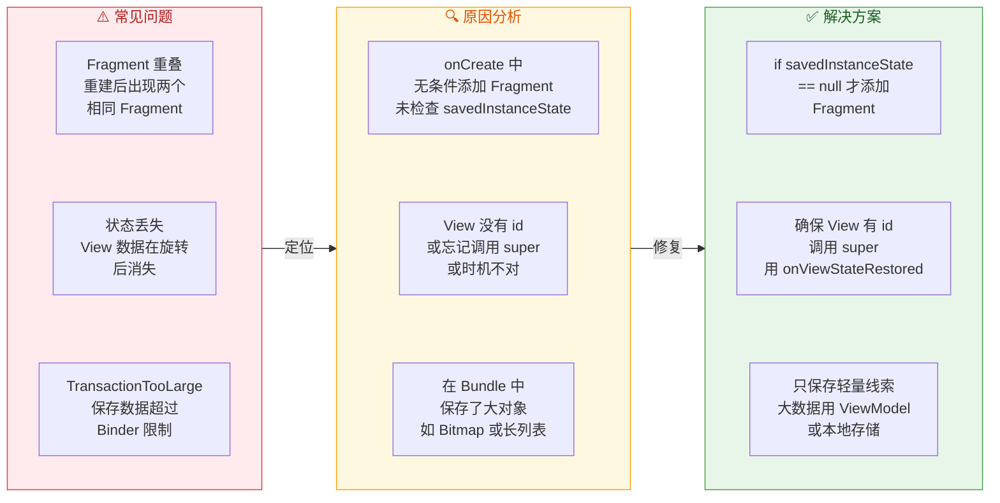
```mermaid
graph LR
    subgraph Problem["⚠️ 常见问题"]
        direction TB
        P1["Fragment 重叠\n重建后出现两个\n相同 Fragment"]
        P2["状态丢失\nView 数据在旋转\n后消失"]
        P3["TransactionTooLarge\n保存数据超过\nBinder 限制"]
        P1 ~~~ P2
        P2 ~~~ P3
    end

    subgraph Cause["🔍 原因分析"]
        direction TB
        C1["onCreate 中\n无条件添加 Fragment\n未检查 savedInstanceState"]
        C2["View 没有 id\n或忘记调用 super\n或时机不对"]
        C3["在 Bundle 中\n保存了大对象\n如 Bitmap 或长列表"]
        C1 ~~~ C2
        C2 ~~~ C3
    end

    subgraph Solution["✅ 解决方案"]
        direction TB
        S1["if savedInstanceState\n== null 才添加\nFragment"]
        S2["确保 View 有 id\n调用 super\n用 onViewStateRestored"]
        S3["只保存轻量线索\n大数据用 ViewModel\n或本地存储"]
        S1 ~~~ S2
        S2 ~~~ S3
    end

    Problem -->|"定位"| Cause
    Cause -->|"修复"| Solution

    classDef probStyle fill:#FFEBEE,stroke:#E53935,color:#B71C1C
    classDef causeStyle fill:#FFF8E1,stroke:#FFA000,color:#E65100
    classDef solStyle fill:#E8F5E9,stroke:#43A047,color:#1B5E20

    class Problem probStyle
    class Cause causeStyle
    class Solution solStyle
```

---

**📝 练习题**

某 Fragment 使用 `arguments` 传递了一个 `articleId`，同时在 `onSaveInstanceState` 中保存了 `scrollY` 滚动位置，并通过 `ViewModel` 持有文章内容数据。当用户旋转屏幕（配置变更）后，以下哪种说法是正确的？

A. `arguments` 中的 `articleId` 丢失，需要重新从 Activity 获取

B. `ViewModel` 中的文章内容被销毁，需要重新发起网络请求

C. `scrollY` 从 `savedInstanceState` 中恢复，`ViewModel` 中的文章内容仍然存在，`arguments` 中的 `articleId` 也完好

D. 三者都会丢失，因为 Fragment 实例被销毁了

**【答案】** C

**【解析】** 配置变更（如屏幕旋转）会导致 Activity 和 Fragment 实例被销毁并重建，但三层状态保存机制各自发挥作用：`arguments` Bundle 由 FragmentManager 自动保存到 `FragmentState` 中，重建后自动恢复，所以 `articleId` 不会丢失（排除 A）；`ViewModel` 的生命周期绑定在 `ViewModelStoreOwner`（Activity/Fragment）的逻辑作用域上，配置变更不会清除 `ViewModelStore`，因此 ViewModel 中的数据完好无损（排除 B）；`onSaveInstanceState` 中保存的 `scrollY` 会通过 `savedInstanceState` Bundle 传递给重建后的 Fragment，在 `onViewCreated` 或 `onCreate` 中可以取出恢复。三者协同工作，确保用户在旋转屏幕后看到的界面与之前完全一致。只有在进程被系统杀死的场景下，ViewModel 中的数据才会丢失（除非使用了 `SavedStateHandle`），而 `arguments` 和 `savedInstanceState` 仍然能存活。选项 D 混淆了"实例销毁"和"状态丢失"——实例确实被销毁了，但状态通过序列化机制得以保留。

---

## 本章小结

Fragment 作为 Android 应用层最核心的 **模块化容器（Modular Container）**，其设计哲学可以用一句话概括：**将单一 Activity 的庞大职责，拆解为可独立管理、可复用、可组合的界面单元**。回顾本章所有知识点，我们可以从三个维度来提炼 Fragment 体系的核心脉络。

### 从设计动机到架构演进

Fragment 诞生于 Android 3.0（Honeycomb）时代，最初是为了解决平板设备上"一个屏幕需要同时展示多个面板"的适配难题。但随着移动端 UI 复杂度的爆炸式增长，Fragment 的角色早已超越了"平板适配工具"，演变为 Android 应用架构中不可或缺的基础设施。从早期的 `android.app.Fragment` 到如今 AndroidX 下的 `androidx.fragment.app.Fragment`，Google 对 Fragment API 进行了多轮重构——引入 `FragmentFactory` 消除反射依赖、引入 `FragmentResultListener` 替代接口回调、引入 `FragmentContainerView` 替代 `<fragment>` 标签、引入 `Lifecycle` 和 `LifecycleOwner` 让生命周期感知成为一等公民。这些演进的方向始终一致：**让 Fragment 更安全、更可测试、更符合现代架构原则**。

理解 Fragment 的设计初衷，不仅仅是知道"它能做什么"，更重要的是理解"为什么不直接用多个 Activity"。Activity 是系统级组件，每一个 Activity 的创建和销毁都涉及 AMS（ActivityManagerService）的跨进程调度，代价高昂。而 Fragment 的创建和销毁完全在应用进程内部完成，由 FragmentManager 管理，轻量且高效。这就是 Fragment 被称为"轻量级界面单元"的根本原因。

### 生命周期：Fragment 体系的心脏

如果要选出本章最重要的一个知识点，毫无疑问是 **生命周期同步机制**。Fragment 的一切行为——视图创建与销毁、状态保存与恢复、事务提交与回退——都建立在生命周期状态机之上。

Fragment 的生命周期并非独立运转，而是与宿主 Activity 的生命周期 **严格对齐（synchronized）**。当 Activity 进入 `STARTED` 状态时，其内部所有 Fragment 也会被推进到 `STARTED`；当 Activity 被销毁时，所有 Fragment 也会依次经历 `onDestroyView` → `onDestroy` → `onDetach`。这种"父驱动子"的分发机制，是通过 `FragmentManager` 内部的 `moveToState()` 方法实现的——它根据宿主的当前状态，计算每个 Fragment 应该处于的目标状态，然后逐步推进。

本章特别强调了一个容易被忽视的关键点：**Fragment 拥有两个不同的 Lifecycle**。`fragment.lifecycle` 对应 Fragment 实例本身的生命周期，而 `fragment.viewLifecycleOwner.lifecycle` 对应其视图的生命周期。在 `replace` 事务加入回退栈的场景下，Fragment 实例存活但视图被销毁，此时如果用 `fragment.lifecycle` 去观察 LiveData 或收集 Flow，就会导致在视图不存在时仍然尝试更新 UI，引发崩溃或内存泄漏。**在 `onCreateView` 到 `onDestroyView` 之间的所有 UI 相关观察，必须使用 `viewLifecycleOwner`**——这是一条铁律。

### FragmentManager 与事务：操控 Fragment 的双手

FragmentManager 是 Fragment 体系的"管理中枢"，而 FragmentTransaction 是开发者与这个中枢交互的唯一接口。本章详细剖析了几组关键对比：

`add` 与 `replace` 的区别，本质上是"叠加"与"替换"的语义差异。`add` 将新 Fragment 添加到容器中，不影响已有 Fragment；`replace` 则先移除容器中所有同容器 ID 的 Fragment，再添加新的。当配合 `addToBackStack` 使用时，`replace` 的行为变得更加微妙——被替换的 Fragment 不会走到 `onDestroy`/`onDetach`，而是停留在 `onDestroyView` 阶段，视图被销毁但实例保留，等待回退栈弹出时重新创建视图。

`hide`/`show` 与 `replace` 的选择，是实际项目中最常见的架构决策之一。`hide`/`show` 仅切换可见性（`View.VISIBLE`/`View.GONE`），不触发任何生命周期回调，所有 Fragment 的视图始终驻留在内存中，切换速度极快但内存占用高。`replace` 会销毁旧 Fragment 的视图，内存友好但切换时需要重建视图。对于底部导航栏这种高频切换场景，`hide`/`show` 通常是更优选择；对于深层级的页面跳转，`replace` + `addToBackStack` 更合适。

`commit` 与 `commitNow` 的区别，涉及到 Handler 消息队列的调度机制。`commit` 将事务投递到主线程消息队列的末尾，是异步的；`commitNow` 立即同步执行。但 `commitNow` 不允许与 `addToBackStack` 同时使用，因为同步执行会破坏回退栈的顺序一致性。`commitAllowingStateLoss` 则是在 `onSaveInstanceState` 之后仍然允许提交事务，代价是状态可能丢失——这是一个"明知有风险但有时不得不用"的 API。

### 通信机制：从耦合到解耦的演进

Fragment 之间、Fragment 与 Activity 之间的通信方式，经历了从"接口回调"到"共享 ViewModel"再到"FragmentResultListener"的演进。

接口回调是最早期的方案，Fragment 在 `onAttach` 中将宿主 Activity 强转为预定义接口，直接调用方法传递数据。这种方式耦合度高，且在 Fragment 与 Fragment 之间通信时需要 Activity 作为中转站，代码冗余。

共享 ViewModel 利用 `activityViewModels()` 让多个 Fragment 共享同一个 ViewModel 实例（作用域为 Activity），通过 LiveData 或 StateFlow 实现响应式通信。这种方式解耦程度高，但存在一个隐含问题：ViewModel 的生命周期与 Activity 绑定，如果只是两个临时 Fragment 之间的一次性通信，使用 Activity 级别的 ViewModel 会导致数据残留。

`FragmentResultListener` 是 AndroidX Fragment 1.3.0 引入的轻量级通信方案，基于 `FragmentManager` 的 key-value 机制，专为"一次性结果传递"设计。它不需要定义接口，不需要共享 ViewModel，只需要约定一个 `requestKey`，发送方通过 `setFragmentResult` 发送 Bundle，接收方通过 `setFragmentResultListener` 监听。这种方式特别适合对话框返回结果、子页面回传数据等场景。

### 嵌套 Fragment 与状态保存：进阶陷阱

嵌套 Fragment 是实际项目中的高频场景（ViewPager2 + TabLayout 是最典型的例子），但也是 Bug 高发区。核心规则只有一条：**在 Fragment 内部添加子 Fragment，必须使用 `childFragmentManager` 而非 `parentFragmentManager`**。`childFragmentManager` 确保子 Fragment 的生命周期由父 Fragment 驱动，父 Fragment 销毁时子 Fragment 也会被正确清理。如果错误地使用了 `parentFragmentManager`，子 Fragment 的生命周期将脱离父 Fragment 的控制，导致父 Fragment 销毁后子 Fragment 仍然存活，引发内存泄漏和状态不一致。

状态保存方面，`arguments` Bundle 在配置变更（如屏幕旋转）时由系统自动保存和恢复，这是 Fragment 传参必须使用 `arguments` 而非构造函数参数的根本原因。`onSaveInstanceState` 则用于保存运行时动态产生的 UI 状态（如列表滚动位置、用户输入的文本）。两者的分工非常清晰：`arguments` 负责"初始化参数的持久性"，`onSaveInstanceState` 负责"运行时状态的持久性"。

### 一张图回顾全章知识脉络

```mermaid
graph LR
    subgraph Design["🎯 设计初衷"]
        direction TB
        D1["平板多面板适配"] ~~~ D2["动态 UI 组合"] ~~~ D3["轻量级界面单元"]
    end

    subgraph Lifecycle["💓 生命周期"]
        direction TB
        L1["与 Activity 状态对齐"] ~~~ L2["双 Lifecycle\n实例 vs 视图"] ~~~ L3["moveToState 驱动"]
    end

    subgraph Manager["🔧 管理与事务"]
        direction TB
        M1["FragmentManager\n查找 / 回退栈"] ~~~ M2["add vs replace"] ~~~ M3["commit vs commitNow"]
    end

    subgraph Comm["📡 通信机制"]
        direction TB
        C1["共享 ViewModel"] ~~~ C2["FragmentResultListener"] ~~~ C3["接口回调（遗留）"]
    end

    subgraph Advanced["🧩 进阶"]
        direction TB
        A1["嵌套 Fragment\nchildFragmentManager"] ~~~ A2["状态保存\narguments + onSaveInstanceState"] ~~~ A3["FragmentContainerView"]
    end

    Design -->|"驱动"| Lifecycle -->|"约束"| Manager -->|"协作"| Comm -->|"支撑"| Advanced

    classDef designCls fill:#E8F5E9,stroke:#43A047,color:#1B5E20
    classDef lifeCls fill:#E3F2FD,stroke:#1E88E5,color:#0D47A1
    classDef mgrCls fill:#FFF3E0,stroke:#FB8C00,color:#E65100
    classDef commCls fill:#F3E5F5,stroke:#8E24AA,color:#4A148C
    classDef advCls fill:#FFEBEE,stroke:#E53935,color:#B71C1C

    class Design designCls
    class Lifecycle lifeCls
    class Manager mgrCls
    class Comm commCls
    class Advanced advCls
```

### 实践建议清单

将本章的核心要点提炼为可直接落地的开发准则：

- **容器选择**：始终使用 `FragmentContainerView` 替代 `<fragment>` 标签，避免 `<fragment>` 在视图恢复时的 ID 冲突和 `findFragmentById` 时序问题。
- **生命周期观察**：在 Fragment 中观察 LiveData 或收集 Flow 时，传入 `viewLifecycleOwner` 而非 `this`，确保视图销毁后自动停止观察。
- **事务提交**：默认使用 `commit()`，仅在明确需要同步执行且不涉及回退栈时使用 `commitNow()`。避免在 `onSaveInstanceState` 之后提交事务，如果不得已，使用 `commitAllowingStateLoss` 并做好状态丢失的兜底。
- **通信选型**：持续性数据共享用共享 ViewModel，一次性结果传递用 `FragmentResultListener`，尽量避免接口回调。
- **嵌套场景**：子 Fragment 必须通过 `childFragmentManager` 添加，ViewPager2 的 Adapter 构造函数传入父 Fragment（而非 Activity）以确保使用正确的 FragmentManager。
- **状态保存**：初始化参数通过 `arguments` 传递（配合 `companion object newInstance` 工厂方法），运行时 UI 状态通过 `onSaveInstanceState` 保存。永远不要在 Fragment 构造函数中传参。
- **无参构造函数**：Fragment 必须保留公开的无参构造函数（或使用 `FragmentFactory`），否则系统在配置变更后重建 Fragment 时会抛出 `InstantiationException`。

Fragment 体系的复杂性，本质上源于它试图在"轻量灵活"和"生命周期安全"之间取得平衡。掌握了生命周期同步机制和 FragmentManager 的事务调度逻辑，绝大多数 Fragment 相关的 Bug 都能迎刃而解。

---

**📝 练习题**

在一个使用底部导航栏（BottomNavigationView）切换 Fragment 的应用中，开发者使用 `replace` + `addToBackStack` 来切换三个主页面（Home、Search、Profile）。用户反馈：每次切换 Tab 时页面都会重新加载数据，列表滚动位置也会丢失。以下哪种方案最适合解决这个问题？

A. 在每个 Fragment 的 `onCreateView` 中判断 `savedInstanceState` 是否为空，为空时才加载数据
B. 将 `replace` 改为 `hide`/`show` 方式切换 Fragment，首次切换时 `add`，后续切换时 `hide` 当前 + `show` 目标
C. 在每个 Fragment 中使用 `onSaveInstanceState` 保存列表数据和滚动位置，在 `onCreateView` 中恢复
D. 将数据缓存到 Application 级别的单例中，每次 `onCreateView` 从单例读取

**【答案】** B

**【解析】** 问题的根源在于 `replace` 会销毁旧 Fragment 的视图（触发 `onDestroyView`），切换回来时需要重新执行 `onCreateView`，导致视图重建和数据重新加载。选项 A 的 `savedInstanceState` 在 `replace` + `addToBackStack` 场景下确实不为空（因为 Fragment 实例存活），但视图仍然会重建，列表滚动位置的恢复需要额外处理，且数据加载的判断逻辑容易出错。选项 C 虽然技术上可行，但 `onSaveInstanceState` 保存的 Bundle 有大小限制（通常 1MB），不适合保存大量列表数据，且实现复杂度高。选项 D 使用 Application 单例虽然能解决数据缓存问题，但违反了数据作用域最小化原则，且无法解决滚动位置丢失的问题。选项 B 是最优解：`hide`/`show` 不会触发任何生命周期回调，Fragment 的视图始终保留在内存中，切换时只是改变 `View.VISIBLE`/`View.GONE`，数据和滚动位置天然保持不变，切换速度也最快。这正是主流 App 底部导航栏的标准实现方式。

---

**📝 练习题**

以下代码在 Fragment 中观察 ViewModel 的 LiveData，存在什么潜在问题？

```kotlin
// 在 Fragment 的 onCreateView 中
override fun onCreateView(
    inflater: LayoutInflater,
    container: ViewGroup?,
    savedInstanceState: Bundle?
): View {
    val binding = FragmentHomeBinding.inflate(inflater, container, false)
    // 使用 this 作为 LifecycleOwner 观察 LiveData
    viewModel.userList.observe(this) { users ->
        adapter.submitList(users)
    }
    return binding.root
}
```

A. `onCreateView` 中不应该观察 LiveData，应该移到 `onViewCreated` 中

B. 使用 `this`（Fragment 实例）作为 LifecycleOwner，当 Fragment 视图被销毁但实例存活时（如 `replace` + `addToBackStack`），会导致观察者重复注册和视图不存在时的 UI 更新

C. `observe` 方法应该改为 `observeForever`，避免生命周期感知带来的问题

D. LiveData 的观察应该放在 `onCreate` 中，因为 `onCreate` 只会调用一次

**【答案】** B

**【解析】** 这是 Fragment 开发中最经典的陷阱之一。当使用 `replace` + `addToBackStack` 时，被替换的 Fragment 会经历 `onDestroyView` 但不会经历 `onDestroy`，即视图被销毁但 Fragment 实例存活。当用户按返回键回到该 Fragment 时，`onCreateView` 会再次执行，此时 `observe(this, ...)` 会注册一个新的观察者。但由于 `this`（Fragment 实例）的 Lifecycle 并未走到 `DESTROYED`，之前注册的观察者仍然存活，导致同一个 LiveData 被多个观察者监听，每次数据变化时 `adapter.submitList` 会被调用多次。更严重的是，在视图已销毁（`onDestroyView` 之后）但 Fragment 实例存活期间，如果 LiveData 发生变化，旧的观察者会尝试更新已不存在的视图，可能导致 NPE。正确做法是使用 `viewLifecycleOwner` 替代 `this`：`viewModel.userList.observe(viewLifecycleOwner) { ... }`。`viewLifecycleOwner` 的 Lifecycle 在 `onDestroyView` 时会进入 `DESTROYED` 状态，自动移除观察者，从根本上避免重复注册和视图不存在时的更新问题。选项 A 虽然建议移到 `onViewCreated` 是更好的实践（此时视图已完全创建），但不能解决 LifecycleOwner 选择错误的核心问题。选项 C 的 `observeForever` 完全脱离生命周期管理，需要手动移除观察者，更容易出错。选项 D 的 `onCreate` 确实只调用一次，但此时视图尚未创建，无法安全地更新 UI。

---