---

# Intent 与组件通信

---

## Intent 设计哲学

Android 的四大组件——Activity、Service、BroadcastReceiver、ContentProvider——彼此之间并不直接持有引用，它们运行在各自的生命周期和进程边界之内。那么，一个组件如何"告诉"系统它想要启动另一个组件？又如何描述自己想要执行的"意图"？答案就是 **Intent**。Intent 是 Android 应用层最核心的通信原语（communication primitive），理解它的设计哲学，是掌握整个组件通信体系的前提。

### 消息传递对象：Intent 的本质定位

从最朴素的角度看，Intent 就是一个 **消息传递对象（Message Passing Object）**。它本身不执行任何逻辑，不持有任何组件的引用，也不负责网络或存储操作。它唯一的职责就是 **承载信息**——描述"谁想做什么、对什么数据做、以什么方式做"。

要理解这一点，我们可以先回顾一个经典的软件设计问题：在一个由多个独立模块组成的系统中，模块之间如何通信？常见的方案有三种：

1. **直接方法调用（Direct Invocation）**：模块 A 持有模块 B 的引用，直接调用 `b.doSomething()`。这种方式耦合度最高，A 必须在编译期就知道 B 的类型。
2. **事件总线（Event Bus）**：模块 A 发布一个事件对象到总线，模块 B 订阅该事件并响应。耦合度降低，但需要一个全局的事件分发中心。
3. **消息传递（Message Passing）**：模块 A 构造一个消息对象，交给系统中间层（如操作系统内核、消息队列），由中间层决定将消息路由到哪个模块。

Android 选择的正是第三种方案。Intent 就是这个"消息对象"，而 **ActivityManagerService（AMS）** 就是那个"中间层路由器"。当你调用 `startActivity(intent)` 时，这个 Intent 并不是直接传递给目标 Activity 的构造函数，而是通过 Binder IPC 发送给 system_server 进程中的 AMS，由 AMS 解析 Intent 的内容，查找匹配的组件，然后调度目标组件的创建和生命周期回调。

这种设计带来了几个关键优势：

**松耦合（Loose Coupling）**。发起方完全不需要知道目标组件的具体类名（在隐式 Intent 的场景下）。你的应用可以发出一个"我想查看这张图片"的 Intent，至于是系统相册、第三方图片浏览器还是你自己的 ImageViewerActivity 来响应，发起方完全不关心。这使得 Android 生态中的应用可以像"乐高积木"一样自由组合。

**跨进程透明（Cross-Process Transparency）**。Intent 作为一个可序列化的数据对象，天然支持跨进程传递。无论目标组件在同一进程、同一应用的不同进程，还是完全不同的应用中，Intent 的使用方式完全一致。开发者不需要手动处理 Binder 通信的细节。

**系统级安全管控（System-Level Security）**。因为所有的组件激活请求都必须经过 AMS 这个"中间人"，系统就有机会在路由过程中执行权限检查（permission check）、Intent 过滤验证、以及各种安全策略。如果 Intent 是直接传递的，系统就无法介入管控。

从代码层面看，Intent 类本身的结构非常清晰。它本质上就是一个数据容器，内部持有若干字段：

```kotlin
// Intent 的核心字段（简化示意，非完整源码）
class Intent : Parcelable {
    // ---- 路由信息 ----
    private var mAction: String? = null       // 动作标识，如 "android.intent.action.VIEW"
    private var mData: Uri? = null            // 数据 URI，如 "https://example.com"
    private var mType: String? = null         // MIME 类型，如 "image/png"
    private var mComponent: ComponentName? = null  // 显式指定的目标组件
    private var mCategories: HashSet<String>? = null // 类别集合，如 "android.intent.category.DEFAULT"
    
    // ---- 附加数据 ----
    private var mExtras: Bundle? = null       // 键值对形式的额外数据
    
    // ---- 行为控制 ----
    private var mFlags: Int = 0               // 标志位，控制启动模式、任务栈行为等
    
    // ---- 包过滤 ----
    private var mPackage: String? = null      // 限定目标应用的包名
}
```

可以看到，Intent 没有任何 `execute()`、`run()` 或 `send()` 方法——它不"做"任何事情，它只"描述"事情。真正的执行逻辑在 AMS 和目标组件中。这种"数据与行为分离"的设计，是 Intent 作为消息传递对象的核心体现。

### 组件激活令牌：Intent 在组件启动中的角色

如果说"消息传递对象"是 Intent 的静态本质，那么"组件激活令牌（Component Activation Token）"就是它的动态角色。在 Android 系统中，**没有任何组件可以自行启动**——Activity 不能自己 `new` 出来然后显示，Service 不能自己调用 `onCreate()`。所有组件的生命周期都由系统（AMS）管理，而 Intent 就是你向系统"申请激活某个组件"时必须出示的"令牌"。

这个"令牌"的比喻非常贴切。想象一个大型企业的门禁系统：员工（应用代码）不能直接推开任何一扇门（组件），必须向门禁系统（AMS）出示一张门禁卡（Intent）。门禁卡上记录了你想去哪个房间（目标组件）、你的身份信息（调用方的 UID/PID）、以及你的访问目的（Action）。门禁系统会验证这张卡的合法性，然后决定是否放行。

让我们追踪一次 `startActivity(intent)` 的完整流程，来理解 Intent 作为"激活令牌"的运作机制：

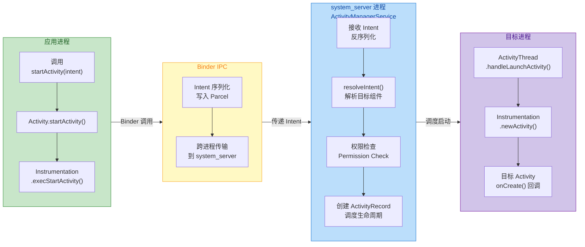
```mermaid
graph LR
    subgraph App["应用进程"]
        direction TB
        A1["调用\nstartActivity(intent)"]
        A2["Activity.startActivity()"]
        A3["Instrumentation\n.execStartActivity()"]
        A1 --> A2
        A2 --> A3
    end

    subgraph Binder["Binder IPC"]
        direction TB
        B1["Intent 序列化\n写入 Parcel"]
        B2["跨进程传输\n到 system_server"]
        B1 --> B2
    end

    subgraph AMS["system_server 进程\nActivityManagerService"]
        direction TB
        C1["接收 Intent\n反序列化"]
        C2["resolveIntent()\n解析目标组件"]
        C3["权限检查\nPermission Check"]
        C4["创建 ActivityRecord\n调度生命周期"]
        C1 --> C2
        C2 --> C3
        C3 --> C4
    end

    subgraph Target["目标进程"]
        direction TB
        D1["ActivityThread\n.handleLaunchActivity()"]
        D2["Instrumentation\n.newActivity()"]
        D3["目标 Activity\nonCreate() 回调"]
        D1 --> D2
        D2 --> D3
    end

    App -->|"Binder 调用"| Binder -->|"传递 Intent"| AMS -->|"调度启动"| Target

    classDef appStyle fill:#C8E6C9,stroke:#388E3C,color:#1B5E20
    classDef binderStyle fill:#FFF9C4,stroke:#F9A825,color:#F57F17
    classDef amsStyle fill:#BBDEFB,stroke:#1976D2,color:#0D47A1
    classDef targetStyle fill:#D1C4E9,stroke:#7B1FA2,color:#4A148C

    class App appStyle
    class Binder binderStyle
    class AMS amsStyle
    class Target targetStyle
```

整个流程可以分为四个阶段来详细理解：

**第一阶段：应用进程内的调用链**。当你在代码中调用 `startActivity(intent)` 时，这个调用会沿着 `Activity.startActivity()` → `Activity.startActivityForResult()` → `Instrumentation.execStartActivity()` 的链路传递。`Instrumentation` 是一个非常重要但常被忽视的类，它是系统插入到每个应用进程中的"监控探针"，所有 Activity 的创建和生命周期回调都经过它。在 `execStartActivity()` 中，Intent 被打包准备通过 Binder 发送。

**第二阶段：Binder IPC 跨进程传输**。Intent 实现了 `Parcelable` 接口，因此可以被序列化为二进制数据写入 `Parcel`，然后通过 Binder 驱动传输到 system_server 进程。这里有一个关键的限制：Binder 事务缓冲区（transaction buffer）的大小通常为 **1MB**（由内核中的 `BINDER_VM_SIZE` 定义，实际可用约 **512KB ~ 1MB**），这意味着 Intent 携带的数据（包括 Extras 中的 Bundle）不能太大，否则会抛出 `TransactionTooLargeException`。这个限制我们在后续"数据传递载体"一节会深入讨论。

**第三阶段：AMS 的解析与调度**。system_server 进程中的 AMS 收到 Intent 后，会执行一系列关键操作。首先是 **Intent Resolution（意图解析）**：如果是显式 Intent（指定了 ComponentName），直接定位目标组件；如果是隐式 Intent，则需要遍历系统中所有已注册的 IntentFilter，找到最佳匹配。然后是 **权限检查**：验证调用方是否有权限启动目标组件（例如目标 Activity 是否声明了 `android:permission`，调用方是否持有该权限）。最后是 **任务栈管理和生命周期调度**：AMS 会根据 Intent 的 Flags 和目标 Activity 的 `launchMode` 决定如何管理任务栈（Task），然后通过 Binder 回调通知目标进程创建 Activity 实例并执行生命周期。

**第四阶段：目标进程的组件创建**。目标进程的 `ActivityThread`（应用主线程的管理者）收到 AMS 的调度指令后，通过 `Instrumentation.newActivity()` 反射创建 Activity 实例，然后依次回调 `onCreate()` → `onStart()` → `onResume()`。在 `onCreate()` 中，开发者可以通过 `getIntent()` 获取到最初发送的那个 Intent 对象（经过序列化和反序列化后的副本）。

从这个流程可以清楚地看到：Intent 就是整个组件激活链条的"起点"和"凭证"。没有 Intent，AMS 不知道你想启动什么；没有 AMS 对 Intent 的解析和验证，组件就无法被安全地激活。

值得特别强调的是，Intent 的"令牌"角色不仅限于 Activity。四大组件的激活都依赖 Intent：

| 组件类型 | 激活方式 | Intent 的角色 |
|---------|---------|-------------|
| Activity | `startActivity(intent)` | 描述要启动的界面及传递的数据 |
| Service | `startService(intent)` / `bindService(intent, ...)` | 描述要启动或绑定的后台服务 |
| BroadcastReceiver | `sendBroadcast(intent)` | 描述广播事件的类型和携带的数据 |
| ContentProvider | 不直接使用 Intent，通过 URI 访问 | 间接关联（URI scheme 可触发 Intent） |

### Action/Category 匹配规则：Intent 的语义化描述体系

Intent 最精妙的设计之一，是它的 **语义化描述体系**。通过 Action、Category、Data（URI + MIME Type）三个维度的组合，Intent 可以表达极其丰富的"意图"语义，而不需要硬编码目标组件的类名。这套体系是隐式 Intent 的基础，也是 Android 开放生态的技术根基。

#### Action：动词——"做什么"

Action 是一个字符串常量，描述 Intent 要执行的 **动作**。它相当于一个"动词"，告诉系统"我想做什么"。Android 系统预定义了大量标准 Action，同时开发者也可以自定义。

常见的系统预定义 Action 包括：

```kotlin
// 查看某个数据（最通用的 Action 之一）
// 例如：查看网页、查看联系人、查看图片
Intent.ACTION_VIEW       // = "android.intent.action.VIEW"

// 编辑某个数据
Intent.ACTION_EDIT       // = "android.intent.action.EDIT"

// 发送/分享数据给其他应用
Intent.ACTION_SEND       // = "android.intent.action.SEND"

// 拨打电话（直接拨出，需要权限）
Intent.ACTION_CALL       // = "android.intent.action.CALL"

// 打开拨号盘（不直接拨出，不需要权限）
Intent.ACTION_DIAL       // = "android.intent.action.DIAL"

// 应用的主入口（Launcher 图标点击时触发）
Intent.ACTION_MAIN       // = "android.intent.action.MAIN"

// 搜索
Intent.ACTION_SEARCH     // = "android.intent.action.SEARCH"

// 从相机或图库中选取内容
Intent.ACTION_PICK       // = "android.intent.action.PICK"
```

自定义 Action 的命名惯例是使用应用包名作为前缀，避免与其他应用冲突：

```kotlin
// 自定义 Action 示例
// 命名规范：包名 + 动作描述
const val ACTION_SHOW_PROFILE = "com.example.myapp.action.SHOW_PROFILE"
const val ACTION_PROCESS_ORDER = "com.example.myapp.action.PROCESS_ORDER"
```

一个 Intent 只能设置 **一个** Action（调用 `setAction()` 会覆盖之前的值）。而一个 IntentFilter 可以声明 **多个** Action，表示该组件能响应其中任意一个动作。匹配时，只要 Intent 的 Action 与 IntentFilter 中的任意一个 Action 相同，就算 Action 维度匹配成功。

#### Category：形容词——"什么类型的"

如果说 Action 是"动词"，那么 Category 就是"形容词"或"副词"，它对 Intent 进行 **分类修饰**，提供额外的上下文信息。一个 Intent 可以携带 **多个** Category。

最重要的 Category 是 `CATEGORY_DEFAULT`，它的存在有一个非常容易踩坑的规则：

```kotlin
// 最常见的 Category
Intent.CATEGORY_DEFAULT    // = "android.intent.category.DEFAULT"
Intent.CATEGORY_LAUNCHER   // = "android.intent.category.LAUNCHER"
Intent.CATEGORY_BROWSABLE  // = "android.intent.category.BROWSABLE"
```

**`CATEGORY_DEFAULT` 的隐含规则**：当你调用 `startActivity()` 发送一个隐式 Intent 时，系统会 **自动** 为这个 Intent 添加 `CATEGORY_DEFAULT`。这意味着，如果你的 Activity 想要响应隐式 Intent，它的 IntentFilter **必须** 包含 `<category android:name="android.intent.category.DEFAULT" />`，否则永远不会被匹配到。这是 Android 开发中最经典的"坑"之一，很多初学者声明了 IntentFilter 却忘记加 DEFAULT Category，导致隐式启动失败。

唯一的例外是 `ACTION_MAIN` + `CATEGORY_LAUNCHER` 的组合——这个组合用于声明应用的主入口（Launcher 图标），系统 Launcher 在查找应用入口时使用的是特殊的匹配逻辑，不要求 DEFAULT Category。

**`CATEGORY_BROWSABLE`** 的作用是允许 Activity 被浏览器（或其他 Web 视图）通过链接点击启动。这是 DeepLink 的基础，我们在后续章节会详细讨论。

Category 的匹配规则比 Action 更严格：Intent 中携带的 **所有** Category，都必须在 IntentFilter 中找到对应项，匹配才算成功。换句话说，IntentFilter 中的 Category 集合必须是 Intent 中 Category 集合的 **超集**。

#### Data：宾语——"对什么数据做"

Data 由两部分组成：**URI** 和 **MIME Type**。URI 描述数据的位置（如 `content://contacts/1`、`https://example.com`、`tel:10086`），MIME Type 描述数据的格式（如 `text/plain`、`image/jpeg`、`application/pdf`）。

URI 的结构遵循标准格式：`scheme://authority/path`，在 IntentFilter 中可以分别对 scheme、host、port、path 进行匹配：

```xml
<!-- 在 AndroidManifest.xml 中声明 IntentFilter 的 data 匹配规则 -->
<intent-filter>
    <action android:name="android.intent.action.VIEW" />
    <category android:name="android.intent.category.DEFAULT" />
    
    <!-- URI 匹配：scheme 为 https，host 为 example.com，path 前缀为 /article -->
    <data
        android:scheme="https"
        android:host="example.com"
        android:pathPrefix="/article" />
</intent-filter>
```

Data 的匹配规则相对复杂，遵循以下优先级逻辑：

1. 如果 IntentFilter 既没有声明 URI 也没有声明 MIME Type，则只有不携带 Data 的 Intent 能匹配。
2. 如果 IntentFilter 只声明了 URI（没有 MIME Type），则 Intent 的 URI 必须匹配，且不能携带 MIME Type。
3. 如果 IntentFilter 只声明了 MIME Type（没有 URI），则 Intent 的 MIME Type 必须匹配，URI 必须为 `content:` 或 `file:`（或为空）。
4. 如果 IntentFilter 同时声明了 URI 和 MIME Type，则 Intent 的 URI 和 MIME Type 都必须匹配。

#### 三维匹配的完整流程

当系统收到一个隐式 Intent 时，会对系统中所有已注册的 IntentFilter 执行 **三维匹配**：Action 匹配 → Category 匹配 → Data 匹配。三个维度全部通过，该 IntentFilter 对应的组件才会被列入候选列表。

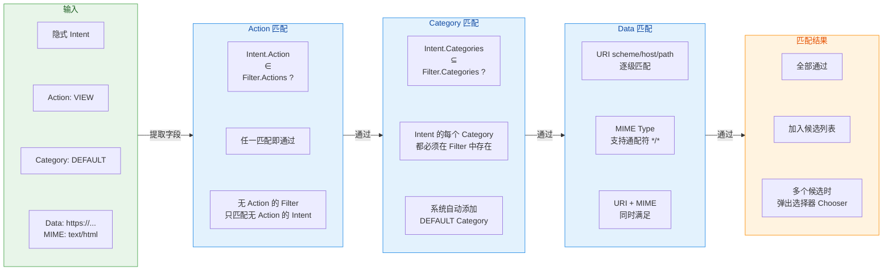
```mermaid
graph LR
    subgraph Input["输入"]
        direction TB
        I1["隐式 Intent"]
        I2["Action: VIEW"]
        I3["Category: DEFAULT"]
        I4["Data: https://...\nMIME: text/html"]
        I1 ~~~ I2
        I2 ~~~ I3
        I3 ~~~ I4
    end

    subgraph ActionMatch["Action 匹配"]
        direction TB
        A1["Intent.Action\n∈\nFilter.Actions ?"]
        A2["任一匹配即通过"]
        A3["无 Action 的 Filter\n只匹配无 Action 的 Intent"]
        A1 ~~~ A2
        A2 ~~~ A3
    end

    subgraph CategoryMatch["Category 匹配"]
        direction TB
        C1["Intent.Categories\n⊆\nFilter.Categories ?"]
        C2["Intent 的每个 Category\n都必须在 Filter 中存在"]
        C3["系统自动添加\nDEFAULT Category"]
        C1 ~~~ C2
        C2 ~~~ C3
    end

    subgraph DataMatch["Data 匹配"]
        direction TB
        D1["URI scheme/host/path\n逐级匹配"]
        D2["MIME Type\n支持通配符 */*"]
        D3["URI + MIME\n同时满足"]
        D1 ~~~ D2
        D2 ~~~ D3
    end

    subgraph Result["匹配结果"]
        direction TB
        R1["全部通过"]
        R2["加入候选列表"]
        R3["多个候选时\n弹出选择器 Chooser"]
        R1 ~~~ R2
        R2 ~~~ R3
    end

    Input -->|"提取字段"| ActionMatch -->|"通过"| CategoryMatch -->|"通过"| DataMatch -->|"通过"| Result

    classDef inputStyle fill:#E8F5E9,stroke:#43A047,color:#1B5E20
    classDef matchStyle fill:#E3F2FD,stroke:#1E88E5,color:#0D47A1
    classDef resultStyle fill:#FFF3E0,stroke:#FB8C00,color:#E65100

    class Input inputStyle
    class ActionMatch matchStyle
    class CategoryMatch matchStyle
    class DataMatch matchStyle
    class Result resultStyle
```

如果最终有多个组件匹配成功，系统会弹出一个 **选择器对话框（Chooser Dialog）**，让用户选择使用哪个应用来处理。开发者也可以通过 `Intent.createChooser()` 强制每次都弹出选择器（即使用户已经设置了默认应用），这在"分享"场景中非常常见。

让我们用一个完整的代码示例来串联以上所有概念：

```kotlin
// ========== 发送方：构造一个隐式 Intent ==========

// 场景：用户点击一个链接，想要查看一篇网页文章
fun openArticle(url: String) {
    // 创建 Intent，设置 Action 为 VIEW（查看）
    val intent = Intent(Intent.ACTION_VIEW).apply {
        // 设置 Data 为文章的 URL
        // Uri.parse() 将字符串解析为 URI 对象
        data = Uri.parse(url)  // 例如 "https://example.com/article/123"
        
        // 注意：我们没有手动添加 CATEGORY_DEFAULT
        // 因为 startActivity() 会自动添加
    }
    
    // 安全检查：确认系统中有能处理这个 Intent 的组件
    // resolveActivity() 会执行一次 Intent Resolution
    // 如果返回 null，说明没有任何应用能处理
    if (intent.resolveActivity(packageManager) != null) {
        startActivity(intent)  // 系统自动添加 CATEGORY_DEFAULT，然后发送给 AMS
    } else {
        // 没有应用能处理，给用户友好提示
        Toast.makeText(this, "没有找到可以打开链接的应用", Toast.LENGTH_SHORT).show()
    }
}
```

```xml
<!-- ========== 接收方：在 AndroidManifest.xml 中声明 IntentFilter ========== -->

<!-- 这个 Activity 声明自己能够处理 "查看 https://example.com/article/* 链接" 的请求 -->
<activity android:name=".ArticleDetailActivity"
    android:exported="true">  <!-- exported=true 允许其他应用启动 -->
    
    <intent-filter>
        <!-- Action 匹配：我能处理 VIEW 动作 -->
        <action android:name="android.intent.action.VIEW" />
        
        <!-- Category 匹配：必须包含 DEFAULT，否则隐式 Intent 永远匹配不到 -->
        <category android:name="android.intent.category.DEFAULT" />
        <!-- BROWSABLE 允许从浏览器链接点击启动 -->
        <category android:name="android.intent.category.BROWSABLE" />
        
        <!-- Data 匹配：scheme 为 https，host 为 example.com，路径以 /article 开头 -->
        <data
            android:scheme="https"
            android:host="example.com"
            android:pathPrefix="/article" />
    </intent-filter>
</activity>
```

在这个例子中，当发送方调用 `startActivity(intent)` 时，AMS 会检查系统中所有 IntentFilter：

1. **Action 匹配**：Intent 的 Action 是 `VIEW`，ArticleDetailActivity 的 Filter 声明了 `VIEW` → ✅ 通过
2. **Category 匹配**：Intent 携带 `DEFAULT`（系统自动添加），Filter 声明了 `DEFAULT` 和 `BROWSABLE`，`{DEFAULT}` ⊆ `{DEFAULT, BROWSABLE}` → ✅ 通过
3. **Data 匹配**：Intent 的 URI 是 `https://example.com/article/123`，Filter 要求 scheme=`https`、host=`example.com`、pathPrefix=`/article` → ✅ 通过

三维全部通过，ArticleDetailActivity 被列入候选。如果系统中还有浏览器（Chrome、Firefox 等）也声明了能处理 `https` 链接的 IntentFilter，那么用户会看到一个选择器，让他选择用哪个应用打开。

#### 为什么这样设计：开放生态的技术基石

回到设计哲学的层面，Action/Category/Data 这套语义化描述体系的根本目的是实现 **"基于能力的发现（Capability-Based Discovery）"**。发送方不需要知道"谁能做这件事"，只需要描述"我想做什么事"，系统会自动找到"能做这件事的人"。

这与传统桌面操作系统的"文件关联"机制有本质区别。在 Windows 中，`.pdf` 文件关联到 Adobe Reader，这是一种"类型→应用"的一对一映射。而 Android 的 Intent 系统是"意图→能力"的多对多映射：一个 Intent 可以被多个组件响应，一个组件也可以响应多种 Intent。这种灵活性使得 Android 生态中的应用可以深度互操作（interoperate），用户可以自由选择偏好的应用来处理各种任务。

这也是为什么 Google 在 Android 12 之后逐步收紧了 `<queries>` 声明和包可见性（package visibility）——因为 Intent 系统的开放性也带来了隐私风险（应用可以通过 `queryIntentActivities()` 探测用户安装了哪些应用），所以需要在开放性和隐私之间找到平衡。

---

**📝 练习题**

某开发者在 `AndroidManifest.xml` 中为 `ShareActivity` 声明了如下 `IntentFilter`：

```xml
<intent-filter>
    <action android:name="android.intent.action.SEND" />
    <data android:mimeType="text/plain" />
</intent-filter>
```

当其他应用通过以下隐式 Intent 调用 `startActivity()` 时，`ShareActivity` 始终无法被匹配到（即不会出现在选择器中，也不会被自动选中）：

```kotlin
val intent = Intent(Intent.ACTION_SEND).apply {
    type = "text/plain"
    putExtra(Intent.EXTRA_TEXT, "要分享的文本内容")
}
startActivity(intent)
```

最可能的原因是：

A. `ACTION_SEND` 不支持隐式调用，必须使用显式 Intent（指定 ComponentName）

B. `IntentFilter` 中缺少 `<category android:name="android.intent.category.DEFAULT" />`

C. `<data>` 标签的属性名错误，应该使用 `android:type` 而不是 `android:mimeType`

D. 发送方 Intent 必须手动添加 `addCategory(Intent.CATEGORY_DEFAULT)`，否则无法匹配

**正确答案：B**

#### 解析

* **为什么是 B？**
  隐式 Intent 在调用 `startActivity()`（或 `startActivityForResult()`）时，系统会**自动**为该 Intent 添加 `CATEGORY_DEFAULT`。因此，任何希望响应隐式 Intent 的 Activity，其 `IntentFilter` **必须**显式声明 `<category android:name="android.intent.category.DEFAULT" />`，否则在 Category 匹配阶段就会失败（Intent 的 Category 集合不被 Filter 的 Category 集合包含）。
  这是一个极其经典的“坑”，几乎所有 Android 开发者都至少踩过一次。分享场景（`ACTION_SEND`）尤其常见，因为很多教程会忘记提到这一要求。

* **为什么不是 A？**
  `ACTION_SEND` 是典型的隐式 Intent 使用场景，正是为了让用户选择“分享到哪个应用”（微信、微博、短信、邮件等）。系统自带的分享选择器就是基于隐式 Intent 实现的，完全支持隐式调用。

* **为什么不是 C？**
  在 `AndroidManifest.xml` 的 `<data>` 标签中，声明 MIME 类型使用的就是 `android:mimeType` 属性，这是正确的写法。`android:type` 是 Intent 对象在代码中设置 MIME 类型时使用的属性（`intent.type = "text/plain"`），两者不是一回事。

* **为什么不是 D？**
  发送方**不需要**手动添加 `CATEGORY_DEFAULT`。系统在处理 `startActivity()` 时会自动添加，因此接收方的 Filter 必须声明它来匹配。手动添加也不会出错，但不是必须的。

#### 正确的接收方声明示例

```xml
<activity
    android:name=".ShareActivity"
    android:exported="true">  <!-- Android 12+ 要求显式 exported -->

    <intent-filter>
        <action android:name="android.intent.action.SEND" />
        <category android:name="android.intent.category.DEFAULT" />  <!-- 必须加这一行 -->
        <data android:mimeType="text/plain" />
    </intent-filter>

    <!-- 如果还想支持多条文本（SEND_MULTIPLE），可以再加一个 Filter -->
    <intent-filter>
        <action android:name="android.intent.action.SEND_MULTIPLE" />
        <category android:name="android.intent.category.DEFAULT" />
        <data android:mimeType="text/plain" />
    </intent-filter>
</activity>
```

#### 额外小提示

* 如果你想支持分享图片、视频等其他类型，只需再添加对应的 `<data android:mimeType="image/*" />` 或 `video/*` 等。
* 从 Android 11（API 30）开始，包可见性（package visibility）限制了 `queryIntentActivities()` 的行为，如果你的应用需要主动查询其他分享目标，还需要在 manifest 中声明 `<queries>`。

---

## 显式与隐式 Intent

在上一节中，我们从设计哲学的角度理解了 Intent 作为"消息传递对象"和"组件激活令牌"的本质。现在我们要深入到 Intent 的两种具体使用形态——**显式 Intent（Explicit Intent）** 和 **隐式 Intent（Implicit Intent）**。这两种形态并不是两个不同的类，它们都是 `android.content.Intent` 的实例，区别仅在于 **是否明确指定了目标组件**。这个看似简单的区别，背后牵涉到完全不同的路由机制、安全模型和使用场景。

### ComponentName 明确调用：显式 Intent 的工作机制

显式 Intent 的核心特征是：**开发者在构造 Intent 时，明确指定了目标组件的 ComponentName**。ComponentName 由两部分组成——**包名（Package Name）** 和 **类的全限定名（Fully Qualified Class Name）**。当 AMS 收到一个携带 ComponentName 的 Intent 时，它不需要执行任何 IntentFilter 匹配，直接根据 ComponentName 定位目标组件即可。

这就像寄快递时直接写了收件人的精确地址（"北京市海淀区中关村大街1号3单元502室张三"），快递公司不需要猜测你要寄给谁，直接按地址投递。

#### ComponentName 的构造方式

在实际开发中，创建显式 Intent 有多种写法，但本质上都是在设置 ComponentName：

```kotlin
// ========== 方式一：构造函数直接传入 Context 和目标 Class ==========
// 这是最常见、最简洁的写法
// 内部实现：从 context 中提取包名，从 DetailActivity::class.java 中提取类全名
// 然后构造 ComponentName(packageName, className)
val intent1 = Intent(this, DetailActivity::class.java)

// ========== 方式二：手动创建 ComponentName 并设置 ==========
// 适用于需要启动其他应用中的组件（跨应用显式调用）
// 第一个参数：目标应用的包名
// 第二个参数：目标组件的完整类名（包含包路径）
val componentName = ComponentName(
    "com.example.otherapp",                    // 目标应用的包名
    "com.example.otherapp.ui.PaymentActivity"  // 目标 Activity 的全限定类名
)
val intent2 = Intent().apply {
    component = componentName  // 将 ComponentName 设置到 Intent 中
}

// ========== 方式三：通过 setClassName() 设置 ==========
// 本质上也是创建 ComponentName，只是 API 更简洁
val intent3 = Intent().apply {
    setClassName(
        "com.example.otherapp",                    // 目标包名
        "com.example.otherapp.ui.PaymentActivity"  // 目标类全名
    )
}

// ========== 方式四：通过 setClass() 设置（仅限同应用内） ==========
// 等价于方式一，只是拆成了两步
val intent4 = Intent().apply {
    setClass(this@MainActivity, DetailActivity::class.java)
}
```

方式一是日常开发中最常用的，因为应用内部的组件跳转占了绝大多数场景。方式二和方式三则用于 **跨应用的显式调用**，比如你明确知道某个第三方应用的某个 Activity 的类名，想要直接启动它。但这种做法有一个重要的前提：**目标组件必须声明 `android:exported="true"`**，否则外部应用无权启动它。

#### 显式 Intent 的路由流程

当 AMS 收到一个显式 Intent 时，路由过程非常直接：

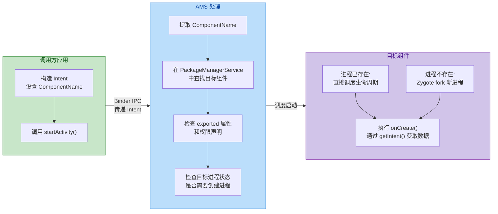
```mermaid
graph LR
    subgraph Caller["调用方应用"]
        direction TB
        C1["构造 Intent\n设置 ComponentName"]
        C2["调用 startActivity()"]
        C1 --> C2
    end

    subgraph AMS["AMS 处理"]
        direction TB
        A1["提取 ComponentName"]
        A2["在 PackageManagerService\n中查找目标组件"]
        A3["检查 exported 属性\n和权限声明"]
        A4["检查目标进程状态\n是否需要创建进程"]
        A1 --> A2
        A2 --> A3
        A3 --> A4
    end

    subgraph Target["目标组件"]
        direction TB
        T1["进程已存在:\n直接调度生命周期"]
        T2["进程不存在:\nZygote fork 新进程"]
        T3["执行 onCreate()\n通过 getIntent() 获取数据"]
        T1 --> T3
        T2 --> T3
    end

    Caller -->|"Binder IPC\n传递 Intent"| AMS -->|"调度启动"| Target

    classDef callerStyle fill:#C8E6C9,stroke:#388E3C,color:#1B5E20
    classDef amsStyle fill:#BBDEFB,stroke:#1976D2,color:#0D47A1
    classDef targetStyle fill:#D1C4E9,stroke:#7B1FA2,color:#4A148C

    class Caller callerStyle
    class AMS amsStyle
    class Target targetStyle
```

注意这个流程中 **没有 IntentFilter 匹配** 这一步——这是显式 Intent 和隐式 Intent 最本质的区别。AMS 直接通过 `PackageManagerService（PMS）` 查找 ComponentName 对应的组件信息（这些信息在应用安装时就已经从 AndroidManifest.xml 中解析并缓存了），然后执行权限检查和进程调度。

#### 显式 Intent 的适用场景与局限

显式 Intent 的优势是 **确定性强、性能好**（不需要遍历 IntentFilter）、**安全性高**（精确指定目标，不会被第三方应用劫持）。因此，它是 **应用内部组件通信的首选方式**。

但显式 Intent 也有明显的局限：

1. **强耦合**：调用方必须在编译期知道目标组件的类名。如果目标组件在另一个模块或另一个应用中，就产生了模块间的编译依赖。这在大型项目的组件化/模块化架构中是不可接受的——你不希望"首页模块"直接依赖"订单模块"的类。
2. **跨应用调用的脆弱性**：如果你硬编码了第三方应用的 ComponentName，一旦对方重构了包结构或改了类名，你的代码就会崩溃。而且对方可能根本没有将该组件 export。
3. **无法利用系统的"能力发现"机制**：显式 Intent 绕过了 IntentFilter 系统，也就无法享受"让用户选择最合适的应用来处理"这一 Android 生态的核心能力。

正是这些局限，催生了隐式 Intent 的需求。

### IntentFilter 过滤机制：隐式 Intent 的解析引擎

隐式 Intent 不指定 ComponentName，而是通过 **Action、Category、Data** 三个维度来描述"意图"。系统需要一个机制来将这个抽象的"意图"映射到具体的组件——这个机制就是 **IntentFilter 过滤**。

#### IntentFilter 的声明与注册

IntentFilter 可以通过两种方式注册：

**静态注册（AndroidManifest.xml）**：在编译期声明，应用安装时由 PMS 解析并索引。适用于 Activity、Service、BroadcastReceiver。

```xml
<!-- 静态注册示例：声明一个能处理"分享纯文本"的 Activity -->
<activity
    android:name=".ShareReceiverActivity"
    android:exported="true">  <!-- 响应隐式 Intent 的组件必须 exported=true -->
    
    <!-- 一个组件可以声明多个 intent-filter -->
    <!-- 每个 intent-filter 是一组独立的匹配规则 -->
    <intent-filter>
        <!-- 声明能处理的 Action：接收分享内容 -->
        <action android:name="android.intent.action.SEND" />
        
        <!-- 必须声明 DEFAULT Category（隐式 Intent 的硬性要求） -->
        <category android:name="android.intent.category.DEFAULT" />
        
        <!-- 声明能处理的数据类型：纯文本 -->
        <data android:mimeType="text/plain" />
    </intent-filter>
    
    <!-- 第二个 intent-filter：还能处理图片分享 -->
    <intent-filter>
        <action android:name="android.intent.action.SEND" />
        <category android:name="android.intent.category.DEFAULT" />
        <data android:mimeType="image/*" />  <!-- 通配符匹配所有图片类型 -->
    </intent-filter>
</activity>
```

**动态注册（代码中）**：在运行时通过 `registerReceiver()` 注册，仅适用于 BroadcastReceiver。动态注册的 Receiver 生命周期与注册它的组件绑定，组件销毁时应取消注册。

```kotlin
// 动态注册 BroadcastReceiver 的 IntentFilter
// 创建 IntentFilter 对象，添加要监听的 Action
val filter = IntentFilter().apply {
    addAction(Intent.ACTION_BATTERY_LOW)      // 监听电量低广播
    addAction(Intent.ACTION_POWER_CONNECTED)  // 监听充电器连接广播
}

// 创建 Receiver 实例
val batteryReceiver = object : BroadcastReceiver() {
    override fun onReceive(context: Context, intent: Intent) {
        // 根据不同的 Action 执行不同的逻辑
        when (intent.action) {
            Intent.ACTION_BATTERY_LOW -> showLowBatteryWarning()
            Intent.ACTION_POWER_CONNECTED -> dismissLowBatteryWarning()
        }
    }
}

// 注册 Receiver（在 Activity 的 onResume 中）
registerReceiver(batteryReceiver, filter)

// 取消注册（在 Activity 的 onPause 中，避免内存泄漏）
unregisterReceiver(batteryReceiver)
```

#### IntentFilter 匹配的三重检验

上一节已经概述了 Action/Category/Data 的匹配规则，这里我们从 **PMS 源码逻辑** 的角度更精确地描述这个过程。当 AMS 调用 `PackageManagerService.resolveIntent()` 时，PMS 会遍历所有已注册的 IntentFilter，对每个 Filter 执行三重检验（Triple Test）：

**第一重：Action Test（动作检验）**

规则非常简单：
- 如果 IntentFilter 中 **没有声明任何 Action**，则该 Filter 只能匹配 **不携带 Action 的 Intent**（这种情况极少）。
- 如果 IntentFilter 中声明了一个或多个 Action，则 Intent 的 Action 必须与其中 **至少一个** 完全相同（字符串精确匹配，区分大小写）。
- 如果 Intent **没有设置 Action**（action 为 null），则只要 IntentFilter 声明了至少一个 Action，就算通过（这是一个容易被忽略的细节）。

```kotlin
// Action Test 的伪代码逻辑
fun matchAction(intentAction: String?, filterActions: List<String>): Boolean {
    // 如果 Filter 没有声明任何 Action
    if (filterActions.isEmpty()) {
        // 只有 Intent 也没有 Action 时才匹配
        return intentAction == null
    }
    // 如果 Intent 没有设置 Action，自动通过
    // （因为 Intent 没有限定动作，任何动作都可以）
    if (intentAction == null) {
        return true
    }
    // 否则，Intent 的 Action 必须在 Filter 的 Action 列表中
    return intentAction in filterActions
}
```

**第二重：Category Test（类别检验）**

这是三重检验中 **最严格** 的一重：
- Intent 中携带的 **每一个** Category，都必须在 IntentFilter 的 Category 列表中找到精确匹配。
- 换言之，Intent 的 Category 集合必须是 Filter 的 Category 集合的 **子集**。
- Filter 中可以声明比 Intent 更多的 Category，多出来的不影响匹配。
- 特别注意：`startActivity()` 和 `startActivityForResult()` 会 **自动** 为 Intent 添加 `CATEGORY_DEFAULT`。

```kotlin
// Category Test 的伪代码逻辑
fun matchCategories(
    intentCategories: Set<String>?,  // Intent 携带的 Category 集合
    filterCategories: Set<String>    // Filter 声明的 Category 集合
): Boolean {
    // 如果 Intent 没有任何 Category，直接通过
    if (intentCategories.isNullOrEmpty()) {
        return true
    }
    // Intent 的每个 Category 都必须在 Filter 中存在
    for (category in intentCategories) {
        if (category !in filterCategories) {
            return false  // 有一个不匹配就失败
        }
    }
    return true
}
```

**第三重：Data Test（数据检验）**

Data Test 是三重检验中最复杂的一重，因为它涉及 URI 和 MIME Type 两个子维度的组合匹配。我们用一个决策矩阵来清晰地展示所有情况：

| Filter 声明 | Intent 携带 | 匹配结果 |
|:---:|:---:|:---:|
| 无 URI，无 MIME | 无 URI，无 MIME | ✅ 匹配 |
| 无 URI，无 MIME | 有 URI 或 MIME | ❌ 不匹配 |
| 有 URI，无 MIME | URI 匹配，无 MIME | ✅ 匹配 |
| 无 URI，有 MIME | MIME 匹配，URI 为 content: 或 file: | ✅ 匹配 |
| 有 URI，有 MIME | URI 匹配 且 MIME 匹配 | ✅ 匹配 |

URI 匹配时，会按 **scheme → authority（host:port） → path** 的层级逐级检验。如果 Filter 只声明了 scheme，则只要 Intent 的 URI scheme 相同就算匹配；如果 Filter 还声明了 host，则 host 也必须匹配；path 的匹配支持三种模式：

- `android:path`：精确匹配（如 `/article/123`）
- `android:pathPrefix`：前缀匹配（如 `/article` 可匹配 `/article/123`、`/article/456`）
- `android:pathPattern`：模式匹配（支持通配符 `*` 和 `.*`）

MIME Type 的匹配支持通配符：`*/*` 匹配所有类型，`image/*` 匹配所有图片类型，`image/png` 精确匹配 PNG 图片。

#### 多 IntentFilter 的匹配策略

一个组件可以声明多个 `<intent-filter>`，每个 Filter 是 **独立的匹配单元**。Intent 只需要与其中 **任意一个** Filter 完全匹配（三重检验全部通过），该组件就会被列入候选。这意味着多个 Filter 之间是 **"或"（OR）** 的关系，而单个 Filter 内部的三重检验是 **"与"（AND）** 的关系。

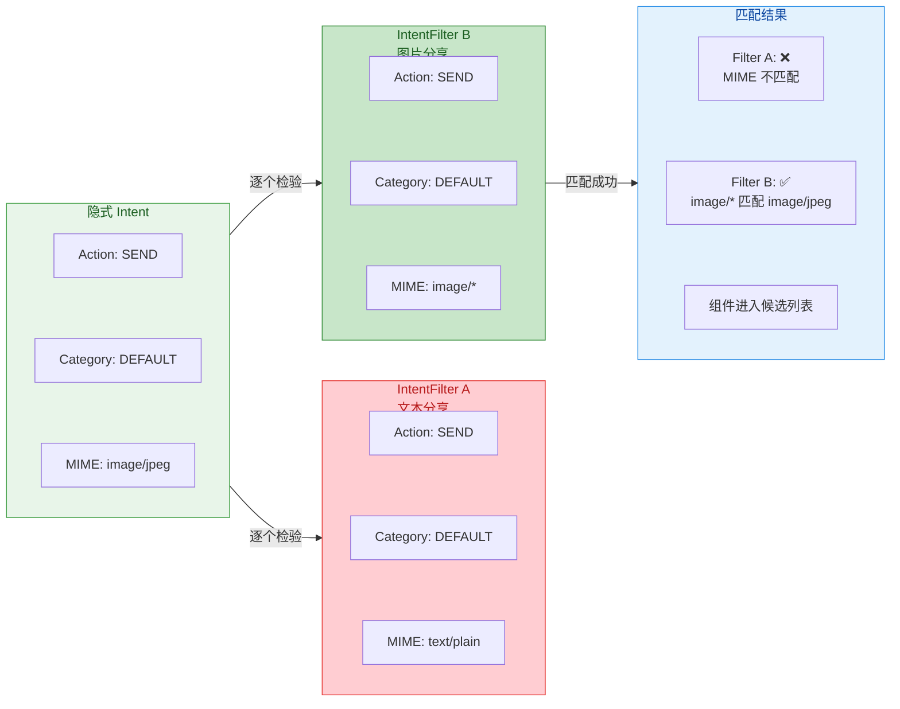
```mermaid
graph LR
    subgraph Intent["隐式 Intent"]
        direction TB
        I1["Action: SEND"]
        I2["Category: DEFAULT"]
        I3["MIME: image/jpeg"]
        I1 ~~~ I2
        I2 ~~~ I3
    end

    subgraph FilterA["IntentFilter A\n文本分享"]
        direction TB
        FA1["Action: SEND"]
        FA2["Category: DEFAULT"]
        FA3["MIME: text/plain"]
        FA1 ~~~ FA2
        FA2 ~~~ FA3
    end

    subgraph FilterB["IntentFilter B\n图片分享"]
        direction TB
        FB1["Action: SEND"]
        FB2["Category: DEFAULT"]
        FB3["MIME: image/*"]
        FB1 ~~~ FB2
        FB2 ~~~ FB3
    end

    subgraph Result["匹配结果"]
        direction TB
        R1["Filter A: ❌\nMIME 不匹配"]
        R2["Filter B: ✅\nimage/* 匹配 image/jpeg"]
        R3["组件进入候选列表"]
        R1 ~~~ R2
        R2 ~~~ R3
    end

    Intent -->|"逐个检验"| FilterA
    Intent -->|"逐个检验"| FilterB
    FilterB -->|"匹配成功"| Result

    classDef intentStyle fill:#E8F5E9,stroke:#43A047,color:#1B5E20
    classDef filterFailStyle fill:#FFCDD2,stroke:#E53935,color:#B71C1C
    classDef filterPassStyle fill:#C8E6C9,stroke:#388E3C,color:#1B5E20
    classDef resultStyle fill:#E3F2FD,stroke:#1E88E5,color:#0D47A1

    class Intent intentStyle
    class FilterA filterFailStyle
    class FilterB filterPassStyle
    class Result resultStyle
```

#### Intent Resolution 的完整结果处理

当 PMS 完成所有 IntentFilter 的遍历后，可能出现三种结果：

**恰好一个组件匹配**：系统直接启动该组件，用户无感知。

**多个组件匹配**：系统弹出 **选择器对话框（Disambiguation Dialog / Chooser）**，列出所有候选应用，让用户选择。用户可以选择"仅此一次"或"始终使用"（设为默认应用）。开发者也可以通过 `Intent.createChooser()` 强制每次都弹出选择器：

```kotlin
// 创建分享 Intent
val shareIntent = Intent(Intent.ACTION_SEND).apply {
    type = "text/plain"                          // 设置 MIME 类型为纯文本
    putExtra(Intent.EXTRA_TEXT, "分享的内容")      // 设置分享的文本内容
}

// 使用 createChooser() 包装，强制弹出选择器
// 即使用户已经设置了默认分享应用，也会弹出选择器
val chooserIntent = Intent.createChooser(
    shareIntent,           // 原始 Intent
    "选择分享方式"          // 选择器对话框的标题
)

// 启动选择器
startActivity(chooserIntent)
```

**没有组件匹配**：如果直接调用 `startActivity()`，系统会抛出 `ActivityNotFoundException`，应用崩溃。因此，在发送隐式 Intent 之前，**必须** 进行安全检查：

```kotlin
// 安全发送隐式 Intent 的标准模式
fun safeStartActivity(intent: Intent) {
    // 方式一：使用 resolveActivity() 检查
    // 返回值不为 null 说明至少有一个组件能处理
    if (intent.resolveActivity(packageManager) != null) {
        startActivity(intent)
    } else {
        // 优雅降级：提示用户或执行备选方案
        Toast.makeText(this, "没有应用可以处理此操作", Toast.LENGTH_SHORT).show()
    }
    
    // 方式二：使用 try-catch 捕获异常（不推荐作为主要手段）
    // try {
    //     startActivity(intent)
    // } catch (e: ActivityNotFoundException) {
    //     // 处理异常
    // }
}
```

需要特别注意的是，从 **Android 11（API 30）** 开始，Google 引入了 **包可见性（Package Visibility）** 限制。`resolveActivity()` 和 `queryIntentActivities()` 默认只能看到系统应用和你自己的应用。如果你想查询其他第三方应用是否能处理某个 Intent，需要在 AndroidManifest.xml 中声明 `<queries>` 元素：

```xml
<manifest>
    <!-- 声明你的应用需要查询哪些类型的 Intent -->
    <queries>
        <!-- 方式一：声明具体的 Intent 签名 -->
        <intent>
            <action android:name="android.intent.action.SEND" />
            <data android:mimeType="image/*" />
        </intent>
        
        <!-- 方式二：声明具体的包名 -->
        <package android:name="com.example.otherapp" />
    </queries>
    
    <!-- 或者使用 QUERY_ALL_PACKAGES 权限（Google Play 审核严格） -->
    <!-- <uses-permission android:name="android.permission.QUERY_ALL_PACKAGES" /> -->
</manifest>
```

### 默认 Category：最容易踩的坑

`CATEGORY_DEFAULT` 的问题值得单独拿出来强调，因为它是 Android 开发中 **出错频率最高** 的 IntentFilter 配置问题之一。

核心规则只有一句话：**当你通过 `startActivity()` 或 `startActivityForResult()` 发送隐式 Intent 时，系统会自动为 Intent 添加 `CATEGORY_DEFAULT`。因此，任何想要响应隐式 Intent 的 Activity，其 IntentFilter 中必须包含 `CATEGORY_DEFAULT`。**

这个规则的源码依据在 `Instrumentation.execStartActivity()` 中：

```java
// Android Framework 源码（简化）
// 位于 Instrumentation.java
public ActivityResult execStartActivity(..., Intent intent, ...) {
    // ...
    // 如果 Intent 没有显式指定 Component，且没有设置 CATEGORY_DEFAULT
    // 系统会自动添加
    if (intent.getComponent() == null) {
        intent.addCategory(Intent.CATEGORY_DEFAULT);
    }
    // ...
}
```

但有 **两个例外** 不会自动添加 `CATEGORY_DEFAULT`：

1. **`ACTION_MAIN` + `CATEGORY_LAUNCHER`**：这是应用主入口的声明，Launcher 应用在查找可启动的应用时使用特殊的查询逻辑，不要求 DEFAULT。
2. **`sendBroadcast(intent)`**：广播的 IntentFilter 匹配不涉及 CATEGORY_DEFAULT，因为广播的分发机制与 Activity 启动不同。

让我们用一个对比示例来加深理解：

```xml
<!-- ❌ 错误示例：忘记声明 CATEGORY_DEFAULT -->
<activity android:name=".BadActivity" android:exported="true">
    <intent-filter>
        <action android:name="com.example.action.SHOW_DETAIL" />
        <!-- 缺少 <category android:name="android.intent.category.DEFAULT" /> -->
        <!-- 结果：隐式 Intent 永远匹配不到这个 Activity -->
    </intent-filter>
</activity>

<!-- ✅ 正确示例：包含 CATEGORY_DEFAULT -->
<activity android:name=".GoodActivity" android:exported="true">
    <intent-filter>
        <action android:name="com.example.action.SHOW_DETAIL" />
        <category android:name="android.intent.category.DEFAULT" />
        <!-- 现在隐式 Intent 可以正确匹配到这个 Activity -->
    </intent-filter>
</activity>
```

#### 显式与隐式的选择策略

在实际项目中，如何选择使用显式还是隐式 Intent？以下是一个清晰的决策框架：

**使用显式 Intent 的场景**：
- 应用内部的页面跳转（如从列表页到详情页）
- 启动应用内部的 Service
- 任何你明确知道目标组件且不希望被外部劫持的场景
- 组件化架构中，通过路由框架（如 ARouter）间接实现的"伪显式"调用

**使用隐式 Intent 的场景**：
- 调用系统功能（打电话、发短信、打开浏览器、拍照、选图片）
- 分享内容到其他应用
- 让用户选择偏好的应用来处理某个操作
- DeepLink / AppLink 场景
- 任何需要利用 Android 开放生态能力的场景

**混合使用的场景**：
- 先尝试隐式 Intent，如果没有应用能处理，再 fallback 到应用内的 WebView 或其他方案
- 在 `<queries>` 限制下，先检查目标应用是否安装，如果安装则用显式 Intent 直接启动，否则用隐式 Intent 让系统处理

```kotlin
// 混合策略示例：优先用显式 Intent 打开特定应用，fallback 到隐式 Intent
fun openMap(latitude: Double, longitude: Double) {
    // 构造地图 URI
    val geoUri = Uri.parse("geo:$latitude,$longitude")
    
    // 尝试显式启动 Google Maps
    val explicitIntent = Intent(Intent.ACTION_VIEW, geoUri).apply {
        setPackage("com.google.android.apps.maps")  // 限定包名（半显式）
    }
    
    if (explicitIntent.resolveActivity(packageManager) != null) {
        // Google Maps 已安装，直接启动
        startActivity(explicitIntent)
    } else {
        // Google Maps 未安装，使用隐式 Intent 让用户选择其他地图应用
        val implicitIntent = Intent(Intent.ACTION_VIEW, geoUri)
        if (implicitIntent.resolveActivity(packageManager) != null) {
            startActivity(implicitIntent)
        } else {
            // 没有任何地图应用，fallback 到 WebView
            openInWebView("https://maps.google.com/?q=$latitude,$longitude")
        }
    }
}
```

这个例子展示了一个优雅的降级策略：显式 → 半显式（`setPackage`） → 隐式 → 内部 fallback。这种模式在生产级应用中非常常见，体现了对用户体验和边界情况的充分考虑。

---

**📝 练习题**

以下 `AndroidManifest.xml` 中声明了一个 Activity 的 IntentFilter：

```xml
<activity android:name=".ViewerActivity" android:exported="true">
    <intent-filter>
        <action android:name="android.intent.action.VIEW" />
        <action android:name="android.intent.action.EDIT" />
        <category android:name="android.intent.category.DEFAULT" />
        <category android:name="android.intent.category.BROWSABLE" />
        <data android:scheme="https" android:host="example.com" />
    </intent-filter>
</activity>
```

现在有一个隐式 Intent：

```kotlin
val intent = Intent(Intent.ACTION_VIEW).apply {
    data = Uri.parse("https://example.com/page")
    addCategory(Intent.CATEGORY_BROWSABLE)
}
startActivity(intent)
```

该 Intent 能否成功匹配到 `ViewerActivity`？

A. 能匹配。Action、Category、Data 三重检验全部通过

B. 不能匹配。Intent 缺少 CATEGORY_DEFAULT，Category 检验失败

C. 不能匹配。Intent 的 URI path /page 在 Filter 中没有声明，Data 检验失败

D. 不能匹配。Filter 声明了两个 Action，Intent 只有一个，Action 检验失败

**【答案】 A**

**【解析】**

隐式 Intent 匹配 IntentFilter 需要通过 Action、Category、Data 三重检验。

1. **Action Test**
   Intent 的 Action 是 `VIEW`。
   Filter 声明了 `VIEW` 和 `EDIT`。
   规则：Intent 的 Action 只要匹配 Filter 中的任意一个即可。
   `VIEW` ∈ {`VIEW`, `EDIT`} → **通过**。
   选项 D 错误，Intent 不需要匹配 Filter 的所有 Action。

2. **Category Test**
   Filter 要求 `DEFAULT` 和 `BROWSABLE` 两个 category。
   Intent 显式添加了 `BROWSABLE`，但没有添加 `DEFAULT`。
   关键规则：`startActivity()` 处理隐式 Intent 时，会**自动视作 Intent 包含 `CATEGORY_DEFAULT`**（即使代码中未添加）。
   因此，系统认为 Intent 具有 `DEFAULT` 和 `BROWSABLE`，完全包含 Filter 要求的所有 category → **通过**。
   选项 B 错误，这是常见误区——`DEFAULT` 不需要手动添加，系统会自动处理。

3. **Data Test**
   Filter 指定 `scheme="https"`、`host="example.com"`，**未指定 path**。
   Intent 的 URI 是 `https://example.com/page`，scheme 和 host 完全匹配。
   规则：Filter 未声明 path 时，对 path 无限制，任何路径都匹配 → **通过**。
   选项 C 错误，如果 Filter 声明了 `android:path` 或 `android:pathPrefix` 等，才会对路径进行检查。

三重检验全部通过，因此能成功匹配到 `ViewerActivity`。

---

## 数据传递载体

Android 的组件通信建立在 **进程间通信（IPC）** 的基础之上。即便是同一个 App 内的两个 Activity 之间传递数据，底层也要经过 **Binder 驱动**。这意味着你不能简单地把一个 Java 对象的引用"丢"给另一个组件——引用地址在另一个进程（甚至同进程但由系统中转）中毫无意义。Android 的解决方案是：**把数据打平为可序列化的键值对，装进一个叫 Bundle 的容器，再附着到 Intent 上，通过 Binder 事务传输到目标组件。** 这就是"数据传递载体"这一主题的核心脉络。

理解 Bundle 的内部结构、Extras 的使用范式、以及 Binder 事务的大小限制，是写出健壮 Android 应用的基本功。很多线上崩溃（尤其是 `TransactionTooLargeException`）都源于开发者对这条数据通道的容量和机制缺乏认知。

---

### Bundle 内部结构

#### 从表面到本质：Bundle 是什么

从 API 表面看，`Bundle` 就是一个 **类型安全的键值对容器**（a type-safe key-value container）。你可以往里面放 `String`、`Int`、`Parcelable`、`Serializable` 等各种类型的数据，然后通过对应的 `getXxx()` 方法取出来。但如果只停留在这个层面，你就无法理解它为什么有大小限制、为什么有时候数据会"丢失"、为什么某些类型放进去会导致性能问题。

**Bundle 的继承体系**如下：`Bundle` 继承自 `BaseBundle`，而 `BaseBundle` 内部持有一个核心字段——`ArrayMap<String, Object> mMap`。`ArrayMap` 是 Android 专门为移动端优化的 Map 实现，相比 `HashMap` 在小数据量场景下内存占用更低（它使用两个数组而非哈希桶+链表/红黑树结构）。所有你通过 `putXxx()` 放入的数据，最终都存储在这个 `ArrayMap` 中。

但 `mMap` 只是 Bundle 的 **"活跃态"（active state）**。当 Bundle 需要跨进程传输时，它会被 **序列化为 Parcel**——这是 Bundle 的 **"传输态"（transport state）**。`BaseBundle` 中还有一个关键字段 `Parcel mParcelledData`，它缓存了 Bundle 的序列化结果。这两个字段之间存在一种 **延迟解析（lazy unmarshalling）** 的关系：当系统从 Binder 事务中收到一个 Bundle 时，它并不会立即把 Parcel 反序列化为 `ArrayMap`，而是先把原始 Parcel 数据保存在 `mParcelledData` 中，等到你第一次调用 `getXxx()` 时才触发 `unparcel()` 方法，将 Parcel 解包为 `ArrayMap`。这种设计是一种 **性能优化**：如果目标组件根本不读取 Bundle 中的某些数据，那就没必要浪费 CPU 去反序列化它们。

```java
// BaseBundle 核心字段（简化）
class BaseBundle {
    // "活跃态"：键值对存储在内存中的 ArrayMap
    ArrayMap<String, Object> mMap;
    
    // "传输态"：序列化后的 Parcel 数据（跨进程传输用）
    Parcel mParcelledData;
    
    // 延迟解包：首次读取时才将 Parcel 反序列化为 ArrayMap
    void unparcel() {
        // 如果 mParcelledData 不为空，说明数据还在 Parcel 中
        if (mParcelledData != null) {
            // 从 Parcel 中逐个读取键值对，填充到 mMap
            // 读取完成后将 mParcelledData 置空，释放 Parcel 内存
            mMap = new ArrayMap<>();
            mParcelledData.readArrayMapInternal(mMap, ...);
            mParcelledData.recycle();
            mParcelledData = null;
        }
    }
}
```

#### Bundle 的生命周期中的状态转换

理解 Bundle 在不同阶段的状态转换，对于排查数据传递问题至关重要：

**阶段一：写入阶段（发送方）。** 当你调用 `intent.putExtra("key", value)` 时，数据被写入 Bundle 的 `mMap`（ArrayMap）。此时数据以 Java 对象的形式存在于堆内存中，尚未序列化。

**阶段二：序列化阶段（系统中转）。** 当你调用 `startActivity(intent)` 时，Intent 连同其 Bundle 会被传递给 `ActivityManagerService`（AMS）。这个过程需要跨进程通信（即使是同 App 内的 Activity 跳转，也要经过 system_server 进程中的 AMS 调度）。此时 Bundle 的 `writeToParcel()` 方法被调用，`mMap` 中的所有键值对被逐一序列化写入 Parcel。Parcel 本质上是一块 **连续的内存缓冲区（a contiguous memory buffer）**，数据以紧凑的二进制格式排列。这块缓冲区随后通过 Binder 驱动传输到 system_server 进程。

**阶段三：反序列化阶段（接收方）。** 当目标 Activity 被创建时，AMS 会把 Intent（包含 Bundle）通过 Binder 传回 App 进程。此时 Bundle 内部的 `mParcelledData` 持有原始 Parcel 数据，`mMap` 为空。直到目标 Activity 在 `onCreate()` 中调用 `getIntent().getStringExtra("key")` 时，`unparcel()` 才被触发，数据才真正被解包到 `mMap` 中。

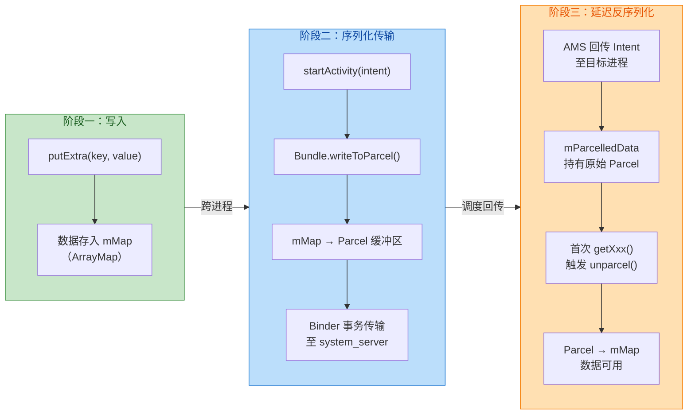
```mermaid
graph LR
    subgraph Phase1["阶段一：写入"]
        direction TB
        A1["putExtra(key, value)"]
        A2["数据存入 mMap\n（ArrayMap）"]
        A1 --> A2
    end

    subgraph Phase2["阶段二：序列化传输"]
        direction TB
        B1["startActivity(intent)"]
        B2["Bundle.writeToParcel()"]
        B3["mMap → Parcel 缓冲区"]
        B4["Binder 事务传输\n至 system_server"]
        B1 --> B2
        B2 --> B3
        B3 --> B4
    end

    subgraph Phase3["阶段三：延迟反序列化"]
        direction TB
        C1["AMS 回传 Intent\n至目标进程"]
        C2["mParcelledData\n持有原始 Parcel"]
        C3["首次 getXxx()\n触发 unparcel()"]
        C4["Parcel → mMap\n数据可用"]
        C1 --> C2
        C2 --> C3
        C3 --> C4
    end

    Phase1 -->|"跨进程"| Phase2 -->|"调度回传"| Phase3

    classDef greenStyle fill:#C8E6C9,stroke:#388E3C,color:#1B5E20
    classDef blueStyle fill:#BBDEFB,stroke:#1976D2,color:#0D47A1
    classDef orangeStyle fill:#FFE0B2,stroke:#F57C00,color:#E65100

    class Phase1 greenStyle
    class Phase2 blueStyle
    class Phase3 orangeStyle
```

#### ArrayMap vs HashMap：为什么 Bundle 选择 ArrayMap

这是一个值得展开的设计决策。`HashMap` 使用 **数组 + 链表/红黑树** 的结构，每个 Entry 都是一个独立的对象，在小数据量时会产生大量的对象分配和内存碎片。而 `ArrayMap` 使用 **两个数组**：一个 `int[] mHashes` 存储所有 key 的哈希值（已排序），一个 `Object[] mArray` 交替存储 key 和 value（即 `[key0, value0, key1, value1, ...]`）。查找时先对 `mHashes` 做二分查找定位索引，再到 `mArray` 中取值。

对于 Bundle 这种典型场景——**键值对数量通常在几个到几十个之间**——`ArrayMap` 的优势非常明显：内存占用更小（没有 Entry 对象开销）、缓存局部性更好（数据在连续数组中）、GC 压力更低。当然，当数据量达到数百甚至上千时，`ArrayMap` 的 O(log n) 查找会劣于 `HashMap` 的 O(1) 摊还查找，但 Bundle 的使用场景几乎不会达到这个量级。

---

### Extras 键值对

#### Extras 的本质

当你调用 `intent.putExtra("user_name", "Alice")` 时，你实际上是在操作 Intent 内部持有的一个 `Bundle mExtras` 字段。`putExtra()` 方法只是一层便捷封装：

```kotlin
// Intent.putExtra() 的简化实现逻辑
fun putExtra(name: String, value: String): Intent {
    // 如果 mExtras 尚未初始化，先创建一个空 Bundle
    if (mExtras == null) {
        mExtras = Bundle()
    }
    // 委托给 Bundle 的 putString() 方法
    mExtras!!.putString(name, value)
    // 返回 this 以支持链式调用
    return this
}
```

所以 **Extras 并不是一个独立的数据结构**，它就是 Bundle 本身。`Intent` 提供了大量 `putExtra()` 的重载方法（接受 `Int`、`Long`、`Boolean`、`String`、`Parcelable`、`Serializable`、`Bundle`、数组等），这些方法全部委托给内部 Bundle 的对应 `putXxx()` 方法。

#### 类型安全与类型擦除的陷阱

Bundle 的 `putXxx()` / `getXxx()` 方法提供了 **编译期的类型安全**：你用 `putInt()` 放进去的值，必须用 `getInt()` 取出来。但这里有一个微妙的陷阱：**Bundle 内部的 ArrayMap 存储的是 `Object` 类型**，类型信息只在序列化/反序列化时通过 Parcel 的类型标记（type tag）来保留。如果你用 `putInt("count", 42)` 存入，却用 `getString("count")` 取出，不会得到编译错误，但运行时会返回 `null`（或者在某些情况下抛出 `ClassCastException`）。

这个问题在大型项目中尤为突出。当多个模块通过 Intent 传递数据时，key 的命名和类型约定很容易出现不一致。**最佳实践是定义常量类或使用 sealed class 来管理 key**：

```kotlin
// 定义一个专门管理 Intent Extra Key 的常量对象
object UserExtras {
    // Key 常量：统一命名，避免拼写错误
    const val KEY_USER_ID = "com.example.extra.USER_ID"       // Long 类型
    const val KEY_USER_NAME = "com.example.extra.USER_NAME"   // String 类型
    const val KEY_USER_AGE = "com.example.extra.USER_AGE"     // Int 类型

    // 封装写入方法：确保类型正确
    fun Intent.putUserData(id: Long, name: String, age: Int): Intent {
        // 使用明确的类型方法写入，避免类型混淆
        putExtra(KEY_USER_ID, id)       // putExtra(String, Long)
        putExtra(KEY_USER_NAME, name)   // putExtra(String, String)
        putExtra(KEY_USER_AGE, age)     // putExtra(String, Int)
        return this
    }

    // 封装读取方法：确保类型正确，提供默认值
    fun Intent.getUserId(): Long {
        // getLongExtra 第二个参数是默认值，key 不存在时返回 -1L
        return getLongExtra(KEY_USER_ID, -1L)
    }

    fun Intent.getUserName(): String? {
        // getStringExtra 返回 nullable，调用方需处理 null
        return getStringExtra(KEY_USER_NAME)
    }

    fun Intent.getUserAge(): Int {
        // getIntExtra 第二个参数是默认值
        return getIntExtra(KEY_USER_AGE, 0)
    }
}
```

#### 支持的数据类型全景

Bundle 支持的数据类型可以分为以下几类：

**基本类型及其数组**：`Boolean`、`Byte`、`Char`、`Short`、`Int`、`Long`、`Float`、`Double`，以及它们的数组形式（如 `IntArray`、`LongArray`）。这些类型的序列化成本最低，因为 Parcel 可以直接以二进制形式写入/读取，无需额外的类型解析。

**字符串类型**：`String`、`CharSequence`、`String[]`、`ArrayList<String>`。`String` 在 Parcel 中以 UTF-16 编码写入（先写长度，再写字符数据）。`CharSequence` 则更复杂，因为它可能包含 `Spannable` 等富文本信息，序列化时需要额外处理 Span 对象。

**Parcelable 类型**：实现了 `Parcelable` 接口的对象、`Parcelable[]`、`ArrayList<Parcelable>`。这是 Android 推荐的自定义对象序列化方式，性能最优（后续章节详细展开）。

**Serializable 类型**：实现了 `java.io.Serializable` 接口的对象。这是 Java 标准的序列化方式，但在 Android 上性能较差（后续章节详细展开）。

**嵌套容器**：`Bundle`（Bundle 可以嵌套 Bundle）、`SparseArray<Parcelable>`、`ArrayList<Integer>`、`ArrayList<CharSequence>` 等。嵌套 Bundle 在复杂数据传递场景中很有用，但要注意嵌套层级过深会增加序列化开销。

**特殊类型**：`Size`、`SizeF`（API 21+）、`Binder`（可以在 Bundle 中传递 Binder 对象，这在某些高级 IPC 场景中非常有用）。

---

### 数据大小限制与 TransactionTooLargeException

#### Binder 事务缓冲区：1MB 的硬限制

这是 Android 数据传递中最重要也最容易被忽视的限制。**Binder 驱动为每个进程分配了一个固定大小的事务缓冲区（transaction buffer），大小为 1MB（1,048,576 bytes）。** 这个缓冲区是 **进程级别共享的**——也就是说，同一个进程中所有正在进行的 Binder 事务（包括 Intent 传递、ContentProvider 查询、AIDL 调用等）共享这 1MB 空间。

当你通过 Intent 传递一个过大的 Bundle 时，序列化后的 Parcel 数据会被写入这个缓冲区。如果数据大小超过了缓冲区的剩余空间，Binder 驱动会拒绝这次事务，Android Framework 层会抛出 `TransactionTooLargeException`。

```java
// 异常定义（Android Framework 源码简化）
public class TransactionTooLargeException extends RemoteException {
    // 当 Binder 事务的数据或返回值超过缓冲区限制时抛出
    // The Binder transaction buffer has a limited fixed size,
    // currently 1MB, which is shared by all transactions in
    // progress for the process.
}
```

需要特别强调的是：**实际可用空间远小于 1MB。** 原因有三：

1. **系统服务也在使用同一个缓冲区。** 你的 App 进程与 system_server 之间的所有 Binder 通信（生命周期回调、窗口管理、输入事件等）都在消耗这个缓冲区。
2. **Parcel 序列化有额外开销。** 除了你放入的数据本身，Parcel 还需要写入类型标记、长度信息、对齐填充等元数据。
3. **Intent 本身也有数据。** Action、Category、ComponentName、Flags 等字段也会被序列化。

**经验法则：Bundle 中传递的数据应控制在 500KB 以内，理想情况下不超过 100KB。** Google 官方文档建议传递的数据量应该 "as small as possible"。

#### 为什么是 1MB？设计考量

你可能会问：为什么 Google 不把这个缓冲区设大一些？这背后有深思熟虑的设计考量：

**内存效率。** Binder 缓冲区使用 `mmap` 映射到内核空间和用户空间，是一种 **共享内存** 机制。每个进程 1MB 的缓冲区意味着系统中如果有 100 个进程，就需要 100MB 的内核内存。在移动设备上，内存是极其宝贵的资源。

**设计哲学。** Android 的设计哲学是：**Intent 是一个"消息"，不是一个"数据管道"。** 它应该携带的是 **轻量级的指令和元数据**（比如"打开用户详情页，用户 ID 是 12345"），而不是大块的业务数据（比如"这是用户的完整个人资料，包含头像的 Bitmap"）。大数据应该通过 **ContentProvider**、**文件系统**、**数据库**、**ViewModel 共享** 等机制传递。

**系统稳定性。** 如果允许 App 通过 Intent 传递任意大小的数据，一个行为不当的 App 就可能通过发送巨大的 Intent 来耗尽系统的 Binder 资源，影响其他 App 甚至系统服务的正常运行。1MB 的限制是一种 **资源保护机制**。

#### TransactionTooLargeException 的触发场景

这个异常不仅仅在 `startActivity()` 时会触发。以下是常见的触发场景：

**场景一：Intent 传递大数据。** 这是最直观的场景。比如把一个包含大量元素的 `ArrayList<Parcelable>` 放入 Intent。

**场景二：onSaveInstanceState 保存过多状态。** 当 Activity 被系统回收时，`onSaveInstanceState(Bundle outState)` 中保存的数据也需要通过 Binder 传递给 AMS 保管。如果你在这里保存了大量数据（比如一个很长的列表数据），同样会触发这个异常。**这是线上崩溃中最常见的触发场景之一**，因为它不像 `startActivity()` 那样容易被开发者注意到。

**场景三：Fragment Arguments。** `Fragment.setArguments(Bundle)` 中的数据最终也会随 Activity 的状态保存而被序列化。如果多个 Fragment 各自携带了较大的 Arguments，累积起来也可能超限。

**场景四：ContentProvider 查询返回大结果集。** 虽然 `CursorWindow` 有自己的大小限制（通常 2MB），但某些 ContentProvider 的实现可能通过 Bundle 返回数据。

```kotlin
// 反面示例：在 Intent 中传递大量数据（危险！）
fun startDetailActivity(context: Context, hugeList: List<UserProfile>) {
    val intent = Intent(context, DetailActivity::class.java)
    // ❌ 错误：将大列表直接放入 Intent
    // 如果 hugeList 包含数百个对象，序列化后可能超过 1MB
    intent.putParcelableArrayListExtra(
        "user_list",
        ArrayList(hugeList) // 每个 UserProfile 序列化后可能有几KB
    )
    // 这里可能抛出 TransactionTooLargeException
    context.startActivity(intent)
}

// 正面示例：只传递 ID，让目标页面自行加载数据
fun startDetailActivitySafely(context: Context, userId: Long) {
    val intent = Intent(context, DetailActivity::class.java)
    // ✅ 正确：只传递轻量级的标识符
    // Long 类型仅占 8 字节，远低于 Binder 缓冲区限制
    intent.putExtra("user_id", userId)
    context.startActivity(intent)
}

// 目标 Activity 通过 Repository/ViewModel 加载完整数据
class DetailActivity : AppCompatActivity() {
    // 使用 ViewModel 管理数据加载，避免在 Intent 中传递大对象
    private val viewModel: DetailViewModel by viewModels()

    override fun onCreate(savedInstanceState: Bundle?) {
        super.onCreate(savedInstanceState)
        // 从 Intent 中只取出轻量级的 ID
        val userId = intent.getLongExtra("user_id", -1L)
        // 委托 ViewModel 从数据库/网络加载完整数据
        viewModel.loadUser(userId)
    }
}
```

#### onSaveInstanceState 的隐蔽陷阱

这个场景值得单独深入讨论，因为它是 `TransactionTooLargeException` 在生产环境中最常见的触发源。

当用户按下 Home 键、切换到其他 App、或者系统因内存不足需要回收 Activity 时，系统会调用 `onSaveInstanceState()` 让 Activity 保存临时状态。这个 Bundle 会被传递给 AMS，由 AMS 在 system_server 进程中保管。当用户返回时，AMS 再把这个 Bundle 传回 App 进程，通过 `onCreate(savedInstanceState)` 或 `onRestoreInstanceState()` 恢复状态。

**整个过程涉及两次 Binder 事务**（保存时一次，恢复时一次），每次都受 1MB 限制。

更隐蔽的是，**很多 View 会自动保存状态到这个 Bundle 中**。比如 `RecyclerView` 会保存滚动位置，`EditText` 会保存用户输入的文本，`ViewPager` 会保存当前页面索引和所有 Fragment 的状态。如果你的页面结构复杂（多层嵌套的 Fragment、大量的 EditText），这些自动保存的状态累积起来可能就已经很大了，再加上你手动保存的数据，很容易超限。

```kotlin
// 反面示例：在 onSaveInstanceState 中保存大量数据
override fun onSaveInstanceState(outState: Bundle) {
    super.onSaveInstanceState(outState)
    // ❌ 错误：保存完整的列表数据
    // 当列表很长时，序列化后的数据量可能非常大
    outState.putParcelableArrayList("cached_items", ArrayList(adapter.items))
}

// 正面示例：只保存必要的恢复信息
override fun onSaveInstanceState(outState: Bundle) {
    super.onSaveInstanceState(outState)
    // ✅ 正确：只保存恢复所需的最小信息
    // 列表的滚动位置（几个字节）
    outState.putInt("scroll_position", layoutManager.findFirstVisibleItemPosition())
    // 当前的筛选条件（几十个字节）
    outState.putString("filter_query", currentQuery)
    // 完整数据由 ViewModel（进程内存活）或 Repository（持久化）管理
}
```

#### 如何检测和预防

**检测方法一：TooLargeTool 库。** 这是一个开源库，可以在 Debug 模式下监控每次 `onSaveInstanceState` 保存的 Bundle 大小，并在 Logcat 中输出警告。

**检测方法二：手动计算 Bundle 大小。** 你可以在开发阶段通过以下方式估算 Bundle 的序列化大小：

```kotlin
// 工具方法：估算 Bundle 序列化后的字节大小
fun Bundle.estimateSizeInBytes(): Int {
    // 创建一个 Parcel 对象用于模拟序列化
    val parcel = Parcel.obtain()
    try {
        // 将 Bundle 写入 Parcel（触发完整序列化）
        writeToParcel(parcel, 0)
        // Parcel 的 dataSize() 返回已写入数据的字节数
        val sizeInBytes = parcel.dataSize()
        return sizeInBytes
    } finally {
        // 必须回收 Parcel 对象，避免内存泄漏
        // Parcel 内部使用对象池（object pool）复用实例
        parcel.recycle()
    }
}

// 在 Debug 模式下使用
override fun onSaveInstanceState(outState: Bundle) {
    super.onSaveInstanceState(outState)
    // 保存必要状态...
    outState.putString("query", currentQuery)

    // Debug 模式下检查 Bundle 大小
    if (BuildConfig.DEBUG) {
        val size = outState.estimateSizeInBytes()
        // 如果超过 500KB，输出警告日志
        if (size > 500 * 1024) {
            Log.w("BundleSize",
                "onSaveInstanceState Bundle 过大: ${size / 1024}KB，" +
                "存在 TransactionTooLargeException 风险！")
        }
    }
}
```

**预防策略总结：**

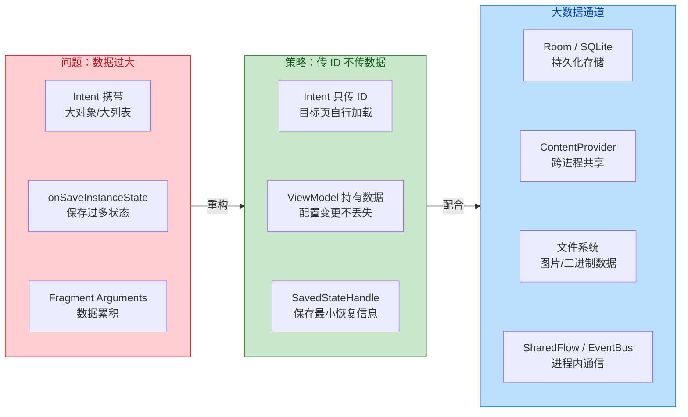
```mermaid
graph LR
    subgraph Problem["问题：数据过大"]
        direction TB
        P1["Intent 携带\n大对象/大列表"]
        P2["onSaveInstanceState\n保存过多状态"]
        P3["Fragment Arguments\n数据累积"]
        P1 ~~~ P2
        P2 ~~~ P3
    end

    subgraph Strategy["策略：传 ID 不传数据"]
        direction TB
        S1["Intent 只传 ID\n目标页自行加载"]
        S2["ViewModel 持有数据\n配置变更不丢失"]
        S3["SavedStateHandle\n保存最小恢复信息"]
        S1 ~~~ S2
        S2 ~~~ S3
    end

    subgraph LargeData["大数据通道"]
        direction TB
        L1["Room / SQLite\n持久化存储"]
        L2["ContentProvider\n跨进程共享"]
        L3["文件系统\n图片/二进制数据"]
        L4["SharedFlow / EventBus\n进程内通信"]
        L1 ~~~ L2
        L2 ~~~ L3
        L3 ~~~ L4
    end

    Problem -->|"重构"| Strategy -->|"配合"| LargeData

    classDef redStyle fill:#FFCDD2,stroke:#D32F2F,color:#B71C1C
    classDef greenStyle fill:#C8E6C9,stroke:#388E3C,color:#1B5E20
    classDef blueStyle fill:#BBDEFB,stroke:#1976D2,color:#0D47A1

    class Problem redStyle
    class Strategy greenStyle
    class LargeData blueStyle
```

#### Android 8.0+ 的行为变化

在 Android 8.0（API 26）之前，`TransactionTooLargeException` 只会在 Logcat 中输出警告，**不会导致应用崩溃**。这意味着数据可能悄无声息地丢失——Bundle 传递失败了，但 App 还在运行，目标组件收到的是一个空的或不完整的 Bundle，导致后续逻辑出现各种诡异的 bug（空指针、数据错乱等）。这种"静默失败"模式让问题极难排查。

**从 Android 8.0 开始，系统改变了策略：`TransactionTooLargeException` 会直接导致应用崩溃（crash）。** 这是一个有意为之的设计决策——Google 认为，与其让 App 在数据丢失的情况下继续运行并产生不可预测的行为，不如直接崩溃，迫使开发者正视并修复这个问题。这个变化体现在 `ActivityThread` 的实现中：

```java
// ActivityThread 中的相关逻辑（Android 8.0+，简化）
// 当 Activity 停止时，系统会检查 onSaveInstanceState 的 Bundle 大小
private void callActivityOnStop(ActivityClientRecord r, boolean saveState) {
    // ... 调用 onStop 和 onSaveInstanceState ...
    if (saveState) {
        // 执行状态保存
        performSaveInstanceState(r);
        // Android 8.0+ 新增：检查保存的状态大小
        // 如果超过限制，直接抛出异常而非静默忽略
        checkStateSizeForTooLarge(r);
    }
}

// 检查方法：将 Bundle 序列化为 Parcel 并检查大小
private void checkStateSizeForTooLarge(ActivityClientRecord r) {
    // 如果 Bundle 不为空，计算其序列化大小
    if (r.state != null) {
        Parcel p = Parcel.obtain();
        r.state.writeToParcel(p, 0);
        int size = p.dataSize();
        p.recycle();
        // 超过阈值时抛出 TransactionTooLargeException
        // 注意：实际阈值由 Binder 缓冲区决定，这里是简化表示
        if (size > TRANSACTION_SIZE_LIMIT) {
            throw new TransactionTooLargeException(
                "Bundle size: " + size + " bytes exceeds limit"
            );
        }
    }
}
```

这个行为变化对开发者的影响是深远的。如果你的 App 需要支持 Android 8.0 及以上版本（如今几乎所有 App 都需要），你必须认真对待 Bundle 的大小问题。**那些在旧版本上"侥幸"运行的代码，升级到新版本后可能会突然开始崩溃。**

#### 实际案例：一个典型的线上崩溃

让我们看一个在生产环境中非常常见的崩溃场景。假设你有一个新闻列表页面，用户可以无限滚动加载更多内容：

```kotlin
// ❌ 反面示例：一个看似无害但暗藏杀机的实现
class NewsListActivity : AppCompatActivity() {
    // 适配器持有所有已加载的新闻数据
    private val newsList = mutableListOf<NewsItem>() // NewsItem 实现了 Parcelable

    override fun onSaveInstanceState(outState: Bundle) {
        super.onSaveInstanceState(outState)
        // 看起来很合理：保存列表数据，恢复时不用重新加载
        // 但如果用户已经滚动加载了 500 条新闻，每条约 2KB
        // 总大小 = 500 × 2KB = 1000KB ≈ 1MB → 💥 崩溃！
        outState.putParcelableArrayList("news_list", ArrayList(newsList))
    }
}

// ✅ 正面示例：正确的架构设计
class NewsListActivity : AppCompatActivity() {
    // 使用 ViewModel 持有数据，配置变更（如旋转屏幕）时不会丢失
    private val viewModel: NewsListViewModel by viewModels()

    override fun onSaveInstanceState(outState: Bundle) {
        super.onSaveInstanceState(outState)
        // 只保存恢复所需的最小信息
        outState.putInt("page", viewModel.currentPage)           // 4 字节
        outState.putInt("scroll_pos", getScrollPosition())       // 4 字节
        outState.putString("category", viewModel.currentCategory) // 几十字节
        // 总计不到 100 字节，完全安全
    }

    override fun onCreate(savedInstanceState: Bundle?) {
        super.onCreate(savedInstanceState)
        if (savedInstanceState != null) {
            // 从 savedInstanceState 恢复页码和分类
            val page = savedInstanceState.getInt("page", 1)
            val category = savedInstanceState.getString("category", "all")
            // 让 ViewModel 重新加载数据（可能从本地缓存中快速恢复）
            viewModel.restoreState(page, category)
        }
        // 观察 ViewModel 的数据流，更新 UI
        viewModel.newsItems.observe(this) { items ->
            adapter.submitList(items)
        }
    }
}
```

#### Bundle 大小限制的完整认知模型

为了帮助你建立对 Bundle 大小限制的完整认知，下面用一个层次化的模型来总结：

```kotlin
┌─────────────────────────────────────────────────────┐
│           Binder Transaction Buffer (1MB)           │
│                   进程级别共享                        │
│  ┌───────────────────────────────────────────────┐  │
│  │  系统服务通信开销（生命周期、窗口、输入事件）        │  │
│  │  ≈ 动态变化，不可预测                            │  │
│  ├───────────────────────────────────────────────┤  │
│  │  Intent 元数据（Action, Category, Flags...）    │  │
│  │  ≈ 几百字节到几KB                               │  │
│  ├───────────────────────────────────────────────┤  │
│  │  Bundle Extras（你放入的数据）                   │  │
│  │  ← 你能控制的部分，尽量保持在 100KB 以内           │  │
│  ├───────────────────────────────────────────────┤  │
│  │  Parcel 序列化开销（类型标记、对齐填充）           │  │
│  │  ≈ 数据量的 10%~30%                            │  │
│  ├───────────────────────────────────────────────┤  │
│  │  其他并发 Binder 事务占用                        │  │
│  │  ≈ 不可预测                                    │  │
│  └───────────────────────────────────────────────┘  │
│  实际可用空间 << 1MB，安全阈值建议 ≤ 500KB              │
└─────────────────────────────────────────────────────┘
```

**核心原则：Intent 和 Bundle 是"信封"，不是"包裹"。** 信封里应该放的是地址和简短的留言（ID、标识符、少量配置参数），而不是整箱的货物（大列表、Bitmap、文件内容）。大数据应该通过专门的数据通道传递：数据库、文件系统、ContentProvider、ViewModel、或者进程内的内存共享（如单例 Repository）。

---

**📝 练习题**

某 App 的商品详情页需要展示商品的完整信息（包含 20 张高清图片的 URL、商品描述富文本、100 条用户评论）。开发者在列表页点击商品时，将所有这些数据通过 `intent.putExtra()` 传递给详情页。在 Android 8.0+ 设备上，部分用户反馈点击商品后 App 闪退。以下哪种方案是最佳修复策略？

A. 将 Binder 缓冲区大小从 1MB 调整为 4MB
B. 将数据拆分为多个 Bundle，分多次 Intent 发送
C. Intent 只传递商品 ID，详情页通过 ViewModel + Repository 从缓存或网络加载完整数据
D. 将所有数据转为 JSON 字符串后压缩，再放入 Intent 的 Extra 中

**【答案】** C

**【解析】** 选项 A 不可行，Binder 缓冲区大小是系统级配置，普通 App 无法修改，且即使能修改也违背了 Android 的设计哲学。选项 B 不可行，`startActivity()` 是一次性操作，无法"分多次发送"数据给同一个目标 Activity，且多次启动会创建多个 Activity 实例。选项 D 虽然压缩可以减小数据量，但治标不治本——当数据量足够大时（20 张图片 URL + 100 条评论），即使压缩后仍可能超限，而且压缩/解压还会增加 CPU 开销。选项 C 是 Android 官方推荐的最佳实践：Intent 只携带轻量级的标识符（商品 ID，仅 8 字节），详情页通过 ViewModel 和 Repository 层从本地缓存（Room 数据库）或网络 API 加载完整数据。这种架构不仅避免了 `TransactionTooLargeException`，还实现了关注点分离（Separation of Concerns），使代码更易测试和维护。

---

## 序列化机制

在 Android 组件通信的世界里，数据要从一个进程"旅行"到另一个进程，或者从一个组件"搬运"到另一个组件，就必须经历一个关键的转换过程——**序列化（Serialization）**。简单来说，序列化就是将内存中活生生的对象，转换为一段可以在进程边界传输、可以写入磁盘的字节流；而反序列化（Deserialization）则是这个过程的逆操作，将字节流还原为对象。

为什么组件通信离不开序列化？这要从 Android 的 Binder IPC 机制说起。当我们通过 `Intent` 的 `putExtra()` 传递一个自定义对象时，这个对象最终要被写入 **Parcel**（一个高性能的序列化容器），然后通过 Binder 驱动在内核空间的共享内存区域完成跨进程拷贝。Binder 驱动不认识 Java/Kotlin 对象，它只认识扁平化的字节序列。因此，任何想要通过 `Intent`、`Bundle` 传递的自定义对象，都必须实现某种序列化协议——要么是 Java 原生的 `Serializable`，要么是 Android 专属的 `Parcelable`。

这两种机制在设计哲学、性能表现、使用便捷性上有着本质的差异。理解它们的内部原理，不仅能帮助我们做出正确的技术选型，更能在遇到 `TransactionTooLargeException`、数据丢失、性能瓶颈等问题时快速定位根因。

### Serializable 原理与性能

`java.io.Serializable` 是 Java 语言从 JDK 1.1 时代就引入的序列化接口。它的设计哲学是 **"零成本接入"**——开发者只需让类实现这个标记接口（Marker Interface），不需要实现任何方法，Java 运行时就能自动完成对象的序列化与反序列化。这种极致的便捷性让它在 Java 生态中被广泛使用，但在 Android 这个对性能极度敏感的移动平台上，它的代价却不容忽视。

**内部工作机制详解**

当一个实现了 `Serializable` 的对象被写入 `ObjectOutputStream` 时，Java 运行时会启动一套复杂的反射驱动流程。首先，`ObjectOutputStream` 会检查目标对象的类是否实现了 `Serializable` 接口，然后通过 `ObjectStreamClass` 这个核心类来获取该类的元数据描述——包括类名、`serialVersionUID`、所有非 `transient` 非 `static` 字段的名称与类型。这个元数据获取过程本身就大量依赖反射（`java.lang.reflect`），需要遍历类的字段列表、检查修饰符、解析类型签名。

接下来进入实际的字段写入阶段。`ObjectOutputStream` 会按照字段声明顺序，逐个通过反射读取字段值（`Field.get(obj)`），然后根据字段类型调用对应的写入方法。对于基本类型（`int`、`long`、`boolean` 等），直接写入字节流；对于引用类型，则递归地对引用对象执行同样的序列化流程。这意味着如果一个对象持有一棵复杂的对象图（Object Graph），整棵树都会被遍历和序列化。

更关键的是，`ObjectOutputStream` 在序列化过程中会维护一个 **对象引用表（Handle Table）**，用于检测和处理循环引用。每序列化一个对象，都会在这个表中注册；当遇到已经序列化过的对象时，只写入一个引用句柄而非重复序列化。这个机制虽然保证了正确性，但引入了额外的哈希查找开销。

反序列化过程同样昂贵。`ObjectInputStream` 读取字节流时，首先要解析类描述符，然后通过 `Class.forName()` 加载对应的类，接着通过一种特殊的方式创建对象实例——它不会调用目标类的构造函数，而是调用目标类 **第一个不可序列化的父类** 的无参构造函数（通常是 `Object` 的构造函数），然后通过反射逐个设置字段值。这种绕过构造函数的对象创建方式，依赖于 `sun.misc.Unsafe` 或类似的底层机制，本身就有不小的开销。

**性能瓶颈的根源**

`Serializable` 在 Android 上的性能问题可以归结为以下几个核心原因：

第一，**大量的反射操作**。每一次序列化/反序列化都需要通过反射获取字段、读写字段值。反射在 JVM/ART 上的开销远高于直接方法调用，因为它需要绕过编译期的类型检查和方法内联优化，还涉及安全权限检查。

第二，**频繁的临时对象分配**。序列化过程中会创建大量的中间对象：`ObjectStreamClass` 描述符、`ObjectStreamField` 数组、各种包装对象、内部缓冲区等。这些临时对象会给垃圾回收器（GC）带来压力，在 Android 的 Dalvik/ART 运行时上，频繁的 GC 会导致界面卡顿（GC Pause）。

第三，**冗余的元数据写入**。`Serializable` 的字节流中包含了完整的类描述信息（类名、字段名、字段类型签名），这不仅增大了序列化后的数据体积，也增加了解析时间。相比之下，`Parcelable` 的字节流是纯数据，没有任何元数据开销。

第四，**I/O 流的层层包装**。`ObjectOutputStream` 内部使用 `BlockDataOutputStream`，后者又包装了底层的 `OutputStream`，每次写入都要经过多层缓冲和转换。

**serialVersionUID 的作用与陷阱**

`serialVersionUID` 是 `Serializable` 机制中一个极其重要但经常被忽视的字段。它是一个 `long` 类型的版本标识符，用于在反序列化时验证发送方和接收方的类定义是否兼容。

如果开发者没有显式声明 `serialVersionUID`，Java 运行时会在序列化时根据类的结构（类名、接口、字段、方法签名等）自动计算一个哈希值作为 `serialVersionUID`。问题在于，这个自动计算过程对类结构的任何微小变化都极度敏感——哪怕只是添加了一个方法、改变了一个字段的修饰符，计算出的 UID 都可能不同。这意味着如果你在版本迭代中修改了类结构，而没有显式固定 `serialVersionUID`，那么旧版本序列化的数据在新版本中反序列化时就会抛出 `InvalidClassException`。

在 Android 开发中，这个问题尤其危险。如果你将 `Serializable` 对象存入了 `SharedPreferences`（通过 Base64 编码）或者持久化到了文件中，App 升级后类结构变化就可能导致数据无法恢复。因此，**任何使用 `Serializable` 的类都应该显式声明 `serialVersionUID`**。

```kotlin
// 实现 Serializable 的标准写法
class UserProfile : Serializable {

    // 显式声明 serialVersionUID，防止类结构变化导致反序列化失败
    // 这个值在类首次定义时设定，后续版本迭代中保持不变
    companion object {
        private const val serialVersionUID: Long = 1L
    }

    // 普通字段：会被自动序列化
    var userName: String = ""

    // 普通字段：会被自动序列化
    var age: Int = 0

    // transient 标记的字段：不参与序列化，反序列化后为默认值（null）
    // 适用于缓存、临时计算结果等不需要持久化的数据
    @Transient
    var cachedAvatar: Bitmap? = null

    // 自定义序列化逻辑：可以覆盖默认的反射行为
    // 当需要加密、压缩、或兼容旧版本数据格式时使用
    private fun writeObject(out: java.io.ObjectOutputStream) {
        // 先调用默认的序列化逻辑，处理所有非 transient 字段
        out.defaultWriteObject()
        // 可以在这里追加自定义数据
        out.writeUTF("extra_data_v2")
    }

    // 自定义反序列化逻辑：与 writeObject 配对使用
    private fun readObject(input: java.io.ObjectInputStream) {
        // 先调用默认的反序列化逻辑，恢复所有非 transient 字段
        input.defaultReadObject()
        // 读取自定义追加的数据
        val extra = input.readUTF()
    }
}
```

**何时仍然可以使用 Serializable**

尽管 `Serializable` 在性能上不如 `Parcelable`，但它并非一无是处。在以下场景中，`Serializable` 仍然是合理的选择：当对象结构非常简单（只有几个基本类型字段）、传递频率很低（比如一次性的页面跳转参数）、或者需要与纯 Java 库共享数据模型时。Google 官方的性能测试表明，对于简单对象的单次序列化，`Serializable` 和 `Parcelable` 的差异在毫秒级以内，用户完全无法感知。真正拉开差距的是高频、大量、复杂对象的序列化场景。

### Parcelable 实现原理

`android.os.Parcelable` 是 Android 平台专门为高性能 IPC（Inter-Process Communication）设计的序列化接口。与 `Serializable` 的"自动反射"哲学截然不同，`Parcelable` 要求开发者 **显式编写** 序列化和反序列化的代码，将对象的每个字段手动写入和读出 `Parcel` 容器。这种"手动挡"的设计虽然增加了编码工作量，但换来了极致的性能表现。

**Parcel：Android 的高性能序列化容器**

要理解 `Parcelable`，首先要理解 `Parcel`。`android.os.Parcel` 是一个 **高性能的、面向消息的序列化容器**，它在 Android 的 Binder IPC 机制中扮演着核心角色。从本质上说，`Parcel` 是一块连续的内存缓冲区（在 Native 层由 C++ 的 `Parcel` 类管理），数据以紧凑的二进制格式顺序排列，没有任何元数据开销。

当你调用 `parcel.writeInt(42)` 时，底层发生的事情非常直接：Native 层的 `Parcel::writeInt32()` 方法将 4 个字节直接写入内部缓冲区的当前位置，然后将写入指针前移 4 字节。没有反射、没有类型描述符、没有对象头——就是纯粹的数据拷贝。读取时同理，`parcel.readInt()` 从当前读取位置取出 4 字节并解释为 `int`，然后前移指针。

这种设计意味着 **写入顺序和读取顺序必须严格一致**。如果你先写了一个 `Int` 再写了一个 `String`，读取时也必须先读 `Int` 再读 `String`，否则数据就会错位，产生不可预测的结果。这是 `Parcelable` 最容易出错的地方，也是它与 `Serializable`（通过字段名匹配，顺序无关）的本质区别之一。

`Parcel` 的内部缓冲区采用动态扩容策略。初始分配一块较小的内存，当写入数据超过当前容量时，会重新分配一块更大的内存（通常是当前容量的 1.5 倍或 2 倍），然后将旧数据拷贝过去。这与 `ArrayList` 的扩容机制类似。为了避免频繁扩容带来的性能损耗，`Parcel` 提供了 `setDataCapacity()` 方法，允许开发者在知道大致数据量时预分配足够的空间。

**Parcelable 的工作流程**

当一个 `Parcelable` 对象通过 `Intent` 传递时，完整的数据流转路径如下：

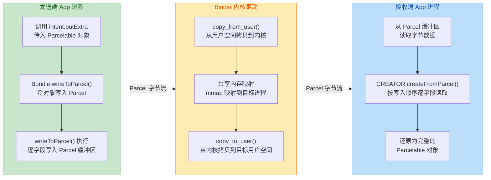
```mermaid
graph LR
    subgraph SRC["发送端 App 进程"]
        direction TB
        A1["调用 intent.putExtra\n传入 Parcelable 对象"]
        A2["Bundle.writeToParcel()\n将对象写入 Parcel"]
        A3["writeToParcel() 执行\n逐字段写入 Parcel 缓冲区"]
        A1 --> A2
        A2 --> A3
    end

    subgraph BINDER["Binder 内核驱动"]
        direction TB
        B1["copy_from_user()\n从用户空间拷贝到内核"]
        B2["共享内存映射\nmmap 映射到目标进程"]
        B3["copy_to_user()\n从内核拷贝到目标用户空间"]
        B1 --> B2
        B2 --> B3
    end

    subgraph DST["接收端 App 进程"]
        direction TB
        C1["从 Parcel 缓冲区\n读取字节数据"]
        C2["CREATOR.createFromParcel()\n按写入顺序逐字段读取"]
        C3["还原为完整的\nParcelable 对象"]
        C1 --> C2
        C2 --> C3
    end

    SRC -->|"Parcel 字节流"| BINDER -->|"Parcel 字节流"| DST

    classDef srcStyle fill:#C8E6C9,stroke:#388E3C,color:#1B5E20
    classDef binderStyle fill:#FFECB3,stroke:#F57F17,color:#E65100
    classDef dstStyle fill:#BBDEFB,stroke:#1976D2,color:#0D47A1

    class SRC srcStyle
    class BINDER binderStyle
    class DST dstStyle
```

整个过程中，**没有任何反射调用**。发送端通过开发者编写的 `writeToParcel()` 方法将字段直接写入 `Parcel`；接收端通过 `CREATOR.createFromParcel()` 工厂方法直接从 `Parcel` 中读取字段并构造对象。所有的字段访问都是编译期确定的直接方法调用，JIT/AOT 编译器可以对其进行内联优化。

**手动实现 Parcelable 的完整示例**

理解了原理之后，让我们看一个完整的手动实现。虽然现代开发中我们几乎不再手写这些代码（后面会讲 `@Parcelize`），但理解手动实现对于排查问题和理解底层机制至关重要：

```kotlin
// 一个表示地理位置信息的数据类，需要通过 Intent 在组件间传递
class LocationInfo : Parcelable {

    // 纬度
    var latitude: Double = 0.0

    // 经度
    var longitude: Double = 0.0

    // 位置名称，可能为 null
    var placeName: String? = null

    // 时间戳
    var timestamp: Long = 0L

    // 是否为精确定位
    var isPrecise: Boolean = false

    // 标签列表
    var tags: List<String> = emptyList()

    // 主构造函数：常规创建对象时使用
    constructor(
        latitude: Double,
        longitude: Double,
        placeName: String?,
        timestamp: Long,
        isPrecise: Boolean,
        tags: List<String>
    ) {
        this.latitude = latitude
        this.longitude = longitude
        this.placeName = placeName
        this.timestamp = timestamp
        this.isPrecise = isPrecise
        this.tags = tags
    }

    // Parcel 构造函数：从 Parcel 中恢复对象时使用
    // 读取顺序必须与 writeToParcel() 的写入顺序完全一致
    constructor(parcel: Parcel) {
        // 读取 Double 类型的纬度（对应 writeDouble）
        latitude = parcel.readDouble()
        // 读取 Double 类型的经度（对应 writeDouble）
        longitude = parcel.readDouble()
        // 读取可空 String（对应 writeString）
        // readString() 能正确处理 null 值，写入时如果是 null 会写入 -1 作为长度标记
        placeName = parcel.readString()
        // 读取 Long 类型的时间戳（对应 writeLong）
        timestamp = parcel.readLong()
        // Parcel 没有 readBoolean()（API 29 之前），通常用 readInt() 模拟
        // 0 表示 false，非 0 表示 true（API 29+ 可直接用 readBoolean()）
        isPrecise = parcel.readInt() != 0
        // 读取 String 列表（对应 writeStringList）
        // createStringArrayList() 会创建新的 ArrayList 并填充数据
        tags = parcel.createStringArrayList() ?: emptyList()
    }

    // 将对象的字段逐个写入 Parcel
    // flags 参数通常为 0，当对象包含文件描述符时为 PARCELABLE_WRITE_RETURN_VALUE
    override fun writeToParcel(dest: Parcel, flags: Int) {
        // 写入 Double 类型的纬度，占 8 字节
        dest.writeDouble(latitude)
        // 写入 Double 类型的经度，占 8 字节
        dest.writeDouble(longitude)
        // 写入可空 String，内部会先写入字符串长度（int），再写入 UTF-16 编码的字符数据
        // 如果为 null，只写入 -1 作为长度标记
        dest.writeString(placeName)
        // 写入 Long 类型的时间戳，占 8 字节
        dest.writeLong(timestamp)
        // 写入 Boolean，转换为 Int（true=1, false=0），占 4 字节
        dest.writeInt(if (isPrecise) 1 else 0)
        // 写入 String 列表，内部会先写入列表长度，再逐个写入每个 String
        dest.writeStringList(tags)
    }

    // 描述特殊对象类型，通常返回 0
    // 如果对象包含文件描述符（FileDescriptor），需要返回 CONTENTS_FILE_DESCRIPTOR
    override fun describeContents(): Int = 0

    // CREATOR 是 Parcelable 协议的核心：一个静态工厂对象
    // Android 框架通过这个工厂来创建对象实例，而不是通过反射
    companion object CREATOR : Parcelable.Creator<LocationInfo> {

        // 从 Parcel 中创建单个对象实例
        // 框架在反序列化时调用此方法
        override fun createFromParcel(parcel: Parcel): LocationInfo {
            // 委托给 Parcel 构造函数
            return LocationInfo(parcel)
        }

        // 创建指定大小的对象数组
        // 框架在反序列化 Parcelable 数组时调用此方法
        override fun newArray(size: Int): Array<LocationInfo?> {
            // 返回一个元素全为 null 的数组，框架会逐个填充
            return arrayOfNulls(size)
        }
    }
}
```

**CREATOR 工厂模式的设计精妙之处**

`Parcelable.Creator<T>` 这个静态工厂对象的设计是 `Parcelable` 高性能的关键之一。在 `Serializable` 的反序列化中，`ObjectInputStream` 需要通过 `Class.forName()` 动态加载类，然后通过 `Unsafe.allocateInstance()` 或类似机制创建实例——这些都是反射操作。而 `Parcelable` 的 `CREATOR` 是一个编译期就确定的静态对象，框架通过它来创建实例，整个过程都是直接方法调用。

Android 框架是如何找到 `CREATOR` 的呢？在 `Parcel.readParcelable()` 的源码中，框架会通过 `Class.getField("CREATOR")` 反射获取这个静态字段——是的，这里确实用了一次反射。但这只是一次性的查找，获取到 `CREATOR` 引用后就会被缓存起来，后续的创建操作都是直接调用 `CREATOR.createFromParcel()`。相比 `Serializable` 每个字段都要反射的做法，这个一次性的反射开销可以忽略不计。

**Parcelable 与 Serializable 的性能对比**

根据 Google 工程师 Philippe Breault 的经典基准测试以及后续社区的验证，`Parcelable` 在 Android 上的序列化/反序列化速度大约是 `Serializable` 的 **10 倍以上**，内存分配量则低一个数量级。这个差距的根源可以用下面的对比来直观理解：

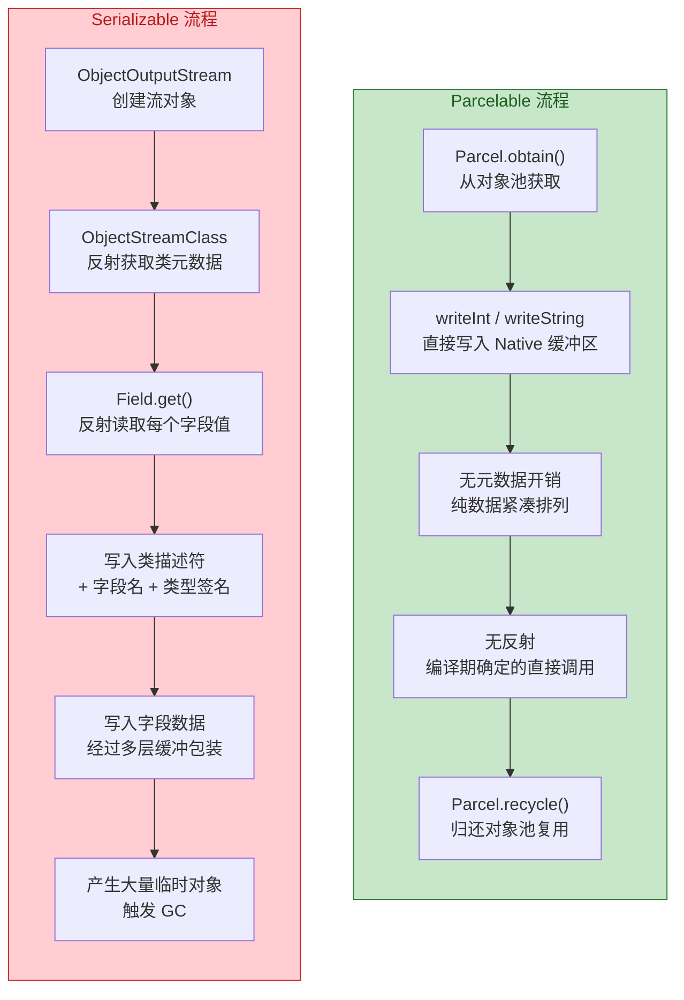
```mermaid
graph LR
    subgraph SER["Serializable 流程"]
        direction TB
        S1["ObjectOutputStream\n创建流对象"]
        S2["ObjectStreamClass\n反射获取类元数据"]
        S3["Field.get()\n反射读取每个字段值"]
        S4["写入类描述符\n+ 字段名 + 类型签名"]
        S5["写入字段数据\n经过多层缓冲包装"]
        S6["产生大量临时对象\n触发 GC"]
        S1 --> S2
        S2 --> S3
        S3 --> S4
        S4 --> S5
        S5 --> S6
    end

    subgraph PAR["Parcelable 流程"]
        direction TB
        P1["Parcel.obtain()\n从对象池获取"]
        P2["writeInt / writeString\n直接写入 Native 缓冲区"]
        P3["无元数据开销\n纯数据紧凑排列"]
        P4["无反射\n编译期确定的直接调用"]
        P5["Parcel.recycle()\n归还对象池复用"]
        P1 --> P2
        P2 --> P3
        P3 --> P4
        P4 --> P5
    end

    SER ~~~ PAR

    classDef serStyle fill:#FFCDD2,stroke:#C62828,color:#B71C1C
    classDef parStyle fill:#C8E6C9,stroke:#2E7D32,color:#1B5E20

    class SER serStyle
    class PAR parStyle
```

值得注意的是，`Parcel` 本身也采用了 **对象池（Object Pool）** 模式来减少内存分配。`Parcel.obtain()` 会优先从池中取出一个已有的 `Parcel` 实例并重置其状态，而不是每次都 `new` 一个新对象。使用完毕后调用 `Parcel.recycle()` 将其归还池中。这种池化策略进一步降低了 GC 压力。

**嵌套 Parcelable 对象的处理**

当一个 `Parcelable` 对象内部包含另一个 `Parcelable` 对象时，写入和读取需要特别注意：

```kotlin
// 假设 LocationInfo 已经实现了 Parcelable
class TravelRecord : Parcelable {

    // 旅行名称
    var tripName: String = ""

    // 出发地点：嵌套的 Parcelable 对象
    var departure: LocationInfo? = null

    // 目的地点：嵌套的 Parcelable 对象
    var destination: LocationInfo? = null

    constructor()

    constructor(parcel: Parcel) {
        // 读取旅行名称
        tripName = parcel.readString() ?: ""
        // 读取嵌套的 Parcelable 对象
        // 必须传入 ClassLoader，否则在某些情况下（如跨进程）会找不到类
        // LocationInfo::class.java.classLoader 获取加载 LocationInfo 的类加载器
        departure = parcel.readParcelable(LocationInfo::class.java.classLoader)
        // 同样方式读取第二个嵌套对象
        destination = parcel.readParcelable(LocationInfo::class.java.classLoader)
    }

    override fun writeToParcel(dest: Parcel, flags: Int) {
        // 写入旅行名称
        dest.writeString(tripName)
        // 写入嵌套的 Parcelable 对象
        // writeParcelable 内部会先写入类名（用于反序列化时定位 CREATOR），
        // 然后调用对象的 writeToParcel() 方法
        dest.writeParcelable(departure, flags)
        // 写入第二个嵌套对象
        dest.writeParcelable(destination, flags)
    }

    override fun describeContents(): Int = 0

    companion object CREATOR : Parcelable.Creator<TravelRecord> {
        override fun createFromParcel(parcel: Parcel): TravelRecord = TravelRecord(parcel)
        override fun newArray(size: Int): Array<TravelRecord?> = arrayOfNulls(size)
    }
}
```

这里有一个性能小贴士：`writeParcelable()` 和 `readParcelable()` 内部会写入/读取类名字符串，并通过反射查找 `CREATOR`。如果你明确知道嵌套对象的类型（大多数情况下都是如此），可以直接调用嵌套对象的 `writeToParcel()` 和 `CREATOR.createFromParcel()`，跳过类名的写入和反射查找，获得更好的性能：

```kotlin
// 优化写法：跳过类名写入，直接序列化
override fun writeToParcel(dest: Parcel, flags: Int) {
    dest.writeString(tripName)
    // 先写入一个标记位表示对象是否为 null（1=非null, 0=null）
    dest.writeInt(if (departure != null) 1 else 0)
    // 如果非 null，直接调用其 writeToParcel，不写入类名
    departure?.writeToParcel(dest, flags)
    // 同样处理 destination
    dest.writeInt(if (destination != null) 1 else 0)
    destination?.writeToParcel(dest, flags)
}

// 优化读法：直接通过 CREATOR 创建，不需要反射查找
constructor(parcel: Parcel) {
    tripName = parcel.readString() ?: ""
    // 读取标记位判断是否为 null
    departure = if (parcel.readInt() != 0) {
        // 直接调用 CREATOR，无反射开销
        LocationInfo.CREATOR.createFromParcel(parcel)
    } else null
    destination = if (parcel.readInt() != 0) {
        LocationInfo.CREATOR.createFromParcel(parcel)
    } else null
}
```

**Parcelable 的局限性**

`Parcelable` 并非万能。它的设计初衷是 **内存中的高速序列化**，专门服务于Binder IPC 和 `Bundle` 数据传递，而不是长期持久化。Google 官方文档明确指出：**"Parcel is not a general-purpose serialization mechanism. You should never persist Parcel data to disk or send it over the network."** 原因在于 `Parcel` 的二进制格式没有版本兼容性保证——Android 系统升级后，`Parcel` 的内部编码方式可能发生变化，导致旧版本写入的数据在新版本上无法正确读取。

此外，`Parcelable` 的读写顺序强耦合特性也是一个维护隐患。当类的字段发生增减时，`writeToParcel()` 和 Parcel 构造函数必须同步修改，否则就会出现数据错位。这种手动维护的负担在大型项目中尤为明显，也正是 Kotlin `@Parcelize` 诞生的直接动机。

### Kotlin @Parcelize 编译器魔法

手动实现 `Parcelable` 的痛点是显而易见的：大量的样板代码（boilerplate code）、容易出错的读写顺序维护、每次修改字段都要同步更新两处代码。Google 和 JetBrains 联合推出的 **`kotlin-parcelize`** 编译器插件，彻底解决了这个问题。它让开发者只需要一个注解 `@Parcelize`，编译器就会在编译期自动生成所有的 `Parcelable` 实现代码——既保留了 `Parcelable` 的极致性能，又获得了比 `Serializable` 更简洁的编码体验。

**插件配置与基本使用**

要使用 `@Parcelize`，首先需要在模块的 `build.gradle.kts` 中启用插件：

```kotlin
// build.gradle.kts (Module level)
plugins {
    // Android 应用插件
    id("com.android.application")
    // Kotlin Android 插件
    id("org.jetbrains.kotlin.android")
    // Parcelize 编译器插件：启用 @Parcelize 注解处理
    // 这个插件会在编译期扫描 @Parcelize 注解并生成 Parcelable 实现代码
    id("kotlin-parcelize")
}
```

启用插件后，实现 `Parcelable` 变得极其简洁：

```kotlin
import android.os.Parcelable
import kotlinx.parcelize.Parcelize

// @Parcelize 注解告诉编译器：为这个类自动生成 Parcelable 实现
// 要求：必须是 data class 或普通 class，且主构造函数的所有参数都必须是属性（val/var）
@Parcelize
data class LocationInfo(
    // 主构造函数中的每个属性都会被自动序列化
    val latitude: Double,       // 纬度
    val longitude: Double,      // 经度
    val placeName: String?,     // 位置名称，支持可空类型
    val timestamp: Long,        // 时间戳
    val isPrecise: Boolean,     // 是否精确定位
    val tags: List<String>      // 标签列表，支持常见集合类型
) : Parcelable
// 就这样！不需要手写 writeToParcel()、CREATOR、Parcel 构造函数
```

对比前面手动实现的 50+ 行代码，`@Parcelize` 版本只需要不到 10 行，而且生成的字节码与手写版本在性能上完全等价。

**编译器生成了什么**

`@Parcelize` 的魔法发生在 Kotlin 编译器的 **IR（Intermediate Representation）后端** 阶段。当编译器遇到 `@Parcelize` 注解时，`kotlin-parcelize` 插件会介入编译流程，为目标类生成以下内容：

第一，**`writeToParcel(Parcel, Int)` 方法**。编译器会按照主构造函数中属性的声明顺序，为每个属性生成对应的 `Parcel.writeXxx()` 调用。属性类型到 Parcel 写入方法的映射是编译期确定的：`Int` 对应 `writeInt()`，`String?` 对应 `writeString()`，`List<String>` 对应 `writeStringList()`，嵌套的 `Parcelable` 对象对应 `writeParcelable()`，以此类推。

第二，**`describeContents()` 方法**。通常返回 0，除非类中包含 `FileDescriptor` 类型的字段。

第三，**`CREATOR` 静态伴生对象**。生成一个实现了 `Parcelable.Creator<T>` 的匿名对象，其 `createFromParcel()` 方法会按照与 `writeToParcel()` 完全相同的顺序，调用对应的 `Parcel.readXxx()` 方法读取数据，然后通过主构造函数创建对象实例。

我们可以通过反编译来验证生成的代码。使用 Android Studio 的 **"Tools → Kotlin → Show Kotlin Bytecode → Decompile"** 功能，可以看到编译器为上面的 `LocationInfo` 生成的 Java 代码大致如下（简化版）：

```java
// 编译器自动生成的 writeToParcel 方法（反编译后的 Java 代码）
@Override
public void writeToParcel(Parcel dest, int flags) {
    // 按主构造函数属性声明顺序逐个写入
    dest.writeDouble(this.latitude);    // 第 1 个属性
    dest.writeDouble(this.longitude);   // 第 2 个属性
    dest.writeString(this.placeName);   // 第 3 个属性（自动处理 null）
    dest.writeLong(this.timestamp);     // 第 4 个属性
    dest.writeInt(this.isPrecise ? 1 : 0); // 第 5 个属性（Boolean 转 Int）
    dest.writeStringList(this.tags);    // 第 6 个属性（String 列表）
}

// 编译器自动生成的 CREATOR 对象
public static final Parcelable.Creator<LocationInfo> CREATOR =
    new Parcelable.Creator<LocationInfo>() {

        @Override
        public LocationInfo createFromParcel(Parcel in) {
            // 按完全相同的顺序读取，然后调用主构造函数
            return new LocationInfo(
                in.readDouble(),                    // latitude
                in.readDouble(),                    // longitude
                in.readString(),                    // placeName
                in.readLong(),                      // timestamp
                in.readInt() != 0,                  // isPrecise
                in.createStringArrayList()          // tags
            );
        }

        @Override
        public LocationInfo[] newArray(int size) {
            return new LocationInfo[size];
        }
    };
```

可以看到，生成的代码与我们手写的版本几乎一模一样，但完全由编译器自动维护。当你添加、删除或重排主构造函数的属性时，编译器会自动重新生成匹配的序列化代码，彻底消除了手动维护读写顺序的负担。

**支持的类型体系**

`@Parcelize` 编译器插件内置了一套丰富的类型映射规则，能够自动处理以下类型：

**基本类型与包装类型**：`Int`、`Long`、`Float`、`Double`、`Boolean`、`Byte`、`Char`、`Short` 及其可空版本。对于可空的基本类型（如 `Int?`），编译器会先写入一个标记位（0 或 1）表示是否为 null，然后再写入实际值。

**字符串与字符序列**：`String`、`String?`、`CharSequence`。

**常见集合类型**：`List<T>`、`ArrayList<T>`、`Set<T>`、`Map<K, V>`，其中 `T`、`K`、`V` 本身也必须是可序列化的类型。编译器会根据元素类型选择最优的写入方式——例如 `List<String>` 使用 `writeStringList()`，`List<Parcelable>` 使用 `writeTypedList()`。

**数组类型**：`IntArray`、`LongArray`、`BooleanArray`、`Array<String>`、`Array<Parcelable>` 等。

**Android 框架类型**：`Bundle`、`IBinder`、`Size`、`SizeF`、`SparseBooleanArray`、`SparseIntArray` 等本身就支持 Parcel 读写的系统类型。

**嵌套 Parcelable**：任何实现了 `Parcelable` 的类型（包括其他 `@Parcelize` 类）都可以直接作为属性。

**枚举类型**：`enum class` 会通过 `writeString(name)` / `valueOf(readString())` 进行序列化。

**@Parcelize 的高级用法**

在实际项目中，我们经常会遇到一些特殊需求，`@Parcelize` 提供了相应的扩展机制来应对：

**排除特定属性**：如果类中有些属性不需要序列化（比如缓存、计算属性），可以将它们放在类体中而非主构造函数中，并使用 `@IgnoredOnParcel` 注解：

```kotlin
@Parcelize
data class UserProfile(
    // 主构造函数中的属性：参与序列化
    val userId: String,
    val displayName: String,
    val email: String
) : Parcelable {

    // @IgnoredOnParcel 标记的属性不参与序列化
    // 反序列化后该属性会使用这里的默认值（null）
    @IgnoredOnParcel
    var cachedAvatarBitmap: android.graphics.Bitmap? = null

    // 计算属性天然不参与序列化（没有 backing field）
    val initials: String
        get() = displayName.take(2).uppercase()
}
```

**自定义类型的序列化——@TypeParceler 与 Parceler 接口**：当属性类型不在内置支持列表中时（比如第三方库的类、`java.util.Date`、`java.time.LocalDateTime` 等），可以通过实现 `Parceler<T>` 接口来告诉编译器如何序列化该类型：

```kotlin
import kotlinx.parcelize.Parceler
import kotlinx.parcelize.Parcelize
import kotlinx.parcelize.TypeParceler
import java.time.Instant

// 为 Instant 类型定义自定义序列化器
// Parceler<T> 接口要求实现 create() 和 T.write() 两个方法
object InstantParceler : Parceler<Instant> {

    // 从 Parcel 中读取数据并创建 Instant 对象
    override fun create(parcel: Parcel): Instant {
        // Instant 可以用 epochSecond + nano 两个 Long 值精确表示
        val epochSecond = parcel.readLong()
        val nano = parcel.readLong()
        return Instant.ofEpochSecond(epochSecond, nano)
    }

    // 将 Instant 对象写入 Parcel
    override fun Instant.write(parcel: Parcel, flags: Int) {
        // 将 Instant 拆解为两个 Long 值写入
        parcel.writeLong(epochSecond)
        parcel.writeLong(nano.toLong())
    }
}

// 使用 @TypeParceler 注解将自定义序列化器绑定到特定属性
@Parcelize
// 类级别的 @TypeParceler：该类中所有 Instant 类型的属性都使用 InstantParceler
@TypeParceler<Instant, InstantParceler>
data class EventRecord(
    val eventName: String,
    // 这个 Instant 属性会自动使用 InstantParceler 进行序列化
    val createdAt: Instant,
    // 这个也是
    val updatedAt: Instant
) : Parcelable
```

也可以在属性级别使用 `@TypeParceler`，实现更细粒度的控制：

```kotlin
@Parcelize
data class MixedRecord(
    val name: String,
    // 仅对这个属性使用自定义序列化器
    @TypeParceler<Instant, InstantParceler>
    val timestamp: Instant
) : Parcelable
```

**密封类与继承体系的支持**：`@Parcelize` 对 Kotlin 的密封类（sealed class）有良好的支持，这在定义多态数据模型时非常有用：

```kotlin
// 密封类作为基类，标记 @Parcelize
@Parcelize
sealed class PaymentMethod : Parcelable {

    // 子类也需要标记 @Parcelize
    @Parcelize
    data class CreditCard(
        val cardNumber: String,    // 卡号
        val expiryDate: String,    // 有效期
        val holderName: String     // 持卡人姓名
    ) : PaymentMethod()

    @Parcelize
    data class BankTransfer(
        val bankName: String,      // 银行名称
        val accountNumber: String  // 账号
    ) : PaymentMethod()

    @Parcelize
    data object Cash : PaymentMethod()  // 现金支付，无额外属性
}

// 使用时可以直接通过 Intent 传递多态对象
// intent.putExtra("payment", PaymentMethod.CreditCard("1234...", "12/25", "Zhang San"))
// val method = intent.getParcelableExtra<PaymentMethod>("payment")
// when (method) {
//     is PaymentMethod.CreditCard -> { /* 处理信用卡 */ }
//     is PaymentMethod.BankTransfer -> { /* 处理银行转账 */ }
//     is PaymentMethod.Cash -> { /* 处理现金 */ }
// }
```

**@Parcelize 的编译期校验**

`kotlin-parcelize` 插件不仅生成代码，还会在编译期进行严格的校验，帮助开发者在编码阶段就发现问题：

- 如果主构造函数中的某个属性类型不支持 Parcel 序列化（既不是内置支持类型，也没有提供 `@TypeParceler`），编译器会报错。
- 如果类没有实现 `Parcelable` 接口但标记了 `@Parcelize`，编译器会报错。
- 如果主构造函数的参数不是属性（没有 `val`/`var` 修饰），编译器会报错，因为它无法确定需要序列化哪些数据。

这种编译期校验机制比 `Serializable` 的运行时错误（`NotSerializableException`）要安全得多，符合 **"Fail Fast"** 的工程原则。

**三种序列化方案的综合对比**

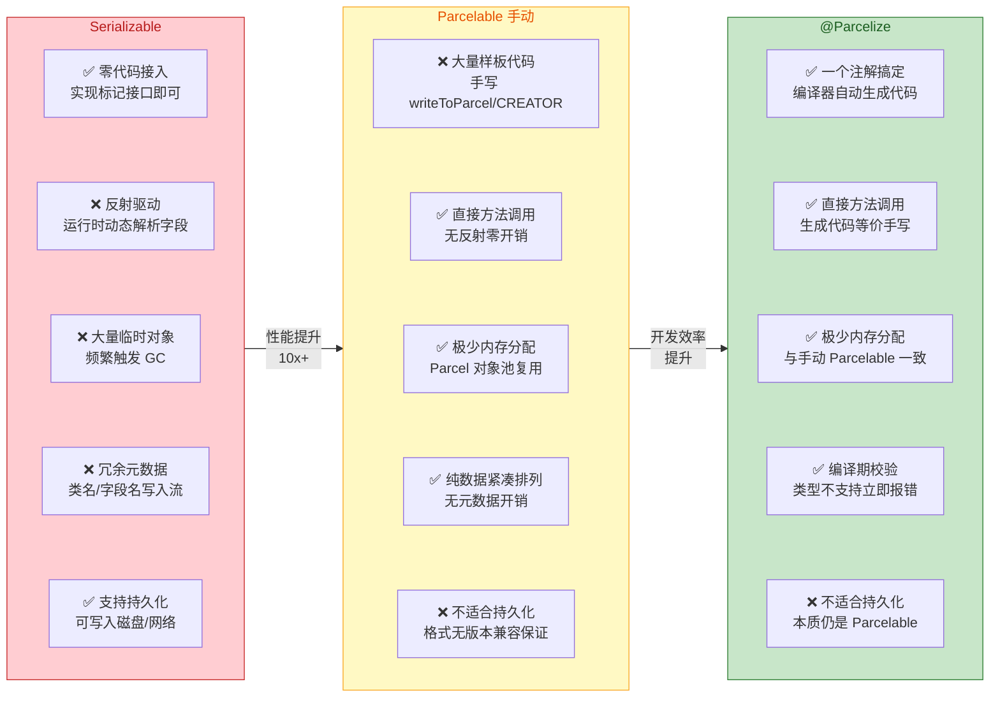
```mermaid
graph LR
    subgraph SERI["Serializable"]
        direction TB
        S1["✅ 零代码接入\n实现标记接口即可"]
        S2["❌ 反射驱动\n运行时动态解析字段"]
        S3["❌ 大量临时对象\n频繁触发 GC"]
        S4["❌ 冗余元数据\n类名/字段名写入流"]
        S5["✅ 支持持久化\n可写入磁盘/网络"]
        S1 ~~~ S2
        S2 ~~~ S3
        S3 ~~~ S4
        S4 ~~~ S5
    end

    subgraph PARC["Parcelable 手动"]
        direction TB
        P1["❌ 大量样板代码\n手写 writeToParcel/CREATOR"]
        P2["✅ 直接方法调用\n无反射零开销"]
        P3["✅ 极少内存分配\nParcel 对象池复用"]
        P4["✅ 纯数据紧凑排列\n无元数据开销"]
        P5["❌ 不适合持久化\n格式无版本兼容保证"]
        P1 ~~~ P2
        P2 ~~~ P3
        P3 ~~~ P4
        P4 ~~~ P5
    end

    subgraph KPAR["@Parcelize"]
        direction TB
        K1["✅ 一个注解搞定\n编译器自动生成代码"]
        K2["✅ 直接方法调用\n生成代码等价手写"]
        K3["✅ 极少内存分配\n与手动 Parcelable 一致"]
        K4["✅ 编译期校验\n类型不支持立即报错"]
        K5["❌ 不适合持久化\n本质仍是 Parcelable"]
        K1 ~~~ K2
        K2 ~~~ K3
        K3 ~~~ K4
        K4 ~~~ K5
    end

    SERI -->|"性能提升\n10x+"| PARC -->|"开发效率\n提升"| KPAR

    classDef seriStyle fill:#FFCDD2,stroke:#C62828,color:#B71C1C
    classDef parcStyle fill:#FFF9C4,stroke:#F9A825,color:#E65100
    classDef kparStyle fill:#C8E6C9,stroke:#2E7D32,color:#1B5E20

    class SERI seriStyle
    class PARC parcStyle
    class KPAR kparStyle
```

**最佳实践总结**

在现代 Android 开发中，序列化方案的选择可以遵循以下决策路径：

**首选 `@Parcelize`**：这是绝大多数场景的最优解。它兼具 `Parcelable` 的极致性能和 `Serializable` 的编码简洁性，同时还有编译期类型安全校验。只要你的项目使用 Kotlin（2024 年的 Android 项目几乎都是），就应该默认使用 `@Parcelize`。

**特殊场景使用 `Serializable`**：当需要将对象持久化到磁盘、通过网络传输、或者与纯 Java 库共享数据模型时，`Serializable` 仍然有其用武之地。但即便如此，现代项目更推荐使用 JSON 序列化库（如 Kotlin Serialization、Moshi、Gson）来替代 `Serializable` 进行持久化，因为 JSON 格式具有更好的可读性、跨平台兼容性和版本演进能力。

**避免手动实现 `Parcelable`**：除非你在维护一个纯 Java 的 Android 项目，或者有非常特殊的序列化需求（比如需要对序列化过程进行加密、压缩），否则没有理由手动实现 `Parcelable`。`@Parcelize` 生成的代码在性能上与手写版本完全等价，但维护成本为零。

最后需要特别强调的是，无论使用哪种序列化方案，都要时刻牢记 **Binder 事务的 1MB 大小限制**（实际可用约 500KB，因为该缓冲区被进程内所有并发事务共享）。序列化后的数据如果超过这个限制，就会触发 `TransactionTooLargeException`。对于大数据量的传递，应该使用 `ViewModel` 共享、数据库/文件中转、`ContentProvider` 等替代方案，而不是试图将所有数据塞进 `Intent` 的 `Bundle` 中。

---

**📝 练习题**

在 Android 中，以下关于 `Parcelable` 和 `Serializable` 的描述，哪一项是 **错误的**？

A. `Serializable` 在反序列化时不会调用目标类的构造函数，而是通过反射机制创建对象实例并逐个设置字段值

B. `Parcelable` 的 `writeToParcel()` 和 `createFromParcel()` 中字段的读写顺序必须严格一致，否则会导致数据错位

C. `@Parcelize` 注解会在运行时通过注解处理器（Annotation Processor）动态生成 `Parcelable` 的实现代码

D. `Parcel` 的二进制格式没有跨版本兼容性保证，因此不适合用于数据的长期持久化存储

**【答案】** C

**【解析】** 选项 C 的错误在于对 `@Parcelize` 代码生成时机的描述。`@Parcelize` 是 Kotlin 编译器插件（Compiler Plugin），它在 **编译期（Compile Time）** 的 IR 后端阶段生成 `Parcelable` 实现代码，而不是在运行时。它也不是传统的注解处理器（如 kapt/ksp 那样的 Annotation Processor），而是直接嵌入 Kotlin 编译器流水线的插件。这意味着生成的代码在编译完成后就已经固化在字节码中，运行时没有任何额外的代码生成或反射开销。选项 A 正确描述了 `Serializable` 的反序列化机制——它通过 `Unsafe.allocateInstance()` 或类似机制绕过构造函数创建实例。选项 B 正确描述了 `Parcelable` 的核心约束。选项 D 正确描述了 `Parcel` 不适合持久化的原因。

---

**📝 练习题**

开发者定义了如下 `@Parcelize` 数据类，编译时会发生什么？

```kotlin
@Parcelize
data class EventInfo(
    val title: String,
    val date: java.time.LocalDate,  // 注意：未提供 TypeParceler
    val priority: Int
) : Parcelable
```

A. 编译成功，`LocalDate` 会自动通过 `Serializable` 回退机制进行序列化

B. 编译失败，因为 `java.time.LocalDate` 不在 `@Parcelize` 内置支持的类型列表中，且未提供 `@TypeParceler`

C. 编译成功，但运行时传递该对象会抛出 `BadParcelableException`

D. 编译成功，`LocalDate` 会被自动忽略，反序列化后该字段为 `null`

**【答案】** B

**【解析】** `kotlin-parcelize` 编译器插件会在编译期对 `@Parcelize` 标注类的主构造函数中每个属性的类型进行严格校验。`java.time.LocalDate` 既不是基本类型、`String`、`Parcelable`，也不是内置支持的集合类型或 Android 框架类型，因此编译器无法为它生成对应的 `Parcel.writeXxx()` / `readXxx()` 调用。在没有通过 `@TypeParceler<LocalDate, XxxParceler>` 提供自定义序列化器的情况下，编译器会直接报错，提示该类型不支持 Parcelize。这正是 `@Parcelize` 相比 `Serializable` 的优势之一——**编译期 Fail Fast**，而不是等到运行时才发现问题。正确的做法是实现一个 `Parceler<LocalDate>`（例如将 `LocalDate` 转换为 `epochDay: Long` 进行序列化），然后通过 `@TypeParceler` 注解绑定到类或属性上。

---

## PendingIntent 令牌

### 什么是 PendingIntent —— 从"委托执行"说起

在 Android 的组件通信体系中，普通的 Intent 是一个"即时指令"——你创建它、发送它、系统立刻执行它。但有一类场景非常特殊：**你希望把一个操作的执行权交给别人，让别人在未来某个时刻代替你去执行**。这就是 PendingIntent 诞生的根本原因。

最典型的场景包括：通知栏点击（NotificationManager 是系统进程，它需要在用户点击时代替你的 App 启动 Activity）、闹钟触发（AlarmManager 在未来某个时间点代替你发送广播）、桌面小组件点击（Launcher 进程代替你的 App 执行操作）。在这些场景中，**真正执行操作的进程并不是你的 App 进程**，而是系统进程或其他第三方进程。如果直接把一个普通 Intent 交给它们，会面临两个根本性问题：

第一，**权限问题**。系统进程拿到一个普通 Intent 后，如果以自己的身份去执行，那它拥有的是系统级权限，这会造成权限越界；如果以你的 App 身份去执行，它又没有你的 App 的身份凭证。第二，**生命周期问题**。你的 App 进程可能在操作真正执行之前就已经被系统回收了，普通 Intent 作为一个内存中的 Java 对象，会随着进程一起消亡。

PendingIntent 的设计精妙地解决了这两个问题。它的本质是一个由系统（ActivityManagerService）托管的 **Token（令牌）**。当你创建一个 PendingIntent 时，系统会把你的 Intent 信息、你的 App 身份（uid/pid）、你请求的操作类型全部记录在 AMS 内部的一张表中，然后返回给你一个轻量级的引用（Binder Token）。这个 Token 可以安全地传递给任何其他进程。当其他进程拿着这个 Token 调用 `send()` 时，系统会查表找到原始信息，**以你的 App 的身份和权限** 去执行那个 Intent。

用一句话概括 PendingIntent 的设计哲学：**它是一张"预签名的支票"——你签好名、填好金额，交给别人，别人在需要时拿去银行兑现，银行认的是你的签名而不是持票人的身份。**

### Token 机制的内部运作

要真正理解 PendingIntent，必须深入它在 Framework 层的实现机制。这不是为了让你去改 Framework 代码，而是因为只有理解了 Token 的本质，你才能正确处理 PendingIntent 的相等性判断、Flag 策略和安全问题。

当你调用 `PendingIntent.getActivity()`、`PendingIntent.getBroadcast()` 或 `PendingIntent.getService()` 时，调用链大致如下：

```
App 进程                          system_server 进程 (AMS)
─────────                         ──────────────────────────
PendingIntent.getActivity()
  → ActivityManager.getService()
    .getIntentSender()  ──IPC──→  ActivityManagerService
                                    .getIntentSenderLocked()
                                      → 创建 PendingIntentRecord
                                      → 存入 mIntentSenderRecords HashMap
                                      → 返回 IIntentSender (Binder)
  ← 包装为 PendingIntent 返回
```

这里的核心数据结构是 `PendingIntentRecord`，它是 AMS 内部的一个对象，存储了以下关键信息：

```kotlin
// PendingIntentRecord 内部关键字段（简化表示）
// 这不是你能直接访问的 API，而是 Framework 内部结构
class PendingIntentRecord {
    // 创建者的 uid（用于权限校验，执行时以此身份执行）
    val callingUid: Int
    // 创建者的包名
    val callingPackage: String
    // 操作类型：INTENT_SENDER_ACTIVITY / BROADCAST / SERVICE
    val type: Int
    // 原始 Intent 数组（可以包含多个 Intent）
    val requestIntents: Array<Intent>
    // 请求码（requestCode）
    val requestCode: Int
    // Flag 标志位
    val flags: Int
    // Key 对象——用于判断两个 PendingIntent 是否"相同"
    val key: Key
}
```

其中最关键的是 `Key` 对象。AMS 使用这个 Key 来判断两个 PendingIntent 请求是否指向"同一个" PendingIntent。Key 的相等性判断规则是：

1. **type 相同**（都是 Activity、都是 Broadcast、或都是 Service）
2. **requestCode 相同**
3. **Intent 的 filterEquals() 返回 true**（即 Action、Data、Type、Component、Categories 全部相同）
4. **创建者包名相同**

特别注意：**Intent 的 Extras（附加数据）不参与相等性判断**。这是一个极其常见的陷阱。两个 Intent 即使携带了完全不同的 Extras，只要 Action、Data 等核心字段相同，系统就认为它们对应同一个 PendingIntent。这个设计直接影响了 Flag 策略的选择，我们稍后详细讨论。

返回给 App 的 `PendingIntent` 对象本身非常轻量，它内部只持有一个 `IIntentSender` 的 Binder 引用（即指向 AMS 中 `PendingIntentRecord` 的远程代理）。这意味着 PendingIntent 可以安全地跨进程传递——它实现了 `Parcelable` 接口，序列化时传递的就是这个 Binder Token。

当外部进程（比如 NotificationManager 所在的 system_server）调用 `pendingIntent.send()` 时：

```
外部进程                           system_server 进程 (AMS)
─────────                         ──────────────────────────
pendingIntent.send()
  → IIntentSender.send()  ──IPC──→  PendingIntentRecord.sendInner()
                                      → 校验 Token 有效性
                                      → 以原始创建者的身份执行：
                                        - startActivity() 或
                                        - sendBroadcast() 或
                                        - startService()
```

整个过程中，**外部进程从未直接接触到原始 Intent 的内容**（除非创建者显式允许修改），它只是把 Token 交还给系统，系统自己去执行。这就是 PendingIntent 安全模型的核心。

下面用一张时序图来完整展示这个流程：

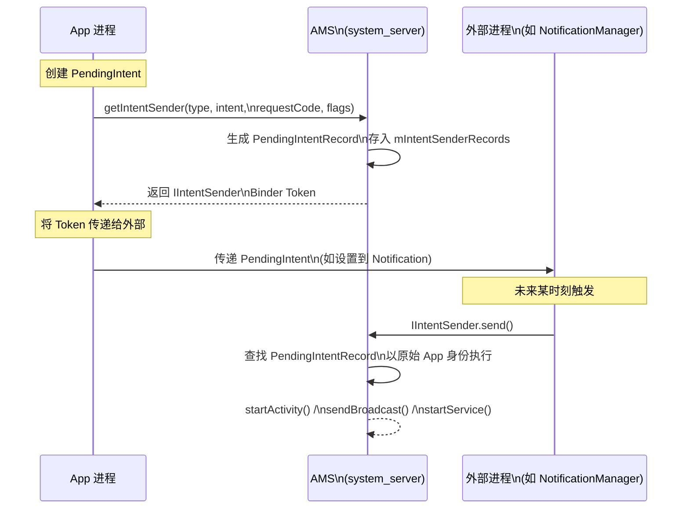
```mermaid
sequenceDiagram
    participant App as App 进程
    participant AMS as AMS\n(system_server)
    participant Ext as 外部进程\n(如 NotificationManager)

    Note over App: 创建 PendingIntent
    App->>AMS: getIntentSender(type, intent,\nrequestCode, flags)
    AMS->>AMS: 生成 PendingIntentRecord\n存入 mIntentSenderRecords
    AMS-->>App: 返回 IIntentSender\nBinder Token

    Note over App: 将 Token 传递给外部
    App->>Ext: 传递 PendingIntent\n(如设置到 Notification)

    Note over Ext: 未来某时刻触发
    Ext->>AMS: IIntentSender.send()
    AMS->>AMS: 查找 PendingIntentRecord\n以原始 App 身份执行
    AMS-->>AMS: startActivity() /\nsendBroadcast() /\nstartService()
```

### 延迟执行与权限委托

PendingIntent 的"延迟执行"并不是简单的"定时器"概念，而是一种 **权限委托（Identity Delegation）** 机制。理解这一点对于安全开发至关重要。

当你创建一个 PendingIntent 时，你实际上是在告诉系统："我授权持有这个 Token 的任何人，可以在未来以我的名义执行这个操作。" 这里有几个关键的安全含义：

**第一，身份继承**。PendingIntent 执行时使用的是创建者的 uid 和 pid，而不是调用 `send()` 的进程的身份。这意味着如果你的 App 拥有某个权限（比如 `CAMERA`），而你创建了一个启动相机 Activity 的 PendingIntent 交给了一个没有 `CAMERA` 权限的 App，那个 App 通过 `send()` 触发时，系统会以你的身份去检查权限——结果是通过的。这就是为什么 PendingIntent 被称为"权限令牌"。

**第二，可变性风险**。在 Android 12（API 31）之前，PendingIntent 默认是可变的（mutable），这意味着调用 `send()` 的外部进程可以通过 `fillIn()` 方法修改原始 Intent 的某些字段。这带来了严重的安全隐患——恶意应用可能篡改 Intent 的目标组件，利用你的权限去做你没有授权的事情。因此，**Android 12 开始强制要求显式指定 `FLAG_IMMUTABLE` 或 `FLAG_MUTABLE`**，不指定会直接抛出异常。

```kotlin
// Android 12+ 必须显式指定可变性

// 推荐：不可变 PendingIntent（绝大多数场景应使用这个）
// 外部进程无法修改 Intent 的任何字段
val immutablePending = PendingIntent.getActivity(
    context,                          // 上下文，用于确定创建者身份
    requestCode,                      // 请求码，参与 PendingIntent 相等性判断
    intent,                           // 要执行的原始 Intent
    PendingIntent.FLAG_IMMUTABLE      // 标记为不可变，外部无法篡改
)

// 特殊场景：可变 PendingIntent（如内联回复通知需要填充用户输入）
// 仅在确实需要外部进程填充数据时使用
val mutablePending = PendingIntent.getBroadcast(
    context,                          // 上下文
    requestCode,                      // 请求码
    intent,                           // 原始 Intent
    PendingIntent.FLAG_MUTABLE        // 标记为可变，允许外部通过 fillIn() 修改
)
```

**第三，进程无关性**。由于 PendingIntent 的真实数据存储在 AMS 中，即使你的 App 进程被杀死，PendingIntent 依然有效（除非你显式调用 `cancel()` 或系统重启）。这就是为什么闹钟、通知等场景可以在 App 不运行时依然正常触发。但要注意，**设备重启会清除所有 PendingIntent**，因为 AMS 的内存数据不会持久化到磁盘。如果你需要重启后依然有效的闹钟，必须监听 `BOOT_COMPLETED` 广播并重新注册。

### Flag 更新策略详解

PendingIntent 的 Flag 是开发中最容易出错的部分，尤其是在通知场景中。理解每个 Flag 的行为需要结合前面讲的 Key 相等性判断机制。

先明确一个前提：当你调用 `PendingIntent.getActivity()` 等方法时，系统会先用 Key 去查找是否已经存在一个"相同"的 PendingIntent。**Flag 决定的是"找到已有记录时怎么处理"**。

**`FLAG_UPDATE_CURRENT`（最常用）**

当系统发现已存在一个 Key 相同的 PendingIntentRecord 时，**保留这个已有的 Token 不变，但用新 Intent 的 Extras 替换旧的 Extras**。这是最常用的 Flag，因为它既不会创建多余的 PendingIntent，又能确保数据是最新的。

典型场景：聊天应用的通知。每次收到新消息时，你用相同的 Action 和 requestCode 创建 PendingIntent，但 Extras 中携带了最新的消息 ID。使用 `FLAG_UPDATE_CURRENT` 可以确保用户点击通知时打开的是最新的消息。

```kotlin
// 场景：聊天通知，每次更新携带最新消息 ID
fun buildChatNotificationPendingIntent(
    context: Context,
    chatId: String,       // 聊天会话 ID
    latestMessageId: String // 最新消息 ID
): PendingIntent {
    // 构建目标 Intent
    val intent = Intent(context, ChatActivity::class.java).apply {
        // Action 和 Data 参与 Key 相等性判断
        action = "com.example.OPEN_CHAT"          // 固定 Action
        putExtra("chat_id", chatId)               // Extra 不参与相等性判断
        putExtra("message_id", latestMessageId)   // 但会被 FLAG_UPDATE_CURRENT 更新
    }

    return PendingIntent.getActivity(
        context,
        chatId.hashCode(),    // 用 chatId 的 hashCode 作为 requestCode
                              // 不同会话产生不同的 PendingIntent
        intent,
        // FLAG_UPDATE_CURRENT：复用已有 Token，更新 Extras
        // FLAG_IMMUTABLE：禁止外部修改（Android 12+ 必须指定）
        PendingIntent.FLAG_UPDATE_CURRENT or PendingIntent.FLAG_IMMUTABLE
    )
}
```

**`FLAG_CANCEL_CURRENT`**

当系统发现已存在一个 Key 相同的 PendingIntentRecord 时，**先取消（cancel）旧的，再创建一个全新的**。旧的 Token 会立即失效——任何持有旧 Token 的进程调用 `send()` 都会失败。

这个 Flag 的使用场景比较少，主要用于安全敏感的场合：你怀疑旧的 PendingIntent Token 可能已经泄露给了不可信的第三方，需要彻底作废它。

```kotlin
// 场景：安全敏感操作，确保旧 Token 彻底失效
val securePending = PendingIntent.getActivity(
    context,
    SECURE_REQUEST_CODE,              // 固定请求码
    secureIntent,                     // 目标 Intent
    // FLAG_CANCEL_CURRENT：作废所有旧 Token，创建全新 Token
    // 旧 Token 持有者再调用 send() 会收到 CanceledException
    PendingIntent.FLAG_CANCEL_CURRENT or PendingIntent.FLAG_IMMUTABLE
)
```

**`FLAG_NO_CREATE`**

这个 Flag 不会创建新的 PendingIntent。如果系统中已存在一个 Key 相同的 PendingIntentRecord，就返回它的引用；如果不存在，返回 `null`。这是一个纯粹的"查询"操作。

典型用途：检查某个 PendingIntent 是否已经注册（比如检查闹钟是否已经设置）。

```kotlin
// 场景：检查某个闹钟是否已经注册
fun isAlarmSet(context: Context, alarmIntent: Intent): Boolean {
    // FLAG_NO_CREATE：仅查询，不创建
    // 如果返回 null，说明该 PendingIntent 不存在（闹钟未设置）
    val existing = PendingIntent.getBroadcast(
        context,
        ALARM_REQUEST_CODE,           // 与注册时相同的请求码
        alarmIntent,                  // 与注册时 filterEquals 相同的 Intent
        PendingIntent.FLAG_NO_CREATE or PendingIntent.FLAG_IMMUTABLE
    )
    return existing != null           // 非 null 表示已存在
}
```

**`FLAG_ONE_SHOT`**

创建的 PendingIntent 只能被 `send()` 一次，之后自动失效。这是一个安全特性，防止 Token 被重复利用。

```kotlin
// 场景：一次性验证操作，防止重放攻击
val oneTimePending = PendingIntent.getBroadcast(
    context,
    ONE_TIME_REQUEST_CODE,            // 请求码
    verificationIntent,               // 验证 Intent
    // FLAG_ONE_SHOT：只能触发一次，之后自动作废
    PendingIntent.FLAG_ONE_SHOT or PendingIntent.FLAG_IMMUTABLE
)
```

下面用一张流程图来总结 Flag 的决策逻辑：

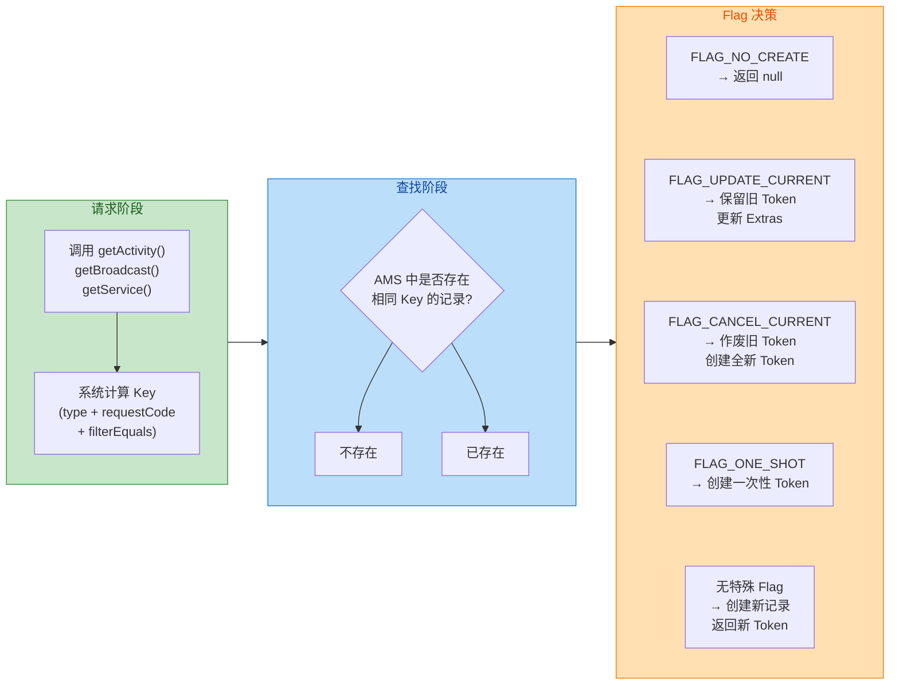
```mermaid
graph LR
    subgraph Input["请求阶段"]
        direction TB
        A["调用 getActivity()\ngetBroadcast()\ngetService()"]
        B["系统计算 Key\n(type + requestCode\n+ filterEquals)"]
        A --> B
    end

    subgraph Check["查找阶段"]
        direction TB
        C{"AMS 中是否存在\n相同 Key 的记录?"}
        D["不存在"]
        E["已存在"]
        C --> D
        C --> E
    end

    subgraph Result["Flag 决策"]
        direction TB
        F["FLAG_NO_CREATE\n→ 返回 null"]
        G["FLAG_UPDATE_CURRENT\n→ 保留旧 Token\n更新 Extras"]
        H["FLAG_CANCEL_CURRENT\n→ 作废旧 Token\n创建全新 Token"]
        I["FLAG_ONE_SHOT\n→ 创建一次性 Token"]
        J["无特殊 Flag\n→ 创建新记录\n返回新 Token"]
        F ~~~ G
        G ~~~ H
        H ~~~ I
        I ~~~ J
    end

    Input --> Check
    Check --> Result

    classDef inputStyle fill:#C8E6C9,stroke:#388E3C,color:#1B5E20
    classDef checkStyle fill:#BBDEFB,stroke:#1976D2,color:#0D47A1
    classDef resultStyle fill:#FFE0B2,stroke:#F57C00,color:#E65100

    class Input inputStyle
    class Check checkStyle
    class Result resultStyle
```

### 通知场景中的经典陷阱

PendingIntent 在通知中的使用是面试和实际开发中最高频的问题。让我们通过一个完整的案例来揭示最常见的陷阱。

**陷阱：多条通知共享同一个 PendingIntent**

假设你的 App 是一个新闻客户端，需要为不同的新闻推送不同的通知，点击后打开对应的新闻详情页。一个看似合理但实际有 Bug 的写法：

```kotlin
// ❌ 错误写法：所有通知共享同一个 PendingIntent
fun showNewsNotification(context: Context, newsId: String, title: String) {
    val intent = Intent(context, NewsDetailActivity::class.java).apply {
        action = "com.example.VIEW_NEWS"  // 所有通知的 Action 相同
        putExtra("news_id", newsId)       // 只有 Extra 不同
    }

    // 问题：requestCode 固定为 0
    // 所有通知的 Key 都相同（type + requestCode + filterEquals 全部一致）
    val pendingIntent = PendingIntent.getActivity(
        context,
        0,                                // ← 固定 requestCode = 0
        intent,
        PendingIntent.FLAG_UPDATE_CURRENT or PendingIntent.FLAG_IMMUTABLE
    )

    // 发送通知（使用不同的 notificationId 确保多条通知共存）
    val notification = NotificationCompat.Builder(context, CHANNEL_ID)
        .setContentTitle(title)           // 标题不同
        .setContentIntent(pendingIntent)  // 但 PendingIntent 相同！
        .setSmallIcon(R.drawable.ic_news)
        .build()

    // notificationId 不同，所以通知栏会显示多条通知
    NotificationManagerCompat.from(context)
        .notify(newsId.hashCode(), notification)
}
```

这段代码的问题在于：由于所有通知的 PendingIntent Key 相同（Action 相同、requestCode 都是 0），`FLAG_UPDATE_CURRENT` 会不断用最新的 Extras 覆盖旧的。结果是 **无论用户点击哪条通知，打开的都是最后一条新闻**。

正确的做法是让每条通知的 PendingIntent Key 不同。最简单的方式是使用不同的 `requestCode`：

```kotlin
// ✅ 正确写法：每条通知使用不同的 requestCode
fun showNewsNotification(context: Context, newsId: String, title: String) {
    val intent = Intent(context, NewsDetailActivity::class.java).apply {
        action = "com.example.VIEW_NEWS"  // Action 可以相同
        putExtra("news_id", newsId)       // Extra 携带具体数据
    }

    // 关键：使用 newsId 的 hashCode 作为 requestCode
    // 不同新闻 → 不同 requestCode → 不同 Key → 独立的 PendingIntent
    val pendingIntent = PendingIntent.getActivity(
        context,
        newsId.hashCode(),                // ← 每条新闻不同的 requestCode
        intent,
        PendingIntent.FLAG_UPDATE_CURRENT or PendingIntent.FLAG_IMMUTABLE
    )

    val notification = NotificationCompat.Builder(context, CHANNEL_ID)
        .setContentTitle(title)
        .setContentIntent(pendingIntent)  // 每条通知有独立的 PendingIntent
        .setSmallIcon(R.drawable.ic_news)
        .setAutoCancel(true)              // 点击后自动取消通知
        .build()

    NotificationManagerCompat.from(context)
        .notify(newsId.hashCode(), notification)
}
```

另一种方式是让 Intent 的 `filterEquals()` 结果不同，比如设置不同的 Data URI：

```kotlin
// ✅ 另一种正确写法：通过 Data URI 区分
val intent = Intent(context, NewsDetailActivity::class.java).apply {
    // 不同的 Data URI → filterEquals() 返回 false → 不同的 Key
    data = Uri.parse("myapp://news/$newsId")  // 每条新闻有唯一 URI
    putExtra("news_id", newsId)
}

// 即使 requestCode 相同，Data 不同也会产生独立的 PendingIntent
val pendingIntent = PendingIntent.getActivity(
    context,
    0,                                        // requestCode 可以都是 0
    intent,
    PendingIntent.FLAG_UPDATE_CURRENT or PendingIntent.FLAG_IMMUTABLE
)
```

### PendingIntent 的生命周期管理

PendingIntent 不是"用完即弃"的对象，它在 AMS 中占用内存资源，需要合理管理。

**自动回收**：当 PendingIntent 的创建者 App 被卸载时，系统会自动清除该 App 创建的所有 PendingIntentRecord。设备重启也会清除所有记录。

**手动取消**：你可以调用 `pendingIntent.cancel()` 来主动作废一个 PendingIntent。这会从 AMS 的 HashMap 中移除对应的记录，所有持有该 Token 的进程再调用 `send()` 都会收到 `PendingIntent.CanceledException`。

```kotlin
// 取消已注册的闹钟
fun cancelAlarm(context: Context) {
    val alarmManager = context.getSystemService(Context.ALARM_SERVICE) as AlarmManager

    // 必须构造一个与注册时 Key 相同的 PendingIntent
    val intent = Intent(context, AlarmReceiver::class.java).apply {
        action = "com.example.DAILY_ALARM"    // 与注册时相同的 Action
    }

    val pendingIntent = PendingIntent.getBroadcast(
        context,
        DAILY_ALARM_REQUEST_CODE,             // 与注册时相同的 requestCode
        intent,
        PendingIntent.FLAG_NO_CREATE or PendingIntent.FLAG_IMMUTABLE
        // FLAG_NO_CREATE：如果不存在就返回 null，避免无谓创建
    )

    // 如果 PendingIntent 存在，取消闹钟并作废 Token
    pendingIntent?.let {
        alarmManager.cancel(it)               // 从 AlarmManager 中移除
        it.cancel()                           // 从 AMS 中作废 Token
    }
}
```

**`FLAG_ONE_SHOT` 的自动回收**：使用此 Flag 创建的 PendingIntent 在第一次 `send()` 成功后会自动从 AMS 中移除，无需手动 cancel。

### Android 版本演进与适配要点

PendingIntent 的 API 在不同 Android 版本中有重要变化，这些变化主要围绕安全性收紧：

**Android 6.0（API 23）**：引入了运行时权限模型，但 PendingIntent 的权限委托不受影响——它依然以创建者的身份执行，使用的是创建时刻的权限状态。

**Android 10（API 29）**：对后台启动 Activity 施加了严格限制。但通过 PendingIntent 启动的 Activity 不受此限制（因为触发者通常是前台的系统进程，如通知栏）。不过，如果你的 PendingIntent 是由后台 Service 通过 `send()` 触发的，则仍然受限。

**Android 12（API 31）**：这是最重要的变更。**必须显式指定 `FLAG_MUTABLE` 或 `FLAG_IMMUTABLE`**，否则抛出 `IllegalArgumentException`。绝大多数场景应使用 `FLAG_IMMUTABLE`，只有以下情况需要 `FLAG_MUTABLE`：

- 通知的内联回复（Direct Reply）：系统需要将用户输入的文本填充到 Intent 的 Extras 中
- 通知的气泡（Bubble）
- 需要与 `PendingIntent.FLAG_ONE_SHOT` 配合使用的某些特殊场景

```kotlin
// Android 12+ 兼容写法
val flags = if (Build.VERSION.SDK_INT >= Build.VERSION_CODES.S) {
    // Android 12+ 必须显式指定
    PendingIntent.FLAG_UPDATE_CURRENT or PendingIntent.FLAG_IMMUTABLE
} else {
    // Android 12 以下可以不指定，但推荐也加上 FLAG_IMMUTABLE
    PendingIntent.FLAG_UPDATE_CURRENT
}

val pendingIntent = PendingIntent.getActivity(
    context,
    requestCode,
    intent,
    flags
)
```

**Android 14（API 34）**：进一步收紧，要求发送精确闹钟（`setExact()` / `setExactAndAllowWhileIdle()`）时必须持有 `SCHEDULE_EXACT_ALARM` 权限，而这个权限需要用户在设置中手动授予。这间接影响了 PendingIntent 在闹钟场景中的使用。

### 完整实战：通知 + AlarmManager + PendingIntent

下面通过一个完整的实战案例，将 PendingIntent 的各个知识点串联起来。场景是一个"每日提醒"功能：用户设置提醒时间，到时间后弹出通知，点击通知打开 App 的提醒详情页。

```kotlin
/**
 * 每日提醒管理器
 * 综合演示 PendingIntent 在 AlarmManager 和 Notification 中的使用
 */
class DailyReminderManager(private val context: Context) {

    companion object {
        // 闹钟 PendingIntent 的请求码（用于唯一标识这个闹钟）
        private const val ALARM_REQUEST_CODE = 1001
        // 通知点击 PendingIntent 的请求码
        private const val NOTIFICATION_REQUEST_CODE = 2001
        // 通知渠道 ID
        private const val CHANNEL_ID = "daily_reminder"
        // 广播 Action
        const val ACTION_ALARM_TRIGGERED = "com.example.ACTION_DAILY_REMINDER"
    }

    /**
     * 设置每日提醒闹钟
     * @param hour 小时（24小时制）
     * @param minute 分钟
     */
    fun setDailyReminder(hour: Int, minute: Int) {
        // 获取 AlarmManager 系统服务
        val alarmManager = context.getSystemService(Context.ALARM_SERVICE) as AlarmManager

        // 构建闹钟触发时要发送的广播 Intent
        val alarmIntent = Intent(context, ReminderAlarmReceiver::class.java).apply {
            action = ACTION_ALARM_TRIGGERED        // 设置 Action，参与 Key 判断
            putExtra("hour", hour)                 // 附加提醒时间信息
            putExtra("minute", minute)             // Extra 不参与 Key 判断
        }

        // 创建闹钟用的 PendingIntent（类型为 Broadcast）
        // FLAG_UPDATE_CURRENT：如果已有相同闹钟，更新其 Extras
        // FLAG_IMMUTABLE：禁止外部修改（Android 12+ 强制要求）
        val alarmPendingIntent = PendingIntent.getBroadcast(
            context,
            ALARM_REQUEST_CODE,                    // 固定请求码，确保同一个闹钟可被更新/取消
            alarmIntent,
            PendingIntent.FLAG_UPDATE_CURRENT or PendingIntent.FLAG_IMMUTABLE
        )

        // 计算下一次触发的时间戳
        val calendar = Calendar.getInstance().apply {
            set(Calendar.HOUR_OF_DAY, hour)        // 设置目标小时
            set(Calendar.MINUTE, minute)            // 设置目标分钟
            set(Calendar.SECOND, 0)                 // 秒数归零
            set(Calendar.MILLISECOND, 0)            // 毫秒归零
            // 如果目标时间已过（今天的这个时刻已经过去），则推迟到明天
            if (timeInMillis <= System.currentTimeMillis()) {
                add(Calendar.DAY_OF_YEAR, 1)
            }
        }

        // Android 12+ 需要检查精确闹钟权限
        if (Build.VERSION.SDK_INT >= Build.VERSION_CODES.S) {
            if (alarmManager.canScheduleExactAlarms()) {
                // 有权限，设置精确重复闹钟
                alarmManager.setExactAndAllowWhileIdle(
                    AlarmManager.RTC_WAKEUP,       // 使用实际时间，到时唤醒设备
                    calendar.timeInMillis,          // 触发时间戳
                    alarmPendingIntent              // 触发时发送的 PendingIntent
                )
            } else {
                // 无权限，引导用户去设置页面授权
                // 实际项目中应该弹出对话框引导用户
                val settingsIntent = Intent(
                    Settings.ACTION_REQUEST_SCHEDULE_EXACT_ALARM
                )
                settingsIntent.flags = Intent.FLAG_ACTIVITY_NEW_TASK
                context.startActivity(settingsIntent)
            }
        } else {
            // Android 12 以下直接设置
            alarmManager.setExactAndAllowWhileIdle(
                AlarmManager.RTC_WAKEUP,
                calendar.timeInMillis,
                alarmPendingIntent
            )
        }
    }

    /**
     * 取消每日提醒
     */
    fun cancelDailyReminder() {
        val alarmManager = context.getSystemService(Context.ALARM_SERVICE) as AlarmManager

        // 构造与注册时 Key 相同的 Intent
        val alarmIntent = Intent(context, ReminderAlarmReceiver::class.java).apply {
            action = ACTION_ALARM_TRIGGERED        // 必须与注册时一致
        }

        // FLAG_NO_CREATE：仅查询是否存在，不创建新的
        val existingPending = PendingIntent.getBroadcast(
            context,
            ALARM_REQUEST_CODE,                    // 必须与注册时一致
            alarmIntent,
            PendingIntent.FLAG_NO_CREATE or PendingIntent.FLAG_IMMUTABLE
        )

        // 如果存在，执行取消操作
        existingPending?.let { pending ->
            alarmManager.cancel(pending)           // 从 AlarmManager 移除闹钟
            pending.cancel()                       // 从 AMS 中作废 Token
        }
    }

    /**
     * 检查每日提醒是否已设置
     */
    fun isReminderSet(): Boolean {
        val alarmIntent = Intent(context, ReminderAlarmReceiver::class.java).apply {
            action = ACTION_ALARM_TRIGGERED
        }

        // FLAG_NO_CREATE 返回 null 表示不存在
        return PendingIntent.getBroadcast(
            context,
            ALARM_REQUEST_CODE,
            alarmIntent,
            PendingIntent.FLAG_NO_CREATE or PendingIntent.FLAG_IMMUTABLE
        ) != null
    }
}

/**
 * 闹钟触发时的广播接收器
 * 负责接收闹钟广播并弹出通知
 */
class ReminderAlarmReceiver : BroadcastReceiver() {

    override fun onReceive(context: Context, intent: Intent) {
        // 验证 Action 是否匹配
        if (intent.action != DailyReminderManager.ACTION_ALARM_TRIGGERED) return

        // 创建通知渠道（Android 8.0+ 必须）
        createNotificationChannel(context)

        // 构建点击通知后要打开的 Activity Intent
        val clickIntent = Intent(context, ReminderDetailActivity::class.java).apply {
            // 设置 FLAG_ACTIVITY_NEW_TASK：从非 Activity 上下文启动 Activity 时必须
            flags = Intent.FLAG_ACTIVITY_NEW_TASK or Intent.FLAG_ACTIVITY_CLEAR_TOP
            putExtra("triggered_at", System.currentTimeMillis())  // 附加触发时间
        }

        // 为通知点击创建 PendingIntent
        val clickPendingIntent = PendingIntent.getActivity(
            context,
            2001,                                  // 通知点击的请求码
            clickIntent,
            // FLAG_ONE_SHOT：通知只能点击一次（防止重复触发）
            // FLAG_IMMUTABLE：禁止外部修改
            PendingIntent.FLAG_ONE_SHOT or PendingIntent.FLAG_IMMUTABLE
        )

        // 构建并发送通知
        val notification = NotificationCompat.Builder(context, "daily_reminder")
            .setSmallIcon(R.drawable.ic_reminder)  // 小图标（必须设置）
            .setContentTitle("每日提醒")            // 通知标题
            .setContentText("点击查看今日提醒详情")   // 通知正文
            .setPriority(NotificationCompat.PRIORITY_HIGH)  // 高优先级（弹出横幅）
            .setContentIntent(clickPendingIntent)  // 设置点击行为
            .setAutoCancel(true)                   // 点击后自动消失
            .build()

        // 发送通知
        NotificationManagerCompat.from(context)
            .notify(1001, notification)            // notificationId 固定，新通知覆盖旧通知

        // 重新设置明天的闹钟（因为 setExactAndAllowWhileIdle 不会自动重复）
        val hour = intent.getIntExtra("hour", 9)
        val minute = intent.getIntExtra("minute", 0)
        DailyReminderManager(context).setDailyReminder(hour, minute)
    }

    /**
     * 创建通知渠道（Android 8.0+）
     */
    private fun createNotificationChannel(context: Context) {
        if (Build.VERSION.SDK_INT >= Build.VERSION_CODES.O) {
            val channel = NotificationChannel(
                "daily_reminder",                  // 渠道 ID
                "每日提醒",                         // 用户可见的渠道名称
                NotificationManager.IMPORTANCE_HIGH // 重要性级别（弹出横幅）
            ).apply {
                description = "每日定时提醒通知"     // 渠道描述
            }
            val manager = context.getSystemService(NotificationManager::class.java)
            manager.createNotificationChannel(channel)
        }
    }
}
```

这个完整案例覆盖了 PendingIntent 的几乎所有核心知识点：`FLAG_UPDATE_CURRENT` 用于闹钟的更新、`FLAG_NO_CREATE` 用于查询和取消、`FLAG_ONE_SHOT` 用于一次性通知点击、`FLAG_IMMUTABLE` 用于 Android 12+ 适配、以及 requestCode 的正确使用。

### PendingIntent 与 TaskStackBuilder

在通知场景中，还有一个常被忽略但非常重要的问题：**返回栈（Back Stack）的构建**。当用户通过通知直接跳转到一个深层页面（如新闻详情页）时，按返回键应该回到 App 的主页面，而不是直接退出 App。这需要使用 `TaskStackBuilder` 来构建一个合成的返回栈。

```kotlin
// 使用 TaskStackBuilder 构建带完整返回栈的 PendingIntent
fun buildDeepLinkPendingIntent(
    context: Context,
    newsId: String
): PendingIntent {
    // 目标页面的 Intent
    val detailIntent = Intent(context, NewsDetailActivity::class.java).apply {
        putExtra("news_id", newsId)
    }

    // 使用 TaskStackBuilder 构建返回栈
    // 返回栈顺序：MainActivity → NewsListActivity → NewsDetailActivity
    return TaskStackBuilder.create(context)
        .addNextIntentWithParentStack(detailIntent)
        // addNextIntentWithParentStack 会自动读取 AndroidManifest.xml 中
        // 声明的 android:parentActivityName 来构建完整的父级链
        // 如果没有在 Manifest 中声明 parentActivity，需要手动添加：
        // .addNextIntent(Intent(context, MainActivity::class.java))
        // .addNextIntent(Intent(context, NewsListActivity::class.java))
        // .addNextIntent(detailIntent)
        .getPendingIntent(
            newsId.hashCode(),                     // 不同新闻不同的请求码
            PendingIntent.FLAG_UPDATE_CURRENT or PendingIntent.FLAG_IMMUTABLE
        )!!  // TaskStackBuilder 保证非 null（除非 FLAG_NO_CREATE）
}
```

`TaskStackBuilder.getPendingIntent()` 内部实际上创建的是一个包含多个 Intent 的 PendingIntent（通过 `PendingIntent.getActivities()` 实现），系统会一次性将整个 Intent 数组压入任务栈，从而构建出完整的返回导航路径。

### 安全最佳实践总结

基于前面所有的分析，这里总结 PendingIntent 的安全最佳实践：

**第一，始终优先使用 `FLAG_IMMUTABLE`**。除非你有明确的理由需要外部进程修改 Intent（如内联回复），否则一律使用不可变 PendingIntent。这是防止 Intent 被篡改的第一道防线。

**第二，使用显式 Intent**。PendingIntent 内部包装的 Intent 应该明确指定目标组件（`ComponentName`），避免使用隐式 Intent。隐式 Intent 可能被恶意应用的 IntentFilter 拦截。

**第三，合理使用 requestCode**。不同用途的 PendingIntent 应使用不同的 requestCode，避免意外覆盖。同一用途的 PendingIntent 应使用相同的 requestCode，确保可以正确更新和取消。

**第四，及时取消不再需要的 PendingIntent**。调用 `cancel()` 方法从 AMS 中移除记录，防止 Token 泄露和内存浪费。

**第五，注意 `filterEquals()` 的陷阱**。记住 Extras 不参与相等性判断。如果你需要区分携带不同 Extras 的 PendingIntent，必须通过 requestCode 或 Intent 的核心字段（Action、Data、Component）来区分。

---

**📝 练习题**

某聊天 App 需要为每个聊天会话显示独立的通知，点击后打开对应会话。开发者使用以下代码创建 PendingIntent：

```kotlin
val intent = Intent(context, ChatActivity::class.java)
intent.action = "OPEN_CHAT"
intent.putExtra("chat_id", chatId)

val pi = PendingIntent.getActivity(
    context, 0, intent,
    PendingIntent.FLAG_UPDATE_CURRENT or PendingIntent.FLAG_IMMUTABLE
)
```

用户收到来自 Alice 和 Bob 的两条消息通知后，无论点击哪条通知，都打开了 Bob 的会话。最可能的原因是？

A. `FLAG_IMMUTABLE` 导致 Intent 无法携带不同的 Extras
B. `FLAG_UPDATE_CURRENT` 使得后创建的 PendingIntent 覆盖了前一个的 Extras，而两者的 Key 相同（requestCode 都是 0，Action 相同）
C. `ChatActivity` 的 `launchMode` 设置为 `singleTask` 导致 Intent 被丢弃
D. 通知的 `notificationId` 相同导致只显示了一条通知

**【答案】** B

**【解析】** PendingIntent 的相等性由 Key 决定，Key 包含 type、requestCode、以及 Intent 的 `filterEquals()`（比较 Action、Data、Type、Component、Categories）。在这段代码中，两个 PendingIntent 的 type 都是 Activity、requestCode 都是 0、Action 都是 `"OPEN_CHAT"`、其余核心字段也相同，因此系统认为它们是"同一个" PendingIntent。`FLAG_UPDATE_CURRENT` 的行为是保留旧 Token 但用新 Extras 覆盖旧 Extras，所以 Bob 的 `chat_id` 覆盖了 Alice 的。解决方案是为每个会话使用不同的 `requestCode`（如 `chatId.hashCode()`）或不同的 Data URI。选项 A 错误，`FLAG_IMMUTABLE` 只是禁止外部进程修改 Intent，不影响创建时设置 Extras。选项 C 虽然 `singleTask` 确实会影响 Activity 的启动行为，但这里的问题根源是 PendingIntent 本身就只有一个（被覆盖了），与 launchMode 无关。选项 D 如果 notificationId 相同确实只会显示一条通知，但题目明确说"两条消息通知"，说明 notificationId 是不同的。

---

## 组件间数据回传

在 Android 应用开发中，Activity 之间的数据流动绝不仅仅是"启动时传参"这一个方向。一个极其常见的场景是：Activity A 启动 Activity B，等待 B 完成某项操作后，将结果数据**回传**给 A。例如，从相册选择一张图片、从联系人列表选择一个联系人、在设置页面修改配置后返回主页面刷新 UI——这些都是典型的"请求-响应"式组件通信。

Android 为这一需求提供了两代 API：早期的 `startActivityForResult` + `onActivityResult` 回调机制，以及现代的 `ActivityResultContract` API（即 Activity Result API）。理解它们的演进历程、设计动机和底层原理，对于写出健壮、可维护的组件通信代码至关重要。

### startActivityForResult 的历史与机制

#### 基本工作原理

`startActivityForResult` 是 Android 从 API Level 1 就存在的经典 API，其设计思路非常直观：调用方 Activity 在启动目标 Activity 时附带一个**请求码（requestCode）**，目标 Activity 在完成任务后通过 `setResult()` 设置**结果码（resultCode）**和携带数据的 Intent，然后调用 `finish()` 返回。此时系统会回调调用方 Activity 的 `onActivityResult()` 方法，将请求码、结果码和数据 Intent 一并传回。

这个流程从系统层面来看，涉及 AMS（ActivityManagerService）对 Activity 栈的管理。当 Activity A 调用 `startActivityForResult(intent, requestCode)` 时，AMS 会在内部记录一条"A 正在等待来自 B 的结果"的关联信息。具体来说，AMS 中的 `ActivityRecord` 会维护一个 `resultTo` 字段，指向发起请求的 Activity。当 B 调用 `finish()` 时，AMS 检查 B 的 `resultTo` 是否非空，如果是，就将 B 通过 `setResult()` 设置的 resultCode 和 data Intent 封装成一个 `ActivityResult` 对象，投递到 A 的结果队列中。当 A 重新回到前台（resumed 状态）时，系统从队列中取出结果并回调 `onActivityResult()`。

这里有一个关键细节：**requestCode 的作用域是调用方 Activity 内部的**。也就是说，如果 Activity A 先后启动了 Activity B（requestCode = 100）和 Activity C（requestCode = 200），当结果回来时，A 通过 requestCode 来区分这个结果是来自 B 还是 C。requestCode 本质上是一个 **int 类型的标识符**，由开发者自行定义和管理。

#### resultCode 的语义约定

`resultCode` 是一个 int 值，Android 预定义了两个常量：`RESULT_OK`（值为 -1）和 `RESULT_CANCELED`（值为 0）。`RESULT_OK` 表示操作成功完成，`RESULT_CANCELED` 表示用户取消了操作。如果目标 Activity 没有显式调用 `setResult()` 就被 finish 了（比如用户按了返回键），系统默认返回 `RESULT_CANCELED`。开发者也可以自定义其他 resultCode 值来表达更丰富的语义，但实践中大多数场景只用这两个预定义值就够了。

#### 经典代码示例

```kotlin
// ========== Activity A：发起请求 ==========
class ActivityA : AppCompatActivity() {

    // 定义请求码常量，用于在 onActivityResult 中区分不同请求
    companion object {
        private const val REQUEST_PICK_CONTACT = 1001
    }

    // 启动 Activity B 并期望获取返回结果
    private fun pickContact() {
        // 创建显式 Intent，指向目标 Activity
        val intent = Intent(this, ContactPickerActivity::class.java)
        // 调用 startActivityForResult，传入 Intent 和请求码
        // 系统会在 AMS 中记录"A 等待来自 ContactPickerActivity 的结果"
        startActivityForResult(intent, REQUEST_PICK_CONTACT)
    }

    // 系统回调：当目标 Activity finish 后，结果会通过此方法传回
    override fun onActivityResult(
        requestCode: Int,   // 发起请求时传入的请求码
        resultCode: Int,    // 目标 Activity 通过 setResult 设置的结果码
        data: Intent?       // 目标 Activity 回传的数据载体，可能为 null
    ) {
        // 必须调用 super，确保 Fragment 等组件也能收到结果
        super.onActivityResult(requestCode, resultCode, data)

        // 通过 requestCode 判断这个结果对应哪个请求
        when (requestCode) {
            REQUEST_PICK_CONTACT -> {
                // 通过 resultCode 判断操作是否成功
                if (resultCode == RESULT_OK) {
                    // 从 data Intent 中提取回传的数据
                    val contactName = data?.getStringExtra("contact_name")
                    val contactPhone = data?.getStringExtra("contact_phone")
                    // 使用回传数据更新 UI
                    updateContactInfo(contactName, contactPhone)
                }
                // 如果 resultCode == RESULT_CANCELED，说明用户取消了选择
            }
        }
    }

    private fun updateContactInfo(name: String?, phone: String?) {
        // 更新界面显示逻辑
    }
}
```

```kotlin
// ========== ContactPickerActivity：返回结果 ==========
class ContactPickerActivity : AppCompatActivity() {

    // 用户选择了某个联系人后调用此方法
    private fun onContactSelected(name: String, phone: String) {
        // 创建一个 Intent 作为数据载体（不需要指定目标组件）
        val resultIntent = Intent().apply {
            // 将需要回传的数据放入 Intent 的 extras 中
            putExtra("contact_name", name)
            putExtra("contact_phone", phone)
        }
        // 设置结果码为 RESULT_OK，并附带数据 Intent
        // 这些信息会被 AMS 暂存，等 A 恢复时投递
        setResult(RESULT_OK, resultIntent)
        // 关闭当前 Activity，触发结果回传流程
        finish()
    }

    // 用户按返回键取消选择时的处理
    override fun onBackPressed() {
        // 显式设置取消结果（其实不调用 setResult 也会默认返回 RESULT_CANCELED）
        setResult(RESULT_CANCELED)
        super.onBackPressed()
    }
}
```

#### 深层问题与痛点

虽然 `startActivityForResult` 的设计思路简单直观，但随着 Android 应用复杂度的增长，这套 API 暴露出了一系列严重的工程问题，这也是 Google 最终决定推出替代方案的根本原因。

**第一，requestCode 管理混乱。** 在一个复杂的 Activity 中，可能需要发起多种不同的"请求-响应"操作：选择图片、选择文件、请求权限、跳转设置页等等。每一种操作都需要一个唯一的 requestCode，而这些 requestCode 都是开发者手动定义的 int 常量。当 `onActivityResult` 中需要处理十几种不同的 requestCode 时，代码会变成一个巨大的 `when/switch` 分支结构，可读性和可维护性急剧下降。更糟糕的是，requestCode 没有编译期检查——如果两个不同的请求不小心用了相同的 requestCode，编译器不会报错，但运行时会产生难以排查的 bug。

**第二，onActivityResult 成为"上帝方法"。** 所有的结果回调都汇聚到同一个 `onActivityResult` 方法中，这严重违反了单一职责原则（Single Responsibility Principle）。随着业务增长，这个方法会膨胀到数百行，不同业务逻辑的处理代码交织在一起，难以测试、难以复用。

**第三，Fragment 中的使用更加复杂。** 当 Fragment 调用 `startActivityForResult` 时，结果实际上会先到达宿主 Activity 的 `onActivityResult`，然后由 Activity 分发给 Fragment。这个分发机制依赖于 requestCode 的高 16 位编码了 Fragment 的索引信息（这是 FragmentActivity 内部的实现细节）。如果嵌套 Fragment 层级较深，或者开发者在 Activity 中没有正确调用 `super.onActivityResult()`，Fragment 就收不到结果。这个问题在实际项目中造成了大量的 bug。

**第四，与配置变更（Configuration Change）的交互问题。** 如果在等待结果的过程中发生了屏幕旋转等配置变更，Activity A 会被销毁重建。虽然 AMS 层面的结果记录不会丢失（因为 `ActivityResult` 存储在系统进程中），但 Activity A 中与请求相关的临时状态（比如"我正在等待图片选择结果"这个上下文信息）可能会丢失，开发者需要额外处理状态保存与恢复。

**第五，类型不安全。** `onActivityResult` 的 `data` 参数是一个通用的 `Intent?`，开发者需要手动从中提取数据并进行类型转换。如果发送方和接收方对 key 名称或数据类型的约定不一致，只有在运行时才会发现问题。

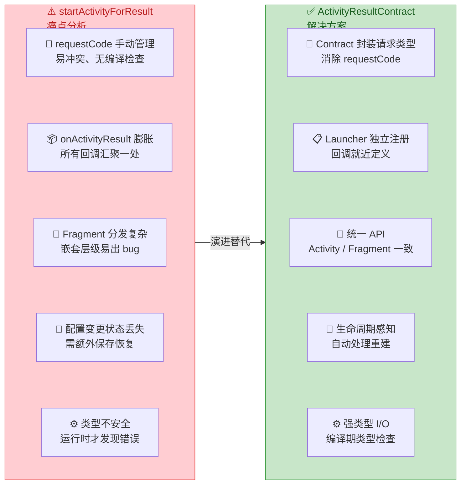
```mermaid
graph LR
    subgraph Problems["⚠️ startActivityForResult\n痛点分析"]
        direction TB
        P1["🔢 requestCode 手动管理\n易冲突、无编译检查"]
        P2["📦 onActivityResult 膨胀\n所有回调汇聚一处"]
        P3["🧩 Fragment 分发复杂\n嵌套层级易出 bug"]
        P4["🔄 配置变更状态丢失\n需额外保存恢复"]
        P5["⚙️ 类型不安全\n运行时才发现错误"]
        P1 ~~~ P2
        P2 ~~~ P3
        P3 ~~~ P4
        P4 ~~~ P5
    end

    subgraph Solution["✅ ActivityResultContract\n解决方案"]
        direction TB
        S1["🎯 Contract 封装请求类型\n消除 requestCode"]
        S2["📋 Launcher 独立注册\n回调就近定义"]
        S3["🧩 统一 API\nActivity / Fragment 一致"]
        S4["🔄 生命周期感知\n自动处理重建"]
        S5["⚙️ 强类型 I/O\n编译期类型检查"]
        S1 ~~~ S2
        S2 ~~~ S3
        S3 ~~~ S4
        S4 ~~~ S5
    end

    Problems -->|"演进替代"| Solution

    classDef problemStyle fill:#FFCDD2,stroke:#E53935,color:#B71C1C,stroke-width:1px
    classDef solutionStyle fill:#C8E6C9,stroke:#43A047,color:#1B5E20,stroke-width:1px
    class Problems problemStyle
    class Solution solutionStyle
```

### ActivityResultContract 现代 API

#### 设计动机与架构理念

为了从根本上解决上述痛点，Google 在 AndroidX Activity 1.2.0 和 Fragment 1.3.0 中引入了全新的 **Activity Result API**，其核心抽象是 `ActivityResultContract<I, O>`。这套 API 的设计理念可以用三个关键词概括：**类型安全（Type Safety）**、**关注点分离（Separation of Concerns）**、**生命周期感知（Lifecycle Awareness）**。

`ActivityResultContract<I, O>` 是一个泛型抽象类，其中 `I` 代表输入类型（Input，即启动请求时需要的参数），`O` 代表输出类型（Output，即返回的结果）。每一种"请求-响应"操作都被封装为一个独立的 Contract 实现类。比如，"拍照"这个操作的 Contract 是 `TakePicture`，它的输入类型是 `Uri`（照片保存路径），输出类型是 `Boolean`（是否拍照成功）。"选择联系人"的 Contract 输入是 `Void?`（不需要参数），输出是 `Uri?`（联系人的 content URI）。

这种设计将**请求的构造逻辑**和**结果的解析逻辑**都封装在 Contract 内部，调用方只需要关心"传入什么、得到什么"，完全不需要操心 Intent 的构造细节、requestCode 的分配、以及 `onActivityResult` 中的数据提取。

#### 核心组件解析

Activity Result API 由三个核心组件构成，它们各司其职，协同工作：

**ActivityResultContract<I, O>** 是协议定义层。它定义了两个抽象方法：`createIntent(context, input)` 负责将类型安全的输入参数转换为系统能理解的 Intent；`parseResult(resultCode, intent)` 负责将原始的 resultCode 和 Intent 解析为类型安全的输出对象。Contract 就像一个"翻译官"，在强类型的应用层代码和弱类型的 Intent 机制之间架起桥梁。

**ActivityResultLauncher<I>** 是请求发射器。通过 `registerForActivityResult()` 方法注册 Contract 后，系统会返回一个 Launcher 实例。调用 `launcher.launch(input)` 即可发起请求。每个 Launcher 对应一个独立的请求通道，彼此互不干扰，完全消除了 requestCode 的概念。

**ActivityResultCallback<O>** 是结果回调。它是一个函数式接口（SAM interface），只有一个方法 `onActivityResult(result: O)`。注意这里的参数已经是经过 Contract 解析后的强类型结果，开发者无需再手动从 Intent 中提取数据。

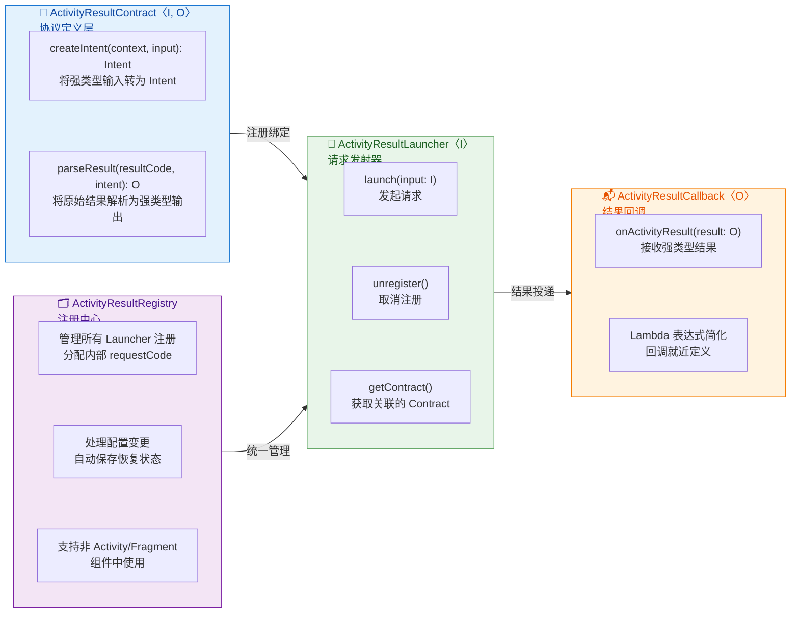
```mermaid
graph LR
    subgraph Contract["📜 ActivityResultContract〈I, O〉\n协议定义层"]
        direction TB
        C1["createIntent(context, input): Intent\n将强类型输入转为 Intent"]
        C2["parseResult(resultCode, intent): O\n将原始结果解析为强类型输出"]
        C1 ~~~ C2
    end

    subgraph Launcher["🚀 ActivityResultLauncher〈I〉\n请求发射器"]
        direction TB
        L1["launch(input: I)\n发起请求"]
        L2["unregister()\n取消注册"]
        L3["getContract()\n获取关联的 Contract"]
        L1 ~~~ L2
        L2 ~~~ L3
    end

    subgraph Callback["📬 ActivityResultCallback〈O〉\n结果回调"]
        direction TB
        CB1["onActivityResult(result: O)\n接收强类型结果"]
        CB2["Lambda 表达式简化\n回调就近定义"]
        CB1 ~~~ CB2
    end

    subgraph Registry["🗂️ ActivityResultRegistry\n注册中心"]
        direction TB
        R1["管理所有 Launcher 注册\n分配内部 requestCode"]
        R2["处理配置变更\n自动保存恢复状态"]
        R3["支持非 Activity/Fragment\n组件中使用"]
        R1 ~~~ R2
        R2 ~~~ R3
    end

    Contract -->|"注册绑定"| Launcher
    Launcher -->|"结果投递"| Callback
    Registry -->|"统一管理"| Launcher

    classDef contractStyle fill:#E3F2FD,stroke:#1976D2,color:#0D47A1,stroke-width:1px
    classDef launcherStyle fill:#E8F5E9,stroke:#388E3C,color:#1B5E20,stroke-width:1px
    classDef callbackStyle fill:#FFF3E0,stroke:#F57C00,color:#E65100,stroke-width:1px
    classDef registryStyle fill:#F3E5F5,stroke:#7B1FA2,color:#4A148C,stroke-width:1px
    class Contract contractStyle
    class Launcher launcherStyle
    class Callback callbackStyle
    class Registry registryStyle
```

#### ActivityResultRegistry 的内部机制

在表面简洁的 API 背后，真正承担核心调度工作的是 `ActivityResultRegistry`。每个 `ComponentActivity`（AppCompatActivity 的父类）内部都持有一个 `ActivityResultRegistry` 实例。当开发者调用 `registerForActivityResult()` 时，实际上是在这个 Registry 中注册了一条记录，Registry 会自动分配一个内部的 requestCode（开发者完全不感知），并将 Contract、Callback 和这个 requestCode 关联起来。

当 `launcher.launch()` 被调用时，Registry 调用 Contract 的 `createIntent()` 生成 Intent，然后使用内部分配的 requestCode 调用底层的 `startActivityForResult()`。当结果返回时，Registry 拦截 `onActivityResult()` 回调，根据 requestCode 找到对应的 Contract 和 Callback，调用 Contract 的 `parseResult()` 解析结果，最后将强类型结果投递给 Callback。

**配置变更的处理**是 Registry 的一大亮点。Registry 会将所有待处理的请求信息（包括 key 和 requestCode 的映射关系）保存到 `SavedStateRegistry` 中。当 Activity 因配置变更被销毁重建后，新的 Activity 实例中的 Registry 会从 SavedState 中恢复这些映射关系。只要开发者在 `onCreate` 中（即 `CREATED` 状态之前）重新调用 `registerForActivityResult()`，Registry 就能将新注册的 Callback 与之前保存的请求关联起来，确保结果不会丢失。

这也解释了为什么 **`registerForActivityResult()` 必须在 `STARTED` 状态之前调用**——如果在 Activity 已经 started 之后才注册，Registry 无法保证在配置变更场景下正确恢复状态，因此会直接抛出 `IllegalStateException`。这个限制看似不便，实际上是一种防御性设计，强制开发者在正确的时机完成注册。

#### 基本使用方式

```kotlin
class ModernActivityA : AppCompatActivity() {

    // 在类成员级别注册 Launcher（必须在 STARTED 之前，通常在声明时或 onCreate 中）
    // registerForActivityResult 接收两个参数：
    //   1. Contract 实例：定义了输入输出类型和 Intent 转换逻辑
    //   2. Callback Lambda：接收强类型的结果
    private val pickContactLauncher = registerForActivityResult(
        // 使用自定义 Contract（稍后定义）
        PickContactContract()
    ) { contactInfo: ContactInfo? ->
        // 这里直接收到强类型的 ContactInfo 对象
        // 不需要手动从 Intent 中提取数据
        if (contactInfo != null) {
            // 操作成功，使用结果更新 UI
            updateContactInfo(contactInfo.name, contactInfo.phone)
        } else {
            // 用户取消了选择或操作失败
            showCancelledMessage()
        }
    }

    // 同一个 Activity 中可以注册多个 Launcher，互不干扰
    // 每个 Launcher 独立管理自己的请求和回调
    private val takePhotoLauncher = registerForActivityResult(
        // 使用系统预定义的 TakePicturePreview Contract
        // 输入类型 Void?，输出类型 Bitmap?
        ActivityResultContracts.TakePicturePreview()
    ) { bitmap: Bitmap? ->
        // 直接收到 Bitmap 对象，无需手动解码
        bitmap?.let { displayPhoto(it) }
    }

    override fun onCreate(savedInstanceState: Bundle?) {
        super.onCreate(savedInstanceState)
        setContentView(R.layout.activity_modern_a)

        // 点击按钮时通过 Launcher 发起请求
        // 注意：launch() 可以在任何时机调用，不受生命周期限制
        findViewById<Button>(R.id.btn_pick_contact).setOnClickListener {
            // 调用 launch()，传入 Contract 定义的输入类型参数
            // 对于 PickContactContract，输入是 Unit（不需要参数）
            pickContactLauncher.launch(Unit)
        }

        findViewById<Button>(R.id.btn_take_photo).setOnClickListener {
            // TakePicturePreview 的输入类型是 Void?，传 null 即可
            takePhotoLauncher.launch(null)
        }
    }

    private fun updateContactInfo(name: String, phone: String) {
        // 更新 UI 逻辑
    }

    private fun showCancelledMessage() {
        // 显示取消提示
    }

    private fun displayPhoto(bitmap: Bitmap) {
        // 显示拍摄的照片
    }
}
```

#### 自定义 Contract 的实现

自定义 Contract 是 Activity Result API 最强大的能力之一。通过实现 `ActivityResultContract<I, O>`，开发者可以将任何"请求-响应"操作封装为一个可复用、类型安全的组件。

```kotlin
// 定义数据类，作为 Contract 的输出类型
// 使用数据类可以获得 equals/hashCode/toString/copy 等便利方法
data class ContactInfo(
    val name: String,   // 联系人姓名
    val phone: String   // 联系人电话
)

// 自定义 Contract：封装"选择联系人"这一操作
// 泛型参数：I = Unit（不需要输入参数），O = ContactInfo?（可能返回 null 表示取消）
class PickContactContract : ActivityResultContract<Unit, ContactInfo?>() {

    // createIntent：将输入参数转换为启动目标 Activity 的 Intent
    // 这个方法封装了 Intent 的构造细节，调用方完全不需要知道
    override fun createIntent(
        context: Context,   // 上下文，用于构造 Intent
        input: Unit         // 输入参数，这里是 Unit（无参数）
    ): Intent {
        // 创建指向 ContactPickerActivity 的显式 Intent
        return Intent(context, ContactPickerActivity::class.java)
    }

    // parseResult：将原始的 resultCode 和 Intent 解析为强类型输出
    // 这个方法封装了结果解析的细节，回调方直接拿到 ContactInfo 对象
    override fun parseResult(
        resultCode: Int,    // 目标 Activity 设置的结果码
        intent: Intent?     // 目标 Activity 回传的数据 Intent
    ): ContactInfo? {
        // 只有当 resultCode 为 RESULT_OK 且 intent 非空时才解析数据
        if (resultCode != Activity.RESULT_OK || intent == null) {
            // 返回 null 表示操作被取消或失败
            return null
        }
        // 从 Intent 中提取数据并构造 ContactInfo 对象
        val name = intent.getStringExtra("contact_name") ?: return null
        val phone = intent.getStringExtra("contact_phone") ?: return null
        // 返回强类型的结果对象
        return ContactInfo(name, phone)
    }

    // 可选重写：getSynchronousResult
    // 如果某些输入可以直接得出结果（不需要启动 Activity），可以在这里返回
    // 返回 null 表示需要正常启动 Activity
    override fun getSynchronousResult(
        context: Context,
        input: Unit
    ): SynchronousResult<ContactInfo?>? {
        // 这个 Contract 总是需要启动 Activity，所以返回 null
        return null
    }
}
```

一个更复杂的例子——带输入参数的 Contract：

```kotlin
// 定义裁剪参数数据类，作为 Contract 的输入类型
data class CropParams(
    val sourceUri: Uri,     // 原始图片 URI
    val aspectX: Int = 1,   // 裁剪宽比
    val aspectY: Int = 1,   // 裁剪高比
    val outputX: Int = 300, // 输出宽度（像素）
    val outputY: Int = 300  // 输出高度（像素）
)

// 自定义 Contract：封装"图片裁剪"操作
// I = CropParams（裁剪参数），O = Uri?（裁剪后的图片 URI）
class CropImageContract : ActivityResultContract<CropParams, Uri?>() {

    // 将裁剪参数转换为启动系统裁剪 Activity 的 Intent
    override fun createIntent(context: Context, input: CropParams): Intent {
        return Intent("com.android.camera.action.CROP").apply {
            // 设置要裁剪的图片来源
            setDataAndType(input.sourceUri, "image/*")
            // 添加裁剪相关的 extras 参数
            putExtra("crop", "true")
            putExtra("aspectX", input.aspectX)   // 宽高比 X
            putExtra("aspectY", input.aspectY)   // 宽高比 Y
            putExtra("outputX", input.outputX)   // 输出宽度
            putExtra("outputY", input.outputY)   // 输出高度
            putExtra("return-data", false)        // 不直接返回 Bitmap（避免数据过大）
            // 授予目标 Activity 读取 URI 的权限
            addFlags(Intent.FLAG_GRANT_READ_URI_PERMISSION)
        }
    }

    // 解析裁剪结果
    override fun parseResult(resultCode: Int, intent: Intent?): Uri? {
        // 裁剪成功时从 Intent 中获取输出 URI
        if (resultCode != Activity.RESULT_OK) return null
        return intent?.data
    }
}
```

#### 系统预定义 Contract 一览

AndroidX 在 `ActivityResultContracts` 类中提供了大量开箱即用的 Contract 实现，覆盖了最常见的使用场景。理解这些预定义 Contract 不仅能提高开发效率，还能帮助我们学习 Contract 的设计模式。

**`StartActivityForResult`** 是最通用的 Contract，输入类型为 `Intent`，输出类型为 `ActivityResult`（包含 resultCode 和 data Intent）。它本质上就是对旧版 `startActivityForResult` 的直接包装，适用于无法用更具体 Contract 表达的场景。但正因为它不提供类型转换，所以应该尽量优先使用更具体的 Contract。

**`RequestPermission`** 和 **`RequestMultiplePermissions`** 用于运行时权限请求。前者输入一个权限字符串，输出一个 `Boolean`（是否授权）；后者输入一个权限字符串数组，输出一个 `Map<String, Boolean>`（每个权限的授权状态）。这两个 Contract 极大地简化了权限请求的代码，不再需要重写 `onRequestPermissionsResult`。

**`TakePicturePreview`** 输入 `Void?`，输出 `Bitmap?`，用于拍摄缩略图。**`TakePicture`** 输入 `Uri`（照片保存位置），输出 `Boolean`（是否成功），用于拍摄全尺寸照片。

**`PickContact`** 输入 `Void?`，输出 `Uri?`（联系人 URI），用于从系统联系人应用中选择联系人。

**`GetContent`** 输入一个 MIME 类型字符串（如 `"image/*"`），输出 `Uri?`（用户选择的内容 URI）。它会启动系统的文件选择器（document picker），让用户从任意内容提供者中选择一个文件。**`GetMultipleContents`** 是其批量版本，输出 `List<Uri>`。

**`OpenDocument`** 和 **`OpenMultipleDocuments`** 与 `GetContent` 类似，但基于 Storage Access Framework（SAF），提供了更持久的 URI 权限（通过 `FLAG_GRANT_PERSISTABLE_URI_PERMISSION`）。输入是 MIME 类型数组，适用于需要长期访问文件的场景。

**`CreateDocument`** 输入一个建议的文件名字符串，输出 `Uri?`（新创建文件的 URI），用于让用户选择保存位置并创建新文件。

**`OpenDocumentTree`** 输入一个可选的初始 URI，输出 `Uri?`（用户选择的目录 URI），用于获取对整个目录的访问权限。

```kotlin
class ContractDemoActivity : AppCompatActivity() {

    // ===== 权限请求 =====
    // RequestPermission：请求单个运行时权限
    // 输入 String（权限名），输出 Boolean（是否授权）
    private val cameraPermissionLauncher = registerForActivityResult(
        ActivityResultContracts.RequestPermission()
    ) { isGranted: Boolean ->
        if (isGranted) {
            // 用户授予了相机权限，可以继续拍照
            proceedWithCamera()
        } else {
            // 用户拒绝了权限，显示解释说明
            showPermissionRationale()
        }
    }

    // RequestMultiplePermissions：同时请求多个权限
    // 输入 Array<String>，输出 Map<String, Boolean>
    private val multiPermissionLauncher = registerForActivityResult(
        ActivityResultContracts.RequestMultiplePermissions()
    ) { permissions: Map<String, Boolean> ->
        // 遍历每个权限的授权结果
        val cameraGranted = permissions[Manifest.permission.CAMERA] ?: false
        val storageGranted = permissions[Manifest.permission.READ_EXTERNAL_STORAGE] ?: false
        // 根据各权限的授权状态决定后续行为
        when {
            cameraGranted && storageGranted -> startFullFeature()
            cameraGranted -> startCameraOnly()
            else -> showPermissionDenied()
        }
    }

    // ===== 拍照 =====
    // TakePicture：拍摄全尺寸照片并保存到指定 URI
    // 输入 Uri（保存路径），输出 Boolean（是否成功）
    private val takeFullPhotoLauncher = registerForActivityResult(
        ActivityResultContracts.TakePicture()
    ) { success: Boolean ->
        if (success) {
            // 拍照成功，photoUri 中已保存照片
            displayPhoto(photoUri)
        }
    }

    // ===== 文件选择 =====
    // GetContent：从系统文件选择器中选择内容
    // 输入 String（MIME 类型），输出 Uri?
    private val pickImageLauncher = registerForActivityResult(
        ActivityResultContracts.GetContent()
    ) { uri: Uri? ->
        // uri 为用户选择的图片的 content URI
        uri?.let { loadImage(it) }
    }

    // GetMultipleContents：选择多个文件
    // 输入 String（MIME 类型），输出 List<Uri>
    private val pickMultipleImagesLauncher = registerForActivityResult(
        ActivityResultContracts.GetMultipleContents()
    ) { uris: List<Uri> ->
        // uris 包含用户选择的所有图片 URI
        uris.forEach { uri -> addToGallery(uri) }
    }

    // ===== 文档操作（SAF）=====
    // CreateDocument：创建新文档
    // 输入 String（建议文件名），输出 Uri?
    private val createDocLauncher = registerForActivityResult(
        ActivityResultContracts.CreateDocument("application/pdf")
    ) { uri: Uri? ->
        // uri 为用户选择的保存位置
        uri?.let { writeDataToDocument(it) }
    }

    // 用于保存拍照路径的成员变量
    private lateinit var photoUri: Uri

    override fun onCreate(savedInstanceState: Bundle?) {
        super.onCreate(savedInstanceState)
        setContentView(R.layout.activity_contract_demo)

        // 请求相机权限：传入权限字符串即可
        findViewById<Button>(R.id.btn_camera).setOnClickListener {
            cameraPermissionLauncher.launch(Manifest.permission.CAMERA)
        }

        // 请求多个权限：传入权限数组
        findViewById<Button>(R.id.btn_multi_perm).setOnClickListener {
            multiPermissionLauncher.launch(
                arrayOf(
                    Manifest.permission.CAMERA,
                    Manifest.permission.READ_EXTERNAL_STORAGE
                )
            )
        }

        // 拍照：先创建保存路径，再 launch
        findViewById<Button>(R.id.btn_photo).setOnClickListener {
            // 通过 FileProvider 创建临时文件 URI
            photoUri = createTempImageUri()
            takeFullPhotoLauncher.launch(photoUri)
        }

        // 选择图片：传入 MIME 类型过滤器
        findViewById<Button>(R.id.btn_pick_image).setOnClickListener {
            pickImageLauncher.launch("image/*")
        }

        // 选择多张图片
        findViewById<Button>(R.id.btn_pick_multiple).setOnClickListener {
            pickMultipleImagesLauncher.launch("image/*")
        }

        // 创建 PDF 文档
        findViewById<Button>(R.id.btn_create_doc).setOnClickListener {
            createDocLauncher.launch("report.pdf")
        }
    }

    // 辅助方法（省略具体实现）
    private fun createTempImageUri(): Uri { /* ... */ return Uri.EMPTY }
    private fun proceedWithCamera() { /* ... */ }
    private fun showPermissionRationale() { /* ... */ }
    private fun startFullFeature() { /* ... */ }
    private fun startCameraOnly() { /* ... */ }
    private fun showPermissionDenied() { /* ... */ }
    private fun displayPhoto(uri: Uri) { /* ... */ }
    private fun loadImage(uri: Uri) { /* ... */ }
    private fun addToGallery(uri: Uri) { /* ... */ }
    private fun writeDataToDocument(uri: Uri) { /* ... */ }
}
```

#### 在 Fragment 中使用

Activity Result API 的一大优势是 **Activity 和 Fragment 使用完全相同的 API**。Fragment 同样拥有 `registerForActivityResult()` 方法，其内部实现会将注册委托给宿主 Activity 的 `ActivityResultRegistry`，但这一切对开发者完全透明。不再需要担心嵌套 Fragment 中结果分发失败的问题，因为 Registry 使用唯一的 string key（而非 requestCode 的高位编码）来标识每个注册。

```kotlin
class ContactFragment : Fragment() {

    // 在 Fragment 中注册方式与 Activity 完全一致
    // 内部会自动委托给宿主 Activity 的 ActivityResultRegistry
    private val pickContactLauncher = registerForActivityResult(
        ActivityResultContracts.PickContact()
    ) { uri: Uri? ->
        // 直接在 Fragment 中处理结果
        uri?.let { resolveContactInfo(it) }
    }

    override fun onViewCreated(view: View, savedInstanceState: Bundle?) {
        super.onViewCreated(view, savedInstanceState)

        // 在 Fragment 的视图中设置点击事件
        view.findViewById<Button>(R.id.btn_pick).setOnClickListener {
            // 通过 Launcher 发起请求
            pickContactLauncher.launch(null)
        }
    }

    private fun resolveContactInfo(contactUri: Uri) {
        // 通过 ContentResolver 查询联系人详细信息
        requireContext().contentResolver.query(
            contactUri,                     // 联系人 URI
            arrayOf(                        // 需要查询的列
                ContactsContract.Contacts.DISPLAY_NAME
            ),
            null, null, null                // 无额外过滤条件
        )?.use { cursor ->
            // 使用 use 确保 Cursor 自动关闭
            if (cursor.moveToFirst()) {
                // 读取联系人姓名
                val name = cursor.getString(0)
                updateUI(name)
            }
        }
    }

    private fun updateUI(name: String) {
        // 更新 Fragment 的 UI
    }
}
```

#### 在非 Activity/Fragment 组件中使用

Activity Result API 的另一个强大之处在于，它不局限于 Activity 和 Fragment。任何能够访问 `ActivityResultRegistry` 的组件都可以使用这套 API。这对于遵循 MVVM 或 Clean Architecture 的项目尤其有价值——你可以将结果处理逻辑从 UI 层抽离到独立的类中。

```kotlin
// 一个独立的"联系人选择管理器"，不继承 Activity 或 Fragment
class ContactPickerManager(
    private val registry: ActivityResultRegistry  // 通过构造函数注入 Registry
) : DefaultLifecycleObserver {

    // Launcher 在这里声明，但延迟到 onCreate 中注册
    private lateinit var pickContactLauncher: ActivityResultLauncher<Void?>

    // 结果回调，通过 LiveData 或回调接口暴露给外部
    private val _result = MutableLiveData<Uri?>()
    val result: LiveData<Uri?> = _result

    // 实现 DefaultLifecycleObserver 的 onCreate
    // 在宿主的 ON_CREATE 事件时注册 Launcher
    override fun onCreate(owner: LifecycleOwner) {
        // 使用 registry.register() 方法注册
        // 第一个参数是唯一的 key 字符串，用于在配置变更后恢复状态
        // 第二个参数是 LifecycleOwner，Registry 会自动在 ON_DESTROY 时取消注册
        // 第三个参数是 Contract 实例
        // 第四个参数是结果回调
        pickContactLauncher = registry.register(
            "contact_picker_key",       // 唯一标识符
            owner,                      // 生命周期所有者
            ActivityResultContracts.PickContact()  // Contract
        ) { uri: Uri? ->
            // 将结果发布到 LiveData
            _result.value = uri
        }
    }

    // 对外暴露的发起请求方法
    fun pickContact() {
        pickContactLauncher.launch(null)
    }
}
```

```kotlin
// 在 Activity 中使用 ContactPickerManager
class HostActivity : AppCompatActivity() {

    // 创建管理器实例，传入 Activity 的 activityResultRegistry
    private val contactManager by lazy {
        ContactPickerManager(activityResultRegistry)
    }

    override fun onCreate(savedInstanceState: Bundle?) {
        super.onCreate(savedInstanceState)

        // 将管理器注册为生命周期观察者
        // 这样管理器会在 Activity 的 ON_CREATE 时自动注册 Launcher
        lifecycle.addObserver(contactManager)

        // 观察结果
        contactManager.result.observe(this) { uri ->
            uri?.let { handleContactSelected(it) }
        }

        // 通过管理器发起请求
        findViewById<Button>(R.id.btn_pick).setOnClickListener {
            contactManager.pickContact()
        }
    }

    private fun handleContactSelected(uri: Uri) {
        // 处理选择结果
    }
}
```

#### 完整流程时序分析

为了更深入地理解 Activity Result API 的运作机制，让我们追踪一次完整的"请求-响应"流程，从 `launch()` 调用到 Callback 被触发的全过程。

当开发者调用 `launcher.launch(input)` 时，Launcher 内部会调用 `ActivityResultRegistry.onLaunch()`。Registry 首先调用 Contract 的 `getSynchronousResult()` 检查是否可以同步返回结果（大多数情况返回 null）。如果不能同步返回，Registry 调用 Contract 的 `createIntent()` 生成 Intent，然后通过 `ActivityResultRegistry.dispatchResult()` 的内部机制，最终调用到 `ComponentActivity.startActivityForResult(intent, requestCode)`——注意这里的 requestCode 是 Registry 自动分配的，开发者完全不感知。

目标 Activity 启动后，用户完成操作，目标 Activity 调用 `setResult(resultCode, data)` 并 `finish()`。AMS 将结果投递回调用方 Activity。`ComponentActivity` 的 `onActivityResult()` 被触发，但它不再需要开发者重写——`ComponentActivity` 内部会将结果转发给 `ActivityResultRegistry`。Registry 根据 requestCode 找到对应的 Contract 和 Callback，调用 `Contract.parseResult(resultCode, data)` 将原始结果转换为强类型输出，最后调用 `Callback.onActivityResult(output)` 将结果投递给开发者注册的 Lambda。

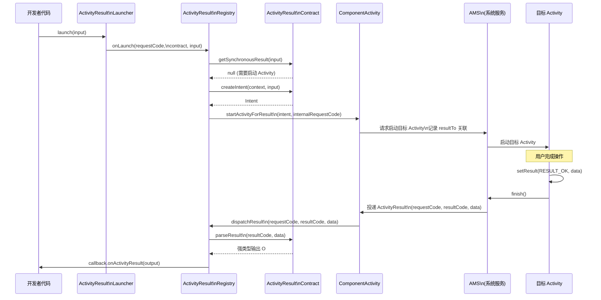
```mermaid
sequenceDiagram
    participant Dev as 开发者代码
    participant Launcher as ActivityResult\nLauncher
    participant Registry as ActivityResult\nRegistry
    participant Contract as ActivityResult\nContract
    participant Activity as ComponentActivity
    participant AMS as AMS\n(系统服务)
    participant Target as 目标 Activity

    Dev->>Launcher: launch(input)
    Launcher->>Registry: onLaunch(requestCode,\ncontract, input)
    Registry->>Contract: getSynchronousResult(input)
    Contract-->>Registry: null (需要启动 Activity)
    Registry->>Contract: createIntent(context, input)
    Contract-->>Registry: Intent
    Registry->>Activity: startActivityForResult\n(intent, internalRequestCode)
    Activity->>AMS: 请求启动目标 Activity\n记录 resultTo 关联
    AMS->>Target: 启动目标 Activity

    Note over Target: 用户完成操作

    Target->>Target: setResult(RESULT_OK, data)
    Target->>AMS: finish()
    AMS->>Activity: 投递 ActivityResult\n(requestCode, resultCode, data)
    Activity->>Registry: dispatchResult\n(requestCode, resultCode, data)
    Registry->>Contract: parseResult\n(resultCode, data)
    Contract-->>Registry: 强类型输出 O
    Registry->>Dev: callback.onActivityResult(output)
```

#### 两代 API 的对比总结

从工程实践的角度来看，Activity Result API 相比旧版 `startActivityForResult` 的提升是全方位的。

在**类型安全**方面，旧 API 的输入输出都是弱类型的 Intent 和 int，所有的数据提取都依赖字符串 key 和手动类型转换，错误只能在运行时发现。新 API 通过 Contract 的泛型参数 `<I, O>` 在编译期就确定了输入输出类型，IDE 能提供完整的代码补全和类型检查。

在**代码组织**方面，旧 API 将所有结果处理集中在一个 `onActivityResult` 方法中，随着业务增长不可避免地膨胀。新 API 的每个 Launcher 都有独立的回调 Lambda，回调逻辑就近定义在注册处，代码的内聚性和可读性大幅提升。

在**可复用性**方面，旧 API 的 Intent 构造和结果解析逻辑散落在各处，难以复用。新 API 的 Contract 是独立的、可复用的组件，一个 Contract 可以在多个 Activity、Fragment 甚至非 UI 组件中使用。

在**可测试性**方面，旧 API 的 `onActivityResult` 是 Activity 的 protected 方法，测试需要模拟整个 Activity 生命周期。新 API 的 Contract 是纯粹的输入输出转换逻辑，可以轻松进行单元测试；而 `ActivityResultRegistry` 也提供了测试用的构造方式，可以在不启动真实 Activity 的情况下模拟结果回传。

```kotlin
// Contract 的单元测试示例
class PickContactContractTest {

    // 创建被测试的 Contract 实例
    private val contract = PickContactContract()

    @Test
    fun `parseResult returns ContactInfo when result is OK`() {
        // 构造模拟的成功结果 Intent
        val intent = Intent().apply {
            putExtra("contact_name", "张三")
            putExtra("contact_phone", "13800138000")
        }
        // 调用 parseResult 并验证输出
        val result = contract.parseResult(Activity.RESULT_OK, intent)
        // 断言结果不为 null 且字段正确
        assertNotNull(result)
        assertEquals("张三", result?.name)
        assertEquals("13800138000", result?.phone)
    }

    @Test
    fun `parseResult returns null when result is CANCELED`() {
        // 模拟用户取消操作
        val result = contract.parseResult(Activity.RESULT_CANCELED, null)
        // 断言结果为 null
        assertNull(result)
    }

    @Test
    fun `createIntent targets ContactPickerActivity`() {
        // 使用 ApplicationProvider 获取测试上下文
        val context = ApplicationProvider.getApplicationContext<Context>()
        // 调用 createIntent 并验证 Intent 的目标组件
        val intent = contract.createIntent(context, Unit)
        // 断言 Intent 指向正确的 Activity
        assertEquals(
            ContactPickerActivity::class.java.name,
            intent.component?.className
        )
    }
}
```

在**生命周期安全**方面，旧 API 在配置变更时容易丢失上下文状态，开发者需要手动处理。新 API 的 Registry 自动将请求状态保存到 `SavedStateRegistry`，配置变更后自动恢复，开发者几乎不需要额外处理。

在**Fragment 兼容性**方面，旧 API 依赖 requestCode 高位编码的 Fragment 索引来分发结果，嵌套 Fragment 场景下极易出错。新 API 使用字符串 key 标识注册，彻底消除了这个问题。

#### 迁移策略与注意事项

对于存量项目，从旧 API 迁移到新 API 可以采用渐进式策略。首先，`startActivityForResult` 在 `ComponentActivity` 中已被标记为 `@Deprecated`，但短期内不会被移除，所以不需要一次性全部迁移。建议优先迁移以下场景：权限请求（使用 `RequestPermission` / `RequestMultiplePermissions`）、系统相机/文件选择器调用（使用 `TakePicture` / `GetContent` 等）、以及 Fragment 中的所有 `startActivityForResult` 调用。

迁移时需要注意一个关键约束：**`registerForActivityResult()` 必须在 `STARTED` 状态之前调用**。这意味着你不能在按钮点击事件中动态注册 Launcher——Launcher 必须作为类的成员变量在声明时或 `onCreate` 中注册，而 `launch()` 调用则可以放在任何时机。这个约束初看不便，但它确保了 Registry 能在配置变更后正确恢复状态，是一种值得接受的 trade-off。

如果确实需要在运行时动态决定使用哪个 Contract，可以注册一个通用的 `StartActivityForResult` Launcher，然后在 `launch()` 时传入不同的 Intent。但更推荐的做法是为每种操作预先注册独立的 Launcher，通过条件判断决定调用哪个 Launcher 的 `launch()` 方法。

---

**📝 练习题**

在使用 Activity Result API 时，以下代码会导致什么问题？

```kotlin
class MyActivity : AppCompatActivity() {
    override fun onCreate(savedInstanceState: Bundle?) {
        super.onCreate(savedInstanceState)
        
        findViewById<Button>(R.id.btn).setOnClickListener {
            val launcher = registerForActivityResult(
                ActivityResultContracts.GetContent()
            ) { uri -> handleUri(uri) }
            launcher.launch("image/*")
        }
    }
}
```

A. 编译错误，`registerForActivityResult` 不能在 `onCreate` 中调用
B. 运行时抛出 `IllegalStateException`，因为在按钮点击时（Activity 已处于 STARTED/RESUMED 状态）才注册 Launcher
C. 正常运行，但每次点击都会创建新的 Launcher 实例导致内存泄漏
D. 正常运行，没有任何问题

**【答案】** B

**【解析】** `registerForActivityResult()` 内部会检查当前 `LifecycleOwner` 的状态，如果已经处于 `STARTED` 或之后的状态，会直接抛出 `IllegalStateException`。这是因为 `ActivityResultRegistry` 需要在 Activity 创建阶段（`CREATED` 状态之前）完成注册，以便在配置变更（如屏幕旋转）导致 Activity 重建时，能够从 `SavedStateRegistry` 中恢复之前的请求状态并重新关联回调。如果允许在 `STARTED` 之后注册，那么在 Activity 重建的场景下，之前发出的请求结果将无法正确投递到新的回调中，导致结果丢失。正确做法是将 `registerForActivityResult()` 调用放在类成员声明处或 `onCreate` 方法的开头（在 `super.onCreate` 之后、任何 UI 交互之前），而将 `launcher.launch()` 放在按钮点击等事件处理中。选项 A 错误，因为在 `onCreate` 中调用是允许的（此时 Activity 处于 `CREATED` 状态）；选项 C 和 D 错误，因为代码根本不会正常运行到 `launch()` 调用——在 `registerForActivityResult()` 时就已经崩溃了。

---

## DeepLink 与 AppLink

在移动互联网生态中，App 不再是一座座孤岛。用户可能从浏览器点击一个链接、从短信中轻触一个 URL、从另一个 App 分享的卡片跳转——这些场景都要求 App 能够 **被外部 URI 唤起，并精准导航到指定页面**。Android 平台为此提供了两套递进式的机制：**DeepLink（深度链接）** 和 **App Link（应用链接）**。前者基于自定义 URL Scheme 或 Intent URI，后者在此基础上叠加了 **域名所有权验证**，实现了"点击即打开、无歧义弹窗"的丝滑体验。

理解这两套机制，不仅需要掌握 `IntentFilter` 的匹配规则（这在前面"隐式 Intent"章节已有铺垫），还需要深入 **URI 的结构拆解、系统的 Intent 分发流程、Digital Asset Links 验证协议** 以及实际开发中的各种边界情况。本节将从最基础的 URL Scheme 协议讲起，逐步推进到 Android App Links 的完整实现与验证原理。

---

### URL Scheme 协议：最原始的 DeepLink

#### 什么是 URL Scheme

URL Scheme 是 DeepLink 最早、最简单的实现形式。它的核心思想是：**为你的 App 注册一个自定义的 URI 协议头（scheme）**，当系统中任何地方触发了以该协议头开头的 URI 时，Android 的 Intent 分发机制就会尝试找到能处理它的 Activity。

我们日常接触的 `http://`、`https://`、`tel:`、`mailto:` 都是 scheme。自定义 scheme 则是开发者自行定义的协议，例如 `myapp://`、`taobao://`、`weixin://`。当用户在浏览器中点击 `myapp://product/detail?id=123` 这样的链接时，如果设备上安装了注册了 `myapp` scheme 的 App，系统就会将其唤起。

#### URI 的完整结构

要精确控制 DeepLink 的匹配，必须先理解 URI 的组成部分。Android 的 `android.net.Uri` 类将一个完整的 URI 拆解为以下层级：

```text
scheme://host:port/path?queryParam=value#fragment
  │        │    │    │        │             │
  │        │    │    │        │             └─ Fragment（片段标识符，Android 较少用于路由）
  │        │    │    │        └─ Query（查询参数，用于传递业务数据）
  │        │    │    └─ Path（路径，用于定位具体页面）
  │        │    └─ Port（端口号，自定义 scheme 中通常省略）
  │        └─ Host（主机名，自定义 scheme 中可自定义，如 "product"）
  └─ Scheme（协议头，如 "myapp"、"https"）
```

以 `myapp://product/detail?id=123` 为例：

- **Scheme** = `myapp`
- **Host** = `product`
- **Path** = `/detail`
- **Query** = `id=123`

在 `IntentFilter` 的 `<data>` 标签中，Android 允许你对上述每一个部分进行精确或模糊匹配，这就是 DeepLink 路由的基础。

#### 在 AndroidManifest 中注册 DeepLink

注册 DeepLink 的本质就是为目标 Activity 声明一个包含 `<data>` 标签的 `<intent-filter>`。系统在收到隐式 Intent 时，会将 Intent 携带的 URI 与所有已注册的 `<data>` 标签进行匹配。

```xml
<!-- AndroidManifest.xml -->
<activity
    android:name=".ui.ProductDetailActivity"
    android:exported="true">

    <!-- DeepLink IntentFilter：处理自定义 scheme -->
    <intent-filter>
        <!-- ACTION_VIEW 是 DeepLink 的标准 Action，表示"查看"某个资源 -->
        <action android:name="android.intent.action.VIEW" />

        <!-- BROWSABLE 类别：允许从浏览器触发此 Intent -->
        <!-- 没有这个类别，浏览器中的链接点击将无法唤起 App -->
        <category android:name="android.intent.category.BROWSABLE" />

        <!-- DEFAULT 类别：隐式 Intent 的必备类别 -->
        <!-- 系统在 startActivity 时会自动添加 CATEGORY_DEFAULT -->
        <category android:name="android.intent.category.DEFAULT" />

        <!-- data 标签定义 URI 匹配规则 -->
        <!-- scheme="myapp" host="product" path="/detail" -->
        <!-- 匹配 URI：myapp://product/detail -->
        <data
            android:scheme="myapp"
            android:host="product"
            android:path="/detail" />
    </intent-filter>
</activity>
```

这段声明的含义是：当系统中出现一个 `ACTION_VIEW` 的隐式 Intent，其 data URI 匹配 `myapp://product/detail` 时，`ProductDetailActivity` 就是候选目标。

**关于 `BROWSABLE` 类别的深入理解**：浏览器（Chrome、WebView 等）在用户点击链接时，会构造一个隐式 Intent 并附加 `CATEGORY_BROWSABLE`。如果你的 IntentFilter 没有声明这个类别，根据 Intent 匹配规则（filter 必须包含 Intent 携带的所有 category），匹配就会失败。因此，**任何希望从浏览器唤起的 DeepLink 都必须声明 `CATEGORY_BROWSABLE`**。

#### 在 Activity 中接收并解析 DeepLink

当 Activity 被 DeepLink 唤起后，触发它的 Intent 中就携带了完整的 URI 信息。开发者需要从 `Intent.data`（即 `getData()`）中提取路径和参数，然后执行对应的页面导航或数据加载逻辑。

```kotlin
// ProductDetailActivity.kt
class ProductDetailActivity : AppCompatActivity() {

    override fun onCreate(savedInstanceState: Bundle?) {
        super.onCreate(savedInstanceState)
        setContentView(R.layout.activity_product_detail)

        // 处理 DeepLink：从 Intent 中获取 URI 数据
        handleDeepLink(intent)
    }

    // 如果 Activity 已经在栈顶（launchMode 为 singleTop/singleTask），
    // 新的 DeepLink Intent 会通过 onNewIntent 回调传入，而不是重新创建 Activity
    override fun onNewIntent(intent: Intent?) {
        super.onNewIntent(intent)
        // 必须手动更新 Activity 持有的 Intent 引用
        setIntent(intent)
        // 重新处理新的 DeepLink
        intent?.let { handleDeepLink(it) }
    }

    private fun handleDeepLink(intent: Intent) {
        // 获取 Intent 携带的 URI（即 DeepLink 的完整地址）
        val uri: Uri? = intent.data

        // 安全检查：uri 可能为 null（Activity 也可能通过普通导航进入）
        if (uri == null) {
            // 非 DeepLink 进入，执行默认逻辑
            loadDefaultContent()
            return
        }

        // 提取 scheme，用于区分不同来源（自定义 scheme vs https）
        val scheme: String? = uri.scheme       // "myapp"
        // 提取 host，用于一级路由
        val host: String? = uri.host           // "product"
        // 提取 path，用于二级路由
        val path: String? = uri.path           // "/detail"
        // 提取 query 参数，用于获取业务数据
        val productId: String? = uri.getQueryParameter("id")  // "123"

        // 日志输出，便于调试 DeepLink 匹配情况
        Log.d("DeepLink", "scheme=$scheme, host=$host, path=$path, id=$productId")

        // 根据提取到的参数加载对应商品详情
        if (productId != null) {
            loadProductDetail(productId)
        } else {
            // 参数缺失的防御性处理
            showError("商品 ID 缺失，无法加载详情")
        }
    }

    private fun loadProductDetail(id: String) {
        // 实际业务：调用 ViewModel 或 Repository 加载商品数据
    }

    private fun loadDefaultContent() {
        // 非 DeepLink 场景的默认内容
    }

    private fun showError(message: String) {
        // 展示错误提示
    }
}
```

这里有一个容易被忽视的细节：**`onNewIntent` 的处理**。如果 `ProductDetailActivity` 的 `launchMode` 是 `singleTop` 或 `singleTask`，当它已经处于栈顶时，系统不会重新创建实例，而是调用 `onNewIntent`。如果你忘记在 `onNewIntent` 中处理 DeepLink，用户第二次通过不同的 DeepLink 进入时，看到的仍然是第一次的内容——这是一个非常常见的线上 Bug。

#### `<data>` 标签的匹配规则详解

`<data>` 标签支持多个属性，它们之间的组合关系是 DeepLink 配置中最容易出错的地方。

**属性列表**：

| 属性 | 含义 | 示例 |
|------|------|------|
| `android:scheme` | 协议头 | `myapp`、`https` |
| `android:host` | 主机名 | `product`、`www.example.com` |
| `android:port` | 端口号 | `8080` |
| `android:path` | 精确路径匹配 | `/detail` |
| `android:pathPrefix` | 路径前缀匹配 | `/product/` |
| `android:pathPattern` | 路径正则匹配 | `/product/.*` |
| `android:pathAdvancedPattern` | 高级正则（API 31+） | 更复杂的模式 |
| `android:mimeType` | MIME 类型 | `image/*` |

**关键匹配规则**：

**规则一：同一个 `<intent-filter>` 内的多个 `<data>` 标签是"属性合并"关系，而非"独立条目"关系。** 这是最容易踩坑的地方。看下面的例子：

```xml
<!-- ⚠️ 错误理解：以为这是两条独立规则 -->
<intent-filter>
    <action android:name="android.intent.action.VIEW" />
    <category android:name="android.intent.category.DEFAULT" />
    <category android:name="android.intent.category.BROWSABLE" />

    <!-- 开发者的意图：匹配 myapp://product 和 https://www.example.com -->
    <data android:scheme="myapp" android:host="product" />
    <data android:scheme="https" android:host="www.example.com" />
</intent-filter>
```

开发者可能以为这声明了两条独立的匹配规则。但实际上，Android 系统会将同一个 `<intent-filter>` 内所有 `<data>` 标签的属性 **合并为一个属性池**。上面的声明等价于：

- scheme 集合 = {`myapp`, `https`}
- host 集合 = {`product`, `www.example.com`}

系统匹配时会做 **笛卡尔积**，即以下四种 URI 都能匹配：

1. `myapp://product` ✅（预期）
2. `https://www.example.com` ✅（预期）
3. `myapp://www.example.com` ❌（非预期！）
4. `https://product` ❌（非预期！）

**正确做法**：如果两条规则的 scheme 和 host 不同，必须拆分为 **两个独立的 `<intent-filter>`**：

```xml
<!-- ✅ 正确：两个独立的 intent-filter -->
<intent-filter>
    <action android:name="android.intent.action.VIEW" />
    <category android:name="android.intent.category.DEFAULT" />
    <category android:name="android.intent.category.BROWSABLE" />
    <!-- 规则 1：自定义 scheme -->
    <data android:scheme="myapp" android:host="product" />
</intent-filter>

<intent-filter>
    <action android:name="android.intent.action.VIEW" />
    <category android:name="android.intent.category.DEFAULT" />
    <category android:name="android.intent.category.BROWSABLE" />
    <!-- 规则 2：HTTPS 链接 -->
    <data android:scheme="https" android:host="www.example.com" />
</intent-filter>
```

**规则二：属性之间存在层级依赖。** 如果你指定了 `host`，就必须同时指定 `scheme`；如果指定了 `path`，就必须同时指定 `scheme` 和 `host`。这是因为 URI 本身就是层级结构，没有 scheme 的 host 是无意义的。

**规则三：`path`、`pathPrefix`、`pathPattern` 三者互斥。** 对同一条规则，只需选择其中一种路径匹配方式。`path` 是精确匹配，`pathPrefix` 匹配前缀（适合 RESTful 风格的路径），`pathPattern` 支持简单的通配符（`.*` 匹配任意字符序列，`.` 匹配单个字符）。

#### Path 匹配的三种模式对比

```kotlin
// 假设注册的 URI 基础为 myapp://shop/...

// 1. path="/product/detail"
//    精确匹配：只有 myapp://shop/product/detail 能命中
//    myapp://shop/product/detail/extra → 不匹配

// 2. pathPrefix="/product/"
//    前缀匹配：myapp://shop/product/ 开头的所有路径都能命中
//    myapp://shop/product/detail → 匹配 ✅
//    myapp://shop/product/list   → 匹配 ✅
//    myapp://shop/order/detail   → 不匹配 ❌

// 3. pathPattern="/product/.*/detail"
//    通配符匹配：中间可以是任意内容
//    myapp://shop/product/123/detail   → 匹配 ✅
//    myapp://shop/product/abc/detail   → 匹配 ✅
//    myapp://shop/product/detail       → 不匹配 ❌（缺少中间段）
//    注意：pathPattern 中的 .* 需要在 XML 中转义为 ".*"
//    但由于 XML 解析器会先处理一次转义，实际写法可能需要 ".*"
```

#### URL Scheme 的局限性

自定义 URL Scheme 虽然简单易用，但存在几个严重的问题：

**第一，Scheme 没有全局唯一性保证。** 任何 App 都可以注册 `myapp://` 这个 scheme。如果用户设备上有两个 App 都注册了相同的 scheme，系统会弹出一个 **消歧对话框（Disambiguation Dialog）**，让用户选择用哪个 App 打开。这不仅体验差，还可能被恶意 App 利用来劫持流量——这就是所谓的 **Scheme 劫持（Scheme Hijacking）**。

**第二，浏览器对自定义 Scheme 的支持不一致。** 不同浏览器（Chrome、Firefox、Samsung Browser）对自定义 scheme 链接的处理方式各不相同。有些浏览器会直接拦截，有些会弹出确认框，有些则完全忽略。这导致 DeepLink 的可靠性难以保证。

**第三，没有回退机制。** 如果用户没有安装目标 App，点击 `myapp://product/detail?id=123` 会直接报错或无响应，用户体验极差。虽然可以通过 JavaScript 中间页做"先尝试唤起 App，超时后跳转下载页"的 hack，但这种方案既不优雅也不可靠。

正是这些局限性，催生了 Android App Links 的诞生。

---

### Scheme/Host/Path 匹配的完整流程

在深入 App Links 之前，有必要从系统层面理解 DeepLink 的完整匹配流程。当用户点击一个链接时，从浏览器到目标 Activity，中间经历了多个环节。

#### 系统级 Intent 分发流程

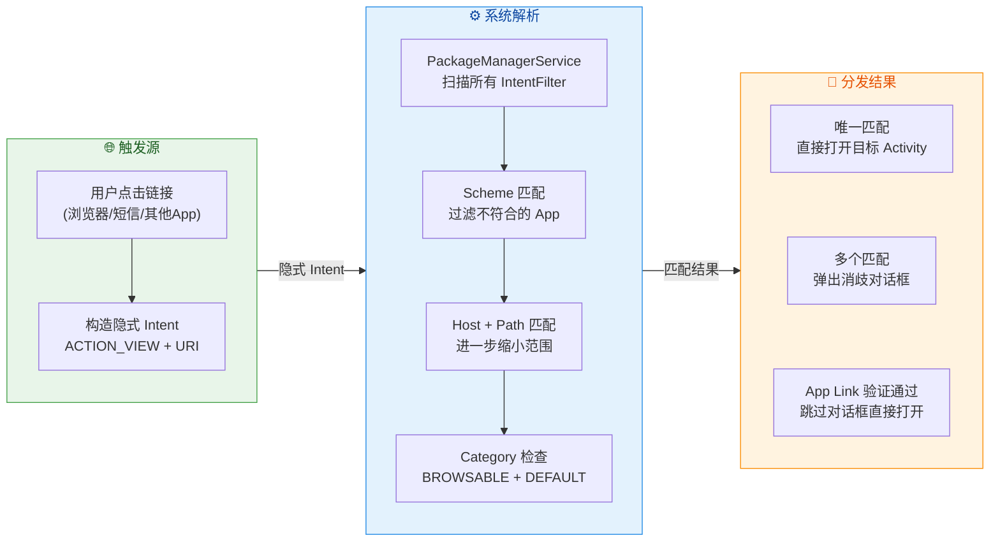
```mermaid
graph LR
    subgraph Trigger["🌐 触发源"]
        direction TB
        A["用户点击链接\n(浏览器/短信/其他App)"]
        B["构造隐式 Intent\nACTION_VIEW + URI"]
        A --> B
    end

    subgraph Resolve["⚙️ 系统解析"]
        direction TB
        C["PackageManagerService\n扫描所有 IntentFilter"]
        D["Scheme 匹配\n过滤不符合的 App"]
        E["Host + Path 匹配\n进一步缩小范围"]
        F["Category 检查\nBROWSABLE + DEFAULT"]
        C --> D
        D --> E
        E --> F
    end

    subgraph Result["📱 分发结果"]
        direction TB
        G["唯一匹配\n直接打开目标 Activity"]
        H["多个匹配\n弹出消歧对话框"]
        I["App Link 验证通过\n跳过对话框直接打开"]
        G ~~~ H
        H ~~~ I
    end

    Trigger -->|"隐式 Intent"| Resolve
    Resolve -->|"匹配结果"| Result

    classDef triggerStyle fill:#E8F5E9,stroke:#43A047,color:#1B5E20
    classDef resolveStyle fill:#E3F2FD,stroke:#1E88E5,color:#0D47A1
    classDef resultStyle fill:#FFF3E0,stroke:#FB8C00,color:#E65100

    class Trigger triggerStyle
    class Resolve resolveStyle
    class Result resultStyle
```

**详细步骤解析**：

**Step 1 — 触发源构造 Intent**：当用户在 Chrome 浏览器中点击一个链接（比如 `https://www.example.com/product/123`），Chrome 并不会直接发起网络请求。它会先检查这个 URI 是否有 App 能处理。Chrome 构造一个隐式 Intent：

```kotlin
// Chrome 内部大致逻辑（伪代码）
// 构造一个 ACTION_VIEW 的隐式 Intent
val intent = Intent(Intent.ACTION_VIEW).apply {
    // 将用户点击的 URL 设置为 Intent 的 data
    data = Uri.parse("https://www.example.com/product/123")
    // 添加 BROWSABLE 类别，标识这是从浏览器发起的
    addCategory(Intent.CATEGORY_BROWSABLE)
    // 注意：CATEGORY_DEFAULT 会在 startActivity 时由系统自动添加
}
```

**Step 2 — PackageManagerService 扫描**：系统的 `PackageManagerService`（PMS）维护着设备上所有 App 的 `IntentFilter` 注册信息（这些信息在 App 安装时就已经从 `AndroidManifest.xml` 中解析并索引了）。PMS 会遍历所有注册了 `ACTION_VIEW` 的 IntentFilter，依次进行 scheme → host → port → path 的层级匹配。

**Step 3 — 匹配结果处理**：

- 如果 **只有一个** Activity 匹配，系统直接启动它。
- 如果 **多个** Activity 匹配（比如多个 App 都注册了 `https://www.example.com`），系统弹出消歧对话框。
- 如果匹配的 Activity 属于一个 **已通过 App Link 验证** 的 App，系统会跳过对话框，直接打开该 App——这就是 App Links 的核心价值。

#### 匹配优先级

当多个 IntentFilter 都能匹配同一个 URI 时，系统会按以下优先级排序：

1. **App Links（已验证的 HTTPS 链接）** — 最高优先级，直接打开，无对话框。
2. **精确 path 匹配** 优于 `pathPrefix` 优于 `pathPattern`。
3. **同等条件下**，用户之前的选择（"始终使用此应用打开"）会被记住。
4. **都没有偏好时**，弹出消歧对话框。

---

### Android App Links：经过验证的 DeepLink

#### App Links 的设计动机

Google 在 Android 6.0（API 23）中引入了 **Android App Links**，其核心目标是解决自定义 URL Scheme 的三大痛点：

1. **唯一性**：使用 `https://` scheme + 你自己的域名，域名本身就是全球唯一的。
2. **安全性**：通过 **Digital Asset Links（DAL）** 协议验证域名所有权，只有域名的真正拥有者才能声明"这个域名的链接应该由我的 App 处理"。
3. **无缝体验**：验证通过后，用户点击链接直接打开 App，不再弹出消歧对话框。

App Links 本质上是 **DeepLink 的增强版**。它仍然基于 IntentFilter 机制，但在此之上增加了一层 **服务器端验证**。

#### App Links 的工作原理

App Links 的验证流程涉及 **客户端（App）** 和 **服务器端（你的网站）** 的双向配合：

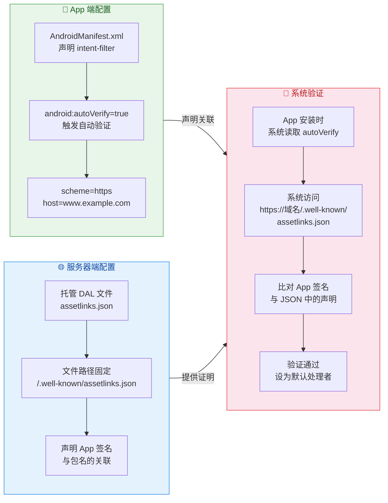
```mermaid
graph LR
    subgraph AppSide["📱 App 端配置"]
        direction TB
        A1["AndroidManifest.xml\n声明 intent-filter"]
        A2["android:autoVerify=true\n触发自动验证"]
        A3["scheme=https\nhost=www.example.com"]
        A1 --> A2
        A2 --> A3
    end

    subgraph ServerSide["🌐 服务器端配置"]
        direction TB
        B1["托管 DAL 文件\nassetlinks.json"]
        B2["文件路径固定\n/.well-known/assetlinks.json"]
        B3["声明 App 签名\n与包名的关联"]
        B1 --> B2
        B2 --> B3
    end

    subgraph Verify["🔐 系统验证"]
        direction TB
        C1["App 安装时\n系统读取 autoVerify"]
        C2["系统访问\nhttps://域名/.well-known/\nassetlinks.json"]
        C3["比对 App 签名\n与 JSON 中的声明"]
        C4["验证通过\n设为默认处理者"]
        C1 --> C2
        C2 --> C3
        C3 --> C4
    end

    AppSide -->|"声明关联"| Verify
    ServerSide -->|"提供证明"| Verify

    classDef appStyle fill:#E8F5E9,stroke:#43A047,color:#1B5E20
    classDef serverStyle fill:#E3F2FD,stroke:#1E88E5,color:#0D47A1
    classDef verifyStyle fill:#FCE4EC,stroke:#E53935,color:#B71C1C

    class AppSide appStyle
    class ServerSide serverStyle
    class Verify verifyStyle
```

**验证流程的详细拆解**：

**第一步：App 端声明 `autoVerify="true"`**。当你在 IntentFilter 上添加 `android:autoVerify="true"` 属性时，你就是在告诉系统："请在安装（或更新）这个 App 时，主动去验证我是否真的拥有这个域名。"

**第二步：系统发起验证请求**。App 安装完成后，系统会提取 IntentFilter 中声明的所有 `https` 域名，然后对每个域名发起一个 HTTPS GET 请求：

```
GET https://www.example.com/.well-known/assetlinks.json
```

注意这个路径是 **固定的、不可更改的**。系统只会访问 `/.well-known/assetlinks.json`，你不能把文件放在其他位置。

**第三步：服务器返回 DAL 文件**。你的 Web 服务器需要在上述路径返回一个 JSON 文件，声明"我允许包名为 xxx、签名为 yyy 的 App 处理我域名下的链接"。

**第四步：系统比对签名**。系统将 JSON 中声明的包名和签名指纹，与本地安装的 App 的实际包名和签名进行比对。如果完全匹配，验证通过，该 App 被设为此域名链接的 **默认处理者（default handler）**。

**关键细节**：验证是在 **App 安装或更新时** 进行的，而不是每次点击链接时。验证结果会被系统缓存。如果验证失败（比如服务器不可达、JSON 格式错误、签名不匹配），App Links 就退化为普通的 DeepLink——仍然能匹配，但会弹出消歧对话框。

#### App 端完整配置

```xml
<!-- AndroidManifest.xml -->
<activity
    android:name=".ui.ProductDetailActivity"
    android:exported="true">

    <!-- App Link IntentFilter -->
    <!-- autoVerify="true" 是 App Links 的关键开关 -->
    <!-- 系统在安装时会据此触发域名验证流程 -->
    <intent-filter android:autoVerify="true">
        <!-- ACTION_VIEW：标准的"查看"动作 -->
        <action android:name="android.intent.action.VIEW" />

        <!-- DEFAULT：隐式 Intent 必需 -->
        <category android:name="android.intent.category.DEFAULT" />
        <!-- BROWSABLE：允许从浏览器触发 -->
        <category android:name="android.intent.category.BROWSABLE" />

        <!-- App Links 必须使用 https scheme（http 也支持但不推荐） -->
        <!-- host 必须是你拥有的域名 -->
        <!-- pathPrefix 匹配 /product/ 开头的所有路径 -->
        <data
            android:scheme="https"
            android:host="www.example.com"
            android:pathPrefix="/product/" />
    </intent-filter>

    <!-- 可以同时保留自定义 scheme 的 DeepLink 作为兜底 -->
    <!-- 注意：这是一个独立的 intent-filter，不要和上面的合并 -->
    <intent-filter>
        <action android:name="android.intent.action.VIEW" />
        <category android:name="android.intent.category.DEFAULT" />
        <category android:name="android.intent.category.BROWSABLE" />

        <!-- 自定义 scheme 作为降级方案 -->
        <data
            android:scheme="myapp"
            android:host="product"
            android:pathPrefix="/" />
    </intent-filter>
</activity>
```

**为什么同时保留自定义 scheme？** 因为 App Links 只在 Android 6.0+ 上有效，且依赖网络验证。对于低版本设备、或者验证失败的场景，自定义 scheme 可以作为兜底方案。此外，App 内部的页面跳转（比如推送通知点击后的路由）通常使用自定义 scheme，因为它不需要经过浏览器，也不需要域名验证。

#### 服务器端 Digital Asset Links 配置

`assetlinks.json` 文件的格式是 Google 定义的标准，必须严格遵守：

```json
[
  {
    "relation": [
      "delegate_permission/common.handle_all_urls"
    ],
    "target": {
      "namespace": "android_app",
      "package_name": "com.example.myapp",
      "sha256_cert_fingerprints": [
        "AB:CD:EF:12:34:56:78:90:AB:CD:EF:12:34:56:78:90:AB:CD:EF:12:34:56:78:90:AB:CD:EF:12:34:56:78:90"
      ]
    }
  }
]
```

**各字段详解**：

- **`relation`**：声明授权关系的类型。`delegate_permission/common.handle_all_urls` 是 App Links 专用的关系类型，表示"我授权这个 App 处理我域名下的所有 URL"。这是目前唯一被 Android 系统识别的 relation 值（Google 的 Digital Asset Links 协议还支持其他 relation，但与 App Links 无关）。

- **`namespace`**：目标平台，固定为 `"android_app"`。

- **`package_name`**：你的 App 的 applicationId（即 `build.gradle` 中的 `applicationId`，而非 `AndroidManifest.xml` 中的 `package` 属性——虽然大多数情况下它们相同，但在使用 `applicationIdSuffix` 时会不同）。

- **`sha256_cert_fingerprints`**：App 签名证书的 SHA-256 指纹。这是验证的核心——只有持有对应签名密钥的 App 才能通过验证。**注意：debug 签名和 release 签名的指纹不同**，如果你需要在开发阶段测试 App Links，需要同时在 JSON 中声明两个指纹。

**如何获取签名指纹**：

```kotlin
// 方法 1：使用 keytool 命令行工具
// 对于 debug 签名（默认路径为 ~/.android/debug.keystore）
// keytool -list -v -keystore ~/.android/debug.keystore -alias androiddebugkey -storepass android
//
// 对于 release 签名
// keytool -list -v -keystore your-release-key.keystore -alias your-alias
//
// 输出中找到 SHA256: 那一行，复制整个指纹字符串

// 方法 2：如果使用 Google Play App Signing（推荐）
// 进入 Google Play Console → 你的 App → 设置 → 应用签名
// 复制"应用签名密钥证书"的 SHA-256 指纹
// 注意：不是"上传密钥证书"，而是 Google 托管的"应用签名密钥证书"

// 方法 3：在代码中动态获取（仅用于调试）
fun getSignatureFingerprint(context: Context): String {
    // 获取当前 App 的签名信息
    val packageInfo = if (Build.VERSION.SDK_INT >= Build.VERSION_CODES.P) {
        // Android 9.0+ 使用新 API，支持获取多个签名
        context.packageManager.getPackageInfo(
            context.packageName,
            PackageManager.GET_SIGNING_CERTIFICATES
        )
    } else {
        // 旧版 API（已废弃但仍可用）
        @Suppress("DEPRECATION")
        context.packageManager.getPackageInfo(
            context.packageName,
            PackageManager.GET_SIGNATURES
        )
    }

    // 提取签名证书
    val signatures = if (Build.VERSION.SDK_INT >= Build.VERSION_CODES.P) {
        // 新 API 返回 SigningInfo 对象
        packageInfo.signingInfo?.apkContentsSigners
    } else {
        // 旧 API 直接返回 Signature 数组
        @Suppress("DEPRECATION")
        packageInfo.signatures
    }

    // 计算 SHA-256 指纹
    val signature = signatures?.firstOrNull() ?: return "No signature found"
    val md = MessageDigest.getInstance("SHA-256")
    // 对签名的字节数组进行 SHA-256 哈希
    val digest = md.digest(signature.toByteArray())
    // 将字节数组转换为冒号分隔的十六进制字符串
    return digest.joinToString(":") { "%02X".format(it) }
}
```

**服务器端部署要求**：

`assetlinks.json` 的部署有几个严格的要求，任何一个不满足都会导致验证失败：

1. **必须通过 HTTPS 提供**，且证书必须有效（不能是自签名证书）。
2. **Content-Type 必须是 `application/json`**。
3. **必须可以无重定向直接访问**。系统在验证时不会跟随 HTTP 重定向（这一点在 Android 不同版本上行为略有差异，但最安全的做法是确保无重定向）。
4. **文件路径固定为 `/.well-known/assetlinks.json`**，不可更改。
5. **robots.txt 不能阻止 Google 的爬虫访问此文件**。

**多域名场景**：如果你的 App 需要处理多个域名的链接（比如 `www.example.com` 和 `m.example.com`），每个域名都需要独立部署自己的 `assetlinks.json` 文件。

**多 App 场景**：如果同一个域名需要关联多个 App（比如主 App 和 Lite 版），可以在同一个 JSON 文件中声明多个对象：

```json
[
  {
    "relation": ["delegate_permission/common.handle_all_urls"],
    "target": {
      "namespace": "android_app",
      "package_name": "com.example.myapp",
      "sha256_cert_fingerprints": ["AB:CD:..."]
    }
  },
  {
    "relation": ["delegate_permission/common.handle_all_urls"],
    "target": {
      "namespace": "android_app",
      "package_name": "com.example.myapp.lite",
      "sha256_cert_fingerprints": ["12:34:..."]
    }
  }
]
```

#### 验证状态的调试与排查

App Links 验证失败是开发中最常见的问题之一，而且失败原因往往不直观。Android 提供了几个调试工具：

```kotlin
// ========== 调试命令（在终端/ADB Shell 中执行） ==========

// 1. 查看 App 的域名验证状态
// adb shell pm get-app-links com.example.myapp
//
// 输出示例：
// com.example.myapp:
//   ID: 12345678-1234-1234-1234-123456789abc
//   Signatures: [AB:CD:EF:...]
//   Domains:
//     www.example.com:
//       Status: verified    ← 验证成功
//     m.example.com:
//       Status: none        ← 验证失败或未验证
//
// Status 可能的值：
// - verified：验证通过，App 是此域名的默认处理者
// - none：未验证或验证失败
// - always：用户手动设置为"始终打开"
// - never：用户手动设置为"从不打开"
// - undefined：系统尚未尝试验证

// 2. 手动触发重新验证（Android 12+）
// adb shell pm verify-app-links --re-verify com.example.myapp
//
// 这会清除缓存的验证结果，强制系统重新访问 assetlinks.json

// 3. 重置所有验证状态（Android 12+）
// adb shell pm set-app-links --package com.example.myapp 0 all
//
// 将所有域名的状态重置为"未验证"

// 4. 手动设置验证状态（用于调试，绕过实际验证）
// adb shell pm set-app-links --package com.example.myapp 1024 www.example.com
//
// 1024 = STATE_APPROVED，强制标记为已验证

// 5. 测试 DeepLink 是否能正确打开
// adb shell am start -a android.intent.action.VIEW \
//   -c android.intent.category.BROWSABLE \
//   -d "https://www.example.com/product/123"
//
// 如果 App Links 验证通过，会直接打开 App
// 如果未通过，会弹出选择对话框
```

**常见验证失败原因排查清单**：

| 问题 | 症状 | 解决方案 |
|------|------|----------|
| `assetlinks.json` 不可访问 | Status: none | 检查服务器配置，确保 HTTPS 可达 |
| JSON 格式错误 | Status: none | 使用 Google 的 [DAL 验证工具](https://developers.google.com/digital-asset-links/tools/generator) 检查 |
| 签名指纹不匹配 | Status: none | 确认使用的是 release 签名（或 Play App Signing 的签名） |
| 存在 HTTP 重定向 | Status: none | 确保直接返回 200，无 301/302 |
| `Content-Type` 不正确 | Status: none | 服务器响应头必须包含 `Content-Type: application/json` |
| 使用了 Google Play App Signing 但填了上传密钥的指纹 | Status: none | 从 Play Console 获取正确的应用签名密钥指纹 |
| `robots.txt` 阻止了访问 | Status: none | 确保 `/.well-known/` 路径未被 robots.txt 禁止 |

---

### Web 跳转 App 的完整策略

在实际业务中，"从 Web 页面跳转到 App"是一个比纯技术配置复杂得多的问题。你需要考虑：用户是否安装了 App？如果没安装怎么办？不同浏览器的行为差异如何处理？下面我们从实际场景出发，构建一套完整的跳转策略。

#### 场景分析与策略选择

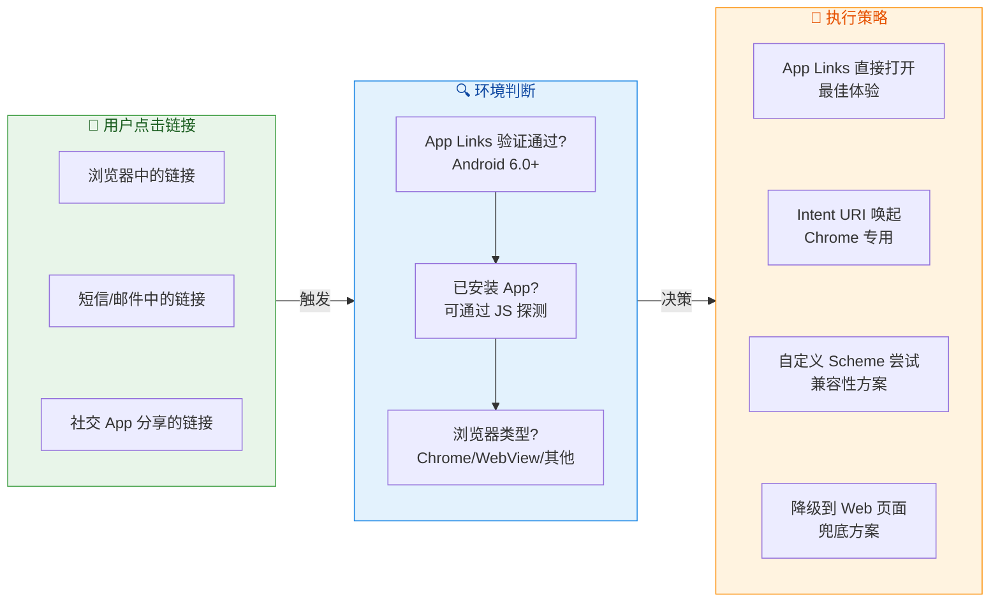
```mermaid
graph LR
    subgraph Entry["🔗 用户点击链接"]
        direction TB
        E1["浏览器中的链接"]
        E2["短信/邮件中的链接"]
        E3["社交 App 分享的链接"]
        E1 ~~~ E2
        E2 ~~~ E3
    end

    subgraph Check["🔍 环境判断"]
        direction TB
        C1["App Links 验证通过?\nAndroid 6.0+"]
        C2["已安装 App?\n可通过 JS 探测"]
        C3["浏览器类型?\nChrome/WebView/其他"]
        C1 --> C2
        C2 --> C3
    end

    subgraph Action["🎯 执行策略"]
        direction TB
        D1["App Links 直接打开\n最佳体验"]
        D2["Intent URI 唤起\nChrome 专用"]
        D3["自定义 Scheme 尝试\n兼容性方案"]
        D4["降级到 Web 页面\n兜底方案"]
        D1 ~~~ D2
        D2 ~~~ D3
        D3 ~~~ D4
    end

    Entry -->|"触发"| Check
    Check -->|"决策"| Action

    classDef entryStyle fill:#E8F5E9,stroke:#43A047,color:#1B5E20
    classDef checkStyle fill:#E3F2FD,stroke:#1E88E5,color:#0D47A1
    classDef actionStyle fill:#FFF3E0,stroke:#FB8C00,color:#E65100

    class Entry entryStyle
    class Check checkStyle
    class Action actionStyle
```

#### 策略一：App Links 直接打开（最优方案）

如果你的 App Links 配置正确且验证通过，用户在 Chrome 中点击 `https://www.example.com/product/123` 时，系统会直接打开你的 App，完全不经过浏览器渲染。这是最理想的体验。

但这个方案有前提条件：
- 用户设备运行 Android 6.0+
- App 已安装且验证通过
- 用户没有手动取消过"默认打开"设置

#### 策略二：Chrome Intent URI（Chrome 专用方案）

Google Chrome 支持一种特殊的 URI 格式——**Intent URI**。它允许你在链接中编码一个完整的 Android Intent，并且支持指定"如果 App 未安装则跳转到的 fallback URL"。

```kotlin
// Intent URI 的格式（这是写在 HTML 页面中的链接）
// intent:
//   //product/detail?id=123          ← URI 的 host + path + query
//   #Intent;                          ← Intent 参数开始标记
//     scheme=myapp;                   ← 自定义 scheme
//     package=com.example.myapp;      ← 目标 App 的包名
//     S.browser_fallback_url=https%3A%2F%2Fwww.example.com%2Fproduct%2F123;
//                                     ← 未安装时的降级 URL（需要 URL 编码）
//   end                               ← Intent 参数结束标记

// 完整的 HTML 链接示例：
// <a href="intent://product/detail?id=123#Intent;scheme=myapp;package=com.example.myapp;S.browser_fallback_url=https%3A%2F%2Fwww.example.com%2Fproduct%2F123;end">
//   打开商品详情
// </a>
```

**Intent URI 的优势**：
- `package` 参数确保只有指定包名的 App 才会被唤起，避免了 scheme 劫持。
- `S.browser_fallback_url` 提供了优雅的降级：如果 App 未安装，Chrome 会自动跳转到指定的 Web 页面（可以是商品详情的 Web 版，也可以是 App 下载页）。
- 不会出现"无法打开页面"的错误提示。

**局限性**：Intent URI 是 Chrome 的私有协议，其他浏览器（Firefox、Samsung Browser 等）不一定支持。

#### 策略三：JavaScript 中间页（通用兼容方案）

对于需要兼容各种浏览器的场景，通常会使用一个 JavaScript 中间页来实现"先尝试唤起 App，失败后降级到 Web"的逻辑：

```kotlin
// 以下是中间页的 JavaScript 逻辑（伪代码，展示核心思路）
// 这段代码运行在 Web 页面中，不是 Android 代码

// ===== 中间页跳转策略 =====
//
// 核心思路：
// 1. 尝试通过自定义 scheme 唤起 App
// 2. 设置一个定时器（通常 2-3 秒）
// 3. 如果 App 被成功唤起，页面会进入后台，定时器不会触发
// 4. 如果 App 未安装，定时器触发，跳转到降级页面
//
// 伪代码：
// function tryOpenApp() {
//     var startTime = Date.now();
//     var appSchemeUrl = "myapp://product/detail?id=123";
//     var fallbackUrl = "https://www.example.com/product/123";
//     var downloadUrl = "https://play.google.com/store/apps/details?id=com.example.myapp";
//
//     // 通过 iframe 尝试唤起（避免直接 location.href 导致页面跳转失败时显示错误）
//     var iframe = document.createElement("iframe");
//     iframe.style.display = "none";
//     iframe.src = appSchemeUrl;
//     document.body.appendChild(iframe);
//
//     // 设置降级定时器
//     setTimeout(function() {
//         var elapsed = Date.now() - startTime;
//         // 如果经过的时间远大于定时器设定时间，说明 App 被唤起过（页面曾进入后台）
//         if (elapsed < 3500) {
//             // App 未被唤起，执行降级
//             window.location.href = fallbackUrl; // 或 downloadUrl
//         }
//     }, 2500);
// }
```

这种方案虽然广泛使用，但存在明显的缺陷：定时器的判断并不可靠（不同设备的性能差异会影响时间判断），而且在某些浏览器中 iframe 方式已被禁用。因此，**App Links 仍然是最推荐的方案**，JavaScript 中间页只应作为兼容性兜底。

#### 在 App 中处理 DeepLink 路由

无论通过哪种方式进入 App，最终都需要在 App 内部将 URI 解析为具体的页面导航。在大型 App 中，通常会构建一个 **统一的 DeepLink 路由器（Router）**：

```kotlin
// DeepLinkRouter.kt
// 统一的 DeepLink 路由分发器
// 所有 DeepLink 入口（Activity、通知点击、推送等）都通过此类进行路由
object DeepLinkRouter {

    // 路由表：将 URI 模式映射到具体的处理逻辑
    // 使用 Regex 支持灵活的路径匹配
    private val routeTable: List<RouteEntry> = listOf(
        // 商品详情页：匹配 /product/{id} 格式的路径
        RouteEntry(
            pattern = Regex("^/product/(\\d+)$"),
            handler = { context, uri, matchResult ->
                // 从正则匹配结果中提取商品 ID
                val productId = matchResult.groupValues[1]
                // 构造目标 Activity 的 Intent
                Intent(context, ProductDetailActivity::class.java).apply {
                    // 将商品 ID 作为 Extra 传递
                    putExtra("product_id", productId)
                }
            }
        ),
        // 订单详情页：匹配 /order/{orderId} 格式
        RouteEntry(
            pattern = Regex("^/order/([A-Za-z0-9]+)$"),
            handler = { context, uri, matchResult ->
                val orderId = matchResult.groupValues[1]
                Intent(context, OrderDetailActivity::class.java).apply {
                    putExtra("order_id", orderId)
                }
            }
        ),
        // 搜索页：匹配 /search?q=xxx 格式
        RouteEntry(
            pattern = Regex("^/search$"),
            handler = { context, uri, _ ->
                // 搜索关键词从 query 参数中获取
                val keyword = uri.getQueryParameter("q") ?: ""
                Intent(context, SearchActivity::class.java).apply {
                    putExtra("keyword", keyword)
                }
            }
        )
    )

    /**
     * 路由分发入口
     * @param context 上下文
     * @param uri 待路由的 URI
     * @return true 表示路由成功，false 表示无匹配规则
     */
    fun route(context: Context, uri: Uri): Boolean {
        // 获取 URI 的路径部分（不含 scheme 和 host）
        val path = uri.path ?: return false

        // 遍历路由表，寻找第一个匹配的规则
        for (entry in routeTable) {
            val matchResult = entry.pattern.find(path)
            if (matchResult != null) {
                // 匹配成功，调用对应的 handler 生成 Intent
                val intent = entry.handler(context, uri, matchResult)
                // 如果从非 Activity 上下文启动，需要添加 NEW_TASK 标志
                if (context !is Activity) {
                    intent.addFlags(Intent.FLAG_ACTIVITY_NEW_TASK)
                }
                // 启动目标 Activity
                context.startActivity(intent)
                return true
            }
        }

        // 没有匹配的路由规则
        Log.w("DeepLinkRouter", "No route matched for URI: $uri")
        return false
    }

    /**
     * 路由条目数据类
     * @param pattern 路径匹配的正则表达式
     * @param handler 匹配成功后的 Intent 构造函数
     */
    data class RouteEntry(
        val pattern: Regex,
        val handler: (Context, Uri, MatchResult) -> Intent
    )
}
```

在入口 Activity 中使用路由器：

```kotlin
// DeepLinkDispatcherActivity.kt
// 专门用于接收 DeepLink 的透明 Activity
// 它不显示任何 UI，仅负责将 URI 分发到正确的目标页面
class DeepLinkDispatcherActivity : AppCompatActivity() {

    override fun onCreate(savedInstanceState: Bundle?) {
        super.onCreate(savedInstanceState)
        // 不设置 contentView——这是一个透明的分发器

        // 从 Intent 中获取 DeepLink URI
        val uri = intent?.data

        if (uri != null) {
            // 尝试路由到目标页面
            val handled = DeepLinkRouter.route(this, uri)
            if (!handled) {
                // 路由失败：URI 格式不被识别
                // 降级策略：打开 App 首页
                startActivity(Intent(this, MainActivity::class.java))
            }
        } else {
            // 没有 URI 数据，直接打开首页
            startActivity(Intent(this, MainActivity::class.java))
        }

        // 分发完成后立即关闭自身，避免在返回栈中留下空白页面
        finish()
    }
}
```

**为什么使用透明的 Dispatcher Activity？** 这是一个常见的架构模式。如果你直接让 `ProductDetailActivity` 接收 DeepLink，那么每个可被 DeepLink 打开的页面都需要在 `onCreate` 中处理 URI 解析逻辑，代码会非常分散。使用一个统一的 Dispatcher Activity 作为所有 DeepLink 的入口，可以将路由逻辑集中管理，也便于添加统一的埋点、鉴权、参数校验等横切关注点。

#### Deferred DeepLink（延迟深度链接）

还有一种特殊场景值得一提：**用户点击 DeepLink 时尚未安装 App**。普通的 DeepLink 在这种情况下只能跳转到应用商店或 Web 页面。但如果我们希望用户 **安装 App 后首次打开时，仍然能跳转到之前点击的那个页面**，就需要 Deferred DeepLink。

Deferred DeepLink 的实现原理是：

1. 用户点击链接时，中间页将 DeepLink URI 和设备指纹信息发送到服务器。
2. 用户跳转到应用商店下载并安装 App。
3. App 首次启动时，向服务器查询"这个设备是否有待处理的 DeepLink"。
4. 如果有，服务器返回之前保存的 URI，App 执行对应的路由。

Google 提供的 **Play Install Referrer API** 和 **Firebase Dynamic Links**（已于 2025 年停止服务，替代方案为 **Firebase App Links** 或第三方服务如 Branch、AppsFlyer）都可以实现 Deferred DeepLink。这个机制在营销推广场景中非常重要——用户从广告点击到最终进入 App 的转化路径可以被完整追踪。

---

### DeepLink 与 Navigation Component 的集成

在使用 Jetpack Navigation Component 的项目中，DeepLink 的配置可以更加声明式和集中化。Navigation 组件允许你直接在导航图（Navigation Graph）中声明 DeepLink，而不需要在 `AndroidManifest.xml` 中为每个 Fragment 目的地手动配置 IntentFilter。

```xml
<!-- nav_graph.xml -->
<!-- Navigation Graph 中声明 DeepLink -->
<navigation
    xmlns:android="http://schemas.android.com/apk/res/android"
    xmlns:app="http://schemas.android.com/apk/res-auto"
    android:id="@+id/nav_graph"
    app:startDestination="@id/homeFragment">

    <!-- 商品详情 Fragment -->
    <fragment
        android:id="@+id/productDetailFragment"
        android:name=".ui.ProductDetailFragment"
        android:label="商品详情">

        <!-- 声明此 Fragment 可以通过 DeepLink 直接到达 -->
        <!-- {id} 是路径参数占位符，会自动提取为 argument -->
        <deepLink
            app:uri="https://www.example.com/product/{id}" />

        <!-- 也可以同时声明自定义 scheme 的 DeepLink -->
        <deepLink
            app:uri="myapp://product/{id}" />

        <!-- 声明此目的地接收的参数 -->
        <argument
            android:name="id"
            app:argType="string" />
    </fragment>

    <!-- 搜索页 Fragment -->
    <fragment
        android:id="@+id/searchFragment"
        android:name=".ui.SearchFragment"
        android:label="搜索">

        <!-- 支持 query 参数：?q={keyword} -->
        <deepLink
            app:uri="https://www.example.com/search?q={keyword}" />

        <argument
            android:name="keyword"
            app:argType="string"
            android:defaultValue="" />
    </fragment>
</navigation>
```

在 `AndroidManifest.xml` 中，你只需要为宿主 Activity 添加一个 `<nav-graph>` 标签，Navigation 组件会在编译时自动生成对应的 IntentFilter：

```xml
<!-- AndroidManifest.xml -->
<activity
    android:name=".ui.MainActivity"
    android:exported="true">

    <!-- Navigation 组件会根据 nav_graph 中的 deepLink 声明 -->
    <!-- 自动生成对应的 intent-filter -->
    <nav-graph android:value="@navigation/nav_graph" />
</activity>
```

在 Fragment 中接收 DeepLink 参数：

```kotlin
// ProductDetailFragment.kt
class ProductDetailFragment : Fragment() {

    // 使用 Safe Args 插件生成的类型安全参数访问器
    // 编译时自动生成，避免手动从 Bundle 中取值
    private val args: ProductDetailFragmentArgs by navArgs()

    override fun onViewCreated(view: View, savedInstanceState: Bundle?) {
        super.onViewCreated(view, savedInstanceState)

        // 直接访问 DeepLink 中的路径参数 {id}
        // Navigation 组件已经自动从 URI 中提取并注入到 arguments 中
        val productId = args.id

        // 使用 productId 加载数据
        viewModel.loadProduct(productId)
    }
}
```

**Navigation DeepLink 的优势**：

1. **声明式配置**：DeepLink 规则与目的地定义在一起，一目了然。
2. **自动参数提取**：路径参数 `{id}` 和查询参数 `{keyword}` 会自动映射为 Fragment 的 argument，无需手动解析 URI。
3. **回退栈自动构建**：当用户通过 DeepLink 直接进入某个深层页面时，Navigation 组件会自动构建完整的回退栈。比如用户通过 DeepLink 进入商品详情页，按返回键时会回到首页，而不是直接退出 App。这个行为是通过导航图中的 `startDestination` 自动推断的。
4. **编译时校验**：如果 DeepLink URI 中的参数名与 argument 声明不匹配，编译时就会报错。

---

### 安全性考量

DeepLink 作为 App 的外部入口，天然面临安全风险。任何外部输入都不可信，DeepLink 携带的 URI 参数也不例外。

**风险一：参数注入**。攻击者可以构造恶意的 DeepLink URI，注入非预期的参数值。例如，如果你的 App 根据 DeepLink 参数直接拼接 SQL 查询或加载 WebView URL，就可能遭受注入攻击。

```kotlin
// ❌ 危险：直接将 DeepLink 参数用于 WebView 加载
// 攻击者可以构造 myapp://webview?url=javascript:alert(document.cookie)
val url = intent.data?.getQueryParameter("url")
webView.loadUrl(url!!)
// ✅ 安全：对 DeepLink 参数进行严格校验
val url = intent.data?.getQueryParameter("url")
if (url != null && isAllowedDomain(url)) {
    // 只有白名单域名才允许加载
    webView.loadUrl(url)
} else {
    // 非法 URL，拒绝加载并记录安全日志
    Log.w("Security", "Blocked suspicious DeepLink URL: $url")
    showError("无法打开此链接")
}

// 域名白名单校验函数
private fun isAllowedDomain(url: String): Boolean {
    return try {
        // 解析 URL 并提取 host
        val uri = Uri.parse(url)
        val host = uri.host ?: return false
        // 必须是 HTTPS 协议
        val isHttps = uri.scheme == "https"
        // 必须在白名单域名列表中
        val allowedDomains = setOf(
            "www.example.com",
            "m.example.com",
            "static.example.com"
        )
        // 两个条件同时满足才放行
        isHttps && allowedDomains.contains(host)
    } catch (e: Exception) {
        // URL 解析失败，视为非法
        false
    }
}
```

**风险二：Scheme 劫持（Scheme Hijacking）**。前面已经提到，自定义 URL Scheme 没有唯一性保证。恶意 App 可以注册与你相同的 scheme，拦截本应发送给你的 DeepLink，从而窃取用户数据（比如 OAuth 回调中的 authorization code）。**App Links 是解决此问题的根本方案**——因为域名验证确保了只有真正的域名拥有者才能成为默认处理者。

**风险三：未授权的页面访问**。某些页面（如订单详情、个人信息）需要登录后才能查看。如果 DeepLink 直接跳转到这些页面而不检查登录状态，就会造成信息泄露。

```kotlin
// DeepLinkRouter 中添加鉴权拦截
fun route(context: Context, uri: Uri): Boolean {
    val path = uri.path ?: return false

    for (entry in routeTable) {
        val matchResult = entry.pattern.find(path)
        if (matchResult != null) {
            // 检查此路由是否需要登录
            if (entry.requiresAuth && !UserSession.isLoggedIn()) {
                // 用户未登录：先跳转登录页，登录成功后再重定向到目标页面
                val loginIntent = Intent(context, LoginActivity::class.java).apply {
                    // 将原始 DeepLink URI 作为参数传递给登录页
                    // 登录成功后，LoginActivity 会取出此 URI 并重新路由
                    putExtra("pending_deep_link", uri.toString())
                }
                context.startActivity(loginIntent)
                return true
            }

            // 已登录或无需登录，正常路由
            val intent = entry.handler(context, uri, matchResult)
            context.startActivity(intent)
            return true
        }
    }
    return false
}
```

**风险四：Intent Redirection 漏洞**。如果你的 App 从 DeepLink 中提取一个 Intent 并直接执行（比如通过 `Intent.parseUri()` 将 URI 转换为 Intent 再 `startActivity`），攻击者可以构造一个指向你 App 内部非导出组件的 Intent，绕过 `exported="false"` 的访问限制。这是因为你的 App 自身拥有访问自己所有组件的权限。

```kotlin
// ❌ 极度危险：从外部输入直接解析并执行 Intent
val intentUri = intent.data?.getQueryParameter("intent_uri")
val targetIntent = Intent.parseUri(intentUri, Intent.URI_INTENT_SCHEME)
// 攻击者可以构造指向 App 内部私有 Activity 的 Intent
startActivity(targetIntent)

// ✅ 安全：永远不要从外部输入直接构造 Intent
// 应该使用路由表模式，将 URI 映射为预定义的、受控的 Intent
```

---

### DeepLink 测试策略

完善的测试是 DeepLink 可靠性的保障。DeepLink 涉及系统级的 Intent 分发，单纯的单元测试无法覆盖全部场景，需要结合多种测试手段。

#### ADB 命令行测试

这是最直接的测试方式，可以模拟各种 DeepLink 触发场景：

```kotlin
// ========== ADB 测试命令 ==========

// 1. 基础 DeepLink 测试：模拟用户点击自定义 scheme 链接
// adb shell am start
//   -a android.intent.action.VIEW          ← ACTION_VIEW
//   -c android.intent.category.BROWSABLE   ← 模拟浏览器来源
//   -d "myapp://product/detail?id=123"     ← DeepLink URI
//   com.example.myapp                       ← 目标包名（可选，指定后为显式调用）

// 2. App Links 测试：模拟 HTTPS 链接点击
// adb shell am start
//   -a android.intent.action.VIEW
//   -c android.intent.category.BROWSABLE
//   -d "https://www.example.com/product/123"
// 注意：不指定包名，让系统自行解析，验证 App Links 是否生效

// 3. 测试 App 未运行时的冷启动 DeepLink
// 先强制停止 App
// adb shell am force-stop com.example.myapp
// 再触发 DeepLink
// adb shell am start -a android.intent.action.VIEW -d "myapp://product/detail?id=123"

// 4. 测试 App 在后台时的热启动 DeepLink（验证 onNewIntent）
// 先正常打开 App 并进入某个页面
// 然后按 Home 键将 App 切到后台
// 再触发 DeepLink
// adb shell am start -a android.intent.action.VIEW -d "myapp://product/detail?id=456"
// 验证页面是否正确更新为 id=456 的内容

// 5. 批量测试脚本示例（Shell 脚本）
// #!/bin/bash
// DEEP_LINKS=(
//   "myapp://product/detail?id=1"
//   "myapp://order/ABC123"
//   "myapp://search?q=android"
//   "https://www.example.com/product/999"
//   "myapp://invalid/path"              # 测试无效路径的降级处理
//   "myapp://product/detail"            # 测试缺少参数的防御处理
// )
// for link in "${DEEP_LINKS[@]}"; do
//   echo "Testing: $link"
//   adb shell am start -a android.intent.action.VIEW -c android.intent.category.BROWSABLE -d "$link"
//   sleep 3  # 等待页面加载
//   # 可以在这里添加截图命令：adb shell screencap /sdcard/screenshot.png
// done
```

#### 自动化 UI 测试

```kotlin
// DeepLinkInstrumentedTest.kt
// 使用 AndroidX Test 框架编写 DeepLink 的自动化测试
@RunWith(AndroidJUnit4::class)
class DeepLinkInstrumentedTest {

    // ActivityScenario 用于在测试中启动和控制 Activity 的生命周期
    // 它是 ActivityTestRule 的现代替代品
    @Test
    fun testProductDeepLink_opensProductDetail() {
        // 构造一个模拟 DeepLink 的 Intent
        val deepLinkIntent = Intent(
            Intent.ACTION_VIEW,
            Uri.parse("myapp://product/detail?id=42")
        ).apply {
            // 添加 BROWSABLE 类别，模拟浏览器来源
            addCategory(Intent.CATEGORY_BROWSABLE)
        }

        // 使用 ActivityScenario 启动 Dispatcher Activity
        // launchActivity 会使用提供的 Intent 来启动 Activity
        ActivityScenario.launch<DeepLinkDispatcherActivity>(deepLinkIntent)

        // 验证：ProductDetailActivity 应该被启动
        // 使用 Espresso 检查目标页面的 UI 元素是否显示
        Espresso.onView(ViewMatchers.withId(R.id.product_title))
            .check(ViewAssertions.matches(ViewMatchers.isDisplayed()))

        // 验证：商品 ID 应该正确传递
        // 检查页面上是否显示了对应的商品信息
        Espresso.onView(ViewMatchers.withId(R.id.product_id_text))
            .check(ViewAssertions.matches(ViewMatchers.withText("商品 ID: 42")))
    }

    @Test
    fun testInvalidDeepLink_fallsBackToHome() {
        // 测试无效的 DeepLink 路径是否正确降级到首页
        val invalidIntent = Intent(
            Intent.ACTION_VIEW,
            Uri.parse("myapp://nonexistent/path")
        ).apply {
            addCategory(Intent.CATEGORY_BROWSABLE)
        }

        ActivityScenario.launch<DeepLinkDispatcherActivity>(invalidIntent)

        // 验证：应该降级到 MainActivity（首页）
        Espresso.onView(ViewMatchers.withId(R.id.home_container))
            .check(ViewAssertions.matches(ViewMatchers.isDisplayed()))
    }

    @Test
    fun testDeepLink_withoutAuth_redirectsToLogin() {
        // 确保用户未登录
        UserSession.logout()

        // 尝试访问需要登录的页面
        val authRequiredIntent = Intent(
            Intent.ACTION_VIEW,
            Uri.parse("myapp://order/ABC123")
        ).apply {
            addCategory(Intent.CATEGORY_BROWSABLE)
        }

        ActivityScenario.launch<DeepLinkDispatcherActivity>(authRequiredIntent)

        // 验证：应该跳转到登录页面
        Espresso.onView(ViewMatchers.withId(R.id.login_button))
            .check(ViewAssertions.matches(ViewMatchers.isDisplayed()))
    }
}
```

---

### DeepLink 与 App Links 的对比总结

经过前面的详细讲解，我们可以从多个维度对比这两种机制：

| 维度 | DeepLink（自定义 Scheme） | Android App Links |
|------|--------------------------|-------------------|
| **Scheme** | 自定义（如 `myapp://`） | 必须是 `https://`（或 `http://`） |
| **唯一性** | 无保证，任何 App 可注册相同 scheme | 域名全球唯一 + 签名验证 |
| **消歧对话框** | 多个 App 匹配时弹出 | 验证通过后直接打开，无对话框 |
| **最低 API** | 无限制 | API 23（Android 6.0） |
| **服务器配置** | 不需要 | 需要部署 `assetlinks.json` |
| **安全性** | 低（易被劫持） | 高（域名 + 签名双重验证） |
| **未安装降级** | 无原生支持 | 浏览器自动打开 Web 页面 |
| **适用场景** | App 内部路由、推送跳转、兼容旧设备 | 外部链接跳转、营销推广、SEO |
| **配置复杂度** | 低 | 中（需要服务器端配合） |

**最佳实践建议**：在实际项目中，**两者应该同时配置**。App Links 作为外部链接的主要方案，提供最佳的用户体验和安全性；自定义 Scheme 作为内部路由和兼容性兜底方案。统一的 DeepLink Router 屏蔽了两者的差异，上层业务代码无需关心链接是通过哪种方式进入的。

---

**📝 练习题**

某 App 在 `AndroidManifest.xml` 中为 `ProductActivity` 配置了如下 `<intent-filter>`：

```xml
<intent-filter android:autoVerify="true">
    <action android:name="android.intent.action.VIEW" />
    <category android:name="android.intent.category.DEFAULT" />
    <category android:name="android.intent.category.BROWSABLE" />
    <data android:scheme="https" android:host="shop.example.com" android:pathPrefix="/product/" />
    <data android:scheme="myapp" android:host="product" />
</intent-filter>
```

用户在 Chrome 中点击 `https://shop.example.com/product/123`，但系统弹出了消歧对话框而非直接打开 App。以下哪项最可能是根本原因？

A. 缺少 `CATEGORY_BROWSABLE` 声明，导致浏览器无法触发此 IntentFilter

B. 同一个 `<intent-filter>` 中混合了 `https` 和 `myapp` 两种 scheme 的 `<data>` 标签，导致 `autoVerify` 验证时产生了非预期的 scheme/host 组合，可能影响验证结果

C. `pathPrefix="/product/"` 无法匹配 `/product/123`，应该改为 `path="/product/123"`

D. `autoVerify="true"` 只在 Android 12 及以上版本生效，低版本会自动忽略

**【答案】** B

**【解析】** 这道题考查的是 `<data>` 标签的属性合并规则以及 App Links 验证的注意事项。

**选项 A 错误**：代码中已经明确声明了 `<category android:name="android.intent.category.BROWSABLE" />`，所以浏览器可以正常触发此 IntentFilter。

**选项 B 正确**：这是本题的核心考点。同一个 `<intent-filter>` 内的多个 `<data>` 标签会进行 **属性合并**（笛卡尔积）。这意味着系统会认为此 filter 同时匹配以下四种组合：`https://shop.example.com/product/...`、`https://product/...`（无意义）、`myapp://shop.example.com/product/...`（非预期）、`myapp://product/...`。当 `autoVerify="true"` 触发验证时，系统需要验证 filter 中声明的 **所有** https 域名。由于属性合并，`product` 也可能被当作一个需要验证的 host（虽然它与 `myapp` scheme 关联，但合并后也与 `https` 关联了）。`https://product/.well-known/assetlinks.json` 显然不可达，这会导致验证失败，App Links 退化为普通 DeepLink，从而弹出消歧对话框。**正确做法是将两种 scheme 的 `<data>` 拆分到两个独立的 `<intent-filter>` 中。**

**选项 C 错误**：`pathPrefix="/product/"` 表示匹配以 `/product/` 开头的所有路径，`/product/123` 完全符合此前缀规则。`path` 才是精确匹配，`pathPrefix` 是前缀匹配。

**选项 D 错误**：`autoVerify="true"` 从 Android 6.0（API 23）开始生效，而非 Android 12。Android 12 对 App Links 的验证机制做了改进（更严格的验证、新增了 `pm verify-app-links` 调试命令等），但 `autoVerify` 本身在 API 23 就已经引入。

---

## 本章小结

### Intent 机制的全景回顾

纵观本章内容，我们从 Intent 的设计哲学出发，逐步深入到组件通信的每一个关键环节。现在是时候将所有知识点串联起来，形成一张完整的认知地图。

Intent 是 Android 组件通信的**唯一标准信使**（the universal messaging object）。它不是简单的方法调用，而是一种**声明式的意图描述**——"我想做什么"，而非"我要调用谁的哪个方法"。这种设计哲学贯穿了 Android 整个应用层架构，使得四大组件之间可以在**完全解耦**的前提下实现灵活协作。理解这一点，是理解 Android 应用层通信模型的根基。

### 核心知识脉络梳理

本章的知识体系可以沿着一条清晰的主线展开：**构造 Intent → 携带数据 → 发送 Intent → 系统路由 → 目标响应 → 结果回传**。每一个环节都有其对应的核心机制。

**第一层：Intent 的本质与匹配规则。** Intent 既是消息传递对象（messaging object），也是组件激活令牌（activation token）。它通过 Action、Category、Data 三元组描述意图，系统的 PackageManagerService 负责根据 IntentFilter 的匹配规则找到合适的目标组件。匹配必须同时通过 Action 测试、Category 测试和 Data 测试三重过滤，任何一项失败都会导致解析失败。特别需要记住的是，系统会自动为通过 `startActivity()` 发送的隐式 Intent 添加 `CATEGORY_DEFAULT`，因此目标 Activity 的 IntentFilter 中必须声明该 Category。

**第二层：显式与隐式的选择策略。** 显式 Intent 通过 ComponentName 精确指定目标，适用于应用内部组件间的通信，效率高、确定性强。隐式 Intent 只描述意图而不指定目标，由系统进行动态解析，适用于跨应用协作场景。两者的选择不是随意的——应用内部通信**必须优先使用显式 Intent**（这也是 Android 5.0 之后对 Service 的强制要求），跨应用协作才使用隐式 Intent。隐式 Intent 在发送前应当调用 `resolveActivity()` 进行安全检查，避免因无匹配组件而导致 ActivityNotFoundException 崩溃。

**第三层：数据传递与序列化。** Intent 通过内部的 Bundle（本质是 `ArrayMap<String, Object>`）承载键值对数据。但 Binder 事务缓冲区的限制（通常约 1MB，所有并发事务共享）决定了单次传递的数据量不能过大，否则会触发 TransactionTooLargeException。这不是一个理论上的边界情况，而是实际开发中极其常见的崩溃。传递复杂对象时，必须进行序列化：Java 的 Serializable 基于反射，实现简单但性能较差；Android 的 Parcelable 基于手动编排的二进制写入，性能优异但代码冗长；Kotlin 的 `@Parcelize` 注解通过编译器插件自动生成 Parcelable 实现，兼顾了性能与开发效率，是现代 Android 开发的首选方案。

**第四层：PendingIntent 的权限委托。** PendingIntent 将一个 Intent 包装成一个可以跨进程传递的令牌（token），允许外部应用或系统服务在未来某个时刻**以你的应用身份和权限**执行该 Intent。它是通知点击、闹钟触发、桌面小组件交互等场景的基础设施。理解 PendingIntent 的 Flag 策略至关重要：`FLAG_UPDATE_CURRENT` 复用已有令牌并更新 extras，`FLAG_IMMUTABLE`（Android 12+ 强制要求）防止外部篡改 Intent 内容，`FLAG_MUTABLE` 仅在确实需要外部填充数据时使用。错误的 Flag 选择会导致通知内容错乱或安全漏洞。

**第五层：结果回传的演进。** 从传统的 `startActivityForResult()` + `onActivityResult()` 到现代的 Activity Result API（`ActivityResultContract` + `ActivityResultLauncher`），Android 在结果回传机制上经历了一次重要的架构升级。旧 API 的 requestCode 管理混乱、回调集中在 `onActivityResult()` 中难以维护；新 API 通过类型安全的 Contract 抽象和注册-启动分离的设计，实现了**关注点分离**和**可测试性**。新 API 不仅适用于 Activity 间的结果回传，还统一了权限请求、文件选择、拍照等系统交互的调用方式。

**第六层：Deep Link 与 App Link。** Deep Link 通过自定义 URL Scheme（如 `myapp://product/123`）或标准 HTTP URL 实现从外部（网页、其他应用、通知）直接跳转到应用内特定页面。基础的 Deep Link 使用 `<intent-filter>` 中的 `<data>` 标签声明 Scheme、Host、Path 的匹配规则。App Link 是 Deep Link 的增强版本，通过 Digital Asset Links 文件实现域名所有权验证，使得 HTTP/HTTPS 链接可以**无歧义地**直接打开对应应用，而不弹出选择器对话框。App Link 的配置需要服务端配合放置 `assetlinks.json` 文件，并在 `<intent-filter>` 中添加 `android:autoVerify="true"` 属性。

### 全局架构视图

下面这张图将本章所有核心概念的关系和流转路径整合在一起：

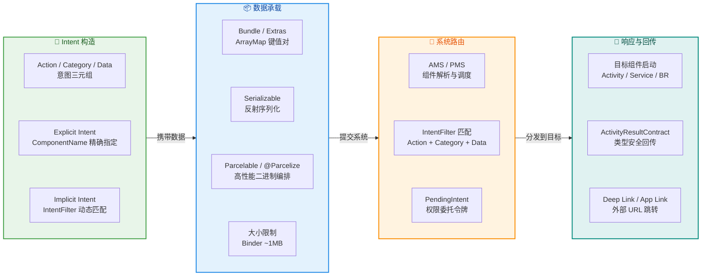
```mermaid
graph LR
    subgraph Construction["🔧 Intent 构造"]
        direction TB
        A1["Action / Category / Data\n意图三元组"]
        A2["Explicit Intent\nComponentName 精确指定"]
        A3["Implicit Intent\nIntentFilter 动态匹配"]
        A1 ~~~ A2
        A2 ~~~ A3
    end

    subgraph Payload["📦 数据承载"]
        direction TB
        B1["Bundle / Extras\nArrayMap 键值对"]
        B2["Serializable\n反射序列化"]
        B3["Parcelable / @Parcelize\n高性能二进制编排"]
        B4["大小限制\nBinder ~1MB"]
        B1 ~~~ B2
        B2 ~~~ B3
        B3 ~~~ B4
    end

    subgraph Routing["🚦 系统路由"]
        direction TB
        C1["AMS / PMS\n组件解析与调度"]
        C2["IntentFilter 匹配\nAction + Category + Data"]
        C3["PendingIntent\n权限委托令牌"]
        C1 ~~~ C2
        C2 ~~~ C3
    end

    subgraph Response["📨 响应与回传"]
        direction TB
        D1["目标组件启动\nActivity / Service / BR"]
        D2["ActivityResultContract\n类型安全回传"]
        D3["Deep Link / App Link\n外部 URL 跳转"]
        D1 ~~~ D2
        D2 ~~~ D3
    end

    Construction -->|"携带数据"| Payload -->|"提交系统"| Routing -->|"分发到目标"| Response

    classDef greenStyle fill:#E8F5E9,stroke:#43A047,stroke-width:2px,color:#1B5E20
    classDef blueStyle fill:#E3F2FD,stroke:#1E88E5,stroke-width:2px,color:#0D47A1
    classDef orangeStyle fill:#FFF3E0,stroke:#FB8C00,stroke-width:2px,color:#E65100
    classDef tealStyle fill:#E0F2F1,stroke:#00897B,stroke-width:2px,color:#004D40

    class Construction greenStyle
    class Payload blueStyle
    class Routing orangeStyle
    class Response tealStyle
```

### 关键设计思想提炼

回顾整章内容，有几个贯穿始终的设计思想值得特别强调：

**解耦与间接性（Decoupling through Indirection）。** Android 的组件通信从不鼓励直接引用。Intent 是间接层，PendingIntent 是间接层的间接层，ActivityResultContract 是对回调的抽象间接层。每一层间接性都带来了更好的解耦、更强的安全性和更大的灵活性。这种设计使得组件可以独立开发、独立测试、独立替换，甚至可以跨进程、跨应用协作。

**声明式优于命令式（Declarative over Imperative）。** IntentFilter 在 Manifest 中声明组件能力，Deep Link 在 Manifest 中声明 URL 匹配规则，ActivityResultContract 声明输入输出类型。系统根据这些声明进行自动匹配和路由，开发者不需要手动管理组件之间的依赖关系。这种声明式风格降低了耦合度，也让系统有机会进行全局优化（如 App Link 的自动验证）。

**安全边界无处不在（Security Boundaries Everywhere）。** Binder 的数据大小限制、PendingIntent 的 `FLAG_IMMUTABLE` 强制要求、隐式 Intent 在 Android 14+ 必须匹配到导出组件、App Link 的域名验证——这些看似繁琐的限制，本质上都是 Android 在组件通信路径上设置的安全边界。理解这些边界，才能写出既功能正确又安全可靠的代码。

**API 演进的一致方向（Consistent Evolution Direction）。** 从 `startActivityForResult()` 到 `ActivityResultContract`，从自定义 Scheme Deep Link 到经过验证的 App Link，从手写 Parcelable 到 `@Parcelize`——Android API 的演进方向始终一致：**更强的类型安全、更好的关注点分离、更少的样板代码、更高的安全性**。在实际开发中，应当始终优先采用现代 API。

### 实战开发备忘清单

以下是本章知识点在日常开发中最常用的实践要点，可作为快速参考：

| 场景 | 推荐做法 | 避免做法 |
|------|----------|----------|
| 应用内页面跳转 | 显式 Intent + ComponentName | 隐式 Intent（不必要的解析开销） |
| 跨应用功能调用 | 隐式 Intent + `resolveActivity()` 检查 | 直接发送不检查，导致崩溃 |
| 传递复杂对象 | `@Parcelize` data class | Java Serializable（性能差） |
| 传递大量数据 | ViewModel 共享 / 持久化存储 + ID 传递 | Bundle 塞入大 Bitmap 或大列表 |
| 通知点击跳转 | `PendingIntent` + `FLAG_IMMUTABLE` | `FLAG_MUTABLE`（除非确需外部填充） |
| 获取 Activity 结果 | `registerForActivityResult()` + Contract | `startActivityForResult()`（已废弃） |
| 请求运行时权限 | `RequestPermission` / `RequestMultiplePermissions` Contract | 手动管理 requestCode |
| 外部链接打开应用 | App Link（HTTPS + autoVerify） | 仅自定义 Scheme（无验证，易被劫持） |
| 应用内 Deep Link 路由 | Navigation Component 的 `<deepLink>` | 手动在每个 Activity 解析 URI |
| PendingIntent 更新 | `FLAG_UPDATE_CURRENT or FLAG_IMMUTABLE` | 不加 Flag 导致旧 extras 残留 |

### 常见陷阱与排错指南

**TransactionTooLargeException：** 这是本章最高频的实战问题。当 Bundle 数据超过 Binder 缓冲区限制时抛出，且在 Android 7.0 之前可能只是静默失败。排查方法：在 `onSaveInstanceState()` 中使用 `TooLargeTool` 等库监控 Bundle 大小；根治方法：永远不要通过 Intent 传递大数据，改用 ViewModel、数据库或文件 + ID 引用。

**隐式 Intent 无匹配组件：** 在 Android 11+（Package Visibility 限制）中尤为常见。需要在 Manifest 中添加 `<queries>` 声明需要交互的外部应用包名或 Intent Action，否则 `resolveActivity()` 会返回 null。

**PendingIntent 内容不更新：** 多个通知使用相同 requestCode 和相同 Action 的 PendingIntent 时，系统会复用已有令牌。解决方案：为每个通知使用不同的 requestCode，或使用 `FLAG_UPDATE_CURRENT` 强制更新 extras。

**App Link 验证失败：** 常见原因包括：`assetlinks.json` 文件未正确放置在 `/.well-known/` 路径下、JSON 中的 SHA256 指纹与签名证书不匹配、服务器返回了重定向而非直接 200 响应、未使用 HTTPS。可通过 `adb shell pm get-app-links <package>` 命令检查验证状态。

**`onActivityResult()` 中 requestCode 冲突：** 这是旧 API 的经典问题，多个功能使用相同 requestCode 导致回调混乱。迁移到 Activity Result API 后，每个功能注册独立的 Launcher，从根本上消除了这个问题。

### 与后续章节的衔接

Intent 与组件通信是 Android 应用层架构的**基础设施层**。本章建立的知识将在后续章节中被反复引用和扩展：

- **四大组件**章节将深入讲解 Intent 如何触发 Activity、Service、BroadcastReceiver、ContentProvider 各自的生命周期流转，以及 AMS 在其中扮演的调度角色。
- **进程间通信（IPC）** 章节将从 Binder 机制的角度解释为什么 Intent 数据有大小限制，以及 PendingIntent 的跨进程令牌传递是如何实现的。
- **Navigation Component** 章节将展示如何用声明式的导航图替代手动的 Intent 跳转，以及 Deep Link 如何与导航图无缝集成。
- **安全与权限**章节将进一步讨论 Intent 相关的安全风险，如 Intent 劫持、隐式 Intent 泄露敏感数据、未验证 Deep Link 的钓鱼攻击等。

掌握了 Intent 机制，就掌握了 Android 组件通信的核心语言。后续所有涉及组件交互的知识，都是在这个基础上的延伸与深化。

---

**📝 练习题 1**

在 Android 12（API 31）及以上版本中，以下关于 PendingIntent 的说法，哪一项是正确的？

A. 创建 PendingIntent 时可以不指定 `FLAG_IMMUTABLE` 或 `FLAG_MUTABLE`，系统会自动选择合适的 Flag

B. 所有 PendingIntent 必须使用 `FLAG_IMMUTABLE`，`FLAG_MUTABLE` 已被完全禁止

C. 必须显式指定 `FLAG_IMMUTABLE` 或 `FLAG_MUTABLE`，否则会抛出 IllegalArgumentException

D. `FLAG_MUTABLE` 仅在 targetSdkVersion 低于 31 时才可使用

**【答案】** C

**【解析】** 从 Android 12（API 31）开始，Google 强制要求创建 PendingIntent 时必须显式声明可变性。如果既不指定 `FLAG_IMMUTABLE` 也不指定 `FLAG_MUTABLE`，系统会直接抛出 `IllegalArgumentException`。这是一项重要的安全加固措施，目的是防止开发者无意中创建可被外部应用篡改的 PendingIntent。在绝大多数场景下应使用 `FLAG_IMMUTABLE`，只有在确实需要外部组件填充 Intent 内容（如内联回复通知需要系统填充用户输入的文本）时，才使用 `FLAG_MUTABLE`。选项 A 错误，系统不会自动选择，而是直接报错；选项 B 错误，`FLAG_MUTABLE` 并未被禁止，只是需要显式声明；选项 D 错误，`FLAG_MUTABLE` 在任何 targetSdkVersion 下都可使用，只是在 31+ 时必须显式指定。

---

**📝 练习题 2**

某应用需要从 Activity A 跳转到 Activity B 并获取返回结果。开发者使用了现代的 Activity Result API，但在 `onCreate()` 中根据某个条件动态调用 `registerForActivityResult()` 注册 Launcher。应用在配置变更（如屏幕旋转）后崩溃。以下哪项最准确地解释了崩溃原因？

A. Activity Result API 不支持在 `onCreate()` 中注册，必须在 `onStart()` 中注册

B. `registerForActivityResult()` 必须在 `CREATED` 状态之前调用（即在 `super.onCreate()` 之前），条件判断导致注册时机晚于生命周期要求

C. 配置变更后 Activity 重建，但由于条件分支可能导致本次不注册 Launcher，而系统尝试恢复之前的结果回调时找不到对应的注册，从而抛出异常

D. Activity Result API 在配置变更时会自动反注册所有 Launcher，需要在 `onRestoreInstanceState()` 中重新注册

**【答案】** C

**【解析】** Activity Result API 的核心设计要求是：`registerForActivityResult()` 必须在每次 Activity 创建时**无条件地**执行注册，且必须在 `STARTED` 状态之前完成。这是因为当配置变更导致 Activity 重建时，系统需要将之前挂起的结果（pending result）重新分发给对应的 Launcher。如果开发者将注册逻辑放在条件分支中，那么在 Activity 重建后，如果条件不满足导致未注册，系统在尝试恢复结果时就找不到匹配的 Launcher，从而抛出 `IllegalStateException`。正确做法是：**始终无条件注册 Launcher**（注册本身不会触发任何操作），将条件判断放在调用 `launcher.launch()` 的时机上。选项 A 错误，`onCreate()` 是推荐的注册位置；选项 B 的描述不够准确，注册不需要在 `super.onCreate()` 之前，只需在 `STARTED` 之前；选项 D 错误，系统不会自动反注册，而是期望重建后能找到相同的注册。

---

