---

# Service：后台服务机制

---

## Service 定义

在 Android 四大组件（Activity、Service、BroadcastReceiver、ContentProvider）的家族中，Service 是一个极其特殊的存在——它是唯一一个 **"天生没有用户界面，却能长期存活"** 的组件。很多初学者第一次接触 Service 时，会本能地将它与"后台线程"画等号，认为 Service 就是一个在后台默默运行的独立线程。这是 Android 开发中最经典、最危险的误解之一。要真正理解 Service，我们必须从三个维度来拆解它的本质：它为什么没有 UI？它到底运行在哪个线程？以及，它为什么会引发 ANR（Application Not Responding）？

在深入每个子话题之前，我们先用一张全景图来建立 Service 在 Android 组件体系中的定位，以及它与主线程、系统服务之间的关系：

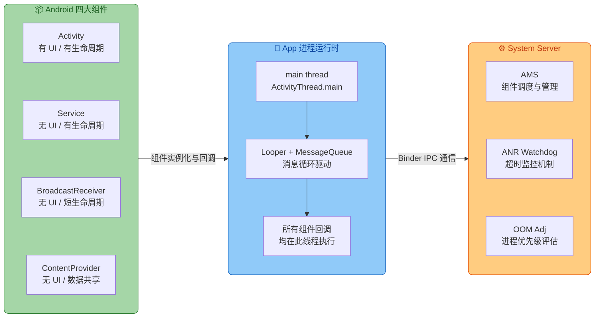
```mermaid
graph LR
    subgraph Components["📦 Android 四大组件"]
        direction TB
        C1["Activity\n有 UI / 有生命周期"]
        C2["Service\n无 UI / 有生命周期"]
        C3["BroadcastReceiver\n无 UI / 短生命周期"]
        C4["ContentProvider\n无 UI / 数据共享"]
        C1 ~~~ C2
        C2 ~~~ C3
        C3 ~~~ C4
    end

    subgraph Runtime["🧵 App 进程运行时"]
        direction TB
        R1["main thread\nActivityThread.main"]
        R2["Looper + MessageQueue\n消息循环驱动"]
        R3["所有组件回调\n均在此线程执行"]
        R1 --> R2
        R2 --> R3
    end

    subgraph System["⚙️ System Server"]
        direction TB
        S1["AMS\n组件调度与管理"]
        S2["ANR Watchdog\n超时监控机制"]
        S3["OOM Adj\n进程优先级评估"]
        S1 ~~~ S2
        S2 ~~~ S3
    end

    Components -->|"组件实例化与回调"| Runtime -->|"Binder IPC 通信"| System

    classDef compStyle fill:#A5D6A7,stroke:#2E7D32,color:#1B5E20,rx:8
    classDef runStyle fill:#90CAF9,stroke:#1565C0,color:#0D47A1,rx:8
    classDef sysStyle fill:#FFCC80,stroke:#E65100,color:#BF360C,rx:8

    class Components compStyle
    class Runtime runStyle
    class System sysStyle
```

这张图清晰地展示了一个关键事实：**所有四大组件的生命周期回调，都在同一个主线程（main thread）上执行**，而 Service 也不例外。AMS（ActivityManagerService）通过 Binder IPC 远程调度 App 进程中的组件，同时 ANR Watchdog 会监控每次调度是否在规定时间内完成。理解了这个全景，我们就可以逐一深入每个维度了。

---

### 无 UI 组件

#### 什么是"无 UI"？

当我们说 Service 是一个"无 UI 组件"（a component without a user interface），这句话的含义远比字面意思更加深刻。它不仅仅是说"Service 没有一个可见的窗口"，而是在 Android 的窗口管理体系（Window Management System）层面，Service **根本不具备创建和持有 Window 的能力**。

让我们做一个对比来理解这件事。Activity 之所以能显示界面，是因为它在启动过程中会经历以下关键步骤：

1. AMS 调度 `ActivityThread.handleLaunchActivity()`，创建 Activity 实例
2. 调用 `Activity.attach()`，在这个方法内部会创建一个 `PhoneWindow` 对象
3. 调用 `Activity.onCreate()`，开发者在此调用 `setContentView()` 将布局填充到 `PhoneWindow` 的 `DecorView` 中
4. 在 `handleResumeActivity()` 阶段，`WindowManager.addView()` 将 `DecorView` 添加到 WMS（WindowManagerService），此时界面才真正可见

而 Service 的启动流程中，**完全没有上述任何一个与窗口相关的步骤**。AMS 调度 `ActivityThread.handleCreateService()` 时，仅仅是通过反射创建 Service 实例、调用 `attach()` 绑定 Context、然后调用 `onCreate()`——整个过程中没有 `PhoneWindow` 的创建，没有 `DecorView` 的填充，更没有向 WMS 注册窗口。

用一个生活化的比喻来说：如果 Activity 是一个有门面、有橱窗的实体店铺，那 Service 就是一个没有店面的仓库或加工厂——它在后面默默干活，但顾客（用户）看不到它，也不需要看到它。

#### 为什么要设计一个无 UI 的组件？

这个设计决策源于 Android 对 **"关注点分离"（Separation of Concerns）** 原则的贯彻。在早期的移动操作系统中，后台任务往往与 UI 紧密耦合——你必须保持一个界面处于前台，才能让后台任务继续运行。Android 的设计者意识到，很多任务本质上不需要用户界面：

* 音乐播放：用户可能已经切换到其他 App，但音乐应该继续播放
* 文件下载：下载过程不需要用户盯着看
* 数据同步：与服务器的定期同步应该在后台静默完成
* 位置追踪：导航应用在后台持续获取 GPS 数据

如果这些任务都必须依附于一个 Activity，那么一旦用户按下 Home 键或切换应用，Activity 进入 `onStop()` 甚至被销毁，这些任务就会中断。Service 的出现，正是为了 **将"执行逻辑"与"用户界面"解耦**，让后台任务拥有独立于 UI 的生命周期。

#### Service 与 Activity 的本质区别

从源码层面来看，Service 和 Activity 都继承自 `ContextWrapper`（间接继承自 `Context`），它们共享很多能力，比如访问资源、发送广播、启动其他组件等。但它们的核心差异在于：

```kotlin
// Service 的继承链（简化）
// Context → ContextWrapper → ContextThemeWrapper? 不！
// Service 直接继承 ContextWrapper，没有 Theme 相关能力
open class Service : ContextWrapper(), ComponentCallbacks2 {
    // 没有 Window、没有 DecorView、没有 setContentView()
    // 只有生命周期回调和 Binder 机制
}

// Activity 的继承链（简化）
// Context → ContextWrapper → ContextThemeWrapper → Activity
open class Activity : ContextThemeWrapper(), /* 多个接口 */ {
    // 拥有 PhoneWindow、DecorView、完整的 UI 体系
    private var mWindow: Window? = null  // PhoneWindow 实例
    // setContentView() 实际上是委托给 mWindow 来处理
}
```

注意一个微妙但重要的细节：Activity 继承自 `ContextThemeWrapper`，这意味着它天然具备主题（Theme）和样式（Style）的处理能力；而 Service 直接继承 `ContextWrapper`，**连主题都没有**——因为没有 UI，主题也就毫无意义。

#### 无 UI 不等于无法与用户交互

虽然 Service 本身没有界面，但它并非完全与用户隔绝。Service 可以通过以下方式间接地与用户产生交互：

* **Notification（通知）**：前台服务（Foreground Service）必须绑定一个通知，这是 Service 与用户沟通的最主要渠道
* **Toast**：Service 可以弹出 Toast 提示（因为 Toast 使用的是系统级窗口，不依赖 Activity 的 Window）
* **广播（Broadcast）**：Service 可以发送广播，由前台的 Activity 接收并更新 UI
* **绑定回调（Bound Service Callback）**：通过 Binder 机制，Service 可以将数据回传给绑定它的 Activity

这种设计体现了 Android 架构的优雅之处：**组件各司其职，通过明确的通信机制协作**，而不是将所有职责堆砌在一个巨型组件中。

---

### 主线程运行

#### 最危险的误解

如果要评选"Android 开发中最致命的误解 Top 3"，**"Service 运行在后台线程"** 绝对名列前茅。这个误解之所以如此普遍，是因为 Service 的名字和用途都暗示着"后台"——我们用它来做后台下载、后台播放、后台同步，自然而然地就会认为它运行在一个独立的后台线程中。

但事实恰恰相反：**Service 的所有生命周期回调方法（`onCreate()`、`onStartCommand()`、`onBind()`、`onUnbind()`、`onDestroy()`）默认都运行在应用的主线程（Main Thread，也叫 UI Thread）上。**

这不是一个实现细节，而是 Android 框架的核心设计决策。要理解为什么，我们需要深入 Android 的线程模型。

#### Android 的单线程消息驱动模型

每一个 Android 应用进程启动时，都会执行 `ActivityThread.main()` 方法。这个方法做了一件至关重要的事情——启动主线程的消息循环（Message Loop）：

```java
// ActivityThread.main() —— 每个 Android App 进程的真正入口点
public static void main(String[] args) {
    // 1. 准备主线程的 Looper（消息循环器）
    //    这一步会创建 MessageQueue（消息队列）
    Looper.prepareMainLooper();

    // 2. 创建 ActivityThread 实例
    //    ActivityThread 并不是一个 Thread，而是主线程的"管家"
    ActivityThread thread = new ActivityThread();

    // 3. 将当前进程"附着"到 AMS
    //    通过 Binder 向 AMS 注册，告诉系统"我准备好了"
    thread.attach(false, startSeq);

    // 4. 获取主线程的 Handler（消息处理器）
    //    这个 Handler 就是著名的 "H"（ActivityThread 的内部类）
    if (sMainThreadHandler == null) {
        sMainThreadHandler = thread.getHandler();
    }

    // 5. 启动消息循环 —— 这是一个无限循环！
    //    主线程从此刻开始，就不断地从 MessageQueue 中取消息、处理消息
    //    这个循环永远不会主动退出（除非进程被杀死）
    Looper.loop();

    // 如果执行到这里，说明主线程的消息循环异常退出了
    throw new RuntimeException("Main thread loop unexpectedly exited");
}
```

这段代码揭示了一个深刻的事实：**Android 主线程的本质就是一个无限循环的消息处理器**。它不断地从 `MessageQueue` 中取出 `Message`，然后分发给对应的 `Handler` 处理。所有的组件生命周期回调、UI 绘制、用户输入事件，都是以 `Message` 的形式被投递到这个队列中，然后在主线程上依次执行。

#### Service 回调是如何被调度到主线程的？

当你调用 `startService(intent)` 时，背后发生了一系列精密的跨进程调度：

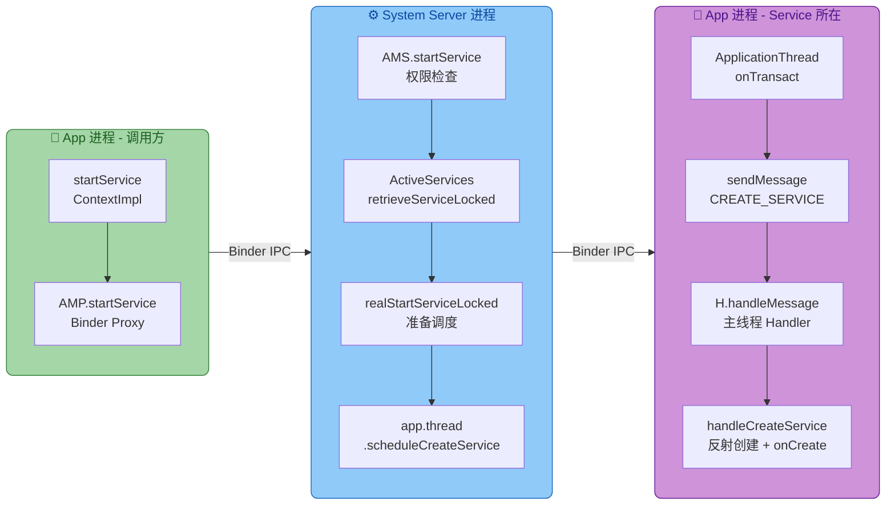
```mermaid
graph LR
    subgraph AppProcess["📱 App 进程 - 调用方"]
        direction TB
        A1["startService\nContextImpl"]
        A2["AMP.startService\nBinder Proxy"]
        A1 --> A2
    end

    subgraph SystemServer["⚙️ System Server 进程"]
        direction TB
        B1["AMS.startService\n权限检查"]
        B2["ActiveServices\nretrieveServiceLocked"]
        B3["realStartServiceLocked\n准备调度"]
        B4["app.thread\n.scheduleCreateService"]
        B1 --> B2
        B2 --> B3
        B3 --> B4
    end

    subgraph TargetApp["📱 App 进程 - Service 所在"]
        direction TB
        C1["ApplicationThread\nonTransact"]
        C2["sendMessage\nCREATE_SERVICE"]
        C3["H.handleMessage\n主线程 Handler"]
        C4["handleCreateService\n反射创建 + onCreate"]
        C1 --> C2
        C2 --> C3
        C3 --> C4
    end

    AppProcess -->|"Binder IPC"| SystemServer -->|"Binder IPC"| TargetApp

    classDef appStyle fill:#A5D6A7,stroke:#2E7D32,color:#1B5E20,rx:8
    classDef sysStyle fill:#90CAF9,stroke:#1565C0,color:#0D47A1,rx:8
    classDef targetStyle fill:#CE93D8,stroke:#6A1B9A,color:#4A148C,rx:8

    class AppProcess appStyle
    class SystemServer sysStyle
    class TargetApp targetStyle
```

让我们逐步拆解这个流程：

**第一步：App 进程发起请求。** 当你在 Activity 中调用 `startService(intent)` 时，实际上是调用了 `ContextImpl.startService()`，它会通过 Binder 代理（`ActivityManagerProxy`）向 System Server 进程中的 AMS 发起一次跨进程调用。

**第二步：AMS 进行调度决策。** AMS 收到请求后，会进行一系列检查和决策：目标 Service 是否已经在运行？目标进程是否已经启动？权限是否满足？如果一切就绪，AMS 会调用 `ActiveServices.realStartServiceLocked()`，通过目标进程的 `IApplicationThread` Binder 接口，向目标进程发送 `scheduleCreateService` 调用。

**第三步：目标进程接收并入队。** 目标进程的 `ApplicationThread`（一个 Binder 服务端对象）收到调用后，**并不会直接执行 Service 的创建**，而是通过 `ActivityThread` 内部的 `Handler H` 发送一条 `CREATE_SERVICE` 消息到主线程的 `MessageQueue` 中。

**第四步：主线程处理消息。** 主线程的 `Looper` 从队列中取出这条消息，`Handler H` 的 `handleMessage()` 方法被调用，最终执行 `handleCreateService()`——在这个方法中，Service 实例被反射创建，`attach()` 被调用，`onCreate()` 被调用。**整个过程都在主线程上完成。**

这就是为什么 Service 运行在主线程的根本原因：**Binder 线程收到的远程调用，会被转化为 Message 投递到主线程的 MessageQueue，由主线程的 Looper 驱动执行。** 这个机制确保了所有组件的生命周期回调都在同一个线程上串行执行，避免了多线程并发带来的复杂性。

#### 用代码验证 Service 运行在主线程

理论说了这么多，让我们用一段简单的代码来亲眼验证：

```kotlin
// MyService.kt —— 验证 Service 运行线程的示例
class MyService : Service() {

    // onCreate() 在 Service 首次创建时调用
    override fun onCreate() {
        super.onCreate()
        // 打印当前线程信息
        // 你会发现输出的线程名是 "main"，线程 ID 与 UI 线程相同
        Log.d("ServiceThread", "onCreate - Thread: ${Thread.currentThread().name}")
        // 输出示例: onCreate - Thread: main

        // 获取主线程的 Looper 并与当前线程的 Looper 比较
        // 如果相等，说明当前确实在主线程上执行
        val isMainThread = Looper.myLooper() == Looper.getMainLooper()
        Log.d("ServiceThread", "Is Main Thread: $isMainThread")
        // 输出: Is Main Thread: true
    }

    // onStartCommand() 每次 startService() 调用时都会触发
    override fun onStartCommand(intent: Intent?, flags: Int, startId: Int): Int {
        // 同样在主线程上执行
        Log.d("ServiceThread", "onStartCommand - Thread: ${Thread.currentThread().name}")
        // 输出: onStartCommand - Thread: main

        // ⚠️ 危险操作！如果在这里执行耗时任务，会阻塞主线程！
        // 例如：网络请求、大文件读写、复杂计算等
        // Thread.sleep(30000) // 千万不要这样做！会导致 ANR！

        // 正确做法：将耗时任务放到工作线程中
        Thread {
            // 这里才是后台线程
            Log.d("ServiceThread", "Worker - Thread: ${Thread.currentThread().name}")
            // 输出: Worker - Thread: Thread-2 (或其他非 main 的线程名)
            performHeavyWork()
        }.start()

        // 返回值决定了 Service 被系统杀死后的重启策略
        // START_STICKY: 系统会尝试重新创建 Service
        return START_STICKY
    }

    // onBind() 当有客户端通过 bindService() 绑定时调用
    override fun onBind(intent: Intent?): IBinder? {
        // 也在主线程上执行
        Log.d("ServiceThread", "onBind - Thread: ${Thread.currentThread().name}")
        // 输出: onBind - Thread: main
        return null
    }

    // 模拟耗时操作（应在工作线程中调用）
    private fun performHeavyWork() {
        // 模拟网络请求或数据库操作
        Thread.sleep(5000)
        Log.d("ServiceThread", "Heavy work done on: ${Thread.currentThread().name}")
    }
}
```

运行这段代码后，Logcat 的输出会清楚地告诉你：`onCreate()`、`onStartCommand()`、`onBind()` 全部运行在名为 `main` 的线程上。只有我们手动创建的 `Thread` 才运行在独立的工作线程上。

#### "后台"到底指什么？

既然 Service 运行在主线程，那为什么我们总说它是"后台服务"呢？这里的"后台"（background）有两层含义，而它们都与线程无关：

**第一层含义：无 UI 的后台。** Service 没有用户界面，它在"幕后"工作，用户看不到它。这是相对于 Activity（"前台"、"台前"）而言的。

**第二层含义：进程优先级的后台。** 当一个 App 没有任何可见的 Activity 时，它的进程会被标记为"后台进程"（background process）。如果此时有一个 Service 在运行，这个进程的优先级会比纯后台进程稍高（变成"服务进程"，service process），但仍然低于前台进程。这里的"后台"是 OOM Killer 视角下的进程优先级分类。

**无论哪层含义，都与"运行在后台线程"毫无关系。** 这是一个语义上的陷阱，很多开发者因为混淆了"后台组件"和"后台线程"这两个概念，而写出了在 Service 中直接执行网络请求的代码，最终导致 ANR。

---

### ANR 风险

#### 什么是 ANR？

ANR（Application Not Responding，应用无响应）是 Android 系统的一种自我保护机制。当系统检测到某个应用的关键操作在规定时间内没有完成时，就会弹出一个对话框告诉用户"此应用没有响应"，并提供"等待"或"关闭"的选项。对于用户来说，ANR 是一种极其糟糕的体验；对于开发者来说，ANR 是一个严重的性能缺陷。

ANR 的本质原因只有一个：**主线程被阻塞，无法在规定时间内处理完系统分发的消息。** 由于 Service 的生命周期回调运行在主线程上，如果你在这些回调中执行了耗时操作（网络 I/O、磁盘 I/O、复杂计算、数据库查询等），主线程就会被阻塞，无法及时响应系统的后续调度，从而触发 ANR。

#### Service ANR 的超时阈值

AMS 在调度 Service 的生命周期时，会同时启动一个"定时炸弹"（timeout bomb）。如果 Service 的回调没有在规定时间内执行完毕，这颗炸弹就会爆炸——触发 ANR。不同类型的 Service 有不同的超时阈值：

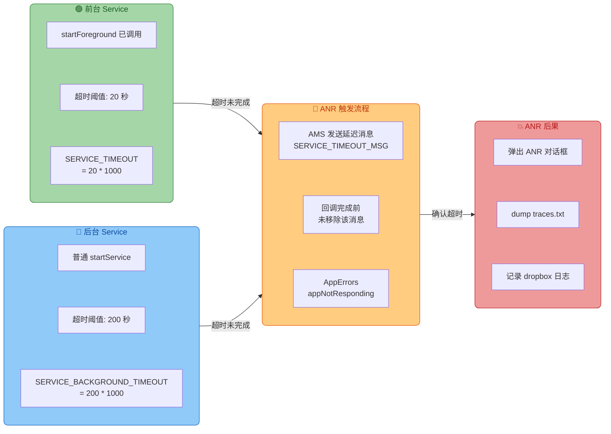
```mermaid
graph LR
    subgraph Foreground["🟢 前台 Service"]
        direction TB
        F1["startForeground 已调用"]
        F2["超时阈值: 20 秒"]
        F3["SERVICE_TIMEOUT\n= 20 * 1000"]
        F1 ~~~ F2
        F2 ~~~ F3
    end

    subgraph Background["🔵 后台 Service"]
        direction TB
        B1["普通 startService"]
        B2["超时阈值: 200 秒"]
        B3["SERVICE_BACKGROUND_TIMEOUT\n= 200 * 1000"]
        B1 ~~~ B2
        B2 ~~~ B3
    end

    subgraph Trigger["🔴 ANR 触发流程"]
        direction TB
        T1["AMS 发送延迟消息\nSERVICE_TIMEOUT_MSG"]
        T2["回调完成前\n未移除该消息"]
        T3["AppErrors\nappNotResponding"]
        T1 ~~~ T2
        T2 ~~~ T3
    end

    subgraph Result["💥 ANR 后果"]
        direction TB
        R1["弹出 ANR 对话框"]
        R2["dump traces.txt"]
        R3["记录 dropbox 日志"]
        R1 ~~~ R2
        R2 ~~~ R3
    end

    Foreground -->|"超时未完成"| Trigger
    Background -->|"超时未完成"| Trigger
    Trigger -->|"确认超时"| Result

    classDef fgStyle fill:#A5D6A7,stroke:#2E7D32,color:#1B5E20,rx:8
    classDef bgStyle fill:#90CAF9,stroke:#1565C0,color:#0D47A1,rx:8
    classDef trigStyle fill:#FFCC80,stroke:#E65100,color:#BF360C,rx:8
    classDef resStyle fill:#EF9A9A,stroke:#B71C1C,color:#B71C1C,rx:8

    class Foreground fgStyle
    class Background bgStyle
    class Trigger trigStyle
    class Result resStyle
```

这里有一个非常值得注意的不对称设计：**前台 Service 的超时阈值（20 秒）远远短于后台 Service（200 秒）**。这看起来似乎违反直觉——前台 Service 不是更重要吗？为什么给它的时间反而更短？

原因在于系统的设计哲学：前台 Service 已经通过 `startForeground()` 向用户展示了一个通知，用户明确知道这个 Service 正在运行。如果此时 Service 还卡住了主线程，用户体验会极其糟糕——用户看到通知说"正在播放音乐"，但整个 App 却冻住了。因此系统对前台 Service 的响应性要求更高，超时阈值更严格。而后台 Service 对用户不可见，即使稍微慢一点，用户也感知不到，所以阈值相对宽松。

#### ANR 的"定时炸弹"机制：源码级剖析

要真正理解 Service ANR 的触发机制，我们需要深入 AMS 的源码。整个过程可以用"埋炸弹——拆炸弹——炸弹爆炸"三个阶段来描述：

**阶段一：埋炸弹（Bomb Planting）**

当 AMS 准备调度 Service 的创建时，会在 `realStartServiceLocked()` 方法中调用 `bumpServiceExecutingLocked()`，这个方法的核心逻辑就是向 AMS 自己的 Handler 发送一条延迟消息：

```java
// ActiveServices.java —— AMS 中管理 Service 的核心类
// bumpServiceExecutingLocked() 方法：启动 ANR 定时器
private final void bumpServiceExecutingLocked(ServiceRecord r, 
        boolean fg, String why) {
    // ... 省略部分逻辑 ...

    // 如果该 Service 之前没有正在执行的操作，则需要设置超时
    if (r.executeNesting == 0) {
        // 标记该 Service 有正在执行的操作
        r.executeFg = fg;

        // 将该 ServiceRecord 加入"正在执行"列表
        // 这个列表就是 AMS 监控 ANR 的"黑名单"
        mDestroyingServices.add(r);
    }

    // 增加嵌套计数（一个 Service 可能同时有多个待执行操作）
    r.executeNesting++;

    // 更新执行开始时间（用于后续判断是否超时）
    r.executingStart = SystemClock.uptimeMillis();

    // ⚡ 关键！发送延迟消息 —— 这就是"定时炸弹"
    // fg 为 true 时使用 SERVICE_TIMEOUT（20秒）
    // fg 为 false 时使用 SERVICE_BACKGROUND_TIMEOUT（200秒）
    scheduleServiceTimeoutLocked(r.app);
}

// scheduleServiceTimeoutLocked() —— 实际埋炸弹的方法
void scheduleServiceTimeoutLocked(ProcessRecord proc) {
    if (proc.executingServices.size() == 0 || proc.thread == null) {
        return; // 没有正在执行的 Service，无需设置超时
    }

    // 获取 AMS 主线程的 Handler
    Message msg = mAm.mHandler.obtainMessage(
            ActivityManagerService.SERVICE_TIMEOUT_MSG);
    msg.obj = proc; // 消息携带目标进程信息

    // 根据前台/后台决定超时时长
    // 前台: 20秒, 后台: 200秒
    final long timeout = proc.execServicesFg
            ? SERVICE_TIMEOUT   // 20 * 1000
            : SERVICE_BACKGROUND_TIMEOUT; // 200 * 1000

    // 发送延迟消息 —— 炸弹已埋好，倒计时开始！
    mAm.mHandler.sendMessageDelayed(msg, timeout);
}
```

这段代码的精妙之处在于：它利用了 Android 的 `Handler` 延迟消息机制来实现定时监控。`sendMessageDelayed()` 会在指定时间后将消息投递到 AMS 的消息队列中。如果在这段时间内，Service 的回调正常完成了，这条消息就会被移除（拆炸弹）；如果没有完成，消息就会被处理（炸弹爆炸）。

**阶段二：拆炸弹（Bomb Defusing）**

当 Service 的生命周期回调（如 `onCreate()`）正常执行完毕后，`ActivityThread` 会通过 Binder 回调通知 AMS："我完成了！"。AMS 收到通知后，会调用 `serviceDoneExecutingLocked()` 方法，移除之前埋下的延迟消息：

```java
// ActiveServices.java
// serviceDoneExecutingLocked() —— Service 回调完成后的清理
private void serviceDoneExecutingLocked(ServiceRecord r, 
        boolean inDestroying, boolean finishing) {
    // 减少嵌套计数
    r.executeNesting--;

    if (r.executeNesting <= 0) {
        // 所有待执行操作都完成了
        if (r.app != null) {
            // 从"正在执行"列表中移除
            r.app.executingServices.remove(r);

            // 如果该进程没有其他正在执行的 Service
            if (r.app.executingServices.size() == 0) {
                // ✅ 关键！移除延迟消息 —— 拆除定时炸弹！
                mAm.mHandler.removeMessages(
                    ActivityManagerService.SERVICE_TIMEOUT_MSG, 
                    r.app);
            }
        }
    }
}
```

如果一切顺利，`SERVICE_TIMEOUT_MSG` 消息在到期之前就被移除了，ANR 不会发生。这就像你在炸弹爆炸前成功剪断了引线。

**阶段三：炸弹爆炸（Bomb Explosion）**

如果 Service 的回调在规定时间内没有完成（比如你在 `onStartCommand()` 中执行了一个 30 秒的网络请求），延迟消息就会到期并被 AMS 的 Handler 处理：

```java
// ActivityManagerService.java
// MainHandler.handleMessage() —— AMS 主线程 Handler
case SERVICE_TIMEOUT_MSG: {
    // 定时炸弹爆炸了！
    // 调用 ActiveServices 的超时处理方法
    mServices.serviceTimeout((ProcessRecord) msg.obj);
    break;
}

// ActiveServices.java
// serviceTimeout() —— ANR 的最终触发点
void serviceTimeout(ProcessRecord proc) {
    // 获取当前时间
    final long now = SystemClock.uptimeMillis();

    // 计算超时阈值
    final long maxTime = now - 
        (proc.execServicesFg 
            ? SERVICE_TIMEOUT 
            : SERVICE_BACKGROUND_TIMEOUT);

    // 遍历该进程所有正在执行的 Service
    // 找出执行时间最长的那个
    ServiceRecord timeout = null;
    long nextTime = 0;
    for (int i = proc.executingServices.size() - 1; i >= 0; i--) {
        ServiceRecord sr = proc.executingServices.valueAt(i);
        // 如果该 Service 的执行开始时间早于阈值，说明超时了
        if (sr.executingStart < maxTime) {
            timeout = sr;
            break;
        }
    }

    if (timeout != null) {
        // 💥 确认超时，触发 ANR！
        // 这会弹出 ANR 对话框、dump 线程堆栈、记录日志
        mAm.mAnrHelper.appNotResponding(
            proc, "executing service " + timeout.shortInstanceName);
    }
}
```

当 ANR 被触发后，系统会执行以下操作：

1. 弹出 ANR 对话框（用户可见）
2. 将所有线程的堆栈信息 dump 到 `/data/anr/traces.txt`（开发者可用于分析）
3. 将 ANR 信息记录到 `dropbox`（系统日志收集器）
4. 发送 `SIGQUIT` 信号给目标进程，触发线程 dump

#### 典型的 ANR 场景与正确做法

让我们通过一个具体的反面案例和正面案例来巩固理解：

```kotlin
// ❌ 错误示范：在 Service 回调中直接执行耗时操作
class BadService : Service() {

    override fun onStartCommand(intent: Intent?, flags: Int, startId: Int): Int {
        // ❌ 直接在主线程执行网络请求
        // 这会阻塞主线程，如果超过 20秒（前台）或 200秒（后台），触发 ANR
        val url = URL("https://api.example.com/large-data")
        val connection = url.openConnection() as HttpURLConnection // 主线程阻塞！
        val data = connection.inputStream.bufferedReader().readText() // 持续阻塞！
        processData(data) // 还在主线程上处理数据！

        return START_STICKY
    }

    override fun onBind(intent: Intent?): IBinder? = null

    private fun processData(data: String) { /* ... */ }
}
```

```kotlin
// ✅ 正确示范：将耗时操作移到工作线程
class GoodService : Service() {

    // 使用 Kotlin 协程作用域管理后台任务的生命周期
    // SupervisorJob 确保一个子协程失败不会取消其他子协程
    // Dispatchers.IO 指定在 IO 线程池上执行
    private val serviceScope = CoroutineScope(SupervisorJob() + Dispatchers.IO)

    override fun onStartCommand(intent: Intent?, flags: Int, startId: Int): Int {
        // ✅ 在 IO 线程上启动协程执行耗时操作
        // onStartCommand 本身立即返回，不阻塞主线程
        serviceScope.launch {
            try {
                // 网络请求在 IO 线程上执行，不会阻塞主线程
                val data = fetchDataFromNetwork()
                // 数据处理也在 IO 线程上
                processData(data)
            } catch (e: Exception) {
                // 异常处理
                Log.e("GoodService", "Task failed", e)
            } finally {
                // 任务完成后，停止 Service 释放资源
                // stopSelf(startId) 确保只有最后一个请求完成时才真正停止
                stopSelf(startId)
            }
        }

        // 立即返回，主线程畅通无阻
        // START_REDELIVER_INTENT: 如果 Service 被杀，系统会用最后一个 Intent 重启它
        return START_REDELIVER_INTENT
    }

    override fun onDestroy() {
        super.onDestroy()
        // ✅ Service 销毁时取消所有协程，防止内存泄漏
        serviceScope.cancel()
    }

    override fun onBind(intent: Intent?): IBinder? = null

    // 挂起函数：在协程中执行网络请求
    private suspend fun fetchDataFromNetwork(): String {
        // withContext(Dispatchers.IO) 确保在 IO 线程池执行
        return withContext(Dispatchers.IO) {
            val url = URL("https://api.example.com/large-data")
            val connection = url.openConnection() as HttpURLConnection
            connection.inputStream.bufferedReader().readText()
        }
    }

    private fun processData(data: String) { /* 数据处理逻辑 */ }
}
```

两段代码的功能完全相同——都是启动 Service 后从网络获取数据并处理。但第一段代码在主线程上执行网络请求，会导致主线程阻塞数秒甚至数十秒，极有可能触发 ANR；第二段代码使用 Kotlin 协程将耗时操作调度到 IO 线程池，`onStartCommand()` 几乎瞬间返回，主线程始终保持畅通。

#### ANR 的根因分析方法

当 ANR 发生时，最有价值的诊断信息来自 `traces.txt` 文件。这个文件记录了 ANR 发生瞬间所有线程的堆栈信息。分析时，重点关注主线程（`main` thread）的堆栈：

```text
// traces.txt 示例片段（简化）
"main" prio=5 tid=1 Native
  | group="main" sCount=1 dsCount=0 flags=1 obj=0x72a01e18 self=0xb4000078
  | sysTid=12345 nice=-10 cgrp=default sched=0/0 handle=0x7890abcd
  | state=S schedstat=( 12345678 87654321 999 ) utm=100 stm=50 core=2 HZ=100
  | stack=0x7fc0000000-0x7fc0002000 stackSize=8192KB
  at java.net.SocketInputStream.socketRead0(Native Method)        // ← 阻塞在这里！
  at java.net.SocketInputStream.socketRead(SocketInputStream.java:116)
  at java.net.SocketInputStream.read(SocketInputStream.java:171)
  at java.io.BufferedInputStream.fill(BufferedInputStream.java:246)
  at java.io.BufferedInputStream.read(BufferedInputStream.java:265)
  at com.example.BadService.onStartCommand(BadService.kt:15)      // ← 你的代码
  at android.app.ActivityThread.handleServiceArgs(ActivityThread.java:4456)
  at android.app.ActivityThread.access$2000(ActivityThread.java:237)
  at android.app.ActivityThread$H.handleMessage(ActivityThread.java:2050)
  at android.os.Handler.dispatchMessage(Handler.java:106)
  at android.os.Looper.loop(Looper.java:223)                      // ← 主线程消息循环
  at android.app.ActivityThread.main(ActivityThread.java:7656)     // ← 主线程入口
```

从这个堆栈中，我们可以清晰地看到：主线程从 `ActivityThread.main()` 开始，经过 `Looper.loop()` 消息循环，处理 `handleServiceArgs`（即 `onStartCommand` 的调度），最终阻塞在 `SocketInputStream.socketRead0()` —— 一个 native 层的 Socket 读取操作。这就是 ANR 的直接原因：在 Service 的 `onStartCommand()` 中直接执行了网络 I/O。

#### Service ANR 与其他组件 ANR 的对比

为了建立更完整的认知，我们将 Service ANR 与其他组件的 ANR 阈值进行对比：

| 组件类型                  | ANR 触发场景                 | 超时阈值  | 监控方                      |
| --------------------- | ------------------------ | ----- | ------------------------ |
| Service（前台）           | 生命周期回调未在规定时间内完成          | 20 秒  | AMS (ActiveServices)     |
| Service（后台）           | 生命周期回调未在规定时间内完成          | 200 秒 | AMS (ActiveServices)     |
| BroadcastReceiver（前台） | `onReceive()` 未在规定时间内完成  | 10 秒  | AMS (BroadcastQueue)     |
| BroadcastReceiver（后台） | `onReceive()` 未在规定时间内完成  | 60 秒  | AMS (BroadcastQueue)     |
| Activity（输入事件）        | 用户触摸/按键事件未在规定时间内被消费      | 5 秒   | InputDispatcher (native) |
| ContentProvider       | `publish` 超时（进程启动后未及时注册） | 10 秒  | AMS                      |

从这张表中可以看出几个有趣的规律：

1. **与用户交互越直接的组件，超时阈值越短。** Activity 的输入事件只有 5 秒，因为用户正在盯着屏幕等待响应；而后台 Service 有 200 秒，因为用户根本看不到它。

2. **前台阈值总是远短于后台阈值。** 这体现了 Android 系统"用户体验优先"的设计哲学——凡是用户能感知到的操作，都必须快速响应。

3. **所有 ANR 的监控方都是系统服务（AMS 或 InputDispatcher）。** App 自身无法控制 ANR 的触发，只能通过避免主线程阻塞来预防。

#### 避免 Service ANR 的最佳实践

基于以上分析，我们可以总结出避免 Service ANR 的核心原则和具体策略：

**核心原则：Service 的生命周期回调必须快速返回，所有耗时操作必须转移到工作线程。**

具体策略包括：

1. **使用 Kotlin 协程 + `Dispatchers.IO`**：这是现代 Android 开发中最推荐的方式。协程提供了结构化并发（Structured Concurrency），能够优雅地管理异步任务的生命周期，避免内存泄漏。

2. **使用 `java.util.concurrent` 线程池**：如果项目还在使用 Java，可以通过 `Executors.newFixedThreadPool()` 或 `Executors.newSingleThreadExecutor()` 创建线程池来执行耗时任务。

3. **使用 `HandlerThread`**：创建一个带有 `Looper` 的后台线程，通过 `Handler` 向其投递任务。这是 `IntentService` 的内部实现原理（后续章节会详细讲解）。

4. **使用 WorkManager**：对于可延迟的、需要保证执行的后台任务（如日志上传、数据同步），`WorkManager` 是 Jetpack 推荐的解决方案。它内部会根据 API 级别自动选择 `JobScheduler` 或 `AlarmManager + BroadcastReceiver` 来调度任务。

5. **绝对避免在回调中执行的操作**：

   * 网络请求（HTTP、Socket、gRPC 等）
   * 大文件读写（尤其是外部存储）
   * 数据库查询（特别是未优化的复杂查询）
   * 图片解码（Bitmap decode）
   * 复杂的加密/解密运算
   * `Thread.sleep()`（这在任何主线程回调中都是绝对禁止的）

---

**📝 练习题 1**

关于 Android Service 的运行线程，以下说法正确的是：

A. Service 默认运行在独立的后台线程中，因此可以直接执行网络请求

B. Service 的 `onCreate()` 运行在主线程，但 `onStartCommand()` 运行在工作线程

C. Service 的所有生命周期回调默认运行在主线程（UI 线程），执行耗时操作会阻塞主线程

D. 只要在 `AndroidManifest.xml` 中声明了 `android:process` 属性，Service 就会自动运行在后台线程

**【答案】** C

**【解析】** Service 的所有生命周期回调（`onCreate()`、`onStartCommand()`、`onBind()`、`onUnbind()`、`onDestroy()`）默认都运行在应用的主线程上。这是因为 AMS 通过 Binder IPC 调度 Service 时，`ApplicationThread` 会将回调请求以 `Message` 的形式投递到主线程的 `MessageQueue`，由主线程的 `Looper` 驱动执行。选项 A 是最常见的误解——"后台服务"中的"后台"指的是"无 UI"和"进程优先级"，而非"后台线程"。选项 B 错误，所有回调都在同一个主线程上。选项 D 中的 `android:process` 属性会让 Service 运行在一个独立的进程中，但该进程的主线程仍然是主线程，Service 回调依然在那个进程的主线程上执行——换了进程，但没换线程模型。

---

**📝 练习题 2**

某开发者在一个通过 `startService()` 启动的后台 Service 的 `onStartCommand()` 中执行了一个耗时约 25 秒的数据库批量写入操作（未使用任何异步机制）。以下关于 ANR 的判断，哪个是正确的？

A. 一定会触发 ANR，因为超过了 Service 的 20 秒超时阈值

B. 不会触发 ANR，因为后台 Service 的超时阈值是 200 秒，25 秒远未超过

C. 是否触发 ANR 取决于设备性能，高端设备不会触发

D. 不会触发 ANR，因为数据库操作不算耗时操作

**【答案】** B

**【解析】** 这道题考查的是前台 Service 与后台 Service 的 ANR 超时阈值区别。题目明确说明是通过 `startService()` 启动的后台 Service（未调用 `startForeground()`），因此适用的超时阈值是 `SERVICE_BACKGROUND_TIMEOUT = 200 * 1000`（200 秒）。25 秒虽然已经很长，但远未达到 200 秒的阈值，因此不会触发 Service ANR。选项 A 的 20 秒阈值适用于前台 Service（已调用 `startForeground()` 的 Service）。但需要特别注意：虽然不会触发 Service ANR，但如果此时用户切回该 App 并触摸屏幕，由于主线程被阻塞，**可能会触发 Input Dispatching ANR（5 秒阈值）**。所以即使后台 Service 的 ANR 阈值很宽松，在主线程执行耗时操作仍然是极其危险的做法。选项 C 错误，ANR 阈值是固定的，与设备性能无关。选项 D 错误，数据库批量写入涉及磁盘 I/O，是典型的耗时操作。


---

## 启动类型分类（Started Service · Bound Service · 混合型）

Android 中的 Service 虽然只有一个类定义，但它的**使用模式**却可以根据"谁发起、怎么发起、生命周期由谁控制"这三个维度，划分为三种截然不同的启动类型。理解这三种类型的本质差异，是掌握整个 Service 体系的基石——因为它直接决定了服务何时创建、何时销毁、能做什么事、以及系统在内存紧张时如何对待它。

你可以把 Service 想象成一家餐厅的后厨：**Started Service** 就像厨师接到一张点菜单后自己埋头做菜，做完自己收工，不需要和前台保持实时沟通；**Bound Service** 则像一位私人厨师，只要有客人坐在餐桌前他就持续服务，所有客人离开他就下班；而**混合型**则是既接散客点单、又服务包场客人的全能厨师——只有当点单做完**且**包场客人全部离开时，他才真正结束工作。

在深入每种类型之前，先通过一张对比表建立全局认知：

| 维度          | Started Service（启动型）                          | Bound Service（绑定型）                | 混合型（Started + Bound）              |
| :---------- | :-------------------------------------------- | :-------------------------------- | :-------------------------------- |
| 启动方式        | `startService()` / `startForegroundService()` | `bindService()`                   | 两者皆调用                             |
| 调用者与服务的关系   | Fire-and-forget（发射后不管）                        | Client-Server（持续连接）               | 兼具两种关系                            |
| 生命周期控制权     | 服务自身（`stopSelf()`）或外部（`stopService()`）        | 最后一个客户端 `unbindService()` 后系统自动销毁 | 必须同时满足：已 stop **且** 所有客户端已 unbind |
| 是否可返回数据给调用者 | 不直接返回（需借助 Broadcast/回调）                       | 通过 `IBinder` 接口直接通信               | 两种方式均可                            |
| 典型场景        | 文件下载、数据同步、日志上传                                | 音乐播放器控制面板、实时数据查询                  | 音乐播放（后台播放 + UI 控制）                |
| 系统回收优先级     | 低于前台进程，高于空进程                                  | 与绑定它的组件同级                         | 取两者中较高的优先级                        |

---

### Started Service（启动型服务）

#### 核心概念与运行机制

Started Service 是最经典、最直觉的服务使用方式。当某个组件（通常是 Activity，但也可以是 BroadcastReceiver、另一个 Service，甚至是 ContentProvider）调用 `Context.startService(Intent)` 时，系统会启动目标 Service 并让它在后台**无限期运行**，直到服务自己调用 `stopSelf()` 或者外部组件调用 `stopService()` 为止。

这里有一个非常关键的认知点需要强调：**调用 `startService()` 的组件与被启动的 Service 之间没有任何持续性的绑定关系**。这意味着，即使启动它的 Activity 已经被用户按返回键销毁了，Service 依然会继续运行。这种"发射后不管"（fire-and-forget）的特性既是 Started Service 的强大之处，也是它最容易被滥用的地方——如果开发者忘记在任务完成后调用 `stopSelf()`，服务就会像一个被遗忘的水龙头一样持续消耗系统资源。

从系统层面来看，当 `startService()` 被调用时，实际发生的事情远比表面复杂。Intent 会通过 Binder IPC 传递给 `ActivityManagerService`（AMS），AMS 内部的 `ActiveServices` 模块负责查找目标 Service 的 `ServiceRecord`，判断该 Service 是否已经在运行。如果尚未创建，AMS 会指示目标进程（如果进程不存在则先 fork 进程）创建 Service 实例并依次回调 `onCreate()` → `onStartCommand()`；如果 Service 已经在运行，则**跳过 `onCreate()`**，直接再次回调 `onStartCommand()`。这就是为什么你会发现：多次调用 `startService()` 只会触发一次 `onCreate()` 但会触发多次 `onStartCommand()`——Service 实例是单例的，但启动请求可以叠加。

#### 启动流程的时序细节

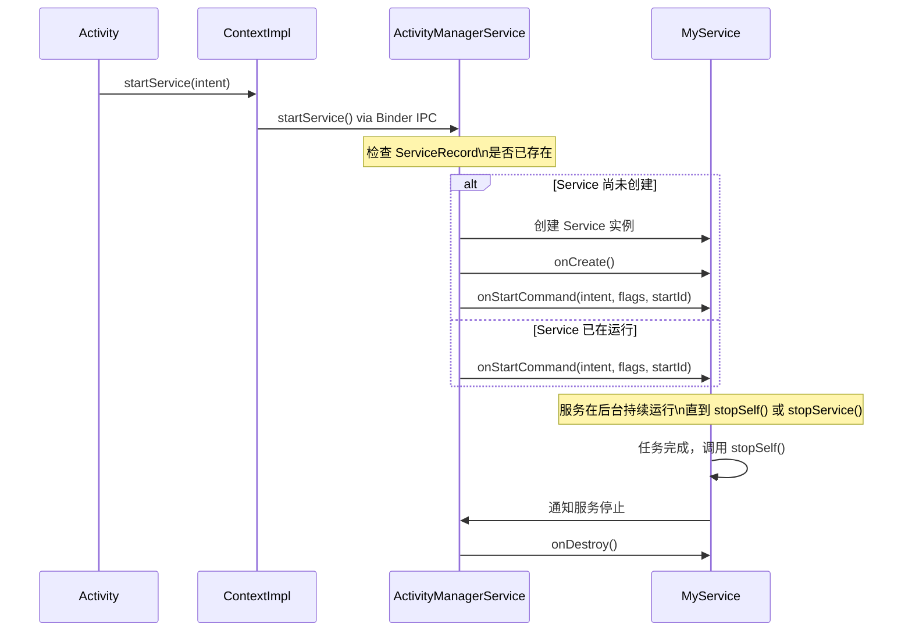
```mermaid
sequenceDiagram
    participant A as Activity
    participant C as ContextImpl
    participant AMS as ActivityManagerService
    participant S as MyService

    A->>C: startService(intent)
    C->>AMS: startService() via Binder IPC
    
    Note over AMS: 检查 ServiceRecord\n是否已存在

    alt Service 尚未创建
        AMS->>S: 创建 Service 实例
        AMS->>S: onCreate()
        AMS->>S: onStartCommand(intent, flags, startId)
    else Service 已在运行
        AMS->>S: onStartCommand(intent, flags, startId)
    end

    Note over S: 服务在后台持续运行\n直到 stopSelf() 或 stopService()

    S->>S: 任务完成，调用 stopSelf()
    S->>AMS: 通知服务停止
    AMS->>S: onDestroy()
```

#### 代码实战：一个典型的 Started Service

```kotlin
// 定义一个用于后台数据同步的 Started Service
class DataSyncService : Service() {

    // onCreate 只在 Service 首次创建时调用一次
    // 适合做一次性的初始化工作，比如创建线程池、初始化数据库连接
    override fun onCreate() {
        super.onCreate()
        // 在这里初始化资源，例如线程池
        Log.d("DataSyncService", "Service 实例被创建，执行一次性初始化")
    }

    // 每次通过 startService() 发起请求时都会回调此方法
    // intent: 携带调用者传递的数据（可能为 null，见后文 flags 讨论）
    // flags: 系统附加的标志位，指示本次启动的额外信息
    // startId: 本次启动请求的唯一标识符，用于精确停止对应的请求
    override fun onStartCommand(intent: Intent?, flags: Int, startId: Int): Int {
        // 从 Intent 中提取需要同步的数据 URL
        val syncUrl = intent?.getStringExtra("sync_url") ?: return START_NOT_STICKY

        // 注意：Service 默认运行在主线程！
        // 必须手动开启子线程来执行耗时操作，否则会阻塞 UI 并触发 ANR
        Thread {
            // 在子线程中执行实际的数据同步逻辑
            performDataSync(syncUrl)

            // 关键：任务完成后，使用 stopSelf(startId) 而非 stopSelf()
            // stopSelf(startId) 只有在 startId 是最近一次请求时才会真正停止服务
            // 这样可以安全地处理多个并发请求：只有最后一个请求完成后服务才停止
            stopSelf(startId)
        }.start()

        // 返回值决定了系统在内存不足杀死服务后的重建策略
        // START_NOT_STICKY: 不自动重建（适合可重试的非关键任务）
        // START_STICKY: 重建但 intent 为 null（适合媒体播放等持续性服务）
        // START_REDELIVER_INTENT: 重建并重新传递最后一个 intent（适合必须完成的任务）
        return START_NOT_STICKY
    }

    // Started Service 不需要绑定功能，但 onBind 是抽象方法，必须实现
    // 返回 null 表示此服务不支持绑定
    override fun onBind(intent: Intent?): IBinder? = null

    // 服务被销毁时回调，释放所有资源
    override fun onDestroy() {
        super.onDestroy()
        Log.d("DataSyncService", "Service 被销毁，释放资源")
    }

    // 实际的数据同步逻辑（运行在子线程中）
    private fun performDataSync(url: String) {
        Log.d("DataSyncService", "正在同步数据: $url")
        // 模拟网络请求耗时
        Thread.sleep(3000)
        Log.d("DataSyncService", "数据同步完成: $url")
    }
}
```

调用方的代码同样值得关注：

```kotlin
// 在 Activity 中启动 Started Service
class MainActivity : AppCompatActivity() {

    // 用户点击"同步"按钮时触发
    fun onSyncButtonClicked() {
        // 构建 Intent，指定目标 Service 并携带数据
        val intent = Intent(this, DataSyncService::class.java).apply {
            // 通过 Extra 传递需要同步的 URL
            putExtra("sync_url", "https://api.example.com/sync")
        }
        // 启动服务——调用后 Activity 与 Service 之间不再有任何关联
        // 即使 Activity 被销毁，Service 仍会继续运行
        startService(intent)
    }

    // 如果需要主动停止服务（而非等服务自己 stopSelf）
    fun onCancelSyncClicked() {
        val intent = Intent(this, DataSyncService::class.java)
        // stopService 会触发 Service 的 onDestroy
        stopService(intent)
    }
}
```

#### `stopSelf()` 与 `stopSelf(startId)` 的精妙区别

这是一个在面试中经常被考察、在实际开发中经常被忽视的细节。当 Service 同时处理多个启动请求时（比如用户快速点击了三次同步按钮，产生了三个 `onStartCommand` 回调），如果第一个任务完成后直接调用 `stopSelf()`，会立即停止整个 Service，导致第二个和第三个任务被中断。

而 `stopSelf(startId)` 的行为则更加智能：它会检查传入的 `startId` 是否等于**最近一次** `onStartCommand` 收到的 `startId`。只有当它们相等时（意味着没有更新的请求到来），Service 才会真正停止。这种设计本质上是一个**引用计数**的变体——系统通过 `startId` 的单调递增来判断是否还有未完成的请求。

```text
时间线示意：

t1: startService() → onStartCommand(startId=1)  → 开始任务1
t2: startService() → onStartCommand(startId=2)  → 开始任务2
t3: startService() → onStartCommand(startId=3)  → 开始任务3
t4: 任务1完成 → stopSelf(1) → 最新startId是3，不等于1 → 服务继续运行 ✓
t5: 任务3完成 → stopSelf(3) → 最新startId是3，等于3 → 但任务2还在？
    实际上系统只看 startId 是否是最新的，所以服务会停止！
    因此，如果任务可能乱序完成，需要自己维护计数器
```

这里暴露了 `stopSelf(startId)` 的一个局限性：它只比较"是否是最新的 startId"，而不是"是否所有任务都完成了"。如果任务可能乱序完成（比如任务3比任务2先完成），你需要自己维护一个 `AtomicInteger` 计数器或使用 `IntentService`（后续章节会详细讨论）来确保安全。

---

### Bound Service（绑定型服务）

#### 核心概念与设计哲学

如果说 Started Service 是一种"单向通知"模式，那么 Bound Service 就是一种**"双向通信"**模式。客户端组件通过 `Context.bindService()` 与 Service 建立连接，Service 通过 `onBind()` 返回一个 `IBinder` 对象作为通信接口，客户端拿到这个 `IBinder` 后就可以直接调用 Service 暴露的方法——这是一种典型的 **Client-Server 架构**。

Bound Service 最核心的设计哲学体现在它的**生命周期管理**上：Service 的存活完全取决于是否还有客户端与之绑定。当第一个客户端绑定时，系统创建 Service 并调用 `onBind()`；当最后一个客户端解绑时，系统自动销毁 Service 并调用 `onDestroy()`。这种"**引用计数式**"的生命周期管理非常优雅——它从根本上避免了 Started Service 中"忘记 stopSelf 导致服务泄漏"的问题。

你可以把 Bound Service 理解为一个**共享资源池**：多个 Activity 或 Fragment 可以同时绑定到同一个 Service，共享它提供的能力（比如音乐播放控制、位置追踪数据）。当所有使用者都离开时，资源自动释放。这与编程语言中的**引用计数垃圾回收**（Reference Counting GC）有着异曲同工之妙。

#### 绑定流程的内部机制

当客户端调用 `bindService(intent, serviceConnection, flags)` 时，系统内部的处理流程如下：

1. **Intent 路由**：与 `startService` 类似，Intent 通过 Binder IPC 到达 AMS，AMS 查找或创建对应的 `ServiceRecord`。

2. **Service 创建（如需要）**：如果 Service 尚未运行，系统先创建实例并调用 `onCreate()`。

3. **`onBind()` 回调**：系统调用 Service 的 `onBind(Intent)` 方法。这个方法**只会在第一个客户端绑定时调用一次**——后续的客户端绑定同一个 Intent 时，系统会直接复用之前返回的 `IBinder` 对象，而不会再次调用 `onBind()`。这是一个非常重要但容易被忽略的细节。

4. **`ServiceConnection` 回调**：系统将 `IBinder` 对象通过 `ServiceConnection.onServiceConnected()` 回调传递给客户端。注意，这个回调发生在**主线程**上，并且是**异步**的——`bindService()` 调用会立即返回 `true/false`，而 `onServiceConnected` 会在稍后的某个时刻被回调。

5. **解绑与销毁**：当客户端调用 `unbindService()` 时，如果这是最后一个绑定的客户端，系统会依次调用 `onUnbind()` → `onDestroy()`。

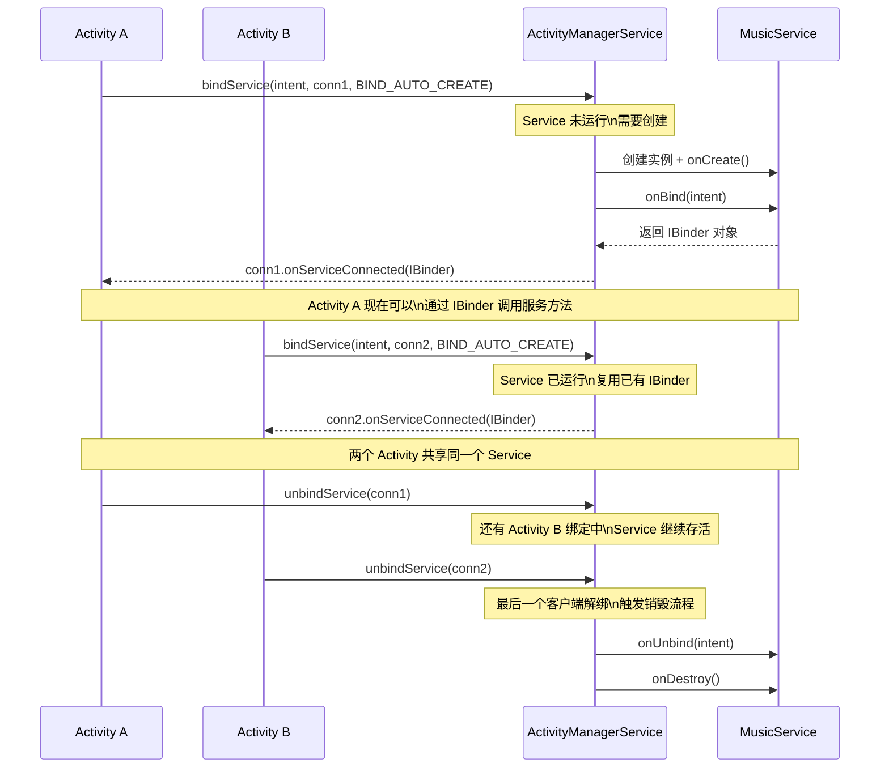
```mermaid
sequenceDiagram
    participant A1 as Activity A
    participant A2 as Activity B
    participant AMS as ActivityManagerService
    participant S as MusicService

    A1->>AMS: bindService(intent, conn1, BIND_AUTO_CREATE)
    Note over AMS: Service 未运行\n需要创建
    AMS->>S: 创建实例 + onCreate()
    AMS->>S: onBind(intent)
    S-->>AMS: 返回 IBinder 对象
    AMS-->>A1: conn1.onServiceConnected(IBinder)
    Note over A1,S: Activity A 现在可以\n通过 IBinder 调用服务方法

    A2->>AMS: bindService(intent, conn2, BIND_AUTO_CREATE)
    Note over AMS: Service 已运行\n复用已有 IBinder
    AMS-->>A2: conn2.onServiceConnected(IBinder)
    Note over A1,S: 两个 Activity 共享同一个 Service

    A1->>AMS: unbindService(conn1)
    Note over AMS: 还有 Activity B 绑定中\nService 继续存活

    A2->>AMS: unbindService(conn2)
    Note over AMS: 最后一个客户端解绑\n触发销毁流程
    AMS->>S: onUnbind(intent)
    AMS->>S: onDestroy()
```

#### 代码实战：本地绑定服务（Local Bound Service）

本地绑定（即 Service 与客户端在同一进程中）是最常见的 Bound Service 使用场景。在这种情况下，我们可以直接通过一个继承自 `Binder` 的内部类来暴露 Service 实例本身，客户端拿到后直接调用 Service 的 public 方法——简单、高效、无需序列化。

```kotlin
// 一个提供音乐播放能力的 Bound Service
class MusicService : Service() {

    // 内部类 LocalBinder 继承自 Binder
    // 它的唯一职责是提供一个方法让客户端获取 Service 实例的引用
    inner class LocalBinder : Binder() {
        // 返回外部类 MusicService 的实例
        // 因为是 inner class，可以直接访问外部类的 this 引用
        fun getService(): MusicService = this@MusicService
    }

    // 创建 Binder 实例——注意这是一个成员变量，整个 Service 生命周期内只有一个
    private val binder = LocalBinder()

    // 当前播放状态，客户端可以通过 getService() 拿到 Service 后直接读取
    private var isPlaying = false

    // 当前播放的曲目名称
    private var currentTrack: String = ""

    // 第一个客户端绑定时调用，返回 IBinder 对象
    // 后续客户端绑定时，系统直接复用这个 IBinder，不会再调用 onBind
    override fun onBind(intent: Intent?): IBinder {
        Log.d("MusicService", "onBind: 第一个客户端绑定")
        return binder
    }

    // 所有客户端解绑后调用
    // 返回 true 表示：如果后续有新客户端重新绑定，调用 onRebind() 而非 onBind()
    // 返回 false（默认）表示：后续重新绑定时仍调用 onBind()
    override fun onUnbind(intent: Intent?): Boolean {
        Log.d("MusicService", "onUnbind: 所有客户端已解绑")
        return false
    }

    // ========== 以下是 Service 对外暴露的业务方法 ==========

    // 播放指定曲目
    fun play(trackName: String) {
        currentTrack = trackName
        isPlaying = true
        Log.d("MusicService", "开始播放: $trackName")
        // 实际实现中这里会调用 MediaPlayer 等播放器 API
    }

    // 暂停播放
    fun pause() {
        isPlaying = false
        Log.d("MusicService", "暂停播放: $currentTrack")
    }

    // 查询当前是否正在播放
    fun isCurrentlyPlaying(): Boolean = isPlaying

    // 获取当前曲目名称
    fun getCurrentTrackName(): String = currentTrack
}
```

客户端（Activity）的绑定代码：

```kotlin
class MusicPlayerActivity : AppCompatActivity() {

    // 持有 Service 的引用，绑定成功后赋值
    private var musicService: MusicService? = null

    // 标记是否已成功绑定，用于在 onStop 中安全解绑
    private var isBound = false

    // ServiceConnection 是客户端与 Service 之间的"桥梁"
    // 它定义了连接建立和断开时的回调逻辑
    private val connection = object : ServiceConnection {

        // 绑定成功时回调（运行在主线程）
        // name: 服务的 ComponentName（包名 + 类名）
        // service: Service 的 onBind() 返回的 IBinder 对象
        override fun onServiceConnected(name: ComponentName?, service: IBinder?) {
            // 将 IBinder 向下转型为我们定义的 LocalBinder
            val binder = service as MusicService.LocalBinder
            // 通过 LocalBinder 获取 Service 实例
            musicService = binder.getService()
            // 标记绑定成功
            isBound = true
            Log.d("MusicPlayerActivity", "已绑定到 MusicService")

            // 绑定成功后可以立即使用 Service 的方法
            // 例如：更新 UI 显示当前播放状态
            updatePlaybackUI()
        }

        // 连接意外断开时回调（注意：主动调用 unbindService 不会触发此回调）
        // 只有在 Service 所在进程崩溃或被系统杀死时才会触发
        override fun onServiceDisconnected(name: ComponentName?) {
            musicService = null
            isBound = false
            Log.d("MusicPlayerActivity", "与 MusicService 的连接意外断开")
        }
    }

    override fun onStart() {
        super.onStart()
        // 在 onStart 中绑定服务，确保 Activity 可见时服务可用
        val intent = Intent(this, MusicService::class.java)
        // BIND_AUTO_CREATE: 如果 Service 不存在则自动创建
        // 这是最常用的 flag，几乎所有绑定场景都会使用
        bindService(intent, connection, Context.BIND_AUTO_CREATE)
    }

    override fun onStop() {
        super.onStop()
        // 在 onStop 中解绑，与 onStart 中的 bindService 对称
        // 必须检查 isBound 标志，避免重复解绑导致 IllegalArgumentException
        if (isBound) {
            unbindService(connection)
            isBound = false
        }
    }

    // 用户点击播放按钮
    fun onPlayClicked() {
        // 通过 Service 引用直接调用方法——这就是 Bound Service 的魅力
        // 无需 Intent、无需序列化、无需等待回调，直接方法调用
        musicService?.play("Shape of You - Ed Sheeran")
    }

    // 用户点击暂停按钮
    fun onPauseClicked() {
        musicService?.pause()
    }

    // 更新 UI 显示播放状态
    private fun updatePlaybackUI() {
        val isPlaying = musicService?.isCurrentlyPlaying() ?: false
        val trackName = musicService?.getCurrentTrackName() ?: "未知"
        // 更新 UI 控件...
    }
}
```

#### `bindService()` 的 flags 参数详解

`bindService()` 的第三个参数 `flags` 控制着绑定行为的诸多细节，其中最常用的是 `BIND_AUTO_CREATE`，但还有几个值得了解的选项：

| Flag 常量               | 值      | 行为说明                                                     |
| :-------------------- | :----- | :------------------------------------------------------- |
| `BIND_AUTO_CREATE`    | 0x0001 | 如果 Service 不存在则自动创建。这是最常用的 flag，几乎是"默认选择"                |
| `BIND_DEBUG_UNBIND`   | 0x0002 | 调试用途：记录 unbind 的调用栈，帮助排查泄漏问题。仅用于开发阶段                     |
| `BIND_NOT_FOREGROUND` | 0x0004 | 绑定时不将 Service 所在进程提升到前台优先级。适用于不需要高优先级的后台绑定               |
| `BIND_ABOVE_CLIENT`   | 0x0008 | 将 Service 进程的优先级提升到高于客户端进程。适用于 Service 比 Activity 更重要的场景 |
| `BIND_WAIVE_PRIORITY` | 0x0020 | 绑定不影响 Service 所在进程的优先级调度。适用于"我只是想用一下，不要因为我而改变你的优先级"      |
| `0`（不传任何 flag）        | 0x0000 | 不自动创建 Service。如果 Service 未运行，绑定会静默失败（返回 false）           |

一个容易踩的坑是：如果你传入 `0` 而非 `BIND_AUTO_CREATE`，并且 Service 此时没有通过 `startService()` 启动过，那么 `bindService()` 会返回 `false`，`onServiceConnected` 永远不会被回调，而且**不会有任何错误日志**——这种静默失败会让调试变得非常困难。

#### `onServiceDisconnected` 的常见误解

很多开发者误以为调用 `unbindService()` 后会触发 `onServiceDisconnected` 回调，但事实并非如此。`onServiceDisconnected` **只在连接意外断开时触发**，典型场景包括：

* Service 所在进程被系统因内存不足而杀死
* Service 所在进程发生了未捕获的异常导致崩溃
* Service 运行在独立进程中（`android:process` 属性），该进程被终止

正常的 `unbindService()` 调用只会触发 Service 端的 `onUnbind()`，客户端的 `ServiceConnection` 不会收到任何回调。这个设计是合理的——因为是你主动断开的连接，你当然知道连接已经断了，不需要系统再通知你一次。

---

### 混合型服务（Started + Bound）

#### 为什么需要混合型？

在真实的应用开发中，很多场景既需要 Started Service 的"独立运行"能力，又需要 Bound Service 的"双向通信"能力。最经典的例子就是**音乐播放器**：

* 用户打开播放器 Activity，点击播放 → 需要 `startService()` 让音乐在后台持续播放（即使 Activity 被销毁）
* 用户在 Activity 中需要实时查看播放进度、切换曲目 → 需要 `bindService()` 建立通信通道
* 用户按返回键离开 Activity → `unbindService()` 断开连接，但音乐继续播放
* 用户从通知栏点击停止 → `stopService()` 或 `stopSelf()` 停止服务

如果只用 Started Service，Activity 无法方便地获取播放状态；如果只用 Bound Service，Activity 销毁后音乐就停了。

#### 混合型的生命周期：最复杂也最精妙的状态机

混合型服务的生命周期是整个 Service 体系中**最容易出错、也最值得深入理解**的部分。它的核心规则可以用一句话概括：**Service 只有在"已停止"且"无绑定"两个条件同时满足时才会被销毁**。这看似简单，但当 start 和 bind 的调用顺序交错、多个客户端同时绑定和解绑时，状态组合会变得相当复杂。

我们可以把混合型 Service 的存活条件想象成一把有**两道锁**的门——一道是 "Started 锁"（通过 `stopService()` 或 `stopSelf()` 打开），另一道是 "Bound 锁"（通过所有客户端 `unbindService()` 打开）。只有两道锁都打开了，这扇门（Service）才会真正关闭（`onDestroy()`）。无论你先打开哪一道锁，只要另一道还锁着，Service 就会继续存活。

为了更精确地理解这个机制，我们需要区分以下几种时序场景：

**场景一：先 start，再 bind，先 unbind，后 stop**

这是最常见的音乐播放器场景。用户点击播放（`startService`），然后进入播放界面（`bindService`），离开界面（`unbindService`），最后从通知栏停止播放（`stopService`）。

```text
时间线：
t1: startService()    → onCreate() → onStartCommand()     [Started锁: 🔒, Bound锁: 🔓]
t2: bindService()     → onBind()                           [Started锁: 🔒, Bound锁: 🔒]
t3: unbindService()   → onUnbind()                         [Started锁: 🔒, Bound锁: 🔓]
    → Service 继续运行！因为 Started 锁还没打开
t4: stopService()     → onDestroy()                        [Started锁: 🔓, Bound锁: 🔓]
    → 两道锁都开了，Service 销毁 ✓
```

**场景二：先 start，再 bind，先 stop，后 unbind**

这个场景更微妙。用户点击播放，进入界面，然后在界面内点击了停止按钮（`stopService`），但 Activity 还没有销毁（还绑定着）。

```text
时间线：
t1: startService()    → onCreate() → onStartCommand()     [Started锁: 🔒, Bound锁: 🔓]
t2: bindService()     → onBind()                           [Started锁: 🔒, Bound锁: 🔒]
t3: stopService()     → 什么都不会发生！                     [Started锁: 🔓, Bound锁: 🔒]
    → Started 锁打开了，但 Bound 锁还锁着，Service 继续存活
    → 注意：此时 onDestroy 不会被调用！
t4: unbindService()   → onUnbind() → onDestroy()          [Started锁: 🔓, Bound锁: 🔓]
    → 两道锁都开了，Service 销毁 ✓
```

**场景三：只 bind 不 start**

这就退化成了纯 Bound Service 的行为。

```text
时间线：
t1: bindService()     → onCreate() → onBind()             [Started锁: 🔓, Bound锁: 🔒]
t2: unbindService()   → onUnbind() → onDestroy()          [Started锁: 🔓, Bound锁: 🔓]
    → Started 锁本来就是开的，Bound 锁一打开就销毁 ✓
```

**场景四：多客户端绑定**

当多个组件同时绑定到同一个 Service 时，Bound 锁的行为更像一个**引用计数器**——每次 `bindService` 计数加一，每次 `unbindService` 计数减一，只有计数归零时 Bound 锁才打开。

```text
时间线：
t1: startService()         → onCreate() → onStartCommand()  [Started: 🔒, Bound计数: 0]
t2: Activity_A.bind()      → onBind()                       [Started: 🔒, Bound计数: 1]
t3: Activity_B.bind()      → (不再调用onBind，复用IBinder)    [Started: 🔒, Bound计数: 2]
t4: Activity_A.unbind()    → (计数减一，Service继续)          [Started: 🔒, Bound计数: 1]
t5: stopService()          → (Started锁开了，但还有绑定)      [Started: 🔓, Bound计数: 1]
t6: Activity_B.unbind()    → onUnbind() → onDestroy()       [Started: 🔓, Bound计数: 0]
    → 全部条件满足，Service 销毁 ✓
```

下面用一张流程图来完整呈现混合型 Service 的生命周期状态机：

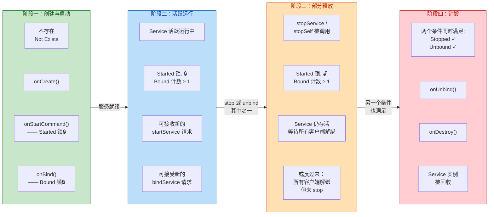
```mermaid
graph LR
    subgraph Phase1["阶段一：创建与启动"]
        direction TB
        A["不存在\nNot Exists"] ~~~ B["onCreate()"]
        B ~~~ C["onStartCommand()\n—— Started 锁🔒"]
        C ~~~ D["onBind()\n—— Bound 锁🔒"]
    end

    subgraph Phase2["阶段二：活跃运行"]
        direction TB
        E["Service 活跃运行中"] ~~~ F["Started 锁: 🔒\nBound 计数 ≥ 1"]
        F ~~~ G["可接收新的\nstartService 请求"]
        G ~~~ H["可接受新的\nbindService 请求"]
    end

    subgraph Phase3["阶段三：部分释放"]
        direction TB
        I["stopService /\nstopSelf 被调用"] ~~~ J["Started 锁: 🔓\nBound 计数 ≥ 1"]
        J ~~~ K["Service 仍存活\n等待所有客户端解绑"]
        K ~~~ L["或反过来：\n所有客户端解绑\n但未 stop"]
    end

    subgraph Phase4["阶段四：销毁"]
        direction TB
        M["两个条件同时满足:\nStopped ✓\nUnbound ✓"] ~~~ N["onUnbind()"]
        N ~~~ O["onDestroy()"]
        O ~~~ P["Service 实例\n被回收"]
    end

    Phase1 -->|"服务就绪"| Phase2
    Phase2 -->|"stop 或 unbind\n其中之一"| Phase3
    Phase3 -->|"另一个条件\n也满足"| Phase4

    classDef greenNode fill:#C8E6C9,stroke:#2E7D32,color:#1B5E20
    classDef blueNode fill:#BBDEFB,stroke:#1565C0,color:#0D47A1
    classDef orangeNode fill:#FFE0B2,stroke:#E65100,color:#BF360C
    classDef redNode fill:#FFCDD2,stroke:#C62828,color:#B71C1C

    class Phase1 greenNode
    class Phase2 blueNode
    class Phase3 orangeNode
    class Phase4 redNode
```

#### 代码实战：一个完整的混合型音乐播放服务

```kotlin
// 混合型 Service：既可以被 start（后台持续播放），也可以被 bind（UI 交互控制）
class MusicPlaybackService : Service() {

    // ==================== Binder 相关 ====================

    // 内部 Binder 类，供同进程客户端获取 Service 引用
    inner class PlaybackBinder : Binder() {
        // 客户端通过此方法拿到 Service 实例后，可直接调用 public 方法
        fun getService(): MusicPlaybackService = this@MusicPlaybackService
    }

    // Binder 实例，在 onBind 中返回给客户端
    private val binder = PlaybackBinder()

    // ==================== 播放状态 ====================

    // 当前是否正在播放
    private var isPlaying = false

    // 当前曲目信息
    private var currentTrack: String = "无"

    // 播放进度（秒）
    private var currentPosition: Int = 0

    // 用于模拟播放进度更新的 Handler
    private val handler = Handler(Looper.getMainLooper())

    // 进度更新的 Runnable
    private val progressUpdater = object : Runnable {
        override fun run() {
            if (isPlaying) {
                // 每秒递增播放进度
                currentPosition++
                // 通知所有注册的监听器（观察者模式）
                listeners.forEach { it.onProgressChanged(currentPosition) }
                // 1秒后再次执行
                handler.postDelayed(this, 1000)
            }
        }
    }

    // ==================== 观察者模式：让 UI 实时感知状态变化 ====================

    // 定义播放状态监听接口
    // 客户端（Activity/Fragment）实现此接口来接收实时更新
    interface PlaybackListener {
        // 播放状态变化时回调
        fun onPlaybackStateChanged(isPlaying: Boolean, trackName: String)
        // 播放进度变化时回调（每秒一次）
        fun onProgressChanged(positionInSeconds: Int)
    }

    // 监听器列表——支持多个 UI 组件同时监听
    // 使用 CopyOnWriteArrayList 保证线程安全
    private val listeners = mutableListOf<PlaybackListener>()

    // 注册监听器（客户端在 onServiceConnected 后调用）
    fun registerListener(listener: PlaybackListener) {
        if (!listeners.contains(listener)) {
            listeners.add(listener)
        }
    }

    // 注销监听器（客户端在 unbind 前调用，防止内存泄漏）
    fun unregisterListener(listener: PlaybackListener) {
        listeners.remove(listener)
    }

    // ==================== 生命周期回调 ====================

    override fun onCreate() {
        super.onCreate()
        // Service 实例被创建——无论是通过 start 还是 bind 触发的
        // 这里做一次性初始化：创建 MediaPlayer、初始化音频焦点等
        Log.d("MusicPlayback", "onCreate: Service 实例创建")
    }

    // Started 模式的入口：处理 startService() 请求
    override fun onStartCommand(intent: Intent?, flags: Int, startId: Int): Int {
        // 从 Intent 中解析要执行的动作
        val action = intent?.action

        when (action) {
            // 播放动作：从 Intent 中获取曲目信息并开始播放
            "ACTION_PLAY" -> {
                val track = intent.getStringExtra("track_name") ?: "未知曲目"
                play(track)
            }
            // 暂停动作
            "ACTION_PAUSE" -> pause()
            // 停止动作：停止播放并终止服务
            "ACTION_STOP" -> {
                stop()
                // 调用 stopSelf() 打开 "Started 锁"
                // 如果此时没有客户端绑定，Service 会被销毁
                // 如果还有客户端绑定，Service 继续存活直到所有客户端解绑
                stopSelf()
            }
        }

        // START_STICKY：系统杀死后会重建 Service，但 intent 为 null
        // 适合音乐播放器：即使被杀，重建后可以恢复到"就绪"状态
        // 用户可以从通知栏或 Activity 重新触发播放
        return START_STICKY
    }

    // Bound 模式的入口：返回 IBinder 给客户端
    override fun onBind(intent: Intent?): IBinder {
        Log.d("MusicPlayback", "onBind: 第一个客户端绑定")
        // 返回 Binder 对象，客户端通过它获取 Service 引用
        return binder
    }

    // 所有客户端解绑后调用
    override fun onUnbind(intent: Intent?): Boolean {
        Log.d("MusicPlayback", "onUnbind: 所有客户端已解绑")
        // 清空监听器列表，防止持有已销毁 Activity 的引用导致内存泄漏
        listeners.clear()
        // 返回 true：下次有客户端重新绑定时，系统会调用 onRebind() 而非 onBind()
        // 这在混合型服务中很有用——Service 可能因为 Started 模式仍在运行，
        // 用户重新打开 Activity 时需要重新绑定
        return true
    }

    // 当 onUnbind 返回 true 后，新客户端重新绑定时调用
    // 注意：此时不会再调用 onBind()，而是调用 onRebind()
    override fun onRebind(intent: Intent?) {
        Log.d("MusicPlayback", "onRebind: 客户端重新绑定")
        super.onRebind(intent)
    }

    override fun onDestroy() {
        super.onDestroy()
        // 清理所有资源
        handler.removeCallbacks(progressUpdater)
        listeners.clear()
        Log.d("MusicPlayback", "onDestroy: Service 被销毁，所有资源已释放")
    }

    // ==================== 业务方法（供客户端通过 Binder 调用） ====================

    // 开始播放指定曲目
    fun play(trackName: String) {
        currentTrack = trackName
        currentPosition = 0
        isPlaying = true
        // 启动进度更新循环
        handler.post(progressUpdater)
        // 通知所有监听器状态变化
        listeners.forEach { it.onPlaybackStateChanged(true, trackName) }
        Log.d("MusicPlayback", "开始播放: $trackName")
    }

    // 暂停播放
    fun pause() {
        isPlaying = false
        // 停止进度更新
        handler.removeCallbacks(progressUpdater)
        // 通知监听器
        listeners.forEach { it.onPlaybackStateChanged(false, currentTrack) }
        Log.d("MusicPlayback", "暂停播放: $currentTrack")
    }

    // 停止播放并重置状态
    fun stop() {
        isPlaying = false
        currentPosition = 0
        currentTrack = "无"
        handler.removeCallbacks(progressUpdater)
        listeners.forEach { it.onPlaybackStateChanged(false, "") }
        Log.d("MusicPlayback", "停止播放")
    }

    // 查询当前播放状态（供 UI 初始化时同步状态）
    fun getPlaybackState(): PlaybackState {
        return PlaybackState(isPlaying, currentTrack, currentPosition)
    }

    // 播放状态数据类
    data class PlaybackState(
        val isPlaying: Boolean,       // 是否正在播放
        val trackName: String,        // 当前曲目名
        val positionSeconds: Int      // 当前播放位置（秒）
    )
}
```

客户端 Activity 的完整交互代码：

```kotlin
class NowPlayingActivity : AppCompatActivity(), MusicPlaybackService.PlaybackListener {

    // Service 引用
    private var playbackService: MusicPlaybackService? = null

    // 绑定状态标记
    private var isBound = false

    // ServiceConnection 实现
    private val serviceConnection = object : ServiceConnection {

        override fun onServiceConnected(name: ComponentName?, service: IBinder?) {
            // 获取 Service 引用
            val binder = service as MusicPlaybackService.PlaybackBinder
            playbackService = binder.getService()
            isBound = true

            // 注册自己为播放状态监听器
            // Activity 实现了 PlaybackListener 接口，所以直接传 this
            playbackService?.registerListener(this@NowPlayingActivity)

            // 同步当前播放状态到 UI
            // 这一步很重要：用户可能是从通知栏点进来的，
            // 此时音乐已经在播放，UI 需要立即反映当前状态
            val state = playbackService?.getPlaybackState()
            state?.let { updateUI(it) }

            Log.d("NowPlaying", "已绑定到 MusicPlaybackService")
        }

        override fun onServiceDisconnected(name: ComponentName?) {
            // 意外断开（进程被杀等）
            playbackService = null
            isBound = false
            Log.d("NowPlaying", "与 MusicPlaybackService 的连接意外断开")
        }
    }

    override fun onCreate(savedInstanceState: Bundle?) {
        super.onCreate(savedInstanceState)
        setContentView(R.layout.activity_now_playing)

        // 点击播放按钮：通过 startService 确保后台持续播放
        // 同时通过 Binder 直接调用 play 方法
        findViewById<Button>(R.id.btn_play).setOnClickListener {
            // 先 startService 确保 Service 不会因为 unbind 而死亡
            val startIntent = Intent(this, MusicPlaybackService::class.java).apply {
                action = "ACTION_PLAY"
                putExtra("track_name", "Bohemian Rhapsody - Queen")
            }
            startService(startIntent)

            // 如果已经绑定，也可以直接通过 Binder 调用（效果相同，但更直接）
            // playbackService?.play("Bohemian Rhapsody - Queen")
        }

        // 点击暂停按钮：通过 Binder 直接调用
        findViewById<Button>(R.id.btn_pause).setOnClickListener {
            playbackService?.pause()
        }

        // 点击停止按钮：停止服务
        findViewById<Button>(R.id.btn_stop).setOnClickListener {
            val stopIntent = Intent(this, MusicPlaybackService::class.java).apply {
                action = "ACTION_STOP"
            }
            // stopService 会触发 onStartCommand 中的 ACTION_STOP 处理
            // 然后 Service 内部调用 stopSelf()
            startService(stopIntent)
            // 注意：这里不直接调用 stopService()，而是发送一个 ACTION_STOP 的 intent
            // 这样 Service 可以在停止前做清理工作（保存播放位置等）
        }
    }

    override fun onStart() {
        super.onStart()
        // 绑定到 Service，建立通信通道
        val bindIntent = Intent(this, MusicPlaybackService::class.java)
        bindService(bindIntent, serviceConnection, Context.BIND_AUTO_CREATE)
    }

    override fun onStop() {
        super.onStop()
        // 解绑前先注销监听器，防止 Service 持有已暂停 Activity 的引用
        if (isBound) {
            playbackService?.unregisterListener(this)
            unbindService(serviceConnection)
            isBound = false
        }
        // 注意：解绑后 Service 不一定会销毁！
        // 如果之前调用过 startService，Service 会继续在后台运行
        // 这正是混合型的核心价值所在
    }

    // ==================== PlaybackListener 回调实现 ====================

    // 播放状态变化时由 Service 回调（运行在主线程，可直接更新 UI）
    override fun onPlaybackStateChanged(isPlaying: Boolean, trackName: String) {
        // 更新播放/暂停按钮的图标
        val playButton = findViewById<Button>(R.id.btn_play)
        playButton.text = if (isPlaying) "暂停" else "播放"

        // 更新曲目名称显示
        val trackText = findViewById<TextView>(R.id.tv_track_name)
        trackText.text = trackName
    }

    // 播放进度变化时由 Service 每秒回调一次
    override fun onProgressChanged(positionInSeconds: Int) {
        // 更新进度条和时间显示
        val progressText = findViewById<TextView>(R.id.tv_progress)
        val minutes = positionInSeconds / 60
        val seconds = positionInSeconds % 60
        progressText.text = String.format("%02d:%02d", minutes, seconds)
    }

    // 辅助方法：根据播放状态更新整个 UI
    private fun updateUI(state: MusicPlaybackService.PlaybackState) {
        onPlaybackStateChanged(state.isPlaying, state.trackName)
        onProgressChanged(state.positionSeconds)
    }
}
```

#### `onRebind()` 的触发条件与实际意义

在混合型服务中，有一个容易被忽视但非常实用的回调：`onRebind()`。它的触发条件非常精确：

1. Service 当前处于 Started 状态（之前被 `startService()` 启动过，且尚未 stop）
2. 之前有客户端绑定过，后来所有客户端都解绑了，触发了 `onUnbind()`
3. `onUnbind()` 返回了 `true`
4. 此时有新的客户端再次调用 `bindService()`

只有以上四个条件**全部满足**时，系统才会调用 `onRebind()` 而非 `onBind()`。这个机制的实际意义在于：它让 Service 能够区分"首次绑定"和"重新绑定"，从而执行不同的初始化逻辑。例如，首次绑定时可能需要加载完整的播放列表，而重新绑定时只需要同步当前播放状态即可。

用一个完整的时间线来展示 `onRebind` 的触发过程：

```text
t1: startService()       → onCreate() → onStartCommand()
t2: Activity_A.bind()    → onBind() → 返回 IBinder
t3: Activity_A.unbind()  → onUnbind() → 返回 true  ← 关键：必须返回 true
    → Service 继续运行（因为 Started 锁还在）
t4: Activity_B.bind()    → onRebind()  ← 不是 onBind()！
    → 系统将之前缓存的 IBinder 传给 Activity_B
t5: Activity_B.unbind()  → onUnbind()
t6: stopService()        → onDestroy()
```

如果 t3 中 `onUnbind()` 返回的是 `false`（默认值），那么 t4 时系统会调用 `onBind()` 而非 `onRebind()`。

#### 三种类型的生命周期全景对比

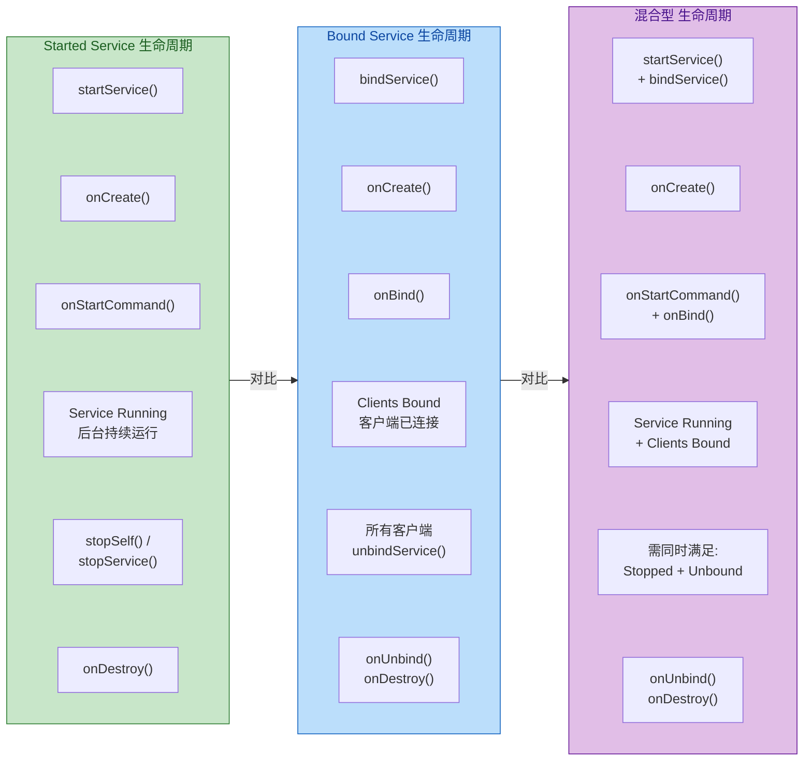
```mermaid
graph LR
    subgraph StartedLife["Started Service 生命周期"]
        direction TB
        S1["startService()"] ~~~ S2["onCreate()"]
        S2 ~~~ S3["onStartCommand()"]
        S3 ~~~ S4["Service Running\n后台持续运行"]
        S4 ~~~ S5["stopSelf() /\nstopService()"]
        S5 ~~~ S6["onDestroy()"]
    end

    subgraph BoundLife["Bound Service 生命周期"]
        direction TB
        B1["bindService()"] ~~~ B2["onCreate()"]
        B2 ~~~ B3["onBind()"]
        B3 ~~~ B4["Clients Bound\n客户端已连接"]
        B4 ~~~ B5["所有客户端\nunbindService()"]
        B5 ~~~ B6["onUnbind()\nonDestroy()"]
    end

    subgraph MixedLife["混合型 生命周期"]
        direction TB
        M1["startService()\n+ bindService()"] ~~~ M2["onCreate()"]
        M2 ~~~ M3["onStartCommand()\n+ onBind()"]
        M3 ~~~ M4["Service Running\n+ Clients Bound"]
        M4 ~~~ M5["需同时满足:\nStopped + Unbound"]
        M5 ~~~ M6["onUnbind()\nonDestroy()"]
    end

    StartedLife -->|"对比"| BoundLife -->|"对比"| MixedLife

    classDef greenStyle fill:#C8E6C9,stroke:#2E7D32,color:#1B5E20
    classDef blueStyle fill:#BBDEFB,stroke:#1565C0,color:#0D47A1
    classDef purpleStyle fill:#E1BEE7,stroke:#6A1B9A,color:#4A148C

    class StartedLife greenStyle
    class BoundLife blueStyle
    class MixedLife purpleStyle
```

#### 混合型服务的常见陷阱与最佳实践

**陷阱一：忘记 startService 导致 Activity 退出后服务死亡**

很多开发者在实现音乐播放器时，只调用了 `bindService()` 而忘记调用 `startService()`。结果就是：用户一按返回键，Activity 销毁触发 `unbindService()`，Service 随之被销毁，音乐戛然而止。解决方案很简单：在开始播放时同时调用 `startService()` 和 `bindService()`。

**陷阱二：在 Activity 的 `onDestroy` 中解绑导致泄漏**

如果你在 `onStart()` 中 bind，就应该在 `onStop()` 中 unbind；如果在 `onCreate()` 中 bind，就在 `onDestroy()` 中 unbind。绑定和解绑必须**严格对称**。一个常见的错误是在 `onStart()` 中 bind 但在 `onDestroy()` 中 unbind——这意味着在 Activity 处于 stopped 状态（不可见但未销毁，比如被另一个 Activity 完全遮挡）时，绑定仍然存在，白白占用资源。更糟糕的是，如果 Activity 因配置变更（如屏幕旋转）被重建，`onStart()` 会再次 bind 而之前的绑定没有被释放，导致连接泄漏。

**陷阱三：`onServiceDisconnected` 中尝试重新绑定导致无限循环**

有些开发者在 `onServiceDisconnected` 中立即调用 `bindService()` 试图重连。但如果 Service 所在进程持续崩溃，这会导致无限重连循环，疯狂消耗电量和 CPU。正确的做法是使用**指数退避**（exponential backoff）策略，或者干脆通知用户服务不可用。

**最佳实践总结**：

```kotlin
// 推荐的绑定/解绑生命周期配对
class BestPracticeActivity : AppCompatActivity() {

    // ✅ 正确：onStart/onStop 配对
    override fun onStart() {
        super.onStart()
        // 绑定服务
        bindService(intent, connection, Context.BIND_AUTO_CREATE)
    }

    override fun onStop() {
        super.onStop()
        // 解绑服务——与 onStart 严格对称
        if (isBound) {
            unbindService(connection)
            isBound = false
        }
    }

    // ❌ 错误示范：onCreate/onDestroy 配对绑定
    // 问题：Activity 在 stopped 状态时仍持有绑定，浪费资源
    // 更大的问题：配置变更时 onCreate 会再次调用，导致重复绑定

    // ❌ 错误示范：onResume/onPause 配对绑定
    // 问题：绑定/解绑过于频繁（每次弹出对话框都会触发 onPause）
    // 频繁的 bind/unbind 会造成不必要的性能开销
}
```

#### 深入理解：系统如何在内部管理混合型 Service 的状态

为了真正理解混合型 Service 的行为，我们有必要稍微深入到 Framework 层，看看 AMS 内部是如何追踪 Service 状态的。在 `com.android.server.am.ActiveServices` 类中，每个 Service 都对应一个 `ServiceRecord` 对象，这个对象中有几个关键字段直接决定了 Service 的存亡：

```java
// frameworks/base/services/core/java/com/android/server/am/ServiceRecord.java
// 以下为简化后的关键字段（非完整源码）

class ServiceRecord {
    // 记录所有通过 bindService 建立的连接
    // key 是 Intent.FilterComparison（用于区分不同 Intent 的绑定）
    // value 是 IntentBindRecord，内部又包含所有绑定到该 Intent 的客户端连接列表
    final ArrayMap<Intent.FilterComparison, IntentBindRecord> bindings;

    // 记录通过 startService 传入的所有 delivery 列表
    // 每次 onStartCommand 被调用时，对应的 StartItem 会被加入此列表
    final ArrayList<StartItem> deliveredStarts;

    // 关键标志位：Service 是否处于 "started" 状态
    // 调用 startService 后设为 true
    // 调用 stopSelf/stopService 后设为 false
    boolean startRequested;

    // 最后一次 onStartCommand 的 startId
    int lastStartId;

    // 绑定计数相关：当前有多少活跃的绑定连接
    int getConnectionCount();
}
```

当 AMS 需要判断一个 Service 是否应该被销毁时，它执行的核心逻辑可以简化为以下伪代码：

```kotlin
// AMS 内部判断 Service 是否应该销毁的简化逻辑
fun shouldDestroyService(record: ServiceRecord): Boolean {
    // 条件一：是否还处于 started 状态
    // 如果 startRequested 为 true，说明还没有被 stop，不能销毁
    val isStopped = !record.startRequested

    // 条件二：是否还有活跃的绑定连接
    // 遍历所有 IntentBindRecord，检查是否还有未解绑的客户端
    val hasActiveBindings = record.bindings.values.any { intentBind ->
        intentBind.apps.isNotEmpty() // apps 记录了绑定到此 intent 的所有客户端进程
    }

    // 只有两个条件同时满足时才销毁
    // isStopped == true 且 hasActiveBindings == false
    return isStopped && !hasActiveBindings
}
```

这段伪代码清晰地展示了我们之前用"两道锁"比喻的底层实现。`startRequested` 就是 "Started 锁"，`bindings` 的非空状态就是 "Bound 锁"。AMS 在以下几个时机会调用这个判断逻辑：

1. **`stopService()` / `stopSelf()` 被调用时**：AMS 将 `startRequested` 设为 `false`，然后检查是否还有绑定。如果没有绑定，立即销毁；如果还有绑定，标记为"等待解绑后销毁"。

2. **`unbindService()` 被调用时**：AMS 从 `bindings` 中移除对应的连接记录，然后检查是否还有其他绑定以及 `startRequested` 的状态。如果两个条件都满足，立即销毁。

3. **客户端进程死亡时**：如果绑定 Service 的 Activity 所在进程崩溃了，AMS 会自动清理该进程的所有绑定连接，然后重新评估 Service 是否应该销毁。

这种设计体现了 Android 系统的一个核心哲学：**组件的生命周期不由组件自身完全控制，而是由系统根据"是否还有人需要它"来统一管理**。这与 Java 的垃圾回收机制有着深层的相似性——对象不是自己决定何时被回收，而是 GC 根据"是否还有引用指向它"来决定。

#### 进程优先级：混合型 Service 如何影响宿主进程的存活

Android 系统在内存紧张时会按照进程优先级从低到高杀死进程来回收内存。Service 的类型和状态直接影响其宿主进程的优先级，这在混合型服务中尤为复杂：

| 进程优先级（从高到低）       | OOM Adj 值范围 | Service 对应状态                                                      | 被杀概率      |
| :---------------- | :---------- | :---------------------------------------------------------------- | :-------- |
| 前台进程 (Foreground) | 0           | Service 正在执行 `onCreate`/`onStartCommand`/`onBind`/`onDestroy` 回调中 | 极低，几乎不会被杀 |
| 可见进程 (Visible)    | 100~199     | Service 绑定到一个可见但非前台的 Activity                                     | 低         |
| 服务进程 (Service)    | 500~599     | 通过 `startService` 启动且正在运行的 Service（运行超过30分钟会被降级）                  | 中等        |
| 后台进程 (Background) | 700~999     | 宿主进程中没有活跃组件，Service 已停止                                           | 高         |
| 空进程 (Empty)       | 1000+       | 进程中没有任何活跃组件                                                       | 最高，随时可能被杀 |

对于混合型 Service，系统会取**所有状态中最高的优先级**。例如：

* 一个 Service 既被 `startService` 启动（服务进程级别），又被一个前台 Activity 绑定（可见进程级别），那么宿主进程的优先级是**可见进程**——取较高者。
* 如果前台 Activity 解绑了，但 Service 仍处于 started 状态，优先级降为**服务进程**。
* 如果随后 `stopSelf()` 被调用，但还有一个后台 Activity 绑定着，优先级取决于那个后台 Activity 的状态。

这个优先级机制解释了为什么在实现音乐播放器时，我们通常会将 Service 提升为**前台服务**（Foreground Service）——通过显示一个持久通知，将进程优先级提升到前台级别，大幅降低被系统杀死的概率。这部分内容将在后续的"前台服务"章节中详细展开。

#### 三种启动类型的选型决策树

在实际开发中，如何选择使用哪种类型的 Service？以下决策树可以帮助你快速做出判断：

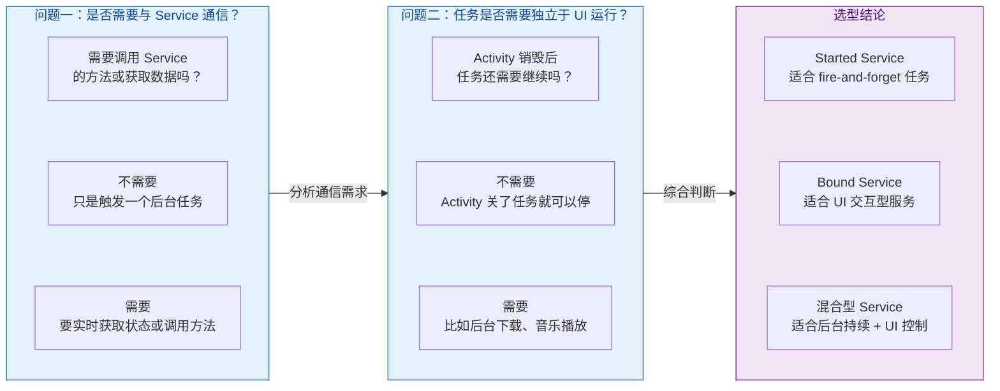
```mermaid
graph LR
    subgraph Question1["问题一：是否需要与 Service 通信？"]
        direction TB
        Q1["需要调用 Service\n的方法或获取数据吗？"]
        Q1A["不需要\n只是触发一个后台任务"]
        Q1B["需要\n要实时获取状态或调用方法"]
        Q1 ~~~ Q1A
        Q1A ~~~ Q1B
    end

    subgraph Question2["问题二：任务是否需要独立于 UI 运行？"]
        direction TB
        Q2["Activity 销毁后\n任务还需要继续吗？"]
        Q2A["不需要\nActivity 关了任务就可以停"]
        Q2B["需要\n比如后台下载、音乐播放"]
        Q2 ~~~ Q2A
        Q2A ~~~ Q2B
    end

    subgraph Decision["选型结论"]
        direction TB
        D1["Started Service\n适合 fire-and-forget 任务"]
        D2["Bound Service\n适合 UI 交互型服务"]
        D3["混合型 Service\n适合后台持续 + UI 控制"]
        D1 ~~~ D2
        D2 ~~~ D3
    end

    Question1 -->|"分析通信需求"| Question2
    Question2 -->|"综合判断"| Decision

    classDef questionStyle fill:#E3F2FD,stroke:#1565C0,color:#0D47A1
    classDef decisionStyle fill:#F3E5F5,stroke:#6A1B9A,color:#4A148C

    class Question1 questionStyle
    class Question2 questionStyle
    class Decision decisionStyle
```

用更直白的语言总结：

* **"我只想让后台做件事，做完就行，不需要知道进度"** → Started Service。典型场景：上传日志、发送统计数据、清理缓存。

* **"我需要和后台服务实时交互，但服务不需要独立于 UI 存活"** → Bound Service。典型场景：Activity 中嵌入的地图定位服务、实时数据查询接口。

* **"我既需要后台独立运行，又需要 UI 能随时连上来控制它"** → 混合型。典型场景：音乐播放器、文件下载管理器（后台下载 + UI 显示进度）、健身追踪（后台记录 + UI 实时展示）。

还有一个经常被问到的问题：**"如果我只需要执行一个简单的后台任务，应该用 Service 还是直接开个线程？"** 答案是：如果任务的生命周期完全在 Activity 内部（Activity 销毁任务就可以取消），那么直接用协程或线程池即可，不需要 Service。Service 的价值在于它是一个**独立于 UI 组件的生命周期容器**——它告诉系统"这个进程里有重要的后台工作在进行，请不要轻易杀死我"。如果你只是在 Activity 里开了个线程，系统并不知道这个线程的存在，当 Activity 进入后台时，进程可能被随时回收。

---

**📝 练习题 1**

在一个混合型 Service 中，以下操作按顺序执行后，Service 的状态是什么？

```
1. ComponentA 调用 startService()
2. ComponentB 调用 bindService()
3. ComponentA 调用 stopService()
4. ComponentB 调用 unbindService()
```

A. Service 在步骤 3 后被销毁，因为 `stopService()` 会立即终止服务

B. Service 在步骤 4 后被销毁，因为需要同时满足"已停止"和"无绑定"两个条件

C. Service 在步骤 3 后进入暂停状态，步骤 4 后被销毁

D. Service 不会被销毁，因为 `startService` 和 `bindService` 是不同的组件调用的

**【答案】** B

**【解析】** 混合型 Service 的销毁条件是**"已停止（stopped）且无绑定（unbound）"两个条件必须同时满足**。步骤 3 中 `stopService()` 将 `ServiceRecord.startRequested` 设为 `false`（打开了 "Started 锁"），但此时 ComponentB 的绑定仍然存在（"Bound 锁"还锁着），所以 Service 继续存活。步骤 4 中 ComponentB 调用 `unbindService()` 后，最后一个绑定被移除（"Bound 锁"也打开了），此时 AMS 检测到两个条件都满足，依次回调 `onUnbind()` → `onDestroy()`，Service 被销毁。选项 A 的错误在于忽略了绑定连接的存在；选项 C 中"暂停状态"是不存在的概念，Service 没有 pause 状态；选项 D 的错误在于混淆了调用者身份与生命周期条件——无论是谁调用的 start/stop/bind/unbind，系统只关心最终的状态计数。

---

**📝 练习题 2**

关于 Bound Service 中 `onBind()` 方法的调用时机，以下说法正确的是：

A. 每次有新客户端调用 `bindService()` 时都会触发 `onBind()`

B. `onBind()` 只在第一个客户端绑定时调用一次，后续客户端复用同一个 `IBinder`

C. `onBind()` 在每次 `bindService()` 时调用，但返回的 `IBinder` 对象是同一个

D. `onBind()` 只在 Service 的 `onCreate()` 之前调用

**【答案】** B

**【解析】** 这是一个非常重要的细节。当第一个客户端通过 `bindService(intent, ...)` 绑定到 Service 时，系统会调用 `onBind(Intent)` 并缓存返回的 `IBinder` 对象。后续如果有其他客户端使用**相同的 Intent**（通过 `Intent.FilterComparison` 判断相等性）绑定到同一个 Service，系统会**直接将缓存的 `IBinder` 通过 `ServiceConnection.onServiceConnected()` 传递给新客户端**，而不会再次调用 `onBind()`。这种设计是出于性能考虑——`IBinder` 对象通常是无状态的接口代理，没有必要为每个客户端创建新的实例。选项 A 的错误在于认为每次绑定都会触发 `onBind()`；选项 C 虽然结论部分正确（IBinder 确实是同一个），但前提错误（不是每次都调用 `onBind()`）；选项 D 的错误在于 `onBind()` 一定在 `onCreate()` **之后**调用，生命周期顺序是 `onCreate()` → `onBind()`。需要注意的是，如果使用不同的 Intent 绑定（比如携带不同的 action 或 data），系统会为每个不同的 Intent 分别调用一次 `onBind()`，因为它们被视为不同的绑定意图。

---

## 生命周期回调

Service 的生命周期回调（Lifecycle Callbacks）是 Android 组件模型中最精密的状态机之一。与 Activity 那套以"用户可见性"为核心驱动力的生命周期不同，Service 的生命周期围绕的是一个截然不同的命题——**"谁在使用我，以什么方式使用我，以及我是否还有存在的必要"**。理解这套回调机制，不仅仅是记住几个方法的调用顺序那么简单；你需要深入理解的是：AMS（ActivityManagerService）作为"幕后指挥官"，是如何根据 `startService()` 与 `bindService()` 这两条截然不同的激活路径，来编排（orchestrate）这些回调的调度时机、参数语义以及最终的销毁决策的。

一个极其关键但常被忽视的事实是：**Service 的生命周期并非单一线性链，而是由"启动型生命周期"和"绑定型生命周期"两条独立的状态轨道叠加而成的复合状态机**。当一个 Service 同时被 `startService()` 启动并被 `bindService()` 绑定时（即混合型 Service），它的销毁条件变成了两条轨道的"逻辑与"——必须同时满足 `stopService()`/`stopSelf()` 被调用 **且** 所有客户端都已解绑，AMS 才会真正触发 `onDestroy()`。这种设计的精妙之处在于，它让 Service 能够同时服务于"fire-and-forget"式的后台任务和"request-response"式的组件间通信，而不会因为其中一方的退出而意外中断另一方的工作。

下面这张时序图展示了 AMS 如何在两种激活路径下编排 Service 的完整生命周期回调：

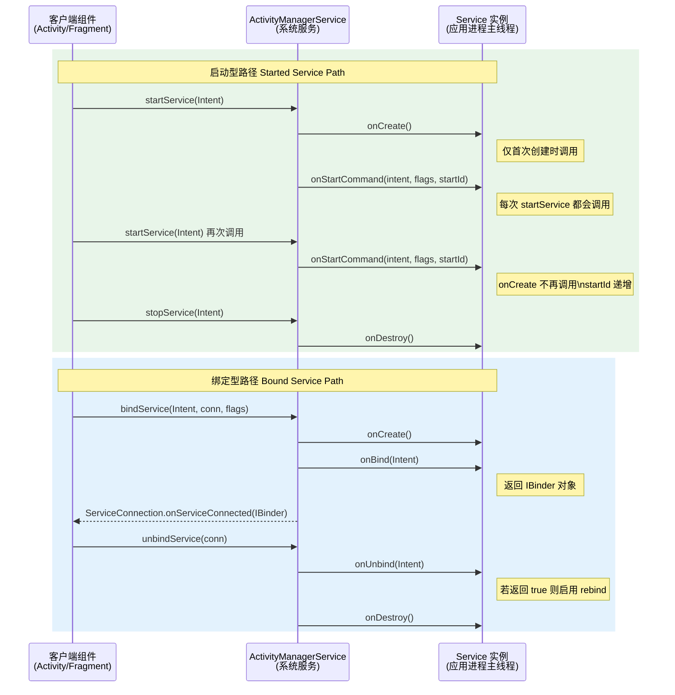
```mermaid
sequenceDiagram
    participant Client as 客户端组件<br/>(Activity/Fragment)
    participant AMS as ActivityManagerService<br/>(系统服务)
    participant Service as Service 实例<br/>(应用进程主线程)

    rect rgb(232, 245, 233)
        Note over Client, Service: 启动型路径 Started Service Path
        Client->>AMS: startService(Intent)
        AMS->>Service: onCreate()
        Note right of Service: 仅首次创建时调用
        AMS->>Service: onStartCommand(intent, flags, startId)
        Note right of Service: 每次 startService 都会调用
        Client->>AMS: startService(Intent) 再次调用
        AMS->>Service: onStartCommand(intent, flags, startId)
        Note right of Service: onCreate 不再调用\nstartId 递增
        Client->>AMS: stopService(Intent)
        AMS->>Service: onDestroy()
    end

    rect rgb(227, 242, 253)
        Note over Client, Service: 绑定型路径 Bound Service Path
        Client->>AMS: bindService(Intent, conn, flags)
        AMS->>Service: onCreate()
        AMS->>Service: onBind(Intent)
        Note right of Service: 返回 IBinder 对象
        AMS-->>Client: ServiceConnection.onServiceConnected(IBinder)
        Client->>AMS: unbindService(conn)
        AMS->>Service: onUnbind(Intent)
        Note right of Service: 若返回 true 则启用 rebind
        AMS->>Service: onDestroy()
    end
```

从这张图中可以清晰地看到两条路径的对称性与差异性：启动型路径的核心回调是 `onStartCommand()`，它在每次 `startService()` 调用时都会被触发；而绑定型路径的核心回调是 `onBind()`，但它只在**第一个客户端绑定时**被调用一次（后续客户端绑定时，AMS 会直接将缓存的 `IBinder` 分发给新客户端，而不会再次调用 `onBind()`）。这个差异背后的设计哲学是：启动型 Service 的每次调用都可能携带不同的任务指令（通过 Intent extras），所以需要每次都通知 Service；而绑定型 Service 提供的是一个稳定的通信接口（IBinder），这个接口一旦创建就不会改变，所以只需要创建一次。

---

### onCreate()

`onCreate()` 是 Service 生命周期中的**第一个回调**，也是整个生命周期中**唯一保证只被调用一次**的方法。无论 Service 是通过 `startService()` 启动还是通过 `bindService()` 绑定，也无论后续被调用多少次，`onCreate()` 都只会在 Service 实例**首次被创建**时执行一次。这个"只执行一次"的语义，使得它成为执行**一次性初始化工作**的理想场所。

从 Framework 层面来看，当 AMS 决定创建一个新的 Service 实例时，它会通过 Binder IPC 向目标应用进程的 `ActivityThread`（即主线程的消息循环处理器）发送一条 `CREATE_SERVICE` 消息。`ActivityThread` 收到这条消息后，会在主线程上依次执行以下操作：

1. 通过 `ClassLoader` 加载 Service 类并调用其无参构造函数创建实例（这就是为什么 Service 子类**必须**有一个公开的无参构造函数，否则会抛出 `InstantiationException`）。
2. 调用 `attach()` 方法将 `Context`（实际上是 `ContextImpl`）注入到 Service 实例中——这就是为什么你在构造函数中无法调用 `getApplicationContext()` 等 Context 方法，因为此时 Context 尚未注入。
3. 调用 `onCreate()` 回调。

这个顺序揭示了一个重要的实践原则：**所有依赖 Context 的初始化操作都必须放在 `onCreate()` 中，而不是构造函数中**。例如，创建数据库实例、初始化 SharedPreferences、注册 BroadcastReceiver、创建工作线程等，都应该在 `onCreate()` 中完成。

```kotlin
// 一个典型的 Service.onCreate() 实现示例
class MusicPlaybackService : Service() {

    // 声明但不在此处初始化——因为构造函数执行时 Context 尚未注入
    private lateinit var mediaPlayer: MediaPlayer
    // 工作线程的 Handler，用于将耗时操作从主线程转移出去
    private lateinit var serviceHandler: Handler
    // HandlerThread 提供了一个自带 Looper 的后台线程
    private lateinit var handlerThread: HandlerThread

    override fun onCreate() {
        // 调用父类实现——虽然 Service.onCreate() 的默认实现是空的，
        // 但这是一个良好的编程习惯，防止未来 Android 版本在父类中添加逻辑
        super.onCreate()

        // 创建一个后台工作线程，线程名用于调试时在 Thread Dump 中识别
        // HandlerThread 内部会自动创建 Looper 并启动消息循环
        handlerThread = HandlerThread("MusicService-Worker")
        // start() 必须在获取 Looper 之前调用，否则 getLooper() 会阻塞或返回 null
        handlerThread.start()

        // 将 Handler 绑定到工作线程的 Looper 上
        // 通过这个 Handler post 的所有 Runnable 都会在工作线程上执行
        serviceHandler = Handler(handlerThread.looper)

        // 初始化 MediaPlayer——这是一个依赖 Context 的操作
        // 如果放在构造函数中会因 Context 未注入而崩溃
        mediaPlayer = MediaPlayer()
        // 设置音频属性，指定这是音乐类型的音频流
        mediaPlayer.setAudioAttributes(
            AudioAttributes.Builder()
                .setContentType(AudioAttributes.CONTENT_TYPE_MUSIC) // 内容类型：音乐
                .setUsage(AudioAttributes.USAGE_MEDIA)              // 用途：媒体播放
                .build()
        )

        // 在 onCreate 中注册广播接收器，监听耳机拔出事件
        // 这样可以在耳机拔出时自动暂停播放，提升用户体验
        val filter = IntentFilter(AudioManager.ACTION_AUDIO_BECOMING_NOISY)
        registerReceiver(noisyReceiver, filter)
    }

    // 耳机拔出时的广播接收器
    private val noisyReceiver = object : BroadcastReceiver() {
        override fun onReceive(context: Context?, intent: Intent?) {
            // 当音频即将变为"嘈杂"（即从耳机切换到外放）时暂停播放
            mediaPlayer.pause()
        }
    }

    // ... 其他生命周期方法
}
```

有一个容易踩的坑值得特别强调：**`onCreate()` 运行在主线程上**。这意味着如果你在 `onCreate()` 中执行了耗时操作（比如读取大文件、进行网络请求、执行复杂的数据库查询），就会阻塞主线程的消息循环。如果 Service 是由用户交互触发的（比如点击按钮调用 `startService()`），这种阻塞会直接导致 UI 卡顿。更严重的是，如果 `onCreate()` 的执行时间超过了 ANR 阈值（前台 Service 为 20 秒，后台 Service 为 200 秒），系统就会弹出 ANR 对话框。因此，`onCreate()` 中应该只做轻量级的初始化，任何耗时操作都应该委托给工作线程。

---

### onStartCommand()

如果说 `onCreate()` 是 Service 的"出生证明"，那么 `onStartCommand()` 就是 Service 的"任务调度中心"。每当有组件调用 `startService(intent)` 或 `startForegroundService(intent)` 时，AMS 都会在目标 Service 的主线程上回调 `onStartCommand()` 方法。注意这里的"每当"——即使 Service 已经在运行中，再次调用 `startService()` 也会触发一次新的 `onStartCommand()` 回调（但不会再次触发 `onCreate()`）。这种设计使得外部组件可以通过反复调用 `startService()` 并携带不同的 Intent 数据，来向同一个 Service 实例下发多个不同的任务指令。

#### 方法签名与参数深度解析

```kotlin
// onStartCommand 的完整方法签名
override fun onStartCommand(
    intent: Intent?,    // 启动 Service 时传入的 Intent，可能为 null（见下文解释）
    flags: Int,         // 系统传入的附加标志位，描述本次启动的"上下文信息"
    startId: Int        // 本次启动请求的唯一标识符，用于精确停止 Service
): Int {               // 返回值告诉系统：如果 Service 被杀死，应该如何处理重启
    // ...
}
```

这三个参数各自承载着不同维度的信息，理解它们的语义对于编写健壮的 Service 至关重要：

**参数一：`intent: Intent?`**

这个 Intent 就是调用方通过 `startService(intent)` 传入的那个 Intent 对象，它通常携带着本次任务的具体指令和数据（通过 `putExtra()` 附加）。但这里有一个极其容易被忽略的陷阱——**这个参数可能为 `null`**。什么情况下会为 null 呢？当 Service 被系统因内存不足而杀死后，如果你的 `onStartCommand()` 返回的是 `START_STICKY`，系统会在资源恢复后尝试重新创建并启动这个 Service。在这种"重启"场景下，系统并没有保存原始的 Intent（因为 `START_STICKY` 的语义就是"我不关心原始 Intent，我只需要 Service 活着"），所以传入的 intent 就是 `null`。如果你的代码没有对 `null` 做防御性检查，就会在重启时直接抛出 `NullPointerException` 并再次崩溃，形成一个"崩溃→重启→崩溃"的死亡循环。这是生产环境中非常常见的一类 bug。

**参数二：`flags: Int`**

flags 参数是系统传递给你的"上下文元信息"，它告诉你本次 `onStartCommand()` 调用的"来源性质"。它是一个位掩码（bitmask），可能包含以下标志：

| Flag 常量                 | 值 | 含义               | 触发场景                                                            |
| ----------------------- | - | ---------------- | --------------------------------------------------------------- |
| `0`（无标志）                | 0 | 正常启动，这是最常见的情况    | 客户端主动调用 `startService()`                                        |
| `START_FLAG_REDELIVERY` | 1 | 这是一次 Intent 重新投递 | Service 之前返回了 `START_REDELIVER_INTENT`，被杀后系统重启并重新投递原始 Intent    |
| `START_FLAG_RETRY`      | 2 | 这是一次重试启动         | 上一次 `onCreate()` 之后 `onStartCommand()` 未被成功调用（进程在两者之间被杀），系统正在重试 |

`START_FLAG_REDELIVERY` 和 `START_FLAG_RETRY` 的区别非常微妙但很重要：前者意味着系统保存了原始 Intent 并正在重新投递（所以 intent 参数不为 null），后者意味着系统只是在重试启动流程（intent 可能为 null，取决于返回值策略）。在实际开发中，你可以通过检查 flags 来判断当前是"正常启动"还是"异常恢复"，从而采取不同的处理策略——比如在异常恢复时跳过某些已经完成的初始化步骤，或者从持久化存储中恢复任务进度。

**参数三：`startId: Int`**

`startId` 是 AMS 为每次 `startService()` 调用分配的**单调递增**的唯一标识符。第一次调用时 startId 为 1，第二次为 2，以此类推。它的核心用途是配合 `stopSelfResult(int startId)` 方法实现**精确停止**。

为什么需要"精确停止"？考虑这样一个场景：一个下载 Service 同时处理多个下载任务，每个任务通过一次 `startService()` 调用下发。当任务 A（startId=1）完成时，如果你直接调用 `stopSelf()`，整个 Service 就会被停止，导致正在进行中的任务 B（startId=2）和任务 C（startId=3）被中断。正确的做法是调用 `stopSelfResult(1)`——这个方法会检查传入的 startId 是否是**最近一次** `onStartCommand()` 收到的 startId。如果不是（说明还有更新的任务在处理中），`stopSelfResult()` 会返回 `false` 并且不会停止 Service；只有当传入的 startId 确实是最后一个时，Service 才会被停止。这种机制优雅地解决了多任务并发场景下的安全停止问题。

```kotlin
// 演示 startId 的精确停止机制
class MultiTaskDownloadService : Service() {

    // 用于在工作线程上执行下载任务的 Handler
    private lateinit var serviceHandler: Handler
    private lateinit var handlerThread: HandlerThread

    override fun onCreate() {
        super.onCreate()
        // 创建工作线程，避免在主线程执行网络 I/O
        handlerThread = HandlerThread("DownloadWorker")
        handlerThread.start()
        serviceHandler = Handler(handlerThread.looper)
    }

    override fun onStartCommand(intent: Intent?, flags: Int, startId: Int): Int {
        // 防御性检查：intent 可能为 null（系统重启场景）
        // 如果为 null，说明没有有效的任务指令，直接尝试停止
        if (intent == null) {
            stopSelfResult(startId) // 安全停止：只有当这是最后一个 startId 时才真正停止
            return START_NOT_STICKY  // 告诉系统不需要重启
        }

        // 从 Intent 中提取下载 URL
        val downloadUrl = intent.getStringExtra("url") ?: return START_NOT_STICKY

        // 捕获当前的 startId 到局部变量中（闭包捕获）
        // 这一步至关重要——因为 onStartCommand 会被多次调用，
        // 如果直接在 lambda 中引用参数 startId，每个 lambda 捕获的都是各自调用时的值
        val currentStartId = startId

        // 将下载任务投递到工作线程执行
        serviceHandler.post {
            // 模拟下载操作（实际应使用 OkHttp/Retrofit 等）
            performDownload(downloadUrl)

            // 下载完成后，尝试用当前任务的 startId 停止 Service
            // 关键逻辑：stopSelfResult 会判断 currentStartId 是否是最新的
            // 如果在此任务执行期间又有新的 startService() 调用进来，
            // 那么最新的 startId 会大于 currentStartId，stopSelfResult 返回 false，
            // Service 继续运行，不会影响后续任务
            val stopped = stopSelfResult(currentStartId)
            // stopped = true  → 这是最后一个任务，Service 将被销毁
            // stopped = false → 还有更新的任务在处理中，Service 继续运行
        }

        // 返回 START_REDELIVER_INTENT：如果 Service 在任务完成前被杀死，
        // 系统会重新创建 Service 并重新投递这个 Intent，确保下载任务不会丢失
        return START_REDELIVER_INTENT
    }

    // 模拟下载操作
    private fun performDownload(url: String) {
        // 实际的网络下载逻辑...
        Thread.sleep(5000) // 模拟耗时操作
    }

    override fun onBind(intent: Intent?): IBinder? = null // 纯启动型 Service，不支持绑定

    override fun onDestroy() {
        super.onDestroy()
        // 释放工作线程资源
        // quitSafely() 会等待已投递的消息处理完毕后再退出，比 quit() 更安全
        handlerThread.quitSafely()
    }
}
```

#### 返回值：Service 的"遗嘱"

`onStartCommand()` 的返回值是整个 Service 生命周期机制中**最具战略意义**的设计之一。它本质上是 Service 向系统预先声明的一份"遗嘱"——**"如果我被意外杀死，请按照以下方式处理我的后事"**。这个返回值不会影响 Service 的正常运行，它只在 Service 被系统因资源压力而强制杀死后才会生效。AMS 会将这个返回值记录在内部的 `ServiceRecord` 中，当系统资源恢复后，AMS 会根据这个记录来决定是否以及如何重新创建这个 Service。

Android 定义了四种返回值常量，每一种都对应着截然不同的重启策略：

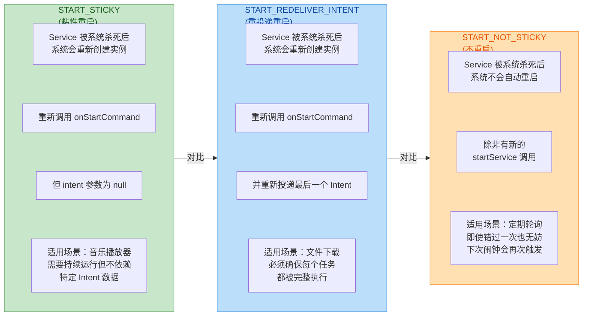
```mermaid
graph LR
    subgraph STICKY["START_STICKY\n(粘性重启)"]
        direction TB
        S1["Service 被系统杀死后\n系统会重新创建实例"]
        S2["重新调用 onStartCommand"]
        S3["但 intent 参数为 null"]
        S4["适用场景：音乐播放器\n需要持续运行但不依赖\n特定 Intent 数据"]
        S1 ~~~ S2
        S2 ~~~ S3
        S3 ~~~ S4
    end

    subgraph REDELIVER["START_REDELIVER_INTENT\n(重投递重启)"]
        direction TB
        R1["Service 被系统杀死后\n系统会重新创建实例"]
        R2["重新调用 onStartCommand"]
        R3["并重新投递最后一个 Intent"]
        R4["适用场景：文件下载\n必须确保每个任务\n都被完整执行"]
        R1 ~~~ R2
        R2 ~~~ R3
        R3 ~~~ R4
    end

    subgraph NOT_STICKY["START_NOT_STICKY\n(不重启)"]
        direction TB
        N1["Service 被系统杀死后\n系统不会自动重启"]
        N2["除非有新的\nstartService 调用"]
        N3["适用场景：定期轮询\n即使错过一次也无妨\n下次闹钟会再次触发"]
        N1 ~~~ N2
        N2 ~~~ N3
    end

    STICKY -->|"对比"| REDELIVER -->|"对比"| NOT_STICKY

    classDef stickyStyle fill:#C8E6C9,stroke:#388E3C,color:#1B5E20
    classDef redeliverStyle fill:#BBDEFB,stroke:#1976D2,color:#0D47A1
    classDef notStickyStyle fill:#FFE0B2,stroke:#F57C00,color:#E65100

    class STICKY stickyStyle
    class REDELIVER redeliverStyle
    class NOT_STICKY notStickyStyle
```

下面逐一深入剖析每种返回值的语义、内部机制和适用场景：

**`START_NOT_STICKY`（值为 2）—— "死了就死了，别管我"**

这是最"佛系"的策略。当 Service 被系统杀死后，AMS 不会尝试重新创建它，除非有新的显式 `startService()` 调用到来。这种策略适用于那些**执行的任务是"尽力而为"（best-effort）性质**的 Service——即使任务因为 Service 被杀而中断，也不会造成严重后果。典型场景包括：定期数据同步（下次同步周期会自动触发）、非关键的日志上报、缓存预加载等。

从实现层面看，当 AMS 记录到某个 Service 的重启策略为 `START_NOT_STICKY` 时，它会在杀死 Service 后直接从 `ServiceMap` 中移除对应的 `ServiceRecord`，不会将其加入待重启队列。这意味着这个 Service 的一切痕迹都被清除了，系统完全"忘记"了它的存在。

**`START_STICKY`（值为 1）—— "杀了我也要复活，但我不在乎之前在做什么"**

这是一种"保活优先"的策略。当 Service 被杀死后，AMS 会在系统资源恢复后（通常是几秒到几十秒内）重新创建 Service 实例，依次调用 `onCreate()` 和 `onStartCommand()`。但关键区别在于：**重启时传入 `onStartCommand()` 的 intent 参数为 `null`**。这意味着系统只保证 Service 能够"复活"，但不保证恢复它被杀前正在处理的具体任务。

这种策略的典型应用场景是**音乐播放器**或**实时定位追踪**等需要持续运行的 Service。对于音乐播放器来说，Service 被杀后重新创建，虽然丢失了"正在播放哪首歌"的信息（因为 intent 为 null），但 Service 可以在 `onStartCommand()` 中检测到 intent 为 null，然后从持久化存储（如 SharedPreferences 或数据库）中恢复播放状态。这种"Service 负责保活，状态恢复靠自己"的模式，是 `START_STICKY` 的标准使用范式。

从 AMS 的内部实现来看，当 Service 被杀且重启策略为 `START_STICKY` 时，AMS 会将 `ServiceRecord` 加入一个名为 `mRestartingServices` 的列表中，并通过 `scheduleRestartLocked()` 方法安排一个延迟重启的定时任务。重启的延迟时间会随着重启次数的增加而指数级增长（初始为 1 秒，最大为 5 分钟），这是为了防止一个持续崩溃的 Service 消耗过多系统资源——这种机制被称为"指数退避"（exponential backoff）。

**`START_REDELIVER_INTENT`（值为 3）—— "杀了我也要复活，而且要把未完成的工作还给我"**

这是最"负责任"的策略，也是对任务可靠性要求最高的场景的首选。当 Service 被杀死后，AMS 不仅会重新创建 Service，还会**重新投递最后一个未完成的 Intent**（即最后一次 `onStartCommand()` 收到的那个 Intent）。"未完成"的判定标准是：Service 在处理完该 Intent 对应的任务后，是否调用了 `stopSelfResult(startId)` 或 `stopSelf(startId)`。如果调用了，AMS 认为该任务已完成，不会重新投递；如果没有调用（说明任务还在进行中就被杀了），AMS 就会重新投递。

这种策略的典型应用场景是**文件下载、支付回调处理、消息发送**等对"至少执行一次"（at-least-once semantics）有严格要求的任务。需要注意的是，"重新投递"意味着同一个任务可能会被执行多次（如果 Service 在任务完成后、调用 `stopSelfResult()` 之前被杀），所以你的任务处理逻辑必须是**幂等的**（idempotent）——即多次执行同一个任务的效果与执行一次相同。

**`START_STICKY_COMPATIBILITY`（值为 0）—— 历史遗留，不推荐使用**

这是 API Level 5 之前的兼容模式，行为类似 `START_STICKY`，但**不保证** Service 被杀后一定会调用 `onStartCommand()`。在现代 Android 开发中，你几乎不会也不应该使用这个值。它的存在纯粹是为了向后兼容那些在 Android 2.0 之前编写的、没有覆写 `onStartCommand()` 而是覆写已废弃的 `onStart()` 方法的老旧 Service。

下面这张表格将四种返回值的核心差异做一个全面对比：

| 特性                 | `START_NOT_STICKY` | `START_STICKY`    | `START_REDELIVER_INTENT` | `START_STICKY_COMPATIBILITY` |
| ------------------ | ------------------ | ----------------- | ------------------------ | ---------------------------- |
| 整数值                | 2                  | 1                 | 3                        | 0                            |
| 被杀后是否自动重启          | 否                  | 是                 | 是                        | 是（不保证调用 onStartCommand）      |
| 重启时 intent 参数      | N/A（不重启）           | `null`            | 原始 Intent（重新投递）          | `null`                       |
| 重启时 flags 参数       | N/A                | 0                 | `START_FLAG_REDELIVERY`  | 0                            |
| 任务可靠性语义            | 尽力而为 (best-effort) | 保活优先 (keep-alive) | 至少一次 (at-least-once)     | 兼容模式                         |
| 典型应用场景             | 定期同步、日志上报          | 音乐播放、定位追踪         | 文件下载、支付处理                | 遗留代码兼容                       |
| 是否需要处理 null intent | N/A                | 是（必须防御）           | 否（系统保证非 null）            | 是                            |
| 对幂等性的要求            | 无                  | 无                 | 高（任务可能重复执行）              | 无                            |

```kotlin
// 综合演示：根据不同业务场景选择合适的返回值
class SmartService : Service() {

    override fun onStartCommand(intent: Intent?, flags: Int, startId: Int): Int {
        // 通过 Intent 的 action 字段区分不同类型的任务
        return when (intent?.action) {

            // 场景 1：定期清理缓存——即使被杀也无所谓，下次定时任务会再次触发
            "ACTION_CLEANUP_CACHE" -> {
                // 在工作线程中执行缓存清理
                cleanupCacheAsync()
                // 不需要重启，错过一次清理不会有任何影响
                START_NOT_STICKY
            }

            // 场景 2：后台音乐播放——需要持续运行，但播放状态可以从持久化存储恢复
            "ACTION_PLAY_MUSIC" -> {
                val trackId = intent.getLongExtra("track_id", -1L)
                if (trackId != -1L) {
                    // 将当前播放的曲目 ID 持久化，以便 Service 重启后恢复
                    saveCurrentTrack(trackId)
                    startPlayback(trackId)
                }
                // 使用 START_STICKY：Service 被杀后会自动重启
                // 重启时 intent 为 null，需要从持久化存储中读取上次播放的曲目
                START_STICKY
            }

            // 场景 3：上传用户生成的内容——必须确保上传成功，不能丢失
            "ACTION_UPLOAD_CONTENT" -> {
                val contentUri = intent.getParcelableExtra<Uri>("content_uri")
                if (contentUri != null) {
                    // 在工作线程中执行上传，完成后调用 stopSelfResult(startId)
                    uploadContentAsync(contentUri, startId)
                }
                // 使用 START_REDELIVER_INTENT：如果上传过程中 Service 被杀，
                // 系统会重新投递这个 Intent，确保上传任务不会丢失
                START_REDELIVER_INTENT
            }

            // 场景 4：intent 为 null，说明这是 START_STICKY 触发的重启
            null -> {
                // 尝试从持久化存储恢复之前的状态
                val lastTrack = restoreLastTrack()
                if (lastTrack != null) {
                    startPlayback(lastTrack)
                    START_STICKY // 继续保持粘性重启策略
                } else {
                    // 没有可恢复的状态，安全停止
                    stopSelfResult(startId)
                    START_NOT_STICKY
                }
            }

            // 未知的 action，安全停止
            else -> {
                stopSelfResult(startId)
                START_NOT_STICKY
            }
        }
    }

    // 以下为辅助方法的占位声明
    private fun cleanupCacheAsync() { /* ... */ }
    private fun saveCurrentTrack(trackId: Long) { /* ... */ }
    private fun startPlayback(trackId: Long) { /* ... */ }
    private fun restoreLastTrack(): Long? { /* ... */ return null }
    private fun uploadContentAsync(uri: Uri, startId: Int) { /* ... */ }

    override fun onBind(intent: Intent?): IBinder? = null

    override fun onDestroy() {
        super.onDestroy()
    }
}
```

---

### onBind() 与 onUnbind()

`onBind()` 和 `onUnbind()` 是绑定型 Service（Bound Service）的核心回调，它们共同构成了 Service 与客户端之间**建立和断开通信通道**的完整协议。如果说 `onStartCommand()` 是"发号施令"的单向通道，那么 `onBind()`/`onUnbind()` 所建立的就是一条"双向对话"的通信链路。

#### onBind()：通信通道的建立

当第一个客户端通过 `bindService(intent, serviceConnection, flags)` 请求绑定到 Service 时，AMS 会在 Service 的主线程上回调 `onBind(Intent)` 方法。这个方法的职责是**返回一个 `IBinder` 对象**，这个对象就是客户端与 Service 之间的通信桥梁。AMS 会将这个 `IBinder` 通过客户端的 `ServiceConnection.onServiceConnected()` 回调传递给客户端，从此客户端就可以通过这个 `IBinder` 调用 Service 暴露的方法。

这里有一个非常重要的机制需要理解：**`onBind()` 对于同一个 Intent filter 只会被调用一次**。当第一个客户端绑定时，AMS 调用 `onBind()` 并缓存返回的 `IBinder`；当后续的客户端使用相同的 Intent 绑定时，AMS 会直接将缓存的 `IBinder` 分发给新客户端，而不会再次调用 `onBind()`。这种缓存机制的设计意图是：`IBinder` 代表的是一个稳定的服务接口，它不应该因为客户端数量的变化而改变。但如果不同的客户端使用不同的 Intent（具有不同的 action 或 data），AMS 会为每种 Intent 分别调用一次 `onBind()`，从而允许 Service 根据不同的 Intent 返回不同的 `IBinder` 实现——这就是所谓的"多接口绑定"。

```kotlin
// 演示 onBind() 的多接口绑定模式
class MultiFacetedService : Service() {

    // 为"播放控制"接口定义的 Binder
    // 继承自 Binder 类，Binder 本身实现了 IBinder 接口
    inner class PlaybackBinder : Binder() {
        // 提供获取 Service 实例的方法，客户端通过它调用 Service 的公开方法
        // 使用 inner class 使得 Binder 可以访问外部 Service 的成员
        fun getService(): MultiFacetedService = this@MultiFacetedService
    }

    // 为"下载管理"接口定义的 Binder
    inner class DownloadBinder : Binder() {
        // 直接在 Binder 中暴露下载相关的方法
        fun enqueueDownload(url: String): Long {
            // 将下载任务加入队列，返回任务 ID
            return this@MultiFacetedService.enqueueDownloadInternal(url)
        }

        // 查询下载进度
        fun getProgress(taskId: Long): Int {
            return this@MultiFacetedService.getDownloadProgress(taskId)
        }
    }

    // 分别为两种接口创建单例 Binder 实例
    // 使用单例是因为 onBind() 对同一 Intent 只调用一次，
    // 但即使被多次调用，返回同一个实例也是安全且推荐的做法
    private val playbackBinder = PlaybackBinder()
    private val downloadBinder = DownloadBinder()

    override fun onBind(intent: Intent?): IBinder? {
        // 根据 Intent 的 action 返回不同的 Binder 接口
        // 这使得同一个 Service 可以向不同的客户端暴露不同的能力
        return when (intent?.action) {
            "action.PLAYBACK" -> {
                // 客户端请求播放控制接口
                playbackBinder
            }
            "action.DOWNLOAD" -> {
                // 客户端请求下载管理接口
                downloadBinder
            }
            else -> {
                // 未知的绑定请求，返回 null 表示拒绝绑定
                // 客户端的 ServiceConnection.onServiceConnected() 不会被调用
                null
            }
        }
    }

    // Service 的公开方法，客户端通过 PlaybackBinder.getService() 获取引用后调用
    fun play() { /* 播放逻辑 */ }
    fun pause() { /* 暂停逻辑 */ }

    // 内部方法，通过 DownloadBinder 间接暴露
    private fun enqueueDownloadInternal(url: String): Long { return System.currentTimeMillis() }
    private fun getDownloadProgress(taskId: Long): Int { return 0 }

    override fun onUnbind(intent: Intent?): Boolean = false
}
```

客户端侧的绑定代码如下，展示了 `ServiceConnection` 回调的完整处理：

```kotlin
// 客户端（如 Activity）中绑定 Service 的完整流程
class PlayerActivity : AppCompatActivity() {

    // 持有 Service 的 Binder 引用，用于后续调用 Service 方法
    private var playbackBinder: MultiFacetedService.PlaybackBinder? = null
    // 标记是否已成功绑定，用于在 onStop 中安全解绑
    private var isBound = false

    // ServiceConnection 是客户端与 Service 之间的"连接状态监听器"
    private val connection = object : ServiceConnection {

        // 当绑定成功建立时回调
        // 参数 name: 被绑定的 Service 的 ComponentName
        // 参数 service: Service 的 onBind() 返回的 IBinder 对象
        override fun onServiceConnected(name: ComponentName?, service: IBinder?) {
            // 将 IBinder 向下转型为具体的 Binder 子类
            // 这种转型只在同进程绑定时安全——跨进程时 IBinder 是一个代理对象
            playbackBinder = service as? MultiFacetedService.PlaybackBinder
            isBound = true

            // 绑定成功后，可以立即通过 Binder 调用 Service 的方法
            playbackBinder?.getService()?.play()
        }

        // 当连接意外断开时回调（注意：主动调用 unbindService 不会触发此回调）
        // 触发场景：Service 所在进程崩溃、被系统杀死、或 Service 自行调用 stopSelf()
        override fun onServiceDisconnected(name: ComponentName?) {
            // 清除 Binder 引用，防止使用已失效的对象
            playbackBinder = null
            isBound = false
            // 注意：如果 Service 进程重启，系统会自动尝试重新绑定，
            // 届时 onServiceConnected 会再次被调用，你不需要手动重新调用 bindService()
        }
    }

    override fun onStart() {
        super.onStart()
        // 构建指向目标 Service 的显式 Intent，并设置 action 以选择绑定接口
        val intent = Intent(this, MultiFacetedService::class.java).apply {
            action = "action.PLAYBACK" // 指定请求播放控制接口
        }
        // bindService 的第三个参数是 flags，BIND_AUTO_CREATE 表示：
        // 如果 Service 尚未创建，则自动创建它（触发 onCreate + onBind）
        // 这是最常用的 flag，几乎所有绑定场景都会使用
        bindService(intent, connection, Context.BIND_AUTO_CREATE)
    }

    override fun onStop() {
        super.onStop()
        // 安全解绑：必须检查 isBound 标志，避免重复解绑导致 IllegalArgumentException
        // 这是一个非常常见的崩溃原因——如果 bindService 失败（返回 false），
        // 但你仍然在 onStop 中调用 unbindService，就会抛出异常
        if (isBound) {
            unbindService(connection)
            isBound = false
            playbackBinder = null
        }
    }

}

```

这段代码中有几个值得深入讨论的细节：

第一，`BIND_AUTO_CREATE` 这个 flag 的语义远比表面看起来要深刻。它不仅仅是"如果 Service 不存在就创建它"这么简单——它还隐含着一个重要的**进程优先级提升**效果。当一个 Service 被带有 `BIND_AUTO_CREATE` 标志的客户端绑定时，AMS 会将 Service 所在进程的 OOM Adjustment（Out-of-Memory 调整值）提升到与客户端进程相当的级别。这意味着，如果绑定 Service 的是一个前台 Activity，那么 Service 所在的进程也会获得接近前台进程的优先级，从而大大降低被系统杀死的概率。这就是为什么绑定型 Service 通常比纯启动型 Service 更"安全"——它借助了客户端的进程优先级来保护自己。

第二，`onServiceDisconnected()` 的触发条件经常被误解。很多开发者以为调用 `unbindService()` 后会触发 `onServiceDisconnected()`，但事实并非如此。**`onServiceDisconnected()` 只在连接"意外断开"时才会被调用**——典型场景包括 Service 所在进程崩溃（crash）、被系统因内存不足而杀死（OOM kill）、或者 Service 内部抛出了未捕获的异常。主动调用 `unbindService()` 是一种"正常断开"，不会触发此回调。这个区分非常重要，因为它决定了你的错误恢复逻辑应该放在哪里。

第三，关于 `bindService()` 的返回值。`bindService()` 返回一个 `boolean`，`true` 表示系统成功接受了绑定请求（但此时连接尚未建立，`onServiceConnected` 还没有被调用），`false` 表示绑定请求被拒绝（通常是因为目标 Service 未在 `AndroidManifest.xml` 中声明，或者 Intent 无法解析到任何 Service）。如果返回 `false`，你**绝对不能**调用 `unbindService()`，否则会抛出 `IllegalArgumentException`。

#### onUnbind()：通信通道的拆除与"重绑定"机制

当所有客户端都调用了 `unbindService()` 解除绑定后（注意是"所有"——AMS 内部维护着一个绑定计数器），AMS 会在 Service 的主线程上回调 `onUnbind(Intent)` 方法。这个方法的参数 Intent 与 `onBind()` 收到的是同一个 Intent（或者说是同一类 Intent，由 Intent filter 匹配决定）。

`onUnbind()` 最精妙的设计在于它的**返回值**。这个返回值是一个 `boolean`，它控制着一个被称为"重绑定"（rebind）的高级机制：

- **返回 `false`（默认值）**：标准行为。当所有客户端解绑后，如果后续有新的客户端再次绑定，AMS 会直接将之前缓存的 `IBinder` 分发给新客户端，调用其 `onServiceConnected()`，但**不会**再次调用 Service 的 `onBind()` 或任何其他回调。Service 对"有人重新绑定了"这件事完全无感知。

- **返回 `true`**：启用重绑定机制。当所有客户端解绑后，如果后续有新的客户端再次绑定，AMS 会调用 Service 的 `onRebind(Intent)` 方法（而不是 `onBind()`）。这给了 Service 一个"感知到有人回来了"的机会，可以在 `onRebind()` 中执行一些状态恢复或资源重新初始化的操作。

这个机制的应用场景虽然不算常见，但在某些特定情况下非常有用。比如，一个聊天 Service 在所有聊天界面都关闭后（全部解绑），可能会进入一种"低功耗"模式（减少心跳频率、释放部分缓存）；当用户重新打开聊天界面（重新绑定）时，`onRebind()` 就是恢复到"全功率"模式的理想时机。

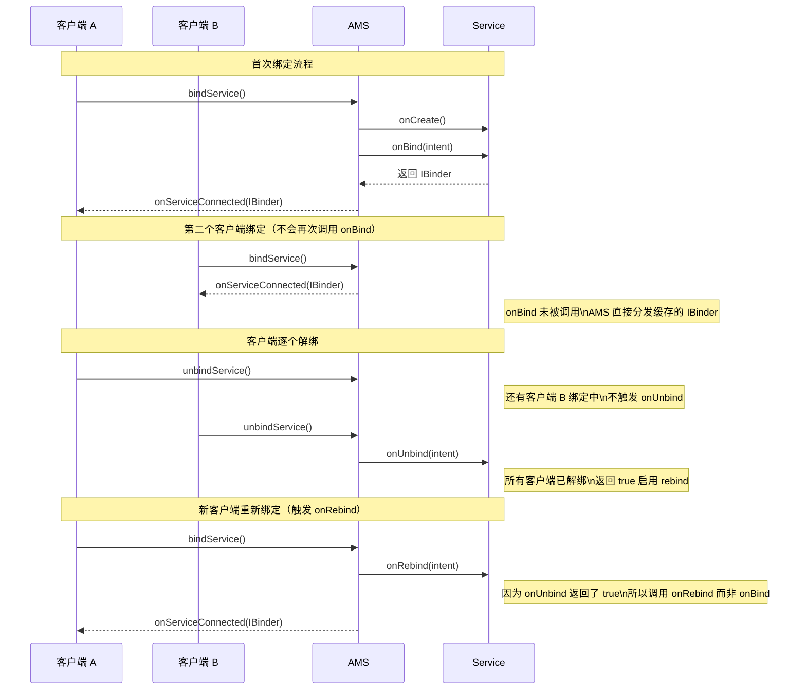
```mermaid
sequenceDiagram
    participant C1 as 客户端 A
    participant C2 as 客户端 B
    participant AMS as AMS
    participant Svc as Service

    Note over C1, Svc: 首次绑定流程

    C1->>AMS: bindService()
    AMS->>Svc: onCreate()
    AMS->>Svc: onBind(intent)
    Svc-->>AMS: 返回 IBinder
    AMS-->>C1: onServiceConnected(IBinder)

    Note over C1, Svc: 第二个客户端绑定（不会再次调用 onBind）

    C2->>AMS: bindService()
    AMS-->>C2: onServiceConnected(IBinder)
    Note right of Svc: onBind 未被调用\nAMS 直接分发缓存的 IBinder

    Note over C1, Svc: 客户端逐个解绑

    C1->>AMS: unbindService()
    Note right of Svc: 还有客户端 B 绑定中\n不触发 onUnbind

    C2->>AMS: unbindService()
    AMS->>Svc: onUnbind(intent)
    Note right of Svc: 所有客户端已解绑\n返回 true 启用 rebind

    Note over C1, Svc: 新客户端重新绑定（触发 onRebind）

    C1->>AMS: bindService()
    AMS->>Svc: onRebind(intent)
    Note right of Svc: 因为 onUnbind 返回了 true\n所以调用 onRebind 而非 onBind
    AMS-->>C1: onServiceConnected(IBinder)
```

下面的代码完整展示了 `onUnbind()` 返回 `true` 启用重绑定机制的实现模式：

```kotlin
class ChatService : Service() {

    // 心跳间隔：全功率模式 vs 低功耗模式
    companion object {
        private const val HEARTBEAT_ACTIVE = 15_000L    // 15 秒，有客户端绑定时
        private const val HEARTBEAT_IDLE = 120_000L     // 120 秒，所有客户端解绑后
    }

    // 心跳定时器的 Handler
    private lateinit var heartbeatHandler: Handler
    // 当前心跳间隔
    private var currentHeartbeatInterval = HEARTBEAT_ACTIVE

    // 内部 Binder 类，向客户端暴露聊天功能
    inner class ChatBinder : Binder() {
        // 发送消息的方法
        fun sendMessage(chatId: String, message: String) {
            this@ChatService.sendMessageInternal(chatId, message)
        }
        // 获取未读消息数
        fun getUnreadCount(chatId: String): Int {
            return this@ChatService.getUnreadCountInternal(chatId)
        }
    }

    private val binder = ChatBinder()

    override fun onCreate() {
        super.onCreate()
        // 初始化心跳 Handler，绑定到主线程 Looper
        heartbeatHandler = Handler(mainLooper)
        // 启动心跳，初始为全功率模式
        scheduleHeartbeat(HEARTBEAT_ACTIVE)
    }

    override fun onBind(intent: Intent?): IBinder {
        // 首次绑定时调用
        // 确保心跳处于全功率模式
        scheduleHeartbeat(HEARTBEAT_ACTIVE)
        // 返回 Binder 对象，AMS 会缓存它并分发给所有后续绑定的客户端
        return binder
    }

    override fun onUnbind(intent: Intent?): Boolean {
        // 所有客户端都已解绑
        // 切换到低功耗心跳模式，减少资源消耗
        scheduleHeartbeat(HEARTBEAT_IDLE)

        // 返回 true：告诉 AMS 启用 rebind 机制
        // 下次有客户端绑定时，AMS 会调用 onRebind() 而不是 onBind()
        // 这让我们有机会在客户端回来时恢复全功率模式
        return true
    }

    override fun onRebind(intent: Intent?) {
        // 在 onUnbind 返回 true 的前提下，当新客户端重新绑定时被调用
        // 恢复全功率心跳模式
        scheduleHeartbeat(HEARTBEAT_ACTIVE)

        // 注意：onRebind 没有返回值，它不需要返回 IBinder
        // AMS 会继续使用之前 onBind() 返回并缓存的那个 IBinder
    }

    // 调度心跳的辅助方法
    private fun scheduleHeartbeat(intervalMs: Long) {
        // 先移除之前的心跳回调，避免重复调度
        heartbeatHandler.removeCallbacks(heartbeatRunnable)
        // 更新当前间隔
        currentHeartbeatInterval = intervalMs
        // 投递新的心跳任务
        heartbeatHandler.postDelayed(heartbeatRunnable, intervalMs)
    }

    // 心跳任务的 Runnable
    private val heartbeatRunnable = object : Runnable {
        override fun run() {
            // 执行心跳逻辑（如向服务器发送 ping）
            performHeartbeat()
            // 递归调度下一次心跳
            heartbeatHandler.postDelayed(this, currentHeartbeatInterval)
        }
    }

    private fun performHeartbeat() { /* 向服务器发送心跳包 */ }
    private fun sendMessageInternal(chatId: String, message: String) { /* ... */ }
    private fun getUnreadCountInternal(chatId: String): Int { return 0 }

    override fun onDestroy() {
        super.onDestroy()
        // 清理心跳定时器，防止内存泄漏
        heartbeatHandler.removeCallbacksAndMessages(null)
    }
}
```

关于 `onUnbind()` 还有一个容易被忽略的边界情况：**如果 Service 同时是启动型和绑定型（混合型），当所有客户端解绑后，`onUnbind()` 会被调用，但 `onDestroy()` 不会被调用**——因为 Service 还处于"已启动"状态，需要等到 `stopService()` 或 `stopSelf()` 被调用后才会真正销毁。这种混合型 Service 的生命周期是两条轨道的叠加，理解这一点对于避免资源泄漏至关重要。

---

### onDestroy()

`onDestroy()` 是 Service 生命周期中的**最后一个回调**，它标志着 Service 实例即将被销毁，之后 Service 对象将被 GC 回收。这是你执行**所有清理工作**的最后机会——释放资源、注销监听器、关闭连接、停止工作线程。如果你在 `onCreate()` 中获取了什么资源，就必须在 `onDestroy()` 中释放它，否则就会造成资源泄漏。

#### 触发条件

`onDestroy()` 的触发条件取决于 Service 的类型，这是理解 Service 生命周期的关键所在：

| Service 类型            | onDestroy() 触发条件                                                     | 说明                         |
| --------------------- | -------------------------------------------------------------------- | -------------------------- |
| 纯启动型 (Started Only)   | `stopService()` 被调用，或 Service 自身调用 `stopSelf()` / `stopSelfResult()` | 外部组件或 Service 自身主动终止       |
| 纯绑定型 (Bound Only)     | 所有客户端都调用了 `unbindService()` 解除绑定                                     | 最后一个客户端解绑后自动销毁             |
| 混合型 (Started + Bound) | `stopService()`/`stopSelf()` 被调用 **且** 所有客户端都已解绑                     | 两个条件必须**同时满足**，缺一不可        |
| 系统强制杀死                | 系统因内存不足直接杀死进程                                                        | **`onDestroy()` 可能不会被调用！** |

最后一行是一个极其重要但经常被忽视的事实：**`onDestroy()` 不保证一定会被调用**。当系统因为内存压力而直接杀死 Service 所在的进程时，进程会被 `SIGKILL` 信号直接终止，没有任何机会执行清理代码。这意味着你**不能**将关键的数据持久化操作（如保存用户数据、记录任务进度）仅仅放在 `onDestroy()` 中——你应该在数据变化时就及时持久化（write-through），而不是等到销毁时才批量写入（write-back）。`onDestroy()` 中的清理操作应该是"锦上添花"式的——即使不执行也不会导致数据丢失，只是可能造成一些临时资源（如文件句柄、网络连接）的延迟释放。

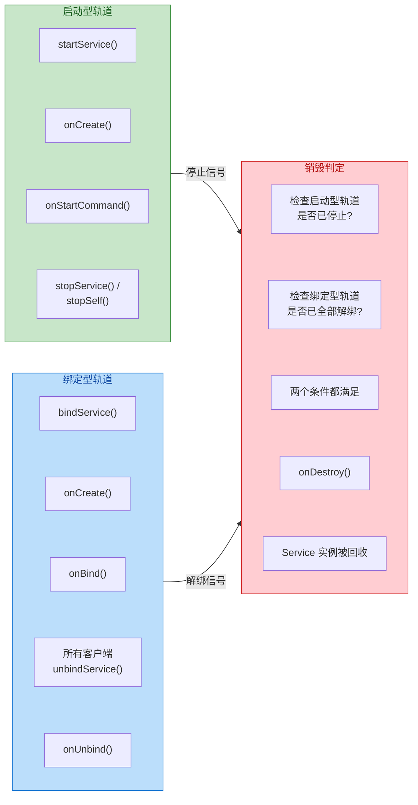
```mermaid
graph LR
    subgraph StartedPath["启动型轨道"]
        direction TB
        SP1["startService()"]
        SP2["onCreate()"]
        SP3["onStartCommand()"]
        SP4["stopService() /\nstopSelf()"]
        SP1 ~~~ SP2
        SP2 ~~~ SP3
        SP3 ~~~ SP4
    end

    subgraph BoundPath["绑定型轨道"]
        direction TB
        BP1["bindService()"]
        BP2["onCreate()"]
        BP3["onBind()"]
        BP4["所有客户端\nunbindService()"]
        BP5["onUnbind()"]
        BP1 ~~~ BP2
        BP2 ~~~ BP3
        BP3 ~~~ BP4
        BP4 ~~~ BP5
    end

    subgraph Destroy["销毁判定"]
        direction TB
        D1["检查启动型轨道\n是否已停止?"]
        D2["检查绑定型轨道\n是否已全部解绑?"]
        D3["两个条件都满足"]
        D4["onDestroy()"]
        D5["Service 实例被回收"]
        D1 ~~~ D2
        D2 ~~~ D3
        D3 ~~~ D4
        D4 ~~~ D5
    end

    StartedPath -->|"停止信号"| Destroy
    BoundPath -->|"解绑信号"| Destroy

    classDef startStyle fill:#C8E6C9,stroke:#388E3C,color:#1B5E20
    classDef bindStyle fill:#BBDEFB,stroke:#1976D2,color:#0D47A1
    classDef destroyStyle fill:#FFCDD2,stroke:#D32F2F,color:#B71C1C

    class StartedPath startStyle
    class BoundPath bindStyle
    class Destroy destroyStyle
```

#### onDestroy() 的最佳实践

一个健壮的 `onDestroy()` 实现应该遵循"镜像原则"——**`onCreate()` 中做了什么，`onDestroy()` 中就撤销什么**，顺序相反。这种对称性不仅让代码更易读，也能有效防止遗漏。

```kotlin
class RobustService : Service() {

    // 在 onCreate 中初始化的各种资源
    private lateinit var handlerThread: HandlerThread
    private lateinit var serviceHandler: Handler
    private lateinit var wakeLock: PowerManager.WakeLock
    private lateinit var locationManager: LocationManager
    private var mediaPlayer: MediaPlayer? = null

    // 位置监听器
    private val locationListener = object : LocationListener {
        override fun onLocationChanged(location: Location) {
            // 处理位置更新
        }
    }

    // 广播接收器
    private val screenReceiver = object : BroadcastReceiver() {
        override fun onReceive(context: Context?, intent: Intent?) {
            // 处理屏幕开关事件
        }
    }

    override fun onCreate() {
        super.onCreate()

        // 1. 创建工作线程
        handlerThread = HandlerThread("RobustService-Worker")
        handlerThread.start()
        serviceHandler = Handler(handlerThread.looper)

        // 2. 获取 WakeLock（保持 CPU 唤醒）
        val pm = getSystemService(Context.POWER_SERVICE) as PowerManager
        // 使用 PARTIAL_WAKE_LOCK：只保持 CPU 运行，不保持屏幕亮起
        // 标签用于调试和系统日志中识别是哪个组件持有 WakeLock
        wakeLock = pm.newWakeLock(PowerManager.PARTIAL_WAKE_LOCK, "MyApp::RobustService")
        wakeLock.acquire(10 * 60 * 1000L) // 设置超时，防止忘记释放

        // 3. 注册位置监听
        locationManager = getSystemService(Context.LOCATION_SERVICE) as LocationManager
        try {
            locationManager.requestLocationUpdates(
                LocationManager.GPS_PROVIDER,
                5000L,      // 最小时间间隔：5 秒
                10f,        // 最小距离变化：10 米
                locationListener
            )
        } catch (e: SecurityException) {
            // 缺少定位权限时的防御性处理
        }

        // 4. 注册广播接收器
        val filter = IntentFilter().apply {
            addAction(Intent.ACTION_SCREEN_ON)
            addAction(Intent.ACTION_SCREEN_OFF)
        }
        registerReceiver(screenReceiver, filter)

        // 5. 初始化 MediaPlayer
        mediaPlayer = MediaPlayer.create(this, R.raw.notification_sound)
    }

    override fun onDestroy() {
        // === 镜像原则：按照 onCreate 的逆序释放所有资源 ===

        // 5. 释放 MediaPlayer（与 onCreate 第 5 步对应）
        // 必须先调用 release() 释放底层的 native 资源
        // MediaPlayer 底层持有 C++ 层的 AudioTrack 和 codec 资源，
        // 如果不显式 release，这些 native 资源不会被 Java GC 回收
        mediaPlayer?.release()
        mediaPlayer = null // 置空引用，防止后续误用

        // 4. 注销广播接收器（与 onCreate 第 4 步对应）
        // 如果忘记注销，会导致 IntentReceiver 泄漏，
        // 系统会在 logcat 中打印 "Activity has leaked IntentReceiver" 警告
        try {
            unregisterReceiver(screenReceiver)
        } catch (e: IllegalArgumentException) {
            // 防御性处理：如果 receiver 未注册或已注销，避免崩溃
        }

        // 3. 移除位置监听（与 onCreate 第 3 步对应）
        // 不移除的话，LocationManager 会持有 Service 的引用，
        // 导致 Service 对象无法被 GC 回收（内存泄漏）
        locationManager.removeUpdates(locationListener)

        // 2. 释放 WakeLock（与 onCreate 第 2 步对应）
        // 检查 isHeld 是一个好习惯——如果 WakeLock 已经因超时自动释放，
        // 再次调用 release() 会抛出 RuntimeException
        if (wakeLock.isHeld) {
            wakeLock.release()
        }

        // 1. 停止工作线程（与 onCreate 第 1 步对应）
        // quitSafely() 会处理完消息队列中已有的消息后再退出
        // 而 quit() 会立即丢弃所有未处理的消息
        handlerThread.quitSafely()

        // 最后调用 super.onDestroy()
        // 虽然 Service 的默认实现是空的，但保持这个习惯是好的
        super.onDestroy()
    }

    override fun onStartCommand(intent: Intent?, flags: Int, startId: Int): Int {
        return START_STICKY
    }

    override fun onBind(intent: Intent?): IBinder? = null
}
```

这段代码中有几个值得特别注意的防御性编程技巧：

第一，`MediaPlayer.release()` 的重要性。`MediaPlayer` 是一个典型的"冰山对象"——Java 层只是一个薄薄的包装，真正的资源（音频解码器、音频输出通道、共享内存缓冲区）都在 Native 层。Java 的垃圾回收器只能回收 Java 堆上的对象，对 Native 层的资源无能为力。如果你不显式调用 `release()`，这些 Native 资源会一直占用，直到进程被杀死。在极端情况下，如果你反复创建 `MediaPlayer` 而不释放，会耗尽系统的音频硬件资源，导致整个设备的音频功能异常。

第二，`unregisterReceiver()` 的 try-catch 包裹。虽然理论上你在 `onCreate()` 中注册了 receiver，在 `onDestroy()` 中注销应该是安全的，但在实际生产环境中，可能存在一些边界情况导致 receiver 未被成功注册（比如 `onCreate()` 中途抛出异常），此时调用 `unregisterReceiver()` 会抛出 `IllegalArgumentException`。防御性的 try-catch 可以避免 `onDestroy()` 中的清理流程因为一个异常而中断，导致后续的资源（WakeLock、工作线程）无法被释放。

第三，`WakeLock.isHeld` 检查。WakeLock 有一个引用计数机制（如果使用 `setReferenceCounted(true)`，这是默认行为），每次 `acquire()` 计数加 1，每次 `release()` 计数减 1。如果计数已经为 0 时再调用 `release()`，会抛出 `RuntimeException: WakeLock under-locked`。通过 `isHeld` 检查可以避免这种情况。

#### 混合型 Service 的销毁时序

混合型 Service（同时被 start 和 bind）的销毁逻辑是理解 Service 生命周期的终极考验。让我们通过一个具体的时序来彻底理清这个过程：

```kotlin
// 假设以下调用序列发生在不同的时间点：

// T1: Activity A 启动 Service
// startService(intent)
// → Service.onCreate()        ← 首次创建
// → Service.onStartCommand()  ← 接收启动指令

// T2: Activity B 绑定 Service
// bindService(intent, conn, BIND_AUTO_CREATE)
// → Service.onBind()          ← 首次绑定，返回 IBinder
// → conn.onServiceConnected() ← Activity B 收到 IBinder

// T3: Activity A 停止 Service
// stopService(intent)
// → 什么都不会发生！          ← Service 不会被销毁
//   因为 Activity B 仍然绑定着，绑定型轨道尚未结束
//   AMS 内部标记：started = false, 但 bindings.isNotEmpty()

// T4: Activity B 解绑 Service
// unbindService(conn)
// → Service.onUnbind()        ← 所有客户端已解绑
// → Service.onDestroy()       ← 现在两个条件都满足了：
//                                started = false 且 bindings.isEmpty()
//                                Service 终于可以被销毁了
```

注意 T3 和 T4 的顺序如果颠倒，结果也是一样的——先解绑再停止，或者先停止再解绑，最终效果相同。AMS 内部维护着两个独立的状态标志，只有当两个标志都指示"可以销毁"时，才会触发 `onDestroy()`。这种设计的优雅之处在于，它让 Service 的使用者（starter 和 binder）完全解耦——它们不需要知道对方的存在，也不需要协调彼此的操作顺序，AMS 会自动处理所有的状态同步。

---

### 生命周期回调的线程安全性

最后，有一个贯穿所有生命周期回调的关键事实需要再次强调：**Service 的所有生命周期回调（`onCreate`、`onStartCommand`、`onBind`、`onUnbind`、`onRebind`、`onDestroy`）都在主线程（Main Thread / UI Thread）上执行**。这意味着：

1. 你**不需要**对生命周期回调中的代码做线程同步——它们天然是串行执行的，不会出现两个生命周期回调同时执行的情况。
2. 你**不能**在生命周期回调中执行耗时操作——否则会阻塞主线程，导致 UI 卡顿甚至 ANR。
3. 如果你在 `onStartCommand()` 中启动了工作线程来执行异步任务，那么工作线程中的代码与后续的生命周期回调（如 `onDestroy()`）之间**存在竞态条件**——你需要自己处理线程同步。例如，`onDestroy()` 可能在工作线程的任务完成之前就被调用了，此时工作线程如果试图访问已经在 `onDestroy()` 中释放的资源，就会出问题。

```kotlin
// 演示生命周期回调与工作线程之间的竞态条件及其解决方案
class ThreadSafeService : Service() {

    // 使用 volatile 确保多线程间的可见性
    // 当 onDestroy 将其设为 true 时，工作线程能立即感知到
    @Volatile
    private var isDestroyed = false

    // 使用 AtomicBoolean 也是一种选择，但对于简单的布尔标志，volatile 足够了
    private lateinit var handlerThread: HandlerThread
    private lateinit var serviceHandler: Handler

    override fun onCreate() {
        super.onCreate()
        handlerThread = HandlerThread("SafeWorker")
        handlerThread.start()
        serviceHandler = Handler(handlerThread.looper)
    }

    override fun onStartCommand(intent: Intent?, flags: Int, startId: Int): Int {
        val taskData = intent?.getStringExtra("task_data") ?: return START_NOT_STICKY
        val currentStartId = startId

        // 将任务投递到工作线程
        serviceHandler.post {
            // 在工作线程中执行耗时操作
            // 每一步操作前都检查 isDestroyed 标志
            // 这是一种"协作式取消"（cooperative cancellation）模式
            if (isDestroyed) return@post

            val step1Result = performStep1(taskData)

            // 再次检查——因为 step1 可能耗时很长，
            // 在此期间 onDestroy 可能已经在主线程上被调用了
            if (isDestroyed) return@post

            val step2Result = performStep2(step1Result)

            if (isDestroyed) return@post

            performStep3(step2Result)

            // 任务完成，尝试停止 Service
            // 注意：stopSelfResult 是线程安全的，可以在任何线程调用
            // 它内部通过 Binder IPC 与 AMS 通信，AMS 会在主线程上调度 onDestroy
            if (!isDestroyed) {
                stopSelfResult(currentStartId)
            }
        }

        return START_REDELIVER_INTENT
    }

    override fun onDestroy() {
        // 设置销毁标志——工作线程会在下一个检查点感知到这个变化
        // 由于 isDestroyed 是 volatile 的，这个写操作对工作线程立即可见
        isDestroyed = true

        // quitSafely 会让工作线程处理完当前正在执行的消息后退出
        // 但不会执行队列中尚未开始的消息
        // 这意味着如果工作线程正在执行 performStep2，它会执行完，
        // 但下一个 isDestroyed 检查会阻止 performStep3 的执行
        handlerThread.quitSafely()

        super.onDestroy()
    }

    // 模拟分步骤的耗时操作
    private fun performStep1(data: String): String {
        Thread.sleep(3000) // 模拟网络请求
        return "step1_result"
    }

    private fun performStep2(input: String): String {
        Thread.sleep(2000) // 模拟数据处理
        return "step2_result"
    }

    private fun performStep3(input: String) {
        Thread.sleep(1000) // 模拟结果持久化
    }

    override fun onBind(intent: Intent?): IBinder? = null

}

```

这段代码展示的"协作式取消"模式是处理 Service 生命周期与工作线程竞态条件的经典方案。它的核心思想是：**`onDestroy()` 不直接中断工作线程（那样做是危险的，可能导致数据不一致），而是通过设置一个共享的 `volatile` 标志来"通知"工作线程应该尽快停止工作**。工作线程在每个逻辑步骤之间主动检查这个标志，一旦发现 Service 已被销毁，就优雅地退出。这种模式与 Java 中 `Thread.interrupt()` 的设计哲学一脉相承——不强制终止，而是协作式地请求终止。

当然，在现代 Android 开发中，如果你使用 Kotlin Coroutines，可以用更优雅的方式处理这个问题——通过 `CoroutineScope` 的取消机制自动传播取消信号，而不需要手动维护 `volatile` 标志：

```kotlin
// 使用 Kotlin Coroutines 的现代化方案
class CoroutineService : Service() {

    // 创建一个与 Service 生命周期绑定的 CoroutineScope
    // SupervisorJob 确保一个子协程的失败不会取消其他子协程
    // Dispatchers.Main 确保 scope 的取消操作在主线程执行（与 onDestroy 一致）
    private val serviceScope = CoroutineScope(SupervisorJob() + Dispatchers.Main)

    override fun onStartCommand(intent: Intent?, flags: Int, startId: Int): Int {
        val taskData = intent?.getStringExtra("task_data") ?: return START_NOT_STICKY
        val currentStartId = startId

        // 在 serviceScope 中启动协程
        // 当 serviceScope 被取消时（在 onDestroy 中），
        // 所有通过它启动的协程都会自动收到取消信号
        serviceScope.launch {
            // withContext(Dispatchers.IO) 将执行切换到 IO 线程池
            // 同时保持对取消信号的响应——这是协程相比手动线程管理的巨大优势
            withContext(Dispatchers.IO) {
                // 每个 suspend 函数调用点都是一个"取消检查点"
                // 如果协程已被取消，会在这些点自动抛出 CancellationException
                val step1 = performStep1Suspend(taskData)
                val step2 = performStep2Suspend(step1)
                performStep3Suspend(step2)
            }
            // 回到主线程，安全地停止 Service
            stopSelfResult(currentStartId)
        }

        return START_REDELIVER_INTENT
    }

    // suspend 函数——可以被取消，不需要手动检查 isDestroyed 标志
    private suspend fun performStep1Suspend(data: String): String {
        // delay 是一个 suspend 函数，它会响应取消
        // 在实际代码中，这里会是 Retrofit 的 suspend 网络请求
        delay(3000)
        return "step1_result"
    }

    private suspend fun performStep2Suspend(input: String): String {
        delay(2000)
        return "step2_result"
    }

    private suspend fun performStep3Suspend(input: String) {
        delay(1000)
    }

    override fun onDestroy() {
        // 取消 serviceScope——所有通过它启动的协程都会被取消
        // 这一行代码等价于之前手动方案中的：
        // isDestroyed = true + handlerThread.quitSafely()
        // 但更安全、更优雅，且自动处理了所有的资源清理
        serviceScope.cancel()

        super.onDestroy()
    }

    override fun onBind(intent: Intent?): IBinder? = null
}
```

协程方案的优势在于：取消信号的传播是**自动且深层的**。你不需要在每个步骤之间手动插入 `if (isDestroyed) return` 检查——每个 `suspend` 函数的调用点都是一个隐式的取消检查点。当 `serviceScope.cancel()` 被调用时，所有正在 `delay()` 或其他可取消的 suspend 函数上挂起的协程都会立即收到 `CancellationException`，从而快速退出。这种机制不仅代码更简洁，而且取消的响应速度也更快（不需要等到下一个手动检查点）。

---

### 完整生命周期状态机总览

将前面所有内容整合起来，下面这张图展示了 Service 在启动型、绑定型和混合型三种模式下的完整生命周期状态转换：

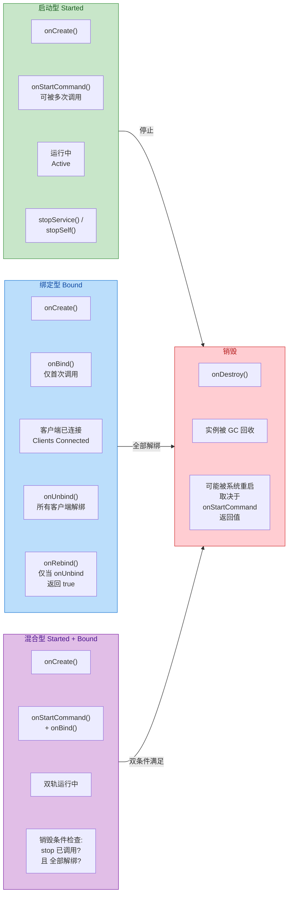
```mermaid
graph LR
    subgraph Started["启动型 Started"]
        direction TB
        S_create["onCreate()"]
        S_command["onStartCommand()\n可被多次调用"]
        S_active["运行中\nActive"]
        S_stop["stopService() /\nstopSelf()"]
        S_create ~~~ S_command
        S_command ~~~ S_active
        S_active ~~~ S_stop
    end

    subgraph Bound["绑定型 Bound"]
        direction TB
        B_create["onCreate()"]
        B_bind["onBind()\n仅首次调用"]
        B_active["客户端已连接\nClients Connected"]
        B_unbind["onUnbind()\n所有客户端解绑"]
        B_rebind["onRebind()\n仅当 onUnbind\n返回 true"]
        B_create ~~~ B_bind
        B_bind ~~~ B_active
        B_active ~~~ B_unbind
        B_unbind ~~~ B_rebind
    end

    subgraph Hybrid["混合型 Started + Bound"]
        direction TB
        H_create["onCreate()"]
        H_both["onStartCommand()\n+ onBind()"]
        H_active["双轨运行中"]
        H_check["销毁条件检查:\nstop 已调用?\n且 全部解绑?"]
        H_create ~~~ H_both
        H_both ~~~ H_active
        H_active ~~~ H_check
    end

    subgraph End["销毁"]
        direction TB
        E_destroy["onDestroy()"]
        E_gc["实例被 GC 回收"]
        E_restart["可能被系统重启\n取决于\nonStartCommand\n返回值"]
        E_destroy ~~~ E_gc
        E_gc ~~~ E_restart
    end

    Started -->|"停止"| End
    Bound -->|"全部解绑"| End
    Hybrid -->|"双条件满足"| End

    classDef startStyle fill:#C8E6C9,stroke:#388E3C,color:#1B5E20
    classDef bindStyle fill:#BBDEFB,stroke:#1976D2,color:#0D47A1
    classDef hybridStyle fill:#E1BEE7,stroke:#7B1FA2,color:#4A148C
    classDef endStyle fill:#FFCDD2,stroke:#D32F2F,color:#B71C1C

    class Started startStyle
    class Bound bindStyle
    class Hybrid hybridStyle
    class End endStyle
```

---

**📝 练习题 1**

一个 Service 的 `onStartCommand()` 返回了 `START_STICKY`。当系统因内存不足杀死该 Service 后又重新创建它时，`onStartCommand()` 收到的参数状态是怎样的？

A. `intent` 为原始 Intent 对象，`flags` 为 `START_FLAG_REDELIVERY`
B. `intent` 为 `null`，`flags` 为 `0`
C. `intent` 为 `null`，`flags` 为 `START_FLAG_RETRY`
D. `intent` 为空 Intent（`new Intent()`），`flags` 为 `0`

**【答案】** B

**【解析】** `START_STICKY` 的语义是"粘性重启"——系统会在资源恢复后重新创建 Service 并调用 `onStartCommand()`，但**不会保存和重新投递原始 Intent**。因此 intent 参数为 `null`，flags 为 `0`（表示正常启动，没有特殊标志）。这与 `START_REDELIVER_INTENT` 形成鲜明对比——后者会重新投递原始 Intent，且 flags 包含 `START_FLAG_REDELIVERY`（选项 A 描述的正是 `START_REDELIVER_INTENT` 的行为）。选项 C 中的 `START_FLAG_RETRY` 只在 `onCreate()` 成功但 `onStartCommand()` 未被成功调用的极端边界情况下出现，与 `START_STICKY` 的正常重启流程无关。选项 D 是一个常见的误解——系统不会创建一个空的 Intent 对象，而是直接传 `null`。这就是为什么使用 `START_STICKY` 时，你的 `onStartCommand()` 必须对 `intent == null` 做防御性检查。

---

**📝 练习题 2**

一个 Service 同时被 `startService()` 启动和 `bindService()` 绑定（混合型）。现在依次执行以下操作：① 调用 `stopService()`；② 调用 `unbindService()`。请问 `onDestroy()` 在哪一步之后被调用？如果将 ① 和 ② 的顺序颠倒，结果是否会改变？

A. 在步骤 ① 之后调用 `onDestroy()`；颠倒顺序后，在 `unbindService()` 之后调用

B. 在步骤 ② 之后调用 `onDestroy()`；颠倒顺序后，在 `stopService()` 之后调用

C. 在步骤 ① 之后调用 `onDestroy()`；颠倒顺序后结果不变，仍在 `stopService()` 之后

D. 在步骤 ② 之后调用 `onUnbind()` 然后 `onDestroy()`；颠倒顺序后结果不变，仍在第二步之后

**【答案】** B

**【解析】** 混合型 Service 的销毁遵循"双条件逻辑与"原则——必须同时满足"启动型轨道已停止"（`stopService()` 或 `stopSelf()` 已调用）**且**"绑定型轨道已清空"（所有客户端已解绑）。在原始顺序中：步骤 ① `stopService()` 执行后，启动型轨道标记为已停止，但绑定型轨道仍有客户端绑定，所以 Service 继续存活；步骤 ② `unbindService()` 执行后，绑定型轨道也清空了，两个条件同时满足，AMS 触发 `onUnbind()` → `onDestroy()`。如果颠倒顺序：先 `unbindService()`，此时绑定型轨道清空，触发 `onUnbind()`，但启动型轨道仍在运行，Service 继续存活；再 `stopService()`，启动型轨道也停止了，两个条件满足，触发 `onDestroy()`。两种顺序的最终结果相同——**`onDestroy()` 总是在第二个操作（即满足最后一个条件的那个操作）之后被调用**。选项 D 的描述虽然接近正确，但它说"颠倒顺序后结果不变，仍在第二步之后"这个表述有歧义——实际上 `onDestroy()` 确实总在"第二步"之后，但 `onUnbind()` 的调用时机会随顺序变化而变化（原始顺序中 `onUnbind` 在步骤 ② 时调用，颠倒后在步骤 ① 时调用）。选项 B 最精确地描述了这种行为。

---

## 前台服务 Foreground Service

Android 系统对后台进程的管控日趋严格——从 Android 8.0 的后台执行限制，到 Android 12 的前台服务启动限制，再到 Android 14 强制声明前台服务类型——每一次版本迭代都在收紧"后台自由"。在这样的背景下，前台服务（Foreground Service）成为了应用在后台持续执行任务的"合法通行证"。它的核心设计哲学可以用一句话概括：**你想在后台活着，就必须让用户看到你在做什么**。这是 Android 系统与应用之间的一份"可见性契约"（Visibility Contract）——应用以一条持久通知（persistent notification）为代价，换取系统在内存紧张时不杀死自己的特权。

理解前台服务，不能仅停留在"调用 `startForeground()` 就完事了"的层面。你需要深入理解三个核心维度：Notification 绑定机制是如何将服务与用户感知关联起来的；权限模型在不同 Android 版本中经历了怎样的演进；以及系统究竟是通过什么机制来"豁免"前台服务进程不被杀死的。这三个维度环环相扣，共同构成了前台服务的完整技术图景。

### 前台服务与普通服务的本质区别

在深入细节之前，有必要先厘清前台服务与普通 Started Service 之间的根本差异。很多开发者误以为前台服务只是"带了一个通知的普通服务"，这种理解过于表面。两者的差异是系统级的，体现在进程优先级、资源分配、生命周期保障等多个层面。

从系统视角看，当一个 Service 调用了 `startForeground()` 之后，AMS（ActivityManagerService）会立即修改该进程的 `ProcessRecord` 中的状态标记，将其 `oom_adj` 值从普通 Service 的 500（`SERVICE_ADJ`）提升到 200（`PERCEPTIBLE_APP_ADJ`）。这个数值的变化看似微小，却意味着该进程在 Low Memory Killer（LMK）的"死亡名单"上从中游位置跃升到了接近顶部的安全区域。与此同时，SystemUI 会在状态栏展示一条持久通知，告知用户"某个应用正在后台执行任务"。这条通知不仅是用户体验层面的设计，更是系统判定该服务是否"合法前台"的关键凭证——没有通知，就没有前台特权。

从应用开发者的视角看，前台服务解决的是一个非常具体的问题：**如何在用户离开应用界面后，仍然可靠地执行长时间运行的任务**。典型场景包括音乐播放、导航定位、文件下载、健康数据采集等。这些任务的共同特征是：用户明确知道并期望它们在后台运行，且中断会导致糟糕的用户体验。

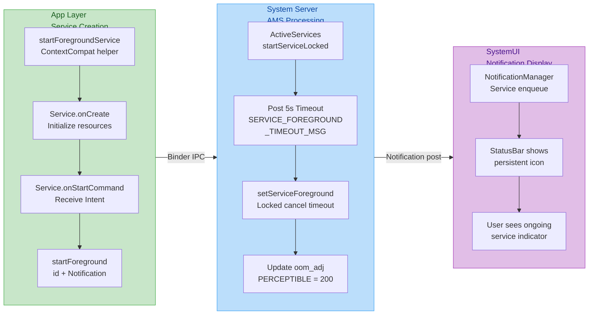
```mermaid
graph LR
    subgraph A["App Layer\nService Creation"]
        direction TB
        A1["startForegroundService\nContextCompat helper"]
        A2["Service.onCreate\nInitialize resources"]
        A3["Service.onStartCommand\nReceive Intent"]
        A4["startForeground\nid + Notification"]
        A1 --> A2
        A2 --> A3
        A3 --> A4
    end
    subgraph B["System Server\nAMS Processing"]
        direction TB
        B1["ActiveServices\nstartServiceLocked"]
        B2["Post 5s Timeout\nSERVICE_FOREGROUND\n_TIMEOUT_MSG"]
        B3["setServiceForeground\nLocked cancel timeout"]
        B4["Update oom_adj\nPERCEPTIBLE = 200"]
        B1 --> B2
        B2 --> B3
        B3 --> B4
    end
    subgraph C["SystemUI\nNotification Display"]
        direction TB
        C1["NotificationManager\nService enqueue"]
        C2["StatusBar shows\npersistent icon"]
        C3["User sees ongoing\nservice indicator"]
        C1 --> C2
        C2 --> C3
    end
    A -->|"Binder IPC"| B -->|"Notification post"| C
    classDef appCls fill:#C8E6C9,stroke:#4CAF50,color:#1B5E20
    classDef amsCls fill:#BBDEFB,stroke:#42A5F5,color:#0D47A1
    classDef uiCls fill:#E1BEE7,stroke:#AB47BC,color:#4A148C
    class A appCls
    class B amsCls
    class C uiCls
```

上图展示了前台服务从启动到通知展示的完整链路。注意中间 AMS 层的"5 秒超时消息"——这是一个关键的系统保护机制，稍后会详细展开。

### Notification 绑定：前台服务的"可见性凭证"

Notification 绑定是前台服务最核心的机制，没有之一。可以这样理解：如果前台服务是一辆在高速公路上行驶的车，那么 Notification 就是它的行驶证——没有行驶证，交警（系统）会立刻把你拦下来（ANR 或 crash）。

#### 为什么必须绑定 Notification

这个设计决策源于 Android 团队对用户隐私和资源透明度的深层考量。在 Android 早期版本中，应用可以在后台悄无声息地运行 Service，消耗 CPU、网络、电量，用户却毫不知情。这导致了严重的"后台资源滥用"问题——用户发现手机莫名其妙地发热、耗电，却不知道是哪个应用在作祟。

前台服务的 Notification 绑定机制从根本上解决了这个问题：**任何想要在后台持续运行的应用，都必须在状态栏展示一条通知，明确告知用户自己正在做什么**。这条通知是"ongoing"类型的，用户无法通过滑动来清除它（除非服务停止或调用 `stopForeground()`），这确保了信息的持续可见性。

从 Android 13（API 33）开始，系统还引入了"前台服务任务管理器"（Foreground Service Task Manager，简称 FGS Task Manager），用户可以在通知面板中看到所有正在运行的前台服务，并且可以直接点击"Stop"按钮来终止它们。这进一步强化了用户对后台任务的控制权。

#### startForeground() 的 5 秒生死线

当你通过 `Context.startForegroundService()` 启动一个前台服务时，系统内部会发生以下关键步骤：

1. AMS 收到启动请求后，会在 `ActiveServices` 中调用 `startServiceLocked()`，创建 `ServiceRecord` 并标记该服务为"pending foreground"状态。
2. AMS 随即向 `Handler` 投递一条延迟 5 秒的消息：`SERVICE_FOREGROUND_TIMEOUT_MSG`。这就是著名的"5 秒生死线"。
3. 系统回调 Service 的 `onCreate()` 和 `onStartCommand()`。
4. 应用必须在 `onStartCommand()`（或 `onCreate()`）中调用 `startForeground(int id, Notification notification)`。
5. `startForeground()` 内部通过 Binder IPC 调用 AMS 的 `setServiceForegroundLocked()` 方法，AMS 收到后会**取消**那条 5 秒超时消息。

如果在 5 秒内没有调用 `startForeground()`，超时消息触发后，系统会根据 Android 版本采取不同的惩罚措施：

* **Android 11 及以下**：系统会抛出一个 ANR（Application Not Responding），弹出"应用无响应"对话框。
* **Android 12（API 31）及以上**：系统直接抛出 `ForegroundServiceDidNotStartInTimeException`，应用会 crash。这是一个更严厉的惩罚，因为 Google 认为 ANR 对话框容易被用户忽略，而 crash 会迫使开发者修复问题。

这个 5 秒限制的设计意图非常明确：**防止应用以"前台服务"为幌子启动 Service，却实际上不展示任何通知**。系统给了你 5 秒的"宽限期"来准备通知，如果你不兑现承诺，就会受到惩罚。

#### NotificationChannel：Android 8.0+ 的必要条件

从 Android 8.0（API 26）开始，所有通知都必须关联一个 `NotificationChannel`。这不是前台服务的特殊要求，而是整个通知系统的基础架构变更。但对于前台服务来说，Channel 的配置尤为重要，因为它直接影响通知的展示方式和用户体验。

创建 Channel 时需要注意几个关键参数：

* **importance**：决定通知的打扰程度。对于前台服务，通常使用 `IMPORTANCE_LOW`（不发出声音，不弹出横幅）或 `IMPORTANCE_DEFAULT`（发出声音）。如果你的前台服务是音乐播放器，用 `IMPORTANCE_LOW` 是合理的，因为用户已经知道音乐在播放；如果是文件下载完成的通知，可能需要 `IMPORTANCE_DEFAULT`。
* **id 和 name**：Channel 的唯一标识和用户可见的名称。用户可以在系统设置中针对每个 Channel 单独调整通知行为。

#### Notification 的构建要求

前台服务的 Notification 有几个硬性要求：

1. **id 不能为 0**：`startForeground(int id, Notification notification)` 的第一个参数是通知 ID，必须是非零正整数。传入 0 会导致通知不显示，进而触发 5 秒超时。
2. **必须设置 smallIcon**：没有 icon 的通知在某些设备上会被系统静默丢弃。
3. **Channel 必须存在**：在 API 26+ 上，如果指定的 Channel ID 不存在，通知会被丢弃。
4. **建议设置 contentTitle 和 contentText**：虽然不是硬性要求，但空白通知会让用户困惑，也可能被某些 OEM 系统视为异常。

以下是一个完整的 Notification 构建与前台服务启动示例：

```kotlin
// === NotificationHelper.kt ===
// 封装 Notification 创建逻辑，便于复用

import android.app.Notification
import android.app.NotificationChannel
import android.app.NotificationManager
import android.app.PendingIntent
import android.content.Context
import android.content.Intent
import android.os.Build
import androidx.core.app.NotificationCompat

object NotificationHelper {

    // Channel ID 常量，整个应用中保持唯一
    const val CHANNEL_ID = "foreground_service_channel"
    // 通知 ID 常量，必须非零
    const val NOTIFICATION_ID = 1001

    /**
     * 创建 NotificationChannel（仅 API 26+ 需要）
     * 这个方法应该在 Application.onCreate() 或 Service.onCreate() 中调用
     * 重复调用是安全的——如果 Channel 已存在，系统会忽略
     */
    fun createChannel(context: Context) {
        // API 26 以下不需要 Channel，直接返回
        if (Build.VERSION.SDK_INT < Build.VERSION_CODES.O) return

        // 构建 Channel 对象
        // 参数1: channelId —— 唯一标识，与 Notification 中的 channelId 对应
        // 参数2: channelName —— 用户在系统设置中看到的名称
        // 参数3: importance —— IMPORTANCE_LOW 表示不发声、不弹横幅
        val channel = NotificationChannel(
            CHANNEL_ID,                              // channelId
            "Foreground Service Channel",            // 用户可见的 Channel 名称
            NotificationManager.IMPORTANCE_LOW       // 低优先级：静默展示
        ).apply {
            // 可选：设置 Channel 描述，帮助用户理解这个通知类别的用途
            description = "Used for foreground service notifications"
            // 可选：关闭振动（IMPORTANCE_LOW 默认就不振动，但显式设置更安全）
            enableVibration(false)
            // 可选：关闭呼吸灯
            enableLights(false)
        }

        // 通过 NotificationManager 注册 Channel
        val manager = context.getSystemService(NotificationManager::class.java)
        manager.createNotificationChannel(channel)   // 幂等操作，重复调用安全
    }

    /**
     * 构建前台服务所需的 Notification
     * @param context 上下文，用于创建 PendingIntent
     * @param title 通知标题
     * @param content 通知正文
     * @return 构建好的 Notification 对象
     */
    fun buildForegroundNotification(
        context: Context,
        title: String,
        content: String
    ): Notification {
        // 创建点击通知后跳转的 PendingIntent
        // FLAG_IMMUTABLE 是 Android 12+ 的强制要求
        val pendingIntent = PendingIntent.getActivity(
            context,                                  // 上下文
            0,                                        // requestCode，用于区分不同的 PendingIntent
            Intent(context, MainActivity::class.java),// 点击后打开的 Activity
            PendingIntent.FLAG_IMMUTABLE              // Android 12+ 必须指定 mutability
        )

        // 使用 NotificationCompat 构建通知，确保向下兼容
        return NotificationCompat.Builder(context, CHANNEL_ID)
            .setContentTitle(title)                   // 通知标题
            .setContentText(content)                  // 通知正文
            .setSmallIcon(R.drawable.ic_service)      // 状态栏小图标（必须设置）
            .setContentIntent(pendingIntent)          // 点击通知的跳转意图
            .setOngoing(true)                         // ongoing = true：用户无法滑动清除
            .setForegroundServiceBehavior(            // API 31+ 控制前台服务通知的展示行为
                NotificationCompat.FOREGROUND_SERVICE_IMMEDIATE // 立即展示，不延迟
            )
            .build()                                  // 构建最终的 Notification 对象
    }
}
```

#### stopForeground() 的两种模式

当前台服务完成任务或需要降级为普通后台服务时，需要调用 `stopForeground()`。这个方法在 API 24 之后有了更精细的控制：

```kotlin
// === 停止前台状态的两种方式 ===

// 方式一：移除通知（最常用）
// 服务降级为普通后台服务，通知从状态栏消失
// STOP_FOREGROUND_REMOVE = 1
stopForeground(STOP_FOREGROUND_REMOVE)

// 方式二：分离通知（保留通知但解除与服务的绑定）
// 通知仍然显示在状态栏，但不再是"ongoing"类型
// 用户可以滑动清除它。服务降级为普通后台服务
// STOP_FOREGROUND_DETACH = 2
stopForeground(STOP_FOREGROUND_DETACH)

// 旧 API（已废弃，但仍可用）
// stopForeground(true)  等价于 STOP_FOREGROUND_REMOVE
// stopForeground(false) 等价于 STOP_FOREGROUND_DETACH
```

需要特别注意的是：`stopForeground()` **只是取消前台状态，并不会停止 Service 本身**。如果你想同时停止服务，需要额外调用 `stopSelf()` 或由外部调用 `stopService()`。这是一个常见的混淆点。

### 权限要求的版本演进：从自由到精细管控

Android 对前台服务的权限要求经历了一个从"几乎不需要任何权限"到"必须声明具体类型和对应权限"的演进过程。这个演进反映了 Google 在用户隐私保护和开发者便利性之间不断寻找平衡点的努力。

下表完整梳理了各版本的权限要求变化：

|  Android 版本 | API Level | 变化内容                                                  |  影响程度 |
| :---------: | :-------: | :---------------------------------------------------- | :---: |
|   8.0 Oreo  |     26    | 引入 `startForegroundService()`，后台启动限制开始                |  ⭐⭐⭐  |
|   9.0 Pie   |     28    | 必须声明 `FOREGROUND_SERVICE` 权限（normal permission）       |   ⭐⭐  |
|     12 S    |     31    | 后台启动前台服务受限，新增多个豁免条件                                   |  ⭐⭐⭐⭐ |
| 13 Tiramisu |     33    | `POST_NOTIFICATIONS` 运行时权限，FGS Task Manager           |  ⭐⭐⭐  |
|     14 U    |     34    | 强制声明 `foregroundServiceType`，类型专属权限                   | ⭐⭐⭐⭐⭐ |
|     15 V    |     35    | `dataSync` 类型增加 24 小时超时限制，`mediaProcessing` 新增 6 小时限制 |  ⭐⭐⭐  |

#### Android 9（API 28）：FOREGROUND_SERVICE 权限

这是前台服务权限化的起点。从 Android 9 开始，应用必须在 `AndroidManifest.xml` 中声明 `FOREGROUND_SERVICE` 权限，否则调用 `startForeground()` 会抛出 `SecurityException`。

```xml
<!-- AndroidManifest.xml -->
<!-- FOREGROUND_SERVICE 是 normal permission，安装时自动授予，无需运行时请求 -->
<uses-permission android:name="android.permission.FOREGROUND_SERVICE" />
```

这个权限的设计意图是"声明式透明"——虽然不需要用户手动授权，但它出现在应用的权限列表中，让用户在安装前就知道"这个应用会使用前台服务"。同时，它也为后续更精细的权限控制奠定了基础。

#### Android 12（API 31）：后台启动限制

Android 12 引入了一个重大限制：**当应用处于后台时，不能直接启动前台服务**。如果尝试这样做，系统会抛出 `ForegroundServiceStartNotAllowedException`。

这个限制的背景是：一些应用利用 `BroadcastReceiver` 或 `AlarmManager` 在后台悄悄启动前台服务，即使用户并没有主动与应用交互。Google 认为这违背了前台服务"用户感知"的设计初衷。

但系统也提供了一系列豁免条件（exemptions），在以下情况下仍然允许从后台启动前台服务：

* 应用当前有一个可见的 Activity（即使不在前台焦点）
* 应用收到了高优先级的 FCM 消息（Firebase Cloud Messaging）
* 用户点击了应用的通知中的 `PendingIntent`
* 应用是设备所有者（Device Owner）或配置文件所有者（Profile Owner）
* 应用拥有 `SYSTEM_ALERT_WINDOW` 权限
* 应用刚刚完成了一次 `Activity` 的 `finish()`（短暂的宽限期）
* 应用被系统绑定为伴侣设备（Companion Device）
* 用户在系统设置中关闭了该应用的电池优化

对于不满足豁免条件的场景，Google 推荐使用 `WorkManager` 的 `setExpedited()` 方法作为替代方案，它会在可能的情况下使用前台服务，在不可能时优雅降级。

#### Android 13（API 33）：POST_NOTIFICATIONS 运行时权限

Android 13 引入了 `POST_NOTIFICATIONS` 运行时权限。由于前台服务必须展示通知，如果用户拒绝了这个权限，前台服务的通知将不会显示。但这里有一个微妙的细节：**即使通知不显示，前台服务本身仍然可以正常运行，进程优先级仍然会被提升**。只是用户看不到通知而已。

不过，这种"隐形前台服务"的状态并不理想，因为它违背了"可见性契约"的精神。Google 在文档中强烈建议开发者在启动前台服务之前先请求 `POST_NOTIFICATIONS` 权限。

```kotlin
// 在 Activity 中请求通知权限（API 33+）
// 建议在启动前台服务之前调用
if (Build.VERSION.SDK_INT >= Build.VERSION_CODES.TIRAMISU) {
    // 检查是否已经拥有通知权限
    if (checkSelfPermission(Manifest.permission.POST_NOTIFICATIONS)
        != PackageManager.PERMISSION_GRANTED
    ) {
        // 请求运行时权限
        requestPermissions(
            arrayOf(Manifest.permission.POST_NOTIFICATIONS),  // 权限数组
            REQUEST_CODE_NOTIFICATION                          // 请求码
        )
    }
}
```

#### Android 14（API 34）：foregroundServiceType 强制声明

这是前台服务权限模型最重大的一次变革。从 Android 14 开始，**每个前台服务都必须在 Manifest 中声明具体的 `foregroundServiceType`**，并且在调用 `startForeground()` 时也必须传入对应的类型参数。如果不声明类型，应用在 Android 14+ 设备上启动前台服务时会直接 crash。

这个设计的核心理念是"最小权限原则"（Principle of Least Privilege）：你的前台服务具体在做什么？是播放音乐？还是访问摄像头？还是同步数据？不同的任务类型需要不同的权限，系统需要知道你的真实意图。

下表列出了所有可用的前台服务类型及其对应的权限要求：

| foregroundServiceType | 典型场景         | 必需的 Manifest 权限                       | 额外运行时权限                |
| :-------------------- | :----------- | :------------------------------------ | :--------------------- |
| `camera`              | 视频录制         | `FOREGROUND_SERVICE_CAMERA`           | `CAMERA`               |
| `connectedDevice`     | 蓝牙/USB 设备交互  | `FOREGROUND_SERVICE_CONNECTED_DEVICE` | 视具体设备而定                |
| `dataSync`            | 数据同步/上传/下载   | `FOREGROUND_SERVICE_DATA_SYNC`        | 无                      |
| `health`              | 健康/运动数据采集    | `FOREGROUND_SERVICE_HEALTH`           | `BODY_SENSORS` 等       |
| `location`            | GPS 定位/导航    | `FOREGROUND_SERVICE_LOCATION`         | `ACCESS_FINE_LOCATION` |
| `mediaPlayback`       | 音乐/播客播放      | `FOREGROUND_SERVICE_MEDIA_PLAYBACK`   | 无                      |
| `mediaProjection`     | 屏幕录制/投屏      | `FOREGROUND_SERVICE_MEDIA_PROJECTION` | 用户授权确认                 |
| `microphone`          | 录音/语音通话      | `FOREGROUND_SERVICE_MICROPHONE`       | `RECORD_AUDIO`         |
| `phoneCall`           | VoIP 通话      | `FOREGROUND_SERVICE_PHONE_CALL`       | `MANAGE_OWN_CALLS`     |
| `remoteMessaging`     | 消息转发（如手表）    | `FOREGROUND_SERVICE_REMOTE_MESSAGING` | 无                      |
| `shortService`        | 短时任务（3 分钟限制） | 无额外权限                                 | 无                      |
| `specialUse`          | 不属于以上任何类别    | `FOREGROUND_SERVICE_SPECIAL_USE`      | 需 Play Store 审核        |

以下是 Android 14+ 完整的 Manifest 声明示例：

```xml
<!-- AndroidManifest.xml -->
<!-- Android 14+ 前台服务完整权限声明示例 -->

<!-- 基础前台服务权限（API 28+） -->
<uses-permission android:name="android.permission.FOREGROUND_SERVICE" />
<!-- 类型专属权限：媒体播放 -->
<uses-permission android:name="android.permission.FOREGROUND_SERVICE_MEDIA_PLAYBACK" />
<!-- 类型专属权限：定位 -->
<uses-permission android:name="android.permission.FOREGROUND_SERVICE_LOCATION" />
<!-- 定位功能本身需要的运行时权限 -->
<uses-permission android:name="android.permission.ACCESS_FINE_LOCATION" />
<!-- 通知权限（API 33+） -->
<uses-permission android:name="android.permission.POST_NOTIFICATIONS" />

<application>
    <!-- Service 声明中必须指定 foregroundServiceType -->
    <!-- 可以用 | 组合多个类型 -->
    <service
        android:name=".MusicPlayerService"
        android:foregroundServiceType="mediaPlayback|location"
        android:exported="false" />
</application>
```

在代码中启动前台服务时，也需要传入类型参数：

```kotlin
// Android 14+ 启动前台服务时必须指定类型
if (Build.VERSION.SDK_INT >= Build.VERSION_CODES.UPSIDE_DOWN_CAKE) {
    // API 34 新增的 startForeground 重载方法
    // 参数1: notificationId —— 通知 ID
    // 参数2: notification —— 通知对象
    // 参数3: foregroundServiceType —— 前台服务类型（必须与 Manifest 中声明的一致）
    startForeground(
        NOTIFICATION_ID,                                    // 通知 ID
        notification,                                       // Notification 对象
        ServiceInfo.FOREGROUND_SERVICE_TYPE_MEDIA_PLAYBACK  // 服务类型
    )
} else {
    // API 33 及以下使用传统方法
    startForeground(NOTIFICATION_ID, notification)
}
```

#### Android 15（API 35）：dataSync 超时与进一步收紧

Android 15 对 `dataSync` 类型的前台服务施加了 24 小时的累计运行时间限制。超过这个时间后，系统会自动调用 `Service.onTimeout(int foregroundServiceType)`，应用必须在几秒内调用 `stopSelf()` 或 `stopForeground()`，否则系统会强制停止服务并抛出 ANR。

此外，Android 15 新增了 `mediaProcessing` 类型（用于媒体转码等场景），它有 6 小时的运行时间限制。

这些限制的设计意图是防止应用以"数据同步"为名义无限期地运行前台服务。Google 认为，如果一个数据同步任务需要超过 24 小时，那它应该使用 `WorkManager` 来分段执行，而不是霸占前台服务。

### 系统杀进程豁免：OOM Adj 与 LMK 的优待机制

前台服务最核心的价值在于"不被系统杀死"。但这个"不被杀死"并不是绝对的——它是一种基于优先级的相对保护。要理解这种保护机制，需要深入 Android 的进程管理体系，理解 OOM Adj（Out of Memory Adjustment）值的分配逻辑和 LMK（Low Memory Killer）的决策过程。

#### Android 进程优先级的五级模型

Android 系统将所有运行中的进程划分为五个优先级层次。这个分层模型是 AMS 进行进程管理的基础框架，每一层都对应着不同的 `oom_adj` 值范围。`oom_adj` 值越低，进程优先级越高，被系统回收的可能性就越小。可以把它想象成一栋大楼的楼层——住在顶层（低 `oom_adj`）的租户享有最高的安全保障，而住在底层（高 `oom_adj`）的租户在"拆迁"（内存回收）时首当其冲。

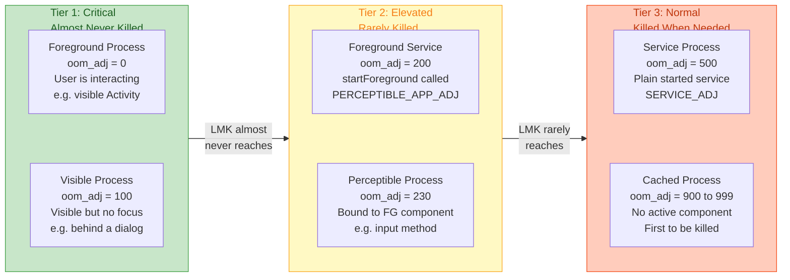
```mermaid
graph LR
    subgraph L1["Tier 1: Critical\nAlmost Never Killed"]
        direction TB
        L1A["Foreground Process\noom_adj = 0\nUser is interacting\ne.g. visible Activity"]
        L1B["Visible Process\noom_adj = 100\nVisible but no focus\ne.g. behind a dialog"]
        L1A ~~~ L1B
    end
    subgraph L2["Tier 2: Elevated\nRarely Killed"]
        direction TB
        L2A["Foreground Service\noom_adj = 200\nstartForeground called\nPERCEPTIBLE_APP_ADJ"]
        L2B["Perceptible Process\noom_adj = 230\nBound to FG component\ne.g. input method"]
        L2A ~~~ L2B
    end
    subgraph L3["Tier 3: Normal\nKilled When Needed"]
        direction TB
        L3A["Service Process\noom_adj = 500\nPlain started service\nSERVICE_ADJ"]
        L3B["Cached Process\noom_adj = 900 to 999\nNo active component\nFirst to be killed"]
        L3A ~~~ L3B
    end
    L1 -->|"LMK almost\nnever reaches"| L2 -->|"LMK rarely\nreaches"| L3
    classDef critCls fill:#C8E6C9,stroke:#43A047,color:#1B5E20
    classDef elevCls fill:#FFF9C4,stroke:#F9A825,color:#F57F17
    classDef normCls fill:#FFCCBC,stroke:#F4511E,color:#BF360C
    class L1 critCls
    class L2 elevCls
    class L3 normCls
```

让我们逐层拆解这个模型，重点关注前台服务所处的位置：

**第一层：前台进程（Foreground Process，oom_adj = 0）**

这是优先级最高的进程类别，系统几乎在任何情况下都不会杀死它们。一个进程被归类为前台进程的条件包括：正在与用户交互的 Activity（处于 `onResume()` 状态）、正在执行 `onReceive()` 的 BroadcastReceiver、正在执行 `onCreate()`/`onStartCommand()`/`onDestroy()` 等生命周期回调的 Service。注意最后一点——Service 在执行生命周期回调的那几毫秒内，其进程实际上是前台进程级别的，这是一个容易被忽略的细节。

**第二层：可见进程（Visible Process，oom_adj = 100）**

进程中有一个对用户可见但不在前台焦点的 Activity（例如，一个 Activity 弹出了一个半透明的 Dialog Activity，原来的 Activity 处于 `onPause()` 但仍然可见）。可见进程的优先级仅次于前台进程。

**第三层（关键）：前台服务进程（Foreground Service Process，oom_adj ≈ 200）**

这就是前台服务所在的层级。当一个 Service 调用了 `startForeground()` 后，AMS 会将其宿主进程的 `oom_adj` 值设置为 `PERCEPTIBLE_APP_ADJ`（值为 200）。这个值介于可见进程（100）和普通服务进程（500）之间，意味着前台服务进程享有比普通后台服务高得多的生存优先级，但仍然低于直接与用户交互的前台/可见进程。

这个设计非常精妙：前台服务虽然重要，但它毕竟不是用户正在直接交互的界面。如果系统内存极度紧张（比如只剩下几十 MB），系统仍然可能杀死前台服务进程来保障前台 Activity 的流畅运行。但在正常情况下，LMK 的内存阈值远远不会触及 `oom_adj = 200` 这个级别。

**第四层：服务进程（Service Process，oom_adj = 500）**

通过 `startService()` 启动但没有调用 `startForeground()` 的普通服务。这类进程在内存紧张时会被较早回收。

**第五层：缓存进程（Cached Process，oom_adj = 900~999）**

没有任何活跃组件的进程，通常是用户按了 Back 键退出 Activity 后留下的"空壳"进程。系统会维护一个 LRU（Least Recently Used）列表，最久未使用的缓存进程会被最先回收。

#### OOM Adj 的动态计算机制

`oom_adj` 值并不是一个静态数字，而是由 AMS 根据进程中所有组件的当前状态**动态计算**的。这个计算过程发生在 `OomAdjuster.updateOomAdjLocked()` 方法中，它是 Android 进程管理的核心算法之一。

计算逻辑的核心原则是"取最高优先级"：一个进程中可能同时运行着多个组件（Activity、Service、ContentProvider 等），AMS 会遍历所有组件，计算每个组件贡献的优先级，然后取最高的那个作为进程的最终 `oom_adj` 值。

对于前台服务来说，关键的计算路径是：

1. AMS 检测到 `ServiceRecord` 的 `isForeground` 标志为 `true`。
2. 将该 Service 贡献的优先级设置为 `PERCEPTIBLE_APP_ADJ`（200）。
3. 如果同一进程中还有一个正在与用户交互的 Activity，那么进程的最终 `oom_adj` 会是 0（前台进程），因为 Activity 的优先级更高。
4. 如果前台服务是进程中优先级最高的组件，那么进程的 `oom_adj` 就是 200。

这意味着：**前台服务的进程优先级提升效果，只有在进程中没有更高优先级组件时才能体现出来**。如果你的应用正在前台显示 Activity，那么前台服务对进程优先级没有额外贡献——因为 Activity 已经把优先级拉到了最高。前台服务的真正价值体现在用户离开应用界面之后，此时 Activity 被销毁或进入后台，前台服务成为进程中唯一的"优先级锚点"，将进程从可能被回收的缓存进程（900+）拉升到相对安全的 200。

#### LMK 的决策过程：谁先死？

Low Memory Killer（LMK）是 Android 系统中负责在内存紧张时回收进程的内核级组件。在较新的 Android 版本中，它已经从内核驱动（`lowmemorykiller`）演进为用户空间守护进程 `lmkd`（Low Memory Killer Daemon），但核心逻辑不变。

LMK 的工作原理可以简化为以下步骤：

1. **监控内存水位**：LMK 持续监控系统的可用内存（free memory）和文件缓存（file cache）大小。
2. **触发阈值**：系统定义了多个内存阈值（minfree levels），每个阈值对应一个 `oom_adj` 范围。例如，当可用内存低于 150MB 时，开始回收 `oom_adj >= 900` 的进程；当低于 80MB 时，开始回收 `oom_adj >= 500` 的进程。
3. **选择牺牲者**：在同一 `oom_adj` 级别内，LMK 优先杀死占用内存最大的进程（RSS，Resident Set Size）。
4. **逐级升级**：如果杀死低优先级进程后内存仍然不足，LMK 会逐步提高阈值，开始回收更高优先级的进程。

对于前台服务进程（`oom_adj = 200`）来说，LMK 通常需要在系统内存极度紧张的情况下才会触及这个级别。在大多数正常使用场景中，系统通过回收缓存进程（900+）和普通服务进程（500）就能释放足够的内存。这就是前台服务"杀进程豁免"的实质——**不是绝对不会被杀，而是在 LMK 的优先级队列中排在非常靠后的位置**。

用一个生动的比喻来说：如果系统内存是一艘正在下沉的船，LMK 就是船长，他会按照优先级从低到高依次让乘客跳船。缓存进程是最先被要求跳船的，然后是普通服务进程，再然后是前台服务进程。只有在船即将沉没、所有低优先级乘客都已经跳船的情况下，船长才会不得不让前台服务进程也跳船。而前台进程（`oom_adj = 0`）就像船长自己——除非船已经完全沉没，否则他是最后一个离开的。

#### 被杀后的恢复机制

即使前台服务进程在极端情况下被 LMK 杀死，系统也提供了恢复机制。这与 `onStartCommand()` 的返回值密切相关：

* **`START_STICKY`**：系统会在内存恢复后尝试重新创建 Service，但不会重新传递最后一个 Intent。这是前台服务最常用的返回值，因为它确保了服务的"复活"能力。
* **`START_REDELIVER_INTENT`**：系统重新创建 Service 并重新传递最后一个 Intent。适用于需要确保每个任务都被处理的场景（如文件下载）。
* **`START_NOT_STICKY`**：系统不会自动重新创建 Service。这对于前台服务来说通常不是好的选择，因为它意味着服务被杀后就彻底消失了。

```kotlin
// 前台服务推荐的 onStartCommand 返回值
override fun onStartCommand(intent: Intent?, flags: Int, startId: Int): Int {
    // ... 启动前台通知的逻辑 ...

    // START_STICKY：被杀后系统会尝试重建 Service
    // 重建时 intent 参数为 null，需要做 null 检查
    return START_STICKY
}
```

但需要注意的是，即使返回了 `START_STICKY`，系统重建 Service 后，你仍然需要重新调用 `startForeground()` 来恢复前台状态。系统不会自动帮你恢复之前的 Notification。

#### Doze 模式与前台服务的关系

从 Android 6.0（API 23）开始引入的 Doze 模式会在设备静止且屏幕关闭一段时间后，限制应用的网络访问、Wake Lock、AlarmManager 等。但前台服务享有部分豁免：

* **网络访问**：前台服务在 Doze 模式下**仍然可以访问网络**。这是与普通后台服务的关键区别。
* **Wake Lock**：前台服务持有的 Wake Lock 在 Doze 模式下**仍然有效**。
* **AlarmManager**：前台服务设置的精确闹钟在 Doze 模式下可能会被延迟，但 `setExactAndAllowWhileIdle()` 可以绕过这个限制。

这些豁免使得前台服务成为需要在设备休眠期间持续工作的任务（如音乐播放、导航）的理想选择。

### 完整实战代码：音乐播放前台服务

以下是一个完整的、兼容 Android 14+ 的前台服务实现，涵盖了本节讨论的所有关键点：

```kotlin
// === MusicPlayerService.kt ===
// 一个完整的音乐播放前台服务实现
// 兼容 Android 8.0 (API 26) 到 Android 15 (API 35)

package com.example.musicplayer

import android.app.Notification
import android.app.NotificationChannel
import android.app.NotificationManager
import android.app.PendingIntent
import android.app.Service
import android.content.Intent
import android.content.pm.ServiceInfo
import android.os.Build
import android.os.IBinder
import android.util.Log
import androidx.core.app.NotificationCompat
import androidx.core.app.ServiceCompat

class MusicPlayerService : Service() {

    // 伴生对象中定义常量，避免魔法数字
    companion object {
        // 日志 Tag
        private const val TAG = "MusicPlayerService"
        // Notification Channel ID，整个应用唯一
        private const val CHANNEL_ID = "music_playback_channel"
        // Notification ID，必须非零
        private const val NOTIFICATION_ID = 2001
        // Intent Action 常量，用于控制播放状态
        const val ACTION_PLAY = "com.example.action.PLAY"
        const val ACTION_PAUSE = "com.example.action.PAUSE"
        const val ACTION_STOP = "com.example.action.STOP"
    }

    // 标记当前是否正在播放（实际项目中应使用 MediaPlayer/ExoPlayer）
    private var isPlaying = false

    /**
     * onCreate：Service 首次创建时调用（整个生命周期只调用一次）
     * 在这里做初始化工作：创建 NotificationChannel、初始化播放器等
     */
    override fun onCreate() {
        super.onCreate()
        Log.d(TAG, "onCreate: Service created")
        // 创建通知渠道（幂等操作，重复调用安全）
        createNotificationChannel()
        // 实际项目中在这里初始化 MediaPlayer / ExoPlayer
    }

    /**
     * onStartCommand：每次通过 startService/startForegroundService 启动时调用
     * 可能被调用多次（每次 startService 都会触发）
     *
     * @param intent  启动 Intent，包含 Action 信息。注意：如果 Service 被系统杀死后
     *                以 START_STICKY 重建，这里的 intent 可能为 null
     * @param flags   额外标志位，通常为 0
     * @param startId 本次启动的唯一 ID，用于 stopSelfResult()
     * @return 返回值决定 Service 被杀后的重建策略
     */
    override fun onStartCommand(intent: Intent?, flags: Int, startId: Int): Int {
        Log.d(TAG, "onStartCommand: action=${intent?.action}, startId=$startId")

        // 根据 Intent Action 执行不同操作
        when (intent?.action) {
            ACTION_PLAY -> {
                // 开始播放音乐
                isPlaying = true
                // 【关键】启动前台状态，必须在 5 秒内调用
                promoteToForeground()
                // 实际项目中在这里调用 mediaPlayer.start()
                Log.d(TAG, "onStartCommand: Music playback started")
            }
            ACTION_PAUSE -> {
                // 暂停播放，但保持前台状态（用户可能随时恢复）
                isPlaying = false
                // 更新通知内容以反映暂停状态
                updateNotification("Music Paused", "Tap to resume")
                // 实际项目中在这里调用 mediaPlayer.pause()
                Log.d(TAG, "onStartCommand: Music playback paused")
            }
            ACTION_STOP -> {
                // 完全停止播放并退出前台状态
                isPlaying = false
                // 移除前台状态和通知
                ServiceCompat.stopForeground(this, ServiceCompat.STOP_FOREGROUND_REMOVE)
                // 停止 Service 自身
                stopSelf()
                Log.d(TAG, "onStartCommand: Service stopping")
            }
            null -> {
                // intent 为 null 说明 Service 被系统杀死后以 START_STICKY 重建
                // 需要重新进入前台状态
                Log.w(TAG, "onStartCommand: Restarted by system (intent is null)")
                promoteToForeground()
            }
        }

        // START_STICKY：被杀后系统会重建 Service
        // 重建时 intent 为 null，需要在上面处理 null 情况
        return START_STICKY
    }

    /**
     * 将 Service 提升为前台状态
     * 这是整个前台服务的核心方法
     */
    private fun promoteToForeground() {
        // 构建前台通知
        val notification = buildNotification(
            title = "Now Playing",
            content = "Your favorite song is playing..."
        )

        // 【关键】根据 API 版本选择不同的 startForeground 调用方式
        if (Build.VERSION.SDK_INT >= Build.VERSION_CODES.UPSIDE_DOWN_CAKE) {
            // Android 14 (API 34)+：必须指定 foregroundServiceType
            // 类型必须与 AndroidManifest.xml 中声明的一致
            startForeground(
                NOTIFICATION_ID,                                     // 通知 ID（非零）
                notification,                                        // Notification 对象
                ServiceInfo.FOREGROUND_SERVICE_TYPE_MEDIA_PLAYBACK   // 前台服务类型
            )
        } else {
            // Android 13 及以下：传统调用方式
            startForeground(NOTIFICATION_ID, notification)
        }

        Log.d(TAG, "promoteToForeground: Service is now in foreground")
    }

    /**
     * 更新已有的前台通知内容（无需重新调用 startForeground）
     * 通过相同的 NOTIFICATION_ID 发送新通知即可覆盖旧通知
     */
    private fun updateNotification(title: String, content: String) {
        // 构建新的通知
        val notification = buildNotification(title, content)
        // 通过 NotificationManager 直接更新（使用相同的 ID）
        val manager = getSystemService(NotificationManager::class.java)
        manager.notify(NOTIFICATION_ID, notification)
    }

    /**
     * 构建 Notification 对象
     * 抽取为独立方法，便于 promoteToForeground 和 updateNotification 复用
     */
    private fun buildNotification(title: String, content: String): Notification {
        // 点击通知后打开主界面的 PendingIntent
        val contentIntent = PendingIntent.getActivity(
            this,                                     // Service 上下文
            0,                                        // requestCode
            Intent(this, MainActivity::class.java),   // 目标 Activity
            PendingIntent.FLAG_IMMUTABLE              // Android 12+ 强制要求
        )

        // 通知中的"停止"按钮 Action
        val stopIntent = PendingIntent.getService(
            this,                                     // Service 上下文
            1,                                        // requestCode（与 contentIntent 区分）
            Intent(this, MusicPlayerService::class.java).apply {
                action = ACTION_STOP                  // 设置 Action 为停止
            },
            PendingIntent.FLAG_IMMUTABLE              // 不可变 PendingIntent
        )

        // 使用 NotificationCompat.Builder 构建通知
        return NotificationCompat.Builder(this, CHANNEL_ID)
            .setContentTitle(title)                   // 标题
            .setContentText(content)                  // 正文
            .setSmallIcon(R.drawable.ic_music_note)   // 状态栏小图标
            .setContentIntent(contentIntent)          // 点击通知的跳转
            .setOngoing(true)                         // 持久通知，不可滑动清除
            .addAction(                               // 添加"停止"按钮
                R.drawable.ic_stop,                   // 按钮图标
                "Stop",                               // 按钮文字
                stopIntent                            // 点击按钮触发的 Intent
            )
            .setForegroundServiceBehavior(            // 前台服务通知展示行为
                NotificationCompat.FOREGROUND_SERVICE_IMMEDIATE  // 立即展示
            )
            .setCategory(NotificationCompat.CATEGORY_SERVICE)    // 通知类别
            .setVisibility(NotificationCompat.VISIBILITY_PUBLIC) // 锁屏可见
            .build()
    }

    /**
     * 创建 NotificationChannel（API 26+ 必需）
     * 幂等操作：如果 Channel 已存在，系统会忽略重复创建
     */
    private fun createNotificationChannel() {
        // API 26 以下不需要 Channel
        if (Build.VERSION.SDK_INT < Build.VERSION_CODES.O) return

        val channel = NotificationChannel(
            CHANNEL_ID,                               // Channel 唯一 ID
            "Music Playback",                         // 用户可见的 Channel 名称
            NotificationManager.IMPORTANCE_LOW         // 低优先级：不发声、不弹横幅
        ).apply {
            description = "Controls for music playback" // Channel 描述
            setShowBadge(false)                        // 不在应用图标上显示角标
        }

        // 注册 Channel
        val manager = getSystemService(NotificationManager::class.java)
        manager.createNotificationChannel(channel)
    }

    /**
     * onBind：绑定型服务的入口
     * 本示例是纯启动型服务，不支持绑定，返回 null
     */
    override fun onBind(intent: Intent?): IBinder? = null

    /**
     * onDestroy：Service 被销毁时调用
     * 在这里释放所有资源
     */
    override fun onDestroy() {
        super.onDestroy()
        isPlaying = false
        // 实际项目中在这里释放 MediaPlayer / ExoPlayer
        // mediaPlayer.release()
        Log.d(TAG, "onDestroy: Service destroyed, resources released")
    }

    /**
     * onTimeout：Android 15 (API 35) 新增回调
     * 当 dataSync 类型的前台服务超过 24 小时时触发
     * 对于 mediaPlayback 类型不会触发此回调
     */
    // @Override  // 如果 targetSdk >= 35 且使用 dataSync 类型，需要重写此方法
    // fun onTimeout(foregroundServiceType: Int) {
    //     Log.w(TAG, "onTimeout: System requested stop for type $foregroundServiceType")
    //     stopSelf()
    // }
}
```

对应的 `AndroidManifest.xml` 声明：

```xml
<?xml version="1.0" encoding="utf-8"?>
<manifest xmlns:android="http://schemas.android.com/apk/res/android">

    <!-- ========== 权限声明 ========== -->

    <!-- 基础前台服务权限（API 28+ 必需，normal permission，自动授予） -->
    <uses-permission android:name="android.permission.FOREGROUND_SERVICE" />

    <!-- 媒体播放类型专属权限（API 34+ 必需） -->
    <uses-permission android:name="android.permission.FOREGROUND_SERVICE_MEDIA_PLAYBACK" />

    <!-- 通知权限（API 33+ 必需，runtime permission，需要用户授权） -->
    <uses-permission android:name="android.permission.POST_NOTIFICATIONS" />

    <application
        android:allowBackup="true"
        android:icon="@mipmap/ic_launcher"
        android:label="@string/app_name"
        android:theme="@style/Theme.MusicPlayer">

        <!-- Activity 声明 -->
        <activity
            android:name=".MainActivity"
            android:exported="true">
            <intent-filter>
                <action android:name="android.intent.action.MAIN" />
                <category android:name="android.intent.category.LAUNCHER" />
            </intent-filter>
        </activity>

        <!-- ========== 前台服务声明 ========== -->
        <!-- foregroundServiceType：API 34+ 强制要求 -->
        <!-- 可以用 | 组合多个类型，如 "mediaPlayback|location" -->
        <!-- exported=false：不允许其他应用启动此 Service -->
        <service
            android:name=".MusicPlayerService"
            android:foregroundServiceType="mediaPlayback"
            android:exported="false" />

    </application>
</manifest>
```

从 Activity 中启动和控制前台服务：

```kotlin
// === MainActivity.kt ===
// 从 Activity 启动和控制前台服务

class MainActivity : AppCompatActivity() {

    override fun onCreate(savedInstanceState: Bundle?) {
        super.onCreate(savedInstanceState)
        setContentView(R.layout.activity_main)

        // 在启动前台服务之前，先请求通知权限（API 33+）
        requestNotificationPermissionIfNeeded()
    }

    /**
     * 请求通知权限（API 33+）
     * 前台服务依赖通知展示，如果用户拒绝通知权限，
     * 通知不会显示，但服务仍然可以运行
     */
    private fun requestNotificationPermissionIfNeeded() {
        // 仅 API 33+ 需要运行时请求通知权限
        if (Build.VERSION.SDK_INT >= Build.VERSION_CODES.TIRAMISU) {
            // 检查是否已授权
            if (checkSelfPermission(Manifest.permission.POST_NOTIFICATIONS)
                != PackageManager.PERMISSION_GRANTED
            ) {
                // 发起权限请求
                requestPermissions(
                    arrayOf(Manifest.permission.POST_NOTIFICATIONS),
                    100  // requestCode
                )
            }
        }
    }

    /**
     * 启动音乐播放前台服务
     * 使用 ContextCompat.startForegroundService 确保兼容性
     */
    fun startMusicPlayback() {
        // 构建启动 Intent，指定 ACTION_PLAY
        val intent = Intent(this, MusicPlayerService::class.java).apply {
            action = MusicPlayerService.ACTION_PLAY
        }

        // ContextCompat.startForegroundService 内部会根据 API 版本
        // 自动选择 startForegroundService() 或 startService()
        // API 26+：调用 startForegroundService()
        // API 26 以下：调用 startService()
        ContextCompat.startForegroundService(this, intent)
    }

    /**
     * 暂停音乐播放（保持前台服务运行）
     */
    fun pauseMusicPlayback() {
        val intent = Intent(this, MusicPlayerService::class.java).apply {
            action = MusicPlayerService.ACTION_PAUSE
        }
        // 暂停时使用普通 startService 即可
        // 因为 Service 已经在前台运行，不需要再次 startForegroundService
        startService(intent)
    }

    /**
     * 完全停止音乐播放和前台服务
     */
    fun stopMusicPlayback() {
        val intent = Intent(this, MusicPlayerService::class.java).apply {
            action = MusicPlayerService.ACTION_STOP
        }
        // 发送停止指令给 Service
        startService(intent)
    }
}
```

### 常见陷阱与最佳实践

前台服务看似简单——调用 `startForeground()` 就完事了——但实际开发中有大量的"坑"等着你。这些坑有的来自 Android 版本碎片化，有的来自 OEM 厂商的定制行为，有的则是对 API 语义的误解。以下是笔者在实际项目中总结的高频问题和对应的最佳实践。

#### 陷阱一：在 onCreate() 之外调用 startForeground()

一个常见的错误模式是将 `startForeground()` 的调用放在异步回调中。例如，有些开发者会先发起一个网络请求，等请求返回后再调用 `startForeground()`。这在逻辑上似乎合理——"我想在通知中展示从服务器获取的信息"——但它忽略了 5 秒超时的硬性限制。如果网络请求耗时超过 5 秒，Service 就会 ANR 或 crash。

正确的做法是：**先用一个占位通知立即调用 `startForeground()`，然后在异步操作完成后通过 `NotificationManager.notify()` 更新通知内容**。

```kotlin
// ❌ 错误：在异步回调中调用 startForeground
override fun onStartCommand(intent: Intent?, flags: Int, startId: Int): Int {
    // 发起网络请求（可能耗时超过 5 秒）
    fetchSongInfo { songTitle ->
        // 如果网络慢，这里可能已经超过 5 秒
        // 系统已经触发超时 → ANR 或 crash
        val notification = buildNotification(songTitle)
        startForeground(NOTIFICATION_ID, notification)  // 太晚了！
    }
    return START_STICKY
}

// ✅ 正确：先用占位通知立即进入前台，再异步更新
override fun onStartCommand(intent: Intent?, flags: Int, startId: Int): Int {
    // 立即用占位内容进入前台状态（在 5 秒内）
    val placeholder = buildNotification("Loading...", "Preparing playback")
    startForeground(NOTIFICATION_ID, placeholder)

    // 然后异步获取真实数据
    fetchSongInfo { songTitle ->
        // 通过 NotificationManager 更新通知内容
        // 使用相同的 NOTIFICATION_ID 会覆盖旧通知
        val updated = buildNotification(songTitle, "Now playing")
        val manager = getSystemService(NotificationManager::class.java)
        manager.notify(NOTIFICATION_ID, updated)  // 安全地更新
    }
    return START_STICKY
}
```

#### 陷阱二：stopForeground() 与 stopSelf() 的混淆

很多开发者分不清 `stopForeground()` 和 `stopSelf()` 的区别，或者只调用其中一个就以为万事大吉。实际上，这两个方法的职责完全不同：

* `stopForeground()`：**只取消前台状态**（移除或分离通知），Service 本身继续运行，只是降级为普通后台服务。此时进程的 `oom_adj` 会从 200 回落到 500 甚至更高，失去 LMK 豁免。
* `stopSelf()`：**停止 Service 本身**，触发 `onDestroy()` 回调。但如果之前没有调用 `stopForeground(STOP_FOREGROUND_REMOVE)`，通知可能会残留在状态栏。

最佳实践是在停止时**先取消前台状态，再停止服务**：

```kotlin
// 完整的停止流程
fun gracefulShutdown() {
    // 第一步：取消前台状态并移除通知
    ServiceCompat.stopForeground(this, ServiceCompat.STOP_FOREGROUND_REMOVE)
    // 第二步：停止 Service 本身
    stopSelf()
    // 之后系统会回调 onDestroy()，在那里释放资源
}
```

#### 陷阱三：Android 12+ 后台启动 ForegroundServiceStartNotAllowedException

从 Android 12 开始，如果应用处于后台（没有可见的 Activity），直接调用 `startForegroundService()` 会抛出 `ForegroundServiceStartNotAllowedException`。这个异常是运行时异常，不会在编译期被捕获，很容易在线上环境中引发 crash。

应对策略有三种层次：

```kotlin
// 策略一：防御性检查（推荐）
// 在启动前检查应用是否处于前台
fun safeStartForegroundService(context: Context, intent: Intent) {
    try {
        // 尝试启动前台服务
        ContextCompat.startForegroundService(context, intent)
    } catch (e: ForegroundServiceStartNotAllowedException) {
        // Android 12+ 后台启动被拒绝
        // 降级方案：使用 WorkManager 的 expedited work
        Log.w(TAG, "Cannot start FGS from background, falling back to WorkManager", e)
        enqueueExpeditedWork(context, intent)
    }
}

// 策略二：使用 WorkManager 的 setExpedited()（最佳替代方案）
// WorkManager 会在可能时使用前台服务，在不可能时优雅降级
private fun enqueueExpeditedWork(context: Context, intent: Intent) {
    val workRequest = OneTimeWorkRequestBuilder<MusicWorker>()
        .setExpedited(OutOfQuotaPolicy.RUN_AS_NON_EXPEDITED_WORK_REQUEST) // 配额用尽时降级
        .setInputData(workDataOf("action" to intent.action))              // 传递参数
        .build()
    WorkManager.getInstance(context).enqueue(workRequest)                 // 入队执行
}

// 策略三：利用豁免条件（适用于特定场景）
// 例如：通过高优先级 FCM 消息触发，系统会给予 10 秒的启动窗口
// 或者：通过 PendingIntent（如通知点击）触发，天然具有前台启动权限
```

#### 陷阱四：OEM 厂商的"后台管理"杀手

这是 Android 开发中最令人头疼的问题之一。国内厂商（华为、小米、OPPO、vivo 等）在原生 Android 的基础上增加了自己的"后台管理"或"省电策略"，这些策略可能会**无视前台服务的优先级保护，直接杀死应用进程**。

这不是 Android 原生行为，而是 OEM 定制的结果。原生 Android 的 LMK 会尊重 `oom_adj` 优先级，但 OEM 的后台管理器可能会基于自己的规则（如用户未手动将应用加入"白名单"）来决定是否杀死进程。

应对策略：

1. **引导用户将应用加入"电池优化白名单"**：通过 `ACTION_REQUEST_IGNORE_BATTERY_OPTIMIZATIONS` Intent 引导用户操作。但注意，Google Play 对使用这个 Intent 有严格的政策限制，只有特定类别的应用（如即时通讯、健康监测）才被允许。
2. **引导用户在 OEM 设置中"锁定"应用**：不同厂商的操作路径不同（如小米的"锁定应用"、华为的"手动管理"），可以在应用内提供图文引导。
3. **使用 `WakeLock` 作为辅助保活手段**：`PARTIAL_WAKE_LOCK` 可以防止 CPU 休眠，但不能防止 OEM 的强制杀进程。
4. **接受现实，设计好恢复机制**：与其与 OEM 的后台管理做无尽的对抗，不如设计好 Service 被杀后的恢复逻辑（`START_STICKY` + 状态持久化）。

#### 陷阱五：Notification ID 为 0

这是一个看似微小但后果严重的错误。如果你传入 `startForeground(0, notification)`，在某些 Android 版本上通知不会显示，但系统仍然认为你"应该"展示通知。5 秒后超时触发，Service 被判定为未能履行前台承诺，导致 ANR 或 crash。**永远使用非零正整数作为 Notification ID**。

#### 最佳实践总结

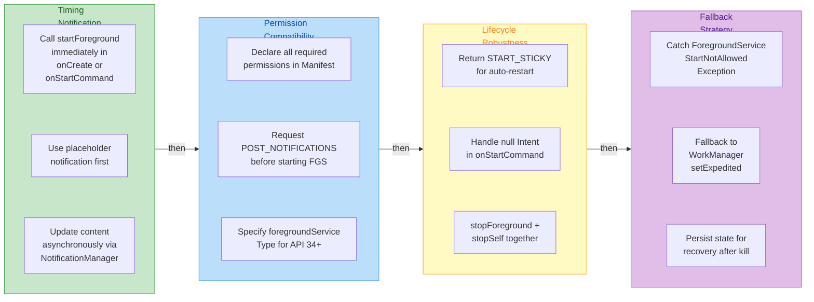
```mermaid
graph LR
    subgraph BP1["Timing\nNotification"]
        direction TB
        BP1A["Call startForeground\nimmediately in\nonCreate or\nonStartCommand"]
        BP1B["Use placeholder\nnotification first"]
        BP1C["Update content\nasynchronously via\nNotificationManager"]
        BP1A ~~~ BP1B
        BP1B ~~~ BP1C
    end
    subgraph BP2["Permission\nCompatibility"]
        direction TB
        BP2A["Declare all required\npermissions in Manifest"]
        BP2B["Request POST_NOTIFICATIONS\nbefore starting FGS"]
        BP2C["Specify foregroundService\nType for API 34+"]
        BP2A ~~~ BP2B
        BP2B ~~~ BP2C
    end
    subgraph BP3["Lifecycle\nRobustness"]
        direction TB
        BP3A["Return START_STICKY\nfor auto-restart"]
        BP3B["Handle null Intent\nin onStartCommand"]
        BP3C["stopForeground +\nstopSelf together"]
        BP3A ~~~ BP3B
        BP3B ~~~ BP3C
    end
    subgraph BP4["Fallback\nStrategy"]
        direction TB
        BP4A["Catch ForegroundService\nStartNotAllowed\nException"]
        BP4B["Fallback to\nWorkManager\nsetExpedited"]
        BP4C["Persist state for\nrecovery after kill"]
        BP4A ~~~ BP4B
        BP4B ~~~ BP4C
    end
    BP1 -->|"then"| BP2 -->|"then"| BP3 -->|"then"| BP4
    classDef timeCls fill:#C8E6C9,stroke:#43A047,color:#1B5E20
    classDef permCls fill:#BBDEFB,stroke:#42A5F5,color:#0D47A1
    classDef lifeCls fill:#FFF9C4,stroke:#F9A825,color:#F57F17
    classDef fallCls fill:#E1BEE7,stroke:#AB47BC,color:#4A148C
    class BP1 timeCls
    class BP2 permCls
    class BP3 lifeCls
    class BP4 fallCls
```

### 前台服务任务管理器（FGS Task Manager，Android 13+）

Android 13 引入了一个对用户体验影响深远的新特性：**前台服务任务管理器**（Foreground Service Task Manager）。用户下拉通知面板时，会在底部看到一个"Active apps"或"正在运行的应用"入口，点击后可以看到所有正在运行前台服务的应用列表，并且可以直接点击"Stop"按钮来终止它们。

这个特性的设计意图是将前台服务的控制权进一步交还给用户。在此之前，用户想要停止一个前台服务，需要进入应用设置 → 强制停止，操作路径较长。FGS Task Manager 大大缩短了这个路径。

对开发者的影响是：**你的前台服务随时可能被用户通过 FGS Task Manager 停止**。当用户点击"Stop"时，系统会调用 `Service.onDestroy()`，然后杀死整个应用进程（等同于"Force Stop"）。这意味着：

1. 你不能假设前台服务会一直运行到自然结束。
2. 你必须在 `onDestroy()` 中做好资源清理和状态保存。
3. 你应该设计好恢复机制，以便用户重新打开应用时能恢复之前的状态。

但也有一些豁免——以下类型的前台服务**不会**出现在 FGS Task Manager 中，用户无法通过它来停止：

* 与系统级功能绑定的服务（如设备管理器、设备策略控制器）
* `mediaPlayback` 类型的前台服务（因为它们通常有自己的媒体控制通知）
* 由 `phoneCall` 类型运行的通话服务

对于其他类型的前台服务，你需要做好被用户随时终止的心理准备，并在 UI 层面给予用户清晰的预期——告诉他们"停止此服务会导致什么后果"。

### 前台服务的完整生命周期时序

为了将本节所有知识点串联起来，以下时序图展示了一个前台服务从启动到被用户停止的完整生命周期，包括权限检查、Notification 绑定、进程优先级变化等关键节点：

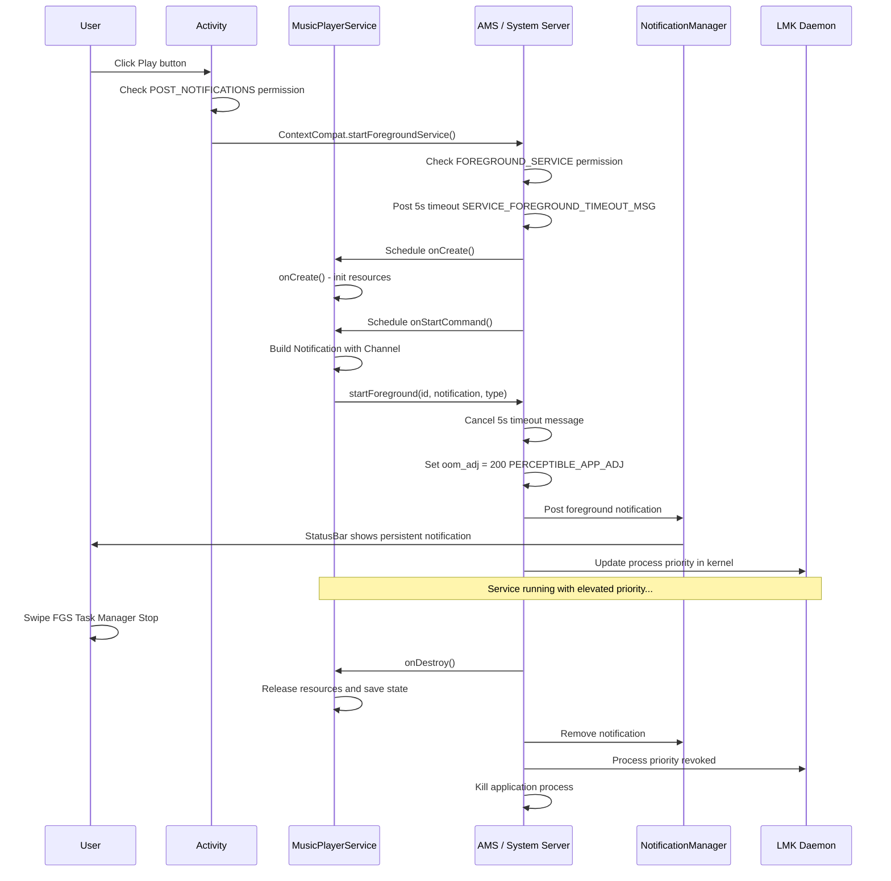
```mermaid
sequenceDiagram
    participant U as User
    participant A as Activity
    participant S as MusicPlayerService
    participant AMS as AMS / System Server
    participant NMS as NotificationManager
    participant LMK as LMK Daemon

    U->>A: Click Play button
    A->>A: Check POST_NOTIFICATIONS permission
    A->>AMS: ContextCompat.startForegroundService()
    AMS->>AMS: Check FOREGROUND_SERVICE permission
    AMS->>AMS: Post 5s timeout SERVICE_FOREGROUND_TIMEOUT_MSG
    AMS->>S: Schedule onCreate()
    S->>S: onCreate() - init resources
    AMS->>S: Schedule onStartCommand()
    S->>S: Build Notification with Channel
    S->>AMS: startForeground(id, notification, type)
    AMS->>AMS: Cancel 5s timeout message
    AMS->>AMS: Set oom_adj = 200 PERCEPTIBLE_APP_ADJ
    AMS->>NMS: Post foreground notification
    NMS->>U: StatusBar shows persistent notification
    AMS->>LMK: Update process priority in kernel

    Note over S,LMK: Service running with elevated priority...

    U->>U: Swipe FGS Task Manager Stop
    AMS->>S: onDestroy()
    S->>S: Release resources and save state
    AMS->>NMS: Remove notification
    AMS->>LMK: Process priority revoked
    AMS->>AMS: Kill application process
```

这张时序图清晰地展示了前台服务生命周期中各个参与者之间的交互关系。特别注意 AMS 在整个过程中扮演的"中枢调度"角色——它负责超时监控、优先级调整、通知转发等所有关键决策。应用层的 Service 只需要在正确的时机调用正确的 API，剩下的工作都由系统完成。

---

**📝 练习题 1**

一个应用在 Android 14（API 34）设备上通过 `startForegroundService()` 启动了一个 Service，但在 `onStartCommand()` 中执行了一个耗时 8 秒的同步网络请求，然后才调用 `startForeground()`。以下哪种情况会发生？

A. Service 正常运行，因为前台服务没有时间限制
B. 系统弹出 ANR 对话框，但 Service 继续运行
C. 系统抛出 `ForegroundServiceDidNotStartInTimeException`，应用 crash
D. 系统自动将 Service 降级为普通后台服务

**【答案】** C
**【解析】** 从 Android 12（API 31）开始，如果通过 `startForegroundService()` 启动的 Service 未能在 5 秒内调用 `startForeground()`，系统会抛出 `ForegroundServiceDidNotStartInTimeException`，导致应用 crash。在 Android 11 及以下版本中，系统的惩罚是弹出 ANR 对话框（对应选项 B），但从 Android 12 起，Google 将惩罚升级为直接 crash，以迫使开发者修复这个问题。正确的做法是先用占位通知立即调用 `startForeground()`，然后在异步回调中通过 `NotificationManager.notify()` 更新通知内容。选项 A 错误，因为 5 秒限制是硬性的；选项 D 错误，因为系统不会自动降级，而是直接惩罚。

---

**📝 练习题 2**

在 Android 14+ 设备上，以下哪种 `AndroidManifest.xml` 配置能够正确声明一个用于 GPS 导航的前台服务？

A.

```xml
<uses-permission android:name="android.permission.FOREGROUND_SERVICE" />
<service android:name=".NavService" android:exported="false" />
```

B.

```xml
<uses-permission android:name="android.permission.FOREGROUND_SERVICE" />
<uses-permission android:name="android.permission.FOREGROUND_SERVICE_LOCATION" />
<service android:name=".NavService"
    android:foregroundServiceType="location"
    android:exported="false" />
```

C.

```xml
<uses-permission android:name="android.permission.FOREGROUND_SERVICE" />
<uses-permission android:name="android.permission.FOREGROUND_SERVICE_LOCATION" />
<uses-permission android:name="android.permission.ACCESS_FINE_LOCATION" />
<service android:name=".NavService"
    android:foregroundServiceType="location"
    android:exported="false" />
```

D.

```xml
<uses-permission android:name="android.permission.ACCESS_FINE_LOCATION" />
<service android:name=".NavService"
    android:foregroundServiceType="location"
    android:exported="false" />
```

**【答案】** C

**【解析】** Android 14（API 34）对前台服务实施了"三重权限"要求，缺一不可：第一层是基础的 `FOREGROUND_SERVICE` 权限（API 28+ 必需，normal permission）；第二层是类型专属权限 `FOREGROUND_SERVICE_LOCATION`（API 34+ 必需，normal permission）；第三层是功能本身需要的运行时权限 `ACCESS_FINE_LOCATION`（或 `ACCESS_COARSE_LOCATION`）。同时，`<service>` 标签中必须声明 `android:foregroundServiceType="location"`。选项 A 缺少类型专属权限、定位权限和 `foregroundServiceType` 声明；选项 B 缺少 `ACCESS_FINE_LOCATION` 运行时权限；选项 D 缺少基础的 `FOREGROUND_SERVICE` 权限和类型专属权限。只有选项 C 完整地声明了所有三层权限和 `foregroundServiceType`，是唯一正确的配置。

---

## 绑定机制（Binding Mechanism）

在 Android 四大组件的设计哲学中，Service 不仅可以作为一个"默默在后台跑任务"的独立工作者（Started Service），还可以扮演一个"服务提供者"的角色——其他组件（Activity、Fragment、甚至另一个 Service）通过 **绑定（Bind）** 的方式与之建立一条双向通信通道，像客户端调用服务器 API 一样，直接调用 Service 暴露出来的方法、获取返回值、甚至注册回调监听实时数据。这种模式就是 **Bound Service（绑定型服务）**，而支撑这一切的底层基石，正是 Android 独有的 **Binder 机制**。

要真正理解绑定机制，我们需要把三个核心概念拆开来看：**IBinder 接口**是"契约"，它定义了通信通道的最小能力；**Binder 对象**是"实现"，它是 IBinder 在应用层最常用的具体载体；**ServiceConnection** 是"桥梁回调"，它负责在客户端与服务端之间完成异步握手。三者协同工作，构成了 Android 绑定机制的完整闭环。

我们先从宏观视角看一下整个绑定流程的全貌，再逐一深入每个核心组件。

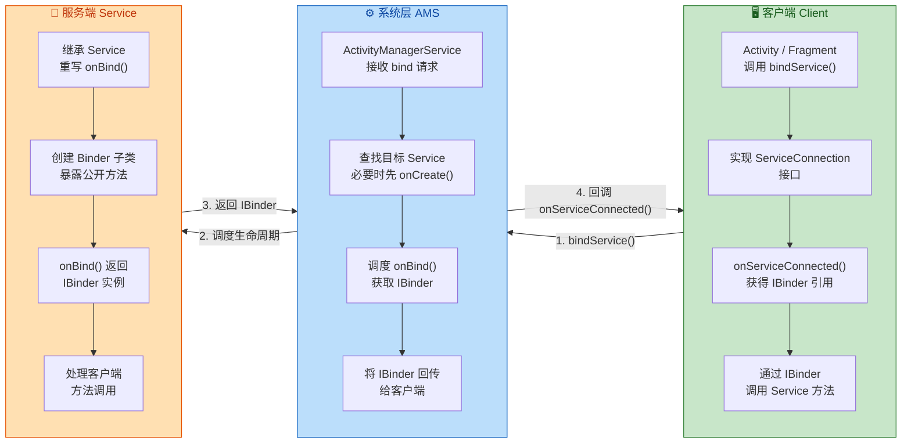
```mermaid
graph LR
    subgraph Client["🖥️ 客户端 Client"]
        direction TB
        A1["Activity / Fragment\n调用 bindService()"]
        A2["实现 ServiceConnection\n接口"]
        A3["onServiceConnected()\n获得 IBinder 引用"]
        A4["通过 IBinder\n调用 Service 方法"]
        A1 --> A2
        A2 --> A3
        A3 --> A4
    end

    subgraph System["⚙️ 系统层 AMS"]
        direction TB
        B1["ActivityManagerService\n接收 bind 请求"]
        B2["查找目标 Service\n必要时先 onCreate()"]
        B3["调度 onBind()\n获取 IBinder"]
        B4["将 IBinder 回传\n给客户端"]
        B1 --> B2
        B2 --> B3
        B3 --> B4
    end

    subgraph Server["🔧 服务端 Service"]
        direction TB
        C1["继承 Service\n重写 onBind()"]
        C2["创建 Binder 子类\n暴露公开方法"]
        C3["onBind() 返回\nIBinder 实例"]
        C4["处理客户端\n方法调用"]
        C1 --> C2
        C2 --> C3
        C3 --> C4
    end

    Client -->|"1. bindService()"| System
    System -->|"2. 调度生命周期"| Server
    Server -->|"3. 返回 IBinder"| System
    System -->|"4. 回调 onServiceConnected()"| Client

    classDef clientStyle fill:#C8E6C9,stroke:#2E7D32,color:#1B5E20
    classDef systemStyle fill:#BBDEFB,stroke:#1565C0,color:#0D47A1
    classDef serverStyle fill:#FFE0B2,stroke:#E65100,color:#BF360C

    class Client clientStyle
    class System systemStyle
    class Server serverStyle
```

上图清晰地展示了绑定的四步握手过程：客户端发起请求 → AMS 居中调度 → Service 返回 IBinder → 客户端拿到引用开始通信。这个过程是 **异步** 的——`bindService()` 调用后不会立即返回 IBinder，而是通过 ServiceConnection 回调在稍后的某个时刻通知你"连接已建立"。这一点与很多开发者的直觉不同，也是绑定机制中最容易踩坑的地方之一。

---

### IBinder 接口：通信契约的最小定义

要理解绑定机制，必须从最底层的 **IBinder 接口** 说起。IBinder 是 Android 框架中定义进程间通信（IPC）能力的 **根接口（root interface）**，它位于 `android.os` 包下，是整个 Binder IPC 体系的"宪法"——所有跨进程通信的对象，最终都必须实现这个接口。

IBinder 接口的核心设计思想可以用一句话概括：**它把任意的方法调用抽象成了一次"事务（Transaction）"**。无论你想调用 Service 的什么方法、传什么参数、拿什么返回值，在 IBinder 的视角里，这一切都被压缩成了一次 `transact()` 调用——你把方法编号（code）和序列化后的参数（Parcel data）塞进去，对方在 `onTransact()` 里解包、执行、把结果写回另一个 Parcel（reply）。这种设计的精妙之处在于：**它完全屏蔽了"对方在同一个进程还是另一个进程"这个细节**。

让我们看看 IBinder 接口的关键方法签名：

```java
// IBinder.java —— Android Binder IPC 的根接口
public interface IBinder {

    // 核心方法：发起一次事务调用
    // code: 方法编号，用于标识要调用的具体方法（如 TRANSACTION_getProgress = 1）
    // data: 输入参数，已序列化为 Parcel 格式
    // reply: 输出参数，调用完成后结果会写入此 Parcel
    // flags: 调用标志，0 表示同步阻塞调用，FLAG_ONEWAY 表示异步单向调用（不等待返回）
    public boolean transact(int code, Parcel data, Parcel reply, int flags)
        throws RemoteException;

    // 查询该 Binder 对象的接口描述符（Interface Descriptor）
    // 通常是 AIDL 接口的全限定名，如 "com.example.IMyService"
    // 用于在 IPC 场景下验证对方确实实现了你期望的接口
    public String getInterfaceDescriptor() throws RemoteException;

    // 检查 Binder 对象所在的进程是否还活着
    // 返回 true 表示对端进程存活，false 表示已死亡
    public boolean pingBinder();

    // 判断当前 Binder 对象是否仍然有效（进程未死亡）
    public boolean isBinderAlive();

    // 尝试获取该 Binder 对象上实现的本地接口
    // descriptor: 接口描述符，用于匹配
    // 如果调用方和 Binder 在同一进程，直接返回本地 Java 对象（避免 IPC 开销）
    // 如果跨进程，返回 null，此时需要通过 transact() 走 IPC 通道
    public IInterface queryLocalInterface(String descriptor);

    // 注册一个死亡通知回调
    // 当 Binder 对象所在的进程意外死亡时，系统会回调 recipient.binderDied()
    // 这是客户端感知服务端进程崩溃的核心机制
    public void linkToDeath(DeathRecipient recipient, int flags)
        throws RemoteException;

    // 取消之前注册的死亡通知
    public boolean unlinkToDeath(DeathRecipient recipient, int flags);

    // 死亡通知回调接口
    public interface DeathRecipient {
        // 当 Binder 对端进程死亡时被调用
        // 注意：此回调在 Binder 线程池中执行，不是主线程
        public void binderDied();
    }

    // 事务调用标志：单向异步调用，调用方不等待返回结果
    static final int FLAG_ONEWAY = 0x00000001;
}
```

这里有几个非常值得深入理解的设计要点：

**第一，`transact()` / `onTransact()` 的对称设计。** 客户端调用 `transact()` 发送请求，服务端在 `onTransact()` 中接收并处理。这两个方法构成了 Binder 通信的"发送端"和"接收端"。在同进程场景下，`transact()` 实际上会直接调用到同一个 Java 对象的 `onTransact()` 方法，几乎没有额外开销；而在跨进程场景下，Kernel 中的 Binder 驱动（`/dev/binder`）会负责将 Parcel 数据从一个进程的地址空间拷贝到另一个进程，然后在目标进程的 Binder 线程池中触发 `onTransact()`。对于应用层开发者来说，这种透明性意味着：**你写的代码不需要关心对方在哪个进程，IBinder 会帮你搞定一切**。

**第二，`queryLocalInterface()` 的"短路优化"。** 这个方法是 Binder 框架实现"同进程零开销"的关键。当客户端拿到一个 IBinder 引用后，框架会先调用 `queryLocalInterface()` 检查：如果这个 IBinder 对象就在当前进程内，直接返回本地 Java 对象的引用，后续的方法调用就是普通的 Java 方法调用，完全不走 IPC；只有当返回 null（说明对方在另一个进程）时，才会生成一个 Proxy 对象，通过 `transact()` 走真正的 IPC 通道。这就是为什么 AIDL 生成的代码中总会有一个 `Stub.asInterface()` 方法——它的核心逻辑就是：先 `queryLocalInterface()`，有就直接用，没有就包一层 Proxy。

**第三，`linkToDeath()` 的死亡监听机制。** 在跨进程绑定场景中，服务端进程随时可能被系统杀死（内存不足、ANR、Crash 等）。如果客户端不知道服务端已经死了，继续调用方法就会抛出 `DeadObjectException`。`linkToDeath()` 提供了一种优雅的解决方案：客户端注册一个 `DeathRecipient`，当服务端进程死亡时，Binder 驱动会通知客户端进程，触发 `binderDied()` 回调。客户端可以在这个回调中做清理工作、尝试重新绑定等。这个机制在系统服务中被大量使用——比如 `ActivityManagerService` 就通过 `linkToDeath()` 监听每个 App 进程的存活状态。

**IBinder 与 Binder 的关系**，可以用一个简单的类比来理解：IBinder 是"接口规范"（就像 Java 中的 `List` 接口），而 Binder 是"默认实现"（就像 `ArrayList`）。你可以自己实现 IBinder 接口，但 99.9% 的情况下，你会直接继承 `Binder` 类，因为它已经帮你处理了线程安全、Parcel 序列化、跨进程传输等所有底层细节。

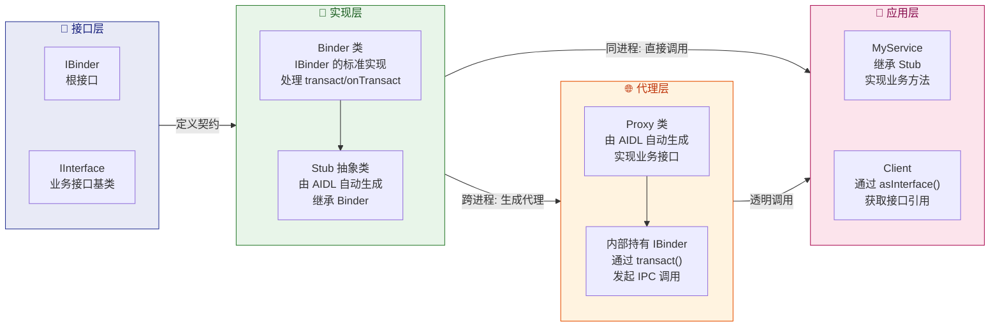
```mermaid
graph LR
    subgraph Interface["📜 接口层"]
        direction TB
        I1["IBinder\n根接口"]
        I2["IInterface\n业务接口基类"]
        I1 ~~~ I2
    end

    subgraph Impl["🔨 实现层"]
        direction TB
        B1["Binder 类\nIBinder 的标准实现\n处理 transact/onTransact"]
        B2["Stub 抽象类\n由 AIDL 自动生成\n继承 Binder"]
        B1 --> B2
    end

    subgraph Proxy["🌐 代理层"]
        direction TB
        P1["Proxy 类\n由 AIDL 自动生成\n实现业务接口"]
        P2["内部持有 IBinder\n通过 transact()\n发起 IPC 调用"]
        P1 --> P2
    end

    subgraph App["📱 应用层"]
        direction TB
        A1["MyService\n继承 Stub\n实现业务方法"]
        A2["Client\n通过 asInterface()\n获取接口引用"]
        A1 ~~~ A2
    end

    Interface -->|"定义契约"| Impl
    Impl -->|"同进程: 直接调用"| App
    Impl -->|"跨进程: 生成代理"| Proxy
    Proxy -->|"透明调用"| App

    classDef ifaceStyle fill:#E8EAF6,stroke:#283593,color:#1A237E
    classDef implStyle fill:#E8F5E9,stroke:#2E7D32,color:#1B5E20
    classDef proxyStyle fill:#FFF3E0,stroke:#E65100,color:#BF360C
    classDef appStyle fill:#FCE4EC,stroke:#AD1457,color:#880E4F

    class Interface ifaceStyle
    class Impl implStyle
    class Proxy proxyStyle
    class App appStyle
```

---

### Binder 对象：IBinder 的应用层主力实现

如果说 IBinder 是"通信契约"，那么 `android.os.Binder` 类就是这份契约在应用层最核心、最常用的 **具体实现**。几乎所有你在 Android 开发中遇到的绑定型 Service，底层都是通过 Binder 对象来完成通信的。

Binder 类继承自 `Object`，实现了 `IBinder` 接口。它的设计目标是：**让开发者只需要关注业务逻辑，而不需要操心 IPC 的底层细节**。当你继承 Binder 类并重写 `onTransact()` 方法时，你实际上是在定义"当客户端发来一个事务请求时，我该怎么处理"。但在实际开发中，绝大多数场景下你甚至不需要直接重写 `onTransact()`——因为有更高层的抽象（如 AIDL 生成的 Stub 类，或者更简单的 Local Binder 模式）帮你封装好了。

在应用层开发中，Binder 对象的使用主要分为三种模式，复杂度依次递增：

**模式一：Local Binder（本地 Binder）—— 同进程绑定的最简方案**

这是最常见、最简单的绑定模式，适用于 **Service 和客户端运行在同一个进程** 的场景（这也是绑大多数应用内 Service 的默认情况）。核心思路极其直白：自定义一个内部类继承 Binder，在这个内部类中提供一个 `getService()` 方法返回 Service 实例本身，客户端拿到 Service 实例后就可以直接调用其公开方法。

```kotlin
// ===== 服务端：MusicService.kt =====

// 一个简单的音乐播放服务，运行在 App 的主进程中
class MusicService : Service() {

    // 内部类 LocalBinder 继承自 android.os.Binder
    // 因为是内部类（inner class），它持有外部 MusicService 实例的引用
    inner class LocalBinder : Binder() {

        // 提供一个方法，让客户端可以获取到 MusicService 的实例
        // 客户端拿到实例后，就可以直接调用 MusicService 的任何公开方法
        fun getService(): MusicService = this@MusicService
    }

    // 创建 LocalBinder 实例，整个 Service 生命周期内只需要一个
    private val binder = LocalBinder()

    // 当客户端调用 bindService() 时，系统会调用此方法
    // 返回值就是传递给客户端的 IBinder 对象
    // 因为是同进程，客户端拿到的就是这个 LocalBinder 的直接引用（不走 IPC）
    override fun onBind(intent: Intent): IBinder {
        return binder
    }

    // ---- 以下是 Service 的业务方法，客户端可以直接调用 ----

    // 当前是否正在播放
    private var isPlaying = false

    // 开始播放音乐
    fun play() {
        isPlaying = true
        // 实际的 MediaPlayer 播放逻辑...
    }

    // 暂停播放
    fun pause() {
        isPlaying = false
        // 实际的 MediaPlayer 暂停逻辑...
    }

    // 获取当前播放进度（秒）
    fun getCurrentPosition(): Int {
        // 返回 MediaPlayer 的当前播放位置
        return 42 // 示例值
    }

    // 查询播放状态
    fun isCurrentlyPlaying(): Boolean = isPlaying
}
```

```kotlin
// ===== 客户端：MusicActivity.kt =====

class MusicActivity : AppCompatActivity() {

    // 持有 MusicService 的引用，绑定成功后赋值
    // 注意：在 onServiceConnected 之前，这个值为 null
    private var musicService: MusicService? = null

    // 标记当前是否已成功绑定
    // 用于在 onStop/onDestroy 中判断是否需要 unbind
    private var isBound = false

    // ServiceConnection 是绑定机制的核心回调接口
    // 它定义了两个回调方法，分别在连接建立和断开时触发
    private val connection = object : ServiceConnection {

        // 当与 Service 的连接建立成功时回调
        // name: 被绑定的 Service 的 ComponentName（包名 + 类名）
        // service: Service 的 onBind() 返回的 IBinder 对象
        override fun onServiceConnected(name: ComponentName?, service: IBinder?) {
            // 将 IBinder 强转为 LocalBinder 类型
            // 因为是同进程，这里拿到的就是 Service 中创建的那个 LocalBinder 实例
            val binder = service as MusicService.LocalBinder

            // 通过 LocalBinder 的 getService() 方法获取 MusicService 实例
            musicService = binder.getService()

            // 标记绑定成功
            isBound = true

            // 现在可以安全地调用 Service 的方法了
            // 例如：更新 UI 显示当前播放状态
            updatePlaybackUI()
        }

        // 当与 Service 的连接意外断开时回调
        // 注意：这个方法只在 Service 所在进程崩溃或被系统杀死时才会触发
        // 主动调用 unbindService() 不会触发此回调
        override fun onServiceDisconnected(name: ComponentName?) {
            musicService = null
            isBound = false
        }
    }

    override fun onStart() {
        super.onStart()

        // 创建指向 MusicService 的显式 Intent
        val intent = Intent(this, MusicService::class.java)

        // 调用 bindService() 发起绑定请求
        // 参数1: intent —— 指定要绑定的 Service
        // 参数2: connection —— ServiceConnection 回调实例
        // 参数3: flags —— 绑定标志，BIND_AUTO_CREATE 表示如果 Service 不存在则自动创建
        bindService(intent, connection, Context.BIND_AUTO_CREATE)
    }

    override fun onStop() {
        super.onStop()

        // 在 Activity 不可见时解除绑定
        // 必须检查 isBound，因为对未绑定的 Service 调用 unbindService 会抛异常
        if (isBound) {
            unbindService(connection)
            isBound = false
        }
    }

    // 业务方法：直接调用 Service 的方法
    private fun updatePlaybackUI() {
        // 通过持有的 Service 引用直接调用方法
        // 这就是普通的 Java/Kotlin 方法调用，没有任何 IPC 开销
        val position = musicService?.getCurrentPosition() ?: 0
        val playing = musicService?.isCurrentlyPlaying() ?: false

        // 更新 UI...
        // seekBar.progress = position
        // playButton.setImageResource(if (playing) R.drawable.pause else R.drawable.play)
    }

    // 用户点击播放按钮
    fun onPlayClicked() {
        if (musicService?.isCurrentlyPlaying() == true) {
            musicService?.pause()
        } else {
            musicService?.play()
        }
        updatePlaybackUI()
    }
}
```

Local Binder 模式的优势在于 **极致的简单性**：客户端直接持有 Service 的 Java 对象引用，方法调用就是普通的函数调用，没有序列化、没有 IPC、没有线程切换。但它的局限也很明显——**只能用于同进程**。如果你在 `AndroidManifest.xml` 中给 Service 配置了 `android:process=":remote"` 使其运行在独立进程中，Local Binder 模式就会失效，因为不同进程的内存空间是隔离的，你不可能直接持有另一个进程中 Java 对象的引用。

**模式二：Messenger（信使）—— 轻量级跨进程通信**

当 Service 运行在不同进程中，但通信需求比较简单（主要是发送 Message 消息，不需要复杂的方法调用和返回值）时，Messenger 是一个比 AIDL 更轻量的选择。Messenger 本质上是对 Binder 的一层封装——它内部持有一个 Handler 的 Binder 引用，客户端通过 Messenger 发送 Message，Message 会被传递到服务端的 Handler 中处理。我们会在"跨进程通信基础"章节中详细展开。

**模式三：AIDL Stub（AIDL 存根）—— 完整的跨进程方法调用**

当你需要跨进程调用 Service 的方法、传递复杂参数、获取返回值时，AIDL（Android Interface Definition Language）是标准方案。AIDL 编译器会自动生成一个 `Stub` 抽象类（继承自 Binder）和一个 `Proxy` 类（实现业务接口），开发者只需要在 Service 中继承 Stub 并实现业务方法即可。这部分同样会在"跨进程通信基础"章节中深入讲解。

现在让我们聚焦一个关键问题：**Binder 对象在绑定过程中是如何被传递的？**

当客户端调用 `bindService()` 时，请求会通过 Binder IPC 发送到 `ActivityManagerService`（AMS）。AMS 会检查目标 Service 是否已经在运行：如果没有，先创建 Service 实例并调用 `onCreate()`；然后调用 Service 的 `onBind()` 方法获取 IBinder 对象。这个 IBinder 对象会被 AMS "缓存"起来——如果后续有其他客户端绑定同一个 Service 且 Intent 匹配，AMS 会直接把缓存的 IBinder 分发给新客户端，**不会再次调用 `onBind()`**。这就是为什么 `onBind()` 通常只会被调用一次，而 `onUnbind()` 也只在所有客户端都解绑后才会被调用。

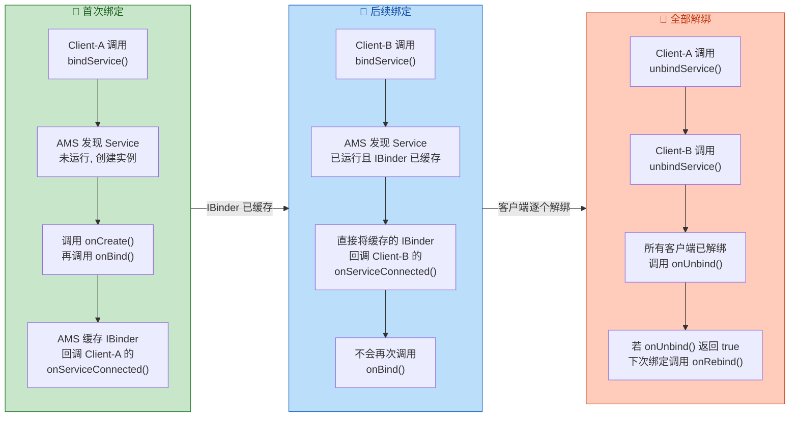
```mermaid
graph LR
    subgraph Phase1["📡 首次绑定"]
        direction TB
        P1A["Client-A 调用\nbindService()"]
        P1B["AMS 发现 Service\n未运行, 创建实例"]
        P1C["调用 onCreate()\n再调用 onBind()"]
        P1D["AMS 缓存 IBinder\n回调 Client-A 的\nonServiceConnected()"]
        P1A --> P1B
        P1B --> P1C
        P1C --> P1D
    end

    subgraph Phase2["📡 后续绑定"]
        direction TB
        P2A["Client-B 调用\nbindService()"]
        P2B["AMS 发现 Service\n已运行且 IBinder 已缓存"]
        P2C["直接将缓存的 IBinder\n回调 Client-B 的\nonServiceConnected()"]
        P2D["不会再次调用\nonBind()"]
        P2A --> P2B
        P2B --> P2C
        P2C --> P2D
    end

    subgraph Phase3["📡 全部解绑"]
        direction TB
        P3A["Client-A 调用\nunbindService()"]
        P3B["Client-B 调用\nunbindService()"]
        P3C["所有客户端已解绑\n调用 onUnbind()"]
        P3D["若 onUnbind() 返回 true\n下次绑定调用 onRebind()"]
        P3A --> P3B
        P3B --> P3C
        P3C --> P3D
    end

    Phase1 -->|"IBinder 已缓存"| Phase2
    Phase2 -->|"客户端逐个解绑"| Phase3

    classDef phase1Style fill:#C8E6C9,stroke:#2E7D32,color:#1B5E20
    classDef phase2Style fill:#BBDEFB,stroke:#1565C0,color:#0D47A1
    classDef phase3Style fill:#FFCCBC,stroke:#BF360C,color:#BF360C

    class Phase1 phase1Style
    class Phase2 phase2Style
    class Phase3 phase3Style
```

这个缓存机制带来了一个重要的设计含义：**`onBind()` 中返回的 IBinder 对象应该是"无状态的"或者说是"通用的"**，因为它会被分发给所有绑定的客户端。如果你需要为不同客户端提供不同的服务，应该在 IBinder 暴露的方法中通过参数来区分，而不是试图在 `onBind()` 中根据 Intent 返回不同的 IBinder（虽然技术上可以通过不同的 Intent action 返回不同的 IBinder，但这种做法并不常见）。

---

### ServiceConnection 回调：客户端与服务端的异步握手协议

`ServiceConnection` 是一个定义在 `android.content` 包下的接口，它是客户端感知绑定状态变化的 **唯一官方通道**。当你调用 `bindService()` 时，必须传入一个 ServiceConnection 实例，系统会在适当的时机通过这个接口通知你：连接建立了、连接断开了、或者绑定关系发生了变化。

ServiceConnection 接口定义了四个回调方法（其中两个是 API 26+ 新增的带 `Dead` 后缀的变体），但最核心的是前两个：

```java
// ServiceConnection.java —— 绑定状态回调接口
public interface ServiceConnection {

    // 【核心回调 1】当与 Service 的连接成功建立时调用
    // 这是客户端获取 IBinder 引用的唯一入口
    // name: 被绑定 Service 的 ComponentName（包含包名和类名）
    // service: Service 的 onBind() 方法返回的 IBinder 对象
    // 注意：此回调在客户端的主线程（Main Thread）中执行
    void onServiceConnected(ComponentName name, IBinder service);

    // 【核心回调 2】当与 Service 的连接意外丢失时调用
    // "意外丢失"指的是：Service 所在进程崩溃（Crash）或被系统杀死（OOM Kill）
    // 重要：主动调用 unbindService() 不会触发此回调！
    // name: 断开连接的 Service 的 ComponentName
    // 注意：此回调在客户端的主线程中执行
    void onServiceDisconnected(ComponentName name);

    // 【API 26+ 新增】当绑定关系意外死亡时调用
    // 与 onServiceDisconnected 的区别：
    // - onServiceDisconnected: Service 进程死亡，但绑定关系还在，系统可能会自动重连
    // - onBindingDied: 绑定关系本身已经失效，不会自动重连，需要手动 unbind 再 rebind
    // 典型场景：Service 在 onBind() 中返回 null，或者底层 Binder 通道彻底断裂
    default void onBindingDied(ComponentName name) {
        // 默认空实现，API 26 之前的代码不需要实现此方法
    }

    // 【API 26+ 新增】当 Service 的 onBind() 返回 null 时调用
    // 正常情况下 onBind() 应该返回一个有效的 IBinder
    // 如果返回 null，说明 Service 拒绝了此次绑定请求
    // 客户端收到此回调后应该调用 unbindService() 释放绑定
    default void onNullBinding(ComponentName name) {
        // 默认空实现
    }
}
```

这四个回调方法构成了客户端感知绑定生命周期的完整事件集。让我们逐一深入分析每个回调的触发时机、执行线程、以及开发中的注意事项。

**`onServiceConnected()` —— 连接建立的"握手完成"信号**

这是整个绑定机制中最重要的回调，没有之一。它的触发意味着：Service 已经创建完毕、`onBind()` 已经执行、IBinder 对象已经准备好——客户端现在可以安全地与 Service 通信了。

这个回调有几个容易被忽视但极其重要的特性：

第一，**它是异步的**。当你调用 `bindService()` 后，`onServiceConnected()` 不会立即触发。中间经历了一系列异步操作：请求发送到 AMS → AMS 调度 Service 创建 → Service 的 `onCreate()` 执行 → `onBind()` 执行 → IBinder 通过 Binder IPC 回传 → 主线程 Handler 投递回调消息 → 最终 `onServiceConnected()` 在下一个消息循环中执行。这意味着在 `bindService()` 返回后、`onServiceConnected()` 触发前，存在一个 **"绑定中"的中间状态**，此时你还不能使用 Service 的任何功能。很多初学者在 `bindService()` 之后立即尝试调用 Service 方法，结果拿到 `NullPointerException`——这就是没有理解异步性导致的经典错误。

第二，**它在主线程执行**。这意味着你可以在回调中安全地更新 UI（比如启用一个按钮、显示 Service 的状态），但不应该在回调中执行耗时操作（比如立即通过 IBinder 发起一个耗时的跨进程调用），否则会阻塞主线程。

第三，**它可能被多次调用**。虽然对于同一个 `bindService()` 调用，`onServiceConnected()` 通常只触发一次，但如果 Service 进程崩溃后系统自动重启了 Service（因为还有绑定关系存在），`onServiceConnected()` 会再次触发，传入新的 IBinder 对象。这意味着你的代码应该能够处理"IBinder 被替换"的情况——不要假设 `onServiceConnected()` 只会被调用一次。

**`onServiceDisconnected()` —— 意外断连的"警报"信号**

这个回调的名字容易产生误解。很多开发者以为调用 `unbindService()` 后会触发 `onServiceDisconnected()`——**这是错误的**。`onServiceDisconnected()` **只在 Service 所在进程意外终止时触发**，比如：

* Service 进程因内存不足被系统 OOM Killer 杀死
* Service 进程内部发生了未捕获的异常导致 Crash
* Service 进程被用户通过"强制停止"终止

当 `onServiceDisconnected()` 触发时，绑定关系并没有被解除——系统仍然记得你绑定了这个 Service。如果 Service 所在进程被重新启动（比如有其他组件触发了它的创建），系统会自动重新建立连接，并再次回调 `onServiceConnected()`。这就是所谓的 **自动重连机制（auto-reconnect）**。

```kotlin
// 一个健壮的 ServiceConnection 实现示例
// 展示如何正确处理各种绑定状态变化

class RobustServiceConnection : ServiceConnection {

    // 使用 volatile 保证多线程可见性
    // 虽然回调在主线程，但其他线程可能会读取这个状态
    @Volatile
    private var serviceBinder: IMyService? = null

    // 连接状态枚举，比简单的 boolean 更具表达力
    enum class State {
        DISCONNECTED,  // 未连接（初始状态 / unbind 后）
        CONNECTING,    // 连接中（bindService 已调用，等待回调）
        CONNECTED,     // 已连接（onServiceConnected 已触发）
        DEAD           // 连接死亡（onBindingDied 已触发，需要手动重连）
    }

    // 当前连接状态
    @Volatile
    var state: State = State.DISCONNECTED
        private set

    override fun onServiceConnected(name: ComponentName?, service: IBinder?) {
        // 通过 AIDL 生成的 asInterface() 方法将 IBinder 转换为业务接口
        // 如果是同进程，返回 Stub 本身（本地调用）
        // 如果是跨进程，返回 Proxy 对象（IPC 调用）
        serviceBinder = IMyService.Stub.asInterface(service)

        // 更新状态
        state = State.CONNECTED

        // 此时可以安全地使用 serviceBinder 调用 Service 的方法
        // 注意：如果是跨进程调用，耗时方法应该放到子线程中执行
        Log.d("Connection", "已连接到 Service: ${name?.className}")
    }

    override fun onServiceDisconnected(name: ComponentName?) {
        // Service 进程意外死亡
        // 清空 binder 引用，因为它已经失效了
        serviceBinder = null

        // 注意：这里不要设置为 DISCONNECTED
        // 因为绑定关系还在，系统可能会自动重连
        state = State.CONNECTING

        Log.w("Connection", "Service 进程意外终止: ${name?.className}，等待自动重连...")
    }

    override fun onBindingDied(name: ComponentName?) {
        // 绑定关系彻底死亡，不会自动重连
        serviceBinder = null
        state = State.DEAD

        Log.e("Connection", "绑定关系已死亡: ${name?.className}，需要手动重新绑定")

        // 在这里可以通知上层逻辑进行重新绑定
        // 但注意：不要在这个回调中直接调用 bindService()
        // 应该先 unbindService()，然后在下一个消息循环中重新 bindService()
    }

    override fun onNullBinding(name: ComponentName?) {
        // Service 的 onBind() 返回了 null
        // 这通常意味着 Service 拒绝了绑定请求
        state = State.DISCONNECTED

        Log.w("Connection", "Service 拒绝绑定（onBind 返回 null）: ${name?.className}")

        // 应该调用 unbindService() 释放绑定
    }

    // 提供给外部使用的安全调用方法
    // 只有在 CONNECTED 状态下才执行操作
    fun <T> withService(action: (IMyService) -> T): T? {
        return if (state == State.CONNECTED) {
            try {
                serviceBinder?.let(action)
            } catch (e: DeadObjectException) {
                // 即使状态是 CONNECTED，也可能因为进程刚刚死亡而抛出此异常
                // 此时 onServiceDisconnected 可能还没来得及回调
                Log.e("Connection", "调用 Service 时发现进程已死亡", e)
                serviceBinder = null
                state = State.CONNECTING
                null
            }
        } else {
            Log.w("Connection", "Service 未连接，当前状态: $state")
            null
        }
    }
}
```

**`bindService()` 的 flags 参数详解**

调用 `bindService()` 时，第三个参数 `flags` 控制着绑定行为的多个方面。这些标志位可以通过按位或（`|`）组合使用：

| Flag 常量                     | 值          | 含义                                            | 使用场景                                                |
| --------------------------- | ---------- | --------------------------------------------- | --------------------------------------------------- |
| `BIND_AUTO_CREATE`          | 0x0001     | 如果 Service 不存在则自动创建（触发 `onCreate` + `onBind`） | 最常用的标志，绑大多数绑定场景都需要                                  |
| `BIND_DEBUG_UNBIND`         | 0x0002     | 记录 unbind 的调用栈，用于调试泄漏                         | 仅调试阶段使用，会增加内存开销                                     |
| `BIND_NOT_FOREGROUND`       | 0x0004     | 不将 Service 的调度优先级提升到前台级别                      | 当绑定方是前台 Activity 但不希望提升 Service 优先级时                |
| `BIND_ABOVE_CLIENT`         | 0x0008     | 告诉系统：这个 Service 比绑定它的客户端更重要                   | 当 Service 承担关键任务（如数据同步）时，希望系统在内存紧张时优先杀客户端而非 Service |
| `BIND_ALLOW_OOM_MANAGEMENT` | 0x0010     | 允许系统在 OOM 时按正常规则管理 Service 进程                 | 当 Service 不是特别重要，可以被正常回收时                           |
| `BIND_WAIVE_PRIORITY`       | 0x0020     | 不影响 Service 所在进程的优先级                          | 当你不希望绑定行为改变 Service 的进程优先级时                         |
| `BIND_IMPORTANT`            | 0x0040     | 将 Service 进程提升到与前台 Activity 同等重要的级别           | 当 Service 对用户体验至关重要时（如实时通信）                         |
| `BIND_ADJUST_WITH_ACTIVITY` | 0x0080     | Service 的优先级随绑定它的 Activity 的可见性动态调整           | 当 Service 的重要性与 Activity 的可见状态强相关时                  |
| `BIND_EXTERNAL_SERVICE`     | 0x80000000 | 将 Service 运行在调用方的进程中（而非 Service 声明的进程）        | 插件化、沙箱隔离等高级场景（API 24+）                              |

其中 `BIND_AUTO_CREATE` 是最常用的，几乎所有绑定调用都会带上它。如果不带这个标志，`bindService()` 只会在 Service 已经通过 `startService()` 启动的情况下才能成功绑定——如果 Service 还没有运行，绑定请求会被挂起，直到有人启动了这个 Service。

这些 flags 的本质作用是 **影响 Service 所在进程的 OOM Adjustment 值**（即进程优先级）。Android 系统的 Low Memory Killer 根据进程的 `oom_adj` 值来决定在内存紧张时杀哪些进程。绑定关系会影响 Service 进程的 `oom_adj`——一般来说，被前台 Activity 绑定的 Service 进程会获得较高的优先级（不容易被杀），而上面这些 flags 就是让开发者可以微调这种优先级传递行为。

```mermaid
graph LR
    subgraph Flags["🏴 bindService Flags"]
        direction TB
        F1["BIND_AUTO_CREATE\n自动创建 Service"]
        F2["BIND_IMPORTANT\n提升进程优先级"]
        F3["BIND_ABOVE_CLIENT\nService 比客户端更重要"]
        F4["BIND_NOT_FOREGROUND\n不提升到前台级别"]
        F5["BIND_WAIVE_PRIORITY\n不影响进程优先级"]
        F1 ~~~ F2
        F2 ~~~ F3
        F3 ~~~ F4
        F4 ~~~ F5
    end

    subgraph Effect["📊 对进程优先级的影响"]
        direction TB
        E1["oom_adj 值降低\n= 进程更重要\n= 更不容易被杀"]
        E2["oom_adj 值不变\n= 保持原有优先级"]
        E3["oom_adj 值升高\n= 进程不太重要\n= 可以被正常回收"]
        E1 ~~~ E2
        E2 ~~~ E3
    end

    subgraph Scenario["💡 典型场景"]
        direction TB
        S1["音乐播放器\nBIND_AUTO_CREATE\n+ BIND_IMPORTANT"]
        S2["后台数据同步\nBIND_AUTO_CREATE\n+ BIND_ABOVE_CLIENT"]
        S3["非关键统计上报\nBIND_AUTO_CREATE\n+ BIND_WAIVE_PRIORITY"]
        S1 ~~~ S2
        S2 ~~~ S3
    end

    Flags -->|"控制"| Effect
    Effect -->|"决定"| Scenario

    classDef flagStyle fill:#E3F2FD,stroke:#1565C0,color:#0D47A1
    classDef effectStyle fill:#FFF9C4,stroke:#F9A825,color:#E65100
    classDef scenarioStyle fill:#E8F5E9,stroke:#2E7D32,color:#1B5E20

    class Flags flagStyle
    class Effect effectStyle
    class Scenario scenarioStyle
```

**绑定与解绑的生命周期配对原则**

这是一个在实际开发中极其重要但经常被忽视的原则：**`bindService()` 和 `unbindService()` 必须严格配对，且遵循组件的生命周期**。

违反这个原则会导致两类严重问题：

1. **Service 泄漏（Service Leak）**：如果你在 `onCreate()` 中 bind 但忘记在 `onDestroy()` 中 unbind，或者在 `onStart()` 中 bind 但在 `onDestroy()` 中 unbind（生命周期不对称），当 Activity 被销毁时，系统会在 Logcat 中打印一条著名的警告：`Activity has leaked ServiceConnection`。这不仅是内存泄漏，还会导致 Service 无法被正常销毁（因为系统认为还有客户端绑定着它）。

2. **IllegalArgumentException**：如果你对同一个 ServiceConnection 调用了两次 `unbindService()`，或者对一个从未绑定过的 ServiceConnection 调用 `unbindService()`，系统会直接抛出 `IllegalArgumentException: Service not registered`。

正确的配对方式如下：

```kotlin
// ===== 正确的绑定/解绑生命周期配对 =====

class CorrectBindingActivity : AppCompatActivity() {

    private var isBound = false

    private val connection = object : ServiceConnection {
        override fun onServiceConnected(name: ComponentName?, service: IBinder?) {
            isBound = true
            // ... 获取 Service 引用
        }
        override fun onServiceDisconnected(name: ComponentName?) {
            isBound = false
            // ... 清理引用
        }
    }

    // ✅ 方案一：onStart / onStop 配对
    // 适用于：只在 Activity 可见时需要与 Service 通信
    // 优点：Activity 不可见时释放绑定，减少资源占用
    override fun onStart() {
        super.onStart()
        // 在 onStart 中绑定
        Intent(this, MyService::class.java).also { intent ->
            bindService(intent, connection, Context.BIND_AUTO_CREATE)
        }
    }

    override fun onStop() {
        super.onStop()
        // 在 onStop 中解绑 —— 与 onStart 严格配对
        if (isBound) {
            unbindService(connection)
            isBound = false
        }
    }

    // ✅ 方案二：onCreate / onDestroy 配对
    // 适用于：在 Activity 整个生命周期内都需要与 Service 保持连接
    // 注意：即使 Activity 在后台，绑定关系也会维持
    // 这会影响 Service 进程的优先级（使其不容易被杀）
    /*
    override fun onCreate(savedInstanceState: Bundle?) {
        super.onCreate(savedInstanceState)
        Intent(this, MyService::class.java).also { intent ->
            bindService(intent, connection, Context.BIND_AUTO_CREATE)
        }
    }

    override fun onDestroy() {
        super.onDestroy()
        if (isBound) {
            unbindService(connection)
            isBound = false
        }
    }
    */

    // ❌ 错误示范：在 onResume 中 bind，在 onPause 中 unbind
    // 问题：onResume/onPause 调用频率很高（如弹出对话框、分屏切换）
    // 频繁的 bind/unbind 会导致 Service 反复创建和销毁，严重影响性能
    // 除非你有非常明确的理由，否则不要这样做
}
```

**多客户端绑定的引用计数机制**

当多个组件同时绑定同一个 Service 时，系统内部维护着一个 **引用计数器（reference count）**。每次 `bindService()` 成功，计数加一；每次 `unbindService()` 调用，计数减一。只有当计数归零（即所有客户端都解绑了），系统才会调用 Service 的 `onUnbind()` 方法，并且如果这个 Service 没有通过 `startService()` 启动过（即它是纯绑定型 Service），系统还会接着调用 `onDestroy()` 销毁它。

这个引用计数机制的一个重要推论是：**单个客户端的 unbind 不会影响其他客户端的绑定关系**。比如 Activity-A 和 Activity-B 都绑定了同一个 MusicService，当 Activity-A 解绑时，Activity-B 的连接不受任何影响，MusicService 也不会被销毁。

```mermaid
graph LR
    subgraph Clients["👥 多客户端"]
        direction TB
        CA["Activity-A\nbindService()"]
        CB["Activity-B\nbindService()"]
        CC["Fragment-C\nbindService()"]
        CA ~~~ CB
        CB ~~~ CC
    end

    subgraph RefCount["🔢 AMS 引用计数"]
        direction TB
        R1["bind count = 3\nService 存活"]
        R2["A unbind\ncount = 2\nService 存活"]
        R3["B unbind\ncount = 1\nService 存活"]
        R4["C unbind\ncount = 0\n调用 onUnbind()"]
        R1 --> R2
        R2 --> R3
        R3 --> R4
    end

    subgraph Lifecycle["♻️ Service 生命周期"]
        direction TB
        L1["onCreate()\n首次绑定时创建"]
        L2["onBind()\n返回 IBinder\n仅调用一次"]
        L3["onUnbind()\n所有客户端解绑"]
        L4["onDestroy()\n纯绑定型 Service\n引用归零后销毁"]
        L1 --> L2
        L2 --> L3
        L3 --> L4
    end

    Clients -->|"绑定请求"| RefCount
    RefCount -->|"驱动"| Lifecycle

    classDef clientStyle fill:#E8F5E9,stroke:#2E7D32,color:#1B5E20
    classDef refStyle fill:#FFF9C4,stroke:#F9A825,color:#E65100
    classDef lcStyle fill:#E3F2FD,stroke:#1565C0,color:#0D47A1

    class Clients clientStyle
    class RefCount refStyle
    class Lifecycle lcStyle
```

**`onRebind()` 的触发条件与使用场景**

在 Service 的生命周期回调中，有一个不太常见但设计精巧的方法：`onRebind(Intent intent)`。它的触发条件非常特殊：**只有当 `onUnbind()` 返回 `true` 时，下一次有客户端绑定时才会调用 `onRebind()` 而不是 `onBind()`**。

默认情况下，`onUnbind()` 返回 `false`，这意味着后续的绑定请求会直接使用 AMS 缓存的 IBinder，不会触发任何 Service 端的回调。但如果你重写 `onUnbind()` 并返回 `true`，你就是在告诉系统："当所有客户端都解绑后，如果又有新客户端来绑定，请通知我一下（调用 `onRebind()`），我可能需要做一些重新初始化的工作。"

```kotlin
// 展示 onRebind() 机制的 Service 实现
class StatefulService : Service() {

    private val binder = LocalBinder()

    inner class LocalBinder : Binder() {
        fun getService(): StatefulService = this@StatefulService
    }

    override fun onBind(intent: Intent): IBinder {
        // 首次绑定时调用
        // 初始化资源、建立连接等
        Log.d("StatefulService", "onBind: 首次绑定，初始化资源")
        initializeResources()
        return binder
    }

    override fun onUnbind(intent: Intent): Boolean {
        // 所有客户端都解绑后调用
        Log.d("StatefulService", "onUnbind: 所有客户端已解绑")

        // 释放部分资源，但保留核心状态
        releasePartialResources()

        // 返回 true：告诉系统，下次有客户端绑定时调用 onRebind() 而非 onBind()
        // 返回 false（默认）：下次绑定时直接使用缓存的 IBinder，不通知 Service
        return true
    }

    override fun onRebind(intent: Intent) {
        // 只有 onUnbind() 返回 true 时，这个方法才会被调用
        // 在这里重新初始化之前释放的资源
        Log.d("StatefulService", "onRebind: 有新客户端绑定，重新初始化资源")
        reinitializeResources()
    }

    override fun onDestroy() {
        super.onDestroy()
        // 完全释放所有资源
        releaseAllResources()
    }

    // ---- 资源管理方法 ----
    private fun initializeResources() { /* 初始化数据库连接、传感器监听等 */ }
    private fun releasePartialResources() { /* 释放传感器监听，但保留数据库连接 */ }
    private fun reinitializeResources() { /* 重新注册传感器监听 */ }
    private fun releaseAllResources() { /* 释放一切资源 */ }
}
```

这种模式在需要"热重连"的场景中非常有用——比如一个传感器数据采集 Service，当所有 Activity 都离开时暂停采集（节省电量），当有 Activity 回来时恢复采集，但不需要重新建立底层连接。

**完整的绑定型 Service 生命周期流转**

把上面所有知识点串联起来，我们可以画出绑定型 Service 完整的生命周期流转图：

```mermaid
graph LR
    subgraph Init["🚀 初始化阶段"]
        direction TB
        N1["Service 不存在"]
        N2["客户端调用\nbindService()"]
        N3["AMS 创建 Service\n调用 onCreate()"]
        N1 --> N2
        N2 --> N3
    end

    subgraph Bindphase["🔗 绑定阶段"]
        direction TB
        B1["AMS 调用\nonBind()"]
        B2["Service 返回\nIBinder 对象"]
        B3["AMS 缓存 IBinder\n回调客户端\nonServiceConnected()"]
        B4["客户端通过 IBinder\n与 Service 通信"]
        B1 --> B2
        B2 --> B3
        B3 --> B4
    end

    subgraph Unbindphase["🔓 解绑阶段"]
        direction TB
        U1["所有客户端调用\nunbindService()"]
        U2["AMS 调用\nonUnbind()"]
        U3{"onUnbind()\n返回值?"}
        U4["返回 false\n下次直接用缓存"]
        U5["返回 true\n下次调用 onRebind()"]
        U1 --> U2
        U2 --> U3
        U3 --> U4
        U3 --> U5
    end

    subgraph Destroy["💀 销毁阶段"]
        direction TB
        D1["纯绑定型 Service\n无 startService 调用"]
        D2["AMS 调用\nonDestroy()"]
        D3["Service 实例\n被回收"]
        D1 --> D2
        D2 --> D3
    end

    Init -->|"Service 已创建"| Bindphase
    Bindphase -->|"客户端解绑"| Unbindphase
    Unbindphase -->|"引用计数归零"| Destroy

    classDef initStyle fill:#C8E6C9,stroke:#2E7D32,color:#1B5E20
    classDef bindStyle fill:#BBDEFB,stroke:#1565C0,color:#0D47A1
    classDef unbindStyle fill:#FFE0B2,stroke:#E65100,color:#BF360C
    classDef destroyStyle fill:#FFCDD2,stroke:#C62828,color:#B71C1C

    class Init initStyle
    class Bindphase bindStyle
    class Unbindphase unbindStyle
    class Destroy destroyStyle
```

**混合型 Service（Started + Bound）的生命周期特殊性**

在实际开发中，一个 Service 经常同时被 `startService()` 启动和被 `bindService()` 绑定——这就是所谓的"混合型 Service"。最典型的例子就是音乐播放器：通过 `startService()` 让 Service 在后台持续播放（即使所有 Activity 都关闭了也不停止），同时通过 `bindService()` 让当前可见的 Activity 能够控制播放进度、切换歌曲。

混合型 Service 的生命周期规则可以用一句话概括：**`onCreate()` 只调用一次，`onDestroy()` 也只调用一次，但销毁条件变成了"既没有 start 也没有 bind"**。换句话说，系统内部维护着两个独立的计数器——start 计数和 bind 引用计数，只有当两个计数器都归零时，Service 才会被销毁。

这个规则带来了一个非常重要的实践含义：**如果你只 unbind 但没有 stopService（或 stopSelf），Service 不会被销毁；反过来，如果你只 stop 但还有客户端绑定着，Service 也不会被销毁**。只有两个条件同时满足——所有客户端都解绑了，且 Service 也被 stop 了——`onDestroy()` 才会被调用。

```kotlin
// ===== 混合型 Service 的典型实现：音乐播放服务 =====

class MusicPlayerService : Service() {

    // ---- Binder 相关 ----
    // 内部类 Binder，提供给客户端直接调用 Service 方法的能力
    inner class MusicBinder : Binder() {
        // 返回 Service 实例，客户端可以调用其公开方法
        fun getService(): MusicPlayerService = this@MusicPlayerService
    }

    // Binder 实例，整个 Service 生命周期内只需要一个
    private val binder = MusicBinder()

    // ---- 播放状态 ----
    private var mediaPlayer: MediaPlayer? = null
    private var currentTrack: String? = null
    private var isPlaying = false

    // ---- 生命周期回调 ----

    override fun onCreate() {
        super.onCreate()
        // 无论是 startService 还是 bindService 先触发
        // onCreate 都只会被调用一次
        Log.d("MusicPlayer", "onCreate: Service 实例创建")

        // 初始化 MediaPlayer 等资源
        mediaPlayer = MediaPlayer()
    }

    override fun onStartCommand(intent: Intent?, flags: Int, startId: Int): Int {
        // 通过 startService() 触发
        // 通常用于接收"开始播放"、"暂停"、"下一首"等命令
        val action = intent?.action
        Log.d("MusicPlayer", "onStartCommand: 收到命令 action=$action, startId=$startId")

        when (action) {
            "ACTION_PLAY" -> {
                // 从 Intent 中获取要播放的音轨信息
                currentTrack = intent.getStringExtra("track_url")
                play()
            }
            "ACTION_PAUSE" -> pause()
            "ACTION_STOP" -> {
                pause()
                // 调用 stopSelf() 标记 Service 可以被停止
                // 但如果还有客户端绑定着，Service 不会立即销毁
                stopSelf()
            }
        }

        // 返回 START_STICKY：如果进程被杀，系统会尝试重新创建 Service
        // 适合音乐播放这种需要持续运行的场景
        return START_STICKY
    }

    override fun onBind(intent: Intent): IBinder {
        // 通过 bindService() 触发（仅首次绑定时调用）
        Log.d("MusicPlayer", "onBind: 客户端绑定，返回 IBinder")
        return binder
    }

    override fun onUnbind(intent: Intent): Boolean {
        // 所有客户端都解绑后调用
        Log.d("MusicPlayer", "onUnbind: 所有客户端已解绑")

        // 返回 true，这样下次有客户端绑定时会调用 onRebind
        // 对于音乐播放器来说，用户可能频繁地打开/关闭播放界面
        // 使用 onRebind 可以在用户回来时做一些 UI 状态同步
        return true
    }

    override fun onRebind(intent: Intent) {
        // 当 onUnbind 返回 true 且有新客户端绑定时调用
        Log.d("MusicPlayer", "onRebind: 新客户端重新绑定")
    }

    override fun onDestroy() {
        super.onDestroy()
        // 只有当 start 计数和 bind 引用计数都归零时才会调用
        // 即：stopService/stopSelf 已调用 且 所有客户端已 unbind
        Log.d("MusicPlayer", "onDestroy: Service 销毁，释放所有资源")

        // 释放 MediaPlayer 资源
        mediaPlayer?.release()
        mediaPlayer = null
    }

    // ---- 业务方法（客户端通过 Binder 调用） ----

    fun play() {
        isPlaying = true
        // mediaPlayer?.start()
        Log.d("MusicPlayer", "开始播放: $currentTrack")
    }

    fun pause() {
        isPlaying = false
        // mediaPlayer?.pause()
        Log.d("MusicPlayer", "暂停播放")
    }

    fun getCurrentPosition(): Int {
        return mediaPlayer?.currentPosition ?: 0
    }

    fun isCurrentlyPlaying(): Boolean = isPlaying
}
```

```kotlin
// ===== 客户端：PlayerActivity.kt =====
// 展示如何同时使用 startService 和 bindService

class PlayerActivity : AppCompatActivity() {

    private var musicService: MusicPlayerService? = null
    private var isBound = false

    private val connection = object : ServiceConnection {
        override fun onServiceConnected(name: ComponentName?, service: IBinder?) {
            // 绑定成功，获取 Service 引用
            val binder = service as MusicPlayerService.MusicBinder
            musicService = binder.getService()
            isBound = true

            // 绑定成功后立即更新 UI
            // 比如显示当前播放进度、歌曲信息等
            refreshUI()
        }

        override fun onServiceDisconnected(name: ComponentName?) {
            // Service 进程意外死亡时触发
            musicService = null
            isBound = false
        }
    }

    override fun onCreate(savedInstanceState: Bundle?) {
        super.onCreate(savedInstanceState)
        // setContentView(...)

        // 第一步：通过 startService 启动 Service 并开始播放
        // 这确保了即使 Activity 被销毁，音乐也会继续播放
        val startIntent = Intent(this, MusicPlayerService::class.java).apply {
            action = "ACTION_PLAY"
            putExtra("track_url", "https://example.com/song.mp3")
        }
        startService(startIntent)
    }

    override fun onStart() {
        super.onStart()

        // 第二步：通过 bindService 绑定 Service
        // 这样 Activity 可以直接调用 Service 的方法来控制播放
        val bindIntent = Intent(this, MusicPlayerService::class.java)
        bindService(bindIntent, connection, Context.BIND_AUTO_CREATE)
    }

    override fun onStop() {
        super.onStop()

        // Activity 不可见时解除绑定
        // 但 Service 不会被销毁，因为它还处于 started 状态
        if (isBound) {
            unbindService(connection)
            isBound = false
            musicService = null
        }
    }

    // 用户点击播放/暂停按钮
    fun onPlayPauseClicked() {
        if (isBound) {
            // 通过绑定的 Service 引用直接调用方法
            if (musicService?.isCurrentlyPlaying() == true) {
                musicService?.pause()
            } else {
                musicService?.play()
            }
            refreshUI()
        }
    }

    // 用户点击停止按钮 —— 彻底停止播放并销毁 Service
    fun onStopClicked() {
        // 先解绑
        if (isBound) {
            unbindService(connection)
            isBound = false
            musicService = null
        }

        // 再停止 Service
        // 此时 bind 引用计数为 0，stop 也已调用
        // Service 的 onDestroy() 会被触发
        val stopIntent = Intent(this, MusicPlayerService::class.java)
        stopService(stopIntent)
    }

    private fun refreshUI() {
        // 更新播放按钮状态、进度条等
        val playing = musicService?.isCurrentlyPlaying() ?: false
        val position = musicService?.getCurrentPosition() ?: 0
        // playPauseButton.setImageResource(...)
        // seekBar.progress = position
    }
}
```

混合型 Service 的销毁条件可以用下面这张决策表来清晰地表达：

| 状态   | 是否被 start | 是否被 bind | Service 是否存活 | 说明                                 |
| ---- | --------- | -------- | ------------ | ---------------------------------- |
| 状态 A | ✅ 是       | ✅ 是      | ✅ 存活         | 最常见的运行状态，两种方式都在维持 Service          |
| 状态 B | ✅ 是       | ❌ 否      | ✅ 存活         | 所有客户端解绑了，但 Service 仍在 started 状态运行 |
| 状态 C | ❌ 否       | ✅ 是      | ✅ 存活         | stopService/stopSelf 已调用，但还有客户端绑定着 |
| 状态 D | ❌ 否       | ❌ 否      | ❌ 销毁         | 两个条件都满足，系统调用 onDestroy()           |

这张表揭示了一个关键设计原则：**start 和 bind 是两个独立的"生命维持系统"，任何一个还在工作，Service 就不会死**。这种设计给了开发者极大的灵活性——你可以让 Service 在没有任何 UI 组件绑定时仍然在后台运行（通过 start），也可以让 Service 的生命周期完全由绑定关系决定（纯 bind 模式）。

**绑定机制中的常见陷阱与最佳实践**

在多年的 Android 开发实践中，绑定机制相关的 Bug 是最常见的"隐蔽杀手"之一。这些 Bug 往往不会在开发阶段暴露，而是在用户的各种奇怪操作路径下才会触发。以下是最常见的陷阱和对应的最佳实践：

**陷阱一：在 `onServiceConnected()` 之前使用 Service 引用**

```kotlin
// ❌ 错误示范
class BadActivity : AppCompatActivity() {
    private var myService: MyService? = null

    override fun onStart() {
        super.onStart()
        bindService(intent, connection, BIND_AUTO_CREATE)

        // 危险！bindService 是异步的
        // 此时 onServiceConnected 还没有被回调
        // myService 仍然是 null
        myService?.doSomething() // NullPointerException!
    }
}

// ✅ 正确做法：在 onServiceConnected 回调中使用
// 或者使用标志位 + 队列模式，将操作延迟到连接建立后执行
class GoodActivity : AppCompatActivity() {
    private var myService: MyService? = null
    // 用一个队列缓存"连接建立前"的操作请求
    private val pendingActions = mutableListOf<(MyService) -> Unit>()

    private val connection = object : ServiceConnection {
        override fun onServiceConnected(name: ComponentName?, service: IBinder?) {
            val binder = service as MyService.LocalBinder
            myService = binder.getService()

            // 连接建立后，执行所有挂起的操作
            pendingActions.forEach { action ->
                myService?.let(action)
            }
            // 清空队列
            pendingActions.clear()
        }

        override fun onServiceDisconnected(name: ComponentName?) {
            myService = null
        }
    }

    // 安全地执行 Service 操作
    // 如果已连接，立即执行；如果未连接，加入队列等待
    private fun executeOnService(action: (MyService) -> Unit) {
        val service = myService
        if (service != null) {
            // 已连接，立即执行
            action(service)
        } else {
            // 未连接，加入等待队列
            pendingActions.add(action)
        }
    }
}
```

**陷阱二：Activity 配置变更（Configuration Change）导致的绑定泄漏**

当屏幕旋转等配置变更发生时，Activity 会被销毁并重建。如果你在 `onCreate()` 中绑定但依赖 `onDestroy()` 解绑，需要注意：在某些极端情况下（如系统内存紧张），`onDestroy()` 可能不会被及时调用。更安全的做法是使用 `ViewModel` + `LiveData` 或者 `Lifecycle` 感知组件来管理绑定关系：

```kotlin
// ✅ 使用 Lifecycle 感知的绑定管理器
// 自动在正确的生命周期节点 bind/unbind，避免泄漏

class ServiceBindingManager<T>(
    // 要绑定的 Service 的 Class
    private val serviceClass: Class<*>,
    // 如何从 IBinder 中提取业务接口/Service 引用
    private val extractService: (IBinder) -> T
) : DefaultLifecycleObserver {

    // 使用 LiveData 暴露 Service 引用
    // 客户端观察这个 LiveData 即可在连接建立时收到通知
    private val _service = MutableLiveData<T?>()
    val service: LiveData<T?> = _service

    // 持有 Context 的弱引用，避免内存泄漏
    private var contextRef: WeakReference<Context>? = null
    private var isBound = false

    private val connection = object : ServiceConnection {
        override fun onServiceConnected(name: ComponentName?, service: IBinder?) {
            // 将 IBinder 转换为业务类型并发布到 LiveData
            service?.let {
                _service.postValue(extractService(it))
            }
        }

        override fun onServiceDisconnected(name: ComponentName?) {
            // 清空 LiveData，观察者会收到 null 通知
            _service.postValue(null)
        }
    }

    // 绑定到指定 LifecycleOwner（如 Activity/Fragment）
    // 当 LifecycleOwner 进入 ON_START 时自动 bind
    // 当 LifecycleOwner 进入 ON_STOP 时自动 unbind
    fun bindTo(owner: LifecycleOwner, context: Context) {
        contextRef = WeakReference(context)
        // 注册生命周期观察者
        owner.lifecycle.addObserver(this)
    }

    override fun onStart(owner: LifecycleOwner) {
        // 生命周期进入 STARTED 状态，自动绑定
        val context = contextRef?.get() ?: return
        val intent = Intent(context, serviceClass)
        context.bindService(intent, connection, Context.BIND_AUTO_CREATE)
        isBound = true
    }

    override fun onStop(owner: LifecycleOwner) {
        // 生命周期进入 STOPPED 状态，自动解绑
        if (isBound) {
            contextRef?.get()?.unbindService(connection)
            isBound = false
            _service.postValue(null)
        }
    }

    override fun onDestroy(owner: LifecycleOwner) {
        // 清理引用
        contextRef = null
        // 移除生命周期观察者，避免内存泄漏
        owner.lifecycle.removeObserver(this)
    }
}
```

```kotlin
// 在 Activity 中使用 ServiceBindingManager
class ModernPlayerActivity : AppCompatActivity() {

    // 创建绑定管理器，指定 Service 类型和 IBinder 转换逻辑
    private val musicBinding = ServiceBindingManager(
        serviceClass = MusicPlayerService::class.java,
        extractService = { binder ->
            // 将 IBinder 转换为 MusicPlayerService 引用
            (binder as MusicPlayerService.MusicBinder).getService()
        }
    )

    override fun onCreate(savedInstanceState: Bundle?) {
        super.onCreate(savedInstanceState)
        // setContentView(...)

        // 一行代码完成绑定管理
        // 自动在 onStart 绑定、onStop 解绑、onDestroy 清理
        musicBinding.bindTo(this, this)

        // 观察 Service 连接状态
        musicBinding.service.observe(this) { service ->
            if (service != null) {
                // Service 已连接，更新 UI
                updateUI(service)
            } else {
                // Service 未连接或已断开
                showDisconnectedState()
            }
        }
    }

    private fun updateUI(service: MusicPlayerService) {
        // 安全地使用 Service
        val playing = service.isCurrentlyPlaying()
        val position = service.getCurrentPosition()
        // 更新 UI...
    }

    private fun showDisconnectedState() {
        // 显示"正在连接"或"服务不可用"的 UI 状态
    }
}
```

**陷阱三：跨进程绑定时在主线程调用耗时方法**

当 Service 运行在另一个进程中时，通过 IBinder 调用 Service 的方法实际上是一次 **同步的 Binder IPC 调用**——调用线程会被阻塞，直到对方进程处理完毕并返回结果。如果你在主线程中发起这样的调用，而对方的处理逻辑比较耗时（比如查询数据库、进行网络请求），主线程就会被阻塞，导致 UI 卡顿甚至 ANR。

```kotlin
// ❌ 错误：在主线程中调用跨进程的耗时方法
fun onButtonClicked() {
    // 如果 remoteService 是跨进程的 Proxy 对象
    // 这个调用会阻塞主线程直到远端进程返回结果
    val result = remoteService?.heavyComputation() // 可能导致 ANR!
    textView.text = result
}

// ✅ 正确：将跨进程调用放到协程/子线程中
fun onButtonClicked() {
    lifecycleScope.launch {
        // 在 IO 调度器中执行跨进程调用
        val result = withContext(Dispatchers.IO) {
            remoteService?.heavyComputation()
        }
        // 回到主线程更新 UI
        textView.text = result
    }
}
```

值得注意的是，**同进程的 Local Binder 调用不存在这个问题**——因为它就是普通的 Java 方法调用，不涉及 IPC。但如果 Service 的方法本身就是耗时的（比如内部有数据库操作），即使是同进程调用，也应该放到子线程中执行，这是 Android 开发的基本原则。

**绑定机制的底层实现概览**

最后，让我们从稍微底层一点的视角来看看 `bindService()` 调用后，系统内部到底发生了什么。这有助于理解为什么绑定是异步的、为什么 `onServiceConnected()` 不会立即触发、以及为什么 AMS 要缓存 IBinder。

当客户端调用 `bindService()` 时，调用链大致如下：

```text
// 绑定调用链（简化版）

客户端进程:
  ContextImpl.bindService()
    → ContextImpl.bindServiceCommon()
      → 将 ServiceConnection 包装为 IServiceConnection.Stub（Binder 对象）
      → 通过 Binder IPC 调用 AMS.bindService()

system_server 进程 (AMS):
  ActivityManagerService.bindService()
    → ActiveServices.bindServiceLocked()
      → 检查权限、查找 ServiceRecord
      → 如果 Service 未运行且 flags 包含 BIND_AUTO_CREATE:
          → realStartServiceLocked() → 创建 Service 进程/实例 → onCreate()
      → requestServiceBindingLocked()
          → 通过 Binder IPC 调用 Service 进程的 ApplicationThread.scheduleBindService()

Service 所在进程:
  ApplicationThread.scheduleBindService()
    → 发送 BIND_SERVICE 消息到主线程 Handler (H)
    → ActivityThread.handleBindService()
      → 调用 Service.onBind(intent) 获取 IBinder
      → 通过 Binder IPC 调用 AMS.publishService()

system_server 进程 (AMS):
  ActivityManagerService.publishService()
    → ActiveServices.publishServiceLocked()
      → 缓存 IBinder 到 ServiceRecord.bindings
      → 遍历所有等待此 Service 的 ConnectionRecord
      → 对每个 ConnectionRecord，通过 Binder IPC 回调:
          IServiceConnection.connected(ComponentName, IBinder)

客户端进程:
  IServiceConnection.Stub (InnerConnection) 收到回调
    → 通过 Handler 投递到主线程
    → ServiceConnection.onServiceConnected(name, service)
    → 客户端拿到 IBinder，绑定完成 ✅
```

从这个调用链可以清楚地看到：一次 `bindService()` 调用涉及 **至少四次跨进程 Binder IPC 通信**（客户端→AMS、AMS→Service、Service→AMS、AMS→客户端），以及多次主线程 Handler 消息投递。这就是为什么绑定是异步的——中间经历了太多步骤，不可能同步完成。

同时也能理解 AMS 为什么要缓存 IBinder：如果每次有新客户端绑定都要重新走一遍"调用 onBind → 获取 IBinder → publishService"的流程，开销太大了。缓存之后，后续的绑定请求只需要 AMS 直接把缓存的 IBinder 通过 IPC 回传给新客户端即可，大大减少了延迟。

---

**📝 练习题**

**题目一：** 关于 Android Service 的绑定机制，以下说法正确的是：

A. 调用 `unbindService()` 后，`onServiceDisconnected()` 回调会被触发
B. 当多个客户端绑定同一个 Service 时，每个客户端绑定都会触发一次 `onBind()` 回调
C. 如果一个 Service 同时被 `startService()` 启动和 `bindService()` 绑定，那么只有当所有客户端都解绑且 `stopService()`/`stopSelf()` 被调用后，Service 才会被销毁
D. `bindService()` 是同步调用，方法返回时 `onServiceConnected()` 已经执行完毕

**【答案】** C

**【解析】** 逐项分析：

* **A 错误**：`onServiceDisconnected()` 只在 Service 所在进程 **意外终止**（Crash 或被系统杀死）时才会触发。主动调用 `unbindService()` 不会触发此回调。这是绑定机制中最常见的误解之一。
* **B 错误**：`onBind()` 通常只在 **首次绑定** 时被调用一次。AMS 会缓存 `onBind()` 返回的 IBinder 对象，后续的客户端绑定请求会直接使用缓存的 IBinder，不会再次调用 `onBind()`。只有当所有客户端都解绑（触发 `onUnbind()`）且 `onUnbind()` 返回 `true` 后，下一次绑定才会触发 `onRebind()`（注意不是 `onBind()`）。
* **C 正确**：混合型 Service 的销毁条件是"start 计数归零 **且** bind 引用计数归零"。这两个是独立的生命维持系统，任何一个还在工作，Service 就不会被销毁。这是 Android Service 生命周期设计中最核心的规则之一。
* **D 错误**：`bindService()` 是 **异步** 调用。方法返回后，系统还需要经历 AMS 调度、Service 创建、`onBind()` 执行、IBinder 回传等一系列异步步骤，最终才会在客户端主线程的某个后续消息循环中回调 `onServiceConnected()`。在 `bindService()` 返回和 `onServiceConnected()` 触发之间存在一个时间窗口，此时 Service 引用尚不可用。

---

**题目二：** 在一个音乐播放 App 中，`PlayerActivity` 在 `onStart()` 中调用 `bindService()` 绑定 `MusicService`，在 `onStop()` 中调用 `unbindService()`。用户执行以下操作序列：打开 Activity → 按 Home 键回到桌面 → 从最近任务列表重新进入 Activity。在这个过程中，`MusicService`（纯绑定型，未被 `startService` 启动）的生命周期回调顺序是：

A. `onCreate` → `onBind` → `onUnbind` → `onDestroy` → `onCreate` → `onBind`

B. `onCreate` → `onBind` → `onUnbind` → `onRebind`

C. `onCreate` → `onBind` → `onUnbind` → `onDestroy` → `onCreate` → `onBind`（与 A 相同，但 `onRebind` 不会被调用因为 `onUnbind` 默认返回 `false`）

D. `onCreate` → `onBind`（之后不再有任何回调，因为 Activity 只是暂时不可见）

**【答案】** C

**【解析】** 让我们逐步追踪整个操作序列：

1. **打开 Activity**：`Activity.onStart()` 被调用 → `bindService()` 执行 → 因为 MusicService 不存在，系统创建它 → **`onCreate()`** → **`onBind()`** → 客户端收到 `onServiceConnected()` 回调。

2. **按 Home 键**：`Activity.onStop()` 被调用 → `unbindService()` 执行 → 这是唯一的客户端，引用计数归零 → **`onUnbind()`**（默认返回 `false`）→ 因为是纯绑定型 Service 且没有任何绑定了 → **`onDestroy()`**，Service 实例被销毁。

3. **从最近任务重新进入**：`Activity.onStart()` 再次被调用 → `bindService()` 再次执行 → MusicService 已经被销毁了，系统需要重新创建 → **`onCreate()`**（新实例）→ **`onBind()`** → 客户端再次收到 `onServiceConnected()`。

所以完整序列是：`onCreate` → `onBind` → `onUnbind` → `onDestroy` → `onCreate` → `onBind`。

选项 A 和 C 的回调序列相同，但 C 的补充说明更准确——`onRebind()` 不会被调用，因为 `onUnbind()` 默认返回 `false`，而且 Service 已经被完全销毁重建了（是一个全新的实例），所以走的是 `onBind()` 而非 `onRebind

---

## 跨进程通信基础

在 Android 的世界里，每一个应用进程都像是一座孤岛——它拥有自己独立的虚拟地址空间（Virtual Address Space），一个进程中的指针、引用、对象，在另一个进程中毫无意义。这是操作系统层面的 **进程隔离**（Process Isolation）机制所决定的，它保障了安全性与稳定性，但也带来了一个根本性的挑战：**当两个进程需要协作时，数据如何跨越这道鸿沟？**

这就是 **IPC（Inter-Process Communication，跨进程通信）** 要解决的核心问题。Linux 内核提供了管道（Pipe）、共享内存（Shared Memory）、Socket、信号量（Semaphore）等多种 IPC 手段，但 Android 并没有直接沿用这些传统方案作为主力，而是设计了一套独特的、基于 **Binder** 驱动的 IPC 体系。原因在于：Binder 只需要 **一次数据拷贝**（相比传统 IPC 的两次），同时内建了 **调用方身份验证**（UID/PID），天然适合移动设备上对性能和安全性的双重要求。

在应用层开发中，我们与跨进程通信打交道的场景远比想象中多——调用系统服务（`ActivityManagerService`、`PackageManagerService`）本质上就是跨进程 Binder 调用；使用 `ContentProvider` 共享数据是跨进程的；甚至一个 App 内部如果在 `AndroidManifest.xml` 中为某个 `Service` 声明了 `android:process=":remote"`，那么 Activity 与该 Service 之间的通信也变成了跨进程。

Android 为应用层开发者提供了两种主要的跨进程通信方案，它们的关系就像"自动挡"与"手动挡"：

* **Messenger（信使）**：基于 `Handler` + `Message` 的轻量级方案，所有请求被串行化到单一消息队列中处理，使用简单但能力有限——就像自动挡汽车，上手容易，但你无法精确控制每一个换挡时机。
* **AIDL（Android Interface Definition Language）**：直接定义跨进程接口的完整方案，支持多线程并发处理、自定义方法签名、复杂数据类型传输——就像手动挡赛车，掌控力极强，但需要理解更多底层机制。

而无论选择哪种方案，它们的底层都建立在同一个基石之上：**Binder 机制** 以及由 AIDL 编译器自动生成的 **Stub/Proxy 类**。理解这三者之间的层次关系，是掌握 Android 跨进程通信的关键。

```mermaid
graph LR
    subgraph ClientProcess["📱 Client Process\n客户端进程"]
        direction TB
        CA["Activity / Fragment\n发起调用"]
        CB["ServiceConnection\n连接回调"]
        CC["Proxy 对象\n远程代理"]
        CA --> CB
        CB --> CC
    end

    subgraph BinderDriver["⚙️ Binder Driver\n内核驱动层"]
        direction TB
        BD1["进程间数据拷贝\nmmap 内存映射"]
        BD2["线程池调度\nBinder Thread"]
        BD3["身份验证\nUID / PID"]
        BD1 ~~~ BD2
        BD2 ~~~ BD3
    end

    subgraph ServerProcess["🖥️ Server Process\n服务端进程"]
        direction TB
        SA["Service 组件\nonBind 返回 IBinder"]
        SB["Stub 对象\n真实实现"]
        SC["业务逻辑\n方法执行"]
        SA --> SB
        SB --> SC
    end

    ClientProcess -->|"transact\n序列化请求"| BinderDriver -->|"onTransact\n反序列化执行"| ServerProcess

    classDef clientStyle fill:#C8E6C9,stroke:#388E3C,stroke-width:2px,color:#1B5E20
    classDef binderStyle fill:#FFE0B2,stroke:#F57C00,stroke-width:2px,color:#E65100
    classDef serverStyle fill:#BBDEFB,stroke:#1976D2,stroke-width:2px,color:#0D47A1

    class ClientProcess clientStyle
    class BinderDriver binderStyle
    class ServerProcess serverStyle
```

上图展示了 Android 跨进程通信的全景架构：客户端进程通过 Proxy 对象发起调用，数据经过 Binder 驱动的内核空间中转（仅一次拷贝），最终到达服务端进程的 Stub 对象中执行真实的业务逻辑。这个 **Proxy-Binder-Stub** 的三段式结构，是理解后续所有内容的基础框架。

---

### Messenger 信使

#### 设计哲学与定位

`Messenger` 是 Android 提供的一种 **轻量级跨进程通信方案**，它的设计哲学可以用一句话概括：**用最小的认知成本，解决最常见的跨进程消息传递需求**。

如果你已经熟悉 `Handler` + `Message` 的消息机制（在主线程中用 `Handler.sendMessage()` 发送消息、在 `handleMessage()` 中处理消息），那么 `Messenger` 对你来说几乎没有额外的学习成本——因为它本质上就是 **把 Handler 的消息机制从"线程间通信"扩展到了"进程间通信"**。

从源码层面来看，`Messenger` 内部其实是对 AIDL 的一层封装。当你创建一个 `Messenger(handler)` 时，它内部会创建一个 `IMessenger.Stub` 对象（这是一个由系统内置的 AIDL 接口 `IMessenger.aidl` 生成的 Binder 对象）。换句话说，**Messenger 并不是一种独立于 AIDL 的 IPC 机制，而是 AIDL 的一个特化应用**——它把 AIDL 的复杂性隐藏起来，只暴露出 `send(Message)` 这一个极简的 API。

这种设计带来了一个重要的特性：**所有通过 Messenger 发送的消息都会被排入目标 Handler 的 MessageQueue 中，按照 FIFO（先进先出）的顺序逐一处理**。这意味着 Messenger 天然是 **线程安全** 的——你不需要担心多个客户端同时发送消息导致的并发问题，因为所有消息都被串行化了。但这也意味着，如果你的服务需要处理大量并发请求，或者某个请求的处理耗时较长，后续的消息就会被阻塞在队列中等待，性能会成为瓶颈。

| 特性维度 | Messenger 信使                                      | AIDL 接口                         |
| :--- | :------------------------------------------------ | :------------------------------ |
| 底层机制 | 封装了 `IMessenger.aidl`                             | 开发者自定义 `.aidl` 文件               |
| 并发模型 | 串行处理（单 Handler 线程）                                | 多线程并发（Binder 线程池）               |
| 数据载体 | `Message` 对象（`what`/`arg1`/`arg2`/`Bundle`/`obj`） | 自定义方法签名，支持任意 `Parcelable` 参数    |
| 返回值  | 无直接返回值，需通过 `replyTo` 回传                           | 方法可直接定义返回值                      |
| 适用场景 | 简单的命令/事件通知，低频通信                                   | 复杂业务接口，高并发，需要同步返回值              |
| 学习成本 | 低（会用 Handler 就会用）                                 | 中高（需理解 AIDL 语法、Stub/Proxy、线程安全） |

#### Messenger 的工作原理

要真正理解 Messenger 的工作方式，我们需要拆解它的内部运作流程。整个过程可以分为 **服务端准备**、**客户端连接**、**消息发送** 和 **双向通信** 四个阶段。

**第一阶段：服务端准备。** 服务端（通常是一个 `Service`）创建一个 `Handler` 子类来处理接收到的消息，然后用这个 Handler 构造一个 `Messenger` 对象。在 `onBind()` 方法中，服务端调用 `messenger.getBinder()` 返回一个 `IBinder` 对象——这个 IBinder 实际上就是 `IMessenger.Stub` 的实例，它是一个真正的 Binder 对象，可以跨进程传输。

**第二阶段：客户端连接。** 客户端通过 `bindService()` 绑定到服务端。当连接建立后，系统回调 `ServiceConnection.onServiceConnected()`，传入服务端返回的 `IBinder` 对象。客户端用这个 IBinder 构造一个新的 `Messenger` 对象——但这个 Messenger 内部持有的不再是 Stub，而是一个 **Proxy**（代理对象）。从此，客户端通过这个 Messenger 发送的任何消息，都会经过 Binder 驱动传输到服务端。

**第三阶段：消息发送。** 客户端构造一个 `Message` 对象，设置 `what` 字段标识消息类型，通过 `Bundle` 携带数据，然后调用 `messenger.send(msg)`。这个调用在底层会触发 `IMessenger.Proxy.send()` → Binder 驱动 → `IMessenger.Stub.onTransact()` → `Handler.sendMessage()` 的完整链路，最终消息出现在服务端 Handler 的 `handleMessage()` 中。

**第四阶段：双向通信。** 如果客户端需要接收服务端的回复，它也需要创建自己的 Handler 和 Messenger，并在发送消息时将自己的 Messenger 设置到 `Message.replyTo` 字段中。服务端收到消息后，从 `msg.replyTo` 取出客户端的 Messenger，就可以反向发送消息了。这种 **"你把你的信箱地址告诉我，我就能给你回信"** 的模式，是 Messenger 实现双向通信的核心思路。

```mermaid
sequenceDiagram
    participant C as 📱 Client Process
    participant B as ⚙️ Binder Driver
    participant S as 🖥️ Server Process

    Note over S: 创建 Handler + Messenger
    C->>S: bindService(Intent)
    S-->>C: onBind() 返回 messenger.getBinder()
    Note over C: onServiceConnected 收到 IBinder
    Note over C: 构造 Messenger(iBinder) 即 Proxy

    C->>B: messenger.send(msg)\n携带 replyTo = clientMessenger
    B->>S: IMessenger.Stub.onTransact()
    Note over S: Handler.handleMessage()\n处理业务逻辑

    S->>B: msg.replyTo.send(replyMsg)\n通过客户端 Messenger 回复
    B->>C: 客户端 Handler.handleMessage()\n收到回复
```

#### 服务端实现

下面是一个完整的 Messenger 服务端实现。这个 Service 运行在独立进程中（通过 `android:process` 声明），接收客户端发来的问候消息，并回复一条确认消息：

```kotlin
// MessengerService.kt
// 这个 Service 运行在独立进程中，作为 Messenger IPC 的服务端

class MessengerService : Service() {

    // 定义消息类型常量，客户端和服务端共享这些常量来识别消息含义
    companion object {
        const val MSG_SAY_HELLO = 1    // 客户端发来的问候消息
        const val MSG_REPLY = 2         // 服务端回复的确认消息
        const val KEY_TEXT = "text"     // Bundle 中文本数据的 key
    }

    // 创建一个 Handler 来处理从客户端接收到的所有消息
    // 注意：这个 Handler 运行在主线程（因为使用了默认 Looper）
    // 如果消息处理涉及耗时操作，应该使用 HandlerThread 的 Looper
    private val incomingHandler = object : Handler(Looper.getMainLooper()) {

        // 所有客户端发来的消息都会按顺序到达这个方法
        // 这就是 Messenger 串行处理的体现——无论有多少客户端同时发送消息
        // 它们都会排队进入这个 Handler 的 MessageQueue
        override fun handleMessage(msg: Message) {
            when (msg.what) {
                MSG_SAY_HELLO -> {
                    // 从 Message 的 Bundle（即 msg.data）中提取客户端发来的文本
                    val clientText = msg.data?.getString(KEY_TEXT) ?: "empty"
                    Log.d("MessengerService", "收到客户端消息: $clientText")

                    // 检查客户端是否提供了 replyTo（回信地址）
                    // 如果客户端希望收到回复，它必须在发送消息时设置 msg.replyTo
                    msg.replyTo?.let { clientMessenger ->
                        // 构造回复消息
                        // Message.obtain() 从全局消息池中获取一个 Message 对象
                        // 避免频繁创建新对象，减少 GC 压力
                        val replyMsg = Message.obtain(null, MSG_REPLY)

                        // 创建 Bundle 携带回复数据
                        val bundle = Bundle()
                        bundle.putString(KEY_TEXT, "服务端已收到: $clientText")
                        replyMsg.data = bundle

                        // 通过客户端的 Messenger 发送回复
                        // 这里的 clientMessenger 内部持有的是客户端 Handler 的 Binder 代理
                        // send() 调用会经过 Binder 驱动传回客户端进程
                        try {
                            clientMessenger.send(replyMsg)
                        } catch (e: RemoteException) {
                            // RemoteException 表示远程进程已经死亡
                            // 在跨进程通信中，对端进程随时可能被系统杀死
                            // 因此必须捕获这个异常
                            Log.e("MessengerService", "回复客户端失败，远程进程可能已死亡", e)
                        }
                    }
                }
                // 对于未识别的消息类型，交给父类处理（默认是空实现）
                else -> super.handleMessage(msg)
            }
        }
    }

    // 用上面的 Handler 创建 Messenger 对象
    // 这个 Messenger 内部会创建一个 IMessenger.Stub 实例
    // 它就是真正的 Binder 对象，可以跨进程传输
    private val messenger = Messenger(incomingHandler)

    // 当客户端通过 bindService() 绑定到这个 Service 时
    // 系统会调用 onBind() 获取一个 IBinder 返回给客户端
    override fun onBind(intent: Intent?): IBinder {
        Log.d("MessengerService", "客户端已绑定")
        // messenger.binder 返回的就是 IMessenger.Stub 实例
        // 系统会将这个 Binder 对象通过 Binder 驱动传递给客户端进程
        // 客户端收到后，会得到一个对应的 Proxy 对象
        return messenger.binder
    }
}
```

在 `AndroidManifest.xml` 中声明这个 Service 运行在独立进程中：

```xml
<!-- AndroidManifest.xml -->
<!-- android:process=":messenger_remote" 表示这个 Service 运行在独立进程中 -->
<!-- 冒号前缀表示这是应用私有进程，进程名为 "包名:messenger_remote" -->
<!-- 如果不加冒号（如 process="com.example.remote"），则为全局进程，其他应用也可访问 -->
<service
    android:name=".MessengerService"
    android:process=":messenger_remote"
    android:exported="false" />
```

#### 客户端实现

客户端需要绑定到服务端，获取服务端的 Messenger 代理，然后通过它发送消息：

```kotlin
// ClientActivity.kt
// 作为 Messenger IPC 的客户端，绑定远程 Service 并发送/接收消息

class ClientActivity : AppCompatActivity() {

    // 服务端的 Messenger（实际上是 Proxy 代理对象）
    // 通过它发送的消息会经过 Binder 驱动到达服务端进程
    private var serverMessenger: Messenger? = null

    // 标记是否已成功绑定到服务端
    private var isBound = false

    // 客户端自己的 Handler，用于接收服务端的回复消息
    // 这个 Handler 同样运行在主线程，可以安全地更新 UI
    private val replyHandler = object : Handler(Looper.getMainLooper()) {
        override fun handleMessage(msg: Message) {
            when (msg.what) {
                MessengerService.MSG_REPLY -> {
                    // 从服务端回复的 Message 中提取数据
                    val replyText = msg.data?.getString(MessengerService.KEY_TEXT)
                    Log.d("ClientActivity", "收到服务端回复: $replyText")
                    // 这里可以安全地更新 UI，因为 Handler 绑定的是主线程 Looper
                    // 例如：textView.text = replyText
                }
                else -> super.handleMessage(msg)
            }
        }
    }

    // 用客户端的 Handler 创建客户端的 Messenger
    // 这个 Messenger 会作为 "回信地址" 通过 msg.replyTo 发送给服务端
    private val clientMessenger = Messenger(replyHandler)

    // ServiceConnection 是绑定服务的核心回调接口
    // 它负责在连接建立和断开时通知客户端
    private val serviceConnection = object : ServiceConnection {

        // 当与服务端的连接成功建立时回调
        // 参数 service 就是服务端 onBind() 返回的 IBinder
        // 但由于跨进程，这里拿到的实际上是 BinderProxy 对象
        override fun onServiceConnected(name: ComponentName?, service: IBinder?) {
            // 用服务端返回的 IBinder 构造 Messenger
            // Messenger(IBinder) 构造函数内部会调用 IMessenger.Stub.asInterface(binder)
            // 如果是同进程，返回 Stub 本身（本地调用）
            // 如果是跨进程，返回 Stub.Proxy（远程代理）
            serverMessenger = Messenger(service)
            isBound = true
            Log.d("ClientActivity", "已连接到服务端")
        }

        // 当与服务端的连接意外断开时回调（注意：主动 unbind 不会触发）
        // 通常是因为服务端进程崩溃或被系统杀死
        override fun onServiceDisconnected(name: ComponentName?) {
            serverMessenger = null
            isBound = false
            Log.d("ClientActivity", "与服务端的连接已断开")
        }
    }

    override fun onCreate(savedInstanceState: Bundle?) {
        super.onCreate(savedInstanceState)
        // ... setContentView 等初始化代码

        // 绑定到远程 Service
        // BIND_AUTO_CREATE 标志表示：如果 Service 尚未创建，则自动创建它
        val intent = Intent(this, MessengerService::class.java)
        bindService(intent, serviceConnection, Context.BIND_AUTO_CREATE)
    }

    // 发送消息给服务端的方法
    // 可以由按钮点击等 UI 事件触发
    private fun sendMessageToServer() {
        // 检查是否已绑定且 Messenger 可用
        if (!isBound || serverMessenger == null) {
            Log.w("ClientActivity", "尚未连接到服务端，无法发送消息")
            return
        }

        // 构造要发送的 Message
        val msg = Message.obtain(null, MessengerService.MSG_SAY_HELLO)

        // 通过 Bundle 携带数据
        // 注意：Message.obj 字段在跨进程时只支持系统 Parcelable 对象
        // 自定义数据应该放在 Bundle（msg.data）中，这是最安全的做法
        val bundle = Bundle()
        bundle.putString(MessengerService.KEY_TEXT, "你好，来自客户端的问候！")
        msg.data = bundle

        // 关键：设置 replyTo 为客户端自己的 Messenger
        // 这样服务端就能通过这个 Messenger 向客户端回复消息
        // 如果不设置 replyTo，通信就是单向的（客户端 → 服务端）
        msg.replyTo = clientMessenger

        try {
            // 发送消息
            // 这个调用会经过：Proxy.send() → Binder 驱动 → Stub.onTransact()
            // → 服务端 Handler.sendMessage() → 服务端 handleMessage()
            serverMessenger?.send(msg)
        } catch (e: RemoteException) {
            // 远程进程已死亡，处理异常
            Log.e("ClientActivity", "发送消息失败", e)
        }
    }

    override fun onDestroy() {
        super.onDestroy()
        // Activity 销毁时必须解绑服务
        // 否则会导致 ServiceConnectionLeaked 异常
        // 这是 Android 中非常常见的内存泄漏场景
        if (isBound) {
            unbindService(serviceConnection)
            isBound = false
        }
    }
}
```

#### Messenger 的局限性

尽管 Messenger 使用简单，但它有几个明显的局限性，这些局限性正是 AIDL 存在的理由：

1. **无法定义方法签名**：Messenger 的通信载体是 `Message` 对象，你只能通过 `what` 字段区分消息类型，通过 `Bundle` 传递数据。这意味着你无法像调用普通方法那样写出 `getUserById(id: Int): User` 这样语义清晰的接口。当业务逻辑复杂时，大量的 `when (msg.what)` 分支会让代码变得难以维护。

2. **串行处理瓶颈**：所有消息都排队在单一 Handler 的 MessageQueue 中，如果某条消息的处理耗时 500ms，后续所有消息都要等待。对于高并发场景（如多个客户端同时请求数据），这种串行模型会成为性能瓶颈。

3. **无同步返回值**：Messenger 的 `send()` 方法是异步的（fire-and-forget），你无法直接获得方法的返回值。如果需要返回值，必须通过 `replyTo` 实现异步回调，这增加了代码复杂度。

4. **类型安全缺失**：`Bundle` 中的数据是通过字符串 key 存取的，编译器无法检查类型是否匹配，容易在运行时出现 `ClassCastException`。

当你的跨进程通信需求超越了"简单消息传递"的范畴——需要定义清晰的接口契约、支持同步返回值、处理并发请求——就该请出 AIDL 了。

---

### AIDL 接口定义语言

#### 什么是 AIDL

**AIDL（Android Interface Definition Language）** 是 Android 提供的一种 **接口定义语言**，它的核心使命是：**让开发者能够像定义普通 Java/Kotlin 接口一样定义跨进程通信的接口，而由编译器自动生成所有底层的 Binder 通信代码**。你只需要关注"我要暴露哪些方法、传递哪些参数"，至于数据如何序列化、如何通过 Binder 驱动传输、如何在对端反序列化并调用——这些繁琐且容易出错的工作，全部由 AIDL 编译器（`aidl` tool）在编译期自动完成。

如果说 Messenger 是"用信件通信"——你只能往信封里塞一张纸条（Message），对方读完再塞一张纸条回来；那么 AIDL 就是"在两个进程之间架设了一条电话线"——你可以直接"打电话"调用对方的方法，传递复杂的参数，甚至当场等待对方的回答（同步返回值）。从调用者的视角来看，调用一个 AIDL 接口方法和调用一个本地方法几乎没有区别——这正是 AIDL 最强大的地方，也是它最危险的地方（因为开发者容易忘记这其实是一次跨进程调用，涉及线程切换、数据拷贝和潜在的 `RemoteException`）。

#### AIDL 的本质角色

要准确理解 AIDL 的定位，我们需要把它放在整个 Binder IPC 体系中来看。AIDL 并不是一种"通信协议"或"传输机制"，它是一个 **代码生成工具**。真正负责跨进程数据传输的是 Binder 驱动（位于 Linux 内核层），而 AIDL 的职责是：**根据你定义的接口文件（`.aidl`），自动生成一套 Java 代码，这套代码封装了所有与 Binder 驱动交互的细节**。

生成的代码中包含三个核心角色：

* **接口本身**（如 `IBookManager`）：定义了跨进程可调用的方法签名，客户端和服务端都依赖这个接口编程。
* **Stub 类**（`IBookManager.Stub`）：服务端的 Binder 实体对象，继承自 `Binder` 类并实现了接口。它负责接收来自 Binder 驱动的原始数据（`Parcel`），反序列化后调用真实的业务方法。
* **Proxy 类**（`IBookManager.Stub.Proxy`）：客户端的远程代理对象，也实现了接口。当客户端调用接口方法时，Proxy 将参数序列化为 `Parcel`，通过 Binder 驱动发送给服务端的 Stub。

这种 **Stub-Proxy 模式** 是经典的 **远程代理设计模式（Remote Proxy Pattern）** 在 Android 中的具体实现。客户端以为自己在调用本地对象的方法，实际上调用的是 Proxy；Proxy 把调用"翻译"成 Binder 事务（transaction），穿越进程边界后，Stub 再把事务"翻译"回方法调用。整个过程对调用者透明。

#### AIDL 文件语法详解

AIDL 文件的语法与 Java 接口非常相似，但有一些关键的差异和限制。理解这些规则是正确使用 AIDL 的前提。

**支持的数据类型：**

| 类型分类          | 具体类型                                                        | 是否需要 import   | 说明                                                         |
| :------------ | :---------------------------------------------------------- | :------------ | :--------------------------------------------------------- |
| Java 基本类型     | `int`, `long`, `float`, `double`, `boolean`, `char`, `byte` | 不需要           | 直接支持，无需额外声明                                                |
| 字符串类型         | `String`, `CharSequence`                                    | 不需要           | 虽然是对象，但 AIDL 内建支持                                          |
| 容器类型          | `List<T>`, `Map<K,V>`                                       | 不需要           | `T`/`K`/`V` 必须是 AIDL 支持的类型；实际接收端总是 `ArrayList` 和 `HashMap` |
| Parcelable 对象 | 自定义实现了 `Parcelable` 接口的类                                    | **需要 import** | 必须同时提供同名的 `.aidl` 声明文件                                     |
| AIDL 接口       | 其他 `.aidl` 文件定义的接口                                          | **需要 import** | 用于传递回调接口（如监听器）                                             |

**不支持的类型**：`short`（历史原因，Parcel 不直接支持）、`Serializable`（性能差，AIDL 不支持）、泛型类（除 `List` 和 `Map` 外）。

**方向标签（Directional Tag）**：这是 AIDL 中一个非常重要但容易被忽视的概念。对于非基本类型的参数，你必须用 `in`、`out` 或 `inout` 标记数据的流向：

* **`in`**（默认）：数据从客户端流向服务端。客户端发送数据的完整副本，服务端可以读取但对它的修改不会反映回客户端。这是最常用的方向。
* **`out`**：数据从服务端流向客户端。客户端发送一个"空壳"对象（不序列化内容），服务端填充数据后，修改会被写回客户端的对象中。
* **`inout`**：双向流动。客户端发送完整数据，服务端修改后写回。这意味着数据要被序列化两次（去程一次、回程一次），**性能开销最大**，只在确实需要双向修改时使用。

方向标签的本质是告诉 AIDL 编译器：在生成的 Proxy/Stub 代码中，哪些参数需要在 `transact()` 时写入 `Parcel`（发送），哪些需要在 `transact()` 返回后从 `reply Parcel` 中读出（接收）。错误的方向标签不会导致编译错误，但会导致运行时数据丢失或不一致——这是一个非常隐蔽的 bug 来源。

#### 完整的 AIDL 实战示例

让我们通过一个"图书管理"的完整示例来演示 AIDL 的使用。这个示例包含：自定义 Parcelable 类型（`Book`）、AIDL 接口定义（`IBookManager`）、服务端实现和客户端调用。

**第一步：定义 Parcelable 数据类**

首先，我们需要一个可以跨进程传输的数据类。在 Android 中，跨进程传输的对象必须实现 `Parcelable` 接口——这是因为 Binder 驱动传输数据的载体是 `Parcel`（一个高效的序列化容器），只有实现了 `Parcelable` 的对象才知道如何把自己写入 `Parcel` 以及从 `Parcel` 中恢复。

```kotlin
// Book.kt
// 自定义的跨进程数据类，必须实现 Parcelable 接口
// Parcelable 是 Android 专为 IPC 设计的序列化协议
// 相比 Java 的 Serializable（基于反射，性能差），Parcelable 通过手动编写序列化代码
// 避免了反射开销，性能高出 10 倍以上

// 使用 @Parcelize 注解可以让 Kotlin 编译器自动生成 Parcelable 实现代码
// 需要在 build.gradle 中启用 kotlin-parcelize 插件
@Parcelize
data class Book(
    val bookId: Int,      // 图书唯一标识
    val bookName: String  // 图书名称
) : Parcelable
// @Parcelize 会自动生成以下内容：
// 1. writeToParcel(parcel, flags) —— 将字段按顺序写入 Parcel
// 2. describeContents() —— 返回 0（除非包含文件描述符）
// 3. CREATOR 伴生对象 —— 包含 createFromParcel() 和 newArray() 工厂方法
// 注意：写入和读取的顺序必须完全一致，否则数据会错乱
```

**第二步：创建 AIDL 声明文件**

对于自定义的 Parcelable 类型，AIDL 编译器需要一个同名的 `.aidl` 文件来"认识"它。这个文件非常简单，只是一个声明：

```java
// src/main/aidl/com/example/aidl/Book.aidl
// 这个文件的作用是告诉 AIDL 编译器：Book 是一个 Parcelable 类型
// 它的包名必须与 Book.kt 的包名完全一致
// 文件名必须与类名完全一致（Book.aidl 对应 Book 类）

package com.example.aidl;

// parcelable 关键字（注意是小写 p）声明这是一个 Parcelable 类型
// AIDL 编译器看到这个声明后，就知道在生成代码时
// 应该使用 Book.CREATOR.createFromParcel() 来反序列化这个类型
parcelable Book;
```

**第三步：定义 AIDL 接口**

这是核心步骤——定义跨进程通信的接口契约：

```java
// src/main/aidl/com/example/aidl/IBookManager.aidl
// AIDL 接口定义文件
// 这个文件定义了客户端可以远程调用的所有方法
// AIDL 编译器会根据这个文件自动生成 IBookManager.java
// 其中包含 Stub（服务端骨架）和 Proxy（客户端代理）

package com.example.aidl;

// 必须显式 import 自定义的 Parcelable 类型
// 即使它们在同一个包下也不能省略（这是 AIDL 与 Java 的一个重要区别）
import com.example.aidl.Book;

interface IBookManager {

    // 获取所有图书列表
    // 返回值类型是 List<Book>，AIDL 支持泛型 List
    // 实际传输时，List 会被序列化为 Parcel 中的数组格式
    // 接收端总是得到 ArrayList 实例
    List<Book> getBookList();

    // 添加一本图书
    // 参数使用 "in" 方向标签，表示数据从客户端流向服务端
    // "in" 意味着：Proxy 会将 book 对象完整序列化后发送
    // 服务端收到的是一个全新的副本，对它的修改不会影响客户端的原始对象
    void addBook(in Book book);

    // 根据 ID 查询图书
    // 基本类型（int）默认就是 "in" 方向，不需要也不能添加方向标签
    // 返回值是 Book 对象，会从服务端序列化后传回客户端
    Book getBookById(int bookId);
}
```

**第四步：服务端实现 Stub**

编译项目后，AIDL 编译器会自动生成 `IBookManager.java`（位于 `build/generated/aidl_source_output` 目录下）。服务端需要继承 `IBookManager.Stub` 并实现所有接口方法：

```kotlin
// BookManagerService.kt
// AIDL 服务端实现
// 这个 Service 运行在独立进程中，通过 Binder 向客户端提供图书管理功能

class BookManagerService : Service() {

    // 使用 CopyOnWriteArrayList 而不是普通的 ArrayList
    // 原因：AIDL 方法默认在 Binder 线程池中执行（非主线程）
    // 多个客户端可能同时调用 addBook() 和 getBookList()
    // CopyOnWriteArrayList 是线程安全的 List 实现
    // 它在写操作时复制整个底层数组，读操作无锁
    // 适合"读多写少"的场景（图书列表查询远多于添加）
    private val bookList = CopyOnWriteArrayList<Book>()

    // 创建 Stub 实例——这是 AIDL 生成的抽象类
    // Stub 继承自 android.os.Binder，同时实现了 IBookManager 接口
    // 我们需要实现接口中定义的所有方法
    // 这些方法会在 Binder 线程池的线程中被调用（不是主线程！）
    private val binder = object : IBookManager.Stub() {

        // 返回所有图书列表
        // 这个方法在 Binder 线程中执行
        // 返回的 List 会被自动序列化为 Parcel 传回客户端
        override fun getBookList(): MutableList<Book> {
            // 返回当前列表的快照
            // CopyOnWriteArrayList 的迭代器是弱一致性的
            // 不会抛出 ConcurrentModificationException
            return bookList.toMutableList()
        }

        // 添加一本图书
        // 参数 book 是从客户端 Parcel 中反序列化出来的全新对象
        // 它与客户端的原始 Book 对象没有任何引用关系（跨进程嘛）
        override fun addBook(book: Book?) {
            book?.let {
                bookList.add(it)
                Log.d("BookManagerService", "添加图书: ${it.bookName}, 当前共 ${bookList.size} 本")
            }
        }

        // 根据 ID 查询图书
        // 如果找不到，返回 null
        // null 在 Parcel 中有专门的表示方式（写入 0 表示 null，1 表示非 null）
        override fun getBookById(bookId: Int): Book? {
            return bookList.find { it.bookId == bookId }
        }
    }

    override fun onCreate() {
        super.onCreate()
        // 预置一些测试数据
        bookList.add(Book(1, "Android 开发艺术探索"))
        bookList.add(Book(2, "Kotlin 实战"))
        Log.d("BookManagerService", "服务已创建，预置 ${bookList.size} 本图书")
    }

    override fun onBind(intent: Intent?): IBinder {
        // 返回 Stub 对象（它就是 IBinder）
        // Stub 继承自 Binder，Binder 实现了 IBinder 接口
        // 所以 Stub 本身就是一个合法的 IBinder
        return binder
    }
}
```

```xml
<!-- AndroidManifest.xml -->
<!-- 声明 AIDL 服务运行在独立进程中 -->
<service
    android:name=".BookManagerService"
    android:process=":book_remote"
    android:exported="false" />
```

**第五步：客户端绑定并调用**

```kotlin
// BookClientActivity.kt
// AIDL 客户端实现
// 绑定远程 BookManagerService，通过 IBookManager 接口调用远程方法

class BookClientActivity : AppCompatActivity() {

    // IBookManager 接口引用
    // 在跨进程场景下，这个引用实际指向 IBookManager.Stub.Proxy 对象
    // 在同进程场景下，这个引用直接指向 Stub 对象本身（无需代理）
    private var bookManager: IBookManager? = null

    // 绑定状态标记
    private var isBound = false

    private val serviceConnection = object : ServiceConnection {

        override fun onServiceConnected(name: ComponentName?, service: IBinder?) {
            // 核心方法：IBookManager.Stub.asInterface(service)
            // 这个静态方法会判断传入的 IBinder 是本地对象还是远程代理：
            // - 如果 service 是 Stub 本身（同进程），直接返回 Stub（本地调用，零开销）
            // - 如果 service 是 BinderProxy（跨进程），创建并返回 Stub.Proxy
            // 这个判断逻辑就是著名的 queryLocalInterface() 检查
            bookManager = IBookManager.Stub.asInterface(service)
            isBound = true
            Log.d("BookClient", "已连接到 BookManagerService")
        }

        override fun onServiceDisconnected(name: ComponentName?) {
            // 连接意外断开（服务端进程死亡）
            // 注意：此时 bookManager 引用仍然存在，但已经失效
            // 后续调用会抛出 DeadObjectException（RemoteException 的子类）
            bookManager = null
            isBound = false
            Log.d("BookClient", "与 BookManagerService 的连接已断开")
        }
    }

    override fun onCreate(savedInstanceState: Bundle?) {
        super.onCreate(savedInstanceState)
        // ... setContentView 等

        // 绑定远程服务
        val intent = Intent(this, BookManagerService::class.java)
        bindService(intent, serviceConnection, Context.BIND_AUTO_CREATE)
    }

    // 演示远程方法调用
    // 注意：AIDL 调用默认是同步阻塞的！
    // 客户端线程会阻塞直到服务端方法执行完毕并返回结果
    // 因此，绝对不要在主线程中调用耗时的 AIDL 方法
    // 否则会导致 ANR（Application Not Responding）
    private fun demonstrateAidlCalls() {
        // 必须在子线程中执行跨进程调用
        // 这里使用协程，也可以用 Thread、ExecutorService 等
        lifecycleScope.launch(Dispatchers.IO) {
            try {
                // 调用远程方法：获取图书列表
                // 从调用者的角度看，这和调用本地方法完全一样
                // 但实际上经历了：参数序列化 → Binder 驱动传输 → 服务端执行
                // → 返回值序列化 → Binder 驱动传输 → 客户端反序列化
                val books = bookManager?.getBookList()
                Log.d("BookClient", "当前图书列表: $books")

                // 调用远程方法：添加一本新书
                // Book 对象会被 Parcelable 序列化后传输到服务端进程
                // 服务端收到的是一个全新的 Book 副本
                bookManager?.addBook(Book(3, "深入理解 Android 内核设计思想"))

                // 再次获取列表，验证添加成功
                val updatedBooks = bookManager?.getBookList()
                Log.d("BookClient", "更新后的图书列表: $updatedBooks")

                // 调用远程方法：按 ID 查询
                val book = bookManager?.getBookById(1)
                Log.d("BookClient", "查询到的图书: $book")

            } catch (e: RemoteException) {
                // RemoteException 是所有 AIDL 调用都可能抛出的异常
                // 它表示远程进程已经死亡或通信链路出现问题
                // 在生产代码中，必须妥善处理这个异常
                Log.e("BookClient", "远程调用失败", e)
            }
        }
    }

    override fun onDestroy() {
        super.onDestroy()
        if (isBound) {
            unbindService(serviceConnection)
            isBound = false
        }
    }
}
```

#### AIDL 调用的线程模型

这是 AIDL 开发中最容易踩坑的地方，值得专门深入讨论。

**客户端侧**：当客户端调用 AIDL 接口方法时，调用是 **同步阻塞** 的。客户端线程会挂起（通过 `ioctl` 系统调用阻塞在 Binder 驱动上），直到服务端执行完毕并返回结果。这意味着：如果你在主线程（UI 线程）调用一个耗时的 AIDL 方法，主线程就会被阻塞，超过 5 秒就会触发 ANR。因此，**AIDL 调用应该始终在工作线程中执行**。

**服务端侧**：服务端的 AIDL 方法 **不在主线程中执行**，而是在 **Binder 线程池**（Binder Thread Pool）的某个线程中执行。Android 为每个进程维护了一个 Binder 线程池（默认最大 16 个线程），当有远程调用到达时，Binder 驱动会从线程池中分配一个空闲线程来执行 `Stub.onTransact()`，进而调用你实现的业务方法。这意味着：**多个客户端的并发调用会在不同的 Binder 线程中同时执行**，你必须确保服务端的业务逻辑是 **线程安全** 的。这就是前面示例中使用 `CopyOnWriteArrayList` 而非 `ArrayList` 的原因。

```mermaid
graph LR
    subgraph ClientSide["📱 客户端进程"]
        direction TB
        CT1["Main Thread\nUI 线程"]
        CT2["Worker Thread\n工作线程"]
        CT3["Proxy.getBookList()\n序列化参数写入 Parcel"]
        CT1 ~~~ CT2
        CT2 --> CT3
    end

    subgraph BinderPool["⚙️ Binder 线程池机制"]
        direction TB
        BP1["ioctl 阻塞等待\n客户端线程挂起"]
        BP2["Binder Driver\n内核数据拷贝"]
        BP3["唤醒服务端\nBinder Thread"]
        BP1 --> BP2
        BP2 --> BP3
    end

    subgraph ServerSide["🖥️ 服务端进程"]
        direction TB
        ST1["Binder Thread #1\n处理 Client A 请求"]
        ST2["Binder Thread #2\n处理 Client B 请求"]
        ST3["Stub.onTransact()\n反序列化并调用实现"]
        ST1 ~~~ ST2
        ST2 ~~~ ST3
    end

    ClientSide -->|"transact()\n同步阻塞调用"| BinderPool -->|"onTransact()\n线程池分发"| ServerSide

    classDef clientDef fill:#C8E6C9,stroke:#388E3C,stroke-width:2px,color:#1B5E20
    classDef binderDef fill:#FFE0B2,stroke:#F57C00,stroke-width:2px,color:#E65100
    classDef serverDef fill:#BBDEFB,stroke:#1976D2,stroke-width:2px,color:#0D47A1

    class ClientSide clientDef
    class BinderPool binderDef
    class ServerSide serverDef
```

#### oneway 关键字：异步单向调用

AIDL 提供了一个 `oneway` 修饰符，可以将方法调用从同步阻塞变为 **异步非阻塞**：

```java
// IBookManager.aidl 中的 oneway 方法示例

interface IBookManager {
    // 普通方法：同步阻塞，客户端等待服务端执行完毕
    List<Book> getBookList();

    // oneway 方法：异步非阻塞，客户端发送请求后立即返回
    // 不等待服务端执行完毕，因此不能有返回值，也不能抛出异常给客户端
    // 适用于"通知型"调用——客户端只需要告诉服务端"做某件事"，不关心结果
    oneway void addBookAsync(in Book book);
}
```

`oneway` 的底层原理是：Proxy 在调用 `transact()` 时传入 `FLAG_ONEWAY` 标志，Binder 驱动收到这个标志后，会将请求放入服务端的异步事务队列（async transaction queue）中，然后立即返回给客户端，不等待服务端处理完毕。需要注意的是，`oneway` 方法的限制：不能有返回值（必须是 `void`）、不能有 `out` 或 `inout` 参数、服务端抛出的异常不会传播到客户端。

还有一个重要的细节：`oneway` 也可以修饰整个接口（而不是单个方法），这意味着接口中的所有方法都变成异步的。系统中很多回调接口（如 `IApplicationThread`）就是 `oneway` 的，因为系统服务通知 App 时不需要等待 App 处理完毕。

---

### Stub 类生成

#### AIDL 编译器到底生成了什么

当你编写一个 `.aidl` 文件并编译项目时，AIDL 编译器会生成一个同名的 `.java` 文件。这个文件的结构是理解整个 Binder IPC 机制的钥匙。让我们以前面的 `IBookManager.aidl` 为例，完整剖析生成代码的每一层结构。

生成的 `IBookManager.java` 文件包含一个顶层接口和两个关键的内部类，它们的嵌套关系如下：

```mermaid
graph LR
    subgraph Interface["📋 IBookManager\n顶层接口 extends IInterface"]
        direction TB
        M1["getBookList(): List〈Book〉"]
        M2["addBook(Book): void"]
        M3["getBookById(int): Book"]
        M1 ~~~ M2
        M2 ~~~ M3
    end

    subgraph StubClass["🖥️ Stub\nabstract class extends Binder\nimplements IBookManager"]
        direction TB
        S1["asInterface(IBinder)\n判断本地或远程"]
        S2["onTransact(code, data, reply)\n分发事务到具体方法"]
        S3["asBinder()\n返回 this"]
        S1 ~~~ S2
        S2 ~~~ S3
    end

    subgraph ProxyClass["📱 Stub.Proxy\nprivate class\nimplements IBookManager"]
        direction TB
        P1["mRemote: IBinder\n持有远程 Binder 引用"]
        P2["getBookList()\n序列化调用 transact"]
        P3["addBook(Book)\n序列化调用 transact"]
        P1 ~~~ P2
        P2 ~~~ P3
    end

    Interface -->|"内部抽象类"| StubClass -->|"内部私有类"| ProxyClass

    classDef interfaceDef fill:#E8F5E9,stroke:#43A047,stroke-width:2px,color:#1B5E20
    classDef stubDef fill:#E3F2FD,stroke:#1E88E5,stroke-width:2px,color:#0D47A1
    classDef proxyDef fill:#FFF3E0,stroke:#FB8C00,stroke-width:2px,color:#E65100

    class Interface interfaceDef
    class StubClass stubDef
    class ProxyClass proxyDef
```

#### 生成代码深度解析

下面我们逐段剖析 AIDL 编译器生成的代码。为了便于理解，我对生成代码进行了适当的格式化和注释增强，但逻辑结构完全忠实于编译器的实际输出。

**顶层接口：IBookManager**

```java
// IBookManager.java（AIDL 编译器自动生成）
// 这是生成文件的最外层结构——一个继承自 IInterface 的接口
// IInterface 是所有 AIDL 接口的根接口，它只定义了一个方法：asBinder()
// asBinder() 的作用是：从接口引用中获取底层的 IBinder 对象
// 这在需要将接口"还原"为 IBinder 进行传输时非常有用

public interface IBookManager extends android.os.IInterface {

    // 这三个方法就是我们在 .aidl 文件中定义的接口方法
    // 它们会被 Stub（服务端）和 Proxy（客户端）分别实现
    // 注意：每个方法都声明了 throws RemoteException
    // 这是强制性的——跨进程调用随时可能因为对端进程死亡而失败
    public java.util.List<com.example.aidl.Book> getBookList()
            throws android.os.RemoteException;

    public void addBook(com.example.aidl.Book book)
            throws android.os.RemoteException;

    public com.example.aidl.Book getBookById(int bookId)
            throws android.os.RemoteException;

    // ========== 内部类 Stub 和 Proxy 定义在这里（下文展开）==========
}
```

这个顶层接口的设计意图非常清晰：它是客户端和服务端之间的 **契约（Contract）**。客户端面向这个接口编程，不需要知道背后是本地调用还是远程调用；服务端实现这个接口，提供真实的业务逻辑。这就是面向接口编程（Programming to Interface）在 IPC 场景中的完美体现。

**Stub 类：服务端的 Binder 实体**

`Stub` 是生成代码中最核心的部分。它是一个 **抽象类**，同时继承了 `android.os.Binder`（使其成为一个真正的 Binder 对象）并实现了 `IBookManager` 接口（使其具备业务方法签名）。但 Stub 本身是抽象的——它不实现业务方法，而是把实现留给开发者（就是我们在 `BookManagerService` 中写的 `object : IBookManager.Stub() { ... }`）。

Stub 类的核心职责有两个：**`asInterface()` 方法负责智能地选择本地调用或远程代理**；**`onTransact()` 方法负责接收 Binder 事务并分发到具体的业务方法**。

```java
// Stub 类——服务端骨架
// 继承 Binder：使其成为可以注册到 Binder 驱动的实体对象
// 实现 IBookManager：使其具备接口方法签名（但不实现，留给子类）

public static abstract class Stub extends android.os.Binder
        implements com.example.aidl.IBookManager {

    // DESCRIPTOR 是这个 Binder 接口的唯一标识符
    // 通常就是接口的全限定名（包名 + 接口名）
    // 它的作用是：当客户端通过 IBinder 查找本地接口时
    // 用这个字符串来匹配——"你是不是我要找的那个接口？"
    private static final java.lang.String DESCRIPTOR =
            "com.example.aidl.IBookManager";

    // 构造函数：调用 attachInterface(this, DESCRIPTOR)
    // 这个方法将当前 Stub 对象与 DESCRIPTOR 关联起来
    // 存储在 Binder 的内部字段中
    // 后续 queryLocalInterface(DESCRIPTOR) 就能找到它
    public Stub() {
        this.attachInterface(this, DESCRIPTOR);
    }

    // ★★★ asInterface() —— 整个 AIDL 机制中最精妙的方法 ★★★
    // 这是一个静态工厂方法，客户端在 onServiceConnected() 中调用它
    // 它的作用是：根据传入的 IBinder 对象，智能地返回合适的接口实现
    //
    // 判断逻辑：
    // 1. 调用 obj.queryLocalInterface(DESCRIPTOR)
    //    - 如果返回非 null，说明这个 IBinder 就是本进程中的 Stub 对象
    //      （因为只有 Stub 在构造时调用了 attachInterface）
    //      此时直接返回 Stub 本身——本地调用，零开销，无需序列化
    //    - 如果返回 null，说明这个 IBinder 是一个 BinderProxy
    //      （跨进程传输后，Binder 驱动会自动将 Binder 替换为 BinderProxy）
    //      此时创建一个 Stub.Proxy 包装它——远程调用，需要序列化
    //
    // 这个设计的精妙之处在于：调用者完全不需要知道自己拿到的是本地对象还是远程代理
    // 它们都实现了 IBookManager 接口，调用方式完全一致
    // 这就是 Binder 框架的"位置透明性"（Location Transparency）

    public static com.example.aidl.IBookManager asInterface(
            android.os.IBinder obj) {
        // 空检查：如果 IBinder 为 null，返回 null
        if ((obj == null)) {
            return null;
        }
        // 尝试查找本地接口
        // queryLocalInterface 会检查 Binder 内部是否通过 attachInterface
        // 注册了与 DESCRIPTOR 匹配的本地接口
        android.os.IInterface iin =
                obj.queryLocalInterface(DESCRIPTOR);
        // 如果找到了，并且类型匹配，说明是同进程调用
        if (((iin != null)
                && (iin instanceof com.example.aidl.IBookManager))) {
            // 直接返回本地 Stub 对象，强转为接口类型
            // 后续调用直接走 Java 方法调用，不经过 Binder 驱动
            return ((com.example.aidl.IBookManager) iin);
        }
        // 否则，创建 Proxy 代理对象
        // Proxy 内部持有这个 IBinder（实际是 BinderProxy）
        // 后续调用会通过 BinderProxy.transact() 经过 Binder 驱动
        return new com.example.aidl.IBookManager.Stub.Proxy(obj);
    }

    // asBinder() 返回当前 Binder 对象本身
    // 因为 Stub 就是 Binder，所以直接返回 this
    @Override
    public android.os.IBinder asBinder() {
        return this;
    }

    // ★★★ onTransact() —— 服务端的事务分发中枢 ★★★
    // 当客户端通过 Proxy 发起远程调用时，数据经过 Binder 驱动到达服务端
    // Binder 驱动会调用服务端 Stub 的 onTransact() 方法
    //
    // 参数说明：
    // code —— 事务码，标识客户端调用的是哪个方法（每个方法有唯一的整数编号）
    // data —— 输入 Parcel，包含客户端序列化的参数数据
    // reply —— 输出 Parcel，服务端将返回值写入其中，Binder 驱动会传回客户端
    // flags —— 标志位，0 表示同步调用，FLAG_ONEWAY 表示异步调用

    @Override
    public boolean onTransact(int code, android.os.Parcel data,
            android.os.Parcel reply, int flags)
            throws android.os.RemoteException {

        // 根据事务码分发到对应的方法处理逻辑
        switch (code) {

            // ---- TRANSACTION_getBookList ----
            case TRANSACTION_getBookList: {
                // 验证接口描述符
                // 这是一个安全检查：确保调用方确实是针对这个接口发起的请求
                // 防止恶意进程伪造事务码来调用不相关的服务
                data.enforceInterface(DESCRIPTOR);

                // 调用真实的业务方法（由开发者在子类中实现）
                // 注意：这个调用发生在 Binder 线程池的线程中
                java.util.List<com.example.aidl.Book> _result =
                        this.getBookList();

                // 写入"无异常"标记
                // Binder 协议约定：reply 的开头写入异常状态
                // NO_EXCEPTION (0) 表示正常返回
                // 如果方法执行中抛出异常，会写入异常信息
                reply.writeNoException();

                // 将返回值序列化写入 reply Parcel
                // writeTypedList 会遍历 List 中的每个 Book 对象
                // 对每个对象调用 book.writeToParcel(reply, flags)
                // 将其字段逐一写入 Parcel 的字节缓冲区
                reply.writeTypedList(_result);

                // 返回 true 表示事务已被处理
                return true;
            }

            // ---- TRANSACTION_addBook ----
            case TRANSACTION_addBook: {
                data.enforceInterface(DESCRIPTOR);

                // 从输入 Parcel 中反序列化 Book 参数
                // 因为参数标记为 "in"，所以需要从 data 中读取完整对象
                // readTypedObject 会调用 Book.CREATOR.createFromParcel(data)
                // 按照 Book.writeToParcel() 写入的顺序，逐字段读取并构造对象
                com.example.aidl.Book _arg0;
                if ((0 != data.readInt())) {
                    // data 中先读一个 int：1 表示对象非 null，0 表示 null
                    _arg0 = com.example.aidl.Book.CREATOR
                            .createFromParcel(data);
                } else {
                    _arg0 = null;
                }

                // 调用真实的业务方法
                this.addBook(_arg0);

                // addBook 返回 void，但仍需写入"无异常"标记
                // 客户端的 Proxy 会读取这个标记来判断调用是否成功
                reply.writeNoException();
                return true;
            }

            // ---- TRANSACTION_getBookById ----
            case TRANSACTION_getBookById: {
                data.enforceInterface(DESCRIPTOR);

                // 读取基本类型参数 int bookId
                // 基本类型直接从 Parcel 中读取，无需 null 检查
                int _arg0 = data.readInt();

                // 调用真实的业务方法
                com.example.aidl.Book _result = this.getBookById(_arg0);

                reply.writeNoException();

                // 将返回的 Book 对象写入 reply
                if ((_result != null)) {
                    // 先写 1 表示非 null
                    reply.writeInt(1);
                    // 再写入对象的所有字段
                    _result.writeToParcel(reply, 0);
                } else {
                    // 写 0 表示 null
                    reply.writeInt(0);
                }
                return true;
            }
        }

        // 如果事务码不匹配任何已知方法，交给父类 Binder 处理
        // 父类的默认实现会处理一些系统级事务（如 PING_TRANSACTION）
        return super.onTransact(code, data, reply, flags);
    }

    // 事务码常量：每个接口方法对应一个唯一的整数编号
    // FIRST_CALL_TRANSACTION 的值是 1（0 被系统保留）
    // 编号按照方法在 .aidl 文件中的声明顺序递增
    // 这意味着：如果你修改了 .aidl 文件中方法的顺序
    // 客户端和服务端必须同时重新编译，否则事务码会错位！
    static final int TRANSACTION_getBookList =
            (android.os.IBinder.FIRST_CALL_TRANSACTION + 0);  // = 1
    static final int TRANSACTION_addBook =
            (android.os.IBinder.FIRST_CALL_TRANSACTION + 1);  // = 2
    static final int TRANSACTION_getBookById =
            (android.os.IBinder.FIRST_CALL_TRANSACTION + 2);  // = 3
}
```

#### Proxy 类：客户端的远程代理

`Proxy` 是 `Stub` 的内部私有类，它实现了 `IBookManager` 接口，但它的实现方式与 Stub 截然不同——Stub 调用真实的业务方法，而 Proxy 将方法调用"翻译"为 Binder 事务发送给远程进程。

如果说 Stub 是"接电话的人"，那么 Proxy 就是"替你拨电话的秘书"——你告诉秘书"帮我查一下图书列表"，秘书把你的请求写成电报（序列化为 Parcel），通过电话线（Binder 驱动）发送出去，等对方回复后，再把回复翻译成你能理解的格式（反序列化）交给你。

```java
// Proxy 类——客户端的远程代理
// 它实现了 IBookManager 接口，但每个方法的实现都是：
// 1. 将参数序列化到 Parcel 中
// 2. 通过 mRemote.transact() 发送给服务端
// 3. 从 reply Parcel 中反序列化返回值

private static class Proxy implements com.example.aidl.IBookManager {

    // mRemote 是远程 Binder 的引用
    // 在跨进程场景下，它实际上是一个 BinderProxy 对象
    // BinderProxy 是 framework 层的类，它持有 Binder 驱动中
    // 对应远程 Binder 节点的引用（通过 handle 值标识）
    // 调用 mRemote.transact() 最终会通过 ioctl 系统调用
    // 进入内核态的 Binder 驱动，完成跨进程数据传输
    private android.os.IBinder mRemote;

    // 构造函数：接收远程 IBinder 引用
    Proxy(android.os.IBinder remote) {
        mRemote = remote;
    }

    // asBinder() 返回持有的远程 IBinder
    // 注意与 Stub 的区别：Stub.asBinder() 返回 this（自身）
    // Proxy.asBinder() 返回 mRemote（远程引用）
    @Override
    public android.os.IBinder asBinder() {
        return mRemote;
    }

    // getInterfaceDescriptor() 返回接口描述符
    // 与 Stub 中的 DESCRIPTOR 相同
    public java.lang.String getInterfaceDescriptor() {
        return DESCRIPTOR;
    }

    // ★★★ getBookList() 的 Proxy 实现 ★★★
    // 这是客户端实际调用的方法
    // 从调用者的角度看，它和普通方法调用没有区别
    // 但内部经历了完整的 IPC 流程

    @Override
    public java.util.List<com.example.aidl.Book> getBookList()
            throws android.os.RemoteException {

        // 获取两个 Parcel 对象：_data 用于发送参数，_reply 用于接收返回值
        // Parcel.obtain() 从全局 Parcel 池中获取对象（对象池模式，避免频繁分配）
        android.os.Parcel _data = android.os.Parcel.obtain();
        android.os.Parcel _reply = android.os.Parcel.obtain();

        java.util.List<com.example.aidl.Book> _result;

        try {
            // 写入接口描述符到 _data 的头部
            // 服务端的 onTransact() 会通过 enforceInterface() 验证它
            // 确保客户端和服务端使用的是同一个接口版本
            _data.writeInterfaceToken(DESCRIPTOR);

            // ★ 核心调用：transact() ★
            // 参数1：事务码 TRANSACTION_getBookList，告诉服务端调用哪个方法
            // 参数2：_data，包含序列化的参数（这里 getBookList 无参数，只有描述符）
            // 参数3：_reply，服务端会将返回值写入这个 Parcel
            // 参数4：flags，0 表示同步调用（阻塞直到服务端返回）
            //
            // transact() 的底层流程：
            // BinderProxy.transact()
            //   → transactNative()（JNI 调用）
            //     → IPCThreadState::transact()（C++ 层）
            //       → ioctl(fd, BINDER_WRITE_READ, &bwr)（系统调用，进入内核）
            //         → Binder 驱动将数据从客户端地址空间拷贝到服务端的内核映射区
            //           （这就是"一次拷贝"——通过 mmap 实现，服务端用户空间和内核空间
            //             共享同一块物理内存，所以只需从客户端拷贝到内核即可）
            //         → 唤醒服务端 Binder 线程
            //         → 服务端执行 onTransact()
            //         → 将 reply 数据拷贝回客户端
            //       → ioctl 返回
            //     → JNI 返回
            //   → transact() 返回
            // 此时 _reply 中已经包含了服务端写入的返回值数据

            boolean _status = mRemote.transact(
                    Stub.TRANSACTION_getBookList, _data, _reply, 0);

            // 读取异常状态
            // 如果服务端在执行过程中抛出了异常
            // readException() 会将异常重新抛出到客户端
            _reply.readException();

            // 从 _reply 中反序列化返回值
            // createTypedArrayList 会：
            // 1. 读取 List 的大小 N
            // 2. 创建一个 ArrayList(N)
            // 3. 循环 N 次，每次调用 Book.CREATOR.createFromParcel(_reply)
            //    从 Parcel 中读取字段并构造 Book 对象
            // 4. 将构造好的 Book 添加到 ArrayList 中
            _result = _reply.createTypedArrayList(
                    com.example.aidl.Book.CREATOR);

        } finally {
            // 必须回收 Parcel 对象到池中
            // 如果不回收，会导致 Parcel 池耗尽，后续调用需要新建对象
            // 增加 GC 压力，影响性能
            _reply.recycle();
            _data.recycle();
        }

        // 返回反序列化后的结果
        // 从调用者的角度看，就像调用了一个普通的本地方法一样
        return _result;
    }

    // ★★★ addBook() 的 Proxy 实现 ★★★
    @Override
    public void addBook(com.example.aidl.Book book)
            throws android.os.RemoteException {

        android.os.Parcel _data = android.os.Parcel.obtain();
        android.os.Parcel _reply = android.os.Parcel.obtain();

        try {
            _data.writeInterfaceToken(DESCRIPTOR);

            // 序列化 Book 参数（方向标签为 "in"）
            // 先写一个 int 标记：1 表示非 null，0 表示 null
            // 然后调用 book.writeToParcel() 将所有字段写入 _data
            if ((book != null)) {
                _data.writeInt(1);
                // writeToParcel 会按照 Book 类中定义的顺序
                // 依次写入 bookId (writeInt) 和 bookName (writeString)
                book.writeToParcel(_data, 0);
            } else {
                _data.writeInt(0);
            }

            // 发送事务，同步等待
            boolean _status = mRemote.transact(
                    Stub.TRANSACTION_addBook, _data, _reply, 0);

            _reply.readException();
            // addBook 返回 void，所以不需要从 _reply 中读取返回值

        } finally {
            _reply.recycle();
            _data.recycle();
        }
    }

    // ★★★ getBookById() 的 Proxy 实现 ★★★
    @Override
    public com.example.aidl.Book getBookById(int bookId)
            throws android.os.RemoteException {

        android.os.Parcel _data = android.os.Parcel.obtain();
        android.os.Parcel _reply = android.os.Parcel.obtain();
        com.example.aidl.Book _result;

        try {
            _data.writeInterfaceToken(DESCRIPTOR);

            // 基本类型参数直接写入 Parcel
            // int 占 4 字节，直接写入 Parcel 的字节缓冲区
            _data.writeInt(bookId);

            boolean _status = mRemote.transact(
                    Stub.TRANSACTION_getBookById, _data, _reply, 0);

            _reply.readException();

            // 反序列化返回的 Book 对象
            if ((0 != _reply.readInt())) {
                // 非 null，调用 CREATOR 从 Parcel 中构造对象
                _result = com.example.aidl.Book.CREATOR
                        .createFromParcel(_reply);
            } else {
                // null
                _result = null;
            }

        } finally {
            _reply.recycle();
            _data.recycle();
        }

        return _result;
    }
}
```

#### 一次完整 AIDL 调用的全链路追踪

现在让我们把所有碎片拼在一起，追踪一次 `getBookList()` 调用从客户端发起到返回结果的完整链路。这个过程涉及用户空间和内核空间的多次切换，是理解 Android IPC 性能特征的关键：

```mermaid
sequenceDiagram
    participant App as 📱 Client Thread
    participant Proxy as Proxy.getBookList()
    participant BP as BinderProxy.transact()
    participant KD as ⚙️ Binder Driver (Kernel)
    participant BT as Binder Thread (Server)
    participant Stub as Stub.onTransact()
    participant Impl as 业务实现 getBookList()

    App->>Proxy: bookManager.getBookList()
    Note over Proxy: 创建 _data / _reply Parcel
    Proxy->>Proxy: _data.writeInterfaceToken(DESCRIPTOR)

    Proxy->>BP: mRemote.transact(code, _data, _reply, 0)
    Note over BP: JNI 调用 transactNative()

    BP->>KD: ioctl(BINDER_WRITE_READ)
    Note over KD: 将 _data 从客户端地址空间\n拷贝到内核映射区（一次拷贝）\n服务端通过 mmap 直接访问

    KD->>BT: 唤醒空闲 Binder 线程
    BT->>Stub: onTransact(TRANSACTION_getBookList, data, reply, 0)
    Note over Stub: data.enforceInterface(DESCRIPTOR)\n验证接口描述符

    Stub->>Impl: this.getBookList()
    Note over Impl: 执行真实业务逻辑\n返回 List〈Book〉

    Impl-->>Stub: return bookList
    Note over Stub: reply.writeNoException()\nreply.writeTypedList(bookList)

    Stub-->>KD: onTransact 返回 true
    Note over KD: 将 reply 数据拷贝回客户端

    KD-->>BP: ioctl 返回
    BP-->>Proxy: transact() 返回

    Note over Proxy: _reply.readException()\n_reply.createTypedArrayList(Book.CREATOR)
    Proxy-->>App: return List〈Book〉
```

这个时序图清晰地展示了为什么 AIDL 调用是"同步阻塞"的——客户端线程在调用 `transact()` 后，会阻塞在 `ioctl` 系统调用上，直到服务端执行完毕、reply 数据传回后才会返回。整个过程中，数据经历了 **序列化 → 一次内核拷贝 → 反序列化** 的完整流程，这就是跨进程调用相比本地调用慢几个数量级的根本原因。

#### asInterface() 的同进程优化

前面我们详细分析了 `asInterface()` 方法的 `queryLocalInterface()` 判断逻辑。这个设计带来了一个非常优雅的性能优化：**当客户端和服务端运行在同一个进程中时，AIDL 调用会自动退化为普通的 Java 方法调用，完全绕过 Binder 驱动**。

这种情况在实际开发中并不罕见。比如，你可能在开发阶段为了调试方便，暂时去掉了 Service 的 `android:process` 属性，让它和 Activity 运行在同一个进程中。此时：

1. `onBind()` 返回的 `IBinder` 就是 Stub 对象本身（不是 BinderProxy）
2. `asInterface()` 中 `queryLocalInterface()` 返回非 null
3. 直接返回 Stub 对象，强转为 `IBookManager` 接口
4. 后续调用 `getBookList()` 直接执行 Stub 子类中的实现方法
5. 没有 Parcel 序列化、没有 `transact()`、没有内核切换——零 IPC 开销

这种"同进程直连、跨进程代理"的透明切换，是 Binder 框架设计中最精妙的部分之一。它让开发者可以用统一的代码处理两种场景，而不需要写 `if (isSameProcess)` 这样的条件分支。

```kotlin
// 同进程 vs 跨进程的调用路径对比（伪代码）

// ===== 同进程调用路径 =====
// asInterface() 返回 Stub 本身
// bookManager 实际类型：BookManagerService 中的匿名 Stub 子类
// 调用 getBookList() → 直接执行业务代码 → 返回 List<Book>
// 整个过程：一次普通的 Java 虚方法调用（纳秒级）

// ===== 跨进程调用路径 =====
// asInterface() 返回 Stub.Proxy
// bookManager 实际类型：IBookManager.Stub.Proxy
// 调用 getBookList()
//   → Proxy: 创建 Parcel, 序列化参数
//   → Proxy: mRemote.transact() → JNI → ioctl → 内核拷贝
//   → Stub: onTransact() → 反序列化 → 执行业务代码
//   → Stub: 序列化返回值 → 内核拷贝回客户端
//   → Proxy: 反序列化返回值 → 返回 List<Book>
// 整个过程：两次序列化 + 一次内核拷贝 + 两次用户态/内核态切换（微秒到毫秒级）

```

这个性能差距意味着：在设计应用架构时，不要仅仅因为"代码隔离"就把 Service 放到独立进程中。跨进程通信的开销是真实存在的，只有在确实需要进程隔离（如内存隔离、独立生命周期、安全沙箱）时，才应该使用多进程架构。

#### 死亡代理：linkToDeath 与 DeadObjectException

在跨进程通信中，有一个本地调用永远不会遇到的问题：**远程进程随时可能死亡**。服务端进程可能因为内存不足被系统杀死（LMK，Low Memory Killer）、可能因为未捕获的异常而崩溃、也可能因为用户在设置中强制停止了应用。当这种情况发生时，客户端持有的 Proxy 对象就变成了一个"僵尸引用"——它仍然存在于内存中，但指向的远程 Binder 节点已经不复存在。

如果客户端在服务端死亡后继续调用 AIDL 方法，`transact()` 会抛出 `DeadObjectException`（它是 `RemoteException` 的子类）。这是一种"被动发现"死亡的方式——你只有在尝试调用时才知道对方已经不在了。

Android 提供了一种更优雅的"主动感知"机制：**`IBinder.linkToDeath()`**。它允许你注册一个 `DeathRecipient` 回调，当远程 Binder 对象所在的进程死亡时，Binder 驱动会主动通知你。这就像是在远程进程上安装了一个"心跳监测器"——一旦心跳停止，你立刻收到通知，可以执行清理、重连等操作。

```kotlin
// DeathRecipient 使用示例
// 展示如何监听远程服务进程的死亡事件并自动重连

class BookClientActivity : AppCompatActivity() {

    private var bookManager: IBookManager? = null
    private var isBound = false

    // 远程 Binder 的引用，用于注册和注销死亡代理
    // 必须保存这个引用，因为 unlinkToDeath() 需要它
    private var remoteBinder: IBinder? = null

    // DeathRecipient 回调
    // 当远程进程死亡时，Binder 驱动会在 Binder 线程中调用 binderDied()
    // 注意：binderDied() 不在主线程中执行！如果需要更新 UI，必须切换到主线程
    private val deathRecipient = IBinder.DeathRecipient {
        // 进入这个回调意味着服务端进程已经死亡
        // 此时 bookManager（Proxy）已经失效，任何调用都会抛出 DeadObjectException
        Log.w("BookClient", "服务端进程已死亡，准备重连...")

        // 清理失效的引用
        bookManager = null

        // 注销死亡代理（虽然进程已死，但规范上应该注销）
        remoteBinder?.unlinkToDeath(this, 0)
        remoteBinder = null

        // 尝试重新绑定服务
        // 如果服务端进程被杀死后系统会自动重启它（取决于 Service 的配置）
        // 重新 bindService 可以在服务重启后重新建立连接
        rebindService()
    }

    private val serviceConnection = object : ServiceConnection {

        override fun onServiceConnected(name: ComponentName?, service: IBinder?) {
            // 保存远程 Binder 引用
            remoteBinder = service

            // 注册死亡代理
            // 参数1：DeathRecipient 回调对象
            // 参数2：flags，目前必须传 0（保留参数）
            // linkToDeath 的底层原理：
            // Binder 驱动维护了一个"死亡通知链表"（death notification list）
            // 当某个 Binder 节点所在的进程退出时，驱动会遍历这个链表
            // 向所有注册了 DeathRecipient 的客户端发送 BR_DEAD_BINDER 命令
            // 客户端的 Binder 线程收到命令后，调用对应的 binderDied() 方法
            try {
                service?.linkToDeath(deathRecipient, 0)
            } catch (e: RemoteException) {
                // 如果在注册时远程进程就已经死了，会抛出 RemoteException
                // 这种情况极少发生，但需要处理
                Log.e("BookClient", "注册死亡代理失败，远程进程可能已死亡", e)
                return
            }

            // 获取接口代理
            bookManager = IBookManager.Stub.asInterface(service)
            isBound = true
        }

        override fun onServiceDisconnected(name: ComponentName?) {
            // onServiceDisconnected 和 binderDied 都会在远程进程死亡时触发
            // 但它们的触发时机和线程不同：
            // - binderDied()：由 Binder 驱动直接通知，在 Binder 线程中执行，更快
            // - onServiceDisconnected()：由 AMS 通知，在主线程中执行，可能有延迟
            // 两者可以配合使用：binderDied 负责快速感知和重连
            // onServiceDisconnected 负责 UI 状态更新
            bookManager = null
            isBound = false
        }
    }

    // 重新绑定服务的方法
    private fun rebindService() {
        // 在主线程中执行 bindService
        // 使用 Handler.post 确保在主线程执行（因为 binderDied 在 Binder 线程中）
        Handler(Looper.getMainLooper()).post {
            val intent = Intent(this, BookManagerService::class.java)
            bindService(intent, serviceConnection, Context.BIND_AUTO_CREATE)
        }
    }

    override fun onDestroy() {
        super.onDestroy()
        // 注销死亡代理
        // 如果不注销，DeathRecipient 对象会一直被 Binder 驱动持有
        // 可能导致 Activity 无法被 GC 回收（间接内存泄漏）
        remoteBinder?.unlinkToDeath(deathRecipient, 0)
        if (isBound) {
            unbindService(serviceConnection)
            isBound = false
        }
    }
}
```

`linkToDeath` 与 `ServiceConnection.onServiceDisconnected()` 的关系经常让开发者困惑。它们都能感知远程进程的死亡，但有本质区别：

| 对比维度     | linkToDeath / binderDied | onServiceDisconnected         |
| :------- | :----------------------- | :---------------------------- |
| 通知来源     | Binder 驱动直接通知            | AMS（ActivityManagerService）通知 |
| 执行线程     | Binder 线程池中的线程           | 主线程（Main Thread）              |
| 响应速度     | 更快（内核级通知）                | 较慢（需要经过 AMS 中转）               |
| 触发条件     | 远程 Binder 对象所在进程死亡       | 绑定的 Service 所在进程死亡            |
| 适用场景     | 需要快速感知死亡并执行重连逻辑          | 需要在主线程中更新 UI 状态               |
| 是否需要手动注册 | 是（`linkToDeath`）         | 否（`ServiceConnection` 自带）     |

#### AIDL 回调接口与 RemoteCallbackList

在实际业务中，跨进程通信往往不是简单的"请求-响应"模式。很多场景需要 **服务端主动推送数据给客户端**——比如图书管理服务在有新书添加时，通知所有订阅了"新书到货"事件的客户端。这就需要 **回调接口（Callback Interface）**。

在同进程中，实现回调很简单：客户端传一个 `Listener` 接口给服务端，服务端保存引用，有事件时调用 `listener.onEvent()`。但在跨进程场景中，事情变得复杂得多——因为客户端传递的 Listener 对象经过 Binder 传输后，服务端收到的是一个 **全新的 Proxy 对象**，而不是客户端的原始对象。这意味着：**客户端注册和注销回调时传入的"同一个"对象，在服务端看来是两个不同的 Proxy 对象**，普通的 `List.remove()` 无法正确匹配和移除。

Android 为此提供了一个专门的工具类：**`RemoteCallbackList<E extends IInterface>`**。它的内部使用 `IBinder` 作为 key（而不是接口对象本身）来标识每个回调。由于同一个客户端 Binder 对象在服务端始终对应同一个 `BinderProxy`（Binder 驱动保证了这一点），所以用 `IBinder` 作为 key 可以正确地识别和移除回调。

首先，定义一个 AIDL 回调接口：

```java
// src/main/aidl/com/example/aidl/IOnNewBookArrivedListener.aidl
// 回调接口：服务端通过它向客户端推送新书到货通知
// 这个接口本身也是一个 AIDL 接口，意味着它也会生成 Stub 和 Proxy
// 客户端实现 Stub（因为客户端是回调的"服务端"）
// 服务端持有 Proxy（因为服务端是回调的"客户端"）
// 角色在回调场景中发生了反转！

package com.example.aidl;

import com.example.aidl.Book;

// 使用 oneway 修饰整个接口
// 因为服务端通知客户端时不需要等待客户端处理完毕
// 这避免了服务端在通知多个客户端时被某个慢客户端阻塞
oneway interface IOnNewBookArrivedListener {
    // 当有新书添加时，服务端调用此方法通知客户端
    void onNewBookArrived(in Book newBook);
}
```

然后，在主接口中添加注册/注销方法：

```java
// src/main/aidl/com/example/aidl/IBookManager.aidl
// 在原有接口基础上添加回调注册/注销方法

package com.example.aidl;

import com.example.aidl.Book;
import com.example.aidl.IOnNewBookArrivedListener;

interface IBookManager {
    List<Book> getBookList();
    void addBook(in Book book);
    Book getBookById(int bookId);

    // 注册新书到货监听器
    // 客户端传入的 listener 经过 Binder 传输后
    // 服务端收到的是 IOnNewBookArrivedListener.Stub.Proxy 对象
    void registerNewBookListener(IOnNewBookArrivedListener listener);

    // 注销监听器
    // 客户端传入的 listener 虽然是"同一个对象"
    // 但服务端收到的是一个新的 Proxy 对象
    // 所以不能用普通 List 来管理，必须用 RemoteCallbackList
    void unregisterNewBookListener(IOnNewBookArrivedListener listener);
}
```

服务端使用 `RemoteCallbackList` 管理回调：

```kotlin
// BookManagerService.kt（增强版，支持回调通知）

class BookManagerService : Service() {

    private val bookList = CopyOnWriteArrayList<Book>()

    // RemoteCallbackList 是 Android 专为跨进程回调设计的容器
    // 泛型参数是 AIDL 回调接口类型
    // 内部使用 ArrayMap<IBinder, Callback> 存储回调
    // key 是回调接口底层的 IBinder 对象（通过 asBinder() 获取）
    // 这保证了同一个客户端的注册和注销能正确匹配
    //
    // RemoteCallbackList 还有一个重要特性：
    // 它会自动为每个注册的回调调用 linkToDeath()
    // 当客户端进程死亡时，自动移除对应的回调
    // 避免了服务端持有已死亡客户端的回调引用（僵尸回调）
    private val listenerList =
        RemoteCallbackList<IOnNewBookArrivedListener>()

    private val binder = object : IBookManager.Stub() {

        override fun getBookList(): MutableList<Book> {
            return bookList.toMutableList()
        }

        override fun addBook(book: Book?) {
            book?.let {
                bookList.add(it)
                Log.d("BookService", "新书入库: ${it.bookName}")
                // 添加新书后，通知所有注册的监听器
                notifyNewBookArrived(it)
            }
        }

        override fun getBookById(bookId: Int): Book? {
            return bookList.find { it.bookId == bookId }
        }

        // 注册回调
        // RemoteCallbackList.register() 内部会：
        // 1. 调用 listener.asBinder() 获取底层 IBinder 作为 key
        // 2. 调用 IBinder.linkToDeath() 注册死亡代理
        // 3. 将 <IBinder, Callback> 对存入 ArrayMap
        override fun registerNewBookListener(
            listener: IOnNewBookArrivedListener?
        ) {
            listener?.let {
                // register() 返回 true 表示注册成功
                // 返回 false 表示该回调已经注册过（基于 IBinder 判断）
                val success = listenerList.register(it)
                Log.d("BookService",
                    "注册监听器: success=$success, " +
                    "当前数量=${listenerList.registeredCallbackCount}")
            }
        }

        // 注销回调
        // RemoteCallbackList.unregister() 内部会：
        // 1. 调用 listener.asBinder() 获取底层 IBinder 作为 key
        // 2. 从 ArrayMap 中移除对应的条目
        // 3. 调用 IBinder.unlinkToDeath() 注销死亡代理
        // 因为使用 IBinder 作为 key，所以即使客户端传入的是
        // 一个"新的" listener 对象，只要底层 IBinder 相同
        // 就能正确找到并移除之前注册的回调
        override fun unregisterNewBookListener(
            listener: IOnNewBookArrivedListener?
        ) {
            listener?.let {
                val success = listenerList.unregister(it)
                Log.d("BookService",
                    "注销监听器: success=$success, " +
                    "当前数量=${listenerList.registeredCallbackCount}")
            }
        }
    }

    // 通知所有注册的监听器：有新书到货
    // 这个方法可能在 Binder 线程中被调用（因为 addBook 在 Binder 线程中执行）
    private fun notifyNewBookArrived(book: Book) {
        // RemoteCallbackList 的遍历必须使用 beginBroadcast/finishBroadcast 配对
        // 这是一个线程安全的遍历机制：
        // beginBroadcast() 会对内部列表做一个快照（snapshot）
        // 在 begin 和 finish 之间，即使有新的注册/注销操作，也不会影响当前遍历
        // 这避免了 ConcurrentModificationException

        // 获取当前注册的回调数量
        val count = listenerList.beginBroadcast()

        try {
            // 遍历所有注册的回调
            for (i in 0 until count) {
                // getBroadcastItem(i) 返回第 i 个回调接口
                // 在跨进程场景下，这是一个 Proxy 对象
                val listener = listenerList.getBroadcastItem(i)
                try {
                    // 调用回调方法，通知客户端
                    // 因为回调接口声明了 oneway，这个调用是异步的
                    // 不会阻塞当前线程等待客户端处理
                    listener.onNewBookArrived(book)
                } catch (e: RemoteException) {
                    // 某个客户端进程已死亡
                    // RemoteCallbackList 会在下次 beginBroadcast 时自动清理
                    // 所以这里只需要记录日志，不需要手动移除
                    Log.w("BookService",
                        "通知客户端失败，客户端可能已死亡", e)
                }
            }
        } finally {
            // 必须调用 finishBroadcast() 与 beginBroadcast() 配对
            // 否则会抛出 IllegalStateException
            // 这就是为什么要用 try-finally 确保一定会执行
            listenerList.finishBroadcast()
        }
    }

    override fun onBind(intent: Intent?): IBinder = binder

    override fun onDestroy() {
        super.onDestroy()
        // Service 销毁时，kill 掉所有回调
        // kill() 会注销所有 DeathRecipient 并清空列表
        // 之后 RemoteCallbackList 将不再接受任何注册
        listenerList.kill()
    }
}
```

客户端注册回调的实现：

```kotlin
// 客户端实现回调接口
// 注意：客户端是回调的"服务端"——它实现 Stub，服务端持有 Proxy
// 这种角色反转是 AIDL 回调的一个重要特征

// 创建回调接口的 Stub 实现
// 这个对象会通过 Binder 传递给服务端
// 服务端收到后会得到一个对应的 Proxy
private val newBookListener = object : IOnNewBookArrivedListener.Stub() {

    // 当服务端调用 listener.onNewBookArrived(book) 时
    // 数据经过 Binder 驱动传回客户端进程
    // 在客户端的 Binder 线程中执行这个方法
    // 注意：这不是主线程！如果需要更新 UI，必须切换到主线程
    override fun onNewBookArrived(newBook: Book?) {
        // 切换到主线程更新 UI
        runOnUiThread {
            Log.d("BookClient", "收到新书通知: ${newBook?.bookName}")
            // 更新 UI，例如刷新列表
            // recyclerView.adapter?.notifyDataSetChanged()
        }
    }
}

// 在连接建立后注册回调
private fun registerCallback() {
    try {
        // 将回调接口传递给服务端
        // newBookListener 是 IOnNewBookArrivedListener.Stub 的实例
        // 经过 Binder 传输后，服务端收到的是对应的 Proxy
        bookManager?.registerNewBookListener(newBookListener)
    } catch (e: RemoteException) {
        Log.e("BookClient", "注册回调失败", e)
    }
}

// 在断开连接前注销回调
private fun unregisterCallback() {
    try {
        // 传入同一个 newBookListener 对象
        // 虽然服务端收到的是一个"新的" Proxy 对象
        // 但 RemoteCallbackList 通过 IBinder 匹配，能正确找到并移除
        bookManager?.unregisterNewBookListener(newBookListener)
    } catch (e: RemoteException) {
        Log.e("BookClient", "注销回调失败", e)
    }
}
```

为什么普通的 `ArrayList` 无法正确管理跨进程回调？让我们用一个具体的例子来说明这个问题的本质：

```kotlin
// ===== 错误示范：使用普通 List 管理跨进程回调 =====
// 假设服务端用 ArrayList 存储回调

// 客户端注册时：
// 客户端传入 listenerA（Stub 对象，地址 0x1000）
// 经过 Binder 传输后，服务端收到 proxyA1（Proxy 对象，地址 0x2000）
// 服务端执行：listeners.add(proxyA1)  ✓ 添加成功

// 客户端注销时：
// 客户端传入同一个 listenerA（Stub 对象，地址 0x1000）
// 经过 Binder 传输后，服务端收到 proxyA2（新的 Proxy 对象，地址 0x3000）
// 服务端执行：listeners.remove(proxyA2)
// proxyA1 != proxyA2（不同的对象实例！）
// remove 失败！回调永远无法被移除！→ 内存泄漏 + 僵尸通知

// ===== 正确做法：RemoteCallbackList =====
// 注册时：
// RemoteCallbackList 调用 proxyA1.asBinder() 获取底层 BinderProxy（地址 0x5000）
// 以 BinderProxy 为 key 存储

// 注销时：
// RemoteCallbackList 调用 proxyA2.asBinder() 获取底层 BinderProxy
// 关键：proxyA1.asBinder() == proxyA2.asBinder()
// 因为它们指向同一个远程 Binder 节点，Binder 驱动保证了 BinderProxy 的唯一性
// 所以能正确匹配并移除！
```

```mermaid
graph LR
    subgraph ClientProc["📱 客户端进程"]
        direction TB
        LS["listenerA\nStub 对象\n(IOnNewBookArrivedListener.Stub)"]
        LB["底层 Binder 节点\nBinder 驱动中的唯一标识"]
        LS --> LB
    end

    subgraph ServerProc["🖥️ 服务端进程"]
        direction TB
        P1["proxyA1\n第一次传输生成\n(注册时)"]
        P2["proxyA2\n第二次传输生成\n(注销时)"]
        BP["同一个 BinderProxy\nasBinder() 返回相同引用"]
        RCL["RemoteCallbackList\n以 IBinder 为 key\n正确匹配"]
        P1 --> BP
        P2 --> BP
        BP --> RCL
    end

    ClientProc -->|"Binder 驱动传输\n同一 Binder 节点"| ServerProc

    classDef clientDef fill:#C8E6C9,stroke:#388E3C,stroke-width:2px,color:#1B5E20
    classDef serverDef fill:#BBDEFB,stroke:#1976D2,stroke-width:2px,color:#0D47A1

    class ClientProc clientDef
    class ServerProc serverDef
```

#### Messenger 与 AIDL 的选型决策

经过前面的深入分析，我们现在可以给出一个清晰的选型指南。选择 Messenger 还是 AIDL，本质上是在 **简单性** 和 **能力** 之间做权衡：

| 决策维度  | 选择 Messenger            | 选择 AIDL                     |
| :---- | :---------------------- | :-------------------------- |
| 通信模式  | 单向消息或简单的请求-回复           | 需要定义清晰的方法签名和返回值             |
| 并发需求  | 低频调用，串行处理可接受            | 高并发，多客户端同时请求                |
| 数据复杂度 | 简单数据（基本类型、字符串、小 Bundle） | 复杂自定义对象、大量数据                |
| 回调需求  | 简单的双向消息（通过 replyTo）     | 需要注册/注销监听器模式                |
| 团队经验  | 团队对 Binder 机制不熟悉        | 团队有 IPC 开发经验                |
| 典型场景  | 后台任务状态通知、简单命令下发         | 音乐播放器控制接口、文件管理服务、跨 App 数据共享 |

一个实用的经验法则：**如果你发现自己在 Messenger 的 `handleMessage()` 中写了超过 5 个 `when` 分支，或者需要在 Bundle 中塞入复杂的嵌套数据结构，那就是时候切换到 AIDL 了**。Messenger 的简单性在复杂场景下会变成负担——大量的消息类型常量、手动的 Bundle 打包/解包、缺乏类型安全——这些问题在 AIDL 中都不存在，因为 AIDL 编译器会帮你处理一切。

#### 跨进程通信的安全考量

最后，跨进程通信涉及一个不可忽视的安全问题：**如何确保只有授权的客户端才能调用你的 AIDL 服务？**

当一个 Service 声明了 `android:exported="true"` 时，任何应用都可以绑定到它。即使声明了 `exported="false"`，同一个应用内的不同进程仍然可以互相访问。在服务端的 AIDL 方法实现中，你可以通过以下方式进行权限验证：

```kotlin
// 在 Stub 实现中进行调用方身份验证

private val binder = object : IBookManager.Stub() {

    override fun getBookList(): MutableList<Book> {
        // 方法一：检查调用方的权限
        // Binder.getCallingUid() 返回调用方进程的 UID
        // Binder.getCallingPid() 返回调用方进程的 PID
        // 这些信息由 Binder 驱动在内核层填充，无法伪造
        val callingUid = Binder.getCallingUid()
        val callingPid = Binder.getCallingPid()

        // 检查调用方是否拥有自定义权限
        // checkCallingPermission 内部会通过 PackageManagerService
        // 查询调用方 UID 对应的应用是否声明了指定权限
        val permResult = checkCallingPermission(
            "com.example.permission.ACCESS_BOOK_SERVICE"
        )
        if (permResult != PackageManager.PERMISSION_GRANTED) {
            // 权限不足，抛出 SecurityException
            // 这个异常会通过 Binder 传回客户端
            throw SecurityException(
                "UID $callingUid (PID $callingPid) " +
                "没有访问图书服务的权限"
            )
        }

        // 方法二：在 onBind() 中验证
        // 可以在 onBind() 中检查 Intent 或调用方包名
        // 如果验证失败，返回 null（客户端的 onServiceConnected 不会被调用）

        return bookList.toMutableList()
    }

    // ... 其他方法
}
```

```kotlin
// 方法三：在 onTransact() 中统一验证（推荐）
// 重写 Stub 的 onTransact 方法，在所有方法调用前统一检查权限
// 这样不需要在每个业务方法中重复验证逻辑

private val binder = object : IBookManager.Stub() {

    // 重写 onTransact 实现统一的权限拦截
    // 所有 AIDL 方法调用都会先经过 onTransact
    // 在这里做权限检查，相当于一个"安全网关"
    override fun onTransact(
        code: Int,
        data: Parcel,
        reply: Parcel?,
        flags: Int
    ): Boolean {
        // 获取调用方的包名
        // Binder.getCallingUid() 返回的 UID 由内核填充，不可伪造
        val callingUid = Binder.getCallingUid()
        val packages = packageManager.getPackagesForUid(callingUid)

        // 白名单验证：只允许特定包名的应用访问
        // 这种方式适合应用内多进程通信或已知合作方的场景
        val allowedPackages = setOf(
            "com.example.bookstore",      // 主应用
            "com.example.bookstore.admin"  // 管理端应用
        )

        // 检查调用方的包名是否在白名单中
        val isAllowed = packages?.any { it in allowedPackages } == true

        if (!isAllowed) {
            // 拒绝访问：返回 false 表示事务未被处理
            // 客户端会收到一个 SecurityException
            Log.w("BookService",
                "拒绝来自 UID=$callingUid 的访问请求，" +
                "包名: ${packages?.joinToString()}")
            return false
        }

        // 验证通过，交给父类的 onTransact 正常分发
        // 父类会根据 code 调用对应的业务方法
        return super.onTransact(code, data, reply, flags)
    }

    override fun getBookList(): MutableList<Book> {
        // 到达这里时，权限已经在 onTransact 中验证通过
        // 业务方法可以专注于业务逻辑，不需要关心安全问题
        return bookList.toMutableList()
    }

    override fun addBook(book: Book?) {
        book?.let { bookList.add(it) }
    }

    override fun getBookById(bookId: Int): Book? {
        return bookList.find { it.bookId == bookId }
    }

}

```

除了代码层面的权限验证，Android 还提供了声明式的权限保护机制。你可以在 `AndroidManifest.xml` 中为 Service 声明 `android:permission` 属性，系统会在 `bindService()` 阶段自动检查调用方是否持有该权限，无需在代码中手动验证：

```xml
<!-- 首先，在应用的 AndroidManifest.xml 中定义自定义权限 -->
<!-- protectionLevel 决定了权限的授予方式： -->
<!--   normal：安装时自动授予，无需用户确认 -->
<!--   dangerous：需要用户在运行时明确授权 -->
<!--   signature：只有与声明方使用相同签名证书的应用才能获得 -->
<!--   signatureOrSystem：签名匹配或系统应用 -->
<!-- 对于跨应用 IPC，推荐使用 signature 级别 -->
<!-- 这确保只有你自己签名的应用才能访问服务 -->
<permission
    android:name="com.example.permission.ACCESS_BOOK_SERVICE"
    android:protectionLevel="signature"
    android:label="访问图书服务"
    android:description="@string/perm_desc_book_service" />

<!-- 为 Service 声明权限要求 -->
<!-- 任何试图 bindService 的应用都必须在自己的 Manifest 中 -->
<!-- 声明 <uses-permission> 才能成功绑定 -->
<!-- 如果没有声明，bindService() 会抛出 SecurityException -->
<service
    android:name=".BookManagerService"
    android:process=":book_remote"
    android:exported="true"
    android:permission="com.example.permission.ACCESS_BOOK_SERVICE" />
```

```xml
<!-- 客户端应用的 AndroidManifest.xml -->
<!-- 必须声明 uses-permission 才能绑定受保护的 Service -->
<uses-permission
    android:name="com.example.permission.ACCESS_BOOK_SERVICE" />
```

这种声明式权限与代码级验证可以组合使用，形成 **双重防线**：`android:permission` 在系统层面拦截未授权的绑定请求；`onTransact()` 中的代码验证提供更细粒度的控制（比如某些方法只允许特定 UID 调用，而其他方法对所有授权客户端开放）。

#### 跨进程通信三种方案的全景对比

在结束本节之前，让我们把 Android 应用层可用的三种主要跨进程通信方案放在一起做一个全面的对比。除了 Messenger 和 AIDL，`ContentProvider` 也是一种常用的跨进程数据共享机制，虽然它的设计初衷是结构化数据共享而非通用 IPC，但在某些场景下也是一个可选方案：

| 对比维度 | Messenger          | AIDL                       | ContentProvider                     |
| :--- | :----------------- | :------------------------- | :---------------------------------- |
| 底层机制 | 封装 IMessenger.aidl | 自定义 .aidl 生成 Stub/Proxy    | 封装 Binder + SQLite/文件               |
| 通信模型 | 异步消息（Message）      | 同步方法调用（可 oneway 异步）        | CRUD 操作（query/insert/update/delete） |
| 并发处理 | 串行（单 Handler）      | 并发（Binder 线程池）             | 并发（Binder 线程池）                      |
| 数据载体 | Bundle（键值对）        | 自定义 Parcelable 参数          | Cursor / ContentValues              |
| 返回值  | 无直接返回（需 replyTo）   | 支持同步返回值                    | Cursor 结果集                          |
| 回调推送 | 通过 replyTo 双向消息    | RemoteCallbackList 监听器     | ContentObserver 通知                  |
| 权限控制 | 依赖 Service 权限声明    | Service 权限 + onTransact 验证 | URI 级别细粒度权限                         |
| 适用场景 | 简单命令/通知            | 复杂业务接口                     | 结构化数据共享                             |
| 学习成本 | 低                  | 中高                         | 中                                   |

```mermaid
graph LR
    subgraph Decision["🤔 选型决策树"]
        direction TB
        Q1["需要跨进程通信?"]
        Q2["是结构化数据共享\n(CRUD 模式)?"]
        Q3["接口方法 > 3 个\n或需要返回值?"]
        Q4["需要并发处理?"]
        Q1 ~~~ Q2
        Q2 ~~~ Q3
        Q3 ~~~ Q4
    end

    subgraph Solutions["✅ 推荐方案"]
        direction TB
        S1["ContentProvider\nURI 驱动的数据共享"]
        S2["AIDL\n完整的接口定义"]
        S3["Messenger\n轻量级消息传递"]
        S1 ~~~ S2
        S2 ~~~ S3
    end

    subgraph Factors["⚠️ 关键考量"]
        direction TB
        F1["线程安全\nBinder 线程池并发"]
        F2["进程死亡\nlinkToDeath 监听"]
        F3["性能开销\n序列化 + 内核拷贝"]
        F1 ~~~ F2
        F2 ~~~ F3
    end

    Decision -->|"根据需求\n匹配方案"| Solutions -->|"无论哪种方案\n都需关注"| Factors

    classDef decisionDef fill:#E8F5E9,stroke:#43A047,stroke-width:2px,color:#1B5E20
    classDef solutionDef fill:#E3F2FD,stroke:#1E88E5,stroke-width:2px,color:#0D47A1
    classDef factorDef fill:#FFF3E0,stroke:#FB8C00,stroke-width:2px,color:#E65100

    class Decision decisionDef
    class Solutions solutionDef
    class Factors factorDef
```

#### 深入理解 Parcel：跨进程数据传输的载体

在前面的所有讨论中，`Parcel` 这个类反复出现。它是 Binder IPC 中数据序列化和反序列化的核心载体，值得我们花一些篇幅来理解它的工作原理。

`Parcel` 可以被理解为一个 **高性能的二进制字节缓冲区**。它不像 JSON 或 XML 那样有可读的文本格式，而是直接以二进制形式存储数据，因此序列化和反序列化的速度极快。但这也意味着 `Parcel` 不适合用于持久化存储——它的二进制格式没有版本兼容性保证，不同 Android 版本的 Parcel 格式可能不同。

`Parcel` 的读写遵循一个简单但严格的规则：**写入顺序和读取顺序必须完全一致**。这就像一条传送带——你按什么顺序放上去，对方就必须按什么顺序取下来。如果顺序错乱，读取到的数据就会是错误的（而且不会报错，因为 Parcel 不存储类型信息）。

```kotlin
// Parcel 读写顺序的重要性示例

// ===== 写入端（Proxy 或 writeToParcel）=====
// 假设 Book 有两个字段：bookId (Int) 和 bookName (String)
// 写入顺序：先 Int，后 String
parcel.writeInt(book.bookId)       // 写入 4 字节的 int
parcel.writeString(book.bookName)  // 写入长度前缀 + UTF-16 编码的字符串

// ===== 读取端（Stub 或 createFromParcel）=====
// 必须按照完全相同的顺序读取
val bookId = parcel.readInt()       // 读取 4 字节的 int
val bookName = parcel.readString()  // 读取字符串

// ===== 如果顺序颠倒会怎样？=====
// val bookName = parcel.readString()  // 错误！把 int 的 4 字节当作字符串长度读取
// val bookId = parcel.readInt()       // 错误！读取的是字符串数据的一部分
// 结果：数据完全错乱，可能崩溃，可能得到垃圾数据
// 而且编译器不会给出任何警告——这是一个纯运行时错误
```

`Parcel` 在内存中的布局可以用以下模型来理解：

```kotlin
// Parcel 内部内存布局示意（简化模型）
//
// Parcel 本质上是一个连续的字节数组（native 层的 malloc 分配）
// 有一个读写位置指针（dataPosition），类似文件的 seek 指针
//
// 写入 Book(bookId=42, bookName="Kotlin") 后的内存布局：
//
// 偏移量(字节)  |  内容              |  说明
// ─────────────┼───────────────────┼──────────────
// 0x00 - 0x03  |  0x0000002A       |  bookId = 42 (4 字节 int, 小端序)
// 0x04 - 0x07  |  0x00000006       |  字符串长度 = 6 (字符数, 不含终止符)
// 0x08 - 0x15  |  K.o.t.l.i.n.\0.  |  UTF-16LE 编码 + null 终止符
// 0x16 - 0x17  |  0x0000            |  4 字节对齐填充 (padding)
//
// 总大小：24 字节（所有数据 4 字节对齐，这是 Parcel 的硬性要求）
// 对齐的目的是提高 CPU 读取效率（未对齐的内存访问在某些架构上会触发异常）
```

理解 Parcel 的内存布局有助于理解跨进程通信的性能特征：传输的数据量越大，序列化/反序列化的时间越长，Binder 驱动需要拷贝的字节数越多。Android 对单次 Binder 事务的数据量有一个硬性限制：**Binder 事务缓冲区（transaction buffer）的大小为 1MB**（所有正在进行的事务共享这 1MB）。如果你试图传输超过这个限制的数据，会抛出 `TransactionTooLargeException`。这就是为什么不应该通过 AIDL 传输大文件或大图片——应该使用 `ParcelFileDescriptor`（文件描述符）传递文件句柄，让接收方自己读取文件内容。

```kotlin
// TransactionTooLargeException 的常见触发场景和解决方案

// ❌ 错误做法：通过 AIDL 传输大量数据
// 假设 getBookList() 返回 10000 本书，每本书序列化后约 200 字节
// 总数据量 ≈ 2MB，超过 1MB 限制 → TransactionTooLargeException
interface IBookManager {
    List<Book> getBookList();  // 危险：数据量不可控
}

// ✅ 正确做法一：分页查询
interface IBookManager {
    // 每次只返回一页数据（如 50 条）
    // offset: 起始位置, limit: 每页数量
    List<Book> getBookListPaged(int offset, int limit);
}

// ✅ 正确做法二：使用 ParcelFileDescriptor 传输大数据
interface IBookManager {
    // 返回一个文件描述符，客户端通过它读取完整数据
    // ParcelFileDescriptor 本身只占几十字节（只是一个文件句柄）
    // 实际数据通过共享文件或管道传输，不受 1MB 限制
    ParcelFileDescriptor getBookListAsFile();
}
```

---

**📝 练习题 1**

在 AIDL 跨进程通信中，客户端调用 `IBookManager.Stub.asInterface(IBinder)` 方法时，如果客户端和服务端运行在同一个进程中，该方法会返回什么？

A. 返回一个新创建的 `Stub.Proxy` 对象，所有调用仍然经过 Binder 驱动
B. 返回 `Stub` 对象本身（通过 `queryLocalInterface` 匹配），后续调用直接执行本地方法
C. 返回 `null`，因为同进程不需要 IPC
D. 抛出 `IllegalStateException`，因为 AIDL 不支持同进程调用

**【答案】** B
**【解析】** `asInterface()` 方法内部首先调用 `IBinder.queryLocalInterface(DESCRIPTOR)` 来检查传入的 IBinder 是否是本进程中的 Stub 对象。Stub 在构造时通过 `attachInterface(this, DESCRIPTOR)` 将自身注册为本地接口。当客户端和服务端在同一进程中时，`onBind()` 返回的 IBinder 就是 Stub 本身（不会被 Binder 驱动替换为 BinderProxy），因此 `queryLocalInterface()` 能够成功匹配，直接返回 Stub 对象并强转为接口类型。后续的方法调用就是普通的 Java 虚方法调用，不经过 Parcel 序列化和 Binder 驱动，实现了零 IPC 开销的本地调用优化。这种"同进程直连、跨进程代理"的透明切换机制，是 Binder 框架 **位置透明性（Location Transparency）** 设计的核心体现。

---

**📝 练习题 2**

服务端使用 `RemoteCallbackList` 而不是普通 `ArrayList` 来管理跨进程回调接口，最根本的原因是什么？

A. `RemoteCallbackList` 的遍历性能比 `ArrayList` 更高

B. `ArrayList` 不是线程安全的，而 AIDL 方法在 Binder 线程池中并发执行

C. 客户端注册和注销时传入的"同一个"回调对象，经过 Binder 传输后在服务端会变成不同的 Proxy 实例，`ArrayList.remove()` 无法正确匹配；`RemoteCallbackList` 使用底层 `IBinder` 作为 key 来识别回调，能正确匹配同一客户端的注册和注销请求

D. `RemoteCallbackList` 支持泛型而 `ArrayList` 不支持 AIDL 接口类型

**【答案】** C

**【解析】** 这道题考察的是跨进程对象传输的核心特性。当客户端通过 AIDL 将一个回调接口（Stub 对象）传递给服务端时，Binder 驱动会在服务端创建一个对应的 Proxy 对象。关键在于：**每次传输都会创建一个新的 Proxy 实例**。因此，客户端注册时传入 `listenerA`，服务端收到 `proxyA1`；注销时再次传入同一个 `listenerA`，服务端收到的是 `proxyA2`——一个全新的对象。`proxyA1 != proxyA2`（不同的 Java 对象实例），所以 `ArrayList.remove(proxyA2)` 无法找到并移除 `proxyA1`。而 `RemoteCallbackList` 的解决方案是：调用 `asBinder()` 获取每个 Proxy 底层的 `IBinder`（即 `BinderProxy`）。由于 Binder 驱动保证了同一个远程 Binder 节点在本进程中只有一个 `BinderProxy` 实例，所以 `proxyA1.asBinder() == proxyA2.asBinder()`，以此作为 key 就能正确匹配。此外，`RemoteCallbackList` 还会自动调用 `linkToDeath()` 监听客户端死亡，在客户端进程被杀时自动清理僵尸回调，防止内存泄漏和无效通知。选项 B 虽然也是事实（线程安全确实是一个考量），但它不是使用 `RemoteCallbackList` 的"最根本原因"——即使用 `CopyOnWriteArrayList` 解决了线程安全问题，仍然无法解决 Proxy 实例不匹配的问题。

---

## 意图服务 IntentService

在 Android 应用开发的历史长河中，有一个组件曾经是处理后台异步任务的"黄金标准"——它就是 `IntentService`。要理解它为何如此优雅，我们需要先回答一个根本性的问题：**普通 Service 的致命缺陷是什么？**

我们在前面的章节中已经反复强调，`Service` 默认运行在主线程（Main Thread / UI Thread）上。这意味着，如果你在 `onStartCommand()` 中直接执行网络请求、数据库读写、大文件 I/O 等耗时操作，主线程将被阻塞，超过一定时间（前台 Service 为 20 秒，后台 Service 为 200 秒）就会触发 ANR（Application Not Responding）。因此，开发者不得不在 Service 内部手动创建子线程，手动管理线程的生命周期，还要在任务完成后手动调用 `stopSelf()` 来销毁 Service——这一系列"手动"操作既繁琐又容易出错。

`IntentService` 的诞生，正是为了将这套"创建工作线程 → 逐个处理任务 → 自动停止服务"的模式封装成一个开箱即用的抽象类。它的设计哲学可以用一句话概括：**让开发者只关心"做什么"（业务逻辑），而不必操心"怎么做"（线程管理与服务生命周期）**。

> 注意：`IntentService` 在 API 30（Android 11）中已被标记为 `@Deprecated`，但理解它的内部机制对于掌握 Android 的线程模型、消息机制和服务设计模式仍然具有极高的学习价值。后文会详细讨论其演进路径。

---

### HandlerThread 工作线程原理

要真正理解 `IntentService`，你必须先理解它的"心脏"——`HandlerThread`。这不是一个普通的 `Thread`，而是一个**自带消息循环（Looper）的线程**。让我们从最底层开始，逐层拆解。

#### 普通 Thread 的局限性

在 Java/Kotlin 的世界里，一个普通的 `Thread` 是"一次性"的：你创建它，调用 `start()`，它执行 `run()` 方法中的代码，执行完毕后线程就死亡了。如果你想让一个线程持续地接收并处理多个任务，你需要自己实现一个任务队列（比如用 `BlockingQueue`），写一个 `while(true)` 循环不断地从队列中取任务执行——这本质上就是在重新发明 Android 的消息机制。

Android 的消息机制由三个核心组件构成：

| 组件             | 角色                | 类比                        |
| -------------- | ----------------- | ------------------------- |
| `Looper`       | 消息循环泵，不断从队列中取出消息  | 传送带的电机                    |
| `MessageQueue` | 消息队列，按时间排序存储待处理消息 | 传送带本身                     |
| `Handler`      | 消息的发送者与处理者        | 工人（既往传送带上放东西，又从传送带上取东西处理） |

主线程（UI Thread）天生就拥有一个 `Looper`（在 `ActivityThread.main()` 中通过 `Looper.prepareMainLooper()` 创建），这就是为什么你可以在主线程中直接使用 `Handler` 发送和处理消息。但普通的子线程没有 `Looper`，如果你在子线程中直接创建 `Handler`，会抛出 `RuntimeException: Can't create handler inside thread that has not called Looper.prepare()`。

#### HandlerThread 的本质：一个预装了 Looper 的线程

`HandlerThread` 继承自 `Thread`，它在 `run()` 方法中自动完成了 `Looper.prepare()` 和 `Looper.loop()` 的调用。让我们看看它的核心源码（基于 AOSP，有精简）：

```java
// HandlerThread.java —— Android Framework 源码
public class HandlerThread extends Thread {

    // 线程优先级，IntentService 传入的是 Process.THREAD_PRIORITY_DEFAULT
    int mPriority;

    // 持有该线程的 Looper 引用，volatile 保证多线程可见性
    Looper mLooper;

    // 持有该线程的 Handler 引用（API 28+ 新增）
    private @Nullable Handler mHandler;

    // 构造函数：接收线程名称和优先级
    public HandlerThread(String name, int priority) {
        super(name);              // 调用 Thread 的构造函数，设置线程名
        mPriority = priority;     // 记录优先级，稍后在 run() 中应用
    }

    // 核心方法：线程启动后执行的逻辑
    @Override
    public void run() {
        // 获取当前线程的 ID（Linux 层面的 tid）
        mTid = Process.myTid();

        // 【关键】为当前线程创建 Looper 和 MessageQueue
        // 这一步之后，当前线程就拥有了消息循环的基础设施
        Looper.prepare();

        // 使用 synchronized 块 + notifyAll() 通知等待 Looper 的线程
        // 这是为了解决一个时序问题：外部线程可能在 HandlerThread 启动后
        // 立即调用 getLooper()，但此时 Looper 可能还没创建好
        synchronized (this) {
            mLooper = Looper.myLooper();  // 获取刚刚创建的 Looper
            notifyAll();                   // 唤醒所有在 getLooper() 中等待的线程
        }

        // 设置线程优先级（Linux nice 值）
        Process.setThreadPriority(mPriority);

        // 钩子方法，子类可以在 Looper 开始循环前做一些初始化
        onLooperPrepared();

        // 【关键】开始消息循环——这是一个无限循环！
        // 线程会阻塞在这里，不断从 MessageQueue 中取出 Message 并分发处理
        // 直到 Looper.quit() 或 Looper.quitSafely() 被调用
        Looper.loop();

        // 只有 Looper 退出后，才会执行到这里
        mTid = -1;
    }

    // 获取 Looper 的方法——注意 synchronized + wait() 的同步机制
    public Looper getLooper() {
        if (!isAlive()) {
            return null;  // 线程还没启动，返回 null
        }

        // 如果线程已启动但 Looper 还没创建好，就等待
        synchronized (this) {
            while (isAlive() && mLooper == null) {
                try {
                    wait();  // 阻塞等待，直到 run() 中 notifyAll() 被调用
                } catch (InterruptedException e) {
                }
            }
        }
        return mLooper;
    }

    // 安全退出：处理完队列中已有的消息后退出
    public boolean quitSafely() {
        Looper looper = getLooper();
        if (looper != null) {
            looper.quitSafely();  // 标记退出，但会处理完已入队的消息
            return true;
        }
        return false;
    }

    // 立即退出：丢弃队列中所有未处理的消息
    public boolean quit() {
        Looper looper = getLooper();
        if (looper != null) {
            looper.quit();  // 立即退出，未处理的消息会被丢弃
            return true;
        }
        return false;
    }
}
```

这段源码揭示了几个关键设计：

**第一，`Looper.prepare()` + `Looper.loop()` 的组合拳。** `Looper.prepare()` 在当前线程的 `ThreadLocal` 中创建一个 `Looper` 实例（每个线程最多只能有一个 Looper，重复调用会抛异常），同时 `Looper` 的构造函数会创建一个 `MessageQueue`。随后 `Looper.loop()` 进入一个 `for (;;)` 无限循环，不断调用 `MessageQueue.next()` 取出下一条消息。`MessageQueue.next()` 本身是一个可能阻塞的操作——当队列为空时，它会通过 Linux 的 `epoll` 机制挂起线程，避免空转浪费 CPU。当有新消息入队时，`epoll` 会唤醒线程继续处理。

**第二，`synchronized` + `wait/notifyAll` 解决的时序竞争问题。** 想象这样一个场景：主线程调用 `handlerThread.start()` 后立即调用 `handlerThread.getLooper()`。由于线程调度的不确定性，`HandlerThread` 的 `run()` 方法可能还没执行到 `Looper.prepare()`，此时 `mLooper` 仍然是 `null`。如果不做同步处理，主线程拿到的就是一个 `null` 的 Looper，后续创建 Handler 时必然崩溃。`getLooper()` 中的 `wait()` 和 `run()` 中的 `notifyAll()` 完美解决了这个问题——主线程会耐心等待，直到 Looper 真正创建完毕。

**第三，`Looper.loop()` 是一个"黑洞"。** 一旦执行到 `Looper.loop()`，当前线程就"陷入"了消息循环，`run()` 方法中 `Looper.loop()` 之后的代码只有在 Looper 退出时才会执行。这意味着 `HandlerThread` 一旦启动，就会持续运行，直到你显式调用 `quit()` 或 `quitSafely()`。

下面这张图展示了 `HandlerThread` 内部的对象关系与消息流转：

```text
┌──────────────────────────────────────────────────────────────────┐
│                    HandlerThread (工作线程)                        │
│                                                                  │
│   ┌──────────────────────────────────────────────────────────┐   │
│   │                      Looper                              │   │
│   │   ┌──────────────────────────────────────────────────┐   │   │
│   │   │              MessageQueue                        │   │   │
│   │   │                                                  │   │   │
│   │   │   ┌─────────┐  ┌─────────┐  ┌─────────┐        │   │   │
│   │   │   │ Message1 │→│ Message2 │→│ Message3 │→ null  │   │   │
│   │   │   │ (Intent) │  │ (Intent) │  │ (Intent) │        │   │   │
│   │   │   └─────────┘  └─────────┘  └─────────┘        │   │   │
│   │   │          ↑ enqueue                ↓ next()       │   │   │
│   │   └──────────│────────────────────────│──────────────┘   │   │
│   │              │                        ↓                  │   │
│   │         ServiceHandler.          Looper.loop()           │   │
│   │         sendMessage()       →  msg.target.dispatchMsg()  │   │
│   │                                  →  handleMessage()      │   │
│   │                                  →  onHandleIntent()     │   │
│   └──────────────────────────────────────────────────────────┘   │
│                                                                  │
│   ┌──────────────────────────────────────────────────────────┐   │
│   │  ServiceHandler extends Handler                          │   │
│   │  • 绑定到 HandlerThread 的 Looper（非主线程 Looper）       │   │
│   │  • handleMessage() 中调用 onHandleIntent(intent)         │   │
│   │  • 处理完毕后调用 stopSelf(startId)                       │   │
│   └──────────────────────────────────────────────────────────┘   │
└──────────────────────────────────────────────────────────────────┘
         ↑                                          
         │  主线程调用 startService(intent)           
         │  → onStartCommand() 将 Intent 封装为 Message 发送
```

#### IntentService 如何利用 HandlerThread

现在让我们看看 `IntentService` 是如何将 `HandlerThread` 整合进 Service 生命周期的。以下是 `IntentService` 的完整源码分析（基于 AOSP，有精简但保留了所有关键逻辑）：

```java
// IntentService.java —— Android Framework 源码（完整核心逻辑）
public abstract class IntentService extends Service {

    // 内部工作线程的 Looper 引用
    private volatile Looper mServiceLooper;

    // 绑定到工作线程 Looper 的 Handler，用于在工作线程中处理消息
    private volatile ServiceHandler mServiceHandler;

    // 服务名称，用于命名工作线程（方便调试时在线程列表中识别）
    private String mName;

    // 是否在进程被杀后重新投递 Intent（控制 onStartCommand 的返回值）
    private boolean mRedelivery;

    // ========== 内部 Handler 类 ==========
    // 这个 Handler 运行在 HandlerThread 的工作线程上（不是主线程！）
    private final class ServiceHandler extends Handler {

        // 构造函数：接收 HandlerThread 的 Looper
        public ServiceHandler(Looper looper) {
            super(looper);  // 将此 Handler 绑定到工作线程的 Looper
        }

        // 当消息从 MessageQueue 中被取出时，Looper 会调用此方法
        @Override
        public void handleMessage(Message msg) {
            // 【核心】调用子类实现的 onHandleIntent()
            // msg.obj 就是 startService() 时传入的 Intent
            onHandleIntent((Intent) msg.obj);

            // 【核心】处理完毕后，尝试停止服务
            // 传入 startId 而非直接调用 stopSelf()，这是自动停止机制的关键
            stopSelf(msg.arg1);
        }
    }

    // ========== 构造函数 ==========
    // 子类必须调用 super("WorkerThreadName")
    public IntentService(String name) {
        super();
        mName = name;  // 工作线程的名称
    }

    // ========== 控制 Intent 重投递行为 ==========
    // 如果设为 true，onStartCommand() 返回 START_REDELIVER_INTENT
    // 意味着如果进程在 onHandleIntent() 执行期间被杀，系统会重新投递该 Intent
    public void setIntentRedelivery(boolean enabled) {
        mRedelivery = enabled;
    }

    // ========== 生命周期回调 ==========

    @Override
    public void onCreate() {
        super.onCreate();

        // 【步骤1】创建 HandlerThread 并启动
        // 线程名格式："IntentService[YourServiceName]"
        HandlerThread thread = new HandlerThread("IntentService[" + mName + "]");
        thread.start();  // 启动工作线程，run() 中会创建 Looper 并开始循环

        // 【步骤2】获取工作线程的 Looper
        // getLooper() 内部有 wait/notify 同步，保证此时 Looper 已就绪
        mServiceLooper = thread.getLooper();

        // 【步骤3】创建 ServiceHandler，绑定到工作线程的 Looper
        // 之后通过此 Handler 发送的所有消息，都会在工作线程中被处理
        mServiceHandler = new ServiceHandler(mServiceLooper);
    }

    @Override
    public void onStart(@Nullable Intent intent, int startId) {
        // 将 Intent 封装为 Message
        Message msg = mServiceHandler.obtainMessage();  // 从消息池获取 Message（复用，避免频繁 new）
        msg.arg1 = startId;  // 【关键】携带 startId，用于后续的 stopSelf(startId)
        msg.obj = intent;     // 携带原始 Intent
        mServiceHandler.sendMessage(msg);  // 发送到工作线程的 MessageQueue
    }

    @Override
    public int onStartCommand(@Nullable Intent intent, int flags, int startId) {
        // 调用 onStart() 将 Intent 入队
        onStart(intent, startId);

        // 根据 mRedelivery 标志决定返回值
        // START_REDELIVER_INTENT：进程被杀后重新投递最后一个 Intent
        // START_NOT_STICKY：进程被杀后不自动重启服务
        return mRedelivery ? START_REDELIVER_INTENT : START_NOT_STICKY;
    }

    @Override
    public void onDestroy() {
        // 服务销毁时，退出工作线程的消息循环
        // 这会导致 Looper.loop() 返回，HandlerThread 的 run() 方法结束，线程死亡
        mServiceLooper.quit();
    }

    // IntentService 不支持绑定，返回 null
    @Override
    @Nullable
    public IBinder onBind(Intent intent) {
        return null;
    }

    // ========== 子类必须实现的抽象方法 ==========
    // 在工作线程中被调用，处理具体的业务逻辑
    // 每次只处理一个 Intent，多个 Intent 会排队依次处理
    @WorkerThread
    protected abstract void onHandleIntent(@Nullable Intent intent);
}
```

仔细审视这段源码，你会发现 `IntentService` 的全部精髓浓缩在不到 80 行代码中，但它的设计却蕴含着极其深刻的工程智慧。让我们逐一拆解其中的关键设计决策：

**为什么在 `onCreate()` 而非构造函数中创建 HandlerThread？** 这涉及 Android 组件的生命周期本质。Service 的构造函数由系统通过反射调用（`Class.newInstance()`），此时 Service 还没有被"attach"到系统——它没有 `Context`，没有 `Application` 引用，什么都没有。只有在 `onCreate()` 被调用时，Service 才真正具备了完整的运行环境。更重要的是，`onCreate()` 在 Service 的整个生命周期中只会被调用一次（无论 `startService()` 被调用多少次），这保证了 `HandlerThread` 只会被创建一次，避免了线程泄漏。

**为什么 `onStart()` 和 `onStartCommand()` 是分开的？** 这是一个历史遗留设计。`onStart()` 是 API 5 之前的回调，`onStartCommand()` 是 API 5 引入的替代品（增加了 `flags` 参数和返回值语义）。`IntentService` 将核心逻辑放在 `onStart()` 中，`onStartCommand()` 只是调用 `onStart()` 后返回重启策略。这种分离使得逻辑更清晰。

**`obtainMessage()` 而非 `new Message()` 的性能考量。** `Handler.obtainMessage()` 从全局的 `Message` 对象池（`Message.sPool`，一个链表实现的对象池，默认最大容量 50）中获取可复用的 `Message` 实例。这避免了频繁的对象创建和 GC 压力，在高频发送消息的场景下尤为重要。

#### 顺序执行的保证：单线程 + 消息队列

`IntentService` 最重要的行为特征之一是**严格的顺序执行**（Sequential Execution）。如果你快速连续调用三次 `startService()`，传入三个不同的 Intent，它们不会并发执行，而是会按照到达顺序依次处理——第一个 Intent 处理完毕后才会开始处理第二个。

这个保证的根源在于 `HandlerThread` 是**单线程**的。一个线程在同一时刻只能执行一个任务。当三个 Intent 被封装为三个 `Message` 发送到 `MessageQueue` 时，`Looper.loop()` 会按照 FIFO（先进先出）的顺序逐个取出并分发给 `ServiceHandler.handleMessage()`。只有当前一个 `handleMessage()` 执行完毕（即 `onHandleIntent()` 返回）后，`Looper` 才会取出下一条消息。

```mermaid
graph LR
    subgraph Caller["📱 调用方 (主线程)"]
        direction TB
        S1["startService\n(Intent A)"]
        S2["startService\n(Intent B)"]
        S3["startService\n(Intent C)"]
        S1 ~~~ S2
        S2 ~~~ S3
    end

    subgraph Queue["📬 MessageQueue"]
        direction TB
        M1["Message 1\nobj = Intent A\narg1 = startId:1"]
        M2["Message 2\nobj = Intent B\narg1 = startId:2"]
        M3["Message 3\nobj = Intent C\narg1 = startId:3"]
        M1 ~~~ M2
        M2 ~~~ M3
    end

    subgraph Worker["⚙️ HandlerThread"]
        direction TB
        H1["handleMessage(msg1)\nonHandleIntent(A)\nstopSelf(1)"]
        H2["handleMessage(msg2)\nonHandleIntent(B)\nstopSelf(2)"]
        H3["handleMessage(msg3)\nonHandleIntent(C)\nstopSelf(3) ✅ 服务停止"]
        H1 --> H2
        H2 --> H3
    end

    Caller -->|"封装为 Message\n发送到工作线程"| Queue -->|"Looper 逐个取出\n严格 FIFO 顺序"| Worker

    classDef callerStyle fill:#E8F5E9,stroke:#2E7D32,color:#1B5E20
    classDef queueStyle fill:#E3F2FD,stroke:#1565C0,color:#0D47A1
    classDef workerStyle fill:#FFF3E0,stroke:#E65100,color:#BF360C

    class Caller callerStyle
    class Queue queueStyle
    class Worker workerStyle
```

这种顺序执行模型既是优点也是局限：

* **优点**：天然线程安全，不需要加锁。多个 Intent 操作同一个数据库或文件时，不会出现并发冲突。
* **局限**：如果某个 Intent 的处理非常耗时（比如下载一个大文件），后续的 Intent 会被阻塞。如果你需要并发处理多个任务，`IntentService` 不是正确的选择——你应该使用 `ThreadPoolExecutor` 或 Kotlin 协程。

下面是一个典型的 `IntentService` 使用示例：

```kotlin
// DownloadIntentService.kt —— 一个用于下载文件的 IntentService
class DownloadIntentService : IntentService("DownloadWorker") {

    // 在 init 块中设置 Intent 重投递策略
    init {
        // 设为 true：如果进程在下载过程中被杀，系统会重新投递该 Intent
        // 对于下载这种不能丢失的任务，这是合理的选择
        setIntentRedelivery(true)
    }

    // 此方法在工作线程中执行，可以安全地进行耗时操作
    override fun onHandleIntent(intent: Intent?) {
        // 防御性编程：Intent 可能为 null（进程恢复时的边界情况）
        intent ?: return

        // 从 Intent 中提取下载 URL
        val url = intent.getStringExtra(EXTRA_URL) ?: return

        // 从 Intent 中提取目标文件路径
        val filePath = intent.getStringExtra(EXTRA_FILE_PATH) ?: return

        try {
            // 执行实际的下载操作（这是耗时操作，但我们在工作线程中，所以安全）
            val connection = URL(url).openConnection() as HttpURLConnection
            connection.requestMethod = "GET"          // 设置 HTTP 方法
            connection.connectTimeout = 15_000        // 连接超时 15 秒
            connection.readTimeout = 15_000           // 读取超时 15 秒
            connection.connect()                      // 建立连接

            // 获取文件总大小，用于计算进度
            val totalBytes = connection.contentLength

            // 使用 BufferedInputStream 提高读取效率
            val inputStream = BufferedInputStream(connection.inputStream)
            // 创建输出文件流
            val outputStream = FileOutputStream(filePath)

            val buffer = ByteArray(8192)  // 8KB 缓冲区
            var downloadedBytes = 0       // 已下载字节数
            var bytesRead: Int            // 每次读取的字节数

            // 循环读取数据并写入文件
            while (inputStream.read(buffer).also { bytesRead = it } != -1) {
                outputStream.write(buffer, 0, bytesRead)  // 写入文件
                downloadedBytes += bytesRead                // 累加已下载量

                // 通过 LocalBroadcast 发送进度更新（在工作线程中发送，主线程接收）
                val progress = (downloadedBytes * 100L / totalBytes).toInt()
                sendProgressBroadcast(progress)
            }

            // 关闭流
            outputStream.flush()   // 确保所有数据写入磁盘
            outputStream.close()   // 关闭输出流
            inputStream.close()    // 关闭输入流
            connection.disconnect() // 断开 HTTP 连接

            // 发送完成广播
            sendCompleteBroadcast(filePath)

        } catch (e: IOException) {
            // 下载失败，发送错误广播
            sendErrorBroadcast(e.message ?: "Unknown error")
        }
        // 方法返回后，ServiceHandler.handleMessage() 会自动调用 stopSelf(startId)
        // 如果没有更多待处理的 Intent，服务将自动停止
    }

    // 发送进度广播的辅助方法
    private fun sendProgressBroadcast(progress: Int) {
        val intent = Intent(ACTION_PROGRESS).apply {
            putExtra(EXTRA_PROGRESS, progress)  // 携带进度百分比
        }
        LocalBroadcastManager.getInstance(this).sendBroadcast(intent)
    }

    // 发送完成广播的辅助方法
    private fun sendCompleteBroadcast(filePath: String) {
        val intent = Intent(ACTION_COMPLETE).apply {
            putExtra(EXTRA_FILE_PATH, filePath)  // 携带文件路径
        }
        LocalBroadcastManager.getInstance(this).sendBroadcast(intent)
    }

    // 发送错误广播的辅助方法
    private fun sendErrorBroadcast(errorMsg: String) {
        val intent = Intent(ACTION_ERROR).apply {
            putExtra(EXTRA_ERROR_MSG, errorMsg)  // 携带错误信息
        }
        LocalBroadcastManager.getInstance(this).sendBroadcast(intent)
    }

    companion object {
        // Action 常量，用于区分广播类型
        const val ACTION_PROGRESS = "com.example.action.PROGRESS"
        const val ACTION_COMPLETE = "com.example.action.COMPLETE"
        const val ACTION_ERROR = "com.example.action.ERROR"

        // Extra 常量，用于在 Intent 中传递数据
        const val EXTRA_URL = "extra_url"
        const val EXTRA_FILE_PATH = "extra_file_path"
        const val EXTRA_PROGRESS = "extra_progress"
        const val EXTRA_ERROR_MSG = "extra_error_msg"

        // 便捷启动方法：封装 Intent 的创建和发送
        fun startDownload(context: Context, url: String, filePath: String) {
            val intent = Intent(context, DownloadIntentService::class.java).apply {
                putExtra(EXTRA_URL, url)            // 设置下载 URL
                putExtra(EXTRA_FILE_PATH, filePath) // 设置保存路径
            }
            context.startService(intent)  // 启动服务
        }
    }
}
```

---

### 自动停止机制

`IntentService` 最令人赞叹的设计之一，就是它的**自动停止机制**——开发者无需手动调用 `stopSelf()` 或 `stopService()`，服务会在所有任务处理完毕后自动销毁。这个看似简单的行为背后，隐藏着一个精妙的 `startId` 追踪机制。

#### `stopSelf()` 与 `stopSelf(int startId)` 的本质区别

Android 的 `Service` 类提供了两个停止自身的方法，它们的行为截然不同：

| 方法                      | 行为                                                       | 风险               |
| ----------------------- | -------------------------------------------------------- | ---------------- |
| `stopSelf()`            | **无条件立即停止**服务，无论是否还有未处理的 start 请求                        | 可能丢失尚未处理的 Intent |
| `stopSelf(int startId)` | **条件性停止**：仅当传入的 `startId` 等于系统分配的**最后一个** `startId` 时才停止 | 安全，不会丢失任务        |

这个区别至关重要。让我们用一个具体场景来理解：

假设用户快速点击了三次"下载"按钮，触发了三次 `startService()` 调用。系统（AMS，ActivityManagerService）会为每次调用分配一个递增的 `startId`：

```text
时间线 ──────────────────────────────────────────────────────────→

主线程:
  t1: startService(intentA)  → AMS 分配 startId = 1, 调用 onStartCommand(intentA, 0, 1)
  t2: startService(intentB)  → AMS 分配 startId = 2, 调用 onStartCommand(intentB, 0, 2)
  t3: startService(intentC)  → AMS 分配 startId = 3, 调用 onStartCommand(intentC, 0, 3)

工作线程 (HandlerThread):
  t4: 开始处理 intentA ... (耗时操作)
  t5: intentA 处理完毕, 调用 stopSelf(1)
      → 系统检查: 最后的 startId 是 3, 传入的是 1, 不匹配 → 【不停止服务】
  t6: 开始处理 intentB ... (耗时操作)
  t7: intentB 处理完毕, 调用 stopSelf(2)
      → 系统检查: 最后的 startId 是 3, 传入的是 2, 不匹配 → 【不停止服务】
  t8: 开始处理 intentC ... (耗时操作)
  t9: intentC 处理完毕, 调用 stopSelf(3)
      → 系统检查: 最后的 startId 是 3, 传入的是 3, 匹配！ → 【停止服务 ✅】
  t10: onDestroy() 被调用, mServiceLooper.quit(), HandlerThread 退出
```

如果 `IntentService` 使用的是 `stopSelf()`（无参版本），那么在 t5 时刻，intentA 处理完毕后服务就会立即停止，intentB 和 intentC 将永远不会被处理——这显然是不可接受的。

#### 深入 AMS：startId 的分配与校验

`startId` 的分配和校验逻辑位于 `ActivityManagerService`（AMS）中。当 `startService()` 被调用时，AMS 内部会为该 Service 维护一个 `ServiceRecord` 对象，其中有一个 `lastStartId` 字段，每次 `startService()` 调用时递增。当 `stopSelf(startId)` 被调用时，AMS 会检查传入的 `startId` 是否等于 `lastStartId`：

```java
// ActiveServices.java (AMS 内部类) —— 简化的核心逻辑
boolean stopServiceTokenLocked(
        ComponentName className, IBinder token, int startId) {

    // 根据 token 找到对应的 ServiceRecord
    ServiceRecord r = findServiceLocked(className, token);

    if (r != null) {
        if (startId >= 0) {
            // 【关键判断】传入的 startId 是否是最后一个？
            // getLastStartId() 返回 AMS 为该 Service 分配的最新 startId
            ServiceRecord.StartItem si = r.findDeliveredStart(startId, false, false);
            if (si != null) {
                // 从已投递列表中移除该 startId 对应的记录
                si.removeUriPermissionsLocked();
                r.deliveredStarts.remove(si);
            }

            // 如果 lastStartId 不等于传入的 startId，说明还有更新的请求
            // 此时不停止服务，直接返回 true（表示"我知道了，但先不停"）
            if (r.getLastStartId() != startId) {
                return false;  // 不停止！
            }

            // 如果 deliveredStarts 列表不为空，说明还有正在处理的请求
            // 同样不停止
            if (r.deliveredStarts.size() > 0) {
                // 标记为即将停止，但等所有已投递的请求处理完
                r.stopIfKilled = true;
                return true;
            }
        }

        // 所有条件满足，真正停止服务
        bringDownServiceLocked(r);
    }
    return true;
}
```

这段 AMS 源码揭示了 `stopSelf(startId)` 的完整语义：**它不仅仅是"如果 startId 匹配就停止"这么简单，还会检查是否有已投递但尚未完成的请求**。这是一个双重保险机制，确保服务不会在还有未完成工作时被意外停止。

#### 一个容易被忽视的边界情况

考虑这样一个场景：`onHandleIntent()` 正在处理 intentA（startId=1），此时主线程又调用了 `startService(intentB)`（startId=2）。由于 `onStartCommand()` 在主线程执行，而 `onHandleIntent()` 在工作线程执行，这两个操作是并发的。时序可能是：

1. 工作线程：`onHandleIntent(intentA)` 执行完毕
2. 工作线程：`stopSelf(1)` 被调用
3. 主线程：`onStartCommand(intentB, 0, 2)` 被调用，intentB 入队

如果步骤 2 和步骤 3 的顺序颠倒了呢？即 `stopSelf(1)` 在 `onStartCommand(intentB)` 之前执行？此时 `lastStartId` 仍然是 1（因为 intentB 还没到达），`stopSelf(1)` 会匹配成功，服务被停止，intentB 丢失！

**但这种情况实际上不会发生。** 原因在于 `onStartCommand()` 在主线程执行，而 `stopSelf()` 最终也是通过 Binder IPC 调用到 AMS 的主线程（system_server 进程的主线程）。AMS 内部对 `ServiceRecord` 的操作是同步的（持有锁），因此 `startService()` 和 `stopSelf()` 的执行顺序在 AMS 侧是严格串行的。如果 `startService(intentB)` 先到达 AMS，`lastStartId` 会先被更新为 2，随后 `stopSelf(1)` 到达时就不会匹配。如果 `stopSelf(1)` 先到达 AMS，此时 `lastStartId` 确实是 1，服务会被停止——但这意味着 `startService(intentB)` 还没到达 AMS，AMS 收到后会重新创建服务（调用 `onCreate()` + `onStartCommand()`），intentB 不会丢失。

这种精密的并发安全设计，是 Android Framework 工程师们深思熟虑的结果。

```mermaid
graph LR
    subgraph AppProcess["📱 App 进程"]
        direction TB
        MT["主线程\nonStartCommand()\n分配 startId"]
        WT["工作线程\nonHandleIntent()\n调用 stopSelf(startId)"]
        MT ~~~ WT
    end

    subgraph Binder["🔗 Binder IPC"]
        direction TB
        BC1["startService()\n跨进程调用"]
        BC2["stopSelf(startId)\n跨进程调用"]
        BC1 ~~~ BC2
    end

    subgraph AMS["🏛️ AMS (system_server)"]
        direction TB
        SR["ServiceRecord\nlastStartId 字段\ndeliveredStarts 列表"]
        CHK["stopServiceTokenLocked()\n比较 startId == lastStartId\n检查 deliveredStarts"]
        RES["匹配 → bringDownService\n不匹配 → 忽略,继续运行"]
        SR --> CHK
        CHK --> RES
    end

    AppProcess -->|"Binder 跨进程"| Binder -->|"串行化处理"| AMS

    classDef appStyle fill:#E8F5E9,stroke:#388E3C,color:#1B5E20
    classDef binderStyle fill:#F3E5F5,stroke:#7B1FA2,color:#4A148C
    classDef amsStyle fill:#E3F2FD,stroke:#1565C0,color:#0D47A1

    class AppProcess appStyle
    class Binder binderStyle
    class AMS amsStyle
```

#### 自动停止的完整生命周期

将上述所有机制串联起来，`IntentService` 从创建到销毁的完整生命周期如下：

1. **首次 `startService()` 调用**：系统创建 `IntentService` 实例 → `onCreate()` 创建 `HandlerThread` 和 `ServiceHandler` → `onStartCommand()` 将 Intent 封装为 Message 发送到工作线程。

2. **后续 `startService()` 调用**：`onCreate()` 不再调用（Service 已存在）→ 直接调用 `onStartCommand()` → Intent 入队。

3. **工作线程逐个处理**：`Looper` 从 `MessageQueue` 取出 Message → `ServiceHandler.handleMessage()` 调用 `onHandleIntent()` → 处理完毕后调用 `stopSelf(startId)`。

4. **最后一个 Intent 处理完毕**：`stopSelf(lastStartId)` 匹配成功 → AMS 调用 `onDestroy()` → `mServiceLooper.quit()` 终止消息循环 → `HandlerThread` 退出 → 服务销毁。

这个过程中，开发者唯一需要做的就是实现 `onHandleIntent()` 方法——线程创建、任务排队、服务停止全部由框架自动完成。这就是 `IntentService` 的优雅之处。

---

### JobIntentService 演进

`IntentService` 在 Android 早期版本中堪称完美，但随着 Android 系统对后台执行的限制越来越严格，它逐渐暴露出了致命的兼容性问题。理解这段演进历史，对于把握 Android 后台任务处理的整体脉络至关重要。

#### Android 8.0 (API 26) 的后台执行限制

Android 8.0（Oreo）引入了一系列被称为 **Background Execution Limits** 的限制，其核心目标是延长电池续航、减少内存占用。这些限制对 `IntentService` 产生了直接冲击：

| 限制项                 | 具体内容                                                                   | 对 IntentService 的影响                                                      |
| ------------------- | ---------------------------------------------------------------------- | ------------------------------------------------------------------------ |
| 后台服务限制              | 当 App 进入后台（不在前台 Activity/前台 Service/被其他前台 App 绑定）后，系统会在**数分钟内停止**其后台服务 | `IntentService` 作为后台 Started Service，可能在 `onHandleIntent()` 执行过程中被系统强制停止 |
| `startService()` 限制 | 当 App 处于后台时，调用 `startService()` 会抛出 `IllegalStateException`            | 无法从后台启动 `IntentService`（如 BroadcastReceiver 收到广播后尝试启动）                   |
| 隐式广播限制              | 大部分隐式广播不再能通过 Manifest 静态注册接收                                           | 以前常见的"收到广播 → 启动 IntentService 处理"模式被打破                                   |

这意味着，在 Android 8.0+ 的设备上，以下曾经完全合法的代码会直接崩溃：

```kotlin
// ❌ 在 Android 8.0+ 上，如果 App 在后台，这行代码会抛出 IllegalStateException
// java.lang.IllegalStateException: Not allowed to start service Intent {...}:
// app is in background
class MyReceiver : BroadcastReceiver() {
    override fun onReceive(context: Context, intent: Intent) {
        // 收到广播后尝试启动 IntentService
        // 如果此时 App 不在前台，系统会拒绝启动并抛出异常
        val serviceIntent = Intent(context, MyIntentService::class.java)
        context.startService(serviceIntent)  // 💥 崩溃！
    }
}
```

#### JobIntentService：过渡性解决方案

为了解决这个兼容性问题，Google 在 AndroidX（Support Library 26.0.0）中引入了 `androidx.core.app.JobIntentService`。它的设计理念是**根据 API 级别自动选择最佳的后台执行策略**：

* **API < 26（Android 8.0 以下）**：使用传统的 `Context.startService()` 启动，行为与 `IntentService` 完全一致，同时持有 `WakeLock` 防止设备在任务执行期间休眠。
* **API >= 26（Android 8.0 及以上）**：使用 `JobScheduler` 将任务调度为一个 `JobService`，由系统在合适的时机执行，完全绕过了后台服务限制。

```mermaid
graph LR
    subgraph Entry["📥 任务入口"]
        direction TB
        EQ["enqueueWork()\n静态方法调用"]
        CHK["检查 API Level"]
        EQ --> CHK
    end

    subgraph Legacy["📱 API 〈 26 路径"]
        direction TB
        CS["Context.startService()"]
        WL["获取 WakeLock\n防止休眠"]
        HW1["onHandleWork()\n工作线程执行"]
        SS["处理完毕\n自动 stopSelf()"]
        CS --> WL
        WL --> HW1
        HW1 --> SS
    end

    subgraph Modern["🤖 API ≥ 26 路径"]
        direction TB
        JS["JobScheduler\n.enqueue(JobInfo)"]
        SYS["系统调度\n合适时机执行"]
        HW2["onHandleWork()\n工作线程执行"]
        JF["jobFinished()\n通知系统完成"]
        JS --> SYS
        SYS --> HW2
        HW2 --> JF
    end

    Entry -->|"API 〈 26"| Legacy
    Entry -->|"API ≥ 26"| Modern

    classDef entryStyle fill:#E8F5E9,stroke:#2E7D32,color:#1B5E20
    classDef legacyStyle fill:#FFF3E0,stroke:#E65100,color:#BF360C
    classDef modernStyle fill:#E3F2FD,stroke:#1565C0,color:#0D47A1

    class Entry entryStyle
    class Legacy legacyStyle
    class Modern modernStyle
```

下面是 `JobIntentService` 的典型使用方式：

```kotlin
// SyncJobIntentService.kt —— 使用 JobIntentService 进行数据同步
class SyncJobIntentService : JobIntentService() {

    // 核心回调：在工作线程中执行（类似 IntentService 的 onHandleIntent）
    // 注意方法名是 onHandleWork()，不是 onHandleIntent()
    override fun onHandleWork(intent: Intent) {
        // 从 Intent 中获取同步类型
        val syncType = intent.getStringExtra(EXTRA_SYNC_TYPE) ?: return

        when (syncType) {
            // 根据不同的同步类型执行不同的逻辑
            SYNC_CONTACTS -> syncContacts()    // 同步联系人
            SYNC_MESSAGES -> syncMessages()    // 同步消息
            SYNC_SETTINGS -> syncSettings()    // 同步设置
        }
    }

    // 同步联系人的具体实现
    private fun syncContacts() {
        // 模拟耗时的网络请求 —— 在工作线程中执行，不会阻塞主线程
        val contacts = ApiClient.fetchContacts()       // 从服务器拉取联系人列表
        ContactDatabase.getInstance(this).apply {
            contactDao().deleteAll()                    // 清空本地旧数据
            contactDao().insertAll(contacts)            // 批量插入新数据
        }
        // 通知 UI 层刷新（通过 LiveData / EventBus / LocalBroadcast 等）
        notifySyncComplete(SYNC_CONTACTS)
    }

    // 同步消息的具体实现
    private fun syncMessages() {
        val lastSyncTime = PrefsHelper.getLastMessageSyncTime(this)  // 获取上次同步时间戳
        val newMessages = ApiClient.fetchMessagesSince(lastSyncTime)  // 增量拉取新消息
        MessageDatabase.getInstance(this).apply {
            messageDao().insertAll(newMessages)                        // 插入新消息
        }
        PrefsHelper.setLastMessageSyncTime(this, System.currentTimeMillis()) // 更新同步时间戳
        notifySyncComplete(SYNC_MESSAGES)
    }

    // 同步设置的具体实现
    private fun syncSettings() {
        val remoteSettings = ApiClient.fetchUserSettings()  // 拉取远程设置
        PrefsHelper.applyRemoteSettings(this, remoteSettings) // 应用到本地 SharedPreferences
        notifySyncComplete(SYNC_SETTINGS)
    }

    // 通知同步完成的辅助方法
    private fun notifySyncComplete(syncType: String) {
        LocalBroadcastManager.getInstance(this).sendBroadcast(
            Intent(ACTION_SYNC_COMPLETE).putExtra(EXTRA_SYNC_TYPE, syncType)
        )
    }

    companion object {
        // JobScheduler 需要一个唯一的 Job ID（API >= 26 时使用）
        // 这个 ID 在整个 App 中必须唯一，不能与其他 JobService 冲突
        private const val JOB_ID = 1001

        // Intent Extra 和 Action 常量
        const val EXTRA_SYNC_TYPE = "extra_sync_type"
        const val ACTION_SYNC_COMPLETE = "action_sync_complete"
        const val SYNC_CONTACTS = "sync_contacts"
        const val SYNC_MESSAGES = "sync_messages"
        const val SYNC_SETTINGS = "sync_settings"

        // 【关键】静态方法入口 —— 替代传统的 startService()
        // 内部会根据 API 级别自动选择 startService() 或 JobScheduler
        fun enqueueSync(context: Context, syncType: String) {
            val intent = Intent().apply {
                putExtra(EXTRA_SYNC_TYPE, syncType)  // 设置同步类型
            }
            // enqueueWork() 是 JobIntentService 提供的静态方法
            // 参数：Context, Service 的 Class, Job ID, Intent
            enqueueWork(context, SyncJobIntentService::class.java, JOB_ID, intent)
        }
    }
}
```

对应的 `AndroidManifest.xml` 声明也有讲究：

```xml
<!-- AndroidManifest.xml -->
<!-- JobIntentService 需要同时声明为普通 Service 和具备 JobService 能力 -->
<service
    android:name=".SyncJobIntentService"
    android:exported="false"
    android:permission="android.permission.BIND_JOB_SERVICE">
    <!--
        android:exported="false" → 不允许外部 App 启动此服务（安全最佳实践）
        android:permission="android.permission.BIND_JOB_SERVICE"
            → 这个权限声明是 API >= 26 路径的硬性要求！
            → 当 JobIntentService 内部使用 JobScheduler 时，系统会以 JobService
              的方式绑定此服务，而 JobService 要求声明此权限
            → 如果缺少此权限，API >= 26 设备上会抛出 SecurityException
            → 在 API < 26 设备上此权限声明无害，会被忽略
    -->
</service>

<!-- API < 26 路径需要 WAKE_LOCK 权限（JobIntentService 内部会自动获取 WakeLock） -->
<uses-permission android:name="android.permission.WAKE_LOCK" />
```

#### JobIntentService 的内部双轨机制

`JobIntentService` 最精妙的设计在于它的**双轨分发机制**（Dual-Track Dispatch）。让我们深入其源码，看看 `enqueueWork()` 内部究竟做了什么：

```java
// JobIntentService.java —— AndroidX 源码核心逻辑（精简）
public abstract class JobIntentService extends Service {

    // 用于 API < 26 路径的命令队列
    final ArrayList<CompatWorkItem> mCompatQueue;

    // 两种不同的 WorkEnqueuer 实现
    // 根据 API 级别选择不同的入队策略
    abstract static class WorkEnqueuer {
        abstract void enqueueWork(Intent work);
    }

    // API >= 26 的入队器：使用 JobScheduler
    static final class JobWorkEnqueuer extends WorkEnqueuer {
        private final JobScheduler mJobScheduler;
        private final JobInfo mJobInfo;  // 预构建的 JobInfo 模板

        JobWorkEnqueuer(Context context, ComponentName cn, int jobId) {
            // 获取 JobScheduler 系统服务
            mJobScheduler = (JobScheduler) context.getSystemService(Context.JOB_SCHEDULER_SERVICE);

            // 构建 JobInfo —— 注意这里设置了 setOverrideDeadline(0)
            // 这意味着"立即执行"，不设置任何延迟或约束条件
            // 本质上是把 JobScheduler 当作一个"合法的后台服务启动器"来用
            mJobInfo = new JobInfo.Builder(jobId, cn)
                    .setOverrideDeadline(0)  // 立即执行，不等待
                    .build();
        }

        @Override
        void enqueueWork(Intent work) {
            // 将 Intent 作为 JobWorkItem 入队到 JobScheduler
            // JobScheduler 会在合适的时机启动 JobService 并投递这些 WorkItem
            mJobScheduler.enqueue(mJobInfo, new JobWorkItem(work));
        }
    }

    // API < 26 的入队器：使用传统的 startService()
    static final class CompatWorkEnqueuer extends WorkEnqueuer {
        private final Context mContext;
        private final ComponentName mComponent;

        @Override
        void enqueueWork(Intent work) {
            // 构建显式 Intent 启动服务
            Intent intent = new Intent(work);
            intent.setComponent(mComponent);

            // 获取 WakeLock 防止设备在任务执行期间休眠
            // 这是因为 startService() 不像 JobScheduler 那样自带唤醒保证
            PowerManager.WakeLock wakeLock = acquireWakeLock(mContext);

            // 使用传统方式启动服务
            mContext.startService(intent);
        }
    }

    // 静态入口方法 —— 开发者调用的 API
    public static void enqueueWork(
            Context context, Class<?> cls, int jobId, Intent work) {

        // 根据 API 级别选择合适的 WorkEnqueuer
        WorkEnqueuer enqueuer;
        if (Build.VERSION.SDK_INT >= 26) {
            enqueuer = new JobWorkEnqueuer(context, new ComponentName(context, cls), jobId);
        } else {
            enqueuer = new CompatWorkEnqueuer(context, new ComponentName(context, cls));
        }

        // 通过选定的入队器将工作入队
        enqueuer.enqueueWork(work);
    }

    // API >= 26 路径：系统通过 JobService 回调投递工作
    // JobIntentService 内部实现了 onStartJob() / onStopJob()
    // 在 onStartJob() 中取出 JobWorkItem，在工作线程中调用 onHandleWork()

    // API < 26 路径：通过 onStartCommand() 接收 Intent
    // 将 Intent 包装为 CompatWorkItem 加入 mCompatQueue
    // 在工作线程中逐个取出并调用 onHandleWork()

    // 子类必须实现的抽象方法（替代 IntentService 的 onHandleIntent）
    protected abstract void onHandleWork(@NonNull Intent intent);
}
```

这段源码揭示了一个重要的架构决策：**`JobWorkEnqueuer` 中的 `setOverrideDeadline(0)` 实际上是在"滥用" JobScheduler 的 API**。`JobScheduler` 的设计初衷是让系统在满足特定条件（网络可用、充电中、空闲时）时批量执行任务，以优化电池和性能。但 `JobIntentService` 通过设置 `overrideDeadline = 0`，告诉系统"不要等待任何条件，立即执行"——这本质上把 `JobScheduler` 降级为一个"绕过后台限制的合法通道"。

这种设计虽然解决了兼容性问题，但也带来了一些副作用：

| 问题                 | 详细描述                                                                  |
| ------------------ | --------------------------------------------------------------------- |
| 执行时机不确定            | 即使设置了 `overrideDeadline(0)`，系统在极端资源压力下仍可能延迟执行                         |
| 执行时长限制             | 在 API >= 26 路径下，`JobService` 有**最长 10 分钟**的执行时间限制（`onStopJob()` 会被调用） |
| 无法保证顺序             | `JobScheduler` 不保证多个 `JobWorkItem` 的执行顺序与入队顺序一致                       |
| WakeLock 管理差异      | API < 26 路径手动管理 WakeLock，API >= 26 路径由 JobScheduler 管理，行为不完全一致        |
| `onStopJob()` 中断风险 | 如果系统需要回收资源，会调用 `onStopJob()` 中断正在执行的任务，开发者需要处理中断逻辑                    |

#### 从 JobIntentService 到 WorkManager：最终的演进

`JobIntentService` 本身也已经被标记为 `@Deprecated`。Google 官方推荐的现代替代方案是 **`WorkManager`**——它是 Android Jetpack 架构组件的一部分，代表了 Android 后台任务处理的"终极形态"。

让我们梳理这条完整的演进路线：

```mermaid
graph LR
    subgraph Era1["🏛️ 远古时代\nAPI 1-25"]
        direction TB
        T1["Thread + Service\n手动管理一切"]
        T2["IntentService\n自动线程+自动停止"]
        T3["AsyncTask\n(UI 线程回调)"]
        T1 ~~~ T2
        T2 ~~~ T3
    end

    subgraph Era2["⚡ 过渡时代\nAPI 26-27"]
        direction TB
        T4["JobScheduler\n系统级任务调度"]
        T5["JobIntentService\n双轨兼容方案"]
        T6["后台限制生效\nstartService() 受限"]
        T4 ~~~ T5
        T5 ~~~ T6
    end

    subgraph Era3["🚀 现代方案\nAPI 28+"]
        direction TB
        T7["WorkManager\n统一后台任务 API"]
        T8["Kotlin Coroutines\n结构化并发"]
        T9["Foreground Service\n用户可感知任务"]
        T7 ~~~ T8
        T8 ~~~ T9
    end

    Era1 -->|"Android 8.0\n后台限制"| Era2 -->|"Jetpack 统一"| Era3

    classDef era1Style fill:#FFF3E0,stroke:#E65100,color:#BF360C
    classDef era2Style fill:#F3E5F5,stroke:#7B1FA2,color:#4A148C
    classDef era3Style fill:#E8F5E9,stroke:#2E7D32,color:#1B5E20

    class Era1 era1Style
    class Era2 era2Style
    class Era3 era3Style
```

`WorkManager` 相比 `IntentService` / `JobIntentService` 的核心优势在于：

| 特性          | IntentService                 | JobIntentService            | WorkManager                            |
| ----------- | ----------------------------- | --------------------------- | -------------------------------------- |
| 后台执行兼容性     | ❌ API 26+ 受限                  | ✅ 双轨兼容                      | ✅ 自动选择最佳策略                             |
| 任务持久化       | ❌ 进程死亡即丢失                     | ❌ 进程死亡即丢失                   | ✅ 存储在 SQLite 中，重启后恢复                   |
| 约束条件        | ❌ 不支持                         | ❌ 不支持                       | ✅ 网络、电量、存储空间等                          |
| 链式任务        | ❌ 不支持                         | ❌ 不支持                       | ✅ `then()` 链式编排                        |
| 重试策略        | ⚠️ 仅 `START_REDELIVER_INTENT` | ⚠️ 有限支持                     | ✅ 指数退避 / 线性退避                          |
| 任务观察        | ❌ 需手动广播                       | ❌ 需手动广播                     | ✅ `LiveData` / `Flow` 观察状态             |
| 取消任务        | ❌ 无法精确取消                      | ❌ 无法精确取消                    | ✅ 按 ID / Tag / 全部取消                    |
| 并发控制        | ❌ 严格串行                        | ❌ 串行                        | ✅ 可配置并发数                               |
| Kotlin 协程支持 | ❌                             | ❌                           | ✅ `CoroutineWorker`                    |
| 底层实现        | HandlerThread                 | JobScheduler / startService | JobScheduler / GCM / AlarmManager 自动选择 |
| 维护状态        | ⛔ Deprecated API 30           | ⛔ Deprecated                | ✅ 活跃维护                                 |

下面展示如何将前面的 `SyncJobIntentService` 迁移到 `WorkManager`：

```kotlin
// SyncWorker.kt —— 使用 WorkManager 的现代实现
// 继承 CoroutineWorker 以获得 Kotlin 协程支持
// doWork() 自动在后台线程（Dispatchers.Default）中执行
class SyncWorker(
    appContext: Context,           // Application Context（由 WorkManager 注入）
    workerParams: WorkerParameters // 包含输入数据、运行尝试次数等元信息
) : CoroutineWorker(appContext, workerParams) {

    // doWork() 是 suspend 函数，可以直接调用其他 suspend 函数
    // 返回 Result.success() / Result.failure() / Result.retry()
    override suspend fun doWork(): Result {
        // 从 inputData 中获取同步类型（替代 Intent Extra）
        val syncType = inputData.getString(KEY_SYNC_TYPE)
            ?: return Result.failure()  // 缺少必要参数，标记为失败

        return try {
            // 根据同步类型执行对应逻辑
            when (syncType) {
                SYNC_CONTACTS -> syncContacts()    // 同步联系人
                SYNC_MESSAGES -> syncMessages()    // 同步消息
                SYNC_SETTINGS -> syncSettings()    // 同步设置
                else -> return Result.failure()    // 未知类型，标记失败
            }

            // 所有操作成功完成，返回成功结果
            // 可以通过 outputData 携带返回数据给观察者
            val outputData = workDataOf(
                KEY_SYNC_TYPE to syncType,                          // 回传同步类型
                KEY_SYNC_TIMESTAMP to System.currentTimeMillis()    // 回传完成时间戳
            )
            Result.success(outputData)  // 标记任务成功，附带输出数据

        } catch (e: IOException) {
            // 网络异常 —— 返回 retry()，WorkManager 会根据退避策略自动重试
            // 这是 WorkManager 相比 IntentService 的巨大优势：内置重试机制
            Result.retry()

        } catch (e: Exception) {
            // 其他不可恢复的异常 —— 标记为失败，不再重试
            Result.failure(workDataOf(KEY_ERROR_MSG to (e.message ?: "Unknown error")))
        }
    }

    // 同步联系人 —— 注意这是 suspend 函数，可以使用协程的全部能力
    private suspend fun syncContacts() {
        // withContext(Dispatchers.IO) 确保 I/O 操作在 IO 线程池执行
        // CoroutineWorker 默认在 Dispatchers.Default 上运行
        // 对于网络和数据库操作，切换到 IO 调度器更合适
        withContext(Dispatchers.IO) {
            val contacts = ApiClient.fetchContacts()            // 网络请求（suspend 函数）
            val db = ContactDatabase.getInstance(applicationContext)
            db.contactDao().deleteAll()                         // 清空旧数据
            db.contactDao().insertAll(contacts)                 // 批量插入
        }

        // 【进度上报】WorkManager 支持在任务执行过程中上报进度
        // 观察者可以通过 WorkInfo.progress 实时获取
        setProgress(workDataOf(KEY_PROGRESS to 100))
    }

    // 同步消息
    private suspend fun syncMessages() {
        withContext(Dispatchers.IO) {
            val prefs = PrefsHelper(applicationContext)
            val lastSync = prefs.getLastMessageSyncTime()       // 获取上次同步时间
            val newMessages = ApiClient.fetchMessagesSince(lastSync) // 增量拉取
            MessageDatabase.getInstance(applicationContext)
                .messageDao()
                .insertAll(newMessages)                          // 插入新消息
            prefs.setLastMessageSyncTime(System.currentTimeMillis()) // 更新时间戳
        }
        setProgress(workDataOf(KEY_PROGRESS to 100))
    }

    // 同步设置
    private suspend fun syncSettings() {
        withContext(Dispatchers.IO) {
            val remoteSettings = ApiClient.fetchUserSettings()  // 拉取远程配置
            PrefsHelper(applicationContext).applyRemoteSettings(remoteSettings) // 应用到本地
        }
        setProgress(workDataOf(KEY_PROGRESS to 100))
    }

    companion object {
        // 常量定义 —— 替代 IntentService 中的 Intent Extra 常量
        const val KEY_SYNC_TYPE = "key_sync_type"
        const val KEY_SYNC_TIMESTAMP = "key_sync_timestamp"
        const val KEY_ERROR_MSG = "key_error_msg"
        const val KEY_PROGRESS = "key_progress"
        const val SYNC_CONTACTS = "sync_contacts"
        const val SYNC_MESSAGES = "sync_messages"
        const val SYNC_SETTINGS = "sync_settings"

        // 每种同步任务的唯一标签，用于查询和取消
        const val TAG_SYNC = "tag_data_sync"
    }
}
```

接下来是调用方代码——展示如何构建 `WorkRequest` 并提交给 `WorkManager`，以及如何观察任务状态。这部分代码通常位于 `ViewModel` 或 `Repository` 层：

```kotlin
// SyncRepository.kt —— 封装 WorkManager 调用逻辑
class SyncRepository(private val context: Context) {

    private val workManager = WorkManager.getInstance(context)  // 获取 WorkManager 单例

    /**
     * 发起一次数据同步
     * @param syncType 同步类型（联系人/消息/设置）
     * @return 返回 WorkRequest 的 UUID，可用于后续查询或取消
     */
    fun enqueueSync(syncType: String): UUID {
        // 【步骤1】构建输入数据 —— 替代 Intent Extra
        val inputData = workDataOf(
            SyncWorker.KEY_SYNC_TYPE to syncType  // 传递同步类型
        )

        // 【步骤2】定义约束条件 —— IntentService 完全不具备的能力
        val constraints = Constraints.Builder()
            .setRequiredNetworkType(NetworkType.CONNECTED)  // 要求网络可用
            .setRequiresBatteryNotLow(true)                 // 要求电量不低
            .setRequiresStorageNotLow(true)                 // 要求存储空间充足
            .build()

        // 【步骤3】构建 OneTimeWorkRequest —— 一次性任务（对应 IntentService 的单次执行）
        val workRequest = OneTimeWorkRequestBuilder<SyncWorker>()
            .setInputData(inputData)                        // 设置输入数据
            .setConstraints(constraints)                    // 设置约束条件
            .addTag(SyncWorker.TAG_SYNC)                    // 添加标签（用于批量查询/取消）
            .setBackoffCriteria(                            // 设置重试退避策略
                BackoffPolicy.EXPONENTIAL,                  // 指数退避：10s → 20s → 40s → ...
                OneTimeWorkRequest.MIN_BACKOFF_MILLIS,      // 最小退避时间 10 秒
                TimeUnit.MILLISECONDS
            )
            .build()

        // 【步骤4】提交任务
        // KEEP 策略：如果已有同名唯一任务在运行，保留旧任务，丢弃新任务
        // REPLACE 策略：取消旧任务，执行新任务
        // APPEND 策略：等旧任务完成后再执行新任务（类似 IntentService 的排队行为）
        workManager.enqueueUniqueWork(
            "sync_$syncType",                               // 唯一任务名称
            ExistingWorkPolicy.KEEP,                        // 去重策略
            workRequest
        )

        return workRequest.id  // 返回任务 ID
    }

    /**
     * 发起链式同步 —— IntentService 完全无法实现的能力
     * 先同步联系人，再同步消息，最后同步设置（严格顺序）
     */
    fun enqueueFullSync() {
        // 构建三个独立的 WorkRequest
        val contactsWork = buildSyncRequest(SyncWorker.SYNC_CONTACTS)
        val messagesWork = buildSyncRequest(SyncWorker.SYNC_MESSAGES)
        val settingsWork = buildSyncRequest(SyncWorker.SYNC_SETTINGS)

        // 使用 beginWith().then().then() 构建链式任务
        // 前一个任务成功后才会执行下一个；任何一个失败，后续任务都不会执行
        workManager
            .beginUniqueWork(
                "full_sync",                                // 唯一链名称
                ExistingWorkPolicy.REPLACE,                 // 如果已有全量同步在跑，取消重来
                contactsWork                                // 第一步：同步联系人
            )
            .then(messagesWork)                             // 第二步：同步消息
            .then(settingsWork)                             // 第三步：同步设置
            .enqueue()                                      // 提交整条链
    }

    /**
     * 观察任务状态 —— 返回 LiveData，UI 层可以直接观察
     */
    fun observeSync(workId: UUID): LiveData<WorkInfo> {
        // getWorkInfoByIdLiveData 返回一个 LiveData<WorkInfo>
        // WorkInfo 包含：state（ENQUEUED/RUNNING/SUCCEEDED/FAILED/CANCELLED）、
        //               progress（进度数据）、outputData（输出数据）
        return workManager.getWorkInfoByIdLiveData(workId)
    }

    /**
     * 观察所有同步任务的状态
     */
    fun observeAllSyncs(): LiveData<List<WorkInfo>> {
        // 通过 Tag 批量查询所有同步任务的状态
        return workManager.getWorkInfosByTagLiveData(SyncWorker.TAG_SYNC)
    }

    /**
     * 取消指定的同步任务
     */
    fun cancelSync(workId: UUID) {
        workManager.cancelWorkById(workId)  // 按 ID 取消
    }

    /**
     * 取消所有同步任务
     */
    fun cancelAllSyncs() {
        workManager.cancelAllWorkByTag(SyncWorker.TAG_SYNC)  // 按 Tag 批量取消
    }

    // 辅助方法：构建单个同步 WorkRequest
    private fun buildSyncRequest(syncType: String): OneTimeWorkRequest {
        return OneTimeWorkRequestBuilder<SyncWorker>()
            .setInputData(workDataOf(SyncWorker.KEY_SYNC_TYPE to syncType))
            .setConstraints(
                Constraints.Builder()
                    .setRequiredNetworkType(NetworkType.CONNECTED)
                    .build()
            )
            .addTag(SyncWorker.TAG_SYNC)
            .build()
    }
}
```

在 `Activity` 或 `Fragment` 中观察任务状态：

```kotlin
// SyncActivity.kt —— UI 层观察同步状态
class SyncActivity : AppCompatActivity() {

    private val syncRepo by lazy { SyncRepository(applicationContext) }

    override fun onCreate(savedInstanceState: Bundle?) {
        super.onCreate(savedInstanceState)
        setContentView(R.layout.activity_sync)

        // 发起同步并获取任务 ID
        val workId = syncRepo.enqueueSync(SyncWorker.SYNC_CONTACTS)

        // 观察任务状态变化 —— LiveData 自动感知生命周期，不会内存泄漏
        syncRepo.observeSync(workId).observe(this) { workInfo ->
            // workInfo 可能为 null（任务被清理后）
            workInfo ?: return@observe

            when (workInfo.state) {
                // 任务已入队，等待约束条件满足
                WorkInfo.State.ENQUEUED -> {
                    tvStatus.text = "等待网络连接..."
                    progressBar.isIndeterminate = true       // 显示不确定进度条
                }

                // 任务正在执行
                WorkInfo.State.RUNNING -> {
                    // 读取 Worker 上报的进度数据
                    val progress = workInfo.progress.getInt(SyncWorker.KEY_PROGRESS, 0)
                    tvStatus.text = "同步中... $progress%"
                    progressBar.isIndeterminate = false
                    progressBar.progress = progress          // 更新进度条
                }

                // 任务成功完成
                WorkInfo.State.SUCCEEDED -> {
                    // 读取 Worker 返回的输出数据
                    val timestamp = workInfo.outputData.getLong(SyncWorker.KEY_SYNC_TIMESTAMP, 0)
                    val timeStr = SimpleDateFormat("HH:mm:ss", Locale.getDefault())
                        .format(Date(timestamp))
                    tvStatus.text = "同步完成 ✅ ($timeStr)"
                    progressBar.progress = 100
                }

                // 任务失败
                WorkInfo.State.FAILED -> {
                    val errorMsg = workInfo.outputData.getString(SyncWorker.KEY_ERROR_MSG)
                    tvStatus.text = "同步失败 ❌: $errorMsg"
                    progressBar.progress = 0
                }

                // 任务被取消
                WorkInfo.State.CANCELLED -> {
                    tvStatus.text = "同步已取消"
                    progressBar.progress = 0
                }

                // 任务被阻塞（前置任务未完成，链式任务场景）
                WorkInfo.State.BLOCKED -> {
                    tvStatus.text = "等待前置任务完成..."
                    progressBar.isIndeterminate = true
                }
            }
        }
    }
}
```

#### WorkManager 的底层调度策略

`WorkManager` 之所以能成为"终极方案"，关键在于它的**多层降级调度策略**（Multi-Layer Fallback Scheduling）。它会根据设备的 API 级别和 Google Play Services 的可用性，自动选择最佳的底层执行引擎：

```mermaid
graph LR
    subgraph Input["📥 开发者 API"]
        direction TB
        WR["WorkRequest\n(OneTime / Periodic)"]
        WM["WorkManager\n.enqueue()"]
        WR --> WM
    end

    subgraph Decision["🧠 调度决策层"]
        direction TB
        D1["检查 API Level"]
        D2["检查 GMS 可用性"]
        D3["选择最佳引擎"]
        D1 --> D2
        D2 --> D3
    end

    subgraph Engines["⚙️ 底层执行引擎"]
        direction TB
        E1["JobScheduler\nAPI 23+"]
        E2["GCM NetworkManager\nAPI 〈 23 + GMS"]
        E3["AlarmManager\n+ BroadcastReceiver\n最终降级方案"]
        E1 ~~~ E2
        E2 ~~~ E3
    end

    subgraph Persist["💾 持久化层"]
        direction TB
        P1["Room SQLite\n任务元数据存储"]
        P2["设备重启后\n自动恢复任务"]
        P3["BOOT_COMPLETED\n广播触发"]
        P1 --> P2
        P2 --> P3
    end

    Input -->|"提交任务"| Decision -->|"分发到引擎"| Engines
    Decision -->|"同时持久化"| Persist

    classDef inputStyle fill:#E8F5E9,stroke:#2E7D32,color:#1B5E20
    classDef decisionStyle fill:#E3F2FD,stroke:#1565C0,color:#0D47A1
    classDef engineStyle fill:#FFF3E0,stroke:#E65100,color:#BF360C
    classDef persistStyle fill:#F3E5F5,stroke:#7B1FA2,color:#4A148C

    class Input inputStyle
    class Decision decisionStyle
    class Engines engineStyle
    class Persist persistStyle
```

这里有一个极其重要的区别需要强调：**`WorkManager` 会将任务元数据持久化到本地 SQLite 数据库中**。这意味着即使 App 进程被杀、甚至设备重启，未完成的任务都会被恢复并继续执行。而 `IntentService` 和 `JobIntentService` 的任务都存储在内存中（`MessageQueue` 或 `ArrayList`），进程一死，任务就永远丢失了。

这个持久化能力使得 `WorkManager` 特别适合以下场景：

* **日志上传**：App 崩溃后重启，之前未上传的日志仍然会被发送
* **图片压缩与上传**：用户选择了 10 张照片上传，即使中途切换 App 导致进程被回收，剩余的照片仍会在后台继续上传
* **数据库同步**：定期将本地数据同步到服务器，即使设备重启也不会遗漏

#### 何时仍然需要 Service 而非 WorkManager

尽管 `WorkManager` 功能强大，但它并非万能的。以下场景仍然需要使用传统的 `Service`（特别是 Foreground Service）：

| 场景        | 推荐方案                                 | 原因                     |
| --------- | ------------------------------------ | ---------------------- |
| 音乐播放      | Foreground Service + MediaSession    | 需要持续运行且用户可感知，不能被系统随意调度 |
| 实时导航      | Foreground Service + 位置更新            | 需要持续的 GPS 定位，延迟不可接受    |
| 文件下载（大文件） | Foreground Service + Notification 进度 | 用户期望看到实时进度，且需要长时间运行    |
| VoIP 通话   | Foreground Service + 网络连接            | 实时性要求极高，不能有任何调度延迟      |
| 定期数据同步    | ✅ WorkManager (PeriodicWorkRequest)  | 不需要精确时间，系统可以智能批量调度     |
| 图片压缩上传    | ✅ WorkManager (OneTimeWorkRequest)   | 可延迟执行，需要持久化保证          |
| 日志收集上报    | ✅ WorkManager + Constraints          | 可以等到 Wi-Fi 可用时再上传      |

核心判断标准是：**任务是否需要"立即、持续、用户可感知"地执行？** 如果是，用 Foreground Service；如果任务可以延迟、可以被系统智能调度，用 WorkManager。

#### IntentService 的精神遗产

虽然 `IntentService` 已经 deprecated，但它的设计思想深刻影响了后续的 Android 架构：

**"单一职责 + 自动生命周期管理"** 的理念被 `WorkManager` 的 `Worker` 类继承——开发者只需实现 `doWork()`，线程管理和生命周期由框架负责。

**"消息队列 + 顺序处理"** 的模式在 Kotlin 协程的 `Channel` 和 `Flow` 中得到了更优雅的表达——`Channel` 本质上就是一个协程版的 `MessageQueue`。

**"HandlerThread"** 的设计模式至今仍在 Android Framework 内部大量使用——`SensorManager` 的事件分发、`Camera2` 的回调处理、`MediaCodec` 的异步模式，都依赖 `HandlerThread` 提供的"带消息循环的工作线程"能力。

理解 `IntentService` 不仅仅是为了应对面试题，更是为了理解 Android 异步编程的演进脉络：从手动管理线程，到 `IntentService` 的半自动化，到 `JobIntentService` 的兼容性适配，再到 `WorkManager` 的全自动智能调度——每一步演进都是对"如何在移动设备有限资源下高效执行后台任务"这个核心问题的更优解答。

---

**📝 练习题 1**

在一个 `IntentService` 中，用户快速连续调用了 5 次 `startService()`，传入 5 个不同的 Intent（startId 分别为 1~5）。当第 3 个 Intent 正在被 `onHandleIntent()` 处理时，以下哪个说法是正确的？

A. 此时调用 `stopSelf()` 会立即停止服务，第 4、5 个 Intent 将丢失
B. 此时调用 `stopSelf(3)` 会立即停止服务，因为第 3 个 Intent 正在被处理
C. `onHandleIntent()` 处理完第 3 个 Intent 后，`ServiceHandler` 会自动调用 `stopSelf(3)`，但由于 `lastStartId` 是 5，服务不会停止，会继续处理第 4、5 个 Intent
D. 5 个 Intent 会在 5 个不同的工作线程中并发执行

**【答案】** C

**【解析】** 这道题考察的是 `IntentService` 的两个核心机制：**顺序执行**和**`stopSelf(startId)` 的条件性停止**。

选项 A 描述的是 `stopSelf()`（无参版本）的行为——它确实会无条件立即停止服务，导致队列中未处理的 Intent 丢失。但 `IntentService` 内部使用的是 `stopSelf(msg.arg1)`（带 startId 的版本），不是无参版本。如果开发者在 `onHandleIntent()` 中手动调用 `stopSelf()`，确实会出现 A 描述的情况，但这不是 `IntentService` 的默认行为。

选项 B 的错误在于混淆了 `stopSelf(startId)` 的语义。`stopSelf(3)` 不是"停止正在处理 startId=3 的任务"，而是"告诉 AMS 我已经处理完 startId=3 了，如果 3 是最后一个 startId，就停止服务"。由于 `lastStartId` 是 5（系统已经分配了 5 个 startId），`stopSelf(3)` 不会导致服务停止。

选项 C 完整准确地描述了 `IntentService` 的行为：`ServiceHandler.handleMessage()` 在 `onHandleIntent()` 返回后调用 `stopSelf(msg.arg1)`，即 `stopSelf(3)`。AMS 比较 3 ≠ 5（lastStartId），判定还有未处理的请求，拒绝停止服务。`Looper` 继续从 `MessageQueue` 取出下一条消息（第 4 个 Intent），交给 `handleMessage()` 处理。只有当第 5 个 Intent 处理完毕，`stopSelf(5)` 被调用且 5 == lastStartId 时，服务才会真正停止。

选项 D 的错误在于 `IntentService` 内部只有**一个** `HandlerThread`（单线程），所有 Intent 严格按 FIFO 顺序串行处理，不存在并发执行的可能。

---

**📝 练习题 2**

关于 `IntentService`、`JobIntentService` 和 `WorkManager` 的对比，以下哪个说法是**错误**的？

A. `IntentService` 在 Android 8.0+ 设备上，当 App 处于后台时无法通过 `startService()` 启动，会抛出 `IllegalStateException`

B. `JobIntentService` 在 API >= 26 时内部使用 `JobScheduler`，通过 `setOverrideDeadline(0)` 实现"立即执行"的效果

C. `WorkManager` 将任务持久化到 SQLite 数据库中，即使设备重启，未完成的任务也会被恢复执行

D. `WorkManager` 的 `CoroutineWorker.doWork()` 默认在主线程执行，开发者需要手动切换到 IO 线程

**【答案】** D

**【解析】** 选项 D 是错误的。`CoroutineWorker.doWork()` 默认在 `Dispatchers.Default`（后台线程池）上执行，**不是主线程**。这是 `CoroutineWorker` 相比 `Worker`（其 `doWork()` 在 WorkManager 内部的后台 `Executor` 线程上执行）的一个关键优势——它是一个 `suspend` 函数，可以直接调用其他 `suspend` 函数，并通过 `withContext(Dispatchers.IO)` 灵活切换调度器。开发者无需手动创建线程或切换到后台，框架已经处理好了。

选项 A 正确：Android 8.0 引入的 Background Execution Limits 明确规定，当 App 不在前台时，调用 `Context.startService()` 启动后台服务会抛出 `IllegalStateException`。这是 `IntentService` 被淘汰的直接原因。

选项 B 正确：`JobIntentService` 的 `JobWorkEnqueuer` 在构建 `JobInfo` 时确实使用了 `setOverrideDeadline(0)`，这告诉 `JobScheduler` "不要等待任何条件，尽快执行"。虽然这在语义上有些"hack"，但它是 `JobIntentService` 实现"类似 `startService()` 的即时执行"效果的核心手段。

选项 C 正确：`WorkManager` 使用 Room（底层是 SQLite）持久化所有 `WorkRequest` 的元数据（包括输入数据、约束条件、当前状态、重试次数等）。当设备重启后，`WorkManager` 通过监听 `BOOT_COMPLETED` 广播重新调度所有未完成的任务。这种持久化能力是 `IntentService` 和 `JobIntentService`（任务仅存在于内存中的 `MessageQueue`）完全不具备的。

---

## 系统服务交互

Android 操作系统的强大之处，不仅在于它为开发者提供了四大组件这样的应用层构建基石，更在于它在 Framework 层精心构建了一套庞大而精密的 **系统服务（System Services）** 体系。你可以把整个 Android 系统想象成一座现代化的超级城市：应用程序是城市里的居民和商铺，而系统服务则是这座城市赖以运转的 **基础设施**——电力系统（电源管理）、交通调度中心（Activity 调度）、邮政系统（通知分发）、户籍管理局（包管理）、城市规划局（窗口管理）。居民们不需要知道发电厂的涡轮机是如何旋转的，他们只需要把插头插进墙上的插座，电就来了。`getSystemService()` 就是那个 **插座**——它是应用层与系统服务之间最核心、最高频的交互入口。

从应用开发者的视角来看，我们几乎每天都在与系统服务打交道，却往往对其背后的运作机制知之甚少。当你调用 `getSystemService(Context.NOTIFICATION_SERVICE)` 获取 `NotificationManager` 来发送一条通知时，当你通过 `getSystemService(Context.CONNECTIVITY_SERVICE)` 拿到 `ConnectivityManager` 来检查网络状态时，当你使用 `getSystemService(Context.ALARM_SERVICE)` 获取 `AlarmManager` 来设置一个定时任务时——这些看似简单的一行代码背后，实际上涉及了 **Binder IPC 跨进程通信**、**ServiceManager 服务注册表查询**、**客户端代理对象缓存** 等一系列精密的底层机制。

本节将从应用层开发者最关心的角度出发，深入剖析 `getSystemService()` 的完整工作链路，然后逐一介绍那些与应用开发息息相关的核心系统服务——AMS、PMS、WMS 等，重点阐述它们 **如何影响你的 App 行为**，而非纠缠于它们内部数万行的实现细节。

### getSystemService 的获取机制

#### 从一行代码说起：表面的简洁与底层的复杂

每一个 Android 开发者都写过类似这样的代码：

```kotlin
// 获取通知管理器，用于发送、更新或取消通知
val notificationManager = getSystemService(Context.NOTIFICATION_SERVICE) as NotificationManager
```

这行代码看起来平淡无奇，就像在 Java 中调用一个普通的工厂方法。但如果你深入追问——这个 `NotificationManager` 对象是从哪里来的？它是每次调用都新建的，还是有缓存？它和运行在 `system_server` 进程中的 `NotificationManagerService` 是什么关系？——你就会发现，这一行代码背后隐藏着 Android Framework 最精妙的设计之一。

要理解 `getSystemService()` 的完整工作机制，我们需要沿着调用链逐层深入，从 `Context` 的抽象定义，到 `ContextImpl` 的具体实现，再到 `SystemServiceRegistry` 的注册与缓存体系，最终触达 Binder 驱动层面的跨进程通信。

#### Context 的继承体系与 getSystemService 的归属

`getSystemService()` 方法定义在 `Context` 这个抽象类中。在 Android 的设计哲学里，`Context` 是 **应用程序与系统环境交互的桥梁**（The interface to global information about an application environment）。它提供了访问应用资源、启动组件、获取系统服务等一切"与外界沟通"的能力。

但 `Context` 本身是抽象的，真正干活的是它的实现类 `ContextImpl`。当你在 `Activity`、`Service` 或 `Application` 中调用 `getSystemService()` 时，调用链实际上是这样流转的：

```kotlin
// === 调用链示意（非真实代码，用于展示层级关系） ===

// 第一层：你在 Activity 中调用
// Activity 继承自 ContextThemeWrapper，后者继承自 ContextWrapper
val manager = getSystemService(Context.ALARM_SERVICE)

// 第二层：ContextWrapper 将调用委托给内部持有的 mBase（即 ContextImpl 实例）
// ContextWrapper.java 中的实现：
// public Object getSystemService(String name) {
//     return mBase.getSystemService(name);  // mBase 就是 ContextImpl
// }

// 第三层：ContextImpl 将请求转发给 SystemServiceRegistry
// ContextImpl.java 中的实现：
// public Object getSystemService(String name) {
//     return SystemServiceRegistry.getSystemService(this, name);
// }

// 第四层：SystemServiceRegistry 从缓存中查找或创建服务代理对象
// 这里是真正的"工厂"所在
```

这种 **装饰器模式（Decorator Pattern）** 的设计使得 `Activity`、`Service` 等组件无需各自实现获取系统服务的逻辑，所有的实际工作都集中在 `ContextImpl` 和 `SystemServiceRegistry` 中完成。这是一个非常经典的 **关注点分离（Separation of Concerns）** 设计——`Activity` 专注于 UI 和生命周期，`Service` 专注于后台任务，而与系统服务的交互逻辑被统一封装在底层。

#### SystemServiceRegistry：系统服务的"电话簿"

`SystemServiceRegistry` 是整个 `getSystemService()` 机制的 **核心枢纽**。你可以把它理解为一本巨大的 **电话簿（Phone Book）**：左边一列是服务的名字（如 `"alarm"`、`"notification"`、`"connectivity"`），右边一列是对应的"服务工厂（ServiceFetcher）"——告诉系统如何创建或获取该服务的客户端代理对象。

这本电话簿在 **类加载时（static initializer block）** 就已经填写完毕。也就是说，当 `SystemServiceRegistry` 这个类第一次被 JVM 加载时，它的静态代码块就会执行，把 Android 系统中所有已知的系统服务全部注册进去：

```java
// === SystemServiceRegistry.java 静态初始化块（简化版） ===

// 这个静态代码块在类加载时执行，一次性注册所有系统服务
static {
    // 注册 ActivityManager 服务
    // 第一个参数：服务名称常量，对应 Context.ACTIVITY_SERVICE = "activity"
    // 第二个参数：服务管理器的 Class 对象
    // 第三个参数：ServiceFetcher 工厂，定义如何创建该服务的客户端代理
    registerService(
        Context.ACTIVITY_SERVICE,          // 服务名 = "activity"
        ActivityManager.class,             // 返回类型
        new CachedServiceFetcher<ActivityManager>() {  // 使用带缓存的 Fetcher
            @Override
            public ActivityManager createService(ContextImpl ctx) {
                // 创建 ActivityManager 实例
                // 内部会通过 Binder 获取 IActivityManager 的远程代理
                return new ActivityManager(ctx.getOuterContext(), ctx.mMainThread.getHandler());
            }
        }
    );

    // 注册 NotificationManager 服务
    registerService(
        Context.NOTIFICATION_SERVICE,      // 服务名 = "notification"
        NotificationManager.class,         // 返回类型
        new CachedServiceFetcher<NotificationManager>() {
            @Override
            public NotificationManager createService(ContextImpl ctx) {
                // 获取 system_server 中 NotificationManagerService 的 Binder 代理
                final IBinder b = ServiceManager.getService(Context.NOTIFICATION_SERVICE);
                // 将 IBinder 转换为 INotificationManager 接口代理
                INotificationManager service = INotificationManager.Stub.asInterface(b);
                // 用代理对象构造客户端的 NotificationManager
                return new NotificationManager(ctx.getOuterContext(), service);
            }
        }
    );

    // 注册 ConnectivityManager 服务
    registerService(
        Context.CONNECTIVITY_SERVICE,      // 服务名 = "connectivity"
        ConnectivityManager.class,         // 返回类型
        new CachedServiceFetcher<ConnectivityManager>() {
            @Override
            public ConnectivityManager createService(ContextImpl ctx) throws ServiceNotFoundException {
                // 同样的模式：获取 Binder 代理 -> 包装成客户端 Manager
                IBinder b = ServiceManager.getServiceOrThrow(Context.CONNECTIVITY_SERVICE);
                IConnectivityManager service = IConnectivityManager.Stub.asInterface(b);
                return new ConnectivityManager(ctx.getOuterContext(), service);
            }
        }
    );

    // ... 还有数十个系统服务的注册，模式完全一致
    // 包括 WindowManager, PackageManager, AlarmManager, 
    // LocationManager, TelephonyManager, AudioManager 等等
}
```

这段代码揭示了一个极其重要的设计模式——**服务定位器模式（Service Locator Pattern）**。`SystemServiceRegistry` 充当了一个全局的服务定位器，所有系统服务的创建逻辑都集中注册在这里，客户端只需要通过服务名就能获取到对应的管理器对象，完全不需要知道这些对象是如何创建的、底层的 Binder 通信是如何建立的。

#### ServiceFetcher 的三种策略：缓存的艺术

`SystemServiceRegistry` 中定义了三种不同的 `ServiceFetcher` 实现，它们代表了三种不同的 **缓存策略**，这直接决定了你每次调用 `getSystemService()` 时拿到的是同一个对象还是新对象：

```java
// === 三种 ServiceFetcher 的缓存策略 ===

// 策略一：CachedServiceFetcher —— 每个 Context 缓存一个实例
// 这是最常用的策略。每个 ContextImpl 内部维护一个 Object[] 数组，
// 每个服务在数组中占一个槽位。首次获取时创建，之后直接返回缓存。
// 适用于：大多数系统服务（NotificationManager, AlarmManager 等）
// 特点：同一个 Context 多次调用返回同一个对象，不同 Context 返回不同对象
abstract class CachedServiceFetcher<T> implements ServiceFetcher<T> {
    private final int mCacheIndex;  // 该服务在缓存数组中的索引位置

    @Override
    public final T getService(ContextImpl ctx) {
        // 从 ContextImpl 的缓存数组中取
        final Object[] cache = ctx.mServiceCache;       // 每个 ContextImpl 都有自己的缓存数组
        final int[] gates = ctx.mServiceInitializationStateArray; // 初始化状态标记
        // 如果已缓存，直接返回；否则调用 createService() 创建并缓存
        // ...（省略同步和状态检查逻辑）
        T service = createService(ctx);  // 子类实现的工厂方法
        cache[mCacheIndex] = service;    // 存入缓存
        return service;
    }
}

// 策略二：StaticServiceFetcher —— 全局单例，所有 Context 共享
// 无论哪个 Context 调用，都返回同一个实例。
// 适用于：与 Context 无关的服务（如某些硬件相关的 Manager）
// 特点：进程级别的单例
abstract class StaticServiceFetcher<T> implements ServiceFetcher<T> {
    private T mCachedInstance;  // 进程级别的单例缓存

    @Override
    public final T getService(ContextImpl ctx) {
        synchronized (StaticServiceFetcher.this) {
            if (mCachedInstance == null) {
                mCachedInstance = createService();  // 只创建一次
            }
            return mCachedInstance;
        }
    }
}

// 策略三：StaticApplicationContextServiceFetcher —— 使用 Application Context 的单例
// 类似 StaticServiceFetcher，但创建时传入 Application Context 而非当前 Context。
// 适用于：需要 Context 但不应绑定到特定 Activity/Service 的服务
// 特点：避免因持有 Activity Context 导致内存泄漏
abstract class StaticApplicationContextServiceFetcher<T> implements ServiceFetcher<T> {
    @Override
    public final T getService(ContextImpl ctx) {
        // 注意这里使用的是 Application Context
        // 这样即使 Activity 被销毁，服务对象持有的 Context 引用也不会导致泄漏
        T service = createService(ctx.getApplicationContext());
        return service;
    }
}
```

这三种策略的存在绝非偶然，它们精确地对应了不同系统服务的 **生命周期需求** 和 **内存安全考量**。`CachedServiceFetcher` 是最常见的，因为大多数 Manager 需要知道"是谁在请求服务"（比如 `NotificationManager` 需要知道调用者的包名来设置通知的归属）；`StaticServiceFetcher` 适用于那些纯粹的工具型服务，不关心调用者身份；而 `StaticApplicationContextServiceFetcher` 则是一种折中——既需要 Context，又要避免内存泄漏。

#### 从 App 到 system_server：Binder 跨进程通信的完整链路

当 `ServiceFetcher` 的 `createService()` 方法被调用时，它内部通常会执行一个关键操作：**通过 `ServiceManager` 获取目标系统服务的 Binder 代理对象**。这是整个机制中最"深"的部分，也是理解 Android 系统架构的关键。

Android 的系统服务（如 `ActivityManagerService`、`NotificationManagerService`、`WindowManagerService`）全部运行在一个名为 `system_server` 的独立进程中。你的 App 运行在自己的进程中，两者之间存在 **进程隔离**。要跨越这道屏障，就必须借助 **Binder IPC（Inter-Process Communication）** 机制。

整个通信链路可以用以下流程来描述：

```mermaid
graph LR
    subgraph App["📱 App 进程"]
        direction TB
        A1["getSystemService\n(NOTIFICATION_SERVICE)"]
        A2["SystemServiceRegistry\n查找 ServiceFetcher"]
        A3["ServiceManager\n.getService()"]
        A4["INotificationManager\n.Stub.asInterface()"]
        A5["NotificationManager\n客户端代理对象"]
        A1 --> A2
        A2 --> A3
        A3 --> A4
        A4 --> A5
    end

    subgraph Binder["⚙️ Binder 驱动 (Kernel)"]
        direction TB
        B1["ServiceManager\n(Native 守护进程)"]
        B2["Binder 引用\n查找与传递"]
        B3["跨进程\n数据序列化"]
        B1 --> B2
        B2 --> B3
    end

    subgraph System["🖥️ system_server 进程"]
        direction TB
        C1["NotificationManager\nService"]
        C2["处理 App 请求\n(notify / cancel)"]
        C3["StatusBarManager\nService 联动"]
        C1 --> C2
        C2 --> C3
    end

    App -->|"1. 查询服务\nBinder 引用"| Binder
    Binder -->|"2. 返回\nIBinder 代理"| App
    App -->|"3. 通过代理\n发起 RPC 调用"| System

    classDef appStyle fill:#C8E6C9,stroke:#2E7D32,color:#1B5E20
    classDef binderStyle fill:#FFE0B2,stroke:#E65100,color:#BF360C
    classDef systemStyle fill:#BBDEFB,stroke:#1565C0,color:#0D47A1

    class App appStyle
    class Binder binderStyle
    class System systemStyle
```

让我们逐步拆解这个流程：

**第一步：App 调用 `getSystemService()`**。如前所述，这个调用最终到达 `SystemServiceRegistry`，找到对应的 `ServiceFetcher`，执行其 `createService()` 方法。

**第二步：`ServiceManager.getService()` 查询服务引用**。`ServiceManager` 是 Android 系统中的 **服务注册中心**，它本身是一个运行在 Native 层的守护进程（context manager），所有系统服务在启动时都会向它注册自己的 Binder 引用。当 App 调用 `ServiceManager.getService("notification")` 时，实际上是通过 Binder 驱动向 `ServiceManager` 发起了一次查询请求，获取 `NotificationManagerService` 的 Binder 引用（`IBinder` 对象）。

**第三步：`Stub.asInterface()` 创建代理对象**。拿到 `IBinder` 引用后，通过 AIDL 自动生成的 `Stub.asInterface()` 方法，将其包装成一个 **客户端代理（Proxy）** 对象。这个代理对象实现了与服务端相同的接口（如 `INotificationManager`），但它的每个方法调用都会被转化为 Binder 事务（transaction），通过 Binder 驱动发送到 `system_server` 进程中的真实服务对象。

**第四步：构造客户端 Manager**。最后，用这个代理对象构造出我们熟悉的 `NotificationManager`。这个 Manager 是一个 **门面（Facade）**，它封装了底层的 Binder 通信细节，为开发者提供了简洁易用的 API（如 `notify()`、`cancel()`）。

这就是为什么我们说 `getSystemService()` 返回的对象是一个 **"客户端代理"** 而非真正的服务本身——真正的服务运行在 `system_server` 进程中，我们拿到的只是它在 App 进程中的 **"影子"**。每次你调用这个 Manager 的方法，实际上都在进行一次跨进程通信。

#### 一个容易被忽视的陷阱：Context 类型与内存泄漏

在使用 `getSystemService()` 时，有一个非常容易被忽视但后果严重的问题：**用哪个 Context 来调用**。

由于 `CachedServiceFetcher` 会将创建的 Manager 对象缓存在调用者 `ContextImpl` 的内部数组中，而某些 Manager 在创建时会持有传入的 Context 引用，这就可能导致 **内存泄漏**。考虑以下场景：

```kotlin
// === 危险示例：在 Activity 中获取系统服务并传递给长生命周期对象 ===

class MyActivity : AppCompatActivity() {

    override fun onCreate(savedInstanceState: Bundle?) {
        super.onCreate(savedInstanceState)

        // 这里的 getSystemService 使用的是 Activity 的 Context
        // 返回的 SensorManager 内部可能持有对 Activity Context 的引用
        val sensorManager = getSystemService(Context.SENSOR_SERVICE) as SensorManager

        // 如果将这个 manager 传递给一个单例对象或静态变量
        // 那么即使 Activity 被销毁，它也无法被 GC 回收
        // 因为引用链：静态变量 -> SensorManager -> Activity Context -> Activity
        MySingleton.sensorManager = sensorManager  // ⚠️ 内存泄漏！
    }
}

// === 安全做法：使用 Application Context ===

class MyActivity : AppCompatActivity() {

    override fun onCreate(savedInstanceState: Bundle?) {
        super.onCreate(savedInstanceState)

        // 使用 applicationContext 获取系统服务
        // Application 的生命周期与进程一致，不会导致 Activity 泄漏
        val sensorManager = applicationContext
            .getSystemService(Context.SENSOR_SERVICE) as SensorManager

        // 现在即使传递给单例也是安全的
        // 引用链：静态变量 -> SensorManager -> Application Context -> Application（进程级别）
        MySingleton.sensorManager = sensorManager  // ✅ 安全
    }
}
```

这个问题的根源在于 Android 的 Context 继承体系：`Activity` 的 Context 与 `Activity` 的生命周期绑定，而 `Application` 的 Context 与进程的生命周期绑定。当你需要将系统服务的 Manager 对象存储在超出 Activity 生命周期的地方时（如单例、ViewModel、静态变量），**务必使用 `applicationContext`** 来获取。

#### getSystemService 的现代演进：按类型获取

从 Android 6.0（API 23）开始，`Context` 新增了一个泛型版本的 `getSystemService()` 方法，接受 `Class<T>` 参数而非字符串常量，这带来了更好的类型安全性：

```kotlin
// === 旧方式（API 23 之前）：使用字符串常量 + 强制类型转换 ===
// 缺点：需要手动类型转换，容易出错；字符串常量没有编译期检查
val oldWay = getSystemService(Context.NOTIFICATION_SERVICE) as NotificationManager

// === 新方式（API 23+）：使用 Class 对象，自动推断类型 ===
// 优点：无需强制转换，编译期类型安全
val newWay = getSystemService(NotificationManager::class.java)

// === Kotlin 扩展（AndroidX / kotlin-stdlib）：最简洁的写法 ===
// 利用 Kotlin 的 reified 泛型，连 Class 对象都不需要传
val ktWay: NotificationManager? = getSystemService()
// 或者
val ktWay2 = context.getSystemService<NotificationManager>()
```

新版 API 的内部实现同样依赖 `SystemServiceRegistry`，只是多了一步从 `Class` 到服务名字符串的映射查找。`SystemServiceRegistry` 在注册服务时同时维护了 `String -> ServiceFetcher` 和 `Class -> String` 两张映射表，使得按类型查找成为可能。

---

### 常见系统服务简介

Android 的 `system_server` 进程中运行着 **上百个** 系统服务，它们共同构成了 Android 操作系统的"神经中枢"。对于应用层开发者而言，我们不需要了解每一个服务的内部实现，但必须深入理解那些 **直接影响 App 行为** 的核心服务。下面我们将逐一剖析最重要的几个。

#### ActivityManagerService (AMS)：应用的"生死判官"

`ActivityManagerService`（简称 AMS）是 Android 系统中 **最核心、最复杂** 的系统服务，没有之一。如果说 Android 系统是一个王国，那么 AMS 就是这个王国的 **国王**——它掌管着应用程序的生死存亡、组件的调度运转、进程的优先级裁决。

**AMS 对 App 的核心影响：**

AMS 管理着 Android 四大组件的 **完整生命周期**。当你调用 `startActivity()` 时，这个请求并不是直接在你的 App 进程中处理的——它会通过 Binder 发送到 `system_server` 中的 AMS，由 AMS 来决定：目标 Activity 应该在哪个进程中启动？是否需要创建新的 Task？当前 Activity 应该执行 `onPause()` 还是 `onStop()`？目标 Activity 的 `onCreate()` 应该何时被回调？所有这些决策都由 AMS 统一调度。

同样地，当你调用 `startService()`、`bindService()`、`sendBroadcast()` 时，这些请求都会先到达 AMS，由它来协调组件的创建、绑定和销毁。可以说，**你在 App 中感知到的所有生命周期回调，都是 AMS 在幕后指挥的结果**。

```kotlin
// === AMS 对 App 的影响示例 ===

class MyActivity : AppCompatActivity() {

    override fun onCreate(savedInstanceState: Bundle?) {
        super.onCreate(savedInstanceState)
        // 当你调用 startActivity 时，实际的调用链是：
        // Activity.startActivity()
        //   -> Instrumentation.execStartActivity()
        //     -> ActivityTaskManager.getService().startActivity()  // Binder IPC 到 AMS
        //       -> AMS 检查权限、解析 Intent、决定 Task 归属
        //         -> AMS 通知目标进程创建 Activity 实例
        //           -> 目标进程的 ActivityThread.handleLaunchActivity()
        //             -> 目标 Activity.onCreate() 被回调
        val intent = Intent(this, TargetActivity::class.java)
        startActivity(intent)  // 这一行触发了上述整个链路
    }
}

// === 通过 ActivityManager 与 AMS 交互 ===

// ActivityManager 是 AMS 在 App 进程中的客户端代理
val activityManager = getSystemService(Context.ACTIVITY_SERVICE) as ActivityManager

// 获取当前运行中的 App 进程列表
// 内部通过 Binder 调用 AMS 的 getRunningAppProcesses() 方法
val runningProcesses = activityManager.runningAppProcesses

// 获取设备内存信息（AMS 维护着全局的内存状态）
val memoryInfo = ActivityManager.MemoryInfo()
activityManager.getMemoryInfo(memoryInfo)  // Binder IPC 到 AMS
// availMem：当前可用内存（字节）
val availableMemory = memoryInfo.availMem
// lowMemory：系统是否处于低内存状态
val isLowMemory = memoryInfo.lowMemory
// threshold：低内存阈值，低于此值系统开始杀进程
val threshold = memoryInfo.threshold

// 获取当前 App 的内存限制（每个 App 的堆内存上限由 AMS 配置）
val memoryClass = activityManager.memoryClass          // 标准堆上限（MB），通常 128-512
val largeMemoryClass = activityManager.largeMemoryClass // 大堆上限（MB），需在 Manifest 声明
```

**AMS 的进程管理与 OOM Killer**

AMS 另一个对 App 影响深远的职责是 **进程优先级管理**。Android 是一个资源受限的移动操作系统，内存是最宝贵的资源之一。当系统内存不足时，Linux 内核的 OOM Killer（Out-Of-Memory Killer）会根据进程的 **oom_adj 值** 来决定杀死哪些进程以回收内存。而这个 oom_adj 值，正是由 AMS 根据进程中运行的组件状态来动态计算和设置的。

AMS 将进程划分为五个优先级等级，从高到低依次为：

```mermaid
graph LR
    subgraph Priority["🏷️ 进程优先级等级"]
        direction TB
        P1["Foreground Process\n前台进程\n(oom_adj = 0)\n正在与用户交互的 Activity\n正在执行 onReceive 的 BroadcastReceiver\n正在执行生命周期回调的 Service"]
        P2["Visible Process\n可见进程\n(oom_adj = 1)\n可见但不在前台的 Activity\n(如被对话框部分遮挡)\n绑定到前台 Activity 的 Service"]
        P3["Service Process\n服务进程\n(oom_adj = 5)\n通过 startService 启动的\n正在运行的后台 Service\n(未绑定到可见组件)"]
        P4["Cached Process\n缓存进程\n(oom_adj = 9~15)\n不包含任何活跃组件\n仅为了加速下次启动而保留\n系统可随时回收"]
        P5["Empty Process\n空进程\n(oom_adj = 15+)\n不包含任何组件\n纯粹的缓存壳\n最先被杀死"]
        P1 ~~~ P2
        P2 ~~~ P3
        P3 ~~~ P4
        P4 ~~~ P5
    end

    subgraph Impact["💀 系统回收策略"]
        direction TB
        I1["内存充足时\n所有进程安全运行"]
        I2["内存紧张时\n从 Empty 开始逐级回收"]
        I3["内存极度紧张时\n甚至回收 Service 进程"]
        I4["极端情况下\n只保留前台进程"]
        I1 ~~~ I2
        I2 ~~~ I3
        I3 ~~~ I4
    end

    Priority -->|"AMS 动态计算\noom_adj 值"| Impact

    classDef priorityStyle fill:#E8F5E9,stroke:#2E7D32,color:#1B5E20
    classDef impactStyle fill:#FFEBEE,stroke:#C62828,color:#B71C1C

    class Priority priorityStyle
    class Impact impactStyle
```

这个优先级体系直接解释了为什么 **前台服务（Foreground Service）** 如此重要——当你的 Service 通过 `startForeground()` 提升为前台服务后，AMS 会将其所在进程的优先级提升到接近前台进程的级别（oom_adj ≈ 2），这使得它在内存回收时获得了极大的 **豁免权**。相反，一个普通的后台 Service 所在进程的 oom_adj 值约为 5，在内存紧张时很容易被系统杀死。这就是为什么我们在前面章节中强调：执行长时间后台任务时，必须使用前台服务。

AMS 还维护着一个名为 **LRU（Least Recently Used）列表** 的数据结构，用于追踪所有进程的最近使用时间。当需要回收内存时，AMS 会优先杀死那些最久未被用户交互的缓存进程。这就是为什么你打开了很多 App 后，再回到之前的 App 时有时会发现它被"冷启动"了——因为它的进程已经被 AMS 指挥 OOM Killer 回收了。

```kotlin
// === 查看当前 App 进程的重要性级别 ===

val activityManager = getSystemService(Context.ACTIVITY_SERVICE) as ActivityManager

// 获取当前运行的进程信息
val runningProcesses = activityManager.runningAppProcesses

runningProcesses?.forEach { processInfo ->
    // processName：进程名，通常是包名
    val name = processInfo.processName
    // importance：进程重要性级别，数值越小越重要
    // IMPORTANCE_FOREGROUND = 100（前台进程）
    // IMPORTANCE_VISIBLE = 200（可见进程）
    // IMPORTANCE_SERVICE = 300（服务进程）
    // IMPORTANCE_CACHED = 400（缓存进程）
    val importance = processInfo.importance
    // importanceReasonCode：为什么是这个重要性级别
    // 例如 REASON_SERVICE_IN_USE 表示因为有 Service 在运行
    val reason = processInfo.importanceReasonCode

    Log.d("ProcessInfo", "进程: $name, 重要性: $importance, 原因: $reason")
}

// === 判断当前 App 是否处于低内存状态 ===
// 这个方法内部通过 Binder 调用 AMS 获取系统内存状态
val memInfo = ActivityManager.MemoryInfo()
activityManager.getMemoryInfo(memInfo)
if (memInfo.lowMemory) {
    // 系统内存紧张，应主动释放非必要资源
    // 例如清除图片缓存、关闭数据库连接等
    Log.w("Memory", "系统内存不足！可用: ${memInfo.availMem / 1024 / 1024}MB")
}
```

**AMS 在现代 Android 中的演进**

值得注意的是，从 Android 10（API 29）开始，Google 对 AMS 进行了重大重构，将 Activity 相关的管理逻辑拆分到了一个新的服务 **`ActivityTaskManagerService`（ATMS）** 中。这次拆分的目的是将"Activity/Task 管理"与"进程/内存管理"解耦，使代码更加模块化。但从应用层的角度来看，这个变化几乎是透明的——你仍然通过 `ActivityManager` 来与之交互，底层的路由变化被 Framework 完全封装了。

---

#### PackageManagerService (PMS)：应用的"户籍管理局"

如果说 AMS 是掌管应用"生死"的判官，那么 `PackageManagerService`（简称 PMS）就是管理应用"身份"的 **户籍管理局**。PMS 负责 Android 系统中所有与 **应用包（Package）** 相关的事务：应用的安装与卸载、权限的授予与检查、组件信息的查询与解析、Intent 的匹配与路由。

每当你安装一个 APK 时，PMS 会解析 APK 中的 `AndroidManifest.xml` 文件，提取出所有声明的组件（Activity、Service、BroadcastReceiver、ContentProvider）、权限、Intent Filter 等信息，并将这些信息持久化存储在系统的 `/data/system/packages.xml` 文件中。这个过程就像是新居民到户籍管理局 **登记注册**——从此以后，系统就"认识"了这个 App，知道它有哪些组件、需要哪些权限、能响应哪些 Intent。

**PMS 对 App 的核心影响：**

```kotlin
// === 通过 PackageManager 与 PMS 交互 ===

// PackageManager 是 PMS 在 App 进程中的客户端代理
// 注意：PackageManager 不是通过 getSystemService 获取的
// 而是通过 Context.getPackageManager() 获取
// 但底层同样是通过 Binder 与 system_server 中的 PMS 通信
val packageManager = packageManager  // Activity 中直接调用

// ========== 1. 查询已安装应用信息 ==========

// 获取所有已安装应用的列表
// flags 参数控制返回信息的详细程度
val installedApps = packageManager.getInstalledApplications(
    PackageManager.GET_META_DATA  // 同时获取 meta-data 信息
)
installedApps.forEach { appInfo ->
    // applicationInfo.packageName：包名（唯一标识）
    val pkgName = appInfo.packageName
    // applicationInfo.sourceDir：APK 文件路径
    val apkPath = appInfo.sourceDir
    // applicationInfo.targetSdkVersion：目标 SDK 版本
    val targetSdk = appInfo.targetSdkVersion
    // 判断是否为系统应用
    val isSystemApp = (appInfo.flags and ApplicationInfo.FLAG_SYSTEM) != 0

    Log.d("PMS", "包名: $pkgName, 系统应用: $isSystemApp, targetSdk: $targetSdk")
}

// ========== 2. 查询特定包的详细信息 ==========

try {
    // 获取指定包名的 PackageInfo
    // PackageInfo 包含了 APK 的所有元数据
    val packageInfo = if (Build.VERSION.SDK_INT >= Build.VERSION_CODES.TIRAMISU) {
        // Android 13+ 使用新的 PackageInfoFlags API
        packageManager.getPackageInfo(
            "com.example.app",
            PackageManager.PackageInfoFlags.of(
                PackageManager.GET_PERMISSIONS.toLong()  // 获取权限信息
                    or PackageManager.GET_ACTIVITIES.toLong()  // 获取 Activity 信息
                    or PackageManager.GET_SERVICES.toLong()    // 获取 Service 信息
            )
        )
    } else {
        // 旧版 API
        @Suppress("DEPRECATION")
        packageManager.getPackageInfo(
            "com.example.app",
            PackageManager.GET_PERMISSIONS
                or PackageManager.GET_ACTIVITIES
                or PackageManager.GET_SERVICES
        )
    }

    // versionName：版本名（如 "1.2.3"）
    val versionName = packageInfo.versionName
    // longVersionCode：版本号（如 10203）
    val versionCode = PackageInfoCompat.getLongVersionCode(packageInfo)
    // requestedPermissions：该 App 在 Manifest 中声明请求的所有权限
    val permissions = packageInfo.requestedPermissions
    // activities：该 App 声明的所有 Activity 信息
    val activities = packageInfo.activities

    Log.d("PMS", "版本: $versionName ($versionCode)")
    Log.d("PMS", "请求权限数: ${permissions?.size ?: 0}")
    Log.d("PMS", "Activity 数: ${activities?.size ?: 0}")

} catch (e: PackageManager.NameNotFoundException) {
    // 如果指定的包名不存在，PMS 会抛出此异常
    Log.e("PMS", "未找到指定的应用包", e)
}

// ========== 3. Intent 解析：PMS 的核心能力之一 ==========

// 当你发送一个隐式 Intent 时，PMS 负责找到所有能响应该 Intent 的组件
val shareIntent = Intent(Intent.ACTION_SEND).apply {
    type = "text/plain"  // MIME 类型
}

// queryIntentActivities 内部通过 Binder 调用 PMS 的 Intent 解析引擎
// PMS 会遍历所有已注册的 Intent Filter，找到匹配的 Activity
val resolvedActivities = packageManager.queryIntentActivities(
    shareIntent,
    PackageManager.MATCH_DEFAULT_ONLY  // 只匹配声明了 DEFAULT category 的
)

resolvedActivities.forEach { resolveInfo ->
    // activityInfo.packageName：能处理该 Intent 的 App 包名
    val pkg = resolveInfo.activityInfo.packageName
    // activityInfo.name：具体的 Activity 类名
    val activityName = resolveInfo.activityInfo.name
    Log.d("PMS", "可处理分享的组件: $pkg / $activityName")
}

// ========== 4. 权限检查 ==========

// 检查某个 App 是否被授予了特定权限
// 这个检查由 PMS 在 system_server 中完成
val permissionResult = packageManager.checkPermission(
    android.Manifest.permission.CAMERA,  // 要检查的权限
    "com.example.app"                     // 目标 App 的包名
)
val hasCamera = (permissionResult == PackageManager.PERMISSION_GRANTED)
Log.d("PMS", "com.example.app 是否有相机权限: $hasCamera")
```

**PMS 的 Intent 解析机制** 是 Android 组件间通信的基石。当你使用隐式 Intent 启动 Activity 或 Service 时，系统需要找到所有能响应该 Intent 的组件。这个匹配过程由 PMS 内部的 **Intent Resolution Engine** 完成，它会根据 Intent 的 **action**、**category**、**data（URI + MIME type）** 三个维度，与所有已注册组件的 Intent Filter 进行匹配。匹配算法遵循严格的优先级规则：精确匹配优先于通配符匹配，声明了更多约束条件的 Filter 优先级更高。

**Android 11+ 的包可见性限制**

从 Android 11（API 30）开始，Google 引入了 **包可见性（Package Visibility）** 限制，这是 PMS 层面的一个重大变化。在此之前，任何 App 都可以通过 `getInstalledPackages()` 或 `queryIntentActivities()` 查询到设备上所有已安装的应用。但从 Android 11 开始，App 默认只能"看到"以下几类应用：

* 自己的应用
* 系统应用
* 在 `AndroidManifest.xml` 中通过 `<queries>` 标签显式声明需要交互的应用

```xml
<!-- === AndroidManifest.xml 中声明包可见性 === -->
<manifest xmlns:android="http://schemas.android.com/apk/res/android"
    package="com.example.myapp">

    <!-- 声明需要与哪些应用交互 -->
    <queries>
        <!-- 方式一：按包名声明（精确匹配） -->
        <!-- 声明需要与微信交互（如分享到微信） -->
        <package android:name="com.tencent.mm" />
        <!-- 声明需要与支付宝交互（如调起支付） -->
        <package android:name="com.eg.android.AlipayGphone" />

        <!-- 方式二：按 Intent 声明（匹配所有能响应该 Intent 的应用） -->
        <!-- 声明需要查找所有能处理 ACTION_SEND 的应用（分享功能） -->
        <intent>
            <action android:name="android.intent.action.SEND" />
            <data android:mimeType="text/plain" />
        </intent>

        <!-- 方式三：按 Provider Authority 声明 -->
        <!-- 声明需要访问特定 ContentProvider -->
        <provider android:authorities="com.example.provider" />
    </queries>

    <!-- ... -->
</manifest>
```

这个限制的引入是出于 **用户隐私保护** 的考虑——已安装应用列表本身就是一种敏感信息（可以推断用户的兴趣、习惯甚至健康状况）。作为开发者，你需要在 Manifest 中明确声明你的 App 需要与哪些外部应用交互，否则 PMS 会对你的查询结果进行过滤，导致你"看不到"目标应用。

---

#### WindowManagerService (WMS)：屏幕的"城市规划局"

`WindowManagerService`（简称 WMS）是 Android 系统中负责 **窗口管理** 的核心服务。如果把手机屏幕想象成一块有限的土地，那么 WMS 就是这块土地的 **城市规划局**——它决定了每个窗口（Window）的位置、大小、层级（Z-order）、可见性，以及窗口之间的遮挡关系。

在 Android 的架构中，**一切可见的 UI 元素最终都是通过 Window 来呈现的**。每个 Activity 都有一个对应的 Window（通常是 `PhoneWindow`），每个 Dialog 也有自己的 Window，Toast 有 Window，状态栏有 Window，导航栏有 Window，甚至输入法键盘也有自己的 Window。WMS 的职责就是管理这些 Window 的 **创建、布局、层级排序和最终的合成显示**。

```mermaid
graph LR
    subgraph AppWindows["📱 应用层窗口"]
        direction TB
        W1["Activity Window\n(PhoneWindow)\nType: APPLICATION\nZ-order: 1~99"]
        W2["Dialog Window\nType: APPLICATION\nZ-order: 同 Activity"]
        W3["PopupWindow\nType: APPLICATION_SUB_PANEL\nZ-order: 略高于 Activity"]
        W1 ~~~ W2
        W2 ~~~ W3
    end

    subgraph SystemWindows["🖥️ 系统层窗口"]
        direction TB
        S1["StatusBar Window\n状态栏\nType: STATUS_BAR\nZ-order: 2000+"]
        S2["NavigationBar Window\n导航栏\nType: NAVIGATION_BAR\nZ-order: 2000+"]
        S3["InputMethod Window\n输入法\nType: INPUT_METHOD\nZ-order: 高于 App"]
        S1 ~~~ S2
        S2 ~~~ S3
    end

    subgraph SpecialWindows["⚡ 特殊窗口"]
        direction TB
        X1["Toast Window\nType: TOAST\n短暂显示后自动消失"]
        X2["System Alert Window\nType: APPLICATION_OVERLAY\n需要 SYSTEM_ALERT_WINDOW 权限\n悬浮窗"]
        X3["Wallpaper Window\n壁纸\nType: WALLPAPER\nZ-order: 最底层"]
        X1 ~~~ X2
        X2 ~~~ X3
    end

    AppWindows -->|"WMS 统一管理\n窗口层级与布局"| SystemWindows
    SystemWindows -->|"SurfaceFlinger\n最终合成显示"| SpecialWindows

    classDef appWinStyle fill:#C8E6C9,stroke:#2E7D32,color:#1B5E20
    classDef sysWinStyle fill:#BBDEFB,stroke:#1565C0,color:#0D47A1
    classDef specialWinStyle fill:#FFF9C4,stroke:#F9A825,color:#E65100

    class AppWindows appWinStyle
    class SystemWindows sysWinStyle
    class SpecialWindows specialWinStyle
```

**WMS 对 App 的核心影响：**

**窗口的创建与显示流程**：当一个 Activity 启动时，它的 Window 创建过程涉及 WMS 的深度参与。简化来说，流程是这样的：`ActivityThread` 创建 Activity 实例 → Activity 的 `attach()` 方法中创建 `PhoneWindow` → `setContentView()` 将布局填充到 `PhoneWindow` 的 `DecorView` 中 → `ActivityThread.handleResumeActivity()` 中通过 `WindowManager.addView()` 将 `DecorView` 添加到 WMS → WMS 为该窗口分配 `Surface`（绘图缓冲区）→ `ViewRootImpl` 在该 `Surface` 上执行 measure/layout/draw 三大流程 → `SurfaceFlinger` 将所有 Surface 合成并显示到屏幕上。

```kotlin
// === WMS 相关的应用层交互 ===

// WindowManager 是 WMS 在 App 进程中的客户端代理
val windowManager = getSystemService(Context.WINDOW_SERVICE) as WindowManager

// ========== 1. 获取屏幕信息 ==========

// 获取当前显示屏的度量信息
// 这些信息由 WMS 维护，反映了当前窗口可用的显示区域
if (Build.VERSION.SDK_INT >= Build.VERSION_CODES.R) {
    // Android 11+ 推荐使用 WindowMetrics API
    val windowMetrics = windowManager.currentWindowMetrics
    // bounds：当前窗口的边界矩形（考虑了多窗口模式）
    val bounds = windowMetrics.bounds
    val width = bounds.width()    // 窗口宽度（像素）
    val height = bounds.height()  // 窗口高度（像素）

    // 获取窗口内嵌区域（状态栏、导航栏、刘海屏等占用的空间）
    val insets = windowMetrics.windowInsets
    // 系统栏（状态栏 + 导航栏）占用的空间
    val systemBarsInsets = insets.getInsets(WindowInsets.Type.systemBars())
    // 实际可用的内容区域高度 = 窗口高度 - 顶部系统栏 - 底部系统栏
    val usableHeight = height - systemBarsInsets.top - systemBarsInsets.bottom

    Log.d("WMS", "窗口尺寸: ${width}x${height}, 可用高度: $usableHeight")
} else {
    // 旧版 API（已废弃但仍可用）
    @Suppress("DEPRECATION")
    val display = windowManager.defaultDisplay
    val metrics = DisplayMetrics()
    @Suppress("DEPRECATION")
    display.getMetrics(metrics)
    Log.d("WMS", "屏幕密度: ${metrics.density}, 尺寸: ${metrics.widthPixels}x${metrics.heightPixels}")
}

// ========== 2. 添加悬浮窗（System Alert Window） ==========

// 悬浮窗是直接通过 WindowManager 添加到 WMS 的窗口
// 它不依附于任何 Activity，可以显示在所有应用之上
// 需要 SYSTEM_ALERT_WINDOW 权限（Android 6.0+ 需要用户手动授权）

// 首先检查是否有悬浮窗权限
if (Build.VERSION.SDK_INT >= Build.VERSION_CODES.M && !Settings.canDrawOverlays(this)) {
    // 没有权限，引导用户去设置页面授权
    val intent = Intent(
        Settings.ACTION_MANAGE_OVERLAY_PERMISSION,
        Uri.parse("package:$packageName")
    )
    startActivity(intent)
    return
}

// 创建悬浮窗的布局参数
val layoutParams = WindowManager.LayoutParams().apply {
    // 窗口宽高
    width = WindowManager.LayoutParams.WRAP_CONTENT
    height = WindowManager.LayoutParams.WRAP_CONTENT
    // 窗口类型：Android 8.0+ 必须使用 TYPE_APPLICATION_OVERLAY
    // 旧版使用 TYPE_PHONE 或 TYPE_SYSTEM_ALERT（已废弃）
    type = if (Build.VERSION.SDK_INT >= Build.VERSION_CODES.O) {
        WindowManager.LayoutParams.TYPE_APPLICATION_OVERLAY  // API 26+
    } else {
        @Suppress("DEPRECATION")
        WindowManager.LayoutParams.TYPE_PHONE  // API 25 及以下
    }
    // 窗口标志：不获取焦点 + 不拦截触摸事件（穿透到下层窗口）
    flags = WindowManager.LayoutParams.FLAG_NOT_FOCUSABLE or
            WindowManager.LayoutParams.FLAG_NOT_TOUCH_MODAL
    // 窗口背景透明
    format = PixelFormat.TRANSLUCENT
    // 窗口位置（相对于屏幕左上角）
    gravity = Gravity.TOP or Gravity.START
    x = 100  // 距左边 100 像素
    y = 200  // 距顶部 200 像素
}

// 创建悬浮窗的 View
val floatingView = TextView(applicationContext).apply {
    text = "我是悬浮窗"
    setBackgroundColor(Color.parseColor("#80000000"))  // 半透明黑色背景
    setTextColor(Color.WHITE)
    setPadding(24, 16, 24, 16)
}

// 通过 WindowManager 将 View 添加到 WMS
// 这个调用会通过 Binder IPC 到达 WMS
// WMS 会为这个窗口分配 Surface 并确定其在窗口层级中的位置
windowManager.addView(floatingView, layoutParams)

// 移除悬浮窗
// windowManager.removeView(floatingView)

// 更新悬浮窗的位置或大小
// layoutParams.x = 200
// layoutParams.y = 300
// windowManager.updateViewLayout(floatingView, layoutParams)
```

**WMS 与多窗口模式**

从 Android 7.0（API 24）开始，Android 支持 **多窗口模式（Multi-Window Mode）**，包括分屏（Split-Screen）和画中画（Picture-in-Picture）。这个特性的实现高度依赖 WMS——WMS 需要同时管理多个 Activity 的窗口，为它们分配不同的屏幕区域，处理窗口大小的动态变化，以及管理焦点在不同窗口之间的切换。

对于应用开发者来说，多窗口模式带来的最大影响是：**你的 Activity 的窗口大小不再等于屏幕大小**。在分屏模式下，你的 Activity 可能只占据屏幕的一半甚至更小的区域。这意味着你的布局必须具备良好的 **响应式设计（Responsive Design）** 能力，能够适应不同的窗口尺寸。

```kotlin
// === 多窗口模式的适配 ===

class MyActivity : AppCompatActivity() {

    override fun onCreate(savedInstanceState: Bundle?) {
        super.onCreate(savedInstanceState)

        // 检查当前是否处于多窗口模式
        if (Build.VERSION.SDK_INT >= Build.VERSION_CODES.N) {
            // isInMultiWindowMode：当前 Activity 是否在多窗口模式中
            val isMultiWindow = isInMultiWindowMode
            // isInPictureInPictureMode：当前是否在画中画模式中
            val isPip = isInPictureInPictureMode

            Log.d("WMS", "多窗口模式: $isMultiWindow, 画中画模式: $isPip")

            if (isMultiWindow) {
                // 在多窗口模式下，可能需要调整 UI 布局
                // 例如隐藏某些非必要的 UI 元素，简化界面
                adjustLayoutForMultiWindow()
            }
        }
    }

    // 当多窗口模式状态发生变化时回调
    // 例如用户从全屏切换到分屏，或从分屏恢复到全屏
    override fun onMultiWindowModeChanged(
        isInMultiWindowMode: Boolean,
        newConfig: Configuration
    ) {
        super.onMultiWindowModeChanged(isInMultiWindowMode, newConfig)
        // newConfig 包含了新的窗口配置信息（宽高、方向等）
        Log.d("WMS", "多窗口模式变化: $isInMultiWindowMode")
        Log.d("WMS", "新窗口尺寸: ${newConfig.screenWidthDp}x${newConfig.screenHeightDp} dp")

        if (isInMultiWindowMode) {
            // 进入多窗口模式：简化 UI
            adjustLayoutForMultiWindow()
        } else {
            // 退出多窗口模式：恢复完整 UI
            restoreFullLayout()
        }
    }

    private fun adjustLayoutForMultiWindow() {
        // 多窗口模式下的 UI 适配策略
        // 1. 隐藏非核心的装饰性元素（大图 Banner、底部广告栏等）
        // 2. 将多列布局切换为单列布局
        // 3. 减小字体和间距以适应更小的可用空间
        // 4. 暂停非必要的动画以节省性能
        findViewById<View>(R.id.banner)?.visibility = View.GONE
        findViewById<View>(R.id.bottom_ad)?.visibility = View.GONE
    }

    private fun restoreFullLayout() {
        // 恢复全屏模式下的完整 UI
        findViewById<View>(R.id.banner)?.visibility = View.VISIBLE
        findViewById<View>(R.id.bottom_ad)?.visibility = View.VISIBLE
    }

    // 当窗口配置发生变化时（包括窗口大小变化）
    // 在多窗口模式下，用户拖动分割线会触发此回调
    override fun onConfigurationChanged(newConfig: Configuration) {
        super.onConfigurationChanged(newConfig)
        // screenWidthDp / screenHeightDp：当前窗口的宽高（单位 dp）
        // 注意：这不是屏幕的物理尺寸，而是当前窗口被 WMS 分配到的区域大小
        val widthDp = newConfig.screenWidthDp
        val heightDp = newConfig.screenHeightDp
        Log.d("WMS", "窗口配置变化 -> 宽: ${widthDp}dp, 高: ${heightDp}dp")

        // 根据窗口宽度动态切换布局策略
        // 这与 Jetpack WindowSizeClass 的理念一致
        when {
            widthDp < 600 -> {
                // 紧凑宽度（Compact）：单列布局，适合手机竖屏或分屏的窄侧
                switchToCompactLayout()
            }
            widthDp < 840 -> {
                // 中等宽度（Medium）：可考虑双面板布局
                switchToMediumLayout()
            }
            else -> {
                // 展开宽度（Expanded）：完整的多面板布局
                switchToExpandedLayout()
            }
        }
    }

    private fun switchToCompactLayout() { /* 单列布局 */ }
    private fun switchToMediumLayout() { /* 列表-详情布局 */ }
    private fun switchToExpandedLayout() { /* 多面板布局 */ }
}
```

**WMS 与 WindowInsets：安全区域的精确控制**

现代 Android 设备的屏幕形态越来越多样化——刘海屏（Notch）、挖孔屏（Punch-hole）、瀑布屏（Waterfall）、折叠屏（Foldable）——这些异形屏幕意味着屏幕的某些区域被硬件占用，不适合放置交互性内容。WMS 通过 **WindowInsets** 机制将这些"不安全区域"的信息传递给 App，让开发者能够精确地控制内容的布局位置。

`WindowInsets` 可以理解为窗口的 **"内边距信息"**——它告诉你窗口的上下左右各有多少像素被系统 UI（状态栏、导航栏）或硬件特征（刘海、圆角）占用了。从 Android 11（API 30）开始，Google 大力推广 **Edge-to-Edge（全面屏沉浸式）** 设计，鼓励 App 将内容延伸到状态栏和导航栏下方，然后通过 WindowInsets 来避免内容被遮挡。这个过程中，WMS 扮演着信息提供者的角色——它知道每个窗口周围有哪些系统 UI 元素，并将这些信息封装成 `WindowInsets` 对象分发给 App。

```kotlin
// === Edge-to-Edge 适配与 WindowInsets 处理 ===

class EdgeToEdgeActivity : AppCompatActivity() {

    override fun onCreate(savedInstanceState: Bundle?) {
        super.onCreate(savedInstanceState)

        // 启用 Edge-to-Edge 模式
        // 这会让 App 的内容延伸到状态栏和导航栏下方
        if (Build.VERSION.SDK_INT >= Build.VERSION_CODES.R) {
            // Android 11+ 的方式：通过 WindowInsetsController 控制
            window.setDecorFitsSystemWindows(false)  // 告诉 WMS：我自己处理 Insets
        } else {
            // 旧版兼容方式
            @Suppress("DEPRECATION")
            window.decorView.systemUiVisibility = (
                View.SYSTEM_UI_FLAG_LAYOUT_STABLE
                    or View.SYSTEM_UI_FLAG_LAYOUT_FULLSCREEN      // 延伸到状态栏下方
                    or View.SYSTEM_UI_FLAG_LAYOUT_HIDE_NAVIGATION  // 延伸到导航栏下方
            )
        }

        // 设置状态栏和导航栏为透明，让内容可以透过去
        window.statusBarColor = Color.TRANSPARENT
        window.navigationBarColor = Color.TRANSPARENT

        setContentView(R.layout.activity_edge_to_edge)

        // 使用 ViewCompat 的 WindowInsets API 处理安全区域
        // 这是 AndroidX 提供的兼容层，向下兼容到 API 21
        val contentView = findViewById<View>(R.id.content_container)
        ViewCompat.setOnApplyWindowInsetsListener(contentView) { view, windowInsets ->
            // 获取系统栏（状态栏 + 导航栏）的 Insets
            val systemBars = windowInsets.getInsets(WindowInsetsCompat.Type.systemBars())
            // 获取显示刘海（Display Cutout）的 Insets
            val cutout = windowInsets.getInsets(WindowInsetsCompat.Type.displayCutout())
            // 获取输入法（IME）的 Insets
            val ime = windowInsets.getInsets(WindowInsetsCompat.Type.ime())

            // 将系统栏的 Insets 应用为 View 的 padding
            // 这样内容就不会被状态栏或导航栏遮挡
            view.setPadding(
                maxOf(systemBars.left, cutout.left),    // 左侧：取系统栏和刘海的较大值
                maxOf(systemBars.top, cutout.top),       // 顶部：状态栏或刘海高度
                maxOf(systemBars.right, cutout.right),   // 右侧
                maxOf(systemBars.bottom, ime.bottom)     // 底部：导航栏或输入法的较大值
            )

            // 返回 CONSUMED 表示已处理完毕，不再向下传递
            WindowInsetsCompat.CONSUMED
        }
    }
}
```

---

#### 其他常用系统服务一览

除了 AMS、PMS、WMS 这三大核心服务之外，Android 系统中还有许多与应用开发密切相关的系统服务。下面我们对最常用的几个进行简要介绍，重点说明它们 **对 App 的影响** 和 **典型使用场景**。

**NotificationManagerService (NMS)：通知的调度中心**

`NotificationManagerService` 负责管理 Android 系统中所有通知的 **发送、排序、显示和取消**。当你通过 `NotificationManager.notify()` 发送一条通知时，这个请求会通过 Binder 到达 NMS，由 NMS 决定这条通知是否应该显示（是否被用户静音了？是否属于被屏蔽的通知渠道？）、以什么样的优先级显示（Heads-up 横幅？还是静默出现在通知栏？）、以及如何与其他通知排序。

从 Android 8.0（API 26）开始，NMS 引入了 **通知渠道（Notification Channel）** 机制，这是一个对 App 影响极大的变化——每条通知都必须归属于一个预先创建的渠道，用户可以针对每个渠道独立设置是否允许通知、是否振动、是否发声等。这意味着 App 不再能"强制"用户接收所有通知，用户拥有了细粒度的控制权。

```kotlin
// === NotificationManager 典型用法 ===

val notificationManager = getSystemService(Context.NOTIFICATION_SERVICE) as NotificationManager

// Android 8.0+ 必须先创建通知渠道
if (Build.VERSION.SDK_INT >= Build.VERSION_CODES.O) {
    // 创建一个"消息"渠道
    val channel = NotificationChannel(
        "messages",                              // 渠道 ID（唯一标识）
        "聊天消息",                               // 渠道名称（用户可见）
        NotificationManager.IMPORTANCE_HIGH       // 重要性级别：HIGH 会弹出 Heads-up 通知
    ).apply {
        description = "来自好友的聊天消息通知"      // 渠道描述（用户可见）
        enableLights(true)                        // 启用呼吸灯
        lightColor = Color.BLUE                   // 呼吸灯颜色
        enableVibration(true)                     // 启用振动
        vibrationPattern = longArrayOf(0, 300, 200, 300)  // 振动模式
    }
    // 向 NMS 注册渠道（如果已存在则不会重复创建）
    notificationManager.createNotificationChannel(channel)
}

// 构建并发送通知
val notification = NotificationCompat.Builder(this, "messages")  // 指定渠道 ID
    .setSmallIcon(R.drawable.ic_message)          // 小图标（必须）
    .setContentTitle("张三")                       // 通知标题
    .setContentText("你好，今晚一起吃饭吗？")       // 通知内容
    .setPriority(NotificationCompat.PRIORITY_HIGH) // 兼容旧版的优先级设置
    .setAutoCancel(true)                           // 用户点击后自动消失
    .build()

// notify() 内部通过 Binder 将通知数据发送到 NMS
// NMS 会根据渠道设置、免打扰模式等决定如何展示
notificationManager.notify(1001, notification)     // 1001 是通知 ID，用于后续更新或取消
```

**AlarmManagerService：定时任务的闹钟**

`AlarmManagerService` 是 Android 系统的 **定时任务调度器**。它允许 App 在指定的时间点或以指定的间隔触发操作，即使 App 进程已经被杀死也能生效（因为闹钟是由系统服务管理的，不依赖 App 进程的存活）。

但需要特别注意的是，从 Android 6.0（API 23）引入 **Doze 模式** 以来，`AlarmManager` 的行为发生了显著变化。在 Doze 模式下，系统会推迟大部分闹钟的触发，将它们合并到 **维护窗口（Maintenance Window）** 中批量执行，以节省电量。只有使用 `setExactAndAllowWhileIdle()` 或 `setAlarmClock()` 设置的闹钟才能在 Doze 模式下准时触发。

```kotlin
// === AlarmManager 典型用法 ===

val alarmManager = getSystemService(Context.ALARM_SERVICE) as AlarmManager

// 创建一个 PendingIntent，闹钟触发时会发送这个 Intent
val intent = Intent(this, AlarmReceiver::class.java).apply {
    action = "com.example.ACTION_DAILY_REMINDER"
}
// FLAG_IMMUTABLE：PendingIntent 创建后不可修改（Android 12+ 强制要求）
val pendingIntent = PendingIntent.getBroadcast(
    this, 0, intent,
    PendingIntent.FLAG_UPDATE_CURRENT or PendingIntent.FLAG_IMMUTABLE
)

// 设置一个精确闹钟（在 Doze 模式下也能触发）
// 注意：Android 12+ 需要 SCHEDULE_EXACT_ALARM 权限
if (Build.VERSION.SDK_INT >= Build.VERSION_CODES.S) {
    // Android 12+ 需要检查是否有精确闹钟权限
    if (alarmManager.canScheduleExactAlarms()) {
        alarmManager.setExactAndAllowWhileIdle(
            AlarmManager.RTC_WAKEUP,           // 类型：基于实际时间，触发时唤醒设备
            System.currentTimeMillis() + 60_000, // 触发时间：1 分钟后
            pendingIntent                        // 触发时执行的 PendingIntent
        )
    } else {
        // 引导用户去设置页面授权
        val settingsIntent = Intent(Settings.ACTION_REQUEST_SCHEDULE_EXACT_ALARM)
        startActivity(settingsIntent)
    }
} else if (Build.VERSION.SDK_INT >= Build.VERSION_CODES.M) {
    // Android 6.0 ~ 11：直接设置，无需额外权限
    alarmManager.setExactAndAllowWhileIdle(
        AlarmManager.RTC_WAKEUP,
        System.currentTimeMillis() + 60_000,
        pendingIntent
    )
} else {
    // Android 5.1 及以下：使用 setExact 即可
    alarmManager.setExact(
        AlarmManager.RTC_WAKEUP,
        System.currentTimeMillis() + 60_000,
        pendingIntent
    )
}

// 取消闹钟
// alarmManager.cancel(pendingIntent)
```

**ConnectivityService：网络状态的守望者**

`ConnectivityService` 负责管理设备的 **网络连接状态**，包括 Wi-Fi、移动数据、以太网、VPN 等。对于应用开发者来说，最常见的需求是 **检查当前网络是否可用** 以及 **监听网络状态变化**。

从 Android 7.0（API 24）开始，Google 废弃了通过静态广播 `CONNECTIVITY_ACTION` 监听网络变化的方式（因为它会唤醒所有注册了该广播的 App，造成严重的电量浪费），转而推荐使用 `ConnectivityManager.NetworkCallback` 这种更高效的回调机制。

```kotlin
// === ConnectivityManager 典型用法 ===

val connectivityManager = getSystemService(Context.CONNECTIVITY_SERVICE) as ConnectivityManager

// ========== 1. 检查当前网络状态 ==========

// 获取当前活跃的网络（可能是 Wi-Fi、移动数据或其他）
val activeNetwork = connectivityManager.activeNetwork
// 获取该网络的能力信息
val networkCapabilities = connectivityManager.getNetworkCapabilities(activeNetwork)

val isConnected = networkCapabilities != null  // 是否有网络连接

// 判断网络类型
val isWifi = networkCapabilities
    ?.hasTransport(NetworkCapabilities.TRANSPORT_WIFI) == true       // 是否是 Wi-Fi
val isCellular = networkCapabilities
    ?.hasTransport(NetworkCapabilities.TRANSPORT_CELLULAR) == true   // 是否是移动数据
val isVpn = networkCapabilities
    ?.hasTransport(NetworkCapabilities.TRANSPORT_VPN) == true        // 是否通过 VPN

// 判断网络能力
val hasInternet = networkCapabilities
    ?.hasCapability(NetworkCapabilities.NET_CAPABILITY_INTERNET) == true      // 是否能访问互联网
val isValidated = networkCapabilities
    ?.hasCapability(NetworkCapabilities.NET_CAPABILITY_VALIDATED) == true     // 是否已验证（真正能上网）
val isNotMetered = networkCapabilities
    ?.hasCapability(NetworkCapabilities.NET_CAPABILITY_NOT_METERED) == true   // 是否是非计量网络

Log.d("Network", "已连接: $isConnected, Wi-Fi: $isWifi, 已验证: $isValidated, 非计量: $isNotMetered")

// ========== 2. 监听网络状态变化（推荐方式） ==========

// 构建网络请求：指定我们关心的网络类型和能力
val networkRequest = NetworkRequest.Builder()
    .addCapability(NetworkCapabilities.NET_CAPABILITY_INTERNET)    // 需要能访问互联网
    .addCapability(NetworkCapabilities.NET_CAPABILITY_VALIDATED)   // 需要已验证
    .build()

// 注册网络回调
val networkCallback = object : ConnectivityManager.NetworkCallback() {

    // 当满足条件的网络变为可用时回调
    override fun onAvailable(network: Network) {
        super.onAvailable(network)
        Log.d("Network", "网络已连接: $network")
        // 注意：此回调在 ConnectivityService 的 Binder 线程中执行
        // 如果需要更新 UI，必须切换到主线程
        runOnUiThread {
            // 更新 UI：显示在线状态
        }
    }

    // 当网络断开时回调
    override fun onLost(network: Network) {
        super.onLost(network)
        Log.d("Network", "网络已断开: $network")
        runOnUiThread {
            // 更新 UI：显示离线状态
        }
    }

    // 当网络能力发生变化时回调（如从 Wi-Fi 切换到移动数据）
    override fun onCapabilitiesChanged(
        network: Network,
        networkCapabilities: NetworkCapabilities
    ) {
        super.onCapabilitiesChanged(network, networkCapabilities)
        val isUnmetered = networkCapabilities
            .hasCapability(NetworkCapabilities.NET_CAPABILITY_NOT_METERED)
        Log.d("Network", "网络能力变化，非计量: $isUnmetered")
        // 可以根据是否是计量网络来调整下载策略
        // 例如：非计量网络下允许自动下载大文件
    }

    // 当网络的链路属性变化时回调（如 IP 地址变化）
    override fun onLinkPropertiesChanged(
        network: Network,
        linkProperties: LinkProperties
    ) {
        super.onLinkPropertiesChanged(network, linkProperties)
        // linkProperties 包含 DNS 服务器、IP 地址、路由等信息
        val dnsServers = linkProperties.dnsServers
        Log.d("Network", "DNS 服务器: $dnsServers")
    }
}

// 注册回调（在 Activity/Service 的 onCreate 或 onStart 中调用）
connectivityManager.registerNetworkCallback(networkRequest, networkCallback)

// 取消注册（在 onDestroy 或 onStop 中调用，避免内存泄漏）
// connectivityManager.unregisterNetworkCallback(networkCallback)
```

**PowerManagerService：电源与省电策略**

`PowerManagerService` 管理设备的 **电源状态**，包括屏幕亮灭、CPU 唤醒锁（WakeLock）、省电模式（Battery Saver）和 Doze 模式。对于需要在后台执行长时间任务的 App 来说，理解 PowerManager 的行为至关重要——因为系统的省电策略会直接影响你的后台任务能否正常执行。

```kotlin
// === PowerManager 典型用法 ===

val powerManager = getSystemService(Context.POWER_SERVICE) as PowerManager

// ========== 1. WakeLock：保持 CPU 唤醒 ==========
// 当设备进入休眠状态时，CPU 会停止运行，你的后台任务也会暂停
// WakeLock 可以阻止 CPU 进入休眠，确保任务继续执行
// 需要权限：<uses-permission android:name="android.permission.WAKE_LOCK" />

val wakeLock = powerManager.newWakeLock(
    PowerManager.PARTIAL_WAKE_LOCK,   // 只保持 CPU 运行，屏幕和键盘灯可以关闭
    "MyApp::DataSyncWakeLock"          // WakeLock 的标签（用于调试和电量统计）
)

// 获取 WakeLock（开始保持唤醒）
// 传入超时时间是最佳实践，防止忘记释放导致电量耗尽
wakeLock.acquire(10 * 60 * 1000L)  // 最多保持 10 分钟

try {
    // 在这里执行需要 CPU 保持运行的任务
    // 例如：数据同步、文件下载等
    performDataSync()
} finally {
    // 任务完成后必须释放 WakeLock
    // 使用 try-finally 确保即使发生异常也能释放
    if (wakeLock.isHeld) {
        wakeLock.release()  // 释放 WakeLock，允许 CPU 进入休眠
    }
}

// ========== 2. 检查省电模式和 Doze 状态 ==========

// 检查设备是否处于省电模式（Battery Saver）
// 省电模式下，系统会限制后台网络访问、降低位置更新频率等
val isPowerSaveMode = powerManager.isPowerSaveMode
Log.d("Power", "省电模式: $isPowerSaveMode")

// 检查当前 App 是否被电池优化限制
// 如果被限制，App 在 Doze 模式下的后台活动会受到严格约束
if (Build.VERSION.SDK_INT >= Build.VERSION_CODES.M) {
    val isIgnoringOptimizations = powerManager
        .isIgnoringBatteryOptimizations(packageName)
    Log.d("Power", "是否豁免电池优化: $isIgnoringOptimizations")

    if (!isIgnoringOptimizations) {
        // 可以引导用户将 App 加入电池优化白名单
        // 注意：Google Play 对请求此权限有严格的政策限制
        // 只有特定类型的 App（如即时通讯、健康监测）才被允许
        val intent = Intent(Settings.ACTION_REQUEST_IGNORE_BATTERY_OPTIMIZATIONS).apply {
            data = Uri.parse("package:$packageName")
        }
        // startActivity(intent)
    }
}

// ========== 3. 检查屏幕状态 ==========

// 检查屏幕是否亮着（交互式状态）
val isScreenOn = powerManager.isInteractive  // true = 屏幕亮着
Log.d("Power", "屏幕状态: ${if (isScreenOn) "亮" else "灭"}")
```

---

#### 系统服务全景总览

为了帮助你建立对 Android 系统服务的全局认知，下面用一张表格汇总最常用的系统服务及其核心职责：

| 系统服务                       | Context 常量                   | 客户端 Manager           | 核心职责                   | 典型应用场景                   |
| :------------------------- | :--------------------------- | :-------------------- | :--------------------- | :----------------------- |
| ActivityManagerService     | `ACTIVITY_SERVICE`           | `ActivityManager`     | 组件生命周期调度、进程管理、Task 管理  | 查询进程信息、内存状态、清除应用数据       |
| PackageManagerService      | — (通过 `getPackageManager()`) | `PackageManager`      | 应用安装/卸载、权限管理、Intent 解析 | 查询已安装应用、检查权限、解析隐式 Intent |
| WindowManagerService       | `WINDOW_SERVICE`             | `WindowManager`       | 窗口创建/布局/层级管理           | 获取屏幕信息、添加悬浮窗、多窗口适配       |
| NotificationManagerService | `NOTIFICATION_SERVICE`       | `NotificationManager` | 通知发送/排序/显示/取消          | 发送通知、创建通知渠道、管理通知组        |
| AlarmManagerService        | `ALARM_SERVICE`              | `AlarmManager`        | 定时任务调度                 | 设置闹钟、定时提醒、周期性任务触发        |
| ConnectivityService        | `CONNECTIVITY_SERVICE`       | `ConnectivityManager` | 网络连接状态管理               | 检查网络可用性、监听网络变化、判断网络类型    |
| PowerManagerService        | `POWER_SERVICE`              | `PowerManager`        | 电源状态管理、省电策略            | WakeLock、检查省电模式、电池优化白名单  |
| LocationManagerService     | `LOCATION_SERVICE`           | `LocationManager`     | 位置服务管理                 | GPS 定位、网络定位、地理围栏         |
| AudioService               | `AUDIO_SERVICE`              | `AudioManager`        | 音频路由与音量管理              | 调节音量、管理音频焦点、切换音频输出       |
| InputMethodManagerService  | `INPUT_METHOD_SERVICE`       | `InputMethodManager`  | 输入法管理                  | 显示/隐藏软键盘、切换输入法           |
| ClipboardService           | `CLIPBOARD_SERVICE`          | `ClipboardManager`    | 剪贴板管理                  | 复制/粘贴文本、监听剪贴板变化          |
| VibratorService            | `VIBRATOR_SERVICE`           | `Vibrator`            | 振动控制                   | 触觉反馈、自定义振动模式             |
| DownloadManagerService     | `DOWNLOAD_SERVICE`           | `DownloadManager`     | 系统级下载管理                | 后台文件下载、断点续传              |
| JobSchedulerService        | `JOB_SCHEDULER_SERVICE`      | `JobScheduler`        | 智能任务调度                 | 条件触发的后台任务（需要网络、充电中等）     |
| SensorService              | `SENSOR_SERVICE`             | `SensorManager`       | 传感器数据管理                | 加速度计、陀螺仪、光线传感器数据读取       |

这张表格涵盖了应用层开发中最常接触的 15 个系统服务。每一个服务都运行在 `system_server` 进程中，通过 Binder IPC 为 App 提供能力。理解它们的职责边界和交互方式，是成为一名高级 Android 开发者的必经之路。

#### 系统服务交互的最佳实践

在与系统服务交互时，有几条经验法则值得铭记：

**第一，注意线程安全**。大多数系统服务的 Manager 方法都是线程安全的（因为底层是 Binder 调用，Binder 本身是线程安全的），但某些回调（如 `NetworkCallback`、`SensorEventListener`）可能在 Binder 线程池中执行，如果需要更新 UI，必须手动切换到主线程。

**第二，注意权限要求**。许多系统服务的 API 需要特定权限才能调用。例如 `PowerManager.newWakeLock()` 需要 `WAKE_LOCK` 权限，`AlarmManager.setExactAndAllowWhileIdle()` 在 Android 12+ 需要 `SCHEDULE_EXACT_ALARM` 权限。调用前务必检查权限，否则会抛出 `SecurityException`。

**第三，注意版本兼容**。Android 每个大版本都会对系统服务的行为进行调整（通常是出于隐私和电量的考虑）。例如 Android 8.0 引入通知渠道、Android 11 引入包可见性限制、Android 12 要求精确闹钟权限。使用 `Build.VERSION.SDK_INT` 进行版本判断，并借助 AndroidX 兼容库来简化适配工作。

**第四，避免过度依赖系统服务**。系统服务的每次调用都涉及 Binder IPC，虽然单次调用的开销很小（通常在微秒级别），但如果在循环中频繁调用或在性能敏感的代码路径（如 `onDraw()`、`RecyclerView.onBindViewHolder()`）中反复调用，累积的开销就不可忽视了。正确的做法是 **缓存结果**——将系统服务返回的 Manager 对象保存为成员变量（而非每次使用时重新获取），将查询结果缓存在本地（而非每次都跨进程查询）。

```kotlin
// === 反面示例：在高频回调中反复获取系统服务 ===

class BadAdapter : RecyclerView.Adapter<BadAdapter.ViewHolder>() {

    override fun onBindViewHolder(holder: ViewHolder, position: Int) {
        // ❌ 错误：每次 bind 都调用 getSystemService
        // 虽然 SystemServiceRegistry 有缓存，但仍有查找开销
        // 更严重的是，如果后续还调用了 Manager 的查询方法，
        // 那就是每次 bind 都触发一次 Binder IPC
        val connectivityManager = holder.itemView.context
            .getSystemService(Context.CONNECTIVITY_SERVICE) as ConnectivityManager
        val capabilities = connectivityManager
            .getNetworkCapabilities(connectivityManager.activeNetwork)
        val isWifi = capabilities
            ?.hasTransport(NetworkCapabilities.TRANSPORT_WIFI) == true

        // 根据网络类型决定是否加载高清图片
        if (isWifi) {
            loadHighResImage(holder, position)
        } else {
            loadLowResImage(holder, position)
        }
    }

    // ... 省略其他方法
    class ViewHolder(view: View) : RecyclerView.ViewHolder(view)
    private fun loadHighResImage(holder: ViewHolder, position: Int) {}
    private fun loadLowResImage(holder: ViewHolder, position: Int) {}
}

// === 正面示例：缓存 Manager 和查询结果 ===

class GoodAdapter(
    context: Context
) : RecyclerView.Adapter<GoodAdapter.ViewHolder>() {

    // ✅ 正确：在构造时获取 Manager 并缓存为成员变量
    // 使用 applicationContext 避免持有 Activity 引用导致内存泄漏
    private val connectivityManager = context.applicationContext
        .getSystemService(Context.CONNECTIVITY_SERVICE) as ConnectivityManager

    // ✅ 正确：缓存网络状态，通过 NetworkCallback 异步更新
    // 而非每次 bind 时同步查询
    @Volatile
    private var isWifi = false

    // 网络状态回调：当网络变化时自动更新缓存的状态
    private val networkCallback = object : ConnectivityManager.NetworkCallback() {
        override fun onCapabilitiesChanged(
            network: Network,
            capabilities: NetworkCapabilities
        ) {
            // 更新缓存的网络状态（此回调在 Binder 线程中执行）
            isWifi = capabilities.hasTransport(NetworkCapabilities.TRANSPORT_WIFI)
        }

        override fun onLost(network: Network) {
            isWifi = false
        }
    }

    // 在 Adapter 被使用时注册回调
    fun registerNetworkCallback() {
        val request = NetworkRequest.Builder()
            .addCapability(NetworkCapabilities.NET_CAPABILITY_INTERNET)
            .build()
        connectivityManager.registerNetworkCallback(request, networkCallback)
    }

    // 在 Adapter 不再使用时取消注册
    fun unregisterNetworkCallback() {
        connectivityManager.unregisterNetworkCallback(networkCallback)
    }

    override fun onBindViewHolder(holder: ViewHolder, position: Int) {
        // ✅ 正确：直接读取缓存的状态，零开销
        // 没有 getSystemService 调用，没有 Binder IPC
        if (isWifi) {
            loadHighResImage(holder, position)
        } else {
            loadLowResImage(holder, position)
        }
    }

    // ... 省略其他方法
    class ViewHolder(view: View) : RecyclerView.ViewHolder(view)
    private fun loadHighResImage(holder: ViewHolder, position: Int) {}
    private fun loadLowResImage(holder: ViewHolder, position: Int) {}
}
```

这个对比清晰地展示了 **"查询驱动"** 与 **"事件驱动"** 两种模式的差异。前者在每次需要数据时主动查询（pull），后者注册回调让系统在数据变化时主动推送（push）。在与系统服务交互时，事件驱动模式几乎总是更优的选择——它不仅减少了不必要的 Binder IPC 开销，还能让你的 App 更及时地响应状态变化。

**第五，理解系统服务的"契约"而非"实现"**。Android 的系统服务在不同厂商的 ROM 上可能有不同的行为。例如，某些国产 ROM 会对后台 Service 和 AlarmManager 施加额外的限制（自启动管理、省电策略等），导致你的定时任务无法按预期触发。作为开发者，你应该 **面向 Android 官方文档定义的行为契约编程**，同时对厂商差异保持警觉，在关键功能上提供降级方案（fallback）。例如，对于定时任务，优先使用 `WorkManager`（它内部会根据 API 级别自动选择最佳的底层实现——`JobScheduler`、`AlarmManager` 或 `GCMNetworkManager`），而非直接使用 `AlarmManager`。

#### 从 getSystemService 到依赖注入：架构层面的思考

最后，从软件架构的角度来看，`getSystemService()` 本质上是一种 **服务定位器（Service Locator）** 模式。这种模式的优点是简单直接，缺点是它引入了对 `Context` 的隐式依赖——你的业务逻辑类如果需要使用系统服务，就必须持有一个 `Context` 引用，这不仅增加了耦合度，还可能导致内存泄漏。

在现代 Android 开发中，更推荐的做法是通过 **依赖注入（Dependency Injection）** 来管理系统服务的获取。使用 Hilt 或 Koin 等 DI 框架，你可以将系统服务的 Manager 对象作为依赖注入到需要它的类中，而不是让每个类自己去调用 `getSystemService()`：

```kotlin
// === 使用 Hilt 依赖注入管理系统服务 ===

// 定义一个 Hilt Module，提供系统服务的 Manager 实例
@Module
@InstallIn(SingletonComponent::class)  // 安装在 Application 级别的组件中（全局单例）
object SystemServiceModule {

    // 提供 ConnectivityManager 的单例实例
    @Provides
    @Singleton  // 进程级别的单例，避免重复创建
    fun provideConnectivityManager(
        @ApplicationContext context: Context  // Hilt 自动注入 Application Context
    ): ConnectivityManager {
        // 使用 Application Context 获取，避免内存泄漏
        return context.getSystemService(Context.CONNECTIVITY_SERVICE) as ConnectivityManager
    }

    // 提供 NotificationManager 的单例实例
    @Provides
    @Singleton
    fun provideNotificationManager(
        @ApplicationContext context: Context
    ): NotificationManager {
        return context.getSystemService(Context.NOTIFICATION_SERVICE) as NotificationManager
    }

    // 提供 AlarmManager 的单例实例
    @Provides
    @Singleton
    fun provideAlarmManager(
        @ApplicationContext context: Context
    ): AlarmManager {
        return context.getSystemService(Context.ALARM_SERVICE) as AlarmManager
    }

    // 提供 PowerManager 的单例实例
    @Provides
    @Singleton
    fun providePowerManager(
        @ApplicationContext context: Context
    ): PowerManager {
        return context.getSystemService(Context.POWER_SERVICE) as PowerManager
    }
}

// === 在 Repository 或 UseCase 中通过构造函数注入使用 ===

// 这个类不再需要持有 Context 引用
// 它只依赖于具体的 Manager 对象，耦合度大大降低
// 同时也更容易编写单元测试（可以 mock ConnectivityManager）
class NetworkRepository @Inject constructor(
    private val connectivityManager: ConnectivityManager  // Hilt 自动注入
) {
    // 检查网络是否可用
    fun isNetworkAvailable(): Boolean {
        val network = connectivityManager.activeNetwork ?: return false
        val capabilities = connectivityManager.getNetworkCapabilities(network) ?: return false
        return capabilities.hasCapability(NetworkCapabilities.NET_CAPABILITY_VALIDATED)
    }

    // 判断是否是非计量网络（Wi-Fi 等）
    fun isUnmeteredNetwork(): Boolean {
        val network = connectivityManager.activeNetwork ?: return false
        val capabilities = connectivityManager.getNetworkCapabilities(network) ?: return false
        return capabilities.hasCapability(NetworkCapabilities.NET_CAPABILITY_NOT_METERED)
    }
}

// === 在 ViewModel 中使用（同样通过注入） ===

@HiltViewModel
class MainViewModel @Inject constructor(
    private val networkRepository: NetworkRepository,  // Hilt 自动注入
    private val notificationManager: NotificationManager  // 也可以直接注入 Manager
) : ViewModel() {

    // 业务逻辑中使用网络状态
    fun loadData() {
        if (networkRepository.isNetworkAvailable()) {
            // 有网络：从远程加载
            if (networkRepository.isUnmeteredNetwork()) {
                // 非计量网络：加载高质量数据
                loadHighQualityData()
            } else {
                // 计量网络：加载压缩数据
                loadCompressedData()
            }
        } else {
            // 无网络：从本地缓存加载
            loadFromCache()
        }
    }

    private fun loadHighQualityData() { /* ... */ }
    private fun loadCompressedData() { /* ... */ }
    private fun loadFromCache() { /* ... */ }
}
```

这种依赖注入的方式带来了三个显著的好处：

其一，**消除了对 Context 的直接依赖**。`NetworkRepository` 和 `MainViewModel` 都不需要持有 `Context` 引用，从根本上杜绝了因持有 Activity Context 导致的内存泄漏风险。

其二，**提高了可测试性**。在单元测试中，你可以轻松地 mock `ConnectivityManager` 或 `NetworkRepository`，模拟各种网络状态来测试业务逻辑，而不需要真正的 Android 环境。

其三，**明确了依赖关系**。通过构造函数注入，一个类的所有依赖一目了然，代码的可读性和可维护性大大提升。

```mermaid
graph LR
    subgraph Traditional["🔧 传统方式\n(Service Locator)"]
        direction TB
        T1["Activity / Service"]
        T2["getSystemService()"]
        T3["Context 依赖\n遍布各处"]
        T4["难以单元测试\n需要 Android 环境"]
        T1 --> T2
        T2 --> T3
        T3 --> T4
    end

    subgraph Modern["🚀 现代方式\n(Dependency Injection)"]
        direction TB
        M1["Hilt Module\n集中提供 Manager"]
        M2["构造函数注入\n到 Repository / ViewModel"]
        M3["零 Context 依赖\n无泄漏风险"]
        M4["轻松 Mock\n纯 JVM 单元测试"]
        M1 --> M2
        M2 --> M3
        M3 --> M4
    end

    Traditional -->|"架构演进"| Modern

    classDef tradStyle fill:#FFCDD2,stroke:#C62828,color:#B71C1C
    classDef modernStyle fill:#C8E6C9,stroke:#2E7D32,color:#1B5E20

    class Traditional tradStyle
    class Modern modernStyle
```

至此，我们完成了对 Android 系统服务交互机制的全面剖析。从 `getSystemService()` 的一行调用出发，我们深入到了 `SystemServiceRegistry` 的注册与缓存体系、`ServiceFetcher` 的三种缓存策略、Binder IPC 的跨进程通信链路，然后逐一介绍了 AMS、PMS、WMS 等核心系统服务对 App 行为的深远影响，最后从架构层面探讨了如何更优雅地管理系统服务依赖。这些知识构成了 Android 应用层开发的 **"基础设施认知"**——你不需要每天都去翻阅 `system_server` 的源码，但你必须理解这些服务的存在、职责和行为边界，才能写出健壮、高效、适配良好的 Android 应用。

---

**📝 练习题**

某开发者在一个工具类中编写了如下代码，该工具类被多个 Activity 共同使用，且工具类实例被保存在 Application 的静态变量中：

```kotlin
class NetworkUtil(private val context: Context) {
    fun isWifiConnected(): Boolean {
        val cm = context.getSystemService(Context.CONNECTIVITY_SERVICE) 
            as ConnectivityManager
        val caps = cm.getNetworkCapabilities(cm.activeNetwork)
        return caps?.hasTransport(NetworkCapabilities.TRANSPORT_WIFI) == true
    }
}

// 在 Activity 中初始化
class MainActivity : AppCompatActivity() {
    override fun onCreate(savedInstanceState: Bundle?) {
        super.onCreate(savedInstanceState)
        MyApp.networkUtil = NetworkUtil(this) // 传入 Activity Context
    }
}
```

以下关于这段代码的说法，正确的是：

A. 代码完全没有问题，`getSystemService` 返回的 `ConnectivityManager` 会被 `SystemServiceRegistry` 缓存，不会造成内存泄漏

B. 存在内存泄漏风险，因为 `NetworkUtil` 持有 Activity 的 Context 引用，而 `NetworkUtil` 被静态变量持有，导致 Activity 无法被 GC 回收

C. 存在性能问题但没有内存泄漏，因为每次调用 `isWifiConnected()` 都会重新执行 `getSystemService`，开销较大

D. 会导致 `SecurityException`，因为工具类没有声明 `ACCESS_NETWORK_STATE` 权限

**【答案】** B

**【解析】** 这道题考察的是 `getSystemService` 与 Context 生命周期的关系。问题的核心不在于 `getSystemService` 本身（它确实有缓存机制，选项 C 的"性能问题"虽然存在但不是主要矛盾），而在于 `NetworkUtil` 的构造函数接收了一个 `Context` 参数，并将其保存为成员变量 `private val context`。当 `MainActivity` 将 `this`（即 Activity 自身的 Context）传入时，`NetworkUtil` 就持有了对 `MainActivity` 的强引用。由于 `NetworkUtil` 实例被保存在 `MyApp` 的静态变量中（`MyApp.networkUtil`），其生命周期与进程一致，这就形成了一条 **GC Root 可达的引用链**：`静态变量 MyApp.networkUtil → NetworkUtil → context → MainActivity`。即使 `MainActivity` 执行了 `onDestroy()`，它也无法被垃圾回收器回收，因为仍然存在强引用指向它。正确的做法是将 `this` 替换为 `applicationContext`，即 `NetworkUtil(applicationContext)`，因为 Application Context 的生命周期与进程一致，不会导致任何 Activity 泄漏。更进一步的最佳实践是使用依赖注入框架（如 Hilt），在 Module 中通过 `@ApplicationContext` 注解自动注入 Application Context，从根本上避免此类问题。选项 A 混淆了 `ConnectivityManager` 的缓存与 `Context` 引用泄漏两个不同的问题；选项 D 中的权限问题确实存在（查询网络状态需要 `ACCESS_NETWORK_STATE` 权限），但这是 Manifest 层面的声明问题，与代码中的 Context 使用无关，且题目问的是"关于这段代码"最核心的问题。

---

**📝 练习题**

关于 Android 系统服务的以下描述，哪一项是错误的？

A. `getSystemService()` 返回的 Manager 对象（如 `NotificationManager`）是运行在 App 进程中的客户端代理，真正的服务逻辑运行在 `system_server` 进程中

B. `SystemServiceRegistry` 在类加载时通过静态代码块一次性注册所有系统服务的 `ServiceFetcher`，后续通过服务名查找对应的工厂来创建或获取 Manager 实例

C. 从 Android 11（API 30）开始，`PackageManager.getInstalledApplications()` 默认能返回设备上所有已安装应用的信息，无需额外配置

D. `ActivityManagerService` 负责动态计算每个进程的 `oom_adj` 值，当系统内存不足时，Linux 内核的 OOM Killer 会根据该值决定优先杀死哪些进程

**【答案】** C

**【解析】** 选项 C 的描述与事实恰好相反。从 Android 11（API 30）开始，Google 引入了 **包可见性（Package Visibility）** 限制，`PackageManager` 的查询方法（如 `getInstalledApplications()`、`queryIntentActivities()` 等）默认 **不再** 返回所有已安装应用的信息。App 只能"看到"自己、系统应用、以及在 `AndroidManifest.xml` 中通过 `<queries>` 标签显式声明需要交互的应用。这一变化是出于用户隐私保护的考虑——已安装应用列表本身就是敏感信息。如果 App 需要查询特定的外部应用，必须在 Manifest 中通过 `<queries>` 标签声明目标包名、Intent 或 Provider Authority。选项 A 准确描述了系统服务的 Binder 代理架构——App 进程中的 Manager 只是一个"影子"，每次方法调用都通过 Binder IPC 转发到 `system_server`。选项 B 准确描述了 `SystemServiceRegistry` 的工作机制——静态初始化块在类加载时执行，一次性注册所有服务。选项 D 准确描述了 AMS 与 OOM Killer 的协作关系——AMS 根据进程中运行的组件状态计算 `oom_adj` 值，内核的 Low Memory Killer 根据该值进行进程回收决策。

---

## 本章小结

本章围绕 Android 四大组件之一的 **Service（服务）** 展开了一场从表层 API 到底层机制的深度探索。Service 是 Android 应用层中最容易被"误解"的组件——它没有界面，却承载着应用最核心的后台逻辑；它默认运行在主线程，却常被开发者误以为天然拥有独立线程；它看似简单的生命周期背后，隐藏着 AMS 调度、Binder 通信、进程优先级博弈等一系列精密的系统级协作。在这一小结中，我们将把前面所有知识点串联成一张完整的认知地图，帮助你从"知道怎么用"跃迁到"理解为什么这样设计"，最终形成面对任何 Service 相关问题都能从容应对的系统性思维。

### 知识全景回顾

回顾整章内容，我们从 Service 的最基本定义出发，逐步深入到启动类型分类、生命周期回调的每一个细节、前台服务的特权与代价、绑定机制中 Binder 的精妙设计、跨进程通信的两种范式（Messenger 与 AIDL）、IntentService 的优雅封装与历史演进，以及应用层与系统服务交互的全貌。这些知识点并非孤立存在，它们之间存在着深刻的内在联系：Service 的定义决定了它的使用边界，启动类型决定了生命周期的走向，生命周期又直接影响进程优先级，进程优先级则决定了你的服务能否在系统资源紧张时存活——而前台服务正是对这一生存博弈的"官方解法"。绑定机制引出了 Binder 这一 Android 最核心的 IPC 基础设施，而 Messenger 和 AIDL 则是 Binder 在不同复杂度场景下的两种应用层封装。IntentService 展示了如何用 HandlerThread 将"主线程陷阱"优雅地化解，而 `getSystemService()` 则揭示了应用层与 Framework 层之间那条由 Binder 铺就的桥梁。

下面这张全景图将本章所有核心概念及其关系浓缩在一起：

```mermaid
graph LR
    subgraph Definition["🧩 Service 本质"]
        direction TB
        D1["无 UI 组件\n后台执行逻辑"]
        D2["默认主线程运行\n非独立线程"]
        D3["20s/200s ANR 阈值\n前台/后台"]
        D1 ~~~ D2
        D2 ~~~ D3
    end

    subgraph Types["📂 启动类型与生命周期"]
        direction TB
        T1["Started Service\nstartService → onStartCommand"]
        T2["Bound Service\nbindService → onBind"]
        T3["混合型\n两种模式共存"]
        T4["Foreground Service\nNotification 绑定 + 豁免"]
        T1 ~~~ T2
        T2 ~~~ T3
        T3 ~~~ T4
    end

    subgraph IPC["🔗 通信与绑定机制"]
        direction TB
        I1["IBinder 接口\nBinder 驱动桥梁"]
        I2["ServiceConnection\n连接状态回调"]
        I3["Messenger 信使\n单线程串行 IPC"]
        I4["AIDL 接口\n多线程并发 IPC"]
        I1 ~~~ I2
        I2 ~~~ I3
        I3 ~~~ I4
    end

    subgraph Evolution["🚀 演进与系统交互"]
        direction TB
        E1["IntentService\nHandlerThread 封装"]
        E2["JobIntentService\nJobScheduler 适配"]
        E3["WorkManager\nJetpack 终极方案"]
        E4["getSystemService\n系统服务 Binder 代理"]
        E1 ~~~ E2
        E2 ~~~ E3
        E3 ~~~ E4
    end

    Definition -->|"决定使用边界"| Types
    Types -->|"引出通信需求"| IPC
    IPC -->|"推动架构演进"| Evolution

    classDef defStyle fill:#E8F5E9,stroke:#2E7D32,color:#1B5E20,stroke-width:2px
    classDef typeStyle fill:#E3F2FD,stroke:#1565C0,color:#0D47A1,stroke-width:2px
    classDef ipcStyle fill:#FFF3E0,stroke:#E65100,color:#BF360C,stroke-width:2px
    classDef evoStyle fill:#F3E5F5,stroke:#6A1B9A,color:#4A148C,stroke-width:2px

    class Definition defStyle
    class Types typeStyle
    class IPC ipcStyle
    class Evolution evoStyle
```

这张图清晰地展示了本章知识的四大板块以及它们之间的递进关系：**定义** 确立了 Service 的本质特征和使用边界，这些特征自然地引出了不同的 **启动类型与生命周期** 模式，而当 Service 需要与其他组件（尤其是跨进程组件）协作时，**通信与绑定机制** 就成为必须掌握的核心能力，最后，随着 Android 系统对后台行为的持续收紧，Service 的 **架构演进** 和与系统服务的交互方式也在不断进化。理解这条主线，就等于掌握了 Service 这一章的"骨架"。

### 核心要点提炼

经过前面各节的详细讲解，我们可以将本章最关键的知识点提炼为以下几个维度。这些要点不仅是面试中的高频考点，更是日常开发中避免踩坑的"护身符"。

**第一，Service 的本质是"无界面的组件容器"，而非"后台线程"。** 这是整章最重要、也是最容易被误解的一个概念。当你在 `AndroidManifest.xml` 中声明一个 `<service>` 并通过 `startService()` 或 `bindService()` 启动它时，系统（具体来说是 ActivityManagerService）会在你的应用进程中实例化这个 Service 对象，并在 **主线程（Main Thread / UI Thread）** 上回调它的生命周期方法。这意味着，如果你在 `onStartCommand()` 中直接执行网络请求、数据库读写或大文件操作，你将不可避免地阻塞主线程，触发 ANR（Application Not Responding）。前台服务的 ANR 阈值是 20 秒，后台服务在 Android 14+ 上是 200 秒（旧版本约为 200 秒但行为略有不同）。因此，**Service 只是一个声明"我需要在后台做事"的组件壳，真正的耗时工作必须由你自己创建的工作线程来承担**。这个认知是理解后续所有内容的基石。

**第二，启动类型决定了生命周期的"形状"和进程的"命运"。** Started Service 通过 `startService()` 启动，一旦启动就独立于调用者运行，即使启动它的 Activity 已经销毁，Service 依然存活，直到自己调用 `stopSelf()` 或外部调用 `stopService()`。Bound Service 通过 `bindService()` 启动，它的生命周期与绑定者（Client）紧密耦合——当最后一个 Client 解绑（`unbindService()`）后，系统会自动销毁这个 Service。混合型则同时具备两种特性，必须既被 stop 又被全部 unbind 后才会销毁。这三种模式对应着不同的进程优先级：前台 Service 拥有接近前台 Activity 的优先级（foreground process），普通 Started Service 是 service process，而没有任何绑定者的 Bound Service 可能降级为 cached process。理解这一点，你就能明白为什么长时间运行的后台任务需要前台服务——**不是为了显示通知，而是为了告诉系统"别杀我"**。

**第三，`onStartCommand()` 的返回值是你与系统签订的"重启契约"。** `START_NOT_STICKY` 意味着"如果我被杀了，就让我安息吧"——系统不会重建这个 Service，适合那些可以安全中断的一次性任务。`START_STICKY` 意味着"如果我被杀了，请复活我，但我不需要之前的 Intent"——系统会重建 Service 并调用 `onStartCommand(null, ...)`，适合音乐播放器这类需要持续运行但不依赖特定 Intent 数据的场景。`START_REDELIVER_INTENT` 意味着"如果我被杀了，请复活我，并把上次没处理完的 Intent 再给我一次"——系统会重建 Service 并重新投递最后一个 Intent，适合文件下载这类必须保证每个任务都被处理的场景。选择哪个返回值，本质上是在 **可靠性** 和 **资源消耗** 之间做权衡。

**第四，前台服务是"特权"与"责任"的统一体。** 从 Android 8.0（API 26）开始，系统对后台服务施加了严格限制——应用进入后台后，后台 Service 会在数分钟内被强制停止。前台服务通过绑定一个用户可见的 Notification 来获得"豁免权"，但这也意味着你必须对用户透明——"我正在后台做什么"。从 Android 10 开始需要声明 `FOREGROUND_SERVICE` 权限，Android 12 进一步限制了从后台启动前台服务的能力，Android 14 则要求声明具体的 `foregroundServiceType`（如 `location`、`mediaPlayback`、`dataSync` 等），并且每种类型都有对应的运行时权限要求。这一系列演进的背后逻辑是：**Google 希望开发者明确告诉系统和用户，你的前台服务到底在做什么，而不是把前台服务当作"防杀万能药"来滥用**。

**第五，Binder 是 Android IPC 的"血管系统"，而 Service 绑定机制是它在应用层的最直接体现。** 当你调用 `bindService()` 时，系统通过 AMS 协调，最终将 Service 的 `onBind()` 返回的 `IBinder` 对象传递给 Client 端的 `ServiceConnection.onServiceConnected()` 回调。如果 Service 和 Client 在同一进程，这个 IBinder 就是你返回的那个 Java 对象的直接引用——没有序列化，没有跨进程开销，就是一次普通的方法调用。如果在不同进程，Binder 驱动会介入，将调用请求序列化（通过 Parcel）、传输到目标进程、反序列化并执行，然后将结果原路返回。Messenger 是对 Binder 的轻量封装，它将所有跨进程调用序列化为 `Message` 对象并通过 `Handler` 串行处理，简单但不支持并发。AIDL 则是 Binder 的"全功率模式"，编译器自动生成 `Stub`（服务端骨架）和 `Proxy`（客户端代理），支持多线程并发调用，但你需要自己处理线程安全。

**第六，IntentService 的消亡史是 Android 后台策略演进的缩影。** IntentService 用一个 `HandlerThread`（带 Looper 的工作线程）将所有 Intent 串行处理，处理完自动 `stopSelf()`——设计极其优雅。但它基于 `startService()`，在 Android 8.0+ 的后台限制下无法从后台启动。`JobIntentService` 作为过渡方案，在 API 26+ 自动切换为 `JobScheduler` 调度，但它本身也已被标记为 deprecated。最终，Google 用 Jetpack 的 `WorkManager` 统一了所有后台任务调度——它在底层根据 API 级别自动选择 `JobScheduler`、`GcmNetworkManager` 或 `AlarmManager + BroadcastReceiver`，并提供了约束条件、链式任务、唯一任务等高级能力。**这条演进线告诉我们：Android 的后台策略只会越来越严格，拥抱 WorkManager 是唯一正确的长期选择**。

**第七，`getSystemService()` 揭示了应用层与 Framework 层之间的 Binder 桥梁。** 当你调用 `context.getSystemService(Context.ACTIVITY_SERVICE)` 获取 `ActivityManager` 时，你拿到的并不是 AMS 本身，而是一个 Binder 代理对象（Proxy）。你对这个代理的每一次方法调用，都会通过 Binder 驱动跨进程传递到 `system_server` 进程中真正的 AMS 实例上执行。这就是为什么系统服务调用有时会比你预期的慢——每次调用都是一次完整的 IPC 事务。理解这一点，你就能理解为什么 Android 文档反复强调"不要在循环中频繁调用系统服务 API"。

### Service 选型决策指南

面对一个具体的后台任务需求，如何选择正确的 Service 类型（或者根本不用 Service）？这是开发中最常见的决策场景。下面这张决策表将帮助你快速定位：

| 场景特征                          | 推荐方案                                 | 核心理由                                           | 注意事项                                         |
| :---------------------------- | :----------------------------------- | :--------------------------------------------- | :------------------------------------------- |
| 一次性短耗时任务（如上传一张图片）             | `WorkManager`（OneTimeWorkRequest）    | 系统自动调度，保证执行，无需关心后台限制                           | 不适合需要立即执行的场景                                 |
| 需要立即执行且用户可感知（如音乐播放、导航）        | Foreground Service                   | 进程优先级最高，系统不会轻易回收                               | 必须绑定 Notification，声明 `foregroundServiceType` |
| 需要与 Activity 实时交互（如音乐播放器控制面板） | Bound Service（同进程）                   | 直接方法调用，零 IPC 开销                                | Activity 销毁时必须 `unbindService()` 防止泄漏        |
| 跨进程通信，接口简单，调用频率低              | Bound Service + Messenger            | 实现简单，天然线程安全（串行处理）                              | 不支持并发，不适合高频调用                                |
| 跨进程通信，接口复杂，需要并发               | Bound Service + AIDL                 | 支持多线程并发，接口类型丰富                                 | 必须自行处理线程安全，复杂度高                              |
| 周期性后台任务（如定期同步数据）              | `WorkManager`（PeriodicWorkRequest）   | 支持约束条件（网络、电量），跨重启持久化                           | 最小周期 15 分钟                                   |
| 需要精确定时触发                      | `AlarmManager` + `BroadcastReceiver` | 可设置精确时间，支持 Doze 模式下的精确闹钟                       | Android 12+ 需要 `SCHEDULE_EXACT_ALARM` 权限     |
| 已有代码使用 IntentService          | 迁移到 `WorkManager`                    | IntentService 和 JobIntentService 均已 deprecated | WorkManager 的 `Worker` 类是最直接的替代              |

这张表的核心逻辑可以用一句话概括：**如果任务可以延迟，用 WorkManager；如果必须立即执行且用户可感知，用 Foreground Service；如果需要组件间实时通信，用 Bound Service；如果需要跨进程，根据复杂度选 Messenger 或 AIDL。**

### 常见陷阱与最佳实践

在多年的 Android 开发实践中，Service 相关的 bug 往往不是"不会用"，而是"用错了"。以下是本章涉及的最高频陷阱及其对应的最佳实践：

**陷阱一：在 Service 中直接执行耗时操作。** 这是新手最常犯的错误。由于 Service 默认运行在主线程，任何超过几毫秒的操作都可能导致 UI 卡顿，超过 ANR 阈值则直接弹出"应用无响应"对话框。最佳实践是：在 `onStartCommand()` 或 `onBind()` 中启动协程（`CoroutineScope`）、线程池（`Executors`）或使用 `HandlerThread`，将耗时逻辑转移到工作线程。如果你使用 Kotlin，`LifecycleService` + `lifecycleScope.launch` 是最优雅的方案。

**陷阱二：忘记调用 `stopSelf()` 或 `stopService()`。** Started Service 一旦启动就不会自动停止（除非进程被杀）。如果你启动了一个 Service 来执行下载任务，下载完成后忘记调用 `stopSelf()`，这个 Service 就会一直存活，白白消耗系统资源，拉高进程优先级，导致系统无法有效回收内存。最佳实践是：在任务完成的回调中 **立即** 调用 `stopSelf(startId)`（注意传入 `startId` 以确保只有最后一个任务完成时才真正停止）。

**陷阱三：`bindService()` 后忘记 `unbindService()`。** 如果 Activity 在 `onStart()` 中绑定了 Service，但没有在 `onStop()` 中解绑，那么当 Activity 被销毁时，系统会检测到 `ServiceConnection` 泄漏并在 Logcat 中打印警告：`Activity has leaked ServiceConnection`。更严重的是，这可能导致 Service 无法被正常销毁，进而引发内存泄漏。最佳实践是：**绑定和解绑必须成对出现**，通常在 `onStart()/onStop()` 或 `onResume()/onPause()` 中配对。

**陷阱四：在 Android 8.0+ 上从后台调用 `startService()`。** 当应用不在前台时，调用 `startService()` 会直接抛出 `IllegalStateException`。最佳实践是：使用 `startForegroundService()` 启动前台服务（并在 5 秒内调用 `startForeground()`），或者改用 `WorkManager` / `JobScheduler`。

**陷阱五：前台服务启动后未在规定时间内调用 `startForeground()`。** 通过 `startForegroundService()` 启动的 Service，必须在 **5 秒内** 调用 `startForeground(notificationId, notification)`，否则系统会抛出 `ForegroundServiceDidNotStartInTimeException` 并强制停止 Service。在 Android 12+ 上，这个限制更加严格。最佳实践是：在 `onCreate()` 中就调用 `startForeground()`，而不是等到 `onStartCommand()` 中某个异步操作完成后再调用。

**陷阱六：AIDL 回调中忘记处理线程安全。** AIDL 的 `Stub` 方法在 Binder 线程池中执行，多个 Client 的并发调用会同时到达。如果你在 AIDL 方法中访问共享数据结构（如 `ArrayList`、`HashMap`）而不加同步，就会出现 `ConcurrentModificationException` 或数据不一致。最佳实践是：使用 `CopyOnWriteArrayList`、`ConcurrentHashMap`，或者用 `synchronized` / `ReentrantLock` 保护临界区。

### 从应用层到框架层的思维闭环

学习 Service 不仅仅是学习一个 API，更是理解 Android 系统设计哲学的一扇窗口。让我们从更高的视角来审视本章内容所揭示的几个深层设计原则：

**原则一：组件化思想（Component-based Architecture）。** Android 的四大组件（Activity、Service、BroadcastReceiver、ContentProvider）本质上都是"系统管理的生命周期容器"。你不直接 `new` 一个 Service，而是通过 Intent 告诉系统"我需要这个服务"，系统（AMS）负责创建、调度和销毁。这种设计将组件的生命周期管理权从开发者手中收归系统，使得系统能够在资源紧张时做出全局最优的回收决策。理解这一点，你就能理解为什么 Android 不允许你"永远保活"一个 Service——因为这违背了系统作为"资源仲裁者"的设计初衷。

**原则二：进程优先级是一切的基础。** Android 的 Low Memory Killer（LMK）根据进程优先级（oom_adj 值）决定在内存不足时杀死哪些进程。Service 的存在会提升宿主进程的优先级（从 cached process 提升到 service process），前台 Service 更是将优先级提升到接近前台 Activity 的水平。但这也意味着，**每一个不必要的 Service 都在与其他应用争夺系统资源**。Google 从 Android 8.0 开始持续收紧后台限制，本质上就是在纠正早期 Android 生态中"Service 滥用"导致的系统性能退化问题。

**原则三：Binder 是 Android 的"神经系统"。** 从 `bindService()` 到 `getSystemService()`，从 Messenger 到 AIDL，从应用层到 Framework 层，Binder 无处不在。它不仅是一种 IPC 机制，更是 Android 安全模型的基础——每次 Binder 调用都携带调用者的 UID 和 PID，系统服务可以据此进行权限检查。理解 Binder，就等于理解了 Android 系统各层之间如何协作。

**原则四：向后兼容与渐进式演进。** 从 IntentService → JobIntentService → WorkManager 的演进路径，我们可以看到 Android 团队的一贯策略：先通过 Framework API 提供基础能力（`JobScheduler`），再通过 Jetpack 库提供向后兼容的高层抽象（`WorkManager`），最后逐步 deprecate 旧 API。作为开发者，**拥抱 Jetpack 就是拥抱 Android 的未来**。

```mermaid
graph LR
    subgraph AppLayer["📱 应用层开发者视角"]
        direction TB
        A1["Service 组件声明\nManifest 注册"]
        A2["startService / bindService\nIntent 驱动"]
        A3["Foreground Service\nNotification 绑定"]
        A4["WorkManager\nJetpack 后台调度"]
        A1 ~~~ A2
        A2 ~~~ A3
        A3 ~~~ A4
    end

    subgraph Framework["⚙️ Framework 层调度"]
        direction TB
        F1["AMS 生命周期管理\n组件创建与销毁"]
        F2["进程优先级计算\nom_adj 动态调整"]
        F3["JobScheduler\n系统级任务调度"]
        F4["Binder 驱动\n跨进程通信基础"]
        F1 ~~~ F2
        F2 ~~~ F3
        F3 ~~~ F4
    end

    subgraph Kernel["🔧 系统底层"]
        direction TB
        K1["Low Memory Killer\n进程回收策略"]
        K2["Binder 内核模块\n/dev/binder"]
        K3["Doze / App Standby\n省电策略"]
        K1 ~~~ K2
        K2 ~~~ K3
    end

    AppLayer -->|"Intent / Binder 调用"| Framework
    Framework -->|"系统调用 / 驱动交互"| Kernel

    classDef appStyle fill:#E8F5E9,stroke:#2E7D32,color:#1B5E20,stroke-width:2px
    classDef fwStyle fill:#E3F2FD,stroke:#1565C0,color:#0D47A1,stroke-width:2px
    classDef kernelStyle fill:#FBE9E7,stroke:#BF360C,color:#BF360C,stroke-width:2px

    class AppLayer appStyle
    class Framework fwStyle
    class Kernel kernelStyle
```

这张分层图展示了 Service 相关知识在 Android 系统架构中的位置。作为应用层开发者，你日常接触的是最左边的绿色区域——声明 Service、启动/绑定、使用前台服务或 WorkManager。

但当你遇到"Service 莫名其妙被杀了"、"bindService 回调不触发"、"前台服务通知消失了"这类诡异问题时，你就需要穿透到中间的蓝色区域——理解 AMS 如何调度生命周期、进程优先级如何动态变化、Binder 事务如何传递。而在极端场景下（如分析 OOM Killer 行为、调试 Binder 死锁），你甚至需要触及最右边的红色区域——内核层的 LMK 策略和 Binder 驱动机制。**本章的目标不是让你成为内核专家，而是让你在应用层遇到问题时，能够沿着这条链路向下追溯，找到真正的根因。**

### 版本演进时间线

Android 系统对 Service 的限制是逐版本递进的，理解这条时间线对于处理多版本兼容问题至关重要。每一次限制的加强，都是 Google 在"开发者自由度"和"用户体验/电池寿命"之间重新划定边界：

| Android 版本           | API Level | Service 相关重大变更                                                      | 对开发者的影响                                                     |
| :------------------- | :-------- | :------------------------------------------------------------------ | :---------------------------------------------------------- |
| Android 5.0 Lollipop | 21        | 引入 `JobScheduler`                                                   | 提供了系统级任务调度的替代方案，但初期 API 较简陋                                 |
| Android 8.0 Oreo     | 26        | 后台服务限制：应用进入后台后数分钟内后台 Service 被强制停止；`startForegroundService()` 引入    | **分水岭版本**。从此后台 `startService()` 不再可靠，必须转向前台服务或 JobScheduler |
| Android 9.0 Pie      | 28        | 前台服务需要声明 `FOREGROUND_SERVICE` 普通权限                                  | Manifest 中必须添加权限声明，否则抛出 SecurityException                   |
| Android 10 Q         | 29        | 后台启动 Activity 限制；前台服务需声明 `foregroundServiceType` 用于定位类型             | 定位类前台服务必须声明 `location` 类型                                   |
| Android 12 S         | 31        | 限制从后台启动前台服务（除少数豁免场景）；引入 Expedited Work（`WorkManager`）               | 后台启动前台服务会抛出 `ForegroundServiceStartNotAllowedException`     |
| Android 13 Tiramisu  | 33        | 通知运行时权限 `POST_NOTIFICATIONS`                                        | 前台服务的 Notification 需要用户授予通知权限才能显示                           |
| Android 14 U         | 34        | 强制声明具体 `foregroundServiceType`；每种类型有独立的权限要求；新增 `dataSync` 类型 6 小时超时 | 不声明类型的前台服务直接崩溃；`dataSync` 类型不再适合长时间运行                       |
| Android 15 V         | 35        | 进一步收紧 `dataSync` 限制；推荐使用 `WorkManager` 的 `setForeground()` 替代短期前台服务 | 短期任务应优先使用 WorkManager 而非前台服务                                |

从这张时间线中可以清晰地看到一个趋势：**Android 正在系统性地"消灭"不受约束的后台 Service**。每个版本都在缩小 Service 的"自由活动空间"，同时扩大 `WorkManager` / `JobScheduler` 的能力边界。这不是偶然的 API 变更，而是 Google 对 Android 生态健康的战略性治理——早期 Android 的"后台自由"导致了严重的电池消耗和性能问题（还记得 Android 4.x 时代各种"保活黑科技"吗？），而现在的严格限制正是对那段历史的矫正。

### 一句话记忆法

为了帮助你在面试或日常开发中快速回忆本章核心知识，这里提供一组"一句话记忆法"，每句话浓缩了一个关键知识点的精髓：

* **Service 本质**："Service 是主线程上的无脸组件，不是后台线程。"
* **Started vs Bound**："start 了要自己 stop，bind 了系统帮你收。"
* **onStartCommand 返回值**："NOT_STICKY 不复活，STICKY 空手复活，REDELIVER 带着遗言复活。"
* **前台服务**："想活命就亮身份牌（Notification），想亮牌就报用途（foregroundServiceType）。"
* **Binder 绑定**："同进程是直接握手，跨进程是 Binder 快递。"
* **Messenger vs AIDL**："简单对话用信使（Messenger），复杂谈判用合同（AIDL）。"
* **IntentService 演进**："IntentService 退休了，WorkManager 接班了。"
* **getSystemService**："你拿到的不是真神（系统服务），是神的代言人（Binder Proxy）。"

这些记忆锚点虽然简短，但每一句背后都对应着本章数千字的详细讲解。当你在面试中被问到相关问题时，先用这些"一句话"快速定位知识点，再展开详细阐述，就能做到既有框架又有深度。

### 学习路径建议

本章的内容密度较高，如果你是第一次系统学习 Service，建议按照以下路径分阶段消化：

**第一阶段（基础掌握）**：重点理解 Service 的定义（主线程运行、ANR 风险）、Started 和 Bound 两种基本类型、以及完整的生命周期回调流程。这一阶段的目标是能够独立编写一个简单的 Started Service 和 Bound Service，并正确处理生命周期。动手写代码比看十遍文档更有效。

**第二阶段（进阶实战）**：重点掌握前台服务的完整实现（包括 Notification 构建、权限声明、`foregroundServiceType` 配置），以及同进程 Bound Service 的绑定机制（`ServiceConnection` 回调、`IBinder` 接口设计）。这一阶段的目标是能够实现一个完整的音乐播放器后台服务，支持前台通知和 Activity 绑定控制。

**第三阶段（深度理解）**：深入学习跨进程通信（Messenger 和 AIDL），理解 Binder 驱动的工作原理（`transact()` / `onTransact()`、Parcel 序列化、Binder 线程池），以及 `getSystemService()` 背后的 Binder 代理模式。这一阶段的目标是能够设计和实现一个跨进程的 AIDL 服务，并理解其线程模型和安全模型。

**第四阶段（架构视野）**：理解 IntentService → JobIntentService → WorkManager 的演进逻辑，掌握 WorkManager 的核心 API，并能够根据具体场景选择最合适的后台任务方案。这一阶段的目标是在实际项目中完全摒弃 deprecated 的 API，全面拥抱现代 Android 后台架构。

---

**📝 练习题 1**

在 Android 8.0（API 26）及以上版本中，当应用处于后台时，以下哪种方式可以合法地启动一个长时间运行的后台任务？

A. 直接调用 `context.startService(intent)` 启动一个普通 Started Service

B. 调用 `context.startForegroundService(intent)`，并在 Service 的 `onStartCommand()` 中执行完耗时操作后再调用 `startForeground()`

C. 调用 `context.startForegroundService(intent)`，并在 Service 的 `onCreate()` 中立即调用 `startForeground()` 绑定通知

D. 使用 `new Thread()` 在 Application 类中启动一个后台线程，无需 Service

**【答案】** C

**【解析】** 这道题考查的是 Android 8.0+ 后台服务限制和前台服务的正确使用方式。

选项 A 错误：在 Android 8.0+ 上，当应用处于后台时，调用 `startService()` 会直接抛出 `IllegalStateException: Not allowed to start service Intent {...}: app is in background`。系统明确禁止了从后台启动普通后台 Service。

选项 B 错误但很有迷惑性：虽然 `startForegroundService()` 本身是合法的调用方式，但系统要求在调用 `startForegroundService()` 后的 **5 秒内** 必须调用 `startForeground()`。如果你在 `onStartCommand()` 中先执行耗时操作再调用 `startForeground()`，很可能超过 5 秒限制，导致系统抛出 `ForegroundServiceDidNotStartInTimeException` 并强制停止 Service（在 Android 12+ 上还会导致应用 ANR 或崩溃）。正确做法是在 `onCreate()` 中 **立即** 调用 `startForeground()`，确保在时间窗口内完成。

选项 C 正确：`startForegroundService()` 是 Android 8.0+ 从后台启动前台服务的标准方式，而在 `onCreate()` 中立即调用 `startForeground()` 可以确保在 5 秒时间窗口内完成前台化，避免被系统强制停止。这是 Google 官方推荐的最佳实践。

选项 D 错误：虽然在 `Application` 类中启动线程在技术上可行，但这种方式存在严重问题——线程没有任何生命周期管理，进程随时可能被系统回收（因为没有活跃的组件来提升进程优先级），而且这种"裸线程"方式完全绕过了系统的后台任务管理机制，无法保证任务的可靠执行。此外，这也不符合 Android 的组件化设计理念。

---

**📝 练习题 2**

某开发者实现了一个 AIDL 跨进程服务，在 `Stub` 的实现方法中使用 `ArrayList` 存储客户端注册的回调。多个客户端同时绑定并注册回调后，偶尔出现 `ConcurrentModificationException`。以下哪个分析和解决方案是最准确的？

A. AIDL 方法运行在主线程，多个客户端的调用是串行的，不可能出现并发问题，应该检查是否有其他地方修改了列表

B. AIDL 方法运行在 Binder 线程池中，多个客户端的调用可能并发执行，应将 `ArrayList` 替换为 `CopyOnWriteArrayList` 或使用 `synchronized` 保护

C. AIDL 方法运行在客户端的线程中，应该在客户端加锁而不是服务端

D. 应该使用 `RemoteCallbackList` 来管理跨进程回调，它内部已经处理了线程安全和死亡通知

**【答案】** D

**【解析】** 这道题综合考查了 AIDL 的线程模型和跨进程回调管理的最佳实践。

选项 A 错误：这是对 AIDL 线程模型的典型误解。AIDL 的 `Stub` 方法 **不是** 运行在主线程上，而是运行在服务端进程的 **Binder 线程池**（Binder Thread Pool）中。当多个客户端同时发起 Binder 调用时，这些调用会被分配到线程池中的不同线程并发执行。这正是 `ConcurrentModificationException` 的根本原因——多个 Binder 线程同时读写同一个 `ArrayList`。注意，这与 Messenger 形成鲜明对比：Messenger 将所有消息投递到 Handler 所在的单一线程（通常是主线程），因此天然串行，不存在并发问题。

选项 B 部分正确但不是最佳答案：将 `ArrayList` 替换为 `CopyOnWriteArrayList` 或使用 `synchronized` 确实可以解决并发问题，但这只解决了"线程安全"这一个维度。在跨进程场景中，还有一个更棘手的问题——**客户端进程死亡**。如果客户端进程崩溃或被系统杀死，它注册的回调（`IBinder` 对象）就变成了"死亡引用"。如果服务端不感知这一点，继续对死亡的 Binder 调用 `transact()` 就会抛出 `DeadObjectException`。普通的 `ArrayList` 或 `CopyOnWriteArrayList` 无法自动处理这种情况。

选项 C 错误：AIDL 方法运行在 **服务端** 进程的 Binder 线程池中，而非客户端线程。客户端调用 AIDL 方法时，调用线程会被阻塞（同步调用），等待服务端执行完毕并返回结果。并发问题发生在服务端，因此加锁也应该在服务端。

选项 D 最佳答案：`RemoteCallbackList<E extends IInterface>` 是 Android Framework 专门为"跨进程回调管理"设计的工具类。它内部使用 `ArrayMap<IBinder, Callback>` 存储回调，并且：(1) 所有操作都通过 `synchronized` 保证线程安全；(2) 自动为每个注册的 `IBinder` 调用 `linkToDeath()` 监听客户端死亡，当客户端进程死亡时自动移除对应的回调；(3) 提供 `beginBroadcast()` / `finishBroadcast()` 配对方法来安全地遍历和回调所有存活的客户端。这是处理 AIDL 跨进程回调的 **官方推荐方案**，比手动管理 `ArrayList` + `synchronized` + `DeathRecipient` 要简洁和可靠得多。在实际开发中，只要涉及"服务端需要主动通知多个跨进程客户端"的场景，`RemoteCallbackList` 就是首选。

---