---

# Gradle 构建系统

---

## Gradle 核心概念

Gradle 是 Android 应用开发中不可或缺的构建工具。它不像早期的 Ant 或 Maven 那样基于 XML 做静态声明，而是基于 **Groovy / Kotlin** 脚本语言构建了一套强大的 **DSL（Domain Specific Language）**，让开发者可以用编程的方式定义构建逻辑。要真正理解 Android 项目的构建流程，必须先吃透 Gradle 的四大核心概念：**Project（项目）、Task（任务）、Plugin（插件）** 和 **Lifecycle（生命周期）**。这四者构成了 Gradle 构建模型的骨架，所有 Android 构建行为——从资源编译、代码混淆到 APK 打包——都建立在这套模型之上。

理解这些概念之所以重要，是因为日常开发中遇到的大量问题——构建速度慢、依赖冲突、多模块配置混乱——本质上都是对 Gradle 核心机制理解不足导致的。本节将从原理层面逐一拆解这四个概念，并阐明它们之间的协作关系。

### Project 项目

#### Project 的本质：构建的基本单元

在 Gradle 的世界观中，**一切构建行为都发生在 Project 内部**。一个 Project 代表一个可以被构建的模块（module），它可以是一个 Android 应用（Application）、一个 Android 库（Library）、一个纯 Java/Kotlin 库，甚至可以是一个不产出任何 artifact 的"聚合项目"（仅用来统一管理子模块）。

当 Gradle 开始工作时，它会为每一个 `build.gradle`（或 `build.gradle.kts`）文件创建一个对应的 `Project` 对象。换句话说，**`build.gradle` 文件中的所有代码，实际上都是在一个 `Project` 实例的上下文中执行的**。你在脚本中直接调用的 `dependencies {}`、`android {}`、`task()` 等方法，本质上都是 `Project` 对象上的方法调用。这是理解 Gradle 脚本的关键认知——它不是"配置文件"，而是"脚本代码"，只不过借助 DSL 语法看起来像配置。

#### 单项目 vs 多项目（Multi-Project）

一个典型的 Android 工程通常是 **Multi-Project Build（多项目构建）** 结构。在工程根目录下有一个 `settings.gradle`（或 `settings.gradle.kts`），它声明了哪些子目录是需要参与构建的子项目：

```kotlin
// settings.gradle.kts —— 位于工程根目录
// rootProject.name 定义了根项目的名称，通常与工程文件夹同名
rootProject.name = "MyApplication"

// include() 声明参与构建的子项目
// 每个 include 的路径对应一个包含 build.gradle.kts 的子目录
include(":app")            // 主应用模块
include(":lib-network")    // 网络库模块
include(":lib-common")     // 公共工具模块
```

上述结构意味着 Gradle 在初始化阶段会创建 **4 个 Project 对象**：1 个 Root Project（根项目）和 3 个 Sub-Project（子项目）。根项目的 `build.gradle.kts` 通常用来做全局配置（比如声明所有子模块共享的仓库地址、插件版本等），而子项目的 `build.gradle.kts` 才包含具体的构建逻辑。

这种层次化结构可以用如下关系表达：

```
MyApplication/                  ← Root Project（根项目）
├── build.gradle.kts           ← 根项目的构建脚本
├── settings.gradle.kts        ← 声明所有参与构建的子项目
├── app/                       ← Sub-Project ":app"
│   └── build.gradle.kts      ← app 模块的构建脚本
├── lib-network/               ← Sub-Project ":lib-network"
│   └── build.gradle.kts      ← 网络库模块的构建脚本
└── lib-common/                ← Sub-Project ":lib-common"
    └── build.gradle.kts      ← 公共库模块的构建脚本
```

#### Project API 常用能力

`Project` 对象是 Gradle 中最"胖"的 API 之一，它几乎是所有构建逻辑的入口。以下是应用层开发中最常接触到的能力：

```kotlin
// build.gradle.kts（任意模块内）

// 1. 获取项目基本信息
println(project.name)          // 当前项目名称，如 "app"
println(project.path)          // 项目路径，如 ":app"
println(project.projectDir)    // 项目目录的 File 对象
println(project.buildDir)      // 构建输出目录，默认为 <projectDir>/build

// 2. 访问项目层级关系
println(project.parent?.name)  // 父项目名，Root Project 为 null
project.rootProject            // 获取根项目 Project 对象
project.subprojects {          // 遍历所有直接子项目（仅对根项目有意义）
    println("Sub-project: ${it.name}")
}

// 3. 额外属性（ext / extra）—— 在多项目间共享变量
// 在根项目中定义：
extra["compileSdkVersion"] = 34
// 在子项目中读取：
val sdkVersion = rootProject.extra["compileSdkVersion"] as Int

// 4. 应用插件（本质上是调用 Project.apply()）
plugins {
    id("com.android.application")  // 应用 AGP 应用模块插件
    id("org.jetbrains.kotlin.android") // 应用 Kotlin Android 插件
}
```

理解 `Project` 的层级结构和 API 能力，对于多模块工程的配置管理至关重要。例如，当你需要让所有子模块统一 Java 编译版本时，可以在根项目的 `subprojects {}` 块中统一配置，而不必在每个模块里重复书写。这正是 Project 层级模型带来的复用优势。

### Task 任务

#### Task 的本质：构建的最小执行单元

如果说 Project 是"构建的组织单元"，那么 **Task 就是"构建的执行单元"**。Gradle 构建的所有实际工作——编译 Java 代码、处理资源文件、打包 APK、运行单元测试——都是由一个个 Task 完成的。

一个 Task 本质上是一段可执行的逻辑，它有明确的 **输入（inputs）** 和 **输出（outputs）**，并且可以通过 **依赖关系（dependencies）** 与其他 Task 串联起来。当你在 Android Studio 中点击 "Build > Make Project"，或者在终端执行 `./gradlew assembleDebug` 时，Gradle 实际上是在执行一棵由大量 Task 组成的 **有向无环图（DAG, Directed Acyclic Graph）**。

#### Task 的注册与配置

Gradle 提供了两种主要的 Task 创建方式。现代 Gradle（4.9+）推荐使用 **`tasks.register()`**，它采用 **lazy（延迟）** 创建策略，只有当 Task 真正需要被执行或被依赖时才实例化，有效减少 Configuration 阶段的开销：

```kotlin
// build.gradle.kts

// ✅ 推荐方式：register() —— 延迟创建（lazy）
// Task 对象不会立即实例化，只有在执行阶段真正需要时才创建
tasks.register("printBuildInfo") {
    // group 和 description 用于 ./gradlew tasks 命令输出中的分类展示
    group = "custom"                          // 任务分组名
    description = "打印当前构建的基本信息"      // 任务描述

    // doLast {} 中的代码在 Task 执行阶段（Execution Phase）运行
    doLast {
        println("Project: ${project.name}")   // 输出当前项目名
        println("Build Dir: ${project.buildDir}") // 输出构建目录
    }
}

// ❌ 旧方式：create() —— 立即创建（eager）
// 无论是否执行，Configuration 阶段就会实例化该 Task 对象
// 在大型项目中会拖慢配置速度，应尽量避免
tasks.create("legacyTask") {
    doLast {
        println("This is created eagerly")    // 立即创建，即使不执行也占内存
    }
}
```

这里要特别注意一个 Gradle 初学者常见的陷阱：**Task 配置代码和 Task 执行代码是在不同阶段运行的**。直接写在 `tasks.register { ... }` 花括号内部（但在 `doFirst` / `doLast` 外部）的代码属于 **配置代码（Configuration）**，它在 Gradle 构建的 Configuration Phase 执行；而 `doFirst {}` 和 `doLast {}` 内的代码才是 **执行代码（Execution）**，只在 Gradle 真正运行这个 Task 时才触发。

```kotlin
// 演示配置阶段 vs 执行阶段
tasks.register("phaseDemo") {
    // ⚠️ 这行代码在 Configuration 阶段执行！
    // 即使你运行的是别的 Task，这行也可能被执行（eager 方式下一定会）
    println("我是配置阶段代码，每次构建都会执行")

    doFirst {
        // ✅ 这行代码只在 phaseDemo 任务被执行时运行，且在 doLast 之前
        println("我是 doFirst，执行阶段最先运行")
    }

    doLast {
        // ✅ 这行代码只在 phaseDemo 任务被执行时运行，且在 doFirst 之后
        println("我是 doLast，执行阶段最后运行")
    }
}
```

#### Task 依赖与执行顺序

Task 之间可以建立 **依赖关系（dependsOn）**，也可以建立 **执行顺序约束（mustRunAfter / shouldRunAfter / finalizedBy）**。Gradle 会根据这些关系构建 DAG，然后以拓扑排序的方式决定执行顺序：

```kotlin
// 定义三个 Task 来演示依赖关系

// Task A：生成源代码
tasks.register("generateSources") {
    group = "build"
    doLast { println("Step 1: 生成源代码") }   // 执行阶段输出
}

// Task B：编译源代码，依赖于 Task A
tasks.register("compileSources") {
    group = "build"
    // dependsOn 声明：compileSources 执行前，必须先执行 generateSources
    dependsOn("generateSources")
    doLast { println("Step 2: 编译源代码") }   // 执行阶段输出
}

// Task C：打包，依赖于 Task B
tasks.register("packageApp") {
    group = "build"
    // dependsOn 声明：packageApp 执行前，必须先执行 compileSources
    dependsOn("compileSources")
    doLast { println("Step 3: 打包 APK") }     // 执行阶段输出
}

// 执行 ./gradlew packageApp 的输出顺序：
// Step 1: 生成源代码
// Step 2: 编译源代码
// Step 3: 打包 APK
```

除了 `dependsOn`（强依赖，保证执行），还有几种常用的顺序控制方式：

- **`mustRunAfter("taskX")`**：如果 taskX 也在本次构建中，则当前 Task 必须在 taskX 之后执行。但它 **不会强制触发** taskX 的执行。
- **`shouldRunAfter("taskX")`**：与 `mustRunAfter` 类似，但是"建议性"的，Gradle 在需要打破循环依赖时可以忽略它。
- **`finalizedBy("taskX")`**：当前 Task 执行完毕后，无论成功还是失败，都会执行 taskX。类似 try-finally 语义，常用于清理资源或上报构建结果。

#### Task 的增量构建（Incremental Build）

Gradle 的一大核心优势是 **增量构建（Up-to-date Check）**。如果一个 Task 的 inputs 和 outputs 都没有变化，Gradle 就会跳过该 Task 的执行，在控制台输出 `UP-TO-DATE`。这是 Gradle 构建速度远优于传统脚本构建的关键原因。

要让自定义 Task 支持增量构建，需要明确声明其 inputs 和 outputs：

```kotlin
// 一个支持增量构建的自定义 Task
abstract class ProcessConfigTask : DefaultTask() {

    // @InputFile 注解标记输入文件
    // Gradle 会追踪该文件的变更（内容 hash），如果未变化则跳过 Task
    @get:InputFile
    abstract val configFile: RegularFileProperty

    // @OutputFile 注解标记输出文件
    // Gradle 会检查输出文件是否存在且内容与上次相同
    @get:OutputFile
    abstract val outputFile: RegularFileProperty

    // @TaskAction 注解标记该方法为 Task 的核心执行逻辑
    @TaskAction
    fun process() {
        val input = configFile.get().asFile       // 获取输入文件
        val output = outputFile.get().asFile       // 获取输出文件
        val content = input.readText()             // 读取输入内容
        output.writeText("Processed: $content")    // 写入处理后的内容到输出
        println("Config processed successfully")   // 打印处理完成日志
    }
}

// 注册 Task 实例并配置 inputs/outputs
tasks.register<ProcessConfigTask>("processConfig") {
    configFile.set(file("src/config.json"))        // 指定输入文件路径
    outputFile.set(file("$buildDir/config_out.json")) // 指定输出文件路径
}
```

当第一次执行 `./gradlew processConfig` 时，Task 正常运行；如果 `src/config.json` 没有修改，第二次运行时 Gradle 检测到 inputs/outputs 未变化，会直接跳过该 Task，输出 `UP-TO-DATE`。**这个机制的底层原理是 Gradle 在 `$buildDir` 下维护了一份快照（snapshot），记录每个 Task 的 inputs hash 和 outputs hash**，每次执行前做比对来决定是否跳过。

### Plugin 插件

#### Plugin 的本质：可复用的构建逻辑封装

如果你观察过 Android 项目的 `build.gradle.kts`，会发现文件顶部总有这样的代码：

```kotlin
plugins {
    id("com.android.application")       // Android 应用模块插件（AGP 提供）
    id("org.jetbrains.kotlin.android")  // Kotlin Android 插件
}
```

这两行 `id(...)` 调用的背后，其实是 Gradle 在向当前 Project 注入大量预定义的 Task、Extension（扩展配置）和 Convention（约定行为）。**Plugin 的本质就是一段实现了 `Plugin<Project>` 接口的代码，它在 `apply()` 方法中对目标 Project 进行配置**。

为什么需要插件机制？设想一下，如果没有 AGP（Android Gradle Plugin），你需要在每个 Android 模块的 `build.gradle.kts` 中手动注册几十个 Task（aapt2 处理资源、javac 编译、d8 转 dex、签名、zipalign...），并手动编排它们的依赖关系。这不仅重复劳动巨大，而且极易出错。Plugin 将这些逻辑封装成一个"黑盒"，开发者只需 `apply` 一次，就自动获得了完整的构建能力。

#### Plugin 的工作原理

当你写下 `id("com.android.application")` 时，Gradle 会按以下步骤处理：

1. **解析插件 ID**：Gradle 在 Plugin Repository（`pluginManagement` 中配置的仓库，如 `google()`、`mavenCentral()`）中查找与该 ID 匹配的插件 artifact。
2. **下载并加载**：将插件的 JAR 包下载到本地缓存，并加载其中的类。
3. **实例化并 apply**：创建插件类的实例，调用 `apply(project)` 方法，将构建逻辑注入到当前 Project 中。

在 `apply()` 方法内部，插件通常会做三件事：

- **注册 Task**：例如 AGP 会注册 `compileDebugKotlin`、`mergeDebugResources`、`assembleDebug` 等数十个 Task。
- **创建 Extension**：例如 AGP 创建了 `android {}` 这个 Extension，让你可以在脚本中配置 `compileSdk`、`defaultConfig` 等。
- **配置 Conventions**：设定默认源代码目录（`src/main/java`）、资源目录（`src/main/res`）等约定。

以下是一个最简 Plugin 的实现示例，帮助理解其工作方式：

```kotlin
// 定义一个简单的 Gradle 插件类
// 实现 Plugin<Project> 接口，泛型参数指定作用于 Project 级别
class GreetingPlugin : Plugin<Project> {

    // apply() 方法在插件被应用到 Project 时调用
    // 参数 project 即为当前应用该插件的 Project 实例
    override fun apply(project: Project) {

        // 1. 创建 Extension：让用户可以在 build.gradle.kts 中配置参数
        //    extension 名为 "greeting"，对应 GreetingExtension 类
        val extension = project.extensions.create(
            "greeting",                    // Extension 名称（DSL 中使用的块名）
            GreetingExtension::class.java  // Extension 数据类
        )

        // 2. 注册 Task：添加一个名为 "greet" 的 Task
        project.tasks.register("greet") {
            group = "custom"               // 分组为 custom
            description = "输出问候信息"    // 任务描述

            // doLast 中读取 extension 配置并输出
            doLast {
                // 从 extension 中读取用户配置的 message，默认 "Hello Gradle!"
                println(extension.message.getOrElse("Hello Gradle!"))
            }
        }
    }
}

// Extension 数据类：定义可配置的属性
// 使用 Property<T> 支持延迟求值（lazy evaluation）
abstract class GreetingExtension {
    // 声明一个 String 类型的可配置属性
    abstract val message: Property<String>
}
```

当该插件被应用后，用户可以在 `build.gradle.kts` 中这样使用：

```kotlin
// build.gradle.kts
// 应用自定义插件（假设已通过 buildSrc 或 includeBuild 方式引入）
plugins {
    id("com.example.greeting")  // 应用 GreetingPlugin
}

// 使用插件提供的 Extension DSL 进行配置
greeting {
    message.set("你好，Android 构建系统！")  // 设置自定义消息
}

// 运行 ./gradlew greet 即可输出：你好，Android 构建系统！
```

#### 插件的三种存放方式

在实际开发中，Gradle 插件的代码可以存放在三个位置，适用于不同场景：

| 存放方式 | 位置 | 适用场景 | 特点 |
|---------|------|---------|------|
| **Script Plugin** | 直接写在 `build.gradle.kts` 或单独 `.gradle.kts` 文件 | 简单的一次性逻辑 | 无法复用，无法测试 |
| **buildSrc** | 项目根目录的 `buildSrc/` 模块 | 项目内部共享的构建逻辑 | 自动编译，所有子项目可见，但改动触发全量重编译 |
| **独立项目（Standalone）** | 作为独立 Gradle 项目发布到 Maven 仓库 | 跨项目复用的通用插件 | 版本化管理，可独立测试和发布 |

对于 Android 应用开发者而言，日常最常接触的是别人写好的插件（AGP、Kotlin Plugin、Hilt Plugin 等），但当项目规模增大后，编写自定义 Plugin 统一管理多模块配置（如公共的 `compileSdk`、`minSdk`、代码检查规则等）是非常推荐的工程实践，这种模式通常被称为 **Convention Plugin（约定插件）**。

### 生命周期 Lifecycle

#### 三个阶段：Initialization → Configuration → Execution

Gradle 的构建过程严格遵循三个顺序执行的阶段，理解这三个阶段是掌握 Gradle 行为的"元知识"——几乎所有构建问题的排查都可以归结到"这段代码在哪个阶段执行"这个问题上。

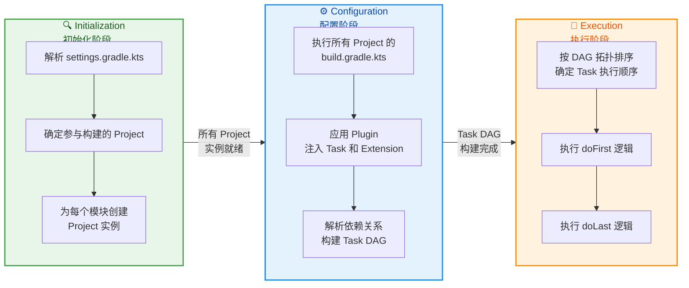
```mermaid
graph LR
    subgraph Phase1["🔍 Initialization\n初始化阶段"]
        direction TB
        S1["解析 settings.gradle.kts"]
        S2["确定参与构建的 Project"]
        S3["为每个模块创建\nProject 实例"]
        S1 --> S2
        S2 --> S3
    end

    subgraph Phase2["⚙️ Configuration\n配置阶段"]
        direction TB
        C1["执行所有 Project 的\nbuild.gradle.kts"]
        C2["应用 Plugin\n注入 Task 和 Extension"]
        C3["解析依赖关系\n构建 Task DAG"]
        C1 --> C2
        C2 --> C3
    end

    subgraph Phase3["🚀 Execution\n执行阶段"]
        direction TB
        E1["按 DAG 拓扑排序\n确定 Task 执行顺序"]
        E2["执行 doFirst 逻辑"]
        E3["执行 doLast 逻辑"]
        E1 --> E2
        E2 --> E3
    end

    Phase1 -->|"所有 Project\n实例就绪"| Phase2
    Phase2 -->|"Task DAG\n构建完成"| Phase3

    classDef initStyle fill:#E8F5E9,stroke:#43A047,stroke-width:2px,color:#1B5E20
    classDef configStyle fill:#E3F2FD,stroke:#1E88E5,stroke-width:2px,color:#0D47A1
    classDef execStyle fill:#FFF3E0,stroke:#FB8C00,stroke-width:2px,color:#E65100

    class Phase1 initStyle
    class Phase2 configStyle
    class Phase3 execStyle
```

**第一阶段：Initialization（初始化阶段）**

这个阶段的核心任务是"确定构建的范围"。Gradle 首先定位并执行 `settings.gradle.kts` 文件，从中读取 `include(":app")` 等语句，确定哪些子项目需要参与本次构建。然后，Gradle 为每一个参与构建的模块创建一个 `Project` 对象实例。

在这个阶段结束时，Gradle 已经知道了项目的完整层级结构（Root Project + 所有 Sub-Project），但尚未执行任何 `build.gradle.kts` 中的代码。你可以把这个阶段类比为"清点参加会议的人员名单"。

**第二阶段：Configuration（配置阶段）**

这是最容易引起困惑的阶段，也是性能问题最频发的阶段。在 Configuration 阶段，Gradle 会 **逐一执行** 每个 Project 的 `build.gradle.kts` 脚本。这意味着：

- 所有 `plugins {}` 块被解析，插件被 apply。
- 所有 Extension 配置（如 `android {}`、`dependencies {}`）被执行。
- 所有通过 `tasks.register()` 或 `tasks.create()` 注册/创建的 Task 被记录（register 的只是"注册"而非"实例化"）。
- Gradle 根据 Task 之间的 `dependsOn`、`finalizedBy` 等关系，构建出完整的 **Task DAG（有向无环图）**。

**关键认知：Configuration 阶段会执行所有项目的构建脚本，而不仅仅是你想要构建的那个模块。** 这就是为什么大型多模块项目（50+ 模块）的配置阶段可能需要数秒甚至十几秒——即使你只是想编译一个模块，Gradle 也必须配置所有模块才能构建完整的 DAG。这也是 Configuration Cache 等优化技术被引入的原因（后续章节详述）。

**第三阶段：Execution（执行阶段）**

当 Task DAG 构建完成后，Gradle 根据你指定的目标 Task（如 `assembleDebug`），从 DAG 中提取该 Task 及其所有直接/间接依赖的 Task，按拓扑排序逐个执行。每个 Task 在执行前会先进行 **Up-to-date Check**（增量构建检查），只有 inputs 或 outputs 发生变化的 Task 才会真正执行。

`doFirst {}` 和 `doLast {}` 中的代码就是在这个阶段运行的。

#### 阶段感知的实际影响

理解三阶段模型的实际价值体现在避免以下常见错误：

```kotlin
// ❌ 错误：在 Configuration 阶段执行耗时操作
// 这段代码写在 build.gradle.kts 顶层，每次构建的 Configuration 阶段都会执行
val gitHash = "git rev-parse --short HEAD".execute()  // 每次配置都 fork 进程，耗时！

android {
    defaultConfig {
        // 将 git hash 写入 BuildConfig
        buildConfigField("String", "GIT_HASH", "\"$gitHash\"")
    }
}

// ✅ 正确：使用 Provider 延迟到 Execution 阶段求值
// provider {} 包裹的逻辑只有在值真正被需要时才执行
val gitHashProvider = providers.exec {
    commandLine("git", "rev-parse", "--short", "HEAD")  // 声明要执行的命令
}.standardOutput.asText.map { it.trim() }               // 对输出做 trim 处理

android {
    defaultConfig {
        // 使用 provider 的值，只有生成 BuildConfig 的 Task 执行时才求值
        buildConfigField("String", "GIT_HASH", "\"${gitHashProvider.get()}\"")
    }
}
```

Gradle 提供了一系列 **Lifecycle Hook（生命周期钩子）** 供开发者在特定时机插入逻辑：

```kotlin
// settings.gradle.kts 或 build.gradle.kts 中

// Gradle 级别：所有 Project 配置完成后回调
gradle.afterProject { project ->
    // 每个 Project 配置完成后执行此回调
    println("${project.name} 配置完成")       // 输出完成配置的项目名
}

// Task 级别：DAG 构建完成后回调
gradle.taskGraph.whenReady { graph ->
    // Task DAG 构建完成后执行，此时所有 Task 及其依赖关系已确定
    println("即将执行 ${graph.allTasks.size} 个 Task") // 输出 Task 总数

    // 可以检查特定 Task 是否在 DAG 中
    if (graph.hasTask(":app:assembleRelease")) {
        println("正在构建 Release 版本，将启用签名检查") // 条件分支示例
    }
}
```

#### 四大核心概念的协作关系

最后，让我们把四个概念串联起来，看看它们如何协同工作。这张全景图从构建启动到最终产出 APK，展示了每个概念在其中扮演的角色：

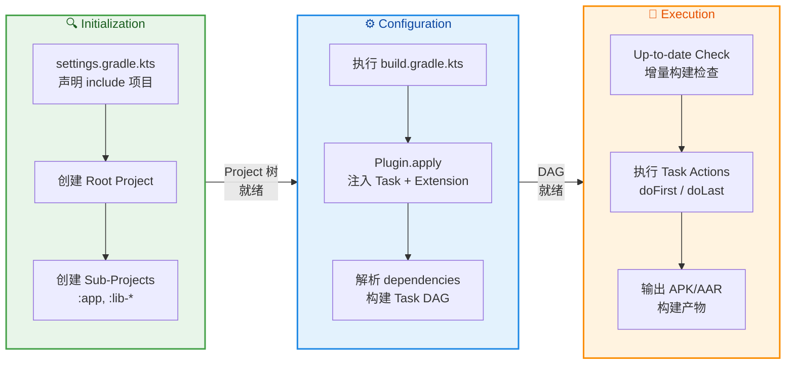
```mermaid
graph LR
    subgraph INIT["🔍 Initialization"]
        direction TB
        A1["settings.gradle.kts\n声明 include 项目"]
        A2["创建 Root Project"]
        A3["创建 Sub-Projects\n:app, :lib-*"]
        A1 --> A2
        A2 --> A3
    end

    subgraph CONFIG["⚙️ Configuration"]
        direction TB
        B1["执行 build.gradle.kts"]
        B2["Plugin.apply\n注入 Task + Extension"]
        B3["解析 dependencies\n构建 Task DAG"]
        B1 --> B2
        B2 --> B3
    end

    subgraph EXEC["🚀 Execution"]
        direction TB
        C1["Up-to-date Check\n增量构建检查"]
        C2["执行 Task Actions\ndoFirst / doLast"]
        C3["输出 APK/AAR\n构建产物"]
        C1 --> C2
        C2 --> C3
    end

    INIT -->|"Project 树\n就绪"| CONFIG
    CONFIG -->|"DAG\n就绪"| EXEC

    classDef initStyle fill:#E8F5E9,stroke:#43A047,stroke-width:2px,color:#1B5E20
    classDef configStyle fill:#E3F2FD,stroke:#1E88E5,stroke-width:2px,color:#0D47A1
    classDef execStyle fill:#FFF3E0,stroke:#FB8C00,stroke-width:2px,color:#E65100

    class INIT initStyle
    class CONFIG configStyle
    class EXEC execStyle
```

简而言之：**Initialization 阶段建立 Project 层级结构 → Configuration 阶段通过 Plugin 向 Project 注入 Task 并构建 DAG → Execution 阶段按 DAG 顺序执行 Task 产出最终构建物。** 这四个概念环环相扣，构成了 Gradle 构建引擎的核心骨架。无论后续学习 AGP 配置、Build Variants、依赖管理还是构建优化，所有知识都建立在这套模型之上。

---

**📝 练习题**

在一个包含 `:app`、`:lib-network`、`:lib-common` 三个子模块的 Android 项目中，执行 `./gradlew :app:assembleDebug`。以下关于 Gradle 生命周期的描述，哪一项是**正确的**？

A. Initialization 阶段只会创建 `:app` 模块的 Project 对象，因为命令只指定了 `:app`


B. Configuration 阶段只会执行 `:app/build.gradle.kts`，其他模块的脚本不会被执行


C. Configuration 阶段会执行所有已 include 模块的 `build.gradle.kts`，即使最终只有部分 Task 被执行


D. Execution 阶段会执行 Task DAG 中所有 Task，不支持跳过已是 UP-TO-DATE 的 Task


**【答案】** C

**【解析】** Gradle 的 Initialization 阶段根据 `settings.gradle.kts` 中的 `include()` 声明确定 **所有** 参与构建的模块，因此 A 错误——即使你只构建 `:app`，`:lib-network` 和 `:lib-common` 的 Project 对象也会被创建。Configuration 阶段需要执行 **所有** Project 的构建脚本来解析完整的依赖关系和 Task DAG，因此 B 错误，C 正确。这也是大型多模块项目配置阶段耗时的根源，Configuration Cache 正是为了缓存这一阶段的结果而设计的。D 明显错误，Gradle 的增量构建机制会跳过 inputs/outputs 未变化的 Task，这是 Gradle 性能优势的核心来源之一。

---

**📝 练习题**

以下 Kotlin DSL 代码片段中，哪一行代码会在 **Configuration 阶段** 而非 Execution 阶段执行？

```kotlin
tasks.register("myTask") {           // 第 1 行
    group = "custom"                  // 第 2 行
    println("Hello Configuration")    // 第 3 行
    doLast {                          // 第 4 行
        println("Hello Execution")    // 第 5 行
    }
}
```

A. 仅第 5 行


B. 仅第 3 行


C. 第 2 行和第 3 行


D. 第 1 至第 4 行


**【答案】** C

**【解析】** 在 `tasks.register {}` 的 lambda 中（但在 `doFirst {}` / `doLast {}` 外部）编写的代码属于 **Task 配置代码**，在 Configuration 阶段执行。第 2 行（设置 group 属性）和第 3 行（println）都是配置代码，会在 Configuration 阶段运行。第 5 行位于 `doLast {}` 内部，是执行代码，只有在 Execution 阶段该 Task 真正被执行时才会运行。需要注意的是，由于使用了 `register()`（lazy），这段配置代码并不是在所有构建中都会执行——只有当 `myTask` 被"实现化"（materialize）时（例如它出现在 Task DAG 中，或被其他 Task `dependsOn`）才会执行。如果使用的是 `tasks.create()`（eager），则第 2、3 行在每次构建的 Configuration 阶段都会无条件执行。答案选 C，因为题目问的是"在 Configuration 阶段执行"的代码，第 2 行和第 3 行都符合条件。

---

## Android Gradle Plugin（AGP）

Android 项目之所以能够将 `.java`/`.kt` 源码、XML 资源、AndroidManifest、native library 等异构文件最终打包成一个 `.apk` 或 `.aab`，背后的核心引擎就是 **Android Gradle Plugin（AGP）**。原生的 Gradle 只是一个通用的构建框架——它懂得 Task、Project、依赖图，但它并不"认识" Android。AGP 的职责，就是在 Gradle 的骨架上，注入全部 Android 特有的构建逻辑：从 AAPT2 资源编译、DEX 转换、签名打包、到 ProGuard/R8 混淆，甚至 Lint 检查，所有这些步骤都是 AGP 以 **Task 的形式** 注册进 Gradle 构建图（Task Graph）的。

理解 AGP，不仅仅是 "知道在 `build.gradle` 里写 `android { ... }`" 这么简单。你需要搞清楚三个层次的问题：**AGP 到底做了什么（插件作用）**、**我们通过什么接口来配置它（BaseExtension 及其子类）**、以及 **Application 模块和 Library 模块的配置差异是如何体现的（AppExtension vs LibraryExtension）**。这三个层次由浅入深，构成了我们操控 Android 构建过程的完整知识链。

### AGP 插件作用

#### 从一行 `apply plugin` 说起

当你在模块的 `build.gradle.kts` 中写下：

```kotlin
// 应用 AGP 的 Application 插件，表示这是一个可运行的 App 模块
plugins {
    id("com.android.application")
}
```

或者在 Library 模块中写下：

```kotlin
// 应用 AGP 的 Library 插件，表示这是一个被依赖的库模块
plugins {
    id("com.android.library")
}
```

Gradle 在 **Configuration 阶段** 就会加载对应的插件类（`AppPlugin` 或 `LibraryPlugin`），执行它们的 `apply()` 方法。这个 `apply()` 方法所做的事情极其庞大，概括来说可以分为以下几个核心职责：

**第一，注册 `android { }` Extension（扩展配置块）。** 这是最直观的作用。AGP 通过 Gradle 的 `ExtensionContainer.create()` API，向当前 Project 注册了一个名为 `"android"` 的扩展对象。对于 Application 模块，这个对象的类型是 `ApplicationExtension`（旧版为 `AppExtension`）；对于 Library 模块，则是 `LibraryExtension`。正是因为这个扩展对象的存在，你才能在 `build.gradle.kts` 中使用 `android { compileSdk = 34; defaultConfig { ... } }` 这样的 DSL 语法。本质上，你在 `android { }` 块中写的每一行配置，都是在调用这个扩展对象的 setter 方法或嵌套 DSL builder。

**第二，创建 Build Variants（构建变体）。** AGP 会根据你配置的 `buildTypes`（如 debug、release）和 `productFlavors`（如 free、paid）进行 **笛卡尔积组合**，生成所有可能的变体（Variant）。每个变体都代表一种独立的构建配置组合。例如 `freeDebug`、`paidRelease` 等。这些变体不仅仅是"名字"，AGP 会为每个变体创建一整套独立的 Task 链（编译、资源处理、打包、签名……），并将它们注册到 Gradle 的 Task 图中。

**第三，注册全套 Android 构建 Task。** 这是 AGP 最核心的工作。一个典型的 `assembleDebug` 命令背后，实际上会触发数十个 Task 按依赖顺序执行。AGP 负责定义和注册所有这些 Task，并建立它们之间的依赖关系。

下面这张图展示了 AGP 为一个典型 Application 模块注册的 **核心 Task 链**（以 debug 变体为例），帮助你直观理解 AGP "在幕后做了多少事"：

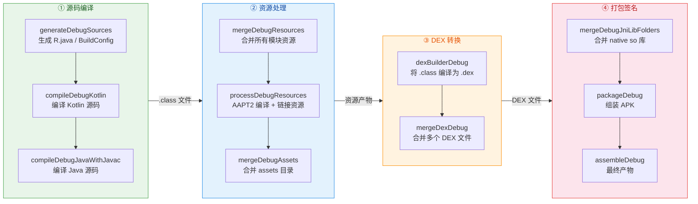
```mermaid
graph LR
    subgraph SRC["① 源码编译"]
        direction TB
        A["generateDebugSources\n生成 R.java / BuildConfig"]
        B["compileDebugKotlin\n编译 Kotlin 源码"]
        C["compileDebugJavaWithJavac\n编译 Java 源码"]
        A --> B
        B --> C
    end

    subgraph RES["② 资源处理"]
        direction TB
        D["mergeDebugResources\n合并所有模块资源"]
        E["processDebugResources\nAAPT2 编译 + 链接资源"]
        F["mergeDebugAssets\n合并 assets 目录"]
        D --> E
        E --> F
    end

    subgraph DEX["③ DEX 转换"]
        direction TB
        G["dexBuilderDebug\n将 .class 编译为 .dex"]
        H["mergeDexDebug\n合并多个 DEX 文件"]
        G --> H
    end

    subgraph PKG["④ 打包签名"]
        direction TB
        I["mergeDebugJniLibFolders\n合并 native so 库"]
        J["packageDebug\n组装 APK"]
        K["assembleDebug\n最终产物"]
        I --> J
        J --> K
    end

    SRC -->|".class 文件"| RES -->|"资源产物"| DEX -->|"DEX 文件"| PKG

    classDef srcStyle fill:#E8F5E9,stroke:#43A047,color:#1B5E20
    classDef resStyle fill:#E3F2FD,stroke:#1E88E5,color:#0D47A1
    classDef dexStyle fill:#FFF3E0,stroke:#FB8C00,color:#E65100
    classDef pkgStyle fill:#FCE4EC,stroke:#E53935,color:#B71C1C

    class SRC srcStyle
    class RES resStyle
    class DEX dexStyle
    class PKG pkgStyle
```

从这张图可以清晰地看到，AGP 将一次完整的 Android 构建拆解成了四大阶段、十多个细粒度 Task。每个 Task 只负责一个明确的职责，Task 之间通过输入/输出的依赖关系串联。这种设计带来两个巨大优势：一是 **增量构建**（Incremental Build），如果某个 Task 的输入没有变化，Gradle 可以直接跳过它（标记为 UP-TO-DATE）；二是 **并行执行**（Parallel Execution），没有依赖关系的 Task 可以在不同 Worker 线程中同时运行。

**第四，集成工具链。** AGP 内部集成了一系列 Android 专用工具的调用逻辑：

- **AAPT2**（Android Asset Packaging Tool 2）：负责将 XML 资源编译为二进制格式（flat 文件），并将所有资源链接为最终的资源表（`resources.arsc`）和 `R.java`。
- **D8 / R8**：D8 是默认的 DEX 编译器，将 Java bytecode 转为 Dalvik bytecode；R8 则在 D8 的基础上叠加了代码缩减（shrinking）、混淆（obfuscation）和优化（optimization），取代了旧的 ProGuard。
- **APK Signer / ZIP Aligner**：对最终 APK 进行 V1/V2/V3/V4 签名，以及 4KB 对齐优化。
- **Lint**：静态代码分析工具，AGP 为其注册了 `lintDebug`、`lintRelease` 等 Task。

**第五，提供 Variant API 供外部插件扩展。** 从 AGP 7.0 开始，Google 推出了全新的 **Variant API**（`androidComponents { }` 块），允许第三方插件或 `build.gradle` 脚本在构建过程中 **安全地读取和修改** 变体属性（如 applicationId、minSdk 等），以及 **注册自定义 Task 并接入构建流水线**。这套 API 取代了旧的 `android.applicationVariants.all { }` 方式，提供了更好的类型安全和 API 稳定性。

```kotlin
// AGP 7.0+ Variant API 示例：在每个变体构建完成后注入自定义逻辑
androidComponents {
    // onVariants 回调在所有变体创建完成后触发
    onVariants(selector().all()) { variant ->
        // 可以读取变体的 applicationId、buildType 等属性
        println("Variant: ${variant.name}, applicationId: ${variant.applicationId.get()}")

        // 可以通过 artifacts API 获取或修改构建产物
        // 例如获取最终的 APK 文件路径
        val apkDir = variant.artifacts.get(SingleArtifact.APK)
    }
}
```

#### AGP 的版本与 Gradle 版本的对应关系

一个经常让开发者困惑的问题是：**AGP 版本和 Gradle 版本是什么关系？** 答案是：它们是 **独立演进但有兼容性约束** 的两个版本。AGP 本质上是一个运行在 Gradle 之上的插件，因此每个 AGP 版本都有一个"最低要求的 Gradle 版本"。如果你使用的 Gradle 版本过低，AGP 会在 Configuration 阶段直接报错。

从 AGP 7.0 开始，Google 将 AGP 的版本号 **与 Android Studio 的版本号对齐**（都采用年份式命名，如 AGP 8.1 对应 Android Studio Hedgehog 等）。这降低了版本选择的心智负担。你只需要在项目根目录的 `build.gradle.kts` 中声明 AGP 版本：

```kotlin
// 根项目 build.gradle.kts —— 声明 AGP 插件版本但不在根项目 apply
plugins {
    // 声明 AGP 的 Application 插件版本，apply false 表示不在根项目激活
    id("com.android.application") version "8.5.0" apply false
    // 声明 AGP 的 Library 插件版本
    id("com.android.library") version "8.5.0" apply false
}
```

然后在 `gradle/wrapper/gradle-wrapper.properties` 中确保 Gradle 版本与之兼容：

```properties
# AGP 8.5.x 要求 Gradle 8.7+
distributionUrl=https\://services.gradle.org/distributions/gradle-8.7-bin.zip
```

### BaseExtension 配置

#### 理解 Extension 的继承体系

当你在 `build.gradle.kts` 中使用 `android { ... }` 块时，你实际上是在操作一个由 AGP 注册的 **Extension 对象**。这个对象的类型取决于你应用的插件类型，但所有类型都继承自一个共同的基类。理解这个继承体系，是理解 "为什么 Application 模块和 Library 模块的 `android { }` 块能共享大部分配置，却又各有独特配置" 的关键。

在 AGP 的演进过程中，Extension 体系经历了一次重大重构。在 **旧版 API**（AGP 4.x 及之前，包名 `com.android.build.gradle`）中，继承链是：

```
BaseExtension（公共基类）
├── AppExtension（com.android.application）
├── LibraryExtension（com.android.library）
├── TestExtension（com.android.test）
└── DynamicFeatureExtension（com.android.dynamic-feature）
```

在 **新版 API**（AGP 7.0+，包名 `com.android.build.api.dsl`）中，Google 用接口取代了具体类：

```
CommonExtension（公共接口）
├── ApplicationExtension（对应 com.android.application）
├── LibraryExtension（对应 com.android.library）
├── TestExtension（对应 com.android.test）
└── DynamicFeatureExtension（对应 com.android.dynamic-feature）
```

无论新旧 API，核心思想不变：**存在一个公共基类/接口，定义了所有模块类型共享的配置项；各子类/子接口再添加自己特有的配置项**。下面我们以 `CommonExtension`（新版 API）为蓝本，逐一讲解那些最常用的公共配置块。

#### compileSdk 与 defaultConfig

`compileSdk` 是整个 `android { }` 块中最顶层的配置之一，它决定了 **编译时使用的 Android SDK 版本**。注意，这不是运行时的目标版本，而是编译器在检查 API 调用合法性时参照的版本。如果你使用了 `compileSdk = 34` 中才有的 API，但你的 `compileSdk` 设为 33，编译将直接失败。

`defaultConfig { }` 块则是所有变体共享的 **默认配置**。它定义了 `applicationId`、`minSdk`、`targetSdk`、`versionCode`、`versionName` 等基础属性。这些属性可以在后续的 `buildTypes` 或 `productFlavors` 中被覆盖（Override），但如果没有覆盖，就使用 `defaultConfig` 中的值。

```kotlin
android {
    // 指定编译时 SDK 版本，决定可用 API 的上限
    compileSdk = 34

    defaultConfig {
        // 应用的唯一标识符，发布到 Play Store 后不可更改
        applicationId = "com.example.myapp"
        // 最低支持的 Android 版本，低于此版本的设备无法安装
        minSdk = 24
        // 目标 SDK 版本，告诉系统 App 已针对此版本进行了适配
        targetSdk = 34
        // 内部版本号，每次发布必须递增，用于 Play Store 判断更新
        versionCode = 1
        // 用户可见的版本名称，格式自由
        versionName = "1.0.0"
        // 测试运行器，使用 AndroidX 的 JUnit Runner
        testInstrumentationRunner = "androidx.test.runner.AndroidJUnitRunner"
    }
}
```

这里有一个非常重要的概念需要澄清：**`minSdk`、`targetSdk`、`compileSdk` 三者的区别**。很多初学者容易混淆它们：

- **`compileSdk`**：纯编译期概念。它决定了你在代码中能"看到"哪些 Android API。设为 34 意味着你可以调用 API Level 34 中引入的新 API。它 **不会写入 APK**，不影响运行时行为。
- **`minSdk`**：会写入 APK 的 `AndroidManifest.xml` 中（`<uses-sdk android:minSdkVersion="...">`）。低于此版本的设备在安装时就会被 Play Store 或 PackageManager 拒绝。它也会影响 Lint 检查——如果你调用了高于 `minSdk` 的 API 而没有做版本判断，Lint 会报 `NewApi` 警告。
- **`targetSdk`**：同样写入 Manifest。它告诉 Android 系统：你的 App 已经测试和适配了这个版本的行为变更。系统会据此决定是否对你的 App 启用某些兼容性行为（Compatibility Behavior）。例如，当 `targetSdk < 30` 时，系统不会强制执行 Scoped Storage；但 `targetSdk >= 30` 后，App 必须使用 Scoped Storage API。

#### buildTypes 与 signingConfigs

`buildTypes { }` 块允许你定义不同的构建类型，最常见的是 `debug` 和 `release`。每个 BuildType 可以独立配置混淆、签名、debuggable 标志等。这个配置块在 `CommonExtension` 中定义，因此 Application 和 Library 模块都能使用。

```kotlin
android {
    // 签名配置，定义密钥库信息
    signingConfigs {
        // 创建一个名为 "release" 的签名配置
        create("release") {
            // 密钥库文件路径
            storeFile = file("keystore/release.jks")
            // 密钥库密码（生产环境应从环境变量读取，切勿硬编码）
            storePassword = System.getenv("KEYSTORE_PASSWORD") ?: ""
            // 密钥别名
            keyAlias = "my-app-key"
            // 密钥密码
            keyPassword = System.getenv("KEY_PASSWORD") ?: ""
        }
    }

    buildTypes {
        // debug 类型由 AGP 自动创建，这里可以进一步定制
        debug {
            // applicationId 后缀，使 debug 版可与 release 版共存
            applicationIdSuffix = ".debug"
            // 开启 debug 模式，允许调试器连接
            isDebuggable = true
            // debug 版通常不开启混淆，加快构建速度
            isMinifyEnabled = false
        }
        // release 类型同样由 AGP 自动创建
        release {
            // 开启代码缩减和混淆（使用 R8）
            isMinifyEnabled = true
            // 开启资源缩减，移除未使用的资源文件
            isShrinkResources = true
            // 指定 ProGuard/R8 规则文件
            proguardFiles(
                // AGP 内置的默认优化规则
                getDefaultProguardFile("proguard-android-optimize.txt"),
                // 项目自定义规则
                "proguard-rules.pro"
            )
            // 使用上面定义的 release 签名配置
            signingConfig = signingConfigs.getByName("release")
        }
    }
}
```

`isMinifyEnabled = true` 这一行背后的意义远比字面上要大。当它被设为 `true` 时，AGP 会在构建流程中插入 **R8 编译器** 的 Task。R8 会对整个 App 的字节码（包括所有依赖库）进行三件事：**Tree Shaking**（移除未被调用的类和方法）、**Obfuscation**（将类名和方法名缩短为 a、b、c 等）、以及 **Code Optimization**（内联短方法、移除无用分支等）。而 `isShrinkResources` 则会在 R8 完成代码缩减后，根据代码中的资源引用关系，移除不再被任何代码引用的资源文件，进一步减小 APK 体积。

#### compileOptions 与 kotlinOptions

`compileOptions` 控制 Java 编译器的行为，尤其是 **源码兼容性** 和 **目标字节码版本**。`kotlinOptions` 则控制 Kotlin 编译器的 JVM 目标版本。这两者需要保持一致，否则可能出现兼容性问题。

```kotlin
android {
    compileOptions {
        // Java 源码语法级别：允许使用 Java 17 的语法特性
        sourceCompatibility = JavaVersion.VERSION_17
        // 生成的字节码版本：目标 JVM 17
        targetCompatibility = JavaVersion.VERSION_17
    }

    kotlinOptions {
        // Kotlin 编译产物的 JVM 目标版本，需与 Java targetCompatibility 一致
        jvmTarget = "17"
    }
}
```

自 AGP 8.x 以来，默认的 Java 兼容级别已提升到 **Java 17**，这与 Android Studio 内置的 JDK 版本（JBR 17）保持一致。如果你在一个多模块项目中，各模块的 `jvmTarget` 不一致，构建时可能会出现 `Cannot inline bytecode built with JVM target 17 into bytecode built with JVM target 11` 之类的错误，因此 **全局统一版本** 是最佳实践。

#### buildFeatures —— 功能开关

`buildFeatures` 是一个非常实用的配置块，允许你 **按需开启或关闭** AGP 的某些功能模块。关闭不需要的功能可以 **显著加快构建速度**，因为 AGP 会跳过对应的 Task 注册和执行。

```kotlin
android {
    buildFeatures {
        // 开启 View Binding，为每个 XML 布局生成类型安全的绑定类
        viewBinding = true
        // 开启 Compose 支持，启用 Kotlin Compiler 的 Compose 插件
        compose = true
        // 关闭旧的 Data Binding（如果不需要的话）
        dataBinding = false
        // 关闭 BuildConfig 类的自动生成（AGP 8.0+ 默认关闭）
        buildConfig = false
        // 关闭 AIDL 支持（若不使用 IPC）
        aidl = false
        // 关闭 RenderScript 支持（已废弃）
        renderScript = false
    }
}
```

这里有一个值得深入的点：**为什么 AGP 8.0 默认关闭了 `BuildConfig` 生成？** 原因在于 `BuildConfig.java` 需要为 **每个变体** 单独生成，而且它的任何变化（比如 `versionCode` 加 1）都会导致整个模块重新编译。在大型多模块项目中，这会严重拖慢增量构建速度。Google 建议使用其他方式（如自定义 Gradle Task 写入 properties 文件）来替代 `BuildConfig` 中的自定义字段。

#### packagingOptions / packaging

`packaging` 块（旧名 `packagingOptions`）控制 APK/AAR 打包阶段对重复文件和特定文件的处理策略。在多模块、多依赖的项目中，不同的库可能包含 **同名文件**（如 `META-INF/LICENSE`），如果不处理就会导致打包冲突。

```kotlin
android {
    packaging {
        resources {
            // 排除这些文件，不打包进 APK（常见的 META-INF 冲突文件）
            excludes += setOf(
                "META-INF/LICENSE.md",
                "META-INF/LICENSE-notice.md",
                "META-INF/NOTICE.md"
            )
            // 对于同名文件，选择保留第一个遇到的（先到先得）
            pickFirsts += setOf("lib/armeabi-v7a/libc++_shared.so")
            // 合并同名文件内容（适用于 service provider 配置文件）
            merges += setOf("META-INF/services/*")
        }
    }
}
```

### AppExtension vs LibraryExtension

#### 本质差异：产物类型不同

`AppExtension`（新版为 `ApplicationExtension`）和 `LibraryExtension` 最根本的区别在于 **最终构建产物不同**：Application 模块输出 **APK 或 AAB**（可安装运行的应用包），Library 模块输出 **AAR**（供其他模块依赖的归档包）。

这个产物差异决定了两者在配置能力上的分化。下面用一张表来概览它们的关键差异点：

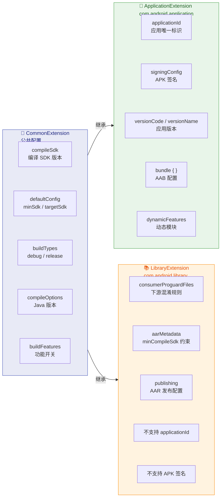
```mermaid
graph LR
    subgraph COMMON["🔧 CommonExtension\n公共配置"]
        direction TB
        C1["compileSdk\n编译 SDK 版本"]
        C2["defaultConfig\nminSdk / targetSdk"]
        C3["buildTypes\ndebug / release"]
        C4["compileOptions\nJava 版本"]
        C5["buildFeatures\n功能开关"]
        C1 ~~~ C2
        C2 ~~~ C3
        C3 ~~~ C4
        C4 ~~~ C5
    end

    subgraph APP["📱 ApplicationExtension\ncom.android.application"]
        direction TB
        A1["applicationId\n应用唯一标识"]
        A2["signingConfig\nAPK 签名"]
        A3["versionCode / versionName\n应用版本"]
        A4["bundle { }\nAAB 配置"]
        A5["dynamicFeatures\n动态模块"]
        A1 ~~~ A2
        A2 ~~~ A3
        A3 ~~~ A4
        A4 ~~~ A5
    end

    subgraph LIB["📚 LibraryExtension\ncom.android.library"]
        direction TB
        L1["consumerProguardFiles\n下游混淆规则"]
        L2["aarMetadata\nminCompileSdk 约束"]
        L3["publishing\nAAR 发布配置"]
        L4["不支持 applicationId"]
        L5["不支持 APK 签名"]
        L1 ~~~ L2
        L2 ~~~ L3
        L3 ~~~ L4
        L4 ~~~ L5
    end

    COMMON -->|"继承"| APP
    COMMON -->|"继承"| LIB

    classDef commonStyle fill:#E8EAF6,stroke:#3F51B5,color:#1A237E
    classDef appStyle fill:#E8F5E9,stroke:#43A047,color:#1B5E20
    classDef libStyle fill:#FFF3E0,stroke:#FB8C00,color:#E65100

    class COMMON commonStyle
    class APP appStyle
    class LIB libStyle
```

#### Application 模块独有的配置

**`applicationId`**：这是 Android 系统用来唯一标识一个 App 的字符串，也是 Google Play Store 上的唯一 ID。一旦发布，就不可更改（否则会被视为完全不同的 App）。注意，`applicationId` 和 Java/Kotlin 的 `package name` 是两个独立的概念——你的代码包名可以与 `applicationId` 不同。AGP 在打包阶段会将 `applicationId` 写入最终 Manifest 的 `<manifest package="...">` 属性中。Library 模块不具备这个配置，因为库不会被独立安装到设备上。

**`versionCode` 和 `versionName`**：版本信息同样只有 Application 模块才有意义。`versionCode` 是一个整数，Play Store 用它来判断 APK 的新旧顺序；`versionName` 是一个对用户可见的字符串，格式完全自定义。Library 模块虽然在技术上可以定义版本，但它的版本通常由 Maven 坐标（如 `1.2.3`）来表达，而不是通过 AGP 的 `versionCode`。

**`signingConfigs` 的完整使用**：虽然 `signingConfigs` 的定义在 `CommonExtension` 中，但 **将签名配置关联到 `buildTypes`** 这个行为只有在 Application 模块中才有实际意义。Library 模块输出的 AAR 不需要签名——签名是在最终的 APK 打包阶段才执行的。

**`bundle { }` 块**：用于配置 Android App Bundle (AAB) 的行为，比如是否拆分语言资源、是否拆分 ABI 等。这自然是 Application 独有的，因为 AAB 是一种 App 分发格式。

```kotlin
android {
    bundle {
        language {
            // 不按语言拆分，确保所有语言资源都包含在基础 APK 中
            enableSplit = false
        }
        density {
            // 按屏幕密度拆分，Play Store 会按设备下发对应密度资源
            enableSplit = true
        }
        abi {
            // 按 CPU 架构拆分，减少用户下载体积
            enableSplit = true
        }
    }
}
```

#### Library 模块独有的配置

**`consumerProguardFiles`**：这是 Library 模块最独特且最重要的配置之一。它指定了一组 **传递给下游消费者** 的 ProGuard/R8 规则文件。当其他模块或 App 依赖你的 Library 并开启混淆时，R8 会 **自动读取并应用** 这些规则。这解决了一个关键问题：Library 的作者最清楚哪些类和方法 **不能被混淆**（比如通过反射调用的类、暴露给外部的 API），所以应该由 Library 自身来声明保护规则，而不是让使用方去猜。

```kotlin
// Library 模块的 build.gradle.kts
android {
    defaultConfig {
        // consumer-rules.pro 中的规则会被打包进 AAR
        // 当 App 模块依赖此 Library 并开启 R8 时，这些规则自动生效
        consumerProguardFiles("consumer-rules.pro")
    }
}
```

与之对比的是 `proguardFiles`——它只作用于 **当前模块自身** 的编译过程（但 Library 模块通常不自己做混淆，混淆留给最终的 App 模块统一处理）。所以对于 Library 来说，`consumerProguardFiles` 远比 `proguardFiles` 重要。

**`aarMetadata`（AGP 7.0+）**：允许 Library 声明其 **最低要求的 compileSdk 版本**。如果消费方的 `compileSdk` 低于此值，构建会报错。这对于使用了新 API 的 Library 非常有用。

```kotlin
android {
    aarMetadata {
        // 声明此 Library 要求消费方至少使用 compileSdk 33
        minCompileSdk = 33
    }
}
```

**Library 模块不支持的配置**：除了前面提到的 `applicationId`、`versionCode`、APK 签名等，Library 模块还不支持 `applicationIdSuffix`（因为没有 applicationId 可供添加后缀）和 `dynamicFeatures`（动态模块只能挂载在 Application 模块上）。

#### 资源与 Manifest 的差异处理

Application 模块和 Library 模块在资源处理上也有重要区别。Library 模块的资源在被打包成 AAR 后，会参与 **消费方的资源合并过程**（Resource Merging），这意味着 Library 的资源可能被 App 模块的同名资源 **覆盖**。为了避免资源名冲突，最佳实践是给 Library 的所有资源加上唯一前缀：

```kotlin
// Library 模块的 build.gradle.kts
android {
    // 强制资源前缀，Lint 会对不以此前缀开头的资源名报警告
    resourcePrefix = "mylib_"
}
```

在 Manifest 方面，Library 模块的 `AndroidManifest.xml` 会被合并到最终 App 的 Manifest 中。如果 Library 声明了某些权限（`<uses-permission>`），这些权限也会出现在最终 APK 中。这有时会导致意料之外的权限请求，因此 App 开发者在引入第三方 Library 时，应当注意检查其 Manifest 声明，并在必要时使用 `tools:node="remove"` 来剔除不需要的权限。

#### 实际项目中的模块选型决策

在实际的多模块（Multi-module）项目中，模块类型的选择遵循一个简单的原则：**只有一个模块应该是 `com.android.application`（即入口 App 模块），其余所有业务模块、功能模块、公共组件模块都应该是 `com.android.library`**。如果项目需要模块化后还能独立运行（作为独立 App 调试），可以通过动态切换插件类型来实现，但这属于进阶的组件化方案。

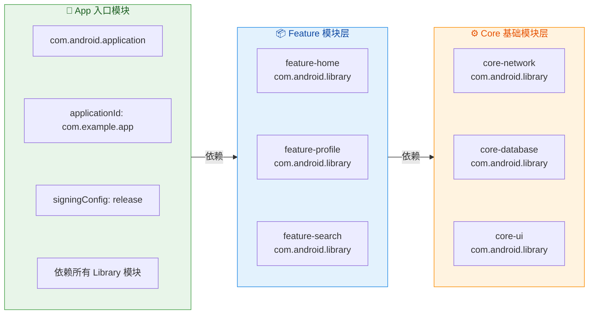
```mermaid
graph LR
    subgraph ENTRY["📱 App 入口模块"]
        direction TB
        E1["com.android.application"]
        E2["applicationId: com.example.app"]
        E3["signingConfig: release"]
        E4["依赖所有 Library 模块"]
        E1 ~~~ E2
        E2 ~~~ E3
        E3 ~~~ E4
    end

    subgraph FEATURE["📦 Feature 模块层"]
        direction TB
        F1["feature-home\ncom.android.library"]
        F2["feature-profile\ncom.android.library"]
        F3["feature-search\ncom.android.library"]
        F1 ~~~ F2
        F2 ~~~ F3
    end

    subgraph CORE["⚙️ Core 基础模块层"]
        direction TB
        C1["core-network\ncom.android.library"]
        C2["core-database\ncom.android.library"]
        C3["core-ui\ncom.android.library"]
        C1 ~~~ C2
        C2 ~~~ C3
    end

    ENTRY -->|"依赖"| FEATURE -->|"依赖"| CORE

    classDef entryStyle fill:#E8F5E9,stroke:#43A047,color:#1B5E20
    classDef featureStyle fill:#E3F2FD,stroke:#1E88E5,color:#0D47A1
    classDef coreStyle fill:#FFF3E0,stroke:#FB8C00,color:#E65100

    class ENTRY entryStyle
    class FEATURE featureStyle
    class CORE coreStyle
```

在这种典型分层架构中，**只有最顶层的 App 模块** 负责定义 `applicationId`、签名配置、最终的混淆规则等；Feature 模块和 Core 模块全部作为 Library 存在，各自通过 `consumerProguardFiles` 声明自己的混淆保护规则。构建时，AGP 会将所有 Library 的代码、资源和 Manifest **逐层合并**，最终在 App 模块产出一个完整的 APK/AAB。

---

**📝 练习题**

在一个多模块 Android 项目中，Library 模块 `core-network` 使用了反射来实例化某些类。开发者在 `core-network` 模块的 `build.gradle.kts` 中将保护规则写在了 `proguardFiles("proguard-rules.pro")` 中。当 App 模块开启 `isMinifyEnabled = true` 进行 release 构建时，发现 `core-network` 中通过反射调用的类仍然被混淆了，导致运行时崩溃。请问最可能的原因是什么？

A. App 模块忘记开启 `isMinifyEnabled`


B. Library 模块应该使用 `consumerProguardFiles` 而不是 `proguardFiles` 来声明传递给消费方的混淆规则


C. Library 模块不支持任何混淆规则配置


D. 需要在 Library 模块中也设置 `isMinifyEnabled = true` 才能使其混淆规则生效


**【答案】** B

**【解析】** 这道题的核心在于区分 `proguardFiles` 和 `consumerProguardFiles` 的作用域。`proguardFiles` 仅作用于 **当前模块自身** 的混淆过程——但在常规实践中，Library 模块通常不会自行开启混淆（`isMinifyEnabled` 保持为 `false`），混淆由最终的 App 模块统一执行。因此，写在 Library 的 `proguardFiles` 中的规则在 App 模块构建时 **不会被自动读取**。正确做法是使用 `consumerProguardFiles`，该文件会被打包进 AAR 的 `proguard.txt` 中，当 App 模块开启 R8 并依赖该 AAR 时，R8 会 **自动加载并应用** 这些规则。选项 A 与题意矛盾（题目已说明 App 模块开启了 `isMinifyEnabled`）；选项 C 错误，Library 模块完全支持混淆规则配置；选项 D 错误，Library 模块不需要也不应该自己开启混淆——统一在 App 层做全局混淆才是最佳实践。

---

## 构建变体 Build Variants

在实际的 Android 项目中，我们几乎不可能只维护"一个版本"的应用。最常见的场景是：开发阶段需要一个可以随意调试、打印日志的 **debug** 版本；上线时需要一个经过混淆、签名的 **release** 版本。更进一步，同一个代码库可能要产出"免费版 / 付费版"、"国内版 / 海外版"等多个产品形态。如果为每种组合单独维护一套代码或一套构建脚本，工程管理成本将急剧膨胀。

**Build Variants（构建变体）** 正是 Android Gradle Plugin 为解决这一问题而设计的核心机制。它通过 **BuildType × ProductFlavor** 的 **笛卡尔积** 自动组合出所有可能的变体，每个变体拥有独立的源集（Source Set）、资源目录、依赖配置乃至签名策略，开发者无需手动维护多份脚本。理解构建变体的运作方式，是掌握 AGP 多渠道打包、条件编译以及 CI/CD 流水线配置的基础。

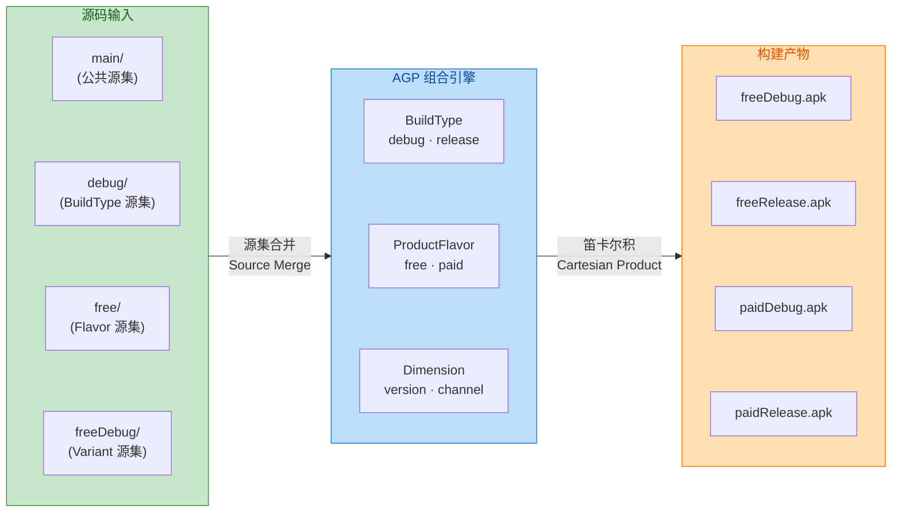
```mermaid
graph LR
    subgraph SRC ["源码输入"]
        direction TB
        A["main/\n(公共源集)"]
        B["debug/\n(BuildType 源集)"]
        C["free/\n(Flavor 源集)"]
        D["freeDebug/\n(Variant 源集)"]
        A ~~~ B
        B ~~~ C
        C ~~~ D
    end

    subgraph COMBINE ["AGP 组合引擎"]
        direction TB
        E["BuildType\ndebug · release"]
        F["ProductFlavor\nfree · paid"]
        G["Dimension\nversion · channel"]
        E ~~~ F
        F ~~~ G
    end

    subgraph OUTPUT ["构建产物"]
        direction TB
        H["freeDebug.apk"]
        I["freeRelease.apk"]
        J["paidDebug.apk"]
        K["paidRelease.apk"]
        H ~~~ I
        I ~~~ J
        J ~~~ K
    end

    SRC -->|"源集合并\nSource Merge"| COMBINE -->|"笛卡尔积\nCartesian Product"| OUTPUT

    classDef srcStyle fill:#C8E6C9,stroke:#388E3C,color:#1B5E20
    classDef combineStyle fill:#BBDEFB,stroke:#1976D2,color:#0D47A1
    classDef outputStyle fill:#FFE0B2,stroke:#F57C00,color:#E65100

    class SRC srcStyle
    class COMBINE combineStyle
    class OUTPUT outputStyle
```

上图展示了构建变体的全貌：左侧是多层源集输入，中间是 AGP 基于 BuildType、ProductFlavor 和 Dimension 进行笛卡尔积组合，右侧输出多个独立的 APK 产物。接下来我们逐一拆解每个组成部分。

---

### BuildType 构建类型

#### 概念与定位

BuildType 描述的是应用的 **构建方式**——也就是"用什么姿势把代码编译、打包成最终产物"。它关注的不是功能差异，而是构建过程中的技术参数，例如：是否开启调试（debuggable）、是否启用代码混淆（minifyEnabled）、是否压缩资源（shrinkResources）、使用哪套签名配置（signingConfig）等。

AGP 默认为每个 Android 模块预置了两个 BuildType：**debug** 和 **release**。这两个类型是 AGP 内建的，即使你在 `build.gradle.kts` 中一行也不写，它们也会存在。debug 类型默认开启 `debuggable = true` 并使用自动生成的 debug keystore 签名；release 类型默认关闭 debuggable，但不会自动配置签名（需要开发者手动指定）。

#### 配置详解

下面的代码展示了一个典型的 BuildType 配置，涵盖了日常开发中最常用的选项：

```kotlin
// build.gradle.kts (Module-level)
android {
    // 在 buildTypes 闭包中定义不同的构建类型
    buildTypes {

        // --- debug 类型（AGP 内置，此处做增量配置） ---
        getByName("debug") {
            // 在 applicationId 后追加 ".debug" 后缀，使 debug 和 release 可以共存安装
            applicationIdSuffix = ".debug"
            // 在版本名后追加 "-DEBUG" 标记，方便在"关于"页面识别版本
            versionNameSuffix = "-DEBUG"
            // 开启可调试标志；debug 类型默认就是 true，此处显式声明增强可读性
            isDebuggable = true
            // debug 构建通常不开启混淆，以便断点调试时能看到原始类名和行号
            isMinifyEnabled = false
            // 不压缩资源（保留所有资源便于开发调试）
            isShrinkResources = false
            // 通过 BuildConfig 向代码注入一个常量，用于运行时判断日志开关等
            buildConfigField("String", "BASE_URL", "\"https://dev.api.example.com\"")
            // 向 AndroidManifest.xml 注入占位符值，可在 Manifest 中用 ${APP_NAME} 引用
            manifestPlaceholders["APP_NAME"] = "MyApp-Dev"
        }

        // --- release 类型（AGP 内置，此处做增量配置） ---
        getByName("release") {
            // release 不需要后缀，保持正式的 applicationId
            // 关闭调试标志，防止被第三方工具 attach debugger
            isDebuggable = false
            // 开启 R8 代码混淆/压缩，缩减 APK 体积并增加逆向难度
            isMinifyEnabled = true
            // 开启资源压缩，移除未被代码引用的资源文件
            isShrinkResources = true
            // 指定 ProGuard / R8 混淆规则文件：
            // 第一个文件是 AGP 内置的默认 Android 优化规则
            // 第二个文件是项目自定义的 keep 规则
            proguardFiles(
                getDefaultProguardFile("proguard-android-optimize.txt"),
                "proguard-rules.pro"
            )
            // release 构建使用正式环境 API 地址
            buildConfigField("String", "BASE_URL", "\"https://api.example.com\"")
            // 正式版显示正式名称
            manifestPlaceholders["APP_NAME"] = "MyApp"
            // 指定签名配置（signingConfig 需在 signingConfigs 块中预先定义）
            signingConfig = signingConfigs.getByName("release")
        }

        // --- 自定义类型：staging（预发布/灰度环境） ---
        // 使用 create() 而非 getByName()，因为 staging 不是 AGP 内置类型
        create("staging") {
            // initWith 会复制指定 BuildType 的所有配置作为起点，避免从零开始
            // 这里以 release 为基线：继承混淆、资源压缩等配置
            initWith(getByName("release"))
            // 覆盖部分配置：staging 环境需要可调试，方便 QA 排查问题
            isDebuggable = true
            // 追加后缀使 staging 版本可以和正式版本共存安装
            applicationIdSuffix = ".staging"
            versionNameSuffix = "-STAGING"
            // staging 使用预发布环境的 API 地址
            buildConfigField("String", "BASE_URL", "\"https://staging.api.example.com\"")
            manifestPlaceholders["APP_NAME"] = "MyApp-Staging"
        }
    }
}
```

几个关键点值得深入理解：

**`applicationIdSuffix` 的本质作用**。Android 系统通过 `applicationId` 来唯一标识一个应用，它决定了应用在设备上的"身份"。当 debug 类型追加 `.debug` 后缀后，debug 包的 applicationId 变成了 `com.example.app.debug`，与 release 包的 `com.example.app` 是两个不同的"应用"，因此可以同时安装在同一台设备上互不干扰。这在开发阶段极为实用——你可以一边使用正式版体验线上行为，一边安装 debug 版进行断点调试。

**`isMinifyEnabled` 与 `isShrinkResources` 的关系**。资源压缩（shrinkResources）**依赖**代码混淆（minifyEnabled）的结果。R8 在执行代码 Tree Shaking 时会分析哪些类和方法被实际引用，只有在此基础上，资源压缩器才能判断出哪些资源是"未被引用的"。因此，如果你只设置 `isShrinkResources = true` 而不开启 `isMinifyEnabled`，构建将直接失败并报错。二者必须同时开启。

**`initWith()` 的继承语义**。自定义 BuildType 时，`initWith()` 是一个非常实用的 API，它执行的是 **浅拷贝**——将目标 BuildType 当前的所有属性值复制过来作为新类型的默认值，之后你可以选择性地覆盖其中某几项。这比手动逐项复制配置要简洁得多。在上面的例子中，staging 继承了 release 的混淆策略和资源压缩策略，只重写了 debuggable、后缀和 API 地址。

**`buildConfigField` 的运行时注入机制**。调用 `buildConfigField("String", "BASE_URL", "\"https://...\"")` 后，AGP 会在编译期自动生成一个 Java 类 `BuildConfig`，其中包含对应的 `public static final` 常量字段。应用代码可以直接通过 `BuildConfig.BASE_URL` 引用这个值，实现了"不同构建类型使用不同服务端地址"的条件编译效果，且完全不需要在运行时做 if-else 判断——编译期已经固化了对应的值。

#### BuildType 与 Source Set 的映射

每一个 BuildType 都自动关联一个 **同名的源集目录**。以项目标准结构为例：

```text
app/src/
├── main/              ← 所有变体共享的公共源集
│   ├── java/
│   ├── res/
│   └── AndroidManifest.xml
├── debug/             ← 仅 debug 构建类型使用的源集
│   ├── java/          ← 可以放置仅 debug 使用的工具类（如 LeakCanary 初始化）
│   ├── res/           ← 可以放置 debug 专属的资源（如不同的 app_name）
│   └── AndroidManifest.xml  ← 可以声明 debug 专属的组件（如 debug-only Activity）
├── release/           ← 仅 release 构建类型使用的源集
│   └── java/
└── staging/           ← 自定义类型 staging 的源集
    └── java/
```

AGP 在构建某一具体变体时，会将 **main 源集**与对应的 **BuildType 源集**进行合并。比如构建 debug 变体时，`main/java` 和 `debug/java` 中的类会被合并到同一个编译类路径中。需要注意的是，如果两个源集中出现了 **同全限定名的 Java/Kotlin 类**，编译器将报"重复类"（Duplicate class）错误——源集间的 Java/Kotlin 代码是 **合并** 而非 **覆盖** 语义。资源文件（res/）的合并规则则不同，BuildType 源集中的资源 **会覆盖** main 源集中同名的资源条目，这一点在后续"资源合并"章节中会详细展开。

---

### ProductFlavor 产品风味

#### 概念与定位

如果说 BuildType 回答的是"**怎样构建**"（How），那么 ProductFlavor 回答的则是"**构建什么**"（What）。ProductFlavor 用于描述应用的 **产品形态差异**，比如免费版与付费版的功能区别、国内版与海外版的渠道差异、面向不同客户品牌的白标（White-Label）定制等。每个 Flavor 可以独立定义自己的 applicationId、versionCode、versionName、源集目录，甚至最低 SDK 版本。

与 BuildType 不同，AGP **不会预置任何 ProductFlavor**。如果你的项目不需要多产品形态，完全可以不配置 Flavor，此时构建变体仅由 BuildType 决定（即 debug + release = 2 个变体）。一旦你开始声明 Flavor，就必须同时声明它所属的 **Dimension**（维度），否则 AGP 将报错，我们在下一小节会详细讲解 Dimension。

#### 配置详解

```kotlin
// build.gradle.kts (Module-level)
android {
    // 声明 Flavor 维度名称；所有 ProductFlavor 都必须归属于某个维度
    // 此处只有一个维度 "version"，表示按"版本/付费等级"划分产品形态
    flavorDimensions += "version"

    productFlavors {

        // --- 免费版 Flavor ---
        create("free") {
            // 指定该 Flavor 所属维度（必填，否则构建失败）
            dimension = "version"
            // 覆盖 applicationId：免费版使用独立的包名
            // 这使得免费版和付费版可以作为两个独立应用上架 Google Play
            applicationId = "com.example.app.free"
            // 覆盖版本号：免费版和付费版可以有独立的版本迭代节奏
            versionCode = 1
            versionName = "1.0.0-free"
            // 免费版可以适当降低最低支持版本以覆盖更多低端设备
            minSdk = 23
            // 注入编译期常量：控制是否展示广告
            buildConfigField("Boolean", "SHOW_ADS", "true")
            // 注入字符串资源值（运行时可通过 R.string.flavor_name 访问）
            resValue("string", "flavor_name", "Free Edition")
        }

        // --- 付费版 Flavor ---
        create("paid") {
            dimension = "version"
            applicationId = "com.example.app.paid"
            versionCode = 1
            versionName = "1.0.0-paid"
            // 付费版可以要求更高的最低版本，利用新 API 提供更好的体验
            minSdk = 26
            // 付费版不展示广告
            buildConfigField("Boolean", "SHOW_ADS", "false")
            resValue("string", "flavor_name", "Premium Edition")
        }
    }
}
```

**`applicationId` 覆盖的应用场景**。在 `defaultConfig` 中通常已经声明了一个基础的 applicationId（如 `com.example.app`），而每个 Flavor 可以选择 **直接覆盖** 整个 applicationId，也可以使用 `applicationIdSuffix` 在基础值上追加后缀。直接覆盖的方式常用于"免费版和付费版是两个独立的应用商店 listing"的场景；使用 suffix 的方式则常用于"多渠道分发，但本质是同一个应用"的场景。

**`resValue` 的原理**。`resValue("string", "flavor_name", "Free Edition")` 会在编译期自动在 `generated` 目录下生成一个资源值，效果等同于你在 `res/values/strings.xml` 中手写了 `<string name="flavor_name">Free Edition</string>`。在代码中可通过 `R.string.flavor_name` 正常引用，在 XML 布局中也可以用 `@string/flavor_name`。它与 `buildConfigField` 的区别在于：`buildConfigField` 生成的是 Java 常量，只能在代码中访问；`resValue` 生成的是 Android 资源，可以在代码和 XML 中双向访问。

#### ProductFlavor 与 Source Set 的映射

与 BuildType 一样，每个 ProductFlavor 也会自动关联一个同名的源集目录：

```text
app/src/
├── main/              ← 公共源集
├── free/              ← free Flavor 专属源集
│   ├── java/          ← 免费版独有的代码（如广告 SDK 集成类）
│   ├── res/
│   │   ├── drawable/  ← 免费版专属图标或界面元素
│   │   └── values/    ← 免费版专属字符串（如 app_name = "MyApp Free"）
│   └── AndroidManifest.xml
├── paid/              ← paid Flavor 专属源集
│   ├── java/          ← 付费版独有的代码（如高级功能模块）
│   └── res/
└── debug/             ← BuildType 源集（独立于 Flavor 存在）
```

当构建 `freeDebug` 变体时，AGP 会将以下源集合并：`main` + `free` + `debug` + `freeDebug`（如果存在）。合并优先级从低到高为：**main < flavor < buildType < variant**。也就是说，如果 `main/res/values/strings.xml` 和 `free/res/values/strings.xml` 都定义了 `app_name`，最终 `freeDebug` 变体中生效的是 `free` 源集中的值；如果 `debug` 源集也定义了 `app_name`，则 `debug` 的值将覆盖 `free` 的值（BuildType 优先级高于 Flavor）。

#### Flavor-Specific 依赖

ProductFlavor 的一个非常实用的能力是支持 **Flavor 专属依赖**。AGP 会为每个 Flavor 自动生成一个以 Flavor 名为前缀的依赖配置（Configuration）：

```kotlin
dependencies {
    // 所有变体都依赖的公共库
    implementation("androidx.core:core-ktx:1.12.0")

    // 仅 free Flavor 依赖广告 SDK（paid 变体中不会包含此库）
    // "freeImplementation" 是 AGP 自动生成的配置名，格式为：{flavorName}Implementation
    "freeImplementation"("com.google.android.gms:play-services-ads:22.6.0")

    // 仅 paid Flavor 依赖高级图表库
    "paidImplementation"("com.github.PhilJay:MPAndroidChart:v3.1.0")
}
```

这种机制的好处是显而易见的：免费版的 APK 不会包含付费版才需要的库代码，反之亦然，有效控制了每个变体的包体积。在源码层面，free 源集中的代码可以安全地 import 广告 SDK 的类，而 paid 源集中的代码则可以引用图表库的类——由于它们永远不会被合并到同一个变体中，所以不会出现编译错误。

---

### Dimension 维度

#### 为什么需要 Dimension

在只有一种 Flavor 划分标准的简单场景下（如"免费/付费"），一个维度就够了。但真实项目中经常遇到**多个正交的划分标准**同时存在的情况。比如：

- **标准一（付费等级）**：free / paid
- **标准二（发行地区）**：china / global

如果没有 Dimension 机制，你只能把四种组合手动声明为四个 Flavor：`freeChina`、`freeGlobal`、`paidChina`、`paidGlobal`。这四个 Flavor 之间没有结构化的关系，一旦再新增一个维度（比如 CPU 架构），组合数呈指数级增长，管理将变得极其痛苦。

Dimension（维度）正是为了 **结构化地组织 Flavor** 而设计的。你可以定义多个维度，每个维度下挂载若干个 Flavor，AGP 会自动对所有维度做 **笛卡尔积**，生成完整的变体矩阵。

#### 多维度配置

```kotlin
android {
    // 声明两个维度：顺序很重要！先声明的维度优先级更高
    // "version" 维度的优先级高于 "region" 维度
    // 优先级影响资源合并时的覆盖顺序
    flavorDimensions += listOf("version", "region")

    productFlavors {

        // ===== version 维度下的 Flavor =====
        create("free") {
            dimension = "version"           // 归属 version 维度
            applicationIdSuffix = ".free"   // applicationId 追加后缀
            buildConfigField("Boolean", "IS_PREMIUM", "false")
        }
        create("paid") {
            dimension = "version"
            applicationIdSuffix = ".paid"
            buildConfigField("Boolean", "IS_PREMIUM", "true")
        }

        // ===== region 维度下的 Flavor =====
        create("china") {
            dimension = "region"            // 归属 region 维度
            // 国内版使用自定义的推送 SDK，不依赖 Google 服务
            buildConfigField("String", "PUSH_PROVIDER", "\"jpush\"")
        }
        create("global") {
            dimension = "region"
            // 海外版使用 Firebase Cloud Messaging
            buildConfigField("String", "PUSH_PROVIDER", "\"fcm\"")
        }
    }
}
```

以上配置产生的变体矩阵如下：

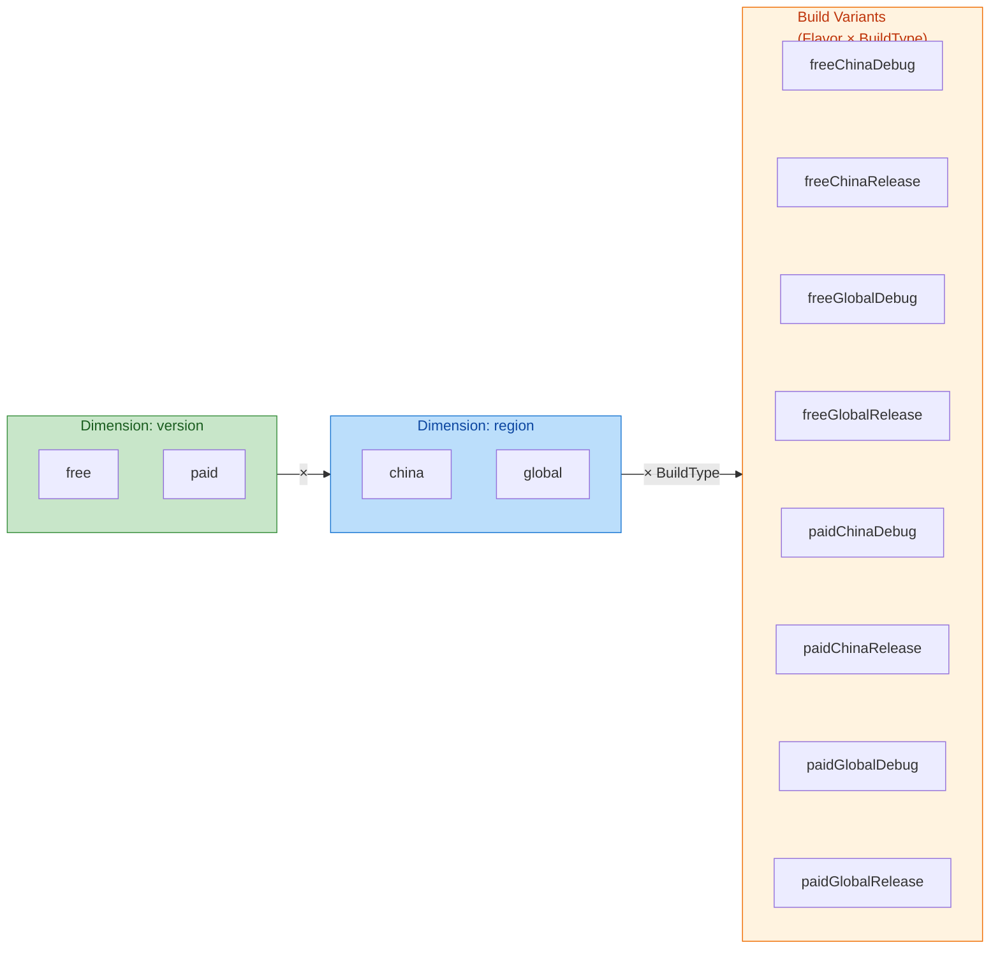
```mermaid
graph LR
    subgraph DIM_V ["Dimension: version"]
        direction TB
        V1["free"]
        V2["paid"]
    end

    subgraph DIM_R ["Dimension: region"]
        direction TB
        R1["china"]
        R2["global"]
    end

    subgraph VARIANTS ["Build Variants\n(Flavor × BuildType)"]
        direction TB
        A["freeChinaDebug"]
        B["freeChinaRelease"]
        C["freeGlobalDebug"]
        D["freeGlobalRelease"]
        E["paidChinaDebug"]
        F["paidChinaRelease"]
        G["paidGlobalDebug"]
        H["paidGlobalRelease"]
        A ~~~ B
        B ~~~ C
        C ~~~ D
        D ~~~ E
        E ~~~ F
        F ~~~ G
        G ~~~ H
    end

    DIM_V -->|"×"| DIM_R -->|"× BuildType"| VARIANTS

    classDef dimVStyle fill:#C8E6C9,stroke:#388E3C,color:#1B5E20
    classDef dimRStyle fill:#BBDEFB,stroke:#1976D2,color:#0D47A1
    classDef varStyle fill:#FFF3E0,stroke:#EF6C00,color:#BF360C

    class DIM_V dimVStyle
    class DIM_R dimRStyle
    class VARIANTS varStyle
```

2 个 version Flavor × 2 个 region Flavor × 2 个 BuildType（debug/release） = **8 个构建变体**。每一个变体都是一个可独立构建的 APK 或 AAB，拥有自己的 applicationId、资源集合和依赖图。

#### Dimension 优先级与资源合并

在 `flavorDimensions` 声明中，**维度的书写顺序决定了优先级**：先声明的维度优先级高于后声明的。这一优先级在 **资源合并** 和 **Manifest 合并** 时尤为关键。

以上例为例，`version` 优先级高于 `region`。当构建 `freeChinaDebug` 变体时，资源合并的优先级栈从低到高为：

```text
优先级（低 → 高）:

1. 依赖库 (AAR/JAR) 中的资源            ← 最低
2. main 源集                            ← 公共基线
3. region 维度: china 源集               ← 低优先级维度
4. version 维度: free 源集               ← 高优先级维度
5. freeChina 组合源集（如果存在）         ← Flavor 组合
6. debug BuildType 源集                  ← BuildType
7. freeChinaDebug Variant 源集（如果存在） ← 最高
```

这意味着：如果 `china/res/values/strings.xml` 和 `free/res/values/strings.xml` 都定义了 `<string name="app_name">`，那么 `free`（version 维度）中的值将胜出，因为 `version` 维度优先级高于 `region` 维度。这个机制初看可能令人困惑，但它的设计逻辑是合理的——你声明维度时把"更重要的差异化标准"放在前面，AGP 就会让这个标准在冲突时获胜。

#### Variant Filter（变体过滤）

8 个变体已经不少，如果再加一个维度或多几个 Flavor，变体数量可能爆炸到几十甚至上百个。其中许多组合可能是无意义的（比如"付费版 + 国内版"这个组合也许根本不打算上线）。AGP 提供了 **Variant Filter** API 来移除不需要的变体，减少构建系统的负担：

```kotlin
android {
    // 使用 AGP 4.x+ 的新版 Variant API 进行过滤
    androidComponents {
        // beforeVariants 回调在变体创建之前执行，可以彻底阻止变体的生成
        beforeVariants { variantBuilder ->
            // 获取当前变体的 Flavor 名称列表（按维度顺序排列）
            // 例如 ["paid", "china"] 表示 version=paid, region=china
            val flavorNames = variantBuilder.productFlavors.map { it.second }

            // 如果 Flavor 组合中同时包含 "paid" 和 "china"，则禁用该变体
            if (flavorNames.containsAll(listOf("paid", "china"))) {
                // enable = false 表示该变体将不会出现在 Android Studio 的变体选择器中
                // 也不会生成对应的构建任务（如 assemblePaidChinaDebug）
                variantBuilder.enable = false
            }
        }
    }
}
```

过滤后，原本的 8 个变体减少为 6 个（移除了 `paidChinaDebug` 和 `paidChinaRelease`）。这不仅减少了 Gradle Sync 和 Configuration 阶段需要解析的变体数量，也让 CI 构建矩阵更加精简。

#### 变体感知的 Task 命名规则

理解了 Build Variants 的组合逻辑后，你会发现 Gradle 面板中出现了大量形如 `assembleFreeGlobalRelease`、`bundlePaidChinaDebug` 的 Task。它们的命名规则是完全规律的：

```text
{action}{flavorDim1}{flavorDim2}...{buildType}

action     = assemble | bundle | install | compile | ...
flavorDim1 = 第一维度的 Flavor 名（首字母大写）
flavorDim2 = 第二维度的 Flavor 名（首字母大写）
buildType  = Debug | Release | Staging | ...

示例：
assembleFreeGlobalRelease
  → assemble + Free(version) + Global(region) + Release(buildType)

installPaidChinaDebug
  → install + Paid(version) + China(region) + Debug(buildType)
```

AGP 还为每个维度生成了"汇总 Task"。例如 `assembleFree` 会触发所有 Flavor 名包含 `free` 的变体的构建（`freeChinaDebug` + `freeChinaRelease` + `freeGlobalDebug` + `freeGlobalRelease`）；`assembleDebug` 则会构建所有 BuildType 为 debug 的变体。这些汇总 Task 在 CI 脚本中特别有用。

---

### 完整变体矩阵的生命周期视角

最后，我们从一个整体视角来理解 Build Variant 的完整运作机制。当你在 Android Studio 的 Build Variants 面板中选择一个变体（如 `freeGlobalDebug`）后，整个 IDE 和构建系统会发生以下联动：

1. **Sync 阶段**：Gradle 执行 Configuration，解析 `build.gradle.kts` 中的 `buildTypes`、`flavorDimensions`、`productFlavors` 声明，计算笛卡尔积生成所有变体的元信息。`beforeVariants` 回调在此时执行，被 disable 的变体不再继续处理。

2. **Source Set 解析**：AGP 确定当前活跃变体 `freeGlobalDebug` 对应的源集栈：`main` + `global`（region）+ `free`（version）+ `freeGlobal`（组合，可选）+ `debug`（BuildType）+ `freeGlobalDebug`（Variant，可选）。IDE 据此高亮哪些源文件"在当前变体中生效"。

3. **依赖解析**：Gradle 收集 `implementation`、`freeImplementation`、`globalImplementation`、`debugImplementation` 等配置中声明的所有依赖，合并为当前变体的完整依赖图，并执行冲突解决（详见"依赖管理"章节）。

4. **编译与资源合并**：按优先级栈合并资源（低优先级被高优先级覆盖），合并 Manifest 文件，编译 Java/Kotlin 代码（所有生效源集的代码被一起编译），生成 R 类和 BuildConfig 类。

5. **打包签名**：根据当前 BuildType 的配置决定是否执行混淆（R8）、资源压缩、签名等后处理步骤，最终输出 APK 或 AAB。

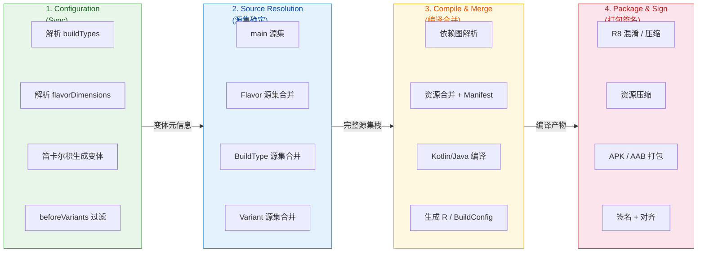
```mermaid
graph LR
    subgraph STEP1 ["1. Configuration\n(Sync)"]
        direction TB
        S1A["解析 buildTypes"]
        S1B["解析 flavorDimensions"]
        S1C["笛卡尔积生成变体"]
        S1D["beforeVariants 过滤"]
        S1A ~~~ S1B
        S1B ~~~ S1C
        S1C ~~~ S1D
    end

    subgraph STEP2 ["2. Source Resolution\n(源集确定)"]
        direction TB
        S2A["main 源集"]
        S2B["Flavor 源集合并"]
        S2C["BuildType 源集合并"]
        S2D["Variant 源集合并"]
        S2A ~~~ S2B
        S2B ~~~ S2C
        S2C ~~~ S2D
    end

    subgraph STEP3 ["3. Compile & Merge\n(编译合并)"]
        direction TB
        S3A["依赖图解析"]
        S3B["资源合并 + Manifest"]
        S3C["Kotlin/Java 编译"]
        S3D["生成 R / BuildConfig"]
        S3A ~~~ S3B
        S3B ~~~ S3C
        S3C ~~~ S3D
    end

    subgraph STEP4 ["4. Package & Sign\n(打包签名)"]
        direction TB
        S4A["R8 混淆 / 压缩"]
        S4B["资源压缩"]
        S4C["APK / AAB 打包"]
        S4D["签名 + 对齐"]
        S4A ~~~ S4B
        S4B ~~~ S4C
        S4C ~~~ S4D
    end

    STEP1 -->|"变体元信息"| STEP2 -->|"完整源集栈"| STEP3 -->|"编译产物"| STEP4

    classDef step1Style fill:#E8F5E9,stroke:#43A047,color:#1B5E20
    classDef step2Style fill:#E3F2FD,stroke:#1E88E5,color:#0D47A1
    classDef step3Style fill:#FFF8E1,stroke:#FFB300,color:#E65100
    classDef step4Style fill:#FCE4EC,stroke:#E53935,color:#B71C1C

    class STEP1 step1Style
    class STEP2 step2Style
    class STEP3 step3Style
    class STEP4 step4Style
```

理解了这个全流程，你就能清晰地定位构建问题出现在哪个阶段：如果是资源冲突，那是 Source Resolution 或 Compile & Merge 阶段的优先级配置有误；如果是依赖类找不到，很可能是 Flavor-Specific 依赖没有配置到正确的 Configuration 上；如果是 APK 中出现了不该存在的调试信息，则需要检查 BuildType 的 `debuggable` 和混淆配置。

---

**📝 练习题**

某项目配置了两个 Flavor 维度（`flavorDimensions = listOf("tier", "region")`），`tier` 维度包含 `free`、`pro` 两个 Flavor，`region` 维度包含 `domestic`、`overseas` 两个 Flavor，同时有 `debug` 和 `release` 两种 BuildType。假设未做任何 Variant Filter，请问该项目共有多少个构建变体？


A. 4


B. 6


C. 8


D. 12


**【答案】** C

**【解析】** 构建变体数量 = Dimension1 的 Flavor 数 × Dimension2 的 Flavor 数 × BuildType 数。本题中 `tier` 维度有 2 个 Flavor（free、pro），`region` 维度有 2 个 Flavor（domestic、overseas），BuildType 有 2 个（debug、release），所以总数 = 2 × 2 × 2 = **8** 个变体。具体为：`freeDomesticDebug`、`freeDomesticRelease`、`freeOverseasDebug`、`freeOverseasRelease`、`proDomesticDebug`、`proDomesticRelease`、`proOverseasDebug`、`proOverseasRelease`。选项 D 的 12 是一个常见的干扰项，可能将 Flavor 之间误认为是加法而非乘法（2+2）×2+（2+2）= 12，但实际应使用笛卡尔积（乘法）。

---

**📝 练习题**

在一个 Android 项目中，`flavorDimensions` 声明为 `listOf("brand", "env")`，其中 `brand` 维度有 Flavor `acme`，`env` 维度有 Flavor `staging`。同时存在以下资源文件，都定义了 `<string name="app_name">`：

- `src/main/res/values/strings.xml` → "BaseApp"
- `src/staging/res/values/strings.xml` → "StagingApp"
- `src/acme/res/values/strings.xml` → "AcmeApp"
- `src/debug/res/values/strings.xml` → "DebugApp"

当构建 `acmeStagingDebug` 变体时，最终生效的 `app_name` 是什么？


A. BaseApp


B. StagingApp


C. AcmeApp


D. DebugApp


**【答案】** D

**【解析】** 资源合并遵循严格的优先级规则，从低到高为：依赖库 → main → 低优先级维度 Flavor → 高优先级维度 Flavor → Flavor 组合 → BuildType → Variant。在本题中，`brand` 是先声明的维度（优先级高于 `env`），所以合并优先级为：`main`（BaseApp）< `staging`（env 维度，低优先级）< `acme`（brand 维度，高优先级）< `debug`（BuildType）。BuildType 源集的优先级 **高于** 所有 Flavor 源集，因此 `debug` 源集中的 `"DebugApp"` 最终胜出。很多开发者容易误选 C（AcmeApp），忽略了 BuildType 的优先级始终高于 ProductFlavor 这一关键规则。

---

## 依赖管理 Dependencies

在 Android 项目中，几乎不可能从零开始编写所有代码。我们会大量引用第三方库（Retrofit、OkHttp、Room 等）、Google 官方 Jetpack 组件，以及自己团队拆分出的内部模块。Gradle 的**依赖管理系统**正是把这些外部产物（JAR、AAR、Module）引入项目并参与编译、打包的核心机制。理解依赖管理，关键要弄清楚三件事：**依赖以什么方式参与编译**（作用域 / Configuration）、**依赖之间版本冲突时如何仲裁**（Resolution Strategy）、以及**注解处理器等特殊依赖的接入方式**（kapt / ksp）。本节将逐一深入讲解。

Gradle 的依赖管理并非 Android 独有能力，它是 Gradle 构建系统本身的核心特性之一。但 Android Gradle Plugin（AGP）在此基础上做了大量扩展——它引入了 `debugImplementation`、`releaseApi` 等与 Build Variant 绑定的 Configuration，也引入了 AAR 格式的特殊处理逻辑（资源合并、R 文件生成等）。因此，在讨论依赖管理时，既要理解 Gradle 原生的依赖解析引擎，也要理解 AGP 在上层做的适配。

---

### implementation vs api

这是 Android 开发者最常接触也最容易混淆的两个依赖配置（Dependency Configuration）。它们的差异集中在一个概念上：**编译可见性的传递（Transitive Compile Visibility）**。

**先说历史背景。** 在 Gradle 3.0 / AGP 3.0 之前，Android 项目统一使用 `compile` 配置声明依赖。`compile` 的行为等价于如今的 `api`——所有依赖都会向上层消费者暴露其公开 API。这看起来很方便，但随着项目模块化程度提高，它带来了严重的**编译膨胀**问题：当底层某个库的一个方法签名变动时，整个依赖链上的所有模块都需要重新编译，即使中间模块根本没有对外暴露那个库的类型。为了解决这一问题，Gradle 引入了 `implementation` 与 `api` 的区分。

**`implementation` 的语义：** 当模块 A 使用 `implementation` 依赖库 L 时，L 的所有类在 A 的源码中可以正常使用（编译期可见、运行期也可见），但 L 的类 **不会** 出现在 A 对外暴露的编译类路径（Compile Classpath）中。也就是说，如果模块 B 依赖了模块 A（`implementation project(':A')`），B 的代码 **无法** 直接 import 或引用 L 中的类——除非 B 自己也显式声明了对 L 的依赖。

**`api` 的语义：** 当模块 A 使用 `api` 依赖库 L 时，L 的类不仅在 A 内部可用，还会被 **传递** 到所有依赖了 A 的上层模块的编译类路径中。模块 B 依赖 A 后，可以直接使用 L 的类，无需额外声明。

这种差异带来的核心收益是**编译隔离与增量编译加速**。来看一个具体场景：

```
多模块项目结构:

:app  ──依赖──▶  :feature-login  ──依赖──▶  :network
                                                │
                                          implementation okhttp
                                          api    retrofit
```

在这个结构中，`:network` 模块用 `implementation` 引入了 OkHttp，用 `api` 引入了 Retrofit。这意味着：

- `:feature-login` 可以直接使用 Retrofit 的类（如 `Retrofit.Builder`、`@GET` 注解等），因为 Retrofit 是通过 `api` 传递上来的。
- `:feature-login` **不能**直接使用 OkHttp 的类（如 `OkHttpClient`），因为 OkHttp 被 `implementation` 隔离了。如果 `:feature-login` 需要用 OkHttp，它必须自己在 `build.gradle.kts` 中再声明一次依赖。
- 当 OkHttp 升级版本、甚至内部 API 发生变更时，只有 `:network` 模块需要重新编译；`:feature-login` 和 `:app` 完全不受影响——因为它们的编译类路径里根本没有 OkHttp。

下面用 Mermaid 图直观展示这两种配置的编译类路径传递差异：

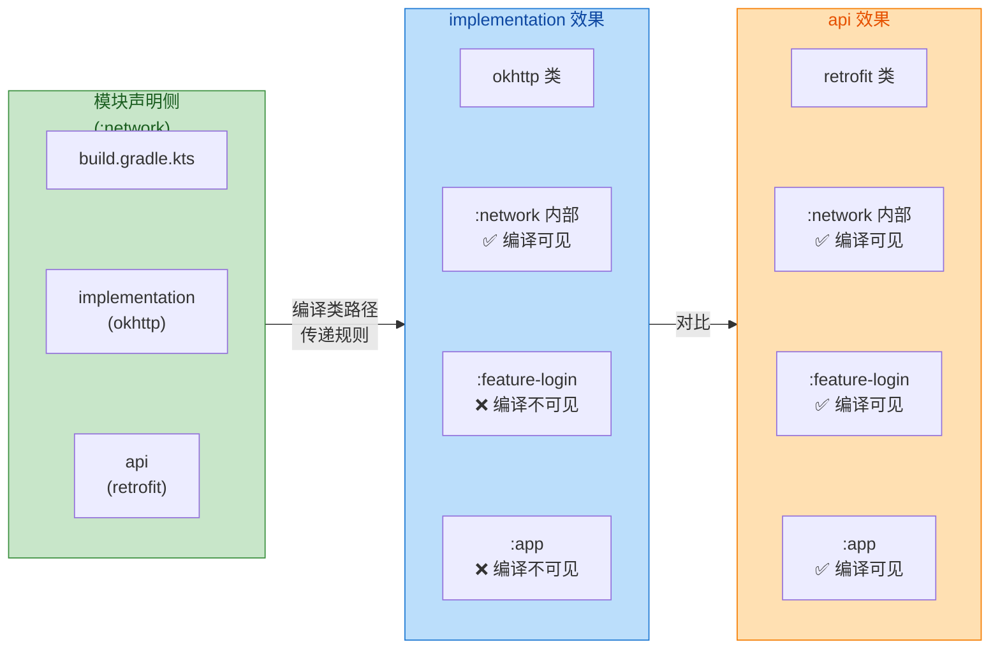
```mermaid
graph LR
    subgraph SRC["模块声明侧\n(:network)"]
        direction TB
        A["build.gradle.kts"]
        B["implementation\n(okhttp)"]
        C["api\n(retrofit)"]
        A ~~~ B
        B ~~~ C
    end

    subgraph IMPL["implementation 效果"]
        direction TB
        D["okhttp 类"]
        E[":network 内部\n✅ 编译可见"]
        F[":feature-login\n❌ 编译不可见"]
        G[":app\n❌ 编译不可见"]
        D ~~~ E
        E ~~~ F
        F ~~~ G
    end

    subgraph API["api 效果"]
        direction TB
        H["retrofit 类"]
        I[":network 内部\n✅ 编译可见"]
        J[":feature-login\n✅ 编译可见"]
        K[":app\n✅ 编译可见"]
        H ~~~ I
        I ~~~ J
        J ~~~ K
    end

    SRC -->|"编译类路径\n传递规则"| IMPL
    IMPL -->|"对比"| API

    classDef greenBox fill:#C8E6C9,stroke:#388E3C,color:#1B5E20
    classDef blueBox fill:#BBDEFB,stroke:#1976D2,color:#0D47A1
    classDef orangeBox fill:#FFE0B2,stroke:#F57C00,color:#E65100
    class SRC greenBox
    class IMPL blueBox
    class API orangeBox
```

**实际开发中的选择原则**非常清晰：

1. **默认使用 `implementation`。** 绝大多数情况下，一个模块引入的第三方库只是自己的"内部实现细节"，不应该暴露给上层。使用 `implementation` 既能保持模块封装性，又能最大化增量编译收益。
2. **仅当模块的公开 API 中出现了依赖库的类型时，才使用 `api`。** 典型场景：你的 `:network` 模块定义了一个 `fun createRetrofit(): Retrofit` 方法，返回值类型是 Retrofit 自身的类——此时上层模块要编译通过就必须能看到 Retrofit 的类，所以 `:network` 必须用 `api` 声明 Retrofit 依赖。
3. **在纯 Application 模块（`:app`）中，`implementation` 和 `api` 效果等价**，因为没有人再依赖 `:app`。但为了一致性和未来可能的模块拆分，仍推荐统一使用 `implementation`。

下面通过一段真实的 `build.gradle.kts` 代码来展示两者的用法：

```kotlin
// :network 模块的 build.gradle.kts
plugins {
    id("com.android.library") // 声明为 Android Library 模块
}

dependencies {
    // Retrofit 的类型出现在 :network 的公开接口中（如返回 Retrofit、Call<T> 等）
    // 因此上层模块需要编译可见 → 使用 api
    api("com.squareup.retrofit2:retrofit:2.9.0")

    // OkHttp 仅在 :network 内部用于构建 OkHttpClient 实例
    // 上层模块不需要也不应该直接接触 OkHttp → 使用 implementation
    implementation("com.squareup.okhttp3:okhttp:4.12.0")

    // Logging Interceptor 同样是内部调试工具，不对外暴露
    implementation("com.squareup.okhttp3:logging-interceptor:4.12.0")

    // Gson 转换器：如果上层模块需要自定义 GsonConverterFactory，则用 api
    // 如果仅在 :network 内部配置好，对外只暴露业务接口，则用 implementation
    implementation("com.squareup.retrofit2:converter-gson:2.9.0")
}
```

**编译产物角度的理解：** Gradle 在解析依赖时，会为每个模块维护两条独立的类路径——**Compile Classpath**（编译类路径，`javac` / `kotlinc` 看到的类）和 **Runtime Classpath**（运行类路径，最终打入 APK 的类）。`implementation` 声明的依赖只出现在当前模块的 Compile Classpath 和所有模块的 Runtime Classpath 中；而 `api` 声明的依赖同时出现在当前模块及其消费者的 Compile Classpath 和 Runtime Classpath 中。无论用哪种声明，依赖的字节码最终都会出现在 APK 中（Runtime Classpath 一定包含），差异只在编译期。

最后补充一个常见的误解：**`implementation` 不是"不打包"，而是"不暴露"。** 运行时，所有通过 `implementation` 引入的库照常存在于 APK 的 dex 文件中。`implementation` 隔离的仅仅是编译期的类型可见性。

---

### runtimeOnly、compileOnly 与其他 Configuration

除了 `implementation` 和 `api`，Gradle 还提供了几种更细分的依赖配置，它们的核心差异在于"编译期是否可见"和"运行期是否打包"两个维度的组合：

| Configuration | 编译期可见 | 运行期（APK）中存在 | 向上层消费者传递编译可见性 | 典型用途 |
|---|---|---|---|---|
| `implementation` | ✅ | ✅ | ❌ | 绝大多数依赖 |
| `api` | ✅ | ✅ | ✅ | 公开 API 中暴露的类型 |
| `compileOnly` | ✅ | ❌ | ❌ | 编译期注解、Provided 环境 |
| `runtimeOnly` | ❌ | ✅ | ❌ | 运行期才需要的实现 |
| `annotationProcessor` / `kapt` / `ksp` | 编译期处理 | ❌（处理器本身） | ❌ | 注解处理器 |

**`runtimeOnly`** 的语义是：这个依赖在编译期完全不可见（你不能在源码中 import 它的类），但它会被打包进最终 APK。这个配置的典型场景是**数据库驱动、SLF4J 实现绑定**等"面向接口编程"的场景。举一个 Android 中实际的例子：

```kotlin
// 编译期只面向 Room 的注解和抽象接口
implementation("androidx.room:room-runtime:2.6.1")
// Room 内部使用的 SQLite 实现，代码中不会直接引用其类
// 但运行时需要它来执行实际的数据库操作
runtimeOnly("androidx.sqlite:sqlite-bundled:2.5.0")
```

在实际 Android 开发中，`runtimeOnly` 的使用频率远低于 `implementation`。但在某些特殊的模块化架构中——比如你使用了"接口模块 + 实现模块"分离的依赖注入方案——`runtimeOnly` 就会变得非常有用：App 模块 `runtimeOnly` 引入各个实现模块，编译时只看到接口模块的类型，实现在运行时通过反射或 ServiceLoader 机制动态绑定。

**`compileOnly`** 则与 `runtimeOnly` 完全相反：编译期可见，但不打包进 APK。它的前身是 `provided`（Gradle 早期命名）。典型应用场景有两个：

1. **编译期注解库**：像 `javax.annotation` 这类仅在编译期做类型检查或代码生成标记的库，运行期不需要。
2. **Provided by Container**：如果你开发的是一个 SDK / 插件，运行环境（宿主 App）已经包含了某个库，你编译时需要它的类型信息但不需要打包，就用 `compileOnly`。

```kotlin
// Lombok 仅在编译期通过注解处理器生成代码，运行期不需要 Lombok 自身的类
compileOnly("org.projectlombok:lombok:1.18.30")

// 如果你开发一个依赖 Glide 的 SDK，但宿主 App 一定会自己引入 Glide
// 为避免重复打包和版本冲突，可以 compileOnly
compileOnly("com.github.bumptech.glide:glide:4.16.0")
```

**Android 特有的变体感知 Configuration（Variant-Aware）：** AGP 会自动生成与 Build Variant 绑定的配置名。例如你有 `debug` 和 `release` 两个 BuildType，AGP 就会生成 `debugImplementation`、`releaseImplementation`、`debugApi`、`releaseApi` 等。使用方式：

```kotlin
dependencies {
    // 仅在 debug 构建中引入 LeakCanary（内存泄漏检测）
    debugImplementation("com.squareup.leakcanary:leakcanary-android:2.13")

    // release 构建用一个空的 no-op 实现（如果库提供的话）
    // 或者干脆不引入——LeakCanary 2.x 已经不需要 no-op 了
}
```

这种能力极为强大。比如在多 Flavor 场景下，你可以为 `freeImplementation` 引入广告 SDK，而 `paidImplementation` 不引入，从而在产物层面实现功能差异化。

---

### kapt 与 ksp

**注解处理（Annotation Processing）** 是 Android 开发中一个极其重要的编译期机制。Room、Dagger/Hilt、Moshi、Glide 等主流库都依赖注解处理器在编译期自动生成模板代码，免去开发者手写大量重复逻辑。Android 项目中使用注解处理器，目前主要有两种方式：**kapt（Kotlin Annotation Processing Tool）** 和 **ksp（Kotlin Symbol Processing）**。

**kapt 的工作原理：**

kapt 的设计初衷是让 Kotlin 项目也能使用 Java 的标准注解处理机制（JSR 269，`javax.annotation.processing`）。它的工作流程比较"曲折"：Kotlin 编译器先将 Kotlin 源码生成**Java Stub（桩文件）**——本质上是只保留了类签名、方法签名和注解信息的 Java 文件——然后将这些 Stub 连同项目中的 Java 源码一起交给标准的 Java 注解处理器（`javac` Annotation Processor）执行。注解处理器生成的代码再参与后续的完整编译。

这个"Kotlin → Java Stub → javac AP → 生成代码"的流程带来了显著的**性能开销**：

1. **Stub 生成耗时**：Kotlin 编译器需要做一轮"部分编译"来输出 Stub，这本身就消耗时间。
2. **全量处理**：传统 `javac` AP 机制不容易做增量处理，导致任何源码变动都可能触发全量注解处理。
3. **两轮编译**：先生成 Stub + AP，再完整编译 Kotlin+Java+生成代码，实际上经历了接近两轮完整编译。

在大型项目中，kapt 可能占据总编译时间的 **25%~40%**。这也是 Google 推出 ksp 的直接动因。

**ksp 的工作原理与优势：**

ksp（Kotlin Symbol Processing）是 Google 专门为 Kotlin 生态设计的符号处理框架。与 kapt 不同，ksp **直接接入 Kotlin 编译器前端**，在 Kotlin 编译的符号解析阶段（Resolution Phase）就拿到了完整的符号信息（类、函数、属性、注解等），无需生成 Java Stub，也不依赖 `javac`。

ksp 的核心优势：

1. **速度快**：省去了 Stub 生成步骤，官方数据显示 ksp 比 kapt 快 **2 倍**左右，实际项目中提升幅度取决于注解处理器的复杂度。
2. **增量处理友好**：ksp 原生支持增量处理（Incremental Processing），只重新处理变动的文件及其依赖。
3. **Kotlin 原生语义**：ksp 的 API 直接暴露 Kotlin 语义（如 `KSClassDeclaration`、`KSFunctionDeclaration`），能正确处理 Kotlin 独有的特性（扩展函数、`data class`、`sealed class`、`typealias` 等），而 kapt 通过 Java Stub 会丢失部分 Kotlin 语义信息。
4. **多平台支持**：ksp 天然支持 Kotlin Multiplatform（KMP），而 kapt 绑定在 JVM 平台上。

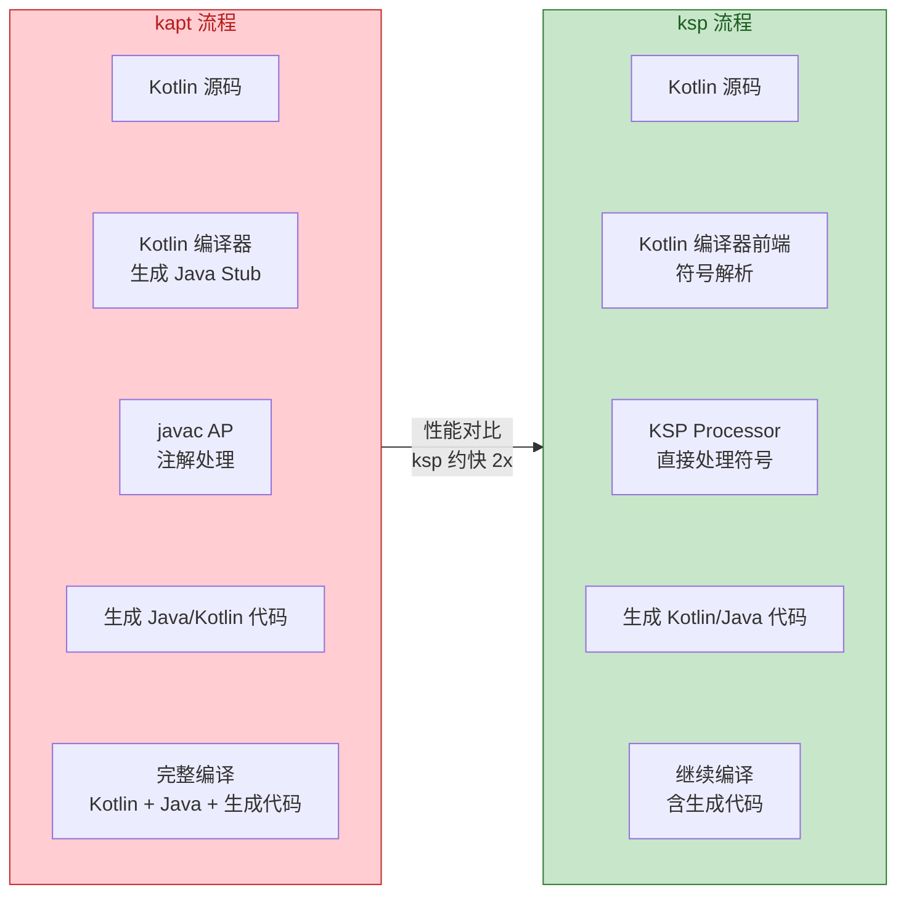
```mermaid
graph LR
    subgraph KAPT["kapt 流程"]
        direction TB
        K1["Kotlin 源码"]
        K2["Kotlin 编译器\n生成 Java Stub"]
        K3["javac AP\n注解处理"]
        K4["生成 Java/Kotlin 代码"]
        K5["完整编译\nKotlin + Java + 生成代码"]
        K1 ~~~ K2
        K2 ~~~ K3
        K3 ~~~ K4
        K4 ~~~ K5
    end

    subgraph KSP["ksp 流程"]
        direction TB
        S1["Kotlin 源码"]
        S2["Kotlin 编译器前端\n符号解析"]
        S3["KSP Processor\n直接处理符号"]
        S4["生成 Kotlin/Java 代码"]
        S5["继续编译\n含生成代码"]
        S1 ~~~ S2
        S2 ~~~ S3
        S3 ~~~ S4
        S4 ~~~ S5
    end

    KAPT -->|"性能对比\nksp 约快 2x"| KSP

    classDef kaptStyle fill:#FFCDD2,stroke:#C62828,color:#B71C1C
    classDef kspStyle fill:#C8E6C9,stroke:#2E7D32,color:#1B5E20
    class KAPT kaptStyle
    class KSP kspStyle
```

**在 build.gradle.kts 中使用 kapt 和 ksp 的对比：**

```kotlin
// ─── 使用 kapt 的写法 ───
plugins {
    id("com.android.application")
    id("org.jetbrains.kotlin.android")
    id("org.jetbrains.kotlin.kapt")          // 必须应用 kapt 插件
}

dependencies {
    implementation("androidx.room:room-runtime:2.6.1")   // Room 运行时库
    kapt("androidx.room:room-compiler:2.6.1")            // Room 注解处理器（kapt 方式）
    // kapt 配置告诉 Gradle：这个依赖是注解处理器，走 kapt 流程
}

// ─── 使用 ksp 的写法（推荐） ───
plugins {
    id("com.android.application")
    id("org.jetbrains.kotlin.android")
    id("com.google.devtools.ksp") version "2.0.0-1.0.21" // 应用 ksp 插件
    // ksp 版本号格式：Kotlin版本-KSP版本，必须与项目 Kotlin 版本匹配
}

dependencies {
    implementation("androidx.room:room-runtime:2.6.1")   // Room 运行时库（不变）
    ksp("androidx.room:room-compiler:2.6.1")             // Room 注解处理器（ksp 方式）
    // 仅将 kapt(...) 替换为 ksp(...)，Room 2.5+ 已原生支持 ksp
}
```

**迁移建议与注意事项：**

并非所有注解处理器都支持 ksp。ksp 要求处理器作者使用 ksp 的 API（`SymbolProcessor` 接口）重写处理器逻辑。截至目前，主流库的 ksp 支持情况：

- **已支持 ksp**：Room（2.5+）、Moshi（1.13+）、Hilt（2.48+）、Glide（4.14+）、Kotlin Serialization（天然 ksp）、Koin Annotations 等。
- **仍需 kapt**：部分旧版 Dagger（非 Hilt）、某些小众库。

如果项目中混用了 kapt 和 ksp，两者可以**共存**——Gradle 会分别执行两套处理流程。但建议尽可能统一迁移到 ksp，因为只要 `kapt` 插件还存在于项目中，Stub 生成步骤就会执行，ksp 的速度优势会被部分抵消。完全移除 kapt 插件后，编译提速才能最大化。

```kotlin
// 混用示例（过渡期可能出现）
dependencies {
    // Room 已迁移到 ksp
    ksp("androidx.room:room-compiler:2.6.1")

    // 某个旧库仍需要 kapt
    kapt("com.some.legacy:annotation-processor:1.0.0")
}
// 此时 kapt 和 ksp 插件都需要应用，两者互不干扰但 kapt 仍有性能损耗
```

---

### 依赖冲突解决

在真实项目中，多个依赖可能间接引入同一个库的不同版本——这就是**依赖冲突（Dependency Conflict）**。例如，Retrofit 2.9.0 内部依赖 OkHttp 3.14.9，而你项目中直接声明了 OkHttp 4.12.0。Gradle 必须做出"最终用哪个版本"的决策，否则 classpath 上会出现同一个类的多个版本，导致编译错误或运行时崩溃。

**Gradle 的默认冲突解决策略：选择最高版本（Highest Version Wins）。**

当依赖图中同一个 `group:artifact`（如 `com.squareup.okhttp3:okhttp`）出现多个版本时，Gradle 默认会选择**版本号最高**的那个。这个策略在大多数情况下是合理的——高版本通常向后兼容低版本。但它也可能引入问题：如果某个库的新版本删除了旧版 API，而依赖旧版的其他库在运行时调用了那个被删除的 API，就会出现 `NoSuchMethodError` 等运行时异常。

**查看依赖树（Dependency Tree）：** 诊断冲突的第一步是看清完整的依赖关系。Gradle 提供了内置任务：

```bash
# 查看 :app 模块 debugRuntimeClasspath 的完整依赖树
./gradlew :app:dependencies --configuration debugRuntimeClasspath

# 输出示例（简化）:
# +--- com.squareup.retrofit2:retrofit:2.9.0
# |    \--- com.squareup.okhttp3:okhttp:3.14.9 -> 4.12.0  ← 被升级
# +--- com.squareup.okhttp3:okhttp:4.12.0
# |    \--- org.jetbrains.kotlin:kotlin-stdlib:1.8.0 -> 1.9.22
```

输出中的 `->` 符号表示版本被仲裁（Resolution），箭头右边是最终生效的版本。通过这棵依赖树，你可以清晰看到是谁引入了冲突版本，以及 Gradle 最终选择了哪个版本。

**强制指定版本（Force）：**

当默认的"最高版本"策略不满足需求时，可以手动强制指定版本：

```kotlin
// 方式一：在 dependencies 块中使用 strictly（严格版本约束）
dependencies {
    implementation("com.squareup.okhttp3:okhttp") {
        version {
            strictly("4.11.0")
            // strictly 表示"必须精确使用这个版本"
            // 即使其他依赖要求更高版本，也强制降级到 4.11.0
            // 如果依赖图中存在不兼容，Gradle 会直接报错而非静默选择
        }
    }
}

// 方式二：全局强制版本（configurations 级别）
configurations.all {
    resolutionStrategy {
        // 强制所有模块使用 OkHttp 4.11.0
        force("com.squareup.okhttp3:okhttp:4.11.0")
    }
}
```

**`strictly` vs `force` 的区别**：`strictly` 是声明式的版本约束，它会参与 Gradle 的依赖解析引擎，如果产生不可调和的矛盾会报错；`force` 更像一个"后处理覆盖"，它在依赖解析完成后强行替换版本，不检查兼容性。推荐优先使用 `strictly`，它更安全。

**排除传递依赖（Exclude）：**

有时你不想要某个依赖间接引入的子依赖。最典型的场景是排除冲突的日志框架：

```kotlin
dependencies {
    implementation("com.some.library:awesome-lib:1.0.0") {
        // awesome-lib 内部依赖了 commons-logging，但我们项目用 SLF4J
        // 排除 commons-logging 避免冲突
        exclude(group = "commons-logging", module = "commons-logging")
    }

    // 全局排除（对所有依赖生效）
    configurations.all {
        exclude(group = "org.apache.httpcomponents", module = "httpclient")
        // 排除 Android 项目中常见的旧版 Apache HttpClient
    }
}
```

**使用 BOM（Bill of Materials）统一版本管理：**

当项目使用大量来自同一"家族"的库时（如 Jetpack、OkHttp/Retrofit/Moshi 的 Square 全家桶、Firebase 等），手动维护每个库的版本号既繁琐又容易出错。BOM 是一种特殊的 POM 文件，它不包含代码，只声明了一组库的推荐版本组合。引入 BOM 后，声明依赖时可以**省略版本号**，Gradle 会自动使用 BOM 中定义的版本。

```kotlin
dependencies {
    // 引入 Jetpack Compose BOM — 它定义了所有 Compose 库的兼容版本组合
    val composeBom = platform("androidx.compose:compose-bom:2024.02.00")
    implementation(composeBom)           // 将 BOM 应用到 implementation 配置
    androidTestImplementation(composeBom) // 也应用到测试配置

    // 声明具体的 Compose 依赖时，无需写版本号 — BOM 自动提供
    implementation("androidx.compose.ui:ui")                // 版本由 BOM 决定
    implementation("androidx.compose.material3:material3")  // 版本由 BOM 决定
    implementation("androidx.compose.ui:ui-tooling-preview") // 版本由 BOM 决定

    // 如果需要覆盖 BOM 中某个库的版本，直接写上版本号即可
    implementation("androidx.compose.foundation:foundation:1.7.0-alpha03")
    // 显式版本会优先于 BOM 指定的版本
}
```

BOM 的本质是利用了 Gradle 的 `platform()` 机制。`platform()` 导入的依赖不会真正添加代码到 classpath，它只引入版本约束（Dependency Constraints）。这些约束参与依赖解析，为没有显式指定版本的同 group:artifact 依赖提供默认版本。

**使用 Gradle Version Catalog（`libs.versions.toml`）集中管理：**

从 Gradle 7.0 开始，Version Catalog 成为官方推荐的多模块版本管理方案。它将所有依赖的坐标和版本集中定义在项目根目录的 `gradle/libs.versions.toml` 文件中：

```toml
# gradle/libs.versions.toml

[versions]
kotlin = "1.9.22"             # 定义版本变量
agp = "8.3.0"
room = "2.6.1"
okhttp = "4.12.0"
compose-bom = "2024.02.00"

[libraries]
# 格式: 别名 = { group = "...", name = "...", version.ref = "版本变量名" }
room-runtime = { group = "androidx.room", name = "room-runtime", version.ref = "room" }
room-compiler = { group = "androidx.room", name = "room-compiler", version.ref = "room" }
okhttp = { group = "com.squareup.okhttp3", name = "okhttp", version.ref = "okhttp" }
compose-bom = { group = "androidx.compose", name = "compose-bom", version.ref = "compose-bom" }

[bundles]
# 将多个依赖组合为一个 bundle，一行引入
room = ["room-runtime"]       # bundle 中不包含 compiler，因为它用 ksp 引入

[plugins]
android-application = { id = "com.android.application", version.ref = "agp" }
kotlin-android = { id = "org.jetbrains.kotlin.android", version.ref = "kotlin" }
```

然后在各模块的 `build.gradle.kts` 中通过类型安全的访问器引用：

```kotlin
// :app 模块 build.gradle.kts
plugins {
    alias(libs.plugins.android.application)  // 引用 [plugins] 中定义的插件
    alias(libs.plugins.kotlin.android)
}

dependencies {
    // libs.xxx 是 Gradle 自动生成的类型安全访问器
    implementation(libs.room.runtime)        // 等价于 "androidx.room:room-runtime:2.6.1"
    ksp(libs.room.compiler)                  // 等价于 "androidx.room:room-compiler:2.6.1"
    implementation(libs.okhttp)              // 等价于 "com.squareup.okhttp3:okhttp:4.12.0"

    // 引入 bundle（一次性添加多个依赖）
    implementation(libs.bundles.room)

    // 引入 BOM
    implementation(platform(libs.compose.bom))
}
```

Version Catalog 的优势在于：**单一事实来源（Single Source of Truth）**。所有模块共享同一份 `libs.versions.toml`，升级某个库的版本只需改一处，IDE 也能提供自动补全和跳转支持。

下面用一张图来整理依赖冲突解决的完整决策路径：

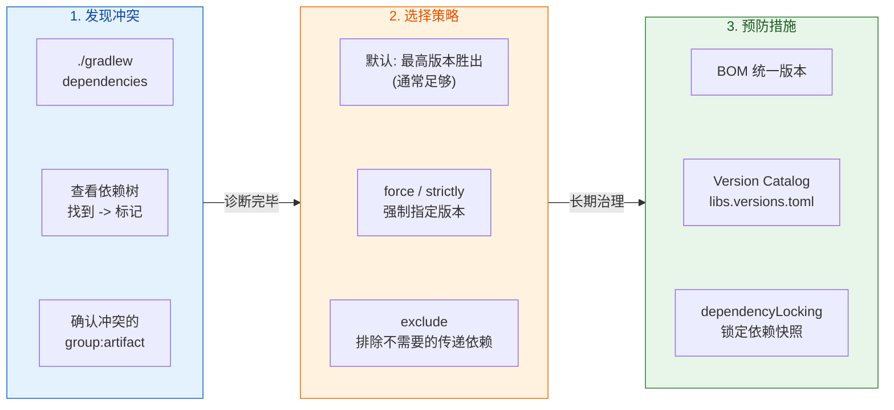
```mermaid
graph LR
    subgraph DETECT["1. 发现冲突"]
        direction TB
        D1["./gradlew\ndependencies"]
        D2["查看依赖树\n找到 -> 标记"]
        D3["确认冲突的\ngroup:artifact"]
        D1 ~~~ D2
        D2 ~~~ D3
    end

    subgraph STRATEGY["2. 选择策略"]
        direction TB
        S1["默认: 最高版本胜出\n(通常足够)"]
        S2["force / strictly\n强制指定版本"]
        S3["exclude\n排除不需要的传递依赖"]
        S1 ~~~ S2
        S2 ~~~ S3
    end

    subgraph PREVENT["3. 预防措施"]
        direction TB
        P1["BOM 统一版本"]
        P2["Version Catalog\nlibs.versions.toml"]
        P3["dependencyLocking\n锁定依赖快照"]
        P1 ~~~ P2
        P2 ~~~ P3
    end

    DETECT -->|"诊断完毕"| STRATEGY
    STRATEGY -->|"长期治理"| PREVENT

    classDef detectStyle fill:#E3F2FD,stroke:#1565C0,color:#0D47A1
    classDef strategyStyle fill:#FFF3E0,stroke:#EF6C00,color:#E65100
    classDef preventStyle fill:#E8F5E9,stroke:#2E7D32,color:#1B5E20
    class DETECT detectStyle
    class STRATEGY strategyStyle
    class PREVENT preventStyle
```

**补充：`dependencyLocking`（依赖锁定）。** 在 CI/CD 场景中，依赖版本的"飘移"是一个隐患——今天构建用的是 `okhttp:4.12.0`，明天 `4.12.1` 发布后可能自动升上去（如果使用了动态版本如 `4.+`）。Gradle 的 Dependency Locking 机制可以将当前解析出的所有依赖版本"锁定"到一个文件中，后续构建必须使用完全相同的版本组合，除非开发者主动执行 `./gradlew dependencies --write-locks` 来更新锁文件。

```kotlin
// 在需要锁定的模块的 build.gradle.kts 中启用
dependencyLocking {
    lockAllConfigurations() // 对所有 Configuration 启用锁定
}
```

---

**📝 练习题**

在一个多模块 Android 项目中，`:core` 模块的 `build.gradle.kts` 包含以下依赖声明：

```kotlin
dependencies {
    implementation("com.google.code.gson:gson:2.10.1")
    api("io.reactivex.rxjava3:rxjava:3.1.8")
}
```

`:feature` 模块依赖了 `:core`（`implementation(project(":core"))`）。以下哪种说法是正确的？


A. `:feature` 模块可以直接使用 Gson 和 RxJava 的类，因为它们都被打包进了最终 APK


B. `:feature` 模块只能直接使用 RxJava 的类，不能直接使用 Gson 的类（编译期不可见），但两者最终都会存在于 APK 中


C. `:feature` 模块只能直接使用 Gson 的类，RxJava 因为用了 `api` 需要额外声明才能使用


D. `:feature` 模块既不能使用 Gson 也不能使用 RxJava，因为 `:feature` 本身也是用 `implementation` 依赖 `:core` 的


**【答案】** B

**【解析】** 本题考察的是 `implementation` 与 `api` 在多模块传递中的行为。`:core` 模块通过 `api` 声明了 RxJava，这意味着 RxJava 的类型会被传递到依赖了 `:core` 的上层模块的**编译类路径**中，所以 `:feature` 可以直接 import 和使用 RxJava 的类。而 Gson 是通过 `implementation` 声明的，它只存在于 `:core` 自己的编译类路径中，不向上层传递编译可见性——因此 `:feature` 的代码中无法直接引用 Gson 类（编译会报错"找不到类"）。但是，**无论 `implementation` 还是 `api`，依赖的字节码最终都会出现在 Runtime Classpath 中**，也就是都会被打入最终 APK。所以 A 的前半句"可以直接使用"是错误的（Gson 编译期不可见），D 的说法忽略了 `api` 的传递效果（`api` 不受消费者侧 `implementation` 的影响——`api` 的传递性是由被依赖方决定的，不是消费方的 Configuration 决定的）。正确答案为 B。

---

## 资源合并 Resource Merging

Android 应用在构建过程中，资源（resources）并非来自单一目录。一个典型的项目可能同时包含 **主源集（main source set）**、**构建类型源集（如 debug/release）**、**产品风味源集（如 free/paid）**、以及多个 **AAR 库依赖**，每一层都可能携带自己的 `res/`、`AndroidManifest.xml` 和 `assets/` 目录。当 AGP 执行构建时，必须将这些来自不同"层"的资源 **合并（merge）** 成一套最终产物，打入 APK/AAB。这个过程就是 **Resource Merging**。

资源合并看似透明，实则是日常开发中大量"诡异"问题的根源 —— 例如"明明改了字符串却不生效"、"Manifest 冲突导致编译失败"、"同名 drawable 覆盖错了"等。深入理解其 **优先级模型** 和 **冲突解决策略**，是每个 Android 开发者的必备功课。

### 优先级规则 Priority Rules

资源合并的核心问题是：**当多个源头提供了同名资源时，谁胜出？** AGP 定义了一套清晰的 **优先级层级（priority hierarchy）**，从高到低依次为：

1. **Build Variant 覆盖层**（最高优先级）
2. **Build Type 源集**（如 `src/debug/`）
3. **Product Flavor 源集**（如 `src/free/`，多维度时按 `flavorDimensions` 声明顺序，先声明的维度优先级更高）
4. **Main 源集**（`src/main/`）
5. **Library 依赖**（AAR / Module，即 dependencies 中声明的库，最低优先级）

直觉上可以理解为"越靠近应用本身的资源，优先级越高"。App 模块永远能覆盖 Library 模块的资源，而 Variant 特有的源集又能覆盖 Main 源集。

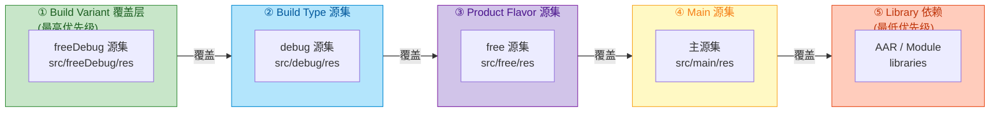
```mermaid
graph LR
    subgraph S1["① Build Variant 覆盖层\n(最高优先级)"]
        direction TB
        A1["freeDebug 源集\nsrc/freeDebug/res"]
    end

    subgraph S2["② Build Type 源集"]
        direction TB
        B1["debug 源集\nsrc/debug/res"]
    end

    subgraph S3["③ Product Flavor 源集"]
        direction TB
        C1["free 源集\nsrc/free/res"]
    end

    subgraph S4["④ Main 源集"]
        direction TB
        D1["主源集\nsrc/main/res"]
    end

    subgraph S5["⑤ Library 依赖\n(最低优先级)"]
        direction TB
        E1["AAR / Module\nlibraries"]
    end

    S1 -->|"覆盖"| S2 -->|"覆盖"| S3 -->|"覆盖"| S4 -->|"覆盖"| S5

    classDef variantStyle fill:#C8E6C9,stroke:#388E3C,color:#1B5E20
    classDef buildTypeStyle fill:#B3E5FC,stroke:#0288D1,color:#01579B
    classDef flavorStyle fill:#D1C4E9,stroke:#7B1FA2,color:#4A148C
    classDef mainStyle fill:#FFF9C4,stroke:#F9A825,color:#F57F17
    classDef libStyle fill:#FFCCBC,stroke:#E64A19,color:#BF360C

    class S1 variantStyle
    class S2 buildTypeStyle
    class S3 flavorStyle
    class S4 mainStyle
    class S5 libStyle
```

在实际的合并过程中，AGP 的 **Resource Merger**（由 `MergeResources` Task 执行）会遍历上述每一层，将所有资源按照 **resource qualifier + resource name** 组成唯一 key（例如 `drawable-hdpi/ic_logo`），然后按优先级决定最终使用哪个文件。

具体的冲突解决规则因资源类型不同而有所区分：

**文件级资源（File-based Resources）**，如 `drawable/icon.png`、`layout/activity_main.xml`、`raw/data.json`，采用的是 **整体替换策略**。高优先级源集中如果存在同限定符（qualifier）同文件名的资源，低优先级的同名文件将被 **完全忽略**，不会做任何"合并"，而是直接被覆盖。举个例子，如果 `src/debug/res/drawable/bg.png` 和 `src/main/res/drawable/bg.png` 同时存在，那么在 `debug` 构建变体下，最终 APK 中只会包含 `src/debug/` 下的版本。这种行为非常直观，但也容易引发疏忽 —— 开发者在 `main` 中修改了图片，却发现 `debug` 包没有变化，原因就是 `debug` 源集的同名文件始终覆盖了它。

**值级资源（Value Resources）**，如 `values/strings.xml`、`values/colors.xml`、`values/styles.xml` 中定义的条目，AGP 会先解析 XML，然后以 **单条 entry（如 `<string name="app_name">`）** 为粒度进行合并。这意味着同一个 `strings.xml` 中的不同 `<string>` 条目可以来自不同的源集。高优先级的同名条目覆盖低优先级条目，但不影响其他不冲突的条目正常合入。这种粒度更细的合并方式，让库可以提供默认值、应用可以按需覆盖特定条目成为可能。

**Library 之间的资源冲突** 是另一个常见的坑。当两个 AAR 库各自声明了同名资源（如都有 `string/app_name`），AGP 默认会根据依赖声明顺序（在 `dependencies` 块中先写的优先级高）来决定胜出者，但这种行为并不可靠。Google 官方推荐的做法是使用 **`resourcePrefix`** 让各模块资源带上独特前缀以彻底避免碰撞：

```kotlin
// library 模块的 build.gradle.kts
android {
    // 为该 library 的所有资源名强制添加前缀
    // Lint 会在编译期检查是否遵守该前缀
    resourcePrefix = "mylib_"
}
```

设置 `resourcePrefix` 后，Lint 会对所有不以 `mylib_` 开头的资源名发出警告。虽然这不是编译级别的强制约束（不会导致编译失败），但配合 CI 中的 Lint 检查可以有效防止资源名冲突。

还有一个值得注意的细节：**资源限定符（Resource Qualifier）不同的资源不会发生冲突**。`drawable-hdpi/icon.png` 和 `drawable-xhdpi/icon.png` 分属不同限定符，二者都会被打入最终 APK，运行时由系统根据设备配置选择合适的版本。冲突只发生在 **完全相同的限定符 + 相同的资源名** 之间。

### Manifest 合并

`AndroidManifest.xml` 的合并是资源合并中最复杂也最容易出错的环节。每个 Android 模块（包括 app 模块和所有 library 依赖）都必须拥有自己的 Manifest 文件，而最终 APK 中只能有一份合并后的 Manifest。AGP 通过 **Manifest Merger Tool** 完成这一工作，合并逻辑远比普通资源合并复杂得多，因为 Manifest 不是简单的"文件覆盖"或"条目覆盖"，而是 **XML 节点级的深度合并**。

**合并的输入来源** 同样遵循优先级层级，从高到低为：

1. **Build Variant Manifest**（如 `src/freeDebug/AndroidManifest.xml`）
2. **Build Type Manifest**（如 `src/debug/AndroidManifest.xml`）
3. **Product Flavor Manifest**（如 `src/free/AndroidManifest.xml`）
4. **Main Manifest**（`src/main/AndroidManifest.xml`，App 的"主 Manifest"）
5. **Library Manifests**（各个 AAR 和子模块的 Manifest，优先级最低）

Manifest Merger 的工作过程可以分为几个关键步骤。首先，它以 **最高优先级 Manifest** 为基础模板（base），然后 **逐层向下合并** 低优先级 Manifest 中的内容。合并过程中，对每一个 XML 元素，Merger 都会判断是否存在冲突，并按照预定义的规则决定合并行为。

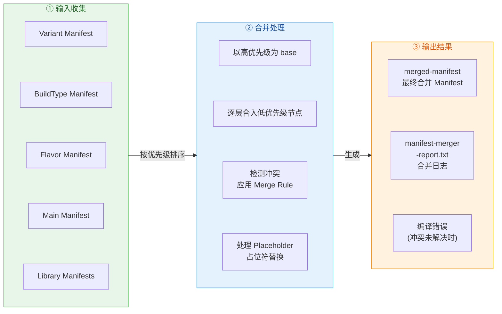
```mermaid
graph LR
    subgraph S1["① 输入收集"]
        direction TB
        A1["Variant Manifest"]
        A2["BuildType Manifest"]
        A3["Flavor Manifest"]
        A4["Main Manifest"]
        A5["Library Manifests"]
        A1 ~~~ A2
        A2 ~~~ A3
        A3 ~~~ A4
        A4 ~~~ A5
    end

    subgraph S2["② 合并处理"]
        direction TB
        B1["以高优先级为 base"]
        B2["逐层合入低优先级节点"]
        B3["检测冲突\n应用 Merge Rule"]
        B4["处理 Placeholder\n占位符替换"]
        B1 ~~~ B2
        B2 ~~~ B3
        B3 ~~~ B4
    end

    subgraph S3["③ 输出结果"]
        direction TB
        C1["merged-manifest\n最终合并 Manifest"]
        C2["manifest-merger\n-report.txt\n合并日志"]
        C3["编译错误\n(冲突未解决时)"]
        C1 ~~~ C2
        C2 ~~~ C3
    end

    S1 -->|"按优先级排序"| S2 -->|"生成"| S3

    classDef inputStyle fill:#E8F5E9,stroke:#43A047,color:#1B5E20
    classDef processStyle fill:#E3F2FD,stroke:#1E88E5,color:#0D47A1
    classDef outputStyle fill:#FFF3E0,stroke:#FB8C00,color:#E65100

    class S1 inputStyle
    class S2 processStyle
    class S3 outputStyle
```

**默认合并行为** 遵循以下逻辑：对于 `<activity>`、`<service>`、`<receiver>`、`<provider>` 等四大组件声明，Merger 以 `android:name` 属性作为唯一标识（key）。如果低优先级 Manifest 中声明了一个在高优先级中不存在的 `<activity>`（比如某个 library 声明了它自己的 Activity），该节点将被 **追加（append）** 到合并结果中。如果两个 Manifest 声明了同名 Activity 但属性值不同（如一个写了 `exported=true`，另一个写了 `exported=false`），这就构成了 **冲突**，Merger 默认会报错中止构建。

**解决 Manifest 冲突** 的核心工具是 **Merge Rule Markers**，即在 Manifest 的 XML 节点上添加 `tools:` 命名空间的特殊属性来指导 Merger 的行为。开发者必须先在 `<manifest>` 根标签声明该命名空间：

```xml
<!-- AndroidManifest.xml -->
<!-- 在根标签声明 tools 命名空间，这是使用所有 merge marker 的前提 -->
<manifest xmlns:android="http://schemas.android.com/apk/res/android"
    xmlns:tools="http://schemas.android.com/tools">
```

以下是最常用的几个 Merge Rule Marker：

**`tools:replace`** —— 强制替换指定属性。当高优先级 Manifest 与低优先级 Manifest 的同一节点上某个属性值冲突时，使用此标记告诉 Merger"以我为准"。

```xml
<!-- App 的 MainManifest：强制用自己的 allowBackup 和 icon 覆盖库的声明 -->
<application
    android:allowBackup="false"
    android:icon="@mipmap/my_icon"
    tools:replace="android:allowBackup, android:icon">
    <!-- tools:replace 接受逗号分隔的属性列表 -->
    <!-- 即使某个 library 声明了 allowBackup=true，最终也会以 false 为准 -->
</application>
```

**`tools:remove`** —— 从合并结果中移除指定属性或整个节点。当某个 library 在 Manifest 中声明了你不想要的属性时，可以用此标记将其剔除。

```xml
<!-- 移除库中声明的 maxSdkVersion 属性 -->
<uses-permission
    android:name="android.permission.WRITE_EXTERNAL_STORAGE"
    tools:remove="android:maxSdkVersion" />
```

**`tools:node="remove"`** —— 比 `tools:remove` 更彻底，**删除整个 XML 节点**。当某个 library 注册了不需要的组件（如它自己的初始化 Provider），而你不希望它出现在最终 Manifest 中时，可以使用该标记。

```xml
<!-- 完全移除某个 library 声明的 SomeReceiver 组件 -->
<receiver
    android:name="com.thirdparty.SomeReceiver"
    tools:node="remove" />
<!-- Merger 在合并时会将匹配 android:name 的节点从结果中删除 -->
```

**`tools:node="merge-only-attributes"`** —— 只合并属性，不合并子节点。适用于你只想修改某个节点的属性但不想引入 library 中该节点的子元素的场景。

**`tools:overrideLibrary`** —— 一个非常实用的标记，用于解决 **`minSdkVersion` 冲突**。当 library 的 `minSdkVersion` 高于 App 的 `minSdkVersion` 时，Merger 会报错（因为这可能在低版本设备上崩溃）。如果你确认已经做了版本兼容处理（如运行时检查 `Build.VERSION.SDK_INT`），可以用此标记强制接受：

```xml
<!-- 允许合并 minSdkVersion 高于本应用的指定 library -->
<uses-sdk tools:overrideLibrary="com.thirdparty.advanced.lib" />
<!-- 可以逗号分隔写多个包名 -->
<!-- 注意：这只是"告诉 Merger 别报错"，运行时兼容仍需自行保证 -->
```

**Placeholder（占位符）** 是 Manifest 合并中另一个强大的机制。Library 可以在 Manifest 中使用 `${variableName}` 占位符，由 App 模块在构建时通过 `manifestPlaceholders` 注入实际值：

```kotlin
// App 模块的 build.gradle.kts
android {
    defaultConfig {
        // 定义 Manifest 占位符，键值对形式
        // 这些值会在 Manifest 合并阶段被注入到所有 ${key} 位置
        manifestPlaceholders["appAuthority"] = "com.example.myapp.provider"
        manifestPlaceholders["mapsApiKey"] = "AIzaSy..."
    }
}
```

```xml
<!-- Library 或 App 的 Manifest 中使用占位符 -->
<provider
    android:name=".MyContentProvider"
    android:authorities="${appAuthority}" />
<!-- 合并后 authorities 会变成 "com.example.myapp.provider" -->

<meta-data
    android:name="com.google.android.geo.API_KEY"
    android:value="${mapsApiKey}" />
```

**调试 Manifest 合并问题** 时，最有价值的工具是 AGP 自动生成的 **合并日志文件**。每次构建后，在 `app/build/outputs/logs/manifest-merger-<variant>-report.txt` 中可以查看完整的合并记录，包括每个节点来自哪个源、是否被覆盖、冲突是如何解决的。在 Android Studio 中，打开最终合并后的 Manifest 文件（`app/build/intermediates/merged_manifests/`），编辑器底部会有一个 **"Merged Manifest"** 标签页，提供了图形化的合并来源追踪，这在排查问题时非常直观。

### values 覆盖

`values/` 目录下的资源（`strings.xml`、`colors.xml`、`dimens.xml`、`styles.xml`、`attrs.xml` 等）是 Android 资源系统中唯一采用 **entry-level merge（条目级合并）** 的类别。这与 `drawable`、`layout` 等文件级资源的"整体替换"行为形成鲜明对比，也是很多开发者容易混淆的地方。

所谓 entry-level merge，是指 AGP 不会以 XML 文件为单位进行覆盖，而是 **解析每个 XML 文件内部的条目**（如每一条 `<string>`、`<color>`、`<dimen>`），以 **`资源类型 + name 属性`** 作为唯一标识进行合并。来自不同源集、不同 XML 文件的同类型同名条目会发生覆盖，而不同名的条目则互不干扰、全部保留。

举个具体场景来说明。假设项目结构如下：

```text
src/main/res/values/strings.xml
├── <string name="app_name">MyApp</string>
├── <string name="welcome">Welcome!</string>
└── <string name="copyright">© 2024</string>

src/debug/res/values/strings.xml
├── <string name="app_name">MyApp-Debug</string>
└── <string name="debug_info">Debug Build</string>

library/res/values/strings.xml
├── <string name="lib_title">LibTitle</string>
└── <string name="welcome">Hello from Lib</string>
```

在 `debug` 构建变体下，最终合并结果为：

```text
最终合并后的 values:
├── app_name      = "MyApp-Debug"     ← 来自 debug 源集（覆盖了 main）
├── welcome       = "Welcome!"        ← 来自 main 源集（覆盖了 library）
├── copyright     = "© 2024"          ← 来自 main 源集（无冲突）
├── debug_info    = "Debug Build"     ← 来自 debug 源集（无冲突）
└── lib_title     = "LibTitle"        ← 来自 library（无冲突）
```

可以看到：`app_name` 被 `debug` 覆盖，`welcome` 在 `main` 和 `library` 中都有但 `main` 优先级更高所以 `main` 胜出，其余无冲突的条目全部合入。这种机制的好处是 **library 可以安全地提供默认值资源，App 只需覆盖想定制的条目，不必复制整个 XML 文件**。

**Style 和 Theme 的覆盖** 需要特别说明。`<style>` 资源中包含多个 `<item>` 子元素，合并时的 **粒度仍然是整个 `<style>` 节点**，而非单个 `<item>`。也就是说，如果高优先级源集定义了一个同名 Style，它将 **整体替换** 低优先级的同名 Style，而不是"合并 item"。这是一个常见的误区。

```xml
<!-- library 中定义的 Style -->
<style name="AppButton" parent="Widget.MaterialComponents.Button">
    <item name="android:textSize">14sp</item>
    <item name="android:textColor">#000000</item>
    <item name="cornerRadius">8dp</item>
</style>

<!-- App main 中覆盖同名 Style -->
<!-- 注意：这将完整替换 library 的 AppButton，而非合并 item -->
<style name="AppButton" parent="Widget.MaterialComponents.Button">
    <item name="android:textSize">16sp</item>
    <!-- textColor 和 cornerRadius 不在这里声明 -->
    <!-- 最终 AppButton 只有 textSize=16sp，其余属性由 parent 决定 -->
    <!-- library 中声明的 textColor=#000000 和 cornerRadius=8dp 丢失了 -->
</style>
```

这就意味着，当你想覆盖 library 提供的 Style 时，必须 **把所有需要的 item 都写全**，否则未声明的 item 会丢失（退回到 parent style 的默认值）。如果只想修改其中一两个属性，更好的做法是 **继承** library 的 Style 而非覆盖它：

```xml
<!-- 通过继承来修改，而非覆盖 -->
<style name="AppButton.Custom" parent="AppButton">
    <!-- 只修改 textSize，其余继承自 AppButton -->
    <item name="android:textSize">16sp</item>
</style>
```

**`tools:keep` 与 `tools:discard`** 是两个用于控制资源缩减（resource shrinking）的特殊标记，虽然不直接参与合并过程，但常与 values 覆盖配合使用。当开启了 `shrinkResources true` 后，AGP 会移除未被代码引用的资源。如果某些资源是通过反射或动态方式引用的（如 `getIdentifier()`），可以在 `res/raw/keep.xml` 中声明保留：

```xml
<!-- res/raw/keep.xml -->
<!-- tools:keep 指定需要保留的资源（支持通配符） -->
<!-- tools:discard 指定明确要丢弃的资源 -->
<resources xmlns:tools="http://schemas.android.com/tools"
    tools:keep="@layout/l_used_*,@drawable/icon_dynamic_*"
    tools:discard="@layout/unused_layout" />
```

**多语言资源覆盖** 也是 values 覆盖的一个重要场景。Android 的多语言适配依赖 `values-<locale>/strings.xml`（如 `values-zh-rCN/`、`values-ja/`）。合并规则与普通 values 相同 —— **相同限定符下的同名条目才会发生覆盖**。这意味着 `values-zh-rCN/strings.xml` 中的 `app_name` 不会与 `values/strings.xml`（默认语言）中的 `app_name` 冲突，二者各自独立存在于最终 APK 中。但如果 App 和 Library 都提供了 `values-zh-rCN/` 的同名字符串，App 的声明优先。

### assets 合并

`assets/` 目录的合并行为与 `res/` 有着本质的区别。`assets` 中的文件不会被编译、不会被赋予资源 ID，而是 **原封不动地打包进 APK**，运行时通过 `AssetManager` 以文件路径访问。正因如此，assets 的合并策略比 `res/` 更简单也更粗暴 —— **完全基于文件路径的整体替换**。

合并规则如下：AGP 会收集所有源集和 library 依赖中的 `assets/` 目录，以 **相对路径（相对于 `assets/` 根）** 作为唯一标识。如果多个来源提供了相同路径的文件（如 `assets/config/settings.json`），则遵循与 `res/` 相同的优先级：Variant > BuildType > Flavor > Main > Library。高优先级的文件直接替换低优先级的同路径文件。

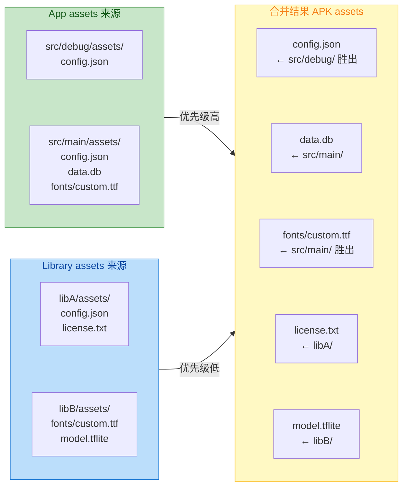
```mermaid
graph LR
    subgraph S1["App assets 来源"]
        direction TB
        A1["src/debug/assets/\nconfig.json"]
        A2["src/main/assets/\nconfig.json\ndata.db\nfonts/custom.ttf"]
        A1 ~~~ A2
    end

    subgraph S2["Library assets 来源"]
        direction TB
        B1["libA/assets/\nconfig.json\nlicense.txt"]
        B2["libB/assets/\nfonts/custom.ttf\nmodel.tflite"]
        B1 ~~~ B2
    end

    subgraph S3["合并结果 APK assets"]
        direction TB
        C1["config.json\n← src/debug/ 胜出"]
        C2["data.db\n← src/main/"]
        C3["fonts/custom.ttf\n← src/main/ 胜出"]
        C4["license.txt\n← libA/"]
        C5["model.tflite\n← libB/"]
        C1 ~~~ C2
        C2 ~~~ C3
        C3 ~~~ C4
        C4 ~~~ C5
    end

    S1 -->|"优先级高"| S3
    S2 -->|"优先级低"| S3

    classDef appStyle fill:#C8E6C9,stroke:#388E3C,color:#1B5E20
    classDef libStyle fill:#BBDEFB,stroke:#1976D2,color:#0D47A1
    classDef resultStyle fill:#FFF9C4,stroke:#FBC02D,color:#F57F17

    class S1 appStyle
    class S2 libStyle
    class S3 resultStyle
```

上图展示了一个典型场景：`config.json` 在三个位置都存在（debug 源集、main 源集、libA），最终 debug 源集的版本胜出；`fonts/custom.ttf` 在 main 和 libB 中都有，main 优先级更高所以 main 胜出。不冲突的文件（`data.db`、`license.txt`、`model.tflite`）则全部合入。

**需要特别注意的是**，assets 合并不会产生编译错误 —— 即使存在同路径冲突，AGP 也 **默默地以高优先级替换低优先级，不给任何警告**。这种静默行为在某些场景下可能引发难以排查的 Bug。例如，某个 library 在 `assets/` 中放了一个配置文件，App 也恰好有同名文件，library 的配置被静默覆盖了，但 library 内部代码读取时拿到的却是 App 的文件内容，导致功能异常。

为了规避这类隐患，最佳实践是让 Library 的 assets 文件存放在 **带有模块名前缀的子目录** 下，例如 `assets/mylib/config.json` 而不是 `assets/config.json`，从路径层面避免碰撞。

```kotlin
// 在 Library 代码中通过子目录路径访问 assets
// 这样即使 App 也有 assets/config.json 也不会冲突
val inputStream = context.assets.open("mylib/config.json")
// 使用 BufferedReader 包装以便逐行读取
val content = inputStream.bufferedReader().use { reader ->
    // use 会在 block 结束后自动关闭 reader
    reader.readText()
}
```

**构建变体专属 assets** 也是一个常用技巧。例如在 `src/debug/assets/` 中放置 Mock 数据文件，在 `src/release/assets/` 中放置真实配置，利用合并机制自动切换：

```text
src/
├── debug/assets/
│   └── server_config.json    ← debug 版本使用测试服务器配置
├── release/assets/
│   └── server_config.json    ← release 版本使用生产服务器配置
└── main/assets/
    └── default_data.json     ← 所有变体共享的默认数据
```

这种做法比在代码中用 `if (BuildConfig.DEBUG)` 做分支判断更加干净。配置数据的切换完全在构建层面完成，运行时代码只需无脑读取 `assets/server_config.json` 即可，完全不知道也不关心当前是哪个变体。

最后，关于 **assets 文件体积** 需要注意：assets 默认不会被 AAPT2 压缩（与 `res/raw/` 类似），但 APK 打包时会根据文件扩展名决定是否应用 ZIP 压缩。已经是压缩格式的文件（`.jpg`、`.png`、`.mp3`、`.mp4` 等）不会二次压缩，而文本类文件（`.json`、`.txt`、`.html`）通常会被 ZIP 压缩。如果你的 assets 中包含大文件且需要精细控制压缩行为，可以通过 AGP 的 `aaptOptions` 配置：

```kotlin
android {
    aaptOptions {
        // noCompress 指定不进行 ZIP 压缩的文件扩展名
        // 适用于需要在运行时直接 mmap 读取的文件（如 TFLite 模型）
        noCompress += listOf("tflite", "lite", "mp3")
    }
}
```

---

**📝 练习题**

一个 App 项目的 `src/main/res/values/strings.xml` 中定义了 `<string name="title">Main Title</string>`，其依赖的 Library 模块的 `res/values/strings.xml` 中也定义了 `<string name="title">Lib Title</string>` 和 `<string name="subtitle">Lib Subtitle</string>`。最终 APK 中，`title` 和 `subtitle` 的值分别是什么？

A. `title = "Lib Title"`, `subtitle = "Lib Subtitle"`


B. `title = "Main Title"`, `subtitle` 不存在（被覆盖移除）


C. `title = "Main Title"`, `subtitle = "Lib Subtitle"`


D. 编译报错，因为 `title` 在两处定义产生冲突


**【答案】** C

**【解析】** values 资源采用 entry-level merge 策略，以 `资源类型 + name` 为粒度进行合并。`title` 在 App 的 `main` 源集和 Library 中都有定义，根据优先级规则 Main > Library，App 的 `"Main Title"` 胜出。`subtitle` 只在 Library 中定义，不存在冲突，会正常合入最终结果。App 模块的资源 **不会"排斥"** Library 中不冲突的其他条目 —— 这正是 entry-level merge 与 file-level replace 的关键区别。如果是 `drawable` 等文件级资源，则是整个文件替换；但 values 是解析到条目级别后逐条合并的。

---

**📝 练习题**

某个第三方 Library 在其 `AndroidManifest.xml` 中声明了 `<application android:allowBackup="true">`，而 App 的 Manifest 中声明了 `android:allowBackup="false"`。构建时出现 Manifest 合并错误。下列哪种方式可以正确解决该冲突？

A. 在 App 的 `<application>` 标签上添加 `tools:replace="android:allowBackup"`


B. 删除 App Manifest 中的 `android:allowBackup` 属性，让 Library 的值生效


C. 在 Library 的 Manifest 中添加 `tools:overrideLibrary`


D. A 和 B 都能解决编译错误，但效果不同


**【答案】** D

**【解析】** 方案 A 使用 `tools:replace` 明确告知 Merger "以我（App）的值为准"，合并后 `allowBackup=false`，编译通过。方案 B 也能解决冲突 —— 因为 App 不再声明该属性，不存在冲突了，Library 的 `allowBackup=true` 会被合入，编译同样通过。但二者的最终效果截然不同：A 导致 `allowBackup=false`，B 导致 `allowBackup=true`。方案 C 不正确，因为 `tools:overrideLibrary` 是用于解决 `minSdkVersion` 冲突的，不适用于属性值冲突。因此 D 是最准确的答案。

---

## Gradle 脚本 DSL

Gradle 的构建脚本本质上是 **可执行的代码**，而非静态的配置文件。这是 Gradle 区别于 Maven（纯 XML 声明式）的根本设计哲学 —— 构建逻辑就是程序逻辑，开发者拥有图灵完备的表达能力来定义构建过程。然而，"用什么语言来写这段代码"经历了一次重大的范式迁移：从最初的 **Groovy DSL**（`.gradle` 文件）到如今 Google 官方推荐的 **Kotlin DSL**（`.gradle.kts` 文件）。

理解这两套 DSL 的差异、掌握迁移技巧、吃透 `build.gradle.kts` 和 `settings.gradle.kts` 的配置模型，是现代 Android 项目的基本功。很多开发者在迁移过程中遇到的困惑，根源并不在于语法差异本身，而在于对 Gradle DSL 背后的 **委托机制（delegation）** 和 **扩展属性（extension properties）** 理解不够深入。本节将从原理层面讲透这些内容。

### Groovy vs Kotlin DSL 迁移

**为什么要从 Groovy 迁移到 Kotlin DSL？** 这个问题的答案可以归结为三个字：**类型安全（type safety）**。Groovy 是一门动态类型语言，Gradle 的 Groovy DSL 大量依赖运行时元编程（metaprogramming）—— 当你在 `build.gradle` 中写 `compileSdkVersion 34` 时，Groovy 并不知道 `compileSdkVersion` 是什么，它只是在运行时通过 `methodMissing` / `propertyMissing` 机制将调用委托给底层的 Gradle 对象模型。这意味着 **IDE 无法在编辑时提供准确的自动补全和类型检查**，拼写错误只能在构建执行时才会暴露，开发体验相当糟糕。

Kotlin DSL 彻底改变了这一局面。`.gradle.kts` 文件是标准的 Kotlin 脚本，Gradle 通过 Kotlin 的 **扩展函数（extension functions）** 和 **带接收者的 Lambda（lambda with receiver）** 来构建 DSL。每一个配置块都有明确的类型信息，IDE（尤其是 IntelliJ/Android Studio）可以提供 **完整的代码补全、实时类型检查、跳转到源码、重构支持** 等能力。对于大型项目而言，这种开发体验的提升是质的飞跃。

不过，Kotlin DSL 也并非没有代价。早期版本（AGP 4.x 之前）的 Kotlin DSL 脚本 **首次编译速度明显慢于 Groovy**，因为 Kotlin 编译器需要解析和编译 `.kts` 文件。随着 Gradle 7.x+ 引入的 **脚本编译缓存** 和 Kotlin 编译器性能的持续优化，这一差距已经大幅缩小。Google 从 AGP 7.0 开始在官方模板和文档中全面推荐 Kotlin DSL，Android Studio 新建项目默认生成的也是 `.gradle.kts` 文件。

**迁移的核心语法差异** 可以分为以下几个维度：

**字符串声明**：Groovy 允许使用单引号（`'text'`）和双引号（`"text"`），其中只有双引号支持字符串插值（`"$variable"`）。Kotlin 中 **只有双引号字符串**，且同样支持 `$variable` 和 `${expression}` 插值。迁移时需要将所有单引号替换为双引号。

```kotlin
// Groovy DSL
// applicationId 'com.example.app'    ← 单引号，Groovy 特有
// applicationId "com.example.app"    ← 双引号，Groovy 也支持

// Kotlin DSL — 只允许双引号
applicationId = "com.example.app"     // 注意：Kotlin DSL 中赋值必须用 = 号
```

**赋值语法**：这是迁移中最高频的改动点。Groovy DSL 中大量使用 **方法调用语法** 来赋值（如 `compileSdkVersion 34`，本质是调用 `compileSdkVersion(34)` 方法），这种省略括号的写法是 Groovy 的语法糖。Kotlin 不支持这种语法，必须使用 **属性赋值（`=`）** 或 **显式方法调用（带括号）**：

```kotlin
// Groovy DSL 写法
// android {
//     compileSdkVersion 34          ← 方法调用（省略括号）
//     defaultConfig {
//         minSdkVersion 21          ← 方法调用
//         targetSdkVersion 34       ← 方法调用
//         versionCode 1             ← 方法调用
//         versionName "1.0"         ← 方法调用
//     }
// }

// Kotlin DSL 写法 — 必须用 = 赋值
android {
    compileSdk = 34                   // 属性赋值，注意属性名也可能变化
    defaultConfig {
        minSdk = 21                   // compileSdkVersion → compileSdk（AGP 7.0+ 简化命名）
        targetSdk = 34                // 同上
        versionCode = 1               // 属性赋值
        versionName = "1.0"           // 属性赋值
    }
}
```

注意上面示例中属性名的变化：`compileSdkVersion` → `compileSdk`，`minSdkVersion` → `minSdk` 等。这并非 Kotlin DSL 的改动，而是 **AGP 7.0+ 对 API 命名的统一简化**，Groovy DSL 中同样可以使用新名称。但在实际迁移中，这两种变化（语法 + 命名）往往同时发生，容易让人混淆。

**依赖声明语法** 的差异也很明显。Groovy 中字符串拼接和方法调用的灵活性在 Kotlin 中不复存在：

```kotlin
// Groovy DSL
// implementation 'androidx.core:core-ktx:1.12.0'    ← 单引号 + 省略括号
// implementation "androidx.core:core-ktx:$coreVersion" ← 变量插值

// Kotlin DSL — 双引号 + 括号
implementation("androidx.core:core-ktx:1.12.0")       // 必须带括号
implementation("androidx.core:core-ktx:${coreVersion}") // 变量插值用 ${}
```

**闭包 vs Lambda**：Groovy 的闭包（Closure）和 Kotlin 的 Lambda 在语法上相似但语义不同。Groovy 闭包有一个隐式的 `delegate` 机制（类似 Kotlin 的 receiver），Gradle 的 Groovy DSL 正是利用这一特性让闭包内可以直接访问配置对象的属性。Kotlin DSL 使用 **带接收者的 Lambda（`T.() -> Unit`）** 实现同样的效果，但类型更加明确。在大多数情况下，迁移时闭包的花括号写法可以直接保留，但某些高级用法（如动态创建 Task）需要调整：

```kotlin
// Groovy DSL — 动态创建 Task
// task myTask(type: Copy) {
//     from 'src'
//     into 'dest'
// }

// Kotlin DSL — 必须使用 tasks.register
tasks.register<Copy>("myTask") {
    // register 的泛型参数指定 Task 类型
    // Lambda 的 receiver 是 Copy 类型的实例
    from("src")       // Copy 类的方法，需要括号
    into("dest")      // 同上
}
```

**`ext` 扩展属性** 的迁移是另一个痛点。Groovy DSL 中常用 `ext` 块定义全局变量（如版本号），Kotlin DSL 中 `ext` 仍然可用但类型不安全，推荐的替代方案是使用 **`buildSrc`** 或 **Version Catalog（`libs.versions.toml`）**：

```kotlin
// Groovy DSL 中的 ext 用法（根 build.gradle）
// ext {
//     kotlin_version = '1.9.22'
//     compose_version = '1.5.4'
// }

// Kotlin DSL 中的 ext 用法（仍可工作，但失去类型安全）
// extra["kotlin_version"] = "1.9.22"
// val kotlinVersion: String by rootProject.extra  // 读取时需要委托属性

// ★ 推荐方案：Version Catalog（Gradle 7.0+）
// 在 gradle/libs.versions.toml 中集中管理，详见后文
```

**`apply plugin` vs `plugins` 块**：Groovy DSL 中常见两种插件应用方式 —— 旧式的 `apply plugin: 'com.android.application'` 和新式的 `plugins { id 'com.android.application' }`。Kotlin DSL 中 **强烈推荐使用 `plugins` 块**，因为它提供了类型安全的插件 ID 引用和版本管理：

```kotlin
// Groovy 旧式（不推荐，Kotlin DSL 中也能工作但失去类型安全）
// apply plugin: 'com.android.application'
// apply plugin: 'kotlin-android'

// Kotlin DSL — plugins 块（推荐）
plugins {
    id("com.android.application") version "8.2.0"  // 显式版本（通常在根 build.gradle.kts 声明）
    id("org.jetbrains.kotlin.android") version "1.9.22"
    // 也可以使用 alias 引用 Version Catalog 中的定义
    // alias(libs.plugins.android.application)
}
```

**迁移实战建议**：不要试图一次性迁移整个项目。Gradle 完全支持 **Groovy 和 Kotlin DSL 混用** —— 同一个项目中，根 `build.gradle` 可以保持 Groovy，某个模块的 `build.gradle.kts` 可以先迁移为 Kotlin，二者和平共处。推荐的迁移顺序是：**`settings.gradle` → 根 `build.gradle` → 各子模块 `build.gradle`**，从影响范围最小的文件开始，逐步推进。

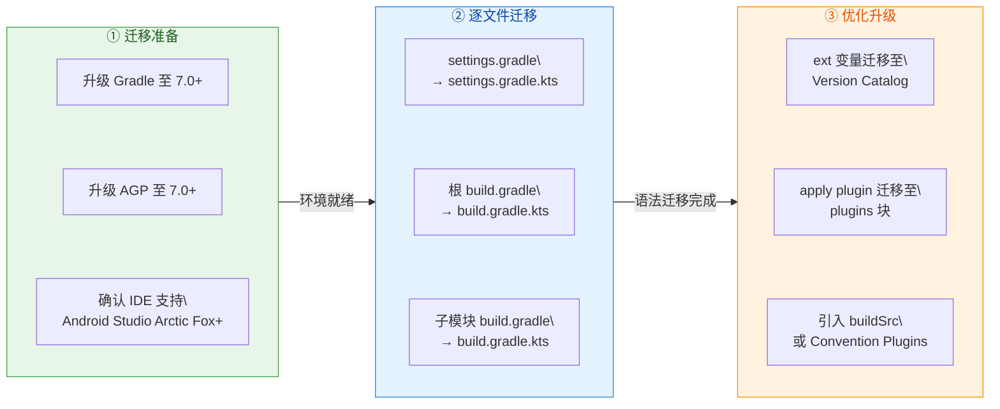
```mermaid
graph LR
    subgraph S1["① 迁移准备"]
        direction TB
        A1["升级 Gradle 至 7.0+"]
        A2["升级 AGP 至 7.0+"]
        A3["确认 IDE 支持\\nAndroid Studio Arctic Fox+"]
        A1 ~~~ A2
        A2 ~~~ A3
    end

    subgraph S2["② 逐文件迁移"]
        direction TB
        B1["settings.gradle\\n→ settings.gradle.kts"]
        B2["根 build.gradle\\n→ build.gradle.kts"]
        B3["子模块 build.gradle\\n→ build.gradle.kts"]
        B1 ~~~ B2
        B2 ~~~ B3
    end

    subgraph S3["③ 优化升级"]
        direction TB
        C1["ext 变量迁移至\\nVersion Catalog"]
        C2["apply plugin 迁移至\\nplugins 块"]
        C3["引入 buildSrc\\n或 Convention Plugins"]
        C1 ~~~ C2
        C2 ~~~ C3
    end

    S1 -->|"环境就绪"| S2 -->|"语法迁移完成"| S3

    classDef prepStyle fill:#E8F5E9,stroke:#43A047,color:#1B5E20
    classDef migrateStyle fill:#E3F2FD,stroke:#1E88E5,color:#0D47A1
    classDef optimizeStyle fill:#FFF3E0,stroke:#FB8C00,color:#E65100

    class S1 prepStyle
    class S2 migrateStyle
    class S3 optimizeStyle
```

### build.gradle.kts 配置

`build.gradle.kts` 是每个 Gradle 模块的构建脚本，也是开发者与 Gradle 交互最频繁的文件。要真正理解这个文件中每一行代码的含义，需要先建立一个关键认知：**`build.gradle.kts` 中的所有顶层代码，都在一个隐式的 `Project` 对象上下文中执行**。换句话说，这个脚本的 receiver（接收者）就是当前模块对应的 `org.gradle.api.Project` 实例。

当你在脚本中直接写 `dependencies { ... }` 时，实际上是在调用 `Project.dependencies(Action<DependencyHandler>)` 方法；写 `tasks.register(...)` 时，是在访问 `Project.tasks` 属性（类型为 `TaskContainer`）。所有看似"凭空出现"的 DSL 方法和属性，都来自 `Project` 接口及其扩展。

**App 模块的 `build.gradle.kts` 典型结构** 可以拆解为以下几个核心区块：

```kotlin
// ========== 1. plugins 块 ==========
// 声明当前模块使用的 Gradle 插件
// 每个插件会向 Project 注入额外的 Task、Extension 和 Configuration
plugins {
    // Android Application 插件 — 让这个模块成为一个可构建的 APK/AAB 项目
    id("com.android.application")
    // Kotlin Android 插件 — 启用 Kotlin 编译支持
    id("org.jetbrains.kotlin.android")
    // 如果使用 Version Catalog，可以用 alias 语法：
    // alias(libs.plugins.android.application)
}

// ========== 2. android 块 ==========
// 由 AGP 插件注入的扩展（AppExtension / ApplicationExtension）
// 所有 Android 特有的构建配置都在这里
android {
    // 编译所使用的 Android SDK 版本
    compileSdk = 34

    // 命名空间，用于生成 R 类和 BuildConfig 的包名
    // AGP 7.0+ 推荐在这里声明，而非 Manifest 的 package 属性
    namespace = "com.example.myapp"

    defaultConfig {
        // 应用的唯一标识符（在 Google Play 上不可更改）
        applicationId = "com.example.myapp"
        // 最低支持的 Android API 级别
        minSdk = 24
        // 目标 API 级别（影响系统行为兼容模式）
        targetSdk = 34
        // 内部版本号，每次发布必须递增
        versionCode = 1
        // 用户可见的版本名
        versionName = "1.0.0"

        // 测试运行器，默认使用 AndroidJUnit4
        testInstrumentationRunner = "androidx.test.runner.AndroidJUnitRunner"
    }

    buildTypes {
        // release 构建类型 — 用于发布
        release {
            // 是否启用代码压缩（R8/ProGuard）
            isMinifyEnabled = true
            // 是否启用资源缩减（移除未引用资源）
            isShrinkResources = true
            // ProGuard 规则文件
            proguardFiles(
                // AGP 内置的默认优化规则
                getDefaultProguardFile("proguard-android-optimize.txt"),
                // 项目自定义的规则
                "proguard-rules.pro"
            )
        }
        // debug 构建类型 — AGP 默认已配置，通常无需显式声明
        // 除非你需要自定义 debug 配置
        debug {
            // debug 包的 applicationId 添加后缀，允许与 release 版共存
            applicationIdSuffix = ".debug"
            // debug 默认不压缩代码
            isMinifyEnabled = false
        }
    }

    // Kotlin JVM 目标版本配置
    compileOptions {
        // Java 源码兼容级别
        sourceCompatibility = JavaVersion.VERSION_17
        // Java 目标字节码版本
        targetCompatibility = JavaVersion.VERSION_17
    }

    kotlinOptions {
        // Kotlin 编译器生成的 JVM 字节码版本
        jvmTarget = "17"
    }

    // 启用特定的构建特性
    buildFeatures {
        // 启用 View Binding（替代 findViewById）
        viewBinding = true
        // 启用 Jetpack Compose
        compose = true
        // 启用 BuildConfig 类生成（AGP 8.0+ 默认关闭）
        buildConfig = true
    }

    // Compose 编译器配置（AGP 8.0+ 需要）
    composeOptions {
        // Compose Compiler 扩展版本，必须与 Kotlin 版本兼容
        kotlinCompilerExtensionVersion = "1.5.8"
    }
}

// ========== 3. dependencies 块 ==========
// 声明当前模块的所有依赖项
dependencies {
    // AndroidX 核心库
    implementation("androidx.core:core-ktx:1.12.0")
    // Lifecycle 组件
    implementation("androidx.lifecycle:lifecycle-runtime-ktx:2.7.0")
    // 单元测试依赖
    testImplementation("junit:junit:4.13.2")
    // Android Instrumented 测试依赖
    androidTestImplementation("androidx.test.ext:junit:1.1.5")
}
```

上面的代码涵盖了一个标准 App 模块的绝大多数配置项。下面深入讲解几个关键机制。

**`plugins` 块的工作原理**：当 Gradle 解析 `plugins { id("com.android.application") }` 时，它会从 **Plugin Repository**（默认是 Gradle Plugin Portal 和 Google Maven）中查找对应的插件实现类，加载并调用其 `apply(Project)` 方法。AGP 的 `com.android.application` 插件在 apply 时会做几件关键的事：（1）向 Project 注册一个名为 `android` 的 Extension（类型为 `ApplicationExtension`），这就是 `android { ... }` 块的来源；（2）注册一系列构建 Task（`compileDebugKotlin`、`mergeDebugResources`、`assembleDebug` 等）；（3）创建构建变体（Build Variants）的配置模型。

**`namespace` 与 `applicationId` 的区别** 是一个常见困惑点。在 AGP 7.0 之前，二者合一 —— Manifest 中的 `package` 属性既决定了 R 类的包名，也是应用的唯一 ID。从 AGP 7.0 开始，Google 将这两个职责拆分：`namespace` 决定 R 类和 BuildConfig 的包名（构建时概念），`applicationId` 决定应用在设备和商店中的唯一标识（运行时概念）。二者可以不同，例如 `namespace = "com.example.app"` 但 `applicationId = "com.example.app.free"`。这种拆分让 Product Flavor 通过修改 `applicationId` 实现多版本共存变得更加清晰。

**`buildFeatures` 的按需开启** 是 AGP 的性能优化设计。每一个 feature（如 `viewBinding`、`compose`、`dataBinding`、`buildConfig`）都对应额外的编译步骤和 Task。AGP 8.0 开始默认关闭 `buildConfig` 的生成（因为许多项目不需要它），开发者需要显式开启。这种"默认关闭 + 按需开启"的策略可以减少不必要的构建开销。

**Library 模块的 `build.gradle.kts`** 与 App 模块非常相似，但有几个关键差异：

```kotlin
plugins {
    // Library 模块使用 com.android.library 插件，而非 application
    id("com.android.library")
    id("org.jetbrains.kotlin.android")
}

android {
    compileSdk = 34
    namespace = "com.example.mylib"

    defaultConfig {
        // Library 没有 applicationId（它不是独立应用）
        // Library 没有 versionCode / versionName（版本由 Maven 坐标管理）
        minSdk = 21
        // Library 特有：声明 consumerProguardFiles
        // 这些规则会随 AAR 发布，自动应用到消费者（App 模块）的 ProGuard 配置中
        consumerProguardFiles("consumer-rules.pro")
    }
}
```

Library 模块不能配置 `applicationId`、`versionCode`、`versionName`（这些是 App 级概念），但有一个独特的配置 `consumerProguardFiles` —— 它允许 Library 提供 ProGuard 规则，这些规则会在消费方（App）构建时自动生效，确保 Library 的公开 API 不会被 R8 混淆或移除。

**多模块项目中的构建脚本组织** 是大型项目的重要课题。当项目包含 10+ 个模块时，每个模块的 `build.gradle.kts` 中会出现大量重复配置（如 `compileSdk`、`minSdk`、`compileOptions` 等）。解决方案有三种，按推荐程度排序：

第一种是 **Convention Plugins（约定插件）**，这是 Google 当前最推荐的方式。在 `build-logic/` 目录（或 `buildSrc/`）中编写自定义 Gradle 插件，将通用配置封装为可复用的"约定"，各模块只需 apply 这个约定插件即可。这种方式类型安全、可测试、可组合。

第二种是 **`subprojects` / `allprojects` 块**，在根 `build.gradle.kts` 中统一配置所有子模块。这种方式简单但不够灵活，且 Gradle 官方已不推荐（因为它引入了跨项目耦合，不利于 Configuration Cache）。

第三种是 **`ext` / `extra` 变量共享**，在根项目定义变量，子模块引用。这种方式缺乏类型安全，已被 Version Catalog 取代。

```kotlin
// build-logic/convention/src/main/kotlin/AndroidLibraryConventionPlugin.kt
// 自定义约定插件示例
import com.android.build.gradle.LibraryExtension
import org.gradle.api.Plugin
import org.gradle.api.Project
import org.gradle.kotlin.dsl.configure

// 实现 Plugin 接口，泛型参数为 Project
class AndroidLibraryConventionPlugin : Plugin<Project> {
    override fun apply(target: Project) {
        with(target) {
            // 应用 Android Library 插件
            pluginManager.apply("com.android.library")
            // 应用 Kotlin Android 插件
            pluginManager.apply("org.jetbrains.kotlin.android")

            // 统一配置 android 块
            extensions.configure<LibraryExtension> {
                compileSdk = 34
                defaultConfig {
                    minSdk = 24
                }
                compileOptions {
                    sourceCompatibility = JavaVersion.VERSION_17
                    targetCompatibility = JavaVersion.VERSION_17
                }
            }
        }
    }
}
```

```kotlin
// 某个 Library 模块的 build.gradle.kts
// 只需 apply 约定插件，所有通用配置都已包含
plugins {
    id("myproject.android.library")   // 注册好的约定插件 ID
}

android {
    namespace = "com.example.feature.home"
    // compileSdk、minSdk、compileOptions 等已由约定插件配置
    // 这里只需写模块特有的配置
}

dependencies {
    implementation(project(":core:common"))
    // 模块特有的依赖
}
```

### settings.gradle

`settings.gradle.kts`（或 `settings.gradle`）是整个 Gradle 构建的 **入口文件**，它在 Gradle 生命周期的 **Initialization Phase（初始化阶段）** 执行，早于任何 `build.gradle.kts`。它的核心职责有三个：**（1）定义项目结构**（哪些模块参与构建）；**（2）配置插件仓库**（从哪里下载插件和依赖）；**（3）启用高级特性**（如 Version Catalog、Feature Preview）。

与 `build.gradle.kts` 的 receiver 是 `Project` 不同，`settings.gradle.kts` 的 receiver 是 **`Settings`** 对象（`org.gradle.api.initialization.Settings`）。脚本中所有顶层方法和属性都来自这个接口。

```kotlin
// settings.gradle.kts — 典型的完整配置

// ========== 1. pluginManagement 块 ==========
// 配置 Gradle 从哪些仓库查找和下载 plugins
// 这个块必须出现在 settings.gradle.kts 的最顶部
pluginManagement {
    // includeBuild 用于将本地的构建逻辑项目包含进来（Convention Plugins）
    includeBuild("build-logic")

    repositories {
        // Google Maven 仓库 — AGP、AndroidX 等 Google 发布的插件
        google {
            // content 过滤器：限定该仓库只查找特定 group 的产物
            // 可以加速仓库解析，避免不必要的网络请求
            content {
                includeGroupByRegex("com\\.android.*")
                includeGroupByRegex("com\\.google.*")
                includeGroupByRegex("androidx.*")
            }
        }
        // Maven Central — 大多数开源库的发布地
        mavenCentral()
        // Gradle Plugin Portal — Gradle 官方的插件仓库
        gradlePluginPortal()
    }
}

// ========== 2. dependencyResolutionManagement 块 ==========
// 集中管理所有模块的依赖仓库配置
// 这是 Gradle 7.0+ 引入的特性，替代了以前在各模块 build.gradle 中重复声明 repositories 的做法
dependencyResolutionManagement {
    // FAIL_ON_PROJECT_REPOS 表示：如果子模块的 build.gradle.kts 中
    // 还声明了自己的 repositories 块，构建会报错
    // 这强制所有仓库配置都集中在 settings 中
    repositoriesMode = RepositoriesMode.FAIL_ON_PROJECT_REPOS

    repositories {
        google()
        mavenCentral()
        // 如果需要 JitPack 等第三方仓库
        // maven { url = uri("https://jitpack.io") }
    }

    // Version Catalog 配置（通常使用默认的 libs.versions.toml，无需显式声明）
    // 如果需要自定义 catalog 名称或路径：
    // versionCatalogs {
    //     create("libs") {
    //         from(files("gradle/libs.versions.toml"))
    //     }
    // }
}

// ========== 3. 项目名称 ==========
// rootProject.name 定义了根项目的名称
// 这个名称会出现在 IDE 的项目窗口标题中
rootProject.name = "MyAndroidApp"

// ========== 4. include 模块声明 ==========
// 声明参与构建的所有子模块
// 每个 include 对应一个拥有 build.gradle.kts 的目录
include(":app")                    // 主应用模块
include(":core:common")            // 核心通用模块（嵌套路径用 : 分隔）
include(":core:network")           // 网络层模块
include(":core:database")          // 数据库模块
include(":feature:home")           // 功能模块 — 首页
include(":feature:profile")        // 功能模块 — 个人中心
include(":feature:settings")       // 功能模块 — 设置
```

**`pluginManagement` 块** 必须是 `settings.gradle.kts` 的第一个语句（在任何其他代码之前），这是 Gradle 的硬性要求。它决定了 Gradle 在解析 `plugins { }` 块时去哪里查找插件。`repositories` 中的顺序很重要 —— Gradle 会 **按声明顺序** 依次查询，找到即停止。因此，把最常用的仓库放在前面可以略微加速解析。`content` 过滤器是一个值得使用的优化手段，它通过 **正则匹配** 限定每个仓库的"管辖范围"，避免 Gradle 向 Maven Central 查询 Google 专属的包（反之亦然），在弱网环境下效果尤其明显。

**`dependencyResolutionManagement` 块** 是 Gradle 7.0 引入的重要特性，解决了多模块项目中仓库配置散落各处的问题。在 Gradle 7.0 之前，每个模块的 `build.gradle` 都需要声明 `repositories { ... }`，或者在根 `build.gradle` 的 `allprojects { repositories { ... } }` 中统一声明。前者导致大量重复，后者引入了跨项目耦合。`dependencyResolutionManagement` 将仓库配置提升到 `settings` 级别，并通过 `repositoriesMode` 强制所有模块使用这里的仓库配置。

`repositoriesMode` 有三个可选值：
- **`PREFER_PROJECT`**（默认）：如果子模块声明了自己的 repositories，以子模块的为准。兼容旧项目。
- **`PREFER_SETTINGS`**：以 settings 中的 repositories 为准，子模块的声明被忽略（打印警告）。
- **`FAIL_ON_PROJECT_REPOS`**：如果子模块声明了 repositories，直接报错。这是最严格也最推荐的模式。

**`include` 语句** 的语义是"告诉 Gradle 这个路径下有一个子项目"。Gradle 会在对应目录中查找 `build.gradle.kts`（或 `build.gradle`）。路径中的 `:` 对应文件系统的 `/`，所以 `include(":core:network")` 意味着 `<root>/core/network/build.gradle.kts`。如果物理目录结构与逻辑路径不一致（如模块实际在 `libs/network/` 下），可以用 `project` 函数自定义映射：

```kotlin
include(":core:network")
// 将逻辑路径 :core:network 映射到物理目录 libs/network
project(":core:network").projectDir = file("libs/network")
```

**Version Catalog（`libs.versions.toml`）** 是 Gradle 7.0 引入、7.4 正式稳定的依赖版本管理方案，它与 `settings.gradle.kts` 紧密关联。默认情况下，Gradle 会自动读取 `gradle/libs.versions.toml` 文件并生成一个名为 `libs` 的 catalog accessor，在所有模块的 `build.gradle.kts` 中都可以类型安全地引用。

```toml
# gradle/libs.versions.toml
# TOML 格式的版本目录文件，分为三个区段

# [versions] — 定义可复用的版本号变量
[versions]
kotlin = "1.9.22"
agp = "8.2.2"
corektx = "1.12.0"
compose-bom = "2024.02.00"
lifecycle = "2.7.0"

# [libraries] — 定义依赖库的坐标，引用 versions 中的变量
[libraries]
# 格式：逻辑名 = { group = "...", name = "...", version.ref = "versions中的key" }
androidx-core-ktx = { group = "androidx.core", name = "core-ktx", version.ref = "corektx" }
# 也可以用 module 简写
androidx-lifecycle-runtime = { module = "androidx.lifecycle:lifecycle-runtime-ktx", version.ref = "lifecycle" }
# Compose BOM — 使用 BOM 管理 Compose 组件版本
compose-bom = { group = "androidx.compose", name = "compose-bom", version.ref = "compose-bom" }

# [plugins] — 定义 Gradle 插件的 ID 和版本
[plugins]
android-application = { id = "com.android.application", version.ref = "agp" }
kotlin-android = { id = "org.jetbrains.kotlin.android", version.ref = "kotlin" }
```

```kotlin
// 在模块的 build.gradle.kts 中使用 Version Catalog
plugins {
    // alias() 引用 [plugins] 中定义的插件
    alias(libs.plugins.android.application)
    alias(libs.plugins.kotlin.android)
}

dependencies {
    // libs.xxx.yyy 对应 [libraries] 中的 xxx-yyy（短横线转换为点号访问）
    implementation(libs.androidx.core.ktx)
    implementation(libs.androidx.lifecycle.runtime)
    // BOM 使用 platform() 包装
    implementation(platform(libs.compose.bom))
}
```

Version Catalog 的核心优势在于：**单一来源（single source of truth）** —— 所有版本号集中在一个 TOML 文件中管理；**类型安全** —— Gradle 自动生成类型化的 accessor（如 `libs.androidx.core.ktx`），IDE 可以自动补全并在编译期检查拼写；**跨项目共享** —— catalog 可以发布为 Maven 产物，多个项目共用同一套版本定义。

**`enableFeaturePreview`** 是 `settings.gradle.kts` 中偶尔需要使用的 API，用于启用 Gradle 的实验性特性。例如：

```kotlin
// 启用 Type-safe Project Accessors
// 允许在依赖声明中使用 projects.core.network 代替 project(":core:network")
enableFeaturePreview("TYPESAFE_PROJECT_ACCESSORS")
```

开启 `TYPESAFE_PROJECT_ACCESSORS` 后，模块间依赖可以写成：

```kotlin
dependencies {
    // 传统写法（字符串，无类型检查）
    // implementation(project(":core:network"))

    // Type-safe 写法（编译期检查模块路径是否存在）
    implementation(projects.core.network)
}
```

这在大型多模块项目中非常有价值 —— 如果模块被重命名或删除，编译器会立即报错，而不是等到 Gradle sync 时才发现。

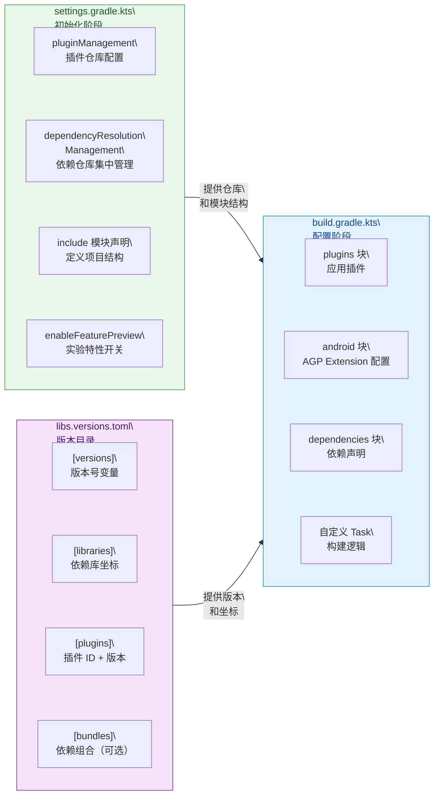
```mermaid
graph LR
    subgraph S1["settings.gradle.kts\\n初始化阶段"]
        direction TB
        A1["pluginManagement\\n插件仓库配置"]
        A2["dependencyResolution\\nManagement\\n依赖仓库集中管理"]
        A3["include 模块声明\\n定义项目结构"]
        A4["enableFeaturePreview\\n实验特性开关"]
        A1 ~~~ A2
        A2 ~~~ A3
        A3 ~~~ A4
    end

    subgraph S2["build.gradle.kts\\n配置阶段"]
        direction TB
        B1["plugins 块\\n应用插件"]
        B2["android 块\\nAGP Extension 配置"]
        B3["dependencies 块\\n依赖声明"]
        B4["自定义 Task\\n构建逻辑"]
        B1 ~~~ B2
        B2 ~~~ B3
        B3 ~~~ B4
    end

    subgraph S3["libs.versions.toml\\n版本目录"]
        direction TB
        C1["[versions]\\n版本号变量"]
        C2["[libraries]\\n依赖库坐标"]
        C3["[plugins]\\n插件 ID + 版本"]
        C4["[bundles]\\n依赖组合（可选）"]
        C1 ~~~ C2
        C2 ~~~ C3
        C3 ~~~ C4
    end

    S1 -->|"提供仓库\\n和模块结构"| S2
    S3 -->|"提供版本\\n和坐标"| S2

    classDef settingsStyle fill:#E8F5E9,stroke:#43A047,color:#1B5E20
    classDef buildStyle fill:#E3F2FD,stroke:#1E88E5,color:#0D47A1
    classDef catalogStyle fill:#F3E5F5,stroke:#8E24AA,color:#4A148C

    class S1 settingsStyle
    class S2 buildStyle
    class S3 catalogStyle
```

总结来说，`settings.gradle.kts` 是项目构建的"总纲领"，它在最早的初始化阶段运行，定义了整个项目的宏观结构（有哪些模块、从哪里拿插件和依赖）；`build.gradle.kts` 是每个模块的"施工图"，在配置阶段运行，定义了该模块如何被编译、打包；`libs.versions.toml` 则是"材料清单"，集中管理所有依赖的版本信息。三者协作，构成了现代 Android 项目的完整构建配置体系。

---

**📝 练习题**

在将项目从 Groovy DSL 迁移到 Kotlin DSL 时，以下哪个语法变化是 **不正确** 的？

A. `compileSdkVersion 34` → `compileSdk = 34`


B. `implementation 'androidx.core:core-ktx:1.12.0'` → `implementation("androidx.core:core-ktx:1.12.0")`


C. `apply plugin: 'com.android.application'` → `apply(plugin = "com.android.application")`


D. `minSdkVersion 21` → `minSdkVersion(21)`


**【答案】** D

**【解析】** 选项 A 正确地将 Groovy 的方法调用风格改为 Kotlin 属性赋值，且使用了 AGP 7.0+ 的简化属性名 `compileSdk`。选项 B 正确地将单引号改为双引号并添加了括号。选项 C 虽然不是推荐写法（应优先使用 `plugins` 块），但语法上是合法的 Kotlin DSL 写法。选项 D 是 **错误的迁移**：虽然 `minSdkVersion(21)` 在某些 AGP 版本中作为方法调用可以编译通过，但 Kotlin DSL 的规范写法是 `minSdk = 21`（属性赋值）。更关键的是，`minSdkVersion` 是旧版 API 名称，在 Kotlin DSL 中应迁移为 `minSdk`。直接写 `minSdkVersion(21)` 虽然可能不会立即报错（因为该方法确实存在于 AGP 的 API 中），但不符合 Kotlin DSL 的惯用模式，且可能在未来版本中被废弃。

---

**📝 练习题**

关于 `settings.gradle.kts` 中的 `dependencyResolutionManagement`，以下说法正确的是？

A. 它只能配置插件仓库，不能配置依赖库仓库


B. 设置 `repositoriesMode = RepositoriesMode.FAIL_ON_PROJECT_REPOS` 后，子模块的 `build.gradle.kts` 中仍然可以声明 `repositories` 块但会被忽略


C. 它是 Gradle 7.0+ 引入的特性，用于将所有模块的依赖仓库配置集中到 `settings` 文件中管理


D. Version Catalog（`libs.versions.toml`）必须在 `dependencyResolutionManagement` 中显式配置后才能使用


**【答案】** C

**【解析】** 选项 A 错误 —— `dependencyResolutionManagement` 管理的是 **依赖库的仓库**（即 `dependencies` 中声明的库从哪里下载），**插件仓库** 由 `pluginManagement` 管理，二者是不同的块。选项 B 描述的是 `PREFER_SETTINGS` 模式的行为（忽略 + 警告），而 `FAIL_ON_PROJECT_REPOS` 模式下子模块声明 `repositories` 会 **直接报错**，不是"被忽略"。选项 C 正确描述了该特性的引入版本和核心目的。选项 D 错误 —— Gradle 默认会自动读取 `gradle/libs.versions.toml` 文件，不需要在 `dependencyResolutionManagement` 中显式声明（只有在需要自定义路径或名称时才需要）。

---

## 构建性能优化

Android 项目的构建速度是开发者日常体验中最"切肤之痛"的环节之一。一个中大型项目的全量构建（Clean Build）动辄耗时 3~10 分钟，即便是增量构建（Incremental Build）也常常需要 30 秒到 2 分钟。当你在一天中频繁地修改代码、运行构建、部署到设备上验证时，这些零碎的等待时间累积起来是惊人的。Google 和 Gradle 团队对此投入了大量工程精力，在构建系统层面提供了多种优化机制。本节聚焦三个最核心的优化维度：**Configuration Cache（配置缓存）**、**Parallel Execution（并行构建）** 以及 **Gradle Daemon（守护进程）**。它们分别作用于构建生命周期的不同阶段，理解它们的原理才能做到"对症下药"式的优化。

在深入每个优化机制之前，先回顾 Gradle 构建的三个阶段（Phase），因为所有优化手段都必须映射到具体阶段才有意义：

1. **Initialization Phase（初始化阶段）**：Gradle 解析 `settings.gradle(.kts)`，确定哪些项目（模块）参与本次构建，创建对应的 `Project` 实例。
2. **Configuration Phase（配置阶段）**：Gradle 依次执行每个模块的 `build.gradle(.kts)` 脚本，解析插件、配置 Extension、注册 Task、构建 Task DAG（有向无环图）。这个阶段**不执行任何 Task 的实际动作**，只是"规划蓝图"。
3. **Execution Phase（执行阶段）**：Gradle 按照 DAG 的拓扑顺序执行被请求的 Task 及其依赖 Task 的 `@TaskAction` 方法。

一个关键认知是：**Configuration Phase 的开销与项目模块数量成正比，而 Execution Phase 的开销与 Task 的实际工作量相关。** 很多开发者只关注"编译慢"，却忽略了 Configuration Phase 在大型多模块项目中可能占据 10~30 秒甚至更多。Configuration Cache 正是针对这一阶段的杀手级优化。

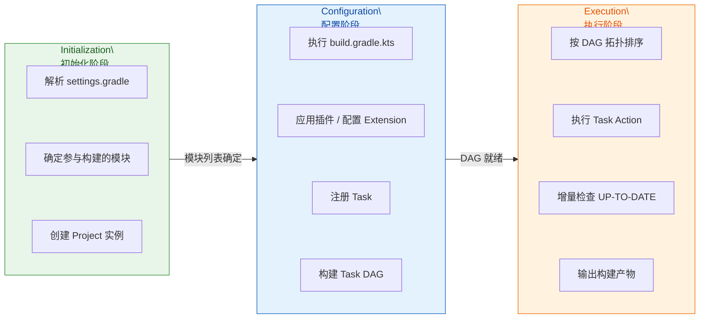
```mermaid
graph LR
    subgraph INIT["Initialization\\n初始化阶段"]
        direction TB
        I1["解析 settings.gradle"]
        I2["确定参与构建的模块"]
        I3["创建 Project 实例"]
        I1 ~~~ I2
        I2 ~~~ I3
    end

    subgraph CONFIG["Configuration\\n配置阶段"]
        direction TB
        C1["执行 build.gradle.kts"]
        C2["应用插件 / 配置 Extension"]
        C3["注册 Task"]
        C4["构建 Task DAG"]
        C1 ~~~ C2
        C2 ~~~ C3
        C3 ~~~ C4
    end

    subgraph EXEC["Execution\\n执行阶段"]
        direction TB
        E1["按 DAG 拓扑排序"]
        E2["执行 Task Action"]
        E3["增量检查 UP-TO-DATE"]
        E4["输出构建产物"]
        E1 ~~~ E2
        E2 ~~~ E3
        E3 ~~~ E4
    end

    INIT -->|"模块列表确定"| CONFIG
    CONFIG -->|"DAG 就绪"| EXEC

    classDef initStyle fill:#E8F5E9,stroke:#388E3C,color:#1B5E20
    classDef configStyle fill:#E3F2FD,stroke:#1565C0,color:#0D47A1
    classDef execStyle fill:#FFF3E0,stroke:#EF6C00,color:#E65100
    class INIT initStyle
    class CONFIG configStyle
    class EXEC execStyle
```

---

### Configuration Cache 配置缓存

Configuration Cache 是 Gradle 6.6 引入（实验性）、Gradle 8.1 正式稳定的一项**革命性优化**。它的核心思想极其直接：**既然 Configuration Phase 的输出（Task DAG + Task 配置状态）在大多数连续构建中不会变化，为什么每次构建都要重新执行所有 build script？把上一次 Configuration 的结果缓存起来，下次直接复用不就行了？**

**没有 Configuration Cache 时的构建流程：** 每次你执行 `./gradlew assembleDebug`，Gradle 都会完整走一遍 Initialization → Configuration → Execution。即使你只修改了一行 Kotlin 代码，Configuration Phase 也会重新执行所有模块的 `build.gradle.kts`、重新解析所有插件、重新构建 Task DAG。在一个拥有 50+ 模块的项目中，这个"重新配置"的过程可能需要 15~30 秒——而你等待的仅仅是"Gradle 搞清楚要做什么"，还没开始真正编译。

**有 Configuration Cache 时的构建流程：** 第一次执行时（Cache Miss），Gradle 正常走完三个阶段，并在 Configuration Phase 结束后，将整个 Task DAG 及其配置状态**序列化**到本地缓存目录（默认 `.gradle/configuration-cache/`）。第二次执行相同的 Task 时（Cache Hit），Gradle 跳过 Initialization 和 Configuration Phase，直接从缓存中**反序列化** Task DAG，立即进入 Execution Phase。这意味着原本 15~30 秒的配置开销降到了**几百毫秒**。

**启用方式：**

```kotlin
// 方式一：在 gradle.properties 中全局启用（推荐）
// gradle.properties
// org.gradle.configuration-cache=true

// 方式二：命令行参数（单次构建启用，适合测试）
// ./gradlew assembleDebug --configuration-cache
```

```kotlin
// gradle.properties 完整示例
// 启用 Configuration Cache
org.gradle.configuration-cache=true
// 设置 Configuration Cache 允许的最大问题数（默认 0，即有问题就失败）
// 在迁移过渡期可以设为正数，允许部分问题暂时通过
org.gradle.configuration-cache.problems=warn
```

**Configuration Cache 的失效条件（Invalidation）：** 缓存并不是"永远有效"的。当以下任何一项发生变化时，Gradle 会判定缓存失效，重新执行 Configuration Phase：

1. **构建脚本变化**：任何 `build.gradle.kts`、`settings.gradle.kts`、`buildSrc` 中的代码被修改。
2. **Gradle 属性变化**：`gradle.properties` 的内容变化，或者命令行传入的 `-P` 参数不同。
3. **环境变量变化**：构建脚本中读取的环境变量值发生变化（如 `System.getenv("CI")`）。
4. **请求的 Task 不同**：上次执行 `assembleDebug`，这次执行 `assembleRelease`，缓存不通用。
5. **Gradle 版本或插件版本变化**：升级 Gradle Wrapper 或 AGP 版本后缓存失效。

这个设计非常合理——只有当"构建蓝图的输入"没有变化时，才复用缓存；任何可能影响 Task DAG 结构的变更都会触发重新配置。

**Configuration Cache 的兼容性约束：**

Configuration Cache 对构建脚本和插件有一套严格的**兼容性要求**。核心约束是：**Task 的配置状态必须是可序列化的，且 Task 不能在执行期引用 `Project` 对象。** 这是因为 Configuration Cache 需要把 Task 的所有输入（Input）、输出（Output）及配置参数序列化到磁盘；而 `Project` 对象包含了大量不可序列化的运行时状态（如依赖解析引擎、Logger 等），所以必须切断 Task 对 `Project` 的直接引用。

在实际项目中，最常见的兼容性问题来自：

- **自定义 Task 中直接引用 `project`**：例如在 `@TaskAction` 方法中调用 `project.buildDir`，这在 Configuration Cache 模式下会报错。正确做法是将需要的值通过 `@Input` / `@OutputDirectory` 等注解声明为 Task 的属性，在 Configuration Phase 赋值，Execution Phase 使用属性而非 `project`。
- **第三方插件不兼容**：部分老旧插件没有适配 Configuration Cache，会在序列化时抛异常。AGP 从 7.x 开始逐步适配，到 AGP 8.x 已基本完全兼容。

```kotlin
// ❌ 不兼容 Configuration Cache 的写法
abstract class BadTask : DefaultTask() {
    @TaskAction
    fun execute() {
        // 在执行期直接访问 project 对象 → Configuration Cache 会报错
        val outputDir = project.layout.buildDirectory.get().asFile
        outputDir.mkdirs()
        File(outputDir, "result.txt").writeText("done")
    }
}

// ✅ 兼容 Configuration Cache 的写法
abstract class GoodTask : DefaultTask() {
    // 通过 Property API 声明输出目录，值在配置期绑定
    @get:OutputDirectory
    abstract val outputDir: DirectoryProperty

    @TaskAction
    fun execute() {
        // 执行期只访问 Task 自身的属性，不引用 project
        val dir = outputDir.get().asFile
        dir.mkdirs()
        File(dir, "result.txt").writeText("done")
    }
}

// 注册 Task 时在配置期完成属性绑定
tasks.register<GoodTask>("generateResult") {
    // 配置期：将 project.layout 的值绑定到 Task 的属性上
    outputDir.set(layout.buildDirectory.dir("generated/result"))
}
```

**实际收益量化：** 根据 Google 在大型 Android 项目上的测试数据，Configuration Cache 命中时可以将构建启动耗时减少 **60%~90%**。对于日常开发中最频繁的场景——修改一行代码后重新 Run——Configuration Phase 的开销从十几秒降至亚秒级，整体构建体验提升非常显著。

---

### Parallel 并行构建

Gradle 的 **Parallel Execution（并行执行）** 允许多个**无依赖关系的模块**同时编译，充分利用多核 CPU 的计算能力。在未开启并行构建时，Gradle 按模块依赖的拓扑排序**串行**执行每个模块的 Task——即使 `:feature-a` 和 `:feature-b` 之间没有任何依赖关系，它们也会排队等待，造成大量 CPU 空闲。

**启用方式：**

```kotlin
// gradle.properties
org.gradle.parallel=true
```

这一行配置会让 Gradle 在 Execution Phase 启动**多个 Worker**（工作线程），并行执行那些在 Task DAG 中没有依赖关系的 Task。默认的并行度等于机器的 CPU 核心数，也可以通过 `org.gradle.workers.max` 手动指定：

```kotlin
// gradle.properties
org.gradle.parallel=true
// 限制最大并行 Worker 数为 4（适合 CI 上资源受限的场景）
org.gradle.workers.max=4
```

**并行构建的粒度是"模块级"，而非"Task 级"。** 这是一个重要的细节。Gradle 的 `--parallel` 选项的语义是：不同模块中的 Task 可以并行执行，但**同一模块内的 Task 仍然串行执行**。这个设计是出于安全考虑——同一模块内的多个 Task 可能共享状态（如 build 目录下的文件），并行执行它们可能导致竞态条件。

来看一个典型的多模块项目的并行构建示意：

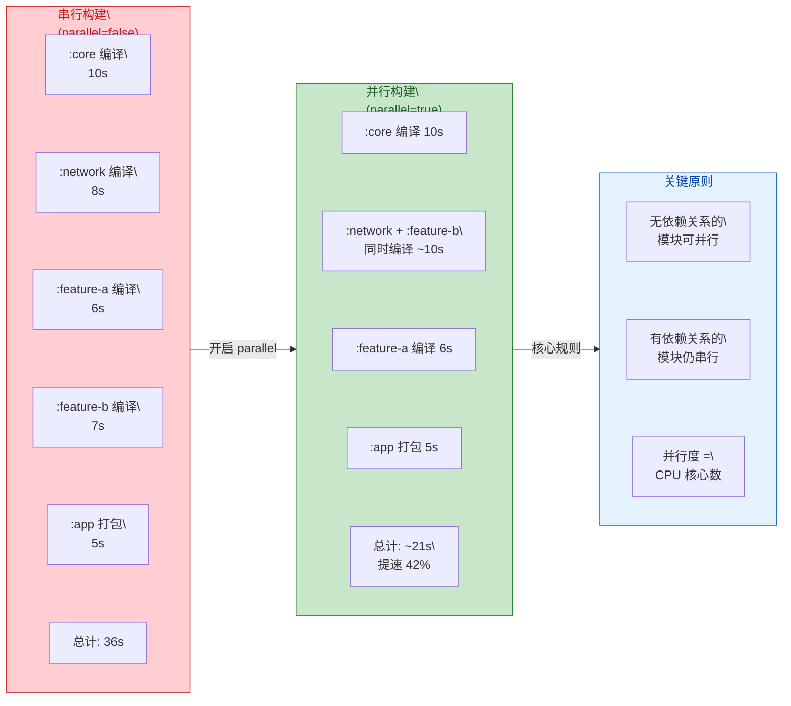
```mermaid
graph LR
    subgraph SERIAL["串行构建\\n(parallel=false)"]
        direction TB
        S1[":core 编译\\n10s"]
        S2[":network 编译\\n8s"]
        S3[":feature-a 编译\\n6s"]
        S4[":feature-b 编译\\n7s"]
        S5[":app 打包\\n5s"]
        S6["总计: 36s"]
        S1 ~~~ S2
        S2 ~~~ S3
        S3 ~~~ S4
        S4 ~~~ S5
        S5 ~~~ S6
    end

    subgraph PARALLEL["并行构建\\n(parallel=true)"]
        direction TB
        P1[":core 编译 10s"]
        P2[":network + :feature-b\\n同时编译 ~10s"]
        P3[":feature-a 编译 6s"]
        P4[":app 打包 5s"]
        P5["总计: ~21s\\n提速 42%"]
        P1 ~~~ P2
        P2 ~~~ P3
        P3 ~~~ P4
        P4 ~~~ P5
    end

    subgraph KEY["关键原则"]
        direction TB
        K1["无依赖关系的\\n模块可并行"]
        K2["有依赖关系的\\n模块仍串行"]
        K3["并行度 =\\nCPU 核心数"]
        K1 ~~~ K2
        K2 ~~~ K3
    end

    SERIAL -->|"开启 parallel"| PARALLEL
    PARALLEL -->|"核心规则"| KEY

    classDef serialStyle fill:#FFCDD2,stroke:#C62828,color:#B71C1C
    classDef parallelStyle fill:#C8E6C9,stroke:#2E7D32,color:#1B5E20
    classDef keyStyle fill:#E3F2FD,stroke:#1565C0,color:#0D47A1
    class SERIAL serialStyle
    class PARALLEL parallelStyle
    class KEY keyStyle
```

**并行构建的实际收益取决于项目的模块拓扑结构。** 如果你的项目是一条"线性链"（`:app` → `:feature` → `:core`），并行化收益接近于零，因为每个模块都依赖前一个，没有可并行的空间。相反，如果你的项目是"宽扁型"拓扑——多个 Feature 模块并列依赖少数几个 Core 模块——并行化收益就非常显著。这也是为什么模块化拆分不仅是架构上的最佳实践，也是**构建性能优化的关键手段**。模块拆得越"宽"，并行度越高。

**Worker API：Task 内部的并行化。** 除了模块级并行，Gradle 还提供了 Worker API（`WorkerExecutor`），允许一个 Task 的内部工作拆分为多个并行执行的 Work Item。AGP 在编译、dexing、资源处理等关键 Task 中广泛使用了 Worker API——例如 D8/R8 的 dexing 过程会将多个 class 文件分批并行转换为 dex。对于应用层开发者来说，你通常不需要直接使用 Worker API，但理解它的存在有助于理解为什么单个 Task（如 `dexBuilderDebug`）也能跑满多核。

**并行构建的注意事项：**

1. **内存压力**：并行执行意味着多个模块同时编译，每个编译进程都需要内存。如果 JVM 堆内存（`org.gradle.jvmargs=-Xmx`）配置不足，可能出现频繁 GC 甚至 OOM，反而拖慢构建。建议在开启 parallel 的同时适当增大堆内存。
2. **线程安全**：自定义 Task 如果读写共享文件或全局状态，并行执行可能导致数据竞争。确保 Task 的输入输出声明正确（Gradle 会据此判断 Task 间的依赖关系和执行顺序）。
3. **CI 环境资源限制**：在共享 CI 机器上，同时运行多个构建时，每个构建都启用高并行度可能导致总体资源过载。此时应通过 `org.gradle.workers.max` 限制并行度。

---

### Daemon 守护进程

Gradle Daemon 是 Gradle 构建性能优化的**基石**，也是 Gradle 区别于其他构建工具（如 Make、Maven）的重要特性之一。从 Gradle 3.0 开始，Daemon 默认启用，几乎所有 Android 开发者都在无感知地享受它带来的性能收益。

**什么是 Gradle Daemon？** 它是一个**长驻后台的 JVM 进程**。当你第一次执行 `./gradlew assembleDebug` 时，Gradle Wrapper 会启动一个 Daemon 进程（如果还没有可用的 Daemon），这个进程执行完构建后**不会退出**，而是继续驻留在内存中，等待下一次构建请求。后续的构建命令会**复用**同一个 Daemon 进程，而不是每次都启动新的 JVM。

**Daemon 的核心价值在于消除 JVM 启动和"热身"开销：**

1. **JVM 启动成本**：每次启动一个新的 JVM 需要 2~5 秒（加载 JDK 类库、初始化堆内存、启动线程等）。如果每次构建都启动新 JVM，这个固定开销不可避免。Daemon 通过复用 JVM 进程，将这个开销降至零（仅第一次启动时有）。

2. **JIT 编译热身（JIT Warm-up）**：这是 Daemon 带来的**最大收益**，也是最不直观的一点。JVM 使用 JIT（Just-In-Time）编译器将热点字节码即时编译为本机机器码。在第一次构建时，Gradle 的核心代码路径（依赖解析、Task 调度、文件操作等）还是解释执行（Interpreted），性能较低。但随着 Daemon 处理越来越多的构建，JIT 编译器会将频繁执行的代码路径编译为高效的本机代码。**通常经过 2~3 次构建后，Daemon 的 JIT 优化达到"稳态"，此后每次构建都能享受本机代码级别的执行速度。** 这就是为什么"第一次构建慢，后续构建快"——不仅仅是因为增量编译缓存，Daemon 的 JIT 热身也是重要因素。

3. **内存中的缓存**：Daemon 进程在内存中保持了大量构建元数据的缓存，包括依赖解析结果、Task 输入输出的快照、文件系统状态（File System Watching）等。这些缓存在后续构建中直接命中，省去了重新计算的开销。

**Daemon 的生命周期与资源管理：**

Gradle Daemon 进程的默认空闲超时时间是 **3 小时**。也就是说，如果你 3 小时内没有执行任何 Gradle 命令，Daemon 进程会自动退出，释放内存。下次构建时会启动新的 Daemon。你可以通过 `gradle.properties` 调整这个超时：

```kotlin
// gradle.properties
// Daemon 空闲 1 小时后自动退出（在内存紧张的开发机上可以调短）
org.gradle.daemon.idletimeout=3600000
```

**Daemon 的 JVM 参数配置：**

Daemon 进程的 JVM 参数通过 `org.gradle.jvmargs` 设置。这是 Gradle 构建性能调优中**最重要的一个参数**，因为它直接决定了 Daemon 可用的内存和 GC 行为：

```kotlin
// gradle.properties — 推荐配置（中大型项目）
org.gradle.jvmargs=-Xmx4g -XX:+UseG1GC -XX:MaxMetaspaceSize=512m -XX:+HeapDumpOnOutOfMemoryError

// -Xmx4g：最大堆内存 4GB（根据项目规模和机器内存调整）
//   小型项目: 2g 通常足够
//   大型项目（100+ 模块）: 4g~8g
//   注意不要超过机器物理内存的 50%，否则系统会频繁 swap

// -XX:+UseG1GC：使用 G1 垃圾收集器（Gradle 推荐，低延迟、适合大堆）

// -XX:MaxMetaspaceSize=512m：限制 Metaspace 大小
//   大量插件和类加载可能导致 Metaspace 膨胀

// -XX:+HeapDumpOnOutOfMemoryError：OOM 时自动 dump 堆，便于排查
```

一个极其常见的性能问题是 **`-Xmx` 设置过低**。当堆内存不足时，JVM 会频繁触发 Full GC（Stop-The-World），整个 Daemon 进程暂停数秒甚至数十秒。开发者看到的现象是构建"卡住"了，实际上是在做 GC。通过 `--scan`（Gradle Build Scan）可以清晰看到 GC 时间占比。如果 GC 时间占总构建时间超过 **10%**，就应该增大 `-Xmx`。

**Daemon 复用的条件：** 并非所有构建都能复用同一个 Daemon。Gradle 在匹配 Daemon 时会检查以下条件：

1. **JVM 参数必须兼容**：如果 `org.gradle.jvmargs` 发生变化，旧 Daemon 会被终止，启动新 Daemon。
2. **Gradle 版本必须一致**：不同 Gradle Wrapper 版本的构建不能共享 Daemon。
3. **JDK 版本必须一致**：如果 `JAVA_HOME` 指向不同的 JDK，Daemon 无法复用。

这意味着：如果你在开发过程中频繁切换 `org.gradle.jvmargs`，就会导致 Daemon 反复重启，丧失 JIT 热身的收益。**建议在 `gradle.properties` 中确定一套稳定的 JVM 参数后不要频繁修改。**

**Daemon 管理命令：**

```bash
# 查看当前所有 Gradle Daemon 进程的状态
./gradlew --status

# 输出示例：
#    PID STATUS   INFO
#  12345 IDLE     8.5
#  12346 BUSY     8.5

# 手动停止所有 Daemon（排查问题时使用）
./gradlew --stop

# 强制不使用 Daemon 执行一次构建（调试用，非常慢，不推荐日常使用）
./gradlew assembleDebug --no-daemon
```

**File System Watching（文件系统监听）：**

从 Gradle 7.0 开始默认启用的 File System Watching 是 Daemon 缓存能力的重要扩展。Daemon 进程通过操作系统的文件系统事件通知（Linux 的 `inotify`、macOS 的 `FSEvents`、Windows 的 `ReadDirectoryChangesW`）**实时监听**项目文件的变化。在下一次构建开始时，Daemon 已经"知道"哪些文件发生了变化，无需重新扫描整个项目的文件树来计算增量。这对于拥有数万甚至数十万文件的大型项目尤其关键——全量文件扫描可能需要数秒，而有了 File System Watching，增量文件变化的检测降到了毫秒级。

```kotlin
// gradle.properties — File System Watching（Gradle 7.0+ 默认开启）
// 如果遇到兼容性问题可以手动关闭（不推荐）
// org.gradle.vfs.watch=false
```

---

### 综合配置推荐与 Build Scan

将上述所有优化整合到一份 `gradle.properties` 中，形成适用于中大型 Android 项目的**推荐配置模板**：

```kotlin
// gradle.properties — 构建性能优化推荐配置

// ====== Daemon 配置 ======
// Daemon 默认开启，无需显式声明，但 JVM 参数必须调优
org.gradle.jvmargs=-Xmx4g -XX:+UseG1GC -XX:MaxMetaspaceSize=512m -XX:+HeapDumpOnOutOfMemoryError
// Daemon 空闲超时（毫秒），默认 3 小时 = 10800000
org.gradle.daemon.idletimeout=10800000

// ====== 并行构建 ======
org.gradle.parallel=true
// 可选：限制最大 Worker 数（不设则等于 CPU 核心数）
// org.gradle.workers.max=8

// ====== Configuration Cache ======
org.gradle.configuration-cache=true
// 迁移过渡期可以设为 warn，稳定后改回默认的 fail
// org.gradle.configuration-cache.problems=warn

// ====== 构建缓存（Build Cache） ======
// 启用本地构建缓存 — Task 输出产物的缓存，跨构建复用
org.gradle.caching=true

// ====== Kotlin 编译优化 ======
// 启用 Kotlin 增量编译（默认已开启，这里显式确认）
kotlin.incremental=true
// 启用 Kotlin 编译的 Daemon（K2 编译器默认使用）
// kotlin.compiler.execution.strategy=daemon

// ====== Android 特有优化 ======
// 启用非传递 R 类（减少 R 文件生成量，大幅提速）
android.nonTransitiveRClass=true
// 仅在需要的模块启用 BuildConfig 生成
android.defaults.buildfeatures.buildconfig=false
```

上面提到了 **Build Cache（构建缓存）**，它与 Configuration Cache 容易混淆但作用完全不同。Configuration Cache 缓存的是"Configuration Phase 的结果（Task DAG）"，而 Build Cache 缓存的是"Execution Phase 中 Task 的输出产物"。例如，`:core` 模块编译生成的 `.class` 文件被缓存后，如果下次构建时该模块的输入（源码、依赖）没有变化，编译 Task 会直接从缓存中取出产物（标记为 `FROM-CACHE`），跳过实际编译。两者协同工作时，效果叠加：Configuration Cache 跳过配置阶段，Build Cache 跳过未变化模块的执行阶段，最终只有真正发生变化的模块需要重新编译。

**Gradle Build Scan（构建扫描）** 是诊断构建性能问题的终极工具。它会收集整个构建过程的详细数据（每个 Task 的耗时、缓存命中情况、GC 时间、依赖解析耗时等），生成一份交互式的在线报告：

```bash
# 生成 Build Scan 报告
./gradlew assembleDebug --scan
# 构建完成后会输出一个 URL，打开即可查看详细分析
# https://gradle.com/s/xxxxxxxxxxxxx
```

Build Scan 中最值得关注的几个维度：

- **Timeline（时间线）**：可以看到每个 Task 的执行时间和并行度，找出"最长路径"（Critical Path）上的瓶颈 Task。
- **Performance（性能）**：展示 Configuration Time vs Execution Time 的占比，以及 GC 时间。
- **Build Cache（缓存）**：显示每个 Task 的缓存命中情况（`UP-TO-DATE`、`FROM-CACHE`、`EXECUTED`）。如果大量 Task 显示 `EXECUTED` 但输入未变，说明缓存配置有问题。

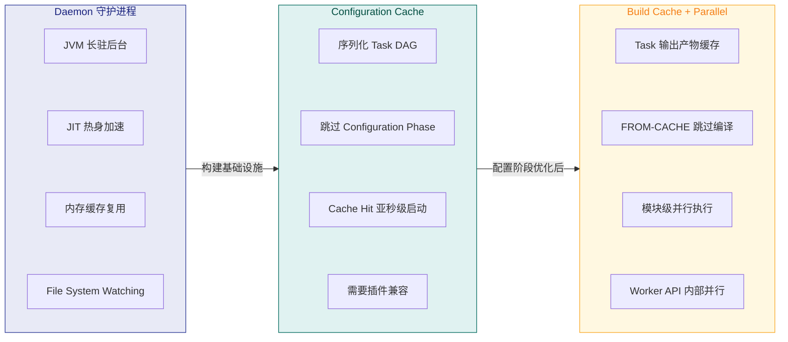
```mermaid
graph LR
    subgraph DAEMON["Daemon 守护进程"]
        direction TB
        DM1["JVM 长驻后台"]
        DM2["JIT 热身加速"]
        DM3["内存缓存复用"]
        DM4["File System Watching"]
        DM1 ~~~ DM2
        DM2 ~~~ DM3
        DM3 ~~~ DM4
    end

    subgraph CCACHE["Configuration Cache"]
        direction TB
        CC1["序列化 Task DAG"]
        CC2["跳过 Configuration Phase"]
        CC3["Cache Hit 亚秒级启动"]
        CC4["需要插件兼容"]
        CC1 ~~~ CC2
        CC2 ~~~ CC3
        CC3 ~~~ CC4
    end

    subgraph BCACHE["Build Cache + Parallel"]
        direction TB
        BC1["Task 输出产物缓存"]
        BC2["FROM-CACHE 跳过编译"]
        BC3["模块级并行执行"]
        BC4["Worker API 内部并行"]
        BC1 ~~~ BC2
        BC2 ~~~ BC3
        BC3 ~~~ BC4
    end

    DAEMON -->|"构建基础设施"| CCACHE
    CCACHE -->|"配置阶段优化后"| BCACHE

    classDef daemonStyle fill:#E8EAF6,stroke:#283593,color:#1A237E
    classDef ccacheStyle fill:#E0F2F1,stroke:#00695C,color:#004D40
    classDef bcacheStyle fill:#FFF8E1,stroke:#F9A825,color:#F57F17
    class DAEMON daemonStyle
    class CCACHE ccacheStyle
    class BCACHE bcacheStyle
```

**最后总结各优化手段作用的阶段与收益：**

| 优化手段 | 作用阶段 | 核心收益 | 启用成本 |
|---|---|---|---|
| **Gradle Daemon** | 全阶段（JVM 级别） | 消除 JVM 启动开销 + JIT 热身 | 零（默认开启） |
| **File System Watching** | Execution（增量检测） | 毫秒级文件变化检测 | 零（Gradle 7.0+ 默认） |
| **Configuration Cache** | Configuration Phase | 跳过配置阶段，节省 10~30s | 中（需要插件兼容） |
| **Build Cache** | Execution Phase | 跳过未变模块的编译 Task | 低（一行配置） |
| **Parallel Execution** | Execution Phase | 多模块并行编译 | 低（一行配置） |
| **JVM 参数调优** | 全阶段 | 减少 GC 暂停、避免 OOM | 低（调整 `-Xmx`） |

---

**📝 练习题**

一个拥有 80 个模块的大型 Android 项目，开发者发现每次修改一行 Kotlin 代码后执行 `./gradlew assembleDebug`，即使实际编译只需 5 秒，但总耗时仍然高达 25 秒。通过 Build Scan 发现 Configuration Phase 占据了约 18 秒。以下哪种优化手段最能直接解决这个问题？


A. 增大 `org.gradle.jvmargs` 的 `-Xmx` 值到 8GB


B. 启用 `org.gradle.parallel=true` 开启并行构建


C. 启用 `org.gradle.configuration-cache=true` 开启配置缓存


D. 启用 `org.gradle.caching=true` 开启构建缓存


**【答案】** C

**【解析】** 题目明确指出瓶颈在 **Configuration Phase（配置阶段）** 的 18 秒耗时。Configuration Cache 正是专门针对这一阶段的优化——它将 Configuration Phase 的输出（Task DAG）序列化到磁盘，后续构建直接反序列化复用，跳过整个配置阶段，将 18 秒降至亚秒级。选项 A（增大堆内存）主要解决 GC 压力问题，不会显著减少 Configuration Phase 的耗时；选项 B（并行构建）作用于 Execution Phase，与 Configuration Phase 无关；选项 D（Build Cache）缓存的是 Task 的执行产物，也作用于 Execution Phase。只有选项 C 直接命中了 Configuration Phase 这个瓶颈。

---

## 自定义插件与任务

在前面几节中，我们已经深入了解了 Gradle 的核心概念、AGP 的配置方式、构建变体与依赖管理等内容。然而，当项目规模膨胀到一定程度，或者团队需要将某些 **重复性构建逻辑** 标准化、可复用化时，仅靠 `build.gradle(.kts)` 脚本中的零散配置就显得力不从心了。这时，**自定义 Gradle 插件（Custom Plugin）** 与 **自定义任务（Custom Task）** 就成为了高级 Android 工程化的核心手段。

从本质上讲，Gradle 本身只是一个 **通用构建框架**——它提供了 Project、Task、依赖解析、生命周期调度等基础设施，但并不"知道"如何编译 Java、打包 APK 或处理资源。所有这些能力，都是通过 **插件** 注入的。Android Gradle Plugin（AGP）本身就是一个庞大的 Gradle 插件，它向 Project 注册了数百个 Task（如 `compileDebugKotlin`、`mergeDebugResources`、`packageDebug` 等），并通过 Extension（如 `android {}` 块）暴露配置接口。理解了这一原理，你就会明白：**编写自定义插件，本质上就是在做和 AGP 同样层级的事情**——向构建系统注入逻辑、注册任务、操控构建流程。

本节将从三个维度展开：首先讲解如何 **编写 Gradle 插件** 的三种方式及其适用场景；然后深入 **注册 Task** 的机制，包括 lazy configuration（惰性配置）等现代最佳实践；最后讨论 AGP 曾经广泛使用的 **Transform API** 被废弃后，应如何用新的 Artifact API / Instrumentation API 来替代字节码操控需求。

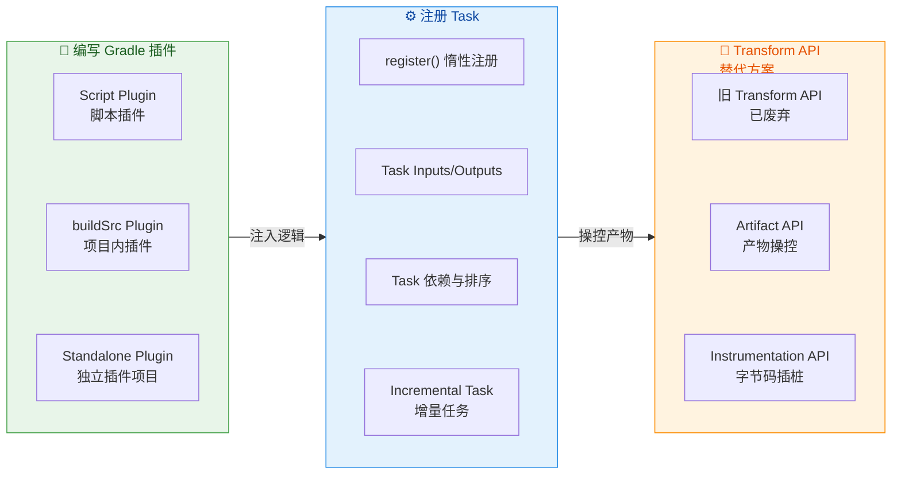
```mermaid
graph LR
    subgraph A["🔌 编写 Gradle 插件"]
        direction TB
        A1["Script Plugin\n脚本插件"]
        A2["buildSrc Plugin\n项目内插件"]
        A3["Standalone Plugin\n独立插件项目"]
        A1 ~~~ A2
        A2 ~~~ A3
    end

    subgraph B["⚙️ 注册 Task"]
        direction TB
        B1["register() 惰性注册"]
        B2["Task Inputs/Outputs"]
        B3["Task 依赖与排序"]
        B4["Incremental Task\n增量任务"]
        B1 ~~~ B2
        B2 ~~~ B3
        B3 ~~~ B4
    end

    subgraph C["🔄 Transform API\n替代方案"]
        direction TB
        C1["旧 Transform API\n已废弃"]
        C2["Artifact API\n产物操控"]
        C3["Instrumentation API\n字节码插桩"]
        C1 ~~~ C2
        C2 ~~~ C3
    end

    A -->|"注入逻辑"| B -->|"操控产物"| C

    classDef greenStyle fill:#E8F5E9,stroke:#43A047,color:#1B5E20
    classDef blueStyle fill:#E3F2FD,stroke:#1E88E5,color:#0D47A1
    classDef orangeStyle fill:#FFF3E0,stroke:#FB8C00,color:#E65100

    class A greenStyle
    class B blueStyle
    class C orangeStyle
```

### 编写 Gradle 插件

Gradle 插件从形式上可分为三种实现方式，它们在 **复用范围、维护成本、发布方式** 上各有不同。理解这三种方式之间的递进关系，对于选择合适的工程化方案至关重要。

**第一种：Script Plugin（脚本插件）**

这是最简单、最轻量的方式。你只需要将一段构建逻辑写在一个独立的 `.gradle` 或 `.gradle.kts` 文件中，然后在需要的模块里通过 `apply from:` 引入即可。这种方式不需要编写任何 Java/Kotlin 类，也不需要定义 Plugin 接口的实现——它本质上就是 **把脚本拆分到另一个文件**，起到代码组织和复用的作用。

例如，团队中多个模块都需要配置统一的代码检查规则，就可以把这段逻辑抽到 `quality.gradle.kts` 中：

```kotlin
// quality.gradle.kts —— 脚本插件文件，放在项目根目录或任意路径
// 该文件本身就是一个完整的 Gradle 脚本，可以直接访问 project 对象

// 应用 checkstyle 插件，为项目启用代码风格检查
apply(plugin = "checkstyle")

// 注册一个名为 "codeQualityCheck" 的自定义任务
tasks.register("codeQualityCheck") {
    // 设置任务分组，方便在 task 列表中归类查找
    group = "verification"
    // 描述信息，执行 ./gradlew tasks 时会展示
    description = "Run all code quality checks"
    // 声明依赖：执行此任务前，先执行 checkstyleMain
    dependsOn("checkstyleMain")
}
```

然后在任何模块的 `build.gradle.kts` 中引入：

```kotlin
// app/build.gradle.kts
// apply from 可以接受相对路径、绝对路径甚至 URL
apply(from = rootProject.file("quality.gradle.kts"))
```

Script Plugin 的优点是 **零门槛**，缺点也很明显：**无法发布到 Maven 仓库**、**无法接受类型安全的配置**、**IDE 对跨文件的脚本引用支持较弱**。因此，它只适合团队内部的小规模逻辑复用，当逻辑复杂度上升时，应及时升级到下一种方式。

**第二种：buildSrc Plugin（项目内编译插件）**

`buildSrc` 是 Gradle 内置的一个 **特殊目录机制**。当 Gradle 检测到项目根目录下存在 `buildSrc/` 文件夹时，会在 **评估任何 build.gradle 之前**，先编译 `buildSrc` 中的代码，并将编译产物自动加入所有模块的构建脚本 classpath。这意味着你可以在 `buildSrc` 中用标准的 Kotlin/Java 代码编写 Plugin 类、Task 类和各种工具函数，然后在任何模块的 `build.gradle.kts` 中直接引用它们——无需发布到任何仓库。

典型的 `buildSrc` 项目结构如下：

```text
project-root/
├── buildSrc/
│   ├── build.gradle.kts        ← buildSrc 自身的构建脚本
│   └── src/main/kotlin/
│       └── com/example/
│           └── MyPlugin.kt     ← 自定义插件类
├── app/
│   └── build.gradle.kts        ← 可直接 apply MyPlugin
├── build.gradle.kts
└── settings.gradle.kts
```

首先，`buildSrc` 自身需要一个构建脚本来声明依赖（比如你要在插件中使用 AGP 的 API）：

```kotlin
// buildSrc/build.gradle.kts
plugins {
    // 使用 kotlin-dsl 插件，让 buildSrc 支持 Kotlin DSL 开发
    `kotlin-dsl`
}

repositories {
    // buildSrc 需要独立声明仓库，用于解析自身依赖
    google()
    mavenCentral()
}

dependencies {
    // 引入 AGP API 依赖，这样在插件代码中就能访问
    // com.android.build.api.variant 等类型
    implementation("com.android.tools.build:gradle:8.5.0")
    // 引入 Kotlin Gradle 插件 API
    implementation("org.jetbrains.kotlin:kotlin-gradle-plugin:2.0.0")
}
```

然后编写 Plugin 实现类。一个 Gradle 插件必须实现 `Plugin<Project>` 接口，并在 `apply()` 方法中注入所有逻辑：

```kotlin
// buildSrc/src/main/kotlin/com/example/MyPlugin.kt
package com.example

// 导入 Gradle 核心 API
import org.gradle.api.Plugin
import org.gradle.api.Project

// 自定义插件类，泛型 <Project> 表示这个插件作用于 Project 级别
// Gradle 也支持 Plugin<Settings> 和 Plugin<Gradle> 级别的插件
class MyPlugin : Plugin<Project> {

    // apply() 是插件的唯一入口方法
    // 当某个模块执行 apply<MyPlugin>() 时，Gradle 会调用此方法
    // 参数 project 就是应用此插件的那个 Project 实例
    override fun apply(project: Project) {

        // 1. 创建一个 Extension（扩展），允许用户在 build.gradle 中进行配置
        //    这就是你在 build.gradle 中看到的 android {}、kotlin {} 等块的原理
        val extension = project.extensions.create(
            "myConfig",           // Extension 名称，对应 build.gradle 中的 myConfig {}
            MyPluginExtension::class.java  // Extension 的数据类
        )

        // 2. 注册一个自定义 Task（使用惰性注册，后面会详细解释）
        project.tasks.register(
            "greetTask",          // Task 名称
            GreetTask::class.java // Task 的实现类
        ) { task ->
            // 配置 Task 的属性，从 Extension 中读取用户配置
            // 注意：这里使用 .convention() 设置默认值
            // 而不是直接赋值，以支持惰性求值
            task.greeting.convention(extension.greeting)
            // 设置任务分组
            task.group = "custom"
            // 设置任务描述
            task.description = "Prints a custom greeting message"
        }

        // 3. 在 afterEvaluate 中做一些需要等配置完成后才能执行的操作
        //    注意：现代 Gradle 推荐尽量用 Provider/Property 的惰性机制
        //    来替代 afterEvaluate，但某些场景仍然需要
        project.afterEvaluate {
            println("MyPlugin applied to: ${project.name}")
            println("Configured greeting: ${extension.greeting.getOrElse("default")}")
        }
    }
}
```

Extension 类用于定义插件暴露的配置接口：

```kotlin
// buildSrc/src/main/kotlin/com/example/MyPluginExtension.kt
package com.example

import org.gradle.api.provider.Property

// Extension 类：定义该插件向用户暴露的可配置属性
// 使用 abstract class + abstract Property 是 Gradle 推荐的现代方式
// Gradle 会在运行时自动生成实现类并注入 Property 实例
abstract class MyPluginExtension {
    // Property<String> 是 Gradle 的惰性属性容器
    // 它支持 convention（默认值）、set（覆盖值）、Provider 链式绑定等
    abstract val greeting: Property<String>
}
```

在模块中使用这个插件和配置：

```kotlin
// app/build.gradle.kts
// 因为 buildSrc 的产物自动在 classpath 上
// 所以可以直接 apply 插件类
apply<com.example.MyPlugin>()

// 通过 Extension 名称配置插件参数
configure<com.example.MyPluginExtension> {
    // 用户设置自定义的问候语
    greeting.set("Hello from MyPlugin!")
}
```

`buildSrc` 方式非常适合 **中大型单体项目** 的构建逻辑封装。它的主要缺点是：**任何 buildSrc 代码的修改都会导致整个项目的构建脚本缓存失效**，在超大型项目中可能影响构建速度。针对这一问题，Gradle 官方推荐的替代方案是使用 **Composite Build（组合构建）** + `includeBuild()` 来隔离插件项目，使其变更只影响自身的编译缓存，此处不展开讨论。

**第三种：Standalone Plugin（独立插件项目）**

当插件需要 **跨项目复用**（例如公司内部的多个 App 项目都要使用同一套构建规范），或者需要 **发布到 Maven 仓库**（私有 Nexus/Artifactory 或公开的 Gradle Plugin Portal），就必须将插件开发为一个独立的 Gradle 项目。

独立插件项目和 `buildSrc` 的代码几乎一样（同样实现 `Plugin<Project>` 接口），核心区别在于：

1. **需要声明插件元数据**（Plugin Marker）：通过 `gradlePlugin {}` DSL 或 `META-INF/gradle-plugins/<plugin-id>.properties` 文件，将一个全局唯一的 Plugin ID（如 `com.example.myplugin`）映射到插件实现类。
2. **需要发布到仓库**：使用 `maven-publish` 插件将 JAR 发布到 Maven 仓库，或使用 `com.gradle.plugin-publish` 发布到 Gradle Plugin Portal。

```kotlin
// standalone-plugin/build.gradle.kts —— 独立插件项目的构建脚本
plugins {
    // kotlin-dsl 提供 Kotlin DSL 开发支持
    `kotlin-dsl`
    // java-gradle-plugin 自动生成 Plugin Marker 元数据
    `java-gradle-plugin`
    // maven-publish 用于将插件发布到 Maven 仓库
    `maven-publish`
}

// 声明插件的 group 和 version，发布时会作为 Maven 坐标的一部分
group = "com.example"
version = "1.0.0"

// gradlePlugin {} 块定义插件 ID 与实现类的映射关系
gradlePlugin {
    plugins {
        // 创建一个名为 "myPlugin" 的插件声明
        create("myPlugin") {
            // 插件 ID：其他项目在 plugins {} 块中引用的标识符
            id = "com.example.myplugin"
            // 实现类的全限定名
            implementationClass = "com.example.MyPlugin"
        }
    }
}

// 配置发布目标仓库
publishing {
    repositories {
        // 这里以本地 Maven 仓库为例
        mavenLocal()
        // 生产环境通常配置为公司内部的 Nexus/Artifactory
        // maven {
        //     url = uri("https://nexus.example.com/repository/gradle-plugins/")
        //     credentials { ... }
        // }
    }
}

repositories {
    google()
    mavenCentral()
}

dependencies {
    // 插件代码中要使用的依赖
    implementation("com.android.tools.build:gradle:8.5.0")
}
```

发布后，使用方只需在 `settings.gradle.kts` 中配置仓库源，然后在 `build.gradle.kts` 中通过 Plugin ID 引用即可：

```kotlin
// settings.gradle.kts（使用方项目）
pluginManagement {
    repositories {
        // 添加插件发布的仓库地址
        mavenLocal()
        gradlePluginPortal()
        google()
        mavenCentral()
    }
}
```

```kotlin
// app/build.gradle.kts（使用方项目）
plugins {
    // 通过 Plugin ID 引用，无需知道实现类的全限定名
    id("com.example.myplugin") version "1.0.0"
}

// 使用插件暴露的 Extension 进行配置
myConfig {
    greeting.set("Hello from standalone plugin!")
}
```

下面这张图总结了三种插件形式的递进关系与适用场景：

```mermaid
graph LR
    subgraph S1["📄 Script Plugin"]
        direction TB
        S1A["形式：.gradle/.kts 文件"]
        S1B["引入：apply from: path"]
        S1C["适用：简单逻辑复用"]
        S1D["限制：无法发布\n无类型安全"]
        S1A ~~~ S1B
        S1B ~~~ S1C
        S1C ~~~ S1D
    end

    subgraph S2["🏗️ buildSrc Plugin"]
        direction TB
        S2A["形式：Kotlin/Java 类"]
        S2B["引入：自动加入 classpath"]
        S2C["适用：单项目内部封装"]
        S2D["限制：修改导致\n全量缓存失效"]
        S2A ~~~ S2B
        S2B ~~~ S2C
        S2C ~~~ S2D
    end

    subgraph S3["📦 Standalone Plugin"]
        direction TB
        S3A["形式：独立 Gradle 项目"]
        S3B["引入：plugins { id(...) }"]
        S3C["适用：跨项目/团队共享"]
        S3D["优势：版本管理\nMaven 发布"]
        S3A ~~~ S3B
        S3B ~~~ S3C
        S3C ~~~ S3D
    end

    S1 -->|"复杂度增长"| S2 -->|"需要跨项目复用"| S3

    classDef scriptStyle fill:#F1F8E9,stroke:#7CB342,color:#33691E
    classDef buildSrcStyle fill:#E8EAF6,stroke:#5C6BC0,color:#1A237E
    classDef standaloneStyle fill:#FFF8E1,stroke:#FFB300,color:#E65100

    class S1 scriptStyle
    class S2 buildSrcStyle
    class S3 standaloneStyle
```

### 注册 Task

Task 是 Gradle 构建的 **最小执行单元**。无论是编译代码、合并资源、打包 APK 还是运行单元测试，最终都要归结到一个个 Task 的执行。理解如何正确地注册和配置 Task，是编写高质量 Gradle 插件的基础。

**惰性注册：register() vs create()**

在 Gradle 的早期版本中，注册 Task 使用的是 `tasks.create()` 方法。这种方法会在 **Configuration 阶段立即创建并配置** Task 实例——即使这个 Task 最终不会被执行。想象一下：一个大型 Android 项目可能注册了数百个 Task，但每次构建实际执行的只是其中一小部分（例如你只运行 `assembleDebug`，而 Release 相关的 Task 全部不会执行）。如果所有 Task 在 Configuration 阶段都被实例化和配置，就会造成严重的 **配置时间浪费**。

为此，Gradle 4.9 引入了 **Task Configuration Avoidance API**，核心方法就是 `tasks.register()`。它只是向 Gradle 注册了一个 Task 的 **"声明"**（包括名称、类型和配置闭包），但 **不会立即创建 Task 实例**。只有当这个 Task 真正需要被执行时（或者被另一个需要执行的 Task 依赖时），Gradle 才会实例化它并运行配置闭包。这种 **延迟实例化** 机制大幅减少了 Configuration 阶段的开销。

```kotlin
// 在插件的 apply() 方法中注册 Task 的对比

// ❌ 旧方式：create() —— 立即创建实例，浪费配置时间
project.tasks.create("oldTask", MyTask::class.java) { task ->
    // 这个闭包在 Configuration 阶段就会执行，即使 oldTask 永远不会运行
    task.inputFile.set(project.file("input.txt"))
}

// ✅ 新方式：register() —— 惰性注册，按需创建
// 返回值是 TaskProvider<MyTask>，而不是 MyTask 实例本身
val myTaskProvider = project.tasks.register("newTask", MyTask::class.java) { task ->
    // 这个闭包只有在 newTask 真正需要执行时才会运行
    task.inputFile.set(project.file("input.txt"))
}
```

`register()` 返回的 `TaskProvider<T>` 是一个惰性引用，你可以安全地传递它、用它建立依赖关系，而不会触发 Task 的实际创建。

**自定义 Task 类：Inputs、Outputs 与增量构建**

编写一个 production-ready 的自定义 Task，关键在于正确声明 **Inputs（输入）** 和 **Outputs（输出）**。Gradle 的 **增量构建（Incremental Build）** 和 **构建缓存（Build Cache）** 完全依赖这两个声明来判断：自上次执行以来，Task 的输入是否发生了变化？如果没有变化，就可以跳过执行（标记为 `UP-TO-DATE`），或者从缓存中恢复输出。

当你用 `@get:Input`、`@get:InputFile`、`@get:InputDirectory` 标注属性时，Gradle 会在执行前对这些输入取 **快照（snapshot）**，通常是计算文件内容的哈希值。下次执行时，Gradle 会比对新旧快照——如果完全一致，则认为输入没有变化，Task 无需重复执行。同理，`@get:OutputFile`、`@get:OutputDirectory` 标注的输出也会被快照，用于验证缓存命中。

```kotlin
// buildSrc/src/main/kotlin/com/example/GenerateBuildInfoTask.kt
package com.example

import org.gradle.api.DefaultTask
import org.gradle.api.file.RegularFileProperty
import org.gradle.api.provider.Property
import org.gradle.api.tasks.Input
import org.gradle.api.tasks.OutputFile
import org.gradle.api.tasks.TaskAction

// 继承 DefaultTask，这是自定义 Task 的标准基类
// 使用 abstract class 让 Gradle 自动注入 Property 实例（无需手动实例化）
abstract class GenerateBuildInfoTask : DefaultTask() {

    // @get:Input 标记此属性为「值类型输入」
    // Gradle 会追踪其值的变化来决定是否需要重新执行
    // Property<String> 是 Gradle 的惰性属性容器
    @get:Input
    abstract val versionName: Property<String>

    // 第二个输入属性：构建时间戳
    @get:Input
    abstract val buildTimestamp: Property<String>

    // @get:OutputFile 标记此属性为「文件输出」
    // Gradle 会追踪此文件的内容哈希来判断缓存有效性
    // RegularFileProperty 代表单个文件的惰性引用
    @get:OutputFile
    abstract val outputFile: RegularFileProperty

    // @TaskAction 标注的方法是 Task 的实际执行逻辑
    // Gradle 在 Execution 阶段调用此方法
    @TaskAction
    fun generate() {
        // 从 Property 中获取实际值（.get() 会触发惰性求值）
        val version = versionName.get()
        // 获取时间戳
        val timestamp = buildTimestamp.get()
        // 获取输出文件的 java.io.File 引用
        val file = outputFile.get().asFile

        // 确保输出文件的父目录存在
        file.parentFile.mkdirs()
        // 将构建信息写入文件
        // trimIndent() 去除多行字符串的公共缩进
        file.writeText(
            """
            |// Auto-generated by GenerateBuildInfoTask
            |object BuildInfo {
            |    const val VERSION = "$version"
            |    const val BUILD_TIME = "$timestamp"
            |}
            """.trimMargin()
        )
        // 打印日志（在 Task 中推荐使用 logger 而非 println）
        logger.lifecycle("BuildInfo generated at: ${file.absolutePath}")
    }
}
```

在插件中注册并配置这个 Task：

```kotlin
// 在 MyPlugin.apply() 中
override fun apply(project: Project) {
    // 惰性注册 Task，返回 TaskProvider
    val generateTask = project.tasks.register(
        "generateBuildInfo",                // Task 名称
        GenerateBuildInfoTask::class.java   // Task 类型
    ) { task ->
        // 从 Extension 或 project 属性中读取版本号
        task.versionName.set(
            project.provider { project.version.toString() }
        )
        // 使用 provider {} 包装，实现惰性求值
        // 时间戳在 Task 真正执行时才计算，而非 Configuration 阶段
        task.buildTimestamp.set(
            project.provider {
                java.time.Instant.now().toString()
            }
        )
        // 指定输出文件路径到 build 目录下
        task.outputFile.set(
            project.layout.buildDirectory.file(
                "generated/buildinfo/BuildInfo.kt"
            )
        )
    }

    // 将自定义 Task 插入到编译流程之前
    // 确保在编译 Kotlin 之前先生成 BuildInfo.kt
    project.tasks.named("preBuild").configure { preBuildTask ->
        // dependsOn 接受 TaskProvider，不会触发 Task 的提前创建
        preBuildTask.dependsOn(generateTask)
    }
}
```

**Task 依赖与排序**

Task 之间的执行顺序通过以下几种方式控制：

- **`dependsOn()`**：强依赖，表示"执行我之前，必须先执行它"。这是最常用的方式，但要注意它 **不传递输出数据**，仅保证执行顺序。
- **`finalizedBy()`**：反向关系，表示"执行完我之后，一定要执行它"。常用于清理操作。
- **`mustRunAfter()` / `shouldRunAfter()`**：软排序约束，仅在两个 Task 都需要执行时才生效。`mustRunAfter` 是强制的，`shouldRunAfter` 在出现循环依赖时可以被打破。
- **隐式依赖（Implicit Dependency）**：这是 Gradle 最推荐的方式——当 Task A 的 Input Property 绑定了 Task B 的 Output Property 时，Gradle 会 **自动推断** A 依赖 B，无需手动写 `dependsOn`。

```kotlin
// 隐式依赖示例：通过 Property 链式绑定自动建立依赖
// 假设 taskA 的输入是 taskB 的输出
project.tasks.register("processInfo", ProcessTask::class.java) { task ->
    // inputFile 直接绑定到 generateBuildInfo 的 outputFile
    // Gradle 自动推断：processInfo 依赖 generateBuildInfo
    task.inputFile.set(
        generateTask.flatMap { it.outputFile }
        // flatMap 在 TaskProvider 上操作，不会触发 Task 创建
        // 它返回一个 Provider<RegularFile>，是惰性的
    )
}
```

这种隐式依赖方式比手动 `dependsOn` **更安全、更精确**，因为它同时声明了数据流向和执行顺序，Gradle 可以据此做更好的优化（如并行调度）。

下面这张时序图展示了 Task 从注册到执行的完整生命周期：

```mermaid
sequenceDiagram
    participant Plugin as 🔌 Plugin.apply()
    participant Registry as 📋 TaskContainer
    participant Gradle as ⚙️ Gradle Engine
    participant Task as 🔧 Task Instance

    Note over Plugin,Task: Configuration Phase（配置阶段）
    Plugin->>Registry: tasks.register("myTask", MyTask::class)
    Registry-->>Plugin: 返回 TaskProvider（仅声明，未创建实例）
    Plugin->>Registry: 配置 dependsOn / inputs / outputs（惰性绑定）

    Note over Plugin,Task: 构建 Task DAG（有向无环图）
    Gradle->>Registry: 解析命令行参数，构建执行计划
    Registry-->>Gradle: 返回需要执行的 Task 列表

    Note over Plugin,Task: Execution Phase（执行阶段）
    Gradle->>Task: 实例化 Task（此时才调用配置闭包）
    Gradle->>Task: 计算 Inputs 快照
    alt Inputs 未变化
        Gradle-->>Gradle: 标记 UP-TO-DATE，跳过执行
    else Inputs 已变化
        Gradle->>Task: 调用 @TaskAction 方法
        Task-->>Gradle: 写出 Outputs
        Gradle->>Gradle: 记录 Outputs 快照（供下次比对）
    end
```

### Transform API 替代方案

在 Android 构建过程中，一个非常常见的高级需求是 **字节码操控（Bytecode Manipulation）**——在编译完成后、打包 DEX 之前，对 `.class` 文件进行修改。典型场景包括：无痕埋点（自动在所有 Activity 的 `onCreate` 中注入统计代码）、性能监控（方法耗时插桩）、隐私合规检测（扫描敏感 API 调用）等。这些需求不修改源码，而是在构建期间"悄悄"修改编译产物，因此非常依赖构建系统提供的扩展点。

**旧时代：Transform API**

AGP 在早期版本（1.5.0 起）提供了 `com.android.build.api.transform.Transform` 抽象类作为字节码操控的官方入口。开发者继承这个类，实现 `transform()` 方法，就可以拦截所有的 `.class` 文件（包括项目源码编译的和第三方库的），对它们进行读取、修改、输出。

然而，Transform API 存在严重的设计缺陷：

1. **性能灾难**：每个 Transform 都需要处理 **全量** 的 class 文件。即使你只想修改一个类，也必须把所有类都拷贝到输出目录（否则它们就"丢失"了）。当项目有多个 Transform 链式串联时，每个 Transform 都会产生完整的中间产物拷贝，磁盘 I/O 和时间成本呈线性增长。
2. **增量构建困难**：虽然 Transform API 提供了增量模式的信号（`isIncremental`），但实现正确的增量逻辑非常复杂，大部分开发者和开源库（如早期的某些 ASM 插件）都选择了全量处理，进一步恶化了构建性能。
3. **API 不稳定**：Transform API 是 AGP 的内部 API，缺乏版本兼容性保证，每次 AGP 大版本升级都可能出现破坏性变更。
4. **黑盒串联**：多个 Transform 之间的执行顺序不透明，容易产生冲突。

由于这些问题，**AGP 7.0 开始标记 Transform API 为 `@Deprecated`，AGP 8.0 正式移除**。取而代之的是两套新 API：**Artifacts API** 和 **Instrumentation API**。

**新方案一：Artifacts API（产物操控）**

Artifacts API 是 AGP 提供的 **类型安全的构建产物操控框架**。它的设计哲学是：**不再让你拦截整个编译流水线，而是让你精确地声明"我要对哪种产物做什么操作"**。

AGP 的构建流程会产生多种类型的产物（Artifact），每种产物用一个 `Artifact` 类型常量标识。例如：

| Artifact 类型 | 含义 |
|---|---|
| `SingleArtifact.MERGED_MANIFEST` | 合并后的 AndroidManifest.xml |
| `SingleArtifact.APK` | 最终的 APK 文件 |
| `SingleArtifact.BUNDLE` | AAB 文件 |
| `MultipleArtifact.ALL_CLASSES_DIRS` | 所有已编译的 class 目录 |
| `MultipleArtifact.ALL_CLASSES_JARS` | 所有已编译的 class JAR |

Artifacts API 支持三种操控模式：

- **`get()`**：只读获取某个产物，用于检查或分析（如读取合并后的 Manifest）。
- **`transform()`**（在 Artifact API 语义中又叫 `wiredWith`）：**替换** 某个产物——你的 Task 消费原始产物，输出新的产物替换它。
- **`append()`**：向一个多值产物（如 `ALL_CLASSES_DIRS`）追加新内容。

下面是一个使用 Artifacts API 读取并修改合并后 Manifest 的示例：

```kotlin
// buildSrc/src/main/kotlin/com/example/ManifestTransformTask.kt
package com.example

import org.gradle.api.DefaultTask
import org.gradle.api.file.RegularFileProperty
import org.gradle.api.tasks.InputFile
import org.gradle.api.tasks.OutputFile
import org.gradle.api.tasks.TaskAction

// 这个 Task 的职责：读取 AGP 合并后的 Manifest，注入自定义 meta-data，输出修改后的 Manifest
abstract class ManifestTransformTask : DefaultTask() {

    // 输入：AGP 合并后的原始 Manifest 文件
    @get:InputFile
    abstract val mergedManifest: RegularFileProperty

    // 输出：修改后的 Manifest 文件（AGP 后续流程会使用这个文件）
    @get:OutputFile
    abstract val updatedManifest: RegularFileProperty

    @TaskAction
    fun taskAction() {
        // 读取原始 Manifest 的全部内容
        val originalContent = mergedManifest.get().asFile.readText()

        // 构造要注入的 meta-data 标签
        val injection = """
            <meta-data
                android:name="BUILD_PLUGIN_VERSION"
                android:value="1.0.0" />
        """.trimIndent()

        // 在 </application> 标签前插入 meta-data
        // 这是一种简化的字符串操作方式，生产环境建议用 XML 解析器
        val modifiedContent = originalContent.replace(
            "</application>",
            "    $injection\n    </application>"
        )

        // 将修改后的内容写入输出文件
        updatedManifest.get().asFile.writeText(modifiedContent)

        logger.lifecycle("Manifest transformed: injected BUILD_PLUGIN_VERSION meta-data")
    }
}
```

在插件中通过 Variant API + Artifacts API 将这个 Task 接入构建流水线：

```kotlin
// buildSrc/src/main/kotlin/com/example/ManifestPlugin.kt
package com.example

import com.android.build.api.artifact.SingleArtifact
import com.android.build.api.variant.AndroidComponentsExtension
import org.gradle.api.Plugin
import org.gradle.api.Project

class ManifestPlugin : Plugin<Project> {
    override fun apply(project: Project) {

        // 获取 AGP 暴露的 AndroidComponentsExtension
        // 这是 AGP 7.0+ 推荐的变体感知扩展点
        val androidComponents = project.extensions
            .getByType(AndroidComponentsExtension::class.java)

        // onVariants {} 会在每个 Build Variant 准备好后回调
        // 此时可以安全地操控该 Variant 的 artifacts
        androidComponents.onVariants { variant ->

            // 为当前 Variant 注册一个 ManifestTransformTask
            val taskProvider = project.tasks.register(
                // Task 名称包含 variant 名称以区分（如 transformDebugManifest）
                "transform${variant.name.replaceFirstChar { it.uppercase() }}Manifest",
                ManifestTransformTask::class.java
            )

            // 核心：使用 artifacts.use() 将 Task 接入产物流水线
            variant.artifacts
                // use() 声明哪个 Task 要操控产物
                .use(taskProvider)
                // wiredWithFiles() 将 Task 的 input/output 属性
                // 与产物的"替换"操作绑定起来
                // 参数1：Task 中接收原始产物的属性（input）
                // 参数2：Task 中输出新产物的属性（output）
                .wiredWithFiles(
                    ManifestTransformTask::mergedManifest,
                    ManifestTransformTask::updatedManifest
                )
                // toTransform() 指定要操控的 Artifact 类型
                // SingleArtifact.MERGED_MANIFEST = 合并后的 Manifest
                .toTransform(SingleArtifact.MERGED_MANIFEST)
            
            // 以上调用完成后，AGP 会自动：
            // 1. 将原始合并 Manifest 的路径注入到 Task 的 mergedManifest 属性
            // 2. 为 Task 的 updatedManifest 分配一个输出路径
            // 3. 将后续流程（打包等）的 Manifest 输入切换为 Task 的输出
            // 4. 自动处理 Task 依赖关系（无需手动 dependsOn）
        }
    }
}
```

这种方式比旧 Transform API 优雅得多：**类型安全、自动依赖管理、精确产物替换、天然支持增量构建**。

**新方案二：Instrumentation API（字节码插桩）**

如果你的需求是 **修改 .class 文件的字节码**（而非 Manifest、资源等其他产物），AGP 7.0+ 提供了专门的 **Instrumentation API**，它基于 ASM visitor pattern，提供了比 Artifacts API 更专业、更高效的字节码操控方式。

Instrumentation API 的核心思路是：你只需要注册一个 **`AsmClassVisitorFactory`**，告诉 AGP "我对哪些类感兴趣"以及"要做什么修改"，AGP 会在合适的时机（合并所有 class 之后、生成 DEX 之前）自动调用你的 visitor。相比旧 Transform API 的全量拷贝模式，Instrumentation API 由 AGP **内部统一调度**，多个 visitor 可以在 **一次遍历** 中完成，极大减少了 I/O 开销。

```kotlin
// buildSrc/src/main/kotlin/com/example/TimingClassVisitorFactory.kt
package com.example

import com.android.build.api.instrumentation.AsmClassVisitorFactory
import com.android.build.api.instrumentation.ClassContext
import com.android.build.api.instrumentation.ClassData
import com.android.build.api.instrumentation.InstrumentationParameters
import org.gradle.api.provider.Property
import org.gradle.api.tasks.Input
import org.objectweb.asm.ClassVisitor
import org.objectweb.asm.MethodVisitor
import org.objectweb.asm.Opcodes

// 定义 Instrumentation 的参数接口
// 可以在此传递配置项（如要插桩的包名前缀）
interface TimingParams : InstrumentationParameters {
    // @get:Input 确保参数变化时会触发重新执行
    @get:Input
    val targetPackagePrefix: Property<String>
}

// AsmClassVisitorFactory 是 AGP 的字节码插桩入口
// 泛型参数指定参数类型
abstract class TimingClassVisitorFactory
    : AsmClassVisitorFactory<TimingParams> {

    // isInstrumentable() 决定是否对某个类进行插桩
    // 返回 true 表示 AGP 会将该类传入 createClassVisitor()
    override fun isInstrumentable(classData: ClassData): Boolean {
        // 只插桩指定包名前缀下的类
        val prefix = parameters.get().targetPackagePrefix.get()
        return classData.className.startsWith(prefix)
    }

    // createClassVisitor() 创建 ASM ClassVisitor
    // AGP 会在遍历 class 文件时调用此方法
    override fun createClassVisitor(
        classContext: ClassContext,
        nextClassVisitor: ClassVisitor  // 链式 visitor 模式的下一个节点
    ): ClassVisitor {
        // 返回自定义的 ClassVisitor
        return TimingClassVisitor(nextClassVisitor)
    }
}

// 自定义 ClassVisitor：在每个方法的入口和出口注入计时代码
class TimingClassVisitor(
    nextVisitor: ClassVisitor
) : ClassVisitor(Opcodes.ASM9, nextVisitor) {

    // visitMethod() 在遍历到每个方法时被调用
    override fun visitMethod(
        access: Int,        // 方法访问修饰符
        name: String?,      // 方法名
        descriptor: String?, // 方法描述符（参数与返回值类型）
        signature: String?,  // 泛型签名
        exceptions: Array<out String>? // 声明的异常
    ): MethodVisitor {
        // 获取链式 visitor 中下一个节点的 MethodVisitor
        val mv = super.visitMethod(access, name, descriptor, signature, exceptions)
        // 跳过构造方法和静态初始化块
        if (name == "<init>" || name == "<clinit>") return mv
        // 返回自定义 MethodVisitor，注入插桩逻辑
        return TimingMethodVisitor(mv, name ?: "unknown")
    }
}

// 自定义 MethodVisitor：在方法首尾注入 System.nanoTime() 计时
class TimingMethodVisitor(
    nextVisitor: MethodVisitor,
    private val methodName: String
) : MethodVisitor(Opcodes.ASM9, nextVisitor) {

    // visitCode() 在方法体开始时调用 —— 注入"方法入口"代码
    override fun visitCode() {
        super.visitCode()
        // 注入: long startTime = System.nanoTime();
        // 调用 System.nanoTime() 静态方法
        mv.visitMethodInsn(
            Opcodes.INVOKESTATIC,
            "java/lang/System",
            "nanoTime",
            "()J",
            false
        )
        // 将返回的 long 值存入局部变量（此处简化示意）
        // 实际生产代码需要更完善的局部变量管理
    }
}
```

在插件中注册 Instrumentation：

```kotlin
// 在 ManifestPlugin.apply() 或单独的插件中
androidComponents.onVariants { variant ->
    // transformClassesWith() 注册字节码插桩
    variant.instrumentation.transformClassesWith(
        // 指定 ClassVisitorFactory 类
        TimingClassVisitorFactory::class.java,
        // 指定作用范围：
        // ALL = 项目代码 + 所有依赖库
        // PROJECT = 仅项目代码
        com.android.build.api.instrumentation.InstrumentationScope.PROJECT
    ) { params ->
        // 配置参数
        params.targetPackagePrefix.set("com.example.myapp")
    }
}
```

下面这张图对比了旧 Transform API 与新 API 的架构差异：

```mermaid
graph LR
    subgraph OLD["❌ 旧 Transform API\n(AGP 7.0 废弃)"]
        direction TB
        O1["Compile\n编译 .class"]
        O2["Transform 1\n全量拷贝+修改"]
        O3["Transform 2\n全量拷贝+修改"]
        O4["Transform 3\n全量拷贝+修改"]
        O5["DEX 生成"]
        O1 --> O2
        O2 --> O3
        O3 --> O4
        O4 --> O5
    end

    subgraph NEW["✅ 新 API 方案\n(AGP 7.0+)"]
        direction TB
        N1["Compile\n编译 .class"]
        N2["AGP 统一调度\n单次遍历"]
        N3["Visitor A\n插桩逻辑 A"]
        N4["Visitor B\n插桩逻辑 B"]
        N5["DEX 生成"]
        N1 --> N2
        N2 --> N3
        N3 --> N4
        N4 --> N5
    end

    OLD -->|"迁移演进"| NEW

    classDef oldStyle fill:#FFEBEE,stroke:#E53935,color:#B71C1C
    classDef newStyle fill:#E8F5E9,stroke:#43A047,color:#1B5E20

    class OLD oldStyle
    class NEW newStyle
```

旧方案中每个 Transform 都独立处理全量 class（N 个 Transform = N 次全量 I/O），而新方案由 AGP 统一调度，所有 visitor 在单次遍历中依次执行，I/O 开销从 O(N) 降为 O(1)。

**迁移策略总结**

对于仍在使用 Transform API 的项目，迁移思路如下：

- **只读分析类的场景**（如扫描敏感 API 调用）：使用 `variant.artifacts.get(MultipleArtifact.ALL_CLASSES_JARS)` 获取 class 产物进行只读遍历即可。
- **需要修改字节码**（如插桩、AOP）：使用 `variant.instrumentation.transformClassesWith()` 注册 `AsmClassVisitorFactory`。
- **需要添加新的 class 文件**（如代码生成）：使用 `variant.artifacts.use(taskProvider).wiredWith(...).toAppendTo(MultipleArtifact.ALL_CLASSES_DIRS)`。
- **操控非 class 产物**（如 Manifest、资源、APK）：使用 Artifacts API 的 `toTransform()` 或 `toAppendTo()`。

---

**📝 练习题**

在一个 Android 项目中，你通过自定义 Gradle 插件注册了一个 Task 来生成代码文件。以下关于 Task 注册和增量构建的说法，哪一项是正确的？

A. `tasks.create()` 和 `tasks.register()` 效果完全相同，只是写法不同。


B. 只要 Task 类继承了 `DefaultTask`，Gradle 就会自动实现增量构建，无需声明 `@Input` / `@Output`。


C. `tasks.register()` 返回 `TaskProvider`，Task 实例仅在需要执行时才会被创建；正确声明 `@Input` 和 `@Output` 后，Gradle 可自动判断 Task 是否 UP-TO-DATE。


D. `@get:OutputFile` 标注的属性仅用于日志输出路径展示，对增量构建无实际作用。


**【答案】** C

**【解析】** `tasks.register()` 是 Gradle 4.9 引入的 Task Configuration Avoidance API 的核心方法，它与 `tasks.create()` 最本质的区别在于 **延迟实例化**：`register()` 仅在 Task 真正需要参与执行时才创建实例并运行配置闭包，而 `create()` 在 Configuration 阶段就会立即创建，因此 A 错误。增量构建的关键在于 Gradle 需要知道 Task 的 Inputs 和 Outputs 才能比对快照、判断是否 UP-TO-DATE，仅继承 `DefaultTask` 而不声明任何 `@Input` / `@Output` 的话，Gradle 无法追踪变化，Task 每次都会被视为需要重新执行（或标记为 `NO-SOURCE`），因此 B 错误。`@get:OutputFile` 声明的输出属性是增量构建和 Build Cache 机制的核心组成部分，Gradle 会对其内容取哈希快照用于缓存比对，绝非仅用于日志展示，因此 D 错误。

---

**📝 练习题**

关于 AGP 的 Transform API 与其替代方案，下列说法正确的是？

A. Transform API 在 AGP 8.0 中仍然可用，只是标记为 `@Deprecated`，不影响功能。


B. Instrumentation API 的 `AsmClassVisitorFactory` 要求开发者自行管理全量 class 文件的输入输出拷贝。


C. Artifacts API 仅能操控 Manifest 文件，无法操控 class 文件或 APK 等其他产物。


D. Instrumentation API 由 AGP 统一调度，多个 `AsmClassVisitorFactory` 可在单次 class 遍历中链式执行，比旧 Transform API 的多次全量拷贝更高效。


**【答案】** D

**【解析】** Transform API 在 AGP 7.0 中被标记为 `@Deprecated`，在 **AGP 8.0 中已被正式移除**，使用它的插件在 AGP 8.0+ 上会编译失败，因此 A 错误。Instrumentation API 的核心优势恰恰在于 **开发者无需关心文件 I/O**——你只需提供 `AsmClassVisitorFactory`，AGP 内部负责遍历所有 class 文件并将字节流传入你的 visitor，最后统一写出修改结果，因此 B 错误。Artifacts API 是通用的产物操控框架，除了 Manifest，还能操控 `ALL_CLASSES_DIRS`、`ALL_CLASSES_JARS`、`APK`、`BUNDLE` 等多种产物类型，因此 C 错误。D 正确描述了 Instrumentation API 的调度机制：AGP 在一次 class 遍历中按注册顺序依次调用所有 factory 生成的 visitor，形成 ASM visitor chain，将多 Transform 时代的 N 次全量 I/O 优化为单次遍历。

---

## 本章小结

本章围绕 **Gradle 构建系统** 在 Android 应用层开发中的核心地位，从基础概念到高级定制，系统性地梳理了八大知识域。下面从全局视角进行回顾与提炼，帮助读者在脑中形成一张完整的 Gradle 知识网络。

---

### 核心概念回顾

Gradle 的整个世界建立在三根支柱之上：**Project**、**Task** 和 **Plugin**。每一个 `build.gradle(.kts)` 文件都对应一个 Project 对象；Task 是构建执行的最小原子单元，它们之间通过 `dependsOn`、`mustRunAfter` 等方式编织成一张有向无环图（DAG, Directed Acyclic Graph）；而 Plugin 则是对 Task 集合与配置约定的封装，使得复杂的构建逻辑可以被复用和分发。理解这三者之间的关系，是掌握一切 Gradle 高级技巧的前提。

Gradle 的 **三阶段生命周期**——Initialization → Configuration → Execution——决定了脚本代码何时被求值、Task 何时被真正执行。许多初学者常犯的错误（比如在 Configuration 阶段做了耗时 I/O 操作、或者误以为所有 Task 体代码在每次构建都会执行）都源于对这三个阶段边界的模糊认知。记住：**Configuration 阶段构建 DAG，Execution 阶段才真正干活**。

---

### AGP 的桥梁角色

**Android Gradle Plugin（AGP）** 是连接 Gradle 通用构建引擎与 Android 特有工具链（aapt2、d8/r8、zipalign、apksigner 等）的桥梁。它通过 `com.android.application` 和 `com.android.library` 两个插件 ID，分别将 App 模块与 Library 模块纳入 Android 构建体系。AGP 向 `build.gradle(.kts)` 注入的 `android {}` DSL 块（对应 `BaseExtension` 及其子类 `AppExtension` / `LibraryExtension`）是我们配置 `compileSdk`、`minSdk`、`buildTypes`、`productFlavors` 等参数的入口。

一个关键认知是：**AGP 版本与 Gradle 版本之间存在严格的兼容矩阵**。升级 AGP 时必须同步检查 Gradle Wrapper 版本，否则构建会直接失败。同时，AGP 的每次大版本迭代都会引入 API 变更（如 Transform API 的废弃、Variant API 的演进），因此关注 AGP Release Notes 是 Android 工程师的必修课。

---

### 变体、风味与维度的组合艺术

**Build Variants = BuildType × ProductFlavor**，这是 Android 构建系统最具表现力的设计之一。`BuildType`（如 debug / release）控制的是"如何构建"——是否开启混淆、是否可调试、签名配置等；`ProductFlavor`（如 free / paid、国内 / 海外）控制的是"构建什么"——不同的 applicationId 后缀、不同的资源、不同的后端 URL。而 `Dimension`（风味维度）则允许多个正交的 Flavor 轴进行笛卡尔积组合，实现如 `freeDevDebug`、`paidProdRelease` 这样的精细变体矩阵。

变体机制的本质是 **源集（Source Set）叠加**。每个变体会按照优先级依次叠加 `main`、`buildType`、`flavor`、`variant` 等源集中的代码和资源。理解叠加顺序，就能精确控制不同变体下的差异化行为，而无需在代码中写满 `if-else`。

---

### 依赖管理的精髓

`implementation` 与 `api` 的区别绝非"都能用，随便选"。`implementation` 将依赖的传递性限制在当前模块内部，不会暴露给消费者模块，从而 **缩小重编译波及范围**，显著提升增量构建速度。`api` 则会将依赖传递给所有消费者，适用于公共接口需要暴露上游类型的场景。在多模块工程中，**默认选 `implementation`，只在确有传递需求时才用 `api`**，这是一条黄金法则。

`runtimeOnly` 和 `compileOnly` 从编译期/运行期两个维度进一步细分了依赖的可见性。注解处理器则经历了从 `annotationProcessor`（Java APT）到 `kapt`（Kotlin 兼容层）再到 `ksp`（Kotlin 原生符号处理）的演进，**KSP 相比 kapt 可带来 2× 以上的编译速度提升**，是 Kotlin 项目的推荐选择。

依赖冲突是大型项目的常见痛点。Gradle 默认采用 **最高版本获胜（Highest Version Wins）** 策略进行自动仲裁，但这并不总是安全的。`./gradlew dependencies` 和 `dependencyInsight` 是排查冲突的利器；`strictly`、`exclude`、`force` 和 `Resolution Strategy` 则是解决冲突的工具箱。对于需要全局统一版本的场景，BOM（Bill of Materials）和 Version Catalog（`libs.versions.toml`）是现代 Android 项目的最佳实践。

---

### 资源合并的优先级法则

当多个源集、多个模块同时提供同名资源时，Gradle 的 **Resource Merging** 机制会按照一套确定性的优先级规则进行合并或覆盖。核心优先级链为：

> **Build Variant overlay > Build Type > Product Flavor > Main source set > Library dependencies**

`AndroidManifest.xml` 的合并尤为复杂——来自 App 模块、Library 模块、AAR 依赖的 Manifest 会被 Manifest Merger 工具按照优先级合并为一份最终文件。当出现冲突属性时，需要使用 `tools:replace`、`tools:node="merge"` 等标记进行显式指导。`values/` 资源（strings、colors、dimens 等）遵循"同名覆盖"原则；而 `assets/` 目录则是简单的文件级覆盖，同路径文件以高优先级源集为准。

理解资源合并规则，是排查"资源莫名丢失"、"Manifest 合并失败"、"字符串被意外覆盖"等构建问题的关键。

---

### DSL 迁移与脚本现代化

Gradle 脚本正在从 **Groovy DSL（`.gradle`）** 向 **Kotlin DSL（`.gradle.kts`）** 全面迁移。Kotlin DSL 带来了编译期类型检查、IDE 自动补全、重构安全性等显著优势，代价是初次构建稍慢（因为需要编译 `.kts` 脚本自身）以及迁移过程中的语法转换成本。

`settings.gradle(.kts)` 承担了 **插件仓库声明（pluginManagement）**、**依赖仓库声明（dependencyResolutionManagement）** 和 **模块注册（include）** 三大职责，是整个多模块工程的入口。随着 Gradle 版本演进，越来越多原本在 `build.gradle` 中的仓库配置被移至 `settings.gradle` 进行集中管理，这是 Gradle 推动"约定优于配置"理念的体现。

---

### 构建性能：从分钟到秒的优化之路

Gradle 构建性能优化是一个系统工程，涉及三大核心机制：

- **Gradle Daemon**（守护进程）：常驻后台的 JVM 进程，避免每次构建都冷启动 JVM，是 Gradle 性能的基石。通过调优 `org.gradle.jvmargs` 中的堆内存参数，可以避免频繁 GC 导致的构建卡顿。
- **Configuration Cache**（配置缓存）：将 Configuration 阶段的结果序列化缓存，使得后续构建跳过 Configuration 阶段直接进入 Execution。这对拥有数百个模块的大型项目效果尤为显著，但要求所有脚本逻辑和插件都满足"配置隔离"约束（不捕获外部可变状态）。
- **Parallel Execution**（并行构建）：通过 `org.gradle.parallel=true` 允许无依赖关系的模块并行执行 Task，充分利用多核 CPU。配合 `org.gradle.workers.max` 控制并发度，在大型多模块项目中可以将构建时间缩短 30%~50%。

此外，**增量编译（Incremental Compilation）**、**Build Cache（本地/远程）**、**按需配置（Configuration on Demand）** 等机制共同构成了 Gradle 的性能优化工具箱。优化的核心思想始终是：**避免重复工作，缓存一切可缓存的结果**。

---

### 自定义插件与任务：构建逻辑的终极封装

当 `build.gradle(.kts)` 中的自定义逻辑膨胀到难以维护时，将其抽取为 **自定义 Plugin** 是正确的工程化方向。Gradle 插件可以分为三个层次：脚本内插件（Script Plugin）、`buildSrc` 目录插件、独立插件项目（通过 Maven 发布）。独立插件项目是最正式的分发方式，支持版本管理和跨项目复用。

自定义 Task 是插件的核心载体。通过继承 `DefaultTask` 并使用 `@Input`、`@OutputFile`、`@TaskAction` 等注解，Gradle 能够自动完成 **Up-to-date 检查** 和 **Build Cache** 匹配，避免无意义的重复执行。这种声明式的输入/输出模型，是 Gradle 增量构建能力的根基。

最后，针对 AGP 曾经提供的 **Transform API**（已在 AGP 7.x 中废弃），现代替代方案是基于 **Variant API + AsmClassVisitorFactory** 的字节码插桩机制，以及更通用的 **Artifacts API**，它们提供了更精细的粒度控制和更好的缓存兼容性。

---

### 全景知识图谱

```mermaid
graph LR
    subgraph Core["🧱 Gradle 核心"]
        direction TB
        P["Project\n项目对象"]
        T["Task\nDAG 执行单元"]
        PL["Plugin\n逻辑封装"]
        LC["Lifecycle\nInit→Config→Exec"]
        P ~~~ T
        T ~~~ PL
        PL ~~~ LC
    end

    subgraph AGP["🤖 AGP 插件层"]
        direction TB
        AP["AppExtension\n应用模块配置"]
        LP["LibraryExtension\n库模块配置"]
        BE["BaseExtension\nandroid{} DSL"]
        TC["Tool Chain\naapt2 / d8 / r8"]
        AP ~~~ LP
        LP ~~~ BE
        BE ~~~ TC
    end

    subgraph Variant["🎨 构建变体"]
        direction TB
        BT["BuildType\ndebug / release"]
        PF["ProductFlavor\nfree / paid"]
        DM["Dimension\n多维组合"]
        SS["Source Set\n源集叠加"]
        BT ~~~ PF
        PF ~~~ DM
        DM ~~~ SS
    end

    subgraph Dep["📦 依赖管理"]
        direction TB
        IM["implementation\n不传递"]
        API["api\n传递暴露"]
        KSP["kapt / ksp\n注解处理"]
        CR["Conflict Resolution\n冲突仲裁"]
        IM ~~~ API
        API ~~~ KSP
        KSP ~~~ CR
    end

    subgraph Res["🔀 资源合并"]
        direction TB
        RP["Priority Chain\n优先级链"]
        MM["Manifest Merger\n清单合并"]
        VO["Values Override\n值覆盖"]
        AM["Assets Merge\n资产合并"]
        RP ~~~ MM
        MM ~~~ VO
        VO ~~~ AM
    end

    subgraph DSL["📝 脚本 DSL"]
        direction TB
        GR["Groovy DSL\n.gradle"]
        KT["Kotlin DSL\n.gradle.kts"]
        SG["settings.gradle\n工程入口"]
        VC["Version Catalog\nlibs.versions.toml"]
        GR ~~~ KT
        KT ~~~ SG
        SG ~~~ VC
    end

    subgraph Perf["⚡ 性能优化"]
        direction TB
        DA["Daemon\n守护进程"]
        CC["Config Cache\n配置缓存"]
        PA["Parallel\n并行构建"]
        BC["Build Cache\n构建缓存"]
        DA ~~~ CC
        CC ~~~ PA
        PA ~~~ BC
    end

    subgraph Custom["🔧 自定义扩展"]
        direction TB
        CP["Custom Plugin\n自定义插件"]
        CT["Custom Task\n自定义任务"]
        VA["Variant API\n变体操控"]
        ASM["AsmClassVisitor\n字节码插桩"]
        CP ~~~ CT
        CT ~~~ VA
        VA ~~~ ASM
    end

    Core -->|"驱动"| AGP
    AGP -->|"产出"| Variant
    Variant -->|"消费"| Dep
    Dep -->|"输入"| Res
    Res -->|"编写于"| DSL
    DSL -->|"调优"| Perf
    Perf -->|"扩展"| Custom

    classDef coreStyle fill:#E8F5E9,stroke:#43A047,color:#1B5E20
    classDef agpStyle fill:#E3F2FD,stroke:#1E88E5,color:#0D47A1
    classDef variantStyle fill:#FFF3E0,stroke:#FB8C00,color:#E65100
    classDef depStyle fill:#F3E5F5,stroke:#8E24AA,color:#4A148C
    classDef resStyle fill:#E0F7FA,stroke:#00ACC1,color:#006064
    classDef dslStyle fill:#FFF8E1,stroke:#FFB300,color:#FF6F00
    classDef perfStyle fill:#FCE4EC,stroke:#E53935,color:#B71C1C
    classDef customStyle fill:#E8EAF6,stroke:#3949AB,color:#1A237E

    class Core coreStyle
    class AGP agpStyle
    class Variant variantStyle
    class Dep depStyle
    class Res resStyle
    class DSL dslStyle
    class Perf perfStyle
    class Custom customStyle
```

---

### 关键要点速查表

| 知识域 | 一句话核心 | 最常踩的坑 |
|:---|:---|:---|
| **Gradle 核心概念** | Project-Task-Plugin 三位一体，Lifecycle 三阶段划清边界 | Configuration 阶段执行耗时逻辑，拖慢每次构建 |
| **AGP 插件** | 桥接 Gradle 引擎与 Android 工具链 | AGP 与 Gradle 版本不匹配导致构建失败 |
| **构建变体** | BuildType × Flavor 笛卡尔积，Source Set 叠加 | Dimension 未声明导致 Flavor 组合报错 |
| **依赖管理** | 默认 `implementation`，传递才用 `api` | 滥用 `api` 导致增量编译范围膨胀 |
| **资源合并** | Variant > Type > Flavor > Main > Library | Manifest 属性冲突未加 `tools:replace` |
| **Gradle DSL** | Kotlin DSL 带来类型安全与 IDE 补全 | Groovy 动态语法迁移 Kotlin 时字符串/闭包写法差异 |
| **构建性能** | Daemon + Config Cache + Parallel 三板斧 | 配置缓存开启后插件不兼容导致构建失败 |
| **自定义插件与任务** | 封装可复用构建逻辑，声明式 Input/Output | 未声明 `@Input/@Output` 导致 Up-to-date 检查失效 |

---

### 学习建议

**第一层：会用**。能够在 `build.gradle.kts` 中正确配置 `android {}` 块、声明依赖、定义 BuildType 和 Flavor——这是每个 Android 开发者的基本功。

**第二层：会调**。当构建出问题时（依赖冲突、资源覆盖异常、Manifest 合并失败），能够借助 `./gradlew dependencies`、`--scan`、`merged manifest` 视图等工具快速定位并修复问题。同时能对 `gradle.properties` 中的性能参数进行合理调优。

**第三层：会写**。能够编写自定义 Gradle Task 和 Plugin，封装团队特有的构建逻辑（如版本号自动生成、多渠道打包、字节码插桩等），并通过 Variant API 与 AGP 深度集成。这一层是从"使用者"到"构建工程师"的跨越。

Gradle 作为 Android 项目的构建基石，其知识深度远不止配置文件的编写。理解其 **DAG 调度模型**、**增量构建原理**、**配置缓存约束**，能让你在面对复杂构建场景时游刃有余。更重要的是，构建系统的优化直接影响团队的 **开发体验和 CI/CD 效率**——每次构建节省的 30 秒，乘以团队人数和日均构建次数，就是巨大的生产力提升。

---

**📝 练习题**

**题目一：** 在一个多模块 Android 项目中，模块 A 使用 `implementation` 依赖了 OkHttp 库，模块 B 依赖了模块 A。现在模块 B 的代码中直接使用了 `OkHttpClient` 类，会发生什么？

A. 编译通过，运行正常，因为 `implementation` 会自动传递依赖


B. 编译失败，因为 `implementation` 不会将 OkHttp 暴露给模块 B 的编译类路径


C. 编译通过，但运行时抛出 `ClassNotFoundException`


D. 编译通过，但 Gradle 会输出警告信息建议改用 `api`


**【答案】** B

**【解析】** `implementation` 配置的核心语义是：依赖仅对当前模块的编译类路径可见，不会传递给消费者模块的编译类路径。因此，当模块 A 使用 `implementation` 引入 OkHttp 时，OkHttp 的类对模块 A 内部代码可见，但不会出现在模块 B 的编译类路径（compile classpath）中。模块 B 的代码直接引用 `OkHttpClient` 类时，编译器找不到该类的定义，直接报编译错误（Unresolved reference）。需要注意的是，`implementation` 依赖 **仍然会出现在运行时类路径（runtime classpath）** 上，所以如果编译能通过（比如通过反射使用），运行时是可以找到该类的。选项 C 描述的情况恰好相反——`compileOnly` 才会导致编译通过但运行时缺失类。正确做法是：如果模块 A 的公开 API 中暴露了 OkHttp 类型，应将该依赖改为 `api`；否则模块 B 应自行声明对 OkHttp 的依赖。

---

**题目二：** 以下关于 Gradle 构建生命周期和性能优化的描述，**错误** 的是：

A. Configuration Cache 可以跳过 Configuration 阶段，直接从缓存中恢复 Task DAG 并进入 Execution 阶段


B. Gradle Daemon 是一个长期驻留的 JVM 进程，可以在多次构建间复用已加载的类和内存中的缓存


C. 开启 `org.gradle.parallel=true` 后，同一个模块内的多个 Task 可以并行执行以提升速度


D. 在 Initialization 阶段，Gradle 解析 `settings.gradle(.kts)` 来确定哪些模块参与本次构建


**【答案】** C

**【解析】** `org.gradle.parallel=true` 开启的是 **模块级别的并行执行**，即没有依赖关系的不同 Project（模块）可以同时执行各自的 Task。但 **同一个模块内部的 Task 仍然严格按照 DAG 依赖顺序串行执行**（除非使用了 Worker API 实现 Task 内部的并行化）。选项 A 正确描述了 Configuration Cache 的核心价值——序列化 Configuration 阶段产物，后续构建直接反序列化恢复。选项 B 正确描述了 Daemon 的本质——通过常驻 JVM 进程避免冷启动开销，同时利用 JIT 编译优化热点代码。选项 D 正确描述了 Initialization 阶段的职责——解析 `settings.gradle(.kts)` 中的 `include` 语句，确定参与构建的模块集合并创建对应的 `Project` 实例。因此选项 C 的表述错误。

---

