---

# 打包与签名

---

## APK 结构剖析

Android 应用的最终产物是一个 **APK（Android Package）** 文件。从本质上来说，APK 就是一个遵循 ZIP 压缩格式的归档文件，只不过它的内部目录结构、文件命名和用途都被 Android 系统严格定义。理解 APK 的内部构成，是掌握打包、签名、资源优化乃至逆向分析的第一步。当你用 Android Studio 点击 "Build → Build APK" 时，Gradle 构建系统会依次完成代码编译、资源编译、打包、对齐和签名等一系列步骤，最终生成这个 `.apk` 文件。我们可以直接将 `.apk` 后缀改为 `.zip` 并解压，或使用 Android Studio 内置的 **APK Analyzer**（`Build → Analyze APK…`）来审查其全部内容。

一个典型的 APK 解压后，其顶层目录结构如下：

```
my-app.apk (ZIP archive)
├── AndroidManifest.xml          ← 二进制 XML：应用清单
├── classes.dex                  ← 主 DEX：Dalvik 字节码
├── classes2.dex                 ← 第二个 DEX（MultiDex 场景）
├── resources.arsc               ← 编译后的资源索引表
├── res/                         ← 编译后的资源文件目录
│   ├── layout/                  ← 布局 XML（二进制格式）
│   ├── drawable-xxhdpi-v4/      ← 图片资源
│   ├── values/                  ← 已被编译进 arsc，此目录可能为空
│   └── ...
├── lib/                         ← Native SO 库（按 ABI 分目录）
│   ├── armeabi-v7a/
│   ├── arm64-v8a/
│   └── x86_64/
├── assets/                      ← 原始资产文件（不经 aapt 编译）
├── kotlin/                      ← Kotlin metadata（反射用）
├── META-INF/                    ← 签名信息目录
│   ├── MANIFEST.MF
│   ├── CERT.SF
│   └── CERT.RSA
└── (APK Signature Block)        ← V2/V3/V4 签名块（ZIP 注释区前）
```

接下来我们逐一深入每个核心组成部分。

---

### DEX 代码

**DEX（Dalvik Executable）** 是 Android 平台上可执行代码的标准格式。无论你用 Java 还是 Kotlin 编写源代码，编译器首先将其转换为标准的 `.class` 文件（Java 字节码），然后由 **D8 编译器**（早期为 DX 工具）将所有 `.class` 文件合并、转换为一个或多个 `.dex` 文件。DEX 格式是专门为移动设备设计的——它比标准 Java `.class` 文件更紧凑，因为多个类共享同一个常量池（String Pool、Type Pool、Method Pool 等），从而大幅减少了重复数据。

#### DEX 文件内部结构

DEX 文件有着严格的二进制布局。它以一个固定大小的 **Header** 开始，随后是多个按固定顺序排列的数据区段：

```
DEX 文件逻辑布局（简化）
┌─────────────────────────────────┐
│          Header (112 bytes)      │  ← magic: "dex\n039\0", checksum, SHA-1
├─────────────────────────────────┤
│          String IDs Table        │  ← 所有字符串的偏移量索引
├─────────────────────────────────┤
│          Type IDs Table          │  ← 类型描述符索引（指向 String）
├─────────────────────────────────┤
│          Proto IDs Table         │  ← 方法原型（返回值 + 参数列表）
├─────────────────────────────────┤
│          Field IDs Table         │  ← 字段：所属类 + 类型 + 名称
├─────────────────────────────────┤
│          Method IDs Table        │  ← 方法：所属类 + 原型 + 名称
├─────────────────────────────────┤
│          Class Defs Table        │  ← 类定义：访问标志、父类、接口、数据偏移
├─────────────────────────────────┤
│          Data Section            │  ← 实际的代码指令、注解、调试信息等
├─────────────────────────────────┤
│          Link Data               │  ← 静态链接数据（通常为空）
└─────────────────────────────────┘
```

**Header** 中包含一个 magic number `dex\n039\0`（039 代表 DEX 版本号），以及整个文件的 Adler32 **checksum** 和 SHA-1 **signature**，Android 系统在安装时会校验这些值以确保文件完整性。Header 还记录了各个 ID Table 的大小（size）和偏移量（offset），使解析器能快速定位到任意区段。

一个关键的设计理念是**全局共享常量池**。在标准 Java `.class` 文件中，每个类都有自己的常量池，这意味着如果多个类引用了同一个字符串 `"onCreate"`，该字符串会被重复存储多次。而在 DEX 文件中，所有类共享同一个 String IDs Table，`"onCreate"` 只需存储一次，所有引用它的地方都只记录一个索引号。对于一个有数千个类的大型应用来说，这种去重带来的体积节省是非常显著的。

#### 65536 方法限制与 MultiDex

DEX 文件的 Method IDs Table 使用 **16 位无符号整数** 作为索引，因此单个 DEX 文件最多只能引用 **65,536（即 2^16）个方法**。这就是著名的 **64K 方法数限制**。注意，这里的"方法"不仅包括你自己写的方法，还包括所有依赖库（AndroidX、第三方 SDK 等）中被引用的方法。在现代 Android 开发中，一个中等规模的应用就很容易突破这个限制。

当方法数超过 64K 时，D8 编译器会自动将代码拆分为多个 DEX 文件：`classes.dex`、`classes2.dex`、`classes3.dex`……这就是 **MultiDex** 机制。在 **Android 5.0（API 21）** 及以上版本中，ART 运行时原生支持加载多个 DEX 文件，不需要任何额外配置。但在更早的版本上（minSdk < 21），则需要引入 `androidx.multidex:multidex` 支持库，并在 `Application` 类中手动初始化：

```kotlin
// 仅在 minSdk < 21 时需要此配置
// 继承 MultiDexApplication，或在 attachBaseContext 中调用 MultiDex.install(this)
class MyApp : MultiDexApplication() {
    // MultiDexApplication 内部已在 attachBaseContext() 中
    // 调用了 MultiDex.install(this)，完成对额外 DEX 的加载
}
```

在 `build.gradle` 中对应的配置为：

```kotlin
android {
    defaultConfig {
        // 启用 MultiDex 支持
        multiDexEnabled = true   // 告知构建工具允许生成多个 DEX
        minSdk = 16              // 若 minSdk >= 21，ART 原生支持，无需额外库
    }
}

dependencies {
    // 仅 minSdk < 21 时需要此依赖
    implementation("androidx.multidex:multidex:2.0.1")  // MultiDex 兼容库
}
```

值得注意的是，现代项目的 `minSdk` 通常已经设为 21 或更高，因此 MultiDex 兼容库已经不再需要。但理解这个限制对于分析 APK 体积、理解 DEX 编译流程仍然至关重要。

#### D8 与 R8 的角色

在构建流水线中，**D8** 负责将 `.class` 字节码转换为 `.dex` 字节码（即所谓的 **dexing**）。D8 同时还承担了 **desugaring（脱糖）** 的职责——将 Java 8+ 的高级语法特性（如 Lambda 表达式、默认接口方法、`try-with-resources` 等）转换为低版本 Android 可以理解的等效字节码。

**R8** 则是 D8 的超集，它在 dexing 的基础上集成了代码缩减（shrinking）、混淆（obfuscation）和优化（optimization）功能，相当于 ProGuard 的替代品。当你在 `build.gradle` 中开启 `minifyEnabled = true` 时，R8 会在生成 DEX 之前执行 Tree Shaking（移除未使用的类和方法）、名称混淆（将类名/方法名替换为 `a`、`b`、`c` 等短名称）以及内联优化等操作。这不仅能减小 DEX 文件体积，还显著降低了方法数（因此有时开启 R8 后就不再触发 MultiDex）。

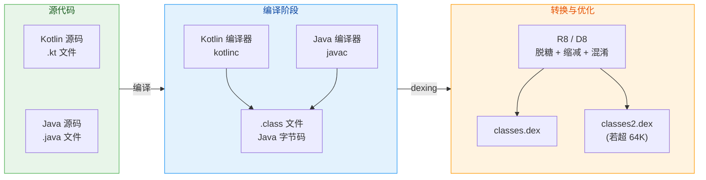
```mermaid
graph LR
    subgraph SRC["源代码"]
        direction TB
        KT["Kotlin 源码\n.kt 文件"]
        JV["Java 源码\n.java 文件"]
        KT ~~~ JV
    end

    subgraph COMPILE["编译阶段"]
        direction TB
        KC["Kotlin 编译器\nkotlinc"]
        JC["Java 编译器\njavac"]
        CLS[".class 文件\nJava 字节码"]
        KC --> CLS
        JC --> CLS
    end

    subgraph TRANSFORM["转换与优化"]
        direction TB
        R8["R8 / D8\n脱糖 + 缩减 + 混淆"]
        DEX1["classes.dex"]
        DEX2["classes2.dex\n(若超 64K)"]
        R8 --> DEX1
        R8 --> DEX2
    end

    SRC -->|"编译"| COMPILE -->|"dexing"| TRANSFORM

    classDef srcStyle fill:#E8F5E9,stroke:#4CAF50,color:#1B5E20
    classDef compileStyle fill:#E3F2FD,stroke:#2196F3,color:#0D47A1
    classDef transStyle fill:#FFF3E0,stroke:#FF9800,color:#E65100

    class SRC srcStyle
    class COMPILE compileStyle
    class TRANSFORM transStyle
```

整条链路可以概括为：**源码 → Java 字节码（.class）→ DEX 字节码（.dex）**。R8/D8 是这条链路中从 JVM 世界到 Dalvik/ART 世界的关键桥梁。

---

### ARSC 资源表

**`resources.arsc`** 是 Android 资源系统的核心索引文件。当你在代码中调用 `R.string.app_name` 或在 XML 中引用 `@drawable/ic_launcher` 时，运行时并不会去遍历文件系统查找资源——它查询的正是这张预编译的二进制资源表。可以将 `resources.arsc` 理解为一个**高度优化的键值数据库**，其中的"键"是资源 ID（如 `0x7f010001`），"值"则指向具体的资源数据或资源文件路径。

#### 资源 ID 的构成

每个 Android 资源都有一个唯一的 32 位整数 ID，由 `aapt2`（Android Asset Packaging Tool 2）在编译时自动分配，记录在 `R.java`（或 `R.jar`）中。这个 ID 的结构为：

```
资源 ID 结构（32-bit）
┌──────────┬──────────┬────────────────┐
│ Package  │   Type   │     Entry      │
│  8 bits  │  8 bits  │    16 bits     │
├──────────┼──────────┼────────────────┤
│   0x7f   │   0x02   │    0x001a      │
│  应用包   │ drawable │   第 26 项资源  │
└──────────┴──────────┴────────────────┘
         完整 ID = 0x7f02001a
```

- **Package ID（8 位）**：`0x7f` 表示应用自身的资源包，`0x01` 表示系统框架（`android.R`）资源包。如果使用了 Runtime Resource Overlay 或共享库资源，还会出现其他 Package ID。
- **Type ID（8 位）**：资源类型的编号，例如 `attr`、`drawable`、`layout`、`string`、`color` 等类型分别对应不同的编号。
- **Entry ID（16 位）**：该类型下资源条目的序号，从 `0x0000` 开始递增。

这种扁平的整数索引使得资源查找仅需一次数组偏移计算，时间复杂度为 O(1)，远比按名称字符串查找高效。

#### ARSC 内部数据结构

`resources.arsc` 文件内部由一系列 **Chunk（块）** 组成，每个 Chunk 都有 Type 和 Size 头部。核心结构可以简化为：

- **Global String Pool**：存储所有资源值中出现的字符串（如 `"Hello World"`、`"res/drawable-xxhdpi-v4/ic_launcher.png"` 等路径）。这是一个去重的字符串池，使用 UTF-8 或 UTF-16 编码。
- **Package Chunk**：每个资源包对应一个 Package Chunk。其中包含：
  - **Type String Pool**：类型名称列表（`"attr"`, `"drawable"`, `"layout"`, `"string"` …）。
  - **Key String Pool**：资源条目名称列表（`"app_name"`, `"ic_launcher"`, `"activity_main"` …）。
  - **Type Spec**：为每种资源类型定义配置变化标志（configuration change flags），标记该资源在哪些维度上存在不同的配置变体（如 `density`、`locale`、`orientation`）。
  - **Type Info**：实际的资源条目数据。每个 Type Info 对应一个**具体的 Configuration**（如 `drawable-xxhdpi`），其中包含一个 Entry 数组，每个 Entry 存储该配置下某个资源的值（可能是内联的简单值如整数/颜色，也可能是指向 Global String Pool 中文件路径的引用）。

当应用运行时，`AssetManager` 加载 `resources.arsc` 到内存中，然后根据当前设备的 **Configuration**（语言、屏幕密度、屏幕尺寸、夜间模式等）在 Type Info 中进行**最佳匹配**（Best Match）。这就是 Android 资源限定符系统（如 `values-zh-rCN`、`drawable-night-xxhdpi`）的底层运作方式——`resources.arsc` 中已经按 Configuration 对资源进行了分类索引，运行时只需按设备参数过滤即可。

#### 对应用体积的影响

`resources.arsc` 的大小与你定义的**资源条目数量 × 配置维度数量**成正比。如果你的应用支持 30 种语言、5 种屏幕密度，那么即使只有几百个字符串资源，组合出来的条目数也会非常庞大。这就是为什么在后续章节中我们会介绍 `resConfigs` 来限制只保留需要的语言配置——它直接减小了 `resources.arsc` 的大小。

---

### Manifest 清单

**`AndroidManifest.xml`** 是每个 Android 应用的"身份证"和"能力声明书"。它以 XML 形式声明了应用的包名、版本、所有四大组件（Activity、Service、BroadcastReceiver、ContentProvider）、所需权限、硬件特性需求、最低/目标 SDK 版本等关键元信息。**没有 Manifest，Android 系统就不知道如何安装和运行你的应用**。

#### 文本形式 vs 二进制形式

开发者在项目中编写的 `AndroidManifest.xml` 是标准的文本 XML。但在 APK 内部，它已经被 `aapt2` 编译为 **Android Binary XML（AXML）** 格式。这种二进制格式与 `resources.arsc` 类似，也采用了 Chunk 结构和字符串池设计，优势在于：

1. **解析速度更快**：系统安装应用时（`PackageManagerService` 解析 Manifest）使用的是二进制解析器，比文本 XML 解析快得多。
2. **体积更小**：重复的命名空间、属性名等都被字符串池去重。
3. **资源引用已解析**：XML 中类似 `@string/app_name` 的引用在编译时已经被替换为对应的资源 ID（如 `0x7f040001`），运行时无需再做名称解析。

如果你在 APK Analyzer 中打开 `AndroidManifest.xml`，Android Studio 会自动将二进制格式反编译回可读的文本 XML。也可以使用 `aapt2 dump xmltree my-app.apk --file AndroidManifest.xml` 命令行工具来查看。

#### Manifest 核心元素

一个典型的 Manifest 文件包含以下关键声明：

```xml
<?xml version="1.0" encoding="utf-8"?>
<!-- 根元素：声明包名和 XML 命名空间 -->
<manifest xmlns:android="http://schemas.android.com/apk/res/android"
    package="com.example.myapp">  <!-- 应用唯一标识符（applicationId 会覆盖此值） -->

    <!-- 权限声明：应用需要使用的系统权限 -->
    <uses-permission android:name="android.permission.INTERNET" />       <!-- 网络访问 -->
    <uses-permission android:name="android.permission.CAMERA" />         <!-- 相机访问（运行时权限） -->

    <!-- 硬件特性需求：Google Play 用于设备过滤 -->
    <uses-feature
        android:name="android.hardware.camera"
        android:required="false" />  <!-- required=false 表示非必需，扩大兼容设备范围 -->

    <!-- Application 节点：应用全局配置 -->
    <application
        android:name=".MyApp"                    <!-- 自定义 Application 类 -->
        android:icon="@mipmap/ic_launcher"       <!-- 应用图标资源引用 -->
        android:label="@string/app_name"         <!-- 应用显示名称 -->
        android:theme="@style/AppTheme"          <!-- 全局主题 -->
        android:allowBackup="true"               <!-- 是否允许自动备份 -->
        android:networkSecurityConfig="@xml/network_security_config">  <!-- 网络安全策略 -->

        <!-- Activity 声明 -->
        <activity
            android:name=".ui.MainActivity"              <!-- Activity 类全限定名 -->
            android:exported="true"                      <!-- 是否允许其他应用启动（Android 12+ 必须显式声明） -->
            android:launchMode="singleTop"               <!-- 启动模式 -->
            android:screenOrientation="portrait">        <!-- 屏幕方向锁定 -->

            <!-- Intent Filter：声明此 Activity 是应用入口 -->
            <intent-filter>
                <action android:name="android.intent.action.MAIN" />          <!-- 主入口 Action -->
                <category android:name="android.intent.category.LAUNCHER" />  <!-- 出现在启动器中 -->
            </intent-filter>
        </activity>

        <!-- Service 声明 -->
        <service
            android:name=".sync.SyncService"       <!-- Service 类 -->
            android:exported="false" />             <!-- 不允许外部调用 -->

        <!-- BroadcastReceiver 声明（静态注册） -->
        <receiver
            android:name=".receiver.BootReceiver"
            android:exported="true">                <!-- 需要接收系统广播，必须 exported -->
            <intent-filter>
                <action android:name="android.intent.action.BOOT_COMPLETED" />  <!-- 开机完成广播 -->
            </intent-filter>
        </receiver>

        <!-- ContentProvider 声明 -->
        <provider
            android:name=".data.MyProvider"
            android:authorities="com.example.myapp.provider"   <!-- Provider 唯一标识 URI -->
            android:exported="false" />
    </application>
</manifest>
```

#### Manifest Merger（清单合并）

在实际项目中，最终 APK 里的 Manifest 并不仅仅来自你 `app/src/main/` 目录下的那个文件。Gradle 构建过程中会执行 **Manifest Merger**，将以下来源的 Manifest 进行合并：

1. **主模块**（`app/src/main/AndroidManifest.xml`）——优先级最高。
2. **Build Variant**（如 `app/src/debug/AndroidManifest.xml`）——可覆盖主模块的部分属性。
3. **依赖库**（AAR / Library Module）——每个库都携带自己的 Manifest，声明自己需要的权限、组件等。

合并过程中如果出现冲突（比如两个库都声明了同名的 `<provider>`），构建会报错。你可以通过 `tools:replace`、`tools:remove`、`tools:node="merge"` 等合并规则标记来手动解决冲突。在 Android Studio 的 Manifest 编辑器底部有一个 **"Merged Manifest"** 标签页，可以直观查看合并结果及每个属性的来源。

#### `exported` 属性的安全意义

从 **Android 12（API 31）** 开始，如果你的 Activity、Service 或 BroadcastReceiver 声明了 `<intent-filter>`，则**必须**显式设置 `android:exported` 属性，否则应用将无法安装。这是一项重要的安全加固措施——防止开发者无意中将组件暴露给外部应用调用，从而引发越权访问等安全风险。

---

### RES 资源

APK 内的 `res/` 目录包含了所有经过 `aapt2` 编译的资源文件。这里需要区分两种不同的处理方式：

#### 编译型资源 vs 原封保留型资源

并非所有 `res/` 目录下的文件都以相同的方式处理：

- **XML 资源**（布局 layout、动画 anim、颜色状态列表 color、drawable XML 等）：被 `aapt2` 编译为 **Android Binary XML** 格式，与 Manifest 的编译方式相同。它们的文件名不变，但内容已经是二进制格式，直接用文本编辑器打开会看到乱码。
- **非 XML 资源**（PNG、JPG、WebP 图片，以及 `res/raw/` 目录下的任意文件）：保持原始格式不变，仅被打包进 APK。`res/raw/` 是一个特殊目录，其中的文件不会被编译或压缩，可以通过 `resources.openRawResource(R.raw.xxx)` 以原始字节流形式访问。

#### `res/` vs `assets/` 的区别

这是一个常见的困惑点，两者的核心差异如下：

| 维度 | `res/` | `assets/` |
|------|--------|-----------|
| **资源 ID** | 每个文件都有编译时分配的 `R.xxx.yyy` ID | 没有资源 ID |
| **访问方式** | `Resources.getXxx(R.xxx.yyy)` | `AssetManager.open("path/file")` |
| **目录结构** | 严格遵守 Android 定义的子目录名 | 自由嵌套，任意目录结构 |
| **编译处理** | XML 被编译为二进制；图片可被优化 | 完全不处理，原样打包 |
| **Configuration 匹配** | 支持限定符（如 `-xxhdpi`, `-zh`）自动匹配 | 不支持，需手动在代码中判断 |
| **典型用途** | UI 布局、字符串、图标、主题等 | 字体文件、游戏数据、HTML 页面、预置数据库 |

简而言之，如果资源需要参与 Android 资源系统的自动配置匹配（多语言、多密度等），就放 `res/`；如果是不需要编译和匹配的原始文件，就放 `assets/`。

#### 资源在运行时的加载链路

当代码调用 `getString(R.string.app_name)` 时，运行时的查找路径大致为：

1. `Resources` 对象接收到资源 ID `0x7f040001`。
2. 它通过内部的 `ResourcesImpl` 委托给 `AssetManager`。
3. `AssetManager`（Native 层，C++ 实现）在已加载的 `resources.arsc` 数据中，用 Package ID 定位到 Package Chunk，用 Type ID 定位到 Type Spec，再结合当前设备 Configuration 找到最佳匹配的 Type Info，最后用 Entry ID 在数组中取出对应值。
4. 如果值是内联数据（如字符串文本、颜色值），直接返回；如果是文件路径引用（如 `res/drawable-xxhdpi-v4/bg.png`），则进一步从 APK 中读取该文件。

这条链路解释了为什么 `resources.arsc` 的加载效率如此重要——它是**每一次资源访问的必经入口**。

---

### META-INF 签名

`META-INF/` 目录承载了 APK 的**数字签名信息**，是 Android 安全模型中至关重要的一环。Android 系统要求每个 APK 都必须被签名才能安装，签名的作用是保证 APK 的**完整性**（内容未被篡改）和**来源认证**（确认是由特定开发者签发）。

#### V1 签名在 META-INF 中的体现

在最经典的 **V1（JAR Signature）** 签名方案下，`META-INF/` 目录通常包含三个关键文件：

**`MANIFEST.MF`（清单摘要文件）**：列出 APK 中每个文件的名称及其对应的 SHA-256（或 SHA-1）摘要。格式如下：

```
Manifest-Version: 1.0
Built-By: Android Gradle 8.2.0
Created-By: Android Gradle 8.2.0

Name: res/layout/activity_main.xml
SHA-256-Digest: a1b2c3d4e5f6...（Base64 编码的哈希值）

Name: classes.dex
SHA-256-Digest: f6e5d4c3b2a1...

Name: AndroidManifest.xml
SHA-256-Digest: 1a2b3c4d5e6f...
```

**`CERT.SF`（签名文件）**：对 `MANIFEST.MF` 整体以及其中每个条目的摘要再次计算哈希。这是一层"摘要的摘要"，目的是防止 `MANIFEST.MF` 本身被篡改。

**`CERT.RSA`（或 `.DSA`、`.EC`，取决于密钥算法）**：包含开发者的**公钥证书**（X.509 格式）以及对 `CERT.SF` 的数字签名。验证方用此文件中的公钥来验证 `CERT.SF` 的签名是否有效。

整个 V1 签名验证链路为：

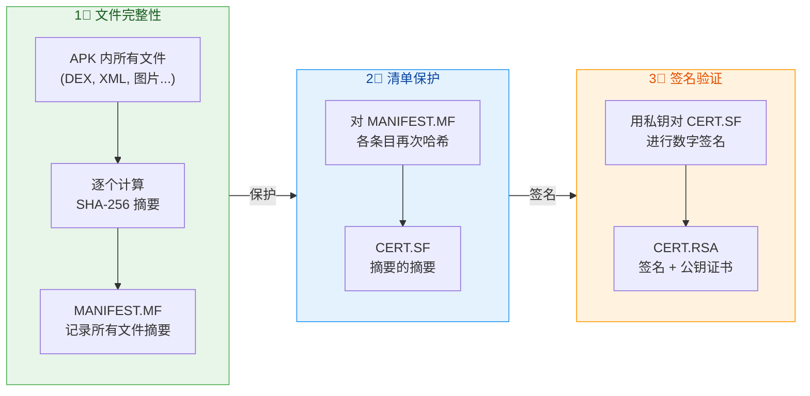
```mermaid
graph LR
    subgraph STEP1["1⃣ 文件完整性"]
        direction TB
        APK_FILES["APK 内所有文件\n(DEX, XML, 图片...)"]
        HASH1["逐个计算\nSHA-256 摘要"]
        MF["MANIFEST.MF\n记录所有文件摘要"]
        APK_FILES --> HASH1
        HASH1 --> MF
    end

    subgraph STEP2["2⃣ 清单保护"]
        direction TB
        HASH2["对 MANIFEST.MF\n各条目再次哈希"]
        SF["CERT.SF\n摘要的摘要"]
        HASH2 --> SF
    end

    subgraph STEP3["3⃣ 签名验证"]
        direction TB
        SIGN["用私钥对 CERT.SF\n进行数字签名"]
        RSA["CERT.RSA\n签名 + 公钥证书"]
        SIGN --> RSA
    end

    STEP1 -->|"保护"| STEP2 -->|"签名"| STEP3

    classDef s1 fill:#E8F5E9,stroke:#4CAF50,color:#1B5E20
    classDef s2 fill:#E3F2FD,stroke:#2196F3,color:#0D47A1
    classDef s3 fill:#FFF3E0,stroke:#FF9800,color:#E65100

    class STEP1 s1
    class STEP2 s2
    class STEP3 s3
```

#### V1 签名的局限性

V1 签名本质上是 JAR 签名方案的直接复用，它有几个显著的弱点：

1. **不保护 ZIP 元数据**：V1 只对 ZIP 归档内的文件内容做了哈希校验，但 ZIP 文件本身的头部信息（如文件注释、额外字段、压缩方式等）不在保护范围内。攻击者可以修改这些元数据而不破坏 V1 签名。
2. **META-INF 目录本身不受保护**：`MANIFEST.MF`、`CERT.SF`、`CERT.RSA` 这些文件本身不在签名覆盖范围内（因为签名就存放于此）。这意味着可以向 `META-INF/` 中添加额外文件而不影响签名校验——某些早期的多渠道打包方案（如美团的旧方案）正是利用了这个"漏洞"，往 `META-INF/` 目录中塞入渠道标识文件。
3. **验证效率低**：需要解压并逐个计算每个文件的哈希值，对于大型 APK 来说耗时较长。

正是这些局限性促使 Google 在 Android 7.0 中引入了 **V2 APK Signature Scheme**，以及后续的 V3（密钥轮替）和 V4（增量安装），这些将在后续的"签名机制详解"章节中深入讨论。

#### V2/V3/V4 签名块的位置

值得提前说明的是，V2 及以上版本的签名数据**不在 `META-INF/` 目录内**，而是存放在 ZIP 文件格式中 **Central Directory 之前**的一个特殊区域——**APK Signing Block**。这个区域不属于任何 ZIP 条目，因此既不会被 V1 签名覆盖（不冲突），也不会影响 ZIP 的正常解压。APK 的 ZIP 格式布局变为：

```
APK 文件物理布局
┌───────────────────────────────────┐
│    ZIP Entries（文件内容区）         │  ← DEX、XML、图片等所有文件
├───────────────────────────────────┤
│    APK Signing Block              │  ← V2/V3/V4 签名数据存放于此
│    (magic: "APK Sig Block 42")    │
├───────────────────────────────────┤
│    Central Directory              │  ← ZIP 目录索引
├───────────────────────────────────┤
│    End of Central Directory       │  ← ZIP 文件结尾标记
└───────────────────────────────────┘
```

V2 签名对从 ZIP Entries 到 Central Directory 的所有原始数据（按 1MB 分块）计算摘要并签名，因此任何对 APK 内容的修改（包括 ZIP 元数据）都会导致签名失效。这是一个远比 V1 更强大、更高效的保护方案。

---

**📝 练习题**

在分析一个 APK 时，发现 `classes.dex` 和 `classes2.dex` 两个文件。以下关于 MultiDex 的描述，哪项是正确的？


A. MultiDex 的出现是因为单个 DEX 文件最多只能包含 65536 个类定义


B. 在 Android 5.0（API 21）及以上设备中，ART 运行时原生支持加载多个 DEX 文件，无需额外的 MultiDex 支持库


C. 开启 R8 代码缩减后，方法数一定不会超过 64K 限制，因此永远不需要 MultiDex


D. `classes2.dex` 中只包含第三方库的代码，`classes.dex` 只包含应用自身的代码


**【答案】** B

**【解析】** 64K 方法数限制是针对**方法引用数量**而非类数量，因此 A 选项错误（应为 65536 个**方法**，不是类）。B 正确，Android 5.0 引入的 ART 运行时在安装时会将所有 DEX 文件一起进行 AOT 编译为 OAT 文件，原生支持多 DEX 加载。C 过于绝对——R8 虽然能显著减少方法数，但对于超大型应用仍然可能超过 64K。D 也不正确——D8/R8 在拆分 DEX 时并不是按"应用代码 vs 第三方库"来划分的，而是根据依赖关系和主 DEX 所需的启动类进行自动分配。

---

**📝 练习题**

关于 APK 中 `META-INF/` 目录与签名机制，以下说法正确的是？


A. V2 签名方案的签名数据存放在 `META-INF/CERT.RSA` 文件中


B. V1 签名方案能保护 APK 中所有数据，包括 ZIP 文件头部元信息


C. `MANIFEST.MF` 文件中记录了 APK 内每个文件的 SHA 摘要值，用于验证文件完整性


D. 向 `META-INF/` 目录中添加一个新文件，一定会导致 V1 签名验证失败


**【答案】** C

**【解析】** V1 签名方案中，`MANIFEST.MF` 确实逐一记录了 APK 内各文件的摘要值，是完整性校验的基础数据文件，因此 C 正确。A 错误，V2 签名数据存放在 ZIP Central Directory 之前的 APK Signing Block 中，而非 `META-INF/` 目录。B 错误，V1 签名的最大弱点之一就是**不保护 ZIP 元数据**。D 也不完全正确——V1 签名校验时，`META-INF/` 目录下以 `.SF`、`.RSA`、`.DSA`、`.EC` 结尾的文件以及 `MANIFEST.MF` 本身是被排除在验证范围之外的，向 `META-INF/` 添加某些特定格式的文件不会破坏 V1 签名（这也是某些早期多渠道打包方案的利用原理）。

---

## Android App Bundle

Android App Bundle（简称 AAB）是 Google 于 2018 年推出的一种全新的应用发布格式，其文件扩展名为 `.aab`。与传统的 APK 不同，AAB **本身并不是一个可直接安装到设备上的文件**，而是一个包含了应用所有编译代码与资源的 **"上传制品"（Publishing Artifact）**。开发者将 AAB 上传至 Google Play 后，由 Google Play 的服务端基础设施根据每台设备的具体配置（CPU 架构、屏幕密度、系统语言等）**动态生成并签署** 体积最优的 APK 组合，再分发给用户。这一流程的核心理念是 **"只给设备它真正需要的东西"**，从而大幅缩减用户的下载与安装体积。

从 2021 年 8 月起，Google Play 已强制要求所有新应用必须以 AAB 格式上架，传统的 Fat APK（Universal APK）不再被接受作为新应用的提交格式。这意味着理解 AAB 不再是一个"加分项"，而是 Android 开发者的 **必修课**。

### AAB 格式优势

要理解 AAB 的优势，首先需要回顾传统 APK 的"痛点"。一个 Universal APK 需要在单个文件中打包 **所有** ABI 的 native 库（armeabi-v7a、arm64-v8a、x86、x86_64）、**所有** 屏幕密度的资源（mdpi、hdpi、xhdpi、xxhdpi、xxxhdpi）以及 **所有** 语言的字符串资源。然而，对于一台具体的设备，比如一台 arm64-v8a 架构、xxhdpi 屏幕密度、系统语言为中文的手机，它实际只需要 arm64-v8a 的 so 库、xxhdpi 的图片资源和中文字符串。其余内容全部是 **冗余下载**，浪费了用户的流量和存储空间。

AAB 格式从根本上解决了这一问题。它的优势主要体现在以下几个维度：

**1. 显著减小下载体积**

Google 官方数据显示，使用 AAB 格式发布的应用相比 Universal APK 平均可以减少约 **15%** 的下载体积。对于包含大量 native 库或多语言资源的大型应用，体积缩减甚至可以达到 **30%~50%**。体积的缩减直接转化为更高的安装转化率——研究表明，APK 体积每减少 6MB，安装转化率可提升约 1%。这对于面向全球市场、尤其是网络条件较差的新兴市场（如东南亚、非洲）的应用来说，是巨大的商业价值。

**2. 应用内部结构更加模块化**

AAB 鼓励开发者将应用拆分为一个 **Base Module**（基础模块）和若干个 **Dynamic Feature Module**（动态功能模块）。Base Module 包含应用启动和核心功能所需的全部代码与资源，用户首次安装时必须下载；Dynamic Feature Module 则可以按需下载（on-demand）、在安装时下载（install-time）或根据条件延迟下载（conditional delivery）。这种模块化架构不仅减小了首次安装的体积，还推动开发者构建更清晰的代码边界，有利于大型团队的协作开发。

**3. 与 Play 生态深度集成**

AAB 格式与 Google Play 的 **Play App Signing**（应用签名托管）、**Play Asset Delivery**（大型资产分发，适用于游戏）以及 **Play Feature Delivery**（功能模块分发）等服务紧密集成。开发者上传 AAB 后，Google Play 会使用托管的应用签名密钥对最终分发给用户的 APK 进行签名，同时可以利用 Play 的 CDN 进行高效的增量更新。

**4. AAB 的内部文件结构**

AAB 文件本质上是一个 **ZIP 压缩包**，但其内部目录结构与 APK 有显著不同。理解这个结构有助于掌握后续 Split APK 的生成原理：

```text
my_app.aab
├── base/                          # 基础模块（必须存在）
│   ├── dex/                       # 编译后的 DEX 字节码文件
│   │   ├── classes.dex
│   │   └── classes2.dex
│   ├── manifest/                  # AndroidManifest.xml（Protocol Buffer 格式）
│   │   └── AndroidManifest.xml
│   ├── res/                       # 资源文件（按类型/配置组织）
│   │   ├── drawable-hdpi/
│   │   ├── drawable-xxhdpi/
│   │   └── layout/
│   ├── lib/                       # Native .so 库（按 ABI 分目录）
│   │   ├── armeabi-v7a/
│   │   ├── arm64-v8a/
│   │   └── x86_64/
│   ├── assets/                    # 原始资产文件
│   ├── resources.pb               # 资源表（对应 APK 中的 resources.arsc，但用 PB 格式）
│   └── native.pb                  # Native 库的元数据描述
├── feature1/                      # 动态功能模块（可选）
│   ├── dex/
│   ├── manifest/
│   ├── res/
│   └── resources.pb
├── BundleConfig.pb                # Bundle 全局配置（压缩策略、版本等）
└── BUNDLE-METADATA/               # 额外的元数据（ProGuard 映射表、版本信息等）
    └── com.android.tools.build.bundletool/
```

与 APK 对比，关键区别有三点：第一，资源表从二进制的 `resources.arsc` 变成了 **Protocol Buffer 格式的 `resources.pb`**，PB 格式更灵活、更易于 Google Play 服务端解析和拆分；第二，清单文件 `AndroidManifest.xml` 同样使用 PB 格式而非二进制 XML；第三，所有资源和 native 库都按照配置维度（density、ABI、locale）在目录层级上天然分离，为后续的"切片"操作提供了结构基础。

### Dynamic Delivery 动态分发

Dynamic Delivery 是 Google Play 基于 AAB 格式实现的 **分发机制**，它是整个 AAB 体系的"灵魂"。开发者的工作到上传 AAB 为止；此后的 APK 生成、签名与分发全部由 Google Play 在云端完成。

**Dynamic Delivery 的核心工作流程如下：**

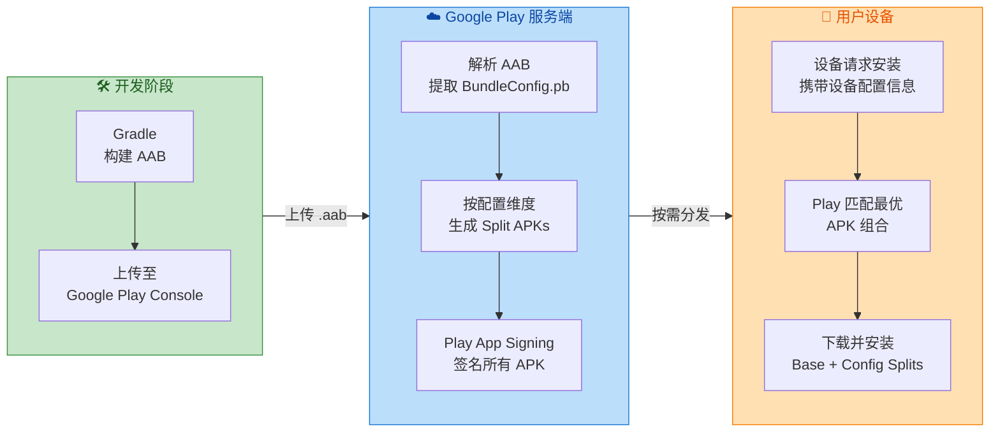
```mermaid
graph LR
    subgraph Dev["🛠 开发阶段"]
        direction TB
        A["Gradle\n构建 AAB"]
        B["上传至\nGoogle Play Console"]
        A --> B
    end

    subgraph Server["☁️ Google Play 服务端"]
        direction TB
        C["解析 AAB\n提取 BundleConfig.pb"]
        D["按配置维度\n生成 Split APKs"]
        E["Play App Signing\n签名所有 APK"]
        C --> D
        D --> E
    end

    subgraph Device["📱 用户设备"]
        direction TB
        F["设备请求安装\n携带设备配置信息"]
        G["Play 匹配最优\nAPK 组合"]
        H["下载并安装\nBase + Config Splits"]
        F --> G
        G --> H
    end

    Dev -->|"上传 .aab"| Server -->|"按需分发"| Device

    classDef devStyle fill:#C8E6C9,stroke:#388E3C,color:#1B5E20
    classDef serverStyle fill:#BBDEFB,stroke:#1976D2,color:#0D47A1
    classDef deviceStyle fill:#FFE0B2,stroke:#F57C00,color:#E65100

    class Dev devStyle
    class Server serverStyle
    class Device deviceStyle
```

**阶段一：开发者构建与上传**

开发者在 Android Studio 中通过 `Build > Generate Signed Bundle` 或者使用 Gradle 命令 `./gradlew bundleRelease` 来构建 AAB 文件。这个过程中，AGP（Android Gradle Plugin）会将所有模块（base module + dynamic feature modules）的代码、资源和 native 库分别编译，并按照 AAB 的目录结构打包到一个 `.aab` 文件中。随后，开发者将 AAB 上传至 Google Play Console。

**阶段二：Google Play 服务端处理**

Google Play 收到 AAB 后，会使用一个名为 **bundletool** 的工具（开源的，开发者也可以在本地使用它来模拟整个流程）来解析 AAB。服务端会读取 `BundleConfig.pb` 了解该 Bundle 的配置策略（比如哪些维度需要拆分、哪些文件不需要压缩），然后根据所有可能的设备配置组合预生成一系列 **Split APK**。所有生成的 APK 都会使用开发者托管在 Google Play 上的 **App Signing Key** 进行签名。

**阶段三：用户设备请求安装**

当用户在 Google Play 商店点击"安装"时，设备会将自身的配置信息（包括 `Build.SUPPORTED_ABIS`、`DisplayMetrics.densityDpi`、`Locale.getDefault()` 等）发送给 Google Play 服务端。服务端据此从预生成的 Split APK 池中挑选出最匹配的组合，仅下发这些必要的 APK。设备上的 Google Play 服务会调用 `PackageInstaller` 的 Split Install API 将这些 APK 作为一个完整的应用安装。

**Dynamic Feature Module 的分发模式**

Dynamic Feature Module（动态功能模块）的分发不是"一刀切"的，开发者可以根据业务需要为每个模块选择不同的分发策略。在模块的 `AndroidManifest.xml` 中通过 `<dist:module>` 标签配置：

```xml
<!-- Dynamic Feature Module 的 AndroidManifest.xml -->
<manifest xmlns:android="http://schemas.android.com/apk/res/android"
    xmlns:dist="http://schemas.android.com/apk/distribution"
    package="com.example.feature.camera">

    <!-- dist:module 定义此模块的分发策略 -->
    <dist:module
        dist:instant="false"
        dist:title="@string/title_camera_feature">

        <!-- install-time: 首次安装时就包含此模块，行为类似 base module -->
        <!-- on-demand: 用户主动触发后才下载 -->
        <!-- fast-follow: 安装后立即在后台自动下载 -->
        <dist:delivery>
            <!-- 按需分发模式：用户点击按钮后才触发下载 -->
            <dist:on-demand />
        </dist:delivery>

        <!-- 可选：条件分发，仅在满足条件的设备上安装 -->
        <!-- 例如：仅在支持 AR 的设备上安装 AR 功能模块 -->
        <dist:delivery>
            <dist:install-time>
                <dist:conditions>
                    <!-- 设备必须支持 OpenGL ES 3.1 及以上 -->
                    <dist:min-sdk dist:value="21" />
                    <!-- 设备必须支持 AR 特性 -->
                    <dist:device-feature
                        dist:name="android.hardware.camera.ar" />
                </dist:conditions>
            </dist:install-time>
        </dist:delivery>

    </dist:module>

    <!-- 此模块仍需声明所需权限和组件 -->
    <application>
        <activity android:name=".CameraActivity" />
    </application>

</manifest>
```

三种核心分发模式的对比如下：

| 分发模式 | 下载时机 | 典型场景 | 用户感知 |
|:---|:---|:---|:---|
| **install-time** | 首次安装时一并下载 | 不可或缺但希望代码隔离的功能 | 无感知，等同于 base |
| **on-demand** | 用户主动触发时下载 | 低频功能（如 AR 滤镜、高级编辑器） | 有下载等待过程 |
| **fast-follow** | 安装完成后台立即下载 | 重要但非启动必须的功能（如教程） | 很快可用，几乎无感 |
| **conditional** | 满足设备条件时在安装期下载 | 硬件相关功能（如 AR、NFC） | 无感知，但仅限特定设备 |

**在应用代码中请求 On-Demand 模块的安装**，需要使用 Google 提供的 **Play Core Library**（现已迁移至 `play-feature-delivery` 库）：

```kotlin
// 1. 添加依赖：implementation("com.google.android.play:feature-delivery:2.1.0")

// 2. 创建 SplitInstallManager 实例
// SplitInstallManagerFactory 是入口工厂类，通过 Context 创建管理器
val splitInstallManager = SplitInstallManagerFactory.create(context)

// 3. 构建安装请求，指定要下载的模块名称
// 模块名称对应 Dynamic Feature Module 的 Gradle 模块名（而非包名）
val request = SplitInstallRequest.newBuilder()
    .addModule("camera_feature")  // 要安装的模块名
    .addModule("ar_feature")      // 可以同时请求多个模块
    .build()

// 4. 发起安装请求，返回一个 Task<Int>，其中 Int 是 sessionId
splitInstallManager.startInstall(request)
    .addOnSuccessListener { sessionId ->
        // sessionId 用于后续追踪此次安装会话的状态
        Log.d("DynamicDelivery", "安装会话已启动，sessionId=$sessionId")
    }
    .addOnFailureListener { exception ->
        // 安装请求失败，可能是网络问题或模块不存在
        Log.e("DynamicDelivery", "安装请求失败: ${exception.message}")
    }

// 5. 注册状态监听器，追踪下载与安装进度
val listener = SplitInstallStateUpdatedListener { state ->
    when (state.status()) {
        // 等待下载中（可能在等待 Wi-Fi 连接）
        SplitInstallSessionStatus.PENDING -> {
            showMessage("等待下载...")
        }
        // 正在下载，可以获取进度
        SplitInstallSessionStatus.DOWNLOADING -> {
            val totalBytes = state.totalBytesToDownload()   // 总字节数
            val downloadedBytes = state.bytesDownloaded()   // 已下载字节数
            updateProgressBar(downloadedBytes, totalBytes)  // 更新 UI 进度条
        }
        // 下载完成，正在安装到应用中
        SplitInstallSessionStatus.INSTALLING -> {
            showMessage("正在安装模块...")
        }
        // 安装完成，可以使用模块中的代码和资源了
        SplitInstallSessionStatus.INSTALLED -> {
            showMessage("模块安装成功！")
            // 此时可以通过反射或 SplitCompat 访问新模块的 Activity/类
            launchCameraFeature()
        }
        // 需要用户确认（模块体积超过 200MB 或需要移动网络时）
        SplitInstallSessionStatus.REQUIRES_USER_CONFIRMATION -> {
            // 启动 Google Play 的确认对话框
            splitInstallManager.startConfirmationDialogForResult(
                state, activity, REQUEST_CODE_CONFIRM
            )
        }
        // 安装失败
        SplitInstallSessionStatus.FAILED -> {
            Log.e("DynamicDelivery", "错误码: ${state.errorCode()}")
        }
    }
}

// 6. 注册/反注册监听器（通常在 Activity 的 onResume/onPause 中）
splitInstallManager.registerListener(listener)
// splitInstallManager.unregisterListener(listener)  // 在 onPause 中反注册
```

一个需要特别注意的细节是 **SplitCompat**。当 Dynamic Feature Module 在运行时被安装后，其代码和资源需要对当前进程"可见"。在 Android 10（API 29）以上系统中，平台原生支持 Split APK 的热加载；但在更低版本的系统上，需要在 `Application.onCreate()` 中调用 `SplitCompat.installActivity(this)` 来确保新模块的资源和类能被正确加载。通常的做法是让自定义 Application 类继承 `SplitCompatApplication`，或手动在 `attachBaseContext()` 中调用 `SplitCompat.install(this)`。

### Split APKs 原理

Split APKs 是 Android 5.0（API 21，Lollipop）引入的平台级能力，它允许一个应用由 **多个 APK 文件** 组合安装，而在系统和用户看来，它仍然是**同一个应用**（同一个 package name、同一个 uid、同一个数据目录）。这是 AAB 和 Dynamic Delivery 得以实现的 **底层平台基石**。

**Split APKs 的类型体系**

当 Google Play（或 bundletool）从一个 AAB 生成 Split APKs 时，会产出以下几类 APK：

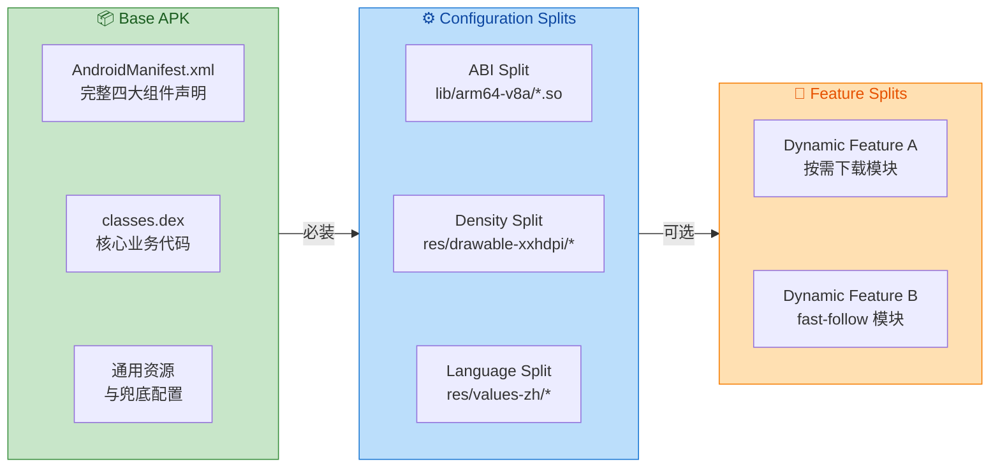
```mermaid
graph LR
    subgraph Base["📦 Base APK"]
        direction TB
        B1["AndroidManifest.xml\n完整四大组件声明"]
        B2["classes.dex\n核心业务代码"]
        B3["通用资源\n与兜底配置"]
        B1 ~~~ B2
        B2 ~~~ B3
    end

    subgraph ConfigSplits["⚙️ Configuration Splits"]
        direction TB
        C1["ABI Split\nlib/arm64-v8a/*.so"]
        C2["Density Split\nres/drawable-xxhdpi/*"]
        C3["Language Split\nres/values-zh/*"]
        C1 ~~~ C2
        C2 ~~~ C3
    end

    subgraph FeatureSplits["🧩 Feature Splits"]
        direction TB
        D1["Dynamic Feature A\n按需下载模块"]
        D2["Dynamic Feature B\nfast-follow 模块"]
        D1 ~~~ D2
    end

    Base -->|"必装"| ConfigSplits -->|"可选"| FeatureSplits

    classDef baseStyle fill:#C8E6C9,stroke:#388E3C,color:#1B5E20
    classDef configStyle fill:#BBDEFB,stroke:#1976D2,color:#0D47A1
    classDef featureStyle fill:#FFE0B2,stroke:#F57C00,color:#E65100

    class Base baseStyle
    class ConfigSplits configStyle
    class FeatureSplits featureStyle
```

**1. Base APK（基础 APK）**

Base APK 是唯一一个 **必须安装** 的 APK，它包含应用的 `AndroidManifest.xml`（包含所有四大组件的声明、权限声明等）、核心的 DEX 代码（至少是 app 模块的代码）、以及一份 **"兜底"资源**（default configuration resources）。所谓兜底资源，是指那些没有配置限定符（qualifier）的通用资源，例如 `res/drawable/icon.png`（无密度限定符）和 `res/values/strings.xml`（无语言限定符）。当系统在所有 Configuration Split 中都找不到匹配的资源时，就会回退到 Base APK 中的兜底资源。

从 Manifest 的视角来看，**所有组件（Activity、Service、BroadcastReceiver、ContentProvider）都必须在 Base APK 的 Manifest 中声明**，即使该组件的实际代码存在于某个 Feature Split 中。这是因为系统的 PackageManagerService 在安装应用时只解析 Base APK 的 Manifest 来构建组件注册表（component registry）。Feature Split 的 Manifest 只能声明 `<dist:module>` 等分发元数据，不能新增四大组件的声明。（注意：从 Android 12 开始，Feature Module 的 Manifest 中声明的 `<activity>` 等标签会在构建阶段被 Manifest Merger 合并进 Base 的 Manifest，所以开发者在 Feature Module 中声明组件是没有问题的——但最终它们都出现在 Base APK 中。）

**2. Configuration Splits（配置拆分 APK）**

Configuration Splits 是按照设备配置的三个主要维度自动生成的 APK：

- **ABI Split**：针对 CPU 架构，例如 `split_config.arm64_v8a.apk` 仅包含 `lib/arm64-v8a/` 目录下的 `.so` 文件。一台 arm64 设备只会下载这一个 ABI Split，而不需要下载 armeabi-v7a 或 x86 的 so 库。
- **Screen Density Split**：针对屏幕密度，例如 `split_config.xxhdpi.apk` 仅包含 `res/drawable-xxhdpi/` 等目录下的密度相关资源（主要是图片）。一台 xxhdpi 设备只会下载 xxhdpi 的资源。
- **Language Split**：针对系统语言，例如 `split_config.zh.apk` 仅包含 `res/values-zh/` 等目录下的中文字符串和语言相关资源。设备只会下载当前系统语言对应的 Split。

这种拆分之所以可行，得益于 Android 资源系统的 **Configuration Matching** 机制——`Resources` 对象在查找资源时，会根据当前设备的 `Configuration`（密度、语言、方向等）从所有已安装的 Split APK 中选择最佳匹配的资源。这个过程对应用代码是 **完全透明** 的，开发者使用 `R.drawable.icon` 或 `getString(R.string.hello)` 时不需要关心资源究竟来自哪个 Split APK。

**3. Feature Splits（功能拆分 APK）**

Feature Splits 对应 Dynamic Feature Modules。每个 Dynamic Feature Module 会被编译为一个独立的 Split APK（如 `split_camera_feature.apk`），包含该模块自己的 DEX 代码、资源和 native 库。Feature Split 也可以拥有自己的 Configuration Splits（比如 camera feature 模块中包含的 xxhdpi 资源会单独成为 `split_camera_feature.config.xxhdpi.apk`）。

**Split APKs 的安装与类加载机制**

在系统层面，Split APKs 的安装由 `PackageInstallerSession` 管理。开发者（或 Google Play 客户端）通过 `PackageInstaller.Session` 的 `addApkStream()` 方法逐一将多个 APK 写入一个安装会话（session），最后调用 `commit()` 提交。系统的 PackageManagerService 会验证所有 Split APK 的签名必须一致（与 Base APK 使用相同的签名证书），包名必须相同，版本号必须相同，然后将它们作为一个整体安装。

安装完成后，应用的 `ApplicationInfo` 对象中会包含一个 `splitSourceDirs` 字段（类型为 `String[]`），记录了所有已安装的 Split APK 的路径。Runtime 在创建 `PathClassLoader` 时，会将 Base APK 和所有 Split APK 的路径都加入 classpath，使得所有 Split 中的类都可以被正常加载。资源系统同样会将所有 Split APK 加入 `AssetManager` 的搜索路径。

```kotlin
// 在应用运行时查看已安装的 Split APKs 信息
fun inspectSplitApks(context: Context) {
    // 获取当前应用的 ApplicationInfo
    val appInfo = context.applicationInfo

    // Base APK 路径（永远只有一个）
    val baseApkPath = appInfo.sourceDir
    // 输出示例：/data/app/~~abc123/com.example.app-xyz456/base.apk
    Log.d("SplitAPK", "Base APK: $baseApkPath")

    // 所有 Split APK 的路径数组（可能为 null，如果没有 Split）
    val splitPaths: Array<String>? = appInfo.splitSourceDirs
    // 遍历并输出每个 Split APK 的路径
    splitPaths?.forEachIndexed { index, path ->
        // 输出示例：
        // Split[0]: /data/app/.../split_config.arm64_v8a.apk
        // Split[1]: /data/app/.../split_config.xxhdpi.apk
        // Split[2]: /data/app/.../split_config.zh.apk
        // Split[3]: /data/app/.../split_camera_feature.apk
        Log.d("SplitAPK", "Split[$index]: $path")
    }

    // 还可以获取 Split 的名称列表
    val splitNames: Array<String>? = appInfo.splitNames
    splitNames?.forEach { name ->
        // 输出示例：config.arm64_v8a, config.xxhdpi, config.zh, camera_feature
        Log.d("SplitAPK", "Split name: $name")
    }
}
```

**使用 bundletool 在本地模拟 Split APKs 生成**

开发者无需上传到 Google Play 就可以在本地体验完整的 AAB → Split APKs 流程。Google 提供的 **bundletool** 命令行工具可以完成这一工作：

```kotlin
// 步骤一：从 AAB 生成所有可能的 APK 组合（输出为 .apks 文件，本质是 ZIP）
// --bundle: 输入的 AAB 文件路径
// --output: 输出的 .apks 文件路径
// --ks: 签名用的 keystore 文件
// --ks-pass: keystore 密码
// --ks-key-alias: 密钥别名
// --key-pass: 密钥密码
// 命令: java -jar bundletool.jar build-apks
//   --bundle=app-release.aab
//   --output=app-release.apks
//   --ks=my-release-key.jks
//   --ks-pass=pass:myKeystorePassword
//   --ks-key-alias=my-key-alias
//   --key-pass=pass:myKeyPassword

// 步骤二：从 .apks 文件中提取适合连接设备的 APK 组合并安装
// bundletool 会自动读取连接设备的配置（通过 adb）
// 命令: java -jar bundletool.jar install-apks --apks=app-release.apks

// 步骤三：（可选）仅提取特定设备配置的 APK 组合，不安装
// 通过 --device-spec 指定设备配置 JSON 文件
// 命令: java -jar bundletool.jar extract-apks
//   --apks=app-release.apks
//   --output-dir=./extracted_apks/
//   --device-spec=device-spec.json
```

设备配置 JSON 文件（`device-spec.json`）示例如下：

```json
{
  "supportedAbis": ["arm64-v8a", "armeabi-v7a"],
  "supportedLocales": ["zh-CN", "en-US"],
  "screenDensity": 480,
  "sdkVersion": 33
}
```

bundletool 会根据这份配置从 `.apks` 文件中精确提取出设备所需的 Base APK + 对应的 Configuration Splits，开发者可以直观地看到 Split 策略的效果。

**Split APKs 与传统 Multi-APK 的区别**

需要注意的是，Split APKs 与 Google Play 早期支持的 **Multiple APK**（在 Play Console 中上传多个完整 APK，按设备过滤分发）是 **完全不同的机制**。Multiple APK 是多个 **独立的完整应用**，每个 APK 有自己完整的 Manifest 和资源；而 Split APKs 是一个应用被拆成多个 **互补的碎片**，它们共享同一个 package identity，由系统的 `PackageManager` 统一管理。Split APKs 的粒度更细、自动化程度更高，且完全由 bundletool / Google Play 服务端自动完成，开发者无需手动维护多个 APK 变体。

---

**📝 练习题**

某应用使用 AAB 格式发布，其中包含一个配置为 `on-demand` 分发模式的 Dynamic Feature Module "video_editor"。用户安装应用后首次点击"视频编辑"按钮时，以下哪项描述是 **正确的**？


A. 系统会自动从 Base APK 中加载 video_editor 模块的代码，无需额外操作


B. 应用需要通过 SplitInstallManager 发起安装请求，下载完成后才能使用该模块的代码和资源


C. on-demand 模块在应用安装时已经下载完毕，点击时直接可用，无需网络请求


D. video_editor 模块的 Activity 无法在 AndroidManifest.xml 中声明，只能通过反射启动


**【答案】** B

**【解析】** `on-demand` 分发模式意味着该模块 **不会** 在应用首次安装时一同下载，而是需要在运行时由应用代码主动通过 `SplitInstallManager.startInstall()` 发起下载请求。下载和安装完成后（状态变为 `INSTALLED`），该模块的代码和资源才会被加入当前进程的 ClassLoader 和 AssetManager 搜索路径，从而可以正常使用。选项 A 错误，因为 on-demand 模块的代码不在 Base APK 中；选项 C 混淆了 `on-demand` 和 `install-time` 模式——后者才是在安装时一并下载的；选项 D 错误，Dynamic Feature Module 中的 Activity 等组件会通过 Manifest Merger 在构建期合并进 Base APK 的 Manifest，因此可以正常声明和使用 Intent 启动，不必依赖反射。

---

**📝 练习题**

关于 Split APKs 的安装和运行机制，以下哪项描述是 **错误的**？


A. 所有 Split APK 必须与 Base APK 使用相同的签名证书，否则 PackageManager 会拒绝安装


B. 应用运行时，可以通过 `ApplicationInfo.splitSourceDirs` 获取已安装的所有 Split APK 路径


C. Split APKs 机制要求最低 Android 5.0（API 21），更低版本的设备无法使用此机制，Google Play 会为其生成 Standalone APK（Universal APK）


D. 每个 Configuration Split APK 都包含完整的 AndroidManifest.xml 和 classes.dex，可以独立安装运行


**【答案】** D

**【解析】** Configuration Split APK（如 `split_config.xxhdpi.apk`）**不包含完整的 Manifest 和 DEX**，它通常只包含特定配置维度下的资源文件（如 xxhdpi 密度的图片）或 native 库（如 arm64-v8a 的 so 文件），以及一个非常精简的 Manifest（仅声明包名和版本号，不包含组件声明）。Configuration Split 无法独立安装运行，它必须与 Base APK 一同安装才有意义。选项 A 正确，签名一致性是 Split APK 安装的强制要求；选项 B 正确，`splitSourceDirs` 是标准 API；选项 C 正确，对于 API 21 以下的设备，bundletool / Google Play 会退化为生成包含所有资源和代码的 Standalone APK（即传统的 Universal APK），保证向后兼容。

---

## 签名机制详解

Android 的签名机制是整个应用安全体系的基石。每一个安装到设备上的 APK 都必须经过数字签名（Digital Signature），这不仅是 Google 的政策要求，更是 Android 操作系统在 PackageManagerService 中写死的强制校验逻辑。签名机制从最初的 V1 JAR Signature 一路演进到 V4 Incremental Signature，每一代方案都在解决前一代遗留的安全漏洞或性能瓶颈。理解这套演进脉络，对于应用开发者来说至关重要——它直接关系到你的 App 能否顺利安装、能否安全更新、能否抵御二次打包攻击。

在深入每个版本之前，我们需要先理解数字签名的本质：**签名 ≠ 加密**。签名的目的不是让别人看不懂你的 APK 内容，而是保证两件事：**完整性**（Integrity，内容没被篡改）和 **身份认证**（Authentication，确实是你签的）。其底层依赖的是非对称加密体系：开发者持有私钥（Private Key）进行签名，系统持有公钥（Public Key，内嵌在证书中）进行验证。任何对 APK 内容的修改，都会导致摘要（Digest）与签名不匹配，从而被系统拒绝安装。

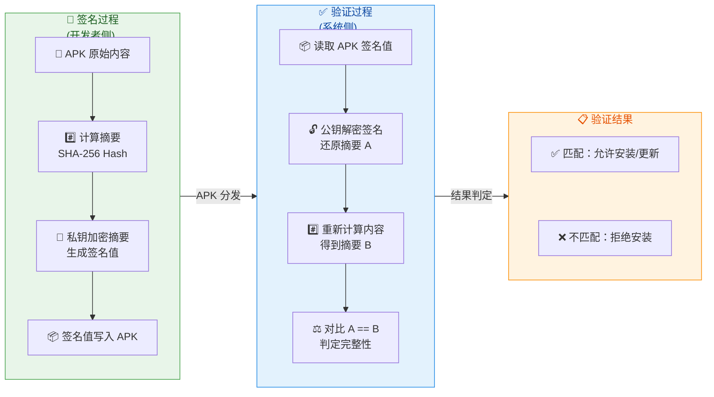
```mermaid
graph LR
    subgraph SIGN["🔐 签名过程\n(开发者侧)"]
        direction TB
        S1["📄 APK 原始内容"]
        S2["#️⃣ 计算摘要\nSHA-256 Hash"]
        S3["🔑 私钥加密摘要\n生成签名值"]
        S4["📦 签名值写入 APK"]
        S1 --> S2
        S2 --> S3
        S3 --> S4
    end

    subgraph VERIFY["✅ 验证过程\n(系统侧)"]
        direction TB
        V1["📦 读取 APK 签名值"]
        V2["🔓 公钥解密签名\n还原摘要 A"]
        V3["#️⃣ 重新计算内容\n得到摘要 B"]
        V4["⚖️ 对比 A == B\n判定完整性"]
        V1 --> V2
        V2 --> V3
        V3 --> V4
    end

    subgraph RESULT["📋 验证结果"]
        direction TB
        R1["✅ 匹配：允许安装/更新"]
        R2["❌ 不匹配：拒绝安装"]
        R1 ~~~ R2
    end

    SIGN -->|"APK 分发"| VERIFY -->|"结果判定"| RESULT

    classDef signDef fill:#E8F5E9,stroke:#43A047,color:#1B5E20
    classDef verifyDef fill:#E3F2FD,stroke:#1E88E5,color:#0D47A1
    classDef resultDef fill:#FFF3E0,stroke:#FB8C00,color:#E65100

    class SIGN signDef
    class VERIFY verifyDef
    class RESULT resultDef
```

Android 系统在安装和更新 APK 时，还会比对新旧 APK 的签名证书是否一致。这就是为什么你丢失了 Keystore 就无法更新已上架的应用——因为新 APK 的签名证书和旧版不同，系统会认为这是两个不同开发者的产物，直接拒绝覆盖安装。这个策略被称为 **"Same Origin Policy"**，由 PackageManagerService 在 `checkUpgradeKeySetLP()` 等方法中执行。

---

### V1 JAR 签名

V1 签名方案的正式名称是 **JAR Signature Scheme**，因为它直接复用了 Java 生态中 JAR 文件的签名标准（基于 PKCS#7）。这是 Android 最早采用的签名方案，从 Android 1.0 时代一直沿用至今（虽然已不推荐作为唯一签名方式）。V1 签名的核心思路是：**逐个文件计算摘要，把摘要信息和签名值以额外文件的形式放入 APK 的 `META-INF/` 目录中**。

V1 签名产生的文件全部位于 APK 压缩包内部的 `META-INF/` 文件夹中，通常包含三个关键文件：

**MANIFEST.MF** 是整个签名的基础清单文件。签名工具（如 `apksigner` 或早期的 `jarsigner`）会遍历 APK 中除 `META-INF/` 目录以外的所有文件，对每个文件的原始内容计算 SHA-256（或 SHA-1）摘要，然后将文件路径和对应的 Base64 编码摘要写入 MANIFEST.MF。这样，MANIFEST.MF 就成了整个 APK 内容的"指纹清单"——任何一个文件被篡改，它的摘要就会与 MANIFEST.MF 中记录的值不匹配。

**CERT.SF**（Signature File）是对 MANIFEST.MF 的二次摘要。它的作用是防止 MANIFEST.MF 本身被篡改。CERT.SF 会先计算整个 MANIFEST.MF 文件的摘要，写入头部的 `SHA-256-Digest-Manifest` 属性；然后再对 MANIFEST.MF 中的每一个条目（每个文件对应的段落）分别计算摘要。这种"双层摘要"的设计使得校验可以在不同粒度上进行。

**CERT.RSA**（或 CERT.DSA / CERT.EC，取决于使用的算法）是真正的签名文件。它包含两部分内容：一是开发者的 X.509 公钥证书（内含公钥、颁发者、有效期等信息）；二是用私钥对 CERT.SF 的内容计算出的数字签名值。系统验证时，先用证书中的公钥解密签名值得到摘要，再与 CERT.SF 的实际摘要比对，一致则说明签名有效。

```kotlin
// V1 签名的三层校验链可以简化为以下伪代码模型
// 第一层：验证每个文件的完整性
for (entry in apkEntries) {                         // 遍历 APK 中的每一个文件条目
    val actualDigest = sha256(entry.data)            // 对文件内容计算 SHA-256 摘要
    val expectedDigest = manifest.getDigest(entry)   // 从 MANIFEST.MF 中读取预期摘要
    require(actualDigest == expectedDigest) {        // 二者必须完全一致
        "文件 ${entry.name} 被篡改"                    // 不一致则判定为篡改
    }
}

// 第二层：验证 MANIFEST.MF 的完整性
val sfDigest = certSF.getManifestDigest()           // 从 CERT.SF 头部取出 MANIFEST 摘要
val actualMfDigest = sha256(manifestFile)            // 重新计算 MANIFEST.MF 的摘要
require(sfDigest == actualMfDigest) {                // 二者必须一致
    "MANIFEST.MF 被篡改"                              // 防止攻击者同时修改文件和清单
}

// 第三层：验证 CERT.SF 的签名
val signature = certRSA.getSignatureValue()          // 从 CERT.RSA 中提取签名值
val publicKey = certRSA.getCertificate().publicKey    // 从证书中提取公钥
val decryptedDigest = rsaDecrypt(publicKey, signature) // 用公钥解密签名还原摘要
val actualSfDigest = sha256(certSFFile)               // 重新计算 CERT.SF 的摘要
require(decryptedDigest == actualSfDigest) {           // 二者必须一致
    "签名验证失败，APK 来源不可信"                        // 最终判定签名是否可信
}
```

V1 签名有一个被广泛利用的**致命弱点**：它只保护 ZIP 条目（ZIP Entry）的内容，而不保护 ZIP 文件的元数据结构。具体来说，APK 本质是一个 ZIP 压缩包，ZIP 格式本身包含 Central Directory、Local File Header 等结构化元数据。V1 签名只对每个条目的压缩前原始数据（uncompressed data）计算摘要，并不覆盖这些元数据。这就给了攻击者可乘之机：

- **Janus 漏洞（CVE-2017-13156）**：攻击者可以在 APK 文件头部注入一个 DEX 文件。由于 Android Runtime 从文件头部开始解析（识别为 DEX），而 ZIP 解析器从文件尾部的 Central Directory 开始解析（识别为合法 APK），V1 签名校验依然通过，但实际执行的是被注入的恶意 DEX 代码。这种攻击之所以可能，正是因为 V1 不保护整个文件的二进制结构。

- **META-INF 目录不受保护**：V1 签名天然跳过 `META-INF/` 目录下的文件（因为签名文件本身就在这里）。这意味着攻击者可以在 `META-INF/` 中添加任意文件而不破坏签名。很多多渠道打包方案（如早期的美团 Walle 方案）正是利用了这一点——在 `META-INF/` 中写入渠道标识文件，无需重新签名。

- **验证速度慢**：V1 必须解压每个 ZIP 条目后再计算摘要，对于包含成千上万个文件的大型 APK，这个逐文件解压 + 哈希的过程会非常耗时，直接影响安装速度。

正是这些问题催生了 V2 签名方案的诞生。不过，V1 签名至今仍被保留作为向后兼容的手段——运行 Android 6.0（API 23）及以下的设备只认 V1 签名。因此，在实际发布中，通常会同时启用 V1 + V2（甚至 V3）签名，确保全版本覆盖。

---

### V2 全文件签名

V2 签名方案（APK Signature Scheme v2）随 Android 7.0（API 24）引入，它的设计哲学与 V1 截然不同：**不再逐文件校验，而是对整个 APK 文件的二进制内容进行签名**。这从根本上解决了 V1 对 ZIP 元数据"视而不见"的安全隐患。

V2 签名的核心创新在于它的存储位置。V1 签名存放在 ZIP 包内部的 `META-INF/` 目录中，是 ZIP 内容的一部分。而 V2 签名存放在 ZIP 文件结构的一个特殊位置——**APK Signing Block**，位于 "ZIP 条目内容区" 和 "Central Directory" 之间。这个位置在 ZIP 规范中属于"未定义区域"，传统的 ZIP 解析器会自动忽略它，因此 V2 签名的插入不会破坏 APK 的 ZIP 兼容性。

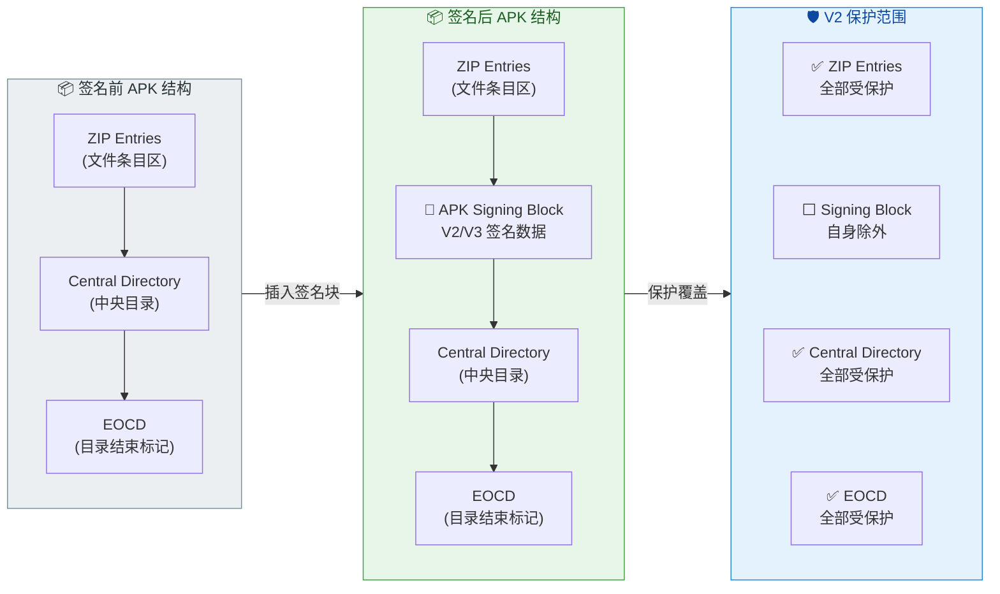
```mermaid
graph LR
    subgraph BEFORE["📦 签名前 APK 结构"]
        direction TB
        B1["ZIP Entries\n(文件条目区)"]
        B2["Central Directory\n(中央目录)"]
        B3["EOCD\n(目录结束标记)"]
        B1 --> B2
        B2 --> B3
    end

    subgraph AFTER["📦 签名后 APK 结构"]
        direction TB
        A1["ZIP Entries\n(文件条目区)"]
        A2["🔐 APK Signing Block\nV2/V3 签名数据"]
        A3["Central Directory\n(中央目录)"]
        A4["EOCD\n(目录结束标记)"]
        A1 --> A2
        A2 --> A3
        A3 --> A4
    end

    subgraph PROTECT["🛡️ V2 保护范围"]
        direction TB
        P1["✅ ZIP Entries\n全部受保护"]
        P2["⬜ Signing Block\n自身除外"]
        P3["✅ Central Directory\n全部受保护"]
        P4["✅ EOCD\n全部受保护"]
        P1 ~~~ P2
        P2 ~~~ P3
        P3 ~~~ P4
    end

    BEFORE -->|"插入签名块"| AFTER -->|"保护覆盖"| PROTECT

    classDef beforeDef fill:#ECEFF1,stroke:#78909C,color:#263238
    classDef afterDef fill:#E8F5E9,stroke:#43A047,color:#1B5E20
    classDef protectDef fill:#E3F2FD,stroke:#1E88E5,color:#0D47A1

    class BEFORE beforeDef
    class AFTER afterDef
    class PROTECT protectDef
```

V2 签名的具体工作流程如下：签名工具将 APK 文件视为三个连续的二进制区段——**区段 1**（ZIP Entries，从文件开头到 APK Signing Block 之前）、**区段 2**（Central Directory）、**区段 3**（EOCD，End of Central Directory Record）。注意，APK Signing Block 自身被排除在签名范围外（否则就陷入"先有鸡还是先有蛋"的死循环了）。签名工具对这三个区段分别进行分块摘要计算：每个区段被切分为 **1MB 大小的 chunk**，每个 chunk 独立计算 SHA-256 摘要，最终所有 chunk 的摘要再组合成一棵 Merkle 树结构，计算出根摘要。这个根摘要用开发者的私钥加密后，连同证书信息一起写入 APK Signing Block。

**分块摘要的设计意义非凡**。首先，它支持并行计算——多个 chunk 可以在不同 CPU 核心上同时计算 hash，大幅加速大型 APK 的签名和验证过程。其次，它支持流式验证（Streaming Verification）——系统在安装时无需将整个 APK 加载到内存中，可以边读取边验证，极大降低了内存压力。相比 V1 需要解压每个文件再计算哈希，V2 直接对原始二进制字节操作，省去了解压步骤，验证速度提升显著。

```kotlin
// V2 签名的分块摘要计算伪代码
val CHUNK_SIZE = 1024 * 1024                        // 每个分块大小为 1MB

fun computeDigest(section: ByteArray): ByteArray {   // 计算某个区段的摘要
    val chunks = section.chunked(CHUNK_SIZE)          // 将区段切分为 1MB 的块
    val chunkDigests = chunks.map { chunk ->           // 对每个块并行计算摘要
        val prefixed = byteArrayOf(0xa5) + chunk.size.toBytes() + chunk
        // 0xa5 前缀是 chunk 类型标记，后接长度和内容
        sha256(prefixed)                               // 计算 SHA-256
    }
    // 将所有 chunk 摘要拼接后再计算一次顶层摘要
    val topLevel = byteArrayOf(0x5a) + chunks.size.toBytes() +
            chunkDigests.reduce { acc, d -> acc + d }
    // 0x5a 前缀标记这是顶层摘要节点
    return sha256(topLevel)                            // 返回该区段的最终摘要
}

// 对三个区段分别计算摘要，再组合为最终签名摘要
val section1Digest = computeDigest(zipEntriesBytes)    // 区段1: ZIP 条目
val section2Digest = computeDigest(centralDirBytes)    // 区段2: Central Directory
val section3Digest = computeDigest(eocdBytes)          // 区段3: EOCD
val finalDigest = sha256(section1Digest + section2Digest + section3Digest)
// 最终摘要由三部分组合而来，覆盖了 APK Signing Block 以外的全部内容

val signature = rsaSign(privateKey, finalDigest)       // 用私钥对最终摘要签名
```

在安装时，Android 系统的 PackageParser 会优先检查 APK 是否包含 V2 签名。如果存在且验证通过，则**直接跳过 V1 签名校验**（因为 V2 的安全性完全覆盖了 V1）。只有当 V2 签名不存在时，系统才会 fallback 到 V1 校验流程。这个优先级策略写在 `ApkSignatureSchemeV2Verifier` 中。

V2 签名的一个重要运维影响是：**签名之后不能对 APK 做任何字节级修改**，否则签名立即失效。这意味着 V1 时代那种"在 META-INF 中塞渠道文件"的多渠道打包方式彻底失效了。不过，聪明的开发者很快发现了 APK Signing Block 本身不在签名保护范围内，因此可以在 Signing Block 中添加自定义的 key-value 对来存储渠道信息——这正是新一代多渠道打包工具（如 Walle V2、VasDolly 等）的原理。

---

### V3 密钥轮替

V3 签名方案（APK Signature Scheme v3）随 Android 9.0（API 28）引入，它在 V2 的基础上增加了一项关键能力：**签名密钥轮替（Key Rotation）**。在 V1/V2 时代，一旦你的签名密钥泄露或需要更换（比如公司合并、安全策略升级），你将面临灾难性的后果——已安装的 App 永远无法通过"同证书"校验来接受新密钥签的更新包，你唯一的选择是让用户卸载重装，这意味着丢失所有本地数据和用户信任。

V3 方案通过引入 **Proof-of-Rotation** 结构彻底解决了这个问题。这个结构本质上是一条"签名证书的信任链"——一个有序的证书列表，其中每个旧证书都对下一个新证书进行了签名背书（endorsement）。系统在验证时，只要能从设备上已安装的旧证书出发，沿着 Proof-of-Rotation 链逐步验证到新证书，就认为密钥轮替是合法的。

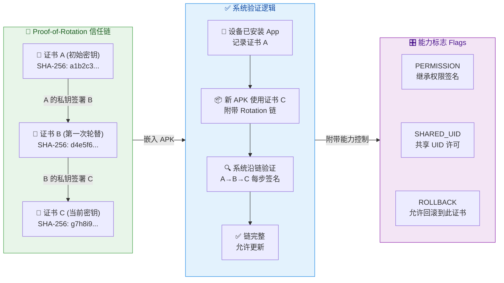
```mermaid
graph LR
    subgraph CHAIN["🔗 Proof-of-Rotation 信任链"]
        direction TB
        C1["🔑 证书 A (初始密钥)\nSHA-256: a1b2c3..."]
        C2["🔑 证书 B (第一次轮替)\nSHA-256: d4e5f6..."]
        C3["🔑 证书 C (当前密钥)\nSHA-256: g7h8i9..."]
        C1 -->|"A 的私钥签署 B"| C2
        C2 -->|"B 的私钥签署 C"| C3
    end

    subgraph VERIFY["✅ 系统验证逻辑"]
        direction TB
        V1["📱 设备已安装 App\n记录证书 A"]
        V2["📦 新 APK 使用证书 C\n附带 Rotation 链"]
        V3["🔍 系统沿链验证\nA→B→C 每步签名"]
        V4["✅ 链完整\n允许更新"]
        V1 --> V2
        V2 --> V3
        V3 --> V4
    end

    subgraph CAPS["🎛️ 能力标志 Flags"]
        direction TB
        F1["PERMISSION\n继承权限签名"]
        F2["SHARED_UID\n共享 UID 许可"]
        F3["ROLLBACK\n允许回滚到此证书"]
        F1 ~~~ F2
        F2 ~~~ F3
    end

    CHAIN -->|"嵌入 APK"| VERIFY -->|"附带能力控制"| CAPS

    classDef chainDef fill:#E8F5E9,stroke:#43A047,color:#1B5E20
    classDef verifyDef fill:#E3F2FD,stroke:#1E88E5,color:#0D47A1
    classDef capsDef fill:#F3E5F5,stroke:#8E24AA,color:#4A148C

    class CHAIN chainDef
    class VERIFY verifyDef
    class CAPS capsDef
```

Proof-of-Rotation 的链式结构可以理解为一个"签名遗嘱"：证书 A 说"我信任证书 B 来接替我"，证书 B 说"我信任证书 C 来接替我"，以此类推。每一个"信任声明"都用前一个证书的私钥签署，确保无法伪造。这条链理论上可以无限延伸，支持多次密钥轮替。

V3 方案中还引入了一个精细的**能力控制机制**（Capability Flags）。在构建 Proof-of-Rotation 链时，开发者可以为每个旧证书设置一组 flag，控制旧证书在轮替后仍然保留哪些"权力"：

- **PERMISSION（`0x01`）**：旧证书签名的 App 是否仍被视为"同一签名"来获取 `signature` 级别的权限。这对于拥有多个 App 共享 `signature` 权限的开发者极其重要——如果取消此 flag，旧证书签名的其它 App 将无法再与新证书签名的 App 进行 signature 级权限交互。
- **SHARED_UID（`0x02`）**：旧证书签名的 App 是否仍可加入同一个 shared UID 组。在多个 App 共享进程和数据的场景中，这个 flag 决定了轮替后的兼容性。
- **ROLLBACK（`0x08`）**：是否允许用旧证书签名的 APK 覆盖安装当前新证书签名的版本。通常出于安全考虑会禁用此 flag，防止降级攻击。

在技术实现上，V3 签名同样存放在 APK Signing Block 中，使用独立的 Block ID（`0xf05368c0`）与 V2 的 Block ID（`0x7109871a`）区分。V3 的签名数据结构中额外包含了 `minSDK` 和 `maxSDK` 字段，这使得一个 APK 可以同时携带多个 V3 签名——例如一个用旧密钥签的 V3 签名覆盖 API 28-32，一个用新密钥签的 V3 签名覆盖 API 33+。系统会根据自身的 API Level 选择匹配的签名进行校验。

```kotlin
// V3 签名数据结构伪代码
data class V3SignatureBlock(
    val minSdkVersion: Int,                      // 此签名适用的最低 API 级别
    val maxSdkVersion: Int,                      // 此签名适用的最高 API 级别
    val signerInfo: SignerInfo,                   // 签名者信息（摘要+签名值+证书）
    val proofOfRotation: List<RotationNode>?      // 可选的密钥轮替信任链
)

data class RotationNode(
    val certificate: X509Certificate,             // 该节点的证书
    val signatureOverNext: ByteArray,             // 用该证书私钥对下一个节点的签名
    val capabilityFlags: Int                      // 该证书保留的能力标志位
)

// 系统校验 Proof-of-Rotation 链
fun verifyRotation(
    installedCert: X509Certificate,               // 设备上已安装 APK 的证书
    chain: List<RotationNode>                      // 新 APK 中的轮替链
): Boolean {
    var currentCert = chain.first().certificate     // 从链头（最旧证书）开始
    if (currentCert != installedCert) return false  // 链头必须与已安装证书一致

    for (i in 0 until chain.size - 1) {             // 遍历链中的每一跳
        val node = chain[i]                          // 当前节点
        val nextCert = chain[i + 1].certificate      // 下一个节点的证书
        // 验证当前证书对下一个证书的签名背书
        val valid = verifySignature(                  // 用当前证书的公钥验证
            node.certificate.publicKey,               // 当前公钥
            node.signatureOverNext,                    // 对下一节点的签名值
            nextCert.encoded                           // 下一证书的原始字节
        )
        if (!valid) return false                       // 任何一跳验证失败即拒绝
    }
    return true                                        // 全链验证通过
}
```

值得注意的是，Google Play App Signing 服务也在 V3 的基础上提供了云端密钥轮替支持。当开发者通过 Play Console 申请密钥升级（Key Upgrade）时，Google 会在后台生成新的密钥并构建 Proof-of-Rotation 链，确保已安装用户可以无缝接收新密钥签名的更新。这大大降低了开发者自行管理密钥轮替的复杂度。

Android 13（API 33）进一步引入了 **V3.1 签名方案**，它是 V3 的增量改进。V3.1 使用独立的 Signing Block ID，专门用于面向 API 33+ 设备的签名。其核心优势在于允许开发者在不影响旧设备签名兼容性的前提下，为新设备单独配置密钥轮替策略。原始 V3 签名继续服务于 API 28-32 的设备，而 V3.1 签名服务于 API 33+ 设备，实现了更细粒度的版本分层。

---

### V4 增量签名

V4 签名方案（APK Signature Scheme v4）随 Android 11（API 30）引入，它的设计目标与前三代完全不同——**它不是为了替代 V2/V3，而是为了支持 ADB Incremental Install（增量安装）**。V4 是目前唯一一个签名信息存储在 APK 外部的方案，它生成一个独立的 `.apk.idsig` 文件。

要理解 V4 的设计动机，需要先了解 Android 11 引入的增量安装机制。传统的 `adb install` 会将整个 APK 文件传输到设备后再开始安装。对于动辄数百 MB 甚至数 GB 的游戏或大型应用，这个传输过程会消耗大量时间。增量安装（`adb install --incremental`）利用 Linux 内核的 **Incremental File System（IncFS）** 技术，允许系统在 APK 尚未完全传输时就开始安装和启动应用——数据按需从主机（host）拉取，类似流媒体播放。

但这就带来了一个签名校验的难题：V2/V3 签名需要在计算摘要时访问 APK 的完整内容，而增量安装时 APK 的大部分数据尚未到达设备。V4 通过引入 **Merkle 树（Merkle Tree）** 结构巧妙地解决了这个问题。

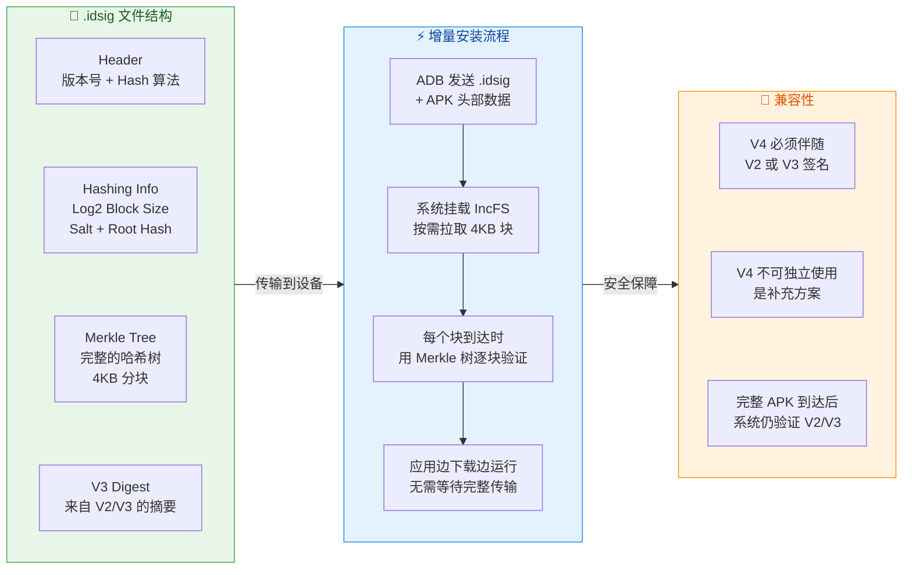
```mermaid
graph LR
    subgraph V4FILE["📄 .idsig 文件结构"]
        direction TB
        I1["Header\n版本号 + Hash 算法"]
        I2["Hashing Info\nLog2 Block Size\nSalt + Root Hash"]
        I3["Merkle Tree\n完整的哈希树\n4KB 分块"]
        I4["V3 Digest\n来自 V2/V3 的摘要"]
        I1 ~~~ I2
        I2 ~~~ I3
        I3 ~~~ I4
    end

    subgraph INCFS["⚡ 增量安装流程"]
        direction TB
        F1["ADB 发送 .idsig\n+ APK 头部数据"]
        F2["系统挂载 IncFS\n按需拉取 4KB 块"]
        F3["每个块到达时\n用 Merkle 树逐块验证"]
        F4["应用边下载边运行\n无需等待完整传输"]
        F1 --> F2
        F2 --> F3
        F3 --> F4
    end

    subgraph COMPAT["🔄 兼容性"]
        direction TB
        CC1["V4 必须伴随\nV2 或 V3 签名"]
        CC2["V4 不可独立使用\n是补充方案"]
        CC3["完整 APK 到达后\n系统仍验证 V2/V3"]
        CC1 ~~~ CC2
        CC2 ~~~ CC3
    end

    V4FILE -->|"传输到设备"| INCFS -->|"安全保障"| COMPAT

    classDef fileDef fill:#E8F5E9,stroke:#43A047,color:#1B5E20
    classDef incDef fill:#E3F2FD,stroke:#1E88E5,color:#0D47A1
    classDef compatDef fill:#FFF3E0,stroke:#FB8C00,color:#E65100

    class V4FILE fileDef
    class INCFS incDef
    class COMPAT compatDef
```

V4 签名的核心是一棵基于 **fs-verity** 格式的 Merkle 哈希树。签名工具将整个 APK 文件按 **4KB**（4096 字节）大小切分为数据块（leaf blocks），每个块计算 SHA-256 摘要作为叶子节点。然后将相邻的叶子摘要两两配对，计算父节点摘要，如此逐层向上汇聚，最终得到一个唯一的 **Root Hash**（根哈希）。这棵 Merkle 树完整地写入 `.idsig` 文件中。

Root Hash 加上整棵树的元信息（hash 算法、block size、salt 等），再结合 V2/V3 签名中的摘要值，一起被开发者的私钥签名。这样，`.idsig` 文件就成为了一个"可以逐块验证整个 APK 完整性"的凭证。

增量安装的实际流程是：ADB 首先将 `.idsig` 文件和 APK 的头部区域传输到设备，系统解析 Merkle 树并挂载 IncFS 虚拟文件系统。当应用运行时，系统按需从主机拉取所需的 4KB 数据块。每个块到达时，系统计算其 SHA-256 摘要，与 Merkle 树中对应叶子节点的值比对——**如果匹配，该块被接受；如果不匹配，该块被拒绝并可以重新请求**。这种逐块验证的粒度意味着即使传输过程中某个块被篡改，也只会影响那一个块，不会波及整个 APK。

```kotlin
// V4 Merkle 树构建伪代码
val BLOCK_SIZE = 4096                                    // fs-verity 使用 4KB 块大小

fun buildMerkleTree(apkFile: File): MerkleTree {
    val fileBytes = apkFile.readBytes()                  // 读取 APK 完整内容
    // 第一层：计算所有叶子节点的摘要
    val leaves = fileBytes.toList()                       // 转为字节列表
        .chunked(BLOCK_SIZE)                              // 按 4KB 切分
        .map { block ->
            val padded = block.toByteArray()               // 不足 4KB 的最后一块
                .copyOf(BLOCK_SIZE)                        // 用零字节填充到 4KB
            sha256(padded)                                 // 计算该块的 SHA-256 摘要
        }

    // 逐层向上构建树
    var currentLevel = leaves                              // 从叶子层开始
    val treeLevels = mutableListOf(currentLevel)           // 存储每一层
    while (currentLevel.size > 1) {                        // 直到只剩根节点
        currentLevel = currentLevel                        // 当前层的摘要列表
            .chunked(BLOCK_SIZE / 32)                      // 每个父节点包含的子节点数
            .map { children ->                              // (4096 / 32 = 128 个)
                val concatenated = children                 // 将子节点摘要拼接
                    .reduce { acc, hash -> acc + hash }
                sha256(concatenated)                        // 计算父节点摘要
            }
        treeLevels.add(currentLevel)                       // 记录新的一层
    }

    val rootHash = currentLevel.single()                   // 最终的根哈希值
    return MerkleTree(rootHash, treeLevels)                // 返回完整的 Merkle 树
}

// 生成 .idsig 签名文件
fun generateV4Signature(apkFile: File, privateKey: PrivateKey): ByteArray {
    val tree = buildMerkleTree(apkFile)                    // 构建 Merkle 树
    val v3Digest = extractV3Digest(apkFile)                // 提取已有的 V3 签名摘要
    val signingData = tree.rootHash + v3Digest              // 组合根哈希和 V3 摘要
    val signature = rsaSign(privateKey, signingData)        // 用私钥签名
    return serializeIdsig(tree, signature)                  // 序列化为 .idsig 文件格式
}
```

**V4 签名的几个关键限制和特点**值得开发者注意：

第一，V4 不能独立存在，它必须依附于一个有效的 V2 或 V3 签名。V4 的 `.idsig` 文件中包含了来自 V2/V3 的摘要值作为交叉校验。当整个 APK 最终完全传输到设备后，系统仍然会执行完整的 V2/V3 校验来做最终确认。

第二，V4 签名只在开发调试阶段（ADB 安装）有实际意义。通过 Google Play 或其他应用商店分发时，V4 签名不参与安装流程，因为商店分发不使用增量安装协议。

第三，V4 签名对开发效率的提升是巨大的。对于一个 500MB 的大型游戏 APK，传统安装可能需要等待 1-2 分钟的完整传输，而增量安装可以在几秒内启动应用，缺失的资源在后台按需流式加载。这对于快速迭代调试非常有价值。

下面是四代签名方案的全面对比：

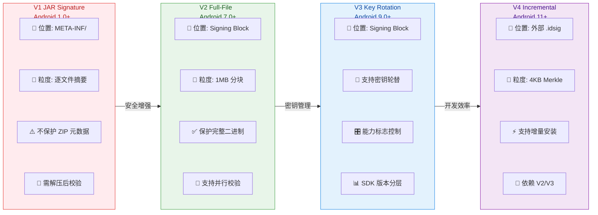
```mermaid
graph LR
    subgraph V1BOX["V1 JAR Signature\nAndroid 1.0+"]
        direction TB
        V1A["📍 位置: META-INF/"]
        V1B["📐 粒度: 逐文件摘要"]
        V1C["⚠️ 不保护 ZIP 元数据"]
        V1D["🐢 需解压后校验"]
        V1A ~~~ V1B
        V1B ~~~ V1C
        V1C ~~~ V1D
    end

    subgraph V2BOX["V2 Full-File\nAndroid 7.0+"]
        direction TB
        V2A["📍 位置: Signing Block"]
        V2B["📐 粒度: 1MB 分块"]
        V2C["✅ 保护完整二进制"]
        V2D["🚀 支持并行校验"]
        V2A ~~~ V2B
        V2B ~~~ V2C
        V2C ~~~ V2D
    end

    subgraph V3BOX["V3 Key Rotation\nAndroid 9.0+"]
        direction TB
        V3A["📍 位置: Signing Block"]
        V3B["🔄 支持密钥轮替"]
        V3C["🎛️ 能力标志控制"]
        V3D["📊 SDK 版本分层"]
        V3A ~~~ V3B
        V3B ~~~ V3C
        V3C ~~~ V3D
    end

    subgraph V4BOX["V4 Incremental\nAndroid 11+"]
        direction TB
        V4A["📍 位置: 外部 .idsig"]
        V4B["📐 粒度: 4KB Merkle"]
        V4C["⚡ 支持增量安装"]
        V4D["🔗 依赖 V2/V3"]
        V4A ~~~ V4B
        V4B ~~~ V4C
        V4C ~~~ V4D
    end

    V1BOX -->|"安全增强"| V2BOX -->|"密钥管理"| V3BOX -->|"开发效率"| V4BOX

    classDef v1Def fill:#FFEBEE,stroke:#E53935,color:#B71C1C
    classDef v2Def fill:#E8F5E9,stroke:#43A047,color:#1B5E20
    classDef v3Def fill:#E3F2FD,stroke:#1E88E5,color:#0D47A1
    classDef v4Def fill:#F3E5F5,stroke:#8E24AA,color:#4A148C

    class V1BOX v1Def
    class V2BOX v2Def
    class V3BOX v3Def
    class V4BOX v4Def
```

在实际项目的 `build.gradle` 配置中，你可以精确控制启用哪些签名版本：

```kotlin
// app/build.gradle.kts
android {
    signingConfigs {
        create("release") {                              // 创建 release 签名配置
            storeFile = file("my-release-key.jks")       // Keystore 文件路径
            storePassword = "store_password"              // Keystore 密码
            keyAlias = "my-key-alias"                     // 密钥别名
            keyPassword = "key_password"                  // 密钥密码
        }
    }

    buildTypes {
        release {
            signingConfig = signingConfigs                // 关联签名配置
                .getByName("release")
        }
    }
}

// 使用 apksigner 手动签名时，可精确控制各版本开关
// apksigner sign \
//   --v1-signing-enabled true \       // 启用 V1（兼容 API < 24 的设备）
//   --v2-signing-enabled true \       // 启用 V2（Android 7.0+ 的核心安全保障）
//   --v3-signing-enabled true \       // 启用 V3（Android 9.0+ 支持密钥轮替）
//   --v4-signing-enabled true \       // 启用 V4（Android 11+ 增量安装支持）
//   --ks my-release-key.jks \         // 指定 Keystore 文件
//   --ks-key-alias my-key-alias \     // 指定密钥别名
//   my-app-release-unsigned.apk       // 待签名的 APK 文件
```

Android Gradle Plugin（AGP）在 4.2+ 版本中默认对 Release 构建同时启用 V1 + V2 + V3 签名；如果你的 `minSdk >= 24`，可以考虑禁用 V1 以减小 APK 体积（`META-INF/` 中的签名文件会被省略）。V4 通常由 Android Studio 在 `Run` 安装时自动启用，无需手动干预。

最后做一个总结性的决策指引：如果你的 `minSdk >= 24`，V1 可以安全关闭；`minSdk >= 28` 时 V3 提供密钥轮替保障，强烈建议开启；V4 主要服务于开发阶段的快速安装体验，生产发布时不需要特别关注。但最稳妥的做法仍然是 **全部开启**，让系统在运行时根据自身 API Level 选择最优方案。

---

**📝 练习题**

某团队发布了一个 APK，仅启用了 V1 签名。一位安全研究员声称他可以在不破坏签名校验的前提下，向 APK 中注入恶意代码。以下哪种攻击方式最有可能成功？

A. 修改 `classes.dex` 文件中的字节码，因为 V1 不校验 DEX 文件


B. 在 APK 文件头部注入一个 DEX 文件（Janus 漏洞），利用 Android Runtime 和 ZIP 解析器的解析起点不同来执行恶意代码


C. 直接替换 `CERT.RSA` 中的公钥证书为攻击者的证书，因为 V1 不验证证书链


D. 修改 `AndroidManifest.xml` 并同步更新 `MANIFEST.MF` 中的摘要值，因为 V1 的三层校验可以被逐层伪造


**【答案】** B

**【解析】** 选项 A 错误，V1 签名确实会对 `classes.dex` 计算摘要并记录在 `MANIFEST.MF` 中，修改 DEX 内容会导致摘要不匹配。选项 B 正确，这就是著名的 **Janus 漏洞（CVE-2017-13156）**。V1 签名只校验 ZIP 条目内的文件内容，不校验 ZIP 文件的整体二进制结构。攻击者在 APK 文件头部拼接一个 DEX 文件后，ZIP 解析器依然从尾部的 Central Directory 找到原始条目（签名校验通过），而 ART/Dalvik 从文件头部解析则会将其识别为 DEX 文件直接执行。这正是 V2 签名"保护全文件二进制"所要解决的核心问题。选项 C 错误，替换证书后，用原私钥的签名值与新证书中的公钥不匹配，第三层校验会失败。选项 D 错误，即使攻击者更新了 `MANIFEST.MF` 中的摘要，`CERT.SF` 中记录的 `MANIFEST.MF` 摘要也会不匹配；即使进一步修改 `CERT.SF`，`CERT.RSA` 中用原私钥产生的签名值也无法与修改后的 `CERT.SF` 匹配——除非攻击者拥有原始私钥，否则三层校验无法被逐层伪造。

---

**📝 练习题**

开发团队需要将 App 的签名密钥从旧密钥 A 替换为新密钥 B，同时确保已安装旧版本的用户可以无缝升级。以下哪个方案最合适？

A. 使用 V2 签名方案，将新旧两个证书都放入 APK Signing Block 中


B. 使用 V3 签名方案，构建包含 Proof-of-Rotation 链的签名，其中旧证书 A 对新证书 B 进行签名背书


C. 发布新 APK 时使用新密钥 B 签名，并要求用户先卸载旧版本再安装新版本


D. 在 `META-INF/` 目录中同时放入旧密钥 A 和新密钥 B 的 V1 签名文件


**【答案】** B

**【解析】** V3 签名方案的核心创新就是支持密钥轮替（Key Rotation）。通过 Proof-of-Rotation 结构，开发者可以用旧密钥 A 的私钥对新密钥 B 的证书进行签名背书，形成一条可验证的信任链。当已安装旧版本（证书 A）的设备接收到新 APK（证书 B + Rotation 链）时，系统会沿链验证 A→B 的信任传递关系，确认合法后允许覆盖安装。选项 A 错误，V2 方案不支持密钥轮替，APK Signing Block 中只能包含单一签名者的信息。选项 C 虽然技术上可行，但用户体验极差，会丢失本地数据，不属于"无缝升级"。选项 D 错误，V1 签名中一个 APK 只能有一组有效的签名文件（一个 CERT.SF + 一个 CERT.RSA），无法实现双证书并存的密钥轮替语义。

---

## 密钥库管理

Android 应用的签名离不开一个核心载体——**密钥库（Keystore）**。如果说签名机制（V1/V2/V3/V4）定义的是"如何签"，那么密钥库解决的则是"用什么签"。密钥库本质上是一个 **加密的容器文件**，里面存放着一个或多个由别名（Alias）索引的密钥条目（Key Entry）。每个条目包含私钥（Private Key）和与之配对的公钥证书链（Certificate Chain）。在整个 Android 打包流程中，Gradle 的 `signingConfigs` 最终指向的就是这个文件。可以说，密钥库是应用身份的"身份证原件"——一旦丢失或泄露，要么你再也无法更新应用，要么别人可以冒充你发布恶意版本。

从技术实现角度看，密钥库并不是 Android 独创的概念，它源自 Java 安全体系中的 **Java Cryptography Architecture (JCA)**。JCA 定义了一套 `java.security.KeyStore` 抽象接口，允许不同的 Provider 实现不同的存储格式。Android 开发中最常接触到的两种格式——JKS 和 PKCS#12——正是 JCA 体系下的两种具体实现。理解密钥库的内部结构与管理方式，对于保护应用签名安全、实现密钥轮替（Key Rotation, V3 签名）、以及多环境多团队协作都至关重要。

---

### Keystore 文件

#### 文件本质与内部结构

Keystore 文件从操作系统的角度来看，只是一个普通的二进制文件，通常以 `.jks`（Java KeyStore）或 `.keystore` 作为扩展名，也可以使用 `.p12` / `.pfx`（PKCS#12 格式）。但从逻辑上看，它是一个 **加密数据库**，内部采用"信封加密"模式组织数据。

整个 Keystore 文件受一个 **Store Password（库密码）** 保护。当你通过 `keytool` 或 Java API 打开一个 Keystore 时，必须先提供这个库密码才能解密文件，获取内部的索引信息。而 Keystore 内部的每一个密钥条目又可以有自己独立的 **Key Password（密钥密码）**，用来进一步加密该条目中的私钥数据。这种两层密码的设计，允许一个 Keystore 文件存放属于不同所有者的多个密钥——即使你能打开 Keystore，也不一定能提取某个特定的私钥。

```text
┌──────────────────────────────────────────────────────────┐
│                   Keystore 文件 (加密)                     │
│               🔐 Store Password 保护整体访问               │
│                                                          │
│  ┌────────────────────────────────────────────────────┐  │
│  │  Entry: alias = "release-key"                      │  │
│  │  🔑 Key Password 保护私钥                           │  │
│  │  ┌──────────────┐  ┌────────────────────────────┐  │  │
│  │  │  Private Key  │  │  Certificate Chain (X.509) │  │  │
│  │  │  (RSA 2048)   │  │  - Subject: CN=MyApp       │  │  │
│  │  │  (加密存储)    │  │  - Issuer: CN=MyApp        │  │  │
│  │  │              │  │  - Validity: 25 years       │  │  │
│  │  └──────────────┘  └────────────────────────────┘  │  │
│  └────────────────────────────────────────────────────┘  │
│                                                          │
│  ┌────────────────────────────────────────────────────┐  │
│  │  Entry: alias = "debug-key"                        │  │
│  │  🔑 Key Password 保护私钥                           │  │
│  │  ┌──────────────┐  ┌────────────────────────────┐  │  │
│  │  │  Private Key  │  │  Certificate Chain (X.509) │  │  │
│  │  │  (RSA 2048)   │  │  - Subject: CN=Debug       │  │  │
│  │  └──────────────┘  └────────────────────────────┘  │  │
│  └────────────────────────────────────────────────────┘  │
└──────────────────────────────────────────────────────────┘
```

每个 Entry 内部最关键的两部分是：

- **Private Key（私钥）**：签名时使用的核心秘密。Gradle 的 `signingConfigs` 最终会读取这个私钥来对 APK 进行数字签名。私钥绝对不能泄露，它是你作为开发者身份的唯一证明。
- **Certificate Chain（证书链）**：包含一个或多个 X.509 证书。对于自签名证书（Android 应用开发中最常见的情形），证书链长度为 1，即证书的 Issuer 和 Subject 相同。证书中包含了与私钥配对的 **公钥（Public Key）**，以及一些元数据（组织名、有效期等）。当用户安装 APK 时，系统会从 APK 签名块中提取证书，并将其公钥指纹作为应用身份的一部分。

#### Debug Keystore 与 Release Keystore

Android SDK 在安装时会自动为每位开发者生成一个 **Debug Keystore**，通常位于 `~/.android/debug.keystore`（Linux/macOS）或 `%USERPROFILE%\.android\debug.keystore`（Windows）。这个 Debug Keystore 使用的密码和别名是公开固定的：

- Store Password: `android`
- Key Alias: `androiddebugkey`
- Key Password: `android`

这意味着所有开发者的 Debug 签名本质上是"不安全的"——任何人都可以用已知密码打开你的 Debug Keystore 并提取私钥。这正是设计初衷：Debug 签名仅用于开发阶段，Google Play 明确拒绝上传 Debug 签名的 APK。

**Release Keystore** 则是你自己生成的、使用强密码保护的密钥库。它的安全性直接等同于你应用在 Google Play 上的"身份安全"。一旦你用某个 Release Key 发布了应用的第一个版本，后续所有更新都必须使用同一个密钥签名（除非你使用了 V3 签名的密钥轮替机制或 Google Play App Signing）。如果 Release Keystore 丢失，在未启用 Google Play App Signing 的情况下，你将永远无法更新该应用——只能重新上架一个全新的包名。

#### Keystore 在 Gradle 中的配置

在实际 Android 项目中，Keystore 信息通过 `build.gradle(.kts)` 中的 `signingConfigs` 闭包传递给构建系统：

```kotlin
// app/build.gradle.kts
android {
    signingConfigs {
        // 创建名为 "release" 的签名配置
        create("release") {
            // 指定 Keystore 文件的路径，rootProject.file() 从项目根目录查找
            storeFile = rootProject.file("keystore/release.keystore")
            // Keystore 文件的库密码，用于打开（解密）整个 Keystore
            storePassword = System.getenv("KEYSTORE_PASSWORD") ?: ""
            // 要使用的密钥条目的别名，Keystore 中可能有多个条目
            keyAlias = "my-release-key"
            // 该别名对应的密钥密码，用于解密该条目中的私钥
            keyPassword = System.getenv("KEY_PASSWORD") ?: ""
        }
    }
    buildTypes {
        getByName("release") {
            // 将 release 构建类型关联到上面定义的 release 签名配置
            signingConfig = signingConfigs.getByName("release")
            // 启用代码压缩（R8/ProGuard）
            isMinifyEnabled = true
            // 启用资源缩减
            isShrinkResources = true
        }
    }
}
```

这里有几个关键的安全实践需要特别注意：

**第一，密码不应硬编码在 `build.gradle` 中。** 上面的示例通过 `System.getenv()` 从环境变量读取密码，这是 CI/CD 环境下的常见做法。另一种本地开发友好的方式是使用项目根目录下的 `local.properties` 文件（该文件通常被 `.gitignore` 忽略）：

```kotlin
// 从 local.properties 中读取签名信息的方式
// local.properties 文件内容示例:
// KEYSTORE_PASSWORD=my_secret_store_pw
// KEY_PASSWORD=my_secret_key_pw

// 在 build.gradle.kts 中读取
val localProps = java.util.Properties().apply {
    // 尝试加载 local.properties，如果文件不存在则跳过
    rootProject.file("local.properties")
        .takeIf { it.exists() }       // 仅在文件存在时执行
        ?.inputStream()                // 打开文件输入流
        ?.use { load(it) }            // 加载为 Properties 对象
}

android {
    signingConfigs {
        create("release") {
            storeFile = rootProject.file("keystore/release.keystore")
            // 优先从环境变量读取，其次从 local.properties 读取
            storePassword = System.getenv("KEYSTORE_PASSWORD")
                ?: localProps.getProperty("KEYSTORE_PASSWORD", "")
            keyAlias = "my-release-key"
            keyPassword = System.getenv("KEY_PASSWORD")
                ?: localProps.getProperty("KEY_PASSWORD", "")
        }
    }
}
```

**第二，Keystore 文件本身不应提交到公开的版本控制仓库。** 虽然 Keystore 有密码保护，但暴力破解或弱密码都可能导致密钥泄露。较好的做法是将 Keystore 文件存放在 CI/CD 系统的 Secret Files 中（如 GitHub Actions 的 Secrets、GitLab CI Variables 等），在构建时动态解码写入。

---

### Keytool 工具

#### 什么是 Keytool

`keytool` 是 JDK 自带的命令行密钥与证书管理工具，位于 `$JAVA_HOME/bin/keytool`。它是管理 Keystore 最直接的方式——无论是创建新的密钥库、生成密钥对、查看证书信息、还是导入/导出证书，都可以通过 `keytool` 完成。Android Studio 内部的 "Generate Signed Bundle / APK" 向导实际上也是在底层调用 `keytool`（及 `apksigner`、`jarsigner`）来完成操作。

#### 常用操作详解

**1. 生成新的 Keystore 和密钥对**

这是 Android 开发者最常执行的操作——为应用创建一个全新的 Release 签名密钥：

```bash
# 使用 keytool 生成新密钥库和密钥对
keytool -genkeypair \
  -alias my-release-key \           # 密钥条目的别名，后续引用时使用
  -keyalg RSA \                     # 密钥算法，Android 推荐 RSA
  -keysize 2048 \                   # 密钥长度，2048 位是最低安全要求
  -validity 10950 \                 # 证书有效期（天），10950 天 ≈ 30 年
  -keystore release.keystore \      # 输出的 Keystore 文件名
  -storetype PKCS12 \               # 存储格式，推荐 PKCS12（现代标准）
  -storepass 'S3cur3P@ss!' \        # 库密码（建议交互式输入，此处为演示）
  -keypass 'S3cur3P@ss!' \          # 密钥密码（PKCS12 要求与 storepass 相同）
  -dname "CN=MyApp, OU=Mobile, O=MyCompany, L=Beijing, ST=BJ, C=CN"
  # -dname: Distinguished Name，证书的主题信息
  #   CN = Common Name（通用名称，通常为应用名或开发者名）
  #   OU = Organizational Unit（组织部门）
  #   O  = Organization（组织/公司名）
  #   L  = Locality（城市）
  #   ST = State（省/州）
  #   C  = Country（国家代码，两字母 ISO 标准）
```

关于参数的一些深入说明：

- **`-keyalg RSA`**：RSA 是目前 Android 签名最广泛使用的非对称加密算法。也可以使用 EC（椭圆曲线），它的优势是相同安全强度下密钥更短（EC 256 ≈ RSA 3072），但部分旧设备的验证性能可能稍差。Google 推荐至少 RSA 2048 或 EC P-256。
- **`-validity 10950`**：Google Play 要求证书有效期至少覆盖到 **2033 年 10 月 22 日之后**。设置 30 年（10950 天）是业界惯例，确保证书在应用生命周期内不会过期。如果证书过期，已安装的应用仍可正常运行，但你将无法发布新的更新。
- **`-dname`**：这些信息会嵌入 X.509 证书的 Subject 字段。对于自签名证书（Android 应用签名就是自签名），这些信息主要用于人类辨识，系统并不会对其做 CA 验证。但填写真实信息是一种良好的工程实践。

**2. 查看 Keystore 中的条目信息**

```bash
# 列出 Keystore 中所有条目的概要信息
keytool -list \
  -keystore release.keystore \      # 要查看的 Keystore 文件
  -storetype PKCS12 \               # 指定存储格式
  -storepass 'S3cur3P@ss!'          # 库密码

# 输出示例:
# Keystore type: PKCS12
# Keystore provider: SUN
#
# Your keystore contains 1 entry
#
# my-release-key, 2024-01-15, PrivateKeyEntry,
# Certificate fingerprint (SHA-256): AB:CD:12:34:...
```

```bash
# 查看某个别名的详细证书信息（-v 表示 verbose 模式）
keytool -list -v \
  -keystore release.keystore \      # Keystore 文件路径
  -alias my-release-key \           # 要查看的特定别名
  -storetype PKCS12 \               # 存储格式
  -storepass 'S3cur3P@ss!'          # 库密码

# 详细输出将包含:
# - 证书的 Owner/Issuer DN
# - 证书有效期（Not Before / Not After）
# - 证书序列号
# - SHA-1 和 SHA-256 指纹（在 Google Play Console 注册时需要）
# - 签名算法（如 SHA256withRSA）
```

**SHA-256 指纹** 在 Android 开发中非常重要。当你在 Google Play Console 中注册应用、配置 Google Maps API Key、或设置 Facebook SDK 的 Key Hash 时，都需要提供这个指纹。它是证书公钥的哈希摘要，能唯一标识一个签名身份。

**3. 导出证书**

```bash
# 从 Keystore 中导出指定别名的公钥证书到独立文件
keytool -exportcert \
  -keystore release.keystore \      # 源 Keystore 文件
  -alias my-release-key \           # 要导出的条目别名
  -file my-release-cert.der \       # 输出的证书文件（DER 二进制格式）
  -storetype PKCS12 \               # 源存储格式
  -storepass 'S3cur3P@ss!'          # 库密码

# 如需 PEM 文本格式（Base64 编码），添加 -rfc 参数:
keytool -exportcert \
  -keystore release.keystore \
  -alias my-release-key \
  -file my-release-cert.pem \       # 输出 PEM 格式证书
  -rfc \                            # 以 RFC 1421 标准的 PEM 格式输出
  -storetype PKCS12 \
  -storepass 'S3cur3P@ss!'
```

导出的证书只包含公钥和元数据，**不包含私钥**，因此可以安全地分享给需要验证你签名的第三方。

**4. 修改密码**

```bash
# 修改 Keystore 的库密码
keytool -storepasswd \
  -keystore release.keystore \      # 目标 Keystore 文件
  -storetype PKCS12 \               # 存储格式
  -storepass 'OldP@ss' \            # 旧密码
  -new 'NewS3cur3P@ss!'             # 新密码

# 修改特定别名的密钥密码（仅 JKS 格式支持独立 keypass）
keytool -keypasswd \
  -keystore release.jks \           # 目标 Keystore 文件（JKS 格式）
  -alias my-release-key \           # 要修改密码的条目别名
  -storepass 'StoreP@ss' \          # 库密码
  -keypass 'OldKeyP@ss' \           # 旧密钥密码
  -new 'NewKeyP@ss'                 # 新密钥密码
```

---

### JKS vs PKCS12

这是一个在日常开发中经常遇到却很少被深入理解的话题。当你运行 `keytool` 生成密钥库时，如果不指定 `-storetype`，不同版本的 JDK 会有不同的默认行为——这常常导致团队协作中的困惑。

#### JKS（Java KeyStore）

JKS 是 Sun Microsystems（现 Oracle）为 Java 平台设计的 **专有格式**。它使用一种基于密码的自定义加密方案来保护密钥库内容。JKS 具有以下特征：

- **专有性**：JKS 是 Java 生态系统独有的格式，只有 Java 的 `keytool` 和 Java Security API 能原生读写。其他语言或平台（如 OpenSSL、Go、.NET）无法直接处理 JKS 文件。
- **双层密码**：JKS 允许 Store Password 和 Key Password 设置为 **不同的值**。这意味着打开密钥库查看条目列表需要 Store Password，但要实际使用某个私钥进行签名，还需要知道该条目的 Key Password。
- **加密强度较弱**：JKS 内部使用的私钥保护算法（`PBEWithMD5AndTripleDES`）在现代密码学标准下已被认为不够安全。密钥派生基于 MD5，加密基于 3DES，二者都已进入"不推荐"或"逐步淘汰"的行列。
- **完整性校验**：JKS 使用 SHA-1 哈希来检验文件完整性（防篡改），SHA-1 同样已被认为在抗碰撞攻击方面存在不足。
- **JDK 8 及之前的默认格式**：在 JDK 8 中，`keytool` 默认生成 JKS 格式的密钥库。

#### PKCS#12

PKCS#12（Public-Key Cryptography Standards #12）是由 RSA Laboratories 定义的一种 **行业标准** 密钥交换格式，后来被 IETF 纳入 RFC 7292。它的应用范围远远超出 Java——几乎所有主流的安全工具和编程语言都支持 PKCS#12：

- **跨平台通用**：OpenSSL、Windows Certificate Manager、macOS Keychain、Go、Python、.NET 等都能直接读写 PKCS#12 文件。文件扩展名通常为 `.p12` 或 `.pfx`。
- **单密码模型**：在 Java 的 PKCS#12 实现中，Key Password **必须**与 Store Password 相同。如果你尝试设置不同的密码，`keytool` 会给出警告甚至报错。这简化了管理（只需记住一个密码），但失去了 JKS 那种"一库多主"的细粒度控制。
- **更强的加密**：现代 PKCS#12 实现通常使用 `PBEWithHmacSHA256AndAES_256` 等更安全的算法来保护私钥数据，同时使用 SHA-256 HMAC 进行完整性校验。
- **JDK 9+ 的默认格式**：从 JDK 9 开始，Oracle 将 `keytool` 的默认存储类型从 JKS 改为 PKCS12。如果你在 JDK 9+ 环境下不指定 `-storetype`，生成的就是 PKCS#12 格式。

#### 对比总结

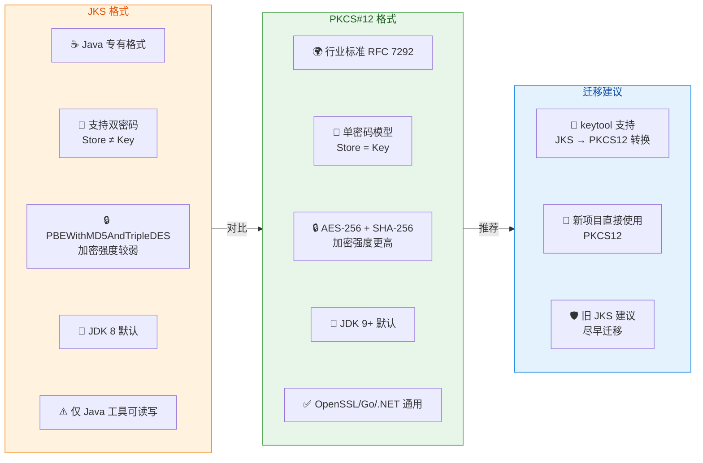
```mermaid
graph LR
    subgraph JKS_FORMAT["JKS 格式"]
        direction TB
        J1["☕ Java 专有格式"]
        J2["🔑 支持双密码\nStore ≠ Key"]
        J3["🔒 PBEWithMD5AndTripleDES\n加密强度较弱"]
        J4["📅 JDK 8 默认"]
        J5["⚠️ 仅 Java 工具可读写"]
        J1 ~~~ J2
        J2 ~~~ J3
        J3 ~~~ J4
        J4 ~~~ J5
    end

    subgraph PKCS12_FORMAT["PKCS#12 格式"]
        direction TB
        P1["🌍 行业标准 RFC 7292"]
        P2["🔑 单密码模型\nStore = Key"]
        P3["🔒 AES-256 + SHA-256\n加密强度更高"]
        P4["📅 JDK 9+ 默认"]
        P5["✅ OpenSSL/Go/.NET 通用"]
        P1 ~~~ P2
        P2 ~~~ P3
        P3 ~~~ P4
        P4 ~~~ P5
    end

    subgraph MIGRATE["迁移建议"]
        direction TB
        M1["🔄 keytool 支持\nJKS → PKCS12 转换"]
        M2["📌 新项目直接使用\nPKCS12"]
        M3["🛡️ 旧 JKS 建议\n尽早迁移"]
        M1 ~~~ M2
        M2 ~~~ M3
    end

    JKS_FORMAT -->|"对比"| PKCS12_FORMAT
    PKCS12_FORMAT -->|"推荐"| MIGRATE

    classDef jksStyle fill:#FFF3E0,stroke:#F57C00,color:#E65100,stroke-width:1px
    classDef pkcsStyle fill:#E8F5E9,stroke:#43A047,color:#1B5E20,stroke-width:1px
    classDef migrateStyle fill:#E3F2FD,stroke:#1E88E5,color:#0D47A1,stroke-width:1px

    class JKS_FORMAT jksStyle
    class PKCS12_FORMAT pkcsStyle
    class MIGRATE migrateStyle
```

#### 格式迁移

如果你有一个旧的 JKS 格式密钥库需要迁移到 PKCS#12，`keytool` 提供了内置的转换命令：

```bash
# 将 JKS 格式的密钥库转换为 PKCS12 格式
keytool -importkeystore \
  -srckeystore old-release.jks \       # 源 Keystore 文件（JKS 格式）
  -srcstoretype JKS \                  # 源格式类型
  -srcstorepass 'OldStoreP@ss' \       # 源库密码
  -destkeystore new-release.p12 \      # 目标 Keystore 文件（PKCS12 格式）
  -deststoretype PKCS12 \              # 目标格式类型
  -deststorepass 'NewStoreP@ss'        # 目标库密码
  # 注意: 迁移后 PKCS12 中的 Key Password 将自动与 Store Password 统一
  # 如果源 JKS 中有多个别名，它们将全部被迁移
```

迁移完成后，务必验证新的 `.p12` 文件可以正常用于签名，然后妥善备份旧的 `.jks` 文件后再决定是否删除。在生产环境中，建议在 CI/CD 的 Staging 环境先测试一轮完整的构建签名流程，确认无误再正式切换。

---

### 别名与密码

#### 别名（Alias）的角色

别名是 Keystore 内部条目的 **唯一标识符**，类似于数据库中的主键。一个 Keystore 文件中可以存放多个密钥条目，每个条目通过唯一的别名进行索引。在 Gradle 的 `signingConfigs` 中，`keyAlias` 参数正是用来指定"我要用 Keystore 中哪个条目的私钥来签名"。

典型的多别名使用场景包括：

- **一个 Keystore 管理多个应用的密钥**：小型团队可能将所有应用的签名密钥放在同一个 Keystore 中，用不同的别名区分——`app-a-release`、`app-b-release`。虽然这样做简化了文件管理，但从安全角度看，"一库多密钥"意味着任何能访问该 Keystore 的人（只要知道库密码和对应的 Key Password）理论上可以签署任何一个应用，因此更推荐为每个应用单独维护 Keystore。
- **同一应用的新旧密钥共存**：在进行 V3 签名密钥轮替时，新旧密钥可能短期共存于同一 Keystore 中。
- **区分用途**：如 `upload-key`（上传密钥，用于 Google Play App Signing 场景）和 `app-signing-key`（最终签名密钥）。

别名是 **大小写不敏感** 的——`My-Key` 和 `my-key` 会被视为同一个别名。这一点在迁移或协作时容易引发问题，建议统一使用小写加连字符的命名风格（如 `my-app-release`）。

#### 密码体系

Android 签名涉及两层密码，理解它们的作用范围至关重要：

| 密码类型 | 作用范围 | 保护对象 | JKS 行为 | PKCS12 行为 |
|----------|----------|----------|----------|-------------|
| **Store Password** | 整个 Keystore 文件 | 文件完整性 + 条目索引 | 必须设置 | 必须设置 |
| **Key Password** | 单个密钥条目 | 该条目的私钥数据 | 可与 Store Password 不同 | 必须等于 Store Password |

在 Gradle 配置中，这两个密码分别对应 `storePassword` 和 `keyPassword`：

```kotlin
signingConfigs {
    create("release") {
        storeFile = file("release.p12")       // Keystore 文件路径
        storePassword = "..."                  // 打开 Keystore 的密码
        keyAlias = "my-release-key"            // 选择哪个条目
        keyPassword = "..."                    // 解密该条目私钥的密码
        // 对于 PKCS12: keyPassword 必须与 storePassword 相同
        // 对于 JKS: keyPassword 可以不同
    }
}
```

#### 密码安全最佳实践

密码管理是 Keystore 安全中最容易出问题的环节。以下是经过实战验证的最佳实践：

**1. 密码强度要求**

Release Keystore 的密码应满足：至少 16 个字符、包含大小写字母 + 数字 + 特殊字符、避免使用字典单词或可预测的模式。Debug Keystore 使用固定密码 `android` 无所谓，但 Release 密码必须认真对待。

**2. 密码存储的分层策略**

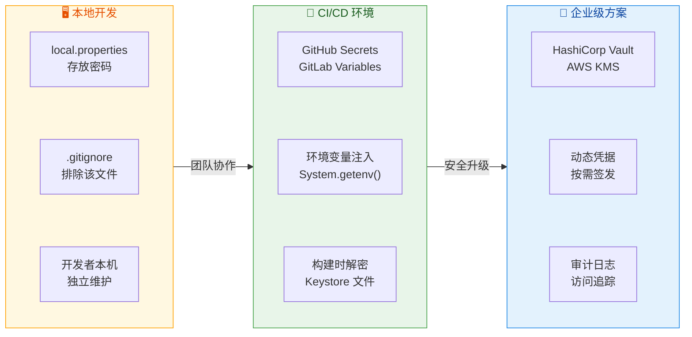
```mermaid
graph LR
    subgraph LOCAL["🖥️ 本地开发"]
        direction TB
        L1["local.properties\n存放密码"]
        L2[".gitignore\n排除该文件"]
        L3["开发者本机\n独立维护"]
        L1 ~~~ L2
        L2 ~~~ L3
    end

    subgraph CI["🔄 CI/CD 环境"]
        direction TB
        C1["GitHub Secrets\nGitLab Variables"]
        C2["环境变量注入\nSystem.getenv()"]
        C3["构建时解密\nKeystore 文件"]
        C1 ~~~ C2
        C2 ~~~ C3
    end

    subgraph VAULT["🏦 企业级方案"]
        direction TB
        V1["HashiCorp Vault\nAWS KMS"]
        V2["动态凭据\n按需签发"]
        V3["审计日志\n访问追踪"]
        V1 ~~~ V2
        V2 ~~~ V3
    end

    LOCAL -->|"团队协作"| CI
    CI -->|"安全升级"| VAULT

    classDef localStyle fill:#FFF8E1,stroke:#FFA000,color:#E65100,stroke-width:1px
    classDef ciStyle fill:#E8F5E9,stroke:#43A047,color:#1B5E20,stroke-width:1px
    classDef vaultStyle fill:#E3F2FD,stroke:#1E88E5,color:#0D47A1,stroke-width:1px

    class LOCAL localStyle
    class CI ciStyle
    class VAULT vaultStyle
```

- **本地开发**：将密码写入 `local.properties`，并确保该文件在 `.gitignore` 中。每位开发者各自维护自己的本地配置。
- **CI/CD 管道**：利用平台的加密变量功能（如 GitHub Actions 的 `secrets.KEYSTORE_PASSWORD`），在构建时通过环境变量注入。Keystore 文件本身也可以 Base64 编码后存入 Secret，构建时解码还原。
- **企业级方案**：对于大型组织，可使用 HashiCorp Vault 或 AWS KMS 等密钥管理服务，实现密码的动态签发、自动轮替和完整的审计日志。

**3. Google Play App Signing 的角色**

自 2021 年 8 月起，Google Play 要求新应用启用 **Google Play App Signing**。在这种模式下，Google 持有最终的"App Signing Key"，开发者只需使用一个"Upload Key"对 AAB/APK 进行签名上传。如果 Upload Key 丢失，你可以联系 Google 重置——这极大降低了因密钥丢失而无法更新应用的风险。但这也意味着你需要信任 Google 保管你的最终签名密钥。

```bash
# 查看上传密钥（Upload Key）的证书指纹
# 该指纹需要在 Google Play Console 中注册
keytool -list -v \
  -keystore upload.p12 \             # 上传密钥的 Keystore 文件
  -alias upload-key \                # 上传密钥的别名
  -storetype PKCS12 \                # 存储格式
  -storepass 'UploadP@ss'            # 库密码

# 输出中的 SHA-256 指纹即为需要在 Console 注册的值
# Certificate fingerprint (SHA-256): XX:XX:XX:...
```

#### 常见故障排查

在实际开发中，密钥库相关的错误往往令人困惑，以下是几种常见场景：

| 错误信息 | 常见原因 | 解决方案 |
|----------|----------|----------|
| `java.io.IOException: Keystore was tampered with, or password was incorrect` | Store Password 错误，或文件损坏 | 确认密码正确；尝试用备份文件恢复 |
| `java.security.UnrecoverableKeyException: Cannot recover key` | Key Password 错误 | 确认 keyPassword 值；PKCS12 需与 storePassword 一致 |
| `Keystore type not supported` | storetype 与实际文件格式不匹配 | 用 `file` 命令检查文件实际格式，或尝试切换 JKS/PKCS12 |
| `Alias does not exist` | keyAlias 拼写错误或大小写不匹配 | 用 `keytool -list` 确认实际别名 |
| `Failed to read key from store: null` | Gradle 中 signingConfig 某个字段为空 | 检查环境变量或 local.properties 是否正确加载 |

---

**📝 练习题**

某团队将一个旧项目的 JKS 密钥库迁移到 PKCS#12 格式后，CI 构建签名时出现 `java.security.UnrecoverableKeyException: Cannot recover key` 错误。已知迁移前 JKS 的 `storePassword` 为 `abc123`，`keyPassword` 为 `xyz789`，迁移后 PKCS#12 的 `storePassword` 设为 `newpass`。Gradle 配置中 `storePassword = "newpass"`，`keyPassword = "xyz789"`。以下哪项最可能是问题原因？

A. PKCS#12 不支持 RSA 密钥算法，需要改用 EC 算法


B. 迁移后 PKCS#12 格式要求 `keyPassword` 必须与 `storePassword` 相同，应将 `keyPassword` 改为 `newpass`


C. PKCS#12 格式的 Keystore 不能用 `keytool` 生成，必须用 `openssl` 转换


D. JKS 迁移到 PKCS#12 后别名会自动转为大写，需要更新 `keyAlias` 配置


**【答案】** B

**【解析】** PKCS#12 格式的一个核心约束是：**Key Password 必须与 Store Password 相同**。在原始 JKS 中，两者可以不同（`abc123` vs `xyz789`）。但当通过 `keytool -importkeystore` 迁移到 PKCS#12 后，所有条目的 Key Password 会自动被统一为目标 Keystore 的 Store Password（即 `newpass`）。此时 Gradle 配置中 `keyPassword` 仍然写的是旧值 `xyz789`，与实际的 `newpass` 不匹配，导致私钥解密失败，抛出 `UnrecoverableKeyException`。修复方法是将 `keyPassword` 改为与 `storePassword` 一致的 `newpass`。选项 A 错误，PKCS#12 完全支持 RSA。选项 C 错误，`keytool -importkeystore` 原生支持 JKS → PKCS12 转换。选项 D 错误，别名在迁移时保持原样（且别名本身不区分大小写）。

---

**📝 练习题**

关于 Android Debug Keystore，以下哪项说法是 **正确的**？

A. Debug Keystore 由开发者手动创建，路径需要在 `gradle.properties` 中显式指定


B. Debug Keystore 的密码是随机生成的，首次构建时打印在控制台日志中


C. 使用 Debug Keystore 签名的 APK 可以正常上传到 Google Play Console


D. Debug Keystore 使用固定的别名 `androiddebugkey` 和密码 `android`，由 SDK 自动生成


**【答案】** D

**【解析】** Android SDK 在首次执行 Debug 构建时，会自动在 `~/.android/` 目录下生成 `debug.keystore` 文件，使用 **固定公开的凭据**：Store Password 为 `android`，Key Alias 为 `androiddebugkey`，Key Password 为 `android`。这一设计是为了让开发者在日常调试中无需手动管理签名。选项 A 错误，Debug Keystore 是自动生成的，不需要手动创建或显式配置路径。选项 B 错误，密码是固定值而非随机值。选项 C 错误，Google Play Console 会拒绝 Debug 签名的 APK/AAB 上传，因为 Debug 证书是公开已知的，不具备身份认证的安全性。

---

## 资源缩减与压缩

在前面的章节中，我们了解了 APK 的完整结构，也深入分析了签名机制如何保证包的完整性。然而，一个 APK 在功能完备之后，如果不进行有效的资源瘦身处理，最终产物往往会因为大量未使用的 drawable、layout XML、多余的语言包以及低效的图片格式而变得臃肿不堪。对于用户而言，APK 体积直接影响下载速度、安装成功率和设备存储占用；对于开发者而言，冗余资源还可能拖慢构建速度、增大内存映射开销。本节将从三个维度——**shrinkResources 资源缩减**、**resConfigs 语言过滤**、**WebP 图片转换**——系统性地讲解如何将 APK 中的资源"去脂瘦身"。

### shrinkResources 原理

#### 为什么需要资源缩减

Android 应用在开发过程中会不断引入各种第三方库（如 AppCompat、Material Components、Google Play Services 等），这些库随身携带了大量自己内部使用的资源文件——布局、图标、字符串、动画等。然而，你的 App 只使用了其中很小一部分。如果不做任何处理，resource shrinking 会移除打包 App 中未使用的资源。它的核心逻辑很简单：先确定哪些代码是活跃的（通过 R8/ProGuard 的 tree shaking），再确定哪些资源是被活跃代码引用的，最后移除那些"无人引用"的资源文件。

#### 启用方式与前提条件

当你启用 `isShrinkResources = true` 时，优化器会移除未使用的资源，从而减小 App 体积。资源缩减只能与代码缩减配合工作，因此你还必须同时设置 `isMinifyEnabled = true`。二者缺一不可——因为只有先通过 R8 的代码 tree shaking 移除了未使用的 class 和 method，Resource Shrinker 才能准确判断"哪些资源已经失去了所有引用者"。

```kotlin
// app/build.gradle.kts — Release 构建配置
android {
    buildTypes {
        release {
            // 第一步：开启 R8 代码缩减（tree shaking + obfuscation + optimization）
            isMinifyEnabled = true
            // 第二步：开启资源缩减，移除未引用的 res 文件
            isShrinkResources = true
            // 指定 ProGuard / R8 规则文件
            proguardFiles(
                getDefaultProguardFile("proguard-android-optimize.txt"),
                "proguard-rules.pro"
            )
        }
    }
}
```

#### 传统流水线的工作机制

在 AGP 8.12.0 之前的传统资源缩减流水线中，代码优化与资源优化是**两个分离的阶段**：

1. **AAPT2 生成 Keep Rules**：AAPT2（Android Asset Packaging Tool）在打包资源时，会生成一组"无条件 keep 规则"（unconditional keep rules），告诉 R8 哪些 class 是被资源文件引用的。然后 R8 带着这些 keep rules 执行优化。
2. **R8 执行代码缩减**：R8 以 entry point + keep rules 为起点，构建可达性图（reachability graph），移除不可达的代码。
3. **资源缩减器扫描残余代码**：R8 完成代码优化后，扫描剩余代码中的资源引用，构建资源引用图。然而，AAPT2 的那些无条件 keep rules 往往保留了本来无用的代码，这些代码又间接导致其关联的资源被保留下来。

这种"先 AAPT2、再 R8、最后 Resource Shrinker"的串行架构存在明显的**信息断层**——AAPT2 在生成 keep rules 时并不知道哪些代码最终会被 R8 移除，所以它倾向于保守地保留一切被资源引用的 class，造成了"代码保留 → 资源保留"的恶性循环。

下面的流程图展示了传统流水线与优化流水线的对比：

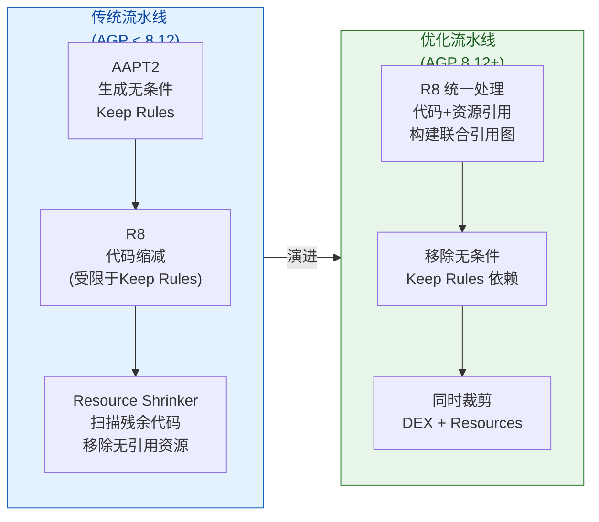
```mermaid
graph LR
    subgraph Legacy["传统流水线\n(AGP < 8.12)"]
        direction TB
        A1["AAPT2\n生成无条件\nKeep Rules"]
        A2["R8\n代码缩减\n(受限于Keep Rules)"]
        A3["Resource Shrinker\n扫描残余代码\n移除无引用资源"]
        A1 --> A2
        A2 --> A3
    end

    subgraph Optimized["优化流水线\n(AGP 8.12+)"]
        direction TB
        B1["R8 统一处理\n代码+资源引用\n构建联合引用图"]
        B2["移除无条件\nKeep Rules 依赖"]
        B3["同时裁剪\nDEX + Resources"]
        B1 --> B2
        B2 --> B3
    end

    Legacy -->|"演进"| Optimized

    classDef legacyStyle fill:#E3F2FD,stroke:#1565C0,color:#0D47A1
    classDef optimizedStyle fill:#E8F5E9,stroke:#2E7D32,color:#1B5E20
    class Legacy legacyStyle
    class Optimized optimizedStyle
```

#### Optimized Resource Shrinking（优化资源缩减）

随着 AGP 8.12.0 的发布，Google 引入了 Optimized Resource Shrinking，一种全新的、更高效的资源缩减方式。其核心变化在于将代码优化和资源优化**合并为一个统一的 pipeline**：

- 在新方案中，R8 同时优化代码和资源引用，确保所有仅被未使用代码引用的资源都会被识别为"未使用"并被移除。
- 在优化后的资源缩减中，资源被视为程序代码的一部分，共同构成引用图（reference graph）。当一组代码或资源没有被引用时，它就不受任何 keep rule 保护，可以被安全移除。
- 传统的 resource shrinking 只能移除 res 文件夹和 resource table 中的未使用资源，不影响 DEX 大小；而 Optimized Resource Shrinking 能同时缩减 DEX 代码和资源，因为它能跨越 DEX 与资源之间的引用边界进行追踪。

这意味着：如果某个 Activity class 中引用了若干 layout 和 drawable，但这个 Activity 本身从未被任何地方调用（dead code），传统方案中 AAPT2 的 keep rule 可能仍保留这个 Activity（因为资源引用了它），导致这些资源也无法被移除；而在新方案中，R8 统一判定这个 Activity 及其关联资源均为不可达，一并移除。

根据官方数据，使用 AGP 8.12.0 的 Optimized Resource Shrinking，开发者可以在共享大量代码和资源的多形态应用中实现高达 50% 的体积缩减。

**启用方式**也非常简单：

```kotlin
// gradle.properties — 在 AGP 8.12.x 中手动开启（AGP 9.0 后自动启用）
android.r8.optimizedResourceShrinking=true
```

如果你使用的是 AGP 9.0.0 或更新版本，无需手动设置该属性。当 `isShrinkResources = true` 启用时，Optimized Resource Shrinking 会自动生效。

#### 自定义保留与丢弃：keep.xml

资源缩减器基于**静态分析**来判断资源是否被引用。Resource Shrinking 依赖静态分析，有些资源可能会被误删。在这种情况下，你必须使用 `res/raw/keep.xml` 这样的配置文件显式标记需要保留的资源。

典型场景是**运行时动态加载资源**——通过 `Resources.getIdentifier(name, defType, defPackage)` 方法按名称获取资源 ID。由于这种调用是以字符串形式传递资源名的，静态分析器无法追踪这类间接引用，可能会错误地将这些资源标记为"未使用"。

keep 文件的结构包含 `<resources>` 标签和 keep/discard 属性。`tools:keep` 属性接受逗号分隔的资源名列表，指定需要保留的资源；`tools:discard` 属性接受逗号分隔的资源名列表，指定需要丢弃的资源。

```xml
<?xml version="1.0" encoding="utf-8"?>
<!-- res/raw/keep.xml — 自定义资源保留/丢弃规则 -->
<resources xmlns:tools="http://schemas.android.com/tools"
    tools:keep="@layout/dynamic_*,@drawable/ic_custom_logo"
    tools:discard="@layout/unused_debug_panel"
    tools:shrinkMode="strict" />
<!--
  tools:keep     — 保留所有名称匹配 dynamic_* 的 layout 和指定的 drawable
  tools:discard  — 强制丢弃 unused_debug_panel 布局（即使它看起来被引用）
  tools:shrinkMode="strict" — 开启严格模式，仅保留显式引用和 keep 列表中的资源
                               默认是 "safe" 模式，会额外保留可能被 getIdentifier() 引用的资源
-->
```

关于 `shrinkMode` 的两种模式：

- 默认模式是 `safe`，即 Gradle 插件会"安全起见"地白名单化所有可能通过 `getIdentifier()` 从字符串资源中查找引用的资源。如果希望插件仅考虑代码和其他资源中显式引用的资源，可使用 `shrinkMode="strict"`。此时你可以配合 `tools:keep` 和 `tools:discard` 来显式列出要保留或移除的资源。

#### 验证缩减效果

构建完成后，可以通过 Android Studio 的 **APK Analyzer**（Build → Analyze APK）直观查看哪些资源被保留、哪些被替换为空文件（在传统模式下，被"移除"的资源文件实际上被替换为空内容以保持资源 ID 索引不变）。在 Build Output 中搜索 `resources.txt` 日志文件也能看到详细的缩减报告。

### resConfigs 语言配置

#### 语言资源膨胀问题

一个看似不起眼但影响巨大的 APK 体积来源是**多语言资源**。当你的项目引入 `appcompat`、`material`、`play-services` 等 Google 官方库时，这些库内部打包了对 70+ 种语言的翻译字符串。即使你的 App 只支持中文和英文两种语言，最终 APK 中仍会包含阿拉伯语、法语、德语、日语等数十种语言的 `values-xx/strings.xml` 资源文件。

这不仅浪费了存储空间，还会引发一个更隐蔽的问题——**语言资源污染（Language Resource Contamination）**。语言资源污染也被称为 language resource pollution，它会破坏 locale 回退机制（fallback mechanism），尤其在你引入了包含大量翻译的第三方库时更为严重。

具体来说：假设用户设备的语言偏好列表为 `[法语, 英语]`，而你的 App 只翻译了英文（默认）和中文。正常情况下，系统找不到法语资源，会回退到默认的英文资源。但如果 AppCompat 库带入了法语资源（`values-fr/strings.xml`），系统会认为"这个 App 支持法语"，于是使用 AppCompat 的法语字符串来替代你 App 中缺失的法语字符串——导致界面上出现混杂的语言显示。

#### resConfigs 的作用机制

要只保留 App 正式支持的语言，可以使用 `resConfigs` 属性指定这些语言，未指定语言的所有资源都会被移除。这个过滤发生在 **AAPT2 打包阶段**，比 resource shrinking 更早——它直接在资源合并（resource merge）时将不匹配的 `values-xx` 目录排除在外。

你可以在 `build.gradle` 中这样配置 `resConfigs`，确保只有你实际支持的语言资源被包含在 APK 中，从而让系统在运行时正确判断 fallback locale。

```groovy
// app/build.gradle (Groovy DSL) — 传统 resConfigs 写法
android {
    defaultConfig {
        // 只保留英文和中文资源，其他语言全部移除
        // 这会过滤掉 AppCompat/Material 等库带来的 70+ 种语言翻译
        resConfigs "en", "zh-rCN", "zh-rTW"
    }
}
```

需要注意的是，`resConfigs` 不仅可以过滤语言，还能过滤屏幕密度（如 `hdpi`、`xxhdpi`）等其他资源配置限定符。但在 AAB 时代，密度过滤已由 Dynamic Delivery 自动处理，`resConfigs` 主要用于语言过滤。

#### 迁移到 localeFilters（AGP 8.0+）

Resource Configurations 已在 AGP 8.8 中被标记为废弃（deprecated），原因是 AGP 不再支持不同的资源密度配置，且 Google Play Console 现在要求以 App Bundle 格式发布。对于语言配置，你可以使用 `localeFilters` DSL 来将 locale 配置映射到对应的资源。

localeFilters（推荐 AGP 8.0+）是指定支持的 locale 的更新、首选方式，尤其适用于生成优化的 App Bundle，它位于 `androidResources` 块中。

```kotlin
// app/build.gradle.kts (Kotlin DSL) — 推荐的 localeFilters 写法
android {
    androidResources {
        // AGP 8.0+ 推荐方式：使用 localeFilters 替代 resConfigs
        // 只保留英文、简体中文、繁体中文的语言资源
        localeFilters += listOf("en", "zh-CN", "zh-TW")
    }
}
```

```groovy
// app/build.gradle (Groovy DSL) — localeFilters 写法
android {
    androidResources {
        // 等价的 Groovy 写法
        localeFilters += ["en", "zh-CN", "zh-TW"]
    }
}
```

相比旧的 `resConfigs`，`localeFilters` 有以下优势：

- **语义更清晰**：`resConfigs` 是一个通用的资源配置过滤器，可以混入 density 等非语言配置，语义模糊；`localeFilters` 专门针对 locale，意图明确。
- **与 AAB 更好集成**：当你发布 AAB 时，Android App Bundle 默认只下载用户设备上已配置的语言资源。类似地，只有匹配设备屏幕密度和 ABI 的资源才会包含在下载中。`localeFilters` 能更好地配合 Play 的 Dynamic Delivery 系统。
- **面向未来**：随着 `resConfigs` 被废弃，新项目应直接使用 `localeFilters`。

#### 与 Per-App Language 的协同

从 Android 13（API 33）开始，系统支持**逐应用语言偏好**（Per-App Language Preferences），用户可以在系统设置中为每个 App 单独选择语言。为确保你的 App 语言可在设备设置中配置，需启用自动逐应用语言支持（推荐）或手动配置。

从 Android Studio Giraffe 和 AGP 8.1 开始，你可以自动配置 App 支持逐应用语言偏好。只需在 `build.gradle.kts` 中启用：

```kotlin
// app/build.gradle.kts — 自动生成 LocaleConfig
android {
    androidResources {
        // 自动检测 values-xx 目录中的语言，生成 locale_config.xml
        generateLocaleConfig = true
    }
}
```

同时需要在 `src/main/resources.properties` 文件中指定默认 locale：

```properties
# src/main/resources.properties
unqualifiedResLocale=en-US
```

基于你的项目资源，Android Gradle 插件会自动生成 LocaleConfig 文件并在最终 manifest 中添加引用，无需手动操作。AGP 使用 App module 和所有 library module 依赖的 res 文件夹中的资源来确定要包含在 LocaleConfig 文件中的 locale。

这里有一个实践要点：`localeFilters` 和 `generateLocaleConfig` 需要**协同配置**。如果你用 `localeFilters` 过滤掉了某些语言的资源，那么 `generateLocaleConfig` 自然不会为那些语言生成 locale 条目（因为对应的 `values-xx` 目录已被排除）。因此，建议只在 `localeFilters` 中声明你确实已完成翻译的语言，确保两者一致。

### WebP 图片转换

#### 为什么选择 WebP

在 Android 应用中，图片资源（drawable、mipmap）通常是 APK 体积最大的组成部分之一。传统上，Android 开发使用 PNG（无损压缩，支持透明度）和 JPEG（有损压缩，不支持透明度）两种格式。但这两种格式都有各自的局限：PNG 文件偏大，JPEG 不支持 alpha 通道。

WebP 是一种图片格式，相比 JPEG 和 PNG 提供了更优秀的有损和无损压缩，带来更小的文件大小和更快的性能。它同时兼具了 PNG 的透明度支持和超越 JPEG 的压缩率：

- 根据 Google 的数据，WebP 在无损压缩时平均比 PNG 小 26%，在有损压缩时比同等质量的 JPEG 小 25–34%。
- WebP 同时支持有损和无损压缩，以及透明度（alpha 通道）。

#### Android 平台的 WebP 支持历史

WebP 是 Google 推出的图片格式，提供有损压缩（类似 JPEG）和透明度支持（类似 PNG），但压缩效果优于二者。有损 WebP 图片从 Android 4.0（API 14）开始支持，无损和透明 WebP 图片从 Android 4.3（API 18）开始支持。

由于现代 Android 应用的 `minSdkVersion` 普遍已 ≥ 21（Android 5.0），因此完全可以放心使用 WebP 的全部特性（有损、无损、透明度）。

#### Android Studio 内置转换工具

Android Studio 提供了非常方便的图形化 WebP 转换工具，Android Studio 可以将 PNG、JPG、BMP 或静态 GIF 图片转换为 WebP 格式。操作步骤如下：

1. 右键点击图片文件或包含图片的文件夹，选择 "Convert to WebP" 选项。
2. 选择有损（lossy）或无损（lossless）编码方式。无损编码仅在 `minSdkVersion` ≥ 18 时可用。如果选择有损编码，可设置编码质量并选择是否在保存前预览每张转换后的图片。
3. 你还可以选择跳过转换后文件比原始文件更大的情况，以及跳过包含透明度或 alpha 通道的文件。
4. 需要注意 9-patch 文件无法转换为 WebP 图片，转换工具会自动跳过 9-patch 图片。

选择有损编码后，Android Studio 会提供**实时预览对比**功能：左侧显示原始图片，右侧显示转换后的 WebP 图片，底部还会展示原始与转换后的文件大小，方便你直观评估压缩效果与质量损失。如果你将质量设为 100% 且 `minSdkVersion` ≥ 18，Android Studio 会自动切换为无损编码。

#### 有损 vs 无损：如何选择

WebP 的两种压缩模式适用于不同场景：

| 维度 | Lossy（有损） | Lossless（无损） |
|------|--------------|-----------------|
| **适用场景** | 照片、背景图、大面积渐变色图片 | 图标、Logo、像素精确的 UI 元素 |
| **压缩率** | 极高（比 JPEG 小 25-34%） | 中等（比 PNG 小约 26%） |
| **质量** | 视觉差异可调控（quality 参数） | 完全无损，像素级还原 |
| **透明度** | 支持（API 18+） | 支持（API 18+） |
| **解码速度** | 较快（10-25ms 典型值） | 较慢（15-40ms 典型值） |

对于大多数 App 中的照片类资源，推荐使用 **lossy 75-85%** 的质量设置，这个区间在视觉质量和文件大小之间取得了良好平衡。对于 App 图标（launcher icon）、品牌 Logo 等要求像素精确的资源，应使用 **lossless** 模式。

#### 需要注意的转换陷阱

如果源图片是无损 ARGB 格式，空间降采样到 YUV420 会引入新的颜色，这些颜色比原始颜色更难压缩。当源图片是颜色较少的 PNG 格式时，转换为有损 WebP（或类似的有损 JPEG）可能反而导致更大的文件。因此：

- 颜色简单（如纯色图标、线条图）的 PNG → 优先使用 lossless WebP，或直接使用 VectorDrawable。
- 照片类 JPEG → 使用 lossy WebP 几乎总是能获得更好的压缩效果。
- 转换前后务必对比文件大小，Android Studio 的转换工具会自动提示"转换后更大"的情况。

#### 程序化批量转换与 CI 集成

除了 Android Studio 的 GUI 工具，你还可以使用 Google 官方的 **cwebp** 命令行工具在 CI/CD 流程中实现自动化批量转换：

```bash
# 将单个 PNG 转换为有损 WebP，质量 80%
cwebp -q 80 input.png -o output.webp

# 将单个 PNG 转换为无损 WebP
cwebp -lossless input.png -o output.webp

# 批量转换目录下所有 PNG（Shell 脚本示例）
for file in res/drawable-xxhdpi/*.png; do
    # 跳过 9-patch 文件（.9.png）
    if [[ "$file" != *.9.png ]]; then
        # 使用 80% 质量进行有损转换
        cwebp -q 80 "$file" -o "${file%.png}.webp"
        # 转换成功后删除原始 PNG
        rm "$file"
    fi
done
```

#### VectorDrawable：更激进的替代方案

Android 5.0（API 21）引入了 VectorDrawable 支持，即在 XML 文件中定义的矢量图形。它可以无损缩放到不同屏幕密度而不降低显示质量，这意味着同一个文件能无损适配不同密度的屏幕，无需为每种密度提供单独的位图文件，从而显著减小 App 体积。

对于**图标和简单图形**（线条、几何形状、简单路径），VectorDrawable 通常是比 WebP 更优的选择——一个 VectorDrawable XML 文件可能只有几百字节到几 KB，而同等效果的多密度 PNG/WebP 可能需要数十 KB。但 VectorDrawable 不适合复杂的照片类图像，渲染复杂路径时的性能开销也需要注意。

综合来看，资源图片的格式选择策略为：

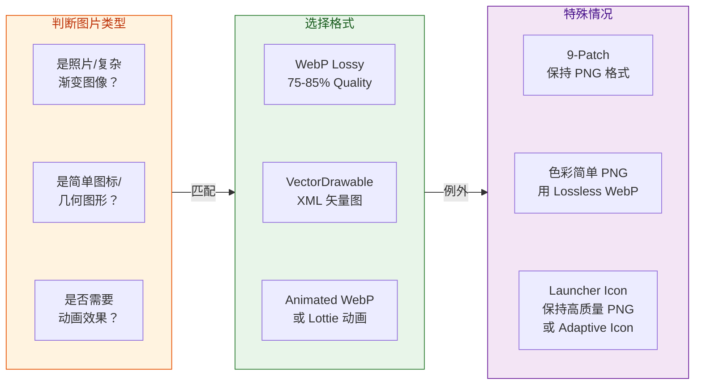
```mermaid
graph LR
    subgraph Decide["判断图片类型"]
        direction TB
        Q1["是照片/复杂\n渐变图像？"]
        Q2["是简单图标/\n几何图形？"]
        Q3["是否需要\n动画效果？"]
        Q1 ~~~ Q2
        Q2 ~~~ Q3
    end

    subgraph Format["选择格式"]
        direction TB
        F1["WebP Lossy\n75-85% Quality"]
        F2["VectorDrawable\nXML 矢量图"]
        F3["Animated WebP\n或 Lottie 动画"]
        F1 ~~~ F2
        F2 ~~~ F3
    end

    subgraph Fallback["特殊情况"]
        direction TB
        S1["9-Patch\n保持 PNG 格式"]
        S2["色彩简单 PNG\n用 Lossless WebP"]
        S3["Launcher Icon\n保持高质量 PNG\n或 Adaptive Icon"]
        S1 ~~~ S2
        S2 ~~~ S3
    end

    Decide -->|"匹配"| Format
    Format -->|"例外"| Fallback

    classDef decideStyle fill:#FFF3E0,stroke:#E65100,color:#BF360C
    classDef formatStyle fill:#E8F5E9,stroke:#2E7D32,color:#1B5E20
    classDef fallbackStyle fill:#F3E5F5,stroke:#6A1B9A,color:#4A148C
    class Decide decideStyle
    class Format formatStyle
    class Fallback fallbackStyle
```

#### 资源压缩的整体策略总结

将本节的三个维度整合为一个完整的资源优化清单：

1. **shrinkResources + isMinifyEnabled**：始终在 release 构建中开启，利用 R8 的 tree shaking 联动资源缩减。AGP 8.12+ 自动启用 Optimized Resource Shrinking，实现代码与资源的联合裁剪。
2. **localeFilters**（或旧版 `resConfigs`）：显式声明 App 支持的语言列表，过滤掉第三方库带来的冗余语言资源，同时避免语言资源污染导致的 locale fallback 异常。
3. **WebP 转换**：将所有非 9-patch 的 PNG/JPEG 转换为 WebP 格式，照片类使用有损压缩（75-85%），图标类使用无损压缩。简单图标优先考虑 VectorDrawable。
4. **keep.xml 精细调控**：对于运行时动态加载的资源，使用 `tools:keep` 防止误删；对于确认无用的资源，使用 `tools:discard` 强制移除。

---

**📝 练习题**

某 Android 项目使用了多个第三方 SDK，导致 APK 中包含了 50 多种语言的字符串资源，但 App 实际仅支持中英文。为了解决这个问题，开发者在 `build.gradle.kts` 中进行配置。以下哪种配置方式在 AGP 8.8+ 中**最为推荐**？


A. 在 `defaultConfig` 中使用 `resConfigs("en", "zh-rCN")`


B. 在 `androidResources` 块中使用 `localeFilters += listOf("en", "zh-CN")`


C. 仅开启 `isShrinkResources = true` 即可自动移除未使用的语言资源


D. 在每个第三方库的 ProGuard 规则中手动排除不需要的语言


**【答案】** B

**【解析】** `resConfigs` 已在 AGP 8.8 中被废弃（deprecated），Google 推荐使用 `localeFilters` DSL 来指定 App 支持的语言，并将 locale 配置映射到对应的资源。选项 A 使用的是旧版 `resConfigs`，虽然仍能工作但已不推荐。选项 C 不正确，因为 `shrinkResources` 移除的是没有被代码引用的资源，而第三方库的语言字符串通常在库内部是被引用的，不会被自动移除——资源缩减无法区分"库内部使用但 App 不需要"的语言资源。选项 D 是不可行的方案，ProGuard 规则控制的是代码而非资源。localeFilters 是 AGP 8.0+ 推荐的指定支持 locale 的方式，位于 `androidResources` 块中，尤其适用于生成优化的 App Bundle。

---

**📝 练习题**

在使用 R8 + Resource Shrinking 优化 APK 体积时，开发者发现某些通过 `Resources.getIdentifier()` 动态加载的图片资源在 Release 包中丢失了。以下哪种方式是**最正确的修复手段**？


A. 关闭 `isShrinkResources = true`，不再进行资源缩减


B. 在 `res/raw/keep.xml` 中使用 `tools:keep` 声明这些资源


C. 将 `shrinkMode` 改为 `safe` 模式并在 ProGuard 规则中添加 `-keep class R`


D. 将动态加载改为静态引用，直接在代码中使用 `R.drawable.xxx`


**【答案】** B

**【解析】** 当使用 resource shrinking 移除未使用的资源时，`tools:keep` 属性允许你指定需要保留的资源，通常因为它们在运行时以间接方式被引用，例如通过向 `Resources.getIdentifier()` 传递动态生成的资源名称。使用方法是在资源目录中创建一个 XML 文件（如 `res/raw/keep.xml`），并在 `tools:keep` 属性中以逗号分隔列表的形式指定需要保留的每个资源。选项 A "一刀切"地关闭了整个资源缩减功能，虽然能解决问题但代价太大。选项 C 中的 `-keep class R` 是 ProGuard/R8 代码层面的规则，作用于 Java/Kotlin class 而非 res 资源文件。选项 D 虽然从根本上解决了问题，但很多场景下动态加载资源是业务需求所必须的（如多主题切换、可配置的 UI 元素），不可能全部改为静态引用。因此，使用 `tools:keep` 在 keep.xml 中声明是最佳实践。

---

## 多渠道打包

在中国 Android 生态中，应用分发并非只依赖 Google Play 一个渠道——华为应用市场、小米应用商店、OPPO 软件商店、应用宝等数十个分发平台并行存在。即便在海外，也常常需要区分 Free/Paid 版本、内部测试版与正式版、面向不同地区的定制版本等。这些场景的共同需求是：**同一份源码，构建出多个"略有差异"的 APK/AAB**——渠道标识不同、功能集合不同、资源主题不同，甚至包名也可能不同。Android Gradle Plugin（AGP）提供的 **Product Flavors + Build Types** 组合机制，正是解决这一问题的官方方案。

多渠道打包的核心思想可以用一句话概括：**将"可变维度"从代码中抽离，交由构建系统在编译期注入**。开发者不需要维护多套工程，也不需要在运行时用 `if-else` 硬编码判断渠道——Gradle 会在编译阶段把渠道名写入 `BuildConfig`、把渠道标识替换进 `AndroidManifest.xml`、把对应的源码目录与资源目录合并进最终产物。整个过程对运行时完全透明，既保证了构建的灵活性，也避免了运行时的性能损耗与安全风险。

本节将从 **Flavor 维度配置**、**Manifest 占位符替换**、**BuildConfig 自定义字段** 三个核心机制展开，深入讲解多渠道打包在 AGP 中的完整运作方式。

---

### Flavor 维度配置

#### 什么是 Product Flavor

在 AGP 的构建模型中，最终生成的每一个 APK 变体（Build Variant）由两部分交叉组合而成：**Build Type** 和 **Product Flavor**。Build Type 通常表示构建"模式"，比如 `debug` 和 `release`；而 Product Flavor 则表示产品的"形态"差异，比如免费版与付费版、不同渠道的定制版等。两者做笛卡尔积，就得到了所有变体。例如定义了 `free` / `paid` 两个 Flavor 和 `debug` / `release` 两个 Build Type，最终会产生四个变体：`freeDebug`、`freeRelease`、`paidDebug`、`paidRelease`。

需要特别理解的一个关键概念是 **Flavor Dimension（风味维度）**。从 AGP 3.0 开始，每个 Product Flavor **必须**声明自己所属的维度。维度是对 Flavor 的"分组标签"——同一维度内的 Flavor 互斥（同一次构建只能选其中一个），不同维度之间的 Flavor 则做笛卡尔积。这一设计让多渠道打包具备了真正的"多轴"能力：你可以同时按"渠道"和"付费模式"两个维度排列组合，而不是把所有差异扁平地塞进一个 Flavor 列表中。

举一个具体的例子来说明维度的作用：假设你的应用需要同时区分 **渠道**（华为、小米、应用宝）和 **功能级别**（免费版、专业版）。如果没有维度机制，你就必须为每种组合单独创建一个 Flavor：`huaweiFree`、`huaweiPro`、`xiaomiFree`、`xiaomiPro`、`yingyongbaoFree`、`yingyongbaoPro`——6 个 Flavor，且每增加一个渠道或一个功能级别，数量都是乘法增长。而使用维度后，你只需要在 `channel` 维度下声明 3 个 Flavor，在 `tier` 维度下声明 2 个 Flavor，AGP 自动做笛卡尔积产出 6 个变体，配置量大幅降低。

```groovy
// app/build.gradle.kts (Kotlin DSL)
android {
    // 声明维度的优先级顺序，写在前面的维度优先级更高
    // 优先级影响资源/Manifest 合并时的覆盖顺序
    flavorDimensions += listOf("channel", "tier")

    productFlavors {
        // ---- channel 维度：区分分发渠道 ----
        create("huawei") {
            dimension = "channel"                      // 归属 channel 维度
            // 可选：为华为渠道设置不同的 applicationIdSuffix
            // 这样不同渠道可以在同一设备上共存，便于测试
            applicationIdSuffix = ".huawei"
        }
        create("xiaomi") {
            dimension = "channel"                      // 归属 channel 维度
            applicationIdSuffix = ".xiaomi"
        }
        create("yingyongbao") {
            dimension = "channel"                      // 归属 channel 维度
            applicationIdSuffix = ".yyb"
        }

        // ---- tier 维度：区分功能级别 ----
        create("free") {
            dimension = "tier"                         // 归属 tier 维度
        }
        create("pro") {
            dimension = "tier"                         // 归属 tier 维度
            applicationIdSuffix = ".pro"               // 专业版追加后缀
        }
    }
}
```

以上配置会产生 3 × 2 × 2 = **12 个变体**（3 渠道 × 2 功能级别 × 2 Build Type）。在 Android Studio 的 Build Variants 面板中，你可以看到类似 `huaweiFreeDebug`、`xiaomiProRelease` 这样的组合名称。

#### 维度优先级与资源合并

`flavorDimensions` 列表中的 **声明顺序决定了优先级**。当多个维度的 Flavor 都提供了同名资源或 Manifest 配置时，排在前面的维度具有更高的合并优先级。完整的优先级链（从高到低）为：

> **Build Type > 第一维度 Flavor > 第二维度 Flavor > ... > main 源码集**

AGP 在合并资源时采用的是 **覆盖式策略**（overlay）：高优先级源码集中存在的资源文件会直接覆盖低优先级的同名文件。对于 `AndroidManifest.xml`，则使用 Manifest Merger 工具按优先级合并属性。

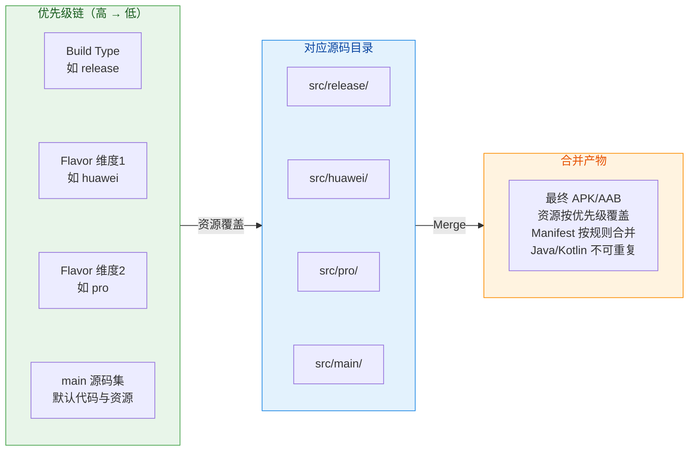
```mermaid
graph LR
    subgraph Priority["优先级链（高 → 低）"]
        direction TB
        BT["Build Type\n如 release"]
        D1["Flavor 维度1\n如 huawei"]
        D2["Flavor 维度2\n如 pro"]
        MAIN["main 源码集\n默认代码与资源"]
        BT ~~~ D1
        D1 ~~~ D2
        D2 ~~~ MAIN
    end

    subgraph SourceSets["对应源码目录"]
        direction TB
        S1["src/release/"]
        S2["src/huawei/"]
        S3["src/pro/"]
        S4["src/main/"]
        S1 ~~~ S2
        S2 ~~~ S3
        S3 ~~~ S4
    end

    subgraph Output["合并产物"]
        direction TB
        APK["最终 APK/AAB\n资源按优先级覆盖\nManifest 按规则合并\nJava/Kotlin 不可重复"]
    end

    Priority -->|"资源覆盖"| SourceSets -->|"Merge"| Output

    classDef priorityStyle fill:#E8F5E9,stroke:#43A047,color:#1B5E20
    classDef sourceStyle fill:#E3F2FD,stroke:#1E88E5,color:#0D47A1
    classDef outputStyle fill:#FFF3E0,stroke:#FB8C00,color:#E65100

    class Priority priorityStyle
    class SourceSets sourceStyle
    class Output outputStyle
```

理解优先级链对于实际开发非常关键。例如，如果你希望华为渠道使用一套专属的启动图标，只需要在 `src/huawei/res/mipmap-xxxhdpi/` 下放置同名的 `ic_launcher.png`，它就会覆盖 `src/main/` 中的默认图标——无需写任何代码逻辑。

#### Source Set 目录结构

每个 Flavor（以及 Flavor 的组合）都对应一个 **Source Set 目录**。AGP 会自动识别这些约定目录，并在构建对应变体时将它们加入编译与资源合并流程。标准的目录结构如下：

```text
app/src/
├── main/                  ← 所有变体共享的默认源码集
│   ├── java/
│   ├── kotlin/
│   ├── res/
│   └── AndroidManifest.xml
│
├── huawei/                ← channel=huawei 的专属源码集
│   ├── java/              ← 仅在 huawei 变体中参与编译
│   ├── res/               ← 覆盖 main 中的同名资源
│   └── AndroidManifest.xml ← 与 main 的 Manifest 合并
│
├── pro/                   ← tier=pro 的专属源码集
│   ├── java/
│   └── res/
│
├── huaweiPro/             ← channel=huawei + tier=pro 的组合源码集
│   └── res/               ← 优先级高于 huawei/ 和 pro/
│
└── huaweiProDebug/        ← 完整变体的源码集（极少使用）
    └── res/
```

这里有一个重要的规则必须牢记：**Java/Kotlin 源文件不允许在不同源码集之间重复出现**。如果 `src/main/java/` 中已经有一个 `LoginActivity.kt`，你不能在 `src/huawei/java/` 中再放一个同名文件去"覆盖"它——编译器会报重复类错误。这与资源文件的覆盖策略不同。如果确实需要在不同渠道中使用不同的类实现，正确做法是：在 `main` 中不放该类，改为在每个 Flavor 的源码集中各放一份独立实现（即"互斥提供"，而非"覆盖"）。

#### Variant Filter：过滤无效变体

当维度和 Flavor 数量增多后，笛卡尔积可能产生大量无意义的变体。例如你可能永远不会发布"应用宝 + 专业版"的组合。此时可以使用 **Variant Filter** 来排除无效变体，减少构建系统的负担：

```kotlin
// app/build.gradle.kts
androidComponents {
    beforeVariants(selector().all()) { variantBuilder ->
        // 排除"应用宝 + pro"的组合——该渠道不发行专业版
        if (variantBuilder.productFlavors.containsAll(
                listOf("channel" to "yingyongbao", "tier" to "pro")
            )) {
            variantBuilder.enable = false              // 禁用此变体
        }
    }
}
```

被禁用的变体不会出现在 Build Variants 面板中，也不会生成对应的编译 Task，有效加快 Gradle Sync 和构建速度。

---

### Manifest 占位符替换

#### 机制原理

在多渠道打包中，`AndroidManifest.xml` 中经常会有一些随渠道变化的值——最典型的就是第三方 SDK（如统计、推送）要求在 `<meta-data>` 中填入的 App Key、渠道标识符等。如果为每个渠道都维护一份完整的 Manifest，维护成本极高且容易出错。AGP 提供的 **Manifest Placeholder（清单占位符）** 机制，允许你在 Manifest 中使用 `${variableName}` 语法声明"变量洞"，然后在 `build.gradle` 中为每个 Flavor 注入不同的值。

其底层工作流程是：AGP 在执行 Manifest Merge（清单合并）步骤时，会先对每个源码集的 Manifest 文件做 **文本级占位符替换**，将所有 `${xxx}` 标记替换为 `manifestPlaceholders` Map 中对应 key 的 value，然后再进行标准的多 Manifest 合并操作。如果某个占位符在 Map 中找不到对应值，Merge 过程会直接报错并中断构建——这是一种"编译期安全保障"，确保你不会遗漏任何渠道的配置。

#### 配置方式

占位符的配置入口是 `manifestPlaceholders` 属性，它可以在 `defaultConfig`、`productFlavors`、`buildTypes` 中分别设置，遵循与资源相同的优先级覆盖规则。

```kotlin
// app/build.gradle.kts
android {
    defaultConfig {
        // 在 defaultConfig 中设置通用的默认值
        // 所有 Flavor 如果没有覆盖，就会使用这些值
        manifestPlaceholders["CHANNEL_NAME"] = "default"
        manifestPlaceholders["UMENG_APP_KEY"] = "xxxx-default-key"
    }

    flavorDimensions += listOf("channel")

    productFlavors {
        create("huawei") {
            dimension = "channel"
            // 为华为渠道注入专属占位符值
            manifestPlaceholders["CHANNEL_NAME"] = "huawei"
            // 华为可能使用不同的统计 Key
            manifestPlaceholders["UMENG_APP_KEY"] = "xxxx-huawei-key"
        }
        create("xiaomi") {
            dimension = "channel"
            manifestPlaceholders["CHANNEL_NAME"] = "xiaomi"
            manifestPlaceholders["UMENG_APP_KEY"] = "xxxx-xiaomi-key"
        }
        create("yingyongbao") {
            dimension = "channel"
            manifestPlaceholders["CHANNEL_NAME"] = "yingyongbao"
            manifestPlaceholders["UMENG_APP_KEY"] = "xxxx-yyb-key"
        }
    }
}
```

在 `AndroidManifest.xml` 中使用占位符：

```xml
<!-- AndroidManifest.xml -->
<application>
    <!-- 友盟统计 SDK 要求的 App Key -->
    <!-- ${UMENG_APP_KEY} 将在编译期被替换为 Flavor 中配置的实际值 -->
    <meta-data
        android:name="UMENG_APPKEY"
        android:value="${UMENG_APP_KEY}" />

    <!-- 渠道标识，运行时可通过 PackageManager 读取 -->
    <meta-data
        android:name="CHANNEL"
        android:value="${CHANNEL_NAME}" />
</application>
```

构建华为渠道时，AGP 会把 `${CHANNEL_NAME}` 替换为字面量 `huawei`，把 `${UMENG_APP_KEY}` 替换为 `xxxx-huawei-key`。最终 APK 中的 Manifest 已经是完全替换后的纯文本，不再包含任何 `${}` 标记。

#### 运行时读取占位符值

既然占位符值已经被"固化"到了 APK 的 `AndroidManifest.xml` 中，运行时就可以通过标准的 `PackageManager` API 读取：

```kotlin
// 运行时获取 Manifest 中 meta-data 的值
fun getChannelName(context: Context): String {
    // 获取当前应用的 ApplicationInfo，并携带 meta-data 信息
    val appInfo = context.packageManager.getApplicationInfo(
        context.packageName,                          // 当前应用包名
        PackageManager.GET_META_DATA                  // 标记：需要获取 meta-data
    )
    // 从 meta-data Bundle 中取出 CHANNEL 字段
    // 如果不存在则返回 "unknown" 作为降级默认值
    return appInfo.metaData?.getString("CHANNEL") ?: "unknown"
}
```

这种方式是 **最经典的渠道标识读取方案**，几乎所有国内第三方统计 SDK（友盟、Talkingdata 等）都采用此方式识别渠道来源。

#### 内置占位符

除了自定义占位符外，AGP 还内置了一个常用的占位符 **`${applicationId}`**，它会在 Merge 阶段被自动替换为当前变体的完整 Application ID（包括所有 suffix）。这在声明 `ContentProvider` 的 `authorities`、`FileProvider` 的 `authorities` 时非常有用，可以避免不同渠道因包名冲突导致安装失败：

```xml
<!-- 使用 ${applicationId} 确保每个变体的 authority 唯一 -->
<provider
    android:name="androidx.core.content.FileProvider"
    android:authorities="${applicationId}.fileprovider"
    android:exported="false"
    android:grantUriPermissions="true">
    <meta-data
        android:name="android.support.FILE_PROVIDER_PATHS"
        android:value="@xml/file_paths" />
</provider>
```

如果华为渠道的完整 Application ID 是 `com.example.app.huawei`，那么 `FileProvider` 的 authority 就会被替换为 `com.example.app.huawei.fileprovider`，与小米渠道的 `com.example.app.xiaomi.fileprovider` 互不冲突。

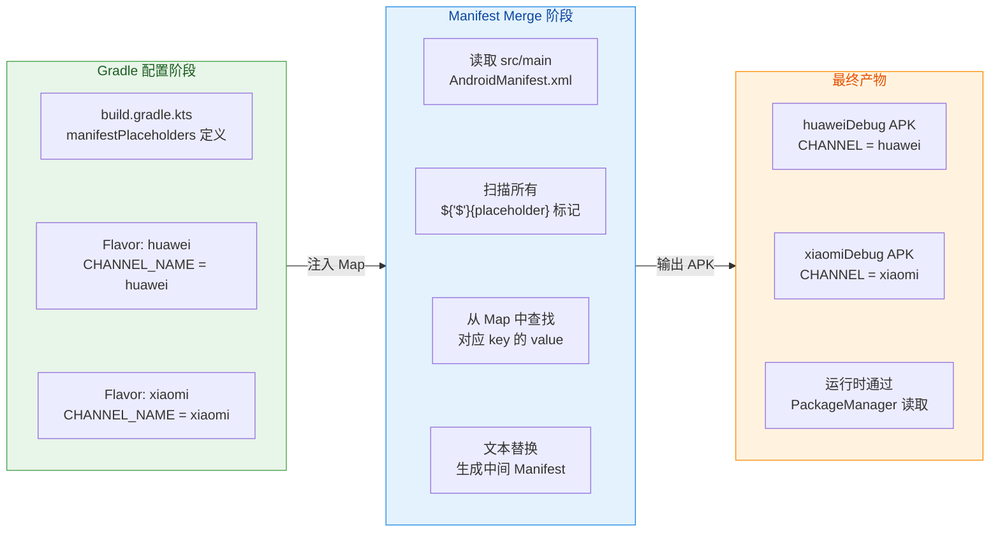
```mermaid
graph LR
    subgraph GradleConfig["Gradle 配置阶段"]
        direction TB
        A["build.gradle.kts\nmanifestPlaceholders 定义"]
        B["Flavor: huawei\nCHANNEL_NAME = huawei"]
        C["Flavor: xiaomi\nCHANNEL_NAME = xiaomi"]
        A ~~~ B
        B ~~~ C
    end

    subgraph MergePhase["Manifest Merge 阶段"]
        direction TB
        D["读取 src/main\nAndroidManifest.xml"]
        E["扫描所有\n${'$'}{placeholder} 标记"]
        F["从 Map 中查找\n对应 key 的 value"]
        G["文本替换\n生成中间 Manifest"]
        D ~~~ E
        E ~~~ F
        F ~~~ G
    end

    subgraph FinalOutput["最终产物"]
        direction TB
        H["huaweiDebug APK\nCHANNEL = huawei"]
        I["xiaomiDebug APK\nCHANNEL = xiaomi"]
        J["运行时通过\nPackageManager 读取"]
        H ~~~ I
        I ~~~ J
    end

    GradleConfig -->|"注入 Map"| MergePhase -->|"输出 APK"| FinalOutput

    classDef gradleStyle fill:#E8F5E9,stroke:#43A047,color:#1B5E20
    classDef mergeStyle fill:#E3F2FD,stroke:#1E88E5,color:#0D47A1
    classDef outputStyle fill:#FFF3E0,stroke:#FB8C00,color:#E65100

    class GradleConfig gradleStyle
    class MergePhase mergeStyle
    class FinalOutput outputStyle
```

---

### BuildConfig 自定义字段

#### BuildConfig 的本质

`BuildConfig` 是 AGP 在编译期 **自动生成** 的一个 Java 类（位于 `build/generated/source/buildConfig/` 目录下）。它的核心价值在于：**将构建时确定的常量，以类型安全的方式暴露给运行时代码**，无需反射、无需读文件、无需解析 Manifest。

对于每个 Build Variant，AGP 都会生成一个独立的 `BuildConfig.java`。它默认包含以下字段：

```java
// 自动生成的 BuildConfig.java（以 huaweiFreeDebug 变体为例）
public final class BuildConfig {
    public static final boolean DEBUG = true;                // 是否为 debug 构建
    public static final String APPLICATION_ID = "com.example.app.huawei"; // 完整包名
    public static final String BUILD_TYPE = "debug";         // 当前 Build Type 名称
    public static final String FLAVOR = "huaweiFree";        // 当前 Flavor 组合名称
    public static final int VERSION_CODE = 42;               // 版本号
    public static final String VERSION_NAME = "2.1.0";       // 版本名
}
```

这些字段在编译后会被内联为常量（`static final`），意味着它们在 DEX 中会被直接替换为字面量值，**不存在运行时方法调用的开销**。对于 `DEBUG` 字段来说，这还有一个额外的好处：编译器会对 `if (BuildConfig.DEBUG)` 分支做 Dead Code Elimination，release 包中相关的调试代码会被完全移除。

#### 自定义字段：buildConfigField

除了自动生成的默认字段，AGP 允许开发者通过 `buildConfigField()` 方法注入任意数量的自定义常量。其签名为：

```
buildConfigField(type: String, name: String, value: String)
```

- **type**：Java 类型名（如 `"String"`、`"boolean"`、`"int"`、`"long"`）。
- **name**：常量名，建议使用 `UPPER_SNAKE_CASE`。
- **value**：字面量值。**注意：String 类型的值必须手动加转义双引号**，因为这个值会被原样写入生成的 Java 源码。

```kotlin
// app/build.gradle.kts
android {
    defaultConfig {
        // 通用的服务端 API 基地址（所有变体的默认值）
        buildConfigField("String", "API_BASE_URL", "\"https://api.example.com/v1/\"")
        // 是否启用日志上报（默认关闭）
        buildConfigField("boolean", "ENABLE_LOG_REPORT", "false")
    }

    buildTypes {
        getByName("debug") {
            // debug 模式下使用测试服务器
            buildConfigField("String", "API_BASE_URL", "\"https://api-dev.example.com/v1/\"")
            // debug 模式下开启日志上报便于调试
            buildConfigField("boolean", "ENABLE_LOG_REPORT", "true")
        }
        getByName("release") {
            // release 使用 defaultConfig 中的默认值，无需重复声明
        }
    }

    productFlavors {
        create("huawei") {
            dimension = "channel"
            // 华为渠道标识——运行时直接读取，不经过 Manifest
            buildConfigField("String", "CHANNEL_ID", "\"huawei\"")
            // 华为渠道专属的统计 SDK AppKey
            buildConfigField("String", "ANALYTICS_KEY", "\"HW-ABCDEF-123456\"")
        }
        create("xiaomi") {
            dimension = "channel"
            buildConfigField("String", "CHANNEL_ID", "\"xiaomi\"")
            buildConfigField("String", "ANALYTICS_KEY", "\"XM-GHIJKL-789012\"")
        }
    }
}
```

生成的 `BuildConfig.java`（以 `huaweiDebug` 变体为例）会包含：

```java
public final class BuildConfig {
    // ---- AGP 默认字段 ----
    public static final boolean DEBUG = true;
    public static final String APPLICATION_ID = "com.example.app.huawei";
    // ...

    // ---- 自定义字段 ----
    public static final String API_BASE_URL = "https://api-dev.example.com/v1/"; // debug 覆盖了 default
    public static final boolean ENABLE_LOG_REPORT = true;                         // debug 覆盖了 default
    public static final String CHANNEL_ID = "huawei";                             // 来自 Flavor
    public static final String ANALYTICS_KEY = "HW-ABCDEF-123456";               // 来自 Flavor
}
```

#### 覆盖规则

`buildConfigField` 的覆盖规则遵循与资源、占位符相同的优先级链：**Build Type > 高优先级 Flavor 维度 > 低优先级 Flavor 维度 > defaultConfig**。当高优先级层声明了与低优先级层同名同类型的字段时，高优先级的值会"胜出"。上面的例子中，`debug` Build Type 声明的 `API_BASE_URL` 覆盖了 `defaultConfig` 中的同名字段，体现的就是这一规则。

#### 运行时使用

在业务代码中使用 `BuildConfig` 字段极其简洁，直接以静态常量方式访问即可：

```kotlin
// 网络层初始化——根据变体自动切换 API 地址
val retrofit = Retrofit.Builder()
    .baseUrl(BuildConfig.API_BASE_URL)                // 编译期常量，零运行时开销
    .addConverterFactory(GsonConverterFactory.create())
    .build()

// 统计 SDK 初始化——自动注入渠道专属 Key
AnalyticsSDK.init(
    context = applicationContext,
    appKey = BuildConfig.ANALYTICS_KEY,               // 不同渠道值不同
    channel = BuildConfig.CHANNEL_ID                  // 渠道标识
)

// 条件编译：仅 debug 包执行的逻辑
if (BuildConfig.ENABLE_LOG_REPORT) {
    // 这段代码在 release 包中会被编译器的
    // Dead Code Elimination 完全移除
    LogReporter.uploadToServer()
}
```

#### BuildConfig vs Manifest Placeholder：如何选择

两种机制都能在编译期注入渠道相关的值，但使用场景有明确的区分：

| 对比维度 | `buildConfigField` | `manifestPlaceholders` |
|---|---|---|
| **注入目标** | 生成 Java/Kotlin 源码中的常量 | 替换 `AndroidManifest.xml` 中的文本 |
| **访问方式** | `BuildConfig.FIELD_NAME` 直接引用 | `PackageManager.getApplicationInfo()` 读取 |
| **类型安全** | ✅ 编译期类型检查（String、boolean、int…） | ❌ 全部是字符串，运行时才发现类型错误 |
| **性能** | 零开销（编译期常量内联） | 有轻微 IPC 开销（需查询 PackageManager） |
| **典型用途** | API URL、Feature Flag、渠道 ID | SDK App Key、FileProvider authority、渠道标识 |
| **适用对象** | 业务代码 | 第三方 SDK 配置、系统组件声明 |

**经验法则**：如果值需要出现在 Manifest 的 XML 属性中（比如第三方 SDK 要求的 `<meta-data>`），用 Manifest Placeholder；如果值仅在 Java/Kotlin 代码中使用，用 `buildConfigField` 获得更好的类型安全和性能。两者也可以组合使用——同一个渠道名既注入 Manifest（给 SDK 读），也注入 BuildConfig（给业务代码读）。

#### 高阶技巧：从外部文件注入

在大型项目中，渠道配置可能有几十甚至上百个，全部写在 `build.gradle.kts` 中会导致文件膨胀。常见的优化做法是将配置外置到 JSON 或 Properties 文件中，在 Gradle 脚本中动态读取并注入：

```kotlin
// app/build.gradle.kts
import com.google.gson.Gson                           // 需要在 buildscript 中引入 Gson

// 从外部 JSON 文件中读取渠道配置
val channelsJson = file("channels.json").readText()   // 读取项目根目录下的 channels.json
// 解析为 List<Map>
val channels: List<Map<String, String>> = Gson().fromJson(
    channelsJson,
    object : com.google.gson.reflect.TypeToken<List<Map<String, String>>>() {}.type
)

android {
    flavorDimensions += "channel"

    productFlavors {
        // 动态遍历 JSON 中的每一条渠道配置
        channels.forEach { config ->
            create(config["name"]!!) {                // 以渠道名作为 Flavor 名称
                dimension = "channel"
                // 从 JSON 中读取并注入占位符与 BuildConfig 字段
                manifestPlaceholders["CHANNEL_NAME"] = config["name"]!!
                buildConfigField("String", "CHANNEL_ID", "\"${config["name"]}\"")
                buildConfigField("String", "ANALYTICS_KEY", "\"${config["analyticsKey"]}\"")
            }
        }
    }
}
```

对应的 `channels.json` 格式如下：

```json
[
    { "name": "huawei",      "analyticsKey": "HW-ABCDEF-123456" },
    { "name": "xiaomi",      "analyticsKey": "XM-GHIJKL-789012" },
    { "name": "yingyongbao", "analyticsKey": "YYB-MNOPQR-345678" },
    { "name": "oppo",        "analyticsKey": "OPPO-STUVWX-901234" }
]
```

这种做法将渠道信息从构建脚本中解耦，非开发人员（如运营团队）也可以通过修改 JSON 文件来管理渠道，大幅降低协作成本。

#### 关于 AGP 8.0+ 的 BuildConfig 变化

需要特别注意的是，从 AGP 8.0 开始，`BuildConfig` 的自动生成 **默认关闭**。如果你升级到 AGP 8.0+ 后发现 `BuildConfig` 类找不到了，需要在 `build.gradle.kts` 中手动开启：

```kotlin
android {
    buildFeatures {
        buildConfig = true                             // AGP 8.0+ 必须显式启用
    }
}
```

这一变化的背景是 Google 推动构建性能优化——不是所有模块都需要 `BuildConfig`，默认关闭可以减少不必要的代码生成步骤，加快增量构建速度。

---

**📝 练习题**

在一个 Android 项目中，`build.gradle.kts` 配置了两个 Flavor 维度：`flavorDimensions += listOf("channel", "tier")`。其中 `channel` 维度下有 `huawei` 和 `xiaomi` 两个 Flavor，`tier` 维度下有 `free` 和 `pro` 两个 Flavor。Build Type 有 `debug` 和 `release`。如果 `huawei` Flavor 和 `pro` Flavor 以及 `debug` Build Type 中都通过 `buildConfigField` 声明了同名字段 `API_URL`，最终 `huaweiProDebug` 变体的 `BuildConfig.API_URL` 值来自哪里？

A. `defaultConfig` 中的 `API_URL` 值


B. `huawei` Flavor 中的 `API_URL` 值（因为 channel 维度优先级高于 tier 维度）


C. `pro` Flavor 中的 `API_URL` 值（因为 tier 维度最后声明）


D. `debug` Build Type 中的 `API_URL` 值（因为 Build Type 优先级最高）


**【答案】** D

**【解析】** AGP 的 `buildConfigField` 覆盖优先级链从高到低为：**Build Type > 第一维度 Flavor > 第二维度 Flavor > defaultConfig**。在本题中，`debug` 属于 Build Type，其优先级高于任何 Flavor 维度。因此即使 `huawei`（第一维度）和 `pro`（第二维度）都声明了同名字段，最终也会被 `debug` Build Type 的值覆盖。如果 `debug` 没有声明该字段，才会轮到 `huawei`（第一维度）；如果 `huawei` 也没有，才轮到 `pro`（第二维度）；再没有才回退到 `defaultConfig`。这一优先级链与资源合并、Manifest 占位符的覆盖规则完全一致，是 AGP 多渠道构建体系中的统一设计原则。

---

**📝 练习题**

以下关于 Manifest Placeholder 和 BuildConfig 自定义字段的描述，哪一项是 **错误** 的？

A. Manifest Placeholder 使用 `${variableName}` 语法，在 Manifest Merge 阶段进行文本替换，最终 APK 中不会残留占位符标记


B. `buildConfigField("String", "KEY", "\"value\"")` 中的 value 参数必须手动添加转义双引号，因为该值会被原样写入生成的 Java 源码


C. `BuildConfig.DEBUG` 字段的值在运行时通过系统属性动态判断，因此即使反编译 release 包也无法看到此字段的硬编码值


D. 从 AGP 8.0 开始，`BuildConfig` 的自动生成默认关闭，需要在 `buildFeatures` 中显式设置 `buildConfig = true` 才能使用


**【答案】** C

**【解析】** `BuildConfig.DEBUG` 是一个 `static final boolean` 常量，其值在编译期就已经确定——debug 构建时为 `true`，release 构建时为 `false`。它不是运行时动态判断的，而是被编译器直接内联为字面量。正因为它是编译期常量，Java/Kotlin 编译器会对 `if (BuildConfig.DEBUG) { ... }` 这样的分支执行 Dead Code Elimination：在 release 包中，整个 `if` 块的字节码都会被移除。反编译 release 包时，你甚至可能找不到这段代码的痕迹。选项 A、B、D 的描述均正确：A 描述了占位符的替换时机与最终状态；B 指出了 String 类型值需要转义引号的注意事项；D 说明了 AGP 8.0 的行为变更。

---

## 发布流程

Android 应用从开发完成到最终上架用户设备，中间要经历一套严谨的发布流水线。这套流程不仅仅是"把 APK 传上去"这么简单——它涵盖了 **构建产物准备、签名验证、测试轨道分级灰度、合规审核、分阶段发布** 等多个环节。Google 之所以设计出如此多层级的发布机制，核心目的在于：让开发者能在 **可控范围** 内验证应用质量，尽早暴露崩溃与兼容性问题，避免一次全量推送就引发大规模线上事故。理解整个发布流程的设计思想与操作细节，是每一位 Android 开发者从"能写代码"迈向"能交付产品"的关键一步。

从宏观视角来看，整个发布链路可以划分为三大阶段：**本地构建与签名** → **Google Play Console 管理与测试** → **正式发布与监控**。本地阶段侧重于产出一个合规的、经过签名的构建产物（APK 或 AAB）；Console 阶段则围绕"分级测试轨道"体系展开，让开发者能够把同一个版本先推给内部团队、再推给小范围外部用户、最后才面向全量市场；正式发布阶段则涉及分阶段上线（Staged Rollout）、版本监控与紧急回滚等运维策略。下面我们将逐一深入每个环节。

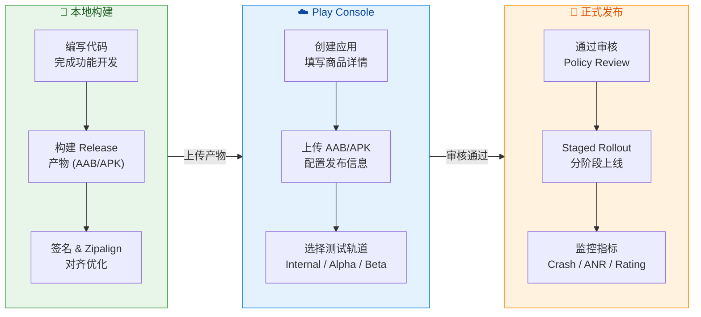
```mermaid
graph LR
    subgraph Local["🔧 本地构建"]
        direction TB
        A["编写代码\n完成功能开发"]
        B["构建 Release\n产物 (AAB/APK)"]
        C["签名 & Zipalign\n对齐优化"]
        A --> B
        B --> C
    end

    subgraph Console["☁️ Play Console"]
        direction TB
        D["创建应用\n填写商品详情"]
        E["上传 AAB/APK\n配置发布信息"]
        F["选择测试轨道\nInternal / Alpha / Beta"]
        D --> E
        E --> F
    end

    subgraph Release["🚀 正式发布"]
        direction TB
        G["通过审核\nPolicy Review"]
        H["Staged Rollout\n分阶段上线"]
        I["监控指标\nCrash / ANR / Rating"]
        G --> H
        H --> I
    end

    Local -->|"上传产物"| Console -->|"审核通过"| Release

    classDef localStyle fill:#E8F5E9,stroke:#43A047,color:#1B5E20
    classDef consoleStyle fill:#E3F2FD,stroke:#1E88E5,color:#0D47A1
    classDef releaseStyle fill:#FFF3E0,stroke:#FB8C00,color:#E65100

    class Local localStyle
    class Console consoleStyle
    class Release releaseStyle
```

### Google Play Console 上传

Google Play Console（以下简称 Console）是 Google 为 Android 开发者提供的 **一站式应用管理后台**。它不仅仅是一个"上传入口"，而是涵盖了版本管理、测试分发、统计分析、政策合规、收入报告等几乎所有与应用生命周期相关的功能。要完成第一次上传，开发者需要依次完成：**注册开发者账号 → 创建应用 → 填写商品详情 → 上传构建产物 → 配置发布选项** 这几个关键步骤。

#### 开发者账号注册

在使用 Console 之前，开发者必须先用 Google 账号注册成为 Google Play 开发者。注册时需要支付一次性的 **25 美元注册费**，并完成身份验证。对于组织账号（Organization），Google 还会要求提供 D-U-N-S 编号等企业认证信息。注册审核通过后，开发者便获得了在 Google Play 上发布应用的资格。值得注意的是，Google 近年来对新账号的审核越来越严格——新注册的个人开发者账号在正式发布到 Production 轨道之前，通常需要先在封闭测试轨道（Closed Testing）中累积至少 **20 名测试人员** 并持续测试 **14 天**，这是 Google 为打击低质量应用和恶意软件而设立的准入门槛。

#### 创建应用与商品详情

在 Console 中点击 **"Create app"** 后，需要填写应用的基本信息：

- **App name**（应用名称）：在 Google Play 商店中展示的名称，最长 30 个字符。
- **Default language**（默认语言）：应用的主要语言。
- **App or Game**（应用还是游戏）：影响在商店中的分类展示。
- **Free or Paid**（免费还是付费）：注意，**免费应用一旦发布后不能改为付费**，这是不可逆的决定。

创建完成后，Console 会引导开发者进入 **Dashboard（仪表盘）**，左侧导航栏中列出了发布前必须完成的所有 Setup 任务。其中最核心的是 **Store Listing（商品详情页）** 的配置：

| 字段 | 说明 | 要求 |
|------|------|------|
| Short description | 简短描述 | 最长 80 字符 |
| Full description | 完整描述 | 最长 4000 字符 |
| App icon | 应用图标 | 512 × 512 PNG |
| Feature graphic | 特征图 | 1024 × 500 PNG/JPG |
| Screenshots | 截图 | 至少 2 张，手机/平板/Wear 等分别上传 |
| Privacy policy URL | 隐私政策链接 | 必填，指向可访问的隐私政策页面 |

这些信息直接决定了用户在 Google Play 商店中看到的应用展示页面。Google 会在审核阶段检查这些内容是否符合 **Google Play Developer Program Policies**，包括但不限于：是否存在误导性描述、是否包含不当内容、隐私政策是否真实有效等。

#### 上传构建产物（AAB 优先）

商品详情配置完成后，下一步便是上传实际的构建产物。Google 从 2021 年 8 月开始 **强制要求** 新应用使用 **Android App Bundle（AAB）** 格式上传，不再接受直接上传 APK 到 Production 轨道（已有的老应用可以继续用 APK 更新，但 Google 强烈建议迁移至 AAB）。

使用 AAB 格式的好处在前面章节已有详述，这里从发布流程角度补充一个关键点：当开发者上传 AAB 到 Console 时，**Google Play 会在云端基于 AAB 生成最终的 Split APKs**，并根据每个用户设备的具体配置（CPU 架构、屏幕密度、语言）动态下发最合适的 APK 组合。这意味着开发者上传的是一个"全量包"，而用户下载的是一个"精简包"——这个转换过程完全由 Google Play 的 **Dynamic Delivery** 系统自动完成。

上传操作在 Console 左侧导航栏的 **Release > Testing / Production** 中进行。选择目标轨道后，点击 **"Create new release"**，然后在 **"App bundles"** 区域拖入或选择本地的 `.aab` 文件。上传完成后，Console 会自动进行一系列 **Pre-launch 检查**：

1. **签名验证**：检查 AAB 是否使用了与该应用绑定的 Upload Key 正确签名。如果是首次上传，Console 会要求开发者选择是让 Google 管理 App Signing Key（推荐），还是自行导出并上传。
2. **Manifest 检查**：解析 `AndroidManifest.xml`，校验 `versionCode` 是否大于当前已发布版本、`targetSdkVersion` 是否满足 Google Play 的最低要求（截至目前，新应用必须 target API 34+）。
3. **Deobfuscation 文件**：如果启用了 R8/ProGuard 混淆，Console 会提示上传 mapping 文件（`mapping.txt`），以便在 Console 的 **Crash 分析** 面板中自动还原混淆后的堆栈。
4. **Native Debug Symbols**：如果包含 Native 代码（`.so` 库），建议同时上传 Native debug symbols，同样用于 Crash 堆栈的符号化还原。

```kotlin
// build.gradle.kts (Module level) — Release 构建配置示例
android {
    // 默认配置块
    defaultConfig {
        // 应用唯一标识符，必须与 Console 中创建的应用包名一致
        applicationId = "com.example.myapp"
        // 每次发布必须递增，Console 会校验 versionCode > 当前已发布版本
        versionCode = 42
        // 用户可见的版本号，展示在 Play Store 详情页
        versionName = "2.5.0"
        // Google Play 当前要求新应用至少 target API 34
        targetSdk = 35
    }

    buildTypes {
        // Release 构建类型配置
        release {
            // 启用代码缩减（R8 混淆与优化）
            isMinifyEnabled = true
            // 启用资源缩减，移除未引用的资源文件
            isShrinkResources = true
            // 指定 ProGuard/R8 规则文件
            proguardFiles(
                getDefaultProguardFile("proguard-android-optimize.txt"),
                "proguard-rules.pro"
            )
        }
    }

    bundle {
        // 配置 AAB 的语言拆分策略
        language {
            // 启用语言拆分，用户只下载自己需要的语言资源
            enableSplit = true
        }
        // 配置屏幕密度拆分
        density {
            enableSplit = true
        }
        // 配置 ABI（CPU 架构）拆分
        abi {
            enableSplit = true
        }
    }
}
```

#### App Signing by Google Play

这是发布流程中一个非常重要但容易被忽略的概念。当开发者选择让 Google 管理签名密钥（Play App Signing）时，实际上存在 **两把密钥**：

- **Upload Key（上传密钥）**：开发者本地持有，用于对上传到 Console 的 AAB 进行签名。这把密钥的作用是 **证明上传者的身份**——Console 会验证每次上传的 AAB 是否都由同一把 Upload Key 签名，防止他人冒充开发者上传恶意版本。
- **App Signing Key（应用签名密钥）**：由 Google 在云端安全存储，用于对最终分发给用户的 APK 进行签名。用户设备上校验的签名是这把密钥生成的，而非 Upload Key。

这种"双密钥分离"机制的好处是巨大的：如果开发者丢失了 Upload Key，可以联系 Google 重置，**不会影响已安装用户的更新**（因为设备上校验的是 App Signing Key，而它安全地保存在 Google 的基础设施中）。在过去没有 Play App Signing 的时代，一旦签名密钥丢失，该应用就彻底无法更新了，只能用新包名重新发布，丢失所有已有用户。

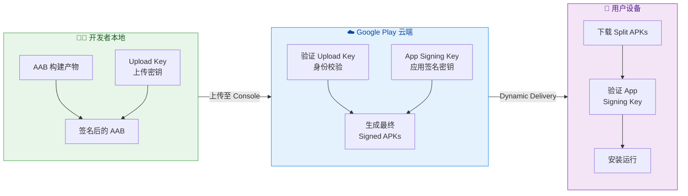
```mermaid
graph LR
    subgraph Developer["👨‍💻 开发者本地"]
        direction TB
        A["AAB 构建产物"]
        B["Upload Key\n上传密钥"]
        C["签名后的 AAB"]
        A --> C
        B --> C
    end

    subgraph GoogleCloud["☁️ Google Play 云端"]
        direction TB
        D["验证 Upload Key\n身份校验"]
        E["App Signing Key\n应用签名密钥"]
        F["生成最终\nSigned APKs"]
        D --> F
        E --> F
    end

    subgraph UserDevice["📱 用户设备"]
        direction TB
        G["下载 Split APKs"]
        H["验证 App\nSigning Key"]
        I["安装运行"]
        G --> H
        H --> I
    end

    Developer -->|"上传至 Console"| GoogleCloud -->|"Dynamic Delivery"| UserDevice

    classDef devStyle fill:#E8F5E9,stroke:#43A047,color:#1B5E20
    classDef cloudStyle fill:#E3F2FD,stroke:#1E88E5,color:#0D47A1
    classDef deviceStyle fill:#F3E5F5,stroke:#8E24AA,color:#4A148C

    class Developer devStyle
    class GoogleCloud cloudStyle
    class UserDevice deviceStyle
```

#### Release Notes（版本说明）

上传 AAB 后，Console 会要求填写 **Release notes**（版本说明）。这段文字会展示在 Google Play 商店应用详情页的 "What's new" 区域，用户在更新前可以看到。建议遵循以下最佳实践：

- 用简洁的列表形式列出本次更新的核心变化（新功能、Bug 修复、性能改善）。
- 如果支持多语言，为每种语言单独编写版本说明。
- 避免使用"Bug fixes and performance improvements"这种笼统描述——Google 的审核指南和用户反馈研究都表明，具体的更新说明能显著提高用户更新意愿。

### Internal Test Track

Google Play Console 提供了一套 **多层级测试轨道（Testing Tracks）** 体系，让开发者能够以不同的范围和策略逐步验证新版本。所有测试轨道按照开放范围从小到大，依次为：**Internal Testing → Closed Testing → Open Testing → Production**。Internal Test Track（内部测试轨道）是这个体系中范围最小、速度最快的一层，专为开发团队的快速内部验证而设计。

#### Internal Testing 的核心特性

Internal Testing 轨道具备几个关键特性，使其成为日常开发迭代中最常用的测试通道：

**1. 极快的发布速度**

与 Closed/Open Testing 和 Production 不同，Internal Testing 的版本上传后 **几乎不需要经过 Google 的完整审核流程**，通常在几分钟内就可以分发给测试人员。这是因为 Internal Testing 的受众极其有限（最多 100 人），且这些人都是开发者明确邀请的内部成员，风险极低。相比之下，Production 轨道的首次审核可能需要数小时甚至数天。这种速度优势使得 Internal Testing 非常适合 **CI/CD 流水线的自动化分发**——每当代码合入主分支并构建出新的 AAB，CI 系统可以自动将其上传到 Internal Testing 轨道，团队成员立即就能在真机上安装测试。

**2. 人数限制：最多 100 人**

Internal Testing 轨道最多允许添加 **100 名测试人员**，通过 Google 账号（Gmail 地址）的邮件列表来管理。被邀请的测试人员会收到一个 **专属的 Opt-in 链接**，点击后即可在 Google Play 商店中看到该测试版本并安装。这 100 人的限制已经足够覆盖大多数中小型团队的内部测试需求。

**3. 不影响 Production 指标**

Internal Testing 轨道中安装的版本 **不会计入 Production 轨道的统计指标**（如崩溃率 Crash Rate、ANR 率等）。这意味着即使测试版本存在较多问题，也不会污染正式版的质量数据。这种隔离性给了开发者极大的自由度去部署尚未完全稳定的版本进行验证。

**4. 版本独立性**

Internal Testing 的 `versionCode` 可以与 Production 轨道的版本 **不连续**。也就是说，你可以在 Internal Testing 中上传 `versionCode = 1000` 的测试版，而 Production 当前是 `versionCode = 42`，两者互不干扰。但需要注意：如果你想将 Internal Testing 中验证通过的版本 **提升（Promote）** 到后续轨道，该版本的 `versionCode` 必须大于目标轨道当前的最新版本。

#### Internal Testing 的操作流程

使用 Internal Testing 的完整操作步骤如下：

1. 在 Console 左侧导航栏进入 **Release > Testing > Internal testing**。
2. 点击 **"Testers"** 标签页，创建一个邮件列表（Email list），将测试人员的 Gmail 地址添加进去。
3. 回到 **"Releases"** 标签页，点击 **"Create new release"**，上传 AAB 文件并填写版本说明。
4. 点击 **"Review release"** 检查有无错误或警告，确认无误后点击 **"Start rollout to Internal testing"**。
5. 发布成功后，复制生成的 **Opt-in URL** 发送给测试人员。
6. 测试人员在浏览器中打开 Opt-in URL，点击接受邀请后，即可在 Google Play 商店中搜索到该应用的测试版本并安装。

#### 结合 CI/CD 自动化分发

在成熟的团队中，Internal Testing 通常不会手动上传，而是集成到 CI/CD 流水线中。Google 官方提供了 **Google Play Developer API**，以及社区维护的 Gradle 插件如 **Gradle Play Publisher**，可以在 CI 环境中自动完成以下操作：

```kotlin
// 使用 Gradle Play Publisher 插件的配置示例 (build.gradle.kts)
plugins {
    // 应用 Gradle Play Publisher 插件
    id("com.github.triplet.play") version "3.9.1"
}

play {
    // 指定 Google Play API 的 Service Account JSON 密钥文件路径
    // 该 Service Account 需在 Console 中授予"Release Manager"权限
    serviceAccountCredentials.set(file("play-service-account.json"))

    // 指定默认上传到 Internal Testing 轨道
    track.set("internal")

    // 上传完成后的状态：completed 表示立即对测试人员可用
    // 也可设为 "draft" 表示先保存为草稿，手动确认后再发布
    releaseStatus.set(com.github.triplet.gradle.androidpublisher.ReleaseStatus.COMPLETED)

    // 自动从 Git Tag 或 CHANGELOG 文件生成版本说明
    // 默认会查找 src/main/play/release-notes/ 目录下的文本文件
    defaultToAppBundles.set(true)
}
```

配合 GitHub Actions 或 GitLab CI，每次合入 `develop` 分支时自动执行 `./gradlew publishBundle`，即可将最新构建产物推送到 Internal Testing 轨道，团队成员在手机上就能收到更新通知——这极大地缩短了 **"代码提交 → 真机验证"** 的反馈循环。

### Alpha/Beta 测试

当版本在 Internal Testing 中经过团队内部验证、确认核心功能无重大问题后，下一步就是扩大测试范围，让更多人参与进来。这就引出了 Console 中的另外两个测试轨道：**Closed Testing（封闭测试，对应传统的 Alpha）** 和 **Open Testing（开放测试，对应传统的 Beta）**。需要特别说明的是，Google Play Console 的 UI 在近年经历过多次改版，早期使用的是 "Alpha Track" 和 "Beta Track" 的叫法，现在统一改为了 "Closed Testing" 和 "Open Testing"，但很多开发者和文档中仍然沿用 Alpha/Beta 的说法，两者本质上是同一套机制。

#### Closed Testing（Alpha 测试）

Closed Testing 是一种 **受邀制** 的测试轨道，只有被开发者明确邀请的用户才能参与。与 Internal Testing 相比，它的关键区别在于：

| 维度 | Internal Testing | Closed Testing |
|------|-----------------|----------------|
| 人数上限 | 100 人 | 无上限（实践中可达数千人） |
| 审核速度 | 几分钟 | 需经过简化审核，通常数小时 |
| 管理方式 | 仅邮件列表 | 邮件列表 **或** Google Groups |
| 轨道数量 | 1 个 | 可创建多个（如 alpha、alpha-02） |
| 典型用途 | 开发团队日常验证 | QA 团队系统测试 / 种子用户体验 |

Closed Testing 支持创建 **多个独立轨道**，这是一个非常强大的功能。例如，你可以创建一个名为 `qa` 的 Closed Testing 轨道专门给 QA 团队做回归测试，同时再创建一个名为 `stakeholders` 的轨道给产品经理和设计师做体验评审，两个轨道可以同时存在不同版本的 AAB，互不干扰。

使用 Closed Testing 的流程与 Internal Testing 类似：创建发布 → 上传 AAB → 管理测试人员列表 → 发布并分享 Opt-in 链接。测试人员通过 Opt-in 链接加入后，便能在 Play Store 中看到并安装测试版本。

前面提到的新账号准入要求（20 名测试人员 + 14 天测试期）指的就是 Closed Testing 轨道。Google 要求新开发者必须先在 Closed Testing 中积累足够的测试数据，才能解锁 Production 发布权限。

#### Open Testing（Beta 测试）

Open Testing 是范围更大的公开测试轨道。与 Closed Testing 的关键区别在于——**任何用户都可以自主加入测试**，无需开发者逐一邀请。在 Google Play 商店中，应用的详情页上会出现一个 **"Join the beta"** 按钮，用户点击即可成为 Beta 测试者并安装测试版本。

Open Testing 的典型使用场景包括：

- **大规模兼容性验证**：当应用需要在数百种不同设备型号上验证兼容性时，Open Testing 能快速聚集大量不同设备的真实用户。
- **功能公测**：某些重大新功能上线前，先通过 Open Beta 收集用户反馈和使用数据，根据反馈进行最后的调优。
- **压力测试**：验证服务器端在大量新用户涌入时的承压能力。

Open Testing 的人数上限非常宽松（无硬性限制），但开发者可以设置 **参与人数上限** 来控制规模。需要注意的是，Open Testing 版本 **会经过 Google 的完整审核**，审核内容和标准与 Production 一致（包括政策合规、内容审查等），因此发布速度会比 Internal/Closed Testing 慢一些。

Open Testing 中用户提交的评价（Reviews）**不会显示在正式版的评价列表中**，而是有独立的反馈通道。但测试用户的崩溃数据会被 Console 记录，开发者可以在 **Android Vitals** 面板中按轨道筛选查看。

#### 测试轨道提升（Promote）

Console 的测试轨道体系设计了一个非常优雅的 **版本提升（Promote）** 机制。当某个版本在低级别轨道验证通过后，开发者可以直接将其 **Promote** 到更高级别的轨道，而不需要重新上传 AAB。提升路径通常是：

```
Internal Testing → Closed Testing → Open Testing → Production
```

Promote 操作在 Console 中只需点击对应 Release 旁边的 **"Promote release"** 按钮，选择目标轨道即可。被 Promote 的版本会携带原始的 AAB 文件和版本信息，但可以为新轨道填写不同的 Release Notes。

这种机制的好处是显而易见的：**同一个二进制产物** 从内部测试一路走到正式发布，中间不会因为重新构建而引入任何差异。你在 Internal Testing 中验证通过的那个 AAB，和最终推送给全球用户的，是 **完全相同的文件**。这极大地保证了测试结果的可信度和发布的确定性。

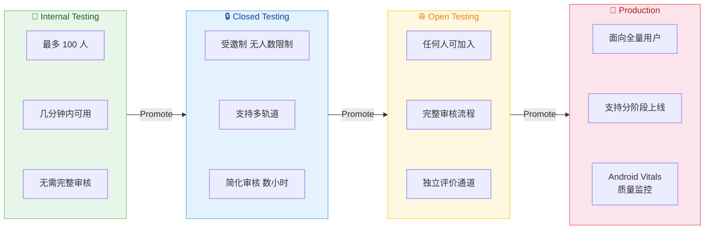
```mermaid
graph LR
    subgraph Internal["🔬 Internal Testing"]
        direction TB
        I1["最多 100 人"]
        I2["几分钟内可用"]
        I3["无需完整审核"]
        I1 ~~~ I2
        I2 ~~~ I3
    end

    subgraph Closed["🔒 Closed Testing"]
        direction TB
        C1["受邀制 无人数限制"]
        C2["支持多轨道"]
        C3["简化审核 数小时"]
        C1 ~~~ C2
        C2 ~~~ C3
    end

    subgraph Open["🌐 Open Testing"]
        direction TB
        O1["任何人可加入"]
        O2["完整审核流程"]
        O3["独立评价通道"]
        O1 ~~~ O2
        O2 ~~~ O3
    end

    subgraph Prod["🏪 Production"]
        direction TB
        P1["面向全量用户"]
        P2["支持分阶段上线"]
        P3["Android Vitals\n质量监控"]
        P1 ~~~ P2
        P2 ~~~ P3
    end

    Internal -->|"Promote"| Closed -->|"Promote"| Open -->|"Promote"| Prod

    classDef internalStyle fill:#E8F5E9,stroke:#66BB6A,color:#1B5E20
    classDef closedStyle fill:#E3F2FD,stroke:#42A5F5,color:#0D47A1
    classDef openStyle fill:#FFF8E1,stroke:#FFCA28,color:#F57F17
    classDef prodStyle fill:#FCE4EC,stroke:#EF5350,color:#B71C1C

    class Internal internalStyle
    class Closed closedStyle
    class Open openStyle
    class Prod prodStyle
```

#### Staged Rollout（分阶段发布）

当版本最终被 Promote 到 Production 轨道后，开发者并不需要一次性面向 100% 用户发布。Console 支持 **Staged Rollout（分阶段发布）**，允许开发者指定一个百分比（如 5%、10%、25%、50%），只向该比例的用户推送新版本，其余用户继续使用旧版本。

分阶段发布的典型策略是：先以 **5%** 起步，观察 24~48 小时内的 Crash 率、ANR 率、用户评分变化等关键指标。如果指标健康，逐步提升到 20% → 50% → 100%。如果在任何阶段发现严重问题，可以立即 **Halt rollout（暂停发布）**，此时已经更新的用户不会被回退，但剩余用户不会再收到新版本推送。如果问题足够严重，开发者可以紧急修复后上传新版本并重新走发布流程。

Staged Rollout 的用户选择是由 Google Play 的服务端随机决定的，开发者无法指定具体哪些用户先收到更新。但 Google 的分配算法会尽量确保 **设备型号和地区的多样性**，使得小比例的样本也能较好地代表整体用户群的设备分布。

```kotlin
// 使用 Google Play Developer API (Publishing API v3) 进行 Staged Rollout 的伪代码
// 实际使用中需要通过 google-api-services-androidpublisher 库调用

// 1. 创建 Edit（编辑会话），所有修改都在 Edit 中进行
val edit = androidPublisher
    .edits()                          // 获取 Edits 资源
    .insert(packageName, null)        // 为指定包名创建新的编辑会话
    .execute()                        // 执行请求，返回 Edit 对象

// 2. 配置 Production 轨道，设置分阶段发布比例为 10%
val track = Track().apply {
    // 目标轨道为 production
    track = "production"
    // 配置发布列表
    releases = listOf(
        TrackRelease().apply {
            // 指定要发布的 versionCode（需与上传的 AAB 一致）
            versionCodes = listOf(42L)
            // 设置为 inProgress 表示分阶段发布中（非全量）
            status = "inProgress"
            // 分阶段发布比例：0.1 = 10% 的用户
            userFraction = 0.1
            // 版本说明，按语言分别配置
            releaseNotes = listOf(
                LocalizedText().apply {
                    language = "en-US"
                    text = "Bug fixes and new features"
                },
                LocalizedText().apply {
                    language = "zh-CN"
                    text = "修复若干问题，新增重要功能"
                }
            )
        }
    )
}

// 3. 将轨道配置更新到 Edit 中
androidPublisher
    .edits()
    .tracks()                         // 获取 Tracks 子资源
    .update(packageName, edit.id, "production", track)  // 更新 production 轨道
    .execute()

// 4. 提交 Edit，使所有变更生效
androidPublisher
    .edits()
    .commit(packageName, edit.id)     // 提交编辑会话
    .execute()                        // 此时 10% 用户将开始收到新版本
```

#### Pre-launch Report（发布前报告）

值得一提的是，当开发者上传 AAB 到任何测试轨道或 Production 轨道时，Google Play 会自动触发 **Pre-launch Report**（发布前报告）。这项服务基于 **Firebase Test Lab** 的基础设施，Google 会在多种真实设备上自动安装并运行你的应用，通过 **Robo Test**（一种自动化爬虫测试工具）模拟用户操作，检测以下问题：

- **崩溃（Crashes）**：自动运行中遇到的任何未捕获异常或 Native Crash。
- **安全漏洞（Security Vulnerabilities）**：检测已知的安全风险模式。
- **性能问题（Performance Issues）**：启动时间异常、渲染卡顿等。
- **无障碍性问题（Accessibility Issues）**：如对比度不足、缺少内容描述等。

Pre-launch Report 的结果会在 Console 的 **Release > Pre-launch report** 页面展示，包含截图、日志和问题详情。这是一个免费且自动运行的质量保障工具，强烈建议开发者在每次发布前仔细查看报告结果。

#### 发布流程最佳实践总结

综合以上内容，一个成熟团队的标准发布流程通常遵循以下模式：

1. **日常开发阶段**：CI 自动构建并上传到 **Internal Testing**，开发人员和 QA 在真机上进行冒烟测试（Smoke Test）。
2. **Sprint 结束 / Feature 完成**：将验证通过的版本 Promote 到 **Closed Testing**，邀请更大范围的 QA 团队和种子用户进行系统测试。
3. **回归测试通过后**：Promote 到 **Open Testing**，面向公开 Beta 用户收集兼容性和体验反馈。
4. **Beta 稳定后**：Promote 到 **Production**，以 **5~10%** 的 Staged Rollout 起步。
5. **监控关键指标**：在 Android Vitals 中密切关注 Crash-free Rate（无崩溃率）、ANR Rate、用户评分变化。
6. **逐步放量**：如果指标健康，每隔 24~48 小时提升发布比例，直到 100%。
7. **应急回退**：如果发现严重问题，立即 Halt Rollout，修复后重新走流程。

这套分级发布机制的核心哲学是 **"逐步扩大爆炸半径"（Progressive Blast Radius Expansion）**——每一级轨道的受众规模都比上一级更大，出问题时的影响范围也更大，因此需要更充分的前置验证。通过严格遵循这套流程，可以将线上事故的风险降到最低，同时保持高效的迭代速度。

---

**📝 练习题**

在 Google Play Console 中，团队希望尽快将每日 CI 构建产物分发给 10 名开发人员进行冒烟测试，且不希望影响 Production 轨道的崩溃率指标。以下哪种方式最合适？

A. 直接上传到 Production 轨道，使用 1% 的 Staged Rollout 限制范围


B. 上传到 Open Testing 轨道，将测试人员加入 Beta 计划


C. 上传到 Internal Testing 轨道，通过邮件列表邀请测试人员


D. 通过邮件发送 APK 文件，绕过 Google Play Console

**【答案】** C

**【解析】** Internal Testing 轨道专为此类场景设计：它最多支持 100 名测试人员（10 名完全在范围内），发布后几分钟内即可安装（无需完整审核流程），并且测试版本的崩溃数据 **不会计入 Production 轨道的 Android Vitals 指标**，完全满足"不影响正式版质量数据"的要求。选项 A 虽然 Staged Rollout 1% 能限制范围，但 Production 轨道的所有数据都会计入正式指标，且需要完整审核流程，速度慢。选项 B 的 Open Testing 同样需要完整审核，且对所有用户可见，不适合日常快速迭代。选项 D 虽然技术上可行，但绕过了 Console 的签名验证和版本管理体系，无法利用 Dynamic Delivery 的优势，也失去了 Pre-launch Report 等质量保障功能，不是最佳实践。

---

**📝 练习题**

关于 Google Play App Signing 的双密钥机制，以下说法正确的是？

A. Upload Key 丢失后必须用新包名重新发布应用，无法恢复


B. App Signing Key 存储在开发者本地，Upload Key 存储在 Google 云端


C. 用户设备上验证的是 Upload Key 的签名，而非 App Signing Key


D. Upload Key 用于向 Console 证明上传者身份，App Signing Key 用于对最终分发给用户的 APK 签名

**【答案】** D

**【解析】** 在 Play App Signing 的双密钥体系中，Upload Key 由开发者本地持有，其唯一作用是向 Console 证明"这次上传确实来自合法的开发者"；App Signing Key 由 Google 在云端安全保管，用于对最终分发到用户设备的 APK 进行签名。用户设备在安装和更新时校验的是 App Signing Key 的签名。选项 A 错误，Upload Key 丢失后可以联系 Google 重置，正因为 App Signing Key 安全地保存在 Google 端不受影响。选项 B 颠倒了两把密钥的存储位置。选项 C 颠倒了设备端验证的密钥对象。只有选项 D 正确描述了双密钥的职责分工。

---

## 对齐工具 Zipalign

在 Android 打包流程的最后阶段，有一个看似不起眼却对运行时性能影响深远的工具——**Zipalign**。它的职责非常单一：确保 APK 内部所有 **未压缩数据（uncompressed entries）** 相对于文件起始位置按照 **4 字节边界（4-byte boundary）** 对齐。这项操作不会改变 APK 的功能逻辑，却能显著改善应用在设备上运行时的 **内存访问效率**。要理解为什么"对齐"如此重要，我们必须从 ZIP 文件格式、操作系统的内存映射机制以及 Android 资源加载管线三个维度来展开。

### 4 字节对齐优化

#### 为什么需要"对齐"

APK 本质上是一个标准的 **ZIP 归档文件**。ZIP 格式对内部每一个 entry（文件条目）的存储位置并不做严格的对齐约束——也就是说，一个文件可能从文件偏移量的任意字节开始。这在纯粹的解压缩场景下不会造成任何问题，因为解压时数据会被完整读入用户态缓冲区再处理。然而，Android 系统在运行时访问 APK 中的资源时，并 **不是** 将整个 APK 解压到磁盘，而是通过 **内存映射（mmap）** 直接在虚拟地址空间中访问 APK 文件的特定区域。这意味着 CPU 在访问这些数据时，实际上是在对一段映射到文件的虚拟内存进行读取。

现代 CPU 架构（ARM、x86）在访问内存时有一个基本特性：当数据地址是 **自然对齐（naturally aligned）** 的——即 4 字节数据的起始地址是 4 的倍数——处理器可以在 **单个总线周期** 内完成读取；若数据跨越了对齐边界，处理器则需要 **两次内存访问** 再拼接结果，甚至在某些严格对齐的架构（如早期 ARM）上直接触发 **对齐异常（alignment fault）**，由内核 trap 处理后返回结果，代价极其高昂。

因此，Zipalign 做的事情本质上是：**在 ZIP 格式允许的范围内，通过调整每个 entry 前面的 Local File Header 中的 extra field 长度，插入适量的填充字节（padding），使得该 entry 的 file data 起始偏移恰好落在 4 字节边界上。** 对于已经压缩的 entry（如 `.dex`、`.arsc` 之外的大多数文件），对齐并无意义，因为它们需要解压后才能使用；Zipalign 只针对 **store 模式（不压缩）** 存储的条目进行对齐处理。

#### ZIP Local File Header 的结构与填充机制

为了更准确地理解填充过程，我们需要了解 ZIP 格式中 **Local File Header** 的布局：

```text
┌──────────────────────────────────────────────────────────┐
│              ZIP Local File Header (30+ bytes)            │
├────────────────────┬─────────────────────────────────────┤
│  Signature (4B)    │  0x04034b50                         │
│  Version (2B)      │  解压所需最低版本                     │
│  Flags (2B)        │  通用位标志                          │
│  Compression (2B)  │  0=Store, 8=Deflate                 │
│  Mod Time (2B)     │  最后修改时间                        │
│  Mod Date (2B)     │  最后修改日期                        │
│  CRC-32 (4B)       │  原始数据校验                        │
│  Compressed (4B)   │  压缩后大小                          │
│  Uncompressed (4B) │  原始大小                            │
│  Name Len (2B)     │  文件名长度 N                        │
│  Extra Len (2B)    │  扩展字段长度 E                      │
├────────────────────┴─────────────────────────────────────┤
│  File Name (N bytes)                                      │
│  Extra Field (E bytes)  ← Zipalign 在此插入 padding       │
├──────────────────────────────────────────────────────────┤
│  File Data (实际内容)    ← 目标：此处偏移 % 4 == 0         │
└──────────────────────────────────────────────────────────┘
```

**Local File Header 固定部分** 占 30 字节，加上 **File Name**（长度 N）和 **Extra Field**（长度 E），总头部长度为 `30 + N + E`。紧随其后的就是 **File Data** 的起始位置。Zipalign 的算法非常直观：

1. 扫描 ZIP 中每一个 entry；
2. 对于 compression method 为 **0（Store）** 的条目，计算当前 File Data 的文件偏移量 `offset`；
3. 计算 `padding = (4 - (offset % 4)) % 4`，即需要插入多少字节才能使 `offset` 对齐到 4 的倍数；
4. 将这些 padding 字节追加到 **Extra Field** 末尾，并更新 Extra Len 字段；
5. 重新写出整个 ZIP 文件（因为后续所有 entry 的偏移都可能因为前面的 padding 改变而级联变化）。

这里有一个关键细节：**Zipalign 操作会改变 APK 文件的二进制内容**，因此它必须在 **签名之后** 还是 **签名之前** 执行，取决于签名版本：

| 签名版本 | Zipalign 时机 | 原因 |
|---------|-------------|------|
| **V1 (JAR)** | 签名 **之前** 执行 Zipalign | V1 签名只校验每个 entry 的内容，不校验 Local File Header 中 Extra Field 的变化，但出于工具链稳定性考虑，官方推荐先对齐再签名 |
| **V2/V3/V4** | 签名 **之前** 执行 Zipalign | V2+ 签名覆盖了整个 APK 文件的二进制内容（除了 APK Signing Block 本身），任何签名后的字节修改都会导致签名失效 |

在 AGP（Android Gradle Plugin）的现代构建流水线中，这个顺序已经被自动管理：`assembleRelease` 任务链中，Zipalign 任务（`zipAlignRelease`）总是排在签名任务（`signingRelease`）**之前**执行，开发者无需手动干预。

#### 命令行用法

虽然 AGP 自动处理了对齐，但在调试或 CI 脚本中，手动使用 `zipalign` 命令仍然很常见。该工具位于 Android SDK 的 `build-tools/<version>/` 目录下：

```bash
# 对齐操作：将 input.apk 按 4 字节对齐后输出为 output.apk
# -p：保留 PageAlignment（针对 .so 文件使用 4096 字节对齐）
# -f：强制覆盖已有输出文件
# -v：输出详细日志
# 4：对齐边界，单位字节（固定为 4）
zipalign -p -f -v 4 input.apk output.apk
```

```bash
# 校验操作：检查 APK 是否已正确对齐
# -c：check 模式，不执行对齐，只报告结果
# -v：输出每个 entry 的对齐状态
zipalign -c -v 4 my-app.apk
```

校验输出示例如下：

```text
 2364187 res/drawable-hdpi/icon.png (OK - compressed)
 2389Additionally res/raw/data.bin (WRONG OFFSET - should be 4-byte aligned)
Verification FAILED
```

标注 `(OK - compressed)` 的条目表示它是压缩存储的，Zipalign 不要求它对齐。而标注 `WRONG OFFSET` 则说明该 Store 模式的条目未正确对齐，需要重新执行 `zipalign` 处理。

#### 4096 字节对齐：Shared Library 的特殊要求

从 Android 11（API 30）开始，系统对 APK 内嵌的 **原生共享库（`.so` 文件）** 提出了更严格的对齐要求：必须按 **4096 字节（即一个内存页的大小）对齐**，而不仅仅是 4 字节。这是因为 `.so` 文件在运行时会被 `dlopen()` 通过 `mmap` 以 **页为单位** 映射到进程地址空间。如果 `.so` 在 APK 中的偏移不是页对齐的，`linker` 就无法直接从 APK 中映射，而必须先将 `.so` **解压到磁盘临时目录** 再加载，这不仅浪费磁盘空间，还增加了应用的首次启动时间。

`zipalign` 的 `-p` 参数（**page-align shared libraries**）正是为此而生。启用该参数后，工具会识别出 `.so` 文件并将其对齐到 4096 字节边界，其余 Store 条目仍然保持 4 字节对齐。AGP 4.0+ 默认在构建流水线中启用了 `-p` 选项。

以下 Mermaid 图展示了 Zipalign 在整个 APK 构建流程中的位置以及 4 字节/4096 字节对齐的分类逻辑：

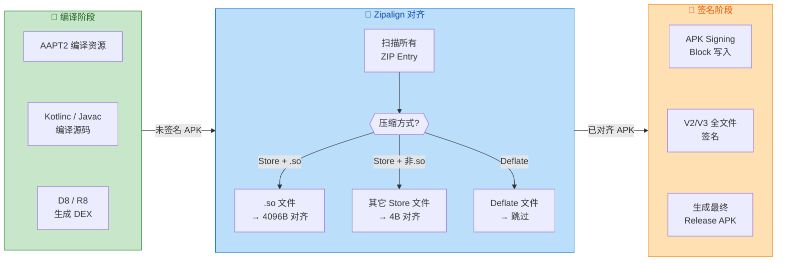
```mermaid
graph LR
    subgraph Build["🔨 编译阶段"]
        direction TB
        A1["AAPT2 编译资源"]
        A2["Kotlinc / Javac\n编译源码"]
        A3["D8 / R8\n生成 DEX"]
        A1 ~~~ A2
        A2 ~~~ A3
    end

    subgraph Align["📐 Zipalign 对齐"]
        direction TB
        B1["扫描所有\nZIP Entry"]
        B2{{"压缩方式?"}}
        B3[".so 文件\n→ 4096B 对齐"]
        B4["其它 Store 文件\n→ 4B 对齐"]
        B5["Deflate 文件\n→ 跳过"]
        B1 --> B2
        B2 -->|"Store + .so"| B3
        B2 -->|"Store + 非.so"| B4
        B2 -->|"Deflate"| B5
    end

    subgraph Sign["🔑 签名阶段"]
        direction TB
        C1["APK Signing\nBlock 写入"]
        C2["V2/V3 全文件\n签名"]
        C3["生成最终\nRelease APK"]
        C1 ~~~ C2
        C2 ~~~ C3
    end

    Build -->|"未签名 APK"| Align
    Align -->|"已对齐 APK"| Sign

    classDef buildStyle fill:#C8E6C9,stroke:#388E3C,color:#1B5E20
    classDef alignStyle fill:#BBDEFB,stroke:#1976D2,color:#0D47A1
    classDef signStyle fill:#FFE0B2,stroke:#F57C00,color:#E65100

    class Build buildStyle
    class Align alignStyle
    class Sign signStyle
```

### 内存映射 mmap 效率提升

#### mmap 的工作原理

要真正理解 Zipalign 为何重要，就必须深入理解 **`mmap`（memory-mapped file I/O）** 的机制。`mmap` 是 Linux/Android 内核提供的一个系统调用，它允许将一个文件（或文件的一部分）直接映射到进程的 **虚拟地址空间**。映射建立后，进程可以像访问普通内存一样通过 **指针解引用（pointer dereference）** 来读取文件内容，而无需显式调用 `read()` 系统调用。

其核心流程如下：

1. **建立映射**：进程调用 `mmap(addr, length, prot, flags, fd, offset)`，内核在进程的虚拟地址空间中分配一段区域，并在页表中建立 **虚拟页 → 文件页** 的映射关系。此时，**物理内存尚未分配**，页表条目标记为 "not present"。

2. **首次访问触发缺页（Page Fault）**：当进程首次访问映射区域内的某个地址时，CPU 发现对应页表项无效，触发 **缺页异常（page fault）**。内核捕获该异常后，从磁盘将对应的 **4KB 页（page）** 读入物理内存，更新页表，进程继续执行。

3. **后续访问命中缓存**：同一页被再次访问时，数据已在物理内存中（Page Cache），访问速度等同于普通内存操作，不产生任何 I/O 开销。

4. **内存压力时回收**：当系统内存紧张时，内核可以直接 **丢弃** 来自 mmap 只读映射的物理页（因为随时可从文件重新加载），不需要写入 swap，这使得 mmap 在内存管理上非常高效。

以下展示了 mmap 从建立映射到数据加载的完整时序：

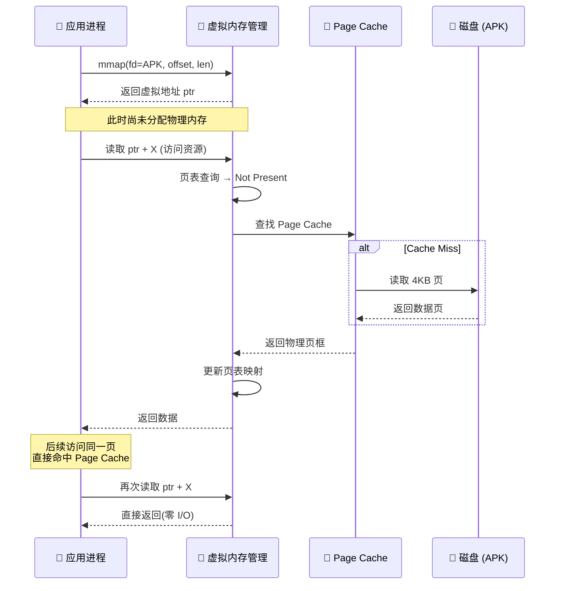
```mermaid
sequenceDiagram
    participant App as 📱 应用进程
    participant VM as 🧠 虚拟内存管理
    participant PC as 💾 Page Cache
    participant Disk as 📀 磁盘 (APK)

    App->>VM: mmap(fd=APK, offset, len)
    VM-->>App: 返回虚拟地址 ptr

    Note over App,VM: 此时尚未分配物理内存

    App->>VM: 读取 ptr + X (访问资源)
    VM->>VM: 页表查询 → Not Present
    VM->>PC: 查找 Page Cache
    
    alt Cache Miss
        PC->>Disk: 读取 4KB 页
        Disk-->>PC: 返回数据页
    end

    PC-->>VM: 返回物理页框
    VM->>VM: 更新页表映射
    VM-->>App: 返回数据

    Note over App: 后续访问同一页<br/>直接命中 Page Cache
    App->>VM: 再次读取 ptr + X
    VM-->>App: 直接返回(零 I/O)
```

#### mmap 与 APK 资源访问的关系

Android Framework 中，**`AssetManager`** 和 **`Resources`** 在加载应用资源时，底层正是通过 `mmap` 来访问 APK 文件的。特别是以下几类数据会被直接 mmap：

- **`resources.arsc`（编译后的资源表）**：这个文件在 APK 中以 **Store 模式（不压缩）** 存储。`AssetManager` 初始化时会将其 mmap 到内存，后续所有资源 ID 查询（`getIdentifier()`、`getString()`）都直接在这段映射内存上进行二分查找。如果 `resources.arsc` 的起始偏移未对齐到 4 字节边界，那么每一次资源查找中涉及的 32 位整数读取都可能跨越对齐边界，导致额外的 CPU 周期开销。

- **原生 `.so` 库**：如前所述，动态链接器通过 `mmap` 以页为单位将 `.so` 文件映射到进程空间。4096 字节对齐保证了文件中的页边界与虚拟内存的页边界 **严格重合**，避免了 "一个虚拟页跨越两个文件页" 的情况。

- **未压缩的 Asset 文件**：通过 `AssetManager.open()` 以 `ACCESS_BUFFER` 模式打开的 asset 文件，如果它们在 APK 中是未压缩存储的（通过 `aaptOptions { noCompress }` 配置），也会走 mmap 路径。常见的例子包括自定义字体文件（`.ttf`）、预训练模型文件（`.tflite`）等。

#### 未对齐时的性能代价

让我们用一个具体的内存视图来理解对齐与未对齐的差异：

```text
【已对齐场景】resources.arsc 偏移 = 0x1000（4096，4字节对齐 ✓）

 APK 文件偏移:    0x1000    0x1004    0x1008    0x100C
                  ┌─────────┬─────────┬─────────┬─────────┐
 mmap 虚拟地址:   │ int32_A │ int32_B │ int32_C │ int32_D │
                  └─────────┴─────────┴─────────┴─────────┘
                  ↑ 对齐的   ↑ 对齐的   ↑ 对齐的   ↑ 对齐的
                  1次总线访问  1次总线访问  1次总线访问  1次总线访问


【未对齐场景】resources.arsc 偏移 = 0x1002（未对齐 ✗）

 APK 文件偏移:  0x1000  0x1002    0x1006    0x100A    0x100E
               ┌──┬─────────┬─────────┬─────────┬─────────┬──┐
 mmap 地址:    │??│ int32_A │ int32_B │ int32_C │ int32_D │??│
               └──┴─────────┴─────────┴─────────┴─────────┴──┘
                   ↑ 跨边界!   ↑ 跨边界!   ↑ 跨边界!   ↑ 跨边界!
                   需2次访问    需2次访问    需2次访问    需2次访问
                   + 拼接操作   + 拼接操作   + 拼接操作   + 拼接操作
```

在未对齐的场景下，每一个 4 字节整数的读取都横跨了两个 4 字节的对齐块，处理器需要：

1. 先读取前一个 4 字节块，提取高位部分；
2. 再读取后一个 4 字节块，提取低位部分；
3. 将两部分通过移位和位或操作拼接成完整的 32 位值。

对于像 `resources.arsc` 这样在应用运行期间被 **高频访问** 的资源索引表，这种开销会在数以万计的资源查找中累积放大。Google 官方的基准测试数据显示，未对齐的 APK 在资源密集型操作（如 `Activity` 启动、复杂布局 `inflate`）中，**性能可退化至对齐版本的 60%~70%**。

#### mmap 的另一个优势：共享物理内存

mmap 还带来了一个容易被忽视的收益——**多进程间共享物理页**。Android 设备上，如果同一个 APK 被多个进程访问（例如应用的主进程与其 `:remote` 子进程），内核只需要将 APK 文件的物理页加载一次到 Page Cache，多个进程的 mmap 映射 **共享同一组物理页框**。这意味着：

- 未压缩资源只在物理内存中保留 **一份** 拷贝，而非每个进程各持有一份。
- 对齐后的数据允许内核以最高效率管理这些共享页，因为每一页的起止边界都与文件数据的逻辑边界一致，不会出现 "一页内混合了两个 entry 的数据" 这种碎片化情况。

与此形成对比的是，如果资源必须先 **解压到堆内存（heap）** 才能使用（即压缩存储且未对齐的情况），那么每个进程都必须在自己的 **Dalvik/ART Heap** 或 **Native Heap** 中持有一份独立拷贝，内存开销成倍增长。

#### 完整的优化效果对比

下表总结了 Zipalign 对齐前后在各维度的性能差异：

| 维度 | 未对齐 | 4 字节对齐 | 4096 字节对齐（.so） |
|------|-------|-----------|-------------------|
| **CPU 资源读取** | 每次 32-bit 读可能 2 次总线操作 | 单次总线操作 | 单次总线操作 |
| **resources.arsc 加载** | mmap 后读取可能触发对齐异常 | 直接指针访问，零额外开销 | — |
| **.so 加载方式** | 需解压到临时目录再 `dlopen` | — | 直接从 APK 内 mmap 加载 |
| **多进程内存共享** | 解压到 heap，每进程独立拷贝 | mmap 共享 Page Cache | mmap 共享，页边界精确对齐 |
| **磁盘空间** | 需额外解压空间 | 无额外空间 | 无额外空间 |
| **首次启动时间** | .so 解压耗时数百 ms | — | 省去解压，提速显著 |

#### AGP 中的自动化配置

在现代 Android 项目中，Zipalign 通常无需手动配置。AGP 的 `signingConfig` 和 `buildTypes` 配置会自动安排对齐任务。但了解相关的 Gradle 属性仍然有价值，特别是在排查构建问题时：

```kotlin
// build.gradle.kts (app module)
android {
    buildTypes {
        // Release 构建类型默认开启 zipalign
        release {
            // isMinifyEnabled 启用 R8 代码缩减（与 Zipalign 无直接关系，但通常一起配置）
            isMinifyEnabled = true
            // isShrinkResources 启用资源缩减
            isShrinkResources = true
            // proguardFiles 指定混淆规则文件
            proguardFiles(
                getDefaultProguardFile("proguard-android-optimize.txt"),
                "proguard-rules.pro"
            )
            // signingConfig 配置签名信息
            signingConfig = signingConfigs.getByName("release")
        }
        // Debug 构建类型也会执行 zipalign，但优先级较低
        debug {
            // debug 包默认使用 debug keystore 自动签名
            // zipalign 同样会执行，确保开发阶段的行为一致性
        }
    }

    // packagingOptions 可控制哪些文件不压缩（Store 模式）
    // 这直接影响 Zipalign 需要处理的条目范围
    packaging {
        // jniLibs 的 useLegacyPackaging 控制 .so 是否压缩存储
        // false（默认）= Store 模式 → Zipalign 将对其 4096 字节对齐
        // true = 压缩存储 → 运行时需解压，Zipalign 跳过
        jniLibs {
            useLegacyPackaging = false // 推荐 false，配合 Zipalign 4096 对齐
        }
        // resources.excludes 排除不需要的文件
        resources {
            excludes += "/META-INF/{AL2.0,LGPL2.1}"
        }
    }
}
```

一个值得注意的配置是 **`jniLibs.useLegacyPackaging`**。在 AGP 4.2+ 中，当 `minSdk >= 23`（Android 6.0+）时，该值默认为 `false`，意味着 `.so` 文件以未压缩方式存储在 APK 中。这与 Zipalign 的 4096 字节对齐配合，使得系统可以直接从 APK 中 `mmap` 加载 `.so`，无需解压。如果你将其设为 `true`（旧行为），`.so` 文件会被压缩，安装时系统会将其解压到 `data/app/<package>/lib/` 目录，增加了安装时间和磁盘占用，但会减小 APK 的下载体积。这是一个 **空间与时间的权衡**。

#### CI/CD 环境中的手动验证

在持续集成环境中，建议在产出 Release APK 后增加一个 **验证步骤**，确保对齐正确：

```bash
#!/bin/bash
# ci_verify_alignment.sh
# 在 CI 流水线中验证 APK 对齐状态

# 定义 Android SDK build-tools 路径
BUILD_TOOLS="${ANDROID_HOME}/build-tools/34.0.0"

# 目标 APK 路径
APK_PATH="app/build/outputs/apk/release/app-release.apk"

# 执行 4 字节对齐验证
# -c 表示 check 模式（只验证，不修改）
# -v 输出详细信息
# 4 表示对齐边界
echo "=== Verifying 4-byte alignment ==="
${BUILD_TOOLS}/zipalign -c -v 4 "${APK_PATH}"

# 捕获返回码：0 表示对齐正确，非 0 表示存在问题
if [ $? -ne 0 ]; then
    echo "❌ Zipalign verification FAILED!"
    exit 1  # CI 流水线标记为失败
else
    echo "✅ Zipalign verification PASSED."
fi
```

---

**📝 练习题**

在 Android 构建流程中，关于 Zipalign 工具的描述，以下哪一项是 **正确的**？


A. Zipalign 会对 APK 中所有文件（包括 Deflate 压缩的文件）进行 4 字节对齐处理


B. 当使用 V2 签名方案时，应先执行签名再执行 Zipalign 对齐，否则签名校验会覆盖对齐结果


C. Zipalign 通过调整 ZIP Local File Header 中的 Extra Field 长度来插入填充字节，使 Store 模式存储的 Entry 数据起始偏移对齐到 4 字节边界


D. Zipalign 的 `-p` 参数会将所有文件统一对齐到 4096 字节边界，以匹配内存页大小


**【答案】** C

**【解析】** Zipalign 的核心原理正是修改 ZIP Local File Header 中 Extra Field 的长度来插入填充字节，仅针对 **Store 模式（未压缩）** 的 entry 进行对齐处理。选项 A 错误在于 Deflate 压缩的文件不会被对齐处理，因为它们需要解压后才能使用，mmap 直接访问的场景不适用于它们。选项 B 因果倒置：使用 V2/V3 签名时，**必须先执行 Zipalign 再签名**，因为 V2+ 签名覆盖了整个 APK 的二进制内容，签名后的任何字节修改（包括 Zipalign 插入 padding）都会导致签名失效。选项 D 的错误在于 `-p` 参数仅对 **`.so` 共享库文件** 应用 4096 字节对齐，其余 Store 模式文件仍然保持 4 字节对齐，并非统一对齐到 4096 字节。

---

**📝 练习题**

某应用在低端设备上启动时，Logcat 显示 `.so` 库加载耗时异常偏高（约 800ms），分析后发现 `.so` 文件在 APK 中以未压缩方式存储。最可能的原因是什么？


A. `.so` 文件未经过 Strip 处理，包含了调试符号导致体积过大


B. APK 未经过 Zipalign 处理（或未使用 `-p` 参数），`.so` 文件未按 4096 字节对齐，导致系统无法直接从 APK 中 mmap 加载，退化为解压到临时目录的方式


C. 设备 CPU 架构与 `.so` 的 ABI 不匹配，触发了兼容层模拟执行


D. `minSdk` 设置低于 23，系统强制将 `.so` 解压到磁盘


**【答案】** B

**【解析】** 当 `.so` 文件以未压缩方式存储在 APK 中时，动态链接器会尝试通过 `mmap` 直接从 APK 中映射加载。但这要求 `.so` 的文件偏移必须按 **4096 字节（内存页大小）** 对齐。如果 APK 未执行 `zipalign -p` 处理，`.so` 的偏移很可能不在页边界上，此时系统无法直接映射，只能将其 **拷贝/解压到 `/data/app/<pkg>/lib/` 目录**，这一操作在低端设备上可能耗时数百毫秒。选项 A 虽然调试符号会增大文件，但 mmap 是按需加载的（lazy loading），体积大不会直接导致如此显著的启动延迟。选项 C 描述的 ABI 不匹配通常会导致 `UnsatisfiedLinkError` 异常而非加载缓慢。选项 D 中 `minSdk < 23` 确实会影响 `useLegacyPackaging` 的默认值，但题目已说明 `.so` 是未压缩存储，说明打包配置本身是正确的，问题出在对齐环节。

---

## 本章小结

本章围绕 Android 应用从 **源码编译** 到 **最终分发** 的完整链路，系统性地拆解了"打包与签名"这一工程化核心主题。整条链路可以浓缩为一个关键问题：**如何把开发者编写的代码、资源、配置，安全且高效地变成用户设备上可运行的应用？** 以下从八个维度回顾本章的知识脉络与核心要点。

---

### APK 结构：理解产物的"骨架"

一切打包知识的起点是 APK 文件本身。APK 本质上是一个遵循 ZIP 格式的归档文件，其内部由五大核心组成部分构成：**DEX 代码文件**承载了所有经过编译的 Java/Kotlin 字节码（已从 JVM `.class` 格式转译为 Dalvik/ART 可执行的 DEX 格式）；**resources.arsc 资源表**是一张扁平化的键值索引表，负责将资源 ID（如 `R.string.app_name`）映射到不同配置下的具体资源值，使运行时能够根据设备语言、屏幕密度等条件快速定位资源；**AndroidManifest.xml** 是应用的"身份证"与"能力声明书"，经过二进制 XML 编码后体积更小、解析更快，系统的 PackageManagerService 在安装时正是通过解析它来注册四大组件、权限与 Intent Filter；**res/ 目录**存放了实际的资源文件（布局、图片、动画等），与 `resources.arsc` 配合完成资源的查找与加载；**META-INF/ 目录**则是签名信息的载体，包含摘要清单与签名证书，是系统验证应用完整性与来源合法性的关键依据。

理解 APK 结构的意义在于：**后续所有的签名、对齐、缩减、拆分操作，都是围绕这个 ZIP 包内的具体组成部分展开的**。知道了"包里有什么"，才能理解"对包做了什么"以及"为什么要这样做"。

---

### Android App Bundle：面向分发的"智能包"

传统的 APK 是一个"大一统"的产物——无论用户的设备是什么屏幕密度、什么 CPU 架构、什么语言，APK 都包含了所有变体的资源和 native 库。这意味着大量用户下载了自己根本用不到的内容。**Android App Bundle（AAB）** 正是为了解决这一问题而设计的新一代发布格式。

AAB 本身 **并不是用户安装的最终产物**，而是开发者上传到 Google Play 的中间格式。Google Play 的 **Dynamic Delivery** 机制会根据每台设备的具体配置（屏幕密度、ABI 架构、系统语言），从 AAB 中裁剪出最精确匹配的 **Split APKs** 组合——一个 Base APK 加上若干 Configuration Split APK。这样，一台 `arm64-v8a` + `xxhdpi` + `zh` 的设备，就只会下载对应这三项配置的资源与库文件，**平均可缩减 15%–30% 的下载体积**。

此外，AAB 还支持 **Dynamic Feature Module**，允许将非核心功能模块按需下载，进一步降低首次安装体积。理解 AAB 的关键在于认识到：**打包格式的演进反映了分发模型的演进**——从"一个包打天下"到"按需定制、精准投递"。

---

### 签名机制：从 V1 到 V4 的安全演进

签名是 Android 安全模型中极为关键的一环。系统通过签名来确认 **"这个包确实由声称的开发者发布"** 以及 **"这个包在传输过程中没有被篡改"**。本章梳理了四代签名方案的演进脉络：

- **V1（JAR Signature）** 是最早的方案，逐文件计算摘要并存入 `META-INF/MANIFEST.MF`，再对摘要文件本身签名。它的致命弱点是 **无法保护 ZIP 元数据**（如文件注释、额外字段），攻击者可以在不破坏签名的情况下注入恶意内容（典型的 Janus 漏洞）。

- **V2（APK Signature Scheme v2）** 从 Android 7.0 引入，**直接对整个 APK 文件进行分块摘要与签名**，签名数据存放在 ZIP Central Directory 之前新开辟的 **APK Signing Block** 区域。由于覆盖了文件的全部字节内容（除签名块本身），任何对 APK 的修改都会导致签名校验失败，安全性大幅提升，同时因为不需要解压逐文件校验，**安装时的验证速度也显著加快**。

- **V3（APK Signature Scheme v3）** 在 V2 的基础上增加了 **密钥轮替（Key Rotation）** 能力。通过在签名块中嵌入 `proof-of-rotation` 链式结构，开发者可以在不丧失应用更新权限的前提下更换签名密钥——这解决了长期以来"签名密钥一旦泄露就只能弃用包名"的痛点。

- **V4（APK Signature Scheme v4）** 面向 **ADB 增量安装（Incremental Installation）** 场景，采用 Merkle Hash Tree 结构，允许在文件尚未完全传输时就开始逐块校验与安装，极大提升了开发调试阶段的部署效率。

四代方案并非互斥，而是 **向后兼容、层层叠加** 的：一个现代 APK 通常同时携带 V1 + V2 + V3 签名，系统会选择当前版本支持的最高方案进行校验。

---

### 密钥库管理：守护签名的"钥匙"

签名方案再安全，如果密钥本身管理不善，一切形同虚设。**Keystore** 文件是存放私钥与证书链的加密容器，本章对比了两种主流格式：**JKS（Java KeyStore）** 是 Java 生态的传统格式，采用较老的专有加密算法；**PKCS#12（.p12/.pfx）** 是行业标准格式，安全性更高、跨平台兼容性更好，也是当前 `keytool` 工具的默认推荐格式。

在工程实践中，密钥管理的核心原则是 **"绝不将 Keystore 文件和密码提交到版本控制系统"**。推荐的做法是将密码存放在 CI/CD 系统的 Secret 变量或本地未纳入 Git 的 `local.properties` 中，并在 `build.gradle` 的 `signingConfigs` 中动态引用。对于上架 Google Play 的应用，还应启用 **Play App Signing**，将上传密钥与真正的应用签名密钥分离——即使上传密钥泄露，也可以联系 Google 重置，而应用签名密钥始终由 Google 的安全基础设施托管。

---

### 资源缩减与压缩：给包"瘦身"

包体积直接影响用户的下载转化率和留存率。本章介绍了三项核心瘦身手段：

**`shrinkResources`** 与 R8/ProGuard 的 `minifyEnabled` 配合使用，能够在编译期 **静态分析代码引用链**，移除所有未被引用的资源文件。需要注意的是，对于通过 `Resources.getIdentifier()` 动态加载的资源，Shrink 工具无法自动识别，需要开发者通过 `keep.xml` 文件显式声明保留规则，否则可能导致运行时资源找不到的崩溃。

**`resConfigs`** 允许开发者在 `defaultConfig` 中声明应用实际支持的语言列表（如 `resConfigs "zh", "en"`），构建时会自动 **剔除第三方库携带的其他语言资源**——这在集成了 AppCompat、Material Components 等自带数十种语言翻译的库时效果尤为显著。

**WebP 图片转换** 则是从资源本身的编码效率入手。WebP 格式在同等视觉质量下，体积相比 PNG 可缩小约 25%–35%，相比 JPEG 也有明显优势，且从 Android 4.2.1+（有损）和 Android 4.3+（无损/透明）开始即获得系统原生支持。Android Studio 内置了批量转换工具，可以一键将项目中的 PNG/JPEG 资源转为 WebP。

三者结合使用，往往能实现 **20%–40%** 的包体积缩减，是性价比极高的优化手段。

---

### 多渠道打包：一套代码，多种变体

国内 Android 生态的碎片化催生了强烈的多渠道分发需求。Gradle 的 **Product Flavor** 机制允许开发者在同一项目中定义多个维度（Dimension）的变体组合——例如一个 `channel` 维度包含 `googlePlay`、`huawei`、`xiaomi` 等渠道，一个 `env` 维度区分 `dev` 与 `prod` 环境。每个 Flavor 可以拥有独立的 **源代码目录**（`src/huawei/`）、**资源目录**、**依赖声明** 和 **BuildConfig 字段**。

**Manifest 占位符（`manifestPlaceholders`）** 是多渠道打包中极为实用的技巧：在 `AndroidManifest.xml` 中使用 `${CHANNEL_NAME}` 这样的占位符，然后在各 Flavor 的配置中注入不同的值，构建时 Manifest Merger 会自动完成替换。这常用于为不同渠道注入不同的统计 SDK AppKey、深度链接 Scheme 等。

**`BuildConfig` 自定义字段** 则允许在编译期将渠道标识、服务器地址等信息以 Java/Kotlin 常量的形式注入代码中，避免了运行时读取文件或解析 APK 的开销。

对于渠道数量极多（数百个）的场景，本章也提及了基于 **APK Signing Block 写入渠道信息** 的快速方案（如美团的 Walle），可以在签名完成后直接往 V2 签名块的空闲区域写入渠道标识，无需重新编译和签名，将数百个渠道包的生成时间压缩到秒级。

---

### 发布流程：从构建到用户手中

应用的发布并非简单地上传一个 APK/AAB。本章梳理了 Google Play Console 的标准化发布流程：**Internal Testing Track** 用于核心团队的快速内测，分发几乎即时生效；**Closed Testing（Alpha）** 面向受邀用户群体，适合功能验证与早期反馈收集；**Open Testing（Beta）** 面向所有愿意参与的用户，适合大规模稳定性验证；最终才是 **Production** 正式发布。

**分阶段发布（Staged Rollout）** 是降低线上风险的关键策略——先将新版本推送给 1%、5%、10%… 逐步递增比例的用户，同时通过 Crash 监控和用户反馈评估稳定性，一旦发现严重问题可以随时暂停发布。这种灰度机制在大型应用的发布中已是标准实践。

---

### Zipalign 对齐：最后一道性能优化

**Zipalign** 是 Android SDK 提供的归档对齐工具，它确保 APK 内的所有 **未压缩数据**（如图片、原始资源文件）在文件起始位置相对于 ZIP 头部偏移量为 **4 字节的整数倍**。这看似微小的操作，背后的收益来自操作系统的 **内存映射（mmap）** 机制：当数据按 4 字节对齐后，系统可以直接通过 `mmap()` 将文件区域映射到进程地址空间，按需加载页面（Page Fault on Demand），而无需将整个文件拷贝到内存中。这带来了 **更低的内存占用** 和 **更快的资源访问速度**，对低端设备尤为重要。

在现代 Android 构建流程中，AGP（Android Gradle Plugin）会在 Release 构建时自动执行 Zipalign，开发者通常无需手动调用。但一个关键的顺序约束必须铭记：**Zipalign 必须在 V1 签名之后、V2/V3 签名之前执行**——因为 V1 签名不覆盖 ZIP 元数据（对齐会修改这些元数据但不破坏 V1 签名），而 V2/V3 签名覆盖整个文件（对齐后再签名才能保证签名有效）。在 AGP 自动化流程中，这一顺序已被正确处理。

---

### 全链路视图

将本章所有知识串联起来，一次完整的 Android 应用打包与发布流程可以概括为：

```mermaid
graph LR
    subgraph Compile["🔨 编译阶段"]
        direction TB
        A["Java/Kotlin\n源码编译"] ~~~ B["资源编译\nresources.arsc"]
        B ~~~ C["DEX 转换\nd8/R8"]
    end

    subgraph Optimize["⚡ 优化阶段"]
        direction TB
        D["代码缩减\nR8 minify"] ~~~ E["资源缩减\nshrinkResources"]
        E ~~~ F["WebP 转换\nresConfigs 过滤"]
    end

    subgraph Package["📦 打包阶段"]
        direction TB
        G["合并 Manifest\n占位符替换"] ~~~ H["组装 APK/AAB\nFlavor 变体"]
        H ~~~ I["Zipalign\n4字节对齐"]
    end

    subgraph Sign["🔐 签名阶段"]
        direction TB
        J["V1 JAR 签名"] ~~~ K["V2 全文件签名"]
        K ~~~ L["V3 密钥轮替\nV4 增量签名"]
    end

    subgraph Release["🚀 发布阶段"]
        direction TB
        M["Internal Test\n内部测试"] ~~~ N["Alpha/Beta\n灰度测试"]
        N ~~~ O["Production\n分阶段发布"]
    end

    Compile -->|"R8 处理"| Optimize -->|"组装产物"| Package -->|"安全签名"| Sign -->|"上传发布"| Release

    classDef compileStyle fill:#E8F5E9,stroke:#388E3C,color:#1B5E20
    classDef optimizeStyle fill:#E3F2FD,stroke:#1976D2,color:#0D47A1
    classDef packageStyle fill:#FFF3E0,stroke:#F57C00,color:#E65100
    classDef signStyle fill:#FCE4EC,stroke:#C62828,color:#B71C1C
    classDef releaseStyle fill:#F3E5F5,stroke:#7B1FA2,color:#4A148C

    class Compile compileStyle
    class Optimize optimizeStyle
    class Package packageStyle
    class Sign signStyle
    class Release releaseStyle
```

从左到右，源码经历 **编译 → 优化 → 打包 → 签名 → 发布** 五个阶段，每个阶段都有对应的工具链与配置项。理解这条完整链路，不仅能帮助开发者在日常工作中排查构建问题（如签名不匹配、资源丢失、安装失败），更能在面对体积优化、安全加固、自动化 CI/CD 等高阶需求时做出正确的架构决策。

---

### 核心要点速查表

| 主题 | 关键结论 |
|------|---------|
| **APK 结构** | DEX + resources.arsc + Manifest + res/ + META-INF，本质是 ZIP 归档 |
| **AAB 与 Dynamic Delivery** | 上传 AAB → Google Play 按设备配置裁剪 Split APKs → 平均缩减 15%-30% 体积 |
| **签名演进** | V1 覆盖文件内容 → V2 覆盖全文件 → V3 支持密钥轮替 → V4 支持增量安装 |
| **密钥管理** | Keystore 不入 Git，启用 Play App Signing 分离上传密钥与签名密钥 |
| **资源缩减** | shrinkResources + resConfigs + WebP 三管齐下，20%-40% 包体积优化 |
| **多渠道打包** | Flavor 维度组合 + manifestPlaceholders + BuildConfig 字段注入 |
| **发布流程** | Internal → Alpha → Beta → Production，配合 Staged Rollout 灰度发布 |
| **Zipalign** | 4 字节对齐 → mmap 直接映射 → 减少内存拷贝，必须在 V2 签名前执行 |

---

**📝 练习题**

一个 Android 应用在构建 Release 版本时，以下操作的正确执行顺序是？

A. R8 代码缩减 → Zipalign 对齐 → V2 签名 → V1 签名

B. V1 签名 → V2 签名 → Zipalign 对齐 → R8 代码缩减

C. R8 代码缩减 → V1 签名 → Zipalign 对齐 → V2 签名

D. R8 代码缩减 → Zipalign 对齐 → V1 签名 → V2 签名


**【答案】** C

**【解析】** Android 应用的 Release 构建遵循严格的阶段顺序。首先，**R8 代码缩减** 发生在编译阶段，它对字节码进行 Tree Shaking、混淆和优化，生成精简后的 DEX 文件——这必须在打包之前完成，因为它直接改变了 DEX 的内容。接下来进入签名与对齐阶段，这里的关键约束是：**Zipalign 必须在 V1 签名之后、V2 签名之前执行**。原因在于 V1 签名仅覆盖 ZIP 内各文件条目的内容摘要，不涉及 ZIP 元数据（如 Local File Header 中的 extra field），而 Zipalign 正是通过调整这些元数据来实现 4 字节对齐，因此不会破坏 V1 签名。而 V2 签名覆盖的是整个 APK 文件的字节内容（除签名块本身），如果在 V2 签名之后再执行 Zipalign，会修改文件字节导致 V2 签名失效。因此正确顺序是 R8 → V1 签名 → Zipalign → V2 签名，对应选项 C。选项 A 和 D 将 Zipalign 放在了 V1 签名之前，选项 B 将 R8 放在了签名之后，均不正确。

---

**📝 练习题**

关于 Android App Bundle（AAB）与传统 APK 发布方式，以下说法 **错误** 的是？

A. AAB 文件本身不能直接安装到设备上，它需要经过 Google Play 处理后生成可安装的 APK

B. Dynamic Delivery 会根据设备的屏幕密度、CPU 架构和语言生成对应的 Split APKs 组合

C. 使用 AAB 发布后，所有设备下载到的 Base APK 内容完全相同，差异仅体现在 Configuration Split APK 中

D. AAB 格式要求开发者必须将应用签名密钥托管给 Google Play，因此无法使用自己的 Keystore 签名


**【答案】** D

**【解析】** 选项 D 的表述是错误的。使用 AAB 格式确实要求启用 **Play App Signing**，但这并不意味着开发者"无法使用自己的 Keystore"。实际机制是 **双密钥分离**：开发者仍然使用自己的 **上传密钥（Upload Key）** 对 AAB 进行签名以证明身份，Google Play 收到后会使用其托管的 **应用签名密钥（App Signing Key）** 对最终生成的 APK 重新签名。开发者在首次启用时可以选择让 Google 生成签名密钥，也可以将已有密钥导出并上传给 Google 托管。因此"无法使用自己的 Keystore 签名"是不准确的。选项 A 正确描述了 AAB 的本质——它是中间格式而非最终安装格式；选项 B 正确列出了 Dynamic Delivery 裁剪的三个主要维度；选项 C 也基本正确——Base APK 包含基础代码和资源，对所有设备一致，设备间差异通过不同的 Configuration Split 来体现。

---

