---

# 混淆与优化

---

## 代码混淆原理

Android 应用最终以 APK 形式分发，而 APK 内部的 DEX 文件（Dalvik Executable）本质上保留了大量的符号信息——类名、方法名、字段名、甚至局部变量名。与 C/C++ 编译产物不同，DEX 字节码的可逆性极高：任何人只需使用 `jadx`、`apktool` 等工具，就能在几秒内将一个未经混淆的 APK 还原为几乎与源码一致的 Java/Kotlin 代码。这不仅意味着业务逻辑的完全暴露，也使得攻击者能够轻松定位关键函数（如支付签名、加密密钥处理）并实施篡改或二次打包。

**代码混淆（Code Obfuscation）** 正是针对这一安全短板的核心防御手段。它的本质目标并非"让代码不可反编译"——从理论上说，任何字节码都可以被反编译——而是 **大幅提高逆向工程的理解成本**，让攻击者在面对满屏的 `a.b.c.d()` 时，失去快速定位关键逻辑的能力。在 Android 的构建体系中，混淆由 **R8 编译器**（ProGuard 的继任者）在编译阶段自动完成，开发者通过规则文件（`proguard-rules.pro`）来精确控制混淆的范围与力度。

本节将从三个维度深入剖析混淆机制：**重命名策略**（混淆的核心动作）、**Mapping 映射文件**（混淆前后的对照字典）、以及 **Stacktrace 还原**（线上崩溃日志的解混淆实践）。

### Obfuscation 类名/方法名重命名

#### 重命名的本质：符号替换

混淆最核心也是最直观的动作就是 **标识符重命名（Identifier Renaming）**。编译器在生成最终 DEX 文件时，会将原始的、具有语义的类名、方法名、字段名替换为无意义的短字符串。例如：

| 原始符号 | 混淆后符号 |
|---|---|
| `com.myapp.payment.PaymentManager` | `a.b.c` |
| `processPayment(Order order)` | `a(b b)` |
| `private String encryptionKey` | `a` |
| `com.myapp.utils.NetworkHelper` | `a.d` |
| `fetchData(String url, Callback cb)` | `a(String a, b b)` |

注意上表中一个关键现象：**不同作用域中的符号可以被映射为相同的短名称**。`a` 既可以是某个类名，也可以是某个字段名，还可以是某个方法参数名。这是因为 JVM/ART 的字节码规范通过 **完全限定名（Fully Qualified Name）+ 描述符（Descriptor）** 来唯一标识一个符号，而非仅凭名称字符串。换言之，`a.b.c` 类中的 `a(b)` 方法和 `a.d` 类中的 `a(String)` 方法在字节码层面是完全不同的符号入口，不会产生冲突。这种"复用短名称"的策略也是混淆能 **同时缩减 DEX 体积** 的关键原因——更短的字符串意味着更小的字符串常量池（String Pool）。

#### R8 的重命名算法

R8 编译器在进行重命名时，采用的是一种 **贪心式字典序分配（Greedy Alphabetical Assignment）** 策略。其工作流程可以概括为：

1. **构建符号图（Symbol Graph）**：R8 首先扫描整个应用的类层次结构，建立所有类、接口、方法、字段之间的引用关系图。这一步与 Tree Shaking 共享分析结果——那些被 Tree Shaking 判定为"可达"的符号才会进入重命名阶段。

2. **确定不可重命名集合（Keep Set）**：所有被 `-keep` 规则保护的符号、所有参与反射调用的符号（如果被正确注解）、所有跨越 JNI 边界的符号（native 方法名必须匹配 C/C++ 侧的函数签名），都会被标记为 **不可重命名**。这是混淆安全性的第一道防线。

3. **分层分配名称**：R8 从最短的名称开始分配（`a`, `b`, ..., `z`, `aa`, `ab`, ...）。分配遵循 **作用域隔离原则**：
   - **包级别（Package Level）**：同一个包内的类名不重复；不同包的类可以同名。
   - **类级别（Class Level）**：同一个类内的字段名、方法名（在签名不同的前提下）可以复用相同短名称。
   - **继承链约束**：如果子类重写了父类的方法，子类中该方法必须保持与父类相同的混淆后名称，否则虚方法分派（Virtual Dispatch）会失败。

4. **包名扁平化（Package Flattening）**：默认情况下，R8 还会将深层嵌套的包路径压缩为单层。例如 `com.myapp.feature.login.viewmodel` 可能被压缩为 `a.a`，这进一步消除了包结构中隐含的业务语义信息。可通过 `-flattenpackagehierarchy` 或 `-repackageclasses` 规则控制。

#### 哪些符号不能被重命名

混淆的最大风险在于 **"混淆了不该混淆的东西"**，导致运行时找不到预期的类名或方法名。以下是 Android 应用中常见的"必须保留原名"的场景：

**① 反射调用（Reflection）**

反射通过字符串来查找类或方法，混淆后字符串不会跟随变化，导致 `ClassNotFoundException` 或 `NoSuchMethodException`：

```kotlin
// 反射调用示例：通过字符串查找类
// 如果 PaymentManager 被混淆为 a.b.c，这行代码会在运行时崩溃
val clazz = Class.forName("com.myapp.payment.PaymentManager") // 字符串不会被混淆
val method = clazz.getMethod("processPayment", Order::class.java) // 方法名也是字符串
method.invoke(instance, order) // 运行时抛出 NoSuchMethodException
```

**② 序列化与反序列化（Serialization）**

JSON 解析库（如 Gson、Moshi）在反序列化时依赖字段名与 JSON key 的映射。如果字段名被混淆，`"userName"` 就无法匹配到混淆后的字段 `a`：

```kotlin
// 数据类用于 JSON 反序列化
data class User(
    val userName: String,  // 如果被混淆为 a，Gson 找不到 "userName" 对应的字段
    val email: String      // 如果被混淆为 b，"email" 也无法映射
)

// Gson 反序列化过程
val json = """{"userName":"Alice","email":"alice@example.com"}"""
val user = Gson().fromJson(json, User::class.java)
// user.userName 将为 null，因为 Gson 在混淆后的类中找不到名为 "userName" 的字段
```

**③ JNI 本地方法（Native Methods）**

JNI 的默认方法查找依赖于 `Java_包名_类名_方法名` 的命名约定。混淆会打破这个约定：

```kotlin
class NativeBridge {
    // native 方法声明
    // JNI 会在 SO 库中查找 Java_com_myapp_NativeBridge_encrypt
    // 如果类名被混淆为 a.b，JNI 将查找 Java_a_b_encrypt，找不到则崩溃
    external fun encrypt(data: ByteArray): ByteArray
}
```

**④ Android 四大组件与 XML 引用**

Activity、Service、BroadcastReceiver、ContentProvider 的类名在 `AndroidManifest.xml` 中以字符串形式注册。自定义 View 的类名也在布局 XML 中被引用。**幸运的是，R8 默认会自动保留 Manifest 中注册的组件名**，这是 Android Gradle Plugin 内置的默认规则（位于 `aapt_rules.txt` 自动生成文件中）。但自定义 View 如果仅在代码中动态创建而未在 XML 中引用，就可能被遗漏。

**⑤ 枚举类的 `values()` 和 `valueOf()`**

枚举类在字节码层面会生成 `values()` 和 `valueOf(String)` 这两个静态方法。某些框架（如 Protocol Buffers）通过反射调用 `valueOf()`，如果枚举类的常量名被混淆，反射查找会失败。R8 默认会保留枚举的 `valueOf` 方法，但在极端优化模式下仍需注意。

#### 混淆对运行时的影响

重命名是纯粹的 **编译期变换**，在运行时没有任何性能开销——ART 虚拟机执行的字节码指令完全相同，只是符号表中的字符串不同。这一点与某些动态混淆方案（如运行时解密字符串）形成对比：R8 的重命名是 **零运行时成本** 的。

不过，重命名会影响以下运行时行为的 **可读性**：

- **异常堆栈（Stacktrace）** 中的类名和方法名变为混淆后的短名称。
- **`Class.getSimpleName()`** 返回混淆后的名称，如果 UI 逻辑中使用了类名展示（如日志 Tag），显示效果会变得不可读。
- **`toString()` 默认实现**（如 Kotlin data class）中包含的类名也会被混淆。

下面的 Mermaid 图展示了 R8 重命名的完整工作管线：

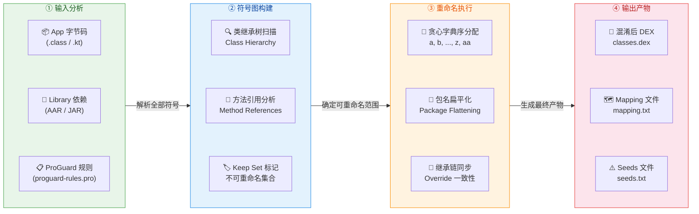

### Mapping 映射文件

#### 什么是 Mapping 文件

当 R8 完成混淆后，它会生成一份极其重要的产物：**`mapping.txt`**（也称 Mapping 映射文件）。这份文件本质上是一个 **双向字典**，记录了每一个符号从"混淆前原始名"到"混淆后新名"的完整映射关系。它是开发者在混淆后世界中唯一的"罗塞塔石碑"——失去了它，混淆后的崩溃日志就几乎不可能被人类阅读和理解。

在 Android Gradle Plugin 的构建流程中，`mapping.txt` 的默认输出路径为：

```
app/build/outputs/mapping/<buildVariant>/mapping.txt
```

例如，对于 `release` 构建变体，路径为 `app/build/outputs/mapping/release/mapping.txt`。

#### Mapping 文件的内部结构

Mapping 文件是纯文本格式，遵循 ProGuard/R8 定义的标准语法。让我们通过一个详细的示例来解读它的结构：

```text
# R8 编译器生成的映射文件
# 每次构建都会重新生成，内容可能不同（即使源码未变）

# 类映射格式：原始全限定名 -> 混淆后全限定名:
com.myapp.payment.PaymentManager -> a.b.c:
    # 字段映射格式：原始类型 原始字段名 -> 混淆后字段名
    java.lang.String encryptionKey -> a
    int retryCount -> b
    com.myapp.payment.PaymentConfig config -> c
    # 方法映射格式：原始起始行:原始结束行:原始返回类型 原始方法名(参数类型列表) -> 混淆后方法名
    1:15:void <init>(com.myapp.payment.PaymentConfig) -> <init>
    16:42:boolean processPayment(com.myapp.model.Order) -> a
    43:67:void handlePaymentResult(com.myapp.payment.PaymentResult) -> b
    68:89:java.lang.String generateSignature(java.lang.String,long) -> c

com.myapp.utils.NetworkHelper -> a.d:
    # 1:1 表示该方法被内联为单行（优化后）
    1:1:void <init>() -> <init>
    1:20:java.lang.String fetchData(java.lang.String,com.myapp.network.Callback) -> a
    21:21:void <clinit>() -> <clinit>

com.myapp.model.Order -> a.b.b:
    java.lang.String orderId -> a
    double amount -> b
    1:5:void <init>(java.lang.String,double) -> <init>
    6:12:java.lang.String getOrderId() -> a
    13:15:double getAmount() -> b
```

让我们逐项拆解这份映射文件的语法元素：

**① 类映射行**：以 `原始全限定名 -> 混淆后全限定名:` 格式表示。注意末尾的冒号 `:` 标志着后续缩进行属于该类的成员映射。`com.myapp.payment.PaymentManager -> a.b.c:` 意味着整个 `PaymentManager` 类被重命名为 `a.b.c`，其中 `a.b` 是混淆后的包名，`c` 是混淆后的类名。

**② 字段映射行**：缩进后以 `原始类型 原始名 -> 混淆后名` 格式表示。字段类型本身不会在映射行中被混淆——这里记录的是原始类型的全限定名，方便还原工具精确匹配。

**③ 方法映射行**：格式较为复杂，包含行号信息：`起始行:结束行:返回类型 方法名(参数类型) -> 混淆后名`。行号信息至关重要——它使得 Stacktrace 还原工具能够将混淆后 DEX 的行号映射回源代码的行号。特别是当 R8 进行 **方法内联（Inlining）** 优化后，一个混淆后方法可能对应原始代码中多个方法的行号范围，Mapping 文件会记录这种多对一的映射关系。

**④ 特殊方法**：`<init>` 代表构造函数，`<clinit>` 代表类的静态初始化块。这些名称在 JVM 规范中是保留的，R8 不会重命名它们（也不能重命名，否则 ART 无法正确执行类初始化）。

#### Mapping 文件的版本与确定性

一个容易被忽视的事实是：**即使源码完全不变，两次构建产生的 mapping.txt 可能内容不同**。这是因为 R8 的名称分配算法可能受到输入顺序（依赖版本变化、文件系统排序差异）的影响。因此，Mapping 文件必须与每一次具体的构建产物严格绑定——你不能用 v1.0 的 mapping.txt 去还原 v1.1 的崩溃堆栈。

从 R8 较新版本开始，Mapping 文件头部会包含版本与编译器信息的注释，例如：

```text
# compiler: R8
# compiler_version: 8.2.47
# min_api: 21
# pg_map_id: abc123def
# common_typos_disable
```

其中 `pg_map_id` 是一个唯一标识符，可用于校验 Mapping 文件是否与特定 APK 匹配。

#### Mapping 文件的安全管理

Mapping 文件本身就是"解开混淆的钥匙"，如果泄露，攻击者就能轻松还原混淆后的代码。因此，在生产实践中必须遵循以下安全原则：

- **绝不将 mapping.txt 打包进 APK 或提交到公开仓库**。在 `.gitignore` 中添加 `mapping.txt` 是基本操作。
- **每次 Release 构建后立即归档**。将 mapping.txt 与对应的 APK 版本号、Git commit hash 一起存储在安全的内部归档系统中（如 CI/CD 制品库）。
- **上传至崩溃收集平台**。Firebase Crashlytics、Bugly 等平台支持上传 Mapping 文件，上传后平台会自动完成 Stacktrace 还原，开发者在控制台上直接看到原始符号名。

```kotlin
// build.gradle.kts 中配置 Crashlytics 自动上传 mapping 文件
android {
    buildTypes {
        release {
            // 启用混淆
            isMinifyEnabled = true                                     // 开启 R8 代码收缩与混淆
            proguardFiles(                                             // 指定混淆规则文件
                getDefaultProguardFile("proguard-android-optimize.txt"), // Android 默认优化规则
                "proguard-rules.pro"                                    // 项目自定义规则
            )
            // Crashlytics 会通过 Gradle Plugin 自动上传 mapping.txt
            // 确保 apply plugin: 'com.google.firebase.crashlytics' 已启用
        }
    }
}
```

### Stacktrace 还原

#### 为什么需要还原

一旦应用上线，线上崩溃日志中的堆栈信息将全部是混淆后的符号。一条典型的混淆后崩溃堆栈看起来像这样：

```text
java.lang.NullPointerException: Attempt to invoke virtual method 'boolean a.b.c.a(a.b.b)' on a null object reference
    at a.b.c.a(SourceFile:3)
    at a.a.a.b(SourceFile:12)
    at a.a.a.a(SourceFile:45)
    at android.app.Activity.performCreate(Activity.java:8051)
    at android.app.Instrumentation.callActivityOnCreate(Instrumentation.java:1309)
```

面对这样的堆栈，开发者无法直接判断崩溃发生在哪个业务类的哪个方法中。`a.b.c.a()` 可能是 `PaymentManager.processPayment()`，也可能是其他任何被混淆为相同短名称的方法。这就是 **Stacktrace 还原（Stacktrace Deobfuscation / Retrace）** 必须存在的原因。

#### 使用 R8 Retrace 命令行工具

R8 自带了一个名为 **`retrace`** 的命令行工具（前身是 ProGuard 的 `retrace.sh`/`retrace.bat`），它读取 Mapping 文件和混淆后的堆栈文本，输出还原后的可读堆栈。

```bash
# 使用 retrace 工具进行堆栈还原
# 参数说明：
#   --map-file  : 指定 mapping.txt 文件路径（必须与崩溃 APK 的构建版本精确匹配）
#   --stacktrace: 指定包含混淆堆栈的文本文件路径
#   --output    : （可选）输出还原结果的文件路径；不指定则输出到 stdout

# 方式一：指定堆栈文件
java -cp R8.jar com.android.tools.r8.retrace.Retrace \
    --map-file mapping.txt \
    --stacktrace obfuscated_stacktrace.txt

# 方式二：通过管道传入堆栈（适合脚本集成）
cat obfuscated_stacktrace.txt | java -cp R8.jar com.android.tools.r8.retrace.Retrace \
    --map-file mapping.txt

# 方式三：使用 Android SDK 内置的 retrace 脚本（推荐）
# 路径：$ANDROID_HOME/tools/proguard/bin/retrace.sh (Linux/Mac)
#       $ANDROID_HOME/tools/proguard/bin/retrace.bat (Windows)
$ANDROID_HOME/tools/proguard/bin/retrace.sh \
    -verbose \
    mapping.txt \
    obfuscated_stacktrace.txt
```

执行后，上面的混淆堆栈会被还原为：

```text
java.lang.NullPointerException: Attempt to invoke virtual method 'boolean com.myapp.payment.PaymentManager.processPayment(com.myapp.model.Order)' on a null object reference
    at com.myapp.payment.PaymentManager.processPayment(PaymentManager.kt:18)
    at com.myapp.feature.checkout.CheckoutViewModel.onConfirmClicked(CheckoutViewModel.kt:42)
    at com.myapp.feature.checkout.CheckoutActivity.initListeners(CheckoutActivity.kt:67)
    at android.app.Activity.performCreate(Activity.java:8051)
    at android.app.Instrumentation.callActivityOnCreate(Instrumentation.java:1309)
```

现在，崩溃位置一目了然——`PaymentManager.processPayment()` 方法第 18 行发生了空指针异常。

#### 内联方法的还原歧义

当 R8 执行 **方法内联优化（Method Inlining）** 时，被内联方法的字节码会被"嵌入"到调用者方法中。此时，Mapping 文件中的行号映射会出现 **一对多** 的情况——混淆后的同一行号可能对应原始代码中不同方法的不同行。Retrace 工具在遇到这种情况时，会输出 **所有可能的候选还原结果**，开发者需要根据上下文逻辑判断实际崩溃位置。

Mapping 文件中内联方法的记录格式如下：

```text
com.myapp.payment.PaymentManager -> a.b.c:
    # 方法 a 的行号 1-3 对应原始 processPayment 的 16-42 行
    1:3:boolean processPayment(com.myapp.model.Order):16:42 -> a
    # 方法 a 的行号 1-3 同时包含了内联进来的 validateOrder 方法（原始行号 5-15）
    1:3:boolean validateOrder(com.myapp.model.Order):5:15 -> a
```

Retrace 对这种情况的输出会带有提示：

```text
at com.myapp.payment.PaymentManager.processPayment(PaymentManager.kt:18)
    or
at com.myapp.payment.PaymentManager.validateOrder(PaymentManager.kt:8)
```

#### 崩溃收集平台的自动还原

在实际生产环境中，手动使用 `retrace` 命令行工具并不是常态。主流的崩溃收集平台都支持自动化的 Stacktrace 还原流程：

**Firebase Crashlytics** 是 Android 生态中最常用的方案。其工作流程为：在每次 Release 构建时，Crashlytics Gradle Plugin 会自动将 `mapping.txt` 上传到 Firebase 后端；当用户设备上发生崩溃时，Crashlytics SDK 收集混淆后的堆栈并上传；Firebase 后端使用对应版本的 Mapping 文件自动完成还原，开发者在 Firebase Console 中直接看到原始符号名的堆栈。

**腾讯 Bugly** 和 **字节 Slardar** 等国内平台也提供类似能力，通常需要开发者在构建流水线中手动调用上传 API 或使用插件将 Mapping 文件上传至平台。

以下是一个完整的 CI/CD 流水线中 Mapping 文件管理的示意图：

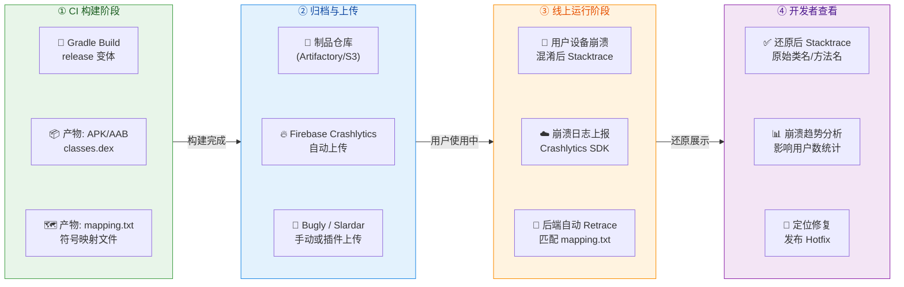

#### 编程方式调用 Retrace

除了命令行工具和平台自动化，R8 还提供了 **Java/Kotlin API** 供开发者在自定义工具中编程式调用 Retrace 能力。这在构建内部崩溃分析系统时非常有用：

```kotlin
import com.android.tools.r8.retrace.RetraceCommand   // R8 Retrace API 入口
import com.android.tools.r8.retrace.Retrace           // 执行器类
import java.nio.file.Path                              // 文件路径

/**
 * 编程式调用 R8 Retrace 进行堆栈还原
 * @param mappingFilePath  mapping.txt 文件路径
 * @param stacktraceLines  混淆后的堆栈文本行列表
 * @return 还原后的堆栈文本行列表
 */
fun retraceStacktrace(
    mappingFilePath: Path,                             // mapping.txt 的路径
    stacktraceLines: List<String>                      // 混淆后的堆栈，每行一个元素
): List<String> {
    val result = mutableListOf<String>()               // 用于收集还原后的行

    val command = RetraceCommand.builder()             // 构建 Retrace 命令
        .setMappingFileProvider {                      // 提供 mapping 文件内容
            mappingFilePath.toFile()                    // 从文件系统读取
                .inputStream()                         // 转为输入流
        }
        .setStackTrace(stacktraceLines)                // 传入混淆后的堆栈行
        .setRetracedStackTraceConsumer { lines ->      // 设置还原结果回调
            result.addAll(lines)                       // 将还原后的行收集到列表中
        }
        .build()                                       // 构建命令对象

    Retrace.run(command)                               // 执行还原
    return result                                      // 返回还原后的堆栈
}
```

#### 保留源文件名与行号信息

默认的 ProGuard/R8 配置中，有一条极其重要的规则用于确保 Stacktrace 可还原性：

```text
# 保留源文件名属性（否则堆栈中只显示 "Unknown Source"）
-keepattributes SourceFile

# 保留行号信息（否则堆栈中行号全为 0）
-keepattributes LineNumberTable
```

`SourceFile` 属性决定了堆栈中 `at a.b.c.a(SourceFile:3)` 里的文件名部分是否可用。如果不保留，这里会显示 `Unknown Source`，增加排查难度。`LineNumberTable` 则是行号映射的基础——没有它，Mapping 文件中的行号信息就失去了意义。

Android 默认的 `proguard-android-optimize.txt`（由 AGP 提供）已经包含了这两条规则，但如果你使用完全自定义的规则文件，**务必手动加上这两行**，否则线上崩溃将变成一场噩梦。

还有一个常见的安全加固技巧：将 `SourceFile` 属性的值统一替换为一个无意义的字符串，避免暴露真实文件名，同时保留行号可还原性：

```text
# 将所有 SourceFile 属性值替换为 "SourceFile"（隐藏真实文件名）
-renamesourcefileattribute SourceFile
# 但保留行号，确保 Retrace 可以正确映射
-keepattributes SourceFile,LineNumberTable
```

这样，堆栈中会显示 `at a.b.c.a(SourceFile:3)` 而非 `at a.b.c.a(PaymentManager.kt:3)`，攻击者无法从堆栈中推断出真实的源代码文件名，但开发者依然可以通过 Retrace + Mapping 还原完整信息。

---

**📝 练习题**

以下关于 Android 代码混淆与 Stacktrace 还原的描述，**正确**的是：

A. R8 混淆会在运行时动态替换类名和方法名，因此会带来一定的性能开销


B. 同一份源码的两次 Release 构建一定会生成完全相同的 mapping.txt 文件


C. 如果未在 ProGuard 规则中保留 `-keepattributes LineNumberTable`，则混淆后的崩溃堆栈中将丢失行号信息，导致 Retrace 无法精确还原到源码行


D. 使用 Gson 反序列化 JSON 到 data class 时，即使字段名被混淆也不会影响解析结果，因为 Gson 使用字段的类型而非名称进行匹配

**【答案】** C

**【解析】** 逐项分析：

- **A 错误**：R8 的混淆（重命名）是纯粹的 **编译期变换**。在构建阶段，R8 将原始符号替换为短名称并写入 DEX 文件，之后 ART 虚拟机执行的就是已经完成替换的字节码，不存在任何运行时的动态替换过程，因此 **零运行时性能开销**。

- **B 错误**：即使源码未变，R8 的名称分配算法可能因输入顺序差异（如依赖库版本微调、文件系统排列顺序、R8 自身版本更新等因素）产生不同的映射结果。因此 mapping.txt **不具备跨构建的确定性**，每次 Release 构建都应该独立归档其对应的 Mapping 文件。

- **C 正确**：`LineNumberTable` 是 class 文件中存储"字节码偏移 → 源码行号"映射的属性表。如果在混淆过程中被移除，DEX 中将不再携带行号信息，运行时抛出异常时堆栈行号显示为 `0` 或 `-1`，Retrace 工具也无法将其映射回源码的真实行号。这就是为什么 Android 默认的优化规则中始终包含 `-keepattributes LineNumberTable`。

- **D 错误**：Gson 的默认反序列化机制是 **基于字段名称匹配** JSON key 的（通过反射获取字段名，与 JSON 的 key 字符串进行比较）。如果字段名被混淆为 `a`、`b` 等短名称，JSON 中的 `"userName"` key 将找不到匹配的字段，导致该字段被赋值为 `null`。解决方案是使用 `@SerializedName("userName")` 注解显式指定 JSON key（注解值是字符串常量，不受混淆影响），或者对整个 data class 添加 `-keep` 规则。

---

## R8 编译器

在 Android 应用的构建流程中，源代码经过编译后需要从 Java 字节码（`.class`）转换为 Dalvik 字节码（`.dex`），同时还要经历代码优化、混淆、收缩等一系列处理。在早期，这些步骤由多个独立工具完成——ProGuard 负责混淆与优化，D8 负责 dex 转换。而 **R8 编译器** 的出现，将上述所有环节统一整合到了一个单一的编译步骤中，极大地提升了构建效率和优化深度。理解 R8 的工作原理，是掌握 Android 应用瘦身、性能优化和安全加固的核心前提。

### D8 Dexer 整合

#### 从 DX 到 D8 的演进

Android 应用最终运行在 ART（Android Runtime）虚拟机上，ART 执行的不是标准的 JVM `.class` 字节码，而是专为移动设备设计的 **DEX（Dalvik Executable）** 格式。因此，构建流程中必须存在一个"翻译器"，将 `.class` 文件转换为 `.dex` 文件，这个翻译器就是所谓的 **Dexer**。

最初 Google 提供的 dexer 工具叫做 **DX**，它在 Android 早期一直承担着这个职责。但 DX 存在诸多历史包袱：它的架构较为老旧，对 Java 8 语言特性（如 lambda 表达式、default method）的支持不佳，编译速度也不够理想。为了解决这些问题，Google 从 Android Studio 3.1 开始引入了 **D8** 作为默认的 dexer。D8 的核心改进包括：编译速度更快、生成的 `.dex` 文件更小、对 Java 8+ 语言特性原生支持（通过 **desugaring** 脱糖处理）。

所谓 **Desugaring（脱糖）**，是指将高版本 Java 语言特性（如 lambda、try-with-resources、Stream API 等）转换为低版本 Android 平台可以理解的等价字节码。例如，一个 Java 8 的 lambda 表达式在 D8 处理后，会被转换为一个匿名内部类的实例化调用，确保在 minSdk 较低的设备上也能正常运行。D8 的脱糖处理发生在 `.class → .dex` 的转换阶段，这意味着它不需要额外的构建步骤，直接一步完成"脱糖 + dex 转换"。

#### R8 对 D8 的整合架构

在 D8 出现之后不久，Google 又推出了 **R8**。从架构上讲，R8 **并非** D8 的替代品，而是 D8 的"超集"——R8 **内置了 D8 的全部 dexer 功能**，同时叠加了代码收缩（shrinking）、优化（optimization）、混淆（obfuscation）三大能力。换句话说，R8 = D8（dexing + desugaring）+ ProGuard（shrink + optimize + obfuscate）。

在未启用 R8 的构建流程中，处理管线是这样的：

```
.java / .kt → javac / kotlinc → .class → ProGuard → .class（优化后）→ D8 → .dex
```

这意味着 ProGuard 和 D8 是两个独立步骤，ProGuard 先对 `.class` 文件做混淆和优化，产出新的 `.class` 文件，再交给 D8 做 dex 转换。中间产物（优化后的 `.class`）不仅浪费磁盘 I/O，还增加了构建时间。

R8 启用后，管线被压缩为：

```
.java / .kt → javac / kotlinc → .class → R8 → .dex
```

R8 在一个步骤中同时完成了"脱糖 + 收缩 + 优化 + 混淆 + dex 转换"，省去了中间产物，构建速度显著提升。

下面通过 Mermaid 图来对比这两种管线的差异：

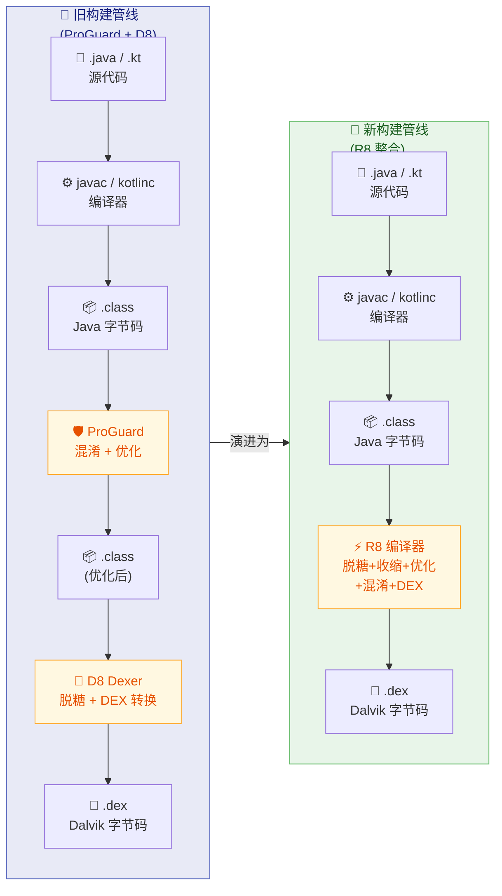

从图中可以清晰看到，R8 将原来两步操作（ProGuard + D8）合并为一步，消除了中间 `.class` 文件的读写开销。在大型项目中，这个改进带来的构建时间缩减可以达到 **10%~30%**。

#### 在 Gradle 中启用 R8

从 AGP（Android Gradle Plugin）3.4.0 开始，R8 已经成为默认的代码收缩器，取代了 ProGuard。当你在 `build.gradle` 中设置 `minifyEnabled true` 时，AGP 会自动调用 R8 而非 ProGuard：

```kotlin
// app/build.gradle.kts
android {
    buildTypes {
        // Release 构建类型中启用 R8
        release {
            // 启用代码收缩与混淆（R8 自动接管）
            isMinifyEnabled = true
            // 启用资源收缩（移除未使用资源，需配合 minifyEnabled）
            isShrinkResources = true
            // 指定 ProGuard 规则文件（R8 兼容 ProGuard 规则语法）
            proguardFiles(
                // Android SDK 内置的默认优化规则
                getDefaultProguardFile("proguard-android-optimize.txt"),
                // 项目自定义规则
                "proguard-rules.pro"
            )
        }
    }
}
```

需要特别注意的是，虽然规则文件仍然叫 `proguard-rules.pro`，但实际执行引擎已经是 R8。R8 **完全兼容** ProGuard 规则语法，同时还扩展了一些 R8 专有指令。这种设计是为了让开发者无缝迁移，不需要重写已有的混淆规则。

#### R8 的 Full Mode 与 Compat Mode

R8 提供了两种工作模式，它们在优化激进程度上有显著差异：

- **Compat Mode（兼容模式）**：这是默认模式，R8 的行为尽量与 ProGuard 保持一致。它不会做一些 ProGuard 不做的激进优化，比如不会移除仅被反射调用但没有显式 keep 规则的类。这种模式最大化兼容性，适合刚从 ProGuard 迁移过来的项目。

- **Full Mode（完整模式）**：R8 开启更激进的优化策略。例如，如果一个方法的返回值在所有调用点都没有被使用，Full Mode 可能会将其返回类型优化为 `void`；又如，如果某个类仅实现了一个接口且不参与反射，R8 可能会直接将接口方法内联到实现类中。Full Mode 通常能带来更大的包体积缩减和运行时性能提升，但也更容易因为反射、序列化等动态特性而出问题。

在 AGP 8.0+ 中，Full Mode 已经成为默认选项。如果你需要切换回 Compat Mode，可以在 `gradle.properties` 中配置：

```properties
# 切回 R8 兼容模式（不推荐，除非有特殊兼容性问题）
android.enableR8.fullMode=false
```

开启 Full Mode 后，开发者需要更加严谨地编写 keep 规则，确保所有通过反射、JNI、序列化等方式访问的类和成员都被正确保留。

---

### Tree Shaking 摇树优化

#### 什么是 Tree Shaking

**Tree Shaking** 是一个源自前端工程化（如 JavaScript/Webpack）的术语，其核心思想非常直观：将应用的所有代码想象成一棵树，入口点（Entry Point）是树根，从根可达的代码是"活"的枝叶，不可达的代码就是"枯枝"。Tree Shaking 的过程就是"摇动"这棵树，让枯枝（死代码）自然脱落。

在 Android 的语境中，R8 执行的 Tree Shaking 操作具体指的是：以应用的 **Entry Points** 为起点，进行全程序可达性分析（Whole-Program Reachability Analysis），标记所有可达的类、方法和字段，然后移除所有不可达的部分。

#### Entry Points 的确定

Tree Shaking 的准确性完全取决于 **Entry Points（入口点）** 的确定。所谓入口点，是那些"外部世界"可能调用到的代码——R8 无法通过静态分析确定它们是否会被调用，因此必须保守地假定它们都会被调用。Android 应用中典型的入口点包括：

1. **AndroidManifest.xml 中声明的四大组件**：Activity、Service、BroadcastReceiver、ContentProvider。这些组件由系统 Framework（如 AMS）通过反射实例化和调用，R8 无法从代码层面追踪到这些调用路径，因此必须保留。

2. **Application 类**：应用的自定义 `Application` 子类同样由系统反射创建。

3. **keep 规则指定的类和成员**：开发者在 `proguard-rules.pro` 中显式标记的保留目标。

4. **Android SDK 默认规则中的项目**：`proguard-android-optimize.txt` 中预置了一系列通用保留规则，如 `View` 的构造函数（XML 布局文件通过反射实例化 View）、`Parcelable.CREATOR` 字段（系统通过反射读取）等。

5. **第三方库自带的规则**：许多 AAR 库在打包时已经包含了 `consumer-proguard-rules`（消费者混淆规则），这些规则会自动合并到最终的 R8 配置中。例如，Retrofit 的 AAR 中包含了保留其注解和接口方法的规则。

R8 在开始 Tree Shaking 之前，会先 **合并所有规则来源**（默认规则 + 项目规则 + 库规则 + AAPT 生成的规则），得到一个完整的入口点集合，然后从这些点开始进行可达性图遍历。

#### 可达性分析算法

R8 的 Tree Shaking 本质上是一种 **"标记-清除"（Mark-and-Sweep）** 式的静态分析。其过程可以概括为以下步骤：

**第一步：构建调用图（Call Graph）**。R8 解析所有 `.class` 文件的字节码，构建出类之间的引用关系图。这个图的节点包括类、方法、字段，边包括方法调用（invoke）、字段读写（get/put）、类继承（extends/implements）、注解引用等。

**第二步：从 Entry Points 开始标记**。R8 将所有 Entry Points 标记为"活（live）"，然后沿着调用图做广度优先或深度优先遍历。每当一个方法被标记为活，R8 就分析该方法的字节码，找出它引用的所有类、调用的所有方法、读写的所有字段，然后将这些目标也标记为活。这个过程递归进行，直到没有新的节点可以标记为止。

**第三步：移除未标记的节点**。遍历结束后，所有没有被标记为"活"的类、方法和字段，都被判定为"死代码"，R8 会将它们从最终的 `.dex` 输出中移除。

我们用一个具体的例子来说明。假设有以下代码结构：

```kotlin
// ===== 入口点：MainActivity 在 Manifest 中注册 =====
class MainActivity : AppCompatActivity() {
    override fun onCreate(savedInstanceState: Bundle?) {
        super.onCreate(savedInstanceState)
        // 调用 UserRepository，因此 UserRepository 被标记为"活"
        val repo = UserRepository()
        // 调用 getUser()，该方法被标记为"活"
        val user = repo.getUser("123")
    }
}

// ===== UserRepository：被 MainActivity 引用，标记为"活" =====
class UserRepository {
    // getUser() 被调用，标记为"活"
    fun getUser(id: String): User {
        // 引用了 User 类，User 也被标记为"活"
        return User(id, "Android Dev")
    }

    // deleteUser() 没有任何代码路径调用它
    // R8 可达性分析中不会被标记 → 最终被移除
    fun deleteUser(id: String) {
        // ... 数据库删除逻辑
    }
}

// ===== User：被 getUser() 引用，标记为"活" =====
data class User(
    val id: String,   // 被构造函数参数引用，标记为"活"
    val name: String  // 同上
)

// ===== AnalyticsHelper：整个类没有被任何活代码引用 =====
// R8 可达性分析中不会被标记 → 整个类被移除
class AnalyticsHelper {
    fun trackEvent(event: String) {
        // ...
    }
}
```

在上面的例子中，R8 会保留 `MainActivity`、`UserRepository`、`UserRepository.getUser()`、`User` 及其字段，同时完全移除 `UserRepository.deleteUser()` 方法和整个 `AnalyticsHelper` 类。

#### Tree Shaking 对第三方库的巨大影响

Tree Shaking 对应用体积最大的贡献往往来自 **第三方库的裁剪**。现代 Android 开发中，项目通常依赖大量的第三方库（Jetpack、OkHttp、Gson、Glide 等），而开发者实际使用的往往只是这些库中的一小部分 API。没有 Tree Shaking 时，库的全部代码都会被打入 APK；启用 R8 后，库中未被调用的类和方法会被自动移除。

举个典型案例：Google Guava 库有超过 15000 个方法，但一个项目可能只用了其中几十个工具方法。R8 的 Tree Shaking 可以将 Guava 对 APK 体积的影响从数 MB 缩减到几十 KB。这种"只打包你用到的"理念，正是 Tree Shaking 最核心的价值所在。

#### 反射与动态调用的挑战

Tree Shaking 的静态分析最大的天敌是 **反射（Reflection）** 和 **动态调用**。考虑以下场景：

```kotlin
// R8 无法通过静态分析追踪到这个调用
// 因为类名是运行时字符串拼接得到的
val clazz = Class.forName("com.example." + className)
val instance = clazz.newInstance()
```

由于 R8 在编译期无法确定 `className` 的值，它无法知道哪个类会被反射创建。如果没有对应的 keep 规则，目标类可能被 Tree Shaking 移除，导致运行时 `ClassNotFoundException`。

这就是为什么 **正确编写 keep 规则至关重要**——它告诉 R8："这些代码虽然你在静态分析中看不到调用路径，但它们在运行时会被使用，请保留。" 关于 keep 规则的详细语法会在 ProGuard 规则一节深入讲解。

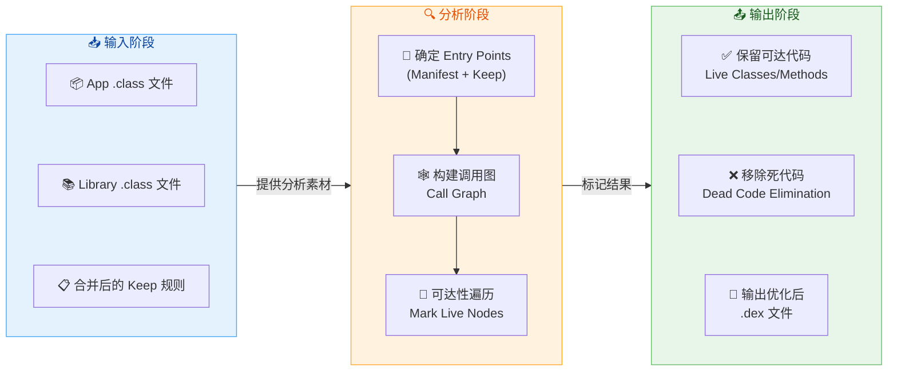

---

### Code Shrinking 代码收缩

#### Code Shrinking 与 Tree Shaking 的关系

在 Android 官方文档中，**Code Shrinking** 是一个更宽泛的概念，它涵盖了所有用于减小代码体积的技术手段。Tree Shaking（死代码移除）是 Code Shrinking 中最核心的一步，但 R8 的 Code Shrinking 还包含更多维度的优化。可以将两者的关系理解为：

> **Code Shrinking = Tree Shaking（死代码移除）+ 代码优化（Code Optimization）+ 混淆（Obfuscation 带来的标识符缩短效果）**

Tree Shaking 是"粗粒度"的移除——以类和方法为单位删减。而 Code Shrinking 的其他环节则是"细粒度"的优化——在方法内部、字节码指令层面进一步压缩和精简。

#### R8 执行的细粒度代码优化

在完成 Tree Shaking 之后，R8 还会对"存活"下来的代码执行一系列 **字节码级优化**，以进一步缩减体积和提升运行时性能。这些优化操作包括但不限于：

**1. 方法内联（Method Inlining）**

如果一个方法体很短（通常只有几条指令），且调用点有限，R8 可能会将方法体直接"复制粘贴"到调用处，消除方法调用的开销。内联后，被内联的原方法如果没有其他调用者，就会被进一步移除。

```kotlin
// ===== 优化前 =====
class MathUtils {
    // 一个简单的工具方法
    fun double(x: Int): Int = x * 2
}

fun calculate() {
    val utils = MathUtils()
    // 方法调用：有 invoke 开销
    val result = utils.double(5)
}

// ===== R8 内联优化后（等效效果）=====
fun calculate() {
    // 方法体被直接内联到调用处
    // MathUtils 类如无其他引用也会被移除
    val result = 5 * 2
}
```

方法内联不仅减少了方法数量（这在 DEX 的 64K 方法数限制语境中非常有价值），还消除了方法调用时的栈帧创建与销毁开销。但 R8 会在代码体积和调用频率之间做权衡——如果一个方法体很大但被频繁内联，反而会让总体积膨胀，因此大方法通常不会被内联。

**2. 常量折叠与传播（Constant Folding & Propagation）**

如果 R8 在编译期能确定一个变量或表达式的值是常量，它会直接用计算结果替换原表达式：

```kotlin
// ===== 优化前 =====
val width = 1080
val height = 1920
// R8 在编译期就能计算出 width * height 的值
val pixels = width * height

// ===== R8 优化后 =====
// 直接替换为编译期计算出的常量值
val pixels = 2073600
```

这种优化看似微小，但在循环体或高频调用路径中累积起来能带来可观的性能收益。

**3. 死代码消除（Dead Code Elimination, DCE）**

与 Tree Shaking 不同，DCE 发生在方法内部。如果一个局部变量被赋值但从未被读取，或者一个 `if` 分支的条件永远为 `false`，R8 会将这些"方法内死代码"移除：

```kotlin
// ===== 优化前 =====
fun process(flag: Boolean) {
    val temp = expensiveComputation() // 计算结果从未被使用
    if (BuildConfig.DEBUG) {          // Release 构建中此值为 false
        Log.d("TAG", "Debug info")    // 这个分支永远不会执行
    }
    doRealWork()
}

// ===== R8 优化后 =====
fun process(flag: Boolean) {
    // temp 赋值被移除（无副作用假设下）
    // DEBUG 分支被移除（常量折叠后条件为 false）
    doRealWork()
}
```

需要注意的是，`expensiveComputation()` 的移除取决于 R8 是否认为该调用有 **副作用（Side Effects）**。如果 R8 无法确定其无副作用，为了安全起见会保留调用。开发者可以通过 `assumenosideeffects` 规则显式告诉 R8 某些方法没有副作用（如 `Log.d()`），从而允许 R8 安全地移除它们。

**4. 枚举优化（Enum Optimization）**

Kotlin 和 Java 中的枚举在字节码层面实际上是一个完整的类，每个枚举值都是一个 static final 的对象实例。这对于移动端来说开销不小。R8（特别是 Full Mode 下）可以在条件允许时将枚举替换为简单的 `int` 常量：

```kotlin
// ===== 优化前：枚举类 =====
enum class Direction {
    UP, DOWN, LEFT, RIGHT
}

// ===== R8 Full Mode 优化后（概念等价）=====
// Direction 枚举被替换为 int 常量
// UP=0, DOWN=1, LEFT=2, RIGHT=3
// 所有 when(direction) 匹配变为 int 比较
```

这种优化能显著减小 DEX 文件体积（每个枚举类节省数百字节到数 KB），同时消除了枚举对象的堆内存分配。但如果枚举参与了序列化、反射或者 `name()`/`ordinal()` 调用，R8 就无法安全地执行此优化。

**5. Outline 优化（公共代码提取）**

与内联相反，如果 R8 发现多个方法中存在完全相同的字节码片段，它可能会将这些公共片段提取到一个新的共享方法（称为 outline 方法）中，各处调用改为对共享方法的调用。这在代码段重复度高的场景中能有效减小总体积。

#### 代码收缩的实际效果量化

R8 的代码收缩效果因项目而异，但以下数据可以作为参考基准：

- **小型项目**（少量依赖）：APK 体积通常缩减 **10%~20%**。
- **中型项目**（Jetpack 全家桶 + 常见三方库）：缩减 **20%~40%**。
- **大型项目**（数百个模块、重度依赖）：缩减 **30%~60%**，极端情况下甚至更高。

其中，方法数的缩减也很关键——它直接影响是否需要 MultiDex。R8 的内联和 Tree Shaking 能大幅减少方法数，许多原本超过 64K 方法数上限的项目在启用 R8 后甚至可以回到单 DEX。

#### R8 的 Mapping 文件与调试

R8 在执行混淆后，会生成一份 **mapping.txt** 文件，记录原始类名/方法名与混淆后名称的映射关系。这个文件对于调试至关重要——当线上 Crash 上报的堆栈信息全是 `a.b.c()` 这样的混淆名时，你需要用 mapping 文件将其还原为可读的原始名称。

Mapping 文件默认输出在 `app/build/outputs/mapping/release/mapping.txt`，其格式如下：

```text
com.example.app.UserRepository -> a.a:
    java.lang.String getUser(java.lang.String) -> a
    void deleteUser(java.lang.String) -> b
com.example.app.model.User -> a.b:
    java.lang.String id -> a
    java.lang.String name -> b
```

每发布一个版本，**必须存档对应的 mapping.txt 文件**。如果丢失了 mapping 文件，该版本的线上 Crash 堆栈将永远无法还原。Google Play Console 和 Firebase Crashlytics 都支持上传 mapping 文件以自动还原堆栈。

可以使用 R8 自带的 `retrace` 工具来手动还原混淆堆栈：

```bash
# 使用 retrace 工具还原混淆后的堆栈
# mapping.txt: R8 生成的映射文件
# stacktrace.txt: 从 Crash 报告中复制的混淆堆栈
retrace mapping.txt stacktrace.txt
```

#### R8 配置的调试技巧

在开发过程中，R8 的激进优化偶尔会导致运行时问题（如反射类被移除、序列化字段被混淆）。以下是几个关键的调试手段：

**查看 R8 最终使用的完整规则**：R8 会将来自所有来源（默认规则、项目规则、库规则、AAPT 规则）的规则合并后输出到 `build/outputs/mapping/release/configuration.txt`。当遇到问题时，首先检查这个文件，确认规则是否正确合并。

**查看被移除的代码**：R8 会输出一个 `usage.txt` 文件（也称为 seeds 的反面），列出所有被移除的类和成员。如果某个功能在 Release 构建中失效，检查该文件确认相关代码是否被误移除。

**使用 `--pg-map-output` 生成详细映射**：在排查问题时，可以让 R8 输出更详细的映射信息，帮助定位具体哪条规则影响了哪个类。

```kotlin
// build.gradle.kts 中添加 R8 诊断参数
android {
    buildTypes {
        release {
            // 生成详细的 R8 诊断信息
            proguardFiles(
                getDefaultProguardFile("proguard-android-optimize.txt"),
                "proguard-rules.pro"
            )
        }
    }
}
```

---

**📝 练习题**

在一个 Android 项目中启用了 R8（`isMinifyEnabled = true`），项目依赖了一个第三方网络库。该库中有一个 `HttpLogger` 类，仅在库的单元测试中被使用，应用代码从未引用它。请问 R8 构建 Release APK 时，`HttpLogger` 类会怎样？

A. 保留在 APK 中，因为它属于第三方库的一部分，R8 不会修改第三方库的代码


B. 被 R8 移除，因为 Tree Shaking 的可达性分析发现应用代码中没有任何路径引用到它


C. 保留在 APK 中，但类名和方法名会被混淆


D. 是否移除取决于该库的 `consumer-proguard-rules` 中是否有对应的 keep 规则


**【答案】** D

**【解析】** 这道题考查对 R8 Tree Shaking 机制和 keep 规则交互的理解。首先排除 A——R8 对所有代码（包括第三方库）一视同仁地进行可达性分析，不存在"不修改第三方库"的特殊待遇。从纯可达性角度看，`HttpLogger` 确实没有被应用代码引用，按理应该被移除（B 的逻辑）。但实际场景中，许多第三方库会在其 AAR 中内置 `consumer-proguard-rules`（消费者混淆规则），有些库出于保险会添加较为宽泛的 keep 规则（如 `-keep class com.library.** { *; }`），这会强制 R8 保留库中的所有类，包括没有被使用的 `HttpLogger`。因此，最终结果取决于该库是否配置了这样的 keep 规则。如果库没有任何 keep 规则且应用代码也没有引用，R8 就会执行 Tree Shaking 将其移除；如果库的规则中 keep 了该类，即使没有引用也会被保留。选项 D 准确地反映了这种"规则优先于可达性分析"的实际行为。

---

## ProGuard 规则

在 Android 应用的混淆与优化流程中，R8 编译器（以及早期的 ProGuard）并非"黑盒式"地对所有代码一视同仁。开发者必须通过一套 **声明式规则语言** 来告诉编译器："哪些代码必须保留"、"哪些警告可以忽略"、"哪些方法可以假设没有副作用从而安全移除"。这套规则语言就是我们通常所说的 **ProGuard Rules**（R8 完全兼容其语法）。可以说，混淆与优化的最终效果，**七分靠规则配置，三分靠工具能力**。一条规则写错，轻则日志无法还原，重则线上 Crash；而规则写得过于宽泛（如 `keep class * { *; }`），则等于完全放弃了混淆与 Tree Shaking 的收益。因此，深入理解 ProGuard 规则的语法体系、匹配逻辑和最佳实践，是每位 Android 开发者从"能用"到"用好"的关键一步。

### keep 保持规则

#### 为什么需要 keep

R8/ProGuard 的核心工作流程可以简化为：**从 Entry Points（入口点）出发，沿引用链做可达性分析（Reachability Analysis），所有不可达的类、方法、字段都会被 Shrink（移除），可达但非入口的则可能被 Obfuscate（重命名）**。这与 JVM 垃圾回收的"可达性分析"思路非常相似——只是 GC 标记的是"活对象"，而 R8 标记的是"活代码"。

问题在于，R8 的静态分析是 **编译期的**，它只能看到 Java/Kotlin 源码层面的直接引用关系。而 Android 应用中存在大量 **非直接引用** 的入口：

- **反射调用**（Reflection）：`Class.forName("com.example.MyClass")` 在源码中体现为字符串，R8 无法追踪；
- **JNI 回调**：Native 层通过 `FindClass` / `GetMethodID` 调用 Java 方法，R8 完全不可见；
- **XML 声明的组件**：`AndroidManifest.xml` 中声明的 Activity/Service/Receiver/Provider，以及布局 XML 中引用的自定义 View，都是通过字符串类名实例化的；
- **序列化/反序列化**：Gson、Moshi、Kotlin Serialization 等库通过字段名与 JSON key 做映射，字段被重命名后映射就会失败；
- **注解处理器生成的代码**：Dagger/Hilt 等生成的 Factory 类可能通过反射查找。

对于这些场景，如果 R8 不知道它们是入口点，就会将其移除或重命名，导致运行时崩溃。**`keep` 规则的本质，就是手动向 R8 声明额外的 Entry Points**。

#### keep 规则家族总览

ProGuard/R8 提供了一组 `keep` 变体，它们在"保留什么"这个维度上有着精确的区分。理解它们的差异至关重要：

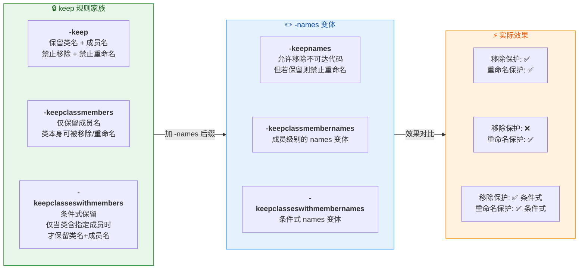

用一句话概括这六条规则的关系：**基础三件套** (`-keep`、`-keepclassmembers`、`-keepclasseswithmembers`) 同时阻止移除和重命名；加上 **`-names` 后缀** 后，只阻止重命名，但允许 R8 在代码不可达时将其移除。

#### `-keep` 的完整语法

一条 `-keep` 规则的完整形式如下：

```proguard
# 完整语法模式：
# -keep [,modifier,...] class_specification

# class_specification 的结构：
# [访问修饰符] [!访问修饰符] class/interface/enum 类名匹配模式 [extends/implements 父类匹配模式] {
#     [成员匹配模式];
# }
```

我们逐一拆解每个部分：

**（1）类名匹配模式中的通配符**

ProGuard 规则提供了三种关键通配符，它们的匹配范围差异巨大，混淆是初学者最常犯的错误之一：

| 通配符 | 含义 | 示例 |
|--------|------|------|
| `*` | 匹配类名中的 **任意部分**，但 **不跨越包分隔符** `.` | `com.example.*` 匹配 `com.example.Foo`，但**不**匹配 `com.example.sub.Bar` |
| `**` | 匹配类名中的 **任意部分**，**可跨越** 包分隔符 `.` | `com.example.**` 匹配 `com.example.Foo` 和 `com.example.sub.Bar` |
| `?` | 匹配类名中的 **单个字符** | `com.example.Foo?` 匹配 `com.example.FooA`，不匹配 `com.example.FooAB` |

这一点极其重要。新手常写 `-keep class com.example.model.* { *; }`，以为能保护 `model` 包及其子包下的所有类。但实际上 `*` 不穿透子包，应改为 `**`。

**（2）成员匹配模式**

花括号 `{}` 内描述需要保留的成员，常用的通配符包括：

| 通配符 | 含义 |
|--------|------|
| `<init>` | 匹配所有 **构造方法** |
| `<fields>` | 匹配所有 **字段** |
| `<methods>` | 匹配所有 **方法** |
| `*` | 匹配所有 **字段和方法** |
| `***` | 匹配 **任意类型**（用于方法参数或返回值） |
| `...` | 匹配 **任意数量、任意类型的方法参数** |

下面看一组由简到繁的实战规则：

```proguard
# ========== 场景1：保留整个类（类名+所有成员） ==========
# 最宽泛的规则，适合四大组件等必须原样保留的类
-keep class com.example.app.MainActivity { *; }
# 含义：MainActivity 类名不被重命名，其所有字段和方法也不被移除/重命名

# ========== 场景2：保留所有实现了 Serializable 的类的字段 ==========
# 序列化场景下，字段名就是序列化 key，不能重命名
-keepclassmembers class * implements java.io.Serializable {
    # 保留所有字段，防止序列化/反序列化时字段名不匹配
    <fields>;
    # 保留无参构造方法，很多序列化框架需要通过它实例化对象
    <init>();
}

# ========== 场景3：保留带有特定注解的方法 ==========
# 例如保留所有被 @Keep 注解标注的方法，防止被移除或重命名
-keepclassmembers class * {
    @androidx.annotation.Keep <methods>;
}

# ========== 场景4：条件式保留——只有含 native 方法的类才保留 ==========
# JNI 方法名必须与 native 签名一致，重命名会导致 UnsatisfiedLinkError
-keepclasseswithmembers class * {
    native <methods>;
}
# 含义：如果某个类包含 native 方法，则保留该类名和其中所有 native 方法名
# 如果类不含 native 方法，此规则对它不生效——这就是 "with members" 的条件性

# ========== 场景5：保留枚举的 values() 和 valueOf() ==========
# 枚举的这两个方法是编译器生成的，反射调用依赖其存在
-keepclassmembers enum * {
    public static **[] values();
    public static ** valueOf(java.lang.String);
}
```

**（3）`-keep` vs `-keepclassmembers` 的本质区别**

这是面试和实战中最常被追问的问题。我们用一个具体场景来对比：

假设 `com.example.model.User` 类有字段 `name` 和 `age`，且该类在代码中 **仅被 Gson 通过反射使用**（没有直接的 Java 引用）：

- 若使用 `-keepclassmembers class com.example.model.User { <fields>; }`：因为 R8 的静态分析看不到对 `User` 类的直接引用，它会认为 `User` 类不可达，**整个类连同字段一起被移除**。`-keepclassmembers` 只保护成员，不保护类本身的可达性。
- 若使用 `-keep class com.example.model.User { <fields>; }`：`User` 类被强制标记为入口点，类名和字段名都被保留，Gson 反射能正常工作。

所以结论很明确：**当类本身没有被直接引用时（反射、序列化场景），必须使用 `-keep` 而非 `-keepclassmembers`**。后者只在"类本身已经确定会保留（比如被其他代码直接引用），只需额外保护其成员"的场景下使用。

**（4）`-keepnames` 的使用场景**

`-keepnames` 等价于 `-keep,allowshrinking`。它的语义是："如果这个类/成员在 Tree Shaking 后仍然存活，那就不要重命名它；但如果它本来就不可达，允许移除。"

这在 **调试友好性** 场景下很有用。例如，你希望某些工具类在 Release 包中如果存活就保留原名（方便日志分析），但如果没用到就可以移除：

```proguard
# 如果 DebugUtils 被使用则保持类名可读，未使用则允许移除
-keepnames class com.example.utils.DebugUtils
```

#### Android 默认规则与 AAPT2 自动生成的规则

实际开发中，你不需要为四大组件手动写 keep 规则。**AAPT2 在编译资源时，会解析 `AndroidManifest.xml` 和布局文件，自动生成一份 keep 规则文件**（位于 `build/intermediates/aapt_proguard_file/`）。这份文件包含了所有在 XML 中声明的 Activity、Service、BroadcastReceiver、ContentProvider，以及布局中引用的自定义 View 类。

此外，AGP（Android Gradle Plugin）还会注入一份默认规则（`proguard-android-optimize.txt`），其中包含了 Android 平台级别的通用保护，例如：

- 保留所有继承自 `View` 的类中、签名包含 `Context` 参数的构造方法（因为 LayoutInflater 通过反射调用）；
- 保留所有 `Parcelable.Creator` 静态字段；
- 保留 `onClick` 等 XML 中可能引用的方法；
- 保留枚举的 `values()` 和 `valueOf()`。

因此，**你在 `proguard-rules.pro` 中只需要写项目特有的规则**，例如数据模型类（data class）、第三方 SDK 要求的规则等。大多数主流库（Retrofit、OkHttp、Glide 等）都通过 **Consumer ProGuard Files** 机制自带规则（在库的 AAR 中打包了 `proguard.txt`），会在编译时自动合并。

#### keep 规则的调试技巧

当你不确定某条规则是否生效，或某个类为何被移除/保留时，可以使用以下手段：

```proguard
# 输出 R8 的最终配置（合并所有规则后的结果）
-printconfiguration build/full-r8-config.txt

# 输出所有被保留的类和成员（seeds 即入口点）
-printseeds build/seeds.txt

# 输出被移除的代码列表
-printusage build/usage.txt
```

`seeds.txt` 是最直接的验证方式：如果你期望保留的类/方法出现在其中，说明 keep 规则已生效。`usage.txt` 则列出了所有"被判定为不可达而移除"的代码，如果你的类意外出现在这里，说明 keep 规则缺失或模式匹配有误。

### dontwarn 忽略警告

#### 警告产生的根源

R8/ProGuard 在处理类引用关系时，如果发现 **某个类引用了另一个不存在的类**，就会产生一条警告（Warning）。这种情况比想象中常见得多，典型场景包括：

- **平台版本差异**：某个库引用了 `android.app.NotificationChannel`（API 26+），但你的编译 SDK 中它存在，而 ProGuard 分析类路径时可能出现不一致；
- **可选依赖（Optional Dependency）**：一个库编译时依赖了另一个库（如 OkHttp 对 Conscrypt 的可选依赖），但你的项目没有引入该可选库。源码中通常用 `try { Class.forName(...) }` 做安全检测，运行时不会崩溃，但 R8 静态分析时会发现类缺失；
- **编译期注解**：某些注解（如 `@Nullable`、`@Generated`）仅在编译期使用，不会打入最终 APK，R8 分析时找不到这些注解类；
- **多平台库**：一些 Java 库同时支持 Android 和 Java SE，内部可能引用了 `javax.swing.*` 等 Android 不存在的类。

默认情况下，R8 遇到 **不可解析的引用** 会产生 Warning，**如果 Warning 数量过多且未被抑制，R8 会中断构建并报错**（因为缺失的类可能导致优化决策错误）。这就是为什么很多项目的 ProGuard 规则中充斥着 `-dontwarn` 的原因。

#### `-dontwarn` 的语法与用法

```proguard
# 忽略特定类的警告
-dontwarn com.squareup.okhttp3.internal.platform.ConscryptPlatform

# 忽略整个包的警告（* 不穿越包分隔符）
-dontwarn okio.*

# 忽略包及其所有子包的警告（** 穿越包分隔符）
-dontwarn retrofit2.**

# 忽略所有警告（极度不推荐！）
-dontwarn *
```

**`-dontwarn` 的本质是告诉 R8："我知道这些类缺失，但我确认运行时不会真正调用到它们，请跳过这些警告继续编译。"** 它不会改变任何实际的代码处理行为——该移除的仍然移除，该混淆的仍然混淆——它只是把编译器的"担忧"压下去。

#### 正确使用 `-dontwarn` 的原则

`-dontwarn` 是一把双刃剑。用对了它能消除编译期噪音，用错了则会 **掩盖真正的问题**：

**原则一：精准定位，绝不全局忽略**

```proguard
# ❌ 错误：忽略所有警告，可能掩盖关键缺失
-dontwarn *

# ✅ 正确：只忽略确认安全的特定类/包
-dontwarn org.conscrypt.**
-dontwarn org.bouncycastle.**
```

全局 `-dontwarn *` 的危害在于：假如你的项目真的缺少了某个运行时必需的依赖，R8 不会提醒你，而你会在用户设备上遇到 `NoClassDefFoundError`。

**原则二：先理解警告再决定忽略**

当 R8 报出警告时，正确的处理流程是：

1. **阅读警告内容**：确认是哪个类引用了哪个缺失的类；
2. **判断是否运行时需要**：如果缺失的类只在特定条件下使用（如仅 Java SE 环境），且库本身有安全守护（try-catch 或平台判断），则可以安全忽略；
3. **检查是否遗漏依赖**：如果缺失的类是运行时必需的，应添加对应的依赖而非 `-dontwarn`。

**原则三：优先使用库自带的规则**

现代 Android 库大多通过 `META-INF/proguard/` 或 `META-INF/com.android.tools/r8/` 目录自带规则文件。如果你使用的库需要 `-dontwarn`，在升级到最新版本后通常已经内置了。手动添加 `-dontwarn` 应该是 **最后手段**。

#### R8 的 Missing Rules 机制

从 AGP 7.0 开始，R8 引入了一项改进：当检测到缺失的类引用时，如果相关的库没有提供对应的 `-dontwarn` 规则，R8 会在错误消息中 **直接建议你应该添加的 `-dontwarn` 规则**，甚至会生成一个 `missing_rules.txt` 文件。你可以直接将其内容复制到 `proguard-rules.pro` 中。这大大降低了手动排查的成本，但仍然建议你理解每条规则的含义再决定是否采纳。

### assumenosideeffects 副作用移除

#### 什么是"副作用"

在编译器优化理论中，**副作用（Side Effect）** 指的是一个方法调用除了返回值之外，还会对外部状态产生影响——例如修改全局变量、写入文件、发送网络请求、输出日志等。如果一个方法 **没有副作用**（即它是纯函数 Pure Function），那么在其返回值未被使用时，这次调用就可以被安全移除，不影响程序正确性。

`-assumenosideeffects` 规则的语义就是：**"我向编译器保证，这些方法没有副作用。如果它们的返回值没有被使用，请放心地把整个调用语句删除。"**

这个规则最经典、最广泛的应用场景就是 **移除 Release 包中的日志调用**。

#### 移除 Log 调用的标准写法

```proguard
# 告诉 R8：android.util.Log 的所有日志方法没有副作用
# 当返回值（int 类型，表示写入的字节数）未被使用时，整个调用语句会被移除
-assumenosideeffects class android.util.Log {
    # 移除 verbose 级别日志
    public static int v(...);
    # 移除 debug 级别日志
    public static int d(...);
    # 移除 info 级别日志
    public static int i(...);
    # 移除 warn 级别日志（按需保留，生产环境通常也移除）
    public static int w(...);
    # 移除 error 级别日志（按需，有些团队选择保留 e 级别）
    public static int e(...);
}
```

这条规则生效后，R8 会在字节码层面将所有 `Log.v()`、`Log.d()` 等调用 **完全删除**——不是替换为空实现，而是从字节码中彻底消失。这意味着：

- **零运行时开销**：没有方法调用、没有字符串拼接、没有条件判断；
- **字符串也会被移除**：如果日志的 tag 和 message 字符串仅被该 Log 调用使用，它们也会随之被 Tree Shaking 清除，从而 **减小 APK 体积并防止信息泄露**。

#### 深入理解生效条件

`-assumenosideeffects` 并非无条件地删除所有匹配的方法调用。它有一个关键前提——**返回值未被使用**。来看一个反例：

```kotlin
// 场景A：返回值未被使用 —— 会被移除 ✅
Log.d("TAG", "debug message")

// 场景B：返回值被使用 —— 不会被移除 ❌
val bytesWritten = Log.d("TAG", "debug message")
if (bytesWritten > 0) { /* ... */ }
```

在场景 B 中，`Log.d()` 的返回值赋给了 `bytesWritten` 并参与了后续逻辑。即使你声明了 `-assumenosideeffects`，R8 也不能移除这个调用，因为移除后 `bytesWritten` 将没有值，程序逻辑会断裂。不过在实际开发中，几乎没有人会使用 `Log` 的返回值，所以这个限制很少成为问题。

还需要注意，**`-assumenosideeffects` 必须与 `-optimize`（或 R8 的默认优化模式）配合使用**。如果你使用的是不含优化的配置（如旧版 `proguard-android.txt` 而非 `proguard-android-optimize.txt`），该规则不会生效。在现代 AGP 中，R8 默认启用优化，所以一般不需要额外配置。

#### `-assumenosideeffects` vs `-assumevalues`

R8 还提供了一个相关规则 `-assumevalues`，用于告诉编译器某个方法或字段的 **返回值/值的范围**，以便进行更激进的优化：

```proguard
# 告诉 R8：BuildConfig.DEBUG 在 Release 构建中永远是 false
-assumevalues class com.example.app.BuildConfig {
    public static boolean DEBUG return false;
}
```

当 R8 知道 `BuildConfig.DEBUG` 恒为 `false` 时，所有 `if (BuildConfig.DEBUG) { ... }` 的代码块都会被识别为"死代码（Dead Code）"并被移除。**这与 `-assumenosideeffects` 的区别在于：后者侧重"调用可以删"，前者侧重"值可以假定"**，两者都是引导 R8 做更深层死代码消除的手段。

实际上对于 `BuildConfig.DEBUG`，R8 已经能自动推断其值（因为 AGP 会在 Release 构建时将其设为 `false` 常量），但对于自定义的 Feature Flag 字段，`-assumevalues` 就非常有用了。

#### 风险与注意事项

`-assumenosideeffects` 是 ProGuard 规则中 **最危险的规则之一**，因为你在对编译器撒谎——你声称某个方法没有副作用，但编译器不会验证你说的是否属实：

```proguard
# ❌ 极度危险：如果对有副作用的方法使用此规则
-assumenosideeffects class com.example.Analytics {
    # 如果 trackEvent 实际会发送网络请求，这条规则会导致数据丢失！
    public void trackEvent(...);
}
```

如果被标记的方法实际上有副作用（修改了状态、发送了请求等），R8 会将其调用删除，导致 **静默的功能缺失**——不会报错、不会崩溃，只是功能悄悄消失了。这种 Bug 极难排查。

因此，**只对你 100% 确认是纯日志/纯调试用途、无任何业务副作用的方法使用此规则**。标准的做法就是仅用于 `android.util.Log` 和项目自定义的日志包装类。

#### 完整的日志移除方案

在实际项目中，通常会封装一个日志工具类，配合 `-assumenosideeffects` 实现完整的日志移除：

```kotlin
// LogUtils.kt —— 项目日志工具类
object LogUtils {
    // TAG 前缀，统一日志标识
    private const val TAG_PREFIX = "MyApp_"

    // verbose 级别日志
    fun v(tag: String, msg: String) {
        // 仅在 debug 构建时输出（双重保险）
        if (BuildConfig.DEBUG) {
            // 调用系统 Log，附加统一前缀
            Log.v(TAG_PREFIX + tag, msg)
        }
    }

    // debug 级别日志
    fun d(tag: String, msg: String) {
        if (BuildConfig.DEBUG) {
            Log.d(TAG_PREFIX + tag, msg)
        }
    }

    // info 级别日志
    fun i(tag: String, msg: String) {
        if (BuildConfig.DEBUG) {
            Log.i(TAG_PREFIX + tag, msg)
        }
    }

    // error 级别日志——生产环境也保留，用于异常追踪
    fun e(tag: String, msg: String, throwable: Throwable? = null) {
        // error 级别不受 DEBUG 开关控制，始终输出
        Log.e(TAG_PREFIX + tag, msg, throwable)
    }
}
```

对应的 ProGuard 规则：

```proguard
# 移除自定义日志工具类的非 error 级别方法
-assumenosideeffects class com.example.utils.LogUtils {
    # verbose 日志移除
    public static void v(...);
    # debug 日志移除
    public static void d(...);
    # info 日志移除
    public static void i(...);
    # 注意：e() 方法不在此列，生产环境保留错误日志
}

# 同时移除底层 android.util.Log 调用（双重保险）
-assumenosideeffects class android.util.Log {
    public static int v(...);
    public static int d(...);
    public static int i(...);
}
```

这套方案实现了 **"编码期用 BuildConfig.DEBUG 守护 + 编译期用 assumenosideeffects 彻底删除"** 的双重保险。即使开发者忘记了 `if (DEBUG)` 检查，R8 也会在 Release 构建中移除所有非 error 级别的日志调用。

### 规则文件的组织与合并

在大型项目中，ProGuard 规则不是只有一份文件，而是多份规则的 **合并结果**。理解合并来源对调试问题至关重要：

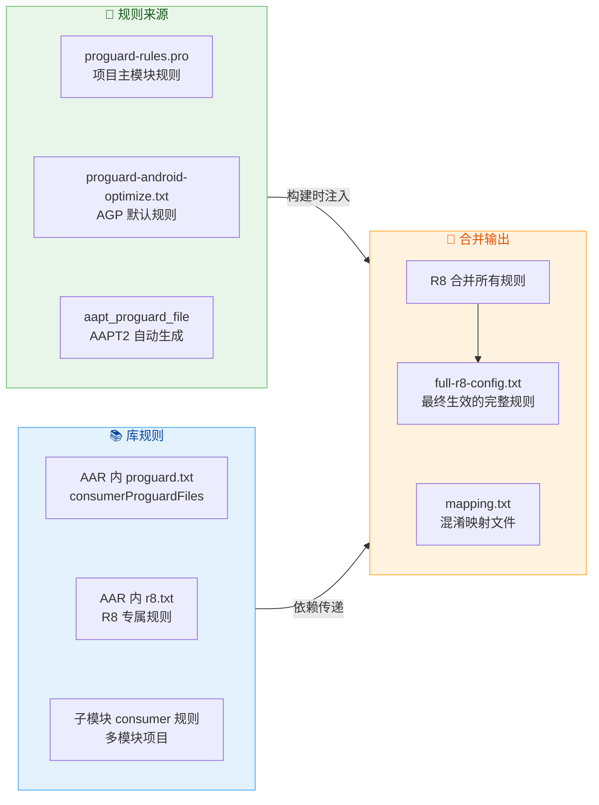

在 `build.gradle.kts` 中配置多个规则文件来源的方式如下：

```kotlin
// app/build.gradle.kts
android {
    buildTypes {
        // Release 构建类型配置
        release {
            // 启用代码压缩（R8）
            isMinifyEnabled = true
            // 启用资源压缩
            isShrinkResources = true
            proguardFiles(
                // AGP 提供的默认优化规则（包含通用 Android keep 规则）
                getDefaultProguardFile("proguard-android-optimize.txt"),
                // 项目自定义规则
                "proguard-rules.pro"
            )
        }
    }
}
```

对于 Library Module，使用 `consumerProguardFiles` 来声明**传递给消费者（app 模块）的规则**：

```kotlin
// library/build.gradle.kts
android {
    defaultConfig {
        // 这些规则会打包进 AAR，被 app 模块自动合并
        consumerProguardFiles("consumer-rules.pro")
    }
}
```

**规则合并遵循"并集"原则**：所有来源的 `-keep` 规则都会生效，保护范围只增不减。这意味着如果某个库过度使用了 `-keep class ** { *; }` 这样的宽泛规则，会 **拖累整个项目的混淆效果**。通过查看 `full-r8-config.txt` 可以找出这类"规则污染源"。

---

**📝 练习题**

在一个使用 Gson 反序列化 JSON 的项目中，数据模型类 `com.example.model.UserInfo` 仅通过 `Gson.fromJson()` 反射创建，代码中没有直接 `new UserInfo()` 的调用。以下哪条 ProGuard 规则能正确保护该类？

A. `-keepclassmembers class com.example.model.UserInfo { <fields>; }`


B. `-keepnames class com.example.model.UserInfo { <fields>; }`


C. `-keep class com.example.model.UserInfo { <fields>; <init>(); }`


D. `-dontwarn com.example.model.UserInfo`


**【答案】** C

**【解析】** 问题的关键在于 `UserInfo` 仅通过反射使用，在 Java/Kotlin 源码中没有直接引用。选项 A 使用的是 `-keepclassmembers`，它只保护成员但不保护类本身的可达性——由于 R8 的静态分析无法发现对 `UserInfo` 的直接引用，整个类会被判定为不可达并移除，成员保护规则形同虚设。选项 B 使用的是 `-keepnames`（等价于 `-keep,allowshrinking`），它允许 R8 在类不可达时移除，只保证"如果保留则不重命名"——但这里类确实不可达，所以同样会被移除。选项 D 的 `-dontwarn` 只是抑制警告，与保留代码无关。只有选项 C 的 `-keep` 规则能将 `UserInfo` 强制标记为入口点，阻止移除和重命名，同时保护所有字段名（Gson 需要字段名与 JSON key 匹配）和无参构造方法（Gson 需要通过它实例化对象）。

---

**📝 练习题**

关于 `-assumenosideeffects` 规则，以下说法正确的是？

A. 该规则会将匹配方法的实现替换为空方法体


B. 该规则会删除所有匹配方法的调用语句，无论返回值是否被使用


C. 该规则仅在方法返回值未被使用时删除调用语句，且需要优化模式开启


D. 该规则等同于 `-dontwarn`，只是抑制编译器对被删除代码的警告


**【答案】** C

**【解析】** `-assumenosideeffects` 的工作机制是在 **R8 的优化阶段** 发挥作用。它告诉编译器"这些方法没有副作用"，因此当方法的返回值没有被其他代码使用时，整个调用语句可以作为无用代码（Dead Code）被安全删除。选项 A 不正确——它不是修改方法体，而是直接在调用点删除调用语句（方法本身可能也会被 Tree Shaking 移除，但那是后续步骤）。选项 B 不正确——如果返回值被使用（参与了条件判断或赋值），R8 不能删除该调用，因为会破坏程序逻辑。选项 D 完全不相关，`-dontwarn` 只处理类缺失警告。此外，该规则需要在优化模式下才生效，使用 `proguard-android-optimize.txt`（而非不带 optimize 的版本）或 R8 默认配置即可满足条件。

---

## 资源优化

Android 应用的体积构成中，资源文件（图片、布局、字符串、动画等）往往占据了 **50% 以上** 的 APK 大小。很多开发者将精力集中在代码混淆与 Dex 优化上，却忽视了资源层面同样存在巨大的瘦身空间。资源优化的核心思路可以总结为三条主线：**删掉不用的资源、消除冗余的索引结构、缩短资源名称以压缩 resources.arsc**。这三条主线分别对应本节要深入讨论的三个二级知识点——未使用资源移除、R 文件内联，以及资源名称混淆（AndResGuard）。

在进入具体技术之前，有必要先理解 Android 资源系统的基本存储结构。当 AAPT2（Android Asset Packaging Tool 2）编译并链接资源时，会产生一张名为 `resources.arsc` 的 **资源索引表**（Resource Table）。这张表记录了每个资源的 **完整条目名称**（如 `com.example.app:drawable/ic_logo`）、**资源 ID**（0x7F060001 这样的 32 位整型值）以及对应的 **值或文件路径**。应用运行时，`AssetManager` 通过这张表根据当前设备配置（语言、分辨率、暗色模式等）定位到最佳匹配资源。因此 `resources.arsc` 越大，安装包越大，运行时的资源查找虽然是 O(log N) 级别但常数因子也会增加。资源优化的很多手段，本质上都是在 **缩减这张表的条目数量或单条大小**。

---

### 未使用资源移除

#### 问题的产生

一个经历了多年迭代的 Android 工程，往往会累积大量 "僵尸资源"（Dead Resources）。这些资源可能来源于：已下线的运营活动页面中的切图、被新版 UI 替换后遗留的旧布局、引入的第三方 SDK 中自带但从未使用的 drawable 与 string，以及多次重构后不再被任何 Java/Kotlin 代码或 XML 布局引用的文件。它们不会影响功能，但实实在在地占据着 APK 空间，并且会被打入 `resources.arsc`，拖大资源索引表。

#### Lint 静态检测：发现未使用资源

Android Studio 内置的 **Lint** 分析器提供了 `UnusedResources` 检查规则。它的工作原理是：扫描项目中所有的 Java/Kotlin 源码文件与 XML 布局文件，构建一张 **资源引用图**（Resource Reference Graph），然后将 `res/` 目录下定义的全部资源与这张引用图做差集——凡是未出现在引用图中的资源就被标记为 unused。

开发者可以通过菜单 **Analyze → Run Inspection by Name → Unused Resources** 手动执行，也可以在 CI 流水线中使用命令行触发：

```bash
# 在项目根目录执行 Lint 检查，仅启用 UnusedResources 规则
./gradlew lintDebug -Dlint.baselines.continue=true
```

需要注意的是，Lint 是 **静态分析**，存在固有盲区：

- **反射访问资源**：如果代码通过 `resources.getIdentifier("ic_logo", "drawable", packageName)` 这种动态方式获取资源 ID，Lint 无法追踪到这条引用链路，可能会将 `ic_logo` 误判为未使用。
- **动态 Feature Module**：按需下载的 Dynamic Feature 中引用的资源，主模块的 Lint 扫描可能扫不到。
- **第三方库内部引用**：AAR 内部资源之间的引用关系是完整的，但 Lint 有时会在多模块工程中漏判。

因此 Lint 的结果更适合作为 **参考列表**，开发者需要结合业务逻辑人工复核后再决定是否删除。

#### shrinkResources：构建时自动移除

相比手动根据 Lint 结果逐一删除文件，Gradle 提供了一种 **自动化** 的方案——`shrinkResources`。它在 AGP（Android Gradle Plugin）的构建流水线中作为一个独立的 Task 运行，**必须与 `minifyEnabled true` 配合使用**，因为它依赖代码收缩（Code Shrinking）的结果来判断哪些资源仍被活跃代码引用。

```kotlin
// app/build.gradle.kts
android {
    buildTypes {
        release {
            // 必须先开启代码收缩，shrinkResources 才能生效
            isMinifyEnabled = true
            // 开启资源收缩，构建时自动移除未引用的资源
            isShrinkResources = true
            // 指定 ProGuard / R8 规则文件
            proguardFiles(
                getDefaultProguardFile("proguard-android-optimize.txt"),
                "proguard-rules.pro"
            )
        }
    }
}
```

其内部执行流程可以用如下时序来理解：

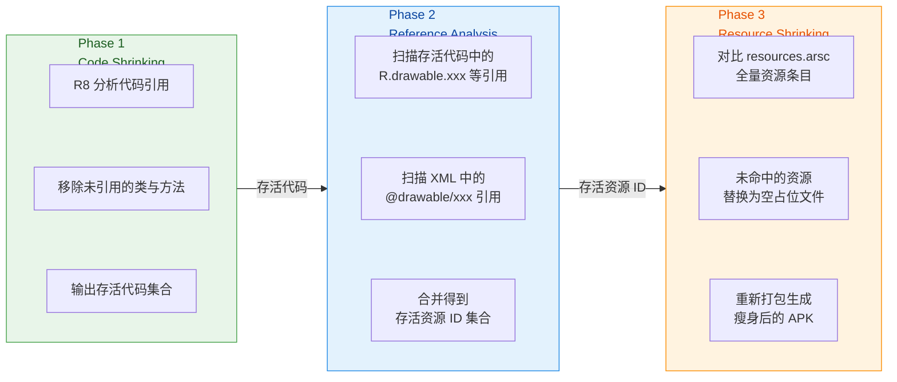

这里有一个关键细节：**shrinkResources 并不是真正地从 APK 中物理删除资源文件，而是将未使用的资源内容替换为极小的空占位文件**（例如一个 PNG 会被替换为一个仅有文件头的空白图片，XML 被替换为空节点）。这样做的原因是 `resources.arsc` 中的资源 ID 是通过 **数组下标** 紧密排列的，如果直接删除某个条目会导致后续所有资源的 ID 发生偏移，从而引发运行时崩溃。用空占位替换则既保持了 ID 稳定性，又最大限度地减小了文件体积。

#### keep.xml：白名单保护

当你的项目中确实存在通过反射、`getIdentifier()` 或者服务端动态下发资源名来访问的场景时，需要通过 `res/raw/keep.xml` 显式声明保护规则，防止 shrinkResources 误删：

```xml
<?xml version="1.0" encoding="utf-8"?>
<!-- res/raw/keep.xml -->
<!-- tools:keep 声明需要强制保留的资源，支持通配符 -->
<!-- tools:discard 声明可以安全丢弃的资源（即使被引用也丢弃） -->
<!-- tools:shrinkMode 可选 safe（默认）或 strict -->
<resources xmlns:tools="http://schemas.android.com/tools"
    tools:keep="@drawable/ic_dynamic_*,@string/remote_*"
    tools:discard="@layout/unused_legacy_*"
    tools:shrinkMode="safe" />
```

`shrinkMode` 的两种模式区别显著：

- **safe（默认）**：只要代码中出现了类似 `getIdentifier("ic_logo", ...)` 这样的调用，Resource Shrinker 就会保守地保留 **所有名称匹配** 的资源。这种模式误删风险低，但收缩率也相对有限。
- **strict**：Resource Shrinker 只保留被 **显式引用**（`R.drawable.ic_logo` 或 `@drawable/ic_logo`）的资源，以及 `keep.xml` 中声明的资源。反射式访问如果未在 keep.xml 中注册就会被移除。此模式收缩力度大，但需要开发者对项目的动态资源使用情况有完整掌控。

在大型项目中，推荐采用 **strict + 完善的 keep.xml** 策略，因为 safe 模式在面对几十个模块、上百个 AAR 时，保守策略会让大量本可移除的资源逃过收缩。

#### 构建产物日志：量化收益

开启 shrinkResources 后，构建完成时可以在以下路径找到详细的资源移除日志：

```
app/build/outputs/mapping/release/resources.txt
```

这份文件会列出所有被替换为空占位的资源名称、原始大小与替换后大小，帮助你量化此次优化的 APK 瘦身收益。结合 `APK Analyzer`（Android Studio → Build → Analyze APK）可以进一步可视化地检查 `resources.arsc` 的大小变化与各资源目录的体积占比。

---

### R 文件内联

#### R 文件的本质与膨胀问题

在 Android 构建体系中，每个模块（无论是 app 模块还是 library 模块）都会由 AAPT2 生成一个 `R.java`（或 `R.kt`）文件，其中以 **静态字段**（static field）的形式存储该模块所有资源的 ID 映射。例如：

```java
// 由 AAPT2 自动生成，不应手动编辑
public final class R {
    // drawable 资源组
    public static final class drawable {
        // 资源 ic_logo 对应的 32 位整型 ID
        public static final int ic_logo = 0x7f060001;
        // 资源 bg_splash 对应的 ID
        public static final int bg_splash = 0x7f060002;
    }
    // string 资源组
    public static final class string {
        // 字符串资源 app_name
        public static final int app_name = 0x7f0b0001;
    }
}
```

对于 **app 模块**，这些字段是 `static final` 的编译期常量（Compile-time Constant），Java 编译器会在使用处直接 **内联** 其数值——也就是说 `R.drawable.ic_logo` 在字节码中会被替换为 `0x7f060001`，运行时根本不需要加载 R 类。

但对于 **library 模块**，情况完全不同。由于 library 在编译时并不知道最终合并后的资源 ID 是多少（ID 会在 app 模块的最终 merge 阶段才确定），因此 library 的 R 类字段是 **`static`（非 final）** 的。这意味着 Java 编译器 **无法在编译期内联**，library 代码中所有 `R.drawable.ic_logo` 的引用都会保留为 **字段访问指令**（`getstatic`），R 类本身也必须作为完整的 class 文件存在于最终的 Dex 中。

在一个拥有几十个 library module 的大型工程中，这个问题会急剧恶化。假设整个工程定义了 5000 个资源，有 30 个 library 模块，那么每个 library 都会生成一份包含 5000 个字段的 R 类（因为 AGP 默认会将上游传递的资源 ID 也写入下游 library 的 R 文件），最终 Dex 中就存在 **30 × 5000 = 150,000 个冗余字段**。每个 `int` 字段在 Dex 格式中占用约 16~20 字节的元数据，这意味着仅 R 文件就额外贡献了 **2~3 MB** 的 Dex 体积。更严重的是，Dex 有 **65536 个方法/字段引用的上限**（64K limit），R 文件的字段膨胀还会加速触发 MultiDex 分包。

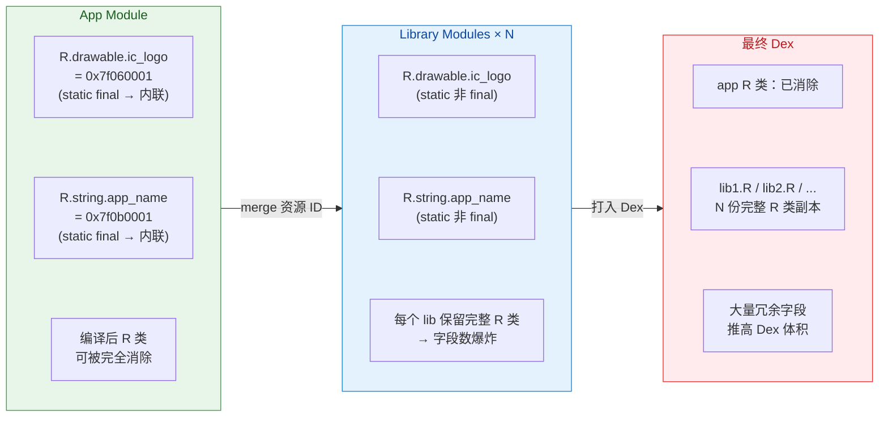

#### AGP 的 R 文件内联机制

从 AGP 4.1 开始，Android Gradle Plugin 引入了 **R 类的字节码内联优化**。当 `minifyEnabled = true` 时（即开启 R8），R8 编译器会在代码收缩阶段识别出所有 library R 类的字段访问，将其 **替换为对应的整型字面量**，然后将不再被引用的 R 类整体从 Dex 中移除。这个过程等价于把 library 的 `static` 字段 "手动升级" 为了 `static final` 的内联效果。

到了 **AGP 8.0+**，这一优化更加激进——即使在 **非混淆构建** 中，AGP 也开始支持 `nonTransitiveRClass` 特性（通过 `gradle.properties` 配置 `android.nonTransitiveRClass=true`），使每个 library 的 R 文件 **只包含自己定义的资源 ID，不再传递上游依赖的 ID**。这从源头上减少了 R 文件的条目数量，即使没有 R8 内联也能显著降低字段数。

```kotlin
// gradle.properties
// 开启非传递性 R 类，每个 library 只生成自身资源的 R 文件
android.nonTransitiveRClass=true
```

开启此选项后，如果 `libraryB` 需要使用 `libraryA` 中定义的 `R.string.shared_title`，就不能再通过自己的 `com.example.libraryB.R.string.shared_title` 访问（因为它不再传递），而必须显式导入 `com.example.libraryA.R` 来引用。这在迁移时需要对大量 import 语句进行调整，但现代 Android Studio 提供了自动迁移重构工具（Refactor → Migrate to Non-transitive R Classes）来辅助完成。

#### 手动/插件级 R 文件内联方案

在 AGP 8.0 之前的老项目中，或者在不开启 R8 的 Debug 构建中，开发者可以借助社区插件实现类似效果。最知名的是字节跳动开源的 **ByteX** 框架中的 `shrink-r-plugin`，以及美团等团队在内部实践中使用的自定义 Transform。它们的原理大同小异：

1. 在 Dex 打包之前，扫描所有 `.class` 文件中的 `getstatic` 指令。
2. 如果目标字段属于某个 R 类（通过类名匹配 `*/R$drawable`、`*/R$string` 等模式），则查表获取该字段的实际数值。
3. 将 `getstatic` 替换为 `const` 指令（直接加载整型常量）。
4. 删除不再被引用的 R 类文件。

这种插件级方案的优点是可以精细控制哪些模块参与内联、哪些保留（例如需要反射访问 R 类的场景），缺点是增加了构建耗时和维护成本。随着 AGP 原生支持越来越完善，社区方案正在逐步退出历史舞台。

#### 内联的收益与注意事项

根据大量工业实践的数据，R 文件内联在大型多模块项目中可以带来 **1~5 MB** 的 Dex 体积缩减，同时减少数万个字段引用，有效缓解 64K 限制的压力。但需要注意以下几点：

- **反射访问 R 类**：如果业务代码或第三方 SDK 通过反射（`Class.forName("com.example.R$drawable")`）访问 R 类字段，内联后 R 类被删除会导致 `ClassNotFoundException`。此时需要在 ProGuard 规则中 `-keep class **.R$* { *; }` 来保护相关 R 类。
- **资源 ID 在 switch-case 中的使用**：Java 的 `switch` 语句要求 case 值为编译期常量。library 模块的非 final R 字段无法直接用于 switch-case，AGP 会生成额外的 `if-else` 链。内联后这些 case 值变为常量，R8 可能会将 if-else 链优化回 `tableswitch` 指令，反而提升运行时性能。
- **Mapping 映射**：R 文件内联不涉及名称重命名，因此不会影响 mapping.txt 的解读。

---

### 资源名称混淆（AndResGuard）

#### 为什么要混淆资源名称

经过前两步（移除未使用资源 + R 文件内联），APK 中仍然保留了所有 **存活资源** 的完整路径名与条目名。例如 `res/drawable-xxhdpi/ic_notification_badge_large.png` 这个字符串会完整地出现在 `resources.arsc` 以及 ZIP 中央目录（Central Directory）中。对于一个拥有数千个资源的应用，这些字符串累积起来可以占据 **数百 KB 甚至超过 1 MB** 的空间。

更重要的是，资源名称是 **明文** 的，任何人解压 APK 后都能从文件名和目录结构中推断出应用的功能模块划分、运营活动名称、甚至未上线功能的存在。从安全与知识产权保护的角度，混淆资源名称也有重要意义。

#### AndResGuard 的工作原理

**AndResGuard** 是微信团队开源的一款 Android 资源混淆工具，它的核心思想很简单：**将冗长的资源路径与名称缩短为极短的无意义字符串**，例如把 `res/drawable-xxhdpi/ic_notification_badge_large.png` 重命名为 `r/d/a.png`。这个过程分为以下几个关键步骤：

**第一步：解析 resources.arsc**。AndResGuard 直接以二进制方式读取 `resources.arsc` 文件，解析出 **String Pool**（全局字符串池）和各 **Type Spec** 中的条目名称。`resources.arsc` 的结构大致如下：

```
┌───────────────────────────────────────┐
│         Resource Table Header         │
├───────────────────────────────────────┤
│      Global String Pool               │  ← 存储所有资源值字符串
├───────────────────────────────────────┤
│      Package Header                   │
├───────────────────────────────────────┤
│      Type String Pool                 │  ← "drawable", "layout", "string"...
├───────────────────────────────────────┤
│      Key String Pool                  │  ← "ic_logo", "app_name", "bg_splash"...
├───────────────────────────────────────┤
│      Type Spec + Type Info (×N)       │  ← 各配置下的资源映射
└───────────────────────────────────────┘
```

AndResGuard 的重命名目标主要是 **Key String Pool**（资源名称池）以及 ZIP 条目中的 **文件路径字符串**。

**第二步：构建重命名映射表**。遍历 Key String Pool 中的每个条目名，按照 a, b, c, ..., z, aa, ab, ... 的序列依次分配新名称。目录名 `res/drawable-xxhdpi/` 也被缩短为 `r/d/` 等。这张映射表会被输出为 `resource_mapping.txt` 文件，作用类似代码混淆中的 `mapping.txt`，用于后续调试时还原真实资源名。

**第三步：重写 resources.arsc**。将 Key String Pool 中的旧名称批量替换为新名称。由于新名称远短于旧名称，String Pool 的总字节数会大幅缩减。同时更新各 Type Info 条目中指向的文件路径。

**第四步：重新打包 APK**。将 APK 中的资源文件按照新路径重新排列，更新 ZIP 中央目录中的文件名条目，然后使用 **7-Zip** 以更高的压缩比（相比 AAPT2 默认的 DEFLATE）重新压缩打包。AndResGuard 默认采用的 7z 压缩可以比原始 AAPT2 输出再节省 **3%~8%** 的体积。

**第五步：重新签名**。因为 APK 的内容发生了变化，必须使用原有密钥对新 APK 重新执行 V1/V2/V3 签名。

整个流程的核心优势可以归纳为：

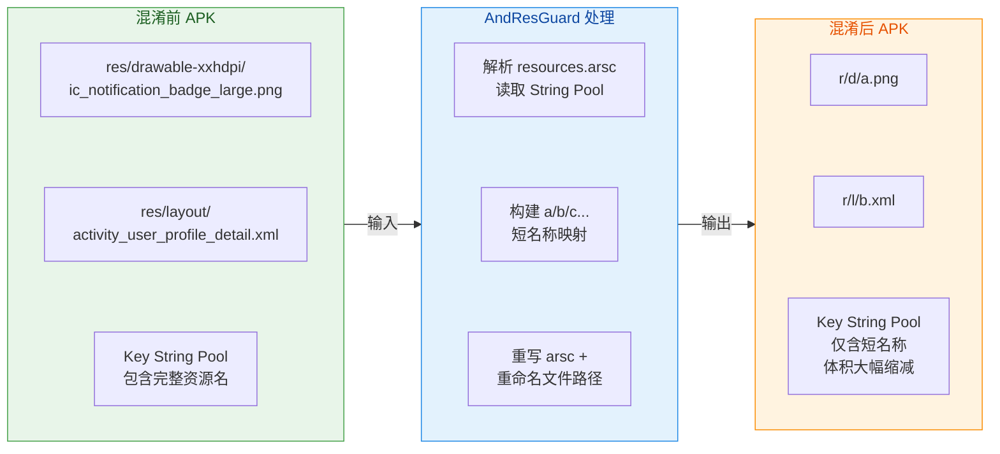

#### Gradle 集成配置

AndResGuard 以 Gradle 插件的形式集成到构建流程中，配置方式如下：

```kotlin
// 项目根目录 build.gradle.kts
buildscript {
    dependencies {
        // 添加 AndResGuard 插件依赖
        classpath("com.tencent.mm:AndResGuard-gradle-plugin:1.2.21")
    }
}
```

```kotlin
// app/build.gradle.kts
// 应用 AndResGuard 插件
apply(plugin = "AndResGuard")

// 配置 AndResGuard 参数
andResGuard {
    // 是否启用 7-Zip 压缩以获得更高压缩比
    use7zip = true
    // 是否对 resources.arsc 本身也进行压缩（通常 arsc 在 APK 中是 STORED 不压缩的）
    // 注意：Android 6.0+ 要求 arsc 不压缩，建议保持 false
    useSign = true
    // 保留的资源路径白名单（不参与混淆）
    // 通配符格式：资源类型/资源名
    whiteList = mutableListOf(
        // 通知栏图标在系统进程中通过名称加载，必须保留
        "R.drawable.notification_*",
        // AppWidget 的布局和资源也可能被 Launcher 按名称引用
        "R.layout.widget_*",
        // 通过 getIdentifier() 动态加载的资源
        "R.string.dynamic_*",
        // 第三方 SDK 可能按名称查找的资源
        "R.drawable.umeng_*",
        "R.drawable.wechat_*"
    )
    // 压缩配置
    compressFilePattern = mutableListOf(
        // 对这些类型的文件应用压缩
        "*.png",
        "*.jpg",
        "*.jpeg",
        "*.gif",
        "*.webp",
        "resources.arsc" // 6.0 以下设备可压缩 arsc，6.0+ 需移除此项
    )
    // 7-Zip 可执行文件路径（macOS 下常用 Homebrew 安装路径）
    sevenzip {
        artifact = "com.tencent.mm:SevenZip:1.2.21"
    }
    // 生成的 resource_mapping.txt 输出路径
    // 默认在 app/build/outputs/apk/release/ 下
}
```

#### 白名单（whiteList）的重要性

白名单配置是 AndResGuard 使用中最容易出错、也最关键的环节。以下几类资源 **必须** 加入白名单：

1. **通知栏图标**（Notification Icon）：Android 系统的 `NotificationManagerService` 运行在 `system_server` 进程中，它通过 `resources.getIdentifier()` 在应用的资源表中按名称查找通知小图标。如果图标名被混淆为 `a`，系统就找不到了，通知会显示为空白或默认图标。

2. **AppWidget 布局与资源**：桌面小部件的 `RemoteViews` 由 Launcher 进程渲染，同样通过资源名称进行跨进程引用。

3. **第三方 SDK 约定名称的资源**：许多 SDK（如微信分享、支付宝、推送服务）会在文档中约定特定的 drawable 或 string 名称，通过 `getIdentifier()` 查找。混淆会导致 SDK 功能异常。

4. **Transition / Animation 中通过名称引用的资源**：某些 Shared Element Transition 会用 `transitionName` 匹配资源名。

5. **WebView 中 JavaScript 通过 `file:///android_res/` 协议访问的资源**：这类访问直接使用资源路径字符串。

#### 与 AAPT2 的 `--collapse-resource-names` 对比

从 AGP 7.1 开始，Google 在 AAPT2 中引入了一个实验性的官方方案 `--collapse-resource-names`，它在链接阶段将 `resources.arsc` 的 Key String Pool 中所有名称替换为同一个空字符串，从而达到类似 AndResGuard 缩短名称的效果。开启方式为：

```kotlin
// gradle.properties
// 启用 AAPT2 资源名称折叠（实验性）
android.enableResourceOptimizations=true
```

两者的对比：

| 维度 | AndResGuard | AAPT2 collapse-resource-names |
|------|-------------|-------------------------------|
| **作用范围** | Key String Pool + 文件路径 + ZIP 目录 | 仅 Key String Pool |
| **压缩效果** | 更强（7-Zip 重压缩） | 一般（沿用 AAPT2 默认压缩） |
| **白名单机制** | 成熟，支持通配符 | 较新，配置方式不同 |
| **兼容性** | 社区验证充分 | AGP 7.1+ 实验性 |
| **维护成本** | 需要额外插件 | 内置于 AGP，零成本 |
| **签名处理** | 自行重签名 | 无需额外签名步骤 |

对于新项目或已升级到 AGP 8.0+ 的项目，优先尝试官方的 `enableResourceOptimizations` 方案，不满足需求时再引入 AndResGuard。两者 **不能同时使用**，因为它们都会修改 `resources.arsc` 的 String Pool，同时运行会导致冲突。

#### 资源混淆的实际收益

根据微信团队公开分享的数据以及社区的广泛实践，AndResGuard 在不同体量的应用上通常可以带来以下级别的优化：

- **resources.arsc 体积**：缩减 **40%~60%**，因为 Key String Pool 中的长名称被替换为 1~2 字符的短名称。
- **APK 总体积**：在已经开启 shrinkResources 的基础上，额外缩减 **1~3 MB**（主要来自文件路径缩短带来的 ZIP 中央目录缩减，以及 7-Zip 的更高压缩比）。
- **安全性提升**：逆向工程者无法从资源名推断功能模块，增加了逆向分析的难度。

#### 调试与 Mapping 还原

AndResGuard 输出的 `resource_mapping.txt` 文件格式如下：

```
res path mapping:
    res/drawable-xxhdpi -> r/d
    res/layout -> r/l
res id mapping:
    0x7f060001 : ic_notification_badge_large -> a
    0x7f060002 : bg_splash_screen -> b
    0x7f0b0001 : app_name -> c
```

当线上用户反馈某个界面图片显示异常时，开发者可以从崩溃日志或截图中看到混淆后的资源名（如 `r/d/a.png`），然后通过 mapping 文件还原为原始名称 `res/drawable-xxhdpi/ic_notification_badge_large.png`，快速定位问题。**这份文件必须与代码混淆的 `mapping.txt` 一起归档保存**，建议上传到 CI 的 Artifact 存储或专门的 Symbol Server 中。

---

**📝 练习题**

在一个拥有 20 个 library module 的 Android 项目中，开发者发现 Debug APK 的 Dex 部分异常膨胀，经分析发现大量 R 类副本占据了约 3 MB 空间。以下哪种方案在 **不开启 R8 混淆** 的前提下，最能有效缓解此问题？

A. 在 `gradle.properties` 中设置 `android.nonTransitiveRClass=true`


B. 在 `build.gradle` 中设置 `shrinkResources = true`


C. 使用 AndResGuard 混淆资源名称


D. 在 ProGuard 规则中添加 `-keep class **.R$* { *; }`


**【答案】** A

**【解析】** 此题的关键约束是 **"不开启 R8 混淆"**，这排除了依赖 R8 进行 R 文件内联的常规方案。选项 B 的 `shrinkResources` 必须配合 `minifyEnabled = true` 才能生效，而 `minifyEnabled` 正是 R8 的开关，所以 B 不满足前提条件。选项 C 的 AndResGuard 作用于 `resources.arsc` 的字符串池和文件路径，不影响 Dex 中的 R 类字段数量，无法解决 Dex 膨胀问题。选项 D 恰恰相反——`-keep` 规则会 **阻止** R 类被移除，只会让问题更严重。选项 A 的 `nonTransitiveRClass=true` 从构建源头改变 R 文件的生成策略，使每个 library 的 R 文件 **只包含自身定义的资源条目**，不再传递上游所有依赖的资源 ID。即使不开启 R8，每个 R 类的字段数也会从"全量资源数"降低到"自身模块资源数"，从根本上减少了 R 类副本的膨胀问题。这是 AGP 提供的编译期配置，不依赖任何混淆或收缩工具。

---

**📝 练习题**

使用 AndResGuard 对 APK 进行资源名称混淆后，线上出现部分设备的通知栏图标显示为空白。以下哪项操作最可能修复此问题？

A. 将 `shrinkResources` 设为 `false` 以保留所有资源


B. 在 AndResGuard 的 `whiteList` 中添加 `"R.drawable.notification_*"` 以保护通知图标不被混淆


C. 在 ProGuard 规则中添加 `-keep class R.drawable { *; }` 以防止 R 类被移除


D. 将通知图标从 `res/drawable` 移动到 `assets/` 目录以绕过混淆


**【答案】** B

**【解析】** 通知栏图标由系统进程 `system_server` 中的 `NotificationManagerService` 负责渲染。当应用通过 `NotificationCompat.Builder.setSmallIcon(R.drawable.notification_xxx)` 设置图标时，系统进程需要根据资源 ID 反查应用的 `resources.arsc`，并通过 **资源名称** 定位到对应的图片文件路径。如果 AndResGuard 将 `notification_xxx` 重命名为 `a`，而 `resources.arsc` 中的路径也从 `res/drawable/notification_xxx.png` 变为 `r/d/a.png`，系统进程在某些情况下可能无法正确解析（尤其是涉及跨进程资源加载的兼容性问题），导致图标显示空白。将通知相关的 drawable 加入 `whiteList` 后，AndResGuard 会跳过这些资源的重命名，保持原始名称不变，系统进程就能正常加载。选项 A 关闭的是 Gradle 的资源收缩而非 AndResGuard 的混淆，不解决问题。选项 C 的 ProGuard 规则作用于代码层的 R 类，与 `resources.arsc` 中的资源名称无关。选项 D 将图标移入 `assets/` 虽然能绕过混淆，但 `setSmallIcon()` API 要求的是资源 ID 而非 asset 路径，这种做法在 API 层面不可行。

---

## 字节码优化

在 Android 应用的构建流水线中，R8/ProGuard 所做的优化主要集中在"移除不可达代码"和"名称混淆"这两个维度。然而，即使经过 R8 处理后的 DEX 文件，其内部的字节码组织方式仍然存在大量可优化空间。**字节码优化（Bytecode Optimization）** 是在 DEX 层面对指令序列、方法结构乃至类的组织形态进行深度重构，目标是榨取最后一滴性能——更小的包体积、更快的冷启动、更优的运行时执行效率。

要理解字节码优化的价值，首先需要明确一个背景：Dalvik/ART 虚拟机执行的并非 Java Bytecode（`.class`），而是 Dalvik Bytecode（`.dex`）。DEX 格式本身是一种紧凑的、寄存器型指令集，但编译器（javac → D8/R8）生成的 DEX 并不总是最优的。例如，方法的排列顺序可能导致虚拟方法调度表（vtable）过大；类之间的继承层次可能引入不必要的间接调用；某些短小方法完全可以被内联到调用点以消除 `invoke` 指令的开销。这些优化通常无法由 R8 独立完成（R8 做了部分，但不够激进），因此业界出现了以 **Meta（Facebook）的 Redex** 为代表的专用字节码优化工具。

本节将从三个核心维度展开：**Redex 字节码重排**、**方法内联（Inlining）**、**类合并（Class Merging）**，带你深入理解这些技术的原理、收益与实践方式。

---

### Redex 字节码重排

#### 什么是 Redex

Redex 是 Meta（原 Facebook）开源的一款 Android 字节码优化器（bytecode optimizer）。它工作在 **DEX 层面**——接收 R8 输出的 `.dex` 文件（或整个 APK），对其中的字节码进行一系列 pass（优化遍），最终输出体积更小、执行更快的 DEX 文件。可以将 Redex 理解为 DEX 世界的 "LLVM"：它定义了一套 IR（中间表示），在 IR 上执行各种 optimization pass，最终再序列化回 DEX。

Redex 与 R8 的关系并非替代，而是 **互补**。典型的构建流水线是：

```
源码 → javac/kotlinc → .class → D8/R8 → .dex → Redex → 优化后的 .dex → APK
```

R8 侧重于 Tree Shaking、名称混淆、基本的代码收缩；Redex 则在 R8 输出的基础上进行 **更激进的字节码级变换**，包括但不限于：字节码重排（reordering）、跨 DEX 方法引用优化、类合并、方法内联、常量传播、死代码消除的二次清理等。

#### 字节码重排的核心原理

所谓 **字节码重排（Bytecode Reordering / DEX Reordering）**，是指在不改变程序语义的前提下，调整 DEX 文件中类、方法、字符串等元素的物理排列顺序，以获得更好的运行时性能。它的核心思想源于 **局部性原理（Locality Principle）**：

1. **空间局部性（Spatial Locality）**：如果某段数据/代码被访问，那么与它相邻的数据/代码在短时间内也大概率会被访问。
2. **时间局部性（Temporal Locality）**：最近被访问过的数据/代码，短时间内可能再次被访问。

在 Android 冷启动过程中，ART 虚拟机需要从 DEX 文件（或其 OAT/VDEX 编译产物）中加载大量类和方法。如果启动路径上需要用到的类散落在 DEX 文件的各个角落，那么操作系统的 **页面调度（Page Fault）** 次数就会显著增加——每次触发 page fault，内核需要从磁盘（flash storage）读取一个 4KB 的页面到内存，这在低端设备上可能耗费数毫秒。当 page fault 累积到数百次时，冷启动时间就会被显著拉长。

字节码重排的策略是：**将冷启动路径上需要加载的类和方法，在 DEX 文件中物理上排列到一起**，使它们尽可能落在连续的内存页面中。这样，一次 page fault 读入的 4KB 页面中就能包含更多"有用"的数据，总的 page fault 次数大幅减少。

#### Redex 的重排机制

Redex 实现字节码重排主要通过以下步骤：

**第一步：收集启动 Profile 数据。** 在真实设备上运行 App，记录冷启动过程中实际被加载的类和方法。这些 Profile 数据通常以一个文本文件的形式提供给 Redex，每行一个类名或方法签名。Android 8.0+ 的 ART 本身就支持 Profile-Guided Optimization（PGO），可以导出 `.prof` 文件；也可以通过插桩方式收集。

**第二步：构建调用图与依赖关系。** Redex 解析所有 DEX 文件，构建类之间的继承关系、方法之间的调用关系（Call Graph）。结合第一步的 Profile 数据，它可以精确识别哪些类属于"启动热路径"，哪些属于"非启动路径"。

**第三步：执行 InterDex Pass（跨 DEX 重排）。** 这是 Redex 最核心的 pass 之一。它将启动热路径上的类尽可能集中到 **primary DEX（classes.dex）** 中，并在 DEX 内部按照调用顺序排列。对于多 DEX 应用（multidex），还会优化类在各个 DEX 文件之间的分配，减少跨 DEX 引用。

**第四步：字符串与方法引用排序。** DEX 文件内部有一个 `string_ids` 表和 `method_ids` 表。Redex 会对这些表进行重新排序，使得启动路径上频繁引用的字符串和方法 ID 排列在前，提升查找效率和缓存命中率。

下面用一个 Mermaid 图来展示 Redex 重排的整体流程：

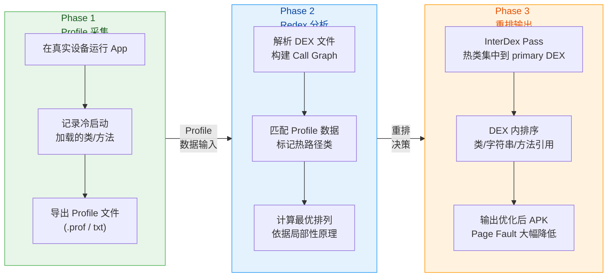

#### 重排的实际收益

Meta 在其公开的技术分享中曾指出，Redex 的 InterDex 重排可以为大型应用（如 Facebook App）带来 **冷启动时间减少 10%–30%** 的效果，具体取决于应用的规模和 DEX 文件数量。对于中小型应用，由于 DEX 文件本身较小，重排带来的 page fault 减少效果可能没那么显著，但仍然值得尝试。

在 Gradle 构建系统中，Redex 通常以 **自定义 Task** 的方式接入。你需要先编译安装 Redex（它是一个 C++ 项目），然后在 `build.gradle` 中注册一个在 `assembleRelease` 之后运行的 Task，将 APK 传给 Redex 处理：

```bash
# 典型的 Redex 命令行调用
# 输入：经过 R8 处理的 APK
# 输出：字节码优化后的 APK
# -P：指定 Redex 配置文件（JSON 格式）
# --proguard-map：传入 R8 生成的 mapping 文件，确保混淆映射一致
redex \
  --proguard-map app/build/outputs/mapping/release/mapping.txt \  # R8 映射文件
  -P redex-config.json \                                          # Redex 配置
  -o app-optimized.apk \                                          # 输出路径
  app/build/outputs/apk/release/app-release.apk                   # 输入 APK
```

Redex 配置文件（`redex-config.json`）中可以精确控制启用哪些 pass：

```json
{
  "redex": {
    "passes": [
      "InterDexPass",
      "ReorderInterfacesPass",
      "RemoveUnreachablePass",
      "MethodInlinePass",
      "ClassMergingPass",
      "RegAllocPass",
      "CopyPropagationPass",
      "LocalDcePass",
      "DedupBlocksPass"
    ]
  },
  "InterDexPass": {
    "static_prune": true,
    "emit_canaries": true,
    "coldstart_classes": "coldstart_classes.txt"
  }
}
```

上面的配置中，`InterDexPass` 的 `coldstart_classes` 字段指向一个文本文件，里面记录了冷启动路径上的类列表。这个文件通常通过前面提到的 Profile 采集获得。

---

### 方法内联 Inlining

#### 方法调用的开销

在讨论方法内联之前，必须先理解"调用一个方法"在 Dalvik/ART 虚拟机中意味着什么。当执行一条 `invoke-virtual`、`invoke-direct` 或 `invoke-static` 指令时，虚拟机需要完成以下操作：

1. **方法解析（Method Resolution）**：通过 `method_id` 在 DEX 的方法表中查找目标方法的实际代码偏移。对于虚方法（`invoke-virtual`），还需要通过对象的 vtable 进行分派。
2. **栈帧分配（Frame Allocation）**：ART 为目标方法创建新的栈帧（Stack Frame），包括寄存器空间、返回地址等。
3. **参数传递（Argument Passing）**：将调用方的参数值拷贝到被调用方的寄存器中。
4. **跳转执行（Jump）**：程序计数器（PC）跳转到目标方法的入口地址。
5. **返回值处理（Return）**：方法执行完毕后，返回值传回调用方，栈帧销毁，PC 恢复。

对于一个只有两三行逻辑的简单 getter 方法或工具方法，上述"仪式性"操作的开销可能 **远大于** 方法体本身的计算开销。这就是方法内联的出发点：**把被调用方法的代码直接"复制粘贴"到调用点，消除 invoke 指令，避免上述一切调用开销。**

#### 内联的基本原理

方法内联（Method Inlining）是编译器优化中最经典的技术之一。其核心思想非常直观：

```kotlin
// ========== 内联前 ==========
// 一个简单的工具方法
fun isValid(value: Int): Boolean {  // 方法定义占据独立空间
    return value > 0                 // 方法体只有一行
}

fun process(data: Int) {
    if (isValid(data)) {             // invoke-virtual/invoke-static 指令
        // 执行业务逻辑              // 需要方法解析、栈帧分配等开销
    }
}

// ========== 内联后 ==========
fun process(data: Int) {
    if (data > 0) {                  // isValid 的方法体被直接替换到此处
        // 执行业务逻辑              // 消除了 invoke 指令及相关开销
    }                                // isValid 方法若无其他调用者，可被移除
}
```

在 DEX 字节码层面，内联前后的差异更加明显：

```text
; ========== 内联前的 Dalvik 字节码 ==========
; process 方法中调用 isValid
invoke-static {v0}, LMyUtils;->isValid(I)Z    ; 调用 isValid（需方法解析+栈帧）
move-result v1                                  ; 获取返回值
if-eqz v1, :label_skip                         ; 判断返回值

; ========== 内联后的 Dalvik 字节码 ==========
; isValid 的逻辑直接嵌入 process
if-lez v0, :label_skip                          ; 直接比较，无 invoke 开销
                                                 ; 省去了一条 invoke + move-result
```

可以看到，内联后不仅减少了指令数量，还消除了方法调度的间接成本。

#### Redex 的 MethodInlinePass

R8 本身也会执行一定程度的方法内联，但它比较保守——主要内联 `final` 方法、`private` 方法以及非常短小的方法。Redex 的 `MethodInlinePass` 则更加激进，它会：

1. **全局分析调用频率**：统计每个方法在整个 App 中被调用的次数。只被调用一次的方法（single-callsite method）是最理想的内联候选，因为内联后方法定义可以完全删除，不会增加代码体积。

2. **计算内联收益与代价**：对于被多次调用的方法，内联会导致方法体在每个调用点都被复制一份，增大代码体积（code size bloat）。Redex 会通过一个 **收益模型（cost-benefit model）** 来判断：内联节省的 invoke 开销是否值得额外的体积增长。通常，方法体小于某个阈值（如 5~10 条指令）的方法会被优先内联。

3. **处理虚方法去虚化（Devirtualization）**：对于虚方法调用（`invoke-virtual`），如果 Redex 通过全局类型分析发现某个调用点的接收者类型只有唯一实现（即没有子类 override），它可以将 `invoke-virtual` 降级为 `invoke-direct`（非虚调用），然后再进一步内联。这个过程称为 **devirtualization + inlining**，是非常强力的优化组合。

4. **跨 DEX 内联**：在多 DEX 场景中，方法调用可能跨越 DEX 边界。Redex 可以将被调用方法的代码内联到调用方所在的 DEX 中，减少跨 DEX 方法引用。

#### ART 的 JIT/AOT 内联

值得一提的是，方法内联并非只能在构建时进行。ART 虚拟机本身在运行时也会执行内联优化：

- **JIT 编译器（Android 7.0+）**：ART 的 JIT 会在运行时识别热点方法（hot methods），对其进行编译优化，其中就包括方法内联。JIT 的优势在于它掌握运行时的类型信息（Runtime Type Information），可以做出更精准的内联决策。
- **AOT 编译（Profile-Guided）**：当设备处于充电和空闲状态时，ART 会根据收集到的 Profile 数据对热点方法进行 AOT（Ahead-of-Time）编译，将 JIT 编译的成果固化为 native code。内联同样是 AOT 编译的核心优化之一。

那么问题来了：既然 ART 运行时会做内联，为什么还需要 Redex 在构建时做？原因有几个：

1. **冷启动阶段 JIT 尚未介入**：在 App 第一次安装后的冷启动中，JIT Profile 数据为空，ART 完全以解释模式或基础 AOT 模式运行，无法享受 JIT 内联的红利。构建时内联可以从第一次启动就生效。
2. **低端设备资源受限**：JIT 编译本身需要 CPU 和内存资源。在低端设备上，JIT 的介入可能反而导致启动期间的资源竞争。构建时优化不消耗运行时资源。
3. **覆盖面更广**：Redex 可以对整个 App 进行全局分析，而 JIT 只能优化已经执行过的热点路径。

#### 内联的风险与注意事项

方法内联并非没有风险，开发者需要注意以下几点：

**代码体积膨胀（Code Size Bloat）**：过度激进的内联会导致 DEX 体积增大，可能抵消甚至反超节省的方法调用开销。特别是当一个较大的方法被内联到多个调用点时，体积增长非常可观。Redex 的 `MethodInlinePass` 提供了指令数阈值参数来控制内联的激进程度。

**栈追踪信息丢失**：内联后，原方法在运行时不再存在于调用栈中。如果 App 在内联区域发生崩溃，生成的 Stacktrace 中不会出现被内联方法的名称，增加了调试难度。这与混淆后的 Stacktrace 还原问题类似，需要保留相应的映射信息。

**反射兼容性**：如果代码中通过反射（`Class.getMethod()` / `Method.invoke()`）调用某个方法，而该方法被内联并删除了，反射调用将在运行时抛出 `NoSuchMethodException`。因此，任何可能被反射访问的方法都必须通过 keep 规则排除在内联之外。

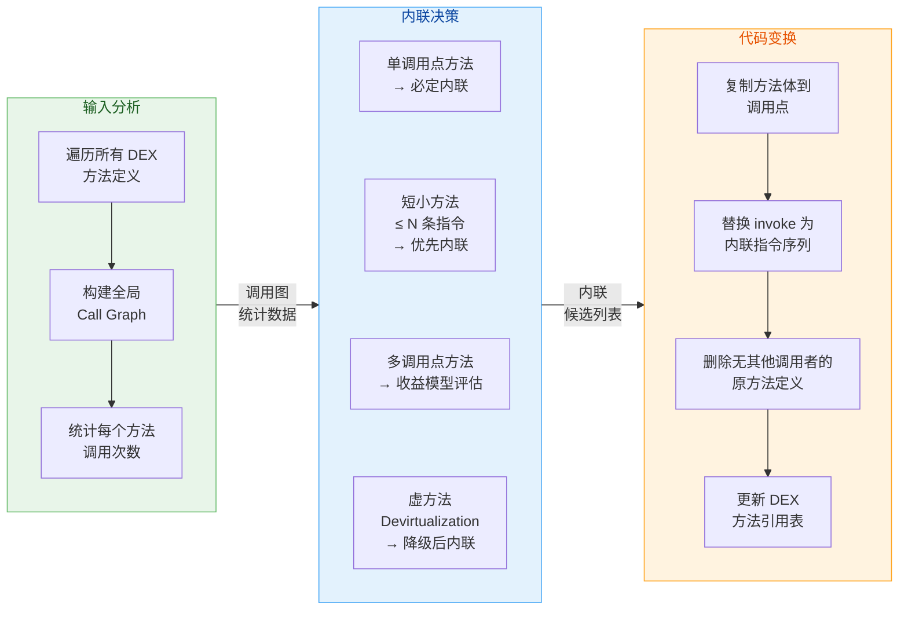

---

### 类合并 Class Merging

#### 为什么需要类合并

在现代 Android 开发中，开发者倾向于编写大量细粒度的类：接口（Interface）、抽象类（Abstract Class）、各种 Model、DTO、ViewModel、Repository……这种面向对象设计本身是良好的工程实践，但它在 DEX 层面引入了显著的 **元数据开销（Metadata Overhead）**。

每一个类在 DEX 文件中都需要占据以下空间：

1. **`type_ids` 表条目**：记录类的全限定名引用。
2. **`class_def` 表条目**：记录类的访问标志、父类、接口列表、字段列表、方法列表、注解等。
3. **`field_ids` 和 `method_ids` 表条目**：该类声明的所有字段和方法的引用。
4. **字节码区域**：该类所有方法的实际指令。
5. **虚方法表（vtable）条目**：ART 运行时为每个类维护一个 vtable，用于虚方法分派。类越多、继承层次越深，vtable 占用的内存就越多。

当一个 App 拥有数万个类时（大型 App 轻松达到 5 万+），这些元数据的累积开销非常可观。**类合并（Class Merging）** 的思路是：将多个"结构相似"的类合并为一个类，从而减少类的总数量，节省元数据开销，同时也减少了类加载的次数。

#### 类合并的基本策略

Redex 的 `ClassMergingPass` 支持多种合并策略，核心思想是找到 **可以安全合并** 的类集合。以下是几种典型的合并模式：

**1. 同父类、无子类的叶子类合并（Leaf Class Merging）**

这是最常见也最安全的合并策略。如果多个类满足以下条件：
- 继承自同一个父类（或实现同一个接口）
- 没有被进一步继承（即它们是继承树的"叶子节点"）
- 没有被反射、序列化等机制直接引用

那么它们可以被合并为一个类，通过一个 **类型标签字段（type tag field）** 来区分原本不同的类。

举一个具体例子。假设你的 App 中有一个事件系统，定义了大量事件类：

```kotlin
// 合并前：每个事件是一个独立的类
// 每个类都需要 type_id, class_def, vtable 等元数据
abstract class AnalyticsEvent                // 共同父类

class ClickEvent(                            // 叶子类 1
    val buttonId: String                     // 特有字段
) : AnalyticsEvent()

class ScrollEvent(                           // 叶子类 2
    val direction: Int                       // 特有字段
) : AnalyticsEvent()

class SwipeEvent(                            // 叶子类 3
    val velocity: Float                      // 特有字段
) : AnalyticsEvent()

class ImpressionEvent(                       // 叶子类 4
    val viewId: String                       // 特有字段
) : AnalyticsEvent()
```

经过类合并后，上述四个叶子类被合并为一个：

```kotlin
// 合并后：四个叶子类 → 一个合并类
class MergedAnalyticsEvent(
    val typeTag: Int,                        // 类型标签：0=Click, 1=Scroll, 2=Swipe, 3=Impression
    val field_string_0: String?,             // 合并后的字段：原 buttonId / viewId
    val field_int_0: Int,                    // 合并后的字段：原 direction
    val field_float_0: Float                 // 合并后的字段：原 velocity
) : AnalyticsEvent()
// 优化效果：4 个 class_def → 1 个，3 个 type_id 被删除
// vtable 条目数也相应减少
```

可以看到，合并的核心手段是：
- 引入一个 `typeTag` 整型字段，运行时用来区分"这个对象原本是哪个类"。
- 将各个原始类的字段按类型统一编号（`field_string_0`、`field_int_0`……），通过"字段槽位复用"来承载不同原始类的数据。
- 如果原始类有各自不同的方法实现（如 override 了父类方法），合并后的方法体会包含一个 `switch(typeTag)` 分支来路由到正确的实现。

**2. 接口实现类合并（Interface Merging）**

类似于叶子类合并，如果多个类实现了同一个接口且结构相似，它们也可以被合并。这在使用 Dagger/Hilt 等依赖注入框架时特别有效，因为 DI 框架会生成大量的 `Provider<T>` 和 `Factory<T>` 实现类，它们的结构高度一致。

**3. 匿名内部类合并（Anonymous Class Merging）**

Kotlin 的 Lambda 表达式和 Java 的匿名内部类在编译后会生成大量的 `$1`、`$2`……类。这些类通常只实现一个函数式接口（如 `Function0`、`Runnable`），内部持有对外部类的引用和捕获的变量。Redex 可以将这些结构相似的匿名类合并，显著减少类数量。

#### 合并的安全性保障

类合并是一项高风险的优化，因为它 **改变了类的继承结构**。如果某处代码依赖于 `instanceof` 检查、反射获取类名、或序列化/反序列化，合并可能导致运行时行为异常。因此 Redex 的 ClassMergingPass 内置了一套完善的安全检查：

- **排除被反射引用的类**：通过分析代码中的 `Class.forName()`、`instanceof` 等模式，自动排除可能被运行时动态引用的类。
- **排除序列化相关类**：实现了 `Serializable`、`Parcelable` 的类不会被合并，因为序列化机制依赖精确的类名和字段结构。
- **排除被 Keep 规则保护的类**：ProGuard/R8 的 keep 规则同样会被 Redex 尊重。
- **排除含有 native 方法的类**：JNI 调用依赖精确的类名和方法签名。

开发者也可以在 Redex 配置中手动指定排除列表：

```json
{
  "ClassMergingPass": {
    "exclude_types": [
      "Lcom/myapp/model/UserEntity;",
      "Lcom/myapp/api/ApiResponse;"
    ],
    "max_merge_group_size": 50,
    "merge_interfaces": true,
    "merge_anonymous_classes": true
  }
}
```

#### 类合并的量化收益

类合并对于大型应用的体积优化效果非常显著。以下是一个假设的优化数据对比：

```text
┌──────────────────────┬────────────┬────────────┬────────────┐
│       指标            │   合并前    │   合并后    │   节省     │
├──────────────────────┼────────────┼────────────┼────────────┤
│  总类数量             │   52,000   │   38,000   │  -26.9%    │
│  DEX 文件数量         │      7     │      5     │  -28.6%    │
│  type_ids 条目        │   65,000   │   48,000   │  -26.2%    │
│  DEX 总体积           │  18.5 MB   │  15.2 MB   │  -17.8%    │
│  冷启动类加载耗时      │   420 ms   │   340 ms   │  -19.0%    │
└──────────────────────┴────────────┴────────────┴────────────┘
```

减少的类数量直接转化为更小的 DEX 体积和更快的类加载速度。在 multidex 场景中，更少的 DEX 文件数量还意味着更少的文件 I/O 操作。

#### 整体视角：字节码优化 Pipeline

将 Redex 的各个 pass 串联起来，形成一个完整的字节码优化流水线。各 pass 之间存在依赖和协同关系，执行顺序至关重要：

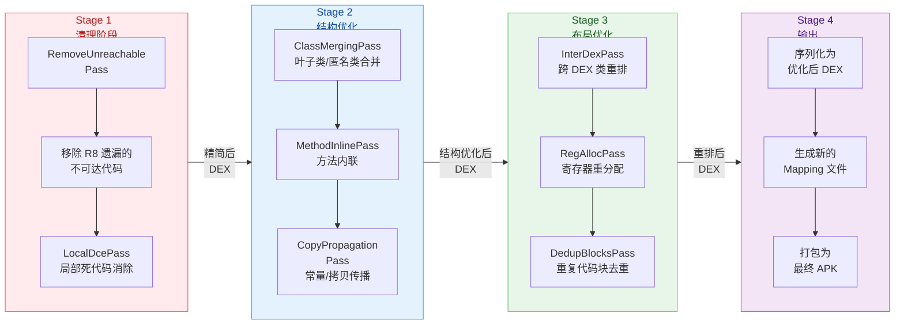

注意 Pipeline 的执行顺序逻辑：**先清理**（移除不可达代码，减少后续 pass 的分析范围）→ **再结构优化**（合并类、内联方法，改变代码结构）→ **再布局优化**（在最终的代码结构上进行物理排列优化）→ **最后输出**。如果顺序颠倒，比如先重排再做类合并，那么重排的结果会被类合并破坏，优化效果大打折扣。

#### R8 与 Redex 的优化能力对比

为了帮助开发者在实际项目中做出技术选型，以下是两者在字节码优化方面的关键差异：

| 优化维度 | R8（Google 官方） | Redex（Meta 开源） |
|---|---|---|
| **方法内联** | 保守策略：内联 private/final/短方法 | 激进策略：全局 Call Graph 分析，支持跨 DEX 内联 |
| **类合并** | 有限支持（主要是垂直合并） | 完整支持：叶子类、接口类、匿名类合并 |
| **DEX 重排** | 不支持（依赖 Baseline Profile） | InterDexPass：基于 Profile 的物理重排 |
| **寄存器分配** | 标准分配 | RegAllocPass：更优的寄存器重分配 |
| **代码块去重** | 有限支持 | DedupBlocksPass：跨方法的重复代码块合并 |
| **集成难度** | 零成本（AGP 内置） | 需额外编译安装，自定义 Gradle Task |
| **维护状态** | Google 持续维护 | Meta 社区驱动，更新频率较低 |

对于大多数中小型项目，R8 的内置优化已经足够。**Redex 更适合大型应用**（如社交、电商、超级 App），这些应用的 DEX 文件动辄几十 MB，类数量数以万计，Redex 的激进优化可以带来显著的包体积和启动性能收益。

#### 实际接入建议

如果你决定在项目中引入 Redex，以下是一些实践建议：

1. **从 Release 构建开始**：Redex 只应用于 Release 构建，不要在 Debug 构建中启用，否则会严重影响开发效率和调试体验。
2. **分步启用 Pass**：不要一次性启用所有 pass。建议先启用风险最低的 `RemoveUnreachablePass` 和 `InterDexPass`，验证稳定后再逐步添加 `MethodInlinePass` 和 `ClassMergingPass`。
3. **完善测试覆盖**：字节码优化可能引入难以预料的兼容性问题（尤其是反射、序列化相关）。确保你有足够的自动化测试（单元测试 + UI 测试）来覆盖核心业务流程。
4. **保留映射文件**：Redex 会生成自己的映射文件（与 R8 的 mapping.txt 互补），发布时务必归档这些文件，以便后续还原线上崩溃的 Stacktrace。
5. **监控包体积与性能指标**：每次启用新的 pass 后，对比优化前后的 APK 体积、冷启动时间、方法数等关键指标，确保优化方向正确。

---

**📝 练习题**

在 Redex 的字节码优化流水线中，`InterDexPass` 通过将冷启动路径上的类物理排列到一起来提升性能。这一优化的核心依据是计算机体系结构中的哪个原理？

A. 指令流水线（Instruction Pipelining）——通过并行执行多条指令来提升吞吐量


B. 局部性原理（Locality Principle）——将频繁共同访问的数据放在相邻物理位置，减少 Page Fault


C. 分支预测（Branch Prediction）——通过预测条件跳转方向来减少 CPU 停顿


D. 寄存器重命名（Register Renaming）——通过消除伪数据依赖来提升指令级并行度


**【答案】** B

**【解析】** `InterDexPass` 的本质是一种基于 Profile 数据的 **物理布局优化**。它将冷启动过程中需要加载的类在 DEX 文件中排列到连续的区域，使得操作系统在进行内存映射（mmap）时，一次 Page Fault 读入的 4KB 页面中能包含更多启动路径上的"有用"数据。这直接利用了 **空间局部性（Spatial Locality）** 原理：物理上相邻的数据更可能被连续访问。选项 A 的指令流水线是 CPU 微架构层面的优化，与 DEX 布局无关；选项 C 的分支预测针对条件跳转指令，不涉及数据排列；选项 D 的寄存器重命名是解决指令级并行中数据冒险的技术，同样与 DEX 文件的物理布局无关。

---

**📝 练习题**

以下关于 Redex `ClassMergingPass`（类合并）的说法，哪项是 **错误** 的？

A. 实现了 `Parcelable` 接口的类默认会被排除在合并范围之外，因为序列化机制依赖精确的类结构


B. 类合并通过引入 `typeTag` 字段来区分合并前的不同类，合并后的方法体可能包含 `switch` 分支


C. 类合并只能合并同一个 DEX 文件中的类，不支持跨 DEX 合并


D. 类合并可以减少 DEX 文件中的 `type_ids` 和 `class_def` 表条目数量，从而缩小 DEX 体积


**【答案】** C

**【解析】** 选项 C 的说法是错误的。Redex 在执行 `ClassMergingPass` 时是在全局 IR 层面操作的，它首先将所有 DEX 文件解析为统一的内部表示，在 IR 上完成类合并后再重新序列化为 DEX。因此它 **不受单个 DEX 文件边界的限制**，可以跨 DEX 合并类。实际上，跨 DEX 合并正是 Redex 相比 R8 的重要优势之一——合并后可能减少整个 DEX 文件的数量。选项 A 正确，`Parcelable` 类依赖 `CREATOR` 静态字段和精确的类名进行反序列化，合并会破坏这一机制。选项 B 正确，这是类合并的标准实现方式——通过类型标签和条件分支来路由不同原始类的方法实现。选项 D 正确，减少类的数量自然会减少对应的元数据表条目。

---

## 原生库压缩

Android 应用中，Native Library（原生库，以 `.so` 文件形式存在）往往是 APK 体积的"大户"。一个包含 4 种 ABI（`armeabi-v7a`、`arm64-v8a`、`x86`、`x86_64`）的应用，其 `lib/` 目录可能占据整个 APK 的 60% 以上。因此，围绕原生库的压缩、提取与过滤策略，对于优化安装包体积和运行时性能至关重要。本节将从三个维度——**extractNativeLibs 配置**、**SO 库的压缩与对齐策略**、**ABI 过滤机制**——系统讲解原生库优化的完整知识体系。

### extractNativeLibs 配置

#### 基本概念与演变历史

`extractNativeLibs` 是定义在 `AndroidManifest.xml` 的 `<application>` 标签上的一个布尔属性，用于控制系统在安装 APK 时是否将 `.so` 文件从 APK 中解压（extract）到设备的文件系统中。在 Android 6.0（API 23）之前，系统会在安装 APK 时**无条件**地将所有 `.so` 文件解压到 `/data/app/<pkg>/lib/` 目录下，这意味着 SO 库会同时在 APK 和文件系统中各存在一份副本，产生双倍磁盘占用。

自 Android 6.0 起，AndroidManifest.xml 中引入了 `extractNativeLibs` 配置项。当该属性设为 `true` 时，行为与之前版本相同——库文件在安装时被解压到文件系统中。当设为 `false` 时，库文件不会被解压，但必须以**未压缩**（uncompressed）且**页对齐**（page-aligned）的方式存储在 APK 内。

当 `extractNativeLibs` 设置为 `false` 时，APK 文件本身会更大（因为 SO 库未压缩），但安装后不会额外占用文件系统空间。由于库是未压缩且页对齐的，Android 可以直接通过 `mmap` 将库从 APK 映射到内存，而无需先解压。

#### 两种模式对比

当 `extractNativeLibs="true"` 时，整个流程如下：

1. **打包阶段**：Gradle 使用 zlib 对 `.so` 文件进行压缩，打入 APK
2. **安装阶段**：PackageManager 将 APK 中的 `.so` 解压到 `/data/app/<pkg>/lib/<abi>/` 目录
3. **运行阶段**：`System.loadLibrary()` 从文件系统加载已解压的 `.so`

当 `extractNativeLibs="false"` 时：

1. **打包阶段**：`.so` 文件**不压缩**，以 `STORED`（非 `DEFLATED`）方式直接存入 APK，并保证页对齐
2. **安装阶段**：PackageManager **跳过**解压步骤
3. **运行阶段**：`System.loadLibrary()` 直接从 APK 文件中 `mmap` 映射 `.so` 到进程内存

官方文档指出，该属性控制安装程序是否从 APK 中提取原生库到文件系统。当设为 `false` 时，原生库以未压缩形式存储在 APK 中。虽然 APK 可能更大，但应用加载更快，因为库是直接从 APK 在运行时加载的。

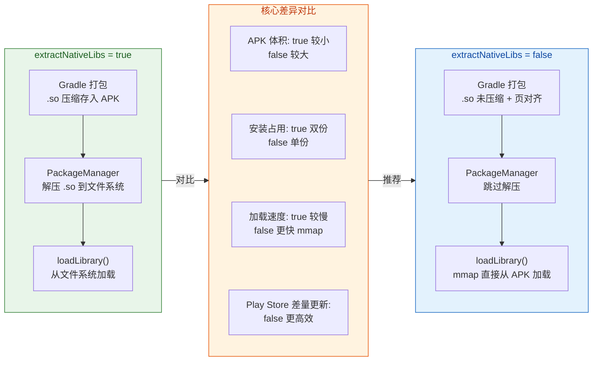

这里有一个非常重要的体积悖论需要理解：虽然 `extractNativeLibs="false"` 会让 APK 文件变大（因为 `.so` 未压缩），但对于通过 Google Play 分发的应用而言，用户的实际安装体积更小，因为平台可以直接从已安装的 APK 中访问原生库，而无需创建库的副本。同时下载体积也更小，因为 Play Store 的压缩算法对包含未压缩原生库的 APK 或 AAB 效果更好。这是因为 Play Store 在传输时使用了自己的差量压缩（delta compression），而未压缩的 `.so` 文件提供了更好的差量基础。

#### AGP 默认行为演变与 useLegacyPackaging

从 Android Gradle Plugin（AGP）3.6.0 开始，构建应用时插件默认将 `extractNativeLibs` 设为 `false`。即原生库被页对齐并以未压缩形式打包。

从 AGP 4.2.0 开始，DSL 选项 `useLegacyPackaging` 取代了 manifest 中的 `extractNativeLibs` 属性。Google 建议在 `build.gradle` 文件中使用 `useLegacyPackaging` 来配置原生库的压缩行为，而不再直接修改 manifest。

`useLegacyPackaging` 用于控制是否使用旧的压缩所有 `.so` 文件的约定。当该值为 `null` 时，如果 `minSdk >= 23`，`.so` 文件将以未压缩且页对齐的方式存储。

现代项目中推荐的配置方式如下：

```kotlin
// app/build.gradle.kts
android {
    // 使用 packaging DSL 控制原生库压缩行为（AGP 4.2.0+ 推荐）
    packaging {
        jniLibs {
            // false = 不压缩，直接 mmap（推荐，现代默认行为）
            // true  = 压缩（旧行为，APK 更小但安装占用更大）
            useLegacyPackaging = false
        }
    }
}
```

如果你仍然需要使用旧的压缩行为（例如某些特定 SDK 要求库必须从文件系统加载），可以将其设为 `true`：

```kotlin
// app/build.gradle.kts
android {
    packaging {
        jniLibs {
            // 使用旧式压缩打包，安装时解压 .so 到文件系统
            useLegacyPackaging = true
        }
    }
}
```

需要注意的是，`useLegacyPackaging` DSL 仅支持生成 APK 的模块（application module）。对于 library 模块，仍然需要使用 manifest 中的 `extractNativeLibs` 属性。

#### 与 16 KB 页对齐的关系（Android 15+）

这里需要额外提及一个前沿话题。页大小是操作系统管理内存的粒度。目前大多数 CPU 支持 4 KB 页大小，Android 操作系统和应用历来也是基于 4 KB 页大小构建和优化的。但 ARM CPU 支持更大的 16 KB 页大小，从 Android 15 开始，AOSP 已支持以 16 KB 页大小构建 Android。

从 2025 年 11 月 1 日起，所有提交到 Google Play 的、包含原生 C/C++ 代码并目标为 Android 15+ 设备的新应用和应用更新，都必须支持 16 KB 页大小。这意味着你的 `.so` 文件的 ELF LOAD segment 必须按 16 KB（`2^14 = 16384`）对齐，而不是之前的 4 KB（`2^12 = 4096`）。

AGP 8.5.1 或更高版本在打包时会自动为未压缩的共享库启用 16 KB 对齐。因此，保持 AGP 版本更新是最简单的合规方式。

向更大的 16 KB 页大小过渡可以直接转化为更好的用户体验。配置了 16 KB 页大小的设备可以看到 5-10% 的整体性能提升，包括更快的应用启动时间（某些应用可达 30%，平均 3.16%）、更低的电池消耗（降低 4.56%）等。

### SO 库压缩策略

#### 压缩 vs 不压缩的权衡矩阵

对于 SO 库的存储方式，开发者面临的核心抉择并非简单的"压缩好还是不压缩好"，而是要在**APK 文件大小**、**安装后磁盘占用**、**运行时加载性能**、**Play Store 分发效率**之间做出综合权衡。下面逐一分析：

**APK 文件大小**：压缩（`useLegacyPackaging = true`）后的 `.so` 通常能减少 50-70% 的体积，这对于非 Play Store 渠道分发（如自建渠道包、企业内部分发）会直接影响下载速度。将 `useLegacyPackaging` 设为 `true` 会以压缩形式存储二进制文件，压缩二进制文件占用更少空间，有助于减小应用的最终 APK 文件大小。

**安装后磁盘占用**：如果压缩了 SO 库，安装时系统必须解压到文件系统，导致 APK + 解压副本 = 双份占用。不压缩时，系统直接引用 APK 中的库，磁盘占用仅为 APK 本身的大小。

**运行时加载性能**：不压缩且页对齐的 `.so` 可以通过 `mmap` 零拷贝加载，跳过解压和文件 I/O，启动速度显著提升。压缩的库则需要在首次加载时从文件系统读取，有额外的 I/O 开销。

**Play Store 分发效率**：这一点最反直觉。Google Play 使用 File-by-File Patching（基于文件的差量更新），对于未压缩的 `.so` 文件，Play Store 能计算出极小的差量补丁；而压缩后的 `.so` 由于 zlib 压缩的 bit-stream 对微小变化高度敏感，差量更新效率极差。因此未压缩的 SO 在 Play Store 渠道中反而能实现更小的增量更新包。

#### 实际推荐策略

| 分发渠道 | 推荐策略 | 理由 |
|---------|---------|------|
| Google Play（AAB） | `useLegacyPackaging = false`（默认） | Play 自动优化，安装小、加载快 |
| 三方应用市场（APK） | `useLegacyPackaging = false` | 虽然 APK 大，但安装后小，加载快 |
| 企业内部 / 侧载 | 视需求而定，可 `true` | 极限追求下载体积时可考虑压缩 |

在绝大多数场景下，采用现代默认配置（不压缩 + 页对齐）是最优解。

#### JniLibs Packaging 高级配置

AGP 提供了 `packaging.jniLibs` 下的一组精细控制选项，除了 `useLegacyPackaging` 外，还包括：

```kotlin
// app/build.gradle.kts
android {
    packaging {
        jniLibs {
            // 排除不需要的 SO 库（减少体积）
            // 例如排除某个 SDK 中不需要的调试库
            excludes += "**/libdebug_helper.so"

            // 保留调试符号（默认会 strip）
            // 对于崩溃排查时需要符号信息的库，可以保留
            keepDebugSymbols += "**/libcrashlytics.so"

            // 当多个依赖包含同名 SO 时，取第一个
            // 避免 duplicate file 的构建错误
            pickFirsts += "**/libc++_shared.so"

            // 控制压缩行为
            useLegacyPackaging = false
        }
    }
}
```

其中 `excludes` 定义了排除模式集合——匹配这些模式的原生库不会被打包进 APK。`keepDebugSymbols` 指定了不应被 strip 调试符号的原生库模式。`pickFirsts` 指定了当存在多个同名库时，只打包第一个的模式集合。

### ABI 过滤 ndk.abiFilters

#### ABI 基础知识

ABI（Application Binary Interface，应用二进制接口）定义了应用的机器码如何在运行时与系统交互，这取决于设备的 CPU 架构和指令集。Android 当前主要支持以下 ABI：

| ABI | CPU 架构 | 说明 | 现状 |
|-----|---------|------|------|
| `armeabi-v7a` | 32-bit ARM | 包含 Thumb-2 和 Neon | 仍在使用，逐步被淘汰 |
| `arm64-v8a` | 64-bit ARM | 现代手机主流 | **最重要**，必须支持 |
| `x86` | 32-bit Intel | 部分模拟器使用 | 物理设备极少 |
| `x86_64` | 64-bit Intel | 模拟器、Chromebook | 有一定市场份额 |

历史上 NDK 曾支持 ARMv5（`armeabi`）以及 32 位和 64 位 MIPS，但这些 ABI 的支持在 NDK r17 中已被移除。

64 位设备也支持运行 32 位变体。以 `arm64-v8a` 设备为例，它可以同时运行 `armeabi` 和 `armeabi-v7a` 代码。但需要注意的是，如果应用以 `arm64-v8a` 为目标构建，在 64 位设备上的性能将远优于依赖设备运行 `armeabi-v7a` 版本。

#### 为什么需要 ABI 过滤

默认情况下，Gradle 会为所有未废弃的 ABI 构建。要限制应用支持的 ABI 集合，需要使用 `abiFilters`。

如果你的项目依赖了多个 native library（如音视频编解码库、图像处理库、安全加密库等），每个库都会为每种 ABI 生成一个 `.so` 文件。如果我们为所有平台构建通用 APK 并包含所有 CPU 架构，APK 体积会急剧膨胀。

举个直观的例子：假设你的应用引入了一个 5 MB 的 native library，如果包含 4 种 ABI，仅这一个库就会在 APK 中占用 20 MB。而实际上，每个用户的设备只会用到其中一种 ABI 的文件，其余 15 MB 纯属浪费。

#### abiFilters 配置方法

默认情况下，Gradle 会将原生库构建为 NDK 支持的所有 ABI 的独立 `.so` 文件并将它们全部打包到应用中。如果只想让 Gradle 构建和打包特定的 ABI 配置，可以在模块级 `build.gradle` 文件中通过 `ndk.abiFilters` 标志来指定。

```kotlin
// app/build.gradle.kts
android {
    defaultConfig {
        ndk {
            // 只打包 ARM 64 位和 ARM 32 位的 SO 库
            // 排除 x86 / x86_64 可大幅缩小 APK
            abiFilters += listOf("arm64-v8a", "armeabi-v7a")
        }
    }
}
```

也可以针对不同的 Build Type 或 Product Flavor 配置不同的 ABI 集合：

```kotlin
// app/build.gradle.kts
android {
    buildTypes {
        // Debug 构建包含模拟器常用的 x86_64，方便开发调试
        getByName("debug") {
            ndk {
                abiFilters += listOf(
                    "arm64-v8a",     // 真机 ARM 64 位
                    "armeabi-v7a",   // 真机 ARM 32 位
                    "x86_64"         // 模拟器 64 位
                )
            }
        }

        // Release 构建只保留真机所需的 ABI
        getByName("release") {
            ndk {
                abiFilters += listOf(
                    "arm64-v8a",     // 绝大多数现代手机
                    "armeabi-v7a"    // 少数旧设备兼容
                )
            }
        }
    }
}
```

通过过滤掉不需要的 ABI，APK 的最终体积可以有效减小。这也有助于防止 APK 被安装到不被支持的设备上。

但必须注意一个关键风险：如果应用运行在一个 ABI 被排除的设备上，将会崩溃并提示 "Native library failed to load"。因此在决定过滤哪些 ABI 之前，务必确认你的目标用户群不涉及被排除的架构。

#### APK Split vs ABI Filter vs App Bundle

除了 `abiFilters`，Android 还提供了另外两种机制来解决多 ABI 造成的体积问题：**APK Split** 和 **App Bundle**。三者的定位和应用场景有本质区别：

**abiFilters**：简单粗暴地"砍掉"不需要的 ABI。生成的仍然是一个 APK，只是其中不包含被过滤的 ABI 的 `.so` 文件。适合你明确知道不需要某些架构的场景。

**APK Split（splits.abi）**：虽然尽可能构建一个支持所有目标设备的单一 APK 更好，但由于支持多种 ABI 的文件可能导致 APK 非常大。减小 APK 体积的一种方式是创建多个 APK，每个只包含特定 ABI 的代码和资源。Gradle 可以创建仅包含特定 ABI 代码和资源的独立 APK。

```kotlin
// app/build.gradle.kts
android {
    splits {
        abi {
            // 启用 ABI 分包
            isEnable = true
            // 重置默认包含的 ABI 列表
            reset()
            // 只为以下架构生成独立 APK
            include("arm64-v8a", "armeabi-v7a", "x86_64")
            // 不生成包含所有 ABI 的通用 APK
            isUniversalApk = false
        }
    }
}
```

由于 Google Play Store 不允许同一应用的多个 APK 具有相同的版本信息，在上传到 Play Store 之前需要确保每个 APK 有唯一的 `versionCode`。

**App Bundle（AAB）**：这是 Google 推荐的终极方案。自 2021 年 8 月起，所有新应用必须以 Android App Bundle 格式发布到 Google Play。AAB 是一种发布格式，包含应用所有已编译的代码和资源，并将 APK 生成和签名延迟到 Google Play。Google Play 使用你的 App Bundle 为每种设备配置生成和提供优化的 APK，因此只有特定设备所需的代码和资源才会被下载。

AAB 中的架构特定原生代码（ARM、ARM64、x86）会被拆分，只有相关的 ABI 才会被分发到每台设备。

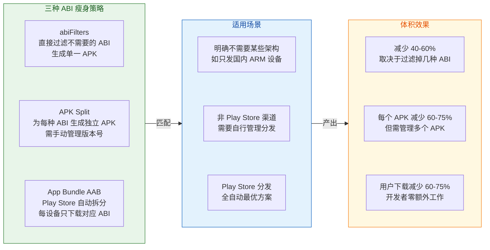

在使用 AAB 格式时，你可以通过 `bundle` DSL 精确控制哪些维度进行拆分：

```kotlin
// app/build.gradle.kts
android {
    bundle {
        abi {
            // 按 ABI 拆分（默认 true，推荐保持开启）
            enableSplit = true
        }
        density {
            // 按屏幕密度拆分（默认 true）
            enableSplit = true
        }
        language {
            // 按语言拆分（可选关闭，避免切换语言后资源缺失）
            enableSplit = false
        }
    }
}
```

#### 当前的最佳实践建议

结合 2025 年的设备市场现状，以下是推荐的 ABI 策略：

1. **如果使用 App Bundle（推荐）**：不需要设置 `abiFilters`，让 Play Store 自动为每台设备生成最优 APK。Bundle 中包含所有 ABI，但用户只会下载自己设备对应的那份。

2. **如果必须生成 APK**：优先只包含 `arm64-v8a`。如果需要兼容旧设备或特殊场景，再加上 `armeabi-v7a`。仅当需要支持 Intel 架构的 Chromebook 或特定模拟器环境时才加入 `x86_64`。

3. **Debug 构建中加入 `x86_64`**：方便在 Android Studio 自带的 x86_64 模拟器上快速调试，但 Release 构建中移除以减小体积。

4. **确保 16 KB 对齐**：使用 NDK r28 或更高版本重建原生代码，确保 16 KB 页大小对齐。同时确保原生代码不依赖或硬编码 `PAGE_SIZE` 的值。

5. **验证 SO 文件对齐**：使用 `llvm-objdump` 检查 `.so` 文件的 LOAD segment alignment，确保值为 `2**14`（即 16384）而非 `2**12`（4096）。

```bash
# 检查 SO 文件的 LOAD segment 对齐方式
# 期望看到 align 2**14（即 16 KB 对齐）
$ANDROID_SDK/ndk/<version>/toolchains/llvm/prebuilt/<platform>/bin/llvm-objdump \
    -p app/build/intermediates/merged_native_libs/release/out/lib/arm64-v8a/libnative.so \
    | grep LOAD
```

---

**📝 练习题**

某应用包含大量原生库，使用 APK 格式分发到国内多个应用市场（非 Google Play）。开发者在 `build.gradle.kts` 中配置了 `useLegacyPackaging = false`（不压缩 SO），同时使用 `ndk.abiFilters` 只保留了 `arm64-v8a`。以下关于该配置的说法，哪一项是**错误的**？


A. APK 文件体积会比压缩 SO 时更大，因为 `.so` 文件以未压缩形式存储


B. 应用安装后的磁盘占用会比压缩 SO 时更小，因为系统无需解压出额外的库文件副本


C. 只保留 `arm64-v8a` 意味着应用无法在 32 位 ARM 设备上运行，会触发安装失败或运行时崩溃


D. 由于不走 Google Play 分发，未压缩 SO 的 APK 在下载时也能享受到 Play Store 的 delta patch 优化，因此下载体积不受影响


**【答案】** D

**【解析】** 选项 D 的说法是错误的。Play Store 的 delta patch（File-by-File Patching）优化只对通过 Google Play 分发的应用有效。对于国内第三方应用市场，用户下载的就是完整的 APK 文件，未压缩的 SO 库会直接导致下载体积增大，无法享受到 Play Store 独有的差量压缩优化。选项 A 正确，`useLegacyPackaging = false` 意味着 SO 不压缩，APK 自然更大。选项 B 正确，不压缩时系统不需要解压库到文件系统，避免了双份存储。选项 C 正确，只保留 `arm64-v8a` 时，32 位 ARM 设备上没有可用的 SO 库，`System.loadLibrary()` 会抛出 `UnsatisfiedLinkError`。

---

**📝 练习题**

关于 Android 15 及以后版本对原生库 16 KB 页对齐的要求，以下说法正确的是？


A. 所有 Android 应用（包括纯 Kotlin/Java 应用）都必须重新编译才能在 16 KB 页大小的设备上运行


B. AGP 8.5.1+ 会自动为未压缩的共享库启用 16 KB 对齐，开发者无需手动配置链接器参数


C. 16 KB 页对齐仅影响 `arm64-v8a` 架构，`armeabi-v7a` 架构的 SO 库不受此要求影响


D. 设置 `useLegacyPackaging = true` 压缩 SO 库可以完全规避 16 KB 页对齐的要求，因为压缩后对齐不再重要


**【答案】** B

**【解析】** AGP 8.5.1 或更高版本在打包时会自动为未压缩的共享库启用 16 KB 对齐。这意味着只要保持 AGP 版本更新，开发者在打包层面无需额外干预。选项 A 错误，纯 Kotlin 或 Java 应用已经天然支持 16 KB 设备，但仍建议在 16 KB 环境中测试以验证没有意外回归。选项 C 不完全正确，Google Play 的 16 KB 对齐要求覆盖所有包含原生代码的架构，不仅限于 `arm64-v8a`。选项 D 的推理也有问题——虽然压缩的 SO 确实不需要在 APK 内进行页对齐（因为它们会被解压后再加载），但解压后的 SO 仍然需要满足 ELF 本身的 16 KB LOAD segment alignment 要求，即编译链接阶段仍需使用 `-Wl,-z,max-page-size=16384` 参数。

---

## 调试与发布构建

Android 的构建系统（Gradle + AGP）天然将应用分为 **Debug** 和 **Release** 两种核心构建类型（Build Type）。这不仅仅是"能不能调试"的区别——它决定了签名方式、混淆策略、日志级别、JIT/AOT 编译路径、V8 引擎行为甚至运行时的性能特征。理解这两种构建类型的每一处差异，是掌握混淆与优化全链路的关键前提：只有清楚"什么时候开、什么时候关"，才能在开发效率与发布质量之间找到最优平衡。

### Debug vs Release 配置

#### 两种构建类型的本质

当你创建一个新的 Android 项目时，AGP（Android Gradle Plugin）会自动在 `build.gradle` 中为你生成两种默认的 Build Type：`debug` 和 `release`。它们并非简单的"标志位"，而是 **一整套构建流水线配置的集合**，从编译、混淆、签名到打包的每一个步骤都可能因 Build Type 的不同而走完全不同的路径。

在 Gradle 的模型中，Build Type 是 `BuildType` 对象的实例。AGP 在 `android {}` DSL 块中通过 `buildTypes {}` 闭包来暴露这些配置。两种类型的默认行为差异可以从以下维度来理解：

**签名（Signing）**：Debug 构建使用 AGP 自动生成的 debug keystore（位于 `~/.android/debug.keystore`），开发者无需任何手动配置即可完成安装和调试。Release 构建则 **必须** 手动配置签名信息（`signingConfigs`），否则只会生成未签名的 APK/AAB，无法安装到设备上。这是因为 Android 系统要求所有安装到设备上的 APK 都必须具备数字签名，而 Google Play 更进一步要求使用 App Signing Key 进行签名。

**调试能力（Debuggable）**：Debug 构建默认设置 `debuggable = true`，这意味着 ART 虚拟机会为该进程开放 JDWP（Java Debug Wire Protocol）端口，允许 Android Studio 的调试器附着（Attach）到进程上。同时，`adb` 工具也能直接对该进程执行 `run-as` 命令来访问其私有数据目录。Release 构建默认 `debuggable = false`，JDWP 端口关闭，进程对外呈现为"不可调试"状态。

**优化程度（Optimization）**：Debug 构建默认 **关闭** 所有混淆和收缩（`minifyEnabled = false`、`shrinkResources = false`），目的是保证编译速度和调试的可读性——你在断点处看到的变量名、类名和方法名都是原始的。Release 构建 **鼓励开启** 混淆和收缩，通过 R8 进行 Tree Shaking、代码混淆和优化，最终输出更小、更安全的产物。

**编译路径（Compilation Path）**：这一点经常被忽略。在 Debug 模式下，ART 倾向于使用更多的 JIT（Just-In-Time）编译来加速增量编译和 Apply Changes 的速度；而 Release 模式（特别是从 Google Play 安装时）会利用 Cloud Profile 进行 AOT（Ahead-Of-Time）预编译热路径，使得冷启动和运行时性能显著优于 Debug。这也是为什么 **永远不要用 Debug 包做性能测试** 的根本原因。

下面用一张对比表来系统化地呈现两者差异：

```
┌─────────────────────┬──────────────────────────┬──────────────────────────┐
│       维度           │       Debug (默认)        │      Release (默认)       │
├─────────────────────┼──────────────────────────┼──────────────────────────┤
│ debuggable          │ true                     │ false                    │
│ minifyEnabled       │ false                    │ false (建议改为 true)     │
│ shrinkResources     │ false                    │ false (建议改为 true)     │
│ 签名                │ 自动 debug.keystore       │ 必须手动配置              │
│ ProGuard/R8         │ 不执行                    │ 执行 (若 minify=true)     │
│ APK 体积            │ 较大 (含全部代码和资源)    │ 较小 (摇树 + 混淆后)      │
│ 编译速度            │ 快 (增量编译优化)          │ 慢 (全量优化 + R8)        │
│ 运行时性能          │ 较差 (JIT 为主)           │ 较优 (AOT + 优化)         │
│ 日志/断言           │ 通常保留                  │ 建议移除                  │
│ Crash 堆栈          │ 原始类名/方法名           │ 混淆后需 Mapping 还原     │
│ testCoverageEnabled │ 可开启                    │ 通常关闭                  │
└─────────────────────┴──────────────────────────┴──────────────────────────┘
```

#### Build Type 的 Gradle 配置全貌

一个典型的、经过生产验证的 `buildTypes` 配置如下：

```kotlin
// app/build.gradle.kts
android {

    // 签名配置块 —— Release 必须提供
    signingConfigs {
        // 创建名为 "release" 的签名配置
        create("release") {
            // 密钥库文件路径，通常从项目根目录或环境变量读取
            storeFile = file("../keystore/release.jks")
            // 密钥库密码，生产中建议从环境变量或 local.properties 读取
            storePassword = System.getenv("STORE_PASSWORD") ?: ""
            // 密钥别名
            keyAlias = "my-app-key"
            // 密钥密码
            keyPassword = System.getenv("KEY_PASSWORD") ?: ""
        }
    }

    buildTypes {

        // ========== Debug 构建类型 ==========
        debug {
            // applicationIdSuffix 让 Debug 包的包名追加 ".debug"
            // 这样 Debug 和 Release 可以同时安装在同一台设备上
            applicationIdSuffix = ".debug"
            // versionNameSuffix 在版本名后追加 "-debug" 便于识别
            versionNameSuffix = "-debug"
            // Debug 构建不开启混淆（默认就是 false，这里显式声明增加可读性）
            isMinifyEnabled = false
            // 不收缩资源
            isShrinkResources = false
            // 开启测试覆盖率收集（仅在需要时开启，会略微影响性能）
            enableUnitTestCoverage = true
            enableAndroidTestCoverage = true
        }

        // ========== Release 构建类型 ==========
        release {
            // 开启代码收缩与混淆 —— R8 将执行 Tree Shaking + Obfuscation
            isMinifyEnabled = true
            // 开启资源收缩 —— 移除未被代码引用的资源文件
            isShrinkResources = true
            // 指定 ProGuard/R8 规则文件
            proguardFiles(
                // AGP 内置的默认优化规则
                getDefaultProguardFile("proguard-android-optimize.txt"),
                // 项目自定义规则
                "proguard-rules.pro"
            )
            // 绑定 Release 签名配置
            signingConfig = signingConfigs.getByName("release")
        }
    }
}
```

这段配置中有几个值得深入讨论的细节：

**`applicationIdSuffix`** 是一个极其实用的技巧。Android 系统以 `applicationId`（即 `AndroidManifest.xml` 中的 `package`）作为应用的唯一标识。当 Debug 包追加了 `.debug` 后缀后，系统会将它视为一个完全不同的应用，这意味着你可以在同一台设备上同时安装 Debug 和 Release 版本，互不干扰。这在需要对比两个版本行为时非常方便。但需要注意：如果你的应用使用了 `ContentProvider` 并硬编码了 `authorities`，或者使用了 Firebase / 第三方 SDK 依赖包名进行配置，则需要为 Debug 包做相应的适配（例如使用 `${applicationId}` 占位符）。

**`proguard-android-optimize.txt` vs `proguard-android.txt`**：AGP 提供了两个内置规则文件。前者（带 `-optimize`）会额外启用 R8 的字节码级优化（方法内联、常量折叠、死代码消除等），后者则仅做混淆和收缩。在现代 R8 编译器中，`-optimize` 版本是推荐的默认选择，因为 R8 已经比早期的 ProGuard 优化器更加安全和保守。

#### 自定义 Build Type

除了默认的 `debug` 和 `release`，开发者还可以创建自定义的 Build Type 来适配更复杂的构建需求。一个常见的场景是创建 **Staging**（预发布）类型：

```kotlin
buildTypes {
    // 创建 staging 构建类型，继承 release 的所有配置
    create("staging") {
        // initWith 从 release 复制所有配置作为起点
        initWith(getByName("release"))
        // 覆盖: 追加包名后缀以区分
        applicationIdSuffix = ".staging"
        // 覆盖: 使用 debug 签名以便团队成员无需 release key 也能安装
        signingConfig = signingConfigs.getByName("debug")
        // 保持 minify 开启 —— 目的是在预发布阶段验证混淆规则的正确性
        isMinifyEnabled = true
        isShrinkResources = true
        // 设置自定义 BuildConfig 字段，应用层代码可据此切换 API 地址
        buildConfigField("String", "API_BASE_URL", "\"https://staging-api.example.com\"")
    }
}
```

`initWith()` 是这里的关键 API——它将指定 Build Type 的所有属性复制到当前对象，然后你再逐个覆盖需要修改的属性。这种"继承 + 覆盖"模式避免了大量的重复配置。Staging 类型的典型用途是：**开启混淆，但连接测试服务器**，使 QA 团队可以在接近真实环境的条件下验证混淆是否破坏了反射、序列化等场景。

#### Build Type 与 Build Variant 的关系

Build Type 只是构建变体（Build Variant）的一个维度。AGP 会将 Build Type 与 Product Flavor（产品风味）做笛卡尔积，生成最终的 Build Variant。例如，如果你有 `free` 和 `paid` 两个 Flavor，加上 `debug` 和 `release` 两个 Build Type，则会产生四个 Variant：`freeDebug`、`freeRelease`、`paidDebug`、`paidRelease`。每个 Variant 拥有独立的源集（Source Set）目录、独立的依赖配置、独立的 `BuildConfig` 常量。理解这一点很重要，因为混淆规则可以按 Variant 粒度进行差异化配置——比如 `paid` 版本可能集成了额外的 SDK，需要添加对应的 `keep` 规则。

### minifyEnabled 开关

#### 从开关到 R8 全链路

`minifyEnabled`（在 Kotlin DSL 中写作 `isMinifyEnabled`）是 Android 构建系统中 **最重要的单一开关** 之一。它的字面含义是"是否启用代码压缩（Minification）"，但它实际触发的行为远不止"缩小体积"。当这个开关被设为 `true` 时，AGP 会在 `.class → .dex` 的编译链路中 **插入 R8 编译器**，R8 将依次执行以下操作：

1. **Tree Shaking（摇树）**：以 `keep` 规则声明的入口点（Entry Points）为根节点，对整个代码图进行可达性分析。所有不可达的类、方法、字段都会被标记为"死代码"并移除。这包括未被调用的第三方库代码——即使你依赖了一个 10MB 的库，如果只用了其中 3 个类，R8 会把其余部分全部剥离。

2. **Optimization（优化）**：R8 会对字节码进行多轮优化 Pass，包括方法内联（Inlining）、常量传播（Constant Propagation）、死代码消除（Dead Code Elimination）、去虚化（Devirtualization）等。这些优化不仅减小体积，还能提升运行时性能。

3. **Obfuscation（混淆）**：将类名、方法名、字段名重命名为 `a`、`b`、`c` 等短标识符。这既减小了 DEX 中字符串常量池的体积，也增加了逆向工程的难度。

4. **最终 DEX 输出**：R8 同时承担了 D8 dexer 的角色，直接将优化后的字节码转换为 DEX 格式，无需再单独执行 D8 步骤。

可以用下面的流程图来可视化这条链路：

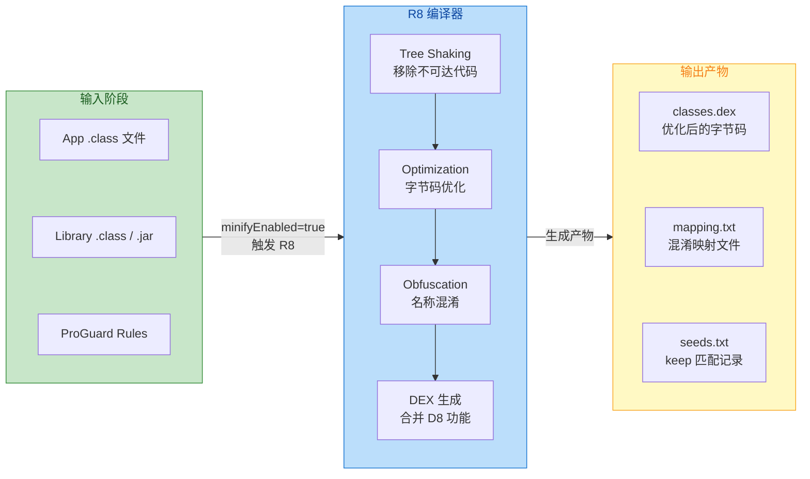

#### 为什么 Debug 默认不开启

你可能会问：既然 `minifyEnabled` 能减小体积、提升性能，为什么 Debug 默认是 `false`？原因涉及多个维度：

**编译速度**：R8 的全量分析和多轮优化是一个耗时的过程。对于大型项目，开启 R8 可能让一次构建多花 30 秒甚至数分钟。在 Debug 的快速迭代循环中（改代码 → 编译 → 运行 → 验证），每次多等 30 秒的体验是毁灭性的。而 Debug 构建已经有增量编译（Incremental Compilation）和 Apply Changes 的加速机制，这些与 R8 的全量分析天然冲突。

**调试可读性**：如果 Debug 包也混淆了，你在 Android Studio 的调试器中看到的变量名将是 `a`、`b`、`c`，堆栈跟踪也将变得不可读。虽然理论上可以通过 mapping 文件还原，但这显然会严重拖慢调试效率。

**Apply Changes 兼容性**：Android Studio 的 Apply Changes（热修改）功能依赖于对字节码的增量 Patch。当 R8 对代码进行了全局优化（如内联、类合并）后，一个小的源码修改可能导致大范围的字节码变化，使得增量 Patch 失效，退化为全量重新安装。

**反射与动态特性**：开发阶段经常使用的工具（如 LeakCanary、Stetho、Flipper）依赖反射来 hook 应用层代码。如果 Debug 包开启了混淆，这些工具的反射调用将因类名/方法名变化而失败，除非你为每个工具都编写 `keep` 规则——这显然不合理。

#### Debug 构建中的混淆测试策略

虽然 Debug 默认不开启混淆，但 **绝对不能等到发布前才第一次开启 `minifyEnabled = true`**。实践中最常见的灾难场景是：团队在整个开发周期内都用 Debug 包测试，临发布时打开混淆，结果大量反射调用、序列化/反序列化、JNI 绑定全部崩溃。推荐的策略是：

1. **尽早在 CI 中加入 Release 构建**：即使不做功能测试，至少确保 Release 包能编译通过且 R8 不报错。
2. **创建 Staging Build Type**（如前文所述）：保持混淆开启，连接测试服务器，供 QA 日常使用。
3. **定期对 Release 包进行冒烟测试（Smoke Test）**：特别关注序列化（Gson/Moshi/Kotlin Serialization）、WebView JavaScript Bridge、`Class.forName()` 调用等混淆敏感区域。

#### shrinkResources 与 minifyEnabled 的关系

`shrinkResources`（资源收缩）**必须** 与 `minifyEnabled = true` 配合使用，不能单独开启。原因在于：资源收缩器需要先通过 R8 的 Tree Shaking 确定哪些代码被保留，然后才能分析这些保留代码中引用了哪些资源。如果代码没有被收缩（`minifyEnabled = false`），那么所有代码都被保留，资源收缩器就无法判断哪些资源是"未使用"的——因为几乎所有资源都可能被某段未剥离的代码引用。尝试在 `minifyEnabled = false` 的情况下设置 `shrinkResources = true` 会直接导致 Gradle 构建报错。

### debuggable 属性

#### 深入 debuggable 的运行时影响

`debuggable` 属性是 Build Type 中一个看似简单但影响深远的布尔值。它不仅仅控制"能不能断点调试"——它在从系统框架到应用运行时的多个层级都产生了行为差异。

**在 AndroidManifest.xml 中的体现**：当 AGP 构建 APK 时，它会根据当前 Build Type 的 `debuggable` 值，在最终合并的 `AndroidManifest.xml` 中设置 `<application android:debuggable="true|false">`。这个值会被写入 APK 的 Manifest 文件，系统在安装和运行时都会读取它。

**ART 虚拟机行为**：当 `debuggable = true` 时，ART 会为该进程做以下特殊处理：

- 开启 JDWP 线程，监听调试器的连接请求。这个线程本身会消耗少量内存和 CPU。
- 禁用部分 JIT 编译优化，以确保断点和单步调试的准确性。例如，某些激进的方法内联会被跳过，因为内联后的代码难以映射回源码行号。
- 允许 `Thread.getAllStackTraces()` 等 API 返回更详细的信息。
- 一些系统级的性能优化（如 Profile-Guided Optimization 的部分策略）可能不会应用。

这就是为什么 Debug 包的运行时性能 **系统性地低于** Release 包——不仅仅因为没有 R8 优化，连 ART 自身的优化策略都被削弱了。

**系统框架层行为**：`PackageManager` 在安装 APK 时会解析 `debuggable` 标志并记录到系统的 `packages.xml` 中。这个标志会影响以下系统行为：

- **`adb run-as`**：只有 `debuggable = true` 的应用，`adb shell run-as <package>` 才能成功。这个命令允许你以应用的 UID 身份访问其私有数据目录（`/data/data/<package>/`），对于调试 SharedPreferences、数据库文件等极为方便。
- **StrictMode**：某些 StrictMode 策略在 `debuggable = true` 时会自动开启，帮助开发者发现性能问题。
- **Network Security Config**：从 Android 7.0 开始，`debuggable = true` 的应用默认信任用户安装的 CA 证书（如 Charles/Fiddler 的代理证书），而 `debuggable = false` 的应用默认 **不信任** 用户证书，只信任系统预装的 CA。这意味着如果你想在 Release 包上做 HTTPS 抓包，必须在 `network_security_config.xml` 中显式配置信任的证书，或者使用其他方式（如 Frida hook）。

```xml
<!-- res/xml/network_security_config.xml -->
<!-- 此配置通常仅在 debug 构建变体的资源目录中放置 -->
<network-security-config>
    <!-- debug-overrides 仅在 debuggable=true 时生效 -->
    <debug-overrides>
        <trust-anchors>
            <!-- 信任用户安装的 CA 证书（如抓包工具证书） -->
            <certificates src="user" />
        </trust-anchors>
    </debug-overrides>
</network-security-config>
```

#### 应用层中 debuggable 的编程感知

在应用代码中，你经常需要根据当前是否为 Debug 构建来执行不同的逻辑（如开启日志、初始化调试工具）。有两种主要方式来判断：

**方式一：`BuildConfig.DEBUG`**

```kotlin
// BuildConfig.DEBUG 是 AGP 在编译时生成的布尔常量
// 当构建类型为 debug 时值为 true，release 时为 false
if (BuildConfig.DEBUG) {
    // 初始化 LeakCanary、Stetho 等调试工具
    // 这段代码在 Release 构建中会被 R8 识别为不可达并移除
    initDebugTools()
}
```

`BuildConfig.DEBUG` 的一个巨大优势是：它是一个 **编译时常量**（`static final boolean`）。当 `minifyEnabled = true` 时，R8 会在编译期确定其值（Release 中为 `false`），然后通过常量折叠（Constant Folding）将整个 `if` 块识别为死代码并彻底移除。这意味着调试工具的代码 **不会出现在 Release 的 DEX 中**，既不增加体积，也不存在任何运行时开销。

**方式二：运行时检查 `ApplicationInfo.flags`**

```kotlin
// 通过 ApplicationInfo 的 flags 字段在运行时判断
// 这种方式适用于 Library 模块——Library 没有自己的 BuildConfig.DEBUG
fun Context.isDebuggable(): Boolean {
    // 获取当前应用的 ApplicationInfo
    val appInfo = applicationInfo
    // 与 FLAG_DEBUGGABLE 进行位运算
    // 如果结果不为 0，说明 debuggable=true
    return (appInfo.flags and ApplicationInfo.FLAG_DEBUGGABLE) != 0
}
```

这两种方式有一个关键区别：`BuildConfig.DEBUG` 是 **编译时确定** 的，其值取决于构建该模块时使用的 Build Type；而 `ApplicationInfo.FLAG_DEBUGGABLE` 是 **运行时从已安装 APK 的 Manifest 中读取** 的。在绝大多数情况下两者一致，但在某些复杂的多模块场景或动态加载场景中可能出现差异，需要注意。

#### debuggable 的安全影响

将 `debuggable = true` 的应用发布到生产环境是一个 **严重的安全漏洞**。Google Play 会拒绝上传 `debuggable = true` 的 APK/AAB，但如果你通过其他渠道分发，则没有这道防线。一个 `debuggable = true` 的生产应用意味着：

- 任何拥有 ADB 访问权限的人都可以通过 `run-as` 直接读取应用的 SharedPreferences、数据库（包括存储的 Token、用户数据等）。
- 攻击者可以附着调试器，在运行时修改变量值、跳过认证检查、注入代码。
- 网络层信任用户 CA 证书，降低了中间人攻击的门槛。

因此，**CI/CD 流水线中应该加入自动化检查**，确保 Release 产物的 `debuggable` 值为 `false`。可以通过 `aapt2 dump badging app-release.apk | grep debuggable` 来验证。

#### Build Type 全配置速查

最后，总结 Build Type 中与混淆、调试相关的所有关键属性：

```kotlin
buildTypes {
    release {
        // ===== 核心开关 =====
        isMinifyEnabled = true          // 启用 R8 代码收缩 + 混淆 + 优化
        isShrinkResources = true        // 启用未使用资源的移除（依赖 minify）
        // debuggable 默认为 false      // 关闭 JDWP，禁止调试器附着

        // ===== ProGuard / R8 规则 =====
        proguardFiles(
            // AGP 内置优化规则（推荐使用 optimize 版本）
            getDefaultProguardFile("proguard-android-optimize.txt"),
            // 项目级自定义规则
            "proguard-rules.pro"
        )

        // ===== 签名 =====
        signingConfig = signingConfigs.getByName("release")

        // ===== 可选: 原生调试符号 =====
        // 控制是否在 AAB/APK 中包含原生调试符号（用于 Crash 上报还原 SO 堆栈）
        ndk {
            // 保留调试符号，上传到 Google Play Console 后可还原 native crash
            debugSymbolLevel = "FULL"    // 可选: FULL / SYMBOL_TABLE / NONE
        }

        // ===== 可选: 自定义 BuildConfig 字段 =====
        buildConfigField("Boolean", "ENABLE_LOGGING", "false")
    }
}
```

每一个属性的取值都直接影响着最终产物的体积、性能、安全性和可调试性。理解它们之间的相互关系——特别是 `minifyEnabled` 与 `shrinkResources` 的依赖关系、`debuggable` 对 ART 和网络层的连锁影响——是进行 Android 构建优化的基础。


---

**📝 练习题**

在 Android 项目中，以下关于 `shrinkResources` 的描述，哪一项是正确的？

A. `shrinkResources = true` 可以独立于 `minifyEnabled` 单独开启，两者互不依赖


B. `shrinkResources` 的工作原理是静态扫描 `res/` 目录，移除文件名未出现在代码中的资源


C. `shrinkResources = true` 必须配合 `minifyEnabled = true` 使用，因为资源收缩器依赖 R8 的代码分析结果来判断哪些资源被引用


D. `shrinkResources` 在 Debug 和 Release 构建类型中默认都是开启的

**【答案】** C

**【解析】** 资源收缩（Resource Shrinking）的工作流程是：R8 先通过 Tree Shaking 确定哪些代码是可达的（被保留的），然后资源收缩器分析这些被保留的代码中 **实际引用了哪些资源 ID**（通过 `R.drawable.xxx`、`R.layout.xxx` 等常量引用），未被引用的资源将被移除或替换为空文件。如果 `minifyEnabled = false`，则所有代码都被保留，资源收缩器无法有效判断哪些资源是"死资源"，因此 AGP 强制要求两者同时开启，否则构建会直接报错。选项 A 与此矛盾。选项 B 的描述过于简化且不准确——资源收缩器分析的是编译后的代码对资源 ID 的引用关系，而非简单的文件名文本匹配。选项 D 错误，两者在所有 Build Type 中默认都是 `false`。

---

**📝 练习题**

某团队发现他们的 Release 包在用户设备上出现了 HTTPS 请求失败的问题，但在 Debug 包中一切正常。该应用使用了自签名的企业内部 CA 证书。最可能的原因是什么？

A. Release 包开启了 `minifyEnabled`，导致网络库的核心类被混淆后无法正常工作


B. Release 包的 `debuggable = false`，使得应用默认不信任用户安装的 CA 证书，需要在 `network_security_config.xml` 中显式配置信任


C. Release 包使用了不同的签名密钥，导致 SSL Pinning 验证失败


D. R8 的 Tree Shaking 移除了 OkHttp 的 TLS 相关代码

**【答案】** B

**【解析】** 从 Android 7.0（API 24）开始，系统对网络安全策略进行了重大变更：`debuggable = true` 的应用默认信任用户安装的 CA 证书（User CA），而 `debuggable = false` 的应用 **仅信任系统预装的 CA 证书**（System CA）。企业内部自签名的 CA 证书通常是作为"用户证书"安装到设备上的，所以 Debug 包能正常连接（因为信任用户 CA），而 Release 包会拒绝连接（因为不信任用户 CA）。解决方案是在 `res/xml/network_security_config.xml` 中为 Release 构建显式添加对该企业 CA 的信任配置。选项 A 不太可能，因为主流网络库（OkHttp、Retrofit）都已在自身的 `consumer-proguard-rules` 中声明了必要的 `keep` 规则。选项 C 虽然 SSL Pinning 确实与证书有关，但题干描述的是"自签名 CA"场景，而非 Pinning 策略。选项 D 也不太现实，因为 OkHttp 的 TLS 代码在运行时一定会被引用，不会被 Tree Shaking 移除。

---

## 性能基准测试

在 Android 应用开发中，性能优化是一个持续迭代的过程，而**测量（Measurement）是优化的起点**。如果你无法客观量化一个改动对启动速度、帧率、CPU 耗时的影响，那么所谓的"优化"就是盲目的猜测。Google 为 Android 应用提供了两套互补的基准测试库——**Macrobenchmark（宏基准）** 和 **Microbenchmark（微基准）**，分别面向"端到端用户体验场景"和"函数级热路径性能"。它们与 Baseline Profile / Startup Profile 配合使用时，能形成一条完整的"测量 → 生成优化配置 → 再测量验证"闭环链路。

Android 提供了 Macrobenchmark 和 Microbenchmark 两套 benchmarking 库和方法，分别用于分析和测试应用中不同类型的性能场景。Macrobenchmark 库测量的是更大粒度的终端用户交互，例如启动、UI 交互和动画。而 Microbenchmark 库则允许你在循环中直接对应用代码进行基准测试，设计目标是测量 CPU 密集型工作在最佳情况下的性能——例如 JIT 已预热、磁盘访问已被缓存的场景。

理解这两者的本质差异至关重要：Macrobenchmark 关注的是**用户感知层面**（App 冷启动要多久？列表滑动卡不卡？），而 Microbenchmark 关注的是**代码执行层面**（这个排序算法跑一次需要多少纳秒？这段 JSON 解析的 allocation 有多少？）。二者测量的粒度、运行的进程模型、对编译状态的控制方式，以及最终输出的指标类型都截然不同。


### Macrobenchmark 宏基准测试

Macrobenchmark 是 Jetpack 提供的端到端性能测量库。Jetpack Macrobenchmark 是用于测量（和基准化）应用性能的库，它特别适用于端到端的使用场景，例如应用启动、跨 Activity 导航、列表滚动或其他 UI 操作。其核心思想是：**像真实用户一样操作应用，然后测量这段操作的系统级性能指标。**

#### 运行机制：独立进程模型

与常规的 Instrumented Test 不同，Macrobenchmark 测试运行在一个与应用本身分离的独立进程中。这是为了支持杀死应用进程和从 DEX 字节码编译到机器码等操作。你需要使用 UIAutomator 库或其他能够从测试进程控制目标应用的机制来驱动应用状态。

这意味着你无法使用 Espresso 或 ActivityScenario 这类需要在同一进程中运行的测试框架。你不能在 Macrobenchmark 中使用 Espresso 或 ActivityScenario，因为它们期望与应用运行在共享进程中。这一设计是有意为之的——只有在独立进程中，Macrobenchmark 才能精确控制应用的编译状态（例如清除所有 AOT 产物来模拟首次安装），才能在每次迭代前 `force-stop` 进程来实现真正的 Cold Start 测量。

#### 模块搭建

Macrobenchmark 需要一个 `com.android.test` 模块——与应用代码分开——负责运行测量应用的测试。Android Studio 中提供了一个模板来简化 Macrobenchmark 模块的搭建。该基准测试模块模板会自动在你的项目中创建一个模块来测量由 app 模块构建的应用，并包含一个启动基准测试示例。

以下是 Macrobenchmark 模块的 `build.gradle.kts` 核心配置：

```kotlin
// benchmark/build.gradle.kts
plugins {
    // 使用 com.android.test 插件，表明这是一个纯测试模块，不会打包到最终 APK 中
    id("com.android.test")
    // Kotlin Android 插件
    id("org.jetbrains.kotlin.android")
}

android {
    // 模块命名空间
    namespace = "com.example.benchmark"
    // 编译 SDK 版本
    compileSdk = 34

    defaultConfig {
        // 最低 SDK 版本（Macrobenchmark 需要 API 23+，部分功能需要更高）
        minSdk = 24
        // 目标 SDK 版本
        targetSdk = 34
        // 指定测试运行器
        testInstrumentationRunner = "androidx.test.runner.AndroidJUnitRunner"
    }

    // 指向要被测量的目标应用模块
    targetProjectPath = ":app"
    // 启用自检测（self-instrumenting）模式
    experimentalProperties["android.experimental.self-instrumenting"] = true
}

dependencies {
    // JUnit 扩展
    implementation("androidx.test.ext:junit:1.2.1")
    // 测试运行器
    implementation("androidx.test:runner:1.6.2")
    // Macrobenchmark JUnit4 规则库（核心依赖）
    implementation("androidx.benchmark:benchmark-macro-junit4:1.3.3")
}
```

同时，**被测应用模块**也需要做相应配置。需要将被基准测试的应用配置为尽可能接近正式版本或生产环境。将其设置为 non-debuggable 且最好开启代码缩减（minification），这会改善性能。通常的做法是创建一个 release variant 的副本，具有相同的性能特征，但使用本地 debug 密钥签名。

```kotlin
// app/build.gradle.kts 中添加用于 benchmark 的 buildType
android {
    buildTypes {
        // 创建一个 benchmark 专用构建类型，继承 release 的所有配置
        create("benchmark") {
            // 初始化自 release，保留其混淆和优化配置
            initWith(buildTypes.getByName("release"))
            // 使用 debug 签名，避免需要正式密钥
            signingConfig = signingConfigs.getByName("debug")
            // 关键：必须设为 false，debuggable 会严重影响性能数据的准确性
            isDebuggable = false
            // 标记为可分析（profileable），允许 benchmark 读取详细的 trace 信息
            // 在 AndroidManifest.xml 中会体现为 <profileable android:shell="true"/>
        }
    }
}
```

#### StartupMode：三种启动模式

StartupMode 允许你定义应用在基准测试开始时应如何启动。可用选项为 COLD、WARM 和 HOT。这三种模式模拟了用户在不同场景下使用应用时的真实状态：

- **`StartupMode.COLD`**：每次迭代前杀掉应用进程，模拟用户首次打开应用或应用被系统完全回收后重新启动的场景。这是工作量最大的启动形式——需要创建进程、初始化 Application、创建 Activity、加载布局、绘制首帧。它是衡量启动性能的**最重要指标**。

- **`StartupMode.WARM`**：应用进程存活但 Activity 被销毁，模拟用户长时间未使用、Activity 被系统回收后重新进入的场景。进程创建的开销不需要重复支付，但 Activity 的 `onCreate` 和布局加载仍然需要执行。

- **`StartupMode.HOT`**：进程和 Activity 都存活，Activity 从后台恢复到前台。这是最快的启动路径，通常只经历 `onRestart` → `onStart` → `onResume`。

#### CompilationMode：编译模式控制

Macrobenchmark 最强大的能力之一是能够精确控制被测应用的编译状态。Macrobenchmark 可以指定 CompilationMode，它定义了应用必须从 DEX 字节码预编译为机器码的程度。默认情况下，Macrobenchmark 以 `CompilationMode.DEFAULT` 运行，在 Android 7（API 24）及更高版本上会安装 Baseline Profile（如果可用）。

各种 CompilationMode 的含义：

- **`CompilationMode.None()`**：不进行任何 AOT 预编译，但 JIT 在运行时仍然启用。这模拟了一个全新安装、且没有 Baseline Profile 的最差场景。

- **`CompilationMode.Partial()`**：使用 Baseline Profile 和/或若干次预热迭代（warmup iteration）进行部分预编译。这代表了使用 Baseline Profile 和/或预热运行对应用进行预编译的场景。

- **`CompilationMode.Full()`**：对整个应用进行完整的 AOT 预编译。这会预编译整个应用。它是 Android 6（API 23）及更低版本上的唯一选项。

- **`CompilationMode.DEFAULT`**：默认模式，在 API 24+ 上会安装 Baseline Profile（如果有）。

通过在不同 `CompilationMode` 下运行同一个测试，你可以精确量化 Baseline Profile 带来的性能提升。

#### 核心指标（Metrics）

Macrobenchmark 支持多种系统级指标采集：

| 指标类型 | 说明 | 典型用途 |
|:---------|:-----|:---------|
| `StartupTimingMetric()` | 测量 TTID（Time To Initial Display）和 TTFD（Time To Full Display） | 应用启动性能 |
| `FrameTimingMetric()` | 测量每帧的 CPU 耗时和帧超时（frameOverrun） | 滑动/动画卡顿检测 |
| `CpuMetric()` | 跟踪 CPU 使用率 | CPU 密集型场景 |
| `PowerMetric()` | 测量能耗影响 | 电池消耗优化 |

其中，TTID 指标测量的是应用产生第一帧所用的时间。然而，这并不一定反映用户可以开始与应用交互的时间。TTFD（Time To Full Display）指标在测量和优化达到完全可用应用状态所需的代码路径方面更为有用。建议同时优化 TTID 和 TTFD，两者都很重要。

FrameTimingMetric 以毫秒为单位输出帧持续时间（frameDurationCpuMs），涵盖第 50、90、95 和 99 百分位。在 Android 12（API 31）及以上版本，它还返回帧超出限制的时间（frameOverrunMs）。该值可以为负数，表示生成该帧时有富余时间。

#### 完整的启动基准测试示例

```kotlin
// benchmark/src/main/java/com/example/benchmark/StartupBenchmark.kt
@RunWith(AndroidJUnit4::class)  // 使用 AndroidJUnit4 测试运行器
class StartupBenchmark {

    // 声明 MacrobenchmarkRule，它是 Macrobenchmark 的入口
    @get:Rule
    val benchmarkRule = MacrobenchmarkRule()

    // 测试：无 AOT 编译的冷启动（最差情况）
    @Test
    fun startupNoCompilation() = startup(CompilationMode.None())

    // 测试：使用 Baseline Profile 的冷启动（典型用户首次启动）
    @Test
    fun startupWithBaselineProfile() = startup(
        CompilationMode.Partial(
            baselineProfileMode = BaselineProfileMode.Require  // 要求 Baseline Profile 必须存在
        )
    )

    // 测试：完全 AOT 编译的冷启动（理想情况，噪声最小）
    @Test
    fun startupFullCompilation() = startup(CompilationMode.Full())

    // 通用启动测试方法，接受不同的 CompilationMode 参数
    private fun startup(compilationMode: CompilationMode) =
        benchmarkRule.measureRepeated(
            // 指定被测应用的包名
            packageName = "com.example.myapp",
            // 采集启动时间指标（TTID + TTFD）
            metrics = listOf(StartupTimingMetric()),
            // 传入编译模式
            compilationMode = compilationMode,
            // 迭代 10 次以获取统计稳定的结果
            iterations = 10,
            // 冷启动：每次迭代前杀掉进程
            startupMode = StartupMode.COLD,
            // setupBlock：在开始测量前执行的准备操作（不计入测量时间）
            setupBlock = {
                pressHome()  // 先回到桌面，确保应用完全退出前台
            }
        ) {
            // measureBlock：这里的操作会被测量
            startActivityAndWait()  // 启动默认 Activity 并等待首帧渲染完成
        }
}
```

#### 滚动帧率基准测试示例

```kotlin
// 测量 RecyclerView 滚动时的帧率表现
@Test
fun scrollPerformance() {
    benchmarkRule.measureRepeated(
        packageName = "com.example.myapp",
        // 使用 FrameTimingMetric 采集帧耗时数据
        metrics = listOf(FrameTimingMetric()),
        // 使用默认编译模式（包含 Baseline Profile）
        compilationMode = CompilationMode.DEFAULT,
        // 迭代 5 次
        iterations = 5,
        // 冷启动进入应用
        startupMode = StartupMode.COLD,
        // setupBlock：导航到待测页面（不计入帧率测量）
        setupBlock = {
            pressHome()               // 回到桌面
            startActivityAndWait()     // 启动 Activity 并等待渲染完成
        }
    ) {
        // measureBlock：这里的帧产出会被记录
        // 使用 UIAutomator 找到 RecyclerView 并执行滚动
        val recycler = device.findObject(
            By.res(packageName, "recycler_view")  // 通过资源 ID 定位 RecyclerView
        )
        // 向下 fling 3 次，模拟用户快速滑动
        repeat(3) {
            recycler.fling(Direction.DOWN)  // 向下快速滑动
        }
    }
}
```

#### 结果输出与分析

基准测试成功运行后，指标会直接显示在 Android Studio 中，并以 JSON 文件的形式输出以便 CI 使用。每次测量迭代都会捕获一个独立的 system trace。你可以通过点击 Test Results 面板中的链接来打开这些 trace 结果。

JSON 报告和 trace 文件会被自动从设备复制到主机。JSON 报告和所有 profiling trace 会自动从设备复制到主机。这些文件写入在主机的以下位置：`project_root/module/build/outputs/connected_android_test_additional_output/debugAndroidTest/connected/device_id/`。

这一特性使得 Macrobenchmark 非常适合集成到 CI/CD 流水线中——你可以在每次 PR 合并时自动运行基准测试，解析 JSON 结果，并与历史基线进行对比，这使你能够收集并轻松解析结果，作为 CI 流水线的一部分来对抗随时间推移的性能回归。

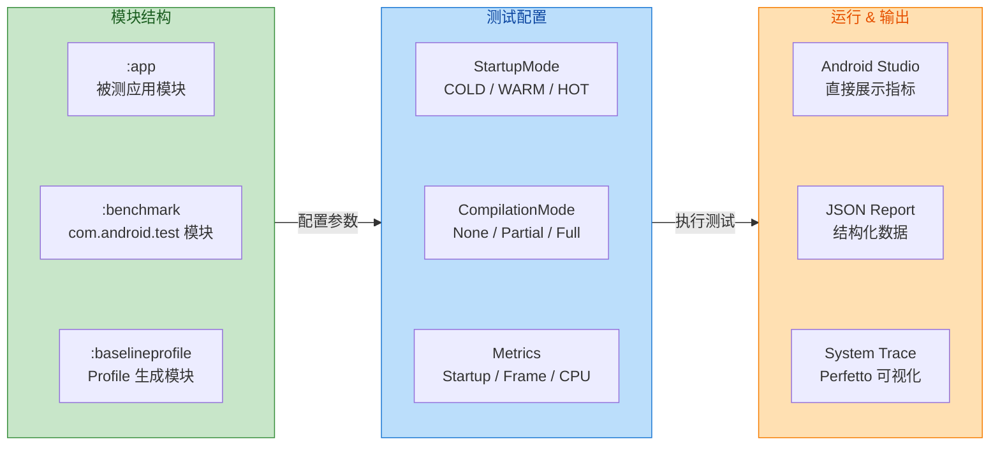

---

### Microbenchmark 微基准测试

如果说 Macrobenchmark 关注的是"用户能感知到的整体表现"，那么 Microbenchmark 关注的就是"开发者需要优化的具体函数性能"。Jetpack Microbenchmark 库可以让你在 Android Studio 中对 Android 原生代码（Kotlin 或 Java）进行基准测试。该库处理预热过程，测量代码性能和内存分配计数，并将基准测试结果输出到 Android Studio 控制台和一个更详细的 JSON 文件中。

#### 适用场景

Microbenchmark 最适合用于在应用中被频繁调用的 CPU 密集型工作，也就是所谓的"热路径"（hot code paths）。好的测试对象包括每次显示一个 item 的 RecyclerView 滚动、数据转换或处理，以及其他被重复使用的代码片段。

反过来说，其他类型的代码更难用 Microbenchmark 库来测量。因为基准测试在循环中运行，任何不被频繁调用或在多次调用时表现不同的代码可能不适合进行基准测试。

典型的 Microbenchmark 应用场景包括：

- **数据解析**：JSON/Protobuf 反序列化的耗时对比
- **排序/查找算法**：不同算法实现的 CPU 时间对比
- **UI 测量/布局**：自定义 View 的 `onMeasure` / `onLayout` 耗时
- **字符串处理**：正则匹配、格式化等热路径操作
- **集合操作**：`List` vs `Sequence` vs `Array` 在特定操作上的性能差异

#### 与 Macrobenchmark 的关键差异

| 维度 | Macrobenchmark | Microbenchmark |
|:-----|:---------------|:---------------|
| 测量粒度 | 整体用户流程（启动、滚动、导航） | 单个函数/代码片段 |
| 运行进程 | 独立于被测 App 的测试进程 | 与被测代码同进程（in-process） |
| 驱动方式 | UIAutomator（外部自动化） | 直接函数调用（代码内循环） |
| 编译控制 | 可指定 CompilationMode | 默认完全 AOT 编译 |
| 典型迭代时间 | 秒 ~ 分钟级 | 纳秒 ~ 毫秒级 |
| 最低 API | API 23（部分功能需更高） | API 14+ |
| 输出指标 | 启动时间、帧率、CPU 等系统级指标 | 执行时间、内存分配计数 |

#### 模块搭建与运行环境

Microbenchmark 同样建议使用独立的 Gradle 模块。要添加新的 Gradle 模块，可以使用 Android Studio 的模块向导。该向导会创建一个预配置好的基准测试模块，包含一个 benchmark 目录且 debuggable 已设为 false。

环境要求方面，该库会检测以下条件以确保项目和环境已配置为发布准确的性能数据：Debuggable 设为 false、使用物理设备（不支持模拟器）、如果设备已 root 则锁定时钟频率、设备电量至少 25%。如果上述任何检查失败，基准测试会报错以阻止不准确的测量。

```kotlin
// microbenchmark/build.gradle.kts
plugins {
    // 使用 Android Library 插件
    id("com.android.library")
    // 应用 Benchmark 插件，它会自动配置 AOT 编译和 CI 集成
    id("androidx.benchmark")
    id("org.jetbrains.kotlin.android")
}

android {
    namespace = "com.example.microbenchmark"
    compileSdk = 34

    defaultConfig {
        minSdk = 24
        // 必须使用 AndroidBenchmarkRunner 作为测试运行器
        testInstrumentationRunner = "androidx.benchmark.junit4.AndroidBenchmarkRunner"
    }

    // 关键：debug 构建类型中必须关闭 debuggable
    buildTypes {
        debug {
            // 设为 false 以获取准确的性能数据
            // debuggable = true 会引入大量调试开销，导致结果失真
            isDebuggable = false
        }
    }
}

dependencies {
    // Microbenchmark JUnit4 规则库
    androidTestImplementation("androidx.benchmark:benchmark-junit4:1.3.3")
}
```

#### 编写 Microbenchmark

Microbenchmark 的 API 核心是 `BenchmarkRule` 和其 `measureRepeated` 方法。与 Macrobenchmark 不同，这里你直接在循环中调用要测量的代码：

```kotlin
// microbenchmark/src/androidTest/java/com/example/microbenchmark/JsonParseBenchmark.kt
@RunWith(AndroidJUnit4::class)
class JsonParseBenchmark {

    // BenchmarkRule 负责预热、时钟稳定、迭代管理和结果采集
    @get:Rule
    val benchmarkRule = BenchmarkRule()

    // 准备一段 JSON 测试数据
    private val testJson = """
        {"users":[{"name":"Alice","age":30},{"name":"Bob","age":25}]}
    """.trimIndent()

    @Test
    fun benchmarkGsonParsing() {
        // 在 measureRepeated 中创建 Gson 实例（如果需要测量包含创建的完整流程）
        val gson = Gson()
        // measureRepeated 会自动确定预热次数和正式测量次数
        benchmarkRule.measureRepeated {
            // 这行代码会被循环执行成千上万次
            // 库会自动丢弃预热阶段的数据，只采集稳定状态下的耗时
            gson.fromJson(testJson, UserResponse::class.java)
        }
    }

    @Test
    fun benchmarkMoshiParsing() {
        val moshi = Moshi.Builder().build()
        // 获取 Moshi 的 JSON Adapter
        val adapter = moshi.adapter(UserResponse::class.java)
        benchmarkRule.measureRepeated {
            // 对比 Moshi 和 Gson 在相同数据下的解析性能
            adapter.fromJson(testJson)
        }
    }
}
```

#### 防止编译器优化消除测量代码

在 Microbenchmark 中有一个常见陷阱：如果被测代码的返回值没有被使用，Kotlin/Java 编译器或 ART JIT 可能会认为该调用是"无副作用的"并将其优化掉，导致你测到的是一个空循环的耗时而非真实代码的耗时。

解决方案是使用 `BenchmarkState` 直接访问底层状态并将结果消费掉：

```kotlin
@Test
fun benchmarkSortWithPrevention() {
    // 获取底层的 BenchmarkState 对象以获得更细粒度的控制
    val state = benchmarkRule.getState()

    // 使用 while 循环替代 measureRepeated，手动控制每次迭代
    while (state.keepRunning()) {
        // pauseTiming/resumeTiming 可用于排除数据准备的开销
        state.pauseTiming()
        // 每次迭代重新创建随机数据，防止排序被 JIT 优化为有序数据的特例
        val data = List(1000) { Random.nextInt() }.toMutableList()
        state.resumeTiming()

        // 实际要测量的排序操作
        data.sort()
    }
}
```

#### 时钟稳定性与热节流

移动设备的 CPU 时钟频率是动态变化的——高负载时提频、低负载时降频、温度过高时节流。这会让基准测试数据产生巨大波动。移动设备上的时钟会动态地在高性能的高状态和省电或设备过热时的低状态之间切换。这些变化的时钟可能让基准测试数据大幅波动，因此库提供了应对此问题的方法。

Microbenchmark 库采用以下策略来稳定结果：

1. `Window.setSustainedPerformanceMode()` 是受支持设备上的一个功能，允许应用选择一个较低的最大 CPU 频率。在受支持的设备上运行时，Microbenchmark 库会结合使用此 API 和启动自己的 Activity 来同时防止热节流和稳定结果。

2. 如果不使用时钟锁定或 sustained performance 模式，库会执行自动热节流检测。启用后，内部基准测试会周期性运行以判断设备温度是否高到足以降低 CPU 性能。当检测到 CPU 性能下降时，库会暂停执行让设备冷却，然后重试当前基准测试。

---

### Baseline Profile 与 Startup Profile：安装包级别的性能优化

Baseline Profile 和 Startup Profile 是 Macrobenchmark 测试之上的**性能优化产物**。它们本身并不是"测试"，而是通过测试框架生成的"编译提示文件"，告诉 ART 运行时哪些代码路径应该被 AOT 预编译。

#### Baseline Profile 的工作原理

在开发应用或库时，可以考虑为常见用户交互定义 Baseline Profile，尤其是渲染时间或延迟敏感的场景。其工作方式是：为应用生成人类可读的 profile 规则，然后编译为二进制形式存放在 `assets/dexopt/baseline.prof` 中。随后像往常一样将 AAB 上传到 Google Play。Google Play 处理 profile 并将其随 APK 一起分发给用户。在安装期间，ART 对 profile 中的方法执行 AOT 编译，使这些方法执行更快。如果 profile 包含应用启动或帧渲染期间使用的方法，用户将体验到更快的启动时间和更少的卡顿。这个流程与 Cloud Profile 聚合协作，基于应用的实际使用情况随时间微调性能。

简而言之，在没有 Baseline Profile 的情况下，用户首次安装或更新后启动应用时，ART 需要逐步通过 JIT 编译热路径代码，这会导致前几次启动较慢、前几秒可能有卡顿。有了 Baseline Profile，安装时就会预编译关键路径，Baseline Profile 通过避免包含代码路径的解释和 JIT 编译步骤，从首次启动就将代码执行速度提高了约 30%。通过在应用或库中附带 Baseline Profile，ART 可以通过 AOT 编译优化包含的代码路径，为每个新用户和每次应用更新提供性能增强。这种 Profile 引导优化（PGO）让应用从首次启动就能优化启动速度、减少交互卡顿、改善整体运行时性能。

#### Startup Profile 的特殊作用

Startup Profile 规则在构建时被 R8 使用，用于优化 DEX 文件中的类布局。这一构建时优化不同于 Baseline Profile（baseline.prof）的使用方式——后者被打包进 APK 或 AAB 供 ART 进行设备上编译。

Startup Profile 通过基于 `startup-prof.txt` 将启动时频繁使用的代码放置到主 DEX 文件中来工作。Startup Baseline Profile 聚焦于应用启动。Startup Profile 在应用编译期间帮助将启动后资源移出主 `classes.dex` 文件。这被视为 DEX 级别优化的一种方式。

为了获得最佳性能提升，应尽量限制添加到 Startup Profile 的用户旅程，使其保持在一个 DEX 文件以内。要获得 Startup Profile 的最高影响性能提升，启动代码应该能放入 `classes.dex` 文件（第一个 DEX 文件）中。如果无法做到，启动代码会溢出到下一个 DEX 文件中。

#### 生成 Baseline Profile

使用 Jetpack Macrobenchmark 库和 `BaselineProfileRule` 为每次应用发布自动生成 profile。建议使用 `com.android.tools.build:gradle:8.0.0` 或更高版本，这在使用 Baseline Profile 时带来了构建改进。

```kotlin
// baselineprofile/src/main/java/com/example/BaselineProfileGenerator.kt
@RunWith(AndroidJUnit4::class)
class BaselineProfileGenerator {

    // BaselineProfileRule 是生成 Baseline Profile 的专用规则
    @get:Rule
    val baselineProfileRule = BaselineProfileRule()

    @Test
    fun generateBaselineProfile() = baselineProfileRule.collect(
        // 指定要为其生成 profile 的目标应用包名
        packageName = "com.example.myapp",
        // 可选：指定最大迭代次数以提高 profile 覆盖率
        maxIterations = 3
    ) {
        // --- 启动路径（会被自动标记为 Startup Profile）---
        // includeInStartupProfile = true 表示这些路径属于启动关键路径
        pressHome()
        startActivityAndWait()

        // --- 关键用户旅程（Critical User Journeys）---
        // 这些交互生成的 profile 会被包含在 Baseline Profile 中
        // 模拟用户在首页滑动浏览列表
        val list = device.findObject(By.res(packageName, "main_list"))
        list.fling(Direction.DOWN)
        list.fling(Direction.UP)

        // 模拟用户点击进入详情页
        device.findObject(By.res(packageName, "item_card")).click()
        device.waitForIdle()

        // 模拟用户返回
        device.pressBack()
        device.waitForIdle()
    }
}
```

运行此测试后，生成的 Startup Profile 规则位于 `src/<variant>/generated/baselineProfiles/startup-prof.txt`，它们会被 AGP 自动消费。同时，Baseline Profile 会作为 `baseline-prof.txt` 存放在源码目录中，构建时编译为二进制格式打包进 APK/AAB。

#### 验证 Baseline Profile 的效果

建议使用 Jetpack Macrobenchmark 来测试应用在启用 Baseline Profile 时的性能表现，然后与禁用 Baseline Profile 的基准测试结果进行对比。

典型的验证方法是编写三组对比测试：

```kotlin
// 无编译优化：模拟最差情况（新安装无 Profile）
@Test
fun startupNone() = startup(CompilationMode.None())

// 使用 Baseline Profile：模拟通过 Play Store 安装后的典型情况
@Test
fun startupBaseline() = startup(
    CompilationMode.Partial(
        baselineProfileMode = BaselineProfileMode.Require
    )
)

// 完全编译：模拟理想情况（所有代码都已 AOT）
@Test
fun startupFull() = startup(CompilationMode.Full())
```

通过对比 `None` 与 `Partial(Baseline)` 的结果，你可以量化 Baseline Profile 带来的启动加速效果。例如，Google Maps 使用 Baseline Profile 将平均启动时间缩短了 30%，搜索量相应增长了 2.4%。

#### 完整工作流总览

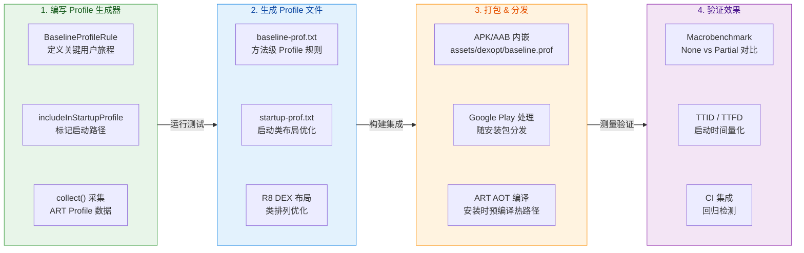

#### ProfileInstaller 的作用

对于不通过 Google Play 分发的应用（例如通过企业分发渠道、第三方商店、或直接 sideload），Google Play 无法在安装时处理 Baseline Profile。这时 `ProfileInstaller` 库就起了关键作用——需要确保目标应用包含 ProfilerInstaller 1.3 或更高版本，Macrobenchmark 库需要它来启用 profile 捕获、重置和 shader cache 清理。

`ProfileInstaller` 在应用首次启动时通过一个 `ContentProvider` 自动初始化，将打包在 APK 中的二进制 profile 写入 ART 预期的位置，从而在下次 `bg-dexopt` 时触发 AOT 编译。对于 Play Store 用户，这个过程由 Play 在安装时完成；对于非 Play 渠道，非 Google Play Store 的应用分发渠道可能不支持在安装时使用 Baseline Profile。通过这些渠道安装应用的用户要等到后台 dexopt 运行后才能看到收益——这通常发生在夜间。

```kotlin
// app/build.gradle.kts
dependencies {
    // ProfileInstaller：确保 Baseline Profile 在非 Play 渠道也能生效
    implementation("androidx.profileinstaller:profileinstaller:1.4.0")
}
```

---

### Macrobenchmark 与 Microbenchmark 的选择策略

两种基准测试库并非二选一的关系，而是互补使用的。当你在微调一个函数时使用 Microbenchmark。当你想知道应用在真实条件下的表现时使用 Macrobenchmark。

在实际项目中，推荐的策略是：

1. **先用 Macrobenchmark 识别全局瓶颈**：测量冷启动时间、关键页面的帧率。当你发现冷启动耗时 800ms 且第一帧渲染后还有 400ms 才能交互时，你知道需要优化了。

2. **用 System Trace 定位热点函数**：Macrobenchmark 每次迭代都会生成 trace 文件，你可以在 Android Studio 或 Perfetto 中分析，找到最耗时的方法调用。

3. **用 Microbenchmark 量化具体优化**：找到热点后（例如发现 JSON 解析占启动时间的 20%），编写 Microbenchmark 对比不同实现（Gson vs Moshi vs kotlinx.serialization），选择最优方案。

4. **生成 Baseline Profile 固化优化成果**：对已优化的代码路径生成 Baseline Profile，确保用户首次启动就能享受到 AOT 编译带来的加速。

5. **在 CI 中持续监控**：将 Macrobenchmark 集成到 CI 流水线，每次代码变更都自动运行，一旦指标回归就及时告警。

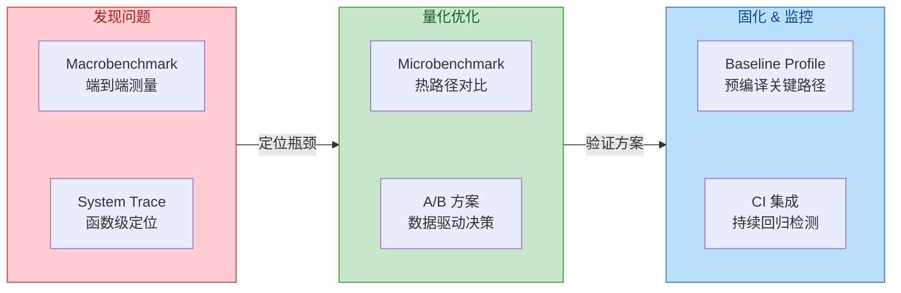

---

**📝 练习题**

一位开发者想要测量应用从完全未运行到用户看到首帧的启动时间，同时想模拟用户首次安装且没有任何 Baseline Profile 的最差体验。以下 Macrobenchmark 配置中，哪一组参数组合是正确的？

A. `startupMode = StartupMode.HOT`, `compilationMode = CompilationMode.Full()`


B. `startupMode = StartupMode.COLD`, `compilationMode = CompilationMode.None()`


C. `startupMode = StartupMode.WARM`, `compilationMode = CompilationMode.Partial()`


D. `startupMode = StartupMode.COLD`, `compilationMode = CompilationMode.DEFAULT`


**【答案】** B

**【解析】** 题目要求两个条件：① 从完全未运行到首帧——这要求进程被完全杀死后重新启动，对应 `StartupMode.COLD`（每次迭代前杀进程、清除 Activity 栈，模拟最完整的冷启动链路）；② 模拟没有任何 Baseline Profile 的最差体验——这对应 `CompilationMode.None()`，不执行任何 AOT 预编译，仅依赖运行时 JIT。选项 A 的 HOT 模式不杀进程，且 `Full()` 是最好情况而非最差；选项 C 的 WARM 模式进程存活，且 `Partial()` 包含部分预编译；选项 D 虽然使用了 COLD，但 `DEFAULT` 模式会自动安装 Baseline Profile（如果有），不是"无 Profile"的最差情况。

---

**📝 练习题**

关于 Android Baseline Profile 的以下描述，哪项是**错误的**？

A. Baseline Profile 的规则在构建时被编译为二进制格式，打包进 APK/AAB 的 `assets/dexopt/baseline.prof`


B. 通过 Google Play 安装时，ART 会在安装阶段对 Profile 中的方法执行 AOT 编译


C. Startup Profile 与 Baseline Profile 的作用机制完全相同，都是在安装时由 ART 执行 AOT 编译


D. 对于不通过 Google Play 分发的应用，需要依赖 `ProfileInstaller` 库来在首次启动时安装 Profile


**【答案】** C

**【解析】** Startup Profile 和 Baseline Profile 虽然都通过 Macrobenchmark 框架生成，但作用机制不同。Baseline Profile（`baseline.prof`）被打包进 APK/AAB，在安装时由 ART 进行 AOT 编译，优化方法的执行速度。而 Startup Profile（`startup-prof.txt`）是在**构建时**被 R8 消费的，它指导 R8 优化 DEX 文件中的类布局——将启动关键类放入主 `classes.dex` 文件，减少冷启动时的 DEX 文件读取开销。两者的生效时机（安装时 vs 构建时）和优化目标（方法编译 vs 类布局）都不相同，因此 C 项的说法是错误的。A、B、D 均正确描述了 Baseline Profile 的打包位置、Play Store 安装行为和非 Play 渠道的回退方案。

---

## 本章小结

本章围绕 Android 应用从"能运行"到"跑得好、包够小、难逆向"这一核心目标，系统性地梳理了 **混淆（Obfuscation）** 与 **优化（Optimization）** 的完整知识体系。从源码级别的名称重命名，到字节码层面的方法内联与类合并，再到资源文件的精简与原生库的压缩策略，最终落地到如何用基准测试量化优化收益——每一环都紧密衔接，共同构成了一条完整的应用"瘦身 + 加固 + 提速"流水线。以下从全局视角对本章八大知识点进行回顾与串联。

### 知识脉络回顾

**代码混淆原理** 是整条优化链的起点，也是应用安全的第一道防线。我们深入理解了混淆的本质并非"加密"，而是通过对类名、方法名、字段名进行 **不可逆的重命名**（如将 `UserRepository` 变为 `a.b`），使得反编译后的代码丧失可读性，大幅提高逆向工程的成本。在此过程中产生的 **Mapping 映射文件** 是连接混淆前后世界的唯一桥梁——没有它，线上崩溃堆栈中的 `a.b.c(Unknown Source:12)` 将变成一团无法解读的谜团。因此，Mapping 文件的归档管理（与 `versionCode` 严格一一对应）是发布流程中不可省略的环节。而 **`retrace`** 工具则让我们能够将混淆后的 Stacktrace 精准还原为可读的原始堆栈，这是线上问题排查的基本功。

在掌握混淆原理之后，我们进入了 **R8 编译器** 的世界。R8 是 Google 对 Android 构建链的一次重大整合——它将过去由 D8（dex 编译）和 ProGuard（混淆 + 优化）分别承担的工作 **合二为一**，在单次编译过程中同时完成 desugaring、tree shaking、code shrinking、obfuscation 和 dex 输出。这种整合不仅减少了中间 I/O 开销，更让 R8 能够在全局视角下做出更精准的优化决策。**Tree Shaking（摇树优化）** 是 R8 的核心能力之一，它从入口点（Entry Points）出发，通过静态分析遍历调用图，将所有不可达的类、方法、字段标记为"死代码"并移除。**Code Shrinking（代码收缩）** 则在此基础上进一步压缩——缩短标识符名称、移除调试信息、优化控制流。两者协同作用，通常能为中大型项目带来 20%–40% 的 DEX 体积缩减。

**ProGuard 规则** 是开发者与 R8 对话的语言。我们详细学习了 `-keep` 系列规则的精确语义：`-keep class` 保留类本身及其指定成员；`-keepclassmembers` 只在类被保留时才保留成员；`-keepclasseswithmembers` 则要求类必须拥有指定成员才被整体保留。这三者的区别看似微妙，实则直接决定了哪些代码会被 tree shaking 误删。反射调用、JNI 方法签名、序列化字段名、JSON 解析的 POJO 类——所有在运行时通过字符串名称访问的代码都必须通过 `-keep` 规则加以保护。`-dontwarn` 用于压制特定包或类的编译期警告，常见于第三方库引用了当前项目未包含的可选依赖的场景。`-assumenosideeffects` 则是一个强力但危险的指令，最典型的用法是指示 R8 将 `android.util.Log` 的所有调用视为无副作用并完全移除，从而在 Release 包中实现零成本的日志清除——但若误用于有实际副作用的方法，则会引发极难排查的运行时 Bug。

**资源优化** 将战场从代码层面扩展到了资源文件。Android 项目中往往积累了大量未使用的图片、布局和字符串资源，`shrinkResources true` 配合 `minifyEnabled true` 能让 R8 在移除死代码的同时识别并剔除这些无用资源。更进一步，**R 文件内联（R class inlining）** 消除了 `R.java` 中海量的 `static final int` 常量间接引用，将资源 ID 直接嵌入调用处，减少了类的数量和方法引用数。而 **AndResGuard** 等资源混淆工具则从另一个维度入手——将 `res/drawable-xxhdpi/ic_launcher_background.png` 这样的冗长路径重命名为 `r/d/a.png`，不仅缩短了 ZIP 条目名称从而减小 APK 体积，也为资源文件增加了一层逆向保护。

**字节码优化** 代表了更深层次的"手术刀"级别优化。Facebook 开源的 **Redex** 工具直接操作 DEX 字节码，执行 R8 未覆盖的优化策略：**字节码重排（Dex Reordering）** 根据应用冷启动的实际类加载顺序重新排列 DEX 中的类和方法定义，使得启动阶段所需的字节码在物理上连续存储，从而提升页面缓存（Page Cache）命中率、减少磁盘 I/O 和缺页中断；**方法内联（Inlining）** 将短小方法的体直接嵌入调用处，消除方法调用开销（参数压栈、跳转、返回）；**类合并（Class Merging）** 则将功能单一的小类合并为更少的大类，减少类总数、降低虚方法表（vtable）开销，并对 multidex 场景下的跨 DEX 引用产生积极影响。这些优化与 R8 形成互补——R8 在编译时做"安全、保守"的优化，Redex 在其基础上做"激进、数据驱动"的二次优化。

**原生库压缩** 聚焦于 APK 中占比极高的 `.so` 文件。`android:extractNativeLibs` 属性的 `true` 或 `false` 决定了安装时 `.so` 文件是被解压到磁盘（传统行为，安装体积翻倍）还是直接从 APK 中 mmap 加载（Android 6.0+ 支持，`useLegacyPackaging = false`）。后者虽然要求 `.so` 在 APK 内以 **未压缩、页面对齐** 的方式存储（导致 APK 文件本身略大），但安装后不再需要额外的解压副本，**实际磁盘占用反而更小**，且 Google Play 的差异分发（Delta Delivery）能更高效地处理未压缩的 `.so`。**ABI 过滤（`ndk.abiFilters`）** 则是最直接的瘦身手段——绝大多数现代设备仅需 `arm64-v8a`，移除 `armeabi-v7a`、`x86`、`x86_64` 等冗余架构可以一刀砍掉 50%–75% 的原生库体积。结合 App Bundle 的按需分发，用户实际下载的 APK 中只包含其设备对应架构的 `.so`。

**调试与发布构建** 从构建配置的角度将上述所有优化串联起来。`debug` 构建类型默认 `minifyEnabled false`、`debuggable true`、`shrinkResources false`，追求的是编译速度快、可断点调试、日志全开；而 `release` 构建则开启所有优化开关，关闭 debuggable，签名使用正式密钥。我们理解了 `debuggable true` 不仅仅影响调试器连接——它会改变 ART 的编译策略（禁用部分 AOT 优化以支持热替换）、影响 StrictMode 的默认行为、甚至改变 WebView 的调试暴露。因此，**永远只用 Release 构建进行性能测试**，否则得出的数据毫无参考价值。

**性能基准测试** 是优化工作的"度量衡"。没有基准测试，所有优化都只是"感觉快了"的玄学。**Macrobenchmark** 面向真实用户场景，在独立的测试进程中启动目标应用、模拟滚动和页面跳转，测量 `startup time`、`frame timing`、`trace sections` 等指标，适合衡量冷启动耗时和页面流畅度。**Microbenchmark** 则聚焦于单个函数或算法的纳秒级耗时，运行在应用进程内部，排除 IPC 和 UI 渲染干扰，适合比较两种序列化方案或两种集合实现的性能差异。**Baseline Profile** 和 **Startup Profile** 则是性能优化的"最后一公里"——它们将应用关键路径的方法列表打包进 APK，让 ART 在安装时对这些方法进行 **AOT 编译**，而非等待运行时 JIT，从而在首次启动时就获得接近"热运行"的性能表现。

### 全局流程串联

下面的流程图将本章所有知识点串联为一条完整的构建优化流水线，从源码到最终交付的每个阶段都有对应的优化手段：

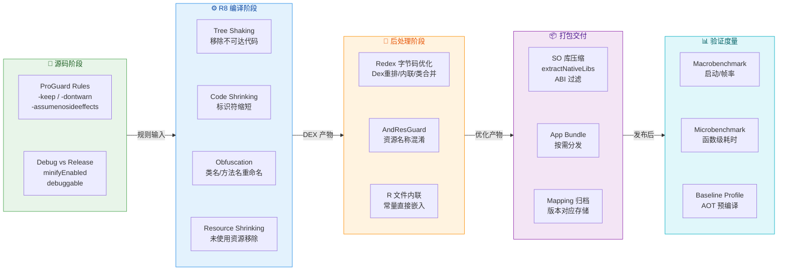

这条流水线清晰地展现了各优化手段的作用时机与相互关系：ProGuard 规则在源码阶段编写、在 R8 编译阶段生效；Resource Shrinking 依赖 Code Shrinking 的结果（先知道哪些代码被删了，才能判断哪些资源不再被引用）；Redex 在 R8 产出 DEX 之后进行二次优化；最终的 APK/AAB 打包阶段处理原生库压缩和 ABI 过滤；交付之后通过基准测试形成反馈闭环。

### 核心要点速查表

| 知识领域 | 关键要点 | 常见陷阱 |
|---------|---------|---------|
| **代码混淆** | 重命名而非加密；Mapping 文件必须归档 | Mapping 丢失导致线上崩溃无法还原 |
| **R8 编译器** | D8 + ProGuard 合一；全局 Tree Shaking | 反射/JNI 调用被误删 |
| **ProGuard 规则** | `-keep` 三兄弟语义不同；`-assumenosideeffects` 移除日志 | 误 keep 过宽导致优化失效；误移除有副作用方法 |
| **资源优化** | `shrinkResources` 需配合 `minifyEnabled`；R 文件内联减少方法数 | 动态资源 ID（`getIdentifier()`）被误删 |
| **字节码优化** | Redex 重排提升冷启动；类合并减少类数量 | 激进内联破坏反射；需充分回归测试 |
| **原生库压缩** | `useLegacyPackaging = false` 减少安装体积；ABI 过滤砍掉冗余架构 | 未对齐的 SO 导致加载崩溃；模拟器需 x86 |
| **调试与发布** | 永远用 Release 构建测性能；`debuggable` 影响 ART 编译策略 | 用 Debug 包做性能测试得出错误结论 |
| **性能基准** | Macro 测场景、Micro 测函数；Baseline Profile 预编译关键路径 | 未隔离干扰因素（后台进程、温控降频） |

### 实践建议

在真实项目中，混淆与优化并非一次性配置后就一劳永逸的事情。随着业务迭代、第三方 SDK 引入、代码结构变化，ProGuard 规则需要持续维护。建议团队建立以下机制：

**第一，CI/CD 中集成混淆验证**。每次合入主干后，自动构建 Release 包并运行冒烟测试（Smoke Test），确保混淆规则没有误删关键代码。许多团队在上线前才发现 Release 包崩溃，根源就在于日常开发全程使用 Debug 构建，混淆问题积累到发版才暴露。

**第二，Mapping 文件纳入版本管理或自动上传**。无论是上传到 Google Play Console（自动关联崩溃报告）还是 Firebase Crashlytics、Bugly 等第三方平台，都要确保每个发布版本的 Mapping 文件有据可查。推荐在 CI 流程中自动归档 `build/outputs/mapping/release/mapping.txt` 并打上对应的 Git Tag。

**第三，体积预算（Size Budget）机制**。为 APK/AAB 设定一个体积上限（例如 30MB），在 CI 中自动检测产物大小，超标则阻断合入。这能倒逼团队在引入新 SDK 或大量资源时主动评估成本，而非等到用户抱怨下载太慢才亡羊补牢。

**第四，基准测试回归**。将 Macrobenchmark 集成到 CI（如每日定时任务），追踪冷启动时间、关键页面帧率的趋势曲线。一旦某次提交导致启动时间劣化超过阈值（如 10%），立即触发告警并关联到具体 Commit，将性能劣化扼杀在萌芽阶段。

**第五，渐进式开启优化**。对于从未开启过混淆的老项目，不要试图一次性配置所有优化。推荐的路径是：先开启 `minifyEnabled true` 但用宽松的 `-keep` 规则（如 `-keep class com.yourpackage.** { *; }`），确保编译通过且功能正常；然后逐步收紧规则、开启 `shrinkResources`、引入 Baseline Profile；最后考虑 Redex、AndResGuard 等进阶工具。每一步都伴随充分的测试验证。

---

**📝 练习题 1**

在一个 Android 项目中，开发者在 `proguard-rules.pro` 中写了如下规则：

```
-assumenosideeffects class android.util.Log {
    public static int d(...);
    public static int v(...);
}
```

Release 构建后发现某个功能异常。排查后发现，团队有一处代码写成了 `if (Log.d(TAG, msg) > 0) { doSomething(); }`。请问导致功能异常的根本原因是什么？

A. `-assumenosideeffects` 只能用于移除 `void` 返回类型的方法，对返回 `int` 的方法不生效


B. R8 将 `Log.d()` 调用整体移除后，`if` 条件表达式失去了求值目标，R8 将整个 `if` 分支（包括 `doSomething()`）一并移除


C. `-assumenosideeffects` 不支持通配符 `(...)`，规则本身就没有生效


D. `Log.d()` 被移除后返回默认值 `0`，导致 `> 0` 条件永远为 `false`，`doSomething()` 永远不会执行


**【答案】** B

**【解析】** `-assumenosideeffects` 指令告诉 R8："这些方法没有任何副作用，可以安全移除。"当 R8 处理 `Log.d(TAG, msg)` 时，它不是将返回值替换为默认值，而是 **将整个方法调用从字节码中彻底删除**。在 `if (Log.d(TAG, msg) > 0)` 这个表达式中，`Log.d()` 被移除后，比较操作 `> 0` 也失去了左操作数。R8 的优化器会将这个不完整的条件表达式视为不可达代码（Dead Code），进而将整个 `if` 分支——包括 `doSomething()` 的调用——一并剪除。选项 D 描述的"返回默认值 0"是对该指令行为的常见误解：`-assumenosideeffects` 的语义是移除调用而非替换返回值。这个案例也揭示了一个重要的编码规范：**永远不要依赖 `Log` 方法的返回值进行业务逻辑判断**，因为它们在 Release 构建中会被完整移除。

---

**📝 练习题 2**

关于 Android 应用的原生库（.so）打包与加载，以下说法正确的是：

A. 设置 `android:extractNativeLibs="false"` 后，APK 文件体积会显著减小，因为 .so 文件会被高度压缩存储


B. 使用 `ndk.abiFilters = setOf("arm64-v8a")` 后，应用将无法在任何 32 位 ARM 设备上运行，但对 x86 模拟器没有影响


C. 当 `extractNativeLibs="false"` 时，.so 文件必须在 APK 中以未压缩且页面对齐的方式存储，系统通过 mmap 直接从 APK 加载，虽然 APK 文件本身可能略大，但安装后的磁盘总占用更小


D. App Bundle 格式会自动为所有设备生成包含全部 ABI 架构的通用 APK，因此无需配置 `abiFilters`


**【答案】** C

**【解析】** 当 `extractNativeLibs` 设置为 `false`（对应 AGP 中 `useLegacyPackaging = false`）时，Android 打包工具会将 `.so` 文件以 **未压缩（`stored`）** 方式放入 APK，并确保 **页面对齐（page-aligned，通常 4KB/16KB）**。安装时系统不再将 `.so` 解压到 `data` 分区的独立目录，而是通过 `mmap` 系统调用直接从 APK 文件中映射到内存。这意味着磁盘上不再有 `.so` 的额外副本，因此 **安装后的总磁盘占用反而更小**——尽管 APK 文件本身因为未压缩的 `.so` 而略大。选项 A 正好说反了（APK 会略大而非减小）。选项 B 的后半句错误——只保留 `arm64-v8a` 后 x86 模拟器同样无法运行（除非模拟器有 ARM 转译层）。选项 D 同样错误——App Bundle 的核心优势恰恰是 **按设备 ABI 分发**，只为目标设备生成对应架构的 Split APK，而不是打包全部架构。

---

