---

# 多媒体技术

---

## 通知系统 Notification

Android 的通知系统（Notification）是应用与用户之间最重要的 **非侵入式沟通桥梁**。当应用处于后台、屏幕关闭、甚至进程被回收时，通知仍然能够可靠地将信息传达给用户——这背后依赖的是系统级服务 `NotificationManagerService`（简称 NMS）的常驻机制。从应用层视角来看，开发者并不需要直接与 NMS 交互，而是通过 `NotificationManager` 或其兼容封装 `NotificationManagerCompat` 提交一个构建好的 `Notification` 对象，由系统完成状态栏图标展示、通知栏面板渲染、锁屏展示、声音/震动反馈等一系列工作。

通知系统之所以需要深入学习，主要原因有三：其一，**Android 8.0（API 26）引入了 NotificationChannel 机制**，彻底改变了通知的管理方式，应用如果不创建渠道，通知将完全无法展示；其二，通知的点击行为依赖 `PendingIntent` 这一独特的"延迟意图"机制，它涉及跨进程授权、Flag 安全性等容易出错的细节；其三，从 Android 13（API 33）开始，发送通知本身也需要 **运行时权限** `POST_NOTIFICATIONS`，进一步收紧了隐私管控。本节将从渠道管理、Builder 构建、PendingIntent 跳转三个维度，系统性地讲清通知开发的核心知识。

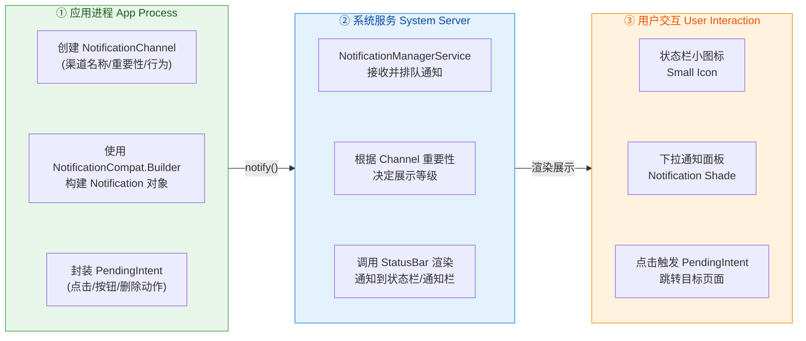

上图概括了通知系统的三阶段流转：应用进程构建并提交通知 → 系统服务处理排队与渲染策略 → 用户在状态栏/通知面板与通知交互。接下来依次展开每个核心知识点。

---

### NotificationChannel 渠道管理

#### 为什么要引入渠道？

在 Android 8.0 之前，应用发出的所有通知在用户侧是一个"整体"——用户要么允许该应用的全部通知，要么全部禁止，**没有细粒度的控制能力**。这导致了一个尴尬的局面：一个电商应用的"订单物流更新"通知对用户很重要，但"营销推广"通知却令人厌烦。用户为了屏蔽营销通知而关闭整个应用的通知权限，结果连重要的物流通知也收不到了。

Google 为了解决这个矛盾，在 API 26 引入了 **NotificationChannel（通知渠道）** 的概念。其设计哲学是：**让应用按照业务语义将通知分类到不同的渠道中，然后将每个渠道的行为控制权交给用户。** 用户可以在"系统设置 → 应用 → 通知"中，针对每个渠道独立设置是否允许、是否震动、铃声、是否在锁屏展示等。一旦渠道被创建，**应用代码无法再修改其重要性等级和行为设定**——只有用户自己能调。这是 Google 对用户通知体验管控的一次重大"权力让渡"。

#### 渠道的核心属性

每个 `NotificationChannel` 在创建时需要指定三个必要参数：

- **channelId**（`String`）：渠道的唯一标识符，应用内不可重复。它是后续 Builder 构建通知时必须关联的 key。建议使用语义清晰的命名，如 `"order_logistics"`、`"chat_message"`、`"promotion"`。
- **channelName**（`CharSequence`）：用户可见的渠道名称，会展示在系统通知设置页面中。应当使用用户能理解的自然语言，如"订单物流"、"聊天消息"。
- **importance**（`int`）：渠道的重要性等级，它直接决定了通知的 **展示行为**。

重要性等级与用户感知行为的对应关系如下：

| 等级常量 | 值 | 行为表现 |
|---|---|---|
| `IMPORTANCE_NONE` | 0 | 通知完全不展示（等同于用户手动关闭该渠道） |
| `IMPORTANCE_MIN` | 1 | 仅在下拉通知面板中静默展示，无状态栏图标、无声音、无震动 |
| `IMPORTANCE_LOW` | 2 | 状态栏显示小图标，通知面板展示，但 **无声音、无震动** |
| `IMPORTANCE_DEFAULT` | 3 | 状态栏图标 + 通知面板 + **发出声音**（默认铃声） |
| `IMPORTANCE_HIGH` | 4 | **Heads-Up 横幅弹出**（浮动通知），同时有声音、震动 |

实际开发中，`IMPORTANCE_HIGH` 适用于即时通讯消息、来电等需要立即引起用户注意的场景；`IMPORTANCE_DEFAULT` 适用于大多数业务通知；`IMPORTANCE_LOW` 适用于不太紧急的信息型通知。需要特别注意的是，**一旦渠道创建后，应用代码对 importance 的修改会被系统忽略**——只有用户可以在设置中调整。因此，首次创建时的重要性选择尤为关键。

#### 渠道的创建与注册

渠道的创建操作是 **幂等的（idempotent）**：如果使用相同的 `channelId` 重复调用 `createNotificationChannel()`，系统不会创建新渠道，也不会覆盖用户已修改的设置。这意味着你可以安全地在每次 `Application.onCreate()` 或发送通知前执行创建逻辑，而不必担心"重置了用户的偏好"。

```kotlin
// === 创建通知渠道的完整示例 ===

// 1. 导入必要的类
import android.app.NotificationChannel
import android.app.NotificationManager
import android.os.Build
import android.content.Context

/**
 * 在 Application.onCreate() 或首次需要通知时调用此方法。
 * 建议统一在 App 启动阶段完成所有渠道注册。
 */
fun createNotificationChannels(context: Context) {
    // 2. 渠道 API 仅在 Android 8.0 (API 26) 及以上可用，必须做版本守卫
    if (Build.VERSION.SDK_INT >= Build.VERSION_CODES.O) {

        // 3. 定义"聊天消息"渠道 —— 高重要性，会弹出 Heads-Up
        val chatChannel = NotificationChannel(
            "chat_message",               // channelId: 唯一标识，Builder 中会引用
            "聊天消息",                     // channelName: 用户在设置中看到的名称
            NotificationManager.IMPORTANCE_HIGH  // 重要性: 弹出横幅通知
        ).apply {
            description = "接收好友发来的即时消息" // 渠道描述，展示在设置页供用户参考
            enableVibration(true)                 // 允许震动（用户可后续关闭）
            vibrationPattern = longArrayOf(0, 300, 200, 300) // 震动模式：等待0ms→震300ms→停200ms→震300ms
            enableLights(true)                    // 允许呼吸灯（部分设备支持）
            lightColor = 0xFF4CAF50.toInt()       // 呼吸灯颜色：Material Green
        }

        // 4. 定义"订单物流"渠道 —— 默认重要性，有声音但不弹横幅
        val logisticsChannel = NotificationChannel(
            "order_logistics",                    // channelId
            "订单物流",                            // channelName
            NotificationManager.IMPORTANCE_DEFAULT // 重要性: 有声音提醒
        ).apply {
            description = "物流状态变更提醒"        // 渠道描述
        }

        // 5. 定义"营销推广"渠道 —— 低重要性，静默展示
        val promoChannel = NotificationChannel(
            "promotion",                          // channelId
            "优惠活动",                            // channelName
            NotificationManager.IMPORTANCE_LOW     // 重要性: 无声音无震动
        ).apply {
            description = "促销活动与优惠券推送"
        }

        // 6. 获取 NotificationManager 系统服务
        val manager = context.getSystemService(Context.NOTIFICATION_SERVICE) as NotificationManager

        // 7. 批量注册所有渠道（幂等操作，可安全重复调用）
        manager.createNotificationChannels(
            listOf(chatChannel, logisticsChannel, promoChannel)
        )
    }
}
```

#### 渠道分组（Channel Group）

当应用的渠道数量较多时，可以使用 `NotificationChannelGroup` 将渠道归类分组。例如一个同时支持多账号的社交应用，可以按账号分组：

```kotlin
// === 渠道分组示例 ===
if (Build.VERSION.SDK_INT >= Build.VERSION_CODES.O) {
    val manager = context.getSystemService(Context.NOTIFICATION_SERVICE) as NotificationManager

    // 1. 创建分组（groupId, groupName）
    val workGroup = NotificationChannelGroup("work_account", "工作账号")   // 工作账号分组
    val personalGroup = NotificationChannelGroup("personal_account", "个人账号") // 个人账号分组

    // 2. 注册分组
    manager.createNotificationChannelGroups(listOf(workGroup, personalGroup))

    // 3. 创建渠道时关联到分组
    val workChat = NotificationChannel("work_chat", "工作聊天", NotificationManager.IMPORTANCE_HIGH).apply {
        group = "work_account"  // 将此渠道归入"工作账号"分组
    }

    val personalChat = NotificationChannel("personal_chat", "私人聊天", NotificationManager.IMPORTANCE_HIGH).apply {
        group = "personal_account" // 将此渠道归入"个人账号"分组
    }

    // 4. 注册渠道
    manager.createNotificationChannels(listOf(workChat, personalChat))
}
```

在系统设置页中，用户会看到渠道被清晰地归在各自的分组下，体验更加有序。

#### 渠道管理的最佳实践

**（1）删除废弃渠道**：如果应用更新后某个渠道不再使用，应当调用 `deleteNotificationChannel(channelId)` 将其移除，避免在设置页中留下"僵尸渠道"。但请注意，被删除的渠道 ID 会被系统"记住"，如果后续重新创建同名渠道，用户之前设置的偏好 **不会** 被恢复——系统会将其视为一个"被删除后又重建"的渠道，并在设置页中标注该信息。因此，不要试图通过"删除再重建"来重置用户的渠道设置，这种行为会被 Google Play 审核视为违规。

**（2）引导用户到渠道设置页**：当用户在应用内操作暗示其可能关闭了某个重要渠道时（比如用户反馈"收不到消息提醒"），应用可以通过 Intent 直接跳转到该渠道的系统设置页面：

```kotlin
// === 跳转到指定渠道的系统设置页 ===
val intent = Intent(Settings.ACTION_CHANNEL_NOTIFICATION_SETTINGS).apply {
    putExtra(Settings.EXTRA_APP_PACKAGE, context.packageName)  // 指定应用包名
    putExtra(Settings.EXTRA_CHANNEL_ID, "chat_message")         // 指定目标渠道 ID
}
context.startActivity(intent) // 启动系统设置页
```

**（3）版本兼容策略**：由于 `NotificationChannel` 是 API 26 的类，在低版本设备上不存在。使用 `NotificationCompat.Builder`（来自 AndroidX `core` 库）可以自动处理兼容性——在 API 26+ 设备上，Builder 会读取你传入的 `channelId` 并关联到对应渠道；在低版本设备上，channelId 参数会被静默忽略，通知仍然使用旧的全局行为。

---

### Builder 构建

#### 为什么使用 Builder 模式？

`Notification` 对象的属性极其丰富——标题、正文、小图标、大图标、点击意图、删除意图、操作按钮、进度条、样式模板、可见性、优先级（兼容旧版）……如果用构造函数传递这些参数，代码将变得不可维护。因此，Android 从一开始就为 Notification 采用了 **Builder 模式**（建造者模式），让开发者以链式调用的方式按需设置属性，最后调用 `.build()` 生成不可变的 `Notification` 对象。

在实际开发中，我们几乎总是使用 `NotificationCompat.Builder`（来自 `androidx.core:core` 库）而非原生的 `Notification.Builder`，因为 Compat 版本在内部针对不同 API Level 做了大量适配工作，能确保同一份代码在 API 21～34 上表现一致。

#### 基础通知构建

一个最小可用通知至少需要三个要素：**小图标（smallIcon）**、**标题（contentTitle）** 和 **正文（contentText）**。缺少小图标会导致通知在某些系统版本上完全不展示，这是一个常见的"静默失败"陷阱。

```kotlin
// === 构建并发送一条基础通知 ===

import androidx.core.app.NotificationCompat
import androidx.core.app.NotificationManagerCompat

fun sendBasicNotification(context: Context) {
    // 1. 创建 Builder，必须传入 channelId（API 26+ 生效，低版本忽略）
    val builder = NotificationCompat.Builder(context, "order_logistics")
        // 2. 设置小图标（必须是纯 alpha 通道的矢量图，状态栏中以单色展示）
        .setSmallIcon(R.drawable.ic_notification_logistics)
        // 3. 设置标题（一行，超长会被截断）
        .setContentTitle("包裹已发出")
        // 4. 设置正文（默认单行，超长截断；可通过 setStyle 扩展）
        .setContentText("您的订单 #20250307 已从北京仓库发出，预计3天送达。")
        // 5. 设置通知时间戳（默认为 System.currentTimeMillis()）
        .setWhen(System.currentTimeMillis())
        // 6. 自动取消：用户点击通知后自动从通知栏移除
        .setAutoCancel(true)
        // 7. 设置优先级（兼容 API 26 以下设备，26+ 由 Channel importance 决定）
        .setPriority(NotificationCompat.PRIORITY_DEFAULT)

    // 8. 获取兼容版 NotificationManager
    val notificationManager = NotificationManagerCompat.from(context)

    // 9. 发送通知：第一个参数是通知 ID（同 ID 会覆盖旧通知），第二个是构建好的 Notification
    //    注意：Android 13+ 需要先检查 POST_NOTIFICATIONS 权限
    if (ActivityCompat.checkSelfPermission(context, Manifest.permission.POST_NOTIFICATIONS)
        == PackageManager.PERMISSION_GRANTED
    ) {
        notificationManager.notify(1001, builder.build()) // ID=1001，发送通知
    }
}
```

上面的 `notify(id, notification)` 中，**通知 ID** 是一个应用内唯一的整数标识。如果使用相同的 ID 再次调用 `notify()`，新通知将 **替换**（更新）旧通知，而不是追加。这个机制在"进度更新"场景中非常有用——比如文件下载进度变化时，反复用同一个 ID 更新通知内容即可，用户始终只看到一条通知。

#### 富文本样式（Style）

默认的通知只展示单行正文，文本过长时被省略号截断。对于需要展示更多信息的场景，`NotificationCompat` 提供了多种 **Style 模板**：

**BigTextStyle（长文本）**：适用于展示完整的多行文本，如邮件内容预览、物流详情等。用户下拉展开通知时可以看到全文。

```kotlin
// === BigTextStyle 长文本通知 ===
val bigTextStyle = NotificationCompat.BigTextStyle()
    // 设置展开后的完整文本
    .bigText("您的订单 #20250307 已从北京仓库发出，由顺丰速运承运，运单号 SF1234567890。预计3月10日送达杭州市余杭区。如有问题请联系客服 400-xxx-xxxx。")
    // 设置展开后标题（可覆盖 contentTitle）
    .setBigContentTitle("物流详情更新")
    // 设置展开后的摘要行（显示在最底部）
    .setSummaryText("顺丰速运")

val notification = NotificationCompat.Builder(context, "order_logistics")
    .setSmallIcon(R.drawable.ic_notification_logistics)
    .setContentTitle("包裹已发出")                       // 折叠状态下的标题
    .setContentText("订单 #20250307 已发出，点击查看详情") // 折叠状态下的正文
    .setStyle(bigTextStyle)                              // 应用长文本样式
    .build()
```

**BigPictureStyle（大图）**：适用于社交应用的图片消息、新闻应用的封面图等。展开后显示一张大图片。

```kotlin
// === BigPictureStyle 大图通知 ===
val bitmap = BitmapFactory.decodeResource(context.resources, R.drawable.sample_photo) // 加载图片资源
val bigPictureStyle = NotificationCompat.BigPictureStyle()
    .bigPicture(bitmap)          // 展开后显示的大图（Bitmap）
    .bigLargeIcon(null as Bitmap?) // 展开后隐藏大图标（避免重复）

val notification = NotificationCompat.Builder(context, "chat_message")
    .setSmallIcon(R.drawable.ic_notification_chat)
    .setContentTitle("Alice")
    .setContentText("[图片消息]")
    .setLargeIcon(bitmap)        // 折叠状态下右侧的大图标缩略图
    .setStyle(bigPictureStyle)   // 应用大图样式
    .build()
```

**InboxStyle（多行列表）**：适用于邮件客户端展示多封未读邮件摘要，或多条消息的聚合预览。

```kotlin
// === InboxStyle 多行摘要通知 ===
val inboxStyle = NotificationCompat.InboxStyle()
    .addLine("Alice: 今晚一起吃饭吗？")     // 第1行
    .addLine("Bob: PR 已经合并了")           // 第2行
    .addLine("Carol: 明天会议改到下午3点")    // 第3行
    .setBigContentTitle("3 条新消息")         // 展开后的标题
    .setSummaryText("team@example.com")      // 摘要行

val notification = NotificationCompat.Builder(context, "chat_message")
    .setSmallIcon(R.drawable.ic_notification_chat)
    .setContentTitle("3 条新消息")
    .setContentText("Alice, Bob, Carol")
    .setStyle(inboxStyle)                     // 应用收件箱样式
    .setNumber(3)                             // 角标数字（部分启动器支持）
    .build()
```

#### Action 按钮

通知支持最多 **3 个操作按钮**（Action），直接展示在通知下方，用户无需打开应用即可执行操作。每个 Action 由一个图标、文本标签和一个 `PendingIntent` 组成。

```kotlin
// === 带 Action 按钮的通知 ===

// 1. 创建"标记已读"操作的 PendingIntent（指向 BroadcastReceiver）
val markReadIntent = Intent(context, NotificationActionReceiver::class.java).apply {
    action = "ACTION_MARK_READ"          // 自定义 Action 标识
    putExtra("message_id", 12345)        // 携带业务数据
}
val markReadPending = PendingIntent.getBroadcast(
    context,
    0,                                   // requestCode: 用于区分不同 PendingIntent
    markReadIntent,
    PendingIntent.FLAG_UPDATE_CURRENT or PendingIntent.FLAG_IMMUTABLE // 必须加 IMMUTABLE（API 31+）
)

// 2. 创建"回复"操作的 PendingIntent（指向 Activity）
val replyIntent = Intent(context, ChatActivity::class.java).apply {
    putExtra("message_id", 12345)
}
val replyPending = PendingIntent.getActivity(
    context,
    1,                                   // 不同的 requestCode 确保不会复用上面的 PendingIntent
    replyIntent,
    PendingIntent.FLAG_UPDATE_CURRENT or PendingIntent.FLAG_IMMUTABLE
)

// 3. 将 Action 添加到通知
val notification = NotificationCompat.Builder(context, "chat_message")
    .setSmallIcon(R.drawable.ic_notification_chat)
    .setContentTitle("Alice")
    .setContentText("今晚一起吃饭吗？")
    .addAction(R.drawable.ic_done, "标记已读", markReadPending)  // Action 1
    .addAction(R.drawable.ic_reply, "回复", replyPending)        // Action 2
    .build()
```

#### 进度条通知

文件下载、上传等耗时操作场景，通知支持内置进度条：

```kotlin
// === 进度条通知 ===
val builder = NotificationCompat.Builder(context, "download")
    .setSmallIcon(R.drawable.ic_download)
    .setContentTitle("正在下载 update.apk")
    .setPriority(NotificationCompat.PRIORITY_LOW)   // 下载通知不需要打扰用户
    .setOngoing(true)                                // 常驻通知，用户无法滑动移除

val manager = NotificationManagerCompat.from(context)

// 模拟下载进度更新
for (progress in 0..100 step 10) {
    builder.setProgress(100, progress, false)        // (max, current, indeterminate)
    builder.setContentText("已完成 $progress%")       // 更新正文
    manager.notify(2001, builder.build())            // 同 ID 覆盖更新
    Thread.sleep(500)                                 // 模拟延迟（实际应在后台线程）
}

// 下载完成：移除进度条，取消常驻
builder.setProgress(0, 0, false)                     // 清除进度条
    .setContentText("下载完成")
    .setOngoing(false)                                // 允许用户滑动移除
manager.notify(2001, builder.build())                // 最终更新
```

其中 `setProgress(max, progress, indeterminate)` 的第三个参数如果设为 `true`，将展示一个无限循环的不确定进度条（常用于"正在连接服务器…"等无法预估进度的场景）。

---

### PendingIntent 跳转

#### PendingIntent 的本质

`PendingIntent` 是 Android 系统中一个 **极其重要但也极易被误解** 的机制。从命名来看，它是一个"悬而未决的意图"——**它不是立即执行的 Intent，而是一个由你的应用创建、交给其他应用（或系统）在未来某个时刻代表你执行的 Intent 令牌（Token）。**

为什么需要这种机制？考虑通知的场景：通知的渲染和点击处理都由 **SystemUI 进程**（系统 UI 应用）完成，而不是你的应用进程。当用户点击通知时，是 SystemUI 在响应点击事件。如果直接传一个普通 Intent 给 SystemUI，SystemUI 使用该 Intent 启动你的 Activity 时，就会以 **SystemUI 的身份和权限** 来执行——这既是安全隐患（SystemUI 拥有系统级权限），也可能因为权限不匹配导致启动失败。

`PendingIntent` 解决了这个问题：你的应用在创建 PendingIntent 时，**系统会记录下创建者的 UID、PID 和权限上下文**。当 SystemUI（或 AlarmManager、其他应用）后续触发这个 PendingIntent 时，**系统会以原始创建者（即你的应用）的身份和权限来执行其中封装的 Intent**。这就是所谓的 **"委托执行"（Delegated Execution）** 机制。

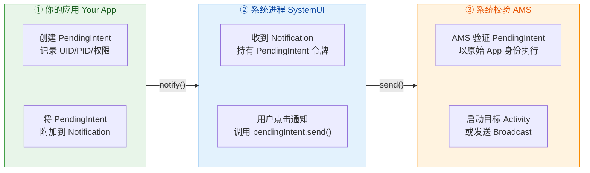

#### PendingIntent 的三种类型

根据封装的目标组件类型，PendingIntent 有三种创建方式：

| 工厂方法 | 目标 | 典型用途 |
|---|---|---|
| `PendingIntent.getActivity()` | 启动 Activity | 用户点击通知后跳转到某个页面 |
| `PendingIntent.getBroadcast()` | 发送 Broadcast | 通知上的操作按钮（如"标记已读"、"删除"） |
| `PendingIntent.getService()` / `getForegroundService()` | 启动 Service | 后台操作（如"暂停下载"、"跳过歌曲"） |

每种方式的参数签名相同：`(context, requestCode, intent, flags)`。其中 `requestCode` 和 `intent` 共同决定了 PendingIntent 的 **唯一性匹配**（后面详细讨论 Flag 时会展开）。

#### Flag 详解：IMMUTABLE vs MUTABLE

从 **Android 12（API 31）** 开始，创建 PendingIntent 时 **必须** 显式指定 `FLAG_IMMUTABLE` 或 `FLAG_MUTABLE` 之一，否则会抛出 `IllegalArgumentException`。这是 Google 为了修补一类 **PendingIntent 劫持漏洞** 而做的安全加固。

- **`FLAG_IMMUTABLE`**（推荐默认使用）：创建后，其他持有者 **无法修改** PendingIntent 中封装的 Intent 内容。这意味着即使恶意应用拦截到了这个 PendingIntent，也无法篡改目标组件、携带数据等关键信息。**绝大多数通知场景都应该使用此 Flag。**

- **`FLAG_MUTABLE`**：允许后续的 `send()` 调用者向 Intent 中填充额外数据。**唯一合理的使用场景是：** 通知中的 **Direct Reply（直接回复）** 功能——系统需要将用户输入的回复文本写入 Intent 的 extras 中，因此必须 mutable。

```kotlin
// === FLAG_IMMUTABLE：标准用法（绝大多数场景） ===
val immutablePending = PendingIntent.getActivity(
    context,
    0,
    Intent(context, OrderDetailActivity::class.java),
    PendingIntent.FLAG_UPDATE_CURRENT or PendingIntent.FLAG_IMMUTABLE  // 安全：不可被外部篡改
)

// === FLAG_MUTABLE：仅用于 Direct Reply 场景 ===
val remoteInput = RemoteInput.Builder("key_reply_text")  // 定义回复输入的 key
    .setLabel("输入回复...")                               // 输入框占位文本
    .build()

val replyIntent = Intent(context, ReplyReceiver::class.java)
val mutablePending = PendingIntent.getBroadcast(
    context,
    0,
    replyIntent,
    PendingIntent.FLAG_UPDATE_CURRENT or PendingIntent.FLAG_MUTABLE   // 可变：系统需要写入用户输入
)

// 将 RemoteInput 绑定到 Action
val replyAction = NotificationCompat.Action.Builder(
    R.drawable.ic_reply, "回复", mutablePending
).addRemoteInput(remoteInput).build()
```

#### Flag 详解：UPDATE_CURRENT vs CANCEL_CURRENT vs ONE_SHOT

除了 IMMUTABLE/MUTABLE，还有三个控制 **PendingIntent 复用行为** 的 Flag：

- **`FLAG_UPDATE_CURRENT`**：如果系统中已经存在一个匹配的 PendingIntent（相同的 `requestCode` + 相同的 Intent `filterEquals`），则 **更新** 其携带的 extras 数据，而不创建新的。**这是最常用的 Flag**，适用于"同一条通知需要反复更新"的场景。

- **`FLAG_CANCEL_CURRENT`**：先 **取消** 已存在的匹配 PendingIntent，再创建一个全新的。这意味着之前持有旧 PendingIntent 的组件（比如之前发出的通知）将无法再触发。适用于需要"作废旧令牌"的安全敏感场景。

- **`FLAG_ONE_SHOT`**：该 PendingIntent **只能被触发一次**，触发后自动失效。适用于一次性操作的安全场景（如支付确认通知）。

- **`FLAG_NO_CREATE`**：不创建新的 PendingIntent，仅查询是否已有匹配的存在。如果存在则返回它，不存在则返回 `null`。通常用于检查"某个定时任务是否已经注册过"。

#### requestCode 的陷阱

PendingIntent 的唯一性由两个因素决定：**requestCode** 和 **Intent 的 filterEquals 比较结果**（比较 action、data、type、component、categories，**不比较 extras**）。这意味着：如果两个 PendingIntent 的 Intent 仅 extras 不同但其他字段相同，且 requestCode 也相同，**系统会认为它们是同一个 PendingIntent**。

这是一个非常经典的 Bug 场景：假设你为列表中每条消息的通知都创建点击 PendingIntent，Intent 都指向 `ChatActivity`，只是 `putExtra("message_id", ...)` 不同——如果 requestCode 都写 `0`，那么所有通知点击后都会打开 **最后一条消息**（因为 `FLAG_UPDATE_CURRENT` 会用最后一个 extras 覆盖）。

**解决方案**：使用不同的 `requestCode`（通常用 notificationId 或 messageId）来确保唯一性：

```kotlin
// === 正确做法：每条通知使用唯一的 requestCode ===
fun buildChatPendingIntent(context: Context, messageId: Int): PendingIntent {
    val intent = Intent(context, ChatActivity::class.java).apply {
        putExtra("message_id", messageId)        // extras 不参与 PendingIntent 匹配
    }
    return PendingIntent.getActivity(
        context,
        messageId,                                // ✅ 使用 messageId 作为 requestCode，确保唯一
        intent,
        PendingIntent.FLAG_UPDATE_CURRENT or PendingIntent.FLAG_IMMUTABLE
    )
}
```

#### 构建合理的通知返回栈

当用户通过通知进入应用的某个深层页面（如订单详情页）后，按返回键时应当怎么处理？这取决于业务需求，有两种主流方案：

**方案一：TaskStackBuilder 构造人工返回栈**

如果希望用户按返回键时逐级返回到应用的父页面（如 订单详情 → 订单列表 → 主页），而不是直接退回桌面，就需要使用 `TaskStackBuilder` 来构造完整的 Activity 返回栈：

```kotlin
// === TaskStackBuilder 构造完整返回栈 ===
val detailIntent = Intent(context, OrderDetailActivity::class.java).apply {
    putExtra("order_id", "20250307")
}

val pendingIntent = TaskStackBuilder.create(context)
    // 按层级依次添加父 Activity（需要在 AndroidManifest 中配置 parentActivityName）
    .addNextIntentWithParentStack(detailIntent)  // 自动根据 manifest 解析父级链
    .getPendingIntent(
        0,
        PendingIntent.FLAG_UPDATE_CURRENT or PendingIntent.FLAG_IMMUTABLE
    )
```

为了让 `addNextIntentWithParentStack` 正常工作，需要在 `AndroidManifest.xml` 中声明父级关系：

```xml
<!-- AndroidManifest.xml 中声明 Activity 层级关系 -->
<activity
    android:name=".OrderDetailActivity"
    android:parentActivityName=".OrderListActivity">  <!-- 声明父级 Activity -->
    <!-- 兼容 API 15 及以下 -->
    <meta-data
        android:name="android.support.PARENT_ACTIVITY"
        android:value=".OrderListActivity" />
</activity>
```

**方案二：FLAG_ACTIVITY_NEW_TASK + FLAG_ACTIVITY_CLEAR_TASK**

如果希望通知点击后直接进入目标页面，且按返回键直接退出应用（不需要人工返回栈），可以使用以下 Intent Flag 组合：

```kotlin
// === 直接进入目标页面，不构建返回栈 ===
val intent = Intent(context, OrderDetailActivity::class.java).apply {
    flags = Intent.FLAG_ACTIVITY_NEW_TASK or Intent.FLAG_ACTIVITY_CLEAR_TASK // 清空任务栈后启动
    putExtra("order_id", "20250307")
}

val pendingIntent = PendingIntent.getActivity(
    context,
    0,
    intent,
    PendingIntent.FLAG_UPDATE_CURRENT or PendingIntent.FLAG_IMMUTABLE
)
```

选择哪种方案取决于产品设计：如果通知是引导用户"进入应用做后续操作"的，方案一更合理；如果通知只是展示某个独立信息（如验证码、一次性确认），方案二更轻量。

---

### 综合示例：完整通知流程

下面将以上三大知识点串联，给出一个从渠道注册到发送通知的完整流程示例：

```kotlin
// === Application 类中注册渠道 ===
class MyApp : Application() {
    override fun onCreate() {
        super.onCreate()
        createNotificationChannels(this) // 在 App 启动时统一注册所有渠道
    }
}
```

```kotlin
// === 发送一条完整的聊天通知 ===
fun sendChatNotification(context: Context, senderName: String, message: String, messageId: Int) {

    // 1. 构建点击通知后的跳转 PendingIntent（带返回栈）
    val chatIntent = Intent(context, ChatActivity::class.java).apply {
        putExtra("message_id", messageId)    // 携带消息 ID
    }
    val contentPending = TaskStackBuilder.create(context)
        .addNextIntentWithParentStack(chatIntent)  // 自动构建父级返回栈
        .getPendingIntent(
            messageId,                              // 使用 messageId 确保唯一性
            PendingIntent.FLAG_UPDATE_CURRENT or PendingIntent.FLAG_IMMUTABLE
        )

    // 2. 构建"标记已读" Action 按钮的 PendingIntent
    val markReadIntent = Intent(context, NotificationActionReceiver::class.java).apply {
        action = "ACTION_MARK_READ"
        putExtra("message_id", messageId)
    }
    val markReadPending = PendingIntent.getBroadcast(
        context,
        messageId + 100000,                         // 避免与 contentPending 冲突
        markReadIntent,
        PendingIntent.FLAG_UPDATE_CURRENT or PendingIntent.FLAG_IMMUTABLE
    )

    // 3. 使用 Builder 构建通知
    val notification = NotificationCompat.Builder(context, "chat_message") // 关联渠道 ID
        .setSmallIcon(R.drawable.ic_notification_chat)     // 状态栏小图标
        .setContentTitle(senderName)                        // 标题：发送者昵称
        .setContentText(message)                            // 正文：消息内容
        .setStyle(NotificationCompat.BigTextStyle()         // 长文本样式
            .bigText(message))                              // 展开后显示完整消息
        .setContentIntent(contentPending)                   // 点击通知的跳转
        .setDeleteIntent(markReadPending)                   // 用户滑动删除通知时触发
        .addAction(R.drawable.ic_done, "已读", markReadPending)  // "已读" 按钮
        .setAutoCancel(true)                                // 点击后自动消失
        .setCategory(NotificationCompat.CATEGORY_MESSAGE)   // 分类：消息类
        .setColor(0xFF4CAF50.toInt())                       // 强调色（小图标着色）
        .build()

    // 4. 权限检查后发送
    if (ActivityCompat.checkSelfPermission(context, Manifest.permission.POST_NOTIFICATIONS)
        == PackageManager.PERMISSION_GRANTED
    ) {
        NotificationManagerCompat.from(context).notify(messageId, notification)
    }
}
```

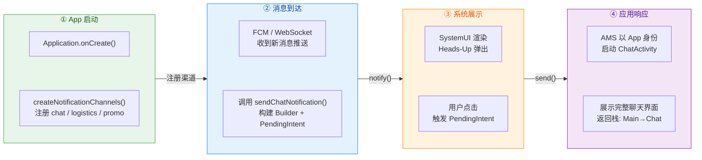

---

### 常见问题与排查

**通知不显示的排查清单**：

1. **渠道是否创建？**（API 26+ 必须）——检查 channelId 拼写是否与 Builder 中一致。
2. **用户是否关闭了渠道？**——通过 `manager.getNotificationChannel(id)` 获取渠道对象，检查其 `importance` 是否为 `IMPORTANCE_NONE`。
3. **是否设置了 smallIcon？**——缺失小图标在部分系统版本上静默失败。
4. **Android 13+ 是否申请了 POST_NOTIFICATIONS 权限？**——未授权则 `notify()` 不生效。
5. **是否被省电/后台限制？**——部分 OEM 厂商（如 MIUI、ColorOS）会额外限制应用的通知能力，需引导用户到设置中开启。
6. **Foreground Service 通知**：Android 14（API 34）要求前台服务通知必须指定 `foregroundServiceType`，否则可能被系统拒绝。

---

**📝 练习题**

在 Android 12（API 31）及以上设备中，以下关于 `PendingIntent` 的说法，哪一项是正确的？

A. 创建 PendingIntent 时如果不指定 `FLAG_IMMUTABLE` 或 `FLAG_MUTABLE`，系统会默认使用 `FLAG_IMMUTABLE`。


B. `FLAG_MUTABLE` 的 PendingIntent 允许任何第三方应用修改其中 Intent 的 Component，因此绝对不应该在任何场景中使用。


C. 创建 PendingIntent 时必须显式指定 `FLAG_IMMUTABLE` 或 `FLAG_MUTABLE` 之一，否则会抛出异常；通知中的 Direct Reply 功能是需要使用 `FLAG_MUTABLE` 的合理场景。


D. `PendingIntent.getActivity()` 和 `PendingIntent.getBroadcast()` 共享同一个 PendingIntent 匹配池，因此相同 requestCode 的 Activity 型和 Broadcast 型 PendingIntent 会互相覆盖。


**【答案】** C

**【解析】** 从 Android 12（API 31）开始，Google 强制要求创建 PendingIntent 时必须明确声明 mutability 属性——如果既不指定 `FLAG_IMMUTABLE` 也不指定 `FLAG_MUTABLE`，系统将抛出 `IllegalArgumentException`，而非静默默认，因此选项 A 错误。选项 B 过于绝对——`FLAG_MUTABLE` 并不允许外部修改 Intent 的 Component（目标组件始终被锁定），它允许的是向 extras 中填充额外数据，这正是 Direct Reply（直接回复）功能所需要的：系统必须将用户输入的文本写入 Intent extras，因此必须使用 mutable。选项 D 也不正确——`getActivity()`、`getBroadcast()` 和 `getService()` 各自维护 **独立的** PendingIntent 匹配池，不同类型之间不会互相干扰。选项 C 准确描述了 API 31+ 的强制要求以及 `FLAG_MUTABLE` 的合理使用场景，是正确答案。

---

## 相机开发 Camera

相机是 Android 多媒体开发中最核心、也是最复杂的模块之一。从最早期的 `Camera` API（API 1，已废弃），到后来功能强大但使用门槛极高的 `Camera2` API，再到 Google 推出的 Jetpack **CameraX** 库，Android 相机开发的演进路线始终在"功能丰富"与"易用性"之间寻找平衡。对于应用层开发者而言，绝大多数场景可以归纳为两类需求：**轻量级调用**（直接唤起系统相机拍照/录像，拿到结果即可）和**深度集成**（在自己的界面中嵌入相机预览、控制拍照参数、实时分析图像帧等）。本节将围绕这两类需求，从最简单的 Intent 调用系统相机开始，逐步深入到 CameraX 的预览（Preview）和拍照（ImageCapture）两大核心用例，力求让读者既能快速上手，也能理解背后的设计逻辑与底层机制。

### Intent 调用系统相机

#### 基本原理与适用场景

在很多应用中，相机只是一个辅助功能——比如用户头像上传、身份证拍照、社区发帖附图等。这些场景下，App 本身并不需要控制相机的曝光、对焦、白平衡等参数，也不需要在界面中嵌入实时预览流。此时最合理的方案就是通过 **隐式 Intent** 启动系统自带的相机应用（或用户安装的第三方相机），让专业的相机应用完成拍照，再将结果返回给你的 App。

这种方式的本质是 Android 的 **Intent 协作机制**：你的 App 作为调用方（caller），通过 `Intent(MediaStore.ACTION_IMAGE_CAPTURE)` 声明"我需要拍一张照片"，系统会寻找所有能响应这个 Action 的 Activity（即注册了对应 Intent Filter 的相机应用），如果只有一个就直接启动，如果有多个则弹出选择器。拍照完成后，相机应用通过 `setResult()` 将结果回传，你的 App 在回调中获取图片数据。

这种模式有几个显著优势：**零权限需求**（不需要申请 `CAMERA` 权限，因为拍照行为发生在相机应用的进程中）、**极低的开发成本**（几行代码即可完成）、**无需处理相机硬件兼容性**（相机应用已经适配了各种设备差异）。但它也有明显的局限：你无法控制拍照过程、无法自定义 UI、无法实时获取预览帧进行图像分析。

#### 缩略图 vs 全尺寸照片

通过 Intent 调用系统相机后，结果的返回方式取决于你是否在 Intent 中通过 `EXTRA_OUTPUT` 指定了输出文件的 URI：

- **未指定 `EXTRA_OUTPUT`**：相机应用会在 `onActivityResult` 的 `Intent.data` 中返回一个 **低分辨率的缩略图**（Thumbnail），以 `Bitmap` 形式存放在 extras 中（key 为 `"data"`）。这个缩略图通常只有几十 KB，分辨率很低（不同设备差异大，通常在 160×160 到 320×240 之间），仅适合做即时预览，不适合任何正式用途。之所以只返回缩略图，是因为 Android 的 `Binder` IPC 机制对单次事务的数据量有限制（通常约 1 MB），无法通过 Intent 的 Bundle 传递全尺寸照片的 Bitmap。

- **指定了 `EXTRA_OUTPUT`**：你在发起 Intent 前创建好一个文件（或通过 `FileProvider` / `MediaStore` 获取一个 URI），然后通过 `intent.putExtra(MediaStore.EXTRA_OUTPUT, uri)` 告诉相机应用"请把全尺寸照片写到这个位置"。拍照完成后，相机应用会直接将全尺寸 JPEG 写入该 URI，你的 App 从这个 URI 读取即可。这是生产环境下的标准做法。

#### FileProvider 与安全共享

从 Android 7.0（API 24）开始，系统禁止通过 `file://` URI 跨应用传递文件（会抛出 `FileUriExposedException`）。这是出于安全考虑——`file://` URI 暴露了应用的内部文件路径，其他应用可以借此探测你的文件系统结构。取而代之的是 `content://` URI，它通过 **ContentProvider** 提供了一层抽象，只暴露内容而不暴露路径。

`FileProvider` 是 AndroidX 提供的一个现成的 ContentProvider 子类，专门用于安全地生成 `content://` URI 来共享文件。使用它需要三步配置：

**第一步：在 AndroidManifest.xml 中注册 FileProvider**

```xml
<!-- 在 <application> 标签内注册 FileProvider -->
<provider
    android:name="androidx.core.content.FileProvider"
    android:authorities="${applicationId}.fileprovider"
    android:exported="false"
    android:grantUriPermissions="true">
    <!-- 指定共享路径的配置文件 -->
    <meta-data
        android:name="android.support.FILE_PROVIDER_PATHS"
        android:resource="@xml/file_paths" />
</provider>
```

其中 `android:authorities` 通常设置为 `${applicationId}.fileprovider`，这样在不同 build variant（如 debug/release）下不会冲突。`android:exported="false"` 表示该 Provider 不对外暴露，但通过 `android:grantUriPermissions="true"` 可以在运行时临时授予其他应用对特定 URI 的读写权限。

**第二步：配置可共享的路径 `res/xml/file_paths.xml`**

```xml
<?xml version="1.0" encoding="utf-8"?>
<paths>
    <!-- external-files-path 对应 Context.getExternalFilesDir() -->
    <!-- name 是 URI 路径段的替代名，隐藏了真实目录结构 -->
    <!-- path 是该目录下的子目录，"images/" 表示只共享 images 子目录 -->
    <external-files-path
        name="camera_images"
        path="images/" />
</paths>
```

这个 XML 文件定义了 FileProvider 可以对外共享的目录范围。`<external-files-path>` 映射到 `getExternalFilesDir()`，此外还有 `<files-path>`（对应 `getFilesDir()`）、`<cache-path>`（对应 `getCacheDir()`）、`<external-cache-path>`（对应 `getExternalCacheDir()`）等。`name` 属性是 URI 中的虚拟路径段，实际文件路径不会出现在 URI 中，确保了安全性。

**第三步：代码中生成 URI 并启动相机**

这一步将在下面的完整代码中展示。

#### 使用 ActivityResult API 的完整实现

传统的 `startActivityForResult()` + `onActivityResult()` 模式已经被官方标记为 **deprecated**。现代 Android 开发推荐使用 **Activity Result API**（`registerForActivityResult`），它提供了更清晰的类型安全回调、与 Fragment 生命周期更好的配合，以及可测试性。

其核心理念是"**注册-启动-回调**"三步分离：你在 Activity/Fragment 创建阶段注册一个 "合约"（Contract），获得一个 `ActivityResultLauncher`；在需要时调用 `launcher.launch()` 启动目标 Activity；结果通过注册时传入的回调 Lambda 返回。

```kotlin
class CameraIntentActivity : AppCompatActivity() {

    // 用于存储当前拍照的 URI，拍照完成后从此 URI 读取图片
    private var currentPhotoUri: Uri? = null

    // 注册拍照合约：TakePicture 合约接收一个 Uri 作为输入，返回 Boolean 表示是否成功
    // 这里使用更通用的 StartActivityForResult 合约以演示完整流程
    private val takePictureLauncher = registerForActivityResult(
        ActivityResultContracts.StartActivityForResult() // 通用合约，接收 Intent 返回 ActivityResult
    ) { result ->
        // 回调在 Activity 恢复到 STARTED 状态后触发
        if (result.resultCode == RESULT_OK) {
            // 拍照成功，从之前保存的 URI 加载全尺寸图片
            currentPhotoUri?.let { uri ->
                // 使用 ImageDecoder（API 28+）或 BitmapFactory 解码
                val bitmap = if (Build.VERSION.SDK_INT >= Build.VERSION_CODES.P) {
                    // ImageDecoder 支持更多格式（如 HEIF、动画 GIF/WebP）
                    val source = ImageDecoder.createSource(contentResolver, uri)
                    ImageDecoder.decodeBitmap(source)
                } else {
                    // 低版本回退到传统的流式解码
                    contentResolver.openInputStream(uri)?.use { stream ->
                        BitmapFactory.decodeStream(stream)
                    }
                }
                // 将 Bitmap 显示到 ImageView
                binding.ivPhoto.setImageBitmap(bitmap)
            }
        }
    }

    // 创建临时图片文件并返回对应的 content:// URI
    private fun createImageUri(): Uri {
        // 在应用私有外部存储的 images 目录下创建文件
        val imageDir = File(getExternalFilesDir(Environment.DIRECTORY_PICTURES), "images")
        if (!imageDir.exists()) imageDir.mkdirs() // 确保目录存在

        // 用时间戳生成唯一文件名，避免覆盖
        val timeStamp = SimpleDateFormat("yyyyMMdd_HHmmss", Locale.getDefault()).format(Date())
        val imageFile = File(imageDir, "IMG_${timeStamp}.jpg")

        // 通过 FileProvider 将 File 转换为安全的 content:// URI
        // 第二个参数必须与 Manifest 中注册的 authorities 一致
        return FileProvider.getUriForFile(
            this,
            "${applicationContext.packageName}.fileprovider",
            imageFile
        )
    }

    // 启动系统相机拍照
    private fun dispatchTakePicture() {
        // 创建隐式 Intent，Action 为拍照
        val intent = Intent(MediaStore.ACTION_IMAGE_CAPTURE)

        // 检查设备上是否有能响应此 Intent 的相机应用
        // 在 Android 11+ 需要在 Manifest 中声明 <queries> 才能查询到
        if (intent.resolveActivity(packageManager) != null) {
            // 创建输出 URI 并保存引用
            val photoUri = createImageUri()
            currentPhotoUri = photoUri

            // 将输出 URI 放入 Intent，相机应用会将全尺寸照片写入此位置
            intent.putExtra(MediaStore.EXTRA_OUTPUT, photoUri)

            // 授予相机应用对该 URI 的写入权限（临时授权）
            intent.addFlags(Intent.FLAG_GRANT_WRITE_URI_PERMISSION)

            // 通过 Launcher 启动
            takePictureLauncher.launch(intent)
        }
    }
}
```

#### Android 11+ 的包可见性问题

从 Android 11（API 30）开始，系统引入了 **包可见性（Package Visibility）** 限制。默认情况下，你的 App 无法"看到"设备上安装的其他应用，`intent.resolveActivity(packageManager)` 可能返回 `null`，即使设备上确实安装了相机应用。解决方案是在 `AndroidManifest.xml` 中声明 `<queries>`：

```xml
<manifest>
    <!-- 声明需要查询能处理拍照 Intent 的应用 -->
    <queries>
        <intent>
            <!-- 匹配所有能响应 IMAGE_CAPTURE 的应用 -->
            <action android:name="android.media.action.IMAGE_CAPTURE" />
        </intent>
    </queries>
</manifest>
```

这告诉系统"我的 App 需要与能处理 `IMAGE_CAPTURE` 的应用交互"，系统就会允许 `resolveActivity()` 正常工作。

#### EXIF 方向修正

一个令许多初学者困惑的问题是：拍完照显示时图片可能是旋转的（比如竖着拍的照片显示成横的）。这是因为大多数手机的相机传感器（Camera Sensor）物理安装方向是横向（Landscape）的，无论你以什么角度握持手机，传感器输出的原始像素排列都是横向的。正确的显示方向信息被写入了 JPEG 文件的 **EXIF 元数据**（`ExifInterface.TAG_ORIENTATION`）中。但很多图片解码方法（如 `BitmapFactory.decodeStream()`）在解码时并不会自动应用 EXIF 旋转信息，导致显示方向不对。

修正方案是手动读取 EXIF 的 Orientation tag，然后对 Bitmap 做相应的 Matrix 旋转：

```kotlin
// 从 URI 读取 EXIF 信息并获取旋转角度
private fun getRotationFromExif(uri: Uri): Float {
    // 通过 ContentResolver 打开输入流
    val inputStream = contentResolver.openInputStream(uri) ?: return 0f
    // ExifInterface 可以直接从流中读取 EXIF 数据
    val exif = ExifInterface(inputStream)
    // 获取方向标签，默认为 ORIENTATION_NORMAL（无旋转）
    val orientation = exif.getAttributeInt(
        ExifInterface.TAG_ORIENTATION,
        ExifInterface.ORIENTATION_NORMAL
    )
    inputStream.close()
    // 将 EXIF 方向常量映射为旋转角度
    return when (orientation) {
        ExifInterface.ORIENTATION_ROTATE_90 -> 90f   // 顺时针旋转 90 度
        ExifInterface.ORIENTATION_ROTATE_180 -> 180f // 旋转 180 度
        ExifInterface.ORIENTATION_ROTATE_270 -> 270f // 顺时针旋转 270 度
        else -> 0f                                    // 正常方向无需旋转
    }
}

// 根据角度旋转 Bitmap
private fun rotateBitmap(bitmap: Bitmap, degrees: Float): Bitmap {
    if (degrees == 0f) return bitmap // 无需旋转直接返回
    val matrix = Matrix()            // 创建变换矩阵
    matrix.postRotate(degrees)       // 设置旋转角度
    // 创建旋转后的新 Bitmap（原 Bitmap 可回收）
    return Bitmap.createBitmap(bitmap, 0, 0, bitmap.width, bitmap.height, matrix, true)
}
```

值得注意的是，`ImageDecoder`（API 28+）默认会自动应用 EXIF 方向修正，因此如果你的最低 API 已经是 28，则无需手动处理此问题。同样，后面会讲到的 **Glide** 等图片加载框架也内置了 EXIF 方向处理。

#### 整体流程概览

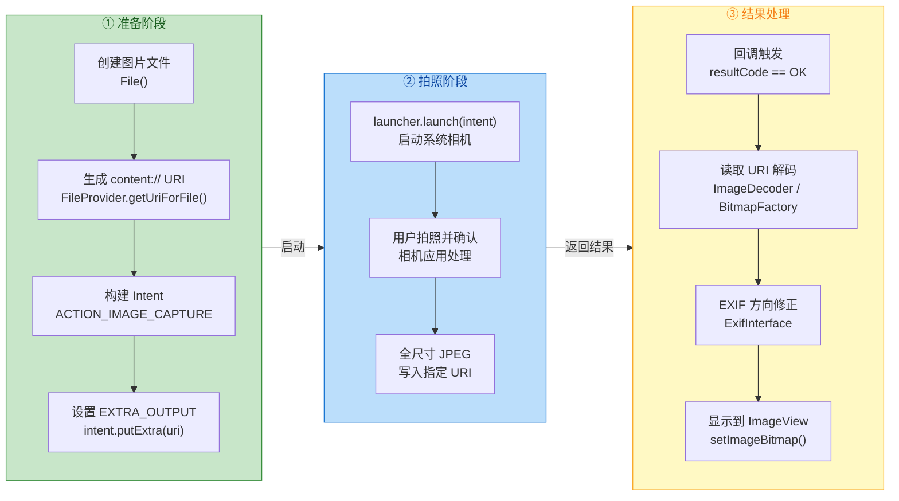

---

### CameraX Jetpack 库

#### 为什么需要 CameraX

在 CameraX 出现之前，Android 相机开发主要有两条路径：已废弃的 `Camera` API（API 1）和 `Camera2` API。Camera2 虽然功能极其强大（支持 RAW 捕获、手动曝光控制、多路输出流等），但其 API 设计非常复杂——一次基本的预览操作就需要涉及 `CameraManager`、`CameraDevice`、`CameraCaptureSession`、`CaptureRequest`、`Surface`、`ImageReader` 等众多类的协同配合，状态管理和错误处理极其繁琐。更糟糕的是，不同设备厂商对 Camera2 的实现差异巨大（所谓的 **fragmentation**），同一段代码在三星手机上可能运行完美，在某些中低端设备上却崩溃或表现异常。

**CameraX** 是 Google 在 Jetpack 中推出的相机库，它的设计哲学可以用一句话概括：**用例驱动（Use-Case Driven）**。你不再需要手动管理 `CameraDevice` 的状态、配置 `CaptureSession` 的参数、处理 `Surface` 的生命周期——你只需要声明"我要预览"、"我要拍照"、"我要分析图像"或"我要录像"，CameraX 会在内部处理所有底层细节。

CameraX 底层基于 Camera2 构建（它是 Camera2 的高层封装，而非独立实现），但在其上增加了三个关键价值：

1. **设备兼容性**：Google 维护了一个覆盖数百款设备的自动化测试实验室（Camera Test Lab），针对不同厂商的 Camera2 实现差异提供了 workaround。这意味着你写一套代码，CameraX 在内部帮你适配各种奇葩设备。

2. **生命周期感知**：CameraX 与 `LifecycleOwner` 深度绑定。当 Activity/Fragment 进入 `STARTED` 状态时相机自动开始工作，进入 `STOPPED` 时自动释放资源，无需手动管理 `open/close`。

3. **简洁的 API**：核心概念只有四个用例类（`Preview`、`ImageCapture`、`ImageAnalysis`、`VideoCapture`），通过 `ProcessCameraProvider.bindToLifecycle()` 一次性绑定，极大降低了开发门槛。

#### 依赖配置

```kotlin
// build.gradle.kts (Module level)
dependencies {
    // CameraX 核心库，包含用例基类和 CameraProvider
    val cameraxVersion = "1.3.4"
    implementation("androidx.camera:camera-core:$cameraxVersion")

    // Camera2 实现后端，CameraX 通过此模块与 Camera2 API 交互
    implementation("androidx.camera:camera-camera2:$cameraxVersion")

    // Lifecycle 集成模块，提供 ProcessCameraProvider
    implementation("androidx.camera:camera-lifecycle:$cameraxVersion")

    // CameraX View 模块，提供 PreviewView 控件
    implementation("androidx.camera:camera-view:$cameraxVersion")
}
```

每个依赖都有其明确角色：`camera-core` 定义了用例接口和配置类；`camera-camera2` 是实际的 Camera2 实现后端（理论上未来可以有其他后端）；`camera-lifecycle` 提供了生命周期感知的 `ProcessCameraProvider`；`camera-view` 提供了开箱即用的 `PreviewView`，是预览显示的首选控件。

#### CameraX 架构模型

CameraX 的整体架构分为三层，理解这三层有助于在遇到问题时快速定位：

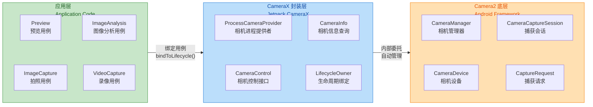

**应用层**只与四个用例交互，完全不需要接触 Camera2 的任何类。**CameraX 封装层**充当中间协调者，负责将用例转换为 Camera2 的底层操作，同时管理相机的生命周期、资源分配和设备兼容性。**Camera2 底层**才是真正与相机硬件 HAL（Hardware Abstraction Layer）交互的部分。

#### CameraSelector：选择镜头

`CameraSelector` 用于指定使用哪个物理摄像头。最常用的是前置和后置：

```kotlin
// 选择后置摄像头（默认选择）
val backCamera = CameraSelector.DEFAULT_BACK_CAMERA

// 选择前置摄像头
val frontCamera = CameraSelector.DEFAULT_FRONT_CAMERA

// 自定义选择逻辑（例如选择广角镜头）
val customSelector = CameraSelector.Builder()
    .requireLensFacing(CameraSelector.LENS_FACING_BACK) // 要求后置镜头
    .build()
```

在多摄像头设备上（如超广角 + 主摄 + 长焦），`CameraSelector` 默认会选择"主摄"（Primary Camera）。如果需要精确选择特定物理镜头，可以结合 `Camera2CameraInfo` 的扩展功能进行过滤。

---

### Preview 预览

#### PreviewView：开箱即用的预览控件

CameraX 提供了 `PreviewView` 这个专门为相机预览设计的自定义 View。它内部自动处理了 `Surface` 的创建、尺寸协商、方向旋转和宽高比适配等复杂逻辑。在传统 Camera2 开发中，你需要手动管理 `SurfaceView` 或 `TextureView` 的生命周期、监听 `SurfaceHolder.Callback` 或 `TextureView.SurfaceTextureListener`、处理 Surface 的尺寸变化、计算预览的缩放和裁剪——这些工作 `PreviewView` 全部替你完成了。

在布局文件中放置 `PreviewView`：

```xml
<!-- activity_camera.xml -->
<androidx.constraintlayout.widget.ConstraintLayout
    xmlns:android="http://schemas.android.com/apk/res/android"
    xmlns:app="http://schemas.android.com/apk/res-auto"
    android:layout_width="match_parent"
    android:layout_height="match_parent">

    <!-- PreviewView 填满整个父容器，作为相机预览区域 -->
    <androidx.camera.view.PreviewView
        android:id="@+id/previewView"
        android:layout_width="0dp"
        android:layout_height="0dp"
        app:layout_constraintTop_toTopOf="parent"
        app:layout_constraintBottom_toBottomOf="parent"
        app:layout_constraintStart_toStartOf="parent"
        app:layout_constraintEnd_toEndOf="parent" />

    <!-- 拍照按钮，居底部水平居中 -->
    <ImageButton
        android:id="@+id/btnCapture"
        android:layout_width="72dp"
        android:layout_height="72dp"
        android:layout_marginBottom="32dp"
        android:src="@drawable/ic_camera_shutter"
        android:background="@drawable/circle_button_bg"
        app:layout_constraintBottom_toBottomOf="parent"
        app:layout_constraintStart_toStartOf="parent"
        app:layout_constraintEnd_toEndOf="parent" />

</androidx.constraintlayout.widget.ConstraintLayout>
```

#### PreviewView 的实现模式

`PreviewView` 内部支持两种渲染实现模式（Implementation Mode），可以通过 `previewView.implementationMode` 设置：

- **`PERFORMANCE`（默认）**：底层使用 `SurfaceView`。`SurfaceView` 拥有独立于 View 层级的 `Surface`，由系统合成器（SurfaceFlinger）直接合成，渲染性能最优、功耗最低。但由于 Surface 独立于 View 树，对它执行 View 动画（如缩放、旋转、透明度变化）会出现不同步。

- **`COMPATIBLE`**：底层使用 `TextureView`。`TextureView` 将相机帧渲染到一个 `SurfaceTexture` 上，再作为 View 树中的一个普通 View 参与绘制。这意味着它可以像普通 View 一样应用动画和变换，但代价是多了一次 GPU 纹理拷贝，性能略低。

在绝大多数场景下，保持 `PERFORMANCE` 模式即可。只有当你需要对预览区域做 View 动画（比如预览区域的缩放过渡效果）时，才需要切换到 `COMPATIBLE` 模式。

#### ScaleType：预览缩放策略

`PreviewView` 的 `scaleType` 属性控制预览画面如何适配 View 的尺寸。最常用的两个：

- **`FILL_CENTER`**（默认）：保持宽高比的前提下 **填满** 整个 PreviewView，超出部分被裁剪。这是全屏相机预览的标准选择，画面没有黑边但可能被裁掉边缘。

- **`FIT_CENTER`**：保持宽高比的前提下 **完整显示** 画面，不足的部分留黑边（letterbox）。适合需要看到完整画面的场景。

背后的原理与 `ImageView.ScaleType` 类似，但 `PreviewView` 的 ScaleType 作用于相机输出流的 `Surface` 尺寸与 View 尺寸之间的映射关系。

#### 启动预览的完整代码

```kotlin
class CameraActivity : AppCompatActivity() {

    private lateinit var binding: ActivityCameraBinding

    override fun onCreate(savedInstanceState: Bundle?) {
        super.onCreate(savedInstanceState)
        binding = ActivityCameraBinding.inflate(layoutInflater)
        setContentView(binding.root)
        // 启动相机
        startCamera()
    }

    private fun startCamera() {
        // 获取 ProcessCameraProvider 的 ListenableFuture
        // ProcessCameraProvider 是单例，管理整个应用的相机生命周期
        val cameraProviderFuture = ProcessCameraProvider.getInstance(this)

        // 添加监听器，在 CameraProvider 准备好后执行
        // 第二个参数是执行回调的 Executor，这里用主线程 Executor
        cameraProviderFuture.addListener({
            // 获取 CameraProvider 实例
            val cameraProvider: ProcessCameraProvider = cameraProviderFuture.get()

            // 构建 Preview 用例
            val preview = Preview.Builder()
                .setTargetAspectRatio(AspectRatio.RATIO_16_9) // 目标宽高比 16:9
                .build()
                .also { previewUseCase ->
                    // 将 Preview 用例的输出连接到 PreviewView
                    // setSurfaceProvider 是关键：它告诉 Preview 用例"把画面渲染到哪里"
                    previewUseCase.setSurfaceProvider(binding.previewView.surfaceProvider)
                }

            // 选择后置摄像头
            val cameraSelector = CameraSelector.DEFAULT_BACK_CAMERA

            try {
                // 解绑之前的所有用例，防止重复绑定
                cameraProvider.unbindAll()

                // 核心调用：将生命周期、相机选择器和用例绑定在一起
                // 返回的 Camera 对象可用于控制闪光灯、对焦、缩放等
                val camera = cameraProvider.bindToLifecycle(
                    this,               // LifecycleOwner（当前 Activity）
                    cameraSelector,      // 使用哪个摄像头
                    preview              // 绑定的用例（可同时绑定多个）
                )
            } catch (e: Exception) {
                // 绑定失败（例如设备不支持所选配置）
                Log.e("CameraX", "Use case binding failed", e)
            }
        }, ContextCompat.getMainExecutor(this)) // 在主线程执行回调
    }
}
```

#### bindToLifecycle 的底层机制

`cameraProvider.bindToLifecycle()` 是 CameraX 最核心的方法，它在内部完成了大量工作：

1. **用例组合验证**：CameraX 检查你绑定的用例组合是否被当前设备支持。例如，某些低端设备可能不支持同时绑定 Preview + ImageCapture + ImageAnalysis 三个用例（因为硬件输出流数量有限）。如果不支持，会抛出 `IllegalArgumentException`。

2. **分辨率协商**：CameraX 根据每个用例的目标分辨率（或宽高比）配置，结合设备相机支持的输出尺寸列表（`StreamConfigurationMap`），自动选择最合适的分辨率组合。这个过程需要在所有用例之间做权衡——比如 Preview 要求 16:9 而 ImageCapture 要求 4:3，CameraX 会根据优先级策略选择各用例的最终分辨率。

3. **CameraCaptureSession 创建**：在 Camera2 层面，CameraX 创建一个 `CameraCaptureSession`，将所有用例的 `Surface` 作为输出目标（output targets）传入。Session 创建是异步的，完成后才能开始发送 `CaptureRequest`。

4. **生命周期观察**：CameraX 向传入的 `LifecycleOwner` 注册为观察者（Observer）。当生命周期进入 `STARTED` 时启动预览流（发送 repeating `CaptureRequest`），进入 `STOPPED` 时停止预览并关闭 Session，进入 `DESTROYED` 时释放 `CameraDevice`。

5. **返回 Camera 对象**：返回的 `Camera` 实例提供了 `CameraControl`（控制对焦、缩放、闪光灯、曝光补偿）和 `CameraInfo`（查询传感器方向、缩放范围、闪光灯状态等）。

#### 分辨率配置策略

CameraX 提供了两种互斥的方式来指定目标分辨率：

- **`setTargetAspectRatio()`**：指定目标宽高比（如 `AspectRatio.RATIO_4_3` 或 `RATIO_16_9`），CameraX 在该宽高比下选择最合适的分辨率。这是最推荐的方式，因为它让 CameraX 有最大的灵活度来适配不同设备。

- **`setTargetResolution()`**：指定一个期望的分辨率（如 `Size(1920, 1080)`），CameraX 会选择最接近该分辨率且不小于它的输出尺寸。注意这里传入的 Size 始终以**自然竖屏方向**（portrait orientation）表示，即 `Size(width, height)` 中 `width < height` 对应竖屏。

两者不能同时使用，否则会抛出异常。对于预览用例，通常使用 `setTargetAspectRatio()` 来保证画面不变形；对于拍照用例，如果有明确的分辨率需求则用 `setTargetResolution()`。

---

### ImageCapture 拍照

#### 用例概述

`ImageCapture` 是 CameraX 的拍照用例，它负责捕获单帧全分辨率图像并保存为文件。与 Preview 不同的是，ImageCapture 不是持续输出流，而是按需触发的**单次捕获**（one-shot capture）。在 Camera2 层面，这对应一次 **still capture request**——CameraX 会暂时修改 `CaptureRequest` 的参数（如开启闪光灯、触发自动对焦锁定、提高 JPEG 质量），然后发送一次单独的捕获请求。

ImageCapture 的设计考虑了三个关键问题：

1. **拍照质量 vs 延迟**：`setCaptureMode()` 提供了 `CAPTURE_MODE_MINIMIZE_LATENCY`（最低延迟）和 `CAPTURE_MODE_MAXIMIZE_QUALITY`（最高质量）两种模式。前者跳过部分后处理以加快速度，后者启用设备支持的所有图像增强算法（如多帧降噪 HDR+）。

2. **闪光灯控制**：`setFlashMode()` 支持 `FLASH_MODE_ON`（强制开启）、`FLASH_MODE_OFF`（关闭）、`FLASH_MODE_AUTO`（自动判断环境亮度）。

3. **输出目标**：拍照结果可以保存到文件（`OutputFileOptions` 指定路径），或者以内存中的 `ImageProxy` 形式返回供自定义处理。

#### 构建 ImageCapture 用例

```kotlin
// 构建拍照用例
val imageCapture = ImageCapture.Builder()
    // 拍照模式：最大化质量（启用 HDR、多帧合成等设备特有优化）
    .setCaptureMode(ImageCapture.CAPTURE_MODE_MAXIMIZE_QUALITY)
    // 目标宽高比 4:3，这是大多数手机传感器的原生宽高比，拍照分辨率最高
    .setTargetAspectRatio(AspectRatio.RATIO_4_3)
    // 闪光灯模式：自动（根据环境亮度决定是否开闪光灯）
    .setFlashMode(ImageCapture.FLASH_MODE_AUTO)
    // JPEG 质量（0-100），默认 95，值越高文件越大
    .setJpegQuality(95)
    .build()
```

为什么拍照通常使用 4:3 宽高比？因为大多数手机相机传感器的物理像素阵列接近 4:3（如 4000×3000 = 12MP），使用 4:3 可以利用传感器的全部有效像素。而 16:9 实际上是在 4:3 的基础上裁剪上下边缘得到的，总像素数反而更少。

#### 将 ImageCapture 与 Preview 一起绑定

一个关键概念：**所有需要同时工作的用例必须在同一次 `bindToLifecycle()` 调用中绑定**。不能先绑定 Preview，再单独绑定 ImageCapture——这样做会导致第一次的 Preview 被解绑。

```kotlin
private lateinit var imageCapture: ImageCapture

private fun startCamera() {
    val cameraProviderFuture = ProcessCameraProvider.getInstance(this)

    cameraProviderFuture.addListener({
        val cameraProvider = cameraProviderFuture.get()

        // 构建预览用例
        val preview = Preview.Builder()
            .setTargetAspectRatio(AspectRatio.RATIO_4_3) // 与拍照保持一致的宽高比
            .build()
            .also { it.setSurfaceProvider(binding.previewView.surfaceProvider) }

        // 构建拍照用例并保存引用（后续拍照时需要用到）
        imageCapture = ImageCapture.Builder()
            .setCaptureMode(ImageCapture.CAPTURE_MODE_MAXIMIZE_QUALITY)
            .setTargetAspectRatio(AspectRatio.RATIO_4_3)
            .setFlashMode(ImageCapture.FLASH_MODE_AUTO)
            .build()

        // 选择后置摄像头
        val cameraSelector = CameraSelector.DEFAULT_BACK_CAMERA

        try {
            cameraProvider.unbindAll() // 先解绑所有旧用例

            // 同时绑定 Preview 和 ImageCapture 两个用例
            cameraProvider.bindToLifecycle(
                this,
                cameraSelector,
                preview,
                imageCapture  // 与 preview 一起绑定
            )
        } catch (e: Exception) {
            Log.e("CameraX", "Bindind failed", e)
        }
    }, ContextCompat.getMainExecutor(this))
}
```

#### 触发拍照

绑定完成后，在用户点击拍照按钮时调用 `imageCapture.takePicture()` 即可触发拍照。CameraX 提供两种重载：

1. **保存到文件/MediaStore**：使用 `OutputFileOptions` 指定目标位置，结果在 `OnImageSavedCallback` 回调。
2. **返回内存图像**：结果在 `OnImageCapturedCallback` 回调中以 `ImageProxy` 返回，适合需要自定义处理（如上传前压缩、AI 识别）的场景。

以下是保存到 MediaStore 的完整实现（兼容 Android 10+ Scoped Storage）：

```kotlin
private fun takePhoto() {
    // 确保 imageCapture 已初始化（已绑定到生命周期）
    val imageCapture = imageCapture ?: return

    // 使用时间戳创建唯一文件名
    val name = SimpleDateFormat("yyyyMMdd_HHmmss", Locale.getDefault())
        .format(System.currentTimeMillis())

    // 配置 MediaStore 的 ContentValues（元数据）
    val contentValues = ContentValues().apply {
        put(MediaStore.MediaColumns.DISPLAY_NAME, name)        // 文件显示名
        put(MediaStore.MediaColumns.MIME_TYPE, "image/jpeg")   // MIME 类型
        // Android 10+ 使用相对路径代替绝对路径（Scoped Storage）
        if (Build.VERSION.SDK_INT >= Build.VERSION_CODES.Q) {
            put(MediaStore.Images.Media.RELATIVE_PATH, "Pictures/MyApp") // 保存到 Pictures/MyApp
        }
    }

    // 构建输出选项：指定保存到 MediaStore 的 Images 表
    val outputOptions = ImageCapture.OutputFileOptions.Builder(
        contentResolver,                          // ContentResolver
        MediaStore.Images.Media.EXTERNAL_CONTENT_URI, // 目标 URI（图片媒体集合）
        contentValues                              // 文件元数据
    ).build()

    // 触发拍照
    imageCapture.takePicture(
        outputOptions,                              // 输出配置
        ContextCompat.getMainExecutor(this),        // 回调执行线程
        object : ImageCapture.OnImageSavedCallback { // 结果回调

            override fun onImageSaved(output: ImageCapture.OutputFileResults) {
                // 拍照成功，output.savedUri 是保存位置的 content:// URI
                val savedUri = output.savedUri
                Log.d("CameraX", "Photo saved: $savedUri")
                // 可以用 savedUri 显示图片、上传服务器等
                Toast.makeText(
                    this@CameraActivity,
                    "拍照成功",
                    Toast.LENGTH_SHORT
                ).show()
            }

            override fun onError(exception: ImageCaptureException) {
                // 拍照失败，ImageCaptureException 包含错误码和原因
                Log.e("CameraX", "Photo capture failed: ${exception.message}", exception)
            }
        }
    )
}
```

#### takePicture 的内部流程

当你调用 `takePicture()` 时，CameraX 在底层执行了一套精密的流程：

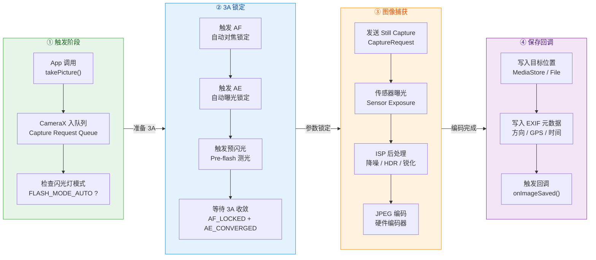

**3A 锁定**（Auto Focus、Auto Exposure、Auto White Balance）是高质量拍照的关键步骤。在日常的预览流中，3A 算法是持续运行、不断调整的。但在拍照瞬间，需要将当前的 AF/AE/AWB 状态"锁定"，确保曝光和对焦不会在快门期间发生变化，否则照片会模糊或曝光不准。`CAPTURE_MODE_MINIMIZE_LATENCY` 模式会跳过部分 3A 锁定步骤以降低延迟。

#### 保存到应用私有目录（非 MediaStore）

如果照片不需要出现在系统相册中（例如 App 内部用途），可以保存到应用私有目录：

```kotlin
private fun takePhotoToPrivateDir() {
    val imageCapture = imageCapture ?: return

    // 在应用私有外部存储中创建文件
    val photoFile = File(
        getExternalFilesDir(Environment.DIRECTORY_PICTURES), // 私有 Pictures 目录
        "IMG_${System.currentTimeMillis()}.jpg"               // 唯一文件名
    )

    // 使用 File 构建输出选项
    val outputOptions = ImageCapture.OutputFileOptions.Builder(photoFile).build()

    imageCapture.takePicture(
        outputOptions,
        ContextCompat.getMainExecutor(this),
        object : ImageCapture.OnImageSavedCallback {
            override fun onImageSaved(output: ImageCapture.OutputFileResults) {
                // savedUri 为 file:// URI（私有目录不需要 content:// URI）
                Log.d("CameraX", "Photo saved to: ${photoFile.absolutePath}")
            }
            override fun onError(e: ImageCaptureException) {
                Log.e("CameraX", "Capture failed", e)
            }
        }
    )
}
```

#### 内存回调模式：OnImageCapturedCallback

当你需要在保存前对图像做处理（如压缩、添加水印、ML 推理等），使用 `OnImageCapturedCallback`：

```kotlin
private fun captureToMemory() {
    val imageCapture = imageCapture ?: return

    imageCapture.takePicture(
        ContextCompat.getMainExecutor(this), // 回调 Executor
        object : ImageCapture.OnImageCapturedCallback() {

            override fun onCaptureSuccess(image: ImageProxy) {
                // ImageProxy 包装了底层的 android.media.Image
                // 获取图像的旋转角度（CameraX 已计算好，考虑了传感器方向和设备旋转）
                val rotationDegrees = image.imageInfo.rotationDegrees

                // 获取图像数据平面（JPEG 格式只有一个平面）
                val buffer = image.planes[0].buffer   // ByteBuffer
                val bytes = ByteArray(buffer.remaining()) // 创建字节数组
                buffer.get(bytes)                          // 复制数据到数组

                // 可以在这里做自定义处理：
                // - BitmapFactory.decodeByteArray() 解码为 Bitmap
                // - 添加水印、压缩、上传等
                val bitmap = BitmapFactory.decodeByteArray(bytes, 0, bytes.size)

                // ⚠️ 必须关闭 ImageProxy，否则会阻塞后续拍照！
                // ImageProxy 底层对应一个 ImageReader buffer slot，
                // 不释放就无法接收新的图像
                image.close()
            }

            override fun onError(exception: ImageCaptureException) {
                Log.e("CameraX", "Capture failed", exception)
            }
        }
    )
}
```

这里特别要强调 **`image.close()` 的重要性**。CameraX 底层使用 `ImageReader` 接收相机输出，`ImageReader` 维护了一个固定大小的 buffer 队列（通常 2~4 个 slot）。每次 `onCaptureSuccess` 回调传入的 `ImageProxy` 就占据了一个 slot。如果不调用 `close()` 释放，slot 会被耗尽，后续的拍照请求将无法获取到 buffer 而被阻塞。这是一个非常隐蔽的 bug——不崩溃，不报错，只是拍照按钮点了没反应。

#### 相机控制：对焦、缩放和闪光灯

`bindToLifecycle()` 返回的 `Camera` 对象提供了 `CameraControl` 接口，可以在运行时动态控制相机参数：

```kotlin
private fun setupCameraControls(camera: Camera) {
    val cameraControl = camera.cameraControl // 获取控制接口
    val cameraInfo = camera.cameraInfo       // 获取信息查询接口

    // === 点击对焦（Tap to Focus）===
    binding.previewView.setOnTouchListener { _, event ->
        if (event.action == MotionEvent.ACTION_UP) {
            // 将触摸点转换为 MeteringPoint（归一化坐标）
            val factory = binding.previewView.meteringPointFactory
            val point = factory.createPoint(event.x, event.y)

            // 构建对焦/测光动作：同时对焦和测光
            val action = FocusMeteringAction.Builder(point)
                .setAutoCancelDuration(3, TimeUnit.SECONDS) // 3 秒后自动取消（恢复连续对焦）
                .build()

            // 执行对焦，返回 ListenableFuture<FocusMeteringResult>
            cameraControl.startFocusAndMetering(action)
        }
        true // 消费触摸事件
    }

    // === 双指缩放（Pinch to Zoom）===
    val scaleGestureDetector = ScaleGestureDetector(this,
        object : ScaleGestureDetector.SimpleOnScaleGestureListener() {
            override fun onScale(detector: ScaleGestureDetector): Boolean {
                // 获取当前缩放比例
                val currentZoomRatio = cameraInfo.zoomState.value?.zoomRatio ?: 1f
                // 乘以手势缩放因子
                val newZoomRatio = currentZoomRatio * detector.scaleFactor
                // 设置新的缩放比例（CameraX 会自动限制在合法范围内）
                cameraControl.setZoomRatio(newZoomRatio)
                return true
            }
        }
    )

    // === 切换闪光灯模式 ===
    // 运行时动态修改闪光灯模式（无需重新绑定用例）
    imageCapture.flashMode = ImageCapture.FLASH_MODE_ON  // 强制开启
    // 或
    imageCapture.flashMode = ImageCapture.FLASH_MODE_OFF // 关闭
}
```

`MeteringPoint` 的坐标是归一化的（0.0 到 1.0），由 `PreviewView.meteringPointFactory` 帮你完成了从屏幕像素坐标到传感器坐标的映射。这个映射需要考虑预览的 ScaleType、设备旋转角度、传感器安装方向等因素——CameraX 全部自动处理了。

#### CameraX 与 Camera2 的代码量对比

为了直观展示 CameraX 的简化效果，这里简单做一个对比。完成"预览 + 拍照"这一相同功能：

| 维度 | Camera2 | CameraX |
|------|---------|---------|
| 核心类数量 | CameraManager, CameraDevice, CameraCaptureSession, CaptureRequest.Builder, ImageReader, Surface 等 6+ 个 | ProcessCameraProvider, Preview, ImageCapture, PreviewView 等 4 个 |
| 生命周期管理 | 手动 open/close，需在 onResume/onPause 中管理 | 自动绑定 LifecycleOwner |
| Surface 管理 | 手动创建、监听回调、处理尺寸 | PreviewView 内部自动管理 |
| 设备兼容处理 | 开发者自行适配（大量 if/else） | CameraX 内置 workaround |
| 典型代码行数 | 300~500 行 | 50~100 行 |
| 拍照流程 | 手动触发 AF → 等待锁定 → 发送 Capture Request → 监听回调 → 保存 | `takePicture()` 一行搞定 |

可以看到，CameraX 通过用例抽象和生命周期绑定，将 Camera2 的复杂度隐藏到了内部，让应用层开发者能聚焦于业务逻辑本身。

---

**📝 练习题**

在使用 CameraX 的 `ImageCapture.OnImageCapturedCallback` 时，以下哪种做法最可能导致后续拍照请求被阻塞（点击快门无反应）？

A. 在 `onCaptureSuccess` 回调中执行了耗时的图像压缩操作


B. 在 `onCaptureSuccess` 回调中忘记调用 `image.close()`


C. 将回调 Executor 设置为后台线程的 Executor


D. 拍照时未指定 `OutputFileOptions`


**【答案】** B

**【解析】** CameraX 底层的 `ImageReader` 维护了一个固定大小的 buffer 队列。`onCaptureSuccess` 传入的 `ImageProxy` 占据了一个 buffer slot。如果不调用 `image.close()` 释放这个 slot，buffer 队列会被耗尽，后续的拍照请求将无法获得可用的 buffer，表现为拍照请求被阻塞而没有任何回调。选项 A 虽然会导致回调执行慢，但不会阻塞底层 buffer；选项 C 是完全合法的做法，甚至是推荐做法（避免阻塞主线程）；选项 D 是不影响 `OnImageCapturedCallback` 模式的，因为该模式本身就不需要 `OutputFileOptions`。

---

**📝 练习题**

通过 `Intent(MediaStore.ACTION_IMAGE_CAPTURE)` 调用系统相机时，如果没有设置 `EXTRA_OUTPUT`，回调中获取到的照片存在什么问题？

A. 照片保存在系统默认相册中，但无法获取其 URI


B. 照片为全尺寸 JPEG，但需要 WRITE_EXTERNAL_STORAGE 权限才能读取


C. 只能获取低分辨率的缩略图 Bitmap，无法获得全尺寸照片


D. 系统相机会拒绝拍照并返回 RESULT_CANCELED


**【答案】** C

**【解析】** 未设置 `EXTRA_OUTPUT` 时，系统相机会将一个低分辨率的缩略图 Bitmap 放入返回 Intent 的 extras 中（key 为 `"data"`），通过 `intent.extras?.get("data") as? Bitmap` 获取。之所以只返回缩略图，是因为 Android Binder IPC 对单次事务数据量有上限（约 1 MB），无法通过 Bundle 传递全尺寸照片。要获取全尺寸照片，必须通过 `EXTRA_OUTPUT` 指定一个 `content://` URI（使用 FileProvider 或 MediaStore），让相机应用直接将全尺寸 JPEG 写入该 URI。

---

## 媒体库 MediaStore

在 Android 多媒体开发中，应用经常需要访问设备上的图片、视频、音频等媒体文件。早期开发者习惯直接通过 `File` API 遍历 `/sdcard/` 目录来查找媒体文件，但这种方式既低效又不安全——它绕过了系统的媒体索引机制，无法利用数据库级别的过滤与排序能力，且在 Android 10（API 29）引入 **Scoped Storage（分区存储）** 后，直接通过文件路径访问公共存储已被严格限制。Android 为此提供了一套标准化的媒体访问机制，其核心就是 **`MediaStore`**。

`MediaStore` 本质上是 Android 系统维护的一个 **媒体内容数据库**，它由系统进程 `com.android.providers.media`（即 **MediaProvider**）管理。每当设备上出现新的媒体文件（用户拍照、下载视频、录制音频等），系统的 **MediaScanner** 就会扫描文件元数据（文件名、大小、时长、分辨率、MIME 类型等），并将这些信息作为一条记录写入 MediaStore 的 SQLite 数据库中。应用通过 **`ContentResolver`** 向 MediaProvider 发起 CRUD（增删改查）请求，MediaProvider 再操作底层数据库并返回结果。这种架构将 **"文件系统中的物理文件"** 与 **"数据库中的元数据记录"** 解耦，使应用无需关心文件的具体存储路径，只需通过 **`content://` URI** 即可安全地读写媒体资源。

整体架构可以用下图概括：

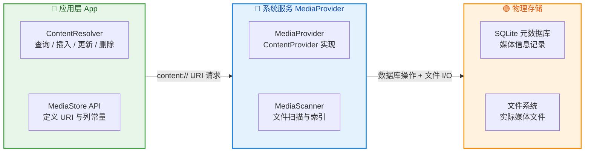

从图中可以看出，应用层永远不会直接接触底层 SQLite 数据库或文件系统，而是通过 `ContentResolver` + `MediaStore` 常量类形成的 **标准化接口** 与系统交互。这正是 Android **ContentProvider 架构** 的典型体现——跨进程数据共享通过 Binder IPC 完成，调用方感知到的只是一个统一的 `content://` URI 体系。

---

### ContentResolver 查询

#### 查询机制的本质

要从 MediaStore 中获取媒体信息，核心操作是调用 `ContentResolver.query()` 方法。这个方法的签名与 SQL `SELECT` 语句高度对应：

| `query()` 参数 | SQL 等价物 | 含义 |
|:---|:---|:---|
| `uri` | `FROM table` | 要查询的目标表（图片/视频/音频） |
| `projection` | `SELECT col1, col2` | 需要返回的列 |
| `selection` | `WHERE condition` | 过滤条件表达式 |
| `selectionArgs` | `WHERE col = ?` 中的 `?` | 条件参数（防 SQL 注入） |
| `sortOrder` | `ORDER BY col DESC` | 排序规则 |

当应用调用 `contentResolver.query(uri, projection, selection, selectionArgs, sortOrder)` 时，这个调用实际上经过了以下链路：应用进程中的 `ContentResolver` 通过 **Binder IPC** 将请求发送到 MediaProvider 所在的系统进程，MediaProvider 将参数转换为 SQL 语句并在其内部的 SQLite 数据库上执行查询，最终将结果封装为一个 **`Cursor`**（游标）返回给应用进程。`Cursor` 是一个可迭代的结果集，类似于 JDBC 中的 `ResultSet`，应用通过移动游标逐行读取数据。

需要特别注意的是，`Cursor` 是一个持有数据库连接资源的对象，**必须在使用完毕后关闭**，否则会导致资源泄漏。推荐使用 Kotlin 的 `use {}` 扩展函数（等价于 Java 的 try-with-resources）来确保自动关闭。

#### 查询图片的完整示例

下面以查询设备中所有 JPEG 图片为例，展示 `ContentResolver.query()` 的标准用法：

```kotlin
// 定义要查询的目标 URI —— 外部存储中的图片表
// MediaStore.Images.Media.EXTERNAL_CONTENT_URI = content://media/external/images/media
val collection: Uri = if (Build.VERSION.SDK_INT >= Build.VERSION_CODES.Q) {
    // Android 10+ 推荐使用带 Volume 的方法，VOLUME_EXTERNAL 包含所有外部存储卷
    MediaStore.Images.Media.getContentUri(MediaStore.VOLUME_EXTERNAL)
} else {
    // Android 9 及以下使用经典常量
    MediaStore.Images.Media.EXTERNAL_CONTENT_URI
}

// 定义 projection —— 只查询需要的列，避免 SELECT * 带来的性能浪费
val projection = arrayOf(
    MediaStore.Images.Media._ID,            // 每条记录的唯一 ID（long 类型）
    MediaStore.Images.Media.DISPLAY_NAME,   // 文件显示名，如 "photo_001.jpg"
    MediaStore.Images.Media.SIZE,           // 文件大小（字节）
    MediaStore.Images.Media.DATE_ADDED,     // 添加到 MediaStore 的时间戳（秒）
    MediaStore.Images.Media.WIDTH,          // 图片宽度（像素）
    MediaStore.Images.Media.HEIGHT          // 图片高度（像素）
)

// 定义 selection —— WHERE 子句，筛选 MIME 类型为 JPEG 的图片
val selection = "${MediaStore.Images.Media.MIME_TYPE} = ?"

// 定义 selectionArgs —— 绑定参数，防止 SQL 注入攻击
val selectionArgs = arrayOf("image/jpeg")

// 定义 sortOrder —— 按添加时间降序排列，最新的图片排在最前面
val sortOrder = "${MediaStore.Images.Media.DATE_ADDED} DESC"

// 用于存储查询结果的列表
data class ImageItem(val id: Long, val name: String, val size: Long, val uri: Uri)
val imageList = mutableListOf<ImageItem>()

// 执行查询 —— use {} 确保 Cursor 在代码块结束后自动关闭
contentResolver.query(
    collection,     // 目标 URI
    projection,     // 需要的列
    selection,      // WHERE 子句
    selectionArgs,  // WHERE 参数
    sortOrder       // 排序规则
)?.use { cursor ->
    // 预先获取各列的索引（在循环外调用，避免重复查找列索引的开销）
    val idColumn = cursor.getColumnIndexOrThrow(MediaStore.Images.Media._ID)
    val nameColumn = cursor.getColumnIndexOrThrow(MediaStore.Images.Media.DISPLAY_NAME)
    val sizeColumn = cursor.getColumnIndexOrThrow(MediaStore.Images.Media.SIZE)

    // 逐行遍历 Cursor，moveToNext() 返回 false 表示已无更多数据
    while (cursor.moveToNext()) {
        // 从当前行读取各列的值
        val id = cursor.getLong(idColumn)          // 读取 _ID 列
        val name = cursor.getString(nameColumn)    // 读取 DISPLAY_NAME 列
        val size = cursor.getLong(sizeColumn)       // 读取 SIZE 列

        // 通过 ContentUris 工具类将 _ID 拼接到 collection URI 后面
        // 生成形如 content://media/external/images/media/42 的单条记录 URI
        val contentUri = ContentUris.withAppendedId(collection, id)

        // 将解析结果存入列表
        imageList.add(ImageItem(id, name, size, contentUri))
    }
}

// 此时 imageList 中已包含所有符合条件的 JPEG 图片信息
Log.d("MediaStore", "找到 ${imageList.size} 张 JPEG 图片")
```

这段代码有几个关键的设计决策值得深入理解：

**为什么用 `getColumnIndexOrThrow()` 而不是 `getColumnIndex()`？** 后者在找不到列时返回 `-1`，如果开发者忘记检查就会在后续的 `getLong(-1)` 调用中抛出难以追踪的异常。而 `getColumnIndexOrThrow()` 会立即抛出 `IllegalArgumentException` 并明确指出缺失的列名，便于快速定位问题。

**为什么 `projection` 不传 `null`？** 传 `null` 等价于 SQL 的 `SELECT *`，会返回表中所有列。MediaStore 的图片表包含数十个列（路径、缩略图 ID、GPS 坐标、曝光参数等），查询所有列会显著增加内存开销和 IPC 数据传输量。在生产代码中，应始终显式指定需要的列。

**`selectionArgs` 的安全意义**。将用户可控的值放入 `selection` 字符串拼接（如 `"mime_type = '$userInput'"`）会造成 SQL 注入风险。使用 `?` 占位符 + `selectionArgs` 数组可以让 ContentProvider 对参数进行转义处理，这是 Android 官方强烈推荐的做法。

#### Bundle 查询方式（Android 11+）

从 Android 11（API 30）开始，传统的 `selection` + `selectionArgs` 字符串拼接方式被标记为受限（Deprecated-like treatment in certain contexts），Google 推荐使用新的 **Bundle-based query API**，它提供了更安全、更灵活的查询控制：

```kotlin
// 构建查询参数 Bundle
val queryArgs = Bundle().apply {
    // 等价于 WHERE mime_type = 'image/jpeg'
    // QUERY_ARG_SQL_SELECTION 定义 WHERE 子句
    putString(ContentResolver.QUERY_ARG_SQL_SELECTION, "${MediaStore.Images.Media.MIME_TYPE} = ?")
    // QUERY_ARG_SQL_SELECTION_ARGS 定义 WHERE 参数
    putStringArray(ContentResolver.QUERY_ARG_SQL_SELECTION_ARGS, arrayOf("image/jpeg"))
    // QUERY_ARG_SQL_SORT_ORDER 定义排序规则
    putString(ContentResolver.QUERY_ARG_SQL_SORT_ORDER, "${MediaStore.Images.Media.DATE_ADDED} DESC")
    // QUERY_ARG_LIMIT 定义分页大小 —— 传统 query() 无法原生支持 LIMIT
    putInt(ContentResolver.QUERY_ARG_LIMIT, 50)
    // QUERY_ARG_OFFSET 定义分页偏移量
    putInt(ContentResolver.QUERY_ARG_OFFSET, 0)
}

// 使用 Bundle 版 query() 执行查询
contentResolver.query(
    collection,     // 目标 URI（与之前相同）
    projection,     // 需要的列（与之前相同）
    queryArgs,      // Bundle 形式的查询参数（替代 selection/selectionArgs/sortOrder）
    null            // CancellationSignal，可用于取消长时间查询
)?.use { cursor ->
    // Cursor 遍历逻辑与之前完全相同
    // ...
}
```

Bundle 查询方式最大的优势是 **原生支持 `LIMIT` 和 `OFFSET`**。在传统 API 中，开发者需要通过在 `sortOrder` 参数末尾拼接 `" LIMIT 50"` 这种 hack 方式来实现分页，这既不优雅也不被所有 ContentProvider 支持。Bundle API 将分页作为一等公民纳入查询参数，非常适合实现 **媒体库分页加载**（如相册列表的 RecyclerView 分页）。

---

### 图片/视频/音频 URI 获取

#### MediaStore 的 URI 体系

`MediaStore` 为不同媒体类型定义了不同的 **Content URI**，每个 URI 对应 MediaProvider 内部数据库中的一张表。理解这套 URI 体系是正确使用 MediaStore 的基础：

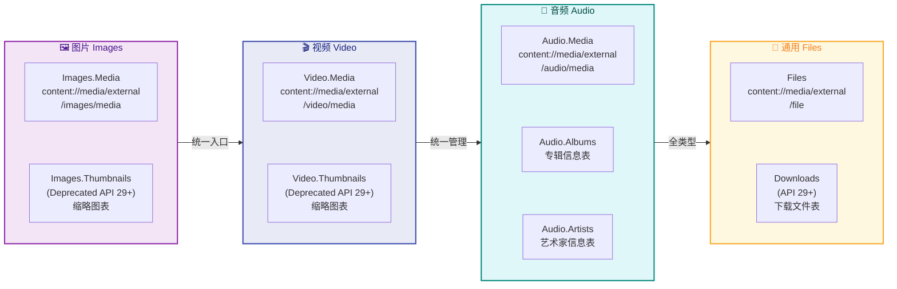

各类型的核心 URI 常量对照：

| 媒体类型 | 核心 URI 常量 | 实际 URI 值 |
|:---|:---|:---|
| **图片** | `MediaStore.Images.Media.EXTERNAL_CONTENT_URI` | `content://media/external/images/media` |
| **视频** | `MediaStore.Video.Media.EXTERNAL_CONTENT_URI` | `content://media/external/video/media` |
| **音频** | `MediaStore.Audio.Media.EXTERNAL_CONTENT_URI` | `content://media/external/audio/media` |
| **下载** | `MediaStore.Downloads.EXTERNAL_CONTENT_URI` | `content://media/external/downloads`（API 29+）|
| **通用文件** | `MediaStore.Files.getContentUri("external")` | `content://media/external/file` |

每个 URI 代表一个"集合"（collection），类似数据库中的表。当你向集合 URI 追加一个数字 ID（如 `content://media/external/images/media/42`），就得到了指向 **单条记录** 的 URI。

#### 获取图片列表与 URI

获取图片列表在上一节已有详细演示。这里补充一个实际场景：构建一个简易相册，需要获取所有图片并按日期分组显示：

```kotlin
// 封装一个通用的图片查询方法，支持自定义过滤条件
fun queryImages(
    contentResolver: ContentResolver,
    mimeType: String? = null,        // 可选的 MIME 类型过滤
    minSize: Long = 0L,              // 最小文件大小（过滤缩略图等小文件）
    limit: Int = 100                 // 分页大小
): List<ImageItem> {
    // 确定集合 URI —— 兼容 Android 10 以下与以上版本
    val collection = if (Build.VERSION.SDK_INT >= Build.VERSION_CODES.Q) {
        MediaStore.Images.Media.getContentUri(MediaStore.VOLUME_EXTERNAL)
    } else {
        MediaStore.Images.Media.EXTERNAL_CONTENT_URI
    }

    // 只查询必要的列
    val projection = arrayOf(
        MediaStore.Images.Media._ID,
        MediaStore.Images.Media.DISPLAY_NAME,
        MediaStore.Images.Media.DATE_ADDED,
        MediaStore.Images.Media.SIZE
    )

    // 动态构建 WHERE 子句 —— 用 StringBuilder 拼接多个条件
    val conditions = mutableListOf<String>()  // 存储各个条件表达式
    val args = mutableListOf<String>()        // 存储各条件对应的参数值

    // 如果指定了 MIME 类型，添加 MIME 过滤条件
    if (mimeType != null) {
        conditions.add("${MediaStore.Images.Media.MIME_TYPE} = ?")
        args.add(mimeType)
    }

    // 添加最小文件大小过滤（排除极小的缩略图或损坏文件）
    if (minSize > 0) {
        conditions.add("${MediaStore.Images.Media.SIZE} >= ?")
        args.add(minSize.toString())
    }

    // 将条件用 AND 连接；若无条件则 selection 为 null（查询全部）
    val selection = if (conditions.isNotEmpty()) conditions.joinToString(" AND ") else null
    val selectionArgs = if (args.isNotEmpty()) args.toTypedArray() else null

    val result = mutableListOf<ImageItem>()

    // 执行查询并遍历结果
    contentResolver.query(
        collection,
        projection,
        selection,
        selectionArgs,
        "${MediaStore.Images.Media.DATE_ADDED} DESC"  // 最新在前
    )?.use { cursor ->
        val idCol = cursor.getColumnIndexOrThrow(MediaStore.Images.Media._ID)
        val nameCol = cursor.getColumnIndexOrThrow(MediaStore.Images.Media.DISPLAY_NAME)
        val sizeCol = cursor.getColumnIndexOrThrow(MediaStore.Images.Media.SIZE)

        var count = 0  // 手动计数实现 LIMIT（兼容旧版 API）
        while (cursor.moveToNext() && count < limit) {
            val id = cursor.getLong(idCol)
            val name = cursor.getString(nameCol)
            val size = cursor.getLong(sizeCol)
            // 拼接单条记录的 content URI
            val uri = ContentUris.withAppendedId(collection, id)
            result.add(ImageItem(id, name, size, uri))
            count++
        }
    }
    return result
}
```

#### 获取视频列表与 URI

视频查询的模式与图片几乎一致，但视频表提供了一些特有的列，如 `DURATION`（时长，毫秒）和 `RESOLUTION`（分辨率）：

```kotlin
fun queryVideos(contentResolver: ContentResolver): List<VideoItem> {
    // 视频集合 URI
    val collection = if (Build.VERSION.SDK_INT >= Build.VERSION_CODES.Q) {
        MediaStore.Video.Media.getContentUri(MediaStore.VOLUME_EXTERNAL)
    } else {
        MediaStore.Video.Media.EXTERNAL_CONTENT_URI
    }

    // 视频特有的列：DURATION 表示时长（毫秒）
    val projection = arrayOf(
        MediaStore.Video.Media._ID,
        MediaStore.Video.Media.DISPLAY_NAME,
        MediaStore.Video.Media.DURATION,      // 视频时长（毫秒），图片表中无此列
        MediaStore.Video.Media.SIZE,
        MediaStore.Video.Media.DATE_ADDED
    )

    // 过滤条件：只查询时长大于 1 秒的视频（排除损坏或极短的片段）
    val selection = "${MediaStore.Video.Media.DURATION} >= ?"
    val selectionArgs = arrayOf("1000")  // 1000 毫秒 = 1 秒

    val result = mutableListOf<VideoItem>()

    contentResolver.query(
        collection,
        projection,
        selection,
        selectionArgs,
        "${MediaStore.Video.Media.DATE_ADDED} DESC"
    )?.use { cursor ->
        val idCol = cursor.getColumnIndexOrThrow(MediaStore.Video.Media._ID)
        val nameCol = cursor.getColumnIndexOrThrow(MediaStore.Video.Media.DISPLAY_NAME)
        val durationCol = cursor.getColumnIndexOrThrow(MediaStore.Video.Media.DURATION)
        val sizeCol = cursor.getColumnIndexOrThrow(MediaStore.Video.Media.SIZE)

        while (cursor.moveToNext()) {
            val id = cursor.getLong(idCol)
            val name = cursor.getString(nameCol)
            val duration = cursor.getLong(durationCol)       // 时长（毫秒）
            val size = cursor.getLong(sizeCol)
            val uri = ContentUris.withAppendedId(collection, id)

            result.add(VideoItem(id, name, duration, size, uri))
        }
    }
    return result
}
```

#### 获取音频列表与 URI

音频表的特殊之处在于它拥有丰富的 **音乐元数据列**，包括 `ARTIST`（艺术家）、`ALBUM`（专辑）、`ALBUM_ID`（专辑 ID，可用于获取专辑封面）等。音乐播放器应用会深度依赖这些元数据来构建歌曲库、专辑列表和艺术家分类：

```kotlin
fun queryAudioFiles(contentResolver: ContentResolver): List<AudioItem> {
    // 音频集合 URI
    val collection = if (Build.VERSION.SDK_INT >= Build.VERSION_CODES.Q) {
        MediaStore.Audio.Media.getContentUri(MediaStore.VOLUME_EXTERNAL)
    } else {
        MediaStore.Audio.Media.EXTERNAL_CONTENT_URI
    }

    // 音频特有的列：ARTIST（艺术家）、ALBUM（专辑）、ALBUM_ID（专辑封面关联）
    val projection = arrayOf(
        MediaStore.Audio.Media._ID,
        MediaStore.Audio.Media.DISPLAY_NAME,    // 文件名
        MediaStore.Audio.Media.TITLE,           // 歌曲标题（从 ID3 Tag 读取）
        MediaStore.Audio.Media.ARTIST,          // 艺术家名
        MediaStore.Audio.Media.ALBUM,           // 专辑名
        MediaStore.Audio.Media.ALBUM_ID,        // 专辑 ID（用于查询封面）
        MediaStore.Audio.Media.DURATION,        // 时长（毫秒）
        MediaStore.Audio.Media.IS_MUSIC         // 是否为音乐（区分铃声/通知音等）
    )

    // 只查询音乐文件，排除铃声、通知音、闹钟等
    val selection = "${MediaStore.Audio.Media.IS_MUSIC} != 0"

    val result = mutableListOf<AudioItem>()

    contentResolver.query(
        collection,
        projection,
        selection,
        null,  // IS_MUSIC != 0 不需要参数
        "${MediaStore.Audio.Media.TITLE} ASC"  // 按歌曲标题升序排列
    )?.use { cursor ->
        val idCol = cursor.getColumnIndexOrThrow(MediaStore.Audio.Media._ID)
        val titleCol = cursor.getColumnIndexOrThrow(MediaStore.Audio.Media.TITLE)
        val artistCol = cursor.getColumnIndexOrThrow(MediaStore.Audio.Media.ARTIST)
        val albumCol = cursor.getColumnIndexOrThrow(MediaStore.Audio.Media.ALBUM)
        val albumIdCol = cursor.getColumnIndexOrThrow(MediaStore.Audio.Media.ALBUM_ID)
        val durationCol = cursor.getColumnIndexOrThrow(MediaStore.Audio.Media.DURATION)

        while (cursor.moveToNext()) {
            val id = cursor.getLong(idCol)
            val title = cursor.getString(titleCol)
            val artist = cursor.getString(artistCol)
            val album = cursor.getString(albumCol)
            val albumId = cursor.getLong(albumIdCol)
            val duration = cursor.getLong(durationCol)

            // 音频文件的 content URI
            val contentUri = ContentUris.withAppendedId(collection, id)

            // 专辑封面的 content URI —— 通过 albumId 拼接到专辑封面 URI 上
            val albumArtUri = ContentUris.withAppendedId(
                Uri.parse("content://media/external/audio/albumart"),
                albumId
            )

            result.add(AudioItem(id, title, artist, album, contentUri, albumArtUri, duration))
        }
    }
    return result
}
```

上面代码中一个值得关注的细节是 **专辑封面 URI 的获取方式**。音频表中的 `ALBUM_ID` 并不直接存储封面图片，而是一个关联 ID。通过将 `ALBUM_ID` 追加到 `content://media/external/audio/albumart` 这个特殊 URI 后面，可以获得专辑封面图的 content URI。这个 URI 可以直接传给 Glide 等图片加载框架来显示封面。

#### 加载缩略图（高效预览）

在相册或视频列表中，直接加载原始媒体文件来生成预览是极其低效的。一张 4000×3000 的照片原始解码可能占用 48MB 内存，而列表中每个 Item 只需要一个 200×200 的缩略图。Android 提供了 `ContentResolver.loadThumbnail()` 方法（API 29+）来高效获取缩略图：

```kotlin
// 获取指定 content URI 的缩略图 Bitmap
// imageUri 为查询得到的 content://media/external/images/media/42 这样的 URI
fun loadThumbnail(
    contentResolver: ContentResolver,
    mediaUri: Uri,
    width: Int = 256,           // 缩略图目标宽度
    height: Int = 256           // 缩略图目标高度
): Bitmap? {
    return if (Build.VERSION.SDK_INT >= Build.VERSION_CODES.Q) {
        // Android 10+ 推荐方式：loadThumbnail() 由系统根据尺寸自动选择最优的缩略图源
        try {
            contentResolver.loadThumbnail(
                mediaUri,                       // 媒体文件的 content URI
                Size(width, height),            // 期望的缩略图尺寸
                null                            // CancellationSignal（可选，用于取消）
            )
        } catch (e: IOException) {
            // 文件可能已被删除，或无权限访问
            null
        }
    } else {
        // Android 9 及以下：使用 MediaStore.Images.Thumbnails（已 Deprecated）
        // 或手动 BitmapFactory.decodeStream() + inSampleSize 降采样
        MediaStore.Images.Thumbnails.getThumbnail(
            contentResolver,
            ContentUris.parseId(mediaUri),   // 提取 URI 末尾的数字 ID
            MediaStore.Images.Thumbnails.MINI_KIND,  // 缩略图类型：MINI 或 MICRO
            null                              // BitmapFactory.Options（可选）
        )
    }
}
```

在实际开发中，通常不需要手动调用 `loadThumbnail()`，因为 **Glide / Coil 等图片加载框架可以直接接收 `content://` URI** 作为图片源，框架内部会自动处理缩略图加载、缓存和解码优化。但理解底层机制有助于排查加载异常（如返回 `null` 或抛出 `SecurityException`）。

---

### 插入与更新

#### 插入新媒体文件

当应用需要向公共媒体库中写入新文件时（例如保存一张用户编辑的图片、下载一个视频），需要使用 `ContentResolver.insert()` 先在 MediaStore 中创建一条 **元数据记录**，然后通过返回的 URI 获取输出流写入实际文件内容。

这个两步操作的设计哲学来自 Scoped Storage 的核心理念：**应用不再直接操作文件路径，而是通过 ContentProvider 间接创建和写入文件**。系统会自动决定文件的实际存储位置（通常在 `Pictures/`、`Movies/`、`Music/` 等标准目录下），应用无需也不应关心具体路径。

整个流程如下图所示：

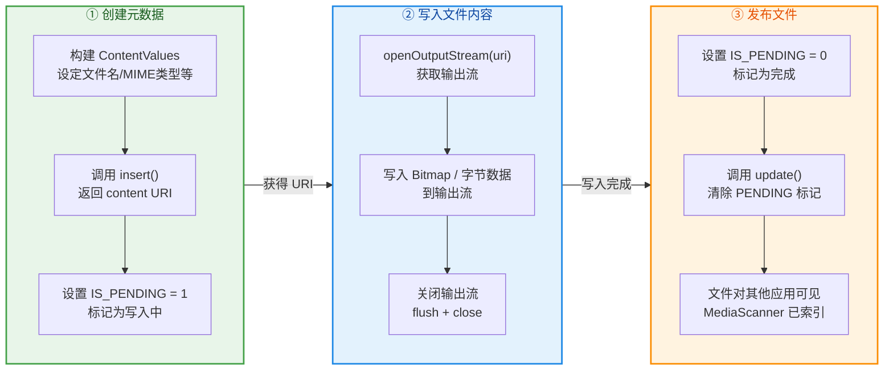

#### 保存图片到 MediaStore 的完整示例

```kotlin
/**
 * 将 Bitmap 保存到系统图片库（适配 Android 10 Scoped Storage）
 * @param bitmap 要保存的位图
 * @param displayName 文件显示名（不含扩展名）
 * @param mimeType MIME 类型，如 "image/jpeg"
 * @return 保存成功则返回 content URI，失败返回 null
 */
fun saveBitmapToGallery(
    context: Context,
    bitmap: Bitmap,
    displayName: String,
    mimeType: String = "image/jpeg"
): Uri? {
    val resolver = context.contentResolver

    // ① 构建元数据 ContentValues —— 类似于数据库的 INSERT 语句的列值对
    val contentValues = ContentValues().apply {
        // DISPLAY_NAME：文件显示名（系统会自动添加扩展名）
        put(MediaStore.Images.Media.DISPLAY_NAME, displayName)
        // MIME_TYPE：文件的 MIME 类型，系统据此决定存储目录和文件扩展名
        put(MediaStore.Images.Media.MIME_TYPE, mimeType)
        // DATE_ADDED：添加时间戳（秒），System.currentTimeMillis() 返回毫秒需除以 1000
        put(MediaStore.Images.Media.DATE_ADDED, System.currentTimeMillis() / 1000)

        // Android 10+ 的 Scoped Storage 特有字段
        if (Build.VERSION.SDK_INT >= Build.VERSION_CODES.Q) {
            // RELATIVE_PATH：相对存储路径，文件将保存到 Pictures/MyApp/ 目录下
            put(MediaStore.Images.Media.RELATIVE_PATH, "Pictures/MyApp")
            // IS_PENDING = 1：将文件标记为"写入中"
            // 处于 pending 状态的文件对其他应用不可见，避免其他应用读取到不完整的文件
            put(MediaStore.Images.Media.IS_PENDING, 1)
        }
    }

    // ② 插入元数据记录，获取该记录的 content URI
    // insert() 返回形如 content://media/external/images/media/123 的 URI
    // 此时数据库中已有该记录，但物理文件尚未写入
    val imageUri = resolver.insert(
        MediaStore.Images.Media.EXTERNAL_CONTENT_URI,  // 插入到外部存储图片表
        contentValues                                   // 列值对
    ) ?: return null  // insert 失败（如存储空间不足）返回 null

    // ③ 通过返回的 URI 打开输出流，写入 Bitmap 数据
    // openOutputStream() 返回一个指向实际文件的 OutputStream
    // use {} 确保流在写入完成后自动关闭
    resolver.openOutputStream(imageUri)?.use { outputStream ->
        // 根据 MIME 类型选择压缩格式
        val format = if (mimeType == "image/png") {
            Bitmap.CompressFormat.PNG     // PNG 无损压缩
        } else {
            Bitmap.CompressFormat.JPEG    // JPEG 有损压缩
        }
        // compress() 将 Bitmap 压缩并写入输出流
        // 参数：压缩格式、质量（0-100，仅 JPEG 有效）、输出流
        val success = bitmap.compress(format, 90, outputStream)
        if (!success) {
            // 压缩失败，删除已创建的空记录
            resolver.delete(imageUri, null, null)
            return null
        }
    } ?: run {
        // 无法打开输出流（URI 可能已失效），清理空记录
        resolver.delete(imageUri, null, null)
        return null
    }

    // ④ 清除 IS_PENDING 标记，使文件对其他应用可见
    if (Build.VERSION.SDK_INT >= Build.VERSION_CODES.Q) {
        val updateValues = ContentValues().apply {
            // 将 IS_PENDING 设为 0，标记文件写入完成
            put(MediaStore.Images.Media.IS_PENDING, 0)
        }
        // update() 更新指定 URI 的记录
        resolver.update(imageUri, updateValues, null, null)
    }

    // 返回保存成功的 content URI
    return imageUri
}
```

上面的代码中，**`IS_PENDING` 机制** 是 Android 10 引入的一个精巧设计。想象这样的场景：应用正在向 MediaStore 写入一个大视频文件，写入过程可能持续数十秒。如果没有 `IS_PENDING` 保护，另一个应用（如系统相册）可能在这期间扫描到这个不完整的文件并尝试显示，导致显示异常或崩溃。`IS_PENDING = 1` 相当于给文件加了一把 **"施工中"的锁**，只有创建该记录的应用（拥有该 URI 写入权限的应用）才能看到和操作它，其他应用的查询会自动过滤掉 pending 状态的记录。写入完成后将 `IS_PENDING` 设为 0，文件才正式"发布"到公共媒体库中。

#### 更新已有媒体记录

更新操作主要有两种场景：**修改元数据**（如重命名文件）和 **修改文件内容**（如编辑图片后覆盖保存）。两者都通过 `ContentResolver.update()` 实现，但后者还涉及到文件内容的重新写入。

**场景一：修改文件名**

```kotlin
/**
 * 重命名 MediaStore 中的媒体文件
 * @param mediaUri 要修改的记录的 content URI
 * @param newName 新的显示名（不含扩展名）
 */
fun renameMedia(contentResolver: ContentResolver, mediaUri: Uri, newName: String) {
    // 构建要更新的列值对
    val updateValues = ContentValues().apply {
        // 只修改 DISPLAY_NAME 列
        put(MediaStore.Images.Media.DISPLAY_NAME, newName)
    }
    // update() 的参数与 query() 类似：URI、新值、WHERE 条件
    // 这里直接使用单条记录的 URI，所以不需要 WHERE 条件
    val rowsUpdated = contentResolver.update(
        mediaUri,       // 目标记录的 URI（如 content://media/external/images/media/42）
        updateValues,   // 要更新的列值对
        null,           // selection（对单条 URI 无需条件）
        null            // selectionArgs
    )
    Log.d("MediaStore", "更新了 $rowsUpdated 行")
}
```

**场景二：覆盖保存编辑后的图片**

```kotlin
/**
 * 将编辑后的 Bitmap 覆盖写回原文件
 * 注意：在 Android 10+ 上，如果文件不是本应用创建的，
 * 系统会抛出 RecoverableSecurityException，需要请求用户授权
 */
fun overwriteImage(
    context: Context,
    mediaUri: Uri,
    editedBitmap: Bitmap
) {
    val resolver = context.contentResolver

    try {
        // Android 10+：先将文件设为 pending 状态，防止其他应用读取到半成品
        if (Build.VERSION.SDK_INT >= Build.VERSION_CODES.Q) {
            val pendingValues = ContentValues().apply {
                put(MediaStore.Images.Media.IS_PENDING, 1)  // 标记为写入中
            }
            resolver.update(mediaUri, pendingValues, null, null)
        }

        // 以 "w" 模式打开输出流（覆盖写入，而非追加）
        // "w" = write/truncate，会清空文件原有内容
        resolver.openOutputStream(mediaUri, "w")?.use { outputStream ->
            editedBitmap.compress(Bitmap.CompressFormat.JPEG, 95, outputStream)
        }

        // 清除 pending 标记
        if (Build.VERSION.SDK_INT >= Build.VERSION_CODES.Q) {
            val doneValues = ContentValues().apply {
                put(MediaStore.Images.Media.IS_PENDING, 0)  // 标记为完成
            }
            resolver.update(mediaUri, doneValues, null, null)
        }

    } catch (securityException: SecurityException) {
        // Android 10+ 操作非本应用创建的文件时会抛出此异常
        if (Build.VERSION.SDK_INT >= Build.VERSION_CODES.Q) {
            val recoverableException = securityException as? RecoverableSecurityException
            // 获取用户授权的 IntentSender，弹出系统授权对话框
            recoverableException?.userAction?.actionIntent?.intentSender?.let { sender ->
                // 需要通过 Activity.startIntentSenderForResult() 请求用户确认
                // 用户同意后，在 onActivityResult 中重试 overwriteImage()
                Log.w("MediaStore", "需要用户授权才能修改此文件")
            }
        }
    }
}
```

上面代码中处理的 **`RecoverableSecurityException`** 是 Scoped Storage 的重要安全机制。在 Android 10+ 上，应用只能自由修改或删除 **自己通过 `insert()` 创建的** 媒体文件。如果尝试修改或删除其他应用创建的文件（如系统相机拍摄的照片），系统会抛出 `RecoverableSecurityException`。这个异常中包含一个 `IntentSender`，应用可以用它来弹出一个系统对话框，询问用户是否授权修改。用户确认后，应用才能执行修改操作。Android 11 进一步引入了 `MediaStore.createWriteRequest()` 和 `createDeleteRequest()` 等批量授权 API，可以一次性请求对多个文件的修改/删除权限，避免逐个弹窗。

#### 删除媒体文件

删除操作使用 `ContentResolver.delete()`，它同样受到 Scoped Storage 的权限管控。对于 Android 11+，推荐使用 `createDeleteRequest()` 进行批量删除：

```kotlin
/**
 * 删除单条媒体记录（及其物理文件）
 * Android 10+ 删除非本应用创建的文件需要用户确认
 */
fun deleteMedia(context: Context, mediaUri: Uri): Boolean {
    return try {
        // delete() 返回被删除的行数（0 或 1）
        val deletedRows = context.contentResolver.delete(
            mediaUri,   // 要删除的记录 URI
            null,       // 额外 WHERE 条件（单条 URI 无需）
            null        // WHERE 参数
        )
        deletedRows > 0  // 删除成功返回 true
    } catch (securityException: SecurityException) {
        // 与 update 相同，需要处理 RecoverableSecurityException
        false
    }
}

/**
 * Android 11+ 批量删除请求 —— 系统弹出统一的确认对话框
 * 需要在 Activity 中通过 ActivityResultLauncher 处理结果
 */
fun createBatchDeleteRequest(
    context: Context,
    urisToDelete: List<Uri>
): IntentSender? {
    // Android 11+ 可用 createDeleteRequest() 批量请求删除权限
    return if (Build.VERSION.SDK_INT >= Build.VERSION_CODES.R) {
        // 返回 PendingIntent，调用方通过 launcher.launch(intentSender) 弹出系统确认框
        MediaStore.createDeleteRequest(
            context.contentResolver,
            urisToDelete  // 要删除的 URI 列表
        ).intentSender
    } else {
        null  // Android 10 及以下需逐个处理 RecoverableSecurityException
    }
}
```

#### 监听 MediaStore 变更

当其他应用（如系统相机）向 MediaStore 中插入了新文件，或用户在文件管理器中删除了某些媒体，你的应用可能需要实时感知这些变化来刷新 UI。Android 提供了 `ContentObserver` 来监听 ContentProvider 的数据变更：

```kotlin
// 注册一个 ContentObserver 监听图片表的变化
val imageObserver = object : ContentObserver(Handler(Looper.getMainLooper())) {
    // 当监听的 URI 对应的数据发生变化时，系统回调此方法
    override fun onChange(selfChange: Boolean, uri: Uri?) {
        super.onChange(selfChange, uri)
        // selfChange = true 表示变更是本应用触发的
        // uri 为发生变更的具体 URI（可能为 null）
        Log.d("MediaStore", "图片库发生变化: selfChange=$selfChange, uri=$uri")
        // 在此触发 UI 刷新，如重新查询图片列表
        refreshImageList()
    }
}

// 注册监听 —— 第二个参数 notifyForDescendants = true 表示监听该 URI 下所有子路径的变化
contentResolver.registerContentObserver(
    MediaStore.Images.Media.EXTERNAL_CONTENT_URI,  // 监听整个图片表
    true,                                           // 包含子路径
    imageObserver                                    // 观察者实例
)

// 在 onDestroy() 或不再需要监听时取消注册，避免内存泄漏
contentResolver.unregisterContentObserver(imageObserver)
```

需要注意的是，`ContentObserver.onChange()` 的回调粒度比较粗——它只告诉你"数据变了"，但不会告诉你具体变了什么（新增？删除？修改？哪一条？）。因此在 `onChange()` 中通常需要 **重新执行完整查询** 并与之前的列表进行 Diff 来确定具体变化。在 Jetpack 生态中，`Room` + `Flow` 可以自动完成这种响应式查询刷新，但 MediaStore 目前还不直接支持 Flow 观察，需要开发者自行桥接。

---

**📝 练习题**

某应用需要在 Android 12 设备上保存一张用户编辑的图片到公共相册，以下做法中 **正确的** 是？


A. 直接通过 `File("/sdcard/Pictures/photo.jpg")` 创建文件并写入 Bitmap 数据，然后发送 `ACTION_MEDIA_SCANNER_SCAN_FILE` 广播通知系统扫描。


B. 通过 `ContentResolver.insert()` 向 `MediaStore.Images.Media.EXTERNAL_CONTENT_URI` 插入一条记录并设置 `IS_PENDING = 1`，获取返回的 URI 后用 `openOutputStream()` 写入数据，写入完成后将 `IS_PENDING` 设为 0。


C. 使用 `Environment.getExternalStoragePublicDirectory(DIRECTORY_PICTURES)` 获取图片目录路径，创建 `FileOutputStream` 写入 Bitmap，无需通知 MediaStore。


D. 使用 `ContentResolver.insert()` 插入记录后，通过 `cursor.getString(DATA)` 获取文件绝对路径，然后用 `FileOutputStream` 直接写入该路径。


**【答案】** B

**【解析】** 在 Android 10+（Scoped Storage 生效后），应用不再拥有对外部公共存储的直接文件系统访问权限。选项 A 中直接操作 `/sdcard/` 路径在 Android 10+ 会抛出 `FileNotFoundException`（除非声明了 `requestLegacyExternalStorage`，但该标志在 Android 11+ 已失效）。同时 `ACTION_MEDIA_SCANNER_SCAN_FILE` 广播在 API 29+ 已被废弃。选项 C 的 `getExternalStoragePublicDirectory()` 在 API 29 中被标记为 Deprecated，同样受 Scoped Storage 限制无法直接写入。选项 D 中 `MediaStore.MediaColumns.DATA`（即 `_data` 列）虽然仍然存在，但在 Android 10+ 上该列的值不可用于直接文件 I/O，且 Google 官方明确建议不要依赖此列。正确做法是选项 B：使用 `insert()` + `openOutputStream()` 的标准流程，配合 `IS_PENDING` 机制确保写入过程的原子性和对其他应用的不可见性。

---

## 图片加载框架

在 Android 应用开发中，图片加载是一个看似简单、实则极度复杂的工程问题。一张网络图片从 URL 到最终显示在 `ImageView` 上，需要经历 **网络请求、解码、内存管理、生命周期绑定、列表复用** 等一系列环节。如果开发者手动处理这些问题，不仅代码量巨大，还极易引发 OOM（Out Of Memory）崩溃、列表卡顿、图片错位等经典 Bug。正因如此，业界诞生了以 **Glide** 为代表的图片加载框架，它在 Google 官方示例中被广泛采用，几乎成为 Android 图片加载的事实标准。

图片加载框架要解决的核心矛盾是：**图片数据量大（一张 1080p 照片解码后占约 8MB 内存）与移动设备内存有限之间的矛盾**。为化解这个矛盾，所有主流框架都围绕 **"缓存"** 这一核心思想构建了多级存储体系——内存缓存保证速度，磁盘缓存避免重复下载，Bitmap 复用减少 GC 压力。理解这套缓存体系的设计哲学与实现细节，是掌握图片加载框架的关键所在。

### Glide 缓存策略

Glide 是由 Bump Technologies 开发、后被 Google 推荐的图片加载库。它的缓存设计堪称教科书级别，采用了 **三级缓存架构**（Active Resources → Memory Cache → Disk Cache），每一级都有明确的职责边界与淘汰策略。要理解 Glide 为什么快、为什么省内存，必须从这套分层体系入手。

#### 三级缓存的整体流程

当你调用 `Glide.with(context).load(url).into(imageView)` 时，Glide 内部会按照严格的优先级顺序逐级查找缓存。只有上一级未命中（cache miss），才会降级到下一级。整个流程可以概括为：**活动资源 → 内存缓存 → 磁盘缓存 → 网络/本地源**。

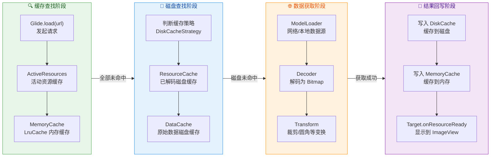

**第一级：ActiveResources（活动资源缓存）**。这是 Glide 独创的一层缓存，存放的是 **当前正在被至少一个页面使用的图片资源**。它的底层数据结构是一个 `HashMap<Key, WeakReference<EngineResource>>`，即用弱引用（WeakReference）持有资源。为什么要单独设这一层？原因在于：如果一张图片正在被 `ImageView` 显示，它显然不应该被 LruCache 的 LRU 算法淘汰掉。ActiveResources 通过引用计数（reference counting）机制追踪资源的使用者数量——每当一个 `Target`（通常对应一个 `ImageView`）引用该资源时计数加一，释放时减一。当计数归零，资源会从 ActiveResources **转移到** MemoryCache 中，而非直接销毁。这种设计既保护了正在使用的资源不被淘汰，又让不再使用的资源能够进入 LRU 队列被复用。

**第二级：MemoryCache（内存缓存）**。这一层就是经典的 `LruCache`，存放的是 **最近使用过但当前没有被任何页面引用的图片**。当 ActiveResources 未命中时，Glide 会查找 MemoryCache。如果命中，资源会从 MemoryCache **移除**并重新放入 ActiveResources（因为它又有了使用者）。这种在两层之间的 "乒乓转移" 是 Glide 内存缓存的精髓。MemoryCache 的默认大小为设备可用内存的一定比例（通常是 `memoryClass` 的 1/4 到 1/3），由 `MemorySizeCalculator` 根据设备屏幕密度和内存等级动态计算。

**第三级：DiskCache（磁盘缓存）**。当内存中完全找不到目标图片时，Glide 会尝试从磁盘读取。磁盘缓存分为两个子层：`ResourceCache` 存放经过解码和变换后的图片（比如已经裁剪为 200×200 的缩略图），`DataCache` 存放原始未处理的数据（比如从网络下载的原始 JPEG 字节流）。Glide 默认优先查找 ResourceCache，因为它直接可用、无需再次解码和变换，速度更快。

**第四级：网络/本地源**。所有缓存都未命中时，Glide 才会真正发起网络请求（或从本地文件读取）。获取到的数据经过解码、变换后，会 **回写到磁盘缓存和内存缓存**，为后续请求做准备。

#### DiskCacheStrategy 磁盘缓存策略

Glide 提供了 `DiskCacheStrategy` 枚举，允许开发者精细控制磁盘缓存行为。不同场景需要不同策略：

| 策略 | 缓存原始数据 | 缓存变换后资源 | 适用场景 |
|------|:-----------:|:------------:|---------|
| `AUTOMATIC`（默认） | 仅远程数据 | 是 | 绝大多数场景 |
| `ALL` | 是 | 是 | 同一图片需要多种尺寸变换 |
| `DATA` | 是 | 否 | 原始图片需要保留但展示变换多变 |
| `RESOURCE` | 否 | 是 | 变换固定，不需要原始数据 |
| `NONE` | 否 | 否 | 图片频繁变化（如验证码、实时头像） |

`AUTOMATIC` 是 Glide 的默认策略，也是最聪明的一个。它的逻辑是：对于远程数据（网络图片），既缓存原始数据又缓存变换后资源；对于本地数据（如 `content://` URI 或本地文件），只缓存变换后资源，因为本地数据本身就可以快速读取，无需重复存储。这种差异化策略在节约磁盘空间的同时保持了性能。

```kotlin
// 使用示例：为不同业务场景选择合适的磁盘缓存策略
Glide.with(this)                              // 绑定生命周期
    .load("https://example.com/photo.jpg")    // 指定图片 URL
    .diskCacheStrategy(DiskCacheStrategy.ALL)  // 同时缓存原始数据与变换后资源
    .into(imageView)                          // 目标 ImageView

// 验证码场景：禁用所有缓存，确保每次都获取最新图片
Glide.with(this)                              // 绑定生命周期
    .load("https://example.com/captcha")      // 验证码 URL，每次返回不同图片
    .diskCacheStrategy(DiskCacheStrategy.NONE) // 禁用磁盘缓存
    .skipMemoryCache(true)                    // 同时禁用内存缓存
    .into(captchaImageView)                   // 目标验证码 ImageView
```

#### Cache Key 的生成机制

缓存的核心问题之一是 **"如何唯一标识一张图片"**。Glide 的缓存 Key 并非简单的 URL 字符串，而是一个复合键，包含了多个维度的信息。对于内存缓存，Key 由 URL、宽度、高度、变换（Transformation）、签名（Signature）等因素共同决定。这意味着 **同一张图片的不同尺寸版本会被视为不同的缓存条目**。例如一张图片在列表中显示 100×100 缩略图，在详情页显示 1080×1080 大图，Glide 会为它们分别缓存，避免每次都重新进行昂贵的 resize 操作。

对于磁盘缓存，ResourceCache 的 Key 同样包含变换信息，而 DataCache 的 Key 只关注数据源本身（如 URL），因为原始数据与展示方式无关。

#### 生命周期感知与内存管理

Glide 的另一个重要设计是 **生命周期绑定**。当你调用 `Glide.with(activity)` 时，Glide 会向该 Activity 注入一个不可见的 `SupportRequestManagerFragment`，通过这个空 Fragment 监听 Activity 的生命周期。当 Activity 进入 `onStop()` 时，Glide 自动暂停所有请求；进入 `onDestroy()` 时，自动清理请求并释放资源。这种机制有两个重大好处：第一，避免了 Activity 已销毁但图片回调仍尝试更新 `ImageView` 导致的崩溃；第二，在内存紧张时通过 `onTrimMemory()` 回调主动清理缓存，配合系统的内存管理策略。

需要特别注意的是 `Glide.with()` 的参数选择。传入 `Activity` 或 `Fragment`，请求会跟随其生命周期；传入 `ApplicationContext`，请求会跟随整个应用进程的生命周期，不会自动暂停或取消。因此在 **RecyclerView Adapter** 中，最佳实践是传入所在 Activity 或 Fragment 的 Context，而非 Application Context。

### LruCache 内存缓存

`LruCache`（Least Recently Used Cache）是 Android SDK 在 `android.util` 包中提供的一个内存缓存工具类，它实现了 **最近最少使用** 淘汰算法。不仅 Glide 的内存缓存基于它，任何需要在内存中缓存对象的场景（如消息列表缓存、配置数据缓存）都可以使用它。理解 LruCache 的内部原理，是理解所有图片加载框架内存管理的基础。

#### LRU 算法的核心思想

LRU 算法基于一个朴素的假设：**如果一个数据最近被访问过，那么它在短期内再次被访问的概率更高**。这个假设在图片加载场景中特别成立——用户正在浏览的页面上的图片，很可能因为滚动回退而再次需要；而很久之前浏览过的页面上的图片，再次需要的概率较低。

基于这个假设，LRU 缓存的行为规则是：当缓存容量已满且需要插入新条目时，**淘汰最近最少使用的那个条目**。"最近最少使用"指的是距离上次被访问（读取或写入）时间最远的条目。

#### LruCache 的数据结构

Android 的 `LruCache` 内部使用 `LinkedHashMap` 作为底层存储。`LinkedHashMap` 是 Java 集合框架中一个被低估的类，它在普通 `HashMap` 的基础上，额外维护了一条 **双向链表** 将所有 Entry 按照访问顺序串联起来。当创建 `LinkedHashMap` 时将构造参数 `accessOrder` 设为 `true`，每次 `get()` 操作会将被访问的 Entry 移动到链表尾部，而链表头部自然就是最近最少使用的 Entry。

```java
// LinkedHashMap 内部结构示意（伪代码）
// 每个 Entry 除了 HashMap 的 hash/key/value/next 外
// 还有 before 和 after 指针形成双向链表
```

```text
╔═══════════════════════════════════════════════════════════╗
║             LinkedHashMap (accessOrder = true)            ║
║                                                           ║
║   ┌──────────────────── 双向链表 ────────────────────┐    ║
║   │                                                   │    ║
║   │  HEAD(最旧)                        TAIL(最新)     │    ║
║   │  ┌─────┐    ┌─────┐    ┌─────┐    ┌─────┐       │    ║
║   │  │Key:C│◄──►│Key:A│◄──►│Key:D│◄──►│Key:B│       │    ║
║   │  │Val:3│    │Val:1│    │Val:4│    │Val:2│       │    ║
║   │  └─────┘    └─────┘    └─────┘    └─────┘       │    ║
║   │  ↑ 淘汰优先                    最近访问 ↑        │    ║
║   └──────────────────────────────────────────────────┘    ║
║                                                           ║
║   底层 HashMap 桶数组(提供 O(1) 查找):                     ║
║   [0]→null  [1]→KeyA  [2]→KeyB  [3]→KeyC  [4]→KeyD      ║
╚═══════════════════════════════════════════════════════════╝
```

这种设计让 LruCache 同时具备了 **O(1) 时间复杂度的查找**（HashMap 提供）和 **O(1) 时间复杂度的淘汰排序维护**（双向链表提供）。每次 `get()` 或 `put()` 操作都只需要常数时间，非常适合高频调用的缓存场景。

#### LruCache 的使用方式与 sizeOf

使用 `LruCache` 时，最关键的决策是 **缓存容量的设定** 和 **每个条目大小的计算**。对于图片缓存，容量通常以字节为单位，每个条目的大小就是 Bitmap 所占的内存字节数。

```kotlin
// 创建一个用于缓存 Bitmap 的 LruCache
class BitmapLruCache : LruCache<String, Bitmap>(calculateMaxSize()) {

    companion object {
        fun calculateMaxSize(): Int {
            // 获取应用可用的最大内存（单位：字节）
            val maxMemory = Runtime.getRuntime().maxMemory().toInt()
            // 取最大内存的 1/8 作为图片缓存上限
            // 例如 256MB 可用内存 → 32MB 图片缓存
            return maxMemory / 8
        }
    }

    // 必须重写 sizeOf，告诉 LruCache 每个条目占多少"单位"
    // 这里的"单位"与构造函数的 maxSize 保持一致（字节）
    override fun sizeOf(key: String, value: Bitmap): Int {
        // allocationByteCount 返回 Bitmap 实际分配的内存字节数
        // 对于复用的 Bitmap，它可能大于 byteCount
        return value.allocationByteCount
    }

    // 可选：当条目被淘汰时的回调
    // 可以在此处回收 Bitmap 或将其放入复用池
    override fun entryRemoved(
        evicted: Boolean,       // true = 因容量淘汰; false = 被 put/remove 替换
        key: String,            // 被移除条目的 Key
        oldValue: Bitmap,       // 被移除的 Bitmap
        newValue: Bitmap?       // 替换者（淘汰时为 null）
    ) {
        if (evicted) {
            // 被 LRU 淘汰，可以将 Bitmap 放入 BitmapPool 以供复用
            // bitmapPool.put(oldValue)
        }
    }
}
```

这段代码中有几个值得深入理解的要点：

**`maxMemory / 8` 的经验值**。Android 每个应用的堆内存上限由设备厂商设定（通常 128MB~512MB），图片缓存不宜占用过多，否则会挤压其他业务（如数据库、网络缓冲区）的内存空间。1/8 是业界常用的经验比例，Glide 内部的 `MemorySizeCalculator` 使用了更精细的计算方式，还会考虑屏幕像素密度和是否为低内存设备（`ActivityManager.isLowRamDevice()`）。

**`sizeOf()` 方法的重要性**。如果不重写 `sizeOf()`，默认返回 1，意味着 `maxSize` 代表的是条目数量而非字节数。这对于图片缓存是完全错误的——一张 4K 图片和一张 32×32 的图标占用的内存天差地别，按数量计算毫无意义。

**`allocationByteCount` vs `byteCount`**。`byteCount` 返回的是 Bitmap 像素数据的逻辑大小（width × height × bytesPerPixel），而 `allocationByteCount` 返回的是底层分配的实际内存大小。当一个 Bitmap 被复用（inBitmap）来解码一张更小的图片时，`allocationByteCount` 会大于 `byteCount`。使用 `allocationByteCount` 能更准确地反映真实内存占用。

#### LruCache 的线程安全

`LruCache` 的所有公开方法（`get()`、`put()`、`remove()`、`evictAll()` 等）内部都使用 `synchronized(this)` 进行了同步。这意味着它是 **线程安全** 的，可以在主线程和后台线程中同时安全地访问。但也正因为使用了全局 synchronized 锁，在极高并发场景下可能存在锁竞争。对于图片加载框架来说，这通常不是瓶颈，因为大部分缓存访问发生在主线程（显示图片时检查缓存），而写入操作（解码完成后写缓存）的频率相对较低。

#### Glide 中 LruCache 的增强实现

Glide 并没有直接使用 Android SDK 的 `LruCache`，而是内部实现了一个功能相似但经过增强的 `LruResourceCache`。其核心增强在于：

1. **`ResourceRemovedListener` 回调**：当资源被 LRU 淘汰时，Glide 不会直接丢弃它，而是通知 `BitmapPool` 尝试回收底层的 Bitmap 内存块，供后续解码新图片时复用，从而减少内存分配与 GC 压力。
2. **`trimMemory(int level)` 集成**：Glide 注册了 `ComponentCallbacks2`，当系统发出内存警告时，根据警告级别（如 `TRIM_MEMORY_UI_HIDDEN`、`TRIM_MEMORY_RUNNING_LOW` 等）智能清理不同比例的缓存。

### DiskLruCache 磁盘缓存

内存缓存的致命缺点是 **易失性**——应用进程被杀死后，所有内存缓存都会丢失。用户第二天打开 App 时，之前浏览过的图片需要重新从网络下载。磁盘缓存就是为了解决这个问题而存在的。`DiskLruCache` 由 Jake Wharton 维护，是 Android 生态中最广泛使用的磁盘缓存实现，Glide、OkHttp 等知名库都基于它或其变体构建磁盘缓存。

#### DiskLruCache 的文件结构

DiskLruCache 在指定的磁盘目录下维护一组文件，其核心是一个名为 `journal` 的日志文件和若干以 Key 的 MD5 值命名的缓存数据文件。

```text
/data/data/com.example.app/cache/image_cache/
├── journal              ← 操作日志文件（核心）
├── journal.bkp          ← journal 的备份
├── a1b2c3d4e5f6.0       ← 缓存数据文件（Key 的 MD5 + 索引）
├── f6e5d4c3b2a1.0       ← 另一个缓存数据文件
└── ...
```

**journal 文件** 是 DiskLruCache 最精妙的设计。它是一个纯文本的追加写入（append-only）日志，记录了每一次缓存操作：

```text
libcore.io.DiskLruCache         ← 魔数（Magic Number），标识文件格式
1                               ← 磁盘缓存版本号
100                             ← App 版本号
2                               ← 每个 Key 对应的值数量（valueCount）
                                ← 空行分隔
DIRTY a1b2c3d4e5f6              ← 开始编辑 Key=a1b2c3d4e5f6
CLEAN a1b2c3d4e5f6 1024 512    ← 编辑完成，两个文件大小分别为 1024 和 512 字节
READ a1b2c3d4e5f6               ← 读取操作
DIRTY f6e5d4c3b2a1              ← 开始编辑另一个 Key
CLEAN f6e5d4c3b2a1 2048 0      ← 编辑完成
REMOVE a1b2c3d4e5f6             ← 删除 Key=a1b2c3d4e5f6
```

journal 文件中有四种操作记录：`DIRTY` 表示一个条目正在被创建或编辑（未完成的写入）；`CLEAN` 表示写入成功完成，后面跟着每个值文件的字节大小；`READ` 表示一次读取操作；`REMOVE` 表示一个条目被删除。

**为什么需要 journal 文件？** 因为磁盘 I/O 是不可靠的——应用随时可能被 kill、设备随时可能断电。journal 文件提供了一种 **崩溃恢复** 机制：当 DiskLruCache 初始化时，它会重放（replay）journal 中的所有记录来重建内存中的索引（一个 `LinkedHashMap`）。如果发现一个 `DIRTY` 记录后面没有对应的 `CLEAN` 或 `REMOVE`，说明上次写入被中断，DiskLruCache 会自动删除这个不完整的条目，保证缓存数据的一致性。

#### DiskLruCache 的 LRU 淘汰与容量管理

DiskLruCache 同样使用 `LinkedHashMap`（accessOrder = true）在内存中维护 Key 的访问顺序。当缓存总大小超过设定上限时，它会从链表头部开始逐个删除最旧的条目（对应磁盘上的数据文件和 journal 中追加 `REMOVE` 记录），直到总大小降至上限以下。

Glide 默认的磁盘缓存大小为 **250MB**，存储目录在应用的内部缓存目录下。开发者可以通过自定义 `GlideModule` 来调整：

```kotlin
// 自定义 AppGlideModule 配置磁盘缓存
@GlideModule
class MyAppGlideModule : AppGlideModule() {

    // 应用 Glide 选项（全局生效，仅初始化时调用一次）
    override fun applyOptions(context: Context, builder: GlideBuilder) {
        // 设置磁盘缓存为内部存储，大小 500MB
        builder.setDiskCache(
            InternalCacheDiskCacheFactory(
                context,           // 应用上下文
                "glide_cache",     // 缓存目录名称
                500L * 1024 * 1024 // 500MB 上限
            )
        )

        // 同时可以自定义内存缓存大小
        builder.setMemoryCache(
            LruResourceCache(
                50L * 1024 * 1024  // 50MB 内存缓存上限
            )
        )
    }

    // 是否启用清单（Manifest）解析
    // 返回 false 可以提升初始化速度（推荐）
    override fun isManifestParsingEnabled(): Boolean = false
}
```

#### 磁盘缓存的 I/O 线程策略

磁盘 I/O 是耗时操作，绝不能在主线程执行。Glide 内部使用专门的后台线程池来处理磁盘缓存的读写。当发起图片请求时，内存缓存的检查在主线程完成（因为 HashMap 查找是 O(1)，耗时极短），而磁盘缓存的检查和网络请求都在后台线程执行。解码完成后，结果通过 `Handler` 切回主线程进行显示。这种线程分工模型是 Glide 流畅性的重要保障。

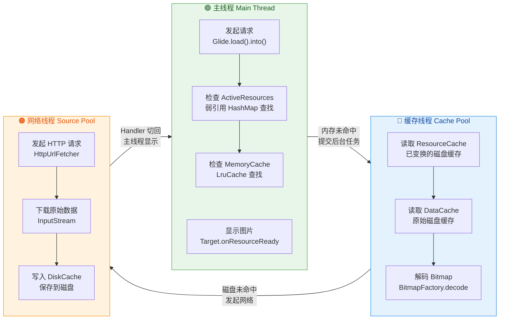

### Bitmap 复用

在 Android 图片处理的语境中，Bitmap 复用（Bitmap Reuse / Bitmap Pooling）是一项至关重要的内存优化技术。要理解它的价值，首先需要理解 Bitmap 在内存中的真实成本。

#### Bitmap 的内存消耗

一个 Bitmap 对象在内存中的占用量由公式决定：**内存 = 宽 × 高 × 每像素字节数**。常见的像素格式对应的每像素字节数如下：

| 像素格式 | 每像素字节数 | 说明 |
|---------|:-----------:|------|
| `ARGB_8888` | 4 bytes | 默认格式，含透明通道，色彩最丰富 |
| `RGB_565` | 2 bytes | 无透明通道，色彩略有损失，适合不需要透明的照片 |
| `ARGB_4444` | 2 bytes | 已废弃（deprecated），质量太低 |
| `HARDWARE` | — | Android 8.0+，像素存储在 GPU 显存中 |

以一张 1920×1080 的照片为例，使用默认的 `ARGB_8888` 格式：1920 × 1080 × 4 = **8,294,400 字节 ≈ 7.9MB**。如果用户在 RecyclerView 中快速滑动浏览 20 张这样的照片，若每张都重新分配内存，就需要 20 × 7.9MB ≈ 158MB 的堆内存分配。即使旧的 Bitmap 被 GC 回收了，**频繁的大块内存分配和回收**会造成严重的 GC 抖动（GC Churn），导致丢帧和卡顿。

#### BitmapFactory.Options.inBitmap 机制

Android 从 API 11（3.0）起引入了 `inBitmap` 选项，允许开发者在解码新图片时 **复用一个已有的 Bitmap 对象的底层内存块**，而不是重新分配。这就像是把一个画框里的旧画取出来，在同一块画布上画一幅新画——画框（Bitmap 对象）和画布（底层像素内存）都被复用了。

```kotlin
// 演示 inBitmap 的基本用法
val options = BitmapFactory.Options()

// 第一步：先解码一张图片
options.inPreferredConfig = Bitmap.Config.ARGB_8888  // 指定像素格式
val firstBitmap = BitmapFactory.decodeFile(           // 从文件解码
    "/sdcard/photo1.jpg",                             // 图片路径
    options                                           // 解码选项
)

// 第二步：用 firstBitmap 的内存块来解码第二张图片
options.inMutable = true       // 必须！inBitmap 要求 Bitmap 是可变的（mutable）
options.inBitmap = firstBitmap // 核心：指定要复用的 Bitmap
val secondBitmap = BitmapFactory.decodeFile(          // 解码第二张图片
    "/sdcard/photo2.jpg",                             // 不同的图片路径
    options                                           // 同一个 options，含 inBitmap
)
// secondBitmap 复用了 firstBitmap 的底层内存
// firstBitmap 此时已不可用（像素数据已被覆盖）
```

**复用的限制条件** 在不同 Android 版本上有所差异：

- **API 19（Android 4.4 KitKat）之前**：新解码的 Bitmap 必须与被复用的 Bitmap 具有 **完全相同的宽、高和像素格式**。这个限制非常严格，大大降低了复用的命中率。
- **API 19 及之后**：新解码的 Bitmap 的 **字节大小** 只需要 **小于或等于** 被复用 Bitmap 的 `allocationByteCount` 即可。这是一个巨大的放松——一个 1000×1000 的 Bitmap 内存块可以被用来解码任何总像素数不超过 1,000,000 的图片（如 500×2000、800×1000 等）。

#### Glide 的 BitmapPool 机制

手动管理 `inBitmap` 非常繁琐——你需要维护一个可复用 Bitmap 的池子，根据新图片的尺寸和格式查找合适的候选者。Glide 通过 `BitmapPool` 接口将这套逻辑完全封装，开发者无需手动干预。

Glide 的默认 `BitmapPool` 实现是 `LruBitmapPool`。它的内部维护了一个按 **Bitmap 配置（Config）+ 尺寸** 分类的回收池。当一个 Bitmap 不再需要时（如被 LruCache 淘汰、ImageView 被回收），Glide 不会调用 `bitmap.recycle()` 销毁它，而是将它 **放入 BitmapPool**。当需要解码新图片时，Glide 会先到 BitmapPool 中寻找一个尺寸合适的 Bitmap 设置为 `inBitmap`，从而实现零分配解码（zero-allocation decoding）。

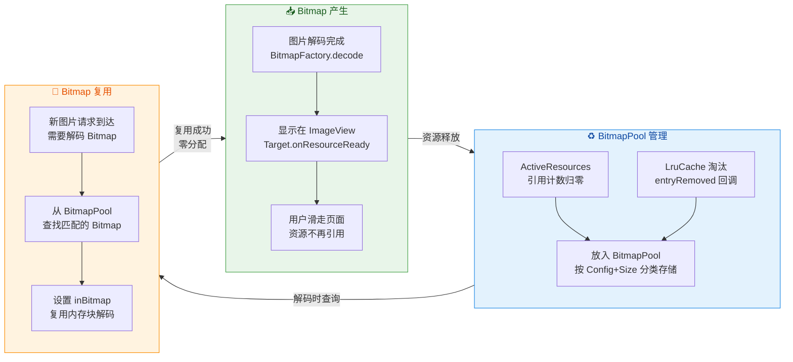

`LruBitmapPool` 内部根据 Android 版本选择不同的匹配策略：

- **API 19+**：使用 `SizeConfigStrategy`，按照 `allocationByteCount` 和 `Bitmap.Config` 组合作为 Key。查找时，寻找一个 **大小大于等于目标需求且最接近** 的 Bitmap。这样即使尺寸不完全匹配，只要底层内存块够大就能复用。
- **API 19 以下**：使用 `AttributeStrategy`，严格按照 `width + height + Config` 作为 Key，必须完全匹配才能复用。

#### Bitmap 复用的实际收益

在实际项目中，Bitmap 复用带来的收益是非常显著的。可以通过 Android Studio 的 **Memory Profiler** 观察：启用 BitmapPool 复用后，在 RecyclerView 快速滑动场景中，堆内存分配频率大幅降低，GC 次数明显减少，帧率更加稳定。

一个常见的性能优化技巧是在应用初始化时 **预热 BitmapPool**：提前创建若干个常见尺寸的 Bitmap 放入池中，这样首批图片解码时就能立即找到可复用的 Bitmap，避免冷启动阶段的内存分配高峰。

```kotlin
// 预热 BitmapPool 的示例
fun prewarmBitmapPool(glide: Glide, count: Int = 6) {
    val pool = glide.bitmapPool                    // 获取 Glide 的 BitmapPool 实例
    for (i in 0 until count) {                     // 预创建 count 个 Bitmap
        val bitmap = Bitmap.createBitmap(           // 创建空白 Bitmap
            300,                                   // 宽度（像素），覆盖常见缩略图尺寸
            300,                                   // 高度（像素）
            Bitmap.Config.ARGB_8888                // 默认像素格式
        )
        pool.put(bitmap)                           // 放入 BitmapPool 等待被复用
    }
}
```

#### HARDWARE Bitmap 的特殊考量

从 Android 8.0（API 26）开始，Android 引入了 `Bitmap.Config.HARDWARE` 配置。这种 Bitmap 的像素数据存储在 **GPU 显存** 而非 Java 堆内存中，因此不会计入堆内存，也不会触发 GC。Glide 在 API 26+ 设备上默认会优先使用 HARDWARE Bitmap。

然而 HARDWARE Bitmap 有一些限制：它是不可变的（immutable），不能调用 `setPixel()` 或用作 Canvas 的绘制目标，也 **不能被 `inBitmap` 复用**。因此当需要对图片进行自定义变换（如高斯模糊、像素级别操作）时，需要通过 `.set(RequestOptions().disallowHardwareConfig())` 强制使用软件 Bitmap。Glide 在检测到 Transformation 需要操作像素时，会自动降级为非 HARDWARE 配置。

---

**📝 练习题**

在 Glide 的三级内存缓存架构中，当一张图片正在被某个 `ImageView` 显示，此时它位于哪一级缓存中？当该 `ImageView` 所在的页面被销毁后，这张图片会转移到哪里？

A. 位于 MemoryCache（LruCache）中；页面销毁后转移到 DiskCache


B. 位于 ActiveResources 中；页面销毁后转移到 MemoryCache（LruCache）


C. 位于 ActiveResources 中；页面销毁后直接被 GC 回收


D. 位于 MemoryCache（LruCache）中；页面销毁后转移到 BitmapPool


**【答案】** B

**【解析】** Glide 的内存缓存分为两层：ActiveResources 和 MemoryCache。ActiveResources 使用 `HashMap<Key, WeakReference<EngineResource>>` 存放 **当前正在被至少一个 Target 引用的资源**，通过引用计数追踪使用者数量。当一张图片正在被 ImageView 显示时，对应的 EngineResource 的引用计数大于零，它驻留在 ActiveResources 中。这样做的目的是 **保护正在使用的资源不被 LruCache 的 LRU 算法淘汰**。当页面销毁后，Target 释放引用，引用计数归零，资源会从 ActiveResources **转移到** MemoryCache（LruCache）中而非直接销毁。在 MemoryCache 中，它遵循 LRU 淘汰策略——如果后续有新资源不断加入导致容量超限，最近最少使用的资源才会被淘汰。被淘汰时，底层 Bitmap 会被放入 BitmapPool 以供 `inBitmap` 复用，而非直接 `recycle()`。选项 A 错误，正在使用的资源不在 LruCache 中；选项 C 错误，不会直接回收而是有序转移；选项 D 错误，BitmapPool 只在 LruCache 淘汰时才介入。

---

**📝 练习题**

关于 `BitmapFactory.Options.inBitmap` 在 Android 4.4（API 19）及以上版本的复用规则，以下说法正确的是？

A. 新解码的 Bitmap 必须与被复用的 Bitmap 具有完全相同的宽度和高度


B. 新解码的 Bitmap 的 `byteCount` 必须等于被复用 Bitmap 的 `byteCount`


C. 新解码的 Bitmap 的 `byteCount` 必须小于或等于被复用 Bitmap 的 `allocationByteCount`


D. 任意两个 Bitmap 之间都可以互相复用，没有尺寸限制


**【答案】** C

**【解析】** 在 Android 4.4（API 19）之前，`inBitmap` 的复用条件非常严格：新旧 Bitmap 必须具有完全相同的宽、高和像素格式。从 API 19 开始，这个限制被大幅放宽：只要新解码 Bitmap 的 **字节大小**（`byteCount`）小于或等于被复用 Bitmap 的 **底层分配大小**（`allocationByteCount`）即可。这里区分两个概念很关键：`byteCount` 是像素数据的逻辑大小（width × height × bytesPerPixel），而 `allocationByteCount` 是系统为该 Bitmap 实际分配的内存块大小（可能因为之前的复用而大于逻辑大小）。选项 A 是 API 19 之前的规则；选项 B 要求严格相等，过于严格；选项 D 完全没有限制，明显错误。Glide 的 `LruBitmapPool` 在 API 19+ 使用 `SizeConfigStrategy`，正是基于 `allocationByteCount` 来寻找可复用的 Bitmap 候选者。

---

## 音频播放 Audio

Android 平台的音频播放是多媒体开发中最基础也最常见的需求之一。从音乐播放器到游戏音效，从语音提示到闹钟铃声，不同的应用场景对音频播放的延迟、并发、生命周期管理提出了截然不同的要求。Android SDK 提供了两套核心 API 来应对这些差异化需求：**MediaPlayer** 面向"长时间、连续性"播放场景（如音乐、播客），它封装了完整的解码-渲染管线，通过一套严格的 **有限状态机（Finite State Machine）** 来管理播放生命周期；**SoundPool** 则面向"短促、高频、低延迟"的音效场景（如游戏按钮音效、UI 反馈音），它会将音频预解码到内存中，播放时直接从 PCM 缓冲区推送，极大地降低了首帧延迟。而当系统中多个 App 同时争抢音频输出设备时，Android 的 **Audio Focus（音频焦点）** 机制则充当"交通指挥"的角色，确保用户在任意时刻只听到最合理的那一路声音。

本节将依次深入讲解这三大主题，不仅覆盖 API 用法，更会剖析其内部原理与设计动机，帮助你在实际项目中做出正确的技术选型和稳健的代码实现。

---

### MediaPlayer 状态机

#### 为什么需要状态机

MediaPlayer 是 Android 中最"重量级"的音频播放组件。它之所以复杂，根本原因在于它需要管理的资源链条很长——从数据源读取（文件 / 网络流 / ContentProvider URI）、到音频解码（软解 / 硬解）、到 AudioTrack 输出（混音器 → 扬声器 / 蓝牙），整条管线上的每一步都可能失败或耗时。如果不加约束地随意调用 `start()`、`pause()`、`stop()`，极易出现底层原生资源（Native Memory、Codec 实例、AudioTrack）泄漏或状态混乱导致的 `IllegalStateException`。

因此 Android 官方为 MediaPlayer 定义了一套 **严格的有限状态机**。每一个 MediaPlayer 实例在其生命周期中，总是处于以下状态之一，并且只能通过特定的方法调用在状态之间进行合法转换。理解这张状态图，是正确使用 MediaPlayer 的前提。

#### 状态全景

MediaPlayer 共有 **8 个核心状态**，可以按其角色分为三组：

| 分组 | 状态 | 含义 |
|------|------|------|
| **初始化阶段** | **Idle** | 刚 `new` 或 `reset()` 后，尚未设置数据源 |
| | **Initialized** | 已调用 `setDataSource()`，数据源已绑定 |
| | **Preparing** | 正在异步准备（`prepareAsync()`），尤其用于网络流 |
| | **Prepared** | 准备完成，可以开始播放 |
| **播放阶段** | **Started** | 正在播放中 |
| | **Paused** | 暂停中，可恢复 |
| | **PlaybackCompleted** | 播放到末尾自然结束 |
| **终结阶段** | **Stopped** | 已停止，需重新 `prepare()` 才能再次播放 |
| | **End** | 已调用 `release()`，对象不可再使用 |
| | **Error** | 发生不可恢复的错误 |

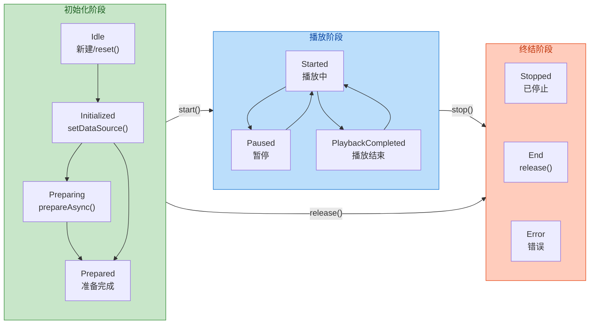

#### 各状态转换详解

**Idle → Initialized：** 当你通过 `new MediaPlayer()` 创建实例后，它处于 **Idle** 状态。此时调用 `setDataSource()` 绑定一个音频文件路径、URI 或 FileDescriptor，状态即转为 **Initialized**。需要特别注意的是，`setDataSource()` 在 Idle 状态以外调用会直接抛出 `IllegalStateException`。这是初学者最常犯的错误之一——在 `stop()` 之后试图切换歌曲直接调用 `setDataSource()`，此时实例处于 Stopped 而非 Idle，必须先调用 `reset()` 回到 Idle 才行。

**Initialized → Prepared（同步）/ Initialized → Preparing → Prepared（异步）：** 数据源绑定后，必须经过 **prepare** 步骤，MediaPlayer 才能获知音频的编码格式、采样率、时长等元信息，并完成解码器的初始化。这里有两种方式：

- **`prepare()`（同步）：** 阻塞当前线程直到准备完成。适合播放本地小文件（如 `res/raw` 资源或短音效文件），因为 I/O 开销极小，阻塞时间可忽略不计。
- **`prepareAsync()`（异步）：** 立即返回，后台线程完成准备后通过 `OnPreparedListener.onPrepared()` 回调通知。**网络流（HTTP/RTSP）和大文件必须使用此方式**，否则在主线程调用同步 `prepare()` 会导致 ANR。

这一设计背后的思考是：prepare 阶段可能涉及网络连接建立、Codec 资源申请、文件头解析等耗时操作，给开发者同步/异步两种选择，兼顾了便利性和安全性。

**Prepared → Started：** 调用 `start()`，音频流开始输出到 AudioTrack，用户听到声音。此时 `getCurrentPosition()` 开始递增，`isPlaying()` 返回 `true`。

**Started ↔ Paused：** `pause()` 暂停播放但 **保持当前播放位置**，底层 AudioTrack 被暂停但不释放。再次 `start()` 从暂停位置恢复，衔接无缝。从资源角度看，Paused 状态仍然持有解码器和 AudioTrack 资源，因此长时间暂停不释放并不节省多少内存。

**Started / Paused → PlaybackCompleted：** 当音频自然播放到末尾，MediaPlayer 自动进入 **PlaybackCompleted** 状态，并触发 `OnCompletionListener.onCompletion()` 回调。在此状态下，你可以：
- 调用 `start()` 重新从头播放（回到 Started）。
- 调用 `seekTo()` + `start()` 跳转到特定位置后播放。
- 调用 `stop()` 进入 Stopped。
- 如果之前设置了 `setLooping(true)`，则 **不会** 进入 PlaybackCompleted，而是自动回到开头继续播放。

**Started / Paused / PlaybackCompleted → Stopped：** `stop()` 会停止播放并释放部分内部资源。Stopped 状态是一个"半死"状态——实例还在，但已经不能直接 `start()`。要恢复播放，必须重新走一遍 `prepare()` → `start()` 流程。这是因为 `stop()` 后底层 Codec 已被释放，需要重新初始化。

**任意状态 → End：** `release()` 是终极清理方法，彻底释放 MediaPlayer 持有的所有 native 资源（Codec、AudioTrack、文件句柄等）。调用后对象进入 **End** 状态，任何后续方法调用都会抛出异常。**这是最容易被遗忘的调用**——如果你在 Activity `onDestroy()` 中忘记 `release()`，底层 native 内存不会被 Java GC 回收，积累多次后将导致 OOM 或 native crash。

**任意状态 → Error：** 当底层播放引擎遇到不可恢复的错误（如损坏的文件、不支持的编码、网络超时），MediaPlayer 会进入 **Error** 状态并触发 `OnErrorListener.onError()`。在 Error 状态下，你只能调用 `reset()` 回到 Idle 重新来过，或者 `release()` 彻底释放。

#### 典型使用模式：音乐播放器

下面展示一个完整的、具备生产级别健壮性的 MediaPlayer 使用示例。注意观察状态转换的顺序：

```kotlin
// MusicPlayerManager.kt —— 封装 MediaPlayer 的管理类
class MusicPlayerManager {

    // 持有 MediaPlayer 实例，可空表示已释放
    private var mediaPlayer: MediaPlayer? = null

    /**
     * 加载并播放指定 URI 的音频
     * @param context  上下文，用于解析 URI
     * @param uri      音频资源的 URI（可以是 content:// / file:// / http://）
     */
    fun playFromUri(context: Context, uri: Uri) {
        // 如果之前有实例，先彻底释放，避免资源泄漏
        release()

        // 创建新的 MediaPlayer 实例 —— 此时处于 Idle 状态
        mediaPlayer = MediaPlayer().apply {

            // 设置音频属性（替代已废弃的 setAudioStreamType）
            // AudioAttributes 可精确描述音频用途，系统据此决定音量曲线和路由策略
            setAudioAttributes(
                AudioAttributes.Builder()
                    .setContentType(AudioAttributes.CONTENT_TYPE_MUSIC)  // 内容类型：音乐
                    .setUsage(AudioAttributes.USAGE_MEDIA)              // 用途：媒体播放
                    .build()
            )

            // 绑定数据源 —— 从 Idle 转为 Initialized
            setDataSource(context, uri)

            // 注册"准备完成"监听器
            setOnPreparedListener { mp ->
                // 回调触发时，状态已变为 Prepared
                // 调用 start() 进入 Started 状态，开始播放
                mp.start()
            }

            // 注册"播放完成"监听器
            setOnCompletionListener { mp ->
                // 状态变为 PlaybackCompleted
                // 这里可以触发下一首播放逻辑，或通知 UI 更新
                Log.d("MusicPlayer", "播放完成，当前位置: ${mp.currentPosition}ms")
            }

            // 注册"错误"监听器 —— 关键！不注册的话错误会静默吞掉
            setOnErrorListener { mp, what, extra ->
                // 状态变为 Error
                Log.e("MusicPlayer", "播放错误: what=$what, extra=$extra")
                // 返回 true 表示已处理，不会再触发 OnCompletionListener
                // 返回 false 则错误处理后仍会触发 OnCompletionListener
                true
            }

            // 异步准备 —— 从 Initialized 转为 Preparing
            // 准备完成后自动回调 OnPreparedListener，状态变为 Prepared
            prepareAsync()
        }
    }

    /** 暂停播放：Started → Paused */
    fun pause() {
        mediaPlayer?.let { mp ->
            // 只有在播放中才能暂停，否则会抛 IllegalStateException
            if (mp.isPlaying) {
                mp.pause()
            }
        }
    }

    /** 恢复播放：Paused → Started */
    fun resume() {
        mediaPlayer?.let { mp ->
            // 从暂停位置继续
            if (!mp.isPlaying) {
                mp.start()
            }
        }
    }

    /** 跳转到指定位置（毫秒） */
    fun seekTo(positionMs: Int) {
        // seekTo 在 Prepared / Started / Paused / PlaybackCompleted 状态均可调用
        mediaPlayer?.seekTo(positionMs)
    }

    /** 停止播放：Started/Paused → Stopped */
    fun stop() {
        mediaPlayer?.let { mp ->
            mp.stop()
            // 注意：stop() 后不能直接 start()，需要 prepare() 重新初始化解码器
        }
    }

    /** 彻底释放资源 —— 必须在 Activity/Service 销毁时调用 */
    fun release() {
        mediaPlayer?.let { mp ->
            mp.reset()    // 先 reset 回 Idle，确保停止所有内部操作
            mp.release()  // 释放 native 资源，进入 End 状态
        }
        mediaPlayer = null  // 置空引用，允许 GC 回收 Java 对象
    }
}
```

#### 常见陷阱与最佳实践

**陷阱一：在错误状态调用方法。** 最典型的场景是在 `stop()` 后直接 `setDataSource()` 切歌。正确做法是 `stop()` → `reset()` → `setDataSource()` → `prepareAsync()` → `start()`。可以将这个流程封装在一个 `switchTrack()` 方法中，避免散落的状态管理逻辑。

**陷阱二：在主线程调用同步 `prepare()`。** 对于网络流，`prepare()` 可能阻塞数秒甚至数十秒。StrictMode 在 Debug 模式下会直接警告。务必使用 `prepareAsync()`。

**陷阱三：忘记 `release()`。** 每个 MediaPlayer 实例在 native 层持有的内存约 1～10 MB（取决于 Codec 和 Buffer 大小）。如果你在 Activity 中创建了 MediaPlayer 却没有在 `onDestroy()` 中释放，每次旋转屏幕都会泄漏一个实例。

**陷阱四：不注册 `OnErrorListener`。** 如果未注册，MediaPlayer 在遇到错误后会 **静默进入 Error 状态**，后续的 `start()`、`pause()` 等调用全部抛 `IllegalStateException`，但你不知道根因是什么。

**最佳实践：** 将 MediaPlayer 的所有操作封装在一个 Manager 类中，内部维护一个显式的状态枚举（`enum class PlayerState { IDLE, PREPARED, PLAYING, PAUSED, STOPPED, ERROR }`），每次方法调用前先检查当前状态是否合法。这种 **"防御式状态管理"** 可以从根本上杜绝 `IllegalStateException`。

---

### SoundPool 短效音

#### 设计动机：为什么 MediaPlayer 不适合播放音效

想象一个游戏场景：玩家连续快速点击屏幕，每次点击都要播放一个 "哒" 的音效。如果用 MediaPlayer，每次点击你需要经历 `new MediaPlayer()` → `setDataSource()` → `prepare()` → `start()` 的完整流程，即使是本地文件，这个过程也至少需要 **50～100ms**。更糟糕的是，如果玩家在 200ms 内点击了 5 次，你就需要创建 5 个 MediaPlayer 实例——它们各自占用独立的解码器和 AudioTrack 资源，系统开销巨大。

**SoundPool 的核心设计理念** 正是为了解决这个问题：**预解码 + 多路并发**。

1. **预解码（Pre-decode）：** 在加载阶段（`load()`），SoundPool 将音频文件完整解码为 PCM 原始数据并缓存在内存中。播放时不需要任何解码过程，直接将 PCM 数据推送到 AudioTrack，首帧延迟可低至 **5～10ms**。
2. **多路并发（Polyphony）：** SoundPool 在创建时通过 `maxStreams` 参数指定最大并发播放路数（即"复音数"）。当并发请求超过 `maxStreams` 时，SoundPool 会根据 **优先级（priority）** 自动淘汰最低优先级的流。
3. **内存管理：** 由于预解码后的 PCM 数据全部驻留内存，SoundPool 适合播放 **短音频**（通常 < 5 秒）。长音频的 PCM 数据可能占用数十 MB 内存，不适合 SoundPool。

#### SoundPool 的创建与加载

从 API 21 开始，SoundPool 的构造采用了 Builder 模式（旧的 `new SoundPool(maxStreams, streamType, srcQuality)` 构造函数已废弃）。

```kotlin
// SoundEffectManager.kt —— 游戏音效管理器
class SoundEffectManager(private val context: Context) {

    // 使用 Builder 创建 SoundPool 实例
    private val soundPool: SoundPool = SoundPool.Builder()
        .setMaxStreams(8)  // 最多同时播放 8 路音效（根据场景调整）
        .setAudioAttributes(
            AudioAttributes.Builder()
                .setUsage(AudioAttributes.USAGE_GAME)              // 用途：游戏
                .setContentType(AudioAttributes.CONTENT_TYPE_SONIFICATION)  // 内容类型：音效
                .build()
        )
        .build()

    // 存储"音效名 → soundId"的映射
    // soundId 是 load() 返回的标识符，后续 play() 时需要
    private val soundIdMap = mutableMapOf<String, Int>()

    // 存储"soundId → 是否加载完成"的映射
    // load() 是异步的，必须等加载完成后才能 play()
    private val loadedSet = mutableSetOf<Int>()

    init {
        // 注册加载完成监听器
        soundPool.setOnLoadCompleteListener { _, sampleId, status ->
            if (status == 0) {
                // status == 0 表示加载成功
                loadedSet.add(sampleId)
                Log.d("SoundEffect", "音效加载完成: sampleId=$sampleId")
            } else {
                Log.e("SoundEffect", "音效加载失败: sampleId=$sampleId, status=$status")
            }
        }
    }

    /**
     * 预加载音效文件（应在 Activity.onCreate 或游戏初始化阶段调用）
     * @param name     音效名称（自定义 Key）
     * @param resId    原始音频资源 ID（如 R.raw.click_sound）
     */
    fun load(name: String, resId: Int) {
        // load() 返回 soundId，异步解码音频到内存
        // 第三个参数 priority 目前未使用（官方建议传 1）
        val soundId = soundPool.load(context, resId, 1)
        soundIdMap[name] = soundId
    }

    /**
     * 播放指定名称的音效
     * @param name       音效名称
     * @param leftVol    左声道音量（0.0 ~ 1.0）
     * @param rightVol   右声道音量（0.0 ~ 1.0）
     * @param priority   优先级（并发超限时，低优先级的流会被抢占）
     * @param loop       循环次数（0 = 不循环，-1 = 无限循环）
     * @param rate       播放速率（0.5 ~ 2.0，1.0 = 正常速率）
     * @return streamId  当前播放流的 ID（可用于后续 pause/stop/setVolume）
     */
    fun play(
        name: String,
        leftVol: Float = 1.0f,
        rightVol: Float = 1.0f,
        priority: Int = 1,
        loop: Int = 0,
        rate: Float = 1.0f
    ): Int {
        val soundId = soundIdMap[name] ?: run {
            Log.w("SoundEffect", "未找到音效: $name，请先调用 load()")
            return 0
        }
        // 检查是否已加载完成
        if (soundId !in loadedSet) {
            Log.w("SoundEffect", "音效 $name 尚未加载完成，忽略此次播放")
            return 0
        }
        // play() 返回 streamId（非 soundId！）
        // soundId 标识"哪个音效"，streamId 标识"哪一次播放"
        return soundPool.play(soundId, leftVol, rightVol, priority, loop, rate)
    }

    /** 释放所有资源 —— Activity/Game 销毁时必须调用 */
    fun release() {
        soundPool.release()  // 释放 native 内存中缓存的所有 PCM 数据
        soundIdMap.clear()
        loadedSet.clear()
    }
}
```

#### soundId 与 streamId 的区别

这是 SoundPool 中一个容易混淆的概念，值得专门强调：

- **soundId**：由 `load()` 返回，代表一个 **音效资源**（比如"点击音"）。一个 soundId 对应内存中的一份 PCM 数据。只要不调用 `unload(soundId)`，这份数据就一直驻留。
- **streamId**：由 `play()` 返回，代表 **一次具体的播放实例**。同一个 soundId 可以被 `play()` 多次，产生多个 streamId（即多路并发播放同一个音效）。后续的 `pause(streamId)`、`stop(streamId)`、`setVolume(streamId, ...)` 都是针对某次具体播放操作。

```text
soundId vs streamId 关系模型：

soundId = 1 (点击音 PCM 数据)
  ├── streamId = 101  (第 1 次播放，正在播放)
  ├── streamId = 102  (第 2 次播放，已结束)
  └── streamId = 103  (第 3 次播放，正在播放)

soundId = 2 (爆炸音 PCM 数据)
  └── streamId = 104  (第 1 次播放，正在播放)
```

#### SoundPool 的局限性

**内存限制：** SoundPool 默认的 PCM 缓冲区上限为 **1 MB**（早期版本）。虽然新版本有所放宽，但解码后的 PCM 数据体积远大于压缩格式（一段 5 秒、44.1kHz、16bit、立体声的音频，PCM 大约占 **5 × 44100 × 2 × 2 ≈ 882KB**），因此加载过多或过长的音频会导致内存溢出或加载失败。建议单个音效控制在 **3 秒以内**，总数不超过 **20 个**。

**格式支持：** SoundPool 内部依赖 MediaCodec 进行解码，支持 MP3、OGG、WAV 等常见格式。但由于它需要一次性完整解码，**不支持流式加载**（streaming），因此不能用于播放网络音频。

**延迟特性：** 虽然播放延迟极低，但 `load()` 阶段的解码仍然需要时间（几十到几百毫秒，取决于文件大小和设备性能）。因此必须 **提前预加载**，不能在需要播放的瞬间才调用 `load()`。

---

### AudioFocus 音频焦点抢占

#### 为什么需要音频焦点

Android 是一个多任务操作系统，用户可能同时打开音乐播放器、导航应用、即时通讯软件。如果这些应用各自为政地同时输出音频，结果就是一团混乱的噪声。**Audio Focus** 机制正是 Android 提供的一套"协作式音频管理协议"：每个需要播放音频的应用，在播放之前应当向系统 **请求焦点（requestAudioFocus）**，并在收到焦点丢失通知时 **做出相应的让步**（降低音量或暂停）。

需要特别强调的是，Audio Focus 是一个 **协作式（cooperative）** 而非 **强制式（enforced）** 的机制。系统不会真的去 mute 或 kill 没有焦点的应用的音频输出——它只是发送通知。如果一个应用选择无视焦点通知继续播放，技术上是可以做到的，但这违反了 Android 的设计规范，会导致糟糕的用户体验，并且在 Google Play 审核中可能被标记。

#### 焦点类型

Android 定义了四种焦点请求类型，适用于不同的播放场景：

| 焦点类型 | 常量 | 典型场景 | 对当前持有者的影响 |
|---------|------|---------|------------------|
| **独占焦点** | `AUDIOFOCUS_GAIN` | 音乐播放器开始播放 | 当前持有者应暂停或停止 |
| **短暂焦点** | `AUDIOFOCUS_GAIN_TRANSIENT` | 导航语音播报 | 当前持有者应暂停，播报完后恢复 |
| **短暂焦点（允许降音混播）** | `AUDIOFOCUS_GAIN_TRANSIENT_MAY_DUCK` | 通知提示音 | 当前持有者降低音量（duck），无需暂停 |
| **短暂焦点（允许独占排他）** | `AUDIOFOCUS_GAIN_TRANSIENT_EXCLUSIVE` | 语音识别录音 | 当前持有者应暂停，且系统通知音也应静音 |

对应地，当你的应用持有焦点时，可能收到以下焦点变化通知：

| 焦点变化 | 常量 | 含义 | 应采取的行动 |
|---------|------|------|-------------|
| **永久丢失** | `AUDIOFOCUS_LOSS` | 其他应用请求了独占焦点 | 暂停播放，释放资源 |
| **短暂丢失** | `AUDIOFOCUS_LOSS_TRANSIENT` | 其他应用请求了短暂焦点 | 暂停播放，等待恢复 |
| **降音** | `AUDIOFOCUS_LOSS_TRANSIENT_CAN_DUCK` | 其他应用请求了允许降音的焦点 | 降低音量到 20%~30% |
| **恢复** | `AUDIOFOCUS_GAIN` | 之前的短暂焦点已释放 | 恢复播放或恢复音量 |

#### 焦点请求流程（API 26+）

从 Android 8.0（API 26）开始，焦点请求采用了 `AudioFocusRequest` Builder 模式，相比旧的 `requestAudioFocus(listener, streamType, durationHint)` 方法提供了更精细的控制。

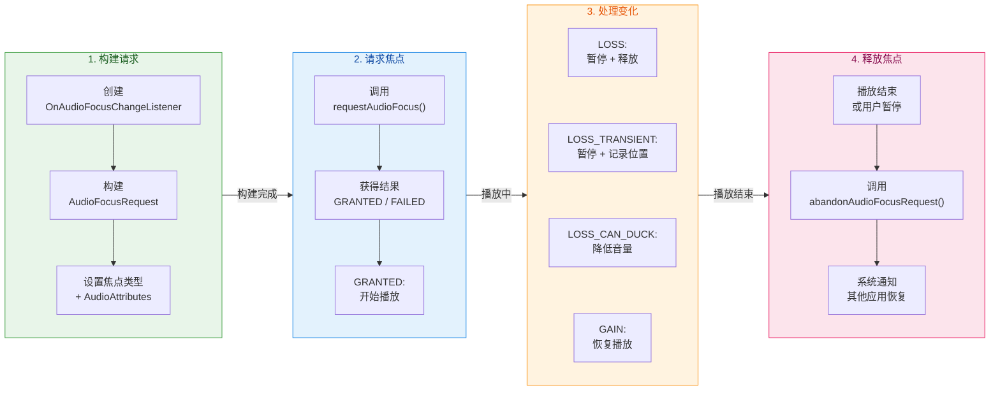

下面是完整的代码实现：

```kotlin
// AudioFocusManager.kt —— 音频焦点管理器
class AudioFocusManager(context: Context) {

    // 获取系统音频服务
    private val audioManager = context.getSystemService(Context.AUDIO_SERVICE) as AudioManager

    // 保存当前的焦点请求，后续 abandon 时需要传入同一个对象
    private var focusRequest: AudioFocusRequest? = null

    // 标记是否因为焦点丢失而暂停（区分"用户主动暂停"和"焦点抢占暂停"）
    private var pausedByFocusLoss = false

    // 外部传入的播放控制回调
    var onPlay: (() -> Unit)? = null
    var onPause: (() -> Unit)? = null
    var onDuck: ((Float) -> Unit)? = null   // 参数为目标音量比例
    var onUnduck: (() -> Unit)? = null

    // 焦点变化监听器 —— 核心逻辑
    private val focusChangeListener = AudioManager.OnAudioFocusChangeListener { focusChange ->
        when (focusChange) {
            // 恢复焦点：之前的短暂焦点请求者已释放焦点
            AudioManager.AUDIOFOCUS_GAIN -> {
                if (pausedByFocusLoss) {
                    // 只有因焦点丢失而暂停的才自动恢复，用户主动暂停的不恢复
                    onPlay?.invoke()
                    pausedByFocusLoss = false
                }
                // 恢复正常音量（如果之前降音了）
                onUnduck?.invoke()
            }
            // 永久丢失焦点：其他应用开始了长时间播放
            AudioManager.AUDIOFOCUS_LOSS -> {
                // 应当暂停并释放资源（可以选择 release MediaPlayer）
                onPause?.invoke()
                pausedByFocusLoss = true
                // 可选：自动放弃焦点，不再监听后续变化
                abandonFocus()
            }
            // 短暂丢失焦点：如来电铃声、导航语音
            AudioManager.AUDIOFOCUS_LOSS_TRANSIENT -> {
                // 暂停，等待后续 GAIN 恢复
                onPause?.invoke()
                pausedByFocusLoss = true
            }
            // 降音混播：如通知提示音
            AudioManager.AUDIOFOCUS_LOSS_TRANSIENT_CAN_DUCK -> {
                // 降低音量到 20%（而不是暂停）
                // 注意：API 26+ 如果设置了 setWillPauseWhenDucked(false)，
                //       系统会自动帮你降音，不需要手动处理
                onDuck?.invoke(0.2f)
            }
        }
    }

    /**
     * 请求音频焦点
     * @param focusGain  焦点类型（如 AUDIOFOCUS_GAIN）
     * @return true = 获得焦点，false = 被拒绝
     */
    fun requestFocus(focusGain: Int = AudioManager.AUDIOFOCUS_GAIN): Boolean {
        // 使用 Builder 构建 AudioFocusRequest（API 26+）
        val request = AudioFocusRequest.Builder(focusGain)
            .setAudioAttributes(
                AudioAttributes.Builder()
                    .setUsage(AudioAttributes.USAGE_MEDIA)
                    .setContentType(AudioAttributes.CONTENT_TYPE_MUSIC)
                    .build()
            )
            // 设置焦点变化监听器
            .setOnAudioFocusChangeListener(focusChangeListener)
            // 是否接受延迟授予（设备可能暂时无法给焦点，稍后异步授予）
            .setAcceptsDelayedFocusGain(true)
            // 当收到 DUCK 通知时，是否由应用自行暂停（而非系统自动降音）
            // true = 应用自行处理，false = 系统自动降音
            .setWillPauseWhenDucked(false)
            .build()

        // 保存引用
        focusRequest = request

        // 发起焦点请求
        val result = audioManager.requestAudioFocus(request)

        return when (result) {
            AudioManager.AUDIOFOCUS_REQUEST_GRANTED -> {
                // 立即获得焦点，可以开始播放
                true
            }
            AudioManager.AUDIOFOCUS_REQUEST_DELAYED -> {
                // 延迟授予：当前不能播放，但当焦点可用时会收到 GAIN 回调
                // 此时不应该开始播放
                false
            }
            AudioManager.AUDIOFOCUS_REQUEST_FAILED -> {
                // 请求失败：通常是系统资源不足或策略不允许
                false
            }
            else -> false
        }
    }

    /** 主动释放焦点（播放结束或用户暂停时调用） */
    fun abandonFocus() {
        focusRequest?.let { request ->
            audioManager.abandonAudioFocusRequest(request)
        }
        focusRequest = null
        pausedByFocusLoss = false
    }
}
```

#### 与 MediaPlayer 整合使用

在实际项目中，AudioFocusManager 通常与 MediaPlayer（或 ExoPlayer）配合使用。正确的整合逻辑如下：

1. **用户点击播放** → 先 `requestFocus()`。
2. **获得焦点（GRANTED）** → 调用 `mediaPlayer.start()`。
3. **收到 LOSS_TRANSIENT** → `mediaPlayer.pause()`，记录 `pausedByFocusLoss = true`。
4. **收到 GAIN** → 检查 `pausedByFocusLoss`，若为 `true` 则 `mediaPlayer.start()`。
5. **收到 LOSS** → `mediaPlayer.pause()`（甚至 `stop()` + `release()`），`abandonFocus()`。
6. **用户主动暂停** → `mediaPlayer.pause()` + `abandonFocus()`。注意此时不设置 `pausedByFocusLoss`，以区分"用户意图暂停"和"系统强制暂停"。

这套流程看似简单，但在实际产品中常因边界情况处理不当而产生 Bug。例如：用户在来电期间（LOSS_TRANSIENT）手动关闭了播放器 UI，此时来电结束后收到 GAIN，不应该自动恢复播放。解决方案是引入更精细的状态标记，或者在 UI 层与 Focus 层之间加一层状态仲裁逻辑。

#### Automatic Ducking（自动降音）

从 Android 8.0 开始，如果你在 `AudioFocusRequest.Builder` 中调用了 `.setWillPauseWhenDucked(false)`（这也是默认行为），系统会在收到 `AUDIOFOCUS_LOSS_TRANSIENT_CAN_DUCK` 时 **自动帮你降低音量**，无需应用代码手动调整。这极大简化了代码逻辑。只有当你的应用需要更精细的控制（比如播客应用在降音时暂停而非降音，因为降音后语音听不清）时，才需要设置 `setWillPauseWhenDucked(true)` 并自行处理 duck 逻辑。

#### 延迟焦点授予（Delayed Focus Gain）

当你调用 `setAcceptsDelayedFocusGain(true)` 后，`requestAudioFocus()` 可能返回 `AUDIOFOCUS_REQUEST_DELAYED`。这意味着系统当前无法给你焦点（比如正在通话），但它记住了你的请求，**当焦点可用时会异步触发 `AUDIOFOCUS_GAIN` 回调**。此机制对于"播放队列"场景非常有用——用户点击了播放，虽然现在不能播，但通话结束后会自动开始，提供了无缝的用户体验。

#### 兼容旧版本（API < 26）

对于需要支持 Android 8.0 以下的应用，焦点请求使用旧的 API：

```kotlin
// 旧 API 写法（API < 26）
@Suppress("DEPRECATION")
fun requestFocusCompat(): Boolean {
    // 旧 API 直接传 listener + streamType + durationHint
    val result = audioManager.requestAudioFocus(
        focusChangeListener,                         // 焦点变化监听器
        AudioManager.STREAM_MUSIC,                   // 音频流类型
        AudioManager.AUDIOFOCUS_GAIN                 // 焦点请求类型
    )
    return result == AudioManager.AUDIOFOCUS_REQUEST_GRANTED
}

// 旧 API 释放焦点
@Suppress("DEPRECATION")
fun abandonFocusCompat() {
    audioManager.abandonAudioFocus(focusChangeListener)
}
```

在实际项目中，推荐使用 `AudioManagerCompat`（AndroidX 提供）来屏蔽 API 差异，自动根据设备 API level 选择新旧实现。

---

### 三者的协作关系

在一个完整的音频播放功能中，MediaPlayer、SoundPool 和 AudioFocus 各司其职，相互配合：

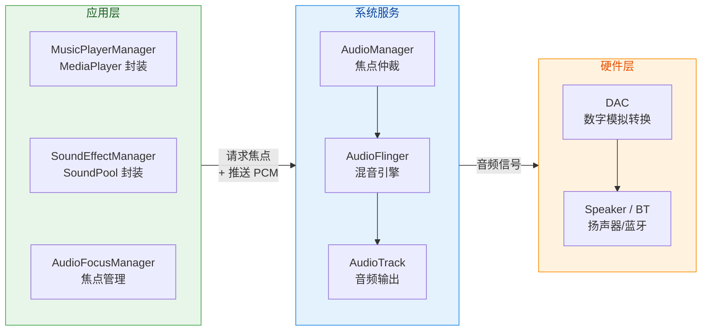

**MediaPlayer** 负责长音频的解码和播放控制；**SoundPool** 负责短音效的低延迟播放；**AudioFocusManager** 则在播放前请求焦点、在焦点变化时协调 MediaPlayer 的暂停/恢复/降音。三者共同构成了一个健壮的音频播放架构。需要注意的是，SoundPool 的游戏音效通常不需要请求音频焦点（它们往往是叠加在背景音乐之上的），而 MediaPlayer 的音乐播放则必须严格遵循焦点协议。

---

**📝 练习题**

在使用 MediaPlayer 播放网络音频流时，以下哪种状态转换序列是正确的？

A. `new MediaPlayer()` → `setDataSource()` → `start()` → 播放中


B. `new MediaPlayer()` → `setDataSource()` → `prepare()` → `start()` → 播放中


C. `new MediaPlayer()` → `setDataSource()` → `prepareAsync()` → `OnPreparedListener.onPrepared()` → `start()` → 播放中


D. `new MediaPlayer()` → `prepareAsync()` → `setDataSource()` → `start()` → 播放中


**【答案】** C

**【解析】** 对于网络音频流的播放，必须使用 `prepareAsync()` 进行异步准备。原因是网络 I/O 不可预知耗时，如果在主线程调用同步的 `prepare()`（选项 B），会阻塞 UI 线程导致 ANR。选项 A 跳过了 prepare 阶段，直接在 Initialized 状态调用 `start()` 会抛出 `IllegalStateException`，因为解码器尚未初始化。选项 D 的顺序错误，`prepareAsync()` 在 `setDataSource()` 之前调用同样会抛出 `IllegalStateException`，因为此时还处于 Idle 状态，尚未绑定数据源。选项 C 遵循了正确的状态机流转：Idle → `setDataSource()` → Initialized → `prepareAsync()` → Preparing → `onPrepared()` 回调 → Prepared → `start()` → Started。

---

**📝 练习题**

关于 Android Audio Focus 机制，以下说法正确的是？

A. 系统会强制静音没有获得焦点的应用的音频输出


B. 当收到 `AUDIOFOCUS_LOSS_TRANSIENT_CAN_DUCK` 时，应用必须暂停播放


C. `AudioFocusRequest.Builder` 中设置 `setAcceptsDelayedFocusGain(true)` 后，`requestAudioFocus()` 可能返回 `AUDIOFOCUS_REQUEST_DELAYED`


D. 应用在播放 SoundPool 短音效时，必须先请求 AudioFocus 才能播放


**【答案】** C

**【解析】** 选项 A 错误，Audio Focus 是一个协作式（cooperative）而非强制式（enforced）的机制。系统只通过回调通知焦点变化，不会真的阻止未持有焦点的应用输出音频。选项 B 错误，`AUDIOFOCUS_LOSS_TRANSIENT_CAN_DUCK` 的语义是"允许降低音量混播"，应用应当降低音量（duck）而非暂停。在 API 26+ 中，如果 `setWillPauseWhenDucked(false)`（默认值），系统甚至会自动帮应用降音。选项 D 错误，SoundPool 播放的游戏音效、UI 反馈音等短促音效通常不需要请求焦点，它们设计上就是叠加在其他音频之上的。选项 C 正确，当设置了 `setAcceptsDelayedFocusGain(true)` 后，如果系统当前无法授予焦点（如正在通话），`requestAudioFocus()` 会返回 `AUDIOFOCUS_REQUEST_DELAYED`，并在焦点可用时异步触发 `AUDIOFOCUS_GAIN` 回调。

---

## 视频播放 Video

视频播放是多媒体应用中最核心也是最复杂的功能之一。与图片或音频不同，视频需要同时处理画面解码、音频解码、音视频同步 (A/V sync)、渲染表面 (Surface) 管理等多层问题。Android 平台从最早的 API 1 就提供了基本的视频播放能力，但随着应用场景的不断丰富——自适应码率流 (Adaptive Streaming)、DRM 版权保护、HDR 高动态范围——系统自带的 `VideoView` + `MediaPlayer` 方案已远远不够，Google 开源的 ExoPlayer（如今以 AndroidX Media3 为官方归属）逐渐成为行业事实标准。而无论使用哪种播放器，渲染表面的选择——`SurfaceView` 还是 `TextureView`——直接影响功耗、延迟、动画能力和 HDR 兼容性。

本节将从应用层视角逐一剖析这三大主题：**VideoView 封装**、**ExoPlayer / Media3 架构**、**SurfaceView vs TextureView 渲染**。

---

### VideoView 封装

#### 定位与本质

VideoView 本质上是 SurfaceView 的子类，它把 SurfaceView 与 MediaPlayer 的功能组合在了一起。 它的设计目标非常明确：用 **最少的代码** 在界面上播放一段视频。VideoView 是 Android 中显示视频最简单的方式——它是一个可视化组件，添加到 Activity 的布局中后，就能提供一块用于播放视频的 Surface。

从源码角度看，VideoView 继承自 SurfaceView 并实现了 MediaPlayerControl 和 SubtitleController.Anchor 接口。 这意味着它在内部创建并管理一个 `MediaPlayer` 实例，监听 SurfaceHolder 的生命周期，在 Surface 就绪时把 MediaPlayer 绑定到该 Surface，并在 Surface 被销毁时自动释放关联。对于开发者来说，只需要设置一个 URI，调用 `start()`，视频就能播放了。

#### 核心用法

在 XML 中声明 `VideoView`，再于 Activity/Fragment 中完成初始化即可：

```kotlin
// ========== activity_video.xml ==========
// <VideoView
//     android:id="@+id/videoView"
//     android:layout_width="match_parent"
//     android:layout_height="wrap_content" />

// ========== VideoActivity.kt ==========
class VideoActivity : AppCompatActivity() {

    // 声明 VideoView 引用
    private lateinit var videoView: VideoView

    override fun onCreate(savedInstanceState: Bundle?) {
        super.onCreate(savedInstanceState)
        setContentView(R.layout.activity_video)

        // 1. 获取 VideoView 实例
        videoView = findViewById(R.id.videoView)

        // 2. 构建视频 URI（可以是网络地址或本地资源）
        val videoUri = Uri.parse(
            "android.resource://${packageName}/${R.raw.sample_video}"
        )

        // 3. 设置视频来源
        videoView.setVideoURI(videoUri)

        // 4. 创建 MediaController —— 提供播放/暂停/进度条 UI
        val mediaController = MediaController(this)
        // 将控制器锚定到 VideoView 上方显示
        mediaController.setAnchorView(videoView)
        // 将控制器绑定给 VideoView
        videoView.setMediaController(mediaController)

        // 5. 监听 "准备完成" 事件 —— 此时才可安全播放
        videoView.setOnPreparedListener { mp ->
            // MediaPlayer 已完成缓冲/解码初始化
            // 可在此获取视频时长、设置循环等
            mp.isLooping = true
            videoView.start() // 开始播放
        }

        // 6. 监听播放完成
        videoView.setOnCompletionListener {
            // 视频播放结束时的回调
            Toast.makeText(this, "播放完成", Toast.LENGTH_SHORT).show()
        }

        // 7. 监听错误
        videoView.setOnErrorListener { _, what, extra ->
            // what: 错误类型, extra: 额外错误码
            Log.e("VideoView", "Error: what=$what, extra=$extra")
            true // 返回 true 表示已处理此错误
        }
    }

    override fun onPause() {
        super.onPause()
        // 页面不可见时暂停播放，节约资源
        videoView.pause()
    }

    override fun onDestroy() {
        super.onDestroy()
        // 释放底层 MediaPlayer
        videoView.stopPlayback()
    }
}
```

如果播放的是来自网络的媒体，VideoView 类及其底层的 MediaPlayer 会自动处理很多后台工作——你不需要自己打开网络连接，也不需要设置后台任务来缓冲媒体文件。 但你需要处理从发起播放到内容真正可用之间的等待期。如果不做处理，你的应用可能在缓冲期间出现长时间"假死"，尤其在慢速网络下。

#### MediaController 交互

如果仅使用 VideoView 播放视频，用户不会有任何播放控制 UI。要解决这个问题，需要将 MediaController 实例关联到 VideoView 上。MediaController 会提供一组控件（暂停、快进/快退等）供用户管理播放。 控件的位置通过锚定到指定的 View 来确定。关联并锚定后，控件会在播放开始时短暂出现，之后用户可以通过点击锚定的 View 重新唤出。

但 MediaController 也有一些坑值得注意：MediaController 使用了一种奇怪的定位策略——只有在 VideoView 全屏模式下，控制器才会出现在通常的视频底部叠加位置。当视频作为较小的组件嵌入到其他 UI 中时，控件会出现在锚点 View 的下方，很多情况下这并不理想。

#### VideoView 的局限性

虽然 VideoView 使用简单，但它存在非常明显的问题，在专业视频应用中几乎不可用：

1. **状态不持久**：VideoView 在进入后台时不会保留完整状态——它不恢复播放状态、播放位置、已选择的轨道，也不恢复通过 addSubtitleSource 添加的字幕轨。应用需要自行在 onSaveInstanceState 和 onRestoreInstanceState 中保存和恢复这些信息。

2. **底层 MediaPlayer 封死**：VideoView 是 MediaPlayer 的封装，而 MediaPlayer 的生命周期状态机本身非常复杂。VideoView 并不提供对 MediaPlayer 所有能力的访问。 更糟糕的是，VideoView 在内部为 MediaPlayer 注册了自己的事件监听器，而 setXYListener 方法会直接覆盖之前注册的监听器，这使得拦截 VideoView 与 MediaPlayer、MediaController 与 MediaPlayer 之间的通信变得非常困难。

3. **不支持自适应码率**：VideoView 底层的 MediaPlayer 不原生支持 DASH、HLS 的自适应码率切换（虽然较新版本的 MediaPlayer 开始支持 HLS，但能力非常有限）。

4. **无 DRM 支持**：对于需要版权保护的在线视频，VideoView 方案无能为力。

5. **格式支持有限**：视频格式取决于设备 ROM 中 MediaPlayer 的能力，不同厂商、不同 Android 版本差异很大。

因此，**VideoView 仅适合原型验证 (prototyping) 或极其简单的本地视频展示场景**，不推荐用于生产级的视频播放功能。

---

### ExoPlayer 架构

#### 从 ExoPlayer 到 AndroidX Media3

ExoPlayer 是一个 application-level 的 Android 媒体播放器，它提供了 Android 内建 MediaPlayer 的替代方案。它支持高级功能，并提供广泛的自定义能力，旨在让应用开发者轻松将高质量的媒体播放集成到应用中。

AndroidX Media3 是 ExoPlayer 的新归属，而旧的 `com.google.android.exoplayer2` 包已经停止维护。 ExoPlayer 2 已成为过去式，Media3 是 Android 媒体播放的新标准——它模块化、与 Jetpack 对齐，并为长期维护而设计。如果你的应用仍然依赖 ExoPlayer 2，迁移可以获得更现代的 API 设计、更好的生命周期处理和与 Android 最新更新的兼容性。

在依赖配置上，你需要添加对应模块的依赖，例如 ExoPlayer 核心 + DASH + UI 组件，且所有模块必须使用相同版本。

```kotlin
// build.gradle.kts (Module-level)
dependencies {
    // Media3 ExoPlayer 核心模块
    implementation("androidx.media3:media3-exoplayer:1.6.1")
    // DASH 自适应流支持（按需添加）
    implementation("androidx.media3:media3-exoplayer-dash:1.6.1")
    // HLS 自适应流支持（按需添加）
    implementation("androidx.media3:media3-exoplayer-hls:1.6.1")
    // 播放器 UI 组件（PlayerView 等）
    implementation("androidx.media3:media3-ui:1.6.1")
    // Compose UI 支持（可选）
    implementation("androidx.media3:media3-ui-compose:1.6.1")
    // MediaSession 集成（可选，后台播放/通知）
    implementation("androidx.media3:media3-session:1.6.1")
}
```

#### 核心组件与模块化设计

ExoPlayer 最重要的设计理念是 **组件注入 (Component Injection)**。ExoPlayer 被设计为对媒体类型、存储方式和渲染方式做出尽可能少的假设。它不直接实现媒体的加载和渲染，而是将这些工作委托给在创建播放器或准备播放时注入的组件。

ExoPlayer 遵循模块化设计模式，每个组件有其特定职责。这种架构在保持清晰关注点分离的同时，实现了灵活性和可定制性。

以下是五大核心组件：

**① MediaSource（媒体源）**

MediaSource 负责向播放器提供媒体内容。ExoPlayer 支持多种 MediaSource 类型：ProgressiveMediaSource（播放单个文件）、DashMediaSource（DASH 内容）、HlsMediaSource（HLS 内容）。 每种 MediaSource 内部会管理网络请求、数据缓冲、以及将原始字节流解封装 (demux) 为独立的音频/视频/字幕轨道。

**② Renderer（渲染器）**

Renderer 负责将媒体内容渲染到设备的屏幕或扬声器上。ExoPlayer 内建了视频、音频、文本（字幕）和元数据轨道的渲染器。开发者也可以为特定场景创建自定义渲染器。 默认实现中，视频使用 MediaCodecVideoRenderer，音频使用 MediaCodecAudioRenderer，还有 TextRenderer 和 MetadataRenderer。

**③ TrackSelector（轨道选择器）**

TrackSelector 负责根据用户偏好、设备能力等因素选择要播放的轨道。 最常用的是 `DefaultTrackSelector`，它自动根据网络带宽选择最佳视频分辨率，并允许开发者通过 `Parameters` 限制最大分辨率、优先音频语言等。

**④ LoadControl（加载控制）**

LoadControl 负责管理缓冲区大小并控制播放器何时开始缓冲媒体。ExoPlayer 包含一个默认的 DefaultLoadControl，它可以被自定义或替换为你自己的实现。 通过它可以精细调节最小/最大缓冲时长、起播缓冲阈值、重缓冲阈值等。

**⑤ DataSource（数据源）**

默认的 MediaSource 实现需要注入一个或多个 DataSource 工厂类。通过提供自定义工厂，可以从非标准来源加载数据，或使用不同的网络栈。

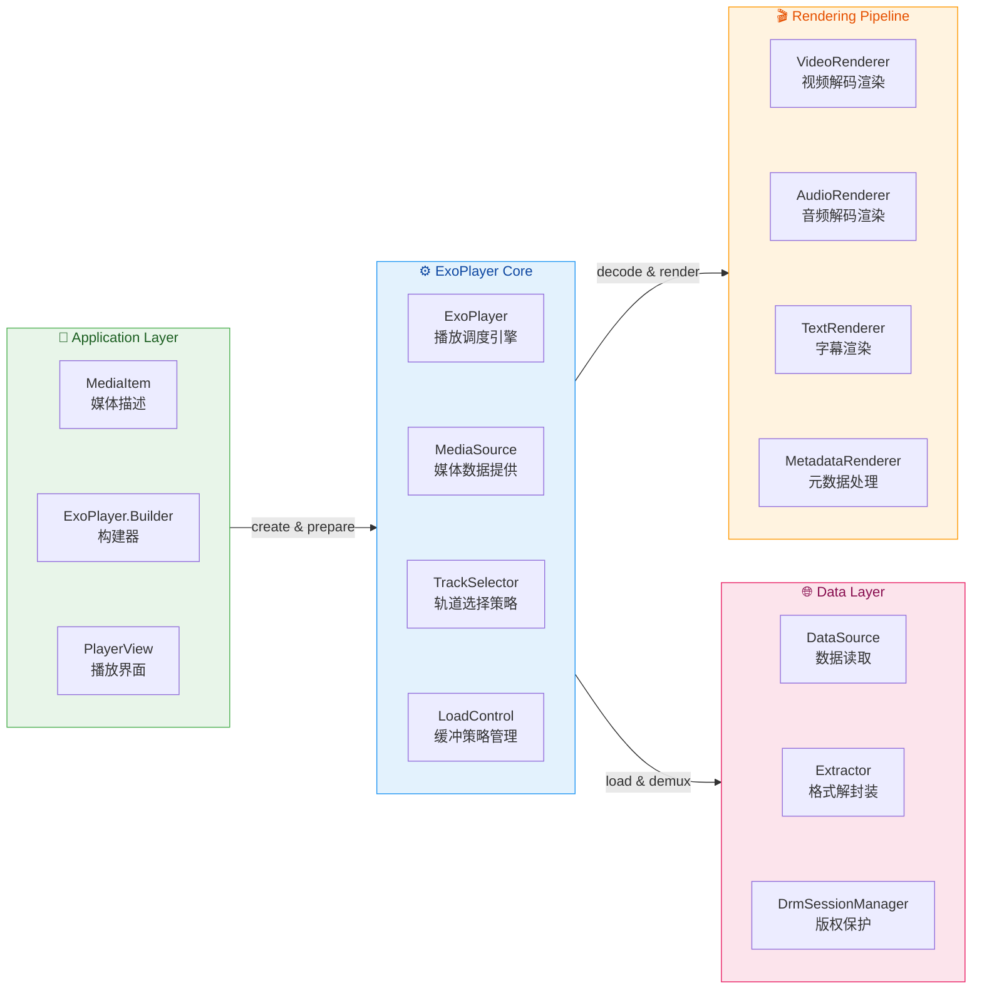

#### 线程模型

理解 ExoPlayer 的线程模型对于避免并发问题至关重要。ExoPlayer 实例必须从单个应用线程访问。创建播放器时可以通过传入 Looper 显式指定该线程；如果未指定，则使用创建播放器所在线程的 Looper，如果该线程没有 Looper，则使用主线程的 Looper。

内部有一个专门的 playback thread 负责播放。注入的组件如 Renderer、MediaSource、TrackSelector 和 LoadControl 都在这个内部播放线程上被调用。

这种设计的好处是：你不需要担心缓冲、准备或播放文件时界面会被冻结，ExoPlayer 的内部播放线程负责这些操作。但 ExoPlayer 实例必须从单个应用线程访问，大多数情况下应该是主线程。

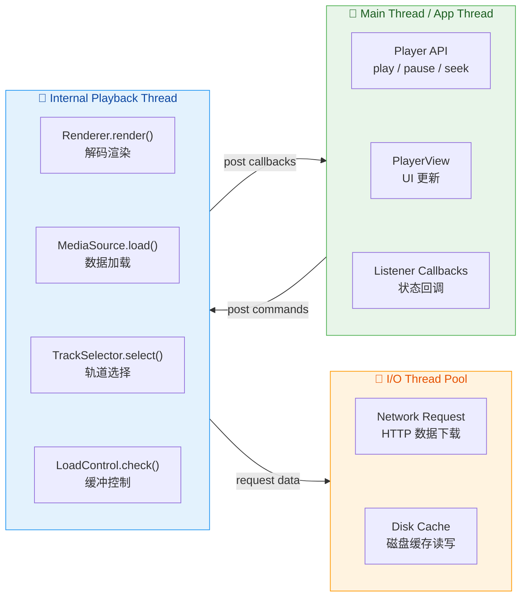

#### 基本使用（Media3 API）

```kotlin
class ExoPlayerActivity : AppCompatActivity() {

    // 声明播放器实例（可空，便于释放）
    private var player: ExoPlayer? = null

    override fun onCreate(savedInstanceState: Bundle?) {
        super.onCreate(savedInstanceState)
        setContentView(R.layout.activity_exo_player)

        // 1. 获取布局中的 PlayerView
        //    PlayerView 是 Media3 提供的 UI 组件，内含进度条、控制按钮
        val playerView: PlayerView = findViewById(R.id.player_view)

        // 2. 使用 Builder 模式创建 ExoPlayer 实例
        player = ExoPlayer.Builder(this)
            // 可选：注入自定义 TrackSelector
            // .setTrackSelector(DefaultTrackSelector(this))
            // 可选：注入自定义 LoadControl
            // .setLoadControl(DefaultLoadControl())
            .build()
            .also { exoPlayer ->
                // 3. 将播放器绑定到 PlayerView
                playerView.player = exoPlayer

                // 4. 构建 MediaItem（描述要播放的内容）
                val mediaItem = MediaItem.fromUri(
                    "https://example.com/video.mp4"
                )

                // 5. 设置媒体项到播放器
                exoPlayer.setMediaItem(mediaItem)

                // 6. 准备播放器（异步加载元数据 + 缓冲）
                exoPlayer.prepare()

                // 7. 设置准备好后自动播放
                exoPlayer.playWhenReady = true
            }

        // 8. 添加播放器状态监听
        player?.addListener(object : Player.Listener {
            override fun onPlaybackStateChanged(state: Int) {
                when (state) {
                    // 播放器刚创建，尚未设置媒体源
                    Player.STATE_IDLE -> Log.d("ExoPlayer", "IDLE")
                    // 正在缓冲，暂时无法播放
                    Player.STATE_BUFFERING -> Log.d("ExoPlayer", "BUFFERING")
                    // 缓冲充足，可以播放
                    Player.STATE_READY -> Log.d("ExoPlayer", "READY")
                    // 播放完毕
                    Player.STATE_ENDED -> Log.d("ExoPlayer", "ENDED")
                }
            }

            override fun onPlayerError(error: PlaybackException) {
                // 播放异常的统一处理入口
                Log.e("ExoPlayer", "Error: ${error.message}")
            }
        })
    }

    override fun onStop() {
        super.onStop()
        // 页面不可见时释放播放器资源
        player?.release()
        player = null
    }
}
```

对应的 XML 布局：

```xml
<?xml version="1.0" encoding="utf-8"?>
<!-- activity_exo_player.xml -->
<FrameLayout
    xmlns:android="http://schemas.android.com/apk/res/android"
    android:layout_width="match_parent"
    android:layout_height="match_parent">

    <!-- Media3 提供的播放器视图组件 -->
    <!-- 默认使用 SurfaceView 渲染 -->
    <!-- 可通过 app:surface_type 切换为 texture_view -->
    <androidx.media3.ui.PlayerView
        android:id="@+id/player_view"
        android:layout_width="match_parent"
        android:layout_height="match_parent" />

</FrameLayout>
```

#### 自适应码率与多格式支持

ExoPlayer 的一大核心优势是对自适应流媒体协议的原生支持。添加相应模块即可自动识别并解析 DASH Manifest（.mpd）、HLS Playlist（.m3u8）、SmoothStreaming（.ism）。`DefaultMediaSourceFactory` 会根据 URI 后缀或 MIME 类型自动选择合适的 MediaSource 类型，开发者无需手动判断。在播放过程中，`DefaultTrackSelector` 与 `DefaultBandwidthMeter` 协作，根据当前网络带宽实时切换分辨率/码率轨道，实现无缝的自适应体验。

ExoPlayer 提供了包括自适应流、DRM 和多种媒体格式在内的广泛功能。其模块化架构使自定义和扩展变得容易，允许开发者为用户创造量身定制的媒体播放体验。

#### Compose 集成：PlayerSurface

Media3 1.6.0（2025 年 3 月 27 日）引入了新的 media3-ui-compose 模块，提供了 PlayerSurface 这一用于渲染视频的 Composable。 PlayerSurface 接受一个 Player 参数（ExoPlayer 实现了 Player 接口），并负责将播放器连接到底层 Surface。在底层，它仍然使用平台原语（SurfaceView / TextureView），但复杂性被封装在了库内部。

```kotlin
@Composable
fun VideoPlayerScreen(mediaUri: String) {
    // 获取当前 Context
    val context = LocalContext.current

    // 创建并记住 ExoPlayer 实例
    val exoPlayer = remember {
        ExoPlayer.Builder(context).build().apply {
            // 设置媒体项
            setMediaItem(MediaItem.fromUri(mediaUri))
            // 异步准备
            prepare()
            // 自动播放
            playWhenReady = true
        }
    }

    // 页面退出时释放播放器
    DisposableEffect(Unit) {
        onDispose {
            exoPlayer.release()
        }
    }

    // 使用 Media3 提供的 PlayerSurface Composable 渲染视频
    // SURFACE_TYPE_SURFACE_VIEW 为默认选项，性能最优
    PlayerSurface(
        player = exoPlayer,
        surfaceType = SURFACE_TYPE_SURFACE_VIEW,
        modifier = Modifier.fillMaxSize()
    )
}
```

---

### SurfaceView vs TextureView 渲染

选择哪种渲染表面是视频播放架构中一个关键的技术决策。两者都继承自 `android.view.View`，都可以从独立线程进行绘制和渲染，这是它们与其他普通 View 的最大区别。 但它们的底层实现机制截然不同，从而导致了性能、灵活性和功能上的显著差异。

#### SurfaceView 的工作原理

SurfaceView 在 View 层级内部提供了一块专用的绘制表面 (Surface)。你可以控制这个 Surface 的格式和尺寸，SurfaceView 负责将它放置在屏幕上正确的位置。

关键点在于 SurfaceView 的 Surface 拥有 **独立的窗口 (Window)**。SurfaceView 被放置在窗口前方，在它所在的位置"挖了一个洞"来显示其 Surface。它利用 View 层级的信息建立一块直接连接到 GPU 的特殊绘制区域。 这意味着 SurfaceView 的内容不经过 View 的正常绘制流水线，而是由系统的 **SurfaceFlinger**（Android 的合成器进程）直接合成到最终的显示帧中。

SurfaceView 性能最高。它在由 SurfaceFlinger 管理的独立图层上渲染，无法在 View 层级中轻松进行变换或动画，最适合视频播放和游戏等性能至上的场景。

#### TextureView 的工作原理

TextureView 是一个多功能组件，可以将视频和图形渲染无缝集成到 Android 的 UI 层级中。它是 View 的子类，得益于 GPU 加速，非常适合以流畅的动画和过渡渲染图形和视频。TextureView 允许你将其直接集成到 View 层级中，与其他 UI 组件并列。

与 SurfaceView 不同，TextureView 不会创建独立窗口，而是作为普通 View 存在。这一关键区别使得 TextureView 可以拥有透明度、任意旋转和复杂裁切。

但这种灵活性有代价。TextureView 的内容必须在内部从底层 Surface 复制到用于显示的 View 中。这种复制操作使 TextureView 的效率低于 SurfaceView，后者直接将内容显示到屏幕上。

#### 全面对比

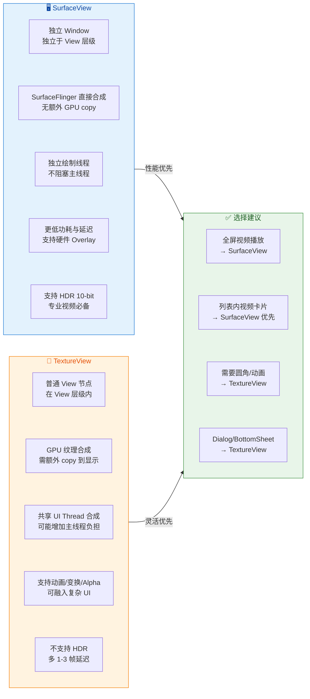

以下是更具体的技术维度对比：

| 维度 | SurfaceView | TextureView |
|------|-------------|-------------|
| **窗口** | 独立 Window，在 View 层级中"挖洞" | 普通 View 节点，同一 Window |
| **合成方式** | SurfaceFlinger 硬件 Overlay | GPU 纹理 (SurfaceTexture → GL) |
| **帧延迟** | 极低 | 多 1-3 帧延迟 |
| **功耗** | 在很多设备上功耗显著更低 | 更高（GPU 合成 + 额外 copy） |
| **帧时序** | 更精确的帧时序，视频播放更流畅 | 受 UI 线程影响 |
| **Alpha/旋转** | 不支持（或需要复杂 hack） | 原生支持 |
| **动画** | API 24 之前与 View 动画不同步，可能出现画面偏移或黑屏 | 完美支持 |
| **HDR** | 支持 HDR 10-bit | 不支持 |
| **多实例叠加** | 不可叠加两个 SurfaceView | 可以 |
| **内存** | 更低内存开销 | 可能三重缓冲，约 3 × 宽 × 高 × 4 字节 |
| **截图/读取** | 困难（需 PixelCopy API） | 简单（getBitmap） |

#### API 24 是分水岭

API 24 及以上版本推荐使用 SurfaceView 而非 TextureView。 这是因为 在 Android 7.0 之前，SurfaceView 的渲染无法与 View 动画正确同步，可能导致内容延迟、动画时黑屏等问题。在 Android 7.0 之前的版本中，如果需要流畅的动画或滚动，应使用 TextureView。

但 API 24+ 修复了同步问题后，SurfaceView 在几乎所有维度上都优于 TextureView。因此，**现代 Android 应用应默认使用 SurfaceView**。

#### 在 ExoPlayer/Media3 中切换渲染表面

PlayerView 不支持在运行时更改 surface type。最简单的切换方式是在 XML 布局中通过 PlayerView 的属性设置。

```xml
<!-- 默认使用 SurfaceView（推荐） -->
<androidx.media3.ui.PlayerView
    android:id="@+id/player_view"
    android:layout_width="match_parent"
    android:layout_height="match_parent"
    app:surface_type="surface_view" />

<!-- 需要动画/圆角/半透明时改用 TextureView -->
<androidx.media3.ui.PlayerView
    android:id="@+id/player_view"
    android:layout_width="match_parent"
    android:layout_height="match_parent"
    app:surface_type="texture_view" />
```

如果你在 Dialog 或 BottomSheet 中使用 ExoPlayer 配合可滚动视图，可能会遇到问题——视频会滚动到 Dialog 或 BottomSheet 的上方，因为默认 surface type 是 SurfaceView。 这正是需要切换为 TextureView 的典型场景。

#### SurfaceView 的生命周期注意事项

SurfaceView 的 Surface 生命周期绑定到 View 的可见性，而 TextureView 的 Surface 生命周期绑定到窗口的 attach/detach。因此在滚动 UI 中使用 SurfaceView 时，启动播放可能需要更长时间，因为输出 Surface 可用的时机略晚。 从 Android 14 开始，PlayerView 使用 SurfaceView.setSurfaceLifecycle(SURFACE_LIFECYCLE_FOLLOWS_ATTACHMENT) 来避免这一行为。

这意味着在 RecyclerView 等列表场景中，使用 SurfaceView 的视频项在快速滚动时可能会出现短暂黑屏（Surface 尚未就绪），而 TextureView 因为 Surface 存活更久，切换更快。Android 14 以后 Media3 对此进行了优化，但在低版本上仍需注意。

---

### VideoView vs ExoPlayer 快速对比

| 对比维度 | VideoView | ExoPlayer (Media3) |
|---------|-----------|---------------------|
| 底层引擎 | 系统 MediaPlayer | 自建解码管线 + MediaCodec |
| 自适应码率 | ❌ (HLS 极有限) | ✅ DASH / HLS / SS |
| DRM | ❌ | ✅ Widevine / PlayReady |
| 字幕 | 基础 | 完善 (SRT/SSA/TTML/WebVTT) |
| 自定义能力 | 几乎为零 | 全组件可注入替换 |
| Compose 支持 | ❌ | ✅ PlayerSurface |
| 后台/通知 | 需大量手动代码 | MediaSession 无缝集成 |
| 适用场景 | 原型/极简本地播放 | 生产级所有场景 |

---

**📝 练习题**

在一个视频播放 App 中，产品要求视频卡片在 RecyclerView 列表内播放，且视频卡片需要支持圆角和从小到大的展开动画效果。关于渲染表面的选择，以下说法正确的是？


A. 应使用 SurfaceView，因为它性能最优且 API 24+ 后已支持所有动画效果


B. 应使用 TextureView，因为圆角裁切和缩放动画需要 View 级别的变换能力，而 SurfaceView 无法参与 View 层级的变换


C. 两者没有区别，ExoPlayer 会自动根据需求切换 SurfaceView 和 TextureView


D. 应同时使用 SurfaceView 做视频渲染和 TextureView 做动画叠加，分层处理


**【答案】** B

**【解析】** TextureView 不会创建独立窗口，而是作为普通 View 存在，这一关键区别使得 TextureView 可以拥有透明度、任意旋转和复杂裁切。 圆角效果需要对 View 进行 `clipToOutline` 或 `setClipPath` 操作，缩放动画需要 View 级别的 `scaleX`/`scaleY` 变换——这些都要求渲染内容在 View 层级内部，而 SurfaceView 的内容位于独立窗口，不参与 View 的 clip 和 transform 管线。虽然 API 24+ 改善了 SurfaceView 与 View 动画的同步性，但它仍然无法被裁切为圆角。A 选项中"支持所有动画效果"表述错误。C 选项错误，PlayerView 不支持运行时自动切换 surface type。D 选项虽有创意但实现复杂且不必要，标准做法就是直接使用 TextureView。

---

**📝 练习题**

关于 ExoPlayer (AndroidX Media3) 的线程模型，以下描述错误的是？


A. ExoPlayer 内部有一个专门的 playback thread 来驱动解码和渲染


B. Renderer、MediaSource 等注入组件的回调方法在内部 playback thread 上执行


C. Player.Listener 的回调方法默认在主线程 (Main Thread) 上被调用


D. 应用可以安全地从任意线程调用 ExoPlayer 的 play()、pause()、seek() 等方法


**【答案】** D

**【解析】** ExoPlayer 实例必须从单个应用线程访问。 内部 playback thread 负责实际播放，Renderer、MediaSource、TrackSelector 和 LoadControl 等组件在该线程被调用（A、B 正确）。注册的 Listener 在 Player.getApplicationLooper() 关联的线程上被调用，也就是访问 Player 的同一个线程——大多数情况下就是主线程（C 正确）。D 说可以从"任意线程"调用是错误的——ExoPlayer 要求 API 调用必须限制在创建时绑定的那个线程上，从其他线程调用会导致 `IllegalStateException`。如需跨线程操作，应先 post 到正确的 Looper 上。

---

## 录音与录像

录音与录像是多媒体应用中最典型的"采集"场景——将麦克风或摄像头传感器捕获到的模拟信号，经过采样、编码，最终写入一个标准容器文件（如 `.mp4`、`.aac`、`.wav`）。Android 为此提供了两套 API 体系：**高层封装的 `MediaRecorder`** 和 **底层裸数据的 `AudioRecord`/`MediaCodec`**。前者替你完成了"采集 → 编码 → 封装"整条链路，调用简单但灵活性受限；后者将采集与编码拆开，你可以逐帧拿到 PCM 原始音频甚至 YUV 原始视频帧，再自行决定如何处理——例如做实时音量检测、变声、混音，或者通过 `MediaCodec` 手动编码后写入自定义容器。

理解这两套体系的关键在于 **状态机**。`MediaRecorder` 拥有一套严格的状态流转模型（Initial → Initialized → DataSourceConfigured → Prepared → Recording → …），每一步的调用顺序不可打乱，否则直接抛出 `IllegalStateException`。而 `AudioRecord` 的状态相对简单，只有 **Initialized** 和 **Recording** 两态，但你要自己管理缓冲区读取与线程同步。本节将围绕这两套机制展开，并深入讲解编码格式的选择与配置。

---

### MediaRecorder 状态流转

`MediaRecorder` 是 Android 提供的一站式录音/录像 API。它把音视频采集（Audio/Video Source）、编码器（Encoder）、输出容器（Muxer）三件事封装到了一个对象里，开发者只需按照规定的顺序调用一系列 `set` 方法，再 `prepare()` → `start()` 即可开始录制。但正因为它是"一条龙"服务，内部各模块之间存在依赖关系，所以 **调用顺序极其严格**——这就是它的状态机模型。

#### 完整状态机模型

`MediaRecorder` 的官方文档定义了以下核心状态（State）：

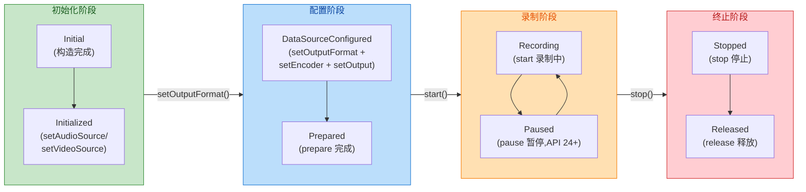

我们逐状态详细解读：

**① Initial 状态**
当你通过 `MediaRecorder()` 构造函数创建对象后，就进入了 Initial 状态。此时对象刚刚出生，尚未配置任何信息。在此状态下唯一合法的操作是调用 `setAudioSource()` 或 `setVideoSource()`（二选一或两者都调），告诉录制器"数据从哪来"。一旦设置了 Source，状态就迁移到 **Initialized**。值得注意的是，`setAudioSource(MediaRecorder.AudioSource.MIC)` 需要 `RECORD_AUDIO` 权限，`setVideoSource(MediaRecorder.VideoSource.CAMERA)` 需要 `CAMERA` 权限。如果在 Runtime Permission 还没有被用户授予的情况下就调用，会直接 crash。

**② Initialized 状态**
此时录制器已经知道音频来自麦克风、视频来自摄像头（或 Surface），接下来需要告诉它"用什么容器格式输出"——即调用 `setOutputFormat()`。常用的格式包括 `OutputFormat.MPEG_4`（MP4 容器，最通用）、`OutputFormat.THREE_GPP`（3GP，早期电话录音常用）、`OutputFormat.AAC_ADTS`（纯音频 AAC 流）等。调用之后，状态迁移到 **DataSourceConfigured**。

**为什么 `setOutputFormat()` 必须在 `setEncoder()` 之前？** 因为输出容器决定了哪些编码格式可以被装入——例如 AAC_ADTS 容器只接受 AAC 音频编码，MP4 容器可以接受 AAC 音频 + H.264/H.265 视频。MediaRecorder 内部需要先确定容器，才能验证后续设置的编码器是否兼容。

**③ DataSourceConfigured 状态**
这是配置最密集的阶段。你需要在此状态下完成以下设置（顺序可以互换，但必须全部在 `prepare()` 之前）：

- **音频编码器**：`setAudioEncoder(AudioEncoder.AAC)` —— AAC 是目前最主流的音频编码，压缩率高、兼容性好。
- **视频编码器**（录像时）：`setVideoEncoder(VideoEncoder.H264)` —— H.264 是 Android 生态中支持最广泛的视频编码。
- **输出文件路径**：`setOutputFile(path)` —— 可以传 `String` 路径或 `FileDescriptor`。Android 10+ 推荐使用 `MediaStore` 获取 Uri 再转 `ParcelFileDescriptor`。
- **可选参数**：`setAudioEncodingBitRate()`、`setAudioSamplingRate()`、`setVideoSize()`、`setVideoFrameRate()`、`setVideoEncodingBitRate()` 等。

全部配置完成后，调用 `prepare()`。`prepare()` 内部会完成底层编码器的初始化、输出文件的创建与头部写入等工作，是一个 **同步耗时操作**（通常几十毫秒）。成功后进入 **Prepared** 状态。

**④ Prepared 状态**
万事俱备，只欠 `start()`。调用 `start()` 后，MediaRecorder 内部会启动一条或多条线程从 Source 持续读取数据、送入编码器、写入文件，状态迁移到 **Recording**。

**⑤ Recording 状态**
正在录制。此时唯一能做的操作是 `stop()`（结束录制）或 `pause()`（API 24+ 暂停录制）。调用 `pause()` 后进入 **Paused** 状态，暂停期间不消耗编码资源但文件句柄保持打开；再调用 `resume()` 回到 Recording。

**⑥ Stopped 状态**
调用 `stop()` 后，编码器停止、容器尾部（moov atom 等）被写入文件、文件关闭。此时可以调用 `reset()` 回到 **Initial**（复用对象重新配置），或者直接 `release()` 释放所有底层资源进入 **Released**。Released 之后的对象不可再使用。

#### 状态违规的后果

在错误状态下调用方法，MediaRecorder 会抛出 `IllegalStateException`。例如在 Initial 状态直接调用 `start()`，或者在 Recording 状态调用 `setOutputFormat()` —— 这些都是典型的状态违规。开发中最容易踩的坑是 **`stop()` 在没有录到任何数据时抛出 `RuntimeException`**。如果用户点击录制后立刻点击停止（录制时长极短），底层编码器可能还没来得及输出任何帧，此时 `stop()` 会因为"没有有效数据可写"而异常，因此实践中必须用 `try-catch` 包裹 `stop()` 调用。

#### 录音实战代码

以下示例展示了一段最基础的录音流程（仅录制音频，输出 AAC 文件）：

```kotlin
// 创建 MediaRecorder 实例（API 31+ 推荐传入 Context）
val recorder = if (Build.VERSION.SDK_INT >= Build.VERSION_CODES.S) {
    MediaRecorder(context) // API 31+ 的新构造方法，传入 Context
} else {
    @Suppress("DEPRECATION")
    MediaRecorder() // 旧版无参构造方法
}

// ---- Initial 状态 ----
// 设置音频输入源为麦克风（需要 RECORD_AUDIO 权限）
recorder.setAudioSource(MediaRecorder.AudioSource.MIC)

// ---- Initialized 状态 ----
// 设置输出容器格式为 MPEG4（可装载 AAC 音频）
recorder.setOutputFormat(MediaRecorder.OutputFormat.MPEG_4)

// ---- DataSourceConfigured 状态 ----
// 设置音频编码器为 AAC
recorder.setAudioEncoder(MediaRecorder.AudioEncoder.AAC)
// 设置音频采样率为 44100 Hz（CD 品质）
recorder.setAudioSamplingRate(44100)
// 设置音频编码比特率为 128kbps（中等品质）
recorder.setAudioEncodingBitRate(128_000)
// 设置输出文件路径
val outputFile = File(context.cacheDir, "recording_${System.currentTimeMillis()}.m4a")
recorder.setOutputFile(outputFile.absolutePath)

// 完成底层编码器初始化，打开输出文件（同步耗时操作）
recorder.prepare()

// ---- Prepared 状态 ----
// 开始录音，数据持续从 MIC 采集 -> AAC 编码 -> 写入文件
recorder.start()

// ---- Recording 状态 ----
// ... 用户正在录音 ...

// 停止录制（必须 try-catch，防止录制时长过短导致异常）
try {
    recorder.stop() // 写入文件尾部，关闭编码器
} catch (e: RuntimeException) {
    // 录制时长过短，没有有效数据帧，stop() 会抛异常
    // 此时输出文件可能是损坏的，应当删除
    outputFile.delete()
}

// 释放所有底层资源（编码器、文件句柄、线程等）
recorder.release()
```

#### 录像的额外配置

录像相比录音，多了视频源和视频编码的设置。一个关键点是 **视频源的选择**：传统方式使用 `VideoSource.CAMERA` 直接绑定旧版 Camera API，但在 Camera2/CameraX 时代，推荐使用 `VideoSource.SURFACE`——让 MediaRecorder 创建一个 `Surface`，然后你把这个 Surface 作为 CameraDevice 的输出目标之一。这样 Camera 预览帧会同时输出到预览 Surface 和录制 Surface，实现"边预览边录像"。

```kotlin
// 录像配置示例（仅展示与录音不同的部分）
recorder.setAudioSource(MediaRecorder.AudioSource.MIC) // 音频来自麦克风
recorder.setVideoSource(MediaRecorder.VideoSource.SURFACE) // 视频来自 Surface

recorder.setOutputFormat(MediaRecorder.OutputFormat.MPEG_4) // MP4 容器

recorder.setAudioEncoder(MediaRecorder.AudioEncoder.AAC) // 音频 AAC 编码
recorder.setVideoEncoder(MediaRecorder.VideoEncoder.H264) // 视频 H.264 编码

recorder.setVideoSize(1920, 1080) // 视频分辨率 1080p
recorder.setVideoFrameRate(30) // 帧率 30fps
recorder.setVideoEncodingBitRate(10_000_000) // 视频比特率 10Mbps

recorder.setOutputFile(videoFile.absolutePath) // 输出文件
recorder.prepare() // 准备（此后可通过 recorder.surface 获取输入 Surface）

// 获取录制用的 Surface，传给 CameraDevice 作为输出目标
val recordingSurface: Surface = recorder.surface
// 将 recordingSurface 加入 CameraCaptureSession 的 outputSurfaces 列表
```

调用 `recorder.surface` 获取 Surface 必须在 `prepare()` 之后、`start()` 之前，这也是状态机约束的体现。

---

### AudioRecord 原始音频

如果你的需求不只是"录一段音频存文件"，而是需要 **实时获取原始 PCM 数据**（比如做语音识别、实时波形可视化、音量检测、音频特效处理），那 `MediaRecorder` 就力不从心了——它不暴露原始音频数据。这时需要使用更底层的 `AudioRecord`。

#### AudioRecord 的定位与工作原理

`AudioRecord` 只负责 **采集**：它从麦克风获取原始 PCM（Pulse Code Modulation，脉冲编码调制）数据，写入一个内部环形缓冲区（circular buffer），你的应用通过 `read()` 方法从缓冲区中取出数据。**它不做任何编码，也不写文件**——后续的编码和存储完全由你自己负责。

PCM 是什么？它是对模拟音频信号的数字化表示。每隔固定时间间隔（由采样率决定，如 44100 Hz 表示每秒采样 44100 次），测量一次声波振幅，将其量化为一个数值（由位深决定，如 16 bit 表示每个采样点用 16 位整数表示振幅，范围 -32768 ~ 32767）。多个声道（Mono 单声道 / Stereo 立体声）则意味着每个采样时刻有多个数值。PCM 数据是"原始的"，没有任何压缩，文件体积非常大（44100 Hz × 16 bit × 2 声道 = 约 176 KB/s ≈ 10.3 MB/min）。

#### AudioRecord 的状态模型

相比 `MediaRecorder` 复杂的多状态流转，`AudioRecord` 的状态非常简洁，只有两个核心状态：

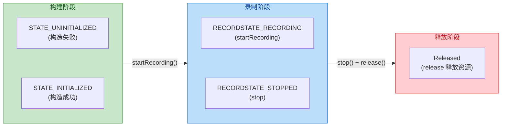

- **STATE_UNINITIALIZED**：构造 `AudioRecord` 时如果参数不合法（采样率不支持、缓冲区太小等），对象会处于此状态，不可使用。
- **STATE_INITIALIZED**：构造成功，可以调用 `startRecording()` 进入录制。
- **RECORDSTATE_RECORDING**：正在录制，你可以在循环中调用 `read()` 取数据。
- **RECORDSTATE_STOPPED**：调用 `stop()` 后暂停采集，但对象仍可复用（再次 `startRecording()`）。

#### 构建 AudioRecord 的关键参数

构造 `AudioRecord` 需要传入五个参数，每一个都直接影响录制质量和缓冲区行为：

**1. audioSource（音频源）**
与 `MediaRecorder.AudioSource` 共享同一套常量。常用值：
- `AudioSource.MIC`：默认麦克风，最通用。
- `AudioSource.VOICE_RECOGNITION`：针对语音识别优化（通常关闭自动增益控制 AGC 和噪声抑制 NS，保留原始音频特征）。
- `AudioSource.CAMCORDER`：适用于录像场景，可能使用靠近摄像头方向的麦克风。
- `AudioSource.VOICE_COMMUNICATION`：用于 VoIP 通话，启用回声消除 AEC。

**2. sampleRateInHz（采样率）**
每秒采样次数。Android 保证 **所有设备都支持 44100 Hz**，这是唯一的"安全值"。其他常见值有 16000 Hz（语音识别常用）、48000 Hz（专业音频）。不支持的采样率会导致构造失败（STATE_UNINITIALIZED）。

**3. channelConfig（声道配置）**
- `AudioFormat.CHANNEL_IN_MONO`：单声道（1 个声道），推荐用于语音录制，数据量小。
- `AudioFormat.CHANNEL_IN_STEREO`：立体声（2 个声道），数据量翻倍。
注意这里用的是 `CHANNEL_IN_*`（录音输入），不要误用 `CHANNEL_OUT_*`（播放输出）。

**4. audioFormat（采样精度 / 位深）**
- `AudioFormat.ENCODING_PCM_16BIT`：16 位整型，最通用，每个采样点占 2 字节。
- `AudioFormat.ENCODING_PCM_FLOAT`：32 位浮点，精度更高，专业音频处理使用。
- `AudioFormat.ENCODING_PCM_8BIT`：8 位整型，质量差，基本不用。

**5. bufferSizeInBytes（内部缓冲区大小）**
这是最容易出问题的参数。缓冲区太小，`read()` 来不及消费就会发生 **buffer overrun**（数据覆盖丢失）；缓冲区太大则浪费内存且增加延迟。Android 提供了一个工具方法来计算最小缓冲区大小：

```kotlin
// 计算最小缓冲区大小（框架根据采样率、声道、位深自动计算）
val minBufferSize = AudioRecord.getMinBufferSize(
    44100,                              // 采样率
    AudioFormat.CHANNEL_IN_MONO,        // 单声道
    AudioFormat.ENCODING_PCM_16BIT      // 16 位
)

// 实际使用时通常取 2~4 倍最小值，为 read() 留出充足缓冲余量
val bufferSize = minBufferSize * 2
```

`getMinBufferSize()` 返回的单位是字节。如果返回 `AudioRecord.ERROR_BAD_VALUE` 或 `AudioRecord.ERROR`，说明该采样率 / 声道 / 位深组合在当前设备上不受支持。

#### 实时采集 PCM 数据的完整流程

`AudioRecord` 的使用模式几乎是固定的：**在子线程中循环调用 `read()`，将 PCM 数据写入文件或推送给处理模块**。

```kotlin
// ======== 1. 构建 AudioRecord ========
// 采样率：44100Hz（CD 品质，所有设备都支持）
val sampleRate = 44100
// 声道：单声道输入
val channelConfig = AudioFormat.CHANNEL_IN_MONO
// 位深：16 位 PCM
val audioFormat = AudioFormat.ENCODING_PCM_16BIT

// 获取系统推荐的最小缓冲区大小
val minBufferSize = AudioRecord.getMinBufferSize(sampleRate, channelConfig, audioFormat)
// 实际缓冲区取 2 倍，降低 buffer overrun 的概率
val bufferSize = minBufferSize * 2

// 构造 AudioRecord 对象（需要 RECORD_AUDIO 权限）
val audioRecord = AudioRecord(
    MediaRecorder.AudioSource.MIC, // 音频源：麦克风
    sampleRate,                    // 采样率
    channelConfig,                 // 声道配置
    audioFormat,                   // 采样精度
    bufferSize                     // 内部缓冲区大小
)

// 检查是否初始化成功
if (audioRecord.state == AudioRecord.STATE_UNINITIALIZED) {
    // 构造失败，可能是参数不支持或权限未授予
    throw IllegalStateException("AudioRecord initialization failed")
}

// ======== 2. 开始录制（在子线程中执行） ========
// 用于控制录制循环的标志位（volatile 保证线程可见性）
@Volatile
var isRecording = true

// 创建输出文件（.pcm 原始音频，无文件头）
val pcmFile = File(context.cacheDir, "raw_audio.pcm")
val outputStream = FileOutputStream(pcmFile).buffered()

// 开始采集
audioRecord.startRecording()

// 在子线程中循环读取 PCM 数据
thread(name = "AudioRecordThread") {
    // 每次 read 的临时缓冲区（与内部缓冲区大小一致）
    val buffer = ByteArray(bufferSize)

    try {
        while (isRecording) {
            // 从内部环形缓冲区读取 PCM 数据到 buffer
            // 返回值为实际读取的字节数（可能小于 buffer.size）
            val bytesRead = audioRecord.read(buffer, 0, buffer.size)

            if (bytesRead > 0) {
                // 将 PCM 数据写入文件
                outputStream.write(buffer, 0, bytesRead)
                // 在这里你也可以做实时处理：
                // - 计算音量（RMS 均方根）
                // - 送入语音识别引擎
                // - 推送到网络流（直播推流）
            } else if (bytesRead == AudioRecord.ERROR_INVALID_OPERATION) {
                // AudioRecord 未处于 Recording 状态
                break
            } else if (bytesRead == AudioRecord.ERROR_BAD_VALUE) {
                // 参数错误
                break
            }
        }
    } finally {
        // 确保流被关闭
        outputStream.flush()
        outputStream.close()
    }
}

// ======== 3. 停止录制（由 UI 线程触发） ========
fun stopRecording() {
    isRecording = false           // 通知录制线程退出循环
    audioRecord.stop()            // 停止采集
    audioRecord.release()         // 释放底层音频资源
}
```

上面的代码将 PCM 原始数据写入 `.pcm` 文件。这个文件 **没有文件头**，任何播放器直接打开都无法播放——因为播放器不知道采样率、声道数、位深等元信息。如果你需要直接播放，有两种路径：

1. **转换为 WAV 格式**：WAV 本质上就是"44 字节的 RIFF 头 + PCM 原始数据"。你只需在 PCM 文件前面拼接一个标准的 WAV 文件头即可，无需任何编码过程。
2. **使用 MediaCodec 编码为 AAC**：将 PCM 数据送入硬件 AAC 编码器，输出压缩后的 AAC 帧，再通过 `MediaMuxer` 写入 MP4/M4A 容器。这种方式可以大幅减小文件体积（10 倍以上的压缩比）。

#### PCM 转 WAV 文件头的写入

WAV 文件头是一个固定 44 字节的结构，包含 RIFF 标识、文件大小、音频格式参数等信息。下面展示如何在 PCM 数据前添加 WAV 头：

```kotlin
/**
 * 将 PCM 原始音频文件转为标准 WAV 文件
 * @param pcmFile    输入的 PCM 文件（无文件头的裸 PCM 数据）
 * @param wavFile    输出的 WAV 文件
 * @param sampleRate 采样率（如 44100）
 * @param channels   声道数（单声道 = 1，立体声 = 2）
 * @param bitDepth   位深（通常 16）
 */
fun pcmToWav(
    pcmFile: File,
    wavFile: File,
    sampleRate: Int,
    channels: Int,
    bitDepth: Int
) {
    // PCM 数据的总字节数
    val pcmDataSize = pcmFile.length().toInt()
    // 每个采样帧的字节数 = 声道数 × 每个采样点字节数
    val blockAlign = channels * (bitDepth / 8)
    // 每秒的字节数 = 采样率 × 每帧字节数
    val byteRate = sampleRate * blockAlign

    val wavOutputStream = FileOutputStream(wavFile).buffered()

    // ---- 写入 44 字节 WAV 文件头 ----
    wavOutputStream.write("RIFF".toByteArray())                  // [0-3]   ChunkID: RIFF 标识
    wavOutputStream.write(intToLittleEndian(36 + pcmDataSize))   // [4-7]   ChunkSize: 文件总大小 - 8
    wavOutputStream.write("WAVE".toByteArray())                  // [8-11]  Format: WAVE 标识
    wavOutputStream.write("fmt ".toByteArray())                  // [12-15] Subchunk1ID: fmt 子块
    wavOutputStream.write(intToLittleEndian(16))                 // [16-19] Subchunk1Size: PCM 格式固定 16
    wavOutputStream.write(shortToLittleEndian(1))                // [20-21] AudioFormat: 1 = PCM（无压缩）
    wavOutputStream.write(shortToLittleEndian(channels.toShort()))// [22-23] NumChannels: 声道数
    wavOutputStream.write(intToLittleEndian(sampleRate))         // [24-27] SampleRate: 采样率
    wavOutputStream.write(intToLittleEndian(byteRate))           // [28-31] ByteRate: 每秒字节数
    wavOutputStream.write(shortToLittleEndian(blockAlign.toShort()))// [32-33] BlockAlign: 每帧字节数
    wavOutputStream.write(shortToLittleEndian(bitDepth.toShort()))// [34-35] BitsPerSample: 位深
    wavOutputStream.write("data".toByteArray())                  // [36-39] Subchunk2ID: data 子块
    wavOutputStream.write(intToLittleEndian(pcmDataSize))        // [40-43] Subchunk2Size: PCM 数据大小

    // ---- 追加 PCM 原始数据 ----
    pcmFile.inputStream().buffered().use { input ->
        input.copyTo(wavOutputStream) // 将 PCM 数据原封不动地拷贝到 WAV 文件
    }

    wavOutputStream.flush()
    wavOutputStream.close()
}

/** 将 Int 转为 4 字节小端序 ByteArray */
fun intToLittleEndian(value: Int): ByteArray = byteArrayOf(
    (value and 0xFF).toByte(),        // 最低字节在前（小端序）
    (value shr 8 and 0xFF).toByte(),
    (value shr 16 and 0xFF).toByte(),
    (value shr 24 and 0xFF).toByte()  // 最高字节在后
)

/** 将 Short 转为 2 字节小端序 ByteArray */
fun shortToLittleEndian(value: Short): ByteArray = byteArrayOf(
    (value.toInt() and 0xFF).toByte(),
    (value.toInt() shr 8 and 0xFF).toByte()
)
```

这段代码的核心思想是：WAV = 固定 44 字节 RIFF 头 + 原始 PCM 数据。头部中最关键的是声道数、采样率、位深这三个参数——它们必须和你在 `AudioRecord` 中设置的完全一致，否则播放器解码出来的声音会变调或出现杂音。

#### 实时音量检测

`AudioRecord` 配合 PCM 原始数据，可以非常方便地实现实时音量检测。原理是计算一段 PCM 样本的 **RMS（Root Mean Square，均方根值）**，再转换为分贝（dB）：

```kotlin
/**
 * 计算一段 16-bit PCM 数据的音量（分贝值）
 * @param buffer   PCM 数据的 ByteArray
 * @param bytesRead 有效数据长度
 * @return 音量分贝值（范围大约 0 ~ 90 dB）
 */
fun calculateVolumeDb(buffer: ByteArray, bytesRead: Int): Double {
    var sum = 0.0
    // 每 2 个字节组成一个 16-bit 采样点（小端序）
    val sampleCount = bytesRead / 2
    for (i in 0 until sampleCount) {
        // 从 ByteArray 中读取一个 16-bit 小端序采样值
        val sample = (buffer[i * 2].toInt() and 0xFF) or
                     (buffer[i * 2 + 1].toInt() shl 8)
        // 将无符号值转为有符号 Short 范围（-32768 ~ 32767）
        val signedSample = if (sample > 32767) sample - 65536 else sample
        // 累加平方值
        sum += signedSample.toDouble() * signedSample.toDouble()
    }
    // 计算均方根值（RMS）
    val rms = sqrt(sum / sampleCount)
    // 转换为分贝值（以 16-bit 最大振幅 32767 为参考）
    // 20 * log10(rms / reference)，reference 通常取 1 或最大振幅
    return if (rms > 0) 20 * log10(rms) else 0.0
}
```

在录制循环中，每次 `read()` 之后调用此方法，就能拿到实时音量值，用于驱动 UI 上的音量条动画。

---

### 配置编码格式

无论使用 `MediaRecorder` 的一站式方案还是 `AudioRecord + MediaCodec` 的手动方案，最终都需要选择合适的 **编码格式（Codec）** 和 **容器格式（Container/Muxer）**。编码决定了压缩算法，容器决定了文件结构。两者的组合直接影响文件体积、播放兼容性、以及编码性能（是否可以硬件加速）。

#### 音频编码格式

| 编码格式 | MediaRecorder 常量 | 特点 | 典型场景 |
|---------|-------------------|------|---------|
| **AAC** | `AudioEncoder.AAC` | 压缩率高、音质优、兼容性最佳 | 绝大多数录音场景的首选 |
| **AAC-ELD** | `AudioEncoder.AAC_ELD` | 低延迟 AAC 变体 | 实时通信 |
| **HE-AAC** | `AudioEncoder.HE_AAC` | 高效 AAC，适合低码率 | 播客、网络电台 |
| **AMR-NB** | `AudioEncoder.AMR_NB` | 窄带语音编码，仅 8kHz | 电话录音（遗留场景） |
| **AMR-WB** | `AudioEncoder.AMR_WB` | 宽带语音编码，16kHz | 高清语音通话 |
| **OPUS** | `AudioEncoder.OPUS` (API 29+) | 低延迟、高压缩率、开源 | WebRTC 通话、现代流媒体 |
| **PCM (无编码)** | 仅 `AudioRecord` 支持 | 无损无压缩，体积巨大 | 专业录音、后期处理 |

**在应用层开发中，AAC 是绝对的默认选择。** 它在所有 Android 设备上都有硬件编码器支持，MP4/M4A 容器天然兼容，iOS/Web 端播放也毫无障碍。如果你的应用涉及实时通信（如语音聊天），OPUS 是更优的选择——它在低码率下的音质远超 AAC，且延迟极低。

#### 视频编码格式

| 编码格式 | MediaRecorder 常量 | 特点 | 典型场景 |
|---------|-------------------|------|---------|
| **H.264 (AVC)** | `VideoEncoder.H264` | 最广泛支持、成熟稳定 | 通用录像的首选 |
| **H.265 (HEVC)** | `VideoEncoder.HEVC` | 同画质下体积减半，但编码更慢 | 4K 录像、存储敏感场景 |
| **VP8** | `VideoEncoder.VP8` | Google 开源格式，WebM 容器 | WebRTC 视频通话 |
| **VP9** | 需通过 MediaCodec 使用 | 比 VP8 压缩率提高 50% | YouTube 视频 |
| **AV1** | 新设备支持 (API 34+) | 下一代开源编码，压缩率最优 | 未来趋势 |

**H.264 是当前 Android 录像的安全选择。** 所有 Android 设备都有 H.264 硬件编码器，且 MP4 容器完美支持。H.265 在近年来的中高端设备上普遍获得了硬件编码支持，其压缩率优势明显（同画质下比 H.264 节省约 40%-50% 的文件体积），但部分旧设备和 Web 端播放器兼容性不佳。

#### 容器格式

| 容器格式 | MediaRecorder 常量 | 可装载的编码 | 说明 |
|---------|-------------------|------------|------|
| **MP4** | `OutputFormat.MPEG_4` | H.264/H.265 + AAC | 最通用，兼容性最好 |
| **3GP** | `OutputFormat.THREE_GPP` | H.263/H.264 + AMR | 早期手机录像格式 |
| **WebM** | `OutputFormat.WEBM` | VP8/VP9 + Vorbis/Opus | Web 端友好 |
| **AAC-ADTS** | `OutputFormat.AAC_ADTS` | 仅 AAC 音频 | 纯音频流，无容器开销 |
| **OGG** | `OutputFormat.OGG` (API 29+) | Opus | 开源音频容器 |

**MP4 + AAC + H.264** 是最经典的"黄金组合"，覆盖了绝大多数录音录像场景。如果你的应用需要向 Web 端推流或生成 Web 友好的格式，WebM + VP8 + Opus 是不错的替代方案。

#### 使用 MediaCodec + MediaMuxer 手动编码

当 `MediaRecorder` 的封装无法满足你的需求——比如需要实时音频特效处理后再编码、需要同时编码多路音频、或需要精确控制每一帧的时间戳——你就需要使用 `MediaCodec`（编码器）+ `MediaMuxer`（封装器）的组合。这套方案虽然更复杂，但提供了最大的灵活性。

整体数据流可以概括为：

```mermaid
graph LR
    subgraph Source["数据采集"]
        direction TB
        A["AudioRecord\n(PCM 原始音频)"]
        B["Camera/Surface\n(YUV 原始视频)"]
        A ~~~ B
    end

    subgraph Encode["编码压缩"]
        direction TB
        C["MediaCodec\n(Audio Encoder)\nPCM -> AAC"]
        D["MediaCodec\n(Video Encoder)\nYUV -> H.264"]
        C ~~~ D
    end

    subgraph Mux["容器封装"]
        direction TB
        E["MediaMuxer\n写入 MP4 容器"]
        F["输出文件\n(.mp4)"]
        E --> F
    end

    Source -->|"raw data"| Encode
    Encode -->|"encoded frames"| Mux

    classDef greenStyle fill:#C8E6C9,stroke:#388E3C,color:#1B5E20
    classDef blueStyle fill:#BBDEFB,stroke:#1976D2,color:#0D47A1
    classDef orangeStyle fill:#FFE0B2,stroke:#F57C00,color:#E65100

    class Source greenStyle
    class Encode blueStyle
    class Mux orangeStyle
```

以音频编码为例，核心流程如下：

```kotlin
// ======== 创建 AAC 编码器 ========
// MIME 类型：audio/mp4a-latm 代表 AAC 编码
val mimeType = MediaFormat.MIMETYPE_AUDIO_AAC
// 创建编码器（Encoder）实例
val codec = MediaCodec.createEncoderByType(mimeType)

// 配置编码格式参数
val format = MediaFormat.createAudioFormat(mimeType, 44100, 1).apply {
    // 编码比特率 128kbps
    setInteger(MediaFormat.KEY_BIT_RATE, 128_000)
    // AAC Profile：LC（Low Complexity，最通用）
    setInteger(
        MediaFormat.KEY_AAC_PROFILE,
        MediaCodecInfo.CodecProfileLevel.AACObjectLC
    )
    // 最大输入缓冲区大小（可选，通常设为缓冲区大小）
    setInteger(MediaFormat.KEY_MAX_INPUT_SIZE, 16384)
}

// 配置编码器（CONFIGURE_FLAG_ENCODE 表示编码模式，非解码模式）
codec.configure(format, null, null, MediaCodec.CONFIGURE_FLAG_ENCODE)
// 启动编码器
codec.start()

// ======== 创建 MediaMuxer（容器封装器） ========
val muxer = MediaMuxer(
    outputFile.absolutePath,           // 输出文件路径
    MediaMuxer.OutputFormat.MUXER_OUTPUT_MPEG_4 // MP4 容器
)
var audioTrackIndex = -1  // 音频轨道索引，添加轨道后赋值
var isMuxerStarted = false // Muxer 是否已启动

// ======== 编码循环（在子线程中执行） ========
val bufferInfo = MediaCodec.BufferInfo() // 复用的输出缓冲区元信息对象

while (isRecording || hasRemainingData) {
    // ---- 1. 向编码器输入 PCM 数据 ----
    // 获取一个可用的输入缓冲区索引（超时 10ms）
    val inputIndex = codec.dequeueInputBuffer(10_000)
    if (inputIndex >= 0) {
        // 获取输入缓冲区的 ByteBuffer
        val inputBuffer = codec.getInputBuffer(inputIndex)!!
        // 从 AudioRecord 读取 PCM 数据到输入缓冲区
        val bytesRead = audioRecord.read(inputBuffer, inputBuffer.remaining())
        if (bytesRead > 0) {
            // 将填充好的缓冲区提交给编码器
            // presentationTimeUs：演示时间戳（微秒），用于音视频同步
            codec.queueInputBuffer(inputIndex, 0, bytesRead, computePtsUs(), 0)
        } else {
            // 没有更多数据，发送 END_OF_STREAM 信号通知编码器结束
            codec.queueInputBuffer(
                inputIndex, 0, 0, 0,
                MediaCodec.BUFFER_FLAG_END_OF_STREAM
            )
        }
    }

    // ---- 2. 从编码器取出编码后的 AAC 数据 ----
    val outputIndex = codec.dequeueOutputBuffer(bufferInfo, 10_000)
    when {
        outputIndex == MediaCodec.INFO_OUTPUT_FORMAT_CHANGED -> {
            // 编码器输出格式确定（通常只触发一次）
            // 此时才能添加轨道并启动 Muxer
            val outputFormat = codec.outputFormat
            audioTrackIndex = muxer.addTrack(outputFormat)
            muxer.start()
            isMuxerStarted = true
        }
        outputIndex >= 0 -> {
            // 获取编码后的数据
            val outputBuffer = codec.getOutputBuffer(outputIndex)!!
            if (bufferInfo.flags and MediaCodec.BUFFER_FLAG_CODEC_CONFIG != 0) {
                // 编码器配置数据（CSD），不写入 Muxer（Muxer 已通过 addTrack 获取）
                bufferInfo.size = 0
            }
            if (bufferInfo.size > 0 && isMuxerStarted) {
                // 调整 ByteBuffer 的位置和范围
                outputBuffer.position(bufferInfo.offset)
                outputBuffer.limit(bufferInfo.offset + bufferInfo.size)
                // 将编码后的帧写入 MP4 容器
                muxer.writeSampleData(audioTrackIndex, outputBuffer, bufferInfo)
            }
            // 释放输出缓冲区，归还给编码器复用
            codec.releaseOutputBuffer(outputIndex, false)

            // 检查是否到达流末尾
            if (bufferInfo.flags and MediaCodec.BUFFER_FLAG_END_OF_STREAM != 0) {
                break // 编码完成，退出循环
            }
        }
    }
}

// ======== 清理资源 ========
codec.stop()    // 停止编码器
codec.release() // 释放编码器
muxer.stop()    // 写入 MP4 文件尾部（moov atom）
muxer.release() // 释放封装器
```

这段代码展示了 `MediaCodec` 的 **同步模式**（synchronous mode）。编码器内部维护了一组输入缓冲区和输出缓冲区，你的工作就是不断地"喂入 PCM → 取出 AAC"。这种生产者-消费者模型是 Android 底层所有硬件编码/解码的统一范式。

`MediaCodec` 还支持 **异步模式**（asynchronous mode, API 21+），通过设置 `Callback` 接口让编码器在缓冲区可用时主动回调你，避免了轮询的性能开销。在实际项目中，异步模式通常是更推荐的写法。

#### 编码参数对质量的影响

编码参数的选择直接决定了输出文件的质量与体积，以下是关键参数的详细说明：

**比特率（Bit Rate）**是最核心的参数。它代表每秒钟使用多少比特（bit）来描述音频或视频，直接决定了"信息密度"。音频方面，AAC 在 64 kbps 能达到可接受的语音通话质量，128 kbps 是音乐录制的常用值，256 kbps 接近无损听感。视频方面，1080p/30fps 的 H.264 视频在 5-10 Mbps 可获得优秀画质，4K/30fps 通常需要 20-35 Mbps。

**码率控制模式（Bitrate Mode）** 是另一个重要维度，可以通过 `MediaFormat.KEY_BITRATE_MODE` 设置。它有三种选择：**CBR（Constant Bit Rate，恒定码率）** 不论画面简单还是复杂，每秒分配的码率恒定，适合流媒体传输但可能在复杂场景牺牲画质；**VBR（Variable Bit Rate，可变码率）** 根据内容复杂度动态调整，简单画面用低码率、复杂画面用高码率，文件体积更小且画质更均匀，是本地录制的推荐模式；**CQ（Constant Quality，恒定质量）** 由编码器自动决定码率以维持恒定的主观质量水平。

**关键帧间隔（I-Frame Interval）** 由 `MediaFormat.KEY_I_FRAME_INTERVAL` 控制，表示每隔多少秒插入一个关键帧（I 帧）。关键帧是完全自包含的，不依赖前后帧即可独立解码。间隔越短，seek 时响应越快（因为 seek 到任意位置最多只需向前查找一个 I 帧），但文件体积越大（I 帧比 P/B 帧大很多倍）。通常设为 1~2 秒是比较均衡的选择。

```kotlin
// 视频编码格式配置示例
val videoFormat = MediaFormat.createVideoFormat(
    MediaFormat.MIMETYPE_VIDEO_AVC, // H.264 编码
    1920,                           // 宽度
    1080                            // 高度
).apply {
    // 颜色格式：Surface 输入（来自 Camera / OpenGL）
    setInteger(
        MediaFormat.KEY_COLOR_FORMAT,
        MediaCodecInfo.CodecCapabilities.COLOR_FormatSurface
    )
    // 比特率 10 Mbps（1080p 高品质）
    setInteger(MediaFormat.KEY_BIT_RATE, 10_000_000)
    // 帧率 30fps
    setInteger(MediaFormat.KEY_FRAME_RATE, 30)
    // 关键帧间隔 1 秒（每秒一个 I 帧）
    setInteger(MediaFormat.KEY_I_FRAME_INTERVAL, 1)
    // 码率控制模式：VBR（可变码率，适合本地录制）
    setInteger(
        MediaFormat.KEY_BITRATE_MODE,
        MediaCodecInfo.EncoderCapabilities.BITRATE_MODE_VBR
    )
}
```

#### MediaRecorder vs AudioRecord + MediaCodec 对比总结

| 维度 | MediaRecorder | AudioRecord + MediaCodec |
|------|-------------|------------------------|
| **复杂度** | 低，十几行代码 | 高，需要管理编码器缓冲区和线程 |
| **灵活性** | 低，黑盒操作 | 极高，逐帧控制 |
| **原始数据访问** | ❌ 不暴露 PCM/YUV | ✅ 完全可访问 |
| **实时处理** | ❌ 不支持 | ✅ 可插入任意处理管线 |
| **暂停/恢复** | API 24+ 支持 `pause()` | 自行实现（控制读取循环） |
| **多轨合成** | ❌ 单一音视频轨 | ✅ 通过 MediaMuxer 自由组合 |
| **适用场景** | 简单录音/录像，对内部处理无需求 | 语音特效、实时推流、自定义编码 |

对于大多数应用而言，**先用 `MediaRecorder` 满足基础需求，当需求复杂到无法满足时再降级到 `AudioRecord + MediaCodec`** 是务实的策略。CameraX 的 `VideoCapture` 用例进一步简化了录像流程，底层自动管理了 MediaCodec 和 MediaMuxer 的调用，在 Jetpack 生态中是最推荐的录像方案。

---

**📝 练习题**

在使用 `MediaRecorder` 录音时，以下调用顺序哪个是正确的？

A. `setOutputFormat()` → `setAudioSource()` → `setAudioEncoder()` → `prepare()` → `start()`


B. `setAudioSource()` → `setAudioEncoder()` → `setOutputFormat()` → `prepare()` → `start()`


C. `setAudioSource()` → `setOutputFormat()` → `setAudioEncoder()` → `prepare()` → `start()`


D. `setAudioEncoder()` → `setAudioSource()` → `setOutputFormat()` → `prepare()` → `start()`

**【答案】** C

**【解析】** `MediaRecorder` 遵循严格的状态机流转。在 **Initial** 状态下必须先调用 `setAudioSource()` 进入 **Initialized** 状态；然后调用 `setOutputFormat()` 进入 **DataSourceConfigured** 状态；在此状态下才能设置编码器 `setAudioEncoder()`、比特率、采样率等参数；最后 `prepare()` → `start()`。选项 A 和 B 都在 `setOutputFormat()` 之前或之后错误地安排了 `setAudioSource()` 或 `setAudioEncoder()` 的位置。选项 D 在 Initial 状态就调用 `setAudioEncoder()`，此时尚未设置 Source 和 OutputFormat，会抛出 `IllegalStateException`。只有选项 C 完全符合 Initial → Initialized → DataSourceConfigured → Prepared → Recording 的状态流转顺序。

---

**📝 练习题**

使用 `AudioRecord` 录制 44100 Hz、16 bit、单声道的 PCM 原始音频，录制 60 秒后生成的 `.pcm` 文件大小大约为多少？

A. 约 1.3 MB


B. 约 5.3 MB


C. 约 10.6 MB


D. 约 21.2 MB

**【答案】** B

**【解析】** PCM 原始音频的文件大小可通过公式精确计算：`文件大小 = 采样率 × 位深(字节) × 声道数 × 时长(秒)`。代入数值：`44100 × 2(16 bit = 2 字节) × 1(单声道) × 60 秒 = 5,292,000 字节 ≈ 5.05 MB`。最接近的选项是 B（约 5.3 MB）。这也体现了 PCM 无压缩的特点——仅一分钟单声道音频就超过 5 MB，如果是立体声则翻倍达到约 10 MB。相比之下，AAC 编码在 128 kbps 码率下同样 60 秒仅需约 0.94 MB（128000 / 8 × 60 ≈ 960 KB），压缩比超过 5 倍。这就是为什么实际应用中几乎不会直接存储 PCM，而是编码为 AAC 等压缩格式。

---

## 权限与隐私（Permissions & Privacy）

Android 的权限系统是整个多媒体开发链条中的 **"守门人"**。无论是拍照、录音、读取相册还是播放本地视频，几乎所有涉及硬件传感器或用户隐私数据的操作都需要先"过权限这一关"。从 Android 6.0（API 23）引入 Runtime Permissions 开始，权限管理就从"安装时一次性授予"演变为"运行时按需申请"的动态模型；而 Android 10–14 更是在存储、相机、位置等维度持续收紧策略。理解权限系统的设计哲学、分级机制与版本适配细节，是每一位应用层开发者编写健壮多媒体功能的前提。

### Manifest 权限声明

#### 权限声明的本质：向系统"登记意图"

`AndroidManifest.xml` 中的 `<uses-permission>` 标签，并非"申请权限"这一动作本身，而是向 **PackageManagerService（PMS）** 声明："本应用在运行过程中可能需要使用这项能力"。这一声明在 APK 安装阶段就被 PMS 解析并记录到系统的 `packages.xml` 数据库中。如果你在代码中动态申请一个 **未曾在 Manifest 中声明** 的权限，系统会直接返回 `PERMISSION_DENIED` 而不会弹出授权对话框——因为 PMS 根本不知道你"登记"过这项意图。

这一设计体现了 Android 权限模型的 **双重校验机制**：

1. **安装时静态声明**（Manifest）——告诉系统"我需要什么"。
2. **运行时动态授权**（Runtime Permission）——由用户决定"给不给"。

两者缺一不可。

#### 多媒体场景常见权限清单

在本章涉及的多媒体功能中，以下权限是最常用的：

```xml
<!-- ======================== 相机相关 ======================== -->
<!-- 使用摄像头硬件（dangerous 级别，需动态申请） -->
<uses-permission android:name="android.permission.CAMERA" />

<!-- 声明应用需要摄像头硬件特性 -->
<!-- required="false" 表示没有摄像头的设备也能安装本应用 -->
<uses-feature
    android:name="android.hardware.camera"
    android:required="false" />

<!-- ======================== 音频相关 ======================== -->
<!-- 录音权限（dangerous 级别，需动态申请） -->
<uses-permission android:name="android.permission.RECORD_AUDIO" />

<!-- ======================== 存储相关 ======================== -->
<!-- Android 12（API 32）及以下：读取外部存储 -->
<uses-permission
    android:name="android.permission.READ_EXTERNAL_STORAGE"
    android:maxSdkVersion="32" />

<!-- Android 12（API 32）及以下：写入外部存储 -->
<uses-permission
    android:name="android.permission.WRITE_EXTERNAL_STORAGE"
    android:maxSdkVersion="32" />

<!-- Android 13（API 33）及以上：细粒度媒体权限 -->
<!-- 仅读取图片 -->
<uses-permission android:name="android.permission.READ_MEDIA_IMAGES" />
<!-- 仅读取视频 -->
<uses-permission android:name="android.permission.READ_MEDIA_VIDEO" />
<!-- 仅读取音频 -->
<uses-permission android:name="android.permission.READ_MEDIA_AUDIO" />

<!-- Android 14（API 34）及以上：部分照片访问 -->
<uses-permission android:name="android.permission.READ_MEDIA_VISUAL_USER_SELECTED" />

<!-- ======================== 通知相关 ======================== -->
<!-- Android 13（API 33）及以上：发送通知需要显式权限 -->
<uses-permission android:name="android.permission.POST_NOTIFICATIONS" />

<!-- ======================== 前台服务相关 ======================== -->
<!-- 如需在后台持续录音/录像，需声明前台服务权限 -->
<uses-permission android:name="android.permission.FOREGROUND_SERVICE" />
<!-- Android 14 起需要声明前台服务类型对应的权限 -->
<uses-permission android:name="android.permission.FOREGROUND_SERVICE_CAMERA" />
<uses-permission android:name="android.permission.FOREGROUND_SERVICE_MICROPHONE" />
```

#### `<uses-permission>` 与 `<uses-feature>` 的区别

很多开发者会混淆这两个标签。它们的作用截然不同：

- **`<uses-permission>`**：声明应用需要某项"运行时能力"，如访问摄像头、读取文件等。这直接影响用户是否需要授权。
- **`<uses-feature>`**：声明应用依赖某项"硬件或软件特性"。Google Play 会根据此标签过滤不兼容设备。例如，你声明了 `android.hardware.camera` 且 `required="true"`，则没有摄像头的平板就搜不到你的应用。

一个关键的隐式规则是：**声明 `CAMERA` 权限会隐式添加 `<uses-feature android:name="android.hardware.camera" android:required="true" />`**。如果你的应用允许在无摄像头设备上运行（只是部分功能用到相机），务必显式添加 `android:required="false"` 来覆盖这一隐式行为。

#### `maxSdkVersion` 属性的妙用

在上面的存储权限声明中，`android:maxSdkVersion="32"` 限定了该权限仅在 API ≤ 32 的设备上生效。这意味着当应用运行在 Android 13（API 33）及以上设备时，系统会自动忽略此权限声明，避免在新系统上申请已被废弃的旧权限。这是 **向前兼容** 的最佳实践。

#### 权限分级体系

Android 将所有权限分为若干 **Protection Level**，其中与多媒体开发最相关的是：

| 级别 | 英文名 | 行为 | 多媒体举例 |
|------|--------|------|-----------|
| 普通权限 | `normal` | 安装即授予，无需用户确认 | `INTERNET`、`FOREGROUND_SERVICE` |
| 危险权限 | `dangerous` | 必须运行时动态申请，用户可拒绝 | `CAMERA`、`RECORD_AUDIO`、`READ_MEDIA_IMAGES` |
| 签名权限 | `signature` | 仅同签名应用可获得 | 系统级权限，应用层极少直接使用 |

危险权限还有一个重要概念——**Permission Group（权限组）**。同一组内的权限在早期版本中"授予一个即全组授予"，但从 Android 11 起这一策略逐渐收紧。开发者应当 **始终逐个申请所需权限**，不要依赖组授权的隐式行为。

```mermaid
graph LR
    subgraph Install["📦 安装阶段"]
        direction TB
        A["APK 包含\nManifest 声明"]
        B["PMS 解析\n权限列表"]
        C["normal 权限\n自动授予"]
        A --> B
        B --> C
    end

    subgraph Runtime["⚡ 运行阶段"]
        direction TB
        D["代码调用\ncheckSelfPermission"]
        E{"已授权?"}
        F["直接执行\n功能逻辑"]
        D --> E
        E -->|"Yes"| F
    end

    subgraph UserFlow["👤 用户交互"]
        direction TB
        G["requestPermissions\n发起请求"]
        H["系统弹窗\n用户选择"]
        I["onRequestPermissions\nResult 回调"]
        G --> H
        H --> I
    end

    Install -->|"dangerous 权限\n待运行时确认"| Runtime
    Runtime -->|"No → 需申请"| UserFlow
    UserFlow -->|"授权结果\n回传应用"| Runtime

    classDef installCls fill:#E8F5E9,stroke:#43A047,color:#1B5E20
    classDef runtimeCls fill:#E3F2FD,stroke:#1E88E5,color:#0D47A1
    classDef userCls fill:#FFF3E0,stroke:#FB8C00,color:#E65100

    class Install installCls
    class Runtime runtimeCls
    class UserFlow userCls
```

上图清晰地展示了从安装到运行再到用户交互的完整权限流转过程：Manifest 中的 `normal` 权限在安装时即自动授予；`dangerous` 权限则需要在运行时通过代码发起申请，由系统弹出对话框交给用户决策，最终通过回调将结果返回给应用。

---

### 动态申请 Camera / Record_Audio

#### 为什么需要"动态申请"

在 Android 6.0 之前，所有权限在安装时"一揽子"授予，用户要么全部接受、要么放弃安装。这种 **全有或全无（All-or-Nothing）** 的模型严重损害了用户隐私。用户可能只想使用一个笔记应用的文字功能，但因为它声明了 `CAMERA` 权限（用于拍照附件）就不得不授权相机——这显然不合理。

Runtime Permissions 的引入改变了这一局面：应用可以在 **真正需要** 某项能力时才发起申请，用户也可以精确地控制每一项权限的授予与撤销。这对多媒体场景尤其重要——相机和麦克风是最敏感的硬件资源之一，用户对它们的隐私敏感度极高。

#### 动态申请的标准流程

一次完整的动态权限申请遵循以下三步：

**第一步：检查权限状态。** 调用 `ContextCompat.checkSelfPermission()` 查看目标权限当前是否已被授予。如果已授予，直接执行功能逻辑，跳过后续步骤。

**第二步：判断是否需要展示 Rationale（解释说明）。** 如果用户此前拒绝过该权限，`ActivityCompat.shouldShowRequestPermissionRationale()` 返回 `true`，提示你应当向用户解释"为什么需要这项权限"。这是 Google 官方推荐的 UX 最佳实践——当用户已经表达过犹豫时，直接再弹系统对话框只会引发更大的反感，不如先用自定义 UI 说明理由。

**第三步：发起权限请求。** 调用 `ActivityCompat.requestPermissions()` 或使用 Activity Result API 的 `RequestPermission` / `RequestMultiplePermissions` Contract 发起请求。系统弹出标准授权对话框，用户做出选择后通过回调返回结果。

#### 使用 Activity Result API（推荐方式）

传统的 `requestPermissions()` + `onRequestPermissionsResult()` 模式存在 request code 管理混乱、回调与请求分离等问题。Jetpack 推出的 **Activity Result API** 彻底解耦了这一流程，是目前官方推荐的最佳实践：

```kotlin
// ============================================================
// 文件：CameraRecordActivity.kt
// 功能：演示使用 Activity Result API 动态申请相机和录音权限
// ============================================================
class CameraRecordActivity : AppCompatActivity() {

    // --- 单权限申请 Launcher：用于申请 CAMERA 权限 ---
    // registerForActivityResult 必须在 onCreate 之前（即类属性初始化阶段）注册
    // RequestPermission() 是系统预置的 Contract，处理单个权限的申请与回调
    private val cameraPermissionLauncher = registerForActivityResult(
        ActivityResultContracts.RequestPermission()  // 单权限 Contract
    ) { isGranted: Boolean ->
        // isGranted：用户是否授予了权限
        if (isGranted) {
            // 权限已授予，安全地打开相机
            openCamera()
        } else {
            // 权限被拒绝，需要优雅地降级处理
            handleCameraPermissionDenied()
        }
    }

    // --- 多权限申请 Launcher：同时申请 CAMERA 和 RECORD_AUDIO ---
    // RequestMultiplePermissions() 处理多个权限的批量申请
    // 回调参数是一个 Map<String, Boolean>，key 为权限名，value 为是否授予
    private val multiPermissionLauncher = registerForActivityResult(
        ActivityResultContracts.RequestMultiplePermissions()  // 多权限 Contract
    ) { permissions: Map<String, Boolean> ->
        // 从 Map 中分别读取每个权限的授权状态
        val cameraGranted = permissions[Manifest.permission.CAMERA] ?: false
        val audioGranted = permissions[Manifest.permission.RECORD_AUDIO] ?: false

        when {
            // 两个权限都已授予 → 可以开始录像（录像同时需要相机和麦克风）
            cameraGranted && audioGranted -> startVideoRecording()
            // 相机授予但麦克风被拒 → 可以录像但无声音，或提示用户
            cameraGranted -> showMessage("录像需要麦克风权限以录制声音")
            // 都没授予 → 功能完全不可用
            else -> showMessage("需要相机和麦克风权限才能录像")
        }
    }

    override fun onCreate(savedInstanceState: Bundle?) {
        super.onCreate(savedInstanceState)
        setContentView(R.layout.activity_camera_record)

        // 点击"拍照"按钮时触发单权限申请流程
        findViewById<Button>(R.id.btn_take_photo).setOnClickListener {
            requestCameraPermission()
        }

        // 点击"录像"按钮时触发多权限申请流程
        findViewById<Button>(R.id.btn_record_video).setOnClickListener {
            requestCameraAndAudioPermissions()
        }
    }

    /**
     * 请求相机权限的完整流程（三步法）
     */
    private fun requestCameraPermission() {
        when {
            // 第一步：检查权限是否已经授予
            ContextCompat.checkSelfPermission(
                this,                            // Context
                Manifest.permission.CAMERA       // 目标权限
            ) == PackageManager.PERMISSION_GRANTED -> {
                // 已授权，直接执行功能
                openCamera()
            }

            // 第二步：判断是否应该展示 Rationale（权限说明）
            // shouldShowRequestPermissionRationale 在以下情况返回 true：
            //   - 用户之前拒绝过该权限（但没有勾选"不再询问"）
            // 返回 false 的情况：
            //   - 第一次申请（用户还没做过选择）
            //   - 用户之前拒绝并勾选了"不再询问"（Don't ask again）
            //   - 设备策略禁止该权限
            ActivityCompat.shouldShowRequestPermissionRationale(
                this,
                Manifest.permission.CAMERA
            ) -> {
                // 展示自定义的解释对话框
                showRationaleDialog(
                    title = "需要相机权限",
                    message = "拍照功能需要访问您的摄像头，请授予相机权限。",
                    onPositive = {
                        // 用户理解后，正式发起系统权限请求
                        cameraPermissionLauncher.launch(Manifest.permission.CAMERA)
                    },
                    onNegative = {
                        // 用户仍然拒绝，执行降级逻辑
                        showMessage("您可以稍后在设置中开启相机权限")
                    }
                )
            }

            // 第三步：首次申请或其他情况，直接发起请求
            else -> {
                cameraPermissionLauncher.launch(Manifest.permission.CAMERA)
            }
        }
    }

    /**
     * 同时请求相机和录音权限（录像场景）
     */
    private fun requestCameraAndAudioPermissions() {
        // 需要申请的权限数组
        val permissions = arrayOf(
            Manifest.permission.CAMERA,       // 相机权限
            Manifest.permission.RECORD_AUDIO  // 录音权限
        )

        // 过滤出尚未授予的权限，避免重复申请已有权限
        val notGranted = permissions.filter { permission ->
            ContextCompat.checkSelfPermission(this, permission) !=
                PackageManager.PERMISSION_GRANTED
        }

        if (notGranted.isEmpty()) {
            // 所有权限均已授予，直接开始录像
            startVideoRecording()
        } else {
            // 存在未授予的权限，批量发起申请
            // launch() 接收一个 Array<String>
            multiPermissionLauncher.launch(notGranted.toTypedArray())
        }
    }

    /**
     * 处理相机权限被拒绝的情况
     * 需要区分"普通拒绝"和"永久拒绝（不再询问）"两种场景
     */
    private fun handleCameraPermissionDenied() {
        if (!ActivityCompat.shouldShowRequestPermissionRationale(
                this,
                Manifest.permission.CAMERA
            )
        ) {
            // shouldShowRequestPermissionRationale 返回 false 且权限未授予
            // 说明用户勾选了"不再询问"，此时系统不会再弹出授权对话框
            // 唯一的途径是引导用户去系统设置页手动开启
            showSettingsDialog()
        } else {
            // 普通拒绝，下次还可以继续申请
            showMessage("拍照功能暂不可用")
        }
    }

    /**
     * 引导用户跳转到应用设置页
     * 当用户勾选了"不再询问"后，只能通过设置页手动开启权限
     */
    private fun showSettingsDialog() {
        AlertDialog.Builder(this)
            .setTitle("权限被永久拒绝")
            .setMessage("您已拒绝相机权限并选择了不再询问。请前往设置 > 权限中手动开启。")
            .setPositiveButton("去设置") { _, _ ->
                // 构造跳转到本应用详情页的 Intent
                val intent = Intent(Settings.ACTION_APPLICATION_DETAILS_SETTINGS).apply {
                    // data 字段指定包名，系统据此定位到当前应用的设置页
                    data = Uri.fromParts("package", packageName, null)
                }
                startActivity(intent)
            }
            .setNegativeButton("取消", null)  // 点击取消不做任何操作
            .show()
    }

    // --- 以下为占位方法，实际项目中替换为真实逻辑 ---
    private fun openCamera() { /* 启动 CameraX 预览 */ }
    private fun startVideoRecording() { /* 开始 MediaRecorder 录像 */ }
    private fun showMessage(msg: String) { Toast.makeText(this, msg, Toast.LENGTH_SHORT).show() }
    private fun showRationaleDialog(
        title: String, message: String, onPositive: () -> Unit, onNegative: () -> Unit
    ) {
        AlertDialog.Builder(this)
            .setTitle(title)
            .setMessage(message)
            .setPositiveButton("好的") { _, _ -> onPositive() }
            .setNegativeButton("拒绝") { _, _ -> onNegative() }
            .show()
    }
}
```

#### `shouldShowRequestPermissionRationale` 的状态真值表

这个 API 的返回值是许多开发者困惑的来源。它并不是简单的"用户是否拒绝过"，而是由多种因素综合决定的。以下真值表梳理了所有典型场景：

| 场景 | 权限状态 | `shouldShow...` 返回值 | 解释 |
|------|---------|----------------------|------|
| 第一次申请，用户尚未操作 | `DENIED` | **`false`** | 用户还没有表态，无需解释 |
| 用户拒绝过一次（未勾选"不再询问"） | `DENIED` | **`true`** | 用户犹豫中，应展示 Rationale |
| 用户拒绝并勾选"不再询问" | `DENIED` | **`false`** | 系统已锁定，只能跳转设置 |
| 用户已授予权限 | `GRANTED` | **`false`** | 权限已有，无需解释 |
| 设备策略禁止（如 MDM 企业管控） | `DENIED` | **`false`** | 系统级限制，应用无法干预 |

注意第一行和第三行都返回 `false` 且权限状态都是 `DENIED`——这意味着仅凭 `shouldShowRequestPermissionRationale` 的返回值 **无法区分"首次申请"和"永久拒绝"**。常见的解决方案是用 `SharedPreferences` 记录"是否已经发起过权限申请"的标记，在回调中配合判断：

```kotlin
// ============================================================
// 区分"首次申请"与"永久拒绝"的辅助逻辑
// ============================================================

// 判断用户是否"永久拒绝"了某个权限
// 逻辑：权限被拒绝 + shouldShow 返回 false + 之前已经申请过（非首次）
fun isPermissionPermanentlyDenied(
    activity: Activity,       // 当前 Activity
    permission: String        // 目标权限字符串
): Boolean {
    // 读取本地标记：是否曾经发起过该权限的申请
    val hasRequested = activity.getSharedPreferences("permissions", MODE_PRIVATE)
        .getBoolean("requested_$permission", false)  // 默认 false（从未申请过）

    // 三个条件同时满足才判定为"永久拒绝"：
    // 1. 权限当前未被授予
    // 2. shouldShowRequestPermissionRationale 返回 false
    // 3. 之前至少发起过一次申请（排除首次申请的情况）
    return hasRequested
        && ContextCompat.checkSelfPermission(activity, permission) != PackageManager.PERMISSION_GRANTED
        && !ActivityCompat.shouldShowRequestPermissionRationale(activity, permission)
}

// 在每次发起权限申请之前，记录"已发起过申请"的标记
fun markPermissionRequested(activity: Activity, permission: String) {
    activity.getSharedPreferences("permissions", MODE_PRIVATE)
        .edit()                                       // 获取 Editor
        .putBoolean("requested_$permission", true)    // 标记为已申请过
        .apply()                                      // 异步写入
}
```

#### Android 11+ 的"单次授权"与自动撤销

从 Android 11（API 30）开始，系统对 `CAMERA` 和 `RECORD_AUDIO` 这类敏感权限增加了两项重大变化：

**一次性权限（One-time Permission）。** 用户在授权对话框中可以选择"仅限这一次（Only this time）"。这意味着权限仅在应用处于前台（或短暂进入后台）时有效，一旦用户离开应用足够长时间，权限将被自动撤销。对应用而言，这意味着你 **不能假设上次授予的权限下次还有效**，每次执行敏感操作前都应重新检查权限状态。

**自动重置权限（Auto-reset / Permission Auto-revocation）。** 如果应用数月未被用户打开，系统会自动撤销其所有运行时权限，将应用恢复到"初始未授权"状态。这一行为从 Android 11 引入，并且 Google Play Services 将其回移到了 Android 6.0+ 的设备上。应用可以通过以下方式检查或引导用户关闭自动重置：

```kotlin
// ============================================================
// 检查应用是否被系统列入自动撤销权限的白名单
// ============================================================

// isAutoRevokeWhitelisted 为 true 时，表示系统不会自动撤销本应用的权限
// 返回 false 则表示长期不使用后权限会被自动回收
val isWhitelisted = packageManager.isAutoRevokeWhitelisted  // API 30+

if (!isWhitelisted) {
    // 引导用户前往设置页，手动关闭"自动撤销权限"开关
    // ACTION_APPLICATION_DETAILS_SETTINGS 即应用详情页
    val intent = Intent(
        Settings.ACTION_APPLICATION_DETAILS_SETTINGS,  // 应用详情设置
        Uri.fromParts("package", packageName, null)    // 指定本应用包名
    )
    startActivity(intent)
}
```

#### Android 12+ 附近设备权限对蓝牙音频的影响

在多媒体场景中，如果你的应用需要通过蓝牙连接外部音频设备（如蓝牙耳机、蓝牙音箱），Android 12（API 31）引入了新的 `BLUETOOTH_CONNECT` 权限替代了旧的 `BLUETOOTH` 权限。这是一个 `dangerous` 级别权限，需要动态申请：

```xml
<!-- Android 12+ 蓝牙连接权限（替代旧的 BLUETOOTH 权限） -->
<uses-permission android:name="android.permission.BLUETOOTH_CONNECT" />
```

---

### 存储权限适配

存储权限是 Android 权限演进中 **变化最剧烈、适配最复杂** 的领域。从 Android 10 的 Scoped Storage 到 Android 13 的细粒度媒体权限，再到 Android 14 的部分照片选择，每个大版本都在重新定义"应用如何访问用户文件"。对于多媒体应用而言，图片、视频、音频几乎是核心业务数据，必须对每个版本的策略了然于胸。

#### 存储权限的演进时间线

```mermaid
graph LR
    subgraph Legacy["📂 Android 9 及以下\nAPI ≤ 28"]
        direction TB
        L1["READ/WRITE\n_EXTERNAL_STORAGE"]
        L2["自由访问整个\n外部存储目录"]
        L3["文件路径\n直接操作"]
        L1 ~~~ L2
        L2 ~~~ L3
    end

    subgraph Scoped["🔒 Android 10-12\nAPI 29-32"]
        direction TB
        S1["Scoped Storage\n分区存储"]
        S2["App-specific 目录\n无需权限"]
        S3["MediaStore API\n访问共享媒体"]
        S4["SAF 文档选择\n用户主动授权"]
        S1 ~~~ S2
        S2 ~~~ S3
        S3 ~~~ S4
    end

    subgraph Granular["🎯 Android 13-14\nAPI 33-34"]
        direction TB
        G1["READ_MEDIA_IMAGES\nREAD_MEDIA_VIDEO\nREAD_MEDIA_AUDIO"]
        G2["取消统一的\nREAD_EXTERNAL\n_STORAGE"]
        G3["Photo Picker\n无需任何权限"]
        G4["部分照片访问\nUSER_SELECTED"]
        G1 ~~~ G2
        G2 ~~~ G3
        G3 ~~~ G4
    end

    Legacy -->|"Android 10\n引入分区存储"| Scoped
    Scoped -->|"Android 13\n细粒度权限"| Granular

    classDef legacyCls fill:#FFEBEE,stroke:#E53935,color:#B71C1C
    classDef scopedCls fill:#E3F2FD,stroke:#1E88E5,color:#0D47A1
    classDef granularCls fill:#E8F5E9,stroke:#43A047,color:#1B5E20

    class Legacy legacyCls
    class Scoped scopedCls
    class Granular granularCls
```

#### 阶段一：Android 9（API 28）及以下——"蛮荒时代"

在这个阶段，只要应用获得了 `READ_EXTERNAL_STORAGE` 和 `WRITE_EXTERNAL_STORAGE` 权限，就能读写外部存储中的 **任何文件**——包括其他应用的私有文件、用户的所有照片、下载的文档等。这种粗放的模型带来了严重的隐私隐患：一个手电筒应用声明了存储权限，实际上却在后台扫描用户的所有照片。

#### 阶段二：Android 10–12（API 29–32）——Scoped Storage 分区存储

Android 10 引入了 **Scoped Storage（分区存储）** 的概念，这是存储权限模型的一次根本性变革。核心思想是：**每个应用只能"看到"自己创建的文件，以及通过 MediaStore 等正式 API 获取的共享媒体文件**。

具体规则如下：

**App-specific 目录（应用专属目录）：** `Context.getExternalFilesDir()` 和 `Context.getExternalCacheDir()` 返回的路径，应用可以自由读写，**完全不需要任何存储权限**。这些目录在应用卸载时会被自动清除。

**MediaStore 共享媒体：** 应用可以通过 `MediaStore` API 向系统的共享媒体库（图片、视频、音频）中插入文件，也可以读取其他应用通过 MediaStore 分享的媒体。写入共享媒体不需要权限（系统认为应用创建的内容属于应用自身），但读取其他应用创建的媒体需要 `READ_EXTERNAL_STORAGE` 权限。

**SAF（Storage Access Framework）：** 对于非媒体类型文件（如 PDF、ZIP），应用需要使用 `Intent.ACTION_OPEN_DOCUMENT` 让用户手动选择文件，获得临时的 URI 访问权限。这种方式完全由用户主导，不需要任何存储权限。

Android 10 提供了一个临时过渡选项 `requestLegacyExternalStorage`，但从 Android 11 开始，这个标记 **被强制忽略**，Scoped Storage 成为不可绕过的规则。

```xml
<!-- Android 10 过渡期：在 application 标签中声明（仅 API 29 有效） -->
<!-- Android 11（API 30）起此标记被系统忽略 -->
<application
    android:requestLegacyExternalStorage="true"
    ... >
```

#### 阶段三：Android 13（API 33）——细粒度媒体权限

Android 13 将旧的 `READ_EXTERNAL_STORAGE` 权限拆分为三个独立的细粒度权限：

- `READ_MEDIA_IMAGES`——读取图片
- `READ_MEDIA_VIDEO`——读取视频
- `READ_MEDIA_AUDIO`——读取音频

这意味着一个音乐播放器应用只需要申请 `READ_MEDIA_AUDIO`，不再被迫获取访问用户所有图片和视频的能力。对于多媒体应用，你需要根据实际功能 **精确申请对应的权限**。

#### 阶段四：Android 14（API 34）——部分照片访问

Android 14 引入了 `READ_MEDIA_VISUAL_USER_SELECTED` 权限，允许用户在授权时不必把 **所有** 图片/视频的访问权都给应用，而是只选择 **部分** 照片/视频授权。当用户选择了"选择部分照片"时，应用只能看到用户选定的那些媒体文件。

这对应用的实现提出了新要求：你不能在获得权限后假设"能读取所有图片"，而需要正确处理"部分访问"的场景。

#### 完整的版本适配代码

以下工具类封装了从 Android 6.0 到 Android 14 全版本的存储权限申请逻辑：

```kotlin
// ============================================================
// 文件：StoragePermissionHelper.kt
// 功能：封装多版本存储权限的检查与申请逻辑
// ============================================================
object StoragePermissionHelper {

    /**
     * 根据当前设备的 API 级别，返回读取图片和视频所需的权限列表
     * 不同版本需要的权限完全不同，此方法统一封装了版本判断逻辑
     */
    fun getReadMediaPermissions(): Array<String> {
        return when {
            // Android 14（API 34）及以上：
            // 除了细粒度的图片/视频权限外，还需要 USER_SELECTED 以支持部分照片访问
            Build.VERSION.SDK_INT >= Build.VERSION_CODES.UPSIDE_DOWN_CAKE -> {
                arrayOf(
                    Manifest.permission.READ_MEDIA_IMAGES,              // 读取图片
                    Manifest.permission.READ_MEDIA_VIDEO,               // 读取视频
                    Manifest.permission.READ_MEDIA_VISUAL_USER_SELECTED // 部分照片选择
                )
            }

            // Android 13（API 33）：
            // 使用细粒度的媒体权限，取代旧的 READ_EXTERNAL_STORAGE
            Build.VERSION.SDK_INT >= Build.VERSION_CODES.TIRAMISU -> {
                arrayOf(
                    Manifest.permission.READ_MEDIA_IMAGES,  // 读取图片
                    Manifest.permission.READ_MEDIA_VIDEO     // 读取视频
                )
            }

            // Android 10-12（API 29-32）：
            // Scoped Storage 下仍使用 READ_EXTERNAL_STORAGE 读取共享媒体
            Build.VERSION.SDK_INT >= Build.VERSION_CODES.Q -> {
                arrayOf(
                    Manifest.permission.READ_EXTERNAL_STORAGE  // 旧版统一读取权限
                )
            }

            // Android 9（API 28）及以下：
            // 需要同时声明读取和写入权限
            else -> {
                arrayOf(
                    Manifest.permission.READ_EXTERNAL_STORAGE,  // 读取
                    Manifest.permission.WRITE_EXTERNAL_STORAGE  // 写入
                )
            }
        }
    }

    /**
     * 检查当前是否拥有完整的媒体读取权限
     *
     * @param context 上下文对象
     * @return true 表示所有所需权限均已授予
     */
    fun hasReadMediaPermission(context: Context): Boolean {
        // 获取当前版本所需的权限列表，逐一检查，全部授予才返回 true
        return getReadMediaPermissions().all { permission ->
            ContextCompat.checkSelfPermission(context, permission) ==
                PackageManager.PERMISSION_GRANTED
        }
    }

    /**
     * Android 14 专用：检查用户是否选择了"部分照片访问"
     * 
     * @param context 上下文对象
     * @return true 表示用户仅授权了部分照片，而非全部
     */
    fun isPartialMediaAccess(context: Context): Boolean {
        // 仅在 Android 14+ 上才可能出现"部分访问"的情况
        if (Build.VERSION.SDK_INT < Build.VERSION_CODES.UPSIDE_DOWN_CAKE) {
            return false  // 低版本不存在此概念
        }

        // 判断逻辑：
        // USER_SELECTED 权限被授予（用户选择了"选择部分照片"）
        // 但 READ_MEDIA_IMAGES 未被授予（用户未授权访问全部图片）
        val userSelectedGranted = ContextCompat.checkSelfPermission(
            context,
            Manifest.permission.READ_MEDIA_VISUAL_USER_SELECTED
        ) == PackageManager.PERMISSION_GRANTED

        val fullAccessGranted = ContextCompat.checkSelfPermission(
            context,
            Manifest.permission.READ_MEDIA_IMAGES
        ) == PackageManager.PERMISSION_GRANTED

        // 部分访问 = USER_SELECTED 已授予 且 完整访问未授予
        return userSelectedGranted && !fullAccessGranted
    }

    /**
     * 获取写入共享媒体所需的权限
     * Android 10+ 通过 MediaStore 写入共享媒体不需要 WRITE 权限
     * 但 Android 9 及以下仍然需要
     */
    fun getWriteMediaPermissions(): Array<String> {
        return if (Build.VERSION.SDK_INT >= Build.VERSION_CODES.Q) {
            // Android 10+：通过 MediaStore 写入不需要额外权限
            emptyArray()
        } else {
            // Android 9 及以下：需要写入权限
            arrayOf(Manifest.permission.WRITE_EXTERNAL_STORAGE)
        }
    }
}
```

在 Activity 或 Fragment 中使用上述工具类：

```kotlin
// ============================================================
// 文件：GalleryActivity.kt
// 功能：在相册页面中使用 StoragePermissionHelper 进行权限适配
// ============================================================
class GalleryActivity : AppCompatActivity() {

    // 注册多权限申请 Launcher
    private val mediaPermissionLauncher = registerForActivityResult(
        ActivityResultContracts.RequestMultiplePermissions()
    ) { permissions ->
        // 权限回调：根据结果决定加载策略
        when {
            // 情况 1：拥有完整的媒体访问权限 → 加载全部媒体
            StoragePermissionHelper.hasReadMediaPermission(this) -> {
                loadAllMedia()
            }

            // 情况 2：Android 14 上，用户选择了"部分照片" → 仅加载用户选择的媒体
            StoragePermissionHelper.isPartialMediaAccess(this) -> {
                loadAllMedia()  // MediaStore 查询仍然可用，但只会返回用户选择的文件
                showPartialAccessBanner()  // 显示提示横幅，告知用户当前为部分访问
            }

            // 情况 3：权限被拒绝 → 展示空状态或引导
            else -> {
                showPermissionDeniedUI()
            }
        }
    }

    override fun onCreate(savedInstanceState: Bundle?) {
        super.onCreate(savedInstanceState)
        setContentView(R.layout.activity_gallery)

        // 检查权限并决定是否发起申请
        if (StoragePermissionHelper.hasReadMediaPermission(this)) {
            // 已有权限，直接加载
            loadAllMedia()
        } else {
            // 发起权限申请，传入当前版本所需的权限数组
            mediaPermissionLauncher.launch(
                StoragePermissionHelper.getReadMediaPermissions()
            )
        }
    }

    private fun loadAllMedia() { /* 通过 MediaStore 查询加载媒体列表 */ }
    private fun showPartialAccessBanner() { /* 显示"仅加载部分照片"提示 */ }
    private fun showPermissionDeniedUI() { /* 空状态页面 + 重新申请按钮 */ }
}
```

#### Photo Picker：零权限的媒体选择方案

从 Android 13 开始，Google 引入了 **系统级 Photo Picker（照片选择器）**，并且通过 Google Play Services 回移到了 Android 11+ 的设备上。Photo Picker 最大的优势是 **完全不需要任何运行时权限**——它在系统进程中运行，用户选择了哪些照片，应用就只能拿到哪些照片的临时 URI，无法窥探用户的整个相册。

对于"让用户选择一张头像"或"选择多张图片上传"这类场景，Photo Picker 是最优解：

```kotlin
// ============================================================
// 使用系统 Photo Picker 选择图片（零权限）
// ============================================================
class AvatarActivity : AppCompatActivity() {

    // 单张图片选择 Launcher
    // PickVisualMedia 是 Jetpack Activity 库提供的 Contract
    private val pickMediaLauncher = registerForActivityResult(
        ActivityResultContracts.PickVisualMedia()  // 选择单个视觉媒体（图片/视频）
    ) { uri: Uri? ->
        // uri 为用户选择的媒体文件的临时 URI（Content URI）
        // 如果用户取消选择，uri 为 null
        if (uri != null) {
            // 拿到 URI 后可以用 Glide/Coil 加载，或通过 ContentResolver 读取
            loadAvatar(uri)
        }
    }

    // 多张图片选择 Launcher
    private val pickMultipleMediaLauncher = registerForActivityResult(
        ActivityResultContracts.PickMultipleVisualMedia(
            maxItems = 9  // 限制最多选择 9 张（可选参数）
        )
    ) { uris: List<Uri> ->
        // uris 是用户选择的所有媒体文件的 URI 列表
        if (uris.isNotEmpty()) {
            uploadImages(uris)
        }
    }

    fun selectAvatar() {
        // 启动 Photo Picker，指定只选择图片类型
        pickMediaLauncher.launch(
            PickVisualMediaRequest(
                // mediaType 指定媒体类型过滤
                // ImageOnly：仅图片
                // VideoOnly：仅视频
                // ImageAndVideo：图片和视频
                ActivityResultContracts.PickVisualMedia.ImageOnly
            )
        )
    }

    fun selectMultiplePhotos() {
        // 启动多选模式的 Photo Picker
        pickMultipleMediaLauncher.launch(
            PickVisualMediaRequest(
                ActivityResultContracts.PickVisualMedia.ImageAndVideo  // 图片和视频
            )
        )
    }

    // 检查当前设备是否支持系统 Photo Picker
    // Android 11+ 且 Google Play Services 已更新的设备支持
    fun isPhotoPickerAvailable(): Boolean {
        return ActivityResultContracts.PickVisualMedia.isPhotoPickerAvailable(this)
    }

    private fun loadAvatar(uri: Uri) { /* Glide.with(this).load(uri)... */ }
    private fun uploadImages(uris: List<Uri>) { /* 批量上传 */ }
}
```

#### 存储权限决策树

面对复杂的版本适配，以下决策树可以帮助你快速判断应该使用哪种方案：

```mermaid
graph LR
    subgraph Question["❓ 场景判断"]
        direction TB
        Q1["需要访问\n用户媒体文件?"]
        Q2["用户主动选择\nvs 应用自主扫描?"]
        Q3["写入还是读取?"]
        Q1 ~~~ Q2
        Q2 ~~~ Q3
    end

    subgraph UserPick["👆 用户主动选择"]
        direction TB
        U1["Photo Picker\n零权限"]
        U2["SAF\nACTION_OPEN_DOCUMENT\n零权限"]
        U3["适用: 头像选择\n附件上传等"]
        U1 ~~~ U2
        U2 ~~~ U3
    end

    subgraph AppScan["🔍 应用自主扫描"]
        direction TB
        A1["API ≤ 32:\nREAD_EXTERNAL\n_STORAGE"]
        A2["API 33+:\nREAD_MEDIA_*\n细粒度权限"]
        A3["API 34+:\n处理部分访问\nUSER_SELECTED"]
        A1 ~~~ A2
        A2 ~~~ A3
    end

    subgraph Write["✏️ 写入媒体"]
        direction TB
        W1["App-specific 目录\n无需权限"]
        W2["MediaStore 插入\nAPI 29+ 无需权限"]
        W3["API ≤ 28:\nWRITE_EXTERNAL\n_STORAGE"]
        W1 ~~~ W2
        W2 ~~~ W3
    end

    Question -->|"用户选择"| UserPick
    Question -->|"应用扫描"| AppScan
    Question -->|"写入文件"| Write

    classDef questionCls fill:#F3E5F5,stroke:#8E24AA,color:#4A148C
    classDef userCls fill:#E8F5E9,stroke:#43A047,color:#1B5E20
    classDef appCls fill:#E3F2FD,stroke:#1E88E5,color:#0D47A1
    classDef writeCls fill:#FFF3E0,stroke:#FB8C00,color:#E65100

    class Question questionCls
    class UserPick userCls
    class AppScan appCls
    class Write writeCls
```

#### `MANAGE_EXTERNAL_STORAGE`——最后的手段

少数应用确实需要访问设备上的 **所有文件**（如文件管理器、备份工具）。Android 11 为此提供了 `MANAGE_EXTERNAL_STORAGE` 特殊权限。但这个权限需要用户跳转到系统设置页手动开启，且 Google Play 对使用此权限的应用有严格的政策审核——只有文件管理器、备份/恢复工具、杀毒软件等极少数类别的应用才被允许上架。

```kotlin
// ============================================================
// 检查与申请 MANAGE_EXTERNAL_STORAGE（全文件访问权限）
// 仅适用于文件管理器等特殊场景，普通多媒体应用不应使用
// ============================================================

// 检查是否拥有全文件访问权限（API 30+）
fun hasAllFilesAccess(): Boolean {
    return if (Build.VERSION.SDK_INT >= Build.VERSION_CODES.R) {
        // API 30+ 使用专用 API 检查
        Environment.isExternalStorageManager()
    } else {
        // API 29 及以下不需要此权限
        true
    }
}

// 引导用户开启全文件访问权限
fun requestAllFilesAccess(activity: Activity) {
    if (Build.VERSION.SDK_INT >= Build.VERSION_CODES.R) {
        // 构造跳转到"全文件访问"设置页的 Intent
        val intent = Intent(Settings.ACTION_MANAGE_APP_ALL_FILES_ACCESS_PERMISSION).apply {
            data = Uri.fromParts("package", activity.packageName, null)
        }
        activity.startActivity(intent)
    }
}
```

#### 多媒体权限适配的最佳实践总结

1. **最小权限原则（Principle of Least Privilege）。** 只申请你真正需要的权限。如果只需要读取音频，不要申请 `READ_MEDIA_IMAGES`。

2. **优先使用零权限方案。** Photo Picker、SAF、App-specific 目录这些方案完全不需要运行时权限，能避免大量适配负担。

3. **及时检查，不缓存权限状态。** 用户随时可以在设置中撤销权限，Android 11+ 还有一次性权限和自动撤销机制。每次执行敏感操作前都应调用 `checkSelfPermission()`。

4. **优雅降级而非崩溃。** 权限被拒绝时，不要让应用崩溃或卡死。应当展示友好的空状态页面，并提供"重新申请"或"跳转设置"的入口。

5. **使用 `maxSdkVersion` 避免冗余声明。** 在 Manifest 中为旧权限设置 `maxSdkVersion`，让新版本设备上不会出现多余的权限提示。

6. **Android 14 部分访问要正确处理。** 当 `isPartialMediaAccess()` 返回 `true` 时，应用应提示用户当前仅访问了部分照片，并提供"管理照片访问权限"的入口，允许用户随时调整授权范围。

---

**📝 练习题**

在 Android 13（API 33）设备上，某音乐播放器应用需要扫描设备中的所有本地音频文件。以下哪种权限声明方式是正确且最优的？

A. 仅声明 `READ_EXTERNAL_STORAGE`，因为它在所有版本上都能读取音频文件


B. 同时声明 `READ_EXTERNAL_STORAGE`（带 `maxSdkVersion="32"`）和 `READ_MEDIA_AUDIO`，在代码中按版本分别申请


C. 声明 `MANAGE_EXTERNAL_STORAGE`，因为它能访问所有文件，兼容性最好


D. 仅声明 `READ_MEDIA_IMAGES`，因为 Android 13 的媒体权限可以互相替代

**【答案】** B

**【解析】** Android 13（API 33）将旧的 `READ_EXTERNAL_STORAGE` 拆分为 `READ_MEDIA_IMAGES`、`READ_MEDIA_VIDEO`、`READ_MEDIA_AUDIO` 三个细粒度权限。在 API 33+ 设备上，`READ_EXTERNAL_STORAGE` 不再对应任何实际能力，申请它会直接被忽略，因此选项 A 在 Android 13 设备上无法读取任何音频。选项 B 是正确的做法：通过 `maxSdkVersion="32"` 让旧权限仅在 API ≤ 32 的设备上生效，同时声明 `READ_MEDIA_AUDIO` 覆盖 API 33+ 的场景，在代码中根据 `Build.VERSION.SDK_INT` 分支申请对应权限。选项 C 使用了 `MANAGE_EXTERNAL_STORAGE`，这是"核弹级"权限，Google Play 政策仅允许文件管理器等极少数应用使用，音乐播放器使用它会导致上架被拒。选项 D 错误地使用了 `READ_MEDIA_IMAGES`，这只能读取图片，不同类型的媒体权限之间互不替代，无法读取音频文件。

---

**📝 练习题**

用户首次打开一个拍照应用，点击"拍照"按钮后应用调用 `shouldShowRequestPermissionRationale(CAMERA)`，此时返回值是什么？应用应该执行什么操作？

A. 返回 `true`，应该先展示权限说明对话框再申请权限


B. 返回 `false`，说明用户永久拒绝了权限，应该引导用户去设置页


C. 返回 `false`，这是首次申请，应该直接调用 `requestPermissions()` 发起权限请求


D. 返回 `true`，说明系统已自动授予权限，可以直接打开相机

**【答案】** C

**【解析】** `shouldShowRequestPermissionRationale()` 在用户 **从未对该权限做过任何选择** 时返回 `false`——因为用户尚未表达过犹豫，没有必要展示额外的解释。它返回 `true` 的唯一场景是用户 **之前拒绝过该权限但没有勾选"不再询问"**，表明用户处于"犹豫"状态，此时展示 Rationale 是合适的。选项 A 的判断反了，首次申请返回的是 `false` 而非 `true`。选项 B 的结论虽然也看到了 `false`，但错误地将其等同于"永久拒绝"——要区分首次申请和永久拒绝，需要配合 `SharedPreferences` 记录"是否曾经申请过"的标记。选项 D 完全错误，`shouldShowRequestPermissionRationale` 与权限是否已授予无关。正确做法是：首次遇到 `false` + 未授权的组合时，直接发起 `requestPermissions()` 让系统弹出标准授权对话框。

---

## 本章小结

本章围绕 Android 应用层的 **多媒体技术** 体系，从通知系统到音视频采集播放，再到权限与隐私管理，系统性地梳理了八大核心知识领域。下面从 **知识脉络回顾、核心机制串联、架构设计思想提炼** 三个维度进行总结，帮助读者在脑中建立一张完整的多媒体技术全景图。

---

### 知识脉络回顾

本章内容可以按照 **"触达用户 → 采集内容 → 管理资源 → 消费资源 → 安全合规"** 这条主线串联起来，每个知识点都不是孤立存在的，而是多媒体应用从交互入口到最终呈现的完整链路中的一环。

**通知系统 Notification** 是应用与用户在前台/后台交互的桥梁。Android 8.0（API 26）引入的 **NotificationChannel** 将通知的控制权交还给了用户——应用必须先创建渠道，用户可以在系统设置中独立控制每个渠道的行为（振动、声音、是否屏蔽）。`NotificationCompat.Builder` 采用典型的 Builder 模式封装了通知的各项配置，而 **PendingIntent** 则为通知点击后的页面跳转提供了一种 **延迟授权执行** 的安全机制。理解 PendingIntent 的 Flag（`FLAG_IMMUTABLE` / `FLAG_MUTABLE`）在 Android 12+ 的强制要求，是现代通知开发的基本功。

**相机开发 Camera** 经历了从 `Camera` API → `Camera2` API → **CameraX** Jetpack 库的演进。对于绝大多数应用层场景，通过 `Intent(MediaStore.ACTION_IMAGE_CAPTURE)` 调用系统相机是最简单的方案；而需要自定义取景框、实时滤镜等高级需求时，CameraX 以其 **生命周期感知（LifecycleOwner 绑定）** 和三大 UseCase（Preview、ImageCapture、ImageAnalysis）大幅降低了相机开发的复杂度。CameraX 在内部帮开发者处理了不同厂商 Camera2 实现的兼容性碎片化问题，这是它最核心的价值所在。

**媒体库 MediaStore** 是 Android 系统提供的结构化媒体文件索引。应用通过 **ContentResolver** 以 URI 的方式查询、插入和更新媒体元数据，而非直接操作文件路径。Android 10 引入的 **Scoped Storage（分区存储）** 使 MediaStore 成为访问共享媒体文件的标准通道。理解 `MediaStore.Images`、`MediaStore.Video`、`MediaStore.Audio` 三张"虚拟表"的 URI 结构，以及 `ContentValues` 中 `IS_PENDING` 标志位实现原子写入的机制，是正确使用媒体库的关键。

**图片加载框架** 以 Glide 为代表，揭示了一套 **三级缓存架构**：Active Resources（活跃资源弱引用缓存）→ Memory Cache（`LruCache` 内存缓存）→ Disk Cache（`DiskLruCache` 磁盘缓存）。Glide 的生命周期绑定机制（通过向 Activity/Fragment 注入一个不可见的 `SupportRequestManagerFragment`）确保了请求能随页面销毁自动取消，避免内存泄漏。**Bitmap 复用**（`inBitmap` 选项）和 BitmapPool 池化管理则从 GC 压力角度进一步优化了图片加载性能。

**音频播放 Audio** 的核心是 **MediaPlayer 状态机**——Idle → Initialized → Prepared → Started → Paused → Stopped → End 这条主线，以及随时可能进入的 Error 状态。任何不符合状态转换规则的方法调用都会触发 `IllegalStateException` 或使播放器进入错误态。**SoundPool** 针对短时、低延迟音效（如游戏按键音）做了预加载优化，与 MediaPlayer 形成互补。**AudioFocus（音频焦点）** 机制则是 Android 系统协调多应用音频输出冲突的核心手段：通过 `requestAudioFocus()` / `abandonAudioFocusRequest()` 配合 `OnAudioFocusChangeListener` 实现音频焦点的获取、暂时失去（可 duck 降低音量）和永久失去的响应。

**视频播放 Video** 从简单的 **VideoView**（对 MediaPlayer + SurfaceView 的封装）讲到了工业级方案 **ExoPlayer**。ExoPlayer 采用高度模块化架构：`MediaSource` 负责数据加载、`Renderer` 负责解码输出、`TrackSelector` 负责轨道选择、`LoadControl` 负责缓冲策略，各组件通过接口解耦，支持自定义扩展。在渲染层面，**SurfaceView** 使用独立的 Surface 在单独的窗口层（Window Layer）上渲染，效率高但不支持动画变换；**TextureView** 将视频帧渲染到一个普通的 View 层级中的 `SurfaceTexture` 上，可参与 View 动画和透明度变换，但有一次额外的 GPU 合成开销。选型的核心判据是 **是否需要对视频画面做动画变换**。

**录音与录像** 围绕 **MediaRecorder 状态机** 展开：Initial → Initialized → DataSourceConfigured → Prepared → Recording → Released，每个阶段有严格的配置顺序要求（先设 AudioSource/VideoSource，再设 OutputFormat，最后设 Encoder）。**AudioRecord** 则提供了 PCM 原始音频流的直接访问能力，适用于需要实时音频处理（如降噪、变声、语音识别）的场景。编码格式的选择（AAC/AMR/OPUS 用于音频，H.264/H.265/VP9 用于视频）需要在压缩率、质量和兼容性之间权衡。

**权限与隐私** 是贯穿所有多媒体功能的横切关注点。`CAMERA`、`RECORD_AUDIO` 属于 **危险权限（Dangerous Permission）**，必须运行时动态申请。存储权限经历了 Android 版本迭代中最复杂的变化：Android 9 及以下使用 `READ/WRITE_EXTERNAL_STORAGE`；Android 10 引入 Scoped Storage 并可通过 `requestLegacyExternalStorage` 过渡；Android 11 要求完全适配 Scoped Storage；Android 13 将存储权限细粒度化为 `READ_MEDIA_IMAGES`、`READ_MEDIA_VIDEO`、`READ_MEDIA_AUDIO`；Android 14 进一步新增了部分照片访问（Photo Picker）机制。理解这条演进脉络是多媒体应用兼容性的生命线。

---

### 核心机制串联

回顾全章，有若干 **底层机制反复出现**，它们构成了 Android 多媒体技术的基础设施层：

**状态机模式（State Machine）** 是本章最高频的设计模式。MediaPlayer、MediaRecorder、ExoPlayer 甚至 CameraX 的内部实现，都遵循严格的状态流转规则。这种设计的根本原因在于 **多媒体资源（编解码器、音频硬件、摄像头传感器）都是独占性系统资源**，状态机通过强制调用顺序来保证资源的正确获取与释放，避免资源泄漏和竞态条件。对应用层开发者而言，"在正确的状态调用正确的方法"是多媒体编程最核心的纪律。

**生命周期感知（Lifecycle-Aware）** 贯穿于 CameraX（绑定 LifecycleOwner 自动开关相机）、Glide（注入隐藏 Fragment 感知页面销毁）、ExoPlayer（需要手动在 `onStart`/`onStop` 中管理播放器）以及 AudioFocus（需要在页面不可见时释放焦点）。Android Jetpack 的 Lifecycle 组件为这种模式提供了统一的基础设施，但并非所有多媒体组件都已原生支持——理解哪些需要手动管理、哪些已自动绑定，是避免内存泄漏和资源占用的关键。

**ContentProvider / ContentResolver 体系** 在通知（通过 `FileProvider` 共享文件 URI）、相机（拍照结果写入 MediaStore URI）、媒体库查询（通过 ContentResolver 使用 Cursor 遍历）中反复出现。这套机制的本质是 Android 的 **进程间数据共享架构**，它通过 URI 抽象屏蔽了底层存储细节（文件系统路径、数据库行），让 Scoped Storage 的安全模型得以实施。

**缓存与池化（Caching & Pooling）** 是性能优化的永恒主题。Glide 的三级缓存、BitmapPool 的 Bitmap 复用、SoundPool 的音频预加载、ExoPlayer 的 `LoadControl` 缓冲策略，本质上都是在 **用空间换时间** 和 **减少重复的 I/O 与解码开销**。`LruCache`（Least Recently Used）的淘汰策略在内存缓存中被广泛采用，而 `DiskLruCache` 则将同样的思想延伸到了持久化层。

**PendingIntent 与安全边界** 不仅在通知系统中出现，也隐含在 MediaStore 的 `createWriteRequest()` / `createDeleteRequest()` 等需要用户确认的操作中。Android 系统通过 PendingIntent 将"执行意图"与"执行权限"分离，使得第三方进程（如 NotificationManagerService）能在用户触发时以发送方的身份执行操作，同时通过 `FLAG_IMMUTABLE` 防止意图被篡改。这是 Android 安全模型在多媒体场景的具体体现。

---

### 架构设计思想提炼

从更高的视角俯瞰本章内容，可以提炼出三条 Android 多媒体架构的设计哲学：

**第一，渐进式抽象（Progressive Abstraction）**。Android 多媒体 API 的演进始终遵循"先提供底层能力，再封装高层便利 API"的路径。相机领域：`Camera` API → `Camera2` → `CameraX`；视频播放：`MediaPlayer` + `SurfaceView` → `VideoView` → `ExoPlayer`；存储访问：直接文件路径 → `MediaStore` + `ContentResolver` → Photo Picker。每一层抽象都在 **隐藏复杂性** 的同时 **保留向下穿透的能力**（如 CameraX 的 `Camera2Interop` 扩展）。开发者应当优先使用最高层抽象，只在必要时才降级到底层 API。

**第二，声明式资源管理（Declarative Resource Management）**。从 Manifest 中声明权限和 `<uses-feature>`，到 CameraX 通过 `bindToLifecycle()` 声明"我需要相机且在这个生命周期内使用"，再到 NotificationChannel 声明通知的行为类别——Android 越来越倾向于让开发者 **声明意图**，由系统/框架负责资源的实际获取与释放。这种声明式风格降低了资源泄漏的风险，也使系统能更好地做全局调度优化。

**第三，最小权限与用户控制（Least Privilege & User Control）**。Scoped Storage 限制应用只能访问自己的沙盒和用户明确授权的媒体文件；NotificationChannel 让用户可以精细控制每类通知的行为；Android 13 的细粒度媒体权限让用户可以只授权图片而不授权音频；Photo Picker 让用户逐张选择要分享的照片而非授予整个相册的访问权。这条演进线的核心理念是：**应用应当获取完成任务所需的最小权限，而用户应当拥有最大的控制力**。理解这一设计哲学，不仅有助于做出正确的技术选型，也能帮助开发者在 Google Play 审核中避免权限相关的拒审问题。

---

### 全章知识图谱

```mermaid
graph LR
    subgraph Interact["🔔 用户触达"]
        direction TB
        N1["NotificationChannel\n渠道管理"]
        N2["Builder 构建\n通知内容"]
        N3["PendingIntent\n点击跳转"]
        N1 ~~~ N2
        N2 ~~~ N3
    end

    subgraph Capture["📷 内容采集"]
        direction TB
        C1["系统相机 Intent\n快速拍照"]
        C2["CameraX\nPreview / ImageCapture"]
        C3["MediaRecorder\n录音录像"]
        C4["AudioRecord\n原始 PCM 流"]
        C1 ~~~ C2
        C2 ~~~ C3
        C3 ~~~ C4
    end

    subgraph Manage["📁 资源管理"]
        direction TB
        M1["MediaStore\nURI 索引"]
        M2["ContentResolver\n增删改查"]
        M3["Scoped Storage\n分区存储"]
        M1 ~~~ M2
        M2 ~~~ M3
    end

    subgraph Consume["▶️ 资源消费"]
        direction TB
        P1["Glide 图片加载\n三级缓存"]
        P2["MediaPlayer\n音频状态机"]
        P3["SoundPool\n短音效"]
        P4["ExoPlayer\n视频播放"]
        P5["SurfaceView\nvs TextureView"]
        P1 ~~~ P2
        P2 ~~~ P3
        P3 ~~~ P4
        P4 ~~~ P5
    end

    subgraph Secure["🔒 安全合规"]
        direction TB
        S1["Manifest\n权限声明"]
        S2["运行时权限\n动态申请"]
        S3["版本适配\nAPI 29-34"]
        S1 ~~~ S2
        S2 ~~~ S3
    end

    Interact -->|"采集触发"| Capture -->|"写入存储"| Manage -->|"读取展示"| Consume -->|"权限贯穿"| Secure

    classDef interactStyle fill:#E8F5E9,stroke:#43A047,color:#1B5E20
    classDef captureStyle fill:#E3F2FD,stroke:#1E88E5,color:#0D47A1
    classDef manageStyle fill:#FFF3E0,stroke:#FB8C00,color:#E65100
    classDef consumeStyle fill:#F3E5F5,stroke:#8E24AA,color:#4A148C
    classDef secureStyle fill:#FCE4EC,stroke:#E53935,color:#B71C1C

    class Interact interactStyle
    class Capture captureStyle
    class Manage manageStyle
    class Consume consumeStyle
    class Secure secureStyle
```

---

### 速查对照表

| 场景 | 推荐方案 | 备选/底层方案 | 核心注意点 |
|------|---------|-------------|-----------|
| 简单拍照 | `ACTION_IMAGE_CAPTURE` Intent | CameraX | 使用 `FileProvider` 提供 URI |
| 自定义相机 | CameraX | Camera2 | 绑定 LifecycleOwner |
| 图片加载 | Glide | Coil / Picasso | 关注生命周期绑定与缓存策略 |
| 长音频播放 | MediaPlayer | ExoPlayer | 严格遵守状态机转换 |
| 短音效 | SoundPool | AudioTrack | 预加载 + `OnLoadCompleteListener` |
| 视频播放 | ExoPlayer | VideoView | 模块化架构，支持 DASH/HLS |
| 录音（高级） | AudioRecord | MediaRecorder | 自行处理 PCM → 编码 |
| 录像 | MediaRecorder | CameraX VideoCapture | 配置顺序严格遵守状态机 |
| 媒体文件查询 | MediaStore + ContentResolver | SAF (Storage Access Framework) | Android 10+ 必须走 MediaStore |
| 通知 | NotificationCompat.Builder | — | Android 8+ 必须创建 Channel |
| 权限申请 | `ActivityResultContracts` | `requestPermissions()` | Android 13+ 细粒度媒体权限 |

---

### 版本适配关键节点速览

| Android 版本 | API Level | 多媒体关键变更 |
|-------------|-----------|---------------|
| Android 8.0 | 26 | NotificationChannel 强制要求 |
| Android 10 | 29 | Scoped Storage 引入，`requestLegacyExternalStorage` 过渡 |
| Android 11 | 30 | 强制 Scoped Storage，`MANAGE_EXTERNAL_STORAGE` 受限 |
| Android 12 | 31 | PendingIntent 必须显式声明 mutability |
| Android 13 | 33 | `POST_NOTIFICATIONS` 运行时权限；`READ_MEDIA_IMAGES/VIDEO/AUDIO` 替代 `READ_EXTERNAL_STORAGE` |
| Android 14 | 34 | 部分照片访问（Photo Picker）；前台服务类型细分（`camera`/`microphone`/`mediaPlayback`） |

这张表是多媒体应用做版本兼容时的 **最小必要检查清单**。每次提升 `targetSdkVersion` 时，都应当对照此表逐项验证功能是否正常。

---

### 从本章到实战的桥梁

学完本章全部内容后，读者应当具备独立开发以下典型应用的知识储备：

- **社交 App 的发图/发视频模块**：CameraX 拍照 → MediaStore 存储 → Glide 加载展示 → 通知推送新消息 → `READ_MEDIA_IMAGES` 权限申请。
- **音乐播放器**：MediaPlayer / ExoPlayer 播放 → AudioFocus 管理多应用音频焦点 → MediaStore 扫描本地音乐库 → Notification 显示播放控制栏（MediaStyle）→ 前台 Service 保活。
- **短视频录制工具**：CameraX Preview 实时预览 → MediaRecorder 录制 → SurfaceView 渲染 → 编码格式配置（H.264 + AAC）→ MediaStore 插入视频 → 存储权限适配。
- **语音识别前端**：AudioRecord 采集 PCM → 实时流处理 → `RECORD_AUDIO` 权限动态申请。

每一个实战场景都是本章多个知识点的 **组合应用**，而非某个单一技术的独立使用。这正是本章将八大知识领域放在同一章讲解的原因——它们在真实项目中从来不是孤立的。

---

**📝 练习题**

一个音乐播放器 App 需要在后台持续播放音频，并在通知栏显示播放控制。以下关于技术选型和实现的说法，**错误** 的是：

A. 应使用前台 Service（Foreground Service）承载 MediaPlayer，并调用 `startForeground()` 绑定一个持续通知，以避免进程被系统回收


B. 在 Android 13 设备上，除了音频相关权限外，还需要动态申请 `POST_NOTIFICATIONS` 权限，否则前台 Service 的通知可能无法展示给用户


C. 当另一个应用（如导航）请求 `AUDIOFOCUS_GAIN_TRANSIENT_MAY_DUCK` 时，音乐播放器应在 `OnAudioFocusChangeListener` 中暂停播放并完全释放 MediaPlayer 资源


D. 使用 `NotificationCompat.Builder` 构建通知时，在 Android 8.0 及以上必须指定一个已创建的 NotificationChannel ID，否则通知不会显示


**【答案】** C

**【解析】** `AUDIOFOCUS_GAIN_TRANSIENT_MAY_DUCK` 的语义是"**短暂获取焦点，且原焦点持有者可以降低音量（Duck）继续播放**"，典型场景就是导航语音播报时，音乐降低音量而不暂停。因此音乐播放器收到 `AUDIOFOCUS_LOSS_TRANSIENT_CAN_DUCK` 回调时，正确做法是 **降低音量**（如设为 0.2f），而非暂停更不应该释放 MediaPlayer。完全释放 MediaPlayer 资源意味着要重新走 `setDataSource()` → `prepare()` 的完整初始化流程，这对于仅仅是短暂降低音量的场景来说代价过大且体验极差。选项 A 正确描述了后台播放的标准模式；选项 B 正确指出了 Android 13 的 `POST_NOTIFICATIONS` 运行时权限要求；选项 D 正确说明了 Android 8.0+ 的 NotificationChannel 强制要求。

---

**📝 练习题**

关于 Android 10（API 29）引入的 Scoped Storage（分区存储）对多媒体开发的影响，以下说法 **正确** 的是：

A. 启用 Scoped Storage 后，应用通过 `Environment.getExternalStorageDirectory()` 获取的路径仍然可以自由读写所有文件，行为与之前版本完全一致


B. 应用访问自身通过 MediaStore 插入的媒体文件时，无需任何存储权限；但访问其他应用插入的媒体文件时，需要持有 `READ_EXTERNAL_STORAGE`（或 Android 13+ 的细粒度权限）


C. Scoped Storage 仅影响图片和视频文件，对音频文件和下载目录中的文件没有任何访问限制


D. 在 `targetSdkVersion` 设为 29 的应用中，无法通过任何手段继续使用传统的文件路径访问方式，必须立即完全迁移到 MediaStore


**【答案】** B

**【解析】** Scoped Storage 的核心规则之一是 **"应用对自己创建的媒体文件拥有无条件的读写权限"**。当应用通过 `ContentResolver.insert()` 向 MediaStore 插入一条媒体记录时，系统会记录该条目的 **owner package**，此后该应用无需任何权限即可通过返回的 URI 读写该文件。但若要访问其他应用插入的媒体文件，则需要持有相应的读取权限——在 Android 10-12 上是 `READ_EXTERNAL_STORAGE`，在 Android 13+ 上则细化为 `READ_MEDIA_IMAGES`、`READ_MEDIA_VIDEO`、`READ_MEDIA_AUDIO`。选项 A 错误，因为 Scoped Storage 正是限制了通过传统文件路径自由访问共享存储的能力；选项 C 错误，Scoped Storage 对所有共享存储中的媒体类型（包括音频和非媒体文件）都有访问限制；选项 D 错误，`targetSdkVersion` 29 的应用可以在 Manifest 中设置 `android:requestLegacyExternalStorage="true"` 作为过渡方案，暂时保留传统文件访问行为（但该标志在 `targetSdkVersion` 30 时被忽略）。

---
