---

# 数据库系统与 Room

---

## SQLite 基础回顾

Android 平台从诞生之初便内置了 **SQLite** 作为其本地关系型数据库引擎。与 MySQL、PostgreSQL 这类需要独立服务进程的数据库不同，SQLite 是一个 **嵌入式（Embedded）** 数据库——它以一个 C 语言库的形式直接链接到应用进程中，所有的读写操作都发生在同一个进程内，无需跨进程通信。这种设计天然适配移动端的资源受限环境：无需额外的后台守护进程，也不存在 TCP/IP 网络开销。对于应用层开发者而言，理解 SQLite 的基础用法与原理，是后续学习 Room 等 ORM 框架的必要前提——Room 并没有"替代"SQLite，它只是在 SQLite 之上提供了一层编译期安全的抽象封装。

在 Android 系统中，每个应用的 SQLite 数据库文件默认存放在 `/data/data/<package_name>/databases/` 目录下。该目录受 Linux 文件权限保护，其他应用无法直接读取（除非通过 `ContentProvider` 等受控方式暴露）。一个 `.db` 文件就是一个完整的数据库，内部以 **B-Tree** 结构组织页面（Page），默认页大小为 4096 字节，与 Android 文件系统的块大小对齐，从而在磁盘 I/O 层面获得最佳性能。

### SQLiteOpenHelper 帮助类

在没有 Room 的年代，Android 应用层操作数据库的标准入口就是 `SQLiteOpenHelper`。它是 Android Framework 提供的一个 **抽象类**，位于 `android.database.sqlite` 包下，核心职责有两个：**管理数据库的创建**与**管理数据库的版本升级**。开发者需要继承它并实现两个抽象方法——`onCreate()` 和 `onUpgrade()`，框架层会根据当前数据库文件的版本号自动判断应该调用哪一个。

其工作流程可以用下面的时序图来描述：

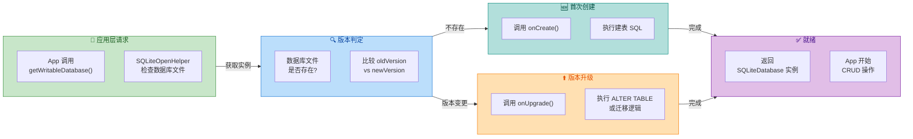

当应用首次调用 `getWritableDatabase()` 或 `getReadableDatabase()` 时，`SQLiteOpenHelper` 内部会检查目标数据库文件是否存在。若不存在，它会先创建一个空的数据库文件，然后回调 `onCreate()`，开发者在此方法中执行 `CREATE TABLE` 等建表语句。若文件已存在，它会读取数据库文件头中存储的版本号（一个 4 字节整数，位于文件偏移 60 处），与构造函数中传入的 `version` 参数进行比较：如果旧版本号小于新版本号，就回调 `onUpgrade()`；如果旧版本号大于新版本号（极少见的降级场景），则回调 `onDowngrade()`。

下面是一个典型的 `SQLiteOpenHelper` 子类实现：

```kotlin
// 继承 SQLiteOpenHelper，管理名为 "app.db" 的数据库
class AppDatabaseHelper(
    context: Context // 需要 Context 来定位数据库文件路径
) : SQLiteOpenHelper(
    context,        // 上下文，用于获取 /data/data/<pkg>/databases/ 路径
    "app.db",       // 数据库文件名
    null,           // CursorFactory，通常传 null 使用默认实现
    1               // 数据库版本号，首次发布为 1
) {

    // 数据库文件首次创建时回调（整个应用生命周期内通常只执行一次）
    override fun onCreate(db: SQLiteDatabase) {
        // 执行原始 SQL 建表语句
        // TEXT 对应 Kotlin 的 String 类型
        // INTEGER 对应 Kotlin 的 Int/Long 类型
        // PRIMARY KEY AUTOINCREMENT 表示自增主键
        db.execSQL(
            """
            CREATE TABLE user (
                id INTEGER PRIMARY KEY AUTOINCREMENT,
                name TEXT NOT NULL,
                email TEXT,
                created_at INTEGER NOT NULL
            )
            """.trimIndent()
        )
    }

    // 数据库版本号发生变化时回调（oldVersion < newVersion 时触发）
    override fun onUpgrade(
        db: SQLiteDatabase, // 当前数据库实例
        oldVersion: Int,     // 数据库文件中记录的旧版本号
        newVersion: Int      // 构造函数中传入的新版本号
    ) {
        // 简单粗暴的策略：删表重建（生产环境不推荐，会丢失用户数据）
        db.execSQL("DROP TABLE IF EXISTS user")
        // 重新走 onCreate() 建表流程
        onCreate(db)
    }
}
```

这里有一个应用层开发者容易忽略的关键细节：`getWritableDatabase()` 内部的整个"检查版本 → 回调 `onCreate`/`onUpgrade` → 返回实例"的流程，是被一个 **数据库级锁** 保护的。具体来说，`SQLiteOpenHelper` 内部持有一个 `SQLiteDatabase` 实例的引用，通过 `synchronized` 保证同一时刻只有一个线程能进入初始化流程。这意味着如果你在主线程调用 `getWritableDatabase()` 而数据库恰好需要升级，那么主线程就会被阻塞直到 `onUpgrade()` 执行完毕——这是应用出现 ANR（Application Not Responding）的一个常见隐患。因此，即使是最基础的 `SQLiteOpenHelper` 使用，也建议将 `getWritableDatabase()` 的首次调用放在后台线程中。

还需要注意的是，`getReadableDatabase()` 并不意味着获取一个"只读数据库"。在绝大多数情况下，它返回的和 `getWritableDatabase()` 是 **同一个** `SQLiteDatabase` 实例。只有在极端情况下（例如磁盘空间已满，无法以读写模式打开），它才会回退到以只读模式打开数据库。因此在日常开发中，二者的区别远没有方法名暗示的那么大。

### SQL 语法

SQLite 虽然是一个"轻量级"数据库，但它对标准 SQL 的支持相当完整。作为应用层开发者，需要掌握的核心 SQL 操作可以归纳为 **CRUD**（Create、Read、Update、Delete）四大类，以及表结构定义的 **DDL**（Data Definition Language）语句。

**DDL —— 表结构定义**

`CREATE TABLE` 是最基础的 DDL 语句。SQLite 的类型系统与传统关系数据库有本质区别——它采用的是 **动态类型（Manifest Typing）** 而非严格的静态类型。你在 `CREATE TABLE` 中声明的 `INTEGER`、`TEXT`、`REAL` 等实际上是 **类型亲和性（Type Affinity）** 的建议，而非强制约束。这意味着你完全可以把一个字符串插入到声明为 `INTEGER` 的列中，SQLite 不会报错（只是 Room 等框架在编译期会帮你挡住这种行为）。SQLite 定义了五种存储类型：`NULL`、`INTEGER`（1/2/3/4/6/8 字节整数，按值大小自动选择存储宽度）、`REAL`（8 字节 IEEE 浮点）、`TEXT`（UTF-8/UTF-16 字符串）和 `BLOB`（原始二进制）。

```sql
-- 创建用户表，展示常见约束的使用
CREATE TABLE IF NOT EXISTS user (
    -- INTEGER PRIMARY KEY 在 SQLite 中即为 rowid 的别名
    -- AUTOINCREMENT 保证 id 严格递增，即使删除旧行后也不会复用 id
    id INTEGER PRIMARY KEY AUTOINCREMENT,
    -- NOT NULL 约束：该列不允许为空
    name TEXT NOT NULL,
    -- UNIQUE 约束：该列值在全表中不允许重复
    email TEXT UNIQUE,
    -- DEFAULT 约束：插入时未指定该列则使用默认值
    age INTEGER DEFAULT 0,
    -- CHECK 约束：插入/更新时检查条件是否满足
    status INTEGER CHECK(status IN (0, 1, 2)),
    -- 外键引用（需要额外开启 PRAGMA foreign_keys = ON）
    department_id INTEGER REFERENCES department(id)
);

-- 创建索引以加速按 email 的查询（B-Tree 索引）
CREATE INDEX idx_user_email ON user(email);

-- 创建复合索引（多列联合索引，遵循最左前缀匹配原则）
CREATE INDEX idx_user_name_age ON user(name, age);
```

这里有一个 SQLite 独有的重要概念：当你把一个列声明为 `INTEGER PRIMARY KEY` 时，这个列实际上就变成了 SQLite 内部 **rowid** 的别名。rowid 是 SQLite 中每一行的隐式 64 位整数标识符，是 B-Tree 的索引键。加上 `AUTOINCREMENT` 后，SQLite 会维护一个名为 `sqlite_sequence` 的内部表来追踪每张表已使用的最大 id，确保新分配的 id 绝不会与历史上已被删除的行的 id 重复。不加 `AUTOINCREMENT` 时，SQLite 只是简单地取当前最大 rowid + 1，如果最大 rowid 的行被删除了，该值有可能被新行复用。

**DML —— 数据操作**

应用层最频繁使用的就是 INSERT、SELECT、UPDATE、DELETE 四条语句。在 Android 的 `SQLiteDatabase` API 中，既可以用原始 SQL（`execSQL()` / `rawQuery()`），也可以用框架封装的 **ContentValues + 方法调用** 风格。以下逐一说明：

```kotlin
// 获取数据库实例（通常在后台线程中执行）
val db = helper.writableDatabase

// ========== INSERT 插入 ==========
// 方式一：使用 ContentValues（Framework 推荐方式，防 SQL 注入）
val values = ContentValues().apply {
    // put() 方法会根据值类型自动选择正确的绑定方式
    put("name", "张三")          // TEXT 类型
    put("email", "zs@test.com") // TEXT 类型
    put("created_at", System.currentTimeMillis()) // INTEGER 类型
}
// insert() 返回新插入行的 rowid，失败返回 -1
// 第二个参数 nullColumnHack：当 values 为空时，指定一个列名用 NULL 填充
val newRowId = db.insert(
    "user",      // 表名
    null,        // nullColumnHack，通常传 null
    values       // 要插入的列-值映射
)

// 方式二：使用原始 SQL（灵活但需自行防注入）
db.execSQL(
    // 使用 ? 占位符进行参数绑定，避免 SQL 注入攻击
    "INSERT INTO user (name, email, created_at) VALUES (?, ?, ?)",
    // 参数数组，按顺序替换 ? 占位符
    arrayOf("李四", "ls@test.com", System.currentTimeMillis())
)

// ========== SELECT 查询 ==========
// query() 方法提供了结构化的查询参数
val cursor = db.query(
    "user",                          // FROM 表名
    arrayOf("id", "name", "email"),  // SELECT 的列（null 表示 *）
    "age > ? AND status = ?",        // WHERE 子句（用 ? 占位）
    arrayOf("18", "1"),              // WHERE 参数值（全部为 String 类型）
    null,                            // GROUP BY
    null,                            // HAVING
    "created_at DESC",               // ORDER BY
    "20"                             // LIMIT
)

// ========== UPDATE 更新 ==========
val updateValues = ContentValues().apply {
    put("name", "王五")   // 要更新的列和新值
    put("age", 25)        // 可同时更新多列
}
// update() 返回受影响的行数
val affectedRows = db.update(
    "user",          // 表名
    updateValues,    // 新值
    "id = ?",        // WHERE 条件
    arrayOf("1")     // WHERE 参数
)

// ========== DELETE 删除 ==========
// delete() 返回被删除的行数
val deletedRows = db.delete(
    "user",          // 表名
    "status = ?",    // WHERE 条件（传 null 则删除全表数据）
    arrayOf("0")     // WHERE 参数
)
```

特别需要强调的是 **参数绑定（Parameter Binding）** 的重要性。所有 `?` 占位符在 SQLite 引擎内部会通过 `sqlite3_bind_*()` 系列 C 函数将值绑定到预编译语句（Prepared Statement）上，这个过程中值的内容 **永远不会被当作 SQL 语法解析**，从根本上杜绝了 SQL 注入攻击。相比之下，如果使用字符串拼接的方式构造 SQL（如 `"WHERE name = '" + userInput + "'"`），攻击者只需输入 `'; DROP TABLE user; --` 就能删除你的整张表。在 Room 框架中，`@Query` 注解的 `:param` 语法最终也会被编译为参数绑定，因此同样是安全的。

### 事务 Transaction

事务（Transaction）是关系型数据库的核心概念之一。SQLite 完整支持 **ACID** 特性：**原子性（Atomicity）**——事务中的所有操作要么全部成功，要么全部回滚，不存在"做了一半"的中间状态；**一致性（Consistency）**——事务执行前后数据库从一个合法状态转换到另一个合法状态；**隔离性（Isolation）**——并发事务之间互不干扰；**持久性（Durability）**——事务提交后，数据保证写入磁盘不丢失。

在应用层开发中，事务最常见的使用场景是 **批量操作**。假设你需要插入 1000 条数据，如果不使用事务，SQLite 会为每一条 INSERT 语句隐式开启和提交一个事务——这意味着 1000 次磁盘同步（`fsync`）。而将它们包裹在一个显式事务中，整个过程只需一次 `fsync`，性能差距可达 **数十倍甚至上百倍**。这是因为 SQLite 使用 **WAL（Write-Ahead Logging）** 或 **Journal** 模式来保证原子性，每次事务提交都需要将日志刷盘。WAL 模式（Android 4.1+ 默认启用）下，写操作先追加到 `-wal` 文件中，提交时执行一次 `fsync`；而经典的 Journal 模式则需要在写前和写后各做一次 `fsync`。

SQLite 的 WAL 模式还有一个对应用层非常重要的特性：**读写并发**。在 WAL 模式下，读操作读取的是 WAL 文件中某个 **一致性快照**，因此读操作不会被写操作阻塞，写操作也不会被读操作阻塞（但同一时刻仍只允许一个写操作）。这对于 Android 应用来说意义重大——你可以在后台线程执行写入操作的同时，在另一个线程读取数据供 UI 展示，而不会出现锁竞争导致的 `SQLiteDatabaseLockedException`。

Android Framework 的 `SQLiteDatabase` 类提供了两种事务 API：

**经典方式（try-finally 手动管理）：**

```kotlin
val db = helper.writableDatabase

// beginTransaction() 开启一个 EXCLUSIVE 事务
// 内部执行 SQL: BEGIN EXCLUSIVE
db.beginTransaction()
try {
    // --- 事务体：在这里执行所有数据库操作 ---

    // 插入第一条记录
    db.execSQL(
        "INSERT INTO user (name, email, created_at) VALUES (?, ?, ?)",
        arrayOf("用户A", "a@test.com", System.currentTimeMillis())
    )
    // 插入第二条记录
    db.execSQL(
        "INSERT INTO user (name, email, created_at) VALUES (?, ?, ?)",
        arrayOf("用户B", "b@test.com", System.currentTimeMillis())
    )

    // 标记事务成功（必须在 endTransaction() 之前调用）
    // 如果不调用此方法，endTransaction() 会执行 ROLLBACK 而非 COMMIT
    db.setTransactionSuccessful()
} catch (e: Exception) {
    // 发生异常时不调用 setTransactionSuccessful()
    // endTransaction() 会自动回滚
    Log.e("DB", "事务执行失败，即将回滚", e)
} finally {
    // endTransaction() 检查是否调用过 setTransactionSuccessful()
    // 是 → 执行 COMMIT; 否 → 执行 ROLLBACK
    db.endTransaction()
}
```

这套 API 的设计理念是 **默认回滚**：如果你忘记调用 `setTransactionSuccessful()`，或者中途抛出异常跳过了它，`endTransaction()` 就会自动回滚整个事务。这是一种防御性编程范式——比起默认提交，默认回滚在出错时不会留下"做了一半"的脏数据。

**Kotlin 扩展方式（推荐）：**

Android KTX 提供了一个 `SQLiteDatabase.transaction()` 扩展函数，利用 Kotlin 的 `inline` 和 `lambda` 语法简化事务代码：

```kotlin
// 使用 KTX 扩展函数，内部自动管理 begin/setSuccessful/end
// 如果 lambda 正常返回则 COMMIT，抛出异常则 ROLLBACK
db.transaction {
    // this 即 SQLiteDatabase 实例，可以直接调用 execSQL / insert 等方法
    execSQL(
        "INSERT INTO user (name, email, created_at) VALUES (?, ?, ?)",
        arrayOf("用户C", "c@test.com", System.currentTimeMillis())
    )
    execSQL(
        "INSERT INTO user (name, email, created_at) VALUES (?, ?, ?)",
        arrayOf("用户D", "d@test.com", System.currentTimeMillis())
    )
    // 无需手动调用 setTransactionSuccessful()，lambda 正常结束即代表成功
}
```

在 Room 框架中，如果你在一个 `@Transaction` 注解的 DAO 方法中执行多条查询，Room 也会在底层自动开启事务来保证数据一致性——本质上调用的就是 `beginTransaction()` / `setTransactionSuccessful()` / `endTransaction()` 这一套机制。

下面展示事务的执行流程与原子性保证的可视化：

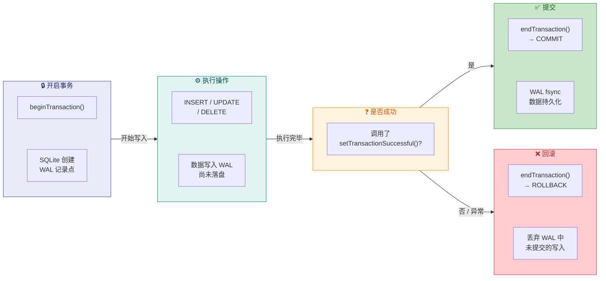

### 游标 Cursor

在 Android 的 SQLite API 中，`Cursor` 是查询结果的迭代器抽象。当你调用 `rawQuery()` 或 `query()` 执行一条 SELECT 语句后，SQLite 并不会一次性把所有结果行加载到内存中——返回的 `Cursor` 对象内部维护了一个 **CursorWindow**，它是一块共享内存缓冲区（默认大小为 **2MB**），每次只加载能容纳的行数据。当你通过 `moveToNext()` 移动游标位置时，如果目标行尚未在 CursorWindow 中，SQLite 会重新执行查询（或使用缓存）来填充新的窗口。这种 **惰性加载（Lazy Loading）** 机制使得即使查询结果有数万行，内存占用也能保持可控。

`Cursor` 实现了 `Closeable` 接口，使用完毕后 **必须关闭**，否则会导致 CursorWindow 对应的共享内存泄漏，以及底层 SQLite 语句（`sqlite3_stmt`）无法释放。在 Logcat 中你可能见过 `Cursor finalized without prior close()` 的警告，这就是 Cursor 未关闭时 GC 回收对象时发出的告警。

下面是 Cursor 的典型使用方式：

```kotlin
// 执行原始 SQL 查询，返回 Cursor
// rawQuery 的第二个参数是绑定参数数组，防止 SQL 注入
val cursor: Cursor = db.rawQuery(
    "SELECT id, name, email, created_at FROM user WHERE age > ?",
    arrayOf("18") // 参数值始终为 String 类型，SQLite 内部按亲和性转换
)

// 使用 Kotlin 的 use {} 扩展函数（等价于 try-finally + close）
// use {} 会在 lambda 结束后自动调用 cursor.close()
cursor.use { c ->
    // getColumnIndexOrThrow() 通过列名获取列索引
    // 相比 getColumnIndex()，它在列名不存在时抛出异常而非返回 -1
    val idIndex = c.getColumnIndexOrThrow("id")           // 列索引 0
    val nameIndex = c.getColumnIndexOrThrow("name")       // 列索引 1
    val emailIndex = c.getColumnIndexOrThrow("email")     // 列索引 2
    val createdAtIndex = c.getColumnIndexOrThrow("created_at") // 列索引 3

    // moveToNext() 将游标移动到下一行
    // 首次调用时从"第 -1 行"（即起始位置 Before First）移动到第 0 行
    // 如果没有更多行则返回 false，循环结束
    while (c.moveToNext()) {
        // 根据列索引和数据类型调用对应的 get 方法
        val id = c.getLong(idIndex)            // 读取 INTEGER 类型为 Long
        val name = c.getString(nameIndex)      // 读取 TEXT 类型为 String
        // 注意：如果该列可能为 NULL，应先用 isNull() 检查
        val email = if (c.isNull(emailIndex)) {
            null                               // 列值为 NULL 时返回 null
        } else {
            c.getString(emailIndex)            // 列值不为 NULL 时正常读取
        }
        val createdAt = c.getLong(createdAtIndex) // 时间戳存为 INTEGER

        // 此处可将数据封装为实体对象
        Log.d("DB", "User: id=$id, name=$name, email=$email")
    }
    // while 循环结束意味着游标已遍历完所有行
    // use {} 会在此处自动调用 c.close() 释放资源
}
```

Cursor 的内部运作还涉及 **CursorWindow 的填充策略**。当你调用 `moveToPosition(n)` 跳转到第 n 行时，如果该行不在当前 CursorWindow 的缓存范围内，`SQLiteCursor`（Cursor 的默认实现类）会调用 `fillWindow()` 方法重新填充窗口。填充时，它会以目标行为起点，尽可能多地向后加载行，直到 CursorWindow 的 2MB 空间被用完。这个行为解释了为什么顺序遍历（`moveToNext`）比随机跳转（`moveToPosition`）的性能要好得多——顺序遍历大概率命中已加载的窗口缓存，而随机跳转可能频繁触发窗口重新填充。

下面的 ASCII 模型展示了 Cursor 与 CursorWindow 的关系：

```text
┌───────────────────────────────────────────────────────────┐
│                     SQLiteCursor                          │
│  ┌─────────────────────────────────────────────────────┐  │
│  │  mQuery: "SELECT id, name... WHERE age > ?"        │  │
│  │  mPosition: 3  (当前游标指向第 3 行)                  │  │
│  │  mCount: 1000  (总结果行数)                          │  │
│  └─────────────────────────────────────────────────────┘  │
│                          │                                │
│                          ▼                                │
│  ┌─────────────────────────────────────────────────────┐  │
│  │             CursorWindow (2MB 共享内存)               │  │
│  │  ┌───────┬────────┬─────────┬────────────────────┐  │  │
│  │  │ Row 0 │ Row 1  │  Row 2  │  Row 3 ← 当前位置  │  │  │
│  │  ├───────┼────────┼─────────┼────────────────────┤  │  │
│  │  │ Row 4 │ Row 5  │  Row 6  │  ...               │  │  │
│  │  ├───────┼────────┼─────────┼────────────────────┤  │  │
│  │  │  ...  │ Row N  │ (空闲)  │  (空闲)             │  │  │
│  │  └───────┴────────┴─────────┴────────────────────┘  │  │
│  │  ↑ 一次加载尽可能多的行，直到填满 2MB              ↑  │  │
│  └─────────────────────────────────────────────────────┘  │
│                                                           │
│  当 moveToPosition() 超出已加载范围时：                     │
│  → 重新执行查询                                            │
│  → 清空 CursorWindow                                      │
│  → 从目标位置开始重新填充                                   │
└───────────────────────────────────────────────────────────┘
```

最后，需要特别指出的是，在现代 Android 开发中，直接操作 `Cursor` 的场景已经越来越少。Room 框架会在编译期自动生成 Cursor 的读取和关闭代码——当你在 DAO 中声明一个返回 `List<User>` 的查询方法时，Room 生成的实现类内部就是用 `Cursor` + `try-finally` 来遍历结果并映射为实体对象的。了解 Cursor 的工作原理，能帮助你在排查 Room 相关问题（如 `CursorWindowAllocationException`——CursorWindow 分配失败，通常是查询结果中某一行的单列数据超过了 CursorWindow 大小）时快速定位根因。

---

**📝 练习题**

在 Android 中使用 SQLiteDatabase 的事务 API 时，以下哪种说法是正确的？

A. `beginTransaction()` 开启事务后，如果不调用 `endTransaction()`，事务会在 `SQLiteDatabase` 对象被 GC 回收时自动提交。


B. 在 `beginTransaction()` 和 `endTransaction()` 之间，如果没有调用 `setTransactionSuccessful()`，`endTransaction()` 将执行回滚（ROLLBACK）。


C. `beginTransaction()` 开启的是 DEFERRED 事务，只有在首次写操作时才会获取写锁。


D. 在 WAL 模式下，同一个数据库可以同时存在多个并发的写事务。


**【答案】** B

**【解析】** Android 的 `SQLiteDatabase.beginTransaction()` 采用的是 **默认回滚** 的设计策略。在调用 `beginTransaction()` 之后，只有显式调用了 `setTransactionSuccessful()` 来标记事务成功，`endTransaction()` 才会执行 `COMMIT`；否则，无论是因为异常跳过了 `setTransactionSuccessful()`，还是开发者忘记调用，`endTransaction()` 都会执行 `ROLLBACK`，将数据库回滚到事务开始前的状态。这种设计确保了在出错时不会留下不一致的数据。

选项 A 错误：GC 回收时不会自动提交事务，而是会回滚并在 Logcat 中打印警告。选项 C 错误：`beginTransaction()` 实际开启的是 `EXCLUSIVE` 事务（`BEGIN EXCLUSIVE`），会立即获取排他锁。选项 D 错误：无论是 WAL 模式还是 Journal 模式，SQLite 同一时刻只允许一个写事务存在；WAL 模式的并发优势在于读写可以并行，而非多个写操作可以并行。

---

## Room 架构组件

Room 是 Google 在 Jetpack 组件库中提供的 **SQLite 抽象层（Abstraction Layer）**，它诞生的核心目的只有一个——让开发者在享受 SQLite 全部能力的同时，彻底摆脱传统 `SQLiteOpenHelper` 时代大量手写样板代码、拼接 SQL 字符串以及手动管理 `Cursor` 生命周期所带来的痛苦。要真正理解 Room 为何被设计成今天这个样子，我们需要从三个维度来剖析它的架构支柱：**ORM 对象关系映射**、**编译时验证**以及 **Schema 数据库版本管理**。

### ORM 对象关系映射

#### 什么是 ORM

ORM（Object-Relational Mapping，对象关系映射）是一种编程范式，它在 **面向对象的编程语言** 与 **关系型数据库** 之间建立一座桥梁。关系型数据库以"表（Table）—行（Row）—列（Column）"的二维结构来组织数据，而面向对象的世界以"类（Class）—实例（Instance）—属性（Field）"来建模。两套体系之间天然存在一道被称为 **"阻抗失配（Impedance Mismatch）"** 的鸿沟：数据库不认识对象，对象也不认识表。ORM 所做的事，就是定义一套映射规则，让开发者可以 **用操作对象的方式来操作数据库**，由框架在底层自动完成对象与表行之间的双向转换。

在 Java/Kotlin 的后端世界里，Hibernate、MyBatis 是最经典的 ORM 框架。而在 Android 平台上，Room 就是 Google 官方提供的轻量级 ORM 方案。不过严格来说，Room 更准确的定位是 **"编译时 ORM + SQL 直写"** 的混合体——它既允许你用注解把 Kotlin data class 映射到数据库表，又鼓励你在 DAO 中直接书写原生 SQL，而不是像 Hibernate 那样试图完全隐藏 SQL。这种设计哲学使得 Room 在保持轻量和透明的同时，仍然具备 ORM 的核心便利性。

#### Room 的三大核心角色

Room 的 ORM 映射围绕三个角色展开，它们各自承担了映射链路中的不同职责：

| 角色 | 注解 | 职责 |
|------|------|------|
| **Entity（实体）** | `@Entity` | 定义数据库表结构，一个 Entity 类对应一张表，类的字段对应表的列 |
| **DAO（数据访问对象）** | `@Dao` | 定义对表的操作方法（增删改查），方法上用 `@Insert`、`@Query` 等注解标注 SQL 意图 |
| **Database（数据库）** | `@Database` | 整个数据库的持有者，继承 `RoomDatabase`，声明包含哪些 Entity 和 DAO |

这三者的协作关系，可以用一句话概括：**Database 持有 DAO，DAO 操作 Entity，Entity 映射到 Table**。

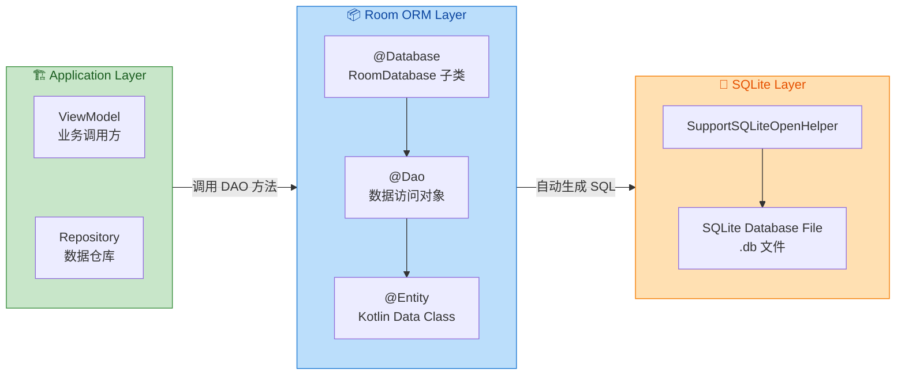

#### 映射机制的运作原理

当你写下一个被 `@Entity` 标注的 data class 时，Room 的注解处理器（Annotation Processor，基于 KSP 或 KAPT）会在 **编译期** 扫描这个类的所有字段，并根据字段的类型、名称、以及附加注解（如 `@PrimaryKey`、`@ColumnInfo`）来生成建表的 `CREATE TABLE` SQL 语句。来看一个最简单的映射示例：

```kotlin
// 使用 @Entity 标注，表名默认取类名 "User"（可通过 tableName 自定义）
@Entity(tableName = "users")
data class User(
    // @PrimaryKey 标记主键列；autoGenerate = true 表示自增
    @PrimaryKey(autoGenerate = true)
    val id: Long = 0,

    // @ColumnInfo 可自定义列名；不写则默认使用字段名
    @ColumnInfo(name = "user_name")
    val name: String,

    // Kotlin 的 Int 类型自动映射为 SQLite 的 INTEGER
    val age: Int,

    // Kotlin 的 String? 表示该列允许 NULL
    val email: String? = null
)
```

上面这段简洁的 data class，在编译期会被 Room 的代码生成器翻译为等价的 DDL（Data Definition Language）：

```sql
-- Room 编译期自动生成的建表语句（开发者无需手写）
CREATE TABLE IF NOT EXISTS `users` (
    `id` INTEGER PRIMARY KEY AUTOINCREMENT NOT NULL,
    `user_name` TEXT NOT NULL,
    `age` INTEGER NOT NULL,
    `email` TEXT
);
```

注意观察映射规则：Kotlin 的 `Long`/`Int` 被映射为 SQLite 的 `INTEGER`，`String` 映射为 `TEXT`，非空类型（`String`）生成 `NOT NULL` 约束，而可空类型（`String?`）则允许 `NULL`。这就是 ORM 的核心价值——**类型系统与数据库 Schema 的自动对齐**。

与此同时，对于 DAO 中定义的操作方法，Room 同样会在编译期生成完整的实现类。例如：

```kotlin
// @Dao 标注的接口，Room 会自动生成其实现类（命名规则：类名_Impl）
@Dao
interface UserDao {

    // @Insert 注解：Room 自动生成 INSERT INTO users VALUES(...) 语句
    // onConflict 指定主键冲突时的策略，REPLACE 表示覆盖旧数据
    @Insert(onConflict = OnConflictStrategy.REPLACE)
    suspend fun insertUser(user: User)

    // @Query 注解：直接书写 SQL，Room 在编译时验证语法和表名/列名
    // 返回值 Flow<List<User>> 表示数据变化时自动推送新列表
    @Query("SELECT * FROM users WHERE age > :minAge ORDER BY user_name")
    fun getUsersOlderThan(minAge: Int): Flow<List<User>>

    // @Delete 注解：Room 根据主键匹配删除对应行
    @Delete
    suspend fun deleteUser(user: User)
}
```

开发者只需要声明接口和方法签名，Room 在编译期为每个方法生成完整的 `_Impl` 实现代码，内部调用 `SupportSQLiteStatement` 执行参数绑定、Cursor 遍历和对象构建。与传统 `SQLiteOpenHelper` 时代相比，**手写的样板代码量减少了 70% 以上**，同时避免了拼接 SQL 字符串引入的注入风险和拼写错误。

#### Room ORM 与传统 ORM 的设计差异

Room 与 Hibernate 等重量级 ORM 在设计理念上有显著不同，理解这些差异对于正确使用 Room 至关重要：

**第一，SQL 显式可见，而非完全隐藏**。Hibernate 鼓励开发者通过 Criteria API 或 HQL 来查询，尽量不接触原生 SQL。Room 则反其道而行——`@Query` 注解中直接书写 SQL 是最主要的查询方式。Google 这样设计的理由是：SQLite 的 SQL 语法足够简单，而且 Android 场景中的查询通常不复杂，让开发者直接写 SQL 反而比学习一套新的查询 DSL 成本更低。更重要的是，Room 会在编译期对这些 SQL 进行 **语法校验和类型检查**，等于兼得了 SQL 的灵活性和类型安全。

**第二，无延迟加载（No Lazy Loading）**。Hibernate 中的关联对象默认是懒加载的——只有在真正访问时才触发额外查询。Room 从设计之初就 **禁止** 在主线程执行数据库操作（除非显式调用 `allowMainThreadQueries()`），因此它不支持透明的懒加载。所有关联数据要么通过 `@Relation` 一次性加载，要么由开发者在 DAO 中显式编写 JOIN 查询。这种设计虽然损失了一定便利性，但从 Android 应用的角度来看是正确的——懒加载在 UI 线程上触发意味着不可预期的 ANR 风险。

**第三，编译时而非运行时映射**。Hibernate 大量使用反射（Reflection）在运行时完成对象到表的映射，这在服务端可以接受，但在移动端意味着额外的启动耗时和内存开销。Room 将所有映射逻辑前移到编译期，生成的 `_Impl` 类是纯粹的 Java/Kotlin 代码，运行时没有反射开销，对 Android 应用的启动性能更加友好。

---

### 编译时验证

#### 为什么编译时验证如此重要

在传统 `SQLiteOpenHelper` 的开发模式中，SQL 语句以 **纯字符串** 的形式存在于代码中。编译器（javac / kotlinc）对这些字符串的内容 **一无所知**——它不会检查表名是否正确、列名是否存在、参数类型是否匹配。所有错误只能在 **运行时（Runtime）** 暴露，通常表现为 `SQLiteException` 或者查询返回意料之外的空结果。更糟糕的是，这些运行时错误往往出现在某个不常走到的分支路径中，可能在用户手中才被触发。

Room 将安全防线从运行时提前到了 **编译时（Compile-time）**，通过注解处理器（KSP / KAPT）在编译阶段完成以下验证：

1. **SQL 语法验证** —— `@Query` 中的 SQL 是否符合 SQLite 语法规范
2. **表名/列名验证** —— SQL 引用的 `FROM users` 是否存在对应的 `@Entity(tableName = "users")`
3. **参数绑定验证** —— `:minAge` 参数是否在方法签名中有对应的 `minAge: Int` 形参
4. **返回类型验证** —— `SELECT *` 查询结果的列集合能否正确映射到方法返回类型的字段
5. **线程安全验证** —— 非 suspend 函数若返回非 `Flow`/`LiveData` 的同步结果，会提示可能阻塞主线程

#### 编译时验证的工作流程

Room 的编译时验证依赖于 **注解处理器（Annotation Processor）** 技术。在 Kotlin 项目中，推荐使用 KSP（Kotlin Symbol Processing）而非传统的 KAPT（Kotlin Annotation Processing Tool），因为 KSP 直接解析 Kotlin 符号表，无需生成 Java Stub 作为中间步骤，编译速度可提升 **2 倍** 左右。

整个验证流程可以拆解为以下阶段：

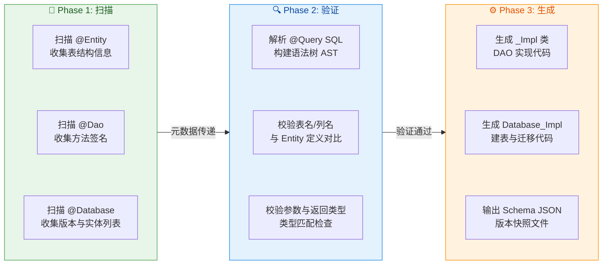

**Phase 1（扫描阶段）**：注解处理器遍历项目源码，找到所有被 `@Entity`、`@Dao`、`@Database` 标注的类型，将它们的结构信息（字段名、类型、注解参数等）收集到内存中的元数据模型。

**Phase 2（验证阶段）**：这是 Room 编译时安全的核心所在。处理器会使用内置的 **SQLite 语法解析器** 来解析 `@Query` 中的 SQL 字符串，构建出抽象语法树（AST）。然后，它会将 AST 中引用的表名和列名与 Phase 1 收集到的 Entity 元数据进行交叉比对。如果发现 SQL 中引用了一个不存在的表或列，编译器会直接报错。同样，方法的参数列表和返回类型也会被严格校验——如果 `@Query` 的 `SELECT` 列中缺少返回类型所需的某个字段，Room 会发出警告或错误。

**Phase 3（生成阶段）**：验证全部通过后，处理器为每个 `@Dao` 接口生成对应的 `_Impl` 实现类，为 `@Database` 生成 `_Impl` 子类（包含建表语句和迁移逻辑），同时输出 Schema JSON 文件用于版本管理。

#### 编译时错误的实际表现

为了让你直观感受编译时验证的威力，我们来看几个典型的错误场景和 Room 给出的编译时错误信息：

**场景一：SQL 中引用不存在的列名**

```kotlin
// Entity 中定义的列名是 "user_name"
@Entity(tableName = "users")
data class User(
    @PrimaryKey val id: Long,
    @ColumnInfo(name = "user_name") val name: String
)

@Dao
interface UserDao {
    // 错误：SQL 中使用了 "username" 而不是 "user_name"
    @Query("SELECT * FROM users WHERE username = :name")
    fun findByName(name: String): User?
}
```

编译时 Room 会报告：`error: There is a problem with the query: [SQLITE_ERROR] SQL error or missing database (no such column: username)`。这条错误信息精确指出了列名不存在，开发者可以在编写代码的当下就修复，而不是等到运行时才发现。

**场景二：返回类型字段与查询结果不匹配**

```kotlin
// 自定义返回类型，包含 Entity 中不存在的字段
data class UserSummary(
    val id: Long,
    val name: String,
    val address: String  // users 表中没有 address 列
)

@Dao
interface UserDao {
    // Room 会警告：UserSummary 中的 address 字段无法从查询结果中填充
    @Query("SELECT id, user_name AS name FROM users")
    fun getAllSummaries(): List<UserSummary>
}
```

Room 会发出 `warning: The query returns some columns [id, name] which are not used by UserSummary(id, name, address). You can annotate the method with @RewriteQueriesToDropUnusedColumns.` 同时，对于 `address` 字段无法映射的问题也会给出提示。这种检查避免了运行时因字段缺失而得到 `null` 或默认值的隐性 Bug。

**场景三：参数绑定遗漏**

```kotlin
@Dao
interface UserDao {
    // 错误：SQL 中有 :minAge 和 :maxAge 两个参数，但方法签名只提供了 minAge
    @Query("SELECT * FROM users WHERE age BETWEEN :minAge AND :maxAge")
    fun findUsersInAgeRange(minAge: Int): List<User>
}
```

编译时会报告：`error: Each bind variable in the query must have a matching method parameter. Cannot find method parameters for :maxAge.`。这类参数绑定错误在传统的字符串拼接 SQL 中极难发现，Room 在编译时就能精确定位。

#### KSP 与 KAPT 的选择

Room 支持两种注解处理方式。KAPT 是早期 Kotlin 项目使用的方案，其原理是先将 Kotlin 代码生成 Java Stub（桩代码），再交给 Java 注解处理器进行处理。这个额外的 Stub 生成步骤意味着 **额外的编译时间** 和 **信息损失**（某些 Kotlin 特有的类型信息在转换为 Java Stub 时会丢失）。

KSP（Kotlin Symbol Processing）是 Google 专门为 Kotlin 打造的符号处理框架，它直接操作 Kotlin 编译器的符号表，省去了 Java Stub 生成步骤。在实际项目中，从 KAPT 迁移到 KSP 后，Room 相关的编译时间通常可以减少 40%–60%。在 `build.gradle.kts` 中的配置差异如下：

```kotlin
// ============ KAPT 方式（旧，逐步被淘汰）============
plugins {
    // 启用 kapt 插件
    id("kotlin-kapt")
}
dependencies {
    // Room 注解处理器通过 kapt 配置
    kapt("androidx.room:room-compiler:2.6.1")
}

// ============ KSP 方式（推荐）============
plugins {
    // 启用 ksp 插件，版本需与 Kotlin 版本匹配
    id("com.google.devtools.ksp") version "1.9.21-1.0.15"
}
dependencies {
    // Room 注解处理器通过 ksp 配置
    ksp("androidx.room:room-compiler:2.6.1")
}
```

从 Room 2.6 开始，KSP 已经是 **完全支持** 的首选方案，新项目应直接采用 KSP。

---

### Schema 数据库版本管理

#### 版本号与 Schema 的关系

每一个 Room 数据库都有一个 **版本号（version）**，在 `@Database` 注解中声明。这个版本号的本质含义是：**它标识了当前数据库 Schema（表结构定义）的快照版本**。当你修改了任何 Entity 的字段（增删列、改类型、加索引等），就意味着 Schema 发生了变化，此时必须递增版本号并提供对应的 Migration 策略。

```kotlin
// version = 1 表示这是数据库的第一个版本
// entities 数组列出所有参与建表的 Entity 类
@Database(
    entities = [User::class, Order::class],
    version = 1,                               // 当前 Schema 版本
    exportSchema = true                         // 是否导出 Schema JSON 文件
)
abstract class AppDatabase : RoomDatabase() {
    // 声明 DAO 的抽象获取方法，Room 在 _Impl 中实现
    abstract fun userDao(): UserDao
    abstract fun orderDao(): OrderDao
}
```

`version` 参数的值是一个单调递增的整数。当应用更新时，Room 会在打开数据库的瞬间比较 **设备上已有数据库的版本号** 与 **代码中声明的版本号**。如果已有版本低于代码声明版本，Room 会触发 Migration（迁移）流程；如果版本号相同，直接打开；如果已有版本 **高于** 代码声明版本（极罕见，通常是降级安装），则会抛出异常或触发 `fallbackToDestructiveMigration()`。

#### Schema 导出与 JSON 快照

`@Database` 注解中的 `exportSchema = true` 会让 Room 在编译时将当前版本的完整 Schema 信息导出为一个 **JSON 文件**。这个文件包含了所有表的建表语句、索引定义、视图定义等，是数据库在该版本下的完整结构快照。

要启用 Schema 导出，需要在 `build.gradle.kts` 中指定输出目录：

```kotlin
// 在模块的 build.gradle.kts 中配置 Schema 导出路径
ksp {
    // Room 的 Schema JSON 文件将输出到 schemas/ 目录
    arg("room.schemaLocation", "$projectDir/schemas")
}
```

编译成功后，会在 `app/schemas/` 目录下生成类似以下路径的文件：

```text
app/schemas/
  └── com.example.data.AppDatabase/
      ├── 1.json    ← 版本 1 的 Schema 快照
      ├── 2.json    ← 版本 2 的 Schema 快照
      └── 3.json    ← 版本 3 的 Schema 快照
```

每个 JSON 文件的内部结构大致如下（以版本 1 为例的简化展示）：

```json
{
  "formatVersion": 1,
  "database": {
    "version": 1,
    "identityHash": "a1b2c3d4e5f6...",
    "entities": [
      {
        "tableName": "users",
        "createSql": "CREATE TABLE IF NOT EXISTS `users` (`id` INTEGER PRIMARY KEY AUTOINCREMENT NOT NULL, `user_name` TEXT NOT NULL, `age` INTEGER NOT NULL, `email` TEXT)",
        "fields": [
          { "fieldPath": "id", "columnName": "id", "affinity": "INTEGER", "notNull": true },
          { "fieldPath": "name", "columnName": "user_name", "affinity": "TEXT", "notNull": true }
        ],
        "primaryKey": { "columnNames": ["id"], "autoGenerate": true },
        "indices": []
      }
    ]
  }
}
```

这份 JSON 文件有三个至关重要的用途：

**第一，版本控制追踪**。Schema JSON 文件应当被纳入 **Git 版本控制**。这样，团队中任何成员对数据库结构的修改都会在 Code Review 中以 JSON diff 的形式清晰呈现，避免了"偷偷改表却没写 Migration"的隐患。

**第二，自动化 Migration 测试**。Room 提供了 `MigrationTestHelper` 工具类，它可以读取 Schema JSON 文件来创建指定版本的数据库，然后执行 Migration 并验证结果表结构是否与目标版本的 Schema 一致。没有 Schema 文件，这种自动化测试就无法进行。

**第三，AutoMigration 的基础数据源**。从 Room 2.4 开始支持的 `@AutoMigration` 功能，正是通过比较两个版本的 Schema JSON 文件来自动推导出需要执行的 `ALTER TABLE` 语句。

#### Identity Hash 机制

在上面的 JSON 中有一个 `identityHash` 字段，这是 Room 用于 **校验数据库结构一致性** 的关键机制。Room 会根据当前所有 Entity 的表结构（表名、列名、列类型、约束等）计算出一个哈希值，并将其存储在数据库中一张名为 `room_master_table` 的内部表中。

```sql
-- Room 内部维护的元数据表，开发者通常不需要直接操作
CREATE TABLE IF NOT EXISTS room_master_table (
    id INTEGER PRIMARY KEY,
    identity_hash TEXT
);
```

每次打开数据库时，Room 会将代码中编译时计算的 `identityHash` 与数据库文件中 `room_master_table` 存储的值进行比对。如果两者不一致——意味着 Entity 定义已经发生了变化但版本号没有递增，或者 Migration 没有正确执行——Room 会直接抛出 `IllegalStateException`，并给出如下错误信息：

> `Room cannot verify the data integrity. Looks like you've changed schema but forgot to update the version number. You can simply fix this by increasing the version number.`

这个机制有效防止了开发者在修改表结构后忘记更新版本号的问题。它就像一道 **运行时的安全闸门**——即使编译时验证都通过了，如果代码与实际数据库文件的结构不匹配，Room 也会在打开数据库的瞬间将问题拦截下来。

#### Schema 版本管理的最佳实践

在实际团队开发中，围绕 Schema 版本管理有一些被广泛验证过的最佳实践：

**始终开启 `exportSchema = true`**。虽然 Room 允许设置为 `false`（此时不生成 JSON 文件），但这意味着你失去了 AutoMigration 能力和自动化测试的基础。除非是纯粹的本地缓存数据库（丢失无影响），否则都应该导出 Schema。

**将 Schema 文件纳入版本控制**。在 `.gitignore` 中 **不要** 忽略 `schemas/` 目录。每次版本号递增后生成的新 JSON 文件应当随代码一同提交，形成数据库结构的完整变更历史。

**版本号只增不减，且不跳号**。版本号必须是连续递增的正整数（1 → 2 → 3 → ...）。跳号（如从 1 直接到 5）虽然技术上可行，但会导致需要编写多个中间版本的 Migration 路径，增加维护成本。

**每个版本号变更对应一个明确的 Migration**。不要在一个版本号递增中同时修改多个不相关的表结构。遵循"**一个版本号，一个变更集**"的原则，可以让 Migration 逻辑更清晰、回滚更容易。

下面这张图总结了从修改 Entity 到最终打开数据库的完整 Schema 管理流程：

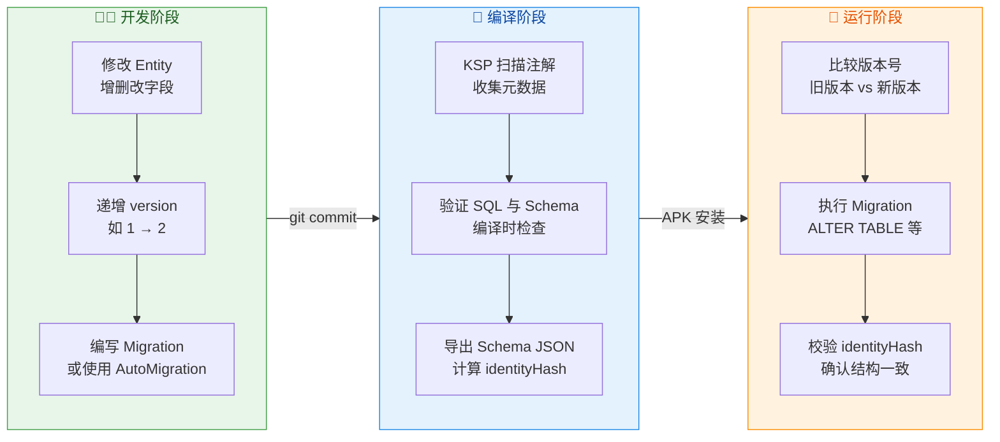

这三个阶段形成了一条完整的 **Schema 安全链**：开发阶段修改结构并编写迁移逻辑 → 编译阶段验证正确性并生成快照 → 运行阶段执行迁移并最终校验完整性。任何一个环节出现问题，都会在 **尽可能早** 的时间点被捕获，而不是悄悄地在用户设备上产生数据损坏。

---

**📝 练习题**

Room 在打开已有数据库时，通过什么机制来判断代码中的 Entity 定义与数据库文件中的实际表结构是否一致？

A. 比较 `@Database` 注解中的 `version` 值与数据库文件头中的 SQLite 版本号


B. 在运行时使用反射逐一对比 Entity 类的字段与数据库表的列定义


C. 比较编译时计算的 `identityHash` 与数据库 `room_master_table` 中存储的哈希值


D. 读取 Schema JSON 文件并与数据库文件中的 `sqlite_master` 表进行 diff 比较


**【答案】** C

**【解析】** Room 在编译期会根据所有 Entity 的结构（表名、列名、列类型、约束等）计算出一个 `identityHash`，并将其硬编码到生成的 `Database_Impl` 类中。同时，数据库文件中有一张内部元数据表 `room_master_table`，其中存储了该数据库上一次成功打开时写入的 `identityHash`。每次 `Room.databaseBuilder().build()` 打开数据库时，Room 会读取 `room_master_table` 中的哈希值并与代码中的值对比。如果不一致，说明 Entity 定义发生了变化但 Migration 未正确执行，Room 会直接抛出 `IllegalStateException` 阻止数据库打开。选项 A 混淆了 Room 版本号与 SQLite 引擎版本号；选项 B 错误地认为 Room 在运行时使用反射，而 Room 的设计原则恰恰是 **编译时生成代码、运行时零反射**；选项 D 中的 Schema JSON 文件只存在于开发机器上，不会打包进 APK，运行时无法读取。

---

## 实体与访问对象

Room 作为 Android 官方推荐的 ORM 框架，其核心设计哲学是 **"用 Kotlin/Java 类直接映射数据库表结构，用接口方法直接映射 SQL 操作"**。这一节我们将深入剖析 Room 中两个最基础也最关键的概念——**Entity（实体）** 与 **DAO（数据访问对象）**。Entity 回答的是 "数据长什么样"，DAO 回答的是 "如何对数据进行增删改查"。理解这两者的注解体系与编译时行为，是使用 Room 构建健壮数据层的前提。

在正式展开之前，先通过一张架构图理解 Entity 与 DAO 在整个 Room 体系中的位置关系：

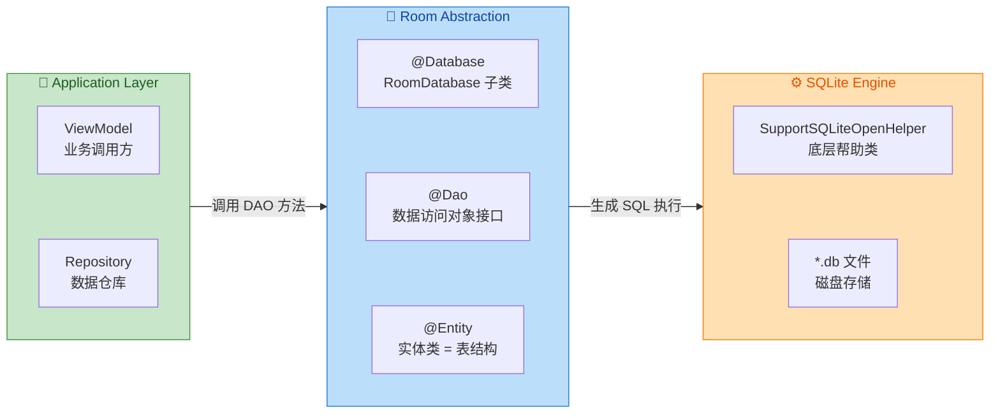

可以看到，**Entity 定义了表的"形状"**（列名、类型、约束），**DAO 定义了操作这些表的"动词"**（插入、查询、更新、删除），而 **RoomDatabase 则把两者粘合在一起**，最终由 Room 在编译期自动生成 `_Impl` 实现类，将注解翻译为真实的 SQLite SQL 语句。

---

### Entity 表定义

Entity 是 Room 中 **最直观的注解**——你在一个 Kotlin data class 上加一个 `@Entity`，Room 的注解处理器（Annotation Processor / KSP）就会在编译时为你生成对应的 `CREATE TABLE` 语句。每一个 Entity 类对应数据库中的一张表，类的每一个字段默认对应表中的一列。

**为什么要用注解而不是手写 SQL 建表？** 原因有三：其一，编译时验证（Compile-time Verification）可以在你写错列名、类型不匹配时直接报编译错误，而不是让 App 在运行时崩溃；其二，注解与 Kotlin data class 天然契合，字段名即列名，类型即列类型，消除了手动维护"类 ↔ 表"映射的心智负担；其三，Room 能据此生成高效的序列化/反序列化代码，省去了手动操作 Cursor 和 ContentValues 的模板代码。

来看一个完整的 Entity 定义：

```kotlin
// 使用 @Entity 注解将此 data class 标记为一张数据库表
// tableName 参数指定表名；若省略，则默认使用类名 "User" 作为表名
@Entity(tableName = "users")
data class User(
    // @PrimaryKey 标记此字段为主键
    // autoGenerate = true 表示由 SQLite 自动分配递增的整型 ID
    @PrimaryKey(autoGenerate = true)
    val id: Long = 0L,

    // @ColumnInfo 允许自定义列名，这里将字段 firstName 映射到列 "first_name"
    // 若省略 @ColumnInfo，列名默认与字段名相同（即 "firstName"）
    @ColumnInfo(name = "first_name")
    val firstName: String,

    // 同理，将 lastName 映射为 "last_name" 列
    @ColumnInfo(name = "last_name")
    val lastName: String,

    // 未加 @ColumnInfo，列名默认为 "email"
    val email: String,

    // @Ignore 标记的字段不会被映射为数据库列
    // 适用于仅在内存中使用的临时计算字段
    @Ignore
    val fullName: String = ""
)
```

这段代码在编译后，Room 会自动生成如下等价的 SQL（你无需手写，但理解它有助于调试）：

```sql
-- Room 编译时自动生成的建表语句（等价形式）
CREATE TABLE IF NOT EXISTS `users` (
    `id`         INTEGER PRIMARY KEY AUTOINCREMENT NOT NULL,
    `first_name` TEXT NOT NULL,
    `last_name`  TEXT NOT NULL,
    `email`      TEXT NOT NULL
    -- 注意：fullName 因 @Ignore 不会出现在表中
);
```

**几个关键机制需要深入理解：**

**字段类型映射（Type Affinity）**：Room 会将 Kotlin/Java 类型自动映射到 SQLite 的类型亲和力系统。`String` → `TEXT`，`Int` / `Long` → `INTEGER`，`Float` / `Double` → `REAL`，`ByteArray` → `BLOB`，`Boolean` → `INTEGER`（0/1）。如果你的字段是一个自定义类型（比如 `Date` 或 `List<String>`），Room 不知道如何映射，编译会失败——这正是后续 TypeConverter 要解决的问题。

**NOT NULL 语义**：Kotlin 的非空类型（如 `val name: String`）会映射为 `NOT NULL` 约束；可空类型（如 `val name: String?`）则允许存储 NULL 值。这是 Room 与 Kotlin null-safety 的精妙联动——**编译器帮你在数据库层也守住了空安全**。

**`@ColumnInfo` 的进阶用法**：除了重命名列，`@ColumnInfo` 还支持 `typeAffinity` 参数（强制指定列的存储亲和力）、`defaultValue` 参数（指定列的默认值，在 Migration 场景中特别有用）、以及 `collate` 参数（指定字符串排序规则，如 `NOCASE` 不区分大小写）。

**`@Ignore` 与构造函数**：被 `@Ignore` 标记的字段必须有默认值，否则 Room 在从数据库读取数据构造对象时无法为其赋值。另外，如果 Entity 有多个构造函数，Room 默认选择参数最多的那个（或者你可以用 `@Ignore` 标记不希望 Room 使用的构造函数）。

---

### PrimaryKey 主键

主键（Primary Key）是关系型数据库中 **唯一标识一行记录** 的字段。在 Room 中，每个 Entity **必须** 至少声明一个主键，否则编译报错。主键的设计直接影响查询性能、数据完整性和业务逻辑的正确性。

**单字段主键** 是最常见的形式，通常配合 `autoGenerate = true` 让 SQLite 自动生成递增 ID：

```kotlin
// 最常见的自增主键模式
@Entity(tableName = "articles")
data class Article(
    // autoGenerate = true 底层使用 SQLite 的 AUTOINCREMENT 关键字
    // 保证 ID 单调递增，即使删除记录后也不会复用已有 ID
    @PrimaryKey(autoGenerate = true)
    val articleId: Long = 0L,     // 默认值 0L 表示"尚未插入数据库"

    val title: String,
    val content: String
)
```

**`autoGenerate = true` 的底层细节**：当此标志开启时，Room 生成的建表语句会包含 `AUTOINCREMENT` 关键字。SQLite 的 `AUTOINCREMENT` 与单纯的 `INTEGER PRIMARY KEY` 有微妙区别——后者在行被删除后可能复用旧 ID，而 `AUTOINCREMENT` 使用一张内部表 `sqlite_sequence` 来追踪每张表当前的最大 ID，确保 ID 严格递增、永不复用。这在绝大多数业务场景下是更安全的选择，但有极微小的性能开销（维护 `sqlite_sequence` 表的额外写入）。

**复合主键（Composite Primary Key）** 适用于"联合唯一"的场景。比如一个"用户-课程"选课关系表，单独的 `userId` 或 `courseId` 都不能唯一标识一条选课记录，但两者组合起来可以：

```kotlin
// 复合主键通过 @Entity 的 primaryKeys 参数声明
// 此时不再在字段上使用 @PrimaryKey 注解
@Entity(
    tableName = "enrollments",
    primaryKeys = ["userId", "courseId"]   // 联合主键：userId + courseId
)
data class Enrollment(
    val userId: Long,       // 学生 ID（外键指向 users 表）
    val courseId: Long,     // 课程 ID（外键指向 courses 表）
    val enrollDate: Long    // 选课时间戳
)
```

复合主键在底层生成的 SQL 为 `PRIMARY KEY(userId, courseId)`，这意味着同一个 userId + courseId 组合只能存在一条记录，任何重复插入都会触发 `UNIQUE constraint failed` 异常（除非你使用 `OnConflictStrategy`，后面 DAO 部分会讲到）。

**主键的选型建议**：

- 如果实体有天然的业务唯一标识（如服务端返回的 UUID、用户手机号等），可以直接用它做主键，此时 `autoGenerate` 应设为 `false` 或不设置。
- 如果没有天然标识，使用 `autoGenerate = true` 的 Long 型自增主键是最通用、性能最好的方案。
- 复合主键适合 **关联表 / 中间表**（如多对多关系的 Junction 表），避免引入无意义的自增 ID。

---

### Index 索引

索引（Index）是数据库中 **加速查询** 的核心机制。如果把数据库表比作一本厚厚的书，索引就是书末尾的"关键词索引页"——有了它，你不用逐页翻（全表扫描 Full Table Scan），直接跳到目标页（索引定位）。

**在 Room 中声明索引** 有两种方式：通过 `@Entity` 的 `indices` 参数，或通过 `@ColumnInfo` 的 `index = true` 快捷方式（仅限单列索引）。

```kotlin
@Entity(
    tableName = "users",
    // indices 参数接收一个 Index 注解数组
    indices = [
        // 单列索引：加速按 email 查询
        // unique = true 表示唯一索引，同一 email 不允许重复
        Index(value = ["email"], unique = true),

        // 复合索引：加速同时按 last_name + first_name 查询
        // 注意复合索引的列顺序很重要（最左前缀原则）
        Index(value = ["last_name", "first_name"])
    ]
)
data class User(
    @PrimaryKey(autoGenerate = true)
    val id: Long = 0L,

    @ColumnInfo(name = "first_name")
    val firstName: String,

    @ColumnInfo(name = "last_name")
    val lastName: String,

    // 也可以直接在 @ColumnInfo 上声明 index = true（简写形式，单列非唯一索引）
    @ColumnInfo(index = true)
    val email: String
)
```

> 注意：上面的代码同时用了 `indices` 和 `@ColumnInfo(index = true)` 来为 email 列建索引，实际开发中二选一即可，这里仅为演示两种语法。

**索引的底层原理**：SQLite 使用 **B-Tree（B 树）** 数据结构来存储索引。当你为 `email` 列创建索引时，SQLite 会额外维护一棵以 email 值为键、以 rowid 为值的 B-Tree。查询 `SELECT * FROM users WHERE email = ?` 时，引擎先在 B-Tree 中 O(log N) 定位到目标 rowid，再用 rowid 回表取出完整行，速度远快于逐行扫描的 O(N)。

**唯一索引（Unique Index）** 不仅加速查询，还兼具 **数据约束** 的作用。声明 `unique = true` 后，任何尝试插入重复 email 的操作都会被 SQLite 拒绝。这是在数据库层面保障业务规则的最后一道防线。

**复合索引与最左前缀原则**：声明 `Index(value = ["last_name", "first_name"])` 时，这个索引对以下查询有效：

1. `WHERE last_name = ?` ✅ 命中（使用索引的第一列）
2. `WHERE last_name = ? AND first_name = ?` ✅ 命中（使用索引的全部列）
3. `WHERE first_name = ?` ❌ **不命中**（跳过了索引的第一列）

这就是"最左前缀原则（Leftmost Prefix Rule）"——复合索引只能从最左列开始连续匹配。因此，**列的声明顺序必须与你最常用的查询条件顺序一致**。

**索引的代价**：索引不是"越多越好"。每一个索引都会：（1）占用额外的磁盘空间（一棵独立的 B-Tree）；（2）在每次 INSERT / UPDATE / DELETE 时需要同步更新索引树，降低写入性能。对于 Android 本地数据库，通常表数据量不大（几千到几万行），只需要对 **频繁出现在 WHERE / JOIN / ORDER BY 中的列** 建立索引即可，不要盲目为所有列都加索引。

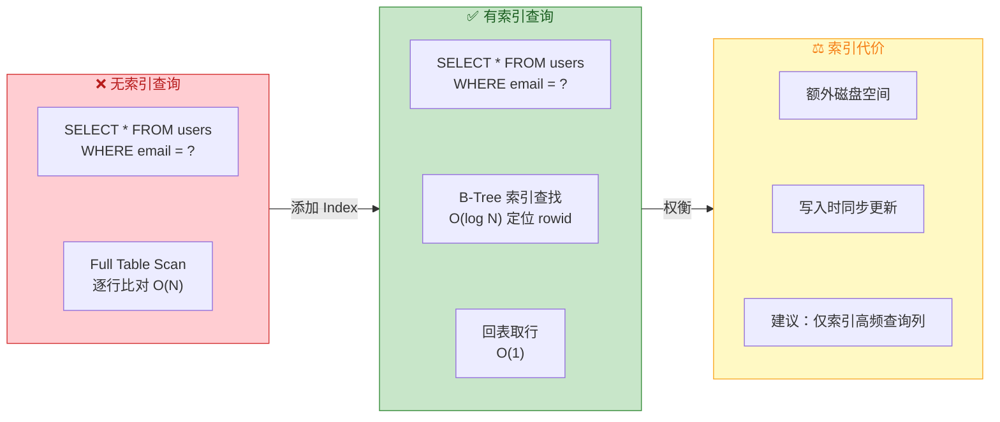

**外键索引的特殊要求**：当你在 Entity 中通过 `@ForeignKey` 声明外键约束时，Room 会在编译时发出警告，提醒你 **为外键列添加索引**。原因是 SQLite 在执行 `ON DELETE CASCADE` 或 `ON UPDATE CASCADE` 时，需要查找子表中所有引用父表被删除/更新行的记录，如果外键列没有索引，这个查找就是全表扫描，在数据量较大时会严重拖慢性能。

```kotlin
// 带外键约束的 Entity 示例
@Entity(
    tableName = "articles",
    // 声明外键：articles.authorId 引用 users.id
    foreignKeys = [
        ForeignKey(
            entity = User::class,           // 父表实体类
            parentColumns = ["id"],          // 父表主键列
            childColumns = ["authorId"],     // 子表外键列
            onDelete = ForeignKey.CASCADE    // 父记录删除时级联删除子记录
        )
    ],
    // Room 强烈建议为外键列建索引（否则编译会警告）
    indices = [Index("authorId")]
)
data class Article(
    @PrimaryKey(autoGenerate = true)
    val articleId: Long = 0L,

    // 外键列：引用 users 表的 id
    val authorId: Long,

    val title: String,
    val content: String
)
```

---

### DAO 数据访问对象

DAO（Data Access Object）是 Room 中 **定义数据库操作** 的接口或抽象类。你用注解声明"我要做什么操作"，Room 在编译时自动生成带有完整 SQL 执行逻辑的实现类（`*_Impl`）。这种设计实现了 **接口与实现的彻底分离**——你的业务代码只依赖一个干净的接口，所有的 Cursor 读取、ContentValues 组装、事务管理等脏活都由生成代码完成。

DAO 支持四大核心注解：`@Insert`、`@Update`、`@Delete`、`@Query`。前三个是便捷注解（Convenience Annotation），用于常见的增删改操作，无需手写 SQL；`@Query` 则是万能注解，适用于所有 SQL 语句。

```kotlin
// @Dao 注解声明这是一个数据访问对象接口
// Room 会在编译时生成 UserDao_Impl 实现类
@Dao
interface UserDao {

    // ==================== @Insert 插入 ====================

    // 插入单个用户对象
    // onConflict 指定冲突策略：若主键或唯一索引冲突，用新数据替换旧行
    // 返回值 Long 为插入后自动生成的 rowId（主键值）
    @Insert(onConflict = OnConflictStrategy.REPLACE)
    suspend fun insertUser(user: User): Long

    // 插入多个用户（支持 List / 可变参数）
    // 返回 List<Long>，包含每个插入对象的 rowId
    @Insert
    suspend fun insertUsers(users: List<User>): List<Long>

    // ==================== @Update 更新 ====================

    // 根据主键匹配，更新对应行的所有列
    // 返回 Int 表示受影响的行数（成功更新了几行）
    @Update
    suspend fun updateUser(user: User): Int

    // ==================== @Delete 删除 ====================

    // 根据主键匹配，删除对应行
    // 返回 Int 表示实际删除的行数
    @Delete
    suspend fun deleteUser(user: User): Int

    // ==================== @Query 自定义查询 ====================

    // 查询所有用户，按 last_name 升序排列
    // Room 在编译时验证 SQL 语法和列名是否匹配 Entity 定义
    @Query("SELECT * FROM users ORDER BY last_name ASC")
    suspend fun getAllUsers(): List<User>

    // 带参数查询：":userId" 会绑定到方法参数 userId
    // Room 使用 PreparedStatement 实现参数绑定，天然防止 SQL 注入
    @Query("SELECT * FROM users WHERE id = :userId")
    suspend fun getUserById(userId: Long): User?

    // 多参数查询 + IN 操作符
    @Query("SELECT * FROM users WHERE id IN (:userIds)")
    suspend fun getUsersByIds(userIds: List<Long>): List<User>

    // 模糊查询：注意 LIKE 的参数需要在调用时自行拼接 % 通配符
    // 例如调用时传 "%张%" 来搜索名字包含"张"的用户
    @Query("SELECT * FROM users WHERE first_name LIKE :namePattern")
    suspend fun searchByName(namePattern: String): List<User>

    // 聚合查询：返回用户总数
    @Query("SELECT COUNT(*) FROM users")
    suspend fun getUserCount(): Int

    // 返回部分列：不一定非要返回完整 Entity，可以返回自定义 POJO
    @Query("SELECT first_name, last_name FROM users WHERE id = :userId")
    suspend fun getUserName(userId: Long): UserName?

    // 删除操作也可以用 @Query（当你需要条件删除而非按主键删除时）
    @Query("DELETE FROM users WHERE id = :userId")
    suspend fun deleteUserById(userId: Long)

    // ==================== Flow 响应式查询 ====================

    // 返回 Flow<List<User>>：当 users 表发生任何变化时
    // Room 的 InvalidationTracker 会自动触发重新查询并发射新数据
    @Query("SELECT * FROM users ORDER BY last_name ASC")
    fun observeAllUsers(): Flow<List<User>>
}
```

上面用到了一个 **部分列查询** 的返回类型 `UserName`，它不需要是 Entity，只需要字段名与 SELECT 的列名匹配即可：

```kotlin
// 部分列查询的返回类型（不需要 @Entity 注解）
// Room 要求字段名与 SQL SELECT 中的列名（或别名）一一对应
data class UserName(
    @ColumnInfo(name = "first_name")
    val firstName: String,          // 对应 SELECT 中的 first_name

    @ColumnInfo(name = "last_name")
    val lastName: String            // 对应 SELECT 中的 last_name
)
```

**深入理解 `@Insert` 的冲突策略（OnConflictStrategy）**：

当插入的数据与已有数据在主键或唯一索引上产生冲突时，Room 提供了五种处理策略：

| 策略 | 行为 | 常用场景 |
|---|---|---|
| `ABORT`（默认） | 终止当前操作并回滚事务，抛出异常 | 严格数据唯一性场景 |
| `REPLACE` | 删除旧行，插入新行（相当于先 DELETE 再 INSERT） | "存在则更新"的快捷方式 |
| `IGNORE` | 忽略冲突行，不插入也不报错 | 批量导入时跳过重复数据 |
| `ROLLBACK` | 回滚整个事务（已废弃，建议用 ABORT） | — |
| `FAIL` | 不回滚事务但终止操作（已废弃） | — |

实际开发中最常用的是 `REPLACE` 和 `IGNORE`。**特别注意**：`REPLACE` 的底层实现是 "先删后插"，这意味着如果有 `ON DELETE CASCADE` 外键约束，`REPLACE` 操作可能会级联删除子表数据！这是一个常见的坑点。

**`@Query` 的编译时验证**：Room 最强大的特性之一是 **编译时 SQL 验证**。当你写 `@Query("SELECT * FROM users WHERE naem = :name")` 时（注意 `naem` 是拼写错误），编译器会直接报错："There is a problem with the query: no such column: naem"。这种能力来源于 Room 的注解处理器在编译期就拥有完整的 Schema 信息（通过 `@Entity` 注解解析出所有表和列的定义），从而可以在编译时模拟 SQL 解析，将运行时错误前移到编译时。

**`suspend` 函数与线程安全**：Room 默认 **禁止在主线程执行数据库操作**（否则抛出 `IllegalStateException`），因为磁盘 I/O 可能阻塞 UI。将 DAO 方法声明为 `suspend` 函数后，调用方必须在协程中执行，Room 会自动将实际的数据库操作调度到内部的 `Executor`（通常是 `Dispatchers.IO` 等效的后台线程池）上运行。你也可以不使用 `suspend`，改为返回 `Flow` / `LiveData` / `RxJava` 的 Observable 类型来实现异步。

**DAO 中使用事务**：对于需要保证原子性的多步操作，可以使用 `@Transaction` 注解：

```kotlin
@Dao
interface UserDao {

    // @Transaction 确保方法内的所有数据库操作在同一个事务中执行
    // 要么全部成功，要么全部回滚
    @Transaction
    suspend fun replaceAllUsers(newUsers: List<User>) {
        // 第一步：清空旧数据
        deleteAllUsers()
        // 第二步：插入新数据
        // 如果插入过程中任何一条失败，deleteAllUsers 也会回滚
        insertUsers(newUsers)
    }

    @Query("DELETE FROM users")
    suspend fun deleteAllUsers()

    @Insert
    suspend fun insertUsers(users: List<User>)
}
```

需要注意的是，**当 DAO 是 `interface` 时，不能直接编写带方法体的 `@Transaction` 方法**（因为 interface 的 default method 在 Room 的代码生成中有限制）。如果你需要在 DAO 中编写包含多步操作的事务方法，应将 DAO 声明为 **`abstract class`**：

```kotlin
// 使用 abstract class 形式的 DAO，支持编写带方法体的事务方法
@Dao
abstract class UserDao {

    // 抽象方法：由 Room 自动生成实现
    @Insert
    abstract suspend fun insertUsers(users: List<User>): List<Long>

    @Query("DELETE FROM users")
    abstract suspend fun deleteAllUsers()

    // 具体方法 + @Transaction：手动组合多个原子操作
    @Transaction
    open suspend fun replaceAllUsers(newUsers: List<User>) {
        deleteAllUsers()          // 清空
        insertUsers(newUsers)     // 重新插入
    }
}
```

**最后，理解 Room 生成代码的整体流程：**

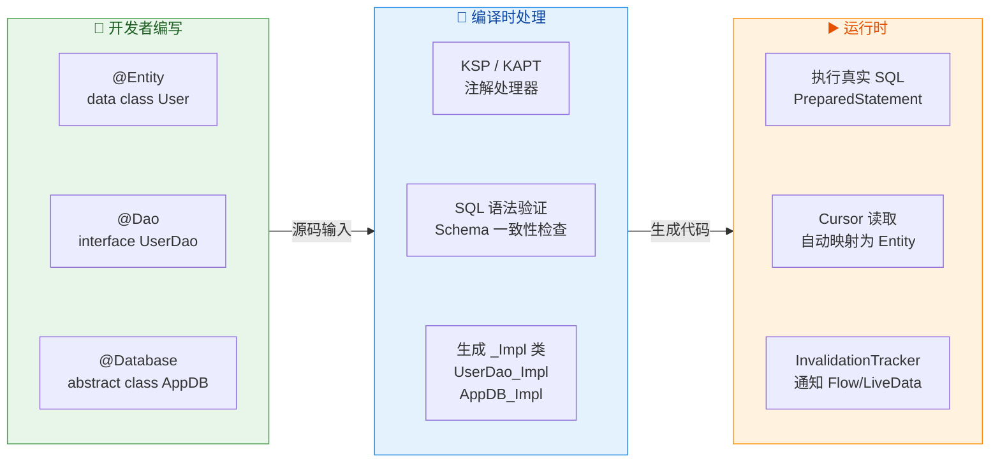

从开发者视角来看，你只需要写三样东西：Entity 类、DAO 接口、Database 抽象类。Room 的注解处理器在编译期承担了"验证 + 代码生成"的全部重任，最终在运行时高效执行，并将查询结果自动映射回你定义的 Kotlin 对象。这就是 Room ORM 的核心价值——**把手动的、易错的数据库模板代码，变成自动的、编译时安全的注解声明**。

---

**📝 练习题**

在一个 Room Entity 中，以下关于 `@PrimaryKey(autoGenerate = true)` 的描述，**正确** 的是？

A. `autoGenerate = true` 仅适用于 `Int` 类型的字段，不支持 `Long` 类型


B. 使用 `autoGenerate = true` 时，SQLite 底层会使用 `AUTOINCREMENT` 关键字，确保主键值严格递增且不复用已删除的 ID 值


C. 如果声明了 `autoGenerate = true`，插入时即使手动传入了一个非零的 ID 值，SQLite 也会忽略它并自动分配新 ID


D. 使用 `autoGenerate = true` 的主键列在底层映射为 `TEXT PRIMARY KEY`


**【答案】** B

**【解析】** `autoGenerate = true` 在 Room 中会让生成的建表语句包含 `INTEGER PRIMARY KEY AUTOINCREMENT`。SQLite 的 `AUTOINCREMENT` 机制通过维护内部的 `sqlite_sequence` 表来记录每张表曾分配过的最大 ID 值，即使行被删除，后续插入也不会复用已分配的 ID，从而确保主键严格单调递增。选项 A 错误，`autoGenerate` 同时支持 `Int` 和 `Long`（底层都是 `INTEGER`）。选项 C 错误，如果你手动传入了一个非零值（如 `User(id = 100, ...)`），SQLite 会尊重你传入的值，`AUTOINCREMENT` 只在传入 `0` 或 `NULL` 时才自动分配。选项 D 错误，`autoGenerate` 只适用于整型字段，映射为 `INTEGER` 而非 `TEXT`。

---

**📝 练习题**

对于 Room 中声明的复合索引 `@Entity(indices = [Index(value = ["city", "district", "street"])])`，以下哪个查询 **无法** 有效利用此索引？

A. `SELECT * FROM addresses WHERE city = '北京'`


B. `SELECT * FROM addresses WHERE city = '北京' AND district = '海淀'`


C. `SELECT * FROM addresses WHERE district = '海淀' AND street = '中关村大街'`


D. `SELECT * FROM addresses WHERE city = '北京' AND district = '海淀' AND street = '中关村大街'`


**【答案】** C

**【解析】** SQLite 的 B-Tree 索引遵循 **最左前缀原则（Leftmost Prefix Rule）**。复合索引 `(city, district, street)` 在物理上是一棵按 city → district → street 顺序排列的 B-Tree。查询条件必须从最左列 `city` 开始连续匹配才能命中索引。选项 A 命中第一列 `city` ✅；选项 B 命中前两列 `city + district` ✅；选项 D 命中全部三列 ✅；选项 C 的查询条件跳过了最左列 `city`，直接从 `district` 开始，B-Tree 无法利用索引进行高效定位，只能退化为全表扫描。这是数据库索引设计中最经典的考点之一，开发者在设计复合索引时应将 **最常作为查询条件的列放在最左边**。

---

## 关系映射 Relation

在关系型数据库的世界里，数据从来不是孤立存在的。一个用户拥有多个订单，一篇文章归属于某个作者，一个学生可以选修多门课程——这些现实世界中的"关联关系"是数据建模的核心挑战。传统 SQLite 开发中，我们需要手写 `JOIN` 语句、手动解析 `Cursor` 并自行组装嵌套对象，代码冗长且极易出错。Room 针对这一痛点，提供了 `@Embedded`、`@Relation`、`@Junction` 等注解，让开发者可以用声明式的方式描述表与表之间的关系，由编译器在编译期自动生成高效的查询与组装代码。

理解 Room 的关系映射机制，关键在于认清一个底层事实：**SQLite 本身没有"对象"的概念**，它只有行（Row）和列（Column）。所谓的"关系映射"本质上是 Room 在编译期帮你做了两件事——**生成正确的 SQL 查询语句**，以及**将扁平的查询结果行组装成嵌套的 Kotlin/Java 对象图**。这一整套机制的设计目标只有一个：让应用层代码可以用面向对象的思维操作关系型数据，同时不损失 SQL 的查询效率。

### Embedded 嵌套对象

#### 什么是 Embedded

`@Embedded` 是 Room 关系映射中最基础、最简单的注解。它解决的问题非常直接：**当一个实体（Entity）中包含一个"值对象"（Value Object）时，如何将这个值对象的字段平铺到同一张表中**。

举个具体的例子：一个 `User` 实体需要保存用户的地址信息（街道、城市、邮编）。从面向对象设计的角度，我们自然会把地址抽取为一个独立的 `Address` 类。但从数据库的角度，地址信息完全可以作为 `User` 表的几个列存储，没有必要为其单独建表。`@Embedded` 正是为这种场景而生——它告诉 Room："请把这个对象的所有字段当作当前表的列来处理。"

这与 `@Relation` 有本质区别。`@Relation` 描述的是跨表关系（需要两张表通过外键关联），而 `@Embedded` 描述的是**同一张表内的字段分组**。被 `@Embedded` 标记的类不需要是 `@Entity`，它只是一个普通的数据类（POJO），Room 会在编译期将其字段"展开"合并到宿主实体的列定义中。

#### 基本用法与列映射

```kotlin
// 地址值对象 —— 不需要 @Entity 注解，它不会生成独立的表
data class Address(
    val street: String,   // 街道，将成为 User 表的 street 列
    val city: String,     // 城市，将成为 User 表的 city 列
    val zipCode: String   // 邮编，将成为 User 表的 zipCode 列
)

// 用户实体 —— @Embedded 将 Address 的三个字段"平铺"进 user 表
@Entity(tableName = "user")
data class User(
    @PrimaryKey
    val userId: Long,             // 主键列
    val userName: String,         // 用户名列
    @Embedded                      // 关键注解：将 Address 的字段展开到 user 表
    val address: Address          // 实际不会生成名为 address 的列
)
```

上面的定义最终生成的 `user` 表结构等价于：

```sql
-- Room 自动生成的建表语句（概念等价）
CREATE TABLE user (
    userId   INTEGER PRIMARY KEY NOT NULL,  -- 来自 User.userId
    userName TEXT NOT NULL,                  -- 来自 User.userName
    street   TEXT NOT NULL,                  -- 来自 Address.street（被展开）
    city     TEXT NOT NULL,                  -- 来自 Address.city（被展开）
    zipCode  TEXT NOT NULL                   -- 来自 Address.zipCode（被展开）
);
```

可以看到，数据库层面完全不存在"Address"这个概念，它只是 Kotlin 代码层面的逻辑分组。当 Room 从数据库读取一行数据时，它会自动将 `street`、`city`、`zipCode` 三个列的值组装成一个 `Address` 对象，再赋值给 `User.address` 属性。

#### prefix 解决列名冲突

当一个实体中嵌入了两个相同类型的对象时，就会出现列名冲突。例如一个快递单需要记录"寄件地址"和"收件地址"，两者都是 `Address` 类型：

```kotlin
@Entity(tableName = "shipment")
data class Shipment(
    @PrimaryKey
    val shipmentId: Long,
    @Embedded(prefix = "from_")   // 所有 Address 字段前加 "from_" 前缀
    val fromAddress: Address,     // 生成列：from_street, from_city, from_zipCode
    @Embedded(prefix = "to_")     // 所有 Address 字段前加 "to_" 前缀
    val toAddress: Address        // 生成列：to_street, to_city, to_zipCode
)
```

`prefix` 参数会递归地作用于被嵌入对象的所有字段（包括嵌套的 `@Embedded`）。这是一个编译期行为，Room 的注解处理器（Annotation Processor / KSP）在生成建表语句时会自动将前缀拼接到列名前面。如果不加 `prefix`，两个 `Address` 的 `street`、`city`、`zipCode` 列名完全相同，编译期就会直接报错。

#### Embedded 在关系查询中的角色

`@Embedded` 还有一个至关重要的用途：**在关系查询的"容器类"中标记父实体**。后面讲到 `@Relation` 时你会频繁看到这种模式：

```kotlin
// 关系容器类（不是 Entity，也不建表）
data class UserWithOrders(
    @Embedded                    // 标记父实体，Room 据此获取父表的列信息
    val user: User,
    @Relation(...)               // 标记子实体列表
    val orders: List<Order>
)
```

这里的 `@Embedded` 告诉 Room："在查询结果中，`User` 的所有列可以直接从当前行的列中提取。" 没有 `@Embedded`，Room 就不知道如何从查询结果的列中构造 `User` 对象，编译会直接失败。

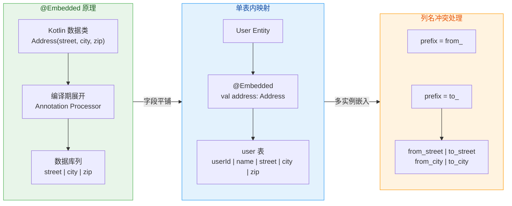

### 一对一 @Relation

#### 概念与场景

一对一关系（One-to-One Relationship）是最简单的跨表关系：表 A 中的一行恰好对应表 B 中的一行。典型场景包括：用户与用户详情（User ↔ UserProfile）、员工与工位（Employee ↔ Desk）、订单与支付记录（Order ↔ Payment，假设一个订单只有一笔支付）。

在数据库层面，一对一关系通过**外键**实现：子表中有一列存储父表的主键值。例如 `UserProfile` 表有一个 `profileUserId` 列，其值引用 `User` 表的 `userId`。需要特别注意的是，Room 的 `@Relation` 注解**并不会自动为你创建外键约束**（Foreign Key Constraint），它只是告诉 Room 如何用这两个列的值进行匹配查询。如果需要数据库级别的外键完整性保护，你仍然需要在 `@Entity` 的 `foreignKeys` 参数中显式声明。

#### 定义实体与关系容器

```kotlin
// ========== 父实体：用户 ==========
@Entity(tableName = "user")
data class User(
    @PrimaryKey
    val userId: Long,       // 父表主键
    val userName: String    // 用户名
)

// ========== 子实体：用户详情 ==========
@Entity(
    tableName = "user_profile",
    foreignKeys = [                          // 可选：声明外键约束
        ForeignKey(
            entity = User::class,            // 引用的父实体类
            parentColumns = ["userId"],      // 父表的关联列
            childColumns = ["profileUserId"],// 子表的外键列
            onDelete = ForeignKey.CASCADE    // 父记录删除时级联删除子记录
        )
    ]
)
data class UserProfile(
    @PrimaryKey
    val profileId: Long,         // 详情表自己的主键
    val profileUserId: Long,     // 外键列，引用 user.userId
    val bio: String,             // 个人简介
    val avatarUrl: String        // 头像链接
)
```

两张表定义好后，我们需要一个"关系容器类"（Relation Container / POJO）来承载一对一查询的结果。这个容器类**不是** `@Entity`，它不会在数据库中生成表，只是 Room 用来组装查询结果的载体：

```kotlin
// ========== 关系容器类 ==========
data class UserWithProfile(
    @Embedded                               // 父实体通过 @Embedded 嵌入
    val user: User,                         // Room 从查询结果中提取 User 的列
    @Relation(
        parentColumn = "userId",            // 父表的关联列（User.userId）
        entityColumn = "profileUserId"      // 子表的关联列（UserProfile.profileUserId）
    )
    val profile: UserProfile                // 一对一：单个对象，不是 List
)
```

这里有一个关键的类型约定：**如果 `@Relation` 标注的字段类型是单个对象（而非 `List`），Room 就将其视为一对一关系**。如果查询到多条匹配记录，Room 只会取第一条；如果查不到，则该字段为 `null`（此时类型应声明为 `UserProfile?`）。

#### DAO 查询写法

```kotlin
@Dao
interface UserDao {
    // 只需查询父表，Room 会自动生成子查询来获取关联的 UserProfile
    @Transaction   // 必须加 @Transaction，保证父查询和子查询的原子性
    @Query("SELECT * FROM user WHERE userId = :id")
    suspend fun getUserWithProfile(id: Long): UserWithProfile?

    // 批量查询所有用户及其详情
    @Transaction
    @Query("SELECT * FROM user")
    fun getAllUsersWithProfiles(): Flow<List<UserWithProfile>>
}
```

`@Transaction` 注解在关系查询中是**强制要求**的（Room 编译器会发出警告如果你忘记添加）。原因在于 Room 对关系查询的实现机制：它实际上会执行**两次查询**——先查父表获取所有父实体，再根据父实体的关联列值批量查子表。如果两次查询之间数据库发生了变更（比如另一个线程删除了某条记录），就会导致数据不一致。`@Transaction` 确保这两次查询在同一个数据库事务中执行，从而保证一致性。

#### 编译期生成的查询逻辑

为了帮助理解 Room 在幕后做了什么，下面用伪代码描述编译器为 `getUserWithProfile` 生成的逻辑：

```kotlin
// ===== Room 编译期自动生成的代码（简化版伪代码） =====
override suspend fun getUserWithProfile(id: Long): UserWithProfile? {
    // 第一步：开启事务
    return database.withTransaction {
        // 第二步：执行开发者写的 SQL，查询父表
        val userCursor = query("SELECT * FROM user WHERE userId = ?", arrayOf(id))
        val user = parseUser(userCursor)          // 从 Cursor 解析 User 对象
        if (user == null) return@withTransaction null

        // 第三步：自动生成的子查询（开发者不需要写这段 SQL）
        // Room 根据 @Relation 的 parentColumn 和 entityColumn 生成
        val profileCursor = query(
            "SELECT * FROM user_profile WHERE profileUserId = ?",
            arrayOf(user.userId)                   // 用父实体的 userId 作为查询条件
        )
        val profile = parseUserProfile(profileCursor) // 解析 UserProfile 对象

        // 第四步：组装容器对象并返回
        UserWithProfile(user = user, profile = profile)
    }
}
```

当批量查询多个父实体时，Room 不会为每个父实体单独执行一次子查询（那将导致 N+1 查询问题）。相反，它会将所有父实体的关联列值收集起来，用一条 `WHERE profileUserId IN (?, ?, ?, ...)` 的 SQL 批量查询所有子实体，然后在内存中按关联列值进行分组匹配。这一优化对开发者完全透明，但对性能至关重要。

### 一对多 @Relation

#### 概念与场景

一对多关系（One-to-Many Relationship）是实际开发中最常见的关系类型：一个用户有多个订单，一个播放列表包含多首歌曲，一个部门下有多名员工。在数据库中，一对多的实现方式与一对一完全相同——子表通过外键列引用父表主键。唯一的区别在于，**一个父记录可以对应多条子记录**。

在 Room 中，一对一和一对多的注解写法几乎完全相同，区别仅在于 `@Relation` 字段的类型：单个对象表示一对一，`List` 表示一对多。

#### 完整示例

```kotlin
// ========== 父实体：用户 ==========
@Entity(tableName = "user")
data class User(
    @PrimaryKey
    val userId: Long,       // 父表主键
    val userName: String    // 用户名
)

// ========== 子实体：订单 ==========
@Entity(
    tableName = "order_table",                // "order" 是 SQL 保留字，需换名
    foreignKeys = [
        ForeignKey(
            entity = User::class,             // 引用父实体
            parentColumns = ["userId"],       // 父表关联列
            childColumns = ["orderUserId"],   // 子表外键列
            onDelete = ForeignKey.CASCADE     // 级联删除
        )
    ],
    indices = [Index("orderUserId")]          // 外键列建索引，加速 JOIN 查询
)
data class Order(
    @PrimaryKey(autoGenerate = true)
    val orderId: Long = 0,       // 订单主键，自增
    val orderUserId: Long,       // 外键列，指向 user.userId
    val product: String,         // 商品名
    val amount: Double           // 金额
)

// ========== 一对多关系容器 ==========
data class UserWithOrders(
    @Embedded                                 // 嵌入父实体
    val user: User,
    @Relation(
        parentColumn = "userId",              // 父表关联列
        entityColumn = "orderUserId"          // 子表关联列
    )
    val orders: List<Order>                   // 一对多：List 类型
)
```

DAO 查询写法与一对一如出一辙：

```kotlin
@Dao
interface UserDao {
    // 查询单个用户及其所有订单
    @Transaction
    @Query("SELECT * FROM user WHERE userId = :id")
    suspend fun getUserWithOrders(id: Long): UserWithOrders?

    // 查询所有用户及其订单，返回 Flow 实现响应式观察
    @Transaction
    @Query("SELECT * FROM user")
    fun getAllUsersWithOrders(): Flow<List<UserWithOrders>>
}
```

#### entity 参数与部分列映射

在某些场景下，我们不需要子表的全部字段。例如在列表页面只需要展示订单的 ID 和商品名，不需要金额等详细信息。Room 允许通过 `@Relation` 的 `entity` 和 `projection` 参数来实现部分列映射：

```kotlin
// 精简的订单摘要 —— 不是 Entity，只是一个普通 POJO
data class OrderSummary(
    val orderId: Long,      // 只需要订单 ID
    val product: String     // 和商品名
)

data class UserWithOrderSummaries(
    @Embedded
    val user: User,
    @Relation(
        parentColumn = "userId",
        entityColumn = "orderUserId",
        entity = Order::class,               // 告诉 Room 实际查询的是 order_table 表
        projection = ["orderId", "product"]  // 只 SELECT 这两列
    )
    val orderSummaries: List<OrderSummary>   // 映射到精简 POJO
)
```

`entity` 参数指定了实际关联的数据库实体类（Room 需要知道要查哪张表以及 `entityColumn` 在哪个表中），而 `projection` 则指定了 `SELECT` 的列列表。生成的 SQL 大致为：`SELECT orderId, product FROM order_table WHERE orderUserId IN (?,...)`。这样可以减少不必要的数据传输和内存分配，对列表页的性能优化很有意义。

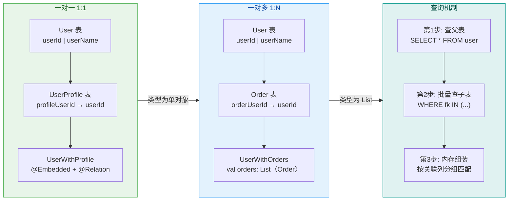

### 多对多 Junction

#### 为什么需要中间表

多对多关系（Many-to-Many Relationship）是关系模型中最复杂的关系类型：一个学生可以选修多门课程，一门课程也可以被多个学生选修；一首歌曲可以属于多个播放列表，一个播放列表也包含多首歌曲。

关系型数据库无法直接表达多对多关系——你不可能在 `Student` 表里放一个 `courseIds` 数组列（SQLite 不支持数组类型，即使用 JSON 存储也无法高效查询）。标准做法是引入一张**中间表**（Junction Table / Associative Table / Cross-Reference Table），这张表只有两列，分别存储两端实体的主键。每一行代表一条"关联关系"。

例如 `StudentCourseCrossRef` 表：

| studentId | courseId |
|-----------|---------|
| 1         | 101     |
| 1         | 102     |
| 2         | 101     |
| 3         | 103     |

这张表告诉我们：学生1选了课程101和102，学生2选了课程101，学生3选了课程103。通过这张中间表，我们可以从任意一端出发查询另一端的关联数据。

#### Room 中的 @Junction

Room 通过 `@Junction` 注解来声明多对多关系中的中间表。让我们通过一个完整的"学生-课程"示例来理解整个机制：

```kotlin
// ========== 实体1：学生 ==========
@Entity(tableName = "student")
data class Student(
    @PrimaryKey
    val studentId: Long,      // 学生主键
    val studentName: String   // 学生姓名
)

// ========== 实体2：课程 ==========
@Entity(tableName = "course")
data class Course(
    @PrimaryKey
    val courseId: Long,        // 课程主键
    val courseName: String     // 课程名称
)

// ========== 中间表（交叉引用表）==========
@Entity(
    tableName = "student_course_cross_ref",
    primaryKeys = ["studentId", "courseId"],  // 联合主键，防止重复关联
    foreignKeys = [
        ForeignKey(                           // 引用学生表
            entity = Student::class,
            parentColumns = ["studentId"],
            childColumns = ["studentId"],
            onDelete = ForeignKey.CASCADE
        ),
        ForeignKey(                           // 引用课程表
            entity = Course::class,
            parentColumns = ["courseId"],
            childColumns = ["courseId"],
            onDelete = ForeignKey.CASCADE
        )
    ],
    indices = [Index("courseId")]             // studentId 已在联合主键中有索引
)
data class StudentCourseCrossRef(
    val studentId: Long,   // 学生 ID（外键）
    val courseId: Long      // 课程 ID（外键）
)
```

中间表的设计有几个要点值得强调。首先，联合主键 `primaryKeys = ["studentId", "courseId"]` 确保同一个学生不会重复选修同一门课程。其次，两个外键约束分别指向两端的实体表，配合 `CASCADE` 删除策略，当学生或课程被删除时，相关的关联记录也会自动清除。最后，对 `courseId` 列建立索引是一个容易被忽略但很重要的性能优化——因为反向查询（"某门课有哪些学生"）需要在 `courseId` 列上进行检索，没有索引会导致全表扫描。

#### 双向关系容器

多对多关系是双向的，因此我们通常需要定义两个方向的关系容器：

```kotlin
// ========== 方向1：查询学生选了哪些课 ==========
data class StudentWithCourses(
    @Embedded
    val student: Student,                     // 嵌入学生（父侧）
    @Relation(
        parentColumn = "studentId",           // Student 表的关联列
        entityColumn = "courseId",            // Course 表的关联列
        associateBy = Junction(               // 通过中间表关联
            StudentCourseCrossRef::class      // 中间表实体类
        )
    )
    val courses: List<Course>                 // 该学生选修的所有课程
)

// ========== 方向2：查询课程被哪些学生选了 ==========
data class CourseWithStudents(
    @Embedded
    val course: Course,                       // 嵌入课程（父侧）
    @Relation(
        parentColumn = "courseId",            // Course 表的关联列
        entityColumn = "studentId",          // Student 表的关联列
        associateBy = Junction(
            StudentCourseCrossRef::class
        )
    )
    val students: List<Student>              // 选修该课程的所有学生
)
```

这里需要特别理解 `parentColumn` 和 `entityColumn` 在多对多中的含义。在一对多关系中，`parentColumn` 是父表的列，`entityColumn` 是子表的外键列，二者直接匹配。但在多对多关系中，两个实体表之间**没有直接的外键引用**，关联是通过中间表间接建立的。Room 的处理逻辑是：

1. 从 `@Embedded` 的实体中取出 `parentColumn` 对应的值（如 `student.studentId = 1`）。
2. 在中间表中查找所有 `studentId = 1` 的行，提取出对应的 `courseId` 列表（如 `[101, 102]`）。
3. 在目标表中查找所有 `courseId IN (101, 102)` 的记录，返回 `Course` 对象列表。

所以 `parentColumn` 和 `entityColumn` 实际上分别指的是**中间表中与两端实体对应的列名**。Room 之所以能正确匹配，是因为中间表的列名与两端实体的主键列名一致。如果列名不一致，可以通过 `Junction` 的 `parentColumn` 和 `entityColumn` 参数显式指定映射关系。

#### Junction 的列名映射

当中间表的列名与两端实体的主键列名不同时，需要在 `Junction` 中显式指定：

```kotlin
// 假设中间表的列名不同于实体主键名
@Entity(
    tableName = "enrollment",
    primaryKeys = ["sid", "cid"]     // 列名是 sid 和 cid，而非 studentId 和 courseId
)
data class Enrollment(
    val sid: Long,    // 对应 Student.studentId
    val cid: Long     // 对应 Course.courseId
)

// 关系容器需要显式声明 Junction 的列映射
data class StudentWithCourses(
    @Embedded
    val student: Student,
    @Relation(
        parentColumn = "studentId",         // Student 实体的列
        entityColumn = "courseId",          // Course 实体的列
        associateBy = Junction(
            value = Enrollment::class,      // 中间表实体
            parentColumn = "sid",           // 中间表中对应 parent 的列
            entityColumn = "cid"            // 中间表中对应 entity 的列
        )
    )
    val courses: List<Course>
)
```

这种显式映射在实际项目中并不少见——当中间表需要记录额外信息（如选课时间、成绩等）时，表结构往往会有独立的列命名规范。

#### DAO 查询与数据写入

```kotlin
@Dao
interface SchoolDao {
    // ===== 关系查询 =====
    @Transaction
    @Query("SELECT * FROM student WHERE studentId = :id")
    suspend fun getStudentWithCourses(id: Long): StudentWithCourses?

    @Transaction
    @Query("SELECT * FROM course WHERE courseId = :id")
    suspend fun getCourseWithStudents(id: Long): CourseWithStudents?

    // ===== 中间表的增删操作 =====
    @Insert(onConflict = OnConflictStrategy.IGNORE)  // 忽略重复选课
    suspend fun insertCrossRef(crossRef: StudentCourseCrossRef)

    @Delete   // 退课：删除中间表中对应的一行
    suspend fun deleteCrossRef(crossRef: StudentCourseCrossRef)

    // ===== 事务操作：学生选课（原子性保证）=====
    @Transaction
    suspend fun enrollStudentInCourse(studentId: Long, courseId: Long) {
        // 先确保学生和课程都存在（可选的业务校验逻辑）
        // 再插入中间表记录
        insertCrossRef(StudentCourseCrossRef(studentId, courseId))
    }
}
```

多对多关系的写入操作始终是针对中间表的。你不需要修改 `Student` 或 `Course` 表——它们完全不知道对方的存在。所有的关联信息都通过中间表来管理。这是关系型数据库多对多设计的经典模式。

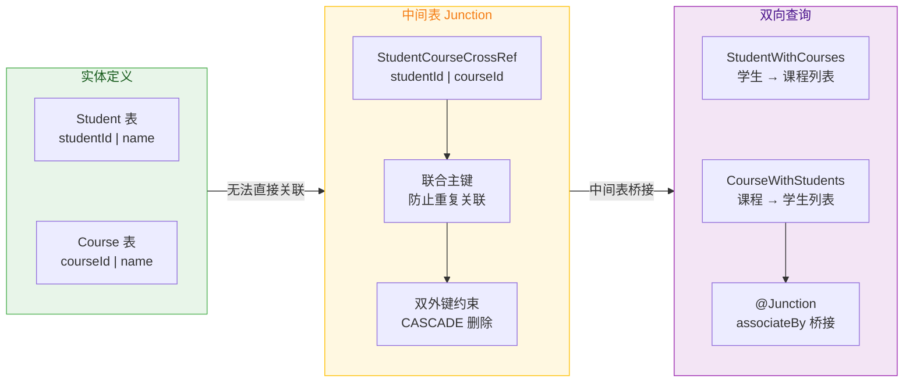

### 关系映射的底层机制与性能考量

理解 Room 关系映射的底层实现，有助于我们在实际开发中做出正确的性能决策。

**两阶段查询模型**。Room 对所有 `@Relation` 查询（无论一对一、一对多还是多对多）都采用两阶段查询策略。第一阶段执行开发者手写的 SQL 获取父实体集合，第二阶段由 Room 自动生成 SQL 查询所有关联的子实体。对于多对多关系，第二阶段实际上是两次查询：先查中间表获取关联 ID 列表，再查目标表获取实体数据。所有这些查询都被包裹在同一个 `@Transaction` 中。

**IN 子句的上限**。当父实体数量非常多时，`WHERE foreignKey IN (?, ?, ?, ...)` 中的占位符数量会很大。SQLite 对单条 SQL 语句中的变量数量有一个默认上限（`SQLITE_MAX_VARIABLE_NUMBER`，通常为 999）。Room 会在生成代码中自动处理这一限制——当参数数量超过阈值时，它会将大的 `IN` 查询拆分为多个小批次，分别执行后合并结果。这意味着开发者不需要手动做分页处理，但应该意识到极大数据量下可能存在的性能开销。

**内存开销**。关系查询会在内存中构建完整的嵌套对象图。如果一个用户有 10000 条订单记录，`UserWithOrders` 对象就会持有一个 10000 元素的 `List<Order>`。在这种场景下，应该考虑使用分页查询（Paging 3）或在 DAO 层面通过 `LIMIT` 子句限制子查询的结果数量，而不是一次性加载所有数据。

**嵌套关系**。Room 支持多层嵌套的关系。例如你可以定义 `UserWithOrdersAndItems`，其中 `Order` 内部又通过 `@Relation` 关联了 `OrderItem` 列表。但嵌套层次越深，生成的查询数量就越多，性能风险也越高。超过两层嵌套时，建议认真评估是否真的需要一次性加载所有层级的数据，或者是否可以通过按需懒加载来优化。

```kotlin
// 多层嵌套关系示例
// 第一层：订单包含多个订单项
data class OrderWithItems(
    @Embedded
    val order: Order,                        // 嵌入订单
    @Relation(
        parentColumn = "orderId",            // Order 的主键
        entityColumn = "itemOrderId"         // OrderItem 的外键
    )
    val items: List<OrderItem>               // 一对多：订单项列表
)

// 第二层：用户包含多个"带订单项的订单"
data class UserWithOrdersAndItems(
    @Embedded
    val user: User,                          // 嵌入用户
    @Relation(
        entity = Order::class,               // 指定关联的是 Order Entity
        parentColumn = "userId",             // User 的主键
        entityColumn = "orderUserId"         // Order 的外键
    )
    val ordersWithItems: List<OrderWithItems> // 嵌套关系：List<OrderWithItems>
)
```

注意第二层 `@Relation` 中必须指定 `entity = Order::class`，因为字段类型是 `List<OrderWithItems>`（一个关系容器类而非直接的 Entity），Room 需要 `entity` 参数来知道应该查询哪张表。

---

**📝 练习题**

在 Room 中定义如下两个实体和一个关系容器类：

```kotlin
@Entity
data class Author(
    @PrimaryKey val authorId: Long,
    val name: String
)

@Entity
data class Book(
    @PrimaryKey val bookId: Long,
    val authorId: Long,
    val title: String
)

data class AuthorWithBooks(
    @Embedded val author: Author,
    @Relation(
        parentColumn = "authorId",
        entityColumn = "authorId"
    )
    val books: List<Book>
)
```

在 DAO 中编写查询方法时，以下哪种写法是正确且安全的？

A. `@Query("SELECT * FROM Author") fun getAll(): List<AuthorWithBooks>`


B. `@Transaction @Query("SELECT * FROM Author") fun getAll(): List<AuthorWithBooks>`


C. `@Transaction @Query("SELECT * FROM Author a INNER JOIN Book b ON a.authorId = b.authorId") fun getAll(): List<AuthorWithBooks>`


D. `@Query("SELECT * FROM Book") fun getAll(): List<AuthorWithBooks>`


**【答案】** B

**【解析】** Room 的 `@Relation` 查询要求满足两个核心条件。第一，查询语句只需要 `SELECT` 父表（即 `@Embedded` 标注的那个实体对应的表），Room 会自动根据 `@Relation` 注解生成子查询来获取关联数据。因此选项 C 虽然手写了 JOIN 语句且结果功能上可能凑巧"能用"，但这不是 Room 关系查询的正确用法——Room 仍会额外执行一次自动生成的子查询，导致重复查询和不可预测的结果映射行为。选项 D 查询的是子表 `Book` 而非父表 `Author`，与 `@Embedded val author: Author` 不匹配，编译期就会报错。第二，必须添加 `@Transaction` 注解，因为 Room 内部会执行至少两次查询（一次父表、一次子表），事务保证两次查询之间数据的一致性。选项 A 缺少 `@Transaction`，编译时 Room 会发出警告，可能导致并发场景下数据不一致。选项 B 同时满足"只查父表 + 有事务注解"两个条件，是标准写法。

---

## 数据库升级 Migration

数据库升级（Database Migration）是 Android 应用生命周期中**最容易被忽视却最致命**的环节之一。当应用发布到线上后，用户设备中已经存在旧版本的数据库文件（`.db`），而新版本的代码可能修改了表结构、新增了字段或调整了索引。如果不做任何迁移处理，Room 在打开数据库时会发现**编译时生成的 Schema 与磁盘上的实际表结构不匹配**，直接抛出 `IllegalStateException` 导致应用崩溃。因此，理解 Room 的升级机制——手动 Migration、破坏性重建（Destructive Migration）以及自动迁移（AutoMigration）——是每一个 Android 开发者的必修课。

要理解 Room 迁移的底层逻辑，首先需要知道 SQLite 本身的版本管理机制。每一个 SQLite 数据库文件的**文件头**（前 100 字节）中，偏移量 60 处存储着一个 4 字节整数，称为 `user_version`。这个值可以通过 `PRAGMA user_version` 读写，Android 的 `SQLiteOpenHelper` 正是利用它来判断是否需要执行 `onUpgrade()` 或 `onDowngrade()` 回调。Room 作为 SQLiteOpenHelper 之上的抽象层，同样依赖这个版本号：你在 `@Database(version = N)` 中声明的数字，最终会写入该字段。当 Room 打开数据库时，它会读取磁盘上的 `user_version`，与代码中声明的 `version` 对比，若不一致则触发迁移流程。

### MIGRATION\_1\_2 手动迁移策略

手动迁移是 Room 最基础、最灵活的升级方式。开发者需要创建一个 `Migration` 对象，明确指定起始版本（startVersion）与目标版本（endVersion），并在 `migrate()` 回调中编写原生 SQL 来完成表结构变更。Room 在运行时会根据当前数据库版本和目标版本，在已注册的 Migration 列表中寻找一条**最短路径**（Shortest Migration Path），依次执行每一步迁移。

**为什么需要手动写 SQL？** Room 的编译时注解处理器（Annotation Processor / KSP）虽然能生成建表语句和 DAO 实现，但它无法自动推断"旧表→新表"的变更意图。例如，你将某个字段从 `String` 改为 `Int`，Room 不知道你想清空该列还是做类型转换。因此 Room 把**变更策略的决定权**交给开发者。

假设我们的应用从 version 1 升级到 version 2，变更内容是为 `User` 表新增一个 `age` 字段（`INTEGER`，默认值为 0）。完整的迁移代码如下：

```kotlin
// 定义从版本 1 → 版本 2 的迁移对象
// Migration 构造函数接收 (startVersion, endVersion)
val MIGRATION_1_2 = object : Migration(1, 2) {

    // Room 在检测到版本不匹配时会调用此方法
    // 参数 db 是底层的 SupportSQLiteDatabase，可执行原生 SQL
    override fun migrate(db: SupportSQLiteDatabase) {
        // 使用 ALTER TABLE 为已有的 user 表添加 age 列
        // INTEGER 对应 Kotlin 的 Int 类型
        // NOT NULL 表示非空约束，DEFAULT 0 提供默认值
        db.execSQL(
            "ALTER TABLE user ADD COLUMN age INTEGER NOT NULL DEFAULT 0"
        )
    }
}
```

然后在构建 `RoomDatabase` 实例时注册该迁移：

```kotlin
// 构建 Room 数据库实例
val db = Room.databaseBuilder(
    context.applicationContext,   // 使用 Application Context 避免内存泄漏
    AppDatabase::class.java,     // 你的 RoomDatabase 子类
    "app_database"               // 数据库文件名
)
    .addMigrations(MIGRATION_1_2) // 注册迁移对象，可传入多个
    .build()                      // 延迟构建，首次访问时才真正打开
```

**多版本链式迁移**。现实中版本往往不是从 1 直接跳到 2，而是经历 1→2→3→4 甚至更多。Room 内部维护了一个 `SparseArrayCompat<SparseArrayCompat<Migration>>` 结构（本质上是一个二维稀疏数组），以 `startVersion` 和 `endVersion` 为键存储所有已注册的 Migration。当需要从版本 1 升级到版本 4 时，Room 会尝试找到一条路径，比如 `1→2 → 2→3 → 3→4`，依次执行三个 Migration 的 `migrate()` 方法。如果你同时注册了 `MIGRATION_1_4`（一步到位），Room 会优先选择**跨度最大的单步迁移**，因为它的路径最短（只需一步）。

```kotlin
// 版本 1 → 2：新增 age 字段
val MIGRATION_1_2 = object : Migration(1, 2) {
    override fun migrate(db: SupportSQLiteDatabase) {
        db.execSQL("ALTER TABLE user ADD COLUMN age INTEGER NOT NULL DEFAULT 0")
    }
}

// 版本 2 → 3：新增 email 字段
val MIGRATION_2_3 = object : Migration(2, 3) {
    override fun migrate(db: SupportSQLiteDatabase) {
        db.execSQL("ALTER TABLE user ADD COLUMN email TEXT NOT NULL DEFAULT ''")
    }
}

// 版本 3 → 4：创建全新的 order 表
val MIGRATION_3_4 = object : Migration(3, 4) {
    override fun migrate(db: SupportSQLiteDatabase) {
        // 创建 order 表，包含 id 主键、userId 外键、amount 金额
        db.execSQL("""
            CREATE TABLE IF NOT EXISTS `order` (
                `id` INTEGER PRIMARY KEY AUTOINCREMENT NOT NULL,
                `userId` INTEGER NOT NULL,
                `amount` REAL NOT NULL,
                FOREIGN KEY(`userId`) REFERENCES `user`(`id`)
                    ON DELETE CASCADE
            )
        """.trimIndent())
    }
}

// 可选：提供一步到位的 1 → 4 迁移，跳过中间步骤
// 适用于从非常老的版本直接升级的场景，可以合并 SQL 提升效率
val MIGRATION_1_4 = object : Migration(1, 4) {
    override fun migrate(db: SupportSQLiteDatabase) {
        db.execSQL("ALTER TABLE user ADD COLUMN age INTEGER NOT NULL DEFAULT 0")
        db.execSQL("ALTER TABLE user ADD COLUMN email TEXT NOT NULL DEFAULT ''")
        db.execSQL("""
            CREATE TABLE IF NOT EXISTS `order` (
                `id` INTEGER PRIMARY KEY AUTOINCREMENT NOT NULL,
                `userId` INTEGER NOT NULL,
                `amount` REAL NOT NULL,
                FOREIGN KEY(`userId`) REFERENCES `user`(`id`)
                    ON DELETE CASCADE
            )
        """.trimIndent())
    }
}

// 注册所有迁移：Room 会自动选择最优路径
val db = Room.databaseBuilder(context, AppDatabase::class.java, "app_database")
    .addMigrations(
        MIGRATION_1_2,   // 1 → 2
        MIGRATION_2_3,   // 2 → 3
        MIGRATION_3_4,   // 3 → 4
        MIGRATION_1_4    // 1 → 4（快捷通道）
    )
    .build()
```

Room 的路径查找逻辑可以这样理解：

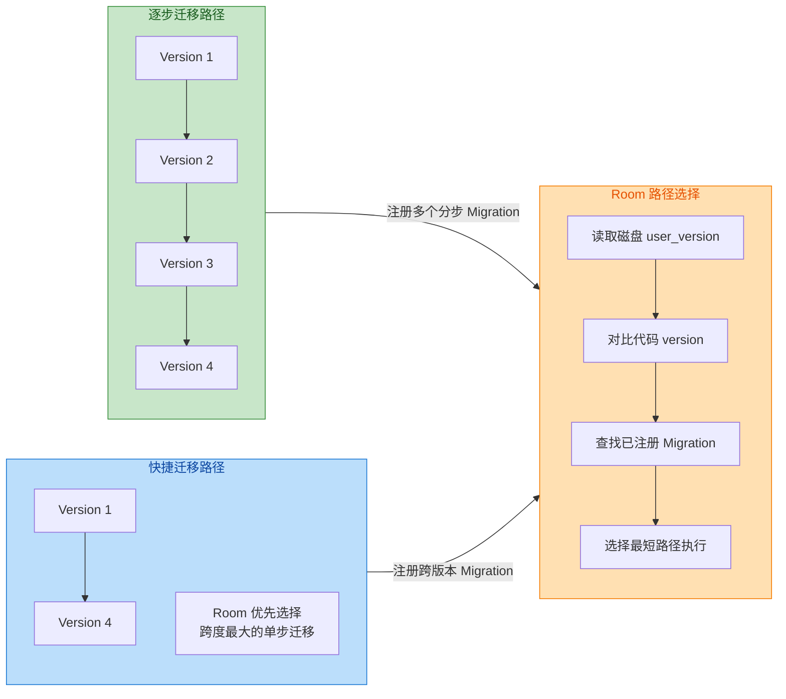

**Migration 验证机制**。Room 在迁移执行完毕后，并不会盲目信任开发者的 SQL。它会对迁移后的数据库执行一次**Schema 验证**（Schema Validation）：将磁盘上的表结构（通过 `PRAGMA table_info(tableName)` 查询列信息）与编译期生成的 `_Impl` 类中硬编码的期望 Schema 逐字段对比。对比的内容包括：列名、列类型（TEXT / INTEGER / REAL / BLOB）、是否允许 NULL、默认值等。如果任何一项不匹配，Room 就会抛出异常，错误信息类似于：

> *"Migration didn't properly handle: user(…). Expected: `TableInfo{…}` Found: `TableInfo{…}`"*

这个机制的意义在于——**编译时的 Entity 定义是 Single Source of Truth**。你的 Migration SQL 必须让数据库状态与 Entity 类完全一致。这虽然增加了开发负担，但有效防止了"SQL 写漏了一个字段导致运行时查询崩溃"这类隐蔽 Bug。

**Schema 导出文件（schema export）**。为了方便 Migration 的编写和测试，Room 提供了 Schema 导出功能。当你在 `@Database` 注解中设置 `exportSchema = true`（默认就是 true），并在 `build.gradle` 中配置 `room.schemaLocation`，编译器会为每个版本生成一个 JSON 文件（如 `1.json`、`2.json`），记录该版本所有表、列、索引的完整信息。这些 JSON 文件应当纳入版本控制（Git），它们是 Migration 正确性的**快照基准**，也是后续 AutoMigration 的依赖基础。

```kotlin
// build.gradle.kts (KSP 配置方式)
ksp {
    // 指定 schema 导出目录，每个版本生成一个 JSON 文件
    arg("room.schemaLocation", "$projectDir/schemas")
}

// @Database 注解中 exportSchema 默认为 true
@Database(
    entities = [User::class, Order::class],
    version = 4,
    exportSchema = true // 推荐显式声明，提醒团队该特性已启用
)
abstract class AppDatabase : RoomDatabase() {
    abstract fun userDao(): UserDao
    abstract fun orderDao(): OrderDao
}
```

**Migration 测试**。Google 官方提供了 `room-testing` 依赖来辅助迁移测试。核心类是 `MigrationTestHelper`，它能根据导出的 Schema JSON 创建指定版本的数据库，然后执行你的 Migration，最后验证结果是否符合预期。

```kotlin
// 添加测试依赖
// androidTestImplementation("androidx.room:room-testing:2.6.1")

@RunWith(AndroidJUnit4::class)
class MigrationTest {

    // MigrationTestHelper 需要 Instrumentation 和数据库类
    // 它会读取 schemas 目录下的 JSON 文件来创建旧版本数据库
    @get:Rule
    val helper = MigrationTestHelper(
        InstrumentationRegistry.getInstrumentation(),
        AppDatabase::class.java               // 数据库类引用
    )

    @Test
    fun migrate1To2() {
        // 创建版本 1 的数据库并插入测试数据
        helper.createDatabase("test_db", 1).apply {
            // 使用原生 SQL 插入，因为此时 Entity 还是旧版结构
            execSQL("INSERT INTO user (id, name) VALUES (1, 'Alice')")
            close() // 必须关闭后才能执行迁移
        }

        // 执行迁移：从版本 1 升级到版本 2
        val db = helper.runMigrationsAndValidate(
            "test_db",     // 数据库名，与上面一致
            2,             // 目标版本
            true,          // 是否执行 Room 的 Schema 验证
            MIGRATION_1_2  // 要测试的 Migration 对象
        )

        // 验证迁移后的数据完整性
        val cursor = db.query("SELECT id, name, age FROM user WHERE id = 1")
        assertTrue(cursor.moveToFirst())                    // 数据应该还在
        assertEquals("Alice", cursor.getString(1))          // name 未丢失
        assertEquals(0, cursor.getInt(2))                   // age 使用了默认值 0
        cursor.close()
    }
}
```

### DestructiveMigration 破坏性重建

当你不关心旧数据、或者处于开发早期频繁改动表结构时，每次都写 Migration SQL 显然效率低下。Room 提供了**破坏性迁移**（Destructive Migration）作为"兜底方案"：当找不到匹配的 Migration 路径时，直接**删除所有表并重新创建**。用户的本地数据将全部丢失。

```kotlin
val db = Room.databaseBuilder(context, AppDatabase::class.java, "app_database")
    // 当没有找到合适的 Migration 时，允许 Room 销毁并重建数据库
    // ⚠️ 生产环境慎用！用户数据会全部丢失
    .fallbackToDestructiveMigration()
    .build()
```

**执行原理**。Room 在尝试迁移时，会在已注册的 Migration 集合中查找从 `oldVersion` 到 `newVersion` 的路径。如果找不到，默认行为是抛出 `IllegalStateException`。但如果调用了 `fallbackToDestructiveMigration()`，Room 会转而执行以下步骤：

1. **删除所有已知表**：通过 `DROP TABLE IF EXISTS tableName` 逐一删除所有在 `@Database.entities` 中声明的表。
2. **删除 Room 内部表**：包括 `room_master_table`（用于存储 Schema identity hash）。
3. **重新调用 `createAllTables()`**：执行编译期生成的所有 `CREATE TABLE` 和 `CREATE INDEX` 语句，得到一个全新的空数据库。
4. **更新 `user_version`**：将版本号写入新值。

这个过程本质上等同于**卸载应用后重新安装**时的数据库初始化，只不过它发生在升级过程中。

Room 还提供了更细粒度的破坏性迁移控制：

```kotlin
val db = Room.databaseBuilder(context, AppDatabase::class.java, "app_database")
    // 仅在从指定版本升级时允许破坏性迁移
    // 例如：只有从版本 1 或版本 2 升级时才销毁重建
    // 从版本 3 开始必须提供正式的 Migration
    .fallbackToDestructiveMigrationFrom(1, 2)
    .build()
```

此外还有一个容易被忽略的方法——`fallbackToDestructiveMigrationOnDowngrade()`。它只在**版本降级**时允许破坏性重建（例如用户安装了 Beta 版后回退到正式版），而升级时仍然要求提供 Migration。这在实际项目中非常实用，因为降级场景下的数据兼容性几乎不可能保证。

```kotlin
val db = Room.databaseBuilder(context, AppDatabase::class.java, "app_database")
    .addMigrations(MIGRATION_1_2, MIGRATION_2_3) // 升级路径必须完整
    // 只有降级时（高版本 → 低版本）才允许破坏性重建
    .fallbackToDestructiveMigrationOnDowngrade()
    .build()
```

**破坏性迁移与 `Callback.onCreate` 的联动**。一个经常被忽视的细节是：当破坏性迁移执行后，由于数据库实质上是"从零创建"的，Room 会**重新触发** `RoomDatabase.Callback.onCreate()` 回调。如果你在 `onCreate()` 中做了预填充数据（如插入默认配置），那么破坏性迁移后这些数据也会被重新插入，这通常是期望的行为。但如果你的 `onCreate()` 中有一次性逻辑（如记录首次安装时间），就需要额外注意。

下面的流程图展示了 Room 打开数据库时的完整决策过程：

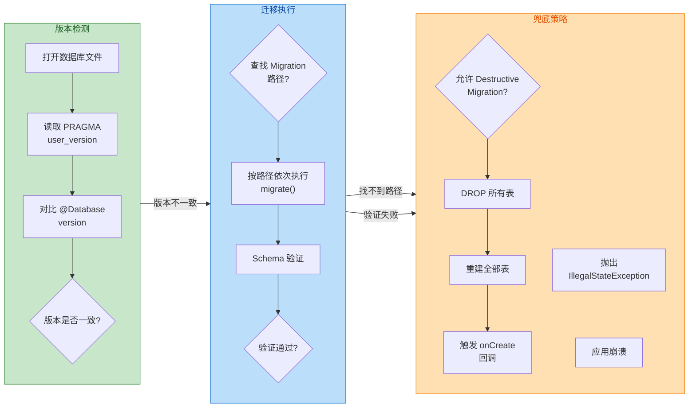

当版本一致时，Room 直接打开数据库正常使用；当版本不一致但找到了 Migration 路径且验证通过，迁移成功完成；当路径不存在或验证失败，则进入兜底策略——要么破坏性重建（如果启用），要么抛异常崩溃。

### AutoMigration 自动迁移

从 **Room 2.4.0** 开始，Google 引入了 AutoMigration 功能，让 Room 的注解处理器在编译期自动对比两个版本的 Schema JSON 文件，生成迁移所需的 SQL 语句。这大幅减少了"加个字段还要手写 ALTER TABLE"的重复劳动。

**前置条件**。AutoMigration 强依赖 Schema 导出功能（`exportSchema = true`）。Room 需要读取 `from` 版本和 `to` 版本的 JSON 文件来进行 diff。如果你没有启用 Schema 导出，或者缺失了某个版本的 JSON 文件，编译会直接报错。

在 `@Database` 注解中声明自动迁移：

```kotlin
@Database(
    entities = [User::class, Order::class],
    version = 3,                               // 当前最新版本
    exportSchema = true,                       // 必须为 true
    autoMigrations = [                         // 声明自动迁移列表
        AutoMigration(from = 1, to = 2),       // 1→2 的变更由 Room 自动生成 SQL
        AutoMigration(
            from = 2,
            to = 3,
            spec = AppDatabase.Migration2To3::class // 需要 spec 辅助的复杂场景
        )
    ]
)
abstract class AppDatabase : RoomDatabase() {

    // 当 AutoMigration 无法自动推断意图时，需要提供 AutoMigrationSpec
    // 典型场景：表重命名、列重命名、列删除
    @RenameTable(fromTableName = "order", toTableName = "purchase_order")
    class Migration2To3 : AutoMigrationSpec

    abstract fun userDao(): UserDao
    abstract fun orderDao(): OrderDao
}
```

**AutoMigration 能处理的变更类型**：

| 变更类型 | 是否自动处理 | 说明 |
|---------|:----------:|------|
| 新增列（ADD COLUMN） | ✅ | 最常见场景，直接生成 `ALTER TABLE … ADD COLUMN` |
| 新增表（CREATE TABLE） | ✅ | 在 `entities` 中新增 Entity 类即可 |
| 新增索引（CREATE INDEX） | ✅ | 在 Entity 中添加 `@Index` 注解 |
| 删除列 | ⚠️ | 需要在 `AutoMigrationSpec` 上标注 `@DeleteColumn` |
| 重命名列 | ⚠️ | 需要标注 `@RenameColumn`，否则 Room 会当作"删旧列+加新列" |
| 重命名表 | ⚠️ | 需要标注 `@RenameTable` |
| 删除表 | ⚠️ | 需要标注 `@DeleteTable` |
| 修改列类型 | ❌ | Room 无法自动处理类型变更，必须手写 Migration |
| 修改主键结构 | ❌ | 涉及表重建，必须手写 Migration |

标注 ⚠️ 的操作之所以需要 `AutoMigrationSpec`，是因为 Room 在 diff 两个 Schema 时遇到了**歧义**。例如版本 2 有列 `firstName`，版本 3 没有了但出现了 `first_name`——Room 无法确定这是"删除 firstName 并新增 first_name"还是"将 firstName 重命名为 first_name"。通过 `@RenameColumn` 注解，开发者显式告知 Room 正确意图。

**AutoMigrationSpec 详解**。当自动迁移需要额外提示时，你需要创建一个实现 `AutoMigrationSpec` 接口的类，并在类上标注相应的注解。Room 还允许你在 `AutoMigrationSpec` 中重写 `onPostMigrate()` 方法，在自动迁移 SQL 执行完毕后执行自定义逻辑（如数据回填）：

```kotlin
// 从版本 3 → 4 的自动迁移规范
// 场景：将 user 表的 email 列重命名为 email_address，并删除废弃的 temp_flag 列
@RenameColumn(
    tableName = "user",               // 哪张表
    fromColumnName = "email",         // 旧列名
    toColumnName = "email_address"    // 新列名
)
@DeleteColumn(
    tableName = "user",               // 哪张表
    columnName = "temp_flag"          // 要删除的列名
)
class Migration3To4 : AutoMigrationSpec {

    // 可选重写：在自动迁移 SQL 执行完毕后调用
    // 适用于需要做数据回填、清理等后处理的场景
    override fun onPostMigrate(db: SupportSQLiteDatabase) {
        // 例如：将所有 email_address 统一转为小写
        db.execSQL("UPDATE user SET email_address = LOWER(email_address)")
    }
}
```

**AutoMigration 背后的编译期原理**。当 KSP/KAPT 处理 `@Database` 注解时，会发现 `autoMigrations` 数组中的声明。对于每一对 `(from, to)`，Room 会：

1. 从 `room.schemaLocation` 目录中加载 `from.json` 和 `to.json`。
2. 解析两个 JSON 文件中所有表、列、索引的定义，构建两个 `DatabaseBundle` 对象。
3. 执行 **SchemaDiffer**，逐表、逐列对比差异，生成一个 `SchemaDiff` 结果。
4. 检查是否存在歧义操作（列消失+新列出现 → 可能是重命名），如果有歧义但没有提供 `AutoMigrationSpec`，编译报错。
5. 最终生成一个 `AutoMigration_from_to_Impl` 类，其中的 `migrate()` 方法包含了所有必要的 SQL 语句。

生成的代码最终与手写 Migration 在运行时的执行方式完全一致——都是 `Migration` 的子类，都会被 Room 纳入路径查找。

**手动 Migration 与 AutoMigration 的共存**。在同一个数据库中，你完全可以混合使用两种方式。例如版本 1→2 用 AutoMigration（简单的加字段），版本 2→3 用手动 Migration（复杂的表重构）。Room 在构建迁移路径时，会将两种 Migration 对象放在同一个图中进行最短路径查找，对开发者完全透明。

```kotlin
@Database(
    entities = [User::class],
    version = 3,
    autoMigrations = [
        AutoMigration(from = 1, to = 2) // 简单变更：自动迁移
    ]
)
abstract class AppDatabase : RoomDatabase() {
    abstract fun userDao(): UserDao
}

// 复杂变更：手动迁移（版本 2 → 3 涉及表重建）
val MIGRATION_2_3 = object : Migration(2, 3) {
    override fun migrate(db: SupportSQLiteDatabase) {
        // SQLite 不支持 ALTER TABLE DROP COLUMN（3.35.0 之前）
        // 需要经典的"四步重建法"
        // Step 1: 创建新表
        db.execSQL("""
            CREATE TABLE user_new (
                id INTEGER PRIMARY KEY AUTOINCREMENT NOT NULL,
                name TEXT NOT NULL,
                age INTEGER NOT NULL DEFAULT 0
            )
        """.trimIndent())
        // Step 2: 将旧表数据复制到新表
        db.execSQL("INSERT INTO user_new (id, name, age) SELECT id, name, age FROM user")
        // Step 3: 删除旧表
        db.execSQL("DROP TABLE user")
        // Step 4: 将新表重命名为旧表名
        db.execSQL("ALTER TABLE user_new RENAME TO user")
    }
}

// 构建时混合注册
val db = Room.databaseBuilder(context, AppDatabase::class.java, "app_database")
    .addMigrations(MIGRATION_2_3)  // 手动迁移
    // AutoMigration 已在 @Database 注解中声明，无需额外注册
    .build()
```

**最佳实践总结**：

1. **始终启用 `exportSchema = true`** 并将 `schemas/` 目录纳入版本控制。它是迁移正确性的历史快照，也是 AutoMigration 的前置依赖。
2. **简单变更用 AutoMigration**：加字段、加表、加索引，直接声明即可，零手写 SQL。
3. **复杂变更用手动 Migration**：类型修改、主键重构、数据格式转换等需要精确控制的场景。
4. **提供跨版本快捷 Migration**：对于跨多个版本的升级（如 1→5），提供直达 Migration 可避免链式执行的性能开销。
5. **必须编写 Migration 测试**：使用 `MigrationTestHelper` 覆盖每条迁移路径，这是上线前的最后一道防线。
6. **生产环境慎用 `fallbackToDestructiveMigration()`**：用户数据是不可逆的。仅在开发阶段或确认数据可丢失时使用。

---

**📝 练习题**

一个已上线应用的 Room 数据库当前版本为 3，新版本升级到 5。开发者注册了以下迁移：`MIGRATION_3_4`、`MIGRATION_4_5`、`MIGRATION_3_5`。当用户从版本 3 升级时，Room 会如何执行迁移？

A. 依次执行 `MIGRATION_3_4` → `MIGRATION_4_5`，因为 Room 总是选择逐步迁移


B. 直接执行 `MIGRATION_3_5`，因为 Room 优先选择路径最短的迁移方案


C. 同时执行三个 Migration，将结果合并


D. Room 会抛出异常，因为存在冲突的迁移路径


**【答案】** B

**【解析】** Room 在查找迁移路径时，使用的是**最短路径算法**（shortest path）。它在由所有已注册 Migration 构成的有向图中，找到从 `startVersion` 到 `endVersion` 步数最少的路径。在本题中，`MIGRATION_3_5` 是一步直达（path length = 1），而 `MIGRATION_3_4 → MIGRATION_4_5` 需要两步（path length = 2），因此 Room 会优先选择前者。这也是为什么在多版本迁移场景中，推荐提供"跨版本快捷 Migration"的原因——它不仅减少了执行步数，还降低了中间版本迁移 SQL 可能引入的兼容性风险。注意，多条可行路径并不会导致冲突或异常，Room 只会选择其中最优的一条执行。

---

**📝 练习题**

以下关于 Room AutoMigration 的说法，哪一项是**错误**的？

A. AutoMigration 要求 `exportSchema` 必须为 `true`，否则编译报错


B. 当 AutoMigration 检测到列消失且有新列出现时，如果未提供 `AutoMigrationSpec`，Room 会默认将其视为重命名操作


C. `AutoMigrationSpec` 中可以重写 `onPostMigrate()` 方法，在自动迁移完成后执行数据回填


D. AutoMigration 与手动 Migration 可以在同一个数据库中混合使用，Room 统一进行路径查找


**【答案】** B

**【解析】** 选项 B 的说法是错误的。当 Room 在 SchemaDiffer 对比两个版本时发现"旧列消失+新列出现"的**歧义情况**，如果开发者没有通过 `@RenameColumn` 显式声明这是一次重命名操作，Room **不会**默认当作重命名，而是会**直接编译报错**，要求开发者提供 `AutoMigrationSpec` 来消除歧义。这是 Room 的安全设计——宁可编译失败，也不猜测开发者的意图，从而避免线上数据被错误删除。选项 A 正确，AutoMigration 依赖 Schema JSON 文件来做 diff；选项 C 正确，`onPostMigrate()` 是 `AutoMigrationSpec` 提供的后处理钩子；选项 D 正确，两种 Migration 在运行时都是 `Migration` 的子类实例，被统一放入路径查找图中。

---

## 异步查询与观察

在现代 Android 应用中，数据库操作几乎不可能以同步方式在主线程完成——这既违反 Android 的主线程策略（NetworkOnMainThreadException 的数据库版本就是在 Room 中对主线程查询的默认禁止），也无法满足"数据变化时 UI 自动刷新"的响应式需求。Room 在编译期便围绕 **异步 + 可观察（Async + Observable）** 的核心理念进行代码生成：当 DAO 方法的返回类型是 `Flow`、`LiveData` 或 RxJava 的 `Observable`/`Flowable` 时，Room 自动生成带有 **注册监听 → 执行查询 → 分发结果 → 表变更时重新查询** 完整链路的实现代码。这一切的底层支撑，就是 Room 内置的 **InvalidationTracker（失效追踪器）**。

本节将从应用层视角出发，依次拆解 Flow、LiveData 两种最主流的异步观察方式，最后深入 InvalidationTracker 的内部机制，让你不仅会用，还能在面试或排查性能问题时说清"Room 是怎么知道表数据变了的"。

---

### Flow 返回值支持

#### 为什么 Flow 是首选

Kotlin Flow 是 Kotlin 协程生态中的冷流（Cold Stream）原语。所谓"冷流"，就是只有当存在收集者（Collector）时才会真正执行上游逻辑。这个特性天然匹配数据库查询的场景：**没有人观察，就不查询；有人观察，就立刻查一次并持续监听变更**。相比 LiveData，Flow 拥有以下应用层优势：

- **生命周期无关（Lifecycle-agnostic）**：Flow 本身不绑定任何 Android 组件的生命周期，你可以在 ViewModel、Repository、甚至纯 Kotlin 模块中自由使用。需要生命周期感知时，在 UI 层通过 `repeatOnLifecycle` 或 `flowWithLifecycle` 进行收集即可。
- **丰富的操作符**：`map`、`filter`、`combine`、`flatMapLatest`、`distinctUntilChanged` 等操作符让你在数据到达 UI 之前就能完成转换与过滤，极大减少 ViewModel 中的模板代码。
- **结构化并发（Structured Concurrency）**：Flow 的收集与取消天然跟随 CoroutineScope，不会出现 LiveData 时代常见的"Observer 忘记移除导致内存泄漏"问题。
- **背压支持（Backpressure）**：当数据库高频变更时，Flow 可以通过 `conflate()`、`buffer()` 等策略控制下游消费速率，避免 UI 被大量重复刷新拖垮。

Google 官方在 2021 年后的技术文档和 MAD（Modern Android Development）指南中已经明确推荐 **Room + Flow + Compose** 作为数据层到 UI 层的标准响应式管线（Reactive Pipeline）。

#### DAO 中的声明方式

在 DAO 接口中，只需要将返回类型声明为 `Flow<T>` 或 `Flow<List<T>>`，Room 的注解处理器（Annotation Processor / KSP）就会在编译时生成对应的可观察查询实现：

```kotlin
@Dao
interface BookDao {

    // 返回 Flow<List<Book>>，每当 book 表发生任何写操作（INSERT / UPDATE / DELETE），
    // Room 都会自动重新执行这条 SELECT 并向下游发射最新结果
    @Query("SELECT * FROM book ORDER BY title ASC")
    fun observeAllBooks(): Flow<List<Book>>

    // 单行查询同样支持 Flow，当该行数据变化或被删除时会重新发射
    // 注意返回类型是 Flow<Book?>，因为指定 id 的记录可能不存在
    @Query("SELECT * FROM book WHERE id = :bookId")
    fun observeBookById(bookId: Long): Flow<Book?>

    // 聚合查询也可以用 Flow 包裹，表发生变更时重新计算
    @Query("SELECT COUNT(*) FROM book")
    fun observeBookCount(): Flow<Int>
}
```

需要特别注意一个常见误区：**Room 的 Flow 监听粒度是"表级别"而非"行级别"**。即使你只观察 `id = 42` 那一行，只要 `book` 表中 **任何一行** 发生了写操作，这个 Flow 都会重新执行查询并发射新值。这是由 InvalidationTracker 的工作原理决定的（后文详述）。所以如果你的表写入极其频繁，而观察的只是某一行，要在下游使用 `distinctUntilChanged()` 来过滤掉"值实际没变但重新发射了"的噪音事件。

#### 编译生成代码解析

为了真正理解 Room 在背后做了什么，我们来看一下 Room 为 `observeAllBooks()` 生成的核心实现（简化版，保留关键逻辑）：

```kotlin
// Room 编译器自动生成的 BookDao_Impl 中的方法（简化还原）
override fun observeAllBooks(): Flow<List<Book>> {
    // 1. 声明本次查询所涉及的表名数组，用于注册到 InvalidationTracker
    val tableNames: Array<String> = arrayOf("book")

    // 2. 使用 Room 提供的 createFlow 扩展函数构建响应式 Flow
    //    该函数内部会注册 InvalidationTracker Observer，并在表失效时重新执行查询
    return db.invalidationTracker.createFlow(
        tableNames = tableNames,          // 监听哪些表
        inTransaction = false             // 本次查询是否需要在事务中执行
    ) {
        // 3. 这个 lambda 就是真正的查询执行体，每次表失效后都会被重新调用
        val cursor: Cursor = db.query(    // 使用 RoomDatabase 的 query 方法执行 SQL
            SimpleSQLiteQuery("SELECT * FROM book ORDER BY title ASC")
        )

        // 4. 遍历 Cursor，将每一行映射为 Book 实体对象
        val result = mutableListOf<Book>()
        try {
            val indexId = cursor.getColumnIndexOrThrow("id")       // 获取列索引
            val indexTitle = cursor.getColumnIndexOrThrow("title") // 获取列索引
            while (cursor.moveToNext()) {                          // 逐行遍历
                val book = Book(
                    id = cursor.getLong(indexId),                   // 读取主键
                    title = cursor.getString(indexTitle)            // 读取标题
                )
                result.add(book)                                   // 添加到结果列表
            }
        } finally {
            cursor.close()                                         // 必须关闭 Cursor 释放资源
        }
        result                                                     // 返回查询结果
    }
}
```

这段生成代码揭示了几个关键设计：

1. **表名在编译时静态提取**：Room 的注解处理器在编译阶段分析 `@Query` 中的 SQL 语句，解析出涉及的表名（如 `"book"`），然后硬编码到生成代码中。这意味着 InvalidationTracker 只需在运行时按表名匹配，不需要做任何 SQL 解析。
2. **`createFlow` 是核心桥梁**：它负责将"一次性查询"包装成"可重复观察的流"。内部逻辑大致为：首先立刻执行一次查询并 emit 初始值，然后挂起等待 InvalidationTracker 的通知；一旦被通知表已失效，就再次执行查询 lambda 并 emit 新值，如此循环直到 Flow 被取消。
3. **Cursor 映射是逐列手写的**：Room 不使用反射，所有 Cursor → Entity 的映射代码都是编译时生成的，性能与手写 SQLiteOpenHelper 几乎一致。

#### 在 ViewModel 与 UI 层的消费方式

拿到 DAO 返回的 Flow 之后，通常会在 ViewModel 中做一层转换，然后暴露给 UI：

```kotlin
class BookListViewModel(
    private val bookDao: BookDao          // 通过构造注入获取 DAO
) : ViewModel() {

    // 将 DAO 的 Flow 转换为 StateFlow，提供给 UI 消费
    // stateIn 会在 viewModelScope 中启动一个协程来收集上游 Flow
    val books: StateFlow<List<Book>> = bookDao.observeAllBooks()
        .distinctUntilChanged()           // 过滤重复值，避免不必要的 UI 重绘
        .stateIn(
            scope = viewModelScope,       // 绑定 ViewModel 的生命周期
            started = SharingStarted.WhileSubscribed(5000), // 下游无订阅者 5 秒后停止上游
            initialValue = emptyList()    // 初始值为空列表
        )
}
```

`SharingStarted.WhileSubscribed(5000)` 是一个极具实战价值的配置：当用户旋转屏幕时，Activity 被销毁重建，此时下游订阅会短暂中断。如果使用 `Eagerly` 或 `Lazily`，上游协程不会停止，配置变更期间查询结果会被缓存。而 `WhileSubscribed(5000)` 则表示"下游全部断开后再等 5 秒，如果还没有新的订阅者就停止上游"——5 秒足够覆盖配置变更的短暂间隙，又能在用户真正离开页面后及时释放数据库连接和 InvalidationTracker 的监听。

在 Jetpack Compose 的 UI 层消费时：

```kotlin
@Composable
fun BookListScreen(viewModel: BookListViewModel = viewModel()) {
    // collectAsStateWithLifecycle 会自动在 Lifecycle 处于 STARTED 以上时收集
    // 低于 STARTED（如 Activity 进入后台）时自动暂停，避免无意义的 UI 更新
    val books by viewModel.books.collectAsStateWithLifecycle()

    LazyColumn {
        items(books, key = { it.id }) { book ->  // key 提高 diff 效率
            Text(text = book.title)               // 展示书名
        }
    }
}
```

若是在传统 View 体系中，则使用 `lifecycleScope` 配合 `repeatOnLifecycle`：

```kotlin
class BookListActivity : AppCompatActivity() {
    override fun onCreate(savedInstanceState: Bundle?) {
        super.onCreate(savedInstanceState)
        // 在 STARTED 状态下持续收集 Flow
        lifecycleScope.launch {
            repeatOnLifecycle(Lifecycle.State.STARTED) {
                viewModel.books.collect { books ->
                    // 更新 RecyclerView 的 Adapter 数据
                    adapter.submitList(books)
                }
            }
        }
    }
}
```

#### 挂起函数与一次性查询

并非所有数据库操作都需要持续观察。对于"查一次就够"的场景，Room 同样支持 `suspend` 函数：

```kotlin
@Dao
interface BookDao {
    // 挂起函数：只执行一次查询，不持续监听表变更
    // Room 会自动切换到内部的查询 Executor 线程执行，完成后恢复调用方的协程
    @Query("SELECT * FROM book WHERE id = :bookId")
    suspend fun getBookById(bookId: Long): Book?

    // INSERT / UPDATE / DELETE 操作也应声明为 suspend
    @Insert
    suspend fun insertBook(book: Book): Long

    @Update
    suspend fun updateBook(book: Book)

    @Delete
    suspend fun deleteBook(book: Book)
}
```

Room 对 `suspend` 函数的处理方式与 Flow 不同：它使用 `CoroutinesRoom.execute()` 将实际的数据库操作调度到 Room 的内部事务 Executor 上执行（默认是一个单线程的 `Executor`，确保写操作串行化）。执行完成后通过 Continuation 恢复到调用者的协程上下文。**`suspend` 函数不会注册 InvalidationTracker，因此没有持续监听的开销**，但写操作完成后会通知 InvalidationTracker 对相关表进行失效标记。

---

### LiveData 支持

#### LiveData 作为返回值

在 Kotlin Flow 被广泛采用之前，`LiveData` 是 Android Jetpack 推荐的数据观察方案。Room 对 LiveData 的支持非常成熟，使用方式与 Flow 类似——只需将返回类型声明为 `LiveData<T>`：

```kotlin
@Dao
interface BookDao {
    // 返回 LiveData，当 book 表发生写操作时自动重新查询并通知观察者
    @Query("SELECT * FROM book ORDER BY title ASC")
    fun observeAllBooksLiveData(): LiveData<List<Book>>

    // 单行查询
    @Query("SELECT * FROM book WHERE id = :bookId")
    fun observeBookByIdLiveData(bookId: Long): LiveData<Book?>
}
```

Room 编译器会为 LiveData 返回类型生成一个 `ComputableLiveData` 的匿名子类。`ComputableLiveData` 是 Room 内部的一个抽象类，它桥接了 LiveData 与 InvalidationTracker：

```kotlin
// Room 为 LiveData 返回类型生成的核心逻辑（简化还原）
override fun observeAllBooksLiveData(): LiveData<List<Book>> {
    // 1. 创建 ComputableLiveData，它继承自 LiveData 并集成了 InvalidationTracker
    val computable = object : ComputableLiveData<List<Book>>(
        db.queryExecutor,                // 查询使用的线程池
        "book"                           // 监听的表名（可变参数，支持多表）
    ) {
        override fun compute(): List<Book> {
            // 2. 这个方法在后台线程执行，返回查询结果
            val cursor = db.query(
                SimpleSQLiteQuery("SELECT * FROM book ORDER BY title ASC")
            )
            // 3. Cursor → List<Book> 的映射逻辑（与 Flow 版本相同，此处省略）
            return mapCursorToBooks(cursor)
        }
    }
    // 4. 返回内部持有的 LiveData 对象
    return computable.liveData
}
```

`ComputableLiveData` 的内部工作流程是：

1. 当 LiveData 首次拥有活跃观察者（`onActive()`）时，在查询线程池上调度 `compute()` 方法执行查询。
2. 查询完成后，将结果通过 `postValue()` 投递到主线程，通知所有观察者。
3. 同时向 InvalidationTracker 注册一个 Observer，监听指定表的变更。
4. 当 InvalidationTracker 通知表已失效时，再次调度 `compute()`，形成自动刷新循环。
5. 当 LiveData 没有活跃观察者（`onInactive()`）时，**不会** 主动取消注册 InvalidationTracker 的 Observer（这一点与 Flow 版本的 `WhileSubscribed` 策略不同），但也不会触发查询——查询只在有活跃观察者时才被调度。

#### LiveData 与 Flow 的关键差异

| 维度 | LiveData | Flow |
|------|----------|------|
| **生命周期感知** | 内置，自动跟随 LifecycleOwner | 需要外部配合 `repeatOnLifecycle` |
| **线程模型** | 观察只能在主线程 (`observe()`) | 可在任意协程上下文收集 |
| **操作符** | 极少（`map`, `switchMap`） | 丰富的 Kotlin Flow 操作符 |
| **背压处理** | 无（总是最新值覆盖） | 支持 `buffer()`, `conflate()` 等 |
| **多模块复用** | 依赖 `androidx.lifecycle` | 纯 Kotlin，可用于非 Android 模块 |
| **初始值** | `null`（未查询完成前） | 通过 `stateIn` 可自定义初始值 |
| **粘性事件** | 是（新观察者收到最后一次值） | StateFlow 是；普通 Flow 否 |

在实际项目中，如果你的代码库已经全面迁移到 Kotlin 协程，推荐统一使用 Flow。对于仍有大量 Java 代码或老项目维护场景，LiveData 仍然是一个简洁可靠的选择。两者也可以通过 `asFlow()` 和 `asLiveData()` 互相转换：

```kotlin
// Flow → LiveData（通常在 ViewModel 中，将 Repository 层的 Flow 转为 LiveData 暴露给 View 层）
val booksLiveData: LiveData<List<Book>> = bookDao.observeAllBooks()
    .distinctUntilChanged()                // Flow 操作符：去重
    .asLiveData(
        context = Dispatchers.IO,          // 上游 Flow 在 IO 线程收集
        timeout = 5.seconds                // 类似 WhileSubscribed(5000) 的超时
    )

// LiveData → Flow（不太常用，但在需要用 Flow 操作符处理 LiveData 数据时有用）
val booksFlow: Flow<List<Book>> = booksLiveData.asFlow()
```

---

### InvalidationTracker 表级通知原理

InvalidationTracker 是 Room 异步可观察查询的 **心脏**。无论你使用 Flow、LiveData 还是 RxJava，所有"数据变了自动重新查询"的能力最终都汇聚到这一个组件上。理解它的工作原理，是理解 Room 响应式机制的关键。

#### 整体架构

InvalidationTracker 位于 `RoomDatabase` 内部，每个 `RoomDatabase` 实例恰好持有一个 InvalidationTracker。它的职责可以用一句话概括：**追踪哪些表发生了写操作，然后通知关心这些表的观察者**。

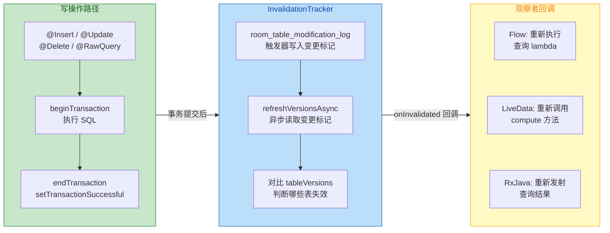

#### 触发器机制（SQLite Trigger）

InvalidationTracker 的核心技巧是利用 **SQLite 触发器（Trigger）** 来捕获表的写操作。当 Room 数据库初次打开时（`RoomDatabase.init()`），InvalidationTracker 会创建以下基础设施：

**1. 辅助追踪表 `room_table_modification_log`**

这是一张 Room 自动创建和管理的内部表，应用开发者无需（也不应该）直接操作它：

```sql
-- Room 内部创建的变更追踪表
-- 每个被观察的应用表在此表中对应一行
CREATE TABLE IF NOT EXISTS room_table_modification_log (
    table_id INTEGER PRIMARY KEY,    -- 表的数字 ID（Room 在编译期为每张表分配）
    invalidated INTEGER NOT NULL     -- 0 = 未变更，1 = 已变更（失效标记）
        DEFAULT 0
);
```

**2. 写操作触发器**

对于每个被观察的表，Room 会创建三个触发器（分别对应 INSERT、UPDATE、DELETE），当相应操作发生时自动将 `invalidated` 列设为 1：

```sql
-- 以 book 表为例（假设其 table_id = 0）
-- INSERT 触发器：当有新行插入时，标记 book 表已失效
CREATE TEMP TRIGGER IF NOT EXISTS room_table_modification_trigger_book_INSERT
AFTER INSERT ON book
BEGIN
    UPDATE room_table_modification_log
    SET invalidated = 1
    WHERE table_id = 0 AND invalidated = 0;  -- 避免重复更新
END;

-- UPDATE 触发器：当有行被更新时，标记 book 表已失效
CREATE TEMP TRIGGER IF NOT EXISTS room_table_modification_trigger_book_UPDATE
AFTER UPDATE ON book
BEGIN
    UPDATE room_table_modification_log
    SET invalidated = 1
    WHERE table_id = 0 AND invalidated = 0;
END;

-- DELETE 触发器：当有行被删除时，标记 book 表已失效
CREATE TEMP TRIGGER IF NOT EXISTS room_table_modification_trigger_book_DELETE
AFTER DELETE ON book
BEGIN
    UPDATE room_table_modification_log
    SET invalidated = 1
    WHERE table_id = 0 AND invalidated = 0;
END;
```

这些触发器是 `TEMP`（临时）的，意味着它们只存在于当前数据库连接的生命周期内。每次数据库打开时 Room 都会重新创建。使用临时触发器的好处是不会污染用户的数据库 Schema，也不会出现在 `room_master_table` 的 Schema hash 中。

#### 变更检测与通知流程

触发器只负责"打标记"，真正的"读标记 → 通知观察者"流程如下：

**Step 1：事务提交后触发刷新**

当 Room 的写操作（`@Insert` / `@Update` / `@Delete` 或 `@Transaction` 包裹的写操作）完成并提交事务后，Room 会调用 `InvalidationTracker.refreshVersionsAsync()`。这个方法将一个 Runnable 投递到 Room 的查询 Executor 上异步执行。

**Step 2：读取变更标记**

在后台线程中，InvalidationTracker 执行一条 SELECT 语句读取所有被标记为失效的表：

```sql
-- 查询所有 invalidated = 1 的表
SELECT table_id FROM room_table_modification_log WHERE invalidated = 1;
```

读取后立即重置标记，为下一轮变更检测做准备：

```sql
-- 重置标记
UPDATE room_table_modification_log SET invalidated = 0 WHERE invalidated = 1;
```

这两步在同一个事务中执行，确保原子性。

**Step 3：匹配观察者并回调**

InvalidationTracker 内部维护了一个 `ObserverMap`（`SafeIterableMap<Observer, ObserverWrapper>`），每个 Observer 都声明了自己关心的表名集合。InvalidationTracker 将失效的表 ID 集合与每个 Observer 关心的表集合做交集，如果交集不为空，就调用该 Observer 的 `onInvalidated(tables: Set<String>)` 方法。

对于 Flow，这个回调会让挂起中的协程恢复执行查询 lambda；对于 LiveData / ComputableLiveData，这个回调会在查询 Executor 上调度 `compute()` 方法重新查询。

#### 为什么是表级而非行级

很多开发者初次接触 Room 的响应式查询时会困惑：为什么我只观察 `WHERE id = 42`，修改了 `id = 99` 的数据也会触发重新查询？

原因在于 SQLite 触发器的设计粒度。虽然 SQLite 触发器可以通过 `NEW` 和 `OLD` 伪表访问被修改的具体行，但要实现行级追踪，就需要 Room 在编译时分析 `@Query` 中的 WHERE 条件，提取过滤列，然后在触发器中加入条件判断——这在通用 ORM 中几乎不可能做到（考虑到 JOIN、子查询、动态参数等复杂情况）。

**表级追踪是一种工程上的务实取舍**：它的实现足够简单、通用、可靠，虽然会产生一些"假失效"（False Invalidation），但重新执行查询的成本通常很低（SQLite 是嵌入式引擎，查询走的是本地文件 I/O，延迟在毫秒级）。对于绝大多数应用场景，这种程度的"多查一次"完全可以接受。

如果你的场景确实对假失效敏感（比如某张大表写入极其频繁，但观察者只关心极少数行），可以在 Flow 下游加 `distinctUntilChanged()` 来消除多余的 UI 更新：

```kotlin
// 观察单行数据时，加 distinctUntilChanged 避免假失效导致的重复重绘
bookDao.observeBookById(42L)
    .distinctUntilChanged()              // 只有当 Book 对象真正变化时才向下游发射
    .collect { book ->
        // 更新 UI
    }
```

需要注意的是，`distinctUntilChanged()` 依赖 `Book` 类的 `equals()` 方法正确实现。如果 `Book` 是 `data class`，Kotlin 编译器会自动基于所有构造参数生成 `equals()`，通常无需额外操作。

#### InvalidationTracker 的生命周期管理

InvalidationTracker 的 Observer 注册与注销是自动管理的：

- **Flow**：当 Flow 的收集协程被取消时（比如 CoroutineScope 取消），Room 内部会自动从 InvalidationTracker 中移除对应的 Observer。这完全由结构化并发保证。
- **LiveData（ComputableLiveData）**：Observer 在 `ComputableLiveData` 创建时注册，在 `ComputableLiveData` 被垃圾回收时注销。由于 `ComputableLiveData` 被 LiveData 强引用，而 LiveData 通常被 ViewModel 引用，所以 Observer 的生命周期与 ViewModel 一致。
- **手动使用**：你也可以直接操作 InvalidationTracker 注册自定义 Observer，但必须自行管理注销时机以避免内存泄漏：

```kotlin
// 手动注册 InvalidationTracker Observer（通常不推荐，除非有特殊需求）
val observer = object : InvalidationTracker.Observer("book", "author") {
    override fun onInvalidated(tables: Set<String>) {
        // 当 book 或 author 表发生写操作时回调
        // 注意：此回调在后台线程执行，不能直接操作 UI
        Log.d("Tracker", "Tables invalidated: $tables")
    }
}

// 注册
database.invalidationTracker.addObserver(observer)

// 必须在合适时机注销，否则会造成内存泄漏
database.invalidationTracker.removeObserver(observer)
```

#### 多进程与 InvalidationTracker

默认情况下，InvalidationTracker **只能在单进程内工作**。这是因为 SQLite 触发器和变更标记表的读写都发生在同一个数据库连接中，而不同进程有各自独立的数据库连接和内存空间。

如果你的应用在多进程中共享同一个 Room 数据库（例如主进程与 ContentProvider 所在进程），一个进程的写操作不会触发另一个进程中 InvalidationTracker 的通知。从 Room 2.4 开始，可以通过启用 `enableMultiInstanceInvalidation()` 来解决这个问题：

```kotlin
val db = Room.databaseBuilder(context, AppDatabase::class.java, "app.db")
    .enableMultiInstanceInvalidation()    // 启用多实例/多进程失效同步
    .build()
```

启用后，Room 会通过一个内部的 `MultiInstanceInvalidationService`（一个绑定式 Service）在不同数据库实例之间同步失效信号。其原理是：当一个实例的写操作触发了 InvalidationTracker 的刷新后，会通过 IPC（Binder）通知其他实例也执行一次 `refreshVersionsAsync()`，从而让所有实例的观察者都能收到表变更通知。

这个特性虽然强大，但会引入 IPC 开销和 Service 绑定的复杂性，仅在确实有多进程数据库共享需求时才启用。

---

### 异步查询的线程模型

理解 Room 异步查询使用的线程模型，有助于排查并发问题和优化性能。

Room 内部维护了两个关键的 Executor：

- **QueryExecutor**：用于执行只读查询（SELECT），默认是 `Executors.newFixedThreadPool(4)`（Architecture Components IO 线程池）。Flow 和 LiveData 的查询回调都在这个 Executor 上执行。
- **TransactionExecutor**：用于执行写操作（INSERT / UPDATE / DELETE）和显式事务，默认是一个 **单线程** 的 Executor（`Executors.newSingleThreadExecutor()`）。单线程保证了写操作的串行化，避免了 SQLite 的 `SQLITE_BUSY` 错误。

你可以在构建数据库时自定义这两个 Executor：

```kotlin
val db = Room.databaseBuilder(context, AppDatabase::class.java, "app.db")
    .setQueryExecutor(myQueryExecutor)             // 自定义查询线程池
    .setTransactionExecutor(myTransactionExecutor)  // 自定义事务线程池
    .build()
```

对于协程（`suspend` 函数和 Flow），Room 2.2+ 引入了协程支持后会使用上述 Executor 作为协程调度器（通过 `executor.asCoroutineDispatcher()`）。因此，即使你在 `Dispatchers.Main` 的协程中调用 `suspend` DAO 方法，实际的数据库操作也会被自动调度到正确的后台线程。

#### WAL 模式与并发读写

Room 默认为 API 16+ 的设备启用 **WAL（Write-Ahead Logging）** 模式。在 WAL 模式下，读操作和写操作可以真正并发执行——读操作读取的是 WAL 文件中的快照（Snapshot），不会被写操作阻塞；写操作也不需要等待读操作完成。这对于 Room 的响应式查询场景至关重要：如果没有 WAL，一个长时间运行的 SELECT 查询会阻塞所有写操作（或反之），导致 UI 卡顿或数据更新延迟。

WAL 模式由 `RoomDatabase.Builder` 中的 `setJournalMode()` 控制，默认值是 `JournalMode.AUTOMATIC`（API 16+ 自动使用 WAL，低版本退回 `TRUNCATE`）。除非有明确的理由（如需要最小化存储空间占用），否则不建议手动关闭 WAL。

---

**📝 练习题**

在 Room 中，当 DAO 方法返回 `Flow<List<Book>>` 并观察 `SELECT * FROM book WHERE category = 'fiction'` 时，如果另一段代码更新了 `category = 'science'` 的某本书的价格，会发生什么？


A. 不会触发重新查询，因为修改的行不匹配 WHERE 条件


B. 会触发重新查询，但 Flow 不会发射新值，因为结果集没有变化


C. 会触发重新查询，且 Flow 会发射新值（内容与上次相同的列表）


D. 会抛出 IllegalStateException，因为观察的行与修改的行不一致


**【答案】** C

**【解析】** Room 的 InvalidationTracker 工作在 **表级别** 而非行级别。无论修改的是哪一行，只要 `book` 表上发生了任何写操作（INSERT / UPDATE / DELETE），SQLite 触发器就会将 `room_table_modification_log` 中对应 `book` 表的 `invalidated` 标记设为 1。InvalidationTracker 在事务提交后读取到该标记，会通知所有观察 `book` 表的 Observer。对应到 Flow，就是重新执行查询 lambda，得到新的 `List<Book>` 并通过 `emit` 发射出去。由于修改的是 `science` 类别的书，`fiction` 类别的查询结果实际上没有变化，但 Flow 仍然会发射一个内容相同的新列表对象。这就是所谓的"假失效（False Invalidation）"。如果在下游添加了 `distinctUntilChanged()`，则可以过滤掉这次无意义的发射（前提是 `Book` 的 `equals()` 正确实现），那样的行为就更接近选项 B——但注意 **重新查询** 仍然会发生，只是下游 Flow 不再向更下游发射值而已。选项 A 错误是因为 InvalidationTracker 不分析 WHERE 条件；选项 D 则完全不符合 Room 的设计。

---

**📝 练习题**

关于 Room 中 `suspend` DAO 方法与返回 `Flow` 的 DAO 方法，以下哪项描述是正确的？


A. 两者都会向 InvalidationTracker 注册 Observer 以持续监听表变更


B. `suspend` 方法在主线程执行查询，`Flow` 方法在后台线程执行查询


C. `suspend` 方法执行一次性查询不注册 Observer；`Flow` 方法注册 Observer 并在表变更时重新查询


D. `suspend` 方法只能用于写操作，`Flow` 方法只能用于读操作


**【答案】** C

**【解析】** `suspend` 函数被 Room 视为一次性操作（One-shot Operation）：Room 会通过 `CoroutinesRoom.execute()` 将实际的数据库 I/O 调度到内部的 Executor 线程上执行，协程在挂起点等待结果返回后恢复。整个过程不涉及 InvalidationTracker 的 Observer 注册，因此没有持续监听的能力和开销。而返回 `Flow` 的方法则不同，Room 生成的代码会通过 `InvalidationTracker.createFlow()` 注册一个 Observer，当被观察的表发生写操作时，Observer 的 `onInvalidated` 回调会触发 Flow 重新执行查询 lambda 并 emit 新结果，形成持续的响应式数据流。选项 A 错误在于 `suspend` 不注册 Observer；选项 B 错误在于 `suspend` 方法同样在后台线程执行（Room 不允许在主线程执行数据库操作，除非显式调用 `allowMainThreadQueries()`）；选项 D 错误在于 `suspend` 可用于读操作（如 `suspend fun getBook(): Book?`），`Flow` 也理论上可以观察写操作的影响。

---

## 类型转换 TypeConverter

在关系型数据库 SQLite 的世界里，列的数据类型只有极其有限的几种：`INTEGER`、`REAL`、`TEXT`、`BLOB` 以及 `NULL`。这意味着，当我们在 Kotlin/Java 层面操作一个 `Date` 对象、一个 `enum` 枚举、一个 `List<String>` 集合、甚至一个自定义的值对象（Value Object）时，SQLite 根本不知道如何将这些"丰富"的 JVM 类型直接存入表中。Room 作为编译时 ORM 框架，在代码生成阶段（kapt / KSP）必须为 Entity 的每一个字段找到一条从 **Kotlin/Java 类型 → SQLite 原生类型** 的映射路径。如果 Room 找不到这条路径，编译器就会毫不留情地抛出错误：`Cannot figure out how to save this field into database.`

**TypeConverter** 正是 Room 为此设计的"桥梁"机制——开发者通过编写一对互逆的转换函数，告诉 Room："把复杂类型 A 转成 SQLite 能理解的类型 B 来存储，读取时再把 B 转回 A"。这一机制极其简洁，却在实际工程中几乎无处不在。接下来我们从原理到实践，逐层展开。

### 核心机制与工作原理

TypeConverter 的本质是一组**静态的、无状态的转换函数**，它们在 Room 的编译期代码生成阶段被"织入"到自动生成的 DAO 实现代码中。理解这一点非常关键——TypeConverter 不是运行时动态发现的，而是 **编译时静态绑定** 的。

**编译时绑定流程** 可以分为以下几个阶段。首先，Room 的注解处理器（Annotation Processor）扫描所有被 `@TypeConverters` 注解标记的类，收集其中每一个带有 `@TypeConverter` 注解的方法，提取其输入类型与输出类型，形成一张"类型转换表"（Type Conversion Map）。接着，当处理器遍历 Entity 的每个字段时，如果字段类型不属于 Room 内建支持的类型（如 `Int`、`Long`、`String`、`ByteArray` 等），处理器就会在类型转换表中查找：是否存在一条从该字段类型到某个 SQLite 原生类型的转换路径。如果找到了，Room 就会在生成的 `_Impl` 代码中自动插入对应的转换调用；如果找不到，编译直接失败。

这意味着 TypeConverter 有几条重要的隐含约束：第一，每一对转换必须是**双向的**——既要有"写入方向"（如 `Date → Long`），也要有"读取方向"（如 `Long → Date`），否则 Room 只能完成一半的工作；第二，转换函数必须是**确定性的**（Deterministic），相同输入永远产生相同输出，因为 Room 不会为转换结果做额外缓存或校验；第三，转换函数应当**轻量且无副作用**，因为它们会在每一次数据库读写时被同步调用，如果在其中执行网络请求或重计算，将严重拖慢数据库操作。

下面用一张流程图来直观展示 TypeConverter 在编译期与运行期分别扮演的角色：

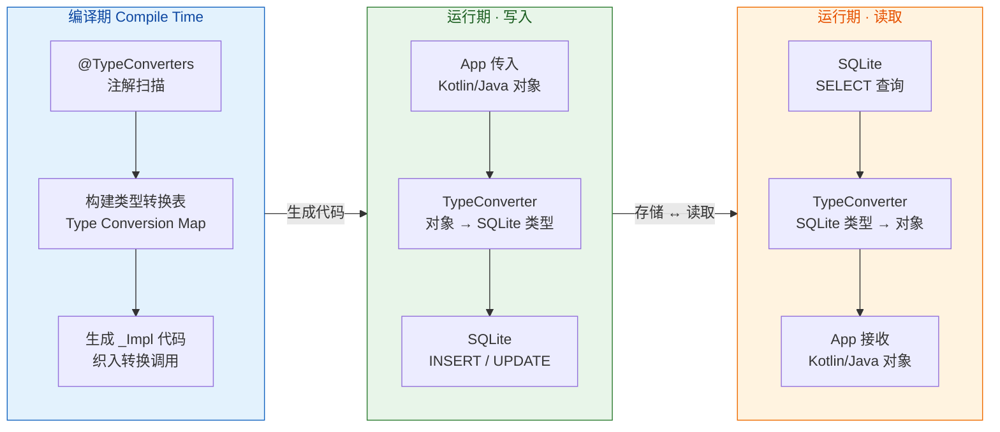

从图中可以清晰看到，TypeConverter 的核心使命就是在 **Kotlin/Java 类型系统** 与 **SQLite 列类型系统** 之间架设一座双向桥梁，而这座桥梁的"施工"发生在编译期，"通车"则在运行期的每一次读写中。

### 复杂对象存储

所谓"复杂对象"，指的是 SQLite 无法直接映射的任何类型，这在实际项目中范围非常广泛：枚举类（`enum class`）、自定义值对象、密封类（`sealed class`）、第三方库类型（如 `Uri`、`UUID`、`BigDecimal`）等。处理这些类型时，核心思路始终一致——**选择一个合适的 SQLite 原生类型作为"中间表示"（Intermediate Representation），然后编写一对互逆的转换函数**。

**枚举类型** 是最常见的场景之一。假设我们有一个任务管理应用，任务的优先级用枚举表示：

```kotlin
// 定义任务优先级的枚举类
// SQLite 无法直接存储枚举，需要 TypeConverter 介入
enum class Priority {
    LOW,      // 低优先级
    MEDIUM,   // 中优先级
    HIGH,     // 高优先级
    URGENT    // 紧急
}
```

对于枚举类型，我们有两种常见的转换策略。第一种是 **name 策略**，即将枚举转为其名称字符串（`TEXT`）；第二种是 **ordinal 策略**，即将枚举转为其序号整数（`INTEGER`）。两种策略各有优劣：name 策略可读性好、对枚举顺序调整具有鲁棒性，但存储空间略大；ordinal 策略存储紧凑、查询效率高，但如果枚举常量的顺序发生变动（比如在 `LOW` 前面插入了一个 `NONE`），已存储的数据就会映射到错误的枚举值上，造成数据损坏。在工程实践中，**强烈推荐 name 策略**，因为可读性和安全性远比那一点点存储空间重要：

```kotlin
// 枚举类型转换器 —— 采用 name 策略
class PriorityConverter {

    // 将 Priority 枚举转为 String，用于数据库写入
    // 存储值如 "LOW"、"HIGH"，可读性强且对枚举顺序变动免疫
    @TypeConverter
    fun fromPriority(priority: Priority): String {
        return priority.name  // 枚举的 name 属性返回其声明名称
    }

    // 将 String 转回 Priority 枚举，用于数据库读取
    // 若数据库中存储了无效字符串，valueOf 会抛出 IllegalArgumentException
    @TypeConverter
    fun toPriority(value: String): Priority {
        return Priority.valueOf(value)  // 根据名称精确匹配枚举常量
    }
}
```

**自定义值对象** 的场景稍微复杂一些。假设我们在 Entity 中需要存储一个地理坐标：

```kotlin
// 地理坐标值对象
// 由 latitude（纬度）和 longitude（经度）两个字段组成
data class GeoPoint(
    val latitude: Double,   // 纬度，范围 -90 ~ 90
    val longitude: Double   // 经度，范围 -180 ~ 180
)
```

这里面有一个架构选择的岔路口值得细说。如果 `GeoPoint` 只在一个 Entity 中使用，其实更推荐使用 `@Embedded` 注解（参见"关系映射 Relation"章节），它会将 `latitude` 和 `longitude` 直接展开为表中的两列，既保留了 SQL 层面的可查询性（可以对纬度、经度做范围查询），又避免了序列化/反序列化的开销。但如果 `GeoPoint` 在多个 Entity 中重复出现，或者你需要将整个对象作为单列存储（比如为了简化 schema），那 TypeConverter 就派上了用场：

```kotlin
// GeoPoint 转换器 —— 将坐标序列化为 "lat,lng" 格式的字符串
class GeoPointConverter {

    // 写入方向：GeoPoint → String
    // 输出格式为 "34.0522,-118.2437"，用逗号分隔
    @TypeConverter
    fun fromGeoPoint(point: GeoPoint?): String? {
        // 空值安全：如果 point 为 null，直接返回 null
        // SQLite 会将其存储为 NULL 值
        return point?.let { "${it.latitude},${it.longitude}" }
    }

    // 读取方向：String → GeoPoint
    // 解析逗号分隔的字符串，还原为 GeoPoint 对象
    @TypeConverter
    fun toGeoPoint(value: String?): GeoPoint? {
        // 空值安全：数据库中可能存储了 NULL
        return value?.split(",")?.let { parts ->
            // parts[0] 为纬度字符串，parts[1] 为经度字符串
            // toDouble() 进行类型转换
            GeoPoint(
                latitude = parts[0].toDouble(),
                longitude = parts[1].toDouble()
            )
        }
    }
}
```

需要特别强调的是 **null 安全性**。在 TypeConverter 中，输入和输出类型是否可空（nullable）具有实际语义：如果 Entity 中某字段被声明为 `GeoPoint?`（可空），那你的 TypeConverter 就必须能处理 null 输入并返回 null 输出。Room 的编译器会检查这一点——如果字段可空而转换函数不接受 null，编译会给出警告甚至错误。

**第三方类型** 如 `UUID` 同样是高频需求。`java.util.UUID` 是一个 128-bit 的唯一标识符，在现代应用中常用于分布式 ID 生成。它无法被 SQLite 直接存储，但可以非常自然地映射为其标准字符串表示：

```kotlin
// UUID 类型转换器
class UuidConverter {

    // UUID → String：存储为标准格式 "550e8400-e29b-41d4-a716-446655440000"
    @TypeConverter
    fun fromUuid(uuid: UUID?): String? {
        return uuid?.toString()  // UUID.toString() 输出标准的 8-4-4-4-12 格式
    }

    // String → UUID：从标准格式字符串解析回 UUID 对象
    @TypeConverter
    fun toUuid(value: String?): UUID? {
        return value?.let { UUID.fromString(it) }  // fromString 严格校验格式
    }
}
```

### 日期转换

日期和时间是 TypeConverter 最经典也最容易出错的应用场景。SQLite 本身没有专门的日期类型（不同于 PostgreSQL 的 `TIMESTAMP` 或 MySQL 的 `DATETIME`），通常用 `INTEGER`（存储 Unix 时间戳）或 `TEXT`（存储 ISO 8601 格式字符串）来表达时间。在 JVM 层面，我们至少面对三套时间 API：遗留的 `java.util.Date`、Java 8 引入的 `java.time` 包（`LocalDate`、`LocalDateTime`、`Instant` 等）、以及 Android 特有的最低 API Level 兼容问题。

**`Date` ↔ `Long`（时间戳方案）** 是最基础也最普遍的做法。`Date.getTime()` 返回自 1970-01-01 00:00:00 UTC 以来的毫秒数（`Long`），这个数值可以直接作为 `INTEGER` 存入 SQLite。这种方案的优势在于：存储紧凑（8 字节的 `Long`）、排序和范围查询天然高效（直接对 `INTEGER` 做 `>` `<` 比较）、时区无关（UTC 时间戳本身不携带时区信息）。劣势则是：人眼不可读（你盯着数据库看到一列 `1700000000000` 完全不知道是什么时间）、毫秒精度可能不够（微秒级场景需要额外处理）。

```kotlin
// java.util.Date 与 Long 时间戳的互转
class DateConverter {

    // Date → Long：提取 UTC 毫秒时间戳
    // 例如 2024-01-15 12:00:00 UTC → 1705320000000L
    @TypeConverter
    fun fromDate(date: Date?): Long? {
        return date?.time  // Date.getTime() 返回自 epoch 以来的毫秒数
    }

    // Long → Date：从毫秒时间戳重建 Date 对象
    // 注意：Date 对象本身不携带时区，展示时需要配合 DateFormat 指定时区
    @TypeConverter
    fun toDate(timestamp: Long?): Date? {
        return timestamp?.let { Date(it) }  // Date(long) 构造器接受毫秒时间戳
    }
}
```

但在现代 Android 开发中，`java.util.Date` 已经被视为"遗留 API"。Google 和 JetBrains 都推荐使用 **`java.time`** 包中的类型。不过这里有一个兼容性陷阱：`java.time` 是 Java 8 引入的，而 Android 直到 **API 26（Android 8.0）** 才原生支持。对于 `minSdk < 26` 的项目，需要启用 **core library desugaring**（通过 `coreLibraryDesugaring` 依赖和 `isCoreLibraryDesugaringEnabled = true`），才能在低版本设备上使用这些 API。

以下是针对 `java.time` 中几个核心类型的 TypeConverter 实现：

```kotlin
// java.time 系列的类型转换器
// 适用于 minSdk >= 26 或已启用 core library desugaring 的项目
class JavaTimeConverters {

    // ========== Instant ==========
    // Instant 代表时间线上的一个瞬间（UTC），精度到纳秒
    // 存储策略：转为 epoch 毫秒（Long），与 Date 方案兼容

    // Instant → Long
    @TypeConverter
    fun fromInstant(instant: Instant?): Long? {
        return instant?.toEpochMilli()  // 截断到毫秒精度
    }

    // Long → Instant
    @TypeConverter
    fun toInstant(epochMilli: Long?): Instant? {
        return epochMilli?.let { Instant.ofEpochMilli(it) }  // 从毫秒重建 Instant
    }

    // ========== LocalDate ==========
    // LocalDate 代表不含时间和时区的日期（如 2024-01-15）
    // 存储策略：转为 ISO 8601 字符串 "2024-01-15"（TEXT）
    // 选择 TEXT 而非 Long 的原因：LocalDate 没有"时间戳"语义，
    // 强行转为天数偏移量反而会丢失可读性且容易混淆时区

    // LocalDate → String
    @TypeConverter
    fun fromLocalDate(date: LocalDate?): String? {
        return date?.toString()  // LocalDate.toString() 输出 ISO 8601 格式
    }

    // String → LocalDate
    @TypeConverter
    fun toLocalDate(value: String?): LocalDate? {
        return value?.let { LocalDate.parse(it) }  // 严格解析 ISO 8601 格式
    }

    // ========== LocalDateTime ==========
    // LocalDateTime 代表不含时区的日期+时间（如 2024-01-15T14:30:00）
    // 存储策略同样使用 ISO 8601 字符串
    // 注意：LocalDateTime 不含时区信息！
    // 如果业务需要时区感知，应使用 ZonedDateTime 或 OffsetDateTime

    // LocalDateTime → String
    @TypeConverter
    fun fromLocalDateTime(dateTime: LocalDateTime?): String? {
        return dateTime?.toString()  // 输出如 "2024-01-15T14:30:00"
    }

    // String → LocalDateTime
    @TypeConverter
    fun toLocalDateTime(value: String?): LocalDateTime? {
        return value?.let { LocalDateTime.parse(it) }
    }
}
```

在日期转换中有一个极为重要的工程决策需要着重强调：**选择 `Long`（时间戳）还是 `String`（ISO 格式）？** 这两种方案并不是简单的优劣之分，而是取决于你存储的时间类型的**语义**。对于 `Instant`（绝对时刻）和 `Date`，时间戳方案更自然，因为它们本身就表达"距离 epoch 的偏移量"；对于 `LocalDate` 和 `LocalDateTime`（日历日期/时间），字符串方案更合适，因为它们表达的是"人类日历上的一个位置"而非一个绝对时刻。混淆这两种语义是日期处理中最常见的 bug 来源之一。

另一个容易被忽视的陷阱是 **时区一致性**。如果你用 `Long` 存储时间戳，那这个时间戳是 UTC 的——这没有歧义。但如果你在不同时区的设备上将 `LocalDateTime` 转为时间戳再存入数据库，同一个"本地时间 2024-01-15 14:00"在东京和纽约会产生完全不同的时间戳值。这就是为什么 `LocalDate`/`LocalDateTime` 更适合用字符串存储——它保留了"日历面板上看到的值"，而不是试图将其"坍缩"为一个绝对时刻。

### List 转 String

集合类型是 TypeConverter 的另一个高频战场。Room 不支持直接将 `List`、`Set`、`Map` 等集合类型映射为 SQLite 列（这也是合理的，因为关系型数据库的范式理论要求列值是原子的）。但在实际开发中，有时候将一个简单列表直接存入单列确实是最务实的选择——比如文章的标签列表（`List<String>`）、图片 URL 列表（`List<String>`）等。此时 TypeConverter 就需要将集合序列化为一个字符串，再在读取时反序列化回来。

**方案一：JSON 序列化（推荐）**

使用 JSON 序列化是目前最主流的做法，因为它格式标准、支持嵌套结构、解析库成熟（Gson / Moshi / Kotlinx.serialization）。以 Gson 为例：

```kotlin
// 基于 Gson 的 List<String> 转换器
class StringListConverter {

    // Gson 实例，用于 JSON 序列化/反序列化
    // 这里创建为成员变量，避免每次转换都新建实例
    private val gson = Gson()

    // List<String> → String（JSON 格式）
    // 例如 ["Kotlin", "Android", "Room"] → "[\"Kotlin\",\"Android\",\"Room\"]"
    @TypeConverter
    fun fromStringList(list: List<String>?): String? {
        return list?.let { gson.toJson(it) }  // Gson 将 List 序列化为 JSON 数组字符串
    }

    // String（JSON 格式）→ List<String>
    // 使用 TypeToken 来保留泛型信息，避免 Java 类型擦除导致反序列化失败
    @TypeConverter
    fun toStringList(json: String?): List<String>? {
        return json?.let {
            // TypeToken 是 Gson 提供的泛型类型持有者
            // object : TypeToken<List<String>>() {} 创建匿名子类以捕获泛型参数
            val type = object : TypeToken<List<String>>() {}.type
            gson.fromJson(it, type)  // 按指定类型反序列化 JSON 字符串
        }
    }
}
```

这里有一个 Java/Kotlin 开发者经常踩的坑值得展开讲：**类型擦除（Type Erasure）与 `TypeToken`**。JVM 的泛型是通过类型擦除实现的，这意味着在运行时，`List<String>` 和 `List<Int>` 在 JVM 看来是同一个类型 `List`。如果你直接写 `gson.fromJson(json, List::class.java)`，Gson 无法知道列表中的元素应该是 `String` 还是其他类型，默认会将 JSON 数字解析为 `Double`、字符串解析为 `String`，可能导致意想不到的类型错误。`TypeToken` 通过创建匿名子类的方式，将泛型信息"烙印"在子类的类定义中（而类定义的泛型信息不会被擦除），从而在运行时也能准确获取完整的泛型类型。

如果项目使用的是 **Kotlinx.serialization**（Kotlin 官方序列化库），写法会更加简洁，因为它是编译时生成序列化代码，不需要 `TypeToken` 这样的运行时 hack：

```kotlin
// 基于 Kotlinx.serialization 的 List<String> 转换器
class StringListConverter {

    // List<String> → JSON String
    @TypeConverter
    fun fromStringList(list: List<String>?): String? {
        // Json.encodeToString 在编译时就已经知道如何序列化 List<String>
        // 不需要 TypeToken，因为 Kotlin 编译器插件会生成对应的序列化器
        return list?.let { Json.encodeToString(it) }
    }

    // JSON String → List<String>
    @TypeConverter
    fun toStringList(json: String?): List<String>? {
        // Json.decodeFromString 同样在编译时确定反序列化逻辑
        return json?.let { Json.decodeFromString(it) }
    }
}
```

**方案二：分隔符拼接（轻量场景）**

如果你确定列表元素不会包含分隔符本身（比如标签列表中不会出现逗号），最简单的做法是用分隔符拼接：

```kotlin
// 基于分隔符的 List<String> 转换器
// 适用于元素内容简单、不含分隔符的轻量场景
class SimpleStringListConverter {

    // 分隔符常量，使用不太可能出现在正常文本中的字符串
    // 如果用简单逗号","，元素中包含逗号时会导致解析错误
    companion object {
        private const val SEPARATOR = "|||"  // 使用三竖线作为分隔符，降低冲突概率
    }

    // List<String> → 分隔符拼接的字符串
    // 例如 ["Kotlin", "Room"] → "Kotlin|||Room"
    @TypeConverter
    fun fromList(list: List<String>?): String? {
        return list?.joinToString(separator = SEPARATOR)  // joinToString 高效拼接
    }

    // 分隔符拼接的字符串 → List<String>
    @TypeConverter
    fun toList(value: String?): List<String>? {
        return value?.split(SEPARATOR)  // split 按分隔符切割
    }
}
```

分隔符方案的优点是零依赖、零反射、极致轻量，但缺点也很明显：无法处理嵌套结构、元素中包含分隔符时会出 bug、空列表与 null 的语义边界需要额外处理。对于 **生产级代码**，建议统一使用 JSON 方案，确保健壮性。

下面用一张对比表来总结三种 List 序列化策略的适用场景：

```
┌──────────────────┬──────────────┬────────────────┬──────────────────┐
│       维度        │   Gson JSON  │  Kotlinx.ser   │   分隔符拼接      │
├──────────────────┼──────────────┼────────────────┼──────────────────┤
│   额外依赖       │  com.google   │  org.jetbrains  │      无          │
│                  │  .code.gson   │  .kotlinx       │                  │
├──────────────────┼──────────────┼────────────────┼──────────────────┤
│   泛型处理       │  TypeToken    │  编译时插件      │      不涉及      │
│                  │  (运行时)     │  (编译时)        │                  │
├──────────────────┼──────────────┼────────────────┼──────────────────┤
│   嵌套结构支持   │     ✅        │      ✅         │       ❌         │
├──────────────────┼──────────────┼────────────────┼──────────────────┤
│   性能           │   中等        │      较好       │      最快         │
│                  │  (反射开销)   │  (无反射)       │   (纯字符串操作)  │
├──────────────────┼──────────────┼────────────────┼──────────────────┤
│   推荐场景       │  已用 Gson    │  Kotlin 优先    │   极简 & 内部     │
│                  │  的项目       │  的新项目       │   工具类          │
└──────────────────┴──────────────┴────────────────┴──────────────────┘
```

### 注册作用域与优先级

编写好 TypeConverter 之后，还需要告诉 Room"在哪里使用它们"。`@TypeConverters` 注解可以被放置在不同的层级上，而放置的位置决定了转换器的**作用域（Scope）**：

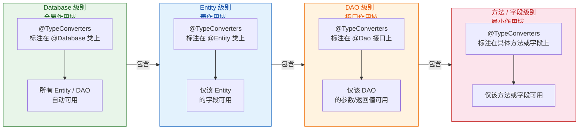

在绝大多数工程实践中，**推荐将所有 TypeConverter 统一注册在 `@Database` 级别**，形成全局作用域。这样做的理由是：第一，避免遗漏——如果某个 Entity 用到了 `Date` 字段但忘记在该 Entity 上注册 `DateConverter`，编译会失败，而全局注册一劳永逸；第二，保持一致性——同一种类型在整个数据库中应当使用相同的转换逻辑，分散注册容易导致不同 Entity 用了不同的转换器而引发数据不一致；第三，集中管理——所有转换器在一个地方注册，代码审查时一目了然。

具体的注册写法如下：

```kotlin
// 在 @Database 注解的类上统一注册所有 TypeConverter
// 这些转换器将对数据库中的所有 Entity 和 DAO 生效
@Database(
    entities = [TaskEntity::class, ArticleEntity::class],  // 所有实体类
    version = 1                                             // 数据库版本号
)
@TypeConverters(
    DateConverter::class,           // 日期转换
    PriorityConverter::class,      // 枚举转换
    StringListConverter::class,    // 列表转换
    GeoPointConverter::class,      // 地理坐标转换
    UuidConverter::class           // UUID 转换
)
abstract class AppDatabase : RoomDatabase() {
    abstract fun taskDao(): TaskDao       // 任务数据访问对象
    abstract fun articleDao(): ArticleDao // 文章数据访问对象
}
```

还有一点需要注意：当 Room 在同一个作用域内找到**多个转换器**都能处理同一种类型转换时（比如两个不同的转换器都能把 `Date` 转为 `Long`），编译器会报出 **ambiguous type converter** 错误。这种情况下，你需要缩小其中一个转换器的作用域（比如将其移到 Entity 级别或方法级别），让 Room 能够明确选择。Room 的优先级规则是：**作用域越小，优先级越高**——方法级 > 字段级 > DAO 级 > Entity 级 > Database 级。

### 进阶：泛型转换器与 ProvidedTypeConverter

在大型项目中，你可能会发现自己在为 `List<String>`、`List<Int>`、`List<Long>` 等不同元素类型的列表重复编写几乎相同的 TypeConverter。遗憾的是，由于 JVM 的类型擦除，Room 无法直接使用泛型 TypeConverter（如 `fun <T> fromList(list: List<T>): String`），因为在编译期 Room 无法确定 `T` 的具体类型。因此，对于每种不同的列表元素类型，你确实需要编写独立的转换器类，但可以通过封装来减少样板代码。

另一个值得了解的进阶特性是 **`@ProvidedTypeConverter`**（Room 2.3.0+）。默认情况下，Room 要求 TypeConverter 类有一个**无参构造函数**，因为 Room 生成的代码会自动 `new` 一个转换器实例。但如果你的转换器需要依赖注入（比如注入一个 `Gson` 实例或 `Json` 配置），无参构造函数的限制就成了障碍。`@ProvidedTypeConverter` 解除了这个限制——它告诉 Room："不要自己创建这个转换器的实例，我会通过 `RoomDatabase.Builder.addTypeConverter()` 手动提供"。

```kotlin
// 使用 @ProvidedTypeConverter 支持依赖注入
// Room 不会自己实例化这个类，而是由开发者手动提供实例
@ProvidedTypeConverter
class InjectableJsonConverter(
    private val json: Json  // 通过构造函数注入 Kotlinx.serialization 的 Json 配置
) {

    // List<String> → JSON String
    // 使用注入的 Json 实例，而非硬编码的默认配置
    @TypeConverter
    fun fromTags(tags: List<String>?): String? {
        return tags?.let { json.encodeToString(it) }
    }

    // JSON String → List<String>
    @TypeConverter
    fun toTags(value: String?): List<String>? {
        return value?.let { json.decodeFromString(it) }
    }
}
```

在构建数据库时，需要手动将转换器实例传入：

```kotlin
// 构建 Room 数据库时，手动提供 TypeConverter 实例
val database = Room.databaseBuilder(
    context,                       // Application Context
    AppDatabase::class.java,       // Database 类
    "app-database"                 // 数据库文件名
)
    // 将手动创建的转换器实例添加到 Room
    // 这里可以使用依赖注入框架（如 Hilt）提供的 Json 实例
    .addTypeConverter(InjectableJsonConverter(Json {
        ignoreUnknownKeys = true   // 配置：忽略 JSON 中的未知字段
        encodeDefaults = true      // 配置：序列化时包含默认值
    }))
    .build()
```

如果项目使用 **Hilt** 进行依赖注入，可以在 `@Module` 中优雅地集成：

```kotlin
@Module
@InstallIn(SingletonComponent::class)  // 全局单例作用域
object DatabaseModule {

    // 提供全局 Json 配置
    @Provides
    @Singleton
    fun provideJson(): Json = Json {
        ignoreUnknownKeys = true   // 容错：忽略未知字段
        encodeDefaults = true      // 序列化时包含默认值字段
    }

    // 提供 TypeConverter 实例，注入 Json 配置
    @Provides
    @Singleton
    fun provideJsonConverter(json: Json): InjectableJsonConverter {
        return InjectableJsonConverter(json)  // 使用 Hilt 注入的 Json 实例
    }

    // 提供 Room 数据库实例
    @Provides
    @Singleton
    fun provideDatabase(
        @ApplicationContext context: Context,        // Hilt 提供的 Application Context
        jsonConverter: InjectableJsonConverter       // Hilt 提供的 TypeConverter
    ): AppDatabase {
        return Room.databaseBuilder(
            context,
            AppDatabase::class.java,
            "app-database"
        )
            .addTypeConverter(jsonConverter)          // 注册手动提供的转换器
            .build()
    }
}
```

这种模式在大型项目中非常有价值——它让 TypeConverter 不再是一个孤立的静态工具类，而是可以融入整个应用的依赖注入体系，共享统一的序列化配置，便于测试时替换 mock 实现。

### 常见陷阱与最佳实践

在长期的工程实践中，围绕 TypeConverter 积累了一些值得反复强调的经验教训：

**陷阱一：忘记编写反向转换。** 每种类型转换都需要一对函数——写入方向和读取方向。只写了 `fromDate(Date): Long` 而忘记写 `toDate(Long): Date`，Room 编译时会报 `Cannot find a way to read this column` 的错误。这个错误信息有时不够直观，如果你的 Entity 字段很多，可能一时难以定位是哪个字段的转换器缺失。

**陷阱二：TypeConverter 中抛出异常。** 如果数据库中已经存储了格式错误的数据（比如 JSON 格式损坏、UUID 格式不合法），TypeConverter 在反序列化时会抛出异常，这个异常会直接传播到 DAO 调用层面，如果没有 try-catch，整个查询操作就会崩溃。建议在"读取方向"的转换器中添加防御性代码：

```kotlin
// 防御性 UUID 转换器 —— 对格式错误的数据优雅降级
class SafeUuidConverter {

    @TypeConverter
    fun fromUuid(uuid: UUID?): String? {
        return uuid?.toString()
    }

    // 读取方向增加异常捕获
    // 如果数据库中存储了格式错误的字符串，返回 null 而非崩溃
    @TypeConverter
    fun toUuid(value: String?): UUID? {
        return try {
            value?.let { UUID.fromString(it) }  // 尝试解析
        } catch (e: IllegalArgumentException) {
            // 记录日志以便排查数据损坏问题，但不崩溃
            Log.w("SafeUuidConverter", "Invalid UUID in database: $value", e)
            null  // 优雅降级为 null
        }
    }
}
```

**陷阱三：过度使用 TypeConverter 存储复杂对象。** 当你发现自己在把一个包含多个字段的对象（如 `Address(street, city, zipCode, country)`）序列化为 JSON 字符串存入单列时，请停下来思考：这些子字段是否需要被独立查询？如果 SQL 中需要 `WHERE city = 'Beijing'`，那将整个 `Address` 序列化为 JSON 就意味着你必须用 SQLite 的 `json_extract` 函数（性能差且可读性低），或者干脆无法高效查询。此时正确的做法是使用 `@Embedded`，让 Room 把 `Address` 的字段直接展开为表的多个列。

**最佳实践总结：**

- **统一注册到 `@Database` 级别**，避免遗漏和不一致。
- **优先使用 `@Embedded`** 处理结构化子对象，只在确实需要"单列存储"时才用 TypeConverter。
- **日期类型选择 `java.time`** 而非 `java.util.Date`，前者语义更清晰、API 更安全。
- **JSON 序列化优先于分隔符拼接**，除非在极端性能敏感且元素内容简单的场景。
- **大型项目使用 `@ProvidedTypeConverter`** 配合依赖注入，统一序列化配置。
- **读取方向的转换器添加防御性异常处理**，避免数据损坏导致运行时崩溃。

---

**📝 练习题**

在一个 Room 数据库中，某个 Entity 有一个 `List<String>` 类型的字段用于存储文章标签，你选择使用 Gson 将其序列化为 JSON 字符串。以下关于 TypeConverter 的说法，哪一项是**错误的**？

A. TypeConverter 的转换函数在编译时被 Room 注解处理器织入到生成的 `_Impl` 代码中，而不是通过运行时反射动态发现的。


B. 使用 Gson 反序列化 `List<String>` 时需要借助 `TypeToken` 来保留泛型信息，否则 Gson 可能无法正确推断元素类型。


C. 如果将 `@TypeConverters(StringListConverter::class)` 注解放在 `@Database` 类上，那么该转换器只对被该注解直接标注的 Entity 类生效，其他 Entity 需要单独注册。


D. 如果数据库中已有的 JSON 字符串格式损坏，TypeConverter 在反序列化时可能抛出异常，建议在读取方向的转换函数中添加防御性异常处理。


**【答案】** C

**【解析】** 选项 C 的描述是错误的。当 `@TypeConverters` 注解放置在 `@Database` 级别的类上时，它的作用域是**全局的（Database-wide）**，数据库中所有的 Entity 和 DAO 都会自动获得该转换器的能力，而不需要在每个 Entity 上单独注册。这正是推荐将 TypeConverter 统一注册在 `@Database` 级别的原因——一次注册，全局生效。选项 A 正确地描述了 Room TypeConverter 的编译时绑定机制；选项 B 正确地指出了 JVM 类型擦除下 Gson 需要 `TypeToken` 来处理泛型；选项 D 正确地提出了防御性编程的最佳实践建议。作用域的层级优先级从大到小为：Database > Entity > DAO > Method/Field，作用域越大覆盖范围越广，作用域越小优先级越高（当存在冲突时小作用域的转换器会覆盖大作用域的）。

---

## 预填充与回调

在许多真实的 Android 应用场景中，数据库并不总是从空白状态开始。例如，一个字典 App 需要在用户首次打开时就包含数十万条词条；一个城市选择器需要预装全国所有省市区数据；一个离线地图应用需要内置 POI（Point of Interest）数据。如果让用户在首次启动后再通过网络下载这些数据，不仅体验差，还会给服务器带来不必要的压力。Room 提供的 **预填充（Pre-packaged Database）** 机制正是为了解决这一痛点——允许开发者将一个已经填好数据的 `.db` 文件随 APK 一起发布，Room 在首次创建数据库时会自动将其复制到应用的数据库目录中，用户打开 App 即可直接使用全量数据。

与预填充相辅相成的是 **RoomDatabase.Callback** 机制。它在数据库生命周期的关键节点（创建、打开、迁移失败后的破坏性重建）提供了钩子方法（Hook），开发者可以在其中执行初始化逻辑，比如插入默认配置数据、记录日志、或在数据库打开后执行 PRAGMA 语句优化性能。预填充解决的是"大批量静态数据的初始化"，而 Callback 解决的是"在数据库生命周期事件中插入自定义逻辑"。两者结合，构成了 Room 数据库初始化阶段的完整方案。

### createFromAsset 预填充

#### 核心概念与使用场景

`createFromAsset()` 是 `RoomDatabase.Builder` 上的一个方法，它告诉 Room："当数据库文件尚不存在时，不要创建空数据库，而是从 APK 的 `assets` 目录中复制一个预先准备好的 `.db` 文件作为初始数据库。" 这个过程只发生在数据库 **首次创建** 时——如果用户已经有了数据库文件（即非首次启动），Room 会直接使用已有的数据库，不会再去读取 assets 中的文件。

与之类似的还有 `createFromFile()`，区别在于数据源的位置：`createFromAsset()` 从 APK 内部的 assets 文件夹读取，而 `createFromFile()` 从设备文件系统的任意路径读取（比如用户从外部存储导入的数据库）。在绝大多数预装数据场景下，`createFromAsset()` 是首选，因为 assets 目录中的文件会随 APK 打包分发，无需额外的文件管理。

#### 预填充数据库文件的准备

预填充的核心前提是：**assets 中的 `.db` 文件的 Schema 必须与 Room 当前版本定义的 Entity 完全一致。** 如果表结构不匹配，Room 在打开数据库时会抛出 `IllegalStateException`，提示 Schema 校验失败。因此，准备预填充数据库文件时需要格外小心。

推荐的工作流程如下：

第一步，先让 Room 生成一个空的目标数据库。可以在开发阶段运行一次 App，让 Room 自动创建数据库文件，然后通过 Android Studio 的 **Device Explorer** 将其从设备的 `/data/data/<package>/databases/` 目录导出。这个文件的表结构一定与 Room Entity 定义完全匹配。

第二步，使用 SQLite 工具（如 DB Browser for SQLite、`sqlite3` 命令行）打开这个空数据库，向其中批量插入预装数据。这一步可以通过编写 SQL 脚本自动化完成。

第三步，将填好数据的 `.db` 文件放入项目的 `app/src/main/assets/` 目录下（可以放在子文件夹中，如 `assets/database/preloaded.db`）。

另一种更自动化的方法是利用 Room 的 **exportSchema** 功能。当在 `@Database` 注解中设置 `exportSchema = true` 时，Room 会在编译期将完整的 Schema 导出为 JSON 文件。开发者可以根据这个 JSON 中的 `CREATE TABLE` 语句来构建预填充数据库，确保结构完全一致。

#### 基本用法

下面是 `createFromAsset()` 的典型用法，假设我们有一个城市数据库需要预填充：

```kotlin
// 城市实体定义
@Entity(tableName = "cities")
data class City(
    // 城市编码作为主键
    @PrimaryKey
    val code: String,
    // 城市名称
    @ColumnInfo(name = "city_name")
    val cityName: String,
    // 所属省份
    val province: String,
    // 纬度
    val latitude: Double,
    // 经度
    val longitude: Double
)

// 城市 DAO
@Dao
interface CityDao {
    // 根据省份查询所有城市
    @Query("SELECT * FROM cities WHERE province = :province ORDER BY city_name")
    fun getCitiesByProvince(province: String): Flow<List<City>>

    // 根据城市编码查询单个城市
    @Query("SELECT * FROM cities WHERE code = :code")
    suspend fun getCityByCode(code: String): City?

    // 模糊搜索城市名
    @Query("SELECT * FROM cities WHERE city_name LIKE '%' || :keyword || '%'")
    fun searchCities(keyword: String): Flow<List<City>>
}
```

```kotlin
// 数据库定义
@Database(
    entities = [City::class],
    version = 1,
    // 导出 Schema 用于版本管理和预填充文件的结构参考
    exportSchema = true
)
abstract class AppDatabase : RoomDatabase() {
    // 抽象方法返回 DAO
    abstract fun cityDao(): CityDao

    companion object {
        // Volatile 保证多线程可见性
        @Volatile
        private var INSTANCE: AppDatabase? = null

        fun getInstance(context: Context): AppDatabase {
            // 双重检查锁定（Double-Checked Locking）
            return INSTANCE ?: synchronized(this) {
                INSTANCE ?: buildDatabase(context).also { INSTANCE = it }
            }
        }

        private fun buildDatabase(context: Context): AppDatabase {
            return Room.databaseBuilder(
                context.applicationContext,
                AppDatabase::class.java,
                // 数据库文件名
                "app_database.db"
            )
                // 核心：指定从 assets 目录预填充
                // 路径相对于 assets 根目录
                .createFromAsset("database/cities.db")
                .build()
        }
    }
}
```

当 App 首次启动并访问数据库时，Room 内部的执行流程是：检查 `/data/data/<package>/databases/app_database.db` 是否存在 → 不存在 → 从 `assets/database/cities.db` 复制到目标路径 → 打开数据库并验证 Schema → 验证通过则正常使用。

#### createFromFile 的补充用法

在某些场景下，预填充数据库可能来自外部，比如用户从云端下载了一个数据库文件，或者从 SD 卡导入了备份文件。这时可以使用 `createFromFile()`：

```kotlin
private fun buildDatabaseFromExternalFile(
    context: Context,
    // 外部数据库文件的路径
    externalDbFile: File
): AppDatabase {
    return Room.databaseBuilder(
        context.applicationContext,
        AppDatabase::class.java,
        "app_database.db"
    )
        // 从文件系统路径复制
        // Room 会将此文件复制到内部数据库目录，原文件不受影响
        .createFromFile(externalDbFile)
        .build()
}
```

需要注意的是，`createFromFile()` 接收的是一个 `File` 对象，Room 会将该文件 **复制** 到自己的数据库目录中，原始文件不会被删除或修改。这意味着如果外部文件很大，复制过程会占用双倍的存储空间（原始文件 + 复制后的数据库文件），开发者需要在复制完成后决定是否手动删除原始文件。

#### 预填充与 Migration 的协同

一个常见的疑问是：如果 App 升级了数据库版本（比如从 version 1 升到 version 2），而 assets 中的预填充数据库还是 version 1 的结构，会发生什么？

答案是：**Room 会先复制预填充文件，然后依次执行 Migration。** 具体流程如下：

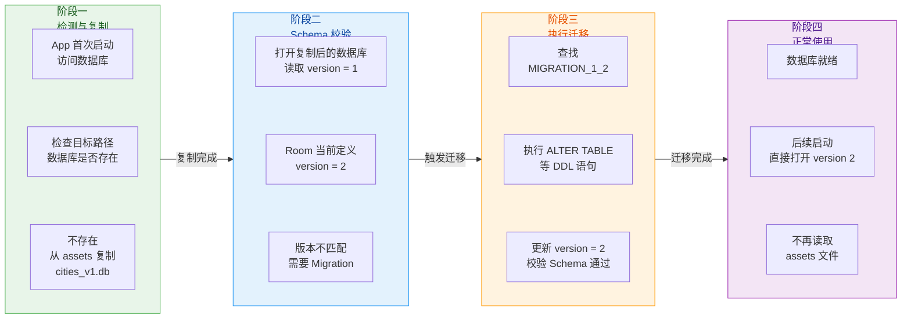

这意味着你 **不需要** 每次升级 Schema 时都重新制作预填充数据库文件。只要确保提供了从预填充文件的版本到当前版本的完整 Migration 链路即可。但从最佳实践来看，建议在大版本发布时更新 assets 中的预填充文件到最新版本，以减少首次安装时的 Migration 开销。

```kotlin
Room.databaseBuilder(
    context.applicationContext,
    AppDatabase::class.java,
    "app_database.db"
)
    // 预填充文件是 version 1 的结构
    .createFromAsset("database/cities.db")
    // 提供从 v1 到 v2 的迁移策略
    .addMigrations(MIGRATION_1_2)
    // 提供从 v2 到 v3 的迁移策略（如果当前是 v3）
    .addMigrations(MIGRATION_2_3)
    .build()
```

#### 多进程场景下的注意事项

如果 App 使用了多进程架构（比如通过 `android:process` 属性让某个 Service 运行在独立进程中），Room 在 2.4.0 版本之后提供了 `enableMultiInstanceInvalidation()` 来支持跨进程的数据变更通知。但在预填充场景下，需要注意 **多个进程可能几乎同时尝试创建数据库**，这可能导致竞态条件。Room 内部通过文件锁机制保证了同一时刻只有一个进程执行复制操作，但开发者仍需确保所有进程使用相同的 `databaseBuilder` 配置（相同的 `createFromAsset` 路径和 Migration 策略），否则可能出现不可预期的行为。

### RoomDatabase.Callback 初始化钩子

#### Callback 的设计目的

`RoomDatabase.Callback` 是 Room 提供的一个抽象类，它在数据库生命周期的三个关键时刻提供了回调方法。它的设计目的是让开发者能够在 **不修改 Room 核心逻辑** 的前提下，在数据库的创建、打开、迁移失败重建等事件中注入自定义逻辑。这是经典的 **观察者模式（Observer Pattern）** / **模板方法模式（Template Method Pattern）** 的体现——Room 定义好了执行流程的骨架，开发者通过 Callback 填充具体行为。

`Callback` 中有三个可覆写的方法：

**`onCreate(db: SupportSQLiteDatabase)`**：仅在数据库文件被 **首次创建** 时调用，且在所有表创建完成之后。这个回调在整个数据库生命周期内只会被触发一次。典型用途：插入初始数据（种子数据 Seed Data）、创建默认管理员账户、初始化系统配置表。

**`onOpen(db: SupportSQLiteDatabase)`**：在 **每次** 数据库被打开时调用，无论是首次创建后打开还是后续正常打开。典型用途：执行 `PRAGMA` 语句（如启用外键约束 `PRAGMA foreign_keys = ON`）、记录数据库打开日志、执行数据完整性检查。

**`onDestructiveMigration(db: SupportSQLiteDatabase)`**：当 Room 执行了 **破坏性重建（Destructive Migration）** 之后调用。也就是说，当 `fallbackToDestructiveMigration()` 生效并且数据库被清空重建后，这个回调会被触发。典型用途：在破坏性重建后重新插入必要的基础数据，避免 App 因缺少关键数据而崩溃。

#### 回调的执行时序

理解 Callback 各方法的调用时序对于正确使用它们至关重要。下面用时序图展示不同场景下的触发顺序：

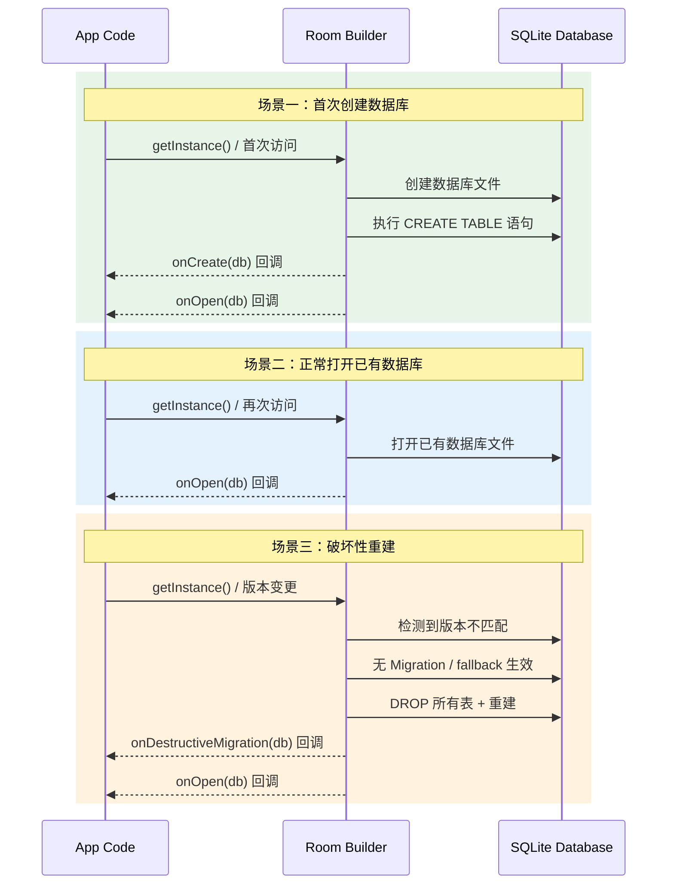

从时序图中可以看出几个关键规律：

- `onOpen()` **总是** 会被调用，无论走了哪条路径。因此它是执行"每次打开都需要"的逻辑的最佳位置。
- `onCreate()` 和 `onDestructiveMigration()` 是互斥的——首次创建走 `onCreate`，破坏性重建走 `onDestructiveMigration`，不会同时触发。
- 在首次创建场景中，`onCreate()` 先于 `onOpen()` 调用。这意味着 `onCreate` 中插入的数据在 `onOpen` 中已经可见。

#### 基本用法

下面展示一个完整的 Callback 使用示例。假设我们有一个任务管理应用，需要在首次创建时插入默认的任务分类，并且每次打开时启用 WAL 模式和外键约束：

```kotlin
// 自定义 Callback，注入 CoroutineScope 用于异步操作
class AppDatabaseCallback(
    // 传入协程作用域，用于在回调中启动协程
    private val scope: CoroutineScope
) : RoomDatabase.Callback() {

    // 数据库首次创建时调用
    // 参数 db 是底层的 SupportSQLiteDatabase，可以直接执行 SQL
    override fun onCreate(db: SupportSQLiteDatabase) {
        super.onCreate(db)
        // 使用 execSQL 直接插入种子数据
        // 这里在回调线程（通常是 Room 的执行线程）中同步执行
        db.execSQL(
            """
            INSERT INTO categories (id, name, color, sort_order) VALUES
            (1, '工作', '#4CAF50', 0),
            (2, '生活', '#2196F3', 1),
            (3, '学习', '#FF9800', 2),
            (4, '健康', '#E91E63', 3)
            """.trimIndent()
        )
    }

    // 每次数据库打开时调用
    override fun onOpen(db: SupportSQLiteDatabase) {
        super.onOpen(db)
        // 启用外键约束（SQLite 默认不开启外键约束）
        db.execSQL("PRAGMA foreign_keys = ON")
    }

    // 破坏性重建后调用
    override fun onDestructiveMigration(db: SupportSQLiteDatabase) {
        super.onDestructiveMigration(db)
        // 破坏性重建后，所有数据丢失
        // 重新插入最基本的种子数据，保证 App 不会因缺少数据而崩溃
        db.execSQL(
            """
            INSERT INTO categories (id, name, color, sort_order) VALUES
            (1, '默认分类', '#9E9E9E', 0)
            """.trimIndent()
        )
    }
}
```

在构建数据库时注册 Callback：

```kotlin
// 在数据库构建器中添加 Callback
fun buildDatabase(context: Context, scope: CoroutineScope): AppDatabase {
    return Room.databaseBuilder(
        context.applicationContext,
        AppDatabase::class.java,
        "task_database.db"
    )
        // 注册自定义回调
        .addCallback(AppDatabaseCallback(scope))
        // 可以添加多个 Callback，它们会按注册顺序依次执行
        // .addCallback(anotherCallback)
        .build()
}
```

#### 通过 Callback 使用 DAO 插入种子数据

上面的例子直接使用了 `db.execSQL()` 来插入数据，这虽然简单直接，但绕过了 Room 的类型安全保护。一种更优雅的方式是在 Callback 中通过 DAO 来操作数据。但这里有一个 **微妙的陷阱**：在 `onCreate()` 回调触发时，数据库实例本身可能还没有完全初始化完毕（正处于 `build()` 的过程中），直接调用 DAO 方法可能导致死锁或异常。

解决方案是在 Callback 中启动一个新的协程，延迟执行 DAO 操作：

```kotlin
class AppDatabaseCallback(
    // 注入协程作用域
    private val scope: CoroutineScope,
    // 延迟获取数据库实例（避免在 build 过程中循环引用）
    private val databaseProvider: Lazy<AppDatabase>
) : RoomDatabase.Callback() {

    override fun onCreate(db: SupportSQLiteDatabase) {
        super.onCreate(db)
        // 在协程中异步执行，避免阻塞数据库创建流程
        scope.launch {
            // 通过 Lazy 延迟获取数据库实例
            val database = databaseProvider.value
            // 使用 DAO 的类型安全方法插入种子数据
            database.categoryDao().insertAll(
                // 构造默认分类列表
                listOf(
                    Category(id = 1, name = "工作", color = "#4CAF50", sortOrder = 0),
                    Category(id = 2, name = "生活", color = "#2196F3", sortOrder = 1),
                    Category(id = 3, name = "学习", color = "#FF9800", sortOrder = 2),
                    Category(id = 4, name = "健康", color = "#E91E63", sortOrder = 3)
                )
            )
        }
    }
}
```

这种 `Lazy + CoroutineScope` 模式配合依赖注入框架（如 Hilt）使用时尤为顺畅：

```kotlin
@Module
@InstallIn(SingletonComponent::class)
object DatabaseModule {

    @Provides
    @Singleton
    fun provideDatabase(
        @ApplicationContext context: Context,
        // Hilt 提供的 ApplicationScope
        @ApplicationScope scope: CoroutineScope
    ): AppDatabase {
        // 使用 lateinit 来解决循环依赖
        lateinit var database: AppDatabase

        database = Room.databaseBuilder(
            context,
            AppDatabase::class.java,
            "task_database.db"
        )
            .addCallback(
                // 传入 lazy 块，在 onCreate 触发时数据库已构建完成
                AppDatabaseCallback(scope, lazy { database })
            )
            .build()

        // 返回数据库实例
        return database
    }
}
```

#### Callback 参数中 SupportSQLiteDatabase 的本质

回调方法的参数类型是 `SupportSQLiteDatabase` 而不是 `RoomDatabase`，这是一个刻意的设计。`SupportSQLiteDatabase` 是 AndroidX 对原生 `android.database.sqlite.SQLiteDatabase` 的封装接口，它提供了底层的 SQL 执行能力（`execSQL()`、`query()`、`insert()`、`delete()` 等），但 **不经过** Room 的抽象层。

这意味着在 Callback 中：

- 你可以执行任意 SQL 语句，包括 Room 不直接支持的操作（如创建触发器 Trigger、创建视图 View、执行 `PRAGMA` 命令）。
- 你绕过了 Room 的线程检查（Room 通常禁止在主线程执行数据库操作，但 Callback 中的 `db` 参数不受此限制，因为 Room 认为 Callback 是初始化流程的一部分）。
- 你绕过了 Room 的 `InvalidationTracker` 通知机制——通过 `db.execSQL()` 直接插入的数据不会触发 Flow/LiveData 的更新通知。但这通常不是问题，因为 Callback 在数据库打开之前或之时执行，此时还没有观察者在监听。

#### createFromAsset 与 Callback 的配合

`createFromAsset()` 和 `Callback` 可以同时使用，它们的执行顺序如下：

1. Room 检测到数据库不存在，先从 assets 复制预填充文件。
2. 复制完成后，Room **不会** 触发 `onCreate()` 回调。
3. Room 执行 Migration（如果预填充文件版本低于当前版本）。
4. 最后触发 `onOpen()` 回调。

**关键点：当使用 `createFromAsset()` 时，`onCreate()` 不会被调用。** 这是因为从 Room 的视角来看，数据库不是被"创建"的，而是被"复制"的。如果你需要在预填充之后执行额外的初始化逻辑，应该使用 `onOpen()` 并配合标志位来判断是否为首次打开：

```kotlin
override fun onOpen(db: SupportSQLiteDatabase) {
    super.onOpen(db)
    // 检查是否已经执行过初始化（通过一个标志表或 SharedPreferences）
    val cursor = db.query("SELECT COUNT(*) FROM app_metadata WHERE key = 'initialized'")
    // 读取查询结果
    val initialized = cursor.use {
        // 移动到第一行
        it.moveToFirst()
        // 读取 COUNT 值
        it.getInt(0) > 0
    }
    // 如果尚未初始化，执行额外逻辑
    if (!initialized) {
        // 插入初始化标志
        db.execSQL("INSERT INTO app_metadata (key, value) VALUES ('initialized', '1')")
        // 执行其他首次打开需要的操作
        db.execSQL("UPDATE cities SET is_popular = 1 WHERE code IN ('110000', '310000', '440100')")
    }
}
```

#### 生产环境最佳实践总结

将预填充和 Callback 在实际项目中用好，需要注意以下几个经验性原则：

**预填充文件的版本管理**：将预填充的 `.db` 文件纳入版本控制（Git），并在文件名或项目文档中标注其对应的 Schema 版本号。每次 Schema 变更时评估是否需要更新预填充文件。

**预填充文件的大小控制**：assets 中的文件会被打入 APK，直接影响安装包大小。如果预填充数据非常大（超过 10MB），考虑使用 App Bundle 的动态分发模块、或改为首次启动时从 CDN 下载。SQLite 数据库文件可以通过 `VACUUM` 命令和删除冗余索引来压缩体积。

**Callback 中避免耗时操作**：`onCreate()` 和 `onOpen()` 运行在数据库的初始化线程上，如果执行了大量 SQL 操作，会延迟数据库的就绪时间，间接影响 App 启动速度。对于大量种子数据，优先选择 `createFromAsset()` 预填充而非在 `onCreate()` 中逐条插入。

**测试预填充流程**：在 `androidTest` 中使用 `Room.inMemoryDatabaseBuilder()` 无法测试预填充逻辑（因为 in-memory 数据库不涉及文件复制）。测试预填充需要使用真实的 `databaseBuilder`，并在每个测试用例前清除数据库文件以模拟首次安装。

```kotlin
@RunWith(AndroidJUnit4::class)
class PrePopulateTest {

    // 测试上下文
    private lateinit var context: Context

    @Before
    fun setup() {
        // 获取测试上下文
        context = ApplicationProvider.getApplicationContext()
        // 删除已有数据库文件，模拟首次安装
        context.deleteDatabase("test_database.db")
    }

    @Test
    fun testPrePopulatedDataIsAvailable() = runTest {
        // 构建使用预填充的数据库
        val db = Room.databaseBuilder(
            context,
            AppDatabase::class.java,
            "test_database.db"
        )
            // 使用 assets 中的预填充文件
            .createFromAsset("database/cities.db")
            .build()

        // 验证预填充数据存在
        val cities = db.cityDao().getCitiesByProvince("广东省").first()
        // 断言数据不为空
        assertTrue("预填充的广东省城市数据应不为空", cities.isNotEmpty())

        // 清理
        db.close()
    }
}
```

---

**📝 练习题**

在一个 Room 数据库中同时配置了 `createFromAsset("seed.db")` 和 `RoomDatabase.Callback`。当用户首次安装 App 并打开数据库时，以下哪个说法是正确的？

A. `onCreate()` 先被调用，然后 Room 从 assets 复制 seed.db，最后调用 `onOpen()`


B. Room 从 assets 复制 seed.db，然后调用 `onCreate()`，最后调用 `onOpen()`


C. Room 从 assets 复制 seed.db，跳过 `onCreate()`，最后调用 `onOpen()`


D. Room 从 assets 复制 seed.db，调用 `onDestructiveMigration()`，最后调用 `onOpen()`


**【答案】** C

**【解析】** 当使用 `createFromAsset()` 或 `createFromFile()` 预填充数据库时，Room 将这个过程视为"复制"而非"创建"。数据库文件已经是一个完整的、包含表结构和数据的 SQLite 文件，Room 只是把它搬到了应用的数据库目录下。因此，`onCreate()` 回调 **不会** 被触发——这个方法仅在 Room 从零开始执行 `CREATE TABLE` 语句创建新数据库时才会调用。复制完成后，Room 正常打开数据库，触发 `onOpen()` 回调。选项 A 和 B 错在认为 `onCreate()` 会被调用；选项 D 错在认为会触发 `onDestructiveMigration()`，该方法仅在 `fallbackToDestructiveMigration()` 生效导致数据库被清空重建时才会调用，与预填充场景无关。这个行为对实际开发的影响是：如果你在 `onCreate()` 中插入了种子数据，同时又使用了 `createFromAsset()`，那么 `onCreate()` 中的种子数据逻辑将永远不会执行。需要额外初始化逻辑时应使用 `onOpen()` 配合标志位判断。

---

**📝 练习题**

在 `RoomDatabase.Callback` 的 `onCreate(db: SupportSQLiteDatabase)` 中，通过 `db.execSQL("INSERT INTO ...")` 插入了一条数据。此时有一个 `Flow<List<Item>>` 正在被 UI 层 collect。关于这条插入的数据，以下哪个说法最准确？

A. `Flow` 会立即收到更新通知并发射新列表，因为 Room 的 InvalidationTracker 会感知到表变更


B. `Flow` 不会收到通知，因为 `onCreate()` 在数据库打开之前执行，InvalidationTracker 尚未注册


C. `Flow` 会在下一次数据库操作时附带收到通知，因为 InvalidationTracker 采用延迟检测机制


D. 直接操作 `SupportSQLiteDatabase` 会抛出异常，因为 Room 不允许在 Callback 中执行写操作


**【答案】** B

**【解析】** 这道题考察对 `RoomDatabase.Callback` 执行时机和 `InvalidationTracker` 工作原理的理解。`onCreate()` 在数据库的初始化阶段被调用，此时数据库刚被创建，整个 Room 实例还在构建过程中，`InvalidationTracker` 尚未完成注册和初始化（它在数据库完全打开之后才开始工作）。更重要的是，在 `onCreate()` 执行时，UI 层的 `Flow` 几乎不可能已经开始 collect——因为数据库实例都还没有构建完成，DAO 都还拿不到。因此通过底层 `SupportSQLiteDatabase` 直接执行的 SQL 不会触发 Room 的变更通知系统。选项 A 错误，因为 InvalidationTracker 在此刻还未工作；选项 C 的"延迟检测"说法没有事实依据；选项 D 错误，Room 完全允许在 Callback 中执行 SQL 写操作，这正是 Callback 的设计用途之一。当 UI 层后续首次 collect 该 Flow 时，会正常执行查询并获取到包含种子数据在内的完整结果集，所以数据不会丢失，只是不会通过通知机制推送而已。

---

## 本章小结

本章围绕 Android 应用层最核心的本地持久化方案——**SQLite 数据库**与 **Room 持久化库**，从底层原理到上层封装进行了系统性的梳理。下面按知识脉络做一次全景回顾，帮助你在脑中构建起完整的 **"数据从定义 → 存储 → 查询 → 观察 → 升级"** 闭环。

---

### 知识脉络总览

整章内容可以被归纳为三条主线：**基础层（Raw SQLite）**、**框架层（Room 编译时体系）**、**工程化（Migration / 异步 / 预填充）**。它们之间的关系如下图所示：

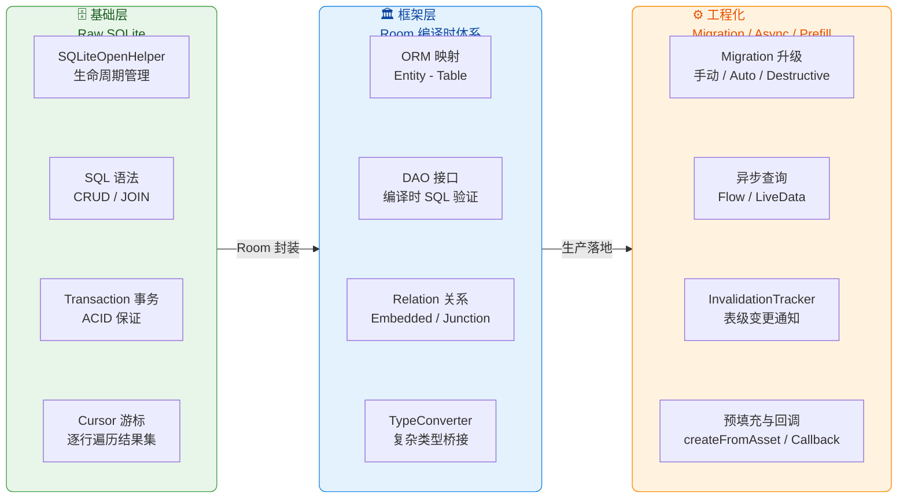

从图中可以清晰看出：**基础层**为你理解 SQLite 自身能力提供了根基；**Room 框架层**在此之上提供了编译时安全与对象关系映射；**工程化**部分则解决了真实项目中数据库升级、响应式 UI 刷新、初始数据灌入等必须面对的问题。三条线缺一不可。

---

### 核心知识点回顾

**一、SQLite 基础回顾**

本章以 `SQLiteOpenHelper` 为起点，讲解了 Android 内置 SQLite 引擎的基本使用范式。`SQLiteOpenHelper` 通过 `onCreate()` 与 `onUpgrade()` 两个回调，将 **数据库文件的创建与版本升级** 收归到统一的生命周期管理中。SQL 语法部分覆盖了 DDL（`CREATE TABLE` / `ALTER TABLE`）与 DML（`INSERT` / `UPDATE` / `DELETE` / `SELECT`）两大类操作，它们是一切数据库行为的基石。

事务（Transaction）是保障数据一致性的核心武器。SQLite 的事务满足 ACID 四特性，在 `beginTransaction()` — `setTransactionSuccessful()` — `endTransaction()` 的三段式调用模式下，要么所有操作全部生效，要么在异常时全部回滚。Cursor 游标则是 SQLite 返回查询结果的唯一载体——它是一个 **可定位的行迭代器**，需要手动 `moveToNext()` 遍历，并且必须在使用完毕后 `close()` 以释放 native 资源。理解这些原始 API 的痛点（手写 SQL 易出错、Cursor 映射繁琐、线程安全靠自觉），才能真正体会 Room 带来的价值。

**二、Room 架构组件**

Room 是 Google 在 Architecture Components 中推出的 **ORM（Object-Relational Mapping）** 层，它并没有取代 SQLite，而是在其上做了三件关键事情：

1. **编译时 SQL 验证**——通过 KSP / KAPT 注解处理器，在编译期解析 `@Query` 中的 SQL 语句，校验表名、列名、参数绑定是否与 Entity 一致，把 **运行时崩溃提前到编译期报错**。
2. **对象关系映射**——将 Kotlin/Java data class 与数据库表行做双向转换，开发者只需定义 Entity 与 DAO，Room 自动生成 `_Impl` 实现类。
3. **Schema 版本管理**——通过 `exportSchema = true` 将每个版本的数据库结构导出为 JSON 文件，配合 `AutoMigration` 实现版本间差异的自动对比。

`RoomDatabase` 是整个 Room 体系的入口。它是一个抽象类，通过 `Room.databaseBuilder()` 以 Builder 模式构建，内部持有一个 `SupportSQLiteOpenHelper`（对原生 `SQLiteOpenHelper` 的接口抽象），并管理所有 DAO 实例的生命周期。

**三、实体与访问对象**

`@Entity` 注解将一个 data class 映射为一张数据库表。`@PrimaryKey` 定义主键，`autoGenerate = true` 则交由 SQLite 的 `ROWID` 机制自增。`@ColumnInfo` 可自定义列名与类型亲和度（Type Affinity），`@Ignore` 排除不需要持久化的字段。

索引（`@Index`）是查询性能优化的重要手段。在 `@Entity(indices = [...])` 中声明的索引会在建表时通过 `CREATE INDEX` 语句创建。**唯一索引**（`unique = true`）还额外承担了数据库层面的唯一性约束。

`@Dao` 接口是应用代码与数据库交互的唯一合法入口。Room 通过注解处理器为每个 DAO 接口生成 `_Impl` 实现。`@Insert`、`@Update`、`@Delete` 是便捷的 CRUD 快捷方式（Room 自动拼接 SQL），而 `@Query` 则允许你编写任意复杂的 SQL。值得强调的是，`@Insert(onConflict = OnConflictStrategy.REPLACE)` 的本质是 **先 DELETE 再 INSERT**，这意味着如果有外键级联删除，可能会触发意料之外的数据丢失——这是面试和实战中一个经典的坑。

**四、关系映射 Relation**

关系型数据在 Room 中有三种表达方式：

- **`@Embedded`**——将另一个对象的所有字段 **平铺展开** 到宿主 Entity 的同一张表中，适用于"值对象"（Value Object）场景，如 Address 嵌入 User。
- **`@Relation`**——在一个非 Entity 的 POJO 中，通过 `parentColumn` / `entityColumn` 声明一对一或一对多关系。Room 在底层会执行 **两次查询**：第一次取父表数据，第二次用父表主键集合 `IN (...)` 批量查子表，最后在内存中做关联组装。
- **`@Junction`**——专门解决多对多关系，需要一张中间关联表。Room 依然使用两次查询 + 内存拼装的策略，只不过第二次查询会 JOIN 中间表。

理解 Room 关系查询的 **"两次查询"本质** 非常重要：它意味着 `@Relation` 查询无法使用 `@Transaction` 以外的方式保证一致性快照，因此 Google 官方强烈建议所有带 `@Relation` 的查询方法都加上 `@Transaction` 注解。

**五、数据库升级 Migration**

数据库升级是生产环境中最容易出事故的环节。Room 提供了三种策略：

1. **手动 Migration**（`Migration(startVersion, endVersion)`）——开发者在 `migrate()` 回调中编写 `ALTER TABLE` / `CREATE TABLE` 等 DDL 语句，完全自主可控，适合复杂结构变更。
2. **AutoMigration**——Room 2.4+ 引入，通过对比相邻版本的 Schema JSON 文件自动生成迁移代码。对于简单的加列、加表、加索引场景非常省心，但遇到列重命名或删除列时，需要配合 `AutoMigrationSpec` 提供 `@RenameColumn` / `@DeleteColumn` 提示。
3. **DestructiveMigration**（`fallbackToDestructiveMigration()`）——当找不到匹配的 Migration 路径时，直接 **删库重建**。它是开发阶段的便利工具，但绝不应出现在正式发布版本中，因为用户数据将全部丢失。

Migration 的查找算法是一个 **有向图最短路径** 问题：Room 将所有已注册的 Migration 构建成图，从当前版本到目标版本寻找一条路径；如果找不到且未开启 Destructive Fallback，则直接抛出 `IllegalStateException`。

**六、异步查询与观察**

Room 天然支持响应式数据流。当 DAO 方法的返回值声明为 `Flow<List<T>>` 或 `LiveData<List<T>>` 时，Room 不仅执行一次查询，还会 **持续监听数据变更并自动重新查询推送新数据**。

这背后的核心引擎是 `InvalidationTracker`。它在数据库上创建了一组 **临时触发器（Trigger）**，当任何 `INSERT` / `UPDATE` / `DELETE` 操作发生在被观察的表上时，触发器会向一张内部 `room_table_modification_log` 表写入标记。`InvalidationTracker` 定期（或在事务结束时）检查该标记表，发现有变更就通知所有注册的 Observer，Observer 再触发 Flow/LiveData 重新执行查询。

需要注意的一点是：InvalidationTracker 的通知粒度是 **表级别** 而非行级别。这意味着即使你只修改了 User 表的第 1 行，所有观察 User 表的 Flow 都会收到通知并重新查询整张表。这在大多数场景下不会成为性能瓶颈，但如果表数据量极大且写入频繁，则需要考虑分表或手动控制刷新频率。

**七、类型转换 TypeConverter**

SQLite 只支持 `NULL`、`INTEGER`、`REAL`、`TEXT`、`BLOB` 五种存储类型，而应用层的 Kotlin/Java 对象远比这丰富。`@TypeConverter` 的作用就是在 **应用对象** 和 **SQLite 可存储类型** 之间建立双向桥梁。

常见的转换场景包括：`Date` ↔ `Long`（时间戳）、`Enum` ↔ `String`（枚举名称）、`List<T>` ↔ `String`（JSON 序列化）。TypeConverter 通过 `@TypeConverters` 注解注册，其作用域遵循 **就近原则**：注册在 Database 类上则全局生效，注册在 DAO 或 Entity 上则只在该范围内生效。Room 2.4+ 引入的 **内建类型转换器（Built-in Type Converters）** 可以自动处理 `Enum` ↔ `String` 和 `UUID` ↔ `ByteArray` 的转换，减少了样板代码。

**八、预填充与回调**

`createFromAsset()` 和 `createFromFile()` 允许在首次创建数据库时从预打包的 `.db` 文件复制数据，适用于需要出厂自带字典数据、城市列表等场景。预填充发生在 `SQLiteOpenHelper.onCreate()` **之前**——Room 会先复制文件，再打开数据库验证 Schema。

`RoomDatabase.Callback` 提供了 `onCreate()`、`onOpen()`、`onDestructiveMigration()` 三个钩子。`onCreate()` 只在数据库文件首次创建时调用一次，适合做初始数据插入；`onOpen()` 每次打开数据库都会调用，适合执行 `PRAGMA` 配置（如开启 WAL 模式或外键约束）；`onDestructiveMigration()` 在破坏性重建后触发，可以用来重新灌入必要的种子数据。

---

### 全景架构图

下图将本章所有核心组件的层次关系与数据流向做了一次可视化汇总：

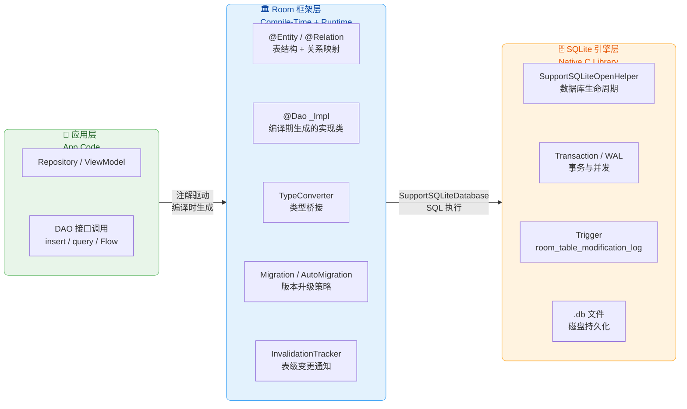

### 关键实战要点速查

| 场景 | 推荐做法 | 避坑提醒 |
|---|---|---|
| 主键策略 | `@PrimaryKey(autoGenerate = true)` | 复合主键用 `@Entity(primaryKeys = [...])` |
| 冲突处理 | `OnConflictStrategy.REPLACE` | 本质是先 DELETE 再 INSERT，注意外键级联 |
| 关系查询 | `@Relation` + `@Transaction` | 不加 `@Transaction` 可能读到不一致快照 |
| 多对多 | `@Junction` + 中间表 | 中间表也要定义为 `@Entity` |
| 数据库升级 | 优先 `AutoMigration`，复杂场景手写 `Migration` | 永远不要在生产环境使用 `fallbackToDestructiveMigration()` |
| 响应式查询 | `Flow<List<T>>` | 通知粒度为表级别，大表高频写入需关注性能 |
| 类型转换 | `@TypeConverters` 注册在 Database 类上 | JSON 序列化的 List 无法被 SQL `WHERE` 精确过滤 |
| 预填充 | `createFromAsset("xxx.db")` | `.db` 文件 Schema 必须与当前 Entity 定义完全一致 |
| 初始化钩子 | `RoomDatabase.Callback.onCreate()` 插入种子数据 | `onCreate` 只触发一次，`onOpen` 每次都触发 |

---

### 一句话总结

> SQLite 给你的是一把锋利但需要小心使用的手术刀；Room 则是把这把刀装进了一套 **编译时安全 + 响应式 + 版本可控** 的手术台系统。理解 SQLite 的底层机制（事务、游标、触发器、Type Affinity）是用好 Room 的前提；而掌握 Room 的 Entity-DAO-Database 三角架构、Migration 策略、以及 InvalidationTracker 的观察机制，才能在生产环境中构建出 **可维护、可升级、数据安全** 的本地存储方案。

---

**📝 练习题**

在一个已上线的应用中，你需要在 `User` 表新增一个 `nickname TEXT` 列（允许为空），同时将原有的 `userName` 列重命名为 `display_name`。数据库版本从 3 升到 4。以下哪种做法是最安全且推荐的？

A. 仅使用 `AutoMigration(from = 3, to = 4)`，不提供任何 `AutoMigrationSpec`


B. 使用 `AutoMigration(from = 3, to = 4, spec = MySpec::class)`，在 `MySpec` 中声明 `@RenameColumn(tableName = "User", fromColumnName = "userName", toColumnName = "display_name")`


C. 调用 `fallbackToDestructiveMigration()` 让 Room 自动处理


D. 编写手动 `Migration(3, 4)`，在 `migrate()` 中执行 `ALTER TABLE User ADD COLUMN nickname TEXT` 和 `ALTER TABLE User RENAME COLUMN userName TO display_name`，同时配置 `AutoMigration` 作为兜底


**【答案】** B

**【解析】** 本题考察的是 Room 数据库升级策略的选择。选项 A 的问题在于，`AutoMigration` 可以自动检测到新增列，但 **无法自动识别列重命名**——它会将旧列 `userName` 视为被删除，将 `display_name` 视为新增列，导致数据丢失。因此必须通过 `AutoMigrationSpec` 显式告知 Room 这是一次重命名操作，这正是选项 B 所做的事情。选项 B 中 `@RenameColumn` 注解让 Room 知道 `userName → display_name` 是同一列的更名，而新增的 `nickname` 列则可以被 AutoMigration 自动处理，两者结合是最简洁安全的方案。选项 C 在生产环境中绝不可接受，因为 `fallbackToDestructiveMigration()` 会丢失所有用户数据。选项 D 中同时注册手动 `Migration` 和 `AutoMigration` 覆盖相同版本区间会产生冲突——Room 在找到手动 Migration 后就不会再执行同区间的 AutoMigration，但如果只依赖手动 Migration 本身倒是可行的，问题在于题目说"同时配置 AutoMigration 作为兜底"，这种混用同一版本区间的做法是不推荐的且可能引发歧义。因此最佳答案是 B。

---

**📝 练习题**

以下关于 Room `InvalidationTracker` 的描述，哪一项是 **错误的**？

A. `InvalidationTracker` 通过在被观察的表上创建临时触发器（Trigger）来感知数据变更


B. 当 DAO 方法返回 `Flow<List<User>>` 时，只要 User 表发生任何写操作，该 Flow 就会重新执行查询并发射新数据


C. `InvalidationTracker` 能够精确追踪到具体是哪一行数据发生了变化，从而实现行级别的增量刷新


D. 即使写操作实际上没有改变任何行的数据内容（如 `UPDATE` 的 SET 值与原值相同），触发器依然会标记该表为"已变更"


**【答案】** C

**【解析】** 本题考察 `InvalidationTracker` 的工作原理与通知粒度。选项 A 正确——InvalidationTracker 确实通过创建 `AFTER INSERT / UPDATE / DELETE` 临时触发器来监控表的变更事件，这些触发器会向内部的 `room_table_modification_log` 标记表写入记录。选项 B 正确——当 Flow 类型的查询注册了对某张表的观察后，该表的任何写操作都会触发重新查询。选项 D 也是正确的——SQLite 触发器在 `UPDATE` 语句执行时就会触发，即使 SET 的值与原值完全相同（因为 SQLite 并不比较新旧值）。**选项 C 是错误的**，因为 `InvalidationTracker` 的通知粒度是 **表级别（Table-Level）** 而非行级别（Row-Level）。它只知道"User 表发生了变化"，但不知道具体是哪一行、哪一列被修改了。因此所有观察该表的 Flow / LiveData 都会收到通知并重新查询整张表的数据，无法做到行级别的增量刷新。这也是在大数据量、高频写入场景下需要特别关注性能的原因。

---

