---

# 文件与持久化存储

---

## 内部存储 Internal Storage

Android 的内部存储（Internal Storage）是每个应用最基本、最安全的文件持久化手段。当我们谈论"内部存储"时，指的是应用安装在设备 **内置闪存** 上、由系统为其分配的一块 **私有沙箱目录**。这块空间从应用安装那一刻起就自动存在，无需任何权限声明，也无需用户授权——它天然属于该应用，且 **仅该应用可以访问**（除非设备被 Root）。这一特性使内部存储成为存放敏感数据（如用户 Token、加密密钥、本地数据库文件）的首选方案。

理解内部存储之所以重要，是因为它是整个 Android 文件与持久化体系的 **基石**。后续我们将讨论的外部存储（External Storage）、分区存储（Scoped Storage）等机制，本质上都是在内部存储的安全模型基础上进行扩展或放宽。如果你不能准确地理解内部存储的目录结构、文件归属和生命周期，那么在面对更复杂的存储场景时就会频繁踩坑。

### 私有目录结构

每个 Android 应用在安装后，系统都会在 `/data/data/<package_name>/`（或在部分设备上为 `/data/user/0/<package_name>/`）下创建一组标准目录。这组目录完全由 Linux 文件权限保护——目录的 owner 和 group 被设置为该应用的 UID/GID，权限模式通常为 `0700`（仅 owner 可读/写/执行），这意味着其他应用的进程根本无法进入这个目录。

让我们用一张图来直观认识这棵目录树的典型结构：

```
/data/data/com.example.myapp/          ← 应用私有根目录
│
├── files/                             ← getFilesDir() 指向此处
│   ├── user_config.json               ← 你手动写入的持久文件
│   └── logs/                          ← 可自建子目录
│       └── app.log
│
├── cache/                             ← getCacheDir() 指向此处
│   ├── image_cache/                   ← 临时缓存，系统低存储时可能清除
│   └── tmp_download.dat
│
├── shared_prefs/                      ← SharedPreferences XML 文件存放处
│   └── settings.xml
│
├── databases/                         ← SQLite / Room 数据库文件
│   ├── app.db
│   └── app.db-wal
│
├── app_webview/                       ← WebView 缓存与数据
│
├── no_backup/                         ← getNoBackupFilesDir() 指向此处
│   └── device_token.key               ← 不参与 Auto Backup 的敏感文件
│
├── code_cache/                        ← JIT / baseline profile 编译缓存
│
└── app_<custom>/                      ← getDir("custom", MODE_PRIVATE) 创建
```

这里有几个非常关键的设计意图需要深入说明：

**files/ 与 cache/ 的职责分离**。Android 从架构上就要求开发者区分"需要长期留存的文件"和"可以随时被丢弃的缓存"。`files/` 目录下的内容只有在用户主动清除数据（Settings → App → Clear Data）或卸载应用时才会被移除；而 `cache/` 目录下的内容，在设备存储空间不足时，系统有权自动删除（虽然实际触发并不频繁，但 **设计契约** 如此）。这就是为什么你不应该把重要的用户数据放在 `cache/` 里——它不是"保存"的地方，而是"暂存"的地方。

**shared_prefs/ 和 databases/ 是系统隐式管理的**。你不需要、也不应该手动在这两个目录下读写文件。它们分别由 `SharedPreferences` API 和 `SQLiteOpenHelper`/Room 框架自动管理。如果你尝试绕过 API 直接操作这些文件，极有可能与框架的内存缓存产生不一致，导致数据丢失或损坏。

**no_backup/ 的存在意义**。从 Android 6.0（API 23）开始，系统引入了 Auto Backup 机制，会将应用的内部存储数据自动备份到用户的 Google Drive。但某些数据是设备相关的（比如 FCM Registration Token、设备唯一标识符），备份到新设备后反而会出问题。`getNoBackupFilesDir()` 返回的 `no_backup/` 目录就是专门为此设计的——放在这里的文件永远不会被 Auto Backup 收集。

**Linux 权限模型是安全根基**。整个内部存储的安全性 **不依赖于 Java/Kotlin 层的任何逻辑**，而是直接由 Linux 内核的文件权限机制保障。每个 Android 应用在安装时都会被分配一个唯一的 Linux UID（如 `u0_a123`），应用的私有目录以这个 UID 作为 owner。当另一个应用（拥有不同 UID）试图访问你的目录时，内核会在 VFS 层直接拒绝，连系统调用都不会成功。这种隔离被称为 **Application Sandbox**，是 Android 安全体系最核心的构件之一。

### getFilesDir()

`getFilesDir()` 是 `Context` 类提供的一个方法，它返回一个 `File` 对象，指向应用内部存储的 `files/` 目录。这是你在内部存储中进行 **持久化文件读写** 最常用的入口。

从 API 设计的角度看，`getFilesDir()` 的职责非常纯粹：给你一个安全、私有、持久的目录路径，至于你在里面怎么组织文件结构、用什么格式存储数据，完全由你决定。你可以在这个目录下创建子目录、写入 JSON 文件、存放序列化对象、甚至放一个小型的 Flat File Database——都是合理的用法。

```kotlin
// === 使用 getFilesDir() 进行文件读写的完整示例 ===

// 获取 files/ 目录的 File 对象
// 返回路径通常为: /data/data/com.example.myapp/files
val filesDir: File = context.filesDir

// 在 files/ 目录下创建一个子目录 "logs"
// mkdirs() 会递归创建所有缺失的父目录
val logsDir = File(filesDir, "logs")
logsDir.mkdirs()  // 如果目录已存在则什么都不做，返回 false

// 在 logs/ 子目录下创建一个日志文件
val logFile = File(logsDir, "app.log")

// --- 写入操作 ---
// 使用 Kotlin 扩展函数 writeText()，内部基于 OutputStreamWriter
// 默认使用 UTF-8 编码，会覆盖文件原有内容
logFile.writeText("2025-01-01 12:00:00 App started\n")

// 追加写入：appendText() 不会清空原有内容
logFile.appendText("2025-01-01 12:00:05 User logged in\n")

// --- 读取操作 ---
// readText() 一次性将文件全部内容读入内存（适合小文件）
val content: String = logFile.readText()

// 对于大文件，推荐使用 bufferedReader 逐行读取，避免 OOM
logFile.bufferedReader().useLines { lines ->
    // useLines 会在 lambda 结束后自动关闭流
    lines.forEach { line ->
        // 逐行处理，内存中只保留当前行
        println(line)
    }
}
```

这里有几个值得深入讨论的技术细节：

**线程安全问题**。`getFilesDir()` 本身是线程安全的（它只是返回一个路径），但你在该路径下进行的 **文件 I/O 操作并不是线程安全的**。如果多个线程同时写入同一个文件，数据就会交错或损坏。在实际开发中，你需要自行使用 `synchronized`、`ReentrantReadWriteLock`，或者更推荐地——将文件 I/O 统一放到单线程的协程 Dispatcher（如 `Dispatchers.IO` 配合 `Mutex`）中执行。

**不要在主线程进行文件 I/O**。这是一条老生常谈但依然被频繁违反的规则。文件读写涉及磁盘操作，其耗时从几毫秒到几百毫秒不等（取决于文件大小和闪存状态）。在主线程执行这些操作会阻塞 UI 渲染，导致掉帧甚至 ANR（Application Not Responding）。在开发阶段，强烈建议开启 `StrictMode` 来检测主线程磁盘操作：

```kotlin
// 通常在 Application.onCreate() 中开启，仅限 Debug 构建
StrictMode.setThreadPolicy(
    StrictMode.ThreadPolicy.Builder()
        .detectDiskReads()    // 检测主线程磁盘读取
        .detectDiskWrites()   // 检测主线程磁盘写入
        .penaltyLog()         // 违规时输出日志（也可用 penaltyDeath() 直接崩溃）
        .build()
)
```

**首次调用的目录创建**。`getFilesDir()` 在首次被调用时，如果 `files/` 目录尚不存在，系统会自动创建它。这个过程是同步的，且带有一个内部的 `synchronized` 锁，因此极端情况下（如应用冷启动时多个线程同时调用）不会出现竞态条件。这个细节很少有开发者注意到，但它解释了为什么你从不需要手动调用 `filesDir.mkdirs()`——系统已经帮你做了。

### getCacheDir()

`getCacheDir()` 同样是 `Context` 的方法，返回指向 `cache/` 目录的 `File` 对象。它的核心设计契约是：**这里存放的数据是临时的、可丢弃的**。

从功能上看，`getCacheDir()` 和 `getFilesDir()` 的 API 几乎一模一样——都返回 `File` 对象，都支持标准的 Java/Kotlin 文件操作。但它们的 **语义约定** 截然不同，这种差异主要体现在以下几个方面：

**系统可能清除缓存文件**。当设备的内部存储空间降到某个阈值以下时，Android 系统有权自动删除应用的缓存文件。此外，用户也可以在 Settings → App → Clear Cache 中手动清除。因此，你的代码 **必须** 假设缓存文件可能在任何时刻消失，每次读取前都要做存在性检查。

**Auto Backup 默认排除缓存**。在 Android 的 Auto Backup 机制中，`cache/` 和 `code_cache/` 目录默认不会被备份，这是合理的——缓存本来就是可重建的数据，没有必要浪费用户的云存储配额。

**开发者有责任管理缓存大小**。虽然系统在极端情况下会帮你清理缓存，但 Google 的官方文档明确建议：**应用应该自行管理缓存大小，将其维持在合理范围内**（通常建议不超过 1MB，具体视场景而定）。如果你使用 OkHttp 进行网络缓存、或用 Glide/Coil 进行图片缓存，这些库都有内置的缓存大小控制机制，但如果是你自己手动写缓存逻辑，就需要自己实现 LRU（Least Recently Used）淘汰策略。

```kotlin
// === getCacheDir() 使用示例：带容量检查的缓存写入 ===

// 获取 cache/ 目录
val cacheDir: File = context.cacheDir

// 定义最大缓存容量（示例为 5MB）
val maxCacheSize = 5L * 1024 * 1024

/**
 * 计算指定目录及其子目录下所有文件的总大小（递归）。
 * walkTopDown() 会按深度优先遍历整棵文件树。
 */
fun directorySize(dir: File): Long =
    dir.walkTopDown()                 // 创建一个从 dir 开始的深度优先文件遍历序列
        .filter { it.isFile }         // 只保留文件，跳过目录本身
        .sumOf { it.length() }        // 累加每个文件的字节大小

/**
 * 当缓存超出容量上限时，按最后修改时间淘汰最旧的文件。
 * 这是一种简易的 LRU 淘汰策略。
 */
fun trimCacheIfNeeded(dir: File, maxSize: Long) {
    var currentSize = directorySize(dir)  // 计算当前缓存总大小
    if (currentSize <= maxSize) return     // 未超限，直接返回

    // 获取所有文件，按最后修改时间升序排列（最旧的排在前面）
    val files = dir.walkTopDown()
        .filter { it.isFile }
        .sortedBy { it.lastModified() }
        .toList()

    // 逐个删除最旧的文件，直到总大小降到阈值以下
    for (file in files) {
        val fileSize = file.length()  // 记录删除前的文件大小
        if (file.delete()) {          // 尝试删除
            currentSize -= fileSize   // 成功则减去对应大小
        }
        if (currentSize <= maxSize) break  // 达标则停止删除
    }
}

// --- 实际使用 ---
// 先清理，再写入新缓存
trimCacheIfNeeded(cacheDir, maxCacheSize)

// 写入一个临时缓存文件
val tempFile = File(cacheDir, "api_response_cache.json")
tempFile.writeText("""{"data": "cached content"}""")

// 读取缓存时必须先检查存在性
if (tempFile.exists()) {
    val cached = tempFile.readText()
    // 使用缓存数据...
} else {
    // 缓存已被系统或用户清除，需要重新获取数据
}
```

下面通过一张对比图来总结 `getFilesDir()` 与 `getCacheDir()` 的关键差异：

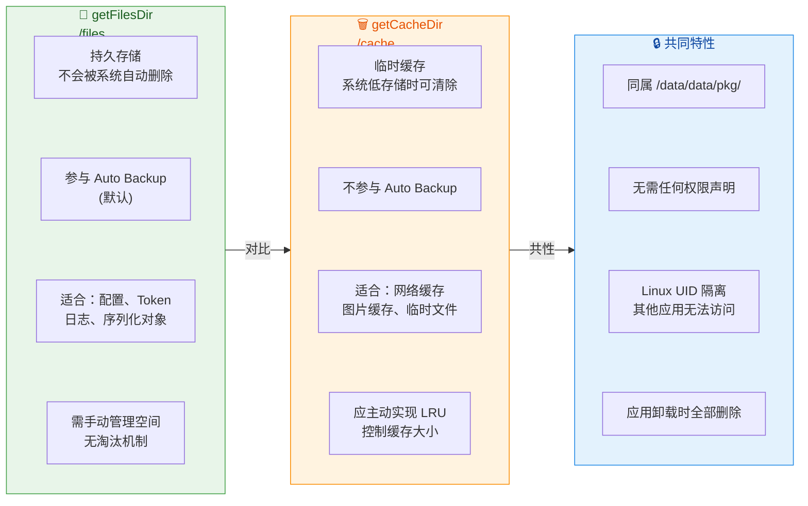
```mermaid
graph LR
    subgraph FilesDir["📂 getFilesDir\n/files"]
        direction TB
        F1["持久存储\n不会被系统自动删除"]
        F2["参与 Auto Backup\n(默认)"]
        F3["适合：配置、Token\n日志、序列化对象"]
        F4["需手动管理空间\n无淘汰机制"]
        F1 ~~~ F2
        F2 ~~~ F3
        F3 ~~~ F4
    end

    subgraph CacheDir["🗑️ getCacheDir\n/cache"]
        direction TB
        C1["临时缓存\n系统低存储时可清除"]
        C2["不参与 Auto Backup"]
        C3["适合：网络缓存\n图片缓存、临时文件"]
        C4["应主动实现 LRU\n控制缓存大小"]
        C1 ~~~ C2
        C2 ~~~ C3
        C3 ~~~ C4
    end

    subgraph Shared["🔒 共同特性"]
        direction TB
        S1["同属 /data/data/pkg/"]
        S2["无需任何权限声明"]
        S3["Linux UID 隔离\n其他应用无法访问"]
        S4["应用卸载时全部删除"]
        S1 ~~~ S2
        S2 ~~~ S3
        S3 ~~~ S4
    end

    FilesDir -->|"对比"| CacheDir -->|"共性"| Shared

    classDef greenBox fill:#E8F5E9,stroke:#43A047,color:#1B5E20
    classDef orangeBox fill:#FFF3E0,stroke:#FB8C00,color:#E65100
    classDef blueBox fill:#E3F2FD,stroke:#1E88E5,color:#0D47A1

    class FilesDir greenBox
    class CacheDir orangeBox
    class Shared blueBox
```

### openFileOutput()

`openFileOutput()` 是 `Context` 提供的一个更高层的文件写入 API，专门用于在 `files/` 目录下快速创建和写入文件。它的签名如下：

```kotlin
// name: 文件名（不能包含路径分隔符 "/"）
// mode: 文件打开模式
fun openFileOutput(name: String, mode: Int): FileOutputStream
```

这个方法直接返回一个 `FileOutputStream`，你可以用它来写入字节数据。与之对应的读取方法是 `openFileInput(name)`，返回 `FileInputStream`。

**为什么有了 getFilesDir() 还需要 openFileOutput()？** 这是一个好问题。答案在于 **历史背景** 和 **API 设计层次**。`openFileOutput()` 是 Android 1.0 时代就存在的 API，那时 Android 的文件操作模型还非常简单：应用要么写私有文件，要么写全局可读的文件（通过 `MODE_WORLD_READABLE`）。这个方法封装了"在 files/ 目录下创建文件 + 设置 Linux 文件权限"的完整流程。而 `getFilesDir()` 是更底层、更灵活的选择——它给你一个目录，让你用标准的 `java.io` API 自己操作，支持子目录、随机访问等高级需求。

在现代 Android 开发中，`openFileOutput()` 的使用频率已经大幅降低，原因有以下几点：

**MODE_WORLD_READABLE/WRITEABLE 已被废弃**。在早期 Android 版本中，`openFileOutput()` 的一大卖点是支持 `MODE_WORLD_READABLE` 和 `MODE_WORLD_WRITEABLE`，允许创建其他应用可读或可写的文件。但从 Android 7.0（API 24）开始，使用这两个 mode 会直接抛出 `SecurityException`。跨应用文件共享的正确方式是使用 `FileProvider`（后文会详细讲解）。所以如今 `openFileOutput()` 只剩下两种有效的 mode：

| Mode | 数值 | 行为 |
|------|------|------|
| `MODE_PRIVATE` | `0` | 默认模式，创建私有文件（覆盖写入） |
| `MODE_APPEND` | `0x8000` | 追加模式，在文件末尾追加内容 |

**不支持子目录**。`openFileOutput()` 的 `name` 参数不允许包含 `/`，也就是说你不能写入 `files/` 下的子目录。如果你需要更灵活的目录组织，就只能用 `getFilesDir()` + 标准 `File` API。

尽管如此，`openFileOutput()` 在简单场景下仍然是最简洁的写入方式。让我们看一个完整的使用示例：

```kotlin
// === openFileOutput() 与 openFileInput() 配对使用 ===

// --- 写入文件 ---
// openFileOutput 在 files/ 目录下创建文件 "note.txt"
// MODE_PRIVATE: 文件仅本应用可访问，若文件已存在则覆盖
context.openFileOutput("note.txt", Context.MODE_PRIVATE).use { fos ->
    // use {} 扩展函数确保 lambda 结束后自动调用 close()
    // 即使发生异常也会正确关闭流（等同于 try-with-resources）

    // 将字符串转为 UTF-8 字节数组后写入
    fos.write("Hello, Internal Storage!".toByteArray())

    // 也可以包装为 BufferedWriter 进行更高效的文本写入
    // fos.bufferedWriter().use { writer -> writer.write("...") }
}

// --- 追加写入 ---
// MODE_APPEND: 不清空文件，在末尾追加内容
context.openFileOutput("note.txt", Context.MODE_APPEND).use { fos ->
    fos.write("\nThis line is appended.".toByteArray())
}

// --- 读取文件 ---
// openFileInput 打开 files/ 目录下的 "note.txt"，返回 FileInputStream
context.openFileInput("note.txt").use { fis ->
    // bufferedReader() 包装为带缓冲的字符读取器
    val content = fis.bufferedReader().readText()
    // content = "Hello, Internal Storage!\nThis line is appended."
}

// --- 列举 files/ 目录下的所有文件 ---
// fileList() 返回 files/ 目录下的文件名数组（不含子目录中的文件）
val allFiles: Array<String> = context.fileList()
allFiles.forEach { fileName ->
    // 输出每个文件名，例如 "note.txt"
    println("Found file: $fileName")
}

// --- 删除文件 ---
// deleteFile() 删除 files/ 目录下的指定文件
// 返回 true 表示删除成功，false 表示文件不存在或删除失败
val deleted: Boolean = context.deleteFile("note.txt")
```

这段代码中 `.use {}` 的使用非常关键。`openFileOutput()` 和 `openFileInput()` 返回的都是 Java 流对象，如果你忘记关闭流，就会导致 **文件描述符泄漏**（File Descriptor Leak）。每个进程能打开的文件描述符数量是有上限的（通常为 1024），泄漏严重时会导致后续所有文件操作失败，甚至触发崩溃。Kotlin 的 `.use {}` 扩展函数（对应 Java 的 try-with-resources）通过 RAII 模式彻底消除了这个风险。

为了更完整地理解 `openFileOutput()` 的内部运作，我们来追踪一下它的调用链路：

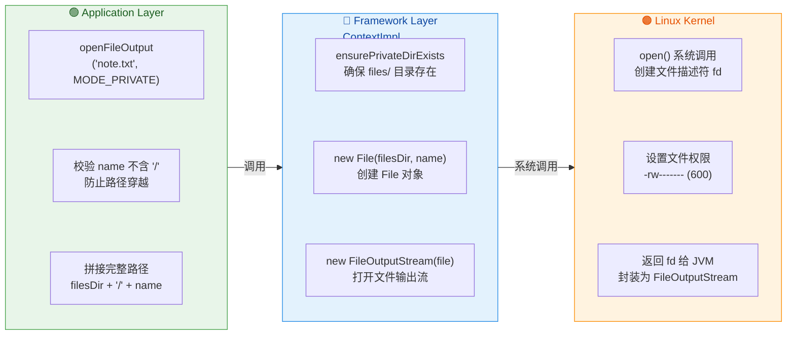
```mermaid
graph LR
    subgraph AppLayer["🟢 Application Layer"]
        direction TB
        A1["openFileOutput\n('note.txt', MODE_PRIVATE)"]
        A2["校验 name 不含 '/'\n防止路径穿越"]
        A3["拼接完整路径\nfilesDir + '/' + name"]
        A1 ~~~ A2
        A2 ~~~ A3
    end

    subgraph FrameworkLayer["🔵 Framework Layer\nContextImpl"]
        direction TB
        B1["ensurePrivateDirExists\n确保 files/ 目录存在"]
        B2["new File(filesDir, name)\n创建 File 对象"]
        B3["new FileOutputStream(file)\n打开文件输出流"]
        B1 ~~~ B2
        B2 ~~~ B3
    end

    subgraph KernelLayer["🟠 Linux Kernel"]
        direction TB
        C1["open() 系统调用\n创建文件描述符 fd"]
        C2["设置文件权限\n-rw------- (600)"]
        C3["返回 fd 给 JVM\n封装为 FileOutputStream"]
        C1 ~~~ C2
        C2 ~~~ C3
    end

    AppLayer -->|"调用"| FrameworkLayer -->|"系统调用"| KernelLayer

    classDef green fill:#E8F5E9,stroke:#43A047,color:#1B5E20
    classDef blue fill:#E3F2FD,stroke:#1E88E5,color:#0D47A1
    classDef orange fill:#FFF3E0,stroke:#FB8C00,color:#E65100

    class AppLayer green
    class FrameworkLayer blue
    class KernelLayer orange
```

从这个流程中可以看到两个重要的安全措施：第一，Framework 层会校验文件名中不包含路径分隔符 `/`，这是为了防止 **路径穿越攻击**（Path Traversal）——恶意输入如 `../../etc/passwd` 不会被接受；第二，最终创建的文件权限为 `600`（即 `-rw-------`），确保只有 owner（即当前应用）能读写。

最后，让我们来总结内部存储 API 的选择策略。一般来说，在现代 Android 开发中，推荐优先使用 `getFilesDir()` + Kotlin 标准库文件扩展函数的组合，它更灵活、更符合 Kotlin 的编码习惯。`openFileOutput()` 则适合"只需要在 `files/` 根目录下快速写一个文件"的极简场景。无论选择哪种 API，都必须遵守三条铁律：**不在主线程执行 I/O**、**始终关闭流**、**假设缓存文件可能消失**。

---

**📝 练习题**

某 Android 应用需要存储一个设备级别的加密密钥（Device-Specific Encryption Key），该密钥在应用重装后不应保留，且不应被 Android Auto Backup 备份到 Google Drive。以下哪种存储方式最合适？

A. `context.getFilesDir()` 目录下创建文件存储


B. `context.getCacheDir()` 目录下创建文件存储


C. `context.getNoBackupFilesDir()` 目录下创建文件存储


D. `context.getExternalFilesDir(null)` 目录下创建文件存储


**【答案】** C

**【解析】** 题目的两个核心需求是：① 设备相关（不应随 Auto Backup 迁移到新设备）；② 应用卸载后应消失。选项 A 的 `getFilesDir()` 虽然会在卸载时被删除，但它 **默认参与 Auto Backup**，密钥可能被备份到云端并恢复到新设备，造成安全隐患。选项 B 的 `getCacheDir()` 确实不参与 Backup，但缓存目录的文件可能在系统存储空间不足时被自动清除，加密密钥一旦丢失会导致已加密数据无法解密，这是不可接受的。选项 D 的外部存储目录安全性更低，且不是设计用于存储敏感数据的。选项 C 的 `getNoBackupFilesDir()` 指向 `/data/data/<pkg>/no_backup/` 目录，它同时满足两个条件：作为内部存储的一部分，卸载时会被删除；且被 Auto Backup 机制显式排除，不会被备份。这正是 Google 官方推荐的设备相关敏感数据存储位置。

---

## 外部存储 External Storage

Android 的外部存储（External Storage）是与内部存储相对的另一大持久化区域。它最初的设计意图是提供一块 **容量更大、可被用户和其他应用访问** 的存储空间。在早期 Android 设备上，外部存储通常指物理 SD 卡（removable storage），用户可以拔插；而从大约 Android 3.0 开始，大部分设备将内置闪存的一部分模拟（emulated）为外部存储，使其与物理 SD 卡在 API 层面表现一致。这意味着，即使设备没有插入 SD 卡，`Environment.getExternalStorageDirectory()` 仍然能返回一个可用路径——它指向的是设备内置存储中被模拟为"外部"的那块分区。

理解外部存储的核心要素在于两点：**第一**，它在传统模型中是"共享"的，任何拥有权限的应用都可以读写其中的公有目录；**第二**，Android 为每个应用在外部存储上也分配了 **应用专属目录**（App-specific external directory），其行为介于内部存储的绝对私有和公有目录的完全开放之间。从 Android 10（API 29）开始引入的 Scoped Storage 对这套模型做了根本性的变革，但外部存储的 API 体系仍然是理解整个存储架构的关键基础。

---

### 公有目录 Environment

Android 在外部存储的根目录下，预定义了一系列标准的公有子目录（standard public directories）。这些目录通过 `android.os.Environment` 类中的常量来标识，其设计目的是让不同类型的用户文件有一个约定俗成的存放位置，方便系统媒体扫描器（MediaScanner）以及用户自身进行归类管理。

`Environment` 类是 Android Framework 中负责描述和查询 **设备级存储环境** 的工具类，它提供的方法和常量都不涉及特定应用，而是描述整个设备的存储布局。理解这一点非常重要：`Environment` 关注的是"设备的存储长什么样"，而不是"我的应用应该把文件放在哪"。

以下是核心的目录常量及其语义：

| 常量 | 典型路径 | 用途说明 |
|---|---|---|
| `DIRECTORY_DCIM` | `/storage/emulated/0/DCIM` | 相机拍摄的照片和视频（Digital Camera Images） |
| `DIRECTORY_PICTURES` | `/storage/emulated/0/Pictures` | 普通图片文件 |
| `DIRECTORY_MOVIES` | `/storage/emulated/0/Movies` | 视频文件 |
| `DIRECTORY_MUSIC` | `/storage/emulated/0/Music` | 音频文件 |
| `DIRECTORY_DOWNLOADS` | `/storage/emulated/0/Download` | 用户下载的文件 |
| `DIRECTORY_DOCUMENTS` | `/storage/emulated/0/Documents` | 文档类文件（API 19+） |
| `DIRECTORY_RINGTONES` | `/storage/emulated/0/Ringtones` | 铃声音频 |
| `DIRECTORY_ALARMS` | `/storage/emulated/0/Alarms` | 闹钟音频 |
| `DIRECTORY_NOTIFICATIONS` | `/storage/emulated/0/Notifications` | 通知音频 |
| `DIRECTORY_PODCASTS` | `/storage/emulated/0/Podcasts` | 播客音频 |

这些常量本质上就是字符串，例如 `Environment.DIRECTORY_PICTURES` 的值就是 `"Pictures"`。它们的意义在于建立了一种 **全平台统一的约定**：无论 OEM 厂商如何定制系统，这些目录名称和语义都是一致的。

获取公有目录的根路径，传统上使用的是：

```kotlin
// 获取外部存储根目录，通常为 /storage/emulated/0
val externalRoot: File = Environment.getExternalStorageDirectory()

// 获取外部存储中某个标准公有子目录
// 例如获取 Pictures 目录：/storage/emulated/0/Pictures
val picturesDir: File = Environment.getExternalStoragePublicDirectory(
    Environment.DIRECTORY_PICTURES  // 传入目录类型常量
)
```

需要特别强调的是，`getExternalStoragePublicDirectory()` 在 **API 29（Android 10）中被标记为 `@Deprecated`**。这并不是说这些公有目录不存在了，而是 Android 希望开发者通过 **MediaStore API** 或 **Storage Access Framework (SAF)** 来访问公有区域的内容，而非直接操作文件路径。这是 Scoped Storage 改革的一部分，后续章节会详细展开。

从架构设计角度理解，公有目录存在的意义是 **跨应用数据共享**。例如，用户用相机应用拍了一张照片存到 `DCIM/`，然后用相册应用浏览它，再用社交应用分享它——这三个应用都需要访问同一个文件。公有目录就是这种跨应用场景的基石。但这也带来了严重的隐私和安全问题：任何拥有存储权限的应用都能遍历所有公有目录，读取用户的私密照片、文档等，这正是后来 Scoped Storage 要解决的痛点。

---

### 状态检查

外部存储与内部存储最关键的差异之一，在于外部存储 **并不总是可用的**。在物理 SD 卡的场景下，用户可能随时拔出卡片；即使是模拟外部存储，在某些特殊情况下（如设备通过 USB 以 Mass Storage 模式连接电脑时），外部存储也可能变为不可用状态。因此，在对外部存储进行任何读写操作之前，**必须先检查其挂载状态**，否则将面临 `IOException` 或数据丢失的风险。

`Environment.getExternalStorageState()` 方法返回一个字符串常量，表示当前外部存储的状态。最常用的状态值如下：

| 状态常量 | 含义 | 可读 | 可写 |
|---|---|---|---|
| `MEDIA_MOUNTED` | 已正常挂载，可读可写 | ✅ | ✅ |
| `MEDIA_MOUNTED_READ_ONLY` | 已挂载但只读（如写保护开关打开的 SD 卡） | ✅ | ❌ |
| `MEDIA_REMOVED` | 存储介质被物理移除 | ❌ | ❌ |
| `MEDIA_UNMOUNTED` | 存储介质存在但未挂载 | ❌ | ❌ |
| `MEDIA_BAD_REMOVAL` | 未正确卸载就被移除 | ❌ | ❌ |
| `MEDIA_CHECKING` | 正在检查存储介质 | ❌ | ❌ |
| `MEDIA_EJECTING` | 正在弹出过程中 | ❌ | ❌ |
| `MEDIA_NOFS` | 存在空白或不支持的文件系统 | ❌ | ❌ |
| `MEDIA_SHARED` | 存储介质正以 USB 大容量存储模式共享 | ❌ | ❌ |

实际开发中，最佳实践是封装两个工具方法来判断"是否可读"和"是否可写"：

```kotlin
/**
 * 检查外部存储是否可以进行读写操作
 * 只有状态为 MEDIA_MOUNTED 时，存储才同时支持读和写
 */
fun isExternalStorageWritable(): Boolean {
    // 获取当前外部存储挂载状态
    val state = Environment.getExternalStorageState()
    // 与 MEDIA_MOUNTED 常量比较，仅此状态支持读写
    return state == Environment.MEDIA_MOUNTED
}

/**
 * 检查外部存储是否至少可以读取
 * MEDIA_MOUNTED 和 MEDIA_MOUNTED_READ_ONLY 两种状态都支持读
 */
fun isExternalStorageReadable(): Boolean {
    // 获取当前外部存储挂载状态
    val state = Environment.getExternalStorageState()
    // 可读的条件：已挂载（读写）或 已挂载（只读）
    return state == Environment.MEDIA_MOUNTED ||
           state == Environment.MEDIA_MOUNTED_READ_ONLY
}
```

在实际使用中，每次执行外部存储操作前都应当调用上述检查：

```kotlin
fun saveImageToExternal(bitmap: Bitmap) {
    // 写入操作前，先确认外部存储可写
    if (!isExternalStorageWritable()) {
        // 存储不可用时应给出用户提示或降级处理
        Log.w("Storage", "External storage is not writable")
        return
    }
    // ... 执行写入逻辑
}
```

对于支持多个外部存储卷（如同时有模拟存储和物理 SD 卡）的设备，还可以传入特定的 `File` 路径来查询该路径对应的存储卷状态：

```kotlin
// 获取应用在第二张 SD 卡上的外部目录（如果存在）
val externalDirs: Array<File> = context.getExternalFilesDirs(null)
// externalDirs[0] -> 主外部存储（通常是模拟的）
// externalDirs[1] -> 第二块外部存储（物理 SD 卡，如存在）

if (externalDirs.size > 1 && externalDirs[1] != null) {
    // 检查第二块存储的挂载状态
    val sdCardState = Environment.getExternalStorageState(externalDirs[1])
    // 根据状态决定是否使用该存储卷
    if (sdCardState == Environment.MEDIA_MOUNTED) {
        // 可以安全写入 SD 卡
    }
}
```

这里的底层机制是：Android 的 `StorageManager` 服务维护着所有存储卷（`StorageVolume`）的状态信息，`Environment.getExternalStorageState()` 实际上是通过 `StorageManager` 查询 Vold（Volume Daemon）守护进程报告的挂载状态。Vold 负责监听内核的 block device 事件（如 SD 卡插拔），并通过 Binder IPC 将状态变化传递给 Framework 层。

---

### 读写权限演变

外部存储的权限模型是 Android 存储体系中 **变化最剧烈、最容易踩坑** 的部分。从 Android 1.0 到 Android 14，权限策略经历了多次重大变革，每次变革都直接影响应用的存储访问方式。理解这段演变历史，对于开发需要兼容多版本的应用至关重要。

**第一阶段：无限制访问（Android 1.0 – 3.x）**

在最早期的 Android 版本中，外部存储对所有应用完全开放，不需要任何权限声明。任何应用都可以自由读写外部存储中的任何文件，包括其他应用创建的文件。这个阶段的设计思想很简单：外部存储就像一块共享硬盘。

**第二阶段：引入写权限（Android 4.0 – 4.3，API 14-18）**

Android 4.0 开始要求应用在 `AndroidManifest.xml` 中声明 `WRITE_EXTERNAL_STORAGE` 权限才能写入外部存储。但读取仍然不需要任何权限。这是第一次对外部存储访问施加限制。

```xml
<!-- 声明写入外部存储权限 -->
<uses-permission android:name="android.permission.WRITE_EXTERNAL_STORAGE" />
```

**第三阶段：引入读权限（Android 4.4，API 19）**

Android 4.4（KitKat）做了两个关键改变：第一，正式引入 `READ_EXTERNAL_STORAGE` 权限，读取公有目录也需要声明权限了；第二，更重要的是，**应用专属外部目录**（通过 `getExternalFilesDir()` 获取的路径）**不再需要任何权限**。这意味着 KitKat 开始区分"公有区域"和"应用专属区域"的权限要求。

```xml
<!-- 读取外部存储也需要权限了（API 19+） -->
<uses-permission android:name="android.permission.READ_EXTERNAL_STORAGE" />
<!-- 写入权限隐含读取权限 -->
<uses-permission android:name="android.permission.WRITE_EXTERNAL_STORAGE" />
```

同时，KitKat 还引入了 Storage Access Framework（SAF），开始为未来的存储隔离埋下伏笔。

**第四阶段：运行时权限（Android 6.0，API 23）**

Android 6.0（Marshmallow）引入了运行时权限（Runtime Permissions）机制。`READ_EXTERNAL_STORAGE` 和 `WRITE_EXTERNAL_STORAGE` 被归类为 **危险权限（Dangerous Permission）**，必须在运行时动态请求用户授权，仅在 Manifest 中声明不再足够。

```kotlin
// 检查是否已获得写入权限
val hasPermission = ContextCompat.checkSelfPermission(
    this,  // Context
    Manifest.permission.WRITE_EXTERNAL_STORAGE  // 目标权限
) == PackageManager.PERMISSION_GRANTED  // 判断是否已授权

if (!hasPermission) {
    // 向用户请求权限，触发系统权限弹窗
    ActivityCompat.requestPermissions(
        this,  // 当前 Activity
        arrayOf(Manifest.permission.WRITE_EXTERNAL_STORAGE),  // 权限数组
        REQUEST_CODE_STORAGE  // 自定义请求码，用于回调识别
    )
}
```

**第五阶段：Scoped Storage 启幕（Android 10，API 29）**

Android 10 是外部存储权限模型的分水岭。Google 引入了 **分区存储（Scoped Storage）** 机制，其核心理念是：应用默认只能访问自己的专属目录和自己创建的媒体文件，访问其他应用的文件必须通过 MediaStore 或 SAF。在 Android 10 中，这一机制可以通过在 Manifest 中设置 `requestLegacyExternalStorage="true"` 来暂时关闭（opt-out），以便给开发者过渡时间：

```xml
<application
    android:requestLegacyExternalStorage="true"
    ... >
    <!-- 此标志在 Android 10 上恢复传统存储行为 -->
    <!-- 但在 Android 11+ 上此标志被完全忽略 -->
</application>
```

**第六阶段：Scoped Storage 强制执行（Android 11，API 30）**

Android 11 **强制启用** Scoped Storage，`requestLegacyExternalStorage` 标志被忽略。同时引入了新的权限 `MANAGE_EXTERNAL_STORAGE`，它授予应用对几乎所有外部存储文件的访问权限（类似旧的完全访问模式），但这是一个 **特殊权限**，需要用户在系统设置中手动授予，并且在 Google Play 上架时需要通过审核说明使用理由（仅限文件管理器、备份工具等场景）。

```xml
<!-- 请求管理所有文件的特殊权限（Android 11+） -->
<uses-permission android:name="android.permission.MANAGE_EXTERNAL_STORAGE" />
```

```kotlin
// 检查是否拥有"管理所有文件"权限
if (Build.VERSION.SDK_INT >= Build.VERSION_CODES.R) {
    // 使用 Environment 的专用方法检查
    val isManager = Environment.isExternalStorageManager()
    if (!isManager) {
        // 引导用户前往系统设置页手动开启
        val intent = Intent(Settings.ACTION_MANAGE_ALL_FILES_ACCESS_PERMISSION)
        startActivity(intent)
    }
}
```

**第七阶段：细粒度媒体权限（Android 13，API 33）**

Android 13 将 `READ_EXTERNAL_STORAGE` 进一步 **拆分为三个更细粒度的权限**，彻底废弃了旧的粗粒度模型：

| 新权限 | 访问范围 |
|---|---|
| `READ_MEDIA_IMAGES` | 图片文件 |
| `READ_MEDIA_VIDEO` | 视频文件 |
| `READ_MEDIA_AUDIO` | 音频文件 |

这意味着一个音乐播放器应用只需要请求 `READ_MEDIA_AUDIO`，而不需要获得读取用户照片和视频的权限。这是最小权限原则（Principle of Least Privilege）的又一次落地。

```xml
<!-- Android 13+ 细粒度媒体权限 -->
<uses-permission android:name="android.permission.READ_MEDIA_IMAGES" />
<uses-permission android:name="android.permission.READ_MEDIA_VIDEO" />
<uses-permission android:name="android.permission.READ_MEDIA_AUDIO" />

<!-- 兼容 Android 12 及以下，声明 maxSdkVersion 限制其生效范围 -->
<uses-permission
    android:name="android.permission.READ_EXTERNAL_STORAGE"
    android:maxSdkVersion="32" />
```

**第八阶段：照片与视频的部分授权（Android 14，API 34）**

Android 14 在图片和视频权限之上又增加了 **部分授权（Partial Access）** 的概念。用户在权限弹窗中可以选择"仅允许访问选中的照片/视频"，而不是授予对所有图片或视频的完整访问权限。相应引入了 `READ_MEDIA_VISUAL_USER_SELECTED` 权限。

以下 Mermaid 图总结了整个权限演变的时间线：

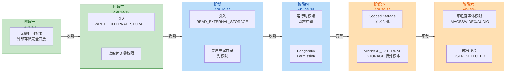
```mermaid
graph LR
    subgraph Phase1["阶段一\nAPI 1-13"]
        direction TB
        P1A["无需任何权限\n外部存储完全开放"]
    end

    subgraph Phase2["阶段二\nAPI 14-18"]
        direction TB
        P2A["引入\nWRITE_EXTERNAL_STORAGE"]
        P2B["读取仍无需权限"]
        P2A ~~~ P2B
    end

    subgraph Phase3["阶段三\nAPI 19-22"]
        direction TB
        P3A["引入\nREAD_EXTERNAL_STORAGE"]
        P3B["应用专属目录\n免权限"]
        P3A ~~~ P3B
    end

    subgraph Phase4["阶段四\nAPI 23-28"]
        direction TB
        P4A["运行时权限\n动态申请"]
        P4B["Dangerous\nPermission"]
        P4A ~~~ P4B
    end

    subgraph Phase5["阶段五\nAPI 29-32"]
        direction TB
        P5A["Scoped Storage\n分区存储"]
        P5B["MANAGE_EXTERNAL\n_STORAGE 特殊权限"]
        P5A ~~~ P5B
    end

    subgraph Phase6["阶段六\nAPI 33+"]
        direction TB
        P6A["细粒度媒体权限\nIMAGES/VIDEO/AUDIO"]
        P6B["部分授权\nUSER_SELECTED"]
        P6A ~~~ P6B
    end

    Phase1 -->|"收紧"| Phase2
    Phase2 -->|"收紧"| Phase3
    Phase3 -->|"收紧"| Phase4
    Phase4 -->|"变革"| Phase5
    Phase5 -->|"细分"| Phase6

    classDef early fill:#C8E6C9,stroke:#388E3C,color:#1B5E20
    classDef mid fill:#BBDEFB,stroke:#1976D2,color:#0D47A1
    classDef modern fill:#FFE0B2,stroke:#F57C00,color:#E65100

    class Phase1,Phase2 early
    class Phase3,Phase4 mid
    class Phase5,Phase6 modern
```

理解权限演变的底层动因：Android 团队的核心目标是 **在功能性和隐私性之间寻找平衡**。早期倾向功能性（应用能力最大化），但用户隐私泄露事件频发后，逐步向隐私性倾斜。每次权限收紧都伴随着替代方案的提出（如 SAF、MediaStore），确保合理的文件访问需求仍可被满足。对于应用开发者而言，最务实的策略是：**能用应用专属目录就不去碰公有目录，必须访问公有内容就用 MediaStore/SAF，永远遵循最小权限原则。**

---

### getExternalFilesDir

`Context.getExternalFilesDir(String type)` 是应用访问外部存储时 **最常用、也是最推荐** 的 API。它返回的是外部存储上为当前应用 **专门分配的私有目录**，其路径格式为：

```
/storage/emulated/0/Android/data/<package_name>/files/<type>/
```

例如，对于包名 `com.example.myapp`，调用 `getExternalFilesDir(Environment.DIRECTORY_PICTURES)` 返回的路径是：

```
/storage/emulated/0/Android/data/com.example.myapp/files/Pictures/
```

这个目录有几个非常重要的特性：

**特性一：从 API 19 起无需权限。** 自 Android 4.4 起，应用读写自己的外部专属目录不需要声明 `READ_EXTERNAL_STORAGE` 或 `WRITE_EXTERNAL_STORAGE` 权限。这使得 `getExternalFilesDir()` 成为了一个"甜蜜点"——既享有外部存储的大容量优势，又免去了权限申请的麻烦。

**特性二：随应用卸载而删除。** 与公有目录不同，应用专属外部目录中的文件在应用卸载时会被系统自动清除。这点与内部存储的 `getFilesDir()` 行为一致。因此，如果你的文件需要在应用卸载后仍然保留（如用户下载的照片），应该使用 MediaStore 保存到公有目录，而不是 `getExternalFilesDir()`。

**特性三：对其他应用可见性受系统版本影响。** 在 Android 10 之前，其他拥有存储权限的应用理论上可以通过路径直接访问你的外部专属目录（因为 `/Android/data/` 并未强制隔离）。从 Android 11 开始，`/Android/data/` 目录对其他应用不可见，即使拥有 `MANAGE_EXTERNAL_STORAGE` 权限也无法直接访问。这极大增强了应用专属外部目录的隐私性。

**特性四：参数 `type` 的语义。** `getExternalFilesDir()` 的参数是一个目录类型字符串，可以传入 `Environment.DIRECTORY_*` 常量来创建标准子目录，也可以传 `null` 获取根目录：

```kotlin
// 获取应用专属外部目录根路径
// 路径：/storage/emulated/0/Android/data/<pkg>/files/
val rootDir: File? = context.getExternalFilesDir(null)

// 获取应用专属的 Pictures 子目录
// 路径：/storage/emulated/0/Android/data/<pkg>/files/Pictures/
val picturesDir: File? = context.getExternalFilesDir(Environment.DIRECTORY_PICTURES)

// 获取应用专属的 Movies 子目录
// 路径：/storage/emulated/0/Android/data/<pkg>/files/Movies/
val moviesDir: File? = context.getExternalFilesDir(Environment.DIRECTORY_MOVIES)

// 也可以传入自定义字符串创建自定义子目录
// 路径：/storage/emulated/0/Android/data/<pkg>/files/MyCustomDir/
val customDir: File? = context.getExternalFilesDir("MyCustomDir")
```

注意返回值是 **`File?`（可空类型）**。当外部存储不可用时（如 SD 卡被拔出），该方法返回 `null`，因此必须做非空判断。

**与 getExternalCacheDir 的关系：** 类似于内部存储中 `getFilesDir()` 和 `getCacheDir()` 的区别，外部存储也有对应的缓存目录 API：

```kotlin
// 获取应用专属外部缓存目录
// 路径：/storage/emulated/0/Android/data/<pkg>/cache/
val externalCacheDir: File? = context.externalCacheDir
```

外部缓存目录中的文件在设备存储空间不足时可能被系统清理，适合存放可重新生成的临时大文件（如图片缩略图、视频预览帧等）。

**多存储卷支持：** 当设备同时拥有模拟外部存储和物理 SD 卡时，可以使用 `getExternalFilesDirs()`（注意末尾的 `s`）获取所有可用存储卷上的应用专属目录：

```kotlin
// 获取所有存储卷上的应用专属 Pictures 目录
// 返回数组，索引 0 是主存储，后续是附加存储卷
val allPictureDirs: Array<File> = context.getExternalFilesDirs(
    Environment.DIRECTORY_PICTURES  // 子目录类型
)

// 遍历所有可用的存储卷
allPictureDirs.forEachIndexed { index, dir ->
    // 检查该存储卷的挂载状态
    val state = Environment.getExternalStorageState(dir)
    if (state == Environment.MEDIA_MOUNTED) {
        // 该存储卷可用，可以写入
        Log.d("Storage", "Volume $index path: ${dir.absolutePath}")
        Log.d("Storage", "Volume $index free: ${dir.freeSpace / 1024 / 1024} MB")
    }
}
```

下面的示例展示一个完整的文件写入流程，涵盖了状态检查、目录获取和异常处理：

```kotlin
/**
 * 将 Bitmap 保存到应用专属外部目录的 Pictures 子目录
 * @param context   应用上下文
 * @param bitmap    要保存的图片
 * @param fileName  文件名（如 "photo_001.jpg"）
 * @return 保存成功的文件路径，失败返回 null
 */
fun saveBitmapToExternalFiles(
    context: Context,
    bitmap: Bitmap,
    fileName: String
): String? {
    // 第一步：检查外部存储是否可写
    if (Environment.getExternalStorageState() != Environment.MEDIA_MOUNTED) {
        Log.e("Storage", "External storage is not mounted")
        return null  // 存储不可用，提前返回
    }

    // 第二步：获取应用专属外部 Pictures 目录
    val picturesDir: File = context.getExternalFilesDir(
        Environment.DIRECTORY_PICTURES  // 标准图片目录
    ) ?: run {
        Log.e("Storage", "Failed to get external files dir")
        return null  // 目录获取失败，提前返回
    }

    // 第三步：确保目录存在（通常系统会自动创建，但防御性编程）
    if (!picturesDir.exists()) {
        picturesDir.mkdirs()  // 递归创建目录结构
    }

    // 第四步：创建目标文件并写入
    val targetFile = File(picturesDir, fileName)
    return try {
        // 使用 FileOutputStream 写入 JPEG 格式
        FileOutputStream(targetFile).use { fos ->
            // compress() 将 Bitmap 压缩为 JPEG 并写入流
            // 参数：格式、质量(0-100)、输出流
            bitmap.compress(Bitmap.CompressFormat.JPEG, 90, fos)
            // use{} 会在 lambda 结束后自动调用 fos.close()
        }
        Log.d("Storage", "Saved: ${targetFile.absolutePath}")
        targetFile.absolutePath  // 返回保存路径
    } catch (e: IOException) {
        Log.e("Storage", "Failed to save bitmap", e)
        null  // 写入失败返回 null
    }
}
```

下面的图对比了外部存储中 **公有目录** 与 **应用专属目录** 在关键特性上的差异：

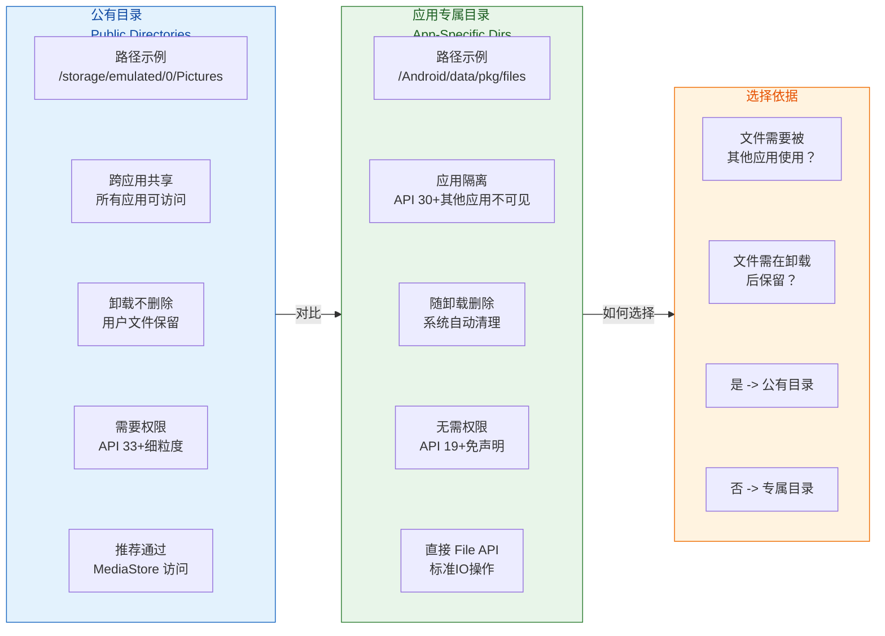
```mermaid
graph LR
    subgraph Public["公有目录\nPublic Directories"]
        direction TB
        PU1["路径示例\n/storage/emulated/0/Pictures"]
        PU2["跨应用共享\n所有应用可访问"]
        PU3["卸载不删除\n用户文件保留"]
        PU4["需要权限\nAPI 33+细粒度"]
        PU5["推荐通过\nMediaStore 访问"]
        PU1 ~~~ PU2
        PU2 ~~~ PU3
        PU3 ~~~ PU4
        PU4 ~~~ PU5
    end

    subgraph AppSpecific["应用专属目录\nApp-Specific Dirs"]
        direction TB
        AP1["路径示例\n/Android/data/pkg/files"]
        AP2["应用隔离\nAPI 30+其他应用不可见"]
        AP3["随卸载删除\n系统自动清理"]
        AP4["无需权限\nAPI 19+免声明"]
        AP5["直接 File API\n标准IO操作"]
        AP1 ~~~ AP2
        AP2 ~~~ AP3
        AP3 ~~~ AP4
        AP4 ~~~ AP5
    end

    subgraph Decision["选择依据"]
        direction TB
        D1["文件需要被\n其他应用使用？"]
        D2["文件需在卸载\n后保留？"]
        D3["是 -> 公有目录"]
        D4["否 -> 专属目录"]
        D1 ~~~ D2
        D2 ~~~ D3
        D3 ~~~ D4
    end

    Public -->|"对比"| AppSpecific
    AppSpecific -->|"如何选择"| Decision

    classDef pub fill:#E3F2FD,stroke:#1565C0,color:#0D47A1
    classDef app fill:#E8F5E9,stroke:#2E7D32,color:#1B5E20
    classDef dec fill:#FFF3E0,stroke:#EF6C00,color:#E65100

    class Public pub
    class AppSpecific app
    class Decision dec
```

最后总结一下外部存储 API 的全貌：**`Environment` 描述了设备级的存储布局和状态，`getExternalFilesDir()` 系列方法提供了应用级的专属目录访问，权限模型从最初的无限制逐步演进到了如今的细粒度分区隔离。** 作为应用开发者，应当优先使用 `getExternalFilesDir()` 来存放应用私有的大文件（如离线地图、下载的媒体资源），只有在确实需要与其他应用共享内容时，才考虑使用 MediaStore 写入公有目录。

---

**📝 练习题**

某 App 的 `targetSdkVersion` 为 33，运行在 Android 13 设备上。该 App 需要在应用专属外部目录中保存用户下载的 PDF 文件，同时需要读取设备上所有的音频文件展示在播放列表中。以下权限声明，哪一项是 **最小且充分** 的？

A. 仅声明 `WRITE_EXTERNAL_STORAGE`


B. 声明 `READ_EXTERNAL_STORAGE` + `WRITE_EXTERNAL_STORAGE`


C. 仅声明 `READ_MEDIA_AUDIO`


D. 声明 `READ_MEDIA_AUDIO` + `READ_MEDIA_IMAGES` + `READ_MEDIA_VIDEO`


**【答案】** C

**【解析】** 本题考查两个关键知识点。第一，从 API 19 开始，应用对自己的专属外部目录（`getExternalFilesDir()` 返回的路径）进行读写 **不需要任何存储权限**，所以保存 PDF 到专属目录这一需求不产生任何权限要求。第二，在 `targetSdkVersion` 为 33 的情况下，`READ_EXTERNAL_STORAGE` 已被废弃且不生效，访问设备上的媒体文件需要使用 Android 13 引入的细粒度权限。由于只需要读取音频文件，仅声明 `READ_MEDIA_AUDIO` 即可满足需求。选项 A 和 B 使用的是旧权限，在 target 33 上对媒体访问无效；选项 D 虽然能工作，但请求了不必要的图片和视频权限，违反最小权限原则。

---

**📝 练习题**

在一台仅有模拟外部存储（emulated）的 Android 设备上，调用 `Environment.getExternalStorageState()` 返回 `MEDIA_MOUNTED`。以下关于此状态的说法，**错误** 的是？

A. 此时应用可以对外部存储进行读取和写入操作


B. 此状态表明设备上一定插入了物理 SD 卡


C. 此时 `context.getExternalFilesDir(null)` 不会返回 `null`


D. 模拟外部存储（emulated storage）也会报告此状态


**【答案】** B

**【解析】** `MEDIA_MOUNTED` 表示外部存储已正常挂载且可读可写（A 正确）。但这个状态 **不要求** 物理 SD 卡的存在——大多数现代 Android 设备使用内置闪存模拟（emulate）外部存储，在这种情况下同样会报告 `MEDIA_MOUNTED` 状态（D 正确）。选项 B 的错误在于将"外部存储已挂载"等同于"物理 SD 卡已插入"，混淆了逻辑概念和物理介质。选项 C 也是正确的：当状态为 `MEDIA_MOUNTED` 时，外部存储可用，`getExternalFilesDir()` 能正常返回路径；该方法返回 `null` 的典型场景恰恰是外部存储不可用（如 `MEDIA_REMOVED`）的时候。

---

## 分区存储 Scoped Storage

在 Android 10 之前，应用只要拿到 `READ_EXTERNAL_STORAGE` / `WRITE_EXTERNAL_STORAGE` 权限，就能 **肆意读写** 整个外部存储的任意路径。这种"大平层"式的权限模型带来了严重的隐私与安全问题：一个修图 App 可以悄悄扫描你的下载目录，一个文件管理器也能偷偷读取其他 App 的缓存数据。Google 从 Android 10（API 29）开始引入 **Scoped Storage（分区存储/沙盒存储）** 机制，彻底改变了应用访问外部存储的方式——每个应用只能"看见"自己创建的文件，访问公共媒体文件必须通过受控的 API（MediaStore / SAF），直接使用 `File` API 访问他人文件的时代正式结束。

这一节是整个文件存储章节中 **最核心也最容易出错** 的部分。我们将从机制演变、MediaStore 媒体集操作、SAF 存储访问框架三个维度深入展开。

---

### Android 10+ 分区存储机制

#### 问题根源：旧模型为什么必须被替换

在传统存储模型中，外部存储（`/sdcard/` 或 `/storage/emulated/0/`）对所有持有权限的应用来说是 **完全透明** 的。这意味着：

- **隐私泄露**：App A 创建的私密文档，App B 只要有 `READ_EXTERNAL_STORAGE` 就能读到。
- **存储污染**：很多 App 喜欢在根目录随意创建文件夹（如 `/sdcard/MyApp/`），卸载后残留数据。
- **权限粒度过粗**：`READ_EXTERNAL_STORAGE` 是一把万能钥匙，无法做到"只允许读图片、不允许读文档"这种细粒度控制。

Google 尝试过 Runtime Permission（Android 6.0）来缓解，但本质上只是多了一个"弹窗确认"，并没有改变"拿到权限就能读一切"的事实。因此，分区存储应运而生——它从 **文件系统可见性** 层面做了根本性隔离。

#### 分区存储的核心规则

分区存储生效后，外部存储从应用的视角被划分为以下几个区域，每个区域的访问规则完全不同：

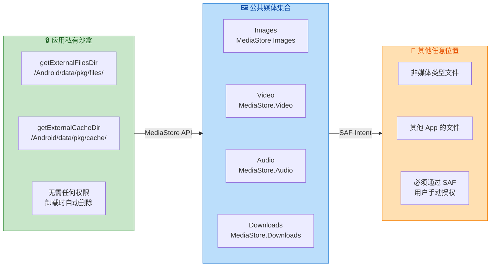
```mermaid
graph LR
    subgraph SandboxZone["🔒 应用私有沙盒"]
        direction TB
        A1["getExternalFilesDir\n/Android/data/pkg/files/"]
        A2["getExternalCacheDir\n/Android/data/pkg/cache/"]
        A3["无需任何权限\n卸载时自动删除"]
        A1 ~~~ A2
        A2 ~~~ A3
    end

    subgraph MediaZone["🖼️ 公共媒体集合"]
        direction TB
        B1["Images\nMediaStore.Images"]
        B2["Video\nMediaStore.Video"]
        B3["Audio\nMediaStore.Audio"]
        B4["Downloads\nMediaStore.Downloads"]
        B1 ~~~ B2
        B2 ~~~ B3
        B3 ~~~ B4
    end

    subgraph OtherZone["📂 其他任意位置"]
        direction TB
        C1["非媒体类型文件"]
        C2["其他 App 的文件"]
        C3["必须通过 SAF\n用户手动授权"]
        C1 ~~~ C2
        C2 ~~~ C3
    end

    SandboxZone -->|"MediaStore API"| MediaZone -->|"SAF Intent"| OtherZone

    classDef sandboxStyle fill:#C8E6C9,stroke:#388E3C,color:#1B5E20
    classDef mediaStyle fill:#BBDEFB,stroke:#1976D2,color:#0D47A1
    classDef otherStyle fill:#FFE0B2,stroke:#F57C00,color:#E65100

    class SandboxZone sandboxStyle
    class MediaZone mediaStyle
    class OtherZone otherStyle
```

逐一拆解这三个区域的访问规则：

**第一区域：应用私有沙盒（App-specific Directory）。** 每个应用在外部存储的 `/Android/data/<package_name>/` 下拥有专属空间，通过 `getExternalFilesDir()` 和 `getExternalCacheDir()` 访问。这个区域 **无需任何权限**，其他应用在分区存储下 **完全不可见**（连 `File.exists()` 都返回 `false`）。应用卸载后这些数据会被系统自动清除，从根本上解决了"卸载残留"问题。

**第二区域：公共媒体集合（Shared Media Collections）。** 图片、视频、音频和下载文件有专门的公共存放位置（`Pictures/`、`Movies/`、`Music/`、`Download/` 等）。应用 **只能通过 `MediaStore` API** 来访问这些集合。关键规则是：应用可以无权限地读写 **自己通过 MediaStore 创建** 的媒体文件；但要读取 **其他应用创建** 的媒体文件，则需要 `READ_MEDIA_*` 权限（Android 13+）或 `READ_EXTERNAL_STORAGE`（Android 10~12）。

**第三区域：其他任意位置。** 对于非媒体类型的文件（如 PDF、ZIP、自定义格式），或者用户设备上任意位置的文件，应用 **必须通过 Storage Access Framework（SAF）** 来访问。SAF 会弹出系统文件选择器（Document Picker），由 **用户主动选择** 授权哪些文件或目录给应用，应用无法绕过这一流程自行扫描文件系统。

#### 版本演进与兼容性策略

分区存储并非一刀切地在 Android 10 上强制生效，而是经历了一个渐进式推行的过程，理解这个时间线对处理兼容性问题至关重要：

| Android 版本 | API Level | 行为 |
|:---|:---|:---|
| Android 9 及以下 | ≤ 28 | 传统模型：有权限即可读写一切 |
| Android 10 | 29 | 引入分区存储，但允许 `requestLegacyExternalStorage=true` **临时退出** |
| Android 11 | 30 | **强制分区存储**，`requestLegacyExternalStorage` 标记被忽略 |
| Android 13 | 33 | 细化媒体权限：`READ_MEDIA_IMAGES`、`READ_MEDIA_VIDEO`、`READ_MEDIA_AUDIO` 替代旧的 `READ_EXTERNAL_STORAGE` |
| Android 14 | 34 | 新增 **部分媒体访问**（用户可只授权选中的照片/视频，而非全部） |

Android 10 上 Google 留了一个"逃生口"——在 `AndroidManifest.xml` 的 `<application>` 标签中设置 `android:requestLegacyExternalStorage="true"`，可以让 App 继续使用旧的存储模型。很多开发者在适配期依赖了这个标记。但到了 Android 11，Google **直接忽略** 了这个属性（当 `targetSdkVersion >= 30` 时），分区存储成为不可逃避的强制要求。

这段过渡期造成了一个典型的兼容性难题：如果你的应用从 `targetSdk 29` 升级到 `30`，原本通过 `File` 路径直接访问的外部文件会突然失效。最安全的适配策略是 **尽早全面迁移到 MediaStore + SAF**，而不是依赖临时退出标记。

#### `MANAGE_EXTERNAL_STORAGE` 特殊权限

对于文件管理器、防病毒软件、备份工具等确实需要访问所有文件的特殊场景，Android 11 提供了 `MANAGE_EXTERNAL_STORAGE` 权限。这是一个 **特殊权限（Special Permission）**，不能通过普通的权限请求弹窗获取，而是必须引导用户到系统设置页面手动开启。并且，Google Play 对使用这个权限的应用有 **严格的审核政策**——如果你的应用不属于明确的豁免类别（如文件管理器），上架审核可能被拒绝。

```kotlin
// 检查是否拥有「所有文件访问」权限（Android 11+）
// Environment.isExternalStorageManager() 返回 true 表示已授权
val hasAllFilesAccess = if (Build.VERSION.SDK_INT >= Build.VERSION_CODES.R) {
    Environment.isExternalStorageManager()  // 调用系统 API 检查
} else {
    true  // Android 11 以下不需要此权限，直接视为拥有
}

// 如果没有权限，跳转到系统设置页让用户手动开启
if (!hasAllFilesAccess) {
    val intent = Intent(Settings.ACTION_MANAGE_APP_ALL_FILES_ACCESS_PERMISSION)
    // 将 Intent 的 data 设置为当前应用的包名 URI
    intent.data = Uri.fromParts("package", packageName, null)
    startActivity(intent)  // 打开系统设置页面
}
```

需要强调的是，即使拥有 `MANAGE_EXTERNAL_STORAGE`，应用仍然 **无法访问** `/Android/data/` 和 `/Android/obb/` 下属于其他应用的私有目录。分区存储对这两个目录的保护是绝对的。

---

### MediaStore 媒体集

MediaStore 是 Android 系统提供的 **内容提供者（ContentProvider）**，它以结构化的数据库形式管理设备上的所有公共媒体文件。在分区存储时代，MediaStore 成为应用与公共媒体文件交互的 **唯一合法通道**。

#### MediaStore 的架构原理

MediaStore 本质上是一个 **SQLite 数据库的 ContentProvider 封装**。系统中有一个名为 `MediaProvider` 的系统应用（包名 `com.android.providers.media`），它负责维护一个数据库，其中记录了设备上所有媒体文件的元信息（文件名、路径、大小、MIME 类型、创建时间、专辑封面等）。当你通过 `ContentResolver` 查询 MediaStore 时，实际上是在查询这个数据库；当你插入一条新记录时，`MediaProvider` 会在对应的公共目录下创建实际文件，并返回一个 `content://` URI 给你。

理解这一点非常重要：**MediaStore 操作的是 URI，而不是 File 路径**。在分区存储下，你拿到的 `content://media/external/images/media/42` 这样的 URI，背后对应的实际文件路径你可能根本无权直接访问。你必须通过 `ContentResolver.openInputStream()` / `openOutputStream()` 来读写文件内容，或者通过 `ContentResolver.query()` 来获取元信息。

#### 四大媒体集合

MediaStore 将公共媒体文件分为四个集合（Collection），每个集合对应一组 `Uri` 常量和数据列：

| 集合 | Uri 常量 | 默认目录 | 典型 MIME 类型 |
|:---|:---|:---|:---|
| 图片 | `MediaStore.Images.Media.EXTERNAL_CONTENT_URI` | `Pictures/`、`DCIM/` | `image/jpeg`, `image/png` |
| 视频 | `MediaStore.Video.Media.EXTERNAL_CONTENT_URI` | `Movies/`、`DCIM/` | `video/mp4`, `video/3gpp` |
| 音频 | `MediaStore.Audio.Media.EXTERNAL_CONTENT_URI` | `Music/`、`Ringtones/` | `audio/mpeg`, `audio/ogg` |
| 下载 | `MediaStore.Downloads.EXTERNAL_CONTENT_URI` | `Download/` | 任意类型 |

其中，**Downloads 集合是 Android 10 新增的**，专门管理用户的下载文件。需要注意的是，Downloads 集合中的文件如果不是媒体类型（如 PDF），其他应用即使有 `READ_MEDIA_*` 权限也无法通过 MediaStore 访问，必须通过 SAF。

#### 写入媒体文件（Insert）

向 MediaStore 写入文件的完整流程是：先用 `ContentResolver.insert()` 插入一条元数据记录获得 URI，再通过该 URI 打开输出流写入实际内容。如果是大文件，还需要使用 `IS_PENDING` 标记来避免写入过程中文件被其他应用看到。

```kotlin
/**
 * 将 Bitmap 保存到公共 Pictures 目录
 * @param context  上下文，用于获取 ContentResolver
 * @param bitmap   要保存的位图对象
 * @param fileName 保存的文件名（不含扩展名）
 * @return 成功写入后的 content:// URI，失败返回 null
 */
fun saveBitmapToGallery(
    context: Context,
    bitmap: Bitmap,
    fileName: String
): Uri? {
    // 1. 构建媒体文件的元信息（ContentValues 类似 Map<String, Object>）
    val contentValues = ContentValues().apply {
        // 文件显示名称（含扩展名）
        put(MediaStore.Images.Media.DISPLAY_NAME, "$fileName.jpg")
        // MIME 类型，系统据此决定存储位置和索引方式
        put(MediaStore.Images.Media.MIME_TYPE, "image/jpeg")
        // 指定存储的相对路径（基于 Pictures 目录）
        // Android 10+ 才支持 RELATIVE_PATH 列
        if (Build.VERSION.SDK_INT >= Build.VERSION_CODES.Q) {
            // 文件将存储在 Pictures/MyApp/ 子目录下
            put(MediaStore.Images.Media.RELATIVE_PATH, "Pictures/MyApp")
            // IS_PENDING = 1 表示文件正在写入中
            // 设为 pending 后，其他应用通过 MediaStore 查询不到这条记录
            // 避免用户在图库中看到写了一半的"损坏"图片
            put(MediaStore.Images.Media.IS_PENDING, 1)
        }
    }

    // 2. 向 MediaStore 的 Images 集合插入一条记录
    //    系统会在对应目录创建空文件，并返回 content:// URI
    val resolver = context.contentResolver
    val uri = resolver.insert(
        MediaStore.Images.Media.EXTERNAL_CONTENT_URI,  // 目标集合的 URI
        contentValues  // 元数据
    ) ?: return null  // 插入失败（如存储空间不足）返回 null

    // 3. 通过返回的 URI 打开输出流，写入实际的图片字节数据
    resolver.openOutputStream(uri)?.use { outputStream ->
        // 将 bitmap 压缩为 JPEG 格式，质量 90%，写入输出流
        bitmap.compress(Bitmap.CompressFormat.JPEG, 90, outputStream)
    }

    // 4. 写入完成，清除 IS_PENDING 标记
    //    此时其他应用才能通过 MediaStore 查询到这张图片
    if (Build.VERSION.SDK_INT >= Build.VERSION_CODES.Q) {
        contentValues.clear()  // 清空旧值
        contentValues.put(MediaStore.Images.Media.IS_PENDING, 0)  // 标记为完成
        resolver.update(uri, contentValues, null, null)  // 更新记录
    }

    return uri  // 返回写入成功的 URI
}
```

这里的 `IS_PENDING` 机制值得深入理解。想象用户正在拍摄一个 4K 视频，写入过程可能持续数分钟。如果不设置 `IS_PENDING`，其他应用（如图库）可能在视频写到一半时就扫描到它，导致显示一个损坏的缩略图。将 `IS_PENDING` 设为 `1` 相当于给文件加了一个"施工中"的围栏，只有创建者自己的应用能看到它；写入完成后清除标记，文件才对全体应用可见。如果你的应用在 `IS_PENDING=1` 的状态下 **崩溃了**，系统会在一段时间后（通常约 7 天）自动清理这些"孤儿"记录。

#### 查询媒体文件（Query）

查询 MediaStore 的方式与查询任何 ContentProvider 一致，使用 `ContentResolver.query()` 返回一个 `Cursor`。但在分区存储下，查询结果有一个重要的 **可见性过滤**：

- **无任何权限**：只能查到 **本应用自己创建的** 媒体文件。
- **有 `READ_MEDIA_IMAGES` 等权限**（Android 13+）：能查到 **对应类型的所有** 媒体文件。
- **有 `READ_EXTERNAL_STORAGE`**（Android 10~12）：能查到 **所有类型的** 媒体文件。

```kotlin
/**
 * 查询设备上所有 JPEG 图片，按修改时间降序排列
 * @param context 上下文
 * @return 图片信息列表（URI + 文件名 + 大小）
 */
fun queryAllJpegImages(context: Context): List<Triple<Uri, String, Long>> {
    val result = mutableListOf<Triple<Uri, String, Long>>()

    // 定义需要查询的列（类似 SQL 的 SELECT 子句）
    val projection = arrayOf(
        MediaStore.Images.Media._ID,           // 主键 ID，用于构造完整 URI
        MediaStore.Images.Media.DISPLAY_NAME,  // 文件显示名称
        MediaStore.Images.Media.SIZE           // 文件大小（字节）
    )

    // 定义筛选条件（类似 SQL 的 WHERE 子句）
    val selection = "${MediaStore.Images.Media.MIME_TYPE} = ?"
    // 条件参数：只查 JPEG 类型
    val selectionArgs = arrayOf("image/jpeg")
    // 排序方式（类似 SQL 的 ORDER BY）：按修改日期降序
    val sortOrder = "${MediaStore.Images.Media.DATE_MODIFIED} DESC"

    // 执行查询，返回 Cursor（类似数据库游标）
    context.contentResolver.query(
        MediaStore.Images.Media.EXTERNAL_CONTENT_URI,  // 查询目标：外部存储的图片集合
        projection,      // 返回哪些列
        selection,       // 过滤条件
        selectionArgs,   // 条件参数
        sortOrder        // 排序规则
    )?.use { cursor ->  // use 确保 Cursor 自动关闭，防止资源泄漏
        // 预先获取各列的索引（比在循环内获取更高效）
        val idColumn = cursor.getColumnIndexOrThrow(MediaStore.Images.Media._ID)
        val nameColumn = cursor.getColumnIndexOrThrow(MediaStore.Images.Media.DISPLAY_NAME)
        val sizeColumn = cursor.getColumnIndexOrThrow(MediaStore.Images.Media.SIZE)

        // 遍历查询结果的每一行
        while (cursor.moveToNext()) {
            val id = cursor.getLong(idColumn)           // 获取文件的唯一 ID
            val name = cursor.getString(nameColumn)     // 获取文件名
            val size = cursor.getLong(sizeColumn)        // 获取文件大小

            // 用 ID 拼接出完整的 content:// URI
            // 例如：content://media/external/images/media/42
            val contentUri = ContentUris.withAppendedId(
                MediaStore.Images.Media.EXTERNAL_CONTENT_URI,
                id
            )
            result.add(Triple(contentUri, name, size))
        }
    }
    return result
}
```

拿到 `content://` URI 后，你可以把它传给 `ImageView.setImageURI()`、`Glide.load()` 等方法来展示图片，也可以通过 `contentResolver.openInputStream(uri)` 来读取文件的原始字节流。**绝对不要** 尝试从 URI 中解析出文件的绝对路径再用 `File` API 去读——这在分区存储下很可能失败，也违背了整个 Scoped Storage 的设计意图。

#### 修改与删除媒体文件

这里的规则体现了分区存储的 **"所有权"** 概念：

- **本应用创建的文件**：可以直接通过 `ContentResolver.update()` / `delete()` 修改或删除，无需额外权限。
- **其他应用创建的文件**：直接操作会抛出 `RecoverableSecurityException`。你需要捕获这个异常，从中提取一个 `IntentSender`，然后通过 `Activity.startIntentSenderForResult()` 弹出一个 **系统确认对话框**，让用户明确同意后才能操作。

```kotlin
/**
 * 删除指定 URI 的媒体文件
 * 如果文件属于其他应用，会请求用户确认
 */
fun deleteMediaFile(activity: Activity, uri: Uri) {
    try {
        // 直接尝试删除——如果是自己创建的文件，会立即成功
        activity.contentResolver.delete(uri, null, null)
    } catch (e: RecoverableSecurityException) {
        // 文件属于其他应用，系统抛出可恢复的安全异常
        // 从异常中获取 IntentSender，用于弹出系统确认对话框
        val intentSender = e.userAction.actionIntent.intentSender
        // 启动系统对话框，请求用户确认"是否允许删除此文件"
        // REQUEST_CODE_DELETE 是自定义的请求码，用于在 onActivityResult 中识别
        activity.startIntentSenderForResult(
            intentSender,          // 系统提供的 IntentSender
            REQUEST_CODE_DELETE,   // 自定义请求码
            null, 0, 0, 0         // 其余参数通常为默认值
        )
    }
}
```

Android 11 还引入了 `MediaStore.createDeleteRequest()` 和 `MediaStore.createWriteRequest()` 等批量操作 API，可以一次性请求用户授权删除或修改多个文件，避免逐个弹窗的糟糕体验。

#### Android 13+ 细粒度媒体权限

Android 13（API 33）对媒体权限做了进一步细化，将原来的 `READ_EXTERNAL_STORAGE` 拆分为三个独立权限：

| 旧权限 (≤ Android 12) | 新权限 (Android 13+) | 访问范围 |
|:---|:---|:---|
| `READ_EXTERNAL_STORAGE` | `READ_MEDIA_IMAGES` | 仅图片 |
| `READ_EXTERNAL_STORAGE` | `READ_MEDIA_VIDEO` | 仅视频 |
| `READ_EXTERNAL_STORAGE` | `READ_MEDIA_AUDIO` | 仅音频 |

这意味着一个音乐播放器只需要请求 `READ_MEDIA_AUDIO`，而不必像以前那样请求能读取所有文件的 `READ_EXTERNAL_STORAGE`。用户也能更清楚地知道这个 App 想访问什么。适配时的典型写法如下：

```kotlin
// 根据系统版本决定请求哪个权限
// Android 13+ 使用细粒度的 READ_MEDIA_IMAGES
// Android 13 以下仍然使用 READ_EXTERNAL_STORAGE
val permission = if (Build.VERSION.SDK_INT >= Build.VERSION_CODES.TIRAMISU) {
    android.Manifest.permission.READ_MEDIA_IMAGES   // Android 13+: 仅图片权限
} else {
    android.Manifest.permission.READ_EXTERNAL_STORAGE  // 旧版本: 通用读取权限
}

// 使用 ActivityResultContracts 请求权限（推荐方式，替代旧的 onRequestPermissionsResult）
val launcher = registerForActivityResult(
    ActivityResultContracts.RequestPermission()  // 单个权限请求合约
) { isGranted: Boolean ->
    if (isGranted) {
        // 用户授权成功，执行加载图片逻辑
        loadImages()
    } else {
        // 用户拒绝，展示说明为何需要此权限的 UI
        showPermissionRationale()
    }
}

// 发起权限请求（会弹出系统权限对话框）
launcher.launch(permission)
```

---

### SAF 存储访问框架

Storage Access Framework（SAF）是 Android 4.4（API 19）就引入的框架，但在分区存储时代，它的地位从"可选项"升级为"必需项"——凡是 MediaStore 覆盖不到的文件访问场景，都必须走 SAF。

#### SAF 的设计哲学

SAF 的核心思想是 **"用户主导，系统裁决"**。传统模型下，应用可以直接通过路径访问任意文件；SAF 模型下，应用只能 **表达意图**（"我想打开一个 PDF 文件"），然后由 **系统文件选择器（Document Picker）** 呈现可用的文件，由 **用户亲手选择** 授权哪个文件给应用。应用全程无法知道用户设备上到底有哪些文件——除非用户主动选给你看。

这种设计还有一个优势：SAF 不仅仅支持本地存储，它是一个 **可扩展的框架**。Google Drive、OneDrive、Dropbox 等云存储应用都可以实现 `DocumentsProvider`，将自己的云端文件暴露到系统文件选择器中。对于调用方来说，无论文件来自本地 SD 卡还是 Google Drive，访问方式完全一致——都是通过 `content://` URI 和 `ContentResolver`。

#### SAF 的三大核心组件

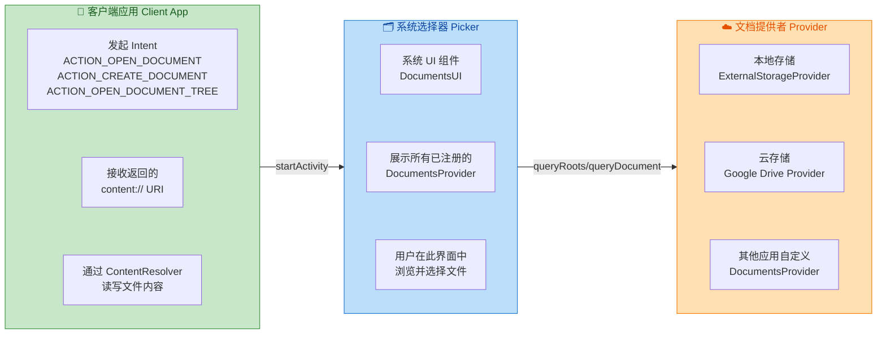
```mermaid
graph LR
    subgraph ClientApp["📱 客户端应用 Client App"]
        direction TB
        D1["发起 Intent\nACTION_OPEN_DOCUMENT\nACTION_CREATE_DOCUMENT\nACTION_OPEN_DOCUMENT_TREE"]
        D2["接收返回的\ncontent:// URI"]
        D3["通过 ContentResolver\n读写文件内容"]
        D1 ~~~ D2
        D2 ~~~ D3
    end

    subgraph Picker["🗂️ 系统选择器 Picker"]
        direction TB
        E1["系统 UI 组件\nDocumentsUI"]
        E2["展示所有已注册的\nDocumentsProvider"]
        E3["用户在此界面中\n浏览并选择文件"]
        E1 ~~~ E2
        E2 ~~~ E3
    end

    subgraph Provider["☁️ 文档提供者 Provider"]
        direction TB
        F1["本地存储\nExternalStorageProvider"]
        F2["云存储\nGoogle Drive Provider"]
        F3["其他应用自定义\nDocumentsProvider"]
        F1 ~~~ F2
        F2 ~~~ F3
    end

    ClientApp -->|"startActivity"| Picker -->|"queryRoots/queryDocument"| Provider

    classDef clientStyle fill:#C8E6C9,stroke:#388E3C,color:#1B5E20
    classDef pickerStyle fill:#BBDEFB,stroke:#1976D2,color:#0D47A1
    classDef providerStyle fill:#FFE0B2,stroke:#F57C00,color:#E65100

    class ClientApp clientStyle
    class Picker pickerStyle
    class Provider providerStyle
```

**Client App（客户端应用）**：就是你开发的应用，你通过发送特定的 Intent 来表达"我要打开文件"或"我要创建文件"的意图。

**System Picker（系统选择器）**：即 `DocumentsUI` 应用，它是一个系统级的文件浏览器 UI。收到客户端的 Intent 后，它会查询所有已注册的 `DocumentsProvider`，以统一的文件树形式展现给用户。用户在这个界面中导航、预览并最终选择文件。

**DocumentsProvider（文档提供者）**：继承自 `ContentProvider`，负责实际的文件数据供给。系统自带的 `ExternalStorageProvider` 提供本地文件访问，第三方云存储应用也可以注册自己的 Provider。

#### 四种核心 Intent Action

SAF 提供了四种主要的 Intent Action，覆盖了几乎所有文件操作场景：

**`ACTION_OPEN_DOCUMENT`**——打开已有文件。这是最常用的 Action，会弹出系统选择器让用户选一个或多个文件。返回的 URI 拥有读权限（如果你额外请求了 `FLAG_GRANT_WRITE_URI_PERMISSION`，还有写权限）。典型场景：用户选择一张图片作为头像、导入一个 JSON 配置文件等。

**`ACTION_CREATE_DOCUMENT`**——创建新文件。弹出选择器让用户选择保存位置和文件名。返回的 URI 指向新创建的空文件。典型场景：导出数据为 CSV、保存编辑后的文档等。

**`ACTION_OPEN_DOCUMENT_TREE`**——选择整个目录。用户授权一整个目录树给应用，应用获得该目录及其所有子目录、子文件的读写权限。这是 SAF 中"最重量级"的授权方式，适用于需要管理大量文件的场景（如笔记应用选择同步目录）。

**`ACTION_GET_CONTENT`**——获取内容（轻量级）。与 `ACTION_OPEN_DOCUMENT` 类似但更简单，系统可能返回一个 **副本** 的 URI 而非原始文件的持久化 URI。适用于"我只需要内容，不关心后续修改"的场景。

#### 打开文件的完整实现

```kotlin
// 1. 定义 ActivityResultLauncher（在 Activity/Fragment 初始化时注册）
//    使用 OpenDocument 合约，返回用户选择的文件 URI
val openDocumentLauncher = registerForActivityResult(
    ActivityResultContracts.OpenDocument()  // 系统提供的 SAF 打开文件合约
) { uri: Uri? ->
    // 回调：用户选择文件后触发（按返回键取消时 uri 为 null）
    uri?.let { selectedUri ->
        // 通过 ContentResolver 打开输入流，读取文件内容
        contentResolver.openInputStream(selectedUri)?.use { inputStream ->
            // bufferedReader() 包装为带缓冲的字符流
            val content = inputStream.bufferedReader().readText()  // 一次性读取全部文本
            // 在此处理文件内容，如显示到 TextView
            textView.text = content
        }
    }
}

// 2. 在需要时触发文件选择（如按钮点击事件）
//    参数是 MIME 类型数组，限制用户可选的文件类型
openDocumentLauncher.launch(
    arrayOf("application/pdf", "text/plain")  // 只允许选择 PDF 和纯文本文件
)
```

#### 创建文件的完整实现

```kotlin
// 1. 注册 CreateDocument 合约的 Launcher
//    泛型参数 "text/plain" 指定创建文件的 MIME 类型
val createDocumentLauncher = registerForActivityResult(
    ActivityResultContracts.CreateDocument("text/plain")  // 创建纯文本文件
) { uri: Uri? ->
    // 用户选好保存位置后回调
    uri?.let { targetUri ->
        // 打开输出流，将内容写入用户选择的位置
        contentResolver.openOutputStream(targetUri)?.use { outputStream ->
            // 将字符串转为字节数组写入
            outputStream.write("Hello Scoped Storage!".toByteArray())
        }
    }
}

// 2. 发起创建文件请求
//    参数为建议的文件名（用户可在选择器中修改）
createDocumentLauncher.launch("my_export.txt")
```

#### 持久化 URI 权限

SAF 返回的 URI 默认只在当前 Activity 的生命周期内有效。如果用户选了一个文件，你想下次应用启动时还能直接访问它（而不需要用户再选一次），就必须 **持久化 URI 权限**。

```kotlin
// 在收到 SAF 返回的 URI 后，立即持久化读写权限
val takeFlags = Intent.FLAG_GRANT_READ_URI_PERMISSION or  // 读权限
                Intent.FLAG_GRANT_WRITE_URI_PERMISSION     // 写权限（如需要）

// takePersistableUriPermission 将临时权限转为持久权限
// 持久权限在设备重启后依然有效，直到用户手动撤销或应用卸载
contentResolver.takePersistableUriPermission(uri, takeFlags)

// 之后可以将 URI 的字符串形式保存到 SharedPreferences 或数据库
// 下次应用启动时直接使用，无需再次弹出选择器
val uriString = uri.toString()
preferences.edit().putString("last_opened_file", uriString).apply()

// 恢复 URI：从字符串解析回 Uri 对象
val savedUri = Uri.parse(preferences.getString("last_opened_file", null))
// 直接使用 contentResolver.openInputStream(savedUri) 即可访问
```

需要注意，系统对每个应用持久化的 URI 权限数量 **有上限**（通常为 128 或 512 个，取决于设备厂商）。如果你的应用需要管理大量文件，更好的做法是使用 `ACTION_OPEN_DOCUMENT_TREE` 获取整个目录的权限，而不是逐个文件持久化。

#### DocumentFile：SAF 的文件操作封装

直接操作 SAF 返回的 `content://` URI 在处理目录树时非常繁琐（需要手动查询子文件、拼接 URI 等）。Android 提供了 `DocumentFile` 工具类来简化这些操作，它对 `content://` URI 做了类似 `java.io.File` 的 API 封装：

```kotlin
// 从 SAF 返回的目录 URI 构造 DocumentFile
// fromTreeUri 用于 ACTION_OPEN_DOCUMENT_TREE 返回的目录 URI
val directory = DocumentFile.fromTreeUri(context, treeUri)

// 列出目录下所有文件（类似 File.listFiles()）
directory?.listFiles()?.forEach { docFile ->
    // getName() 获取文件名
    val name = docFile.name
    // getType() 获取 MIME 类型
    val mimeType = docFile.type
    // isDirectory() 判断是否为子目录
    val isDir = docFile.isDirectory
    // length() 获取文件大小
    val size = docFile.length()
}

// 在目录中创建新文件（类似 File("dir", "name").createNewFile()）
val newFile = directory?.createFile("text/plain", "notes")
// 创建子目录（类似 File("dir", "subdir").mkdir()）
val subDir = directory?.createDirectory("backup")

// 读取文件内容：仍然需要通过 ContentResolver
newFile?.uri?.let { fileUri ->
    contentResolver.openInputStream(fileUri)?.use { /* 读取 */ }
}
```

`DocumentFile` 有一个性能注意点：它的 `listFiles()` 方法在文件数量较多时可能比较慢，因为底层是对每个子文件分别执行了 `ContentResolver.query()`。如果需要处理包含上千个文件的目录，建议直接使用 `ContentResolver.query()` 配合 `DocumentsContract.buildChildDocumentsUriUsingTree()` 来批量查询，性能更优。

---

### 分区存储适配决策总结

面对不同的文件访问需求，开发者应该遵循以下决策路径来选择正确的 API：

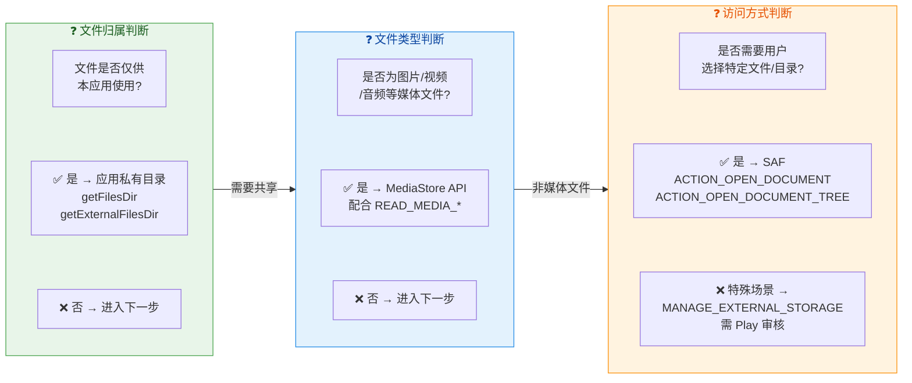
```mermaid
graph LR
    subgraph Step1["❓ 文件归属判断"]
        direction TB
        Q1["文件是否仅供\n本应用使用?"]
        A1Y["✅ 是 → 应用私有目录\ngetFilesDir\ngetExternalFilesDir"]
        A1N["❌ 否 → 进入下一步"]
        Q1 ~~~ A1Y
        A1Y ~~~ A1N
    end

    subgraph Step2["❓ 文件类型判断"]
        direction TB
        Q2["是否为图片/视频\n/音频等媒体文件?"]
        A2Y["✅ 是 → MediaStore API\n配合 READ_MEDIA_*"]
        A2N["❌ 否 → 进入下一步"]
        Q2 ~~~ A2Y
        A2Y ~~~ A2N
    end

    subgraph Step3["❓ 访问方式判断"]
        direction TB
        Q3["是否需要用户\n选择特定文件/目录?"]
        A3Y["✅ 是 → SAF\nACTION_OPEN_DOCUMENT\nACTION_OPEN_DOCUMENT_TREE"]
        A3N["❌ 特殊场景 →\nMANAGE_EXTERNAL_STORAGE\n需 Play 审核"]
        Q3 ~~~ A3Y
        A3Y ~~~ A3N
    end

    Step1 -->|"需要共享"| Step2 -->|"非媒体文件"| Step3

    classDef step1Style fill:#E8F5E9,stroke:#43A047,color:#1B5E20
    classDef step2Style fill:#E3F2FD,stroke:#1E88E5,color:#0D47A1
    classDef step3Style fill:#FFF3E0,stroke:#FB8C00,color:#E65100

    class Step1 step1Style
    class Step2 step2Style
    class Step3 step3Style
```

简而言之：**私有数据用沙盒，媒体文件走 MediaStore，其他文件用 SAF，万不得已才考虑 `MANAGE_EXTERNAL_STORAGE`**。这套规则已经覆盖了绝大多数应用场景。

分区存储的本质是 Android 生态从"应用中心"向"用户中心"的范式转变——文件的访问权不再由开发者声明的权限决定，而是由用户的主动授权决定。虽然适配成本不低，但对于保护用户隐私和维护存储环境整洁来说，这是一个正确且必要的方向。

---

**📝 练习题**

在 Android 11（targetSdkVersion 30）设备上，某应用试图删除另一个应用通过 MediaStore 创建的一张图片。以下描述正确的是？


A. 只要拥有 `WRITE_EXTERNAL_STORAGE` 权限，就能直接调用 `ContentResolver.delete()` 成功删除


B. 调用 `ContentResolver.delete()` 会抛出 `RecoverableSecurityException`，需要引导用户确认后才能删除


C. 必须先获取 `MANAGE_EXTERNAL_STORAGE` 权限，否则无法删除任何其他应用的媒体文件


D. 分区存储下完全无法删除其他应用创建的媒体文件，只能删除自己创建的


**【答案】** B

**【解析】** 在分区存储机制下，应用对 **自己创建的** 媒体文件拥有完全的读写删除权限，无需额外授权。但对于 **其他应用创建的** 媒体文件，直接调用 `ContentResolver.delete()` 会触发系统抛出 `RecoverableSecurityException`。开发者需要从该异常中提取 `IntentSender`，通过 `startIntentSenderForResult()` 弹出一个系统级的确认对话框，由用户明确同意后才会真正执行删除操作。选项 A 错误，因为在 Android 11 强制分区存储后，`WRITE_EXTERNAL_STORAGE` 权限 **不再授予** 对其他应用文件的写入/删除能力。选项 C 错误，`MANAGE_EXTERNAL_STORAGE` 确实可以绕过此限制，但它不是"必须"的——通过 `RecoverableSecurityException` 流程同样可以完成删除。选项 D 错误，其他应用的媒体文件 **可以** 被删除，只是需要用户确认这一额外步骤。

---

**📝 练习题**

关于 SAF（Storage Access Framework）返回的 URI 权限持久化，以下说法错误的是？


A. SAF 返回的 URI 权限默认是临时的，在 Activity 销毁后失效


B. 调用 `contentResolver.takePersistableUriPermission()` 可以将临时权限转为持久权限


C. 持久化后的 URI 权限在设备重启后依然有效


D. 持久化 URI 权限没有数量上限，应用可以无限制地持久化任意多个 URI


**【答案】** D

**【解析】** 选项 A、B、C 均正确：SAF 返回的 URI 权限确实是临时性的，随 Activity 生命周期结束而失效；通过 `takePersistableUriPermission()` 可以将其转为持久权限，该权限在应用重启、设备重启后仍然有效（直到用户手动撤销或应用被卸载）。选项 D 是错误的，**系统对每个应用可持久化的 URI 权限数量存在上限**，通常为 128 或 512 个（具体取决于设备厂商和系统版本）。超过上限后，早期持久化的权限可能被系统自动回收。因此，在需要管理大量文件的场景下，推荐使用 `ACTION_OPEN_DOCUMENT_TREE` 获取整个目录树的权限，而非对每个文件逐一持久化。

---

## 键值对存储 SharedPreferences

SharedPreferences 是 Android 应用层中最经典、使用频率最高的轻量级持久化方案之一。它的 API 极其简洁——只需 `getSharedPreferences()` 获取实例，再通过 `Editor` 的 `putXxx()` / `getXxx()` 即可完成读写。然而，正是这种"过于简单"的表象，让大量开发者忽略了它背后的 **全量 XML 序列化机制**、**内存缓存策略**、**跨线程 / 跨进程的同步问题** 以及潜在的 **ANR 风险**。本节将从源码级别剖析 SharedPreferences 的完整工作流程，帮助你在面试和生产环境中都能做到心中有数。

---

### XML 实现原理

#### 存储位置与文件格式

当你调用 `context.getSharedPreferences("config", Context.MODE_PRIVATE)` 时，系统实际上在应用的 **内部存储私有目录** 下维护了一个纯文本 XML 文件，路径为：

```
/data/data/<package_name>/shared_prefs/config.xml
```

这个 XML 文件的结构非常简单，根节点为 `<map>`，每一个键值对对应一个子节点，节点标签名即为数据类型：

```xml
<?xml version='1.0' encoding='utf-8' standalone='yes' ?>
<map>
    <!-- String 类型：标签为 string，name 属性为 key，文本内容为 value -->
    <string name="username">Alice</string>
    <!-- int 类型：标签为 int，value 属性直接存储数值 -->
    <int name="login_count" value="5" />
    <!-- boolean 类型：标签为 boolean，value 属性为 true/false -->
    <boolean name="is_vip" value="true" />
    <!-- long 类型 -->
    <long name="last_login_ts" value="1717200000000" />
    <!-- float 类型 -->
    <float name="score" value="95.5" />
    <!-- StringSet 类型：外层为 set 标签，内层为多个 string 子标签 -->
    <set name="tags">
        <string>android</string>
        <string>kotlin</string>
    </set>
</map>
```

需要特别注意的是，SharedPreferences **仅支持以上六种基本数据类型**（`String`, `int`, `long`, `float`, `boolean`, `Set<String>`）。如果需要存储复杂对象，开发者通常会先将其序列化为 JSON 字符串再存入，但这本身就暗示了 SharedPreferences 的设计定位——**它只适合存储少量、简单的配置数据**。

#### 实例获取与缓存机制（ContextImpl 层）

SharedPreferences 的实例并非每次调用都重新创建。在 `ContextImpl`（Context 的真正实现类）中，系统维护了一个 **二级缓存结构**：

```java
// ContextImpl.java 核心结构（简化）

// 第一级缓存：packageName -> (fileName -> SharedPreferencesImpl)
// 静态变量，所有 ContextImpl 实例共享
private static ArrayMap<String, ArrayMap<String, SharedPreferencesImpl>>
        sSharedPrefsCache;

@Override
public SharedPreferences getSharedPreferences(String name, int mode) {
    // 先从缓存中查找
    synchronized (ContextImpl.class) {
        // 获取当前包名对应的内层 Map
        ArrayMap<String, SharedPreferencesImpl> packagePrefs =
                sSharedPrefsCache.get(getPackageName());
        if (packagePrefs == null) {
            // 首次访问该包名，创建内层 Map
            packagePrefs = new ArrayMap<>();
            sSharedPrefsCache.put(getPackageName(), packagePrefs);
        }
        // 以文件名为 key 查找已有实例
        SharedPreferencesImpl sp = packagePrefs.get(name);
        if (sp == null) {
            // 缓存未命中：创建新实例，触发磁盘文件加载
            File prefsFile = getSharedPreferencesPath(name);
            sp = new SharedPreferencesImpl(prefsFile, mode);
            packagePrefs.put(name, sp);
        }
        return sp;
    }
}
```

这段逻辑揭示了几个关键事实：

1. **全局单例语义**：同一个文件名在整个进程内只会有 **一个** `SharedPreferencesImpl` 实例。无论你在 Activity、Service 还是 BroadcastReceiver 中调用 `getSharedPreferences("config", ...)`，拿到的都是同一个对象。这也是为什么 SharedPreferences 天然支持 **同进程内多线程共享**。

2. **进程级缓存**：`sSharedPrefsCache` 是 `static` 变量，生命周期与进程一致。一旦某个 SP 文件被加载进内存，后续读操作将直接命中内存缓存，**不会再触发磁盘 I/O**。

3. **首次创建触发磁盘读取**：只有在缓存未命中时，才会 `new SharedPreferencesImpl()`，其构造函数内部会立即启动 **异步线程** 从磁盘加载 XML 文件。

#### 首次加载：从磁盘到内存的全量解析

`SharedPreferencesImpl` 的构造函数中，最核心的操作是 `startLoadFromDisk()`：

```java
// SharedPreferencesImpl.java（简化）

// 内存中保存全部键值对的 Map
private Map<String, Object> mMap;
// 标记磁盘文件是否已加载完成
private boolean mLoaded = false;

SharedPreferencesImpl(File file, int mode) {
    mFile = file;               // 指向 shared_prefs/xxx.xml
    mBackupFile = makeBackupFile(file); // 备份文件 xxx.xml.bak
    mMode = mode;
    mLoaded = false;
    mMap = null;
    startLoadFromDisk();        // 立即启动异步加载
}

private void startLoadFromDisk() {
    synchronized (mLock) {
        mLoaded = false;        // 标记"尚未加载完成"
    }
    // 在子线程中执行真正的磁盘读取
    new Thread("SharedPreferencesImpl-load") {
        public void run() {
            loadFromDisk();     // 核心：解析 XML -> mMap
        }
    }.start();
}

private void loadFromDisk() {
    synchronized (mLock) {
        if (mLoaded) return;    // 防止重复加载
    }
    Map<String, Object> map = null;
    // ... 文件存在性检查、备份恢复等逻辑 ...
    // 使用 XmlUtils.readMapXml() 将整个 XML 文件解析为 HashMap
    map = (Map<String, Object>) XmlUtils.readMapXml(str);

    synchronized (mLock) {
        mLoaded = true;         // 标记加载完成
        mMap = map;             // 将解析结果赋给内存缓存
        mLock.notifyAll();      // 唤醒所有因 getXxx() 而阻塞的线程
    }
}
```

这里的 **阻塞-通知模型** 是理解 SharedPreferences 性能特征的关键。当 `mLoaded` 为 `false` 时，任何对 `getXxx()` 的调用都会 **阻塞在 `mLock` 上**，直到 `loadFromDisk()` 完成。下面就是 `getString()` 的真实逻辑：

```java
@Override
public String getString(String key, @Nullable String defValue) {
    synchronized (mLock) {
        awaitLoadedLocked();    // 如果还没加载完，阻塞等待
        // 直接从内存 Map 中读取，无磁盘 I/O
        String v = (String) mMap.get(key);
        return v != null ? v : defValue;
    }
}

private void awaitLoadedLocked() {
    while (!mLoaded) {
        try {
            mLock.wait();       // 阻塞当前线程，等待 loadFromDisk 通知
        } catch (InterruptedException unused) {
        }
    }
}
```

这就解释了一个非常隐蔽的问题：**如果你在主线程 `onCreate()` 中立即调用 `sp.getString()`，而 XML 文件较大（比如上百 KB），那么主线程会被阻塞在 `awaitLoadedLocked()` 上，直到子线程完成 XML 解析**。这段等待时间对用户来说就是 "白屏" 或 "卡顿"，在极端情况下甚至可能触发 ANR。

#### 写入流程：Editor 的全量序列化

SharedPreferences 的写入通过 `Editor` 接口完成。`Editor` 本身只是一个"暂存区"（staging area），真正的持久化发生在 `commit()` 或 `apply()` 被调用时：

```java
// SharedPreferencesImpl.EditorImpl（简化）
public final class EditorImpl implements SharedPreferences.Editor {
    // Editor 内部维护的"待修改"集合
    private final Map<String, Object> mModified = new HashMap<>();
    private boolean mClear = false; // 是否标记了 clear()

    @Override
    public Editor putString(String key, String value) {
        synchronized (mEditorLock) {
            // 仅仅放入 mModified，尚未写入 mMap 或磁盘
            mModified.put(key, value);
            return this;
        }
    }

    @Override
    public Editor remove(String key) {
        synchronized (mEditorLock) {
            // 用特殊占位符 this 表示"删除"
            mModified.put(key, this);
            return this;
        }
    }
}
```

当 `commit()` 或 `apply()` 被调用时，系统执行以下两步：

**第一步：commitToMemory()** —— 将 `mModified` 合并到 `mMap`

```java
private MemoryCommitResult commitToMemory() {
    synchronized (mLock) {
        Map<String, Object> mapToWriteToDisk = mMap;
        // 如果调用了 clear()，先清空内存 Map
        if (mClear) {
            mMap.clear();
            mClear = false;
        }
        // 遍历 mModified，逐个合并到 mMap
        for (Map.Entry<String, Object> e : mModified.entrySet()) {
            String k = e.getKey();
            Object v = e.getValue();
            if (v == this) {     // 特殊占位符 -> 删除
                mMap.remove(k);
            } else {
                mMap.put(k, v);  // 新增或覆盖
            }
        }
        mModified.clear();
        // 返回的 mapToWriteToDisk 就是整个 mMap 的引用
        return new MemoryCommitResult(..., mapToWriteToDisk, ...);
    }
}
```

**第二步：enqueueDiskWrite()** —— 将 **整个 mMap** 序列化为 XML 写入磁盘

这里就是 SharedPreferences **最大的性能瓶颈**：无论你只修改了一个 key，系统都会将 **全部键值对** 重新序列化成完整的 XML 文件并写入磁盘。这就是所谓的 **"全量写入"（Full Write）** 机制。写入过程大致如下：

1. 将原文件重命名为 `.bak` 备份
2. 创建新文件，调用 `XmlUtils.writeMapXml(map, str)` 将 **整个 Map** 写入
3. 对新文件执行 `fsync()` 确保数据落盘
4. 删除 `.bak` 备份文件

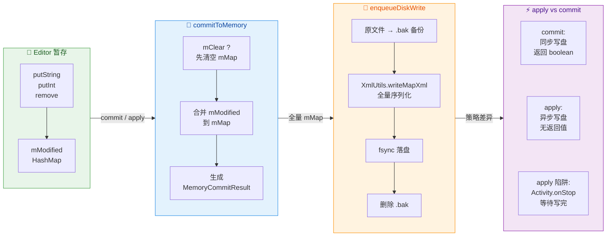
```mermaid
graph LR
    subgraph EDIT["📝 Editor 暂存"]
        direction TB
        E1["putString\nputInt\nremove"]
        E2["mModified\nHashMap"]
        E1 --> E2
    end

    subgraph MERGE["🔀 commitToMemory"]
        direction TB
        M1["合并 mModified\n到 mMap"]
        M2["mClear ?\n先清空 mMap"]
        M3["生成\nMemoryCommitResult"]
        M2 --> M1
        M1 --> M3
    end

    subgraph DISK["💾 enqueueDiskWrite"]
        direction TB
        D1["原文件 → .bak 备份"]
        D2["XmlUtils.writeMapXml\n全量序列化"]
        D3["fsync 落盘"]
        D4["删除 .bak"]
        D1 --> D2
        D2 --> D3
        D3 --> D4
    end

    subgraph DIFF["⚡ apply vs commit"]
        direction TB
        F1["commit:\n同步写盘\n返回 boolean"]
        F2["apply:\n异步写盘\n无返回值"]
        F3["apply 陷阱:\nActivity.onStop\n等待写完"]
        F1 ~~~ F2
        F2 ~~~ F3
    end

    EDIT -->|"commit / apply"| MERGE -->|"全量 mMap"| DISK -->|"策略差异"| DIFF

    classDef editStyle fill:#E8F5E9,stroke:#43A047,color:#1B5E20
    classDef mergeStyle fill:#E3F2FD,stroke:#1E88E5,color:#0D47A1
    classDef diskStyle fill:#FFF3E0,stroke:#FB8C00,color:#E65100
    classDef diffStyle fill:#F3E5F5,stroke:#8E24AA,color:#4A148C

    class EDIT editStyle
    class MERGE mergeStyle
    class DISK diskStyle
    class DIFF diffStyle
```

### 全量加载性能陷阱

理解了上面的原理后，我们可以系统性地梳理 SharedPreferences 的性能陷阱。这些问题在小型应用中往往不会暴露，但在用户量大、数据逐渐膨胀的生产环境中却是真实的"定时炸弹"。

#### 陷阱一：文件越大，首次阻塞越久

SharedPreferences 采用 **全量加载** 策略——无论你只需要读取一个 key，系统都会在首次访问时将 **整个 XML 文件** 解析为内存中的 `HashMap`。这意味着：

- 一个 1KB 的 SP 文件，加载时间可能在 1ms 以内，完全无感知
- 一个 100KB 的 SP 文件，XML 解析可能需要 50-100ms
- 一个 500KB 以上的 SP 文件，解析时间可能超过 200ms，足以引发明显卡顿

更严重的是，很多开发者习惯将所有配置都塞进同一个 SP 文件（比如统一使用 `"app_prefs"`），随着版本迭代，这个文件会像滚雪球一样越来越大。

**最佳实践**：按照功能模块拆分 SP 文件。例如：

```kotlin
// ✅ 按模块拆分，各文件保持小体量
// 用户配置（登录态、昵称等），通常只有几个 key
val userPrefs = context.getSharedPreferences("user_prefs", Context.MODE_PRIVATE)

// 功能开关（A/B 实验、Feature Flag），独立管理
val featurePrefs = context.getSharedPreferences("feature_flags", Context.MODE_PRIVATE)

// 缓存类数据（上次刷新时间等），可随时清理
val cachePrefs = context.getSharedPreferences("cache_prefs", Context.MODE_PRIVATE)

// ❌ 反模式：所有数据塞进一个文件
val everything = context.getSharedPreferences("app_prefs", Context.MODE_PRIVATE)
```

#### 陷阱二：全量写入放大效应

前面已经分析过，每次 `commit()` 或 `apply()` 都会触发 **全量序列化写入**。假设你的 SP 文件中有 200 个键值对，总大小 50KB，你只修改了其中一个 `boolean` 值，系统依然会重新写入完整的 50KB。这种 **写放大（Write Amplification）** 效应在高频写入场景下尤为致命。

常见的错误模式：

```kotlin
// ❌ 反模式：在循环中多次 apply，每次都触发全量写入
for (item in itemList) {
    prefs.edit()                     // 每次循环都创建新 Editor
        .putString(item.key, item.value) // 只放入一个 kv
        .apply()                     // 触发一次完整的 XML 全量序列化
}

// ✅ 正确做法：批量操作，一次提交
prefs.edit().apply {                 // Kotlin 扩展函数，使用同一个 Editor
    for (item in itemList) {
        putString(item.key, item.value)  // 所有修改暂存到 mModified
    }
}.apply()                           // 只触发一次全量写入
```

#### 陷阱三：内存常驻不释放

一旦 SP 文件被加载，其对应的 `HashMap` 会 **永远驻留在内存中**，直到进程被杀死。`ContextImpl` 中的 `sSharedPrefsCache` 是 static 的，GC 无法回收。如果你的应用有多个大型 SP 文件，它们会同时占据内存。

这在功能复杂的大型应用中尤其值得警惕：假设有 10 个 SP 文件，每个解析后的 HashMap 占 50KB，那就是 500KB 的不可回收内存。虽然绝对值不大，但如果其中包含大量不常用的数据（比如只在特定页面用到的配置），这些内存就是浪费的。

#### 陷阱四：不支持增量更新与局部读取

与数据库（SQLite / Room）不同，SharedPreferences 没有 **索引** 和 **查询** 的概念。你无法做到"只从磁盘读取某一个 key 的值"，也无法做到"只把修改的 key 追加到文件末尾"。这是由 XML 的平铺结构决定的——XML 解析器必须从头读到尾才能构建出完整的 DOM/Map。

这就是为什么 Google 后来推出了 **DataStore** 作为 SharedPreferences 的替代方案：Preferences DataStore 底层使用 Protocol Buffers 二进制格式，虽然也是全量写入，但序列化/反序列化效率远高于 XML；Proto DataStore 更是支持类型安全的 Schema 定义。

---

### apply vs commit

`apply()` 和 `commit()` 是 SharedPreferences 写入操作的两个入口。它们在 **内存提交** 阶段的行为完全相同（都调用 `commitToMemory()` 将 mModified 合并到 mMap），差异完全体现在 **磁盘写入** 阶段。

#### commit()：同步写盘

```java
@Override
public boolean commit() {
    // 第一步：将 mModified 合并到 mMap（内存操作，很快）
    MemoryCommitResult mcr = commitToMemory();
    // 第二步：在当前线程同步执行磁盘写入
    SharedPreferencesImpl.this.enqueueDiskWrite(mcr, null /* 传 null 表示同步 */);
    try {
        // 阻塞等待写入完成（对于同步写入，这里其实立即返回）
        mcr.writtenToDiskLatch.await();
    } catch (InterruptedException e) {
        return false;
    }
    // 通知已注册的 OnSharedPreferenceChangeListener
    notifyListeners(mcr);
    // 返回写入是否成功
    return mcr.writeToDiskResult;
}
```

`commit()` 的语义非常明确：

- **同步阻塞**：在调用线程（通常是主线程）上直接执行 XML 序列化 + 磁盘写入 + `fsync()`
- **有返回值**：`boolean` 类型，告诉调用方写入是否成功
- **性能风险**：如果在主线程调用，且 SP 文件较大，会明显阻塞 UI 渲染

#### apply()：异步写盘（但有隐含等待）

```java
@Override
public void apply() {
    // 第一步：同样先将 mModified 合并到 mMap（内存操作）
    final MemoryCommitResult mcr = commitToMemory();

    // 创建一个 Runnable，执行后表示"等待写盘完成"
    final Runnable awaitCommit = new Runnable() {
        @Override
        public void run() {
            try {
                // 阻塞直到磁盘写入完成
                mcr.writtenToDiskLatch.await();
            } catch (InterruptedException ignored) {
            }
        }
    };

    // ⚠️ 关键：将 awaitCommit 加入 QueuedWork 的 finisher 队列
    QueuedWork.addFinisher(awaitCommit);

    // 第二步：将磁盘写入任务投递到 QueuedWork 的单线程池中异步执行
    SharedPreferencesImpl.this.enqueueDiskWrite(mcr, postWriteRunnable);
    // apply() 立即返回，不阻塞调用线程
}
```

`apply()` 的表面语义看起来完美——**内存立即生效，磁盘异步写入，调用方不阻塞**。但真正危险的，是那个被悄悄加入 `QueuedWork` 的 `awaitCommit`。

#### 核心差异对比

| 维度 | `commit()` | `apply()` |
|:---|:---|:---|
| **磁盘写入线程** | 当前线程（同步） | QueuedWork 单线程池（异步） |
| **返回值** | `boolean`（写入是否成功） | `void`（无反馈） |
| **内存生效时机** | 立即（commitToMemory 在 commit 内执行） | 立即（commitToMemory 在 apply 内执行） |
| **阻塞调用线程** | ✅ 阻塞，直到 fsync 完成 | ❌ 不阻塞（但有 QueuedWork 隐患） |
| **适用场景** | 需要确认写入成功（如支付状态） | 大多数普通配置存储 |
| **主线程安全性** | ⚠️ 不建议主线程调用 | ⚠️ 表面安全，实际有 ANR 风险 |

**一般建议**：绝大多数场景使用 `apply()` 即可，因为 SP 存储的数据通常不需要强一致性保证。但如果你的业务逻辑 **必须确认数据已写入磁盘**（例如在 `onDestroy()` 中保存关键状态，随后进程可能被杀），则应使用 `commit()`，并确保在后台线程中调用。

---

### ANR 风险

这是 SharedPreferences 中 **最隐蔽、最危险** 的问题，也是高频面试考点。许多开发者认为"用 `apply()` 就不会阻塞主线程"，但事实远非如此。

#### QueuedWork 机制：apply 的"秋后算账"

Android Framework 中有一个名为 `QueuedWork` 的工具类，专门用于管理需要在"组件生命周期结束前确保完成"的异步任务。SharedPreferences 的 `apply()` 就是它最主要的客户。

工作原理如下：

1. 每次调用 `apply()`，一个磁盘写入任务被投递到 `QueuedWork` 的后台线程
2. 同时，一个"等待完成"的 `Runnable`（finisher）被注册到 `QueuedWork.sFinishers` 列表中
3. 在 **Activity.onStop()** 或 **Service.onStartCommand()** 等生命周期方法中，Framework 会调用 `QueuedWork.waitToFinish()`
4. `waitToFinish()` 会 **在主线程上遍历所有 finisher 并逐个执行 `run()`**，而每个 finisher 的 `run()` 就是 `mcr.writtenToDiskLatch.await()` —— 阻塞等待磁盘写入完成

```java
// ActivityThread.java 中的调用路径
private void handleStopActivity(IBinder token, ...) {
    // ...
    // ⚠️ 在 onStop() 流程中强制等待所有未完成的 apply 写盘
    QueuedWork.waitToFinish();
    // ...
}
```

```java
// QueuedWork.java（简化）
public static void waitToFinish() {
    // 在主线程上执行！
    try {
        // 先尝试直接处理所有排队的磁盘写入任务
        processPendingWork();
    } finally {
        // 然后逐个等待 finisher 完成
        for (Runnable finisher : sFinishers) {
            finisher.run(); // 阻塞主线程，直到对应的 apply 写盘完成
        }
        sFinishers.clear();
    }
}
```

这意味着什么？假设你在一个 Activity 的生命周期内调用了 10 次 `apply()`，当 `onStop()` 被触发时：

1. 主线程进入 `QueuedWork.waitToFinish()`
2. 等待所有 10 个磁盘写入任务完成
3. 如果 SP 文件较大（全量写入 × 10 次），总耗时可能达到数百毫秒
4. 主线程被阻塞，如果超过 5 秒 —— **ANR**

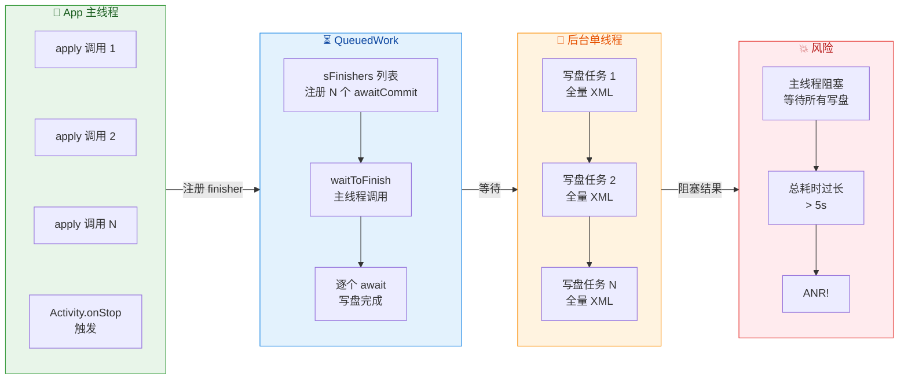
```mermaid
graph LR
    subgraph APP["📱 App 主线程"]
        direction TB
        A1["apply 调用 1"]
        A2["apply 调用 2"]
        A3["apply 调用 N"]
        A4["Activity.onStop\n触发"]
        A1 ~~~ A2
        A2 ~~~ A3
        A3 ~~~ A4
    end

    subgraph QW["⏳ QueuedWork"]
        direction TB
        Q1["sFinishers 列表\n注册 N 个 awaitCommit"]
        Q2["waitToFinish\n主线程调用"]
        Q3["逐个 await\n写盘完成"]
        Q1 --> Q2
        Q2 --> Q3
    end

    subgraph BG["💾 后台单线程"]
        direction TB
        B1["写盘任务 1\n全量 XML"]
        B2["写盘任务 2\n全量 XML"]
        B3["写盘任务 N\n全量 XML"]
        B1 --> B2
        B2 --> B3
    end

    subgraph RISK["💥 风险"]
        direction TB
        R1["主线程阻塞\n等待所有写盘"]
        R2["总耗时过长\n> 5s"]
        R3["ANR!"]
        R1 --> R2
        R2 --> R3
    end

    APP -->|"注册 finisher"| QW -->|"等待"| BG -->|"阻塞结果"| RISK

    classDef appStyle fill:#E8F5E9,stroke:#43A047,color:#1B5E20
    classDef qwStyle fill:#E3F2FD,stroke:#1E88E5,color:#0D47A1
    classDef bgStyle fill:#FFF3E0,stroke:#FB8C00,color:#E65100
    classDef riskStyle fill:#FFEBEE,stroke:#E53935,color:#B71C1C

    class APP appStyle
    class QW qwStyle
    class BG bgStyle
    class RISK riskStyle
```

#### 真实案例还原

以下是一个在生产环境中极易触发 ANR 的场景：

```kotlin
class TrackingActivity : AppCompatActivity() {

    // ❌ 危险：在页面交互过程中频繁 apply
    private fun onUserScroll(position: Int) {
        // 用户每次滑动都记录位置，假设每秒触发 5-10 次
        getSharedPreferences("scroll_state", MODE_PRIVATE)
            .edit()
            .putInt("last_position", position)  // 只修改一个 int
            .apply()                            // 每次都触发全量写入排队
    }

    // 当用户按 Back 键或系统回收 Activity 时
    // handleStopActivity -> QueuedWork.waitToFinish()
    // 主线程需要等待之前积攒的几十次写盘任务全部完成
    // SP 文件越大，每次全量写入越慢，ANR 风险越高
}
```

#### 规避 ANR 的策略

**策略一：减少 apply 调用频率**

使用防抖（debounce）或节流（throttle）机制，将高频写入合并为低频批量写入：

```kotlin
class ScrollStateManager(context: Context) {
    // 获取 SharedPreferences 实例
    private val prefs = context.getSharedPreferences("scroll_state", Context.MODE_PRIVATE)
    // 使用 Handler 实现防抖，延迟 500ms 写入
    private val handler = Handler(Looper.getMainLooper())
    // 暂存最新的滚动位置
    private var pendingPosition: Int = -1

    // 防抖写入 Runnable
    private val writeRunnable = Runnable {
        prefs.edit()
            .putInt("last_position", pendingPosition)  // 只写入最新的位置
            .apply()                                   // 500ms 内只触发一次 apply
    }

    fun onUserScroll(position: Int) {
        pendingPosition = position          // 更新暂存值
        handler.removeCallbacks(writeRunnable)  // 移除之前的延迟任务
        handler.postDelayed(writeRunnable, 500) // 500ms 后再写入
    }
}
```

**策略二：迁移到 DataStore**

Jetpack DataStore 从设计上就避免了 QueuedWork 的问题。它基于 Kotlin Coroutines + Flow，所有 I/O 操作都在指定的协程调度器上执行，不会在生命周期回调中"秋后算账"：

```kotlin
// DataStore 写入：完全异步，无 QueuedWork 依赖
viewModelScope.launch {
    // 在 Dispatchers.IO 上执行，不阻塞主线程
    context.dataStore.edit { preferences ->
        preferences[SCROLL_POSITION_KEY] = position  // 类型安全的写入
    }
}
```

**策略三：SP 文件体积控制**

既然全量写入不可避免，那就让每次写入的"全量"尽可能小：

- 单个 SP 文件 **不超过 50 个 key-value 对**
- 文件体积 **控制在 10KB 以内**
- 大体量数据（用户行为日志、缓存列表等）应使用数据库或文件流

**策略四：使用 commit 替代 apply（特定场景）**

这听起来违反直觉，但在某些场景下，在 **后台线程** 上使用 `commit()` 反而比 `apply()` 更安全。因为 `commit()` 不会向 `QueuedWork` 注册 finisher，自然不会在 `onStop()` 中被"追债"：

```kotlin
// 在后台线程中同步写入，绕过 QueuedWork
lifecycleScope.launch(Dispatchers.IO) {
    prefs.edit()
        .putString("key", "value")
        .commit()   // 同步写盘，但因为在 IO 线程，不影响主线程
}
```

#### Android 8.0+ 的优化

值得一提的是，从 Android 8.0（API 26）开始，`QueuedWork` 内部做了一项优化：在 `waitToFinish()` 时，它不再仅仅被动等待后台线程完成，而是会 **在主线程上直接执行所有排队的写盘任务**（`processPendingWork()`）。这样做的好处是避免了"主线程等待后台线程"的线程调度开销，但本质上 **主线程依然会被阻塞**——只是从"等待锁"变成了"直接干活"。因此 ANR 风险并未从根本上消除，只是在某些场景下稍有缓解。

#### 跨进程使用的问题

SharedPreferences 提供了 `MODE_MULTI_PROCESS` 标志，但这个模式在 **API 23 已被废弃**，官方明确指出它 **不能可靠地支持跨进程读写**。原因在于：

- SharedPreferences 的缓存是进程级别的（`static` 变量）
- 进程 A 修改了磁盘文件，进程 B 的内存缓存不会自动更新
- `MODE_MULTI_PROCESS` 只是在每次 `getSharedPreferences()` 时重新检查文件的修改时间戳，如果发现变化则重新加载，但这不能防止并发写入导致的数据丢失

如果确实需要跨进程共享键值对数据，应该使用 **ContentProvider**（封装 SP 或 SQLite 作为后端）、**MMKV**（基于 mmap 的高性能方案）或 **DataStore**（多进程版本）。

---

### 本节知识脉络回顾

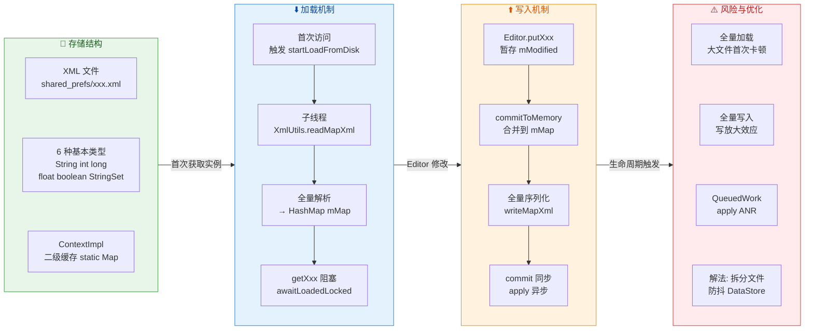
```mermaid
graph LR
    subgraph STRUCTURE["📂 存储结构"]
        direction TB
        S1["XML 文件\nshared_prefs/xxx.xml"]
        S2["6 种基本类型\nString int long\nfloat boolean StringSet"]
        S3["ContextImpl\n二级缓存 static Map"]
        S1 ~~~ S2
        S2 ~~~ S3
    end

    subgraph LOAD["⬇️ 加载机制"]
        direction TB
        L1["首次访问\n触发 startLoadFromDisk"]
        L2["子线程\nXmlUtils.readMapXml"]
        L3["全量解析\n→ HashMap mMap"]
        L4["getXxx 阻塞\nawaitLoadedLocked"]
        L1 --> L2
        L2 --> L3
        L3 --> L4
    end

    subgraph WRITE["⬆️ 写入机制"]
        direction TB
        W1["Editor.putXxx\n暂存 mModified"]
        W2["commitToMemory\n合并到 mMap"]
        W3["全量序列化\nwriteMapXml"]
        W4["commit 同步\napply 异步"]
        W1 --> W2
        W2 --> W3
        W3 --> W4
    end

    subgraph RISK["⚠️ 风险与优化"]
        direction TB
        R1["全量加载\n大文件首次卡顿"]
        R2["全量写入\n写放大效应"]
        R3["QueuedWork\napply ANR"]
        R4["解法: 拆分文件\n防抖 DataStore"]
        R1 ~~~ R2
        R2 ~~~ R3
        R3 ~~~ R4
    end

    STRUCTURE -->|"首次获取实例"| LOAD -->|"Editor 修改"| WRITE -->|"生命周期触发"| RISK

    classDef structStyle fill:#E8F5E9,stroke:#43A047,color:#1B5E20
    classDef loadStyle fill:#E3F2FD,stroke:#1E88E5,color:#0D47A1
    classDef writeStyle fill:#FFF3E0,stroke:#FB8C00,color:#E65100
    classDef riskStyle fill:#FFEBEE,stroke:#E53935,color:#B71C1C

    class STRUCTURE structStyle
    class LOAD loadStyle
    class WRITE writeStyle
    class RISK riskStyle
```

---

**📝 练习题**

在一个 Activity 中，开发者在 `onResume()` 里对同一个 SharedPreferences 文件连续调用了 20 次 `apply()` 进行写入。当用户按下返回键时，最可能发生什么？

A. 20 次写入全部丢失，因为 apply 是异步的，进程退出前来不及写盘


B. 主线程在 `onStop()` 中被 `QueuedWork.waitToFinish()` 阻塞，等待所有写盘任务完成，可能导致 ANR


C. 系统自动合并 20 次写入为 1 次磁盘操作，不会有性能问题


D. apply 的写入任务会在 `onDestroy()` 之后才执行，不影响主线程


**【答案】** B

**【解析】** 每次调用 `apply()`，都会向 `QueuedWork` 注册一个 finisher，并将全量 XML 写入任务投递到后台单线程队列。当 Activity 进入 `onStop()` 时，`ActivityThread.handleStopActivity()` 会调用 `QueuedWork.waitToFinish()`，在主线程上逐个等待（或直接执行）所有排队的写盘任务。如果 SP 文件较大，20 次全量序列化 + `fsync()` 的总耗时可能非常长，导致主线程被阻塞超过 5 秒，从而触发 ANR。选项 A 错误，因为 QueuedWork 机制的存在正是为了保证 apply 的数据不会丢失。选项 C 错误，系统并不会自动合并多次 apply（Android 8.0+ 有一定优化，但不是合并为 1 次）。选项 D 错误，等待发生在 `onStop()` 而非 `onDestroy()` 之后。

---

**📝 练习题**

关于 SharedPreferences 的 `commit()` 和 `apply()`，以下说法正确的是？

A. `commit()` 在子线程执行磁盘写入，`apply()` 在主线程执行磁盘写入


B. `apply()` 只将数据写入内存，不会持久化到磁盘


C. `commit()` 返回 `boolean` 表示写入是否成功，`apply()` 无返回值且不会注册 QueuedWork finisher


D. `commit()` 和 `apply()` 都先执行 `commitToMemory()` 将修改合并到 mMap，区别在于磁盘写入的同步/异步策略

**【答案】** D

**【解析】** 无论是 `commit()` 还是 `apply()`，第一步都是调用 `commitToMemory()` 将 Editor 中的 `mModified` 合并到 `SharedPreferencesImpl` 的 `mMap` 中，这一步是内存操作，立即生效。区别在于第二步：`commit()` 在调用线程同步执行磁盘写入并返回 `boolean`；`apply()` 将磁盘写入投递到 `QueuedWork` 后台线程，立即返回 `void`。选项 A 因果颠倒。选项 B 不正确，`apply()` 确实会持久化到磁盘，只是异步执行。选项 C 前半句正确（`commit()` 返回 `boolean`），但后半句错误——`apply()` 确实会注册 QueuedWork finisher，这正是 ANR 风险的根源。

---

## 偏好数据存储 DataStore

在上一节中，我们深入分析了 SharedPreferences 的实现原理，也暴露了它在现代 Android 开发中面临的诸多困境：全量 XML 解析导致的主线程阻塞、`apply()` 在 Activity 停止时可能引发的 ANR、缺乏类型安全、不支持事务性更新等。Google 在 Jetpack 中推出的 **DataStore** 正是为了从根本上取代 SharedPreferences 而设计的新一代数据持久化方案。

DataStore 的设计哲学可以概括为三个关键词：**异步优先（Async-first）**、**事务安全（Transactional）**、**Flow 驱动（Flow-based）**。它完全基于 Kotlin 协程（Coroutines）与 Flow 构建，从 API 层面就杜绝了在主线程进行 IO 操作的可能性。同时，它提供了原子性的读写语义（atomic read-modify-write），确保并发场景下的数据一致性。DataStore 分为两种实现形式：**Preferences DataStore** 用于替代 SharedPreferences 的简单键值对场景，而 **Proto DataStore** 则通过 Protocol Buffers 提供强类型、schema 化的持久化方案。接下来我们将逐一深入剖析。

### Preferences DataStore 键值对

#### 基本概念与定位

Preferences DataStore 是 DataStore 家族中最"平易近人"的一员。它的使用体验与 SharedPreferences 类似——存储的仍然是键值对（key-value pairs），但底层机制截然不同。SharedPreferences 把数据写入 XML 文件，并在首次访问时将整个文件一次性加载到内存中的 `HashMap`；而 Preferences DataStore 则将数据持久化为 **Protocol Buffers 二进制格式**（而非 XML），并通过 Kotlin 的 `Flow` 以异步、非阻塞的方式暴露数据变化。

这里有一个容易混淆的细节：虽然叫 "Preferences" DataStore，但它底层并不使用 XML，而是使用了 Protobuf 编码。之所以保留 "Preferences" 这个名字，是因为它在 API 层面模拟了键值对的使用方式，让开发者从 SharedPreferences 迁移时感到熟悉。实际的文件存储位置在 `data/data/<package>/files/datastore/` 目录下，文件后缀为 `.preferences_pb`。

#### 依赖引入与实例创建

使用 Preferences DataStore 首先需要在 `build.gradle` 中引入依赖：

```kotlin
// build.gradle.kts
dependencies {
    // Preferences DataStore 核心依赖
    implementation("androidx.datastore:datastore-preferences:1.1.1")
}
```

DataStore 的实例创建推荐通过 Kotlin 的 **委托属性（Property Delegation）** 在文件顶层完成。这是一个非常重要的实践：DataStore 实例必须是 **单例（Singleton）**，对同一个文件创建多个 DataStore 实例会导致数据损坏。Google 提供的 `preferencesDataStore` 委托在内部通过 `lazy` 保证了这一点：

```kotlin
// 在 Kotlin 文件顶层声明，确保全局唯一
// "user_settings" 是存储文件的名称（不需要加后缀）
// 底层会自动在 files/datastore/ 目录下创建 user_settings.preferences_pb
val Context.userSettingsDataStore: DataStore<Preferences> by preferencesDataStore(
    name = "user_settings"  // 存储文件名，映射为 user_settings.preferences_pb
)
```

这里的 `preferencesDataStore` 是一个扩展属性委托（Extension Property Delegate）。它利用 `Context.applicationContext` 来确保不会因为 Activity 的重建而创建新实例。在内部实现中，它通过 `SingleProcessDataStore` 类来管理文件的读写，使用 `AtomicBoolean` 和协程的 `Mutex` 来保证线程安全。

#### Key 的类型系统

与 SharedPreferences 使用字符串作为 key 不同，Preferences DataStore 引入了一套类型化的 Key 系统。每种基本数据类型都有对应的 Key 工厂函数：

```kotlin
// 定义各种类型的 Key
// 每个 Key 都绑定了特定的值类型，读取时无需强转
val DARK_MODE_KEY = booleanPreferencesKey("dark_mode")       // Boolean 类型
val FONT_SIZE_KEY = intPreferencesKey("font_size")           // Int 类型
val USERNAME_KEY = stringPreferencesKey("username")           // String 类型
val VOLUME_KEY = floatPreferencesKey("volume")               // Float 类型
val LAST_LOGIN_KEY = longPreferencesKey("last_login")        // Long 类型
val TAGS_KEY = stringSetPreferencesKey("tags")               // Set<String> 类型
val SCORE_KEY = doublePreferencesKey("score")                // Double 类型
```

这套 Key 系统的精妙之处在于：Key 本身就携带了类型信息。`intPreferencesKey("font_size")` 返回的是 `Preferences.Key<Int>` 类型，当你用这个 Key 去读取数据时，编译器能够自动推断出返回值是 `Int?` 类型，完全不需要像 SharedPreferences 那样传入默认值来"暗示"类型（例如 `getInt("font_size", 14)`）。这种设计将类型检查提前到了编译期，消灭了运行时的 `ClassCastException` 风险。

#### 读取数据：Flow 响应式

DataStore 暴露数据的方式是 `Flow<Preferences>`，这意味着 **数据是被动推送的（reactive）**，而非主动拉取的。每当底层文件中的数据发生变化，Flow 就会发射（emit）一个新的 `Preferences` 快照，所有的收集者（collector）都能实时感知到最新状态：

```kotlin
// 在 ViewModel 中读取 DataStore 数据
class SettingsViewModel(application: Application) : AndroidViewModel(application) {

    // 通过 map 操作符，从完整的 Preferences 快照中提取单个字段
    // .data 属性返回 Flow<Preferences>，它是冷流（Cold Flow）
    val darkModeFlow: Flow<Boolean> = application.userSettingsDataStore.data
        .catch { exception ->
            // 读取文件时如果发生 IO 异常，发射默认的空 Preferences
            // 这是 DataStore 官方推荐的异常处理模式
            if (exception is IOException) {
                emit(emptyPreferences())  // 发射空的 Preferences 作为兜底
            } else {
                throw exception           // 非 IO 异常继续向上抛出
            }
        }
        .map { preferences ->
            // 使用类型化的 Key 读取，返回值自动推断为 Boolean?
            // 如果 key 不存在，返回 null，此处用 Elvis 运算符给默认值
            preferences[DARK_MODE_KEY] ?: false
        }

    // 也可以一次性提取多个字段，组合成一个数据类
    val settingsFlow: Flow<UserSettings> = application.userSettingsDataStore.data
        .catch { e ->
            if (e is IOException) emit(emptyPreferences())
            else throw e
        }
        .map { prefs ->
            // 将多个键值对映射为一个不可变的数据类
            UserSettings(
                darkMode = prefs[DARK_MODE_KEY] ?: false,    // 默认关闭暗黑模式
                fontSize = prefs[FONT_SIZE_KEY] ?: 14,       // 默认字号 14
                username = prefs[USERNAME_KEY] ?: "Guest"     // 默认用户名
            )
        }
}

// 用于承载设置状态的数据类
data class UserSettings(
    val darkMode: Boolean,  // 是否开启暗黑模式
    val fontSize: Int,      // 字体大小
    val username: String    // 用户名
)
```

这段代码背后的运行机制值得深入理解。当你第一次对 `dataStore.data` 进行 `collect` 时，DataStore 会在 **后台协程**（默认在 `Dispatchers.IO`）中读取文件并反序列化为 `Preferences` 对象，然后通过 Flow 发射出来。此后如果文件没有变化，Flow 不会重复发射；只有当 `updateData` 或 `edit` 被调用修改了数据后，新的快照才会被推送。这种机制与 SharedPreferences 的 `OnSharedPreferenceChangeListener` 类似，但 Flow 的优势在于它与协程生命周期天然绑定，不存在忘记反注册监听器导致的内存泄漏问题。

在 Compose 中消费这个 Flow 非常自然：

```kotlin
@Composable
fun SettingsScreen(viewModel: SettingsViewModel = viewModel()) {
    // collectAsState 会自动管理协程的生命周期
    // 当 Composable 离开组合时，收集自动取消
    val darkMode by viewModel.darkModeFlow.collectAsStateWithLifecycle(
        initialValue = false  // Flow 尚未发射第一个值时的默认状态
    )

    // 根据 Flow 的最新值渲染 UI
    Switch(
        checked = darkMode,          // 响应式绑定
        onCheckedChange = { newValue ->
            viewModel.setDarkMode(newValue)  // 触发写入
        }
    )
}
```

#### 写入数据：挂起函数

DataStore 的写入通过 `edit` 挂起函数（suspend function）完成。`edit` 接收一个 lambda，lambda 的参数是 `MutablePreferences`——一个可变的 Preferences 快照。你在 lambda 中对这个快照所做的所有修改，会以 **原子操作** 写入文件：

```kotlin
class SettingsViewModel(application: Application) : AndroidViewModel(application) {

    private val dataStore = application.userSettingsDataStore

    // 修改单个值
    fun setDarkMode(enabled: Boolean) {
        viewModelScope.launch {
            // edit 是 suspend 函数，必须在协程中调用
            // 它内部会获取 Mutex 锁，保证同一时刻只有一个写操作
            dataStore.edit { mutablePreferences ->
                // 直接用类型化的 Key 赋值
                mutablePreferences[DARK_MODE_KEY] = enabled
            }
            // edit 返回时，数据已经持久化到磁盘
        }
    }

    // 批量修改多个值（同一个事务）
    fun updateProfile(name: String, fontSize: Int) {
        viewModelScope.launch {
            dataStore.edit { prefs ->
                // 同一个 edit lambda 中的所有修改是原子的
                // 要么全部成功写入，要么全部不写入
                prefs[USERNAME_KEY] = name        // 修改用户名
                prefs[FONT_SIZE_KEY] = fontSize   // 修改字号
            }
        }
    }

    // 删除特定键
    fun clearUsername() {
        viewModelScope.launch {
            dataStore.edit { prefs ->
                prefs.remove(USERNAME_KEY)  // 移除指定 key
            }
        }
    }

    // 清空所有数据
    fun clearAll() {
        viewModelScope.launch {
            dataStore.edit { prefs ->
                prefs.clear()  // 清空所有键值对
            }
        }
    }
}
```

`edit` 函数的内部实现是理解 DataStore 事务性的关键。我们会在后面的"事务性"小节中详细展开。这里先记住一个核心区别：SharedPreferences 的 `apply()` 是 **fire-and-forget**（写入内存后立即返回，异步刷盘），而 DataStore 的 `edit` 是 **真正的异步等待**——挂起函数会等到数据实际写入磁盘后才恢复（resume），调用者可以确信 `edit` 返回后数据已经持久化。

#### 与 SharedPreferences 的对比

为了更直观地理解两者的差异，我们可以从多个维度进行比较：

```
┌──────────────────┬──────────────────────────┬──────────────────────────┐
│      维度         │   SharedPreferences      │   Preferences DataStore  │
├──────────────────┼──────────────────────────┼──────────────────────────┤
│  底层格式         │  XML 文本文件              │  Protocol Buffers 二进制  │
│  线程模型         │  主线程同步读 + 异步写       │  完全异步（协程 + Flow）   │
│  API 风格         │  回调/同步                 │  Flow + suspend          │
│  类型安全         │  运行时检查（易 ClassCast）  │  编译期检查（Key 泛型）    │
│  原子性           │  无（apply 可能丢数据）      │  有（原子 read-modify-write）│
│  ANR 风险         │  高（apply + onStop 刷盘）  │  无（纯协程调度）          │
│  数据变更通知      │  Listener（需手动反注册）    │  Flow（自动生命周期绑定）    │
│  存储位置         │  shared_prefs/            │  files/datastore/         │
│  迁移支持         │  —                        │  内置 SharedPreferences    │
│                  │                          │  Migration 工具            │
└──────────────────┴──────────────────────────┴──────────────────────────┘
```

#### 从 SharedPreferences 迁移

DataStore 贴心地提供了内置的迁移工具，可以一行代码完成从 SharedPreferences 的无缝迁移：

```kotlin
// 在创建 DataStore 实例时传入 produceMigrations 参数
val Context.userSettingsDataStore: DataStore<Preferences> by preferencesDataStore(
    name = "user_settings",
    produceMigrations = { context ->
        // 返回一个 Migration 列表
        listOf(
            SharedPreferencesMigration(
                context = context,
                // 需要迁移的 SharedPreferences 文件名（不含 .xml 后缀）
                sharedPreferencesName = "old_user_prefs"
            )
        )
    }
)
```

迁移过程是自动的、一次性的：当 DataStore 第一次被访问时，它会检查是否存在需要迁移的 SharedPreferences 文件。如果存在，DataStore 会读取其中所有的键值对，将它们转换为 Preferences 格式写入新的 `.preferences_pb` 文件，然后 **删除原来的 XML 文件**，确保后续不会重复迁移。整个过程在后台协程中完成，对用户无感知。

### Proto DataStore 类型安全

#### 为什么需要 Proto DataStore

Preferences DataStore 虽然解决了 SharedPreferences 的异步、事务等问题，但它在类型表达能力上仍有局限：它只能存储基础数据类型（Int、String、Boolean 等），无法直接表达嵌套对象、枚举、列表等复杂结构。如果你需要存储一个"用户偏好设置"对象，包含主题模式（枚举）、收藏的城市列表（字符串列表）、通知配置（嵌套对象），用 Preferences DataStore 就只能把它们拆散成一个个独立的 Key，这既繁琐又容易出错。

**Proto DataStore** 正是为了解决这个问题而生的。它使用 **Protocol Buffers（Protobuf）** 作为序列化格式和 Schema 定义语言。你需要事先在 `.proto` 文件中定义数据结构（相当于"模板"），Protobuf 编译器会自动生成对应的 Java/Kotlin 类。这些类拥有完整的类型信息、不可变性（immutable），并且天生支持向前/向后兼容的 Schema 演进。

简单来说：**Preferences DataStore 是"无模式"的键值对存储，Proto DataStore 是"有模式"的结构化存储**。两者底层都使用 DataStore 引擎，区别在于序列化层。

#### 配置与 Schema 定义

使用 Proto DataStore 需要额外的 Protobuf 插件和依赖：

```kotlin
// build.gradle.kts (模块级)
plugins {
    id("com.google.protobuf") version "0.9.4"  // Protobuf Gradle 插件
}

dependencies {
    // Proto DataStore 核心依赖（注意不是 datastore-preferences）
    implementation("androidx.datastore:datastore:1.1.1")
    // Protobuf 的 Java Lite 运行时（Android 推荐 Lite 版，体积更小）
    implementation("com.google.protobuf:protobuf-javalite:4.26.1")
}

// 配置 Protobuf 编译器
protobuf {
    protoc {
        // 指定 protoc 编译器版本
        artifact = "com.google.protobuf:protoc:4.26.1"
    }
    generateProtoTasks {
        all().forEach { task ->
            task.builtins {
                // 生成 Java Lite 代码（比标准 Java 代码体积小约 10 倍）
                create("java") {
                    option("lite")
                }
            }
        }
    }
}
```

接下来在 `src/main/proto/` 目录下创建 `.proto` 文件来定义数据结构：

```protobuf
// src/main/proto/user_settings.proto
// Proto3 语法版本，推荐使用 proto3（更简洁）
syntax = "proto3";

// 生成的 Java 类所在的包名
option java_package = "com.example.app.datastore";
// 生成的外部类名（Proto 会将所有 message 生成为此类的内部类）
option java_multiple_files = true;

// 定义通知配置（嵌套 message，映射为嵌套对象）
message NotificationConfig {
  bool push_enabled = 1;           // 字段编号 1：是否开启推送
  bool email_enabled = 2;          // 字段编号 2：是否开启邮件通知
  int32 quiet_hour_start = 3;      // 字段编号 3：免打扰开始时间（小时）
  int32 quiet_hour_end = 4;        // 字段编号 4：免打扰结束时间（小时）
}

// 定义主题模式枚举
enum ThemeMode {
  THEME_MODE_UNSPECIFIED = 0;      // Proto3 要求第一个枚举值必须为 0
  THEME_MODE_LIGHT = 1;            // 浅色模式
  THEME_MODE_DARK = 2;             // 深色模式
  THEME_MODE_SYSTEM = 3;           // 跟随系统
}

// 主 message：用户设置（这就是 DataStore 的存储单元）
message UserSettingsProto {
  string username = 1;                          // 用户名
  int32 font_size = 2;                          // 字号
  ThemeMode theme_mode = 3;                     // 主题模式（枚举）
  NotificationConfig notification = 4;          // 通知配置（嵌套对象）
  repeated string favorite_cities = 5;          // 收藏城市列表（repeated = 列表）
  int64 last_login_timestamp = 6;               // 上次登录时间戳
}
```

Proto 文件编写完成后，执行 Build 会自动生成 `UserSettingsProto` Java 类。这个类是不可变的（immutable），修改时需要通过 `toBuilder()` 创建新实例——这与 DataStore 的事务安全模型完美契合。

#### Serializer 实现

Proto DataStore 需要你提供一个 `Serializer<T>` 实现，告诉 DataStore 如何将你的 Protobuf 对象序列化/反序列化，以及数据为空时的默认值：

```kotlin
// UserSettingsSerializer.kt
// 实现 Serializer 接口，泛型为 Protobuf 生成的类
object UserSettingsSerializer : Serializer<UserSettingsProto> {

    // 定义默认值：当文件不存在或为空时，DataStore 返回此默认实例
    // getDefaultInstance() 是 Protobuf 生成类的方法，返回所有字段为默认值的实例
    override val defaultValue: UserSettingsProto =
        UserSettingsProto.getDefaultInstance()

    // 从 InputStream 读取并反序列化为 Protobuf 对象
    override suspend fun readFrom(input: InputStream): UserSettingsProto {
        try {
            // parseFrom 是 Protobuf Lite 生成的静态方法
            // 直接从字节流中高效反序列化
            return UserSettingsProto.parseFrom(input)
        } catch (exception: InvalidProtocolBufferException) {
            // 如果文件内容损坏，抛出 CorruptionException
            // DataStore 框架会捕获此异常并触发恢复机制
            throw CorruptionException("Cannot read proto.", exception)
        }
    }

    // 将 Protobuf 对象序列化后写入 OutputStream
    override suspend fun writeTo(t: UserSettingsProto, output: OutputStream) {
        // writeTo 是 Protobuf 生成类的方法
        // 直接将二进制编码写入输出流
        t.writeTo(output)
    }
}
```

`CorruptionException` 这个异常很关键。当 DataStore 检测到文件损坏时（比如 `readFrom` 抛出了 `CorruptionException`），如果你在创建 DataStore 时配置了 `corruptionHandler`，框架会自动调用该 handler 来恢复数据（通常是返回默认值），而不是直接崩溃。这种健壮性设计远优于 SharedPreferences 遇到损坏 XML 时的直接异常。

#### 创建 Proto DataStore 实例

```kotlin
// 文件顶层声明，确保单例
val Context.userSettingsProtoStore: DataStore<UserSettingsProto> by dataStore(
    fileName = "user_settings.pb",                    // 存储文件名
    serializer = UserSettingsSerializer,              // 序列化器
    corruptionHandler = ReplaceFileCorruptionHandler(
        // 文件损坏时的恢复策略：返回默认值（相当于重置设置）
        produceNewData = { UserSettingsProto.getDefaultInstance() }
    )
)
```

#### 读取与写入

Proto DataStore 的读写 API 与 Preferences DataStore 结构一致，但操作的是 Protobuf 对象而非 `MutablePreferences`：

```kotlin
class SettingsViewModel(application: Application) : AndroidViewModel(application) {

    private val protoStore = application.userSettingsProtoStore

    // 读取：通过 Flow 观察整个设置对象
    val settingsFlow: Flow<UserSettingsProto> = protoStore.data
        .catch { e ->
            if (e is IOException) {
                // IO 异常时发射默认实例
                emit(UserSettingsProto.getDefaultInstance())
            } else throw e
        }

    // 提取单个字段
    val themeModeFlow: Flow<ThemeMode> = settingsFlow.map { settings ->
        // 直接通过属性访问，完全类型安全，IDE 有自动补全
        settings.themeMode
    }

    // 写入：使用 updateData（对应 Preferences DataStore 的 edit）
    fun setThemeMode(mode: ThemeMode) {
        viewModelScope.launch {
            protoStore.updateData { currentSettings ->
                // toBuilder() 创建可变的 Builder
                // setThemeMode 设置新值
                // build() 返回新的不可变实例
                currentSettings.toBuilder()
                    .setThemeMode(mode)       // 设置主题模式
                    .build()                  // 构建新的不可变对象
            }
        }
    }

    // 修改嵌套对象
    fun updateNotificationConfig(pushEnabled: Boolean, emailEnabled: Boolean) {
        viewModelScope.launch {
            protoStore.updateData { current ->
                current.toBuilder()
                    .setNotification(
                        // 在已有通知配置基础上修改
                        current.notification.toBuilder()
                            .setPushEnabled(pushEnabled)      // 修改推送开关
                            .setEmailEnabled(emailEnabled)    // 修改邮件开关
                            .build()
                    )
                    .build()
            }
        }
    }

    // 向列表中添加元素
    fun addFavoriteCity(city: String) {
        viewModelScope.launch {
            protoStore.updateData { current ->
                current.toBuilder()
                    .addFavoriteCities(city)  // repeated 字段使用 addXxx 方法
                    .build()
            }
        }
    }
}
```

注意 Protobuf 对象的 **不可变性（Immutability）** 在这里扮演的角色：每次修改都通过 `toBuilder() → 修改 → build()` 产生一个全新的对象，原对象不受影响。这与 Kotlin 中推崇的 `data class.copy()` 模式异曲同工，完美配合 DataStore 的事务性模型——在 `updateData` 的 lambda 内，你拿到的 `currentSettings` 是一个不可变快照，你基于它构建新对象返回，DataStore 负责将新对象原子性地写入文件。

#### Preferences vs Proto 选型

两种 DataStore 各有适用场景，选型的核心依据是 **数据复杂度**：

- **Preferences DataStore**：适合"少量、扁平、独立"的简单设置项。比如暗黑模式开关、语言偏好、是否首次启动等。优势是不需要定义 Schema、无需 Protobuf 依赖，上手极快。
- **Proto DataStore**：适合"结构化、嵌套、有演进需求"的复杂配置。比如用户 Profile（包含地址嵌套对象）、应用状态机（包含枚举和列表）。优势是编译期类型检查、IDE 自动补全、Schema 可演进（添加新字段时自动兼容旧数据）。

一个实际的判断标准：如果你发现自己在 Preferences DataStore 中创建了超过 10 个 Key，且部分 Key 之间存在逻辑分组关系（比如都属于"通知设置"），那就应该切换到 Proto DataStore，用 message 的嵌套来表达这种结构。

### 事务性

#### 什么是事务性

DataStore 最核心的技术优势之一就是它的 **事务性（Transactional Semantics）**。所谓事务性，是指 `edit`（Preferences DataStore）或 `updateData`（Proto DataStore）操作具备 **原子性的 read-modify-write** 语义：

1. **读取当前状态（Read）**：获取文件中最新的数据快照
2. **在快照上修改（Modify）**：在 lambda 中基于当前状态计算新状态
3. **原子写回（Write）**：将新状态整体写入文件

这三个步骤是不可分割的——中间不会被其他写操作插入。这在并发场景下至关重要。

#### 与 SharedPreferences 的对比

考虑一个典型的并发问题：两个协程同时要对一个计数器加 1。

在 SharedPreferences 中：

```kotlin
// SharedPreferences 的并发问题示例
// 假设当前 counter = 5

// 协程 A                          // 协程 B
val current = prefs.getInt(         val current = prefs.getInt(
    "counter", 0)  // 读到 5           "counter", 0)  // 也读到 5
prefs.edit()                        prefs.edit()
    .putInt("counter",                  .putInt("counter",
        current + 1)  // 写 6               current + 1)  // 也写 6
    .apply()                            .apply()

// 期望结果：7，实际结果：6 —— 经典的 Lost Update 问题！
```

这就是经典的 **丢失更新（Lost Update）** 问题。SharedPreferences 的 `getInt` 和 `putInt` 是两个独立的操作，中间有一个时间窗口允许其他线程插入。

而 DataStore 的 `edit` 从根本上消除了这个问题：

```kotlin
// DataStore 的事务安全
// 假设当前 counter = 5

// 协程 A（先获取到 Mutex）
dataStore.edit { prefs ->
    // 在 Mutex 保护下读取当前值
    val current = prefs[COUNTER_KEY] ?: 0  // 读到 5
    prefs[COUNTER_KEY] = current + 1       // 写 6
}
// Mutex 释放，数据已持久化

// 协程 B（等待 Mutex 后执行）
dataStore.edit { prefs ->
    // 此时读到的是协程 A 写入后的最新值
    val current = prefs[COUNTER_KEY] ?: 0  // 读到 6
    prefs[COUNTER_KEY] = current + 1       // 写 7
}

// 最终结果：7 ✓
```

#### 内部机制：Mutex + 原子文件写入

DataStore 的事务性由两层机制共同保障：

**第一层：协程 Mutex（互斥锁）**

DataStore 内部维护了一个 `kotlinx.coroutines.sync.Mutex`。当 `edit` 或 `updateData` 被调用时，协程必须先获取这个 Mutex 才能进入 lambda。如果另一个协程正在执行 `edit`，后来者会被 **挂起（suspend）** 而非阻塞线程，直到 Mutex 被释放。这是协程 Mutex 相较于 Java `synchronized` 的关键优势——它不会阻塞底层线程，被挂起的协程释放了线程资源，其他任务仍可在该线程上运行。

**第二层：原子文件写入（Atomic File Write）**

DataStore 使用 `AtomicFile`（实际上是 `FileOutputStream` + 临时文件 + rename 的模式）来确保文件写入的原子性：

```
┌──────────────────────────────────────────────────────────┐
│            DataStore 原子文件写入流程                       │
│                                                          │
│  1. 将新数据写入临时文件 xxx.preferences_pb.tmp            │
│  2. 调用 fsync() 确保数据刷入磁盘                          │
│  3. 将临时文件 rename 为正式文件 xxx.preferences_pb         │
│  4. rename 是文件系统级别的原子操作                         │
│                                                          │
│  如果步骤 1-2 期间 crash：                                 │
│    → 临时文件不完整，正式文件未被覆盖，数据不丢失             │
│  如果步骤 3 期间 crash：                                   │
│    → rename 要么成功要么失败，不会出现"半写入"状态           │
└──────────────────────────────────────────────────────────┘
```

这种 **write-to-temp-then-rename** 策略保证了即使在写入过程中发生进程 crash 或断电，文件也不会处于损坏状态。这比 SharedPreferences 的直接覆盖写入安全得多（SharedPreferences 在 `commit()` 时直接写入目标文件，如果中途 crash 可能导致文件残缺）。

我们可以用一张流程图完整展示 `edit` 的执行流程：

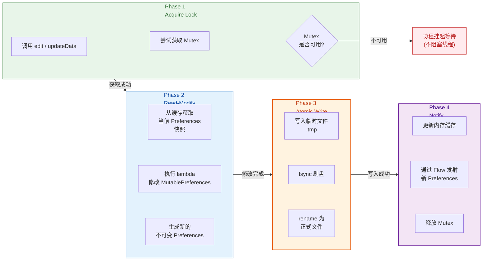
```mermaid
graph LR
    subgraph Phase1["Phase 1\nAcquire Lock"]
        direction TB
        A["调用 edit / updateData"] ~~~ B["尝试获取 Mutex"]
        B ~~~ C{"Mutex\n是否可用?"}
    end

    subgraph Phase2["Phase 2\nRead-Modify"]
        direction TB
        D["从缓存获取\n当前 Preferences\n快照"] ~~~ E["执行 lambda\n修改 MutablePreferences"]
        E ~~~ F["生成新的\n不可变 Preferences"]
    end

    subgraph Phase3["Phase 3\nAtomic Write"]
        direction TB
        G["写入临时文件\n.tmp"] ~~~ H["fsync 刷盘"]
        H ~~~ I["rename 为\n正式文件"]
    end

    subgraph Phase4["Phase 4\nNotify"]
        direction TB
        J["更新内存缓存"] ~~~ K["通过 Flow 发射\n新 Preferences"]
        K ~~~ L["释放 Mutex"]
    end

    Phase1 -->|"获取成功"| Phase2
    Phase2 -->|"修改完成"| Phase3
    Phase3 -->|"写入成功"| Phase4
    C -->|"不可用"| M["协程挂起等待\n(不阻塞线程)"]

    classDef phase1Style fill:#E8F5E9,stroke:#2E7D32,color:#1B5E20
    classDef phase2Style fill:#E3F2FD,stroke:#1565C0,color:#0D47A1
    classDef phase3Style fill:#FFF3E0,stroke:#E65100,color:#BF360C
    classDef phase4Style fill:#F3E5F5,stroke:#6A1B9A,color:#4A148C
    classDef waitStyle fill:#FFEBEE,stroke:#C62828,color:#B71C1C

    class Phase1 phase1Style
    class Phase2 phase2Style
    class Phase3 phase3Style
    class Phase4 phase4Style
    class M waitStyle
```

#### 乐观并发与重试

值得补充的是，在某些 DataStore 的实现细节中（尤其是多进程场景），如果检测到在 lambda 执行期间底层数据被其他进程修改了，DataStore 可能会 **重新执行 lambda**（类似数据库的乐观锁重试）。因此，`edit` 和 `updateData` 的 lambda 应当是 **幂等的（idempotent）** 和 **无副作用的（side-effect free）**——不要在其中发送网络请求或修改外部状态，因为它可能被执行多次。

```kotlin
// ❌ 错误：在 edit lambda 中执行有副作用的操作
dataStore.edit { prefs ->
    prefs[COUNTER_KEY] = (prefs[COUNTER_KEY] ?: 0) + 1
    sendAnalyticsEvent("counter_incremented")  // 可能被执行多次！
}

// ✅ 正确：将副作用移到 edit 之外
dataStore.edit { prefs ->
    prefs[COUNTER_KEY] = (prefs[COUNTER_KEY] ?: 0) + 1
}
sendAnalyticsEvent("counter_incremented")  // edit 成功后执行一次
```

### IO 调度

#### DataStore 的线程模型

理解 DataStore 的 IO 调度机制，需要先回顾 SharedPreferences 的痛点：它在首次 `getXxx()` 调用时会 **阻塞调用线程**（通常是主线程）直到文件读取完成，而 `apply()` 虽然异步写盘，却在 `Activity.onStop()` 时通过 `QueuedWork.waitToFinish()` 强制在主线程同步等待，这是 ANR 的重灾区。

DataStore 通过 **完全拥抱协程调度** 从根本上消除了这些问题。默认情况下，DataStore 的所有 IO 操作（文件读取、序列化/反序列化、文件写入）都在 `Dispatchers.IO` 上执行。这是通过在 DataStore 构建时配置的协程作用域决定的：

```kotlin
// DataStore 内部默认使用的协程作用域
// 这是 DataStore 源码中的简化表示
internal val scope: CoroutineScope = CoroutineScope(
    Dispatchers.IO                   // IO 调度器：适合磁盘/网络操作
        + SupervisorJob()            // SupervisorJob：子协程失败不影响其他
)
```

这意味着：

1. **首次读取**：当 Flow 的第一个 collector 开始收集时，DataStore 在 `Dispatchers.IO` 上读取并解析文件，解析完成后通过 Flow 发射到 collector 所在的线程（通常是主线程）。主线程 **永远不会被阻塞**。
2. **写入操作**：`edit` / `updateData` 挂起函数的实际 IO 也在 `Dispatchers.IO` 上完成。调用者的协程被挂起，但不会占用线程。
3. **没有 `waitToFinish` 机制**：DataStore 不会在生命周期回调中同步等待写入完成，因此不存在 SharedPreferences `apply()` 那种 ANR 风险。

#### 自定义 CoroutineScope

在某些高级场景下，你可能需要自定义 DataStore 的协程作用域。例如，你希望在测试中使用 `TestCoroutineScope`，或者在特殊的进程模型中使用自定义的调度器：

```kotlin
val Context.customDataStore: DataStore<Preferences> by preferencesDataStore(
    name = "custom_settings",
    // 自定义协程作用域
    scope = CoroutineScope(
        Dispatchers.IO                // 仍然使用 IO 调度器
            + SupervisorJob()         // SupervisorJob 是推荐实践
    )
)
```

这里有一个关键警告：**传入的 CoroutineScope 的生命周期决定了 DataStore 的生命周期**。如果 Scope 被取消（cancel），DataStore 的所有挂起中的操作都会被取消，后续的读写也会失败。因此，对于应用级别的 DataStore，通常使用全局 Scope（不会被取消）；而在测试中才使用可控生命周期的 Scope。

#### 数据缓存机制

DataStore 的 IO 调度还有一个重要的优化：**内存缓存（In-memory Cache）**。文件只在首次访问时被读取一次，之后所有的读取都直接从内存缓存中返回，写入时同时更新缓存和文件。这意味着：

- **首次读取**：触发文件 IO（在 `Dispatchers.IO` 上）
- **后续读取**：直接从内存获取，几乎零延迟
- **写入**：先更新内存缓存（立即对 Flow collector 可见），再异步持久化到文件

这种 cache-first 策略让 DataStore 在频繁读取场景下的性能甚至优于 SharedPreferences（因为 SharedPreferences 的 `getXxx()` 虽然也是读内存 HashMap，但有 `synchronized` 锁竞争）。

下面这张图展示了 DataStore 完整的 IO 调度流程：

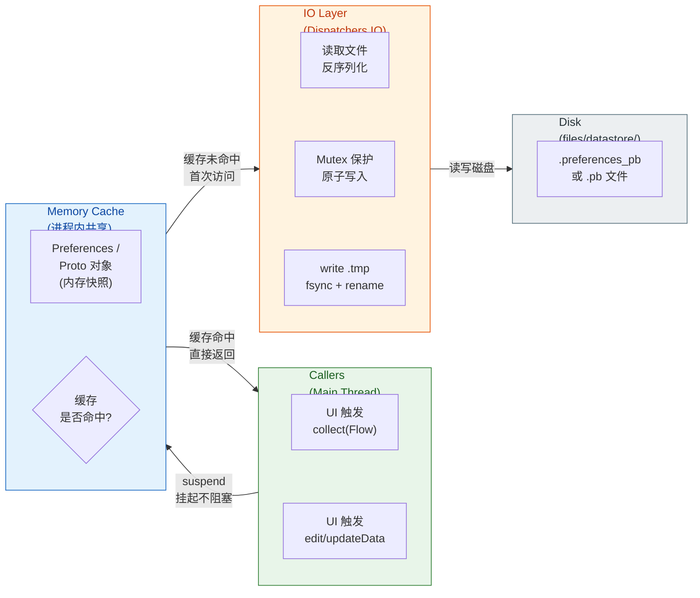
```mermaid
graph LR
    subgraph Callers["Callers\n(Main Thread)"]
        direction TB
        A["UI 触发\ncollect(Flow)"] ~~~ B["UI 触发\nedit/updateData"]
    end

    subgraph Cache["Memory Cache\n(进程内共享)"]
        direction TB
        C["Preferences /\nProto 对象\n(内存快照)"]
        C ~~~ D{"缓存\n是否命中?"}
    end

    subgraph IOLayer["IO Layer\n(Dispatchers.IO)"]
        direction TB
        E["读取文件\n反序列化"] ~~~ F["Mutex 保护\n原子写入"]
        F ~~~ G["write .tmp\nfsync + rename"]
    end

    subgraph Storage["Disk\n(files/datastore/)"]
        direction TB
        H[".preferences_pb\n或 .pb 文件"]
    end

    Callers -->|"suspend\n挂起不阻塞"| Cache
    Cache -->|"缓存未命中\n首次访问"| IOLayer
    IOLayer -->|"读写磁盘"| Storage
    Cache -->|"缓存命中\n直接返回"| Callers

    classDef callerStyle fill:#E8F5E9,stroke:#2E7D32,color:#1B5E20
    classDef cacheStyle fill:#E3F2FD,stroke:#1565C0,color:#0D47A1
    classDef ioStyle fill:#FFF3E0,stroke:#E65100,color:#BF360C
    classDef diskStyle fill:#ECEFF1,stroke:#546E7A,color:#263238

    class Callers callerStyle
    class Cache cacheStyle
    class IOLayer ioStyle
    class Storage diskStyle
```

#### 避免常见的调度陷阱

虽然 DataStore 在设计上已经很安全，但开发者仍需注意以下几点：

**1. 不要在 `runBlocking` 中访问 DataStore**

```kotlin
// ❌ 危险：在主线程的 runBlocking 中读取 DataStore
// 这会阻塞主线程，等同于退回到 SharedPreferences 的同步读取模式
val value = runBlocking {
    context.userSettingsDataStore.data.first()
}

// ✅ 正确：在协程作用域中异步读取
lifecycleScope.launch {
    val value = context.userSettingsDataStore.data.first()
    // 使用 value 更新 UI
}
```

`runBlocking` 会将调用线程变成协程上下文的一部分并阻塞它直到内部的协程完成。如果这发生在主线程上，DataStore 的异步优势就荡然无存了。唯一可以容忍 `runBlocking` 的场景是 `ContentProvider.onCreate()`（因为它需要同步返回，且发生在应用启动极早期），但即便如此也应该尽量避免。

**2. 不要对同一个文件创建多个 DataStore 实例**

```kotlin
// ❌ 严重错误：两个不同的 DataStore 实例指向同一个文件
val store1 = context.createDataStore("settings")  // 实例 1
val store2 = context.createDataStore("settings")  // 实例 2

// 它们各自有独立的内存缓存和 Mutex，但共享同一个磁盘文件
// 这会导致数据竞争、缓存不一致、潜在的文件损坏
```

DataStore 的 Mutex 只能保护 **同一个实例** 内的并发，如果两个实例操作同一个文件，Mutex 形同虚设。这就是为什么 Google 强烈推荐使用 `by preferencesDataStore()` 或 `by dataStore()` 委托属性在文件顶层创建——委托内部的 `lazy` 机制天然保证了单例。

**3. DataStore 与进程**

默认的 DataStore 实现是 **单进程（Single Process）** 的。如果你的应用有多个进程（例如主进程 + 推送进程），每个进程中的 DataStore 实例是独立的，它们之间 **没有** 同步机制。从 DataStore 1.1.0 开始，Google 提供了 `MultiProcessDataStoreFactory` 来支持跨进程的数据一致性，它通过文件锁（`FileLock`）来实现跨进程的互斥：

```kotlin
// 多进程 DataStore 创建（DataStore 1.1.0+）
val multiProcessStore: DataStore<Preferences> = MultiProcessDataStoreFactory.create(
    serializer = PreferencesSerializer,          // 序列化器
    produceFile = {
        // 必须使用所有进程都能访问的路径
        File(context.filesDir, "datastore/multi_process_settings.preferences_pb")
    }
)
```

---

**📝 练习题**

一位开发者在 DataStore 的 `edit` lambda 中编写了如下代码：

```kotlin
dataStore.edit { prefs ->
    val count = prefs[VIEW_COUNT_KEY] ?: 0
    prefs[VIEW_COUNT_KEY] = count + 1
    analyticsService.trackEvent("page_viewed")  // 发送统计事件
}
```

关于这段代码，以下说法正确的是？

A. 代码完全正确，`edit` lambda 中可以安全地执行任何操作


B. `analyticsService.trackEvent` 可能被执行多次，因为 DataStore 在检测到数据冲突时可能重试 lambda


C. `edit` 不支持在 lambda 中调用挂起函数，因此 `trackEvent` 如果是 suspend 函数会编译报错


D. `prefs[VIEW_COUNT_KEY] = count + 1` 会直接写入磁盘，`trackEvent` 在写入之后执行

**【答案】** B

**【解析】** DataStore 的 `edit` / `updateData` 采用原子性的 read-modify-write 模型。在某些场景下（尤其是多进程 DataStore），如果在 lambda 执行期间底层数据被其他来源修改，DataStore 会检测到冲突并 **重新执行 lambda** 以确保基于最新数据进行修改（类似乐观并发控制）。因此，lambda 中的副作用操作（如发送统计事件）可能被执行多次。正确做法是将副作用移到 `edit` 之外：先完成 `edit` 更新数据，再发送统计事件。选项 C 不正确，因为 `edit` 的 lambda 类型签名为 `suspend (MutablePreferences) -> Unit`，它本身就支持挂起函数调用。选项 D 不正确，因为 `prefs[VIEW_COUNT_KEY] = count + 1` 只是修改了内存中的 `MutablePreferences` 快照，实际的磁盘写入发生在 lambda 返回之后。

---

**📝 练习题**

以下关于 Preferences DataStore 和 Proto DataStore 的对比，哪一项是 **错误** 的？

A. Preferences DataStore 底层使用 Protobuf 二进制格式存储，而非 XML


B. Proto DataStore 需要提前在 `.proto` 文件中定义数据 Schema，并通过编译器生成类型类


C. 两者都通过 `Flow` 暴露数据，支持响应式的数据观察


D. Preferences DataStore 支持存储自定义对象（如 data class），只需实现 Serializable 接口即可

**【答案】** D

**【解析】** Preferences DataStore **不支持** 存储自定义对象。它的 Key 系统只支持基础数据类型：`Int`、`Long`、`Float`、`Double`、`Boolean`、`String` 和 `Set<String>`。如果需要存储结构化的自定义对象，应当使用 Proto DataStore，通过 Protocol Buffers 定义 Schema 并生成类型安全的类。选项 A 正确，Preferences DataStore 虽然名字带 "Preferences"，但底层确实使用 Protobuf 编码而非 XML。选项 B 和 C 都是对两种 DataStore 实现的准确描述。

---

## FileProvider 文件提供者

在 Android 应用开发中，"跨应用共享文件"是一个极其常见的需求——调用系统相机拍照后取回图片、把生成的 PDF 发送给其他 App、安装下载好的 APK……这些场景的底层诉求都是：**一个 App 需要把自己私有目录下的文件，安全地暴露给另一个 App 访问**。在 Android 7.0（API 24）之前，开发者习惯直接把文件的绝对路径包装成 `file://` URI 传递给外部 Intent，这种方式简单粗暴，但存在严重的安全隐患——任何拿到该 URI 的 App 都能直接通过文件系统路径访问该文件，绕过了 Android 的权限沙箱。Google 从 Android 7.0 开始通过 **StrictMode** 直接封堵了这条路，如果你仍然在 `Intent` 中暴露 `file://` URI 给外部应用，系统会抛出 `FileUriExposedException`，应用直接崩溃。

`FileProvider` 就是 Google 为此提供的官方解决方案。它是 `ContentProvider` 的一个特殊子类，属于 `androidx.core` 库的一部分，核心职责只有一件事：**将一个文件的真实物理路径（file:// URI）转换为一个安全的 content:// URI，并通过临时权限授予机制，让外部 App 能在受控范围内访问该文件**。这种设计完美地遵循了 Android 的 **最小权限原则（Principle of Least Privilege）**：外部 App 不需要知道文件的真实路径，也不需要获得存储权限，它只需要拿到一个 `content://` URI 和对应的临时读写权限，就能完成操作。

### 7.0+ 跨应用文件共享机制

要理解 FileProvider 的价值，必须先理解 Android 7.0 前后在跨应用文件共享上的根本性转变。

**Android 7.0 之前的做法与问题**

在早期 Android 版本中，跨应用共享文件的典型代码是这样的：

```kotlin
// ❌ 旧写法：直接使用 file:// URI（Android 7.0+ 会崩溃）
// 创建一个指向应用私有目录下照片文件的 File 对象
val photoFile = File(getExternalFilesDir(Environment.DIRECTORY_PICTURES), "photo.jpg")
// 直接将文件绝对路径转换为 file:// URI
val photoUri = Uri.fromFile(photoFile)
// 构造一个 Intent，把 file:// URI 传递给系统相机
val intent = Intent(MediaStore.ACTION_IMAGE_CAPTURE)
// 相机 App 拿到的是类似 file:///storage/emulated/0/Android/data/com.example/files/Pictures/photo.jpg
intent.putExtra(MediaStore.EXTRA_OUTPUT, photoUri)
// 启动相机 Activity
startActivityForResult(intent, REQUEST_TAKE_PHOTO)
```

这段代码在 Android 6.0 及以下可以正常工作，但隐藏着多个问题。首先，`file://` URI 直接暴露了文件的**物理路径**，接收方 App（比如相机 App）能够看到你的应用包名、目录结构，这本身就是信息泄露。其次，接收方如果获得了该路径，理论上可以访问同目录下的**其他文件**，而不仅仅是你打算共享的那一个。最后，不同设备的存储路径可能不同（多 SD 卡、不同厂商的路径差异），硬编码式的路径传递在兼容性上也很脆弱。

**Android 7.0 的 StrictMode 封堵**

从 Android 7.0 开始，系统在 `StrictMode` 的 `VmPolicy` 中默认启用了对 `file://` URI 的检测。当你的 App 试图通过 `Intent` 向外部 App 传递一个 `file://` URI 时，系统会抛出：

```
android.os.FileUriExposedException: 
file:///storage/emulated/0/Android/data/com.example/files/photo.jpg 
exposed beyond app through Intent.getData()
```

这不是一个可以 catch 后忽略的异常——它表明你的代码违反了 Android 的安全策略。Google 的意图非常明确：**所有跨应用文件共享必须通过 content:// URI 进行**。而 `FileProvider` 正是生成这种安全 URI 的标准工具。

**content:// URI 与 file:// URI 的根本差异**

两种 URI 代表了完全不同的文件访问模型。`file://` URI 本质上是直接映射到 Linux 文件系统路径的指针，拿到它就等于拿到了文件在磁盘上的位置，访问权限取决于 Linux 层面的文件权限（rwx）。而 `content://` URI 是 Android **ContentProvider 框架** 提供的抽象地址，它不包含任何物理路径信息，接收方必须通过 `ContentResolver` 向对应的 `ContentProvider` 请求数据，而 Provider 可以在这个过程中执行权限校验、路径映射、访问日志等控制逻辑。

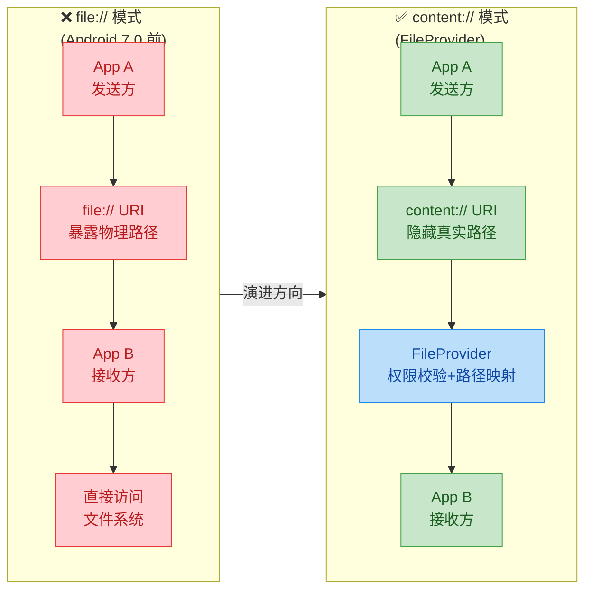
```mermaid
graph LR
    subgraph Old["❌ file:// 模式\n(Android 7.0 前)"]
        direction TB
        A1["App A\n发送方"] --> A2["file:// URI\n暴露物理路径"]
        A2 --> A3["App B\n接收方"]
        A3 --> A4["直接访问\n文件系统"]
    end

    subgraph New["✅ content:// 模式\n(FileProvider)"]
        direction TB
        B1["App A\n发送方"] --> B2["content:// URI\n隐藏真实路径"]
        B2 --> B3["FileProvider\n权限校验+路径映射"]
        B3 --> B4["App B\n接收方"]
    end

    Old -->|"演进方向"| New

    classDef oldStyle fill:#FFCDD2,stroke:#E53935,color:#B71C1C
    classDef newStyle fill:#C8E6C9,stroke:#43A047,color:#1B5E20
    classDef providerStyle fill:#BBDEFB,stroke:#1E88E5,color:#0D47A1

    class A1,A2,A3,A4 oldStyle
    class B1,B2,B4 newStyle
    class B3 providerStyle
```

**FileProvider 的完整配置流程**

使用 FileProvider 需要三个步骤：在 `AndroidManifest.xml` 中声明 Provider、定义路径映射文件、在代码中生成 URI 并授权。我们逐一展开。

**第一步：在 Manifest 中声明 FileProvider**

```xml
<!-- AndroidManifest.xml -->
<application>
    <!-- 声明 FileProvider，它本质是一个 ContentProvider -->
    <provider
        android:name="androidx.core.content.FileProvider"
        android:authorities="${applicationId}.fileprovider"
        android:exported="false"
        android:grantUriPermissions="true">
        <!-- 
            android:authorities — 唯一标识这个 Provider 的字符串，
            惯例使用 "包名.fileprovider"，${applicationId} 会在构建时
            自动替换为实际包名，避免多个 App 冲突。
            
            android:exported="false" — 不允许外部 App 直接访问此 Provider，
            外部访问必须通过临时权限授予（grantUriPermissions）。
            
            android:grantUriPermissions="true" — 允许通过
            Intent.FLAG_GRANT_READ/WRITE_URI_PERMISSION 临时授权。
        -->
        
        <!-- 指定路径映射配置文件 -->
        <meta-data
            android:name="android.support.FILE_PROVIDER_PATHS"
            android:resource="@xml/file_paths" />
        <!--
            meta-data 的 name 固定为 "android.support.FILE_PROVIDER_PATHS"，
            即使你用的是 androidx 库也是这个值（历史兼容）。
            resource 指向 res/xml/ 目录下的路径映射文件。
        -->
    </provider>
</application>
```

这里有几个要点需要特别注意。**`authorities`** 必须全局唯一，如果两个 App 使用了相同的 `authorities` 值，后安装的那个会安装失败。使用 `${applicationId}` 是最佳实践，因为它会自动区分不同的 Build Variant（如 debug/release）。**`exported="false"`** 配合 **`grantUriPermissions="true"`** 是 FileProvider 的安全基石——Provider 默认不对外开放，但允许通过 Intent 的临时权限机制逐个 URI 地授权，这种"默认关闭、按需开放"的模式正是最小权限原则的体现。

**第二步：定义路径映射文件 file\_paths.xml**

FileProvider 需要知道哪些目录下的文件可以被共享。这个映射关系定义在 `res/xml/file_paths.xml` 中：

```xml
<?xml version="1.0" encoding="utf-8"?>
<!-- res/xml/file_paths.xml -->
<!-- paths 是根元素，包含一个或多个路径映射 -->
<paths xmlns:android="http://schemas.android.com/apk/res/android">

    <!-- 映射 getFilesDir() 目录，即 /data/data/包名/files/ -->
    <!-- name: URI 路径段中的别名（隐藏真实路径的关键） -->
    <!-- path: 子目录名，"images/" 表示只共享 files/images/ 下的文件 -->
    <files-path
        name="internal_images"
        path="images/" />

    <!-- 映射 getCacheDir() 目录，即 /data/data/包名/cache/ -->
    <cache-path
        name="internal_cache"
        path="temp/" />

    <!-- 映射 getExternalFilesDir() 目录 -->
    <!-- 即 /storage/emulated/0/Android/data/包名/files/ -->
    <external-files-path
        name="external_images"
        path="Pictures/" />

    <!-- 映射 getExternalCacheDir() 目录 -->
    <external-cache-path
        name="external_cache"
        path="/" />

    <!-- 映射 Environment.getExternalStorageDirectory() -->
    <!-- 注意：Android 10+ Scoped Storage 下此路径受限 -->
    <external-path
        name="external_root"
        path="Download/" />

    <!-- 映射 getExternalMediaDirs() 中的第一个目录（API 21+） -->
    <external-media-path
        name="media_images"
        path="Pictures/" />

</paths>
```

路径映射文件是 FileProvider 安全模型的**核心组件**。每一个 XML 元素代表一种 Android 存储目录的映射，`name` 属性定义了一个**虚拟别名**，这个别名会出现在最终生成的 `content://` URI 中，取代真实的物理路径。`path` 属性则指定了该存储根目录下哪个子目录被允许共享。

下面这张表总结了所有可用的路径映射元素及其对应的物理目录：

| XML 元素 | 对应 API 方法 | 物理路径示例 |
|---|---|---|
| `<files-path>` | `Context.getFilesDir()` | `/data/data/包名/files/` |
| `<cache-path>` | `Context.getCacheDir()` | `/data/data/包名/cache/` |
| `<external-path>` | `Environment.getExternalStorageDirectory()` | `/storage/emulated/0/` |
| `<external-files-path>` | `Context.getExternalFilesDir()` | `/sdcard/Android/data/包名/files/` |
| `<external-cache-path>` | `Context.getExternalCacheDir()` | `/sdcard/Android/data/包名/cache/` |
| `<external-media-path>` | `Context.getExternalMediaDirs()[0]` | `/sdcard/Android/media/包名/` |

**`name` 属性的安全意义**尤为重要。假设你把 `getExternalFilesDir(Environment.DIRECTORY_PICTURES)` 下的一张图片 `photo.jpg` 通过 FileProvider 共享出去，生成的 URI 是这样的：

```text
content://com.example.app.fileprovider/external_images/photo.jpg
```

注意观察——URI 中只有 `external_images`（`name` 属性的值）和文件名 `photo.jpg`，**没有任何物理路径信息**。接收方 App 无法从这个 URI 推断出文件在磁盘上的真实位置，这正是 FileProvider 相比 `file://` URI 的根本安全优势。

**路径映射的"白名单"机制**：只有在 `file_paths.xml` 中显式配置了的目录才能通过 FileProvider 共享。如果你试图对一个未配置路径下的文件调用 `getUriForFile()`，会立即抛出 `IllegalArgumentException: Failed to find configured root that contains /xxx/xxx`。这种"白名单"设计确保开发者必须有意识地选择暴露哪些目录，而不是无差别地开放整个文件系统。一个常见的错误实践是把 `path` 设为 `"."` 或 `"/"`（即根目录），这虽然能避免路径不匹配的异常，但等于放弃了目录级别的安全隔离，应当避免。

### getUriForFile 转换

`FileProvider.getUriForFile()` 是整个 FileProvider 工作流的核心 API，它负责将一个 `File` 对象转换为安全的 `content://` URI。

**方法签名与参数含义**

```kotlin
// FileProvider 的核心静态方法
// 将 File 对象转换为对应的 content:// URI
val contentUri: Uri = FileProvider.getUriForFile(
    context,       // Context：用于获取 authorities 等配置信息
    authority,     // String：必须与 Manifest 中声明的 android:authorities 完全一致
    file           // File：要共享的目标文件
)
```

**内部转换机制**

当 `getUriForFile()` 被调用时，FileProvider 内部执行了以下关键步骤：

1. **加载路径映射**：首次调用时，FileProvider 会解析 `res/xml/file_paths.xml`，将所有 `<files-path>`、`<external-files-path>` 等元素转换为一个 `Map<String, File>` 映射表（`name → 物理目录`）。这个解析结果会被缓存，后续调用不会重复解析。

2. **路径匹配**：拿到传入的 `File` 对象后，FileProvider 会遍历映射表，寻找哪个配置的根目录是该文件路径的**前缀**。例如文件路径为 `/storage/emulated/0/Android/data/com.example/files/Pictures/photo.jpg`，而配置了 `<external-files-path name="external_images" path="Pictures/">`，其对应的物理根为 `getExternalFilesDir(null) + "/Pictures/"`，即 `/storage/emulated/0/Android/data/com.example/files/Pictures/`。FileProvider 检测到该根目录是文件路径的前缀，匹配成功。

3. **URI 构建**：将匹配到的 `name`（`external_images`）作为 URI 的第一段路径，将文件相对于根目录的相对路径（`photo.jpg`）拼接在其后，最终组装出 `content://com.example.fileprovider/external_images/photo.jpg`。

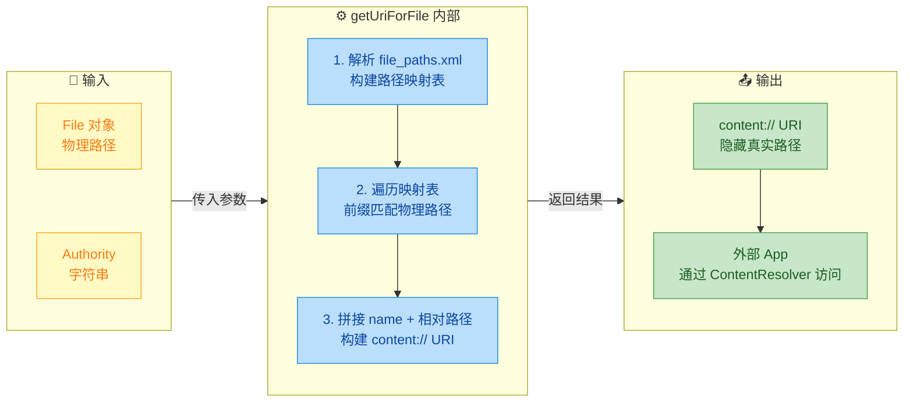
```mermaid
graph LR
    subgraph Input["📂 输入"]
        direction TB
        F1["File 对象\n物理路径"]
        F2["Authority\n字符串"]
        F1 ~~~ F2
    end

    subgraph Process["⚙️ getUriForFile 内部"]
        direction TB
        P1["1. 解析 file_paths.xml\n构建路径映射表"]
        P2["2. 遍历映射表\n前缀匹配物理路径"]
        P3["3. 拼接 name + 相对路径\n构建 content:// URI"]
        P1 --> P2
        P2 --> P3
    end

    subgraph Output["📤 输出"]
        direction TB
        O1["content:// URI\n隐藏真实路径"]
        O2["外部 App\n通过 ContentResolver 访问"]
        O1 --> O2
    end

    Input -->|"传入参数"| Process
    Process -->|"返回结果"| Output

    classDef inputStyle fill:#FFF9C4,stroke:#F9A825,color:#F57F17
    classDef processStyle fill:#BBDEFB,stroke:#1E88E5,color:#0D47A1
    classDef outputStyle fill:#C8E6C9,stroke:#43A047,color:#1B5E20

    class F1,F2 inputStyle
    class P1,P2,P3 processStyle
    class O1,O2 outputStyle
```

**完整使用示例：调用系统相机拍照**

这是 FileProvider 最经典的使用场景。我们需要创建一个临时文件，通过 FileProvider 生成 URI，将 URI 传递给相机 App，然后在回调中获取拍摄结果。

```kotlin
class CameraActivity : AppCompatActivity() {

    // 用于保存拍照文件路径的成员变量
    private lateinit var currentPhotoFile: File

    // 注册 ActivityResult 回调（替代已废弃的 onActivityResult）
    private val takePictureLauncher = registerForActivityResult(
        ActivityResultContracts.TakePicture()  // 系统预置的拍照 Contract
    ) { success: Boolean ->
        // success 为 true 表示拍照成功，照片已写入 currentPhotoFile
        if (success) {
            // 此时 currentPhotoFile 中已有拍摄的照片数据
            // 可以用 BitmapFactory.decodeFile() 加载并显示
            val bitmap = BitmapFactory.decodeFile(currentPhotoFile.absolutePath)
            // 将 Bitmap 设置到 ImageView 上展示
            binding.imageView.setImageBitmap(bitmap)
        }
    }

    // 启动相机拍照的方法
    private fun dispatchTakePicture() {
        // 1. 在应用私有的 Pictures 目录下创建一个以时间戳命名的临时文件
        val timeStamp = SimpleDateFormat("yyyyMMdd_HHmmss", Locale.getDefault()).format(Date())
        // getExternalFilesDir 返回 /sdcard/Android/data/包名/files/Pictures/
        val storageDir = getExternalFilesDir(Environment.DIRECTORY_PICTURES)
        // createTempFile 会在指定目录下创建带唯一后缀的临时文件
        currentPhotoFile = File.createTempFile(
            "JPEG_${timeStamp}_",  // 文件名前缀
            ".jpg",                 // 文件名后缀
            storageDir              // 所在目录
        )

        // 2. 通过 FileProvider 将 File 转换为 content:// URI
        //    authority 必须与 AndroidManifest.xml 中声明的完全一致
        val photoUri: Uri = FileProvider.getUriForFile(
            this,                                    // Context
            "${applicationInfo.packageName}.fileprovider",  // Authority
            currentPhotoFile                         // 要共享的文件
        )
        // 生成的 URI 类似：content://com.example.app.fileprovider/external_images/JPEG_20250305_143022_12345.jpg

        // 3. 使用 ActivityResult API 启动相机，传入 content:// URI
        //    相机 App 会将拍摄的照片写入该 URI 对应的文件
        takePictureLauncher.launch(photoUri)
    }
}
```

**常见异常与排查**

在使用 `getUriForFile()` 时，最容易遇到的问题是 `IllegalArgumentException`，其错误信息通常为：

```text
java.lang.IllegalArgumentException: 
Failed to find configured root that contains /storage/emulated/0/xxx/yyy.jpg
```

这个异常说明传入的 `File` 的物理路径没有匹配到 `file_paths.xml` 中的任何一条映射规则。排查方向包括：文件实际位于哪个存储目录、`file_paths.xml` 中是否配置了对应的元素类型（如使用了 `getExternalFilesDir()` 但 XML 中只写了 `<files-path>`）、`path` 属性是否包含了文件所在的子目录。另一个常见错误是 `authority` 字符串拼写不一致——Manifest 中写的是 `${applicationId}.fileprovider`，但代码里硬编码了错误的包名或忘记了 `.fileprovider` 后缀。

### 授权临时权限

生成 `content://` URI 只是第一步。外部 App 默认没有权限通过 `ContentResolver` 读取或写入这个 URI 指向的文件——别忘了我们在 Manifest 里声明了 `exported="false"`。因此还需要一个**临时权限授予**环节，这正是 FileProvider 安全模型的最后一块拼图。

**方式一：通过 Intent Flag 授权（推荐）**

最常用也最安全的方式是在 Intent 上设置权限 Flag。这种方式的权限生命周期与接收方的 Activity/Task 绑定——一旦接收方 Activity 销毁或 Task 结束，权限自动回收。

```kotlin
// 构建一个用于分享图片文件的 Intent
private fun shareImageFile(file: File) {
    // 1. 生成 content:// URI
    val contentUri = FileProvider.getUriForFile(
        this,
        "${packageName}.fileprovider",
        file
    )

    // 2. 创建分享 Intent
    val shareIntent = Intent(Intent.ACTION_SEND).apply {
        // 设置 MIME 类型，帮助系统筛选能处理该类型的 App
        type = "image/jpeg"
        // 将 content:// URI 作为 Extra 传递
        putExtra(Intent.EXTRA_STREAM, contentUri)
        // 3. 关键：添加临时读权限 Flag
        //    接收方 App 获得对该 URI 的临时读取权限
        addFlags(Intent.FLAG_GRANT_READ_URI_PERMISSION)
        // 如果接收方还需要写入（如编辑图片），则追加写权限
        // addFlags(Intent.FLAG_GRANT_WRITE_URI_PERMISSION)
    }

    // 4. 使用 Chooser 让用户选择接收的 App
    //    Chooser 本身也会正确传递权限 Flag
    startActivity(Intent.createChooser(shareIntent, "分享图片到..."))
}
```

**方式二：通过 Context.grantUriPermission() 显式授权**

在某些场景下，你可能需要在不通过 Intent 传递的情况下授权。例如，后台 Service 需要让另一个 App 访问某个 URI，此时可以使用 `grantUriPermission()` 直接指定目标包名进行授权。

```kotlin
// 显式授权方式：直接指定目标 App 的包名
private fun grantAccessToSpecificApp(file: File, targetPackageName: String) {
    // 生成 content:// URI
    val contentUri = FileProvider.getUriForFile(
        this,
        "${packageName}.fileprovider",
        file
    )

    // 向指定包名的 App 授予对该 URI 的临时读权限
    // 参数1：目标 App 的包名
    // 参数2：要授权的 URI
    // 参数3：权限类型（可用 OR 组合读写权限）
    grantUriPermission(
        targetPackageName,                          // 目标 App 包名
        contentUri,                                  // 被授权的 URI
        Intent.FLAG_GRANT_READ_URI_PERMISSION        // 临时读权限
    )

    // 注意：通过此方式授予的权限不会自动回收！
    // 必须在适当时机手动调用 revokeUriPermission() 回收
}

// 手动回收权限（非常重要，否则权限会一直存在直到设备重启）
private fun revokeAccess(contentUri: Uri) {
    // 回收所有通过 grantUriPermission() 授予的对该 URI 的权限
    revokeUriPermission(
        contentUri,                                  // 目标 URI
        Intent.FLAG_GRANT_READ_URI_PERMISSION or     // 回收读权限
        Intent.FLAG_GRANT_WRITE_URI_PERMISSION       // 同时回收写权限
    )
}
```

**两种授权方式的对比与选择**

| 维度 | Intent Flag 方式 | grantUriPermission 方式 |
|---|---|---|
| **权限生命周期** | 自动回收（接收方 Activity/Task 结束时） | 手动回收（需调用 `revokeUriPermission()`） |
| **目标指定** | 隐式（由 Intent 解析决定接收方） | 显式（必须知道目标 App 的包名） |
| **使用场景** | 常规的 Intent 跳转（拍照、分享、安装等） | 后台 Service 授权、精确控制授权对象 |
| **安全性** | 更高（自动回收，不会遗忘） | 需开发者自行管理，容易遗漏导致权限泄露 |
| **推荐程度** | ⭐⭐⭐ 优先使用 | 仅在 Intent Flag 无法满足时使用 |

在绝大多数场景下，**Intent Flag 方式是首选**。它的自动回收机制意味着你不需要操心权限的生命周期管理，即使你的 App 进程被杀死，系统也会在接收方 Task 结束时正确清理权限。而 `grantUriPermission()` 方式授予的权限会一直存在，直到你显式调用 `revokeUriPermission()` 或者设备重启，这在复杂的异步流程中很容易被遗忘。

**临时权限的底层运作**

从 Framework 层面看，临时 URI 权限的管理由 `ActivityManagerService`（AMS）负责。当系统检测到 Intent 携带了 `FLAG_GRANT_READ_URI_PERMISSION`，AMS 会在内部维护一个 **URI Permission 表**，记录"哪个 App 被授予了对哪个 URI 的什么权限"。当接收方 App 通过 `ContentResolver.openInputStream(uri)` 或 `ContentResolver.query(uri, ...)` 访问该 URI 时，系统会先查询这张权限表，确认调用者是否持有对应权限。如果没有，系统会抛出 `SecurityException`。

整个 FileProvider 的工作流可以用下面的时序图来完整展现：

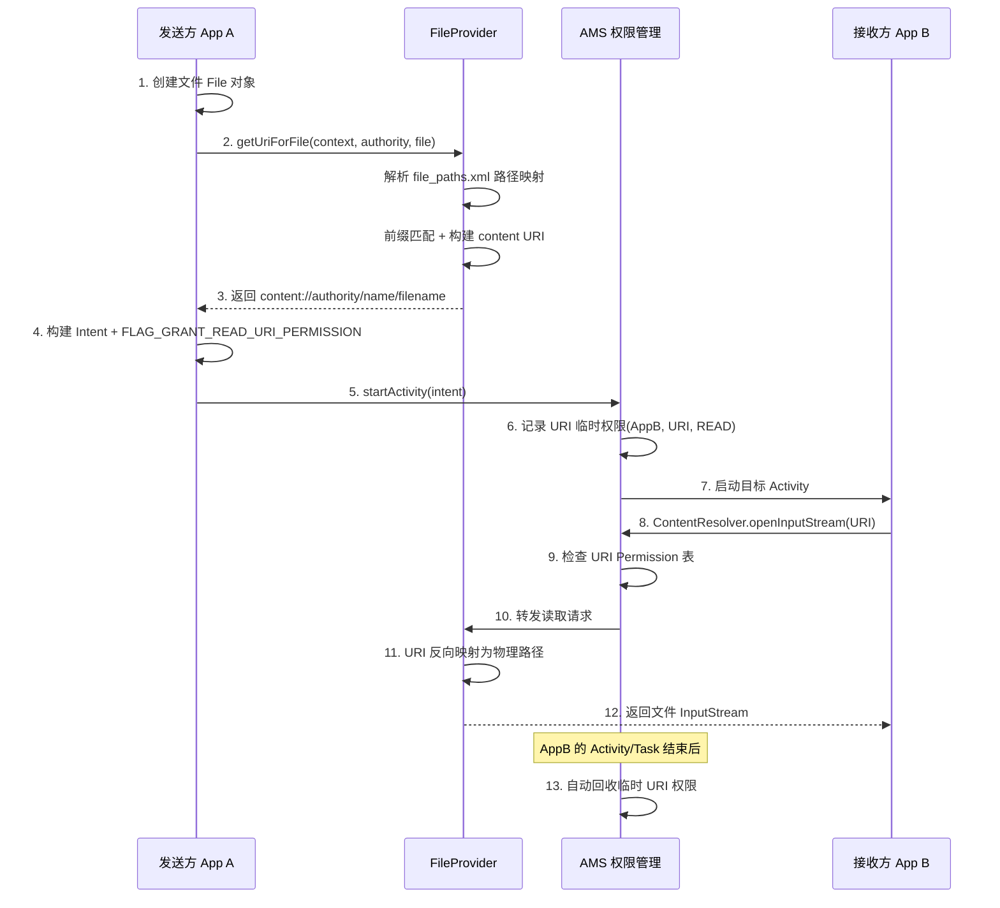
```mermaid
sequenceDiagram
    participant AppA as 发送方 App A
    participant FP as FileProvider
    participant AMS as AMS 权限管理
    participant AppB as 接收方 App B

    AppA->>AppA: 1. 创建文件 File 对象
    AppA->>FP: 2. getUriForFile(context, authority, file)
    FP->>FP: 解析 file_paths.xml 路径映射
    FP->>FP: 前缀匹配 + 构建 content URI
    FP-->>AppA: 3. 返回 content://authority/name/filename

    AppA->>AppA: 4. 构建 Intent + FLAG_GRANT_READ_URI_PERMISSION
    AppA->>AMS: 5. startActivity(intent)
    AMS->>AMS: 6. 记录 URI 临时权限(AppB, URI, READ)
    AMS->>AppB: 7. 启动目标 Activity

    AppB->>AMS: 8. ContentResolver.openInputStream(URI)
    AMS->>AMS: 9. 检查 URI Permission 表
    AMS->>FP: 10. 转发读取请求
    FP->>FP: 11. URI 反向映射为物理路径
    FP-->>AppB: 12. 返回文件 InputStream

    Note over AMS: AppB 的 Activity/Task 结束后
    AMS->>AMS: 13. 自动回收临时 URI 权限
```

**实战场景：安装 APK 文件**

Android 7.0+ 安装 APK 是 FileProvider 的另一个高频使用场景。由于 `ACTION_INSTALL_PACKAGE` 同样不允许 `file://` URI，必须通过 FileProvider 提供 `content://` URI：

```kotlin
// 安装 APK 文件（需要在 file_paths.xml 中配置对应路径）
private fun installApk(apkFile: File) {
    // 生成 content:// URI
    val apkUri = FileProvider.getUriForFile(
        this,
        "${packageName}.fileprovider",
        apkFile
    )

    // 构造安装 Intent
    val installIntent = Intent(Intent.ACTION_VIEW).apply {
        // 设置 URI 和 MIME 类型（必须同时设置，否则可能无法正确解析）
        setDataAndType(apkUri, "application/vnd.android.package-archive")
        // 授予临时读权限，安装器需要读取 APK 文件内容
        addFlags(Intent.FLAG_GRANT_READ_URI_PERMISSION)
        // 创建新的 Task 来运行安装器 Activity
        addFlags(Intent.FLAG_ACTIVITY_NEW_TASK)
    }

    // 启动系统安装器
    startActivity(installIntent)
}
```

需要特别注意的是，安装 APK 还需要在 Manifest 中声明 `<uses-permission android:name="android.permission.REQUEST_INSTALL_PACKAGES" />`，这是 Android 8.0（API 26）引入的额外限制，与 FileProvider 的 URI 权限是两个独立的权限层面。

**自定义 FileProvider 子类：多 Library 共存**

当你的项目引用了多个第三方库（如图片裁剪库、相机库），而这些库也声明了自己的 FileProvider 时，可能会发生 `authorities` 冲突导致 Manifest 合并失败。解决方案是让你的 App 创建一个 FileProvider 的空子类：

```kotlin
// 创建一个空的 FileProvider 子类
// 这样你的 App 和第三方库就可以使用不同的 authorities 而互不冲突
class MyAppFileProvider : FileProvider()
// 无需重写任何方法，FileProvider 的所有逻辑都通过继承获得
```

然后在 Manifest 中使用这个子类的全限定名：

```xml
<!-- 使用自定义子类名，避免与第三方库的 FileProvider 冲突 -->
<provider
    android:name=".MyAppFileProvider"
    android:authorities="${applicationId}.fileprovider"
    android:exported="false"
    android:grantUriPermissions="true">
    <meta-data
        android:name="android.support.FILE_PROVIDER_PATHS"
        android:resource="@xml/file_paths" />
</provider>
```

这样，第三方库可以保留自己的 `androidx.core.content.FileProvider` 声明和不同的 `authorities` 值，两者在同一个 APK 中和平共存。这也是为什么很多知名库（如 UCrop、CameraX）会建议开发者在集成时注意 FileProvider 冲突问题。

---

**📝 练习题**

你的应用调用系统相机拍照，使用 FileProvider 传递了 `content://` URI，但拍照成功后发现 `onActivityResult` 中获取到的照片文件大小为 0 字节。以下哪种原因最可能导致此问题？

A. FileProvider 的 `android:exported` 设置为 `false`，相机 App 无法写入文件


B. Intent 只添加了 `FLAG_GRANT_READ_URI_PERMISSION`，没有添加 `FLAG_GRANT_WRITE_URI_PERMISSION`


C. `file_paths.xml` 中的 `name` 属性与代码中的 `authority` 参数不一致


D. 创建临时文件时使用了 `File.createTempFile()`，该方法会创建空文件占位，导致 FileProvider 返回空文件的 URI


**【答案】** B

**【解析】** 本题考查 FileProvider 临时权限授予的细节。调用系统相机拍照时，相机 App 需要**写入**拍摄的照片到你提供的 URI 中，因此除了 `FLAG_GRANT_READ_URI_PERMISSION`，还必须添加 `FLAG_GRANT_WRITE_URI_PERMISSION`。如果只授予了读权限，相机 App 可以解析这个 URI（不会报错），但在实际写入时由于缺少写权限而静默失败（不同厂商的相机 App 行为不一），导致文件保持为初始的 0 字节空文件状态。选项 A 不正确，`exported="false"` 是正确设置，配合 `grantUriPermissions="true"` 和 Intent Flag 就能授权外部访问。选项 C 中 `name` 属性与 `authority` 是完全不同的概念——`name` 是路径段别名，`authority` 是 Provider 标识，二者不一致不会导致此问题（如果 `authority` 真的不匹配，`getUriForFile()` 阶段就会报错）。选项 D 描述的虽然是事实（`createTempFile` 确实创建空文件），但这不是问题原因——相机 App 拿到 URI 后会覆盖写入照片数据，空文件是正常的初始状态。实际上，使用 `ActivityResultContracts.TakePicture()` 时系统会自动处理权限 Flag，但如果手动构造 Intent，务必记得同时添加读写两个权限 Flag。

---

## 原始资源 Raw & Assets

Android 应用在运行过程中，经常需要读取一些 **预置的、随 APK 一起打包的静态文件**——它们可能是一段 JSON 配置、一份本地数据库模板、一组机器学习模型权重、一个音效文件，甚至是一整套离线 HTML 页面。这类文件不需要在运行时由用户产生，而是开发者在编译期就已确定的"原始资源"（Raw Resources）。Android 提供了两个截然不同的存放位置来承载这些文件：`res/raw` 目录与 `assets` 目录。虽然两者最终都会被打进 APK，但它们在 **资源编译方式、访问 API、文件组织能力** 上存在根本差异。理解这些差异，是正确选择存放策略、避免性能陷阱的前提。

### res/raw 资源 ID 访问

#### 目录定位与编译行为

`res/raw/` 是标准 Android 资源目录体系的一部分。当你将文件放入此目录后，**AAPT2（Android Asset Packaging Tool 2）** 会在编译阶段为每个文件分配一个唯一的 **整型资源 ID**，并将其注册到自动生成的 `R.raw` 类中。例如，你在 `res/raw/` 下放了一个名为 `config.json` 的文件，编译后就会自动在 `R.raw` 中生成一个常量 `R.raw.config`，其值类似于 `0x7f0e0001` 这样的 32 位整数。

这个编译行为带来了一个关键约束：**`res/raw/` 不支持子目录**。资源编译系统要求 `res/` 下的每一个子目录都必须是已知的资源类型（`drawable`、`layout`、`raw` 等），而不允许开发者在这些目录内部再创建任意层级的文件夹。这意味着如果你有数百个文件需要按分类组织，`res/raw/` 就会变得非常扁平且难以管理。

另一个值得注意的细节是 **文件名即资源名**，而资源名必须符合 Java 标识符规则——只能使用 **小写字母、数字和下划线**，且不能以数字开头。如果你尝试放入 `My-Config.json` 这样带连字符和大写字母的文件，AAPT2 会直接报编译错误。

#### 通过资源 ID 读取文件

`res/raw/` 中文件的读取通过 `Resources` 类完成。最常用的方法是 `Resources.openRawResource(int id)`，它返回一个 `InputStream`，开发者可以像操作任何 Java IO 流一样读取内容。由于使用了资源 ID，这种方式天然具备 **编译期安全性**（Compile-time Safety）——如果文件被删除或重命名，引用 `R.raw.xxx` 的代码会直接编译失败，而不是在运行时才抛出异常。

```kotlin
// 演示：从 res/raw/ 读取 JSON 配置文件并解析为字符串
fun loadRawJson(context: Context): String {
    // 通过 R.raw.config 获取资源 ID，打开输入流
    // openRawResource 返回的 InputStream 实际上指向 APK 内部的压缩/非压缩数据
    val inputStream: InputStream = context.resources.openRawResource(R.raw.config)

    // 使用 bufferedReader 包装，指定 UTF-8 编码
    // readText() 是 Kotlin 扩展函数，一次性读取所有内容为 String
    val jsonText = inputStream.bufferedReader(Charsets.UTF_8).use { reader ->
        reader.readText() // use{} 块结束后自动关闭流
    }

    // 返回读取到的完整 JSON 字符串
    return jsonText
}
```

这里需要深入理解 `openRawResource` 的内部机制。当你调用这个方法时，`Resources` 对象会通过 `AssetManager`（没错，底层也是 `AssetManager`）定位到 APK 文件内部对应资源的偏移位置，然后返回一个能从该偏移位置读取数据的流。如果文件在打包时未被压缩（AAPT2 对某些扩展名如 `.jpg`、`.mp3` 等默认不压缩），则返回的流可以直接 `seek`；如果被压缩了，则返回的流是一个解压缩流。这个差异在大文件场景下对性能有明显影响。

#### openRawResource 与 openRawResourceFd 的区别

除了 `openRawResource` 返回 `InputStream` 以外，还有一个常被忽视的方法——`openRawResourceFd(int id)`，它返回一个 `AssetFileDescriptor`。这个区别非常重要：

- **`openRawResource()`**：返回 `InputStream`，适合读取文本、JSON、小型二进制数据。无论文件是否被压缩，都能正常读取（压缩文件会自动解压）。
- **`openRawResourceFd()`**：返回 `AssetFileDescriptor`（包含文件描述符 + 偏移量 + 长度）。它 **要求文件在 APK 中未被压缩**，否则会抛出 `FileNotFoundException`。这个方法的典型使用场景是 **`MediaPlayer` 播放音频**，因为 `MediaPlayer` 需要一个可 seek 的文件描述符来实现随机访问。

```kotlin
// 演示：使用 openRawResourceFd 配合 MediaPlayer 播放音频
fun playRawAudio(context: Context) {
    // 获取 res/raw/bgm.mp3 的文件描述符
    // 注意：.mp3 文件默认不压缩，因此可以获取到 fd
    val afd: AssetFileDescriptor = context.resources.openRawResourceFd(R.raw.bgm)

    // 创建 MediaPlayer 实例
    val player = MediaPlayer()

    // setDataSource 需要 FileDescriptor、起始偏移和数据长度
    // 因为 APK 本身是一个 ZIP 文件，音频数据只是其中一段
    // offset 和 length 精确定位了这段数据在 APK 文件中的位置
    player.setDataSource(
        afd.fileDescriptor,  // 底层文件描述符（指向整个 APK 文件）
        afd.startOffset,     // 音频数据在 APK 中的起始偏移
        afd.length           // 音频数据的字节长度
    )

    // 准备并开始播放
    player.prepare()  // 同步准备，小文件可接受；大文件应使用 prepareAsync()
    player.start()    // 开始播放音频

    // 关闭 AssetFileDescriptor，释放资源
    afd.close()
}
```

为什么 `MediaPlayer.setDataSource` 需要 offset 和 length？因为 APK 本身是一个标准的 ZIP 格式文件，`res/raw/bgm.mp3` 只是这个 ZIP 内部的一个 entry。`AssetFileDescriptor` 的 `fileDescriptor` 实际上指向的是 **整个 APK 文件**，而 `startOffset` 和 `length` 告诉 MediaPlayer 音频数据从 APK 的哪个字节开始、到哪个字节结束。这种零拷贝的设计避免了将音频数据从 APK 中提取到临时文件再播放的性能开销。

#### res/raw 的资源限定符支持

因为 `res/raw/` 隶属于标准资源体系，它 **天然支持资源限定符（Resource Qualifiers）**。这意味着你可以创建 `res/raw-zh/`、`res/raw-en/`、`res/raw-land/` 等变体目录，系统会根据当前的 Locale、屏幕方向等配置自动选择最匹配的资源文件。例如：

```text
res/
  raw/
    greeting.txt          ← 默认版本（英文问候语）
  raw-zh/
    greeting.txt          ← 中文环境下自动使用此版本
  raw-night/
    greeting.txt          ← 深色模式下自动使用此版本
```

这是 `res/raw/` 相比 `assets/` 目录的一个显著优势——资源系统会自动帮你完成条件匹配，你无需编写任何 `if-else` 逻辑来判断当前环境。

---

### assets 目录流式访问

#### 目录定位与编译行为

`assets/` 目录位于项目的 `src/main/assets/`（与 `src/main/res/` 同级），但它 **不属于 Android 资源编译体系**。AAPT2 在编译时会将 `assets/` 目录下的文件原封不动地打入 APK，不会为其生成资源 ID，也不会进行任何编译处理。这种"免编译"特性带来了几个重要的自由度：

1. **支持任意深度的子目录结构**：你可以创建 `assets/fonts/`、`assets/models/tflite/`、`assets/web/html/css/` 等任意层级的目录树，便于组织大量文件。
2. **文件名无限制**：不受 Java 标识符规则约束，可以使用大写字母、连字符、空格（虽然不推荐）等任意字符。
3. **动态枚举文件**：可以在运行时通过 `AssetManager.list()` 方法列出某个目录下的所有文件名，而 `res/raw/` 无法做到这一点（除非通过反射遍历 `R.raw` 字段）。

但代价也很明显：**没有编译期安全检查**。如果你在代码中写了 `assets.open("config.json")` 但实际文件名是 `Config.json`，编译不会报错，只有运行时才会抛出 `FileNotFoundException`。这种延迟错误检测是 `assets/` 的一个固有弱点。

#### 不支持资源限定符

与 `res/raw/` 不同，`assets/` 目录 **完全不参与 Android 的资源限定符机制**。无论设备处于中文环境还是英文环境、横屏还是竖屏、浅色模式还是深色模式，`assets/` 目录下的文件都只有唯一的一份。如果你需要根据环境条件加载不同的文件，就必须自己在代码中编写分支逻辑：

```kotlin
// 演示：手动实现 assets 的"伪资源限定符"逻辑
fun loadLocalizedAsset(context: Context): String {
    // 获取 AssetManager 实例
    val assetManager: AssetManager = context.assets

    // 获取当前系统语言
    val lang = Locale.getDefault().language // "zh", "en", "ja" 等

    // 拼接带语言前缀的文件路径
    val localizedPath = "config_$lang.json"  // 例如 "config_zh.json"
    val defaultPath = "config.json"          // 默认兜底文件

    // 尝试打开本地化版本，失败则回退到默认版本
    val inputStream: InputStream = try {
        assetManager.open(localizedPath) // 尝试打开 config_zh.json
    } catch (e: FileNotFoundException) {
        assetManager.open(defaultPath)   // 不存在则打开 config.json
    }

    // 读取内容并返回
    return inputStream.bufferedReader(Charsets.UTF_8).use { it.readText() }
}
```

这种手动管理虽然增加了代码量，但也给了开发者更大的灵活度——你可以实现比系统资源限定符更精细的匹配策略。

#### 压缩行为与性能影响

AAPT2 在将 `assets/` 文件打入 APK 时，会根据 **文件扩展名** 决定是否压缩。对于已经是压缩格式的文件（如 `.jpg`、`.png`、`.mp3`、`.ogg`、`.zip` 等），AAPT2 默认 **不压缩**；对于文本类文件（如 `.json`、`.txt`、`.html`、`.js`、`.css`），默认 **会压缩**（使用 Deflate 算法）。

压缩行为对运行时访问有直接影响：

- **未压缩文件**：`AssetManager.open()` 返回的 `InputStream` 底层可以直接在 APK 的 mmap 内存映射上读取，效率极高，且 `openFd()` 可以获取到有效的 `AssetFileDescriptor`。
- **已压缩文件**：每次 `open()` 都需要实时解压，CPU 开销更大。同时 `openFd()` 会失败，因为压缩后的数据无法提供有意义的偏移和长度。

如果你需要强制某些文件不被压缩（例如自定义格式的二进制文件需要随机访问），可以在 `build.gradle` 中配置：

```groovy
android {
    // aaptOptions 控制 AAPT2 的资源打包行为
    aaptOptions {
        // noCompress 指定不压缩的文件扩展名列表
        // 这些扩展名的文件将以原始形式存入 APK
        noCompress "tflite"   // TensorFlow Lite 模型文件
        noCompress "db"       // SQLite 数据库模板
        noCompress "bin"      // 自定义二进制格式
    }
}
```

---

### AssetManager 深度解析

#### 获取与生命周期

`AssetManager` 是访问 `assets/` 目录文件的核心入口，通过 `Context.getAssets()` 或 `Resources.getAssets()` 获取。从应用层视角看，`AssetManager` 的生命周期与 `Application` 一致——在应用进程存活期间，`AssetManager` 始终有效。每个 `Context`（无论是 `Activity`、`Service` 还是 `Application`）获取到的 `AssetManager` 实例实际上都指向同一个底层对象，因为它们共享同一个 `Resources` 实例（对于同一个 APK 而言）。

从实现层面来看，`AssetManager` 在 Native 层维护了一个打开的 APK 文件句柄（通过 `mmap` 内存映射），这使得文件读取不需要每次都执行磁盘 IO——数据直接从映射到进程地址空间的内存区域读取，内核的页缓存（Page Cache）会自动管理物理内存的分配与回收。

#### 核心 API 详解

`AssetManager` 提供了一组简洁但功能完整的 API：

```kotlin
// 演示：AssetManager 核心 API 全览
fun exploreAssetManager(context: Context) {
    // 获取 AssetManager 实例
    val am: AssetManager = context.assets

    // ========== 1. open() — 打开文件并获取 InputStream ==========
    // 参数1：相对于 assets/ 目录的路径（支持子目录）
    // 参数2：访问模式（可选），默认 ACCESS_STREAMING
    val stream1: InputStream = am.open("data/config.json")          // 默认模式
    val stream2: InputStream = am.open(
        "data/config.json",
        AssetManager.ACCESS_STREAMING  // 顺序读取，适合文本、配置文件
    )
    val stream3: InputStream = am.open(
        "models/detect.tflite",
        AssetManager.ACCESS_RANDOM     // 随机访问，适合需要 seek 的二进制文件
    )
    val stream4: InputStream = am.open(
        "images/logo.png",
        AssetManager.ACCESS_BUFFER     // 全部加载到内存缓冲区，适合小文件
    )

    // ========== 2. list() — 枚举目录下的文件和子目录 ==========
    // 返回 String 数组，包含直接子项的名称（不递归）
    val files: Array<String>? = am.list("fonts") // 列出 assets/fonts/ 下的所有项
    files?.forEach { fileName ->
        // fileName 可能是 "Roboto-Regular.ttf"、"subfolder" 等
        println("Found asset: $fileName")
    }

    // ========== 3. openFd() — 获取文件描述符 ==========
    // 仅对未压缩文件有效，压缩文件会抛出 FileNotFoundException
    try {
        val afd: AssetFileDescriptor = am.openFd("audio/click.ogg")
        // afd.fileDescriptor — 底层 fd
        // afd.startOffset    — 数据在 APK 中的起始偏移
        // afd.length          — 数据长度
        afd.close() // 使用完毕必须关闭
    } catch (e: FileNotFoundException) {
        // 文件不存在或已被压缩，无法获取 fd
    }

    // ========== 4. openXmlResourceParser() — 解析编译后的 XML ==========
    // 注意：此方法用于 res/ 下编译过的二进制 XML，不适用于 assets/ 中的纯文本 XML
    // assets/ 下的 XML 需要自行使用 XmlPullParser 或 DOM 解析

    // 关闭所有打开的流
    stream1.close()
    stream2.close()
    stream3.close()
    stream4.close()
}
```

#### Access Mode 的底层意义

`open()` 方法的第二个参数 `accessMode` 有三个常量，它们的区别不在于功能正确性，而在于 **性能优化提示**：

| 模式 | 常量值 | 含义 | 适用场景 |
|------|--------|------|----------|
| `ACCESS_UNKNOWN` | 0 | 未指定模式，系统自行决定 | 不确定读取模式时 |
| `ACCESS_RANDOM` | 1 | 提示底层可能进行随机读取 | 二进制文件、模型权重 |
| `ACCESS_STREAMING` | 2 | 提示底层进行顺序读取 | 文本、JSON、配置 |
| `ACCESS_BUFFER` | 3 | 提示底层将整个文件加载到内存 | 小文件、频繁读取 |

需要强调的是，这些常量只是 **Hint**（提示），不是强制命令。底层 Native 实现可能会根据实际文件大小和压缩状态忽略这些提示。但在性能敏感场景下，传入正确的模式仍然有价值——例如对于大型未压缩文件，`ACCESS_RANDOM` 会让底层使用 `mmap` 而不是缓冲读取，显著减少内存拷贝。

#### list() 的性能陷阱

`AssetManager.list()` 是一个看似无害但可能导致性能问题的方法。在包含大量 assets 文件的应用中（如游戏资源、离线网页），`list()` 需要遍历 APK 内部的 ZIP Central Directory 来枚举条目。如果 `assets/` 目录下有成千上万个文件，这个操作会消耗显著的时间。

更严重的是，`list()` **不是递归的**——它只返回直接子项。如果你需要递归遍历整个 `assets/` 目录树，就需要编写递归函数，多次调用 `list()`：

```kotlin
// 演示：递归遍历 assets 目录树
fun listAssetsRecursively(
    am: AssetManager,     // AssetManager 实例
    path: String,         // 当前遍历路径，根目录传 ""
    result: MutableList<String> = mutableListOf() // 收集所有文件路径
): List<String> {
    // 列出当前路径下的直接子项
    val children: Array<String> = am.list(path) ?: return result

    if (children.isEmpty()) {
        // 没有子项，说明当前 path 是一个文件（叶子节点）
        result.add(path)
    } else {
        // 有子项，说明当前 path 是一个目录，递归遍历
        for (child in children) {
            // 拼接子路径：根目录时不需要前缀斜杠
            val childPath = if (path.isEmpty()) child else "$path/$child"
            // 递归调用
            listAssetsRecursively(am, childPath, result)
        }
    }

    // 返回收集到的所有文件路径
    return result
}

// 使用示例：获取 assets/ 下所有文件的完整路径列表
// val allFiles = listAssetsRecursively(context.assets, "")
```

对于大型项目，建议在构建时生成一份 `assets/file_index.json` 索引文件，运行时直接解析索引，避免多次调用 `list()`。

---

### res/raw 与 assets 对比决策

两种原始资源目录各有适用场景，下面从多个维度进行系统对比：

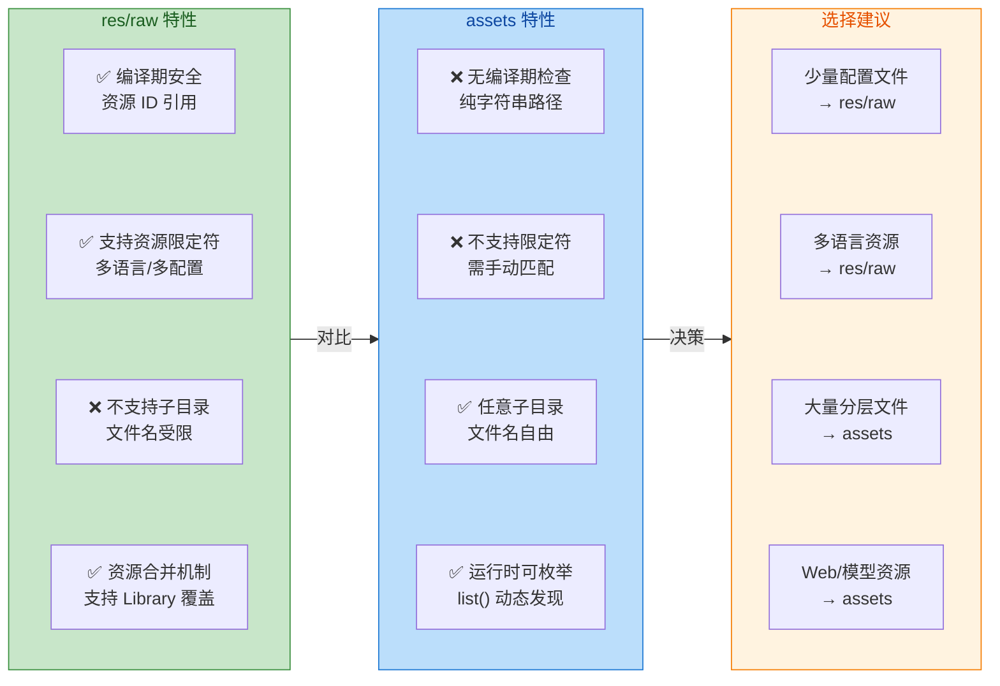
```mermaid
graph LR
    subgraph RAW["res/raw 特性"]
        direction TB
        R1["✅ 编译期安全\n资源 ID 引用"]
        R2["✅ 支持资源限定符\n多语言/多配置"]
        R3["❌ 不支持子目录\n文件名受限"]
        R4["✅ 资源合并机制\n支持 Library 覆盖"]
        R1 ~~~ R2
        R2 ~~~ R3
        R3 ~~~ R4
    end

    subgraph ASSETS["assets 特性"]
        direction TB
        A1["❌ 无编译期检查\n纯字符串路径"]
        A2["❌ 不支持限定符\n需手动匹配"]
        A3["✅ 任意子目录\n文件名自由"]
        A4["✅ 运行时可枚举\nlist() 动态发现"]
        A1 ~~~ A2
        A2 ~~~ A3
        A3 ~~~ A4
    end

    subgraph DECIDE["选择建议"]
        direction TB
        D1["少量配置文件\n→ res/raw"]
        D2["多语言资源\n→ res/raw"]
        D3["大量分层文件\n→ assets"]
        D4["Web/模型资源\n→ assets"]
        D1 ~~~ D2
        D2 ~~~ D3
        D3 ~~~ D4
    end

    RAW -->|"对比"| ASSETS -->|"决策"| DECIDE

    classDef rawStyle fill:#C8E6C9,stroke:#388E3C,color:#1B5E20
    classDef assetStyle fill:#BBDEFB,stroke:#1976D2,color:#0D47A1
    classDef decideStyle fill:#FFF3E0,stroke:#F57C00,color:#E65100

    class RAW rawStyle
    class ASSETS assetStyle
    class DECIDE decideStyle
```

**选择策略总结**：

- **选 `res/raw/`** 的场景：文件数量少、需要编译期安全检查、需要利用资源限定符（多语言/深色模式）、需要参与资源合并（Library 模块覆盖）。典型代表：多语言欢迎文案、Sound Effect 音效文件、小型 JSON 配置。
- **选 `assets/`** 的场景：文件数量多且需要分层组织、文件名不符合资源命名规范、需要运行时动态枚举文件、文件体积大（如 ML 模型、数据库模板）。典型代表：TensorFlow Lite 模型、WebView 离线页面、自定义字体族、SQLite 预填充数据库。

#### 两者的"隐藏"共同点

尽管使用方式截然不同，`res/raw/` 和 `assets/` 在底层有一个共同点：它们都通过 **Native 层的 `AssetManager`** 来访问 APK 内部数据。`Resources.openRawResource()` 内部最终也是调用了 `AssetManager` 的 Native 方法，只不过资源系统帮你完成了 ID → 文件路径 的映射。两者读取的数据来源都是同一个 APK 文件，底层都利用了 Linux 的 `mmap` 系统调用来实现高效读取。

另一个共同特性是：**它们都是只读的**。你无法在运行时修改 APK 中的 `res/raw/` 或 `assets/` 文件。如果需要基于原始资源创建可修改的副本，必须先将内容读出，写入到 Internal Storage 或 External Storage，然后后续从存储目录读取修改后的版本。这个"首次拷贝"模式在预填充数据库场景中非常常见：

```kotlin
// 演示：从 assets 拷贝预填充数据库到 Internal Storage
fun copyDatabaseFromAssets(context: Context, dbName: String) {
    // 目标路径：应用的数据库目录 /data/data/<pkg>/databases/
    val dbFile = context.getDatabasePath(dbName)

    // 如果数据库已存在，不再重复拷贝
    if (dbFile.exists()) return

    // 确保父目录存在
    dbFile.parentFile?.mkdirs()

    // 从 assets 打开源数据库文件
    val inputStream: InputStream = context.assets.open("db/$dbName")

    // 创建输出流，写入到 Internal Storage
    val outputStream: FileOutputStream = FileOutputStream(dbFile)

    // 使用 Kotlin 扩展函数 copyTo 高效拷贝
    // 默认缓冲区大小 8KB，对数据库文件足够
    inputStream.use { input ->
        outputStream.use { output ->
            input.copyTo(output) // 逐块拷贝，不会一次性加载到内存
        }
    }
    // use{} 块结束后，inputStream 和 outputStream 都会自动关闭
}
```

#### WebView 加载 assets 资源

`assets/` 目录的一个高频使用场景是为 `WebView` 提供离线 HTML/CSS/JS 资源。Android WebView 支持通过 `file:///android_asset/` 这个特殊协议前缀来访问 `assets/` 目录中的文件：

```kotlin
// 演示：WebView 加载 assets 中的离线 HTML 页面
fun loadOfflineWebPage(webView: WebView) {
    // file:///android_asset/ 映射到 assets/ 目录
    // 路径 web/index.html 对应 assets/web/index.html
    webView.loadUrl("file:///android_asset/web/index.html")

    // HTML 内部的相对路径引用也会基于 assets/ 解析
    // 例如 HTML 中 <link href="css/style.css"> 会加载 assets/web/css/style.css
    // 例如 HTML 中 <script src="js/app.js"> 会加载 assets/web/js/app.js
}
```

这里的 `file:///android_asset/` 是 WebView 内置的虚拟路径映射，三个斜杠 `///` 是 URI 规范中 `file://` 加上空 authority 后再加路径前缀 `/android_asset/` 的结果。在现代开发中，更推荐使用 `WebViewAssetLoader` 来替代这种旧方案，因为它可以将 assets 映射到 `https://` 域名下，避免 CORS 限制和安全警告：

```kotlin
// 演示：使用 WebViewAssetLoader（现代推荐方案）
fun setupWebViewWithAssetLoader(webView: WebView) {
    // 构建 AssetLoader，将 assets/ 映射到 https://appassets.androidplatform.net/assets/
    val assetLoader = WebViewAssetLoader.Builder()
        .addPathHandler(
            "/assets/",                          // URL 路径前缀
            WebViewAssetLoader.AssetsPathHandler(webView.context) // 映射到 assets/
        )
        .build()

    // 设置 WebViewClient，拦截资源请求并交给 AssetLoader 处理
    webView.webViewClient = object : WebViewClient() {
        override fun shouldInterceptRequest(
            view: WebView,
            request: WebResourceRequest
        ): WebResourceResponse? {
            // AssetLoader 会判断 URL 是否匹配配置的路径，匹配则从 assets 加载
            return assetLoader.shouldInterceptRequest(request.url)
        }
    }

    // 加载页面：使用 https:// 而不是 file:///
    // 对应 assets/web/index.html
    webView.loadUrl("https://appassets.androidplatform.net/assets/web/index.html")
}
```

---

### 典型应用场景汇总

为了帮助快速决策，下面列出几类常见文件的推荐存放位置：

| 文件类型 | 推荐目录 | 理由 |
|----------|----------|------|
| 音效文件（.mp3/.ogg） | `res/raw/` | 需要资源 ID 传给 `SoundPool`/`MediaPlayer`；支持多配置 |
| 多语言文本配置 | `res/raw/` | 利用资源限定符自动匹配语言 |
| TFLite 模型（.tflite） | `assets/` | 文件大、需要 `openFd()` 获取 fd 直接映射到内存 |
| 自定义字体（.ttf/.otf） | `assets/fonts/` 或 `res/font/` | API 26+ 推荐 `res/font/`；兼容旧版用 `assets/fonts/` |
| 离线网页（HTML/CSS/JS） | `assets/web/` | 需要目录层级组织；WebView 原生支持 `file:///android_asset/` |
| SQLite 预填充数据库 | `assets/` | 文件大、名称可能含特殊字符、需要完整拷贝到内部存储 |
| 小型 JSON 配置（&lt;100KB） | `res/raw/` | 编译期安全、简单直接 |
| 大型 JSON 数据集 | `assets/` | 可能需要分目录组织、文件名灵活 |

---

**📝 练习题**

一个 Android 应用需要预置一个 5MB 的 TensorFlow Lite 模型文件（`.tflite`），运行时需要通过内存映射（`MappedByteBuffer`）直接加载到内存进行推理。以下关于文件存放与访问方式的描述，哪一项是正确的？

A. 放在 `res/raw/` 目录，通过 `openRawResource()` 获取 `InputStream`，再用 `FileChannel.map()` 映射到内存即可


B. 放在 `assets/` 目录，通过 `AssetManager.open()` 获取 `InputStream`，转为 `MappedByteBuffer` 加载


C. 放在 `assets/` 目录，配合 `build.gradle` 中 `noCompress "tflite"` 确保不压缩，然后通过 `openFd()` 获取文件描述符，再使用 `FileChannel.map()` 映射到内存


D. 放在 `res/raw/` 目录，通过 `openRawResourceFd()` 获取文件描述符，由于 AAPT2 默认压缩所有 `res/raw/` 文件，需要额外配置才能获取有效 fd


**【答案】** C

**【解析】** 内存映射（`MappedByteBuffer`）要求数据在 APK 中 **未被压缩** 存储，因为 `mmap` 操作的是文件的原始字节偏移，压缩后的数据无法直接映射。选项 A 的 `openRawResource()` 返回的是 `InputStream`，它不提供 `FileChannel`，无法进行内存映射。选项 B 的 `AssetManager.open()` 同样只返回 `InputStream`，无法获取文件描述符。选项 D 虽然提到了 `openRawResourceFd()`，但 AAPT2 并非默认压缩所有 `res/raw/` 文件——它会根据扩展名决定（`.tflite` 这类自定义扩展名可能被压缩，也可能不被压缩，行为不够确定）。选项 C 是最稳妥且符合最佳实践的方案：将模型放在 `assets/` 目录，显式配置 `noCompress` 确保不压缩，然后通过 `openFd()` 获取 `AssetFileDescriptor`，从中取出 `FileDescriptor`、`startOffset` 和 `length`，使用 `FileInputStream(fd).channel.map(READ_ONLY, startOffset, length)` 创建 `MappedByteBuffer`，实现零拷贝加载。这也是 TensorFlow Lite 官方推荐的模型加载方式。

---

## 序列化方案

在 Android 应用开发中，**序列化（Serialization）** 是一个无处不在却常被忽视的基础能力。无论是通过 `Intent` 在 Activity 之间传递数据对象、将对象写入文件进行持久化存储、还是通过网络传输结构化数据，都离不开"将内存中的对象转换为可传输/可存储的字节序列"这一过程。反过来，将字节序列还原为对象则称为 **反序列化（Deserialization）**。

序列化本质上解决的是一个核心问题：**对象只存在于运行中的进程内存里，而我们常常需要让对象"跨越边界"——跨进程（IPC/Binder）、跨存储介质（内存→磁盘）、跨网络（Client→Server）**。一旦跨越了边界，原始的内存地址和指针便不再有效，必须将对象的"状态"编码为某种与平台、地址无关的格式。

Android 生态中最常见的三种序列化方案各有其设计哲学：`Serializable` 来自 Java 标准库，追求"零侵入"的通用性；`Parcelable` 是 Android 平台专属设计，追求 Binder IPC 场景下的极致性能；而 JSON 序列化则面向可读性和跨平台互操作。理解它们各自的机制、性能特征与适用场景，是 Android 开发者进阶的必备知识。

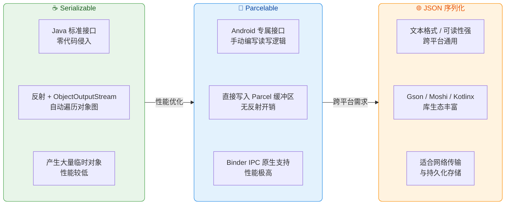
```mermaid
graph LR
    subgraph SER["☕ Serializable"]
        direction TB
        S1["Java 标准接口\n零代码侵入"]
        S2["反射 + ObjectOutputStream\n自动遍历对象图"]
        S3["产生大量临时对象\n性能较低"]
        S1 ~~~ S2
        S2 ~~~ S3
    end

    subgraph PAR["🤖 Parcelable"]
        direction TB
        P1["Android 专属接口\n手动编写读写逻辑"]
        P2["直接写入 Parcel 缓冲区\n无反射开销"]
        P3["Binder IPC 原生支持\n性能极高"]
        P1 ~~~ P2
        P2 ~~~ P3
    end

    subgraph JSN["🌐 JSON 序列化"]
        direction TB
        J1["文本格式 / 可读性强\n跨平台通用"]
        J2["Gson / Moshi / Kotlinx\n库生态丰富"]
        J3["适合网络传输\n与持久化存储"]
        J1 ~~~ J2
        J2 ~~~ J3
    end

    SER -->|"性能优化"| PAR -->|"跨平台需求"| JSN

    classDef serStyle fill:#E8F5E9,stroke:#43A047,color:#1B5E20,rx:8
    classDef parStyle fill:#E3F2FD,stroke:#1E88E5,color:#0D47A1,rx:8
    classDef jsnStyle fill:#FFF3E0,stroke:#FB8C00,color:#E65100,rx:8

    class SER serStyle
    class PAR parStyle
    class JSN jsnStyle
```

---

### Serializable —— Java 原生序列化

#### 基本机制与使用方式

`java.io.Serializable` 是 Java 语言自 JDK 1.1 就引入的标准序列化接口。它最大的特点是 **"标记接口"（Marker Interface）**——接口本身没有定义任何方法，仅仅作为一种"声明"，告诉 JVM："这个类的实例允许被序列化"。

```kotlin
import java.io.Serializable // 导入 Java 标准序列化接口

// 只需实现 Serializable 接口即可，不需要覆写任何方法
// Kotlin data class 自动生成 equals/hashCode/toString/copy
data class UserProfile(
    val uid: Long,            // 用户唯一 ID
    val name: String,         // 用户名称
    val email: String,        // 邮箱地址
    val age: Int              // 年龄
) : Serializable {
    // serialVersionUID 用于版本控制：
    // 反序列化时 JVM 会比对这个值，不匹配则抛出 InvalidClassException
    // 若不显式声明，JVM 会根据类结构自动计算一个，类结构一旦变动值就会改变
    companion object {
        private const val serialVersionUID: Long = 1L
    }
}
```

从使用者角度看，`Serializable` 的侵入性几乎为零——只需加上接口声明，对象就可以被 `ObjectOutputStream` 写入流，或通过 `Intent.putExtra()` 传递。这种"免费的午餐"看起来非常诱人，但代价隐藏在底层。

#### 底层工作原理：反射驱动的对象图遍历

当你调用 `ObjectOutputStream.writeObject(obj)` 时，JVM 内部执行了一套相当复杂的流程：

1. **类型检查**：首先检查对象是否实现了 `Serializable`（或 `Externalizable`），未实现则抛出 `NotSerializableException`。
2. **类元数据写入**：将类名、`serialVersionUID`、字段描述符等元信息写入流头部。这意味着序列化后的字节流不仅包含数据，还包含了大量的类型描述信息。
3. **反射遍历字段**：通过 Java 反射机制（`java.lang.reflect`）逐一读取对象的非 `static`、非 `transient` 字段值。**反射调用的性能远低于直接字段访问**，因为它需要在运行时进行安全检查、类型解析和方法分派。
4. **递归处理对象图**：如果某个字段本身也是一个对象引用（而非基本类型），则对该对象递归执行上述流程。这意味着整个**对象图（Object Graph）**——包括嵌套对象、集合中的元素等——都会被遍历和序列化。
5. **临时对象的大量创建**：整个过程中，`ObjectOutputStream` 内部会创建大量的中间缓冲区、元数据描述对象、以及用于追踪循环引用的 HashMap。这些临时对象最终都需要 GC 回收，在 Android 的 Dalvik/ART 环境下会造成明显的 GC 压力。

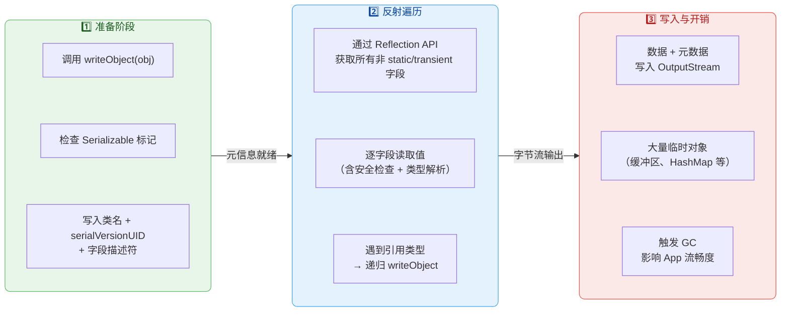
```mermaid
graph LR
    subgraph PHASE1["1️⃣ 准备阶段"]
        direction TB
        A1["调用 writeObject(obj)"]
        A2["检查 Serializable 标记"]
        A3["写入类名 + serialVersionUID\n+ 字段描述符"]
        A1 ~~~ A2
        A2 ~~~ A3
    end

    subgraph PHASE2["2️⃣ 反射遍历"]
        direction TB
        B1["通过 Reflection API\n获取所有非 static/transient 字段"]
        B2["逐字段读取值\n（含安全检查 + 类型解析）"]
        B3["遇到引用类型\n→ 递归 writeObject"]
        B1 ~~~ B2
        B2 ~~~ B3
    end

    subgraph PHASE3["3️⃣ 写入与开销"]
        direction TB
        C1["数据 + 元数据\n写入 OutputStream"]
        C2["大量临时对象\n（缓冲区、HashMap 等）"]
        C3["触发 GC\n影响 App 流畅度"]
        C1 ~~~ C2
        C2 ~~~ C3
    end

    PHASE1 -->|"元信息就绪"| PHASE2 -->|"字节流输出"| PHASE3

    classDef p1Style fill:#E8F5E9,stroke:#66BB6A,color:#1B5E20,rx:8
    classDef p2Style fill:#E3F2FD,stroke:#42A5F5,color:#0D47A1,rx:8
    classDef p3Style fill:#FBE9E7,stroke:#EF5350,color:#B71C1C,rx:8

    class PHASE1 p1Style
    class PHASE2 p2Style
    class PHASE3 p3Style
```

#### serialVersionUID 的版本控制

`serialVersionUID` 是 `Serializable` 机制中最容易被忽略却最容易引发线上事故的一环。它的工作方式是：

- **序列化时**，当前类的 `serialVersionUID` 被写入字节流。
- **反序列化时**，JVM 从字节流读出该值，与当前 ClassLoader 中加载的类的 `serialVersionUID` 做比对。若不一致，直接抛出 `InvalidClassException`，反序列化失败。

如果你没有显式声明 `serialVersionUID`，JVM 会根据类的结构（字段名、字段类型、方法签名等）通过哈希算法自动计算一个。这意味着 **哪怕只是新增一个无关紧要的字段，自动计算的值就会改变**，导致之前持久化到磁盘的旧数据无法反序列化。因此在任何需要持久化存储的 `Serializable` 类中，**必须显式声明 `serialVersionUID`**。

#### transient 关键字

被 `transient` 修饰的字段在序列化时会被完全跳过，反序列化后该字段的值为类型默认值（`null`、`0`、`false` 等）。典型用途包括：

- **敏感信息**：如密码、Token 等不应被持久化或传输的数据。
- **派生数据**：可以从其他字段重新计算得到的缓存值。
- **不可序列化的引用**：如 `Context`、`View`、数据库连接等持有系统资源的对象——它们本身未实现 `Serializable`，强行序列化会抛异常。

```kotlin
data class SessionInfo(
    val sessionId: String,              // 会话 ID —— 需要序列化
    val loginTime: Long,                // 登录时间戳 —— 需要序列化

    @Transient                          // Kotlin 中使用 @Transient 注解
    val authToken: String = "",         // 鉴权令牌 —— 敏感数据，跳过序列化

    @Transient
    val cachedDisplayName: String = ""  // 缓存的展示名 —— 可由其他字段派生，跳过
) : Serializable {
    companion object {
        private const val serialVersionUID: Long = 1L
    }
}
```

#### 性能问题总结

在 Android 平台上使用 `Serializable` 存在以下性能隐患：

- **反射开销大**：每一次序列化/反序列化都要通过反射遍历字段，在 ARM 处理器上这种开销比桌面端更明显。
- **临时对象多**：GC 在移动设备上的暂停时间对用户体验影响巨大，频繁的序列化操作会导致界面卡顿。
- **字节流体积大**：由于携带了大量类元数据，`Serializable` 产生的字节流通常比 `Parcelable` 大数倍。
- **Binder 传输缓冲区有限**：Android 的 Binder 事务缓冲区默认大小约为 1MB（所有正在传输的事务共享），体积膨胀的 `Serializable` 数据更容易触发 `TransactionTooLargeException`。

正因如此，Google 官方文档长期以来建议：**在 Android 平台的 IPC（Intent / Bundle）场景中，优先使用 `Parcelable` 而非 `Serializable`。**

---

### Parcelable —— Android 特有的高性能序列化

#### 设计哲学：为 Binder 而生

`android.os.Parcelable` 是 Android 框架层为了适应 **Binder IPC** 场景而专门设计的序列化接口。它的核心设计理念与 `Serializable` 截然不同：

| 设计维度 | Serializable | Parcelable |
|---------|-------------|------------|
| 序列化方式 | 自动（反射） | 手动（开发者编写读写代码） |
| 元数据 | 写入类名、字段描述等 | 不写入元数据 |
| 字节流结构 | 自描述的（Self-describing） | 需要读写顺序严格对应 |
| 临时对象 | 大量创建 | 几乎不创建 |
| 目标平台 | Java 通用 | Android 专属 |

`Parcelable` 的核心载体是 `android.os.Parcel` 对象。`Parcel` 可以理解为一块 **连续的、可扩容的内存缓冲区**，它提供了一系列 `writeXxx()` / `readXxx()` 方法，允许以极低的开销将基本类型和简单对象直接写入缓冲区。由于 Parcel 在 Native 层（C++）的实现直接操作内存，没有反射、没有额外的元数据封装，因此在**写入速度和空间效率上远优于 `Serializable`**。

#### 手动实现 Parcelable（传统 Java 风格）

在 Kotlin 的 `@Parcelize` 出现之前，手动实现 `Parcelable` 是 Android 开发者的"必修课"。虽然模板代码较多，但理解其底层机制非常重要。

```kotlin
import android.os.Parcel      // Parcel：内存缓冲区，数据的实际载体
import android.os.Parcelable  // Parcelable：Android 序列化标准接口

// 手动实现 Parcelable 的完整示例
class UserProfile : Parcelable {

    val uid: Long        // 用户 ID
    val name: String     // 用户名
    val email: String    // 邮箱
    val age: Int         // 年龄

    // 主构造函数：常规创建对象时使用
    constructor(uid: Long, name: String, email: String, age: Int) {
        this.uid = uid
        this.name = name
        this.email = email
        this.age = age
    }

    // ========== 核心方法 1：从 Parcel 中读取数据（反序列化） ==========
    // 读取顺序 **必须** 与 writeToParcel 中的写入顺序 **完全一致**
    // 这是 Parcelable 的铁律 —— 顺序不对，数据就全部错乱
    constructor(parcel: Parcel) {
        uid = parcel.readLong()               // 第 1 个读取：Long 类型的 uid
        name = parcel.readString() ?: ""      // 第 2 个读取：String 类型的 name（可能为 null）
        email = parcel.readString() ?: ""     // 第 3 个读取：String 类型的 email
        age = parcel.readInt()                // 第 4 个读取：Int 类型的 age
    }

    // ========== 核心方法 2：将数据写入 Parcel（序列化） ==========
    // 写入顺序决定了数据在缓冲区中的排列，读取时必须以相同顺序还原
    override fun writeToParcel(dest: Parcel, flags: Int) {
        dest.writeLong(uid)       // 第 1 个写入：uid
        dest.writeString(name)    // 第 2 个写入：name
        dest.writeString(email)   // 第 3 个写入：email
        dest.writeInt(age)        // 第 4 个写入：age
    }

    // describeContents()：描述 Parcel 内容的特殊标志位
    // 绝大多数情况返回 0；只有包含文件描述符（FileDescriptor）时返回 CONTENTS_FILE_DESCRIPTOR
    override fun describeContents(): Int = 0

    // ========== CREATOR：Parcelable 的"工厂对象" ==========
    // 系统在反序列化时通过反射找到这个 CREATOR 字段，调用其方法来还原对象
    // 它是 Parcelable 协议的强制要求，缺少会抛 BadParcelableException
    companion object CREATOR : Parcelable.Creator<UserProfile> {
        // 从 Parcel 创建单个对象
        override fun createFromParcel(parcel: Parcel): UserProfile {
            return UserProfile(parcel)  // 委托给接收 Parcel 的构造函数
        }

        // 创建指定大小的数组（供系统内部使用，如传递 Parcelable 数组时）
        override fun newArray(size: Int): Array<UserProfile?> {
            return arrayOfNulls(size)  // 返回一个元素全为 null 的数组
        }
    }
}
```

**读写顺序必须严格对应**——这是 `Parcelable` 最核心的规则。因为 `Parcel` 不存储字段名或类型信息，它只是一段"盲"数据。`writeLong` 写入 8 字节，`readLong` 读回 8 字节；如果你错把 `readInt`（4 字节）用在本应是 `readLong`（8 字节）的位置，后续所有数据都会错位，导致不可预测的异常甚至 crash。

#### Kotlin @Parcelize：编译器自动生成

手动编写 `Parcelable` 的模板代码繁琐且容易出错。Kotlin Android Extensions（现已迁移到独立的 `kotlin-parcelize` 插件）提供了 `@Parcelize` 注解，可以在 **编译期** 自动生成 `writeToParcel()`、`createFromParcel()` 以及 `CREATOR` 的全部实现代码。

```kotlin
import android.os.Parcelable    // Android Parcelable 接口
import kotlinx.parcelize.Parcelize // Kotlin Parcelize 编译器插件注解

// @Parcelize 会在编译时自动生成：
// 1. writeToParcel() —— 按主构造函数参数顺序写入
// 2. 从 Parcel 读取的构造函数 —— 按相同顺序读出
// 3. CREATOR companion object —— 工厂方法
// 要求：所有需要序列化的属性必须声明在主构造函数中
@Parcelize
data class UserProfile(
    val uid: Long,       // 自动调用 writeLong / readLong
    val name: String,    // 自动调用 writeString / readString
    val email: String,   // 自动调用 writeString / readString
    val age: Int         // 自动调用 writeInt / readInt
) : Parcelable
// 编译后的字节码与手动实现完全等价，性能无差异
// 类体内的属性（不在主构造函数中）默认不会被序列化
```

使用 `@Parcelize` 需要在模块级 `build.gradle` 中启用插件：

```kotlin
// build.gradle.kts (Module)
plugins {
    id("kotlin-parcelize")  // 启用 Parcelize 编译器插件
}
```

`@Parcelize` 的本质是 **编译器插件在编译期生成字节码**，而非运行时反射。因此它与手写 `Parcelable` 具有完全一致的运行时性能——零反射、零额外内存开销。这使得它成为现代 Android 开发中实现 `Parcelable` 的首选方式。

#### Parcel 的底层机制

`Parcel` 对象在 Java 层是一个简单的 wrapper，其核心实现在 Native 层（`frameworks/native/libs/binder/Parcel.cpp`）。理解它的内部结构有助于解释为什么 `Parcelable` 如此高效：

1. **连续内存缓冲区**：`Parcel` 内部维护一块 `malloc` 分配的连续内存。写入操作直接 `memcpy` 到缓冲区当前偏移位置，然后移动偏移指针。没有任何对象创建、装箱（boxing）或哈希表查找。
2. **自动扩容**：当缓冲区不够时，`Parcel` 会以倍增策略扩容（类似 `ArrayList` 的增长机制），并 `realloc` 底层内存。
3. **Binder 传输零拷贝思想**：当 `Parcel` 被用于 Binder IPC 时，内核驱动通过 `mmap` 共享内存，发送端写入的数据可以直接映射到接收端进程地址空间，最大程度减少内存拷贝。
4. **回收池**：`Parcel` 对象本身通过 `Parcel.obtain()` / `Parcel.recycle()` 模式进行池化复用，避免频繁的 JNI 对象创建和 Native 内存分配。

```text
┌──────────────────── Parcel Native Buffer ────────────────────┐
│ offset:  0     8        N        N+4       N+8     ...       │
│        ┌─────┬────────┬────────┬─────────┬────────┐          │
│  data: │ uid │  name  │  name  │  email  │  age   │ ...      │
│        │ 8B  │ len(4B)│ UTF-16 │ len+str │  4B    │          │
│        │Long │ String │ bytes  │ String  │  Int   │          │
│        └─────┴────────┴────────┴─────────┴────────┘          │
│  ↑ dataPosition (读写指针，每次操作后自动后移)                    │
└──────────────────────────────────────────────────────────────┘
```

#### Parcelable 的局限性

尽管性能优异，`Parcelable` 并非万能药：

- **不适合持久化存储**：`Parcel` 的二进制格式没有版本兼容机制。Android 系统版本升级后，`Parcel` 的内部编码方式可能变化（例如 String 的编码从 UTF-16 切换为 UTF-8），导致旧数据无法被新版本系统正确解析。Google 官方明确警告：**Parcel is not a general-purpose serialization mechanism, you should never persist Parcel data.**
- **仅限 Android 平台**：`Parcelable` 是 Android SDK 独有的接口，在纯 Java/Kotlin 多平台项目中无法使用。
- **Binder 缓冲区限制**：即便 `Parcelable` 体积比 `Serializable` 小，但 Binder 事务缓冲区仍然有约 1MB 的上限。传递大数据（如大图片的原始字节数组）仍需使用 `ContentProvider`、文件共享或 `MemoryFile` 等方案。

---

### JSON 序列化 —— 跨平台的文本协议

#### 为什么需要 JSON 序列化

`Serializable` 和 `Parcelable` 都是二进制格式，人眼不可读，且强耦合于 Java/Android 平台。在以下场景中，文本格式的 JSON 序列化是更合适的选择：

- **网络通信**：与后端 REST API 交互时，JSON 是事实上的标准数据交换格式。
- **跨平台持久化**：将配置数据或缓存写入文件时，JSON 格式便于调试和版本迁移。
- **可读性需求**：日志记录、错误上报等场景需要人类可读的结构化数据。
- **多端协同**：同一份数据结构需要被 Android、iOS、Web 前端共同使用。

Android 平台上主流的 JSON 序列化库有三个：**Gson**（Google 出品，老牌经典）、**Moshi**（Square 出品，Kotlin 友好）和 **Kotlinx.serialization**（JetBrains 官方，Kotlin 多平台）。

#### Gson：反射驱动的经典方案

Gson 是 Google 在 2008 年发布的 JSON 库，至今仍在大量存量项目中使用。它的核心卖点是**零配置**——不需要注解、不需要注册适配器，直接传入任意对象即可序列化。

```kotlin
import com.google.gson.Gson           // Gson 核心类
import com.google.gson.GsonBuilder    // Gson 构建器，支持自定义配置
import com.google.gson.annotations.SerializedName // 自定义 JSON 字段名映射

// 数据类：使用 @SerializedName 可以让 JSON key 与属性名解耦
data class UserProfile(
    @SerializedName("user_id")        // JSON 中的 key 为 "user_id"，映射到 uid 属性
    val uid: Long,
    val name: String,                 // JSON key 默认与属性名相同："name"
    val email: String,
    val age: Int
)

fun gsonExample() {
    // 创建 Gson 实例（线程安全，建议全局复用）
    val gson: Gson = GsonBuilder()
        .setPrettyPrinting()          // 格式化输出（调试用，生产环境建议关闭以减少体积）
        .serializeNulls()             // null 值也写入 JSON（默认跳过）
        .create()

    val user = UserProfile(
        uid = 10086L,
        name = "Alice",
        email = "alice@example.com",
        age = 28
    )

    // ===== 序列化：对象 → JSON 字符串 =====
    val json: String = gson.toJson(user)
    // 输出: {"user_id":10086,"name":"Alice","email":"alice@example.com","age":28}

    // ===== 反序列化：JSON 字符串 → 对象 =====
    val restored: UserProfile = gson.fromJson(json, UserProfile::class.java)
    // restored.uid == 10086, restored.name == "Alice" ...
}
```

**Gson 的底层原理同样是反射**：在 `toJson()` 时通过反射遍历对象的所有字段，获取字段名和值，然后拼接成 JSON 文本；在 `fromJson()` 时先解析 JSON 为内部树结构，再通过反射创建目标类实例、逐字段赋值。这意味着 Gson 同样面临反射带来的性能开销和混淆（ProGuard/R8）兼容性问题。

> **混淆陷阱**：如果你启用了 R8/ProGuard 代码混淆，Gson 反射查找的字段名可能已被混淆为 `a`、`b`、`c`，导致反序列化失败或字段错位。必须为 Gson 相关的数据类配置 keep 规则。

#### Moshi：面向 Kotlin 的现代方案

Moshi 是 Square（OkHttp/Retrofit 的缔造者）推出的 JSON 库，在设计上弥补了 Gson 的诸多不足：

- **Kotlin 友好**：原生支持 Kotlin 的 `null` 安全类型、`default parameter` 默认参数值、`data class` 等特性。Gson 在反序列化 Kotlin 非空类型时，可能将 `null` 赋给非空属性而不报错（因为 Gson 绕过了 Kotlin 构造函数，直接用反射赋字段值），导致后续使用时才在不可预期的位置抛出 `NullPointerException`。Moshi 则会在反序列化阶段就抛出明确的异常。
- **代码生成模式**：Moshi 提供 `moshi-kotlin-codegen`，通过注解处理器（kapt / KSP）在编译期生成 `JsonAdapter`，完全避免运行时反射。
- **流式 API**：底层使用流式解析（类似 `JsonReader/JsonWriter`），内存占用低于 Gson 的树模型。

```kotlin
import com.squareup.moshi.Moshi               // Moshi 核心类
import com.squareup.moshi.kotlin.reflect.KotlinJsonAdapterFactory // Kotlin 反射适配器
import com.squareup.moshi.Json                 // 字段名映射注解
import com.squareup.moshi.JsonClass            // 代码生成标记注解

// 使用 @JsonClass(generateAdapter = true) 告诉 Moshi codegen
// 在编译期为此类生成 UserProfileJsonAdapter（无反射）
@JsonClass(generateAdapter = true)
data class UserProfile(
    @Json(name = "user_id")   // JSON key 映射：JSON 中 "user_id" → 属性 uid
    val uid: Long,
    val name: String,         // 默认 key 与属性名相同
    val email: String,
    val age: Int = 0          // Moshi codegen 正确支持 Kotlin 默认参数值
)

fun moshiExample() {
    // 构建 Moshi 实例
    val moshi: Moshi = Moshi.Builder()
        // 如果用 codegen（@JsonClass），这行可省略
        // 如果用反射模式，必须添加 KotlinJsonAdapterFactory
        .addLast(KotlinJsonAdapterFactory())
        .build()

    // 获取类型对应的 JsonAdapter（线程安全，建议缓存复用）
    val adapter = moshi.adapter(UserProfile::class.java)

    val user = UserProfile(uid = 10086L, name = "Alice", email = "alice@example.com")
    // age 使用默认值 0

    // 序列化
    val json: String = adapter.toJson(user)

    // 反序列化
    val restored: UserProfile? = adapter.fromJson(json)
    // Moshi 的 fromJson 返回 nullable 类型，强制调用方处理可能的 null
}
```

#### Kotlinx.serialization：Kotlin 多平台原生方案

`kotlinx.serialization` 是 JetBrains 官方为 Kotlin 语言打造的序列化框架，也是唯一真正支持 **Kotlin Multiplatform（KMP）** 的序列化方案。它的核心思想是：**通过编译器插件在编译期生成序列化器（Serializer），完全不依赖反射。**

```kotlin
import kotlinx.serialization.Serializable      // 标记类为可序列化
import kotlinx.serialization.SerialName         // 自定义 JSON key 名
import kotlinx.serialization.json.Json          // JSON 格式化器
import kotlinx.serialization.encodeToString     // 扩展函数：序列化
import kotlinx.serialization.decodeFromString   // 扩展函数：反序列化

// @Serializable 触发编译器插件生成 UserProfile.serializer()
// 该 serializer 包含了完整的字段读写逻辑，无需反射
@Serializable
data class UserProfile(
    @SerialName("user_id")  // JSON key 映射
    val uid: Long,
    val name: String,
    val email: String,
    val age: Int = 0        // 完美支持 Kotlin 默认值
)

fun kotlinxSerializationExample() {
    // 配置 Json 实例（建议全局单例复用）
    val json = Json {
        prettyPrint = true          // 格式化输出
        ignoreUnknownKeys = true    // 反序列化时忽略 JSON 中多余的 key（容错性）
        encodeDefaults = false      // 值等于默认值的字段不写入 JSON（减小体积）
        isLenient = true            // 宽松模式，允许非标准 JSON（如无引号的 key）
    }

    val user = UserProfile(uid = 10086L, name = "Alice", email = "alice@example.com")

    // 序列化：对象 → JSON String
    val jsonString: String = json.encodeToString(user)

    // 反序列化：JSON String → 对象
    val restored: UserProfile = json.decodeFromString(jsonString)
    // 类型通过 reified 泛型自动推断，无需传递 Class 对象
}
```

`kotlinx.serialization` 的独特优势在于：
- **编译器插件级别的代码生成**：不同于 Moshi 的注解处理器（kapt/KSP），它直接作为 Kotlin 编译器插件运行，能够访问完整的类型信息，生成的代码更高效。
- **多格式支持**：除了 JSON，还支持 Protobuf、CBOR、Properties 等多种格式，只需更换 format 即可。
- **Kotlin Multiplatform**：在 Android、iOS、Web（JS/WASM）、Desktop 之间共享数据模型和序列化逻辑。

#### 三大 JSON 库对比

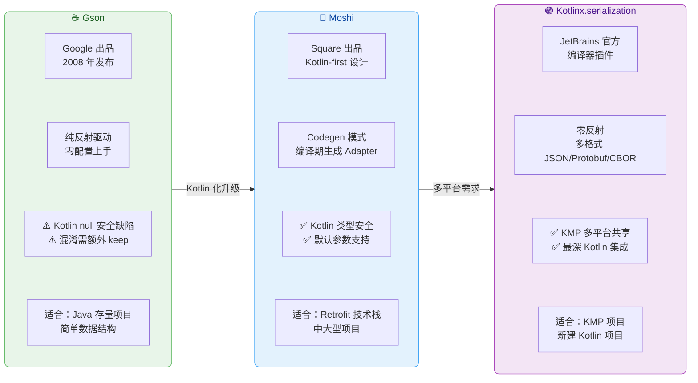
```mermaid
graph LR
    subgraph GSON["☕ Gson"]
        direction TB
        G1["Google 出品\n2008 年发布"]
        G2["纯反射驱动\n零配置上手"]
        G3["⚠️ Kotlin null 安全缺陷\n⚠️ 混淆需额外 keep"]
        G4["适合：Java 存量项目\n简单数据结构"]
        G1 ~~~ G2
        G2 ~~~ G3
        G3 ~~~ G4
    end

    subgraph MOSHI["🔷 Moshi"]
        direction TB
        M1["Square 出品\nKotlin-first 设计"]
        M2["Codegen 模式\n编译期生成 Adapter"]
        M3["✅ Kotlin 类型安全\n✅ 默认参数支持"]
        M4["适合：Retrofit 技术栈\n中大型项目"]
        M1 ~~~ M2
        M2 ~~~ M3
        M3 ~~~ M4
    end

    subgraph KTXS["🟣 Kotlinx.serialization"]
        direction TB
        K1["JetBrains 官方\n编译器插件"]
        K2["零反射\n多格式 JSON/Protobuf/CBOR"]
        K3["✅ KMP 多平台共享\n✅ 最深 Kotlin 集成"]
        K4["适合：KMP 项目\n新建 Kotlin 项目"]
        K1 ~~~ K2
        K2 ~~~ K3
        K3 ~~~ K4
    end

    GSON -->|"Kotlin 化升级"| MOSHI -->|"多平台需求"| KTXS

    classDef gsonStyle fill:#E8F5E9,stroke:#66BB6A,color:#1B5E20,rx:8
    classDef moshiStyle fill:#E3F2FD,stroke:#42A5F5,color:#0D47A1,rx:8
    classDef ktxsStyle fill:#F3E5F5,stroke:#AB47BC,color:#4A148C,rx:8

    class GSON gsonStyle
    class MOSHI moshiStyle
    class KTXS ktxsStyle
```

| 对比维度 | Gson | Moshi (codegen) | Kotlinx.serialization |
|---------|------|-----------------|----------------------|
| 反射依赖 | 全量反射 | 编译期生成（零反射） | 编译器插件（零反射） |
| Kotlin null 安全 | ❌ 可能绕过 | ✅ 严格检查 | ✅ 严格检查 |
| 默认参数支持 | ❌ 忽略 | ✅ 正确处理 | ✅ 正确处理 |
| 混淆兼容 | 需手动 keep | Codegen 免疫 | 编译器插件免疫 |
| KMP 多平台 | ❌ JVM only | ❌ JVM only | ✅ 全平台 |
| 多格式 | JSON only | JSON only | JSON / Protobuf / CBOR 等 |
| 生态成熟度 | ⭐⭐⭐⭐⭐ | ⭐⭐⭐⭐ | ⭐⭐⭐⭐ |

#### 选型建议

- **纯 Android + Java 存量项目**：继续使用 Gson，但注意配置混淆规则。
- **Kotlin Android 项目 + Retrofit**：Moshi codegen 是最佳搭档，与 Retrofit 的 `MoshiConverterFactory` 无缝衔接。
- **Kotlin Multiplatform 项目或全新 Kotlin 项目**：`kotlinx.serialization` 是首选，享受编译器级别的类型安全和多平台能力。
- **IPC / Intent 数据传递**：始终使用 `Parcelable`（配合 `@Parcelize`），JSON 序列化在此场景下不必要且性能更差。
- **持久化存储**：JSON 序列化（任一库）或 Proto DataStore，**不要使用 Parcelable 做持久化**。

---

### 三大方案全局对比

最后，让我们从更高的视角审视 `Serializable`、`Parcelable` 和 JSON 序列化三大方案的全面对比：

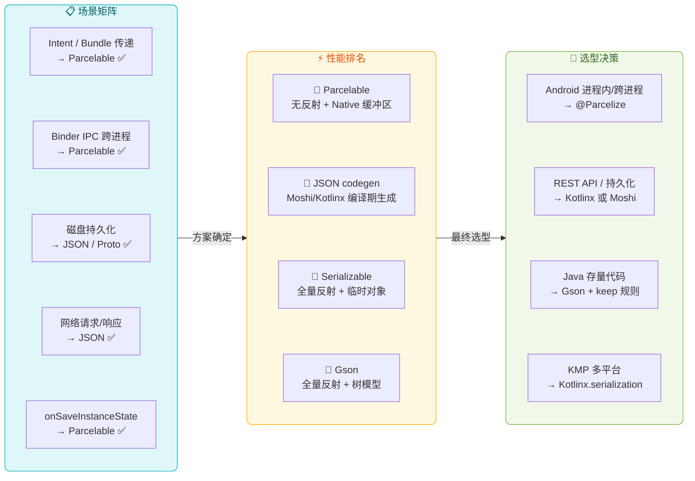
```mermaid
graph LR
    subgraph SCENE["📋 场景矩阵"]
        direction TB
        SC1["Intent / Bundle 传递\n→ Parcelable ✅"]
        SC2["Binder IPC 跨进程\n→ Parcelable ✅"]
        SC3["磁盘持久化\n→ JSON / Proto ✅"]
        SC4["网络请求/响应\n→ JSON ✅"]
        SC5["onSaveInstanceState\n→ Parcelable ✅"]
        SC1 ~~~ SC2
        SC2 ~~~ SC3
        SC3 ~~~ SC4
        SC4 ~~~ SC5
    end

    subgraph PERF["⚡ 性能排名"]
        direction TB
        PF1["🥇 Parcelable\n无反射 + Native 缓冲区"]
        PF2["🥈 JSON codegen\nMoshi/Kotlinx 编译期生成"]
        PF3["🥉 Serializable\n全量反射 + 临时对象"]
        PF4["🥉 Gson\n全量反射 + 树模型"]
        PF1 ~~~ PF2
        PF2 ~~~ PF3
        PF3 ~~~ PF4
    end

    subgraph PICK["🎯 选型决策"]
        direction TB
        PK1["Android 进程内/跨进程\n→ @Parcelize"]
        PK2["REST API / 持久化\n→ Kotlinx 或 Moshi"]
        PK3["Java 存量代码\n→ Gson + keep 规则"]
        PK4["KMP 多平台\n→ Kotlinx.serialization"]
        PK1 ~~~ PK2
        PK2 ~~~ PK3
        PK3 ~~~ PK4
    end

    SCENE -->|"方案确定"| PERF -->|"最终选型"| PICK

    classDef sceneStyle fill:#E0F7FA,stroke:#00ACC1,color:#006064,rx:8
    classDef perfStyle fill:#FFF8E1,stroke:#FFB300,color:#E65100,rx:8
    classDef pickStyle fill:#F1F8E9,stroke:#7CB342,color:#33691E,rx:8

    class SCENE sceneStyle
    class PERF perfStyle
    class PICK pickStyle
```

| 维度 | Serializable | Parcelable | JSON (Kotlinx/Moshi) |
|------|-------------|------------|---------------------|
| 序列化速度 | 慢（反射 + 临时对象） | 最快（Native memcpy） | 中等（codegen 可优化） |
| 字节体积 | 大（含类元数据） | 小（纯数据） | 中等（文本格式，可压缩） |
| 可读性 | ❌ 二进制 | ❌ 二进制 | ✅ 人类可读 |
| 跨平台 | ✅ JVM 通用 | ❌ Android only | ✅ 全平台通用 |
| 持久化安全 | ⚠️ 需管理 serialVersionUID | ❌ 官方禁止 | ✅ 推荐方案 |
| 版本兼容 | serialVersionUID 控制 | 无机制 | 字段增删灵活容错 |
| 代码侵入 | 极低（标记接口） | 中（需实现方法）→ @Parcelize 后极低 | 低（注解标记） |
| 典型使用场景 | Java 遗留代码 | Intent/Bundle/IPC | 网络 API + 持久化 |

一个成熟的 Android 应用通常**同时使用 Parcelable + JSON 序列化**两套方案：`Parcelable`（通过 `@Parcelize`）负责 Android 组件间的数据传递和状态恢复；JSON 序列化（通过 Kotlinx.serialization 或 Moshi）负责网络通信和持久化存储。`Serializable` 在新代码中应尽量避免使用，仅在维护 Java 遗留代码时作为兼容方案保留。

---

**📝 练习题**

**题目一**：在 Android 中，以下关于 `Parcelable` 和 `Serializable` 的描述，**错误**的是？

A. `Parcelable` 的序列化过程不使用反射，而 `Serializable` 依赖反射遍历字段


B. `Parcelable` 适合用于将对象持久化到磁盘文件中，因为它的二进制体积更小


C. `Serializable` 会在字节流中写入类名和字段描述符等元数据，导致体积膨胀


D. 使用 `@Parcelize` 注解后，编译器会在编译期自动生成 `writeToParcel` 和 `CREATOR` 的实现

**【答案】** B

**【解析】** A 正确：`Parcelable` 通过开发者手写或编译器生成的代码直接读写 `Parcel` 缓冲区，不涉及反射；`Serializable` 的 `ObjectOutputStream` 通过 `java.lang.reflect` 逐字段读取值。C 正确：这正是 `Serializable` 字节流体积较大的原因。D 正确：`@Parcelize` 是 Kotlin 编译器插件，在编译期生成完整的 `Parcelable` 实现字节码。**B 是错误的**：Google 官方文档明确指出 `Parcel` 不是通用的持久化机制，其二进制格式没有版本兼容保证，Android 系统升级后可能导致旧数据不可读。磁盘持久化应使用 JSON、Proto DataStore 或数据库等方案。

---

**题目二**：一个 Kotlin Android 项目使用 Gson 进行 JSON 反序列化，数据类定义为 `data class User(val name: String, val age: Int)`。当服务端返回的 JSON 为 `{"name": null, "age": 25}` 时，以下哪种描述**最准确**？

A. Gson 会抛出异常，因为 `name` 是非空类型 `String`，不允许赋值为 `null`


B. Gson 会将 `name` 赋值为空字符串 `""`，因为 Kotlin 非空类型有默认值


C. Gson 会将 `name` 赋值为 `null`，绕过 Kotlin 的空安全检查，后续使用 `name` 时可能在不可预期的位置抛出 `NullPointerException`


D. Gson 会直接忽略 `name` 字段，使用 Kotlin 默认参数值

**【答案】** C

**【解析】** 这是 Gson 在 Kotlin 环境中最著名的"坑"。Gson 反序列化时**不通过 Kotlin 的构造函数**创建对象，而是使用 `Unsafe.allocateInstance()`（绕过构造函数）分配对象实例，然后通过 Java 反射直接为字段赋值。由于 Kotlin 的空安全检查是在构造函数和 setter 中通过 `Intrinsics.checkNotNullParameter()` 实现的，Gson 绕过了这些入口，导致一个声明为 `val name: String`（非空）的属性实际持有 `null` 值。这个 `null` 不会立即报错，直到你调用 `name.length` 等方法时才会抛出 `NullPointerException`，且堆栈信息难以定位到反序列化阶段。这正是推荐在 Kotlin 项目中改用 Moshi 或 Kotlinx.serialization 的重要原因——它们通过 Kotlin 构造函数创建对象，能在反序列化阶段就捕获类型不匹配的问题。

---

## 本章小结

Android 的文件与持久化存储体系是一张精心编织的网络：从最私密的内部沙箱到开放的共享媒体库，从轻量级键值对到类型安全的数据流，从跨应用文件共享到序列化传输——每一种方案都有其明确的设计意图与最佳适用边界。本章小结将以 **"全景回顾 → 横向对比 → 决策模型 → 演进脉络"** 四个维度，帮助你将零散的知识点串联成一套可在实际项目中直接套用的存储决策框架。

---

### 全景知识图谱

我们首先用一张 Mermaid 图将本章八大知识模块的核心要点及其关系可视化，便于整体把握：

```mermaid
graph LR
    subgraph SB1["🔒 私有存储"]
        direction TB
        A1["Internal Storage\ngetFilesDir / getCacheDir\nopenFileOutput"]
        A2["External Private\ngetExternalFilesDir\ngetExternalCacheDir"]
        A1 ~~~ A2
    end

    subgraph SB2["🌐 共享存储"]
        direction TB
        B1["External Public\nEnvironment\n.getExternalStoragePublicDirectory"]
        B2["Scoped Storage\nMediaStore 媒体集\nSAF 存储访问框架"]
        B1 ~~~ B2
    end

    subgraph SB3["⚙️ 键值对存储"]
        direction TB
        C1["SharedPreferences\nXML 全量加载\napply / commit"]
        C2["DataStore\nPreferences / Proto\n协程 + Flow"]
        C1 ~~~ C2
    end

    subgraph SB4["📦 资源与共享"]
        direction TB
        D1["Raw & Assets\nres/raw R.raw.x\nassets/ 流式读取"]
        D2["FileProvider\ncontent:// URI\n临时权限授予"]
        D1 ~~~ D2
    end

    subgraph SB5["🔄 序列化"]
        direction TB
        E1["Serializable\nJava 反射\n性能较低"]
        E2["Parcelable\nAndroid 优化\nIPC 首选"]
        E3["JSON\nGson / Moshi\n网络+持久化"]
        E1 ~~~ E2
        E2 ~~~ E3
    end

    SB1 -->|"应用卸载\n即删除"| SB2
    SB2 -->|"结构化偏好\n用键值对"| SB3
    SB3 -->|"文件级资源\n与跨应用"| SB4
    SB4 -->|"对象传输\n需序列化"| SB5

    classDef clsPrivate fill:#E8F5E9,stroke:#43A047,color:#1B5E20
    classDef clsShared fill:#E3F2FD,stroke:#1E88E5,color:#0D47A1
    classDef clsKV fill:#FFF3E0,stroke:#FB8C00,color:#E65100
    classDef clsRes fill:#F3E5F5,stroke:#8E24AA,color:#4A148C
    classDef clsSer fill:#FFEBEE,stroke:#E53935,color:#B71C1C

    class SB1 clsPrivate
    class SB2 clsShared
    class SB3 clsKV
    class SB4 clsRes
    class SB5 clsSer
```

这张图的核心逻辑是：**存储的"开放程度"从左到右递增**——Internal Storage 最封闭，只有应用自身可见；External Public / Scoped Storage 面向所有应用甚至用户；键值对存储专注于轻量偏好配置；资源与 FileProvider 解决"只读资源"和"跨应用文件共享"两大场景；序列化则贯穿于所有需要将内存对象落盘或跨进程传输的环节。

---

### 存储方案横向对比

本章涉及的存储方案可以从 **可见性、生命周期、性能特征、适用数据类型** 四个维度进行横向比较。理解这些差异，是做出正确存储决策的前提。

**一、可见性与访问边界**

内部存储（`getFilesDir()`、`getCacheDir()`）和外部私有存储（`getExternalFilesDir()`）都属于应用沙箱，其他应用在没有 root 权限的情况下无法直接访问。区别在于内部存储位于 `/data/data/<pkg>/` 下，受到文件系统级别的 Linux UID 隔离保护，即使设备被物理连接到电脑也不可见（除非设备已 root）；而外部私有目录虽然逻辑上属于应用私有，但物理上位于 `/sdcard/Android/data/<pkg>/`，在 Android 10 以前，任何持有 `READ_EXTERNAL_STORAGE` 权限的应用都能读取到这些文件。Android 10 引入 Scoped Storage 后，这一缺口才被堵上——其他应用的外部私有目录从文件系统层面变得不可见。

共享存储的可见性经历了最大的变迁。Android 10 以前，`Environment.getExternalStoragePublicDirectory()` 返回的目录（如 `DCIM/`、`Download/`）对所有应用完全开放，只需一个 `READ_EXTERNAL_STORAGE` 权限就能遍历整个 SD 卡。这带来了严重的隐私问题。Scoped Storage 将共享存储收敛为两个严格受控的入口：**MediaStore** 只暴露媒体类型文件（图片、视频、音频），且默认只返回应用自己创建的条目；**Storage Access Framework (SAF)** 通过系统文件选择器让用户主动授权，应用拿到的是一个 content URI 而非文件路径，从根本上隔离了文件系统的直接访问。

SharedPreferences 和 DataStore 的可见性与内部存储一致——它们的底层文件（XML 或 Protocol Buffers）都存放在 `/data/data/<pkg>/shared_prefs/` 或 `/data/data/<pkg>/files/datastore/` 目录下，只有应用自身可以访问。值得注意的是，SharedPreferences 曾支持 `MODE_WORLD_READABLE` 和 `MODE_WORLD_WRITEABLE` 模式，允许其他应用读写偏好文件，但这两个模式从 Android 7.0 (API 24) 起被正式废弃，并在 `targetSdkVersion >= 24` 时直接抛出 `SecurityException`。

**二、生命周期与数据留存**

数据的生命周期是一个常被忽视却极其关键的维度。可以把所有存储方案分为三类：

- **随应用卸载而删除**：Internal Storage、External Private Storage、SharedPreferences、DataStore。这些数据的宿主目录都在应用的沙箱内，系统在卸载应用时会连同这些目录一并清除。从 Android 10 开始，即使是 `getExternalFilesDir()` 返回的外部私有目录，也会在卸载时被自动删除。唯一的例外是用户在卸载对话框中主动勾选"保留数据"（部分 OEM 厂商支持此选项）。

- **独立于应用生命周期**：External Public Storage、MediaStore 中的媒体文件、SAF 授权的文档。这些数据即使应用被卸载也会保留在设备上，直到用户手动删除或另一个应用覆盖。这也是为什么拍照应用通常使用 MediaStore 而不是 `getExternalFilesDir()` 存储照片——用户期望照片在卸载相机应用后依然存在。

- **只读、编译时嵌入**：`res/raw/` 和 `assets/` 目录的内容被打包进 APK，随应用安装而存在，随应用卸载而消失。它们在运行时是 **只读** 的，不可修改。如果需要对这些资源进行修改，标准做法是在首次启动时将其复制到内部存储或外部私有目录，再对副本进行读写。

**三、性能特征**

性能差异在高频读写场景下会被显著放大：

SharedPreferences 的 **全量加载** 机制是其最大的性能瓶颈。当你第一次调用 `getSharedPreferences()` 时，系统会在子线程中将整个 XML 文件反序列化为一个 `HashMap` 并缓存在内存中。如果在 XML 文件尚未加载完毕时就调用 `getString()` 等读方法，**调用线程会被阻塞**（通过 `awaitLoadedLocked()` 等待加载完成）。对于包含数百个键值对的大型偏好文件，这个阻塞时间可能达到数十毫秒，如果发生在主线程上就会造成可感知的卡顿。`apply()` 虽然将磁盘写入移到后台线程，但在 Activity `onPause()`/`onStop()` 等生命周期回调中，`QueuedWork.waitToFinish()` 会在主线程同步等待所有挂起的 `apply()` 完成，这是 SharedPreferences 导致 ANR 的经典路径。

DataStore 从架构上解决了这些问题。它基于 Kotlin 协程和 Flow，所有 I/O 操作都在 `Dispatchers.IO` 上执行，读取返回的是 `Flow<T>` 而非阻塞调用，写入通过 `suspend` 函数 `edit{}` 实现事务性更新。Proto DataStore 使用 Protocol Buffers 进行序列化，相比 XML 解析具有更高的编解码效率和更小的文件体积。

文件 I/O 层面，内部存储通常位于设备的 NAND Flash 上，读写速度快但空间有限；外部存储（尤其是可移除 SD 卡）的随机读写性能可能显著低于内部存储。对于需要频繁小文件读写的场景（如缓存），应优先使用 `getCacheDir()` 而非外部存储。

**四、适用数据类型**

每种方案都有其"最甜蜜"的数据类型匹配：

| 存储方案 | 最适合的数据类型 | 不适合的场景 |
|---|---|---|
| Internal Storage | 私密文件（token、加密密钥、数据库） | 大文件（空间受限） |
| External Private | 应用专属大文件（下载的离线包、日志） | 需要跨应用共享的文件 |
| MediaStore | 媒体文件（图片、视频、音频） | 非媒体类型的文档 |
| SAF | 用户文档（PDF、Office 文件） | 需要后台静默访问的场景 |
| SharedPreferences | 少量简单键值对（布尔开关、字符串配置） | 大量数据、复杂对象、高频写入 |
| DataStore (Preferences) | 中等规模键值对、需要响应式读取 | 复杂嵌套结构 |
| DataStore (Proto) | 结构化配置、类型安全要求高 | 团队不熟悉 ProtoBuf |
| Raw / Assets | 只读静态资源（字体、预置数据库、配置） | 运行时需要修改的数据 |

---

### 存储决策模型

面对一个具体的存储需求，可以按照以下决策树逐步筛选出最佳方案。这棵树的设计逻辑是 **先排除、后精选**——每一步都用一个二元问题缩小候选范围：

```mermaid
graph LR
    subgraph SB1["❓ 数据性质判断"]
        direction TB
        Q1["数据是否需要\n在卸载后保留?"]
        Q2["是否为\n媒体文件?"]
        Q3["是否为\n用户文档?"]
        Q1 ~~~ Q2
        Q2 ~~~ Q3
    end

    subgraph SB2["❓ 访问模式判断"]
        direction TB
        Q4["是否需要\n跨应用共享?"]
        Q5["是否为\n键值对结构?"]
        Q6["是否需要\n类型安全?"]
        Q4 ~~~ Q5
        Q5 ~~~ Q6
    end

    subgraph SB3["✅ 共享类方案"]
        direction TB
        R1["📸 MediaStore\n媒体文件首选"]
        R2["📄 SAF\n文档类文件"]
        R3["📤 FileProvider\ncontent:// 临时授权"]
        R1 ~~~ R2
        R2 ~~~ R3
    end

    subgraph SB4["✅ 私有类方案"]
        direction TB
        R4["🔒 Internal Storage\n小型私密文件"]
        R5["📁 External Private\n大型应用文件"]
        R6["⚙️ SharedPreferences\n少量简单KV"]
        R7["🚀 DataStore\n响应式 / Proto"]
        R4 ~~~ R5
        R5 ~~~ R6
        R6 ~~~ R7
    end

    SB1 -->|"卸载后保留\n→ 共享存储"| SB3
    SB1 -->|"随应用删除\n→ 私有存储"| SB2
    SB2 -->|"需跨应用\n→ FileProvider"| SB3
    SB2 -->|"应用内使用"| SB4

    classDef clsQ fill:#E8EAF6,stroke:#3949AB,color:#1A237E
    classDef clsShared fill:#E8F5E9,stroke:#43A047,color:#1B5E20
    classDef clsPrivate fill:#FFF8E1,stroke:#F9A825,color:#F57F17

    class SB1 clsQ
    class SB2 clsQ
    class SB3 clsShared
    class SB4 clsPrivate
```

**决策路径详解：**

**路径一：数据需要在卸载后保留** → 必须使用共享存储。如果是图片/视频/音频，首选 MediaStore——它提供了结构化的 ContentProvider 接口，支持按专辑、日期、MIME 类型查询，且能被系统相册等应用自动索引。如果是用户文档（PDF、文本文件等非媒体类型），应使用 SAF 让用户自行选择存储位置，这不仅符合 Scoped Storage 的设计理念，还能让用户在 Google Drive 等云存储 provider 中直接保存文件。

**路径二：数据随应用卸载删除 + 需要跨应用共享** → 使用 FileProvider。典型场景是"调用系统相机拍照后获取照片"或"通过 Intent 分享文件给其他应用"。FileProvider 将 `file://` URI 转换为 `content://` URI，并通过 `FLAG_GRANT_READ_URI_PERMISSION` / `FLAG_GRANT_WRITE_URI_PERMISSION` 授予临时权限。注意，从 Android 7.0 (API 24) 开始，直接通过 `file://` URI 跨应用传递文件会触发 `FileUriExposedException`，FileProvider 不再是可选项，而是强制要求。

**路径三：数据随应用卸载删除 + 仅应用内使用 + 键值对结构** → 在 SharedPreferences 和 DataStore 之间选择。判断标准很明确：如果是遗留项目中已经稳定运行的少量简单配置（几十个键值对以内），SharedPreferences 可以继续使用，但要注意避免在主线程读取大文件、避免存储复杂对象。对于新项目或需要重构的模块，**无条件选择 DataStore**。Preferences DataStore 作为 SharedPreferences 的直接替代品，API 迁移成本极低；Proto DataStore 则适用于需要类型安全和复杂嵌套结构的场景。DataStore 的协程原生支持从根本上消除了 SharedPreferences 的 ANR 风险。

**路径四：数据随应用卸载删除 + 仅应用内使用 + 文件结构** → 在内部存储和外部私有存储之间选择。判断标准是文件大小和安全敏感度。安全敏感数据（加密密钥、认证 token、用户隐私信息）应放在内部存储；大文件（下载的视频、离线地图包、日志文件）由于内部存储空间有限，应放在外部私有目录。使用外部存储前务必调用 `Environment.getExternalStorageState()` 检查挂载状态——外部存储不是永远可用的（SD 卡可能被用户拔出、USB 存储模式可能将其卸载）。

---

### Android 存储权限的演进脉络

本章多次涉及权限模型的变迁，这里做一个完整的时间线梳理，帮助你理解"为什么现在的存储 API 是这个样子"：

```mermaid
graph LR
    subgraph SB1["📱 API 1-18\nAndroid 1.0 ~ 4.3"]
        direction TB
        P1["外部存储无需权限\n完全开放"]
        P2["API 16+ 引入\nREAD_EXTERNAL_STORAGE\n但未强制"]
        P1 ~~~ P2
    end

    subgraph SB2["📱 API 19-22\nAndroid 4.4 ~ 5.1"]
        direction TB
        P3["getExternalFilesDir\n无需权限"]
        P4["SAF 首次引入\nACTION_OPEN_DOCUMENT"]
        P5["公共目录仍需\nREAD/WRITE 权限"]
        P3 ~~~ P4
        P4 ~~~ P5
    end

    subgraph SB3["📱 API 23-28\nAndroid 6.0 ~ 9.0"]
        direction TB
        P6["运行时权限模型\n动态申请 READ/WRITE"]
        P7["仍可自由访问\n整个外部存储"]
        P6 ~~~ P7
    end

    subgraph SB4["📱 API 29+\nAndroid 10+"]
        direction TB
        P8["Scoped Storage\n沙箱化外部存储"]
        P9["MediaStore +\nSAF 成为唯一入口"]
        P10["API 30+ 彻底移除\nlegacy 模式"]
        P8 ~~~ P9
        P9 ~~~ P10
    end

    SB1 -->|"逐步收紧"| SB2
    SB2 -->|"运行时权限"| SB3
    SB3 -->|"分区存储"| SB4

    classDef clsEarly fill:#ECEFF1,stroke:#546E7A,color:#263238
    classDef clsMid fill:#E3F2FD,stroke:#1E88E5,color:#0D47A1
    classDef clsRuntime fill:#FFF3E0,stroke:#FB8C00,color:#E65100
    classDef clsScoped fill:#E8F5E9,stroke:#43A047,color:#1B5E20

    class SB1 clsEarly
    class SB2 clsMid
    class SB3 clsRuntime
    class SB4 clsScoped
```

从这条时间线可以清晰看到 Android 存储权限的设计哲学转变：**从"信任应用"到"信任用户"**。早期 Android 默认信任应用，给予宽泛的文件系统访问权限；中期通过运行时权限让用户参与决策，但粒度太粗（一旦授权就是整个外部存储的读写权限）；Scoped Storage 阶段则彻底翻转了模型——应用默认只能看到自己的沙箱，访问共享数据必须通过 MediaStore（系统代理访问）或 SAF（用户主动授权特定文件/目录）。这种演进与 iOS 的沙箱模型趋同，反映了移动平台对 **"最小权限原则"（Principle of Least Privilege）** 的持续追求。

理解这条演进线，能帮助你做出更好的兼容性决策：对于 `minSdkVersion < 29` 的项目，需要同时维护 legacy 路径（`requestLegacyExternalStorage = true`）和 Scoped Storage 路径；对于 `minSdkVersion >= 30` 的新项目，可以完全拥抱 Scoped Storage，代码会更简洁。Android 13 (API 33) 进一步细化了媒体权限，将 `READ_EXTERNAL_STORAGE` 拆分为 `READ_MEDIA_IMAGES`、`READ_MEDIA_VIDEO`、`READ_MEDIA_AUDIO` 三个细粒度权限，延续了权限最小化的趋势。

---

### 序列化方案的选型回顾

序列化贯穿于存储与传输的各个环节，其选型直接影响性能和可维护性。简要回顾三种方案的核心取舍：

**Serializable** 是 Java 语言内置的序列化机制，通过反射（Reflection）自动遍历对象的所有非 `transient` 字段进行序列化。它的优势是零侵入——只需让类实现 `Serializable` 接口即可，无需编写任何额外代码。代价是反射带来的性能开销和大量临时对象的 GC 压力。在 Android 场景中，Serializable 适合"一次性"的低频序列化（如 Intent 传递少量非性能敏感的对象），不适合高频场景。

**Parcelable** 是 Android 专门为 IPC（进程间通信）设计的高性能序列化方案。它要求开发者手动实现 `writeToParcel()` 和 `CREATOR`，将对象字段按顺序写入 `Parcel` 二进制缓冲区。由于跳过了反射，其序列化/反序列化速度比 Serializable 快一个数量级。Kotlin 的 `@Parcelize` 注解通过编译器插件自动生成 Parcelable 实现，几乎消除了手写样板代码的负担。在 Android 开发中，Parcelable 是 Bundle、Intent extras、AIDL 接口中传递对象的首选。

**JSON 序列化**（Gson、Moshi、Kotlin Serialization）则更多面向 **网络传输** 和 **持久化存储** 场景。JSON 是人类可读的文本格式，便于调试和跨平台通信，但其解析性能低于二进制格式。在存储场景中，如果你需要将一个复杂对象保存到 SharedPreferences 或文件中，JSON 序列化是最常见的选择。但需要注意，SharedPreferences 中存储大 JSON 字符串会加剧其全量加载的性能问题——此时更好的做法是使用 Proto DataStore 或 Room 数据库。

---

### 关键陷阱与最佳实践清单

最后，将本章中分散在各节的 **"坑"** 和 **"最佳实践"** 汇总为一个速查清单：

**⚠️ 必须避免的陷阱：**

1. **SharedPreferences 的 `apply()` ANR**：在 Activity/Service 生命周期切换时，`QueuedWork.waitToFinish()` 会同步等待挂起的 `apply()` 写入完成。如果短时间内积累了大量 `apply()` 调用，主线程会被长时间阻塞。解决方案是迁移到 DataStore，或将大型数据从 SharedPreferences 中剥离出去。

2. **在主线程执行文件 I/O**：`openFileOutput()`、`FileInputStream` 等 API 本身不会切换线程。在 StrictMode 开启时，主线程上的磁盘读写会触发 `DiskReadViolation` / `DiskWriteViolation`。务必将文件操作放在协程的 `Dispatchers.IO` 或 `AsyncTask`（已废弃，不推荐新代码使用）中执行。

3. **硬编码文件路径**：永远不要手写 `/sdcard/` 或 `/data/data/<pkg>/` 这样的路径字符串。不同设备、不同用户（多用户/工作资料）的实际路径可能不同。始终使用 `context.getFilesDir()`、`context.getExternalFilesDir()` 等 API 获取路径。

4. **忽略外部存储状态检查**：在调用 `getExternalFilesDir()` 或 `getExternalCacheDir()` 前，必须通过 `Environment.getExternalStorageState()` 确认外部存储已挂载（返回 `Environment.MEDIA_MOUNTED`）。否则这些方法可能返回 `null`，直接使用会导致 `NullPointerException`。

5. **FileProvider 的 `authorities` 冲突**：多个库可能都声明了 FileProvider 且使用了相同的 `authorities` 值（如 `${applicationId}.fileprovider`），导致 manifest 合并冲突。解决方案是为自己的 FileProvider 使用独特的 authority 后缀，并在 `file_provider_paths.xml` 中精确配置路径映射。

6. **Scoped Storage 下使用 `File` API 访问共享目录**：在 `targetSdkVersion >= 30` 的应用中，`File("/sdcard/DCIM/")` 这样的代码即使拥有 `READ_EXTERNAL_STORAGE` 权限也无法工作。必须通过 MediaStore ContentResolver 查询或 SAF 来访问共享文件。

**✅ 推荐的最佳实践：**

1. **新项目一律使用 DataStore 替代 SharedPreferences**，无论是 Preferences DataStore 还是 Proto DataStore，它们在线程安全、异常处理和性能上全面优于 SharedPreferences。

2. **利用 `getCacheDir()` 和 `getExternalCacheDir()` 管理缓存**，系统在设备存储不足时会优先清理 cache 目录。同时在代码中实现自己的缓存淘汰策略（如 LRU、按大小上限），不要完全依赖系统清理。

3. **跨应用文件共享统一走 FileProvider + `content://` URI**。不要试图绕过 `FileUriExposedException`（例如通过反射关闭 StrictMode 的 VmPolicy），这会在未来的 Android 版本中带来兼容性风险。

4. **大型只读资源放在 `assets/` 目录**，它不受 `res/raw/` 的文件名限制（`raw/` 要求全小写字母、数字、下划线），且支持子目录结构。读取时通过 `AssetManager.open()` 获取 `InputStream`，可以灵活处理任意文件格式。

5. **IPC 传输对象一律使用 Parcelable**，配合 Kotlin 的 `@Parcelize` 注解，开发效率与 Serializable 相当但性能优势巨大。仅在跨平台兼容（如与后端 JSON 通信）时使用 JSON 序列化。

6. **定义 `serialVersionUID`**：如果确实需要使用 Serializable（如遗留接口要求），务必显式声明 `serialVersionUID`。否则类结构的任何变更（新增字段、修改方法签名）都会导致反序列化失败，抛出 `InvalidClassException`。

---

### 一张表总览全章

| 维度 | Internal Storage | External Private | Scoped Storage | SharedPrefs | DataStore | FileProvider | Raw/Assets | 序列化 |
|---|---|---|---|---|---|---|---|---|
| **核心 API** | `getFilesDir()` | `getExternalFilesDir()` | MediaStore / SAF | `getSharedPreferences()` | `dataStore.data` | `getUriForFile()` | `AssetManager.open()` | `Parcel` / `Gson` |
| **数据可见性** | 仅本应用 | 仅本应用 (10+) | 系统/用户控制 | 仅本应用 | 仅本应用 | 临时授权 | 仅本应用 | 传输载体 |
| **卸载后保留** | ❌ | ❌ | ✅ | ❌ | ❌ | ❌ | ❌ | N/A |
| **需要权限** | 无 | 无 (API 19+) | 细粒度媒体权限 | 无 | 无 | 无 | 无 | 无 |
| **线程安全** | 自行保证 | 自行保证 | ContentResolver | ❌ 易出问题 | ✅ 协程原生 | N/A | 自行保证 | 方案而异 |
| **推荐程度** | ⭐⭐⭐⭐ | ⭐⭐⭐ | ⭐⭐⭐⭐⭐ | ⭐⭐ (遗留) | ⭐⭐⭐⭐⭐ | ⭐⭐⭐⭐ | ⭐⭐⭐ | 按场景选 |

---

本章从最基础的文件 I/O 到最现代的 DataStore 和 Scoped Storage，覆盖了 Android 应用层持久化存储的完整知识体系。核心的设计思想可以凝练为三句话：**私有数据留沙箱，共享数据走系统，键值偏好用 DataStore**。掌握这三条原则，再结合上面的决策树和横向对比表，你就能在面对任何存储需求时迅速做出正确的架构决策。

---

**📝 练习题**

某应用在 `SharedPreferences` 中存储了约 500 个键值对（包含多个大 JSON 字符串），用户频繁反馈 Activity 切换时出现 ANR。开发者将所有 `commit()` 替换为 `apply()` 后，ANR 率反而上升了。以下关于此现象的分析，哪一项是正确的？


A. `apply()` 比 `commit()` 慢，应该改回 `commit()` 并放到子线程执行


B. `apply()` 的异步写入在 Activity `onPause()` 时会被 `QueuedWork.waitToFinish()` 同步等待，大量挂起的写入任务堆积导致主线程阻塞


C. SharedPreferences 的 XML 文件损坏导致解析异常，应清除数据重建


D. ANR 是因为 `apply()` 内部使用了 `synchronized` 锁，多线程竞争导致死锁


**【答案】** B

**【解析】** `apply()` 方法本身确实是异步的——它先将修改提交到内存中的 `HashMap`，然后将磁盘写入任务排入 `QueuedWork` 的队列。然而，Android Framework 在 `ActivityThread` 的 `handlePauseActivity()`、`handleStopActivity()` 等关键生命周期处理方法中，会调用 `QueuedWork.waitToFinish()` 来确保所有挂起的 `apply()` 写入在 Activity 状态保存前完成。这意味着如果短时间内积累了大量 `apply()` 调用（例如 500 个键值对的频繁更新），在 Activity 切换触发 `onPause()` 时，主线程会被阻塞直到所有写入完成。SharedPreferences 的每次 `apply()` 都是 **全量写回** 整个 XML 文件（而非增量更新），500 个键值对加上大 JSON 字符串意味着每次写入的数据量可能非常大。这就解释了为何 `apply()` 比 `commit()` 的 ANR 率更高——`commit()` 是同步写入，开发者通常会自觉地将其放到子线程；而 `apply()` 给人"异步安全"的错觉，却在生命周期切换时被强制同步。正确的解决方案是迁移到 DataStore，或者将大 JSON 数据剥离到独立文件/数据库中，保持 SharedPreferences 的体积在合理范围内。选项 A 描述不准确，`apply()` 本身并不比 `commit()` 慢；选项 C 与 ANR 无关；选项 D 中的"死锁"说法不正确，`apply()` 的锁竞争可能导致等待但不会造成死锁。

---

**📝 练习题**

在 Android 11 (`targetSdkVersion 30`) 的应用中，以下哪种方式可以正确读取用户 `DCIM/` 目录中其他应用创建的照片？


A. 使用 `File(Environment.getExternalStoragePublicDirectory(Environment.DIRECTORY_DCIM), "photo.jpg")` 直接读取


B. 通过 `ContentResolver.query()` 查询 `MediaStore.Images.Media.EXTERNAL_CONTENT_URI`，获取 content URI 后用 `ContentResolver.openInputStream()` 读取


C. 声明 `android:requestLegacyExternalStorage="true"` 后使用 `FileInputStream` 读取


D. 使用 `context.getExternalFilesDir(Environment.DIRECTORY_DCIM)` 获取路径后读取


**【答案】** B

**【解析】** 在 `targetSdkVersion 30`（Android 11）及以上的应用中，Scoped Storage 被强制启用，`requestLegacyExternalStorage` 属性被完全忽略，因此选项 C 无效。选项 A 使用 `File` API 直接访问共享目录在 Scoped Storage 下会失败——即使持有 `READ_EXTERNAL_STORAGE` 权限（Android 13+ 为 `READ_MEDIA_IMAGES`），文件系统级别的直接路径访问也不再被允许用于读取其他应用创建的文件。选项 D 中的 `getExternalFilesDir()` 返回的是应用的私有外部目录（`/sdcard/Android/data/<pkg>/files/DCIM/`），这里不会包含其他应用拍摄的照片。正确做法是选项 B：通过 MediaStore 的 `ContentResolver` 接口查询 `EXTERNAL_CONTENT_URI`，获取到 `content://` 格式的 URI 后，使用 `ContentResolver.openInputStream()` 读取图片数据。MediaStore 作为系统级的内容提供者，充当了应用与共享存储之间的中间层，既保护了用户隐私（应用无法遍历任意目录），又提供了结构化的查询能力（按日期、大小、MIME 类型筛选）。

---

