---

# 现代网络架构

---

## OkHttp 核心原理

OkHttp 是 Square 公司开源的一款高效的 HTTP 客户端，已经成为 Android 应用层网络请求的事实标准。它不仅被 Retrofit 作为底层实现，也被 Google 官方纳入 Android 源码中替代原有的 HttpURLConnection。理解 OkHttp 的核心原理，是掌握现代 Android 网络架构的基石。

OkHttp 的设计哲学可以概括为三个关键词：**高效**（连接复用、压缩传输）、**可靠**（自动重试、故障恢复）、**可扩展**（拦截器链式处理）。从应用层开发者的视角来看，我们最常接触的三大核心机制是：Call 请求模型定义了"一次请求是什么"，Dispatcher 调度器决定了"请求何时执行"，而 Interceptor 责任链则规定了"请求如何被处理"。

### Call 请求模型

在 OkHttp 的世界中，**Call** 是对一次 HTTP 请求的完整抽象。它封装了请求（Request）与响应（Response）之间的全部交互逻辑，是应用层发起网络操作的入口。

从概念上讲，Call 代表的是一次"准备好但尚未执行的请求"。你可以把它想象成一张已经填好的快递单——上面写明了收件地址（URL）、包裹内容（RequestBody）、特殊要求（Headers），但快递员还没有上门取件。只有当你调用 `execute()` 或 `enqueue()` 方法时，这张快递单才会被真正处理。

**Call 的核心特性**包括：

1. **一次性执行**：每个 Call 对象只能被执行一次。如果你尝试对同一个 Call 调用两次 `execute()` 或 `enqueue()`，OkHttp 会直接抛出 `IllegalStateException`。这种设计看似限制，实则是为了保证请求状态的清晰可控——一个 Call 要么正在执行，要么已经完成，不存在模糊的中间状态。

2. **可克隆复用**：虽然 Call 不能重复执行，但你可以通过 `clone()` 方法创建一个全新的、配置相同的 Call 实例。这在实现重试逻辑时非常有用。

3. **可取消性**：调用 `cancel()` 方法可以随时取消一个正在进行的请求。取消操作是幂等的，多次调用不会有副作用。被取消的请求会在合适的时机抛出 `IOException`。

让我们从源码角度深入理解 Call 的实现。OkHttp 使用了经典的工厂模式：`OkHttpClient` 作为工厂，负责创建 `Call` 实例；而 `RealCall` 则是 `Call` 接口的唯一实现类。

```kotlin
// OkHttpClient 中创建 Call 的核心方法
// 每次调用 newCall() 都会返回一个新的 RealCall 实例
override fun newCall(request: Request): Call {
    // 将当前 client 配置和请求信息传入 RealCall
    return RealCall(this, request, forWebSocket = false)
}
```

```kotlin
// RealCall 类的核心结构（简化版）
class RealCall(
    val client: OkHttpClient,        // 持有客户端配置的引用
    val originalRequest: Request,    // 原始请求对象
    val forWebSocket: Boolean        // 是否为 WebSocket 请求
) : Call {
    
    // 使用 AtomicBoolean 保证线程安全的执行状态检查
    private val executed = AtomicBoolean()
    
    // 同步执行：阻塞当前线程直到响应返回
    override fun execute(): Response {
        // CAS 操作确保只能执行一次
        // compareAndSet: 如果当前值为 false，则设置为 true 并返回 true
        // 如果当前值已经是 true，直接返回 false
        if (!executed.compareAndSet(false, true)) {
            throw IllegalStateException("Already Executed")
        }
        
        try {
            // 通知 Dispatcher 当前请求开始同步执行
            // 这样 Dispatcher 可以追踪正在运行的请求数量
            client.dispatcher.executed(this)
            
            // 通过拦截器链获取响应（核心处理逻辑）
            return getResponseWithInterceptorChain()
        } finally {
            // 无论成功失败，都要通知 Dispatcher 请求已完成
            client.dispatcher.finished(this)
        }
    }
    
    // 异步执行：将请求放入队列，通过回调返回结果
    override fun enqueue(responseCallback: Callback) {
        // 同样使用 CAS 保证只执行一次
        if (!executed.compareAndSet(false, true)) {
            throw IllegalStateException("Already Executed")
        }
        
        // 将回调包装成 AsyncCall（实现了 Runnable 接口）
        // 然后交给 Dispatcher 进行调度
        client.dispatcher.enqueue(AsyncCall(responseCallback))
    }
}
```

从上述代码可以看出，`RealCall` 的设计非常精炼。它使用 `AtomicBoolean` 的 CAS（Compare-And-Swap）操作来保证线程安全的"只执行一次"语义，同时将实际的执行调度委托给 `Dispatcher`，将请求处理委托给拦截器链。这种职责分离使得每个组件都保持简单和可测试。

**同步与异步的选择**是应用开发中的重要决策。`execute()` 方法会阻塞调用线程直到收到响应，因此**绝对不能在 Android 主线程调用**，否则会触发 `NetworkOnMainThreadException`。它适用于后台线程中需要串行执行的场景。`enqueue()` 方法则将请求放入 Dispatcher 的队列中异步执行，结果通过 `Callback` 回调返回。回调默认在 OkHttp 的后台线程中执行，如果需要更新 UI，必须手动切换到主线程。

### Dispatcher 调度器

如果说 Call 定义了"请求是什么"，那么 **Dispatcher** 就决定了"请求何时、以何种方式执行"。它是 OkHttp 的请求调度中心，负责管理请求队列、控制并发度、协调线程资源。

Dispatcher 的设计目标是在充分利用系统资源的同时，避免过度消耗。想象一下，如果应用同时发起 100 个网络请求会发生什么？如果全部立即执行，可能会耗尽文件描述符、占满带宽、甚至导致服务器拒绝服务；如果只允许一个一个串行执行，又会浪费网络的并行传输能力。Dispatcher 通过精心设计的队列机制和并发控制策略，在这两个极端之间找到了平衡点。

**Dispatcher 的核心参数**包括：

1. **maxRequests = 64**：同时执行的最大请求数。这个值考虑了典型设备的文件描述符限制和网络带宽。

2. **maxRequestsPerHost = 5**：对同一主机（host）同时执行的最大请求数。HTTP/1.1 协议建议客户端对同一服务器最多维持 2 个并发连接，但现代浏览器通常使用 6-8 个。OkHttp 选择 5 作为默认值，既充分利用了并发优势，又避免对服务器造成过大压力。

3. **executorService**：执行异步请求的线程池。默认使用一个无界的缓存线程池（CachedThreadPool），线程空闲 60 秒后会被回收。

让我们通过一个 Mermaid 图来直观展示 Dispatcher 的工作流程：

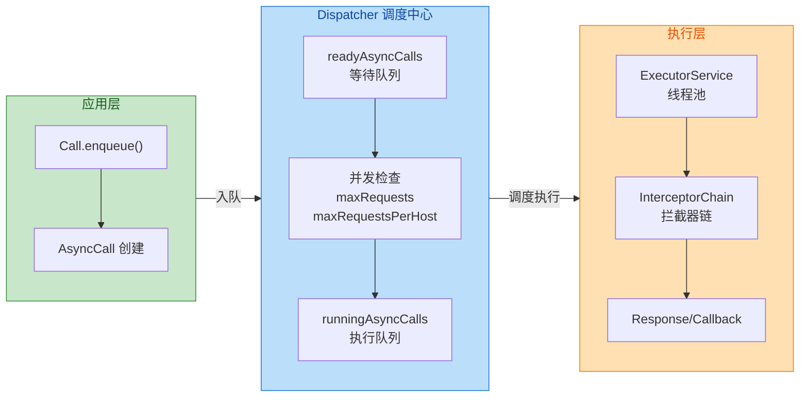

**Dispatcher 的内部队列结构**是理解其工作原理的关键：

```kotlin
class Dispatcher {
    // 等待执行的异步请求队列
    // 当正在执行的请求数达到上限时，新请求会先放入这里
    private val readyAsyncCalls = ArrayDeque<AsyncCall>()
    
    // 正在执行的异步请求队列
    // 这些请求已经提交给线程池，正在运行中
    private val runningAsyncCalls = ArrayDeque<AsyncCall>()
    
    // 正在执行的同步请求集合
    // 同步请求不需要调度，但 Dispatcher 需要追踪它们以计算并发数
    private val runningSyncCalls = ArrayDeque<RealCall>()
    
    // 异步请求入队的核心逻辑
    internal fun enqueue(call: AsyncCall) {
        synchronized(this) {
            // 首先将请求放入等待队列
            readyAsyncCalls.add(call)
            
            // 如果不是 WebSocket 请求，尝试复用同一 host 的现有连接计数
            // 这是为了更精确地统计 perHost 并发数
            if (!call.call.forWebSocket) {
                val existingCall = findExistingCallWithHost(call.host)
                if (existingCall != null) {
                    call.reuseCallsPerHostFrom(existingCall)
                }
            }
        }
        // 触发调度逻辑，尝试将等待队列中的请求提升到执行队列
        promoteAndExecute()
    }
    
    // 核心调度方法：提升等待请求并执行
    private fun promoteAndExecute(): Boolean {
        // 收集本次可以执行的请求
        val executableCalls = mutableListOf<AsyncCall>()
        val isRunning: Boolean
        
        synchronized(this) {
            // 遍历等待队列
            val i = readyAsyncCalls.iterator()
            while (i.hasNext()) {
                val asyncCall = i.next()
                
                // 检查全局并发上限
                if (runningAsyncCalls.size >= maxRequests) break
                
                // 检查单主机并发上限
                if (asyncCall.callsPerHost.get() >= maxRequestsPerHost) continue
                
                // 通过检查，从等待队列移除
                i.remove()
                
                // 增加该主机的并发计数
                asyncCall.callsPerHost.incrementAndGet()
                
                // 加入可执行列表和执行队列
                executableCalls.add(asyncCall)
                runningAsyncCalls.add(asyncCall)
            }
            isRunning = runningCallsCount() > 0
        }
        
        // 在同步块外执行，避免持锁时间过长
        for (asyncCall in executableCalls) {
            // 将 AsyncCall 提交给线程池执行
            asyncCall.executeOn(executorService)
        }
        
        return isRunning
    }
}
```

**调度流程详解**：当应用调用 `Call.enqueue()` 时，请求首先被包装成 `AsyncCall` 并放入 `readyAsyncCalls` 等待队列。随后 `promoteAndExecute()` 方法被调用，它会扫描等待队列，将满足并发条件的请求"提升"（promote）到 `runningAsyncCalls` 执行队列，并提交给线程池执行。每当一个请求完成时，`finished()` 方法会被调用，它会从执行队列中移除该请求，并再次触发 `promoteAndExecute()`，尝试调度更多等待中的请求。

这种"完成即调度"的机制确保了请求能够高效流转。只要有空闲槽位，等待队列中的请求就会被立即调度，最大化地利用了并发能力。

**关于线程池的设计**，Dispatcher 默认使用的是一个"无界缓存线程池"：

```kotlin
// Dispatcher 的默认线程池配置
val executorService: ExecutorService
    get() {
        if (executorServiceOrNull == null) {
            // 核心线程数 = 0：没有常驻线程，空闲时资源消耗为零
            // 最大线程数 = Int.MAX_VALUE：理论上无上限（实际受 maxRequests 控制）
            // keepAliveTime = 60秒：空闲线程存活时间
            // SynchronousQueue：无缓冲队列，任务直接交给线程
            executorServiceOrNull = ThreadPoolExecutor(
                0,                          // corePoolSize
                Int.MAX_VALUE,              // maximumPoolSize
                60L,                         // keepAliveTime
                TimeUnit.SECONDS,           // unit
                SynchronousQueue(),         // workQueue
                threadFactory("OkHttp Dispatcher", false)
            )
        }
        return executorServiceOrNull!!
    }
```

这个配置看似"危险"（最大线程数无上限），但实际上线程数量被 `maxRequests` 严格限制在 64 以内。`SynchronousQueue` 的选择也很有讲究——它是一个"直接传递"队列，不会缓存任务，而是直接将任务交给空闲线程，如果没有空闲线程则创建新线程。这确保了请求能够尽快开始执行。

### Interceptor 责任链模式

**Interceptor（拦截器）** 是 OkHttp 最核心、最优雅的设计，它采用经典的 **Chain of Responsibility（责任链）** 模式，将一个完整的网络请求处理过程拆分成多个独立的步骤，每个步骤由一个 Interceptor 负责。

责任链模式的核心思想是：将请求沿着一条"链"传递，链上的每个节点都可以选择处理请求、修改请求、或者将请求传递给下一个节点。在 OkHttp 中，这条链从应用层的自定义拦截器开始，经过重试、桥接、缓存、连接、网络调用等一系列内置拦截器，最终到达服务器并原路返回响应。

**为什么要使用责任链模式？** 这种设计带来了几个显著优势：

1. **单一职责**：每个 Interceptor 只关注一个特定的功能，代码简洁易维护。比如 `CacheInterceptor` 只负责缓存逻辑，`BridgeInterceptor` 只负责 HTTP 头处理。

2. **高度可扩展**：应用开发者可以轻松地添加自定义 Interceptor，实现日志记录、认证、加密等功能，而无需修改 OkHttp 的源码。

3. **顺序可控**：拦截器的执行顺序是明确的，开发者可以精确控制自己的拦截器在链中的位置。

OkHttp 内置了五个核心拦截器，它们的执行顺序和职责如下：

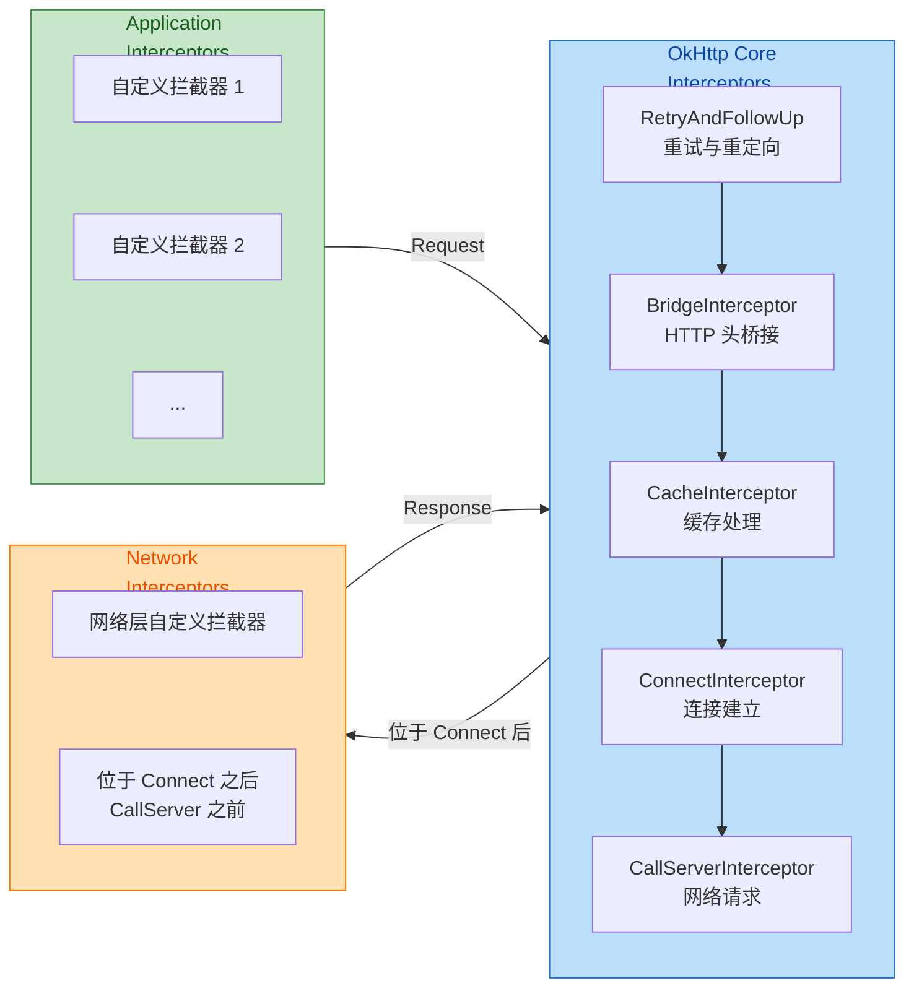

**各拦截器详解**：

1. **RetryAndFollowUpInterceptor（重试与重定向拦截器）**
   - 负责处理请求失败后的重试逻辑（如连接失败、路由失败）
   - 处理 HTTP 3xx 重定向响应，自动跟随重定向
   - 默认最多重定向 20 次，防止无限循环
   - 创建 `ExchangeFinder` 为后续连接做准备

2. **BridgeInterceptor（桥接拦截器）**
   - 在应用层请求和网络层请求之间"架桥"
   - 自动添加必要的 HTTP 头：`Content-Type`、`Content-Length`、`Host`、`Connection`、`Accept-Encoding`、`Cookie`、`User-Agent`
   - 处理 `gzip` 压缩：如果服务器返回 gzip 响应，自动解压

3. **CacheInterceptor（缓存拦截器）**
   - 根据 HTTP 缓存语义决定是否使用缓存
   - 读取缓存响应，写入新的缓存
   - 详细逻辑将在"缓存策略"章节展开

4. **ConnectInterceptor（连接拦截器）**
   - 负责建立与服务器的 TCP 连接
   - 管理连接池，实现连接复用
   - 处理 TLS 握手（HTTPS）

5. **CallServerInterceptor（网络调用拦截器）**
   - 责任链的末端，真正执行网络 I/O
   - 向服务器写入请求，读取响应
   - 这是唯一一个不会调用 `chain.proceed()` 的拦截器

**责任链的实现机制**是理解 OkHttp 架构的核心。让我们通过代码深入分析：

```kotlin
// RealCall 中构建并启动拦截器链
@Throws(IOException::class)
internal fun getResponseWithInterceptorChain(): Response {
    // 按顺序构建拦截器列表
    val interceptors = mutableListOf<Interceptor>()
    
    // 1. 首先添加用户自定义的 Application Interceptors
    // 这些拦截器最先执行，可以拿到最原始的请求
    interceptors += client.interceptors
    
    // 2. 添加核心拦截器（顺序固定，不可改变）
    interceptors += RetryAndFollowUpInterceptor(client)
    interceptors += BridgeInterceptor(client.cookieJar)
    interceptors += CacheInterceptor(client.cache)
    interceptors += ConnectInterceptor
    
    // 3. 如果不是 WebSocket，添加 Network Interceptors
    // 这些拦截器在连接建立后、实际请求前执行
    if (!forWebSocket) {
        interceptors += client.networkInterceptors
    }
    
    // 4. 最后添加实际执行网络请求的拦截器
    interceptors += CallServerInterceptor(forWebSocket)
    
    // 构建责任链，初始 index = 0，从第一个拦截器开始
    val chain = RealInterceptorChain(
        call = this,
        interceptors = interceptors,
        index = 0,                    // 当前拦截器索引
        exchange = null,
        request = originalRequest,
        connectTimeoutMillis = client.connectTimeoutMillis,
        readTimeoutMillis = client.readTimeoutMillis,
        writeTimeoutMillis = client.writeTimeoutMillis
    )
    
    // 启动责任链，开始处理请求
    val response = chain.proceed(originalRequest)
    
    // 检查响应有效性
    if (response.body == null) {
        throw IllegalStateException("interceptor ${interceptors[chain.index - 1]} returned a response with no body")
    }
    
    return response
}
```

**RealInterceptorChain 的 proceed 方法**是责任链的驱动核心：

```kotlin
class RealInterceptorChain(
    val interceptors: List<Interceptor>,
    val index: Int,           // 当前要执行的拦截器索引
    val request: Request,
    // ... 其他参数
) : Interceptor.Chain {
    
    @Throws(IOException::class)
    override fun proceed(request: Request): Response {
        // 检查索引是否越界
        check(index < interceptors.size) { "index out of bounds" }
        
        // 创建一个新的 Chain 实例，index + 1 指向下一个拦截器
        // 注意：这里不是修改当前对象，而是创建新对象
        // 这使得每个拦截器持有的 Chain 都是独立的
        val next = copy(index = index + 1, request = request)
        
        // 获取当前索引对应的拦截器
        val interceptor = interceptors[index]
        
        // 调用拦截器的 intercept 方法
        // 拦截器内部可以：
        // 1. 直接返回 Response（短路，不再继续传递）
        // 2. 调用 chain.proceed() 将请求传递给下一个拦截器
        // 3. 修改 Request 后再调用 chain.proceed()
        // 4. 获取 Response 后进行修改再返回
        val response = interceptor.intercept(next)
        
        // 验证响应不为空
        checkNotNull(response.body) { "interceptor $interceptor returned a response with no body" }
        
        return response
    }
}
```

**自定义 Interceptor 示例**——实现一个请求日志拦截器：

```kotlin
// 自定义日志拦截器示例
// 记录每个请求的 URL、耗时和响应状态
class LoggingInterceptor : Interceptor {
    
    // 实现 intercept 方法，这是拦截器的核心
    override fun intercept(chain: Interceptor.Chain): Response {
        // 从 chain 中获取当前请求
        val request = chain.request()
        
        // 记录请求开始时间
        val startTime = System.nanoTime()
        
        // 打印请求信息
        Log.d("OkHttp", "Sending request: ${request.url}")
        Log.d("OkHttp", "Headers: ${request.headers}")
        
        // 【关键】调用 chain.proceed() 将请求传递给下一个拦截器
        // 这一行会阻塞，直到获得最终的响应
        // 如果不调用 proceed()，请求链就会中断
        val response = chain.proceed(request)
        
        // 计算请求耗时
        val duration = TimeUnit.NANOSECONDS.toMillis(System.nanoTime() - startTime)
        
        // 打印响应信息
        Log.d("OkHttp", "Received response for ${request.url}")
        Log.d("OkHttp", "Status: ${response.code}, Time: ${duration}ms")
        
        // 返回响应（可以是原始响应，也可以是修改后的响应）
        return response
    }
}

// 将拦截器添加到 OkHttpClient
val client = OkHttpClient.Builder()
    // addInterceptor: 添加 Application Interceptor
    // 特点：最先执行，只执行一次（即使有重定向）
    .addInterceptor(LoggingInterceptor())
    
    // addNetworkInterceptor: 添加 Network Interceptor
    // 特点：在连接建立后执行，每次网络请求都执行（包括重定向）
    // .addNetworkInterceptor(LoggingInterceptor())
    
    .build()
```

**Application Interceptor vs Network Interceptor** 是一个常见的困惑点。两者的关键区别在于它们在责任链中的位置：

| 特性 | Application Interceptor | Network Interceptor |
|------|------------------------|---------------------|
| 位置 | 责任链最前端 | 位于 ConnectInterceptor 之后 |
| 执行次数 | 只执行一次 | 每次网络请求都执行（包括重定向） |
| 能否短路 | 可以，不调用 proceed() 直接返回缓存 | 可以，但通常不这样做 |
| 是否看到重定向 | 否，只看到最终响应 | 是，每次重定向都经过 |
| 是否看到缓存 | 否，被 CacheInterceptor 拦截 | 只看到实际网络请求 |
| 典型用途 | 日志、认证Token、统一错误处理 | 流量统计、网络层调试 |

---

**📝 练习题**

在 OkHttp 中，以下关于 Dispatcher 调度器的描述，哪一项是**正确的**？

A. Dispatcher 默认的最大并发请求数（maxRequests）是 128，单主机最大并发数（maxRequestsPerHost）是 10


B. 当调用 `Call.execute()` 执行同步请求时，请求会被放入 `readyAsyncCalls` 队列等待调度


C. Dispatcher 使用 CachedThreadPool 作为默认线程池，空闲线程会在 60 秒后被回收


D. 调用 `Call.enqueue()` 后，请求会立即被线程池执行，不受任何并发限制


**【答案】** C

**【解析】** 

- **选项 A 错误**：Dispatcher 的默认 `maxRequests` 是 64，`maxRequestsPerHost` 是 5，而非 128 和 10。这个设计是为了在充分利用并发的同时，避免耗尽系统资源或对服务器造成过大压力。

- **选项 B 错误**：同步请求（`execute()`）不会进入 `readyAsyncCalls` 队列。同步请求直接在调用线程中执行，Dispatcher 只是通过 `runningSyncCalls` 集合追踪它们以统计总并发数，但不参与队列调度。

- **选项 C 正确**：Dispatcher 确实使用类似 CachedThreadPool 的配置（核心线程数为 0，最大线程数理论无上限，使用 SynchronousQueue）。空闲线程的 keepAliveTime 设置为 60 秒，超时后会被回收释放资源。

- **选项 D 错误**：`enqueue()` 调用后，请求首先进入 `readyAsyncCalls` 等待队列。只有当当前运行的请求数未达到 `maxRequests` 且同一主机的请求数未达到 `maxRequestsPerHost` 时，请求才会被"提升"到执行队列并提交给线程池。这种机制防止了请求风暴导致的资源耗尽。

---

## OkHttp 连接管理

在现代 Android 应用开发中，网络请求的性能优化至关重要。OkHttp 作为业界标准的 HTTP 客户端，其连接管理机制是实现高性能网络通信的核心。理解连接池（ConnectionPool）、流分配（StreamAllocation）以及 Keep-Alive 复用机制，能够帮助开发者深入掌握 OkHttp 如何高效地管理底层 TCP 连接，从而编写出更优质的网络代码。

HTTP 协议建立在 TCP/IP 之上，每次建立 TCP 连接都需要经历三次握手（Three-Way Handshake），如果是 HTTPS 还需要额外的 TLS 握手过程。这些握手操作会带来显著的延迟开销，尤其在移动网络环境下更为明显。假设一个 App 需要连续发送 10 个请求到同一服务器，如果每次请求都重新建立连接，那么握手延迟将累积成不可忽视的性能瓶颈。OkHttp 的连接管理机制正是为了解决这一问题而设计的——通过**连接复用**（Connection Reuse）来消除重复的握手开销。

### ConnectionPool 连接池

ConnectionPool 是 OkHttp 连接管理的核心组件，它负责**存储、复用和清理**空闲的 HTTP 连接。当一个请求完成后，底层的 TCP 连接不会立即关闭，而是被放入连接池中等待后续请求复用。这种设计显著降低了网络延迟，同时也减少了系统资源的消耗。

从设计哲学上看，ConnectionPool 采用了典型的**对象池模式**（Object Pool Pattern）。对象池模式的核心思想是：创建和销毁对象的成本较高时，应该将对象缓存起来重复使用。对于 TCP 连接来说，建立连接需要网络往返，销毁连接也会触发四次挥手，因此池化管理是最佳实践。

OkHttp 默认的连接池配置是：**最多保持 5 个空闲连接，每个连接的最大空闲时间为 5 分钟**。这个配置在大多数场景下都能取得良好的平衡——既不会因为保留过多连接而浪费内存，也不会因为频繁创建连接而影响性能。开发者可以根据实际需求自定义这些参数：

```kotlin
// 创建自定义连接池
val connectionPool = ConnectionPool(
    maxIdleConnections = 10,    // 最大空闲连接数
    keepAliveDuration = 10,      // 空闲连接存活时间
    timeUnit = TimeUnit.MINUTES  // 时间单位
)

// 将连接池配置到 OkHttpClient
val client = OkHttpClient.Builder()
    .connectionPool(connectionPool)  // 注入自定义连接池
    .build()
```

ConnectionPool 内部使用一个 `ArrayDeque<RealConnection>` 来存储所有的连接对象。每个 `RealConnection` 代表一条真实的 TCP 连接（或 TLS 连接），它封装了底层的 Socket、握手信息、协议版本等关键数据。当有新请求到来时，连接池会遍历这个队列，寻找一个**符合条件的可复用连接**。

连接的匹配逻辑相当严格，必须满足以下条件才能复用：

1. **相同的主机名和端口号**：这是最基本的要求，连接到 `api.example.com:443` 的连接不能用于 `cdn.example.com:443`
2. **相同的代理配置**：如果原连接使用了 HTTP 代理，新请求也必须使用相同的代理
3. **连接未被标记为不可复用**：某些情况下（如服务器返回 `Connection: close` 头），连接会被标记为一次性使用
4. **连接仍然健康**：通过检测 Socket 的状态来判断连接是否仍然可用
5. **流数量未超限**：对于 HTTP/2 连接，同一连接上的并发流数量有上限

```kotlin
// RealConnection 中判断连接是否可复用的核心逻辑（简化版）
internal fun isEligible(address: Address, routes: List<Route>?): Boolean {
    // 检查当前连接上的流数量是否已达上限
    if (transmitters.size >= allocationLimit) return false
    
    // 检查地址是否兼容（主机、端口、代理、SSL 配置等）
    if (!this.route.address.equalsNonHost(address)) return false
    
    // 检查主机名是否匹配
    if (address.url.host == this.route.address.url.host) {
        return true  // 完美匹配，可以复用
    }
    
    // HTTP/2 连接可能支持连接合并（Connection Coalescing）
    // 这允许相同 IP 但不同主机名的请求复用同一连接
    // 前提是 TLS 证书覆盖了目标主机名
    return supportsConnectionCoalescing(address, routes)
}
```

连接池还需要负责**清理过期的空闲连接**，以避免内存泄漏和资源浪费。OkHttp 采用了一个后台清理任务来完成这项工作。这个清理任务并不是简单地定时运行，而是采用了更智能的策略：只有当连接池中存在连接时，清理任务才会被调度；当连接池为空时，清理任务会自动停止。

清理算法会遍历所有连接，计算每个连接的空闲时间。如果发现有连接的空闲时间超过了 `keepAliveDuration`，或者空闲连接数量超过了 `maxIdleConnections`，就会移除最久未使用的连接。这种**LRU（Least Recently Used）** 风格的清理策略确保了连接池始终保持在合理的规模内。

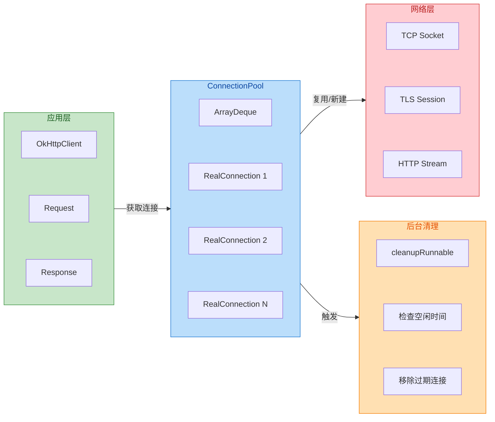

### StreamAllocation 流分配机制

StreamAllocation 是 OkHttp 连接管理中一个相对复杂但极其重要的概念。它充当了**请求与连接之间的桥梁**，负责为每个请求分配合适的连接和流（Stream）。理解 StreamAllocation 的工作原理，对于诊断网络问题和理解 OkHttp 的内部机制非常有帮助。

需要注意的是，在 OkHttp 4.x 版本中，StreamAllocation 的职责被重新划分，部分逻辑被移动到了 `Exchange` 和 `ExchangeFinder` 类中。但核心概念和工作流程保持一致，我们以经典的 StreamAllocation 模型来讲解其原理。

每当一个 HTTP 请求被执行时，OkHttp 都会创建一个对应的流分配器。这个分配器需要完成三个关键任务：

1. **选择路由（Route Selection）**：确定请求应该走哪条网络路径，包括是否使用代理、DNS 解析结果等
2. **获取连接（Connection Acquisition）**：从连接池中获取可复用的连接，或者创建新连接
3. **创建流（Stream Creation）**：在连接上创建 HTTP 流，用于发送请求和接收响应

路由选择是流分配的第一步。一个请求可能有多条可行路由——不同的代理服务器、不同的 IP 地址（DNS 可能返回多个 A 记录）、甚至不同的协议版本。OkHttp 使用 `RouteSelector` 来管理这些可能的路由，并在连接失败时自动尝试下一条路由。这种**故障转移**（Failover）机制大大提高了网络请求的可靠性。

```kotlin
// 路由选择的核心数据结构
class Route(
    val address: Address,        // 目标地址（主机名、端口、SSL 配置等）
    val proxy: Proxy,            // 代理配置（DIRECT、HTTP、SOCKS）
    val socketAddress: InetSocketAddress  // 实际的 Socket 地址（IP + 端口）
)

// RouteSelector 负责生成所有可能的路由
class RouteSelector(
    private val address: Address,
    private val routeDatabase: RouteDatabase,  // 记录失败路由的数据库
    private val call: Call,
    private val eventListener: EventListener
) {
    // 返回下一组可尝试的路由
    fun next(): Selection {
        // 1. 获取代理列表（可能来自 ProxySelector）
        // 2. 对每个代理，进行 DNS 解析获取 IP 地址
        // 3. 组合生成所有可能的路由
        // 4. 排除已知失败的路由
        // ...
    }
}
```

获取连接是流分配的核心环节。分配器首先会检查当前是否已经持有一个可用连接（例如在 HTTP/2 多路复用场景下）。如果没有，就会尝试从连接池中查找匹配的空闲连接。只有当连接池中没有合适的连接时，才会创建新的 TCP 连接。

这个过程可以用以下伪代码来描述：

```kotlin
// 获取连接的核心逻辑（简化版）
fun findConnection(
    connectTimeout: Int,
    readTimeout: Int,
    writeTimeout: Int,
    pingIntervalMillis: Int,
    connectionRetryEnabled: Boolean
): RealConnection {
    // 第一步：检查是否已有可复用的连接
    val existingConnection = transmitter.connection
    if (existingConnection != null && existingConnection.isHealthy) {
        return existingConnection  // 直接复用当前连接
    }
    
    // 第二步：从连接池中查找匹配的连接
    val pooledConnection = connectionPool.findConnection(
        address = address,
        routes = routeSelection?.routes,
        requireMultiplexed = false
    )
    if (pooledConnection != null) {
        return pooledConnection  // 复用连接池中的连接
    }
    
    // 第三步：选择路由
    if (routeSelection == null || !routeSelection.hasNext()) {
        routeSelection = routeSelector.next()
    }
    val route = routeSelection.next()
    
    // 第四步：再次检查连接池（使用具体路由信息）
    val pooledConnection2 = connectionPool.findConnection(
        address = address,
        routes = listOf(route),
        requireMultiplexed = false
    )
    if (pooledConnection2 != null) {
        return pooledConnection2
    }
    
    // 第五步：创建新连接
    val newConnection = RealConnection(connectionPool, route)
    newConnection.connect(
        connectTimeout, readTimeout, writeTimeout,
        pingIntervalMillis, connectionRetryEnabled, call, eventListener
    )
    
    // 第六步：将新连接放入连接池
    connectionPool.put(newConnection)
    
    return newConnection
}
```

创建流是流分配的最后一步。对于 HTTP/1.1 协议，每个连接同一时刻只能承载一个请求-响应对，因此"流"的概念相对简单——它就是底层 Socket 的输入输出流的封装。但对于 HTTP/2 协议，单个 TCP 连接可以同时承载多个并发的流，每个流都有独立的流 ID、流量控制窗口和状态机。

HTTP/2 的多路复用（Multiplexing）特性是现代网络优化的重要手段。在 HTTP/1.1 时代，为了实现并发请求，浏览器和客户端通常会同时建立多个 TCP 连接（Chrome 默认对同一域名最多 6 个连接）。这不仅浪费系统资源，还会导致 TCP 慢启动（Slow Start）带来的性能损失。HTTP/2 通过在单个连接上复用多个流，完美解决了这个问题。

```kotlin
// HTTP/2 流的简化表示
class Http2Stream(
    val id: Int,                      // 流 ID（奇数为客户端发起，偶数为服务端发起）
    val connection: Http2Connection,   // 所属的 HTTP/2 连接
    var errorCode: ErrorCode? = null   // 流级别的错误码
) {
    // 流有自己的状态：IDLE -> OPEN -> HALF_CLOSED -> CLOSED
    // 流有自己的流量控制窗口，独立于连接级别的窗口
    // 流可以设置优先级，服务器据此决定响应顺序
}
```

StreamAllocation 还需要处理**连接的引用计数**问题。当多个请求复用同一个连接时（HTTP/2 场景），连接池需要知道有多少个活跃的流正在使用这个连接，以便正确决定何时可以关闭连接。这是通过在 RealConnection 中维护一个 `transmitters` 列表来实现的——每个正在使用该连接的请求都会在列表中注册一个弱引用。

```text
┌─────────────────────────────────────────────────────────────┐
│                    RealConnection                           │
├─────────────────────────────────────────────────────────────┤
│  socket: Socket                                             │
│  handshake: Handshake?                                      │
│  protocol: Protocol (HTTP_1_1 / HTTP_2)                     │
│  allocationLimit: Int (HTTP/1.1=1, HTTP/2=多个)             │
│                                                             │
│  transmitters: MutableList<TransmitterRef>                  │
│     ├── TransmitterRef → Request A (活跃)                   │
│     ├── TransmitterRef → Request B (活跃)                   │
│     └── TransmitterRef → Request C (已完成，待清理)          │
│                                                             │
│  idleAtNs: Long (变为空闲的时间戳)                           │
└─────────────────────────────────────────────────────────────┘
```

### Keep-Alive 复用机制

Keep-Alive 是 HTTP 协议层面支持连接复用的机制，而 OkHttp 的连接池则是在客户端实现层面对这一机制的落地。理解 Keep-Alive 的工作原理，能够帮助开发者更好地配置服务器和客户端，以达到最优的网络性能。

在 HTTP/1.0 时代，默认行为是**短连接**（Short-lived Connection）：每个请求都需要建立新的 TCP 连接，请求完成后立即关闭。这种方式实现简单，但性能开销巨大。HTTP/1.1 引入了**持久连接**（Persistent Connection）作为默认行为，允许在同一个 TCP 连接上发送多个请求。

持久连接的协商通过 HTTP 头部完成：

- **HTTP/1.1**：持久连接是默认行为，除非显式声明 `Connection: close`
- **HTTP/1.0**：需要显式声明 `Connection: keep-alive` 来启用持久连接

```text
HTTP/1.1 请求（默认保持连接）:
GET /api/users HTTP/1.1
Host: api.example.com
(不需要额外的头部，连接默认保持)

HTTP/1.1 请求（显式关闭连接）:
GET /api/users HTTP/1.1
Host: api.example.com
Connection: close
(服务器响应后将关闭连接)

HTTP/1.0 请求（请求保持连接）:
GET /api/users HTTP/1.0
Host: api.example.com
Connection: keep-alive
(如果服务器支持，将保持连接)
```

服务器在响应中可以包含 `Keep-Alive` 头部，提供关于持久连接的额外信息：

```text
HTTP/1.1 200 OK
Connection: keep-alive
Keep-Alive: timeout=60, max=100

参数说明：
- timeout=60: 连接空闲超过 60 秒后服务器将关闭
- max=100: 此连接最多再处理 100 个请求
```

OkHttp 会解析这些头部信息，但实际的连接管理仍然由 ConnectionPool 控制。即使服务器声明 `timeout=60`，如果客户端配置的 `keepAliveDuration` 是 5 分钟，那么客户端可能会在 5 分钟后才尝试复用这个已经被服务器关闭的连接。这种情况下，客户端会收到连接重置（Connection Reset）错误，OkHttp 会自动处理这种情况并重试请求。

Keep-Alive 复用机制在实际网络环境中可能遇到各种问题，OkHttp 通过**连接健康检查**来降低这些问题的影响：

```kotlin
// RealConnection 中的健康检查
fun isHealthy(doExtensiveChecks: Boolean): Boolean {
    // 基础检查：Socket 是否仍然打开
    if (socket.isClosed || socket.isInputShutdown || socket.isOutputShutdown) {
        return false
    }
    
    // HTTP/2 连接检查：GOAWAY 帧和错误状态
    val http2Connection = this.http2Connection
    if (http2Connection != null) {
        return !http2Connection.isShutdown
    }
    
    // 扩展检查：尝试读取 Socket 检测是否有待处理的数据或错误
    if (doExtensiveChecks) {
        return !socket.isInputStreamExhausted()
    }
    
    return true
}
```

扩展健康检查（`doExtensiveChecks`）会在复用连接发送请求**之前**执行。它通过设置极短的读取超时（0ms）来检测 Socket 是否处于异常状态——如果服务器已经关闭了连接，客户端通常能够通过这种方式提前发现，而不是在发送请求后才收到错误。

HTTP/2 的 Keep-Alive 机制与 HTTP/1.1 有显著不同。HTTP/2 使用**PING 帧**来探测连接的活性，这是一种更可靠的心跳机制。OkHttp 支持配置 PING 间隔：

```kotlin
val client = OkHttpClient.Builder()
    .pingInterval(30, TimeUnit.SECONDS)  // 每 30 秒发送一次 PING
    .build()
```

PING 帧的作用包括：

1. **探测连接活性**：确保连接在 NAT 或防火墙环境中不会因为空闲而被关闭
2. **测量 RTT**：通过 PING/PONG 往返时间来评估网络延迟
3. **触发流量控制**：某些服务器实现会在收到 PING 时更新流量控制窗口

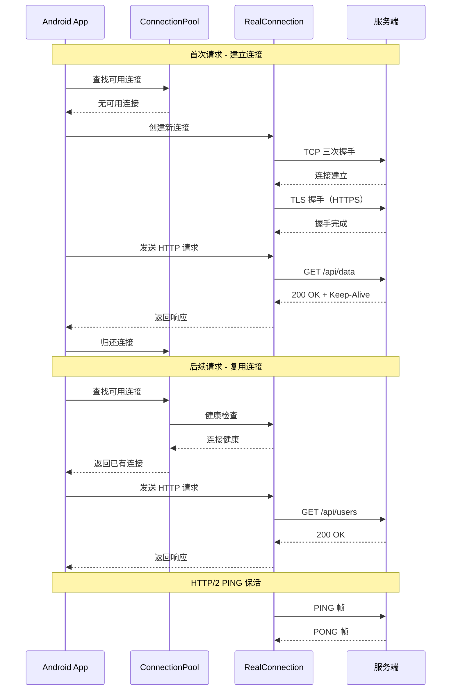

在实际开发中，合理配置连接管理参数可以显著提升 App 的网络性能。以下是一些最佳实践：

**1. 根据业务场景调整连接池大小**

如果 App 主要与单一服务器通信（如自家后端 API），可以适当减少连接池大小；如果需要同时访问多个不同域名的服务（如多个 CDN、第三方 API），则应增加连接池容量。

```kotlin
// 单一后端场景
val singleBackendPool = ConnectionPool(
    maxIdleConnections = 3,
    keepAliveDuration = 5,
    timeUnit = TimeUnit.MINUTES
)

// 多域名场景
val multiDomainPool = ConnectionPool(
    maxIdleConnections = 15,
    keepAliveDuration = 3,
    timeUnit = TimeUnit.MINUTES
)
```

**2. 为 HTTP/2 启用 PING 心跳**

在移动网络环境下，NAT 设备可能会在连接空闲一段时间后丢弃会话。配置 PING 间隔可以保持连接活跃：

```kotlin
val client = OkHttpClient.Builder()
    .pingInterval(15, TimeUnit.SECONDS)  // 移动网络建议 15-30 秒
    .build()
```

**3. 监控连接状态**

通过 EventListener 可以监控连接的建立、复用和关闭情况，这对于性能分析和问题诊断非常有帮助：

```kotlin
// 自定义 EventListener 监控连接事件
class ConnectionEventListener : EventListener() {
    
    // 开始获取连接
    override fun connectionAcquired(call: Call, connection: Connection) {
        Log.d("OkHttp", "连接获取: ${connection.route().socketAddress()}")
    }
    
    // 连接释放
    override fun connectionReleased(call: Call, connection: Connection) {
        Log.d("OkHttp", "连接释放: ${connection.route().socketAddress()}")
    }
    
    // TCP 连接开始
    override fun connectStart(call: Call, inetSocketAddress: InetSocketAddress, proxy: Proxy) {
        Log.d("OkHttp", "正在建立连接: $inetSocketAddress")
    }
    
    // TCP 连接完成
    override fun connectEnd(
        call: Call,
        inetSocketAddress: InetSocketAddress,
        proxy: Proxy,
        protocol: Protocol?
    ) {
        Log.d("OkHttp", "连接建立完成: $inetSocketAddress, 协议: $protocol")
    }
}

// 使用 EventListener.Factory 为每个请求创建监听器
val client = OkHttpClient.Builder()
    .eventListenerFactory { ConnectionEventListener() }
    .build()
```

**4. 理解连接复用的限制**

连接复用并非万能的。以下情况会阻止复用：

- **服务器返回 `Connection: close`**：明确表示不支持复用
- **响应体未完全消费**：如果上一个响应的 Body 没有被读取完毕或关闭，连接无法复用
- **请求超时或异常**：连接处于不确定状态，不适合复用
- **SSL/TLS 配置不匹配**：不同的证书配置、Cipher Suites 等会导致无法复用

```kotlin
// 确保响应体被正确关闭，以便连接能够复用
client.newCall(request).execute().use { response ->  // use 会自动关闭
    val body = response.body?.string()
    // 处理响应...
}  // response 在这里自动关闭，连接可以归还连接池
```

---

**📝 练习题**

在 Android 应用中，当使用 OkHttp 连续向同一服务器（支持 HTTP/2）发送 10 个请求时，关于连接管理的描述，以下哪项是**正确**的？

A. 默认情况下，OkHttp 会为每个请求创建独立的 TCP 连接，共建立 10 个连接


B. HTTP/2 的多路复用特性允许所有 10 个请求在单个 TCP 连接上并发执行


C. 连接池的 `maxIdleConnections` 参数决定了同时发送请求的最大并发数


D. 如果服务器返回 `Keep-Alive: timeout=5`，OkHttp 会严格在 5 秒后关闭该连接


**【答案】** B

**【解析】** 

HTTP/2 协议的核心特性之一就是**多路复用**（Multiplexing），它允许在单个 TCP 连接上同时传输多个请求和响应，每个请求/响应对构成一个独立的"流"（Stream）。因此，即使有 10 个并发请求，OkHttp 也只需要建立一个 TCP 连接（假设是首次请求），后续请求都会在这个连接上以多路复用的方式执行。

选项 A 错误，因为 OkHttp 默认启用连接复用，不会为每个请求创建新连接。即使是 HTTP/1.1，也会尽量复用连接（虽然需要串行发送请求）。

选项 C 混淆了概念。`maxIdleConnections` 控制的是连接池中保持的**空闲**连接数量上限，与并发请求数无关。并发请求数由 `Dispatcher` 的 `maxRequestsPerHost` 参数控制（默认为 5），而对于 HTTP/2，单个连接可承载的并发流数量由协议协商决定（通常为 100-256）。

选项 D 也是错误的。虽然服务器可以通过 `Keep-Alive` 头部声明超时时间，但 OkHttp 的连接池有自己独立的 `keepAliveDuration` 配置，实际的连接生命周期由客户端自行管理。如果服务器提前关闭了连接，OkHttp 会在下次复用时通过健康检查发现这一情况，并自动重建连接。

---

## Retrofit 动态代理

Retrofit 是 Square 公司基于 OkHttp 之上构建的类型安全的 HTTP 客户端。它最核心的设计哲学是：**让开发者通过声明式的 Interface 定义 API，而无需关心底层的网络请求实现**。这一切的魔法背后，正是 Java 的 **动态代理机制（Dynamic Proxy）**。

从架构角度看，Retrofit 扮演的角色是"请求的构造器与适配器"，它负责将 Interface 方法上的注解信息解析成一个完整的 HTTP 请求，然后委托给 OkHttp 去真正执行网络通信。这种"声明即实现"的模式极大地降低了网络层代码的复杂度，使得 API 调用如同本地方法调用一样简洁。

理解 Retrofit 的动态代理机制，需要掌握三个核心环节：**Interface 定义（声明层）**、**Proxy.newProxyInstance 原理（代理生成层）**、**ServiceMethod 解析（执行层）**。它们共同构成了 Retrofit 的"魔法三角"。

### Interface 定义

在 Retrofit 中，我们通过定义一个 Java/Kotlin Interface 来描述后端 API 的契约。每个方法对应一个 HTTP 端点，方法上的注解描述了请求的类型、路径、参数等元信息。

**为什么选择 Interface 而不是抽象类？** 这是一个精妙的设计决策。Interface 在 Java 中是纯粹的行为契约，不包含任何实现细节，这与"声明式 API"的理念完美契合。更重要的是，Java 的 `java.lang.reflect.Proxy` 只能为 Interface 创建动态代理实例，无法代理抽象类或具体类。Kotlin 的 Interface 同样继承了这一特性。

**注解的语义化设计**：Retrofit 提供了一套丰富的注解体系，它们可以分为以下几类：

**HTTP 方法注解**：`@GET`、`@POST`、`@PUT`、`@DELETE`、`@PATCH`、`@HEAD`、`@OPTIONS` 以及通用的 `@HTTP`。这些注解直接映射到 HTTP 协议的请求方法，并且携带相对路径信息。

**参数注解**：`@Path` 用于路径占位符替换；`@Query` 和 `@QueryMap` 用于 URL 查询参数；`@Field` 和 `@FieldMap` 配合 `@FormUrlEncoded` 用于表单提交；`@Body` 直接将对象序列化为请求体；`@Header` 和 `@HeaderMap` 用于动态添加请求头。

**标记注解**：`@FormUrlEncoded` 表示请求体为表单格式；`@Multipart` 表示多部分请求（文件上传）；`@Streaming` 表示响应体应以流的形式处理而非全部加载到内存。

```kotlin
// 定义一个 GitHub API 服务接口
// Interface 是 Retrofit 的核心契约，所有 API 端点都在这里声明
interface GitHubApiService {

    // @GET 注解标识这是一个 HTTP GET 请求
    // "users/{user}/repos" 是相对路径，{user} 是路径占位符
    @GET("users/{user}/repos")
    // suspend 关键字表示这是一个 Kotlin 协程挂起函数
    // Retrofit 2.6+ 原生支持挂起函数，底层会自动适配
    suspend fun listRepos(
        // @Path 注解将参数值替换到路径中的 {user} 占位符
        @Path("user") user: String,
        // @Query 注解将参数作为 URL 查询字符串 ?sort=...
        @Query("sort") sort: String = "updated"
    ): List<Repo>  // 返回类型会被 Converter 自动反序列化

    // POST 请求示例，用于创建资源
    @POST("repos/{owner}/{repo}/issues")
    suspend fun createIssue(
        @Path("owner") owner: String,
        @Path("repo") repo: String,
        // @Body 注解表示整个对象会被序列化为 JSON 请求体
        // 这需要配置相应的 Converter（如 GsonConverterFactory）
        @Body issue: CreateIssueRequest
    ): Issue

    // 动态 Header 示例：Token 认证
    @GET("user")
    suspend fun getCurrentUser(
        // @Header 注解允许在运行时动态设置请求头
        // 常用于传递 Authorization Token
        @Header("Authorization") authHeader: String
    ): User

    // 表单提交示例
    @FormUrlEncoded  // 标记请求体格式为 application/x-www-form-urlencoded
    @POST("login")
    suspend fun login(
        // @Field 注解将参数编码为表单字段
        @Field("username") username: String,
        @Field("password") password: String
    ): LoginResponse
}
```

**返回类型的多样性**：Retrofit 支持多种返回类型，这得益于 CallAdapter 的设计。常见的返回类型包括：

- **`Call<T>`**：Retrofit 默认类型，代表一个待执行的请求，需要手动调用 `enqueue()` 或 `execute()`
- **`suspend fun`**：Kotlin 协程挂起函数，Retrofit 2.6+ 内置支持，是当前最推荐的方式
- **`Observable<T>` / `Flowable<T>`**：通过 RxJava CallAdapter 支持响应式编程
- **`Response<T>`**：包装类型，可获取完整的 HTTP 响应信息（状态码、Header 等）
- **`Result<T>`**：Retrofit 2.6+ 新增，用于协程场景的异常安全包装

### Proxy.newProxyInstance 原理

当我们调用 `retrofit.create(GitHubApiService::class.java)` 时，Retrofit 并没有为我们生成一个 GitHubApiService 的实现类，而是使用了 Java 的 **动态代理（Dynamic Proxy）** 机制在运行时创建一个代理实例。这个代理实例"假装"实现了我们的 Interface，但实际上所有方法调用都会被转发到一个统一的处理器。

**动态代理的核心三要素**：

1. **ClassLoader**：类加载器，用于定义代理类
2. **Interface 数组**：代理类需要实现的接口列表
3. **InvocationHandler**：调用处理器，所有方法调用都会被路由到这里

```java
// java.lang.reflect.Proxy 的核心方法签名
public static Object newProxyInstance(
    ClassLoader loader,           // 类加载器
    Class<?>[] interfaces,        // 要代理的接口数组
    InvocationHandler handler     // 调用处理器
) throws IllegalArgumentException
```

**JVM 层面发生了什么？** 当 `Proxy.newProxyInstance` 被调用时，JVM 会在运行时动态生成一个名为 `$Proxy0`（数字递增）的字节码类。这个类：
- 继承自 `java.lang.reflect.Proxy`
- 实现了我们指定的所有 Interface
- 每个接口方法的实现都是：调用 `InvocationHandler.invoke()` 并传入方法信息和参数

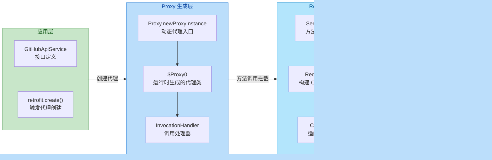

**Retrofit 的 InvocationHandler 实现**：Retrofit 在 `create()` 方法内部实现了自己的 InvocationHandler，核心逻辑可以简化理解为：

```kotlin
// Retrofit.create() 方法的简化版实现
// 这是理解 Retrofit 工作原理的关键入口
fun <T> create(service: Class<T>): T {
    // 验证传入的必须是接口类型
    validateServiceInterface(service)
    
    // 使用 Java 动态代理创建接口的实现实例
    @Suppress("UNCHECKED_CAST")
    return Proxy.newProxyInstance(
        // 使用服务接口的类加载器
        service.classLoader,
        // 代理类需要实现的接口数组（只有一个：我们的 API 接口）
        arrayOf(service),
        // 核心：InvocationHandler 处理所有方法调用
        object : InvocationHandler {
            // 每当调用代理对象的任何方法时，都会执行这个 invoke
            override fun invoke(
                proxy: Any,           // 代理对象本身
                method: Method,       // 被调用的方法反射对象
                args: Array<out Any>? // 方法参数数组
            ): Any? {
                // 特殊处理：Object 类的方法（如 toString、equals）直接执行
                if (method.declaringClass == Object::class.java) {
                    return method.invoke(this, *(args ?: emptyArray()))
                }
                
                // 核心：加载或创建 ServiceMethod，这是方法元数据的缓存容器
                // loadServiceMethod 会解析方法上的所有注解
                val serviceMethod = loadServiceMethod(method)
                
                // 调用 ServiceMethod 执行实际的网络请求逻辑
                // args 是调用时传入的实际参数值
                return serviceMethod.invoke(args)
            }
        }
    ) as T
}
```

**为什么不用代码生成（如 APT）而用动态代理？** 这是一个常见的设计讨论。动态代理的优势在于：零配置（无需注解处理器）、零生成代码（不增加 APK 体积）、运行时灵活（可动态修改行为）。劣势是反射调用有一定性能开销，且无法在编译期发现接口定义错误。实际上，Retrofit 2.x 通过 ServiceMethod 缓存和 Kotlin 内联优化，已经将反射开销降到很低。

**validateServiceInterface 的校验逻辑**：在创建代理之前，Retrofit 会进行严格的校验：

- 必须是 Interface 类型，不能是 Class
- 不能有泛型参数（如 `interface Api<T>` 不合法）
- 可配置是否预先验证所有方法的合法性（eagerly validate）

### ServiceMethod 解析

ServiceMethod 是 Retrofit 架构中最核心的类之一。它的职责是：**将 Interface 方法的注解信息解析成一个可执行的请求模板**。每个 API 方法都对应一个 ServiceMethod 实例，这些实例会被缓存以避免重复解析的开销。

**ServiceMethod 的演进**：在 Retrofit 2.5 之前，ServiceMethod 是一个包含所有逻辑的巨型类。从 2.6 开始，为了支持 Kotlin 协程，Retrofit 将 ServiceMethod 拆分为抽象基类和多个子类实现：

- **`ServiceMethod<T>`**：抽象基类，定义 `invoke()` 方法
- **`HttpServiceMethod<ResponseT, ReturnT>`**：HTTP 请求的具体实现
- **`SuspendForBody`** / **`SuspendForResponse`**：Kotlin 挂起函数的特化实现

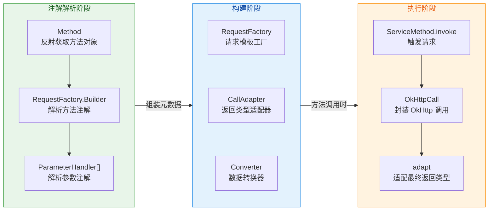

**ServiceMethod 的缓存机制**：Retrofit 使用一个 `ConcurrentHashMap` 来缓存已解析的 ServiceMethod。当同一个方法被多次调用时，只有第一次会触发完整的注解解析流程，后续调用直接从缓存获取：

```kotlin
// Retrofit 内部的 ServiceMethod 缓存
// 使用 ConcurrentHashMap 保证线程安全
private val serviceMethodCache: MutableMap<Method, ServiceMethod<*>> = 
    ConcurrentHashMap()

// loadServiceMethod 的简化实现
fun loadServiceMethod(method: Method): ServiceMethod<*> {
    // 首先尝试从缓存获取
    var result = serviceMethodCache[method]
    if (result != null) return result
    
    // 缓存未命中，需要同步解析（双重检查锁定）
    synchronized(serviceMethodCache) {
        result = serviceMethodCache[method]
        if (result == null) {
            // 调用 ServiceMethod.parseAnnotations 执行完整解析
            // 这是一个相对耗时的反射操作
            result = ServiceMethod.parseAnnotations(this, method)
            // 解析完成后放入缓存
            serviceMethodCache[method] = result
        }
    }
    return result!!
}
```

**RequestFactory：请求模板的构建者**。ServiceMethod 内部使用 RequestFactory 来管理请求构建的所有细节。它解析的信息包括：

- **HTTP 方法**：从 `@GET`、`@POST` 等注解提取
- **相对 URL**：从方法注解的 value 属性提取，支持 `{placeholder}` 语法
- **Headers**：从 `@Headers` 注解和方法参数的 `@Header` 注解收集
- **Content-Type**：根据 `@FormUrlEncoded`、`@Multipart` 或 `@Body` 推断
- **是否有 Body**：POST/PUT/PATCH 通常有，GET/DELETE/HEAD 通常没有

**ParameterHandler：参数处理器数组**。每个方法参数都会被解析成一个 ParameterHandler 实例，它知道如何将运行时的参数值应用到请求上：

```kotlin
// ParameterHandler 的核心职责示意
// 每种参数注解都有对应的 Handler 实现
abstract class ParameterHandler<T> {
    // 将参数值应用到 RequestBuilder 上
    abstract fun apply(builder: RequestBuilder, value: T)
}

// @Path 参数处理器
class Path<T>(
    private val name: String,           // 占位符名称，如 "user"
    private val valueConverter: Converter<T, String>  // 值转换器
) : ParameterHandler<T>() {
    override fun apply(builder: RequestBuilder, value: T) {
        // 将参数值转换为字符串，替换 URL 中的 {name} 占位符
        builder.addPathParam(name, valueConverter.convert(value))
    }
}

// @Query 参数处理器
class Query<T>(
    private val name: String,           // 查询参数名
    private val valueConverter: Converter<T, String>,
    private val encoded: Boolean        // 是否已经 URL 编码
) : ParameterHandler<T>() {
    override fun apply(builder: RequestBuilder, value: T) {
        // 将参数添加到 URL 查询字符串：?name=value
        val convertedValue = valueConverter.convert(value)
        builder.addQueryParam(name, convertedValue, encoded)
    }
}

// @Body 参数处理器
class Body<T>(
    private val converter: Converter<T, RequestBody>  // JSON 序列化转换器
) : ParameterHandler<T>() {
    override fun apply(builder: RequestBuilder, value: T) {
        // 将对象序列化为 RequestBody，设置为请求体
        val body = converter.convert(value)
        builder.setBody(body)
    }
}
```

**完整的调用流程总结**：

1. **代理创建**：`retrofit.create(ApiService::class.java)` 返回一个动态代理实例
2. **方法调用**：调用代理的任意 API 方法，触发 `InvocationHandler.invoke()`
3. **ServiceMethod 加载**：从缓存获取或首次解析方法注解
4. **请求构建**：RequestFactory 使用 ParameterHandler 数组将参数应用到请求模板
5. **Call 创建**：生成一个 `OkHttpCall` 实例，封装了完整的 OkHttp Request
6. **适配返回**：CallAdapter 将 Call 适配成最终返回类型（如 suspend 挂起、Observable 响应式）
7. **执行请求**：OkHttp 执行实际的网络 I/O
8. **响应转换**：Converter 将响应体反序列化为目标类型

**性能优化考量**：Retrofit 团队在设计中做了大量优化：

- **ServiceMethod 缓存**：避免重复解析注解的反射开销
- **Kotlin Suspend 原生支持**：无需额外 CallAdapter，减少对象创建
- **默认方法处理**：Java 8+ 的 Interface default 方法直接执行，不走代理逻辑
- **Lookup 优化**：Android API 26+ 使用 MethodHandle 提升反射性能

---

**📝 练习题**

在 Retrofit 的动态代理机制中，当我们调用 `retrofit.create(ApiService::class.java)` 时，下列哪个说法是正确的？

A. Retrofit 会在编译期通过注解处理器（APT）生成 ApiService 的实现类


B. Retrofit 使用 `java.lang.reflect.Proxy.newProxyInstance()` 在运行时动态生成代理实例，所有方法调用都会路由到 InvocationHandler


C. Retrofit 会使用 Kotlin 的 `by` 委托语法创建一个委托对象来实现 ApiService


D. Retrofit 要求 ApiService 必须是一个抽象类（abstract class），这样才能正确解析注解


**【答案】** B

**【解析】** Retrofit 的核心机制是 Java 动态代理。当调用 `create()` 方法时，Retrofit 内部调用 `Proxy.newProxyInstance()`，传入 ApiService 的 ClassLoader、接口数组和一个自定义的 InvocationHandler。JVM 会在运行时动态生成一个实现了 ApiService 接口的代理类（如 `$Proxy0`），该类的所有方法实现都是将调用委托给 InvocationHandler.invoke()。在 invoke() 内部，Retrofit 会加载缓存的 ServiceMethod，解析注解信息，构建 OkHttp Request 并执行。选项 A 错误是因为 Retrofit 不使用 APT 代码生成；选项 C 错误是因为这是 Java 反射机制而非 Kotlin 委托语法；选项 D 错误是因为 Java 动态代理只能代理 Interface，不能代理抽象类或具体类。

---

## 数据转换 Converter

在 Retrofit 的网络请求架构中，**Converter（转换器）** 扮演着至关重要的"翻译官"角色。它负责将服务端返回的原始 HTTP 响应体（通常是 JSON、XML 等格式的字节流）转换为应用层可直接使用的 **强类型对象（Strongly-typed Objects）**，同时也承担将请求参数对象序列化为请求体的逆向职责。理解 Converter 的工作机制，是掌握 Retrofit 数据流转的关键一环。

从设计哲学上看，Retrofit 本身**不内置任何数据解析逻辑**——它是一个纯粹的 HTTP 客户端封装层，通过 **策略模式（Strategy Pattern）** 将数据转换的具体实现委托给可插拔的 `Converter.Factory`。这种解耦设计带来了极大的灵活性：你可以选择 Gson、Moshi、Jackson、Protobuf，甚至自定义二进制协议，而 Retrofit 核心代码无需任何改动。

### Converter 的核心接口设计

Retrofit 定义了两个核心接口来描述转换行为：

```kotlin
// Converter.kt - Retrofit 核心转换接口
// 泛型 F 表示输入类型（From），T 表示输出类型（To）
interface Converter<F, T> {
    // 执行实际的转换操作
    // 将类型 F 的输入转换为类型 T 的输出
    @Throws(IOException::class)
    fun convert(value: F): T?
}
```

单独的 `Converter` 接口只描述"如何转换"，而 **`Converter.Factory`** 则负责"何时创建转换器"——它是一个抽象工厂，根据目标类型动态生成合适的 Converter 实例：

```kotlin
// Converter.Factory - 转换器工厂抽象类
abstract class Factory {
    // 创建 ResponseBody → 目标类型 的转换器
    // type: 方法返回值的泛型类型（如 User、List<Order>）
    // annotations: 方法上的注解数组
    // retrofit: Retrofit 实例，可用于递归查找其他转换器
    open fun responseBodyConverter(
        type: Type,                    // 目标类型，如 User::class.java
        annotations: Array<Annotation>,// 方法注解，如 @GET、@POST
        retrofit: Retrofit             // Retrofit 实例引用
    ): Converter<ResponseBody, *>? = null
    
    // 创建 目标类型 → RequestBody 的转换器
    // 用于 @Body 注解的参数序列化
    open fun requestBodyConverter(
        type: Type,
        parameterAnnotations: Array<Annotation>, // 参数上的注解
        methodAnnotations: Array<Annotation>,    // 方法上的注解
        retrofit: Retrofit
    ): Converter<*, RequestBody>? = null
    
    // 创建 目标类型 → String 的转换器
    // 用于 @Query、@Path、@Header 等字符串参数
    open fun stringConverter(
        type: Type,
        annotations: Array<Annotation>,
        retrofit: Retrofit
    ): Converter<*, String>? = null
}
```

这种设计的精妙之处在于：Factory 的每个方法都可以返回 `null`，表示"我不处理这种类型"。Retrofit 会按注册顺序依次询问所有 Factory，直到找到一个能处理该类型的转换器。这就是经典的 **责任链模式（Chain of Responsibility）** 在类型匹配场景的应用。

### GsonConverterFactory 深度解析

**Gson** 是 Google 开发的 JSON 序列化/反序列化库，也是 Android 社区最早广泛使用的 JSON 解析方案。`GsonConverterFactory` 作为 Retrofit 官方提供的适配器，将 Gson 的能力无缝接入 Retrofit 体系。

#### 基础配置与使用

```kotlin
// build.gradle.kts 依赖配置
dependencies {
    // Retrofit 核心库
    implementation("com.squareup.retrofit2:retrofit:2.9.0")
    // Gson 转换器适配库
    implementation("com.squareup.retrofit2:converter-gson:2.9.0")
}
```

```kotlin
// Retrofit 实例构建
val retrofit = Retrofit.Builder()
    .baseUrl("https://api.example.com/")
    // 添加 Gson 转换器工厂
    // create() 使用默认配置的 Gson 实例
    .addConverterFactory(GsonConverterFactory.create())
    .build()
```

当服务端返回如下 JSON 响应时：

```json
{
    "id": 1001,
    "name": "张三",
    "email": "zhangsan@example.com",
    "created_at": "2024-03-15T10:30:00Z"
}
```

对应的 Kotlin 数据类和接口定义：

```kotlin
// 用户数据模型
// @SerializedName 注解用于指定 JSON 字段名与属性名的映射关系
// 当 JSON 字段名与属性名不一致时（如下划线 vs 驼峰），必须使用此注解
data class User(
    val id: Long,                           // JSON 字段名与属性名一致，无需注解
    val name: String,
    val email: String,
    @SerializedName("created_at")           // JSON 字段 "created_at" 映射到 createdAt
    val createdAt: String
)

// API 接口定义
interface UserService {
    // GET 请求获取用户信息
    // 返回类型 User 会被 GsonConverterFactory 处理
    @GET("users/{id}")
    suspend fun getUser(@Path("id") userId: Long): User
}
```

#### GsonConverterFactory 内部实现机制

深入源码，我们可以看到 `GsonConverterFactory` 的核心逻辑：

```java
// GsonConverterFactory.java 核心实现（简化版）
public final class GsonConverterFactory extends Converter.Factory {
    // 持有的 Gson 实例，所有转换操作都委托给它
    private final Gson gson;
    
    // 私有构造函数，强制通过 create() 工厂方法创建
    private GsonConverterFactory(Gson gson) {
        this.gson = gson;
    }
    
    // 静态工厂方法：使用默认 Gson 配置
    public static GsonConverterFactory create() {
        return create(new Gson());
    }
    
    // 静态工厂方法：使用自定义 Gson 配置
    public static GsonConverterFactory create(Gson gson) {
        if (gson == null) throw new NullPointerException("gson == null");
        return new GsonConverterFactory(gson);
    }
    
    // 响应体转换器：ResponseBody → 目标类型
    @Override
    public Converter<ResponseBody, ?> responseBodyConverter(
            Type type, Annotation[] annotations, Retrofit retrofit) {
        // 获取目标类型对应的 TypeAdapter
        // TypeAdapter 是 Gson 的核心类，负责具体的序列化/反序列化逻辑
        TypeAdapter<?> adapter = gson.getAdapter(TypeToken.get(type));
        // 返回封装了 TypeAdapter 的转换器
        return new GsonResponseBodyConverter<>(gson, adapter);
    }
    
    // 请求体转换器：目标类型 → RequestBody
    @Override
    public Converter<?, RequestBody> requestBodyConverter(
            Type type, Annotation[] paramAnnotations, 
            Annotation[] methodAnnotations, Retrofit retrofit) {
        TypeAdapter<?> adapter = gson.getAdapter(TypeToken.get(type));
        return new GsonRequestBodyConverter<>(gson, adapter);
    }
}
```

```java
// GsonResponseBodyConverter.java - 响应体转换器实现
final class GsonResponseBodyConverter<T> implements Converter<ResponseBody, T> {
    private final Gson gson;
    private final TypeAdapter<T> adapter;
    
    GsonResponseBodyConverter(Gson gson, TypeAdapter<T> adapter) {
        this.gson = gson;
        this.adapter = adapter;
    }
    
    @Override
    public T convert(ResponseBody value) throws IOException {
        // 从 ResponseBody 获取字符流
        JsonReader jsonReader = gson.newJsonReader(value.charStream());
        try {
            // 使用 TypeAdapter 将 JSON 流解析为目标对象
            T result = adapter.read(jsonReader);
            // 检查是否还有未读取的 JSON 内容（格式校验）
            if (jsonReader.peek() != JsonToken.END_DOCUMENT) {
                throw new JsonIOException("JSON document was not fully consumed.");
            }
            return result;
        } finally {
            // 确保关闭 ResponseBody，释放连接资源
            value.close();
        }
    }
}
```

从实现中可以看出几个关键设计：

1. **TypeAdapter 复用**：Gson 的 `TypeAdapter` 是线程安全且可复用的，`GsonConverterFactory` 在创建 Converter 时就确定了 TypeAdapter，后续转换操作只需调用其 `read()`/`write()` 方法。

2. **流式解析**：使用 `JsonReader` 进行流式解析，而非先将整个响应体读入内存再解析。这对于大型 JSON 响应尤为重要，可显著降低内存峰值。

3. **资源管理**：转换完成后必须调用 `value.close()` 关闭 ResponseBody，否则底层 HTTP 连接无法归还连接池。

#### 自定义 Gson 配置

实际项目中，默认的 Gson 配置往往无法满足需求。常见的定制场景包括：

```kotlin
// 构建自定义配置的 Gson 实例
val customGson = GsonBuilder()
    // 日期格式化：统一 ISO 8601 格式
    .setDateFormat("yyyy-MM-dd'T'HH:mm:ss'Z'")
    // 序列化 null 值：默认情况下 Gson 会忽略 null 字段
    .serializeNulls()
    // 字段命名策略：自动将 camelCase 转换为 snake_case
    // 这样就不需要每个字段都加 @SerializedName 注解
    .setFieldNamingPolicy(FieldNamingPolicy.LOWER_CASE_WITH_UNDERSCORES)
    // 宽松解析模式：允许一些不规范的 JSON 格式
    .setLenient()
    // 排除特定修饰符的字段：如排除 transient 和 static 字段
    .excludeFieldsWithModifiers(Modifier.TRANSIENT, Modifier.STATIC)
    // 注册自定义 TypeAdapter：处理特殊类型
    .registerTypeAdapter(Date::class.java, CustomDateAdapter())
    .create()

// 使用自定义 Gson 创建转换器
val retrofit = Retrofit.Builder()
    .baseUrl("https://api.example.com/")
    .addConverterFactory(GsonConverterFactory.create(customGson))
    .build()
```

### MoshiConverterFactory 现代化方案

**Moshi** 是 Square 公司（也是 OkHttp、Retrofit 的开发者）推出的新一代 JSON 库，专为 Kotlin 和现代 Android 开发设计。相比 Gson，Moshi 具有以下优势：

| 特性 | Gson | Moshi |
|------|------|-------|
| Kotlin 支持 | 需要额外配置 | 原生支持，包括默认参数、data class |
| 空安全 | 不校验，可能产生 null 字段 | 严格校验，非空类型收到 null 会抛异常 |
| 代码生成 | 仅反射 | 支持 kapt/ksp 代码生成，零反射 |
| 性能 | 中等 | 代码生成模式下性能更优 |
| 库体积 | 较大 | 较小 |
| 维护状态 | 维护模式 | 活跃开发 |

#### Moshi 配置与使用

```kotlin
// build.gradle.kts 依赖配置
plugins {
    id("com.google.devtools.ksp") version "1.9.0-1.0.13" // KSP 插件
}

dependencies {
    // Moshi 核心库
    implementation("com.squareup.moshi:moshi:1.15.0")
    // Moshi Kotlin 代码生成器（推荐）
    ksp("com.squareup.moshi:moshi-kotlin-codegen:1.15.0")
    // Retrofit Moshi 转换器
    implementation("com.squareup.retrofit2:converter-moshi:2.9.0")
}
```

```kotlin
// 使用 @JsonClass 注解启用代码生成
// generateAdapter = true 表示在编译时生成 JsonAdapter
@JsonClass(generateAdapter = true)
data class User(
    val id: Long,
    val name: String,
    val email: String,
    // @Json 注解指定 JSON 字段名映射（类似 Gson 的 @SerializedName）
    @Json(name = "created_at")
    val createdAt: String,
    // Moshi 正确处理 Kotlin 默认参数
    // 如果 JSON 中没有 avatar 字段，会使用默认值而非 null
    val avatar: String = "default_avatar.png"
)
```

```kotlin
// 构建 Moshi 实例
val moshi = Moshi.Builder()
    // 如果使用反射模式而非代码生成，需要添加 KotlinJsonAdapterFactory
    // .add(KotlinJsonAdapterFactory())
    // 添加自定义适配器
    .add(CustomDateAdapter())
    .build()

// 构建 Retrofit 实例
val retrofit = Retrofit.Builder()
    .baseUrl("https://api.example.com/")
    .addConverterFactory(MoshiConverterFactory.create(moshi))
    .build()
```

#### Moshi 的 Kotlin 空安全机制

Moshi 最重要的特性之一是对 Kotlin 空安全的严格支持。当 JSON 数据与 Kotlin 类型声明不匹配时，Moshi 会**快速失败（Fail-fast）**而非静默产生不一致状态：

```kotlin
// 假设 User 类定义了 name 为非空类型
@JsonClass(generateAdapter = true)
data class User(
    val id: Long,
    val name: String  // 非空类型
)

// 当服务端返回 {"id": 1, "name": null} 时
// Gson：静默将 name 设为 null，后续访问 name 时抛 NullPointerException
// Moshi：立即抛出 JsonDataException: Non-null value 'name' was null at $.name
```

这种设计哲学遵循了 **"及早发现错误"** 原则——在数据进入应用层的边界处就进行严格校验，而非让错误数据污染整个应用状态。

#### 代码生成 vs 反射

Moshi 支持两种工作模式：

**反射模式**：运行时通过反射分析类结构，灵活但有性能开销。

```kotlin
val moshi = Moshi.Builder()
    // 添加 Kotlin 反射适配器
    .add(KotlinJsonAdapterFactory())
    .build()
```

**代码生成模式（推荐）**：编译时生成专用的 JsonAdapter，零反射、高性能。

```kotlin
// 使用 @JsonClass(generateAdapter = true) 注解的类
// 编译时会生成 UserJsonAdapter 类
@JsonClass(generateAdapter = true)
data class User(...)

// 生成的适配器直接访问字段，无反射开销
// 伪代码展示生成的 UserJsonAdapter
class UserJsonAdapter(moshi: Moshi) : JsonAdapter<User>() {
    override fun fromJson(reader: JsonReader): User {
        var id: Long? = null
        var name: String? = null
        // ... 直接字段赋值，无反射
    }
}
```

### 自定义 Converter 实战

虽然 Gson 和 Moshi 能处理大多数 JSON 场景，但在某些特殊情况下，我们需要实现自定义 Converter：

- **非 JSON 格式**：如 Protocol Buffers、MessagePack、XML
- **特殊解析逻辑**：如服务端返回的数据结构需要预处理
- **性能优化**：对高频接口使用手写解析器

#### 场景一：处理包装响应格式

许多 API 采用统一的响应包装格式：

```json
{
    "code": 200,
    "message": "success",
    "data": { /* 实际业务数据 */ }
}
```

我们希望 Retrofit 方法直接返回 `data` 字段的内容，而非整个包装对象：

```kotlin
// 统一响应包装类
data class ApiResponse<T>(
    val code: Int,
    val message: String,
    val data: T
)

// 自定义转换器工厂：自动解包 data 字段
class UnwrapConverterFactory(
    private val delegate: Converter.Factory  // 委托给实际的 JSON 转换器
) : Converter.Factory() {
    
    override fun responseBodyConverter(
        type: Type,
        annotations: Array<Annotation>,
        retrofit: Retrofit
    ): Converter<ResponseBody, *>? {
        // 检查是否有 @Unwrap 注解，决定是否需要解包
        val unwrap = annotations.any { it is Unwrap }
        if (!unwrap) {
            // 没有 @Unwrap 注解，委托给原始转换器
            return delegate.responseBodyConverter(type, annotations, retrofit)
        }
        
        // 构造包装类型 ApiResponse<T>
        val wrappedType = TypeToken.getParameterized(
            ApiResponse::class.java, 
            type
        ).type
        
        // 获取包装类型的转换器
        val wrappedConverter = delegate.responseBodyConverter(
            wrappedType, annotations, retrofit
        ) ?: return null
        
        // 返回解包转换器
        @Suppress("UNCHECKED_CAST")
        return UnwrapConverter(wrappedConverter as Converter<ResponseBody, ApiResponse<Any>>)
    }
}

// 解包转换器实现
class UnwrapConverter<T>(
    private val delegate: Converter<ResponseBody, ApiResponse<T>>
) : Converter<ResponseBody, T> {
    
    override fun convert(value: ResponseBody): T? {
        // 先用委托转换器解析完整响应
        val response = delegate.convert(value)
        // 检查业务状态码
        if (response?.code != 200) {
            throw ApiException(response?.code ?: -1, response?.message ?: "Unknown error")
        }
        // 返回解包后的 data
        return response.data
    }
}

// 标记注解：表示该方法返回值需要解包
@Target(AnnotationTarget.FUNCTION)
@Retention(AnnotationRetention.RUNTIME)
annotation class Unwrap

// 使用示例
interface UserService {
    @Unwrap  // 添加此注解，返回值会自动解包
    @GET("users/{id}")
    suspend fun getUser(@Path("id") id: Long): User  // 直接返回 User，而非 ApiResponse<User>
}
```

#### 场景二：自定义字符串转换

`stringConverter` 用于处理 `@Query`、`@Path`、`@Header` 等字符串参数的转换。默认情况下使用 `toString()`，但有时需要自定义格式：

```kotlin
// 自定义日期格式转换器工厂
class DateStringConverterFactory : Converter.Factory() {
    
    // 日期格式化器，线程安全
    private val dateFormat = SimpleDateFormat("yyyy-MM-dd", Locale.US)
    
    override fun stringConverter(
        type: Type,
        annotations: Array<Annotation>,
        retrofit: Retrofit
    ): Converter<*, String>? {
        // 只处理 Date 类型
        if (type != Date::class.java) {
            return null  // 返回 null 表示不处理，交给下一个 Factory
        }
        return DateToStringConverter(dateFormat)
    }
    
    private class DateToStringConverter(
        private val format: SimpleDateFormat
    ) : Converter<Date, String> {
        override fun convert(value: Date): String {
            return synchronized(format) {
                format.format(value)
            }
        }
    }
}

// 使用示例
interface OrderService {
    @GET("orders")
    suspend fun getOrders(
        @Query("from") fromDate: Date,  // 会被转换为 "2024-03-15" 格式
        @Query("to") toDate: Date
    ): List<Order>
}
```

### Converter 查找与优先级机制

Retrofit 管理多个 Converter.Factory，按**注册顺序**依次查找：

```kotlin
val retrofit = Retrofit.Builder()
    .baseUrl("https://api.example.com/")
    // 工厂注册顺序决定查找优先级
    .addConverterFactory(UnwrapConverterFactory(MoshiConverterFactory.create(moshi)))
    .addConverterFactory(ScalarsConverterFactory.create())  // 处理原始类型
    .addConverterFactory(MoshiConverterFactory.create(moshi))
    .build()
```

查找流程如下图所示：

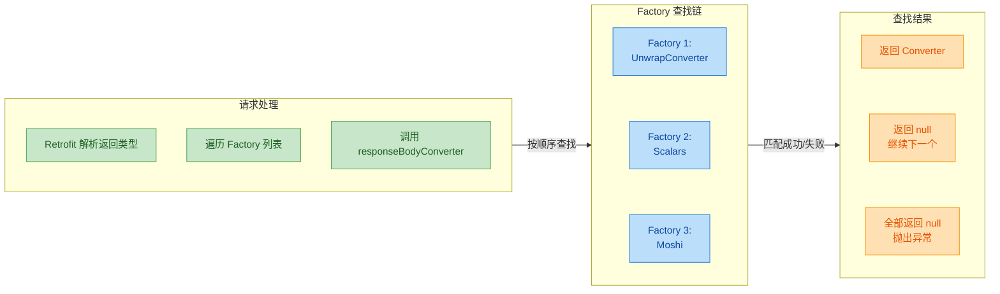

**关键原则**：

1. **特化优先**：将处理特定类型/注解的 Factory 放在前面
2. **通用兜底**：将通用 Factory（如 GsonConverterFactory）放在最后
3. **返回 null 表示跳过**：Factory 不处理某类型时返回 `null`，Retrofit 会继续询问下一个
4. **找不到则报错**：如果所有 Factory 都返回 `null`，Retrofit 抛出 `IllegalArgumentException`

### 性能优化建议

1. **优先使用代码生成**：Moshi + KSP 代码生成模式在大型数据模型下性能显著优于反射模式。

2. **复用 Converter 实例**：Converter.Factory 应该缓存创建的 Converter，避免重复创建。Retrofit 官方的 Factory 实现已经做了这一点。

3. **考虑响应体大小**：对于超大 JSON 响应（>1MB），考虑使用流式解析或分页接口，避免内存峰值过高。

4. **避免过度嵌套**：多层 Converter 包装会增加调用栈深度，设计时权衡灵活性与性能。

---

**📝 练习题**

在 Retrofit 中配置了多个 Converter.Factory，当解析 API 返回的 JSON 数据时，以下关于 Factory 查找机制的描述，**正确**的是？

A. Retrofit 会并行调用所有 Factory 的 `responseBodyConverter()` 方法，使用第一个返回非 null 的结果


B. 如果某个 Factory 的 `responseBodyConverter()` 返回 null，Retrofit 会抛出异常终止查找


C. Factory 按照 `addConverterFactory()` 的调用顺序依次查找，返回 null 表示该 Factory 不处理此类型


D. 注册顺序不影响查找结果，Retrofit 会根据类型自动选择最匹配的 Factory


**【答案】** C

**【解析】** Retrofit 的 Converter 查找机制是典型的**责任链模式（Chain of Responsibility）**。当需要为某个类型创建 Converter 时，Retrofit 会按照 `addConverterFactory()` 的**注册顺序**依次调用每个 Factory 的 `responseBodyConverter()` 方法。如果某个 Factory 返回 `null`，表示它不处理该类型，Retrofit 会继续询问链中的下一个 Factory；如果返回非 null 的 Converter 实例，则使用该实例，查找终止。选项 A 错误，查找是串行而非并行的；选项 B 错误，返回 null 是正常的"不处理"信号，不会抛异常；选项 D 错误，注册顺序直接决定查找优先级，这也是为什么实践中要将特化的 Factory 放在前面、通用的 Factory 放在后面。

---

## 调用适配 CallAdapter

在 Retrofit 的设计哲学中，**CallAdapter** 扮演着"返回值类型转换器"的关键角色。当你在接口方法中定义 `Call<User>`、`Observable<User>`、`suspend fun getUser(): User` 或 `LiveData<User>` 等不同返回类型时，Retrofit 本身并不知道如何处理这些多样化的类型——它只认识自己原生的 `Call<T>` 对象。CallAdapter 的职责就是将 Retrofit 内部统一生成的 `Call<T>` 对象，适配（adapt）成开发者在接口中声明的各种返回类型。

这种设计体现了 **Adapter Pattern（适配器模式）** 的经典应用：Retrofit 作为"被适配者"只产出 `Call<T>`，而 RxJava、Kotlin Coroutines、LiveData 等框架作为"目标接口"各有自己的异步抽象，CallAdapter 则是连接两者的桥梁。这种解耦设计使得 Retrofit 能够在不修改核心代码的前提下，无缝支持各种响应式编程范式和架构组件。

### CallAdapter 核心接口剖析

要理解各种具体 Adapter 的实现原理，首先必须深入理解 `CallAdapter` 接口本身的设计。这个接口定义了 Retrofit 与外部异步框架之间的契约：

```kotlin
// CallAdapter 接口定义（位于 retrofit2 包下）
// 泛型参数 R 代表 Response body 类型，T 代表适配后的返回类型
interface CallAdapter<R, T> {
    
    // 返回 Response body 的类型
    // 例如对于 Observable<User>，这里返回 User 的 Type
    // Retrofit 据此选择合适的 Converter 来解析响应体
    fun responseType(): Type
    
    // 核心方法：将 Retrofit 原生的 Call<R> 适配成目标类型 T
    // 参数 call 是 Retrofit 内部创建的 OkHttpCall 实例
    // 返回值就是接口方法声明的返回类型（如 Observable、Deferred、LiveData 等）
    fun adapt(call: Call<R>): T
}
```

与 CallAdapter 配套的是 `CallAdapter.Factory` 抽象类，它采用 **Factory Pattern（工厂模式）** 来创建具体的 Adapter 实例：

```kotlin
// CallAdapter.Factory 抽象类
// 负责根据返回类型和注解判断是否能处理，并创建对应的 CallAdapter
abstract class CallAdapter.Factory {
    
    // 核心方法：尝试为给定的返回类型创建 CallAdapter
    // returnType: 接口方法的返回类型（如 Observable<Response<User>>）
    // annotations: 方法上的注解数组
    // retrofit: Retrofit 实例，可用于递归获取其他 Adapter
    // 返回 null 表示本 Factory 无法处理该类型，Retrofit 会尝试下一个 Factory
    abstract fun get(
        returnType: Type,      // 方法返回类型
        annotations: Array<Annotation>,  // 方法注解
        retrofit: Retrofit     // Retrofit 实例引用
    ): CallAdapter<*, *>?
    
    // 辅助方法：获取泛型参数的上界类型
    // 例如从 Observable<? extends User> 中提取 User
    protected fun getParameterUpperBound(index: Int, type: ParameterizedType): Type
    
    // 辅助方法：获取原始类型
    // 例如从 Observable<User> 中提取 Observable.class
    protected fun getRawType(type: Type): Class<*>
}
```

当 Retrofit 解析接口方法时，会按照 `addCallAdapterFactory()` 的添加顺序依次询问每个 Factory："你能处理这个返回类型吗？"第一个返回非 null 的 Factory 将负责创建对应的 CallAdapter。这种 **Chain of Responsibility（责任链）** 式的查找机制，与前文讲解的 Converter 选择逻辑如出一辙。

### RxJavaAdapter：响应式编程适配

RxJava 作为 Android 领域最流行的响应式编程框架之一，其与 Retrofit 的整合堪称经典。`RxJava2CallAdapterFactory` 和 `RxJava3CallAdapterFactory` 能够将 Retrofit 的 `Call<T>` 适配成 RxJava 的 `Observable<T>`、`Single<T>`、`Maybe<T>`、`Flowable<T>` 以及 `Completable` 等多种响应式类型。

#### 集成配置与基本使用

```kotlin
// 在 Retrofit 构建时添加 RxJava3 适配器
// 注意：Factory 的添加顺序会影响 Adapter 的选择优先级
val retrofit = Retrofit.Builder()
    .baseUrl("https://api.example.com/")  // 设置 API 基础 URL
    .client(okHttpClient)                  // 配置 OkHttp 客户端
    .addConverterFactory(GsonConverterFactory.create())  // JSON 转换器
    .addCallAdapterFactory(RxJava3CallAdapterFactory.create())  // RxJava3 适配器
    .build()

// 定义支持 RxJava 返回类型的 API 接口
interface UserApi {
    
    // 返回 Observable：适合需要多次发射或组合操作的场景
    // Observable 是"热"的概念，订阅后开始执行
    @GET("users/{id}")
    fun getUserObservable(@Path("id") id: Long): Observable<User>
    
    // 返回 Single：语义上明确表示"只会发射一个值或错误"
    // 最适合 HTTP 请求这种单次响应的场景
    @GET("users/{id}")
    fun getUserSingle(@Path("id") id: Long): Single<User>
    
    // 返回 Maybe：可能有值、可能为空、可能出错
    // 适合可能返回 204 No Content 的接口
    @GET("users/{id}")
    fun getUserMaybe(@Path("id") id: Long): Maybe<User>
    
    // 返回 Flowable：支持背压（Backpressure）的响应式类型
    // 当下游处理速度跟不上上游发射速度时，Flowable 提供背压策略
    @GET("users")
    fun getAllUsersFlowable(): Flowable<List<User>>
    
    // 返回 Completable：只关心操作成功或失败，不需要返回数据
    // 典型场景：DELETE 请求、POST 不返回 body 的请求
    @DELETE("users/{id}")
    fun deleteUser(@Path("id") id: Long): Completable
    
    // 包装 Response：当需要访问 HTTP 状态码、响应头等元信息时使用
    @GET("users/{id}")
    fun getUserWithResponse(@Path("id") id: Long): Single<Response<User>>
    
    // 包装 Result：Retrofit 提供的包装类，可以统一处理成功响应和异常
    @GET("users/{id}")
    fun getUserWithResult(@Path("id") id: Long): Observable<Result<User>>
}
```

#### RxJava 适配内部实现原理

RxJava Adapter 的核心在于将 `Call.enqueue()` 的回调式 API 转换为 RxJava 的 Observable 发射模式。以下是简化的实现原理：

```kotlin
// RxJava3CallAdapter 核心实现原理（简化版）
// 展示如何将 Call<R> 适配成 Observable<R>
class RxJava3CallAdapter<R>(
    private val responseType: Type,  // 响应体类型
    private val scheduler: Scheduler?,  // 可选的订阅调度器
    private val isAsync: Boolean,  // 是否异步执行
    private val isResult: Boolean,  // 是否包装为 Result
    private val isBody: Boolean,   // 是否直接返回 body
    private val isFlowable: Boolean,  // 目标类型标识
    private val isSingle: Boolean,
    private val isMaybe: Boolean,
    private val isCompletable: Boolean
) : CallAdapter<R, Any> {

    override fun responseType(): Type = responseType

    override fun adapt(call: Call<R>): Any {
        // 核心：创建 Observable，在订阅时执行网络请求
        // 使用 CallEnqueueObservable 或 CallExecuteObservable
        val responseObservable = if (isAsync) {
            // 异步模式：使用 enqueue 非阻塞执行
            CallEnqueueObservable(call)
        } else {
            // 同步模式：使用 execute 阻塞执行（需配合 subscribeOn）
            CallExecuteObservable(call)
        }
        
        // 根据配置转换 Observable 的发射内容
        var observable: Observable<*> = when {
            isResult -> ResultObservable(responseObservable)  // 包装为 Result
            isBody -> BodyObservable(responseObservable)      // 只发射 body
            else -> responseObservable                         // 发射完整 Response
        }
        
        // 如果指定了调度器，自动切换订阅线程
        scheduler?.let { observable = observable.subscribeOn(it) }
        
        // 根据目标类型进行最终转换
        return when {
            isFlowable -> observable.toFlowable(BackpressureStrategy.LATEST)
            isSingle -> observable.singleOrError()
            isMaybe -> observable.singleElement()
            isCompletable -> observable.ignoreElements()
            else -> observable  // 返回 Observable
        }
    }
}

// CallEnqueueObservable：将 Call.enqueue() 转换为 Observable
// 这是连接 OkHttp 回调与 RxJava 发射的关键桥梁
class CallEnqueueObservable<T>(
    private val originalCall: Call<T>
) : Observable<Response<T>>() {

    override fun subscribeActual(observer: Observer<in Response<T>>) {
        // 每次订阅时克隆 Call，确保可以重复订阅
        // Call 是一次性的，执行后不能再次执行
        val call = originalCall.clone()
        
        // 创建回调包装器，实现 Disposable 接口支持取消
        val callback = CallCallback(call, observer)
        
        // 将 Disposable 传递给 Observer，支持取消订阅
        observer.onSubscribe(callback)
        
        // 如果已经被取消，不执行请求
        if (callback.isDisposed) return
        
        // 执行异步请求，回调中会发射数据
        call.enqueue(callback)
    }
    
    // 回调包装类，桥接 Retrofit Callback 与 RxJava Observer
    private class CallCallback<T>(
        private val call: Call<T>,
        private val observer: Observer<in Response<T>>
    ) : Disposable, Callback<T> {
        
        @Volatile private var disposed = false
        
        override fun onResponse(call: Call<T>, response: Response<T>) {
            if (disposed) return  // 已取消则忽略响应
            
            try {
                observer.onNext(response)  // 发射响应
                if (!disposed) {
                    observer.onComplete()  // 发射完成信号
                }
            } catch (e: Throwable) {
                if (!disposed) {
                    observer.onError(e)  // 发射错误
                }
            }
        }
        
        override fun onFailure(call: Call<T>, t: Throwable) {
            if (disposed) return
            
            try {
                observer.onError(t)  // 网络错误时发射异常
            } catch (inner: Throwable) {
                // 如果 onError 也抛出异常，需要特殊处理
                RxJavaPlugins.onError(CompositeException(t, inner))
            }
        }
        
        override fun isDisposed(): Boolean = disposed
        
        override fun dispose() {
            disposed = true
            call.cancel()  // 取消订阅时同时取消网络请求
        }
    }
}
```

#### RxJava 适配器的实际应用场景

```kotlin
// 场景一：链式请求 - 先登录后获取用户信息
// RxJava 的操作符让异步流程变得优雅
userApi.login(credentials)  // 返回 Single<LoginResponse>
    .flatMap { loginResponse ->
        // 登录成功后，用 token 获取用户详情
        // flatMap 将上游的结果转换为新的 Single
        userApi.getUserSingle(loginResponse.userId)
    }
    .subscribeOn(Schedulers.io())  // 在 IO 线程执行网络请求
    .observeOn(AndroidSchedulers.mainThread())  // 结果回调切换到主线程
    .subscribe(
        { user -> updateUI(user) },  // 成功回调
        { error -> showError(error) }  // 错误回调
    )

// 场景二：并行请求 - 同时获取多个独立数据
// 使用 zip 操作符合并多个请求的结果
Single.zip(
    userApi.getUserSingle(userId),           // 请求 1
    orderApi.getUserOrders(userId),          // 请求 2
    addressApi.getUserAddresses(userId)      // 请求 3
) { user, orders, addresses ->
    // 三个请求都完成后，合并数据
    UserProfile(user, orders, addresses)
}
.subscribeOn(Schedulers.io())
.observeOn(AndroidSchedulers.mainThread())
.subscribe { profile -> displayProfile(profile) }

// 场景三：重试机制 - 网络不稳定时自动重试
userApi.getUserSingle(userId)
    .retryWhen { errors ->
        // 遇到错误时，延迟重试
        errors.zipWith(Observable.range(1, 3)) { error, retryCount ->
            // 最多重试 3 次，每次延迟增加
            if (retryCount >= 3) throw error
            retryCount
        }.flatMap { retryCount ->
            // 指数退避：1秒、2秒、4秒
            Observable.timer(retryCount.toLong().pow(2), TimeUnit.SECONDS)
        }
    }
    .subscribe { user -> handleUser(user) }
```

### CoroutinesAdapter：挂起函数支持

从 Retrofit 2.6.0 开始，Retrofit 内置了对 Kotlin Coroutines 挂起函数的支持，无需额外添加 CallAdapterFactory。这是 Retrofit 对 Kotlin 协程这一现代异步编程范式的原生支持，也是目前 Android 开发中最推荐的网络请求方式。

#### 挂起函数的声明与使用

```kotlin
// 使用协程的 API 接口定义
// 注意：suspend 关键字使方法成为挂起函数
interface UserApi {
    
    // 直接返回实体：最简洁的写法
    // Retrofit 会自动处理请求和响应解析
    // 成功时返回 User，失败时抛出异常
    @GET("users/{id}")
    suspend fun getUser(@Path("id") id: Long): User
    
    // 返回 Response 包装：需要访问状态码、响应头时使用
    // 即使 HTTP 状态码是 4xx/5xx，也不会抛异常，而是返回 Response
    @GET("users/{id}")
    suspend fun getUserWithResponse(@Path("id") id: Long): Response<User>
    
    // 返回 ResponseBody：处理未知结构或流式响应
    // 适合下载文件等场景
    @GET("files/{name}")
    @Streaming  // 标记为流式响应，不将整个响应加载到内存
    suspend fun downloadFile(@Path("name") name: String): ResponseBody
    
    // 带请求体的 POST 请求
    @POST("users")
    suspend fun createUser(@Body user: User): User
    
    // 返回 Unit（或 void）：不关心响应体
    @DELETE("users/{id}")
    suspend fun deleteUser(@Path("id") id: Long)
}
```

#### 挂起函数的内部实现机制

Retrofit 对 suspend 函数的支持并非通过 CallAdapter 实现，而是在 `ServiceMethod` 解析阶段进行特殊处理。当 Retrofit 发现方法的最后一个参数是 `Continuation` 类型（Kotlin 编译器为 suspend 函数生成的参数）时，会采用专门的 `SuspendForBody` 或 `SuspendForResponse` 处理逻辑：

```kotlin
// Retrofit 内部处理 suspend 函数的核心逻辑（简化版）
// 位于 HttpServiceMethod.java 中
abstract class HttpServiceMethod<ResponseT, ReturnT> : ServiceMethod<ReturnT>() {
    
    companion object {
        fun <ResponseT, ReturnT> parseAnnotations(
            retrofit: Retrofit,
            method: Method,
            requestFactory: RequestFactory
        ): HttpServiceMethod<ResponseT, ReturnT> {
            
            // 获取方法的返回类型
            val adapterType = method.genericReturnType
            
            // 检查是否是 Kotlin suspend 函数
            // Kotlin 编译器会将 suspend fun foo(): T 转换为 fun foo(cont: Continuation<T>): Any?
            val isKotlinSuspendFunction = /* 检测逻辑 */
            
            if (isKotlinSuspendFunction) {
                // 获取 Continuation 的泛型参数，即实际的返回类型
                val continuationType = /* 解析 Continuation<T> 中的 T */
                
                // 判断是返回 Response<T> 还是直接返回 T
                return if (getRawType(continuationType) == Response::class.java) {
                    // suspend fun getUser(): Response<User>
                    SuspendForResponse(/* 参数 */)
                } else {
                    // suspend fun getUser(): User
                    SuspendForBody(/* 参数 */)
                }
            }
            
            // 非 suspend 函数走正常的 CallAdapter 流程
            // ...
        }
    }
    
    // SuspendForBody：直接返回响应体的 suspend 函数实现
    class SuspendForBody<ResponseT> : HttpServiceMethod<ResponseT, Any?>() {
        
        override fun adapt(call: Call<ResponseT>, args: Array<Any?>): Any? {
            // 从参数中获取 Continuation（最后一个参数）
            val continuation = args.last() as Continuation<ResponseT>
            
            // 使用 suspendCancellableCoroutine 桥接回调与协程
            return KotlinExtensions.awaitResponse(call, continuation)
        }
    }
}

// KotlinExtensions.kt 中的扩展函数
// 将 Call 的回调式 API 转换为协程挂起形式
suspend fun <T> Call<T>.await(): T {
    return suspendCancellableCoroutine { continuation ->
        // 当协程被取消时，同时取消网络请求
        continuation.invokeOnCancellation {
            cancel()  // 取消 OkHttp 请求
        }
        
        // 执行异步请求
        enqueue(object : Callback<T> {
            override fun onResponse(call: Call<T>, response: Response<T>) {
                if (response.isSuccessful) {
                    // HTTP 2xx：恢复协程并返回响应体
                    val body = response.body()
                    if (body != null) {
                        continuation.resume(body)
                    } else {
                        // 响应体为空时抛出异常
                        continuation.resumeWithException(
                            KotlinNullPointerException("Response body is null")
                        )
                    }
                } else {
                    // HTTP 4xx/5xx：抛出 HttpException
                    continuation.resumeWithException(
                        HttpException(response)
                    )
                }
            }
            
            override fun onFailure(call: Call<T>, t: Throwable) {
                // 网络错误：直接传递异常
                continuation.resumeWithException(t)
            }
        })
    }
}

// 返回完整 Response 的版本
suspend fun <T> Call<T>.awaitResponse(): Response<T> {
    return suspendCancellableCoroutine { continuation ->
        continuation.invokeOnCancellation { cancel() }
        
        enqueue(object : Callback<T> {
            override fun onResponse(call: Call<T>, response: Response<T>) {
                // 不管状态码如何，都直接返回 Response
                // 调用者自己判断 response.isSuccessful
                continuation.resume(response)
            }
            
            override fun onFailure(call: Call<T>, t: Throwable) {
                continuation.resumeWithException(t)
            }
        })
    }
}
```

#### 协程的实际应用模式

```kotlin
// ViewModel 中使用协程发起网络请求
class UserViewModel(
    private val userApi: UserApi,
    private val savedStateHandle: SavedStateHandle
) : ViewModel() {
    
    // 使用 StateFlow 暴露 UI 状态
    private val _uiState = MutableStateFlow<UserUiState>(UserUiState.Loading)
    val uiState: StateFlow<UserUiState> = _uiState.asStateFlow()
    
    // 加载用户数据
    fun loadUser(userId: Long) {
        // viewModelScope：与 ViewModel 生命周期绑定的协程作用域
        // ViewModel 销毁时自动取消所有协程
        viewModelScope.launch {
            _uiState.value = UserUiState.Loading
            
            try {
                // 直接调用 suspend 函数，代码看起来是同步的
                val user = userApi.getUser(userId)
                _uiState.value = UserUiState.Success(user)
            } catch (e: HttpException) {
                // HTTP 错误（4xx、5xx）
                _uiState.value = UserUiState.Error(
                    message = "服务器错误: ${e.code()}",
                    code = e.code()
                )
            } catch (e: IOException) {
                // 网络错误（无网络、超时等）
                _uiState.value = UserUiState.Error(
                    message = "网络连接失败，请检查网络设置"
                )
            }
        }
    }
    
    // 并行请求示例：使用 async 并发执行多个请求
    fun loadUserProfile(userId: Long) {
        viewModelScope.launch {
            try {
                // async 启动并发协程，返回 Deferred
                // coroutineScope 确保所有子协程完成或任一失败时退出
                coroutineScope {
                    val userDeferred = async { userApi.getUser(userId) }
                    val ordersDeferred = async { orderApi.getUserOrders(userId) }
                    val addressDeferred = async { addressApi.getAddresses(userId) }
                    
                    // await() 等待结果，三个请求并行执行
                    val user = userDeferred.await()
                    val orders = ordersDeferred.await()
                    val addresses = addressDeferred.await()
                    
                    _uiState.value = UserUiState.Success(
                        UserProfile(user, orders, addresses)
                    )
                }
            } catch (e: Exception) {
                // 任一请求失败都会进入这里
                _uiState.value = UserUiState.Error(e.message ?: "未知错误")
            }
        }
    }
    
    // 串行请求示例：后一个请求依赖前一个的结果
    fun loginAndLoadProfile(credentials: Credentials) {
        viewModelScope.launch {
            try {
                // 顺序执行：登录 -> 获取用户信息
                val loginResult = authApi.login(credentials)  // 第一步
                val user = userApi.getUser(loginResult.userId)  // 第二步
                _uiState.value = UserUiState.Success(user)
            } catch (e: Exception) {
                handleError(e)
            }
        }
    }
}

// UI 状态密封类
sealed class UserUiState {
    object Loading : UserUiState()
    data class Success(val user: User) : UserUiState()
    data class Error(val message: String, val code: Int? = null) : UserUiState()
}
```

### LiveDataAdapter：架构组件集成

`LiveDataCallAdapter` 将 Retrofit 的请求结果适配为 Android Architecture Components 的 `LiveData`，这使得网络请求可以直接与 Jetpack 的响应式 UI 框架集成。LiveData 具有生命周期感知能力，能够自动管理订阅，避免内存泄漏和在非活跃状态下更新 UI。

#### 配置与基本使用

```kotlin
// 添加 LiveData 适配器依赖
// implementation "androidx.lifecycle:lifecycle-livedata:2.x.x"
// 注意：LiveDataCallAdapterFactory 不是 Retrofit 官方提供的
// 通常需要自定义实现或使用第三方库

// Retrofit 配置
val retrofit = Retrofit.Builder()
    .baseUrl("https://api.example.com/")
    .addConverterFactory(GsonConverterFactory.create())
    .addCallAdapterFactory(LiveDataCallAdapterFactory())  // 自定义的 LiveData 适配器
    .build()

// API 接口定义
interface UserApi {
    
    // 返回 LiveData 包装的响应
    @GET("users/{id}")
    fun getUser(@Path("id") id: Long): LiveData<ApiResponse<User>>
    
    // ApiResponse 是一个密封类，统一封装成功和错误
    @GET("users")
    fun getAllUsers(): LiveData<ApiResponse<List<User>>>
}

// ApiResponse：统一的 API 响应包装类
// 使用密封类可以在 when 表达式中穷举所有情况
sealed class ApiResponse<T> {
    
    // 成功响应
    data class Success<T>(val data: T) : ApiResponse<T>()
    
    // HTTP 错误响应（4xx、5xx）
    data class Error<T>(
        val code: Int,
        val message: String
    ) : ApiResponse<T>()
    
    // 网络异常（无网络、超时等）
    data class NetworkError<T>(
        val exception: Throwable
    ) : ApiResponse<T>()
    
    // 正在加载（可选，用于显示加载状态）
    class Loading<T> : ApiResponse<T>()
}
```

#### LiveData 适配器实现原理

```kotlin
// LiveDataCallAdapterFactory：工厂类实现
class LiveDataCallAdapterFactory : CallAdapter.Factory() {
    
    override fun get(
        returnType: Type,
        annotations: Array<out Annotation>,
        retrofit: Retrofit
    ): CallAdapter<*, *>? {
        
        // 检查返回类型是否是 LiveData
        // getRawType 获取泛型的原始类型（去掉泛型参数）
        if (getRawType(returnType) != LiveData::class.java) {
            return null  // 不是 LiveData，让其他 Factory 处理
        }
        
        // 获取 LiveData 的泛型参数类型
        // 例如 LiveData<ApiResponse<User>> 中的 ApiResponse<User>
        val observableType = getParameterUpperBound(0, returnType as ParameterizedType)
        
        // 检查是否是 ApiResponse 包装类型
        val rawObservableType = getRawType(observableType)
        if (rawObservableType != ApiResponse::class.java) {
            throw IllegalArgumentException("LiveData 的类型参数必须是 ApiResponse")
        }
        
        // 获取 ApiResponse 的泛型参数（实际的数据类型）
        // 例如 ApiResponse<User> 中的 User
        val bodyType = getParameterUpperBound(0, observableType as ParameterizedType)
        
        return LiveDataCallAdapter<Any>(bodyType)
    }
}

// LiveDataCallAdapter：适配器实现
class LiveDataCallAdapter<R>(
    private val responseType: Type  // 响应体类型
) : CallAdapter<R, LiveData<ApiResponse<R>>> {
    
    override fun responseType(): Type = responseType
    
    override fun adapt(call: Call<R>): LiveData<ApiResponse<R>> {
        // 返回一个自定义的 LiveData 实现
        // 这个 LiveData 会在有活跃观察者时自动发起请求
        return object : LiveData<ApiResponse<R>>() {
            
            // 用于确保只执行一次请求的原子标志
            private val started = AtomicBoolean(false)
            
            // 当 LiveData 变为活跃状态时调用
            // （有活跃的 Observer 且所在的 LifecycleOwner 至少处于 STARTED 状态）
            override fun onActive() {
                super.onActive()
                
                // CAS 操作：确保只执行一次
                if (started.compareAndSet(false, true)) {
                    // 先发射 Loading 状态
                    postValue(ApiResponse.Loading())
                    
                    // 发起网络请求
                    call.enqueue(object : Callback<R> {
                        
                        override fun onResponse(call: Call<R>, response: Response<R>) {
                            // 请求成功返回
                            val apiResponse = if (response.isSuccessful) {
                                val body = response.body()
                                if (body != null) {
                                    ApiResponse.Success(body)
                                } else {
                                    // 2xx 但 body 为空
                                    ApiResponse.Error(
                                        code = response.code(),
                                        message = "响应体为空"
                                    )
                                }
                            } else {
                                // HTTP 错误码（4xx、5xx）
                                ApiResponse.Error(
                                    code = response.code(),
                                    message = response.errorBody()?.string() ?: "未知错误"
                                )
                            }
                            // postValue 是线程安全的，会切换到主线程
                            postValue(apiResponse)
                        }
                        
                        override fun onFailure(call: Call<R>, t: Throwable) {
                            // 网络异常
                            postValue(ApiResponse.NetworkError(t))
                        }
                    })
                }
            }
        }
    }
}
```

#### LiveData 在 MVVM 架构中的应用

```kotlin
// Repository 层：作为数据源的统一入口
class UserRepository(
    private val userApi: UserApi,
    private val userDao: UserDao  // Room DAO，本地缓存
) {
    
    // 暴露 LiveData 供 ViewModel 观察
    fun getUser(userId: Long): LiveData<ApiResponse<User>> {
        return userApi.getUser(userId)
    }
    
    // 更高级的实现：结合本地缓存
    // 使用 NetworkBoundResource 模式
    fun getUserWithCache(userId: Long): LiveData<Resource<User>> {
        return object : NetworkBoundResource<User, User>() {
            
            // 从数据库加载缓存数据
            override fun loadFromDb(): LiveData<User> {
                return userDao.getUserById(userId)
            }
            
            // 判断是否需要从网络获取新数据
            override fun shouldFetch(data: User?): Boolean {
                // 缓存为空或过期时需要刷新
                return data == null || data.isStale()
            }
            
            // 发起网络请求
            override fun createCall(): LiveData<ApiResponse<User>> {
                return userApi.getUser(userId)
            }
            
            // 将网络数据保存到数据库
            override fun saveCallResult(item: User) {
                userDao.insert(item)
            }
        }.asLiveData()
    }
}

// ViewModel 层：处理业务逻辑，暴露 UI 状态
class UserViewModel(
    private val repository: UserRepository,
    savedStateHandle: SavedStateHandle
) : ViewModel() {
    
    // 从 SavedStateHandle 获取用户 ID（支持进程死亡恢复）
    private val userId: Long = savedStateHandle.get<Long>("userId") ?: 0L
    
    // 使用 switchMap 根据 userId 切换数据源
    // 当 userId 变化时自动重新请求
    private val _userId = MutableLiveData<Long>()
    val user: LiveData<ApiResponse<User>> = _userId.switchMap { id ->
        repository.getUser(id)
    }
    
    init {
        _userId.value = userId
    }
    
    // 刷新数据
    fun refresh() {
        _userId.value = _userId.value  // 触发 switchMap 重新执行
    }
}

// Activity/Fragment：观察数据并更新 UI
class UserFragment : Fragment() {
    
    private val viewModel: UserViewModel by viewModels()
    
    override fun onViewCreated(view: View, savedInstanceState: Bundle?) {
        super.onViewCreated(view, savedInstanceState)
        
        // 观察 LiveData，自动管理生命周期
        // viewLifecycleOwner 确保只在 View 存在时更新 UI
        viewModel.user.observe(viewLifecycleOwner) { response ->
            when (response) {
                is ApiResponse.Loading -> {
                    showLoading()
                }
                is ApiResponse.Success -> {
                    hideLoading()
                    displayUser(response.data)
                }
                is ApiResponse.Error -> {
                    hideLoading()
                    showError("错误 ${response.code}: ${response.message}")
                }
                is ApiResponse.NetworkError -> {
                    hideLoading()
                    showError("网络连接失败")
                }
            }
        }
    }
}
```

### CallAdapter 选择策略与最佳实践

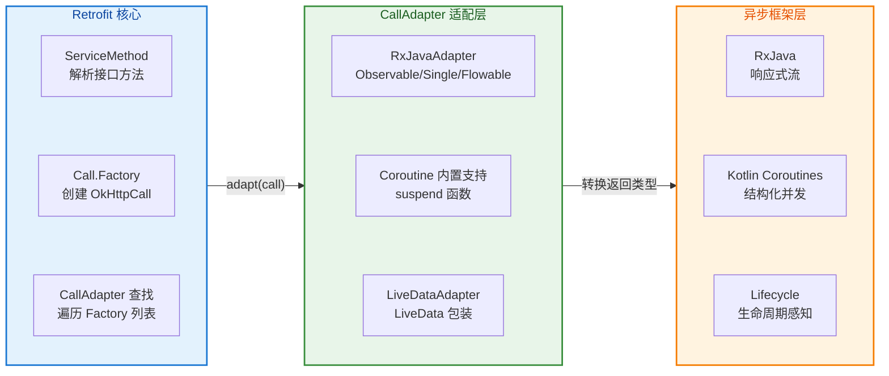

在实际项目中选择哪种 CallAdapter，需要综合考虑项目技术栈、团队熟悉度和具体场景：

| 适配器 | 适用场景 | 优势 | 注意事项 |
|--------|----------|------|----------|
| **Coroutines (推荐)** | 新项目、Kotlin 为主的项目 | 语法简洁、官方支持、与 Flow 配合佳 | 需要理解协程原理、异常处理与普通函数不同 |
| **RxJava** | 既有 RxJava 项目、复杂数据流转换 | 操作符丰富、背压支持、成熟稳定 | 学习曲线陡峭、容易内存泄漏 |
| **LiveData** | 简单 MVVM 架构、Java 为主 | 生命周期感知、与 AAC 集成好 | 操作符有限、不支持背压 |

**最佳实践建议**：

1. **新项目首选 Coroutines**：Kotlin Coroutines 已成为 Android 官方推荐的异步方案，语法简洁且与 Jetpack 生态深度整合。结合 `Flow` 可以实现响应式数据流。

2. **渐进式迁移**：如果是 RxJava 存量项目，可以通过 `kotlinx-coroutines-rx3` 桥接库，让 Coroutines 和 RxJava 协同工作，逐步迁移。

3. **统一技术栈**：避免在同一项目中混用多种适配器，这会增加代码复杂度和维护成本。

4. **错误处理标准化**：无论使用哪种适配器，都应建立统一的错误处理机制（如 ApiResponse 密封类），确保 UI 层代码风格一致。

---

**📝 练习题**

在使用 Retrofit 与 Kotlin Coroutines 时，以下关于 suspend 函数返回类型的描述，哪一项是**错误**的？

A. 当 suspend 函数直接返回实体类型（如 `suspend fun getUser(): User`）时，HTTP 4xx/5xx 响应会抛出 `HttpException`


B. 当 suspend 函数返回 `Response<User>` 时，即使 HTTP 状态码是 404，也不会抛出异常，而是返回一个 `Response` 对象


C. Retrofit 对 suspend 函数的支持是通过内置的 `CoroutinesCallAdapterFactory` 实现的，需要显式添加到 Retrofit Builder 中


D. 协程被取消（如 ViewModel 销毁）时，Retrofit 会自动取消对应的 OkHttp 网络请求


**【答案】** C

**【解析】** 选项 C 的描述是错误的。Retrofit 从 2.6.0 版本开始对 Kotlin suspend 函数提供了**内置原生支持**，这一机制是在 `HttpServiceMethod` 的解析阶段直接处理的，而非通过 CallAdapterFactory 实现。开发者无需添加任何额外的 `CallAdapterFactory` 即可使用 suspend 函数。Retrofit 会检测方法参数中是否存在 `Continuation` 类型（Kotlin 编译器为 suspend 函数自动生成），如果存在则使用 `SuspendForBody` 或 `SuspendForResponse` 内部类处理。

选项 A 正确：直接返回实体类型时，Retrofit 内部会检查 `response.isSuccessful`，若为 false 则抛出 `HttpException`。

选项 B 正确：返回 `Response<T>` 类型时，Retrofit 使用 `awaitResponse()` 扩展函数，它会直接返回 Response 对象而不检查状态码，开发者需要自行判断 `response.isSuccessful`。

选项 D 正确：Retrofit 使用 `suspendCancellableCoroutine` 实现挂起，并通过 `invokeOnCancellation` 回调在协程取消时调用 `call.cancel()`，从而取消底层的 OkHttp 请求，这是 Structured Concurrency（结构化并发）的重要特性。

---

## 缓存策略 Cache

在移动网络环境中，缓存策略是优化应用性能、降低流量消耗、提升用户体验的关键手段。一个设计良好的缓存机制可以让用户在弱网或离线状态下依然获得流畅的数据访问体验。OkHttp 内置了完整的 HTTP 缓存支持，严格遵循 HTTP/1.1 缓存规范（RFC 7234），同时提供了灵活的扩展点让开发者根据业务需求定制缓存行为。

从本质上讲，HTTP 缓存的核心思想是**避免不必要的网络请求**。当客户端已经持有某个资源的有效副本时，就不应该再次从服务器获取相同的数据。这不仅节省了用户的流量，更重要的是大幅缩短了响应时间——从磁盘读取缓存通常只需要几毫秒，而一次完整的网络往返可能需要几百毫秒甚至数秒。

### HTTP Cache-Control 头

`Cache-Control` 是 HTTP/1.1 引入的最重要的缓存控制机制，它取代了 HTTP/1.0 中功能有限的 `Pragma` 和 `Expires` 头。理解 `Cache-Control` 的各种指令是掌握 HTTP 缓存的基础。

**响应头中的 Cache-Control 指令**

当服务器返回响应时，可以通过 `Cache-Control` 头告诉客户端如何缓存这个响应。最常见的指令包括：

`max-age=<seconds>` 是最核心的指令，它指定了响应在被认为是"陈旧"(stale)之前可以被缓存的最大秒数。例如 `Cache-Control: max-age=3600` 表示这个响应在接下来的一小时内都是"新鲜"的，客户端可以直接使用缓存而无需联系服务器。这个时间是从响应生成时刻开始计算的，而不是从客户端收到响应的时刻。

`no-cache` 的含义经常被误解——它并不是禁止缓存，而是要求客户端在使用缓存之前**必须**向服务器验证缓存是否仍然有效。即使缓存尚未过期，客户端也必须发送一个条件请求（conditional request）来确认。这对于需要严格数据一致性的场景非常有用。

`no-store` 才是真正禁止缓存的指令。它告诉客户端和所有中间代理都不应该存储这个响应的任何部分。这通常用于包含敏感信息（如银行账户余额、个人隐私数据）的响应。

`private` 和 `public` 控制的是缓存的可见范围。`private` 表示响应只能被终端用户的浏览器/客户端缓存，不能被中间的 CDN 或代理服务器缓存；`public` 则表示响应可以被任何缓存存储，包括共享缓存。

`must-revalidate` 指令要求缓存在过期后必须向源服务器验证，不能直接使用陈旧的缓存。这与 `no-cache` 的区别在于：`no-cache` 每次使用前都要验证，而 `must-revalidate` 只在缓存过期后才需要验证。

**请求头中的 Cache-Control 指令**

客户端同样可以在请求中使用 `Cache-Control` 来影响缓存行为：

`max-age=0` 表示客户端不接受缓存时间超过 0 秒的响应，实际效果等同于强制服务器验证。

`max-stale=<seconds>` 允许客户端接受已经过期但过期时间不超过指定秒数的缓存。这在弱网环境下非常有用——用户宁愿看到稍微过时的数据，也不愿意等待漫长的网络请求。

`min-fresh=<seconds>` 则相反，要求缓存的剩余新鲜时间至少还有指定的秒数。

`only-if-cached` 是一个特殊指令，告诉 OkHttp 只从缓存获取响应，如果缓存中没有则返回 504 Gateway Timeout 而不是发起网络请求。这是实现离线模式的关键。

**OkHttp 中控制 Cache-Control 的方式**

```kotlin
// 创建一个强制使用网络的请求（忽略缓存）
// 这在用户手动下拉刷新时非常有用
val forceNetworkRequest = originalRequest.newBuilder()
    .cacheControl(CacheControl.FORCE_NETWORK)  // 等价于 Cache-Control: no-cache
    .build()

// 创建一个强制使用缓存的请求（离线模式）
// 如果缓存不存在，会返回 504 错误
val forceCacheRequest = originalRequest.newBuilder()
    .cacheControl(CacheControl.FORCE_CACHE)  // 等价于 only-if-cached, max-stale=MAX_VALUE
    .build()

// 自定义 CacheControl，允许使用过期不超过 1 天的缓存
// 适用于弱网环境或对数据实时性要求不高的场景
val lenientCacheControl = CacheControl.Builder()
    .maxStale(1, TimeUnit.DAYS)  // 允许使用过期最多 1 天的缓存
    .build()

val lenientRequest = originalRequest.newBuilder()
    .cacheControl(lenientCacheControl)
    .build()

// 自定义 CacheControl，要求响应必须在 10 分钟内是新鲜的
// 适用于对数据时效性有一定要求的场景
val strictCacheControl = CacheControl.Builder()
    .maxAge(10, TimeUnit.MINUTES)  // 缓存最大年龄为 10 分钟
    .minFresh(5, TimeUnit.MINUTES)  // 要求至少还有 5 分钟的新鲜期
    .build()
```

### ETag 验证

即使缓存已经过期（超过了 `max-age` 指定的时间），也不意味着必须重新下载完整的响应。HTTP 提供了**条件请求**（Conditional Request）机制，允许客户端询问服务器："我有一个旧版本的资源，它还是最新的吗？"如果资源没有变化，服务器只需返回一个简短的 304 Not Modified 响应，客户端就可以继续使用缓存，这大大节省了带宽。

**ETag 的工作原理**

ETag（Entity Tag）是服务器为每个资源版本分配的唯一标识符，类似于资源的"指纹"。当服务器返回响应时，会在响应头中包含 `ETag` 字段：

```
HTTP/1.1 200 OK
ETag: "abc123def456"
Content-Type: application/json
Cache-Control: max-age=3600

{"data": "some content"}
```

当缓存过期后，客户端再次请求同一资源时，会在请求头中带上 `If-None-Match` 字段，其值就是之前收到的 ETag：

```
GET /api/data HTTP/1.1
If-None-Match: "abc123def456"
```

服务器收到这个条件请求后，会比较当前资源的 ETag 与客户端提供的是否一致。如果一致，说明资源没有变化，服务器返回 304 Not Modified（不包含响应体）；如果不一致，服务器返回完整的 200 响应和新的 ETag。

**强 ETag 与弱 ETag**

ETag 分为两种类型：

**强 ETag** 表示资源的每一个字节都相同。如果两个响应的强 ETag 相同，那么它们的内容必须完全一致，字节级相同。强 ETag 的格式是双引号包裹的字符串，如 `"abc123"`。

**弱 ETag** 表示资源在语义上等价，但字节可能不同。例如，两个 HTML 页面只在空白字符上有差异，可以被认为是语义等价的。弱 ETag 以 `W/` 为前缀，如 `W/"abc123"`。

在实际应用中，强 ETag 更为常见，因为它提供了更严格的一致性保证。

**Last-Modified 与 If-Modified-Since**

除了 ETag，HTTP 还提供了基于时间戳的条件请求机制。服务器在响应中包含 `Last-Modified` 头表示资源的最后修改时间，客户端在后续请求中通过 `If-Modified-Since` 头携带这个时间戳。

```
HTTP/1.1 200 OK
Last-Modified: Wed, 21 Oct 2025 07:28:00 GMT
```

后续请求：

```
GET /api/data HTTP/1.1
If-Modified-Since: Wed, 21 Oct 2025 07:28:00 GMT
```

ETag 机制比 Last-Modified 更精确，因为：
1. 时间戳的精度只到秒，如果资源在一秒内被修改多次，Last-Modified 无法区分
2. 某些服务器无法精确获取文件的修改时间
3. 有些资源是动态生成的，没有明确的"修改时间"概念

**OkHttp 自动处理条件请求**

OkHttp 的缓存拦截器会自动处理条件请求的逻辑，开发者无需手动添加 `If-None-Match` 或 `If-Modified-Since` 头：

```kotlin
// OkHttp CacheInterceptor 内部逻辑简化示意
// 当缓存响应存在但需要验证时，自动添加条件请求头
internal fun buildConditionalRequest(
    request: Request,
    cacheResponse: Response
): Request {
    val builder = request.newBuilder()
    
    // 如果缓存响应有 ETag，添加 If-None-Match 头
    cacheResponse.header("ETag")?.let { etag ->
        builder.header("If-None-Match", etag)
    }
    
    // 如果缓存响应有 Last-Modified，添加 If-Modified-Since 头
    cacheResponse.header("Last-Modified")?.let { lastModified ->
        builder.header("If-Modified-Since", lastModified)
    }
    
    // 如果缓存响应有 Date 头（作为 Last-Modified 的后备）
    cacheResponse.header("Date")?.let { date ->
        if (builder.build().header("If-Modified-Since") == null) {
            builder.header("If-Modified-Since", date)
        }
    }
    
    return builder.build()
}
```

### OkHttp Cache 实现

OkHttp 提供了一个基于磁盘的 HTTP 缓存实现，它遵循 HTTP 缓存规范，并针对移动设备进行了优化。理解其内部实现有助于我们更好地配置和调试缓存行为。

**Cache 的初始化**

```kotlin
// 创建一个 10MB 的磁盘缓存
// 缓存目录通常选择应用的 cacheDir，系统在存储空间紧张时会自动清理
val cacheDirectory = File(context.cacheDir, "http_cache")
val cacheSize = 10L * 1024L * 1024L  // 10 MB

val cache = Cache(cacheDirectory, cacheSize)

// 将 Cache 配置到 OkHttpClient
val okHttpClient = OkHttpClient.Builder()
    .cache(cache)  // 启用磁盘缓存
    .build()
```

**DiskLruCache：底层存储引擎**

OkHttp 的 Cache 内部使用 `DiskLruCache` 作为底层存储引擎。DiskLruCache 是一个基于文件系统的 LRU（Least Recently Used，最近最少使用）缓存，当缓存大小超过限制时，会自动删除最久未使用的条目。

每个缓存条目由两个文件组成：
- **ENTRY_METADATA（索引 0）**：存储 HTTP 响应的元数据，包括请求 URL、请求方法、响应状态码、响应头等
- **ENTRY_BODY（索引 1）**：存储响应体的实际内容

```kotlin
// 缓存条目的元数据格式示例（简化）
/*
https://api.example.com/users/123    <-- 请求 URL
GET                                   <-- 请求方法
2                                     <-- Vary 头的数量
Accept-Encoding: gzip                 <-- Vary 头 1
Accept-Language: zh-CN                <-- Vary 头 2
HTTP/1.1 200 OK                       <-- 状态行
8                                     <-- 响应头数量
Content-Type: application/json
Cache-Control: max-age=3600
ETag: "abc123"
...
*/
```

**CacheInterceptor 的工作流程**

`CacheInterceptor` 是 OkHttp 拦截器链中负责缓存逻辑的核心组件。它的处理流程如下：

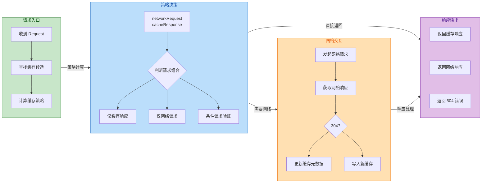

**CacheStrategy：缓存决策的核心**

`CacheStrategy` 类封装了 HTTP 缓存规范中的各种决策逻辑。它的 `compute()` 方法会综合考虑请求头、缓存响应头、当前时间等因素，返回一个决策结果，包含两个可空字段：

- `networkRequest`：如果非空，表示需要发起网络请求
- `cacheResponse`：如果非空，表示可以使用缓存响应

这四种组合代表了四种不同的处理策略：

| networkRequest | cacheResponse | 含义 |
|----------------|---------------|------|
| null | non-null | 缓存命中，直接返回缓存 |
| non-null | null | 缓存未命中或不可用，发起网络请求 |
| non-null | non-null | 缓存已过期，发起条件请求验证 |
| null | null | 请求不允许缓存且禁止网络，返回 504 |

```kotlin
// CacheStrategy 决策逻辑的简化实现
class CacheStrategy private constructor(
    val networkRequest: Request?,  // 需要发送的网络请求，null 表示不需要网络
    val cacheResponse: Response?   // 可用的缓存响应，null 表示缓存不可用
) {
    class Factory(
        private val nowMillis: Long,       // 当前时间戳
        private val request: Request,       // 原始请求
        private val cacheResponse: Response? // 缓存中找到的响应（可能为 null）
    ) {
        fun compute(): CacheStrategy {
            // 1. 如果没有缓存响应，必须走网络
            if (cacheResponse == null) {
                return CacheStrategy(request, null)
            }
            
            // 2. 如果是 HTTPS 请求但缓存缺少握手信息，缓存无效
            if (request.isHttps && cacheResponse.handshake == null) {
                return CacheStrategy(request, null)
            }
            
            // 3. 检查缓存响应是否允许被缓存（基于状态码和头部）
            if (!isCacheable(cacheResponse, request)) {
                return CacheStrategy(request, null)
            }
            
            // 4. 如果请求指定了 no-cache 或有条件请求头，必须验证
            val requestCaching = request.cacheControl
            if (requestCaching.noCache || hasConditions(request)) {
                return CacheStrategy(request, cacheResponse)
            }
            
            // 5. 计算缓存的年龄和新鲜度
            val ageMillis = cacheResponseAge()
            var freshMillis = computeFreshnessLifetime()
            
            // 6. 考虑请求中的 max-age 指令
            if (requestCaching.maxAgeSeconds != -1) {
                freshMillis = minOf(freshMillis, 
                    requestCaching.maxAgeSeconds * 1000L)
            }
            
            // 7. 考虑请求中的 min-fresh 指令
            var minFreshMillis = 0L
            if (requestCaching.minFreshSeconds != -1) {
                minFreshMillis = requestCaching.minFreshSeconds * 1000L
            }
            
            // 8. 考虑请求中的 max-stale 指令
            var maxStaleMillis = 0L
            if (!responseCaching.mustRevalidate && 
                requestCaching.maxStaleSeconds != -1) {
                maxStaleMillis = requestCaching.maxStaleSeconds * 1000L
            }
            
            // 9. 判断缓存是否仍然新鲜
            if (ageMillis + minFreshMillis < freshMillis + maxStaleMillis) {
                // 缓存可用，直接返回
                return CacheStrategy(null, cacheResponse)
            }
            
            // 10. 缓存过期，需要条件请求验证
            val conditionalRequest = buildConditionalRequest(request, cacheResponse)
            return CacheStrategy(conditionalRequest, cacheResponse)
        }
    }
}
```

**Vary 头的处理**

HTTP 的 `Vary` 头用于指定哪些请求头会影响响应内容。例如，服务器返回 `Vary: Accept-Encoding` 表示"相同 URL 的请求，如果 Accept-Encoding 不同，可能返回不同的响应"。

OkHttp 在判断缓存是否匹配时，会考虑 Vary 头。只有当请求的 URL 相同**且** Vary 指定的所有头部值都相同时，缓存才能命中：

```kotlin
// 检查缓存响应是否与当前请求的 Vary 头匹配
fun varyMatches(
    cachedResponse: Response,
    cachedRequest: Headers,
    newRequest: Request
): Boolean {
    // 获取缓存响应的 Vary 头
    val varyHeaders = cachedResponse.headers.varyFields()
    
    // 如果 Vary: * 表示任何请求差异都会导致不同响应，缓存永远不匹配
    if ("*" in varyHeaders) return false
    
    // 检查每个 Vary 指定的头部是否与新请求相同
    for (field in varyHeaders) {
        if (cachedRequest[field] != newRequest.header(field)) {
            return false
        }
    }
    return true
}
```

### 离线缓存

在移动应用中，网络连接是不可靠的。用户可能在地铁、电梯、偏远地区等场景下失去网络连接。一个良好的离线缓存策略可以让用户在这些情况下仍然能够浏览之前加载过的内容，大大提升用户体验。

**实现离线缓存的几种策略**

**策略一：Cache-First with Network Fallback**

这种策略优先使用缓存，只有当缓存不存在或明确过期时才请求网络。适用于数据变化频率较低的场景：

```kotlin
// 创建一个缓存优先的拦截器
class CacheFirstInterceptor(
    private val context: Context
) : Interceptor {
    override fun intercept(chain: Interceptor.Chain): Response {
        val request = chain.request()
        
        // 检查网络连接状态
        val isNetworkAvailable = isNetworkConnected(context)
        
        val modifiedRequest = if (!isNetworkAvailable) {
            // 无网络时，强制只使用缓存
            // FORCE_CACHE 等价于 only-if-cached, max-stale=MAX_VALUE
            request.newBuilder()
                .cacheControl(CacheControl.FORCE_CACHE)
                .build()
        } else {
            // 有网络时，允许使用一定时间内的缓存
            // 避免频繁的网络请求
            val cacheControl = CacheControl.Builder()
                .maxStale(5, TimeUnit.MINUTES)  // 允许使用过期 5 分钟内的缓存
                .build()
            request.newBuilder()
                .cacheControl(cacheControl)
                .build()
        }
        
        val response = chain.proceed(modifiedRequest)
        
        // 如果是 504 错误（缓存不可用且禁止网络），抛出友好的异常
        if (response.code == 504) {
            throw OfflineException("无网络连接且没有可用的缓存")
        }
        
        return response
    }
    
    private fun isNetworkConnected(context: Context): Boolean {
        val cm = context.getSystemService(Context.CONNECTIVITY_SERVICE) 
            as ConnectivityManager
        val network = cm.activeNetwork ?: return false
        val capabilities = cm.getNetworkCapabilities(network) ?: return false
        return capabilities.hasCapability(NetworkCapabilities.NET_CAPABILITY_INTERNET)
    }
}
```

**策略二：Network-First with Cache Fallback**

这种策略优先请求网络以获取最新数据，只有在网络请求失败时才使用缓存。适用于数据实时性要求较高的场景：

```kotlin
// 网络优先，失败时回退到缓存的拦截器
class NetworkFirstInterceptor : Interceptor {
    override fun intercept(chain: Interceptor.Chain): Response {
        val request = chain.request()
        
        return try {
            // 首先尝试网络请求
            val networkRequest = request.newBuilder()
                .cacheControl(CacheControl.FORCE_NETWORK)
                .build()
            
            val response = chain.proceed(networkRequest)
            
            // 如果网络请求成功，返回响应
            if (response.isSuccessful) {
                response
            } else {
                // 网络请求返回错误码，尝试使用缓存
                response.close()
                fallbackToCache(chain, request)
            }
        } catch (e: IOException) {
            // 网络请求异常（超时、无网络等），回退到缓存
            fallbackToCache(chain, request)
        }
    }
    
    private fun fallbackToCache(
        chain: Interceptor.Chain, 
        request: Request
    ): Response {
        // 构建只使用缓存的请求
        val cacheRequest = request.newBuilder()
            .cacheControl(CacheControl.FORCE_CACHE)
            .build()
        
        val cacheResponse = chain.proceed(cacheRequest)
        
        // 检查缓存响应是否有效
        if (cacheResponse.code == 504) {
            throw NoDataException("网络不可用且没有缓存数据")
        }
        
        // 标记响应来自缓存（通过自定义头部）
        return cacheResponse.newBuilder()
            .header("X-Data-Source", "cache")
            .build()
    }
}
```

**策略三：Stale-While-Revalidate**

这是一种更高级的策略：立即返回缓存数据给用户，同时在后台发起网络请求更新缓存。用户获得了最快的响应速度，而缓存也能保持相对新鲜。这种模式在 Web 开发中被称为 "Stale-While-Revalidate"：

```kotlin
// Stale-While-Revalidate 策略实现
// 注意：这需要配合 Repository 层使用，因为涉及多次数据发射
class StaleWhileRevalidateRepository(
    private val api: ApiService,
    private val cache: ResponseCache,
    private val dispatcher: CoroutineDispatcher = Dispatchers.IO
) {
    // 返回 Flow，可以发射多次数据：先缓存，后网络
    fun getData(key: String): Flow<DataState<Data>> = flow {
        // 1. 首先尝试发射缓存数据（如果存在）
        val cachedData = cache.get(key)
        if (cachedData != null) {
            // 发射缓存数据，标记为可能过期
            emit(DataState.Success(cachedData, isStale = true))
        }
        
        // 2. 同时发起网络请求获取最新数据
        try {
            val freshData = api.fetchData(key)
            
            // 更新缓存
            cache.put(key, freshData)
            
            // 发射最新数据
            emit(DataState.Success(freshData, isStale = false))
            
        } catch (e: Exception) {
            // 网络请求失败
            if (cachedData == null) {
                // 没有缓存，发射错误状态
                emit(DataState.Error(e))
            }
            // 如果有缓存，之前已经发射了，用户至少能看到旧数据
            // 可以选择发射一个警告状态
            emit(DataState.Warning("使用的是缓存数据，最新数据获取失败"))
        }
    }.flowOn(dispatcher)
}

// 数据状态封装
sealed class DataState<out T> {
    data class Success<T>(
        val data: T, 
        val isStale: Boolean = false  // 标记数据是否可能过期
    ) : DataState<T>()
    
    data class Error(val exception: Throwable) : DataState<Nothing>()
    data class Warning(val message: String) : DataState<Nothing>()
}
```

**服务端配合：设置合理的缓存头**

离线缓存的效果很大程度上取决于服务端返回的缓存头。对于静态资源（图片、JS、CSS），通常设置较长的 `max-age`；对于 API 响应，需要根据数据特性权衡：

```
# 静态资源：缓存 1 年（配合文件名 hash 实现版本控制）
Cache-Control: public, max-age=31536000, immutable

# API 响应：缓存 5 分钟，过期后必须验证
Cache-Control: private, max-age=300, must-revalidate

# 用户特定数据：缓存 1 小时，允许使用过期 1 天的缓存
Cache-Control: private, max-age=3600, stale-while-revalidate=86400

# 敏感数据：不缓存
Cache-Control: no-store
```

**拦截器添加默认缓存头**

如果服务端没有返回合适的缓存头，客户端可以通过 Network Interceptor 添加默认值：

```kotlin
// 为没有 Cache-Control 头的响应添加默认缓存策略
class DefaultCacheInterceptor(
    private val defaultMaxAge: Int = 300  // 默认 5 分钟
) : Interceptor {
    override fun intercept(chain: Interceptor.Chain): Response {
        val response = chain.proceed(chain.request())
        
        // 只处理成功的响应
        if (!response.isSuccessful) return response
        
        // 如果响应已经有 Cache-Control 头，不做修改
        val cacheControl = response.header("Cache-Control")
        if (!cacheControl.isNullOrEmpty()) return response
        
        // 为响应添加默认的 Cache-Control 头
        return response.newBuilder()
            .header("Cache-Control", "private, max-age=$defaultMaxAge")
            .removeHeader("Pragma")  // 移除 HTTP/1.0 的 Pragma 头
            .build()
    }
}

// 将拦截器添加为 Network Interceptor（作用于网络响应）
val client = OkHttpClient.Builder()
    .cache(cache)
    .addNetworkInterceptor(DefaultCacheInterceptor(300))
    .build()
```

**缓存大小管理与清理**

磁盘空间是有限的，需要合理设置缓存大小并提供清理机制：

```kotlin
// 缓存管理器
class CacheManager(
    private val cache: Cache
) {
    // 获取当前缓存大小
    fun getCacheSize(): Long = cache.size()
    
    // 获取缓存最大限制
    fun getMaxSize(): Long = cache.maxSize()
    
    // 获取缓存使用百分比
    fun getCacheUsagePercent(): Int {
        val maxSize = cache.maxSize()
        if (maxSize == 0L) return 0
        return ((cache.size() * 100) / maxSize).toInt()
    }
    
    // 清除所有缓存
    suspend fun clearCache() = withContext(Dispatchers.IO) {
        try {
            cache.evictAll()  // 删除所有缓存条目
        } catch (e: IOException) {
            // 处理 IO 异常
        }
    }
    
    // 删除特定 URL 的缓存
    suspend fun removeCache(url: String) = withContext(Dispatchers.IO) {
        val iterator = cache.urls()
        while (iterator.hasNext()) {
            if (iterator.next() == url) {
                iterator.remove()
                break
            }
        }
    }
    
    // 获取缓存统计信息
    fun getCacheStats(): CacheStats {
        return CacheStats(
            hitCount = cache.hitCount(),        // 缓存命中次数
            missCount = cache.networkCount(),   // 缓存未命中次数
            requestCount = cache.requestCount() // 总请求次数
        )
    }
}

data class CacheStats(
    val hitCount: Int,
    val missCount: Int,
    val requestCount: Int
) {
    // 缓存命中率
    val hitRate: Float
        get() = if (requestCount > 0) hitCount.toFloat() / requestCount else 0f
}
```

---

**📝 练习题**

一个 Android 应用请求 API 时，服务端返回了以下响应头：
```
Cache-Control: private, max-age=300, must-revalidate
ETag: "v1.0.5"
```
如果缓存已存储 400 秒后再次请求，OkHttp 会采取什么行为？

A. 直接返回 504 错误，因为缓存已过期且设置了 must-revalidate

B. 直接返回缓存数据，因为 `private` 指令允许客户端自由使用缓存

C. 发起带有 `If-None-Match: "v1.0.5"` 头的条件请求，根据服务器响应决定使用缓存还是新数据

D. 忽略缓存，发起完整的网络请求获取新数据

**【答案】** C

**【解析】** `max-age=300` 表示缓存在 300 秒内有效，而请求发生在 400 秒后，缓存已经"过期"（stale）。`must-revalidate` 指令要求过期的缓存必须向服务器验证才能使用，但并不意味着直接废弃缓存。由于响应包含 `ETag: "v1.0.5"`，OkHttp 会自动发起一个条件请求（conditional request），在请求头中添加 `If-None-Match: "v1.0.5"`。服务器收到后会比较当前资源的 ETag：如果仍是 "v1.0.5"，返回 304 Not Modified，客户端继续使用缓存；如果 ETag 已变化，服务器返回 200 和新内容。这种机制既保证了数据一致性，又在资源未变时节省了带宽。选项 A 错误是因为 `must-revalidate` 只是要求验证，不是禁止使用；选项 B 错误是因为 `private` 只控制缓存存储位置，不影响过期验证逻辑；选项 D 错误是因为有 ETag 时会优先使用条件请求而非完整请求。

---

**📝 练习题**

在实现离线优先的应用时，以下哪种 `CacheControl` 配置可以让 OkHttp 在无网络情况下返回已过期的缓存数据？

A. `CacheControl.Builder().noCache().build()`

B. `CacheControl.Builder().onlyIfCached().maxStale(Int.MAX_VALUE, TimeUnit.SECONDS).build()`

C. `CacheControl.Builder().noStore().build()`

D. `CacheControl.Builder().maxAge(0, TimeUnit.SECONDS).build()`

**【答案】** B

**【解析】** 实现离线模式的关键是两个指令的组合：`only-if-cached` 告诉 OkHttp 只从缓存获取数据，不发起网络请求；`max-stale=MAX_VALUE` 告诉 OkHttp 可以接受任意过期时间的缓存。这个组合就是 `CacheControl.FORCE_CACHE` 的内部实现。选项 A 的 `noCache()` 会强制每次都向服务器验证，与离线目标相悖。选项 C 的 `noStore()` 完全禁止缓存读写，数据既不会被存储也无法被读取。选项 D 的 `maxAge(0)` 等价于要求缓存必须是"刚刚生成的"，实际效果是强制验证，并且它没有 `only-if-cached` 指令，网络可用时仍会发起请求。只有选项 B 的组合能确保在无网络时返回任意过期的缓存数据。

---

## 全局异常处理

在 Android 现代网络架构中，**异常处理** (Exception Handling) 是保障应用健壮性的核心环节。无论使用 OkHttp 还是 Retrofit，网络请求本质上都是 I/O 操作，天然伴随着各种不可控因素：服务器宕机、网络抖动、DNS 解析失败、响应超时等。如果开发者不对这些异常进行系统性捕获与处理，轻则用户体验受损，重则导致应用崩溃 (Crash)。

从架构设计角度看，**全局异常处理** 的目标是：将分散在各处的 try-catch 逻辑收拢到统一的处理层，实现 **"一处拦截、全局生效"**。这不仅能减少样板代码 (boilerplate code)，更能确保所有网络异常都以一致的方式被记录、上报和反馈给用户。

网络请求过程中可能抛出的异常大致可分为三类：**HTTP 协议层异常**（如 4xx/5xx 状态码）、**I/O 传输层异常**（如超时、连接中断）、**DNS 解析层异常**（如无法解析主机名）。理解它们的触发时机和传播路径，是构建健壮网络层的前提。

---

### HttpException 状态码处理

**HttpException** 是 Retrofit 框架定义的异常类型，专门用于封装 HTTP 响应中表示"请求失败"的状态码。需要特别注意的是，OkHttp 本身 **不会** 因为收到 4xx 或 5xx 响应而抛出异常——在 OkHttp 看来，只要服务器返回了 HTTP 响应，就算是"成功"的网络通信。真正将这些状态码转化为异常的是 Retrofit 的 CallAdapter 或开发者自定义的拦截器。

HTTP 状态码按照 RFC 7231 规范分为五大类。对于客户端开发者而言，需要重点关注的是 **4xx 客户端错误** 和 **5xx 服务器错误**：

**4xx 系列** 表示请求本身存在问题，常见的包括：
- **400 Bad Request**：请求参数格式错误，服务器无法解析。通常是客户端传参问题。
- **401 Unauthorized**：未认证，Token 缺失或已过期。App 应引导用户重新登录。
- **403 Forbidden**：已认证但权限不足。与 401 的区别在于，403 是"你是谁我知道，但你没资格"。
- **404 Not Found**：请求的资源不存在。可能是 API 路径拼写错误，或资源已被删除。
- **429 Too Many Requests**：请求频率过高，触发了服务端限流 (Rate Limiting)。

**5xx 系列** 表示服务器处理请求时发生内部错误：
- **500 Internal Server Error**：服务器通用错误，后端代码抛出了未捕获的异常。
- **502 Bad Gateway**：网关或代理服务器从上游收到了无效响应。
- **503 Service Unavailable**：服务暂时不可用，通常因为过载或维护。
- **504 Gateway Timeout**：网关等待上游响应超时。

在 Retrofit 中，当响应的 `isSuccessful()` 返回 false（即状态码不在 200-299 范围内）时，如果使用默认的 Call 返回类型，响应体 (response body) 会为 null，错误信息需要从 `errorBody()` 中读取。但如果使用 RxJava 或 Coroutines 适配器，Retrofit 会将这类响应自动包装成 `HttpException` 并通过 onError 或抛出异常的方式传递给调用方。

```kotlin
// Retrofit 接口定义
interface ApiService {
    // 使用 suspend 函数，Retrofit 会在非 2xx 响应时抛出 HttpException
    @GET("users/{id}")
    suspend fun getUser(@Path("id") userId: String): User
}

// 调用处的异常捕获
suspend fun fetchUser(userId: String) {
    try {
        // 发起网络请求，成功时直接返回 User 对象
        val user = apiService.getUser(userId)
        // 正常处理用户数据
        handleSuccess(user)
    } catch (e: HttpException) {
        // HttpException 包含完整的响应信息
        val code = e.code()          // HTTP 状态码，如 404、500
        val message = e.message()    // HTTP 状态消息，如 "Not Found"
        val errorBody = e.response()?.errorBody()?.string()  // 服务端返回的错误详情 JSON
        
        // 根据状态码分类处理
        when (code) {
            401 -> {
                // Token 过期，清除本地登录态并跳转登录页
                tokenManager.clearToken()
                navigator.navigateToLogin()
            }
            403 -> {
                // 权限不足，提示用户
                showToast("您没有权限执行此操作")
            }
            404 -> {
                // 资源不存在，可能需要刷新列表或返回上一页
                showToast("请求的内容不存在")
            }
            in 500..599 -> {
                // 服务器错误，建议用户稍后重试
                showToast("服务器繁忙，请稍后再试")
                // 同时上报错误日志以便后端排查
                crashlytics.logException(e)
            }
            else -> {
                // 其他未预期的状态码
                showToast("请求失败：$code $message")
            }
        }
    }
}
```

对于需要解析服务端返回的结构化错误信息（如 `{"error_code": 10001, "message": "用户名已存在"}`）的场景，可以在捕获 `HttpException` 后使用 Gson 或 Moshi 将 `errorBody` 反序列化为自定义的错误对象：

```kotlin
// 定义服务端错误响应的数据结构
data class ApiError(
    @SerializedName("error_code") val errorCode: Int,  // 业务错误码
    @SerializedName("message") val message: String      // 错误描述
)

// 扩展函数：从 HttpException 中解析 ApiError
fun HttpException.parseApiError(): ApiError? {
    return try {
        // 读取错误响应体的字符串内容
        val errorJson = response()?.errorBody()?.string()
        // 使用 Gson 反序列化为 ApiError 对象
        Gson().fromJson(errorJson, ApiError::class.java)
    } catch (e: Exception) {
        // 解析失败返回 null，调用方需做空判断
        null
    }
}

// 使用示例
catch (e: HttpException) {
    val apiError = e.parseApiError()
    if (apiError != null) {
        // 根据业务错误码做精细化处理
        when (apiError.errorCode) {
            10001 -> showToast("用户名已被注册")
            10002 -> showToast("邮箱格式不正确")
            else -> showToast(apiError.message)
        }
    }
}
```

---

### SocketTimeoutException 超时异常

**SocketTimeoutException** 是 Java 标准库 `java.net` 包中的异常，表示在指定时间内未能完成 Socket 读写操作。在网络请求场景中，"超时"可能发生在三个阶段：**建立连接** (connect)、**发送请求** (write)、**读取响应** (read)。OkHttp 允许开发者分别为这三个阶段设置不同的超时时长：

```kotlin
val okHttpClient = OkHttpClient.Builder()
    // 连接超时：TCP 三次握手的最大等待时间
    // 设置过短可能导致弱网环境下频繁失败
    .connectTimeout(10, TimeUnit.SECONDS)
    
    // 读取超时：从服务器读取响应数据的最大等待时间
    // 对于大文件下载或慢速接口，可能需要适当延长
    .readTimeout(30, TimeUnit.SECONDS)
    
    // 写入超时：向服务器发送请求数据的最大等待时间
    // 上传大文件时需特别关注
    .writeTimeout(30, TimeUnit.SECONDS)
    
    // 整体调用超时（OkHttp 4.x 新增）：覆盖整个请求生命周期
    // 包括 DNS 解析、连接、重定向、读写等全部环节
    .callTimeout(60, TimeUnit.SECONDS)
    .build()
```

从底层原理看，当 OkHttp 发起 TCP 连接时，会创建一个 `Socket` 对象并调用其 `connect(address, timeout)` 方法。如果在 `connectTimeout` 指定的时间内未能完成三次握手，底层会抛出 `SocketTimeoutException`。类似地，`read` 和 `write` 操作也有对应的超时机制，由操作系统的 Socket 缓冲区配合实现。

在应用层捕获 `SocketTimeoutException` 时，一个常见的困惑是：**如何区分是连接超时还是读取超时？** 遗憾的是，`SocketTimeoutException` 本身并不携带阶段信息，它的 `message` 字段通常只是简单的 "timeout" 或 "Read timed out"。更可靠的做法是通过 **OkHttp 拦截器** 记录请求的各阶段耗时，或者使用 **OkHttp EventListener** 监听详细的事件回调：

```kotlin
// 自定义 EventListener 监听请求各阶段耗时
class TimingEventListener : EventListener() {
    private var callStartNanos: Long = 0L  // 请求开始时间戳
    private var dnsStartNanos: Long = 0L   // DNS 解析开始时间戳
    private var connectStartNanos: Long = 0L  // 连接开始时间戳
    
    override fun callStart(call: Call) {
        // 记录整个请求的起始时间
        callStartNanos = System.nanoTime()
    }
    
    override fun dnsStart(call: Call, domainName: String) {
        // DNS 解析开始
        dnsStartNanos = System.nanoTime()
    }
    
    override fun dnsEnd(call: Call, domainName: String, inetAddressList: List<InetAddress>) {
        // DNS 解析完成，计算耗时
        val dnsTimeMs = (System.nanoTime() - dnsStartNanos) / 1_000_000
        Log.d("NetworkTiming", "DNS 解析耗时: ${dnsTimeMs}ms")
    }
    
    override fun connectStart(call: Call, inetSocketAddress: InetSocketAddress, proxy: Proxy) {
        // TCP 连接开始
        connectStartNanos = System.nanoTime()
    }
    
    override fun connectEnd(
        call: Call, inetSocketAddress: InetSocketAddress,
        proxy: Proxy, protocol: Protocol?
    ) {
        // TCP 连接完成，计算耗时
        val connectTimeMs = (System.nanoTime() - connectStartNanos) / 1_000_000
        Log.d("NetworkTiming", "TCP 连接耗时: ${connectTimeMs}ms")
    }
    
    override fun callFailed(call: Call, ioe: IOException) {
        // 请求失败时记录总耗时和异常类型
        val totalTimeMs = (System.nanoTime() - callStartNanos) / 1_000_000
        Log.e("NetworkTiming", "请求失败，总耗时: ${totalTimeMs}ms, 异常: ${ioe.javaClass.simpleName}")
    }
}

// 注册 EventListener
val client = OkHttpClient.Builder()
    .eventListenerFactory { TimingEventListener() }
    .build()
```

对于超时异常的处理策略，通常有以下几种：

1. **自动重试 (Automatic Retry)**：对于幂等请求（GET、PUT、DELETE），可以在超时后自动重试 1-2 次。OkHttp 内置了对某些场景的重试支持，但超时默认不会触发重试。可以通过自定义拦截器实现。

2. **指数退避 (Exponential Backoff)**：每次重试间隔递增（如 1s → 2s → 4s），避免对服务器造成压力。

3. **用户提示与手动重试**：明确告知用户"网络连接超时，请检查网络后重试"，并提供重试按钮。

```kotlin
// 带指数退避的重试拦截器
class RetryInterceptor(
    private val maxRetries: Int = 3,       // 最大重试次数
    private val initialDelayMs: Long = 1000 // 初始等待时间
) : Interceptor {
    
    override fun intercept(chain: Interceptor.Chain): Response {
        val request = chain.request()
        var lastException: IOException? = null
        
        // 尝试执行请求，最多重试 maxRetries 次
        repeat(maxRetries) { attempt ->
            try {
                // 执行请求，成功则直接返回
                return chain.proceed(request)
            } catch (e: SocketTimeoutException) {
                // 捕获超时异常，记录并准备重试
                lastException = e
                Log.w("Retry", "第 ${attempt + 1} 次请求超时，准备重试...")
                
                if (attempt < maxRetries - 1) {
                    // 计算指数退避延迟：1s, 2s, 4s...
                    val delay = initialDelayMs * (1 shl attempt)
                    Thread.sleep(delay)
                }
            }
        }
        // 所有重试均失败，抛出最后一次捕获的异常
        throw lastException!!
    }
}
```

---

### UnknownHostException 域名解析失败

**UnknownHostException** 表示 DNS 无法将主机名 (hostname) 解析为 IP 地址。这是网络请求链路中最早可能发生故障的环节——在 TCP 连接建立之前，操作系统需要先通过 DNS 协议查询目标服务器的 IP 地址。如果这一步失败，后续的所有操作都无从谈起。

导致 `UnknownHostException` 的常见原因包括：

1. **设备离线**：Wi-Fi 或移动数据完全断开，无法访问任何 DNS 服务器。
2. **DNS 服务器故障**：ISP 或自定义 DNS 服务器暂时不可用。
3. **域名不存在或拼写错误**：请求了一个根本不存在的域名。
4. **DNS 劫持或污染**：某些网络环境下，DNS 查询结果被篡改或直接返回错误。
5. **本地 hosts 文件配置错误**：开发环境中手动配置的 hosts 映射有误。

从 OkHttp 的实现角度看，DNS 解析默认使用系统的 `InetAddress.getAllByName()` 方法，这会触发操作系统的标准 DNS 查询流程。OkHttp 也支持自定义 DNS 实现（实现 `okhttp3.Dns` 接口），可用于以下场景：

```kotlin
// 自定义 DNS 实现，支持 HTTP DNS 或预置 IP
class CustomDns : Dns {
    // 预置的 IP 地址映射表（用于绕过 DNS 或作为降级方案）
    private val presetIps = mapOf(
        "api.example.com" to listOf("203.0.113.50", "203.0.113.51")
    )
    
    override fun lookup(hostname: String): List<InetAddress> {
        // 首先尝试使用预置 IP
        presetIps[hostname]?.let { ips ->
            return ips.map { InetAddress.getByName(it) }
        }
        
        // 尝试通过 HTTP DNS 服务获取 IP（以阿里云 HTTP DNS 为例）
        try {
            val httpDnsResult = queryHttpDns(hostname)
            if (httpDnsResult.isNotEmpty()) {
                return httpDnsResult.map { InetAddress.getByName(it) }
            }
        } catch (e: Exception) {
            Log.w("CustomDns", "HTTP DNS 查询失败，降级到系统 DNS: ${e.message}")
        }
        
        // 降级：使用系统默认 DNS
        return Dns.SYSTEM.lookup(hostname)
    }
    
    // 调用 HTTP DNS API 获取解析结果
    private fun queryHttpDns(hostname: String): List<String> {
        // 实际项目中应使用 HTTP DNS SDK 或自行实现
        // 此处省略具体实现
        return emptyList()
    }
}

// 注册自定义 DNS
val client = OkHttpClient.Builder()
    .dns(CustomDns())
    .build()
```

在异常处理层面，`UnknownHostException` 与 `SocketTimeoutException` 的处理策略有所不同。DNS 失败通常意味着：要么设备完全离线，要么目标域名本身存在问题。因此，盲目重试往往没有意义。更合理的做法是：

1. **检测网络连通性**：先使用 `ConnectivityManager` 判断设备是否联网，给用户明确的提示。
2. **DNS 预热 (DNS Prefetch)**：在 App 启动时预先解析常用域名，缩短首次请求延迟并提前暴露 DNS 问题。
3. **降级策略**：如果主域名解析失败，可以尝试备用域名或直连 IP（需注意 HTTPS 证书验证问题）。

```kotlin
// 网络状态检测工具类
class NetworkUtils(private val context: Context) {
    // 获取 ConnectivityManager 系统服务
    private val connectivityManager = context.getSystemService(Context.CONNECTIVITY_SERVICE) 
        as ConnectivityManager
    
    // 判断设备是否有可用的网络连接
    fun isNetworkAvailable(): Boolean {
        // Android 6.0+ 使用 NetworkCapabilities API
        val network = connectivityManager.activeNetwork ?: return false
        val capabilities = connectivityManager.getNetworkCapabilities(network) ?: return false
        
        // 检查是否具备互联网访问能力
        return capabilities.hasCapability(NetworkCapabilities.NET_CAPABILITY_INTERNET)
            && capabilities.hasCapability(NetworkCapabilities.NET_CAPABILITY_VALIDATED)
    }
    
    // 判断是否使用 Wi-Fi 连接
    fun isWifiConnected(): Boolean {
        val network = connectivityManager.activeNetwork ?: return false
        val capabilities = connectivityManager.getNetworkCapabilities(network) ?: return false
        return capabilities.hasTransport(NetworkCapabilities.TRANSPORT_WIFI)
    }
}

// 异常处理时结合网络状态检测
catch (e: UnknownHostException) {
    if (!networkUtils.isNetworkAvailable()) {
        // 设备完全离线
        showToast("无网络连接，请检查 Wi-Fi 或移动数据设置")
    } else {
        // 有网络但 DNS 解析失败
        showToast("无法连接到服务器，请稍后重试")
        // 上报异常以便排查是否为域名配置问题
        crashlytics.logException(e)
    }
}
```

---

### 统一异常处理架构

在实际项目中，将所有网络异常的捕获和处理逻辑分散在各个 ViewModel 或 Repository 中是一种低效且容易遗漏的做法。**统一异常处理** 的核心思想是：在网络层与业务层之间建立一个"异常转换层"，将底层的技术异常（如 `HttpException`、`SocketTimeoutException`、`UnknownHostException`）转换为业务语义明确的结果类型。

最常用的模式是使用 **密封类 (Sealed Class)** 定义网络请求的结果：

```kotlin
// 定义网络请求结果的密封类
sealed class NetworkResult<out T> {
    // 成功：携带业务数据
    data class Success<T>(val data: T) : NetworkResult<T>()
    
    // 失败：携带错误类型和描述信息
    data class Error(
        val type: ErrorType,    // 错误类型枚举
        val message: String,    // 用户可读的错误消息
        val cause: Throwable? = null  // 原始异常，用于日志上报
    ) : NetworkResult<Nothing>()
    
    // 加载中状态（可选，用于 Flow/LiveData 场景）
    object Loading : NetworkResult<Nothing>()
}

// 错误类型枚举，覆盖常见的网络异常场景
enum class ErrorType {
    NETWORK_UNAVAILABLE,  // 无网络连接
    TIMEOUT,              // 请求超时
    SERVER_ERROR,         // 服务器错误 (5xx)
    CLIENT_ERROR,         // 客户端错误 (4xx)
    UNAUTHORIZED,         // 未授权 (401)
    PARSE_ERROR,          // 数据解析错误
    UNKNOWN               // 未知错误
}
```

接下来，创建一个高阶函数用于包装网络请求，自动捕获异常并转换为 `NetworkResult`：

```kotlin
// 安全调用网络请求的高阶函数
suspend fun <T> safeApiCall(
    apiCall: suspend () -> T  // 传入的挂起函数（实际的网络请求）
): NetworkResult<T> {
    return try {
        // 执行网络请求，成功则包装为 Success
        NetworkResult.Success(apiCall())
    } catch (e: HttpException) {
        // HTTP 协议层异常，根据状态码分类
        val errorType = when (e.code()) {
            401 -> ErrorType.UNAUTHORIZED
            in 400..499 -> ErrorType.CLIENT_ERROR
            in 500..599 -> ErrorType.SERVER_ERROR
            else -> ErrorType.UNKNOWN
        }
        val message = when (e.code()) {
            401 -> "登录已过期，请重新登录"
            403 -> "您没有权限执行此操作"
            404 -> "请求的内容不存在"
            in 500..599 -> "服务器繁忙，请稍后重试"
            else -> "请求失败 (${e.code()})"
        }
        NetworkResult.Error(errorType, message, e)
    } catch (e: SocketTimeoutException) {
        // 超时异常
        NetworkResult.Error(
            ErrorType.TIMEOUT,
            "网络连接超时，请检查网络后重试",
            e
        )
    } catch (e: UnknownHostException) {
        // DNS 解析失败
        NetworkResult.Error(
            ErrorType.NETWORK_UNAVAILABLE,
            "无法连接到服务器，请检查网络设置",
            e
        )
    } catch (e: IOException) {
        // 其他 I/O 异常（如连接被重置、SSL 握手失败等）
        NetworkResult.Error(
            ErrorType.NETWORK_UNAVAILABLE,
            "网络连接异常，请稍后重试",
            e
        )
    } catch (e: JsonSyntaxException) {
        // JSON 解析异常（Gson）
        NetworkResult.Error(
            ErrorType.PARSE_ERROR,
            "数据解析失败",
            e
        )
    } catch (e: Exception) {
        // 兜底：未预期的其他异常
        NetworkResult.Error(
            ErrorType.UNKNOWN,
            "发生未知错误",
            e
        )
    }
}
```

在 Repository 层使用：

```kotlin
class UserRepository(private val apiService: ApiService) {
    // 获取用户信息，返回统一的 NetworkResult 类型
    suspend fun getUser(userId: String): NetworkResult<User> {
        // 使用 safeApiCall 包装实际的网络请求
        return safeApiCall { 
            apiService.getUser(userId) 
        }
    }
    
    // 批量获取用户列表
    suspend fun getUserList(): NetworkResult<List<User>> {
        return safeApiCall { 
            apiService.getUserList() 
        }
    }
}
```

在 ViewModel 层消费：

```kotlin
class UserViewModel(private val userRepository: UserRepository) : ViewModel() {
    // UI 状态 StateFlow
    private val _uiState = MutableStateFlow<UserUiState>(UserUiState.Initial)
    val uiState: StateFlow<UserUiState> = _uiState.asStateFlow()
    
    fun loadUser(userId: String) {
        viewModelScope.launch {
            // 设置加载中状态
            _uiState.value = UserUiState.Loading
            
            // 调用 Repository 方法获取结果
            when (val result = userRepository.getUser(userId)) {
                is NetworkResult.Success -> {
                    // 成功：更新 UI 状态为显示数据
                    _uiState.value = UserUiState.Success(result.data)
                }
                is NetworkResult.Error -> {
                    // 失败：更新 UI 状态为显示错误
                    _uiState.value = UserUiState.Error(result.message)
                    
                    // 特殊处理：未授权时触发登出流程
                    if (result.type == ErrorType.UNAUTHORIZED) {
                        authManager.logout()
                    }
                    
                    // 上报非业务异常
                    result.cause?.let { crashlytics.logException(it) }
                }
                is NetworkResult.Loading -> { /* 不会走到这里 */ }
            }
        }
    }
}

// UI 状态密封类
sealed class UserUiState {
    object Initial : UserUiState()
    object Loading : UserUiState()
    data class Success(val user: User) : UserUiState()
    data class Error(val message: String) : UserUiState()
}
```

下面的流程图展示了从网络请求发起到异常被统一处理的完整链路：

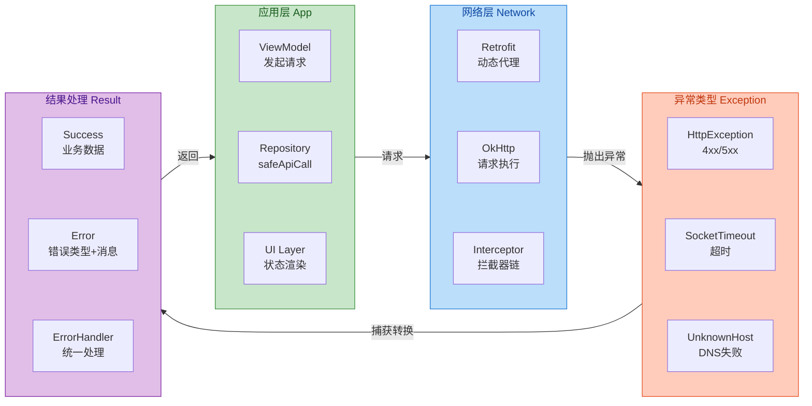

---

### OkHttp 拦截器层面的全局异常处理

除了在业务层使用 `safeApiCall` 模式外，还可以在 OkHttp 的拦截器层面实现全局异常处理。这种方式的优势在于可以统一添加日志记录、错误上报等横切关注点，而不需要在每个 `safeApiCall` 中重复代码。

```kotlin
// 全局异常处理拦截器
class GlobalErrorInterceptor(
    private val crashReporter: CrashReporter,  // 崩溃上报服务
    private val networkMonitor: NetworkMonitor  // 网络状态监控
) : Interceptor {
    
    override fun intercept(chain: Interceptor.Chain): Response {
        val request = chain.request()
        
        // 请求前：检查网络状态，提前快速失败
        if (!networkMonitor.isConnected()) {
            throw NoConnectivityException("设备当前无网络连接")
        }
        
        return try {
            // 执行请求
            val response = chain.proceed(request)
            
            // 响应后：检查 HTTP 状态码，记录非成功响应
            if (!response.isSuccessful) {
                // 记录请求信息和响应状态，便于问题排查
                crashReporter.logWarning(
                    "HTTP ${response.code}",
                    mapOf(
                        "url" to request.url.toString(),
                        "method" to request.method,
                        "message" to response.message
                    )
                )
            }
            
            response
        } catch (e: SocketTimeoutException) {
            // 超时异常：记录详细的请求信息
            crashReporter.logException(e, mapOf(
                "url" to request.url.toString(),
                "stage" to "timeout"
            ))
            // 重新抛出，让上层处理
            throw e
        } catch (e: UnknownHostException) {
            // DNS 异常：记录域名信息
            crashReporter.logException(e, mapOf(
                "host" to request.url.host
            ))
            throw e
        } catch (e: SSLHandshakeException) {
            // SSL 证书异常：可能是证书过期或被中间人攻击
            crashReporter.logException(e, mapOf(
                "url" to request.url.toString(),
                "stage" to "ssl_handshake"
            ))
            throw e
        }
    }
}

// 自定义异常：无网络连接
class NoConnectivityException(message: String) : IOException(message)
```

---

**📝 练习题**

在 Android 应用中使用 Retrofit + Coroutines 发起网络请求，当服务器返回 HTTP 503 状态码时，以下说法正确的是？

A. OkHttp 会自动抛出 `HttpException`，无需额外处理


B. Retrofit 会将 503 响应包装为 `HttpException` 并在协程中抛出


C. 503 状态码表示客户端请求参数错误，应检查请求体格式


D. 此时 `Response.isSuccessful()` 返回 true，因为服务器确实返回了响应


**【答案】** B

**【解析】** 这道题考察对 OkHttp 与 Retrofit 异常处理机制的理解。

选项 A 错误：OkHttp 本身 **不会** 因为收到任何 HTTP 状态码而抛出异常。在 OkHttp 看来，只要服务器返回了 HTTP 响应（无论是 2xx、4xx 还是 5xx），就意味着网络通信成功完成。状态码的语义判断是上层框架（如 Retrofit）的职责。

选项 B 正确：当使用 Retrofit 配合 Coroutines 适配器（即接口方法声明为 `suspend` 函数并直接返回数据类型而非 `Response<T>`）时，Retrofit 会检查响应的 `isSuccessful()` 状态。如果为 false（状态码不在 200-299 范围），Retrofit 会创建一个 `HttpException` 实例并抛出，由调用方的 try-catch 或 CoroutineExceptionHandler 处理。

选项 C 错误：HTTP 503 Service Unavailable 是服务器端错误（5xx 系列），表示服务器当前无法处理请求，通常因为过载或正在维护。客户端请求参数错误通常对应 400 Bad Request 或其他 4xx 状态码。

选项 D 错误：`Response.isSuccessful()` 方法的判断逻辑是检查状态码是否在 200-299 范围内。503 不在此范围，因此返回 false。只有状态码在 2xx 范围内才被视为"成功"的 HTTP 响应。

---

## 文件上传下载

在 Android 应用开发中，文件上传与下载是极为常见的网络操作场景。无论是用户头像上传、多媒体资源获取，还是大型文件的断点续传，都需要开发者深入理解 HTTP 协议规范以及 OkHttp/Retrofit 提供的底层能力。本节将从 **MultipartBody 多部分请求**、**Streaming 流式响应**、**断点续传逻辑** 三个维度，系统性地剖析文件传输的核心原理与最佳实践。

### MultipartBody 多部分请求

#### 什么是 Multipart 请求

当我们需要在一次 HTTP 请求中同时传输多种类型的数据（如文本字段 + 二进制文件）时，传统的 `application/x-www-form-urlencoded` 编码方式就显得力不从心了——它无法高效地承载二进制数据。此时，**multipart/form-data** 编码格式应运而生。

Multipart 请求的核心思想是：将请求体（Request Body）划分为多个 **part**（部分），每个 part 拥有独立的 Content-Type 和 Content-Disposition 头，彼此之间通过一个唯一的 **boundary**（边界字符串）进行分隔。服务端接收到请求后，根据 boundary 解析出各个 part，从而还原出完整的表单数据。

这种设计的精妙之处在于：boundary 是一个随机生成的字符串，理论上不会与任何 part 的内容发生冲突，因此可以安全地作为分隔符使用。HTTP 协议规范（RFC 2046）对此有详细定义。

#### OkHttp 中的 MultipartBody

OkHttp 提供了 `MultipartBody` 类来构建 multipart 请求。它采用 **Builder 模式**，允许开发者灵活地添加多个 part。每个 part 可以是普通的键值对（form field），也可以是文件（binary data）。

```kotlin
// 构建一个包含文本字段和文件的 MultipartBody
val requestBody = MultipartBody.Builder()
    // 设置编码类型为 multipart/form-data（这是上传文件的标准类型）
    .setType(MultipartBody.FORM)
    // 添加普通的表单字段：键为 "username"，值为 "john_doe"
    .addFormDataPart("username", "john_doe")
    // 添加普通的表单字段：键为 "description"，值为文件描述
    .addFormDataPart("description", "My profile picture")
    // 添加文件字段：键为 "avatar"，文件名为 "profile.jpg"
    // 第三个参数是 RequestBody，封装了文件内容和 MIME 类型
    .addFormDataPart(
        "avatar",                                    // 表单字段名
        "profile.jpg",                               // 服务端看到的文件名
        file.asRequestBody("image/jpeg".toMediaType()) // 文件内容
    )
    // 构建最终的 RequestBody
    .build()

// 创建 POST 请求，将 MultipartBody 作为请求体
val request = Request.Builder()
    .url("https://api.example.com/upload")
    // 将构建好的 multipart 请求体附加到请求
    .post(requestBody)
    .build()
```

上述代码生成的 HTTP 请求体大致如下（boundary 是自动生成的）：

```text
Content-Type: multipart/form-data; boundary=----OkHttpBoundary123456

------OkHttpBoundary123456
Content-Disposition: form-data; name="username"

john_doe
------OkHttpBoundary123456
Content-Disposition: form-data; name="description"

My profile picture
------OkHttpBoundary123456
Content-Disposition: form-data; name="avatar"; filename="profile.jpg"
Content-Type: image/jpeg

<binary data here>
------OkHttpBoundary123456--
```

可以看到，每个 part 都以 `--boundary` 开头，最后一个 part 以 `--boundary--` 结尾，这是 multipart 协议的标准格式。

#### Retrofit 中的 @Multipart 注解

Retrofit 对 multipart 请求做了进一步封装，通过 `@Multipart` 和 `@Part` 注解，开发者可以用声明式的方式定义上传接口：

```kotlin
interface FileUploadService {
    // @Multipart 注解表明该请求将使用 multipart/form-data 编码
    @Multipart
    @POST("upload")
    suspend fun uploadFile(
        // @Part 注解用于添加一个 part
        // MultipartBody.Part 可以封装文件或其他复杂数据
        @Part file: MultipartBody.Part,
        // 如果是简单的文本字段，可以使用 @Part("fieldName") + RequestBody
        @Part("description") description: RequestBody
    ): Response<UploadResult>
}
```

调用时，需要手动构造 `MultipartBody.Part`：

```kotlin
// 从 File 对象创建 RequestBody
// "image/*" 表示 MIME 类型为任意图片格式
val fileRequestBody = file.asRequestBody("image/*".toMediaType())

// 使用 MultipartBody.Part.createFormData 创建带有字段名和文件名的 part
// 第一个参数 "file" 是表单字段名，服务端用这个名字接收文件
// 第二个参数 file.name 是文件名，服务端可以获取到原始文件名
// 第三个参数是文件内容的 RequestBody
val filePart = MultipartBody.Part.createFormData("file", file.name, fileRequestBody)

// 创建文本字段的 RequestBody
// toRequestBody() 是 Kotlin 扩展函数，将字符串转换为 RequestBody
val descriptionPart = "This is my file".toRequestBody("text/plain".toMediaType())

// 调用 Retrofit 接口
val response = uploadService.uploadFile(filePart, descriptionPart)
```

#### 上传进度监听的原理

文件上传时，用户通常希望看到上传进度。OkHttp 本身不直接提供进度回调，但我们可以通过 **自定义 RequestBody** 来实现。核心思路是：重写 `writeTo()` 方法，在写入数据时计算已写入的字节数，并通过回调通知外部。

```kotlin
// 自定义 RequestBody，用于监听上传进度
class ProgressRequestBody(
    // 原始的 RequestBody，封装了实际的文件内容
    private val delegate: RequestBody,
    // 进度回调：参数为已上传字节数和总字节数
    private val onProgress: (bytesWritten: Long, totalBytes: Long) -> Unit
) : RequestBody() {

    // 返回原始 RequestBody 的 Content-Type
    override fun contentType(): MediaType? = delegate.contentType()

    // 返回原始 RequestBody 的内容长度
    // 如果返回 -1，表示长度未知（chunked transfer）
    override fun contentLength(): Long = delegate.contentLength()

    // 核心方法：将内容写入到 BufferedSink
    // OkHttp 在发送请求体时会调用此方法
    override fun writeTo(sink: BufferedSink) {
        // 获取总字节数，用于计算进度百分比
        val totalBytes = contentLength()
        // 已写入的字节数，初始为 0
        var bytesWritten = 0L

        // 创建一个 ForwardingSink，它会将写入操作委托给原始 sink
        // 同时在每次写入时更新进度
        val countingSink = object : ForwardingSink(sink) {
            // 重写 write 方法，在写入数据后更新计数
            override fun write(source: Buffer, byteCount: Long) {
                // 先调用父类方法，完成实际的写入操作
                super.write(source, byteCount)
                // 累加已写入的字节数
                bytesWritten += byteCount
                // 通过回调通知外部当前进度
                onProgress(bytesWritten, totalBytes)
            }
        }

        // 将 ForwardingSink 包装为 BufferedSink
        val bufferedSink = countingSink.buffer()
        // 将原始 RequestBody 的内容写入到包装后的 sink
        delegate.writeTo(bufferedSink)
        // 刷新缓冲区，确保所有数据都被写入
        bufferedSink.flush()
    }
}
```

使用时，只需将原始 RequestBody 包装一层：

```kotlin
// 原始的文件 RequestBody
val originalBody = file.asRequestBody("image/jpeg".toMediaType())

// 包装为带进度监听的 RequestBody
val progressBody = ProgressRequestBody(originalBody) { written, total ->
    // 计算百分比进度
    val progress = (written * 100 / total).toInt()
    // 切换到主线程更新 UI（OkHttp 的回调在子线程）
    runOnUiThread {
        progressBar.progress = progress
    }
}

// 使用包装后的 RequestBody 构建 MultipartBody
val multipartBody = MultipartBody.Builder()
    .setType(MultipartBody.FORM)
    .addFormDataPart("file", file.name, progressBody)
    .build()
```

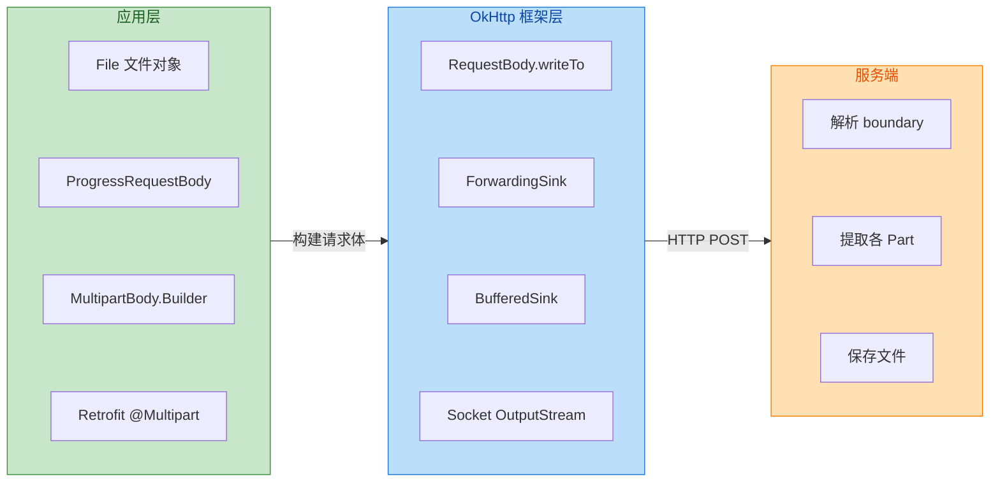

### Streaming 流式响应

#### 为什么需要流式处理

当下载的文件较大（如视频、安装包）时，如果将整个响应体一次性读入内存，不仅会导致 OOM（Out of Memory），还会造成用户长时间等待。**Streaming（流式处理）** 的核心理念是：**边读边写**，即从网络输入流中读取一小块数据，立即写入本地文件，如此循环，直到传输完成。这样，内存中始终只保留一小块数据（通常是 8KB 的缓冲区），极大地降低了内存压力。

#### OkHttp 的响应体流式读取

OkHttp 的 `ResponseBody` 提供了多种方式获取响应内容：

| 方法 | 特点 | 适用场景 |
|------|------|----------|
| `string()` | 一次性读取全部内容为 String | 小型 JSON/文本 |
| `bytes()` | 一次性读取全部内容为 ByteArray | 小型二进制数据 |
| `byteStream()` | 返回 InputStream，支持流式读取 | 大文件下载 |
| `source()` | 返回 Okio 的 BufferedSource | 高性能流式处理 |

对于大文件下载，我们应当使用 `byteStream()` 或 `source()` 进行流式读取：

```kotlin
// 使用 OkHttp 下载大文件的完整示例
suspend fun downloadFile(url: String, destFile: File) {
    // 创建 GET 请求
    val request = Request.Builder()
        .url(url)
        .build()

    // 使用 withContext 切换到 IO 调度器，避免阻塞主线程
    withContext(Dispatchers.IO) {
        // 同步执行请求（在协程中，同步调用不会阻塞线程）
        val response = okHttpClient.newCall(request).execute()

        // 检查响应是否成功（状态码 2xx）
        if (!response.isSuccessful) {
            throw IOException("Download failed: ${response.code}")
        }

        // 获取响应体，注意：body 可能为 null
        val body = response.body ?: throw IOException("Empty response body")

        // 获取文件总大小，用于计算进度（-1 表示未知）
        val totalBytes = body.contentLength()

        // 使用 Okio 的 source() 获取输入流
        // sink() 创建文件输出流
        // use{} 确保流在使用后自动关闭
        body.source().use { source ->
            destFile.sink().buffer().use { sink ->
                // 已读取的字节数
                var bytesRead = 0L
                // 缓冲区大小：8KB 是经验值，兼顾效率和内存
                val buffer = Buffer()
                // 每次从 source 读取的字节数
                var read: Long

                // 循环读取，直到读完所有数据
                // read() 返回实际读取的字节数，-1 表示已到达流末尾
                while (source.read(buffer, 8192).also { read = it } != -1L) {
                    // 将缓冲区内容写入文件
                    sink.write(buffer, read)
                    // 累加已读取的字节数
                    bytesRead += read
                    // 计算并报告进度
                    if (totalBytes > 0) {
                        val progress = (bytesRead * 100 / totalBytes).toInt()
                        // 通过 Flow、LiveData 或回调通知 UI 层
                        emitProgress(progress)
                    }
                }
                // 刷新输出流，确保所有数据写入磁盘
                sink.flush()
            }
        }
    }
}
```

#### Retrofit 中的 @Streaming 注解

默认情况下，Retrofit 会将整个响应体读入内存后再返回给调用者。对于大文件下载，这会导致 OOM。通过添加 `@Streaming` 注解，Retrofit 不会缓存响应体，而是直接返回原始的 `ResponseBody`，由调用者自行进行流式读取。

```kotlin
interface DownloadService {
    // @Streaming 注解告诉 Retrofit：不要将响应体缓存到内存
    // 直接返回原始的 ResponseBody，由调用者流式处理
    @Streaming
    @GET
    suspend fun downloadFile(@Url fileUrl: String): ResponseBody
}
```

**重要警告**：使用 `@Streaming` 时，`ResponseBody` 必须在 **非主线程** 中读取，因为读取操作会阻塞当前线程等待网络 I/O。如果在主线程中读取，会导致 ANR（Application Not Responding）。

```kotlin
// 正确的使用方式：在 IO 调度器中读取
viewModelScope.launch {
    val body = downloadService.downloadFile(url)
    withContext(Dispatchers.IO) {
        // 在 IO 线程中进行流式读取和文件写入
        body.byteStream().use { inputStream ->
            FileOutputStream(file).use { outputStream ->
                inputStream.copyTo(outputStream, bufferSize = 8192)
            }
        }
    }
}
```

#### Okio 与传统 IO 的对比

OkHttp 底层使用的是 Square 开源的 **Okio** 库，它对 Java IO 进行了优化封装：

| 特性 | Java IO | Okio |
|------|---------|------|
| 缓冲管理 | 需要手动管理 byte[] | 自动管理 Buffer，支持复用 |
| 链式操作 | 需要层层包装 Stream | 统一的 Source/Sink 接口 |
| 超时控制 | 不支持 | 内置 Timeout 机制 |
| 内存效率 | 频繁创建临时数组 | Segment 池化，减少 GC |
| 编码支持 | 需要额外处理 | 内置 UTF-8、Base64 等 |

Okio 的 `Buffer` 采用 **Segment 链表** 结构，每个 Segment 是一个 8KB 的字节数组。当数据在 Buffer 之间传递时，Okio 会 **移动 Segment 的引用** 而非复制数据，极大地提升了性能。

### 断点续传逻辑

#### HTTP Range 请求头原理

断点续传的核心依赖于 HTTP/1.1 协议定义的 **Range 请求头** 和 **206 Partial Content 响应**。当客户端发送一个带有 `Range` 头的请求时，服务端会返回指定范围的数据，而非完整文件。

请求头格式：
```
Range: bytes=<start>-<end>
```

- `bytes=0-499`：请求前 500 字节（0 到 499）
- `bytes=500-`：请求从第 501 字节到文件末尾
- `bytes=-500`：请求最后 500 字节

服务端响应：
```
HTTP/1.1 206 Partial Content
Content-Range: bytes 500-999/1000
Content-Length: 500
```

- `206 Partial Content`：表示返回的是部分内容
- `Content-Range`：指明返回的范围和文件总大小
- `Content-Length`：本次返回的数据长度

**判断服务端是否支持断点续传**：检查响应头中是否包含 `Accept-Ranges: bytes`。如果服务端不支持，则会返回完整文件（状态码 200）。

#### 断点续传的完整实现

实现断点续传需要解决以下几个核心问题：

1. **记录下载进度**：将已下载的字节数持久化存储
2. **发起 Range 请求**：从上次中断的位置继续下载
3. **追加写入文件**：新数据追加到文件末尾，而非覆盖
4. **文件完整性校验**：下载完成后验证文件（如 MD5）

```kotlin
/**
 * 断点续传下载管理器
 * 支持暂停、恢复、进度回调、自动重试
 */
class ResumableDownloadManager(
    // OkHttpClient 实例，建议配置较长的超时时间
    private val client: OkHttpClient,
    // SharedPreferences 或 DataStore，用于持久化下载进度
    private val progressStore: DownloadProgressStore
) {
    // 当前下载任务的 Call 对象，用于取消下载
    private var currentCall: Call? = null
    // 下载状态 Flow，UI 层可以 collect 获取实时状态
    private val _downloadState = MutableStateFlow<DownloadState>(DownloadState.Idle)
    val downloadState: StateFlow<DownloadState> = _downloadState.asStateFlow()

    /**
     * 开始或恢复下载
     * @param url 文件下载地址
     * @param destFile 本地保存路径
     */
    suspend fun download(url: String, destFile: File) = withContext(Dispatchers.IO) {
        // 从持久化存储中读取上次下载的进度
        val downloadedBytes = progressStore.getDownloadedBytes(url)
        // 检查本地文件是否存在，以及大小是否与记录一致
        val actualFileSize = if (destFile.exists()) destFile.length() else 0L

        // 如果文件大小与记录不一致，说明文件可能被修改，需要重新下载
        val startByte = if (actualFileSize == downloadedBytes) downloadedBytes else 0L

        // 如果需要从头开始，删除可能存在的残留文件
        if (startByte == 0L && destFile.exists()) {
            destFile.delete()
        }

        // 构建请求，添加 Range 头
        val request = Request.Builder()
            .url(url)
            // 如果 startByte > 0，添加 Range 头实现断点续传
            // 格式："bytes=startByte-" 表示从 startByte 开始到文件末尾
            .apply {
                if (startByte > 0) {
                    addHeader("Range", "bytes=$startByte-")
                }
            }
            .build()

        try {
            // 发送状态：正在连接
            _downloadState.value = DownloadState.Connecting

            // 创建 Call 对象并保存引用，以便后续取消
            currentCall = client.newCall(request)
            // 执行同步请求
            val response = currentCall!!.execute()

            // 检查响应状态
            when (response.code) {
                // 200 OK：服务端不支持 Range，返回完整文件
                200 -> {
                    // 需要从头开始下载
                    if (startByte > 0) {
                        destFile.delete()
                        progressStore.saveDownloadedBytes(url, 0)
                    }
                    downloadFullFile(response, destFile, url)
                }
                // 206 Partial Content：服务端支持 Range，返回部分内容
                206 -> {
                    downloadPartialFile(response, destFile, url, startByte)
                }
                // 416 Range Not Satisfiable：Range 超出范围，可能文件已下载完成
                416 -> {
                    // 验证文件完整性
                    val contentRange = response.header("Content-Range")
                    if (contentRange != null) {
                        val totalSize = contentRange.substringAfter("/").toLongOrNull()
                        if (totalSize != null && actualFileSize >= totalSize) {
                            // 文件已完整
                            _downloadState.value = DownloadState.Success(destFile)
                            return@withContext
                        }
                    }
                    // 否则重新下载
                    destFile.delete()
                    progressStore.saveDownloadedBytes(url, 0)
                    download(url, destFile) // 递归调用，从头开始
                }
                // 其他错误状态
                else -> {
                    throw IOException("Server returned ${response.code}: ${response.message}")
                }
            }
        } catch (e: IOException) {
            // 检查是否是用户主动取消
            if (currentCall?.isCanceled() == true) {
                _downloadState.value = DownloadState.Paused(startByte)
            } else {
                _downloadState.value = DownloadState.Error(e)
            }
        }
    }

    /**
     * 下载完整文件（服务端不支持 Range）
     */
    private suspend fun downloadFullFile(
        response: Response,
        destFile: File,
        url: String
    ) {
        val body = response.body ?: throw IOException("Empty response body")
        val totalBytes = body.contentLength()

        // 发送状态：开始下载
        _downloadState.value = DownloadState.Downloading(0, totalBytes)

        // 使用流式写入
        body.source().use { source ->
            // 覆盖写入模式
            destFile.sink().buffer().use { sink ->
                var bytesRead = 0L
                val buffer = Buffer()
                var read: Long

                while (source.read(buffer, 8192).also { read = it } != -1L) {
                    sink.write(buffer, read)
                    bytesRead += read
                    // 更新进度
                    _downloadState.value = DownloadState.Downloading(bytesRead, totalBytes)
                    // 每 100KB 持久化一次进度，避免频繁 IO
                    if (bytesRead % (100 * 1024) == 0L) {
                        progressStore.saveDownloadedBytes(url, bytesRead)
                    }
                }
                sink.flush()
            }
        }

        // 下载完成，清除进度记录
        progressStore.clearProgress(url)
        _downloadState.value = DownloadState.Success(destFile)
    }

    /**
     * 下载部分文件（断点续传）
     */
    private suspend fun downloadPartialFile(
        response: Response,
        destFile: File,
        url: String,
        startByte: Long
    ) {
        val body = response.body ?: throw IOException("Empty response body")

        // 从 Content-Range 头解析文件总大小
        // 格式：bytes 500-999/1000 或 bytes */1000
        val contentRange = response.header("Content-Range")
        val totalBytes = contentRange?.substringAfter("/")?.toLongOrNull()
            ?: (startByte + body.contentLength())

        // 发送状态：继续下载
        _downloadState.value = DownloadState.Downloading(startByte, totalBytes)

        body.source().use { source ->
            // 追加写入模式：使用 FileOutputStream(file, true) 或 Okio 的 appendingSink()
            destFile.appendingSink().buffer().use { sink ->
                var bytesRead = startByte
                val buffer = Buffer()
                var read: Long

                while (source.read(buffer, 8192).also { read = it } != -1L) {
                    sink.write(buffer, read)
                    bytesRead += read
                    _downloadState.value = DownloadState.Downloading(bytesRead, totalBytes)
                    // 定期持久化进度
                    if ((bytesRead - startByte) % (100 * 1024) == 0L) {
                        progressStore.saveDownloadedBytes(url, bytesRead)
                    }
                }
                sink.flush()
            }
        }

        // 下载完成
        progressStore.clearProgress(url)
        _downloadState.value = DownloadState.Success(destFile)
    }

    /**
     * 暂停下载
     */
    fun pause() {
        currentCall?.cancel()
    }
}

/**
 * 下载状态密封类
 */
sealed class DownloadState {
    // 空闲状态
    object Idle : DownloadState()
    // 正在连接
    object Connecting : DownloadState()
    // 下载中：当前字节数 / 总字节数
    data class Downloading(val bytesRead: Long, val totalBytes: Long) : DownloadState()
    // 已暂停：记录暂停位置
    data class Paused(val bytesDownloaded: Long) : DownloadState()
    // 下载成功
    data class Success(val file: File) : DownloadState()
    // 下载失败
    data class Error(val exception: Exception) : DownloadState()
}
```

#### 断点续传的核心流程图

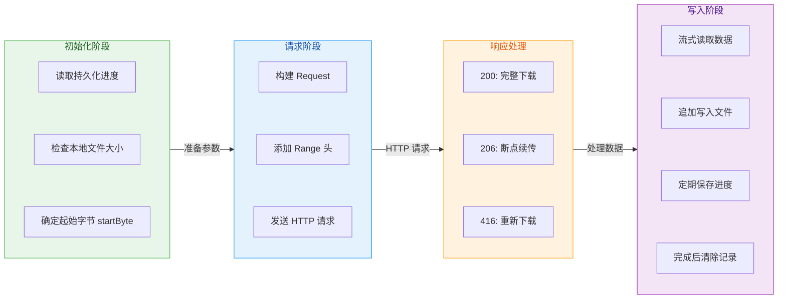

#### 多线程分片下载

对于超大文件（如数百 MB 甚至 GB 级别），单线程下载可能无法充分利用带宽。**分片下载（Chunked Download）** 的思路是：将文件划分为多个区间，每个区间由一个独立的线程下载，最后合并所有分片。这种方式可以显著提升下载速度，尤其是在服务端限速的场景下。

```kotlin
/**
 * 分片下载器
 * 将文件划分为 N 个区间，并行下载后合并
 */
class ChunkedDownloader(
    private val client: OkHttpClient,
    // 并行下载的线程数
    private val threadCount: Int = 3
) {
    suspend fun downloadChunked(url: String, destFile: File) = withContext(Dispatchers.IO) {
        // 第一步：发送 HEAD 请求获取文件大小和是否支持 Range
        val headRequest = Request.Builder()
            .url(url)
            .head() // HEAD 请求只获取响应头，不下载内容
            .build()

        val headResponse = client.newCall(headRequest).execute()
        val acceptRanges = headResponse.header("Accept-Ranges")
        val contentLength = headResponse.header("Content-Length")?.toLongOrNull()

        // 如果服务端不支持 Range 或无法获取文件大小，回退到单线程下载
        if (acceptRanges != "bytes" || contentLength == null) {
            fallbackToSingleThread(url, destFile)
            return@withContext
        }

        // 第二步：计算每个分片的区间
        // chunkSize = 文件总大小 / 线程数，向上取整
        val chunkSize = (contentLength + threadCount - 1) / threadCount
        // 为每个线程创建临时文件
        val tempFiles = (0 until threadCount).map { index ->
            File(destFile.parent, "${destFile.name}.part$index")
        }

        // 第三步：并行下载各分片
        val jobs = (0 until threadCount).map { index ->
            async {
                val start = index * chunkSize
                // 最后一个分片的结束位置是文件末尾
                val end = minOf((index + 1) * chunkSize - 1, contentLength - 1)
                downloadChunk(url, tempFiles[index], start, end)
            }
        }
        // 等待所有分片下载完成
        jobs.awaitAll()

        // 第四步：合并分片
        destFile.outputStream().use { output ->
            tempFiles.forEach { tempFile ->
                tempFile.inputStream().use { input ->
                    input.copyTo(output)
                }
                // 删除临时文件
                tempFile.delete()
            }
        }
    }

    /**
     * 下载指定区间的分片
     */
    private suspend fun downloadChunk(url: String, tempFile: File, start: Long, end: Long) {
        val request = Request.Builder()
            .url(url)
            // 指定下载区间
            .addHeader("Range", "bytes=$start-$end")
            .build()

        val response = client.newCall(request).execute()
        if (response.code != 206) {
            throw IOException("Expected 206 but got ${response.code}")
        }

        response.body?.byteStream()?.use { input ->
            tempFile.outputStream().use { output ->
                input.copyTo(output)
            }
        }
    }
}
```

#### 文件完整性校验

下载完成后，务必验证文件完整性。常见方法：

1. **文件大小校验**：对比下载字节数与 `Content-Length`
2. **MD5/SHA256 校验**：与服务端提供的 hash 值比对
3. **CRC32 校验**：适用于对性能敏感的场景

```kotlin
/**
 * 计算文件的 MD5 值
 */
fun File.md5(): String {
    // 获取 MD5 算法实例
    val digest = MessageDigest.getInstance("MD5")
    // 使用 DigestInputStream 在读取文件时同步计算 hash
    DigestInputStream(inputStream(), digest).use { dis ->
        // 读取文件内容（实际数据被丢弃，我们只需要 digest）
        val buffer = ByteArray(8192)
        while (dis.read(buffer) != -1) {
            // 空循环体：DigestInputStream 会自动更新 digest
        }
    }
    // 获取最终的 hash 字节数组
    val hashBytes = digest.digest()
    // 转换为十六进制字符串
    return hashBytes.joinToString("") { "%02x".format(it) }
}

// 使用示例
val expectedMd5 = "d41d8cd98f00b204e9800998ecf8427e"
if (downloadedFile.md5() == expectedMd5) {
    // 文件完整
} else {
    // 文件损坏，需要重新下载
    downloadedFile.delete()
}
```

---

**📝 练习题**

在 Android 中实现断点续传下载时，以下哪种做法是正确的？

A. 使用 `Range: bytes=100-` 请求头，期望服务端返回状态码 200 OK

B. 当服务端返回 416 Range Not Satisfiable 时，说明文件已下载完成，无需处理

C. 将已下载字节数持久化存储，并在续传时使用追加模式写入文件

D. Retrofit 的 `@Streaming` 注解会自动实现断点续传功能


**【答案】** C

**【解析】** 断点续传的正确实现需要两个关键步骤：一是持久化记录已下载的字节数（通常存储在 SharedPreferences 或数据库），二是在续传时以追加模式（append mode）写入文件，确保新数据接在已有数据之后。

A 选项错误：当服务端支持 Range 请求时，正确的响应状态码是 **206 Partial Content**，而非 200 OK。如果服务端返回 200，说明它忽略了 Range 头，返回了完整文件。

B 选项错误：416 状态码表示请求的 Range 超出了文件范围，但这并不一定意味着文件已完整下载。需要从 `Content-Range` 头中解析文件总大小，与本地文件大小比对后才能确认。

D 选项错误：`@Streaming` 注解只是告诉 Retrofit 不要将响应体缓存到内存，而是直接返回原始流，让开发者自行处理。它不会自动实现断点续传功能，开发者需要手动处理 Range 请求头和文件追加写入逻辑。

---

## 本章小结

本章系统性地剖析了 Android 现代网络架构的核心组件与设计哲学。从底层的 OkHttp 到上层的 Retrofit，我们完整梳理了一个高效、可扩展、易维护的网络请求体系是如何构建的。以下从**架构设计思想**、**核心机制回顾**、**最佳实践要点**三个维度进行总结。

### 架构分层与职责划分

现代 Android 网络架构遵循**关注点分离（Separation of Concerns）**原则，形成了清晰的三层结构：

**Retrofit 层（API 抽象层）** 负责将 RESTful API 抽象为类型安全的 Kotlin/Java 接口。开发者只需定义接口方法与注解，无需关心底层 HTTP 细节。通过**动态代理（Dynamic Proxy）**机制，Retrofit 在运行时生成接口实现，将方法调用转化为标准的 HTTP 请求。这一层的核心价值在于：让网络请求的调用方式与本地方法调用一致，极大降低了认知负担。

**OkHttp 层（HTTP 引擎层）** 承担实际的网络通信职责。其设计精髓体现在三个关键机制：**Call 模型**将每个请求封装为可执行、可取消、可克隆的独立单元；**Dispatcher 调度器**通过线程池管理并发请求，实现同步/异步执行策略；**Interceptor 责任链**则以管道模式处理请求与响应，使得日志、重试、缓存、认证等横切关注点得以优雅解耦。

**连接管理层（Transport 层）** 负责 TCP 连接的建立、复用与回收。**ConnectionPool** 维护空闲连接池，结合 HTTP/1.1 的 Keep-Alive 与 HTTP/2 的多路复用特性，显著减少了 TCP 握手与 TLS 协商的开销。这是网络性能优化的关键所在。

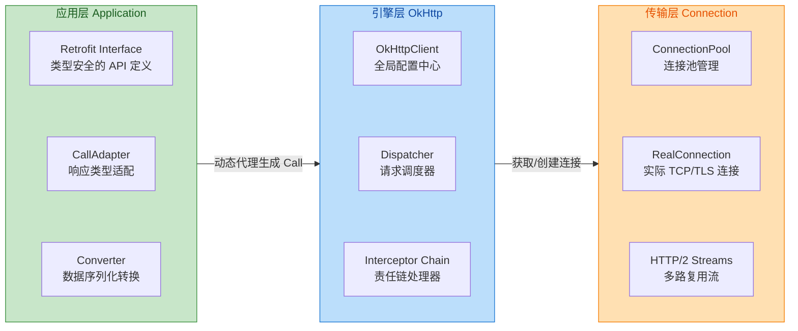

### 核心机制精要

**责任链模式（Interceptor Chain）** 是 OkHttp 最具启发性的设计。每个 Interceptor 既能在请求发出前修改 Request，也能在响应返回后处理 Response。内置拦截器按顺序依次处理：RetryAndFollowUpInterceptor 负责失败重试与重定向跟踪、BridgeInterceptor 补充标准 HTTP 头（如 Content-Type、Accept-Encoding）、CacheInterceptor 实现 HTTP 缓存语义、ConnectInterceptor 建立或复用连接、CallServerInterceptor 执行实际的网络 I/O。这种管道式设计使得每个拦截器只需关注单一职责，同时保持了极高的可扩展性——开发者可插入自定义拦截器实现日志记录、Token 刷新、请求加密等功能。

**连接复用机制** 直接影响网络性能。HTTP/1.1 的 Keep-Alive 允许在单个 TCP 连接上串行发送多个请求，避免了频繁建立连接的开销；HTTP/2 更进一步，通过**多路复用（Multiplexing）**在同一连接上并行传输多个请求/响应流。OkHttp 的 ConnectionPool 默认保持 5 个空闲连接，每个连接存活 5 分钟。当发起新请求时，首先尝试从池中获取匹配的连接（相同主机、端口、协议），命中则直接复用，否则创建新连接并在使用后归还池中。这一机制对于移动端尤为重要——减少了电量消耗与网络延迟。

**动态代理与 ServiceMethod 解析** 是 Retrofit 的核心魔法。当调用接口方法时，`Proxy.newProxyInstance()` 创建的代理对象会拦截调用，通过反射解析方法签名与注解，构建出 ServiceMethod 对象。ServiceMethod 缓存了 HTTP 方法、URL 模板、参数处理器、返回类型适配器、数据转换器等所有元信息。后续相同方法的调用直接复用缓存的 ServiceMethod，避免重复解析。这种"一次解析、多次复用"的策略在性能与灵活性之间取得了良好平衡。

**Converter 与 CallAdapter** 体现了 Retrofit 的开放式设计。Converter 负责请求体序列化与响应体反序列化，支持 Gson、Moshi、Protobuf 等多种格式；CallAdapter 则将原始的 `Call<T>` 适配为开发者期望的类型——`Observable<T>`（RxJava）、`suspend fun`（Coroutines）、`LiveData<T>`（Architecture Components）。两者均采用**工厂模式**，Retrofit 在构建时按顺序查找匹配的工厂，首个能处理目标类型的工厂将被采用。这种设计使得 Retrofit 能够无缝集成各种异步范式与序列化方案。

### HTTP 缓存策略要点

缓存是提升用户体验与降低服务器负载的关键手段。OkHttp 完整实现了 HTTP 缓存语义：

- **Cache-Control** 头控制缓存行为：`max-age` 指定缓存有效期，`no-cache` 强制重新验证，`no-store` 禁止缓存，`only-if-cached` 仅使用缓存
- **ETag/Last-Modified** 实现条件请求：客户端发送 `If-None-Match`（对应 ETag）或 `If-Modified-Since`（对应 Last-Modified），服务器返回 304 Not Modified 表示资源未变更
- **离线缓存** 通过自定义 Interceptor 实现：在无网络时强制使用 `CacheControl.FORCE_CACHE`

开发者需特别注意：POST 请求默认不缓存，GET 请求需服务端正确返回缓存头才能生效。对于需要离线支持的场景，应结合本地数据库（Room）与网络缓存设计合理的数据同步策略。

### 异常处理体系

健壮的网络层必须妥善处理各类异常：

| 异常类型 | 触发场景 | 建议处理 |
|---------|---------|---------|
| `HttpException` | HTTP 4xx/5xx 响应 | 解析错误体、展示友好提示 |
| `SocketTimeoutException` | 连接/读写超时 | 提示用户重试、检查网络 |
| `UnknownHostException` | DNS 解析失败 | 检查网络连接、尝试备用域名 |
| `SSLException` | TLS 握手失败 | 检查证书配置、网络环境 |
| `IOException` | 通用 I/O 错误 | 统一兜底处理 |

推荐在 Retrofit 层通过自定义 CallAdapter 实现全局异常捕获与转换，将底层异常映射为业务友好的错误类型（如 `NetworkError`、`ServerError`、`AuthError`），便于 UI 层统一处理。

### 文件传输最佳实践

大文件传输需要特殊考量：

**上传** 使用 `MultipartBody` 构建多部分请求，注意设置正确的 `Content-Type`。对于大文件，应使用 `RequestBody` 的流式写入避免内存溢出，同时通过自定义 RequestBody 包装实现上传进度监听。

**下载** 使用 `@Streaming` 注解标记响应为流式，避免 Retrofit 将整个响应体加载到内存。通过 `ResponseBody.byteStream()` 获取输入流，逐块写入文件。断点续传通过 `Range` 请求头实现：发送 `Range: bytes=已下载字节数-`，服务端返回 206 Partial Content 与剩余内容。

### 架构演进趋势

随着 Kotlin Coroutines 成为 Android 官方推荐的异步方案，现代网络层正经历范式转变：

- **suspend 函数** 取代 `Call<T>` 与 `Observable<T>`，代码更简洁、可读性更强
- **Flow** 用于流式响应与实时数据，结合 `callbackFlow` 可优雅桥接回调式 API
- **Ktor Client** 作为 Kotlin-first 的 HTTP 客户端逐渐崭露头角，提供更原生的协程支持

然而，OkHttp + Retrofit 组合凭借其成熟度、生态完整性与社区支持，在可预见的未来仍将是 Android 网络开发的主流选择。

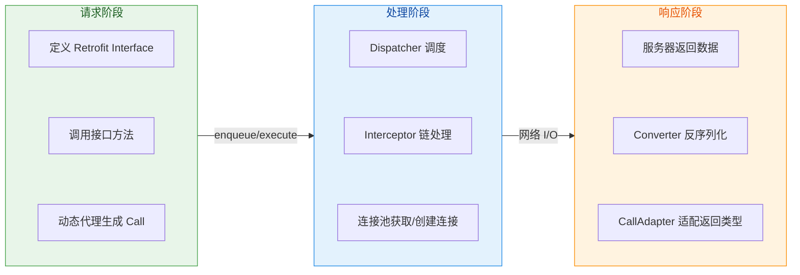

### 知识图谱速查

```kotlin
// ═══════════════════════════════════════════════════════════════════
//                    现代网络架构 核心知识图谱
// ═══════════════════════════════════════════════════════════════════
//
//  ┌─────────────────────────────────────────────────────────────────┐
//  │                        RETROFIT                                  │
//  │  ┌──────────────┐  ┌──────────────┐  ┌──────────────────────┐   │
//  │  │ @GET/@POST   │  │ CallAdapter  │  │ Converter            │   │
//  │  │ @Path/@Query │  │ ├─ RxJava    │  │ ├─ Gson              │   │
//  │  │ @Body/@Part  │  │ ├─ Coroutine │  │ ├─ Moshi             │   │
//  │  │ @Header      │  │ └─ LiveData  │  │ └─ Protobuf          │   │
//  │  └──────────────┘  └──────────────┘  └──────────────────────┘   │
//  └─────────────────────────────────────────────────────────────────┘
//                              │ 动态代理
//                              ▼
//  ┌─────────────────────────────────────────────────────────────────┐
//  │                         OKHTTP                                   │
//  │  ┌──────────────┐  ┌──────────────┐  ┌──────────────────────┐   │
//  │  │ Call         │  │ Dispatcher   │  │ Interceptor Chain    │   │
//  │  │ ├─ execute() │  │ ├─ 同步队列   │  │ ├─ Application       │   │
//  │  │ ├─ enqueue() │  │ ├─ 异步队列   │  │ ├─ Retry             │   │
//  │  │ └─ cancel()  │  │ └─ 线程池     │  │ ├─ Bridge            │   │
//  │  └──────────────┘  └──────────────┘  │ ├─ Cache             │   │
//  │                                       │ ├─ Connect           │   │
//  │  ┌──────────────────────────────────┐ │ └─ CallServer        │   │
//  │  │ Cache                            │ └──────────────────────┘   │
//  │  │ ├─ Cache-Control    ├─ ETag      │                            │
//  │  │ └─ 离线缓存策略                   │                            │
//  │  └──────────────────────────────────┘                            │
//  └─────────────────────────────────────────────────────────────────┘
//                              │ 连接管理
//                              ▼
//  ┌─────────────────────────────────────────────────────────────────┐
//  │                    CONNECTION POOL                               │
//  │  ┌──────────────────────────────────────────────────────────┐   │
//  │  │ Keep-Alive 复用  │  HTTP/2 多路复用  │  连接清理与回收     │   │
//  │  └──────────────────────────────────────────────────────────┘   │
//  └─────────────────────────────────────────────────────────────────┘
//
// ═══════════════════════════════════════════════════════════════════
```

---

**📝 练习题 1**

在 OkHttp 的拦截器责任链中，以下关于 Application Interceptor 和 Network Interceptor 的描述，哪项是**正确**的？

A. Application Interceptor 能够观察到重定向后的最终响应，而 Network Interceptor 只能观察到每次网络请求的原始响应

B. Network Interceptor 添加的 Header 会被 BridgeInterceptor 覆盖，因此无法生效

C. Application Interceptor 可以多次调用 chain.proceed()，而 Network Interceptor 只能调用一次

D. 两者的执行顺序是：Application Interceptor → 缓存检查 → Network Interceptor → 实际网络请求

**【答案】** D

**【解析】** OkHttp 的拦截器链按以下顺序执行：用户添加的 Application Interceptors → RetryAndFollowUpInterceptor → BridgeInterceptor → CacheInterceptor → ConnectInterceptor → 用户添加的 Network Interceptors → CallServerInterceptor。因此 D 正确描述了执行流程。选项 A 恰好说反了：Application Interceptor 位于重试拦截器之前，只会被调用一次，看到的是最终聚合后的响应；Network Interceptor 在重试循环内部，每次实际网络请求都会触发。选项 B 错误，Network Interceptor 在 BridgeInterceptor 之后执行，可以覆盖或添加 Header。选项 C 描述的是两种拦截器都允许多次调用 proceed()（实现重试逻辑），但通常不推荐在 Network Interceptor 中这样做。

---

**📝 练习题 2**

某电商 App 需要实现"离线浏览商品详情"功能。以下关于 OkHttp 缓存配置的方案，哪个**最合适**？

A. 配置 `Cache` 对象并设置足够大的缓存目录，依赖服务端返回的 `Cache-Control: max-age=3600` 响应头

B. 添加 Network Interceptor，在响应中强制添加 `Cache-Control: max-age=86400` 覆盖服务端设置

C. 添加 Application Interceptor，在无网络时将请求的 `CacheControl` 改为 `FORCE_CACHE`，有网络时正常请求

D. 使用 Room 数据库存储商品数据，完全绕过 HTTP 缓存机制

**【答案】** C

**【解析】** 离线浏览的核心需求是"有网络时获取最新数据，无网络时使用缓存"。选项 C 通过 Application Interceptor 检测网络状态：有网时正常请求（可能返回 304 或新数据），无网时设置 `CacheControl.FORCE_CACHE` 强制使用本地缓存，即使缓存已过期也返回（而非抛出异常）。这是标准的离线缓存实现模式。选项 A 依赖服务端设置，无法控制离线行为，且 max-age 过期后无网络会请求失败。选项 B 强制修改缓存时间可能导致数据过时，且 Network Interceptor 在无网络时根本不会执行。选项 D 虽然可行，但引入了额外的数据同步复杂度，对于只需简单缓存的场景是过度设计。

---

