---

# 网络通信基础

---

## 网络协议栈

Android 应用层的网络通信，本质上是建立在操作系统内核所实现的 **TCP/IP 协议栈** 之上的。无论你使用的是 `HttpURLConnection`、OkHttp 还是 Retrofit，最终都会通过 Java 层的 Socket API 调用 Linux 内核的网络子系统。理解协议栈的分层模型，是掌握 Android 网络编程的基石——它能帮助你定位网络问题、优化传输性能、理解为何某些配置（如超时、重试、TLS 版本）会产生特定行为。

### TCP/IP 模型简述

经典的 **OSI 七层模型** 是学术界的理论参考，而实际互联网运行所依据的是更为精简的 **TCP/IP 四层模型**（有时也称五层模型）。对于 Android 应用开发者而言，理解这四层的职责边界尤为重要：

**应用层（Application Layer）** 是我们日常打交道最多的一层。HTTP、HTTPS、WebSocket、DNS 等协议都运行在这一层。当你调用 `URL.openConnection()` 或 OkHttp 的 `newCall()` 方法时，你实际上是在构造应用层的请求报文。这一层关心的是"传输什么内容"，而不关心"如何传输"。

**传输层（Transport Layer）** 负责端到端的数据传输控制。TCP（Transmission Control Protocol）提供可靠的、面向连接的字节流服务，它通过三次握手建立连接、通过序列号和确认机制保证数据有序到达、通过滑动窗口实现流量控制、通过拥塞控制算法避免网络过载。UDP（User Datagram Protocol）则是无连接的、不可靠的数据报服务，适用于实时音视频、DNS 查询等对延迟敏感但能容忍少量丢包的场景。Android 应用的 HTTP 请求绑定 TCP，而某些推送服务或游戏可能会使用 UDP。

**网络层（Internet Layer）** 的核心协议是 IP（Internet Protocol），它负责将数据包从源主机路由到目标主机。IP 地址是这一层的寻址机制。Android 设备连接 WiFi 或蜂窝网络时，系统会通过 DHCP 或静态配置获取 IP 地址。IPv4 地址空间即将耗尽，IPv6 的普及正在加速——作为应用开发者，你可能需要确保服务器和客户端都能正确处理 IPv6。

**网络接口层（Link Layer）** 对应物理网卡、WiFi 芯片、蜂窝基带等硬件，负责在物理媒介上发送和接收比特流。Android Framework 层通过 `ConnectivityManager` 和 `NetworkCapabilities` 向应用暴露底层网络状态，但应用通常无需直接操作这一层。

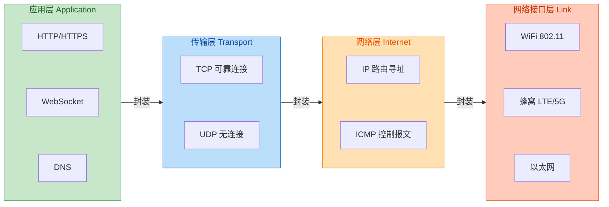

从 Android 应用的视角来看，**你的代码工作在应用层**，系统帮你处理了传输层及以下的复杂性。但这并不意味着你可以完全忽略下层——网络超时、连接池复用、TCP 慢启动、拥塞窗口等概念，都会直接影响应用的网络性能表现。例如，频繁创建短连接会导致大量 TCP 三次握手开销；不合理的超时设置可能让用户在弱网环境下体验糟糕。

### HTTP/1.1 vs HTTP/2

HTTP（HyperText Transfer Protocol）是 Web 通信的基石，也是 Android 应用与服务器交互最常用的协议。理解 HTTP/1.1 与 HTTP/2 的差异，能帮助你做出更好的架构决策。

**HTTP/1.1** 自 1997 年发布以来统治了互联网近二十年。它的核心特性包括：**持久连接（Keep-Alive）** 允许在同一 TCP 连接上发送多个请求-响应，避免了 HTTP/1.0 时代每次请求都要重新建立 TCP 连接的开销；**管道化（Pipelining）** 允许客户端在收到前一个响应之前发送下一个请求——但由于实现复杂且容易出错，实际中很少使用。

然而，HTTP/1.1 存在一个根本性的瓶颈：**队头阻塞（Head-of-Line Blocking）**。在同一个 TCP 连接上，响应必须按请求顺序返回。如果第一个请求的响应很慢，后续所有响应都必须等待，即使它们早已准备好。为了绕过这个限制，浏览器和 HTTP 客户端通常会对同一域名开启 **多个并行连接**（通常 6-8 个），但这又带来了额外的 TCP 握手开销和服务器资源消耗。

**HTTP/2** 于 2015 年正式发布，它从根本上解决了 HTTP/1.1 的性能问题。其核心创新包括：

**二进制分帧层（Binary Framing Layer）** 将 HTTP 消息分解为更小的帧（Frame），每个帧都带有流标识符（Stream ID）。这使得单个 TCP 连接可以承载多个并发的请求-响应流，彼此独立、互不阻塞。这就是 **多路复用（Multiplexing）** 的威力——你可以在一个连接上同时发送 100 个请求，服务器可以按任意顺序返回响应。

**头部压缩（HPACK）** 使用静态表、动态表和霍夫曼编码来压缩 HTTP 头部。在 HTTP/1.1 中，每个请求都要携带完整的头部（包括 Cookie、User-Agent 等），这些重复数据在 HTTP/2 中被高效压缩，显著减少了带宽消耗。

**服务器推送（Server Push）** 允许服务器在客户端请求之前主动推送资源。例如，当客户端请求 HTML 页面时，服务器可以预测性地推送 CSS 和 JavaScript 文件，减少额外的往返时间。不过，这个特性在实践中使用较少，Chrome 甚至已经移除了对 Server Push 的支持。

**流优先级（Stream Prioritization）** 允许客户端指定请求的优先级，帮助服务器合理分配带宽，优先传输关键资源。

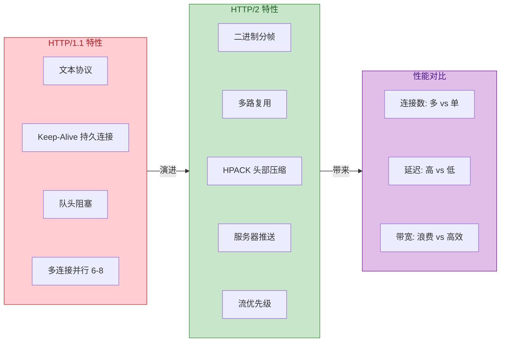

**Android 开发的实际影响**：如果你使用 OkHttp（或基于它的 Retrofit），从 OkHttp 3.x 开始就默认支持 HTTP/2，只要服务器支持且使用 HTTPS（HTTP/2 在实践中几乎总是基于 TLS），协议协商会自动完成（通过 ALPN 扩展）。你无需修改任何代码即可享受 HTTP/2 的性能优势。`HttpURLConnection` 在较新的 Android 版本中也支持 HTTP/2，但能力有限且行为不可控。

值得注意的是，HTTP/2 虽然解决了 HTTP 层的队头阻塞，但 **TCP 层的队头阻塞** 依然存在：如果底层 TCP 出现丢包，整个连接上的所有流都会被阻塞等待重传。这也是 **HTTP/3**（基于 QUIC 协议，使用 UDP）被提出的原因——它将流的概念下沉到传输层，实现了真正的无阻塞多路复用。

### HTTPS TLS 握手流程

HTTPS 并不是一个独立的协议，而是 **HTTP over TLS/SSL**。TLS（Transport Layer Security）工作在 TCP 之上、HTTP 之下，为应用层数据提供加密、身份认证和完整性保护。对于 Android 应用而言，理解 TLS 握手流程不仅有助于调试 SSL 错误，还能帮助你理解为何首次连接会有延迟、为何证书配置如此重要。

TLS 握手的核心目标有三个：**协商加密套件**（双方就使用什么算法达成一致）、**验证服务器身份**（通过证书链验证服务器不是冒充者）、**生成会话密钥**（用于后续对称加密通信）。

以 TLS 1.2 为例，完整的握手流程如下：

**第一步：ClientHello**。客户端向服务器发送支持的 TLS 版本、加密套件列表、一个客户端随机数（Client Random），以及可选的扩展（如 SNI 服务器名称指示、ALPN 应用层协议协商）。SNI 扩展允许同一 IP 地址托管多个 HTTPS 站点——没有它，服务器无法知道客户端想访问哪个域名的证书。

**第二步：ServerHello + Certificate + ServerKeyExchange + ServerHelloDone**。服务器从客户端提供的套件列表中选择一个、返回服务器随机数（Server Random）、发送服务器证书链（包含公钥）。如果使用 ECDHE 密钥交换，还会发送 ServerKeyExchange 消息携带 ECDH 参数。最后发送 ServerHelloDone 表示服务器侧 Hello 阶段结束。

**第三步：证书验证**。客户端验证服务器证书：检查证书是否由受信任的 CA 签发、是否在有效期内、域名是否匹配、是否被吊销（通过 CRL 或 OCSP）。Android 系统维护着一个受信任的根证书列表（存储在 `/system/etc/security/cacerts/`），应用也可以通过 Network Security Config 自定义信任锚点。

**第四步：ClientKeyExchange + ChangeCipherSpec + Finished**。客户端生成 Pre-Master Secret（预主密钥），使用服务器公钥加密后发送。双方结合 Client Random、Server Random、Pre-Master Secret 通过伪随机函数（PRF）派生出 Master Secret，进而生成对称加密密钥。客户端发送 ChangeCipherSpec 表示后续通信将使用协商的加密参数，然后发送 Finished 消息（包含前面所有握手消息的摘要，用协商的密钥加密）。

**第五步：ChangeCipherSpec + Finished**。服务器同样发送 ChangeCipherSpec 和 Finished，握手完成。后续的 HTTP 数据将使用对称加密传输。

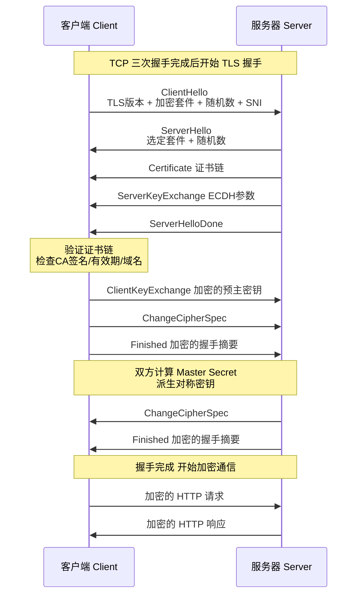

**TLS 1.3** 对握手流程做了重大优化。它移除了 RSA 密钥交换（仅支持具有前向安全性的 ECDHE/DHE）、减少了一个往返时间（1-RTT 握手），并支持 **0-RTT 早期数据**（在某些条件下，客户端可以在发送 ClientHello 的同时就发送应用数据，但会有重放攻击风险）。Android 10 及以上版本默认支持 TLS 1.3。

**对 Android 应用开发的影响**：

1. **首次连接延迟**：TCP 三次握手 + TLS 握手意味着首次 HTTPS 请求需要多个往返时间（RTT）。在移动网络高延迟环境下，这可能导致明显的卡顿感。解决方案包括：使用 HTTP/2 多路复用减少连接数、启用 TLS Session Resumption（会话恢复）、使用 TLS 1.3 减少握手往返。

2. **证书错误处理**：当证书验证失败时（如自签名证书、过期证书、域名不匹配），系统会抛出 `SSLHandshakeException`。**永远不要** 在生产代码中通过空的 `TrustManager` 来绕过证书验证——这会让你的应用暴露于中间人攻击。正确的做法是使用 Network Security Config 进行调试配置。

3. **证书锁定（Certificate Pinning）**：为了防止恶意 CA 签发伪造证书，高安全要求的应用可以将服务器证书或公钥的哈希值硬编码到应用中，只信任这些特定的证书。OkHttp 和 Network Security Config 都支持证书锁定。

```kotlin
// OkHttp 证书锁定示例
val client = OkHttpClient.Builder()
    .certificatePinner(
        CertificatePinner.Builder()
            // 添加域名和证书 SHA-256 公钥哈希
            // 格式: "sha256/AAAAAAAAAAAAAAAAAAAAAAAAAAAAAAAAAAAAAAAAAAA="
            .add("api.example.com", "sha256/BBBBBBBBBBBBBBBBBBBBBBBBBBBBBBBBBBBBBBBBBBB=")
            // 添加备用证书哈希，防止证书轮换时应用失效
            .add("api.example.com", "sha256/CCCCCCCCCCCCCCCCCCCCCCCCCCCCCCCCCCCCCCCCCCC=")
            .build()
    )
    .build()
```

---

**📝 练习题**

在 Android 应用中发起一个 HTTPS 请求到新服务器，假设网络 RTT 为 100ms，TLS 1.2 协议，请问从发起请求到收到第一个字节（TTFB）的理论最小延迟约为多少？

A. 100ms

B. 200ms

C. 300ms

D. 400ms


**【答案】** C

**【解析】** 首次 HTTPS 连接需要经历：TCP 三次握手（1 RTT = 100ms）+ TLS 1.2 完整握手（2 RTT = 200ms）= 300ms。TCP 三次握手是 SYN → SYN-ACK → ACK，TLS 1.2 握手需要 ClientHello → ServerHello/Certificate/Done → KeyExchange/Finished → Finished，共两个往返。如果使用 TLS 1.3，握手可以减少到 1 RTT（200ms 总延迟）。如果启用了 TLS Session Resumption，后续连接可以进一步减少握手开销。HTTP/2 的多路复用可以让多个请求共享这一次握手成本，而不是每个请求都建立新连接。

---

## 基础连接 HttpURLConnection

在 Android 网络编程的历史长河中，`HttpURLConnection` 扮演着不可或缺的角色。它是 Java 标准库 `java.net` 包中的核心类，用于建立 HTTP/HTTPS 连接并进行数据传输。尽管如今 OkHttp、Retrofit 等第三方库已成为主流，但理解 `HttpURLConnection` 的工作原理对于深入掌握 Android 网络编程仍然至关重要——它不仅是许多现代网络库的底层实现基础，也是系统 API 和某些受限环境下的唯一选择。

### 历史遗留 API

`HttpURLConnection` 的历史可以追溯到 Java 1.1 时代，它继承自 `URLConnection` 类，专门用于处理 HTTP 协议。在 Android 早期版本中，开发者面临着 `HttpURLConnection` 和 `Apache HttpClient` 两种选择。Google 在 Android 2.3 (Gingerbread) 之前推荐使用 `HttpClient`，因为当时 `HttpURLConnection` 存在一些已知的 bug，例如在可读的 `InputStream` 上调用 `close()` 会污染连接池（connection pool）。

然而，从 Android 2.3 开始，Google 对 `HttpURLConnection` 进行了大量优化和 bug 修复，使其成为官方推荐的网络 API。这些改进包括：

**透明压缩（Transparent Compression）**：Android 2.3 起，`HttpURLConnection` 自动在请求头中添加 `Accept-Encoding: gzip`，并自动解压服务器返回的 gzip 压缩数据。这一特性对开发者完全透明，无需额外代码即可享受带宽节省。

**响应缓存（Response Caching）**：Android 4.0 (Ice Cream Sandwich) 引入了 `HttpResponseCache` 类，允许开发者启用 HTTP 响应缓存。缓存机制遵循 HTTP 缓存语义（Cache-Control、ETag、Last-Modified 等），可以显著减少网络请求次数和流量消耗。

**连接池复用（Connection Pooling）**：`HttpURLConnection` 内部维护着一个连接池，可以复用已建立的 TCP 连接。对于 HTTP/1.1 的 Keep-Alive 连接，这意味着多次请求可以共享同一个底层 socket，避免了 TCP 三次握手的开销。

到了 Android 6.0 (Marshmallow)，Google 彻底移除了 Apache HttpClient API，正式宣告 `HttpURLConnection` 成为唯一的官方 HTTP 客户端。值得注意的是，从 Android 4.4 开始，`HttpURLConnection` 的底层实现实际上被替换为 OkHttp，这意味着开发者在使用 `HttpURLConnection` 时，已经在享受 OkHttp 带来的性能优势。

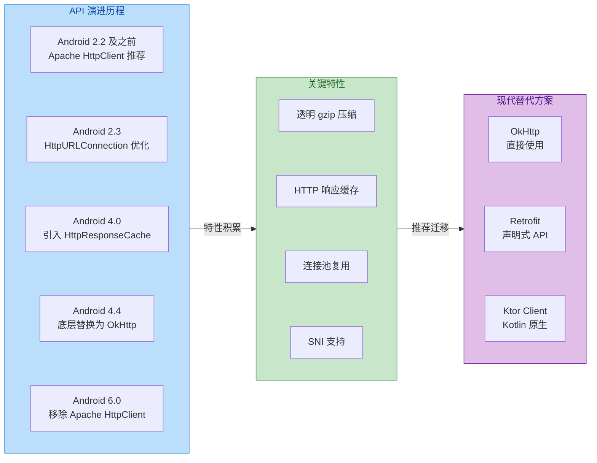

### 流操作

`HttpURLConnection` 的数据传输完全基于 Java IO 流模型。理解其流操作机制是正确使用这个 API 的关键。

**获取连接实例**：一切从 `URL` 对象开始。调用 `url.openConnection()` 方法会返回一个 `URLConnection` 实例，对于 HTTP/HTTPS 协议，实际返回的是 `HttpURLConnection` 或 `HttpsURLConnection` 子类。这一步仅仅创建连接对象，并不会立即建立网络连接。

**输出流（OutputStream）用于发送请求体**：当需要发送 POST、PUT 等包含请求体的请求时，必须先调用 `setDoOutput(true)` 启用输出模式，然后通过 `getOutputStream()` 获取输出流。调用 `getOutputStream()` 时会触发以下行为：如果连接尚未建立，则建立连接；请求头被发送到服务器；返回用于写入请求体的输出流。写入完成后必须调用 `flush()` 确保数据发送，然后调用 `close()` 关闭输出流。

**输入流（InputStream）用于读取响应体**：调用 `getInputStream()` 可以获取服务器响应的输入流。如果响应状态码表示错误（4xx、5xx），则应该使用 `getErrorStream()` 获取错误响应体。`getInputStream()` 是一个阻塞调用，它会等待服务器响应完成。

**流的生命周期与连接关系**：关闭输入流是释放连接资源的正确方式。当输入流被完全读取并关闭后，底层 TCP 连接可能会被放回连接池以供复用（如果是 Keep-Alive 连接）。如果不关闭流或不完全读取响应，连接将无法复用，可能导致连接泄漏。

```java
// 完整的 HttpURLConnection GET 请求示例
public String performGetRequest(String urlString) throws IOException {
    // 创建 URL 对象，urlString 是目标服务器地址
    URL url = new URL(urlString);
    
    // 打开连接，此时并未真正建立网络连接
    // 对于 HTTPS URL，返回的实际是 HttpsURLConnection 实例
    HttpURLConnection connection = (HttpURLConnection) url.openConnection();
    
    // 设置请求方法为 GET（默认就是 GET，这里显式声明）
    connection.setRequestMethod("GET");
    
    // 设置连接超时时间（单位：毫秒）
    // 超时后会抛出 java.net.SocketTimeoutException
    connection.setConnectTimeout(15000);
    
    // 设置读取超时时间（单位：毫秒）
    // 指从建立连接到读取到数据的最大等待时间
    connection.setReadTimeout(10000);
    
    // 设置请求头，告知服务器期望的响应格式
    connection.setRequestProperty("Accept", "application/json");
    
    // 使用 try-with-resources 确保资源自动关闭
    // 调用 getInputStream() 时才会真正发起网络请求
    try (InputStream inputStream = connection.getInputStream();
         // 使用 BufferedReader 提高读取效率
         BufferedReader reader = new BufferedReader(
             new InputStreamReader(inputStream, StandardCharsets.UTF_8))) {
        
        // StringBuilder 用于拼接响应内容
        StringBuilder response = new StringBuilder();
        String line;
        
        // 逐行读取响应体内容
        while ((line = reader.readLine()) != null) {
            response.append(line);
        }
        
        // 返回完整的响应字符串
        return response.toString();
        
    } finally {
        // 断开连接，释放资源
        // 注意：这不会关闭底层 socket，socket 可能被连接池复用
        connection.disconnect();
    }
}
```

```java
// 完整的 HttpURLConnection POST 请求示例
public String performPostRequest(String urlString, String jsonBody) throws IOException {
    URL url = new URL(urlString);
    HttpURLConnection connection = (HttpURLConnection) url.openConnection();
    
    // POST 请求必须设置请求方法
    connection.setRequestMethod("POST");
    
    // 核心设置：启用输出模式，表示要向服务器发送请求体
    // 不设置此项将无法获取 OutputStream
    connection.setDoOutput(true);
    
    // 设置 Content-Type 告知服务器请求体格式
    connection.setRequestProperty("Content-Type", "application/json; charset=UTF-8");
    
    // 设置 Content-Length 便于服务器处理
    byte[] bodyBytes = jsonBody.getBytes(StandardCharsets.UTF_8);
    connection.setRequestProperty("Content-Length", String.valueOf(bodyBytes.length));
    
    // 超时设置
    connection.setConnectTimeout(15000);
    connection.setReadTimeout(10000);
    
    // 获取输出流并写入请求体
    // getOutputStream() 调用会隐式建立连接并发送请求头
    try (OutputStream outputStream = connection.getOutputStream()) {
        // 写入 JSON 请求体
        outputStream.write(bodyBytes);
        // flush 确保数据被发送出去
        outputStream.flush();
    }
    
    // 获取响应状态码
    int responseCode = connection.getResponseCode();
    
    // 根据状态码选择正确的输入流
    InputStream inputStream;
    if (responseCode >= 200 && responseCode < 300) {
        // 成功响应使用 getInputStream()
        inputStream = connection.getInputStream();
    } else {
        // 错误响应使用 getErrorStream()
        // 某些服务器在错误时也会返回有用的错误信息
        inputStream = connection.getErrorStream();
    }
    
    // 读取响应
    if (inputStream != null) {
        try (BufferedReader reader = new BufferedReader(
                new InputStreamReader(inputStream, StandardCharsets.UTF_8))) {
            StringBuilder response = new StringBuilder();
            String line;
            while ((line = reader.readLine()) != null) {
                response.append(line);
            }
            return response.toString();
        }
    }
    
    return null;
}
```

### 连接设置

`HttpURLConnection` 提供了丰富的配置选项，正确的配置对于网络请求的性能和可靠性至关重要。

**超时配置（Timeout Configuration）**：

连接超时（Connect Timeout）指建立 TCP 连接的最大等待时间。在网络条件差或服务器无响应时，合理的连接超时可以避免应用长时间阻塞。通过 `setConnectTimeout(int timeout)` 设置，单位为毫秒，0 表示无限等待。

读取超时（Read Timeout）指从连接建立到读取到数据的最大等待时间。它涵盖了等待服务器处理请求、生成响应以及网络传输的时间。通过 `setReadTimeout(int timeout)` 设置。移动网络环境下，建议设置 10-30 秒的读取超时。

**请求方法（Request Method）**：

`setRequestMethod(String method)` 用于设置 HTTP 请求方法。支持的方法包括 GET、POST、PUT、DELETE、HEAD、OPTIONS、TRACE、PATCH。需要注意的是，部分 Android 版本对 PATCH 方法支持不完善，可能需要通过 `X-HTTP-Method-Override` 请求头模拟。

**请求头配置（Request Headers）**：

`setRequestProperty(String key, String value)` 用于设置请求头。常用请求头包括：
- `Content-Type`：指定请求体的 MIME 类型
- `Accept`：告知服务器期望的响应类型
- `Authorization`：携带认证信息
- `User-Agent`：标识客户端信息
- `Cache-Control`：控制缓存行为

`addRequestProperty(String key, String value)` 用于添加同名请求头（如多个 Cookie）。

**输入输出模式**：

`setDoOutput(boolean doOutput)` 启用后允许通过 `getOutputStream()` 发送请求体，POST、PUT 请求必须启用。`setDoInput(boolean doInput)` 默认为 true，允许读取响应体。

**重定向处理（Redirect Handling）**：

`setInstanceFollowRedirects(boolean followRedirects)` 控制是否自动跟随 HTTP 重定向（3xx 响应）。默认为 true，会自动处理重定向。但要注意，`HttpURLConnection` 不会自动处理从 HTTP 到 HTTPS 的重定向，也不会处理从 HTTPS 到 HTTP 的重定向，这需要开发者手动处理。

**分块传输（Chunked Transfer）**：

`setChunkedStreamingMode(int chunkLength)` 启用分块传输编码（Chunked Transfer Encoding），适用于无法预知请求体大小的场景。`setFixedLengthStreamingMode(long contentLength)` 当请求体大小已知时使用，可以避免将整个请求体缓存在内存中。

```kotlin
// Kotlin 中的 HttpURLConnection 高级配置示例
fun configuredRequest(urlString: String): HttpURLConnection {
    // 创建 URL 并打开连接
    val url = URL(urlString)
    val connection = url.openConnection() as HttpURLConnection
    
    // ===== 超时配置 =====
    // 连接超时：15秒，适用于移动网络环境
    connection.connectTimeout = 15_000
    // 读取超时：30秒，为服务器处理预留足够时间
    connection.readTimeout = 30_000
    
    // ===== 请求配置 =====
    // 设置为 POST 请求
    connection.requestMethod = "POST"
    // 启用输出流以发送请求体
    connection.doOutput = true
    // doInput 默认 true，显式设置增强可读性
    connection.doInput = true
    
    // ===== 请求头配置 =====
    // JSON 格式请求体
    connection.setRequestProperty("Content-Type", "application/json; charset=UTF-8")
    // 期望 JSON 格式响应
    connection.setRequestProperty("Accept", "application/json")
    // 自定义 User-Agent
    connection.setRequestProperty("User-Agent", "MyApp/1.0 Android")
    // Bearer Token 认证
    connection.setRequestProperty("Authorization", "Bearer your_token_here")
    // 禁用缓存，确保获取最新数据
    connection.setRequestProperty("Cache-Control", "no-cache")
    
    // ===== 重定向配置 =====
    // 禁用自动重定向，手动处理以支持 HTTP->HTTPS 重定向
    connection.instanceFollowRedirects = false
    
    // ===== 连接模式配置 =====
    // 使用缓存模式（默认），会在内存中缓存请求体
    // 如果请求体大小已知且较大，建议使用 setFixedLengthStreamingMode
    // connection.setFixedLengthStreamingMode(contentLength)
    // 如果请求体大小未知，使用分块传输
    // connection.setChunkedStreamingMode(0) // 0 表示使用默认块大小
    
    return connection
}

// 手动处理重定向的示例
fun requestWithRedirectHandling(urlString: String): String {
    var currentUrl = urlString
    var redirectCount = 0
    val maxRedirects = 5 // 防止无限重定向
    
    while (redirectCount < maxRedirects) {
        val url = URL(currentUrl)
        val connection = url.openConnection() as HttpURLConnection
        
        // 禁用自动重定向
        connection.instanceFollowRedirects = false
        connection.connectTimeout = 15_000
        connection.readTimeout = 10_000
        
        val responseCode = connection.responseCode
        
        // 检查是否为重定向响应 (3xx)
        if (responseCode in 300..399) {
            // 获取重定向目标 URL
            val location = connection.getHeaderField("Location")
            if (location.isNullOrEmpty()) {
                throw IOException("Redirect without Location header")
            }
            
            // 处理相对 URL
            currentUrl = URL(URL(currentUrl), location).toString()
            redirectCount++
            
            // 关闭当前连接
            connection.disconnect()
            
            continue // 继续请求新 URL
        }
        
        // 非重定向响应，读取并返回
        return connection.inputStream.bufferedReader().use { it.readText() }
    }
    
    throw IOException("Too many redirects")
}
```

### 缺点分析

尽管 `HttpURLConnection` 作为标准 API 具有无需额外依赖的优势，但其设计缺陷和功能局限使其在现代 Android 开发中逐渐被边缘化。

**API 设计陈旧（Outdated API Design）**：

`HttpURLConnection` 的 API 设计源自 Java 早期版本，充满了历史包袱。方法命名不一致，例如 `setRequestProperty()` 用于设置请求头，但获取响应头却有 `getHeaderField()`、`getHeaderFields()` 等多个方法。配置方式晦涩，例如必须在获取流之前完成所有配置，否则会抛出 `IllegalStateException`；`setDoOutput(true)` 这样的配置方式也不够直观。状态管理混乱，连接对象的状态（未连接、已连接、已断开）对开发者不透明，容易导致误用。

**同步阻塞模型（Synchronous Blocking Model）**：

`HttpURLConnection` 完全基于同步阻塞 IO 模型。所有网络操作都会阻塞当前线程，因此绝不能在主线程（UI Thread）执行网络请求，否则会抛出 `NetworkOnMainThreadException`。开发者必须手动管理线程，通常需要配合 `AsyncTask`（已废弃）、`ExecutorService`、`HandlerThread` 或 Kotlin Coroutines 使用。这增加了代码复杂度，也容易引入线程安全问题。

**缺乏现代特性支持（Missing Modern Features）**：

`HttpURLConnection` 的功能在 HTTP/1.1 时代就已定型，缺乏对现代网络协议和开发模式的原生支持：

- **HTTP/2 支持有限**：虽然 Android 底层使用 OkHttp 实现，理论上支持 HTTP/2，但 `HttpURLConnection` API 并未暴露 HTTP/2 特性（如服务器推送、流优先级）。
- **无原生异步支持**：没有回调机制、没有 Future/Promise 模式、没有响应式流支持。
- **无拦截器机制**：无法在请求/响应链中插入统一的处理逻辑（如日志、认证、重试）。
- **无连接池配置**：无法调整连接池大小、空闲超时等参数。
- **WebSocket 不支持**：无法处理 WebSocket 协议，需要单独引入其他库。

**错误处理不友好（Poor Error Handling）**：

`HttpURLConnection` 的异常体系设计存在问题。所有网络异常都通过 `IOException` 及其子类抛出，但异常类型过于粗粒度，难以区分超时、DNS 解析失败、连接拒绝、SSL 错误等具体原因。错误响应（4xx、5xx）不会抛出异常，需要开发者通过 `getResponseCode()` 检查并使用 `getErrorStream()` 获取错误信息。这种设计容易导致错误被忽略。

**资源管理繁琐（Tedious Resource Management）**：

正确使用 `HttpURLConnection` 需要谨慎处理资源释放：必须关闭 InputStream 和 OutputStream；必须调用 `disconnect()` 释放连接（虽然不调用通常也不会造成泄漏，但这是最佳实践）；需要使用 try-finally 或 try-with-resources 确保异常情况下的资源释放。大量的样板代码（boilerplate code）降低了开发效率，也增加了出错的可能。

**缓存机制配置复杂（Complex Caching Setup）**：

虽然 Android 4.0 引入了 `HttpResponseCache`，但其配置和使用并不直观。需要在应用启动时手动安装缓存；缓存大小、位置需要开发者自行管理；缓存行为受 HTTP 头控制，调试困难。相比之下，OkHttp 提供了更灵活、更强大的缓存 API。

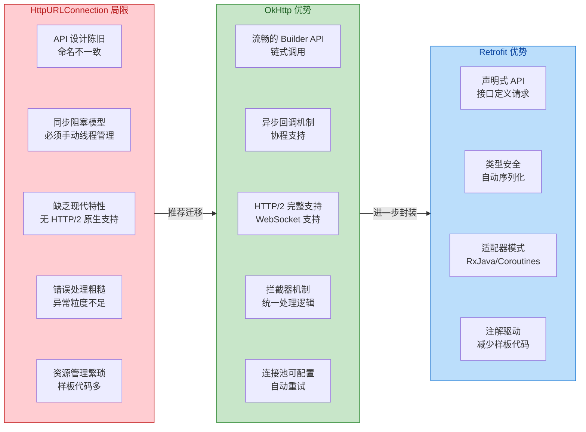

**适用场景建议**：

尽管存在诸多不足，`HttpURLConnection` 在以下场景仍然有其存在价值：

1. **SDK/库开发**：当你开发一个需要最小化依赖的 SDK 时，使用标准 API 可以避免版本冲突和包体积膨胀。
2. **简单的一次性请求**：应用中偶尔的简单 GET 请求，引入完整的网络库可能得不偿失。
3. **学习和面试**：理解 `HttpURLConnection` 有助于深入理解 HTTP 协议和网络编程基础。
4. **特定限制环境**：某些企业或政府项目可能限制使用第三方库。

对于绝大多数现代 Android 应用开发，**强烈建议使用 OkHttp 或 Retrofit**。它们不仅提供了更优雅的 API，还内置了许多最佳实践，能够显著提升开发效率和应用质量。

---

**📝 练习题**

在 Android 应用中使用 `HttpURLConnection` 发送 POST 请求时，以下哪个操作顺序是正确的？

A. `getOutputStream()` → `setDoOutput(true)` → `setRequestMethod("POST")` → 写入数据


B. `setRequestMethod("POST")` → `setDoOutput(true)` → `getOutputStream()` → 写入数据


C. `setDoOutput(true)` → `getOutputStream()` → `setRequestMethod("POST")` → 写入数据


D. `getInputStream()` → `setRequestMethod("POST")` → `setDoOutput(true)` → 写入数据


**【答案】** B

**【解析】** `HttpURLConnection` 的配置必须在建立连接之前完成。调用 `getOutputStream()` 或 `getInputStream()` 都会触发连接建立，此后任何配置调用（如 `setRequestMethod()`、`setDoOutput()`）都会抛出 `IllegalStateException`。正确的顺序是：首先设置请求方法为 POST，然后启用输出模式（`setDoOutput(true)`），接着通过 `getOutputStream()` 获取输出流并写入数据。选项 A 和 C 在调用 `getOutputStream()` 后才设置配置，会导致异常；选项 D 先调用了 `getInputStream()`，此时连接已建立，后续配置无效且会抛出异常。这个顺序问题是 `HttpURLConnection` API 设计不友好的典型体现，也是面试中常见的陷阱题。

---

## XML 解析技术

在 Android 网络通信中，服务端返回的数据格式早期以 XML (Extensible Markup Language) 为主流。尽管如今 JSON 已成为事实标准，但许多遗留系统、企业级 Web Services（如 SOAP）、以及 Android 自身的资源文件（AndroidManifest.xml、布局文件）仍大量使用 XML。掌握 XML 解析不仅是处理历史数据的必备技能，更能帮助开发者深入理解 Android 资源编译的底层机制。

XML 解析的核心挑战在于：**如何高效地将一段结构化的文本数据转换为程序可操作的对象**。根据解析策略的不同，业界形成了三种主流方案：基于树结构的 DOM 解析、基于事件回调的 SAX 解析、以及 Android 推荐的 Pull 解析器。三者在内存占用、解析速度、编程复杂度上各有取舍，选择时需结合具体场景权衡。

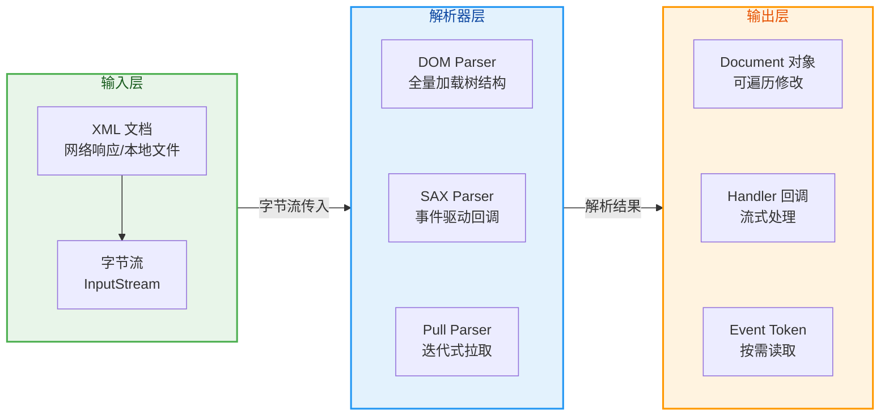

### DOM 解析树结构

**DOM (Document Object Model)** 解析是最直观的 XML 处理方式。其核心思想是：解析器一次性读取整个 XML 文档，在内存中构建一棵完整的**节点树 (Node Tree)**。树的每个节点对应 XML 中的一个元素、属性或文本内容。开发者可以通过标准的 DOM API 随意遍历、查询、甚至修改这棵树。

**工作原理**：当调用 `DocumentBuilder.parse()` 时，底层解析器会逐字节扫描 XML 输入流，识别出开始标签、结束标签、属性、文本等 token，然后按照父子嵌套关系将它们组装成树形结构。最终返回的 `Document` 对象就是这棵树的根节点，开发者可以通过 `getElementsByTagName()`、`getChildNodes()` 等方法进行节点检索。

**内存模型示意**：假设解析如下 XML：

```xml
<users>
    <user id="1">
        <name>Alice</name>
        <age>28</age>
    </user>
    <user id="2">
        <name>Bob</name>
        <age>32</age>
    </user>
</users>
```

```kotlin
// DOM 树的内存结构示意
// Document (根)
//    └── Element: users
//            ├── Element: user (attr: id="1")
//            │       ├── Element: name
//            │       │       └── Text: "Alice"
//            │       └── Element: age
//            │               └── Text: "28"
//            └── Element: user (attr: id="2")
//                    ├── Element: name
//                    │       └── Text: "Bob"
//                    └── Element: age
//                            └── Text: "32"
```

**Android 中的 DOM 解析实现**：

```kotlin
import org.w3c.dom.Document
import org.w3c.dom.Element
import org.w3c.dom.NodeList
import javax.xml.parsers.DocumentBuilderFactory

// 定义数据类，用于存储解析结果
data class User(val id: String, val name: String, val age: Int)

fun parseDom(xmlInputStream: InputStream): List<User> {
    // 创建结果列表
    val users = mutableListOf<User>()
    
    // 1. 获取 DocumentBuilderFactory 单例
    //    这是 JAXP (Java API for XML Processing) 的标准入口
    val factory = DocumentBuilderFactory.newInstance()
    
    // 2. 通过工厂创建 DocumentBuilder 实例
    //    DocumentBuilder 是线程不安全的，每次解析应创建新实例
    val builder = factory.newDocumentBuilder()
    
    // 3. 解析输入流，构建完整的 DOM 树
    //    注意：此步骤会将整个 XML 加载到内存
    val document: Document = builder.parse(xmlInputStream)
    
    // 4. 获取所有 <user> 元素节点
    //    返回的 NodeList 是"活的"——如果 DOM 树被修改，NodeList 会同步变化
    val userNodes: NodeList = document.getElementsByTagName("user")
    
    // 5. 遍历 NodeList，逐个处理 user 节点
    for (i in 0 until userNodes.length) {
        // 将 Node 强转为 Element 以便访问属性和子元素
        val userElement = userNodes.item(i) as Element
        
        // 6. 读取 id 属性
        //    getAttribute() 返回属性值字符串，若属性不存在则返回空串
        val id = userElement.getAttribute("id")
        
        // 7. 获取 <name> 子元素的文本内容
        //    getElementsByTagName 在当前元素范围内搜索
        //    textContent 会递归获取所有后代文本节点的拼接结果
        val name = userElement
            .getElementsByTagName("name")
            .item(0)                          // 获取第一个匹配的 <name> 元素
            .textContent                       // 提取文本内容
        
        // 8. 获取 <age> 子元素并转换为整数
        val age = userElement
            .getElementsByTagName("age")
            .item(0)
            .textContent
            .toInt()                           // String -> Int
        
        // 9. 构造 User 对象并添加到列表
        users.add(User(id, name, age))
    }
    
    return users
}
```

**DOM 解析的优缺点分析**：

| 维度 | 优势 | 劣势 |
|------|------|------|
| **编程模型** | 树结构直观，支持随机访问、XPath 查询 | API 相对繁琐，需处理多种 Node 类型 |
| **内存占用** | — | **致命缺陷**：整棵树驻留内存，大文件易 OOM |
| **解析速度** | 一次解析后可多次遍历 | 首次解析慢，需完整读取后才能操作 |
| **修改能力** | 支持增删改节点，可序列化回 XML | 修改后需重新输出，效率不高 |

**适用场景**：DOM 适合解析**小型 XML 文件**（通常建议 < 1MB），且需要**多次遍历或修改**文档结构的场景。在 Android 中，由于移动设备内存受限，DOM 通常仅用于解析配置文件、小型响应数据等场合。

---

### SAX 解析事件驱动

**SAX (Simple API for XML)** 采用与 DOM 完全相反的设计哲学——**流式解析 (Streaming Parsing)**。解析器从头到尾顺序扫描 XML 文档，每遇到一个语法元素（开始标签、结束标签、文本内容等）就触发相应的**事件回调 (Event Callback)**。开发者通过实现 `ContentHandler` 接口来响应这些事件，自行决定如何处理数据。

**核心设计理念**：SAX 本质上是一种**"推模型" (Push Model)**——解析器主动将解析事件"推送"给应用程序。这意味着：

1. **无需全量加载**：解析器边读边解析，内存中只保留当前处理的少量状态
2. **单向遍历**：数据流过即丢弃，无法回退重读
3. **控制权在解析器**：应用程序被动响应事件，无法主动跳过或选择性读取

**事件流程可视化**：

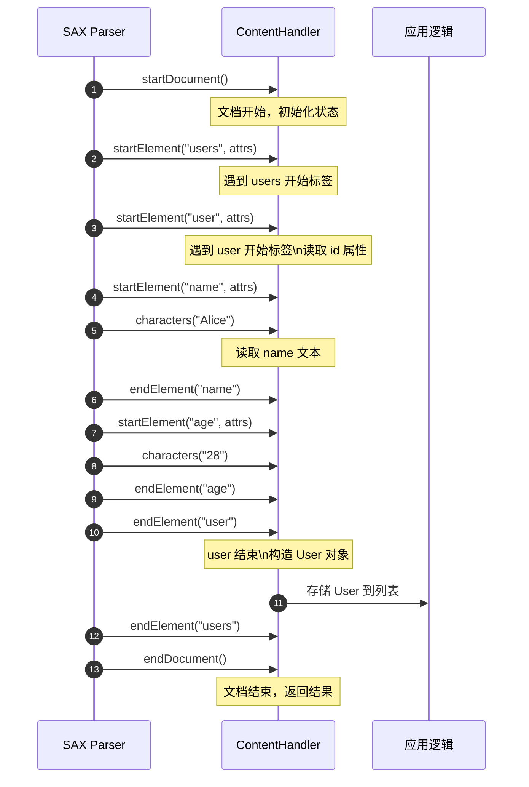

**Android 中的 SAX 解析实现**：

```kotlin
import org.xml.sax.Attributes
import org.xml.sax.helpers.DefaultHandler
import javax.xml.parsers.SAXParserFactory

data class User(val id: String, val name: String, val age: Int)

// 自定义 Handler，继承 DefaultHandler 以获得空实现的便利
class UserHandler : DefaultHandler() {
    
    // 解析结果列表
    val users = mutableListOf<User>()
    
    // 临时变量：存储当前正在解析的 user 数据
    private var currentId: String = ""
    private var currentName: String = ""
    private var currentAge: Int = 0
    
    // 标记当前正在解析哪个元素（用于 characters 回调判断）
    private var currentElement: String = ""
    
    // StringBuilder 用于累积 characters 回调中分段传入的文本
    // 注意：SAX 规范允许一段文本被拆分成多次 characters 调用
    private val textBuilder = StringBuilder()
    
    // 遇到开始标签时触发
    override fun startElement(
        uri: String,           // 命名空间 URI（无命名空间时为空）
        localName: String,     // 本地名称（无命名空间时可能为空）
        qName: String,         // 限定名（带前缀的完整标签名）
        attributes: Attributes // 属性集合
    ) {
        // 记录当前元素名，供 characters 回调使用
        currentElement = qName
        
        // 清空文本累积器，准备接收新元素的文本内容
        textBuilder.clear()
        
        // 如果是 <user> 标签，提取 id 属性
        if (qName == "user") {
            // getValue 按属性名获取值，若不存在返回 null
            currentId = attributes.getValue("id") ?: ""
        }
    }
    
    // 遇到文本内容时触发（可能被多次调用）
    override fun characters(
        ch: CharArray,         // 字符数组缓冲区
        start: Int,            // 本次文本在缓冲区中的起始位置
        length: Int            // 本次文本的长度
    ) {
        // 将本次收到的字符追加到 StringBuilder
        // 不能直接使用，因为可能只是完整文本的一部分
        textBuilder.append(ch, start, length)
    }
    
    // 遇到结束标签时触发
    override fun endElement(
        uri: String,
        localName: String,
        qName: String
    ) {
        // 获取累积的完整文本，并去除首尾空白
        val text = textBuilder.toString().trim()
        
        // 根据结束标签类型，将文本存入对应字段
        when (qName) {
            "name" -> currentName = text
            "age" -> currentAge = text.toIntOrNull() ?: 0
            "user" -> {
                // user 元素结束，构造完整的 User 对象
                users.add(User(currentId, currentName, currentAge))
                // 重置临时变量，为下一个 user 做准备
                currentId = ""
                currentName = ""
                currentAge = 0
            }
        }
        
        // 清空当前元素标记
        currentElement = ""
    }
}

// 使用 SAX 解析器
fun parseSax(xmlInputStream: InputStream): List<User> {
    // 1. 创建 SAXParserFactory 实例
    val factory = SAXParserFactory.newInstance()
    
    // 2. 通过工厂获取 SAXParser
    val parser = factory.newSAXParser()
    
    // 3. 创建自定义 Handler
    val handler = UserHandler()
    
    // 4. 开始解析，解析过程中会自动回调 Handler 的各方法
    parser.parse(xmlInputStream, handler)
    
    // 5. 解析完成后，从 Handler 中获取结果
    return handler.users
}
```

**SAX 的关键细节与陷阱**：

1. **characters 分段问题**：SAX 规范明确指出，解析器可以将一段连续文本拆分成多次 `characters()` 调用。例如 `<name>Alice</name>` 的文本可能被拆成 `"Ali"` 和 `"ce"` 两次回调。因此必须使用 StringBuilder 累积，在 `endElement()` 时才能获得完整文本。

2. **状态管理复杂性**：由于 SAX 是事件驱动的，开发者需要自行维护解析状态（当前在哪个元素内、父元素是谁等）。对于嵌套层级深的 XML，状态管理会变得相当繁琐。

3. **无法回退**：一旦事件触发并处理完毕，相关数据就已"流过"。如果业务逻辑需要"向前看"（peek ahead）或回溯，SAX 无法满足。

**SAX vs DOM 内存对比**：

```kotlin
// 内存占用对比示意 (解析 10MB XML)
//
// DOM 方式：
// ┌─────────────────────────────────────┐
// │  Heap Memory                        │
// │  ┌───────────────────────────────┐  │
// │  │   Document Tree (~30-50MB)    │  │  <- 树结构通常是原文件 3-5 倍
// │  │   + 原始 byte[] (10MB)        │  │
// │  └───────────────────────────────┘  │
// └─────────────────────────────────────┘
//
// SAX 方式：
// ┌─────────────────────────────────────┐
// │  Heap Memory                        │
// │  ┌─────────┐                        │
// │  │ ~64KB   │  <- 仅解析器内部缓冲区  │
// │  │ buffer  │     + 应用状态变量      │
// │  └─────────┘                        │
// └─────────────────────────────────────┘
```

**适用场景**：SAX 是处理**大型 XML 文件**的首选，尤其适合只需**单次顺序读取**、提取特定数据的场景。但由于编程模型复杂，现代 Android 开发中更推荐使用 Pull 解析器。

---

### Pull 解析器推荐方案

**XmlPullParser** 是 Android 官方推荐的 XML 解析方案，也是 Android 系统内部解析资源文件（如布局 XML）所采用的技术。Pull 解析器采用**"拉模型" (Pull Model)**——与 SAX 的"推模型"相反，**控制权在应用程序手中**。开发者通过循环调用 `next()` 或 `nextTag()` 方法，主动"拉取"下一个解析事件，然后根据事件类型进行处理。

**Pull vs SAX 核心区别**：

| 维度 | SAX (Push) | Pull |
|------|------------|------|
| **控制流** | 解析器驱动，回调被动响应 | 应用程序驱动，主动拉取事件 |
| **代码结构** | 分散在多个回调方法中 | 集中在一个 while 循环内 |
| **状态管理** | 需手动维护复杂状态 | 可利用局部变量、if/when 分支 |
| **提前终止** | 需抛异常中断解析 | 直接 break 循环即可 |
| **内存占用** | 极低，流式处理 | 极低，同样是流式处理 |

**事件类型 (Event Types)**：XmlPullParser 定义了以下核心事件常量：

- `START_DOCUMENT`：文档开始
- `END_DOCUMENT`：文档结束
- `START_TAG`：遇到开始标签 `<element>`
- `END_TAG`：遇到结束标签 `</element>`
- `TEXT`：遇到文本内容

**Android 中的 Pull 解析实现**：

```kotlin
import android.util.Xml
import org.xmlpull.v1.XmlPullParser
import org.xmlpull.v1.XmlPullParserException

data class User(val id: String, val name: String, val age: Int)

fun parsePull(xmlInputStream: InputStream): List<User> {
    // 结果列表
    val users = mutableListOf<User>()
    
    // 1. 获取 XmlPullParser 实例
    //    Android 提供 Xml.newPullParser() 便捷方法
    //    底层使用 KXmlParser 实现（轻量高效）
    val parser: XmlPullParser = Xml.newPullParser()
    
    // 2. 配置解析器特性（可选）
    //    FEATURE_PROCESS_NAMESPACES: 是否处理 XML 命名空间
    //    简单场景下通常设为 false 以提升性能
    parser.setFeature(XmlPullParser.FEATURE_PROCESS_NAMESPACES, false)
    
    // 3. 设置输入源
    //    第二个参数为字符编码，null 表示自动检测
    parser.setInput(xmlInputStream, null)
    
    // 临时变量
    var currentId = ""
    var currentName = ""
    var currentAge = 0
    
    // 4. 获取初始事件类型
    var eventType = parser.eventType
    
    // 5. 主循环：持续拉取事件直到文档结束
    while (eventType != XmlPullParser.END_DOCUMENT) {
        
        // 6. 根据事件类型分支处理
        when (eventType) {
            
            XmlPullParser.START_TAG -> {
                // 7. 获取当前标签名
                val tagName = parser.name
                
                when (tagName) {
                    "user" -> {
                        // 8. 读取 user 标签的 id 属性
                        //    getAttributeValue(namespace, name)
                        //    namespace 为 null 表示无命名空间
                        currentId = parser.getAttributeValue(null, "id") ?: ""
                    }
                    "name" -> {
                        // 9. nextText() 是 Pull 解析器的便捷方法
                        //    自动读取当前标签的文本内容并移动到 END_TAG
                        //    等价于：next() -> 获取 TEXT -> next() 到 END_TAG
                        currentName = parser.nextText()
                    }
                    "age" -> {
                        // 10. 同理，读取 age 的文本并转为 Int
                        currentAge = parser.nextText().toIntOrNull() ?: 0
                    }
                }
            }
            
            XmlPullParser.END_TAG -> {
                // 11. 当遇到 </user> 结束标签时
                if (parser.name == "user") {
                    // 12. 构造 User 对象并加入列表
                    users.add(User(currentId, currentName, currentAge))
                    // 13. 重置临时变量
                    currentId = ""
                    currentName = ""
                    currentAge = 0
                }
            }
            // TEXT 事件在使用 nextText() 时已被处理，无需单独 case
        }
        
        // 14. 拉取下一个事件（核心！）
        //     如果忘记调用 next()，将陷入死循环
        eventType = parser.next()
    }
    
    return users
}
```

**nextText() 的实现原理与陷阱**：

`nextText()` 是一个非常便利的方法，但使用时需注意其内部行为：

```kotlin
// nextText() 的等价伪代码
fun nextText(): String {
    // 前置条件：当前事件必须是 START_TAG
    require(eventType == START_TAG)
    
    // 调用 next() 移动到下一个事件
    next()
    
    // 如果下一个事件是 TEXT，提取文本
    val text = if (eventType == TEXT) {
        val result = text       // 获取文本内容
        next()                  // 再次移动
        result
    } else {
        ""                      // 空元素 <tag/> 的情况
    }
    
    // 此时应该位于 END_TAG
    require(eventType == END_TAG)
    
    return text
}
```

**陷阱**：如果 `<name>` 元素内还有嵌套子元素，`nextText()` 会抛出异常。因此它只适用于**纯文本内容的叶子节点**。

**Pull 解析的优势总结**：

1. **代码可读性强**：所有逻辑集中在一个循环内，状态通过局部变量管理，避免了 SAX 的回调碎片化问题。

2. **灵活控制流**：可以随时 `break` 退出循环、跳过不感兴趣的分支，甚至可以根据条件选择性地深入解析某些元素。

3. **Android 原生支持**：`android.util.Xml` 提供开箱即用的 `newPullParser()` 方法，无需额外依赖。

4. **性能优异**：与 SAX 相当的低内存占用，同时避免了频繁的方法调用（回调）开销。

**三种解析方式对比总图**：

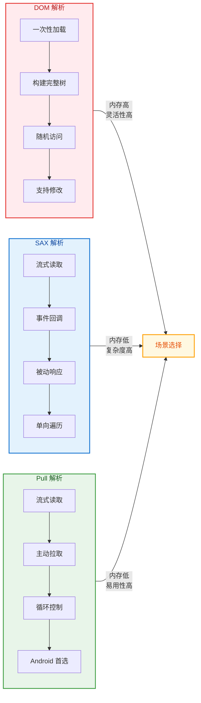

**实践建议**：

- **优先选择 Pull 解析器**：绝大多数 Android XML 解析场景都应使用 `XmlPullParser`
- **DOM 仅用于小文件**：配置文件、需要修改后回写的场景
- **SAX 作为备选**：当需要与 Java 库交互、或已有 SAX Handler 可复用时

---

**📝 练习题**

在 Android 中解析一个 50MB 的 XML 响应文件，以下哪种方式最可能导致 `OutOfMemoryError`？

A. 使用 `XmlPullParser` 配合 `while` 循环逐事件处理

B. 使用 `SAXParser` 配合自定义 `ContentHandler` 回调

C. 使用 `DocumentBuilder.parse()` 构建完整 DOM 树

D. 使用 `BufferedReader` 逐行读取后正则匹配


**【答案】** C

**【解析】** DOM 解析器会将整个 XML 文档加载到内存中，构建一棵完整的节点树。由于树结构的内存开销通常是原文件的 3-5 倍，50MB 的 XML 可能占用 150-250MB 的堆内存，这在移动设备上极易触发 OOM。

- **选项 A/B**：Pull 解析和 SAX 解析都是流式处理，只在内存中保留解析器的小型缓冲区和应用程序的状态变量，内存占用与文件大小无关，通常只有几十 KB。
- **选项 D**：逐行读取虽然低效且不可靠（正则解析 XML 是反模式），但内存占用同样很低，每次只处理一行数据。

---

## JSON 解析技术

在 Android 网络开发中，JSON（JavaScript Object Notation）已成为数据交换的事实标准。相比 XML，JSON 具有体积更小、解析更快、可读性更强的优势，几乎所有现代 RESTful API 都采用 JSON 作为响应格式。Android 平台提供了从原生 SDK 到第三方库的多层次 JSON 解析方案，每种方案在性能、易用性、类型安全等维度上各有取舍。理解这些方案的内部机制，能帮助开发者在不同场景下做出最优选择。

### JSONObject 原生解析

Android SDK 自 API Level 1 起就内置了 `org.json` 包，提供 `JSONObject`、`JSONArray`、`JSONTokener` 等类进行 JSON 解析。这套 API 设计简洁，无需引入任何第三方依赖，是最"轻量"的解析方案。

**核心类结构与职责**

`JSONObject` 内部维护一个 `HashMap<String, Object>` 来存储键值对。当调用 `new JSONObject(jsonString)` 时，底层通过 `JSONTokener` 进行词法分析（Lexical Analysis），逐字符扫描 JSON 字符串，识别出 `{`、`}`、`:`、`,` 等分隔符以及字符串、数字、布尔值等 Token。解析过程是**递归下降**（Recursive Descent）的：遇到 `{` 则构建 `JSONObject`，遇到 `[` 则构建 `JSONArray`，遇到原始值则直接存入。

```java
// 原生 JSONObject 解析示例
public User parseUser(String json) throws JSONException {
    // 1. 将 JSON 字符串解析为 JSONObject，内部触发词法分析
    JSONObject obj = new JSONObject(json);
    
    // 2. 通过 key 获取对应的值，类型由调用方法决定
    //    getString() 若 key 不存在或类型不匹配会抛出 JSONException
    String name = obj.getString("name");
    
    // 3. getInt() 会尝试将值转换为 int，字符串 "123" 也能转换成功
    int age = obj.getInt("age");
    
    // 4. optString() 是"宽容"版本，key 不存在时返回默认值而非抛异常
    //    适合处理可选字段，避免 try-catch 嵌套
    String email = obj.optString("email", "unknown@example.com");
    
    // 5. 解析嵌套对象：先获取 JSONObject，再递归提取字段
    JSONObject addressObj = obj.getJSONObject("address");
    String city = addressObj.getString("city");
    String street = addressObj.optString("street", "");
    
    // 6. 解析数组：获取 JSONArray 后遍历
    JSONArray tagsArray = obj.optJSONArray("tags");
    List<String> tags = new ArrayList<>();
    if (tagsArray != null) {
        // JSONArray 的 length() 返回元素数量
        for (int i = 0; i < tagsArray.length(); i++) {
            // 按索引获取元素，类型由方法决定
            tags.add(tagsArray.getString(i));
        }
    }
    
    // 7. 构建业务对象返回
    return new User(name, age, email, new Address(city, street), tags);
}
```

**原生解析的优缺点分析**

原生 `JSONObject` 的优势在于**零依赖**和**启动时无初始化开销**。对于简单的、字段数量少的 JSON 结构，手动解析的代码量可控，且不会引入额外的 APK 体积。然而，随着数据结构复杂度上升，原生解析的缺点会迅速暴露：

1. **类型不安全**：所有字段提取都是基于字符串 key 的硬编码，编译期无法检查拼写错误；
2. **样板代码膨胀**：每个字段都需要显式调用 `getXxx()` 或 `optXxx()`，嵌套结构需要层层解包；
3. **空值处理繁琐**：必须在每个字段上决定使用"严格模式"（`get` 系列，抛异常）还是"宽容模式"（`opt` 系列，返回默认值）；
4. **缺乏对象映射**：JSON 与 Java/Kotlin 类之间没有自动绑定，手动编写"JSON → POJO"的转换代码容易出错且难以维护。

因此，原生 `JSONObject` 更适合**一次性脚本**、**极简场景**或**对 APK 体积极度敏感**的项目。在绝大多数生产级 App 中，开发者会选择功能更强大的第三方库。

---

### GSON 反射原理

Google 开发的 **GSON**（Google JSON）是 Android 生态中历史最悠久、使用最广泛的 JSON 序列化/反序列化库。其核心卖点是**自动对象映射**：开发者只需定义数据类，GSON 即可在运行时通过**Java 反射**（Reflection）将 JSON 字符串直接转换为对象实例，反之亦然。

**反射机制深度剖析**

当调用 `gson.fromJson(json, User.class)` 时，GSON 内部执行以下步骤：

1. **类型分析**：通过 `Class.getDeclaredFields()` 获取目标类的所有字段（包括 private 字段），构建字段名到 `Field` 对象的映射；
2. **实例化对象**：调用目标类的**无参构造器**创建实例。若类没有无参构造器，GSON 会尝试使用 `Unsafe.allocateInstance()`（绕过构造器直接分配内存），这在 Android 上通常可行但存在平台依赖风险；
3. **JSON 遍历**：使用 `JsonReader`（流式解析器）逐 Token 读取 JSON，遇到 key 时查找对应的 `Field`；
4. **类型转换与赋值**：根据字段类型选择合适的 `TypeAdapter` 进行反序列化，然后通过 `Field.set(instance, value)` 将值写入对象。由于字段通常是 private 的，GSON 会先调用 `field.setAccessible(true)` 突破访问限制。

```kotlin
// GSON 基本用法示例
// 1. 定义数据类，字段名默认与 JSON key 一一对应
data class User(
    val name: String,           // 对应 JSON 中的 "name"
    val age: Int,               // 对应 JSON 中的 "age"
    @SerializedName("email_address")  // 2. 使用注解指定 JSON key 与字段名不同的映射
    val email: String,
    val address: Address?,      // 3. 嵌套对象自动递归解析
    val tags: List<String>      // 4. 集合类型自动处理
)

data class Address(
    val city: String,
    val street: String?
)

// 5. 创建 Gson 实例（通常全局复用，避免重复初始化开销）
val gson = Gson()

// 6. 反序列化：JSON 字符串 → Kotlin 对象
val user: User = gson.fromJson(jsonString, User::class.java)

// 7. 序列化：Kotlin 对象 → JSON 字符串
val outputJson: String = gson.toJson(user)
```

**TypeAdapter 与性能优化**

GSON 的灵活性源于其 `TypeAdapter<T>` 抽象。每种类型（`String`、`Int`、`List<T>`、自定义类等）都有对应的 `TypeAdapter` 负责读写逻辑。GSON 内置了大量 Adapter，也允许开发者注册自定义 Adapter 处理特殊格式（如自定义日期格式、枚举映射等）。

然而，反射的代价是**运行时性能损耗**和**对代码混淆（ProGuard/R8）敏感**。每次反序列化都需要查找字段、检查类型、突破访问控制，这比直接调用构造器和 setter 方法慢得多。更严重的是，当开启代码混淆后，字段名会被重命名（如 `name` → `a`），而 JSON 中的 key 仍然是 `"name"`，导致映射失败。解决方案是在 ProGuard 规则中保留数据类：

```proguard
# 保留所有使用 @SerializedName 注解的字段不被混淆
-keepclassmembers class * {
    @com.google.gson.annotations.SerializedName <fields>;
}

# 或者直接保留整个数据类包
-keep class com.example.model.** { *; }
```

**GSON 的历史地位与局限**

GSON 发布于 2008 年，在那个 Java 还没有 Lambda、Android 还在 1.x 版本的年代，它极大地简化了 JSON 处理。时至今日，GSON 仍然是许多项目的默认选择，因为它**稳定成熟**、**社区资源丰富**、**与 Retrofit 等网络库集成良好**。

但 GSON 的设计也显露出时代局限：

1. **空安全缺失**：GSON 诞生于 Java nullable-by-default 的时代，对 Kotlin 的 non-null 类型支持不佳。若 JSON 中某字段为 `null` 或缺失，GSON 会将 Kotlin 的 `val name: String` 设置为 `null`，绕过编译期空安全检查，导致运行时 `NullPointerException`；
2. **Kotlin 默认参数无效**：由于 GSON 使用 `Unsafe.allocateInstance()` 绕过构造器，Kotlin data class 的默认参数值永远不会被应用；
3. **反射开销**：在性能敏感场景（如解析大型 JSON 数组）中，反射的累积成本可观。

这些问题催生了更现代的替代方案。

---

### Moshi 现代方案

**Moshi** 是 Square 公司（同时也是 OkHttp、Retrofit 的开发者）推出的新一代 JSON 库，设计目标是成为"GSON 的现代继任者"。Moshi 从一开始就考虑了 Kotlin 特性、空安全、以及通过**代码生成**（Code Generation）替代反射来提升性能。

**Kotlin 友好的设计理念**

Moshi 的核心优势之一是对 Kotlin 的原生支持。通过 `moshi-kotlin` 或 `moshi-kotlin-codegen` 模块，Moshi 能够：

1. **尊重 Kotlin 空安全**：若 JSON 中某字段为 `null` 但 Kotlin 类型声明为 non-null，Moshi 会抛出明确的 `JsonDataException` 而非静默赋值 `null`；
2. **支持默认参数**：当 JSON 中缺失某字段时，Moshi 会使用 Kotlin data class 构造器中定义的默认值；
3. **区分 `null` 与缺失**：Moshi 能区分"字段值为 `null`"和"字段不存在"两种情况，开发者可以据此实现不同的业务逻辑。

```kotlin
// Moshi 与 Kotlin 集成示例
// 1. 使用 @JsonClass 注解标记数据类，generateAdapter = true 表示生成代码而非反射
@JsonClass(generateAdapter = true)
data class User(
    val name: String,                    // non-null，JSON 缺失或为 null 时抛异常
    val age: Int,
    @Json(name = "email_address")        // 2. 指定 JSON key 名称
    val email: String,
    val address: Address?,               // 3. nullable，允许 JSON 中为 null 或缺失
    val tags: List<String> = emptyList() // 4. 默认参数，JSON 缺失时使用此值
)

@JsonClass(generateAdapter = true)
data class Address(
    val city: String,
    val street: String = ""              // 默认值
)

// 5. 构建 Moshi 实例，添加 KotlinJsonAdapterFactory（反射模式）
//    或使用 codegen 模式时无需添加
val moshi = Moshi.Builder()
    .addLast(KotlinJsonAdapterFactory())  // 反射模式需要此行
    .build()

// 6. 获取特定类型的 JsonAdapter
val adapter: JsonAdapter<User> = moshi.adapter(User::class.java)

// 7. 反序列化
val user: User? = adapter.fromJson(jsonString)

// 8. 序列化
val outputJson: String = adapter.toJson(user)
```

**代码生成 vs 反射：两种工作模式**

Moshi 提供两种工作模式，开发者可根据项目需求选择：

| 模式 | 依赖 | 原理 | 优点 | 缺点 |
|------|------|------|------|------|
| **反射模式** | `moshi-kotlin` | 运行时反射读取类结构 | 配置简单，无需注解处理器 | 有反射开销，需保留混淆规则 |
| **代码生成模式** | `moshi-kotlin-codegen` | 编译时生成 `*JsonAdapter` 类 | 无反射、性能最优、混淆友好 | 需配置 KSP/KAPT，增加编译时间 |

在代码生成模式下，当编译器处理 `@JsonClass(generateAdapter = true)` 注解时，Moshi 的注解处理器会为每个数据类生成一个专用的 `JsonAdapter` 子类（如 `UserJsonAdapter`）。这个生成的 Adapter 包含硬编码的字段读写逻辑，完全不依赖反射。

```kotlin
// 编译器自动生成的 UserJsonAdapter 伪代码（简化版）
class UserJsonAdapter(moshi: Moshi) : JsonAdapter<User>() {
    // 1. 在构造时获取嵌套类型的 Adapter，避免运行时查找
    private val addressAdapter: JsonAdapter<Address?> = moshi.adapter(Address::class.java)
    private val stringListAdapter: JsonAdapter<List<String>> = moshi.adapter(
        Types.newParameterizedType(List::class.java, String::class.java)
    )
    
    override fun fromJson(reader: JsonReader): User {
        // 2. 预定义局部变量，跟踪哪些字段已解析
        var name: String? = null
        var age: Int? = null
        var email: String? = null
        var address: Address? = null
        var tags: List<String>? = null
        
        // 3. 使用 selectName() 进行高效的 key 匹配（基于预计算的 Options）
        reader.beginObject()
        while (reader.hasNext()) {
            when (reader.selectName(OPTIONS)) {
                0 -> name = reader.nextString()
                1 -> age = reader.nextInt()
                2 -> email = reader.nextString()
                3 -> address = addressAdapter.fromJson(reader)
                4 -> tags = stringListAdapter.fromJson(reader)
                else -> reader.skipValue()  // 忽略未知字段
            }
        }
        reader.endObject()
        
        // 4. 构造对象，处理 null 和默认值
        return User(
            name = name ?: throw JsonDataException("Required field 'name' missing"),
            age = age ?: throw JsonDataException("Required field 'age' missing"),
            email = email ?: throw JsonDataException("Required field 'email_address' missing"),
            address = address,  // nullable，允许 null
            tags = tags ?: emptyList()  // 使用默认值
        )
    }
    
    override fun toJson(writer: JsonWriter, value: User?) { /* 序列化逻辑 */ }
}
```

**Moshi 的性能优势**

得益于代码生成，Moshi 在反序列化大型 JSON 数据时可比 GSON 快 **2-3 倍**。这一优势来源于：

1. **消除反射开销**：无需在运行时查找 `Field`、调用 `setAccessible()`、执行 `Field.set()`；
2. **预计算 Key 匹配**：Moshi 的 `JsonReader.selectName(Options)` 方法使用预编译的字符串比较策略，比逐字符匹配更快；
3. **更少的对象分配**：生成的 Adapter 可以复用中间状态，减少临时对象创建。

---

### Kotlin Serialization

**Kotlin Serialization**（通常简称 `kotlinx.serialization`）是 JetBrains 官方推出的序列化框架，与 Kotlin 语言深度集成。它不仅支持 JSON，还支持 Protobuf、CBOR、Properties 等多种格式，且**完全不依赖反射**——所有序列化逻辑都在编译期生成。

**编译器插件的魔法**

与 Moshi 的注解处理器不同，Kotlin Serialization 使用**编译器插件**（Compiler Plugin）直接参与 Kotlin 编译过程。当编译器遇到 `@Serializable` 注解时，插件会：

1. **生成伴生对象中的序列化器**：在数据类的 `companion object` 中生成 `serializer()` 函数，返回该类的 `KSerializer<T>` 实例；
2. **生成描述符**：创建 `SerialDescriptor`，描述类的结构（字段名、类型、是否可选等）；
3. **生成编解码逻辑**：实现 `serialize()` 和 `deserialize()` 方法，直接调用 `Encoder`/`Decoder` 接口写入/读取数据。

由于编译器插件能访问 Kotlin 的完整类型信息（包括 nullability、默认值、internal visibility 等），生成的代码比注解处理器更精确、更高效。

```kotlin
// Kotlin Serialization 示例
// 1. 使用 @Serializable 注解标记数据类
@Serializable
data class User(
    val name: String,
    val age: Int,
    @SerialName("email_address")        // 2. 指定 JSON key
    val email: String,
    val address: Address? = null,       // 3. nullable + 默认值
    val tags: List<String> = emptyList()// 4. 默认值
)

@Serializable
data class Address(
    val city: String,
    val street: String = ""
)

// 5. 创建 Json 实例，可配置各种选项
val json = Json {
    ignoreUnknownKeys = true            // 忽略 JSON 中未知的字段
    encodeDefaults = false              // 序列化时不输出等于默认值的字段
    isLenient = true                    // 宽松模式，允许不规范的 JSON（如无引号的 key）
    coerceInputValues = true            // 将 null 强制转换为默认值（若字段有默认值）
    prettyPrint = true                  // 格式化输出
}

// 6. 反序列化
val user: User = json.decodeFromString<User>(jsonString)
// 或显式指定 serializer
val user2: User = json.decodeFromString(User.serializer(), jsonString)

// 7. 序列化
val outputJson: String = json.encodeToString(user)
```

**类型安全的泛型处理**

Kotlin Serialization 对泛型类型的处理尤为出色。在 Java/GSON 中，由于**类型擦除**（Type Erasure），运行时无法获知 `List<User>` 的元素类型是 `User`，需要借助 `TypeToken` 等技巧。而 Kotlin Serialization 通过编译器插件在编译期捕获完整泛型信息，生成类型安全的序列化器：

```kotlin
// 泛型集合的类型安全解析
@Serializable
data class ApiResponse<T>(
    val code: Int,
    val message: String,
    val data: T
)

// 编译器自动推断 T = List<User>，生成正确的序列化器
val response: ApiResponse<List<User>> = json.decodeFromString(jsonString)

// 访问 data 时，类型已确定为 List<User>，无需强制类型转换
val users: List<User> = response.data
```

**多格式支持与上下文序列化**

Kotlin Serialization 的架构设计使其能轻松扩展到其他格式。`KSerializer<T>` 接口与具体格式（JSON、Protobuf 等）解耦，通过 `Encoder`/`Decoder` 抽象层交互。这意味着同一个 `@Serializable` 数据类可以无缝切换格式：

```kotlin
// 同一数据类，不同格式
val jsonOutput = Json.encodeToString(user)
val protobufOutput = ProtoBuf.encodeToByteArray(user)  // 需要 kotlinx-serialization-protobuf 依赖
val cborOutput = Cbor.encodeToByteArray(user)          // 需要 kotlinx-serialization-cbor 依赖
```

此外，`@Contextual` 注解支持"上下文相关的序列化"，适用于需要自定义序列化逻辑但又不想在数据类中硬编码的场景（如日期格式、第三方类型等）。

---

**四种方案对比总览**

下图从**数据来源**到**业务对象**的转换流程，对比四种 JSON 解析方案的工作机制：

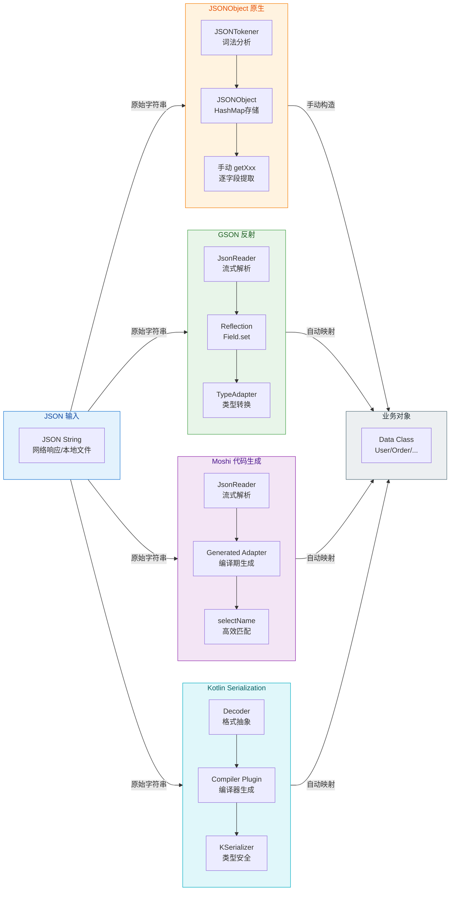

| 维度 | JSONObject | GSON | Moshi | Kotlin Serialization |
|------|------------|------|-------|---------------------|
| **依赖** | Android SDK 内置 | 第三方库 (~250KB) | 第三方库 (~150KB) | 官方库 (~300KB) |
| **映射方式** | 手动 | 反射/自定义Adapter | 反射/代码生成 | 编译器插件 |
| **Kotlin 空安全** | ❌ 不支持 | ⚠️ 不完善 | ✅ 完善 | ✅ 原生支持 |
| **默认参数** | N/A | ❌ 不生效 | ✅ 生效 | ✅ 生效 |
| **混淆友好** | ✅ 无需规则 | ⚠️ 需保留规则 | ✅ (codegen) | ✅ 无需规则 |
| **性能** | 取决于实现 | 中等 | 高 | 最高 |
| **学习曲线** | 低 | 低 | 中 | 中 |
| **多格式支持** | ❌ 仅 JSON | ❌ 仅 JSON | ⚠️ 有限 | ✅ 多格式 |

**选型建议**

- **简单脚本/原型开发**：`JSONObject` 原生解析，零依赖快速上手；
- **Java 为主的遗留项目**：`GSON`，生态成熟、资料丰富；
- **Kotlin 项目 + 性能敏感**：`Moshi` (codegen)，平衡性能与 Kotlin 友好性；
- **纯 Kotlin/KMP 项目**：`Kotlin Serialization`，官方支持、类型最安全、跨平台能力最强。

---

**📝 练习题**

以下代码使用 Kotlin Serialization 解析 JSON，若输入 `{"name": "Alice", "age": null}`，程序会如何表现？

```kotlin
@Serializable
data class Person(
    val name: String,
    val age: Int = 18
)

val person = Json.decodeFromString<Person>("""{"name": "Alice", "age": null}""")
```

A. 成功解析，`person.age` 为 `18`（使用默认值）


B. 成功解析，`person.age` 为 `0`（Int 的零值）


C. 抛出 `SerializationException`，因为 `null` 无法赋值给 non-null 的 `Int`


D. 编译错误，`@Serializable` 不支持默认参数


**【答案】** C

**【解析】** Kotlin Serialization 严格尊重 Kotlin 的类型系统。`age: Int` 声明为 non-null 类型，当 JSON 中 `age` 的值显式为 `null` 时，序列化器会抛出异常，而**不会**自动使用默认值 `18`。默认值仅在 JSON 中**完全缺失**该字段时才生效。若希望 `null` 被强制转换为默认值，需配置 `Json { coerceInputValues = true }`，此时 A 才是正确答案。这体现了 Kotlin Serialization "显式优于隐式"的设计哲学——它不会静默吞掉类型不匹配的问题，而是让开发者明确做出选择。

---

## 网络状态监测

在移动应用开发中，网络连接状态的检测是一项基础而关键的能力。用户的设备可能在 Wi-Fi、蜂窝网络、以太网之间切换，也可能完全断开连接。应用需要感知这些变化，以便做出合理的响应——例如暂停大文件下载、切换到离线模式、或在恢复连接时自动同步数据。Android 系统通过 `ConnectivityManager` 系统服务及其配套的 `NetworkCapabilities` 和 `NetworkCallback` API，为应用层提供了完整的网络状态监测机制。

从架构层面看，`ConnectivityManager` 是应用与 Framework 层 `ConnectivityService` 交互的桥梁。当底层网络发生变化时（如 Wi-Fi 断开、SIM 卡切换），`ConnectivityService` 会通知所有注册的监听器。这种 **观察者模式 (Observer Pattern)** 的设计，使得应用无需轮询即可实时获取网络状态变更，既节省资源又保证响应及时。

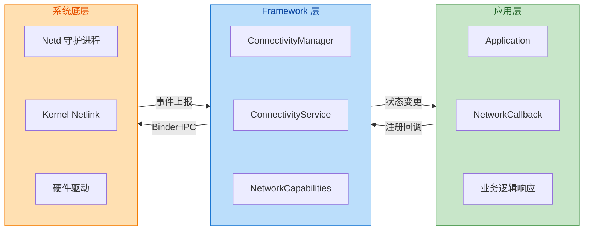

### ConnectivityManager 连接管理

`ConnectivityManager` 是 Android 系统提供的网络连接管理器，作为系统服务 (System Service) 存在。应用通过 `Context.getSystemService()` 获取其实例，进而查询当前网络状态、注册网络变化监听器、或请求特定类型的网络连接。

**获取 ConnectivityManager 实例**的方式非常直接，但需要注意的是，这个对象本质上是一个 Binder 代理，实际的业务逻辑运行在系统进程的 `ConnectivityService` 中。应用层的每次调用都会触发跨进程通信 (IPC)，因此应避免在紧凑循环中频繁调用。

```kotlin
// 获取 ConnectivityManager 系统服务实例
// getSystemService() 返回的是一个 Binder 代理对象
val connectivityManager = context.getSystemService(Context.CONNECTIVITY_SERVICE) as ConnectivityManager
```

在 Android 早期版本中，开发者常使用 `getActiveNetworkInfo()` 方法来查询网络状态。这个方法返回一个 `NetworkInfo` 对象，包含网络类型 (Wi-Fi/Mobile) 和连接状态。然而，这套 API 存在明显的局限性：它只能告诉你"有没有连接"，却无法描述网络的**能力**——比如这个网络是否能访问互联网、是否计费、带宽如何。

```kotlin
// ⚠️ 已废弃的 API（API 29 起标记 @Deprecated）
// 仅用于兼容旧版本 Android，不推荐在新项目中使用
@Suppress("DEPRECATION")
fun isNetworkAvailableLegacy(context: Context): Boolean {
    val cm = context.getSystemService(Context.CONNECTIVITY_SERVICE) as ConnectivityManager
    // getActiveNetworkInfo() 返回当前活跃网络的信息
    // 可能为 null（表示没有活跃网络）
    val networkInfo = cm.activeNetworkInfo
    // isConnected 表示网络是否已建立连接
    return networkInfo?.isConnected == true
}
```

从 **Android 6.0 (API 23)** 开始，Google 引入了全新的网络监测体系，以 `Network` 对象作为网络连接的唯一标识符，配合 `NetworkCapabilities` 描述网络能力，通过 `NetworkCallback` 接收异步通知。这套现代 API 的设计理念是：**网络不再是单一的"有或无"，而是多个并存的连接，每个连接有不同的能力和用途**。

例如，设备可能同时连接 Wi-Fi 和蜂窝网络。Wi-Fi 用于大流量传输，蜂窝网络作为备份。应用可以根据需求选择合适的网络，而不是被动接受系统的默认选择。

```kotlin
// 现代 API：获取当前活跃网络及其能力
// 这是 Android 6.0+ 推荐的做法
fun checkNetworkModern(context: Context) {
    val cm = context.getSystemService(Context.CONNECTIVITY_SERVICE) as ConnectivityManager
    
    // getActiveNetwork() 返回当前系统默认使用的网络
    // 返回值是一个 Network 对象，可能为 null
    val activeNetwork: Network? = cm.activeNetwork
    
    // 如果没有活跃网络，直接返回
    if (activeNetwork == null) {
        Log.d("Network", "No active network")
        return
    }
    
    // getNetworkCapabilities() 获取指定网络的能力描述
    // 通过 NetworkCapabilities 可以判断网络的各种特性
    val capabilities: NetworkCapabilities? = cm.getNetworkCapabilities(activeNetwork)
    
    // capabilities 也可能为 null（网络刚断开时）
    capabilities?.let { caps ->
        // 检查网络是否具备访问互联网的能力
        val hasInternet = caps.hasCapability(NetworkCapabilities.NET_CAPABILITY_INTERNET)
        // 检查网络连接是否已验证（能真正访问外网）
        val isValidated = caps.hasCapability(NetworkCapabilities.NET_CAPABILITY_VALIDATED)
        
        Log.d("Network", "Has Internet: $hasInternet, Validated: $isValidated")
    }
}
```

**关于 `activeNetwork` 与 `activeNetworkInfo` 的本质区别**：旧 API 返回的 `NetworkInfo` 是一个快照 (snapshot)，获取瞬间的状态副本；新 API 返回的 `Network` 是一个句柄 (handle)，指向系统中的某个网络连接对象。前者是值语义，后者是引用语义。这意味着使用新 API 时，你需要配合 `NetworkCallback` 来追踪网络的生命周期变化，而不是反复调用方法获取快照。

### NetworkCapabilities 能力检查

`NetworkCapabilities` 类描述了一个网络连接的**能力集合 (Capability Set)**。它采用位掩码 (bitmask) 的方式存储多个能力标志，并提供 `hasCapability()` 和 `hasTransport()` 方法进行查询。这种设计允许一个网络同时具备多种能力，也允许应用精确描述自己的网络需求。

**传输类型 (Transport)** 描述的是网络的物理或逻辑载体：

| 常量 | 含义 | 典型场景 |
|------|------|----------|
| `TRANSPORT_WIFI` | Wi-Fi 无线网络 | 家庭/办公室 Wi-Fi |
| `TRANSPORT_CELLULAR` | 蜂窝移动网络 | 4G/5G 数据连接 |
| `TRANSPORT_ETHERNET` | 有线以太网 | Android TV、工业设备 |
| `TRANSPORT_BLUETOOTH` | 蓝牙网络共享 | 通过蓝牙热点连接 |
| `TRANSPORT_VPN` | 虚拟专用网络 | 企业 VPN 通道 |

**网络能力 (Capability)** 描述的是网络能做什么：

| 常量 | 含义 | 重要性 |
|------|------|--------|
| `NET_CAPABILITY_INTERNET` | 具备 IP 路由能力 | 基础能力，但不保证能上网 |
| `NET_CAPABILITY_VALIDATED` | 已通过互联网连通性验证 | **关键**：真正能访问外网 |
| `NET_CAPABILITY_NOT_METERED` | 非计费网络 | 大流量操作前应检查 |
| `NET_CAPABILITY_NOT_VPN` | 非 VPN 连接 | 安全敏感场景使用 |
| `NET_CAPABILITY_CAPTIVE_PORTAL` | 需要登录的网络 | 酒店/机场 Wi-Fi 常见 |

**特别强调**：`NET_CAPABILITY_INTERNET` 和 `NET_CAPABILITY_VALIDATED` 的区别是面试高频考点。前者仅表示网络配置了路由（能发出 IP 包），后者表示系统已验证该网络确实能访问互联网。一个典型的反例是：连接到需要认证的 Wi-Fi 热点后，`INTERNET` 能力立即存在，但 `VALIDATED` 能力要等到用户完成网页登录后才会出现。

```kotlin
// 全面检查网络能力的工具方法
// 返回一个包含各种网络属性的数据类
data class NetworkStatus(
    val isConnected: Boolean,           // 是否已连接
    val isWifi: Boolean,                // 是否为 Wi-Fi
    val isCellular: Boolean,            // 是否为蜂窝网络
    val isValidated: Boolean,           // 是否已验证（能真正上网）
    val isNotMetered: Boolean,          // 是否为非计费网络
    val downstreamBandwidthKbps: Int,   // 下行带宽估算 (Kbps)
    val upstreamBandwidthKbps: Int      // 上行带宽估算 (Kbps)
)

fun getNetworkStatus(context: Context): NetworkStatus {
    val cm = context.getSystemService(Context.CONNECTIVITY_SERVICE) as ConnectivityManager
    
    // 获取当前活跃网络
    val network = cm.activeNetwork
    // 获取网络能力描述
    val caps = network?.let { cm.getNetworkCapabilities(it) }
    
    // 如果没有网络或能力信息，返回断开状态
    if (caps == null) {
        return NetworkStatus(
            isConnected = false,
            isWifi = false,
            isCellular = false,
            isValidated = false,
            isNotMetered = false,
            downstreamBandwidthKbps = 0,
            upstreamBandwidthKbps = 0
        )
    }
    
    return NetworkStatus(
        // 有网络对象即表示已连接
        isConnected = true,
        // 检查传输类型是否为 Wi-Fi
        isWifi = caps.hasTransport(NetworkCapabilities.TRANSPORT_WIFI),
        // 检查传输类型是否为蜂窝网络
        isCellular = caps.hasTransport(NetworkCapabilities.TRANSPORT_CELLULAR),
        // VALIDATED 表示已通过互联网连通性测试
        isValidated = caps.hasCapability(NetworkCapabilities.NET_CAPABILITY_VALIDATED),
        // NOT_METERED 表示不按流量计费（Wi-Fi 通常具备此能力）
        isNotMetered = caps.hasCapability(NetworkCapabilities.NET_CAPABILITY_NOT_METERED),
        // 系统估算的下行带宽，单位 Kbps
        downstreamBandwidthKbps = caps.linkDownstreamBandwidthKbps,
        // 系统估算的上行带宽，单位 Kbps
        upstreamBandwidthKbps = caps.linkUpstreamBandwidthKbps
    )
}
```

**带宽估算的实现原理**：`linkDownstreamBandwidthKbps` 和 `linkUpstreamBandwidthKbps` 并非实时测速结果，而是系统根据网络类型和链路协商结果给出的**理论估算值**。例如，连接到 802.11ac Wi-Fi 时，系统可能报告 866 Mbps 的下行带宽，但实际吞吐量受信号强度、干扰、服务器性能等因素影响，通常远低于此值。这些估算值适合用于**策略决策**（如选择视频清晰度），不适合用于精确的传输时间计算。

### NetworkCallback 回调机制

`NetworkCallback` 是 Android 网络监测的核心机制，它实现了**异步、事件驱动**的网络状态监听。相比轮询式的状态检查，回调机制具有显著优势：响应及时（状态变化时立即通知）、资源高效（无需持续占用 CPU 轮询）、信息丰富（可以获取变化的具体细节）。

**回调的生命周期方法**构成了网络状态的完整描述：

| 回调方法 | 触发时机 | 典型用途 |
|----------|----------|----------|
| `onAvailable(Network)` | 符合条件的网络变为可用 | 恢复网络操作 |
| `onLosing(Network, maxMs)` | 网络即将断开 | 提前做好切换准备 |
| `onLost(Network)` | 网络已完全断开 | 切换到离线模式 |
| `onCapabilitiesChanged(Network, NetworkCapabilities)` | 网络能力发生变化 | 响应能力变更 |
| `onLinkPropertiesChanged(Network, LinkProperties)` | 链路属性变化 | IP 地址、DNS 变更 |
| `onBlockedStatusChanged(Network, blocked)` | 网络被阻塞/解除阻塞 | 数据省流模式变化 |
| `onUnavailable()` | 请求的网络不可用 | 超时处理 |

```kotlin
// 实现一个功能完整的网络状态监听器
class NetworkMonitor(private val context: Context) {
    
    // ConnectivityManager 实例，用于注册/注销回调
    private val connectivityManager = 
        context.getSystemService(Context.CONNECTIVITY_SERVICE) as ConnectivityManager
    
    // 使用 StateFlow 暴露网络状态，便于 UI 层观察
    // MutableStateFlow 允许内部修改，对外暴露为只读 StateFlow
    private val _networkState = MutableStateFlow<NetworkState>(NetworkState.Unknown)
    val networkState: StateFlow<NetworkState> = _networkState.asStateFlow()
    
    // 定义网络状态的密封类，覆盖所有可能的状态
    sealed class NetworkState {
        object Unknown : NetworkState()                    // 初始状态，尚未检测
        object Unavailable : NetworkState()               // 无可用网络
        data class Available(                             // 网络可用
            val isWifi: Boolean,                          // 是否为 Wi-Fi
            val isValidated: Boolean,                     // 是否已验证
            val isMetered: Boolean                        // 是否计费
        ) : NetworkState()
    }
    
    // NetworkCallback 实现
    // 系统会在网络状态变化时回调这些方法
    private val networkCallback = object : ConnectivityManager.NetworkCallback() {
        
        // 当有网络变为可用时调用
        // network 参数是该网络的唯一标识符
        override fun onAvailable(network: Network) {
            super.onAvailable(network)
            Log.d("NetworkMonitor", "Network available: $network")
            // onAvailable 只表示网络可用，但能力信息需要在 onCapabilitiesChanged 中获取
            // 这里暂时设置为基础可用状态
        }
        
        // 当网络能力发生变化时调用
        // 这是获取网络详细信息的主要回调
        override fun onCapabilitiesChanged(
            network: Network,
            networkCapabilities: NetworkCapabilities
        ) {
            super.onCapabilitiesChanged(network, networkCapabilities)
            
            // 提取关键能力信息
            val isWifi = networkCapabilities.hasTransport(NetworkCapabilities.TRANSPORT_WIFI)
            val isValidated = networkCapabilities.hasCapability(
                NetworkCapabilities.NET_CAPABILITY_VALIDATED
            )
            // NOT_METERED 的反义就是计费网络
            val isMetered = !networkCapabilities.hasCapability(
                NetworkCapabilities.NET_CAPABILITY_NOT_METERED
            )
            
            // 更新状态流，触发 UI 层更新
            _networkState.value = NetworkState.Available(
                isWifi = isWifi,
                isValidated = isValidated,
                isMetered = isMetered
            )
            
            Log.d("NetworkMonitor", 
                "Capabilities changed: wifi=$isWifi, validated=$isValidated, metered=$isMetered")
        }
        
        // 当网络即将丢失时调用
        // maxMsToLive 表示网络预计还能维持的最大毫秒数
        override fun onLosing(network: Network, maxMsToLive: Int) {
            super.onLosing(network, maxMsToLive)
            Log.d("NetworkMonitor", "Network losing: $network, max ${maxMsToLive}ms remaining")
            // 可以在这里提前准备切换逻辑，如缓存关键数据
        }
        
        // 当网络完全丢失时调用
        override fun onLost(network: Network) {
            super.onLost(network)
            Log.d("NetworkMonitor", "Network lost: $network")
            // 更新状态为不可用
            _networkState.value = NetworkState.Unavailable
        }
        
        // 当请求的网络在超时时间内无法获得时调用
        // 仅在使用 requestNetwork() 并设置超时时触发
        override fun onUnavailable() {
            super.onUnavailable()
            Log.d("NetworkMonitor", "Network unavailable (request timeout)")
            _networkState.value = NetworkState.Unavailable
        }
    }
    
    // 开始监听网络状态
    // 应在 Activity.onStart() 或 Application.onCreate() 中调用
    fun startMonitoring() {
        // 构建网络请求，描述我们关心的网络类型
        val networkRequest = NetworkRequest.Builder()
            // 要求网络具备互联网能力
            .addCapability(NetworkCapabilities.NET_CAPABILITY_INTERNET)
            // 不限制传输类型（Wi-Fi/蜂窝都可以）
            .build()
        
        // 注册回调
        // registerNetworkCallback 会立即触发一次 onAvailable（如果有可用网络）
        connectivityManager.registerNetworkCallback(networkRequest, networkCallback)
        
        Log.d("NetworkMonitor", "Started monitoring network")
    }
    
    // 停止监听网络状态
    // 应在 Activity.onStop() 或适当的生命周期点调用
    fun stopMonitoring() {
        try {
            // 注销回调，避免内存泄漏
            connectivityManager.unregisterNetworkCallback(networkCallback)
            Log.d("NetworkMonitor", "Stopped monitoring network")
        } catch (e: IllegalArgumentException) {
            // 回调未注册时会抛出异常，这里静默处理
            Log.w("NetworkMonitor", "Callback was not registered")
        }
    }
}
```

**`registerNetworkCallback()` 与 `requestNetwork()` 的区别**是另一个重要知识点。`registerNetworkCallback()` 是**被动监听**：你告诉系统"我对这类网络感兴趣"，系统会在相关网络状态变化时通知你，但不会主动帮你建立连接。`requestNetwork()` 是**主动请求**：你告诉系统"我需要这类网络"，系统会尝试建立符合条件的网络连接（比如打开 Wi-Fi 或蜂窝数据）。

```kotlin
// 主动请求特定类型的网络（需要权限）
// 这会导致系统尝试激活符合条件的网络
fun requestWifiNetwork(timeoutMs: Int = 30_000) {
    val request = NetworkRequest.Builder()
        // 要求 Wi-Fi 传输类型
        .addTransportType(NetworkCapabilities.TRANSPORT_WIFI)
        // 要求非计费（排除 Wi-Fi 热点等计费 Wi-Fi）
        .addCapability(NetworkCapabilities.NET_CAPABILITY_NOT_METERED)
        .build()
    
    // requestNetwork 会主动尝试连接符合条件的网络
    // 需要 CHANGE_NETWORK_STATE 权限
    connectivityManager.requestNetwork(
        request,
        networkCallback,
        timeoutMs  // 超时后触发 onUnavailable
    )
}
```

**内存泄漏防范**是使用 `NetworkCallback` 时必须注意的问题。`NetworkCallback` 被注册后，`ConnectivityService` 会持有它的引用。如果回调对象内部持有 Activity 或 Fragment 的引用（通过匿名内部类的隐式 this），当 Activity 销毁时，由于回调仍被系统持有，Activity 无法被垃圾回收，导致内存泄漏。

解决方案有几种：
1. 在 `onStop()` 或 `onDestroy()` 中显式调用 `unregisterNetworkCallback()`
2. 使用 `Application` 级别的单例来管理网络监听
3. 使用 `LifecycleObserver` 自动绑定生命周期

```kotlin
// 使用 Lifecycle 自动管理回调注册
class LifecycleAwareNetworkMonitor(
    private val context: Context,
    lifecycle: Lifecycle
) : DefaultLifecycleObserver {
    
    private val cm = context.getSystemService(Context.CONNECTIVITY_SERVICE) as ConnectivityManager
    private var callback: ConnectivityManager.NetworkCallback? = null
    
    init {
        // 将自身添加为生命周期观察者
        lifecycle.addObserver(this)
    }
    
    // Activity/Fragment 进入前台时自动注册
    override fun onStart(owner: LifecycleOwner) {
        callback = object : ConnectivityManager.NetworkCallback() {
            override fun onAvailable(network: Network) {
                // 处理网络可用
            }
            override fun onLost(network: Network) {
                // 处理网络丢失
            }
        }
        
        val request = NetworkRequest.Builder()
            .addCapability(NetworkCapabilities.NET_CAPABILITY_INTERNET)
            .build()
            
        cm.registerNetworkCallback(request, callback!!)
    }
    
    // Activity/Fragment 进入后台时自动注销
    override fun onStop(owner: LifecycleOwner) {
        callback?.let { 
            cm.unregisterNetworkCallback(it)
            callback = null
        }
    }
}

// 在 Activity 中使用
class MainActivity : AppCompatActivity() {
    private lateinit var networkMonitor: LifecycleAwareNetworkMonitor
    
    override fun onCreate(savedInstanceState: Bundle?) {
        super.onCreate(savedInstanceState)
        // 传入 lifecycle，监控器会自动管理注册和注销
        networkMonitor = LifecycleAwareNetworkMonitor(this, lifecycle)
    }
}
```

**必需权限**：使用网络状态监测 API 需要在 `AndroidManifest.xml` 中声明权限。`ACCESS_NETWORK_STATE` 是普通权限 (normal permission)，安装时自动授予，无需运行时申请。

```xml
<!-- AndroidManifest.xml -->
<manifest xmlns:android="http://schemas.android.com/apk/res/android">
    
    <!-- 读取网络状态的权限（普通权限，自动授予） -->
    <uses-permission android:name="android.permission.ACCESS_NETWORK_STATE" />
    
    <!-- 如果需要使用 requestNetwork() 修改网络连接 -->
    <uses-permission android:name="android.permission.CHANGE_NETWORK_STATE" />
    
</manifest>
```

---

**📝 练习题**

在 Android 10 (API 29) 及以上设备中，应用需要判断当前网络是否真正能够访问互联网。以下代码片段中，哪种方式是最准确的？

A. `networkInfo?.isConnected == true`


B. `networkCapabilities?.hasCapability(NET_CAPABILITY_INTERNET) == true`


C. `networkCapabilities?.hasCapability(NET_CAPABILITY_VALIDATED) == true`


D. `connectivityManager.activeNetwork != null`


**【答案】** C

**【解析】** 

选项 A 使用的是已废弃的 `NetworkInfo.isConnected`，该 API 在 Android 10 中已被标记为 `@Deprecated`，且只能判断网络连接状态，无法判断是否能真正访问互联网。

选项 B 检查 `NET_CAPABILITY_INTERNET` 只能说明该网络具备 IP 路由能力（可以发出网络请求），但不保证请求能到达互联网。例如，连接到需要认证的酒店 Wi-Fi 时，`NET_CAPABILITY_INTERNET` 为 true，但实际无法访问外网。

选项 C 检查 `NET_CAPABILITY_VALIDATED` 是正确答案。这个能力标志表示 Android 系统已经通过向 Google 服务器 (或 OEM 配置的服务器) 发送探测请求，验证该网络确实能够访问互联网。只有当探测请求成功返回时，系统才会给该网络添加 `VALIDATED` 能力。

选项 D 只能判断是否存在活跃网络对象，无法判断网络质量或连通性。在 Wi-Fi 已连接但需要网页认证的场景下，`activeNetwork` 不为 null，但实际无法上网。

---

## 流量统计 TrafficStats

在移动应用开发中，**流量消耗**是影响用户体验和运营成本的核心指标之一。用户对"偷跑流量"的应用深恶痛绝，而开发者也需要精确掌握应用的网络资源消耗情况，以便进行针对性优化。Android 系统从 API Level 8 (Android 2.2) 开始提供了 `android.net.TrafficStats` 类，它允许应用层直接读取系统内核维护的网络流量统计数据，实现对应用流量的监控与分析。

`TrafficStats` 的底层数据来源是 Linux 内核的 `/proc/net/xt_qtaguid/stats` 文件（Android 4.3 之前是 `/proc/uid_stat/`）。内核通过 **xt_qtaguid** 模块对每个 Socket 的收发字节数进行记录，并按 **UID (User ID)** 维度进行汇总。由于 Android 的沙箱机制为每个应用分配了唯一的 UID，因此 `TrafficStats` 能够天然地实现"按应用统计流量"这一核心需求。

需要特别注意的是，`TrafficStats` 返回的是**自设备启动以来的累计值**（cumulative counters），而非实时速率。这意味着开发者需要在两个时间点分别采样，然后计算差值，才能得到某一时间段内的流量消耗。此外，设备重启后计数器会归零，因此需要做好持久化存储以应对跨重启的统计场景。

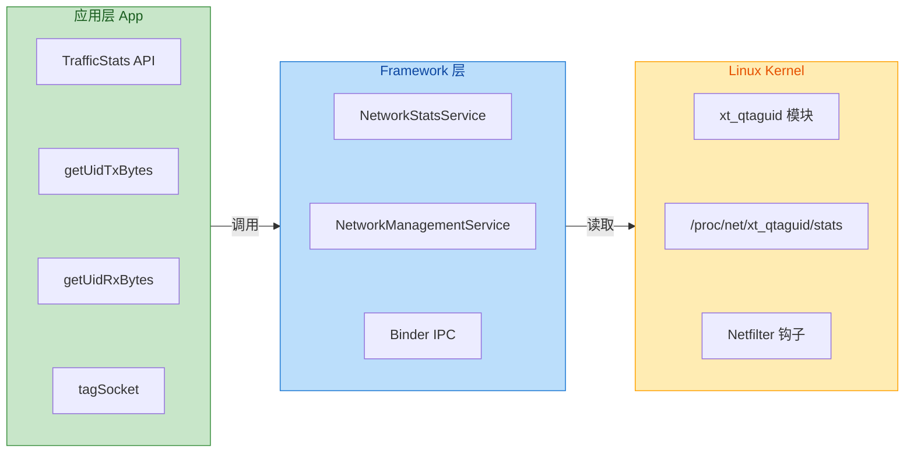

### 应用流量监控

`TrafficStats` 提供了一系列静态方法，用于获取不同粒度的流量统计数据。从应用层视角来看，最常用的场景是监控**当前应用自身的流量消耗**，这对于流量敏感型应用（如视频播放器、云存储客户端）尤为重要。

核心 API 可以分为两大类：一类是获取**整机流量**（包括移动网络和 Wi-Fi），另一类是获取**特定 UID 的流量**。整机流量统计适用于系统级应用或需要展示设备总体网络使用情况的场景，而 UID 维度的统计则是普通应用进行自我监控的首选。

```kotlin
// 获取整机移动网络流量（自开机以来）
// getMobileTxBytes(): 移动网络发送的总字节数
// getMobileRxBytes(): 移动网络接收的总字节数
val mobileTx = TrafficStats.getMobileTxBytes()    // 移动网络上行流量
val mobileRx = TrafficStats.getMobileRxBytes()    // 移动网络下行流量

// 获取整机所有网络接口的流量（包括 Wi-Fi、移动网络、以太网等）
// getTotalTxBytes(): 所有网络接口发送的总字节数
// getTotalRxBytes(): 所有网络接口接收的总字节数
val totalTx = TrafficStats.getTotalTxBytes()      // 所有网络上行流量
val totalRx = TrafficStats.getTotalRxBytes()      // 所有网络下行流量

// 获取当前应用 UID 的流量
// getUidTxBytes(uid): 指定 UID 发送的总字节数
// getUidRxBytes(uid): 指定 UID 接收的总字节数
val myUid = android.os.Process.myUid()            // 获取当前应用的 UID
val appTx = TrafficStats.getUidTxBytes(myUid)     // 当前应用上行流量
val appRx = TrafficStats.getUidRxBytes(myUid)     // 当前应用下行流量

// 检查返回值有效性
// 返回 UNSUPPORTED (-1) 表示设备或内核不支持该统计项
if (appTx == TrafficStats.UNSUPPORTED.toLong()) {
    // 当前设备不支持此统计，可能是内核未开启 xt_qtaguid
    Log.w("TrafficStats", "UID traffic stats not supported on this device")
}
```

在实际开发中，通常需要计算**某一时间段内的增量流量**而非累计值。标准做法是在监控开始时记录一个"基线"值，然后在监控结束时再次读取并计算差值。这种模式适用于统计"本次会话消耗的流量"或"过去一小时的流量"等场景。

```kotlin
class TrafficMonitor {
    // 记录监控开始时的基线值
    private var baselineTx: Long = 0L
    private var baselineRx: Long = 0L
    private val uid = android.os.Process.myUid()
    
    /**
     * 开始监控：记录当前累计流量作为基线
     * 调用此方法后，可通过 getConsumedBytes() 获取增量流量
     */
    fun startMonitoring() {
        // 保存当前时刻的累计值作为计算起点
        baselineTx = TrafficStats.getUidTxBytes(uid)
        baselineRx = TrafficStats.getUidRxBytes(uid)
    }
    
    /**
     * 获取自监控开始以来消耗的流量
     * @return Pair<上行增量, 下行增量>，单位为字节
     */
    fun getConsumedBytes(): Pair<Long, Long> {
        // 当前累计值减去基线值，得到增量
        val currentTx = TrafficStats.getUidTxBytes(uid)
        val currentRx = TrafficStats.getUidRxBytes(uid)
        // 返回 (发送增量, 接收增量)
        return Pair(currentTx - baselineTx, currentRx - baselineRx)
    }
    
    /**
     * 格式化字节数为人类可读的字符串
     * @param bytes 原始字节数
     * @return 格式化后的字符串，如 "1.5 MB"
     */
    fun formatBytes(bytes: Long): String {
        // 根据数量级选择合适的单位
        return when {
            bytes < 1024 -> "$bytes B"                              // 字节
            bytes < 1024 * 1024 -> "%.2f KB".format(bytes / 1024.0) // 千字节
            else -> "%.2f MB".format(bytes / (1024.0 * 1024.0))     // 兆字节
        }
    }
}
```

值得一提的是，`TrafficStats` 的数据**包含 TCP/UDP 协议头开销**，但**不包含更底层的 IP 头和链路层帧头**。这意味着统计值比实际消耗的物理层流量略少，但对于应用层监控而言已经足够精确。此外，从 Android 4.3 开始，`getUidTxPackets()` 和 `getUidRxPackets()` 方法可以返回数据包计数，这对于分析网络请求频率和协议效率非常有帮助。

### UID 维度统计

**UID (User ID)** 是 Android 安全模型的基石之一。与传统 Linux 系统中 UID 代表登录用户不同，Android 为每个安装的应用分配一个唯一的 UID（范围通常从 10000 开始）。这种设计使得系统可以通过 UID 实现应用间的资源隔离，而 `TrafficStats` 正是利用这一特性实现了"按应用统计流量"的能力。

从系统架构角度看，Linux 内核的 `xt_qtaguid` 模块在 **Netfilter** 框架中注册了钩子函数，每当数据包通过网络协议栈时，该模块会提取 Socket 关联的 UID，并将字节数累加到对应的计数器中。这些计数器以 `/proc/net/xt_qtaguid/stats` 文件的形式暴露给用户空间，而 `TrafficStats` API 则是对该文件的 Java 层封装。

```kotlin
/**
 * 获取系统中所有已安装应用的流量统计
 * 需要 android.permission.PACKAGE_USAGE_STATS 权限（Android 5.1+）
 * 或者 system app 权限
 */
fun getAllAppsTrafficStats(context: Context): List<AppTrafficInfo> {
    // 获取 PackageManager 实例，用于查询已安装应用
    val pm = context.packageManager
    // 获取所有已安装的应用（包括系统应用）
    // GET_META_DATA 标志确保获取完整的包信息
    val packages = pm.getInstalledApplications(PackageManager.GET_META_DATA)
    
    // 遍历所有应用，收集流量信息
    return packages.mapNotNull { appInfo ->
        // 获取该应用的 UID
        val uid = appInfo.uid
        // 查询该 UID 的收发流量
        val txBytes = TrafficStats.getUidTxBytes(uid)
        val rxBytes = TrafficStats.getUidRxBytes(uid)
        
        // 过滤掉无流量或不支持统计的应用
        if (txBytes == TrafficStats.UNSUPPORTED.toLong() || 
            (txBytes == 0L && rxBytes == 0L)) {
            null  // 返回 null，会被 mapNotNull 过滤掉
        } else {
            // 构建流量信息对象
            AppTrafficInfo(
                packageName = appInfo.packageName,     // 包名
                appName = pm.getApplicationLabel(appInfo).toString(),  // 应用名称
                uid = uid,                             // UID
                txBytes = txBytes,                     // 上行字节数
                rxBytes = rxBytes                      // 下行字节数
            )
        }
    }.sortedByDescending { it.txBytes + it.rxBytes }   // 按总流量降序排列
}

/**
 * 应用流量信息数据类
 */
data class AppTrafficInfo(
    val packageName: String,  // 应用包名，如 com.example.app
    val appName: String,      // 应用显示名称
    val uid: Int,             // Linux UID
    val txBytes: Long,        // 发送字节数（上行）
    val rxBytes: Long         // 接收字节数（下行）
) {
    // 计算总流量
    val totalBytes: Long get() = txBytes + rxBytes
}
```

需要特别说明的是，**共享 UID (Shared UID)** 机制会影响流量统计的准确性。当多个应用在 `AndroidManifest.xml` 中声明了相同的 `android:sharedUserId` 且使用相同签名时，它们会共享同一个 UID。此时，`TrafficStats.getUidTxBytes(uid)` 返回的是这些应用的**合计流量**，无法区分单个应用的贡献。虽然 Shared UID 在现代开发中已不推荐使用，但系统应用和部分老旧应用仍可能采用这种模式。

另一个常见陷阱是 **WorkManager 和 JobScheduler 的后台流量归属**问题。当系统将应用进程杀死后，由 `JobScheduler` 调度的后台任务可能在独立进程中执行，此时产生的流量仍会计入原应用的 UID。然而，如果使用了 `Firebase Cloud Messaging` 等推送服务，推送通道本身的流量会计入 Google Play Services 的 UID，而非目标应用。

### Tag 标记 Socket

**Socket Tagging** 是 `TrafficStats` 提供的一项高级功能，它允许开发者为特定的网络操作打上"标签"，从而实现**细粒度的流量归因**。例如，一个视频应用可以将视频流、封面图片、用户评论分别打上不同的 Tag，然后独立统计各类内容的流量消耗。这对于优化网络策略（如在移动网络下降低视频清晰度）具有重要价值。

Socket Tagging 的工作原理是：调用 `TrafficStats.setThreadStatsTag(tag)` 后，**当前线程后续创建的所有 Socket** 都会被打上指定的 Tag。内核的 `xt_qtaguid` 模块会同时按 **UID + Tag** 两个维度记录流量，应用层可以通过 `TrafficStats.getUidTxBytes(uid)` 获取总量，也可以查询 `/proc/net/xt_qtaguid/stats` 原始文件获取按 Tag 细分的数据。

```kotlin
object NetworkTags {
    // 定义语义化的 Tag 常量
    // Tag 是一个 32 位整数，低 16 位由应用自定义，高 16 位保留给系统
    const val TAG_VIDEO_STREAM = 0x1001    // 视频流数据
    const val TAG_IMAGE_LOAD = 0x1002      // 图片加载
    const val TAG_API_REQUEST = 0x1003     // API 接口请求
    const val TAG_ANALYTICS = 0x1004       // 数据埋点上报
}

/**
 * 在指定 Tag 下执行网络操作
 * 使用 inline + reified 确保异常类型信息在运行时可用
 * @param tag 流量标签
 * @param block 包含网络操作的 lambda
 * @return block 的执行结果
 */
inline fun <T> withTrafficTag(tag: Int, block: () -> T): T {
    // 保存之前的 Tag，以便恢复（支持嵌套调用）
    val previousTag = TrafficStats.getThreadStatsTag()
    try {
        // 设置新的 Tag，此后当前线程创建的 Socket 都会带上此标签
        TrafficStats.setThreadStatsTag(tag)
        // 执行实际的网络操作
        return block()
    } finally {
        // 无论成功失败，都恢复之前的 Tag
        // 这对于复用线程池中的线程尤为重要
        TrafficStats.setThreadStatsTag(previousTag)
    }
}

// 使用示例：为不同类型的网络请求打标签
fun loadVideoStream(url: String) {
    withTrafficTag(NetworkTags.TAG_VIDEO_STREAM) {
        // 此处所有网络操作的流量都会被标记为 VIDEO_STREAM
        // 包括 OkHttp、Retrofit、HttpURLConnection 等任何 HTTP 客户端
        val connection = URL(url).openConnection() as HttpURLConnection
        connection.inputStream.use { input ->
            // 读取视频流数据...
        }
    }
}
```

对于使用 **OkHttp** 的项目，可以通过自定义 `Interceptor` 更优雅地实现 Socket Tagging：

```kotlin
/**
 * OkHttp 拦截器：自动为请求打上流量标签
 * 根据请求路径或 Header 自动识别并应用合适的 Tag
 */
class TrafficTagInterceptor : Interceptor {
    override fun intercept(chain: Interceptor.Chain): Response {
        val request = chain.request()
        
        // 根据请求特征决定 Tag
        // 优先检查是否有自定义 Header 指定 Tag
        val tag = request.header("X-Traffic-Tag")?.toIntOrNull()
            ?: inferTagFromPath(request.url.encodedPath)  // 否则根据路径推断
        
        // 保存并设置 Tag
        val previousTag = TrafficStats.getThreadStatsTag()
        TrafficStats.setThreadStatsTag(tag)
        
        return try {
            // 继续请求链，此时 Socket 已被打标
            chain.proceed(request)
        } finally {
            // 恢复原 Tag（线程池中的线程会被复用）
            TrafficStats.setThreadStatsTag(previousTag)
        }
    }
    
    /**
     * 根据 URL 路径推断流量类型
     * @param path URL 路径部分
     * @return 对应的流量 Tag
     */
    private fun inferTagFromPath(path: String): Int {
        return when {
            path.contains("/video/") -> NetworkTags.TAG_VIDEO_STREAM
            path.contains("/image/") || path.endsWith(".jpg") || 
                path.endsWith(".png") -> NetworkTags.TAG_IMAGE_LOAD
            path.contains("/analytics") -> NetworkTags.TAG_ANALYTICS
            else -> NetworkTags.TAG_API_REQUEST  // 默认为 API 请求
        }
    }
}

// 配置 OkHttpClient 使用该拦截器
val client = OkHttpClient.Builder()
    .addInterceptor(TrafficTagInterceptor())  // 添加流量标记拦截器
    .build()
```

需要注意的是，**Socket Tag 的查询需要系统权限**。普通应用只能通过 `setThreadStatsTag()` 打标签，但无法通过公开 API 查询按 Tag 细分的统计数据——这需要读取 `/proc/net/xt_qtaguid/stats` 文件，而该文件的访问受限于应用的 UID。系统应用或具有 `android.permission.UPDATE_DEVICE_STATS` 权限的应用可以访问完整数据。

对于普通应用，一种可行的替代方案是**在应用内部维护统计**：在 `withTrafficTag` 的前后分别采样 `getUidTxBytes()` 和 `getUidRxBytes()`，计算差值后按 Tag 累加到内存或数据库中。这种方式虽然不如内核级统计精确（可能受其他并发网络操作干扰），但对于大多数场景已经足够。

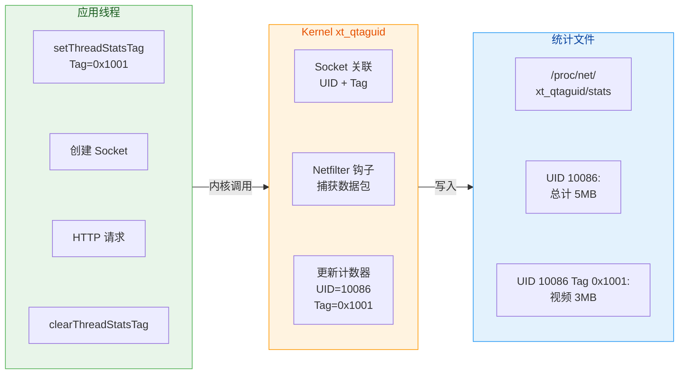

### 流量统计的局限性与最佳实践

尽管 `TrafficStats` 提供了便捷的流量监控能力，但在实际应用中仍需注意以下局限性：

**累计值与设备重启**：所有统计接口返回的都是自设备启动以来的累计值。设备重启后计数器归零，因此如果需要长期统计（如"本月流量"），必须将每次采样值持久化存储，并在设备重启后从存储的检查点继续累加。可以监听 `ACTION_BOOT_COMPLETED` 广播来检测设备重启事件。

**多进程应用的统计**：如果应用使用 `android:process` 属性创建了多个进程，这些进程共享同一个 UID，因此 `getUidTxBytes()` 返回的是所有进程的合计流量。无法通过公开 API 区分单个进程的贡献。

**VPN 场景下的流量归属**：当设备连接 VPN 时，所有流量都会经过 VPN 应用的隧道接口。此时，原始应用的流量可能被计入 VPN 应用的 UID（取决于 VPN 实现方式），导致统计偏差。

**Wi-Fi 与移动网络的区分**：`getMobileTxBytes()` 只统计移动网络流量，而 `getUidTxBytes()` 是全网络接口的合计。如果需要按网络类型分别统计某应用的流量，需要在切换网络时记录检查点，或使用 `NetworkStatsManager`（API 23+）获取更详细的历史数据。

```kotlin
/**
 * 使用 NetworkStatsManager 获取更精细的流量统计
 * 需要权限：android.permission.PACKAGE_USAGE_STATS
 * 需要用户在"设置-应用-特殊权限-使用情况访问"中授权
 */
@RequiresApi(Build.VERSION_CODES.M)
fun getDetailedNetworkStats(context: Context, uid: Int, startTime: Long, endTime: Long) {
    // 获取 NetworkStatsManager 系统服务
    val nsm = context.getSystemService(Context.NETWORK_STATS_SERVICE) as NetworkStatsManager
    
    // 查询移动网络流量（指定时间范围）
    // TYPE_MOBILE = 0 表示移动蜂窝网络
    val mobileBucket = nsm.querySummaryForDevice(
        ConnectivityManager.TYPE_MOBILE,  // 网络类型：移动网络
        null,                              // subscriberId，null 表示所有运营商
        startTime,                         // 开始时间戳（毫秒）
        endTime                            // 结束时间戳（毫秒）
    )
    
    // 查询 Wi-Fi 流量
    // TYPE_WIFI = 1 表示 Wi-Fi 网络
    val wifiBucket = nsm.querySummaryForDevice(
        ConnectivityManager.TYPE_WIFI,    // 网络类型：Wi-Fi
        null,
        startTime,
        endTime
    )
    
    // NetworkStats.Bucket 包含 rxBytes 和 txBytes 字段
    Log.d("NetworkStats", "Mobile: rx=${mobileBucket.rxBytes}, tx=${mobileBucket.txBytes}")
    Log.d("NetworkStats", "WiFi: rx=${wifiBucket.rxBytes}, tx=${wifiBucket.txBytes}")
}
```

---

**📝 练习题**

某视频应用希望分别统计"视频播放"和"封面图片加载"两类网络请求的流量消耗。开发者使用 `TrafficStats.setThreadStatsTag()` 为两类请求打上了不同的 Tag（0x1001 和 0x1002）。以下关于 Socket Tagging 的说法，**正确**的是：

A. 调用 `TrafficStats.getUidTxBytes(uid)` 可以直接获取 Tag=0x1001 的流量


B. Tag 会自动跨线程传递，因此在主线程设置后，子线程的网络请求也会被打上相同的 Tag


C. 设置 Tag 后，当前线程后续创建的 Socket 会被标记，但 Tag 的查询需要系统权限或读取内核文件


D. Socket Tagging 只对 `HttpURLConnection` 有效，OkHttp 等第三方库不受影响


**【答案】** C

**【解析】** 

- **A 错误**：`getUidTxBytes(uid)` 返回的是该 UID 下**所有 Tag** 的流量总和，无法区分单个 Tag 的贡献。按 Tag 查询需要读取 `/proc/net/xt_qtaguid/stats` 文件，这通常需要系统权限。

- **B 错误**：`setThreadStatsTag()` 只影响**当前线程**，不会跨线程传递。如果在主线程设置 Tag 后，通过线程池执行网络请求，必须在工作线程中重新调用 `setThreadStatsTag()`。这就是为什么使用 OkHttp 时需要自定义 `Interceptor`，因为 OkHttp 会在独立的线程池中执行 IO 操作。

- **C 正确**：这是 Socket Tagging 的核心特性。`setThreadStatsTag()` 设置的 Tag 会被内核记录，但普通应用通过 `TrafficStats` 公开 API 只能获取 UID 维度的统计，按 Tag 查询需要额外权限。

- **D 错误**：Socket Tagging 作用于操作系统的 Socket 层，与 HTTP 客户端库无关。只要在创建 Socket 的线程上设置了 Tag，无论是 `HttpURLConnection`、OkHttp 还是任何其他网络库，产生的流量都会被正确标记。

---

## WebView 网络交互

WebView 是 Android 平台提供的**内嵌浏览器组件**，它允许应用在自身界面内展示 Web 内容，而无需跳转到外部浏览器。从本质上讲，WebView 是基于 Chromium 内核的轻量级浏览器实现（自 Android 4.4 起），它既拥有完整的 HTTP/HTTPS 网络栈，又能与原生代码进行双向通信。这种"Hybrid 混合开发"模式在电商详情页、富文本展示、H5 活动页等场景中极为常见。

从应用层开发者的视角来看，WebView 的网络交互涉及三个核心维度：**请求拦截与控制**（通过 `WebViewClient` 实现）、**Cookie 状态同步**（通过 `CookieManager` 管理）、以及**网络行为配置**（通过 `WebSettings` 调节）。理解这三者的协作机制，是构建稳定、安全的 Hybrid 应用的关键。

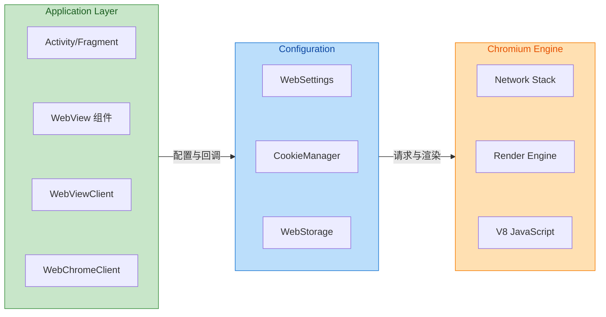

### WebViewClient 拦截请求

`WebViewClient` 是 WebView 与应用层之间的**核心桥梁**，它定义了一系列回调方法，让开发者能够监听并干预 WebView 的导航和资源加载行为。当 WebView 发起任何网络请求时（无论是主文档的 URL 跳转还是页面内子资源的加载），都会触发 `WebViewClient` 中相应的回调。

**为什么需要拦截请求？** 在实际开发中，拦截请求的场景非常丰富：你可能需要**阻止跳转到外部网站**以保持用户留在应用内；可能需要**识别自定义协议**（如 `myapp://action/xxx`）来触发原生功能；可能需要**替换线上资源为本地缓存**以加速加载；还可能需要**统计 URL 埋点**或**过滤恶意链接**。所有这些需求都依赖于 `WebViewClient` 的拦截能力。

#### shouldOverrideUrlLoading：导航拦截

`shouldOverrideUrlLoading()` 是最常用的拦截方法，它在**页面即将发生 URL 跳转**时触发。注意，这里的"跳转"特指**导航行为**（Navigation），包括用户点击链接、JavaScript 调用 `window.location.href`、表单提交等，但**不包括**页面内的 iframe 加载或 AJAX 请求。

```kotlin
// 自定义 WebViewClient 实现导航拦截
class CustomWebViewClient : WebViewClient() {

    // 新版 API（API 24+），接收 WebResourceRequest 对象，信息更丰富
    override fun shouldOverrideUrlLoading(
        view: WebView,           // 当前 WebView 实例
        request: WebResourceRequest // 封装了请求的 URL、Headers、Method 等信息
    ): Boolean {
        val url = request.url.toString()  // 获取目标 URL 字符串

        // 场景1：拦截自定义协议，触发原生行为
        if (url.startsWith("myapp://")) {
            handleCustomScheme(url)      // 解析协议并执行原生逻辑
            return true                   // 返回 true 表示"我已处理，WebView 不要继续加载"
        }

        // 场景2：外部链接跳转系统浏览器
        if (!url.contains("mycompany.com")) {
            val intent = Intent(Intent.ACTION_VIEW, Uri.parse(url))
            view.context.startActivity(intent)  // 使用系统浏览器打开
            return true                          // 阻止 WebView 加载
        }

        // 场景3：HTTPS 降级检测（安全策略）
        if (url.startsWith("http://") && !url.startsWith("https://")) {
            Log.w("WebView", "Blocked insecure navigation: $url")
            return true  // 阻止不安全的 HTTP 跳转
        }

        // 默认行为：允许 WebView 正常加载
        return false  // 返回 false 表示"交给 WebView 处理"
    }

    // 旧版 API（已废弃但仍需兼容低版本设备）
    @Deprecated("Use shouldOverrideUrlLoading(WebView, WebResourceRequest)")
    override fun shouldOverrideUrlLoading(view: WebView, url: String): Boolean {
        // 与新版逻辑相同，但只能获取 URL 字符串
        return super.shouldOverrideUrlLoading(view, url)
    }
}
```

**返回值语义**是理解此方法的关键：返回 `true` 意味着"应用已接管此次导航，WebView 无需执行默认加载"；返回 `false` 则意味着"WebView 可以正常处理此 URL"。错误地返回 `true` 却不做任何处理，会导致页面"点击无响应"的诡异现象。

#### shouldInterceptRequest：资源级拦截

如果说 `shouldOverrideUrlLoading()` 是"大门守卫"，只管页面级的 URL 跳转，那么 `shouldInterceptRequest()` 就是"安检系统"，**所有资源请求**（HTML、CSS、JS、图片、字体、XHR/Fetch 等）都必须经过它。这是实现**离线缓存**、**资源代理**、**CDN 替换**的核心钩子。

```kotlin
class InterceptingWebViewClient : WebViewClient() {

    // 资源拦截回调（运行在非 UI 线程，可执行耗时操作）
    override fun shouldInterceptRequest(
        view: WebView,
        request: WebResourceRequest
    ): WebResourceResponse? {  // 返回 null 表示不拦截，使用默认网络加载
        val url = request.url.toString()

        // 场景：将远程 JS 文件替换为本地预置版本（加速首屏）
        if (url.endsWith("vendor.bundle.js")) {
            return loadLocalResource(
                view.context,
                "assets/js/vendor.bundle.js", // 本地文件路径
                "application/javascript"       // MIME 类型
            )
        }

        // 场景：为所有图片请求添加自定义 Header（如鉴权 Token）
        if (isImageUrl(url)) {
            return fetchWithCustomHeaders(url, mapOf(
                "X-App-Token" to "your_auth_token",
                "X-Client-Version" to "1.0.0"
            ))
        }

        // 不拦截，走默认网络请求
        return null
    }

    // 从 assets 加载本地资源并构造 WebResourceResponse
    private fun loadLocalResource(
        context: Context,
        assetPath: String,
        mimeType: String
    ): WebResourceResponse? {
        return try {
            val inputStream = context.assets.open(assetPath) // 打开 asset 文件流
            WebResourceResponse(
                mimeType,     // MIME 类型，如 "text/html"、"image/png"
                "UTF-8",      // 字符编码
                inputStream   // 响应体数据流
            )
        } catch (e: IOException) {
            Log.e("WebView", "Failed to load local resource: $assetPath", e)
            null  // 加载失败则回退到网络请求
        }
    }
}
```

**执行线程**是一个重要细节：`shouldInterceptRequest()` **不在 UI 线程执行**，而是在 WebView 的网络线程中调用。这意味着你可以在此方法中执行同步的文件读取或网络请求，但**绝对不能**操作 UI 或访问 `View` 的属性（会触发异常或 ANR）。

**WebResourceResponse 构造要点**：`statusCode` 和 `reasonPhrase` 在 API 21+ 可通过构造函数指定，低版本默认返回 200 OK。如果返回的 MIME 类型与实际内容不匹配（例如图片文件却声明为 `text/html`），会导致渲染异常或安全警告。

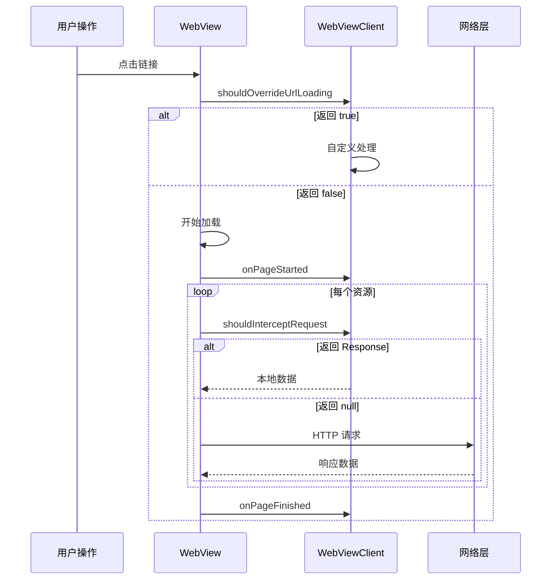

#### 错误处理与 SSL 回调

网络请求不可避免会遇到错误情况，`WebViewClient` 提供了专门的回调来处理这些异常：

```kotlin
class ErrorHandlingWebViewClient : WebViewClient() {

    // HTTP 错误（4xx、5xx 状态码）
    override fun onReceivedHttpError(
        view: WebView,
        request: WebResourceRequest,
        errorResponse: WebResourceResponse  // 包含状态码和响应头
    ) {
        val statusCode = errorResponse.statusCode
        val url = request.url.toString()

        if (request.isForMainFrame) {  // 仅处理主文档错误
            when (statusCode) {
                404 -> showErrorPage(view, "页面不存在")
                500 -> showErrorPage(view, "服务器异常")
                503 -> showRetryPage(view, "服务暂时不可用")
            }
        }
        Log.w("WebView", "HTTP Error $statusCode for $url")
    }

    // 通用加载错误（网络不可达、DNS 失败、超时等）
    override fun onReceivedError(
        view: WebView,
        request: WebResourceRequest,
        error: WebResourceError  // 包含错误码和描述
    ) {
        if (request.isForMainFrame) {  // 只处理主框架错误，忽略子资源
            val errorCode = error.errorCode
            val description = error.description

            // 根据错误类型展示不同的本地错误页
            when (errorCode) {
                ERROR_HOST_LOOKUP -> showOfflinePage(view)  // DNS 解析失败
                ERROR_CONNECT -> showNetworkErrorPage(view) // 连接失败
                ERROR_TIMEOUT -> showTimeoutPage(view)      // 超时
                else -> showGenericErrorPage(view, description.toString())
            }
        }
    }

    // SSL/TLS 证书错误（极其敏感，需谨慎处理）
    override fun onReceivedSslError(
        view: WebView,
        handler: SslErrorHandler,  // 控制是否继续加载
        error: SslError            // 证书错误详情
    ) {
        // ⚠️ 安全警告：生产环境绝不能直接调用 handler.proceed()！
        // 这会忽略证书验证，使应用暴露于中间人攻击风险
        
        val errorType = when (error.primaryError) {
            SslError.SSL_EXPIRED -> "证书已过期"
            SslError.SSL_IDMISMATCH -> "证书域名不匹配"
            SslError.SSL_UNTRUSTED -> "证书不受信任"
            SslError.SSL_NOTYETVALID -> "证书尚未生效"
            else -> "未知 SSL 错误"
        }

        // 正确做法：提示用户风险，让用户决定
        AlertDialog.Builder(view.context)
            .setTitle("安全警告")
            .setMessage("$errorType\n\n继续访问可能存在风险，是否继续？")
            .setPositiveButton("继续") { _, _ -> handler.proceed() }  // 用户主动确认
            .setNegativeButton("取消") { _, _ -> handler.cancel() }   // 取消加载
            .setCancelable(false)
            .show()
    }
}
```

**关于 SSL 错误的特别说明**：在开发调试阶段，开发者可能会临时调用 `handler.proceed()` 来绕过自签名证书的警告。但这种代码**绝对不能**出现在生产版本中。Google Play 的自动化审核会扫描 APK 中是否存在无条件调用 `proceed()` 的代码，一旦发现将拒绝上架或下架应用。正确的做法是使用 `Network Security Config` 为调试版本单独配置信任策略（参见本章后续章节）。

### CookieManager 同步

在 Web 开发中，Cookie 是维持用户会话状态的核心机制。当你在浏览器中登录一个网站后，服务器会通过 `Set-Cookie` 响应头下发会话凭证，浏览器将其存储并在后续请求中自动携带。WebView 作为内嵌浏览器，同样拥有独立的 Cookie 存储机制，但它与原生 HTTP 客户端（如 OkHttp、HttpURLConnection）的 Cookie 是**完全隔离**的。

这种隔离带来了一个常见问题：**用户在原生登录页完成身份验证后，获得的 Session Cookie 无法自动同步到 WebView**，导致用户打开 H5 页面时仍处于未登录状态，体验割裂。同样，WebView 中通过网页登录获得的 Cookie，原生代码也无法直接读取。`CookieManager` 正是为解决这一问题而设计的 API。

#### CookieManager 的基本原理

`CookieManager` 是 Android 系统提供的 **WebView Cookie 管理器**，它以单例模式存在，负责管理所有 WebView 实例共享的 Cookie 存储。从 Android 5.0 (API 21) 开始，WebView 的 Cookie 存储迁移到了 Chromium 的实现，存储在应用的 `app_webview/Cookies` 数据库文件中。

```kotlin
// 获取 CookieManager 单例
val cookieManager = CookieManager.getInstance()

// 在 Application 或首次使用 WebView 前启用 Cookie
cookieManager.setAcceptCookie(true)  // 允许 WebView 接收 Cookie（默认为 true）

// API 21+ 支持第三方 Cookie 控制（跨域 Cookie）
if (Build.VERSION.SDK_INT >= Build.VERSION_CODES.LOLLIPOP) {
    cookieManager.setAcceptThirdPartyCookies(webView, true)  // 针对特定 WebView 实例
}
```

#### 原生 Cookie 同步到 WebView

最典型的场景是：用户在原生界面通过 OkHttp 完成登录，服务器返回的 `Set-Cookie` 被 OkHttp 的 `CookieJar` 存储。此时需要将这些 Cookie 手动写入 `CookieManager`，使 WebView 加载页面时自动携带。

```kotlin
object CookieSyncHelper {

    /**
     * 将原生 HTTP 客户端的 Cookie 同步到 WebView
     * @param url 目标网页的 URL（Cookie 将关联到此 URL 的域名）
     * @param cookies 从 OkHttp CookieJar 或 Response Header 获取的 Cookie 列表
     */
    fun syncCookiesToWebView(url: String, cookies: List<Cookie>) {
        val cookieManager = CookieManager.getInstance()

        // 遍历所有 Cookie，逐个写入 CookieManager
        cookies.forEach { cookie ->
            // 构造符合 Set-Cookie 格式的字符串
            // 格式：name=value; Domain=xxx; Path=/; Expires=xxx; Secure; HttpOnly
            val cookieString = buildCookieString(cookie)

            // setCookie() 是同步方法，会立即写入内存
            // 注意：URL 参数决定了 Cookie 的作用域（域名匹配）
            cookieManager.setCookie(url, cookieString)
        }

        // 强制将内存中的 Cookie 持久化到磁盘
        // 这一步非常重要！否则 App 被杀死后 Cookie 会丢失
        if (Build.VERSION.SDK_INT >= Build.VERSION_CODES.LOLLIPOP) {
            cookieManager.flush()  // 异步写入磁盘
        } else {
            CookieSyncManager.getInstance().sync()  // 旧 API，已废弃
        }
    }

    /**
     * 构造 Set-Cookie 格式的字符串
     */
    private fun buildCookieString(cookie: Cookie): String {
        return buildString {
            append("${cookie.name}=${cookie.value}")  // 必需：名称=值

            cookie.domain?.let { append("; Domain=$it") }  // 域名限制
            cookie.path?.let { append("; Path=$it") }      // 路径限制

            if (cookie.expiresAt > 0) {
                // 将时间戳转为 HTTP 日期格式
                val dateFormat = SimpleDateFormat("EEE, dd MMM yyyy HH:mm:ss zzz", Locale.US)
                dateFormat.timeZone = TimeZone.getTimeZone("GMT")
                append("; Expires=${dateFormat.format(Date(cookie.expiresAt))}")
            }

            if (cookie.secure) append("; Secure")    // 仅 HTTPS 传输
            if (cookie.httpOnly) append("; HttpOnly") // 禁止 JS 访问
        }
    }
}
```

**同步时机的选择**至关重要：必须在 `WebView.loadUrl()` **之前**完成 Cookie 同步，否则首次请求不会携带 Cookie。推荐的做法是在登录成功的回调中立即同步，或在 `Activity.onCreate()` 中检查登录状态并预先同步。

```kotlin
class WebActivity : AppCompatActivity() {

    override fun onCreate(savedInstanceState: Bundle?) {
        super.onCreate(savedInstanceState)

        // 步骤1：检查用户登录状态，获取已存储的 Cookie
        val sessionCookies = UserSession.getCookies()

        // 步骤2：在加载 WebView 之前同步 Cookie
        if (sessionCookies.isNotEmpty()) {
            CookieSyncHelper.syncCookiesToWebView(
                url = "https://www.mycompany.com",
                cookies = sessionCookies
            )
        }

        // 步骤3：此时加载页面，请求会自动携带 Cookie
        webView.loadUrl("https://www.mycompany.com/user/profile")
    }
}
```

#### WebView Cookie 回传到原生

反向场景同样常见：用户在 WebView 中的 H5 页面完成登录或操作，产生了新的 Cookie（如 CSRF Token），原生代码需要获取这些 Cookie 用于后续 API 调用。

```kotlin
object CookieExtractor {

    /**
     * 从 WebView 的 CookieManager 中提取指定 URL 的所有 Cookie
     * @param url 目标 URL（CookieManager 会根据域名匹配返回相关 Cookie）
     * @return Cookie 字符串，格式为 "name1=value1; name2=value2"
     */
    fun getCookiesFromWebView(url: String): String? {
        return CookieManager.getInstance().getCookie(url)
        // 返回值示例："sessionId=abc123; csrfToken=xyz789; _ga=GA1.2.xxx"
    }

    /**
     * 解析 Cookie 字符串为键值对 Map
     */
    fun parseCookies(cookieString: String?): Map<String, String> {
        if (cookieString.isNullOrBlank()) return emptyMap()

        return cookieString
            .split(";")                    // 按分号分割
            .map { it.trim() }             // 去除首尾空格
            .filter { it.contains("=") }   // 过滤无效项
            .associate { pair ->
                val (name, value) = pair.split("=", limit = 2)  // 只按第一个等号分割
                name.trim() to value.trim()
            }
    }

    /**
     * 将 WebView Cookie 转换为 OkHttp 可用的格式
     */
    fun convertToOkHttpCookies(url: String): List<Cookie> {
        val httpUrl = url.toHttpUrlOrNull() ?: return emptyList()
        val cookieString = getCookiesFromWebView(url) ?: return emptyList()

        return parseCookies(cookieString).map { (name, value) ->
            Cookie.Builder()
                .name(name)
                .value(value)
                .domain(httpUrl.host)
                .path("/")
                .build()
        }
    }
}
```

#### 监听 Cookie 变化

遗憾的是，`CookieManager` **没有提供 Cookie 变更的监听机制**。如果需要实时感知 WebView 中 Cookie 的变化（例如检测用户在 H5 页面注销），有几种替代方案：

1. **JavaScript 桥接**：在 H5 页面中，登录/注销操作完成后主动调用 `window.android.onLoginStateChanged(document.cookie)`，通过 `@JavascriptInterface` 通知原生。

2. **定时轮询**：在 `WebViewClient.onPageFinished()` 或定时器中周期性读取 `CookieManager.getCookie()` 并与缓存值比对。

3. **URL 拦截**：与 H5 约定特殊的 URL Scheme（如 `myapp://cookie-updated`），在 Cookie 变更后触发此 URL，原生在 `shouldOverrideUrlLoading()` 中捕获。

```kotlin
class CookieAwareWebViewClient(
    private val onCookieChanged: (String?) -> Unit
) : WebViewClient() {

    private var lastCookieSnapshot: String? = null

    override fun onPageFinished(view: WebView, url: String) {
        super.onPageFinished(view, url)

        // 页面加载完成后检查 Cookie 变化
        val currentCookies = CookieManager.getInstance().getCookie(url)
        if (currentCookies != lastCookieSnapshot) {
            lastCookieSnapshot = currentCookies
            onCookieChanged(currentCookies)  // 触发回调
        }
    }
}
```

#### Cookie 清理与隐私

在用户注销或清除数据时，需要同步清理 WebView 的 Cookie：

```kotlin
fun clearAllWebViewData(context: Context) {
    val cookieManager = CookieManager.getInstance()

    // 清除所有 Cookie
    if (Build.VERSION.SDK_INT >= Build.VERSION_CODES.LOLLIPOP) {
        cookieManager.removeAllCookies { success ->
            Log.d("CookieManager", "Cookies removed: $success")
        }
        cookieManager.flush()  // 持久化清除操作
    } else {
        cookieManager.removeAllCookie()
        CookieSyncManager.getInstance().sync()
    }

    // 清除其他 WebView 存储
    WebStorage.getInstance().deleteAllData()  // LocalStorage、IndexedDB
    WebViewDatabase.getInstance(context).clearFormData()  // 表单自动填充
}
```

### WebSettings 配置

`WebSettings` 是控制 WebView 行为的**配置中心**，它提供了数十个开关和参数，涵盖 JavaScript 执行、缓存策略、缩放行为、混合内容策略、字体大小等方方面面。正确配置 `WebSettings` 是保证 WebView 功能正常、性能最优、安全合规的基础。

#### 获取与基础配置

```kotlin
// 获取 WebSettings 对象（每个 WebView 实例独立）
val settings: WebSettings = webView.settings

// ==================== JavaScript 相关 ====================

// 启用 JavaScript 执行（默认 false，大多数场景必须开启）
settings.javaScriptEnabled = true

// 允许 JS 自动打开新窗口（window.open()）
settings.javaScriptCanOpenWindowsAutomatically = true

// ==================== DOM 存储 ====================

// 启用 DOM Storage（localStorage/sessionStorage）
settings.domStorageEnabled = true

// 启用 Web SQL Database（已废弃标准，但部分老页面仍在使用）
settings.databaseEnabled = true

// 启用 Application Cache（已废弃，被 Service Worker 取代）
@Suppress("DEPRECATION")
settings.setAppCacheEnabled(true)
```

**关于 JavaScript 的安全考量**：启用 `javaScriptEnabled` 意味着 WebView 可以执行任意 JS 代码。如果 WebView 加载的是**不受信任的第三方内容**（如用户输入的 URL），需要特别小心 XSS 攻击风险。对于仅展示静态 HTML 的场景（如隐私政策页面），建议保持 JavaScript 禁用。

#### 缓存策略配置

WebView 的缓存行为由 `cacheMode` 参数控制，理解各模式的语义对于优化加载速度和处理离线场景至关重要：

```kotlin
// ==================== 缓存模式 ====================

// LOAD_DEFAULT：遵循 HTTP 缓存语义（Cache-Control、ETag 等）
// 这是最推荐的模式，让服务器通过响应头控制缓存策略
settings.cacheMode = WebSettings.LOAD_DEFAULT

// LOAD_CACHE_ELSE_NETWORK：优先使用缓存，缓存不可用时才请求网络
// 适合离线优先的场景，但可能展示过期内容
// settings.cacheMode = WebSettings.LOAD_CACHE_ELSE_NETWORK

// LOAD_NO_CACHE：禁用缓存，每次都从网络加载
// 适合开发调试或对实时性要求极高的场景
// settings.cacheMode = WebSettings.LOAD_NO_CACHE

// LOAD_CACHE_ONLY：仅从缓存加载，网络不可用时显示错误
// 适合完全离线模式
// settings.cacheMode = WebSettings.LOAD_CACHE_ONLY

// 根据网络状态动态调整缓存策略的最佳实践
fun configureCacheMode(settings: WebSettings, context: Context) {
    val cm = context.getSystemService(Context.CONNECTIVITY_SERVICE) as ConnectivityManager
    val isOnline = cm.activeNetworkInfo?.isConnected == true

    settings.cacheMode = if (isOnline) {
        WebSettings.LOAD_DEFAULT  // 在线时遵循 HTTP 缓存
    } else {
        WebSettings.LOAD_CACHE_ELSE_NETWORK  // 离线时优先使用缓存
    }
}
```

#### 混合内容与安全策略

从 Android 5.0 开始，WebView 默认**阻止 HTTPS 页面加载 HTTP 资源**（Mixed Content），这是重要的安全改进。但某些老旧的 H5 页面可能因此无法正常显示图片或脚本。

```kotlin
// ==================== 混合内容策略（API 21+）====================

if (Build.VERSION.SDK_INT >= Build.VERSION_CODES.LOLLIPOP) {
    // MIXED_CONTENT_NEVER_ALLOW：最严格，禁止所有混合内容（推荐）
    settings.mixedContentMode = WebSettings.MIXED_CONTENT_NEVER_ALLOW

    // MIXED_CONTENT_ALWAYS_ALLOW：允许所有混合内容（不安全，仅调试用）
    // settings.mixedContentMode = WebSettings.MIXED_CONTENT_ALWAYS_ALLOW

    // MIXED_CONTENT_COMPATIBILITY_MODE：允许部分"安全"的混合内容
    // WebView 会自行判断哪些 HTTP 资源可以加载（如图片），哪些不行（如脚本）
    // settings.mixedContentMode = WebSettings.MIXED_CONTENT_COMPATIBILITY_MODE
}

// ==================== 文件访问控制 ====================

// 禁止通过 file:// 协议访问本地文件（安全加固）
settings.allowFileAccess = false

// 禁止 file:// URL 的 JS 访问其他 file:// 资源
settings.allowFileAccessFromFileURLs = false

// 禁止 file:// URL 的 JS 访问任何来源的内容
settings.allowUniversalAccessFromFileURLs = false

// 禁止访问 content:// 协议（ContentProvider）
settings.allowContentAccess = false
```

**文件访问的安全风险**：如果启用 `allowFileAccess` 且 WebView 加载了恶意 HTML，攻击者可能通过构造特殊路径读取应用的私有文件。除非确实需要加载本地 HTML 文件，否则应禁用所有文件访问权限。

#### 视口与缩放配置

```kotlin
// ==================== 视口与布局 ====================

// 使用 viewport meta 标签控制布局宽度
// 这使得页面能够响应式适配不同屏幕尺寸
settings.useWideViewPort = true

// 将内容缩放至屏幕宽度
settings.loadWithOverviewMode = true

// ==================== 缩放控制 ====================

// 启用缩放功能
settings.setSupportZoom(true)

// 使用内置缩放控件（双指捏合）
settings.builtInZoomControls = true

// 隐藏缩放按钮（+/- 按钮），仅保留手势缩放
settings.displayZoomControls = false

// 初始缩放比例（0 表示自动）
webView.setInitialScale(0)
```

#### User-Agent 自定义

`User-Agent` 字符串标识了客户端类型，服务器可能据此返回不同内容（如移动端适配页面）。开发者经常需要修改 UA 以实现特定需求：

```kotlin
// 获取默认 User-Agent
val defaultUA = settings.userAgentString
// 示例值："Mozilla/5.0 (Linux; Android 12; Pixel 6) AppleWebKit/537.36 ..."

// 方案1：追加自定义标识（推荐，保留原有信息）
settings.userAgentString = "$defaultUA MyApp/1.0.0"

// 方案2：完全自定义（模拟桌面浏览器）
settings.userAgentString = "Mozilla/5.0 (Windows NT 10.0; Win64; x64) AppleWebKit/537.36"

// 方案3：根据场景动态切换
fun setUserAgentForUrl(settings: WebSettings, url: String) {
    settings.userAgentString = when {
        url.contains("m.example.com") -> getDefaultMobileUA()  // 移动站
        url.contains("www.example.com") -> getDesktopUA()      // 桌面站
        else -> settings.userAgentString
    }
}
```

#### 完整的推荐配置模板

```kotlin
/**
 * 标准 WebView 配置（适用于大多数 Hybrid 场景）
 */
fun configureWebView(webView: WebView) {
    webView.settings.apply {
        // ====== JavaScript ======
        javaScriptEnabled = true                         // 启用 JS
        javaScriptCanOpenWindowsAutomatically = false    // 禁止自动弹窗

        // ====== 存储 ======
        domStorageEnabled = true                         // DOM Storage
        databaseEnabled = true                           // Web SQL

        // ====== 缓存 ======
        cacheMode = WebSettings.LOAD_DEFAULT             // 遵循 HTTP 缓存

        // ====== 安全 ======
        if (Build.VERSION.SDK_INT >= Build.VERSION_CODES.LOLLIPOP) {
            mixedContentMode = WebSettings.MIXED_CONTENT_NEVER_ALLOW
        }
        allowFileAccess = false                          // 禁止文件访问
        allowContentAccess = false                       // 禁止 Content Provider
        allowFileAccessFromFileURLs = false
        allowUniversalAccessFromFileURLs = false

        // ====== 视口 ======
        useWideViewPort = true
        loadWithOverviewMode = true

        // ====== 缩放 ======
        setSupportZoom(true)
        builtInZoomControls = true
        displayZoomControls = false

        // ====== 其他 ======
        mediaPlaybackRequiresUserGesture = true          // 视频需手动播放
        defaultTextEncodingName = "UTF-8"                // 默认编码
    }

    // 设置 WebViewClient（拦截请求、错误处理）
    webView.webViewClient = CustomWebViewClient()

    // 设置 WebChromeClient（JS 弹窗、进度、文件选择等）
    webView.webChromeClient = CustomWebChromeClient()
}
```

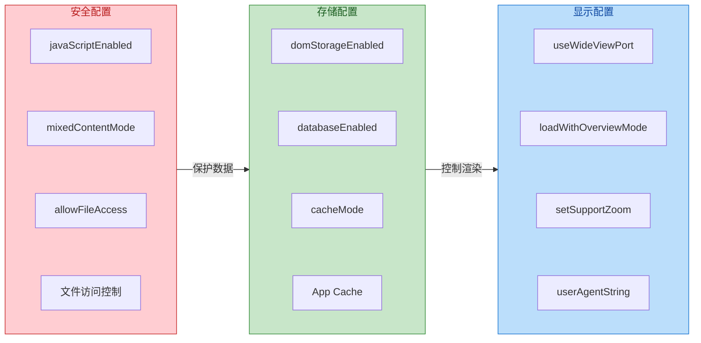

---

**📝 练习题**

在一个电商 App 中，用户在原生界面登录成功后，需要跳转到 WebView 展示的 H5 个人中心页面。以下关于 Cookie 同步的说法，哪一项是**错误**的？

A. 必须在调用 `WebView.loadUrl()` 之前完成 Cookie 同步，否则首次请求不会携带 Cookie


B. 调用 `CookieManager.setCookie()` 后必须调用 `flush()` 方法，否则 App 被杀死后 Cookie 会丢失


C. `CookieManager` 是单例模式，同一应用内所有 WebView 实例共享同一份 Cookie 存储


D. 可以通过设置 `WebViewClient` 的监听器来实时感知 Cookie 的增删改变化


**【答案】** D

**【解析】** `CookieManager` 没有提供 Cookie 变更的监听机制（如 `OnCookieChangeListener`），这是其 API 设计的缺陷。如果需要感知 Cookie 变化，只能通过 JavaScript 桥接、URL Scheme 约定或定时轮询等间接方式实现。选项 A 正确，因为 Cookie 必须在请求发出前写入才能被携带；选项 B 正确，`flush()` 负责将内存中的 Cookie 持久化到磁盘数据库；选项 C 正确，`CookieManager.getInstance()` 返回的是全局单例，Cookie 存储是进程级共享的。

---

## 安全网络配置

在移动互联网时代，应用与服务器之间的数据传输安全至关重要。Android 从 7.0 (API 24) 开始引入了 **Network Security Configuration** 机制，允许开发者以声明式的方式定义应用的网络安全策略，而无需修改代码。这一机制的核心思想是"**安全即配置**"——将 HTTPS 证书信任、明文流量控制、证书锁定等安全策略外部化到 XML 文件中，既提升了可维护性，也增强了安全审计的透明度。

在此之前，开发者需要在代码中手动实现 `TrustManager`、`HostnameVerifier` 等接口来定制 TLS 行为，这不仅容易出错，还可能因错误实现（如信任所有证书）而引入严重安全漏洞。Network Security Configuration 的出现，将这些容易犯错的底层操作抽象为简洁的 XML 声明，大幅降低了安全配置的门槛。

### NetworkSecurityConfig XML 配置详解

Network Security Configuration 的核心是位于 `res/xml/` 目录下的配置文件（通常命名为 `network_security_config.xml`），并在 `AndroidManifest.xml` 中通过 `android:networkSecurityConfig` 属性引用。

**基础引用方式：**

```xml
<!-- AndroidManifest.xml -->
<application
    android:networkSecurityConfig="@xml/network_security_config"
    ... >
    <!-- 应用组件 -->
</application>
```

配置文件的根元素是 `<network-security-config>`，内部可包含三类核心子元素：

1. **`<base-config>`**：定义应用的全局默认安全策略，影响所有网络连接
2. **`<domain-config>`**：为特定域名定义差异化策略，可覆盖全局配置
3. **`<debug-overrides>`**：仅在 `android:debuggable="true"` 时生效的调试配置

**完整配置示例：**

```xml
<?xml version="1.0" encoding="utf-8"?>
<!-- res/xml/network_security_config.xml -->
<network-security-config>

    <!-- 全局默认配置：适用于所有未被 domain-config 覆盖的连接 -->
    <base-config cleartextTrafficPermitted="false">
        <!-- 信任系统预装的 CA 证书 -->
        <trust-anchors>
            <certificates src="system"/>
        </trust-anchors>
    </base-config>

    <!-- 针对 api.example.com 的特定配置 -->
    <domain-config cleartextTrafficPermitted="false">
        <!-- includeSubdomains 表示子域名也遵循此规则 -->
        <domain includeSubdomains="true">api.example.com</domain>
        <trust-anchors>
            <!-- 信任系统 CA -->
            <certificates src="system"/>
            <!-- 同时信任应用内置的自签名证书 -->
            <certificates src="@raw/my_ca_cert"/>
        </trust-anchors>
        <!-- 证书锁定配置 -->
        <pin-set expiration="2025-12-31">
            <pin digest="SHA-256">BASE64_ENCODED_HASH</pin>
            <pin digest="SHA-256">BACKUP_PIN_HASH</pin>
        </pin-set>
    </domain-config>

    <!-- 调试模式专用配置：仅 debuggable 构建生效 -->
    <debug-overrides>
        <trust-anchors>
            <!-- 调试时额外信任用户安装的证书（如 Charles 代理证书） -->
            <certificates src="user"/>
        </trust-anchors>
    </debug-overrides>

</network-security-config>
```

**配置继承与优先级机制：**

理解配置的继承关系对于正确使用该特性至关重要。Android 系统在确定某个连接的安全策略时，遵循以下优先级（从高到低）：

1. **精确匹配的 `<domain-config>`**：如果目标域名被某个 `<domain-config>` 精确覆盖
2. **父域名的 `<domain-config>`**（需设置 `includeSubdomains="true"`）
3. **`<base-config>`**：全局默认配置
4. **平台默认值**：若未提供任何配置，使用系统默认策略

平台默认值随 API 级别演进：
- **API 23 及以下**：默认信任系统 CA 和用户 CA，允许明文流量
- **API 24-27**：默认仅信任系统 CA，允许明文流量
- **API 28+**：默认仅信任系统 CA，**禁止明文流量**

这一演进路径体现了 Android 平台"默认安全"(Secure by Default) 的设计理念——随着版本迭代，安全基线不断提升。

**`<trust-anchors>` 证书信任源详解：**

`<certificates>` 元素的 `src` 属性支持三种值：

| src 值 | 含义 | 典型场景 |
|--------|------|----------|
| `system` | 系统预装的 CA 证书（存储于 `/system/etc/security/cacerts/`） | 生产环境，信任主流 CA 签发的证书 |
| `user` | 用户手动安装的证书（存储于设备的用户凭据存储） | 调试环境，配合抓包工具使用 |
| `@raw/filename` | 应用 `res/raw/` 目录下的证书文件 | 自签名证书、内部 PKI、企业私有 CA |

特别值得注意的是，在 API 24+ 设备上，**用户证书默认不被信任**，这意味着用户即使安装了抓包工具（如 Charles、Fiddler）的根证书，也无法拦截应用的 HTTPS 流量——除非应用在 `<debug-overrides>` 中显式允许。这一设计显著提升了应用数据的安全性，但也给开发调试带来了挑战。

### 明文流量限制 cleartextTraffic

**明文流量（Cleartext Traffic）** 指的是未经 TLS/SSL 加密的 HTTP 通信。在 `network_security_config.xml` 中，通过 `cleartextTrafficPermitted` 属性控制是否允许明文流量。

**为什么要禁止明文流量？**

HTTP 明文传输存在三大安全风险：
1. **窃听（Eavesdropping）**：中间人可读取传输内容，包括敏感数据
2. **篡改（Tampering）**：攻击者可修改请求或响应内容
3. **伪装（Impersonation）**：无法验证服务器身份，易受钓鱼攻击

从 **Android 9 (API 28)** 开始，系统默认禁止所有明文流量。如果应用尝试发起 HTTP 请求，将收到 `java.net.UnknownServiceException: CLEARTEXT communication to xxx not permitted` 异常。

**配置方式对比：**

**方式一：在 NetworkSecurityConfig 中配置（推荐）**

```xml
<!-- 全局禁止明文，但允许特定域名 -->
<network-security-config>
    <base-config cleartextTrafficPermitted="false"/>
    
    <!-- 遗留系统仅支持 HTTP，临时豁免 -->
    <domain-config cleartextTrafficPermitted="true">
        <domain includeSubdomains="false">legacy.internal.com</domain>
    </domain-config>
</network-security-config>
```

**方式二：在 AndroidManifest.xml 中配置（简单但不灵活）**

```xml
<!-- 全局开关，无法针对域名差异化 -->
<application
    android:usesCleartextTraffic="true"
    ... >
</application>
```

**两种方式的优先级关系**：`network_security_config.xml` 的配置优先级高于 `android:usesCleartextTraffic`。如果两者都存在，以 XML 配置为准。

**明文流量的检测机制：**

Android 系统通过 `NetworkSecurityPolicy` 类在运行时强制执行明文流量策略。当应用使用标准网络 API（如 `HttpURLConnection`、`OkHttp`、`Retrofit`）发起请求时，系统会在连接建立前检查目标域名是否允许明文流量：

```kotlin
// 系统内部检查逻辑（简化示意）
// 位于 libcore/ojluni/src/main/java/java/net/PlainSocketImpl.java
fun connect(address: InetAddress, port: Int) {
    // 检查是否为非安全端口（非 443）且策略禁止明文
    if (!NetworkSecurityPolicy.getInstance()
            .isCleartextTrafficPermitted(address.hostName)) {
        throw UnknownServiceException(
            "CLEARTEXT communication to ${address.hostName} not permitted"
        )
    }
    // 继续建立连接...
}
```

这一检查发生在 Socket 连接建立阶段，属于**系统级强制执行**，应用代码无法绑过。但需注意，这仅适用于使用标准 Java/Android 网络 API 的场景；如果应用使用 NDK 直接操作 Socket，则不受此策略约束。

**处理遗留系统的最佳实践：**

实际开发中，可能需要与不支持 HTTPS 的旧系统对接。推荐的处理策略是：

1. **优先推动服务端升级**：即使是内网系统，也应部署 TLS
2. **若无法升级，使用域名级豁免**：仅对特定域名开放明文，而非全局允许
3. **添加注释说明原因**：在 XML 中注释为何需要豁免，便于后续审计
4. **设置提醒**：在项目管理工具中创建技术债务条目，定期评估是否可移除豁免

### 证书锁定 Certificate Pinning

**证书锁定（Certificate Pinning）** 是一种增强 HTTPS 安全性的技术，通过将服务器证书或公钥的"指纹"硬编码到客户端，确保应用只接受预期的证书，即使攻击者持有受信任 CA 签发的伪造证书，也无法实施中间人攻击。

**为什么需要证书锁定？**

标准的 HTTPS 信任模型基于"证书颁发机构（CA）信任链"——设备预装数百个受信任的根 CA，任何由这些 CA 签发的证书都被自动信任。这一模型存在固有风险：

1. **CA 被入侵**：历史上多次发生 CA 被攻破，签发虚假证书的事件（如 DigiNotar 事件）
2. **恶意 CA**：某些国家/地区的 CA 可能被政府强制要求签发用于监控的证书
3. **用户安装恶意证书**：用户可能被诱导安装攻击者的根证书
4. **企业 MITM 代理**：部分企业环境会部署 SSL 解密设备

证书锁定通过"只信任我认识的证书"的方式，将信任范围从"所有受信 CA"缩小到"特定证书/公钥"，大幅收窄攻击面。

**锁定什么？**

锁定策略的选择是一个安全性与可维护性的权衡：

| 锁定目标 | 安全性 | 灵活性 | 证书更换影响 |
|----------|--------|--------|-------------|
| 叶子证书（Leaf Certificate） | 最高 | 最低 | 证书更换需发版 |
| 中间证书（Intermediate CA） | 中等 | 中等 | 更换 CA 需发版 |
| 根证书（Root CA） | 较低 | 较高 | 仅更换 CA 需发版 |
| 公钥（Public Key） | 取决于级别 | 更高 | 证书轮换不影响（若公钥不变） |

**推荐策略**：锁定**叶子证书的公钥** + 配置**备用 Pin**。公钥锁定比证书锁定更灵活，因为证书续期时可以保持公钥不变；备用 Pin 可以是即将启用的新公钥，确保证书轮换时的平滑过渡。

**在 NetworkSecurityConfig 中配置证书锁定：**

```xml
<domain-config>
    <domain includeSubdomains="true">api.example.com</domain>
    
    <!-- pin-set: 证书锁定集合 -->
    <!-- expiration: 过期日期，过期后锁定失效，恢复为仅 CA 验证 -->
    <pin-set expiration="2025-12-31">
        <!-- 主要 Pin: 当前使用的证书公钥 SHA-256 哈希 -->
        <pin digest="SHA-256">AAAAAAAAAAAAAAAAAAAAAAAAAAAAAAAAAAAAAAAAAAA=</pin>
        <!-- 备用 Pin: 下一张证书的公钥，用于无缝轮换 -->
        <pin digest="SHA-256">BBBBBBBBBBBBBBBBBBBBBBBBBBBBBBBBBBBBBBBBBBB=</pin>
    </pin-set>
</domain-config>
```

**`expiration` 属性的重要性：**

`expiration` 是一个**安全阀**设计。证书锁定的风险在于，如果服务器证书更换而客户端未更新 Pin，应用将**完全无法连接服务器**。通过设置过期日期：
- 过期前：严格执行锁定验证
- 过期后：自动回退到标准 CA 验证，应用仍可连接

这一机制确保即使运维团队更换证书时忘记通知客户端团队，也不会导致应用完全不可用。建议将 `expiration` 设置为略长于证书有效期，并在到期前发布新版本更新 Pin。

**获取证书公钥 Pin 的方法：**

**方法一：使用 OpenSSL 命令行**

```bash
# 从服务器获取证书并计算公钥 SHA-256
echo | openssl s_client -servername api.example.com -connect api.example.com:443 2>/dev/null \
  | openssl x509 -pubkey -noout \
  | openssl pkey -pubin -outform DER \
  | openssl dgst -sha256 -binary \
  | openssl enc -base64
```

**方法二：使用 OkHttp 的错误信息**

在开发阶段，可以故意配置一个错误的 Pin，OkHttp 会在异常信息中输出正确的 Pin 值：

```kotlin
// 故意配置错误的 Pin
val client = OkHttpClient.Builder()
    .certificatePinner(
        CertificatePinner.Builder()
            .add("api.example.com", "sha256/WRONG_PIN_AAAAAAAAAA=")
            .build()
    )
    .build()

// 请求时会抛出异常，包含正确的 Pin:
// Certificate pinning failure!
// Peer certificate chain:
//   sha256/CORRECT_PIN_XXXXXXXX=: CN=api.example.com
//   sha256/INTERMEDIATE_PIN_YYY=: CN=DigiCert SHA2 ...
```

**OkHttp 与 NetworkSecurityConfig 的协作：**

值得注意的是，OkHttp 有自己的 `CertificatePinner` API，它与系统的 NetworkSecurityConfig **同时生效，取更严格者**。两者的关系如下：

- 连接建立时，首先经过系统的 NetworkSecurityConfig 验证
- 若通过，再经过 OkHttp 的 CertificatePinner 验证（如果配置了）
- 两道验证都通过，连接才能建立

因此，即使在 NetworkSecurityConfig 中配置了 Pin，在 OkHttp 中重复配置也不冲突——反而形成了"双保险"。

**证书锁定的完整流程图：**

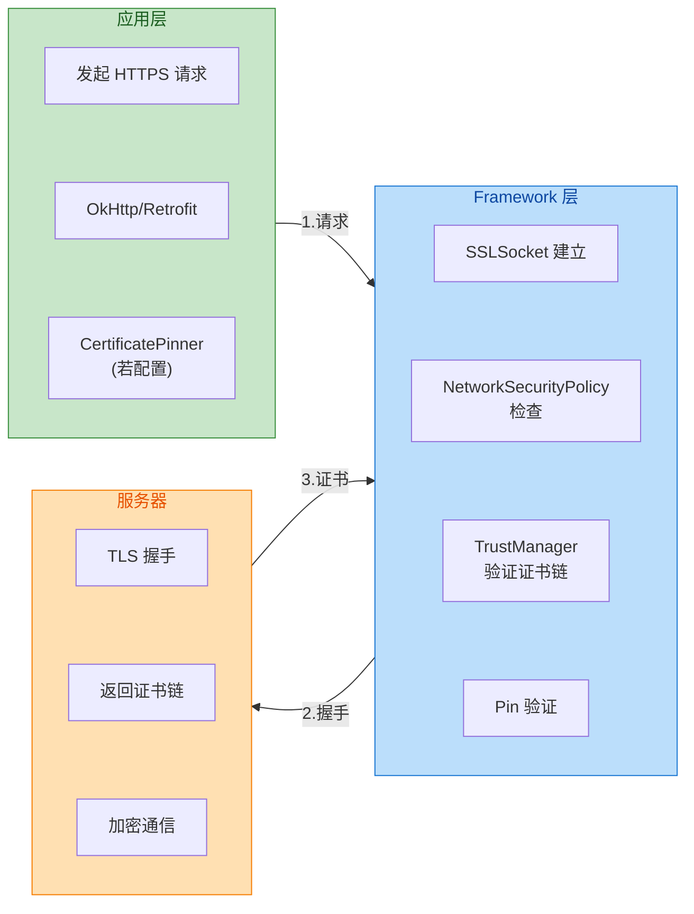

**证书锁定的局限性与替代方案：**

虽然证书锁定能有效防止 MITM 攻击，但它也带来维护成本：
1. **证书轮换需发版**：除非使用公钥锁定 + 备用 Pin
2. **增加调试难度**：开发者无法使用代理工具抓包（除非在 debug-overrides 中禁用）
3. **管理复杂**：多域名、多证书时配置繁琐

**替代/补充方案：**

- **Certificate Transparency (CT)**：要求 CA 将签发的证书记录到公开日志，便于发现伪造证书
- **HTTP Public Key Pinning (HPKP)**：通过 HTTP 响应头下发 Pin（已被 Chrome 废弃，因易造成自我 DoS）
- **动态 Pin 更新**：通过安全渠道（如推送）下发新 Pin，减少发版依赖

**调试环境的特殊处理：**

为了在开发阶段能够使用 Charles、Fiddler 等工具抓包分析，推荐在 `<debug-overrides>` 中临时放宽策略：

```xml
<debug-overrides>
    <trust-anchors>
        <!-- 信任用户安装的证书（如 Charles 根证书） -->
        <certificates src="user"/>
    </trust-anchors>
    <!-- 注意：这里不需要设置 cleartextTrafficPermitted -->
    <!-- 因为 debug-overrides 不支持该属性 -->
</debug-overrides>
```

这一配置仅在 `android:debuggable="true"` 的构建中生效（通常是 debug 构建变体），release 构建不受影响，确保生产环境的安全性。

---

**📝 练习题**

某 Android 应用需要满足以下安全需求：
1. 全局禁止 HTTP 明文流量
2. 访问 `api.prod.example.com` 及其子域名时启用证书锁定
3. 访问旧版内部系统 `legacy.internal.corp`（仅支持 HTTP）需要临时豁免
4. 开发阶段能使用 Charles 抓包

以下哪个配置能同时满足上述所有需求？

A. 在 `AndroidManifest.xml` 中设置 `android:usesCleartextTraffic="false"`，并在 OkHttp 中配置 CertificatePinner

B. 在 `network_security_config.xml` 中设置 `<base-config cleartextTrafficPermitted="false"/>`，为 `api.prod.example.com` 配置 `<pin-set>`，为 `legacy.internal.corp` 配置 `cleartextTrafficPermitted="true"` 的 `<domain-config>`，并在 `<debug-overrides>` 中添加 `<certificates src="user"/>`

C. 在 `network_security_config.xml` 中设置 `<base-config cleartextTrafficPermitted="true"/>`，仅为 `api.prod.example.com` 单独禁止明文并配置 Pin

D. 在代码中实现自定义 `TrustManager`，手动验证证书指纹

**【答案】** B

**【解析】** 

- **选项 A** 无法满足需求 3。`android:usesCleartextTraffic="false"` 是全局配置，无法为特定域名开放明文流量豁免。
  
- **选项 B** 完整满足所有需求：`base-config` 全局禁止明文实现需求 1；为 `api.prod.example.com` 配置 `pin-set` 实现需求 2；为 `legacy.internal.corp` 单独开放明文实现需求 3；`debug-overrides` 中信任用户证书实现需求 4。

- **选项 C** 的 `base-config` 允许明文，意味着除了 `api.prod.example.com` 之外的所有域名都允许 HTTP，违反需求 1"全局禁止"的要求。

- **选项 D** 虽然技术上可行，但属于不推荐的做法。自定义 `TrustManager` 容易出错，且无法通过 XML 配置享受声明式管理的便利（如 `debug-overrides` 自动区分构建类型）。Android 官方明确推荐使用 NetworkSecurityConfig 而非代码实现。

---

## 本章小结

本章系统性地讲解了 Android 应用层网络通信的核心知识体系，从底层协议原理到上层 API 使用，从数据解析到安全配置，构建了一套完整的网络开发知识框架。

### 核心知识回顾

**网络协议栈**是一切网络通信的基石。TCP/IP 四层模型（应用层、传输层、网络层、链路层）为数据传输提供了可靠的分层架构。HTTP/1.1 的持久连接（Keep-Alive）解决了早期版本频繁建立连接的性能问题，而 HTTP/2 通过多路复用（Multiplexing）、头部压缩（HPACK）和服务器推送（Server Push）进一步提升了传输效率。HTTPS 在 HTTP 基础上引入 TLS 加密层，通过非对称加密交换密钥、对称加密传输数据的方式，确保了通信的机密性和完整性。

**HttpURLConnection** 作为 Android 原生网络 API，虽然功能完备但使用繁琐。开发者需要手动管理连接、处理流操作、配置超时参数，且缺乏现代化的异步支持和拦截器机制。正因如此，OkHttp、Retrofit 等第三方库成为了实际开发的首选方案。理解 HttpURLConnection 的工作原理，有助于我们更好地理解上层封装库的设计思想。

**数据解析**是网络开发的关键环节。XML 解析有三种主流方案：DOM 将整个文档加载为树结构，适合小型文档和随机访问；SAX 采用事件驱动模式，内存占用低但编程复杂；Pull 解析器结合两者优点，是 Android 推荐方案。JSON 解析同样选择丰富：原生 JSONObject 轻量但功能有限；GSON 通过反射实现自动序列化，使用简便但有性能开销；Moshi 针对 Kotlin 优化，支持 null 安全和默认值；Kotlin Serialization 是编译期方案，性能最优且类型安全。

**网络状态监测**对于构建健壮的网络应用至关重要。ConnectivityManager 提供了获取当前网络状态的能力，NetworkCapabilities 可以精确检查网络能力（如是否计费、带宽估算），NetworkCallback 支持实时监听网络变化事件。从 Android 7.0 开始，静态广播监听网络变化的方式已被废弃，必须使用动态注册或 NetworkCallback。

**TrafficStats** 为应用提供了流量统计能力，可以按 UID 维度获取发送/接收字节数，还可以通过 Tag 标记 Socket 来区分不同业务的流量消耗，这对于流量敏感型应用的优化具有重要意义。

**WebView 网络交互**涉及 Native 与 Web 的协作。WebViewClient 可以拦截资源请求实现自定义加载逻辑，CookieManager 负责同步 Native 和 WebView 的 Cookie 状态，WebSettings 则控制缓存策略、JavaScript 开关等行为。理解 WebView 的网络机制，对于混合开发（Hybrid）应用至关重要。

**网络安全配置**是现代 Android 开发的必修课。Network Security Config 通过 XML 声明式地配置网络安全策略，包括明文流量限制（cleartextTrafficPermitted）、自定义信任锚（Trust Anchors）和证书锁定（Certificate Pinning）。从 Android 9 开始，默认禁止明文 HTTP 通信，开发者必须显式配置例外或全面迁移至 HTTPS。

### 知识体系架构图

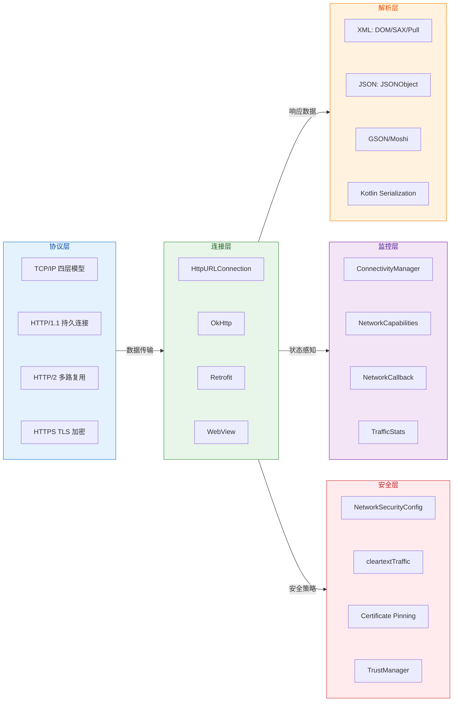

### 最佳实践总结

1. **协议选择**：生产环境必须使用 HTTPS，HTTP/2 能显著提升性能
2. **网络库选型**：OkHttp + Retrofit 是当前主流组合，避免直接使用 HttpURLConnection
3. **JSON 解析**：Kotlin 项目推荐 Moshi 或 Kotlin Serialization，Java 项目可选 GSON
4. **网络监听**：使用 NetworkCallback 代替广播监听，注意及时注销避免内存泄漏
5. **安全配置**：配置 Network Security Config，生产环境考虑启用证书锁定
6. **流量优化**：使用 TrafficStats 监控流量消耗，针对计费网络优化数据传输

---

**📝 练习题 1**

关于 Android 网络状态监测，以下说法正确的是？

A. Android 7.0 以上仍可通过静态注册 `CONNECTIVITY_ACTION` 广播监听网络变化

B. `NetworkCapabilities.NET_CAPABILITY_NOT_METERED` 表示当前网络是计费网络

C. `NetworkCallback.onAvailable()` 回调在主线程执行，可直接进行 UI 操作

D. `ConnectivityManager.registerDefaultNetworkCallback()` 需要 API 24 及以上

**【答案】** D

**【解析】** 
- 选项 A 错误：从 Android 7.0 (API 24) 开始，应用无法在 Manifest 中静态注册 `CONNECTIVITY_ACTION` 广播来接收网络变化通知，必须使用动态注册或 `NetworkCallback`
- 选项 B 错误：`NET_CAPABILITY_NOT_METERED` 表示网络**不是**计费网络（非计量网络），名称中的 NOT 表示否定
- 选项 C 错误：`NetworkCallback` 的回调默认在 ConnectivityThread 执行，不是主线程，直接操作 UI 会导致崩溃
- 选项 D 正确：`registerDefaultNetworkCallback()` 方法确实需要 API 24 及以上版本才能使用

---

**📝 练习题 2**

在 Android 应用中配置网络安全策略时，以下配置片段的作用是什么？

```xml
<network-security-config>
    <domain-config cleartextTrafficPermitted="false">
        <domain includeSubdomains="true">api.example.com</domain>
        <pin-set expiration="2025-12-31">
            <pin digest="SHA-256">base64EncodedPublicKey==</pin>
        </pin-set>
    </domain-config>
</network-security-config>
```

A. 允许 `api.example.com` 及其子域名使用明文 HTTP 通信

B. 对 `api.example.com` 启用证书锁定，且锁定策略将于 2025-12-31 后失效

C. 仅信任系统预装的 CA 证书，不信任用户安装的证书

D. 配置 `api.example.com` 使用自签名证书进行 HTTPS 通信

**【答案】** B

**【解析】**
- 选项 A 错误：`cleartextTrafficPermitted="false"` 明确**禁止**明文 HTTP 通信，而非允许
- 选项 B 正确：`<pin-set>` 配置了证书锁定（Certificate Pinning），`expiration` 属性指定了锁定策略的过期时间。过期后，系统将不再强制执行证书锁定，退回到标准的证书链验证。这是一种安全的"软着陆"机制，避免因证书更换导致应用无法联网
- 选项 C 错误：此配置没有涉及 `<trust-anchors>` 设置，因此与系统/用户证书信任无关
- 选项 D 错误：证书锁定（Pinning）是将服务器证书或公钥的哈希值硬编码到应用中，与自签名证书是不同的概念。自签名证书需要通过 `<trust-anchors>` 配置自定义 CA

---

