---

# Android 协程集成

---

## 协程调度器 Dispatchers

协程（Coroutine）之所以能在 Android 应用层大放异彩，根本原因之一在于它拥有一套精巧的 **调度器（Dispatcher）** 机制。调度器决定了协程体内的代码 **在哪个线程或线程池上执行**，这对于 Android 这种"主线程不可阻塞"的 UI 框架来说至关重要。`kotlinx.coroutines` 库为我们预置了四种调度器：`Dispatchers.Main`、`Dispatchers.IO`、`Dispatchers.Default` 以及 `Dispatchers.Unconfined`。理解它们各自的定位、底层线程模型和适用场景，是写出高效、安全的 Android 协程代码的第一步。

在传统的多线程编程中，开发者需要手动创建 `Thread`、管理 `ExecutorService`、并通过 `Handler.post()` 将结果切回主线程。协程调度器将这一切封装在了一个统一的抽象之下——你只需要声明 **"我想在哪种线程上运行"**，协程框架就会帮你完成线程的获取、切换和归还。这种声明式的线程管理方式，不仅减少了样板代码，更大幅降低了并发编程中常见的线程安全问题。

### Dispatcher 的本质：CoroutineDispatcher

要深入理解四种调度器，必须先搞清楚 `CoroutineDispatcher` 这个基类到底在做什么。在 Kotlin 协程的设计中，每一个协程都有一个与之关联的 **CoroutineContext（协程上下文）**，而 `CoroutineDispatcher` 正是 `CoroutineContext` 中的一个 Element。当协程需要恢复执行（resume）时，它不会直接在当前线程上继续跑，而是将"恢复执行"这个动作封装成一个 `Runnable`，交给 Dispatcher 来决定在哪个线程上执行这个 `Runnable`。

从源码层面看，`CoroutineDispatcher` 最核心的方法是 `dispatch(context, block)`，其职责就是把一个 `Runnable` 调度到目标线程去执行。不同的 Dispatcher 子类通过覆写这个方法，将 `Runnable` 提交到不同的线程池或消息队列中，从而实现了不同的调度策略。还有一个 `isDispatchNeeded(context)` 方法，返回 `true` 则需要经过 `dispatch()` 调度，返回 `false` 则直接在当前线程继续执行（`Unconfined` 就是利用这一点）。

```kotlin
// CoroutineDispatcher 核心抽象（简化版）
public abstract class CoroutineDispatcher : AbstractCoroutineContextElement(ContinuationInterceptor) {

    // 判断是否需要进行线程调度
    // 绝大多数 Dispatcher 返回 true，表示需要把任务提交到目标线程
    // Unconfined 返回 false，表示直接在当前线程继续执行
    public open fun isDispatchNeeded(context: CoroutineContext): Boolean = true

    // 核心方法：将 block（Runnable）调度到目标线程执行
    // 不同子类有不同实现：Main 提交到 Handler、IO/Default 提交到线程池
    public abstract fun dispatch(context: CoroutineContext, block: Runnable)
}
```

这里有一个关键的接口继承关系需要注意：`CoroutineDispatcher` 实现了 `ContinuationInterceptor` 接口。在协程的挂起-恢复模型中，每当一个挂起函数（suspend function）恢复时，`ContinuationInterceptor` 会拦截恢复操作，将其包装后交给 `dispatch()` 方法。这就是调度器能"透明地"切换线程的底层原因——**它拦截了 Continuation 的恢复过程**。

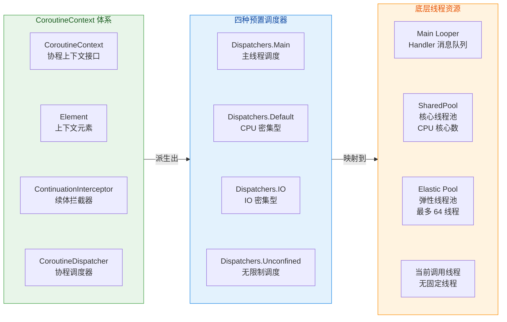

这张图清晰展示了三层关系：**协程上下文体系** 定义了调度器的抽象，**四种预置调度器** 是具体实现，它们各自**映射到不同的底层线程资源**。接下来我们逐一深入每种调度器。

---

### Dispatchers.Main — 主线程调度器

#### 定位与使命

`Dispatchers.Main` 是 Android 开发中使用频率最高的调度器。它将协程体内的代码调度到 **主线程（UI 线程）** 执行。Android 的 UI 框架要求所有视图操作（`setText()`、`setVisibility()`、`RecyclerView.notifyDataSetChanged()` 等）必须在主线程上执行，否则会抛出 `CalledFromWrongThreadException`。因此，任何需要更新 UI 的协程代码，都必须运行在 `Dispatchers.Main` 上。

#### 底层实现：Handler + Looper

`Dispatchers.Main` 在 Android 平台上的具体实现类是 `HandlerDispatcher`（更准确地说是其内部类 `HandlerContext`）。它的 `dispatch()` 方法本质上就是调用 `Handler(Looper.getMainLooper()).post(block)`，将协程的恢复操作作为一条 `Message` 投递到主线程的 `MessageQueue` 中，等待 `Looper` 取出并执行。

这意味着，当你写下 `withContext(Dispatchers.Main) { textView.text = "Hello" }` 时，底层发生的事情和你手动调用 `runOnUiThread { textView.text = "Hello" }` 是等价的——都是通过 `Handler.post()` 将操作投递到主线程的消息队列。但协程的优势在于，你可以用顺序式的代码风格，将"在 IO 线程请求网络"和"在主线程更新 UI"无缝衔接，无需嵌套回调。

```kotlin
// Dispatchers.Main 的使用示例
// 假设在 Activity 或 Fragment 中
lifecycleScope.launch(Dispatchers.Main) { // 在主线程启动协程
    // 第一步：切到 IO 线程执行网络请求
    val result = withContext(Dispatchers.IO) {
        // 这里运行在 IO 线程池中
        repository.fetchUserData() // 挂起函数，不会阻塞主线程
    }
    // 第二步：withContext 返回后，自动恢复到 Main 调度器
    // 以下代码运行在主线程，可以安全地更新 UI
    binding.tvUserName.text = result.name   // 更新用户名文本
    binding.tvEmail.text = result.email     // 更新邮箱文本
    binding.progressBar.isVisible = false   // 隐藏加载进度条
}
```

需要注意的是，**`Dispatchers.Main` 需要平台依赖才能使用**。在纯 Kotlin/JVM 项目中如果没有引入 `kotlinx-coroutines-android` 库，直接使用 `Dispatchers.Main` 会抛出 `IllegalStateException: Module with the Main dispatcher is missing`。这是因为 `Dispatchers.Main` 采用了 **ServiceLoader** 机制来发现平台实现——`kotlinx-coroutines-android` 库通过 `META-INF/services` 注册了 `AndroidDispatcherFactory`，框架在首次访问 `Dispatchers.Main` 时会通过 ServiceLoader 加载这个工厂类，从而创建出基于 `Handler(Looper.getMainLooper())` 的调度器实例。

#### Main vs Main.immediate

`Dispatchers.Main` 有一个重要的变体——`Dispatchers.Main.immediate`。两者的区别在于：

- **`Dispatchers.Main`**：无论当前是否已经在主线程，都会通过 `Handler.post()` 把任务投递到消息队列尾部，等待下一轮调度。这意味着即使你已经在主线程，代码也不会立即执行，而是要"排队"。
- **`Dispatchers.Main.immediate`**：如果当前已经在主线程，则 **跳过 `post()` 直接执行**，避免不必要的重新调度开销。只有当前不在主线程时，才回退到 `Handler.post()` 方式。

在实际开发中，`lifecycleScope.launch {}` 和 `viewModelScope.launch {}` 默认使用的就是 `Dispatchers.Main.immediate`。这是一个非常有意义的优化——大多数时候我们在 Activity/Fragment 的生命周期回调（已经在主线程）中启动协程，使用 `immediate` 可以让协程体的第一段代码立即执行到第一个挂起点，而不是被 post 到队列末尾延迟一帧。关于 `Main.immediate` 的详细原理，将在下一节"主线程调度 MainDispatcher"中深入展开。

---

### Dispatchers.Default — CPU 密集型调度器

#### 定位与线程池模型

`Dispatchers.Default` 是专为 **CPU 密集型任务** 设计的调度器，适用于大量计算、数据排序、JSON 解析、复杂业务逻辑处理等场景。它的底层是一个 **共享线程池（Shared Pool）**，线程数量等于 **设备 CPU 核心数**（至少为 2）。例如，在一台 8 核手机上，`Dispatchers.Default` 的线程池包含 8 个线程。

为什么线程数等于 CPU 核心数？这是经典的并发理论：对于 CPU 密集型任务，线程数过多反而会因为频繁的上下文切换（Context Switch）而降低性能。最优策略是让线程数等于可用 CPU 核心数，这样每个核心专注运行一个线程，减少切换开销，达到最大吞吐量。

```kotlin
// Dispatchers.Default 的使用示例
lifecycleScope.launch {
    // 将 CPU 密集型计算切换到 Default 调度器
    val sortedList = withContext(Dispatchers.Default) {
        // 运行在 Default 线程池中（线程数 = CPU 核心数）
        val rawList = loadLargeDataSet()      // 假设加载了 100 万条数据
        rawList.sortedBy { it.timestamp }     // 排序操作消耗大量 CPU
    }
    // 回到 Main 调度器，安全地更新 UI
    adapter.submitList(sortedList) // 提交排序后的列表给 RecyclerView
}
```

一个常见的误区是将网络请求或文件读写放在 `Dispatchers.Default` 上。虽然这样做不会报错，但会**浪费宝贵的 CPU 线程资源**——IO 操作大部分时间都在等待（等待网络响应、等待磁盘读取），线程处于阻塞状态却占用着 Default 线程池中的一个位置，导致真正需要 CPU 的任务无线程可用。这就是 `Dispatchers.IO` 存在的意义。

#### 与 GlobalScope 的关系

值得一提的是，如果你使用 `GlobalScope.launch { }` 而不指定调度器，默认使用的就是 `Dispatchers.Default`。当然，在 Android 应用开发中，我们几乎不应该使用 `GlobalScope`——它没有生命周期绑定，容易造成内存泄漏和不必要的后台任务，应优先使用 `lifecycleScope` 或 `viewModelScope`。

---

### Dispatchers.IO — IO 密集型调度器

#### 定位与弹性线程池

`Dispatchers.IO` 是为 **IO 密集型任务** 量身打造的调度器，适用于网络请求、数据库读写、文件操作、SharedPreferences 读写等会产生线程阻塞等待的场景。它的底层是一个 **弹性线程池**，默认最大线程数为 **64**（或 CPU 核心数，取较大者，可通过系统属性 `kotlinx.coroutines.io.parallelism` 调整）。

为什么 IO 调度器需要这么多线程？因为 IO 操作的特点是"等待多、计算少"——线程大部分时间在等待网络数据到达或磁盘响应，CPU 实际上是空闲的。通过维护更多的线程，可以让大量 IO 任务并行等待，充分利用等待时间，提高整体吞吐量。即使有 64 个线程同时处于 IO 等待状态，对 CPU 的负担也很小。

#### IO 与 Default 共享线程池

一个常被忽略但非常重要的设计细节是：**`Dispatchers.IO` 和 `Dispatchers.Default` 共享同一个底层线程池**。它们并不是两个独立的 `ExecutorService`，而是同一个线程池上的两种 **调度视图（view）**。区别仅在于并发限制：

- `Default` 视图限制并发任务数为 CPU 核心数。
- `IO` 视图限制并发任务数为 64（默认值）。

这种设计带来了一个巨大的优势——**从 `Dispatchers.Default` 切换到 `Dispatchers.IO`（或反之）时，很可能不需要实际的线程切换**。因为底层是同一个线程池，当前线程可能同时被两种 Dispatcher 的视图所认可，协程可以直接在当前线程继续执行，避免了线程上下文切换的开销。

```kotlin
// IO 与 Default 协作示例
lifecycleScope.launch {
    val processedData = withContext(Dispatchers.IO) {
        // 第一步：在 IO 调度器中进行网络请求
        val rawJson = apiService.fetchData()           // 网络请求，IO 等待

        // 第二步：切到 Default 进行 CPU 密集型解析
        // 由于共享线程池，这次切换的开销极低
        withContext(Dispatchers.Default) {
            JsonParser.parse(rawJson)                  // JSON 解析，消耗 CPU
        }
    }
    // 回到 Main，更新 UI
    renderData(processedData)
}
```

#### limitedParallelism() — 自定义并发度

从 `kotlinx.coroutines 1.6` 开始，`Dispatchers.IO` 提供了 `limitedParallelism(n)` 方法，允许你创建一个独立的并发限制视图。这在某些场景下非常有用，例如你希望数据库操作最多使用 4 个线程，以免过多的并发连接压垮 SQLite：

```kotlin
// 创建一个独立的调度器视图，限制并发度为 4
// 注意：这不会从 IO 的 64 个线程额度中扣除，而是独立的
val databaseDispatcher = Dispatchers.IO.limitedParallelism(4)

suspend fun queryDatabase(): List<User> {
    return withContext(databaseDispatcher) {           // 最多 4 个协程同时执行
        database.userDao().getAllUsers()               // Room 数据库查询
    }
}
```

`limitedParallelism()` 在 `Dispatchers.IO` 上调用时，创建的是一个 **额外的独立池**，其并发额度不与 IO 的默认 64 线程额度共享。而在 `Dispatchers.Default` 上调用时，创建的是一个 **受限的子视图**，其并发额度从 Default 的 CPU 核心数额度中分配。这一差异需要特别留意。

---

### Dispatchers.Unconfined — 无限制调度器

#### 定位与执行模型

`Dispatchers.Unconfined` 是四种调度器中最特殊的一个——它 **不限定协程运行在哪个线程上**。协程启动时，在调用者所在的线程直接执行；遇到挂起点后恢复时，在恢复它的那个线程上继续执行。也就是说，协程可能在执行过程中"漂移"到不同的线程上。

这种行为源于 `Unconfined` 的 `isDispatchNeeded()` 方法返回 `false`——它告诉协程框架"不需要进行任何调度"，直接在当前线程运行即可。这避免了线程切换的开销，但也意味着你完全无法预测代码将在哪个线程上执行。

```kotlin
// Dispatchers.Unconfined 的执行线程"漂移"演示
lifecycleScope.launch(Dispatchers.Unconfined) {
    // 启动时：运行在调用 launch 的线程（通常是主线程）
    println("Step 1: ${Thread.currentThread().name}")  // 输出: main

    // delay 是一个挂起函数，恢复由 kotlinx.coroutines 调度线程完成
    delay(100)

    // 恢复后：运行在 delay 内部使用的调度线程上
    println("Step 2: ${Thread.currentThread().name}")  // 输出: kotlinx.coroutines.DefaultExecutor
    // 注意！此时已经不在主线程了，操作 UI 会崩溃！
}
```

#### 适用场景与警告

由于线程"漂移"的不可预测性，**`Dispatchers.Unconfined` 在 Android 应用层开发中几乎不应该使用**。它主要用于以下特殊场景：

1. **单元测试**：在测试环境中，不关心线程归属，只想让协程立即执行以简化断言逻辑。不过更推荐使用 `kotlinx-coroutines-test` 提供的 `UnconfinedTestDispatcher` 或 `StandardTestDispatcher`。
2. **不涉及 UI、不依赖特定线程的纯计算协程**：例如某些不需要线程安全保证的内部管道操作。
3. **框架级别的性能优化**：在极少数需要避免调度开销的底层代码中使用。

在 Android 应用层代码中，如果你发现自己想用 `Unconfined`，几乎总是应该退一步想想是否有更安全的替代方案。不确定用什么调度器时，使用 `Dispatchers.Main` 处理 UI 任务、`Dispatchers.IO` 处理 IO 任务、`Dispatchers.Default` 处理计算任务，是最稳妥的选择。

---

### 四种调度器全景对比

下面通过一张对比图，完整呈现四种调度器的核心差异：

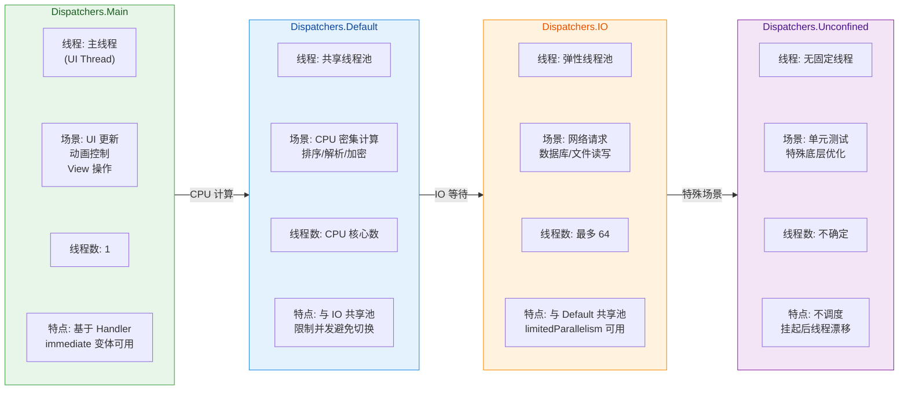

### withContext 调度器切换的成本

在实际开发中，我们频繁使用 `withContext(dispatcher)` 在不同调度器之间切换。一个自然而然的问题是：**切换调度器的开销有多大？**

调度器切换涉及两个维度的成本：

1. **协程调度成本**：`withContext` 需要挂起当前协程，把恢复操作封装成 `Runnable`，提交给目标 Dispatcher 的 `dispatch()` 方法。这本身是一个轻量级操作（对象创建 + 方法调用），开销在纳秒级别。

2. **线程切换成本**：如果目标 Dispatcher 映射到不同的线程（例如从 Main 切到 IO），则涉及操作系统层面的线程上下文切换（Context Switch），开销在微秒级别。但如果是 **IO ↔ Default** 之间的切换，由于共享线程池，很可能不需要真正的线程切换——协程只是换了一个"并发限制视图"，继续在同一个线程上跑。

因此，对于性能敏感的代码，有两条实用建议：

- **避免在紧凑循环中频繁使用 `withContext` 切换调度器**。如果你需要在循环中交替进行 IO 和计算操作，最好把整个循环放在一个调度器中，用其他方式（如 `Channel`）来分离关注点。
- **IO ↔ Default 的切换相对廉价**，不必过度优化。真正昂贵的是 **Main ↔ IO/Default** 的切换，因为涉及主线程 Handler 的消息投递。

```kotlin
// ❌ 不推荐：循环内频繁切换调度器
lifecycleScope.launch {
    for (item in largeList) {
        val data = withContext(Dispatchers.IO) { fetchData(item) }     // 每次切到 IO
        val result = withContext(Dispatchers.Default) { parse(data) }  // 每次切到 Default
        withContext(Dispatchers.Main) { updateUI(result) }             // 每次切到 Main
        // 每轮循环至少 3 次调度器切换，累计开销巨大
    }
}

// ✅ 推荐：批量操作，减少切换
lifecycleScope.launch {
    // 在 IO 调度器中批量完成所有网络请求
    val allData = withContext(Dispatchers.IO) {
        largeList.map { fetchData(it) }          // 一次性完成全部 IO
    }
    // 在 Default 调度器中批量解析
    val allResults = withContext(Dispatchers.Default) {
        allData.map { parse(it) }                // 一次性完成全部解析
    }
    // 回到 Main，一次性更新 UI
    allResults.forEach { updateUI(it) }          // 只切换一次回主线程
}
```

### 自定义调度器

除了预置的四种调度器，你也可以基于自己的 `ExecutorService` 创建自定义调度器。Kotlin 提供了 `Executor.asCoroutineDispatcher()` 扩展函数：

```kotlin
// 基于 Java ExecutorService 创建自定义调度器
val singleThreadDispatcher = Executors
    .newSingleThreadExecutor()        // 创建单线程执行器
    .asCoroutineDispatcher()          // 转换为协程调度器

lifecycleScope.launch {
    withContext(singleThreadDispatcher) {
        // 所有在此块内的代码保证在同一个线程上串行执行
        // 适用于需要线程安全但不想用锁的场景
        sharedCounter++                // 无需同步，单线程保证安全
    }
}

// ⚠️ 重要：自定义调度器使用的线程池需要手动关闭
// 否则线程会一直存活，造成资源泄漏
// singleThreadDispatcher.close()
```

自定义调度器在以下场景中有用武之地：需要严格的单线程执行保证（替代 `synchronized` 锁）、需要与第三方库指定的线程池整合、或需要特殊的线程优先级设置。但大多数 Android 应用层开发场景中，预置的三种调度器（Main、IO、Default）已经足够覆盖需求。

---

**📝 练习题**

在一个 Android Activity 中，以下代码运行后 `Log` 输出的线程名是什么？

```kotlin
lifecycleScope.launch {
    Log.d("Test", "A: ${Thread.currentThread().name}")
    withContext(Dispatchers.IO) {
        Log.d("Test", "B: ${Thread.currentThread().name}")
        withContext(Dispatchers.Default) {
            Log.d("Test", "C: ${Thread.currentThread().name}")
        }
        Log.d("Test", "D: ${Thread.currentThread().name}")
    }
    Log.d("Test", "E: ${Thread.currentThread().name}")
}
```

A. A=main, B=IO线程, C=Default线程(与B不同), D=IO线程, E=main


B. A=main, B=IO线程, C=IO线程(可能与B相同), D=IO线程, E=main


C. A=main, B=IO线程, C=Default线程(与B不同), D=Default线程(与B不同), E=main


D. A=main, B=IO线程, C=IO线程(可能与B相同), D=Default线程(与C相同), E=main


**【答案】** B

**【解析】** `lifecycleScope.launch` 默认使用 `Dispatchers.Main.immediate`，所以 A 输出 main。进入 `withContext(Dispatchers.IO)` 后，B 运行在 IO 线程池的某个线程上。关键在于 C：`Dispatchers.IO` 和 `Dispatchers.Default` **共享同一个底层线程池**，`withContext(Dispatchers.Default)` 切换的只是"并发限制视图"，当前线程很可能（大概率）直接复用 B 所在的线程而不进行实际的线程切换，因此 C 的线程名可能与 B 相同。D 处从 Default 返回到外层的 IO 上下文，同样由于共享线程池，也很可能继续在同一个线程上运行。最后 E 通过 `withContext` 返回到 Main 调度器，输出 main。选项 B 正确地描述了 IO 和 Default 共享线程池导致线程可能相同的行为，而选项 A 错误地假设 Default 线程一定与 IO 线程不同。

---

## 主线程调度 MainDispatcher

Android 应用的 UI 体系建立在单线程模型之上——只有主线程（也叫 UI 线程）才能安全地触摸 View 层级树。当我们在协程中写下 `withContext(Dispatchers.Main) { textView.text = "Hello" }` 时，背后到底发生了什么？协程的 `Dispatchers.Main` 是如何与 Android 主线程的 `Looper/Handler` 机制桥接的？`Main` 与 `Main.immediate` 的差异在实际开发中会带来哪些微妙的时序影响？这些问题的答案，都藏在 `kotlinx-coroutines-android` 模块中一个叫做 **`HandlerContext`** 的类里。本节将从底层实现到上层使用，把主线程调度的完整链路讲透。

---

### HandlerContext 实现

#### 从 ServiceLoader 到 Main Dispatcher 的发现机制

`Dispatchers.Main` 并不是在 `kotlinx-coroutines-core` 中硬编码的；它是通过 **SPI（Service Provider Interface）** 机制在运行时动态发现的。`kotlinx-coroutines-core` 定义了一个接口 `MainDispatcherFactory`，而 `kotlinx-coroutines-android` 模块在其 `META-INF/services` 目录下注册了一个实现类 `AndroidDispatcherFactory`。当你第一次访问 `Dispatchers.Main` 时，协程库会通过 `ServiceLoader`（或 R8 优化后的快速路径 `FastServiceLoader`）扫描 classpath，找到 `AndroidDispatcherFactory`，然后调用其 `createDispatcher()` 方法，最终返回一个 **`HandlerContext`** 实例。

这个设计的精妙之处在于 **平台解耦**：`kotlinx-coroutines-core` 是纯 Kotlin/JVM 库，不依赖 Android SDK。只有当 `kotlinx-coroutines-android` 被引入依赖时，`Dispatchers.Main` 才会被"填充"为基于 `Handler` 的调度器。如果你在纯 JVM 环境（比如单元测试）中访问 `Dispatchers.Main` 而没有添加任何主线程调度器模块，就会抛出 `IllegalStateException: Module with the Main dispatcher is missing`。

整个发现链路可以概括为：

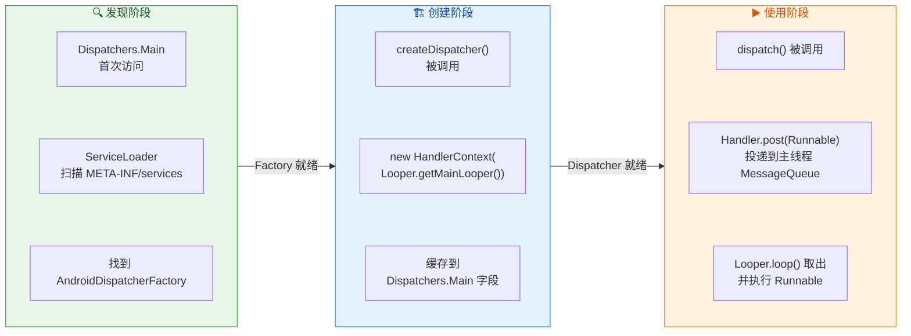

#### HandlerContext 的核心结构

`HandlerContext` 继承自 `CoroutineDispatcher`，内部持有一个指向主线程 `Looper` 的 `Handler` 引用。它的核心职责非常单一——把协程的 **continuation（续体）** 包装成 `Runnable`，然后通过 `Handler.post()` 投递到主线程的 `MessageQueue` 中。当主线程的 `Looper` 轮询到这条 `Message` 时，`Runnable.run()` 被执行，协程就在主线程上恢复了。

以下是其关键源码的简化版本（基于 `kotlinx-coroutines-android` 源码精简）：

```kotlin
// HandlerContext 是 Dispatchers.Main 在 Android 上的真正实现
// 它继承自 CoroutineDispatcher，额外实现了 Delay 接口以支持 delay() 挂起
internal class HandlerContext private constructor(
    private val handler: Handler,       // 指向主线程 Looper 的 Handler 实例
    private val name: String?,          // 调试用名称，如 "Dispatchers.Main"
    private val invokeImmediately: Boolean // 是否为 immediate 模式（关键区分点）
) : HandlerDispatcher(), Delay {

    // 构造函数：外部传入 handler，默认 name 为 null，非 immediate 模式
    constructor(
        handler: Handler,
        name: String? = null
    ) : this(handler, name, false)

    // immediate 属性：返回一个 invokeImmediately = true 的新 HandlerContext
    // 这就是 Dispatchers.Main.immediate 的来源
    override val immediate: HandlerContext =
        if (invokeImmediately) this  // 如果自身已经是 immediate，直接返回 this 避免重复包装
        else HandlerContext(handler, name, true) // 否则创建一个新的 immediate 版本

    // 核心方法：判断当前线程是否需要调度
    // 如果是 immediate 模式且当前已在主线程，返回 false 表示"不需要调度，直接执行"
    override fun isDispatchNeeded(context: CoroutineContext): Boolean {
        return !invokeImmediately || Looper.myLooper() != handler.looper
        // 非 immediate 模式 → 总是返回 true → 总是通过 Handler.post
        // immediate 模式 + 已在主线程 → 返回 false → 跳过 post，立即执行
        // immediate 模式 + 不在主线程 → 返回 true → 仍需 Handler.post
    }

    // 核心方法：将协程的 Runnable 投递到主线程执行
    override fun dispatch(context: CoroutineContext, block: Runnable) {
        // 使用 handler.post 将 Runnable 排入主线程的 MessageQueue
        if (!handler.post(block)) {
            // post 返回 false 说明 Looper 已退出（App 正在终止）
            // 此时调用 cancel 通知协程无法继续
            (block as? DispatchedContinuation<*>)?.cancelOnRejection(context)
        }
    }

    // 支持 delay() 挂起函数的实现
    // 底层使用 Handler.postDelayed，比 Thread.sleep 高效得多
    override fun scheduleResumeAfterDelay(
        timeMillis: Long,
        continuation: CancellableContinuation<Unit>
    ) {
        // 将 continuation 包装为 Runnable
        val block = Runnable { continuation.resume(Unit) }
        // 使用 Handler 的延迟投递
        handler.postDelayed(block, timeMillis.coerceAtLeast(0))
        // 注册取消回调：如果协程在 delay 期间被取消，移除 pending 的 Message
        continuation.invokeOnCancellation { handler.removeCallbacks(block) }
    }
}
```

有几个关键细节值得深入讨论：

**第一，Handler 的选择**。`HandlerContext` 使用的是 `Handler(Looper.getMainLooper())`，也就是直接绑定到应用进程的主线程 `Looper`。这与你在 `Activity` 中手写 `Handler(Looper.getMainLooper())` 是完全等价的。`Looper.getMainLooper()` 是一个进程级单例，在 `ActivityThread.main()` 中通过 `Looper.prepareMainLooper()` 创建，贯穿整个应用生命周期。

**第二，Delay 接口的实现**。当你在主线程协程中调用 `delay(1000)` 时，并不会阻塞主线程。`HandlerContext` 实现了 `Delay` 接口，内部使用 `Handler.postDelayed()` 来实现延迟恢复。这意味着 `delay()` 本质上是向 `MessageQueue` 投递了一条带有 `when` 时间戳的 `Message`，主线程的 `Looper` 在到达指定时间后才会取出并执行。这比 `Thread.sleep()` 高效得多——后者会真正阻塞线程，而 `delay()` 只是"约定了一个未来的回调"。

**第三，post 失败处理**。`handler.post()` 在极端情况下会返回 `false`——当 `Looper` 已经调用了 `quit()` 时（比如应用正在被系统杀死）。此时 `HandlerContext` 会尝试取消对应的协程，避免静默丢失任务。

#### 从 dispatch() 到主线程执行的完整时序

为了让你建立完整的心智模型，我们来追踪一次 `withContext(Dispatchers.Main)` 的完整执行链路。假设当前代码运行在 `Dispatchers.IO` 的某个工作线程上：

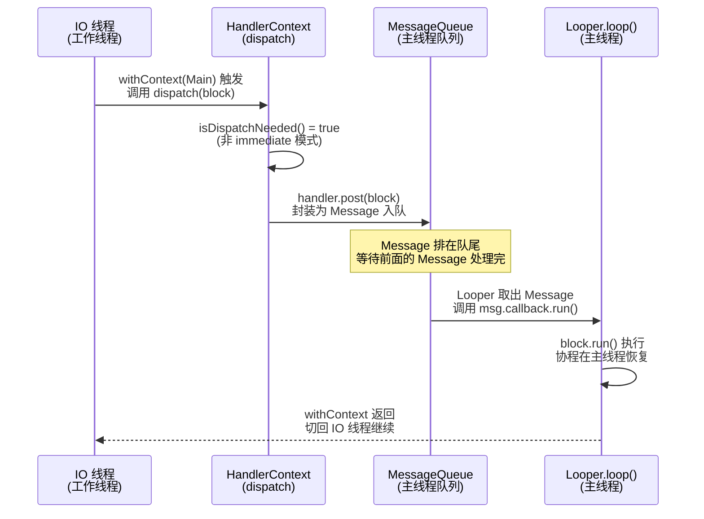

这里最关键的认知是：**每一次 `dispatch()` 都对应一次 `Handler.post()`，而每一次 `Handler.post()` 都意味着 Runnable 要排队等待**。主线程的 `MessageQueue` 是一个按时间排序的单链表，新投递的 `Message` 排在队尾（除非指定了更早的 `when` 时间戳）。这意味着如果当前 `MessageQueue` 中已有大量待处理的 `Message`（比如密集的触摸事件、动画帧回调等），你的协程恢复就会被延迟。这正是 `Main.immediate` 优化要解决的问题。

---

### immediate 优化

#### 为什么需要 immediate？

考虑这样一个极其常见的场景：你在一个已经运行在主线程上的协程中，调用了 `withContext(Dispatchers.Main)` ——也许是因为你封装了一个工具方法，为了安全起见总是显式切到主线程：

```kotlin
// 一个封装好的工具方法，确保 UI 更新在主线程执行
suspend fun updateUi(text: String) {
    withContext(Dispatchers.Main) {  // 如果调用者已经在主线程呢？
        textView.text = text
    }
}

// 调用处：已经在主线程的协程中
lifecycleScope.launch {  // 默认 Dispatchers.Main
    val data = withContext(Dispatchers.IO) { fetchData() }
    updateUi(data)  // 此时已经在主线程，但 updateUi 内部又 withContext(Main)
}
```

如果使用普通的 `Dispatchers.Main`，即使当前已经在主线程，`dispatch()` 仍然会通过 `Handler.post()` 将 Runnable 投递到 `MessageQueue` 队尾。这意味着：

1. **不必要的延迟**：Runnable 需要等待当前 `MessageQueue` 中排在它前面的所有 `Message` 处理完毕后才能执行。在高负载场景下（比如列表快速滑动时），这个延迟可能达到几毫秒甚至十几毫秒。
2. **不必要的对象创建**：每次 `post()` 都会创建或复用一个 `Message` 对象，增加 GC 压力。
3. **语义违背直觉**：开发者写 `withContext(Dispatchers.Main)` 的本意是"确保在主线程执行"，而不是"排到主线程队尾执行"。如果已经在主线程上，最自然的行为应该是 **立即执行**。

这就是 `Dispatchers.Main.immediate` 存在的理由。

#### immediate 的工作机制

`Dispatchers.Main.immediate` 返回的仍然是一个 `HandlerContext` 实例，只不过其内部 `invokeImmediately` 标志位为 `true`。这个标志位唯一影响的方法就是 `isDispatchNeeded()`：

```kotlin
// isDispatchNeeded 是协程调度的"守门人"
// 返回 true → 必须通过 dispatch() 投递（异步）
// 返回 false → 跳过 dispatch()，直接在当前线程执行（同步）
override fun isDispatchNeeded(context: CoroutineContext): Boolean {
    // 情况 1：非 immediate 模式（普通 Dispatchers.Main）
    //   → !false = true → 总是需要 dispatch → 总是 post
    // 情况 2：immediate 模式 + 当前不在主线程
    //   → !true || (myLooper != mainLooper) = true → 需要 dispatch → post
    // 情况 3：immediate 模式 + 当前已在主线程
    //   → !true || (mainLooper != mainLooper) = false → 不需要 dispatch → 立即执行
    return !invokeImmediately || Looper.myLooper() != handler.looper
}
```

当 `isDispatchNeeded()` 返回 `false` 时，协程的 `DispatchedContinuation` 会跳过 `dispatch()` 调用，直接在当前调用栈上执行后续代码。**没有 `Handler.post()`，没有入队等待，没有线程切换开销**。就好像你直接调用了一个普通函数一样。

我们可以用一个对比图来清晰展示两者的行为差异：

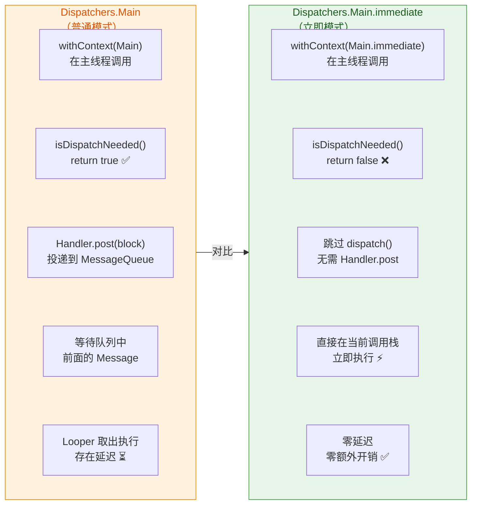

#### immediate 的实际影响：一个计时实验

为了让你对"延迟"有直观感受，考虑如下伪实验：

```kotlin
// 实验：在主线程协程中分别使用 Main 和 Main.immediate
lifecycleScope.launch(Dispatchers.Main) {
    val start = System.nanoTime()

    // 方式 A：普通 Main（即使已在主线程，仍然 post）
    withContext(Dispatchers.Main) {
        val elapsed = (System.nanoTime() - start) / 1_000_000.0
        Log.d("Perf", "Dispatchers.Main: ${elapsed}ms")
        // 典型结果：0.5ms ~ 16ms（取决于 MessageQueue 负载）
        // 最差情况下会等待一整个 VSYNC 周期（~16.6ms）
    }

    val start2 = System.nanoTime()

    // 方式 B：Main.immediate（已在主线程，直接执行）
    withContext(Dispatchers.Main.immediate) {
        val elapsed = (System.nanoTime() - start2) / 1_000_000.0
        Log.d("Perf", "Main.immediate: ${elapsed}ms")
        // 典型结果：< 0.01ms（几乎为零，仅函数调用开销）
    }
}
```

在 UI 密集操作场景下（如 `RecyclerView` 快速滑动），`Dispatchers.Main` 的延迟可能会明显可感知，而 `Main.immediate` 则保持零延迟。这也是为什么 **AndroidX Lifecycle 库中的 `lifecycleScope.launch {}` 和 `viewModelScope.launch {}` 默认使用的就是 `Dispatchers.Main.immediate`** 而不是 `Dispatchers.Main`。

#### immediate 的注意事项

虽然 `Main.immediate` 看起来是全面优于 `Main` 的选择，但有几点需要注意：

1. **执行顺序可能不同**。使用 `Main` 时，代码总是被 post 到队尾，执行顺序是确定的（FIFO）。而 `Main.immediate` 在主线程上会立即执行，这可能改变与其他 `post` 任务的相对顺序。如果你的业务逻辑依赖"先 post A，再 post B，A 一定在 B 之前执行"这种时序保证，用 `immediate` 可能会打破这个假设。

2. **栈深度增加**。`immediate` 模式下，协程恢复是直接在当前调用栈上执行的，而不是新的 `Looper.loop()` 迭代。如果你有深层嵌套的 `withContext(Main.immediate)` 调用，理论上会累积栈帧。不过在实际 Android 开发中，这几乎不会成为问题。

3. **仅在"已在目标线程"时才有优化效果**。如果你从 `Dispatchers.IO` 线程调用 `withContext(Dispatchers.Main.immediate)`，由于 `Looper.myLooper() != handler.looper`，`isDispatchNeeded()` 仍然返回 `true`，行为与普通 `Main` 完全一致。**`immediate` 只优化"已在主线程还要切主线程"这个特定场景**。

---

### vs post

#### 协程调度 vs Handler.post：本质对比

理解了 `HandlerContext` 的实现后，我们自然会问：`Dispatchers.Main` 与直接使用 `Handler.post()` 到底有什么区别？它们最终不都是通过 `Handler.post()` 投递到主线程的 `MessageQueue` 吗？

从 **最终执行路径** 来看，确实如此。但从 **编程模型** 和 **生命周期管理** 的维度来看，两者有着本质的不同：

| 维度 | `Handler.post()` | `Dispatchers.Main` (协程) |
|---|---|---|
| **编程模型** | 回调式（Runnable）；多次异步操作导致回调嵌套 | 顺序式（suspend）；async/await 风格，代码线性可读 |
| **取消机制** | 手动调用 `handler.removeCallbacks()`；易遗漏导致泄漏 | 结构化并发自动取消；`Job.cancel()` 级联取消所有子任务 |
| **异常处理** | `Runnable.run()` 内异常直接崩溃到 `Looper`；需手动 try-catch | `CoroutineExceptionHandler` 统一捕获；`SupervisorJob` 隔离异常 |
| **生命周期绑定** | 无内建支持；需手动在 `onDestroy` 中 remove | `lifecycleScope` / `viewModelScope` 自动绑定生命周期 |
| **线程切换** | 需要手动管理跨线程回调传递（如 IO → Main 的嵌套）| `withContext` 一行代码切换，编译器负责续体状态机 |
| **延迟执行** | `handler.postDelayed(runnable, ms)` | `delay(ms)` — 挂起不阻塞，且可取消 |
| **immediate** | 无对应概念（`post` 总是入队） | `Main.immediate` 避免不必要的入队 |

#### 经典对比：回调地狱 vs 协程线性代码

以一个典型场景为例——"从网络获取数据 → 解析 → 更新 UI"：

```kotlin
// ❌ 传统 Handler.post 方式：回调嵌套，难以维护
// handler 指向主线程
val handler = Handler(Looper.getMainLooper())

fun loadDataTraditional() {
    // 在 IO 线程执行网络请求
    Executors.newSingleThreadExecutor().execute {
        try {
            // 网络请求（阻塞 IO 线程）
            val response = api.fetchDataSync()
            // 解析数据（仍在 IO 线程）
            val parsed = parser.parse(response)
            // 切回主线程更新 UI —— 回调嵌套第 1 层
            handler.post {
                textView.text = parsed.title
                // 假设还需要根据结果再请求一次
                Executors.newSingleThreadExecutor().execute {  // 嵌套第 2 层
                    val detail = api.fetchDetailSync(parsed.id)
                    handler.post {  // 嵌套第 3 层
                        detailView.text = detail.content
                    }
                }
            }
        } catch (e: Exception) {
            // 异常处理也要 post 到主线程
            handler.post {  // 又一层嵌套
                Toast.makeText(context, "Error: ${e.message}", Toast.LENGTH_SHORT).show()
            }
        }
    }
    // ⚠️ 如果 Activity 已销毁，上面的 handler.post 仍然会执行
    // 需要手动在 onDestroy 中取消，但 Executor 的 Future 管理非常麻烦
}
```

```kotlin
// ✅ 协程方式：线性代码，结构化并发，自动取消
fun loadDataCoroutine() {
    // lifecycleScope 自动绑定 Activity 生命周期
    // 默认使用 Dispatchers.Main.immediate
    lifecycleScope.launch {
        try {
            // withContext 切到 IO 线程执行网络请求
            // 挂起当前协程，不阻塞主线程
            val response = withContext(Dispatchers.IO) {
                api.fetchDataSync()  // 在 IO 线程执行
            }
            // 自动回到主线程（因为 launch 的调度器是 Main.immediate）
            val parsed = parser.parse(response)
            textView.text = parsed.title

            // 需要再请求一次？直接写下一行，没有嵌套
            val detail = withContext(Dispatchers.IO) {
                api.fetchDetailSync(parsed.id)  // 在 IO 线程执行
            }
            // 又自动回到主线程
            detailView.text = detail.content

        } catch (e: Exception) {
            // 异常处理也在主线程，与正常流程在同一个 try-catch 中
            Toast.makeText(context, "Error: ${e.message}", Toast.LENGTH_SHORT).show()
        }
    }
    // ✅ Activity 销毁时，lifecycleScope 自动取消所有子协程
    // 不需要手动管理任何回调或 Future
}
```

两段代码最终都通过 `Handler.post()` 在主线程执行 UI 更新，但协程版本的优势是压倒性的：**线性可读、异常统一处理、自动取消、无内存泄漏风险**。

#### Handler.post 仍有用武之地的场景

尽管协程在绝大多数场景下优于 `Handler.post()`，但以下几种情况你可能仍然需要直接使用 `Handler`：

1. **精确的 MessageQueue 时序控制**。`Handler.postAtFrontOfQueue()` 可以将 `Message` 插到队列最前面，这在某些底层框架代码中有用（比如确保某个初始化逻辑在所有其他 pending Message 之前执行）。协程没有提供对应 API。

2. **与 View 的 post 交互**。`View.post()` 内部使用的是 `AttachInfo` 中的 `Handler`，它保证了 Runnable 在 View 完成 `measure/layout` 之后执行。这在获取 View 尺寸等场景中不可替代：

```kotlin
// View.post 保证在 layout 完成后执行
// 这种场景用协程反而不直观
view.post {
    // 此时 view.width 和 view.height 已经确定
    val width = view.width  // 安全获取宽度
    val height = view.height  // 安全获取高度
}
```

3. **`IdleHandler` 空闲任务**。`MessageQueue.addIdleHandler()` 可以注册一个在主线程空闲时才执行的回调，适合低优先级的初始化任务。协程目前没有内建的空闲调度支持（不过你可以在 `IdleHandler` 回调中启动协程）。

4. **性能极端敏感的超轻量任务**。协程虽然已经非常轻量，但仍有 `CoroutineContext` 查找、`DispatchedContinuation` 创建等微量开销。对于像自定义 `View` 的 `invalidate()` 触发链中的超高频操作（每帧数十次），直接使用 `Handler` 或 `View.postOnAnimation()` 可能更合适。不过这类场景极为罕见。

#### Dispatchers.Main.immediate vs View.post 的微妙差异

一个开发者经常困惑的问题是：`Dispatchers.Main.immediate` 启动的协程与 `View.post()` 的执行时机有什么不同？

```kotlin
// 假设当前在主线程的某个回调中
lifecycleScope.launch(Dispatchers.Main.immediate) {
    // 【A】立即执行（因为 immediate 且已在主线程）
    Log.d("Order", "A: coroutine immediate")
}

handler.post {
    // 【B】排入 MessageQueue 队尾
    Log.d("Order", "B: handler post")
}

view.post {
    // 【C】也是排入队尾（通过 View 的 AttachInfo Handler）
    Log.d("Order", "C: view post")
}

Log.d("Order", "D: current execution")
```

输出顺序为：**A → D → B → C**（B 和 C 的相对顺序取决于 post 顺序）。`A` 最先是因为 `Main.immediate` 在主线程上不经过 `MessageQueue` 直接执行；`D` 紧随其后因为它在当前同步代码流中；`B` 和 `C` 要等到当前 `Message` 处理完毕、`Looper` 取下一条 `Message` 时才执行。

这个时序差异在复杂 UI 交互中可能很关键——比如你需要在 `RecyclerView.Adapter.onBindViewHolder()` 中触发一个 UI 更新，用 `Main.immediate` 可以确保在当前绑定流程中立即生效，而 `post` 则会延迟到下一轮 `Looper` 迭代。

---

**📝 练习题**

在以下代码中，`Log` 的输出顺序是什么？（假设当前在主线程 `Activity.onCreate` 中执行）

```kotlin
lifecycleScope.launch(Dispatchers.Main.immediate) {
    Log.d("T", "1")
    withContext(Dispatchers.Main) {
        Log.d("T", "2")
    }
    Log.d("T", "3")
}
Log.d("T", "4")
```

A. 1 → 2 → 3 → 4


B. 1 → 4 → 2 → 3


C. 4 → 1 → 2 → 3


D. 1 → 2 → 4 → 3


**【答案】** B

**【解析】** `lifecycleScope.launch(Dispatchers.Main.immediate)` 使用的是 `immediate` 模式，且当前已在主线程，因此 `isDispatchNeeded()` 返回 `false`，协程体 **立即同步执行**，所以 `"1"` 最先输出。接下来遇到 `withContext(Dispatchers.Main)` ——注意这里用的是普通 `Main` 而非 `Main.immediate`。普通 `Main` 的 `isDispatchNeeded()` **总是返回 `true`**，即使当前已在主线程，也会通过 `Handler.post()` 将后续代码投递到 `MessageQueue` 队尾。此时协程挂起，控制权返回到 `launch` 之后的同步代码，`"4"` 被输出。之后当前 `Message` 处理完毕，`Looper` 取出下一条 `Message`（即 `withContext` 投递的 Runnable），`"2"` 输出。`withContext` 块结束后，协程需要恢复到外层的 `Main.immediate` 上下文。由于此时已在主线程且外层调度器是 `immediate`，恢复是立即的，`"3"` 紧接着输出。最终顺序：**1 → 4 → 2 → 3**。

---

## 作用域集成 LifecycleScope

在 Android 应用开发中，**内存泄漏**和**生命周期不匹配**是两个最常见也最致命的问题。想象一个经典场景：用户在一个 Activity 中发起了一个网络请求，请求还没回来用户就按下了返回键，Activity 被 `onDestroy` 销毁。如果此时网络请求的回调仍然持有 Activity 的引用，并试图更新一个已经不存在的 UI，轻则出现 `IllegalStateException`，重则导致整个 Activity 无法被 GC 回收，造成内存泄漏。传统做法是手动在 `onDestroy` 中取消 `AsyncTask`、移除 `Handler` 消息、dispose `RxJava` 的 `Disposable`——但这些全都依赖开发者的"记忆力"，遗漏一处就是一个 bug。

`LifecycleScope` 的出现，正是为了**从根本上消除这种手动管理的负担**。它是 Jetpack Lifecycle 库与 Kotlin 协程的深度集成产物，为每一个拥有 `Lifecycle` 的组件（Activity、Fragment、LifecycleService 等）提供了一个**与其生命周期自动绑定的 `CoroutineScope`**。在这个作用域中启动的所有协程，会在组件销毁时**自动、可靠地被取消**，开发者无需编写任何清理代码。这不仅仅是一个便利工具，它代表了 Android 协程集成的核心设计哲学——**结构化并发（Structured Concurrency）与生命周期感知（Lifecycle-Awareness）的结合**。

### Activity / Fragment 绑定

#### 什么是 LifecycleScope

`LifecycleScope` 本质上是一个 **扩展属性（Extension Property）**，定义在 `LifecycleOwner` 接口上。在 AndroidX 中，`ComponentActivity`（`AppCompatActivity` 的父类）和 `Fragment` 都实现了 `LifecycleOwner` 接口，因此它们天然就拥有 `lifecycleScope` 这个属性。你不需要做任何初始化操作，直接在 Activity 或 Fragment 中使用 `lifecycleScope.launch { ... }` 就能开启一个生命周期感知的协程。

从依赖角度来看，`LifecycleScope` 由 `androidx.lifecycle:lifecycle-runtime-ktx` 这个库提供。在现代 Android 项目中（AGP 7+ 且使用 BOM 管理依赖），通常只需引入：

```kotlin
// build.gradle.kts
dependencies {
    // lifecycle-runtime-ktx 提供了 lifecycleScope 扩展
    // 以及 repeatOnLifecycle 等生命周期感知协程工具
    implementation("androidx.lifecycle:lifecycle-runtime-ktx:2.8.7")
}
```

引入之后，所有 `LifecycleOwner` 的实现类都自动获得 `lifecycleScope` 属性——这就是 Kotlin 扩展属性的威力，无需继承、无需侵入现有类结构。

#### 在 Activity 中使用

在 `ComponentActivity`（包括 `AppCompatActivity`、`FragmentActivity`）中，`lifecycleScope` 直接作为成员属性可用。最常见的用法是在 `onCreate` 中启动协程来执行数据加载、UI 订阅等操作：

```kotlin
class HomeActivity : AppCompatActivity() {

    // 假设使用 Hilt 或手动创建 ViewModel
    private val viewModel: HomeViewModel by viewModels()

    override fun onCreate(savedInstanceState: Bundle?) {
        super.onCreate(savedInstanceState)
        setContentView(R.layout.activity_home)

        // lifecycleScope 是 LifecycleOwner 的扩展属性
        // 在此作用域内启动的协程，会在 Activity onDestroy 时自动取消
        lifecycleScope.launch {
            // 此处默认运行在 Dispatchers.Main（主线程）上
            // 非常适合收集 UI 状态流
            viewModel.uiState.collect { state ->
                // 安全地更新 UI，因为协程会随 Activity 销毁而取消
                // 不会出现在已销毁 Activity 上操作 View 的问题
                updateUI(state)
            }
        }

        // 同一作用域内可以启动多个协程，它们是并发执行的
        lifecycleScope.launch {
            // 执行一次性数据加载
            val config = viewModel.loadRemoteConfig()
            // 加载完成后更新 UI
            applyConfig(config)
        }
    }
}
```

这里有一个非常重要的细节需要强调：**`lifecycleScope` 默认使用 `Dispatchers.Main.immediate` 作为调度器**。这意味着在此作用域中启动的协程，其代码默认运行在主线程上。对于 UI 更新操作来说，这是最自然、最安全的选择。如果你需要在协程内部执行耗时操作（如网络请求、数据库查询），应当使用 `withContext(Dispatchers.IO)` 切换到 IO 调度器，而不是把整个协程绑定到 IO 线程上——因为你最终还是需要回到主线程来更新 UI。

#### 在 Fragment 中使用

Fragment 的情况稍微复杂一些，因为 Fragment **同时拥有两个生命周期**：

1. **Fragment 自身的生命周期**（`this.lifecycle`）：从 `onCreate` 到 `onDestroy`。
2. **Fragment View 的生命周期**（`viewLifecycleOwner.lifecycle`）：从 `onCreateView` / `onViewCreated` 到 `onDestroyView`。

这个区分至关重要。当 Fragment 被放入 Back Stack 时，它的 View 会被销毁（`onDestroyView`），但 Fragment 实例本身并不销毁——它仍然存活在内存中，等待用户按返回键时重新创建 View。此时如果你在 `lifecycleScope`（绑定 Fragment 自身生命周期）中收集一个 Flow 来更新 UI，那么即使 View 已经被销毁，协程仍然在运行并试图访问已不存在的 View，从而导致崩溃。

因此，**在 Fragment 中涉及 UI 操作的协程，必须使用 `viewLifecycleOwner.lifecycleScope`** 而非 `lifecycleScope`：

```kotlin
class HomeFragment : Fragment(R.layout.fragment_home) {

    private val viewModel: HomeViewModel by viewModels()

    override fun onViewCreated(view: View, savedInstanceState: Bundle?) {
        super.onViewCreated(view, savedInstanceState)

        // ✅ 正确做法：使用 viewLifecycleOwner.lifecycleScope
        // 此协程绑定到 View 的生命周期
        // 当 Fragment 进入 Back Stack（onDestroyView）时自动取消
        // 当 Fragment 重新可见（onCreateView）时，需要重新启动
        viewLifecycleOwner.lifecycleScope.launch {
            viewModel.uiState.collect { state ->
                // 安全：View 销毁时协程已被取消，不会访问已回收的 View
                binding.titleText.text = state.title
                binding.contentText.text = state.content
            }
        }

        // ⚠️ 错误做法（常见 Bug 来源）：
        // lifecycleScope.launch { ... }
        // 这绑定的是 Fragment 自身生命周期
        // 如果 Fragment 在 Back Stack 中，View 被销毁但协程仍在运行
        // 访问 binding 或 view 会触发 NullPointerException 或 IllegalStateException
    }

    // 如果是与 UI 无关的操作（如数据预加载），可以使用 Fragment 自身的 lifecycleScope
    override fun onCreate(savedInstanceState: Bundle?) {
        super.onCreate(savedInstanceState)
        
        // ✅ 合理：这里不涉及 View 操作，用 Fragment 生命周期是安全的
        lifecycleScope.launch {
            viewModel.preloadData()
        }
    }
}
```

这个 Fragment 的"双生命周期"问题是 Android 开发中最常见的协程相关 Bug 之一。记住一个简单的准则：**涉及 View → 用 `viewLifecycleOwner.lifecycleScope`；不涉及 View → 用 `lifecycleScope`**。

#### 绑定机制的底层原理

`lifecycleScope` 是如何"知道"何时取消协程的？答案在于 Jetpack Lifecycle 库的 **观察者模式**。当你第一次访问 `lifecycleScope` 属性时，它会：

1. 创建一个 `LifecycleCoroutineScope` 实例，内部持有一个 `SupervisorJob` + `Dispatchers.Main.immediate` 构成的 `CoroutineContext`。
2. 通过 `lifecycle.addObserver(...)` 注册一个 `LifecycleEventObserver`。
3. 当观察到 `Lifecycle.Event.ON_DESTROY` 事件时，调用 `job.cancel()`，这会级联取消该 `Job` 下所有子协程。

用流程图来展现这个绑定过程：

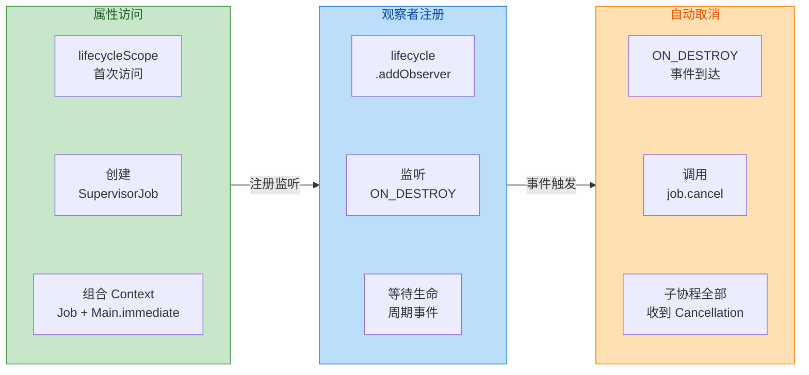

可以看到，核心机制就是 **Lifecycle 观察者 + Job 树的取消传播**，这两者的结合实现了"零手动管理"的自动清理。

### onDestroy 自动取消

#### 取消的触发时机

如上文所述，`lifecycleScope` 监听的是 `ON_DESTROY` 事件。但 `ON_DESTROY` 的具体含义在不同组件中有细微差别：

**对于 Activity**：`ON_DESTROY` 对应 `Activity.onDestroy()` 调用。触发条件包括：
- 用户按返回键退出 Activity（正常销毁）。
- 系统因内存不足回收 Activity。
- 调用 `finish()` 主动关闭。
- **配置变更（Configuration Change）**，如屏幕旋转。注意，在默认情况下，旋转屏幕会导致 Activity 重建（先 `onDestroy` 再重新 `onCreate`），这意味着 `lifecycleScope` 中的协程会被取消然后在新 Activity 中重新启动。这就是为什么对于需要跨配置变更存活的异步任务（如网络请求），应使用 `viewModelScope`（绑定 ViewModel 生命周期，在配置变更中存活）而非 `lifecycleScope`。

**对于 Fragment 的 `lifecycleScope`**：`ON_DESTROY` 对应 `Fragment.onDestroy()`，即 Fragment 实例被彻底销毁。在 Fragment 进入 Back Stack 时不会触发（只触发 `onDestroyView`）。

**对于 Fragment 的 `viewLifecycleOwner.lifecycleScope`**：`ON_DESTROY` 对应 `Fragment.onDestroyView()`，即 Fragment View 被销毁。在 Fragment 进入 Back Stack 时会触发。

下面用一张表格清晰概括：

| 使用方式 | 绑定目标 | 取消时机 | 旋转屏幕是否取消 | Back Stack 是否取消 |
|---------|---------|---------|:-:|:-:|
| `activity.lifecycleScope` | Activity 生命周期 | `onDestroy()` | ✅ 取消 | — |
| `fragment.lifecycleScope` | Fragment 自身生命周期 | `onDestroy()` | ✅ 取消 | ❌ 不取消 |
| `fragment.viewLifecycleOwner.lifecycleScope` | Fragment View 生命周期 | `onDestroyView()` | ✅ 取消 | ✅ 取消 |

#### 取消的传播机制

当 `ON_DESTROY` 事件到达时，`lifecycleScope` 内部的 `SupervisorJob` 会被 `cancel()`。这个取消操作遵循协程的 **结构化并发** 规则——所有通过 `lifecycleScope.launch { ... }` 或 `lifecycleScope.async { ... }` 启动的子协程，都是该 `SupervisorJob` 的子 Job，取消操作会向下传播到每一个子协程。

具体的取消流程如下：

1. `SupervisorJob.cancel()` 被调用，传入一个 `CancellationException`。
2. 所有直接子 Job 收到取消信号。
3. 每个子 Job 进入 `Cancelling` 状态，并将取消信号继续传播给它们的子 Job（如果有嵌套 `launch`）。
4. 处于挂起点（`delay`、`withContext`、`emit`、`collect` 等）的协程会立即抛出 `CancellationException` 并终止。
5. 所有子 Job 完成取消后，`SupervisorJob` 进入 `Cancelled` 状态。

这里有一个关键细节：**只有在挂起点（Suspension Point）处，取消才能生效**。如果一个协程内部正在执行一个不包含挂起点的 CPU 密集型计算（比如一个很长的 `for` 循环），即使 `cancel()` 已经被调用，协程也不会立即停止。它会一直运行到下一个挂起点才检查取消状态。这就是为什么在长时间运行的循环中，建议手动检查 `isActive` 或调用 `ensureActive()`：

```kotlin
lifecycleScope.launch(Dispatchers.Default) {
    // 假设我们需要处理大量数据
    for (i in 0 until 1_000_000) {
        // 每次迭代检查协程是否仍然活跃
        // 如果已被取消，ensureActive() 会抛出 CancellationException
        ensureActive()
        
        // 执行计算
        processItem(i)
    }
}
```

#### CancellationException 的特殊性

协程取消是通过抛出 `CancellationException` 实现的，但这个异常有一个非常特殊的性质：**它不被视为"失败"**。这意味着：

- `CoroutineExceptionHandler` **不会**捕获 `CancellationException`（它只捕获非取消异常）。
- 父 Job 收到子协程的 `CancellationException` 时，**不会**取消其他子协程（与其他异常不同）。
- `try-catch` 可以捕获 `CancellationException`，但**必须重新抛出**，否则会破坏取消机制：

```kotlin
lifecycleScope.launch {
    try {
        // 执行网络请求
        val result = apiService.fetchData()
        updateUI(result)
    } catch (e: CancellationException) {
        // ⚠️ 如果你捕获了 CancellationException，必须重新抛出！
        // 否则取消不会生效，协程会继续执行后续代码
        throw e
    } catch (e: Exception) {
        // 处理其他异常（网络错误等）
        showError(e.message)
    }
}

// 更推荐的简洁写法：使用 runCatching 的安全版本
lifecycleScope.launch {
    try {
        val result = apiService.fetchData()
        updateUI(result)
    } catch (e: Exception) {
        // 从 Kotlin 1.5 开始，如果 e 是 CancellationException
        // 可以用 coroutineContext.ensureActive() 来检查
        coroutineContext.ensureActive()
        // 如果执行到这里，说明不是取消异常，正常处理错误
        showError(e.message)
    }
}
```

#### 自动取消的实际效果示例

让我们用一个完整的场景来理解自动取消的威力。假设有一个 Activity 定期轮询服务器状态：

```kotlin
class DashboardActivity : AppCompatActivity() {

    override fun onCreate(savedInstanceState: Bundle?) {
        super.onCreate(savedInstanceState)
        setContentView(R.layout.activity_dashboard)

        // 启动一个"永远运行"的轮询协程
        lifecycleScope.launch {
            // 使用 while(true) 无限循环轮询
            while (true) {
                try {
                    // 通过 withContext 切换到 IO 线程执行网络请求
                    val status = withContext(Dispatchers.IO) {
                        apiService.getServerStatus()
                    }
                    // 回到主线程更新 UI
                    statusTextView.text = status.message
                } catch (e: Exception) {
                    // 确保不吞掉 CancellationException
                    coroutineContext.ensureActive()
                    // 处理网络异常
                    statusTextView.text = "连接失败"
                }
                // 每 30 秒轮询一次
                // delay 是一个挂起函数，是天然的取消检查点
                delay(30_000L)
            }
        }

        // 当用户退出 Activity 时：
        // 1. onDestroy() 被调用
        // 2. lifecycleScope 监听到 ON_DESTROY
        // 3. 内部 SupervisorJob 被 cancel()
        // 4. 上面的协程在 delay() 处（或 withContext 处）被取消
        // 5. 无需手动管理，没有内存泄漏风险
    }
}
```

如果不使用 `lifecycleScope`，你需要手动创建 `Job`、在 `onDestroy` 中 `cancel`、处理 null 安全——而 `lifecycleScope` 把这一切都自动化了。这正是它存在的最大价值。

### SupervisorJob

#### 为什么 LifecycleScope 使用 SupervisorJob

在结构化并发中，`Job` 有两种类型：

1. **普通 Job**：如果任何一个子协程因异常失败，**所有兄弟协程都会被取消**，父 Job 也会失败。这是一种"全有或全无（all-or-nothing）"的策略。
2. **SupervisorJob**：如果某个子协程因异常失败，**只有该子协程被取消**，其他兄弟协程不受影响，父 Job 也不会失败。这是一种"故障隔离（fault isolation）"的策略。

`LifecycleScope` 选择 `SupervisorJob` 是经过深思熟虑的设计决策。考虑一个实际场景：在一个 Activity 的 `onCreate` 中，你通过 `lifecycleScope` 启动了三个并发协程——一个用于加载用户资料，一个用于拉取消息列表，一个用于初始化统计 SDK。如果使用普通 `Job`，当统计 SDK 初始化失败时，用户资料和消息列表的加载也会被取消，用户看到一个完全空白的页面。而使用 `SupervisorJob`，统计 SDK 的失败被隔离，其他两个协程正常完成，用户依然能看到资料和消息。

这就是 `SupervisorJob` 在 UI 场景下的核心价值——**一个功能的失败不应该拖垮整个界面**。

#### SupervisorJob 的异常传播规则

理解 `SupervisorJob` 的异常传播规则对正确使用 `lifecycleScope` 至关重要。规则如下：

**异常不向上传播**：当 `SupervisorJob` 的子协程抛出未捕获异常时，异常不会传递给父 Job（`SupervisorJob` 本身），因此父 Job 不会被取消。

**异常不向兄弟传播**：失败的子协程不会影响同级别的其他子协程。

**异常由子协程自行处理**：既然异常不向上传播，那谁来处理？有两条路径：
  - 子协程自己 `try-catch`。
  - 通过 `CoroutineExceptionHandler` 在子协程的 `CoroutineContext` 中捕获。

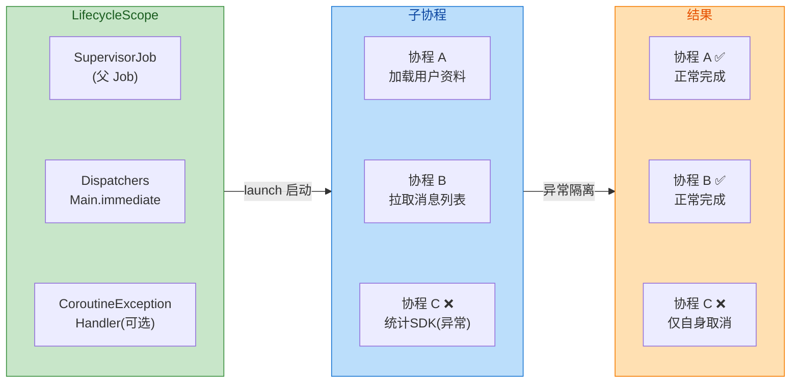

#### SupervisorJob 与 supervisorScope 的区别

这是一个容易混淆的知识点。`lifecycleScope` 使用的是 **`SupervisorJob()`** 作为其 `CoroutineContext` 的 Job，而 `supervisorScope { }` 是一个挂起函数，用于在协程内部创建一个临时的 Supervisor 作用域。两者的关键差异在于：

`SupervisorJob()` 创建的是一个**独立的 Job 节点**，作为其他 Job 的父节点存在。所有通过 `lifecycleScope.launch` 启动的协程都成为这个 `SupervisorJob` 的直接子节点，因此它们之间互相隔离。

`supervisorScope { }` 则创建一个**临时作用域**，只在其代码块内部有效。代码块内部通过 `launch` 启动的子协程互相隔离，但 `supervisorScope` 本身会等待所有子协程完成后才继续执行。

```kotlin
// SupervisorJob 在 lifecycleScope 中的效果
lifecycleScope.launch {
    // ⚠️ 注意！这里通过 launch 启动的子协程，它的父 Job 是这个
    // launch 创建的普通 Job，而不是 lifecycleScope 的 SupervisorJob！
    // 所以如果 coroutine1 失败，coroutine2 也会被取消
    val coroutine1 = launch {
        error("失败") // 这会导致 coroutine2 也被取消！
    }
    val coroutine2 = launch {
        delay(1000)
        println("不会执行到这里")
    }
}

// 如果要在嵌套 launch 中也实现隔离，需要 supervisorScope
lifecycleScope.launch {
    // supervisorScope 内部的子协程互相隔离
    supervisorScope {
        val coroutine1 = launch {
            error("失败") // coroutine1 失败
        }
        val coroutine2 = launch {
            delay(1000)
            println("✅ 这会正常执行") // coroutine2 不受影响
        }
    }
}
```

这个区别非常关键：**`SupervisorJob` 的隔离只对直接子 Job 生效**。也就是说，只有直接通过 `lifecycleScope.launch { }` 启动的那些协程之间才互相隔离。如果在一个 `launch` 内部再嵌套 `launch`，内部的 `launch` 创建的是**普通 `Job`**，不再具有 Supervisor 隔离特性。要在内部也实现隔离，必须显式使用 `supervisorScope { }` 或者传入一个新的 `SupervisorJob()`。

#### LifecycleScope 的完整 CoroutineContext 构成

`LifecycleScope` 的 `CoroutineContext` 由以下几部分组成：

```kotlin
// 伪代码展示 lifecycleScope 的内部实现
val lifecycleScope: LifecycleCoroutineScope
    get() {
        // 惰性创建，首次访问时初始化
        // SupervisorJob：子协程异常隔离
        // Dispatchers.Main.immediate：默认在主线程调度，支持 immediate 优化
        val context = SupervisorJob() + Dispatchers.Main.immediate
        // 注册生命周期观察者
        // 当 ON_DESTROY 事件到达时，cancel 这个 SupervisorJob
        lifecycle.addObserver(/* 观察 ON_DESTROY 事件 */)
        return LifecycleCoroutineScope(lifecycle, context)
    }
```

用 ASCII 模型来展示完整的 Job 树结构：

```text
CoroutineContext of LifecycleScope
├── SupervisorJob ← lifecycle ON_DESTROY 时 cancel
├── Dispatchers.Main.immediate
└── (可选) CoroutineExceptionHandler

Job 树：
SupervisorJob (lifecycleScope)          ← 被 cancel 时级联取消所有子 Job
    ├── Job (launch #1: 加载资料)       ← 独立，失败不影响 #2 和 #3
    │       └── Job (内部 launch)       ← 与 #1 是普通父子关系
    ├── Job (launch #2: 拉取消息)       ← 独立，失败不影响 #1 和 #3
    └── Job (launch #3: 初始化统计)     ← 独立，失败不影响 #1 和 #2
```

这个结构保证了两件事：
1. **向下级联取消**：当 `SupervisorJob` 被 `cancel()` 时，所有子 Job 都会被取消——这保证了 `onDestroy` 时的清理。
2. **水平故障隔离**：当某个子 Job 因异常失败时，其他子 Job 不受影响——这保证了单个功能的失败不会拖垮整个界面。

#### 实战注意事项

在使用 `lifecycleScope` 和 `SupervisorJob` 时，有几个常见的陷阱需要注意：

**陷阱一：在 `lifecycleScope.launch` 内部未捕获异常会导致崩溃。** 虽然 `SupervisorJob` 隔离了兄弟协程，但未捕获的异常最终会传递到线程的 `UncaughtExceptionHandler`，在 Android 上这通常意味着 App 崩溃。所以即使有 `SupervisorJob` 的保护，你仍然需要在每个 `launch` 内部对可能的异常进行 `try-catch`，或者在 `launch` 的参数中传入 `CoroutineExceptionHandler`：

```kotlin
// 方式 1：在 launch 内部 try-catch
lifecycleScope.launch {
    try {
        riskyOperation()
    } catch (e: Exception) {
        coroutineContext.ensureActive() // 确保不吞掉 CancellationException
        Log.e("TAG", "操作失败", e)
    }
}

// 方式 2：传入 CoroutineExceptionHandler
val handler = CoroutineExceptionHandler { _, throwable ->
    // 注意：这里运行在调度器的线程上（通常是主线程）
    Log.e("TAG", "协程异常", throwable)
}
lifecycleScope.launch(handler) {
    riskyOperation() // 异常会被 handler 捕获，不会崩溃
}
```

**陷阱二：不要将 `lifecycleScope` 用于需要跨配置变更存活的任务。** 屏幕旋转时 Activity 重建，`lifecycleScope` 中的协程被取消。如果你正在执行一个网络请求，它会被中断然后在新 Activity 中重新发起——浪费时间和带宽。对于这类任务，使用 `viewModelScope`（下一节会详细讲解）才是正确选择。

**陷阱三：`async` 的异常行为与 `launch` 不同。** 在 `SupervisorJob` 下使用 `async` 时，异常不会立即传播，而是在 `await()` 时才抛出。但如果你忘记调用 `await()`，异常会静默丢失：

```kotlin
lifecycleScope.launch {
    // async 返回 Deferred，异常存储在 Deferred 中
    val deferred = async {
        error("发生错误") // 异常暂时不传播
    }
    // 如果不调用 deferred.await()，异常会丢失
    // 调用 await() 时，异常才会重新抛出
    val result = deferred.await() // ← 异常在这里抛出
}
```

---

**📝 练习题**

一个 Fragment 被添加到 Back Stack 后，用户导航到另一个 Fragment。此时原 Fragment 的 `onDestroyView()` 被调用但 `onDestroy()` 不会被调用。请问以下哪种写法能够在 Fragment 进入 Back Stack 时正确取消 UI 相关的协程？

A. `lifecycleScope.launch { viewModel.uiState.collect { updateUI(it) } }`


B. `viewLifecycleOwner.lifecycleScope.launch { viewModel.uiState.collect { updateUI(it) } }`


C. `GlobalScope.launch(Dispatchers.Main) { viewModel.uiState.collect { updateUI(it) } }`


D. `CoroutineScope(Job() + Dispatchers.Main).launch { viewModel.uiState.collect { updateUI(it) } }`


**【答案】** B

**【解析】** 当 Fragment 进入 Back Stack 时，只有 View 被销毁（`onDestroyView`），Fragment 实例本身存活。选项 A 使用的 `lifecycleScope` 绑定的是 Fragment 自身的生命周期（对应 `onDestroy`），因此进入 Back Stack 时协程不会被取消，后续如果协程尝试更新已销毁的 View 就会崩溃。选项 B 使用 `viewLifecycleOwner.lifecycleScope`，它绑定的是 Fragment View 的生命周期，在 `onDestroyView` 时会自动取消协程，这是 UI 操作的正确选择。选项 C 使用 `GlobalScope`，完全不与任何生命周期绑定，协程永远不会自动取消，存在严重的内存泄漏风险。选项 D 手动创建了一个 `CoroutineScope`，但既没有与生命周期绑定，也没有在任何地方手动取消，同样会导致泄漏。

---

**📝 练习题**

在一个 Activity 中使用 `lifecycleScope` 启动了三个协程：协程 A 加载用户资料、协程 B 拉取消息列表、协程 C 初始化广告 SDK。如果协程 C 抛出了一个未捕获的 `RuntimeException`，以下哪个描述最准确？

A. 协程 A、B、C 全部被取消，因为异常会通过 Job 树向上再向下传播


B. 只有协程 C 失败，协程 A 和 B 不受影响，且异常被静默忽略


C. 只有协程 C 失败，协程 A 和 B 不受影响，但未捕获的异常最终会导致 App 崩溃


D. 协程 C 的异常被 `SupervisorJob` 转换为 `CancellationException`，三个协程均正常运行


**【答案】** C

**【解析】** `lifecycleScope` 内部使用 `SupervisorJob`，其核心特性是子协程的异常不会传播给父 Job 和兄弟协程，因此协程 A 和 B 不受影响——排除选项 A。但 `SupervisorJob` **不会静默吞掉异常**，未被捕获的异常（非 `CancellationException`）最终会被传递到线程的 `UncaughtExceptionHandler`，在 Android 主线程上这通常意味着 App 崩溃——排除选项 B。选项 D 的说法完全错误，`SupervisorJob` 不会改变异常的类型。因此正确答案是 C：`SupervisorJob` 实现了水平隔离（协程 A、B 不受影响），但未捕获异常仍然会导致崩溃，开发者必须在每个 `launch` 中自行处理异常（通过 `try-catch` 或 `CoroutineExceptionHandler`）。

---

## 视图模型作用域 ViewModelScope

在 Android 应用层开发中，`ViewModel` 承担着"UI 无关的状态持有者"这一核心角色。它的生命周期比 Activity/Fragment 更长——能跨越配置变更（Configuration Change）存活，却在用户真正离开页面时被清理。Google 在 `lifecycle-viewmodel-ktx` 中为每个 `ViewModel` 实例提供了一个开箱即用的协程作用域 **`viewModelScope`**，使得在 ViewModel 内部启动协程变得既安全又便捷。理解它的内部设计，不仅能帮助我们正确使用它，更能让我们在面对复杂业务场景（多层异常传播、父子协程取消链）时做出正确的架构决策。

### ViewModel 生命周期绑定

要理解 `viewModelScope` 为什么要绑定在 ViewModel 上，首先需要回顾 ViewModel 的生命周期特征。当用户旋转屏幕时，系统会销毁并重建 Activity，但 `ViewModelStore`（由 `ViewModelStoreOwner` 持有）不会被销毁，因此 ViewModel 实例得以存活。只有当 Activity **真正 finish**（用户按返回键、代码调用 `finish()`）或 Fragment 被彻底 detach 后，`ViewModelStore.clear()` 才会被调用，从而触发每个 ViewModel 的 `onCleared()` 回调。

这意味着 ViewModel 的生存期覆盖了"用户在此页面期间的完整业务周期"。把协程作用域锚定在这个生存期上，有两大好处：

1. **跨配置变更存活**：假设用户触发了一次网络请求，在请求返回前旋转了屏幕。如果协程作用域绑定在 Activity（即 `lifecycleScope`）上，那么旧 Activity 的 `onDestroy` 会取消协程，请求丢失。而 `viewModelScope` 不受配置变更影响，协程继续执行，新 Activity 重新订阅即可拿到结果。
2. **不泄漏资源**：当用户真正离开页面，ViewModel 被清理时，`viewModelScope` 会自动取消所有子协程，避免网络请求、数据库事务等后台任务在页面已不存在时仍持有引用或消耗资源。

从源码层面看，`viewModelScope` 是 ViewModel 的一个 **扩展属性**（extension property）。在早期版本（`lifecycle-viewmodel-ktx 2.2.0` 左右），它通过 ViewModel 内部的一个 `ConcurrentHashMap`（即 `mBagOfTags`）来缓存 `CloseableCoroutineScope`。而在更现代的版本中（`lifecycle-viewmodel 2.8+`），Google 将这一机制进一步整合到了 ViewModel 自身，使得即使不依赖 `-ktx` 扩展包也能使用。但核心思路始终不变：**作用域对象与 ViewModel 实例一对一绑定，并在 ViewModel 被清理时一并关闭**。

我们看一下简化后的核心实现逻辑：

```kotlin
// -------- viewModelScope 的核心实现原理（简化版） --------

// 用于在 ViewModel 的 tag 存储中缓存作用域对象的 Key
private const val JOB_KEY = "androidx.lifecycle.ViewModelCoroutineScope.JOB_KEY"

// viewModelScope 是 ViewModel 的扩展属性（extension property）
// 调用时不需要括号，就像访问普通字段一样：viewModelScope.launch { ... }
public val ViewModel.viewModelScope: CoroutineScope
    get() {
        // 1. 先尝试从 ViewModel 内部的 tag 缓存中取出已有的作用域
        val scope: CloseableCoroutineScope? = this.getTag(JOB_KEY)
        if (scope != null) {
            // 如果已经创建过，直接复用，保证同一个 ViewModel 只有一个作用域
            return scope
        }
        // 2. 如果是首次访问，创建一个新的 CloseableCoroutineScope
        //    使用 SupervisorJob + Dispatchers.Main.immediate 作为上下文
        return setTagIfAbsent(
            JOB_KEY,
            CloseableCoroutineScope(SupervisorJob() + Dispatchers.Main.immediate)
        )
    }

// CloseableCoroutineScope 实现了 Closeable 接口
// 当 ViewModel.clear() 被调用时，会遍历所有 tag 中的 Closeable 并调用 close()
internal class CloseableCoroutineScope(
    context: CoroutineContext  // 保存协程上下文
) : Closeable, CoroutineScope {

    // 实现 CoroutineScope 接口所需的 coroutineContext
    override val coroutineContext: CoroutineContext = context

    // 当 Closeable.close() 被调用时，取消作用域内的 Job
    // 这就是与 ViewModel 生命周期绑定的关键桥梁
    override fun close() {
        coroutineContext.cancel()  // 取消 Job，级联取消所有子协程
    }
}
```

从以上代码可以提炼出几个关键设计决策：

**第一，使用 `SupervisorJob()` 而不是普通的 `Job()`**。这一点非常重要，后面"异常传播"小节会深入讲解。简单来说，`SupervisorJob` 使得子协程之间互相独立——一个子协程失败不会导致其他兄弟协程被取消。

**第二，使用 `Dispatchers.Main.immediate`**。`viewModelScope` 的默认调度器是主线程调度器的 `immediate` 模式。这意味着如果你已经在主线程调用 `viewModelScope.launch { ... }`，协程体的第一段代码（直到第一个挂起点）会**立即同步执行**，而不是 post 到 Handler 队列末尾。这避免了不必要的一帧延迟，对 UI 状态更新尤为重要。当然，协程体内部可以随时通过 `withContext(Dispatchers.IO)` 切换到其他调度器执行耗时操作。

**第三，通过 `getTag` / `setTagIfAbsent` 实现线程安全的懒初始化**。`setTagIfAbsent` 内部有同步机制，即使多个线程同时首次访问 `viewModelScope`，也只会创建一个实例。

下面用一张 Mermaid 图来展示 `viewModelScope` 在整个生命周期链路中的位置关系：

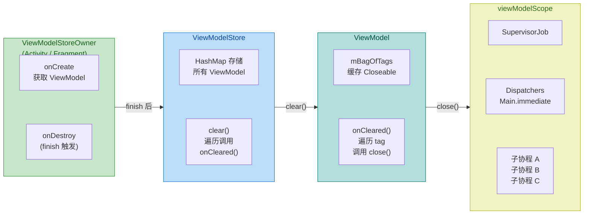

从图中可以清晰看到：`ViewModelStoreOwner`（Activity/Fragment）在真正销毁时调用 `ViewModelStore.clear()`，Store 遍历所有 ViewModel 调用 `onCleared()`，ViewModel 再遍历内部所有 `Closeable` tag 调用 `close()`，最终触发 `viewModelScope` 的 `coroutineContext.cancel()`。整条链路是 **自顶向下的级联清理**。

### onCleared 取消

`onCleared()` 是 ViewModel 生命周期中最后一个回调方法。当系统判定此 ViewModel 不再被任何 UI 控制器需要时，`ViewModelStore.clear()` 被调用，进而触发 `ViewModel.clear()`（注意：这是一个内部方法，不是 `onCleared()`）。`ViewModel.clear()` 的内部逻辑分两步：

1. **遍历 `mBagOfTags`**：对其中每一个实现了 `Closeable` 接口的对象调用 `close()`。`CloseableCoroutineScope` 就在此时被关闭，触发 `coroutineContext.cancel()`。
2. **调用 `onCleared()`**：这是留给开发者的覆写回调，用于执行自定义清理逻辑。

注意这个先后顺序——**先取消协程，再调用 `onCleared()`**。这意味着当你在自己覆写的 `onCleared()` 中尝试通过 `viewModelScope.launch` 启动新协程时，该协程 **不会执行**，因为 `SupervisorJob` 已经被 cancel，新启动的协程会立即收到 `CancellationException`。这是一个常见的陷阱，开发者如果需要在 `onCleared` 中做最后的清理工作（例如记录日志），应该使用 `NonCancellable` 上下文或创建独立的作用域。

协程取消是 **协作式**（cooperative）的。当 `cancel()` 被调用时，内部的 `Job` 状态从 `Active` 变为 `Cancelling`，然后引擎会在下一个 **挂起点**（suspension point）检查取消状态并抛出 `CancellationException`。如果协程体内部正在执行纯 CPU 密集型计算（没有挂起点），取消信号不会被处理，协程会继续运行直到遇到挂起点或自行结束。因此，长时间循环中应主动调用 `ensureActive()` 或 `yield()` 来配合取消检查。

以下代码展示了取消行为的典型场景：

```kotlin
class MyViewModel(
    private val repository: MyRepository  // 假设的数据仓库层
) : ViewModel() {

    // ========== 场景 1：正常使用 viewModelScope ==========
    fun loadData() {
        // 在 viewModelScope 中启动协程
        // 当 ViewModel 被清除时，此协程会在下一个挂起点自动取消
        viewModelScope.launch {
            // 切换到 IO 线程执行网络请求（这是一个挂起点）
            val result = withContext(Dispatchers.IO) {
                repository.fetchRemoteData()  // 挂起函数，支持取消
            }
            // 回到 Main 线程更新 UI 状态
            _uiState.value = result  // 如果协程已取消，这行不会执行
        }
    }

    // ========== 场景 2：长循环中的主动取消检查 ==========
    fun processLargeDataset(items: List<Item>) {
        viewModelScope.launch(Dispatchers.Default) {
            // 遍历大量数据进行 CPU 密集型处理
            for (item in items) {
                ensureActive()  // 每次循环检查协程是否已被取消
                                // 如果已取消，此处抛出 CancellationException
                heavyComputation(item)  // 纯 CPU 操作，没有挂起点
            }
        }
    }

    // ========== 场景 3：onCleared 中的清理陷阱 ==========
    override fun onCleared() {
        super.onCleared()
        // ⚠️ 错误做法：此时 viewModelScope 已经被取消
        // 下面这个协程启动后会立即收到 CancellationException，不会执行
        viewModelScope.launch {
            repository.saveCache()  // 不会执行！
        }

        // ✅ 正确做法 A：使用 NonCancellable 保证关键操作完成
        // 但需注意这里需要自行创建作用域，因为 viewModelScope 已取消
        CoroutineScope(Dispatchers.IO + NonCancellable).launch {
            repository.saveCache()  // 会执行，但不再响应取消
        }

        // ✅ 正确做法 B：对于非挂起的清理逻辑，直接在 onCleared 中同步执行
        repository.closeCacheSync()  // 同步关闭缓存
    }
}
```

值得一提的是，`viewModelScope` 的取消最终依赖于 `ViewModelStore.clear()` 的调用时机。对于 Activity，这发生在 `onDestroy` 中且 `isFinishing == true` 时（由 `ComponentActivity` 内部的 `LifecycleEventObserver` 检测）。对于 Fragment，则是在 Fragment 被销毁、与 ViewModelStore 解绑时触发。因此，**配置变更导致的 `onDestroy` 不会触发 `viewModelScope` 的取消**——这正是 `viewModelScope` 与 `lifecycleScope` 的核心区别。

用一张表格对比两者的取消时机：

| 场景 | `lifecycleScope` | `viewModelScope` |
|---|---|---|
| 屏幕旋转（配置变更） | ❌ 取消（Activity 被 destroy） | ✅ 不取消（ViewModel 存活） |
| 用户按返回键 | ❌ 取消 | ❌ 取消（ViewModel 被 clear） |
| Fragment 切换（replace + addToBackStack） | ❌ 取消（Fragment view destroy） | ✅ 不取消（ViewModel 存活） |
| 进程被系统杀死 | ❌ 一切都死了 | ❌ 一切都死了 |

这张对比表清楚地表明：对于需要**跨配置变更存活**的异步操作（如网络请求、数据库写入），应使用 `viewModelScope`；而对于**纯 UI 层动画或仅在页面可见时有意义**的操作，`lifecycleScope` 加 `repeatOnLifecycle` 更为合适。

### 异常传播

异常传播是 `viewModelScope` 设计中最精妙也最容易被误解的部分。理解这一机制需要先明确协程结构化并发（Structured Concurrency）中关于异常的两条基本规则：

**规则一：子协程的未捕获异常会传播到父 Job。** 当一个子协程抛出非 `CancellationException` 的异常时，该异常会向上传播给父 Job。

**规则二：普通 `Job` 收到子异常后会取消所有子协程，然后向上传播。而 `SupervisorJob` 不会。** `SupervisorJob` 的特殊之处在于：一个子协程的失败不会影响其兄弟协程和父 Job。

由于 `viewModelScope` 内部使用了 `SupervisorJob()`，因此它天然具备"子协程故障隔离"的能力。下面来推演一个具体场景：

假设在 `viewModelScope` 中启动了两个并列的 `launch` 协程——协程 A 负责加载用户信息，协程 B 负责加载推荐列表。如果协程 A 抛出了一个网络异常，在 `SupervisorJob` 的保护下，协程 B 不会受影响，`viewModelScope` 本身也不会被取消。如果换成普通 `Job`，协程 A 的异常会向上传播到父 Job，父 Job 取消后协程 B 也会被连带取消，整个作用域作废。

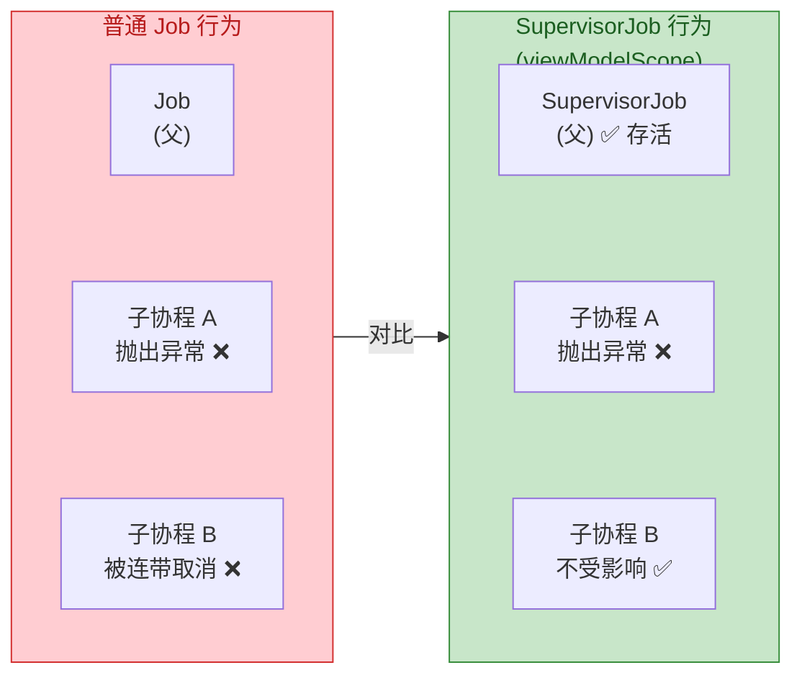

但仅有 `SupervisorJob` 还不够。异常虽然不会取消兄弟协程，但它仍然需要被"处理"，否则会成为未捕获异常（uncaught exception）。在协程框架中，未捕获异常的默认处理方式是交给**线程的 `UncaughtExceptionHandler`**，在 Android 上这通常意味着 **应用崩溃**。

处理异常的三层防线：

**第一层：在协程体内部 `try-catch`。** 这是最直接、最推荐的方式。每个 `launch` 块内部对可能失败的操作用 `try-catch` 包裹，然后将错误状态更新到 UI State 中。

**第二层：设置 `CoroutineExceptionHandler`。** 可以在 `viewModelScope.launch` 时传入一个 `CoroutineExceptionHandler` 作为上下文元素。当子协程（包括嵌套的子协程）抛出未捕获异常时，该 Handler 会被调用。需要注意的是，`CoroutineExceptionHandler` **只对 `launch` 启动的"根"协程或直接子协程有效**，对 `async` 启动的协程无效（`async` 的异常通过 `await()` 抛出）。

**第三层：全局 `CoroutineExceptionHandler`。** 通过 `ServiceLoader` 机制注册的全局处理器，作为最后的兜底。

以下代码展示了这几种异常处理策略：

```kotlin
class NewsViewModel(
    private val newsRepo: NewsRepository,   // 新闻数据源
    private val adsRepo: AdsRepository      // 广告数据源
) : ViewModel() {

    // UI 状态，使用 StateFlow 持有
    private val _uiState = MutableStateFlow<NewsUiState>(NewsUiState.Loading)
    val uiState: StateFlow<NewsUiState> = _uiState.asStateFlow()

    // ========== 策略 1：try-catch（最推荐） ==========
    fun loadNews() {
        viewModelScope.launch {
            // 使用 try-catch 包裹可能失败的挂起调用
            try {
                val news = newsRepo.fetchLatest()       // 可能抛出 IOException
                _uiState.value = NewsUiState.Success(news) // 成功时更新状态
            } catch (e: IOException) {
                // 网络异常被捕获，不会向上传播
                _uiState.value = NewsUiState.Error("网络错误: ${e.message}")
            }
            // CancellationException 不应捕获——它用于正常取消流程
            // 如果用 catch(e: Exception)，需手动 re-throw CancellationException
        }
    }

    // ========== 策略 2：CoroutineExceptionHandler ==========
    // 定义一个异常处理器，当协程内部未被 catch 的异常冒泡时触发
    private val exceptionHandler = CoroutineExceptionHandler { _, throwable ->
        // 这里在主线程执行（因为 viewModelScope 调度器是 Main.immediate）
        // 可以更新 UI 状态或做日志记录
        _uiState.value = NewsUiState.Error("未预期的错误: ${throwable.message}")
    }

    fun loadNewsWithHandler() {
        // 将 exceptionHandler 作为上下文元素传入 launch
        viewModelScope.launch(exceptionHandler) {
            // 此处故意不 try-catch
            val news = newsRepo.fetchLatest()  // 如果抛出异常...
            _uiState.value = NewsUiState.Success(news)
            // ...异常会被 exceptionHandler 捕获，而不是导致崩溃
        }
    }

    // ========== 策略 3：SupervisorJob 的隔离效果演示 ==========
    fun loadDashboard() {
        // 协程 A：加载新闻
        viewModelScope.launch {
            try {
                val news = newsRepo.fetchLatest()
                _uiState.value = NewsUiState.Success(news)
            } catch (e: Exception) {
                // 即使这里不 catch，协程 B 也不会被取消
                // 因为 viewModelScope 使用了 SupervisorJob
                _uiState.value = NewsUiState.Error(e.message ?: "")
            }
        }

        // 协程 B：加载广告（与协程 A 完全独立）
        viewModelScope.launch {
            // 协程 A 失败不影响此处执行
            val ads = adsRepo.fetchAds()  // 独立执行
            _adsState.value = ads         // 独立更新广告状态
        }
    }

    // ========== 陷阱：在 launch 内部使用 coroutineScope 会改变传播行为 ==========
    fun loadWithNestedScope() {
        viewModelScope.launch(exceptionHandler) {
            // coroutineScope 使用的是普通 Job（非 Supervisor）
            // 其内部任何子协程失败会取消整个 coroutineScope 块
            coroutineScope {
                // 子协程 X
                launch {
                    newsRepo.fetchLatest()  // 如果这里失败...
                }
                // 子协程 Y
                launch {
                    adsRepo.fetchAds()  // ...这里也会被取消！
                }
            }
            // 如果需要子协程互相隔离，应使用 supervisorScope 替代 coroutineScope
        }
    }
}
```

这段代码中有一个非常关键的细节值得展开：**`coroutineScope` 与 `supervisorScope` 的区别**。当你在 `viewModelScope.launch` 内部使用 `coroutineScope { ... }` 创建一个子作用域时，这个子作用域使用的是 **普通 Job**，不是 `SupervisorJob`。因此，其内部的子协程之间不是隔离的。很多开发者误以为"我用了 `viewModelScope`，所有协程就是隔离的"，但实际上隔离只作用于 `viewModelScope` 直接的子协程层级。如果需要在更深层嵌套中也保持隔离，必须显式使用 `supervisorScope { ... }`。

另一个常见的误区是 **`async` 的异常传播**。在 `viewModelScope`（`SupervisorJob`）的直接子级使用 `async` 时，如果 `async` 协程抛出异常但你没有调用 `await()`，该异常会被"静默吞掉"（在 `SupervisorJob` 下不会向上传播）。但如果调用了 `await()`，异常会在 `await()` 调用处重新抛出。如果 `async` 不是直接子级，而是嵌套在 `coroutineScope` 中，则其异常仍然会通过普通 Job 的传播机制影响兄弟协程。

用一段伪码来总结异常传播的完整路径：

```text
viewModelScope (SupervisorJob)
├── launch A（失败） → 异常不传播给父级 → 兄弟 B 不受影响
│                    → 如无 try-catch 且无 Handler → 应用崩溃
├── launch B（正常） → 继续运行 ✅
├── launch C
│   └── coroutineScope（普通 Job）
│       ├── launch X（失败） → 取消 Y → 取消整个 coroutineScope → 异常传给 C
│       └── launch Y（被连带取消）
└── launch D
    └── supervisorScope（SupervisorJob）
        ├── launch X（失败） → Y 不受影响 ✅
        └── launch Y（正常） → 继续运行 ✅
```

最后，还需注意 `CancellationException` 的特殊地位。在结构化并发中，`CancellationException` **不被视为"失败"**。当协程因父 Job 取消或主动调用 `cancel()` 而抛出 `CancellationException` 时，它不会触发 `CoroutineExceptionHandler`，也不会向上传播为错误。这是设计意图：取消是正常的生命周期行为，不应被当作异常来处理。因此在你自己的 `try-catch` 中，如果用了通用的 `catch(e: Exception)`，务必重新抛出 `CancellationException`：

```kotlin
viewModelScope.launch {
    try {
        // 执行挂起操作
        someHeavyWork()
    } catch (e: CancellationException) {
        // ⚠️ 必须重新抛出，否则会破坏结构化并发的取消机制
        throw e
    } catch (e: Exception) {
        // 处理真正的业务异常
        _uiState.value = UiState.Error(e.message)
    }
}
```

---

**📝 练习题**

在一个 `ViewModel` 中，以下代码存在什么问题？

```kotlin
class OrderViewModel : ViewModel() {
    fun placeOrder(order: Order) {
        viewModelScope.launch {
            coroutineScope {
                val payment = async { paymentService.charge(order) }
                val inventory = async { inventoryService.reserve(order) }
                processOrder(payment.await(), inventory.await())
            }
        }
    }
}
```

当 `paymentService.charge()` 抛出异常时，以下哪种行为会发生？


A. 异常被 `viewModelScope` 的 `SupervisorJob` 隔离，`inventoryService.reserve()` 继续正常执行


B. `coroutineScope` 内的所有子协程被取消，异常传播到外层 `launch`，如无 Handler 则应用崩溃


C. `async` 的异常只在 `await()` 时才可见，`inventoryService.reserve()` 不受任何影响


D. `viewModelScope` 整体被取消，ViewModel 的所有其他协程也会被连带取消


**【答案】** B

**【解析】** `coroutineScope` 使用的是 **普通 Job**（非 `SupervisorJob`），因此内部任何子协程的异常都会取消整个 `coroutineScope` 块中的所有兄弟协程。当 `payment` 的 `async` 协程抛出异常时，`coroutineScope` 首先取消 `inventory` 对应的协程，然后将异常重新抛出到外层 `launch`。由于外层 `launch` 中没有 `try-catch`，也没有传入 `CoroutineExceptionHandler`，该异常成为未捕获异常，最终导致应用崩溃。选项 A 错误，因为 `SupervisorJob` 的隔离只作用于 `viewModelScope` 直接子级，而 `coroutineScope` 内部是普通 Job 的语义。选项 C 忽略了 `coroutineScope` 中普通 Job 的传播行为——虽然 `async` 确实在 `await()` 才抛出异常，但它的失败仍会通过父 Job 取消兄弟协程。选项 D 错误，因为异常传播到 `launch`（`viewModelScope` 的直接子级）后，`SupervisorJob` 阻止了异常进一步向上传播，其他兄弟协程不受影响。

---

## 生命周期感知协程

Android 应用开发中，协程与生命周期的协作是一个极其核心的话题。前面我们了解了 `LifecycleScope` 和 `ViewModelScope` 如何在组件销毁时自动取消协程，但这只是"最终兜底"——它们解决的是 **onDestroy 级别** 的资源释放。然而在实际场景中，一个更精细、也更容易被忽视的问题是：**当 Activity/Fragment 进入后台（STOPPED）时，那些持续收集数据的协程是否应该暂停？** 如果不暂停，它们会在用户完全看不到界面的情况下持续消耗 CPU、网络和内存，甚至触发无意义的 UI 更新。生命周期感知协程（Lifecycle-aware Coroutine）正是为了解决这一层问题而生的。本节将深入剖析 `repeatOnLifecycle` 的重启机制、`flowWithLifecycle` 的便捷封装，以及历史 API `launchWhenX` 被废弃的根本原因。

### repeatOnLifecycle 重启机制

#### 问题的起源：为什么 lifecycleScope.launch 不够用？

先回顾一个常见的 UI 层数据收集模式：

```kotlin
// ❌ 存在问题的写法
class MyActivity : AppCompatActivity() {
    override fun onCreate(savedInstanceState: Bundle?) {
        super.onCreate(savedInstanceState)
        // 在 lifecycleScope 中直接 collect
        lifecycleScope.launch {
            // viewModel.uiState 是一个 StateFlow
            viewModel.uiState.collect { state ->
                // 更新 UI
                updateUI(state)
            }
        }
    }
}
```

这段代码看起来没什么问题——`lifecycleScope` 会在 `onDestroy` 时取消协程，保证不会泄漏。但仔细思考一下 Activity 的生命周期变迁：当用户按下 Home 键，Activity 经历 `onPause → onStop`，此时界面已经完全不可见了。然而上面这个 `collect` 协程 **仍然在活跃地运行**，它会持续接收 `StateFlow` 的新值并调用 `updateUI()`。这带来三个显而易见的问题：

1. **资源浪费**：如果上游 Flow 是一个网络轮询或数据库监听，后台持续收集意味着 CPU 和网络资源被白白消耗。
2. **无意义的 UI 操作**：对一个不可见的 Activity 执行 `updateUI()` 是彻底的浪费，更严重的是在某些场景下可能导致崩溃（例如在 Fragment 视图已销毁后访问 `binding`）。
3. **状态不一致**：如果 Activity 在后台时接收了多次状态变更，当它回到前台时，用户看到的是最后一次更新的 UI，中间的过渡状态全部被跳过——这在动画场景中可能导致视觉跳变。

我们真正需要的语义是：**当生命周期至少处于某个状态（比如 STARTED）时开始收集，当降到该状态以下时停止收集，当再次回到该状态时重新开始收集。** 这就是 `repeatOnLifecycle` 的设计初衷。

#### repeatOnLifecycle 的使用方式

`repeatOnLifecycle` 是 `androidx.lifecycle:lifecycle-runtime-ktx` 库提供的一个 **挂起函数**（suspend function），它必须在协程中调用：

```kotlin
// ✅ 推荐写法
class MyActivity : AppCompatActivity() {
    override fun onCreate(savedInstanceState: Bundle?) {
        super.onCreate(savedInstanceState)
        // 在 lifecycleScope 中启动协程
        lifecycleScope.launch {
            // repeatOnLifecycle 是一个挂起函数，
            // 它会在生命周期到达 STARTED 时执行 block，
            // 降到 STARTED 以下（即 STOPPED）时取消 block，
            // 再次到达 STARTED 时重新执行 block。
            repeatOnLifecycle(Lifecycle.State.STARTED) {
                // 这个 block 内部拥有独立的 CoroutineScope
                // 每次"重启"都是一个全新的执行
                viewModel.uiState.collect { state ->
                    // 仅在 Activity 至少处于 STARTED 状态时更新 UI
                    updateUI(state)
                }
            }
            // ⚠️ 注意：代码执行到这里意味着 Lifecycle 已经 DESTROYED
            // 因为 repeatOnLifecycle 只有在 DESTROYED 时才会恢复（return）
        }
    }
}
```

核心要点有以下几个方面：

**第一，它是一个挂起函数而非启动器。** `repeatOnLifecycle` 本身不会创建新的协程，它挂起当前协程直到 Lifecycle 到达 DESTROYED 状态。这意味着写在 `repeatOnLifecycle { ... }` 之后的代码只有在组件销毁后才会执行。你不应该在其后面放任何有意义的逻辑。

**第二，block 会被反复执行。** 每当 Lifecycle 状态 **上升到（或高于）** 你指定的状态时，`block` 就会在一个新的 `CoroutineScope` 中被 launch。每当 Lifecycle 状态 **下降到该状态以下** 时，这个 scope 中的所有协程会被 **取消**。下一次状态上升，`block` 会被 **重新** launch，从头执行。这就是"repeat"名字的由来。

**第三，它适合收集多个 Flow。** 由于 `block` 内部提供了一个 `CoroutineScope`（实际上 `this` 就是 `CoroutineScope`），你可以在里面并发地 launch 多个收集任务：

```kotlin
repeatOnLifecycle(Lifecycle.State.STARTED) {
    // 并发收集多个 Flow——它们会同时启动、同时取消
    launch {
        // 收集 UI 状态流
        viewModel.uiState.collect { state ->
            updateUI(state)
        }
    }
    launch {
        // 收集导航事件流
        viewModel.navigationEvents.collect { event ->
            navigateTo(event)
        }
    }
}
```

#### 内部实现原理：LifecycleEventObserver + 子 Job

`repeatOnLifecycle` 的实现并不复杂，但设计得非常精巧。让我们用伪代码来还原其核心逻辑，帮助你建立直觉：

```kotlin
// 简化的 repeatOnLifecycle 内部实现思路（非完整源码）
suspend fun Lifecycle.repeatOnLifecycle(
    state: Lifecycle.State,          // 目标状态，如 STARTED
    block: suspend CoroutineScope.() -> Unit // 需要重复执行的挂起代码块
) {
    // 如果当前生命周期已经是 DESTROYED，直接返回，不执行任何逻辑
    if (currentState === Lifecycle.State.DESTROYED) return

    // 使用 suspendCancellableCoroutine 将回调式的 Lifecycle 观察
    // 转换为挂起语义。外部协程会在这里挂起，直到 DESTROYED 时恢复。
    suspendCancellableCoroutine<Unit> { cont ->
        // 记录当前正在运行的子 Job，方便取消
        var launchedJob: Job? = null

        // 创建一个 LifecycleEventObserver 来监听生命周期变化
        val observer = LifecycleEventObserver { _, event ->
            // 当生命周期到达目标状态时（如 ON_START）
            if (event.targetState >= state) {
                // 如果还没有运行中的 Job，就启动一个新的子协程来执行 block
                if (launchedJob == null || launchedJob?.isCompleted == true) {
                    launchedJob = cont.context.job.let { parentJob ->
                        // 在当前协程的上下文中 launch 一个新的子协程
                        CoroutineScope(cont.context).launch {
                            block() // 执行用户传入的 block（如 Flow.collect）
                        }
                    }
                }
            }
            // 当生命周期降到目标状态以下时（如 ON_STOP）
            if (event.targetState < state) {
                // 取消正在运行的子 Job——这会取消 block 中的所有协程
                launchedJob?.cancel()
                launchedJob = null
            }
            // 当 ON_DESTROY 事件到达时，恢复外层挂起的 continuation
            if (event == Lifecycle.Event.ON_DESTROY) {
                cont.resume(Unit)
            }
        }

        // 注册观察者
        addObserver(observer)

        // 如果外层协程被取消（如 lifecycleScope 取消），移除观察者并取消子 Job
        cont.invokeOnCancellation {
            launchedJob?.cancel()
            removeObserver(observer)
        }
    }
}
```

来看整个流转过程的时序图，注意 block 是如何在 STARTED/STOPPED 之间被"启动-取消-重启"的：

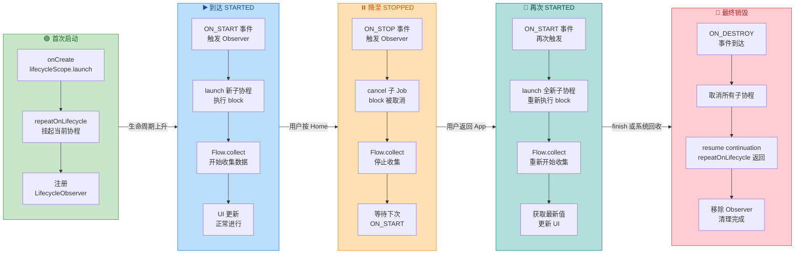

这里有一个非常关键的细节值得反复强调：**每次重启都是全新的执行**。当 `ON_STOP` 取消子协程后，block 内部的所有局部变量、状态都会丢失。下一次 `ON_START` 时，block 从第一行开始重新执行。这对于 `StateFlow` 来说完全不是问题，因为 `StateFlow` 总会在新的 `collect` 调用时立即发射当前值（replay = 1 的语义），所以 UI 会立刻刷新为最新状态。但如果你在 block 里维护了某些本地变量来追踪中间状态，它们会在每次重启时被重置——你需要意识到这一点。

#### 选择合适的 Lifecycle.State

`repeatOnLifecycle` 接受一个 `Lifecycle.State` 参数，最常用的两个选择是：

- **`Lifecycle.State.STARTED`**：这是 **绝大多数场景的推荐选择**。Activity 在 `onStart` 后、`onStop` 前处于 STARTED 或更高的状态。在这个范围内，Activity 对用户是"可见的"（visible），适合接收 UI 更新。
- **`Lifecycle.State.RESUMED`**：Activity 在 `onResume` 后、`onPause` 前处于 RESUMED 状态。这个范围更窄——在多窗口（Multi-Window）模式下，一个 Activity 可以处于 STARTED 但不是 RESUMED（它可见但没有焦点）。如果你只需要在 Activity 拥有焦点时才收集（比如需要访问相机），用 RESUMED 更合适。

一般建议优先使用 `STARTED`，因为它覆盖了用户能看到界面的所有场景，且与 Fragment 的 `viewLifecycleOwner` 配合时语义一致（Fragment 的 view 在 `onCreateView` 和 `onDestroyView` 之间存在，与 STARTED 大致对应）。

#### Fragment 中的特殊注意事项

在 Fragment 中使用 `repeatOnLifecycle` 时，有一个极易出错的点——**你应该使用 `viewLifecycleOwner.lifecycleScope` 而非 `lifecycleScope`**：

```kotlin
class MyFragment : Fragment() {
    override fun onViewCreated(view: View, savedInstanceState: Bundle?) {
        super.onViewCreated(view, savedInstanceState)
        // ✅ 正确：使用 viewLifecycleOwner，它与 Fragment 的 View 生命周期绑定
        viewLifecycleOwner.lifecycleScope.launch {
            viewLifecycleOwner.repeatOnLifecycle(Lifecycle.State.STARTED) {
                viewModel.uiState.collect { state ->
                    // 安全地访问 binding / view
                    binding.textView.text = state.title
                }
            }
        }

        // ❌ 错误：使用 Fragment 自身的 lifecycleScope
        // Fragment 的生命周期 ≠ Fragment View 的生命周期
        // 当 Fragment 进入 back stack 时，View 被销毁但 Fragment 还活着
        // 此时 collect 中访问 binding 会导致 NPE / 崩溃
        lifecycleScope.launch {
            repeatOnLifecycle(Lifecycle.State.STARTED) {
                // ⚠️ 这里的 this 是 Fragment 的 Lifecycle，不是 View 的
            }
        }
    }
}
```

原因在于，Fragment 和 Fragment 的 View 有 **两套不同的生命周期**。当 Fragment 被放入 Back Stack 时，它的 View 会被销毁（`onDestroyView` 被调用），但 Fragment 实例本身仍然存活。如果你用 `Fragment.lifecycleScope`，协程会在 Fragment 销毁时才取消，在 View 已经没了的时段内继续运行会导致访问已销毁 View 的问题。而 `viewLifecycleOwner.lifecycleScope` 会在 `onDestroyView` 时取消，完美匹配。

### flowWithLifecycle 便捷封装

#### 从 repeatOnLifecycle 到 flowWithLifecycle

如果你只需要收集 **单个 Flow**，`repeatOnLifecycle` 的样板代码显得有些冗长。`flowWithLifecycle` 是一个 **Flow 操作符**，它在内部调用了 `repeatOnLifecycle`，但把整个"启动-取消-重启"的语义包装成了一个新的 Flow：

```kotlin
class MyActivity : AppCompatActivity() {
    override fun onCreate(savedInstanceState: Bundle?) {
        super.onCreate(savedInstanceState)

        // 使用 flowWithLifecycle，代码更简洁
        lifecycleScope.launch {
            viewModel.uiState
                // flowWithLifecycle 在内部使用 repeatOnLifecycle
                // 当 Lifecycle 低于 STARTED 时上游被取消，
                // 回到 STARTED 时重新订阅上游
                .flowWithLifecycle(lifecycle, Lifecycle.State.STARTED)
                // 此处的 collect 只在 STARTED 以上状态时接收数据
                .collect { state ->
                    updateUI(state)
                }
        }
    }
}
```

#### flowWithLifecycle 的实现原理

`flowWithLifecycle` 的核心实现思路可以精简为以下逻辑：

```kotlin
// 简化的实现思路
fun <T> Flow<T>.flowWithLifecycle(
    lifecycle: Lifecycle,          // 要观察的生命周期
    minActiveState: Lifecycle.State = Lifecycle.State.STARTED // 最低活跃状态
): Flow<T> = callbackFlow {
    // 在 callbackFlow 内部调用 repeatOnLifecycle
    lifecycle.repeatOnLifecycle(minActiveState) {
        // 每次生命周期达到目标状态时，重新 collect 上游 Flow
        this@flowWithLifecycle.collect { value ->
            // 将上游的值发送到 callbackFlow 的 channel 中
            send(value)
        }
    }
    // repeatOnLifecycle 返回意味着 DESTROYED
    close() // 关闭 channel
}
```

它本质上就是用 `callbackFlow`（一个能在回调中发射数据的冷流构建器）把 `repeatOnLifecycle` 的"块级"语义转换成了"操作符级"语义。每次 Lifecycle 进入活跃状态，内部都会重新 `collect` 上游 Flow；每次退出活跃状态，内部的 `collect` 被取消。最终效果和手写 `repeatOnLifecycle` 完全一致。

#### repeatOnLifecycle vs flowWithLifecycle：如何选择？

两者功能等价，但适用场景有微妙差异：

| 维度 | `repeatOnLifecycle` | `flowWithLifecycle` |
|---|---|---|
| **收集多个 Flow** | ✅ 推荐。block 内可并发 launch 多个 collect | ❌ 每次调用只包装一个 Flow |
| **收集单个 Flow** | 可以，但样板代码多 | ✅ 推荐。一行操作符即可 |
| **性能** | 直接取消 / 重启 block | 多了一层 `callbackFlow` 的 channel 开销，极微小 |
| **可组合性** | 块级 API，不适合 Flow 链式调用 | ✅ 可作为 Flow 链条中的一环 |

**简言之：多个 Flow 用 `repeatOnLifecycle`，单个 Flow 用 `flowWithLifecycle`。** 实际工程中，Google 官方更推荐 `repeatOnLifecycle` 作为标准范式，因为 UI 层收集多个 Flow 是非常常见的场景。

#### 常见误用：不要在 repeatOnLifecycle 内部使用 flowWithLifecycle

这是一个初学者容易犯的错误——将两者嵌套使用：

```kotlin
// ❌ 错误：双重包装，语义重复且浪费资源
lifecycleScope.launch {
    repeatOnLifecycle(Lifecycle.State.STARTED) {
        viewModel.uiState
            .flowWithLifecycle(lifecycle, Lifecycle.State.STARTED) // 多余！
            .collect { state ->
                updateUI(state)
            }
    }
}
```

`repeatOnLifecycle` 已经提供了生命周期感知的取消/重启机制，`flowWithLifecycle` 在其内部再包一次是完全多余的。这样做会导致 **双重嵌套的 repeatOnLifecycle 监听**，造成不必要的资源浪费和潜在的时序问题。在 `repeatOnLifecycle` 的 block 内，直接 `collect` 原始 Flow 即可。

### launchWhenX 废弃原因

#### launchWhenX 的历史背景

在 `repeatOnLifecycle` 出现之前，`lifecycle-runtime-ktx` 提供了三个便捷方法来实现"生命周期感知的协程启动"：

```kotlin
// 这三个 API 现已被标记为 @Deprecated
lifecycleScope.launchWhenCreated { /* ... */ }
lifecycleScope.launchWhenStarted { /* ... */ }
lifecycleScope.launchWhenResumed { /* ... */ }
```

它们的语义是：**当 Lifecycle 至少处于指定状态时，协程恢复执行；当 Lifecycle 降到该状态以下时，协程被挂起（suspend），而非取消（cancel）。** 注意这里用词的精确性——"挂起"和"取消"是两个完全不同的概念，正是这个区别导致了 `launchWhenX` 的根本性缺陷。

#### 挂起 vs 取消：问题的本质

让我们用一个具体例子来对比这两种语义的差异：

```kotlin
// 使用 launchWhenStarted（挂起语义）
lifecycleScope.launchWhenStarted {
    viewModel.locationFlow.collect { location ->
        // 当 Activity 进入 STOPPED 状态时：
        // ⚠️ collect 被挂起，但上游 locationFlow 仍在生产数据！
        // 上游如果是 SharedFlow，数据会积压在缓冲区中
        // 上游如果是 Channel，数据也会缓存等待消费
        updateLocationUI(location)
    }
}

// 使用 repeatOnLifecycle（取消语义）
lifecycleScope.launch {
    repeatOnLifecycle(Lifecycle.State.STARTED) {
        viewModel.locationFlow.collect { location ->
            // 当 Activity 进入 STOPPED 状态时：
            // ✅ 整个 collect 被取消，上游 Flow 也随之停止
            // 没有数据积压，没有资源浪费
            updateLocationUI(location)
        }
    }
}
```

让我们用时序图来清晰展示这两种机制在同一生命周期序列下的行为差异：

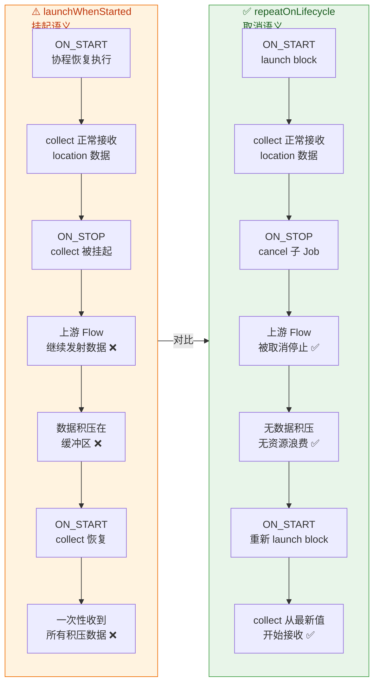

#### launchWhenX 的三大致命缺陷

**缺陷一：上游资源浪费。** `launchWhenStarted` 只是挂起了下游的 `collect`（消费者端），但上游的 Flow（生产者端）对此一无所知。如果上游是一个 `callbackFlow` 监听 GPS 传感器，传感器回调仍在持续触发、数据仍在持续产生。在 `collect` 被挂起期间，这些数据要么被丢弃（如果缓冲区满了），要么被积压在缓冲区中。不论哪种情况，GPS 硬件一直在工作，电量在白白消耗。而 `repeatOnLifecycle` 直接取消了整个 `collect` 协程，上游 `callbackFlow` 也会因为下游取消而执行其 `awaitClose` 清理逻辑（比如注销 GPS 监听器），真正实现了资源释放。

**缺陷二：数据积压与内存风险。** 当 `launchWhenStarted` 挂起了下游消费者时，如果上游是 `SharedFlow` 或 `Channel`，发射出的数据会在缓冲区中堆积。在用户长时间处于后台的情况下（比如切换到其他 App 十几分钟），缓冲区可能积累大量数据，造成内存压力。更糟的是，当用户回到前台时，消费者被恢复，它可能一次性处理大量积压的数据——这会导致短暂的 UI 卡顿，甚至 ANR（Application Not Responding）。`repeatOnLifecycle` 不存在这个问题，因为取消后再重启时，`StateFlow` 只发射当前最新值，`SharedFlow` 也只能获取 replay 缓存中的数据。

**缺陷三：语义不直观，容易误用。** "挂起但不取消"是一个很微妙的行为。很多开发者使用 `launchWhenStarted` 时，心里想的是"后台不执行"，但实际发生的是"后台暂停执行、前台恢复执行"——这两者有本质区别。如果 block 中不是 Flow 收集，而是一段顺序执行的逻辑，这种"暂停再继续"的行为很可能导致时序上的 Bug。`repeatOnLifecycle` 的语义更清晰：取消就是取消，重启就是从头来过。

#### launchWhenX 的内部机制：Dispatcher 拦截

`launchWhenX` 的实现方式也很有意思——它并没有在协程层面做暂停/恢复，而是通过一个特殊的 `CoroutineDispatcher`（称为 `PausingDispatcher`）来实现：

当 Lifecycle 状态低于目标时，`PausingDispatcher` 不会将协程调度到线程上执行，而是把待执行的 continuation 缓存在一个队列里。当 Lifecycle 回到目标状态时，队列中的 continuation 被逐个 resume。这种机制本质上是 **在 Dispatcher 层面模拟了"暂停"**，但它只能暂停协程的调度（即 continuation 的恢复），并不能暂停 Flow 的上游生产。因为上游可能运行在不同的 Dispatcher 上（如 `Dispatchers.IO`），`PausingDispatcher` 的拦截鞭长莫及。

这种设计从根本上注定了 `launchWhenX` 无法实现真正的"生命周期感知的 Flow 收集"，它只能暂停消费端而无法控制生产端——这也是它最终被废弃的技术根因。

#### 迁移路径

从 `launchWhenX` 迁移到 `repeatOnLifecycle` 非常简单：

```kotlin
// ❌ 旧写法（已废弃）
lifecycleScope.launchWhenStarted {
    viewModel.uiState.collect { state ->
        updateUI(state)
    }
}

// ✅ 新写法（推荐）
lifecycleScope.launch {
    repeatOnLifecycle(Lifecycle.State.STARTED) {
        viewModel.uiState.collect { state ->
            updateUI(state)
        }
    }
}
```

如果你使用的是 `lifecycle-runtime-ktx:2.4.0` 及以上版本，`launchWhenX` 已经被标记为 `@Deprecated`，IDE 会给出警告。在更新的版本中，这些 API 可能会被完全移除。尽早迁移是明智之举。

#### Compose 中的对应物：collectAsStateWithLifecycle

如果你使用 Jetpack Compose，Google 提供了一个更高层的封装——`collectAsStateWithLifecycle()`，它在内部使用了 `repeatOnLifecycle` 的等效机制：

```kotlin
@Composable
fun MyScreen(viewModel: MyViewModel = viewModel()) {
    // collectAsStateWithLifecycle 内部使用 repeatOnLifecycle
    // 当 Composable 所在的 Lifecycle 低于 STARTED 时停止收集
    // 回到 STARTED 时重新收集
    val uiState by viewModel.uiState.collectAsStateWithLifecycle()

    // 使用 uiState 构建 UI
    Text(text = uiState.title)
}
```

这个 API 来自 `androidx.lifecycle:lifecycle-runtime-compose` 库，是 Compose 项目中收集 `StateFlow` / `SharedFlow` 的标准方式。它与传统 View 体系中的 `repeatOnLifecycle` 是同一思想在不同 UI 框架中的体现。

---

**📝 练习题**

在一个 `Fragment` 的 `onViewCreated` 中，以下代码在 Fragment 被放入 Back Stack（View 被销毁但 Fragment 存活）后的行为是什么？

```kotlin
lifecycleScope.launch {
    repeatOnLifecycle(Lifecycle.State.STARTED) {
        viewModel.uiState.collect { state ->
            binding.textView.text = state.title
        }
    }
}
```

A. 协程被取消，不会访问已销毁的 View，代码安全


B. 协程继续运行，访问 `binding.textView` 时抛出 NPE 或 IllegalStateException


C. `repeatOnLifecycle` 感知到 View 销毁，自动切换到 `viewLifecycleOwner`


D. 协程被挂起，等待 Fragment 从 Back Stack 弹出后恢复执行


**【答案】** B

**【解析】** 这道题考查的是 Fragment 双生命周期的理解。代码中使用的是 `lifecycleScope`（即 `Fragment.lifecycleScope`），它绑定的是 **Fragment 自身的 Lifecycle**，而非 Fragment View 的 Lifecycle。当 Fragment 被放入 Back Stack 时，Fragment 的 View 被销毁（`onDestroyView`），但 Fragment 本身仍然存活（未经历 `onDestroy`）。因此 `Fragment.lifecycle` 并不会到达 DESTROYED，`repeatOnLifecycle` 也不会停止工作。当 Fragment 的 Lifecycle 状态在 STARTED 以上时（如果它被重新 attach 或者在某些配置下），`block` 内的 `collect` 会尝试访问 `binding.textView`——但此时 `binding` 已经失效（View 已销毁），导致空指针异常或 `IllegalStateException`。正确做法是使用 `viewLifecycleOwner.lifecycleScope` 和 `viewLifecycleOwner.repeatOnLifecycle(...)`，这样协程会在 `onDestroyView` 时被取消，彻底避免访问已销毁 View 的风险。选项 A 描述的是使用 `viewLifecycleOwner` 时的正确行为；选项 C 纯属虚构，`repeatOnLifecycle` 不会自动切换 LifecycleOwner；选项 D 描述的是 `launchWhenStarted` 的挂起语义，而非 `repeatOnLifecycle` 的取消语义。

---

## 挂起主线程 suspendCancellableCoroutine

在 Android 应用层开发中，我们面临一个根本性的矛盾：**协程世界是顺序式（sequential）的挂起-恢复模型，而大量平台 API 和第三方 SDK 仍然基于回调（callback）模式**。例如，`FusedLocationProviderClient.getLastLocation()` 返回的是一个 `Task<Location>`，动画监听用的是 `Animator.AnimatorListener`，蓝牙扫描使用 `ScanCallback`——它们都不是 suspend 函数，无法直接 `await`。如果在协程里嵌套回调，代码会退化回"回调地狱"，完全丧失协程带来的可读性优势。

`suspendCancellableCoroutine` 就是 Kotlin 协程库提供的 **桥接原语（bridging primitive）**，它能将任何一次性回调 API 包装成一个 suspend 函数，让调用者像写同步代码一样消费异步结果。它的核心契约非常简洁：**挂起当前协程，把恢复的控制权交给你（开发者），你在回调里手动恢复**。除了恢复能力，它还内建了**取消协作（cancellation cooperation）**机制——当协程被取消时，你可以同步清理底层资源（反注册监听、关闭连接等），避免泄漏。

理解这个 API 的工作原理，不仅能帮你优雅地"协程化"遗留代码，更能让你深入理解 **协程挂起的本质——Continuation 的传递与恢复**。

---

### 协程挂起的本质：Continuation 传递

要理解 `suspendCancellableCoroutine`，首先必须搞清楚 **suspend 函数在编译后究竟变成了什么**。Kotlin 编译器对每一个 suspend 函数执行一种叫做 **CPS（Continuation-Passing Style）变换** 的操作。简单来说，编译器会在函数签名末尾偷偷塞入一个额外参数 `Continuation<T>`，这个对象代表"挂起点之后剩余的计算"。

当一个 suspend 函数需要挂起时，它返回一个特殊的标记值 `COROUTINE_SUSPENDED`，告诉调用栈"我暂时不返回结果了，稍后通过 Continuation 回调来恢复"。这就是协程不阻塞线程的秘密——**线程的调用栈直接 unwind 了，但 Continuation 对象被保留在堆内存中**，等待某个时机被 `resume` 调用。

`suspendCancellableCoroutine` 正是把这个 Continuation 对象**暴露给开发者**的 API。它的签名如下：

```kotlin
// suspendCancellableCoroutine 的简化签名
// T 是挂起后恢复时返回的结果类型
// block 是 lambda，接收一个 CancellableContinuation<T>，你在里面注册回调
public suspend inline fun <T> suspendCancellableCoroutine(
    crossinline block: (CancellableContinuation<T>) -> Unit // 拿到 continuation 引用
): T // 挂起后恢复时，返回值类型为 T
```

调用 `suspendCancellableCoroutine` 时，协程引擎做了三件事：

1. **捕获当前 Continuation**：把当前协程挂起点之后的"剩余代码"封装成一个 `CancellableContinuation<T>` 对象。
2. **执行 block**：将这个 continuation 传入你的 lambda，你在 lambda 里启动异步操作、注册回调。
3. **挂起协程**：如果 block 执行完毕时 continuation 还没被 resume，协程就真正挂起；如果 block 内已同步 resume，则协程不真正挂起而是立即继续（这是一种优化）。

恢复后，`suspendCancellableCoroutine` 的返回值就是你调用 `continuation.resume(value)` 时传入的 `value`，或者如果你调用了 `continuation.resumeWithException(e)` 则会在挂起点抛出异常。

下面用一张时序图来展示整个过程：

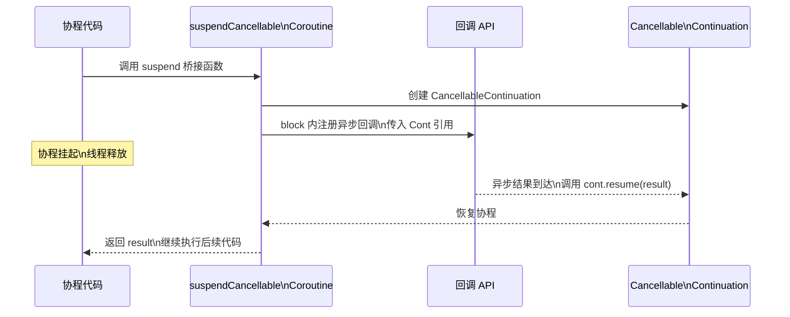

这里最关键的一点是：**从协程挂起到恢复之间，线程是空闲的**（或者被归还给线程池执行其他任务）。Continuation 对象作为"暂停的书签"存在堆内存中，体积极小（通常只有几十到几百字节的状态），这就是协程比线程轻量得多的根本原因。

---

### 转换回调 API：从回调到 suspend 的标准范式

接下来看具体的实战模式。Android 开发中最常见的回调 API 有以下几类，它们的转换手法大同小异，但细节上各有讲究。

#### Google Play Services Task API

Google 的 `Task<T>` 是 Android 平台最普遍的异步模型之一（`getLastLocation()`、`signIn()` 等都返回 Task）。将 Task 转成 suspend 函数是最经典的 `suspendCancellableCoroutine` 用例：

```kotlin
// 将 Google Task<T> 转换为 suspend 函数
// 调用方可以直接 val location = fusedClient.lastLocation.await()
suspend fun <T> Task<T>.await(): T {
    // 如果 Task 已经完成（缓存结果），无需挂起，直接返回
    if (isComplete) {
        // Task 成功完成时，返回结果
        val e = exception
        return if (e == null) {
            // 如果设置了 isCanceled 标志，抛出取消异常
            if (isCanceled) {
                throw CancellationException("Task $this was cancelled normally.")
            } else {
                // 安全地拿到结果（可能为 null，此时 T 应该是可空类型）
                @Suppress("UNCHECKED_CAST")
                result as T
            }
        } else {
            // Task 失败，将异常抛到协程中
            throw e
        }
    }

    // Task 尚未完成，需要真正挂起协程
    return suspendCancellableCoroutine { cont ->
        // 注册 Task 的完成监听器
        addOnCompleteListener { task ->
            // 回调触发时，检查 Task 状态
            val e = task.exception
            if (e == null) {
                // 成功分支
                @Suppress("UNCHECKED_CAST")
                if (task.isCanceled) {
                    // Task 被取消，对应协程也应取消
                    cont.cancel()
                } else {
                    // 正常恢复协程，传入结果值
                    cont.resume(task.result as T)
                }
            } else {
                // 失败分支：用异常恢复，协程挂起点会抛出此异常
                cont.resumeWithException(e)
            }
        }

        // 【关键】注册取消回调：协程被外部取消时，同步取消底层 Task
        // 这防止了协程已取消但 Task 还在跑的资源浪费
        cont.invokeOnCancellation {
            // 尝试取消 Task（参数 true 表示允许中断）
            // 注意：并非所有 Task 都支持取消，这里是 best-effort
            cancel()
        }
    }
}
```

这段代码有几个值得深入讨论的设计点。

**第一，"快路径"（fast path）优化**。在进入 `suspendCancellableCoroutine` 之前，先检查 `isComplete`。如果 Task 结果已经就绪（比如被缓存了），就完全跳过挂起逻辑，直接返回。这种 fast path 避免了不必要的 Continuation 对象创建和调度开销。协程库内部对此也有优化——如果在 `suspendCancellableCoroutine` 的 block 内同步调用了 `resume`，则协程不会真正挂起，而是 inline 继续执行，但**在外部提前检查更清晰、更高效**。

**第二，resume 的一次性契约**。`CancellableContinuation` 的 `resume` / `resumeWithException` / `cancel` **只能被调用一次**。如果你对同一个 continuation 多次调用 resume，会抛出 `IllegalStateException`。这是因为一个挂起点只能恢复一次——就像一个 `Promise` 只能 resolve 或 reject 一次。对于那些可能多次回调的 API（如传感器监听），`suspendCancellableCoroutine` 就不合适了，应该用 `callbackFlow`（后文异步流章节会讲到）。

**第三，`invokeOnCancellation` 是协作取消的核心**。当外部作用域取消（比如 Activity 销毁导致 `lifecycleScope` 取消），continuation 会被标记为 cancelled，此时 `invokeOnCancellation` 注册的回调会被同步触发，你可以在这里做清理工作。

#### 动画完成等待

另一个常见场景是等待 Android 属性动画完成。`Animator` 的回调接口有四个方法（onStart / onEnd / onCancel / onRepeat），但我们只关心"结束"：

```kotlin
// 将 Animator 转为 suspend 函数，等待动画播放完毕
// 调用方：myAnimator.awaitEnd()  // 挂起直到动画结束
suspend fun Animator.awaitEnd() {
    // 如果动画当前没在运行，直接返回，无需挂起
    if (!isRunning) return

    // 动画正在运行，挂起协程直到结束
    suspendCancellableCoroutine { cont ->
        // 创建监听器引用，后面取消时需要移除
        val listener = object : AnimatorListenerAdapter() {
            // 标记是否已恢复，防止 onEnd + onCancel 双重触发
            private var resumed = false

            // 动画正常结束
            override fun onAnimationEnd(animation: Animator) {
                // 移除自身监听，避免内存泄漏
                animation.removeListener(this)
                if (!resumed) {
                    resumed = true
                    // 恢复协程，返回 Unit
                    cont.resume(Unit)
                }
            }

            // 动画被外部取消（如 animator.cancel()）
            override fun onAnimationCancel(animation: Animator) {
                // 移除自身监听
                animation.removeListener(this)
                if (!resumed) {
                    resumed = true
                    // 动画取消也视为协程取消
                    cont.cancel()
                }
            }
        }

        // 注册监听器
        addListener(listener)

        // 协程被取消时，同步取消动画并移除监听
        cont.invokeOnCancellation {
            // 取消动画播放（会触发 onAnimationCancel -> 但 resumed 已被设置）
            cancel() // Animator.cancel()
            // 确保监听器被移除
            removeListener(listener)
        }
    }
}
```

注意这里的 `resumed` 标志位。在实际的动画生命周期中，如果你调用 `Animator.cancel()`，系统会**先回调 `onAnimationCancel` 再回调 `onAnimationEnd`**。如果不加保护，同一个 continuation 就会被 resume 两次而崩溃。这是 `suspendCancellableCoroutine` 开发中最常见的陷阱之一。当然，你也可以用 `cont.isActive` 来检查 continuation 是否还处于可恢复状态，或者使用 `resume` 的安全变体 `cont.tryResume()`（在竞争条件下返回 null 而不是抛异常），但**加一个布尔标志是最直观、最不易出错的做法**。

#### View 布局等待

在 Android UI 开发中，有时我们需要等待 View 完成布局之后再读取其宽高或执行动画。传统方式是使用 `ViewTreeObserver.OnGlobalLayoutListener`，代码相当啰嗦。用 `suspendCancellableCoroutine` 可以优雅地封装：

```kotlin
// 挂起直到 View 完成下一次布局
// 调用方：view.awaitNextLayout()  之后就能安全读取 view.width/height
suspend fun View.awaitNextLayout() {
    suspendCancellableCoroutine { cont ->
        // 创建布局监听器
        val listener = object : View.OnLayoutChangeListener {
            override fun onLayoutChange(
                v: View, // 发生布局变化的 View
                left: Int, top: Int, right: Int, bottom: Int,    // 新位置
                oldLeft: Int, oldTop: Int, oldRight: Int, oldBottom: Int // 旧位置
            ) {
                // 布局完成，立即移除监听（一次性）
                v.removeOnLayoutChangeListener(this)
                // 恢复协程
                cont.resume(Unit)
            }
        }

        // 注册布局变化监听
        addOnLayoutChangeListener(listener)

        // 协程取消时移除监听，避免泄漏
        cont.invokeOnCancellation {
            removeOnLayoutChangeListener(listener)
        }
    }
}
```

这类 "一次性事件等待" 的模式几乎都是同一个模板：**注册监听 → 在回调里 resume → 在 invokeOnCancellation 里反注册**。掌握这个三板斧，你就能把 Android 上几乎所有的单次回调 API 转成干净的 suspend 函数。

---

### continuation.resume 的内部机制

当你调用 `cont.resume(value)` 时，协程引擎内部究竟发生了什么？这个过程分为几个阶段，理解它有助于排查一些"怎么恢复到了错误线程"或"resume 了但协程没反应"的诡异 bug。

**第一阶段：状态检查与 CAS 竞争**。`CancellableContinuationImpl`（`CancellableContinuation` 的实现类）内部维护了一个状态机，用 `AtomicRef` 管理状态流转。合法的状态转移只有 `ACTIVE → RESUMED` 或 `ACTIVE → CANCELLED`。当你调用 `resume` 时，引擎通过 CAS（Compare-And-Swap）操作尝试将状态从 `ACTIVE` 变为 `RESUMED`。如果 CAS 失败（说明已经被取消或已经 resume 了），根据策略不同可能抛异常或忽略。这就是为什么**同一个 continuation 不能 resume 两次**——第二次 CAS 一定失败。

**第二阶段：调度（Dispatching）**。状态成功切换后，协程引擎需要决定在哪个线程恢复执行。这取决于协程创建时绑定的 `CoroutineDispatcher`：

- 如果协程在 `Dispatchers.Main` 上运行，resume 会通过 `Handler.post()` 把恢复逻辑投递到主线程消息队列。
- 如果在 `Dispatchers.IO` 上运行，恢复逻辑会被提交到 IO 线程池。
- 如果在 `Dispatchers.Unconfined` 上运行，**恢复直接在调用 resume 的那个线程上执行**（无调度）。

这意味着，**即使你的回调在子线程中触发了 `cont.resume(value)`，协程依然会回到它原本的调度器上继续执行**。这是协程的一个强大保证——你不需要手动 `withContext` 切回主线程，只要协程本身运行在 `Dispatchers.Main` 上，resume 之后就自动回到主线程。

**第三阶段：执行恢复**。调度器把恢复任务投递到目标线程后，协程状态机从挂起点继续执行。`suspendCancellableCoroutine` 的返回值就是 `resume` 传入的 `value`，后续代码接着跑。

用一个更直观的流程图来梳理：

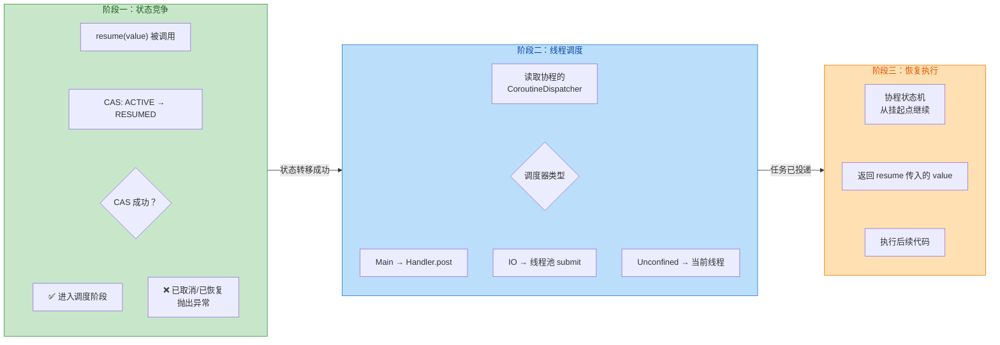

有一个特别容易忽视的问题：**`resume` 调用后，协程不一定立即恢复**。如果目标调度器是 `Dispatchers.Main`，而你在子线程的回调中 `resume`，那么恢复动作要等到主线程的 Looper 处理到这条消息才会执行。在高负载下，这可能有几毫秒甚至十几毫秒的延迟。这就是为什么在性能敏感的动画场景中，有些开发者会使用 `Dispatchers.Main.immediate`——它能在"已经处于主线程"时跳过 `Handler.post` 直接执行。

---

### resume 的变体方法

`CancellableContinuation` 提供了多个恢复方法，适用于不同场景：

| 方法 | 行为 | 适用场景 |
|------|------|----------|
| `resume(value)` | 传入成功结果恢复协程 | 最常用，回调成功时 |
| `resumeWithException(e)` | 传入异常恢复，挂起点抛出该异常 | 回调失败时 |
| `cancel()` | 以 `CancellationException` 取消 | 底层操作本身被取消 |
| `resume(value) { onCancellation }` | resume 的同时提供取消回调 | 需要释放 resume 传入的资源 |
| `tryResume(value)` | 尝试恢复，失败返回 null 而非抛异常 | 多线程竞争场景 |

其中 `resume(value) { onCancellation }` 值得特别解释。它解决的是一个**竞态条件**：你调用 `resume(value)` 的瞬间，协程可能恰好被取消了。此时 `value`（比如一个打开的文件描述符、数据库连接）已经被传入但不会被消费，如果不清理就会泄漏。这个尾部 lambda 会在这种竞态发生时被调用，让你有机会释放资源：

```kotlin
// resume 传入一个需要手动关闭的资源
// 如果恢复瞬间协程被取消，尾部 lambda 负责关闭资源
suspendCancellableCoroutine { cont ->
    openConnectionAsync { connection ->
        // resume 并附带取消清理逻辑
        cont.resume(connection) { cause ->
            // 这个 lambda 仅在 resume 与 cancel 竞态时触发
            // cause 是取消的原因（CancellationException）
            connection.close() // 确保连接不泄漏
        }
    }
}
```

---

### 取消响应：invokeOnCancellation 深入

`invokeOnCancellation` 是 `suspendCancellableCoroutine` 取消协作机制的核心。它注册一个 handler，当 continuation 被取消时触发。需要注意以下关键行为：

**调用时机**。`invokeOnCancellation` 的回调在以下两种情况会被触发：

1. **协程作用域被取消**（如 `lifecycleScope` 因 Activity 销毁而取消）—— 自上而下的取消传播。
2. **手动调用 `cont.cancel()`**（如底层操作本身取消了）。

**线程安全性**。`invokeOnCancellation` 的回调**可能在任意线程上执行**。如果取消发生在注册 `invokeOnCancellation` 之前（即 continuation 已经处于 `CANCELLED` 状态时你才注册），回调会**同步**在当前线程立即执行。如果取消发生在注册之后，回调在取消操作的线程上执行。因此，你在 `invokeOnCancellation` 里做的事情**必须是线程安全的**。对于 Android UI 操作（如移除 View 监听器），如果你不确定取消发生在哪个线程，最好用 `view.post { ... }` 投递到主线程。

**只能注册一次**。对同一个 continuation 多次调用 `invokeOnCancellation` 会抛出 `IllegalStateException`。这是一个常见错误——如果你在 block 里有复杂的分支逻辑，确保只调用一次。

**不要在里面做耗时操作**。`invokeOnCancellation` 被设计为一个快速的同步清理点。如果你需要在取消时做异步清理（如发送网络请求通知服务端），应该在另一个 `NonCancellable` 上下文中启动新协程。

下面是一个综合示例——将 OkHttp 的异步 Call 转为 suspend 函数，展示完整的取消协作：

```kotlin
// 将 OkHttp Call 转换为 suspend 函数
// 调用方：val response = client.newCall(request).await()
suspend fun Call.await(): Response {
    return suspendCancellableCoroutine { cont ->
        // 注册取消回调：协程取消时，取消 HTTP 请求
        // 这会导致 onFailure 被回调，传入 IOException
        cont.invokeOnCancellation {
            // Call.cancel() 是线程安全的，可在任意线程调用
            cancel()
        }

        // 发起异步请求
        enqueue(object : Callback {
            // HTTP 请求成功
            override fun onResponse(call: Call, response: Response) {
                // 通过 resume 恢复协程，传入 Response 对象
                cont.resume(response) {
                    // 竞态保护：如果 resume 瞬间协程被取消
                    // Response body 必须关闭，否则连接泄漏
                    response.body?.close()
                }
            }

            // HTTP 请求失败（包括被 cancel 触发的 IOException）
            override fun onFailure(call: Call, e: IOException) {
                // 检查 continuation 是否还活着
                // 如果协程已取消，cont 处于 CANCELLED 状态
                // resumeWithException 会被忽略（不会抛 IllegalStateException）
                if (cont.isActive) {
                    // 用异常恢复协程
                    cont.resumeWithException(e)
                }
            }
        })
    }
}
```

这段代码有一个非常精妙的细节：当协程被取消时，`invokeOnCancellation` 调用 `call.cancel()`，这会导致 OkHttp 回调 `onFailure` 并传入 `IOException`。但此时 continuation 已经处于 `CANCELLED` 状态了，所以 `onFailure` 里的 `cont.isActive` 返回 `false`，`resumeWithException` 不会被执行。**取消路径和正常失败路径不会冲突**。这就是设计良好的取消协作。

---

### suspendCoroutine vs suspendCancellableCoroutine

Kotlin 标准库还提供了一个不带 "Cancellable" 的版本 `suspendCoroutine`。它们的核心区别如下：

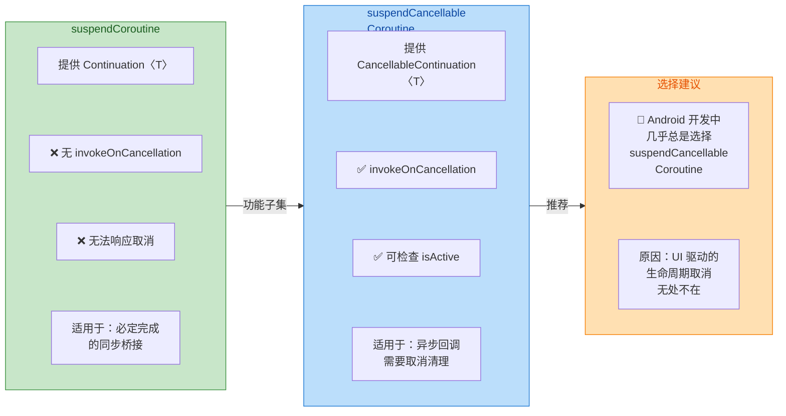

在 Android 开发中，**几乎不存在使用 `suspendCoroutine` 的正当理由**。因为 Android 应用的协程总是运行在某个生命周期作用域下（`lifecycleScope` / `viewModelScope`），随时可能因用户操作而取消。如果你用了 `suspendCoroutine`，协程被取消时底层异步操作依然在跑（没有清理入口），不仅浪费资源，还可能在回调中试图更新已销毁的 UI 而崩溃。

唯一可能用 `suspendCoroutine` 的场景是：你 100% 确定底层操作会立即同步完成（比如仅仅是把一个值包装成 suspend 形式），此时取消逻辑没有意义。但即便如此，用 `suspendCancellableCoroutine` 也没有额外开销，所以**默认选择 `suspendCancellableCoroutine` 是 Android 开发的最佳实践**。

---

### 常见陷阱与最佳实践

#### 陷阱一：忘记 resume 导致协程永久挂起

如果你的回调因为某种原因永远不会触发（比如注册了一个生命周期监听但 Activity 已经销毁了），continuation 永远不会被 resume，协程就**永久挂起**在那里。虽然它不阻塞线程，但 continuation 对象和它引用的所有上下文会一直留在内存中，造成**内存泄漏**。

防御策略是：**始终确保有一条路径能 resume**。例如注册超时机制，或者在 `invokeOnCancellation` 中确保清理，让外部取消来兜底：

```kotlin
// 超时保护示例：配合 withTimeout 使用
// 如果 5 秒内回调没触发，withTimeout 会取消协程
// invokeOnCancellation 会清理监听器
val result = withTimeout(5000L) {
    suspendCancellableCoroutine { cont ->
        // 注册回调...
        someApi.registerCallback { value ->
            cont.resume(value)   // 正常路径恢复
        }
        cont.invokeOnCancellation {
            someApi.unregisterCallback() // 超时取消时清理
        }
    }
}
```

#### 陷阱二：在多次回调的 API 上使用

`suspendCancellableCoroutine` 只能 resume 一次。如果你把它用在"持续推送数据"的 API 上（如传感器监听、WebSocket 消息流），第二次回调就会崩溃。**对于多次回调的 API，应该使用 `callbackFlow` 而非 `suspendCancellableCoroutine`**。区分标准很简单：

- **一次性结果**（网络请求、动画结束、布局完成）→ `suspendCancellableCoroutine`
- **多次事件流**（传感器数据、位置更新、WebSocket 消息）→ `callbackFlow`

#### 陷阱三：resume 时不考虑线程安全

在多线程环境下，回调可能在任意线程触发。虽然 `CancellableContinuation` 的 `resume` 本身是线程安全的（内部通过 CAS 保证原子性），但如果你在 resume 前有一些共享状态的读写（比如检查一个标志位再决定是否 resume），那段逻辑需要你自行保证线程安全：

```kotlin
// ❌ 错误示例：非原子的 check-then-act
var hasResumed = false // 共享可变状态，非线程安全

suspendCancellableCoroutine { cont ->
    someApi.onResult { value ->
        if (!hasResumed) {      // 线程 A 读到 false
            hasResumed = true   // 线程 B 也可能同时读到 false
            cont.resume(value)  // 两个线程都尝试 resume → 崩溃
        }
    }
}

// ✅ 正确做法：利用 cont 自身的原子性
suspendCancellableCoroutine { cont ->
    someApi.onResult { value ->
        // tryResume 是原子操作，失败返回 null
        val token = cont.tryResume(value)
        if (token != null) {
            // 只有成功 tryResume 的线程才能 completeResume
            cont.completeResume(token)
        }
    }
}
```

`tryResume` + `completeResume` 是一对低级别 API，它们把 resume 拆成两步：`tryResume` 通过 CAS 尝试占有恢复权（返回一个 token），`completeResume` 用这个 token 真正触发恢复。只有 CAS 成功的线程能拿到非 null token，从而保证了**无锁的线程安全**。

---

### 实战综合：封装 Android 权限请求

最后来看一个更贴近实战的综合例子——把 Android 的运行时权限请求（基于 `ActivityResultLauncher`）封装成 suspend 函数。这个例子综合了前面所有知识点：

```kotlin
// PermissionManager: 将权限请求封装为 suspend 函数
// 使用方式：val granted = permissionManager.requestPermission(Manifest.permission.CAMERA)
class PermissionManager(private val activity: ComponentActivity) {

    // 保存当前的 continuation 引用（一次只能有一个权限请求在进行）
    private var continuation: CancellableContinuation<Boolean>? = null

    // 注册 ActivityResultLauncher（必须在 CREATED 之前注册）
    private val launcher = activity.registerForActivityResult(
        ActivityResultContracts.RequestPermission()
    ) { isGranted: Boolean ->
        // 权限结果回调：resume 协程并传入授权结果
        continuation?.resume(isGranted)
        // 清除引用，避免泄漏
        continuation = null
    }

    // 挂起函数：请求权限并返回是否授权
    suspend fun requestPermission(permission: String): Boolean {
        return suspendCancellableCoroutine { cont ->
            // 保存 continuation 引用供回调使用
            continuation = cont

            // 协程取消时清理引用
            cont.invokeOnCancellation {
                continuation = null
            }

            // 启动系统权限对话框
            launcher.launch(permission)
        }
    }
}

// 在 Activity 中的使用示例
// lifecycleScope.launch {
//     val manager = PermissionManager(this@MainActivity)
//     val granted = manager.requestPermission(Manifest.permission.CAMERA)
//     if (granted) {
//         openCamera()  // 直接顺序执行，无需回调
//     } else {
//         showRationale()
//     }
// }
```

这段代码把原本需要 Launcher + 回调 + 状态管理的权限请求，变成了一行 `val granted = manager.requestPermission(...)` 的顺序调用。这就是 `suspendCancellableCoroutine` 的终极价值——**让异步代码读起来像同步代码，同时完全保留取消安全性**。

---

**📝 练习题**

一个 Android 开发者使用 `suspendCancellableCoroutine` 封装了一个异步定位 API，但在测试中发现：当用户快速切换页面（Fragment 被销毁）后，偶尔出现崩溃日志 `IllegalStateException: Already resumed`。以下哪项最可能是问题根因？


A. 没有使用 `Dispatchers.Main` 调度器，导致恢复到了错误线程


B. 定位回调可能触发多次（如先回调缓存位置再回调 GPS 精确位置），而 `resume` 只能调用一次


C. 忘记调用 `invokeOnCancellation`，导致 Fragment 销毁后 continuation 被 GC 回收


D. 使用了 `suspendCancellableCoroutine` 而非 `suspendCoroutine`，后者不会抛出此异常


**【答案】** B

**【解析】** `Already resumed` 异常只会在对同一个 `CancellableContinuation` 调用两次 `resume` 时抛出。定位 API 的一个常见行为是先快速返回一个缓存的（低精度）位置，然后在 GPS 定位成功后再回调一次精确位置——即回调会触发多次。而 `suspendCancellableCoroutine` 遵循一次性 resume 契约，第二次调用 `resume` 就会抛出 `IllegalStateException`。正确的做法要么在第一次回调后就移除监听器（只取首次结果），要么改用 `callbackFlow` 来处理多次回调的流式数据。选项 A 无关——调度器错误不会导致 `Already resumed`；选项 C 也不对——`invokeOnCancellation` 缺失会导致资源泄漏但不会引起这个异常，且 continuation 不会因 Fragment 销毁被 GC（它被协程引擎持有）；选项 D 更是误导——`suspendCoroutine` 对重复 resume 同样会抛异常，且缺少取消支持反而更危险。

---

## 异常处理 ExceptionHandler

在 Android 协程开发中，**异常处理机制**是保障应用稳定性的关键环节。与传统线程中 `try-catch` 的直觉式处理不同，协程的结构化并发（Structured Concurrency）引入了全新的异常传播规则：子协程的异常会向上传播至父协程，最终可能导致整个作用域崩溃。理解这套机制对于编写健壮的 Android 应用至关重要。

协程异常处理的核心挑战在于：**launch 启动的协程无法像 async 那样通过返回值传递异常**。当 `launch` 协程内部抛出未捕获异常时，异常会沿着 Job 层级向上传播，触发父 Job 的取消，进而取消所有兄弟协程。这种"一损俱损"的默认行为在某些场景下显得过于激进——比如一个列表页面同时发起多个网络请求，我们往往希望单个请求失败不影响其他请求。

### CoroutineExceptionHandler 全局捕获

`CoroutineExceptionHandler` 是协程库提供的**最后一道防线**，用于捕获那些未被处理的异常。它的设计理念类似于 Java 中的 `Thread.UncaughtExceptionHandler`——当异常无处可去时，由它来兜底。

**核心原理**：CoroutineExceptionHandler 并不阻止异常传播，而是在异常传播完成、协程即将终止时被调用。换言之，当你看到 Handler 被触发时，协程已经处于 cancelling 状态，无法恢复。它的主要职责是**记录日志、上报崩溃、执行清理操作**，而非"吞掉"异常继续执行。

```kotlin
// 创建一个全局异常处理器
// CoroutineExceptionHandler 接收两个参数：CoroutineContext 和 Throwable
val exceptionHandler = CoroutineExceptionHandler { context, throwable ->
    // context: 发生异常的协程上下文，可从中获取 Job、CoroutineName 等信息
    // throwable: 未捕获的异常实例
    
    // 获取协程名称用于日志追踪（如果设置了 CoroutineName）
    val coroutineName = context[CoroutineName]?.name ?: "unnamed"
    
    // 实际项目中通常会上报到 Crashlytics/Sentry 等平台
    Log.e("CoroutineError", "协程 [$coroutineName] 发生未捕获异常", throwable)
    
    // 注意：此处不能恢复协程，只能做善后处理
}
```

**安装位置决定生效范围**：CoroutineExceptionHandler 必须安装在**根协程**（即 CoroutineScope 直接启动的协程）上才能生效。这是因为子协程的异常会向上传播给父协程处理，只有根协程没有父级，异常才会"无处可去"而触发 Handler。

```kotlin
class MyViewModel : ViewModel() {
    // 正确做法：Handler 安装在 viewModelScope.launch 的上下文中
    // viewModelScope.launch 启动的是根协程
    fun loadData() {
        viewModelScope.launch(exceptionHandler) {
            // 此处的异常会被 exceptionHandler 捕获
            val data = repository.fetchData()  // 假设这里抛出 IOException
            
            // 即使嵌套 launch，异常依然会传播到根协程的 Handler
            launch {
                // 这里的异常同样会被上层的 exceptionHandler 捕获
                processData(data)
            }
        }
    }
    
    // 错误做法：Handler 安装在子协程上
    fun loadDataWrong() {
        viewModelScope.launch {
            // ❌ 错误！Handler 安装在子协程上不会生效
            // 异常会继续向上传播到 viewModelScope
            launch(exceptionHandler) {
                throw RuntimeException("This won't be caught by handler!")
            }
        }
    }
}
```

**与 async 的特殊关系**：`async` 构建器启动的协程在异常处理上有独特行为。async 协程的异常会被"暂存"到 `Deferred` 对象中，只有在调用 `await()` 时才会重新抛出。但如果 async 协程失败后**从未调用 await()**，异常依然会传播并触发 Handler。

```kotlin
viewModelScope.launch(exceptionHandler) {
    // async 返回 Deferred，异常被暂存
    val deferred = async {
        throw IllegalStateException("Async 内部异常")
    }
    
    // 场景1：调用 await()，异常在此处抛出
    // 可以用 try-catch 在这里捕获
    try {
        val result = deferred.await()  // 异常在此重新抛出
    } catch (e: IllegalStateException) {
        Log.w("TAG", "捕获到 async 异常: ${e.message}")
    }
    
    // 场景2：如果不调用 await()，且 async 协程已失败
    // 异常会在 async 协程完成时传播，最终触发 exceptionHandler
}
```

**全局默认 Handler 的设置**：在 Application 级别，可以通过 ServiceLoader 机制注册全局默认的 CoroutineExceptionHandler，作为整个应用的兜底。不过在 Android 开发中，更常见的做法是结合 `Thread.setDefaultUncaughtExceptionHandler` 配合崩溃上报 SDK 使用。

```kotlin
// 在 Application.onCreate 中设置（生产环境的常见模式）
class MyApplication : Application() {
    override fun onCreate() {
        super.onCreate()
        
        // 保存原有的 Handler 以便链式调用
        val defaultHandler = Thread.getDefaultUncaughtExceptionHandler()
        
        Thread.setDefaultUncaughtExceptionHandler { thread, throwable ->
            // 上报到 Crashlytics（示例）
            // Firebase.crashlytics.recordException(throwable)
            
            Log.e("GlobalCrash", "线程 ${thread.name} 发生未捕获异常", throwable)
            
            // 调用原有 Handler，通常会终止进程
            defaultHandler?.uncaughtException(thread, throwable)
        }
    }
}
```

### supervisorScope 隔离

`supervisorScope` 是协程库提供的**异常隔离机制**，它打破了"一个子协程失败导致所有兄弟协程取消"的默认行为。在 supervisorScope 内部，子协程的失败是**独立的**——一个子协程抛出异常不会影响其他子协程，也不会取消父协程。

**底层原理**：supervisorScope 内部使用 `SupervisorJob` 作为其 Job。普通 Job 在子 Job 失败时会取消自身和所有其他子 Job，而 SupervisorJob 则会**忽略子 Job 的失败**，仅让失败的子 Job 自行终止。这种设计非常适合"并行独立任务"的场景。

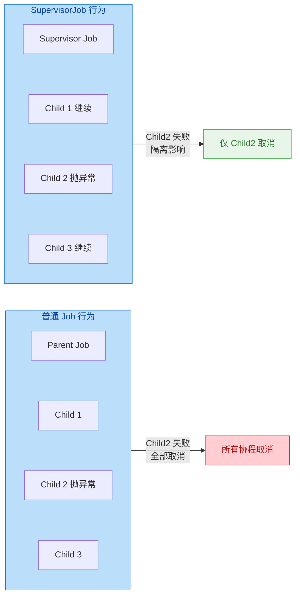

**supervisorScope 与 coroutineScope 的对比**：两者都会创建新的作用域并等待所有子协程完成，但异常处理策略截然不同。`coroutineScope` 在任一子协程失败时会立即取消所有子协程并抛出异常；`supervisorScope` 则允许其他子协程继续执行，仅在所有子协程完成后才结束。

```kotlin
// 使用 supervisorScope 实现并行网络请求，互不影响
suspend fun loadDashboard(): DashboardData {
    // supervisorScope 创建一个 SupervisorJob 作用域
    // 内部子协程的失败相互隔离
    return supervisorScope {
        // 三个独立的网络请求并行执行
        // 使用 async 启动，方便获取结果或捕获异常
        
        val userDeferred = async {
            // 获取用户信息，可能失败
            userRepository.getCurrentUser()
        }
        
        val feedDeferred = async {
            // 获取动态流，可能失败
            feedRepository.getLatestFeed()
        }
        
        val notificationDeferred = async {
            // 获取通知数量，可能失败
            notificationRepository.getUnreadCount()
        }
        
        // 分别处理每个请求的结果
        // 使用 runCatching 将异常转换为 Result 类型
        val user = runCatching { userDeferred.await() }.getOrNull()
        val feed = runCatching { feedDeferred.await() }.getOrDefault(emptyList())
        val unreadCount = runCatching { notificationDeferred.await() }.getOrDefault(0)
        
        // 即使部分请求失败，也能返回部分有效数据
        DashboardData(user, feed, unreadCount)
    }
}
```

**SupervisorJob 在 ViewModel 中的应用**：前面章节提到的 `viewModelScope` 内部就使用了 SupervisorJob。这意味着在同一个 ViewModel 中启动的多个协程**默认就是相互隔离的**——一个网络请求失败不会导致其他协程被取消。这是 Jetpack 团队深思熟虑后的设计决策。

```kotlin
class DashboardViewModel : ViewModel() {
    // viewModelScope 源码简化版：
    // val viewModelScope = CoroutineScope(SupervisorJob() + Dispatchers.Main.immediate)
    // ⬆️ 注意这里使用的是 SupervisorJob
    
    private val _uiState = MutableStateFlow<UiState>(UiState.Loading)
    val uiState: StateFlow<UiState> = _uiState
    
    fun loadAllData() {
        // 这两个协程相互独立，一个失败不影响另一个
        viewModelScope.launch {
            try {
                val user = userRepository.getUser()
                _uiState.value = UiState.Success(user)
            } catch (e: Exception) {
                // 这个异常不会取消下面的 launch
                _uiState.value = UiState.Error(e.message)
            }
        }
        
        viewModelScope.launch {
            // 即使上面的协程抛出异常，这里依然会执行
            analyticsTracker.trackPageView("dashboard")
        }
    }
}
```

**supervisorScope 内部的异常处理陷阱**：虽然 supervisorScope 隔离了子协程的失败，但**子协程的异常仍需处理**。如果子协程抛出异常且未被捕获，异常依然会传播到 CoroutineExceptionHandler（如果安装了的话），或者导致应用崩溃。supervisorScope 只是阻止了异常取消兄弟协程，并不会"吞掉"异常。

```kotlin
viewModelScope.launch(exceptionHandler) {
    supervisorScope {
        launch {
            // ❌ 这个异常不会取消兄弟协程
            // 但依然会触发 exceptionHandler
            throw IOException("网络错误")
        }
        
        launch {
            // ✅ 这个协程会继续执行
            delay(1000)
            Log.d("TAG", "我不受影响")
        }
    }
}

// 更安全的写法：在每个子协程内部处理异常
viewModelScope.launch {
    supervisorScope {
        launch {
            // ✅ 推荐：在子协程内部 try-catch
            try {
                riskyOperation()
            } catch (e: Exception) {
                Log.e("TAG", "操作失败，但不影响其他任务", e)
            }
        }
        
        launch {
            // 其他任务正常进行
            safeOperation()
        }
    }
}
```

**异常传播规则总结**：理解协程异常处理的关键在于记住以下规则：

1. **launch 的异常会传播**：launch 协程内的未捕获异常会向上传播至父协程
2. **async 的异常会暂存**：async 协程的异常被封装到 Deferred 中，await() 时重新抛出
3. **普通 Job 会级联取消**：一个子协程失败会取消父协程和所有兄弟协程
4. **SupervisorJob 隔离失败**：子协程失败不影响兄弟协程，但异常仍需处理
5. **Handler 只是兜底**：CoroutineExceptionHandler 不能恢复协程，只能做善后

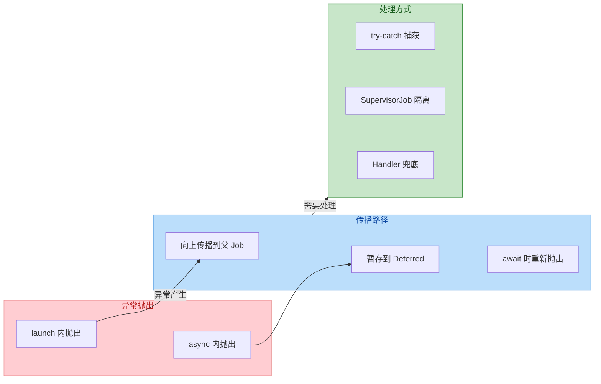

---

**📝 练习题**

在 Android 应用中，ViewModel 使用 viewModelScope 启动了两个并行协程分别请求用户信息和订单列表。如果用户信息请求抛出 `HttpException`，以下哪个说法是正确的？

A. 订单列表请求会被自动取消，因为它们共享同一个 CoroutineScope


B. 订单列表请求会继续执行，因为 viewModelScope 使用了 SupervisorJob


C. 两个请求都会被取消，且异常会直接导致应用崩溃


D. HttpException 会被 viewModelScope 自动捕获并转换为 null 返回值


**【答案】** B

**【解析】** viewModelScope 的实现使用了 `SupervisorJob() + Dispatchers.Main.immediate` 作为其 CoroutineContext。SupervisorJob 的核心特性是**子协程失败不会传播给父协程或兄弟协程**，因此一个协程抛出异常只会导致该协程自身取消，其他协程不受影响。选项 A 描述的是普通 Job 的行为；选项 C 错误，因为 SupervisorJob 阻止了级联取消；选项 D 完全错误，viewModelScope 不会自动转换异常。需要注意的是，虽然订单请求不会被取消，但用户请求的异常仍需通过 try-catch 或 CoroutineExceptionHandler 处理，否则会导致未处理异常。

---

## 异步流 Flow 在 Android

在响应式编程范式中，Kotlin Flow 是协程生态的核心组件，专门用于处理**异步数据流**。与 RxJava 相比，Flow 具有更轻量的 API、原生协程支持、以及更清晰的背压处理机制。在 Android 应用层，Flow 主要用于两大场景：**UI 状态管理**（StateFlow）和**一次性事件分发**（SharedFlow/Channel）。理解 Flow 的冷热流本质、缓冲机制与生命周期集成，是构建现代 Android 架构的基础。

### 冷流与热流的本质区别

Flow 设计的核心概念是**冷流（Cold Flow）**与**热流（Hot Flow）**的区分。冷流类似于"懒加载的序列"——只有当有订阅者（collector）开始收集时，数据生产才会启动；每个订阅者都会触发独立的生产过程，互不影响。热流则像"广播电台"——无论是否有订阅者，数据都在持续产生；订阅者加入时，只能收到加入后的数据（或根据配置收到最新缓存值）。

从实现机制来看，冷流的 `flow { ... }` 构建器中的代码块，会在每次 `collect` 调用时**重新执行**。这意味着如果你在 flow 中发起网络请求，每个订阅者都会触发一次独立的请求。这种行为对于"一次性数据获取"非常合适，但对于"状态共享"则会造成不必要的重复计算。

热流（StateFlow/SharedFlow）解决了这个问题。它们在 CoroutineScope 中**持续运行**，维护一个共享的数据源。所有订阅者从同一个源头获取数据，不会触发重复计算。这正是 MVVM 架构中 ViewModel 向多个 UI 组件分发状态的理想选择。

```kotlin
// 冷流示例：每次 collect 都会重新执行 flow 块
// 如果有 3 个订阅者，fetchUser() 会被调用 3 次
fun getUserFlow(): Flow<User> = flow {
    // 这段代码在每次 collect 时都会执行
    val user = fetchUser()  // 每个订阅者触发独立的网络请求
    emit(user)              // 发射数据给当前订阅者
}

// 热流示例：数据生产与订阅解耦
// StateFlow 持续维护最新状态，所有订阅者共享同一个值
class UserViewModel : ViewModel() {
    // 私有的可变状态流，仅 ViewModel 内部可修改
    private val _userState = MutableStateFlow<User?>(null)
    // 公开的只读状态流，UI 层只能观察不能修改
    val userState: StateFlow<User?> = _userState.asStateFlow()
    
    fun loadUser() {
        viewModelScope.launch {
            val user = fetchUser()  // 只执行一次
            _userState.value = user // 更新状态，所有订阅者自动收到
        }
    }
}
```

### StateFlow：UI 状态的最佳载体

StateFlow 是 Kotlin 协程库提供的**状态持有者（State Holder）**，专为 UI 状态管理设计。它具有以下核心特性：

**1. 必须有初始值**：StateFlow 在创建时必须提供一个初始状态值。这与 LiveData 的可空初始值不同，确保 UI 在任何时刻都能获取到有效状态，避免了空值检查的样板代码。

**2. 值语义的防抖机制**：StateFlow 内置了 `distinctUntilChanged` 行为——当你设置一个与当前值**结构相等**（通过 `equals()` 判断）的新值时，StateFlow 不会通知订阅者。这避免了不必要的 UI 重绘，但也要求你的状态类正确实现 `equals()`（data class 自动实现）。

**3. Conflation（合并）策略**：当生产者发射数据的速度快于消费者处理速度时，StateFlow 会自动丢弃中间值，只保留最新值。这对 UI 状态是正确的行为——用户只关心最终状态，不关心中间的过渡状态。

**4. 热流特性**：StateFlow 始终持有当前值，新订阅者会立即收到最新状态（replay = 1）。这与 LiveData 的行为一致，确保 UI 重建后能立即恢复正确状态。

```kotlin
// 推荐的 UI 状态建模方式：密封类/密封接口
// 使用密封类型可以在 when 表达式中获得编译期完整性检查
sealed interface UiState<out T> {
    data object Loading : UiState<Nothing>          // 加载中状态（单例）
    data class Success<T>(val data: T) : UiState<T> // 成功状态，携带数据
    data class Error(val message: String) : UiState<Nothing> // 错误状态
}

class ArticleViewModel : ViewModel() {
    // 初始状态为 Loading，确保 UI 首次订阅时有状态可用
    private val _uiState = MutableStateFlow<UiState<List<Article>>>(UiState.Loading)
    val uiState: StateFlow<UiState<List<Article>>> = _uiState.asStateFlow()
    
    fun loadArticles() {
        viewModelScope.launch {
            _uiState.value = UiState.Loading  // 开始加载，通知 UI 显示加载指示器
            
            try {
                val articles = repository.getArticles()  // 挂起函数，不阻塞主线程
                _uiState.value = UiState.Success(articles)  // 成功，更新状态
            } catch (e: Exception) {
                _uiState.value = UiState.Error(e.message ?: "Unknown error")
            }
        }
    }
}

// Activity/Fragment 中订阅 StateFlow
class ArticleActivity : AppCompatActivity() {
    private val viewModel: ArticleViewModel by viewModels()
    
    override fun onCreate(savedInstanceState: Bundle?) {
        super.onCreate(savedInstanceState)
        
        // repeatOnLifecycle 确保只在 STARTED 及以上生命周期状态时收集
        // 当 Activity 进入 STOPPED 时自动取消收集，避免后台 UI 更新
        lifecycleScope.launch {
            repeatOnLifecycle(Lifecycle.State.STARTED) {
                viewModel.uiState.collect { state ->
                    // 根据状态更新 UI
                    when (state) {
                        is UiState.Loading -> showLoading()
                        is UiState.Success -> showArticles(state.data)
                        is UiState.Error -> showError(state.message)
                    }
                }
            }
        }
    }
}
```

**StateFlow vs LiveData**：虽然两者在功能上有重叠，但 StateFlow 在以下方面更具优势：(1) 纯 Kotlin 实现，不依赖 Android 框架，便于在 Domain 层和多平台共享；(2) 支持 Flow 的全部操作符（map/filter/combine 等），组合能力更强；(3) 更好的空安全——初始值非空保证。LiveData 的优势在于自动处理生命周期，但 `repeatOnLifecycle` 已经填补了这个差距。

### SharedFlow：事件流与多播通道

SharedFlow 是比 StateFlow 更通用的热流实现，适用于**一次性事件**（导航、Toast、对话框）和**需要精确控制缓冲策略**的场景。与 StateFlow 的关键区别在于：

**1. 无初始值要求**：SharedFlow 可以在没有任何数据的情况下创建，适合"事件驱动"而非"状态驱动"的场景。

**2. 可配置的 Replay 缓存**：`replay` 参数决定新订阅者能收到多少个历史值。StateFlow 固定 replay = 1，而 SharedFlow 默认 replay = 0（新订阅者不收到历史值），可按需调整。

**3. 可配置的溢出策略**：当缓冲区满且没有订阅者消费时，`onBufferOverflow` 参数决定如何处理新数据——挂起生产者（SUSPEND）、丢弃最旧值（DROP_OLDEST）、或丢弃最新值（DROP_LATEST）。

**4. 无 Conflation**：SharedFlow 不会自动去重相同值，每次 emit 都会通知订阅者。这对于"同一事件可能连续触发多次"的场景至关重要（如连续点击错误弹窗）。

```kotlin
class NavigationViewModel : ViewModel() {
    
    // 事件流配置：replay=0 表示新订阅者不收到历史事件
    // extraBufferCapacity=1 允许在没有订阅者时缓存一个事件
    // onBufferOverflow=DROP_OLDEST 防止事件积压（旧事件被丢弃）
    private val _navigationEvent = MutableSharedFlow<NavigationEvent>(
        replay = 0,                              // 不重放历史事件
        extraBufferCapacity = 1,                 // 额外缓冲容量
        onBufferOverflow = BufferOverflow.DROP_OLDEST  // 溢出时丢弃旧值
    )
    val navigationEvent: SharedFlow<NavigationEvent> = _navigationEvent.asSharedFlow()
    
    // 密封类定义导航事件类型
    sealed interface NavigationEvent {
        data class ToDetail(val articleId: String) : NavigationEvent
        data object ToSettings : NavigationEvent
        data object Back : NavigationEvent
    }
    
    fun navigateToDetail(articleId: String) {
        viewModelScope.launch {
            // tryEmit 是非挂起版本，在有缓冲空间时立即返回 true
            // 如果缓冲区满且策略为 SUSPEND，则返回 false
            _navigationEvent.tryEmit(NavigationEvent.ToDetail(articleId))
        }
    }
}

// 事件消费端
class ArticleFragment : Fragment() {
    
    override fun onViewCreated(view: View, savedInstanceState: Bundle?) {
        super.onViewCreated(view, savedInstanceState)
        
        viewLifecycleOwner.lifecycleScope.launch {
            // 事件只应被消费一次，使用 repeatOnLifecycle 确保生命周期安全
            repeatOnLifecycle(Lifecycle.State.STARTED) {
                viewModel.navigationEvent.collect { event ->
                    when (event) {
                        is NavigationEvent.ToDetail -> {
                            findNavController().navigate(
                                ArticleFragmentDirections.actionToDetail(event.articleId)
                            )
                        }
                        NavigationEvent.ToSettings -> {
                            findNavController().navigate(R.id.settingsFragment)
                        }
                        NavigationEvent.Back -> {
                            findNavController().popBackStack()
                        }
                    }
                }
            }
        }
    }
}
```

**事件丢失问题与解决方案**：使用 SharedFlow 处理一次性事件时，存在一个潜在风险——如果在 `emit` 时没有活跃订阅者（如 Activity 处于后台），事件会丢失。解决方案有几种：

1. **extraBufferCapacity + DROP_OLDEST**：如上例所示，允许缓存少量事件，适合大多数场景。
2. **Channel**：对于必须被消费的事件，使用 Channel 更合适（见下一节）。
3. **状态化事件**：将事件转换为状态（如 `showSnackbar: Boolean`），消费后重置状态。这种模式更适合与 Compose 的 `LaunchedEffect` 配合使用。

### Channel：单消费者通信原语

Channel 是 Kotlin 协程的**通信原语（Communication Primitive）**，实现了生产者-消费者模式。与 Flow 的核心区别在于：**Channel 的每个元素只会被一个消费者接收**（点对点），而 Flow/SharedFlow 是广播模式（一对多）。

Channel 的典型应用场景包括：
- **必须被消费的一次性事件**：如必须显示的错误对话框、必须执行的导航操作。
- **工作队列**：将任务分发给 worker 协程池处理。
- **Actor 模式**：实现串行化的状态访问，避免并发竞争。

```kotlin
class DownloadViewModel : ViewModel() {
    
    // 使用 Channel 确保每个下载完成事件只被消费一次
    // BUFFERED 容量为 64，防止生产者被阻塞
    private val _downloadComplete = Channel<DownloadResult>(Channel.BUFFERED)
    
    // 将 Channel 转换为 Flow 供 UI 层订阅
    // receiveAsFlow() 保留了"单消费者"语义
    val downloadComplete: Flow<DownloadResult> = _downloadComplete.receiveAsFlow()
    
    data class DownloadResult(
        val fileName: String,
        val success: Boolean,
        val filePath: String? = null,
        val error: String? = null
    )
    
    fun downloadFile(url: String, fileName: String) {
        viewModelScope.launch {
            try {
                val filePath = repository.downloadFile(url, fileName)
                // send 是挂起函数，在通道满时会挂起等待
                _downloadComplete.send(DownloadResult(fileName, true, filePath))
            } catch (e: Exception) {
                _downloadComplete.send(DownloadResult(fileName, false, error = e.message))
            }
        }
    }
    
    // ViewModel 销毁时关闭 Channel，防止资源泄漏
    override fun onCleared() {
        super.onCleared()
        _downloadComplete.close()
    }
}
```

**Channel 的缓冲策略**：Channel 提供了多种容量配置：
- `Channel.RENDEZVOUS`（默认，容量 0）：生产者必须等待消费者准备好才能发送。
- `Channel.BUFFERED`（容量 64）：允许缓存 64 个元素，适合一般场景。
- `Channel.UNLIMITED`：无限缓冲，可能导致内存问题，谨慎使用。
- `Channel.CONFLATED`：只保留最新值，类似 StateFlow 的合并行为。

### 冷热流转换：shareIn 与 stateIn

在实际开发中，我们经常需要将冷流转换为热流。典型场景是：数据层返回冷流（每次请求都是独立的），但 ViewModel 需要将其转换为热流以支持多个 UI 订阅者共享同一份数据。Kotlin 提供了 `shareIn` 和 `stateIn` 两个操作符来实现这种转换。

**stateIn**：将冷流转换为 StateFlow，适用于表示"当前状态"的数据。

```kotlin
class UserRepository {
    // 数据层返回冷流，每次 collect 都会查询数据库
    fun observeUser(userId: String): Flow<User> = 
        userDao.observeUser(userId)  // Room 返回的 Flow 是冷流
}

class UserViewModel(
    private val repository: UserRepository,
    private val userId: String
) : ViewModel() {
    
    // 将冷流转换为 StateFlow
    // stateIn 需要三个参数：scope、启动策略、初始值
    val userState: StateFlow<User?> = repository.observeUser(userId)
        .stateIn(
            scope = viewModelScope,           // 运行在 ViewModel 作用域
            started = SharingStarted.WhileSubscribed(5000),  // 启动策略
            initialValue = null               // 初始值
        )
}
```

**shareIn**：将冷流转换为 SharedFlow，适用于事件流或不需要初始值的场景。

```kotlin
class NotificationRepository {
    // WebSocket 消息流，冷流
    fun observeNotifications(): Flow<Notification> = 
        webSocketClient.messageFlow
            .filter { it.type == "notification" }
            .map { it.toNotification() }
}

class NotificationViewModel(
    private val repository: NotificationRepository
) : ViewModel() {
    
    // 转换为 SharedFlow，支持多订阅者
    val notifications: SharedFlow<Notification> = repository.observeNotifications()
        .shareIn(
            scope = viewModelScope,
            started = SharingStarted.WhileSubscribed(),  // 无订阅者时停止上游
            replay = 10  // 新订阅者可收到最近 10 条通知
        )
}
```

**SharingStarted 策略详解**：

- **Eagerly**：立即启动上游 Flow，即使没有订阅者。适用于应用启动时就需要开始监听的数据源（如用户登录状态）。直到 scope 被取消才停止。

- **Lazily**：在第一个订阅者出现时启动，之后永不停止（即使订阅者数量降为 0）。适用于初始化成本高、但数据需要持续更新的场景。

- **WhileSubscribed(stopTimeoutMillis, replayExpirationMillis)**：在第一个订阅者出现时启动，在最后一个订阅者消失后等待 `stopTimeoutMillis` 毫秒后停止上游。这是**最推荐的策略**，因为它在以下场景表现良好：
  - 配置变更（屏幕旋转）：5 秒的 timeout 足以让新 Activity 重新订阅，避免重新请求数据。
  - 进入后台：超时后停止上游，节省资源。
  - `replayExpirationMillis`（默认 `Long.MAX_VALUE`）：控制缓存值的有效期，过期后新订阅者会触发重新计算。

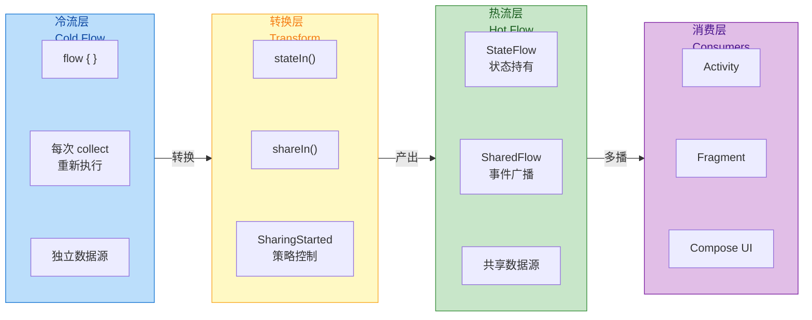

### Flow 操作符在 Android 中的实践

Flow 提供了丰富的操作符来处理异步数据流。以下是 Android 开发中最常用的几个：

**combine**：组合多个 Flow，当任一 Flow 发射新值时触发计算。适用于 UI 状态依赖多个数据源的场景。

```kotlin
class SearchViewModel(
    private val repository: SearchRepository
) : ViewModel() {
    
    // 搜索关键词输入
    private val searchQuery = MutableStateFlow("")
    // 筛选条件
    private val filterOptions = MutableStateFlow(FilterOptions.DEFAULT)
    // 排序方式
    private val sortOrder = MutableStateFlow(SortOrder.RELEVANCE)
    
    // 组合三个 Flow，任一变化都会触发重新搜索
    val searchResults: StateFlow<List<SearchResult>> = combine(
        searchQuery.debounce(300),  // 防抖，避免频繁搜索
        filterOptions,
        sortOrder
    ) { query, filter, sort ->
        // 这个 lambda 在任一输入变化时执行
        Triple(query, filter, sort)
    }
    .flatMapLatest { (query, filter, sort) ->
        // flatMapLatest：当新请求到来时取消旧请求
        if (query.isBlank()) {
            flowOf(emptyList())  // 空查询返回空列表
        } else {
            repository.search(query, filter, sort)
                .onStart { emit(emptyList()) }  // 搜索开始时先清空
                .catch { emit(emptyList()) }     // 错误时返回空列表
        }
    }
    .stateIn(
        scope = viewModelScope,
        started = SharingStarted.WhileSubscribed(5000),
        initialValue = emptyList()
    )
    
    fun onQueryChanged(query: String) {
        searchQuery.value = query
    }
}
```

**flatMapLatest**：当上游发射新值时，取消当前执行中的内部 Flow，启动新的。这对于搜索场景至关重要——用户快速输入时，只需要最后一次输入的结果。

**debounce**：延迟发射，在指定时间内没有新值时才发射最新值。常用于搜索输入防抖。

**distinctUntilChanged**：过滤掉连续相同的值。StateFlow 内置此行为，普通 Flow 需显式添加。

**catch**：捕获上游异常，可以发射替代值或重新抛出。注意 `catch` 只能捕获上游异常，不能捕获下游 `collect` 中的异常。

```kotlin
// 完整的错误处理示例
repository.getArticles()
    .map { articles -> 
        // 转换可能抛出异常
        articles.map { it.toUiModel() }
    }
    .catch { e ->
        // 捕获上游（map）中的异常
        emit(emptyList())  // 发射替代值
        // 或重新抛出：throw e
    }
    .onEach { articles ->
        // onEach 中的异常不会被上面的 catch 捕获
        _uiState.value = UiState.Success(articles)
    }
    .launchIn(viewModelScope)
```

### 背压处理与缓冲策略

**背压（Backpressure）** 是异步数据流的核心概念——当生产者发射数据的速度超过消费者处理速度时，系统如何响应？Flow 提供了多种策略：

**buffer**：在生产者和消费者之间添加缓冲区，允许生产者继续发射而不等待消费者。

```kotlin
// 没有 buffer：生产者每发射一个值，都要等消费者处理完
flow {
    repeat(100) {
        emit(it)  // 发射后等待 collect 处理完
    }
}
.collect { value ->
    delay(100)  // 模拟耗时处理
    println(value)
}
// 总耗时约 10 秒

// 有 buffer：生产者和消费者并行运行
flow {
    repeat(100) {
        emit(it)  // 发射到缓冲区，不等待
    }
}
.buffer(capacity = 64)  // 64 元素缓冲区
.collect { value ->
    delay(100)
    println(value)
}
// 总耗时约 10 秒，但生产者很快完成
```

**conflate**：只保留最新值，丢弃中间值。适用于 UI 状态更新——用户只关心最终状态。

```kotlin
// 传感器数据流，每秒产生 100 个数据点
sensorFlow
    .conflate()  // 只保留最新值
    .collect { data ->
        // UI 更新，可能每秒只能处理 60 帧
        updateChart(data)
    }
```

**collectLatest**：当新值到来时，取消当前 collect 块的执行。适用于搜索结果渲染——新结果到来时放弃旧结果的渲染。

```kotlin
searchResultsFlow
    .collectLatest { results ->
        // 如果新结果在渲染完成前到来，这个协程会被取消
        renderResults(results)  // 可能是耗时操作
    }
```

### Compose 中的 Flow 集成

Jetpack Compose 提供了专门的 API 来在 Composable 函数中安全地收集 Flow：

**collectAsState**：将 Flow 转换为 Compose State，自动处理生命周期。

```kotlin
@Composable
fun ArticleScreen(viewModel: ArticleViewModel = viewModel()) {
    // collectAsState 内部使用 LaunchedEffect 管理收集
    // 当 Composable 离开组合时自动取消收集
    val uiState by viewModel.uiState.collectAsState()
    
    when (val state = uiState) {
        is UiState.Loading -> LoadingIndicator()
        is UiState.Success -> ArticleList(state.data)
        is UiState.Error -> ErrorMessage(state.message)
    }
}
```

**collectAsStateWithLifecycle**：来自 `androidx.lifecycle.compose`，添加了生命周期感知能力，在 Activity/Fragment 不可见时自动暂停收集。

```kotlin
@Composable
fun ArticleScreen(viewModel: ArticleViewModel = viewModel()) {
    // 当宿主 Lifecycle 低于 STARTED 时暂停收集
    // 比 collectAsState 更节省资源
    val uiState by viewModel.uiState.collectAsStateWithLifecycle()
    
    // UI 渲染...
}
```

**LaunchedEffect 处理一次性事件**：

```kotlin
@Composable
fun ArticleScreen(
    viewModel: ArticleViewModel = viewModel(),
    onNavigateToDetail: (String) -> Unit
) {
    val uiState by viewModel.uiState.collectAsStateWithLifecycle()
    
    // 使用 LaunchedEffect 收集事件流
    // key = Unit 表示只在首次组合时启动，之后不重启
    LaunchedEffect(Unit) {
        viewModel.navigationEvent.collect { event ->
            when (event) {
                is NavigationEvent.ToDetail -> onNavigateToDetail(event.articleId)
            }
        }
    }
    
    // UI 渲染...
}
```

---

**📝 练习题**

在 ViewModel 中使用 `stateIn` 将冷流转换为 `StateFlow` 时，以下哪种 `SharingStarted` 策略最适合"用户资料页面"这种场景（页面可能因配置变更重建，但数据更新不频繁）？

A. `SharingStarted.Eagerly` — 立即启动，永不停止

B. `SharingStarted.Lazily` — 首个订阅者出现时启动，永不停止

C. `SharingStarted.WhileSubscribed(5000)` — 最后一个订阅者消失 5 秒后停止

D. 不使用 `stateIn`，直接在 `collect` 时重新触发冷流

**【答案】** C

**【解析】** `WhileSubscribed(5000)` 是用户资料页面的最佳选择，原因如下：

1. **配置变更友好**：屏幕旋转时，旧 Activity 销毁、新 Activity 创建的间隔通常不超过几百毫秒。5 秒的超时足以让新 Activity 重新订阅，此时 StateFlow 仍持有最新数据，无需重新请求。

2. **资源节约**：当用户离开页面超过 5 秒，上游 Flow（如数据库监听）会被取消，节省系统资源。`Eagerly` 和 `Lazily` 都会导致上游永远运行，浪费资源。

3. **数据新鲜度**：用户长时间离开后返回，超时机制确保会重新获取数据，而非显示过期的缓存数据。

4. 选项 D 会导致每次配置变更都重新请求数据，用户体验差且浪费网络资源。

---

## 本章小结

本章系统性地梳理了 Kotlin 协程在 Android 应用层的深度集成方案。从底层调度机制到上层生命周期绑定，从单次异步任务到持续数据流，协程已成为现代 Android 开发中处理并发的首选范式。以下从**核心概念回顾**、**架构设计哲学**、**最佳实践要点**三个维度进行总结。

### 核心概念回顾

**调度器体系 (Dispatchers)** 是协程执行的基石。`Dispatchers.Main` 基于 `Handler` 机制将任务投递到主线程 Looper，专门用于 UI 操作；`Dispatchers.IO` 采用弹性线程池（默认上限 64 线程），适合阻塞式 I/O 如网络请求、文件读写；`Dispatchers.Default` 使用与 CPU 核心数相当的固定线程池，适合 CPU 密集型计算如 JSON 解析、图片处理；`Dispatchers.Unconfined` 不指定线程，首次挂起前在调用线程执行，恢复后在恢复它的线程执行，仅用于特殊测试场景。

**主线程调度优化** 通过 `Dispatchers.Main.immediate` 实现。当已处于主线程时，`immediate` 变体会跳过 `Handler.post()` 的消息入队过程，直接同步执行代码，避免了一次消息循环的延迟。这对于 UI 响应的即时性至关重要，LiveData 的观察者通知、StateFlow 的 UI 收集都依赖此优化。

**作用域生命周期绑定** 是 Android 协程集成的核心设计。`lifecycleScope` 绑定到 Activity/Fragment 的 `Lifecycle`，在 `onDestroy()` 时自动取消所有子协程；`viewModelScope` 绑定到 ViewModel 的生命周期，在 `onCleared()` 时取消，天然支持屏幕旋转等配置变更的存活。两者内部都采用 `SupervisorJob` 作为根 Job，确保单个子协程的失败不会连锁取消兄弟协程。

**生命周期感知的数据收集** 通过 `repeatOnLifecycle` 和 `flowWithLifecycle` 实现。`repeatOnLifecycle(Lifecycle.State.STARTED)` 会在进入 STARTED 状态时启动收集块，在低于 STARTED（如进入后台）时取消，再次回到 STARTED 时重新启动。这种"重启语义"完美匹配 UI 层的需求——后台时停止无意义的 UI 更新，回到前台时重新订阅最新数据。相比之下，已废弃的 `launchWhenStarted` 仅做挂起不做取消，上游 Flow 继续运行造成资源浪费。

**回调 API 桥接** 通过 `suspendCancellableCoroutine` 实现。它将传统的 callback-based API 转换为 suspend 函数，核心是正确处理三件事：成功时 `continuation.resume(result)`、失败时 `continuation.resumeWithException(e)`、取消时通过 `invokeOnCancellation` 清理资源（如取消网络请求）。

**异常处理策略** 分为两层。局部层面使用 `try-catch` 或 `runCatching`；全局层面通过 `CoroutineExceptionHandler` 捕获未处理异常，常用于日志上报。`supervisorScope` 提供异常隔离——内部子协程失败不影响外部作用域，适合"并发多任务、部分失败可接受"的场景。

**Flow 在 Android 的应用** 形成了清晰的职责分工：`StateFlow` 持有单一可变状态，支持 `.value` 直接读取，天然适合 UI 状态建模；`SharedFlow` 支持多订阅者的事件广播，可配置重放与缓冲策略；`Channel` 提供一对一的生产-消费通信。冷流 (Cold Flow) 按需启动，热流 (Hot Flow) 始终活跃，通过 `stateIn`/`shareIn` 可实现冷转热。

### 架构设计哲学

从整体架构看，Android 协程集成体现了**"结构化并发 (Structured Concurrency)"**的核心理念：

1. **作用域即边界**：协程的生命周期被严格限定在其父作用域内，不存在"野生"协程泄漏。当 Activity 销毁时，`lifecycleScope` 下的所有协程自动取消，无需手动管理。

2. **取消即协作**：协程的取消是协作式的 (cooperative)，需要代码在挂起点检查取消状态。Jetpack 提供的挂起函数（如 Room 的 suspend 查询）都已正确处理取消，开发者主要需注意自定义长时间运算时调用 `ensureActive()` 或 `yield()`。

3. **异常即边界**：普通协程中未捕获异常会向上传播直至取消整个作用域；Supervisor 模式下异常被隔离在子协程内。这两种策略分别适用于"全有或全无"与"尽力而为"的业务场景。

4. **调度即关注点分离**：通过 `withContext` 切换调度器，将"在哪执行"与"执行什么"解耦。ViewModel 层无需关心线程细节，只需声明 `withContext(Dispatchers.IO)` 即可安全执行 I/O。

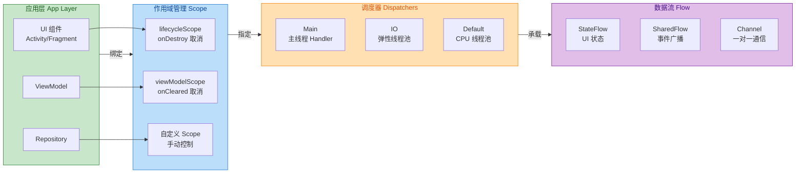

### 最佳实践要点

| 场景 | 推荐方案 | 避免做法 |
|------|----------|----------|
| Activity/Fragment 启动协程 | `lifecycleScope.launch` | `GlobalScope.launch`（泄漏风险） |
| ViewModel 启动协程 | `viewModelScope.launch` | 自建 `CoroutineScope` 忘记取消 |
| 收集 UI 状态 Flow | `repeatOnLifecycle(STARTED)` + `collect` | `launchWhenStarted`（已废弃） |
| 一次性 UI 事件 | `SharedFlow` 或 `Channel` | `StateFlow`（事件可能丢失） |
| 网络/数据库操作 | `withContext(Dispatchers.IO)` | 主线程直接调用（ANR 风险） |
| CPU 密集计算 | `withContext(Dispatchers.Default)` | 使用 IO 调度器（浪费 IO 线程） |
| 转换回调 API | `suspendCancellableCoroutine` | `suspendCoroutine`（无法响应取消） |
| 多任务部分失败可接受 | `supervisorScope` | 普通 `coroutineScope`（一个失败全部取消） |

### 知识脉络图

```mermaid
graph LR
    subgraph FOUNDATION["基础层 Foundation"]
        direction TB
        CRT["Coroutine Runtime\nKotlin 标准库"]
        DISP2["Dispatchers\n线程调度"]
        JOB["Job/SupervisorJob\n生命周期控制"]
    end

    subgraph ANDROID["Android 集成层"]
        direction TB
        HANDLER["HandlerContext\nMain 调度实现"]
        LIFECYCLE["Lifecycle 扩展\nlifecycleScope"]
        VIEWMODEL["ViewModel 扩展\nviewModelScope"]
    end

    subgraph PATTERN["应用模式层"]
        direction TB
        REPEAT["repeatOnLifecycle\n重启收集"]
        SUSPEND["suspendCancellable\n回调桥接"]
        EXCEPT["ExceptionHandler\n异常捕获"]
    end

    subgraph REACTIVE["响应式层 Reactive"]
        direction TB
        STATEFLOW["StateFlow\n状态容器"]
        SHAREDFLOW["SharedFlow\n事件总线"]
        CHANNEL["Channel\n通信管道"]
    end

    FOUNDATION -->|"扩展"| ANDROID
    ANDROID -->|"封装"| PATTERN
    PATTERN -->|"驱动"| REACTIVE

    classDef foundation fill:#FFF3E0,stroke:#EF6C00,color:#E65100
    classDef android fill:#E3F2FD,stroke:#1976D2,color:#0D47A1
    classDef pattern fill:#E8F5E9,stroke:#388E3C,color:#1B5E20
    classDef reactive fill:#F3E5F5,stroke:#7B1FA2,color:#4A148C

    class FOUNDATION foundation
    class ANDROID android
    class PATTERN pattern
    class REACTIVE reactive
```

### 延伸学习方向

本章覆盖了 Android 协程集成的核心内容，以下是可进一步深入的方向：

- **协程与 Jetpack Compose**：Compose 提供了 `LaunchedEffect`、`rememberCoroutineScope` 等组合函数，实现了与声明式 UI 的深度集成
- **协程测试**：`kotlinx-coroutines-test` 提供 `TestDispatcher`、`runTest` 等工具，支持协程代码的确定性测试
- **协程调试**：通过 `-Dkotlinx.coroutines.debug` JVM 参数启用调试模式，可在日志中看到协程名称和创建堆栈
- **协程与 WorkManager**：`CoroutineWorker` 将后台任务与协程结合，支持挂起函数和取消响应

---

**📝 练习题 1**

在 Fragment 中观察 ViewModel 暴露的 `StateFlow<UiState>`，以下哪种写法最符合现代最佳实践？

A. `lifecycleScope.launch { viewModel.uiState.collect { ... } }`

B. `lifecycleScope.launchWhenStarted { viewModel.uiState.collect { ... } }`

C. `viewLifecycleOwner.lifecycleScope.launch { viewLifecycleOwner.repeatOnLifecycle(Lifecycle.State.STARTED) { viewModel.uiState.collect { ... } } }`

D. `GlobalScope.launch(Dispatchers.Main) { viewModel.uiState.collect { ... } }`

**【答案】** C

**【解析】** 选项 A 的问题是即使 Fragment 进入后台（不可见），收集仍在继续，浪费资源且可能导致不必要的 UI 更新。选项 B 使用了已废弃的 `launchWhenStarted`，它只是挂起收集协程而不取消，上游 `StateFlow` 的更新仍在进行，存在资源浪费。选项 D 使用 `GlobalScope` 完全脱离生命周期管理，Fragment 销毁后协程仍在运行，造成内存泄漏。选项 C 使用 `viewLifecycleOwner`（匹配 Fragment 视图的生命周期）配合 `repeatOnLifecycle(STARTED)`，在进入后台时取消收集、回到前台时重新收集，完美适配 UI 层需求，是 Google 官方推荐的写法。

---

**📝 练习题 2**

以下关于 `Dispatchers.Main` 与 `Dispatchers.Main.immediate` 的描述，哪项是正确的？

A. `immediate` 变体会创建一个更高优先级的 Handler 消息

B. 当已在主线程时，`immediate` 会跳过 Handler 消息队列直接执行

C. `immediate` 只能在 `lifecycleScope` 中使用，`viewModelScope` 不支持

D. 两者的区别仅体现在性能上，功能完全等价

**【答案】** B

**【解析】** `Dispatchers.Main.immediate` 的核心优化是：当调用时已经处于主线程，它会跳过 `Handler.post()` 的消息入队过程，直接同步执行后续代码。这避免了一次消息循环的延迟（通常是几毫秒到十几毫秒）。选项 A 错误，`immediate` 不涉及消息优先级。选项 C 错误，`immediate` 是调度器的特性，与作用域类型无关。选项 D 部分正确但不完整——除了性能差异，在某些时序敏感场景下，`immediate` 的同步执行特性会影响代码的执行顺序，因此并非"功能完全等价"。例如，在主线程调用 `launch(Dispatchers.Main) { A() }; B()` 时，B 会先于 A 执行；而使用 `Main.immediate` 时，A 会先执行。

---

