---

# Android 并发模型

---

## 线程模型基础

Android 应用的并发模型，是理解整个应用层运行机制的基石。当你按下桌面上的应用图标，系统通过 Zygote 进程 fork 出一个全新的 Linux 进程，而这个进程中第一个被拉起的线程——就是我们常说的 **主线程（Main Thread）**。在 Android 的世界观里，线程不是"可选的性能优化手段"，而是整个 UI 框架、事件分发、生命周期调度得以运行的根本载体。理解线程模型，就是理解 Android 应用"为什么能跑起来"以及"为什么会卡死"。

Android 基于 Linux 内核，因此其线程本质上就是 Linux 的 **POSIX Thread（pthread）**。在 Linux 看来，线程和进程并没有本质区别——它们共享同一个 `task_struct` 数据结构，线程只是与父进程共享了内存地址空间（Address Space）、文件描述符表等资源的轻量级执行单元。Java 层的 `Thread` 对象最终会通过 JNI 调用 `pthread_create` 来创建真正的内核线程。所以当我们在 Android 中讨论"线程"时，它不是一个虚拟的、被运行时模拟出来的概念，而是拥有独立调度权、独立栈空间的真实操作系统线程。

这一小节将围绕三个核心展开：**UI 主线程的特殊性与职责边界**、**工作线程的创建方式与使用场景**，以及**线程安全的定义与在 Android 应用层中的具体体现**。

### UI 主线程 MainThread

#### 主线程的诞生

一个 Android 应用进程启动时，`ActivityThread.main()` 方法作为 Java 层的入口被调用。这个方法做了一件至关重要的事情：为当前线程初始化一个 `Looper`（消息循环），然后调用 `Looper.loop()` 进入一个**无限循环**，不断从消息队列中取出消息并处理。这个无限循环就是主线程的"心跳"——只要循环在跑，应用就活着；循环一旦退出，应用进程也就结束了。

```java
// ActivityThread.main() —— 应用进程的 Java 入口
public static void main(String[] args) {
    // 为当前线程（即主线程）创建一个 Looper 实例
    // prepareMainLooper 内部会调用 prepare()，并把自己标记为"主Looper"，不可退出
    Looper.prepareMainLooper();

    // 创建 ActivityThread 实例，它并不是一个 Thread，而是应用的"管家"对象
    ActivityThread thread = new ActivityThread();

    // attach(false) 向 AMS 注册自己，告诉系统"我准备好了，可以接收组件调度了"
    thread.attach(false);

    // 获取主线程的 Handler（即内部类 H），后续所有组件生命周期回调都通过它分发
    if (sMainThreadHandler == null) {
        sMainThreadHandler = thread.getHandler();
    }

    // 进入无限循环，开始从 MessageQueue 中逐条取出消息并分发处理
    // 这一行代码之后的任何语句在正常情况下都不会被执行
    Looper.loop();

    // 如果走到这里，说明 loop() 退出了，抛出异常表示主线程意外终止
    throw new RuntimeException("Main thread loop unexpectedly exited");
}
```

从这段代码可以看出一个非常重要的设计哲学：**Android 主线程本质上是一个"消息驱动"的单线程模型**。所有的 Activity 生命周期回调（`onCreate`、`onResume`……）、View 的绘制流程（`measure` → `layout` → `draw`）、用户的触摸事件分发——全都不是被"直接调用"的，而是被包装成一个个 `Message`，投递到主线程的 `MessageQueue` 中，由 `Looper` 逐个取出，再通过 `Handler` 分发到对应的回调方法。

#### 为什么采用单线程 UI 模型

这是一个许多初学者会疑惑的问题：既然多线程可以提高并发能力，为什么 Android（以及 iOS、大多数桌面 GUI 框架）坚持使用 **单线程** 来处理 UI？

原因在于 **UI 操作的原子性难以保证**。想象一个场景：线程 A 正在遍历一个 `ViewGroup` 的子 View 列表进行布局计算，线程 B 同时移除了其中一个子 View。这就会导致数组越界、空指针，甚至更隐蔽的视觉错乱。要解决这个问题，就必须对 View 树的每一次读写都加锁（synchronized）。但 View 树的层级很深、操作极其频繁（每 16ms 就可能需要一次完整的 traversal），加锁不仅会带来严重的性能开销，还极容易引发死锁（Deadlock）——线程 A 持有 View X 的锁等 View Y 的锁，线程 B 则持有 View Y 的锁等 View X 的锁。

早期的一些 GUI 框架（如 Java Swing 的前身 AWT）确实尝试过多线程 UI 模型，但实践证明这条路行不通。Swing 最终也回归了 **Event Dispatch Thread (EDT)** 单线程模型。Android 从设计之初就选择了这条经过验证的路线：**只有创建 View 层级结构的线程（即主线程）才能操作 UI**。这不是一个"限制"，而是一个深思熟虑的"保护"。

Android 框架层通过 `ViewRootImpl.checkThread()` 来强制执行这一规则：

```java
// ViewRootImpl.checkThread() —— UI 线程检查
void checkThread() {
    // mThread 是在 ViewRootImpl 构造时记录的创建线程（即主线程）
    if (mThread != Thread.currentThread()) {
        // 如果当前调用线程不是主线程，直接抛出异常
        throw new CalledFromWrongThreadException(
            "Only the original thread that created a view hierarchy can touch its views.");
    }
}
```

这个方法会在 `requestLayout()`、`invalidate()` 等关键操作中被调用。这也是为什么你在子线程中直接调用 `textView.setText("hello")` 会立即崩溃——`setText` 内部会触发 `requestLayout()`，进而触发 `checkThread()`。

#### 主线程的职责边界

明确了主线程的本质后，我们需要清楚地划定它的 **职责边界**：

**必须在主线程执行的操作：**
- 所有 View 的创建、修改、动画驱动
- Activity / Fragment 的生命周期回调处理
- 用户输入事件（Touch、Key）的接收与分发
- `BroadcastReceiver.onReceive()` 的执行（默认情况）
- `Service` 的生命周期回调（`onCreate`、`onStartCommand` 等）

**绝对不能在主线程执行的操作：**
- 网络 I/O（Android 3.0+ 默认开启 `StrictMode` 会直接抛 `NetworkOnMainThreadException`）
- 大文件 / 数据库的读写（尤其是未使用 WAL 模式的 SQLite 写操作）
- 复杂的计算任务（如大数组排序、图片解码、JSON 解析超大文件）
- 任何可能耗时超过几毫秒的阻塞操作

主线程有一个严格的"时间预算"：**每一帧的处理时间不能超过约 16.6ms**（对应 60fps 刷新率）。如果一条 Message 的处理耗时超过这个预算，就会丢帧（Frame Drop），用户看到的现象就是 **卡顿（Jank）**。如果主线程被阻塞超过 **5 秒**（前台 Activity）或 **10 秒**（BroadcastReceiver），系统的 Watchdog 机制就会触发 **ANR（Application Not Responding）** 对话框，这是 Android 应用质量的"红线"。

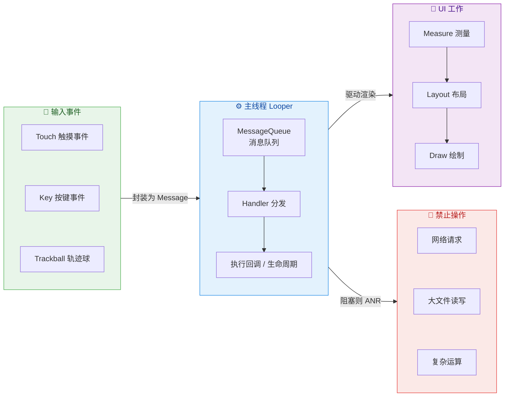
```mermaid
graph LR
    subgraph Input["🎯 输入事件"]
        direction TB
        A1["Touch 触摸事件"]
        A2["Key 按键事件"]
        A3["Trackball 轨迹球"]
        A1 ~~~ A2
        A2 ~~~ A3
    end

    subgraph MainThread["⚙️ 主线程 Looper"]
        direction TB
        B1["MessageQueue\n消息队列"]
        B2["Handler 分发"]
        B3["执行回调 / 生命周期"]
        B1 --> B2
        B2 --> B3
    end

    subgraph UIWork["🎨 UI 工作"]
        direction TB
        C1["Measure 测量"]
        C2["Layout 布局"]
        C3["Draw 绘制"]
        C1 --> C2
        C2 --> C3
    end

    subgraph Danger["🚫 禁止操作"]
        direction TB
        D1["网络请求"]
        D2["大文件读写"]
        D3["复杂运算"]
        D1 ~~~ D2
        D2 ~~~ D3
    end

    Input -->|"封装为 Message"| MainThread
    MainThread -->|"驱动渲染"| UIWork
    MainThread -->|"阻塞则 ANR"| Danger

    classDef inputStyle fill:#E8F5E9,stroke:#4CAF50,color:#1B5E20
    classDef mainStyle fill:#E3F2FD,stroke:#1E88E5,color:#0D47A1
    classDef uiStyle fill:#F3E5F5,stroke:#8E24AA,color:#4A148C
    classDef dangerStyle fill:#FBE9E7,stroke:#E53935,color:#B71C1C

    class Input inputStyle
    class MainThread mainStyle
    class UIWork uiStyle
    class Danger dangerStyle
```

### 工作线程 WorkerThread

#### 为什么需要工作线程

既然主线程有严格的时间预算，那么所有耗时操作就必须"搬"到别的线程去执行。这些"别的线程"就是 **工作线程（Worker Thread）**。工作线程没有与之绑定的 `Looper`（除非你主动创建），也没有操作 UI 的权限，它的存在意义就是 **在后台默默地完成耗时任务，然后把结果"投递"回主线程来更新 UI**。

这就形成了 Android 应用层并发模型的经典范式：

> **主线程负责 UI 渲染与事件处理 → 耗时任务交给工作线程 → 工作线程完成后通过 Handler 将结果抛回主线程 → 主线程更新 UI**

这个"抛回去"的动作，正是 Handler 机制的核心价值所在，后续章节会详细展开。

#### 创建工作线程的常见方式

在 Android 应用层中，创建工作线程有多种方式，从最底层到最上层：

**1. 原始的 `Thread` + `Runnable`**

这是最基础的方式，直接使用 Java 的 `Thread` 类：

```kotlin
// 最基础的工作线程创建方式
val workerThread = Thread {
    // 这里运行在新线程中，可以执行耗时操作
    val result = performNetworkRequest()  // 假设这是一个网络请求

    // ❌ 错误：不能在工作线程直接操作 UI
    // textView.text = result

    // ✅ 正确：通过 Handler 或 runOnUiThread 切回主线程
    runOnUiThread {
        // 这个 lambda 会被 post 到主线程的 MessageQueue 中
        textView.text = result  // 安全地更新 UI
    }
}
// 设置为守护线程（可选），避免阻止 JVM 退出
workerThread.isDaemon = true
// 启动线程
workerThread.start()
```

这种方式简单直接，但存在明显问题：**线程创建和销毁的开销大、无法复用、难以管理生命周期**。在实际项目中几乎不推荐直接使用。

**2. `ExecutorService` 线程池**

线程池是对原始线程的重要优化。它预先创建一组线程并放入"池"中，任务来了就从池里取线程执行，执行完毕线程归还池中等待下一个任务，避免了频繁创建销毁线程的开销：

```kotlin
// 创建一个固定大小为 4 的线程池
val executor: ExecutorService = Executors.newFixedThreadPool(4)

// 提交任务到线程池（不关心返回值）
executor.execute {
    // 运行在线程池中的某个工作线程上
    val data = loadDataFromDatabase()  // 耗时的数据库操作
    // 处理完成后切回主线程更新 UI
    mainHandler.post {
        recyclerView.adapter = DataAdapter(data)
    }
}

// 提交任务并获取 Future（可以拿到返回值或取消任务）
val future: Future<String> = executor.submit(Callable {
    // 工作线程中执行，返回一个 String 结果
    fetchUserName()
})
// 注意：future.get() 会阻塞当前线程直到结果返回，不要在主线程调用！
```

Android 框架自身在内部也大量使用线程池。例如 `AsyncTask`（已废弃）内部就维护了一个 `THREAD_POOL_EXECUTOR`。

**3. Kotlin Coroutines（协程）**

现代 Android 开发中，Kotlin 协程已经成为处理异步任务的首选方案。协程并不创建新的操作系统线程，而是通过 **挂起（suspend）与恢复（resume）** 机制，在有限的线程上调度大量并发任务。它的核心优势在于：用"看起来同步"的代码写出"实际异步"的逻辑，极大降低了回调地狱（Callback Hell）的复杂度：

```kotlin
// 在 ViewModel 中使用协程执行异步任务
class UserViewModel : ViewModel() {

    // viewModelScope 是 ViewModel 自带的协程作用域
    // 当 ViewModel 被清除时，scope 会自动取消所有协程，避免泄漏
    fun loadUser() {
        viewModelScope.launch {
            // launch 默认运行在 Dispatchers.Main（主线程）
            // 但 withContext 会把代码块切换到 IO 线程执行
            val user = withContext(Dispatchers.IO) {
                // 这里运行在 IO 线程池中（适合 I/O 密集型任务）
                repository.fetchUser()  // 网络请求或数据库查询
            }
            // withContext 执行完毕后，自动切回 Main 线程
            // 直接更新 LiveData，观察者会在主线程收到通知
            _userLiveData.value = user
        }
    }
}
```

协程底层仍然依赖线程池（`Dispatchers.IO` 背后就是一个线程池，`Dispatchers.Default` 背后是一个 CPU 核心数大小的线程池），但它在上层提供了 **结构化并发（Structured Concurrency）** 的能力——协程的生命周期被绑定到一个 `CoroutineScope`，scope 取消时所有子协程都会被取消。这与 Android 组件的生命周期天然契合。

#### 工作线程与主线程的通信模式

工作线程完成任务后，如何把结果安全地传递给主线程？这是 Android 并发模型中最核心的问题之一。归纳起来有以下几种经典模式：

| 通信方式 | 原理 | 适用场景 |
|---------|------|---------|
| `Handler.post()` / `sendMessage()` | 向主线程 MessageQueue 投递消息 | 通用场景，最底层的机制 |
| `Activity.runOnUiThread()` | 内部判断当前线程，若已在主线程则直接执行，否则通过 Handler post | 简单的 UI 更新 |
| `View.post()` | 将 Runnable 投递到 View 所在的 UI 线程 Handler | 与特定 View 相关的操作 |
| `LiveData.postValue()` | 内部通过 Handler 切换到主线程后触发 Observer | MVVM 架构中的数据通知 |
| Kotlin `withContext(Dispatchers.Main)` | 协程调度器切换到主线程 | 协程环境下的线程切换 |

无论哪种方式，**底层都依赖 Handler 机制**。`runOnUiThread` 内部持有主线程 Handler，`LiveData.postValue()` 使用 `ArchTaskExecutor` 的主线程 Handler，协程的 `Dispatchers.Main` 在 Android 上的实现也是通过主线程 `Looper` 的 Handler 来调度。这就是为什么理解 Handler - Looper - MessageQueue 机制如此重要——它是所有线程通信方式的"最大公约数"。

### 线程安全定义

#### 什么是线程安全

**线程安全（Thread Safety）** 是指：当多个线程同时访问某个对象或资源时，无论运行时的调度方式如何交替，代码都能表现出 **正确的行为**，且不需要调用方进行额外的同步操作。

这个定义有三个关键点：

1. **多线程同时访问**：单线程环境下不存在线程安全问题
2. **正确的行为**：程序的输出符合预期，不会出现数据错乱、崩溃等
3. **不需要调用方额外同步**：线程安全应该由被访问的对象自身保证，而不是要求每个调用者都记得加锁

举一个经典的线程不安全例子：

```kotlin
// 线程不安全的计数器示例
class UnsafeCounter {
    // 普通 Int 变量，多线程下读写不安全
    var count = 0

    // 自增操作看似一行代码，实际上包含三个步骤：
    // 1. 从内存读取 count 的当前值到寄存器（READ）
    // 2. 在寄存器中将值加 1（MODIFY）
    // 3. 将新值写回内存（WRITE）
    // 如果两个线程同时执行步骤 1，都读到了 count = 5，
    // 那么两个线程都会写回 6，实际上只增加了 1 而不是 2
    fun increment() {
        count++  // ❌ 非原子操作，存在竞态条件（Race Condition）
    }
}

// 验证线程不安全
fun main() {
    val counter = UnsafeCounter()
    // 创建 1000 个协程，每个协程调用 increment() 1000 次
    // 预期最终结果应该是 1,000,000
    runBlocking {
        repeat(1000) {
            launch(Dispatchers.Default) {
                repeat(1000) {
                    counter.increment()
                }
            }
        }
    }
    // 实际打印的结果几乎不可能是 1,000,000
    // 而是一个小于 1,000,000 的随机数，如 987,653
    println("Count = ${counter.count}")
}
```

上面的 `count++` 就是一个经典的 **竞态条件（Race Condition）**：两个线程"竞争"同一个变量的读写，由于操作不是原子的，最终结果取决于线程调度的时序——这是不确定的、不可复现的，也是最难调试的 Bug 类型之一。

#### Android 应用层中的线程安全问题

在 Android 应用开发中，线程安全问题有几种典型的表现形式：

**1. UI 操作的线程安全**

这是最常见也最容易理解的场景。Android 的 View 系统不是线程安全的——`View` 类的成员变量（如 `mLeft`、`mRight`、`mText`）没有任何同步保护。因此框架通过 `checkThread()` 直接禁止从非主线程访问 UI，这是一种"釜底抽薪"的策略——与其让 View 变得线程安全（代价太大），不如直接限制只能单线程访问。

**2. 共享可变状态（Shared Mutable State）**

当多个线程需要读写同一个变量时，就产生了共享可变状态问题。这在 Android 中非常常见，例如：

- 一个全局的缓存 `HashMap`，主线程读取数据，工作线程写入数据
- 一个标志位 `isLoading`，工作线程设为 `true`，主线程根据它控制 UI
- 一个列表 `ArrayList<User>`，后台线程往里添加，RecyclerView Adapter 在主线程遍历

**3. 单例模式中的线程安全**

Android 中大量使用单例模式（Repository、Database Helper 等）。如果单例的初始化不是线程安全的，多线程并发访问时可能创建多个实例，破坏"单例"的语义：

```kotlin
// ❌ 线程不安全的单例 —— Double-Check Locking 的错误实现
class DatabaseHelper private constructor(context: Context) {

    companion object {
        // 没有 @Volatile 注解！
        // 在 JVM 中，对象创建分为三步：1.分配内存 2.初始化 3.引用赋值
        // 由于指令重排序（Instruction Reordering），可能先执行 3 再执行 2
        // 导致另一个线程看到 instance 不为 null，但对象还未初始化完成
        private var instance: DatabaseHelper? = null

        fun getInstance(context: Context): DatabaseHelper {
            // 第一次检查（无锁，快速路径）
            if (instance == null) {
                // 加锁
                synchronized(this) {
                    // 第二次检查
                    if (instance == null) {
                        instance = DatabaseHelper(context.applicationContext)
                    }
                }
            }
            // 可能返回一个"半初始化"的对象！
            return instance!!
        }
    }
}

// ✅ 正确的 Kotlin 写法 —— 利用 Kotlin 的 lazy 委托
class DatabaseHelper private constructor(context: Context) {

    companion object {
        // lazy 默认使用 LazyThreadSafetyMode.SYNCHRONIZED
        // 内部使用了 Double-Check Locking + volatile，保证线程安全且只初始化一次
        @Volatile
        private var instance: DatabaseHelper? = null

        fun getInstance(context: Context): DatabaseHelper {
            // 使用 Kotlin 的 also 让代码更简洁
            return instance ?: synchronized(this) {
                instance ?: DatabaseHelper(context.applicationContext).also {
                    instance = it
                }
            }
        }
    }
}
```

#### 保证线程安全的常用手段

在 Android 应用层开发中，保证线程安全的策略从简到繁主要有以下几种：

**1. 线程封闭（Thread Confinement）**

最简单、最高效的线程安全策略——让数据只在一个线程中被访问，从根本上消除并发问题。Android 的 UI 单线程模型就是这一策略的典型应用。Kotlin 协程的 `Dispatchers.Main` 也利用了这一思想：通过将状态操作限定在主线程调度器上，避免多线程竞争。

**2. 不可变对象（Immutable Objects）**

如果一个对象一旦创建就不再被修改，那它天然就是线程安全的——因为所有线程读到的都是同一份不会变化的数据。Kotlin 的 `val`（只读属性）和 `data class`（搭配 `copy()` 实现"修改"）天然鼓励不可变设计。在 Android Jetpack 中，`LiveData` 推荐使用不可变数据类作为值类型，`StateFlow` 也推荐 emit 新对象而非修改旧对象。

**3. 原子操作（Atomic Operations）**

对于简单的计数器、标志位等，可以使用 `java.util.concurrent.atomic` 包提供的原子类，如 `AtomicInteger`、`AtomicBoolean`、`AtomicReference`。它们利用 CPU 的 **CAS（Compare-And-Swap）** 指令实现无锁线程安全：

```kotlin
// 线程安全的计数器 —— 使用 AtomicInteger
class SafeCounter {
    // AtomicInteger 内部使用 CAS 操作保证原子性
    // CAS 是 CPU 级别的指令：比较内存中的值是否等于预期值，如果是则更新
    private val count = AtomicInteger(0)

    fun increment() {
        // incrementAndGet() 是原子操作，即使多线程并发调用也不会丢失计数
        count.incrementAndGet()
    }

    // 读取也是原子的
    fun get(): Int = count.get()
}
```

**4. 同步锁（Synchronized / Lock）**

当需要保护的不是一个简单变量，而是一段包含多个操作的代码块时，就需要使用锁。`synchronized` 是 JVM 内置的互斥锁，`ReentrantLock` 是 `java.util.concurrent` 提供的更灵活的锁实现：

```kotlin
// 使用 synchronized 保护共享列表
class SafeList {
    // 被保护的共享资源
    private val list = mutableListOf<String>()

    // 使用 synchronized 确保同一时刻只有一个线程能进入代码块
    fun add(item: String) {
        synchronized(list) {
            // 获取到 list 对象的内置锁（Monitor Lock）后才能执行
            list.add(item)
        }
        // 离开 synchronized 块时自动释放锁
    }

    fun getAll(): List<String> {
        synchronized(list) {
            // 返回一个防御性拷贝（Defensive Copy）
            // 避免外部拿到引用后在不同线程修改
            return list.toList()
        }
    }
}
```

**5. 线程安全的数据结构**

Java 并发包提供了许多线程安全的集合类，常用的有：

| 数据结构 | 线程安全实现 | 特点 |
|---------|------------|------|
| `HashMap` | `ConcurrentHashMap` | 分段锁 / CAS，读几乎无锁，高并发性能好 |
| `ArrayList` | `CopyOnWriteArrayList` | 写时复制整个数组，适合读多写少场景 |
| `LinkedList` | `ConcurrentLinkedQueue` | 无锁的 CAS 实现，FIFO 队列 |
| `TreeMap` | `ConcurrentSkipListMap` | 基于跳表实现，有序且并发安全 |

在 Android 应用中，`ConcurrentHashMap` 使用频率最高，常见于全局缓存、事件总线的订阅者映射表等场景。

#### 线程安全与 Android 注解

Android 框架提供了 `@MainThread`、`@WorkerThread`、`@AnyThread` 等注解，它们 **不会在运行时进行任何检查**，而是给 Lint 静态分析工具和开发者提供提示。当你在一个标注了 `@WorkerThread` 的方法中调用了标注为 `@MainThread` 的方法时，Android Studio 会在编辑器中显示警告：

```kotlin
// 使用 @WorkerThread 标注，告诉调用者：这个方法必须在工作线程调用
@WorkerThread
fun fetchDataFromNetwork(): String {
    // 网络请求，可能耗时数秒
    return api.getData()
}

// 使用 @MainThread 标注，告诉调用者：这个方法必须在主线程调用
@MainThread
fun updateUI(data: String) {
    textView.text = data
}
```

这些注解是一种 **"契约式编程（Programming by Contract）"** 的实践。它们不是强制手段，而是帮助团队成员明确每个方法的线程使用契约，配合 IDE 的静态检查，在编译期就发现潜在的线程安全问题。

---

**📝 练习题**

在 Android 应用中，以下哪种场景 **不会** 导致 `CalledFromWrongThreadException` 异常？

A. 在 `Thread { textView.text = "hello" }.start()` 中直接更新 TextView


B. 在 `AsyncTask.doInBackground()` 中调用 `progressBar.setProgress(50)`


C. 在 `Executors.newSingleThreadExecutor().execute { imageView.setImageBitmap(bmp) }` 中设置图片


D. 在 `View.post { textView.text = "hello" }` 中更新 TextView


**【答案】** D

**【解析】** `View.post(Runnable)` 方法会将传入的 `Runnable` 投递到该 View 所关联的 UI 线程的 `Handler` 中执行。也就是说，无论你在哪个线程调用 `view.post {}`，lambda 内部的代码最终都会在 **主线程** 上被执行。因此 D 选项不会抛出异常。

选项 A、B、C 都是在工作线程中直接操作 View——`Thread` 新建的线程、`AsyncTask.doInBackground` 运行在线程池中、`ExecutorService.execute` 同样运行在线程池线程中。这些操作最终都会触发 `ViewRootImpl.checkThread()`，发现当前线程不是创建 View 层级的主线程，从而抛出 `CalledFromWrongThreadException`。

这道题的核心考点在于区分"在哪个线程调用方法"和"方法体最终在哪个线程执行"——`View.post()` 的调用者可以是任意线程，但它所投递的任务一定在主线程执行，这正是 Handler 消息机制的精髓所在。

---

## 消息循环 Looper

Android 的消息驱动模型之所以能够稳定运转，核心就在于 **Looper** 这个"永动机"角色。如果把 Handler 比作邮递员、MessageQueue 比作邮箱，那么 Looper 就是那个 **永不停歇地检查邮箱、取出信件、交给收件人** 的邮局调度系统。没有 Looper，Handler 发出的消息将永远躺在队列里无人问津；没有 Looper，Android UI 线程将在执行完 `main()` 方法后立即退出——App 瞬间就会结束。

Looper 的设计哲学可以用一句话概括：**一个线程最多拥有一个 Looper，一个 Looper 持有一个 MessageQueue，Looper 通过无限循环不断从 MessageQueue 中取出 Message 并分发给对应的 Handler 处理。** 这个 "Thread → Looper → MessageQueue → Handler" 的单向绑定关系，构成了整个 Android 消息机制的骨架。理解 Looper，就是理解 Android 应用层事件驱动的心脏。

### ThreadLocal 存储

一个自然的问题是：既然每个线程最多只能有一个 Looper，系统如何保证这个"一对一"的绑定关系？答案是 **ThreadLocal**。

**ThreadLocal 是什么？** 它是 Java 提供的一种线程隔离的变量存储机制。通俗地说，同一个 `ThreadLocal<T>` 对象，在不同线程中调用 `get()` 会返回各自线程独立的副本，互不干扰。它的底层原理是：每个 `Thread` 对象内部维护了一个 `ThreadLocalMap`（可以理解为一个以 ThreadLocal 实例为 key、以存储值为 value 的哈希表）。当你调用 `threadLocal.set(value)` 时，实际上是把 value 存入了**当前线程**的 `ThreadLocalMap` 中；调用 `threadLocal.get()` 时，也是从**当前线程**的 Map 中取值。这意味着不同线程之间的数据天然隔离，无需加锁。

在 Looper 类的源码中，有这样一个关键的静态成员：

```java
// Looper.java
// 使用 ThreadLocal 存储当前线程的 Looper 实例
// 所有线程共享同一个 sThreadLocal 对象，但各自 get() 返回不同的 Looper
static final ThreadLocal<Looper> sThreadLocal = new ThreadLocal<Looper>();
```

这行代码的精妙之处在于：`sThreadLocal` 是一个 **类级别的静态变量**，全局只有一个引用，但由于 ThreadLocal 的语义，每个线程通过它访问到的 Looper 实例是完全独立的。这就从机制上杜绝了"一个线程创建多个 Looper"的可能，同时也避免了多线程访问同一个 Looper 的竞争问题。

为了更直观地理解 ThreadLocal 在 Looper 场景下的工作方式，我们可以用一个简化的内存模型来观察：

```text
┌─────────────────────────────────────────────────────────────────┐
│                   静态变量 Looper.sThreadLocal                    │
│                  （全局唯一的 ThreadLocal 实例）                    │
└──────────────────────────┬──────────────────────────────────────┘
                           │
            ┌──────────────┼──────────────────┐
            ▼              ▼                  ▼
   ┌─────────────┐  ┌──────────────┐  ┌──────────────┐
   │  主线程 Main │  │ WorkerThread │  │ HandlerThread│
   │ ┌─────────┐ │  │ ┌──────────┐ │  │ ┌──────────┐ │
   │ │ThreadLo-│ │  │ │ThreadLo- │ │  │ │ThreadLo- │ │
   │ │calMap   │ │  │ │calMap    │ │  │ │calMap    │ │
   │ │         │ │  │ │          │ │  │ │          │ │
   │ │key:sTL  │ │  │ │key: sTL  │ │  │ │key: sTL  │ │
   │ │val:Loop-│ │  │ │val: Loop-│ │  │ │val: Loop-│ │
   │ │  er#main│ │  │ │  er#work │ │  │ │  er#ht   │ │
   │ └─────────┘ │  │ └──────────┘ │  │ └──────────┘ │
   └─────────────┘  └──────────────┘  └──────────────┘
```

可以看到，三个不同的线程都通过同一个 `sThreadLocal` 作为 key，但在各自的 `ThreadLocalMap` 中存储了不同的 Looper 实例。主线程存的是 `Looper#main`（即 Main Looper），工作线程存的是自己 prepare 时创建的 Looper。这种设计既保证了**线程安全**（无锁访问），又保证了**唯一性**（prepare 时检查是否已存在）。

### prepare 初始化

Looper 不会凭空出现——必须由线程显式调用 `Looper.prepare()` 来创建并绑定。这是整个消息循环的 **第一步**，也是最容易被开发者忽略的一步（因为主线程的 prepare 由系统自动完成，开发者通常感知不到）。

`prepare()` 方法的核心逻辑非常简洁但至关重要：

```java
// Looper.java — prepare 方法（简化版源码）
public static void prepare() {
    // 委托给带参数的私有方法，参数表示"是否允许退出"
    // 普通线程的 Looper 允许退出（quitAllowed = true）
    prepare(true);
}

private static void prepare(boolean quitAllowed) {
    // 【关键守卫】检查当前线程是否已经有 Looper
    // 如果 sThreadLocal.get() 不为 null，说明已经调用过 prepare
    if (sThreadLocal.get() != null) {
        // 直接抛出异常！一个线程只能 prepare 一次
        throw new RuntimeException("Only one Looper may be created per thread");
    }
    // 创建新的 Looper 实例，并存入当前线程的 ThreadLocal 中
    // 这一行同时完成了 Looper 的创建和与线程的绑定
    sThreadLocal.set(new Looper(quitAllowed));
}
```

这段代码有几个重要的设计决策值得展开讨论：

**第一，"Only one Looper per thread" 的强制约束。** `prepare()` 方法一上来就检查 ThreadLocal 中是否已有值。如果有，直接抛 `RuntimeException`。这不是一个可以忽略的软警告，而是一个硬性的运行时异常。为什么要如此严格？因为如果一个线程拥有两个 Looper，就会有两个 MessageQueue，Handler 发送的消息不知道该进哪个队列，整个消息分发机制将彻底混乱。所以系统在入口处就堵死了这种可能性。

**第二，`quitAllowed` 参数的含义。** 公开的 `prepare()` 方法默认传入 `true`，表示这个 Looper 可以被退出（调用 `quit()` 或 `quitSafely()`）。但还有一个特殊的方法 `prepareMainLooper()`，它传入的是 `false`——主线程的 Looper **不允许退出**。这完全合理：如果主线程的消息循环被退出了，Activity 的生命周期回调、View 的绘制、用户的触摸事件……所有这些都将无法被处理，App 将直接陷入死亡状态。

**第三，Looper 构造函数中同时创建了 MessageQueue。** 我们来看构造函数：

```java
// Looper.java — 构造函数
private Looper(boolean quitAllowed) {
    // 在构造 Looper 的同时，创建与之绑定的 MessageQueue
    // 这保证了 Looper 和 MessageQueue 是一对一的关系
    mQueue = new MessageQueue(quitAllowed);
    // 记录当前所在线程的引用，用于后续的线程归属校验
    mThread = Thread.currentThread();
}
```

注意构造函数是 **private** 的——外部无法直接 `new Looper()`，只能通过 `prepare()` 这个唯一入口来创建。这是一个典型的**工厂模式**思想：把创建逻辑收拢到一个入口，便于加入守卫检查和初始化逻辑。

那么主线程的 Looper 是何时、在哪里被 prepare 的呢？答案在 `ActivityThread.main()` 方法中——这是每个 Android 应用进程启动后，主线程执行的入口方法：

```java
// ActivityThread.java — main 方法（极简化）
public static void main(String[] args) {
    // 第一步：为主线程创建 Looper（quitAllowed = false）
    Looper.prepareMainLooper();

    // ... 创建 ActivityThread 实例，注册到 AMS 等 ...

    // 最后一步：启动消息循环（注意：这行之后的代码正常情况下不会执行）
    Looper.loop();

    // 如果执行到这里，说明 loop() 退出了，抛出异常
    throw new RuntimeException("Main thread loop unexpectedly exited");
}
```

`prepareMainLooper()` 的内部逻辑也值得一看：

```java
// Looper.java — 主线程专用的 prepare
public static void prepareMainLooper() {
    // 调用 prepare，但 quitAllowed = false（不允许退出）
    prepare(false);
    // 使用 synchronized 保护 sMainLooper 的赋值（防止并发问题）
    synchronized (Looper.class) {
        // sMainLooper 是一个静态变量，记录主线程的 Looper
        // 同样只允许赋值一次
        if (sMainLooper != null) {
            throw new IllegalStateException("The main Looper has already been prepared.");
        }
        // 从当前线程的 ThreadLocal 中取出刚创建的 Looper
        sMainLooper = myLooper();
    }
}
```

之所以要额外用 `sMainLooper` 这个静态变量记录主线程 Looper，是因为 **任何线程都可能需要向主线程发送消息**（比如在工作线程中更新 UI），此时可以通过 `Looper.getMainLooper()` 快速获取主线程 Looper，而无需关心自己当前在哪个线程。这个设计极大地简化了跨线程通信的 API。

### loop 死循环原理

`prepare()` 只是创建了 Looper 和 MessageQueue，但消息循环还没有真正跑起来。**真正让消息机制动起来的，是 `Looper.loop()` 方法。** 它的核心是一个 `for (;;)` 无限循环——也就是我们常说的"死循环"。但请不要被"死循环"这个词吓到：这个循环并不会疯狂地空转消耗 CPU，而是通过 MessageQueue 的**阻塞机制**（底层依赖 Linux 的 `epoll`）在没有消息时进入休眠，有消息时被唤醒。

我们先来看 `loop()` 的核心结构：

```java
// Looper.java — loop 方法（简化版源码，保留核心逻辑）
public static void loop() {
    // 获取当前线程绑定的 Looper（即 prepare 时存入 ThreadLocal 的那个）
    final Looper me = myLooper();
    // 如果当前线程没有 prepare 过，直接抛异常
    if (me == null) {
        throw new RuntimeException("No Looper; Looper.prepare() wasn't called on this thread.");
    }

    // 拿到 Looper 关联的 MessageQueue
    final MessageQueue queue = me.mQueue;

    // 核心：无限循环 —— 这就是 Android 消息驱动的"心跳"
    for (;;) {
        // 从 MessageQueue 中取下一条消息
        // 【关键】如果队列为空或最近的消息还没到时间，next() 会阻塞（不消耗 CPU）
        Message msg = queue.next();

        // 如果 next() 返回 null，说明 MessageQueue 正在退出
        // 这是 loop() 退出的 **唯一正常途径**
        if (msg == null) {
            return;
        }

        // msg.target 就是发送这条消息的 Handler
        // 调用 Handler 的 dispatchMessage，完成消息的分发与处理
        // 注意：这里是在 Looper 所在的线程中执行的（对主线程来说就是主线程）
        msg.target.dispatchMessage(msg);

        // 消息处理完毕，回收 Message 对象到复用池
        // 避免频繁创建 Message 带来的 GC 压力
        msg.recycleUnchecked();
    }
}
```

这段代码虽然只有寥寥数行，但信息密度极高。让我们逐一拆解其中的关键设计：

**第一，`queue.next()` 的阻塞语义。** 这是整个循环的灵魂。`next()` 方法并不是简单的 `poll()`——它在没有可处理消息时会 **挂起当前线程**，让出 CPU 时间片。底层实现依赖 Native 层的 `epoll_wait()`（Linux 的 I/O 多路复用机制），当没有消息需要处理时，线程会被操作系统挂起，完全不消耗 CPU 资源。只有当有新消息入队（通过 `enqueueMessage` 调用 Native 的 `nativeWake`）或者延迟消息到达预定时间时，线程才会被唤醒。这就是为什么主线程的 `for (;;)` 不会导致 "ANR" 或 "CPU 100%"——大部分时间它都在睡觉。

**第二，`msg.target.dispatchMessage(msg)` 的线程切换本质。** 这行代码看似普通，实则是 **Android 实现线程切换的核心机制**。假设你在工作线程通过主线程的 Handler 发送了一条消息，这条消息会被放入主线程 Looper 关联的 MessageQueue 中。当主线程的 `loop()` 循环取出这条消息后，`dispatchMessage()` 是在**主线程**中被调用的——因为 `loop()` 本身就运行在主线程！消息的"发送"和"处理"可以在不同线程，但"处理"一定发生在 Looper 所在的线程。这就是 Handler 机制实现线程切换的本质。

**第三，`msg == null` 是退出循环的唯一条件。** 正常情况下 `next()` 要么返回一条有效消息，要么阻塞等待。只有当 `MessageQueue.quit()` 被调用后，`next()` 才会返回 `null`，从而让 `loop()` 方法 return。对于主线程而言，由于其 Looper 的 `quitAllowed = false`，调用 `quit()` 会直接抛异常，所以主线程的 loop 循环**永远不会正常退出**。

下面用一张流程图来直观展示 `loop()` 的运转机制：

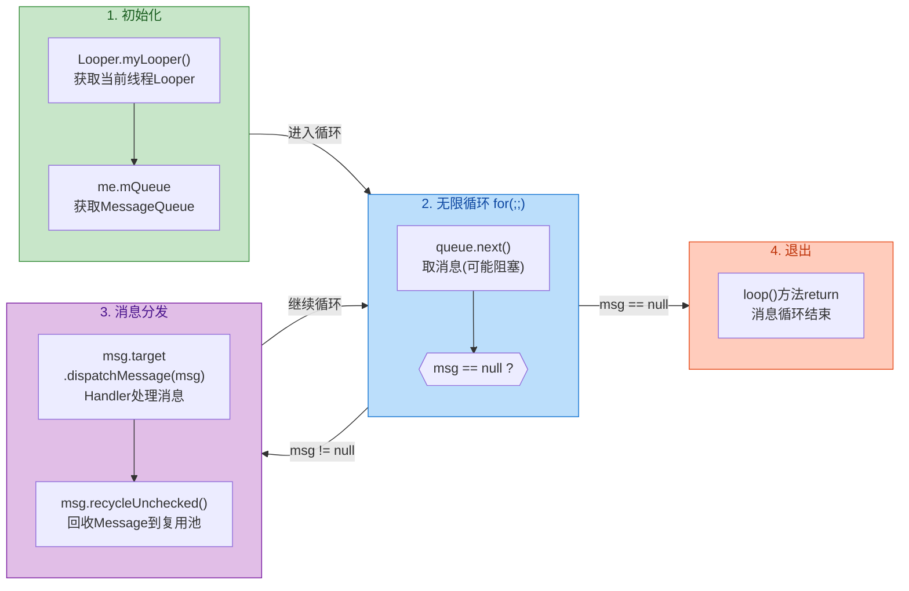
```mermaid
graph LR
    subgraph S1["1. 初始化"]
        direction TB
        A["Looper.myLooper()\n获取当前线程Looper"]
        B["me.mQueue\n获取MessageQueue"]
        A --> B
    end

    subgraph S2["2. 无限循环 for(;;)"]
        direction TB
        C["queue.next()\n取消息(可能阻塞)"]
        D{{"msg == null ?"}}
        C --> D
    end

    subgraph S3["3. 消息分发"]
        direction TB
        E["msg.target\n.dispatchMessage(msg)\nHandler处理消息"]
        F["msg.recycleUnchecked()\n回收Message到复用池"]
        E --> F
    end

    subgraph S4["4. 退出"]
        direction TB
        G["loop()方法return\n消息循环结束"]
    end

    S1 -->|"进入循环"| S2
    S2 -->|"msg != null"| S3
    S3 -->|"继续循环"| S2
    S2 -->|"msg == null"| S4

    classDef initStyle fill:#C8E6C9,stroke:#388E3C,color:#1B5E20
    classDef loopStyle fill:#BBDEFB,stroke:#1976D2,color:#0D47A1
    classDef dispatchStyle fill:#E1BEE7,stroke:#7B1FA2,color:#4A148C
    classDef exitStyle fill:#FFCCBC,stroke:#E64A19,color:#BF360C

    class S1 initStyle
    class S2 loopStyle
    class S3 dispatchStyle
    class S4 exitStyle
```

理解了这个循环之后，你就能明白 Android 应用为什么是"事件驱动"的——**App 的一切行为（Activity 生命周期、View 绘制、触摸事件、广播接收……）本质上都是主线程 Looper 循环中被 dispatch 的一条条 Message。** 当你调用 `startActivity()` 时，AMS 最终会通过 Binder 向你的应用进程的主线程 Handler 发送一条消息（如 `LAUNCH_ACTIVITY`），主线程的 Looper 取出这条消息后调用 Handler 的 `dispatchMessage()`，在其中执行 Activity 的 `onCreate()`、`onStart()` 等回调。整个过程都发生在 `loop()` 这个大循环的一次迭代中。

这也解释了 **ANR（Application Not Responding）的本质**：如果某条消息的 `dispatchMessage()` 执行时间过长（比如在主线程做了耗时的数据库查询或网络请求），那么排在后面的消息（包括 UI 绘制、用户输入事件）就无法被及时取出和处理。当系统检测到输入事件超过 5 秒未被处理、或广播超过 10 秒未完成时，就会弹出 ANR 对话框。所以 ANR 的根因不是"主线程死循环"——Looper 的循环本身是正常机制——而是**某一次消息处理阻塞了循环的推进**。

### 退出机制

既然 Looper 是一个"死循环"，那什么时候需要、以及如何安全地让它停下来？这个问题对主线程来说不存在（永不退出），但对**工作线程的 Looper** 来说却至关重要——如果你创建了一个带 Looper 的工作线程（如 HandlerThread），在任务完成后不退出 Looper，线程将一直阻塞在 `next()` 上，永远无法被回收，造成**线程泄漏**。

Looper 提供了两种退出方式：

```java
// Looper.java — 退出方法

// 方式一：立即退出（不安全）
public void quit() {
    // 直接调用 MessageQueue 的 quit，参数 safe = false
    mQueue.quit(false);
}

// 方式二：安全退出（推荐）
public void quitSafely() {
    // 调用 MessageQueue 的 quit，参数 safe = true
    mQueue.quit(true);
}
```

两者的区别在于 MessageQueue 内部的处理方式不同。为了理解这个差异，我们需要深入 `MessageQueue.quit()` 的逻辑：

```java
// MessageQueue.java — quit 方法（简化版）
void quit(boolean safe) {
    // 检查是否允许退出（主线程的 Looper 创建时 quitAllowed = false）
    if (!mQuitAllowed) {
        // 主线程调用 quit 会直接抛异常
        throw new IllegalStateException("Main thread not allowed to quit.");
    }

    synchronized (this) {
        // 防止重复调用
        if (mQuitting) {
            return;
        }
        // 标记为正在退出
        mQuitting = true;

        if (safe) {
            // 安全退出：只移除「尚未到执行时间」的延迟消息
            // 已经到时间的消息（when <= now）会被保留并正常处理完
            removeAllFutureMessagesLocked();
        } else {
            // 立即退出：移除队列中的「所有」消息，不管是否到时间
            removeAllMessagesLocked();
        }

        // 唤醒可能正在 next() 中阻塞的线程
        // 唤醒后 next() 检测到 mQuitting = true，会返回 null
        nativeWake(mPtr);
    }
}
```

**`quit()`（不安全退出）**：会清空 MessageQueue 中的所有消息，包括那些已经到了执行时间、只是还没来得及被 `next()` 取出的消息。这意味着一些本应被执行的任务会被直接丢弃，可能导致状态不一致。例如，一个文件写入操作已经通过 `Handler.post()` 提交，消息已到期等待执行，但 `quit()` 一调用就被清除了，文件内容可能损坏。

**`quitSafely()`（安全退出）**：只会清除那些 `when` 时间戳大于当前时间的**延迟消息**（即 `postDelayed` 提交的、还没到执行时间的消息）。已经到期的消息会被保留在队列中，`loop()` 会继续把它们处理完，直到队列中只剩下"未来的消息"被清除后，`next()` 才返回 null，`loop()` 才退出。

因此，在绝大多数场景下，**应该优先使用 `quitSafely()` 而非 `quit()`**，以确保已提交的任务能被完整执行。这也是 `HandlerThread.quitSafely()` 被推荐的原因。

退出的完整流程可以概括为：

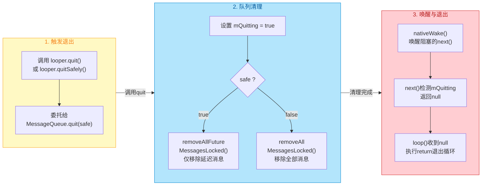
```mermaid
graph LR
    subgraph S1["1. 触发退出"]
        direction TB
        A["调用 looper.quit()\n或 looper.quitSafely()"]
        B["委托给\nMessageQueue.quit(safe)"]
        A --> B
    end

    subgraph S2["2. 队列清理"]
        direction TB
        C["设置 mQuitting = true"]
        D{"safe ?"}
        E["removeAllFuture\nMessagesLocked()\n仅移除延迟消息"]
        F["removeAll\nMessagesLocked()\n移除全部消息"]
        C --> D
        D -->|"true"| E
        D -->|"false"| F
    end

    subgraph S3["3. 唤醒与退出"]
        direction TB
        G["nativeWake()\n唤醒阻塞的next()"]
        H["next()检测mQuitting\n返回null"]
        I["loop()收到null\n执行return退出循环"]
        G --> H
        H --> I
    end

    S1 -->|"调用quit"| S2
    S2 -->|"清理完成"| S3

    classDef triggerStyle fill:#FFF9C4,stroke:#F9A825,color:#F57F17
    classDef cleanStyle fill:#B3E5FC,stroke:#0288D1,color:#01579B
    classDef exitStyle fill:#FFCDD2,stroke:#D32F2F,color:#B71C1C

    class S1 triggerStyle
    class S2 cleanStyle
    class S3 exitStyle
```

最后补充一点关于主线程 Looper 的特殊性：前文已经反复提到，`prepareMainLooper()` 传入的 `quitAllowed = false`，所以对主线程 Looper 调用 `quit()` 或 `quitSafely()` 都会抛出 `IllegalStateException`。这是 Android 框架层的硬性保护——主线程的消息循环从应用启动到进程被杀死，必须一直运行。如果你想终止应用，正确的方式是调用 `Activity.finish()` 或 `System.exit()`，而不是试图退出主线程的 Looper。

在实际开发中，最常见的需要手动管理 Looper 退出的场景是 **HandlerThread**。HandlerThread 是 Android 提供的一个封装好的"带 Looper 的工作线程"，当你不再需要它时，必须调用 `handlerThread.quitSafely()` 来释放资源。如果遗忘了这一步，这个线程将永远存活在后台，即使没有任何消息需要处理，它仍然占用着一个线程资源——这在资源敏感的移动端是不可接受的。

---

**📝 练习题**

在一个自定义的工作线程中，开发者写了如下代码：

```kotlin
val thread = Thread {
    val handler = Handler(Looper.myLooper()!!)
    handler.post { Log.d("Test", "Hello from worker") }
}
thread.start()
```

运行后应用崩溃，最可能的原因是什么？

A. `Handler` 构造函数不能在工作线程中调用


B. 工作线程没有调用 `Looper.prepare()` 和 `Looper.loop()`，`Looper.myLooper()` 返回 null 导致 NPE


C. `handler.post()` 不能在创建 Handler 的线程中调用


D. 工作线程不允许使用 `Looper`，只有主线程可以


**【答案】** B

**【解析】** 在 Android 中，任何线程都可以拥有 Looper，但必须显式调用 `Looper.prepare()` 来创建并绑定到当前线程。这段代码中的工作线程没有调用 `Looper.prepare()`，因此 `Looper.myLooper()` 返回 `null`，紧接着的 `!!`（Kotlin 非空断言）会抛出 `NullPointerException`。正确的写法应该是先调用 `Looper.prepare()`，再创建 Handler，最后调用 `Looper.loop()` 启动消息循环。选项 A 错误，Handler 可以在任何线程创建，只需要有有效的 Looper；选项 C 错误，`post()` 可以在任意线程调用；选项 D 错误，任何线程都可以使用 Looper，`HandlerThread` 就是典型的工作线程 Looper 应用。

---

## 消息队列 MessageQueue

在上一节中，我们已经深入理解了 Looper 的工作机制——它通过 `loop()` 中的死循环不断地从某个"队列"中取出消息并分发。那么，这个"队列"究竟是如何组织消息的？新消息如何插入？没有消息时线程为什么不会空转浪费 CPU？这些问题的答案，全部藏在 `MessageQueue` 这个核心组件之中。

MessageQueue 是整个 Handler 消息机制的 **数据枢纽**。它并不是我们在数据结构课上学到的那种基于数组的 Queue，而是一条 **按时间戳排序的单向链表**。更令人惊叹的是，它在 Java 层与 Native 层之间架起了一座桥梁：当队列为空或消息尚未到期时，线程会通过 Native 层的 **epoll 机制** 进入休眠，实现真正的零 CPU 开销等待；而当新消息插入时，又能通过 `nativeWake()` 精准唤醒线程。这种 Java-Native 协同的设计，使得 Android 的消息循环既高效又节能，是 Android 应用层开发中最值得深入理解的底层基础设施之一。

### 单链表结构

很多开发者第一次看到 `MessageQueue` 这个名字时，会下意识地将其与 Java 集合框架中的 `java.util.Queue`（如 `LinkedList`、`ArrayDeque`）关联起来。但实际上，MessageQueue **没有使用任何 Java 集合类**，它完全依赖 `Message` 对象自身的 `next` 字段，手动维护了一条**单向链表（Singly Linked List）**。

要理解这一点，我们需要先回顾 `Message` 类中的一个关键字段：

```java
// Message.java 中的链表指针字段
// 每个 Message 对象都持有一个指向"下一条消息"的引用
// 这就是单链表的"指针"——不需要额外的 Node 包装类
/*package*/ Message next;
```

这个 `next` 字段就是链表节点的"指针"。每一个 `Message` 对象本身既是数据载体，又是链表节点——这种设计被称为 **侵入式链表（Intrusive Linked List）**。与非侵入式链表（需要额外创建 `Node<T>` 包装器）相比，侵入式链表的优势在于：

- **零额外内存分配**：不需要为每条消息创建一个独立的 Node 对象，减少了 GC 压力。
- **更好的缓存局部性**：数据和指针在同一对象中，访问时不需要额外的指针跳转。
- **与 Message 复用池完美配合**：Message 本身可以被回收复用（后续章节会讲 `obtain()` 复用池），如果使用外部 Node 包装，复用逻辑会变得更复杂。

而 `MessageQueue` 类中，只需要一个 `mMessages` 字段指向链表的 **头节点（Head）**：

```java
// MessageQueue.java
// mMessages 指向链表头部，即"时间最早应被处理的那条消息"
// 如果为 null，说明队列为空
Message mMessages;
```

这条链表的排序依据是 `Message.when` 字段——每条消息都有一个期望被处理的时间戳（单位为 `SystemClock.uptimeMillis()`）。链表始终保持 **按 `when` 升序排列**，即头节点是最早应该被处理的消息，尾节点是最晚的。这意味着 `MessageQueue` 本质上是一个 **按时间排序的优先队列（Time-ordered Priority Queue）**，只不过它用单链表而非堆（Heap）来实现。

用一个直观的内存模型来展示这条链表的结构：

```text
mMessages (队列头指针)
    │
    ▼
┌──────────┐    ┌──────────┐    ┌──────────┐    ┌──────────┐
│ Message A │    │ Message B │    │ Message C │    │ Message D │
│ when=100  │───▶│ when=150  │───▶│ when=200  │───▶│ when=350  │───▶ null
│ what=1    │    │ what=2    │    │ what=3    │    │ what=1    │
│ target=H1 │    │ target=H2 │    │ target=H1 │    │ target=H3 │
└──────────┘    └──────────┘    └──────────┘    └──────────┘
   (头节点)                                         (尾节点)
   最早处理                                         最晚处理
```

为什么选择单链表而不是更高效的数据结构（如最小堆）？原因在于 Android 消息队列的实际使用场景：绝大部分消息都是通过 `sendMessage()` 或 `post()` 立即发送的（`when = now`），这意味着新消息的 `when` 值几乎总是 **大于或等于** 链表中所有现有消息的 `when` 值。在这种场景下，新消息会被直接插入到 **链表尾部**，时间复杂度为 O(n) 的尾部遍历，但由于链表通常不长（几条到几十条），实际开销极小。而最小堆虽然理论上插入是 O(log n)，但堆的数组扩容、元素上浮/下沉等操作的常数因子更大，对于短链表反而不划算。更重要的是，取出消息时只需要读取头节点（O(1)），这与堆的 O(log n) 删除相比有天然优势。

这种"简单但恰到好处"的设计哲学，贯穿了整个 Android Framework 的实现。

### enqueueMessage 入队

理解了链表结构之后，我们来看消息是如何被插入到这条有序链表中的。当你在应用层调用 `handler.sendMessage(msg)` 或 `handler.post(runnable)` 时，经过 Handler 内部的一系列转发，最终都会走到 `MessageQueue.enqueueMessage()` 方法。这个方法是整个消息入队的 **唯一入口**，它的职责是：将一条新消息按照 `when` 时间戳插入到链表的正确位置，并在必要时唤醒正在休眠的线程。

下面是 `enqueueMessage()` 的核心逻辑（基于 AOSP 源码精简）：

```java
// MessageQueue.java — enqueueMessage 入队核心逻辑
boolean enqueueMessage(Message msg, long when) {
    // 【校验1】msg.target 不能为 null（除了同步屏障消息，后面章节会讲）
    if (msg.target == null) {
        throw new IllegalArgumentException("Message must have a target.");
    }

    // 使用 synchronized 锁住 this（即当前 MessageQueue 实例）
    // 保证多线程并发入队时的线程安全
    synchronized (this) {
        // 【校验2】如果队列正在退出（quit 被调用），则回收消息并返回 false
        if (mQuitting) {
            msg.recycle();          // 将消息回收到复用池
            return false;           // 入队失败
        }

        // 将传入的时间戳记录到 msg.when 字段
        msg.when = when;

        // p 指向当前的链表头节点
        Message p = mMessages;

        // needWake 标记：本次入队后是否需要唤醒正在休眠的线程
        boolean needWake;

        // 【情况1】链表为空（p == null）
        // 【情况2】新消息的 when 为 0（即立即执行，最高优先级）
        // 【情况3】新消息的 when 小于头节点的 when（比当前最早的消息还早）
        // 以上三种情况，新消息都应该成为新的头节点
        if (p == null || when == 0 || when < p.when) {
            msg.next = p;           // 新消息的 next 指向原来的头节点
            mMessages = msg;        // 更新头指针为新消息
            needWake = mBlocked;    // 如果线程正在休眠（mBlocked=true），则需要唤醒
        } else {
            // 【情况4】新消息需要插入到链表中间或尾部
            // needWake 通常为 false，除非头节点是同步屏障且新消息是最早的异步消息
            needWake = mBlocked && p.target == null && msg.isAsynchronous();

            // prev 用于记录"插入位置的前一个节点"
            Message prev;
            // 遍历链表，找到第一个 when 大于新消息 when 的节点
            for (;;) {
                prev = p;           // 记录当前节点为 prev
                p = p.next;         // p 移动到下一个节点
                // 如果到达链表尾部（p == null），或找到了一个 when 更大的节点
                if (p == null || when < p.when) {
                    break;          // 跳出循环，插入位置确定
                }
                // 如果遍历过程中发现异步消息相关条件，重置 needWake
                if (needWake && p.isAsynchronous()) {
                    needWake = false;
                }
            }
            // 执行链表插入操作：
            msg.next = p;           // 新消息的 next 指向"插入位置的后一个节点"
            prev.next = msg;        // 前一个节点的 next 指向新消息
        }

        // 如果 needWake 为 true，调用 native 方法唤醒线程
        if (needWake) {
            nativeWake(mPtr);       // mPtr 是 native 层 MessageQueue 的指针
        }
    }
    return true;                    // 入队成功
}
```

让我们将这段代码的逻辑拆解为几个关键要点：

**第一，线程安全通过 `synchronized` 保证。** 在实际的 Android 应用中，工作线程通过 Handler 向主线程的 MessageQueue 发送消息是极为常见的操作。这意味着 `enqueueMessage()` 可能被多个线程同时调用。通过对 `this`（即 MessageQueue 实例本身）加锁，确保了同一时刻只有一个线程能修改链表结构，避免了链表指针混乱。

**第二，插入位置由 `when` 时间戳决定。** 方法的核心逻辑是一个"排序插入"算法。它从链表头部开始遍历，找到第一个 `when` 大于新消息的节点，然后将新消息插入到该节点之前。这保证了链表始终按照 `when` 升序排列。如果新消息需要立即执行（`when == 0`）或比所有现有消息都早，它会直接成为新的头节点。

**第三，`needWake` 机制实现了精准的线程唤醒。** 这一点非常精妙。并不是每次入队都需要唤醒线程——如果线程正在处理消息（没有休眠），唤醒操作是多余的。只有当线程处于休眠状态（`mBlocked == true`）**且** 新消息被插入到了链表头部（意味着最早需要被处理的消息发生了变化）时，才需要唤醒线程。这种设计避免了不必要的系统调用开销。

用下面的流程图来可视化整个入队过程：

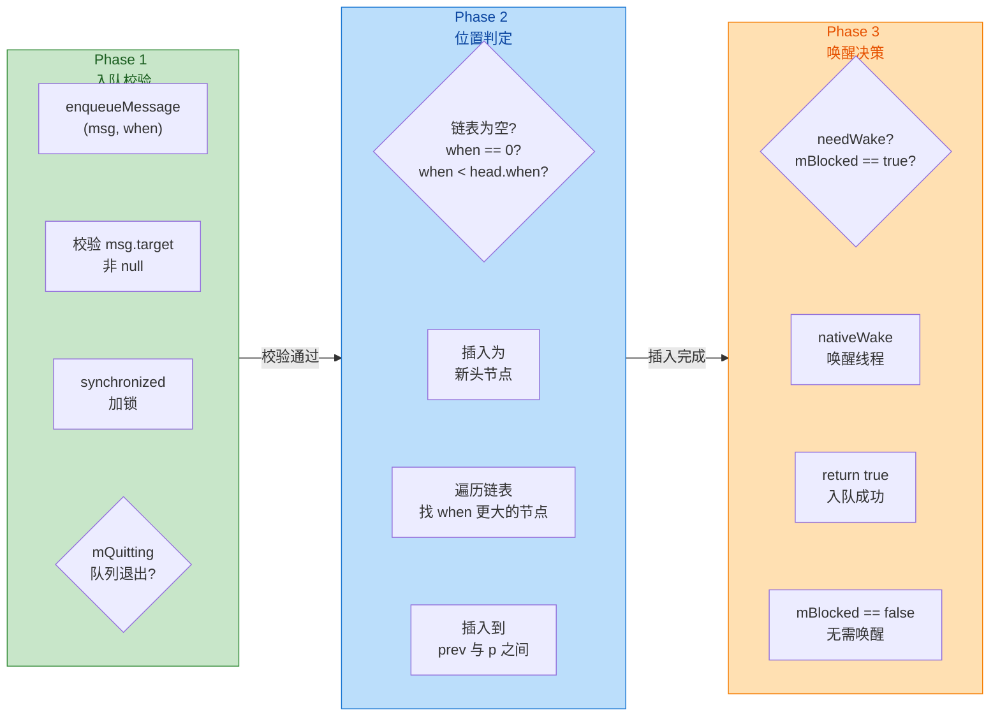
```mermaid
graph LR
    subgraph Phase1["Phase 1\n入队校验"]
        direction TB
        A["enqueueMessage\n(msg, when)"] ~~~ B["校验 msg.target\n非 null"]
        B ~~~ C["synchronized\n加锁"]
        C ~~~ D{"mQuitting\n队列退出?"}
    end

    subgraph Phase2["Phase 2\n位置判定"]
        direction TB
        E{"链表为空?\nwhen == 0?\nwhen < head.when?"} ~~~ F["插入为\n新头节点"]
        F ~~~ G["遍历链表\n找 when 更大的节点"]
        G ~~~ H["插入到\nprev 与 p 之间"]
    end

    subgraph Phase3["Phase 3\n唤醒决策"]
        direction TB
        I{"needWake?\nmBlocked == true?"} ~~~ J["nativeWake\n唤醒线程"]
        J ~~~ K["return true\n入队成功"]
        K ~~~ L["mBlocked == false\n无需唤醒"]
    end

    Phase1 -->|"校验通过"| Phase2 -->|"插入完成"| Phase3

    classDef greenStyle fill:#C8E6C9,stroke:#388E3C,color:#1B5E20
    classDef blueStyle fill:#BBDEFB,stroke:#1976D2,color:#0D47A1
    classDef orangeStyle fill:#FFE0B2,stroke:#F57C00,color:#E65100

    class Phase1 greenStyle
    class Phase2 blueStyle
    class Phase3 orangeStyle
```

**关于 `when` 的一个细节补充**：当你调用 `handler.sendMessageDelayed(msg, delayMillis)` 时，Handler 内部会将 `delayMillis` 转换为绝对时间戳 `SystemClock.uptimeMillis() + delayMillis`，然后传递给 `enqueueMessage()` 的 `when` 参数。`uptimeMillis()` 是系统开机以来（不包含深度睡眠时间）的毫秒数，它不受用户手动修改系统时间的影响，因此 Handler 的延迟消息在时间维度上是稳定可靠的。而 `sendMessage()` 或 `post()` 不带延迟的版本，`when` 就等于当前的 `uptimeMillis()`，表示"尽快执行"。

### next 阻塞与唤醒

如果说 `enqueueMessage()` 是消息的"入口"，那么 `next()` 方法就是消息的"出口"。它被 `Looper.loop()` 在死循环中反复调用，负责从链表头部取出下一条应该被处理的消息。`next()` 方法的设计复杂度远超 `enqueueMessage()`，因为它不仅仅是一个简单的"取头节点"操作——它必须处理以下几种情况：

1. **队列为空**：没有任何消息，线程应当休眠，等待新消息到来。
2. **头节点消息尚未到期**：头节点的 `when` 大于当前时间，线程应当休眠一段精确的时间（即 `when - now` 毫秒）。
3. **头节点消息已到期**：立即取出并返回该消息。
4. **同步屏障存在**：跳过同步消息，优先处理异步消息（下一章节详述）。
5. **队列退出**：`quit()` 被调用，返回 null，让 `Looper.loop()` 退出。

下面是 `next()` 方法的核心逻辑：

```java
// MessageQueue.java — next() 取出消息的核心逻辑
Message next() {
    // mPtr 是 native 层 NativeMessageQueue 的指针
    // 如果为 0，说明 MessageQueue 已被销毁，直接返回 null
    final long ptr = mPtr;
    if (ptr == 0) {
        return null;
    }

    // pendingIdleHandlerCount：待执行的 IdleHandler 数量
    // 首次进入循环时设为 -1，表示"尚未统计"
    int pendingIdleHandlerCount = -1;

    // nextPollTimeoutMillis：下一次 nativePollOnce 的超时时长
    // 0 表示立即返回（不休眠）
    // -1 表示无限期休眠（直到被唤醒）
    // 正数表示休眠指定毫秒数
    int nextPollTimeoutMillis = 0;

    // 进入无限循环——每次循环尝试取出一条消息
    for (;;) {
        // 【关键调用】nativePollOnce：线程在此处休眠
        // 休眠时长由 nextPollTimeoutMillis 决定
        // 这是一个 native 方法，底层通过 epoll_wait 实现
        nativePollOnce(ptr, nextPollTimeoutMillis);

        // 加锁，准备操作链表
        synchronized (this) {
            // 获取当前时间（开机以来的毫秒数，不含深度睡眠）
            final long now = SystemClock.uptimeMillis();

            Message prevMsg = null;  // 用于同步屏障逻辑（追踪前一个节点）
            Message msg = mMessages; // msg 指向链表头节点

            // 【同步屏障检测】如果头节点的 target 为 null，说明是同步屏障
            // 需要跳过所有同步消息，找到第一条异步消息（后续章节详述）
            if (msg != null && msg.target == null) {
                do {
                    prevMsg = msg;
                    msg = msg.next;
                } while (msg != null && !msg.isAsynchronous());
            }

            if (msg != null) {
                if (now < msg.when) {
                    // 【情况A】消息尚未到期
                    // 计算需要休眠的时长（最多不超过 Integer.MAX_VALUE）
                    nextPollTimeoutMillis = (int) Math.min(
                        msg.when - now, Integer.MAX_VALUE);
                } else {
                    // 【情况B】消息已到期，可以取出
                    mBlocked = false;   // 标记线程不再处于休眠状态

                    // 将 msg 从链表中摘除
                    if (prevMsg != null) {
                        // 存在同步屏障时，prevMsg 不为 null
                        prevMsg.next = msg.next;
                    } else {
                        // 正常情况：直接更新头指针
                        mMessages = msg.next;
                    }
                    msg.next = null;    // 断开 msg 的 next 引用

                    // 标记消息为"使用中"，防止重复回收
                    msg.markInUse();

                    // 返回这条消息给 Looper.loop() 进行分发
                    return msg;
                }
            } else {
                // 【情况C】队列中没有消息（或没有异步消息可处理）
                // 设置为 -1，表示无限期休眠
                nextPollTimeoutMillis = -1;
            }

            // 如果正在退出（quit 被调用），执行清理并返回 null
            if (mQuitting) {
                dispose();           // 释放 native 资源
                return null;         // Looper.loop() 收到 null 会退出循环
            }

            // === IdleHandler 处理逻辑（后续章节详述）===
            // 如果没有消息需要处理（即将休眠），执行 IdleHandler 回调
            if (pendingIdleHandlerCount < 0
                    && (mMessages == null || now < mMessages.when)) {
                pendingIdleHandlerCount = mIdleHandlers.size();
            }
            if (pendingIdleHandlerCount <= 0) {
                // 没有 IdleHandler 需要执行
                mBlocked = true;     // 标记线程即将休眠
                continue;            // 回到循环头部，执行 nativePollOnce 休眠
            }
            // ... IdleHandler 执行逻辑省略 ...
        }
        // ... IdleHandler 执行逻辑省略 ...

        // IdleHandler 执行完毕后，重置计数，并将 nextPollTimeoutMillis 设为 0
        // 因为 IdleHandler 执行期间可能有新消息入队，需要立即检查
        pendingIdleHandlerCount = 0;
        nextPollTimeoutMillis = 0;
    }
}
```

这段代码的精妙之处在于 **`nextPollTimeoutMillis` 变量与 `nativePollOnce()` 的配合**。我们可以将 `next()` 的行为总结为一个状态机：

| 队列状态 | `nextPollTimeoutMillis` 值 | 线程行为 |
|---|---|---|
| 队列为空 | `-1` | 无限期休眠，直到 `nativeWake()` 唤醒 |
| 头消息未到期（距到期还有 200ms） | `200` | 精确休眠 200ms 后自动唤醒 |
| 头消息已到期 | `0`（下次循环） | 不休眠，立即取出消息 |
| `quit()` 被调用 | 不适用 | 返回 `null`，Looper 退出 |

**`mBlocked` 字段的双重角色**：这个布尔值既是 `next()` 方法告知 `enqueueMessage()` "我正在休眠"的信号（用于决定是否需要 `nativeWake()`），也是线程状态的指示器。当 `next()` 即将调用 `nativePollOnce()` 进入休眠时，`mBlocked` 被设为 `true`；当成功取出消息时，`mBlocked` 被设为 `false`。这两个方法通过 `synchronized` 锁和 `mBlocked` 字段实现了一种精巧的 **生产者-消费者协调**。

整个阻塞-唤醒的时序交互如下：

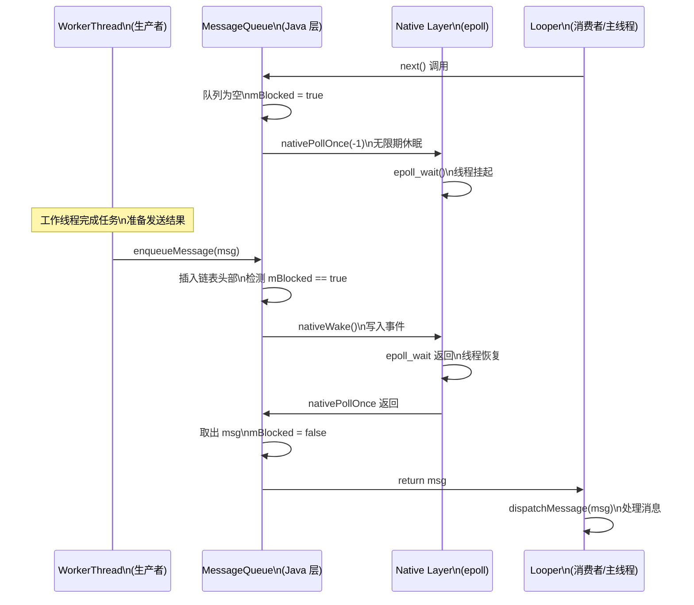
```mermaid
sequenceDiagram
    participant W as WorkerThread\n(生产者)
    participant MQ as MessageQueue\n(Java 层)
    participant N as Native Layer\n(epoll)
    participant L as Looper\n(消费者/主线程)

    L->>MQ: next() 调用
    MQ->>MQ: 队列为空\nmBlocked = true
    MQ->>N: nativePollOnce(-1)\n无限期休眠
    N->>N: epoll_wait()\n线程挂起

    Note over W: 工作线程完成任务\n准备发送结果

    W->>MQ: enqueueMessage(msg)
    MQ->>MQ: 插入链表头部\n检测 mBlocked == true
    MQ->>N: nativeWake()\n写入事件
    N->>N: epoll_wait 返回\n线程恢复

    N->>MQ: nativePollOnce 返回
    MQ->>MQ: 取出 msg\nmBlocked = false
    MQ->>L: return msg
    L->>L: dispatchMessage(msg)\n处理消息
```

从这个时序图中可以清晰看到：**线程的休眠与唤醒完全由 Native 层的 epoll 机制驱动**，Java 层只负责决策逻辑（该不该休眠、休眠多久），而真正的线程挂起与恢复则交给了操作系统内核。这就引出了下一个关键主题。

### Native 层 epoll

到目前为止，我们多次提到 `nativePollOnce()` 和 `nativeWake()` 这两个 native 方法，它们是 MessageQueue 实现"高效等待"的基石。要真正理解 Android 消息循环为何能做到"不忙等、不轮询、精准唤醒"，我们必须深入 Native 层，了解 Linux 的 **epoll** 机制。

**为什么需要 Native 层？** 你可能会问：Java 层有 `Object.wait()` / `Object.notify()`，或者 `LockSupport.park()` / `unpark()`，为什么不用这些纯 Java 方案实现线程等待？原因有几个：

1. **精确的超时控制**：`epoll_wait()` 支持毫秒级的超时参数，可以完美对应 `nextPollTimeoutMillis` 的语义。而 `Object.wait(timeout)` 虽然也支持超时，但它依赖 JVM 的实现，精度和可靠性不如系统调用。
2. **统一的事件监听模型**：Native 层的 MessageQueue（即 `NativeMessageQueue`）不仅要监听 Java 层的消息入队事件，还要监听其他文件描述符（如 InputChannel 的输入事件、VSync 信号等）。epoll 可以同时监听多个事件源，而 `Object.wait()` 只能等待单一条件。
3. **历史架构原因**：Android 的 UI 系统从底层就是基于 Native Looper 构建的，Java 层的 MessageQueue 是后来与 Native 层桥接的。

**epoll 是什么？** epoll 是 Linux 内核提供的一种高效的 **I/O 事件通知机制（I/O Event Notification Facility）**。它的核心思想是：应用程序告诉内核"我对这些文件描述符的哪些事件感兴趣"，然后调用 `epoll_wait()` 进入休眠；当任何一个被监听的文件描述符上发生了感兴趣的事件时，内核就唤醒应用程序。相比于更古老的 `select()` 和 `poll()`，epoll 的优势在于它使用了内核级别的回调机制，时间复杂度为 O(1)（不随监听的文件描述符数量增长），非常适合 Android 这种需要同时监听多个事件源的场景。

在 MessageQueue 的语境下，epoll 监听的核心事件源是一个 **eventfd**（在较老版本的 Android 中是 pipe）。整个机制的工作流程如下：

1. **初始化阶段**（MessageQueue 构造函数中调用 `nativeInit()`）：
   - Native 层创建一个 `Looper` 对象（注意这是 Native 层的 Looper，与 Java 层的 `android.os.Looper` 不同但配合使用）。
   - 调用 `eventfd()` 系统调用创建一个事件文件描述符 `mWakeEventFd`。
   - 调用 `epoll_create()` 创建一个 epoll 实例。
   - 调用 `epoll_ctl(EPOLL_CTL_ADD)` 将 `mWakeEventFd` 注册到 epoll 实例中，监听其**可读事件（EPOLLIN）**。

2. **休眠阶段**（`nativePollOnce()` 被调用）：
   - Native Looper 调用 `epoll_wait(epollFd, events, maxEvents, timeoutMillis)`。
   - 如果 `timeoutMillis == -1`，线程将无限期休眠，直到有事件到来。
   - 如果 `timeoutMillis > 0`，线程最多休眠指定毫秒数，超时后自动唤醒。
   - 如果 `timeoutMillis == 0`，`epoll_wait()` 立即返回（非阻塞）。
   - **在休眠期间，线程不消耗任何 CPU 资源**——它被内核从运行队列中移除，处于 TASK_INTERRUPTIBLE 状态。

3. **唤醒阶段**（`nativeWake()` 被调用）：
   - 向 `mWakeEventFd` 写入一个整数值 `1`（通过 `write()` 系统调用）。
   - 内核检测到 `mWakeEventFd` 变为可读状态，将等待在 `epoll_wait()` 上的线程唤醒。
   - `epoll_wait()` 返回，Native Looper 读取并清除 `mWakeEventFd` 中的数据。
   - 控制权回到 Java 层的 `nativePollOnce()`，该方法返回。
   - Java 层的 `next()` 方法继续执行，检查链表并取出消息。

用一张完整的架构图来展示 Java 层与 Native 层的协作关系：

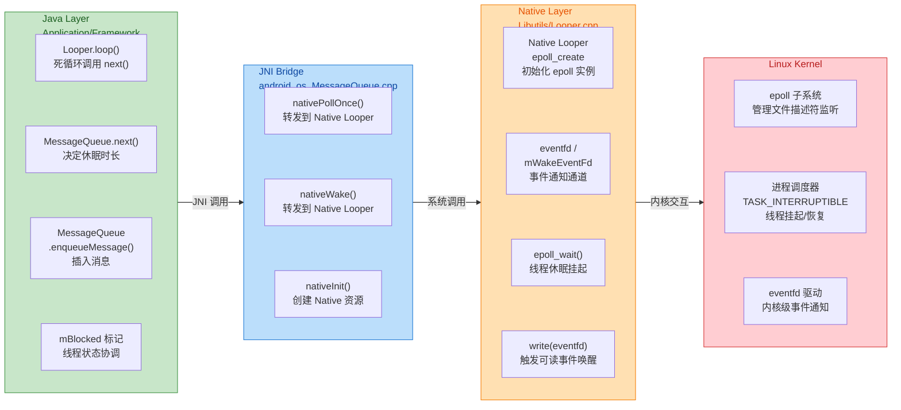
```mermaid
graph LR
    subgraph JavaLayer["Java Layer\nApplication/Framework"]
        direction TB
        J1["Looper.loop()\n死循环调用 next()"] ~~~ J2["MessageQueue.next()\n决定休眠时长"]
        J2 ~~~ J3["MessageQueue\n.enqueueMessage()\n插入消息"]
        J3 ~~~ J4["mBlocked 标记\n线程状态协调"]
    end

    subgraph JNIBridge["JNI Bridge\nandroid_os_MessageQueue.cpp"]
        direction TB
        B1["nativePollOnce()\n转发到 Native Looper"] ~~~ B2["nativeWake()\n转发到 Native Looper"]
        B2 ~~~ B3["nativeInit()\n创建 Native 资源"]
    end

    subgraph NativeLayer["Native Layer\nLibutils/Looper.cpp"]
        direction TB
        N1["Native Looper\nepoll_create\n初始化 epoll 实例"] ~~~ N2["eventfd /\nmWakeEventFd\n事件通知通道"]
        N2 ~~~ N3["epoll_wait()\n线程休眠挂起"] ~~~ N4["write(eventfd)\n触发可读事件唤醒"]
    end

    subgraph Kernel["Linux Kernel"]
        direction TB
        K1["epoll 子系统\n管理文件描述符监听"] ~~~ K2["进程调度器\nTASK_INTERRUPTIBLE\n线程挂起/恢复"]
        K2 ~~~ K3["eventfd 驱动\n内核级事件通知"]
    end

    JavaLayer -->|"JNI 调用"| JNIBridge -->|"系统调用"| NativeLayer -->|"内核交互"| Kernel

    classDef greenStyle fill:#C8E6C9,stroke:#388E3C,color:#1B5E20
    classDef blueStyle fill:#BBDEFB,stroke:#1976D2,color:#0D47A1
    classDef orangeStyle fill:#FFE0B2,stroke:#F57C00,color:#E65100
    classDef redStyle fill:#FFCDD2,stroke:#D32F2F,color:#B71C1C

    class JavaLayer greenStyle
    class JNIBridge blueStyle
    class NativeLayer orangeStyle
    class Kernel redStyle
```

**关于 eventfd 的补充说明**：`eventfd` 是 Linux 2.6.22+ 提供的一种轻量级进程间/线程间通信机制。它本质上是一个内核维护的 64 位计数器，支持 `read()` 和 `write()` 操作。相比传统的 pipe（需要两个文件描述符），eventfd 只需要一个文件描述符，更加轻量。Android 早期版本使用 pipe 实现唤醒机制，后来在 Android 6.0 左右切换到了 eventfd 以减少资源消耗。

**epoll 在 Android 消息机制中的多重角色**：虽然本节聚焦于"消息入队唤醒"这一场景，但实际上 Native Looper 的 epoll 实例监听的不只是 `mWakeEventFd`。`InputChannel`（触摸事件通道）、`Choreographer` 的 VSync 信号 fd 等都被注册到了同一个 epoll 实例中。这意味着主线程的 `epoll_wait()` 可以被以下任何一个事件唤醒：

- Java 层有新消息入队（通过 `nativeWake()` 写 eventfd）
- 用户触摸了屏幕（InputChannel 上有数据可读）
- 屏幕硬件发出了 VSync 信号（Choreographer 注册的 fd 可读）

这种"一个线程、一个 epoll、多个事件源"的设计，正是 Android 主线程能够同时处理 UI 渲染、输入事件、Handler 消息的基础架构。它赋予了主线程一种"事件多路复用"的能力——线程在没有任何事件时安静休眠，任何事件到来时被精准唤醒。

**从应用层开发者的角度总结**：作为 App 开发者，你不需要直接操作 epoll（那是 Framework 和 Native 层的事情），但理解这套机制能帮助你：

- **理解 ANR 的本质**：主线程的 `next()` 长时间取不到消息（因为之前取出的消息正在被一个耗时操作阻塞 `dispatchMessage()`），导致后续消息——包括系统发来的 Input 事件和 Activity 生命周期回调——得不到及时处理，触发 ANR。
- **理解 `postDelayed` 的精度**：延迟消息的精度取决于 `epoll_wait()` 的超时精度和主线程是否被其他消息阻塞。在极端情况下，一个 `postDelayed(runnable, 500)` 可能会在 500ms 之后很久才被执行，因为主线程可能正在处理另一条耗时消息。
- **理解为什么主线程不会"卡死"在 `loop()` 的死循环中**：因为当没有消息时，线程根本不在运行——它通过 `epoll_wait()` 交出了 CPU，等待内核唤醒。这与 `while(true) { /* 检查标志位 */ }` 的忙等完全不同。

---

**📝 练习题**

在 Android 的 MessageQueue 中，当一条新消息通过 `enqueueMessage()` 被插入到链表**头部**时，以下哪种情况会触发 `nativeWake()` 唤醒线程？

A. 无论线程是否在休眠，只要新消息成为头节点就一定会调用 `nativeWake()`


B. 只有当 `mBlocked == true`（线程正在 `nativePollOnce()` 中休眠）时才会调用 `nativeWake()`


C. 只有当新消息是异步消息（`isAsynchronous() == true`）时才会调用 `nativeWake()`


D. 只有当队列中存在同步屏障时才会调用 `nativeWake()`


**【答案】** B

**【解析】** 在 `enqueueMessage()` 的源码中，当新消息被插入为链表头节点时，`needWake` 的值被赋为 `mBlocked`。`mBlocked` 是 `next()` 方法在即将调用 `nativePollOnce()` 进入休眠前设置为 `true` 的标志。这意味着：如果线程当前正在休眠（`mBlocked == true`），那么新的头部消息改变了"最早需要处理的消息"，必须唤醒线程重新评估；如果线程当前没有休眠（正在执行 `dispatchMessage()` 处理消息），那么它处理完当前消息后会自然地再次调用 `next()` 获取下一条消息，不需要额外唤醒。选项 A 忽略了 `mBlocked` 的判断条件；选项 C 和 D 描述的是消息插入到链表**中间**位置时、存在同步屏障的特殊情况下的 `needWake` 判断逻辑，与插入到头部的场景不同。

---

## 处理器 Handler

Handler 是 Android 消息机制中**面向开发者的核心 API 入口**。如果把整个消息机制比作一套邮政系统，那么 Looper 是邮递员、MessageQueue 是邮箱，而 Handler 就是**寄件人兼收件人**——它既负责将 Message 投递到目标线程的消息队列中（发送），也负责在目标线程中拆开信封、阅读并处理信件内容（分发与处理）。从应用层视角看，我们日常使用的 `runOnUiThread()`、`View.post()`、`LiveData` 的线程切换，乃至整个 `Choreographer` 的 VSync 回调调度，底层全部依赖 Handler 完成。理解 Handler 的工作链路——从 `sendMessage` 到 `enqueueMessage`，再到 Looper 取出后执行 `dispatchMessage`——是掌握 Android 线程通信的关键一环。

### sendMessage 发送

#### 发送流程总览

Handler 提供了**两大类**消息发送方式：**Message 方式** 与 **Runnable 方式**。表面上它们的 API 签名完全不同，但深入源码后会发现，所有的发送路径最终都**汇聚到同一个方法** —— `enqueueMessage()`，这是一个非常优雅的设计统一。

当开发者调用 `handler.sendMessage(msg)` 时，这条消息并不会被立刻处理。Handler 会为这条 Message 打上"邮戳"（设置 `when` 时间戳），然后将其插入到与 Handler 绑定的那个 Looper 所持有的 MessageQueue 中。真正的处理要等到 Looper 在 `loop()` 死循环中通过 `MessageQueue.next()` 将其取出后才会发生。这种"投递-排队-取出-处理"的异步模型，正是 Android 实现**线程间通信**的基石。

#### API 分类与调用链路

Handler 的发送 API 虽然数量众多，但可以按照**是否携带 Runnable** 分为两条链路：

**第一条链路：Message 系列**。这一系列方法要求开发者手动构造一个 Message 对象，设置 `what`、`arg1`、`arg2`、`obj` 等字段作为载荷，然后交给 Handler 发送。典型方法包括 `sendMessage(Message msg)`、`sendMessageDelayed(Message msg, long delayMillis)` 以及 `sendMessageAtTime(Message msg, long uptimeMillis)`。它们之间是逐层委托关系：`sendMessage()` 调用 `sendMessageDelayed()` 并传入 delay = 0；`sendMessageDelayed()` 将 delay 转换为绝对时间（`SystemClock.uptimeMillis() + delayMillis`）后调用 `sendMessageAtTime()`；`sendMessageAtTime()` 最终调用私有方法 `enqueueMessage()`，将 Message 插入队列。还有一个特殊的 `sendMessageAtFrontOfQueue()`，它直接将 `when` 设为 0，使消息插入队首，优先被处理——但官方文档明确警告这个方法可能导致**消息饥饿（starvation）**或其它时序问题，应极少使用。

**第二条链路：Runnable 系列**。这一系列方法看似完全不同，接受的是一个 `Runnable` 对象而非 Message。典型方法包括 `post(Runnable r)`、`postDelayed(Runnable r, long delayMillis)` 以及 `postAtTime(Runnable r, long uptimeMillis)`。但如果查看源码就会发现，`post()` 内部调用的其实是 `sendMessageDelayed(getPostMessage(r), 0)`。关键就在 `getPostMessage()` 这个私有方法——它通过 `Message.obtain()` 从复用池获取一个空 Message，然后将 Runnable 赋值给 `msg.callback` 字段。这样，Runnable 就被**包装成了 Message**，后续走的路径与 Message 系列完全一致。这个设计体现了一种经典的**适配器思想**：无论外部传入的是 Message 还是 Runnable，内部都统一为 Message 处理，极大简化了底层逻辑。

#### 核心源码解析

下面是 Handler 发送链路中最关键的几个方法，展示了从 API 入口到最终入队的完整路径：

```java
// ---- Handler.java 发送链路核心源码 ----

// 【入口1】发送一个 Message，delay 默认为 0
public final boolean sendMessage(@NonNull Message msg) {
    // 直接委托给 sendMessageDelayed，延迟时间为 0（立即执行）
    return sendMessageDelayed(msg, 0);
}

// 【入口2】发送一个 Runnable，内部包装成 Message
public final boolean post(@NonNull Runnable r) {
    // getPostMessage(r) 把 Runnable 包装为 Message（赋值给 msg.callback）
    // 然后同样走 sendMessageDelayed，延迟时间为 0
    return sendMessageDelayed(getPostMessage(r), 0);
}

// 【汇聚点1】带延迟的发送，将相对延迟转为绝对时间
public final boolean sendMessageDelayed(@NonNull Message msg, long delayMillis) {
    // 如果传入负数延迟，修正为 0（不允许"回到过去"）
    if (delayMillis < 0) {
        delayMillis = 0;
    }
    // 用当前系统启动时间 + 延迟，算出消息应被处理的绝对时刻
    // uptimeMillis 不受系统时钟修改和休眠影响，保证时序准确
    return sendMessageAtTime(msg, SystemClock.uptimeMillis() + delayMillis);
}

// 【汇聚点2】指定绝对时间发送，真正准备入队
public boolean sendMessageAtTime(@NonNull Message msg, long uptimeMillis) {
    // 获取当前 Handler 绑定的 MessageQueue
    MessageQueue queue = mQueue;
    // 如果 queue 为 null，说明 Looper 未初始化或已退出
    if (queue == null) {
        RuntimeException e = new RuntimeException(
                this + " sendMessageAtTime() called with no mQueue");
        Log.w("Looper", e.getMessage(), e);
        // 返回 false 表示发送失败
        return false;
    }
    // 调用私有方法 enqueueMessage，执行真正的入队操作
    return enqueueMessage(queue, msg, uptimeMillis);
}

// 【终点】私有入队方法 —— 所有发送路径的最终汇聚
private boolean enqueueMessage(@NonNull MessageQueue queue, @NonNull Message msg,
        long uptimeMillis) {
    // ★ 关键：将 msg.target 设为当前 Handler 自身
    // 这样 Looper 在取出消息后，就知道该交给哪个 Handler 来处理
    msg.target = this;

    // 获取当前 Handler 的 uid（用于跨进程消息场景的身份标识）
    msg.workSourceUid = ThreadLocalWorkSource.getUid();

    // 如果当前 Handler 被设置为异步模式（构造时传入 async = true）
    // 则将消息标记为异步消息（不受同步屏障阻挡）
    if (mAsynchronous) {
        msg.setAsynchronous(true);
    }

    // 最终委托给 MessageQueue 的 enqueueMessage() 完成入队
    // MessageQueue 会根据 uptimeMillis 将消息插入到链表的正确位置
    return queue.enqueueMessage(msg, uptimeMillis);
}

// 【辅助】将 Runnable 包装为 Message 的私有工具方法
private static Message getPostMessage(Runnable r) {
    // 从 Message 复用池中获取一个空闲 Message（避免频繁 new）
    Message m = Message.obtain();
    // 将 Runnable 赋值给 Message 的 callback 字段
    // 后续 dispatchMessage 时会优先检查此字段
    m.callback = r;
    // 返回包装好的 Message
    return m;
}
```

#### msg.target = this 的深层含义

在 `enqueueMessage()` 方法中，`msg.target = this` 这一行看似简单，实则是**整个消息机制能够正确工作的枢纽**。它在消息对象上绑定了"发件人地址"，使得 Looper 取出消息后不需要维护任何额外的路由表或映射关系——直接调用 `msg.target.dispatchMessage(msg)` 就能将消息精准投递回发送它的那个 Handler 实例。这种设计使得一个线程的 MessageQueue 中可以混合存放来自**不同 Handler** 的消息，而分发时各走各路，互不干扰。

但这行代码也有一个重要的副作用：如果 Handler 是以**匿名内部类**的方式创建的，那么它会隐式持有外部 Activity 的引用，而 `msg.target = this` 又让 Message 持有了 Handler 的引用。当消息在队列中等待处理时（比如一条 `postDelayed` 了 10 分钟的消息），就形成了 **MessageQueue → Message → Handler → Activity** 的引用链，导致 Activity 无法被 GC 回收。这就是 Handler 内存泄漏的根源，我们会在后文详细展开。

#### 时间基准：为什么用 uptimeMillis

Handler 使用 `SystemClock.uptimeMillis()` 而非 `System.currentTimeMillis()` 作为时间基准，这是一个经过深思熟虑的设计决策。`System.currentTimeMillis()` 返回的是墙钟时间（wall clock time），用户修改系统时间、网络时间同步（NTP）都会导致它发生跳变，如果用它来排序消息队列，可能出现消息被"提前"或"延后"数小时执行的荒谬情况。而 `uptimeMillis()` 返回的是系统启动以来的毫秒数，它**不受时钟调整影响**，也**不计入深度休眠（deep sleep）时间**，因此能提供单调递增、稳定可靠的时序基准。这也解释了为什么用 `postDelayed()` 设置的延迟，在设备进入深度休眠后会"变长"——因为休眠期间 uptimeMillis 停止计时了。如果需要在包含休眠的场景下精确延迟，应该使用 `AlarmManager` 而非 Handler。

下面的 Mermaid 图展示了 Handler 发送消息的完整汇聚路径：

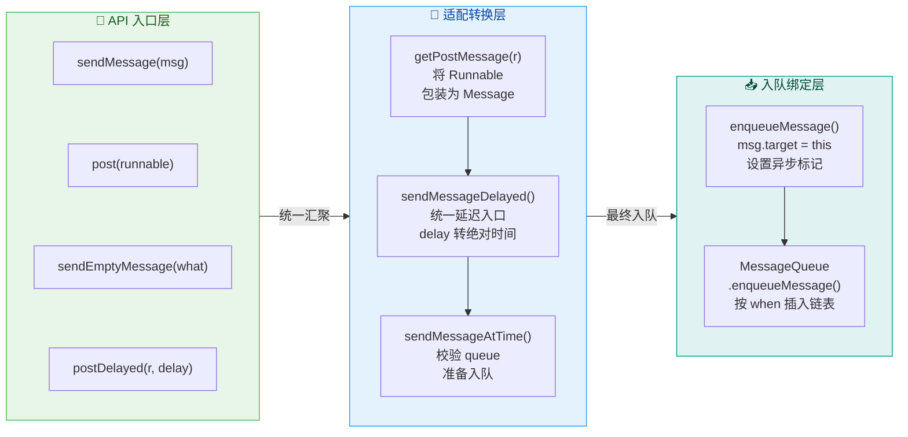
```mermaid
graph LR
    subgraph API["📮 API 入口层"]
        direction TB
        A["sendMessage(msg)"]
        B["post(runnable)"]
        C["sendEmptyMessage(what)"]
        D["postDelayed(r, delay)"]
        A ~~~ B
        B ~~~ C
        C ~~~ D
    end

    subgraph WRAP["🔄 适配转换层"]
        direction TB
        E["getPostMessage(r)\n将 Runnable\n包装为 Message"]
        F["sendMessageDelayed()\n统一延迟入口\ndelay 转绝对时间"]
        G["sendMessageAtTime()\n校验 queue\n准备入队"]
        E --> F
        F --> G
    end

    subgraph ENQUEUE["📥 入队绑定层"]
        direction TB
        H["enqueueMessage()\nmsg.target = this\n设置异步标记"]
        I["MessageQueue\n.enqueueMessage()\n按 when 插入链表"]
        H --> I
    end

    API -->|"统一汇聚"| WRAP -->|"最终入队"| ENQUEUE

    classDef greenStyle fill:#E8F5E9,stroke:#4CAF50,color:#1B5E20
    classDef blueStyle fill:#E3F2FD,stroke:#2196F3,color:#0D47A1
    classDef tealStyle fill:#E0F2F1,stroke:#009688,color:#004D40

    class API greenStyle
    class WRAP blueStyle
    class ENQUEUE tealStyle
```

### dispatchMessage 分发

#### 从 Looper 到 Handler 的衔接

当 Looper 在 `loop()` 方法的死循环中通过 `MessageQueue.next()` 取出一条 Message 后，它需要决定"这条消息交给谁处理"。这个决策过程非常直接——Looper 直接调用 `msg.target.dispatchMessage(msg)`。由于在入队时 `enqueueMessage()` 已经将 `msg.target` 指向了发送该消息的 Handler 实例，所以这里等价于调用那个 Handler 的 `dispatchMessage()` 方法。至此，控制权从 Looper 移交回 Handler，进入分发阶段。

值得注意的是，`dispatchMessage()` 的执行线程是 **Looper 所在的线程**，而不是调用 `sendMessage()` 的线程。这正是 Handler 能够实现线程切换的秘密：在线程 A 调用 `handler.sendMessage()`，消息被投递到线程 B 的 MessageQueue 中，然后由线程 B 的 Looper 取出并在线程 B 上调用 `dispatchMessage()`。发送与处理在不同线程上完成，开发者无需手动同步。

#### 三级分发优先级

`dispatchMessage()` 方法的逻辑并不复杂，但它包含一个**精心设计的三级优先级链**。Android 并没有简单粗暴地把所有消息都路由到 `handleMessage()`，而是提供了三个拦截层，每一层都有不同的用途和灵活性。当一条消息到达时，Handler 会按照以下顺序依次检查，一旦某一层处理了消息，后续层就不再执行：

**第一优先级：Message.callback（Runnable 回调）**。Handler 首先检查 `msg.callback` 是否为非空。如果开发者是通过 `handler.post(Runnable)` 发送的消息，那么在 `getPostMessage()` 阶段就已经将 Runnable 存入了 `msg.callback`。此时 Handler 直接调用 `handleCallback(msg)` 方法，其内部实现极为简单——就是 `msg.callback.run()`，即在当前线程（Looper 线程）上直接运行该 Runnable。处理完毕后方法返回，第二、第三优先级均被跳过。这一设计使得 `post()` 成为最轻量、最直接的消息处理方式，因为连 `handleMessage()` 都不需要经过。

**第二优先级：Handler.mCallback（构造时注入的回调接口）**。如果 `msg.callback` 为 null（即不是通过 `post()` 发送的），Handler 接下来检查成员变量 `mCallback` 是否为非空。`mCallback` 是一个 `Handler.Callback` 接口实例，可以在构造 Handler 时通过 `Handler(Looper looper, Callback callback)` 构造器传入。如果存在，Handler 调用 `mCallback.handleMessage(msg)`。这个方法有一个**布尔返回值**：如果返回 `true`，表示消息已被完全处理，分发结束；如果返回 `false`，消息会**继续穿透**到第三优先级。这个设计提供了一种**无需继承 Handler 子类**就能拦截消息的方式，在很多架构中非常有用——你可以用 Callback 做统一的日志记录、消息过滤或预处理，然后决定是否放行给 `handleMessage()`。

**第三优先级：Handler.handleMessage()（子类重写）**。如果前两层都没有处理消息，Handler 最终调用 `handleMessage(msg)` 方法。这是 Handler 类中的一个**空方法**，设计为由子类重写。这也是大多数初学者最熟悉的模式——继承 Handler 并重写 `handleMessage()`，通过 `switch (msg.what)` 来区分不同类型的消息。

#### 分发源码解析

```java
// ---- Handler.java 分发链路核心源码 ----

// Looper.loop() 中取出消息后调用此方法
// 这个方法在 Looper 所在线程上执行（通常是主线程）
public void dispatchMessage(@NonNull Message msg) {

    // 【第一优先级】检查 Message 自身是否携带了 Runnable 回调
    // 当开发者使用 handler.post(Runnable) 时，Runnable 被存在 msg.callback
    if (msg.callback != null) {
        // 直接执行 Runnable.run()，不再走后续流程
        handleCallback(msg);
    } else {
        // 【第二优先级】检查 Handler 构造时是否传入了 Callback 接口
        // mCallback 是 Handler.Callback 类型，可在构造器中注入
        if (mCallback != null) {
            // 调用 Callback.handleMessage()
            // 如果返回 true —— 消息已被拦截处理，流程终止
            // 如果返回 false —— 消息穿透，继续走第三优先级
            if (mCallback.handleMessage(msg)) {
                return; // 被拦截，直接返回
            }
        }
        // 【第三优先级】调用 Handler 子类重写的 handleMessage()
        // Handler 基类中此方法为空实现，需要子类提供逻辑
        handleMessage(msg);
    }
}

// 第一优先级的实际执行方法：直接运行 Runnable
private static void handleCallback(Message message) {
    // 在当前线程（Looper 线程）执行 Runnable 的 run() 方法
    // 注意：这里是 run() 不是 start()，不会创建新线程
    message.callback.run();
}

// 第三优先级：空方法，等待子类重写
// 开发者通过 switch(msg.what) 区分消息类型并处理
public void handleMessage(@NonNull Message msg) {
    // 默认空实现
}

// Callback 接口定义 —— 第二优先级的抽象
public interface Callback {
    // 返回 true 表示消息已处理（拦截）
    // 返回 false 表示消息未处理（穿透到 handleMessage）
    boolean handleMessage(@NonNull Message msg);
}
```

#### 分发优先级流程图

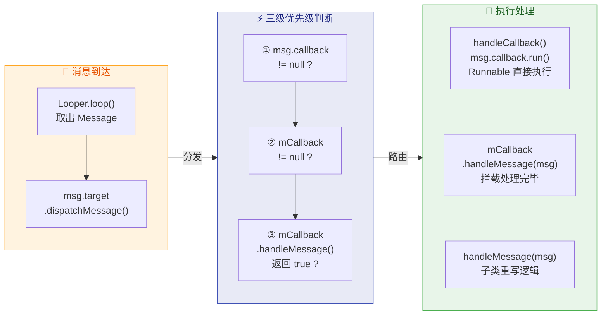
```mermaid
graph LR
    subgraph INPUT["📨 消息到达"]
        direction TB
        A["Looper.loop()\n取出 Message"]
        B["msg.target\n.dispatchMessage()"]
        A --> B
    end

    subgraph PRIORITY["⚡ 三级优先级判断"]
        direction TB
        C["① msg.callback\n!= null ?"]
        D["② mCallback\n!= null ?"]
        E["③ mCallback\n.handleMessage()\n返回 true ?"]
        C --> D
        D --> E
    end

    subgraph ACTION["🎯 执行处理"]
        direction TB
        F["handleCallback()\nmsg.callback.run()\nRunnable 直接执行"]
        G["mCallback\n.handleMessage(msg)\n拦截处理完毕"]
        H["handleMessage(msg)\n子类重写逻辑"]
        F ~~~ G
        G ~~~ H
    end

    INPUT -->|"分发"| PRIORITY -->|"路由"| ACTION

    classDef inputStyle fill:#FFF3E0,stroke:#FF9800,color:#E65100
    classDef priorityStyle fill:#E8EAF6,stroke:#3F51B5,color:#1A237E
    classDef actionStyle fill:#E8F5E9,stroke:#4CAF50,color:#1B5E20

    class INPUT inputStyle
    class PRIORITY priorityStyle
    class ACTION actionStyle
```

#### 为什么设计三级优先级

这个三级分发机制的设计体现了 Android 框架对**灵活性与可扩展性**的追求。第一优先级（`msg.callback`）服务于最常见的场景——`post(Runnable)`，它将行为直接绑定在消息上，无需任何额外的 `what` 判断或类型分发，使用最简洁。第二优先级（`mCallback`）提供了一种**组合（Composition）而非继承（Inheritance）**的扩展方式，开发者无需创建 Handler 子类就能拦截和处理消息，这在 Activity、Fragment 等已有继承体系的类中尤为方便。第三优先级（`handleMessage()`）是经典的**模板方法模式（Template Method Pattern）**，通过子类重写来定制行为。三者从上到下，灵活性递减但结构化程度递增，覆盖了从"快速执行一个任务"到"系统化处理多种消息类型"的全部场景。

### handleMessage 处理

#### 典型使用模式

`handleMessage()` 作为三级分发中的最后一层，也是最结构化的处理方式，适用于需要**区分多种消息类型**的场景。开发者通常会使用 `msg.what` 作为消息的"操作码（opcode）"，配合 `switch-case` 进行路由，从 `msg.arg1`、`msg.arg2`、`msg.obj` 等字段中提取载荷数据，然后执行相应的业务逻辑。

在现代 Android 开发中，虽然 Kotlin 协程和 LiveData 等工具逐渐取代了手动使用 Handler 处理消息的场景，但 `handleMessage()` 模式在**框架层**和**系统组件**中仍然大量存在。例如，`ActivityThread` 内部的 `H` 类（继承自 Handler）就通过 `handleMessage()` 处理了诸如 `LAUNCH_ACTIVITY`、`PAUSE_ACTIVITY`、`BIND_SERVICE` 等数十种系统消息，可以说是整个应用层生命周期调度的心脏。

#### 现代写法推荐

从 Android API 30 开始，Google 已经将不带 Looper 参数的 Handler 默认构造器标记为 **@Deprecated**。原因在于，隐式使用当前线程的 Looper 容易造成困惑和 Bug——如果在一个没有 Looper 的工作线程上创建 Handler，会直接抛出 `RuntimeException`。现代推荐写法是**显式传入 Looper**，并结合 `Callback` 接口，避免创建匿名内部类导致的内存泄漏：

```kotlin
// ---- 现代 Handler 推荐使用方式 (Kotlin) ----

// 【方式1】使用 Callback 接口（推荐：避免继承、避免内存泄漏）
// 显式传入 Looper.getMainLooper()，确保消息在主线程处理
val handler = Handler(Looper.getMainLooper()) { msg ->
    // Kotlin lambda 实现 Callback 接口
    // msg 就是从队列中取出的 Message
    when (msg.what) {
        // 根据 what 值分发不同消息类型
        MSG_UPDATE_UI -> {
            // 从 msg.obj 中取出数据（需要类型转换）
            val data = msg.obj as? String
            // 更新 UI（此时已经在主线程，安全操作 View）
            textView.text = data
            true // 返回 true 表示消息已处理，不再穿透
        }
        MSG_LOAD_COMPLETE -> {
            // 处理加载完成逻辑
            progressBar.visibility = View.GONE
            true // 已处理
        }
        else -> false // 未知消息类型，返回 false 表示未处理
    }
}

// 在工作线程中发送消息到主线程
thread {
    // 模拟耗时操作（网络请求、数据库查询等）
    val result = performHeavyWork()

    // 通过 Handler 将结果发送到主线程
    // obtain() 从复用池获取 Message，避免频繁创建对象
    val msg = Message.obtain().apply {
        what = MSG_UPDATE_UI   // 设置消息类型标识
        obj = result           // 设置载荷数据
    }
    // sendMessage 将消息投递到主线程的 MessageQueue
    handler.sendMessage(msg)
}


// 【方式2】使用 post(Runnable)（适合简单场景）
// 无需定义 what 常量，直接在 Runnable 中编写 UI 更新逻辑
val handler2 = Handler(Looper.getMainLooper())

thread {
    val result = performHeavyWork()
    // post 将 Runnable 包装为 Message 投递到主线程
    handler2.post {
        // 这个 lambda 会在主线程执行
        textView.text = result
    }
}


// 【方式3】子类重写（传统方式，注意内存泄漏风险）
// 使用 companion object 中的常量定义消息类型
companion object {
    const val MSG_UPDATE_UI = 1       // UI 更新消息
    const val MSG_LOAD_COMPLETE = 2   // 加载完成消息
}

// ★ 注意：如果必须使用子类方式，务必使用静态内部类 + WeakReference
// 详见下方"内存泄漏"章节
```

#### handleMessage 与生命周期的关系

一个经常被忽视的问题是：`handleMessage()` 的执行时机与 Activity/Fragment 的生命周期**完全无关**。即使 Activity 已经调用了 `onDestroy()`，只要 Handler 对应的 Looper 还在运行、MessageQueue 中还有未处理的消息，`handleMessage()` 就仍然会被调用。这意味着如果你在 `handleMessage()` 中直接操作 Activity 的 View（如 `textView.text = "..."` ），而此时 Activity 已经销毁，就会出现 `NullPointerException` 或者更新了一个用户不可见的 UI。

因此，在 `handleMessage()` 中操作 UI 之前，务必检查 Activity/Fragment 的状态。如果使用 WeakReference 持有外部 Activity 的引用，应先调用 `weakRef.get()` 判断是否已被回收。而更现代的做法是使用 `Lifecycle` 组件或 `viewLifecycleOwner` 配合协程，自动在生命周期结束时取消任务，从根本上避免此类问题。

### 内存泄漏

Handler 内存泄漏是 Android 开发中**最经典、最高频**的内存问题之一，也是面试中的必考知识点。理解它的成因需要将前面几节的知识串联起来——Message、MessageQueue、Handler 与 Activity 之间形成了一条完整的引用链。

#### 泄漏引用链分析

当一个 Handler 以**非静态内部类（non-static inner class）或匿名内部类（anonymous inner class）**的形式在 Activity 中创建时，Java/Kotlin 语言规范决定了它会**隐式持有外部类（Activity）的引用**。这是 JVM 层面的行为，与 Android 无关。在此基础上，消息发送时 `enqueueMessage()` 中的 `msg.target = this` 又让每条 Message 持有了 Handler 的引用。而 Message 被插入到 MessageQueue 中后，MessageQueue 作为单链表的头节点持有了所有排队中消息的引用。MessageQueue 又被 Looper 持有，主线程的 Looper 伴随应用进程存活，永远不会被 GC。

这样就形成了一条从 GC Root 到 Activity 的完整引用链：

```text
                    ┌─────────────────────────────────────────────┐
                    │            GC 引用链（泄漏路径）              │
                    ├─────────────────────────────────────────────┤
                    │                                             │
                    │  主线程 (GC Root)                            │
                    │      │                                      │
                    │      ▼                                      │
                    │  Looper (主线程 Looper，永不销毁)              │
                    │      │ 持有                                  │
                    │      ▼                                      │
                    │  MessageQueue (消息队列)                     │
                    │      │ 链表持有                               │
                    │      ▼                                      │
                    │  Message (延迟消息，still enqueued)           │
                    │      │ msg.target                            │
                    │      ▼                                      │
                    │  Handler (非静态内部类)                       │
                    │      │ 隐式持有外部类引用 (this$0)             │
                    │      ▼                                      │
                    │  Activity (已 onDestroy，但无法被 GC！)       │
                    │      │ 持有                                  │
                    │      ▼                                      │
                    │  View 树、Bitmap、Adapter 等大量资源           │
                    │                                             │
                    └─────────────────────────────────────────────┘
```

这条引用链的存在时间取决于**消息在队列中的存活时间**。如果是一个 `postDelayed(runnable, 60_000)`（延迟 60 秒），那么在这 60 秒内 Activity 都无法被回收。更极端的情况是周期性消息——如果 `handleMessage()` 中再次调用 `sendMessageDelayed()` 实现轮询，引用链将**永远不会断开**，Activity 永远无法被回收，这是最严重的泄漏形式。

#### 泄漏复现

下面的代码展示了一个典型的内存泄漏场景，以及为什么它会泄漏：

```kotlin
// ---- 反面示例：Handler 内存泄漏 ----

class LeakyActivity : AppCompatActivity() {

    // ★ 问题1：匿名内部类/lambda 隐式持有 LeakyActivity.this 引用
    // 在 Kotlin 中 object : Handler() 等价于 Java 的匿名内部类
    private val leakyHandler = object : Handler(Looper.getMainLooper()) {
        override fun handleMessage(msg: Message) {
            // 直接引用外部 Activity 的 View
            // 即使 Activity 已 onDestroy，这段代码仍可能执行
            textView.text = "Updated: ${msg.obj}"
        }
    }

    override fun onCreate(savedInstanceState: Bundle?) {
        super.onCreate(savedInstanceState)
        setContentView(R.layout.activity_leaky)

        // ★ 问题2：发送一条 10 分钟后才执行的延迟消息
        // 在这 10 分钟内，引用链一直存在：
        // MessageQueue → Message → leakyHandler → LeakyActivity
        val msg = Message.obtain().apply {
            what = 1
            obj = "some data"
        }
        leakyHandler.sendMessageDelayed(msg, 10 * 60 * 1000L)  // 10 分钟

        // ★ 问题3：周期性消息——泄漏永远不会结束
        // handleMessage 中再次 sendMessageDelayed，形成无限循环
        // leakyHandler.sendEmptyMessageDelayed(REFRESH_MSG, 5000)
    }

    // 用户按返回键，Activity 执行 onDestroy
    // 但由于引用链存在，Activity 的内存无法被回收
    // 如果反复进出这个 Activity，每次都泄漏一个实例
    // 内存占用持续增长，最终 OOM
}
```

#### 标准修复方案

修复 Handler 内存泄漏的核心思路是**打断引用链**。我们需要做到两点：第一，让 Handler 不再强引用 Activity（使用**静态内部类 + WeakReference**）；第二，在 Activity 销毁时**主动清理**队列中的残留消息（使用 `removeCallbacksAndMessages(null)`）。双管齐下，才能彻底解决问题。

```kotlin
// ---- 标准修复：静态内部类 + WeakReference + onDestroy 清理 ----

class SafeActivity : AppCompatActivity() {

    // ★ 修复1：使用伴生对象内的静态内部类
    // Kotlin 中 companion object 内的 class 或顶层 class 不持有外部类引用
    // 等价于 Java 中的 static inner class
    private class SafeHandler(
        activity: SafeActivity  // 构造时传入 Activity
    ) : Handler(Looper.getMainLooper()) {

        // ★ 修复2：使用 WeakReference 弱引用持有 Activity
        // 当 GC 发生时，如果 Activity 只被 WeakReference 引用
        // GC 可以正常回收 Activity，weakRef.get() 将返回 null
        private val weakActivity = WeakReference(activity)

        override fun handleMessage(msg: Message) {
            // ★ 修复3：每次处理消息前，先检查 Activity 是否还存活
            // 如果已被 GC 回收，get() 返回 null，直接跳过处理
            val activity = weakActivity.get() ?: return

            // 此时 activity 非 null，可以安全操作 UI
            when (msg.what) {
                MSG_UPDATE -> {
                    // 安全访问 Activity 的 View
                    activity.findViewById<TextView>(R.id.textView)?.text =
                        msg.obj as? String ?: ""
                }
            }
        }
    }

    // Handler 实例——SafeHandler 是静态类，不隐式持有 SafeActivity
    private val handler = SafeHandler(this)

    override fun onCreate(savedInstanceState: Bundle?) {
        super.onCreate(savedInstanceState)
        setContentView(R.layout.activity_safe)

        // 正常发送延迟消息
        handler.sendMessageDelayed(
            Message.obtain().apply {
                what = MSG_UPDATE
                obj = "Hello Safe Handler"
            },
            10 * 60 * 1000L  // 即使延迟 10 分钟也不会泄漏
        )
    }

    override fun onDestroy() {
        super.onDestroy()

        // ★ 修复4（关键保险）：移除该 Handler 发送的所有待处理消息和回调
        // 参数 null 表示移除所有——无论 what 值、无论 Runnable 还是 Message
        // 这直接将 Message 从 MessageQueue 链表中摘除
        // 引用链在此处彻底断开
        handler.removeCallbacksAndMessages(null)
    }

    companion object {
        const val MSG_UPDATE = 1  // 消息类型常量
    }
}
```

#### removeCallbacksAndMessages 的作用

`handler.removeCallbacksAndMessages(null)` 是一个经常被低估但极其重要的方法。当传入 `null` 作为参数时，它会遍历 MessageQueue，找出所有 `msg.target == this`（即由当前 Handler 发送的）消息，将它们从链表中**逐个摘除**并调用 `msg.recycleUnchecked()` 回收到复用池。消息被摘除后，Message 不再被 MessageQueue 持有，`msg.target` 也被置空，引用链从 MessageQueue 这一端被切断。即使 Handler 仍然（通过 WeakReference）间接引用着 Activity，由于从 GC Root 到 Activity 的**强引用路径**已经不存在了，Activity 在下一次 GC 时就能被正常回收。

这个方法之所以应该在 `onDestroy()` 中调用，是因为 `onDestroy()` 是 Activity 生命周期中**最后一个保证被调用的回调**（在正常流程下）。在这里做清理，能确保所有延迟消息和周期性消息被及时移除，不会在 Activity 销毁后继续执行无意义的回调。

#### 现代替代方案

尽管理解 Handler 内存泄漏的原理仍然非常重要（它涉及 GC 引用链、内部类语义、消息生命周期等核心知识），但在实际开发中，现代 Android 提供了多种更安全的替代方案，它们从架构层面规避了手动管理 Handler 生命周期的麻烦：

**Kotlin Coroutines + lifecycleScope / viewModelScope**：协程可以自动绑定到 Activity 或 ViewModel 的生命周期，在 `onDestroy()` 时自动取消所有挂起的协程任务，无需手动清理。`withContext(Dispatchers.Main)` 可以替代 Handler 的线程切换功能，`delay()` 可以替代 `postDelayed()`。这是目前 Google 官方最推荐的异步方案。

**LiveData + Observer**：LiveData 天然感知生命周期（Lifecycle-aware），只在 Activity/Fragment 处于活跃状态（`STARTED` 到 `RESUMED`）时才分发数据更新给 Observer。当 Activity 销毁后，Observer 自动解注册，不存在泄漏风险。LiveData 的底层实现也使用了 Handler 来完成线程切换（`ArchTaskExecutor` 通过 Handler 将 `setValue` 调度到主线程），但这些细节对开发者完全透明。

**View.post() 的安全性**：值得注意的是，`View.post(Runnable)` 看似和 Handler 类似，但它有一个额外的保护机制。View 在 `onDetachedFromWindow()` 时会调用相关清理逻辑。不过严格来说，View.post() 底层也是使用了 Handler（`ViewRootImpl` 的 `ViewRootHandler`），所以对于长时间延迟任务，仍然建议使用协程。

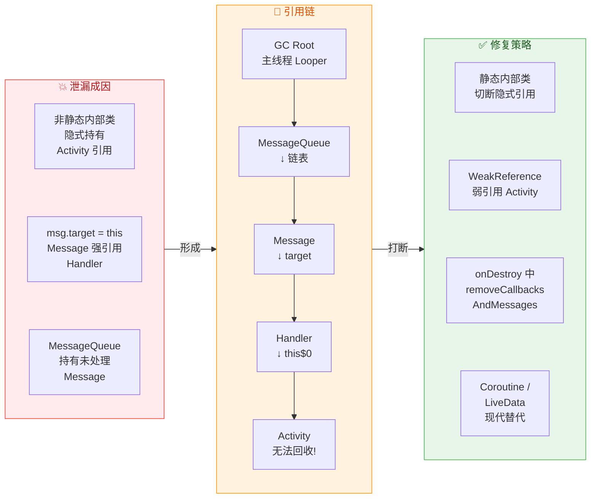
```mermaid
graph LR
    subgraph PROBLEM["💥 泄漏成因"]
        direction TB
        P1["非静态内部类\n隐式持有\nActivity 引用"]
        P2["msg.target = this\nMessage 强引用\nHandler"]
        P3["MessageQueue\n持有未处理\nMessage"]
        P1 ~~~ P2
        P2 ~~~ P3
    end

    subgraph CHAIN["🔗 引用链"]
        direction TB
        C1["GC Root\n主线程 Looper"]
        C2["MessageQueue\n↓ 链表"]
        C3["Message\n↓ target"]
        C4["Handler\n↓ this$0"]
        C5["Activity\n无法回收!"]
        C1 --> C2
        C2 --> C3
        C3 --> C4
        C4 --> C5
    end

    subgraph FIX["✅ 修复策略"]
        direction TB
        F1["静态内部类\n切断隐式引用"]
        F2["WeakReference\n弱引用 Activity"]
        F3["onDestroy 中\nremoveCallbacks\nAndMessages"]
        F4["Coroutine /\nLiveData\n现代替代"]
        F1 ~~~ F2
        F2 ~~~ F3
        F3 ~~~ F4
    end

    PROBLEM -->|"形成"| CHAIN -->|"打断"| FIX

    classDef dangerStyle fill:#FFEBEE,stroke:#F44336,color:#B71C1C
    classDef chainStyle fill:#FFF3E0,stroke:#FF9800,color:#E65100
    classDef fixStyle fill:#E8F5E9,stroke:#4CAF50,color:#1B5E20

    class PROBLEM dangerStyle
    class CHAIN chainStyle
    class FIX fixStyle
```

#### 总结：Handler 的完整生命周期

将以上所有内容串联，一条消息从发送到处理的完整生命周期如下：开发者调用 `sendMessage()` 或 `post()` → 所有路径汇聚到 `enqueueMessage()`，其中 `msg.target = this` 绑定 Handler → MessageQueue 按 `when` 时间戳将消息插入单链表 → Looper 在 `loop()` 循环中通过 `next()` 取出到期的消息 → 调用 `msg.target.dispatchMessage()` 进入三级分发 → 优先执行 `msg.callback`（Runnable），其次检查 `mCallback`（Handler.Callback），最后兜底到 `handleMessage()` → 处理完毕后消息被回收到复用池。在这条链路中，Handler 既是发送的起点（`sendMessage`），又是处理的终点（`dispatchMessage`），它与 Looper、MessageQueue、Message 四者共同构成了 Android 消息机制的完整闭环。

---

**📝 练习题**

某 Activity 中使用匿名内部类创建 Handler，在 `onCreate()` 中调用 `handler.postDelayed(runnable, 300000)` 发送了一条延迟 5 分钟的消息。用户在 30 秒后按返回键退出 Activity（触发 `onDestroy()`），且 `onDestroy()` 中没有调用 `removeCallbacksAndMessages()`。关于此场景，以下说法正确的是：

A. Activity 会在 `onDestroy()` 后立即被 GC 回收，因为系统会自动清理 Handler 消息


B. 延迟消息会因 Activity 销毁而自动从 MessageQueue 中移除，不会造成泄漏


C. Activity 在剩余约 4 分 30 秒内无法被 GC 回收，因为存在从 MessageQueue 到 Activity 的强引用链


D. 该消息会被系统取消执行，但 Activity 仍然会泄漏直到进程结束


**【答案】** C

**【解析】** 当使用匿名内部类创建 Handler 时，Handler 隐式持有外部 Activity 的强引用（即 `this$0`）。`postDelayed()` 发送的消息在 `enqueueMessage()` 中被设置了 `msg.target = handler`，使 Message 持有 Handler 引用。Message 被插入 MessageQueue 后，形成完整的强引用链：`主线程 Looper（GC Root）→ MessageQueue → Message → Handler → Activity`。即使 Activity 调用了 `onDestroy()`，系统**不会**自动清理 Handler 的消息队列（排除选项 A、B）。消息在队列中等待直到 `when` 时间到达后被取出处理，或通过 `removeCallbacksAndMessages()` 手动移除。在剩余的约 4 分 30 秒内，这条引用链一直存在，Activity 无法被 GC 回收。当延迟时间到达后，消息被 Looper 取出、分发处理并回收到复用池，引用链才断开，Activity 方可被回收（排除选项 D 所说的"直到进程结束"——消息最终还是会被执行和回收的，只是在等待期间 Activity 无法被回收）。正确的做法是在 `onDestroy()` 中调用 `handler.removeCallbacksAndMessages(null)` 及时切断引用链。

---

**📝 练习题**

关于 Handler 的 `dispatchMessage()` 三级分发优先级，以下代码执行后 `textView` 最终显示的内容是什么？

```kotlin
val handler = Handler(Looper.getMainLooper(), Handler.Callback { msg ->
    textView.text = "Callback"     // mCallback 处理
    false                          // 返回 false，消息穿透
})

handler.post {
    textView.text = "Runnable"     // msg.callback
}
```

A. 显示 "Callback"，因为 `mCallback` 优先级高于 `msg.callback`


B. 显示 "Runnable"，因为 `msg.callback`（Runnable）是第一优先级


C. 显示 "Callback"，然后变为 "Runnable"，因为两者都会执行


D. 抛出异常，因为同时设置 `Callback` 和 `post` 会冲突


**【答案】** B

**【解析】** `dispatchMessage()` 的三级优先级判断是严格有序的：**首先**检查 `msg.callback != null`，如果成立则直接调用 `handleCallback(msg)`（即 `msg.callback.run()`），方法返回，后续逻辑完全不执行。由于 `handler.post { }` 内部通过 `getPostMessage()` 将 Runnable 赋值给了 `msg.callback`，因此第一优先级命中，Runnable 被执行，`textView` 显示 "Runnable"。**构造器中传入的 `Handler.Callback`（即 `mCallback`）根本不会被检查到**，因为它属于第二优先级，只有当 `msg.callback == null` 时才会进入那个分支。`mCallback` 返回 `false` 还是 `true` 也就无关紧要了。选项 A 颠倒了优先级；选项 C 误以为两者都会执行；选项 D 不存在冲突问题。这道题的核心考点是记住分发优先级：`msg.callback`（Runnable）> `mCallback`（Handler.Callback）> `handleMessage()`（子类重写）。

---

## 消息对象 Message

在整个 Android 消息机制中，`Message` 是信息流转的 **最小载体单元**。无论是 `Handler.sendMessage()` 发出的显式消息，还是 `Handler.post(Runnable)` 投递的隐式任务，最终在 `MessageQueue` 中排队、被 `Looper` 取出、交给 `Handler` 分发的，都是一个个 `Message` 对象。可以说，如果把消息机制比作一套物流系统，那么 `Message` 就是其中的 **包裹（Parcel）**——它封装了"寄给谁（target）"、"什么类型（what）"、"附带什么数据（arg/obj/data）"以及"到达后执行什么动作（callback）"等全部投递信息。

理解 `Message` 的设计哲学，需要关注两个核心维度：**性能维度** 和 **功能维度**。性能维度上，Android 通过 **对象复用池（Recycling Pool）** 避免了高频场景下反复 `new Message()` 带来的内存分配与 GC 压力；功能维度上，Message 通过精心设计的字段组合，以极低的认知成本承载了从简单整型标识到复杂跨进程数据的各种载荷形态。接下来我们逐一深入。

### obtain 复用池

#### 为什么需要复用池

Android 应用在运行过程中，消息的产生频率极高。以最典型的 UI 刷新为例，每一次 VSync 信号到来（约 16.6ms 一次），`Choreographer` 都会向主线程 `MessageQueue` 投递一个 `Message`；触摸事件的传递、动画的帧回调、`View.post()` 的延迟任务……这些场景每秒可能产生数十甚至上百个 `Message` 对象。如果每次都通过 `new Message()` 在堆上分配内存，紧接着又在消息处理完毕后变为垃圾等待 GC 回收，那么：

- **内存抖动（Memory Churn）**：频繁的 allocate → use → abandon 循环会导致堆内存呈锯齿状波动，触发大量 Minor GC。
- **GC 停顿（GC Pause）**：即便是现代的并发 GC（如 ART 的 Concurrent Copying GC），在标记和移动对象时仍然存在短暂的 STW（Stop-The-World）阶段，积少成多就会造成掉帧卡顿。
- **分配开销**：堆对象的分配涉及 TLAB（Thread Local Allocation Buffer）或全局堆的指针碰撞，虽然单次很快，但在高频场景下依然是不可忽视的 CPU 开销。

因此，Android 从框架层就为 `Message` 内建了一套 **单链表结构的对象池（Object Pool）**，也常被称为 **回收池（Recycling Pool）** 或 **享元模式（Flyweight Pattern）** 的变体。其核心思想非常朴素：**用完的 Message 不丢弃，清空字段后放回池子；下次需要时从池子里取，避免 new**。

#### 复用池的数据结构

`Message` 类自身就是链表的节点。每个 `Message` 对象内部持有一个 `next` 字段，指向池中的下一个可用 `Message`。整个复用池由以下静态字段管理：

```java
// Message.java 核心静态字段（简化）
public final class Message implements Parcelable {

    // --- 复用池相关 ---

    // 池锁：所有对池的操作都需要在 synchronized(sPoolSync) 中执行
    private static final Object sPoolSync = new Object();

    // 池头指针：指向当前可用链表的第一个 Message
    // 如果为 null，说明池为空，需要 new
    private static Message sPool;

    // 当前池中缓存的 Message 数量
    private static int sPoolSize = 0;

    // 池容量上限，防止内存浪费（硬编码为 50）
    private static final int MAX_POOL_SIZE = 50;

    // 链表 next 指针：在池中时指向下一个可用 Message
    // 在 MessageQueue 中时用于消息链表的连接
    // 这个字段被"复用"了两种用途，非常精妙
    /*package*/ Message next;

    // 标记位：标识当前 Message 是否正在被使用
    // FLAG_IN_USE = 1 << 0
    /*package*/ int flags;
}
```

池的结构可以用下图直观表示：

```text
sPool（池头指针）
  │
  ▼
┌──────────┐    ┌──────────┐    ┌──────────┐    ┌──────────┐
│ Message  │───▶│ Message  │───▶│ Message  │───▶│ Message  │───▶ null
│ (空闲)   │next│ (空闲)   │next│ (空闲)   │next│ (空闲)   │next
└──────────┘    └──────────┘    └──────────┘    └──────────┘
          sPoolSize = 4（当前池中有 4 个可复用对象）
```

这是一个 **后进先出（LIFO）** 的单链表栈：`obtain()` 从头部取，`recycle()` 往头部放。LIFO 的好处是刚回收的 Message 对象在 CPU 缓存中大概率仍然是"热"的（Cache Hot），再次使用时 cache hit 率更高。

#### obtain() 方法详解

`Message.obtain()` 是获取 `Message` 的 **推荐方式**，也是 Android 官方文档反复强调的 best practice。它的实现如下：

```java
// Message.obtain() —— 从复用池获取 Message
public static Message obtain() {
    // 对复用池加锁，保证多线程安全
    synchronized (sPoolSync) {
        // 如果池不为空（sPool 指向链表头节点）
        if (sPool != null) {
            // 取出链表头节点作为返回值
            Message m = sPool;
            // 将池头指针后移到下一个节点
            sPool = m.next;
            // 断开取出节点的 next 引用，避免持有整条链
            m.next = null;
            // 清除 FLAG_IN_USE 标记（此时即将被外部使用，flags 重置）
            m.flags = 0;
            // 池大小减一
            sPoolSize--;
            // 返回复用的 Message 对象
            return m;
        }
    }
    // 池为空时，兜底策略：创建新的 Message 对象
    return new Message();
}
```

关键要点：

- **synchronized(sPoolSync)**：因为 `obtain()` 可能被任意线程调用（主线程、工作线程都可能创建消息），所以必须加锁。锁的粒度很小（只操作几个指针），竞争开销极低。
- **池空时 fallback 到 new**：复用池不是万能的，当池为空（应用启动初期或突发大量消息时），仍然需要分配新对象。但随着消息不断被处理和回收，池会逐渐被"暖"起来。
- **flags = 0**：这一步非常重要。`Message` 在被使用期间会被打上 `FLAG_IN_USE` 标记，`recycle()` 时也会检查此标记防止重复回收。`obtain()` 取出时将其重置为 0，标志着它可以被外界安全使用。

除了无参的 `obtain()`，`Message` 还提供了一系列带参重载，本质都是先调用 `obtain()` 取出空消息，再设置对应字段：

```java
// 带 Handler 的 obtain —— 同时绑定 target
public static Message obtain(Handler h) {
    // 先从池中取出空消息
    Message m = obtain();
    // 绑定目标 Handler，后续 Looper 分发时会交给它
    m.target = h;
    // 返回已绑定 target 的 Message
    return m;
}

// 带 Handler + what 的 obtain
public static Message obtain(Handler h, int what) {
    // 从池中取出空消息
    Message m = obtain();
    // 绑定目标 Handler
    m.target = h;
    // 设置消息类型标识
    m.what = what;
    return m;
}

// 带 Handler + Runnable 的 obtain
public static Message obtain(Handler h, Runnable callback) {
    // 从池中取出空消息
    Message m = obtain();
    // 绑定目标 Handler
    m.target = h;
    // 绑定回调任务，分发时优先执行 callback.run()
    m.callback = callback;
    return m;
}
```

#### recycle() 方法详解

消息被 `Looper` 从 `MessageQueue` 中取出并经 `Handler.dispatchMessage()` 处理完毕后，框架会自动调用 `Message.recycleUnchecked()` 将其回收入池。开发者也可以手动调用 `recycle()`，但需要确保消息已经不再被引用：

```java
// Message.recycle() —— 外部调用的回收入口
public void recycle() {
    // 检查是否正在被使用（是否已入队或正在分发）
    if (isInUse()) {
        // 如果消息还在使用中，抛出异常，防止重复回收导致数据错乱
        throw new IllegalStateException(
            "This message cannot be recycled because it is still in use.");
    }
    // 通过检查后，执行实际回收逻辑
    recycleUnchecked();
}

// Message.recycleUnchecked() —— 实际回收逻辑（框架内部也直接调用此方法）
void recycleUnchecked() {
    // 清空所有载荷字段，防止下次复用时残留旧数据
    flags = FLAG_IN_USE;   // 标记为"在池中"（防止被再次 recycle）
    what = 0;              // 重置消息类型
    arg1 = 0;              // 重置整型参数 1
    arg2 = 0;              // 重置整型参数 2
    obj = null;            // 释放对象引用，避免内存泄漏！
    replyTo = null;        // 释放跨进程回复的 Messenger 引用
    sendingUid = UID_NONE; // 重置发送方 UID
    workSourceUid = UID_NONE; // 重置工作源 UID
    when = 0;              // 重置定时时间戳
    target = null;         // 释放目标 Handler 引用！
    callback = null;       // 释放 Runnable 引用
    data = null;           // 释放 Bundle 引用

    // 加锁，将清空后的 Message 放回池头部
    synchronized (sPoolSync) {
        // 只有池未满时才放入，防止无限膨胀浪费内存
        if (sPoolSize < MAX_POOL_SIZE) {
            // 当前 Message 的 next 指向原来的池头
            next = sPool;
            // 池头指针更新为当前 Message（LIFO 入栈）
            sPool = this;
            // 池大小加一
            sPoolSize++;
        }
        // 如果池已满（sPoolSize >= 50），该 Message 不入池
        // 直接被 GC 回收，这是容量控制的安全阀
    }
}
```

回收时有几个关键设计值得注意：

**第一，`obj = null` 和 `target = null` 是防止内存泄漏的关键**。如果不将 `obj` 置空，那么池中的 `Message` 就会持有外部对象的强引用，导致那些本该被回收的对象无法释放。`target = null` 同理——如果 `target`（即 Handler）是一个非静态内部类实例，它会隐式持有外部 Activity 的引用，不置空就会造成经典的 Handler 内存泄漏问题。

**第二，`MAX_POOL_SIZE = 50` 的容量上限**。这个值是 Android 团队经过实践权衡的经验值。太小则复用率低，太大则空闲 Message 对象常驻内存浪费空间。50 个 `Message` 对象在内存中大约占用几 KB，对于现代设备来说微乎其微，但足以覆盖绝大多数场景的峰值需求。

**第三，`recycleUnchecked()` 将 `flags` 设为 `FLAG_IN_USE`**。这看似反直觉——消息明明已经被回收了，为什么标记为"in use"？原因在于：这个标记此时的语义是"已经在池中，不可被外部再次 `recycle()`"。只有当 `obtain()` 取出时才会重新置为 0。这种双重语义避免了引入额外的状态字段。

#### obtain/recycle 完整生命周期

下面用 Mermaid 时序图展示一个 `Message` 从创建到复用的完整生命周期：

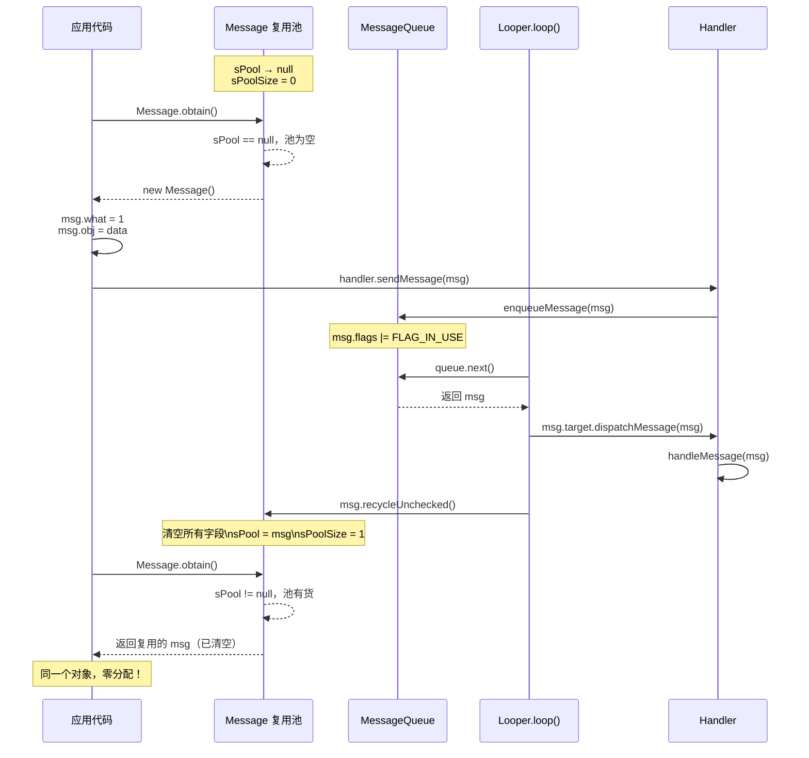
```mermaid
sequenceDiagram
    participant App as 应用代码
    participant Pool as Message 复用池
    participant MQ as MessageQueue
    participant Looper as Looper.loop()
    participant Handler as Handler

    Note over Pool: sPool → null<br/>sPoolSize = 0

    App->>Pool: Message.obtain()
    Pool-->>Pool: sPool == null，池为空
    Pool-->>App: new Message()

    App->>App: msg.what = 1<br/>msg.obj = data

    App->>Handler: handler.sendMessage(msg)
    Handler->>MQ: enqueueMessage(msg)
    Note over MQ: msg.flags |= FLAG_IN_USE

    Looper->>MQ: queue.next()
    MQ-->>Looper: 返回 msg

    Looper->>Handler: msg.target.dispatchMessage(msg)
    Handler->>Handler: handleMessage(msg)

    Looper->>Pool: msg.recycleUnchecked()
    Note over Pool: 清空所有字段\nsPool = msg\nsPoolSize = 1

    App->>Pool: Message.obtain()
    Pool-->>Pool: sPool != null，池有货
    Pool-->>App: 返回复用的 msg（已清空）

    Note over App: 同一个对象，零分配！
```

这套 obtain → use → recycle → re-obtain 的循环，在应用运行期间会持续发生。对于绝大多数应用，复用池在启动后几秒内就能被"暖"到 10-20 个缓存，之后几乎不再需要 `new Message()`。

### what/arg/obj 载荷

`Message` 的核心使命是 **携带数据**。Android 为此设计了一套分层的载荷字段体系，从轻量到重量依次为：

| 字段 | 类型 | 典型用途 | 性能开销 |
|------|------|----------|----------|
| `what` | `int` | 消息类型标识，区分不同消息 | 极低（栈上值类型） |
| `arg1` | `int` | 轻量整型参数 1 | 极低 |
| `arg2` | `int` | 轻量整型参数 2 | 极低 |
| `obj` | `Object` | 任意对象引用 | 低（仅引用） |
| `data` | `Bundle` | 键值对数据集 | 中等（需序列化） |
| `replyTo` | `Messenger` | 跨进程回复通道 | 较高（涉及 IPC） |

#### what 字段：消息的"身份证"

`what` 是一个 `int` 类型字段，用于标识消息的 **类型** 或 **语义**。当一个 Handler 需要处理多种不同的消息时，`handleMessage()` 内部通常会用 `switch-case` 对 `msg.what` 进行分发：

```kotlin
// 定义消息类型常量（推荐使用 companion object 或顶层常量）
companion object {
    const val MSG_LOAD_DATA = 1      // 加载数据
    const val MSG_UPDATE_UI = 2      // 更新 UI
    const val MSG_SHOW_ERROR = 3     // 显示错误
}

// 在 handleMessage 中根据 what 分发
override fun handleMessage(msg: Message) {
    // 根据 msg.what 判断消息类型
    when (msg.what) {
        // 消息类型 1：执行数据加载逻辑
        MSG_LOAD_DATA -> loadDataFromNetwork()
        // 消息类型 2：使用 arg1 携带的进度值更新 UI
        MSG_UPDATE_UI -> updateProgress(msg.arg1)
        // 消息类型 3：使用 obj 携带的错误信息展示 Toast
        MSG_SHOW_ERROR -> showError(msg.obj as String)
    }
}
```

`what` 的设计体现了一个重要的理念：**消息应该是声明式的（declarative），而非命令式的**。发送方只声明"发生了什么（what happened）"，接收方决定"做什么（how to handle）"，这种解耦让代码更易维护。

#### arg1/arg2 字段：轻量整型通道

`arg1` 和 `arg2` 是两个 `int` 字段，专门用于传递 **简单的整型数据**，避免为了传一个数字就去创建 `Bundle`。Android 官方文档明确推荐：

> 如果你只需要传递一两个整型值，优先使用 `arg1` 和 `arg2`，而不是 `setData(Bundle)`，因为 Bundle 有额外的分配和序列化开销。

典型使用场景：

```kotlin
// 发送方：传递下载进度（当前值和总值）
val msg = Message.obtain(handler, MSG_DOWNLOAD_PROGRESS) // 从池获取并绑定 handler
msg.arg1 = currentBytes   // arg1 携带已下载字节数
msg.arg2 = totalBytes      // arg2 携带总字节数
handler.sendMessage(msg)   // 发送消息

// 接收方：读取进度
override fun handleMessage(msg: Message) {
    when (msg.what) {
        MSG_DOWNLOAD_PROGRESS -> {
            // 从 arg1、arg2 读取进度数据
            val current = msg.arg1  // 已下载
            val total = msg.arg2    // 总大小
            // 计算百分比并更新进度条
            progressBar.progress = (current * 100 / total)
        }
    }
}
```

由于 `arg1/arg2` 是基础值类型，它们 **不涉及对象分配、不需要序列化、不会造成引用泄漏**，是最高效的数据传递方式。

#### obj 字段：任意对象引用

当需要传递的数据超出两个 `int` 的范围时，`obj` 字段提供了传递 **任意 Object 引用** 的能力。需要注意的是，`obj` 传递的是 **引用**，而非值拷贝：

```kotlin
// 发送方：传递一个数据对象
val user = User(name = "Alice", age = 30)  // 创建数据对象
val msg = Message.obtain(handler, MSG_USER_LOADED) // 从池获取
msg.obj = user    // 将 User 对象引用赋给 obj 字段
handler.sendMessage(msg) // 发送

// 接收方：取出对象并使用
override fun handleMessage(msg: Message) {
    when (msg.what) {
        MSG_USER_LOADED -> {
            // 从 obj 取出并强转为具体类型
            val user = msg.obj as User
            // 更新 UI 显示用户信息
            textName.text = user.name
        }
    }
}
```

**obj 的使用注意事项：**

1. **同进程限定**：`obj` 字段在 **跨进程（IPC）** 场景下有严格限制。如果 `Message` 需要通过 `Messenger` 跨进程传递，`obj` 必须是实现了 `Parcelable` 接口的对象，否则会抛出异常。纯粹的同进程 Handler 通信则无此限制。
2. **类型安全**：`obj` 是 `Object` 类型，取出时需要强制类型转换（cast），缺乏编译期类型检查。在 Kotlin 中建议使用 `as?` 安全转换来避免 `ClassCastException`。
3. **生命周期意识**：`obj` 持有的引用在消息入队到处理完毕的整个时间窗口内都不会被 GC 回收。如果消息被延迟发送（如 `sendMessageDelayed`），这个时间窗口可能很长，需要确保 `obj` 指向的对象不会无意间阻止其他对象的回收。

#### data 字段（Bundle）

当需要传递的参数较多或类型较杂时，可以使用 `Message.setData(Bundle)` 或直接访问 `msg.data`：

```kotlin
// 发送方：通过 Bundle 传递多个键值对
val msg = Message.obtain(handler, MSG_COMPLEX_DATA) // 从池获取
val bundle = Bundle()                  // 创建 Bundle 容器
bundle.putString("title", "Hello")     // 放入字符串
bundle.putInt("count", 42)             // 放入整型
bundle.putParcelable("item", item)     // 放入 Parcelable 对象
msg.data = bundle                      // 将 Bundle 设置到 Message
handler.sendMessage(msg)               // 发送

// 接收方：从 Bundle 中按 key 提取数据
override fun handleMessage(msg: Message) {
    when (msg.what) {
        MSG_COMPLEX_DATA -> {
            // 从 msg.data 中按键取值
            val title = msg.data.getString("title")  // 取字符串
            val count = msg.data.getInt("count")      // 取整型
            // 使用数据更新 UI
        }
    }
}
```

`Bundle` 的优势是灵活的键值对结构和完善的类型支持，但代价是额外的对象分配（Bundle 自身和内部的 ArrayMap）以及更高的 CPU 开销。因此，**能用 `what/arg1/arg2/obj` 解决的，就不要动用 Bundle**。

#### 载荷选择决策流

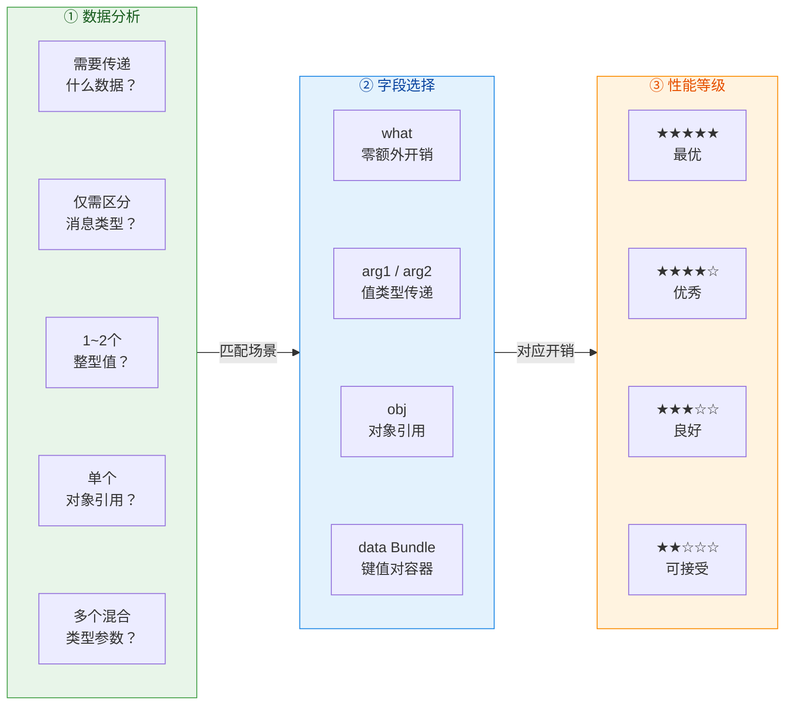
```mermaid
graph LR
    subgraph Input["① 数据分析"]
        direction TB
        Q1["需要传递\n什么数据？"]
        Q2["仅需区分\n消息类型？"]
        Q3["1~2个\n整型值？"]
        Q4["单个\n对象引用？"]
        Q5["多个混合\n类型参数？"]
        Q1 ~~~ Q2
        Q2 ~~~ Q3
        Q3 ~~~ Q4
        Q4 ~~~ Q5
    end

    subgraph Choose["② 字段选择"]
        direction TB
        C1["what\n零额外开销"]
        C2["arg1 / arg2\n值类型传递"]
        C3["obj\n对象引用"]
        C4["data Bundle\n键值对容器"]
        C1 ~~~ C2
        C2 ~~~ C3
        C3 ~~~ C4
    end

    subgraph Perf["③ 性能等级"]
        direction TB
        P1["★★★★★\n最优"]
        P2["★★★★☆\n优秀"]
        P3["★★★☆☆\n良好"]
        P4["★★☆☆☆\n可接受"]
        P1 ~~~ P2
        P2 ~~~ P3
        P3 ~~~ P4
    end

    Input -->|"匹配场景"| Choose -->|"对应开销"| Perf

    classDef inputStyle fill:#E8F5E9,stroke:#43A047,color:#1B5E20
    classDef chooseStyle fill:#E3F2FD,stroke:#1E88E5,color:#0D47A1
    classDef perfStyle fill:#FFF3E0,stroke:#FB8C00,color:#E65100
    class Input inputStyle
    class Choose chooseStyle
    class Perf perfStyle
```

### target 绑定

#### target 是什么

`Message` 中有一个至关重要但常被忽略的字段 —— `target`，它是一个 `Handler` 类型的引用：

```java
// Message.java 中的 target 字段
public final class Message implements Parcelable {
    // 目标 Handler：决定这条消息最终由谁来处理
    // 当 Looper 从 MessageQueue 取出消息后，
    // 会调用 msg.target.dispatchMessage(msg) 将消息交给这个 Handler
    /*package*/ Handler target;
}
```

`target` 的设计解决了一个核心问题：**一个 Looper/MessageQueue 可能被多个 Handler 共享**（实际上这正是 Android 主线程的常态——主线程只有一个 Looper，但有无数个 Handler 实例），当 `Looper.loop()` 从队列中取出一条 `Message` 时，它怎么知道应该交给哪个 Handler 处理？答案就是 **`msg.target`**。每条消息都"记住"了自己的目标 Handler，Looper 只需要无脑调用 `msg.target.dispatchMessage(msg)` 即可。

这种设计模式在软件工程中被称为 **"自寻址消息（Self-addressed Message）"**——消息自身携带了接收者的地址，路由层（Looper）不需要维护任何路由表。

#### target 的绑定时机

`target` 是在消息 **入队之前** 被绑定的。具体来说，当你调用 `Handler.sendMessage(msg)` 时，Handler 内部的 `enqueueMessage()` 方法会将自身绑定到消息的 `target` 字段：

```java
// Handler.java —— 消息入队的内部实现
private boolean enqueueMessage(
        MessageQueue queue,  // 目标消息队列
        Message msg,         // 待发送的消息
        long uptimeMillis    // 预定执行时间
) {
    // ★★★ 核心：将当前 Handler 实例绑定为消息的 target ★★★
    // 这一行建立了 Message → Handler 的关联
    msg.target = this;

    // 将 workSourceUid 传递给消息（用于电量统计等系统功能）
    msg.workSourceUid = ThreadLocalWorkSource.getUid();

    // 如果当前 Handler 设置了异步标志，则将消息也标记为异步
    // 异步消息不受同步屏障（SyncBarrier）阻拦
    if (mAsynchronous) {
        msg.setAsynchronous(true);
    }

    // 调用 MessageQueue 的入队方法，按时间戳插入链表
    return queue.enqueueMessage(msg, uptimeMillis);
}
```

因此，**一条 Message 与一个 Handler 是一一绑定的关系**。从消息被 `send` 或 `post` 的那一刻起，它就已经"知道"自己要去哪里。

如果开发者使用 `Message.obtain(handler)` 获取消息，`target` 在 `obtain` 阶段就已经被设置了，但 `enqueueMessage` 中的 `msg.target = this` 会再次覆盖确认。

#### Looper 如何利用 target 分发

在 `Looper.loop()` 的主循环中，`target` 字段被用于将消息路由到正确的 Handler：

```java
// Looper.loop() 核心分发逻辑（简化）
public static void loop() {
    // 获取当前线程的 Looper
    final Looper me = myLooper();
    // 获取 Looper 关联的 MessageQueue
    final MessageQueue queue = me.mQueue;

    // 进入死循环，不断取消息并分发
    for (;;) {
        // 从消息队列取出下一条消息（可能阻塞）
        Message msg = queue.next();
        // 如果返回 null，说明 Looper 正在退出
        if (msg == null) {
            return;
        }

        // ★★★ 利用 target 字段将消息路由到目标 Handler ★★★
        // Looper 完全不关心消息内容，只负责"投递"
        msg.target.dispatchMessage(msg);

        // 分发完毕，回收 Message 到复用池
        msg.recycleUnchecked();
    }
}
```

可以看到，`Looper` 在整个过程中是 **完全中立的**——它不解析 `what`、不读取 `arg`、不触碰 `obj`，只做一件事：**根据 `target` 投递消息**。这种极简的职责分离使得消息机制的架构异常清晰。

#### target 与内存泄漏

`target` 字段是 Handler 内存泄漏的 **根本推手之一**。来看一条完整的引用链：

```text
GC Root (主线程栈 / MessageQueue 的静态引用)
   │
   ▼
MessageQueue  ─── 持有 ──→  Message (mMessages 链表)
                                │
                                │  msg.target
                                ▼
                            Handler (非静态内部类)
                                │
                                │  隐式持有外部类引用 (this$0)
                                ▼
                            Activity (已执行 onDestroy，本应被回收)
```

当一条延迟消息（如 `sendMessageDelayed(msg, 60_000)`）被投入队列后，这条引用链在消息到期前 **始终存在**。即使用户已经退出了 Activity，由于 `MessageQueue → Message → Handler → Activity` 的链路不可断，Activity 就无法被 GC 回收，这就是典型的 **Handler 内存泄漏**。

在 `recycleUnchecked()` 中我们看到 `target = null` 的操作，它之所以放在回收阶段才执行，而不是分发阶段，原因是分发过程中可能还需要 `target` 做其他判断（如 logging、tracing）。一旦回收入池，`target` 必须置空以释放 Handler 引用。

解决 Handler 泄漏的标准做法：

```kotlin
class MyActivity : AppCompatActivity() {

    // ★ 使用静态内部类 + 弱引用，切断 Handler → Activity 的强引用链
    private class SafeHandler(
        activity: MyActivity  // 构造时传入 Activity
    ) : Handler(Looper.getMainLooper()) {

        // 将 Activity 包装为弱引用，不阻止 GC 回收
        private val activityRef = WeakReference(activity)

        override fun handleMessage(msg: Message) {
            // 尝试获取 Activity，如果已被回收则返回 null
            val activity = activityRef.get() ?: return
            // Activity 仍然存活，安全执行 UI 操作
            when (msg.what) {
                MSG_UPDATE -> activity.updateUI()
            }
        }
    }

    // 持有 Handler 引用
    private val handler = SafeHandler(this)

    override fun onDestroy() {
        super.onDestroy()
        // ★ 移除所有未处理的消息和回调，彻底切断引用链
        // 传入 null token 表示移除该 Handler 的所有消息
        handler.removeCallbacksAndMessages(null)
    }
}
```

### callback 回调

#### Message.callback 的本质

`Message` 中还有一个经常被忽视但极其重要的字段——`callback`：

```java
// Message.java 中的 callback 字段
public final class Message implements Parcelable {
    // Runnable 回调：如果不为 null，分发时直接执行它
    // 而不再走 Handler.handleMessage() 流程
    /*package*/ Runnable callback;
}
```

这个字段是 `Handler.post(Runnable)` 系列方法的底层支撑。当你调用 `handler.post { updateUI() }` 时，框架实际上做的是：**将 Runnable 包装进一个 Message 的 callback 字段，然后当作普通消息入队**。换言之，`post(Runnable)` 与 `sendMessage(Message)` 本质上走的是同一套管道（MessageQueue），只不过携带的"指令"形式不同。

```java
// Handler.post() 的实现 —— Runnable 被包装成 Message
public final boolean post(Runnable r) {
    // 调用 sendMessageDelayed，延迟 0 表示立即执行
    return sendMessageDelayed(getPostMessage(r), 0);
}

// 将 Runnable 包装成 Message 的关键方法
private static Message getPostMessage(Runnable r) {
    // 从复用池获取一个空 Message
    Message m = Message.obtain();
    // ★ 将 Runnable 赋值给 callback 字段 ★
    m.callback = r;
    // 返回携带了 Runnable 的 Message
    return m;
}
```

这意味着，**在 MessageQueue 中排队的永远只有 Message 对象**，不存在所谓的"Runnable 队列"。Runnable 只是 Message 的一种特殊载荷形态。

#### dispatchMessage 的三级分发优先级

理解 `callback` 的核心价值在于搞清楚 `Handler.dispatchMessage()` 的 **三级优先级分发机制**。当 `Looper` 调用 `msg.target.dispatchMessage(msg)` 时，内部执行逻辑如下：

```java
// Handler.dispatchMessage() —— 消息分发的三级优先级
public void dispatchMessage(Message msg) {

    // ★★ 第一优先级：Message 自带的 callback（即 post 的 Runnable）★★
    if (msg.callback != null) {
        // 如果消息自带 Runnable，直接执行它
        // 不再继续向下判断
        handleCallback(msg);
        return; // 注意这里直接 return 了
    }

    // ★★ 第二优先级：Handler 构造时传入的全局 Callback ★★
    if (mCallback != null) {
        // 调用全局 Callback 的 handleMessage
        // 如果它返回 true，表示消息已被消费，不再继续
        if (mCallback.handleMessage(msg)) {
            return;
        }
        // 返回 false 则"穿透"到第三优先级
    }

    // ★★ 第三优先级：Handler 子类重写的 handleMessage ★★
    handleMessage(msg);
}

// 执行 Message.callback（Runnable）的方法
private static void handleCallback(Message message) {
    // 直接调用 Runnable 的 run() 方法
    // 注意：是 run() 不是 start()，所以是在当前线程执行
    message.callback.run();
}
```

这三级优先级可以用如下决策图清晰表达：

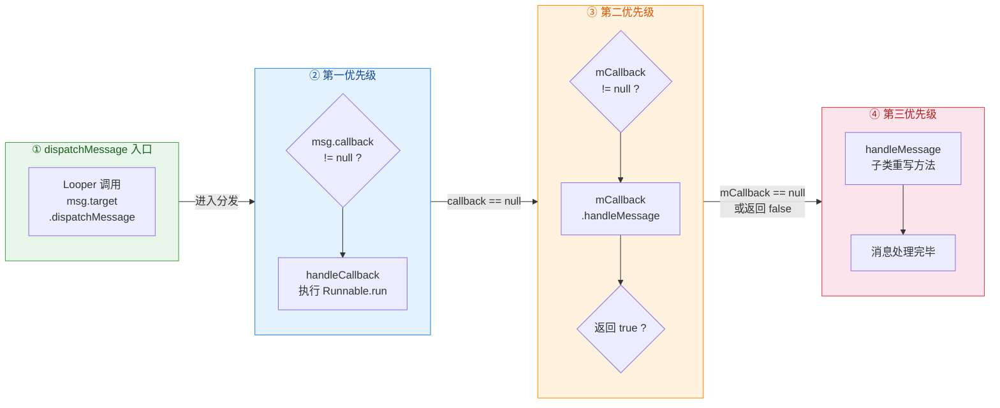
```mermaid
graph LR
    subgraph Dispatch["① dispatchMessage 入口"]
        direction TB
        D1["Looper 调用\nmsg.target\n.dispatchMessage"]
    end

    subgraph Priority1["② 第一优先级"]
        direction TB
        P1C{"msg.callback\n!= null ?"}
        P1Y["handleCallback\n执行 Runnable.run"]
        P1C --> P1Y
    end

    subgraph Priority2["③ 第二优先级"]
        direction TB
        P2C{"mCallback\n!= null ?"}
        P2H["mCallback\n.handleMessage"]
        P2R{"返回 true ?"}
        P2C --> P2H
        P2H --> P2R
    end

    subgraph Priority3["④ 第三优先级"]
        direction TB
        P3H["handleMessage\n子类重写方法"]
        P3E["消息处理完毕"]
        P3H --> P3E
    end

    Dispatch -->|"进入分发"| Priority1
    Priority1 -->|"callback == null"| Priority2
    Priority2 -->|"mCallback == null\n或返回 false"| Priority3

    classDef dispatchStyle fill:#E8F5E9,stroke:#43A047,color:#1B5E20
    classDef p1Style fill:#E3F2FD,stroke:#1E88E5,color:#0D47A1
    classDef p2Style fill:#FFF3E0,stroke:#FB8C00,color:#E65100
    classDef p3Style fill:#FCE4EC,stroke:#E53935,color:#B71C1C
    class Dispatch dispatchStyle
    class Priority1 p1Style
    class Priority2 p2Style
    class Priority3 p3Style
```

**为什么要设计三级优先级？**

1. **第一级（msg.callback）**：提供最直接的"一消息一任务"模式。`post(Runnable)` 的语义是"在目标线程执行这段代码"，不需要经过 Handler 的分发逻辑，callback 直接执行即可。
2. **第二级（mCallback）**：允许 **不继承 Handler** 就能处理消息。`Handler` 有一个接受 `Handler.Callback` 接口的构造函数，传入的 `Callback` 对象就存储在 `mCallback` 字段。这在不想创建 Handler 子类的场景下非常方便，同时它还能作为"拦截器"——返回 `true` 表示消息已消费，返回 `false` 则继续传递给 `handleMessage()`。
3. **第三级（handleMessage）**：传统的 Handler 子类重写方式，是最常见的消息处理模式。

#### Handler.Callback 接口的妙用

`Handler.Callback` 是一个函数式接口（SAM interface），只有一个方法 `handleMessage(Message): Boolean`。它提供了一种 **不需要继承 Handler** 就能处理消息的方式：

```kotlin
// 使用 Handler.Callback 代替继承
// 好处：减少类的数量，避免内部类引用问题
val handler = Handler(Looper.getMainLooper(), Handler.Callback { msg ->
    // 这里是第二优先级的回调
    when (msg.what) {
        MSG_REFRESH -> {
            // 处理刷新消息
            refreshData()
            true  // 返回 true：消息已消费，不再传递到 handleMessage
        }
        else -> false // 返回 false：当前 Callback 不处理，传递到 handleMessage
    }
})
```

`Callback` 返回 `Boolean` 的设计非常精妙——它形成了一个 **责任链（Chain of Responsibility）** 模式：`Callback` 可以选择性地处理部分消息，剩余的"漏网之鱼"继续交给 `handleMessage()`。这在需要对消息进行全局拦截（如日志记录、权限检查）时非常有用。

#### callback 与 Lambda 的内存陷阱

在 Kotlin 中使用 `handler.post { ... }` 非常方便，但需要注意 Lambda 捕获的变量可能导致内存泄漏。Lambda 表达式在编译后会生成匿名内部类，如果它引用了外部 Activity 的成员（哪怕只是隐式的 `this`），就会形成：

```text
MessageQueue → Message → callback (Lambda/匿名类)
                                    │
                                    │ 捕获外部 this
                                    ▼
                                Activity
```

这与 `target` 导致的泄漏如出一辙。因此，对于延迟消息，务必在 `onDestroy()` 中调用 `handler.removeCallbacksAndMessages(null)` 来清理。

#### 小结：Message 字段全景图

将 Message 的所有核心字段汇总如下：

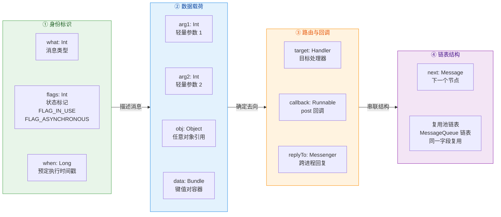
```mermaid
graph LR
    subgraph Identity["① 身份标识"]
        direction TB
        W["what: Int\n消息类型"]
        F["flags: Int\n状态标记\nFLAG_IN_USE\nFLAG_ASYNCHRONOUS"]
        WH["when: Long\n预定执行时间戳"]
        W ~~~ F
        F ~~~ WH
    end

    subgraph Payload["② 数据载荷"]
        direction TB
        A1["arg1: Int\n轻量参数 1"]
        A2["arg2: Int\n轻量参数 2"]
        OB["obj: Object\n任意对象引用"]
        DA["data: Bundle\n键值对容器"]
        A1 ~~~ A2
        A2 ~~~ OB
        OB ~~~ DA
    end

    subgraph Route["③ 路由与回调"]
        direction TB
        TG["target: Handler\n目标处理器"]
        CB["callback: Runnable\npost 回调"]
        RP["replyTo: Messenger\n跨进程回复"]
        TG ~~~ CB
        CB ~~~ RP
    end

    subgraph Link["④ 链表结构"]
        direction TB
        NX["next: Message\n下一个节点"]
        NX2["复用池链表\nMessageQueue 链表\n同一字段复用"]
        NX ~~~ NX2
    end

    Identity -->|"描述消息"| Payload -->|"确定去向"| Route -->|"串联结构"| Link

    classDef idStyle fill:#E8F5E9,stroke:#43A047,color:#1B5E20
    classDef payStyle fill:#E3F2FD,stroke:#1E88E5,color:#0D47A1
    classDef routeStyle fill:#FFF3E0,stroke:#FB8C00,color:#E65100
    classDef linkNodeStyle fill:#F3E5F5,stroke:#8E24AA,color:#4A148C
    class Identity idStyle
    class Payload payStyle
    class Route routeStyle
    class Link linkNodeStyle
```

`Message` 的设计体现了 Android 框架团队在 **性能（对象复用池）、灵活性（多级载荷 + 三级分发）、架构解耦（自寻址 target）** 三者之间的精巧平衡。它虽然只是一个数据类，却是整个消息机制的基石——没有 Message，Handler 无从 send，MessageQueue 无物可排，Looper 无消息可循环。

---

**📝 练习题**

以下关于 `Handler.dispatchMessage()` 三级分发优先级的描述，正确的是？

A. 如果 `msg.callback != null`，会先执行 `callback.run()`，然后继续执行 `handleMessage()`

B. `Handler.Callback.handleMessage()` 返回 `false` 时，消息将被丢弃不再处理

C. 三级优先级从高到低依次是：`msg.callback` → `mCallback.handleMessage()` → `handleMessage()`

D. `Handler.post(Runnable)` 发送的消息不会进入 `MessageQueue`，而是直接执行 Runnable


**【答案】** C

**【解析】** `Handler.dispatchMessage()` 的三级分发机制遵循严格的优先级顺序：**第一优先级**检查 `msg.callback` 是否为 null，如果不为 null 则直接调用 `handleCallback(msg)` 执行 `Runnable.run()` 并 **return**（A 选项错误，不会继续执行 `handleMessage()`）；**第二优先级**检查 Handler 构造时传入的 `mCallback`，若存在则调用其 `handleMessage(msg)`，如果返回 `true` 表示消息已消费并 return，如果返回 `false` 则 **穿透** 到第三优先级继续处理（B 选项错误，返回 false 不是丢弃而是继续传递）；**第三优先级**是 Handler 子类重写的 `handleMessage(msg)` 方法。因此 C 正确。关于 D 选项，`Handler.post(Runnable)` 内部调用 `getPostMessage(r)` 将 Runnable 包装为 `Message.callback`，然后通过 `sendMessageDelayed()` 正常入队 `MessageQueue`，与 `sendMessage()` 走完全相同的入队 → Looper 取出 → 分发流程，只是在分发阶段命中了第一优先级而已。

---

**📝 练习题**

关于 `Message` 复用池机制，以下说法错误的是？

A. `Message.obtain()` 从池中取出的对象，其所有载荷字段（what/arg1/obj 等）已经被清零

B. 复用池的最大容量为 50，超出时多余的 Message 会被 GC 正常回收

C. `recycleUnchecked()` 中将 `target` 和 `obj` 置为 null，是为了避免复用池中的 Message 持有外部对象的强引用导致内存泄漏

D. 复用池使用 `ConcurrentLinkedQueue` 实现无锁并发访问


**【答案】** D

**【解析】** Message 的复用池并非使用 `ConcurrentLinkedQueue`，而是通过 **Message 自身的 `next` 字段** 构成的单链表 + **`synchronized(sPoolSync)` 对象锁** 来保证线程安全，因此 D 错误。A 正确：`recycleUnchecked()` 在回收时会将 `what`、`arg1`、`arg2`、`obj`、`target`、`callback`、`data` 等全部置零/null，`obtain()` 取出时只是重置 `flags = 0` 和断开 `next`，因此取到的 Message 确实是"干净"的。B 正确：`MAX_POOL_SIZE = 50` 是硬编码上限，`recycleUnchecked()` 中当 `sPoolSize >= MAX_POOL_SIZE` 时不执行入池操作，该 Message 对象成为无引用的垃圾对象，最终被 GC 回收。C 正确：如果不置空 `obj` 和 `target`，池中的 Message 通过 `sPool` 静态引用可达 GC Root，就会阻止 `obj` 指向的对象和 `target` 指向的 Handler（进而可能阻止 Activity）被垃圾回收。

---

## 同步屏障 SyncBarrier

在前面的章节中，我们已经建立了对 Android 消息机制的完整认知：`Looper` 不断从 `MessageQueue` 中取出 `Message`，通过 `msg.target.dispatchMessage()` 分发给目标 `Handler` 处理。在这套模型中，所有消息默认按照 **时间戳（`when` 字段）** 排队，遵循先到先服务（FIFO within same timestamp）的调度策略。然而，Android 的 UI 渲染系统面临一个严峻的现实问题：**主线程的消息队列中不只有 UI 绘制任务，还混杂着大量的业务消息**——点击事件回调、`SharedPreferences` 的 apply 提交、`BroadcastReceiver` 的 `onReceive` 调度、`Activity` 生命周期回调……这些消息都在同一个 `MessageQueue` 中排队等待处理。

如果 UI 绘制消息（由 `Choreographer` 在 VSync 信号到来时投递）被排在一堆业务消息的后面，就必须等前面的消息全部处理完才能执行绘制。假设前面积压了 3 条各耗时 5ms 的业务消息，绘制任务就延迟了 15ms，加上绘制自身的时间，很可能超过 16.6ms 的帧间隔阈值，导致 **掉帧（Jank）**。这对于追求 60fps 甚至 120fps 流畅体验的现代 Android 来说是不可接受的。

**同步屏障（Sync Barrier）** 正是为解决这个问题而设计的一种 **消息优先级提升机制**。它的核心思想可以用一句话概括：**在消息队列中插入一个特殊的"屏障"标记，让 `MessageQueue.next()` 在遇到屏障后跳过所有普通（同步）消息，优先取出异步消息**。UI 绘制相关的消息恰好被标记为"异步（Asynchronous）"，因此它们能够"插队"优先执行，确保绘制任务的实时性。

这是一个应用开发者很少直接接触、但深刻影响着每一帧 UI 渲染的底层机制。理解它，不仅能帮助你解答高频面试题，更能让你在性能优化中对"为什么我的消息被延迟了"有清晰的洞察。

### UI 刷新高优

#### 同步消息与异步消息的区别

在深入屏障机制之前，首先需要理解 Android 消息的两种类型——**同步消息（Synchronous Message）** 和 **异步消息（Asynchronous Message）**。这两个术语容易引起误解：它们与多线程中的"同步/异步调用"无关，而是指 **消息是否受同步屏障的阻拦**。

每一个 `Message` 对象内部有一个 `flags` 字段，其中有一个比特位 `FLAG_ASYNCHRONOUS` 用于标识消息的类型：

```java
// Message.java 中的异步标记相关
public final class Message implements Parcelable {

    // 标记位常量：异步消息标志
    // 值为 1 << 1 = 2
    /*package*/ static final int FLAG_ASYNCHRONOUS = 1 << 1;

    // 设置消息为异步
    public void setAsynchronous(boolean async) {
        if (async) {
            // 将 FLAG_ASYNCHRONOUS 位置 1
            flags |= FLAG_ASYNCHRONOUS;
        } else {
            // 将 FLAG_ASYNCHRONOUS 位清 0
            flags &= ~FLAG_ASYNCHRONOUS;
        }
    }

    // 查询当前消息是否为异步消息
    public boolean isAsynchronous() {
        // 检查 FLAG_ASYNCHRONOUS 位是否为 1
        return (flags & FLAG_ASYNCHRONOUS) != 0;
    }
}
```

简单来说：

- **同步消息（默认）**：通过常规的 `Handler.sendMessage()` 或 `Handler.post()` 发送的消息，`FLAG_ASYNCHRONOUS` 为 0。当遇到同步屏障时，这类消息 **会被阻拦**，暂时无法被 `MessageQueue.next()` 取出。
- **异步消息**：`FLAG_ASYNCHRONOUS` 为 1 的消息。当遇到同步屏障时，这类消息 **不受阻拦**，可以"越过"同步消息被优先取出。

消息如何变成异步的？有两种途径：

**第一种：通过异步 Handler 发送**。`Handler` 的构造函数有一个 `async` 参数，当设置为 `true` 时，该 Handler 发送的所有消息都会被自动标记为异步：

```java
// Handler 构造函数（含 async 参数）
public Handler(Looper looper, Callback callback, boolean async) {
    mLooper = looper;
    mQueue = looper.mQueue;
    mCallback = callback;
    // ★ 记录异步标志，后续所有消息都会继承此标志
    mAsynchronous = async;
}

// enqueueMessage 中自动标记
private boolean enqueueMessage(MessageQueue queue, Message msg, long uptimeMillis) {
    msg.target = this;
    // 如果 Handler 是异步的，则将消息也标记为异步
    if (mAsynchronous) {
        msg.setAsynchronous(true);
    }
    return queue.enqueueMessage(msg, uptimeMillis);
}
```

**第二种：手动设置**。直接调用 `msg.setAsynchronous(true)`。不过这个 API 在 Android 早期版本中被标记为 `@hide`，API 28 之后才公开，且普通应用开发者很少需要直接使用。

#### 为什么 UI 绘制需要高优先级

Android 的 UI 渲染采用 **VSync 驱动的帧调度模型**。每当显示硬件发出一个 VSync（Vertical Synchronization）信号（在 60Hz 屏幕上约每 16.6ms 一次，120Hz 约 8.3ms），`Choreographer`（编舞者）就会向主线程 `MessageQueue` 投递一个绘制回调消息，触发 View 树的 measure → layout → draw 流程。

这个绘制消息有一个硬性的时间约束：它 **必须** 在下一个 VSync 到来之前完成处理。如果错过了这个时间窗口，当前帧的绘制结果无法提交给 SurfaceFlinger 合成，屏幕上显示的还是上一帧的内容——用户感知到的就是 **掉帧卡顿**。

问题在于，主线程的 `MessageQueue` 中同时排列着各种消息。在没有优先级机制的情况下，消息严格按 `when` 时间戳顺序执行。VSync 信号到来时投递的绘制消息，可能排在已经入队的多个业务消息之后：

```text
MessageQueue（无屏障时的时间序列）：

  队首                                               队尾
  ┌────────────┬────────────┬────────────┬────────────────────┐
  │ BizMsg #1  │ BizMsg #2  │ BizMsg #3  │ ★ Choreographer    │
  │ when=100   │ when=105   │ when=110   │   绘制回调          │
  │ 5ms 耗时   │ 3ms 耗时   │ 8ms 耗时   │   when=112          │
  └────────────┴────────────┴────────────┴────────────────────┘
               ──── time ──→

绘制消息实际执行时刻 = 100 + 5 + 3 + 8 = 116
绘制耗时假设 = 6ms → 完成时刻 = 122
下一个 VSync ≈ 112 + 16.6 = 128.6
122 < 128.6 → 本帧险过 ✅

但如果 BizMsg #3 耗时 12ms →
绘制完成 = 100 + 5 + 3 + 12 + 6 = 126
也许刚好能过 ... 再多一点就掉帧了 ❌
```

而有了同步屏障之后，`Choreographer` 投递绘制消息前会先插入屏障，使得队列中的 BizMsg 全部被"冻结"，绘制消息作为异步消息直接被取出执行：

```text
MessageQueue（有屏障时的实际行为）：

  队首                                                       队尾
  ┌──────────┬────────────┬────────────┬────────────┬──────────────────┐
  │ ⚡BARRIER │ BizMsg #1  │ BizMsg #2  │ BizMsg #3  │ ★ Choreographer  │
  │ target=  │ (同步,阻拦) │ (同步,阻拦) │ (同步,阻拦) │  (异步,穿透!)    │
  │ null     │            │            │            │                  │
  └──────────┴────────────┴────────────┴────────────┴──────────────────┘

next() 跳过所有同步消息 → 直接取出 Choreographer 绘制回调 → 立即执行 ★
```

这就是同步屏障存在的根本意义：**为 UI 绘制消息开辟"绿色通道"，确保它们不被业务消息拖延**。

#### Choreographer 的角色

`Choreographer` 是 Android 的帧调度中枢，它内部持有一个 **异步 Handler**——`FrameHandler`，并且通过 `DisplayEventReceiver` 监听来自 SurfaceFlinger 的 VSync 信号。整个 UI 刷新的流水线可以概括为：

1. `View.invalidate()` 或 `requestLayout()` 触发重绘请求。
2. `ViewRootImpl` 调用 `Choreographer.postCallback()` 注册一帧回调。
3. `Choreographer` 请求下一个 VSync 信号（`scheduleVsync()`）。
4. VSync 信号到来时，`Choreographer` 通过异步 Handler 向主线程投递帧回调消息。
5. 在投递之前，`ViewRootImpl` 会调用 `postSyncBarrier()` 插入同步屏障。
6. `MessageQueue.next()` 遇到屏障，跳过同步消息，优先取出异步的帧回调。
7. 帧回调执行（measure → layout → draw），完成后移除屏障。
8. 同步消息恢复正常处理。

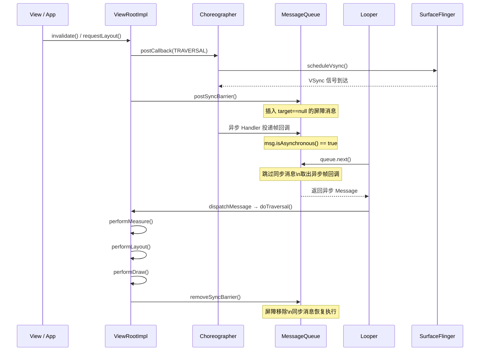
```mermaid
sequenceDiagram
    participant App as View / App
    participant VRI as ViewRootImpl
    participant Choreo as Choreographer
    participant MQ as MessageQueue
    participant Looper as Looper
    participant SF as SurfaceFlinger

    App->>VRI: invalidate() / requestLayout()
    VRI->>Choreo: postCallback(TRAVERSAL)
    Choreo->>SF: scheduleVsync()

    SF-->>Choreo: VSync 信号到达

    VRI->>MQ: postSyncBarrier()
    Note over MQ: 插入 target==null 的屏障消息

    Choreo->>MQ: 异步 Handler 投递帧回调
    Note over MQ: msg.isAsynchronous() == true

    Looper->>MQ: queue.next()
    Note over MQ: 跳过同步消息\n取出异步帧回调

    MQ-->>Looper: 返回异步 Message

    Looper->>VRI: dispatchMessage → doTraversal()
    VRI->>VRI: performMeasure()
    VRI->>VRI: performLayout()
    VRI->>VRI: performDraw()

    VRI->>MQ: removeSyncBarrier()
    Note over MQ: 屏障移除\n同步消息恢复执行
```

注意一个关键细节：**屏障的插入和移除都由 `ViewRootImpl` 控制**，而不是 `Choreographer`。这是因为 `ViewRootImpl` 作为 View 树与窗口系统的桥梁，比 `Choreographer` 更清楚绘制任务的起止边界——它知道何时开始 traversal，也知道何时结束。

### postSyncBarrier 原理

#### 屏障消息的特殊结构

同步屏障的本质是一个 **没有 target 的 Message**。我们在上一节"消息对象 Message"中反复强调，每条正常消息都有一个 `target`（Handler）字段，`Looper` 通过 `msg.target.dispatchMessage()` 进行分发。而屏障消息的 `target` 被 **故意设为 null**，这就是它区别于普通消息的唯一标志。

这个设计非常巧妙：不需要引入新的消息类型、不需要修改 Message 的类结构、不需要增加额外的标志位——仅仅利用 `target == null` 这一条件，就将屏障与普通消息区分开来。`MessageQueue.next()` 在遍历链表时，只需检查当前头部消息的 `target` 是否为 null，就能判断是否遇到了屏障。

#### postSyncBarrier 方法详解

`MessageQueue.postSyncBarrier()` 是插入同步屏障的入口方法。这个方法在 Android 的公开 API 中被标记为 `@hide`，普通应用无法直接调用（但可以通过反射访问），它主要由框架内部的 `ViewRootImpl` 在 UI 刷新流程中使用：

```java
// MessageQueue.postSyncBarrier() —— 插入同步屏障
// 返回值是屏障的 token，后续用于移除屏障
public int postSyncBarrier() {
    // 使用当前时间作为屏障的时间戳
    return postSyncBarrier(SystemClock.uptimeMillis());
}

private int postSyncBarrier(long when) {
    synchronized (this) {
        // 生成屏障的唯一 token（自增整数）
        // 每次调用 token 不同，用于精确移除对应屏障
        final int token = mNextBarrierToken++;

        // ★ 从复用池获取一个 Message 作为屏障
        // 注意：没有设置 target！target 保持为 null
        // 这就是屏障消息的唯一特征
        final Message msg = Message.obtain();
        msg.markInUse();      // 标记为使用中
        msg.when = when;      // 设置时间戳
        msg.arg1 = token;     // 将 token 存入 arg1 字段，用于后续匹配移除

        // ★ 将屏障消息按时间戳插入链表的正确位置 ★
        // 与普通 enqueueMessage 类似，但不需要设置 target
        Message prev = null;
        Message p = mMessages; // 链表头指针

        // 找到第一个 when > 屏障时间戳的消息，插入其前面
        if (when != 0) {
            while (p != null && p.when <= when) {
                prev = p;   // 记录前驱节点
                p = p.next; // 向后遍历
            }
        }

        // 将屏障消息插入链表
        if (prev != null) {
            // 插入到 prev 和 p 之间
            msg.next = p;
            prev.next = msg;
        } else {
            // 插入到链表头部
            msg.next = p;
            mMessages = msg;
        }

        // 返回 token，调用方需要保存它以便后续移除屏障
        return token;
    }
}
```

几个关键设计值得注意：

**第一，屏障消息不调用 `enqueueMessage()`**。普通消息入队时会经过 `enqueueMessage()` 方法，该方法内部会检查 `msg.target != null`（否则抛异常）并唤醒阻塞的 `next()`。而屏障的插入直接在 `postSyncBarrier()` 内部操作链表，绕过了 target 检查。

**第二，token 机制保证精确移除**。每个屏障都有唯一的 `token`（通过 `mNextBarrierToken++` 生成），存储在 `msg.arg1` 中。移除时必须提供匹配的 token，避免误删其他屏障。这在某些边缘场景下很重要——理论上 `MessageQueue` 中可以同时存在多个屏障（虽然实际上主线程几乎不会出现这种情况）。

**第三，屏障的位置由时间戳决定**。屏障不是简单地插到队首，而是按 `when` 时间戳找到合适的位置插入。通常 `postSyncBarrier()` 使用 `SystemClock.uptimeMillis()` 作为时间戳，这意味着屏障会被插入到"当前时刻或之前到期的消息之后、未来到期的消息之前"。在实践中，由于屏障通常是在所有待处理消息的时间窗口内插入的，它往往会位于队列的前部。

#### next() 如何识别和处理屏障

同步屏障真正发挥作用的地方是 `MessageQueue.next()` 方法。当 `Looper.loop()` 调用 `next()` 取消息时，如果检测到队首消息的 `target == null`，就进入屏障模式：**跳过所有同步消息，只寻找异步消息**。

```java
// MessageQueue.next() —— 核心取消息逻辑（含屏障处理，简化版）
Message next() {
    // native 层 epoll 的文件描述符指针
    final long ptr = mPtr;
    if (ptr == 0) {
        // MessageQueue 已销毁
        return null;
    }

    // 下次 epoll_wait 的超时时间，-1 表示无限等待
    int nextPollTimeoutMillis = 0;

    for (;;) {
        // 调用 native 层 epoll_wait，阻塞指定时间
        // 0 = 立即返回，-1 = 无限阻塞，>0 = 阻塞指定毫秒
        nativePollOnce(ptr, nextPollTimeoutMillis);

        synchronized (this) {
            final long now = SystemClock.uptimeMillis();
            Message prevMsg = null;
            Message msg = mMessages; // 从链表头开始

            // ★★★ 关键：检测同步屏障 ★★★
            if (msg != null && msg.target == null) {
                // 遇到了屏障消息！
                // 进入屏障模式：从屏障之后开始遍历，跳过所有同步消息
                // 只寻找下一条异步消息（isAsynchronous() == true）
                do {
                    prevMsg = msg;
                    msg = msg.next;
                    // 持续遍历，直到找到异步消息或链表末尾
                } while (msg != null && !msg.isAsynchronous());

                // 此时 msg 要么是第一条异步消息，要么是 null（没找到）
            }

            if (msg != null) {
                if (now < msg.when) {
                    // 消息还未到期，计算需要等待的时间
                    nextPollTimeoutMillis =
                        (int) Math.min(msg.when - now, Integer.MAX_VALUE);
                } else {
                    // 消息已到期，可以取出
                    mBlocked = false;

                    // 从链表中摘除该消息
                    if (prevMsg != null) {
                        // 消息在链表中间（屏障模式下的异步消息）
                        // 将前驱的 next 指向当前消息的 next
                        prevMsg.next = msg.next;
                    } else {
                        // 消息在链表头部（无屏障的普通模式）
                        mMessages = msg.next;
                    }
                    // 断开取出消息的 next 引用
                    msg.next = null;
                    // 标记为使用中
                    msg.markInUse();
                    // 返回该消息给 Looper
                    return msg;
                }
            } else {
                // 没有找到可用消息（或只有同步消息被屏障阻拦）
                // 设置无限等待，直到有新消息入队唤醒
                nextPollTimeoutMillis = -1;
            }

            // ... IdleHandler 处理逻辑（下一节详解）...
        }
    }
}
```

来仔细分析屏障模式下 `next()` 的行为：

**步骤一**：检查链表头 `mMessages` 的 `target` 字段。如果为 null，确认遇到了屏障。

**步骤二**：从屏障消息的 `next` 开始向后遍历，使用 `do-while` 循环跳过所有 `isAsynchronous() == false`（同步）的消息，直到找到第一条异步消息或遍历到链表末尾。

**步骤三**：如果找到了异步消息（`msg != null`），按正常逻辑判断它是否到期：到期则取出返回，未到期则计算等待时间。如果没找到异步消息（`msg == null`），则设置 `nextPollTimeoutMillis = -1`，进入无限阻塞，等待新消息入队时被 `nativeWake()` 唤醒。

**特别重要的一点**：屏障模式下取出异步消息时，**屏障本身并不会被移除**。注意代码中 `prevMsg != null` 的分支——`prevMsg.next = msg.next` 只是从链表中摘除了异步消息，屏障依然留在原位。这意味着 **屏障会持续生效，直到被显式移除**。如果忘记移除屏障，同步消息将永远无法被处理，主线程会表现为"ANR 但 Looper 仍在运行"的诡异状态。

#### removeSyncBarrier 移除屏障

屏障的移除通过 `removeSyncBarrier(token)` 完成，需要传入 `postSyncBarrier()` 返回的 token：

```java
// MessageQueue.removeSyncBarrier() —— 移除同步屏障
public void removeSyncBarrier(int token) {
    synchronized (this) {
        Message prev = null;
        Message p = mMessages;

        // 在链表中查找 target == null 且 arg1 == token 的屏障消息
        while (p != null && (p.target != null || p.arg1 != token)) {
            prev = p;
            p = p.next;
        }

        if (p == null) {
            // 没有找到匹配的屏障，抛出异常
            throw new IllegalStateException(
                "The specified message queue synchronization barrier "
                + "token has not been posted or has already been removed.");
        }

        final boolean needWake;
        if (prev != null) {
            // 屏障在链表中间，摘除
            prev.next = p.next;
            // 不需要唤醒，因为头部消息没变
            needWake = false;
        } else {
            // 屏障在链表头部，摘除后头部变为下一个消息
            mMessages = p.next;
            // 如果新的头部消息为空或是正常消息，需要唤醒
            // 因为之前可能因为屏障阻拦而阻塞
            needWake = mMessages == null || mMessages.target != null;
        }

        // 回收屏障消息到复用池
        p.recycleUnchecked();

        // 如果需要唤醒（屏障移除后有同步消息可以处理了）
        if (needWake && !mQuitting) {
            // 调用 native 层的 wake，向 eventfd 写入数据
            // 唤醒 epoll_wait 中阻塞的 next()
            nativeWake(mPtr);
        }
    }
}
```

`needWake` 的判断非常精妙：只有当屏障位于链表头部时，移除屏障才可能需要唤醒 `next()`。因为如果屏障不在头部，说明头部有其他消息正在处理中，`next()` 不会因为这个屏障而阻塞。而当头部屏障被移除后，原本被阻拦的同步消息"重见天日"，需要立即唤醒 `next()` 去取出它们。

#### 屏障的完整生命周期图

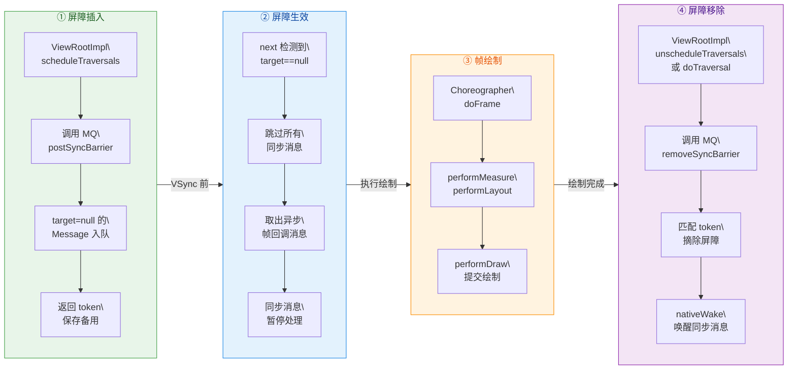
```mermaid
graph LR
    subgraph Phase1["① 屏障插入"]
        direction TB
        P1A["ViewRootImpl\\nscheduleTraversals"]
        P1B["调用 MQ\\npostSyncBarrier"]
        P1C["target=null 的\\nMessage 入队"]
        P1D["返回 token\\n保存备用"]
        P1A --> P1B
        P1B --> P1C
        P1C --> P1D
    end

    subgraph Phase2["② 屏障生效"]
        direction TB
        P2A["next 检测到\\ntarget==null"]
        P2B["跳过所有\\n同步消息"]
        P2C["取出异步\\n帧回调消息"]
        P2D["同步消息\\n暂停处理"]
        P2A --> P2B
        P2B --> P2C
        P2C --> P2D
    end

    subgraph Phase3["③ 帧绘制"]
        direction TB
        P3A["Choreographer\\ndoFrame"]
        P3B["performMeasure\\nperformLayout"]
        P3C["performDraw\\n提交绘制"]
        P3A --> P3B
        P3B --> P3C
    end

    subgraph Phase4["④ 屏障移除"]
        direction TB
        P4A["ViewRootImpl\\nunscheduleTraversals\\n或 doTraversal"]
        P4B["调用 MQ\\nremoveSyncBarrier"]
        P4C["匹配 token\\n摘除屏障"]
        P4D["nativeWake\\n唤醒同步消息"]
        P4A --> P4B
        P4B --> P4C
        P4C --> P4D
    end

    Phase1 -->|"VSync 前"| Phase2 -->|"执行绘制"| Phase3 -->|"绘制完成"| Phase4

    classDef phase1Style fill:#E8F5E9,stroke:#43A047,color:#1B5E20
    classDef phase2Style fill:#E3F2FD,stroke:#1E88E5,color:#0D47A1
    classDef phase3Style fill:#FFF3E0,stroke:#FB8C00,color:#E65100
    classDef phase4Style fill:#F3E5F5,stroke:#8E24AA,color:#4A148C
    class Phase1 phase1Style
    class Phase2 phase2Style
    class Phase3 phase3Style
    class Phase4 phase4Style
```

### VSync 信号响应

#### VSync 与帧调度全流程

VSync（Vertical Synchronization，垂直同步）信号是由显示硬件（通过 HWComposer HAL）周期性发出的脉冲信号，表示当前帧的扫描已完成，可以切换到下一帧的缓冲区（Buffer Swap）。Android 从 4.1（Project Butter）开始引入了 **VSync 驱动的 UI 渲染管线**，核心思想是：**不要随时绘制，而是等 VSync 来了再绘制**，确保绘制节奏与显示刷新率同步，消除画面撕裂（Tearing）并减少不必要的计算。

在应用层，VSync 信号通过以下路径最终触发 View 树的绘制：

```text
硬件 VSync
    │
    ▼
SurfaceFlinger (Native 进程)
    │  通过 BitTube / Socket
    ▼
DisplayEventReceiver (App 进程 Native 层)
    │  JNI 回调
    ▼
Choreographer.FrameDisplayEventReceiver.onVsync()
    │
    ▼
异步 Message 投递到主线程 MessageQueue
    │
    ▼
Looper.loop() → next() 取出（同步屏障保护下优先取出）
    │
    ▼
Choreographer.doFrame()
    │
    ├── Input 阶段：处理触摸事件
    ├── Animation 阶段：计算属性动画
    ├── Traversal 阶段：measure → layout → draw
    └── Commit 阶段：提交帧数据
```

让我们聚焦这个流程中同步屏障的配合时序。

#### scheduleTraversals 与屏障插入

当 View 调用 `invalidate()` 或 `requestLayout()` 时，最终会触达 `ViewRootImpl.scheduleTraversals()` 方法。这是屏障插入的起点：

```java
// ViewRootImpl.scheduleTraversals() —— 调度一次 View 树遍历
void scheduleTraversals() {
    // mTraversalScheduled 是防重入标志
    // 确保在一帧内多次 invalidate 只调度一次 traversal
    if (!mTraversalScheduled) {
        // 标记为已调度
        mTraversalScheduled = true;

        // ★★★ 插入同步屏障 ★★★
        // 从此刻起，主线程 MessageQueue 中的同步消息被阻拦
        // 只有异步消息（如 Choreographer 的帧回调）才能通过
        mTraversalBarrier = mHandler.getLooper().getQueue()
            .postSyncBarrier();

        // 向 Choreographer 注册 TRAVERSAL 类型的帧回调
        // Choreographer 会在下一个 VSync 到来时通过异步 Handler 投递
        mChoreographer.postCallback(
            Choreographer.CALLBACK_TRAVERSAL,
            mTraversalRunnable,  // 实际执行 doTraversal() 的 Runnable
            null
        );

        // 发送辅助通知（用于 Pointer 图标等，非关键路径）
        notifyRendererOfFramePending();
        pokeDrawLockIfNeeded();
    }
}
```

**`mTraversalScheduled` 防重入**：在一帧的绘制周期中，可能有多个 View 调用 `invalidate()`（例如一个列表中同时有多项数据更新），如果每次都调度一次 traversal 并插入屏障，不仅浪费资源，还可能导致多个屏障嵌套的混乱。`mTraversalScheduled` 标志确保在一帧内 **只插入一次屏障、只注册一次 Choreographer 回调**。

**时间窗口**：从 `postSyncBarrier()` 到 `removeSyncBarrier()` 之间的这段时间，就是同步屏障的生效窗口。在此期间，所有普通业务消息都被暂停。这个窗口通常很短——从 VSync 信号到来到绘制完成，通常只有几毫秒到十几毫秒。但如果绘制耗时过长（如主线程上的复杂布局计算），这个窗口就会拉长，业务消息的延迟也随之增大。

#### doTraversal 与屏障移除

当 VSync 信号到来，`Choreographer` 通过异步 Handler 投递帧回调，最终调用到 `ViewRootImpl.doTraversal()`：

```java
// ViewRootImpl 中的 Traversal Runnable
final class TraversalRunnable implements Runnable {
    @Override
    public void run() {
        // Choreographer 调度执行后，进入此方法
        doTraversal();
    }
}

// ViewRootImpl.doTraversal() —— 执行 View 树遍历
void doTraversal() {
    if (mTraversalScheduled) {
        // 重置调度标志，允许下一帧再次调度
        mTraversalScheduled = false;

        // ★★★ 移除同步屏障 ★★★
        // 绘制任务即将开始执行，屏障的使命完成
        // 同步消息在绘制完成后恢复处理
        mHandler.getLooper().getQueue()
            .removeSyncBarrier(mTraversalBarrier);

        // 执行实际的 View 树测量、布局、绘制
        performTraversals();
    }
}
```

注意一个重要的顺序：**屏障在 `performTraversals()` 之前就被移除了**。这意味着在绘制过程中，同步消息实际上已经可以被处理了（如果绘制逻辑中有让出主线程的操作）。选择在绘制前而非绘制后移除屏障，是因为 `performTraversals()` 本身就是在主线程上串行执行的，它不会被其他消息打断（除非内部主动调用了某些会导致消息分发的方法）。而如果在绘制完成后才移除屏障，一旦绘制过程中发生异常未能到达移除代码，就会导致屏障永驻——这是灾难性的。

#### 异步消息与 Choreographer 的协作

`Choreographer` 内部的 `FrameHandler` 被创建为异步 Handler，这是 UI 绘制消息能够穿透同步屏障的根本原因：

```java
// Choreographer 内部（简化）
private final class FrameHandler extends Handler {
    public FrameHandler(Looper looper) {
        // ★ 注意第三个参数 true —— 标记为异步 Handler
        // 通过此 Handler 发送的所有消息都会被标记为异步
        super(looper, null, true);
    }

    @Override
    public void handleMessage(Message msg) {
        switch (msg.what) {
            case MSG_DO_FRAME:
                // 执行帧回调（Input → Animation → Traversal → Commit）
                doFrame(System.nanoTime(), 0);
                break;
            case MSG_DO_SCHEDULE_VSYNC:
                // 请求下一个 VSync 信号
                doScheduleVsync();
                break;
            case MSG_DO_SCHEDULE_CALLBACK:
                // 调度回调
                doScheduleCallback(msg.arg1);
                break;
        }
    }
}
```

当 VSync 信号通过 `DisplayEventReceiver` 回调到达 Java 层时，`Choreographer` 使用 `FrameHandler` 发送 `MSG_DO_FRAME` 消息。由于 `FrameHandler` 的 `mAsynchronous = true`，这条消息在入队时会被自动标记为异步消息：

```java
// Handler.enqueueMessage 中的关键逻辑
private boolean enqueueMessage(MessageQueue queue, Message msg, long uptimeMillis) {
    msg.target = this;
    // FrameHandler 的 mAsynchronous = true
    // 所以这里会将消息标记为异步
    if (mAsynchronous) {
        msg.setAsynchronous(true); // ← 关键！
    }
    return queue.enqueueMessage(msg, uptimeMillis);
}
```

由此形成了完整的闭环：

1. `ViewRootImpl` 插入同步屏障 → 同步消息被阻拦
2. `Choreographer` 通过异步 Handler 投递帧回调 → 消息带有 `FLAG_ASYNCHRONOUS`
3. `MessageQueue.next()` 检测到屏障 → 跳过同步消息 → 取出异步帧回调
4. 帧回调执行 → `doTraversal()` → 移除屏障
5. 同步消息恢复正常处理

#### 同步屏障对应用开发者的影响

虽然 `postSyncBarrier()` 是 `@hide` API，普通开发者无法直接调用，但同步屏障的存在对应用行为有几个值得注意的影响：

**第一，主线程中 `Handler.post()` 的消息可能被延迟**。如果你的消息恰好在同步屏障生效期间入队，它会被阻拦直到屏障移除。在帧率为 60fps 的设备上，屏障的生效窗口通常很短（几毫秒），但在绘制复杂界面时可能延长。在 120fps 设备上，帧间隔只有 8.3ms，屏障出现的频率更高。如果你的业务逻辑对时间非常敏感（如音视频同步），需要意识到这种潜在延迟。

**第二，不要在主线程上执行耗时操作**。这个建议本身不新鲜，但理解了同步屏障后你会有更深的体会：耗时的同步消息不仅阻塞后续消息，还可能 **推迟屏障的生效时机**（因为屏障按时间戳插入，如果当前消息还在执行，屏障即使已在队列中也要等当前消息处理完）。更糟糕的是，如果 `doTraversal()` 内的绘制逻辑本身耗时过长，屏障虽然已被移除，但同步消息的累积延迟可能导致后续帧的调度受到影响，形成连锁掉帧。

**第三，利用异步消息提升自定义任务的优先级（谨慎使用）**。从 API 28 开始，`Handler` 的构造函数新增了公开的 `createAsync()` 工厂方法：

```kotlin
// API 28+ 创建异步 Handler 的公开方式
val asyncHandler = Handler.createAsync(Looper.getMainLooper())

// 通过此 Handler 发送的消息都是异步的
// 它们在同步屏障生效期间依然可以被 next() 取出
asyncHandler.post {
    // 这段代码即使在屏障期间也会执行
    // 但请谨慎：滥用异步消息可能干扰 UI 绘制的优先级
    performHighPriorityTask()
}
```

然而，**强烈不建议滥用异步消息**。同步屏障的设计初衷是保障 UI 绘制的实时性，如果大量业务消息也被标记为异步，就失去了优先级区分的意义，等于"所有人都走 VIP 通道，VIP 就不再是 VIP"。只有在极少数对延迟要求极高且确认不会影响绘制性能的场景（如低延迟的输入事件处理）下，才应考虑使用异步消息。

#### 屏障泄漏：一种隐蔽的 Bug

如果 `postSyncBarrier()` 之后没有对应的 `removeSyncBarrier()` 调用，屏障就会 **永驻在 MessageQueue 中**。此时所有同步消息都无法被处理，但异步消息和 UI 绘制仍然正常——这会导致一种非常隐蔽的症状：**界面可以正常刷新，但所有通过普通 Handler 发送的消息（如点击回调、生命周期调度）都"失灵"了**。

在 Android 框架内部，`ViewRootImpl` 的代码非常谨慎地保证了屏障的配对使用。但如果开发者通过反射调用了 `postSyncBarrier()` 却忘记移除（或因异常导致移除代码未执行），就会触发这个问题。在调试时，可以通过 `MessageQueue.dump()` 打印队列内容，如果看到 `target == null` 的消息长期存在，就是屏障泄漏的信号。

```kotlin
// 通过反射获取 MessageQueue 用于调试（仅限开发环境！）
val queue = Looper.getMainLooper().queue
// 使用反射调用 dump 或遍历 mMessages 检查屏障
// 生产环境绝不应这样做
```

#### 同步屏障机制总览

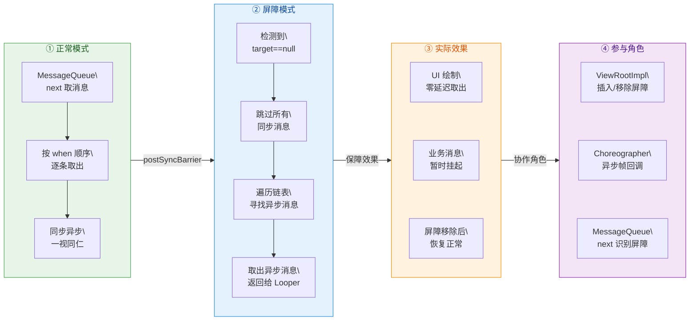
```mermaid
graph LR
    subgraph Normal["① 正常模式"]
        direction TB
        N1["MessageQueue\\nnext 取消息"]
        N2["按 when 顺序\\n逐条取出"]
        N3["同步异步\\n一视同仁"]
        N1 --> N2
        N2 --> N3
    end

    subgraph Barrier["② 屏障模式"]
        direction TB
        B1["检测到\\ntarget==null"]
        B2["跳过所有\\n同步消息"]
        B3["遍历链表\\n寻找异步消息"]
        B4["取出异步消息\\n返回给 Looper"]
        B1 --> B2
        B2 --> B3
        B3 --> B4
    end

    subgraph Effect["③ 实际效果"]
        direction TB
        E1["UI 绘制\\n零延迟取出"]
        E2["业务消息\\n暂时挂起"]
        E3["屏障移除后\\n恢复正常"]
        E1 ~~~ E2
        E2 ~~~ E3
    end

    subgraph Roles["④ 参与角色"]
        direction TB
        R1["ViewRootImpl\\n插入/移除屏障"]
        R2["Choreographer\\n异步帧回调"]
        R3["MessageQueue\\nnext 识别屏障"]
        R1 ~~~ R2
        R2 ~~~ R3
    end

    Normal -->|"postSyncBarrier"| Barrier -->|"保障效果"| Effect -->|"协作角色"| Roles

    classDef normalStyle fill:#E8F5E9,stroke:#43A047,color:#1B5E20
    classDef barrierStyle fill:#E3F2FD,stroke:#1E88E5,color:#0D47A1
    classDef effectStyle fill:#FFF3E0,stroke:#FB8C00,color:#E65100
    classDef rolesStyle fill:#F3E5F5,stroke:#8E24AA,color:#4A148C
    class Normal normalStyle
    class Barrier barrierStyle
    class Effect effectStyle
    class Roles rolesStyle
```

同步屏障是 Android 消息机制中最精巧的设计之一。它没有引入复杂的优先级队列、没有修改 Message 的数据结构、也没有给 Looper 增加额外的调度逻辑——仅仅利用了 `target == null` 这一条件和 `next()` 中的一个 `if` 分支，就在单一队列上实现了 **双优先级调度**。这种极简但有效的工程取舍，正是 Android 框架设计哲学的缩影：在不增加系统复杂度的前提下，以最小的改动解决最关键的问题。

---

**📝 练习题**

关于 Android 同步屏障（Sync Barrier）机制，以下说法正确的是？

A. 同步屏障消息的 `what` 字段被设为特殊值 `-1` 来标识屏障身份


B. 同步屏障会阻拦所有消息（包括异步消息），直到屏障被移除


C. `Choreographer` 的帧回调消息之所以能穿透屏障，是因为它通过异步 Handler 发送，消息带有 `FLAG_ASYNCHRONOUS` 标记


D. 同步屏障在绘制完成后（`performTraversals()` 结束后）才会被移除


**【答案】** C

**【解析】** 同步屏障的核心机制是：在 `MessageQueue` 中插入一个 `target == null` 的特殊 Message（不是通过 `what` 字段标识，A 错误），当 `next()` 检测到链表头部存在此类消息时，会跳过所有同步消息，**仅取出异步消息**（而非阻拦所有消息，B 错误）。`Choreographer` 内部的 `FrameHandler` 在构造时将 `async` 参数设为 `true`，因此通过它发送的帧回调消息会被自动标记为 `FLAG_ASYNCHRONOUS`，从而能在屏障生效期间被 `next()` 优先取出，C 正确。关于移除时机，`ViewRootImpl.doTraversal()` 中 **先移除屏障、再调用 `performTraversals()`**，即屏障在绘制开始前就已被移除，D 错误。这种设计保证了即使绘制过程中发生异常，屏障也不会永驻队列。

---

**📝 练习题**

在主线程 `MessageQueue` 中，当同步屏障生效时，以下哪种场景可能发生？

A. 所有 `Handler.post()` 发送的普通消息立即被丢弃


B. `MessageQueue.next()` 返回 null，导致 `Looper.loop()` 退出


C. 普通同步消息暂时无法被取出，但不会丢失，屏障移除后继续按顺序处理


D. 同步屏障会自动在 16.6ms 后超时移除


**【答案】** C

**【解析】** 同步屏障的作用是 **暂时阻拦** 而非丢弃同步消息，屏障移除后这些消息会按原有的时间戳顺序继续被 `next()` 取出处理，A 错误，C 正确。当屏障生效且队列中没有异步消息时，`next()` 会将 `nextPollTimeoutMillis` 设为 `-1`（无限等待），通过 `nativePollOnce` 在 Native 层阻塞，而不是返回 null——`next()` 只在 `Looper` 调用 `quit()` 后才返回 null，B 错误。屏障没有超时机制，必须通过 `removeSyncBarrier(token)` 显式移除，如果忘记移除，屏障会永久生效，同步消息永远无法处理，D 错误。

---

## 闲时处理 IdleHandler

在 Android 的消息驱动模型中，主线程的 `MessageQueue` 始终在循环地取出 `Message` 并分发执行。但现实场景里，消息队列并非时刻都有待处理的消息——当队列为空，或者队首消息的触发时间（`when`）尚未到来时，主线程就会进入一段"空闲期"（Idle State）。如果这段空闲期被白白浪费，显然不够高效。Android Framework 为此设计了 **`IdleHandler`** 机制：它允许开发者向 `MessageQueue` 注册一个回调接口，当消息队列即将进入阻塞等待（即没有更多紧急消息需要处理）时，系统会依次回调这些 `IdleHandler`，让开发者有机会在 **不影响用户交互流畅度** 的前提下，执行一些优先级较低的任务。

这一机制的精妙之处在于：它不占用正常消息的处理时间窗口，而是在主线程"无事可做"的间隙见缝插针地工作。对于冷启动优化、延迟初始化、资源预加载等场景而言，`IdleHandler` 是一个既轻量又优雅的调度手段。

### queueIdle 回调

#### IdleHandler 接口定义

`IdleHandler` 本身是 `MessageQueue` 中定义的一个极为简洁的内部接口，它只有一个方法：

```java
// MessageQueue.java（Framework 源码）
public static interface IdleHandler {
    /**
     * 当消息队列即将进入空闲（阻塞等待）时被回调。
     * @return true  → 保持活跃，下次空闲时还会再次回调（keep-alive）
     *         false → 一次性回调，执行完后自动从队列移除（one-shot）
     */
    boolean queueIdle();
}
```

这个接口的设计哲学非常 Unix-like——做一件事，做好一件事。返回值是一个 `boolean`，它决定了这个 `IdleHandler` 的 **生命周期模式**：

- **返回 `false`（One-shot 模式）**：回调执行一次后，`MessageQueue` 会自动将该 `IdleHandler` 从内部列表中移除。这是最常用的模式，适合"只需要在第一次空闲时做一件事"的场景，例如冷启动后延迟初始化某个 SDK。
- **返回 `true`（Keep-alive 模式）**：回调执行后不会被移除，下次消息队列再进入空闲时，仍会再次触发。这适合需要持续监听空闲状态的场景，但需要格外小心——如果回调逻辑执行时间过长或触发频率过高，反而会拖累主线程的响应能力。

#### 注册与移除

开发者通过 `MessageQueue` 的实例方法来注册和移除 `IdleHandler`：

```kotlin
// 获取主线程的 MessageQueue 实例
val queue = Looper.myQueue()         // 当前线程的队列
// 或者明确拿主线程的：
val mainQueue = Looper.getMainLooper().queue

// 注册一个 IdleHandler
mainQueue.addIdleHandler {
    // 这里是 queueIdle() 的 lambda 实现
    // 执行一些低优先级任务...
    doSomeLowPriorityWork()
    false  // 返回 false：一次性执行，执行完自动移除
}

// 如果需要手动移除（keep-alive 模式下常见）
val idleHandler = MessageQueue.IdleHandler {
    monitorIdleState()  // 监控空闲状态
    true                // 返回 true：保持注册，反复触发
}
mainQueue.addIdleHandler(idleHandler)     // 注册
mainQueue.removeIdleHandler(idleHandler)  // 在合适时机手动移除
```

在 `MessageQueue` 内部，所有注册的 `IdleHandler` 被存储在一个 `ArrayList` 中：

```java
// MessageQueue.java 内部字段
private final ArrayList<IdleHandler> mIdleHandlers = new ArrayList<>();
```

`addIdleHandler()` 和 `removeIdleHandler()` 都使用 `synchronized(this)` 进行同步保护，因此从任何线程调用注册/移除操作都是线程安全的。但 **`queueIdle()` 本身始终在 `MessageQueue` 所属的线程上执行**——如果你注册到主线程的队列，那么回调一定在主线程执行；注册到 `HandlerThread` 的队列，则在该工作线程执行。

#### queueIdle 在 next() 中的触发时机

理解 `IdleHandler` 最关键的一步，是搞清楚它在 `MessageQueue.next()` 方法中的触发位置。回顾上一章我们分析过的 `next()` 方法，它是一个无限循环，每次循环都试图取出下一条可执行的 `Message`。当它发现"没有消息可执行"时，就会在 **即将进入 `nativePollOnce()` 阻塞之前**，先运行一轮 `IdleHandler`。

下面是 `next()` 方法中与 `IdleHandler` 相关的核心逻辑（大幅精简，聚焦关键路径）：

```java
// MessageQueue.java — next() 方法中的 IdleHandler 处理逻辑
Message next() {
    int pendingIdleHandlerCount = -1; // 初始值 -1，表示尚未统计空闲回调数量
    int nextPollTimeoutMillis = 0;    // 首次不阻塞，立即检查队列

    for (;;) {  // 无限循环
        // ① 调用 native 层阻塞等待（epoll_wait）
        //    nextPollTimeoutMillis = 0 → 不阻塞，立即返回
        //    nextPollTimeoutMillis = -1 → 无限期阻塞，直到被唤醒
        //    nextPollTimeoutMillis > 0 → 阻塞指定毫秒数
        nativePollOnce(ptr, nextPollTimeoutMillis);

        synchronized (this) {
            final long now = SystemClock.uptimeMillis();
            Message msg = mMessages; // 队首消息

            // ② 尝试取出可执行的消息（跳过同步屏障等逻辑，此处简化）
            if (msg != null && msg.when <= now) {
                // 找到一条到期的消息，取出并返回给 Looper.loop()
                mMessages = msg.next;
                msg.next = null;
                return msg;
            }

            // ③ 走到这里说明：队列为空，或队首消息尚未到期
            if (msg != null) {
                // 队首消息未到期：计算需要等待的时间
                nextPollTimeoutMillis = (int) Math.min(msg.when - now, Integer.MAX_VALUE);
            } else {
                // 队列完全为空：无限期等待
                nextPollTimeoutMillis = -1;
            }

            // =========== IdleHandler 核心逻辑开始 ===========

            // ④ 仅在本轮循环的 *第一次* 空闲时统计 IdleHandler 数量
            //    pendingIdleHandlerCount == -1 保证每次 next() 调用只统计一次
            if (pendingIdleHandlerCount < 0
                    && (mMessages == null || now < mMessages.when)) {
                pendingIdleHandlerCount = mIdleHandlers.size();
            }

            // ⑤ 如果没有注册任何 IdleHandler，直接进入下一轮阻塞
            if (pendingIdleHandlerCount <= 0) {
                mBlocked = true;   // 标记队列即将阻塞
                continue;          // 回到 for 循环顶部，执行 nativePollOnce 阻塞
            }

            // ⑥ 将 IdleHandler 列表拷贝到临时数组（避免持锁过久）
            mPendingIdleHandlers = mIdleHandlers.toArray(mPendingIdleHandlers);
        }
        // synchronized 块结束 —— 释放锁后再执行回调，避免死锁

        // ⑦ 遍历并执行所有 IdleHandler 的 queueIdle()
        for (int i = 0; i < pendingIdleHandlerCount; i++) {
            final IdleHandler idler = mPendingIdleHandlers[i];
            mPendingIdleHandlers[i] = null; // 释放引用，方便 GC

            boolean keep = false;
            try {
                keep = idler.queueIdle();   // 执行回调！
            } catch (Throwable t) {
                Log.wtf(TAG, "IdleHandler threw exception", t);
            }

            // ⑧ 如果返回 false，从注册列表中移除（one-shot 模式）
            if (!keep) {
                synchronized (this) {
                    mIdleHandlers.remove(idler);
                }
            }
        }

        // ⑨ 重置计数为 0（不是 -1！），确保本轮 next() 不会再执行第二遍
        pendingIdleHandlerCount = 0;

        // ⑩ 因为 IdleHandler 中可能发送了新消息，
        //    所以不再阻塞，立即重新检查队列
        nextPollTimeoutMillis = 0;
    }
}
```

这段代码中有几个设计细节值得深入理解：

**第一，"只触发一轮"的保证机制。** `pendingIdleHandlerCount` 初始值为 `-1`，只有当它 `< 0` 时才会进入统计逻辑（步骤④）。而在步骤⑨中，它被重置为 `0`（不是 `-1`），这意味着：在同一次 `next()` 调用的无限循环中，`IdleHandler` **至多只会被执行一轮**。即使执行完 `IdleHandler` 之后队列仍然为空，也不会再次执行它们——而是直接进入 `nativePollOnce()` 阻塞等待。这防止了在极端情况下 `IdleHandler` 被反复触发导致主线程忙循环。

**第二，"先拷贝再执行"的并发安全策略。** 步骤⑥在 `synchronized` 块内将 `mIdleHandlers` 拷贝到 `mPendingIdleHandlers` 数组，然后在锁外执行回调。这样做的好处有二：一是减少持锁时间（`queueIdle()` 可能执行较久），二是避免在回调执行过程中其他线程 `addIdleHandler()` / `removeIdleHandler()` 时发生 `ConcurrentModificationException`。

**第三，执行完后立即重检队列。** 步骤⑩将 `nextPollTimeoutMillis` 设为 `0`，因为 `IdleHandler` 回调中很可能通过 `Handler.sendMessage()` 往队列里插入了新消息。如果不重检就直接阻塞，那这些新消息可能会被延迟处理。

下面这张时序图完整展示了 `IdleHandler` 从注册到触发的全过程：

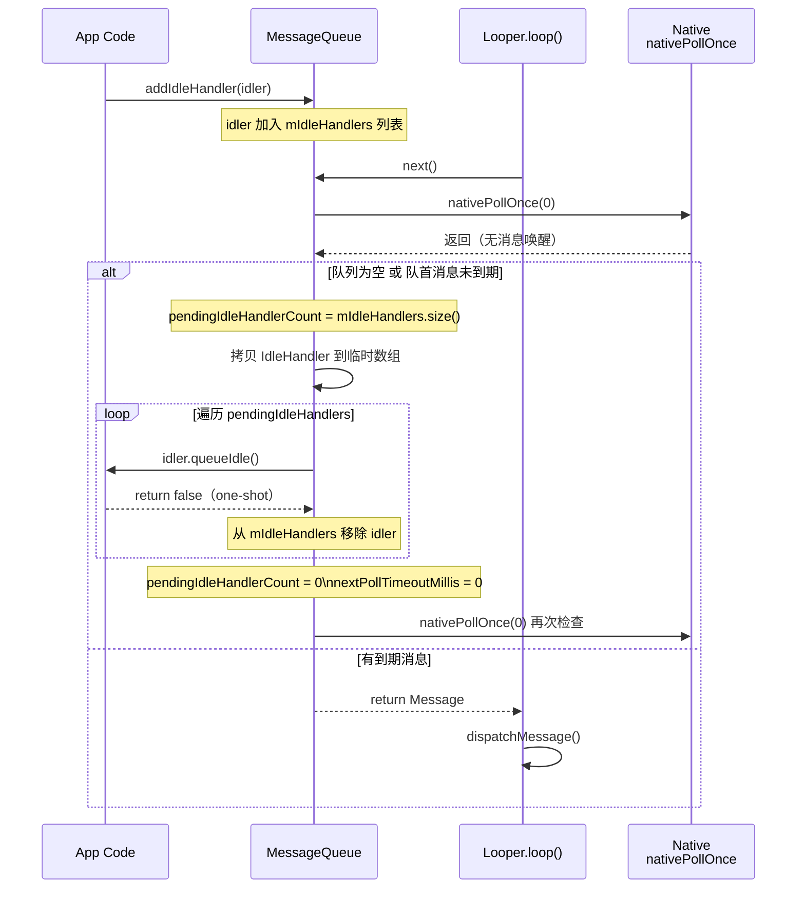
```mermaid
sequenceDiagram
    participant App as App Code
    participant MQ as MessageQueue
    participant Looper as Looper.loop()
    participant Native as Native<br/>nativePollOnce

    App->>MQ: addIdleHandler(idler)
    Note over MQ: idler 加入 mIdleHandlers 列表

    Looper->>MQ: next()
    MQ->>Native: nativePollOnce(0)
    Native-->>MQ: 返回（无消息唤醒）

    alt 队列为空 或 队首消息未到期
        Note over MQ: pendingIdleHandlerCount = mIdleHandlers.size()
        MQ->>MQ: 拷贝 IdleHandler 到临时数组
        loop 遍历 pendingIdleHandlers
            MQ->>App: idler.queueIdle()
            App-->>MQ: return false（one-shot）
            Note over MQ: 从 mIdleHandlers 移除 idler
        end
        Note over MQ: pendingIdleHandlerCount = 0\nnextPollTimeoutMillis = 0
        MQ->>Native: nativePollOnce(0) 再次检查
    else 有到期消息
        MQ-->>Looper: return Message
        Looper->>Looper: dispatchMessage()
    end
```

#### queueIdle 的异常处理

值得注意的是，Framework 对 `queueIdle()` 回调中的异常采取了 **容错但警告** 的策略——使用 `Log.wtf()`（What a Terrible Failure）记录异常，但不会让异常向上传播导致 `next()` 方法崩溃。这意味着即使某个 `IdleHandler` 抛出了未捕获异常，消息队列仍能继续正常工作。不过，`Log.wtf()` 在部分设备上会触发系统级错误报告，因此开发者仍应在 `queueIdle()` 内部做好 try-catch 防护。

### 主线程空闲任务

理解了 `IdleHandler` 的底层触发机制后，我们来看它在实际应用层开发中最核心的使用场景——**在主线程空闲时执行低优先级任务**。

#### 为什么需要"空闲时执行"

Android 应用的主线程承担着极其繁重的工作：UI 绘制、事件分发、生命周期回调、动画计算……为了保持 60fps（甚至 120fps）的流畅度，每一帧留给主线程的处理时间只有约 16ms（或 8ms）。如果在关键路径上（如 `onCreate()`、`onResume()`）塞入过多初始化逻辑，用户就会感知到明显的卡顿或白屏。

传统的"延迟执行"方案是使用 `Handler.postDelayed(runnable, delayMillis)`，但这种方式有一个固有缺陷：**你无法精确预知多久之后主线程才会真正空闲**。如果 `delayMillis` 设得太短，延迟任务可能在动画或布局过程中被执行，仍然造成卡顿；设得太长，又会导致功能响应迟缓，用户体验下降。

`IdleHandler` 完美解决了这个问题：它不依赖固定的延迟时间，而是 **自适应地等待主线程真正空闲** 后才执行。这种"语义级别"的调度比"时间级别"的调度更加精准和可靠。

#### 典型使用模式

```kotlin
// 在 Activity 中注册一个空闲任务
class MainActivity : AppCompatActivity() {

    override fun onCreate(savedInstanceState: Bundle?) {
        super.onCreate(savedInstanceState)
        setContentView(R.layout.activity_main)

        // 将非关键初始化延迟到主线程空闲时执行
        Looper.myQueue().addIdleHandler {
            // 这段代码会在主线程消息队列空闲时被调用
            initNonCriticalSdk()     // 初始化非关键 SDK（如统计、推送）
            preloadNextPageData()    // 预加载下一页数据
            false                    // 返回 false：只执行一次
        }
    }
}
```

#### 多个 IdleHandler 的执行顺序与性能考量

当多个 `IdleHandler` 同时注册时，它们会在 **同一次空闲窗口内被依次执行**（遍历顺序为注册顺序）。这意味着：如果注册了 5 个 `IdleHandler`，且每个耗时 10ms，那么这一次空闲窗口就会被占用 50ms——这已经超过了 3 帧的时间。如果此时用户触摸屏幕，对应的输入事件必须等到所有 `IdleHandler` 执行完毕之后才能被处理，用户会感知到操作延迟。

因此，使用 `IdleHandler` 时应遵循以下原则：

1. **单个 `queueIdle()` 执行时间应尽量控制在 5ms 以内。** 如果任务较重，应将其拆分为多个子任务，或者在 `queueIdle()` 中仅启动一个异步操作（如向工作线程 `post` 任务）。
2. **避免在 `queueIdle()` 中执行 I/O 操作或锁等待。** 这些操作的耗时不可预测，可能在某些低端设备上长时间阻塞主线程。
3. **谨慎使用 keep-alive 模式（返回 `true`）。** 每次空闲都会触发回调，如果回调中包含任何耗时操作，累积效应会显著影响性能。

#### IdleHandler 与 Activity 生命周期的时序关系

一个经常被问到的问题是：在 `onCreate()` 中注册的 `IdleHandler`，它的 `queueIdle()` 到底在什么时机被调用？答案是：**在第一帧绘制完成之后**。

原因在于 Android 的生命周期调度机制。`onCreate()` → `onStart()` → `onResume()` 这一系列回调是在同一个消息（`LAUNCH_ACTIVITY` / `EXECUTE_TRANSACTION`）的处理流程中依次完成的。`onResume()` 之后，`ViewRootImpl` 会通过 `Choreographer` 注册一个 VSync 回调来安排第一帧的绘制（measure → layout → draw）。这些绘制操作同样以消息的形式排入 `MessageQueue`。只有当这些绘制消息全部处理完毕、队列再次变空时，`IdleHandler` 才会被触发。

这个特性使 `IdleHandler` 成为一个天然的"首帧完成回调"机制，其时序如下：

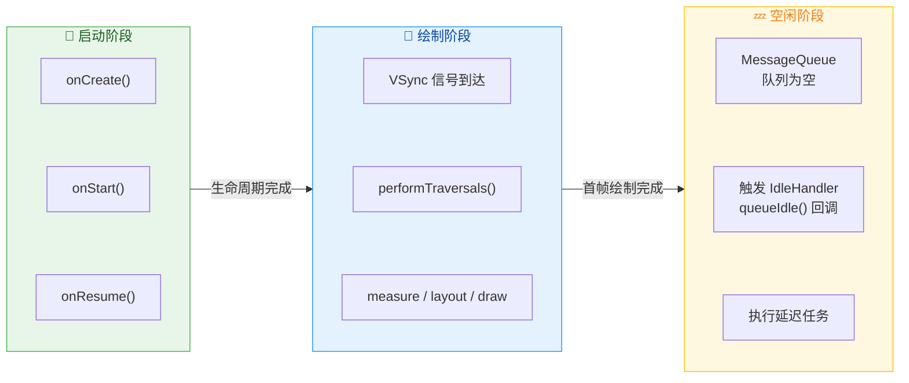
```mermaid
graph LR
    subgraph Phase1["🚀 启动阶段"]
        direction TB
        A["onCreate()"] ~~~ B["onStart()"]
        B ~~~ C["onResume()"]
    end

    subgraph Phase2["🎨 绘制阶段"]
        direction TB
        D["VSync 信号到达"] ~~~ E["performTraversals()"]
        E ~~~ F["measure / layout / draw"]
    end

    subgraph Phase3["💤 空闲阶段"]
        direction TB
        G["MessageQueue\n队列为空"] ~~~ H["触发 IdleHandler\nqueueIdle() 回调"]
        H ~~~ I["执行延迟任务"]
    end

    Phase1 -->|"生命周期完成"| Phase2
    Phase2 -->|"首帧绘制完成"| Phase3

    classDef greenPhase fill:#E8F5E9,stroke:#4CAF50,color:#1B5E20
    classDef bluePhase fill:#E3F2FD,stroke:#2196F3,color:#0D47A1
    classDef amberPhase fill:#FFF8E1,stroke:#FFC107,color:#F57F17

    class Phase1 greenPhase
    class Phase2 bluePhase
    class Phase3 amberPhase
```

这个时序特性非常重要，它意味着当 `queueIdle()` 被回调时，界面已经完整地呈现给了用户。因此在 `queueIdle()` 中做的任何初始化工作，都不会影响用户看到首屏内容的速度。

#### IdleHandler vs. 其他延迟方案对比

| 方案 | 触发时机 | 精准度 | 主线程安全 | 一次性/持续 |
|---|---|---|---|---|
| `Handler.postDelayed()` | 固定延迟时间后 | 低（不知何时空闲） | ✅ 主线程 | 一次性 |
| `View.post()` | 下一个消息循环 | 中（仍可能在绘制前） | ✅ 主线程 | 一次性 |
| `IdleHandler` | 消息队列真正空闲时 | **高（自适应空闲点）** | ✅ 所属线程 | 可选 |
| `ContentProvider.onCreate()` | Application 创建后 | 无法延迟 | ✅ 主线程 | — |
| `Executors` / `Coroutines` | 立即在工作线程执行 | 不适用 | ❌ 工作线程 | — |

从表中可以看出，`IdleHandler` 的核心优势在于它的触发时机是 **语义驱动** 的——"主线程空闲了"这个条件本身就是开发者真正关心的条件，而不是某个人为估算的延迟时间。

### 冷启动优化应用

`IdleHandler` 在工程实践中最广泛、最有价值的应用场景，就是 **冷启动（Cold Start）性能优化**。冷启动是用户对 App 性能的"第一印象"，直接影响留存率和用户满意度。

#### 冷启动的时间构成

Android 应用的冷启动过程大致可以分为以下阶段：

1. **进程创建**：Zygote fork 出新进程，加载 Application 类。
2. **Application.onCreate()**：全局初始化，包括各种第三方 SDK、数据库框架、网络库等。
3. **Activity 创建与生命周期**：`onCreate()` → `onStart()` → `onResume()`。
4. **首帧绘制**：`ViewRootImpl.performTraversals()` 执行 measure/layout/draw。
5. **用户可交互**：首帧绘制完成，用户看到完整界面并可以操作。

在这个过程中，阶段 2（`Application.onCreate()`）往往是耗时最严重的环节。一个大型 App 可能需要初始化数十个 SDK：推送、统计、广告、热修复、地图、支付、社交登录、日志框架、路由表、图片库……如果所有 SDK 都在 `Application.onCreate()` 中同步初始化，启动时间很容易突破 2~3 秒。

#### 任务分级策略

冷启动优化的核心思路是 **任务分级调度**——将启动阶段的初始化任务按优先级分为不同等级，分别安排在不同的时机执行：

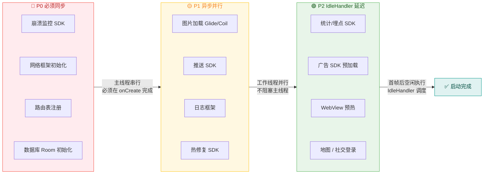
```mermaid
graph LR
    subgraph P0["🔴 P0 必须同步"]
        direction TB
        A0["崩溃监控 SDK"] ~~~ A1["网络框架初始化"]
        A1 ~~~ A2["路由表注册"]
        A2 ~~~ A3["数据库 Room 初始化"]
    end

    subgraph P1["🟡 P1 异步并行"]
        direction TB
        B0["图片加载 Glide/Coil"] ~~~ B1["推送 SDK"]
        B1 ~~~ B2["日志框架"]
        B2 ~~~ B3["热修复 SDK"]
    end

    subgraph P2["🟢 P2 IdleHandler 延迟"]
        direction TB
        C0["统计/埋点 SDK"] ~~~ C1["广告 SDK 预加载"]
        C1 ~~~ C2["WebView 预热"]
        C2 ~~~ C3["地图 / 社交登录"]
    end

    P0 -->|"主线程串行\n必须在 onCreate 完成"| P1
    P1 -->|"工作线程并行\n不阻塞主线程"| P2
    P2 -->|"首帧后空闲执行\nIdleHandler 调度"| FIN["✅ 启动完成"]

    classDef red fill:#FFEBEE,stroke:#F44336,color:#B71C1C
    classDef yellow fill:#FFF8E1,stroke:#FFC107,color:#F57F17
    classDef green fill:#E8F5E9,stroke:#4CAF50,color:#1B5E20
    classDef done fill:#E0F2F1,stroke:#009688,color:#004D40

    class P0 red
    class P1 yellow
    class P2 green
    class FIN done
```

- **P0（必须同步）**：启动过程中必须立即可用的基础设施，如崩溃监控（要尽早捕获崩溃）、网络框架（Activity 可能立即发起请求）、路由表（页面跳转需要）。
- **P1（异步并行）**：不依赖主线程、可以在工作线程初始化的 SDK。使用线程池或协程并行处理，不阻塞主线程。
- **P2（IdleHandler 延迟）**：首屏展示后才需要的功能，如统计 SDK（晚几百毫秒上报不影响）、广告预加载、WebView 预热等。

#### IdleHandler 冷启动优化实战

下面是一个生产级别的 `IdleHandler` 启动任务调度器实现：

```kotlin
/**
 * 基于 IdleHandler 的延迟初始化任务调度器。
 * 将低优先级任务排队，在主线程每次空闲时执行一个任务，
 * 避免所有 IdleHandler 在同一帧内集中执行导致卡顿。
 */
object DelayInitDispatcher {

    // 待执行任务队列，使用 ArrayDeque 作为 FIFO 队列
    private val delayTasks = ArrayDeque<() -> Unit>()

    /**
     * 添加一个延迟初始化任务。
     * @param task 要执行的初始化逻辑（lambda）
     */
    fun addTask(task: () -> Unit): DelayInitDispatcher {
        delayTasks.add(task)  // 将任务加入队列尾部
        return this           // 支持链式调用
    }

    /**
     * 启动调度：注册一个 IdleHandler，
     * 每次空闲时从队列中取出一个任务执行。
     */
    fun start() {
        Looper.myQueue().addIdleHandler {
            // 从队列头部取出一个任务（如果有的话）
            val task = delayTasks.pollFirst()
            task?.let {
                // 执行该任务
                it.invoke()
            }

            // 关键设计：如果队列中还有剩余任务，返回 true（保持注册）
            // 下次空闲时继续取下一个任务执行。
            // 如果队列已空，返回 false（自动移除）
            delayTasks.isNotEmpty()
        }
    }
}
```

这个调度器的核心设计理念是 **"每次空闲只执行一个任务"**。之所以不在一次 `queueIdle()` 中遍历执行所有任务，是因为：

1. 多个任务的累积耗时可能很长，会吞噬整个空闲窗口，延迟用户触摸事件的响应。
2. 每执行完一个任务，返回 `true` 让 `IdleHandler` 保持注册。控制权交还给 `MessageQueue.next()`，它会先检查是否有新的待处理消息（例如用户刚触摸了屏幕），如果有就优先处理用户交互，处理完再回到空闲状态时才执行下一个延迟任务。

在 `Application.onCreate()` 中的调用方式如下：

```kotlin
class MyApplication : Application() {
    override fun onCreate() {
        super.onCreate()

        // === P0 同步任务（必须立即完成）===
        CrashSdk.init(this)        // 崩溃监控，最先初始化
        NetworkEngine.init(this)    // 网络框架
        Router.init(this)           // 路由表

        // === P1 异步任务（工作线程并行）===
        GlobalScope.launch(Dispatchers.IO) {
            ImageLoader.init(this@MyApplication)  // 图片库
            PushSdk.init(this@MyApplication)      // 推送
            LogFramework.init(this@MyApplication) // 日志
        }

        // === P2 延迟任务（首帧后 IdleHandler 逐个执行）===
        DelayInitDispatcher
            .addTask { AnalyticsSdk.init(this) }    // 统计/埋点
            .addTask { AdSdk.preload(this) }         // 广告预加载
            .addTask { WebViewPool.preWarm(this) }   // WebView 预热
            .addTask { MapSdk.init(this) }           // 地图 SDK
            .addTask { SocialLogin.init(this) }      // 社交登录
            .start()  // 启动 IdleHandler 调度
    }
}
```

#### WebView 预热——IdleHandler 的经典案例

WebView 的首次创建极其耗时（通常 100~300ms），因为它需要加载 WebView 内核的 so 库、初始化 JavaScript 引擎（V8/JSC）、创建渲染线程等。如果用户点击某个按钮跳转到 WebView 页面时才创建，白屏等待时间会非常明显。

利用 `IdleHandler`，可以在冷启动完成后、用户尚未跳转到 WebView 页面的空闲期间，提前创建一个 WebView 实例并放入对象池：

```kotlin
/**
 * WebView 对象池：在主线程空闲时预创建 WebView，
 * 避免用户跳转 H5 页面时的首次创建延迟。
 */
object WebViewPool {
    // 缓存池，存储预创建的 WebView 实例
    private val pool = LinkedList<WebView>()

    /**
     * 在空闲时预热：创建一个 WebView 放入池中。
     * 注意：WebView 必须使用 MutableContextWrapper 包装的 Context 创建，
     * 以便后续绑定到具体 Activity 时替换 Context，避免内存泄漏。
     */
    fun preWarm(application: Application) {
        // 创建一个可替换 baseContext 的 ContextWrapper
        val contextWrapper = MutableContextWrapper(application)
        // 在主线程创建 WebView（WebView 必须在主线程创建）
        val webView = WebView(contextWrapper)
        // 做一些通用的基础配置
        webView.settings.javaScriptEnabled = true       // 启用 JS
        webView.settings.domStorageEnabled = true        // 启用 DOM Storage
        webView.settings.cacheMode = WebSettings.LOAD_DEFAULT  // 默认缓存策略
        // 放入对象池
        pool.add(webView)
    }

    /**
     * 从池中取出一个预创建的 WebView。
     * @param activity 当前页面的 Activity（用于替换 Context）
     */
    fun obtain(activity: Activity): WebView {
        val webView = if (pool.isNotEmpty()) {
            pool.removeFirst().also { wv ->
                // 将 WebView 的 Context 从 Application 替换为当前 Activity
                // 这样 WebView 内部的 Dialog 等组件才能正确显示
                val wrapper = wv.context as MutableContextWrapper
                wrapper.baseContext = activity
            }
        } else {
            // 池为空，回退到直接创建
            WebView(activity)
        }
        return webView
    }

    /**
     * 回收 WebView（页面销毁时调用）。
     * 彻底清理状态后放回池中复用。
     */
    fun recycle(webView: WebView) {
        webView.stopLoading()             // 停止加载
        webView.loadDataWithBaseURL(      // 清空内容
            null, "", "text/html", "utf-8", null
        )
        webView.clearHistory()            // 清除历史
        webView.removeAllViews()          // 移除子 View
        // 将 Context 重新替换回 Application，断开与 Activity 的引用
        val wrapper = webView.context as MutableContextWrapper
        wrapper.baseContext = webView.context.applicationContext
        pool.add(webView)                 // 放回池中
    }
}
```

这个 WebView 预热方案之所以使用 `IdleHandler` 而非简单的 `postDelayed()`，是因为：
- `postDelayed()` 的延迟时间难以确定：设太短可能在首帧绘制期间执行（造成掉帧），设太长则用户可能已经点击进入 WebView 页面。
- `IdleHandler` 会在首帧绘制完毕后的第一个空闲间隙自动触发，既不影响启动性能，又能尽早完成预热。

#### 性能监控：利用 IdleHandler 衡量启动耗时

`IdleHandler` 还有一个巧妙的应用：作为冷启动 **"可交互时间"（Time To Interactive, TTI）** 的打点标记。由于 `IdleHandler` 在首帧绘制完毕后才触发，它的回调时间点可以近似认为是"用户看到完整界面且可以操作"的时刻：

```kotlin
class MainActivity : AppCompatActivity() {
    override fun onCreate(savedInstanceState: Bundle?) {
        super.onCreate(savedInstanceState)
        setContentView(R.layout.activity_main)

        // 利用 IdleHandler 标记 TTI（Time To Interactive）
        Looper.myQueue().addIdleHandler {
            // 计算从进程启动到首次空闲的耗时
            val tti = SystemClock.uptimeMillis() - Process.getStartUptimeMillis()
            // 上报冷启动 TTI 指标
            PerformanceMonitor.reportTTI(tti)
            Log.d("Startup", "TTI = ${tti}ms")
            false  // 一次性执行
        }
    }
}
```

这种方式比 `onWindowFocusChanged(true)` 更精确，因为 `onWindowFocusChanged` 只表示窗口获得焦点，此时可能仍有排队的消息未处理完毕，而 `IdleHandler` 触发时消息队列已经清空，意味着所有启动相关的工作（包括异步回调写入的 UI 更新）都已完成。

#### 注意事项与陷阱

尽管 `IdleHandler` 是一个优雅的工具，但在使用中需要注意以下陷阱：

1. **不保证执行时机的上界。** 如果主线程一直处于忙碌状态（消息不断涌入），`IdleHandler` 可能长时间不会被触发。因此，对有时效性要求的任务（例如"启动后 3 秒内必须完成"），不应该依赖 `IdleHandler`，而应使用 `postDelayed()` 作为兜底。

2. **生命周期泄漏风险。** 如果 `IdleHandler` 以匿名内部类的形式引用了 `Activity`，且使用了 keep-alive 模式（返回 `true`），那么只要 `IdleHandler` 未被移除，它就会通过 `MessageQueue` → `IdleHandler` → `Activity` 的引用链阻止 `Activity` 被 GC 回收。解决方案是：在 `onDestroy()` 中显式调用 `removeIdleHandler()`，或使用 `WeakReference` 持有 `Activity`。

3. **不要在 `queueIdle()` 中执行重量级任务。** `queueIdle()` 运行在主线程上，任何超过 10ms 的操作都可能影响后续消息的处理延迟。如果必须执行耗时任务，应该在 `queueIdle()` 中仅负责 **启动** 任务（如向线程池提交 Runnable），而非同步执行。

4. **与 `Choreographer` 的交互。** 在动画播放期间，`Choreographer` 会不断通过 VSync 回调向 `MessageQueue` 发送绘制消息，主线程几乎不会进入空闲状态。因此如果页面有持续动画，`IdleHandler` 会被长时间"饿死"（Starvation）。在这种场景下需要评估是否需要更主动的调度策略。

---

**📝 练习题**

在冷启动优化中，开发者使用 `IdleHandler` 延迟初始化统计 SDK。以下关于 `IdleHandler` 的说法，**错误**的是哪一项？

A. `queueIdle()` 返回 `false` 时，该 `IdleHandler` 会在执行一次后被自动移除


B. 在 `Activity.onCreate()` 中注册的 `IdleHandler`，其 `queueIdle()` 一定在首帧绘制完成后才被回调


C. 同一次 `MessageQueue.next()` 调用中，`IdleHandler` 列表可能被执行多轮（多次遍历）


D. 如果 `queueIdle()` 中通过 `Handler.sendMessage()` 发送了一条新消息，`MessageQueue` 会在本轮 `IdleHandler` 全部执行完毕后立即重新检查队列（`nextPollTimeoutMillis = 0`）


**【答案】** C

**【解析】** 从 `MessageQueue.next()` 的源码可以看出，`pendingIdleHandlerCount` 初始值为 `-1`，在首次进入空闲逻辑时被赋值为 `mIdleHandlers.size()`，执行完一轮后被重置为 `0`（而不是 `-1`）。由于后续判断条件是 `pendingIdleHandlerCount < 0`，而 `0` 不满足 `< 0`，所以在同一次 `next()` 调用的循环中，`IdleHandler` 列表 **至多只会被遍历执行一轮**，不可能被执行多轮。这是 Framework 的有意设计，防止 `IdleHandler` 在消息队列持续为空时被反复触发导致 CPU 空转。选项 A 是 one-shot 模式的标准行为；选项 B 正确，因为 `onCreate()` 到首帧绘制的所有消息都在 `IdleHandler` 之前被处理；选项 D 正确，代码中明确设置了 `nextPollTimeoutMillis = 0` 保证立即重检。

---

## 线程与进程

在前面的章节中，我们已经深入剖析了 Android 消息机制的各个核心组件——Looper、MessageQueue、Handler、Message、SyncBarrier 以及 IdleHandler。这些组件共同构成了 Android 应用层最基础的异步通信框架。然而，这些组件终归要运行在具体的 **线程（Thread）** 之上，而线程又隶属于 **进程（Process）**。如何合理地管理线程优先级？如何优雅地封装一个带有消息循环的工作线程？历史上 Android 又提供了哪些开箱即用的后台任务方案？这些问题构成了本节的核心讨论内容。

理解线程与进程的管理策略，对应用层开发者而言意义重大：一个优先级设置不当的后台线程可能会抢占 UI 线程的 CPU 时间片，导致界面卡顿；一个没有正确退出机制的 HandlerThread 可能会造成资源泄漏；而对 IntentService 的历史理解则有助于我们认清 Android 并发模型的演进脉络，从而在现代开发中做出更合理的技术选型。

### Process.setThreadPriority 优先级

#### 为什么线程优先级如此重要

Android 系统运行着大量进程与线程——除了你的 App 之外，还有系统服务进程、其他第三方 App 进程、各种 Binder 线程池等。在这样一个多任务环境中，**CPU 时间片是有限的稀缺资源**。Linux 内核的 CFS（Completely Fair Scheduler，完全公平调度器）负责在所有可运行线程之间分配 CPU 时间，而分配的依据之一就是线程的 **nice 值**（优先级）。

对于 Android 应用层来说，线程优先级直接影响以下场景：

- **UI 流畅度**：主线程（UI Thread）必须拥有较高优先级，才能及时处理用户输入事件、执行布局计算（measure/layout）和绘制操作（draw），保证 16ms 内完成一帧的渲染。如果后台线程优先级过高，就会与主线程竞争 CPU，造成掉帧（jank）。
- **后台任务效率**：网络请求、数据库读写、文件 I/O 等操作通常在工作线程中执行。这些线程的优先级不宜过高（避免影响 UI），但也不能过低（否则任务执行缓慢，用户等待时间过长）。
- **系统资源回收**：当系统内存紧张时，`ActivityManagerService`（AMS）会根据进程的 **oom_adj** 值来决定杀死哪个进程。而进程内线程的优先级会间接影响系统对该进程"重要性"的判定。

#### Java Thread.setPriority vs Android Process.setThreadPriority

Java 标准库提供了 `Thread.setPriority(int priority)` 方法，它接受 1（`MIN_PRIORITY`）到 10（`MAX_PRIORITY`）的整数值，默认为 5（`NORM_PRIORITY`）。然而在 Android 平台上，**强烈不建议使用这个 Java 原生方法**，原因有三：

第一，**映射粒度粗糙**。Java 的 10 级优先级最终要映射到 Linux 的 nice 值（范围 -20 到 19），但 JVM 的映射策略并非线性的，不同 Android 版本的映射行为也可能不同，导致行为不可预测。

第二，**不支持 cgroup 调度组**。Android 在 Linux 内核之上构建了额外的调度机制——通过 cgroup（Control Group）将线程分为前台调度组（foreground group）和后台调度组（background group）。前台调度组中的线程可以获得绝大部分 CPU 时间（通常高达 95%），而后台组只能获得少量 CPU 时间。`Thread.setPriority()` 无法触发 cgroup 的分组调整，而 `Process.setThreadPriority()` 可以。

第三，**Android Framework 统一使用 `Process.setThreadPriority()`**。从主线程到 AsyncTask 线程池，从 RenderThread 到 Binder 线程，Framework 内部全部使用 `android.os.Process` 的 API 来管理优先级。如果你的代码混用两套 API，可能产生优先级冲突。

#### Process.setThreadPriority 的常量体系

`android.os.Process` 类定义了一组语义清晰的优先级常量，它们直接对应 Linux 的 nice 值：

```java
// android.os.Process 中定义的线程优先级常量（nice 值）
// nice 值范围：-20（最高优先级）到 19（最低优先级）

// 最低优先级，nice = 19，几乎不占用 CPU，适用于完全不紧急的后台任务
public static final int THREAD_PRIORITY_LOWEST = 19;

// 后台优先级，nice = 10，适用于不可见的后台工作（如数据预取、日志上传）
public static final int THREAD_PRIORITY_BACKGROUND = 10;

// "不太急迫"的优先级，nice = 1，比默认稍低
public static final int THREAD_PRIORITY_LESS_FAVORABLE = 1;

// 默认优先级，nice = 0，与主线程默认优先级相同
public static final int THREAD_PRIORITY_DEFAULT = 0;

// "更优先"的级别，nice = -1，比默认稍高
public static final int THREAD_PRIORITY_MORE_FAVORABLE = -1;

// 前台优先级，nice = -2，适用于正在与用户交互的线程
public static final int THREAD_PRIORITY_FOREGROUND = -2;

// 显示线程优先级，nice = -4，用于 RenderThread 等直接参与界面渲染的线程
public static final int THREAD_PRIORITY_DISPLAY = -4;

// 紧急显示，nice = -8，用于合成器（SurfaceFlinger）等关键显示路径
public static final int THREAD_PRIORITY_URGENT_DISPLAY = -8;

// 视频线程优先级，nice = -10，用于视频解码
public static final int THREAD_PRIORITY_VIDEO = -10;

// 音频线程优先级，nice = -16，音频播放对延迟极其敏感
public static final int THREAD_PRIORITY_AUDIO = -16;

// 最紧急优先级，nice = -20，系统保留，应用层不应使用
public static final int THREAD_PRIORITY_URGENT_AUDIO = -20;
```

这些常量的设计体现了 Android 对 **用户体验优先** 的哲学：直接影响用户视觉感知的线程（Display、Urgent Display）拥有较高优先级；音视频线程优先级更高（因为人耳对延迟的感知比眼睛更敏感）；而纯后台任务则被刻意压低，以确保不干扰前台交互。

#### 使用方式与最佳实践

`Process.setThreadPriority()` 有两个重载形式：

```kotlin
// 方式一：设置当前线程的优先级
// 这是最常用的形式，在工作线程的 run() 方法开头调用
android.os.Process.setThreadPriority(android.os.Process.THREAD_PRIORITY_BACKGROUND)

// 方式二：设置指定 TID（线程 ID）的优先级
// tid 是 Linux 层面的线程 ID，通过 Process.myTid() 获取
// 注意：tid 不等于 Java 的 Thread.getId()
android.os.Process.setThreadPriority(tid, android.os.Process.THREAD_PRIORITY_BACKGROUND)
```

在实际开发中，有几条关键的最佳实践需要遵循：

**第一，工作线程创建后应立即降低优先级。** 当你通过 `Thread` 或 `Runnable` 创建新线程时，新线程会 **继承父线程的优先级**。如果父线程是主线程（nice = -2，`FOREGROUND`级别），那么新线程也会以 -2 的优先级运行，这显然不合理。正确做法是在线程执行体的第一行就调用降级：

```kotlin
// 创建一个执行后台 I/O 的工作线程
val worker = Thread {
    // ★ 第一行就降低优先级，避免继承主线程的高优先级
    android.os.Process.setThreadPriority(
        android.os.Process.THREAD_PRIORITY_BACKGROUND
    )

    // 后续执行耗时的后台操作（如数据库批量写入）
    performHeavyDatabaseWrite()
}
// 启动线程
worker.start()
```

**第二，优先级可以叠加微调。** Android 允许你在基础常量上做小幅增减：

```kotlin
// 在 BACKGROUND 基础上再降低 1 级（nice = 10 + 1 = 11）
// 适用于优先级极低的预取任务，如缓存清理
android.os.Process.setThreadPriority(
    android.os.Process.THREAD_PRIORITY_BACKGROUND
            + android.os.Process.THREAD_PRIORITY_LESS_FAVORABLE
)
```

**第三，谨慎提升优先级。** 应用层线程的优先级通常不应高于 `THREAD_PRIORITY_FOREGROUND`（-2）。`DISPLAY`、`AUDIO` 等级别是为系统关键线程保留的，普通 App 若使用过高优先级可能被系统忽略或产生权限异常。

#### cgroup 调度组与优先级的联动

当你调用 `Process.setThreadPriority()` 将一个线程的 nice 值设为 `THREAD_PRIORITY_BACKGROUND`（10）或更高数值时，Android 系统不仅会修改该线程的 nice 值，还会 **将其移入后台 cgroup 调度组**。后台调度组受到严格的 CPU 时间限制——即便系统完全空闲，后台组线程也不会无限制地消耗 CPU；而当前台线程需要 CPU 时，后台组几乎会被完全"饿死"。

这种双重机制（nice 值 + cgroup）确保了即使开发者创建了大量后台线程执行密集计算，也不会明显影响前台 UI 的流畅度。这也是为什么 Android 官方文档和各种最佳实践指南都反复强调 **"在后台线程中设置 `THREAD_PRIORITY_BACKGROUND`"** 的根本原因。

以下流程图展示了线程优先级设置后的系统调度路径：

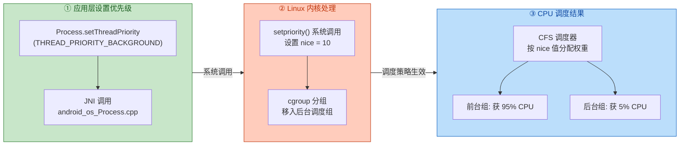
```mermaid
graph LR
    subgraph SetPriority["① 应用层设置优先级"]
        direction TB
        A["Process.setThreadPriority\n(THREAD_PRIORITY_BACKGROUND)"]
        B["JNI 调用\nandroid_os_Process.cpp"]
        A --> B
    end

    subgraph KernelAction["② Linux 内核处理"]
        direction TB
        C["setpriority() 系统调用\n设置 nice = 10"]
        D["cgroup 分组\n移入后台调度组"]
        C --> D
    end

    subgraph Scheduling["③ CPU 调度结果"]
        direction TB
        E["CFS 调度器\n按 nice 值分配权重"]
        F["前台组: 获 95% CPU"]
        G["后台组: 获 5% CPU"]
        E --> F
        E --> G
    end

    SetPriority -->|"系统调用"| KernelAction -->|"调度策略生效"| Scheduling

    classDef appStyle fill:#C8E6C9,stroke:#2E7D32,color:#1B5E20
    classDef kernelStyle fill:#FFCCBC,stroke:#BF360C,color:#BF360C
    classDef schedStyle fill:#BBDEFB,stroke:#1565C0,color:#0D47A1

    class SetPriority appStyle
    class KernelAction kernelStyle
    class Scheduling schedStyle
```

从应用层视角来看，你只需要一行 `Process.setThreadPriority()` 调用，底层的 JNI 桥接、系统调用、cgroup 迁移、CFS 权重计算全部由系统自动完成。这种"简单接口，复杂实现"的设计模式贯穿了整个 Android 系统架构。

---

### HandlerThread 封装

#### 为什么需要 HandlerThread

在前面的章节中我们知道，要在一个普通的 Java `Thread` 中使用 Handler 消息机制，需要手动完成以下步骤：调用 `Looper.prepare()` 初始化当前线程的 Looper，创建关联该 Looper 的 Handler，最后调用 `Looper.loop()` 启动消息循环。这三个步骤看似简单，实则存在 **竞态条件（Race Condition）** 隐患：

```kotlin
// ❌ 存在竞态条件的写法
var handler: Handler? = null

val thread = Thread {
    // 步骤1：在新线程中初始化 Looper
    Looper.prepare()
    // 步骤2：创建 Handler（关联当前线程的 Looper）
    handler = Handler(Looper.myLooper()!!) { msg ->
        // 处理消息
        true
    }
    // 步骤3：启动消息循环（此行之后当前线程进入阻塞态）
    Looper.loop()
}
// 启动线程
thread.start()

// ❌ 危险！此时 handler 可能仍为 null
// 因为主线程执行到这里时，新线程可能还没来得及执行到 Handler 的创建语句
handler?.sendEmptyMessage(0)
```

问题的根源在于：`thread.start()` 调用之后，**新线程和当前线程是并发执行的**。当前线程（主线程）可能在新线程完成 `Looper.prepare()` 和 Handler 创建之前就尝试使用 handler，导致空指针异常。你当然可以用 `CountDownLatch`、`synchronized` 等同步原语来解决这个问题，但这无疑增加了模板代码（boilerplate code）的复杂度。

**`HandlerThread` 正是为了解决这个问题而诞生的。** 它是 Android Framework 提供的一个 **内置封装类**，继承自 `Thread`，内部自动管理 Looper 的创建、线程安全的 Looper 获取以及退出机制。

#### HandlerThread 的源码解析

`HandlerThread` 的源码非常精炼（位于 `android.os.HandlerThread`），但每一行都经过精心设计：

```java
public class HandlerThread extends Thread {
    // 线程优先级，构造时指定，默认为 THREAD_PRIORITY_DEFAULT (0)
    int mPriority;
    // 当前线程的 TID（Linux 线程 ID），用于外部设置优先级
    int mTid = -1;
    // 当前线程关联的 Looper 实例，volatile 保证多线程可见性（这里并未使用volatile，而是用锁保护）
    Looper mLooper;
    // 关联的 Handler（API 28+ 标记为 @Nullable）
    private @Nullable Handler mHandler;

    // 构造方法一：仅指定线程名
    public HandlerThread(String name) {
        // 调用 Thread 父类构造，设置线程名
        super(name);
        // 使用默认优先级 0（等同于 THREAD_PRIORITY_DEFAULT）
        mPriority = Process.THREAD_PRIORITY_DEFAULT;
    }

    // 构造方法二：指定线程名 + 优先级
    // 推荐使用此构造方法，为后台工作线程显式指定低优先级
    public HandlerThread(String name, int priority) {
        super(name);
        mPriority = priority;
    }

    // 可选的回调钩子：Looper 准备就绪后、loop() 开始前调用
    // 子类可重写此方法执行初始化工作（如创建 Handler）
    protected void onLooperPrepared() {
    }

    // ★ 核心：重写 Thread.run()
    @Override
    public void run() {
        // 记录 Linux 线程 ID
        mTid = Process.myTid();
        // 为当前线程创建 Looper（内部会创建 MessageQueue）
        Looper.prepare();
        // 使用 synchronized 块保护 mLooper 的赋值
        // 确保 getLooper() 能安全地获取到已初始化的 Looper
        synchronized (this) {
            // 将新创建的 Looper 赋值给成员变量
            mLooper = Looper.myLooper();
            // ★ 唤醒所有在 getLooper() 中 wait() 的线程
            notifyAll();
        }
        // 设置线程优先级（在 Looper 准备好之后）
        Process.setThreadPriority(mPriority);
        // 调用钩子方法（子类可重写）
        onLooperPrepared();
        // 进入消息循环（此行之后线程进入阻塞-分发的无限循环）
        Looper.loop();
        // loop() 退出后才会执行到此处
        mTid = -1;
    }

    // ★ 线程安全地获取 Looper 实例
    // 如果 Looper 尚未准备好，当前调用线程会被阻塞（wait），直到 run() 中 notifyAll()
    public Looper getLooper() {
        // 如果线程尚未启动（未处于 alive 状态），返回 null
        if (!isAlive()) {
            return null;
        }

        // 使用 synchronized + wait 模式确保线程安全
        // 即使 getLooper() 在 start() 之后立即调用，也能正确等待 Looper 初始化完成
        synchronized (this) {
            // 条件等待：线程已启动（isAlive）但 Looper 尚未赋值
            while (isAlive() && mLooper == null) {
                try {
                    // 释放锁并等待，直到 run() 中 notifyAll() 被调用
                    wait();
                } catch (InterruptedException e) {
                    // 中断异常不做特殊处理，循环会重新检查条件
                }
            }
        }
        // 此时 mLooper 已确保不为 null（或线程已死亡返回 null）
        return mLooper;
    }

    // 安全退出：处理完当前队列中所有到期消息后退出
    public boolean quit() {
        Looper looper = getLooper();
        if (looper != null) {
            // 调用 Looper.quit()，内部会清空 MessageQueue
            looper.quit();
            return true;
        }
        return false;
    }

    // 安全退出（API 18+）：处理完当前已到期的消息后退出，丢弃未来的延迟消息
    public boolean quitSafely() {
        Looper looper = getLooper();
        if (looper != null) {
            // quitSafely 会让已到期的消息正常分发后再退出
            looper.quitSafely();
            return true;
        }
        return false;
    }

    // 获取 Linux 线程 ID
    public int getThreadId() {
        return mTid;
    }
}
```

这段源码中最值得注意的是 `getLooper()` 方法的 **`synchronized + wait/notifyAll`** 模式。这是一个经典的 **保护性暂停（Guarded Suspension）** 并发设计模式：调用 `getLooper()` 的线程（通常是主线程）会检查 `mLooper` 是否已被赋值；如果尚未赋值，就通过 `wait()` 释放锁并挂起自身；当 `run()` 方法中 Looper 初始化完毕后，`notifyAll()` 唤醒所有等待线程。这套机制彻底消除了前面提到的竞态条件。

#### 正确的使用模式

理解了源码之后，HandlerThread 的标准使用姿势就非常清晰了：

```kotlin
// ===== 第一步：创建并启动 HandlerThread =====
// 传入线程名（方便调试/日志）和优先级（后台任务应使用 BACKGROUND 级别）
val handlerThread = HandlerThread(
    "io-worker",  // 线程名，在 Thread dump 中可识别
    Process.THREAD_PRIORITY_BACKGROUND  // nice = 10，后台优先级
)
// 启动线程，内部会自动执行 Looper.prepare() + Looper.loop()
handlerThread.start()

// ===== 第二步：基于 HandlerThread 的 Looper 创建 Handler =====
// getLooper() 会阻塞等待直到 Looper 准备完毕，因此绝不会返回未初始化的 Looper
val workerHandler = Handler(handlerThread.looper) { msg ->
    // 此回调运行在 handlerThread 线程中（非主线程）
    when (msg.what) {
        // 处理不同类型的消息
        MSG_LOAD_DATA -> {
            // 执行耗时的数据加载操作
            val result = loadDataFromDatabase()
            // 将结果通过主线程 Handler 回传给 UI
            mainHandler.obtainMessage(MSG_UPDATE_UI, result).sendToTarget()
        }
        MSG_SAVE_DATA -> {
            // 执行数据持久化
            saveToDisk(msg.obj as UserData)
        }
    }
    // 返回 true 表示消息已被处理
    true
}

// ===== 第三步：从任意线程向 workerHandler 发送消息 =====
// 消息会被投递到 handlerThread 的 MessageQueue 中，由其 Looper 调度执行
workerHandler.sendEmptyMessage(MSG_LOAD_DATA)

// ===== 第四步：不再需要时必须退出，避免线程泄漏 =====
// 在 Activity/Fragment 的 onDestroy() 或适当时机调用
handlerThread.quitSafely()
```

#### quit() 与 quitSafely() 的区别

HandlerThread 提供了两种退出方式，对应 Looper 的两种退出策略：

`quit()` 方法会 **立即** 将 MessageQueue 标记为退出状态，丢弃队列中 **所有** 尚未处理的消息（无论是否已到期）。MessageQueue 的 `next()` 方法会返回 null，Looper 的 `loop()` 循环随即终止。这种方式简单粗暴，适用于不关心剩余消息的场景。

`quitSafely()`（API 18+）则更加温和：它会让 MessageQueue 继续处理所有 **已到期**（`when <= SystemClock.uptimeMillis()`）的消息，但丢弃所有 **延迟消息**（尚未到期的 delayed messages）。处理完到期消息后，`next()` 返回 null，Looper 退出。这种方式确保已提交的即时任务不会丢失，是 **推荐的退出方式**。

```mermaid
graph LR
    subgraph QuitImmediate["① quit() 立即退出"]
        direction TB
        A1["调用 quit()"]
        A2["清空所有消息\n（到期 + 未到期）"]
        A3["next() 返回 null"]
        A4["Looper.loop() 终止"]
        A1 --> A2
        A2 --> A3
        A3 --> A4
    end

    subgraph QuitSafely["② quitSafely() 安全退出"]
        direction TB
        B1["调用 quitSafely()"]
        B2["仅移除未到期\n的延迟消息"]
        B3["继续分发已到期消息"]
        B4["队列清空后\nnext() 返回 null"]
        B5["Looper.loop() 终止"]
        B1 --> B2
        B2 --> B3
        B3 --> B4
        B4 --> B5
    end

    QuitImmediate -->|"对比"| QuitSafely

    classDef quitStyle fill:#FFCDD2,stroke:#C62828,color:#B71C1C
    classDef safeStyle fill:#C8E6C9,stroke:#2E7D32,color:#1B5E20

    class QuitImmediate quitStyle
    class QuitSafely safeStyle
```

#### HandlerThread 的典型应用场景

HandlerThread 本质上提供了一个 **串行化的后台消息处理队列**。所有通过其 Handler 发送的消息都会在同一个线程中按顺序执行——这意味着你不需要额外的锁或同步机制来保护共享状态。这种特性使其特别适合以下场景：

**串行化 I/O 操作**：数据库写入、SharedPreferences 提交、文件读写等操作，如果在线程池中并发执行可能产生竞争条件，而使用 HandlerThread 则天然串行化，安全且简洁。

**轻量级事件管道**：例如传感器数据采集——`SensorManager.registerListener()` 可以接受一个 Handler 参数，将传感器回调分发到指定的 HandlerThread 上，避免在主线程中处理高频传感器事件。

**与 Framework API 集成**：许多 Android Framework API 允许你传入一个 Handler 来指定回调线程，如 `Camera2 API`、`ContentObserver`、`FileObserver` 等。HandlerThread 是为这些 API 提供后台 Handler 的标准方式。

然而也需要注意 HandlerThread 的局限：它是 **单线程** 的。如果某条消息的处理耗时过长（比如一个超大的数据库事务），后续所有消息都会被阻塞。对于需要并行处理的 CPU 密集型任务，应选择线程池方案（如 `Executors` 或 Kotlin Coroutines 的 `Dispatchers.Default`）。

#### 生命周期管理与泄漏防范

HandlerThread 的一个常见陷阱是 **忘记退出**。与普通线程不同，HandlerThread 内部的 `Looper.loop()` 是一个无限循环——即使没有消息要处理，线程也不会自动结束，它只是阻塞在 `MessageQueue.next()` 的 `nativePollOnce()` 调用中。这意味着如果你不显式调用 `quit()` 或 `quitSafely()`，这个线程会永远存在，持续占用内存和线程资源。

在 Activity/Fragment 中使用 HandlerThread 时，应将退出操作与组件生命周期绑定：

```kotlin
class DataProcessingActivity : AppCompatActivity() {

    // 延迟初始化 HandlerThread 和 Handler
    private lateinit var workerThread: HandlerThread
    private lateinit var workerHandler: Handler

    override fun onCreate(savedInstanceState: Bundle?) {
        super.onCreate(savedInstanceState)
        // 创建并启动 HandlerThread
        workerThread = HandlerThread(
            "data-processor",
            Process.THREAD_PRIORITY_BACKGROUND
        )
        workerThread.start()
        // 基于 HandlerThread 的 Looper 创建 Handler
        workerHandler = Handler(workerThread.looper)
    }

    // 投递任务到后台线程
    fun processData(data: ByteArray) {
        workerHandler.post {
            // 运行在 workerThread 上
            val result = heavyComputation(data)
            // 使用 runOnUiThread 切回主线程更新 UI
            runOnUiThread { updateUI(result) }
        }
    }

    override fun onDestroy() {
        super.onDestroy()
        // ★ 必须退出！否则 HandlerThread 会一直存活
        // 使用 quitSafely 确保已提交的任务完成执行
        workerThread.quitSafely()
        // 可选：移除 workerHandler 上所有待处理的回调和消息
        // 防止已发送但未执行的 Runnable 持有 Activity 引用
        workerHandler.removeCallbacksAndMessages(null)
    }
}
```

此外，如果使用 `ViewModel` + `Lifecycle` 架构组件，可以结合 `LifecycleObserver` 来自动管理 HandlerThread 的生命周期，进一步降低手动管理的遗漏风险。

---

### IntentService 历史

#### IntentService 的诞生背景

在 Android 早期（API 3 引入），开发者经常面临这样一个需求：**在后台执行一次性的耗时操作**（如上传文件、同步数据），并且这个操作需要 **不受 Activity 生命周期影响**——即使用户按了 Back 键或者 Activity 被系统回收，后台操作也应该继续执行。

显然，直接在 Activity 中开线程是不可靠的：Activity 被销毁后，没有任何组件持有对该线程的引用（尽管线程本身不会因 Activity 销毁而停止，但关联的上下文和回调可能已失效）。更重要的是，一个没有前台组件的 App 进程会被系统视为"空进程"（empty process），随时可能被杀死。

`Service` 组件解决了进程优先级的问题——一个正在运行 Service 的进程至少会被标记为"服务进程"（service process），不会被轻易杀死。但 Service 本身 **运行在主线程** 上，直接在 `onStartCommand()` 中执行耗时操作会导致 ANR（Application Not Responding）。

因此，开发者不得不在 Service 中手动创建工作线程，手动管理线程的生命周期，并在任务完成后手动调用 `stopSelf()` 停止 Service。这个模式如此常见，以至于 Android Framework 决定将其封装为一个开箱即用的基类——**IntentService**。

#### IntentService 的核心机制

IntentService 的设计极其精巧，它在内部组合了一个 **HandlerThread**（这正是上一节讲解的内容），将所有通过 `startService(Intent)` 传入的 Intent **串行化** 地在工作线程中处理。让我们深入其源码：

```java
public abstract class IntentService extends Service {

    // 内部持有的消息循环线程（即 HandlerThread 的 Looper）
    private volatile Looper mServiceLooper;
    // 运行在 HandlerThread 上的 Handler，负责接收和分发消息
    private volatile ServiceHandler mServiceHandler;
    // HandlerThread 的名称（通过构造函数传入）
    private String mName;
    // 控制 onStartCommand 的返回值：
    // true  -> 返回 START_REDELIVER_INTENT（被杀后重启并重新投递最后一个 Intent）
    // false -> 返回 START_NOT_STICKY（被杀后不自动重启，默认值）
    private boolean mRedelivery;

    // ★ 内部 Handler 子类，运行在 HandlerThread 线程上
    private final class ServiceHandler extends Handler {
        public ServiceHandler(Looper looper) {
            // 关联 HandlerThread 的 Looper
            super(looper);
        }

        @Override
        public void handleMessage(Message msg) {
            // ★ 在工作线程中调用抽象方法 onHandleIntent
            // 子类在此方法中实现具体的后台逻辑
            onHandleIntent((Intent) msg.obj);
            // ★ 任务完成后，使用 startId 调用 stopSelf
            // stopSelf(int) 只有当 startId 是最后一次 startService 的 ID 时才会真正停止 Service
            // 这确保了如果在处理过程中又有新 Intent 到来，Service 不会被提前停止
            stopSelf(msg.arg1);
        }
    }

    // 构造方法：name 用于命名内部的 HandlerThread
    public IntentService(String name) {
        super();
        mName = name;
    }

    // 设置 Intent 重投递行为
    public void setIntentRedelivery(boolean enabled) {
        mRedelivery = enabled;
    }

    @Override
    public void onCreate() {
        super.onCreate();
        // ★ 在 Service 创建时初始化 HandlerThread
        // 这是整个 IntentService 的核心——一个带消息循环的后台线程
        HandlerThread thread = new HandlerThread("IntentService[" + mName + "]");
        // 启动线程（内部执行 Looper.prepare() + Looper.loop()）
        thread.start();

        // 获取 HandlerThread 的 Looper（线程安全，会等待 Looper 初始化完成）
        mServiceLooper = thread.getLooper();
        // 创建 Handler，关联 HandlerThread 的 Looper
        // 通过这个 Handler 发送的消息都会在 HandlerThread 上执行
        mServiceHandler = new ServiceHandler(mServiceLooper);
    }

    @Override
    public void onStart(@Nullable Intent intent, int startId) {
        // ★ 每次 startService() 调用都会触发此方法
        // 将 Intent 包装为 Message 发送到 HandlerThread 的消息队列
        Message msg = mServiceHandler.obtainMessage();
        // arg1 存储 startId，用于后续 stopSelf(startId) 的精确停止
        msg.arg1 = startId;
        // obj 存储 Intent，携带调用者传入的数据
        msg.obj = intent;
        // 发送消息到 HandlerThread 的 MessageQueue
        mServiceHandler.sendMessage(msg);
    }

    @Override
    public int onStartCommand(@Nullable Intent intent, int flags, int startId) {
        // 委托给 onStart 处理
        onStart(intent, startId);
        // 根据 mRedelivery 决定返回值
        // START_REDELIVER_INTENT: 进程被杀后系统会重启 Service 并重新投递 Intent
        // START_NOT_STICKY: 进程被杀后不会自动重启
        return mRedelivery ? START_REDELIVER_INTENT : START_NOT_STICKY;
    }

    @Override
    public void onDestroy() {
        // ★ Service 销毁时退出 Looper，终止 HandlerThread
        mServiceLooper.quit();
    }

    // 默认返回 null，表示不支持 bindService 绑定模式
    @Override
    @Nullable
    public IBinder onBind(Intent intent) {
        return null;
    }

    // ★ 抽象方法：子类必须实现
    // 此方法运行在 HandlerThread（工作线程）上，可以安全地执行耗时操作
    @WorkerThread
    protected abstract void onHandleIntent(@Nullable Intent intent);
}
```

整个 IntentService 的工作流程可以用以下时序图来描述：

```mermaid
sequenceDiagram
    participant Client as 调用方<br>(Activity等)
    participant AMS as AMS
    participant IS as IntentService<br>(主线程)
    participant HT as HandlerThread<br>(工作线程)

    Client ->> AMS: startService(Intent)
    AMS ->> IS: onCreate() [首次]
    Note over IS: 创建 HandlerThread<br>启动 Looper

    AMS ->> IS: onStartCommand(intent, startId=1)
    IS ->> HT: sendMessage(intent, startId=1)
    Note over HT: 消息入队等待处理

    Client ->> AMS: startService(Intent2)
    AMS ->> IS: onStartCommand(intent2, startId=2)
    IS ->> HT: sendMessage(intent2, startId=2)

    HT ->> HT: onHandleIntent(intent1)
    HT ->> IS: stopSelf(1)
    Note over IS: startId=1 非最新<br>Service 继续存活

    HT ->> HT: onHandleIntent(intent2)
    HT ->> IS: stopSelf(2)
    Note over IS: startId=2 是最新<br>Service 停止

    IS ->> IS: onDestroy()
    Note over IS: mServiceLooper.quit()<br>HandlerThread 终止
```

这个时序图清晰地展现了 IntentService 的三个核心设计要点：

**第一，任务串行化。** 所有 Intent 都通过 Handler 发送到同一个 HandlerThread 的 MessageQueue 中，天然按 FIFO（先进先出）顺序处理，不存在并发竞争。

**第二，精确的自动停止。** `stopSelf(int startId)` 的语义是：只有当传入的 `startId` 等于最后一次 `onStartCommand()` 接收到的 `startId` 时，Service 才会真正停止。这意味着即使有多个 Intent 快速连续到来，Service 也不会在第一个任务完成时就被停止——它会等所有任务都处理完毕后才自行销毁。

**第三，自动清理。** `onDestroy()` 中调用 `mServiceLooper.quit()` 会终止 HandlerThread 的消息循环，线程随之结束。开发者无需手动管理线程的生命周期。

#### IntentService 的废弃与替代方案

尽管 IntentService 设计优雅，但它在 **API 30（Android 11）中被标记为 `@Deprecated`**。废弃的根本原因并非 IntentService 本身有缺陷，而是 Android 平台对后台执行的限制越来越严格：

**后台启动限制**：从 Android 8.0（API 26）开始，系统对后台 Service 施加了严格限制——当 App 不在前台时，`startService()` 调用会抛出 `IllegalStateException`。虽然可以改用 `startForegroundService()`，但 IntentService 并未内置前台通知的支持。

**进程被杀问题**：IntentService 的默认行为（`START_NOT_STICKY`）意味着如果系统因内存压力杀死了 Service 所在进程，正在执行的任务会丢失，且不会自动恢复。即使设置了 `setIntentRedelivery(true)`（`START_REDELIVER_INTENT`），也只能重投递最后一个 Intent，中间的任务可能丢失。

**缺乏现代并发支持**：IntentService 基于 HandlerThread，是单线程串行模型，无法利用多核 CPU 的并行能力。在 Kotlin Coroutines 和 `WorkManager` 已成为主流的今天，这种模型显得过于原始。

Android 官方推荐的替代方案按场景分为三类：

**对于需要保证执行完成的后台任务**（如日志上传、数据同步），应使用 **`WorkManager`**。WorkManager 底层使用 `JobScheduler`（API 23+）或 `AlarmManager + BroadcastReceiver`（向下兼容），能在进程被杀后自动重新调度任务，并且完全遵守系统的后台限制策略。它还支持约束条件（如仅在 Wi-Fi 下执行、仅在充电时执行）、链式任务、周期性任务等高级特性。

**对于需要即时执行且与 UI 关联的任务**（如在用户可见时加载数据），应使用 **Kotlin Coroutines + `LifecycleScope`/`ViewModelScope`**。协程提供了结构化并发（Structured Concurrency），能自动在 Lifecycle 销毁时取消任务，避免泄漏。

**对于需要在后台长时间运行且用户可感知的任务**（如音乐播放、文件下载），应使用 **前台 Service（Foreground Service）**。前台 Service 必须显示一个持续通知（persistent notification），但获得了更高的进程优先级和更宽松的执行环境。

```kotlin
// ===== 现代替代方案示例：使用 WorkManager 替代 IntentService =====

// 步骤一：定义 Worker（运行在后台线程）
class DataSyncWorker(
    context: Context,           // 应用上下文
    params: WorkerParameters    // Worker 参数
) : Worker(context, params) {

    // doWork() 运行在 WorkManager 管理的后台线程上
    // 返回 Result 表示任务执行结果
    override fun doWork(): Result {
        return try {
            // 从 inputData 获取参数（类似 IntentService 中 Intent 携带的 Extra）
            val dataId = inputData.getString("data_id") ?: return Result.failure()
            // 执行耗时的同步操作
            performDataSync(dataId)
            // 成功完成
            Result.success()
        } catch (e: Exception) {
            // 失败，WorkManager 会根据 BackoffPolicy 自动重试
            Result.retry()
        }
    }
}

// 步骤二：在 Activity/ViewModel 中提交任务
fun scheduleSync(dataId: String) {
    // 构建任务请求
    val request = OneTimeWorkRequestBuilder<DataSyncWorker>()
        // 设置输入数据
        .setInputData(workDataOf("data_id" to dataId))
        // 设置约束条件：仅在有网络时执行
        .setConstraints(
            Constraints.Builder()
                .setRequiredNetworkType(NetworkType.CONNECTED)
                .build()
        )
        // 设置重试策略：线性退避，初始间隔 30 秒
        .setBackoffCriteria(
            BackoffPolicy.LINEAR,
            30, TimeUnit.SECONDS
        )
        .build()

    // 提交给 WorkManager
    // KEEP 策略：如果已有同名任务在队列中，保留旧任务
    WorkManager.getInstance(context)
        .enqueueUniqueWork("data_sync", ExistingWorkPolicy.KEEP, request)
}
```

#### IntentService 的历史意义

尽管已被废弃，IntentService 在 Android 发展史上扮演了重要角色。它是第一个将 **Service + HandlerThread + 自动停止** 三者优雅结合的 Framework 类，其设计思想深刻影响了后续组件的演进。从技术角度看，IntentService 是理解以下概念的绝佳案例：

- **组合优于继承**：IntentService 并未修改 Service 或 HandlerThread 的内部实现，而是通过组合的方式将两者结合，并在上层添加了自动停止逻辑。
- **生产者-消费者模式**：`onStartCommand()` 是生产者（接收 Intent，转化为 Message 投入队列），HandlerThread 是消费者（从队列取出 Message，调用 `onHandleIntent()`）。
- **startId 的精确停止语义**：`stopSelf(startId)` 的设计避免了在多 Intent 场景下过早停止 Service 的问题，这个思路在很多分布式系统中也有类似体现（如基于 sequence number 的操作确认）。

对于现代 Android 开发者而言，在新项目中不应再使用 IntentService，但理解其原理对于维护遗留项目以及深入理解 Android 组件设计哲学都极具价值。

---

**📝 练习题**

在 Android 中，以下关于 `HandlerThread` 和 `Process.setThreadPriority()` 的描述，哪项是正确的？

A. `HandlerThread` 的 `getLooper()` 方法不会阻塞调用线程，如果 Looper 尚未准备好则直接返回 null


B. `Thread.setPriority(1)` 与 `Process.setThreadPriority(THREAD_PRIORITY_LOWEST)` 效果完全一致，因为它们最终都映射到 Linux nice 值


C. `HandlerThread` 在内部使用 `synchronized + wait/notifyAll` 机制确保 `getLooper()` 能线程安全地获取到已初始化的 Looper


D. `IntentService` 内部使用线程池来并行处理多个 Intent，每个 Intent 在独立线程中执行

**【答案】** C

**【解析】** 从 `HandlerThread` 源码可以清楚地看到：在 `run()` 方法中，`Looper.prepare()` 完成后会在 `synchronized(this)` 块中将 `mLooper` 赋值并调用 `notifyAll()`；而在 `getLooper()` 方法中，如果 `mLooper` 为 null 且线程存活，会进入 `wait()` 阻塞等待。这是一个标准的 Guarded Suspension 模式，确保了跨线程获取 Looper 的安全性。因此 **选项 A 错误**——`getLooper()` 确实会阻塞。**选项 B 错误**——`Thread.setPriority()` 是 Java 标准 API，不会触发 Android 的 cgroup 调度组迁移，而 `Process.setThreadPriority()` 不仅设置 nice 值，还会将线程移入对应的 cgroup 调度组（如后台组），两者在 Android 上的实际调度效果有本质区别。**选项 D 错误**——IntentService 内部使用的是单个 `HandlerThread`（单线程），所有 Intent 按 FIFO 串行处理，而非线程池并行处理。

---

**📝 练习题**

某 App 需要在后台周期性地将本地数据库变更同步到云端服务器，即使用户已退出 App 也需要继续执行。以下哪种方案最合适？

A. 在 `Activity.onStop()` 中启动一个普通 `Thread` 执行同步操作


B. 使用 `IntentService` 处理同步请求，通过 `AlarmManager` 定时触发


C. 使用 `WorkManager` 配合网络约束条件和周期性任务策略


D. 在 `Application.onCreate()` 中启动一个 `HandlerThread`，通过 `Handler.postDelayed()` 实现周期执行

**【答案】** C

**【解析】** 题目要求"即使用户退出 App 也需要继续执行"，这意味着需要一个能在进程被杀后自动恢复的持久化任务调度方案。**选项 A** 最不可靠——Activity 销毁后线程虽然不会立即停止，但进程随时可能被系统回收，且没有任何恢复机制。**选项 B** 在 Android 8.0 之前是可行的经典方案，但 IntentService 已在 API 30 被废弃，且 Android 8.0+ 对后台 Service 有严格启动限制（`startService()` 可能抛出 `IllegalStateException`）。**选项 D** 中 `HandlerThread` 存活于进程内存中，进程一旦被杀即全部丢失，且 `postDelayed()` 不具备跨进程重启能力。**选项 C 是最佳方案**——`WorkManager` 支持 `PeriodicWorkRequest`（周期性任务），支持网络约束条件（仅在有网络时触发同步），任务信息持久化到数据库，即使进程被杀甚至设备重启后都能自动恢复调度，且完全兼容 Android 各版本的后台执行限制。

---

## 本章小结

Android 并发模型是整个应用层开发的 **脉搏系统**——它决定了每一帧画面如何被绘制、每一次网络请求如何被调度、每一个用户触摸事件如何被响应。本章从线程模型基础出发，逐层拆解了 `Looper`、`MessageQueue`、`Handler`、`Message` 四大核心组件，并深入探讨了同步屏障、闲时处理、线程优先级等高级机制。本节将对全章知识做一次 **体系化回顾**，帮助你在脑中构建一张完整的并发模型地图。

---

### 全局架构回顾

Android 应用进程启动后，`ActivityThread.main()` 方法是一切的起点。它调用 `Looper.prepareMainLooper()` 为主线程绑定唯一的 `Looper`，随后调用 `Looper.loop()` 进入一个 **永不退出的消息循环**。从这一刻起，主线程不再是一段"执行完就结束"的线性代码，而是化身为一台 **事件驱动的状态机**：它不断地从 `MessageQueue` 中取出 `Message`，交给对应的 `Handler` 处理，处理完毕后继续取下一条。Activity 的 `onCreate`、View 的 `onDraw`、触摸事件的 `onTouchEvent`……这些我们熟悉的回调，本质上都是某条 `Message` 被 `dispatch` 后的执行结果。

整个机制可以用一句话概括：**一切皆消息（Everything is a Message）**。理解了这一点，就理解了 Android 应用层的运行本质。

```mermaid
graph LR
    subgraph ThreadModel["线程模型基础"]
        direction TB
        T1["UI 主线程\nMainThread"]
        T2["工作线程\nWorkerThread"]
        T3["线程安全\nThread Safety"]
        T1 ~~~ T2
        T2 ~~~ T3
    end

    subgraph CoreLoop["消息循环核心"]
        direction TB
        C1["Looper\nThreadLocal + loop()"]
        C2["MessageQueue\n单链表 + epoll"]
        C3["Handler\nsend + dispatch"]
        C4["Message\nobtain 复用池"]
        C1 ~~~ C2
        C2 ~~~ C3
        C3 ~~~ C4
    end

    subgraph Advanced["高级机制"]
        direction TB
        A1["同步屏障\nSyncBarrier"]
        A2["闲时处理\nIdleHandler"]
        A3["线程优先级\nHandlerThread"]
        A1 ~~~ A2
        A2 ~~~ A3
    end

    ThreadModel -->|"驱动"| CoreLoop -->|"扩展"| Advanced

    classDef greenStyle fill:#E8F5E9,stroke:#43A047,color:#1B5E20
    classDef blueStyle fill:#E3F2FD,stroke:#1E88E5,color:#0D47A1
    classDef orangeStyle fill:#FFF3E0,stroke:#FB8C00,color:#E65100

    class ThreadModel greenStyle
    class CoreLoop blueStyle
    class Advanced orangeStyle
```

上图展示了本章的三大知识板块：**线程模型基础** 提供了并发的底层土壤；**消息循环核心**（Looper、MessageQueue、Handler、Message）构成了 Android 独有的单线程消息驱动架构；**高级机制** 则是系统在此基础上衍生出的精巧调度策略。三者层层递进，缺一不可。

---

### 核心组件关系串联

本章涉及的组件众多，但它们之间的关系是高度 **内聚且确定** 的。让我们用一条消息的完整生命周期，把所有组件串联起来：

**第一步：消息的创建（Message）。** 开发者调用 `Message.obtain()` 从全局复用池（a global pool of recycled Message objects，最大容量 50）中获取一个空闲的 `Message` 对象，而非 `new Message()`。这个复用池是一个由 `sPool` 指针引领的 **单链表**，通过 `next` 字段串联。复用机制避免了高频场景下的大量对象创建与 GC 压力。拿到 `Message` 后，开发者填入 `what`（整型标识）、`arg1/arg2`（轻量整型载荷）、`obj`（任意对象载荷）等字段，完成消息的 **装载**。

**第二步：消息的发送（Handler）。** 开发者调用 `handler.sendMessage(msg)` 或 `handler.post(runnable)`。无论哪种 API，最终都会走到 `enqueueMessage()` 方法。在这一步，Handler 会将自身引用赋值给 `msg.target`——这是一个极其关键的绑定操作，它决定了这条消息未来 **由谁来处理**。随后，Handler 将消息投递到其关联的 `MessageQueue` 中。

**第三步：消息的入队（MessageQueue）。** `MessageQueue.enqueueMessage()` 将消息按照 `when`（触发时间戳）**有序插入** 单链表。如果新消息的触发时间最早（插入到队首），且此时队列正处于阻塞状态，则通过 Native 层的 `nativeWake()` 写入一个字节到 eventfd，**唤醒** 正在 epoll_wait 中沉睡的 `next()` 方法。这一"按时排序 + 精确唤醒"的设计，使得延时消息（`sendMessageDelayed`）和即时消息可以在同一队列中和谐共存。

**第四步：消息的取出（Looper + MessageQueue）。** `Looper.loop()` 方法中有一个 `for (;;)` 死循环，每次迭代调用 `queue.next()` 获取下一条待处理消息。`next()` 方法内部也是一个 `for (;;)`：如果队首消息的 `when` 尚未到达，它会计算剩余等待时间并传给 `nativePollOnce(fd, timeout)` 进入 **精确定时阻塞**；如果队列为空，则传入 `-1` 进入 **无限期阻塞**。底层的 Linux epoll 机制保证了阻塞期间 **零 CPU 占用**，这就是主线程看似在"死循环"却不会耗电的根本原因。

**第五步：消息的分发与处理（Handler）。** `Looper` 取出消息后，调用 `msg.target.dispatchMessage(msg)`，即回到发送该消息的 Handler 上。`dispatchMessage` 内部有一个 **三级分发优先级**：首先检查 `msg.callback`（即 `post(Runnable)` 的 Runnable），有则直接执行；其次检查 Handler 构造时传入的全局 `mCallback`（`Handler.Callback` 接口），有则调用其 `handleMessage` 并根据返回值决定是否继续；最后才走到开发者最常重写的 `handleMessage(msg)` 方法。这个三级机制提供了灵活的拦截与处理策略。

**第六步：消息的回收（Message）。** 处理完毕后，`Looper.loop()` 调用 `msg.recycleUnchecked()` 将消息的所有字段清零，并将其 **压回复用池头部**，供下一次 `obtain()` 取用。整个过程形成了一个精巧的 **闭环**。

```mermaid
graph LR
    subgraph Create["① 创建"]
        direction TB
        M1["Message.obtain()\n从复用池取对象"]
        M2["填充 what/arg/obj\n装载消息载荷"]
        M1 ~~~ M2
    end

    subgraph Send["② 发送与入队"]
        direction TB
        S1["Handler.sendMessage()\n绑定 msg.target"]
        S2["MessageQueue\n.enqueueMessage()\n按 when 有序插入"]
        S3["nativeWake()\n唤醒阻塞线程"]
        S1 ~~~ S2
        S2 ~~~ S3
    end

    subgraph Dispatch["③ 取出与分发"]
        direction TB
        D1["Looper.loop()\nfor 死循环驱动"]
        D2["MessageQueue.next()\nepoll 阻塞等待"]
        D3["dispatchMessage()\n三级优先级分发"]
        D1 ~~~ D2
        D2 ~~~ D3
    end

    subgraph Recycle["④ 处理与回收"]
        direction TB
        R1["handleMessage()\n业务逻辑执行"]
        R2["recycleUnchecked()\n字段清零归池"]
        R3["闭环完成\n等待下次 obtain"]
        R1 ~~~ R2
        R2 ~~~ R3
    end

    Create -->|"投递"| Send -->|"驱动"| Dispatch -->|"执行"| Recycle

    classDef cGreen fill:#E8F5E9,stroke:#66BB6A,color:#1B5E20
    classDef cBlue fill:#E3F2FD,stroke:#42A5F5,color:#0D47A1
    classDef cIndigo fill:#E8EAF6,stroke:#5C6BC0,color:#1A237E
    classDef cAmber fill:#FFF8E1,stroke:#FFA726,color:#E65100

    class Create cGreen
    class Send cBlue
    class Dispatch cIndigo
    class Recycle cAmber
```

---

### 同步屏障与闲时处理：系统的精巧调度

在基础的消息循环之上，Android 系统引入了两个精巧的调度机制，它们分别解决了 **"如何保证 UI 刷新的最高优先级"** 和 **"如何利用主线程的空闲间隙"** 这两个核心问题。

**同步屏障（Sync Barrier）** 是系统确保 16ms 帧周期内 UI 绘制不被普通消息阻塞的秘密武器。当 `Choreographer` 收到 VSync 信号时，系统会调用 `MessageQueue.postSyncBarrier()` 向队列中插入一条 **target 为 null** 的特殊消息。此后，`next()` 方法在遍历队列时，一旦遇到这个"无主消息"，便知道同步屏障已生效——它会 **跳过所有普通同步消息**，只寻找标记为 `isAsynchronous() == true` 的异步消息来优先处理。UI 绘制的三大回调（Input、Animation、Traversal）正是以异步消息的形式投递的，因此它们能 **"插队"** 到所有普通消息之前得到执行。绘制完成后，系统调用 `removeSyncBarrier()` 移除屏障，普通消息恢复处理。这一机制对开发者完全透明，但理解它有助于我们解释为什么在 `onCreate` 中 `post` 的 Runnable 会在 onResume 之后、第一帧绘制之后才执行。

**闲时处理（IdleHandler）** 则填补了消息间隙的"真空期"。当 `MessageQueue.next()` 发现队列为空，或者队首消息的触发时间尚未到达时，它不会立刻进入 epoll 阻塞，而是先检查是否有注册的 `IdleHandler`。如果有，则依次调用它们的 `queueIdle()` 方法。`queueIdle()` 的返回值决定了该 IdleHandler 是 **一次性的**（返回 `false`，执行后自动移除）还是 **持久性的**（返回 `true`，每次空闲都会被调用）。这一机制在实际开发中有着广泛的应用：冷启动优化中，我们可以将非关键的初始化任务（如统计 SDK 初始化、预加载缓存）放到 IdleHandler 中执行，让它们在首屏渲染完毕、主线程空闲后才开始，从而有效缩短用户感知的启动时间。需要注意的是，IdleHandler 的执行时机不确定，且如果主线程长期繁忙，IdleHandler 可能迟迟得不到执行，因此它 **不适合对时效性有严格要求的任务**。

---

### 线程安全与内存泄漏：两大高频陷阱

本章反复强调的两个实践要点，也是面试与 Code Review 中的高频考点：

**线程安全问题。** Android 的 UI 工具包（`android.view.View` 及其子类）**不是线程安全的**。ViewRootImpl 在每次 UI 操作时都会调用 `checkThread()` 验证当前线程是否为创建该 View 层级的线程（通常是主线程），如果不是则直接抛出 `CalledFromWrongThreadException`。这一设计并非技术上无法实现线程安全——加锁可以做到——而是一个 **有意的架构权衡**：锁机制会引入复杂性和性能开销，尤其在 60fps 要求下每帧只有约 16ms 的时间预算，任何不必要的锁竞争都可能导致丢帧。因此 Android 选择了 **单线程 UI 模型 + 消息机制** 的方案。工作线程完成耗时计算后，必须通过 `Handler.post()` 或 `runOnUiThread()` 将 UI 更新操作切回主线程执行。

**Handler 内存泄漏问题。** 当我们使用非静态内部类或匿名类创建 Handler 时，该 Handler 实例会隐式持有外部 Activity 的引用。如果此时有一条 delayed Message 还留在 MessageQueue 中（例如 `sendMessageDelayed(msg, 60_000)`），那么引用链为：**主线程 → Looper → MessageQueue → Message（`msg.target`）→ Handler → Activity**。即使用户已经按下返回键触发了 `onDestroy()`，Activity 也无法被 GC 回收，因为它仍然被一条活着的 Message 间接强引用。解决方案是使用 **静态内部类 + WeakReference** 的组合：静态内部类不持有外部引用，而 WeakReference 允许 GC 在需要时回收 Activity。同时，应在 `onDestroy()` 中调用 `handler.removeCallbacksAndMessages(null)` 清空该 Handler 的所有待处理消息，从根源上断开引用链。

---

### 线程封装的演进

Android 平台在不同历史时期提供了不同层级的线程封装：

- **HandlerThread** 是对"工作线程 + Looper + Handler"模式的标准封装。它在 `run()` 方法中自动调用 `Looper.prepare()` 和 `Looper.loop()`，开发者只需获取其 `Looper` 并创建关联的 Handler 即可向该线程投递任务。它适用于 **需要长期存活、串行处理任务** 的场景，如本地数据库写入队列或日志收集线程。

- **IntentService**（已在 API 30 中被标记为 `@Deprecated`）是在 HandlerThread 基础上再封装一层的 Service 子类。它在 `onCreate` 中启动一条 HandlerThread，并通过 Handler 将每次 `onStartCommand` 收到的 Intent 转为消息，在工作线程的 `onHandleIntent()` 中串行处理。所有任务处理完毕后自动调用 `stopSelf()` 销毁。虽然 IntentService 已被 `WorkManager` 和 `JobIntentService` 取代，但它的设计模式——**用消息队列将并发请求串行化**——仍然是理解 Android 并发思维的经典范例。

- **现代替代方案** 中，Kotlin Coroutines 的 `Dispatchers.Main` 底层仍然是向主线程的 Handler 投递消息；`lifecycleScope` 和 `viewModelScope` 通过与生命周期绑定，在 `onDestroy` 时自动取消协程，从架构层面解决了 Handler 内存泄漏和手动线程管理的问题。但无论上层 API 如何演进，底层的 Looper-MessageQueue-Handler 机制 **始终是 Android 主线程调度的基石**。

---

### 知识脉络总览

```mermaid
graph LR
    subgraph Foundation["基础层"]
        direction TB
        F1["MainThread\n单线程 UI 模型"]
        F2["WorkerThread\n后台耗时任务"]
        F3["线程安全\ncheckThread 校验"]
        F1 ~~~ F2
        F2 ~~~ F3
    end

    subgraph Engine["引擎层"]
        direction TB
        E1["Looper\nThreadLocal 绑定\nloop 死循环"]
        E2["MessageQueue\n单链表有序队列\nepoll 阻塞唤醒"]
        E3["Handler\n发送/分发/处理\n内存泄漏防范"]
        E4["Message\nobtain 复用池\ntarget 绑定"]
        E1 ~~~ E2
        E2 ~~~ E3
        E3 ~~~ E4
    end

    subgraph Schedule["调度层"]
        direction TB
        S1["SyncBarrier\nUI 绘制优先"]
        S2["IdleHandler\n空闲任务调度"]
        S3["线程优先级\nHandlerThread\nIntentService"]
        S1 ~~~ S2
        S2 ~~~ S3
    end

    Foundation -->|"驱动机制"| Engine -->|"高级调度"| Schedule

    classDef fStyle fill:#E8F5E9,stroke:#43A047,color:#1B5E20
    classDef eStyle fill:#E3F2FD,stroke:#1E88E5,color:#0D47A1
    classDef sStyle fill:#F3E5F5,stroke:#8E24AA,color:#4A148C

    class Foundation fStyle
    class Engine eStyle
    class Schedule sStyle
```

---

### 关键结论速查表

| 主题 | 核心要点 | 常见误区 |
|------|---------|---------|
| **MainThread** | 由 `ActivityThread.main()` 启动，本质是 Looper 驱动的消息循环 | ≠"只能做 UI"，所有主线程 Handler 消息都在此执行 |
| **Looper** | 通过 `ThreadLocal` 实现线程级单例，`loop()` 是永不退出的 for 循环 | 主线程 Looper 调用 `quit()` 会抛异常，只有子线程 Looper 可退出 |
| **MessageQueue** | 按 `when` 升序的单链表，`next()` 通过 `nativePollOnce` (epoll) 阻塞 | 阻塞 ≠ 卡死，epoll 阻塞时 CPU 占用为零 |
| **Handler** | 三级分发：`msg.callback` → `mCallback` → `handleMessage` | 非静态内部类 Handler 会隐式持有外部类引用导致内存泄漏 |
| **Message** | `obtain()` 从最大 50 的单链表复用池获取，`target` 指向发送它的 Handler | 避免直接 `new Message()`，应始终使用 `obtain()` |
| **SyncBarrier** | `target == null` 的特殊消息，使 `next()` 只取异步消息 | 屏障是系统 `@hide` API，应用层不应直接调用 |
| **IdleHandler** | 在 `next()` 阻塞前执行，`queueIdle()` 返回 false 表示一次性 | 执行时机不确定，不适合时效性要求高的任务 |
| **HandlerThread** | 自带 Looper 的工作线程，适合长期串行任务 | 需手动调用 `quit()`/`quitSafely()` 否则线程永不退出 |

---

### 从本章到后续章节

Android 并发模型是理解后续几乎所有应用层知识的 **前置基础**：

- **Activity/Fragment 生命周期**：`ActivityThread` 中的 `H`（一个 Handler 子类）负责接收 AMS 发来的跨进程调度指令（如 `LAUNCH_ACTIVITY`、`PAUSE_ACTIVITY`），并在主线程消息循环中依次执行对应的生命周期回调。理解了消息循环，就理解了为什么生命周期回调总是串行的、为什么 `onPause` 一定在 `onStop` 之前。

- **View 绘制与动画**：`Choreographer` 监听 VSync 信号后通过同步屏障保证绘制消息的优先级；`ValueAnimator` 的每一帧更新也是一条消息。帧率优化的本质就是确保每条绘制消息能在 16ms 内完成处理。

- **Jetpack 组件**：`LiveData` 的 `setValue` 必须在主线程调用（内部通过主线程 Handler 分发），`postValue` 则是先缓存值再 post 到主线程；`ViewModel` 的 `viewModelScope` 底层使用 `Dispatchers.Main.immediate`，本质仍是主线程 Handler。

- **Kotlin Coroutines**：`Dispatchers.Main` 的实现类是 `HandlerDispatcher`，它持有主线程 `Handler` 的引用，`dispatch()` 方法就是调用 `handler.post()`。协程的挂起与恢复，在 Android 平台上最终都回归到消息的投递与处理。

可以说，**Looper-MessageQueue-Handler-Message 四件套** 是 Android 应用层的 **中枢神经系统**。无论未来的 API 如何演进——从 AsyncTask 到 RxJava 到 Coroutines——底层的消息驱动模型始终如一。深刻理解本章内容，你将拥有分析和解决 Android 应用层绝大多数并发问题的 **第一性原理**。

---

**📝 练习题**

一位开发者在 Activity 中使用如下方式创建 Handler 并发送了一条延迟 30 秒的消息。用户在 5 秒后按下返回键退出了该 Activity。关于此时可能出现的问题及其根因，下列说法最准确的是：

```kotlin
// 在 Activity 中直接定义
class MainActivity : AppCompatActivity() {
    // 匿名内部类形式的 Handler
    private val handler = object : Handler(Looper.getMainLooper()) {
        override fun handleMessage(msg: Message) {
            // 更新 UI
            textView.text = "Done"
        }
    }

    override fun onCreate(savedInstanceState: Bundle?) {
        super.onCreate(savedInstanceState)
        // 发送延迟 30 秒的消息
        handler.sendEmptyMessageDelayed(1, 30_000)
    }
}
```

A. 不会有问题，因为 Activity 销毁后 GC 会立即回收所有相关对象


B. 会导致 Activity 内存泄漏，根因是 `Message.target` 持有 Handler 引用，Handler 作为匿名内部类隐式持有 Activity 引用，而 Message 在 MessageQueue 中存活 30 秒，导致 Activity 在此期间无法被 GC 回收


C. 会导致 ANR，因为延迟 30 秒的消息阻塞了主线程


D. 会导致崩溃，因为 Activity 销毁后 `textView` 为 null

**【答案】** B

**【解析】** 这是 Handler 内存泄漏的经典场景。完整的引用链为：**主线程 → Looper（`sMainLooper` 静态引用，永不回收）→ MessageQueue → Message（在队列中等待 30 秒）→ `msg.target`（Handler 实例）→ 匿名内部类隐式持有 → Activity 实例**。即使用户在第 5 秒退出了 Activity 并触发了 `onDestroy()`，这条延迟消息仍然在 MessageQueue 中等待触发，Activity 因此被强引用链"钉住"，在剩余 25 秒内无法被 GC 回收。选项 A 错误，GC 只能回收没有 GC Root 可达路径的对象，此处引用链完整。选项 C 错误，延迟消息不会阻塞主线程——`nativePollOnce` 会在等待期间让出 CPU，其他消息仍可正常处理。选项 D 在某些情况下可能表现为异常，但这并非根本问题，且 Kotlin 合成属性访问 destroyed Activity 的行为取决于 View Binding 方式，并非必然 null。根本问题是 **内存泄漏**。正确的修复方式是：使用静态内部类 + `WeakReference<Activity>`，并在 `onDestroy()` 中调用 `handler.removeCallbacksAndMessages(null)` 清空所有待处理消息。

---