---

# UI 状态容器

---

## ViewModel 设计哲学

在 Android 应用开发中，**UI 状态的管理**始终是最核心也最棘手的问题之一。早期开发者习惯将所有逻辑——网络请求、数据库查询、UI 更新——一股脑塞进 Activity 或 Fragment，导致这些 UI 控制器（UI Controller）膨胀成数千行的"上帝类"（God Class）。更致命的是，当用户旋转屏幕时，Activity 会被销毁重建，所有精心加载的数据瞬间付之东流。`ViewModel` 正是 Google 在 **Architecture Components**（现已归入 Jetpack）中给出的答案：它从根本上重新定义了"谁该持有数据，谁该驱动 UI"的职责边界。

理解 ViewModel 的设计哲学，不能仅停留在"它是一个能在屏幕旋转时存活的类"这一层面。我们需要深入三个维度：**为什么要把数据从 UI 控制器中剥离？ViewModel 究竟通过什么机制在配置变更中存活？多个 Fragment 之间又如何借助 ViewModel 实现优雅的数据共享？** 这三个问题环环相扣，共同构成了 ViewModel 的设计哲学全貌。

### 分离 UI 控制器与数据

#### 问题的根源：Activity/Fragment 的双重身份

Android 系统中的 Activity 和 Fragment 天生承担着**双重职责**。一方面，它们是 UI 控制器——负责 inflate 布局、处理用户点击、管理导航跳转；另一方面，开发者又经常让它们充当数据持有者——在 `onCreate()` 中发起网络请求，将返回结果存为成员变量，再在 `onResume()` 中刷新到 View 上。这种做法的问题在于：Activity/Fragment 的**生命周期由系统控制**，开发者无法阻止系统因内存不足而杀死进程，也无法阻止配置变更（Configuration Change）触发的销毁-重建流程。当数据和 UI 控制逻辑紧密耦合时，任何一次生命周期的"意外重置"都会导致数据丢失、重复请求和 UI 状态错乱。

举一个最典型的场景：用户在一个新闻列表页面向下滚动了 50 条，此时旋转屏幕。如果列表数据是 Activity 的成员变量，旋转后 Activity 被销毁重建，成员变量清零，列表重新从第 1 条开始加载。用户的浏览进度丢失，而且还白白浪费了一次网络请求。

#### 关注点分离（Separation of Concerns）

ViewModel 的第一条设计哲学就是**关注点分离**（Separation of Concerns, SoC）。其核心思想可以用一句话概括：

> **Activity/Fragment 只做"展示"和"交互转发"，ViewModel 负责"持有数据"和"处理业务逻辑"。**

这并不是 Android 独创的理念，它和经典的 MVC / MVP / MVVM 架构思想一脉相承。但 ViewModel 在实现层面提供了一个**框架级别的生命周期保证**——它的存活时间比 Activity/Fragment 更长，天然适合存放那些"不应随 UI 控制器销毁而丢失"的数据。

我们可以用一张图来直观理解这种职责划分：

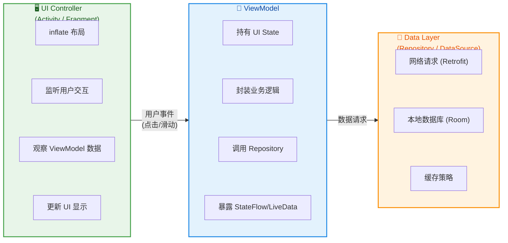

在这种架构下，Activity/Fragment 变得非常"薄"：它只需要做三件事——绑定布局、将用户事件转发给 ViewModel、观察 ViewModel 暴露的数据并渲染到 View 上。所有的数据获取、转换、缓存逻辑都被下沉到 ViewModel 和更深层的 Repository 中。这样带来几个显著好处：

1. **可测试性（Testability）**：ViewModel 不依赖 Android Framework 的 View 体系，可以在纯 JVM 环境下进行单元测试。你不再需要 Robolectric 或 Instrumented Test 来验证业务逻辑。
2. **可维护性（Maintainability）**：Activity 的代码量大幅缩减，阅读和修改时认知负担降低。业务逻辑集中在 ViewModel 中，Bug 定位更精准。
3. **生命周期安全（Lifecycle Safety）**：数据存放在生命周期更长的 ViewModel 中，不会因 Activity 重建而丢失，从根本上消除了配置变更导致的数据丢失问题。

#### 代码层面的职责边界

让我们通过一个具体的新闻列表示例来看清这种分离在代码层面是如何体现的：

```kotlin
// ========== ViewModel：持有数据 + 处理业务逻辑 ==========
class NewsViewModel(
    private val repository: NewsRepository  // 通过构造函数注入数据源依赖
) : ViewModel() {

    // 内部可变状态，类型为 MutableStateFlow，仅 ViewModel 自身可以修改
    private val _uiState = MutableStateFlow(NewsUiState())

    // 对外暴露不可变的 StateFlow，UI 层只能观察，不能直接修改
    // 这就是"单一信息源"（Single Source of Truth）思想的体现
    val uiState: StateFlow<NewsUiState> = _uiState.asStateFlow()

    // init 块在 ViewModel 构造时执行，自动触发首次数据加载
    init {
        loadNews()
    }

    // 封装加载逻辑：发起协程请求，处理 成功/失败 两种情况
    fun loadNews() {
        // viewModelScope 是 ViewModel 专属的协程作用域
        // 当 ViewModel 被清理时（onCleared），该作用域会自动取消所有协程
        viewModelScope.launch {
            // 先将 UI 状态更新为"加载中"，UI 层观察到后会显示 Loading 指示器
            _uiState.value = _uiState.value.copy(isLoading = true)
            try {
                // 调用 Repository 获取新闻数据（可能来自网络或本地缓存）
                val articles = repository.getLatestNews()
                // 请求成功：更新状态为"有数据"，关闭加载指示
                _uiState.value = NewsUiState(articles = articles, isLoading = false)
            } catch (e: Exception) {
                // 请求失败：更新状态为"有错误"，携带错误信息供 UI 展示
                _uiState.value = _uiState.value.copy(
                    isLoading = false,
                    errorMessage = e.message
                )
            }
        }
    }
}

// UI 状态的数据类，将"屏幕上需要展示什么"完整描述出来
data class NewsUiState(
    val articles: List<Article> = emptyList(),  // 新闻列表数据
    val isLoading: Boolean = false,              // 是否正在加载
    val errorMessage: String? = null             // 错误信息（null 表示无错误）
)
```

```kotlin
// ========== Activity：纯粹的 UI 控制器 ==========
class NewsActivity : AppCompatActivity() {

    // 使用 by viewModels() 委托获取 ViewModel 实例
    // 内部通过 ViewModelProvider 确保同一 Activity 生命周期内返回同一实例
    private val viewModel: NewsViewModel by viewModels()

    override fun onCreate(savedInstanceState: Bundle?) {
        super.onCreate(savedInstanceState)
        setContentView(R.layout.activity_news)

        // 使用 repeatOnLifecycle 在 STARTED 状态下收集 StateFlow
        // 当 Activity 进入 STOPPED 状态时自动暂停收集，避免后台刷新 UI
        lifecycleScope.launch {
            repeatOnLifecycle(Lifecycle.State.STARTED) {
                // collect 是挂起函数，每当 uiState 变化时，lambda 被调用
                viewModel.uiState.collect { state ->
                    // 根据状态渲染 UI：这就是 Activity 的全部职责
                    updateUI(state)
                }
            }
        }
    }

    // UI 渲染逻辑：根据 UiState 决定显示什么
    private fun updateUI(state: NewsUiState) {
        // 如果正在加载，显示进度条
        progressBar.isVisible = state.isLoading
        // 将新闻列表数据提交给 RecyclerView 的 Adapter
        newsAdapter.submitList(state.articles)
        // 如果有错误信息，用 Snackbar 提示用户
        state.errorMessage?.let { showSnackbar(it) }
    }
}
```

注意观察上面的代码：Activity 中**没有任何一行涉及网络请求、数据转换或缓存策略**。它只做两件事——`collect` 状态和 `updateUI`。这就是"薄 UI 控制器"的理想形态。如果未来需要把新闻列表从 Activity 迁移到 Fragment，甚至迁移到 Compose，ViewModel 的代码**一行都不需要改**，因为它根本不知道自己的数据正在被谁消费。

### 配置变更存活机制

#### 什么是配置变更（Configuration Change）？

Android 系统定义了一系列**运行时配置**（Runtime Configuration），包括但不限于：屏幕方向（orientation）、语言（locale）、屏幕尺寸（screenSize）、深色模式（uiMode）、字体缩放（fontScale）等。当这些配置发生变化时，系统的**默认行为**是销毁当前 Activity 并重新创建一个新实例，以便 Activity 能够加载与新配置匹配的资源文件（比如横屏布局 `layout-land`、中文字符串 `values-zh` 等）。

这个机制对资源加载非常友好，但对数据保持极不友好。在没有 ViewModel 之前，开发者通常使用以下手段应对：

| 方案 | 缺点 |
|---|---|
| `onSaveInstanceState(Bundle)` | 只能存少量序列化数据（官方建议 < 50KB），不适合大列表 |
| `android:configChanges="orientation"` | 阻止重建但绕过了资源重新加载机制，容易引发 UI 错乱 |
| `setRetainInstance(true)` (Fragment) | 已被废弃（deprecated），与 Fragment 生命周期管理冲突 |
| 静态变量 / 单例缓存 | 生命周期不可控，容易内存泄漏，难以管理 |

ViewModel 的出现提供了一种**优雅且官方推荐**的方案：它能在配置变更期间保持存活，当新 Activity 创建后自动"重新连接"到同一个 ViewModel 实例。

#### ViewModel 的生命周期

ViewModel 的生命周期**严格绑定于其作用域拥有者**（scope owner），通常是 Activity 或 Fragment。关键规则是：

- **创建时机**：第一次通过 `ViewModelProvider` 请求时创建（通常在首次 `onCreate()` 中）。
- **存活期间**：贯穿 Activity 的多次 `onCreate() → onDestroy()` 循环（如果是配置变更引发的销毁-重建）。
- **销毁时机**：当 Activity **真正 finish**（用户按返回键、调用 `finish()`、被系统从任务栈移除）时，ViewModel 的 `onCleared()` 方法被调用，随后被 GC 回收。

用一张时序图可以非常清晰地展示 ViewModel 在配置变更前后的生命周期对比：

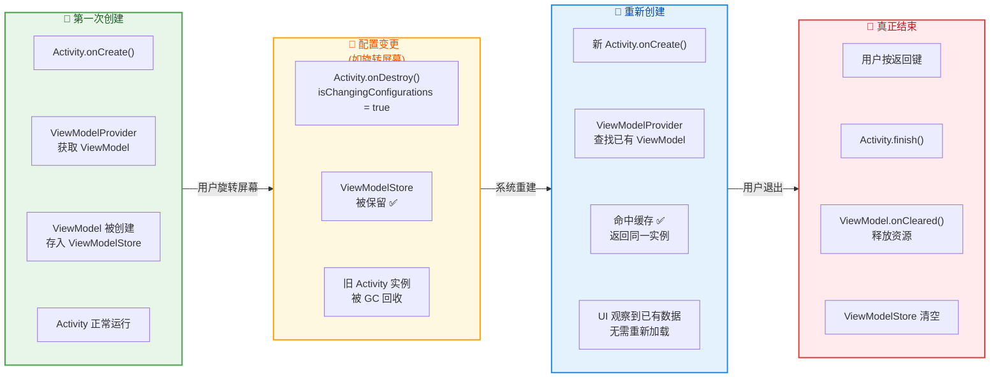

这张图的核心信息是：**旋转屏幕时，Activity 被销毁了，但 ViewModelStore（以及其中的 ViewModel）被保留了下来**。新 Activity 创建后，通过 `ViewModelProvider` 请求 ViewModel 时，Provider 发现 ViewModelStore 中已有该类型的实例，直接返回，不会重新创建。这就是 ViewModel 在配置变更中存活的外在表现。

#### 底层机制：NonConfigurationInstances

那么问题来了——Activity 都被 `onDestroy()` 了，ViewModelStore 是怎么存活的？答案藏在 `ComponentActivity`（AppCompatActivity 的父类）的源码中，关键角色是 **`NonConfigurationInstances`**。

Android Framework 在 `Activity` 基类中提供了一对方法：

- `onRetainNonConfigurationInstance()`：在配置变更导致 Activity 销毁**之前**被系统调用，允许 Activity 返回一个任意对象（Object），这个对象会被系统**暂存**。
- `getLastNonConfigurationInstance()`：在新 Activity 创建时调用，可以取回上一个 Activity 实例暂存的对象。

`ComponentActivity` 正是利用这对 API，在销毁前将自身的 `ViewModelStore` 打包到 `NonConfigurationInstances` 中暂存，在重建后取出并"接驳"到新 Activity 实例上。以下是简化的核心流程：

```kotlin
// ===== ComponentActivity 源码（简化版） =====

// ComponentActivity 内部定义的静态数据类，用于封装需要跨配置变更保留的对象
static final class NonConfigurationInstances {
    // 核心字段：ViewModelStore 引用
    Object custom;           // 留给子类自定义使用（已废弃的 onRetainCustomNonConfigurationInstance）
    ViewModelStore viewModelStore;  // ← 这就是 ViewModel 存活的关键！
}

// ---- 保存阶段（Activity 即将因配置变更被销毁时，由系统调用）----
@Override
@Nullable
public final Object onRetainNonConfigurationInstance() {
    // 取出当前 Activity 持有的 ViewModelStore
    ViewModelStore viewModelStore = mViewModelStore;

    // 如果当前 Activity 自身没有创建过 ViewModelStore，
    // 尝试从上一轮的 NonConfigurationInstances 中继承（链式保留）
    if (viewModelStore == null) {
        NonConfigurationInstances nc = (NonConfigurationInstances) getLastNonConfigurationInstance();
        if (nc != null) {
            viewModelStore = nc.viewModelStore;
        }
    }

    // 如果确实没有任何 ViewModel 被创建过，返回 null，无需保留
    if (viewModelStore == null) {
        return null;
    }

    // 将 ViewModelStore 打包到 NonConfigurationInstances 中返回给系统
    NonConfigurationInstances nci = new NonConfigurationInstances();
    nci.viewModelStore = viewModelStore;
    return nci;  // 系统会将此对象暂存到 ActivityClientRecord 中
}

// ---- 恢复阶段（新 Activity 创建时，在 onCreate 中尝试恢复）----
@Override
protected void onCreate(@Nullable Bundle savedInstanceState) {
    super.onCreate(savedInstanceState);

    // 尝试从系统暂存中取回上一轮的 NonConfigurationInstances
    NonConfigurationInstances nc = (NonConfigurationInstances) getLastNonConfigurationInstance();
    if (nc != null && nc.viewModelStore != null) {
        // 如果存在，直接将旧的 ViewModelStore 赋给新 Activity 实例
        // 这意味着所有旧 ViewModel 实例都原封不动地 "移交" 过来了
        mViewModelStore = nc.viewModelStore;
    }
    // ... 其他初始化逻辑
}
```

这段代码揭示了一个核心事实：**ViewModel 的存活与 `Bundle` 序列化完全无关**。`NonConfigurationInstances` 传递的是**内存中的 Java 对象引用**，不经过序列化/反序列化。这意味着 ViewModel 中可以持有任何类型的数据——大列表、Bitmap、LiveData、StateFlow、协程 Job——都不需要实现 `Serializable` 或 `Parcelable`。这是 ViewModel 相比 `onSaveInstanceState(Bundle)` 的一个巨大优势。

但也正因如此，ViewModel **无法在进程被杀后存活**（进程死亡意味着所有内存对象被回收）。进程被杀后的状态恢复需要依赖 `SavedStateHandle`，这将在后续章节详述。

从系统层面来看，`NonConfigurationInstances` 对象被暂存在 `ActivityThread` 内部的 `ActivityClientRecord` 中。`ActivityClientRecord` 是 Framework 层为每个 Activity 维护的记录结构，它的生命周期独立于 Activity 实例本身。只要进程不死、Activity 不是真正 finish，这个 record 就一直存在。整个数据流转路径如下：

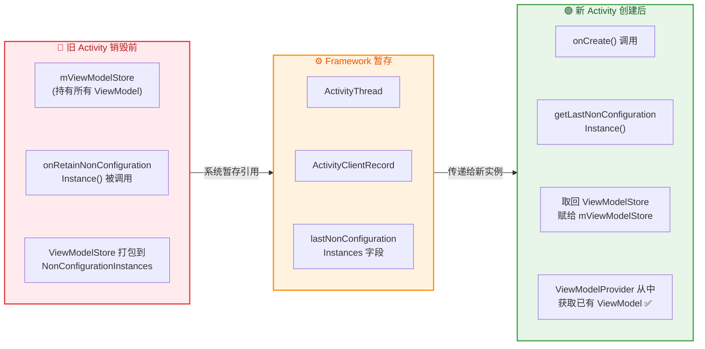

#### 一个容易误解的细节：`isChangingConfigurations`

并非所有的 `onDestroy()` 都会触发 ViewModel 保留。系统在调用 `onDestroy()` 时，Activity 内部有一个标记 `isChangingConfigurations`：

- 当 `isChangingConfigurations == true`（配置变更引发的销毁）：系统会调用 `onRetainNonConfigurationInstance()`，ViewModelStore 被保留，ViewModel 存活。
- 当 `isChangingConfigurations == false`（用户按返回键、调用 `finish()`、系统回收任务栈）：系统**不会**调用保留方法，`ComponentActivity` 会在 `onDestroy()` 中主动调用 `viewModelStore.clear()`，遍历所有 ViewModel 并调用它们的 `onCleared()`，释放资源。

这是一个精妙的判断逻辑：**同样是 `onDestroy()`，ViewModel 的命运取决于销毁的原因**。

### Activity/Fragment 共享数据

#### 传统方案的痛苦

在 ViewModel 出现之前，Fragment 之间共享数据一直是 Android 开发中的一大痛点。假设一个场景：Activity 中有两个 Fragment——`ListFragment` 展示列表，`DetailFragment` 展示详情。用户在列表中点击了某一项，需要把选中的数据传递给详情 Fragment。传统方案通常有以下几种：

1. **通过宿主 Activity 中转**：两个 Fragment 都调用 `(activity as MyActivity).sharedData = xxx`。这导致 Fragment 必须"认识"具体的 Activity 类型，强耦合，复用性为零。
2. **通过 Interface 回调**：Fragment 定义一个接口，Activity 实现这个接口。代码冗长，接口爆炸。
3. **通过 EventBus / 广播**：引入隐式通信，调试困难，生命周期不安全。
4. **通过 Fragment arguments（Bundle）**：只适合初始化参数传递，不适合运行时动态数据共享。

这些方案要么**耦合度高**，要么**维护成本大**，要么**生命周期不安全**。

#### ViewModel 的共享机制

ViewModel 提供了一种极其优雅的共享方案——**将 ViewModel 的作用域提升到 Activity 级别**。其核心思想是：

> 如果两个 Fragment 都通过**同一个 Activity 的 ViewModelStore** 来获取 ViewModel，那么它们拿到的就是**同一个 ViewModel 实例**。数据天然共享，无需任何额外通信机制。

这在代码层面的实现非常简洁：

```kotlin
// ===== 共享 ViewModel =====
// 持有两个 Fragment 需要共享的数据
class SharedViewModel : ViewModel() {

    // 选中的文章条目，初始值为 null，表示尚未选中
    private val _selectedArticle = MutableStateFlow<Article?>(null)

    // 对外暴露不可变 StateFlow，两个 Fragment 都可以 collect
    val selectedArticle: StateFlow<Article?> = _selectedArticle.asStateFlow()

    // 提供一个方法供 ListFragment 调用，设置选中项
    fun selectArticle(article: Article) {
        _selectedArticle.value = article
    }
}

// ===== ListFragment：生产数据（设置选中项）=====
class ListFragment : Fragment() {

    // 关键点：activityViewModels() 使用 Activity 级别的 ViewModelStore
    // 这确保了获取到的 SharedViewModel 实例与 Activity 作用域绑定
    private val sharedViewModel: SharedViewModel by activityViewModels()

    override fun onViewCreated(view: View, savedInstanceState: Bundle?) {
        super.onViewCreated(view, savedInstanceState)
        // 用户点击列表项时，通过 ViewModel 设置选中的文章
        // DetailFragment 会自动收到通知（因为它观察的是同一个 StateFlow）
        recyclerView.setOnItemClickListener { article ->
            sharedViewModel.selectArticle(article)
        }
    }
}

// ===== DetailFragment：消费数据（观察选中项）=====
class DetailFragment : Fragment() {

    // 同样使用 activityViewModels()，获取的是同一个 SharedViewModel 实例
    private val sharedViewModel: SharedViewModel by activityViewModels()

    override fun onViewCreated(view: View, savedInstanceState: Bundle?) {
        super.onViewCreated(view, savedInstanceState)
        // 收集 selectedArticle 的变化，一旦 ListFragment 设置了选中项，
        // 这里就会收到最新值并刷新详情 UI
        viewLifecycleOwner.lifecycleScope.launch {
            viewLifecycleOwner.repeatOnLifecycle(Lifecycle.State.STARTED) {
                sharedViewModel.selectedArticle.collect { article ->
                    // article 不为 null 时，显示详情内容
                    article?.let { displayDetail(it) }
                }
            }
        }
    }
}
```

#### 作用域的奥秘：`viewModels()` vs `activityViewModels()`

理解共享机制的关键在于区分两个 Kotlin 委托属性的不同：

- **`by viewModels()`**：ViewModel 的作用域是**当前 Fragment 自身**。每个 Fragment 实例都有自己独立的 `ViewModelStore`，因此不同 Fragment 即使请求同一类型的 ViewModel，拿到的也是**不同的实例**。适合 Fragment 私有数据。
- **`by activityViewModels()`**：ViewModel 的作用域被**提升到宿主 Activity**。它在底层等价于 `ViewModelProvider(requireActivity()).get(SharedViewModel::class.java)`——使用的是 Activity 的 `ViewModelStore`。因此所有隶属于同一 Activity 的 Fragment 请求同一类型 ViewModel 时，拿到的是**同一个实例**。

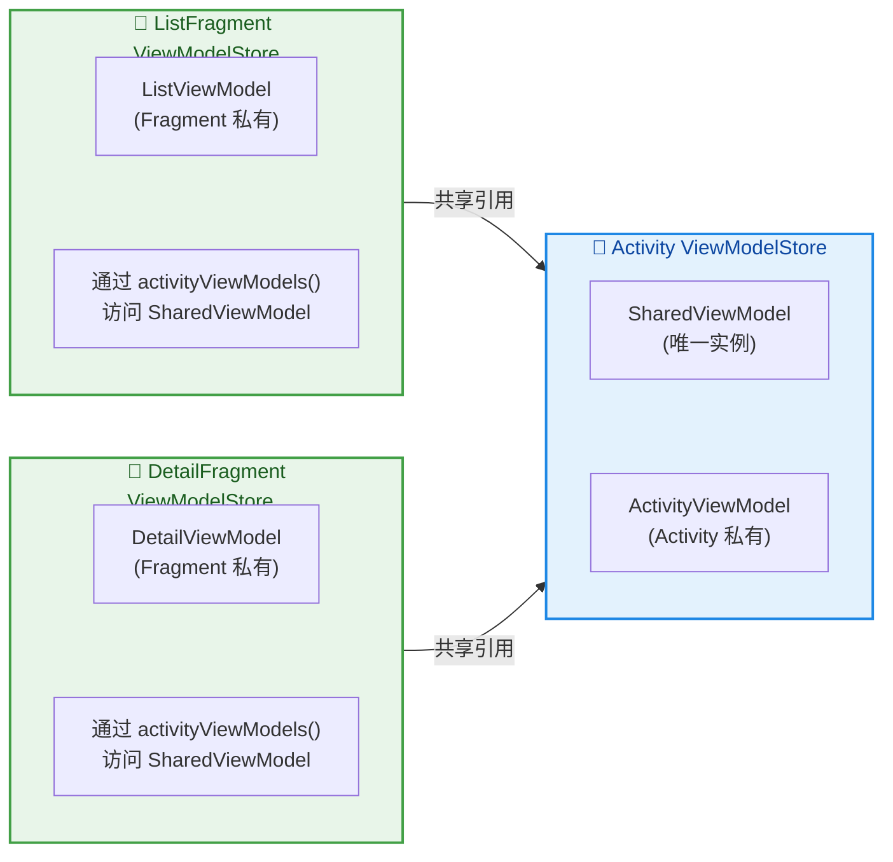

这张图清楚地展示了：两个 Fragment 各有自己的 `ViewModelStore`（存放 Fragment 私有的 ViewModel），但它们可以同时通过 `activityViewModels()` 访问 Activity 级别的 `SharedViewModel`。由于 Activity 的 `ViewModelStore` 中只有一个 `SharedViewModel` 实例，所以两个 Fragment 天然共享同一份数据。

#### Navigation Graph 作用域

除了 Activity 级别的共享，Jetpack Navigation 还支持将 ViewModel 的作用域绑定到一个 **Navigation Graph** 上。通过 `by navGraphViewModels(R.id.my_nav_graph)` 委托，可以让同一个导航图内的所有 Fragment 共享同一个 ViewModel，而不会污染到其他导航图中的 Fragment。这在多模块、多 Tab 的大型应用中尤为有用——每个 Tab 对应一个嵌套导航图，Tab 内部的 Fragment 共享数据，Tab 之间的数据隔离。

```kotlin
// ===== 在 Navigation Graph 作用域内共享 =====
class CheckoutFragment : Fragment() {

    // navGraphViewModels 使用指定 Navigation Graph 的 ViewModelStore
    // 该图内的所有 Fragment 获取到的是同一个 CheckoutViewModel 实例
    // 当用户导航离开这个 Graph 时，ViewModel 被自动清理
    private val checkoutVM: CheckoutViewModel by navGraphViewModels(R.id.checkout_graph)

    override fun onViewCreated(view: View, savedInstanceState: Bundle?) {
        super.onViewCreated(view, savedInstanceState)
        // 所有 checkout 流程中的 Fragment（选地址、选支付方式、确认下单）
        // 都可以通过同一个 checkoutVM 共享订单数据
        viewLifecycleOwner.lifecycleScope.launch {
            viewLifecycleOwner.repeatOnLifecycle(Lifecycle.State.STARTED) {
                checkoutVM.orderState.collect { renderOrder(it) }
            }
        }
    }
}
```

这种基于 Navigation Graph 的作用域控制体现了 ViewModel 设计哲学的第三个层面：**灵活的作用域边界**。开发者可以根据业务需要，精确控制 ViewModel 的共享范围——小到单个 Fragment 私有，大到整个 Activity 共享，或介于两者之间的 Navigation Graph 级别。这种细粒度的控制，是传统全局单例或 EventBus 方案无法提供的。

#### 共享 ViewModel 的设计注意事项

虽然 ViewModel 共享机制非常优雅，但在实际使用中需要注意几点：

1. **避免 ViewModel 过度膨胀**：不要把所有数据都塞进一个 SharedViewModel。如果两个 Fragment 之间只需要共享一个选中 ID，就不要把两个 Fragment 各自独有的数据也放进去。遵循**最小共享原则**——只共享真正需要共享的状态。
2. **生命周期不对称问题**：Activity 级 ViewModel 的生命周期比 Fragment 长。如果某个 Fragment 已经被销毁但 ViewModel 中还持有该 Fragment 设置的过期数据，可能导致另一个 Fragment 读到"脏数据"。需要在业务逻辑层面处理好数据的"有效期"。
3. **单向数据流**（Unidirectional Data Flow, UDF）：推荐所有的 Fragment 只通过 ViewModel 暴露的方法（如 `selectArticle()`）修改数据，通过 `StateFlow` / `LiveData` 观察数据变化，而不要在 Fragment 之间直接传递数据。这确保了**数据流动的方向是可预测的**：事件向下（UI → ViewModel），状态向上（ViewModel → UI）。

---

**📝 练习题**

当用户旋转屏幕导致 Activity 重建时，ViewModel 是如何在新旧 Activity 之间传递的？

A. ViewModel 被序列化到 Bundle 中，通过 `onSaveInstanceState()` / `onCreate(Bundle)` 恢复


B. ViewModel 通过 `onRetainNonConfigurationInstance()` 机制，将 ViewModelStore 的内存引用暂存到 ActivityClientRecord 中，新 Activity 通过 `getLastNonConfigurationInstance()` 取回


C. ViewModel 被存储到 Application 级别的全局单例中，Activity 重建后从单例中读取


D. ViewModel 被写入 SharedPreferences，Activity 重建后从磁盘读取恢复


**【答案】** B

**【解析】** ViewModel 的配置变更存活机制**不依赖序列化**，这是它区别于 `onSaveInstanceState(Bundle)` 的核心特征。当配置变更发生时，`ComponentActivity` 的 `onRetainNonConfigurationInstance()` 方法被系统调用，它将当前的 `ViewModelStore`（一个 `HashMap<String, ViewModel>` 容器）封装到 `NonConfigurationInstances` 对象中返回。系统将这个对象暂存到 `ActivityThread` 内部的 `ActivityClientRecord` 中——这是一个 Framework 层的记录结构，其生命周期独立于 Activity 实例。新 Activity 创建时，在 `onCreate()` 中调用 `getLastNonConfigurationInstance()` 取回该对象，并将其中的 `ViewModelStore` 直接赋值给新实例的成员变量。由于传递的是**内存中的对象引用**而非序列化数据，ViewModel 中可以持有任意类型的对象（大列表、Bitmap、协程 Job 等），不受 `Parcelable` / `Serializable` 的限制。选项 A 错误是因为 ViewModel 不走 Bundle 序列化路径；选项 C 错误是因为 ViewModel 并非存储在 Application 级单例中；选项 D 更是无中生有——ViewModel 完全是内存级别的机制，不涉及磁盘 I/O。

---

## ViewModelStore 原理

上一节我们了解了 ViewModel 的设计哲学——它让数据从 UI 控制器中分离出来，并在配置变更时得以存活。但 ViewModel 不会凭空"活下来"，它背后依赖一个容器来持有自己：**ViewModelStore**。这个容器才是 ViewModel 跨越配置变更的真正功臣。理解 ViewModelStore 的存储结构与保留机制，是掌握 ViewModel 运作原理的关键一步。

### Activity 重建时的保留机制

当用户旋转屏幕、切换系统语言或调整字体大小时，Android 系统会销毁当前 Activity 并重新创建一个新实例，这就是所谓的 **Configuration Change（配置变更）**。默认行为下，Activity 的所有成员变量、UI 状态都会随实例销毁而丢失。但 ViewModel 却能在新旧 Activity 之间"接力"，这背后的机制并非魔法，而是 Android Framework 层提供的一条特殊通道。

要理解这条通道，我们必须先弄清楚一个核心问题：**Activity 被销毁了，ViewModel 存放在哪里？** 答案是——ViewModel 被存放在一个叫 `ViewModelStore` 的对象中，而这个 ViewModelStore 在配置变更期间**不会随 Activity 一起销毁**。它被 Framework 层"截留"下来，等新 Activity 创建完毕后再"归还"给它。

整个流程可以拆解为三个阶段：

**阶段一：旧 Activity 销毁前的"托管"。** 当系统检测到配置变更即将发生时，`ActivityThread` 会在真正销毁 Activity 之前，调用 `Activity.retainNonConfigurationInstances()` 方法。这个方法会把需要跨越重建的对象——其中最核心的就是 ViewModelStore——打包成一个名为 `NonConfigurationInstances` 的数据结构，交给 `ActivityClientRecord` 保管。`ActivityClientRecord` 是 `ActivityThread` 内部维护的一个记录对象，它的生命周期与 Activity 实例无关，**只要进程存活，它就一直存在**。

**阶段二：新 Activity 创建时的"归还"。** 当新的 Activity 实例被创建时，`ActivityThread` 会在调用 `Activity.attach()` 的过程中，把之前保管的 `NonConfigurationInstances` 重新注入到新 Activity 中。新 Activity 就可以通过 `getLastNonConfigurationInstance()` 取回这个对象。

**阶段三：ViewModel 的"无缝衔接"。** 新 Activity 在首次获取 ViewModel 时（通过 `ViewModelProvider`），会先检查是否已经存在一个从旧 Activity 转移过来的 ViewModelStore。如果存在，就直接复用它和里面所有的 ViewModel 实例；如果不存在（比如是首次启动），则创建一个全新的 ViewModelStore。

这个过程在开发者看来是完全透明的，我们只需要通过 `ViewModelProvider(this).get(MyViewModel::class.java)` 获取 ViewModel，Framework 就在底层完成了所有的保留和恢复工作。

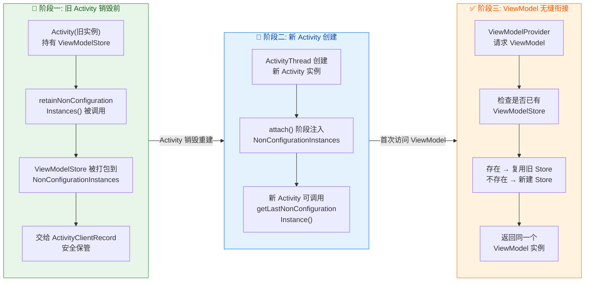

值得特别强调的是，这套保留机制 **只适用于配置变更**，不适用于系统因内存不足而杀死进程的场景。当进程被杀后，`ActivityClientRecord` 本身也不复存在，ViewModelStore 和里面的 ViewModel 全部丢失。这正是后续章节 `SavedStateHandle` 需要解决的问题——它通过 `Bundle` 序列化将关键状态写入系统进程，实现了进程级别的状态恢复。

### NonConfigurationInstances

`NonConfigurationInstances` 是 Framework 层为配置变更设计的专用数据载体。它并非一个公开 API，而是隐藏在 `Activity` 和 `ComponentActivity` 内部的静态内部类（static inner class）。要理解 ViewModelStore 是如何被保留的，就必须深入这个类的设计。

#### 两层嵌套结构

Android 源码中实际存在 **两个** `NonConfigurationInstances` 类，它们是嵌套关系：

**第一层：`Activity.NonConfigurationInstances`（Framework 层）。** 这是 `android.app.Activity` 中定义的版本，属于 Framework 级别。它是 `ActivityThread` 直接操作的对象，其中持有一个 `Object activity` 字段和一个 `HashMap<String, Object> children` 字段。Framework 层只知道有个 Object 需要保留，至于它具体是什么类型，Framework 并不关心。

**第二层：`ComponentActivity.NonConfigurationInstances`（AndroidX 层）。** 这是 `androidx.activity.ComponentActivity` 中定义的版本。它被存放在第一层的 `activity` 字段中。这个类才是真正持有 `ViewModelStore` 的地方。

```kotlin
// ===== Framework 层 (android.app.Activity) =====
// 这是系统 Activity 内部定义的 NonConfigurationInstances
// ActivityThread 在配置变更时直接操作的就是这个对象
static final class NonConfigurationInstances {
    // 存放子类（ComponentActivity）自定义的保留对象
    // 类型为 Object，Framework 不关心具体内容
    Object activity;
    // 存放子 Activity（已废弃的 ActivityGroup 机制）的保留数据
    HashMap<String, Object> children;
    // 存放 Fragment 的保留数据（旧版 Fragment 机制）
    FragmentManagerNonConfig fragments;
    // 存放 Loader 的保留数据
    ArrayMap<String, LoaderManager> loaders;
    // 存放 VoiceInteractor（语音交互）的保留数据
    VoiceInteractor voiceInteractor;
}

// ===== AndroidX 层 (androidx.activity.ComponentActivity) =====
// 这是 Jetpack ComponentActivity 定义的 NonConfigurationInstances
// 它作为 Object 被塞进上面 Framework 层的 activity 字段中
static final class NonConfigurationInstances {
    // 这里就是 ViewModelStore 真正的栖身之所
    Object custom;           // 开发者自定义的保留对象（通过 onRetainCustomNonConfigurationInstance）
    ViewModelStore viewModelStore;  // ★ 核心：ViewModel 容器
}
```

之所以采用这种两层嵌套设计，是因为 **Framework 层和 AndroidX 层解耦** 的需要。Framework 层的 `Activity` 类存在于系统镜像中，不可能直接依赖 Jetpack 库里的 `ViewModelStore`。因此，Framework 只预留了一个 `Object activity` 的"口袋"，由 AndroidX 的 `ComponentActivity` 自行决定往里面放什么。这体现了 Android 架构演进中"**系统层提供机制，Jetpack 层提供策略**"的分层哲学。

#### 保留与恢复的源码路径

了解了数据结构，接下来看数据是如何在这条通道中流转的。

**保留路径（旧 Activity → ActivityClientRecord）：**

当配置变更触发时，`ActivityThread.performDestroyActivity()` 方法会在销毁 Activity 之前执行以下关键步骤：

```java
// ActivityThread.java 中的核心保留逻辑（简化版）
// 在 Activity 即将被销毁前调用
ActivityClientRecord performDestroyActivity(IBinder token, boolean finishing, ...) {
    // 通过 token 找到当前 Activity 对应的 ClientRecord
    ActivityClientRecord r = mActivities.get(token);

    // ★ 关键步骤：如果不是用户主动 finish，而是配置变更导致的销毁
    // 则调用 retainNonConfigurationInstances() 保留数据
    if (!finishing) {
        // 这个方法会沿调用链收集所有需要保留的对象
        // 返回 Activity.NonConfigurationInstances（第一层）
        r.lastNonConfigurationInstances = r.activity.retainNonConfigurationInstances();
    }

    // 之后才真正执行 onDestroy()
    // 此时 ViewModelStore 已经安全转移到 r 中
    performDestroyActivity(r, ...);

    // r (ActivityClientRecord) 不会被移除，它还在 mActivities 这个 Map 中
    // 等待新 Activity 创建时复用
    return r;
}
```

在 `retainNonConfigurationInstances()` 的调用链中，`ComponentActivity` 重写了 `onRetainNonConfigurationInstance()` 方法，把自己的 `ViewModelStore` 打包进 AndroidX 层的 `NonConfigurationInstances`，然后再被 Framework 层包裹为第一层对象。

```java
// ComponentActivity.java（AndroidX 层）
// 这个方法由 Activity.retainNonConfigurationInstances() 回调
@Override
public final Object onRetainNonConfigurationInstance() {
    // 获取开发者自定义的保留对象（如果有的话）
    Object custom = onRetainCustomNonConfigurationInstance();

    // 拿到当前持有的 ViewModelStore
    ViewModelStore viewModelStore = mViewModelStore;

    // 如果当前实例还没创建过 ViewModelStore
    // 则尝试从上一次配置变更中继承（避免丢失）
    if (viewModelStore == null) {
        NonConfigurationInstances nc = (NonConfigurationInstances) getLastNonConfigurationInstance();
        if (nc != null) {
            viewModelStore = nc.viewModelStore;
        }
    }

    // 如果既没有自定义保留对象，也没有 ViewModelStore
    // 就返回 null，表示没有需要保留的东西
    if (custom == null && viewModelStore == null) {
        return null;
    }

    // 把 ViewModelStore 包装进 AndroidX 层的 NonConfigurationInstances
    NonConfigurationInstances nci = new NonConfigurationInstances();
    nci.custom = custom;
    nci.viewModelStore = viewModelStore;  // ★ ViewModelStore 在此被保留
    return nci;
}
```

**恢复路径（ActivityClientRecord → 新 Activity）：**

当新 Activity 被创建时，`ActivityThread` 会调用 `Activity.attach()`，在其中将之前保管的 `lastNonConfigurationInstances` 重新注入。之后，`ComponentActivity` 在 `onCreate()` 中通过 `getLastNonConfigurationInstance()` 取回 AndroidX 层的 `NonConfigurationInstances`，从中恢复 `ViewModelStore`。

```java
// ComponentActivity.onCreate() 中的恢复逻辑（简化版）
@Override
protected void onCreate(@Nullable Bundle savedInstanceState) {
    super.onCreate(savedInstanceState);

    // 尝试从上一次配置变更中恢复 NonConfigurationInstances
    NonConfigurationInstances nc = (NonConfigurationInstances) getLastNonConfigurationInstance();
    if (nc != null && nc.viewModelStore != null) {
        // ★ 如果有保留的 ViewModelStore，直接复用
        // 这里的 ViewModelStore 和旧 Activity 中的是同一个对象引用
        mViewModelStore = nc.viewModelStore;
    }
}
```

整条通道的核心就是：**ViewModelStore 的对象引用从旧 Activity 转移到 `ActivityClientRecord`，再从 `ActivityClientRecord` 转移到新 Activity**。在整个过程中，ViewModelStore 本身（及其内部的 ViewModel 实例）从未被销毁或重新创建。

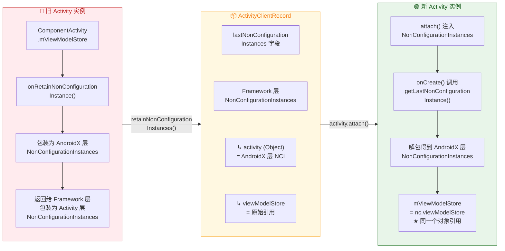

#### 为什么不用 Bundle？

你可能会产生一个疑问：既然已经有了 `onSaveInstanceState(Bundle)` 这套机制来保存状态，为什么 ViewModel 不走 Bundle 通道？原因至少有三点：

**第一，Bundle 有大小限制。** Bundle 数据最终通过 Binder 传递到系统进程（`system_server`），而 Binder 事务的缓冲区大小通常只有约 1MB（整个进程共享）。如果 ViewModel 中持有大量数据（如一个包含数百项的列表），序列化后很容易超限，导致 `TransactionTooLargeException`。

**第二，Bundle 要求数据可序列化。** 存入 Bundle 的对象必须实现 `Parcelable` 或 `Serializable`。而 ViewModel 中可以持有任意类型的对象——`Repository` 引用、正在执行的协程、`Flow` 数据流等，这些都不可能序列化。

**第三，性能开销。** Bundle 机制涉及序列化 → 跨进程传输 → 反序列化的完整链路，对于大对象代价很高。而 `NonConfigurationInstances` 机制是 **纯内存级** 的对象引用传递，零序列化开销，几乎不消耗额外性能。

正因如此，Android 团队才设计了这条独立于 Bundle 的保留通道，专门用于传递**不需要跨进程存活、但需要跨配置变更存活**的大型对象。

### HashMap 存储

理解了 ViewModelStore 如何在配置变更中被保留，接下来让我们深入 ViewModelStore 自身的结构。它的内部设计非常简洁——核心就是一个 `HashMap<String, ViewModel>`。

#### ViewModelStore 源码剖析

```java
// ViewModelStore.java —— ViewModel 的容器
// 整个类非常精简，本质上就是一个带有清理能力的 HashMap 包装器
public class ViewModelStore {

    // ★ 核心存储结构：以 String 为 key，以 ViewModel 为 value
    // key 的格式通常为 "androidx.lifecycle.ViewModelProvider.DefaultKey:全限定类名"
    private final HashMap<String, ViewModel> mMap = new HashMap<>();

    // 存入一个 ViewModel（包级可见，不对外暴露）
    final void put(String key, ViewModel viewModel) {
        // 如果同一个 key 已经有旧的 ViewModel，先把旧的关闭
        // 这确保了不会出现"孤儿" ViewModel 占用资源的情况
        ViewModel oldViewModel = mMap.put(key, viewModel);
        if (oldViewModel != null) {
            // 调用旧 ViewModel 的 onCleared()，释放资源
            oldViewModel.onCleared();
        }
    }

    // 根据 key 获取 ViewModel（包级可见）
    final ViewModel get(String key) {
        return mMap.get(key);
    }

    // 获取所有 key 的集合
    Set<String> keys() {
        return new HashSet<>(mMap.keySet());
    }

    // ★ 清空所有 ViewModel，并依次调用每个 ViewModel 的 onCleared()
    // 当 Activity 真正结束（不是配置变更）时调用
    public final void clear() {
        for (ViewModel vm : mMap.values()) {
            // 通知每个 ViewModel 进行资源清理
            vm.clear();  // 内部会调用 onCleared() 和取消 CoroutineScope
        }
        // 清空整个 Map
        mMap.clear();
    }
}
```

这段源码揭示了几个重要设计细节：

**第一，key 的命名规则。** 当你通过 `ViewModelProvider(this).get(MyViewModel::class.java)` 获取 ViewModel 时，`ViewModelProvider` 内部会自动生成 key，格式为 `"androidx.lifecycle.ViewModelProvider.DefaultKey:" + canonicalName`。比如，`com.example.app.MainViewModel` 的 key 就是 `"androidx.lifecycle.ViewModelProvider.DefaultKey:com.example.app.MainViewModel"`。这意味着 **同一个 Activity/Fragment 中，同类型的 ViewModel 默认只有一个实例**——多次调用 `get()` 返回的是同一个对象。

**第二，替换时的资源清理。** `put()` 方法的实现表明，如果用相同的 key 存入一个新的 ViewModel，旧的 ViewModel 会立刻被 `onCleared()`。这是一种防御性设计，防止内存泄漏。

**第三，`clear()` 的触发时机。** `ViewModelStore.clear()` 不是在任何 `onDestroy()` 中都会调用的——只有当 Activity **真正结束**（`isFinishing() == true`，比如用户按返回键或调用 `finish()`）时才会触发，配置变更导致的 `onDestroy()` 不会触发 `clear()`。这个判断逻辑在 `ComponentActivity` 中通过 `Lifecycle` 观察者来实现：

```java
// ComponentActivity 构造函数中注册的生命周期观察者（简化版）
getLifecycle().addObserver(new LifecycleEventObserver() {
    @Override
    public void onStateChanged(LifecycleOwner source, Lifecycle.Event event) {
        // 只在 ON_DESTROY 事件时处理
        if (event == Lifecycle.Event.ON_DESTROY) {
            // ★ 关键判断：是否正在配置变更
            // isChangingConfigurations() 为 true → 配置变更 → 不清理
            // isChangingConfigurations() 为 false → 真正销毁 → 清理
            if (!isChangingConfigurations()) {
                getViewModelStore().clear();
            }
        }
    }
});
```

这段代码是 ViewModel 能跨越配置变更的"最后一道闸门"。`isChangingConfigurations()` 返回 `true` 时，`clear()` 被跳过，ViewModelStore 完好无损；只有当 Activity 真正走向终结时，才会触发全面清理。

#### key 机制的高级用法

默认的 key 生成策略保证了"一个类型一个实例"，但在某些场景下，你可能需要同一个 ViewModel 类的**多个实例**。比如一个包含多个标签页的界面，每个标签页需要独立的数据副本。这时可以使用带自定义 key 的重载方法：

```kotlin
// 使用自定义 key 创建同类型 ViewModel 的多个实例
// 每个 key 对应 ViewModelStore HashMap 中的一个独立条目
val viewModelTab1: ItemViewModel = ViewModelProvider(this).get(
    "tab_1",                    // 自定义 key，唯一标识这个实例
    ItemViewModel::class.java   // ViewModel 类型
)

val viewModelTab2: ItemViewModel = ViewModelProvider(this).get(
    "tab_2",                    // 不同的 key → 不同的 ViewModel 实例
    ItemViewModel::class.java   // 同一个类型
)

// 此时 ViewModelStore 的 HashMap 中有两个条目：
// "tab_1" → ItemViewModel@A
// "tab_2" → ItemViewModel@B
// 它们是完全独立的实例，互不影响
```

下面这张图展示了 ViewModelStore 内部 HashMap 的存储结构，以及它与 Activity 生命周期的关系：

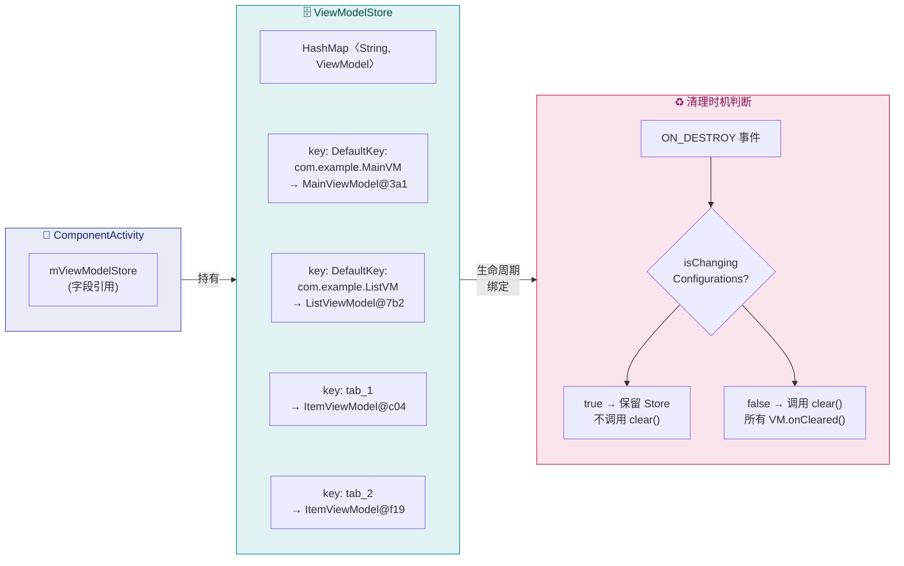

#### ViewModelStoreOwner 接口

`ViewModelStore` 不会独立存在，它总是被某个"宿主"持有。Android 通过 `ViewModelStoreOwner` 接口来抽象这种持有关系：

```java
// ViewModelStoreOwner.java —— 表示"我拥有一个 ViewModelStore"的契约接口
public interface ViewModelStoreOwner {
    // 返回该 Owner 持有的 ViewModelStore
    // 实现类必须保证在配置变更期间返回同一个实例
    @NonNull
    ViewModelStore getViewModelStore();
}
```

Android 中有三个核心实现类：

| 实现类 | 说明 | ViewModel 的作用域 |
|---|---|---|
| `ComponentActivity` | Jetpack Activity 基类 | Activity 级别——Activity 真正 finish 时清理 |
| `Fragment` | Jetpack Fragment | Fragment 级别——Fragment 被永久移除时清理 |
| `NavBackStackEntry` | Navigation 组件的路由条目 | 导航目的地级别——从返回栈弹出时清理 |

每个 `ViewModelStoreOwner` 都持有 **独立的** `ViewModelStore` 实例。这意味着：如果你在 Activity 和它的子 Fragment 中分别通过各自的 `ViewModelProvider` 获取同名 ViewModel，得到的是 **两个不同的实例**——因为它们来自不同的 ViewModelStore。而上一节提到的 Activity-Fragment 共享 ViewModel，之所以能共享，正是因为 Fragment 使用了 `requireActivity()` 作为 Owner，从而访问到了 Activity 级别的 ViewModelStore。

```kotlin
// Fragment 中获取 Activity 级别的共享 ViewModel
// ★ 关键：owner 是 requireActivity()，因此访问的是 Activity 的 ViewModelStore
val sharedVM: SharedViewModel by activityViewModels()
// 等价于: ViewModelProvider(requireActivity()).get(SharedViewModel::class.java)

// Fragment 自己的私有 ViewModel
// ★ owner 是 this（Fragment 自身），访问的是 Fragment 的 ViewModelStore
val privateVM: DetailViewModel by viewModels()
// 等价于: ViewModelProvider(this).get(DetailViewModel::class.java)
```

这种基于 `ViewModelStoreOwner` 的作用域设计非常灵活——你可以根据数据的共享范围，自由选择将 ViewModel 绑定到 Activity、Fragment 还是 Navigation 目的地。它遵循一个简单原则：**谁是 Owner，ViewModel 就跟谁共生共灭。**

---

**📝 练习题**

当用户旋转屏幕导致 Activity 重建时，ViewModel 能够存活的根本原因是什么？

A. ViewModel 的数据通过 `onSaveInstanceState()` 被序列化到 Bundle 中，重建后从 Bundle 恢复


B. `ActivityThread` 在销毁 Activity 前通过 `retainNonConfigurationInstances()` 将 `ViewModelStore` 保留在 `ActivityClientRecord` 中，重建后注入新 Activity


C. ViewModel 被存储在 Application 级别的单例中，不受 Activity 生命周期影响


D. Android 系统在配置变更时并不会真正销毁 Activity 实例，只是重新调用 `onCreate()`


**【答案】** B

**【解析】** ViewModel 跨越配置变更的核心机制是 `NonConfigurationInstances` 通道，而非 Bundle 机制。当配置变更发生时，`ActivityThread.performDestroyActivity()` 会在真正执行 `onDestroy()` 之前，调用 `Activity.retainNonConfigurationInstances()` 方法。这个方法最终会触发 `ComponentActivity.onRetainNonConfigurationInstance()`，将 `ViewModelStore`（及其内部所有 ViewModel）打包为 `NonConfigurationInstances` 对象，存放在 `ActivityClientRecord.lastNonConfigurationInstances` 字段中。`ActivityClientRecord` 的生命周期独立于 Activity 实例，在进程内始终存活，因此 ViewModelStore 得以保留。新 Activity 创建后，通过 `attach()` 方法注入该对象，`ComponentActivity.onCreate()` 中从中恢复 ViewModelStore 引用。选项 A 错误，因为 ViewModel 不走 Bundle 序列化通道（Bundle 有大小限制且要求可序列化）。选项 C 错误，ViewModel 并非存储在 Application 单例中，而是在 `ActivityClientRecord` 这个进程级记录中临时保管。选项 D 错误，配置变更时 Activity 实例确实会被销毁并重新创建，`onDestroy()` 和 `onCreate()` 都会完整执行。

---

## ViewModelProvider 工厂

在前两节中，我们已经理解了 ViewModel 的设计哲学以及 ViewModelStore 如何在配置变更期间保留 ViewModel 实例。但一个关键问题尚未解答：**ViewModel 的实例究竟是"谁"创建的？** 答案就是 `ViewModelProvider` 及其内部的 **Factory（工厂）** 机制。

ViewModelProvider 本身的职责非常简单——它是一个 **门面（Facade）**，对外暴露 `get(Class<T>)` 方法供开发者获取 ViewModel 实例；对内则协调两个核心组件：**ViewModelStore**（缓存池）和 **Factory**（创建器）。整个流程可以概括为："先查缓存，未命中则委托工厂创建，创建后存入缓存"。Factory 的存在让 ViewModel 的实例化策略变得 **可插拔、可扩展**，这正是经典的 **工厂方法模式（Factory Method Pattern）** 在 Jetpack 中的体现。

### Factory 模式在 ViewModelProvider 中的应用

#### 为什么需要工厂？

如果 ViewModelProvider 直接在内部用 `Class.newInstance()` 反射创建 ViewModel，那它就只能处理 **无参构造函数** 的情况。然而现实中的 ViewModel 往往需要依赖注入——比如需要一个 Repository、一个 `SavedStateHandle`、甚至需要 `Application` 上下文。将"如何创建实例"这一决策 **从使用方剥离出来、交给独立的工厂对象**，就是工厂模式的核心思想。

在 GoF（Gang of Four）设计模式中，**Factory Method** 定义了一个创建对象的接口，由子类决定实例化哪个类。ViewModelProvider.Factory 接口正是对这一模式的直接映射：

```kotlin
// ViewModelProvider.Factory 接口定义（简化版）
// 位于 androidx.lifecycle 包中
public interface Factory {
    // 核心方法：根据传入的 Class 类型，创建并返回对应的 ViewModel 实例
    // modelClass —— 需要创建的 ViewModel 的 Class 对象
    fun <T : ViewModel> create(modelClass: Class<T>): T
}
```

这个接口只有一个核心方法 `create()`，它接收一个 `Class<T>` 参数，返回对应类型的 ViewModel 实例。不同的 Factory 实现可以在 `create()` 内部注入不同的依赖，从而生成配置各异的 ViewModel 对象。ViewModelProvider 本身 **不关心** ViewModel 是怎么被 new 出来的——它只负责调用 `factory.create(modelClass)` 拿到结果。

#### ViewModelProvider 的完整获取流程

当你在 Activity 或 Fragment 中调用 `ViewModelProvider(this).get(MyViewModel::class.java)` 时，内部的执行链路如下：

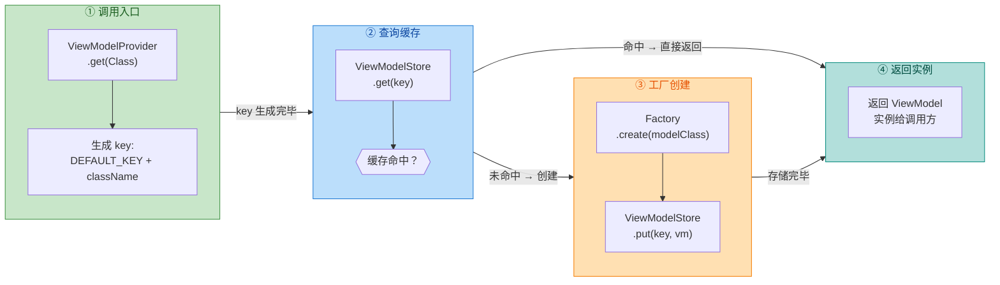

让我们用源码级别的伪代码来展开这个流程：

```kotlin
// ViewModelProvider 核心逻辑（基于 lifecycle-viewmodel 2.5+ 简化）
class ViewModelProvider(
    private val store: ViewModelStore,   // 缓存容器，持有 HashMap<String, ViewModel>
    private val factory: Factory         // 工厂，负责实例化 ViewModel
) {
    // 默认 key 前缀，避免不同类的 className 冲突
    companion object {
        private const val DEFAULT_KEY = "androidx.lifecycle.ViewModelProvider.DefaultKey"
    }

    // 外部调用的入口方法
    fun <T : ViewModel> get(modelClass: Class<T>): T {
        // 用「固定前缀 + 类的全限定名」作为唯一 key
        val key = DEFAULT_KEY + ":" + modelClass.canonicalName
        return get(key, modelClass)
    }

    fun <T : ViewModel> get(key: String, modelClass: Class<T>): T {
        // 第一步：尝试从 ViewModelStore 缓存中获取
        var viewModel = store.get(key)

        // 第二步：如果缓存命中，且类型匹配，直接返回（强转）
        if (modelClass.isInstance(viewModel)) {
            @Suppress("UNCHECKED_CAST")
            return viewModel as T
        }

        // 第三步：缓存未命中，委托 Factory 创建新实例
        viewModel = factory.create(modelClass)

        // 第四步：将新实例存入 ViewModelStore，下次直接复用
        store.put(key, viewModel)

        @Suppress("UNCHECKED_CAST")
        return viewModel as T
    }
}
```

从这段代码可以清晰地看出 ViewModelProvider 自身的逻辑非常薄——它仅仅是一个 **协调者（Coordinator）**，真正的创建逻辑完全委托给了 Factory。这种设计带来了极高的灵活性：你可以自由替换 Factory 的实现，而不需要修改 ViewModelProvider 的任何代码。这正是 **开闭原则（Open-Closed Principle）** 的优雅体现——对扩展开放，对修改关闭。

#### 自定义 Factory 的典型场景

在实际开发中，自定义 Factory 最常见的动机是 **为 ViewModel 构造函数注入参数**。假设你有一个需要 Repository 依赖的 ViewModel：

```kotlin
// 一个需要 Repository 依赖的 ViewModel
class UserProfileViewModel(
    private val userRepository: UserRepository  // 构造函数参数：用户数据仓库
) : ViewModel() {

    // 通过 repository 获取用户信息，返回 StateFlow 供 UI 层观察
    val userProfile: StateFlow<UserProfile?> = userRepository
        .getUserProfile()                        // 从仓库获取数据流
        .stateIn(                                // 转换为 StateFlow
            scope = viewModelScope,              // 绑定到 ViewModel 协程作用域
            started = SharingStarted.WhileSubscribed(5000), // 下游无订阅者 5s 后停止
            initialValue = null                  // 初始值为 null
        )
}
```

此时默认的无参工厂无法创建这个 ViewModel，你需要提供一个自定义 Factory：

```kotlin
// 自定义 Factory：为 UserProfileViewModel 注入 UserRepository
class UserProfileViewModelFactory(
    private val userRepository: UserRepository  // 工厂自身持有需要注入的依赖
) : ViewModelProvider.Factory {

    @Suppress("UNCHECKED_CAST")
    override fun <T : ViewModel> create(modelClass: Class<T>): T {
        // 类型检查：确保请求的是 UserProfileViewModel
        if (modelClass.isAssignableFrom(UserProfileViewModel::class.java)) {
            // 通过构造函数注入 Repository，创建 ViewModel 实例
            return UserProfileViewModel(userRepository) as T
        }
        // 如果类型不匹配，抛出异常（防御性编程）
        throw IllegalArgumentException("Unknown ViewModel class: ${modelClass.name}")
    }
}
```

在 Activity 中使用时：

```kotlin
class UserProfileActivity : AppCompatActivity() {

    // 使用自定义 Factory 创建 ViewModel
    private val viewModel: UserProfileViewModel by viewModels {
        // 构造 Factory 时传入具体的 Repository 实例
        UserProfileViewModelFactory(
            userRepository = (application as MyApp).userRepository
        )
    }

    override fun onCreate(savedInstanceState: Bundle?) {
        super.onCreate(savedInstanceState)
        // viewModel 已就绪，可以直接使用
        lifecycleScope.launch {
            viewModel.userProfile.collect { profile ->
                // 更新 UI ...
            }
        }
    }
}
```

这种模式虽然有效，但在大型项目中为每个 ViewModel 都手写 Factory 会导致大量的样板代码（boilerplate）。这也是后来 Hilt 等依赖注入框架介入的原因之一——它们能自动生成 Factory，让开发者完全摆脱手动编写的负担（这将在后续"依赖注入集成"一节展开）。

### NewInstanceFactory

`NewInstanceFactory` 是 Jetpack 提供的 **最简单的默认 Factory 实现**，它只能处理 **拥有无参公共构造函数** 的 ViewModel。这个类位于 `ViewModelProvider` 的内部，是所有默认行为的基础。

#### 源码解析

```kotlin
// NewInstanceFactory 源码（简化自 androidx.lifecycle）
open class NewInstanceFactory : Factory {

    companion object {
        // 单例实例，避免反复创建工厂对象（线程安全的懒加载）
        private var sInstance: NewInstanceFactory? = null

        // 获取全局共享的单例实例
        fun getInstance(): NewInstanceFactory {
            if (sInstance == null) {
                sInstance = NewInstanceFactory()
            }
            return sInstance!!
        }
    }

    override fun <T : ViewModel> create(modelClass: Class<T>): T {
        return try {
            // 核心：通过 Java 反射调用 Class 的无参构造函数
            // newInstance() 等价于 new MyViewModel()
            modelClass.newInstance()
        } catch (e: InstantiationException) {
            // 如果类是抽象类或接口，无法实例化
            throw RuntimeException("Cannot create an instance of $modelClass", e)
        } catch (e: IllegalAccessException) {
            // 如果构造函数是 private/protected，无法访问
            throw RuntimeException("Cannot create an instance of $modelClass", e)
        }
    }
}
```

这里的实现非常直白：通过 `Class.newInstance()` 进行反射创建。这意味着它有以下 **硬性限制**：

1. **ViewModel 必须有公共的无参构造函数**：如果你的 ViewModel 构造函数包含任何参数，`newInstance()` 会抛出 `InstantiationException`。
2. **不支持任何依赖注入**：既然不能传参，自然无法注入 Repository、UseCase 等依赖。
3. **不支持接口或抽象类**：反射无法实例化没有具体实现的类型。

在早期的 Android 开发中（Lifecycle 库 1.x 时代），如果你写的 ViewModel 没有任何构造参数，那么 `ViewModelProvider(this).get(SimpleViewModel::class.java)` 底层就会自动使用 `NewInstanceFactory`。但随着应用架构的日趋复杂，纯无参的 ViewModel 在生产项目中已经非常少见了。

#### 何时会用到 NewInstanceFactory？

尽管如此，在以下场景中，NewInstanceFactory 仍然是默认的 fallback：

- **极简 ViewModel**：不需要任何外部依赖，仅管理 UI 状态（如计数器、表单验证逻辑）。
- **快速原型开发（Prototyping）**：在验证概念阶段，暂时不引入复杂的依赖注入。
- **单元测试辅助**：在某些测试场景下创建轻量 ViewModel 实例。

```kotlin
// 一个可以被 NewInstanceFactory 创建的简单 ViewModel
class CounterViewModel : ViewModel() {

    // 使用 MutableStateFlow 管理计数状态
    private val _count = MutableStateFlow(0)

    // 对外暴露不可变的 StateFlow
    val count: StateFlow<Int> = _count.asStateFlow()

    // 递增方法
    fun increment() {
        _count.value++   // 原子操作，更新计数值
    }
}

// 在 Activity 中使用——无需指定 Factory
// viewModels() 委托会自动使用 NewInstanceFactory
class CounterActivity : AppCompatActivity() {
    private val viewModel: CounterViewModel by viewModels()  // 默认工厂即可
}
```

### AndroidViewModelFactory

`AndroidViewModelFactory` 继承自 `NewInstanceFactory`，在其基础上增加了一项关键能力：**能够向 ViewModel 的构造函数传入 `Application` 对象**。这是为 `AndroidViewModel` 这个特殊子类量身打造的工厂。

#### AndroidViewModel 是什么？

在正式讲解工厂之前，需要先理解 `AndroidViewModel` 存在的原因。标准的 ViewModel 被设计为 **不持有任何 Android 上下文引用**（Activity、Fragment、Context），以避免内存泄漏。但某些场景下确实需要 Application 级别的 Context——例如访问字符串资源 `getString()`、读取 SharedPreferences、或调用系统服务。`AndroidViewModel` 就是官方为此提供的折中方案：

```kotlin
// AndroidViewModel 源码（完整版，非常简单）
open class AndroidViewModel(
    private val application: Application  // 持有 Application 引用（全局单例，不会泄漏）
) : ViewModel() {

    // 提供 getter 方法，子类可通过 getApplication() 获取 Application
    @Suppress("UNCHECKED_CAST")
    fun <T : Application> getApplication(): T {
        return application as T
    }
}
```

`Application` 是一个全局单例，生命周期与整个进程一致，因此持有它的引用 **不会导致内存泄漏**——这与持有 Activity/Fragment 的 Context 有本质区别。

#### AndroidViewModelFactory 源码深入

```kotlin
// AndroidViewModelFactory 源码（简化自 androidx.lifecycle）
open class AndroidViewModelFactory
private constructor(
    private val application: Application?  // 可选的 Application 引用
) : NewInstanceFactory() {

    // 公开构造函数：传入 Application 实例
    constructor(application: Application) : this(application as Application?)

    companion object {
        // 全局单例工厂（懒加载）
        private var sInstance: AndroidViewModelFactory? = null

        // 获取绑定到指定 Application 的全局单例工厂
        fun getInstance(application: Application): AndroidViewModelFactory {
            if (sInstance == null) {
                sInstance = AndroidViewModelFactory(application)
            }
            return sInstance!!
        }
    }

    override fun <T : ViewModel> create(modelClass: Class<T>): T {
        // 分支一：如果请求的 ViewModel 是 AndroidViewModel 的子类
        if (AndroidViewModel::class.java.isAssignableFrom(modelClass)) {
            // 确保 application 不为 null（防御性检查）
            val app = application
                ?: throw IllegalStateException(
                    "Cannot create AndroidViewModel without Application"
                )
            return try {
                // 通过反射找到接受 Application 参数的构造函数
                // getDeclaredConstructor(Application::class.java) 精确匹配单参构造
                modelClass
                    .getDeclaredConstructor(Application::class.java)
                    .newInstance(app)  // 传入 Application 实例进行创建
            } catch (e: NoSuchMethodException) {
                throw RuntimeException("Cannot create instance of $modelClass", e)
            } catch (e: Exception) {
                throw RuntimeException("Cannot create instance of $modelClass", e)
            }
        }

        // 分支二：如果不是 AndroidViewModel 子类，回退到父类逻辑
        // 即 NewInstanceFactory 的无参反射创建
        return super.create(modelClass)
    }
}
```

这段代码的设计非常清晰：`create()` 方法内部做了一个 **类型判断分支**。如果目标 ViewModel 继承了 `AndroidViewModel`，就通过反射找到 `Constructor(Application)` 并传入 `Application` 对象；否则就退化为 `NewInstanceFactory` 的无参反射行为。这意味着 `AndroidViewModelFactory` 是 `NewInstanceFactory` 的 **完全超集**——它既能创建普通 ViewModel，也能创建 AndroidViewModel。

#### Factory 继承体系总览

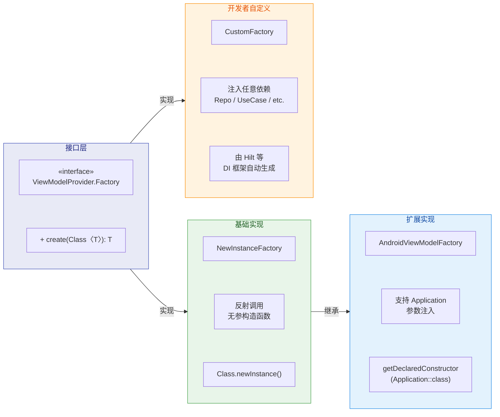

从这张继承关系图可以看出，`Factory` 接口处于最顶层，定义了统一的 `create()` 契约。`NewInstanceFactory` 和 `AndroidViewModelFactory` 是 Jetpack 官方提供的两级实现，而开发者的自定义 Factory（或 Hilt 生成的 Factory）则作为并行的扩展存在。

#### 默认 Factory 选择机制

在实际使用中，你可能会好奇：**如果我既没有手动指定 Factory，也没有使用 Hilt，那 ViewModelProvider 到底用的是哪个 Factory？** 答案取决于你创建 ViewModelProvider 的方式。

当你使用 Kotlin 的 `by viewModels()` 委托时，底层会调用 `defaultViewModelProviderFactory`，这是 `ComponentActivity` 和 `Fragment` 都实现的一个属性。从 Lifecycle 库 2.5+ 起，默认的 Factory 是 `SavedStateViewModelFactory`（后续章节详述），它在 `AndroidViewModelFactory` 基础上进一步支持了 `SavedStateHandle` 注入。整个默认选择链路可以概括为：

```text
by viewModels()
  → 调用 defaultViewModelProviderFactory
    → 返回 SavedStateViewModelFactory
      → 内部判断：
         ├── 如果是 AndroidViewModel 子类 → 注入 Application + SavedStateHandle
         ├── 如果构造函数含 SavedStateHandle → 仅注入 SavedStateHandle
         └── 否则 → 退化为 NewInstanceFactory 的无参反射
```

这说明在现代 Jetpack 中，`NewInstanceFactory` 和 `AndroidViewModelFactory` 更多是 **底层构建块**，开发者日常接触到的默认行为已经由更上层的 `SavedStateViewModelFactory` 接管。但理解这两个基础工厂的原理，是理解整个 Factory 体系的必经之路。

#### 使用 AndroidViewModelFactory 的实际示例

```kotlin
// 一个典型的 AndroidViewModel 子类
class AppSettingsViewModel(
    application: Application               // 接收 Application 对象
) : AndroidViewModel(application) {

    // 利用 Application Context 获取 SharedPreferences
    private val prefs = application
        .getSharedPreferences("app_settings", Context.MODE_PRIVATE)

    // 读取暗黑模式设置，暴露为 StateFlow
    private val _isDarkMode = MutableStateFlow(
        prefs.getBoolean("dark_mode", false)  // 从 SP 中读取默认值
    )
    val isDarkMode: StateFlow<Boolean> = _isDarkMode.asStateFlow()

    // 切换暗黑模式
    fun toggleDarkMode() {
        val newValue = !_isDarkMode.value          // 取反当前值
        _isDarkMode.value = newValue               // 更新 StateFlow
        prefs.edit()                               // 获取 SP 编辑器
            .putBoolean("dark_mode", newValue)     // 写入新值
            .apply()                               // 异步提交
    }
}
```

在 Activity 中使用：

```kotlin
class SettingsActivity : AppCompatActivity() {

    // 方式一：使用 by viewModels() 委托（推荐）
    // 默认 Factory（SavedStateViewModelFactory）会自动检测 AndroidViewModel
    // 并注入 Application，无需手动指定工厂
    private val viewModel: AppSettingsViewModel by viewModels()

    // 方式二：显式指定 AndroidViewModelFactory（了解原理时使用）
    // private val viewModel: AppSettingsViewModel by viewModels {
    //     AndroidViewModelFactory.getInstance(application)
    // }

    override fun onCreate(savedInstanceState: Bundle?) {
        super.onCreate(savedInstanceState)
        setContentView(R.layout.activity_settings)

        lifecycleScope.launch {
            // 在生命周期感知的协程中收集暗黑模式状态
            repeatOnLifecycle(Lifecycle.State.STARTED) {
                viewModel.isDarkMode.collect { isDark ->
                    // 根据状态更新 UI 主题...
                    applyTheme(isDark)
                }
            }
        }
    }
}
```

这里特别值得注意的是 **方式一**：在现代 Jetpack 中，即使你使用的是 `AndroidViewModel`，也 **不需要** 手动传入 `AndroidViewModelFactory`。`by viewModels()` 的默认 Factory 已经足够智能，它会自动识别你的 ViewModel 是否需要 `Application` 参数并正确注入。手动指定 `AndroidViewModelFactory` 的场景已经非常少见，更多是在理解底层原理时才需要。

#### CreationExtras：新一代参数传递机制

从 Lifecycle 库 2.5.0 开始，Google 引入了一个全新的机制——`CreationExtras`，它为 Factory 提供了一种 **类型安全、可扩展的参数传递方式**，逐步替代了旧版基于构造函数反射的模式。

```kotlin
// 新版 Factory 接口（Lifecycle 2.5+ 新增的带 extras 的 create 重载）
public interface Factory {
    // 旧版方法（仍然保留，向后兼容）
    fun <T : ViewModel> create(modelClass: Class<T>): T

    // 新版方法：额外接收 CreationExtras 参数
    fun <T : ViewModel> create(modelClass: Class<T>, extras: CreationExtras): T {
        // 默认实现：忽略 extras，回退到旧版 create
        return create(modelClass)
    }
}
```

`CreationExtras` 本质上是一个 **类型安全的 Map**，通过预定义的 Key 来传递参数：

```kotlin
// CreationExtras 中预定义的几个核心 Key
object ViewModelProvider {
    // Key：获取 Application 实例
    val APPLICATION_KEY: CreationExtras.Key<Application>

    // Key：获取 SavedStateRegistryOwner
    val SAVED_STATE_REGISTRY_OWNER_KEY: CreationExtras.Key<SavedStateRegistryOwner>

    // Key：获取 ViewModelStoreOwner
    val VIEW_MODEL_STORE_OWNER_KEY: CreationExtras.Key<ViewModelStoreOwner>
}
```

使用 `CreationExtras` 的现代 Factory 写法：

```kotlin
// 使用 CreationExtras 的现代 Factory 风格
val factory = object : ViewModelProvider.Factory {
    override fun <T : ViewModel> create(
        modelClass: Class<T>,
        extras: CreationExtras    // 新版参数：包含 Application、SavedState 等信息
    ): T {
        // 从 extras 中安全取出 Application（类型安全，无需强转）
        val application = extras[ViewModelProvider.AndroidViewModelFactory.APPLICATION_KEY]
            ?: throw IllegalStateException("Application not found in CreationExtras")

        // 从 extras 中取出 SavedStateHandle（若需要）
        val savedStateHandle = extras.createSavedStateHandle()

        @Suppress("UNCHECKED_CAST")
        return UserProfileViewModel(
            application = application,        // 注入 Application
            savedStateHandle = savedStateHandle // 注入 SavedStateHandle
        ) as T
    }
}
```

甚至可以使用 Kotlin DSL 风格的 `viewModelFactory` 构建器，进一步简化样板代码：

```kotlin
// Kotlin DSL 风格的 Factory 构建（Lifecycle 2.5+）
val myFactory = viewModelFactory {
    // 为每种 ViewModel 类型注册 initializer
    initializer {
        // this 就是 CreationExtras
        val app = this[APPLICATION_KEY]!!          // 从 extras 取 Application
        val handle = createSavedStateHandle()      // 创建 SavedStateHandle
        UserProfileViewModel(app, handle)          // 构造 ViewModel
    }
    initializer {
        CounterViewModel()                         // 无参 ViewModel 直接创建
    }
}
```

`CreationExtras` 的设计理念是用 **显式的、类型安全的键值对** 替代隐式的反射调用，让参数传递更加透明和可测试。它不要求开发者记住哪些构造函数签名会被反射匹配，而是通过编程方式明确地获取和传递每一个依赖。

#### 各 Factory 能力对比

| 特性 | NewInstanceFactory | AndroidViewModelFactory | 自定义 Factory | CreationExtras 模式 |
|---|---|---|---|---|
| 无参 ViewModel | ✅ | ✅ | ✅ | ✅ |
| Application 注入 | ❌ | ✅ | ✅ | ✅ |
| 自定义依赖注入 | ❌ | ❌ | ✅ | ✅ |
| SavedStateHandle | ❌ | ❌ | 需手动实现 | ✅ 内建支持 |
| 类型安全 | ⚠️ 反射 | ⚠️ 反射 | ✅ 编译期 | ✅ Key 类型约束 |
| 样板代码量 | 极少 | 极少 | 中等 | 少（DSL 支持） |
| 推荐使用场景 | Demo/学习 | 需要 App Context | 手动 DI | 现代 Jetpack 标准 |

---

**📝 练习题**

在一个使用默认配置（未引入 Hilt）的 `ComponentActivity` 中，执行以下代码：

```kotlin
class MyViewModel(val repo: UserRepository) : ViewModel()
val vm = ViewModelProvider(this).get(MyViewModel::class.java)
```

运行时会发生什么？

A. 正常创建 `MyViewModel` 实例，`repo` 为 null


B. 抛出 `InstantiationException`，因为默认 Factory 找不到无参构造函数


C. 抛出 `ClassCastException`，因为 `MyViewModel` 不是 `AndroidViewModel` 子类


D. 正常创建 `MyViewModel` 实例，系统自动注入 `UserRepository`


**【答案】** B

**【解析】** 在未指定自定义 Factory 且未使用 Hilt 的情况下，`ComponentActivity` 的 `defaultViewModelProviderFactory` 返回的是 `SavedStateViewModelFactory`。该工厂在创建 ViewModel 时，会尝试匹配构造函数签名——它只认识 `()` (无参)、`(Application)` (AndroidViewModel)、`(SavedStateHandle)` 和 `(Application, SavedStateHandle)` 这几种签名。`MyViewModel` 的构造函数需要一个 `UserRepository` 参数，不属于以上任何一种预定义签名，因此反射调用会失败，最终抛出无法实例化的异常。选项 A 不可能，因为 Kotlin 的非空类型 `val repo: UserRepository` 不允许为 null。选项 C 的 `ClassCastException` 发生在类型转换阶段，而此处错误发生在构造阶段。选项 D 描述的"自动注入"行为只有在使用 Hilt `@HiltViewModel` + `@Inject constructor` 时才会发生，默认 Factory 没有这个能力。这道题的核心考点就是：**Factory 决定了 ViewModel 能接受什么样的构造参数，超出 Factory 能力范围的参数会导致创建失败。**

---

## 状态保存 SavedStateHandle

在前面的章节中，我们已经了解到 ViewModel 能够在 **配置变更（Configuration Change）** 场景下存活，比如屏幕旋转、语言切换等。这得益于 `ViewModelStore` 被保留在 `NonConfigurationInstances` 中，从而让 ViewModel 实例本身不会被销毁。然而，有一个更加严峻的场景是 ViewModel **无法独自应对** 的——那就是 **系统因资源不足而杀死整个进程（Process Death）**。当系统将 App 的进程回收后，内存中的一切 Java/Kotlin 对象都会灰飞烟灭，ViewModel 自然也不例外。用户从"最近任务"列表中切回 App 时，系统会重新创建 Activity，但此时 ViewModel 是一个全新的实例，之前持有的所有状态（搜索关键词、列表滚动位置、用户未提交的表单数据等）都会丢失。

为了解决这个问题，Android Jetpack 提供了 `SavedStateHandle`。它本质上是一层 **对 `Bundle` 机制的面向 ViewModel 的封装**，让开发者能够在 ViewModel 内部以一种简洁、类型安全的 Key-Value API 读写那些需要在进程死亡后恢复的状态，而无需再回到 Activity/Fragment 中手动操作 `onSaveInstanceState()` / `onRestoreInstanceState()`。

### 进程被杀后的状态恢复

要理解 `SavedStateHandle` 的价值，首先需要彻底弄清楚 Android 中"状态丢失"到底有哪几层场景，以及每一层分别由什么机制来保护。

**第一层：配置变更（Configuration Change）**

这是最常见的场景：用户旋转屏幕，系统销毁当前 Activity 并立即重建一个新的。在这个过程中，**进程并未被杀**，`ViewModelStore` 通过 `NonConfigurationInstances` 被完整保留，因此 ViewModel 实例及其持有的所有内存数据（`MutableStateFlow`、`LiveData`、普通变量等）都安然无恙。这一层不需要 `SavedStateHandle` 出场，ViewModel 自身就能胜任。

**第二层：进程被系统回收（Process Death）**

当用户按下 Home 键将 App 切到后台，系统在内存紧张时可能会杀掉 App 进程。这时进程中所有的内存对象都会被释放，包括 `ViewModelStore` 和它里面的所有 ViewModel。如果用户之后从"最近任务"列表切回 App，系统会重新启动进程、重新创建 Activity。在这个重建过程中，系统能够利用之前 **在 `onSaveInstanceState()` 中保存的 `Bundle`** 来恢复部分状态。`SavedStateHandle` 正是将自己的数据"搭载"在这个 Bundle 上，从而实现跨进程死亡的状态恢复。

**第三层：用户主动销毁（User-Initiated Destruction）**

用户按返回键退出 Activity、从最近任务列表中划掉 App、或者调用 `finish()`——这些都是 **用户明确表达了"不再需要这个界面"的意图**。在这种情况下，系统既不会保留 ViewModel，也 **不会** 调用 `onSaveInstanceState()`。任何状态保存机制都不应该在这种场景下生效，否则就违反了用户意图。

下面这张图清晰地展示了这三层场景与各保存机制的对应关系：

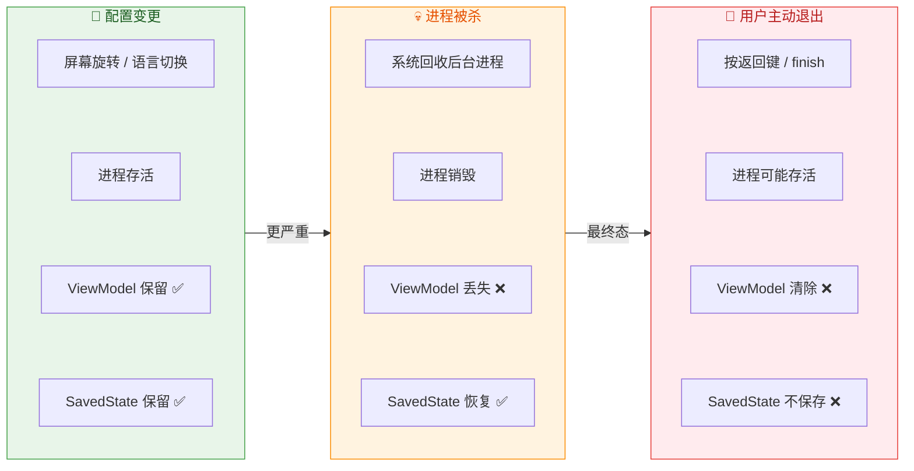

理解了这个分层之后，`SavedStateHandle` 的定位就非常清晰了：**它专门解决第二层问题——在进程死亡后、用户切回时，帮助 ViewModel 恢复关键的 UI 状态**。

**状态恢复的时序过程**

当进程被杀后用户切回 App，整个恢复流程大致如下：

1. 系统重新创建 App 进程，并启动目标 Activity。
2. `ActivityThread` 在调用 `Activity.onCreate()` 时，会传入之前保存的 `Bundle savedInstanceState`（这个 Bundle 由系统在进程被杀前通过 `onSaveInstanceState()` 持久化到了系统服务端）。
3. `ComponentActivity`（Jetpack 的基类 Activity）在 `onCreate()` 中取出这个 Bundle，将其中属于 `SavedStateHandle` 的部分交给 `SavedStateRegistryController`。
4. 当 ViewModel 被重新创建时，`SavedStateHandleSupport` 会从 `SavedStateRegistry` 中取出对应的数据，构造出一个新的 `SavedStateHandle` 实例，并将之前保存的 Key-Value 数据填充进去。
5. ViewModel 通过 `SavedStateHandle` 读取到之前保存的值，从而恢复状态。

这整个过程对开发者来说是 **近乎透明的**——你只需要在 ViewModel 的构造函数中声明 `SavedStateHandle` 参数，框架会自动完成注入和恢复。

```kotlin
// ViewModel 中使用 SavedStateHandle 的基本模式
class SearchViewModel(
    // 框架自动注入，进程恢复时会携带之前保存的数据
    private val savedStateHandle: SavedStateHandle
) : ViewModel() {

    // 从 SavedStateHandle 中读取之前保存的搜索关键词
    // 如果是首次启动（没有保存过），则使用默认值空字符串
    val searchQuery: StateFlow<String> =
        savedStateHandle.getStateFlow("search_query", "")

    // 当用户在搜索框输入文字时调用此方法
    fun onQueryChanged(query: String) {
        // 将最新的搜索词写入 SavedStateHandle
        // 框架会在适当时机将其序列化到 Bundle 中
        savedStateHandle["search_query"] = query
    }
}
```

这段代码的精妙之处在于：`getStateFlow()` 返回的 `StateFlow` 不仅能用于驱动 UI 更新（Compose 或 Flow collect），而且它的值在进程死亡后也能被自动恢复。开发者用一个 API 就同时解决了"响应式数据流"和"状态持久化"两个问题。

**如何测试进程死亡场景？**

很多开发者在开发和调试时从不测试 Process Death，导致上线后用户在低内存设备上频繁遇到状态丢失的问题。Android 提供了方便的测试手段：在 **开发者选项** 中开启 **"Don't keep activities"（不保留活动）**，或者使用 Android Studio 的 **Logcat 旁边的 "Terminate Application" 按钮** 在 App 处于后台时手动杀掉进程。然后从最近任务切回，观察状态是否正确恢复。

### Bundle 机制封装

`SavedStateHandle` 的底层完全依赖 Android 原生的 `Bundle` 保存/恢复机制。要真正理解 `SavedStateHandle` 的能力边界和性能特征，我们需要深入了解它是如何对 Bundle 机制进行封装的。

**传统 Bundle 保存方式的痛点**

在 `SavedStateHandle` 出现之前，开发者要在进程死亡后恢复状态，需要在 Activity 或 Fragment 中重写 `onSaveInstanceState(Bundle)` 方法：

```kotlin
// 传统方式：在 Activity 中手动保存和恢复状态
class SearchActivity : AppCompatActivity() {

    // UI 状态变量
    private var searchQuery: String = ""
    private var selectedTabIndex: Int = 0

    override fun onSaveInstanceState(outState: Bundle) {
        // 手动将每个需要保存的状态写入 Bundle
        super.onSaveInstanceState(outState)
        outState.putString("key_search_query", searchQuery)
        outState.putInt("key_selected_tab", selectedTabIndex)
    }

    override fun onCreate(savedInstanceState: Bundle?) {
        super.onCreate(savedInstanceState)
        // 手动从 Bundle 中恢复每个状态
        if (savedInstanceState != null) {
            searchQuery = savedInstanceState.getString("key_search_query", "")
            selectedTabIndex = savedInstanceState.getInt("key_selected_tab", 0)
        }
    }
}
```

这种方式存在几个明显的问题。首先，**状态管理散落在 UI 控制器中**：保存和恢复的逻辑写在 Activity/Fragment 里，但这些状态真正的消费者往往是 ViewModel 或 Presenter。这导致了"状态所有权"的错位——ViewModel 持有并管理状态，但保存和恢复却要经过 Activity 中转，增加了耦合和出错概率。其次，**Key 管理混乱**：随着业务复杂度增长，Key 的字符串常量到处散落，容易重名、遗漏、类型不匹配。第三，**恢复时机尴尬**：状态在 `onCreate()` 中恢复，但 ViewModel 可能在 `onCreate()` 之后才被首次访问，需要额外的同步逻辑来确保 ViewModel 拿到恢复后的值。

**SavedStateHandle 的封装设计**

`SavedStateHandle` 将上述所有繁琐的操作封装在 ViewModel 内部，对外提供一套简洁的 Map-like API。它的内部架构可以用以下要素来概括：

- **`regular: Map<String, Any?>`**：一个内存中的 HashMap，存储当前所有通过 `set()` 方法写入的 Key-Value 对。这是 `SavedStateHandle` 的主存储。
- **`savedStateProviders: Map<String, SavedStateRegistry.SavedStateProvider>`**：用于在保存时刻动态提供额外的 Bundle 数据。
- **`flows: Map<String, MutableStateFlow<Any?>>`**：与 `getStateFlow()` 关联的响应式流缓存。当通过 `set()` 更新某个 Key 的值时，对应的 `MutableStateFlow` 也会同步更新。
- **`liveDatas: Map<String, SavingStateLiveData<Any?>>`**：与 `getLiveData()` 关联的 LiveData 缓存，原理类似 flows。

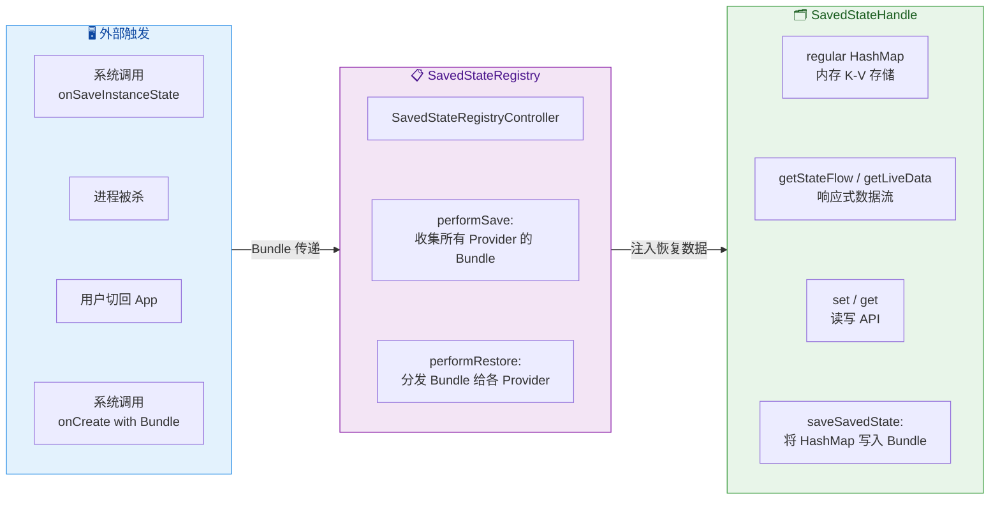

**SavedStateRegistry 的桥梁作用**

`SavedStateHandle` 并不直接与 `onSaveInstanceState()` 打交道。它通过 `SavedStateRegistry`（由 `ComponentActivity` 或 `Fragment` 持有）进行间接交互。这个 Registry 是 Jetpack Lifecycle 库提供的组件，其工作方式如下：

**保存阶段**：当系统回调 `onSaveInstanceState(Bundle)` 时，`SavedStateRegistryController.performSave()` 被触发。它遍历所有注册的 `SavedStateProvider`（每个 `SavedStateHandle` 都会注册一个），调用它们的 `saveState()` 方法，将返回的 Bundle 汇总后写入宿主 Activity 的 `outState` Bundle。

**恢复阶段**：当 Activity 重建后的 `onCreate(savedInstanceState)` 被调用时，`SavedStateRegistryController.performRestore(bundle)` 被触发。它从 `savedInstanceState` 中取出之前保存的各 Provider 的 Bundle 数据，暂存起来。等到 `SavedStateHandle` 被创建时，它会从 Registry 中取出属于自己的那份 Bundle，用来初始化 `regular` HashMap。

这种设计的优雅之处在于 **解耦**：ViewModel 不需要知道 Activity 的生命周期回调细节，Activity 也不需要知道 ViewModel 内部有哪些状态需要保存。一切通过 `SavedStateRegistry` 这个中介自动协调。

**SavedStateHandle 的核心 API**

下面列出 `SavedStateHandle` 最常用的 API 及其用法：

```kotlin
class DetailViewModel(
    private val savedStateHandle: SavedStateHandle
) : ViewModel() {

    // ---- 1. 直接读写 ----
    // get<T>(key): 读取值，返回 T?（可能为 null）
    val userId: String? = savedStateHandle.get<String>("user_id")

    // set(key, value) 或 operator[](key) = value: 写入值
    fun updateUserId(id: String) {
        savedStateHandle["user_id"] = id  // 等价于 savedStateHandle.set("user_id", id)
    }

    // ---- 2. 响应式读取（推荐方式）----
    // getStateFlow(key, initialValue): 返回一个 StateFlow
    // 当 set() 被调用时，StateFlow 自动更新
    // initialValue 仅在 key 不存在时使用
    val filterType: StateFlow<String> =
        savedStateHandle.getStateFlow("filter_type", "ALL")

    // getLiveData(key, initialValue): 返回一个 LiveData
    // 原理与 getStateFlow 类似，但用于传统 View 体系
    val sortOrder: LiveData<String> =
        savedStateHandle.getLiveData("sort_order", "ASC")

    // ---- 3. 删除与查询 ----
    fun clearFilter() {
        // remove(key): 删除某个 key
        savedStateHandle.remove<String>("filter_type")
    }

    fun hasUserId(): Boolean {
        // contains(key): 判断是否存在某个 key
        return savedStateHandle.contains("user_id")
    }

    // ---- 4. 获取所有 key ----
    fun allKeys(): Set<String> {
        // keys(): 返回所有已存储的 key
        return savedStateHandle.keys()
    }
}
```

**与 Navigation 组件的集成**

值得一提的是，`SavedStateHandle` 还有一个非常实用的特性：当配合 Jetpack Navigation 使用时，**目标页面（Destination）的导航参数（arguments）会被自动填充到 `SavedStateHandle` 中**。这意味着你无需手动从 `Bundle` 中解析参数，直接通过 `SavedStateHandle` 就可以读取：

```kotlin
// 假设导航定义了参数 "article_id"
// 在 Navigation Graph 中: <argument name="article_id" app:argType="string" />
class ArticleViewModel(
    savedStateHandle: SavedStateHandle
) : ViewModel() {

    // Navigation 参数自动注入到 SavedStateHandle 中
    // 直接通过 key 读取即可，无需手动解析 Intent 或 Bundle
    val articleId: String = savedStateHandle.get<String>("article_id")
        ?: throw IllegalArgumentException("article_id is required")

    // 也可以用于 Compose Navigation 的路由参数
    // 例如路由 "article/{articleId}" 中的 articleId
    init {
        // 使用 articleId 发起网络请求等初始化操作
        loadArticle(articleId)
    }

    private fun loadArticle(id: String) {
        viewModelScope.launch {
            // ... 加载文章详情
        }
    }
}
```

### 序列化限制

`SavedStateHandle` 的底层是 `Bundle`，而 `Bundle` 通过 **Binder 事务（Binder Transaction）** 将数据传递到系统服务端（`ActivityManagerService`）进行持久化。这一机制决定了 `SavedStateHandle` 有严格的 **类型限制** 和 **大小限制**。

**支持的数据类型**

`Bundle` 只能存储它"认识"的数据类型。`SavedStateHandle` 在内部通过一份白名单来校验写入的值是否属于可接受的类型。以下是完整的可存储类型清单：

| 类别 | 支持的类型 |
|---|---|
| **基本类型** | `Int`, `Long`, `Float`, `Double`, `Byte`, `Short`, `Char`, `Boolean` |
| **基本类型数组** | `IntArray`, `LongArray`, `FloatArray`, `DoubleArray`, `ByteArray`, `ShortArray`, `CharArray`, `BooleanArray` |
| **字符串相关** | `String`, `String[]`, `CharSequence`, `CharSequence[]` |
| **Parcelable** | `Parcelable`, `Parcelable[]`, `ArrayList<Parcelable>` |
| **Serializable** | `Serializable`（Java 标准序列化接口） |
| **Bundle 系列** | `Bundle`, `SparseArray<Parcelable>` |
| **其他** | `Binder`, `Size`, `SizeF` |

如果你尝试存入一个不在白名单中的类型——比如一个没有实现 `Parcelable` 或 `Serializable` 的自定义类——`SavedStateHandle` 会在运行时抛出 `IllegalArgumentException`。

```kotlin
// ❌ 错误示范：存入不支持的类型
data class UiState(      // 既没有 @Parcelize，也没有实现 Serializable
    val isLoading: Boolean,
    val errorMessage: String?
)

class BadViewModel(
    private val savedStateHandle: SavedStateHandle
) : ViewModel() {
    fun saveState() {
        // 运行时崩溃！UiState 不是 Bundle 支持的类型
        savedStateHandle["ui_state"] = UiState(true, null)
    }
}

// ✅ 正确方式 1：使用 @Parcelize（推荐，性能最优）
@Parcelize  // 需要 kotlin-parcelize 插件
data class UiState(
    val isLoading: Boolean,
    val errorMessage: String?
) : Parcelable  // 实现 Parcelable 接口

// ✅ 正确方式 2：拆分为基本类型分别存储
class GoodViewModel(
    private val savedStateHandle: SavedStateHandle
) : ViewModel() {
    // 将复杂状态拆解为多个基本类型 key
    val isLoading: StateFlow<Boolean> =
        savedStateHandle.getStateFlow("is_loading", false)

    val errorMessage: StateFlow<String?> =
        savedStateHandle.getStateFlow("error_msg", null)
}
```

**Binder 事务大小限制**

`Bundle` 数据在保存时需要通过 Binder IPC 传输到系统进程。Binder 事务缓冲区的总大小通常为 **1MB**，而且这个缓冲区是 **整个进程共享** 的——所有正在进行的 Binder 调用（包括其他 `ContentProvider` 调用、系统服务通信等）都会占用同一块缓冲区。因此，Google 官方强烈建议 **`onSaveInstanceState` 中保存的数据总量不超过 50KB**。

如果超出限制，会触发 `TransactionTooLargeException`，导致 App 崩溃。这个异常在 Android 7.0（API 24）及以上版本会被直接抛出；在更低版本上，系统只会打印一条警告日志但仍可能导致状态丢失。

```kotlin
// ❌ 反模式：在 SavedStateHandle 中存储大量数据
class SearchResultViewModel(
    private val savedStateHandle: SavedStateHandle
) : ViewModel() {

    fun cacheResults(results: List<SearchResult>) {
        // 危险！如果 results 列表很大（比如包含图片 URL、长文本等），
        // 序列化后可能超过 Bundle 大小限制
        savedStateHandle["results"] = ArrayList(results) // ArrayList<Parcelable>
    }
}

// ✅ 正确做法：只保存恢复搜索所必要的最小信息
class SearchResultViewModel(
    private val savedStateHandle: SavedStateHandle
) : ViewModel() {

    // 只保存搜索关键词和当前页码
    // 恢复后重新发起搜索请求获取数据
    val query: StateFlow<String> =
        savedStateHandle.getStateFlow("query", "")

    val currentPage: StateFlow<Int> =
        savedStateHandle.getStateFlow("page", 1)

    // 搜索结果列表存在普通的 StateFlow 中（不持久化）
    // 进程恢复后重新加载即可
    private val _results = MutableStateFlow<List<SearchResult>>(emptyList())
    val results: StateFlow<List<SearchResult>> = _results.asStateFlow()

    init {
        // 如果 query 非空，说明是从进程恢复回来的
        // 自动重新发起搜索
        viewModelScope.launch {
            query.collect { q ->
                if (q.isNotEmpty()) {
                    _results.value = repository.search(q, currentPage.value)
                }
            }
        }
    }
}
```

**什么该存、什么不该存？**

根据上述限制，在实际开发中应该遵循一条核心原则：**SavedStateHandle 只保存"恢复 UI 状态所必需的最小信息"，而不是"缓存数据"**。具体来说：

**✅ 应该存入 SavedStateHandle 的**：
- 用户在搜索框中输入但未提交的文本
- 列表当前的滚动位置或选中的 Tab 索引
- 筛选条件、排序方式等 UI 配置
- 实体的 ID（用于重新从网络或数据库加载完整数据）
- 未提交的表单草稿中的关键字段

**❌ 不应该存入 SavedStateHandle 的**：
- 从网络或数据库加载的完整数据列表（应在恢复后重新加载）
- Bitmap、大型字符串、文件内容等大体积数据
- 可以从其他已保存状态推导出的衍生数据
- 敏感信息（Bundle 数据可以被系统读取，不加密）

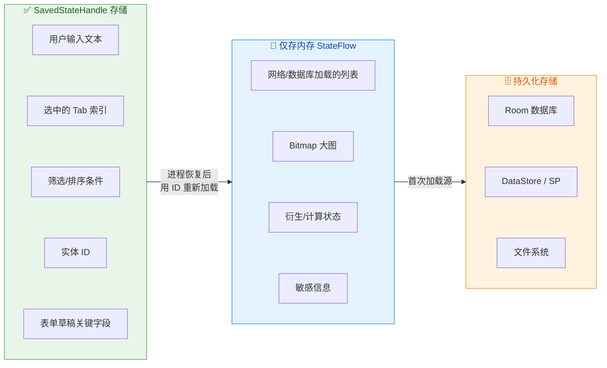

**Parcelable vs Serializable 的性能差异**

当你需要在 `SavedStateHandle` 中保存自定义对象时，`Parcelable` 和 `Serializable` 都可以使用，但两者的性能差距很大。`Serializable` 使用 Java 反射机制进行序列化和反序列化，会创建大量临时对象，触发频繁的 GC。而 `Parcelable` 是 Android 专门设计的序列化协议，它通过开发者手动编写（或 `@Parcelize` 自动生成）的 `writeToParcel()` / `createFromParcel()` 方法直接读写原始数据，避免了反射开销。在性能测试中，`Parcelable` 的速度通常是 `Serializable` 的 **10 倍以上**。

因此，在 Android 开发中，**始终优先使用 `@Parcelize` 注解 + `Parcelable` 接口**，而不是 `Serializable`：

```kotlin
// 🏆 最佳实践：使用 @Parcelize 自动生成 Parcelable 实现
// 需要在 build.gradle 中应用 kotlin-parcelize 插件
// plugins { id("kotlin-parcelize") }
@Parcelize
data class FilterConfig(
    val category: String,       // 类别筛选
    val minPrice: Double,       // 最低价格
    val maxPrice: Double,       // 最高价格
    val sortBy: SortType        // 排序方式（枚举也需要是 Parcelable 或基本类型）
) : Parcelable

// 枚举天然支持 Serializable，可以直接存入 Bundle
// 但若作为 Parcelable 的字段，推荐也标注 @Parcelize 或使用基本类型
enum class SortType {
    PRICE_ASC, PRICE_DESC, RATING, NEWEST
}

class ProductListViewModel(
    private val savedStateHandle: SavedStateHandle
) : ViewModel() {

    // Parcelable 对象可以直接存入 SavedStateHandle
    val filterConfig: StateFlow<FilterConfig> =
        savedStateHandle.getStateFlow(
            "filter_config",
            FilterConfig("ALL", 0.0, 9999.0, SortType.NEWEST) // 默认值
        )

    // 更新筛选配置
    fun updateFilter(config: FilterConfig) {
        savedStateHandle["filter_config"] = config
    }
}
```

**小结**

`SavedStateHandle` 通过将 `Bundle` 机制优雅地封装在 ViewModel 层，解决了 Android 开发中一个长期存在的架构痛点：**UI 状态的保存逻辑与 UI 状态的管理逻辑分离在不同的组件中**。它让 ViewModel 真正成为了 UI 状态的 **唯一事实来源（Single Source of Truth）**，无论是配置变更还是进程死亡，状态的管理和恢复都统一在 ViewModel 内部完成。但要用好它，开发者必须牢记其底层 Bundle 的约束：**只存小量、只存可序列化、只存必要的 UI 恢复信息**。

---

**📝 练习题**

用户在搜索页面输入了关键词 "Android" 并滚动到第 3 页结果。此时用户切到其他 App，系统因内存不足杀死了该 App 进程。当用户切回时，以下哪种做法能正确恢复搜索状态？

A. 将搜索关键词 "Android"、当前页码 3、以及完整的搜索结果列表（200 条数据）全部存入 `SavedStateHandle`


B. 将搜索关键词 "Android" 和当前页码 3 存入 `SavedStateHandle`，搜索结果存在普通 `StateFlow` 中，恢复时根据关键词和页码重新请求


C. 将所有状态都存在 ViewModel 的普通成员变量中，因为 ViewModel 可以在进程死亡后存活


D. 将搜索关键词存入 `SharedPreferences`，搜索结果存入 `SavedStateHandle`


**【答案】** B

**【解析】** 选项 B 是正确的做法，体现了 `SavedStateHandle` 的核心使用原则：**只保存恢复 UI 所必需的最小信息**。搜索关键词和页码属于"用户输入的 UI 状态"，体积小、可序列化，非常适合存入 `SavedStateHandle`。完整的搜索结果是"可重新获取的数据"，应该在进程恢复后利用保存的关键词和页码重新从网络加载。

选项 A 虽然功能上似乎"更完整"，但将 200 条搜索结果序列化到 Bundle 中可能导致超过 Binder 事务大小限制（建议不超过 50KB），触发 `TransactionTooLargeException` 崩溃。选项 C 完全错误，ViewModel 在进程被杀后不会存活，只能在配置变更时存活。选项 D 的策略本末倒置——`SharedPreferences` 是持久化存储，适合存用户偏好设置而非临时的搜索关键词；搜索结果则因体积问题不适合存入 `SavedStateHandle`。

---

## 协程作用域集成

在 Android 应用层开发中，异步操作几乎无处不在——网络请求、数据库读写、文件 I/O、复杂计算……这些操作如果直接在主线程执行，会造成 ANR（Application Not Responding）；而如果使用传统的线程或 `AsyncTask`，又面临生命周期管理困难、内存泄漏等经典痛点。Kotlin Coroutines 的出现从根本上改变了 Android 异步编程的范式：它用 **结构化并发（Structured Concurrency）** 的思想，将协程的生命周期与某个明确的 **作用域（CoroutineScope）** 绑定在一起。当作用域被取消时，其中所有正在运行或挂起的协程也会被自动取消，从而彻底消除了"组件已销毁、后台任务仍在跑"这类泄漏问题。

`viewModelScope` 正是 Jetpack 为 `ViewModel` 量身定做的协程作用域。它的设计哲学可以用一句话概括：**ViewModel 活着的时候，协程就活着；ViewModel 被清除的时候，协程就自动取消**。这种绑定关系让开发者无需手动管理协程的生命周期，极大地降低了异步代码的复杂度。本节将从使用方式出发，深入到源码级别的实现原理，逐层剖析 `viewModelScope`、`SupervisorJob` 异常隔离策略，以及 `onCleared()` 清理回调之间的协作机制。

### ViewModelScope 自动取消

#### 基本用法与直觉理解

`viewModelScope` 是 `androidx.lifecycle:lifecycle-viewmodel-ktx` 库为 `ViewModel` 提供的一个 **扩展属性（Extension Property）**。任何继承自 `ViewModel` 的类都可以直接使用它来启动协程：

```kotlin
// 一个典型的 ViewModel，演示 viewModelScope 的基本用法
class UserProfileViewModel(
    private val userRepository: UserRepository // 通过构造函数注入数据仓库
) : ViewModel() {

    // 使用 MutableStateFlow 持有 UI 状态，初始值为 Loading
    private val _uiState = MutableStateFlow<UiState>(UiState.Loading)
    // 对外暴露不可变的 StateFlow，防止 UI 层直接修改状态
    val uiState: StateFlow<UiState> = _uiState.asStateFlow()

    // 加载用户资料的函数
    fun loadUserProfile(userId: String) {
        // 在 viewModelScope 中启动协程
        // 当 ViewModel 被 clear 时，这个协程会自动取消
        viewModelScope.launch {
            _uiState.value = UiState.Loading          // 先置为加载中状态
            try {
                // 调用挂起函数获取用户数据（内部可能是网络请求）
                val user = userRepository.getUser(userId)
                _uiState.value = UiState.Success(user) // 成功则更新状态
            } catch (e: CancellationException) {
                throw e // 协程取消异常必须重新抛出，不能吞掉
            } catch (e: Exception) {
                _uiState.value = UiState.Error(e.message ?: "Unknown error")
            }
        }
    }
}
```

在上面的代码中，`viewModelScope.launch { ... }` 启动的协程会在后台执行网络请求。如果用户在请求完成之前旋转了屏幕，Activity 会销毁并重建，但 ViewModel 存活（这是上一节讲的 `ViewModelStore` 保留机制），因此协程不会被取消，请求会继续执行，结果也会正确地更新到 `StateFlow` 中供新的 Activity 观察。

而当用户真正离开页面（比如按了返回键），Activity 最终销毁，ViewModel 的 `onCleared()` 被调用——此时 `viewModelScope` 会自动取消所有正在运行的协程，网络请求也随之终止，不会再有任何回调试图更新已经不存在的 UI。

#### 源码级实现原理

要真正理解"自动取消"是如何发生的，我们需要深入 `viewModelScope` 的源码。从 Lifecycle 2.5+ 开始，其实现经历了一次重要的演进——从**扩展属性 + `setTagIfAbsent`** 演变为 **ViewModel 内部直接持有**。我们先看核心设计思路，再看实际代码。

`viewModelScope` 的本质是一个与 ViewModel 生命周期绑定的 `CoroutineScope`。它需要满足两个核心需求：

1. **懒初始化**：只有在第一次访问时才创建，避免不使用协程的 ViewModel 产生不必要的开销。
2. **自动取消**：当 `ViewModel.onCleared()` 被调用时，scope 内的所有协程必须被取消。

在早期实现中（Lifecycle 2.1~2.4），`viewModelScope` 被定义为 `ViewModel` 的 Kotlin 扩展属性，它内部利用了 `ViewModel` 的一个隐藏机制——`setTagIfAbsent()` / `getTag()`。这对方法本质上是 ViewModel 内部维护的一个 `HashMap<String, Object>`（与 `ViewModelStore` 的存储不同，这是 ViewModel 实例自身内部的 tag map），用于附加需要在 `onCleared()` 时一起清理的资源。当 `onCleared()` 被调用时，ViewModel 的 `clear()` 方法会遍历这个 map，对所有实现了 `Closeable` 接口的 tag 调用 `close()` 方法。

其核心逻辑可以用以下伪代码理解：

```kotlin
// ViewModel 内部简化源码（伪代码，帮助理解机制）
open class ViewModel {
    // 内部维护的 tag 存储，用于附加需要随 ViewModel 清理的资源
    private val bagOfTags = HashMap<String, Any>()
    // 标记 ViewModel 是否已被 clear
    @Volatile private var isCleared = false

    // 存储 tag 的方法：如果 key 不存在则放入，如果已存在则返回旧值
    // 这保证了同一个 key 只会创建一次对象（类似 ConcurrentHashMap.putIfAbsent）
    fun <T> setTagIfAbsent(key: String, newValue: T): T {
        synchronized(bagOfTags) {
            // 尝试获取已有的值
            val previous = bagOfTags[key] as? T
            if (previous != null) {
                return previous // 已存在，直接返回，不替换
            }
            bagOfTags[key] = newValue as Any // 不存在，存入新值
        }
        // 如果在存入的瞬间 ViewModel 已经被 clear 了，立即关闭
        if (isCleared) {
            (newValue as? Closeable)?.close()
        }
        return newValue
    }

    // ViewModel 被清除时由 ViewModelStore 调用
    @MainThread
    fun clear() {
        isCleared = true
        // 遍历所有 tag，关闭所有 Closeable 资源
        synchronized(bagOfTags) {
            for (value in bagOfTags.values) {
                closeWithRuntimeException(value) // 如果是 Closeable 就调 close()
            }
        }
        onCleared() // 回调子类的清理逻辑
    }
}
```

理解了这个 tag 机制后，早期 `viewModelScope` 的扩展属性实现就很清晰了：

```kotlin
// viewModelScope 早期实现（lifecycle-viewmodel-ktx 2.1~2.4）
// 定义一个常量 key，用于在 ViewModel 的 tag map 中存取 scope
private const val JOB_KEY = "androidx.lifecycle.ViewModelCoroutineScope.JOB_KEY"

// ViewModel 的扩展属性
val ViewModel.viewModelScope: CoroutineScope
    get() {
        // 先尝试从 tag map 中获取已有的 scope
        val scope: CoroutineScope? = this.getTag(JOB_KEY)
        if (scope != null) {
            return scope // 已创建过，直接返回
        }
        // 首次访问，创建新的 CloseableCoroutineScope
        // SupervisorJob() 保证子协程异常不会取消兄弟协程
        // Dispatchers.Main.immediate 保证默认在主线程调度
        return setTagIfAbsent(
            JOB_KEY,
            CloseableCoroutineScope(
                SupervisorJob() + Dispatchers.Main.immediate
            )
        )
    }

// 实现了 Closeable 的 CoroutineScope 包装类
// 当 ViewModel.clear() 遍历 tag 调用 close() 时，会取消协程上下文
internal class CloseableCoroutineScope(
    override val coroutineContext: CoroutineContext
) : Closeable, CoroutineScope {
    override fun close() {
        // 取消 coroutineContext 中的 Job，从而取消所有子协程
        coroutineContext.cancel()
    }
}
```

这段源码揭示了几个关键设计决策：

**第一，`CloseableCoroutineScope` 实现了 `Closeable` 接口**。这是与 `ViewModel` 内部 tag 清理机制对接的桥梁——`clear()` 遍历 `bagOfTags` 时，发现某个 value 是 `Closeable`，就调用其 `close()` 方法。而 `close()` 的实现就是 `coroutineContext.cancel()`，这会向 scope 中的 `Job` 发送取消信号，所有子协程会协作式地取消。

**第二，CoroutineContext 由 `SupervisorJob() + Dispatchers.Main.immediate` 组合而成**。`SupervisorJob` 的作用我们在下一小节详细展开；`Dispatchers.Main.immediate` 表示协程默认在主线程执行，并且如果当前已经在主线程，`launch` 内的代码会立即执行而不会多一次 post 到消息队列的延迟（这就是 `immediate` 相比普通 `Dispatchers.Main` 的优势）。

**第三，`setTagIfAbsent` 保证了线程安全的懒初始化**。即使多个线程同时首次访问 `viewModelScope`，也只会创建一个 scope 实例。

在更新的 Lifecycle 版本（2.5+）中，`viewModelScope` 的实现被进一步优化，直接在 `ViewModel` 基类中以成员方式持有，但核心逻辑不变——仍然是懒创建、`Closeable` 接口对接清理机制、`SupervisorJob + Dispatchers.Main.immediate` 的 context 组合。

#### 自动取消的完整链路

让我们用一张时序图来追踪从用户按下返回键到协程被取消的完整调用链：

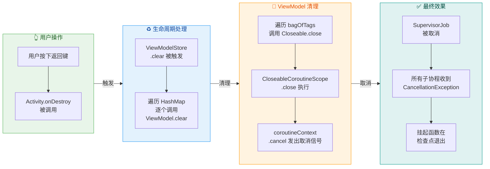

这条链路中有一个需要特别注意的细节：协程的取消是 **协作式的（Cooperative）**，而不是像线程的 `Thread.stop()` 那样强制中断。当 `cancel()` 被调用时，协程上下文中的 `Job` 会被标记为取消状态，但协程代码本身并不会在任意位置被打断。它只会在下一个 **挂起点（Suspension Point）** 检查取消状态并抛出 `CancellationException`。

这意味着如果你在 `viewModelScope.launch` 中写了一个纯 CPU 计算的循环，而循环体中没有任何挂起函数调用，那么即使 ViewModel 被 clear，这段代码也不会被取消——它会一直跑完。这种情况下你需要手动检查 `isActive` 标志：

```kotlin
viewModelScope.launch(Dispatchers.Default) { // 切到计算线程
    // 假设这是一个需要长时间计算的循环
    for (i in 0 until 1_000_000) {
        // 关键：手动检查协程是否仍然活跃
        // 如果 ViewModel 已经 clear，isActive 会变为 false
        if (!isActive) break // 或者调用 ensureActive() 自动抛 CancellationException
        // 执行计算逻辑...
        heavyComputation(i)
    }
}
```

标准库提供的挂起函数，如 `delay()`、`withContext()`、`yield()`，以及 Retrofit 的 `suspend` 网络请求、Room 的 `suspend` 数据库操作等，都会在内部检查取消状态，所以一般情况下你不需要手动处理。

### SupervisorJob 异常隔离

#### 为什么需要 SupervisorJob

要理解 `SupervisorJob` 的必要性，我们需要先理解 Kotlin 协程中 **普通 `Job`** 的异常传播行为。

在结构化并发中，协程是树形层级结构。一个 `CoroutineScope` 包含一个根 `Job`，通过 `launch` 或 `async` 启动的协程是这个根 `Job` 的 **子 Job**。当一个子协程因为未捕获异常而失败时，普通 `Job` 遵循的规则是：**异常向上传播给父 Job，父 Job 会取消自己和所有其他子 Job**。这就是所谓的 "双向取消（Bidirectional Cancellation）"：

```text
普通 Job 的异常传播（双向取消）：

         ┌─────────┐
         │ Root Job│   ← 3. 父 Job 收到异常，取消自己和所有子 Job
         └────┬────┘
         ┌────┴─────────────┐
    ┌────┴────┐       ┌────┴────┐
    │ Child A │       │ Child B │  ← 4. 无辜的 Child B 也被取消了！
    │ (崩溃💥)│       │ (正常中)│
    └─────────┘       └─────────┘
    ↑ 1. 抛出异常      ↑ 2. 异常向上传播
```

如果 `viewModelScope` 使用的是普通 `Job`，后果将是灾难性的。想象一个 ViewModel 同时发起了两个独立的网络请求——加载用户资料和加载推荐列表。如果推荐列表请求因为服务端异常失败了，按照普通 Job 的规则，整个 `viewModelScope` 的根 Job 会被取消，用户资料请求也会被牵连取消，甚至之后再调用 `viewModelScope.launch` 也不会有任何效果（因为 scope 已经处于取消状态了）。这显然不是我们期望的行为。

`SupervisorJob` 改变了异常传播的方向：**子协程的失败只会向下影响自己和自己的子协程，不会向上传播给父 Job，也不会影响兄弟协程**。这就是 "单向取消（Unidirectional Cancellation）"：

```text
SupervisorJob 的异常传播（单向取消）：

         ┌──────────────┐
         │SupervisorJob │   ← 3. 父 Job 不受影响，继续存活
         └──────┬───────┘
         ┌──────┴─────────────┐
    ┌────┴────┐         ┌────┴────┐
    │ Child A │         │ Child B │  ← 4. Child B 完全不受影响
    │ (崩溃💥)│         │ (正常✅) │
    └─────────┘         └─────────┘
    ↑ 1. 抛出异常
    ↑ 2. 异常不向上传播，Child A 自己消亡
```

这正是 ViewModel 场景所需要的语义：每个 `launch` 启动的协程代表一个独立的异步任务（加载数据、提交表单、刷新列表等），它们之间不应该互相影响。一个任务失败了，其他任务应该继续正常执行，并且 `viewModelScope` 本身应该保持可用，以便后续再启动新任务。

#### SupervisorJob 的工作机制

`SupervisorJob` 并不是一个全新的类，而是一个工厂函数，返回的是 `SupervisorJobImpl`——它继承自 `JobImpl`，只是重写了 `childCancelled()` 方法：

```kotlin
// Kotlin 协程库中的简化源码
// SupervisorJob 工厂函数
public fun SupervisorJob(parent: Job? = null): CompletableJob =
    SupervisorJobImpl(parent)

// SupervisorJobImpl 的核心区别
private class SupervisorJobImpl(parent: Job?) : JobImpl(parent) {
    // 当子协程因异常失败并通知父 Job 时，这个方法会被调用
    // 普通 JobImpl 中此方法会返回 true 并取消自己（连带所有子协程）
    // SupervisorJobImpl 直接返回 false，表示"我不处理子协程的失败"
    override fun childCancelled(cause: Throwable): Boolean = false
}
```

就这一个方法的重写，实现了完全不同的异常传播语义。当 `childCancelled()` 返回 `false` 时，异常不会被父 Job 消费，而是会交给 `CoroutineExceptionHandler`（如果有配置）或者在没有 handler 的情况下传递到线程的 `UncaughtExceptionHandler`。

这也引出了一个重要的实践规则：**在使用 `viewModelScope.launch` 时，你应当在 `launch` 块内部使用 try-catch 来处理预期的业务异常**，而不是依赖 `CoroutineExceptionHandler`。因为 `SupervisorJob` 不会向上传播异常，如果你不在 `launch` 内部捕获，异常会直接走到全局的 `UncaughtExceptionHandler`，默认行为是导致应用 **崩溃（Crash）**。

```kotlin
class OrderViewModel(
    private val orderRepo: OrderRepository
) : ViewModel() {

    fun placeOrder(order: Order) {
        viewModelScope.launch {
            // ✅ 正确：在 launch 内部捕获异常
            try {
                val result = orderRepo.submitOrder(order)
                _uiState.value = UiState.OrderPlaced(result)
            } catch (e: CancellationException) {
                throw e // CancellationException 必须重新抛出，否则取消机制会失效
            } catch (e: HttpException) {
                // 业务异常，更新 UI 状态即可
                _uiState.value = UiState.Error("下单失败: ${e.code()}")
            } catch (e: IOException) {
                // 网络异常
                _uiState.value = UiState.Error("网络连接异常，请重试")
            }
        }
    }

    fun loadOrderHistory() {
        viewModelScope.launch {
            // 这个协程与 placeOrder 完全独立
            // 即使 placeOrder 的协程崩溃，也不影响这里
            try {
                val history = orderRepo.getHistory()
                _historyState.value = history
            } catch (e: CancellationException) {
                throw e
            } catch (e: Exception) {
                _historyState.value = emptyList()
            }
        }
    }
}
```

#### SupervisorJob 与 supervisorScope 的区别

这里需要澄清一个常见混淆点。`SupervisorJob` 和 `supervisorScope` 虽然名字相似，但使用场景不同：

- **`SupervisorJob`** 是一个 `Job` 实例，用于构建 `CoroutineScope` 的 context。`viewModelScope` 就是这样用的：`SupervisorJob() + Dispatchers.Main.immediate`。
- **`supervisorScope { }`** 是一个挂起函数，用于在一段协程代码中临时创建一个具有 Supervisor 语义的作用域。它会等待内部所有子协程完成后才返回。

在 ViewModel 中，你通常直接使用 `viewModelScope.launch`，它已经基于 `SupervisorJob`，无需再额外使用 `supervisorScope`。但如果你在一个 `launch` 块内部需要并发启动多个子任务，并且希望它们之间互相独立，可以在内部使用 `supervisorScope`：

```kotlin
viewModelScope.launch {
    // 在一个协程内部，并发加载多个独立数据源
    // 使用 supervisorScope 确保它们之间互不影响
    supervisorScope {
        // 这两个 async 是并发执行的
        val profileDeferred = async { userRepo.getProfile() }  // 子任务 1
        val settingsDeferred = async { userRepo.getSettings() } // 子任务 2

        // 即使 settings 请求失败，profile 的结果仍然可用
        val profile = try {
            profileDeferred.await()
        } catch (e: Exception) {
            null // profile 请求失败，降级为 null
        }

        val settings = try {
            settingsDeferred.await()
        } catch (e: Exception) {
            Settings.default() // settings 请求失败，使用默认值
        }

        _uiState.value = UiState.Success(profile, settings)
    }
}
```

#### 异常传播全景对比

下面这张图从结构上对比了普通 Job 和 SupervisorJob 在异常传播时的行为差异：

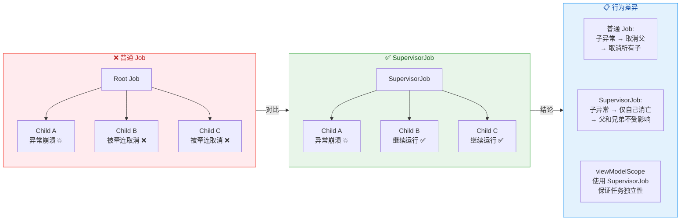

### onCleared 清理回调

#### onCleared 的触发时机

`onCleared()` 是 `ViewModel` 基类定义的一个 **protected 方法**，当 ViewModel 即将被永久销毁、不再被使用时，系统会调用它。具体的触发场景包括：

1. **Activity 正常 finish**：用户按返回键、调用 `finish()`、或者导航到其他页面导致当前 Activity 从返回栈中移除。此时 `ViewModelStore.clear()` 被触发，遍历所有 ViewModel 调用 `clear()`，进而触发 `onCleared()`。

2. **Fragment 被永久移除**：通过 `FragmentTransaction.remove()` 或导航离开时，Fragment 的 `ViewModelStore` 被清理。

3. **Navigation 组件中的目的地出栈**：当一个 navigation destination 被弹出回退栈时，其对应的 ViewModel 会被清理。

注意，**配置变更（如旋转屏幕）不会触发 `onCleared()`**——这正是 ViewModel 设计的核心价值。只有在宿主（Activity/Fragment）真正结束生命周期（`isFinishing == true`）时才会触发。

在 `ComponentActivity` 的源码中，这个判断逻辑大致如下：

```kotlin
// ComponentActivity 中注册的 Lifecycle 观察者（简化）
getLifecycle().addObserver(object : LifecycleEventObserver {
    override fun onStateChanged(source: LifecycleOwner, event: Lifecycle.Event) {
        // 只在 ON_DESTROY 事件时处理
        if (event == Lifecycle.Event.ON_DESTROY) {
            // 关键判断：是否是配置变更导致的 destroy
            // 如果不是配置变更（即是真正的销毁），才清理 ViewModelStore
            if (!isChangingConfigurations) {
                viewModelStore.clear() // 这会触发所有 ViewModel 的 onCleared()
            }
        }
    }
})
```

#### onCleared 与 viewModelScope 的协作

前面已经分析过，`viewModelScope` 的取消是通过 `ViewModel` 的 `bagOfTags` 中存储的 `CloseableCoroutineScope` 的 `close()` 方法实现的。而 `close()` 的调用发生在 `ViewModel.clear()` 方法中，**早于 `onCleared()` 回调**。也就是说，当你的 `onCleared()` 被调用时，`viewModelScope` 已经被取消了。

这个调用顺序在 `ViewModel.clear()` 的源码中非常明确：

```kotlin
// ViewModel.clear() 源码简化
@MainThread
final fun clear() {
    isCleared = true
    // 1️⃣ 先清理 bagOfTags 中所有 Closeable 资源（包括 viewModelScope）
    synchronized(bagOfTags) {
        for (value in bagOfTags.values) {
            closeWithRuntimeException(value)
        }
    }
    // 2️⃣ 再回调子类的 onCleared()
    onCleared()
}
```

这意味着在 `onCleared()` 中 **不应该** 再通过 `viewModelScope.launch` 启动新的协程——因为 scope 已经取消了，`launch` 会立即返回而不执行任何代码。如果你确实需要在清理阶段执行某些必须完成的异步操作（比如发送统计日志），你需要使用一个与 ViewModel 生命周期无关的 scope，例如应用级别的 `ProcessLifecycleOwner` 或者自定义的 `ApplicationScope`：

```kotlin
class AnalyticsViewModel(
    private val analyticsRepo: AnalyticsRepository,
    private val appScope: CoroutineScope // 注入应用级 scope，生命周期与进程一致
) : ViewModel() {

    // 记录用户在本页面的行为数据
    private val pageEvents = mutableListOf<AnalyticsEvent>()

    override fun onCleared() {
        super.onCleared()
        // ⚠️ 此时 viewModelScope 已取消！不能用它启动协程
        // ✅ 使用应用级 scope，确保日志上传能完成
        appScope.launch {
            analyticsRepo.uploadEvents(pageEvents.toList())
        }
    }
}
```

#### 自定义清理逻辑

除了协程取消之外，`onCleared()` 还是释放 ViewModel 持有的其他资源的最佳时机。典型场景包括：

```kotlin
class MediaPlayerViewModel : ViewModel() {

    // ViewModel 持有的 MediaPlayer 资源
    private var mediaPlayer: MediaPlayer? = null

    // 注册的广播接收器或事件监听
    private val eventBus = EventBus.getDefault()

    init {
        // 注册事件总线（如果使用）
        eventBus.register(this)
    }

    fun initPlayer(context: Context) {
        // 注意：这里的 context 应该是 Application context，不是 Activity context
        mediaPlayer = MediaPlayer.create(context, R.raw.background_music)
    }

    override fun onCleared() {
        super.onCleared()

        // 1. 释放 MediaPlayer 资源
        mediaPlayer?.release()
        mediaPlayer = null

        // 2. 注销事件总线
        eventBus.unregister(this)

        // 3. 关闭数据库连接、取消注册 ContentObserver 等
        // ...所有需要手动清理的资源都在这里处理
    }
}
```

从 Lifecycle 2.7+ 开始，ViewModel 还提供了 `addCloseable()` API，允许你将任何 `Closeable` 资源注册到 ViewModel 中，它们会在 `clear()` 时自动被关闭，无需手动在 `onCleared()` 中处理：

```kotlin
class DatabaseViewModel : ViewModel() {

    // 通过 addCloseable 注册的资源会在 ViewModel clear 时自动关闭
    private val dbConnection = DatabaseConnection().also {
        addCloseable(it) // 注册为 Closeable，自动管理生命周期
    }

    // 无需重写 onCleared()，dbConnection 会自动被 close()
}
```

这个 `addCloseable()` 的底层实现原理与 `viewModelScope` 使用的 `setTagIfAbsent()` 机制一脉相承——都是利用 `ViewModel.clear()` 时的统一清理流程来自动管理资源生命周期。

#### 完整生命周期时序

下面通过一张综合时序图，展示 ViewModel 从创建到销毁过程中，`viewModelScope`、协程、`onCleared()` 之间的完整协作关系：

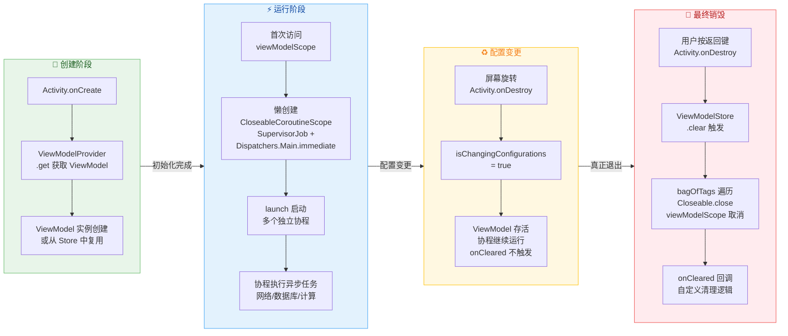

### 进阶：自定义 CoroutineScope 与测试

在生产代码中，`viewModelScope` 的默认配置（`SupervisorJob() + Dispatchers.Main.immediate`）已经能满足绝大部分场景。但在**单元测试**中，`Dispatchers.Main` 会成为问题——因为测试环境中通常没有 Android 的 `Main Looper`。Jetpack 提供了 `kotlinx-coroutines-test` 库来解决这个问题：

```kotlin
// 单元测试中替换 Main dispatcher
@OptIn(ExperimentalCoroutinesApi::class)
class UserViewModelTest {

    // 创建测试用的 dispatcher
    private val testDispatcher = UnconfinedTestDispatcher()

    @Before
    fun setup() {
        // 将 Dispatchers.Main 替换为测试 dispatcher
        // 这样 viewModelScope 中的协程会在测试线程上同步执行
        Dispatchers.setMain(testDispatcher)
    }

    @After
    fun tearDown() {
        // 测试结束后恢复原始的 Main dispatcher
        Dispatchers.resetMain()
    }

    @Test
    fun `loadUser should update state to Success`() = runTest {
        // Arrange: 准备 mock 数据
        val fakeRepo = FakeUserRepository(User("Alice"))
        val viewModel = UserProfileViewModel(fakeRepo)

        // Act: 触发加载
        viewModel.loadUserProfile("123")

        // 因为使用了 UnconfinedTestDispatcher，协程会立即执行完成
        // Assert: 验证状态
        val state = viewModel.uiState.value
        assertTrue(state is UiState.Success)
        assertEquals("Alice", (state as UiState.Success).user.name)
    }
}
```

`Dispatchers.setMain(testDispatcher)` 的原理是利用了 `Dispatchers.Main` 的 **可替换性**。`kotlinx-coroutines-android` 中的 `MainDispatcher` 被设计为可以通过 `setMain()` 在测试中被替换。由于 `viewModelScope` 使用的是 `Dispatchers.Main.immediate`，替换后协程就会在测试 dispatcher 上执行，无需真实的 Android 环境。

如果你需要更精细的控制（比如逐步推进协程执行、验证中间状态），可以使用 `StandardTestDispatcher` 配合 `advanceUntilIdle()` 或 `advanceTimeBy()` 来手动控制虚拟时间的推进。

---

**📝 练习题**

在一个 ViewModel 中使用 `viewModelScope.launch` 同时启动了协程 A（加载用户资料）和协程 B（加载推荐列表）。协程 A 因为服务端返回 500 错误抛出了未捕获的 `HttpException`。此时协程 B 会怎样？

A. 协程 B 会被立即取消，因为它们共享同一个 CoroutineScope

B. 协程 B 不受影响继续执行，但应用会因为未捕获异常而崩溃

C. 协程 B 会收到 `CancellationException` 并优雅终止

D. 协程 B 不受影响继续执行，异常被 `viewModelScope` 自动吞掉，不会崩溃


**【答案】** B

**【解析】** `viewModelScope` 的 CoroutineContext 由 `SupervisorJob() + Dispatchers.Main.immediate` 组成。`SupervisorJob` 的核心特性是子协程的异常不会向上传播给父 Job，也不会影响兄弟协程——所以协程 B 完全不受影响，排除 A 和 C。但这并不意味着异常被"吞掉"了。由于 `SupervisorJob` 不消费子协程的异常（`childCancelled()` 返回 false），未捕获的异常会被传递给 `CoroutineExceptionHandler`。如果没有配置 handler（大多数情况下 ViewModel 中不会配置），异常最终会到达线程的 `UncaughtExceptionHandler`，在 Android 上这意味着应用崩溃。因此正确答案是 B：协程 B 继续运行，但应用会崩溃。这也说明了为什么我们必须在每个 `launch` 块内部使用 try-catch 来处理预期的业务异常——`SupervisorJob` 保护了兄弟协程，但不能免除你处理异常的责任。

---

**📝 练习题**

在 `ViewModel` 的 `onCleared()` 回调中执行 `viewModelScope.launch { uploadAnalyticsData() }` 来上传统计数据，以下说法正确的是：

A. 统计数据会正常上传，因为 `onCleared()` 是在 ViewModel 销毁前的最后机会

B. 统计数据不会上传，因为 `viewModelScope` 在 `onCleared()` 被调用前已经被取消

C. 统计数据可能上传也可能不上传，取决于协程调度的时机

D. 会抛出 `IllegalStateException`，因为不允许在 `onCleared()` 中使用协程


**【答案】** B

**【解析】** `ViewModel` 的 `clear()` 方法的执行顺序是：先遍历 `bagOfTags` 关闭所有 `Closeable` 资源（包括 `CloseableCoroutineScope`），然后才调用 `onCleared()`。当 `CloseableCoroutineScope.close()` 执行时，内部的 `coroutineContext.cancel()` 会将 `SupervisorJob` 置为取消状态。因此，当 `onCleared()` 被回调时，`viewModelScope` 已经处于取消状态。在一个已取消的 scope 上调用 `launch`，协程会被立即取消，lambda 体中的代码不会被执行。不会抛异常（排除 D），也不存在"可能"的不确定性（排除 C）。如果确实需要在 ViewModel 清理时执行必须完成的异步操作，应该使用与 ViewModel 生命周期无关的应用级 `CoroutineScope`。

---

## 依赖注入集成

在前面的章节中，我们已经深入了解了 ViewModel 的设计哲学、ViewModelStore 的保留机制，以及 ViewModelProvider.Factory 如何通过工厂模式创建 ViewModel 实例。回顾 Factory 的核心痛点：当 ViewModel 的构造函数需要 Repository、UseCase、SavedStateHandle 等多个依赖时，开发者不得不为每一个 ViewModel **手写一个专属 Factory**，在其中手动调用构造函数并传入所有参数。项目一旦膨大，Factory 类就会呈爆炸式增长，样板代码充斥整个代码库。

依赖注入（Dependency Injection, DI）框架正是为了解决这一问题而存在的。Android 官方推荐的 DI 方案是 **Hilt**——一个基于 Dagger 的编译时注入框架，它为 Android 的各种组件（Application、Activity、Fragment、ViewModel 等）提供了标准化的注入入口。Hilt 与 ViewModel 的集成，核心目标就是 **彻底消灭手写 Factory**，让框架在编译期自动生成创建逻辑，开发者只需要在 ViewModel 上打一个注解，就能享受全自动的依赖解析与实例化。

本节将从三个维度展开：首先讲解 `@HiltViewModel` 注解的使用与底层生成机制；然后深入 `@AssistedInject` 这种"半自动"注入方式，解决运行时动态参数的传递难题；最后讨论各种参数传递的策略与边界情况。

---

### HiltViewModel 注解

#### 从手写 Factory 到零 Factory

在没有 Hilt 的时代，假设我们有一个 `ArticleViewModel` 依赖 `ArticleRepository` 和 `SavedStateHandle`，我们必须这样做：

```kotlin
// 1. 定义 ViewModel，构造函数声明所有依赖
class ArticleViewModel(
    private val repository: ArticleRepository,  // 数据仓库
    private val savedStateHandle: SavedStateHandle // 进程恢复状态
) : ViewModel() {
    // ... 业务逻辑
}

// 2. 手写 Factory，在 create() 中手动组装依赖
class ArticleViewModelFactory(
    private val repository: ArticleRepository,      // 外部传入的依赖
    owner: SavedStateRegistryOwner,                  // 用于获取 SavedStateHandle
    defaultArgs: Bundle? = null                      // 默认参数
) : AbstractSavedStateViewModelFactory(owner, defaultArgs) {

    // 重写 create 方法，手动调用 ViewModel 构造函数
    override fun <T : ViewModel> create(
        key: String,
        modelClass: Class<T>,
        handle: SavedStateHandle
    ): T {
        @Suppress("UNCHECKED_CAST")
        return ArticleViewModel(repository, handle) as T  // 手动注入
    }
}

// 3. 在 Activity/Fragment 中使用 Factory 创建 ViewModel
class ArticleActivity : AppCompatActivity() {
    private val viewModel: ArticleViewModel by viewModels {
        // 必须手动提供 Factory 实例，传入所有外部依赖
        ArticleViewModelFactory(
            repository = (application as MyApp).articleRepository,
            owner = this
        )
    }
}
```

这种方式的问题显而易见：每个 ViewModel 都需要一个配套的 Factory 类；依赖越多，Factory 的构造函数就越长；如果依赖关系发生变化（比如新增了一个 `AnalyticsTracker`），Factory 也必须跟着改。这是典型的 **依赖关系硬编码** 问题。

引入 Hilt 后，上述代码可以简化到几乎零样板：

```kotlin
// 1. 用 @HiltViewModel 标记 ViewModel
// 2. 用 @Inject 标记构造函数，声明所有依赖
@HiltViewModel
class ArticleViewModel @Inject constructor(
    private val repository: ArticleRepository,      // Hilt 自动从 DI 图中解析
    private val savedStateHandle: SavedStateHandle  // Hilt 自动提供
) : ViewModel() {
    // ... 业务逻辑完全不变
}

// 3. 在 Activity/Fragment 中直接使用，无需任何 Factory
@AndroidEntryPoint  // 必须标记，Hilt 才能注入当前组件
class ArticleActivity : AppCompatActivity() {
    // 直接 by viewModels()，不传 Factory 参数
    private val viewModel: ArticleViewModel by viewModels()
}
```

对比之下，手写 Factory 被 **完全消灭**。开发者的关注点回到了业务本身——声明"我需要什么依赖"，而"如何创建"则交给 Hilt 在编译期自动完成。

#### @HiltViewModel 背后的编译期生成机制

`@HiltViewModel` 并非运行时魔法，而是一套精密的 **编译期代码生成 + 运行时查找** 机制。理解这个过程对于排查 Hilt 相关的编译错误和运行时异常至关重要。

整体流程可以用以下时序图描述：

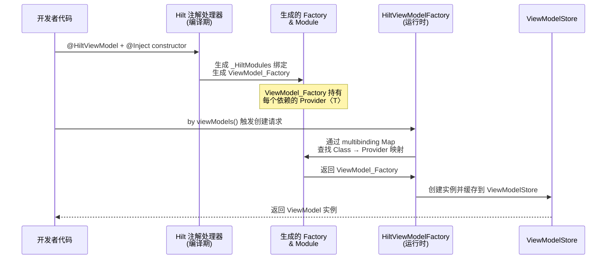

下面分步拆解这一流程：

**第一步：注解处理器扫描与校验（Compile Time）**

当 Hilt 的注解处理器（基于 Dagger 的 `hilt-compiler`）在编译期扫描到 `@HiltViewModel` 时，它会执行一系列校验：

- 该类必须直接继承 `androidx.lifecycle.ViewModel`（或其子类）。
- 构造函数必须有且仅有一个被 `@Inject` 标记的构造函数。
- 构造函数的参数必须全部能从 Hilt 的 DI 图（Dependency Graph）中解析——要么是已经通过 `@Module` / `@Provides` / `@Binds` 注册过的类型，要么是 Hilt 内置支持的类型（如 `SavedStateHandle`、`Application`）。

如果校验不通过，编译器会直接报错，给出明确的错误信息（如 "`ArticleRepository` cannot be provided without an `@Provides`-annotated method"）。这正是 **编译时安全** 的价值所在——问题在打包前就暴露，而非运行时崩溃。

**第二步：生成 Factory 类和 Module 绑定（Compile Time）**

校验通过后，Hilt 会为每一个 `@HiltViewModel` 生成两类关键代码：

1. **`ArticleViewModel_Factory`**：这是一个实现了 Dagger `Factory<ArticleViewModel>` 接口的类。它的构造函数接收每个依赖的 `Provider<T>`（Dagger 的延迟提供者），在 `get()` 方法中调用 ViewModel 的真实构造函数。本质上，**它就是 Hilt 替你自动生成的那个手写 Factory 的等价物**，只不过它使用 `Provider` 模式支持惰性解析和作用域管理。

2. **`ArticleViewModel_HiltModules`**：这是一个 Dagger Module，其中通过 `@Binds` + `@IntoMap` + `@StringKey` 将 `ArticleViewModel::class` 的全限定类名映射到其 Factory，注册进一个 **multibinding Map**。这个 Map 的类型签名大致为 `Map<String, Provider<ViewModel>>`，它就是运行时查找 ViewModel 创建器的"索引表"。

**第三步：运行时创建流程（Runtime）**

当 `by viewModels()` 被触发时，调用链如下：

1. `ViewModelProvider` 使用 `ViewModelProvider.Factory` 来创建实例。在 Hilt 环境下，`@AndroidEntryPoint` 标记的 Activity/Fragment 会自动获得一个 `HiltViewModelFactory` 作为默认 Factory。
2. `HiltViewModelFactory` 内部持有上述 multibinding Map。它以请求的 ViewModel 类名为 Key，在 Map 中查找对应的 `Provider`。
3. 找到后，调用 `Provider.get()`，触发 Dagger 的依赖解析链——每个构造函数参数的 `Provider` 各自解析自己的依赖，最终构造出完整的 ViewModel 实例。
4. 实例被放入 `ViewModelStore` 缓存，后续同一 Owner 再次请求时直接返回缓存。

#### SavedStateHandle 的特殊注入

在 `@HiltViewModel` 的构造函数中，`SavedStateHandle` 是一个 **内置支持** 的类型。开发者不需要在任何 Module 中声明它的提供方式——Hilt 会自动从 `SavedStateRegistryOwner`（即 Activity/Fragment）中提取并注入。

这背后的原理是：`HiltViewModelFactory` 实际上继承自 `AbstractSavedStateViewModelFactory`，它在创建 ViewModel 时会自动生成 `SavedStateHandle` 并传入 Dagger 的依赖图中。因此，对于开发者来说，`SavedStateHandle` 就像任何普通依赖一样被"注入"进来，无需额外配置。

```kotlin
@HiltViewModel
class SearchViewModel @Inject constructor(
    private val searchRepository: SearchRepository,   // 普通依赖，从 DI 图解析
    private val savedStateHandle: SavedStateHandle    // 内置依赖，Hilt 自动提供
) : ViewModel() {

    // 从 savedStateHandle 中恢复搜索关键字
    // getStateFlow 会自动与 SavedStateRegistry 同步
    val query: StateFlow<String> = savedStateHandle.getStateFlow(
        key = "search_query",   // 存储 Key
        initialValue = ""       // 默认值：空字符串
    )

    // 更新搜索关键字，同时自动持久化到 SavedStateHandle
    fun updateQuery(newQuery: String) {
        savedStateHandle["search_query"] = newQuery  // 操作符重载写入
    }
}
```

#### @AndroidEntryPoint 的协作角色

`@HiltViewModel` 不能单独工作，它必须与 `@AndroidEntryPoint` 配合。这个注解标记在 Activity 或 Fragment 上，告诉 Hilt："请为这个组件生成注入代码，并在其生命周期的适当时机执行注入"。

具体来说，`@AndroidEntryPoint` 会在编译期为目标类生成一个父类（例如 `Hilt_ArticleActivity`），该父类在 `onCreate()` 中调用 Hilt 的注入逻辑，并且重写 `getDefaultViewModelProviderFactory()` 方法，返回 `HiltViewModelFactory`。正因如此，当你在 `@AndroidEntryPoint` 标记的 Activity 中调用 `by viewModels()` 时，即使不传 Factory 参数，系统也会使用 Hilt 提供的 Factory 来创建 ViewModel。

如果你忘记标记 `@AndroidEntryPoint`，ViewModel 将使用默认的 `NewInstanceFactory`，它只能调用无参构造函数——对于有依赖注入的 ViewModel，这必然导致运行时崩溃。

---

### AssistedInject 辅助注入

#### 问题的提出：当部分参数只有运行时才知道

`@HiltViewModel` + `@Inject` 的模式有一个隐含前提：**构造函数的所有参数都必须能在编译期确定其提供方式**。换言之，每个参数的类型都必须已经注册在 Hilt 的依赖图中。

但实际开发中，有些参数的 **值** 只有在运行时才能确定，而且它们不适合放入 `SavedStateHandle`（因为它们可能不可序列化、是接口类型、或者语义上不属于"可恢复状态"）。典型场景：

- **某个详情页 ViewModel 需要一个 `articleId: Long`**，这个 ID 由导航参数传入，在编译期无法确定。
- **一个对话框 ViewModel 需要 `config: DialogConfig`**，这个配置对象由调用方动态构建。
- **回调接口注入**：某些场景需要传入一个 `Navigator` 或 `Callback` 实例，它由 Activity 动态提供。

对于简单的基本类型参数（如 `articleId`），推荐的做法是通过 `SavedStateHandle` 传递，因为 Navigation 组件会自动将导航参数写入 `SavedStateHandle`。但当参数是不可序列化的复杂对象或接口时，就需要 **AssistedInject** 登场了。

#### AssistedInject 的核心概念

AssistedInject 是 Dagger 提供的一种"混合注入"模式：构造函数的一部分参数由 DI 容器自动提供（称为 **"provided dependencies"**），另一部分参数由调用方在创建时手动传入（称为 **"assisted parameters"**）。前者在编译期绑定，后者在运行时传递。

这种模式需要三个组件协作：

1. **`@AssistedInject` 构造函数**：标记在 ViewModel 的构造函数上（替代 `@Inject`），声明混合参数列表。
2. **`@Assisted` 参数注解**：标记在那些需要调用方手动传入的参数上。
3. **`@AssistedFactory` 工厂接口**：一个抽象工厂，定义一个创建方法，其参数列表恰好对应所有 `@Assisted` 参数。Dagger 会在编译期自动实现这个接口。

```kotlin
// ViewModel: 使用 @AssistedInject 替代 @Inject
// 注意：不使用 @HiltViewModel，因为 Assisted 模式有独立的注册方式
class ArticleDetailViewModel @AssistedInject constructor(
    private val repository: ArticleRepository,   // 由 Hilt 自动提供（provided）
    private val analytics: AnalyticsTracker,     // 由 Hilt 自动提供（provided）
    @Assisted private val articleId: Long        // 由调用方运行时传入（assisted）
) : ViewModel() {

    // 使用注入的 articleId 加载文章详情
    val article: StateFlow<Article?> = flow {
        emit(repository.getArticle(articleId))   // 直接使用 assisted 参数
    }.stateIn(
        scope = viewModelScope,                  // ViewModel 协程作用域
        started = SharingStarted.WhileSubscribed(5000), // 5秒缓存
        initialValue = null                      // 初始值
    )

    // 编译期生成的工厂接口
    @AssistedFactory
    interface Factory {
        // 方法参数对应所有 @Assisted 标记的参数
        fun create(articleId: Long): ArticleDetailViewModel
    }
}
```

#### 将 AssistedFactory 桥接到 ViewModelProvider.Factory

AssistedFactory 生成的是一个普通对象工厂，它并不感知 `ViewModelProvider` 的生命周期管理机制。如果直接调用 `factory.create(articleId)`，你得到的 ViewModel 实例不会被 `ViewModelStore` 缓存，配置变更时会丢失。

因此，我们需要一个 **桥接层**，将 AssistedFactory 包装成 `ViewModelProvider.Factory`：

```kotlin
// 在 Activity/Fragment 中桥接 AssistedFactory 与 ViewModelProvider
@AndroidEntryPoint
class ArticleDetailFragment : Fragment() {

    // 1. 通过 Hilt 注入 AssistedFactory（它本身是 DI 图中的普通绑定）
    @Inject
    lateinit var viewModelFactory: ArticleDetailViewModel.Factory

    // 2. 使用 by viewModels{} 传入自定义 Factory
    private val viewModel: ArticleDetailViewModel by viewModels {
        // 3. 创建匿名 ViewModelProvider.Factory 桥接
        object : ViewModelProvider.Factory {
            @Suppress("UNCHECKED_CAST")
            override fun <T : ViewModel> create(modelClass: Class<T>): T {
                // 4. 从导航参数中取出 articleId
                val articleId = requireArguments().getLong("article_id")
                // 5. 调用 AssistedFactory 创建实例，并转型返回
                return viewModelFactory.create(articleId) as T
            }
        }
    }
}
```

这样创建出的 ViewModel 实例会被正常缓存到 `ViewModelStore` 中，配置变更后不会重复创建。`Factory.create()` 只在首次请求时被调用一次。

整体的依赖解析流程如下：

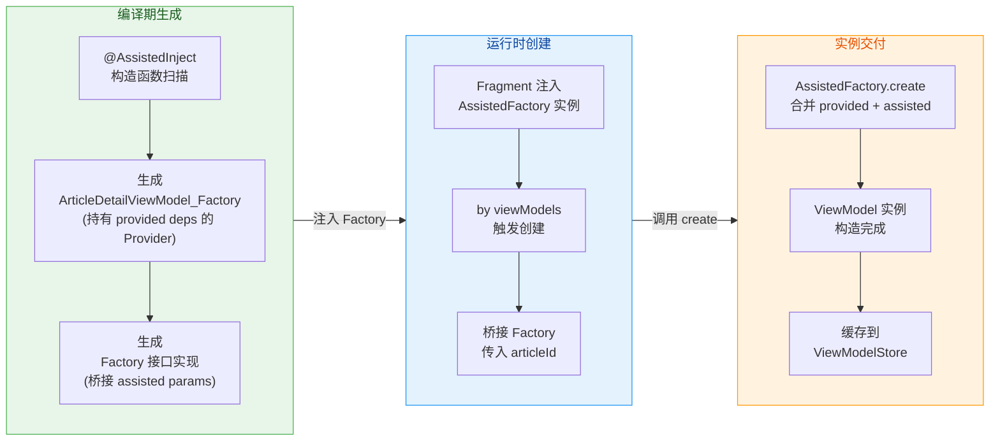

#### 多个 @Assisted 参数的区分

当构造函数中有多个相同类型的 `@Assisted` 参数时，Dagger 无法仅凭类型区分它们。此时需要为 `@Assisted` 注解指定一个唯一的 **标识字符串**（value）来消除歧义：

```kotlin
class ComparisonViewModel @AssistedInject constructor(
    private val repository: ArticleRepository,              // provided
    @Assisted("left") private val leftArticleId: Long,      // assisted: 标记为 "left"
    @Assisted("right") private val rightArticleId: Long     // assisted: 标记为 "right"
) : ViewModel() {

    @AssistedFactory
    interface Factory {
        // 工厂方法的参数也必须带上相同的 @Assisted 标识
        fun create(
            @Assisted("left") leftId: Long,     // 与构造函数的 "left" 对应
            @Assisted("right") rightId: Long    // 与构造函数的 "right" 对应
        ): ComparisonViewModel
    }
}
```

如果省略标识符而仅依赖参数名来区分，编译器 **会报错**，因为 Dagger 在字节码层面是通过注解的 value 属性而非参数名来匹配的。

#### AssistedInject 与 @HiltViewModel 的本质区别

一个常见疑问是：既然 `@HiltViewModel` 已经支持 `SavedStateHandle`，为什么还需要 AssistedInject？两者的根本区别在于 **参数来源的灵活性**：

| 维度 | @HiltViewModel + @Inject | @AssistedInject |
|---|---|---|
| 全部参数来源 | DI 图 + SavedStateHandle（内置） | DI 图（provided）+ 调用方传入（assisted） |
| Factory 生成 | 全自动，无需手写 | 需要定义 @AssistedFactory 接口 + 桥接 |
| 适用参数类型 | 必须可注册到 DI 图或可序列化 | 任意类型，包括接口、回调、不可序列化对象 |
| 使用复杂度 | 最低 | 中等 |
| 推荐场景 | 绝大多数 ViewModel | 需要运行时非序列化参数的少数场景 |

**最佳实践原则**：优先使用 `@HiltViewModel`。只有当参数确实无法通过 DI 图或 `SavedStateHandle` 传递时，才降级到 AssistedInject。滥用 AssistedInject 会降低代码的统一性，增加维护成本。

---

### 参数传递策略

ViewModel 的参数传递是一个需要 **结合具体场景权衡** 的设计决策。Android 生态中存在多种传参方式，它们各有适用范围和局限性。

#### 策略一：SavedStateHandle 传递（推荐首选）

前面章节已经详述了 `SavedStateHandle` 的原理：它封装了 Bundle 机制，支持进程被杀后的状态恢复。在 Hilt 环境下，Navigation 组件的参数会自动注入 `SavedStateHandle`，这使得导航参数的传递变得极其自然：

```kotlin
@HiltViewModel
class ProfileViewModel @Inject constructor(
    private val userRepository: UserRepository,     // DI 提供
    private val savedStateHandle: SavedStateHandle  // Hilt 内置提供
) : ViewModel() {

    // Navigation 参数 "user_id" 自动存在于 SavedStateHandle 中
    // 通过非空断言获取（如果导航图中已声明该参数为必选）
    private val userId: String = savedStateHandle.get<String>("user_id")
        ?: throw IllegalArgumentException("user_id is required")  // 防御性校验

    // 使用 userId 加载用户数据
    val userProfile: StateFlow<UserProfile?> = userRepository
        .observeUser(userId)         // 返回 Flow<UserProfile>
        .stateIn(
            scope = viewModelScope,  // 绑定 ViewModel 生命周期
            started = SharingStarted.WhileSubscribed(5000),
            initialValue = null
        )
}
```

这种方式的优势：① 无需任何额外 Factory；② 天然支持进程恢复；③ 与 Navigation 组件无缝衔接。局限在于 `SavedStateHandle` 只支持 Bundle 兼容的类型（基本类型、String、Parcelable、Serializable 等），且有 **1MB 大小限制**（与 Bundle 的 Binder 事务限制一致）。

#### 策略二：Hilt Module 提供（适合全局/作用域依赖）

对于那些生命周期与 Application 或 Activity 绑定的依赖（如 Retrofit Service、Room DAO、SharedPreferences 封装等），应当通过 Hilt Module 注册到 DI 图中：

```kotlin
// 在 Hilt Module 中注册依赖的提供方式
@Module
@InstallIn(SingletonComponent::class)  // 绑定到 Application 生命周期（全局单例）
object NetworkModule {

    @Provides                          // 告诉 Hilt 如何创建 ArticleApi
    @Singleton                         // 标记为单例，全应用共享一个实例
    fun provideArticleApi(
        retrofit: Retrofit             // Retrofit 本身也由另一个 @Provides 提供
    ): ArticleApi {
        return retrofit.create(ArticleApi::class.java)  // 创建 Retrofit 接口实现
    }
}

@Module
@InstallIn(SingletonComponent::class)
abstract class RepositoryModule {

    @Binds                             // 将接口绑定到实现类
    @Singleton
    abstract fun bindArticleRepository(
        impl: ArticleRepositoryImpl    // 实现类（其构造函数有 @Inject）
    ): ArticleRepository               // 接口类型
}
```

当 `@HiltViewModel` 的构造函数声明依赖 `ArticleRepository` 时，Hilt 会自动沿着 `@Binds` → `ArticleRepositoryImpl` → `@Inject constructor` → `ArticleApi` → `@Provides` → `Retrofit` 这条链路逐级解析，最终完成整棵依赖树的构建。开发者无需关心解析顺序。

#### 策略三：CreationExtras 传递（Compose 与现代 API）

从 **Lifecycle 2.5.0** 开始，Google 引入了 `CreationExtras` 机制，为 `ViewModelProvider.Factory` 提供了一种类型安全的参数传递方式，避免了传统 Factory 的子类膨胀问题：

```kotlin
// 1. 定义 Key
object ArticleIdKey : CreationExtras.Key<Long>

// 2. 在 Factory 中通过 Key 获取参数
@HiltViewModel
class ArticleViewModel @Inject constructor(
    private val repository: ArticleRepository,
    private val savedStateHandle: SavedStateHandle
) : ViewModel() {

    companion object {
        // 定义一个兼容 CreationExtras 的 Factory
        val Factory: ViewModelProvider.Factory = object : ViewModelProvider.Factory {
            @Suppress("UNCHECKED_CAST")
            override fun <T : ViewModel> create(
                modelClass: Class<T>,
                extras: CreationExtras          // 新 API：类型安全的参数容器
            ): T {
                // 从 extras 中按 Key 取值
                val articleId = extras[ArticleIdKey]
                    ?: throw IllegalArgumentException("articleId required")
                // 从 extras 中获取 Application（内置 Key）
                val app = extras[APPLICATION_KEY] as MyApplication
                // 手动构造（仅演示，实际 Hilt 场景不需要）
                return ArticleViewModel(
                    repository = app.articleRepository,
                    savedStateHandle = extras.createSavedStateHandle()
                ) as T
            }
        }
    }
}
```

`CreationExtras` 更多用于 **非 Hilt 场景**（如纯 Compose 项目或轻量级项目），它与 Hilt 的集成并不冲突，但在已经使用 Hilt 的项目中，直接通过 `@HiltViewModel` 和 `SavedStateHandle` 传参通常更简洁。

#### 参数传递决策树

面对各种传参方式，可以使用以下决策流程来选择最合适的策略：

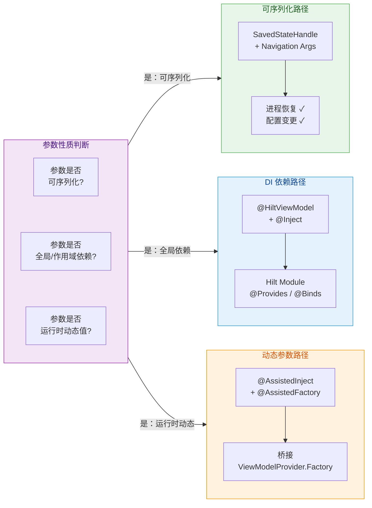

**核心原则总结**：

1. **全局依赖**（Repository、API、DAO）→ 通过 Hilt Module 注入，`@HiltViewModel` 自动解析。
2. **页面参数**（userId、articleId 等可序列化值）→ 通过 Navigation Args 自动注入 `SavedStateHandle`。
3. **不可序列化的运行时参数**（接口回调、复杂配置对象）→ 使用 `@AssistedInject`。
4. **避免 anti-pattern**：不要为了传参而在 ViewModel 中暴露 `init()` 方法或 setter——这会导致状态不一致（ViewModel 在 `init()` 调用前处于"未初始化"状态），且无法在进程恢复时自动重放。

---

**📝 练习题**

在一个使用 Hilt 的项目中，`OrderDetailViewModel` 需要两个依赖：一个 `OrderRepository`（全局单例）和一个 `orderId: String`（由导航参数传入）。以下哪种实现方式是 **最推荐** 的？


A. 使用 `@AssistedInject`，将 `orderId` 标记为 `@Assisted` 参数，定义 `@AssistedFactory` 接口，在 Fragment 中桥接 Factory 传入 `orderId`。


B. 使用 `@HiltViewModel` + `@Inject`，通过 `SavedStateHandle` 在构造函数中获取 `orderId`，`OrderRepository` 由 Hilt 自动注入。


C. 不使用 Hilt，手写 `OrderDetailViewModelFactory`，在 `create()` 中手动传入 `OrderRepository` 和 `orderId`。


D. 使用 `@HiltViewModel` + `@Inject`，在 ViewModel 中定义 `fun init(orderId: String)` 方法，由 Fragment 在 `onViewCreated` 中调用。


**【答案】** B

**【解析】** `orderId` 是一个 `String` 类型的导航参数，完全可序列化，属于典型的"页面参数"。当使用 Navigation 组件时，导航参数会自动写入 `SavedStateHandle`，因此在 `@HiltViewModel` 的构造函数中直接通过 `savedStateHandle.get<String>("orderId")` 即可获取，无需任何额外 Factory。选项 A 使用 AssistedInject 虽然能工作，但对于可序列化的简单参数来说 **过度设计**（over-engineering），增加了不必要的 Factory 接口和桥接代码。选项 C 完全放弃了 Hilt 的优势，回到了手写 Factory 的原始时代。选项 D 是典型的 **反模式**——通过 `init()` 方法延迟注入参数，会导致 ViewModel 在构造后到 `init()` 调用前处于不完整状态，且进程被杀恢复时 Fragment 可能不会重新调用 `init()`，造成数据丢失。

---

## MVVM 架构模式

在前面的章节中，我们逐一拆解了 ViewModel 的设计哲学、存储机制、状态保存、协程集成和依赖注入。这些技术组件并非孤立存在——它们共同服务于一个更宏观的架构目标：**将 UI 逻辑与业务逻辑彻底解耦，让代码具备可测试性、可维护性和可扩展性**。这个架构目标的集大成者，就是 MVVM（Model-View-ViewModel）模式。

MVVM 并非 Android 独创。它最早由微软在 2005 年为 WPF（Windows Presentation Foundation）提出，核心思想是通过一个"中间层"（ViewModel）将 UI 表现（View）与数据/业务逻辑（Model）隔离开来。Android 社区在经历了 MVC → MVP → MVVM 的演进后，随着 `ViewModel`、`LiveData`、`StateFlow`、`DataBinding` 等 Jetpack 组件的成熟，MVVM 已经成为 Google 官方推荐的首选架构模式。但"推荐"不等于"银弹"——理解 MVVM 的职责边界、数据流向以及不同变体的取舍，才能真正写出优雅的架构代码，而不是"形似 MVVM，实为大泥球"。

---

### Model-View-ViewModel 职责划分

MVVM 的核心是 **三层职责的严格分离**。每一层有明确的"能做什么"和"不能做什么"，任何越界行为都会导致架构退化。

#### View 层：纯粹的 UI 渲染器

View 层在 Android 中对应 **Activity、Fragment、Composable 函数**。它的唯一职责是：**将 ViewModel 暴露的状态渲染到屏幕上，并将用户交互事件转发给 ViewModel**。

View 层的"能做"清单：

- **订阅状态**：观察 ViewModel 暴露的 `StateFlow`、`LiveData` 或 Compose `State`，当数据变化时更新 UI。
- **转发事件**：用户点击按钮、输入文字、滑动列表等操作，View 层将这些 **原始 UI 事件** 转化为 **语义化的业务意图**（intent），调用 ViewModel 的方法。例如，按钮点击不应直接触发网络请求，而应调用 `viewModel.loadArticle()`。
- **导航与 Toast**：某些"一次性"的 UI 行为（如页面跳转、弹 Snackbar）属于 View 层的责任，但它们的触发信号应来自 ViewModel（通过 Event 机制，后文详述）。

View 层的"禁止"清单：

- **禁止持有业务数据**：View 不应该用成员变量缓存文章列表、用户信息等数据。所有数据都应从 ViewModel 的状态流中获取。
- **禁止包含业务逻辑**：判断用户是否登录、计算订单总价、过滤搜索结果——这些逻辑不属于 View 层，即使只有一行 `if` 判断。
- **禁止直接访问 Model 层**：View 不应直接调用 Repository 或 API，这会绕过 ViewModel 的状态管理，导致数据不一致。

一个关键的心智模型是：**理想的 View 层是一个"无脑渲染器"**——给它什么状态，它就画什么画面。它不做判断、不做计算、不做缓存。这正是 Jetpack Compose 的设计哲学所追求的极致——`@Composable` 函数本质上就是一个 `State → UI` 的纯函数。

#### ViewModel 层：状态持有者与逻辑协调者

ViewModel 层是 MVVM 的枢纽。它向上（View）暴露 **UI 状态**（UI State），向下（Model）调用 **数据操作**。它的职责可以概括为两个词：**持有状态** 和 **协调逻辑**。

**持有状态** 意味着 ViewModel 是 UI 数据的 "single source of truth"（唯一可信数据源）。View 层看到的所有数据，都经过 ViewModel 的整理和组合。例如，一个文章详情页的状态可能包含文章标题、正文、是否已收藏、评论列表、加载状态等多个字段——ViewModel 将它们聚合成一个统一的 UI State 对象：

```kotlin
// UI 状态：一个不可变数据类，描述屏幕的完整快照
data class ArticleDetailUiState(
    val title: String = "",                    // 文章标题
    val content: String = "",                  // 文章正文
    val isBookmarked: Boolean = false,         // 是否已收藏
    val comments: List<Comment> = emptyList(), // 评论列表
    val isLoading: Boolean = true,             // 是否正在加载
    val errorMessage: String? = null           // 错误信息（null 表示无错误）
)
```

**协调逻辑** 意味着 ViewModel 负责接收 View 的业务意图，调用 Model 层获取或修改数据，然后更新 UI 状态。这里的关键词是"协调"而非"实现"——复杂的业务规则（如"收藏文章时需要先检查登录状态，再调用 API，最后更新本地缓存"）应当封装在 Model 层的 UseCase 或 Repository 中，ViewModel 只负责 **调用** 和 **状态转换**。

```kotlin
@HiltViewModel
class ArticleDetailViewModel @Inject constructor(
    private val getArticleUseCase: GetArticleUseCase,         // 获取文章的用例
    private val toggleBookmarkUseCase: ToggleBookmarkUseCase, // 切换收藏的用例
    private val savedStateHandle: SavedStateHandle            // 进程恢复
) : ViewModel() {

    // 从导航参数获取文章 ID
    private val articleId: Long = savedStateHandle.get<Long>("article_id")
        ?: throw IllegalArgumentException("article_id is required")

    // 内部可变状态（私有）
    private val _uiState = MutableStateFlow(ArticleDetailUiState())

    // 外部只读状态（公开）
    val uiState: StateFlow<ArticleDetailUiState> = _uiState.asStateFlow()

    // 初始化时加载文章
    init {
        loadArticle()  // 在构造时触发首次加载
    }

    // 加载文章数据（私有方法，内部协调）
    private fun loadArticle() {
        viewModelScope.launch {                              // 在 ViewModel 协程作用域中执行
            _uiState.update { it.copy(isLoading = true) }    // 更新为加载中状态
            try {
                val article = getArticleUseCase(articleId)   // 调用 UseCase 获取数据
                _uiState.update {                            // 成功：更新所有字段
                    it.copy(
                        title = article.title,               // 填充标题
                        content = article.content,           // 填充正文
                        isBookmarked = article.isBookmarked, // 填充收藏状态
                        comments = article.comments,         // 填充评论
                        isLoading = false,                   // 加载完成
                        errorMessage = null                  // 清除错误
                    )
                }
            } catch (e: Exception) {
                _uiState.update {                            // 失败：保留旧数据，显示错误
                    it.copy(
                        isLoading = false,                   // 停止加载
                        errorMessage = e.message             // 设置错误信息
                    )
                }
            }
        }
    }

    // 切换收藏状态（View 层的按钮点击调用此方法）
    fun toggleBookmark() {
        viewModelScope.launch {
            val result = toggleBookmarkUseCase(articleId)     // 调用 UseCase
            _uiState.update {
                it.copy(isBookmarked = result.isBookmarked)   // 只更新收藏字段
            }
        }
    }
}
```

ViewModel 层的"禁止"清单同样重要：

- **禁止持有 View 引用**（Activity、Fragment、Context、View）——这是内存泄漏的根源，因为 ViewModel 的生命周期长于 View。
- **禁止直接操作 UI**（`setText()`、`setVisibility()`）——ViewModel 通过状态间接驱动 UI，而非直接控制。
- **禁止感知 Android 框架类**（理想情况下）——尽量让 ViewModel 只依赖纯 Kotlin/Java 类型和 Domain 层接口，这样可以在纯 JVM 环境中运行单元测试，无需 Robolectric 或 Instrumented Test。

#### Model 层：数据与业务规则的归宿

Model 层是 MVVM 中最"厚"的一层，但也是最容易被忽视的一层。许多开发者将 Model 层简化为"数据源的包装"，实际上它应该承载 **所有与 UI 无关的业务逻辑**。

在 Google 推荐的架构中，Model 层通常分为两个子层：

1. **Domain 层（可选但推荐）**：包含 **UseCase（用例）** 类，每个 UseCase 封装一个独立的业务操作。例如 `GetArticleUseCase` 封装"获取文章详情"的完整逻辑（包括缓存策略、数据合并、错误处理等）。UseCase 的输入和输出都是纯领域对象（Domain Model），不含 Android 框架类型。

2. **Data 层**：包含 **Repository（仓库）** 和 **DataSource（数据源）**。Repository 是数据的统一入口，它决定从网络还是本地缓存获取数据，并负责两者的同步。DataSource 则是具体的数据获取实现（Retrofit API、Room DAO、SharedPreferences 等）。

```kotlin
// Domain 层：UseCase 封装业务逻辑
class GetArticleUseCase @Inject constructor(
    private val articleRepository: ArticleRepository  // 依赖 Repository 接口
) {
    // operator fun invoke 让 UseCase 可以像函数一样调用
    suspend operator fun invoke(articleId: Long): ArticleDetail {
        // 业务逻辑：获取文章的同时加载评论
        val article = articleRepository.getArticle(articleId)     // 获取文章
        val comments = articleRepository.getComments(articleId)   // 获取评论
        return ArticleDetail(                                    // 组合为领域模型
            title = article.title,
            content = article.content,
            isBookmarked = article.isBookmarked,
            comments = comments
        )
    }
}

// Data 层：Repository 协调多个数据源
class ArticleRepositoryImpl @Inject constructor(
    private val remoteDataSource: ArticleRemoteDataSource,   // 网络数据源
    private val localDataSource: ArticleLocalDataSource      // 本地数据源
) : ArticleRepository {

    override suspend fun getArticle(id: Long): Article {
        // 缓存优先策略：先查本地，没有再请求网络
        return localDataSource.getArticle(id)                // 查本地缓存
            ?: remoteDataSource.fetchArticle(id).also {      // 本地没有则请求网络
                localDataSource.saveArticle(it)              // 网络数据写入本地缓存
            }
    }

    override suspend fun getComments(articleId: Long): List<Comment> {
        return remoteDataSource.fetchComments(articleId)      // 评论总是从网络获取
    }
}
```

Model 层的设计原则是 **平台无关性**。理想的 Domain 层不依赖任何 Android SDK 类型，它可以在纯 JVM 单元测试中运行，甚至可以在 KMM（Kotlin Multiplatform Mobile）中跨平台复用。Data 层虽然涉及 Android 框架（Room、Retrofit），但通过接口抽象（如 `ArticleRepository` 接口），ViewModel 和 Domain 层只依赖接口而非实现，保持了可替换性。

#### 三层协作的完整数据流

以下 Mermaid 图展示了一次完整的用户交互在 MVVM 三层中的流转路径：

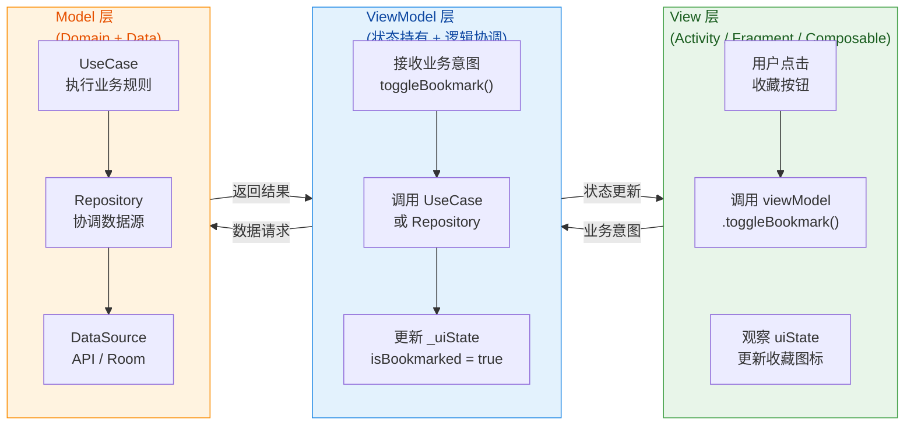

注意图中的箭头方向：**View → ViewModel → Model** 是"命令"方向（用户操作触发数据变更），**Model → ViewModel → View** 是"数据"方向（新状态从底层传递到 UI）。两个方向共同构成了 MVVM 的数据流闭环。

---

### 双向绑定 vs 单向数据流

MVVM 模式存在两种截然不同的数据流变体：**双向绑定（Two-Way Data Binding）** 和 **单向数据流（Unidirectional Data Flow, UDF）**。它们代表了两种不同的哲学，理解其差异对于做出正确的架构决策至关重要。

#### 双向绑定：XML 时代的 DataBinding

双向绑定的核心思想是：**View 的变化自动同步到 ViewModel，ViewModel 的变化也自动同步到 View**。在 Android 中，这通过 **DataBinding Library** 实现，尤其是 `@={}` 语法（注意 `=` 号表示双向）。

典型的双向绑定场景是表单输入：用户在 `EditText` 中输入文字，文字自动同步到 ViewModel 的某个 `MutableLiveData<String>`；如果 ViewModel 从其他来源修改了这个值（比如从服务端恢复草稿），`EditText` 的显示内容也会自动更新。

```xml
<!-- XML 布局：使用 DataBinding 的双向绑定 -->
<layout xmlns:android="http://schemas.android.com/apk/res/android">
    <data>
        <!-- 声明绑定的 ViewModel 变量 -->
        <variable
            name="viewModel"
            type="com.example.LoginViewModel" />
    </data>

    <LinearLayout
        android:layout_width="match_parent"
        android:layout_height="match_parent"
        android:orientation="vertical">

        <!-- @={} 双向绑定：EditText 的文字与 ViewModel.username 双向同步 -->
        <EditText
            android:layout_width="match_parent"
            android:layout_height="wrap_content"
            android:text="@={viewModel.username}" />

        <!-- @{} 单向绑定：Button 的启用状态由 ViewModel 控制 -->
        <Button
            android:layout_width="wrap_content"
            android:layout_height="wrap_content"
            android:text="Login"
            android:enabled="@{viewModel.isLoginEnabled}"
            android:onClick="@{() -> viewModel.login()}" />
    </LinearLayout>
</layout>
```

```kotlin
// ViewModel：暴露双向绑定的可变属性
class LoginViewModel : ViewModel() {
    // MutableLiveData 支持双向绑定
    val username = MutableLiveData<String>("")    // 用户名：EditText 直接读写此字段
    val password = MutableLiveData<String>("")    // 密码：同上

    // 派生状态：用户名和密码都非空时才启用登录按钮
    val isLoginEnabled: LiveData<Boolean> = MediatorLiveData<Boolean>().apply {
        // 监听 username 变化
        addSource(username) {
            value = !username.value.isNullOrBlank()   // 检查用户名非空
                    && !password.value.isNullOrBlank() // 检查密码非空
        }
        // 监听 password 变化
        addSource(password) {
            value = !username.value.isNullOrBlank()
                    && !password.value.isNullOrBlank()
        }
    }

    // 登录操作
    fun login() {
        val user = username.value ?: return       // 获取当前用户名
        val pass = password.value ?: return       // 获取当前密码
        // ... 执行登录逻辑
    }
}
```

双向绑定的 **优势** 在于代码极度简洁——View 和 ViewModel 之间的同步完全自动化，开发者不需要手动写 `TextWatcher` 或 `setText()`。对于简单的表单场景（登录页、设置页），双向绑定确实能显著减少样板代码。

然而，双向绑定在实际大型项目中暴露出了严重的问题：

**1. 数据流不可追踪。** 当 `username` 的值发生变化时，变化的来源可能是用户输入（从 View 到 ViewModel），也可能是代码赋值（从 ViewModel 到 View），甚至可能是另一个观察者的副作用。在复杂的表单中，多个双向绑定字段相互关联（如"省份"选择变化导致"城市"列表重置），调试时很难追踪"这次变化到底是谁触发的"。数据流变成了一张纠缠的网，而非清晰的单行道。

**2. 隐式状态修改。** ViewModel 暴露的是 `MutableLiveData`（可变的），意味着 View 层 **可以直接修改** ViewModel 的状态，而不经过任何"门卫"逻辑。这打破了"ViewModel 是状态的唯一管理者"这一核心原则。任何能访问 ViewModel 的代码都能随意修改状态，导致状态管理失控。

**3. XML 表达式的局限与风险。** DataBinding 的 XML 表达式（`@{}`）功能有限，但"足够强大到被滥用"。有些开发者在 XML 中写复杂的三元表达式、方法调用链甚至字符串拼接，导致 **业务逻辑泄漏到 XML 布局中**。这些逻辑无法进行单元测试，出错时的报错信息也极其晦涩（DataBinding 的编译报错是出了名的难读）。

**4. 编译时间膨胀。** DataBinding 需要在编译期扫描 XML、生成 Binding 类、解析表达式——这个过程对构建速度有可感知的影响，在大型项目中尤为明显。

正是这些问题，推动了 Android 社区从双向绑定转向 **单向数据流**。

#### 单向数据流（UDF）：现代 Android 的主流选择

单向数据流（Unidirectional Data Flow, UDF）的核心理念是：**数据永远沿着一个方向流动**——从 Model 到 ViewModel 到 View，形成一个可预测的、可追踪的闭环。用户的操作不直接修改状态，而是产生一个"事件"或"意图"（Intent），这个意图被 ViewModel 接收后，通过确定性的逻辑更新状态，新状态再流向 View 完成渲染。

UDF 可以用三个关键词概括：**State（状态）、Event（事件）、Effect（副作用）**。

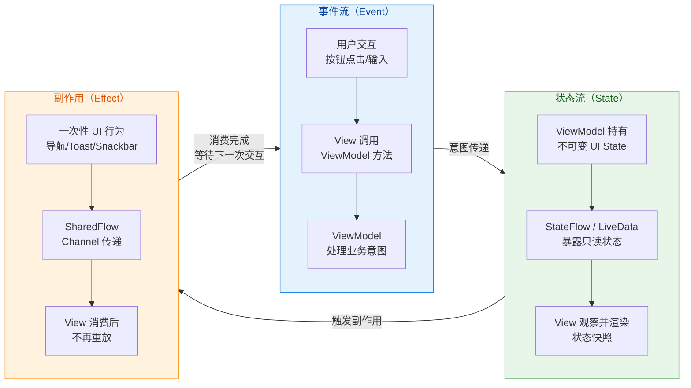

下面用一个完整的登录页示例展示 UDF 的实现模式：

```kotlin
// ——————————— UI State：描述屏幕的完整快照 ———————————
data class LoginUiState(
    val username: String = "",               // 当前用户名
    val password: String = "",               // 当前密码
    val isLoginEnabled: Boolean = false,     // 登录按钮是否可点击
    val isLoading: Boolean = false,          // 是否正在登录
    val errorMessage: String? = null         // 错误信息
)

// ——————————— UI Effect：一次性副作用事件 ———————————
sealed interface LoginEffect {
    data class ShowToast(val message: String) : LoginEffect   // 弹出 Toast
    data object NavigateToHome : LoginEffect                  // 跳转首页
}

// ——————————— ViewModel：状态管理中枢 ———————————
@HiltViewModel
class LoginViewModel @Inject constructor(
    private val loginUseCase: LoginUseCase        // 注入登录用例
) : ViewModel() {

    // 内部可变状态
    private val _uiState = MutableStateFlow(LoginUiState())
    // 外部只读状态（View 只能观察，不能修改）
    val uiState: StateFlow<LoginUiState> = _uiState.asStateFlow()

    // 一次性副作用通道（SharedFlow 不重放，避免配置变更后重复消费）
    private val _effect = MutableSharedFlow<LoginEffect>()
    val effect: SharedFlow<LoginEffect> = _effect.asSharedFlow()

    // ——— 接收 View 层的意图 ———

    // 意图：用户修改了用户名
    fun onUsernameChanged(newUsername: String) {
        _uiState.update {                                      // 原子更新状态
            it.copy(
                username = newUsername,                         // 更新用户名字段
                isLoginEnabled = newUsername.isNotBlank()       // 重新计算按钮状态
                        && it.password.isNotBlank(),
                errorMessage = null                            // 清除旧错误
            )
        }
    }

    // 意图：用户修改了密码
    fun onPasswordChanged(newPassword: String) {
        _uiState.update {
            it.copy(
                password = newPassword,                        // 更新密码字段
                isLoginEnabled = it.username.isNotBlank()      // 重新计算按钮状态
                        && newPassword.isNotBlank(),
                errorMessage = null
            )
        }
    }

    // 意图：用户点击了登录按钮
    fun onLoginClicked() {
        viewModelScope.launch {
            _uiState.update { it.copy(isLoading = true) }      // 进入加载状态

            val result = loginUseCase(                          // 调用 UseCase
                username = _uiState.value.username,
                password = _uiState.value.password
            )

            result.fold(
                onSuccess = {
                    _uiState.update { it.copy(isLoading = false) }
                    _effect.emit(LoginEffect.NavigateToHome)   // 发送跳转副作用
                },
                onFailure = { error ->
                    _uiState.update {
                        it.copy(
                            isLoading = false,                 // 停止加载
                            errorMessage = error.message       // 显示错误
                        )
                    }
                }
            )
        }
    }
}
```

```kotlin
// ——————————— View 层（Fragment 示例）———————————
@AndroidEntryPoint
class LoginFragment : Fragment() {

    private val viewModel: LoginViewModel by viewModels()      // Hilt 自动注入
    private var _binding: FragmentLoginBinding? = null          // ViewBinding
    private val binding get() = _binding!!

    override fun onViewCreated(view: View, savedInstanceState: Bundle?) {
        super.onViewCreated(view, savedInstanceState)

        // ——— 转发用户意图 ———
        // 监听用户名输入，转发给 ViewModel
        binding.etUsername.doAfterTextChanged { text ->
            viewModel.onUsernameChanged(text.toString())       // 转发意图，不做任何逻辑
        }

        // 监听密码输入
        binding.etPassword.doAfterTextChanged { text ->
            viewModel.onPasswordChanged(text.toString())
        }

        // 监听登录按钮点击
        binding.btnLogin.setOnClickListener {
            viewModel.onLoginClicked()                         // 转发意图
        }

        // ——— 观察状态并渲染 UI ———
        viewLifecycleOwner.lifecycleScope.launch {
            viewLifecycleOwner.repeatOnLifecycle(Lifecycle.State.STARTED) {
                // 收集 UI 状态
                launch {
                    viewModel.uiState.collect { state ->
                        // 根据状态更新 UI（纯渲染，无逻辑判断）
                        binding.btnLogin.isEnabled = state.isLoginEnabled
                        binding.progressBar.isVisible = state.isLoading
                        binding.tvError.text = state.errorMessage
                        binding.tvError.isVisible = state.errorMessage != null
                    }
                }

                // 收集一次性副作用
                launch {
                    viewModel.effect.collect { effect ->
                        when (effect) {
                            is LoginEffect.ShowToast -> {
                                Toast.makeText(                // 弹 Toast
                                    requireContext(),
                                    effect.message,
                                    Toast.LENGTH_SHORT
                                ).show()
                            }
                            is LoginEffect.NavigateToHome -> {
                                findNavController().navigate(  // 页面跳转
                                    R.id.action_login_to_home
                                )
                            }
                        }
                    }
                }
            }
        }
    }

    override fun onDestroyView() {
        super.onDestroyView()
        _binding = null                                        // 释放 ViewBinding
    }
}
```

注意上述 View 层代码的特征：**没有任何 `if` 判断**（除了 `isVisible` 的赋值，但那是纯渲染行为）。所有"登录按钮什么时候可点击"、"什么时候显示错误"这类逻辑，全部在 ViewModel 中通过状态计算完成。View 层只是"无脑"地将状态映射到 UI 属性。

#### UDF 在 Jetpack Compose 中的天然契合

单向数据流与 Jetpack Compose 的声明式 UI 模型是天作之合。Compose 的 `@Composable` 函数本质上就是 `State → UI` 的映射，它会在 State 变化时自动 recompose（重组），无需手动 `setText()` 或 `setVisibility()`：

```kotlin
// Compose 版本的登录页：UDF 的极致简洁
@Composable
fun LoginScreen(
    viewModel: LoginViewModel = hiltViewModel()  // Hilt 自动提供 ViewModel
) {
    // 将 StateFlow 转化为 Compose State，自动触发 recomposition
    val uiState by viewModel.uiState.collectAsStateWithLifecycle()

    // 处理一次性副作用
    val context = LocalContext.current
    LaunchedEffect(Unit) {                       // 启动一次性协程收集副作用
        viewModel.effect.collect { effect ->
            when (effect) {
                is LoginEffect.ShowToast ->
                    Toast.makeText(context, effect.message, Toast.LENGTH_SHORT).show()
                is LoginEffect.NavigateToHome -> {
                    // 导航逻辑
                }
            }
        }
    }

    // 纯声明式 UI：状态 → 画面
    Column(
        modifier = Modifier
            .fillMaxSize()
            .padding(16.dp),
        verticalArrangement = Arrangement.Center
    ) {
        // 用户名输入框
        OutlinedTextField(
            value = uiState.username,                          // 从 State 读取
            onValueChange = viewModel::onUsernameChanged,      // 意图直接转发
            label = { Text("Username") },
            singleLine = true
        )

        Spacer(modifier = Modifier.height(8.dp))

        // 密码输入框
        OutlinedTextField(
            value = uiState.password,                          // 从 State 读取
            onValueChange = viewModel::onPasswordChanged,      // 意图直接转发
            label = { Text("Password") },
            visualTransformation = PasswordVisualTransformation(),
            singleLine = true
        )

        Spacer(modifier = Modifier.height(16.dp))

        // 登录按钮
        Button(
            onClick = viewModel::onLoginClicked,               // 意图转发
            enabled = uiState.isLoginEnabled                   // 状态驱动可点击性
        ) {
            if (uiState.isLoading) {
                CircularProgressIndicator(                     // 加载中显示进度
                    modifier = Modifier.size(20.dp),
                    strokeWidth = 2.dp
                )
            } else {
                Text("Login")                                  // 正常显示文字
            }
        }

        // 错误提示
        uiState.errorMessage?.let { error ->
            Spacer(modifier = Modifier.height(8.dp))
            Text(
                text = error,                                  // 显示错误信息
                color = MaterialTheme.colorScheme.error        // Material 错误颜色
            )
        }
    }
}
```

对比 Fragment + ViewBinding 的版本，Compose 版本显著更短——因为 Compose **消除了"手动将状态同步到 UI"的样板代码**。你不再需要 `binding.tvError.text = state.errorMessage` 这种命令式赋值，Compose 会在 `uiState` 变化时自动重新执行函数体，生成新的 UI 描述。这正是声明式 UI 与 UDF 联合的威力所在。

#### 双向绑定 vs 单向数据流：对比总结

| 维度 | 双向绑定 (DataBinding @={}) | 单向数据流 (UDF) |
|---|---|---|
| 数据流方向 | View ↔ ViewModel 双向自动同步 | View → Event → ViewModel → State → View 单向闭环 |
| 状态可追踪性 | 低：变化来源可能是 View 或 ViewModel | 高：状态只由 ViewModel 更新，来源明确 |
| View 层能否直接修改状态 | 能（通过 MutableLiveData） | 不能（只暴露 StateFlow 只读接口） |
| 可测试性 | 中等：XML 中的表达式无法单元测试 | 高：ViewModel 的状态变换是纯逻辑，可完全单测 |
| 代码简洁度（简单场景） | 极高（XML 中一行绑定搞定） | 中等（需手动写 onValueChange 转发） |
| 代码可维护性（复杂场景） | 低：多字段相互联动时难以追踪 | 高：所有状态变更集中在 ViewModel |
| 框架适用性 | 仅 XML View 体系 | XML 和 Compose 均适用 |
| 官方推荐程度（2024+） | 逐渐淡化，Compose 中无等价物 | 强烈推荐，Compose 的核心范式 |

**结论**：在新项目和 Compose 项目中，**单向数据流是唯一推荐的选择**。即使在仍使用 XML 的传统项目中，也建议用 ViewBinding + StateFlow 的 UDF 模式替代 DataBinding 的双向绑定。双向绑定在历史上解决了"手动同步状态"的痛点，但它引入的不可控数据流在复杂场景中弊大于利。UDF 虽然多写了几行"转发代码"，但换来的是 **可预测性、可测试性和可维护性**——这些才是架构的核心价值。

#### 进阶：MVI 模式与 UDF 的关系

在讨论 UDF 时，不可避免地会提到 **MVI（Model-View-Intent）** 模式。MVI 可以被视为 UDF 的一种 **更加结构化的实现**。它的核心差异在于：将所有用户意图（Intent）统一为一个 sealed class，通过一个单一入口（通常是 `processIntent()` 或 `dispatch()`）传入 ViewModel，再由 ViewModel 内部的 **Reducer**（纯函数）根据当前状态和意图计算出新状态。

```kotlin
// MVI 风格：所有意图统一为 sealed interface
sealed interface LoginIntent {
    data class UsernameChanged(val username: String) : LoginIntent   // 用户名变化意图
    data class PasswordChanged(val password: String) : LoginIntent   // 密码变化意图
    data object LoginClicked : LoginIntent                           // 登录点击意图
}

@HiltViewModel
class LoginMviViewModel @Inject constructor(
    private val loginUseCase: LoginUseCase
) : ViewModel() {

    private val _uiState = MutableStateFlow(LoginUiState())
    val uiState: StateFlow<LoginUiState> = _uiState.asStateFlow()

    // 单一入口：所有意图都通过这一个方法进入
    fun dispatch(intent: LoginIntent) {
        when (intent) {
            is LoginIntent.UsernameChanged -> reduce {             // 根据意图类型分派
                copy(                                              // reduce：纯函数状态变换
                    username = intent.username,
                    isLoginEnabled = intent.username.isNotBlank()
                            && password.isNotBlank()
                )
            }
            is LoginIntent.PasswordChanged -> reduce {
                copy(
                    password = intent.password,
                    isLoginEnabled = username.isNotBlank()
                            && intent.password.isNotBlank()
                )
            }
            is LoginIntent.LoginClicked -> handleLogin()           // 含副作用的异步操作
        }
    }

    // 辅助方法：原子性地执行状态变换
    private fun reduce(reducer: LoginUiState.() -> LoginUiState) {
        _uiState.update { it.reducer() }                           // 将 reducer 应用到当前状态
    }

    private fun handleLogin() {
        viewModelScope.launch {
            reduce { copy(isLoading = true) }                      // 进入加载状态
            loginUseCase(uiState.value.username, uiState.value.password)
                .fold(
                    onSuccess = { reduce { copy(isLoading = false) } },
                    onFailure = { e ->
                        reduce { copy(isLoading = false, errorMessage = e.message) }
                    }
                )
        }
    }
}
```

MVI 的 **优势** 在于极致的可追踪性——每一个状态变化都对应一个明确的 Intent，配合日志中间件可以回放整个状态变迁历史，非常适合复杂状态管理（如编辑器、购物车、多步表单等）。其 **劣势** 在于对简单页面来说样板代码过多——一个按钮点击也要定义成 sealed class 的成员，有些"为了架构而架构"的过度设计之嫌。

**实践建议**：对于大多数 Android 应用，**MVVM + UDF**（即前面展示的 `onXxxChanged()` 方法式 ViewModel）已经足够。只有在状态极其复杂、需要状态回放/时间旅行调试的场景（如 Redux DevTools 风格的调试需求），才需要引入完整的 MVI 架构。两者并不矛盾——MVI 本质上是 UDF 的子集，核心思想完全一致。

---

**📝 练习题**

在一个使用 MVVM + 单向数据流的项目中，Fragment 需要在登录成功后跳转到首页。以下哪种实现方式 **最符合** UDF 原则？


A. 在 ViewModel 的 `login()` 方法中直接调用 `navController.navigate(R.id.home)`，因为导航是业务逻辑的一部分。


B. 在 ViewModel 中将 `isLoginSuccess` 作为 `StateFlow<Boolean>` 暴露，Fragment 观察到 `true` 时执行导航。


C. 在 ViewModel 中通过 `SharedFlow<LoginEffect>` 发送一次性 `NavigateToHome` 事件，Fragment 收集后执行导航。


D. 在 Fragment 中直接调用 `loginUseCase`，登录成功后立即导航，绕过 ViewModel。


**【答案】** C

**【解析】** 导航是一种 **一次性 UI 副作用**（Side Effect）——它只应执行一次，不应在配置变更后重复触发。选项 B 将导航条件建模为 `StateFlow`，但 `StateFlow` 具有 **粘性**（新订阅者会收到最新值）：配置变更后 Fragment 重新订阅时会再次收到 `true`，导致 **重复导航**（除非手动重置为 `false`，但这增加了额外状态管理负担，且在并发场景下有竞态风险）。选项 C 使用 `SharedFlow`（`replay = 0`），事件一经消费即丢弃，天然避免了重复触发问题，是 Google 官方推荐的一次性事件处理方式。选项 A 违反了 MVVM 的核心原则——ViewModel 不应持有任何 Android 框架组件（`NavController` 是 View 层的概念）。选项 D 让 Fragment 直接访问 Model 层，完全绕过了 ViewModel 的状态管理，违反了分层架构原则。

---

## 最佳实践与反模式

ViewModel 作为 UI 状态容器的核心组件，其设计初衷是 **分离 UI 控制器与业务数据**，让数据在配置变更时得以存活。然而，正因为 ViewModel 的生命周期 **长于** Activity/Fragment，如果开发者在使用过程中不遵守一系列关键约束，就会引发内存泄漏、状态不一致、甚至难以复现的崩溃。本节将系统性地梳理 ViewModel 使用中最常见的 **Best Practices** 与 **Anti-patterns**，每条规则都会深入解释 "为什么"——不是简单地告诉你 "不要这么做"，而是让你理解背后的内存模型与生命周期机制，从而在面对新场景时能自行判断。

---

### 避免持有 View / Context 引用

这是 ViewModel 使用中 **最重要、最容易犯、也最危险** 的反模式，没有之一。要理解这条规则为什么如此关键，必须从 ViewModel 与 Activity 的生命周期差异说起。

当用户旋转屏幕时，系统会销毁当前 Activity 实例并创建一个全新的实例，但 ViewModel 通过 `ViewModelStore` 被保留下来，跨越了这次 destroy-recreate 周期。这意味着 ViewModel 的存活时间 **严格长于** 任何一个 Activity 实例。如果 ViewModel 内部持有了对旧 Activity（或其内部 View、Fragment）的引用，旧 Activity 的整棵 View 树都无法被 GC 回收——因为从 GC Root 出发，存在一条 `ViewModelStore → ViewModel → Activity/View` 的强引用链。这就是典型的 **内存泄漏（Memory Leak）**。

更隐蔽的情况是持有 **Context** 引用。Activity 本身就是一个 Context，而许多 Android API 需要 Context 参数（Toast、资源加载、SharedPreferences 等），开发者很容易在 ViewModel 构造时传入 `activity` 或通过方法参数缓存一个 Context 字段。这同样会导致泄漏，因为这个 Context 实质就是那个即将被销毁的 Activity 实例。

```kotlin
// ❌ Anti-pattern：ViewModel 持有 Activity 引用
class UserViewModel(
    // 构造函数直接接收 Activity，形成强引用
    private val activity: MainActivity
) : ViewModel() {

    fun showMessage(msg: String) {
        // 当屏幕旋转后，activity 指向已销毁的旧实例
        // 调用 Toast 可能导致 WindowManager$BadTokenException
        Toast.makeText(activity, msg, Toast.LENGTH_SHORT).show()
    }
}
```

上面这段代码中，`activity` 字段在旋转屏幕后仍然指向旧的 `MainActivity` 实例。该旧实例的 Window Token 已失效，强行使用会抛出 `BadTokenException`；即使没有显式调用，仅仅是持有引用就足以让数百 KB 甚至 MB 级别的 View 树无法回收。

**同样危险的变体**包括：

- **持有 View 引用**：`private val textView: TextView` — View 内部持有对 Activity 的引用（`mContext` 字段），泄漏效果与直接持有 Activity 完全等价。
- **持有 Fragment 引用**：Fragment 持有其宿主 Activity 的引用，链式泄漏同样成立。
- **持有匿名内部类 / Lambda 捕获的外部 Activity 变量**：这是最隐蔽的形式，Kotlin lambda 会捕获外部作用域的变量，如果在 Activity 中创建 lambda 并传给 ViewModel，lambda 隐式持有 Activity 的 `this` 引用。
- **持有 Adapter / RecyclerView.ViewHolder**：Adapter 通常持有 Context，ViewHolder 持有 itemView，都会间接引用 Activity。

```kotlin
// ❌ Anti-pattern：Lambda 隐式捕获 Activity
class MainActivity : AppCompatActivity() {

    private val viewModel: UserViewModel by viewModels()

    override fun onCreate(savedInstanceState: Bundle?) {
        super.onCreate(savedInstanceState)
        // 这个 lambda 捕获了 this（即 MainActivity 实例）
        // ViewModel 持有该 lambda，间接持有 Activity
        viewModel.onDataReady = { data ->
            // this@MainActivity 被隐式捕获
            binding.textView.text = data
        }
    }
}
```

上述代码表面上只是设置了一个回调，但 `{ data -> binding.textView.text = data }` 这个 lambda 对象在编译后会生成一个匿名内部类，其构造函数接收了外部的 `this@MainActivity`。一旦 ViewModel 持有这个 lambda，Activity 泄漏就不可避免了。

**正确做法**是让 ViewModel 只暴露 **可观察的状态（Observable State）**，由 UI 层自行订阅：

```kotlin
// ✅ Best Practice：ViewModel 只暴露状态，不持有任何 UI 引用
class UserViewModel : ViewModel() {

    // 私有可变状态，外部无法直接修改
    private val _message = MutableSharedFlow<String>()
    // 公开不可变版本，UI 层订阅此 Flow
    val message: SharedFlow<String> = _message.asSharedFlow()

    // ViewModel 不知道 Toast / View 的存在
    // 只负责发射数据，由 UI 层决定如何展示
    fun performAction() {
        viewModelScope.launch {
            // 业务逻辑完成后发射消息
            _message.emit("操作完成")
        }
    }
}

// Activity 中安全订阅
class MainActivity : AppCompatActivity() {

    private val viewModel: UserViewModel by viewModels()

    override fun onCreate(savedInstanceState: Bundle?) {
        super.onCreate(savedInstanceState)
        // 使用 repeatOnLifecycle 确保只在 STARTED 以上状态收集
        // 当 Activity 被销毁时，协程自动取消，不存在泄漏
        lifecycleScope.launch {
            repeatOnLifecycle(Lifecycle.State.STARTED) {
                viewModel.message.collect { msg ->
                    // 此处的 this@MainActivity 是当前活跃的实例
                    Toast.makeText(this@MainActivity, msg, Toast.LENGTH_SHORT).show()
                }
            }
        }
    }
}
```

这种 **单向数据流（Unidirectional Data Flow）** 模式彻底解耦了 ViewModel 与 UI 层的引用关系。ViewModel 只管发射数据，Activity 只管收集并展示，两者之间没有任何直接的对象引用。当 Activity 销毁时，`repeatOnLifecycle` 会自动取消内部协程，收集停止，没有任何东西阻止旧 Activity 被 GC 回收。

**关于 Application Context 的特殊说明**：如果 ViewModel 确实需要 Context（例如访问资源字符串、数据库路径等），可以使用 `AndroidViewModel`，它持有的是 **Application** 级别的 Context。Application 对象在整个进程生命周期内都是单例，不会被销毁，因此不存在泄漏问题。但即便如此，社区的主流建议仍然是 **尽量避免在 ViewModel 中使用 Context**，而是将需要 Context 的操作下沉到 Repository / DataSource 层，通过依赖注入传入 Application Context。这样做的好处是 ViewModel 可以使用纯 JVM 单元测试（不依赖 Android 框架），测试速度更快、覆盖更全面。

```kotlin
// ⚠️ 可接受但不推荐：AndroidViewModel 持有 Application Context
class UserViewModel(application: Application) : AndroidViewModel(application) {

    fun getGreeting(): String {
        // getApplication() 返回的是 Application 单例，不会泄漏
        return getApplication<Application>().getString(R.string.greeting)
    }
}

// ✅ 更优方案：将 Context 依赖下沉到 Repository
class StringResourceProvider @Inject constructor(
    // Hilt 的 @ApplicationContext 注入 Application Context
    @ApplicationContext private val context: Context
) {
    // 资源访问封装在独立类中
    fun getString(@StringRes resId: Int): String = context.getString(resId)
}

class UserViewModel @Inject constructor(
    // ViewModel 完全不知道 Context 的存在
    private val stringProvider: StringResourceProvider
) : ViewModel() {

    fun getGreeting(): String = stringProvider.getString(R.string.greeting)
}
```

下面的引用关系图清晰展示了反模式与正确模式下的内存引用差异：

```mermaid
graph LR
    subgraph Anti["❌ Anti-pattern\n直接引用"]
        direction TB
        VS1["ViewModelStore"] --> VM1["ViewModel"]
        VM1 --> ACT1["Activity ☠️\n已销毁但无法 GC"]
        ACT1 --> VT1["View Tree\n数百 KB 泄漏"]
    end

    subgraph Correct["✅ Best Practice\n观察者模式"]
        direction TB
        VS2["ViewModelStore"] --> VM2["ViewModel"]
        VM2 --> SF["StateFlow / SharedFlow\n纯数据，无 UI 引用"]
        ACT2["Activity ✅\n销毁后正常 GC"] -.->|"collect\n生命周期感知"| SF
    end

    Anti -->|"重构方向"| Correct

    classDef bad fill:#FFCDD2,stroke:#C62828,color:#B71C1C
    classDef good fill:#C8E6C9,stroke:#2E7D32,color:#1B5E20
    classDef neutral fill:#BBDEFB,stroke:#1565C0,color:#0D47A1

    class VS1,VM1,ACT1,VT1 bad
    class VS2,VM2,SF,ACT2 good
```

---

### 禁止在构造函数中执行耗时操作

ViewModel 的构造函数在 **主线程（Main Thread）** 上被调用——这是因为 `ViewModelProvider.get()` 通常在 `Activity.onCreate()` 或 `Fragment.onViewCreated()` 中执行，而这些生命周期回调本身就运行在主线程。如果在 ViewModel 的构造函数（或 `init` 块）中执行耗时操作（网络请求、数据库查询、大量计算），会直接阻塞主线程，导致 UI 卡顿甚至触发 **ANR（Application Not Responding）**。

这条规则看似简单，但在实际项目中违反的频率远超想象，原因在于开发者常常有一个自然的直觉："ViewModel 创建时就应该立刻加载数据，这样用户最快看到内容。"这个直觉的方向是对的——确实应该尽早触发数据加载——但 **执行方式** 必须是异步的。

```kotlin
// ❌ Anti-pattern：init 块中直接执行同步耗时操作
class ArticleViewModel(
    private val repository: ArticleRepository
) : ViewModel() {

    // 存储文章列表的状态
    var articles: List<Article> = emptyList()
        private set

    init {
        // 这行代码在主线程同步执行
        // 如果 repository.fetchArticles() 包含网络/数据库访问
        // 主线程将被阻塞数百毫秒甚至数秒
        articles = repository.fetchArticles() // 🚨 阻塞主线程！
    }
}
```

这段代码的问题非常明显：`fetchArticles()` 如果是一个同步方法并涉及 I/O 操作，整个主线程的消息队列（MessageQueue）会被卡住，Choreographer 无法按时发出 VSYNC 回调，用户看到的就是掉帧或白屏。Android Vitals 会将超过 5 秒的主线程阻塞标记为 ANR，这是应用商店排名的重要负面因子。

**正确做法**是在 `init` 块中 **启动协程** 来异步执行，同时通过 `StateFlow` 将加载状态暴露给 UI 层：

```kotlin
// ✅ Best Practice：init 中启动协程异步加载
class ArticleViewModel(
    private val repository: ArticleRepository
) : ViewModel() {

    // 定义 UI 状态的密封类，涵盖所有可能状态
    sealed interface UiState {
        data object Loading : UiState                    // 加载中
        data class Success(val articles: List<Article>) : UiState  // 加载成功
        data class Error(val message: String) : UiState  // 加载失败
    }

    // 私有可变状态流，初始值为 Loading
    private val _uiState = MutableStateFlow<UiState>(UiState.Loading)
    // 公开只读版本给 UI 层订阅
    val uiState: StateFlow<UiState> = _uiState.asStateFlow()

    init {
        // viewModelScope.launch 在主线程启动协程
        // 但不会阻塞——launch 是非阻塞的，立即返回
        // 协程体内部的挂起函数会在适当的调度器上执行
        loadArticles()
    }

    // 将加载逻辑封装为独立方法，方便重试调用
    fun loadArticles() {
        viewModelScope.launch {
            // 先切换到 Loading 状态
            _uiState.value = UiState.Loading
            try {
                // repository.fetchArticles() 应该是 suspend 函数
                // 内部使用 withContext(Dispatchers.IO) 执行真正的 I/O
                val articles = repository.fetchArticles()
                // 切换到成功状态
                _uiState.value = UiState.Success(articles)
            } catch (e: Exception) {
                // 捕获异常，切换到错误状态
                _uiState.value = UiState.Error(e.message ?: "未知错误")
            }
        }
    }
}
```

这里的关键在于 `viewModelScope.launch { ... }` 是 **非阻塞的**。调用 `launch` 时，协程被调度到主线程的消息队列中（默认 `Dispatchers.Main.immediate`），但 `launch` 函数本身立即返回，不会等待协程体执行完毕。因此 `init` 块瞬间完成，ViewModel 构造函数快速返回，主线程可以继续处理下一个消息（比如绘制 UI）。而协程体内部的 `repository.fetchArticles()` 作为 `suspend` 函数，会在挂起点（suspension point）将执行权交还给主线程，实际的 I/O 操作在 `Dispatchers.IO` 线程池上完成。

还有一种更隐蔽的变体需要警惕——**构造函数中的重计算（Heavy Computation）**：

```kotlin
// ❌ Anti-pattern：构造函数中执行重计算
class AnalyticsViewModel(
    private val rawData: List<RawEvent> // 假设传入了大量原始数据
) : ViewModel() {

    // init 块中对大量数据进行同步处理
    // 如果 rawData 有十万条记录，这个操作可能耗时数百毫秒
    val processedMetrics: Map<String, Double> = rawData
        .groupBy { it.category }          // 分组
        .mapValues { (_, events) ->       // 对每组计算平均值
            events.map { it.value }.average()
        }
}
```

即使不涉及 I/O，纯 CPU 密集型计算如果数据量大，同样会阻塞主线程。正确做法是将计算移入 `viewModelScope.launch` 并使用 `Dispatchers.Default`（CPU 密集型调度器）。

一个实用的 **经验法则（Rule of Thumb）** 是：ViewModel 的构造函数和 `init` 块的执行时间应当控制在 **1-2 毫秒以内**——基本上只做字段赋值和启动异步任务，不做任何实质性的工作。

---

### 正确暴露状态：Expose StateFlow 而非 LiveData / MutableState

ViewModel 作为 UI 状态容器，其核心职责是对外暴露 **不可变的、生命周期安全的状态流**。关于 "如何暴露状态"，Android 社区经历了从 `LiveData` 到 `StateFlow` 的演进，当前的最佳实践是使用 **`StateFlow`**（配合 `SharedFlow` 处理一次性事件）。这不仅是 API 偏好问题，而是关乎 **类型安全、线程安全、测试友好性和架构一致性** 的重要决策。

**为什么 StateFlow 优于 LiveData？**

`LiveData` 是 Android Jetpack 早期引入的生命周期感知数据持有类，曾是 MVVM 的标配。但随着 Kotlin Coroutines 和 Flow 的成熟，`LiveData` 的局限性逐渐暴露：

第一，**平台耦合**。`LiveData` 是 `androidx.lifecycle` 包下的 Android 专属类，依赖 `LifecycleOwner`，无法在纯 Kotlin 模块（如 Domain Layer、shared KMM 模块）中使用。而 `StateFlow` 是 `kotlinx.coroutines` 的一部分，属于纯 Kotlin API，可以在任何 Kotlin 环境中使用，无论是 Android、后端还是多平台项目。

第二，**线程模型**。`LiveData.setValue()` 只能在主线程调用，如果在后台线程需要更新则必须使用 `postValue()`，而 `postValue()` 存在值合并（value coalescing）问题——如果在同一个主线程消息循环内多次调用 `postValue()`，只有最后一个值会被派发给观察者，中间值会丢失。`StateFlow` 则是 **线程安全的**，可以在任何线程、任何协程中通过 `value = newValue` 或 `emit(newValue)` 更新，不存在值丢失的问题（当然 StateFlow 的 conflation 特性意味着快速更新时观察者可能跳过中间值，但这是 by-design 的，与 `postValue` 的无声丢弃有本质区别）。

第三，**初始值语义**。`StateFlow` 强制要求提供初始值（`MutableStateFlow<UiState>(UiState.Loading)`），这消除了 `LiveData` 中常见的 `value` 为 `null` 的歧义问题。配合 Kotlin 的密封类（sealed class/interface），可以精确建模每一种 UI 状态，编译器会通过 `when` 表达式的穷举检查帮你确保所有状态分支都被处理。

第四，**操作符丰富度**。`Flow` 提供了 `map`、`filter`、`combine`、`flatMapLatest`、`debounce` 等大量操作符，可以方便地进行状态转换和组合。`LiveData` 虽然有 `Transformations.map` 和 `MediatorLiveData`，但 API 远不如 Flow 表达力强。

**暴露状态的黄金模式（Backing Property Pattern）**：

```kotlin
class SearchViewModel(
    private val repository: SearchRepository
) : ViewModel() {

    // ── 搜索关键词状态 ──
    // 私有可变版本：只有 ViewModel 内部可以修改
    private val _query = MutableStateFlow("")
    // 公开只读版本：UI 层只能读取和订阅，无法修改
    val query: StateFlow<String> = _query.asStateFlow()

    // ── 搜索结果状态 ──
    // 使用 flatMapLatest：当 query 变化时自动取消上一次搜索并启动新搜索
    val searchResults: StateFlow<SearchUiState> = _query
        .debounce(300L) // 防抖：用户停止输入 300ms 后才触发搜索
        .flatMapLatest { keyword ->
            if (keyword.isBlank()) {
                // 空关键词直接返回空状态，不请求网络
                flowOf(SearchUiState.Empty)
            } else {
                // 发起搜索请求，先发射 Loading 再发射结果
                repository.search(keyword)
                    .map<List<Result>, SearchUiState> { SearchUiState.Success(it) }
                    .onStart { emit(SearchUiState.Loading) }   // 搜索开始时发射加载状态
                    .catch { emit(SearchUiState.Error(it.message ?: "搜索失败")) } // 异常处理
            }
        }
        .stateIn(
            scope = viewModelScope,      // 绑定到 ViewModel 的协程作用域
            started = SharingStarted.WhileSubscribed(5_000), // 订阅者消失 5 秒后停止上游
            initialValue = SearchUiState.Empty // 初始状态
        )

    // ── 用户操作入口 ──
    // UI 层调用此方法更新搜索关键词
    fun onQueryChanged(newQuery: String) {
        _query.value = newQuery
    }
}
```

上述代码展示了几个重要的最佳实践：

1. **Backing Property 模式**：`_query`（Mutable，私有）与 `query`（只读，公开）成对出现。这确保了 **单一数据源（Single Source of Truth）**——只有 ViewModel 可以修改状态，UI 层被强制为单纯的状态消费者。如果直接暴露 `MutableStateFlow`，任何拿到引用的代码都可以随意修改状态，破坏数据流的可预测性。

2. **`stateIn` 操作符**：将冷流（Cold Flow）转换为热流（Hot StateFlow），`SharingStarted.WhileSubscribed(5_000)` 策略在最后一个订阅者取消 5 秒后停止上游收集。这个 5 秒的超时窗口覆盖了屏幕旋转等配置变更的时间（通常在 1-2 秒内），避免了不必要的重新加载。

3. **`debounce` + `flatMapLatest`**：这是搜索场景的经典组合——`debounce` 避免用户快速输入时频繁触发网络请求，`flatMapLatest` 确保只有最新的搜索请求存活，旧请求自动取消。

**UI 层的正确消费方式**也很关键：

```kotlin
// ✅ Activity/Fragment 中安全消费 StateFlow
class SearchActivity : AppCompatActivity() {

    private val viewModel: SearchViewModel by viewModels()

    override fun onCreate(savedInstanceState: Bundle?) {
        super.onCreate(savedInstanceState)
        // lifecycleScope + repeatOnLifecycle 是官方推荐的收集方式
        lifecycleScope.launch {
            // repeatOnLifecycle 在 STARTED 状态开始收集
            // 在 STOPPED 状态自动取消内部协程
            // 这完美匹配了 "UI 可见时才需要更新" 的语义
            repeatOnLifecycle(Lifecycle.State.STARTED) {
                // 可以启动多个并行收集
                launch {
                    viewModel.searchResults.collect { state ->
                        // 根据状态更新 UI
                        when (state) {
                            is SearchUiState.Empty -> showEmptyView()
                            is SearchUiState.Loading -> showLoadingSpinner()
                            is SearchUiState.Success -> showResults(state.results)
                            is SearchUiState.Error -> showErrorMessage(state.message)
                        }
                    }
                }
                launch {
                    // 同时收集其他状态流...
                    viewModel.query.collect { query ->
                        // 例如同步搜索框的文本
                        binding.searchInput.setText(query)
                    }
                }
            }
        }
    }
}
```

使用 `repeatOnLifecycle(Lifecycle.State.STARTED)` 而非直接在 `lifecycleScope.launch` 中收集是一个容易忽略但极其重要的细节。如果直接使用 `lifecycleScope.launchWhenStarted`（已废弃）或裸 `lifecycleScope.launch`，在 Activity 进入 STOPPED 状态后协程会挂起但不取消，上游 Flow 仍在活跃地产生数据，造成不必要的资源浪费。而 `repeatOnLifecycle` 会在生命周期降到目标状态以下时 **取消** 内部协程，升回目标状态时 **重新启动**，真正做到按需收集。

**关于一次性事件（One-shot Events）的处理**：

一个常见的争议话题是如何处理 "显示 Snackbar"、"导航到某个页面" 这类 **一次性事件**。`StateFlow` 是状态容器，天然具有 **粘性（sticky）**——新订阅者会立即收到最新值。如果把导航事件放在 `StateFlow` 中，屏幕旋转后新 Activity 重新订阅时会再次收到该事件，导致重复导航。

```kotlin
// ❌ Anti-pattern：用 StateFlow 发送一次性事件
class CheckoutViewModel : ViewModel() {
    // 导航事件用 StateFlow 会导致粘性问题
    private val _navigateToReceipt = MutableStateFlow(false)
    val navigateToReceipt: StateFlow<Boolean> = _navigateToReceipt.asStateFlow()

    fun onPaymentSuccess() {
        _navigateToReceipt.value = true
        // 旋转屏幕后 UI 重新收集，又会收到 true → 重复导航！
    }
}
```

正确的做法是使用 **`SharedFlow`** 或 **Channel** 来处理一次性事件：

```kotlin
// ✅ Best Practice：用 SharedFlow 处理一次性事件
class CheckoutViewModel : ViewModel() {

    // replay = 0 意味着不缓存任何历史值
    // 新订阅者不会收到之前发射过的事件
    private val _events = MutableSharedFlow<UiEvent>(replay = 0)
    val events: SharedFlow<UiEvent> = _events.asSharedFlow()

    // 定义所有可能的一次性事件
    sealed interface UiEvent {
        data class NavigateToReceipt(val orderId: String) : UiEvent
        data class ShowSnackbar(val message: String) : UiEvent
    }

    fun onPaymentSuccess(orderId: String) {
        viewModelScope.launch {
            // emit 是挂起函数，保证事件不会丢失
            _events.emit(UiEvent.NavigateToReceipt(orderId))
        }
    }
}
```

下面用一张对比图总结 StateFlow 与 SharedFlow 的适用场景：

```mermaid
graph LR
    subgraph StateFlow["StateFlow\n持续状态"]
        direction TB
        SF1["✅ 有初始值\n必须提供默认值"]
        SF2["✅ 粘性 replay = 1\n新订阅者立即收到最新状态"]
        SF3["✅ 适用场景：\nUI 状态 / 表单数据 / 列表"]
        SF1 ~~~ SF2
        SF2 ~~~ SF3
    end

    subgraph SharedFlow["SharedFlow\n一次性事件"]
        direction TB
        SHF1["⚡ 无初始值\n可配置 replay = 0"]
        SHF2["⚡ 非粘性\n新订阅者不会收到旧事件"]
        SHF3["⚡ 适用场景：\n导航 / Snackbar / Toast"]
        SHF1 ~~~ SHF2
        SHF2 ~~~ SHF3
    end

    subgraph LiveData["LiveData ⚠️\n逐步淘汰"]
        direction TB
        LD1["⚠️ Android 专属\n无法跨平台"]
        LD2["⚠️ 主线程限制\npostValue 丢值"]
        LD3["⚠️ 操作符匮乏\n转换能力弱"]
        LD1 ~~~ LD2
        LD2 ~~~ LD3
    end

    StateFlow -->|"一次性事件\n改用"| SharedFlow
    LiveData -->|"迁移方向"| StateFlow

    classDef green fill:#E8F5E9,stroke:#43A047,color:#1B5E20
    classDef blue fill:#E3F2FD,stroke:#1E88E5,color:#0D47A1
    classDef orange fill:#FFF3E0,stroke:#FB8C00,color:#E65100

    class SF1,SF2,SF3 green
    class SHF1,SHF2,SHF3 blue
    class LD1,LD2,LD3 orange
```

**其他常见反模式速查清单**：

除了上述三大核心规则外，还有一些值得关注的反模式和对应的最佳实践：

**不要在 ViewModel 中引用 Lifecycle 对象**。有些开发者试图在 ViewModel 内部观察生命周期来决定何时执行操作，这违背了 ViewModel 的设计意图——它应该 **不知道** 生命周期的存在。如果某些操作需要根据生命周期来启停，应该在 UI 层使用 `repeatOnLifecycle` 来控制收集，或使用 `SharingStarted.WhileSubscribed` 来自动管理上游 Flow。

**不要让 ViewModel 直接操作 Navigation**。ViewModel 不应该持有 `NavController` 引用（NavController 与 Activity 绑定），而应该发射导航事件，由 UI 层接收后调用 `navController.navigate()`。

**不要在 ViewModel 之间直接互相引用**。如果多个 ViewModel 需要共享数据，应通过共享的 Repository 或 UseCase 层来通信，或使用 Activity 级别的 SharedViewModel。直接的 ViewModel 间引用会形成复杂的依赖关系，增加耦合并使测试困难。

**不要在 ViewModel 中使用 `GlobalScope`**。`GlobalScope` 启动的协程不受 ViewModel 生命周期管理，ViewModel 被清理后协程仍在运行，可能导致资源泄漏和意外的副作用。始终使用 `viewModelScope`。

```kotlin
// ❌ 反模式汇总
class BadViewModel(
    private val navController: NavController,     // ❌ 持有 NavController
    private val lifecycle: Lifecycle,              // ❌ 持有 Lifecycle
    private val otherViewModel: OtherViewModel     // ❌ 直接引用其他 ViewModel
) : ViewModel() {

    init {
        GlobalScope.launch {                       // ❌ 使用 GlobalScope
            // 不受 viewModelScope 管理的协程
        }
    }

    // 公开 MutableStateFlow 而非只读版本
    val state = MutableStateFlow("data")           // ❌ 暴露 Mutable 版本
}

// ✅ 正确做法
class GoodViewModel(
    private val repository: Repository             // ✅ 只依赖数据层
) : ViewModel() {

    // 私有可变 + 公开只读
    private val _state = MutableStateFlow("data")  // ✅ 私有 Mutable
    val state: StateFlow<String> = _state.asStateFlow() // ✅ 公开 Immutable

    // 一次性事件用 SharedFlow
    private val _events = MutableSharedFlow<NavEvent>()  // ✅ 导航事件
    val events: SharedFlow<NavEvent> = _events.asSharedFlow()

    init {
        viewModelScope.launch {                    // ✅ 使用 viewModelScope
            // 受生命周期管理的协程
        }
    }
}
```

将以上所有最佳实践与反模式总结为一张速查表：

| 维度 | ❌ Anti-pattern | ✅ Best Practice | 原因 |
|------|----------------|-----------------|------|
| **引用管理** | 持有 View / Activity / Fragment | 只暴露 StateFlow / SharedFlow | 防止内存泄漏 |
| **Context 使用** | 直接注入 Activity Context | 使用 Repository + @ApplicationContext | 解耦 + 可测试 |
| **构造函数** | init 中同步执行 I/O / 重计算 | init 中用 viewModelScope.launch 异步 | 不阻塞主线程 |
| **状态暴露** | 公开 MutableStateFlow / MutableLiveData | Backing Property 模式暴露只读版本 | 单向数据流 |
| **一次性事件** | 用 StateFlow 发导航/Toast 事件 | 用 SharedFlow(replay=0) 或 Channel | 避免粘性重复 |
| **协程作用域** | 使用 GlobalScope | 使用 viewModelScope | 自动取消，防泄漏 |
| **跨 ViewModel** | 直接引用其他 ViewModel | 通过 Repository / UseCase 层共享 | 解耦，易测试 |
| **生命周期感知** | ViewModel 内部观察 Lifecycle | UI 层用 repeatOnLifecycle 控制收集 | 职责分离 |
| **可变性控制** | 暴露 MutableList / MutableMap | 暴露 List / Map 不可变接口 | 防止外部篡改 |

---

**📝 练习题**

在一个 MVVM 架构的 Android 应用中，`OrderViewModel` 需要在用户下单成功后通知 UI 层导航到订单详情页面，同时需要持续展示订单列表的加载状态。以下哪种实现方式是最佳实践？

A. 使用 `MutableStateFlow<Boolean>` 暴露导航标志位，UI 层在收集到 `true` 时执行导航并手动将其重置为 `false`


B. 使用 `MutableLiveData<Event<String>>` 封装单次事件包装类，在 `Observer` 中判断事件是否已消费


C. 使用 `SharedFlow<NavEvent>(replay = 0)` 暴露导航事件，`StateFlow<OrderUiState>` 暴露列表加载状态，UI 层分别在 `repeatOnLifecycle` 中收集


D. 在 `ViewModel` 中直接持有 `NavController` 引用并调用 `navigate()`，使用 `StateFlow` 暴露列表状态


**【答案】** C

**【解析】** 本题考查一次性事件与持续状态的正确暴露方式，以及 ViewModel 的引用约束。

**选项 A** 使用 `StateFlow<Boolean>` 做导航标志位存在两个问题：一是 StateFlow 具有粘性（replay = 1），配置变更后新订阅者会立即收到最后一个值 `true`，导致重复导航；二是手动重置 `false` 存在竞态条件（race condition），在多个观察者场景下可能出现遗漏或重复消费。

**选项 B** 使用 `LiveData` + `Event` 包装类是早期社区的解决方案（Google 的 Jose Alcérreca 曾提出 `SingleLiveEvent`），但它存在代码样板多、非 Kotlin 原生、不支持多平台、且 `Event` 包装类的 `hasBeenHandled` 标志在多观察者场景下行为不可预测等问题。这种方案在 Flow 时代已被淘汰。

**选项 C** 是正确答案。`SharedFlow(replay = 0)` 天然不缓存历史事件，新订阅者不会收到旧的导航指令，完美解决粘性问题；`StateFlow<OrderUiState>` 适合持续状态，始终保持最新的列表加载状态供 UI 渲染；`repeatOnLifecycle` 确保只在 UI 可见时收集，生命周期安全。这三者组合是当前 Android 官方推荐的最佳实践。

**选项 D** 直接在 ViewModel 中持有 `NavController` 违反了 "ViewModel 不得持有 UI 组件引用" 的核心规则。`NavController` 与 Activity/Fragment 绑定，配置变更后旧实例失效，持有引用会导致泄漏和崩溃。

---

## 本章小结

本章围绕 **UI 状态容器（UI State Holder）** 这一核心主题，从设计哲学、底层原理、工厂机制、状态持久化、协程集成、依赖注入、架构模式，到最佳实践与反模式，进行了一次 **由浅入深、从应用到原理** 的完整探索。在这一小结中，我们将把所有知识点串联起来，形成一条清晰的认知脉络，帮助你在实际开发中做到 **知其然，更知其所以然**。

### 核心脉络回顾

Android 应用开发面临一个根本性的挑战：**UI 控制器（Activity / Fragment）的生命周期极其不稳定**。用户旋转屏幕、切换语言、调整字体，甚至系统因内存不足而杀死后台进程——这些场景都会导致 UI 控制器被销毁并重建。如果业务数据和 UI 状态直接绑定在 Activity 或 Fragment 中，每次重建都意味着数据丢失、网络重请求、用户体验断裂。**ViewModel 正是 Google 为解决这一痛点而设计的核心组件**——它充当 UI 控制器与数据层之间的桥梁，承担 "状态容器" 的职责，让数据的生命周期与 UI 控制器解耦。

整章的知识体系可以用一张全景图来概括：

```mermaid
graph LR
    subgraph Philosophy["🎯 设计哲学"]
        direction TB
        P1["分离 UI 控制器与数据"]
        P2["配置变更存活"]
        P3["Activity/Fragment\n共享数据"]
        P1 ~~~ P2
        P2 ~~~ P3
    end

    subgraph Core["⚙️ 底层机制"]
        direction TB
        C1["ViewModelStore\nHashMap 存储"]
        C2["NonConfiguration-\nInstances 保留"]
        C3["ViewModelProvider\nFactory 创建"]
        C1 ~~~ C2
        C2 ~~~ C3
    end

    subgraph State["💾 状态与协程"]
        direction TB
        S1["SavedStateHandle\n进程死亡恢复"]
        S2["ViewModelScope\n自动取消协程"]
        S3["SupervisorJob\n异常隔离"]
        S1 ~~~ S2
        S2 ~~~ S3
    end

    subgraph Arch["🏗️ 架构与实践"]
        direction TB
        A1["MVVM 模式\n单向数据流"]
        A2["Hilt 依赖注入\nAssistedInject"]
        A3["最佳实践\n与反模式"]
        A1 ~~~ A2
        A2 ~~~ A3
    end

    Philosophy -->|"存活靠什么?"| Core
    Core -->|"状态如何持久化?"| State
    State -->|"如何落地?"| Arch

    classDef philoCls fill:#E8F5E9,stroke:#43A047,color:#1B5E20,rx:8
    classDef coreCls fill:#E3F2FD,stroke:#1E88E5,color:#0D47A1,rx:8
    classDef stateCls fill:#FFF3E0,stroke:#FB8C00,color:#E65100,rx:8
    classDef archCls fill:#F3E5F5,stroke:#8E24AA,color:#4A148C,rx:8

    class Philosophy philoCls
    class Core coreCls
    class State stateCls
    class Arch archCls
```

### 各知识模块要点提炼

**第一层：设计哲学——为什么需要 ViewModel？**

ViewModel 的设计哲学可以凝练为三个关键词：**分离、存活、共享**。"分离" 指的是将 UI 渲染逻辑与业务数据管理拆解到不同的角色中——Activity/Fragment 只负责 "画什么"，ViewModel 负责 "数据是什么"。"存活" 指的是 ViewModel 的生命周期 **跨越配置变更**（Configuration Change），当屏幕旋转导致 Activity 被 `destroy` 再 `create` 时，ViewModel 实例依然存在，其内部持有的 `StateFlow`、`LiveData` 及普通字段值都不会丢失。"共享" 指的是同一个 Activity 范围内的多个 Fragment 可以通过 `activityViewModels()` 获取到同一个 ViewModel 实例，从而实现无耦合的数据通信——无需 `interface` 回调，无需 `EventBus`，干净且类型安全。

**第二层：ViewModelStore 原理——存活的秘密**

ViewModel 之所以能在配置变更中 "幸存"，并不是什么魔法，而是依赖一套精巧的 Framework 机制。核心结构是 `ViewModelStore`——它本质上就是一个 `HashMap<String, ViewModel>`，以全限定类名（或自定义 Key）为键，以 ViewModel 实例为值。当 Activity 因配置变更而被销毁时，系统会调用 `onRetainNonConfigurationInstance()` 方法，将包含 `ViewModelStore` 的 `NonConfigurationInstances` 对象保存到 `ActivityThread` 的 `ActivityClientRecord` 中——注意，这个保存发生在 **Java 堆内存** 层面，而不是序列化到磁盘。新 Activity 实例创建后，通过 `getLastNonConfigurationInstance()` 取回先前保存的 `ViewModelStore`，于是所有 ViewModel 实例都 "复活" 了。但必须注意：这一机制 **仅对配置变更有效**；如果是用户主动按返回键（`finish()`）或系统因内存不足杀死整个进程，`ViewModelStore` 同样会被销毁，ViewModel 中的数据将彻底丢失。

**第三层：ViewModelProvider 工厂——实例的创建与分发**

我们在代码中几乎不会手动 `new` 一个 ViewModel，而是通过 `ViewModelProvider(owner, factory).get(MyViewModel::class.java)` 来获取。这个 API 背后是一个典型的 **工厂模式（Factory Pattern）**。`ViewModelProvider` 先查询 `ViewModelStore` 中是否已存在目标 Key 对应的实例——如果有，直接返回（保证单例语义）；如果没有，就调用 `Factory.create()` 创建新实例并存入 `ViewModelStore`。Jetpack 提供了三种内置工厂：`NewInstanceFactory`（反射调用无参构造函数）、`AndroidViewModelFactory`（支持带 `Application` 参数的构造函数，用于创建 `AndroidViewModel`）、以及 `SavedStateViewModelFactory`（注入 `SavedStateHandle` 以支持进程死亡恢复）。在使用 Hilt 的项目中，`HiltViewModelFactory` 会接管创建过程，将依赖注入与 ViewModel 创建无缝整合。

**第四层：SavedStateHandle——跨越进程死亡的状态恢复**

`ViewModelStore` 解决了配置变更的问题，但对 **进程被杀（Process Death）** 无能为力。为了让关键 UI 状态（如用户输入的搜索关键词、列表滚动位置、页码等）在进程恢复后依然可用，Jetpack 引入了 `SavedStateHandle`。它的底层机制是对 `Bundle` 的封装：在 Activity 的 `onSaveInstanceState()` 回调中，`SavedStateHandle` 中的键值对被序列化写入 `Bundle`，由系统持久化到磁盘；当进程重新启动、Activity 重建时，系统通过 `onCreate(savedInstanceState)` 将 `Bundle` 回传，`SavedStateHandle` 从中恢复数据。由于底层依赖 `Bundle` 序列化，因此存在 **类型限制**（仅支持基本类型、`Parcelable`、`Serializable` 等）和 **容量限制**（建议总量不超过 50KB，否则可能触发 `TransactionTooLargeException`）。开发者应该只将 **小而关键的恢复性状态** 存入 `SavedStateHandle`，而将大块业务数据交给 Repository 层管理。

**第五层：协程作用域集成——生命周期感知的异步管理**

现代 Android 开发中，几乎所有异步操作都通过 Kotlin 协程完成。`viewModelScope` 是 Jetpack 为每个 ViewModel 自动提供的 `CoroutineScope`，它绑定在 ViewModel 的生命周期上——当 `onCleared()` 被调用时，`viewModelScope` 会自动取消所有尚在运行的协程，从而避免内存泄漏和无效操作。其内部的 `Job` 是 `SupervisorJob`，这意味着 **子协程的异常不会取消兄弟协程**，确保一个网络请求的失败不会导致整个作用域崩溃。开发者应善用 `viewModelScope.launch` 来发起网络请求、数据库查询等操作，而无需手动管理 `Job` 的取消。`onCleared()` 回调本身也是释放非协程资源（如关闭数据库连接、反注册监听器）的最后时机。

**第六层：依赖注入集成——告别手动工厂**

在没有依赖注入（DI）框架的场景下，如果 ViewModel 的构造函数需要 `Repository`、`UseCase` 等依赖，开发者就必须手写 `ViewModelProvider.Factory`，这既繁琐又容易出错。Hilt 通过 `@HiltViewModel` 注解彻底简化了这一过程：只需在 ViewModel 类上标注 `@HiltViewModel`，在构造函数上标注 `@Inject`，Hilt 就会在编译期自动生成对应的 Factory，并在运行时将所有依赖注入到位。对于需要运行时参数（如从 Navigation 传入的 `userId`）的场景，`SavedStateHandle` 可以直接作为构造函数参数被注入；而更高级的 `AssistedInject` 则允许部分参数由 DI 容器提供、部分参数由调用方动态传入，适用于需要精细控制的复杂场景。

**第七层：MVVM 架构模式——ViewModel 在架构中的位置**

ViewModel 不是孤立存在的，它是 **MVVM（Model-View-ViewModel）** 架构中的核心枢纽。View 层（Activity/Fragment/Compose）负责渲染 UI 和捕获用户事件；ViewModel 层持有 UI 状态（通常以 `StateFlow<UiState>` 暴露）并处理业务逻辑；Model 层（Repository/DataSource）负责数据的获取与持久化。在 Google 推荐的 **UDF（Unidirectional Data Flow，单向数据流）** 模式中，事件从 View 向下流向 ViewModel，状态从 ViewModel 向上流向 View，形成一个清晰的单向环路。这与早期的双向绑定（Two-way Data Binding）相比，更易于调试和测试——因为状态的变更路径是确定的、可追溯的。

**第八层：最佳实践与反模式——避开真实项目中的坑**

知道 "怎么用" 还不够，知道 "怎么避免误用" 同样重要。本章梳理了几条关键准则：**绝不在 ViewModel 中持有 `View`、`Activity`、`Fragment` 或任何含 `Context` 引用的对象**——因为 ViewModel 的生命周期长于 Activity，持有这些引用会导致内存泄漏；**禁止在构造函数中执行耗时操作**（如网络请求、数据库查询），应在 `init {}` 块中通过 `viewModelScope.launch` 异步触发；**对外暴露不可变的 `StateFlow` 而非可变的 `MutableStateFlow`**，遵循 "最小权限原则"，防止 View 层意外修改状态；以及 **一个 Screen 对应一个 ViewModel**，避免上帝 ViewModel（God ViewModel）承担过多职责。

### 知识分层与适用场景速查

下表将本章涉及的关键机制按 **"保护范围"** 进行分层对比，帮助你在实际开发中快速选择正确的状态保存策略：

| 场景 | ViewModel (内存) | SavedStateHandle (Bundle) | 持久化存储 (Room/DataStore) |
|---|---|---|---|
| **配置变更**（屏幕旋转） | ✅ 数据存活 | ✅ 数据存活 | ✅ 数据存活 |
| **进程被杀**（后台回收） | ❌ 数据丢失 | ✅ 数据恢复 | ✅ 数据恢复 |
| **用户主动退出**（按返回键） | ❌ 数据丢失 | ❌ 数据丢失 | ✅ 数据保留 |
| **数据容量** | 无硬性限制（受堆内存约束） | 建议 < 50KB | 理论无限制 |
| **数据类型** | 任意 Kotlin/Java 对象 | 仅 Bundle 支持类型 | 需定义 Entity / Preferences |
| **访问速度** | 极快（内存直读） | 快（内存 + 序列化开销） | 相对较慢（磁盘 I/O） |

最优策略是 **三层联合**：ViewModel 持有运行时活跃状态，`SavedStateHandle` 保存轻量级恢复键（如搜索词、页码），Room/DataStore 持久化业务数据。三者各司其职，共同构建出一个在任何场景下都能 **无缝恢复** 的用户体验。

### 一句话记忆口诀

> **ViewModel 管存活，SavedStateHandle 管复活，Repository 管永久。工厂管创建，协程管异步，Hilt 管注入。MVVM 管架构，单向流管方向，最佳实践管纪律。**

这九个 "管" 串起了本章的全部核心内容。当你在项目中遇到状态丢失、内存泄漏、架构混乱等问题时，回到这条脉络上，逐一排查，答案往往就在其中。

---

**📝 练习题**

某团队在开发一款电商 App 时，用户在商品搜索页输入了关键词 "蓝牙耳机" 并滚动到了第 3 页。此时用户切到其他 App 浏览了一段时间，系统因内存不足杀死了电商 App 的进程。当用户切回电商 App 时，团队希望搜索关键词和页码能自动恢复，但搜索结果列表可以重新从网络加载。以下哪种方案是最合理的？

A. 将搜索关键词、页码、搜索结果列表全部存入 `SavedStateHandle`


B. 将搜索关键词和页码存入 `SavedStateHandle`，搜索结果列表由 ViewModel 在恢复后通过 Repository 重新请求


C. 将所有数据存入 ViewModel 的普通属性中，因为 ViewModel 能在进程被杀后存活


D. 将搜索关键词和页码存入 Room 数据库，搜索结果列表存入 `SavedStateHandle`


**【答案】** B

**【解析】** 这道题综合考察了本章的核心知识分层。首先排除 C——ViewModel 的内存存活机制仅适用于 **配置变更**（如屏幕旋转），当进程被系统杀死后，`ViewModelStore` 连同所有 ViewModel 实例都会被回收，普通属性中的数据将彻底丢失。再排除 A——虽然 `SavedStateHandle` 确实能跨越进程死亡恢复数据，但它的底层依赖 `Bundle` 序列化，存在约 50KB 的容量建议上限；搜索结果列表通常包含大量商品图片 URL、价格、标题等信息，体积可能远超限制，强行存入可能触发 `TransactionTooLargeException`。排除 D——Room 是持久化存储，用于保存搜索关键词和页码这类瞬态恢复信息属于过度设计（Over-engineering），且 Room 操作需要异步处理，增加了不必要的复杂度；而将搜索结果列表（通常很大）存入 `SavedStateHandle` 更是不合理。方案 B 是最佳实践：**将小而关键的恢复性状态（关键词、页码）存入 `SavedStateHandle`**，在进程恢复后由 `SavedStateViewModelFactory` 自动注入回 ViewModel；ViewModel 检测到这些恢复参数后，通过 `viewModelScope.launch` 调用 Repository 重新发起网络请求获取搜索结果列表。这正是本章反复强调的 **"三层联合"策略**：ViewModel 管运行时状态，`SavedStateHandle` 管轻量恢复，Repository 管数据获取。

---

**📝 练习题**

以下关于 `viewModelScope` 的描述，哪一项是 **错误** 的？

A. `viewModelScope` 内部使用 `SupervisorJob`，因此一个子协程抛出异常不会导致其他子协程被取消


B. `viewModelScope` 的调度器默认是 `Dispatchers.Main.immediate`，适合直接更新 UI 状态


C. 当 ViewModel 的 `onCleared()` 被调用时，`viewModelScope` 会自动取消所有协程


D. `viewModelScope` 在进程被系统杀死后依然存活，能在进程恢复时继续执行之前挂起的协程


**【答案】** D

**【解析】** 选项 A 正确——`viewModelScope` 的 `Job` 层级结构中使用了 `SupervisorJob`，其核心特性是 **异常单向传播**：子协程的失败只会影响自身，不会级联取消兄弟协程，这对于 ViewModel 中同时发起多个独立异步操作（如并行加载不同模块数据）至关重要。选项 B 正确——`viewModelScope` 的默认 `CoroutineContext` 包含 `Dispatchers.Main.immediate`，这意味着在主线程调用 `launch` 时不会产生额外的线程切换开销，可以直接、安全地更新 `MutableStateFlow` 等 UI 状态。选项 C 正确——这是 `viewModelScope` 最重要的生命周期感知特性：当 Activity **真正销毁**（非配置变更）时，`onCleared()` 被调用，`viewModelScope` 的 `Job` 被 `cancel()`，所有子协程收到取消信号并停止执行，从而避免泄漏。选项 D 是错误的——`viewModelScope` 是一个纯内存中的协程作用域对象，它依附于 ViewModel 实例存在。当进程被系统杀死后，整个 JVM 堆都被回收，ViewModel 和 `viewModelScope` 一并消亡，**不可能** 在进程恢复时继续执行之前的协程。进程恢复后创建的是 **全新的 ViewModel 实例和全新的 `viewModelScope`**，之前挂起的协程已不复存在。如果需要跨进程死亡保留异步操作的 "意图"，应通过 `SavedStateHandle` 保存关键参数，在新 ViewModel 初始化时重新发起操作。

---