---

# 依赖注入

---

## 依赖注入概念

在 Android 应用开发中，随着业务规模增长，类与类之间的协作关系会迅速膨胀。一个 `ViewModel` 可能需要 `Repository`，`Repository` 又需要 `RemoteDataSource` 和 `LocalDataSource`，而它们各自又依赖 `Retrofit`、`Room` 等基础设施。如果每个类都自己动手 `new` 出所需的依赖对象，那么整个工程就会像蜘蛛网一样紧密耦合——任何一个底层实现的变化，都会沿着调用链向上扩散，导致大范围修改和测试困难。**依赖注入（Dependency Injection, DI）** 正是为解决这一核心痛点而生的设计模式：它要求一个对象 **不自行创建** 自己所需的依赖，而是 **由外部将依赖"注入"进来**。

这个看似简单的理念背后，实则站着两大经典设计原则——**控制反转 IoC** 与 **依赖倒置 DIP**。理解它们的内涵和区别，是真正掌握 Hilt/Dagger 等框架的前提。本节将从原理层面逐一拆解这些概念，并对比 Android 中最常见的两种注入方式：**构造器注入（Constructor Injection）** 和 **字段注入（Field Injection）**。

### 控制反转 IoC

**控制反转（Inversion of Control, IoC）** 是一种宏观的设计思想，而非某个具体的技术实现。要理解"反转"二字，首先要明白什么是"正常控制流"。

在传统编程模型中，应用代码自己掌控一切：自己创建对象、自己决定调用顺序、自己管理对象的生命周期。例如一个未使用 DI 的 Android 场景：

```kotlin
// ❌ 传统方式：LoginViewModel 自己"控制"着所有依赖的创建
class LoginViewModel {
    // LoginViewModel 主动创建了 LoginRepository 实例
    private val repository = LoginRepository(
        // LoginRepository 又需要自己创建 RemoteDataSource
        RemoteDataSource(
            // RemoteDataSource 内部还需要自己创建 Retrofit 实例
            RetrofitClient.create()
        ),
        // 同时还需要自己创建 LocalDataSource
        LocalDataSource(
            // LocalDataSource 需要 Room 数据库实例
            AppDatabase.getInstance().loginDao()
        )
    )
}
```

在这段代码中，`LoginViewModel` 完全"掌控"了从 Retrofit 到 Room 的整条依赖创建链。这种模式的问题是显而易见的：

- **高耦合**：`LoginViewModel` 不仅知道 `LoginRepository` 的存在，还知道它内部需要什么 `DataSource`，甚至知道 `Retrofit` 和 `Room` 的具体创建方式。任何底层变化都直接影响 `ViewModel`。
- **难测试**：单元测试 `LoginViewModel` 时，你无法轻松用 Mock 对象替换掉 `RemoteDataSource`，因为它是在内部硬编码创建的。
- **难复用**：如果另一个 `RegistrationViewModel` 也需要相同的 `LoginRepository` 实例（单例共享），那么这种 `new` 的方式根本无法实现共享，或者需要引入全局静态变量，带来更多问题。

**控制反转的核心就是把"创建与管理依赖的控制权"从业务类本身，转移到外部容器或框架。** 业务类不再主动 `new` 依赖，而是被动地接收由外部提供的现成对象。"控制"的主体发生了"反转"——从"我自己创建"变成了"别人给我"。

```kotlin
// ✅ IoC 方式：LoginViewModel 不再控制依赖创建，而是被动接收
class LoginViewModel(
    // 依赖由外部传入，LoginViewModel 不关心它是怎么创建的
    private val repository: LoginRepository
) {
    // 直接使用 repository，无需了解其内部结构
    fun login(username: String, password: String) {
        // repository 已经被正确初始化，直接调用即可
        repository.authenticate(username, password)
    }
}
```

在 Android 生态中，IoC 的实现方式有很多种：手动在 `Activity` 或 `Application` 中创建对象并传递（手动 DI）、使用 Service Locator 模式（如早期的 Koin）、或使用编译期/运行期容器（Dagger/Hilt）。它们的共同本质都是 **让业务类放弃对依赖的控制权**。

我们可以用一张 Mermaid 图来直观对比传统控制流与 IoC 下的控制流：

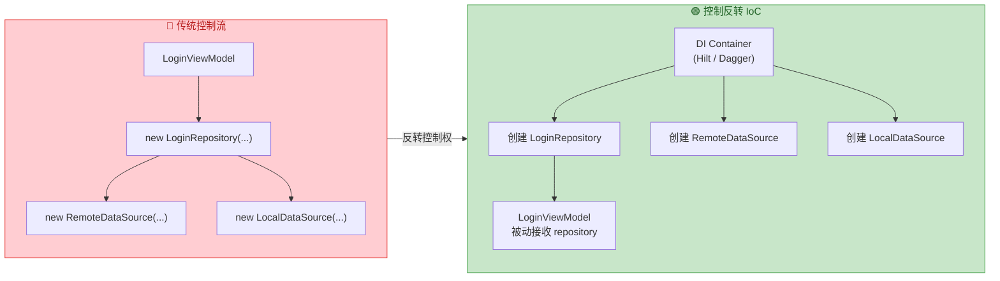

值得特别强调的是：**IoC 是比 DI 更宽泛的概念**。依赖注入只是实现控制反转的手段之一。Android Framework 本身就大量运用了 IoC 思想——`Activity` 的生命周期由系统（AMS）控制而非开发者手动调用 `onCreate()`；`BroadcastReceiver` 的触发由系统根据 Intent 匹配决定。这些都是控制反转的体现，只不过它们反转的是"执行流程"的控制权，而 DI 反转的是"对象创建"的控制权。

### 依赖倒置 DIP

**依赖倒置原则（Dependency Inversion Principle, DIP）** 是 SOLID 五大原则中的第五个（即"D"），由 Robert C. Martin（Uncle Bob）提出。很多人会把 DIP 和 DI 混为一谈，但它们是完全不同层面的概念：**DIP 是一条架构设计原则，DI 是一种具体实现技术**。DI 可以帮助落地 DIP，但 DIP 的内涵远不止"注入"。

DIP 的正式定义包含两条规则：

1. **高层模块不应依赖低层模块，两者都应依赖抽象。**（High-level modules should not depend on low-level modules. Both should depend on abstractions.）
2. **抽象不应依赖细节，细节应依赖抽象。**（Abstractions should not depend on details. Details should depend on abstractions.）

这两句话非常凝练，我们结合 Android 实际场景来拆解。

**什么是高层模块和低层模块？** 在典型的 Android 分层架构中：`ViewModel`（表现层）是高层模块，`Repository`（数据层）是中层，而 `RetrofitService`（网络实现）和 `RoomDao`（本地存储实现）是低层模块。所谓"高低"是指 **离业务策略的远近**——越接近用户意图和业务逻辑的是高层，越接近具体技术实现的是低层。

**未遵守 DIP 的典型情形**：

```kotlin
// ❌ 违反 DIP：高层 ViewModel 直接依赖低层的具体实现类
class OrderViewModel(
    // 直接依赖具体类 OrderRepositoryImpl，而非抽象接口
    private val repository: OrderRepositoryImpl
)

// 具体实现类，内部绑定了 Retrofit 和 Room
class OrderRepositoryImpl(
    // 直接依赖具体的 Retrofit 接口实现
    private val api: OrderRetrofitService,
    // 直接依赖具体的 Room DAO 实现
    private val dao: OrderDao
) {
    // 获取订单的具体实现
    fun getOrders(): List<Order> {
        // 先尝试从网络获取
        val remote = api.fetchOrders()
        // 缓存到本地数据库
        dao.insertAll(remote)
        // 返回结果
        return remote
    }
}
```

在这种设计中，如果有一天你需要把网络层从 Retrofit 换成 Ktor，或者把本地存储从 Room 换成 DataStore，那么 `OrderRepositoryImpl` 必须修改，连带 `OrderViewModel` 也可能受影响（因为它直接持有具体类型的引用，构造签名变化就会波及上层）。**依赖关系的箭头是单向向下的：高层 → 低层具体实现**，这就是"未倒置"的状态。

**遵守 DIP 后的设计**：

```kotlin
// ✅ 遵守 DIP：定义抽象接口，高层和低层都依赖它

// 抽象层：定义 Repository 的契约（接口）
interface OrderRepository {
    // 只声明"做什么"，不关心"怎么做"
    suspend fun getOrders(): List<Order>
}

// 低层模块：实现具体细节，依赖于上面定义的抽象
class OrderRepositoryImpl(
    // 同样，DataSource 也应该是抽象接口
    private val remoteSource: OrderRemoteDataSource,
    private val localSource: OrderLocalDataSource
) : OrderRepository {
    // 实现接口定义的方法
    override suspend fun getOrders(): List<Order> {
        // 从远程数据源获取
        val orders = remoteSource.fetch()
        // 存入本地数据源
        localSource.save(orders)
        // 返回订单列表
        return orders
    }
}

// 高层模块：只依赖抽象接口 OrderRepository
class OrderViewModel(
    // 注入的是接口类型，而非具体实现
    private val repository: OrderRepository
) : ViewModel() {
    // 使用接口方法，完全不知道底层是 Retrofit + Room 还是其他技术
    fun loadOrders() {
        viewModelScope.launch {
            // 通过抽象接口调用，与具体实现解耦
            val orders = repository.getOrders()
            // 更新 UI 状态...
        }
    }
}
```

现在的依赖关系变成了：

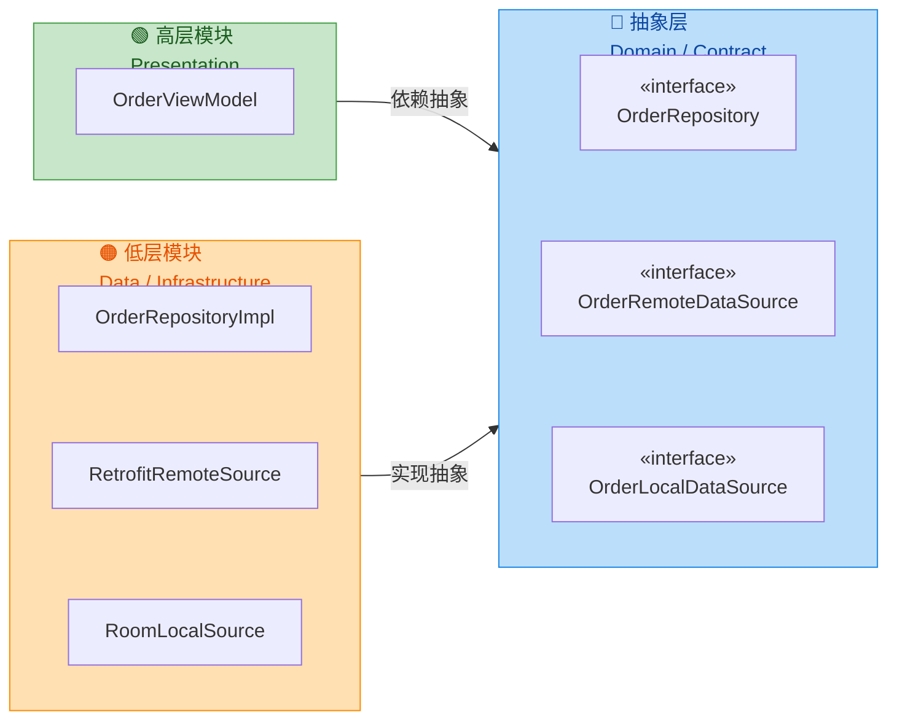

注意图中的箭头方向：**高层和低层都指向抽象层**。低层不再是被高层"向下依赖"的对象，而是反过来"实现"抽象层定义的契约。依赖方向被"倒置"了——这就是 Dependency **Inversion** 的由来。

**DIP 带来的实际收益**在 Android 开发中非常显著：

- **可替换性**：想把 Retrofit 换成 Ktor？只需提供一个新的 `OrderRemoteDataSource` 实现类，高层代码完全不用动。
- **可测试性**：单元测试 `OrderViewModel` 时，只需传入一个 `FakeOrderRepository`（实现了 `OrderRepository` 接口的假对象），完全无需依赖网络或数据库。
- **多人协作**：UI 组同事可以针对接口开发，Data 组同事可以独立实现具体的数据获取逻辑，两边互不阻塞。
- **模块化架构**：在 Multi-Module 工程中，`domain` 模块定义接口，`data` 模块实现接口，`presentation` 模块依赖 `domain`。模块之间的编译依赖是最小化的。

最后再明确一次三者的关系：**DIP 是原则（principle），IoC 是思想（paradigm），DI 是技术（technique）**。DIP 告诉你"应该依赖抽象"；IoC 告诉你"把控制权交出去"；DI 告诉你"通过注入的方式把依赖送进来"。在实践中，三者相辅相成——你用 DI 容器（如 Hilt）来实现 IoC，而容器注入的对象通常是遵循 DIP 设计的接口实例。

### 构造器注入 vs 字段注入

在确定了"依赖应由外部注入"这一大方向后，下一个关键问题就是：**依赖从哪个入口进入对象？** 在 Android 世界中（特别是 Dagger/Hilt 体系），最常见的两种注入方式是 **构造器注入（Constructor Injection）** 和 **字段注入（Field Injection）**。两者各有适用场景，但重要性和推荐程度有明显差异。

#### 构造器注入（Constructor Injection）

构造器注入是指 **在类的构造函数参数中声明所有依赖**，由 DI 框架在创建对象时将依赖通过构造参数传入。这是 Hilt/Dagger 以及整个 DI 社区 **最推荐的注入方式**。

```kotlin
// ✅ 构造器注入：通过 @Inject constructor 声明依赖
class OrderRepository @Inject constructor(
    // Hilt 在创建 OrderRepository 时，会自动提供 OrderApi 的实例
    private val api: OrderApi,
    // 同时自动提供 OrderDao 的实例
    private val dao: OrderDao,
    // 以及 CoroutineDispatcher 的实例（需要通过 @Qualifier 指定具体类型）
    @IoDispatcher private val dispatcher: CoroutineDispatcher
) {
    // 所有依赖在对象诞生的那一刻就已经准备好了
    // 不存在"对象已创建但依赖还没到位"的中间状态
    suspend fun getOrders(): List<Order> = withContext(dispatcher) {
        // 安全地使用 api 和 dao，它们一定不为 null
        val remote = api.fetchOrders()
        dao.insertAll(remote)
        remote
    }
}
```

构造器注入之所以被广泛推荐，原因是多方面的：

**1. 不可变性（Immutability）保证：** 依赖可以声明为 `private val`，一旦在构造时赋值就不会再改变。这不仅符合 Kotlin 倡导的不可变性原则，也避免了在对象生命周期中途依赖被替换或置空的风险。

**2. 完全初始化（Fully Initialized）保证：** 当构造函数执行完毕返回对象引用时，所有依赖必然已经就位。不存在"对象已经创建了，但某个依赖还是 `null`"的危险中间态。这一点在多线程 Android 环境中尤其重要——你不需要担心某个协程在 `inject()` 完成前就访问了依赖字段。

**3. 依赖显式可见：** 只需看构造函数签名，就能一眼看清这个类依赖什么。如果某天你发现一个类的构造函数有 10 个参数，这本身就是一个信号——提醒你该类可能承担了过多职责，需要重构拆分。这种"代码坏味道的自动暴露"是字段注入无法提供的。

**4. 易于测试：** 在单元测试中，无需任何 DI 框架参与，直接在构造函数中传入 Mock/Fake 对象即可：

```kotlin
// 测试时直接通过构造函数传入假依赖，无需 Hilt 或任何框架
@Test
fun `getOrders returns remote data`() = runTest {
    // 创建一个假的 API 实现
    val fakeApi = FakeOrderApi(testOrders)
    // 创建一个假的 DAO 实现
    val fakeDao = FakeOrderDao()
    // 直接通过构造器注入假依赖
    val repository = OrderRepository(
        api = fakeApi,
        dao = fakeDao,
        dispatcher = testDispatcher
    )
    // 调用被测方法
    val result = repository.getOrders()
    // 断言结果
    assertEquals(testOrders, result)
}
```

**5. 框架无关性：** 除了 `@Inject` 注解本身，构造器注入不引入任何框架特有的耦合。把 `@Inject` 去掉，这个类依然是一个普通的 Kotlin 类，可以在任何环境中使用。

#### 字段注入（Field Injection）

字段注入是指 **在类的属性上标注 `@Inject`**，由 DI 框架在对象创建之后、通过反射或代码生成的方式为这些字段赋值。

```kotlin
// ⚠️ 字段注入：依赖通过 @Inject 标注在属性上
@AndroidEntryPoint
class OrderActivity : AppCompatActivity() {
    // Hilt 会在 Activity 创建后，通过生成的代码为该字段赋值
    // 注意：必须是 lateinit var，不能是 private，不能是 val
    @Inject
    lateinit var repository: OrderRepository

    // 同样通过字段注入获取 Analytics 实例
    @Inject
    lateinit var analytics: Analytics

    override fun onCreate(savedInstanceState: Bundle?) {
        // super.onCreate() 内部会触发 Hilt 的注入逻辑
        // 在此之后 repository 和 analytics 才可安全使用
        super.onCreate(savedInstanceState)
        // 此时字段已被注入，可以安全调用
        repository.getOrders()
    }
}
```

字段注入在 Android 中存在 **不得不用** 的场景——正是 Android Framework 的特殊限制造成的。`Activity`、`Fragment`、`Service`、`BroadcastReceiver` 等核心组件，它们的实例由系统（AMS/ActivityThread）通过反射创建，**开发者无法控制其构造函数**。你无法给 `Activity` 的构造器加参数，因为系统调用的是无参构造。因此，这些 Android 入口类只能使用字段注入。

但在其他所有你能控制构造函数的类中（`ViewModel`、`Repository`、`UseCase`、`DataSource`、自定义工具类等），字段注入的劣势是明显的：

**1. 可变性风险：** 字段必须声明为 `lateinit var`（或可空类型），这意味着依赖理论上可以被重新赋值，破坏了不可变性契约。

**2. 初始化时机不透明：** 对象构造完成后，依赖并未就绪——需要等到 `inject()` 方法（或在 Android 组件中等到 `super.onCreate()`）被调用后才能使用。这创造了一个"危险窗口期"，如果在注入完成前访问字段，就会抛出 `UninitializedPropertyAccessException`。

**3. 依赖隐藏：** 字段注入让类的依赖散落在类体内部，从外部（构造签名）看不出这个类需要什么。当一个类有二三十个 `@Inject lateinit var` 时，职责过重的问题会被掩盖，因为构造函数看起来仍然"很干净"。

**4. 测试不便：** 单元测试中，要么需要启动 DI 容器，要么需要手动通过反射给字段赋值。相比构造器注入的直接传参，测试的复杂度显著增加。

**5. 不能为 `private`：** Dagger/Hilt 生成的代码需要能够访问被注入的字段，所以该字段不能是 `private` 的。这违反了封装性原则。

以下表格从多个维度总结了两种注入方式的核心区别：

| 比较维度 | 构造器注入 (Constructor) | 字段注入 (Field) |
|---|---|---|
| **可变性** | `val` 不可变 ✅ | `lateinit var` 可变 ⚠️ |
| **完全初始化** | 构造完即可用 ✅ | 存在"未注入"窗口期 ⚠️ |
| **依赖可见性** | 构造签名一目了然 ✅ | 散落在类体中，不易发现 ⚠️ |
| **可测试性** | 直接传参，无需框架 ✅ | 需框架或反射辅助 ⚠️ |
| **封装性** | `private` 完全可以 ✅ | 不允许 `private` ⚠️ |
| **是否可用于 Android 组件** | ❌ 系统控制构造 | ✅ 唯一可选方式 |
| **适用场景** | ViewModel, Repository, UseCase 等 | Activity, Fragment, Service 等 |

#### 方法注入（补充说明）

除了构造器注入和字段注入，还有第三种较少使用的方式——**方法注入（Method Injection）**。它通过在一个普通方法上标注 `@Inject`，让 DI 框架在注入流程中自动调用该方法并传入参数：

```kotlin
class OrderProcessor @Inject constructor(
    // 主要依赖通过构造器注入
    private val repository: OrderRepository
) {
    // 声明一个 lateinit 变量来接收方法注入的依赖
    private lateinit var logger: Logger

    // @Inject 标注在方法上：Hilt 在完成构造器注入后，会自动调用此方法
    // 适用于需要在注入阶段执行某些初始化逻辑的场景
    @Inject
    fun init(logger: Logger) {
        // 方法体内既可以赋值，也可以执行额外的初始化操作
        this.logger = logger
        // 比如根据注入的 logger 配置打印日志
        logger.d("OrderProcessor initialized")
    }
}
```

方法注入的使用场景非常有限，主要出现在需要 **在注入阶段执行某些副作用逻辑**（而不仅仅是存储引用）的情况下。绝大多数时候，构造器注入已经完全够用。

#### 选择决策总结

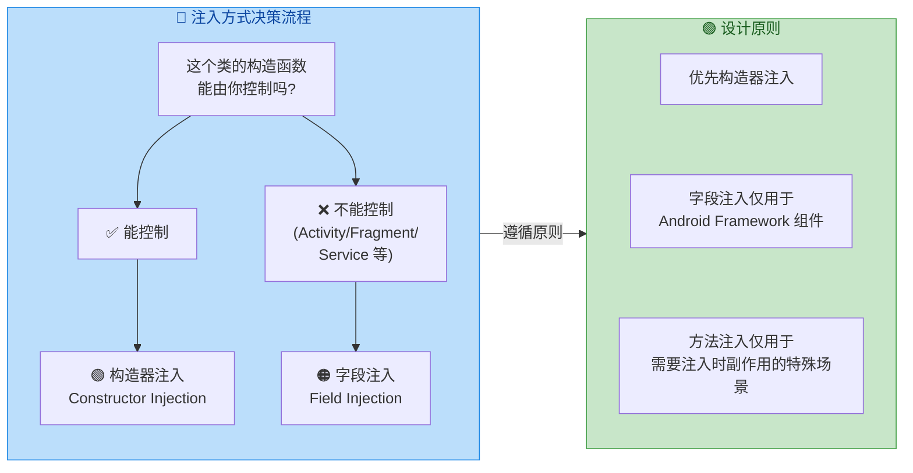

简而言之，**构造器注入是默认选择，字段注入是 Android Framework 限制下的不得已手段，方法注入是极少数特殊场景的补充**。在后续 Hilt 的章节中，你会看到 Hilt 通过 `@AndroidEntryPoint` 优雅地将字段注入封装在 Android 组件中，同时通过 `@HiltViewModel` 让 ViewModel 也能享受构造器注入的全部好处。

---

**📝 练习题**

在 Android 项目中，以下关于依赖注入的描述，**错误的是**：

A. 控制反转（IoC）是一种设计思想，依赖注入（DI）是实现 IoC 的一种具体技术手段


B. 依赖倒置原则（DIP）要求高层模块和低层模块都应依赖于抽象接口，而非具体实现


C. 对 Activity 使用构造器注入是 Hilt 推荐的最佳方式，因为构造器注入始终优于字段注入


D. 字段注入的属性在 Dagger/Hilt 中不能声明为 `private`，因为生成的注入代码需要访问该字段


**【答案】** C

**【解析】** 选项 A 正确，IoC 是更宏观的思想，DI 是其具体实现手段之一。选项 B 正确，这是 DIP 的核心定义——高层与低层都依赖抽象。选项 D 正确，Dagger/Hilt 通过生成的 `MembersInjector` 类直接访问 `@Inject` 标注的字段来完成赋值，如果字段是 `private` 则无法访问，编译期会报错。**选项 C 错误**，原因在于 `Activity` 的实例由 Android 系统（`ActivityThread` 通过反射调用无参构造）创建，开发者无法控制其构造函数参数。因此 Activity 只能使用字段注入（配合 `@AndroidEntryPoint`）。"构造器注入优先"的原则适用于你能控制构造函数的类（如 Repository、UseCase、ViewModel 等），但 **不适用于** 由 Framework 实例化的 Android 组件。

---

## Hilt 框架基础

Hilt 是 Google 在 Dagger 之上构建的 **Android 专属依赖注入框架**。在理解 Hilt 之前，有必要先回答一个问题：既然 Dagger 已经是一个成熟的 DI 框架，为什么还要在上面再套一层？答案在于 **Android 平台的特殊性**——Android 的核心组件（Activity、Fragment、Service 等）都由系统实例化，开发者无法控制其构造函数。Dagger 虽然强大，但在 Android 场景下需要大量样板代码来处理组件层级、生命周期绑定、作用域对齐等问题。Hilt 正是为此而生：它预定义了一套与 Android 生命周期对齐的 Component 层级体系，通过注解处理器（Annotation Processor）在编译期自动生成 Dagger 组件代码，让开发者只需关注"声明依赖"而非"组装容器"。

从工作机制上看，Hilt 在编译期做了三件关键的事情：第一，扫描所有带 `@HiltAndroidApp`、`@AndroidEntryPoint` 等注解的类，确定需要注入的目标；第二，收集所有带 `@Module` + `@InstallIn` 的模块，将绑定关系（Binding）安装到对应的 Component 中；第三，生成 Dagger Component 的实现类以及与 Android 组件生命周期绑定的注入胶水代码（glue code）。最终的产物是一套完整的、类型安全的依赖图（Dependency Graph），在运行期以接近零反射的效率完成注入。

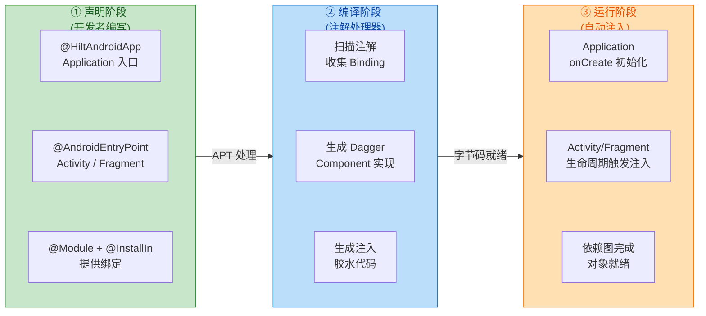

上图展示了 Hilt 的整体工作流：开发者在 **声明阶段** 通过注解表达"谁需要注入"和"如何提供依赖"；**编译阶段** 由 Hilt 的注解处理器（基于 Dagger 的 `dagger.hilt.processor`）扫描并生成所有必要的 Component 类和辅助类；**运行阶段** 则由生成的代码在 Android 组件的生命周期回调中自动完成注入。整个过程对开发者几乎透明，这就是 Hilt "convention over configuration"（约定优于配置）的设计哲学。

---

### 标准组件 Components

Hilt 最核心的设计决策是预定义了一套 **与 Android 生命周期一一对应的 Component 层级树**。在原生 Dagger 中，开发者需要自行定义 `@Component` 和 `@Subcomponent`，手动管理父子关系和生命周期。Hilt 将这一切标准化了——它为每一个 Android 核心类（Application、Activity、Fragment、ViewModel、Service 等）预置了一个 Component，并通过严格的父子关系保证：子 Component 可以访问父 Component 中的所有绑定，但反过来不行。

这套层级设计的核心思想是 **"生命周期越长的 Component 层级越高"**。`SingletonComponent` 绑定在 Application 上，与进程同生共死，处于树的根部；`ActivityComponent` 随 Activity 的 `onCreate` 创建、`onDestroy` 销毁；`FragmentComponent` 则嵌套在 Activity 之下，生命周期更短。这种层级关系带来了两个关键保证：

1. **可见性（Visibility）**：子 Component 自动继承父 Component 的所有绑定。例如，一个安装在 `SingletonComponent` 中的 `Retrofit` 实例，在 `ActivityComponent`、`FragmentComponent` 中都可以直接注入使用，无需重复声明。
2. **生命周期安全（Lifecycle Safety）**：绑定在某个 Component 上的对象不会"泄漏"到更长生命周期的容器中。例如，`ActivityScoped` 的对象绝不会被 `SingletonComponent` 持有，从而避免了 Activity 泄漏。

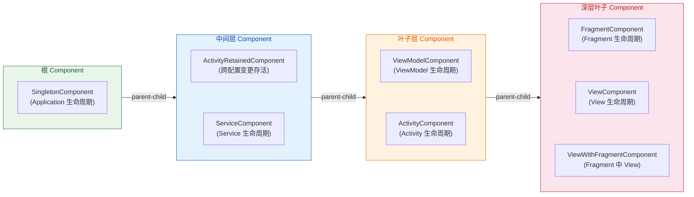

下面逐一说明每个标准 Component 的职责与应用场景：

**`SingletonComponent`**（对应 `@Singleton` 作用域）是整个 Component 树的根节点。它在 `Application.onCreate()` 中被创建，与进程同生命周期。适合安装全局共享的基础设施类绑定，例如 `OkHttpClient`、`Retrofit`、`Room Database`、全局配置管理器等。因为该 Component 在整个进程中只有一个实例，安装在其中并标注 `@Singleton` 的绑定也只会被创建一次。需要特别注意的是：如果一个绑定安装在 `SingletonComponent` 中却 **没有** 标注 `@Singleton`，那么每次注入都会创建新实例——安装位置决定可见性，**作用域注解才决定复用策略**。

**`ActivityRetainedComponent`**（对应 `@ActivityRetainedScoped`）是 Hilt 为"配置变更存活"场景专门设计的 Component。它的生命周期从 Activity 第一次 `onCreate` 开始，到 Activity **最终** 被 `finish()` 销毁结束。这意味着在屏幕旋转等配置变更时，这个 Component 不会被销毁重建。在底层实现上，Hilt 利用 `androidx.lifecycle.ViewModel` 的存活机制来持有该 Component 的引用——`ViewModel` 本身就跨配置变更存活，所以挂载在它之上的 Component 也自然获得了这个特性。适合存放那些创建成本高、且不应随配置变更重复创建的对象，例如某些业务层的 UseCase 或 Repository 缓存。

**`ViewModelComponent`**（对应 `@ViewModelScoped`）绑定在单个 `ViewModel` 实例的生命周期上。当一个 ViewModel 被回收时（通常是 Activity 最终销毁或 Fragment 从返回栈移除时），对应的 `ViewModelComponent` 也随之销毁。这个 Component 的典型用途是：当同一个 ViewModel 中注入了多个 UseCase，而这些 UseCase 需要共享某个状态对象时，可以将该状态对象标注为 `@ViewModelScoped`，保证在同一个 ViewModel 中共享同一实例，但不同 ViewModel 之间相互隔离。

**`ActivityComponent`**（对应 `@ActivityScoped`）随每一次 Activity 的 `onCreate` 创建，`onDestroy` 销毁。注意，这意味着每次配置变更都会创建一个 **新的** `ActivityComponent`。安装在这里的绑定通常与 UI 操作或 Activity 级别的资源紧密相关，例如一个管理当前 Activity 中多个 Fragment 共享状态的 Coordinator。

**`FragmentComponent`**（对应 `@FragmentScoped`）是 `ActivityComponent` 的子 Component，随 Fragment 的 `onAttach` 创建、`onDestroy` 销毁。适合存放只属于某个 Fragment 的 Adapter、Presenter 或 UI 状态管理器。由于它是 `ActivityComponent` 的子节点，所以可以直接注入 `ActivityComponent` 中提供的所有绑定。

**`ServiceComponent`**（对应 `@ServiceScoped`）随 `Service.onCreate` 创建、`Service.onDestroy` 销毁。适合提供仅在某个 Service 运行期间存在的依赖，例如通知管理器、后台任务调度器等。

**`ViewComponent`** 和 **`ViewWithFragmentComponent`** 对应 Android `View` 的生命周期，在实际开发中使用频率较低，主要用于自定义 View 需要注入依赖的场景。其中 `ViewWithFragmentComponent` 比 `ViewComponent` 多了对 Fragment 绑定的访问能力，适合在 Fragment 中使用的自定义 View。

理解了这套层级体系，就能明白 Hilt 的一条基本准则：**将绑定安装到它所需要的最窄的 Component 中**。如果一个 Repository 只在某个 Fragment 中用到，它不应该安装在 `SingletonComponent` 中——虽然功能上没有错误，但它会导致对象生命周期不必要地延长，增加内存压力，也让依赖关系变得模糊。

---

### 模块 Modules

在 Hilt（以及底层的 Dagger）中，**Module** 是存放"绑定声明"的容器。所谓"绑定"（Binding），就是告诉依赖注入框架："当有人需要类型 X 时，通过什么方式提供一个 X 的实例"。Module 本身是一个普通的 Kotlin/Java 类（或 object），通过 `@Module` 注解标记，并且**必须**搭配 `@InstallIn` 指定安装到哪个 Component 中。

为什么需要 Module？因为并非所有类都能通过构造器注入（Constructor Injection）来提供。构造器注入要求开发者"拥有"这个类的代码，能在构造函数上添加 `@Inject` 注解。但实际开发中有大量情况无法满足这个条件：

- **第三方库的类**：你无法修改 `Retrofit`、`OkHttpClient`、`Room Database` 的源码，自然无法在它们的构造函数上加 `@Inject`。
- **接口类型**：接口没有构造函数，框架无法知道"当需要一个 `UserRepository` 接口时，应该用 `UserRepositoryImpl` 来满足"。
- **需要特殊配置的实例**：即使你拥有类的代码，有时也需要通过 Builder 模式等复杂步骤来构建实例（如 `Retrofit.Builder().baseUrl(...).build()`）。

Module 就是为这些场景设计的"补充声明"机制。它告诉 Hilt："这些无法自动发现的绑定关系，请按照我声明的方式来提供"。

一个典型的 Module 结构如下：

```kotlin
// @Module 标记此类为 Hilt 模块，是绑定声明的容器
@Module
// @InstallIn 指定此模块中的所有绑定安装到 SingletonComponent 中
// 即这些绑定的可见性和最长生命周期与 Application 一致
@InstallIn(SingletonComponent::class)
object NetworkModule {

    // @Provides 告诉 Hilt：当有人需要 OkHttpClient 时，调用此方法创建
    // @Singleton 保证在整个 SingletonComponent 中只创建一次
    @Provides
    @Singleton
    fun provideOkHttpClient(): OkHttpClient {
        // 使用 Builder 模式构造 OkHttpClient 实例
        return OkHttpClient.Builder()
            // 设置连接超时为 30 秒
            .connectTimeout(30, TimeUnit.SECONDS)
            // 设置读取超时为 30 秒
            .readTimeout(30, TimeUnit.SECONDS)
            // 构建最终的 OkHttpClient 实例
            .build()
    }

    // 当需要 Retrofit 实例时，Hilt 会自动先解析参数 okHttpClient
    // 由于上面已经声明了 OkHttpClient 的提供方式，Hilt 能自动注入此参数
    @Provides
    @Singleton
    fun provideRetrofit(okHttpClient: OkHttpClient): Retrofit {
        // 使用 Retrofit Builder 构建实例
        return Retrofit.Builder()
            // 设置基础 URL
            .baseUrl("https://api.example.com/")
            // 将上面提供的 OkHttpClient 设置为网络客户端
            .client(okHttpClient)
            // 添加 Gson 作为 JSON 转换器
            .addConverterFactory(GsonConverterFactory.create())
            // 构建最终的 Retrofit 实例
            .build()
    }

    // 从 Retrofit 实例中创建具体的 API 接口代理
    @Provides
    @Singleton
    fun provideUserApi(retrofit: Retrofit): UserApi {
        // Retrofit 的 create 方法通过动态代理生成接口实现
        return retrofit.create(UserApi::class.java)
    }
}
```

上述代码展示了 Module 最常见的使用模式。有几个关键点值得深入理解：

**依赖链的自动解析**：注意 `provideRetrofit` 方法的参数 `okHttpClient: OkHttpClient`。开发者不需要手动调用 `provideOkHttpClient()`，Hilt 在编译期生成的代码会自动识别参数类型，在依赖图中查找对应的 Provider，按正确顺序调用。这就是 DI 的核心价值——声明"需要什么"，让框架负责"何时、如何创建"。

**`object` vs `abstract class`**：当 Module 中只包含 `@Provides` 方法时，推荐使用 Kotlin `object`（Java 中的类含 static 方法），因为 `@Provides` 方法是实例方法，`object` 避免了 Dagger 每次调用都创建 Module 实例的开销。当 Module 包含 `@Binds` 方法时（后面章节详述），则必须使用 `abstract class`，因为 `@Binds` 是抽象方法。如果同一个 Module 既有 `@Provides` 又有 `@Binds`，常见做法是将 `@Provides` 方法放入 `abstract class` 的 `companion object` 中：

```kotlin
// 使用 abstract class 因为包含 @Binds 抽象方法
@Module
@InstallIn(SingletonComponent::class)
abstract class RepositoryModule {

    // @Binds 将接口 UserRepository 绑定到实现类 UserRepositoryImpl
    // 当有人注入 UserRepository 时，Hilt 会提供 UserRepositoryImpl 的实例
    @Binds
    @Singleton
    abstract fun bindUserRepository(
        // 参数是具体实现类，Hilt 通过其构造器注入来创建
        impl: UserRepositoryImpl
    ): UserRepository

    // companion object 中放置 @Provides 方法
    companion object {
        // 提供需要特殊配置的依赖
        @Provides
        @Singleton
        fun provideUserDao(database: AppDatabase): UserDao {
            // 从 Room Database 获取 DAO 实例
            return database.userDao()
        }
    }
}
```

**Module 的组织策略**：在实际项目中，Module 的划分应按 **功能领域** 而非技术层次。也就是说，推荐 `NetworkModule`、`DatabaseModule`、`RepositoryModule` 这样按功能分，而不是把所有 `@Provides` 放一个文件、所有 `@Binds` 放另一个文件。这样做的好处是：当某个功能模块被移除时，对应的 Module 可以整体删除，不会影响其他模块。

---

### 安装 InstallIn

`@InstallIn` 是连接 Module 和 Component 的桥梁，也是 Hilt 区别于原生 Dagger 的关键设计之一。在原生 Dagger 中，Module 通过 `@Component(modules = [FooModule::class])` 手动安装到 Component；而在 Hilt 中，这个关系被倒置了——Module 自身通过 `@InstallIn` 声明"我要安装到哪个 Component"，Hilt 在编译期自动收集并组装。

这种"声明式安装"设计带来了极大的灵活性，尤其在多模块项目中。假设项目有 `:app`、`:feature-login`、`:feature-home`、`:core-network` 四个 Gradle 模块。`:core-network` 中定义的 `NetworkModule` 通过 `@InstallIn(SingletonComponent::class)` 声明自己，Hilt 的注解处理器在编译 `:app` 模块时会自动聚合所有依赖模块中的 `@InstallIn` 声明，完成整个依赖图的组装。开发者不需要在 `:app` 模块中写一行关于 `NetworkModule` 的安装代码。

`@InstallIn` 接受一个或多个 Component 类作为参数：

```kotlin
// 安装到单个 Component
// 此模块中的所有绑定在 SingletonComponent 及其所有子 Component 中可见
@Module
@InstallIn(SingletonComponent::class)
object SingleModule { /* ... */ }

// 安装到多个 Component（较少使用）
// 此模块的绑定在 ActivityComponent 和 ServiceComponent 中均可见
// 但不在 SingletonComponent 中可见（除非它是父 Component）
@Module
@InstallIn(ActivityComponent::class, ServiceComponent::class)
object MultiInstallModule { /* ... */ }
```

安装到多个 Component 的场景比较少见，因为如果一个绑定在多个不相关的 Component 中都需要，通常意味着它应该提升到共同的父 Component 中（如 `SingletonComponent`）。多 Component 安装的主要用途是：当绑定确实只在特定几个生命周期中有意义，且不希望在全局可见时——例如一个 `UIEventTracker` 只在 Activity 和 Service 中使用，不想暴露给 ViewModel 或 Fragment。

`@InstallIn` 的选择应遵循"最窄原则"：

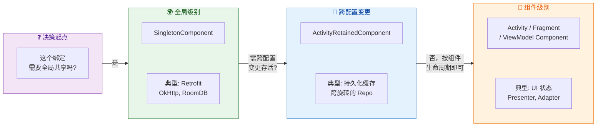

一个常见的错误是 **"一切皆 Singleton"**——为了省事，把所有 Module 都安装到 `SingletonComponent` 并标注 `@Singleton`。这会导致：对象在进程启动后永远不会被回收，内存占用持续增长；依赖关系模糊，无法从 Module 声明中看出"这个对象实际属于哪个生命周期"；测试时难以隔离和替换。正确做法是认真思考每个绑定的实际生命周期需求，将其安装到最合适的 Component。

---

### 入口点 EntryPoint

在标准的 Hilt 工作流中，依赖注入的"起点"是被 `@AndroidEntryPoint` 标注的 Android 组件（Activity、Fragment 等），然后通过 `@Inject` 标注的字段或构造函数自动完成注入。但在某些场景下，你需要在 **Hilt 无法直接管理的类** 中获取依赖——这就是 `@EntryPoint` 的用武之地。

典型的需要 EntryPoint 的场景包括：

1. **ContentProvider**：`ContentProvider.onCreate()` 的调用时机早于 `Application.onCreate()`，此时 Hilt 的 `SingletonComponent` 尚未初始化完成。因此 ContentProvider 不能使用 `@AndroidEntryPoint`，必须通过 EntryPoint 手动获取依赖。
2. **第三方库回调类**：某些库要求你提供一个普通类实例（如 `WorkManager` 的旧版 `WorkerFactory`、`Glide` 的 `AppGlideModule`），这些类的实例化不受 Hilt 控制。
3. **与非 Hilt 代码的桥接**：在混合架构中，某些老模块不使用 Hilt，但需要获取 Hilt 管理的依赖。

EntryPoint 的工作原理本质上是在 Hilt 生成的 Component 上定义一个 **访问接口**。你声明一个接口，标注 `@EntryPoint` 和 `@InstallIn`，在接口中定义返回依赖类型的方法；然后通过 `EntryPointAccessors` 工具类，传入对应的 Android context，从已构建的 Component 中取出依赖。

```kotlin
// 定义一个 EntryPoint 接口
// @EntryPoint 标记此接口为 Hilt 的入口点
@EntryPoint
// @InstallIn 指定此入口点安装到 SingletonComponent
// 意味着只能访问 SingletonComponent 中可见的绑定
@InstallIn(SingletonComponent::class)
interface AnalyticsEntryPoint {
    // 声明需要获取的依赖类型
    // 方法名任意，返回类型决定了获取哪个绑定
    fun analyticsService(): AnalyticsService

    // 可以声明多个依赖获取方法
    fun crashReporter(): CrashReporter
}
```

使用 EntryPoint 获取依赖的方式：

```kotlin
// 在 ContentProvider 中使用 EntryPoint
class MyContentProvider : ContentProvider() {

    override fun onCreate(): Boolean {
        // 通过 EntryPointAccessors 从 Application context 获取入口点
        // fromApplication() 对应 SingletonComponent
        val entryPoint = EntryPointAccessors.fromApplication(
            // 获取 Application Context
            context!!.applicationContext,
            // 传入 EntryPoint 接口的 Class
            AnalyticsEntryPoint::class.java
        )
        // 通过接口方法获取依赖实例
        val analyticsService = entryPoint.analyticsService()
        // 现在可以正常使用 analyticsService
        analyticsService.trackEvent("content_provider_created")
        return true
    }

    // ... 其他 ContentProvider 方法
    override fun query(uri: Uri, proj: Array<String>?, sel: String?,
                       selArgs: Array<String>?, sort: String?): Cursor? = null
    override fun getType(uri: Uri): String? = null
    override fun insert(uri: Uri, values: ContentValues?): Uri? = null
    override fun delete(uri: Uri, sel: String?, selArgs: Array<String>?): Int = 0
    override fun update(uri: Uri, values: ContentValues?,
                        sel: String?, selArgs: Array<String>?): Int = 0
}
```

`EntryPointAccessors` 提供了三个静态方法，分别对应不同层级的 Component：

```kotlin
// 从 Application 获取 —— 访问 SingletonComponent 中的绑定
val singletonEntryPoint = EntryPointAccessors.fromApplication(
    context.applicationContext,       // Application Context
    MySingletonEntryPoint::class.java // EntryPoint 接口
)

// 从 Activity 获取 —— 访问 ActivityComponent 中的绑定
val activityEntryPoint = EntryPointAccessors.fromActivity(
    activity,                         // Activity 实例
    MyActivityEntryPoint::class.java  // EntryPoint 接口
)

// 从 Fragment 获取 —— 访问 FragmentComponent 中的绑定
val fragmentEntryPoint = EntryPointAccessors.fromFragment(
    fragment,                          // Fragment 实例
    MyFragmentEntryPoint::class.java   // EntryPoint 接口
)
```

需要强调的是，**EntryPoint 是一种"逃生舱"（escape hatch），而非常规手段**。在正常的 Hilt 管理范围内（Activity、Fragment、ViewModel、Service 等），应始终使用 `@AndroidEntryPoint` + `@Inject` 的标准方式。EntryPoint 的过度使用意味着架构可能存在问题——要么是某些类的职责划分不清，要么是遗留代码尚未完成迁移。

以下代码展示了一个更完整的实际场景——在自定义的 `WorkManager` 初始化逻辑中通过 EntryPoint 获取依赖：

```kotlin
// 自定义 WorkManager 的初始化器
// 此类由 AndroidX Startup 库实例化，不受 Hilt 管控
class CustomWorkManagerInitializer : Initializer<WorkManager> {

    override fun create(context: Context): WorkManager {
        // 通过 EntryPoint 获取自定义的 WorkerFactory
        val entryPoint = EntryPointAccessors.fromApplication(
            // 使用 applicationContext 确保获取的是 Application 级别 Context
            context.applicationContext,
            // 指定 EntryPoint 接口
            WorkManagerEntryPoint::class.java
        )

        // 构建 WorkManager 的自定义配置
        val config = Configuration.Builder()
            // 使用通过 EntryPoint 获取的 WorkerFactory
            .setWorkerFactory(entryPoint.workerFactory())
            // 设置最小日志级别
            .setMinimumLoggingLevel(Log.INFO)
            // 构建配置
            .build()

        // 用自定义配置初始化 WorkManager
        WorkManager.initialize(context, config)
        // 返回 WorkManager 实例
        return WorkManager.getInstance(context)
    }

    // 声明此初始化器没有依赖其他初始化器
    override fun dependencies(): List<Class<out Initializer<*>>> = emptyList()
}

// 对应的 EntryPoint 接口定义
@EntryPoint
@InstallIn(SingletonComponent::class)
interface WorkManagerEntryPoint {
    // 获取 Hilt 管理的 HiltWorkerFactory
    fun workerFactory(): HiltWorkerFactory
}
```

最后用一张图总结 EntryPoint 在 Hilt 架构中的定位：

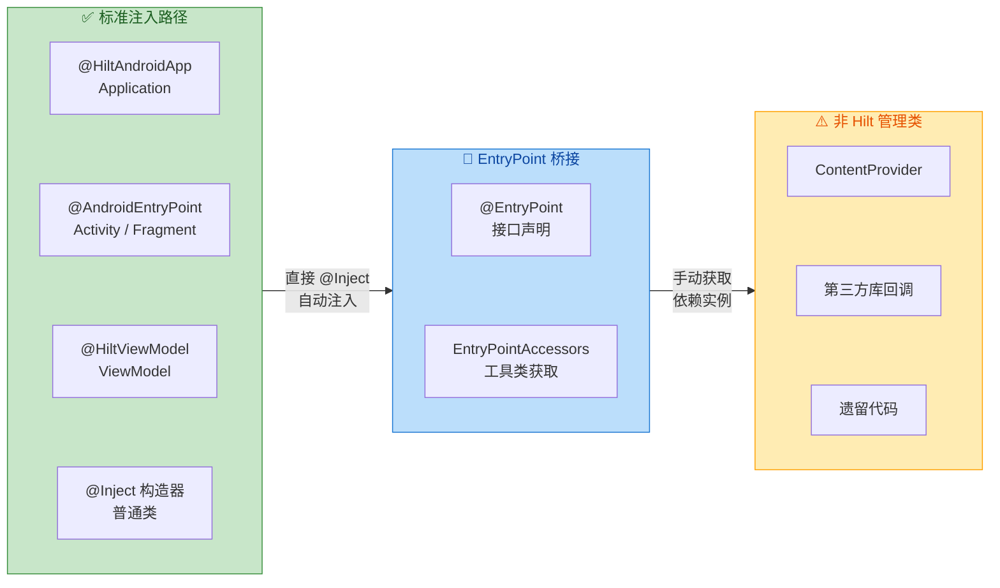

总结来看，Hilt 框架基础的四个核心概念构成了一个完整的闭环：**Component** 定义了生命周期层级，**Module** 声明了绑定关系，**InstallIn** 将绑定安装到对应的 Component，**EntryPoint** 则为无法使用标准注入的场景提供了安全的访问通道。理解这四个概念以及它们之间的关系，就掌握了 Hilt 的基本心智模型（mental model），后续的作用域、限定符、辅助注入等进阶内容都是在这个基础上的自然延伸。

---

**📝 练习题**

某个 Android 项目中，开发者在一个 Hilt Module 中这样声明：

```kotlin
@Module
@InstallIn(SingletonComponent::class)
object CacheModule {
    @Provides
    fun provideImageCache(): ImageCache {
        return ImageCache(maxSize = 50 * 1024 * 1024)
    }
}
```

在 `ActivityA` 和 `ActivityB` 中分别通过 `@Inject lateinit var cache: ImageCache` 注入了该依赖。请问以下描述正确的是？


A. `ActivityA` 和 `ActivityB` 中拿到的是同一个 `ImageCache` 实例，因为 Module 安装在 `SingletonComponent` 中


B. `ActivityA` 和 `ActivityB` 中拿到的是不同的 `ImageCache` 实例，因为缺少 `@Singleton` 作用域注解


C. 编译会报错，因为 `SingletonComponent` 中的 `@Provides` 方法必须标注 `@Singleton`


D. 运行时会崩溃，因为 `ImageCache` 的构造参数 `maxSize` 不在依赖图中


**【答案】** B

**【解析】** 这道题考查的是 **安装位置（InstallIn）与作用域注解（Scope）的区别**。`@InstallIn(SingletonComponent::class)` 决定的是绑定的 **可见性**——该绑定在 `SingletonComponent` 及其所有子 Component 中可见，但它并不决定实例的复用策略。只有显式标注了 `@Singleton` 的绑定才会在 `SingletonComponent` 的生命周期内被缓存为单例。缺少 `@Singleton` 注解时，每次注入请求都会调用 `provideImageCache()` 创建一个新实例。因此 `ActivityA` 和 `ActivityB` 各自会获得独立的 `ImageCache` 实例。选项 A 错误是因为混淆了安装位置和作用域的概念；选项 C 错误是因为 Hilt 并不强制要求 `@Provides` 方法必须带作用域注解，不带则默认为 unscoped（每次新建）；选项 D 错误是因为 `maxSize` 是 `provideImageCache()` 方法内部的硬编码值，不是由 Hilt 解析的依赖参数。

---

**📝 练习题**

团队中有一位新同事在项目的 `ContentProvider` 中直接使用了 `@AndroidEntryPoint` 注解，并通过 `@Inject` 注入了一个 `@Singleton` 的 `DatabaseHelper`。代码编译通过但运行时偶尔在某些设备上崩溃。最可能的原因是？


A. `ContentProvider` 不支持任何形式的依赖注入


B. `ContentProvider.onCreate()` 可能在 `Application.onCreate()` 之前执行，此时 Hilt 的 `SingletonComponent` 尚未创建


C. `@Singleton` 的对象不能在 `ContentProvider` 中使用，只能在 Activity 中使用


D. `ContentProvider` 需要使用 `@FragmentScoped` 而非 `@Singleton`


**【答案】** B

**【解析】** Android 系统的初始化顺序是：`ContentProvider.onCreate()` → `Application.onCreate()`。Hilt 的 `SingletonComponent` 在 `Application.onCreate()` 中通过 `@HiltAndroidApp` 的生成代码初始化。因此，当 ContentProvider 尝试在自己的 `onCreate()` 中访问尚未初始化的 Component 时，就会出现空指针或 "component not initialized" 异常。之所以"偶尔"崩溃，是因为在某些设备或进程恢复场景下，ContentProvider 的初始化时序更加突出。正确做法是使用 `@EntryPoint` 接口配合 `EntryPointAccessors.fromApplication()` 来安全地获取依赖——`EntryPointAccessors` 内部会确保在 Component 就绪后才返回实例。选项 A 错误，ContentProvider 可以通过 EntryPoint 实现依赖注入；选项 C 和 D 的说法没有任何依据，`@Singleton` 的绑定可以被任何子 Component 访问。

---

## 作用域与生命周期（Scopes & Lifecycle）

在 Hilt 的依赖注入体系中，**作用域（Scope）** 是一个极其核心的概念——它决定了一个依赖实例"活多久"以及"在多大范围内被共享"。如果你不理解作用域，就很容易踩到"每次注入都创建新实例导致状态丢失"或者"单例持有 Activity 引用导致内存泄漏"这类经典问题。本节将从底层机制出发，逐一拆解 Hilt 提供的各级作用域注解，帮助你在实际项目中做出正确的作用域决策。

### 作用域的本质：实例共享与生命周期绑定

要理解 Hilt 的作用域，首先需要明白一个关键事实：**在没有任何作用域注解的情况下，Hilt 每次满足一个依赖请求时，都会创建一个全新的实例**。这被称为 **Unscoped Binding（无作用域绑定）**。举个例子，如果你的 `Repository` 类没有标注任何 Scope 注解，那么 Activity A 注入一次会得到一个 `Repository` 实例，Activity B 注入一次又会得到另一个完全不同的 `Repository` 实例——甚至同一个 Activity 中的两个字段分别注入 `Repository`，拿到的也是两个不同的对象。

这在某些场景下是合理的（比如轻量的工具类，每次 new 一个也无所谓），但在另一些场景下则完全不可接受。例如，你希望整个 App 只维护一个数据库连接池，或者希望同一个 Activity 内的多个 Fragment 共享同一个 ViewModel 层的数据源。这时候就需要 **Scope 注解** 出场了。

**作用域注解的本质作用有且只有两个：**

1. **控制实例的生命周期**——将实例的存活时间绑定到某个 Hilt Component 的生命周期上。Component 创建时实例可被创建，Component 销毁时实例随之被回收。
2. **控制实例的共享范围**——在同一个 Component 实例的范围内，所有依赖请求都会拿到同一个实例（即单例语义，但这个"单例"的范围不是全局，而是限定在某个 Component 内）。

这里引出了另一个关键概念：**Hilt Component（Hilt 组件）**。每一个 Scope 注解都与一个特定的 Hilt Component 一一对应，而每个 Component 又与一个 Android 类的生命周期绑定。这三者的映射关系是理解作用域的基础：

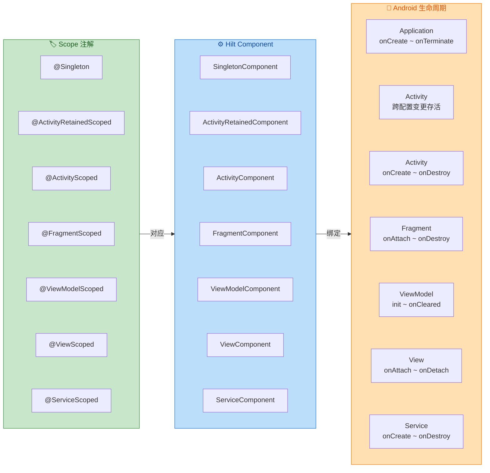

理解了这张映射关系后，接下来逐一深入每个常用作用域。

### Singleton 单例作用域

`@Singleton` 是范围最广、生命周期最长的作用域。被标注为 `@Singleton` 的绑定，其实例会在 **`SingletonComponent`** 中被创建和缓存，而 `SingletonComponent` 的生命周期与 **`Application`** 完全一致——从 `Application.onCreate()` 到进程被杀死。

这意味着：**整个 App 进程中只会有一个该类型的实例，无论多少个 Activity、Fragment、Service 来请求注入，拿到的都是同一个对象。**

#### 典型使用场景

`@Singleton` 最适合那些**初始化成本高、需要全局共享状态、或本身就应该是唯一的**资源：

- **数据库实例**（Room Database）：数据库连接的创建和维护开销大，且一个 App 通常只需要一个数据库实例。
- **网络客户端**（OkHttpClient / Retrofit）：底层维护连接池和线程池，复用同一个实例可以最大化连接复用率。
- **全局配置/缓存管理器**：如 SharedPreferences 封装、内存缓存等。
- **数据仓库（Repository）**：当 Repository 内部维护了内存缓存时，单例可以确保缓存被全局共享。

#### 底层机制：DoubleCheck 保障线程安全

你可能会好奇：Hilt 是如何保证 `@Singleton` 标注的实例在多线程环境下只被创建一次的？答案藏在 Dagger 生成的代码里。当你标注 `@Singleton` 后，Dagger（Hilt 的底层引擎）会为该绑定生成一个 **`DoubleCheck`** Provider 包装器。`DoubleCheck` 的核心逻辑类似于 Java 经典的 **Double-Checked Locking（双重检查锁）** 模式：

```kotlin
// Dagger 生成代码的简化逻辑 (DoubleCheck.java)
class DoubleCheck<T>(
    private var provider: Provider<T>? // 原始的创建逻辑 Provider
) : Provider<T> {

    // 使用 volatile 修饰，确保多线程可见性
    @Volatile
    private var instance: Any? = UNINITIALIZED

    override fun get(): T {
        // 第一次检查：如果已经初始化，直接返回（无锁，高性能）
        var result = instance
        if (result == UNINITIALIZED) {
            // 未初始化，进入同步块
            synchronized(this) {
                // 第二次检查：防止其他线程已经在等待锁的过程中完成了初始化
                result = instance
                if (result == UNINITIALIZED) {
                    // 真正调用 Provider 创建实例
                    result = provider!!.get()
                    // 缓存实例
                    instance = result
                    // 释放 provider 引用，帮助 GC（因为以后不再需要创建逻辑了）
                    provider = null
                }
            }
        }
        @Suppress("UNCHECKED_CAST")
        return result as T // 返回缓存的单例实例
    }
}
```

这段逻辑保证了：在高并发场景下，即使 100 个线程同时请求注入，也只会有一个线程执行真正的创建逻辑，其余线程都会拿到已创建好的同一个实例。`@Volatile` 关键字确保了一个线程写入 `instance` 后，其他线程立刻可见，避免了指令重排序导致的问题。

#### 代码示例

```kotlin
// 使用 @Singleton 标注 Module 中的 @Provides 方法
@Module
@InstallIn(SingletonComponent::class) // 安装到 SingletonComponent
object NetworkModule {

    @Provides
    @Singleton // 标注作用域：整个 App 生命周期内只创建一次
    fun provideOkHttpClient(): OkHttpClient {
        // 构建 OkHttpClient，配置超时、拦截器等
        return OkHttpClient.Builder()
            .connectTimeout(30, TimeUnit.SECONDS) // 连接超时 30 秒
            .readTimeout(30, TimeUnit.SECONDS)    // 读取超时 30 秒
            .addInterceptor(HttpLoggingInterceptor()) // 添加日志拦截器
            .build()
    }

    @Provides
    @Singleton // 同样是单例，因为 Retrofit 内部依赖 OkHttpClient
    fun provideRetrofit(
        client: OkHttpClient // Hilt 自动注入上面提供的单例 OkHttpClient
    ): Retrofit {
        return Retrofit.Builder()
            .baseUrl("https://api.example.com/") // 设置基础 URL
            .client(client)                       // 使用注入的 OkHttpClient
            .addConverterFactory(GsonConverterFactory.create()) // Gson 转换器
            .build()
    }
}
```

#### ⚠️ Singleton 的陷阱

虽然 `@Singleton` 好用，但滥用它会带来严重问题：

**内存泄漏风险**：`@Singleton` 对象的生命周期与 Application 一样长。如果一个 Singleton 对象内部持有了 Activity 或 Fragment 的引用（哪怕是间接引用，比如持有一个 `Context` 但传入的是 `Activity`），那么即使 Activity 已经销毁，它也无法被 GC 回收，造成内存泄漏。**永远只传 `Application` Context 给 Singleton 对象。**

**状态累积问题**：因为 Singleton 永远不会被销毁（除非进程终止），它内部的缓存、集合、监听器列表等会持续增长。你必须手动管理清理逻辑，否则内存占用会越来越大。

**测试困难**：Singleton 的全局共享特性意味着一个测试用例修改了 Singleton 的状态后，可能会影响下一个测试用例。在单元测试中需要格外注意重置状态。

### ActivityScoped 作用域

`@ActivityScoped` 将实例的生命周期绑定到 **`ActivityComponent`**，而 `ActivityComponent` 与某一个具体的 **Activity 实例** 的生命周期一致——从 `Activity.onCreate()` 到 `Activity.onDestroy()`。

这里有一个非常重要的细节需要注意：**屏幕旋转等配置变更（Configuration Change）会导致 Activity 被销毁并重建**。这意味着 `@ActivityScoped` 的实例也会随之销毁并重新创建。在旋转前后，你注入到的是两个不同的实例。这一点是 `@ActivityScoped` 与 `@ActivityRetainedScoped` 的本质区别。

#### 与 ActivityRetainedScoped 的区别

在深入 `@ActivityScoped` 之前，有必要先厘清它与 `@ActivityRetainedScoped` 的关系，因为这两个经常被混淆：

| 特性 | `@ActivityScoped` | `@ActivityRetainedScoped` |
|---|---|---|
| 对应 Component | `ActivityComponent` | `ActivityRetainedComponent` |
| 创建时机 | `Activity.onCreate()` | 首次 `Activity.onCreate()`（首次创建或进程恢复后） |
| 销毁时机 | `Activity.onDestroy()` | `Activity.onDestroy()` 且 `isFinishing == true`，即**非配置变更的销毁** |
| 配置变更存活 | ❌ 不存活，实例被销毁并重建 | ✅ 存活，实例被保留 |
| 底层实现 | 直接关联 Activity 实例 | 基于 `androidx.lifecycle.ViewModel` 的存活机制（内部使用 `ViewModelStore`） |

`ActivityRetainedComponent` 之所以能在配置变更中存活，是因为它在底层利用了 `ViewModel` 的 `ViewModelStore` 持有机制。Android Framework 在配置变更时会保留 `ViewModelStore`（通过 `NonConfigurationInstances`），从而让 `ActivityRetainedComponent` 中的所有 Scoped 绑定都得以跨越配置变更。

#### 典型使用场景

`@ActivityScoped` 适合那些 **与特定 Activity UI 生命周期严格绑定、不需要跨配置变更存活** 的依赖：

- **Activity 级别的 Presenter/Controller**：仅服务于当前 Activity 的展示逻辑，旋转后重建也无妨（因为 View 也重建了）。
- **Activity 内多个 Fragment 共享的数据**：如果多个 Fragment 需要共享一个轻量级的中间状态对象，可以用 `@ActivityScoped` 来提供，这样同一个 Activity 内所有 Fragment 注入到的是同一个实例。
- **Dialog/BottomSheet 的协调者**：管理当前 Activity 中多个弹窗之间的协调逻辑。

#### 代码示例

```kotlin
// 一个 Activity 级别的导航协调器
@ActivityScoped // 绑定到当前 Activity 的生命周期
class NavigationCoordinator @Inject constructor(
    private val activity: Activity // Hilt 自动提供当前 Activity 实例
) {
    // 记录当前导航栈的状态
    private val backStack = mutableListOf<String>()

    // 导航到指定页面
    fun navigateTo(destination: String) {
        backStack.add(destination) // 记录到栈中
        // 执行实际的 Fragment 切换或其他导航操作
    }

    // 返回上一页
    fun goBack(): Boolean {
        // 如果栈中有记录，弹出最后一个并执行返回
        return if (backStack.isNotEmpty()) {
            backStack.removeLast() // 移除栈顶
            true // 表示成功返回
        } else {
            false // 栈为空，无法返回
        }
    }
}
```

```kotlin
// Fragment A 和 Fragment B 在同一个 Activity 中
// 它们注入的是同一个 NavigationCoordinator 实例
@AndroidEntryPoint
class FragmentA : Fragment() {
    // 由于 NavigationCoordinator 是 @ActivityScoped
    // 同一个 Activity 下的 FragmentA 和 FragmentB 拿到的是同一个实例
    @Inject lateinit var navCoordinator: NavigationCoordinator

    fun onButtonClick() {
        navCoordinator.navigateTo("detail_page") // 使用共享的协调器导航
    }
}

@AndroidEntryPoint
class FragmentB : Fragment() {
    @Inject lateinit var navCoordinator: NavigationCoordinator // 同一个实例

    fun onBackPressed() {
        navCoordinator.goBack() // 共享同一份导航栈状态
    }
}
```

### FragmentScoped 作用域

`@FragmentScoped` 将实例绑定到 **`FragmentComponent`**，其生命周期与某一个具体的 **Fragment 实例** 的 `onAttach()` 到 `onDestroy()` 一致。

`FragmentComponent` 在组件层级中是 `ActivityComponent` 的子组件。这意味着 `@FragmentScoped` 的绑定可以访问所有 `@ActivityScoped` 和 `@Singleton` 的绑定，但反过来不行——你不能在 `@ActivityScoped` 的绑定中注入 `@FragmentScoped` 的依赖，因为父组件无法感知子组件的存在。

#### 组件层级与可见性规则

这里需要展开讲一下 Hilt 的 **组件层级（Component Hierarchy）** 对依赖可见性的影响，因为这是理解作用域的核心知识之一：

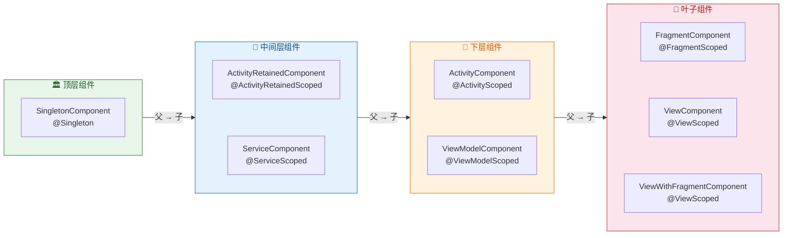

**可见性规则一句话总结：子组件可以看到父组件的所有绑定，但父组件看不到子组件的绑定。** 这就像 Java 的继承——子类可以访问父类的 `public`/`protected` 成员，但父类不知道子类新增了什么。

在实际开发中，这条规则的典型体现是：如果你在一个 `@InstallIn(SingletonComponent::class)` 的 Module 中尝试 `@Provides` 一个需要注入 `@FragmentScoped` 依赖的对象，**编译期就会报错**，因为 `SingletonComponent` 处于层级顶端，无法访问下层 `FragmentComponent` 中的绑定。

#### 典型使用场景

`@FragmentScoped` 适合 **仅服务于某一个 Fragment 的状态或逻辑**：

- **Fragment 级的 Adapter/Delegate**：如某个 Fragment 专属的 RecyclerView Adapter 管理器。
- **Fragment 内的页面状态管理器**：管理某个特定 Fragment 的 UI 状态，如加载态、空态、错误态的切换。
- **多实例 Fragment 场景**：同一个 Fragment 类被多次添加到 Activity 中（如 ViewPager 中的多个 Tab），每个 Fragment 实例拥有自己独立的 `@FragmentScoped` 依赖实例。

#### 代码示例

```kotlin
// Fragment 级别的表单验证器
@FragmentScoped // 每个 Fragment 实例持有自己独立的验证器
class FormValidator @Inject constructor() {

    // 存储各字段的验证错误信息
    private val errors = mutableMapOf<String, String>()

    // 验证指定字段
    fun validateField(fieldName: String, value: String): Boolean {
        // 根据字段名应用不同的验证规则
        return when (fieldName) {
            "email" -> {
                // 验证邮箱格式
                val isValid = android.util.Patterns.EMAIL_ADDRESS.matcher(value).matches()
                if (!isValid) errors[fieldName] = "邮箱格式不正确" // 记录错误
                else errors.remove(fieldName) // 清除之前的错误
                isValid
            }
            "password" -> {
                // 验证密码长度
                val isValid = value.length >= 8
                if (!isValid) errors[fieldName] = "密码至少 8 位" // 记录错误
                else errors.remove(fieldName) // 清除错误
                isValid
            }
            else -> true // 未知字段默认通过
        }
    }

    // 获取所有验证错误
    fun getAllErrors(): Map<String, String> = errors.toMap() // 返回不可变副本

    // 检查是否所有字段都通过验证
    fun isFormValid(): Boolean = errors.isEmpty() // 无错误则有效
}
```

```kotlin
@AndroidEntryPoint
class RegistrationFragment : Fragment() {

    // 每个 RegistrationFragment 实例都有自己独立的 FormValidator
    // 如果 ViewPager 中有两个 RegistrationFragment，它们的 validator 互不影响
    @Inject lateinit var formValidator: FormValidator

    private fun onSubmitClick() {
        // 使用该 Fragment 专属的验证器
        formValidator.validateField("email", emailInput.text.toString())
        formValidator.validateField("password", passwordInput.text.toString())

        if (formValidator.isFormValid()) {
            // 所有验证通过，提交表单
            submitRegistration()
        } else {
            // 显示错误信息
            showErrors(formValidator.getAllErrors())
        }
    }
}
```

### ViewModelScoped 作用域

`@ViewModelScoped` 是 Hilt 中使用频率极高、也是最贴合现代 Android 架构的作用域之一。它将实例绑定到 **`ViewModelComponent`**，而 `ViewModelComponent` 的生命周期与某一个具体的 **`ViewModel`** 实例完全一致——从 `ViewModel` 被创建到 `ViewModel.onCleared()` 被调用。

这里的关键在于：`ViewModel` 本身能够在 **配置变更中存活**（屏幕旋转、语言切换等）。因此，`@ViewModelScoped` 的实例也天然具备配置变更存活能力，而无需额外处理。

#### ViewModel 的存活机制回顾

为什么 `ViewModel` 能在配置变更中存活？这背后是 Android Framework 的 `ViewModelStore` 机制。简要来说：

1. 每个 `ComponentActivity`（AppCompatActivity 的父类）内部持有一个 **`ViewModelStore`**，它本质上就是一个 `HashMap<String, ViewModel>`。
2. 当配置变更触发 Activity 重建时，Framework 通过 `onRetainNonConfigurationInstance()` 机制将 `ViewModelStore` 保存到一个临时的 `NonConfigurationInstances` 对象中。
3. 新的 Activity 实例在 `onCreate()` 中通过 `getLastNonConfigurationInstance()` 恢复这个 `ViewModelStore`，从而拿到之前的所有 ViewModel。
4. 只有当 Activity **真正 finish**（`isFinishing == true`）时，`ViewModelStore.clear()` 才会被调用，此时所有 ViewModel 的 `onCleared()` 被触发，`@ViewModelScoped` 的实例也随之被 GC。

正是由于 `ViewModelComponent` 附着在 `ViewModel` 上，所以 `@ViewModelScoped` 完美继承了这套存活机制。

#### 典型使用场景

`@ViewModelScoped` 最适合那些 **为某个 ViewModel 服务、需要跨配置变更存活、但不需要全局共享** 的依赖：

- **UseCase / Interactor**：业务用例通常只服务于一个或少数几个 ViewModel，作用域绑定到 ViewModel 是最合适的。
- **状态缓存**：ViewModel 层的内存缓存，旋转后仍需保留的中间数据。
- **流的上游管理器**：如管理某个 StateFlow / SharedFlow 的发射逻辑，需要与 ViewModel 同生共死。

#### 与其他作用域的对比

一个非常实际的问题：为什么不直接把 UseCase 标注为 `@Singleton` 呢？原因如下：

1. **生命周期过长**：`@Singleton` 活到进程结束。如果 UseCase 内部持有一些临时状态或 Flow Collector，它们在 Activity 销毁后仍然存活，浪费内存。
2. **不必要的共享**：不同的 ViewModel 可能需要同一个 UseCase 类型但不同的实例（因为各自的参数或上下文不同）。`@Singleton` 会强制共享，而 `@ViewModelScoped` 让每个 ViewModel 持有自己的 UseCase 实例。
3. **测试隔离**：`@ViewModelScoped` 的实例随 ViewModel 销毁而销毁，测试中不会有状态泄漏问题。

#### 代码示例

```kotlin
// 一个用于获取用户资料的 UseCase
@ViewModelScoped // 绑定到使用它的 ViewModel 的生命周期
class GetUserProfileUseCase @Inject constructor(
    private val userRepository: UserRepository, // 注入 Repository（可能是 @Singleton 的）
    private val analyticsTracker: AnalyticsTracker // 注入分析追踪器
) {
    // 内存缓存：在 ViewModel 存活期间（包括配置变更后）保持有效
    private var cachedProfile: UserProfile? = null

    // 执行获取用户资料的逻辑
    suspend fun execute(userId: String, forceRefresh: Boolean = false): Result<UserProfile> {
        // 如果有缓存且不强制刷新，直接返回缓存
        if (!forceRefresh && cachedProfile != null) {
            return Result.success(cachedProfile!!) // 返回缓存的资料
        }

        // 从 Repository 获取最新数据
        return userRepository.getUserProfile(userId)
            .onSuccess { profile ->
                cachedProfile = profile // 更新缓存
                analyticsTracker.trackProfileLoaded(userId) // 记录分析事件
            }
        // 当 ViewModel 被 clear 时，此 UseCase 也被回收
        // cachedProfile 自然被 GC，无需手动清理
    }
}
```

```kotlin
// ViewModel 中注入 @ViewModelScoped 的 UseCase
@HiltViewModel // 标注为 Hilt 管理的 ViewModel
class ProfileViewModel @Inject constructor(
    private val getUserProfile: GetUserProfileUseCase, // 注入 UseCase
    private val savedStateHandle: SavedStateHandle     // Hilt 自动提供 SavedStateHandle
) : ViewModel() {

    // UI 状态 Flow
    private val _uiState = MutableStateFlow<ProfileUiState>(ProfileUiState.Loading)
    val uiState: StateFlow<ProfileUiState> = _uiState.asStateFlow() // 暴露不可变版本

    init {
        // ViewModel 创建时自动加载
        loadProfile()
    }

    fun loadProfile(forceRefresh: Boolean = false) {
        viewModelScope.launch { // 在 ViewModel 的协程作用域中执行
            _uiState.value = ProfileUiState.Loading // 切换到加载状态

            // 从 SavedStateHandle 获取 userId（由导航参数传入）
            val userId = savedStateHandle.get<String>("userId") ?: return@launch

            // 执行 UseCase（如果旋转后再次调用，UseCase 的缓存仍在）
            getUserProfile.execute(userId, forceRefresh)
                .onSuccess { profile ->
                    _uiState.value = ProfileUiState.Success(profile) // 成功状态
                }
                .onFailure { error ->
                    _uiState.value = ProfileUiState.Error(error.message) // 错误状态
                }
        }
    }
}
```

在上面的例子中，`GetUserProfileUseCase` 的 `cachedProfile` 在屏幕旋转后仍然有效——因为 ViewModel 没有被销毁，UseCase 也就没有被重建。用户旋转屏幕后看到的仍然是之前加载的数据，无需重新请求网络，体验流畅。

### 无作用域（Unscoped）——被忽视的默认行为

前面反复提到了"无作用域"的概念，这里需要专门强调，因为很多开发者在刚接触 Hilt 时会忽视这个默认行为。

**当你不添加任何 Scope 注解时，绑定是 Unscoped 的。** 这意味着：

1. **每次注入都创建新实例**：注入 10 次就创建 10 个不同的对象。
2. **不缓存**：没有 `DoubleCheck`，没有实例缓存，Provider 每次都会执行工厂方法。
3. **轻量且安全**：因为没有共享，所以天然线程安全（每个消费者拿到自己的实例），也不存在生命周期泄漏的风险。

**Unscoped 并不意味着"不好"**。对于无状态的轻量工具类（如格式化器、Mapper、Validator 的无状态版本），Unscoped 反而是最佳选择——内存随用随建随回收，没有缓存带来的内存常驻开销。

一个实用的判断原则是：**如果一个类没有可变状态（内部没有 `var`、没有可变集合），那大概率不需要 Scope。** 只有当你需要"共享同一个实例"或"维护状态跨越多次注入"时，才应该添加 Scope。

### 作用域使用决策流程

面对一个新的依赖类型，如何决定使用哪个 Scope？以下流程可以帮助你做出判断：

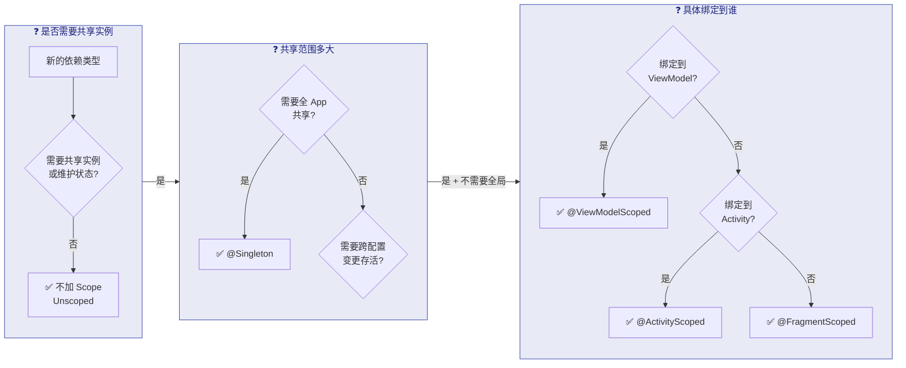

### 常见错误与陷阱

**陷阱一：Scope 与 InstallIn 不匹配**

每个 Scope 注解只能用于其对应的 Component。如果你在 `@InstallIn(ActivityComponent::class)` 的 Module 中使用 `@Singleton`，编译器会报错。对应关系必须严格一致：

```kotlin
// ❌ 错误：@Singleton 只能用于 SingletonComponent
@Module
@InstallIn(ActivityComponent::class) // 安装到 ActivityComponent
object WrongModule {
    @Provides
    @Singleton // 编译错误！Scope 与 Component 不匹配
    fun provideSomething(): Something = Something()
}

// ✅ 正确：@ActivityScoped 对应 ActivityComponent
@Module
@InstallIn(ActivityComponent::class) // 安装到 ActivityComponent
object CorrectModule {
    @Provides
    @ActivityScoped // 正确！Scope 与 Component 匹配
    fun provideSomething(): Something = Something()
}
```

**陷阱二：子组件 Scope 的依赖注入 Singleton Scope 的对象中**

这个错误更加隐蔽。假设你有一个 `@Singleton` 的 Manager 类，想在其中注入一个 `@ActivityScoped` 的依赖——这在编译期就会失败，因为 `SingletonComponent` 是 `ActivityComponent` 的父组件，父组件无法访问子组件的绑定。

**陷阱三：误以为 @ActivityScoped 能跨配置变更存活**

如前所述，`@ActivityScoped` 在配置变更时会随 Activity 一起销毁重建。如果你需要跨配置变更的存活能力，应该使用 `@ActivityRetainedScoped` 或 `@ViewModelScoped`。

---

**📝 练习题**

在一个电商 App 中，`CartRepository` 负责管理用户的购物车数据（内存缓存 + 网络同步）。多个 Activity 和 Fragment 都需要访问购物车，并且购物车状态需要在整个 App 运行期间保持一致。请问 `CartRepository` 最适合使用哪个作用域注解？

A. 不添加任何 Scope（Unscoped）

B. `@ActivityScoped`

C. `@ViewModelScoped`

D. `@Singleton`


**【答案】** D

**【解析】** `CartRepository` 需要满足两个关键要求：**全局共享**（多个 Activity/Fragment 访问同一个实例）和 **长生命周期**（App 运行期间持续维护购物车状态）。选项 A（Unscoped）意味着每次注入都创建新实例，各处拿到的是不同的 `CartRepository`，购物车状态无法共享。选项 B（`@ActivityScoped`）的实例仅在单个 Activity 内共享，不同 Activity 之间会是不同的实例，且配置变更后实例会丢失。选项 C（`@ViewModelScoped`）绑定到单个 ViewModel，跨 ViewModel 也无法共享。只有选项 D（`@Singleton`）能确保整个 App 进程中只有一个 `CartRepository` 实例，所有消费者访问的是同一份购物车数据。当然，使用 `@Singleton` 时要注意不要让 `CartRepository` 持有 Activity 等短生命周期组件的引用。

---

**📝 练习题**

以下代码存在编译错误，请问原因是什么？

```kotlin
@Module
@InstallIn(SingletonComponent::class)
object AppModule {
    @Provides
    @ActivityScoped
    fun provideAnalytics(): AnalyticsService = AnalyticsServiceImpl()
}
```

A. `@Provides` 方法不能返回接口实现类

B. `@ActivityScoped` 不能用在 `@InstallIn(SingletonComponent::class)` 的 Module 中

C. `object` 类型的 Module 不支持 `@ActivityScoped`

D. `AnalyticsServiceImpl` 需要添加 `@Inject` 注解


**【答案】** B

**【解析】** Hilt 要求 **Scope 注解必须与其 Module 安装的 Component 严格匹配**。`@ActivityScoped` 对应的是 `ActivityComponent`，而此 Module 通过 `@InstallIn(SingletonComponent::class)` 安装到了 `SingletonComponent`。`SingletonComponent` 中只能使用 `@Singleton` 或不使用任何 Scope（Unscoped）。这是因为 `SingletonComponent` 的生命周期是 Application 级别的，而 `@ActivityScoped` 表示的是 Activity 级别的生命周期——在一个 Application 级别的容器中创建 Activity 级别的 Scoped 绑定在语义上是矛盾的（容器不知道该绑定到哪个 Activity）。修复方法是将 `@InstallIn` 改为 `ActivityComponent::class`，或将 Scope 改为 `@Singleton`，具体取决于业务需要。

---

## 绑定与提供（Binds 接口绑定、Provides 实例提供、Qualifier 限定符、Named 命名）

依赖注入框架的核心使命，是让容器（Container）知道 **"当有人需要类型 T 时，该如何创造或定位一个 T 的实例"**。在 Hilt/Dagger 的术语体系中，这种"从类型到实例"的映射关系被统称为 **绑定（Binding）**。每一条绑定就像容器内部的一张"菜谱"：原料是什么、工序是什么、最终端上什么菜。Hilt 提供了两种声明绑定的核心注解——`@Binds` 与 `@Provides`，以及用于在同类型存在多条绑定时进行区分的 `@Qualifier` / `@Named` 机制。这四者共同构成了 Hilt 模块（Module）内部最常见的声明方式，也是日常开发中编写最频繁的 DI 配置代码。理解它们各自的适用场景、编译期行为差异以及组合使用的技巧，是写出高效、可维护 DI 配置的关键。

---

### `@Binds`：接口到实现的零成本映射

#### 为什么需要 `@Binds`

在面向接口编程（Program to an Interface）的实践中，业务代码依赖的是抽象类型（接口或抽象类），而非具体实现。例如，Repository 层对外暴露 `UserRepository` 接口，内部有 `UserRepositoryImpl` 实现。当 ViewModel 通过构造器声明 `UserRepository` 依赖时，Hilt 容器需要知道"这个接口对应哪个实现类"。`@Binds` 正是为这种 **"接口 → 实现"的一对一映射** 而设计的声明方式。

从编译期视角来看，`@Binds` 的本质是一条 **类型别名（Type Alias）声明**。它告诉 Dagger 的注解处理器（Annotation Processor / KSP）：当依赖图（Dependency Graph）中有人请求接口 `A`，直接把已经存在的 `AImpl` 绑定拿过来用即可。因为这里不涉及任何"新建对象"的逻辑，Dagger 在代码生成阶段可以做到 **零额外包装**——不会生成多余的 Factory 类，也不会多一层方法调用。这就是 `@Binds` 相对于 `@Provides` 在同等场景下更优的根本原因：它产出的编译产物更精简、运行时路径更短。

#### 语法与约束

`@Binds` 方法必须满足以下硬性约束，否则编译器会直接报错：

1. **必须是抽象方法**（`abstract fun`）——因为它不需要方法体，只做类型声明。
2. **恰好一个参数**，参数类型是具体实现类。
3. **返回类型是接口或父类**，即你想暴露给依赖图的抽象类型。
4. **所在 Module 必须是 `abstract class` 或 `interface`**——因为包含了抽象方法。

下面通过一个典型的 Repository 绑定来演示完整写法：

```kotlin
// --- 1. 定义接口 ---
// 用户仓库的抽象契约，ViewModel 只依赖此接口
interface UserRepository {
    // 挂起函数，按 ID 获取用户
    suspend fun getUser(id: String): User
}

// --- 2. 实现类 ---
// 通过 @Inject 标记构造器，让 Hilt 知道如何创建此类
class UserRepositoryImpl @Inject constructor(
    // Hilt 会自动提供 UserApi 和 UserDao（前提是它们也已绑定到图中）
    private val api: UserApi,
    private val dao: UserDao
) : UserRepository {
    // 实现接口方法：先查本地缓存，无则请求网络
    override suspend fun getUser(id: String): User {
        // 先从 Room 数据库查询
        return dao.findById(id) ?: api.fetchUser(id).also {
            // 网络数据回写本地
            dao.insert(it)
        }
    }
}

// --- 3. Module 中使用 @Binds ---
@Module
// 安装到 SingletonComponent，全局可用
@InstallIn(SingletonComponent::class)
// 包含 @Binds 的 Module 必须声明为 abstract
abstract class RepositoryModule {

    // 告诉 Hilt：当有人需要 UserRepository 接口时，
    // 去找 UserRepositoryImpl 的绑定（即通过其 @Inject 构造器创建）
    @Binds
    abstract fun bindUserRepository(
        // 参数：具体实现类（必须已可被 Hilt 构造）
        impl: UserRepositoryImpl
    ): UserRepository  // 返回值：暴露给依赖图的抽象类型
}
```

在编译阶段，Dagger/Hilt 的处理器看到这条 `@Binds` 声明后，并 **不会** 为 `bindUserRepository` 生成一个 Factory。它只是在依赖图的内部数据结构中记录了一条边：`UserRepository` → `UserRepositoryImpl`。当某个 ViewModel 请求 `UserRepository` 时，容器直接沿着这条边找到 `UserRepositoryImpl` 的 Factory（由其 `@Inject` 构造器自动生成），调用它即可。

#### `@Binds` 与继承层次

`@Binds` 不仅可以绑定"接口 → 实现类"，也可以绑定"父类 → 子类"。只要参数类型是返回类型的子类型（subtype），绑定关系就成立。这在某些框架场景下很有用，例如将自定义的 `AppCompatActivity` 子类绑定为 `Activity` 类型暴露给某些工具类。

---

### `@Provides`：手动提供实例的万能工具

#### 为什么需要 `@Provides`

`@Binds` 虽然高效，但它有一个硬性前提：**实现类必须由 Hilt 通过 `@Inject` 构造器来创建**。然而现实开发中，大量对象并不满足这个条件：

| 场景 | 原因 |
|---|---|
| **第三方库类**（Retrofit、OkHttpClient、Room Database） | 你无法修改它们的源码去添加 `@Inject` |
| **需要 Builder/Factory 模式构建** | 对象创建需要链式调用多个配置方法 |
| **需要条件逻辑** | 根据 BuildConfig 或 Flavor 选择不同实现 |
| **基本类型或字符串** | `String`、`Int` 等无法标注 `@Inject` 构造器 |

对于以上所有情况，`@Provides` 就是标准答案。它允许你在方法体中 **编写任意的对象创建逻辑**，并将返回值注册到依赖图中。

#### 语法与特性

`@Provides` 方法是 **具体方法**（非 abstract），拥有真正的方法体。它的约束相对宽松：

1. 方法可以有 **零到多个参数**——每个参数都是从依赖图中自动获取的其他绑定。
2. **返回类型** 就是注册到依赖图中的类型。
3. 所在 Module 可以是 `abstract class`（`@Provides` 方法需用 `companion object`）、普通 `class`，或 `object`。

以下是一个经典的网络层配置模块：

```kotlin
@Module
// 安装到 SingletonComponent —— 网络客户端通常全局单例
@InstallIn(SingletonComponent::class)
object NetworkModule {

    // --- 提供 OkHttpClient ---
    @Provides
    // @Singleton 确保整个 App 进程中只创建一个 OkHttpClient
    @Singleton
    fun provideOkHttpClient(
        // 参数由 Hilt 自动从图中获取（需要有对应绑定）
        interceptor: AuthInterceptor
    ): OkHttpClient {
        // 使用 Builder 模式构建 —— 这正是 @Binds 无法表达的场景
        return OkHttpClient.Builder()
            // 添加认证拦截器
            .addInterceptor(interceptor)
            // 设置 30 秒连接超时
            .connectTimeout(30, TimeUnit.SECONDS)
            // 设置 30 秒读取超时
            .readTimeout(30, TimeUnit.SECONDS)
            // 构建最终实例
            .build()
    }

    // --- 提供 Retrofit ---
    @Provides
    @Singleton
    fun provideRetrofit(
        // 上面刚提供的 OkHttpClient 会被自动注入到这里
        client: OkHttpClient
    ): Retrofit {
        return Retrofit.Builder()
            // 设置 API 基础地址
            .baseUrl("https://api.example.com/v1/")
            // 使用上面构建的 OkHttpClient
            .client(client)
            // 添加 Kotlin Serialization 或 Gson 转换器
            .addConverterFactory(Json.asConverterFactory("application/json".toMediaType()))
            // 构建 Retrofit 实例
            .build()
    }

    // --- 提供具体的 API Service 接口 ---
    @Provides
    @Singleton
    fun provideUserApi(
        // 注入上面创建的 Retrofit 实例
        retrofit: Retrofit
    ): UserApi {
        // 通过 Retrofit 的动态代理机制创建接口实现
        return retrofit.create(UserApi::class.java)
    }
}
```

#### 编译产物与性能代价

与 `@Binds` 的"零成本"不同，每一个 `@Provides` 方法都会让 Dagger 生成一个对应的 **Factory 类**。例如 `provideOkHttpClient` 会生成 `NetworkModule_ProvideOkHttpClientFactory`，其内部实现大致如下逻辑：持有 Module 实例引用（`object` 时为单例），调用你写的 `provideOkHttpClient()` 方法，传入已解析好的参数。因此，在接口绑定的场景下，如果你把能用 `@Binds` 的地方都换成了 `@Provides`，编译产物中就会多出许多本可避免的 Factory 类。项目越大，累积的编译时间增量和方法数膨胀越明显。这就是为什么 **Hilt 官方文档和 Dagger 最佳实践都明确推荐：能用 `@Binds` 的地方优先用 `@Binds`**。

#### 混合模块：`abstract class` + `companion object`

实际项目中，同一个功能模块（例如数据层）往往既有接口绑定，也有需要 Builder 的第三方库实例。此时可以将 `@Binds` 和 `@Provides` 放在同一个 Module 文件中。做法是将 Module 声明为 `abstract class`，`@Binds` 方法作为抽象成员，`@Provides` 方法放入 `companion object`：

```kotlin
@Module
@InstallIn(SingletonComponent::class)
// abstract class 以容纳 @Binds 抽象方法
abstract class DataModule {

    // --- @Binds：接口绑定 ---
    @Binds
    // 将 OfflineFirstUserRepository 绑定为 UserRepository
    abstract fun bindUserRepo(
        impl: OfflineFirstUserRepository
    ): UserRepository

    companion object {
        // --- @Provides：需要 Builder 构建的第三方库 ---
        @Provides
        @Singleton
        fun provideDatabase(
            // @ApplicationContext 由 Hilt 内置提供
            @ApplicationContext context: Context
        ): AppDatabase {
            // Room 必须用 Builder 创建，不可能用 @Binds
            return Room.databaseBuilder(
                context,
                AppDatabase::class.java,
                // 数据库文件名
                "app_database"
            )
                // 版本升级时的破坏性迁移策略（仅示例，生产慎用）
                .fallbackToDestructiveMigration()
                // 构建数据库实例
                .build()
        }

        @Provides
        fun provideUserDao(
            // 参数：上面提供的 AppDatabase 实例
            db: AppDatabase
        ): UserDao {
            // 从 Database 获取 DAO —— 又一个只能用 @Provides 的典型场景
            return db.userDao()
        }
    }
}
```

> **提示**：Kotlin 的 `companion object` 中的方法在编译为 Java 字节码后本质上是静态方法（`static`），Dagger 的代码生成器能正确识别并处理。自 Dagger 2.26 起，`@Provides` 方法推荐尽可能使用 `object` 或 `companion object`，因为 Dagger 可以直接静态调用而无需持有 Module 实例引用，减少一次间接寻址。

---

### `@Qualifier`：同类型多绑定的消歧义机制

#### 问题场景

假设你的应用需要两个不同配置的 `OkHttpClient`：一个用于常规 API 请求（带 Auth 拦截器），另一个用于图片加载（不带 Auth，但带缓存拦截器）。如果直接在 Module 中写两个返回 `OkHttpClient` 的 `@Provides` 方法，Dagger 编译时会立即报错：

```
[Dagger/DuplicateBindings] OkHttpClient is bound multiple times
```

原因很简单：依赖图中的绑定以 **类型（Type）** 作为 Key。当同一类型有多个绑定时，容器不知道该选哪一个。`@Qualifier` 正是为解决此问题而设计的 **限定符注解**（Qualifier Annotation），它在类型之外附加一个额外的"标签"，使得 Key 变为 **(Type + Qualifier)** 的组合，从而实现消歧义。

#### 自定义 Qualifier 的标准写法

`@Qualifier` 本身是一个元注解（meta-annotation），你需要用它来标注你自己定义的注解：

```kotlin
// 定义限定符：标识用于 API 请求的 OkHttpClient
@Qualifier
// @Retention(BINARY) 表示注解保留到编译产物中（class 文件），
// 但运行时不可通过反射获取 —— Dagger 只需编译期可见
@Retention(AnnotationRetention.BINARY)
annotation class ApiClient   // 仅是一个标签，无需任何属性

// 定义限定符：标识用于图片加载的 OkHttpClient
@Qualifier
@Retention(AnnotationRetention.BINARY)
annotation class ImageClient
```

接下来，在 `@Provides` 方法和注入点同时使用这些 Qualifier：

```kotlin
@Module
@InstallIn(SingletonComponent::class)
object HttpClientModule {

    // --- 提供 API 专用客户端 ---
    @ApiClient               // ← 限定符标签
    @Provides
    @Singleton
    fun provideApiClient(
        // AuthInterceptor 由 Hilt 图中其他绑定提供
        authInterceptor: AuthInterceptor
    ): OkHttpClient {
        return OkHttpClient.Builder()
            // API 客户端需要认证拦截器
            .addInterceptor(authInterceptor)
            // 30 秒超时
            .connectTimeout(30, TimeUnit.SECONDS)
            .build()
    }

    // --- 提供图片加载专用客户端 ---
    @ImageClient             // ← 另一个限定符标签
    @Provides
    @Singleton
    fun provideImageClient(
        // CacheInterceptor 为自定义拦截器
        cacheInterceptor: CacheInterceptor
    ): OkHttpClient {
        return OkHttpClient.Builder()
            // 图片客户端需要缓存拦截器
            .addInterceptor(cacheInterceptor)
            // 图片下载允许更长超时
            .connectTimeout(60, TimeUnit.SECONDS)
            .build()
    }
}
```

注入时，在参数前标注相同的 Qualifier 即可精确匹配：

```kotlin
// Retrofit 构建时需要 API 客户端
class ApiService @Inject constructor(
    @ApiClient              // ← 告诉 Hilt：我要的是带 @ApiClient 标签的那个 OkHttpClient
    private val client: OkHttpClient
)

// 图片加载器需要图片客户端
class ImageLoader @Inject constructor(
    @ImageClient            // ← 告诉 Hilt：我要的是带 @ImageClient 标签的那个 OkHttpClient
    private val client: OkHttpClient
)
```

#### Qualifier 的工作原理

从依赖图的数据模型角度看，每一条绑定的 **Key** 由两部分组成：

```text
BindingKey = (Type, Optional<Qualifier>)
```

当 Key 中没有 Qualifier 时，它就是一个 **无限定绑定（Unqualified Binding）**，仅按类型匹配。当 Key 中携带了 Qualifier，匹配时就必须 Type 和 Qualifier **同时一致** 才行。编译器在验证依赖图完整性时，会检查每一个注入点的 Key 是否恰好对应图中的一条绑定。如果找到零条——报 `MissingBinding` 错误；如果找到多于一条——报 `DuplicateBindings` 错误。Qualifier 的引入就是为了把"多于一条"的情况通过添加标签分裂为各自唯一的条目。

下面用 Mermaid 图来展示含 Qualifier 的依赖解析流程：

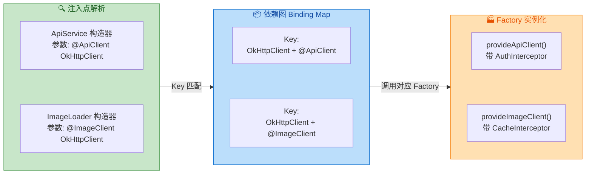

由图可见，Qualifier 就像是给依赖图的 Key 增加了一个"命名空间"维度。这种设计极为优雅：你无需创建新的包装类型（如 `ApiOkHttpClient`、`ImageOkHttpClient`），保持了类型系统的干净，同时在编译期就完成了完备的匹配校验。

---

### `@Named`：内置的字符串限定符

#### 什么是 `@Named`

`@Named` 是 `javax.inject`（JSR-330 标准）中预定义的一个 Qualifier 实现。它的内部结构非常简单——就是一个 `@Qualifier` 注解加上一个 `String value` 属性：

```java
// javax.inject 包中的源码（简化）
@Qualifier                    // 本身就是一个 Qualifier
@Documented
@Retention(RUNTIME)
public @interface Named {
    String value() default "";  // 用字符串作为区分标签
}
```

使用 `@Named` 可以省去自定义注解类的步骤，直接用字符串来区分同类型的多个绑定：

```kotlin
@Module
@InstallIn(SingletonComponent::class)
object ConfigModule {

    // 提供 API 基础地址
    @Named("baseUrl")       // ← 用字符串 "baseUrl" 做标签
    @Provides
    fun provideBaseUrl(): String {
        // 返回 API 地址字符串
        return "https://api.example.com/v1/"
    }

    // 提供 API Key
    @Named("apiKey")        // ← 用字符串 "apiKey" 做标签
    @Provides
    fun provideApiKey(): String {
        // 返回密钥字符串（实际应从 BuildConfig 或安全存储读取）
        return BuildConfig.API_KEY
    }
}

// 注入点使用相同的 @Named 字符串
class ApiClient @Inject constructor(
    @Named("baseUrl")       // ← 精确匹配 "baseUrl" 绑定
    private val baseUrl: String,
    @Named("apiKey")        // ← 精确匹配 "apiKey" 绑定
    private val apiKey: String
)
```

#### `@Named` vs 自定义 `@Qualifier`：如何选择

虽然 `@Named` 使用起来更简洁（不需要额外定义注解类），但在实际的项目实践中，**自定义 Qualifier 几乎总是更优的选择**。以下是两者的详细对比：

| 维度 | `@Named("string")` | 自定义 `@Qualifier` |
|---|---|---|
| **类型安全** | ❌ 字符串无编译检查，拼写错误只会在运行时暴露为 `MissingBinding` | ✅ 注解类型有编译器检查，拼错类名直接编译失败 |
| **重构友好度** | ❌ IDE 的 Rename 重构无法自动关联所有使用处的字符串 | ✅ Rename 注解类，所有使用处自动更新 |
| **代码导航** | ❌ 无法 Find Usages 查找所有使用某个 Named 的位置 | ✅ IDE 可以直接查找 Qualifier 注解的所有引用 |
| **可读性** | ⚠️ 取决于字符串命名质量 | ✅ 注解类名天然具有语义 |
| **声明成本** | ✅ 零额外文件 | ⚠️ 每个 Qualifier 需要一个注解类声明（约 3-4 行代码） |

**实际建议**：在快速原型或绑定数量极少（1-2 个）且不太可能扩展时，可以临时使用 `@Named`。但对于正式项目或团队协作项目，**始终使用自定义 `@Qualifier`**。额外的 3-4 行注解声明是极小的成本，换来的是完整的编译期安全保障和 IDE 重构支持。

---

### 综合实战：完整数据层 DI 配置

下面用一个贴近真实项目的数据层配置，将 `@Binds`、`@Provides`、`@Qualifier` 综合运用起来。场景是一个同时支持 **本地缓存** 和 **远程网络** 的数据层架构：

```kotlin
// ========== 1. Qualifier 定义 ==========

// 标识远程数据源
@Qualifier
@Retention(AnnotationRetention.BINARY)
annotation class RemoteDataSource

// 标识本地数据源
@Qualifier
@Retention(AnnotationRetention.BINARY)
annotation class LocalDataSource


// ========== 2. 数据源接口与实现 ==========

// 统一的数据源抽象
interface UserDataSource {
    suspend fun getUser(id: String): User?
    suspend fun saveUser(user: User)
}

// 远程数据源实现：从网络 API 获取数据
class RemoteUserDataSource @Inject constructor(
    // 注入 Retrofit 生成的 API 接口
    private val api: UserApi
) : UserDataSource {
    override suspend fun getUser(id: String): User? {
        // 调用网络接口
        return api.fetchUser(id)
    }
    override suspend fun saveUser(user: User) {
        // 上传到服务器
        api.updateUser(user)
    }
}

// 本地数据源实现：从 Room 数据库读写
class LocalUserDataSource @Inject constructor(
    // 注入 Room DAO
    private val dao: UserDao
) : UserDataSource {
    override suspend fun getUser(id: String): User? {
        // 查询本地数据库
        return dao.findById(id)
    }
    override suspend fun saveUser(user: User) {
        // 写入本地数据库
        dao.insertOrUpdate(user)
    }
}


// ========== 3. Repository 接口与实现 ==========

interface UserRepository {
    suspend fun getUser(id: String): User
}

// 离线优先策略的 Repository 实现
class OfflineFirstUserRepository @Inject constructor(
    @RemoteDataSource           // ← Qualifier 指定远程数据源
    private val remote: UserDataSource,
    @LocalDataSource            // ← Qualifier 指定本地数据源
    private val local: UserDataSource
) : UserRepository {
    override suspend fun getUser(id: String): User {
        // 优先查本地
        local.getUser(id)?.let { return it }
        // 本地无数据，查远程
        val user = remote.getUser(id)
            // 远程也没有，抛出异常
            ?: throw UserNotFoundException(id)
        // 回写本地缓存
        local.saveUser(user)
        // 返回用户数据
        return user
    }
}


// ========== 4. Hilt Module —— 完整绑定配置 ==========

@Module
@InstallIn(SingletonComponent::class)
abstract class UserDataModule {

    // --- @Binds + @Qualifier：绑定远程数据源 ---
    @RemoteDataSource                    // ← 给这条绑定打上"远程"标签
    @Binds
    abstract fun bindRemoteDataSource(
        impl: RemoteUserDataSource       // ← 具体实现
    ): UserDataSource                    // ← 暴露为接口

    // --- @Binds + @Qualifier：绑定本地数据源 ---
    @LocalDataSource                     // ← 给这条绑定打上"本地"标签
    @Binds
    abstract fun bindLocalDataSource(
        impl: LocalUserDataSource        // ← 具体实现
    ): UserDataSource                    // ← 同样暴露为接口

    // --- @Binds：绑定 Repository（无需 Qualifier，类型唯一） ---
    @Binds
    abstract fun bindUserRepository(
        impl: OfflineFirstUserRepository
    ): UserRepository

    companion object {
        // --- @Provides：Room 需要 Builder 创建 ---
        @Provides
        @Singleton
        fun provideDatabase(
            @ApplicationContext context: Context
        ): AppDatabase {
            return Room.databaseBuilder(
                context,
                AppDatabase::class.java,
                "user_database"
            ).build()
        }

        // --- @Provides：DAO 从 Database 获取 ---
        @Provides
        fun provideUserDao(db: AppDatabase): UserDao {
            return db.userDao()
        }
    }
}
```

上述代码的依赖解析链路可以用以下流程图总结：

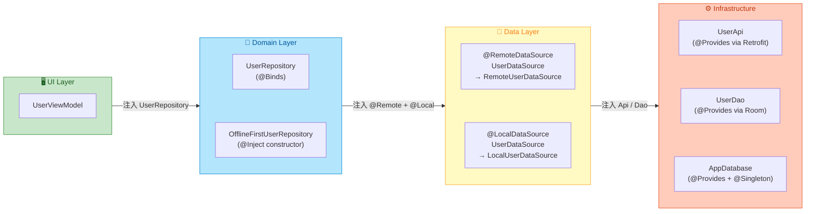

这张图清晰地展示了每一层之间的依赖关系以及各绑定方式的分工：`@Binds` 负责接口映射，`@Provides` 负责第三方库实例化，`@Qualifier` 在同一接口有多个实现时做精确路由。三者协同，构成了一个类型安全、编译期验证、零反射的依赖注入方案。

---

### 进阶要点与常见陷阱

**1. `@Binds` 方法不能有方法体**

这是最常见的新手错误。一旦你在 `@Binds` 方法中加入了任何逻辑（哪怕只是 `return impl`），编译器会报错。如果需要在创建过程中添加逻辑（如日志打印、配置修改），必须改用 `@Provides`。

**2. Qualifier 必须同时出现在提供端和消费端**

如果你在 `@Provides` / `@Binds` 上标注了 `@ApiClient`，但注入点忘记标注，Hilt 会认为你请求的是 **无限定的** `OkHttpClient`，而依赖图中可能根本没有这条绑定（所有绑定都带了 Qualifier），从而报 `MissingBinding`。反之，如果注入点标注了 Qualifier 但提供端没有，同样会报错。**两端必须严格对称**。

**3. `@Named` 字符串建议使用常量**

如果坚持使用 `@Named`，务必将字符串定义为 `const val` 常量，并在提供端和消费端引用同一常量，避免拼写不一致的问题：

```kotlin
// 统一常量定义
object NamedKeys {
    // API 基础地址的 Named Key
    const val BASE_URL = "base_url"
    // API 密钥的 Named Key
    const val API_KEY = "api_key"
}

// 使用时引用常量
@Named(NamedKeys.BASE_URL)
@Provides
fun provideBaseUrl(): String = "https://..."
```

**4. 一个 Module 不要承担过多职责**

虽然技术上可以把所有绑定塞进一个巨大的 Module，但这会严重影响可维护性。推荐按 **功能领域** 拆分：`NetworkModule`、`DatabaseModule`、`RepositoryModule` 等。每个 Module 职责单一，搭配 `@InstallIn` 安装到对应的 Component，代码审查和问题排查都会更高效。

---

**📝 练习题**

在 Hilt 模块中，你需要为 `Logger` 接口提供两个实现：`FileLogger`（写文件）和 `ConsoleLogger`（写 Logcat），两个实现都已标注 `@Inject constructor`。以下哪种配置方案是 **正确且最优** 的？

A. 定义两个 `@Provides` 方法，分别返回 `FileLogger` 和 `ConsoleLogger`，返回类型都声明为 `Logger`，并各自标注不同的自定义 `@Qualifier`


B. 定义两个 `@Binds` 抽象方法，分别接收 `FileLogger` 和 `ConsoleLogger` 参数，返回类型都是 `Logger`，并各自标注不同的自定义 `@Qualifier`


C. 定义两个 `@Binds` 抽象方法，返回类型分别写为 `FileLogger` 和 `ConsoleLogger`（而非 `Logger`），不使用 `@Qualifier`


D. 定义一个 `@Provides` 方法，内部用 `when` 表达式根据参数决定返回哪个 `Logger` 实现


**【答案】** B

**【解析】** 本题核心考查两点：**`@Binds` vs `@Provides` 的选择时机** 和 **`@Qualifier` 的正确使用**。

题目明确说明两个实现类都已标注了 `@Inject constructor`，这意味着 Hilt 已经知道如何构造它们，完全满足 `@Binds` 的前提条件。根据最佳实践，能用 `@Binds` 就不用 `@Provides`，因为前者不会生成额外的 Factory 类，编译产物更精简。因此 A 虽然能工作，但并非最优，排除。

B 选项正确使用了 `@Binds` 做接口映射，并通过不同的 `@Qualifier` 区分两条绑定（因为返回类型都是 `Logger`，属于同类型多绑定的情况）。注入点只需标注对应的 Qualifier 即可精确获取所需实现。

C 选项的返回类型写成了具体实现类而非接口，这使得绑定的 Key 变成了 `FileLogger` 和 `ConsoleLogger` 本身，而不是 `Logger`。如果业务代码声明依赖 `Logger` 类型，Hilt 图中找不到这条绑定，会报 `MissingBinding`。这违背了面向接口编程的原则。

D 选项试图在一个方法中用条件逻辑返回不同实现，这从根本上违反了 DI 的原则：**绑定应该在编译期确定**，而非运行时动态切换。Dagger/Hilt 的依赖图是静态的，一个 `@Provides` 方法对应一条绑定，无法在运行时"分叉"。

---

## Android 类注入

在前面的章节中，我们已经了解了 Hilt 的组件层级、作用域、以及各种绑定与提供方式。但这些知识最终都要落地到一个核心问题上：**如何让 Android 系统创建的那些类（Activity、Fragment、Service 等）也能享受到依赖注入？** 这个问题之所以特殊，是因为 Android 四大组件和 Application 的实例化过程完全由系统框架掌控，开发者无法直接通过构造器传参——这恰恰是依赖注入最天然的方式。Hilt 通过一套精巧的字节码转换与组件绑定机制，让开发者只需添加几个注解，就能将依赖"注入"到这些系统管理的类中。本节将逐一剖析每种 Android 类的注入方式、底层原理，以及实践中的注意事项。

### 为什么 Android 类注入如此特殊

要理解 Hilt 对 Android 类注入的设计，首先要搞清楚一个根本性矛盾：**构造器注入（Constructor Injection）是依赖注入的黄金标准，但 Android 框架组件不允许自定义构造器参数。**

以 `Activity` 为例，当用户点击一个按钮启动新页面时，系统内部的 `ActivityThread` 会通过 `Instrumentation.newActivity()` 利用反射调用 Activity 的 **无参构造器** 来创建实例。整个过程中，开发者没有任何机会向构造器传递参数。`Fragment`（在使用 `FragmentFactory` 之前）、`Service`、`BroadcastReceiver` 都面临类似的限制。`Application` 更是整个进程中最先被实例化的对象，它的创建时机甚至早于任何 Dagger 组件的初始化。

因此，对于这些类，Hilt 采用的是 **字段注入（Field Injection）** 策略——在对象被系统创建之后，在合适的生命周期回调中，由 Hilt 将依赖"灌"进被 `@Inject` 标注的字段。这个"灌入"的时机选择至关重要：太早，对象还没准备好；太晚，业务代码已经开始使用那些尚未赋值的依赖了。Hilt 精确选择了每种组件的最佳注入时机：

- **Application** → `onCreate()` 之前（通过生成的父类在 `super.onCreate()` 内完成）
- **Activity** → `super.onCreate()` 内部
- **Fragment** → `onAttach()` 回调时
- **Service** → `super.onCreate()` 内部
- **BroadcastReceiver** → `onReceive()` 调用时

这种设计确保了当开发者在生命周期方法中编写业务逻辑时，所有 `@Inject` 字段已经就绪，可以安全使用。

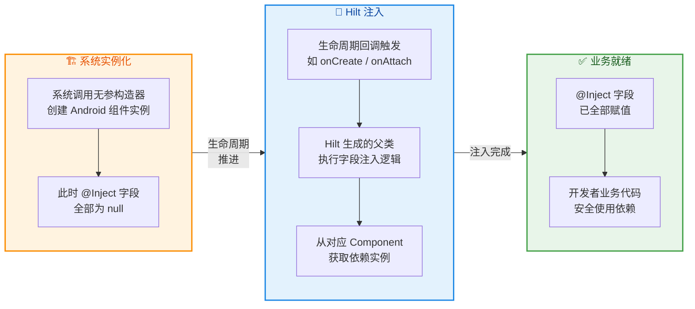

接下来，我们逐一深入每种 Android 类的注入细节。

### Application 注入

Application 是整个 Android 应用的"根"对象，它在进程启动时由系统最先创建，并且在整个应用生命周期中只存在一个实例。在 Hilt 体系中，Application 类承担着一个极其关键的角色：**它是 `SingletonComponent` 的宿主，是整棵依赖注入组件树的根节点。** 所有其他组件（`ActivityComponent`、`ServiceComponent` 等）都直接或间接地以 `SingletonComponent` 为父组件。

#### 基本用法

使用 Hilt 注入 Application 的方式非常简洁，只需在自定义 Application 类上添加 `@HiltAndroidApp` 注解：

```kotlin
// @HiltAndroidApp 是 Hilt 的"总开关"
// 它会触发代码生成，创建 SingletonComponent 并完成 Application 级别的依赖注入
@HiltAndroidApp
class MyApplication : Application() {

    // 字段注入：Hilt 会在 super.onCreate() 过程中为此字段赋值
    // 注意：字段不能是 private 的，否则 Hilt 无法通过生成代码访问它
    @Inject
    lateinit var analyticsService: AnalyticsService

    override fun onCreate() {
        // 必须先调用 super.onCreate()
        // 因为 Hilt 的注入逻辑正是在 super.onCreate() 中执行的
        super.onCreate()

        // 此处 analyticsService 已经被注入，可以安全使用
        analyticsService.trackAppLaunch()
    }
}
```

#### 底层原理：代码生成与字节码转换

`@HiltAndroidApp` 背后的工作机制经历了 Hilt 版本演进中的两种策略，理解它们有助于排查编译问题。

**早期方式（Hilt 2.31 之前）—— 直接继承生成父类**：Hilt 的注解处理器（Annotation Processor / KSP）会生成一个名为 `Hilt_MyApplication` 的类，开发者需要让自己的 Application 继承自这个生成类。`@HiltAndroidApp` 注解实际上会在编译时自动修改继承关系。

**当前方式（Hilt 2.31+，默认启用）—— Bytecode Transformation**：Hilt 使用 Gradle Transform API（或 ASM 字节码操作）在编译后期直接修改 `MyApplication` 的字节码，将注入逻辑织入 `onCreate()` 方法中。这种方式对开发者完全透明，无需关心生成的父类名称。

无论哪种方式，核心流程是一致的：

1. **编译期**：Hilt 注解处理器扫描 `@HiltAndroidApp`，生成 `SingletonComponent` 的实现类（包含所有 `@InstallIn(SingletonComponent::class)` 模块的绑定）。
2. **运行时 `onCreate()`**：生成代码会创建 `SingletonComponent` 实例，并将其存储在 Application 对象内部。随后，遍历 Application 类中所有标注了 `@Inject` 的字段，从 `SingletonComponent` 中取出对应的依赖实例并赋值。
3. **组件存储**：`SingletonComponent` 实例通过 `GeneratedComponentManager` 接口暴露，后续创建的 Activity、Service 等都会通过 `applicationContext` 回溯到这个 `SingletonComponent`，再在其基础上构建子组件。

这意味着 **如果你忘记添加 `@HiltAndroidApp`，整个 Hilt 依赖图都不会被构建**，所有子组件的注入都会失败。

#### 关于 ContentProvider 中的早期访问

一个经典的边界问题是：`ContentProvider.onCreate()` 的调用时机早于 `Application.onCreate()`。如果某个 ContentProvider 需要使用 Hilt 注入的依赖，在 `Application.onCreate()` 完成之前 `SingletonComponent` 尚未初始化，直接访问会导致崩溃。对于这种场景，Hilt 官方建议使用 `@EarlyEntryPoint` 注解（实验性 API），它会在组件完全初始化之前提供一个有限的依赖子集。但在绝大多数应用中，应该尽量避免在 ContentProvider 中使用复杂的依赖注入。

### Activity 注入

Activity 是 Android 用户界面的核心承载体，也是开发者日常使用 Hilt 最频繁的 Android 类。每个被 `@AndroidEntryPoint` 标注的 Activity，都会在 Hilt 的组件树中对应创建一个 `ActivityComponent` 实例。

#### 基本用法

```kotlin
// @AndroidEntryPoint 标注后，Hilt 会为此 Activity 生成注入代码
// 它会创建一个与此 Activity 实例绑定的 ActivityComponent
@AndroidEntryPoint
class HomeActivity : AppCompatActivity() {

    // 字段注入：不能是 private，lateinit 表示稍后由 Hilt 赋值
    @Inject
    lateinit var userRepository: UserRepository

    // 可以注入多个依赖
    @Inject
    lateinit var navigator: AppNavigator

    override fun onCreate(savedInstanceState: Bundle?) {
        // 关键：必须先调用 super.onCreate()
        // Hilt 的注入逻辑在 super.onCreate() 的调用链中执行
        super.onCreate(savedInstanceState)

        // 此处所有 @Inject 字段已就绪
        setContentView(R.layout.activity_home)

        // 安全使用注入的依赖
        val user = userRepository.getCurrentUser()
        navigator.setupBottomNavigation(this)
    }
}
```

#### 注入时机与生命周期

Hilt 对 Activity 的注入精确发生在 `super.onCreate(savedInstanceState)` 调用的内部。具体过程如下：

1. 系统创建 Activity 实例（无参构造器）。
2. 系统调用 `Activity.onCreate(Bundle?)`。
3. 开发者代码中的 `super.onCreate(savedInstanceState)` 向上传递。
4. Hilt 生成的代码（位于继承链中）拦截此调用，通过 `applicationContext` 获取到 `SingletonComponent`，在其之上构建本 Activity 的 `ActivityComponent`。
5. 使用 `ActivityComponent` 中的依赖图为所有 `@Inject` 字段赋值。
6. `super.onCreate()` 返回后，开发者的后续代码开始执行——此时字段已注入。

**关键警告**：如果你在 `super.onCreate()` 之前访问 `@Inject` 字段，会遭遇 `UninitializedPropertyAccessException`（对于 `lateinit var`）或空指针异常。这是一个非常常见的错误。

#### 支持的 Activity 基类

Hilt 要求被注入的 Activity 必须继承自 `ComponentActivity` 或其子类（如 `AppCompatActivity`、`FragmentActivity`）。这是因为 Hilt 依赖 `ComponentActivity` 中的 `SavedStateRegistryOwner` 和 `ViewModelStoreOwner` 接口来正确管理子组件的生命周期。如果你的 Activity 直接继承自 `android.app.Activity`（不推荐），Hilt 将无法正常工作。

#### Activity 中可用的默认绑定

当你在 `ActivityComponent` 作用域内时，Hilt 自动提供了以下默认绑定（Default Bindings），无需手动配置：

```kotlin
@AndroidEntryPoint
class DetailActivity : AppCompatActivity() {

    // Hilt 自动绑定：当前 Activity 的 Application 实例
    @Inject
    lateinit var application: Application

    // Hilt 自动绑定：当前 Activity 实例（类型为 Activity）
    // 注意：这里拿到的是 android.app.Activity 类型
    @Inject
    lateinit var activity: Activity

    override fun onCreate(savedInstanceState: Bundle?) {
        super.onCreate(savedInstanceState)

        // application 和 activity 都已就绪
        // 等价于 this 和 getApplication()，但通过 DI 获取让代码更可测试
        val appName = application.packageName
    }
}
```

这些默认绑定在你编写需要 `Context` 或 `Activity` 引用的工具类时非常方便——你可以在 Module 中直接使用 `@ActivityContext` 或注入 `Activity` 类型。

### Fragment 注入

Fragment 是 Android UI 的核心复用单元，它的生命周期复杂度远超 Activity。在 Hilt 体系中，每个 `@AndroidEntryPoint` 标注的 Fragment 会关联一个 `FragmentComponent`，该组件是其宿主 Activity 的 `ActivityComponent` 的子组件。

#### 基本用法

```kotlin
// Fragment 也使用 @AndroidEntryPoint 注解（与 Activity 相同的注解）
@AndroidEntryPoint
class ProfileFragment : Fragment(R.layout.fragment_profile) {

    // 字段注入
    @Inject
    lateinit var profileFormatter: ProfileFormatter

    // 注意：ViewModel 不是通过 @Inject 字段注入的
    // 而是通过 by viewModels() 委托（Hilt 会自动参与 ViewModel 的创建）
    private val viewModel: ProfileViewModel by viewModels()

    // Fragment 的注入发生在 onAttach() 时
    // 因此在 onCreateView() 及之后的生命周期中，依赖都已就绪
    override fun onViewCreated(view: View, savedInstanceState: Bundle?) {
        super.onViewCreated(view, savedInstanceState)

        // profileFormatter 已注入，可安全使用
        val displayName = profileFormatter.format(viewModel.userProfile.value)
        view.findViewById<TextView>(R.id.nameText).text = displayName
    }
}
```

#### 注入时机：`onAttach()` 而非 `onCreate()`

Fragment 的注入时机与 Activity 不同。Hilt 选择在 `onAttach(Context)` 回调中执行注入，原因如下：

1. `onAttach()` 是 Fragment 生命周期中最早能获取到宿主 Activity 引用的回调。而 `FragmentComponent` 是 `ActivityComponent` 的子组件，必须先拿到宿主 Activity 的 `ActivityComponent` 才能构建 `FragmentComponent`。
2. `onAttach()` 先于 `onCreate()` 调用，这保证了在 `onCreate()` 中依赖已就绪。
3. 这也意味着，**在 Fragment 的构造器中无法访问 `@Inject` 字段**——那个时候 Fragment 还没有 attach 到任何 Activity。

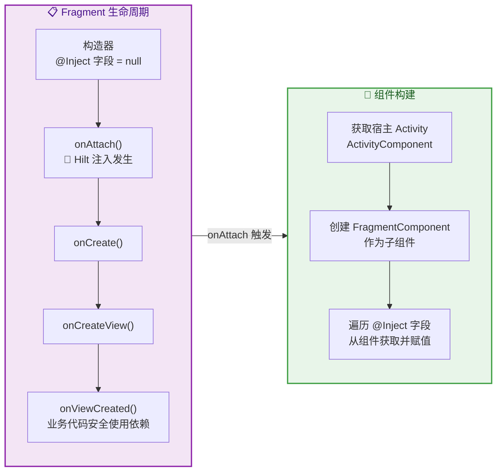

#### 宿主 Activity 的约束

一个非常重要的规则是：**如果 Fragment 使用了 `@AndroidEntryPoint`，那么它的宿主 Activity 也必须使用 `@AndroidEntryPoint`。** 这是因为 `FragmentComponent` 的创建依赖于宿主 Activity 的 `ActivityComponent`。如果宿主 Activity 没有被 Hilt 标注，Hilt 将无法找到父组件，运行时会抛出 `IllegalStateException`。

这个约束是传递性的：如果一个子 Fragment（嵌套 Fragment）使用了 `@AndroidEntryPoint`，那么它的父 Fragment 和最终的宿主 Activity 都必须使用 `@AndroidEntryPoint`。

#### Fragment 中可用的默认绑定

在 `FragmentComponent` 作用域下，除了继承自父组件的所有绑定外，Hilt 还提供：

| 默认绑定类型 | 说明 |
|---|---|
| `Fragment` | 当前 Fragment 实例 |
| `@FragmentContext Context` | Fragment 关联的 Context（即 `requireContext()`） |
| 继承自 `ActivityComponent` | `Activity`、`@ActivityContext Context`、`Application` 等 |
| 继承自 `SingletonComponent` | 所有全局单例绑定 |

#### 关于 `FragmentFactory` 和构造器注入

虽然常规的 Fragment 注入采用字段注入，但 Jetpack 提供了 `FragmentFactory` API，理论上可以实现 Fragment 的构造器注入。Hilt 实验性地提供了 `@HiltFragmentFactory` 的扩展库 (`hilt-navigation-fragment`)。然而，在实践中，由于 Fragment 可能被系统在配置变更时重建（此时系统使用无参构造器 + `arguments` Bundle），构造器注入的 Fragment 需要谨慎处理。**官方推荐仍然是使用 `@AndroidEntryPoint` + 字段注入的方式。**

### Service 注入

Android `Service` 是执行后台长时间任务的组件。与 Activity 类似，Service 由系统实例化，开发者无法控制构造过程。Hilt 为 Service 提供了 `ServiceComponent`，它是 `SingletonComponent` 的直接子组件（注意：不经过 `ActivityComponent`，因为 Service 没有 UI 层级）。

#### 基本用法

```kotlin
// 同样使用 @AndroidEntryPoint 注解
@AndroidEntryPoint
class SyncService : Service() {

    // 字段注入
    @Inject
    lateinit var syncManager: SyncManager

    // 注入应用级别的依赖也没问题，因为 ServiceComponent 是 SingletonComponent 的子组件
    @Inject
    lateinit var database: AppDatabase

    override fun onCreate() {
        // 与 Activity 相同，Hilt 注入在 super.onCreate() 中执行
        super.onCreate()
        // syncManager 和 database 已就绪
        syncManager.initialize()
    }

    override fun onStartCommand(intent: Intent?, flags: Int, startId: Int): Int {
        // 安全使用注入的依赖
        syncManager.performSync(database)
        return START_STICKY
    }

    override fun onBind(intent: Intent?): IBinder? {
        // 如果是 Bound Service，这里也可以安全使用依赖
        return null
    }
}
```

#### 注入时机

Service 的注入同样发生在 `super.onCreate()` 内部。值得注意的是，对于 `IntentService`（已废弃，推荐使用 `WorkManager`），注入时机同样是 `onCreate()`。对于 `LifecycleService`（Jetpack 提供的具有生命周期感知的 Service 基类），Hilt 的注入行为完全一致。

#### Service 的默认绑定

`ServiceComponent` 提供的默认绑定与 Activity 类似但更为精简：

| 默认绑定类型 | 说明 |
|---|---|
| `Service` | 当前 Service 实例 |
| `@ServiceContext Context` | 当前 Service 的 Context |
| `Application` | 应用级 Application 实例 |

由于 `ServiceComponent` 不在 Activity 的组件树下，**你无法在 Service 中注入 `@ActivityScoped` 或 `@FragmentScoped` 的依赖**。如果你尝试这样做，Hilt 会在编译期报错，告知依赖不在可达的组件层级中。这是组件层级隔离的正确表现。

### BroadcastReceiver 注入

`BroadcastReceiver` 在 Android 类注入中是一个相当特殊的存在。它的生命周期极其短暂——`onReceive()` 方法执行完毕后，BroadcastReceiver 实例即可被回收。正因为此，Hilt 并没有为 BroadcastReceiver 创建独立的组件，而是直接从 `SingletonComponent` 中获取依赖。

#### 基本用法

```kotlin
// BroadcastReceiver 同样使用 @AndroidEntryPoint 注解
@AndroidEntryPoint
class BootCompletedReceiver : BroadcastReceiver() {

    // 字段注入
    @Inject
    lateinit var alarmScheduler: AlarmScheduler

    @Inject
    lateinit var logger: AppLogger

    // 注入发生在 onReceive() 被调用时（内部在 super.onReceive() 之前完成）
    override fun onReceive(context: Context, intent: Intent) {
        // 此处 alarmScheduler 和 logger 已就绪
        if (intent.action == Intent.ACTION_BOOT_COMPLETED) {
            logger.log("Device booted, rescheduling alarms")
            // 重新设置闹钟
            alarmScheduler.rescheduleAll()
        }
    }
}
```

#### 注入时机与机制的特殊性

BroadcastReceiver 的注入机制与其他组件有一个关键差异：**它没有 `super.onCreate()` 回调**。BroadcastReceiver 的整个有效生命周期就是一次 `onReceive()` 调用。因此，Hilt 的注入逻辑直接嵌入到 `onReceive()` 的起始处——在你的业务代码执行之前，Hilt 已经完成了字段赋值。

由于 BroadcastReceiver 直接使用 `SingletonComponent`，它只能注入以下范围的依赖：
- `@Singleton` 作用域的绑定
- 无作用域（Unscoped）的绑定

**不能**注入 `@ActivityScoped`、`@ServiceScoped` 等局部作用域的依赖，因为 BroadcastReceiver 不属于任何 Activity 或 Service 的组件子树。

#### 在 Manifest 中注册

BroadcastReceiver 可以在 `AndroidManifest.xml` 中静态注册，也可以在代码中动态注册。对于 Hilt 注入的 BroadcastReceiver，两种注册方式都支持：

```xml
<!-- AndroidManifest.xml 中静态注册 -->
<!-- Hilt 的字节码转换会确保注入逻辑被正确织入 -->
<receiver
    android:name=".BootCompletedReceiver"
    android:exported="true">
    <intent-filter>
        <!-- 监听系统启动完成广播 -->
        <action android:name="android.intent.action.BOOT_COMPLETED" />
    </intent-filter>
</receiver>
```

动态注册时，只要 BroadcastReceiver 类上标注了 `@AndroidEntryPoint`，注入会在 `onReceive()` 触发时自动完成：

```kotlin
// 动态注册示例
// 在 Activity 或其他有 Context 的地方注册
val receiver = BootCompletedReceiver() // 此时 @Inject 字段尚未赋值
val filter = IntentFilter(Intent.ACTION_BOOT_COMPLETED)
// 注册到系统
registerReceiver(receiver, filter)
// 当广播到达时，onReceive() 内部 Hilt 会先完成注入，再执行业务逻辑
```

### 组件树与注入全景图

为了将前面的内容串联起来，让我们在一张图中展示 Hilt 的完整组件层级以及每种 Android 类对应的组件、注入时机：

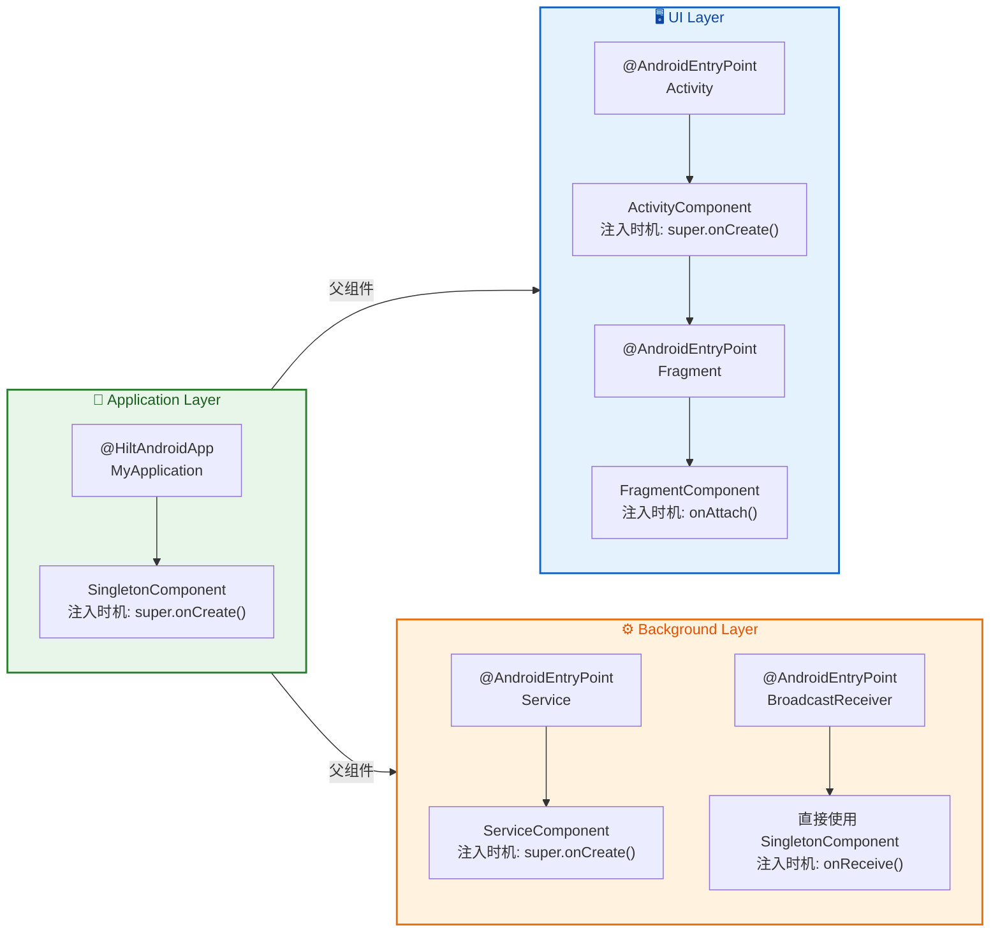

### 常见陷阱与最佳实践

#### 陷阱 1：忘记标注宿主类

这是初学者最常见的错误。Hilt 的组件是层级结构的，子组件的创建依赖于父组件的存在。如果一个 `@AndroidEntryPoint` 的 Fragment 被放置在一个未标注 `@AndroidEntryPoint` 的 Activity 中，运行时会立即崩溃：

```kotlin
// ❌ 错误：宿主 Activity 缺少 @AndroidEntryPoint
class PlainActivity : AppCompatActivity() {
    // 这个 Activity 没有 Hilt 注入
}

// Fragment 使用了 @AndroidEntryPoint
@AndroidEntryPoint
class MyFragment : Fragment() {
    @Inject
    lateinit var repo: SomeRepository
    // 运行时崩溃：IllegalStateException
    // "Hilt Fragments must be attached to an @AndroidEntryPoint Activity"
}
```

```kotlin
// ✅ 正确：宿主 Activity 也需要标注
@AndroidEntryPoint
class CorrectActivity : AppCompatActivity() {
    // 现在 MyFragment 可以正常使用了
}
```

#### 陷阱 2：在注入完成前访问字段

```kotlin
@AndroidEntryPoint
class BadActivity : AppCompatActivity() {
    
    @Inject
    lateinit var repo: UserRepository

    // ❌ 错误：init 块在构造器中执行，此时 Hilt 尚未注入
    init {
        // 这里 repo 未初始化，会抛出 UninitializedPropertyAccessException
        // repo.doSomething()
    }

    // ❌ 错误：属性初始化也是在构造器中执行
    // val userName = repo.getCurrentUser().name // 崩溃！

    override fun onCreate(savedInstanceState: Bundle?) {
        // ❌ 错误：在 super.onCreate() 之前访问
        // repo.doSomething() // 崩溃！

        super.onCreate(savedInstanceState) // ✅ Hilt 在这里注入

        // ✅ 正确：在 super.onCreate() 之后访问
        repo.doSomething()
    }
}
```

#### 陷阱 3：`@Inject` 字段不能是 `private`

Hilt 生成的代码需要直接访问被注入的字段。如果字段被声明为 `private`，生成的代码将无法编译：

```kotlin
@AndroidEntryPoint
class MyActivity : AppCompatActivity() {
    // ❌ 编译错误：Hilt 无法访问 private 字段
    // @Inject
    // private lateinit var repo: UserRepository

    // ✅ 正确：使用默认可见性（或 internal / protected）
    @Inject
    lateinit var repo: UserRepository
}
```

#### 最佳实践：优先使用 ViewModel 承载业务逻辑

虽然可以在 Activity/Fragment 中通过 `@Inject` 注入各种业务依赖，但更好的架构实践是将业务逻辑委托给 `@HiltViewModel` 标注的 ViewModel，Activity/Fragment 只负责 UI 逻辑：

```kotlin
// ✅ 推荐：业务依赖放在 ViewModel 中（构造器注入，更优雅）
@HiltViewModel
class HomeViewModel @Inject constructor(
    // 构造器注入：干净、可测试、不需要 lateinit
    private val userRepository: UserRepository,
    private val analyticsTracker: AnalyticsTracker,
    // SavedStateHandle 由 Hilt 自动提供
    private val savedStateHandle: SavedStateHandle
) : ViewModel() {

    // ViewModel 中封装业务逻辑
    fun loadUser() = userRepository.getCurrentUser()
}

// Activity 只负责 UI 绑定
@AndroidEntryPoint
class HomeActivity : AppCompatActivity() {

    // 通过委托获取 ViewModel（Hilt 自动参与创建）
    private val viewModel: HomeViewModel by viewModels()

    // 只在 Activity 中注入与 UI 直接相关的依赖
    @Inject
    lateinit var imageLoader: ImageLoader

    override fun onCreate(savedInstanceState: Bundle?) {
        super.onCreate(savedInstanceState)
        setContentView(R.layout.activity_home)

        // 通过 ViewModel 访问业务数据
        viewModel.loadUser().observe(this) { user ->
            imageLoader.load(user.avatarUrl)
        }
    }
}
```

这种方式的好处是：ViewModel 使用**构造器注入**（最佳注入方式），所有依赖在构造时就已确定，字段可以是 `private val`（不可变、私有），代码更安全、更容易测试。Activity/Fragment 中的 `@Inject` 字段尽量减少到只剩 UI 相关的工具类。

### 完整注入时机速查表

| Android 类 | 注解 | 对应 Component | 注入时机 | 父组件 |
|---|---|---|---|---|
| `Application` | `@HiltAndroidApp` | `SingletonComponent` | `super.onCreate()` | 无（根组件） |
| `Activity` | `@AndroidEntryPoint` | `ActivityComponent` | `super.onCreate()` | `SingletonComponent` |
| `Fragment` | `@AndroidEntryPoint` | `FragmentComponent` | `onAttach()` | `ActivityComponent` |
| `View` | `@AndroidEntryPoint` | `ViewComponent` | `super(...)` 构造器 | `ActivityComponent` |
| `Service` | `@AndroidEntryPoint` | `ServiceComponent` | `super.onCreate()` | `SingletonComponent` |
| `BroadcastReceiver` | `@AndroidEntryPoint` | 直接使用 `SingletonComponent` | `onReceive()` 起始 | `SingletonComponent` |

---

**📝 练习题**

在一个使用 Hilt 的 Android 项目中，`ProfileFragment`（标注了 `@AndroidEntryPoint`）被添加到 `HostActivity` 中。运行时应用崩溃，抛出 `IllegalStateException`。以下哪种情况最可能导致此问题？

A. `ProfileFragment` 中的 `@Inject` 字段被声明为 `internal`


B. `HostActivity` 没有标注 `@AndroidEntryPoint`


C. `ProfileFragment` 在 `onViewCreated()` 中访问了 `@Inject` 字段


D. `ProfileFragment` 注入了一个 `@Singleton` 作用域的依赖


**【答案】** B

**【解析】** Hilt 的组件层级是严格的父子关系：`FragmentComponent` 是 `ActivityComponent` 的子组件。当 `ProfileFragment`（`@AndroidEntryPoint`）在 `onAttach()` 中尝试构建 `FragmentComponent` 时，它需要从宿主 Activity 获取 `ActivityComponent`。如果 `HostActivity` 没有标注 `@AndroidEntryPoint`，则不存在 `ActivityComponent` 实例，Hilt 会抛出 `IllegalStateException`，明确提示 "Hilt Fragments must be attached to an @AndroidEntryPoint Activity"。选项 A 不会导致问题，因为 `internal` 可见性对于同模块的生成代码来说是可访问的（`private` 才会报错）。选项 C 不会导致问题，因为 `onViewCreated()` 晚于 `onAttach()`，此时注入已完成。选项 D 不会导致问题，因为 `FragmentComponent` 的祖先组件链中包含 `SingletonComponent`，`@Singleton` 绑定对 Fragment 完全可达。

---

**📝 练习题**

以下关于 Hilt 中 `BroadcastReceiver` 注入的说法，哪一项是**正确**的？

A. `BroadcastReceiver` 拥有独立的 `ReceiverComponent`，与 `ServiceComponent` 平级


B. `BroadcastReceiver` 的注入发生在 `onCreate()` 回调中


C. `BroadcastReceiver` 可以注入 `@ActivityScoped` 作用域的依赖


D. `BroadcastReceiver` 直接使用 `SingletonComponent` 获取依赖，没有独立的子组件


**【答案】** D

**【解析】** BroadcastReceiver 的生命周期极其短暂，只有 `onReceive()` 一次方法调用的跨度，因此 Hilt 认为没有必要为它维护一个独立的组件实例。它直接从 `SingletonComponent` 中获取依赖，注入时机是 `onReceive()` 方法被调用时（在业务逻辑之前）。选项 A 错误，因为 Hilt 标准组件树中并不存在 `ReceiverComponent`。选项 B 错误，因为 `BroadcastReceiver` 没有 `onCreate()` 生命周期回调。选项 C 错误，因为 `BroadcastReceiver` 不在 `ActivityComponent` 的子树中，无法访问 `@ActivityScoped` 作用域的绑定。

---

## 辅助注入 AssistedInject

在标准的依赖注入场景中，对象的所有依赖都由 DI 容器（Dagger/Hilt）在编译期确定并在运行时自动提供。然而，现实开发中存在大量 **"混合依赖"** 的情况：一个对象的部分依赖可以由容器管理（如 Repository、Database），而另一部分参数 **只有在运行时才能确定**（如用户输入的 ID、动态传入的配置项、WorkManager 传递的 `workerParameters`）。这类参数无法被预先声明在 Hilt 的对象图（Object Graph）中，因为它们的值在编译期根本不存在。

传统做法是放弃构造器注入，改用 **手动工厂模式**（Manual Factory Pattern）：开发者自己编写一个 Factory 接口，在 Factory 的 `create()` 方法中同时接收容器管理的依赖和运行时参数，最终手动 `new` 出目标对象。这种方式虽然可行，但带来了大量样板代码（boilerplate），且容易在依赖变更时遗漏更新。

**Assisted Inject（辅助注入）** 正是为了解决这个痛点而生的机制。它让 Dagger/Hilt **自动生成 Factory 实现**，开发者只需通过注解声明"哪些参数由容器提供、哪些参数由调用方在运行时传入"，编译器即可为你生成类型安全的工厂类，彻底消除手写 Factory 的负担。

### 运行时参数传递

辅助注入的核心思想可以用一句话概括：**将构造器参数分为两类——容器管理的依赖用 `@Inject` 语义自动注入，运行时才知道的参数用 `@Assisted` 标记由调用方手动传入**。

**为什么需要区分这两类参数？** 在 Hilt 的对象图中，每个可注入类型都有明确的 Binding（绑定关系）。当你用 `@Inject` 标注构造器时，Hilt 知道如何获取每一个参数——它们要么来自 `@Provides` 方法，要么来自其他 `@Inject` 构造器，形成一条完整的依赖链。但如果某个参数（比如一个 `userId: String`）没有任何 Binding，Hilt 就无从知道该提供什么值。此时如果强行使用 `@Inject`，编译期就会报错："Missing binding for String"。`@Assisted` 注解的作用就是告诉 Hilt："这个参数不需要你来提供，调用方会在创建实例时手动传入。"

来看一个典型场景：我们有一个 `PaymentProcessor` 类，它依赖于 `PaymentGateway`（由容器管理的网络服务）和 `orderId`（运行时才知道的订单 ID）。

```kotlin
// 使用 @AssistedInject 标注构造器，表示这个类需要辅助注入
class PaymentProcessor @AssistedInject constructor(
    // 由 Hilt 容器自动提供的依赖，无需任何额外标注
    private val gateway: PaymentGateway,
    // 由 Hilt 容器自动提供的依赖
    private val analytics: AnalyticsTracker,
    // @Assisted 标注的参数：运行时由调用方传入
    @Assisted private val orderId: String,
    // @Assisted 标注的参数：运行时由调用方传入
    @Assisted private val amount: Double
) {
    // 使用所有依赖执行业务逻辑
    suspend fun process(): PaymentResult {
        // gateway 和 analytics 来自容器，orderId 和 amount 来自调用方
        analytics.trackPaymentStart(orderId)
        return gateway.charge(orderId, amount)
    }
}
```

注意构造器上的注解是 **`@AssistedInject`** 而非普通的 `@Inject`。这是一个关键区别：`@Inject` 表示所有参数都由容器提供；`@AssistedInject` 表示这个构造器中混合了容器依赖和辅助参数。如果你误用了 `@Inject` 但某个参数标了 `@Assisted`，编译器会直接报错。

**同类型辅助参数的歧义问题**：当存在多个相同类型的 `@Assisted` 参数时，Hilt 无法区分它们的语义。例如，如果有两个 `String` 类型的辅助参数，就需要通过 **`@Assisted("key")`** 来消歧：

```kotlin
class MessageSender @AssistedInject constructor(
    // 容器提供的依赖
    private val networkClient: NetworkClient,
    // 两个都是 String 类型的辅助参数，必须用标识符区分
    @Assisted("senderId") private val senderId: String,
    // 不同的标识符避免歧义
    @Assisted("receiverId") private val receiverId: String
) {
    // senderId 和 receiverId 在运行时由调用方分别指定
    fun send(content: String) {
        networkClient.post(from = senderId, to = receiverId, body = content)
    }
}
```

这里的 `"senderId"` 和 `"receiverId"` 是辅助参数的标识符（identifier），它们会在 Factory 接口中体现出来，确保参数传递的顺序和语义正确。如果两个相同类型的 `@Assisted` 参数没有标识符，Dagger 编译器会抛出明确的错误信息提示你进行消歧。

### Factory 生成

仅仅标注 `@AssistedInject` 和 `@Assisted` 还不够——Hilt 需要知道 **如何创建这个对象的工厂接口**。开发者必须定义一个 `@AssistedFactory` 注解的接口，Dagger 的注解处理器（Annotation Processor / KSP）会在编译期自动生成该接口的实现类。

```kotlin
// @AssistedFactory 标注一个接口，Dagger 会自动生成它的实现
@AssistedFactory
interface PaymentProcessorFactory {
    // 方法的返回类型必须是 @AssistedInject 标注的类
    // 方法参数必须与目标类中所有 @Assisted 参数一一对应（类型 + 标识符）
    fun create(orderId: String, amount: Double): PaymentProcessor
}
```

**Factory 接口的约束规则**极为严格，理解这些规则有助于避免编译错误：

**第一，返回类型必须精确匹配**。`create()` 方法的返回类型必须是使用了 `@AssistedInject` 构造器的那个类。如果返回类型是其父类或接口，编译器会报错。这与 `@Binds` 的行为不同——`@AssistedFactory` 不做任何类型向上转换。

**第二，参数必须完全对应**。Factory 方法的参数列表必须与目标类中所有 `@Assisted` 标注的参数 **类型相同、标识符相同、数量相同**。顺序可以不同（Dagger 通过类型 + 标识符匹配，而非位置匹配），但建议保持一致以提高可读性。对于前面带有标识符的例子：

```kotlin
// MessageSender 的辅助工厂
@AssistedFactory
interface MessageSenderFactory {
    // 参数的 @Assisted 标识符必须与目标类构造器中的标识符匹配
    fun create(
        @Assisted("senderId") senderId: String,
        @Assisted("receiverId") receiverId: String
    ): MessageSender
}
```

**第三，接口只能有一个抽象方法**。`@AssistedFactory` 接口必须是 **Single Abstract Method (SAM)** 接口，即只包含一个抽象的创建方法。方法名不限（叫 `create`、`build`、`newInstance` 都可以），但只能有一个。

**编译期生成了什么？** 当 Dagger 的注解处理器扫描到 `@AssistedFactory` 接口后，它会生成一个名为 `PaymentProcessorFactory_Impl`（命名规则为 `接口名_Impl`）的实现类。这个实现类的构造器接收所有容器管理的依赖（通过 `Provider<T>` 包装），而 `create()` 方法则将容器依赖与调用方传入的运行时参数合并，调用 `PaymentProcessor` 的构造器完成实例化。伪代码如下：

```java
// Dagger 自动生成的工厂实现（简化版，实际生成代码更完整）
public final class PaymentProcessorFactory_Impl implements PaymentProcessorFactory {

    // 容器管理的依赖以 Provider 形式持有，支持延迟获取
    private final Provider<PaymentGateway> gatewayProvider;
    private final Provider<AnalyticsTracker> analyticsProvider;

    // 构造器接收容器依赖的 Provider
    public PaymentProcessorFactory_Impl(
            Provider<PaymentGateway> gatewayProvider,
            Provider<AnalyticsTracker> analyticsProvider) {
        this.gatewayProvider = gatewayProvider;
        this.analyticsProvider = analyticsProvider;
    }

    // create() 方法：合并容器依赖 + 运行时参数，构造目标实例
    @Override
    public PaymentProcessor create(String orderId, double amount) {
        // 从 Provider 中获取容器管理的实例
        // 与调用方传入的 orderId、amount 一起传入构造器
        return new PaymentProcessor(
                gatewayProvider.get(),
                analyticsProvider.get(),
                orderId,
                amount
        );
    }
}
```

理解这个生成机制非常重要：**`@AssistedFactory` 接口本身会被 Hilt 自动注册到对象图中**，你无需编写任何 `@Module` 或 `@Provides` 方法来提供它。这意味着你可以在任何 Hilt 管理的类中直接注入这个 Factory：

```kotlin
// 在 ViewModel 中使用 Factory 创建辅助注入的对象
@HiltViewModel
class CheckoutViewModel @Inject constructor(
    // Hilt 自动提供 Factory 的生成实现，无需手动绑定
    private val processorFactory: PaymentProcessorFactory
) : ViewModel() {

    // 在运行时，用户选择订单后才知道 orderId 和 amount
    fun processPayment(orderId: String, amount: Double) {
        // 通过 Factory 传入运行时参数，创建 PaymentProcessor 实例
        val processor = processorFactory.create(orderId, amount)
        viewModelScope.launch {
            val result = processor.process()
            // 处理支付结果...
        }
    }
}
```

整个流程的关键在于 **职责分离**：容器负责管理长生命周期的共享依赖（如网络层、数据库层），而短生命周期的、与具体业务上下文绑定的参数由调用方在恰当的时机传入。Factory 充当了这两个世界之间的桥梁。

下面用 Mermaid 图展示辅助注入的完整工作流：

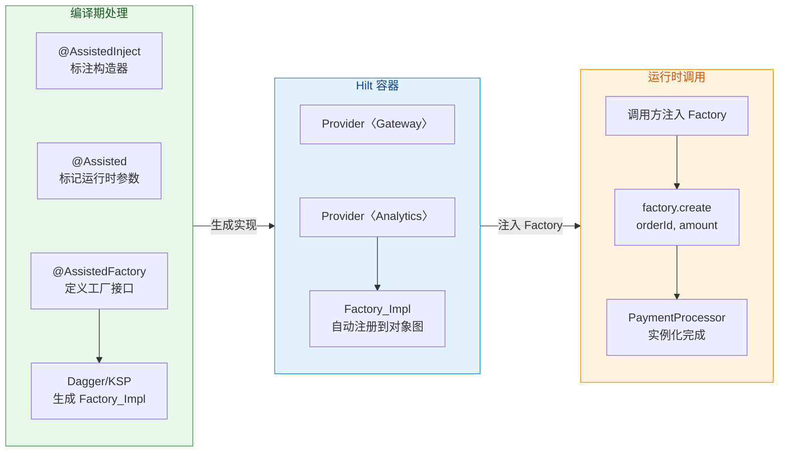

### Worker 注入

`WorkManager` 中的 `Worker`（或 `CoroutineWorker`）是辅助注入最经典、最高频的应用场景之一。原因在于 Worker 的构造器签名是由系统强制规定的——它必须接收 `Context` 和 `WorkerParameters` 这两个参数，而这两个参数由 `WorkManager` 框架在调度任务时动态创建并传入，不可能被预先放入 Hilt 的对象图中。

**没有辅助注入之前的痛苦**：在 Hilt 支持 Worker 注入之前，开发者通常需要手动实现 `WorkerFactory`，在其中从 Hilt 的 `EntryPoint` 中获取依赖，然后手动构造 Worker。这个过程涉及大量样板代码，且在 Worker 数量增多时维护成本急剧上升。

**Hilt 对 Worker 的辅助注入支持**依赖于 `hilt-work` 扩展库。其原理是：Hilt 提供了一个自定义的 `HiltWorkerFactory`，它在 `WorkManager` 需要创建 Worker 实例时介入，通过辅助注入机制将容器依赖和 `WorkerParameters` 合并后构造出 Worker。

首先需要添加依赖：

```kotlin
// build.gradle.kts (Module level)
dependencies {
    // Hilt Worker 扩展库，提供 @HiltWorker 注解和 HiltWorkerFactory
    implementation("androidx.hilt:hilt-work:1.2.0")
    // KSP 注解处理器，用于生成辅助注入代码
    ksp("androidx.hilt:hilt-compiler:1.2.0")
}
```

然后定义 Worker 类：

```kotlin
// @HiltWorker 是 Hilt 专门为 Worker 提供的注解
// 它本质上是 @AssistedInject 的语法糖，内部会触发辅助注入的代码生成
@HiltWorker
class SyncWorker @AssistedInject constructor(
    // Context 是 Worker 的必需参数，由 WorkManager 在运行时传入
    // 必须标注 @Assisted
    @Assisted appContext: Context,
    // WorkerParameters 也是 Worker 的必需参数，同样由 WorkManager 传入
    @Assisted workerParams: WorkerParameters,
    // 以下是由 Hilt 容器自动提供的业务依赖
    private val syncRepository: SyncRepository,
    private val notificationHelper: NotificationHelper
) : CoroutineWorker(appContext, workerParams) {

    override suspend fun doWork(): Result {
        return try {
            // 使用容器注入的 syncRepository 执行同步操作
            syncRepository.performFullSync()
            // 使用容器注入的 notificationHelper 发送通知
            notificationHelper.showSyncComplete()
            // 返回成功结果
            Result.success()
        } catch (e: Exception) {
            // 如果可以重试则返回 retry，否则返回 failure
            if (runAttemptCount < 3) Result.retry() else Result.failure()
        }
    }
}
```

**`@HiltWorker` 与 `@AssistedInject` 的关系**：`@HiltWorker` 注解实际上做了两件事——第一，它告诉 Hilt 这个类是一个需要辅助注入的 Worker；第二，它会自动生成对应的 `@AssistedFactory` 接口（开发者不需要手动编写 Factory 接口，这与前面 `PaymentProcessor` 的例子不同）。Hilt 的 `hilt-compiler` 会为每个 `@HiltWorker` 类生成一个内部 Factory，并将其注册到 `HiltWorkerFactory` 中。

**配置 WorkManager 使用 HiltWorkerFactory** 是关键的一步。你需要禁用 WorkManager 的默认初始化，改为手动初始化并注入 `HiltWorkerFactory`：

```kotlin
// 在 Application 类中配置 WorkManager
@HiltAndroidApp
class MyApplication : Application(), Configuration.Provider {

    // Hilt 自动注入 HiltWorkerFactory
    // 这个 Factory 内部维护了所有 @HiltWorker 类的 AssistedFactory 映射
    @Inject
    lateinit var workerFactory: HiltWorkerFactory

    // 实现 Configuration.Provider 接口，提供自定义的 WorkManager 配置
    override val workManagerConfiguration: Configuration
        get() = Configuration.Builder()
            // 将 HiltWorkerFactory 设置为 WorkManager 的 WorkerFactory
            // 这样 WorkManager 在创建 Worker 时会委托给 Hilt 进行辅助注入
            .setWorkerFactory(workerFactory)
            .build()
}
```

同时需要在 `AndroidManifest.xml` 中禁用 WorkManager 的自动初始化：

```xml
<!-- 移除 WorkManager 的默认 ContentProvider 初始化器 -->
<!-- 因为我们要手动初始化以注入 HiltWorkerFactory -->
<provider
    android:name="androidx.startup.InitializationProvider"
    android:authorities="${applicationId}.androidx-startup"
    android:exported="false"
    tools:node="merge">
    <meta-data
        android:name="androidx.work.WorkManagerInitializer"
        android:value="androidx.startup"
        tools:node="remove" />
</provider>
```

**内部工作机制**可以用以下流程来理解：当 `WorkManager` 需要执行一个任务时，它通过 `WorkerFactory.createWorker()` 方法来实例化对应的 Worker 类。在没有 Hilt 的情况下，默认的 `WorkerFactory` 通过反射调用 Worker 的 `(Context, WorkerParameters)` 双参构造器。而 `HiltWorkerFactory` 替换了这个过程——它内部持有一个 `Map<String, Provider<AssistedFactory>>`，键是 Worker 类的全限定名（fully qualified class name），值是对应的辅助工厂 Provider。当 `createWorker()` 被调用时，`HiltWorkerFactory` 根据类名查找到对应的 Factory，调用 `factory.create(context, workerParameters)` 完成实例化，此时容器依赖（如 `SyncRepository`）已经被 Factory_Impl 内部的 Provider 自动注入了。

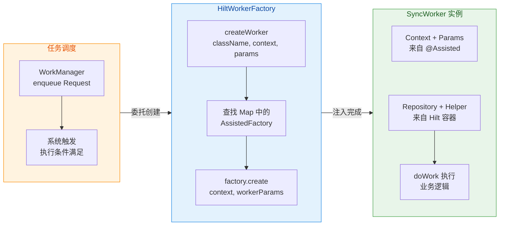

**更复杂的 Worker 场景**：有时 Worker 需要的运行时参数不仅仅是 `Context` 和 `WorkerParameters`，还可能需要从 `inputData` 中提取额外信息。需要注意的是，这些额外信息 **不应该** 通过 `@Assisted` 参数传递（因为 `HiltWorkerFactory` 的 `createWorker` 签名是固定的，只传 Context 和 WorkerParameters），而应该在 `doWork()` 方法内部从 `inputData` 中读取：

```kotlin
@HiltWorker
class UploadWorker @AssistedInject constructor(
    // 固定的两个辅助参数：Context 和 WorkerParameters
    @Assisted appContext: Context,
    @Assisted workerParams: WorkerParameters,
    // 容器提供的依赖
    private val uploadService: UploadService,
    private val fileManager: FileManager
) : CoroutineWorker(appContext, workerParams) {

    override suspend fun doWork(): Result {
        // 额外的运行时数据从 inputData 中获取，而非 @Assisted 参数
        val filePath = inputData.getString("file_path")
            ?: return Result.failure()
        val uploadUrl = inputData.getString("upload_url")
            ?: return Result.failure()

        // 使用容器注入的依赖 + inputData 中的运行时数据执行上传
        val file = fileManager.getFile(filePath)
        return if (uploadService.upload(uploadUrl, file)) {
            Result.success()
        } else {
            Result.retry()
        }
    }

    companion object {
        // 提供便捷方法构建 WorkRequest，封装 inputData 的 key
        fun buildRequest(filePath: String, uploadUrl: String): OneTimeWorkRequest {
            // 将运行时参数打包到 inputData 中
            val data = workDataOf(
                "file_path" to filePath,
                "upload_url" to uploadUrl
            )
            return OneTimeWorkRequestBuilder<UploadWorker>()
                .setInputData(data)
                .build()
        }
    }
}
```

**辅助注入与 ViewModel 的对比**：值得一提的是，`@HiltViewModel` 和 `@HiltWorker` 的注入机制有本质区别。`@HiltViewModel` 使用的是 `CreationExtras`（Lifecycle 2.5+ 引入的机制）配合 `ViewModelProvider.Factory`，ViewModel 的构造器参数全部由容器提供（`SavedStateHandle` 也被 Hilt 注册到了对象图中），因此 ViewModel 实际上不需要辅助注入。而 Worker 的 `Context` 和 `WorkerParameters` 确实来自框架的运行时调用，无法提前注册到对象图中，所以必须使用辅助注入。这也解释了为什么 ViewModel 用 `@Inject` 构造器而 Worker 用 `@AssistedInject` 构造器。

---

**📝 练习题**

在使用 Hilt 的辅助注入时，以下关于 `@AssistedFactory` 接口的说法，哪一项是 **正确** 的？

A. `@AssistedFactory` 接口可以包含多个抽象方法，每个方法创建不同类型的对象


B. `@AssistedFactory` 接口的 `create()` 方法参数顺序必须与目标类构造器中 `@Assisted` 参数的声明顺序完全一致


C. `@AssistedFactory` 接口会被 Hilt 自动注册到对象图中，无需手动编写 `@Module` 或 `@Provides` 方法


D. `@AssistedFactory` 接口的 `create()` 方法返回类型可以是目标类实现的接口类型，实现依赖倒置

**【答案】** C

**【解析】** Dagger/Hilt 在编译期为 `@AssistedFactory` 接口生成实现类后，会 **自动将该 Factory 注册为对象图中的一个 Binding**，开发者可以在任何 Hilt 管理的类中直接 `@Inject` 该 Factory，无需额外编写 Module。选项 A 错误，`@AssistedFactory` 接口必须是 SAM（Single Abstract Method）接口，只能有一个抽象方法。选项 B 错误，Dagger 通过 **类型 + `@Assisted` 标识符** 进行参数匹配，而非位置匹配，因此参数顺序不必与目标类一致（但建议一致以提高可读性）。选项 D 错误，`create()` 方法的返回类型必须是使用 `@AssistedInject` 标注构造器的 **具体类**，不能是其父类或接口——如果需要返回接口类型，则需要额外的手动封装。

---

## 多模块依赖

在现代 Android 工程中，单一模块（monolithic module）的架构早已无法满足大型团队协作与编译效率的需求。将项目拆分为多个 Gradle 模块（multi-module）已经成为业界标准做法——`app` 模块作为壳工程，`:feature:home`、`:feature:profile`、`:data:network`、`:core:common` 等模块各自承担独立职责。然而，多模块拆分后立刻面临一个核心挑战：**依赖图（Dependency Graph）如何跨模块组装？** 一个在 `:data:network` 模块中声明的 `Retrofit` 实例，如何在 `:feature:home` 模块中被注入？一个在 `:core:common` 中定义的接口绑定，如何对所有 feature 模块可见？

Hilt 在设计之初就将多模块场景作为一等公民（first-class citizen）来支持。其核心思想可以概括为一句话：**所有 `@InstallIn` 到标准组件的 Module，无论声明在哪个 Gradle 模块中，最终都会被聚合到同一个 Dagger 组件树里**。这个聚合过程发生在编译期（compile-time），由 Hilt 的注解处理器（Annotation Processor / KSP）通过 classpath 扫描完成。这意味着，只要 Gradle 依赖链是连通的（`:app` 直接或间接依赖了所有模块），Hilt 就能将分散在各处的 `@Module`、`@Inject` 构造器、`@EntryPoint` 等声明统一收集并生成完整的组件代码。

理解这个"聚合"机制，是掌握 Hilt 多模块依赖的关键。

### Component 依赖关系

#### 聚合原理：classpath 上的自动发现

Hilt 的多模块聚合机制建立在一个简单但强大的前提上：**编译 `:app` 模块时，所有被依赖模块的编译产物（包括 Hilt 生成的元数据）都在 classpath 上可见**。Hilt 注解处理器在处理 `@HiltAndroidApp` 时，会扫描整个 classpath，找出所有标注了 `@InstallIn` 的 Module 类以及所有标注了 `@AndroidEntryPoint` 的组件类，然后将它们按照所属的 Component（`SingletonComponent`、`ActivityComponent` 等）分类汇总，最终生成完整的 Dagger Component 实现类。

这个过程对开发者来说是完全透明的。你不需要在 `:app` 模块中手动列举其他模块提供了哪些 Module，也不需要像原生 Dagger 那样在 `@Component(modules = [...])` 注解中逐一声明。Hilt 替你做了这件事。

让我们用一个典型的多模块结构来理解这个过程：

```kotlin
// ═══════════════════════════════════════════════════
// 模块结构：
//   :app  →  依赖 :feature:home, :feature:profile
//   :feature:home  →  依赖 :data:repository
//   :feature:profile  →  依赖 :data:repository
//   :data:repository  →  依赖 :core:network, :core:database
// ═══════════════════════════════════════════════════

// ---------- :core:network 模块 ----------
@Module                              // 声明这是一个 Hilt Module
@InstallIn(SingletonComponent::class) // 安装到全局单例组件
object NetworkModule {
    @Provides                        // 提供 Retrofit 实例
    @Singleton                       // 整个应用生命周期只创建一个
    fun provideRetrofit(): Retrofit {
        return Retrofit.Builder()    // 构建 Retrofit
            .baseUrl("https://api.example.com/") // 设置基础 URL
            .addConverterFactory(GsonConverterFactory.create()) // 添加 Gson 转换器
            .build()                 // 完成构建
    }
}

// ---------- :core:database 模块 ----------
@Module
@InstallIn(SingletonComponent::class)
object DatabaseModule {
    @Provides
    @Singleton
    fun provideDatabase(              // 提供 Room 数据库实例
        @ApplicationContext context: Context // 注入 Application Context
    ): AppDatabase {
        return Room.databaseBuilder(  // 构建 Room 数据库
            context,                  // 传入上下文
            AppDatabase::class.java,  // 数据库类
            "app_database"            // 数据库名称
        ).build()                     // 完成构建
    }
}

// ---------- :data:repository 模块 ----------
// 这个类位于 :data:repository 模块，但它依赖的 Retrofit 和 AppDatabase
// 分别来自 :core:network 和 :core:database 模块
class UserRepositoryImpl @Inject constructor(
    private val retrofit: Retrofit,     // 来自 :core:network 的 Retrofit
    private val database: AppDatabase   // 来自 :core:database 的 Database
) : UserRepository {                    // 实现仓库接口
    override suspend fun getUser(id: String): User {
        // 具体实现...
        return retrofit.create(UserApi::class.java).getUser(id)
    }
}

// ---------- :feature:home 模块 ----------
@HiltViewModel                          // 声明为 Hilt 管理的 ViewModel
class HomeViewModel @Inject constructor(
    private val userRepository: UserRepository // 来自 :data:repository 的接口
) : ViewModel() {
    // ViewModel 并不关心 UserRepository 的具体实现来自哪个模块
    // Hilt 在编译 :app 时会将所有模块的绑定聚合起来
}
```

关键在于理解：**每个模块独立编译时，Hilt 注解处理器只处理该模块内部的注解，生成局部的元数据文件**。当最终编译 `:app` 模块时，Hilt 会读取所有模块生成的元数据，执行一次完整的组件生成（full component generation）。这就是为什么 `@HiltAndroidApp` 必须放在 `:app` 模块的 `Application` 类上——它是整个聚合过程的触发点。

#### Gradle 依赖拓扑与绑定可见性

一个非常重要但容易被忽视的规则是：**Hilt 绑定的可见性严格遵循 Gradle 的依赖传递规则**。具体来说：

- 如果 `:feature:home` 使用 `implementation` 依赖了 `:data:repository`，那么 `:data:repository` 中通过 `@Inject` 构造器或 `@Module` 声明的绑定，只有 `:feature:home` 和最终的 `:app` 能看到。其他 feature 模块如果也需要这些绑定，必须自己声明对 `:data:repository` 的依赖。
- 如果使用 `api` 依赖（即 Gradle 的传递依赖），则绑定会沿依赖链向上传递可见。

但这里有一个微妙之处：**即使某个 feature 模块在 Gradle 层面看不到某个绑定的类型，只要 `:app` 模块的 classpath 上包含该类型，最终生成的 Dagger Component 中仍然会包含该绑定**。问题不在于 Dagger 组件是否包含绑定，而在于你的 feature 模块代码能否引用到那个类型来请求注入。所以 Gradle 依赖的 `api` vs `implementation` 选择本质上是 **Kotlin/Java 编译期的类型可见性问题**，而非 Hilt 组件的绑定注册问题。

#### 跨模块接口绑定的常见模式

在多模块架构中，最常见的模式是：**接口定义在上层（或公共）模块，实现放在具体模块，绑定声明随实现走**。

```kotlin
// ---------- :domain 模块（纯 Kotlin 模块，无 Android 依赖）----------
// 定义仓库接口，不依赖任何具体实现
interface UserRepository {
    suspend fun getUser(id: String): User  // 获取用户信息
    suspend fun saveUser(user: User)       // 保存用户信息
}

// ---------- :data:repository 模块 ----------
// 实现类，通过 @Inject 构造器声明自己可被注入
class UserRepositoryImpl @Inject constructor(
    private val api: UserApi,             // 远程 API 接口
    private val dao: UserDao              // 本地数据库 DAO
) : UserRepository {                      // 实现 :domain 中定义的接口
    override suspend fun getUser(id: String): User {
        return api.getUser(id)            // 从网络获取
    }
    override suspend fun saveUser(user: User) {
        dao.insert(user)                  // 存入本地数据库
    }
}

// 绑定模块：将接口与实现关联起来
// 这个 Module 放在 :data:repository 中，因为它知道具体实现类
@Module
@InstallIn(SingletonComponent::class)     // 安装到全局单例组件
abstract class RepositoryBindModule {
    @Binds                                // 使用 @Binds 进行接口绑定
    @Singleton                            // 单例作用域
    abstract fun bindUserRepository(
        impl: UserRepositoryImpl          // 绑定具体实现
    ): UserRepository                     // 返回接口类型
}

// ---------- :feature:home 模块 ----------
// 只需依赖 :domain 模块（获取 UserRepository 接口类型）
// 和 :data:repository 模块（获取绑定声明）
@HiltViewModel
class HomeViewModel @Inject constructor(
    private val userRepository: UserRepository // 注入接口，不知道具体实现
) : ViewModel()
```

这种 **面向接口编程 + Hilt 跨模块绑定** 的模式完美契合了 **Clean Architecture** 的依赖规则（Dependency Rule）：高层模块（feature）不依赖低层模块（data）的具体实现，只依赖抽象（domain 中的接口）。而 Hilt 的聚合机制负责在编译期将"接口 ↔ 实现"的关系缝合起来。

下面用一张 Mermaid 图展示多模块下 Hilt 的聚合流程：

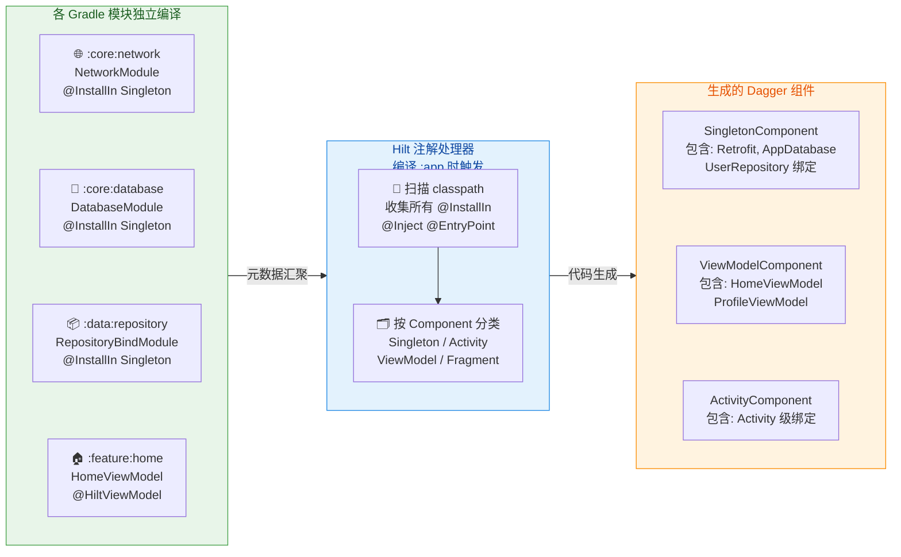

#### 避免重复绑定与冲突

多模块场景下最棘手的编译错误之一是 **重复绑定（Duplicate Binding）**。当两个不同模块各自为同一个类型提供了 `@Provides` 或 `@Binds` 声明时，Hilt 在聚合阶段会报错：`[Dagger/DuplicateBindings] ... is bound multiple times`。

典型的冲突场景：

1. **多个模块各自提供了 `OkHttpClient`**：`:core:network` 提供了一个基础版本，`:feature:upload` 也提供了一个带上传拦截器的版本，但都绑定到了 `OkHttpClient` 类型而没有使用 `@Qualifier` 区分。
2. **接口被多次绑定**：`:data:local` 和 `:data:remote` 模块各自把自己的实现绑定到了同一个 `DataSource` 接口。

解决方案非常明确——**使用 `@Qualifier` 或 `@Named` 来区分同类型的不同绑定**：

```kotlin
// ---------- :core:network 模块 ----------
@Qualifier                           // 自定义限定符注解
@Retention(AnnotationRetention.BINARY)
annotation class BaseClient          // 标记基础 OkHttpClient

@Qualifier
@Retention(AnnotationRetention.BINARY)
annotation class UploadClient        // 标记上传专用 OkHttpClient

@Module
@InstallIn(SingletonComponent::class)
object NetworkModule {
    @Provides
    @Singleton
    @BaseClient                      // 用限定符标记这个绑定
    fun provideBaseOkHttp(): OkHttpClient {
        return OkHttpClient.Builder()
            .connectTimeout(30, TimeUnit.SECONDS)  // 30秒连接超时
            .readTimeout(30, TimeUnit.SECONDS)     // 30秒读取超时
            .build()
    }

    @Provides
    @Singleton
    @UploadClient                    // 另一个限定符
    fun provideUploadOkHttp(): OkHttpClient {
        return OkHttpClient.Builder()
            .connectTimeout(60, TimeUnit.SECONDS)  // 上传需要更长超时
            .writeTimeout(120, TimeUnit.SECONDS)   // 写入超时 120 秒
            .addInterceptor(UploadProgressInterceptor()) // 上传进度拦截器
            .build()
    }
}

// ---------- 使用方 ----------
class ApiService @Inject constructor(
    @BaseClient val client: OkHttpClient      // 指定需要基础版本
)

class UploadService @Inject constructor(
    @UploadClient val client: OkHttpClient    // 指定需要上传版本
)
```

一个良好的多模块架构实践是：**Qualifier 注解定义在公共模块中（如 `:core:common`），这样所有模块都可以引用它来标记和请求特定绑定**。

### 动态特性模块支持

#### Dynamic Feature Module 的特殊挑战

Android 的 Dynamic Feature Module（DFM，动态功能模块）是 Google 在 App Bundle 体系中引入的概念，允许用户在需要时才下载和安装某些功能模块，从而减小初始安装包体积。但 DFM 的 Gradle 依赖方向与常规模块 **恰好相反**：

- **常规模块**：`:app` 依赖 `:feature:xxx`（`:app` → `:feature`）
- **动态特性模块**：`:dfm:xxx` 依赖 `:app`（`:dfm` → `:app`）

这个反转的依赖方向对 Hilt 带来了严重的问题。正常情况下，Hilt 在编译 `:app` 时扫描 classpath 来聚合所有模块的绑定。但 DFM 并不在 `:app` 的 classpath 上（因为依赖方向是反的），所以 **Hilt 的注解处理器在编译 `:app` 时根本看不到 DFM 中声明的任何 Module 或 `@Inject` 构造器**。

这意味着，你不能在 DFM 中直接使用 `@InstallIn(SingletonComponent::class)` 来安装模块——因为 `SingletonComponent` 是在 `:app` 模块编译时生成的，DFM 中的 Module 不会被包含进去。

#### 使用 @EntryPoint 突破边界

Hilt 官方推荐的 DFM 方案是 **使用 `@EntryPoint` 从已有的 Hilt 组件中手动获取依赖，而不是期望 Hilt 自动注入**。思路是：`:app` 模块中通过正常的 Hilt 机制管理依赖图，DFM 运行时通过 `EntryPointAccessors` 从 `Application`（即 `SingletonComponent`）中拉取所需的依赖。

```kotlin
// ═══════════════════════════════════════════════════
// 步骤一：在 :app 或公共模块中定义 EntryPoint 接口
// ═══════════════════════════════════════════════════

// 这个接口定义了 DFM 需要从主 App 获取的依赖
@EntryPoint                                    // 标记为 Hilt 入口点
@InstallIn(SingletonComponent::class)          // 安装到 SingletonComponent
interface DfmDependencies {                    // DFM 依赖接口
    fun retrofit(): Retrofit                   // DFM 需要的 Retrofit 实例
    fun userRepository(): UserRepository       // DFM 需要的用户仓库
    fun analyticsTracker(): AnalyticsTracker   // DFM 需要的埋点工具
}

// ═══════════════════════════════════════════════════
// 步骤二：在 DFM 的 Activity/Fragment 中手动获取依赖
// ═══════════════════════════════════════════════════

// 注意：DFM 中的 Activity 不能使用 @AndroidEntryPoint！
// 因为 Hilt 编译 :app 时并不知道这个 Activity 的存在
class DfmFeatureActivity : AppCompatActivity() {

    // 通过 EntryPoint 手动获取依赖
    private lateinit var retrofit: Retrofit
    private lateinit var userRepository: UserRepository

    override fun onCreate(savedInstanceState: Bundle?) {
        super.onCreate(savedInstanceState)

        // 使用 EntryPointAccessors 从 Application 中获取入口点实现
        val entryPoint = EntryPointAccessors.fromApplication(
            applicationContext,                // 传入 Application Context
            DfmDependencies::class.java        // 指定入口点接口
        )

        // 从入口点中取出具体依赖
        retrofit = entryPoint.retrofit()              // 获取 Retrofit
        userRepository = entryPoint.userRepository()  // 获取 UserRepository

        // 现在可以正常使用这些依赖了
        initializeFeature()
    }

    private fun initializeFeature() {
        // 使用 retrofit 和 userRepository 初始化 DFM 的功能
    }
}
```

这种模式本质上是 **Service Locator**（服务定位器），而非纯粹的依赖注入。但在 DFM 这种 Gradle 依赖方向反转的场景下，这是一种务实的妥协。

#### DFM 内部的依赖管理

虽然 DFM 不能把 Module 安装到 `:app` 的标准组件中，但 **DFM 内部仍然可以使用 Dagger（非 Hilt）来管理自己的依赖图**。常见做法是在 DFM 内定义一个 Dagger Component，该 Component 的依赖（dependencies）声明为上面定义的 `DfmDependencies` 接口：

```kotlin
// ═══════════════════════════════════════════════════
// DFM 内部的 Dagger Component（不是 Hilt Component）
// ═══════════════════════════════════════════════════

// 定义 DFM 内部专用的 Dagger Component
@Component(
    dependencies = [DfmDependencies::class],   // 从主 App 获取外部依赖
    modules = [DfmInternalModule::class]       // DFM 自己的内部模块
)
@DfmScope                                     // 自定义作用域（见后文）
interface DfmComponent {
    fun inject(activity: DfmFeatureActivity)   // 注入到 DFM 的 Activity

    // Builder 模式创建 Component
    @Component.Builder
    interface Builder {
        @BindsInstance                         // 绑定 Activity 实例
        fun activity(activity: Activity): Builder
        fun dependencies(deps: DfmDependencies): Builder // 传入外部依赖
        fun build(): DfmComponent              // 构建组件
    }
}

// DFM 内部的 Module，提供仅 DFM 使用的绑定
@Module
object DfmInternalModule {
    @Provides
    @DfmScope                                  // 作用域限定在 DFM Component 内
    fun provideDfmFeatureUseCase(
        userRepository: UserRepository         // 这个来自 DfmDependencies
    ): DfmFeatureUseCase {
        return DfmFeatureUseCase(userRepository) // 创建 DFM 专用用例
    }
}

// 自定义作用域注解
@Scope
@Retention(AnnotationRetention.RUNTIME)
annotation class DfmScope

// ═══════════════════════════════════════════════════
// 在 DFM Activity 中组装一切
// ═══════════════════════════════════════════════════
class DfmFeatureActivity : AppCompatActivity() {

    @Inject                                    // 由 DFM 内部的 Dagger 注入
    lateinit var useCase: DfmFeatureUseCase

    override fun onCreate(savedInstanceState: Bundle?) {
        // 先获取主 App 的入口点依赖
        val appDeps = EntryPointAccessors.fromApplication(
            applicationContext,
            DfmDependencies::class.java
        )

        // 构建 DFM 内部的 Dagger Component 并注入
        DaggerDfmComponent.builder()
            .activity(this)                    // 绑定当前 Activity
            .dependencies(appDeps)             // 传入主 App 的依赖
            .build()                           // 构建 Component
            .inject(this)                      // 执行注入

        super.onCreate(savedInstanceState)
        // 此时 useCase 已经被注入，可以正常使用
    }
}
```

这个方案的精髓在于：**DFM 通过 `@EntryPoint` 接口与主 App 的 Hilt 依赖图建立了一座桥梁，同时 DFM 内部使用原生 Dagger Component 管理自己的局部依赖图**。两张图通过 `@Component(dependencies = [...])` 连接起来，职责清晰，边界明确。

下面用一张图展示 DFM 与 Hilt 的交互关系：

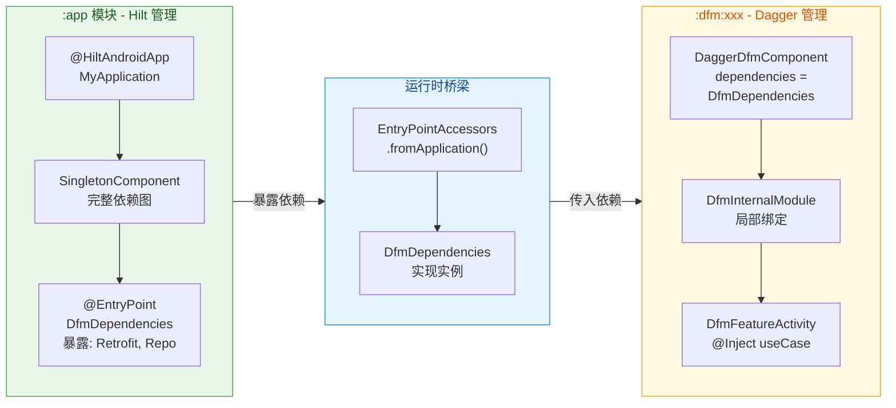

### 自定义组件

#### 为什么需要自定义组件

Hilt 预定义了一套标准组件层级（`SingletonComponent` → `ActivityRetainedComponent` → `ViewModelComponent` → `ActivityComponent` → `FragmentComponent` → `ViewComponent`），这套层级覆盖了绝大多数 Android 应用场景。但总有一些特殊需求无法被标准组件满足：

1. **自定义生命周期作用域**：例如用户登录后创建一个 `UserSessionComponent`，在用户登出时销毁。这个作用域不对应任何 Android 系统组件的生命周期，而是由业务逻辑控制。
2. **Feature 级别隔离**：某个功能模块想要一个独立于 Activity 的组件，该组件的生命周期由导航图（Navigation Graph）或自定义逻辑控制。
3. **后台任务的分组作用域**：例如一组相关的 Worker 共享某些依赖实例，但这些实例不需要是全局单例。

Hilt 提供了 `@DefineComponent` 和 `@DefineComponent.Builder` 注解来支持自定义组件的创建。需要注意的是，自定义组件必须明确其 **父组件（parent）**，因为 Hilt 的组件层级是一棵树——每个子组件可以访问父组件提供的所有绑定，而父组件无法访问子组件的绑定。

#### 定义自定义组件

让我们以一个 **用户会话组件（UserSessionComponent）** 为例，完整展示自定义组件的创建过程：

```kotlin
// ═══════════════════════════════════════════════════
// 第一步：定义自定义作用域注解
// ═══════════════════════════════════════════════════
@Scope                                      // 标记为 Dagger 作用域
@Retention(AnnotationRetention.RUNTIME)     // 运行时保留
annotation class UserSessionScoped          // 用户会话级别的作用域

// ═══════════════════════════════════════════════════
// 第二步：使用 @DefineComponent 定义自定义组件
// ═══════════════════════════════════════════════════
@UserSessionScoped                          // 关联自定义作用域
@DefineComponent(parent = SingletonComponent::class) // 父组件是 SingletonComponent
interface UserSessionComponent {
    // 自定义组件本身是一个空接口
    // 所有绑定通过 @InstallIn(UserSessionComponent::class) 的 Module 提供

    // Builder 用于创建组件实例
    @DefineComponent.Builder                // 定义 Builder
    interface Builder {
        fun setUser(                        // 传入当前登录用户
            @BindsInstance user: User       // 使用 @BindsInstance 绑定到组件
        ): Builder
        fun build(): UserSessionComponent   // 构建组件实例
    }
}
```

这里有几个关键点需要深入理解：

- **`parent = SingletonComponent::class`**：声明 `UserSessionComponent` 的父组件是 `SingletonComponent`。这意味着 `UserSessionComponent` 可以访问所有安装到 `SingletonComponent` 的绑定（如 `Retrofit`、`AppDatabase` 等），同时还拥有自己专属的绑定。
- **`@BindsInstance user: User`**：通过 Builder 传入一个 `User` 对象，这个对象会被绑定到组件中，任何在 `UserSessionComponent` 内请求 `User` 类型的注入都会得到这个实例。
- **`@UserSessionScoped`**：安装到 `UserSessionComponent` 的绑定如果标注了 `@UserSessionScoped`，那么在该组件实例的生命周期内只会创建一次。

#### 管理自定义组件的生命周期

标准组件的生命周期由 Android 框架自动管理（例如 `ActivityComponent` 随 `Activity.onCreate()` 创建、`Activity.onDestroy()` 销毁）。但自定义组件的生命周期 **完全由开发者手动控制**。这意味着你需要自己决定何时创建组件实例、何时销毁它。

Hilt 提供了 `EntryPoints` 工具和 `ComponentManager` 模式来辅助管理：

```kotlin
// ═══════════════════════════════════════════════════
// 第三步：创建组件管理器（管理自定义组件的生命周期）
// ═══════════════════════════════════════════════════
@Singleton                                  // 管理器本身是全局单例
class UserSessionManager @Inject constructor(
    // 注入 Builder 的 Provider，按需创建组件
    private val builderProvider: Provider<UserSessionComponent.Builder>
) {
    // 当前活跃的会话组件（可空表示未登录）
    private var sessionComponent: UserSessionComponent? = null

    // 当前登录用户
    var currentUser: User? = null
        private set                         // 外部只读

    /**
     * 用户登录时调用：创建新的 UserSessionComponent
     */
    fun onUserLogin(user: User) {
        currentUser = user                  // 保存当前用户
        sessionComponent = builderProvider  // 获取 Builder 实例
            .get()                          // 每次调用 get() 得到新的 Builder
            .setUser(user)                  // 将用户绑定到组件
            .build()                        // 构建 UserSessionComponent 实例
    }

    /**
     * 用户登出时调用：销毁 UserSessionComponent
     */
    fun onUserLogout() {
        currentUser = null                  // 清空当前用户
        sessionComponent = null             // 置空引用，让 GC 回收组件及其所有 Scoped 实例
    }

    /**
     * 获取当前会话组件（供 EntryPoint 使用）
     * 如果未登录则抛出异常
     */
    fun getSessionComponent(): UserSessionComponent {
        return sessionComponent
            ?: throw IllegalStateException(
                "UserSessionComponent not initialized. User must login first."
            )
    }
}
```

这个 `UserSessionManager` 扮演了 **手动组件生命周期管理者** 的角色。它的关键行为是：

1. **用户登录 → 创建组件**：调用 `builderProvider.get()` 获取一个新的 Builder，传入用户信息后构建组件实例。每次登录都会创建全新的组件，确保前一个会话的作用域实例不会泄漏到新会话中。
2. **用户登出 → 销毁组件**：将引用置空。由于组件内所有 `@UserSessionScoped` 的对象都被组件持有，当组件被 GC 回收时，这些对象也会一并释放。
3. **访问组件**：提供 `getSessionComponent()` 方法，供需要访问会话级依赖的地方使用。

#### 为自定义组件安装 Module

定义好自定义组件后，就可以使用 `@InstallIn` 将 Module 安装到其中：

```kotlin
// ═══════════════════════════════════════════════════
// 第四步：为自定义组件提供绑定
// ═══════════════════════════════════════════════════
@Module
@InstallIn(UserSessionComponent::class)     // 安装到自定义组件
object UserSessionModule {

    @Provides
    @UserSessionScoped                      // 会话内单例
    fun provideUserPreferences(
        user: User,                         // 来自 @BindsInstance 的用户对象
        database: AppDatabase               // 来自父组件 SingletonComponent
    ): UserPreferences {
        return database.userPreferencesDao() // 根据用户获取偏好设置 DAO
            .getPreferences(user.id)         // 查询该用户的偏好
            ?: UserPreferences.default()     // 不存在则返回默认值
    }

    @Provides
    @UserSessionScoped                      // 会话内单例
    fun provideUserAnalytics(
        user: User,                         // @BindsInstance 绑定的用户
        analyticsTracker: AnalyticsTracker  // 来自父组件 SingletonComponent
    ): UserAnalytics {
        return UserAnalytics(               // 创建用户级别的分析追踪器
            tracker = analyticsTracker,     // 全局追踪器
            userId = user.id                // 当前用户 ID
        )
    }
}

// ═══════════════════════════════════════════════════
// 第五步：通过 EntryPoint 访问自定义组件的绑定
// ═══════════════════════════════════════════════════

// 定义从 UserSessionComponent 中获取依赖的入口点
@EntryPoint
@InstallIn(UserSessionComponent::class)     // 注意：安装到自定义组件
interface UserSessionEntryPoint {
    fun userPreferences(): UserPreferences  // 暴露用户偏好
    fun userAnalytics(): UserAnalytics      // 暴露用户分析
}

// 在 Activity/Fragment 中使用
@AndroidEntryPoint
class ProfileFragment : Fragment() {

    @Inject
    lateinit var sessionManager: UserSessionManager // 注入会话管理器

    private val userPreferences: UserPreferences by lazy {
        // 从自定义组件中获取 UserPreferences
        val entryPoint = EntryPoints.get(
            sessionManager.getSessionComponent(),  // 获取当前会话组件实例
            UserSessionEntryPoint::class.java      // 指定入口点接口
        )
        entryPoint.userPreferences()               // 取出 UserPreferences
    }

    override fun onViewCreated(view: View, savedInstanceState: Bundle?) {
        super.onViewCreated(view, savedInstanceState)
        // userPreferences 现在可用，它的生命周期跟随用户会话
        applyTheme(userPreferences.theme)
    }
}
```

#### 自定义组件的使用场景总结与注意事项

自定义组件是一个强大但相对复杂的功能。在决定是否使用它之前，请先评估标准组件是否已经足够：

- **优先使用标准组件**：如果你的需求可以通过 `SingletonComponent`（全局）或 `ViewModelComponent`（ViewModel 生命周期）来满足，就不要创建自定义组件。
- **自定义组件适合的场景**：生命周期不与任何 Android 组件对齐的业务概念，比如"用户会话"、"支付流程"、"多步骤向导"等。
- **手动管理带来的责任**：你需要确保组件在合适的时机创建和销毁。忘记销毁会导致内存泄漏（组件持有的所有 Scoped 实例都不会被释放）；过早销毁会导致 `NullPointerException` 或 `IllegalStateException`。
- **测试考量**：自定义组件的 Builder 可以在测试中传入 mock 对象（通过 `@BindsInstance`），这使得会话级别的依赖替换变得非常简单。

整个多模块依赖的核心思想可以凝练为：**Hilt 的标准模块聚合机制处理 90% 的场景；`@EntryPoint` 解决 DFM 等无法直接聚合的边界问题；`@DefineComponent` 填补标准组件层级无法覆盖的自定义生命周期需求**。三者配合，构成了 Hilt 在复杂多模块架构中的完整解决方案。

---

**📝 练习题**

在一个多模块 Android 项目中，`:dynamic_feature:camera` 是一个 Dynamic Feature Module（DFM），它需要使用主模块 `:app` 中 Hilt 管理的 `ImageProcessor` 实例。以下哪种方式是正确的做法？

A. 在 DFM 中创建一个 `@Module @InstallIn(SingletonComponent::class)` 的类，直接通过 `@Inject` 注入 `ImageProcessor`


B. 在 DFM 的 Activity 上标注 `@AndroidEntryPoint`，然后使用 `@Inject lateinit var imageProcessor: ImageProcessor` 注入


C. 在 `:app` 模块中定义一个 `@EntryPoint @InstallIn(SingletonComponent::class)` 接口暴露 `ImageProcessor`，DFM 通过 `EntryPointAccessors.fromApplication()` 获取


D. 在 DFM 中使用 `@DefineComponent(parent = SingletonComponent::class)` 创建自定义组件，并在其中通过 `@Provides` 提供 `ImageProcessor`


**【答案】** C

**【解析】** Dynamic Feature Module 的 Gradle 依赖方向与常规模块相反——DFM 依赖 `:app`，而非 `:app` 依赖 DFM。这意味着 Hilt 在编译 `:app` 时无法扫描到 DFM 中声明的任何 `@InstallIn` Module 或 `@AndroidEntryPoint`，因此选项 A 和 B 都不可行（A 中的 Module 不会被聚合到 SingletonComponent；B 中 Hilt 不会为这个 Activity 生成注入代码）。选项 D 的 `@DefineComponent` 是用于创建自定义生命周期的组件，而非解决 DFM 依赖获取问题，且同样面临 DFM 中的注解不会被 `:app` 编译处理的问题。正确做法是选项 C：在 `:app`（或其可达模块）中通过 `@EntryPoint` 定义一个接口来暴露需要的依赖，DFM 在运行时通过 `EntryPointAccessors.fromApplication()` 获取该接口的实现，进而拿到 `ImageProcessor` 实例。这是 Hilt 官方推荐的 DFM 依赖获取方案。

---

## 最佳实践

依赖注入框架（尤其是 Hilt/Dagger）为 Android 应用带来了强大的解耦与可测试性，但如果使用姿势不当，反而会引入隐蔽的 Bug、降低可读性，甚至拖累编译速度。本节将从 **注入方式选择、架构设计、测试替身** 三大维度，给出一套经过大量生产项目验证的最佳实践体系。掌握这些原则后，你写出的 DI 代码将同时具备 **编译期安全、运行时高效、测试时灵活** 三大特征。

---

### 避免私有字段注入

#### 问题的本质

在 Android 开发中，我们经常会看到这样的写法：在一个 Activity 或 Fragment 里，用 `@Inject` 直接标注一个 `lateinit var` 字段，然后由 Hilt 在运行时把依赖"塞"进来。这种方式称为 **字段注入（Field Injection）**。它之所以在 Android 类中存在，是因为 Activity / Fragment 的构造器由系统控制，开发者无法自行传参。但字段注入本身存在一系列设计缺陷，尤其当字段被声明为 `private` 时问题更加严重。

首先，**私有字段注入破坏了封装性的语义**。表面上看，`private` 修饰符意味着"这个字段只有本类可以访问"，但 Dagger/Hilt 在编译期生成的注入器（`MembersInjector`）会通过反射或生成的代码绕过可见性限制，直接给私有字段赋值。这就产生了一个矛盾：你标记了 `private` 来限制外部访问，但框架却必须从外部写入。在 Java 中，Dagger 通过生成同包的 `_MembersInjector` 类来实现注入，这要求字段至少是 **package-private** 的（即不加任何访问修饰符）。如果字段是 `private` 的，Dagger 在编译期会直接报错。Kotlin 中的情况稍有不同——`@Inject lateinit var` 默认生成的 backing field 是 `private` 的，但 Kotlin 编译器会同时生成 `public` 的 setter，所以 Hilt 实际上是通过 setter 来注入的，这才绕开了可见性问题。但这也意味着你的字段事实上对外是可写的，`private` 的表象与真实行为不一致。

其次，**私有字段注入让类的依赖变得不透明**。一个类究竟需要哪些依赖，只能通过逐行扫描所有字段上的 `@Inject` 注解才能知道。当依赖数量膨胀时（比如一个 Activity 注入了 8 个以上的依赖），这种不透明性会显著增加维护成本。相比之下，构造器注入把所有依赖集中在一个构造函数的参数列表里，一目了然。

第三，**私有字段注入使得单元测试困难**。在不借助 DI 框架的纯单元测试中，你无法通过正常的 Kotlin/Java 代码给私有字段赋值，只能借助反射工具（如 `ReflectionTestUtils`）或专门的测试框架。这增加了测试的复杂度和脆弱性。

#### 正确做法与对比

下面通过一个具体例子来对比 **反模式** 和 **推荐模式**：

```kotlin
// ========== ❌ 反模式：私有字段注入 ==========

// 在 ViewModel 中使用字段注入（实际上 ViewModel 应当使用构造器注入）
class OrderViewModel : ViewModel() {

    // 字段被标记为 private，但 Dagger 必须从外部写入
    // 语义矛盾：private 意味着外部不可见，注入却要求外部可写
    @Inject
    private lateinit var repository: OrderRepository

    // 又一个私有字段注入，依赖藏在类体内部
    @Inject
    private lateinit var analytics: AnalyticsTracker

    // 调用处看不出 repository 和 analytics 从何而来
    fun loadOrders() {
        // 如果忘记调用 inject()，这里会抛出 UninitializedPropertyAccessException
        val orders = repository.getAll()
        analytics.track("orders_loaded")
    }
}
```

```kotlin
// ========== ✅ 推荐模式：构造器注入 ==========

// 使用 @HiltViewModel + @Inject constructor，依赖一目了然
@HiltViewModel  // 告知 Hilt 这是一个需要注入的 ViewModel
class OrderViewModel @Inject constructor(
    // 所有依赖都在构造器参数中显式声明
    private val repository: OrderRepository,  // 依赖一：订单仓库
    private val analytics: AnalyticsTracker   // 依赖二：埋点追踪器
) : ViewModel() {

    // 此处 repository 和 analytics 已由 Hilt 在构造时注入完毕
    // 不存在 "未初始化" 的中间状态
    fun loadOrders() {
        val orders = repository.getAll()  // 安全调用，保证非空
        analytics.track("orders_loaded")  // 安全调用，保证非空
    }
}
```

#### Android 类中的字段注入：不得已而为之

对于 Activity、Fragment、Service 等 Android 框架类，由于它们的实例化由系统完成（通过反射调用无参构造器），开发者无法使用构造器注入。此时字段注入是 **唯一的选择**，但我们仍应遵守一些规则来减少副作用：

```kotlin
// Activity 中的字段注入——这是 Hilt 的标准用法
@AndroidEntryPoint  // Hilt 会在编译期生成注入逻辑，在 onCreate 之前完成注入
class OrderActivity : AppCompatActivity() {

    // ✅ 使用 lateinit var 而非 private，保持包可见性
    // Hilt 需要通过生成的代码访问此字段
    @Inject
    lateinit var analytics: AnalyticsTracker

    // ✅ ViewModel 通过 by viewModels() 委托获取，而非字段注入
    // ViewModel 内部使用构造器注入，Activity 只负责持有引用
    private val viewModel: OrderViewModel by viewModels()

    override fun onCreate(savedInstanceState: Bundle?) {
        super.onCreate(savedInstanceState)
        // 此处 analytics 已经可用（Hilt 在 super.onCreate 内完成注入）
        analytics.track("order_screen_opened")
    }
}
```

**核心准则**：在 Android 框架类中使用字段注入时，**只注入轻量级的辅助依赖**（如 Analytics、Navigator、ResourceProvider 等），业务逻辑应下沉到 ViewModel / UseCase 中通过构造器注入管理。这样可以把"不得已的字段注入"的影响面控制到最小。

---

### 构造器注入优先

#### 为什么构造器注入是首选

构造器注入（Constructor Injection）是依赖注入的 **黄金标准（Golden Standard）**，几乎所有 DI 框架（Spring、Guice、Dagger/Hilt）都将其作为首推方式。背后的原因可以从四个维度理解：

**第一，不可变性（Immutability）**。通过构造器传入的依赖可以声明为 `val`（Kotlin）或 `final`（Java），一旦赋值就无法更改。这消除了一大类并发 Bug——你不必担心某个线程在运行中途替换了依赖实例。而字段注入的 `lateinit var` 天然是可变的，理论上任何持有引用的代码都能重新赋值。

**第二，完整性保证（Completeness Guarantee）**。对象从被创建的那一刻起，所有依赖就已经就绪，不存在"半初始化"的中间状态。字段注入则有一个时间窗口——对象已被 `new` 出来但依赖尚未注入——如果在这个窗口内调用了依赖，就会得到 `null` 或 `UninitializedPropertyAccessException`。

**第三，显式依赖声明（Explicit Dependency Declaration）**。构造器的参数列表就是这个类的"依赖清单"，任何人看一眼构造函数签名就能知道它需要什么。这也是一个天然的 **设计警报器**：当构造器参数超过 5-6 个时，说明这个类承担了过多职责，需要拆分。字段注入则隐藏了这个信号，因为依赖散布在类体各处，"增加一个"的心理负担几乎为零。

**第四，编译期安全（Compile-time Safety）**。Dagger/Hilt 在编译期检查依赖图是否完整。构造器注入的所有参数都是类型系统的一部分，缺少任何一个绑定都会在编译时报错。字段注入虽然也能在编译期被 Dagger 检查到，但在某些边缘场景（如使用 `@OptionalInject`、多模块延迟绑定）下可能产生运行时才暴露的问题。

#### 构造器注入的完整应用链路

在一个典型的 Clean Architecture 项目中，从 DataSource 到 Repository 到 UseCase 到 ViewModel，**每一层都应使用构造器注入**：

```kotlin
// ========== 数据层：DataSource ==========
// 网络数据源，通过构造器接收 Retrofit 生成的 API 接口
class RemoteOrderDataSource @Inject constructor(
    private val api: OrderApi        // Retrofit 接口，由 @Provides 提供
) {
    // 挂起函数，从网络获取订单列表
    suspend fun fetchOrders(): List<OrderDto> = api.getOrders()
}

// ========== 数据层：Repository 实现 ==========
// 仓库实现类，聚合本地与远程数据源
class OrderRepositoryImpl @Inject constructor(
    private val remote: RemoteOrderDataSource,  // 远程数据源
    private val local: LocalOrderDataSource,    // 本地数据源（Room DAO 包装）
    private val mapper: OrderMapper             // DTO ↔ Domain 映射器
) : OrderRepository {

    // 先尝试本地缓存，缓存为空则拉取远程数据
    override suspend fun getOrders(): List<Order> {
        val cached = local.getAll()             // 查询本地缓存
        if (cached.isNotEmpty()) {
            return cached.map(mapper::toDomain) // 命中缓存，映射后返回
        }
        val remote = remote.fetchOrders()       // 缓存未命中，请求网络
        local.insertAll(remote)                 // 将网络数据写入本地缓存
        return remote.map(mapper::toDomain)     // 映射后返回领域模型
    }
}

// ========== 领域层：UseCase ==========
// 获取订单用例，封装单一业务操作
class GetOrdersUseCase @Inject constructor(
    private val repository: OrderRepository  // 依赖抽象接口而非具体实现
) {
    // operator invoke 让 UseCase 可以像函数一样调用
    suspend operator fun invoke(): List<Order> = repository.getOrders()
}

// ========== 表现层：ViewModel ==========
@HiltViewModel
class OrderViewModel @Inject constructor(
    private val getOrders: GetOrdersUseCase  // 注入 UseCase 而非 Repository
) : ViewModel() {

    // StateFlow 持有 UI 状态
    private val _uiState = MutableStateFlow<OrderUiState>(OrderUiState.Loading)
    val uiState: StateFlow<OrderUiState> = _uiState.asStateFlow()

    init {
        loadOrders()  // ViewModel 创建时自动加载
    }

    private fun loadOrders() {
        viewModelScope.launch {
            try {
                val orders = getOrders()           // 调用 UseCase（operator invoke）
                _uiState.value = OrderUiState.Success(orders) // 更新为成功状态
            } catch (e: Exception) {
                _uiState.value = OrderUiState.Error(e.message) // 更新为错误状态
            }
        }
    }
}
```

注意这条链路中没有任何一个类使用了字段注入，每个类的依赖都在构造函数中完整声明。Hilt 在编译期遍历整条链路，验证每个参数类型都有对应的 `@Binds` 或 `@Provides` 绑定，一旦缺失立刻报错。

#### 接口绑定：构造器注入的最佳搭档

构造器注入与 **依赖倒置原则（DIP）** 天然契合。上面的 `OrderRepositoryImpl` 实现了 `OrderRepository` 接口，`GetOrdersUseCase` 依赖的是接口而非实现。将实现绑定到接口的 Module 如下：

```kotlin
// 使用 @Binds 将接口与实现绑定
@Module
@InstallIn(SingletonComponent::class)  // 安装到全局单例组件
abstract class RepositoryModule {

    // @Binds 告诉 Hilt：当有人请求 OrderRepository 时，提供 OrderRepositoryImpl
    // 比 @Provides 更高效，因为不会生成额外的 Factory 类
    @Binds
    @Singleton  // 整个应用共享同一个 Repository 实例
    abstract fun bindOrderRepository(
        impl: OrderRepositoryImpl  // 参数类型就是实现类，它自身通过构造器注入
    ): OrderRepository             // 返回类型就是接口
}
```

这种 `@Binds` + 构造器注入的组合是 Hilt 项目中最常见也最推荐的绑定模式，它同时兼顾了 **零样板代码** 和 **编译期类型安全**。

---

### 测试替身替换

#### 为什么 DI 是可测试性的基石

依赖注入的核心价值之一就是 **可测试性（Testability）**。当一个类通过构造器声明依赖时，测试代码可以轻松传入 **测试替身（Test Double）**——Fake、Stub、Mock——来隔离被测单元，控制外部行为，验证交互结果。

在没有 DI 的世界里，类内部直接 `new` 出依赖或调用 `Singleton.getInstance()`，测试时你只能通过反射或 PowerMock 等"黑魔法"来替换这些硬编码的依赖，既脆弱又难维护。有了构造器注入，替换依赖就是传一个不同的参数，简洁而稳定。

#### 测试替身的类型选择

在 Android 测试中，常用的测试替身有以下几种，每种适用于不同的测试目的：

```mermaid
graph LR
    subgraph Fake["🎭 Fake\n完整替代实现"]
        direction TB
        F1["内存数据库替代 Room"]
        F2["本地 JSON 替代网络"]
        F3["适合集成测试"]
    end

    subgraph Stub["📌 Stub\n固定返回值"]
        direction TB
        S1["返回预设数据"]
        S2["不验证调用行为"]
        S3["适合状态验证"]
    end

    subgraph Mock["🔍 Mock\n行为验证"]
        direction TB
        M1["记录方法调用"]
        M2["验证调用次数/参数"]
        M3["适合交互验证"]
    end

    subgraph Spy["👁️ Spy\n部分替代"]
        direction TB
        SP1["包装真实对象"]
        SP2["可覆盖部分方法"]
        SP3["适合遗留代码"]
    end

    Fake -->|"更轻量"| Stub -->|"更精确"| Mock -->|"更真实"| Spy

    classDef fakeStyle fill:#C8E6C9,stroke:#388E3C,color:#1B5E20
    classDef stubStyle fill:#BBDEFB,stroke:#1976D2,color:#0D47A1
    classDef mockStyle fill:#FFE0B2,stroke:#F57C00,color:#E65100
    classDef spyStyle fill:#E1BEE7,stroke:#7B1FA2,color:#4A148C

    class Fake fakeStyle
    class Stub stubStyle
    class Mock mockStyle
    class Spy spyStyle
```

**Fake** 是最推荐的替身类型，Google 官方的 Android 测试指南也明确倾向于 Fake 而非 Mock。原因在于 Fake 拥有真实的业务逻辑（只是简化了外部依赖），测试行为更接近真实场景，重构时也不容易因为内部实现变化而导致测试断裂。

#### 纯单元测试：手动传入替身

对于不依赖 Android 框架的纯 JVM 单元测试，直接通过构造器传入 Fake 即可，完全不需要启动 Hilt：

```kotlin
// ========== Fake 实现 ==========
// 用内存 List 模拟 OrderRepository 的行为
class FakeOrderRepository : OrderRepository {

    // 内部可变列表，模拟数据库存储
    private val orders = mutableListOf<Order>()

    // 控制是否模拟异常场景
    var shouldThrow = false

    // 实现接口方法：返回内存中的订单列表
    override suspend fun getOrders(): List<Order> {
        if (shouldThrow) throw IOException("Fake network error") // 模拟异常
        return orders.toList()  // 返回副本，防止外部修改内部状态
    }

    // 测试辅助方法：向 Fake 中预填充数据
    fun addOrder(order: Order) {
        orders.add(order)
    }

    // 测试辅助方法：清空所有数据
    fun clear() {
        orders.clear()
    }
}

// ========== 单元测试 ==========
class GetOrdersUseCaseTest {

    // 创建 Fake 实例——完全不涉及 Hilt
    private val fakeRepository = FakeOrderRepository()

    // 被测对象：通过构造器注入 Fake
    private val useCase = GetOrdersUseCase(fakeRepository)

    @Test
    fun `returns orders when repository has data`() = runTest {
        // Given: Fake 中预填充两条数据
        fakeRepository.addOrder(Order(id = "1", name = "Phone"))
        fakeRepository.addOrder(Order(id = "2", name = "Tablet"))

        // When: 执行 UseCase
        val result = useCase()

        // Then: 验证结果
        assertEquals(2, result.size)             // 数量正确
        assertEquals("Phone", result[0].name)    // 第一条数据正确
    }

    @Test
    fun `throws exception when repository fails`() = runTest {
        // Given: 让 Fake 模拟异常
        fakeRepository.shouldThrow = true

        // When & Then: 验证抛出异常
        assertThrows<IOException> {
            useCase()
        }
    }
}
```

这种测试方式的优势在于：**零框架依赖、毫秒级执行、逻辑清晰可读**。构造器注入让 Fake 的传入变成了最自然的函数调用。

#### ViewModel 测试：结合 Turbine 验证 StateFlow

ViewModel 是 Android 应用中最核心的测试对象。配合 Turbine（StateFlow 测试库），我们可以优雅地验证 UI 状态流转：

```kotlin
// ViewModel 单元测试
@OptIn(ExperimentalCoroutinesApi::class)
class OrderViewModelTest {

    // 替换 Dispatchers.Main 为测试调度器（ViewModel 内部使用 viewModelScope）
    @get:Rule
    val mainDispatcherRule = MainDispatcherRule()

    // Fake Repository
    private val fakeRepository = FakeOrderRepository()

    // 构建被测 ViewModel：手动组装依赖链
    private fun createViewModel(): OrderViewModel {
        val useCase = GetOrdersUseCase(fakeRepository)  // UseCase 依赖 Fake
        return OrderViewModel(useCase)                   // ViewModel 依赖 UseCase
    }

    @Test
    fun `emits Loading then Success`() = runTest {
        // Given: 预填充数据
        fakeRepository.addOrder(Order(id = "1", name = "Phone"))

        // When: 创建 ViewModel（init 块会自动触发加载）
        val viewModel = createViewModel()

        // Then: 使用 Turbine 收集 StateFlow 发射的值
        viewModel.uiState.test {
            // 第一个发射值应该是 Loading（MutableStateFlow 的初始值）
            // 注意：因为 viewModelScope.launch 是异步的，
            // 但 TestDispatcher 会让协程立即执行
            val success = awaitItem()                        // 获取最新状态
            assertIs<OrderUiState.Success>(success)          // 验证类型
            assertEquals(1, success.orders.size)             // 验证数据条数
            cancelAndIgnoreRemainingEvents()                 // 取消收集
        }
    }

    @Test
    fun `emits Error when repository fails`() = runTest {
        // Given: 模拟异常
        fakeRepository.shouldThrow = true

        // When
        val viewModel = createViewModel()

        // Then
        viewModel.uiState.test {
            val error = awaitItem()
            assertIs<OrderUiState.Error>(error)              // 验证进入错误状态
            cancelAndIgnoreRemainingEvents()
        }
    }
}
```

#### Hilt 集成测试：使用 @TestInstallIn 全局替换

当进行 Android Instrumented Test（在真机/模拟器上运行）时，你可能需要替换整个 Hilt 依赖图中的某些绑定。Hilt 提供了 `@TestInstallIn` 注解来实现 **全局模块替换**：

```kotlin
// ========== 测试专用 Module ==========
// @TestInstallIn 会在测试时替换指定的正式 Module
@Module
@TestInstallIn(
    components = [SingletonComponent::class],  // 安装到 SingletonComponent
    replaces = [RepositoryModule::class]       // 替换正式的 RepositoryModule
)
abstract class FakeRepositoryModule {

    // 在测试环境中，OrderRepository 的实现被替换为 FakeOrderRepository
    @Binds
    @Singleton
    abstract fun bindOrderRepository(
        fake: FakeOrderRepository  // FakeOrderRepository 需要有 @Inject constructor
    ): OrderRepository
}

// ========== FakeOrderRepository 需要支持注入 ==========
// 加上 @Inject constructor 让 Hilt 能自动创建它
class FakeOrderRepository @Inject constructor() : OrderRepository {
    private val orders = mutableListOf<Order>()
    var shouldThrow = false

    override suspend fun getOrders(): List<Order> {
        if (shouldThrow) throw IOException("Fake network error")
        return orders.toList()
    }

    fun addOrder(order: Order) { orders.add(order) }
    fun clear() { orders.clear() }
}

// ========== Hilt Instrumented Test ==========
@HiltAndroidTest  // 启用 Hilt 测试支持
@RunWith(AndroidJUnit4::class)
class OrderActivityTest {

    // HiltAndroidRule 负责在测试前初始化 Hilt 注入
    @get:Rule(order = 0)
    val hiltRule = HiltAndroidRule(this)

    // ActivityScenarioRule 负责启动 Activity
    @get:Rule(order = 1)
    val activityRule = ActivityScenarioRule(OrderActivity::class.java)

    // 获取被替换后的 Fake 实例，以便在测试中控制数据
    @Inject
    lateinit var fakeRepository: FakeOrderRepository

    @Before
    fun setup() {
        hiltRule.inject()  // 将 Fake 注入到测试类中
    }

    @Test
    fun displaysOrderList() {
        // Given: 向 Fake 填充数据
        fakeRepository.addOrder(Order(id = "1", name = "Pixel 9"))

        // When: Activity 已经启动（由 ActivityScenarioRule 管理）
        // Then: 验证 UI 显示
        onView(withText("Pixel 9"))
            .check(matches(isDisplayed()))  // Espresso 断言：文本可见
    }
}
```

`@TestInstallIn` 的替换是 **全局生效** 的——同一个测试 APK 中所有用到 `OrderRepository` 的地方都会拿到 Fake 实现。这适合"所有测试都需要相同替身"的场景。

#### 单个测试内的局部替换：@UninstallModules + @BindValue

如果不同的测试需要不同的替身配置，使用 `@UninstallModules` 卸载正式 Module，再用 `@BindValue` 在测试类内部提供替身：

```kotlin
@HiltAndroidTest
@UninstallModules(RepositoryModule::class)  // 卸载正式 Module
@RunWith(AndroidJUnit4::class)
class OrderActivityErrorTest {

    @get:Rule(order = 0)
    val hiltRule = HiltAndroidRule(this)

    @get:Rule(order = 1)
    val activityRule = ActivityScenarioRule(OrderActivity::class.java)

    // @BindValue 将此字段作为绑定注册到 Hilt 依赖图中
    // 这是一个局部替身，只在本测试类中生效
    @BindValue
    val repository: OrderRepository = FakeOrderRepository().apply {
        shouldThrow = true  // 这个测试专门验证错误场景
    }

    @Before
    fun setup() {
        hiltRule.inject()
    }

    @Test
    fun displaysErrorMessage() {
        // Activity 启动后，ViewModel 加载数据会触发异常
        // 验证 UI 显示了错误提示
        onView(withText("Something went wrong"))
            .check(matches(isDisplayed()))
    }
}
```

`@BindValue` 的优势在于灵活：你可以在每个测试类中为同一个接口提供不同配置的替身，实现 **测试级别的隔离**。

#### 测试策略总览

下面总结不同测试层级应使用的替身策略：

```mermaid
graph LR
    subgraph UnitTest["🧪 单元测试\nJVM / 无 Android 依赖"]
        direction TB
        U1["手动构造器传入 Fake"]
        U2["零 Hilt 依赖"]
        U3["毫秒级执行"]
        U4["覆盖: UseCase / ViewModel\nRepository / Mapper"]
        U1 ~~~ U2
        U2 ~~~ U3
        U3 ~~~ U4
    end

    subgraph IntegrationTest["🔗 集成测试\nRobolectric / Instrumented"]
        direction TB
        I1["@TestInstallIn 全局替换"]
        I2["@UninstallModules 局部替换"]
        I3["@BindValue 绑定替身"]
        I4["覆盖: Activity / Fragment\n多组件协作"]
        I1 ~~~ I2
        I2 ~~~ I3
        I3 ~~~ I4
    end

    subgraph E2ETest["🌐 端到端测试\nFull Instrumented"]
        direction TB
        E1["仅替换外部服务"]
        E2["MockWebServer 模拟网络"]
        E3["真实 Hilt 依赖图"]
        E4["覆盖: 完整用户流程"]
        E1 ~~~ E2
        E2 ~~~ E3
        E3 ~~~ E4
    end

    UnitTest -->|"增加真实度"| IntegrationTest -->|"增加覆盖面"| E2ETest

    classDef unitStyle fill:#C8E6C9,stroke:#388E3C,color:#1B5E20
    classDef intStyle fill:#BBDEFB,stroke:#1976D2,color:#0D47A1
    classDef e2eStyle fill:#FFE0B2,stroke:#F57C00,color:#E65100

    class UnitTest unitStyle
    class IntegrationTest intStyle
    class E2ETest e2eStyle
```

#### 额外最佳实践汇总

除了上述三大核心原则，以下补充实践同样值得在团队中推广：

**1. 避免在 Module 中编写业务逻辑。** `@Provides` 方法应该只做"创建和配置"，不要在里面写 if-else 分支或数据转换。Module 是 DI 的配置层，不是业务层。

**2. 合理控制作用域。** 不要给所有绑定都加 `@Singleton`——过度使用单例会导致内存泄漏、状态残留（尤其在测试中）。只有真正需要全局共享的对象（如 Retrofit 实例、数据库实例）才应该是 Singleton。Repository 是否需要 Singleton 取决于它是否持有缓存状态；无状态的 UseCase 通常 **不需要作用域**，让 Hilt 每次创建新实例即可。

**3. 一个 Module 一个职责。** 按功能领域拆分 Module（如 `NetworkModule`、`DatabaseModule`、`RepositoryModule`），而非把所有 `@Provides` 堆在一个巨型 Module 里。这样在测试时可以精准替换某一层的绑定。

**4. 善用 `@Qualifier` 区分同类型绑定。** 当同一接口有多个实现（如 `@IoDispatcher` / `@MainDispatcher`）时，用自定义 Qualifier 注解而非 `@Named("string")`。Qualifier 是类型安全的，拼写错误会在编译期暴露；`@Named` 是字符串匹配，拼错了只能在运行时发现。

```kotlin
// ✅ 推荐：自定义 Qualifier 注解
@Qualifier
@Retention(AnnotationRetention.BINARY)  // 保留到编译后的字节码中
annotation class IoDispatcher            // 标识 IO 调度器

@Qualifier
@Retention(AnnotationRetention.BINARY)
annotation class DefaultDispatcher       // 标识 Default 调度器

// 在 Module 中提供
@Module
@InstallIn(SingletonComponent::class)
object DispatcherModule {

    @Provides
    @IoDispatcher  // 用 Qualifier 标注
    fun provideIoDispatcher(): CoroutineDispatcher = Dispatchers.IO

    @Provides
    @DefaultDispatcher
    fun provideDefaultDispatcher(): CoroutineDispatcher = Dispatchers.Default
}

// 在消费端使用
class OrderRepositoryImpl @Inject constructor(
    @IoDispatcher private val ioDispatcher: CoroutineDispatcher  // 类型 + Qualifier 双重确认
) : OrderRepository {
    override suspend fun getOrders(): List<Order> = withContext(ioDispatcher) {
        // 在 IO 线程池执行数据库/网络操作
        TODO()
    }
}
```

**5. 使用 `@VisibleForTesting` 标注测试辅助方法。** 当 Fake 类中的辅助方法（如 `addOrder()`、`clear()`）仅用于测试时，用 `@VisibleForTesting` 注解明确标记其意图，避免生产代码误用。

**6. 禁止在 Composable 函数中直接获取依赖。** 不要在 `@Composable` 函数内调用 `hiltViewModel()` 之外的方式获取依赖。Composable 应该是纯函数，所有数据通过参数传入或从 ViewModel 的 State 中获取。这样 Preview 和测试都不会依赖 Hilt 环境。

---

**📝 练习题**

在 Hilt 集成测试中，若需要在 **单个测试类** 中替换某个 Module 提供的绑定，应使用哪种组合方式？

A. `@TestInstallIn` + `@Binds`


B. `@UninstallModules` + `@BindValue`


C. `@InstallIn` + `@Provides`


D. `@EntryPoint` + `@Inject`


**【答案】** B

**【解析】** `@TestInstallIn` 是 **全局替换** 机制——它会影响整个测试 APK 中所有使用了该 Component 的测试类，无法做到"只在某一个测试类中生效"。当需要在 **单个测试类** 内进行局部替换时，正确做法是：先用 `@UninstallModules(XxxModule::class)` 从 Hilt 依赖图中卸载正式 Module，然后用 `@BindValue` 在测试类中声明一个字段作为替身绑定。`@BindValue` 标注的字段会被 Hilt 自动注册到依赖图中，其作用域仅限于当前测试类。选项 C 是正式环境的常规写法，与测试替换无关；选项 D 中的 `@EntryPoint` 用于从非 Hilt 管理的类中获取依赖，而非替换绑定。

---

**📝 练习题**

以下哪种说法 **不是** 构造器注入相比字段注入的优势？

A. 依赖可以声明为 `val` / `final`，保证不可变性


B. 对象创建后所有依赖立即就绪，无"半初始化"状态


C. 可以在 Activity 和 Fragment 中直接使用，无需 `@AndroidEntryPoint`


D. 构造器参数数量可作为类职责是否过重的天然信号


**【答案】** C

**【解析】** Activity 和 Fragment 的实例由 Android 系统通过反射无参构造器创建，开发者 **无法** 对其使用构造器注入。即使使用 Hilt，Activity/Fragment 也必须通过 `@AndroidEntryPoint` + 字段注入来获取依赖。因此选项 C 的描述是错误的——这恰好是构造器注入 **做不到** 的事情，而非它的优势。选项 A 对应不可变性优势（`val` 在构造器中赋值后不可更改）；选项 B 对应完整性保证（构造完成即可用）；选项 D 对应"设计警报器"作用——当参数列表过长时，说明类承担了过多职责，需要拆分重构。

---

## 本章小结

依赖注入（Dependency Injection）是现代 Android 应用架构中最具"杠杆效应"的工程实践之一。它不仅仅是一种设计模式，更是一种 **思维方式的转变**——从"我需要什么就自己创建什么"转向"我需要什么就声明什么，由外部负责提供"。这一转变看似微小，却深刻地影响了代码的可测试性、可维护性和模块间的解耦程度。本章从概念原理出发，经过 Hilt 框架的完整实践链路，最终落地到工程最佳实践，构建了一条从"为什么"到"怎么做"再到"怎么做好"的完整知识脉络。以下是对全章核心脉络的系统性回顾与提炼。

---

### 核心概念回顾

本章以三大理论支柱开篇：**控制反转（IoC）**、**依赖倒置原则（DIP）** 和 **依赖注入（DI）**。这三者之间的关系是层层递进的——IoC 是一种宏观设计哲学，它主张将对象创建与生命周期管理的"控制权"从业务代码中剥离出去，交给外部容器或框架；DIP 是 SOLID 原则中的第五条，它从类型系统层面要求高层模块不依赖低层模块的具体实现，而是共同依赖抽象接口；DI 则是 IoC 最主流的实现手段，通过构造器、字段或方法参数将依赖"注入"到消费者中。

在注入方式的选择上，**构造器注入（Constructor Injection）** 被确立为首选方案。它的优势在于：依赖关系在编译期就完全可见，对象在构造完成后即处于完全初始化的合法状态（no partial initialization），且天然支持 `val` 不可变声明，消除了后续被意外篡改的风险。**字段注入（Field Injection）** 则是 Android 特有场景下的妥协——由于 `Activity`、`Fragment`、`Service` 等组件的实例由系统框架创建，开发者无法控制其构造器，因此只能退而求其次地使用 `@Inject lateinit var` 进行字段注入。理解这一取舍的根源（Android 组件的系统实例化机制）比死记规则更重要。

---

### Hilt 框架体系

Hilt 是 Google 在 Dagger 之上构建的 Android 专属依赖注入框架。它的核心价值在于 **用约定替代配置**（Convention over Configuration）：预定义了与 Android 生命周期对齐的标准组件层级（`SingletonComponent` → `ActivityRetainedComponent` → `ViewModelComponent` → `ActivityComponent` → `FragmentComponent` → `ViewComponent`），开发者不再需要手动编写 Dagger 的 `@Component` 接口和复杂的组件依赖关系图。

**模块（Module）** 和 **安装（InstallIn）** 是 Hilt 中绑定（Binding）的载体。每个 `@Module` 类通过 `@InstallIn(XxxComponent::class)` 声明自己的绑定将安装到哪个组件层级，这决定了绑定的可见范围和默认生命周期。这里的关键认知是：`@InstallIn` 只决定"这个绑定在哪些组件中可用"，而 **不** 自动赋予作用域——若不额外添加作用域注解，每次注入都会创建新实例（unscoped binding）。

**入口点（EntryPoint）** 机制解决了"无法被 Hilt 直接注入的类如何获取依赖"这一边界问题。`ContentProvider`、第三方库回调、手动实例化的对象等场景下，通过 `@EntryPoint` 接口 + `EntryPointAccessors` 工具类，可以从最近的 Hilt 组件中安全地提取绑定，避免了破坏 DI 体系而回退到 Service Locator 模式的尴尬。

---

### 作用域与生命周期

作用域注解（`@Singleton`、`@ActivityScoped`、`@FragmentScoped`、`@ViewModelScoped` 等）的本质是 **实例复用策略**。加了作用域注解的绑定，在对应组件的生命周期内只会创建一次并被缓存；未加作用域注解的绑定，每次注入都会产生新的实例。

理解作用域的关键在于理解 Hilt **组件树的父子关系**。子组件可以访问父组件中的所有绑定，但反过来不行。例如，一个 `@Singleton` 的 Repository 可以被任何层级注入，但一个 `@FragmentScoped` 的 Adapter 只能在 `FragmentComponent` 及其子组件中使用。`@ViewModelScoped` 尤其值得关注：它的生命周期与 `ViewModel` 绑定，天然跨越 Configuration Change（屏幕旋转），这使其成为管理 UI 层共享状态（如同一 Activity 中多个 Fragment 共享的数据）的理想选择。

作用域的滥用是常见的反模式。将所有绑定都标记为 `@Singleton` 看似"安全"，实则导致内存常驻、状态泄漏，且让对象的实际生命周期远超其合理需求。正确的做法是 **按需选择最小作用域**——如果一个对象只在某个 Activity 的生命周期内有意义，就用 `@ActivityScoped` 而非 `@Singleton`。

---

### 绑定与提供

Hilt 中将依赖注册到容器的方式主要有两种：`@Binds` 和 `@Provides`。

`@Binds` 用于 **接口到实现的映射**，它是一个抽象方法，不包含任何实例创建逻辑，Hilt 在编译期会生成最优代码（通常是零开销的类型转换）。`@Provides` 则用于 **需要自定义创建逻辑** 的场景，比如第三方库对象（Retrofit、Room Database）、需要 Builder 模式构建的实例、或者需要条件判断的工厂方法。两者的选择原则很简单：能用 `@Binds` 就用 `@Binds`（更高效、更声明式），不能用时才退到 `@Provides`。

当同一类型存在多个绑定时（例如两个不同配置的 `OkHttpClient`），**限定符（Qualifier）** 就是消歧义的工具。`@Named("xxx")` 是 JSR-330 标准提供的字符串限定符，使用方便但缺乏编译期安全性（拼写错误只能在运行时发现）。更推荐的做法是自定义 Qualifier 注解（如 `@AuthClient`、`@LoggingClient`），这样编译器能在注入点进行类型检查，且 IDE 的"Find Usages"可以精准追踪每个限定符的使用链路。

---

### Android 类注入

Hilt 为 Android 核心组件提供了专属的基础注解：`@HiltAndroidApp`（Application）、`@AndroidEntryPoint`（Activity / Fragment / Service / BroadcastReceiver）、`@HiltViewModel`（ViewModel）。这些注解的背后是 Hilt 的 **字节码转换（Bytecode Transformation）** 机制——在编译期通过 Gradle Plugin 修改组件的基类，在 `super.onCreate()` 等生命周期回调中自动触发注入。这也解释了为什么 `@Inject lateinit var` 字段在 `super.onCreate()` **之后** 才可用，在此之前访问会抛出 `UninitializedPropertyAccessException`。

`@HiltViewModel` 的工作机制值得特别说明：Hilt 会生成一个实现了 `ViewModelProvider.Factory` 的工厂类，当 `by viewModels()` 被调用时，该工厂负责从 `ViewModelComponent` 中解析所有构造器依赖并创建 ViewModel 实例。开发者只需在 ViewModel 的构造器上标注 `@Inject`，无需手动编写任何 Factory 样板代码。`SavedStateHandle` 作为 Hilt 预绑定的依赖，可以直接出现在构造器参数中。

---

### 辅助注入

`@AssistedInject` 解决了一个经典矛盾：**部分依赖来自 DI 容器，部分依赖来自运行时调用方**。典型场景包括需要运行时 `userId` 参数的 Repository、需要 `WorkerParameters` 的 `ListenableWorker`、以及需要动态配置的 Formatter 等。

其工作模式是：在构造器中用 `@Assisted` 标注运行时参数，用普通 `@Inject` 语义接收容器绑定；同时定义一个 `@AssistedFactory` 接口，Hilt 在编译期为其生成实现类。调用方通过注入该 Factory 接口，在运行时传入动态参数来获取最终实例。这比手动编写 Factory 类减少了大量样板代码，且保持了 DI 的完整性——容器管理的依赖仍然由容器提供，运行时参数仍然由调用方控制，两者互不侵入。

`HiltWorker` 是 `@AssistedInject` 在 Android 中最典型的应用场景。`Context` 和 `WorkerParameters` 由 WorkManager 在运行时提供（标注 `@Assisted`），而业务所需的 Repository、API Service 等由 Hilt 容器注入。

---

### 多模块依赖

在多模块工程中，Hilt 的绑定天然跨模块可见——只要一个 `@Module` 被 `@InstallIn` 到某个标准组件，任何依赖该 Gradle 模块的其他模块都可以注入其中的绑定。这是因为 Hilt 的组件生成发生在 **app 模块的编译阶段**，它会聚合所有传递依赖中的 `@Module` 和 `@InstallIn` 信息，统一生成最终的 Dagger 组件实现。

**动态特性模块（Dynamic Feature Module）** 是一个特殊挑战：其 Gradle 依赖方向是 `feature → app`（反向依赖），导致 app 模块编译时无法感知 feature 模块中的绑定。Hilt 通过 `@EntryPoint` + 手动组件安装的方式解决此问题——feature 模块通过 EntryPoint 从 app 的组件中获取共享依赖，同时可以定义自己的 Dagger 组件来管理 feature 内部的绑定。

**自定义组件（Custom Component）** 允许开发者在标准组件层级之外定义新的作用域边界。例如，一个"用户会话"组件可以在用户登录时创建、登出时销毁，其生命周期独立于任何 Activity 或 Fragment。通过 `@DefineComponent`、`@DefineComponent.Builder` 和自定义 Scope 注解，可以精确控制一组绑定的创建与销毁时机。但需注意，自定义组件增加了架构复杂度，应仅在标准组件层级确实无法满足需求时才引入。

---

### 最佳实践精要

本章最后凝练的工程实践原则，可以归纳为以下几条：

- **构造器注入优先**：除非受限于 Android 组件的系统实例化机制，否则一律使用构造器注入。它提供编译期安全、不可变性保证和更清晰的依赖声明。
- **避免私有字段注入**：Hilt 通过生成代码直接赋值字段，`private` 字段会导致编译失败。字段注入时应使用 `internal` 或包可见性，但更根本的解决方案是尽可能回归构造器注入。
- **按需选择最小作用域**：不需要跨 Activity 共享的对象就不要标 `@Singleton`；不需要跨 Fragment 共享的对象就不要标 `@ActivityScoped`。作用域越小，内存释放越及时，状态管理越简单。
- **接口抽象 + @Binds**：面向接口编程，用 `@Binds` 映射实现类，使得测试时可以轻松替换为 Fake / Mock 实现，且主工程代码无需任何修改。
- **测试替身替换**：Hilt 提供了 `@TestInstallIn`（全局替换）和 `@UninstallModules` + `@BindValue`（单测替换）两种机制，让测试环境下的依赖替换既安全又声明式，彻底告别手动 DI 容器搭建。

---

### 全章知识脉络总览

```mermaid
graph LR
    subgraph Concept["🧠 概念基础"]
        direction TB
        A["IoC 控制反转"]
        B["DIP 依赖倒置"]
        C["DI 依赖注入\n构造器 / 字段 / 方法"]
        A ~~~ B
        B ~~~ C
    end

    subgraph HiltCore["⚙️ Hilt 框架核心"]
        direction TB
        D["@HiltAndroidApp\n应用入口"]
        E["@Module + @InstallIn\n绑定注册"]
        F["@Binds / @Provides\n绑定方式"]
        G["@Qualifier / @Named\n多绑定消歧"]
        D ~~~ E
        E ~~~ F
        F ~~~ G
    end

    subgraph Scope["🔄 作用域体系"]
        direction TB
        H["@Singleton\nSingletonComponent"]
        I["@ActivityScoped\nActivityComponent"]
        J["@ViewModelScoped\nViewModelComponent"]
        K["@FragmentScoped\nFragmentComponent"]
        H ~~~ I
        I ~~~ J
        J ~~~ K
    end

    subgraph Advanced["🚀 进阶能力"]
        direction TB
        L["Android 类注入\n@AndroidEntryPoint"]
        M["AssistedInject\n运行时参数"]
        N["多模块 / 动态特性\n自定义组件"]
        O["最佳实践\n测试替身替换"]
        L ~~~ M
        M ~~~ N
        N ~~~ O
    end

    Concept -->|"理论指导"| HiltCore -->|"绑定安装到"| Scope -->|"支撑"| Advanced

    classDef conceptStyle fill:#E8F5E9,stroke:#388E3C,color:#1B5E20,rx:8
    classDef coreStyle fill:#E3F2FD,stroke:#1976D2,color:#0D47A1,rx:8
    classDef scopeStyle fill:#FFF3E0,stroke:#F57C00,color:#E65100,rx:8
    classDef advStyle fill:#F3E5F5,stroke:#7B1FA2,color:#4A148C,rx:8

    class Concept conceptStyle
    class HiltCore coreStyle
    class Scope scopeStyle
    class Advanced advStyle
```

这幅图将全章内容浓缩为四个递进的知识模块：**概念基础** 为整个体系提供理论支撑，解释"为什么需要依赖注入"；**Hilt 框架核心** 将理论落地为具体的注解与 API，解决"怎么注册和提供依赖"；**作用域体系** 叠加在框架之上，控制"实例何时创建、何时复用、何时销毁"；**进阶能力** 覆盖了真实工程中不可避免的复杂场景——Android 组件注入、运行时参数、多模块协作和测试策略。四者环环相扣，缺一不可。

依赖注入的终极目标，从来不是"让代码看起来更高级"，而是让每一个类都 **只关心自己的职责**，将"我需要谁"和"谁来创建我需要的东西"彻底分离。当你的 ViewModel 不再知道 Retrofit 是怎么构建的，当你的 Repository 不再关心 Room Database 是单例还是多例，当你的测试代码可以在一行注解中将真实网络层替换为内存 Fake——你就真正体会到了依赖注入带来的架构自由度。

---

**📝 练习题**

在一个使用 Hilt 的多模块 Android 项目中，`base` 模块定义了接口 `AnalyticsService` 及其绑定模块，`feature_home` 模块的 `HomeViewModel` 需要注入 `AnalyticsService`。同时，`feature_payment` 是一个 Dynamic Feature Module，其中的 `PaymentViewModel` 也需要使用 `AnalyticsService`。以下哪种说法是正确的？

A. `HomeViewModel` 和 `PaymentViewModel` 都可以直接通过 `@Inject` 构造器注入 `AnalyticsService`，无需任何额外处理


B. `HomeViewModel` 可以直接通过 `@Inject` 构造器注入，但 `PaymentViewModel` 所在的 Dynamic Feature Module 由于 Gradle 依赖方向反转，需要通过 `@EntryPoint` 机制从 app 组件中获取 `AnalyticsService`


C. 两者都必须通过 `@EntryPoint` 获取 `AnalyticsService`，因为 `AnalyticsService` 定义在 `base` 模块而非 `app` 模块


D. `PaymentViewModel` 可以直接注入，但 `HomeViewModel` 需要额外在 `feature_home` 模块中重新定义一个 `@Module` 来提供 `AnalyticsService`


**【答案】** B

**【解析】** 这道题考查的是 Hilt 在多模块工程与动态特性模块中的绑定可见性差异。对于常规 Gradle 模块（如 `feature_home`），只要它直接或传递依赖了 `base` 模块，Hilt 在 `app` 模块编译时就能聚合 `base` 中通过 `@InstallIn` 注册的所有绑定，因此 `HomeViewModel` 可以直接在构造器中声明 `AnalyticsService` 参数并由 Hilt 自动注入。然而，Dynamic Feature Module（如 `feature_payment`）的 Gradle 依赖方向是 `feature → app`，这意味着 `app` 模块编译时 **无法感知** `feature_payment` 中的任何 Hilt 注解，Hilt 的组件生成阶段不会包含该模块的绑定信息。因此，`PaymentViewModel` 无法像普通模块那样直接享受 Hilt 的自动注入，而是需要在 `app` 模块（或 `base` 模块）中定义 `@EntryPoint` 接口暴露 `AnalyticsService`，然后在 `feature_payment` 中通过 `EntryPointAccessors` 手动获取。选项 A 忽略了动态特性模块的特殊性；选项 C 错误地认为常规模块也需要 EntryPoint；选项 D 的方向完全搞反了。

---

## 依赖注入概念

在软件工程中，**依赖注入（Dependency Injection, DI）** 是一种让对象不再自行创建其所依赖的协作对象，而是由外部"注入"进来的设计模式。要真正理解 DI 在 Android 应用层的价值，我们需要先厘清三个递进的核心思想：**控制反转（IoC）**、**依赖倒置原则（DIP）** 以及具体的注入方式。

### 控制反转 IoC

**控制反转（Inversion of Control）** 并不是某一种具体技术，而是一种 **设计思想**。在传统编程中，应用代码主动创建依赖、主动调用框架——"你来控制一切"。而在 IoC 思想下，这种控制权被 **反转** 了：框架或容器负责创建对象、管理生命周期，并在合适的时机把依赖"推送"给需要它的组件。

以 Android 为例，`Activity` 的生命周期就是一种典型的 IoC 体现——你不需要自己 `new Activity()`，也不需要自己调用 `onCreate()`。系统（AMS → ActivityThread → Instrumentation）负责实例化 Activity 并在恰当时机回调生命周期方法。开发者只需要"填空"——在 `onCreate()` 里写初始化逻辑即可。这就是"好莱坞法则"：**Don't call us, we'll call you**。

依赖注入是 IoC 最常见的实现形式之一。当我们使用 Hilt 这样的 DI 框架时，对象的创建和装配全部交给 Hilt 的组件容器（Component），应用代码只需要声明"我需要什么"，而不再关心"怎么造出来"。这种反转带来的好处是显而易见的：**解耦**、**可测试**、**可替换**。

### 依赖倒置 DIP

**依赖倒置原则（Dependency Inversion Principle）** 是 SOLID 五大原则中的 "D"，由 Robert C. Martin 提出。它包含两层含义：

1. **高层模块不应该依赖低层模块，两者都应该依赖抽象。** 例如，`ViewModel` 不应该直接依赖 `RetrofitApiService` 的具体实现，而应该依赖一个 `Repository` 接口。
2. **抽象不应该依赖细节，细节应该依赖抽象。** `Repository` 接口的定义不应该因为底层是用 Room 还是 Retrofit 而改变，反过来，Room 和 Retrofit 的实现要去适配 `Repository` 接口的契约。

在没有 DIP 的代码中，`ViewModel` 可能直接 `new RemoteRepository(RetrofitClient.create())`，这导致高层模块与低层实现紧密耦合。一旦要把网络层替换成 Mock 实现来做单元测试，就必须修改 `ViewModel` 本身。而遵循 DIP 后，`ViewModel` 仅持有 `Repository` 接口引用，具体实现由 DI 容器注入，测试时只需替换绑定即可，`ViewModel` 代码无需任何改动。

DIP 和 DI 的关系可以这样理解：**DIP 是指导原则（"应该依赖抽象"），DI 是实现手段（"由外部注入抽象的具体实现"）**。两者配合，才能真正实现松耦合架构。

### 构造器注入 vs 字段注入

依赖注入根据注入位置可分为三种方式：**构造器注入（Constructor Injection）**、**字段注入（Field Injection）** 和 **方法注入（Method Injection）**。在 Android 应用层开发中，最常用的是前两种。

**构造器注入** 是将依赖作为构造函数的参数传入。在 Hilt/Dagger 中，只需在构造函数上标注 `@Inject`：

```kotlin
// 构造器注入示例：依赖通过构造函数传入
class UserRepository @Inject constructor(
    private val apiService: ApiService,   // 网络服务依赖，由 DI 容器提供
    private val userDao: UserDao          // 本地数据库依赖，由 DI 容器提供
) {
    // UserRepository 拿到的一定是已经初始化好的依赖
    // 不存在"依赖为 null"的中间状态
    fun getUser(id: String) = apiService.fetchUser(id)
}
```

构造器注入的优势非常明显：第一，**不可变性**——依赖可以声明为 `val`（`final`），一旦对象创建完成，依赖关系就不可更改，线程安全且语义清晰；第二，**完整性保证**——对象被创建出来的那一刻，所有依赖一定已经就绪，不存在"半初始化"的危险状态；第三，**可测试性极佳**——单元测试中可以直接 `new UserRepository(mockApi, mockDao)`，不需要任何 DI 框架参与。

**字段注入** 则是在类的字段上标注 `@Inject`，由 DI 容器在对象创建后（通常是某个生命周期回调中）反射或生成代码来赋值：

```kotlin
// 字段注入示例：适用于框架控制实例化的类（如 Activity）
@AndroidEntryPoint  // Hilt 注解，标识此 Activity 需要注入
class MainActivity : AppCompatActivity() {

    @Inject            // 字段注入标注
    lateinit var analytics: AnalyticsService  // 必须是 lateinit var（非 private、可变）

    override fun onCreate(savedInstanceState: Bundle?) {
        super.onCreate(savedInstanceState)  // 注入发生在 super.onCreate() 内部
        // 此时 analytics 已经被 Hilt 注入，可以安全使用
        analytics.logScreenView("main")
    }
}
```

字段注入存在几个固有缺陷：首先，字段必须是 **非 private** 且 **可变**（`var`/非 `final`），这破坏了封装性和不可变性；其次，对象在构造完成后到注入完成前存在一个 **依赖未就绪的时间窗口**，如果在错误的时机访问就会抛出 `UninitializedPropertyAccessException`；最后，单元测试中无法通过简单的构造函数传入 Mock，往往需要依赖测试框架的特殊支持。

那么为什么 Android 中还要用字段注入？原因在于 **Activity、Fragment、Service 等 Android 组件的实例化由系统控制**（通过 `Instrumentation.newActivity()` 等机制），开发者无法自定义其构造函数参数。因此 Hilt 对这些类采用字段注入策略，在 `super.onCreate()` 内部通过生成的代码完成注入。这是一个务实的折中方案——**能用构造器注入的地方一定用构造器注入，只有框架强制控制实例化的类才退而求其次使用字段注入**。

下面这张图清晰地展示了 DI 核心概念之间的关系：

```mermaid
graph LR
    subgraph Principles["设计原则"]
        direction TB
        IoC["🔄 控制反转 IoC\n框架控制对象创建"]
        DIP["📐 依赖倒置 DIP\n依赖抽象而非具体"]
        IoC ~~~ DIP
    end

    subgraph Mechanism["注入机制"]
        direction TB
        CI["🔧 构造器注入\n@Inject constructor\n推荐 · 不可变 · 完整性"]
        FI["📌 字段注入\n@Inject lateinit var\n仅限系统控制的类"]
        MI["⚙️ 方法注入\nsetXxx(dep)\n较少使用"]
        CI ~~~ FI
        FI ~~~ MI
    end

    subgraph Benefits["带来的收益"]
        direction TB
        B1["✅ 松耦合\n模块独立可替换"]
        B2["✅ 可测试\nMock 轻松替换"]
        B3["✅ 可维护\n职责清晰"]
        B1 ~~~ B2
        B2 ~~~ B3
    end

    Principles -->|"指导"| Mechanism -->|"实现"| Benefits

    classDef principleStyle fill:#E8F5E9,stroke:#43A047,stroke-width:2px,color:#1B5E20
    classDef mechStyle fill:#E3F2FD,stroke:#1E88E5,stroke-width:2px,color:#0D47A1
    classDef benefitStyle fill:#FFF3E0,stroke:#FB8C00,stroke-width:2px,color:#E65100

    class Principles principleStyle
    class Mechanism mechStyle
    class Benefits benefitStyle
```

---

## Hilt 框架基础

Hilt 是 Google 在 Dagger 之上构建的 **Android 专用依赖注入框架**。Dagger 虽然功能强大，但它的学习曲线极为陡峭——开发者需要手动定义 Component、Subcomponent、Scope，还要处理组件之间的父子关系。Hilt 的核心贡献在于：**它预定义了一套与 Android 生命周期对齐的标准组件层级结构（Component Hierarchy）**，让开发者只需要通过注解声明意图，而不必手写大量胶水代码。

### 标准组件 Components

Hilt 内置了一套 **标准组件（Standard Components）**，每个组件对应一个 Android 类的生命周期范围。这些组件形成了一棵 **父子层级树**，子组件可以访问父组件提供的所有绑定（bindings），但反过来不行。

核心组件层级如下：

```mermaid
graph LR
    subgraph Root["根组件"]
        direction TB
        SC["🏗️ SingletonComponent\n对应 Application 生命周期\n@Singleton 作用域"]
    end

    subgraph Middle["中间层组件"]
        direction TB
        AC["📱 ActivityRetainedComponent\n跨配置变更存活\n@ActivityRetainedScoped"]
        SvC["⚙️ ServiceComponent\n对应 Service 生命周期\n@ServiceScoped"]
        AC ~~~ SvC
    end

    subgraph Leaf["叶子层组件"]
        direction TB
        AcC["🖥️ ActivityComponent\n对应 Activity 生命周期\n@ActivityScoped"]
        VMC["🧠 ViewModelComponent\n对应 ViewModel 生命周期\n@ViewModelScoped"]
        AcC ~~~ VMC
    end

    subgraph UILeaf["UI 层组件"]
        direction TB
        FC["📄 FragmentComponent\n@FragmentScoped"]
        VC["🎨 ViewComponent\n@ViewScoped"]
        VWF["🖼️ ViewWithFragmentComponent\n@ViewScoped"]
        FC ~~~ VC
        VC ~~~ VWF
    end

    Root -->|"父 → 子"| Middle -->|"父 → 子"| Leaf -->|"父 → 子"| UILeaf

    classDef rootStyle fill:#E8F5E9,stroke:#2E7D32,stroke-width:2px,color:#1B5E20
    classDef midStyle fill:#E3F2FD,stroke:#1565C0,stroke-width:2px,color:#0D47A1
    classDef leafStyle fill:#F3E5F5,stroke:#7B1FA2,stroke-width:2px,color:#4A148C
    classDef uiStyle fill:#FFF8E1,stroke:#F9A825,stroke-width:2px,color:#F57F17

    class Root rootStyle
    class Middle midStyle
    class Leaf leafStyle
    class UILeaf uiStyle
```

理解这棵树的关键在于 **作用域继承**：当你在 `SingletonComponent` 中提供了一个 `OkHttpClient` 绑定，那么 `ActivityComponent`、`FragmentComponent`、`ViewModelComponent` 等所有子孙组件都可以直接注入 `OkHttpClient`，因为子组件天然能看到父组件的绑定。但如果你在 `FragmentComponent` 中提供了一个绑定，`ActivityComponent` 是看不到的——兄弟或祖先组件无法访问后代组件的绑定。

每个组件的 **创建和销毁时机** 与对应 Android 类的生命周期严格绑定。例如 `ActivityComponent` 在 `Activity.onCreate()` 时创建，在 `Activity.onDestroy()` 时销毁。这意味着绑定到 `ActivityComponent` 的对象，其最长生存期就是 Activity 的生命周期。这是 Hilt 最核心的设计理念之一——**DI 容器的生死与 Android 组件的生死同步，从根本上避免内存泄漏。**

`ActivityRetainedComponent` 是一个特殊存在。它对应的是 `ViewModel` 的宿主（底层由 `ViewModelStore` 支撑），能够 **跨配置变更（Configuration Change）存活**。当屏幕旋转导致 Activity 重建时，`ActivityComponent` 会被销毁重建，但 `ActivityRetainedComponent` 保持不变。这使得绑定到该组件的对象天然具备了配置变更存活能力。

### 模块 Modules

**Module** 是向 Hilt 组件提供绑定的"说明书"。当 Hilt 无法通过构造器注入自动推断如何创建某个对象时（比如接口没有构造函数、第三方库类无法添加 `@Inject`），就需要在 Module 中显式声明。

一个 Module 就是一个带有 `@Module` 注解的类或 object：

```kotlin
@Module                          // 声明这是一个 Hilt 模块
@InstallIn(SingletonComponent::class) // 将此模块安装到 SingletonComponent 中
object NetworkModule {

    @Provides                    // 告诉 Hilt：调用此方法来创建 OkHttpClient 实例
    @Singleton                   // 在 SingletonComponent 作用域内只创建一次
    fun provideOkHttpClient(): OkHttpClient {
        return OkHttpClient.Builder()  // 使用 OkHttp 的 Builder 模式创建客户端
            .connectTimeout(30, TimeUnit.SECONDS)  // 设置连接超时为 30 秒
            .readTimeout(30, TimeUnit.SECONDS)     // 设置读取超时为 30 秒
            .build()                                // 构建最终的 OkHttpClient 实例
    }

    @Provides                    // 提供 Retrofit 实例
    @Singleton                   // 全局单例
    fun provideRetrofit(
        client: OkHttpClient     // Hilt 会自动从上面的方法获取 OkHttpClient
    ): Retrofit {
        return Retrofit.Builder()                  // Retrofit 构建器
            .baseUrl("https://api.example.com/")   // 设置 API 基础 URL
            .client(client)                         // 注入上面提供的 OkHttpClient
            .addConverterFactory(GsonConverterFactory.create()) // Gson 转换器
            .build()                                // 构建 Retrofit 实例
    }
}
```

注意 `provideRetrofit` 方法的参数 `client: OkHttpClient`——Hilt 会自动从依赖图（Dependency Graph）中查找匹配的绑定并注入。这体现了 DI 框架的核心能力：**自动解析依赖链**。你只需要声明每个对象的创建方式和依赖关系，框架负责按正确的顺序创建并组装。

Module 使用 `object`（Kotlin 单例）还是 `abstract class` 取决于其中声明的绑定类型：`@Provides` 方法通常放在 `object` 中（因为是具体方法实现），`@Binds` 方法必须放在 `abstract class` 中（因为是抽象方法）。

### 安装 InstallIn

`@InstallIn` 注解决定了 Module 被安装到 **哪个 Component** 中。它直接影响该 Module 中所有绑定的 **可见范围** 和 **最长生存期**。

```kotlin
// 安装到 SingletonComponent → 全 App 可见，随 Application 存亡
@InstallIn(SingletonComponent::class)

// 安装到 ActivityComponent → 仅当前 Activity 及其子组件可见
@InstallIn(ActivityComponent::class)

// 安装到 ViewModelComponent → 仅在 ViewModel 作用域内可见
@InstallIn(ViewModelComponent::class)
```

选择安装位置时需要遵循 **最小权限原则**：一个绑定应该安装到 **恰好满足其使用范围的最小组件** 中。如果一个 Repository 只在单个 Activity 的多个 Fragment 间共享，那就安装到 `ActivityComponent` 而非 `SingletonComponent`。过度使用 `SingletonComponent` 会导致对象生命周期过长，内存无法及时释放。

### 入口点 EntryPoint

在 Hilt 托管的世界里，依赖可以通过 `@Inject` 自动注入。但总有一些类 **不在 Hilt 的管辖范围内**——比如 `ContentProvider`（它的 `onCreate()` 在 `Application.onCreate()` 之前执行，Hilt 还未完成初始化）、第三方 SDK 的回调类、某些通过反射创建的对象。对这些场景，Hilt 提供了 **EntryPoint（入口点）** 机制：

```kotlin
// 定义入口点接口：声明需要从 Hilt 依赖图中获取哪些绑定
@EntryPoint                                // 标识这是一个 Hilt 入口点
@InstallIn(SingletonComponent::class)      // 安装位置决定了可访问的绑定范围
interface AnalyticsEntryPoint {
    fun getAnalyticsService(): AnalyticsService  // 暴露 AnalyticsService 的获取方法
}

// 在非 Hilt 管理的类中使用入口点
class MyContentProvider : ContentProvider() {
    override fun onCreate(): Boolean {
        // 通过 EntryPointAccessors 获取入口点实例
        val entryPoint = EntryPointAccessors.fromApplication(
            context!!.applicationContext,           // 传入 Application Context
            AnalyticsEntryPoint::class.java         // 指定入口点接口
        )
        // 通过入口点获取 AnalyticsService 实例
        val analytics = entryPoint.getAnalyticsService()
        analytics.logEvent("content_provider_created")
        return true
    }
}
```

`EntryPointAccessors` 提供了多个静态方法，根据你要访问的组件级别选择对应的方法：`fromApplication()` 对应 `SingletonComponent`，`fromActivity()` 对应 `ActivityComponent`。入口点的本质是在 Hilt 的依赖图上"开一扇窗"，让外部代码能够手动获取绑定——这是手动 Service Locator 模式与自动 DI 之间的桥梁，应当 **尽量少用**，只在确实无法使用 `@Inject` 的场景下作为最后手段。

---

## 作用域与生命周期

作用域（Scope）是 DI 框架中用于控制 **对象实例的共享范围和生存周期** 的机制。在 Hilt 中，每个标准组件都有一个对应的作用域注解。理解作用域的核心关键在于：**没有作用域注解的绑定每次注入都会创建新实例；有作用域注解的绑定在其所属组件的生命周期内只创建一次，后续注入复用同一实例。**

### Singleton 单例

`@Singleton` 绑定到 `SingletonComponent`，其生命周期与 `Application` 完全一致——从应用启动到进程被杀死。

```kotlin
@Module
@InstallIn(SingletonComponent::class)  // 安装到全局单例组件
object AppModule {

    @Provides
    @Singleton                          // 整个应用进程只创建一个实例
    fun provideDatabase(
        @ApplicationContext context: Context  // Hilt 内置限定符，提供 Application Context
    ): AppDatabase {
        return Room.databaseBuilder(
            context,                           // 使用 Application Context 避免内存泄漏
            AppDatabase::class.java,           // 数据库抽象类
            "app_database"                     // 数据库文件名
        ).build()                              // 构建数据库实例
    }
}
```

`@Singleton` 适用于那些 **创建代价高昂且全局共享** 的对象：数据库实例、网络客户端、全局配置管理器等。但要注意，`@Singleton` 对象会在整个应用生命周期中驻留内存，滥用会增大内存占用。每次标注 `@Singleton` 前都应该问自己：这个对象真的需要全局共享吗？

### ActivityScoped

`@ActivityScoped` 绑定到 `ActivityComponent`，其生命周期跟随 Activity。当 Activity 因配置变更（如屏幕旋转）而重建时，`ActivityComponent` 会被销毁并重建，**所有 `@ActivityScoped` 的对象也会被重新创建**。

```kotlin
@ActivityScoped          // 每个 Activity 实例持有一份，Activity 销毁时释放
class NavigationManager @Inject constructor(
    val activity: Activity   // Hilt 自动提供当前 Activity 实例（内置绑定）
) {
    // 管理当前 Activity 内的导航状态
    // 如果 Activity 因旋转重建，NavigationManager 也重建，状态丢失
    private var currentTab: Int = 0

    fun switchTab(index: Int) {
        currentTab = index   // 切换标签页
    }
}
```

`@ActivityScoped` 的典型场景是：需要在同一个 Activity 下的 **多个 Fragment 之间共享**，但不需要跨 Activity 或跨配置变更存活的对象。例如一个购物车页面的 `CartStateManager`，当用户在商品列表 Fragment 和订单摘要 Fragment 之间切换时需要共享状态，但离开该 Activity 后就不再需要。

### FragmentScoped

`@FragmentScoped` 绑定到 `FragmentComponent`，生命周期跟随 Fragment。每个 Fragment 实例都会获得自己独立的 `@FragmentScoped` 对象；Fragment 销毁时，对象随之释放。

该作用域适用于 **仅在单个 Fragment 内部使用** 的共享对象。比如一个复杂表单 Fragment 内部的 `FormValidator`，它被多个自定义 View 共享，但不需要暴露给其他 Fragment。

### ViewModelScoped

`@ViewModelScoped` 是实际开发中 **使用频率极高** 的作用域，它绑定到 `ViewModelComponent`。其生命周期跟随 `ViewModel`，这意味着：

1. **配置变更存活**：屏幕旋转时 ViewModel 不会被销毁，`@ViewModelScoped` 对象同样存活。
2. **Activity 真正结束时释放**：当用户按返回键结束 Activity 时，ViewModel 被清除，绑定的对象也被释放。

```kotlin
@ViewModelScoped          // 生命周期跟随 ViewModel
class FetchUserUseCase @Inject constructor(
    private val userRepository: UserRepository  // 由 DI 容器自动注入
) {
    // 如果同一个 ViewModel 内多处注入 FetchUserUseCase
    // 它们拿到的是同一个实例
    suspend fun execute(userId: String): User {
        return userRepository.getUser(userId)   // 调用仓库层获取用户
    }
}
```

`@ViewModelScoped` 非常适合 **Use Case / Interactor** 层对象。在 Clean Architecture 中，ViewModel 持有多个 UseCase，这些 UseCase 如果需要共享某些中间状态（比如缓存），标注 `@ViewModelScoped` 就能确保它们在同一个 ViewModel 内是同一实例，且不会泄漏到其他 ViewModel。

下面总结各作用域的对比关系：

```mermaid
graph LR
    subgraph Scope["作用域注解"]
        direction TB
        S1["@Singleton"]
        S2["@ActivityRetainedScoped"]
        S3["@ActivityScoped"]
        S4["@ViewModelScoped"]
        S5["@FragmentScoped"]
        S1 ~~~ S2
        S2 ~~~ S3
        S3 ~~~ S4
        S4 ~~~ S5
    end

    subgraph Lifecycle["生命周期跟随"]
        direction TB
        L1["Application\n进程存活期间"]
        L2["ViewModel 宿主\n跨配置变更"]
        L3["Activity\n含配置变更重建"]
        L4["ViewModel\n跨配置变更"]
        L5["Fragment\n随 Fragment 销毁"]
        L1 ~~~ L2
        L2 ~~~ L3
        L3 ~~~ L4
        L4 ~~~ L5
    end

    subgraph UseCase["典型使用场景"]
        direction TB
        U1["Database, Retrofit\nOkHttp, SharedPrefs"]
        U2["需跨配置变更\n但非全局的数据"]
        U3["多 Fragment 共享\n不跨配置变更"]
        U4["UseCase, 中间状态\nViewModel 内共享"]
        U5["Fragment 内\n独占资源"]
        U1 ~~~ U2
        U2 ~~~ U3
        U3 ~~~ U4
        U4 ~~~ U5
    end

    Scope -->|"决定"| Lifecycle -->|"适配"| UseCase

    classDef scopeStyle fill:#E8F5E9,stroke:#388E3C,stroke-width:2px,color:#1B5E20
    classDef lifeStyle fill:#E3F2FD,stroke:#1976D2,stroke-width:2px,color:#0D47A1
    classDef useStyle fill:#FCE4EC,stroke:#C62828,stroke-width:2px,color:#B71C1C

    class Scope scopeStyle
    class Lifecycle lifeStyle
    class UseCase useStyle
```

**核心准则**：总是选择 **最短且刚好满足需求的作用域**。不需要跨 Activity 共享就不要用 `@Singleton`；不需要跨配置变更就不要用 `@ViewModelScoped`。作用域过大等于延长对象生命周期，本质上就是一种受控的"内存泄漏"。

---

## 绑定与提供

在 Hilt 的依赖图中，"绑定"（Binding）指的是 **一个类型到其实例创建方式的映射关系**。Hilt 提供了多种方式来声明绑定，各有适用场景。

### Binds 接口绑定

当你需要告诉 Hilt"接口 X 的实现是类 Y"时，使用 `@Binds`。它比 `@Provides` 更简洁高效，因为 Hilt 在编译期会直接将接口类型映射到实现类型，**不生成额外的工厂方法调用**。

```kotlin
// 定义仓库接口（抽象）
interface UserRepository {
    suspend fun getUser(id: String): User  // 获取用户的抽象方法
}

// 接口的具体实现
class UserRepositoryImpl @Inject constructor(
    private val apiService: ApiService,    // 网络服务
    private val userDao: UserDao           // 本地缓存
) : UserRepository {
    override suspend fun getUser(id: String): User {
        return userDao.getUser(id)         // 先查本地缓存
            ?: apiService.fetchUser(id)    // 缓存没有则走网络
                .also { userDao.insert(it) } // 网络结果存入缓存
    }
}

// 使用 @Binds 进行接口绑定
@Module
@InstallIn(SingletonComponent::class)     // 安装到全局组件
abstract class RepositoryModule {         // 必须是 abstract class

    @Binds                                // 声明接口绑定关系
    @Singleton                            // 全局单例
    abstract fun bindUserRepository(
        impl: UserRepositoryImpl          // 参数是实现类（必须可被 Hilt 构造）
    ): UserRepository                     // 返回值是接口类型
}
```

`@Binds` 方法有严格要求：必须是 `abstract` 方法（所以 Module 必须是 `abstract class`），只有一个参数（实现类），返回值是接口/父类型。这种限制让 Hilt 能在编译期做更多优化。

### Provides 实例提供

`@Provides` 用于那些 **Hilt 无法自动构造** 的实例：第三方库类（无法修改其构造函数添加 `@Inject`）、需要 Builder 模式创建的对象、需要特殊配置的实例等。

```kotlin
@Module
@InstallIn(SingletonComponent::class)
object NetworkModule {

    @Provides
    @Singleton
    fun provideGson(): Gson {
        return GsonBuilder()
            .setDateFormat("yyyy-MM-dd'T'HH:mm:ss.SSS'Z'")  // 设置日期格式
            .setFieldNamingPolicy(                             // 驼峰转下划线
                FieldNamingPolicy.LOWER_CASE_WITH_UNDERSCORES
            )
            .create()                                          // 创建 Gson 实例
    }

    @Provides
    @Singleton
    fun provideApiService(
        retrofit: Retrofit              // 从依赖图中获取 Retrofit（需另外提供）
    ): ApiService {
        return retrofit.create(         // Retrofit 动态代理创建接口实现
            ApiService::class.java      // 传入接口 Class 对象
        )
    }
}
```

`@Binds` 和 `@Provides` 的选择原则很清晰：**如果只是做接口到实现的映射，用 `@Binds`；如果需要编写任何创建逻辑（哪怕只是一行），用 `@Provides`。**

### Qualifier 限定符

当依赖图中存在 **同一类型的多个绑定** 时，Hilt 无法自动区分该注入哪一个。此时需要使用 **Qualifier（限定符）** 来消除歧义。

```kotlin
// 定义两个限定符注解，用于区分不同的 OkHttpClient 实例
@Qualifier                               // 标识这是一个 Hilt 限定符
@Retention(AnnotationRetention.BINARY)   // 编译后保留注解信息（Hilt 需要）
annotation class AuthInterceptorClient   // 带认证拦截器的客户端

@Qualifier
@Retention(AnnotationRetention.BINARY)
annotation class LoggingClient           // 带日志拦截器的客户端

@Module
@InstallIn(SingletonComponent::class)
object NetworkModule {

    @Provides
    @Singleton
    @AuthInterceptorClient               // 用限定符标注此绑定
    fun provideAuthClient(
        authInterceptor: AuthInterceptor // Hilt 自动注入认证拦截器
    ): OkHttpClient {
        return OkHttpClient.Builder()
            .addInterceptor(authInterceptor)  // 添加认证拦截器
            .build()
    }

    @Provides
    @Singleton
    @LoggingClient                       // 另一个限定符
    fun provideLoggingClient(
        loggingInterceptor: HttpLoggingInterceptor
    ): OkHttpClient {
        return OkHttpClient.Builder()
            .addInterceptor(loggingInterceptor)  // 添加日志拦截器
            .build()
    }
}

// 在注入点使用限定符指明需要哪个实例
class ApiServiceImpl @Inject constructor(
    @AuthInterceptorClient              // 明确指定需要带认证的客户端
    private val client: OkHttpClient
) { /* ... */ }
```

### Named 命名

`@Named` 是 `javax.inject` 包提供的内置限定符，使用字符串来区分绑定。它比自定义 Qualifier 更简洁，但缺点是 **字符串没有编译期检查**，拼写错误只能在运行时发现。

```kotlin
@Module
@InstallIn(SingletonComponent::class)
object UrlModule {

    @Provides
    @Named("baseUrl")                    // 用字符串名称标识
    fun provideBaseUrl(): String {
        return "https://api.example.com/" // 生产环境 API 地址
    }

    @Provides
    @Named("cdnUrl")                     // 另一个字符串名称
    fun provideCdnUrl(): String {
        return "https://cdn.example.com/" // CDN 地址
    }
}

// 注入时通过 @Named 指定
class ImageLoader @Inject constructor(
    @Named("cdnUrl")                     // 明确要 CDN 地址而非 API 地址
    private val cdnBaseUrl: String
) { /* ... */ }
```

**实践建议**：在团队项目中优先使用 **自定义 Qualifier**，因为它提供编译期类型安全和 IDE 跳转支持。`@Named` 适合快速原型开发或绑定数量较少的简单场景。

---

## Android 类注入

Hilt 对 Android 核心组件提供了开箱即用的注入支持。核心思路是：在这些类上标注 `@AndroidEntryPoint`（Application 用 `@HiltAndroidApp`），Hilt 在编译期通过字节码转换（BytecodeTransformation）或代码生成，在基类中插入注入逻辑。

### Application 注入

`@HiltAndroidApp` 标注在自定义 `Application` 类上，它是整个 Hilt 依赖图的 **根**。Hilt 会生成一个 `Hilt_YourApplication` 基类，在 `onCreate()` 中初始化 `SingletonComponent`。

```kotlin
@HiltAndroidApp                          // 触发 Hilt 代码生成，初始化根组件
class MyApplication : Application() {

    @Inject                              // 字段注入（Application 由系统实例化）
    lateinit var analyticsService: AnalyticsService

    override fun onCreate() {
        super.onCreate()                 // Hilt 的注入逻辑在 super.onCreate() 中执行
        // 此处 analyticsService 已经就绪
        analyticsService.init()          // 初始化分析服务
    }
}
```

`@HiltAndroidApp` 在编译期会执行以下关键动作：生成 `SingletonComponent` 的实现类（包含所有 `@InstallIn(SingletonComponent::class)` 模块的绑定）、生成注入器代码、修改 Application 基类以在 `onCreate()` 中完成组件创建和字段注入。它是一切的起点——**如果忘记标注 `@HiltAndroidApp`，其他所有 `@AndroidEntryPoint` 都无法工作。**

### Activity 注入

```kotlin
@AndroidEntryPoint                       // 标识此 Activity 接受 Hilt 注入
class MainActivity : AppCompatActivity() {

    @Inject                              // 字段注入
    lateinit var userRepository: UserRepository

    // ViewModel 注入通过 Jetpack 的 by viewModels() 委托
    // Hilt 会自动使用 HiltViewModelFactory
    private val viewModel: MainViewModel by viewModels()

    override fun onCreate(savedInstanceState: Bundle?) {
        super.onCreate()                 // 注入在此发生
        // userRepository 和 viewModel 均已就绪
        viewModel.loadUser("123")        // 使用 ViewModel 加载数据
    }
}
```

当 `super.onCreate()` 被调用时，Hilt 生成的基类代码会执行以下流程：从 Application 获取 `SingletonComponent` → 创建 `ActivityRetainedComponent`（如果还未创建）→ 创建 `ActivityComponent` → 遍历所有 `@Inject` 字段并赋值。整个过程对开发者透明。

### Fragment 注入

```kotlin
@AndroidEntryPoint                       // Fragment 也需要此注解
class ProfileFragment : Fragment(R.layout.fragment_profile) {

    @Inject
    lateinit var imageLoader: ImageLoader // 注入图片加载器

    // Fragment 中的 ViewModel 注入
    private val viewModel: ProfileViewModel by viewModels()

    // 如果需要共享 Activity 级别的 ViewModel：
    // private val sharedViewModel: SharedViewModel by activityViewModels()

    override fun onViewCreated(view: View, savedInstanceState: Bundle?) {
        super.onViewCreated(view, savedInstanceState)
        // 此时 imageLoader 已注入
        imageLoader.load(viewModel.avatarUrl, view.findViewById(R.id.ivAvatar))
    }
}
```

**重要限制**：使用 `@AndroidEntryPoint` 的 Fragment，其宿主 Activity **也必须** 标注 `@AndroidEntryPoint`。因为 Fragment 的 `FragmentComponent` 是 `ActivityComponent` 的子组件，创建 `FragmentComponent` 时需要父组件的引用。如果 Activity 没有标注，Hilt 找不到 `ActivityComponent`，注入会在运行时崩溃。

### Service 注入

```kotlin
@AndroidEntryPoint                       // Service 同样支持
class SyncService : Service() {

    @Inject
    lateinit var syncManager: SyncManager // 注入同步管理器

    override fun onCreate() {
        super.onCreate()                 // 注入在此完成
        syncManager.startSync()          // 开始同步
    }

    override fun onBind(intent: Intent?): IBinder? = null  // 非绑定型 Service
}
```

`ServiceComponent` 是 `SingletonComponent` 的直接子组件，生命周期跟随 Service。这意味着 `@ServiceScoped` 对象在 Service 存活期间是单例，Service 销毁后释放。

### BroadcastReceiver 注入

`BroadcastReceiver` 的注入稍有不同。由于 `BroadcastReceiver` 没有独立的 Hilt 组件（它的生命周期极短，`onReceive()` 执行完即可被回收），Hilt 直接使用 `SingletonComponent` 来完成注入：

```kotlin
@AndroidEntryPoint                       // BroadcastReceiver 也支持
class BootReceiver : BroadcastReceiver() {

    @Inject
    lateinit var taskScheduler: TaskScheduler  // 注入任务调度器

    override fun onReceive(context: Context, intent: Intent) {
        // 注入在 onReceive() 调用前由 Hilt 完成
        if (intent.action == Intent.ACTION_BOOT_COMPLETED) {
            taskScheduler.schedulePeriodicSync()  // 开机后安排定期同步
        }
    }
}
```

由于 `BroadcastReceiver` 没有专属 Component，它能注入的绑定仅限于 `SingletonComponent` 中提供的那些。这在大多数场景下足够，因为 Receiver 通常只需要调用某个全局服务来触发后续操作。

---

## 辅助注入 AssistedInject

标准的 DI 注入要求所有依赖在 **编译期就能从依赖图中获取**。但有些场景下，部分参数只有在 **运行时** 才能确定——比如用户在界面上选择的 ID、从 Intent 传入的参数、WorkManager 传入的 `WorkerParameters` 等。**辅助注入（Assisted Injection）** 就是为了解决这类"部分参数来自 DI 容器，部分参数来自运行时"的混合场景。

### 运行时参数传递

`@AssistedInject` 标注在构造函数上，`@Assisted` 标注在需要运行时传入的参数上：

```kotlin
class PaymentProcessor @AssistedInject constructor(
    private val paymentGateway: PaymentGateway,  // 来自 DI 容器（编译期已知）
    private val analyticsService: AnalyticsService, // 来自 DI 容器
    @Assisted private val orderId: String,       // 运行时参数：订单 ID
    @Assisted private val amount: Double         // 运行时参数：支付金额
) {
    // paymentGateway 和 analyticsService 由 Hilt 自动注入
    // orderId 和 amount 由调用者在创建时传入
    
    suspend fun processPayment(): PaymentResult {
        analyticsService.logEvent("payment_started")  // 记录支付开始事件
        return paymentGateway.charge(orderId, amount)  // 执行扣款
    }
}
```

### Factory 生成

辅助注入需要一个 **工厂接口**，Hilt 在编译期为其生成实现：

```kotlin
// 定义工厂接口
@AssistedFactory                         // 告诉 Hilt 生成此工厂的实现
interface PaymentProcessorFactory {
    fun create(                          // 工厂方法，参数对应 @Assisted 标注的参数
        orderId: String,                 // 对应 @Assisted orderId
        amount: Double                   // 对应 @Assisted amount
    ): PaymentProcessor                  // 返回值是被辅助注入的类
}

// 在 ViewModel 中使用工厂
@HiltViewModel                           // Hilt ViewModel 注解
class CheckoutViewModel @Inject constructor(
    private val paymentFactory: PaymentProcessorFactory // 注入工厂而非实例
) : ViewModel() {

    fun checkout(orderId: String, amount: Double) {
        // 运行时使用工厂创建 PaymentProcessor
        // orderId 和 amount 是运行时才知道的值
        val processor = paymentFactory.create(orderId, amount)
        
        viewModelScope.launch {          // 在 ViewModel 协程作用域内执行
            val result = processor.processPayment()
            // 处理支付结果...
        }
    }
}
```

工厂接口的方法签名必须与 `@Assisted` 参数 **精确匹配**（类型、数量、顺序）。如果存在多个相同类型的 `@Assisted` 参数，需要使用 `@Assisted("key")` 添加标识符来区分。

### Worker 注入

`WorkManager` 的 `Worker`/`CoroutineWorker` 是辅助注入的经典应用场景。Worker 的构造函数必须接收 `Context` 和 `WorkerParameters`——这两个参数由 WorkManager 在运行时提供，无法放入 DI 图。

```kotlin
// 使用 @HiltWorker 简化 Worker 注入
@HiltWorker                              // Hilt 专用 Worker 注解
class SyncWorker @AssistedInject constructor(
    @Assisted appContext: Context,       // 运行时由 WorkManager 提供
    @Assisted workerParams: WorkerParameters, // 运行时由 WorkManager 提供
    private val syncRepository: SyncRepository // 由 Hilt DI 容器提供
) : CoroutineWorker(appContext, workerParams) {

    override suspend fun doWork(): Result {
        return try {
            syncRepository.syncAllData()  // 执行数据同步
            Result.success()              // 同步成功
        } catch (e: Exception) {
            if (runAttemptCount < 3) {    // 重试次数小于 3
                Result.retry()            // 请求重试
            } else {
                Result.failure()          // 超过重试次数，标记失败
            }
        }
    }
}
```

`@HiltWorker` 背后的原理是：Hilt 会生成一个 `HiltWorkerFactory`，并注册到 WorkManager 的 `Configuration` 中。当 WorkManager 需要创建 Worker 时，`HiltWorkerFactory` 负责从 DI 图中获取依赖（如 `SyncRepository`），再结合运行时参数（`Context`、`WorkerParameters`）来构造 Worker 实例。

要让 `@HiltWorker` 生效，还需要在 Application 中配置自定义的 WorkManager 初始化：

```kotlin
@HiltAndroidApp
class MyApplication : Application(), Configuration.Provider {

    @Inject
    lateinit var workerFactory: HiltWorkerFactory  // Hilt 自动生成的 Worker 工厂

    override val workManagerConfiguration: Configuration
        get() = Configuration.Builder()
            .setWorkerFactory(workerFactory)        // 使用 Hilt 工厂替换默认工厂
            .build()
}
```

同时需要在 `AndroidManifest.xml` 中禁用 WorkManager 的默认初始化（`ContentProvider` 自动初始化），改为使用 Hilt 托管的初始化：

```xml
<!-- 禁用 WorkManager 默认的 ContentProvider 初始化 -->
<provider
    android:name="androidx.startup.InitializationProvider"
    android:authorities="${applicationId}.androidx-startup"
    android:exported="false"
    tools:node="merge">
    <!-- 移除 WorkManager 的自动初始化器 -->
    <meta-data
        android:name="androidx.work.WorkManagerInitializer"
        android:value="androidx.startup"
        tools:node="remove" />
</provider>
```

---

## 多模块依赖

现代 Android 项目普遍采用 **多模块（Multi-Module）** 架构，将代码按功能或层次拆分到不同的 Gradle Module 中。Hilt 在多模块场景下有一些需要特别理解的机制。

### Component 依赖关系

Hilt 的依赖图是在 **编译期** 通过注解处理器（Annotation Processor / KSP）分析生成的。在多模块项目中，有一个关键规则：**所有 `@InstallIn` 某个 Component 的 Module，最终在编译 `app` 模块时会被聚合（aggregate）到该 Component 中**。

```text
项目结构示例：

app (应用模块)
├── feature-home (功能模块)
│   └── HomeModule (@InstallIn SingletonComponent)
├── feature-profile (功能模块)
│   └── ProfileModule (@InstallIn SingletonComponent)
├── core-network (基础库模块)
│   └── NetworkModule (@InstallIn SingletonComponent)
└── core-database (基础库模块)
    └── DatabaseModule (@InstallIn SingletonComponent)
```

每个子模块可以独立定义自己的 `@Module`，只要它们通过 Gradle 依赖关系最终被 `app` 模块直接或间接依赖。Hilt 的聚合机制会在编译 `app` 模块时扫描所有依赖路径上的 `@Module`、`@EntryPoint`、`@HiltViewModel` 等注解，将它们合并到统一的 Component 中。

模块间的依赖关系应当遵循 **单向原则**：`feature` 模块依赖 `core` 模块，但 `core` 模块不依赖 `feature` 模块；`feature` 模块之间也不相互依赖。在 DI 层面，这意味着 `core-network` 中的 `NetworkModule` 提供 `ApiService`，`feature-home` 中的代码直接 `@Inject` 即可使用，不需要在 `feature-home` 中再声明对 `ApiService` 的绑定。

### 动态特性模块支持

**Dynamic Feature Module（动态功能模块）** 是 Android App Bundle 的特性，允许按需下载和安装功能模块。这给 Hilt 带来了一个特殊挑战：动态模块在编译期 **不会被 `app` 模块感知**（Gradle 依赖方向是动态模块 → app 模块，反向不可见），因此 Hilt 标准的聚合机制无法发现动态模块中的 `@Module`。

解决方案是使用 `@EntryPoint`：

```kotlin
// 在 app 模块中定义入口点接口
// 暴露动态模块需要的依赖
@EntryPoint
@InstallIn(SingletonComponent::class)
interface DynamicFeatureDependencies {
    fun getAnalyticsService(): AnalyticsService  // 暴露分析服务
    fun getUserRepository(): UserRepository      // 暴露用户仓库
}

// 在动态功能模块中使用入口点获取依赖
// 动态模块内部可以自建一个 Dagger Component（非 Hilt）
@Component(dependencies = [DynamicFeatureDependencies::class])
interface DynamicFeatureComponent {
    fun inject(activity: DynamicFeatureActivity)  // 注入动态模块的 Activity

    @Component.Builder
    interface Builder {
        fun dependencies(deps: DynamicFeatureDependencies): Builder
        fun build(): DynamicFeatureComponent
    }
}

// 在动态模块的 Activity 中完成注入
class DynamicFeatureActivity : AppCompatActivity() {

    @Inject
    lateinit var analyticsService: AnalyticsService

    override fun onCreate(savedInstanceState: Bundle?) {
        // 从 Hilt 的依赖图中获取入口点
        val deps = EntryPointAccessors.fromApplication(
            applicationContext,
            DynamicFeatureDependencies::class.java
        )
        // 使用入口点构建动态模块自己的 Dagger Component
        DaggerDynamicFeatureComponent.builder()
            .dependencies(deps)          // 将 Hilt 的绑定传递给动态模块
            .build()
            .inject(this)                // 执行注入
        
        super.onCreate(savedInstanceState)
    }
}
```

这种模式的本质是：**Hilt 管理主应用的依赖图，动态模块通过 EntryPoint "桥接" 到 Hilt 的依赖图上，然后在模块内部使用原生 Dagger 管理自己的依赖**。虽然多了一些胶水代码，但保证了动态模块的按需加载特性不被破坏。

### 自定义组件

Hilt 的标准组件层级覆盖了大多数场景，但在某些特殊需求下（比如需要一个跨多个 Feature 但不是全局的共享作用域），可以使用 `@DefineComponent` 创建自定义组件：

```kotlin
// 定义自定义作用域注解
@Scope                                   // 标识这是一个作用域注解
@Retention(AnnotationRetention.RUNTIME)  // 运行时保留
annotation class UserSessionScope        // 用户会话作用域

// 定义自定义组件，挂载在 SingletonComponent 下
@DefineComponent(parent = SingletonComponent::class)
@UserSessionScope                        // 绑定自定义作用域
interface UserSessionComponent

// 定义组件构建器
@DefineComponent.Builder
interface UserSessionComponentBuilder {
    fun build(): UserSessionComponent    // 构建组件实例
}

// 管理自定义组件的生命周期
@Singleton                               // 管理器自身是全局单例
class UserSessionManager @Inject constructor(
    private val componentBuilder: UserSessionComponentBuilder // Hilt 提供构建器
) {
    // 保存当前的用户会话组件实例
    private var sessionComponent: UserSessionComponent? = null

    fun startSession() {
        sessionComponent = componentBuilder.build()  // 用户登录时创建组件
    }

    fun endSession() {
        sessionComponent = null                      // 用户登出时销毁组件
    }
}
```

自定义组件的使用场景相对少见，在绝大多数应用中，标准组件层级加上合理的作用域选择就能满足需求。引入自定义组件会增加架构复杂度，应当在确认标准方案无法满足时才考虑。

---

## 最佳实践

### 避免私有字段注入

字段注入要求被注入的字段 **不能是 `private`**。这是因为 Hilt 生成的注入代码需要直接访问这些字段（在 Java 中是通过包可见性访问，Kotlin 中 `lateinit var` 会自动生成可访问的 setter）。

```kotlin
// ❌ 错误：private 字段无法被 Hilt 注入
@AndroidEntryPoint
class MainActivity : AppCompatActivity() {
    @Inject
    private lateinit var repo: UserRepository  // 编译报错！
}

// ✅ 正确：移除 private 修饰符
@AndroidEntryPoint
class MainActivity : AppCompatActivity() {
    @Inject
    lateinit var repo: UserRepository          // 默认包可见性，Hilt 可以访问
}
```

虽然字段注入会暴露字段的可见性，但这是必要的妥协。**真正的解决方案是尽量减少字段注入的使用——优先构造器注入，字段注入仅限于 Android 系统组件（Activity、Fragment 等）。** 对于这些系统组件，字段的暴露是可以接受的，因为通常不会有外部代码直接访问它们的字段。

### 构造器注入优先

这是 DI 领域最重要的最佳实践，值得反复强调：

1. **所有你能控制构造函数的类**（Repository、UseCase、ViewModel、自定义 Manager 等）都应该使用 `@Inject constructor`。
2. **字段注入只用于系统控制实例化的类**：`Activity`、`Fragment`、`Service`、`BroadcastReceiver`。
3. **EntryPoint 只用于完全无法使用 `@Inject` 的场景**：`ContentProvider`、第三方库回调等。

```kotlin
// ✅ 推荐：构造器注入 — 类自身清楚自己的所有依赖
@ViewModelScoped
class GetUserProfileUseCase @Inject constructor(
    private val userRepo: UserRepository,      // 不可变，注入即就绪
    private val imageRepo: ImageRepository     // 不可变，注入即就绪
) {
    suspend operator fun invoke(userId: String): UserProfile {
        val user = userRepo.getUser(userId)    // 获取用户基本信息
        val avatar = imageRepo.getAvatar(user.avatarId) // 获取头像
        return UserProfile(user, avatar)       // 组合成完整的 UserProfile
    }
}

// ✅ ViewModel 也使用构造器注入
@HiltViewModel
class ProfileViewModel @Inject constructor(
    private val getUserProfile: GetUserProfileUseCase, // UseCase 通过构造器注入
    private val savedStateHandle: SavedStateHandle     // Hilt 内置支持
) : ViewModel() {

    // SavedStateHandle 可以安全地获取导航参数
    private val userId: String = savedStateHandle.get<String>("userId")
        ?: throw IllegalArgumentException("userId is required")

    // StateFlow 用于向 UI 暴露状态
    private val _uiState = MutableStateFlow<ProfileUiState>(ProfileUiState.Loading)
    val uiState: StateFlow<ProfileUiState> = _uiState.asStateFlow()

    init {
        loadProfile()                          // 初始化时加载数据
    }

    private fun loadProfile() {
        viewModelScope.launch {                // ViewModel 协程作用域
            try {
                val profile = getUserProfile(userId) // 调用 UseCase
                _uiState.value = ProfileUiState.Success(profile)
            } catch (e: Exception) {
                _uiState.value = ProfileUiState.Error(e.message)
            }
        }
    }
}
```

### 测试替身替换

DI 最大的收益之一就是 **测试时可以轻松替换依赖为测试替身（Test Double）**。Hilt 提供了强大的测试支持。

**单元测试**（不依赖 Hilt）：由于构造器注入的类可以直接实例化，单元测试极其简单：

```kotlin
class GetUserProfileUseCaseTest {

    // 创建 Mock 对象（使用 MockK 或 Mockito）
    private val mockUserRepo = mockk<UserRepository>()   // Mock 用户仓库
    private val mockImageRepo = mockk<ImageRepository>()  // Mock 图片仓库

    // 直接通过构造函数注入 Mock，无需任何 DI 框架
    private val useCase = GetUserProfileUseCase(
        userRepo = mockUserRepo,
        imageRepo = mockImageRepo
    )

    @Test
    fun `should return complete profile`() = runTest {
        // 配置 Mock 行为
        coEvery { mockUserRepo.getUser("123") } returns testUser
        coEvery { mockImageRepo.getAvatar("avatar_1") } returns testAvatar

        // 执行被测方法
        val result = useCase("123")

        // 验证结果
        assertEquals("John", result.user.name)  // 验证用户名
        assertNotNull(result.avatar)             // 验证头像不为空
    }
}
```

**UI / 集成测试**（使用 Hilt 测试支持）：Hilt 允许在测试中 **替换整个模块的绑定**：

```kotlin
@HiltAndroidTest                         // 启用 Hilt 测试支持
@RunWith(AndroidJUnit4::class)
class ProfileFragmentTest {

    @get:Rule
    val hiltRule = HiltAndroidRule(this)  // Hilt 测试规则，管理组件生命周期

    @BindValue                           // 直接替换依赖图中的绑定
    val fakeUserRepository: UserRepository = FakeUserRepository()

    @Before
    fun setUp() {
        hiltRule.inject()                // 执行测试类自身的注入
    }

    @Test
    fun showsUserName() {
        // 启动 Fragment 进行 UI 测试
        launchFragmentInHiltContainer<ProfileFragment> {
            // Fragment 中注入的 UserRepository 会是 FakeUserRepository
            onView(withId(R.id.tvUserName))
                .check(matches(withText("Test User")))  // 验证 UI 显示
        }
    }
}
```

也可以使用 `@TestInstallIn` 替换整个模块：

```kotlin
// 在 test 目录下定义替换模块
@Module
@TestInstallIn(
    components = [SingletonComponent::class], // 安装到 SingletonComponent
    replaces = [RepositoryModule::class]      // 替换生产环境的 RepositoryModule
)
abstract class FakeRepositoryModule {

    @Binds
    @Singleton
    abstract fun bindUserRepository(
        fake: FakeUserRepository              // 绑定 Fake 实现而非真实实现
    ): UserRepository
}
```

`@TestInstallIn` 在整个测试套件（Test Suite）级别生效，适合全局替换（比如所有测试都用 Fake 网络层）。`@BindValue` 则是单个测试类级别的替换，更灵活但作用范围更小。选择哪种取决于你的测试策略。

---

## 本章小结

本章系统地梳理了 Android 应用层依赖注入的 **核心概念**、**Hilt 框架实战** 以及 **工程化最佳实践**。

从设计思想层面，我们明确了 **IoC 反转控制权**、**DIP 倒置依赖方向** 是 DI 的理论基石；从实现层面，Hilt 通过预定义的 **Component 层级** 将 DI 容器的生命周期与 Android 组件精准对齐，开发者只需声明 `@AndroidEntryPoint`、`@Inject`、`@Module` 等注解，编译期代码生成完成全部繁重工作；从高级用法层面，**辅助注入** 解决了运行时参数问题，**多模块支持** 和 **动态特性模块桥接** 保障了大型项目的模块化架构。

记住最核心的三条实践原则：**构造器注入优先**、**选择最小作用域**、**面向接口绑定**。遵循这三点，你的代码将天然具备松耦合、强可测试、易维护的特质。

---

**📝 练习题**

某 Android 项目使用 Hilt 进行依赖注入。开发者在一个工具类 `DataParser` 中声明了 `@Inject constructor(private val gson: Gson)`，并在 `SingletonComponent` 的 Module 中通过 `@Provides` 提供了 `Gson` 实例。现在需要在 `Activity` 中使用 `DataParser`，以下哪种方式是 **最推荐** 的？

A. 在 Activity 中 `val parser = DataParser(Gson())`，手动创建实例


B. 在 Activity 中声明 `@Inject lateinit var parser: DataParser`，通过字段注入


C. 在 Module 中额外添加一个 `@Provides fun provideDataParser(gson: Gson) = DataParser(gson)` 方法


D. 创建一个 EntryPoint 接口暴露 `DataParser`，在 Activity 中通过 `EntryPointAccessors` 获取


**【答案】** B

**【解析】** `DataParser` 已经在构造函数上标注了 `@Inject`，Hilt 可以自动识别其依赖（`Gson`）并完成构造。对于 Activity 这种由系统控制实例化的类，无法使用构造器注入，因此标准做法是通过 `@Inject lateinit var` 进行字段注入（前提是 Activity 已标注 `@AndroidEntryPoint`）。选项 A 绕过了 DI 框架，手动创建的 `Gson()` 也不是 Module 中配置好的实例，失去了 DI 的全部优势。选项 C 多此一举——`DataParser` 已有 `@Inject constructor`，Hilt 能自动推断创建方式，不需要额外的 `@Provides`。选项 D 中 EntryPoint 是为 Hilt 不可管理的类（如 `ContentProvider`）准备的逃生通道，Activity 已被 `@AndroidEntryPoint` 管理，完全不需要使用 EntryPoint。

---

**📝 练习题**

在 Hilt 中，以下关于作用域的描述，哪一项是 **正确** 的？

A. 未标注任何作用域注解的绑定默认为 `@Singleton`，在整个 App 中共享同一实例


B. `@ActivityScoped` 的对象可以在配置变更（如屏幕旋转）后存活，因为它绑定到 `ActivityRetainedComponent`


C. `@ViewModelScoped` 的对象在同一个 ViewModel 实例的多次注入中返回同一实例，且能跨配置变更存活


D. `@FragmentScoped` 的对象可以在同一 Activity 下的不同 Fragment 之间共享


**【答案】** C

**【解析】** `@ViewModelScoped` 绑定到 `ViewModelComponent`，其生命周期跟随 ViewModel。由于 ViewModel 本身能跨配置变更存活（基于 `ViewModelStore` 机制），因此 `@ViewModelScoped` 对象也能跨配置变更存活，且在同一 ViewModel 实例的作用域内保持单例。选项 A 错误：未标注作用域的绑定是 **unscoped**，每次注入都会创建新实例，这是 Hilt 的默认行为。选项 B 错误：`@ActivityScoped` 绑定到 `ActivityComponent`，配置变更时 Activity 重建，`ActivityComponent` 也被销毁重建，因此 `@ActivityScoped` 对象 **无法** 跨配置变更存活；能存活的是 `@ActivityRetainedScoped`。选项 D 错误：`@FragmentScoped` 绑定到 `FragmentComponent`，每个 Fragment 实例有自己独立的 `FragmentComponent`，不同 Fragment 的 `@FragmentScoped` 对象是各自独立的实例，不能共享。

---