---

# 后台任务调度

---

## WorkManager 架构

Android 应用开发中，"后台任务"是一个既核心又棘手的领域。从早期的 `AlarmManager`、`Service`，到后来的 `JobScheduler`、`GcmNetworkManager`，再到 Firebase 的 `FirebaseJobDispatcher`——Google 在不同 Android 版本中提供了多种后台调度 API，但它们彼此割裂、适配复杂、行为不一致。**WorkManager** 正是在这个历史背景下诞生的：它是 Android Jetpack 中用于 **可靠调度可延迟后台任务** 的统一方案（unified solution），也是 Google 官方当前推荐的唯一后台任务调度 API。

---

### 任务调度统一方案

#### 碎片化困境：为什么需要"统一"

要理解 WorkManager 的设计动机，首先需要回顾 Android 后台任务调度的历史碎片化问题。

在 Android 发展早期（API 14–20 时代），开发者主要依赖 `AlarmManager` 配合 `BroadcastReceiver` 或直接启动 `Service` 来执行后台工作。这种方式的问题非常突出：应用可以几乎不受约束地唤醒设备、占用 CPU 和网络资源，导致严重的电量消耗。随后 Google 在 API 21（Lollipop）引入了 `JobScheduler`，试图通过"批量调度、条件约束"的方式优化后台行为。但 `JobScheduler` 仅适用于 API 21+，低版本设备无法使用。为了填补这个空档，Google 又推出了 `GcmNetworkManager`（依赖 Google Play Services）和后来的 `FirebaseJobDispatcher`。

这种局面带来了严重的开发负担：你需要在代码中根据设备 API 级别和 Google Play Services 的可用性，手动选择不同的调度 API，编写大量的 `if-else` 兼容逻辑。不同 API 的行为语义、重试策略、约束条件模型也不尽相同，维护成本极高。

**WorkManager 的核心定位就是终结这种碎片化。** 它在内部自动选择最佳的底层调度实现（underlying dispatcher），对外暴露统一的、简洁的 API。开发者只需要面对一套接口，由 WorkManager 在运行时决定实际使用哪种系统调度器。

#### 底层调度器的自动选择机制

WorkManager 的一个关键设计是 **Delegate Pattern**——它并不自己实现定时唤醒或系统级调度，而是将实际的调度工作委托给当前设备上最优的系统 API。其选择逻辑可以概括为：

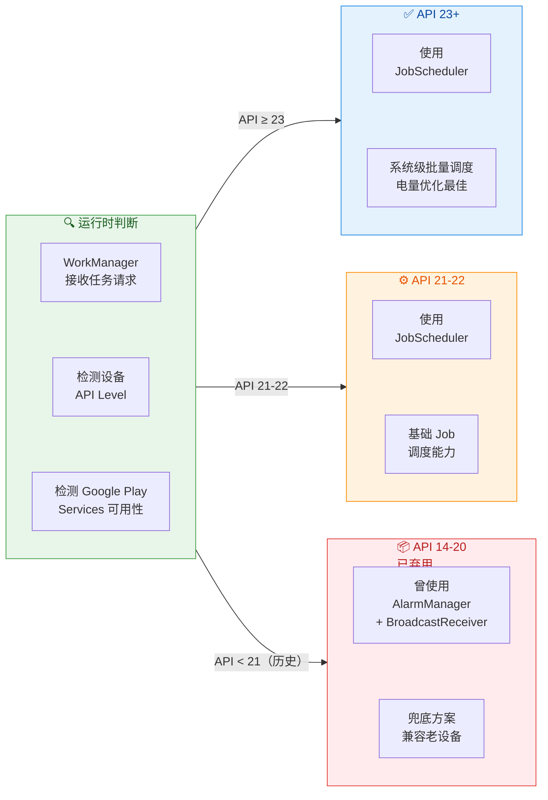
```mermaid
graph LR
    subgraph Decide["🔍 运行时判断"]
        direction TB
        A["WorkManager\n接收任务请求"] ~~~ B["检测设备\nAPI Level"] ~~~ C["检测 Google Play\nServices 可用性"]
    end

    subgraph API23Plus["✅ API 23+"]
        direction TB
        D["使用\nJobScheduler"] ~~~ E["系统级批量调度\n电量优化最佳"]
    end

    subgraph API2122["⚙️ API 21-22"]
        direction TB
        F["使用\nJobScheduler"] ~~~ G["基础 Job\n调度能力"]
    end

    subgraph BelowAPI21["📦 API 14-20\n已弃用"]
        direction TB
        H["曾使用\nAlarmManager\n+ BroadcastReceiver"] ~~~ I["兜底方案\n兼容老设备"]
    end

    Decide -->|"API ≥ 23"| API23Plus
    Decide -->|"API 21-22"| API2122
    Decide -->|"API < 21（历史）"| BelowAPI21

    classDef decideStyle fill:#E8F5E9,stroke:#43A047,color:#1B5E20
    classDef api23Style fill:#E3F2FD,stroke:#1E88E5,color:#0D47A1
    classDef api21Style fill:#FFF3E0,stroke:#FB8C00,color:#E65100
    classDef legacyStyle fill:#FFEBEE,stroke:#E53935,color:#B71C1C

    class Decide decideStyle
    class API23Plus api23Style
    class API2122 api21Style
    class BelowAPI21 legacyStyle
```

需要特别说明的是，在 WorkManager 的早期版本中（2.x 初期），当设备 API Level 低于 21 且 Google Play Services 可用时，它会优先使用 `GcmNetworkManager` 作为调度器；如果 Play Services 也不可用，则回退到基于 `AlarmManager + BroadcastReceiver` 的兜底方案。但随着 Google 逐步提升 `minSdk` 要求（WorkManager 2.9+ 要求 `minSdk 21`），低于 API 21 的分支已经成为历史。**在当前版本中，WorkManager 的底层主要就是 `JobScheduler`**，辅以进程内的 `GreedyScheduler`（用于立即执行无约束任务）。

这种委托机制的价值在于：**开发者编写的代码完全不需要关心底层使用了哪种调度器**。无论应用运行在 Android 8、Android 12 还是 Android 15 上，WorkManager 都会自动适配，并且随着 WorkManager 库自身的更新，底层策略也会持续优化——你的应用无需修改一行代码就能享受到这些改进。

#### 与前台任务的边界

理解 WorkManager 的定位，还需要明确它 **不适合** 的场景。WorkManager 专门设计用于 **deferrable**（可延迟的）且需要 **guaranteed execution**（保证执行的）后台工作。典型的使用场景包括：

- **日志上传**：应用收集的日志需要在有网络时批量上传到服务器，但不需要立即完成。
- **图片/视频处理**：用户拍摄照片后的后台压缩、水印添加、同步到云端。
- **数据库清理与同步**：定期将本地数据与远端同步，或清理过期缓存。
- **周期性数据拉取**：每隔若干小时从服务器获取最新配置或内容。

而以下场景 **不应该** 使用 WorkManager：

- **需要即时响应的前台工作**：如用户正在界面上操作触发的网络请求、实时聊天消息收发。这些应使用 `Coroutine`（协程）配合 `ViewModel` 的 `viewModelScope`，或 RxJava 等方式处理。
- **需要精确时间触发的闹钟**：如精确到秒的提醒，应该使用 `AlarmManager.setExactAndAllowWhileIdle()`。WorkManager 的任务执行时间本质上是 **非精确** 的，系统可能将其延迟或批量执行以优化电量。
- **持续运行的前台服务**：如音乐播放、导航、运动追踪。这些需要使用 `ForegroundService` 并展示通知。不过，WorkManager 支持在 Worker 中通过 `setForeground()` 升级为前台工作，这是一种混合场景，后文会讨论。

一句话概括 WorkManager 的定位：**"即使应用进程被杀死、即使设备重启，这个任务最终也必须被执行"——这就是 WorkManager 的核心承诺。**

---

### 替代 AlarmManager / JobScheduler

#### AlarmManager 的局限性

`AlarmManager` 是 Android 最古老的定时任务 API 之一，其本质是 **基于时间的精确或非精确闹钟**。它的设计初衷是在指定的时间点唤醒应用执行某些操作。然而，将它用于后台任务调度存在很多问题：

**第一，缺乏约束条件模型。** `AlarmManager` 只能基于"时间"来触发，无法表达"在有 Wi-Fi 连接且设备充电时才执行"这样的复合条件。开发者必须在闹钟回调中手动检查这些条件，如果条件不满足则需要自己设置下一次闹钟，逻辑复杂且容易出错。

**第二，电量消耗严重。** 在 Android 6.0（Marshmallow）引入 Doze 模式之前，`AlarmManager` 可以在任何时间唤醒设备。即使在 Doze 模式下，`setExactAndAllowWhileIdle()` 也会强制唤醒设备，绕过系统的省电优化。大量应用滥用精确闹钟，是 Android 早期耗电问题的主要原因之一。

**第三，没有重试与退避机制。** 如果闹钟触发时任务执行失败（如网络超时），`AlarmManager` 本身不提供任何重试逻辑。开发者需要自行实现指数退避（exponential backoff）策略，并手动管理重试次数和间隔。

**第四，无法感知进程存活状态。** `AlarmManager` 配合 `BroadcastReceiver` 可以在进程死亡后被系统唤醒，但这只是借助了系统的广播机制。具体的任务恢复、状态管理、持久化等工作都需要开发者自行实现。

从 Android 12（API 31）开始，Google 进一步收紧了精确闹钟的权限——应用必须声明 `SCHEDULE_EXACT_ALARM` 权限，且用户可以在设置中随时撤销。这让 `AlarmManager` 在非闹钟场景中的使用变得更加不合适。

#### JobScheduler 的进步与不足

`JobScheduler`（API 21+）相比 `AlarmManager` 是一次巨大的进步。它引入了 **约束条件**（Constraints）、**批量调度**（batched scheduling）和 **退避策略**（backoff policy）等现代概念，让系统能够智能地将多个应用的后台任务合并执行，显著降低了设备唤醒频率和电量消耗。

然而，`JobScheduler` 也存在明显的问题：

**首先，版本限制。** `JobScheduler` 仅在 API 21+ 可用。虽然今天绝大多数应用的 `minSdk` 已经达到或超过 21，但在 WorkManager 诞生的 2018 年，支持 API 14+ 是常见需求，`JobScheduler` 无法覆盖所有用户。

**其次，API 较底层，使用繁琐。** `JobScheduler` 要求开发者继承 `JobService`，手动管理 `onStartJob` / `onStopJob` 回调，显式通知系统任务是否完成（`jobFinished()`），处理并发和线程切换。对于常见的"执行一段后台逻辑、成功就结束、失败就重试"这种简单需求，代码量仍然不小。

**第三，不同 OEM 行为不一致。** 这是 Android 生态中一个著名的痛点。不同厂商（Samsung、Huawei、Xiaomi、Oppo 等）对 `JobScheduler` 的行为做了不同程度的修改——有些厂商会在"省电模式"下直接杀掉所有后台 Job，有些则会限制 Job 的执行频率。这些 OEM 定制行为导致开发者在不同设备上观察到截然不同的任务执行表现。

**第四，没有内置的持久化机制。** `JobScheduler` 调度的任务信息存储在系统进程中，设备重启后系统会尝试恢复（前提是使用了 `setPersisted(true)`），但任务执行的中间状态、输入/输出数据等都不会被保存。如果任务需要"断点续传"式的可靠性，开发者需要自己实现持久化逻辑。

#### WorkManager 如何全面超越

WorkManager 站在 `AlarmManager` 和 `JobScheduler` 的肩膀上，系统性地解决了它们的所有痛点，同时保持了简洁的上层 API：

| 能力维度 | AlarmManager | JobScheduler | WorkManager |
|---------|-------------|-------------|-------------|
| 最低 API 要求 | API 1 | API 21 | API 21（当前版本） |
| 约束条件 | ❌ 无 | ✅ 有（网络/充电/空闲） | ✅ 有（更丰富，含存储空间等） |
| 重试与退避 | ❌ 需手动实现 | ✅ 有（线性/指数） | ✅ 有（默认指数退避） |
| 任务链 | ❌ 无 | ❌ 无 | ✅ 支持 DAG（有向无环图） |
| 任务持久化 | ❌ 无 | ⚠️ 部分（setPersisted） | ✅ Room 数据库持久化 |
| 进程死亡后恢复 | ⚠️ 需配合 Receiver | ⚠️ 系统级恢复 | ✅ 完全自动恢复 |
| 设备重启后恢复 | ⚠️ 需手动注册 Receiver | ⚠️ 需 setPersisted | ✅ 完全自动恢复 |
| 可观察性 | ❌ 无 | ❌ 无 | ✅ LiveData/Flow 观察 |
| 协程支持 | ❌ 无 | ❌ 无 | ✅ CoroutineWorker |
| 任务去重 | ❌ 无 | ❌ 无 | ✅ UniqueWork |

从上表可以清晰看出，WorkManager 并不仅仅是一层"向后兼容的包装"，它在 **任务链**、**可观察性**、**协程集成**、**唯一任务** 等方面提供了全新的能力，这些是 `AlarmManager` 和 `JobScheduler` 从未提供过的。

一个关键的设计决策是：**WorkManager 不再追求"精确时间触发"**。它明确放弃了 `AlarmManager` 那种"在凌晨 3:00:00 精确执行"的能力，转而拥抱"满足条件后尽快执行"的语义。这使得系统可以将多个任务合并到 Doze 维护窗口（maintenance window）中批量执行，极大地优化了电池寿命。如果你确实需要精确定时，`AlarmManager` 仍然是正确的选择——但要注意它从 Android 12 开始受到的权限限制。

---

### 持久化保证

WorkManager 最令人印象深刻的特性之一，就是它的 **持久化保证**（persistence guarantee）。这意味着一旦一个任务被成功 enqueue（入队），即使应用进程被系统杀死、即使用户手动强制停止应用、即使设备关机重启——**这个任务最终都会被执行**（除非被代码显式取消）。

#### 基于 Room 的任务持久化

这个保证的底层实现依赖于 **Room 数据库**。当你调用 `WorkManager.enqueue(workRequest)` 时，WorkManager 并不是简单地把任务信息放在内存中，而是会立刻将任务的完整信息写入一个内部的 SQLite 数据库（通过 Room ORM 操作）。这些信息包括：

- 任务的唯一 ID（UUID）
- Worker 类的全限定名（如 `com.example.app.UploadWorker`）
- 任务的当前状态（ENQUEUED、RUNNING、SUCCEEDED、FAILED、BLOCKED、CANCELLED）
- 约束条件（Constraints）的序列化数据
- 输入数据（Input Data）
- 输出数据（Output Data）
- 退避策略（Backoff Policy）的配置
- 调度时间信息（如周期任务的间隔和弹性窗口）
- 标签（Tags）集合
- 任务链中的依赖关系（先决任务列表）

```kotlin
// 以下是一个典型的 WorkManager 入队操作（开发者视角）
// 当这行代码执行后，任务信息已被持久化到数据库
val uploadRequest = OneTimeWorkRequestBuilder<UploadWorker>() // 创建一次性上传任务的构建器
    .setConstraints(                                           // 设置执行约束条件
        Constraints.Builder()
            .setRequiredNetworkType(NetworkType.CONNECTED)      // 要求设备有网络连接
            .build()                                            // 构建 Constraints 对象
    )
    .setInputData(workDataOf("file_path" to "/sdcard/log.txt")) // 设置输入数据：文件路径
    .addTag("upload")                                           // 为任务添加标签，便于后续查询/取消
    .build()                                                    // 构建 WorkRequest 对象

WorkManager.getInstance(context)  // 获取 WorkManager 单例
    .enqueue(uploadRequest)       // 将任务入队 —— 此时任务信息已写入 Room 数据库
```

一旦 `enqueue()` 调用成功返回，任务就已经被"记录在案"了。接下来，即使应用进程立即被杀死，也不会丢失这个任务——因为任务信息已经安全地存在于磁盘上的数据库中。

#### 进程死亡与设备重启的恢复机制

当应用进程被杀死后（无论是因为系统回收内存、用户滑掉最近任务、还是进程崩溃），WorkManager 已经通过底层的 `JobScheduler` 在 **系统进程** 中注册了一个调度记录。当约束条件满足时，`JobScheduler` 会唤醒应用进程，WorkManager 的初始化代码会在进程启动时自动运行（通过 `ContentProvider` 或 `Application.onCreate()` 中的初始化），此时它会从 Room 数据库中读取所有未完成的任务，重新构建内存中的调度队列，并继续执行。

**设备重启** 的场景更加关键。WorkManager 在其 AndroidManifest 中注册了一个 `BroadcastReceiver` 来监听 `ACTION_BOOT_COMPLETED` 广播。设备重启后，这个 Receiver 会被触发，它负责唤醒 WorkManager 并重新调度所有持久化的未完成任务。其流程如下：

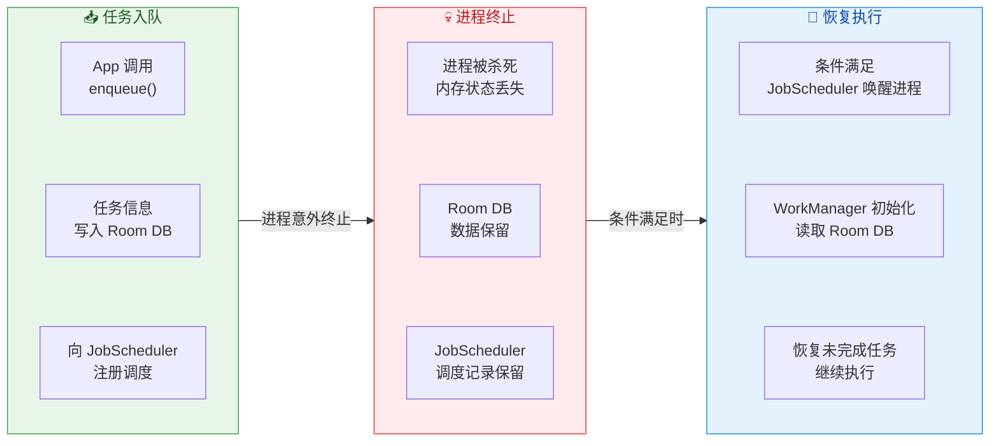
```mermaid
graph LR
    subgraph Enqueue["📥 任务入队"]
        direction TB
        A["App 调用\nenqueue()"] ~~~ B["任务信息\n写入 Room DB"] ~~~ C["向 JobScheduler\n注册调度"]
    end

    subgraph Kill["💀 进程终止"]
        direction TB
        D["进程被杀死\n内存状态丢失"] ~~~ E["Room DB\n数据保留"] ~~~ F["JobScheduler\n调度记录保留"]
    end

    subgraph Restore["🔄 恢复执行"]
        direction TB
        G["条件满足\nJobScheduler 唤醒进程"] ~~~ H["WorkManager 初始化\n读取 Room DB"] ~~~ I["恢复未完成任务\n继续执行"]
    end

    Enqueue -->|"进程意外终止"| Kill -->|"条件满足时"| Restore

    classDef enqueueStyle fill:#E8F5E9,stroke:#43A047,color:#1B5E20
    classDef killStyle fill:#FFEBEE,stroke:#E53935,color:#B71C1C
    classDef restoreStyle fill:#E3F2FD,stroke:#1E88E5,color:#0D47A1

    class Enqueue enqueueStyle
    class Kill killStyle
    class Restore restoreStyle
```

这个机制有一个微妙但重要的细节：**WorkManager 使用 Room 数据库作为 "Source of Truth"（唯一事实来源）**，而 `JobScheduler` 仅作为"唤醒触发器"。这意味着即使 `JobScheduler` 的调度记录由于某种原因丢失（如 OEM 系统的 bug），WorkManager 在下次进程启动时仍然能从数据库中发现未完成的任务，并通过 `GreedyScheduler`（一个进程内的即时调度器）或重新注册 `JobScheduler` 来确保任务被执行。这种双重保障机制（database + system scheduler）是 WorkManager 可靠性的核心来源。

#### 持久化保证的边界

需要诚实指出的是，WorkManager 的"保证执行"并非绝对无条件的。以下几种极端情况下，任务可能不会被执行或会显著延迟：

**1. 用户强制停止应用（Force Stop）。** 当用户在"设置 > 应用 > 强制停止"中手动终止应用时，Android 系统会取消该应用注册的所有 `JobScheduler` 任务和闹钟，并阻止 `BOOT_COMPLETED` 广播发送给该应用。在这种情况下，WorkManager 的任务实际上处于"冻结"状态，直到用户再次手动打开应用，进程启动后 WorkManager 才能重新读取数据库并恢复调度。

**2. OEM 激进的后台限制。** 某些厂商（尤其是中国市场的 ROM）会实施比 AOSP 更激进的后台策略——例如将应用加入"后台限制"名单后，即使 `JobScheduler` 触发也会被系统拦截。WorkManager 团队持续在 [dontkillmyapp.com](https://dontkillmyapp.com) 上记录这些 OEM 特异性行为，但从应用层面来说，这些限制往往无法绕过，只能引导用户将应用加入白名单。

**3. Doze 模式和 App Standby Buckets。** 在 Android 6.0+ 的 Doze 模式下，系统会延迟所有后台任务（包括 `JobScheduler` 调度的 WorkManager 任务），仅在维护窗口（maintenance window）中批量执行。Android 9.0+ 进一步引入了 App Standby Buckets，根据用户对应用的使用频率将其分为"活跃"、"工作集"、"偶尔"、"稀有"和"受限"五个桶，不同桶中的应用被允许执行后台任务的频率差异极大。一个被归入"稀有"桶的应用，其 WorkManager 任务可能要等待长达 24 小时才能被执行。

**4. 设备存储空间耗尽。** 由于 WorkManager 依赖 Room 数据库进行持久化，如果设备存储空间严重不足导致数据库写入失败，`enqueue()` 操作本身可能会抛出异常。这种情况极为罕见，但在理论上是存在的。

尽管存在这些边界条件，WorkManager 在绝大多数实际场景中都能兑现其"保证执行"的承诺。相比于开发者自行实现基于数据库 + `AlarmManager` + `BroadcastReceiver` + 版本兼容的持久化调度逻辑，WorkManager 将这一切封装为一个可靠且简洁的抽象层，极大地降低了开发成本和出错概率。

#### 内部数据库结构概览

为了让你对 WorkManager 的持久化层有更直观的认识，以下简化展示其内部 Room 数据库中最核心的几个表及其关系：

```text
┌─────────────────────────────────────────────────────────┐
│                    WorkSpec 表（核心）                     │
│  ┌─────────────┬────────────────────────────────────┐   │
│  │ 字段          │ 说明                                │   │
│  ├─────────────┼────────────────────────────────────┤   │
│  │ id (PK)     │ UUID，任务唯一标识                    │   │
│  │ state       │ ENQUEUED / RUNNING / SUCCEEDED...  │   │
│  │ worker_class│ Worker 全限定类名                    │   │
│  │ input_data  │ 输入数据的 ByteArray 序列化           │   │
│  │ output_data │ 输出数据的 ByteArray 序列化           │   │
│  │ constraints │ 约束条件的序列化信息                   │   │
│  │ backoff_policy│ LINEAR 或 EXPONENTIAL              │   │
│  │ interval    │ 周期任务的间隔（毫秒）                 │   │
│  │ flex_interval│ 弹性窗口大小（毫秒）                  │   │
│  │ run_attempt │ 当前重试次数                         │   │
│  │ schedule_requested_at│ 调度请求时间戳              │   │
│  └─────────────┴────────────────────────────────────┘   │
│                          │ 1:N                           │
│                          ▼                               │
│  ┌───────────────────────────────────┐                   │
│  │        WorkTag 表                  │                   │
│  │  work_spec_id (FK) │ tag (String) │                   │
│  └───────────────────────────────────┘                   │
│                          │                               │
│                          │ N:M                           │
│                          ▼                               │
│  ┌───────────────────────────────────┐                   │
│  │      Dependency 表                 │                   │
│  │  work_spec_id │ prerequisite_id   │                   │
│  │  (当前任务)     │ (前置依赖任务)     │                   │
│  └───────────────────────────────────┘                   │
└─────────────────────────────────────────────────────────┘
```

`WorkSpec` 表是核心，每一行代表一个被 enqueue 的任务。`WorkTag` 表实现了任务与标签的一对多关系，用于按标签查询或取消任务。`Dependency` 表则记录了任务链中的依赖关系——当一个任务的所有 prerequisite（前置任务）都完成后，该任务才会从 `BLOCKED` 状态变为 `ENQUEUED`，进入可调度状态。

这套数据库驱动的架构确保了 WorkManager 的每一次状态变更（入队、开始执行、完成、失败、重试）都是 **事务性的**（transactional），不会因为进程中断而出现不一致状态。这也是 WorkManager 能够在面对各种进程生命周期变化时保持可靠性的根本原因。

---

**📝 练习题**

某应用需要在用户拍照后，将照片压缩并上传到云端。上传需要网络连接，且即使用户关闭应用甚至重启设备，上传也必须最终完成。以下哪种方案最合适？

A. 使用 `AlarmManager.setExact()` 设置一个 30 秒后的精确闹钟，在 BroadcastReceiver 中执行上传逻辑


B. 在 `Activity.onStop()` 中启动一个后台 `Thread` 执行压缩和上传


C. 使用 `WorkManager` 创建一个带有 `NetworkType.CONNECTED` 约束的 `OneTimeWorkRequest`


D. 使用 `JobScheduler` 调度任务，并在 `onStartJob()` 中手动检查网络状态并启动线程上传


**【答案】** C

**【解析】** 这道题考查的是后台任务调度方案的选型。题目的核心需求有两个：① 需要网络连接才能执行；② 必须在进程死亡和设备重启后仍然保证执行。

选项 A 不合适，因为 `AlarmManager` 无法表达"需要网络"这一约束条件，必须在回调中手动检查网络状态，且无法保证设备重启后的可靠恢复（需要额外注册 `BOOT_COMPLETED` 并自行实现持久化）。此外，从 Android 12 开始精确闹钟需要额外权限。

选项 B 是最差的方案。`Activity.onStop()` 中启动的线程会随着进程被杀而终止，没有任何持久化保证。系统在内存紧张时可能随时回收进程，上传极有可能中断且不会恢复。

选项 D 在功能上可以实现需求，`JobScheduler` 支持网络约束且任务信息由系统进程管理。但它的 API 更底层（需要手动管理 `jobFinished()`、线程切换等），不支持任务链和进度观察，且在不同 OEM 设备上的行为一致性不如 WorkManager（WorkManager 内部已做了大量兼容性处理）。

选项 C 是最优解。WorkManager 通过 `Constraints` 原生支持网络约束，通过 Room 数据库持久化保证任务在进程死亡和设备重启后自动恢复，API 简洁且内置重试和退避机制。这正是 WorkManager 的核心使用场景——可延迟、需保证执行的后台任务。

---

## 任务请求 WorkRequest

WorkRequest 是 WorkManager 架构中**连接"你想做什么"与"系统如何调度"的核心桥梁**。当开发者定义好一个 Worker（执行逻辑）之后，还需要通过 WorkRequest 来告诉 WorkManager：这个任务**何时执行、以什么频率执行、在什么条件下执行、失败了怎么重试**。可以说，Worker 描述的是"做什么"，而 WorkRequest 描述的是"怎么做、什么时候做"。

从类继承关系来看，`WorkRequest` 本身是一个 **abstract class**，它不能被直接实例化，而是通过两个具体子类来创建任务请求：**OneTimeWorkRequest**（一次性任务）和 **PeriodicWorkRequest**（周期性任务）。这种设计符合 Android Jetpack 一贯的"职责单一、语义清晰"的理念——不同的调度模式有不同的参数约束和生命周期行为，将它们拆分为独立子类可以在编译期就避免误用。

每个 WorkRequest 实例在创建时都会被自动分配一个 **全局唯一的 UUID**，这个 ID 是后续观察任务状态、取消任务的关键凭证。同时，WorkRequest 内部封装了 **Constraints（约束条件）、backoff policy（退避策略）、input data（输入数据）、tags（标签）、initial delay（初始延迟）** 等丰富的调度参数。这些参数统一通过 **Builder 模式** 进行配置，保证了 API 的可读性和扩展性。

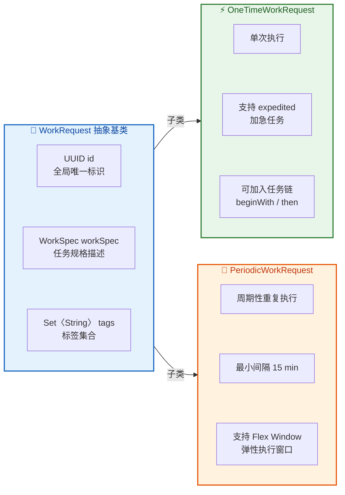
```mermaid
graph LR
    subgraph Core["🧱 WorkRequest 抽象基类"]
        direction TB
        A["UUID id\n全局唯一标识"]
        B["WorkSpec workSpec\n任务规格描述"]
        C["Set〈String〉 tags\n标签集合"]
        A ~~~ B
        B ~~~ C
    end

    subgraph One["⚡ OneTimeWorkRequest"]
        direction TB
        D["单次执行"]
        E["支持 expedited\n加急任务"]
        F["可加入任务链\nbeginWith / then"]
        D ~~~ E
        E ~~~ F
    end

    subgraph Periodic["🔄 PeriodicWorkRequest"]
        direction TB
        G["周期性重复执行"]
        H["最小间隔 15 min"]
        I["支持 Flex Window\n弹性执行窗口"]
        G ~~~ H
        H ~~~ I
    end

    Core -->|"子类"| One
    Core -->|"子类"| Periodic

    classDef coreStyle fill:#E3F2FD,stroke:#1565C0,color:#0D47A1,stroke-width:2px
    classDef oneStyle fill:#E8F5E9,stroke:#2E7D32,color:#1B5E20,stroke-width:2px
    classDef periodicStyle fill:#FFF3E0,stroke:#E65100,color:#BF360C,stroke-width:2px

    class Core coreStyle
    class One oneStyle
    class Periodic periodicStyle
```

上图清晰地展示了 WorkRequest 的继承体系：抽象基类持有 ID、WorkSpec 和 Tags 三大核心属性，两个子类各自扩展了不同的调度语义。下面我们逐一深入。

---

### OneTimeWorkRequest 一次性任务

OneTimeWorkRequest 是最常用的任务请求类型，顾名思义，它代表一个 **只执行一次** 的后台任务。当任务成功完成（返回 `Result.success()`）后，WorkManager 会将其状态标记为 **SUCCEEDED** 并从活跃调度队列中移除。典型的使用场景包括：一次性数据同步、图片压缩上传、本地数据库迁移、日志上报等。

#### 基础创建方式

OneTimeWorkRequest 的创建遵循标准的 Builder 模式。最简形式只需要指定要执行的 Worker 类即可：

```kotlin
// 最简创建方式：仅指定 Worker 类型
// WorkManager 会为这个请求自动生成一个 UUID
val uploadRequest = OneTimeWorkRequestBuilder<UploadWorker>()
    .build() // 构建 OneTimeWorkRequest 实例
```

这行代码背后发生了什么？`OneTimeWorkRequestBuilder<T>()` 是 Kotlin 提供的**内联扩展函数**，它在内部调用了 `OneTimeWorkRequest.Builder(UploadWorker::class.java)` 构造方法。Builder 在初始化时会做三件事：第一，生成一个 `UUID.randomUUID()` 作为任务的唯一标识；第二，创建一个 `WorkSpec` 对象来存储所有调度参数（约束、延迟、退避策略等）；第三，将 Worker 的**全限定类名**（而非 Class 引用）写入 WorkSpec，这是因为 WorkManager 需要在未来某个时刻通过**反射**来实例化 Worker，而持久化存储的是字符串形式的类名。

#### 携带完整参数的创建

在实际开发中，一次性任务往往需要配置多种调度参数。我们来看一个完整的例子：

```kotlin
// 创建一个完整配置的一次性任务请求
val uploadRequest = OneTimeWorkRequestBuilder<UploadWorker>()
    // 设置输入数据：通过 Data 对象传递键值对给 Worker
    .setInputData(
        workDataOf(  // workDataOf 是 Kotlin 扩展函数，简化 Data.Builder 的使用
            "image_uri" to "/storage/emulated/0/photo.jpg", // 图片路径
            "quality" to 85  // 压缩质量
        )
    )
    // 设置约束条件：仅在 Wi-Fi 连接且电量充足时执行
    .setConstraints(
        Constraints.Builder()
            .setRequiredNetworkType(NetworkType.UNMETERED) // 要求非计量网络（Wi-Fi）
            .setRequiresBatteryNotLow(true) // 要求电量不低
            .build() // 构建 Constraints 实例
    )
    // 设置初始延迟：任务入队后至少等待 10 秒再考虑执行
    .setInitialDelay(10, TimeUnit.SECONDS)
    // 设置退避策略：任务失败重试时的等待时间策略
    .setBackoffCriteria(
        BackoffPolicy.EXPONENTIAL, // 指数退避：10s -> 20s -> 40s -> ...
        10, // 初始退避时间
        TimeUnit.SECONDS // 时间单位
    )
    // 添加标签：便于后续按标签查询或取消任务
    .addTag("upload") // 一个任务可以有多个标签
    .addTag("image")  // 标签是 String 类型，开发者自定义
    .build() // 构建最终的 OneTimeWorkRequest

// 提交到 WorkManager 进行调度
WorkManager.getInstance(context) // 获取 WorkManager 单例
    .enqueue(uploadRequest) // 将任务放入调度队列
```

每个配置项的意义都值得展开说明。**setInputData** 设置的 `Data` 对象会被序列化后存入 WorkManager 的内部数据库（Room），在 Worker 执行时再反序列化为 `Data` 传入。需要注意的是，`Data` 有**最大 10 KB** 的大小限制，因此不适合传递大量数据，通常传递的是文件路径、ID 等轻量信息。**setInitialDelay** 表示任务入队后的**最短等待时间**，但这不是精确的定时器——实际执行时间还取决于约束条件是否满足以及系统的 Doze/App Standby 状态。**setBackoffCriteria** 定义了任务返回 `Result.retry()` 时，系统在多久之后重新调度这个任务，支持 `LINEAR`（线性增长）和 `EXPONENTIAL`（指数增长）两种策略，最小退避时间为 **10 秒**（`MIN_BACKOFF_MILLIS`），最大退避时间上限为 **5 小时**（`MAX_BACKOFF_MILLIS`）。

#### Expedited Work 加急任务

从 WorkManager 2.7.0 开始，OneTimeWorkRequest 新增了 **加急任务（Expedited Work）** 的能力。这是为了应对 Android 12（API 31）对 **前台服务启动限制** 的一种替代方案。在 Android 12 之前，应用可以在后台随意启动前台服务；但 Android 12 之后，从后台启动前台服务会抛出 `ForegroundServiceStartNotAllowedException`。加急任务通过 WorkManager 内部的调度机制绕过了这一限制——在 Android 12+ 上它使用 **JobScheduler 的 expedited job**，在更低版本上则降级为**前台服务**。

```kotlin
// 创建加急任务：适用于用户触发的、需要立即执行的重要任务
val urgentRequest = OneTimeWorkRequestBuilder<PaymentWorker>()
    .setExpedited(OutOfQuotaPolicy.RUN_AS_NON_EXPEDITED_WORK_REQUEST) // 配额耗尽时降级为普通任务
    .build() // 构建加急任务请求
```

`OutOfQuotaPolicy` 有两个选项：`RUN_AS_NON_EXPEDITED_WORK_REQUEST` 表示当系统的加急配额用完时，降级为普通任务继续执行；`DROP_WORK_REQUEST` 则表示直接放弃这个任务。对于大多数业务场景，选择降级而非丢弃是更安全的策略。

**需要特别注意的是**，使用加急任务时，对应的 Worker 必须重写 `getForegroundInfo()` 方法（或在 CoroutineWorker 中重写 `getForegroundInfo()` 挂起函数），因为在 Android 11 及以下版本上，WorkManager 需要将这个任务提升为前台服务来执行，而前台服务需要显示一个通知。如果不实现这个方法，在低版本设备上会抛出异常。

#### 状态流转

OneTimeWorkRequest 的完整状态流转路径如下：任务入队后进入 **ENQUEUED** 状态；当所有约束条件满足且初始延迟已过后，进入 **RUNNING** 状态；如果任务成功完成，转为终态 **SUCCEEDED**；如果任务失败且不重试，转为终态 **FAILED**；如果任务返回 retry，回到 **ENQUEUED** 等待重新调度；如果任务被取消，进入终态 **CANCELLED**。当任务处于 RUNNING 状态时被取消，WorkManager 会先触发 `onStopped()` 回调，然后才标记为 CANCELLED。如果一次性任务是任务链的一部分，其 FAILED 状态会**向下游传播**，导致后续所有依赖任务也被标记为 FAILED。

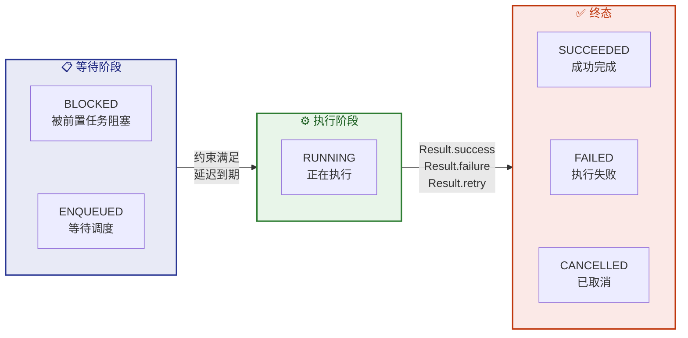
```mermaid
graph LR
    subgraph Pending["📋 等待阶段"]
        direction TB
        B["BLOCKED\n被前置任务阻塞"]
        E["ENQUEUED\n等待调度"]
        B ~~~ E
    end

    subgraph Active["⚙️ 执行阶段"]
        direction TB
        R["RUNNING\n正在执行"]
    end

    subgraph Terminal["✅ 终态"]
        direction TB
        S["SUCCEEDED\n成功完成"]
        F["FAILED\n执行失败"]
        C["CANCELLED\n已取消"]
        S ~~~ F
        F ~~~ C
    end

    Pending -->|"约束满足\n延迟到期"| Active
    Active -->|"Result.success\nResult.failure\nResult.retry"| Terminal

    classDef pendingStyle fill:#E8EAF6,stroke:#283593,color:#1A237E,stroke-width:2px
    classDef activeStyle fill:#E8F5E9,stroke:#2E7D32,color:#1B5E20,stroke-width:2px
    classDef terminalStyle fill:#FBE9E7,stroke:#BF360C,color:#BF360C,stroke-width:2px

    class Pending pendingStyle
    class Active activeStyle
    class Terminal terminalStyle
```

值得强调的是，**BLOCKED** 状态只在任务链中出现。如果你调用了 `WorkManager.beginWith(taskA).then(taskB).enqueue()`，那么 `taskB` 在 `taskA` 完成之前会一直处于 BLOCKED 状态。单独入队的 OneTimeWorkRequest 永远不会进入 BLOCKED 状态，它会直接从 ENQUEUED 开始。

---

### PeriodicWorkRequest 周期性任务

PeriodicWorkRequest 用于创建**需要反复执行**的任务，例如定期同步数据到服务器、周期性清理缓存文件、每隔一段时间上报用户行为日志等。与 OneTimeWorkRequest 最大的区别在于：周期性任务**不存在真正的终态**（除了 CANCELLED）。每次执行完毕后，无论返回 `Result.success()` 还是 `Result.failure()`，任务都会重新回到 **ENQUEUED** 状态，等待下一个周期的到来。这意味着 `Result.retry()` 在周期任务中也是有效的——它会按照退避策略延迟后重新执行，但仍然在当前周期内；而 success/failure 则直接结束当前周期，开始等待下一个周期。

#### 基础创建方式

```kotlin
// 创建一个周期性任务：每隔 1 小时同步一次数据
val syncRequest = PeriodicWorkRequestBuilder<SyncWorker>(
    1, TimeUnit.HOURS // repeatInterval: 重复间隔为 1 小时
).build() // 构建 PeriodicWorkRequest
```

这里传入的 `1 小时` 就是所谓的 **repeatInterval（重复间隔）**，它定义了两次执行之间的最短时间。为什么说"最短"？因为 WorkManager 的调度受到系统 Doze 模式、App Standby Bucket、电池优化等多重因素的影响，实际两次执行之间的间隔可能**大于**你设定的 repeatInterval，但绝不会小于它。

#### 最小间隔限制

**这是 PeriodicWorkRequest 最重要的硬性约束之一**：周期性任务的最小重复间隔为 **15 分钟**（`PeriodicWorkRequest.MIN_PERIODIC_INTERVAL_MILLIS = 15 * 60 * 1000L`）。如果你尝试设置一个小于 15 分钟的间隔，WorkManager **不会抛出异常**，而是会**静默地将间隔调整为 15 分钟**，同时在 Logcat 中输出一条警告信息。

为什么是 15 分钟？这与 Android 系统底层的 **JobScheduler** 限制一脉相承。从 Android 7.0（API 24）开始，`JobScheduler.setPeriodic()` 方法强制要求最小间隔为 15 分钟，这是 Google 为了优化电池续航而做出的系统级限制。WorkManager 在底层根据 API 级别选择不同的 Delegate（JobScheduler、AlarmManager + BroadcastReceiver 等），但为了保证跨版本行为一致，它在自身的 API 层面统一了这个 15 分钟的下限。

```kotlin
// ❌ 错误示例：间隔小于 15 分钟
val tooFrequent = PeriodicWorkRequestBuilder<PollWorker>(
    5, TimeUnit.MINUTES // 开发者期望 5 分钟执行一次
).build()
// 实际效果：WorkManager 会将间隔静默提升到 15 分钟
// Logcat 会输出: "Interval duration lesser than minimum allowed value; Changed to 900000"

// ✅ 正确示例：间隔 >= 15 分钟
val validRequest = PeriodicWorkRequestBuilder<PollWorker>(
    15, TimeUnit.MINUTES // 最小合法间隔
).build()
```

如果你的业务确实需要更高频率的后台执行（比如每 30 秒轮询一次），那么 WorkManager 并不适合这个场景。此时应该考虑使用**前台服务（Foreground Service）** 配合内部定时器（如 `Handler.postDelayed` 或 `Flow.collect` with `delay`），因为前台服务不受 Doze 模式限制，且用户可以通过通知感知到它的存在。

#### Flex Window 弹性执行窗口

PeriodicWorkRequest 还支持一个非常实用但容易被忽视的特性：**Flex Window（弹性执行窗口）**。默认情况下，周期任务在每个重复间隔的**任意时刻**都可能被执行。但如果你设置了 flexInterval，任务将被限制在**每个周期末尾的一个时间窗口**内执行。

这种设计有什么好处？假设你设置了 repeatInterval = 1 小时，flexInterval = 15 分钟，那么任务只会在每个小时的**最后 15 分钟内**被触发执行。这意味着系统可以将前 45 分钟完全空出来，避免不必要的 CPU 唤醒，从而**显著节省电量**。同时，这也给了系统更大的灵活性去**批量执行**来自多个应用的后台任务（batching），进一步减少设备唤醒次数。

```kotlin
// 创建带弹性窗口的周期任务
// repeatInterval = 1 小时，flexInterval = 15 分钟
// 任务只会在每个小时的最后 15 分钟内执行
val flexRequest = PeriodicWorkRequestBuilder<SyncWorker>(
    1, TimeUnit.HOURS,   // 重复间隔：1 小时
    15, TimeUnit.MINUTES // 弹性窗口：15 分钟
).build()
```

弹性窗口的取值也有约束：**flexInterval 不能小于 `PeriodicWorkRequest.MIN_PERIODIC_FLEX_MILLIS`（5 分钟）**，同时 **flexInterval 不能大于 repeatInterval**。如果违反这些约束，WorkManager 同样会静默修正并输出 Logcat 警告。

用一个时间轴来直观理解 Flex Window 的工作方式：

```text
|<----- repeatInterval = 60 min ----->|<----- repeatInterval = 60 min ----->|
|                                      |                                      |
|   不执行区间 (45 min)   | Flex (15 min) |   不执行区间 (45 min)   | Flex (15 min) |
|__________________________|____________|__________________________|____________|
                           ^            ^                          ^            ^
                      可执行窗口开始  周期结束               可执行窗口开始  周期结束
```

在 Flex 窗口内，如果约束条件满足，系统就会触发任务执行；如果整个 Flex 窗口内约束条件都不满足（比如用户始终没有连接 Wi-Fi），那么这个周期的执行就会被跳过，任务会等到**下一个周期的 Flex 窗口**再尝试。

#### 周期任务的状态流转差异

周期任务的状态模型与一次性任务有显著不同。最核心的区别是：**周期任务没有 SUCCEEDED 和 FAILED 终态**。当 Worker 的 `doWork()` 返回 `Result.success()` 或 `Result.failure()` 时，任务不会终结，而是重新回到 **ENQUEUED** 状态，进入下一个周期的等待。唯一的终态是 **CANCELLED**（通过主动取消实现）。

这一设计决策的逻辑很直观：如果一个周期任务因为某次失败就彻底停止，那定期同步、心跳上报之类的功能就会变得极其脆弱。WorkManager 选择让周期任务"永不放弃"——即便单次执行失败，下个周期照常尝试。

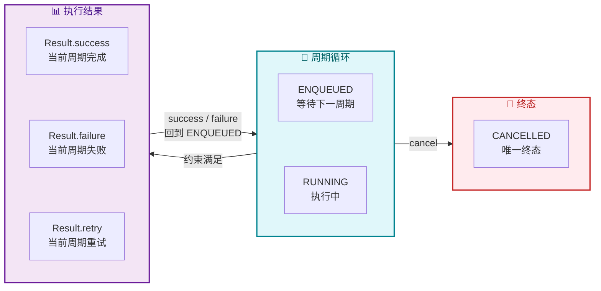
```mermaid
graph LR
    subgraph Cycle["🔁 周期循环"]
        direction TB
        E2["ENQUEUED\n等待下一周期"]
        R2["RUNNING\n执行中"]
        E2 ~~~ R2
    end

    subgraph Result["📊 执行结果"]
        direction TB
        RS["Result.success\n当前周期完成"]
        RF["Result.failure\n当前周期失败"]
        RR["Result.retry\n当前周期重试"]
        RS ~~~ RF
        RF ~~~ RR
    end

    subgraph End["🛑 终态"]
        direction TB
        C2["CANCELLED\n唯一终态"]
    end

    Cycle -->|"约束满足"| Result
    Result -->|"success / failure\n回到 ENQUEUED"| Cycle
    Cycle -->|"cancel"| End

    classDef cycleStyle fill:#E0F7FA,stroke:#00838F,color:#006064,stroke-width:2px
    classDef resultStyle fill:#F3E5F5,stroke:#6A1B9A,color:#4A148C,stroke-width:2px
    classDef endStyle fill:#FFEBEE,stroke:#C62828,color:#B71C1C,stroke-width:2px

    class Cycle cycleStyle
    class Result resultStyle
    class End endStyle
```

#### 与 Kotlin Duration 的配合

从 WorkManager 2.8.0+ 开始（配合 Kotlin），可以直接使用 Kotlin 的 `Duration` 类型来设置间隔，写法更加简洁自然：

```kotlin
import kotlin.time.Duration.Companion.hours // 导入 Duration 扩展
import kotlin.time.Duration.Companion.minutes // 导入 Duration 扩展

// 使用 Kotlin Duration API 创建周期任务
val syncRequest = PeriodicWorkRequestBuilder<SyncWorker>(
    repeatInterval = 1.hours,  // Kotlin Duration：1 小时
    flexTimeInterval = 15.minutes // Kotlin Duration：15 分钟
).build()
```

这种写法不仅更简洁，还能避免传统 API 中 `(long, TimeUnit)` 参数位置容易搞混的问题。

---

### WorkRequest 通用配置项深入

无论是 OneTimeWorkRequest 还是 PeriodicWorkRequest，它们都继承了 `WorkRequest.Builder` 的通用配置能力。这里对几个关键配置做更深入的说明。

#### 退避策略 BackoffPolicy

当 Worker 返回 `Result.retry()` 时，WorkManager 不会立刻重新执行任务，而是根据退避策略计算一个**等待时间**后再重新入队。这个策略通过 `setBackoffCriteria()` 设置，包含两个核心参数：

- **BackoffPolicy.LINEAR**：每次重试的等待时间线性增长。如果初始退避时间为 10 秒，那么第 1 次重试等 10 秒，第 2 次等 20 秒，第 3 次等 30 秒……公式为 `initialDelay * attemptCount`。
- **BackoffPolicy.EXPONENTIAL**：每次重试的等待时间指数增长。同样初始退避时间 10 秒，第 1 次等 10 秒，第 2 次等 20 秒，第 3 次等 40 秒，第 4 次等 80 秒……公式为 `initialDelay * 2^(attemptCount - 1)`。

```kotlin
// 线性退避：10s, 20s, 30s, 40s, ...
// 指数退避：10s, 20s, 40s, 80s, 160s, ...
```

退避时间有一个**上限封顶**：最大不超过 `WorkRequest.MAX_BACKOFF_MILLIS`，即 **5 小时**。当计算出的退避时间超过 5 小时时，会被截断为 5 小时。此外，系统还会在退避时间上加入少量的**随机抖动（jitter）**，目的是防止大量任务在同一时刻重试导致"惊群效应"（thundering herd），这对服务器端压力的缓解非常关键。

#### Tags 标签系统

每个 WorkRequest 可以附加**多个标签**（String 类型），标签的作用主要有两个方面：

第一，**批量管理**。你可以通过 `WorkManager.cancelAllWorkByTag("upload")` 一次性取消所有带有 "upload" 标签的任务，而不需要逐个记录 UUID。这在用户注销登录时取消所有同步任务的场景中非常有用。

第二，**状态查询**。通过 `WorkManager.getWorkInfosByTag("upload")` 可以获取所有带有该标签的任务的状态信息（WorkInfo 列表），这对于在 UI 层展示"当前有 N 个上传任务正在进行"之类的信息非常方便。

需要注意的是，WorkManager 会**自动为每个 WorkRequest 添加 Worker 类的全限定类名作为隐含标签**。也就是说，即使你不手动 `addTag`，也可以通过 `WorkManager.getWorkInfosByTag("com.example.UploadWorker")` 来查询所有 UploadWorker 的执行记录。

#### Initial Delay 初始延迟

`setInitialDelay()` 为任务设置一个入队后的**最短等待时间**。对于 OneTimeWorkRequest，这意味着任务在入队后至少等待指定时间才会被考虑执行；对于 PeriodicWorkRequest，初始延迟**仅影响第一个周期**——第一次执行会延迟相应时间，后续周期按正常 repeatInterval 执行。

一个常见的误区是将 `setInitialDelay` 当作"精确的定时器"。**它不是精确的**。WorkManager 保证任务不会在延迟时间到达之前执行，但延迟时间到达后，任务还需要等待约束条件满足、系统调度窗口可用等才会真正开始运行。如果你需要精确的定时任务（如闹钟、提醒），应该使用 `AlarmManager.setExactAndAllowWhileIdle()`，而不是 WorkManager。

```kotlin
// 初始延迟示例：入队后 30 分钟内不会执行
val delayedRequest = OneTimeWorkRequestBuilder<ReminderWorker>()
    .setInitialDelay(30, TimeUnit.MINUTES) // 最短等待 30 分钟
    .build()

// 周期任务的初始延迟：仅影响第一次执行
val periodicWithDelay = PeriodicWorkRequestBuilder<SyncWorker>(
    1, TimeUnit.HOURS // 每小时执行一次
)
    .setInitialDelay(5, TimeUnit.MINUTES) // 第一次执行延迟 5 分钟
    .build()
```

---

### 两种 WorkRequest 的选型对照

在实际项目中，选择 OneTimeWorkRequest 还是 PeriodicWorkRequest 需要综合考量业务需求和系统限制。下面的对比可以帮助你快速决策：

| 维度 | OneTimeWorkRequest | PeriodicWorkRequest |
|---|---|---|
| **执行次数** | 仅一次 | 无限循环，直到被取消 |
| **最小间隔** | 无限制（可设 initial delay） | **15 分钟**（硬性下限） |
| **终态** | SUCCEEDED / FAILED / CANCELLED | **仅 CANCELLED** |
| **任务链** | ✅ 支持（beginWith / then） | ❌ 不支持加入链 |
| **加急任务** | ✅ 支持 setExpedited | ❌ 不支持 |
| **Flex Window** | ❌ 不适用 | ✅ 支持弹性窗口 |
| **典型场景** | 上传文件、数据迁移、一次性清理 | 定期同步、心跳上报、缓存清理 |

一个重要的架构建议是：**不要用 PeriodicWorkRequest 来模拟"定期触发一次性任务"的效果**。有些开发者会在周期任务的 `doWork()` 里判断"是否需要执行"，不需要就直接返回 success。虽然功能上可行，但这会导致 Worker 频繁被唤起又立即退出，白白浪费系统资源。更好的做法是：用**服务器推送（FCM）触发 OneTimeWorkRequest**，或者用 `ExistingPeriodicWorkPolicy.KEEP` 结合业务逻辑来精确控制执行时机。

---

**📝 练习题**

一位开发者编写了如下代码创建周期性任务，试图每 10 分钟同步一次数据：

```kotlin
val request = PeriodicWorkRequestBuilder<SyncWorker>(
    10, TimeUnit.MINUTES
).build()
WorkManager.getInstance(context).enqueue(request)
```

关于这段代码的运行结果，以下哪个描述是正确的？


A. 代码会在运行时抛出 IllegalArgumentException，因为间隔低于 15 分钟的最小限制


B. 任务会按照 10 分钟的间隔正常执行，WorkManager 不做任何干预


C. WorkManager 会静默将间隔调整为 15 分钟，任务正常入队并按 15 分钟周期执行


D. 任务会入队但永远不会被执行，因为不满足最小间隔要求


**【答案】** C

**【解析】** WorkManager 对 PeriodicWorkRequest 的最小重复间隔有硬性要求：不低于 `PeriodicWorkRequest.MIN_PERIODIC_INTERVAL_MILLIS`（即 15 分钟，900000 毫秒）。但它的处理方式不是抛出异常（排除 A），而是**静默修正**——将实际间隔提升到 15 分钟，并在 Logcat 中输出一条警告日志（"Interval duration lesser than minimum allowed value; Changed to 900000"）。任务依然会正常入队执行（排除 D），只是实际间隔不是开发者期望的 10 分钟，而是被系统强制提升到了 15 分钟。这个 15 分钟的限制根源在于底层 JobScheduler 在 Android 7.0+ 的硬性约束，WorkManager 为了保持跨版本一致性，在自身 API 层面统一了这个下限。选项 B 描述的"10 分钟间隔正常执行"是不正确的，因为间隔实际上被修改了。

---

## 任务执行 Worker

WorkManager 的核心价值在于"声明式地描述一项后台任务"，而 **Worker** 就是承载这项任务"具体做什么"的载体。当调度器决定"现在可以执行了"，它会在一个后台线程上实例化你的 Worker 子类，并调用其入口方法来执行真正的业务逻辑。理解 Worker 的继承体系、线程模型以及结果通知机制，是写出健壮后台任务的关键。

WorkManager 提供了一个三层继承体系来适配不同的编程范式：最底层的 `ListenableWorker` 面向回调/Future 风格；中间层的 `Worker` 用同步阻塞方式简化使用；最上层的 `CoroutineWorker` 则原生支持 Kotlin 协程的挂起函数。三者并非互相替代的关系，而是"抽象层级逐步升高、易用性逐步增强"的演进关系。开发者应根据项目的技术栈与异步模型，选择最合适的一层进行继承。

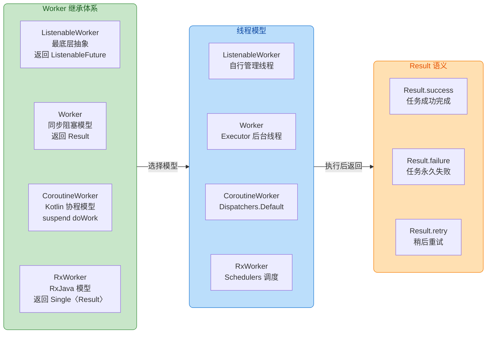
```mermaid
graph LR
    subgraph Hierarchy["Worker 继承体系"]
        direction TB
        A["ListenableWorker\n最底层抽象\n返回 ListenableFuture"]
        B["Worker\n同步阻塞模型\n返回 Result"]
        C["CoroutineWorker\nKotlin 协程模型\nsuspend doWork"]
        D["RxWorker\nRxJava 模型\n返回 Single〈Result〉"]
        A ~~~ B
        B ~~~ C
        C ~~~ D
    end

    subgraph Threading["线程模型"]
        direction TB
        E["ListenableWorker\n自行管理线程"]
        F["Worker\nExecutor 后台线程"]
        G["CoroutineWorker\nDispatchers.Default"]
        H["RxWorker\nSchedulers 调度"]
        E ~~~ F
        F ~~~ G
        G ~~~ H
    end

    subgraph ResultFlow["Result 语义"]
        direction TB
        I["Result.success\n任务成功完成"]
        J["Result.failure\n任务永久失败"]
        K["Result.retry\n稍后重试"]
        I ~~~ J
        J ~~~ K
    end

    Hierarchy -->|"选择模型"| Threading -->|"执行后返回"| ResultFlow

    classDef greenBox fill:#C8E6C9,stroke:#388E3C,color:#1B5E20,rx:8
    classDef blueBox fill:#BBDEFB,stroke:#1976D2,color:#0D47A1,rx:8
    classDef orangeBox fill:#FFE0B2,stroke:#F57C00,color:#E65100,rx:8
    class Hierarchy greenBox
    class Threading blueBox
    class ResultFlow orangeBox
```

---

### doWork 方法

`doWork()` 是 `Worker` 类（注意是中间层的 `Worker`，而非最底层的 `ListenableWorker`）暴露给开发者的唯一入口方法。它的签名非常简单——无参数、返回一个 `Result` 枚举——但背后隐含着 WorkManager 对线程管理与生命周期的一整套约定。

#### 同步阻塞模型的设计意图

`doWork()` 被设计为 **同步方法**：WorkManager 会在一个由内部 `Executor` 管理的后台线程上调用它，开发者在方法体内直接编写顺序的、阻塞式的代码即可。这种设计极大地降低了简单任务的编写门槛——你不需要手动创建线程、不需要处理回调嵌套、不需要管理 Future。方法执行完毕后，WorkManager 通过返回值就能知道任务结果。

之所以可以采用阻塞模型，是因为 WorkManager 的 `Executor` 默认使用的是一个固定大小的线程池（通常是 `Executors.newFixedThreadPool`，线程数与 CPU 核心数相关）。每个 Worker 实例占用池中的一个线程，执行完毕后归还。因此 `doWork()` 内部可以安全地执行网络请求、文件 IO、数据库读写等耗时操作，而不会阻塞主线程。但要注意，如果你同时 enqueue 了大量 Worker，它们会在线程池中排队，过多的长耗时任务可能导致其他任务等待。

#### 方法签名与执行时机

```kotlin
// 继承 Worker 并重写 doWork
class UploadWorker(
    context: Context,           // WorkManager 注入的 Application Context
    workerParams: WorkerParameters  // 包含 inputData、tags、runAttemptCount 等元信息
) : Worker(context, workerParams) {

    // doWork 运行在后台线程，可安全执行耗时操作
    override fun doWork(): Result {
        // 从 inputData 中读取上游传递的参数
        val fileUri = inputData.getString("file_uri")
            ?: return Result.failure()  // 参数缺失则直接标记为永久失败

        return try {
            // 执行实际的上传逻辑（同步阻塞调用）
            val response = uploadFileToServer(fileUri)

            // 根据服务端返回判断是否成功
            if (response.isSuccessful) {
                // 构建输出数据，供下游 Worker 或观察者读取
                val outputData = workDataOf("server_url" to response.url)
                Result.success(outputData)  // 标记成功并附带输出
            } else {
                Result.retry()  // 服务端暂时不可用，触发重试策略
            }
        } catch (e: IOException) {
            // 网络异常属于暂时性故障，适合重试
            Result.retry()
        } catch (e: Exception) {
            // 其他未知异常视为不可恢复的失败
            Result.failure()
        }
    }
}
```

上面的代码展示了一个典型的 `doWork()` 实现模式。几个关键细节值得展开讨论：

**构造函数参数的来源**：`Worker` 的构造函数需要 `Context` 和 `WorkerParameters` 两个参数。这两个参数并不是开发者手动传入的——WorkManager 内部通过反射（或 `WorkerFactory`）来实例化 Worker 子类，自动注入这两个依赖。这意味着 Worker 的构造函数签名必须严格匹配 `(Context, WorkerParameters)`，否则反射实例化会失败，任务将直接标记为 `FAILED`。如果你需要额外的依赖注入（比如 Repository、Retrofit Service），应该通过自定义 `WorkerFactory` 配合 Hilt/Dagger 来实现，而不是修改构造函数签名。

**inputData 的读取**：`workerParams.inputData` 是一个轻量级的键值对容器（`Data` 类），最大容量限制为 **10KB**。它支持基本类型（Int、Long、String、Boolean、ByteArray 等）及其数组形式，但不支持 Parcelable 或 Serializable 对象。这是因为 `Data` 需要被持久化到 WorkManager 的内部数据库中，使用简单类型可以保证序列化的稳定性和跨进程的一致性。

**执行时长的限制**：`doWork()` 的最长执行时间受限于系统给予 WorkManager 的执行窗口。在使用 `JobScheduler` 作为底层实现时，Android 系统通常允许最长 **10 分钟** 的执行时间。如果任务需要更长时间（例如大文件上传/下载），应该使用 **前台服务类型的长时间运行 Worker**（通过 `setForeground(ForegroundInfo(...))` 或 `setExpedited` 来实现），否则系统可能会在超时后强制停止 Worker。

#### isStopped 检查与优雅取消

WorkManager 可能因为多种原因停止一个正在执行的 Worker：用户主动取消、约束条件不再满足（如网络断开）、或者系统资源回收。当停止信号到达时，`doWork()` 不会被强制中断——WorkManager 采用的是**协作式取消**模型。它会将 `isStopped` 标志位设为 `true`，但不会抛出异常或 kill 线程。因此，长时间运行的任务应该在循环或关键检查点主动检查这个标志：

```kotlin
override fun doWork(): Result {
    val items = fetchItemList()  // 获取需要处理的数据列表

    for (item in items) {
        // 每次迭代前检查是否已被要求停止
        if (isStopped) {
            // 被停止时无需返回 Result（返回值会被忽略）
            // 但可以做一些清理工作，如关闭流、释放资源
            return Result.failure()
        }
        // 处理单个条目
        processItem(item)
    }

    return Result.success()
}
```

如果 `doWork()` 在 `isStopped` 为 `true` 之后仍然返回了 `Result.success()`，这个结果会被 WorkManager **忽略**。系统会根据停止的原因决定后续行为——如果是约束条件暂时不满足，Worker 会在条件恢复后被重新调度；如果是用户主动取消，则任务进入终态 `CANCELLED`。

---

### Result 返回值

`Result` 是 WorkManager 定义的一个密封类（在 Java 中表现为带有静态工厂方法的抽象类），它代表 `doWork()` 执行后的三种可能结局。这三种结局直接决定了 WorkManager 后续的调度行为——是标记完成、触发重试、还是放弃任务。

#### 三种语义详解

**`Result.success()`** 表示任务圆满完成。WorkManager 将该任务的状态从 `RUNNING` 更新为 `SUCCEEDED`，并触发两件事：第一，如果该任务是任务链中的一环，WorkManager 会检查链中下一个任务的所有前置依赖是否已全部 `SUCCEEDED`，如果是则调度下一个任务执行；第二，通过 `WorkInfo` 将成功状态通知给所有观察者（LiveData / Flow）。`success()` 还有一个重载版本 `success(Data)` 允许携带输出数据，这些数据会被写入数据库，下游 Worker 可以通过 `inputData` 读取。

**`Result.failure()`** 表示任务遇到了**不可恢复的错误**，不应再重试。典型场景包括：服务端返回 4xx 客户端错误（参数有误、资源不存在）、本地数据校验失败、业务逻辑判定任务已无意义。WorkManager 会将状态更新为 `FAILED`。在任务链场景下，一个节点的 `FAILED` 会导致其所有**下游节点**也被标记为 `FAILED`——这是一种**失败传播**机制，确保不会在前置条件不满足时浪费资源执行后续任务。同样，`failure()` 也支持携带 `Data` 输出，便于观察者获取失败详情（如错误码、错误消息）。

**`Result.retry()`** 表示任务遇到了**暂时性故障**，希望 WorkManager 稍后再次尝试。典型场景包括：网络超时、服务端返回 5xx 错误、临时性资源竞争。WorkManager 会将状态设为 `ENQUEUED`（而非 `FAILED`），并根据 `WorkRequest` 上配置的 **BackoffPolicy** 计算下一次执行的延迟时间。退避策略支持两种模式：

- **`BackoffPolicy.LINEAR`**：延迟时间线性增长。第 N 次重试的延迟 = `initialDelay × N`。例如初始延迟 30 秒，则第 1 次重试等 30 秒，第 2 次等 60 秒，第 3 次等 90 秒。
- **`BackoffPolicy.EXPONENTIAL`**：延迟时间指数增长。第 N 次重试的延迟 = `initialDelay × 2^(N-1)`。例如初始延迟 30 秒，则第 1 次等 30 秒，第 2 次等 60 秒，第 3 次等 120 秒。

```kotlin
// 构建带退避策略的 WorkRequest
val uploadRequest = OneTimeWorkRequestBuilder<UploadWorker>()
    .setBackoffCriteria(
        BackoffPolicy.EXPONENTIAL,   // 指数退避，适合网络类任务
        30, TimeUnit.SECONDS         // 初始延迟 30 秒（最小值为 10 秒）
    )
    .build()
```

系统会对退避延迟施加一个**上限**（通常为 **5 小时**），以及一个**抖动因子**（jitter），避免大量任务在同一时刻集体重试造成"惊群效应"（thundering herd）。同时，重试次数本身没有硬编码上限，但实际中应该在 `doWork()` 内通过 `runAttemptCount` 检查当前已重试次数，在达到业务阈值后主动返回 `failure()` 放弃：

```kotlin
override fun doWork(): Result {
    // runAttemptCount 从 0 开始计数，0 表示首次执行
    if (runAttemptCount >= 5) {
        // 已重试 5 次仍未成功，放弃
        return Result.failure(workDataOf("error" to "Max retries exceeded"))
    }
    // ... 正常业务逻辑
    return Result.retry()
}
```

#### Result 与任务状态机的关系

理解 `Result` 的语义，还需要将它放入 WorkManager 的**任务状态机**中来看。一个一次性任务（OneTimeWorkRequest）的完整生命周期如下：

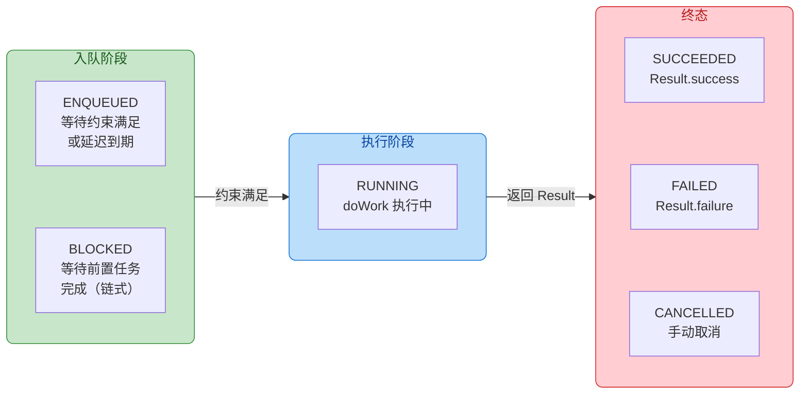
```mermaid
graph LR
    subgraph Enqueue["入队阶段"]
        direction TB
        A["ENQUEUED\n等待约束满足\n或延迟到期"]
        B["BLOCKED\n等待前置任务\n完成（链式）"]
        A ~~~ B
    end

    subgraph Execute["执行阶段"]
        direction TB
        C["RUNNING\ndoWork 执行中"]
    end

    subgraph Terminal["终态"]
        direction TB
        D["SUCCEEDED\nResult.success"]
        E["FAILED\nResult.failure"]
        F["CANCELLED\n手动取消"]
        D ~~~ E
        E ~~~ F
    end

    Enqueue -->|"约束满足"| Execute -->|"返回 Result"| Terminal

    classDef greenBox fill:#C8E6C9,stroke:#388E3C,color:#1B5E20,rx:8
    classDef blueBox fill:#BBDEFB,stroke:#1976D2,color:#0D47A1,rx:8
    classDef redBox fill:#FFCDD2,stroke:#D32F2F,color:#B71C1C,rx:8
    class Enqueue greenBox
    class Execute blueBox
    class Terminal redBox
```

当 `doWork()` 返回 `Result.retry()` 时，任务并不进入终态，而是从 `RUNNING` **回退到** `ENQUEUED`，等待退避延迟结束后重新被调度进入 `RUNNING`。只有 `success()`、`failure()` 和外部 `cancel()` 才能使任务进入终态。这也是 `retry()` 不携带输出数据的原因——任务还没结束，中间数据没有被持久化的必要。

---

### CoroutineWorker 协程支持

`Worker` 的同步阻塞模型虽然简单直接，但在 Kotlin 为主的现代 Android 项目中显得格格不入：几乎所有的网络库（Ktor、Retrofit with suspend）、数据库操作（Room with suspend DAO）、甚至 Android 官方的 DataStore 都基于协程。如果在 `doWork()` 中调用这些挂起函数，就必须使用 `runBlocking` 来桥接，这既不优雅也浪费线程资源。`CoroutineWorker` 正是为了解决这个问题而生的。

#### 从 Worker 到 CoroutineWorker 的演进

`CoroutineWorker` 继承自 `ListenableWorker`（注意，不是继承自 `Worker`），它将入口方法从同步的 `doWork()` 替换为**挂起函数** `suspend doWork()`。这意味着你可以在方法体内直接调用任何挂起函数，而不需要 `runBlocking`、不需要手动切换 Dispatcher、不需要管理协程作用域。

从线程模型来看，二者的差异非常显著：

- **`Worker.doWork()`** 运行在 WorkManager 内部 Executor 的固定线程上，方法执行期间**独占**这个线程，直到 `return` 为止。如果方法内部调用了 `delay()` 或等待 IO，线程处于阻塞状态但不会释放。
- **`CoroutineWorker.doWork()`** 默认运行在 `Dispatchers.Default` 上。当协程遇到挂起点（suspend point）时，底层线程会被**释放**回线程池，可以去执行其他协程。这使得同样数量的线程可以支撑远多于 `Worker` 的并发任务数。

#### 基本用法

```kotlin
// 引入 work-runtime-ktx 依赖后可用
// implementation "androidx.work:work-runtime-ktx:2.9.x"
class SyncWorker(
    context: Context,
    workerParams: WorkerParameters
) : CoroutineWorker(context, workerParams) {

    // 注意：这是一个 suspend 函数，可以直接调用其他挂起函数
    override suspend fun doWork(): Result {
        // 直接调用 Room 的 suspend DAO 方法，无需 withContext
        val localData = database.userDao().getAllPendingSync()

        // 直接调用 Retrofit 的 suspend 方法
        val response = apiService.syncUsers(localData)

        return if (response.isSuccessful) {
            // 更新本地数据库的同步状态
            database.userDao().markAsSynced(localData.map { it.id })
            Result.success()
        } else {
            Result.retry()
        }
    }
}
```

可以看到，代码从头到尾都是顺序式的——没有回调、没有 `runBlocking`、没有 `launch`。这正是协程"用同步的写法做异步的事"的核心价值。

#### Dispatcher 的选择与切换

`CoroutineWorker` 默认使用 `Dispatchers.Default`，这是一个针对 CPU 密集型任务优化的线程池（线程数 = CPU 核心数）。对于大多数包含网络 IO 或数据库操作的 Worker，`Dispatchers.Default` 已经足够——因为 Retrofit 和 Room 的挂起函数内部已经自带了 IO 调度（Retrofit 使用 OkHttp 的异步机制，Room 默认切换到 `Dispatchers.IO`）。

但如果你的 Worker 需要进行大量的直接文件读写（不通过 Room），或者使用了没有内置调度器切换的库，则应该在方法体内使用 `withContext` 手动切换：

```kotlin
override suspend fun doWork(): Result {
    // 对 CPU 密集型操作，Default 已经合适
    val processed = heavyCpuComputation()

    // 对直接的文件 IO，显式切到 IO Dispatcher
    withContext(Dispatchers.IO) {
        File(applicationContext.filesDir, "result.txt")
            .writeText(processed)  // 阻塞式文件写入，需要 IO 线程
    }

    return Result.success()
}
```

需要注意的是，**不要**在 `CoroutineWorker` 中使用 `Dispatchers.Main`，因为 Worker 本身就是后台任务，访问主线程没有意义（而且在没有 Activity 的后台执行场景中，主线程 Looper 的状态也不可预期）。

#### 协作式取消与 CoroutineScope

`CoroutineWorker` 内部维护着一个 `CoroutineScope`。当 WorkManager 决定停止这个 Worker 时（取消、约束不满足等），它会**取消这个 scope**，从而取消 `doWork()` 协程以及它内部启动的所有子协程。这与 `Worker` 中需要手动检查 `isStopped` 不同——协程的取消是自动传播的。被取消的挂起函数会抛出 `CancellationException`，协程机制会自动处理它。

这意味着，如果你在 `doWork()` 中调用的都是标准的挂起函数（如 Retrofit、Room、`delay()`、`withContext` 等），取消操作会自动且及时地生效。但如果你混入了不可取消的阻塞操作（比如 `Thread.sleep()`），则协程无法被及时取消，这是需要避免的反模式。

```kotlin
override suspend fun doWork(): Result {
    // ✅ 正确：delay 是可取消的挂起函数
    delay(5000)

    // ❌ 错误：Thread.sleep 不是挂起函数，会阻塞且不响应取消
    // Thread.sleep(5000)

    // ✅ 正确：对于需要定期检查的循环场景
    repeat(100) { i ->
        // ensureActive() 会在协程被取消时抛出 CancellationException
        ensureActive()
        processChunk(i)
    }

    return Result.success()
}
```

#### 前台服务支持 setForeground

`CoroutineWorker` 还提供了 `setForeground(ForegroundInfo)` 挂起函数，用于将 Worker 提升为前台服务级别的任务。这在 Android 12+ 的后台执行限制下尤为重要——长时间运行的任务如果不提升为前台服务，很可能被系统在几分钟内杀死：

```kotlin
override suspend fun doWork(): Result {
    // 构建前台通知
    val notification = NotificationCompat.Builder(applicationContext, CHANNEL_ID)
        .setContentTitle("正在同步数据")           // 通知标题
        .setSmallIcon(R.drawable.ic_sync)         // 通知小图标（必须）
        .setProgress(100, 0, false)               // 进度条初始状态
        .build()

    // 将 Worker 提升为前台服务，显示通知
    // FOREGROUND_SERVICE_TYPE_DATA_SYNC 需在 Manifest 声明
    setForeground(
        ForegroundInfo(
            NOTIFICATION_ID,                              // 通知 ID
            notification,                                 // Notification 对象
            ServiceInfo.FOREGROUND_SERVICE_TYPE_DATA_SYNC  // 前台服务类型（Android 14+ 必须）
        )
    )

    // 执行长时间操作...
    performLongRunningSync()

    return Result.success()
}
```

---

### ListenableWorker

`ListenableWorker` 是 WorkManager 任务执行体系中**最底层的抽象类**，`Worker`、`CoroutineWorker`、`RxWorker` 都直接或间接继承自它。在日常开发中你很少需要直接使用它，但理解它的设计对于把握整个 Worker 体系的线程模型至关重要——同时，当你需要集成基于回调（callback-based）的第三方 SDK 时，`ListenableWorker` 可能是唯一合适的选择。

#### 核心设计：ListenableFuture

`ListenableWorker` 的入口方法签名如下：

```java
// Java 签名（ListenableWorker 本身是 Java 类）
@NonNull
public abstract ListenableFuture<Result> startWork();
```

与 `Worker.doWork()` 返回同步 `Result` 不同，`startWork()` 返回的是一个 `ListenableFuture<Result>`。`ListenableFuture` 是 Guava 库提供的异步原语，可以类比为 Java 的 `CompletableFuture` 或 Kotlin 的 `Deferred`——它代表一个"未来某个时刻会产生的结果"。

这意味着 **`startWork()` 方法本身会立即返回**，实际的任务可以在任何线程上异步执行。当任务完成时，通过 `future.set(Result.success())` 来通知 WorkManager。这种设计赋予了开发者对线程的**完全控制权**——你可以把任务提交到自定义线程池、使用回调式 API、甚至桥接 RxJava 的 Observable，一切由你决定。

#### 与 Worker 的本质区别

`Worker` 类的源码可以帮助我们理解两者的关系。`Worker` 内部其实就是用 `ListenableFuture` 包装了同步的 `doWork()` 调用：

```kotlin
// Worker 类内部的简化实现逻辑（非精确源码，用于说明原理）
abstract class Worker(context: Context, params: WorkerParameters)
    : ListenableWorker(context, params) {

    // startWork 被 final 修饰，子类不可重写
    final override fun startWork(): ListenableFuture<Result> {
        // 创建一个可设值的 Future
        val future = SettableFuture.create<Result>()

        // 在后台 Executor 上执行同步的 doWork
        getBackgroundExecutor().execute {
            try {
                // 调用子类重写的 doWork，阻塞等待结果
                val result = doWork()
                // 将同步结果设置到 Future 中
                future.set(result)
            } catch (e: Throwable) {
                // 异常时标记为失败
                future.setException(e)
            }
        }

        // 立即返回 Future（此时 doWork 可能还没执行完）
        return future
    }

    // 子类只需关注这个同步方法
    abstract fun doWork(): Result
}
```

从这段代码可以看出，`Worker` 本质上是 `ListenableWorker` 的一个**同步语法糖**。它屏蔽了 `ListenableFuture` 的复杂性，让开发者只需要在单个线程上写顺序代码。但代价是你丧失了对线程的控制权——任务固定在 WorkManager 的 Executor 线程池上执行。

#### 实战：集成回调式 SDK

以下是一个使用 `ListenableWorker` 集成回调式文件下载 SDK 的真实场景：

```kotlin
class DownloadWorker(
    context: Context,
    params: WorkerParameters
) : ListenableWorker(context, params) {

    // 使用 CallbackToFutureAdapter 将回调转为 ListenableFuture
    override fun startWork(): ListenableFuture<Result> {
        // CallbackToFutureAdapter 是 AndroidX concurrent 库提供的桥接工具
        return CallbackToFutureAdapter.getFuture { completer ->
            // 从 inputData 中读取下载 URL
            val url = inputData.getString("download_url") ?: run {
                // 参数缺失，立即标记失败
                completer.set(Result.failure())
                return@getFuture "DownloadWorker:missing_url"
            }

            // 调用第三方 SDK 的回调式下载方法
            FileDownloadSDK.download(url, object : DownloadCallback {

                override fun onSuccess(filePath: String) {
                    // 下载成功，将结果设置到 Future
                    val output = workDataOf("file_path" to filePath)
                    completer.set(Result.success(output))
                }

                override fun onFailure(error: Throwable) {
                    // 下载失败，根据错误类型决定重试还是失败
                    if (error is IOException) {
                        completer.set(Result.retry())   // 网络问题，重试
                    } else {
                        completer.set(Result.failure())  // 其他错误，放弃
                    }
                }
            })

            // 返回一个 debug 标签，用于诊断 Future 泄漏
            "DownloadWorker:$url"
        }
    }
}
```

`CallbackToFutureAdapter` 是 AndroidX `concurrent-futures` 库提供的桥接工具，它将回调模式优雅地转换为 `ListenableFuture`。`completer.set()` 的调用可以发生在**任何线程**上（通常是回调 SDK 的内部线程），WorkManager 会正确地接收到结果。

#### ListenableWorker 的取消处理

由于 `ListenableWorker` 把线程管理完全交给了开发者，取消处理也需要开发者自己负责。当 WorkManager 要停止这个 Worker 时，它会调用 `onStopped()` 回调，同时取消 `startWork()` 返回的 `ListenableFuture`。你应该重写 `onStopped()` 来清理资源：

```kotlin
override fun onStopped() {
    super.onStopped()
    // 取消第三方 SDK 的下载任务
    FileDownloadSDK.cancel()
    // 清理临时文件等资源
    cleanupTempFiles()
}
```

#### 四种 Worker 选型指南

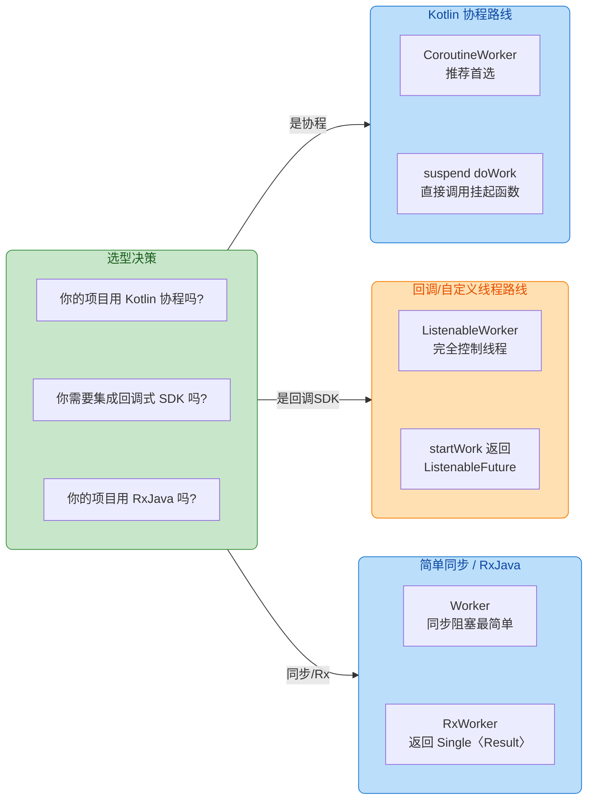
```mermaid
graph LR
    subgraph Decision["选型决策"]
        direction TB
        Q1["你的项目用 Kotlin 协程吗?"]
        Q2["你需要集成回调式 SDK 吗?"]
        Q3["你的项目用 RxJava 吗?"]
        Q1 ~~~ Q2
        Q2 ~~~ Q3
    end

    subgraph KotlinPath["Kotlin 协程路线"]
        direction TB
        R1["CoroutineWorker\n推荐首选"]
        R2["suspend doWork\n直接调用挂起函数"]
        R1 ~~~ R2
    end

    subgraph CallbackPath["回调/自定义线程路线"]
        direction TB
        R3["ListenableWorker\n完全控制线程"]
        R4["startWork 返回\nListenableFuture"]
        R3 ~~~ R4
    end

    subgraph SimplePath["简单同步 / RxJava"]
        direction TB
        R5["Worker\n同步阻塞最简单"]
        R6["RxWorker\n返回 Single〈Result〉"]
        R5 ~~~ R6
    end

    Decision -->|"是协程"| KotlinPath
    Decision -->|"是回调SDK"| CallbackPath
    Decision -->|"同步/Rx"| SimplePath

    classDef greenBox fill:#C8E6C9,stroke:#388E3C,color:#1B5E20,rx:8
    classDef blueBox fill:#BBDEFB,stroke:#1976D2,color:#0D47A1,rx:8
    classDef orangeBox fill:#FFE0B2,stroke:#F57C00,color:#E65100,rx:8
    class Decision greenBox
    class KotlinPath blueBox
    class CallbackPath orangeBox
    class SimplePath blueBox
```

总结选型建议：

- **Kotlin 项目且使用协程**（绝大多数现代项目）：使用 `CoroutineWorker`，它是当前最推荐的方案。代码简洁、取消自动传播、与 Room/Retrofit/DataStore 无缝集成。
- **需要集成回调式第三方 SDK**：使用 `ListenableWorker` + `CallbackToFutureAdapter`，它给你完全的线程控制权。
- **纯 Java 项目且逻辑简单**：使用 `Worker`，同步模型最容易理解和维护。
- **RxJava 技术栈**：使用 `RxWorker`，返回 `Single<Result>` 并在 Rx 调度器上执行。

无论选择哪种 Worker，它们在 WorkManager 内部最终都被统一为 `ListenableFuture<Result>` 来处理——这就是为什么 `ListenableWorker` 是整个体系的基石。

---

**📝 练习题**

在一个 `CoroutineWorker` 的 `doWork()` 方法中，以下哪种写法能正确响应 WorkManager 的取消信号？

A. 在循环中使用 `Thread.sleep(1000)` 进行等待，并在每次循环开始前检查 `isStopped` 标志位。


B. 在循环中使用 `delay(1000)` 进行等待，无需额外的取消检查代码。


C. 使用 `runBlocking { delay(1000) }` 包裹挂起调用，以确保线程安全。


D. 在循环中使用 `Thread.sleep(1000)` 进行等待，并在 `onStopped()` 回调中调用 `Thread.interrupt()`。


**【答案】** B

**【解析】** `CoroutineWorker` 内部维护了一个 `CoroutineScope`，当 WorkManager 停止该 Worker 时会**取消整个 scope**，导致所有标准挂起函数（如 `delay()`、`withContext()`、Retrofit 的 `suspend` 方法等）抛出 `CancellationException` 从而自动退出。因此选项 B 是正确的——`delay()` 本身就是可取消的挂起点，当协程被取消时它会立即响应，无需额外编写检查代码。

选项 A 的问题在于 `Thread.sleep()` 是一个阻塞调用而非挂起函数，它不会响应协程的取消信号。虽然 `isStopped` 检查可以在循环间隙发现取消请求，但 `sleep` 期间的那一秒钟内是完全无法中断的，响应不够及时。更关键的是，在 `CoroutineWorker` 中使用 `Thread.sleep` 是一种反模式，因为它浪费了协程的非阻塞优势。

选项 C 中 `runBlocking` 会阻塞当前协程所在的线程并创建一个**独立的事件循环**，外部 scope 的取消信号无法传播到 `runBlocking` 内部（除非手动桥接），这不仅无法正确响应取消，还可能导致线程资源浪费。

选项 D 试图通过 `Thread.interrupt()` 来中断阻塞，虽然 `Thread.sleep` 确实能响应 interrupt（抛出 `InterruptedException`），但在 `CoroutineWorker` 中你无法可靠地获取到执行 `doWork()` 的线程引用（协程可能在挂起后恢复到不同的线程上），而且这种 Java 线程中断机制与协程的取消机制是两套完全独立的体系，混用会导致难以调试的问题。

---

## 约束条件 Constraints

在实际的 Android 应用开发中，后台任务很少是"无条件立即执行"的。想象一个典型场景：App 需要将用户本地产生的日志文件批量上传到服务器。如果用户当前处于蜂窝网络且电量告急，强行执行这个大体量的上传任务不仅浪费流量，还会加速耗电，严重损害用户体验。WorkManager 的 **Constraints（约束条件）** 机制正是为解决这一类问题而生——它允许开发者声明任务执行所需的 **前置环境条件**，只有当设备状态满足全部约束时，WorkManager 才会调度该任务执行。

从设计哲学上看，Constraints 体现了 Android 平台长期以来对 **电量与资源优化** 的执着追求。从早期的 `AlarmManager` 无约束唤醒，到 `JobScheduler` 引入条件调度，再到 WorkManager 对其进行更高层次的统一封装，Constraints 是这条演进路线的集大成者。它在底层与 `JobScheduler`（API 23+）或 `AlarmManager + BroadcastReceiver`（API 23 以下）协同，将"条件判断"的职责从开发者手中转移到了框架侧，实现了 **声明式的条件调度**（Declarative Constraint Scheduling）。开发者只需描述"我需要什么条件"，而不必关心"如何监听这些条件的变化"——这一切由 WorkManager 内部的 `ConstraintTracker` 和 `SystemAlarmScheduler` / `SystemJobScheduler` 自动处理。

### 网络状态 NetworkType

网络约束是实际开发中 **使用频率最高** 的约束类型。WorkManager 通过 `NetworkType` 枚举提供了五种粒度的网络要求，覆盖了从"完全不需要网络"到"只在不计量网络下执行"的全部常见场景。

`NetworkType` 枚举的完整定义如下：

| 枚举值 | 含义 | 典型场景 |
|---|---|---|
| `NOT_REQUIRED` | 不需要网络连接（默认值） | 本地数据库清理、日志压缩 |
| `CONNECTED` | 需要任意可用网络（Wi-Fi 或蜂窝均可） | 发送即时消息、提交表单 |
| `UNMETERED` | 需要不计量网络（通常是 Wi-Fi） | 大文件下载、视频缓存、批量同步 |
| `METERED` | 需要计量网络（蜂窝数据） | 某些运营商定向流量的特殊任务（少见） |
| `NOT_ROAMING` | 需要非漫游网络 | 出国场景下避免高额漫游流量 |
| `TEMPORARILY_UNMETERED` | 需要临时不计量网络（API 30+） | 运营商临时赠送的免费流量时段 |

理解这些枚举值背后的判断逻辑非常关键。当你设置 `setRequiredNetworkType(NetworkType.UNMETERED)` 时，WorkManager 并不是在 `enqueue` 时做一次性检查然后决定执不执行——它会 **持续监听网络状态变化**。在底层，`NetworkStateTracker` 通过注册 `ConnectivityManager.NetworkCallback` 来实时感知网络切换。当设备从蜂窝网切换到 Wi-Fi 时，Tracker 会通知 `ConstraintController`，后者重新评估所有待执行任务的约束是否满足，如果全部通过，则触发任务调度执行。反过来，如果任务正在执行途中网络从 Wi-Fi 切换到了蜂窝网，WorkManager **不会主动中断正在运行的 Worker**——约束检查仅发生在 **调度前**（即从 ENQUEUED 转为 RUNNING 的那一刻），而不会在执行期间强制终止。这是一个常见的误解，开发者若需要"执行中也感知网络丢失"，需要在 Worker 内部自行监听。

下面展示一个为同步任务配置网络约束的完整示例：

```kotlin
// 构建约束条件：要求设备连接到不计量网络（通常是 Wi-Fi）
val syncConstraints = Constraints.Builder()
    // 设置网络类型要求为 UNMETERED（不计量网络）
    // 这意味着在蜂窝数据下，该任务不会被调度执行
    .setRequiredNetworkType(NetworkType.UNMETERED)
    // 构建 Constraints 实例
    .build()

// 创建一次性工作请求，绑定上述约束
val syncRequest = OneTimeWorkRequestBuilder<SyncWorker>()
    // 将约束条件附加到此 WorkRequest
    .setConstraints(syncConstraints)
    // 添加标签，便于后续查询和取消
    .addTag("data-sync")
    // 构建最终的 WorkRequest 对象
    .build()

// 将请求加入 WorkManager 队列
// WorkManager 会在约束满足时自动调度执行
WorkManager.getInstance(context).enqueue(syncRequest)
```

一个值得深入思考的设计细节是 `NOT_REQUIRED` 作为默认值的意义。WorkManager 的立场是：**约束是可选的附加条件，而非强制入口**。如果你只是想做一个本地文件清理任务，完全不关心网络状态，那么你不需要显式设置网络约束——默认的 `NOT_REQUIRED` 会让任务在调度窗口到达时直接执行。这种"零配置即可用"的设计降低了入门门槛，同时通过丰富的枚举值为进阶需求提供了精确控制。

对于 `TEMPORARILY_UNMETERED` 这个 API 30 新增的枚举值，它对应的是一种较新的运营商行为——部分运营商会在特定时段将蜂窝连接标记为 temporarily unmetered（例如深夜时段的无限流量）。系统通过 `NetworkCapabilities.NET_CAPABILITY_TEMPORARILY_NOT_METERED` 来标识这种状态。在实际开发中这个枚举使用场景极为有限，但它体现了 WorkManager 对 Android 网络能力模型（`NetworkCapabilities`）的紧密跟进。

### 充电状态 Charging

充电约束是电量优化的核心手段。通过 `setRequiresCharging(true)`，开发者可以将高耗能任务（如机器学习模型训练、大批量数据处理、全量数据库迁移）延迟到设备接入电源时执行。这不仅是对用户的尊重，也是 Google Play 商店审核中对后台任务"良好行为"的隐性要求。

```kotlin
// 构建约束：要求设备正在充电
val heavyTaskConstraints = Constraints.Builder()
    // 设置充电要求为 true
    // 只有设备接入电源（USB / AC / 无线充电）时才调度
    .setRequiresCharging(true)
    // 构建约束实例
    .build()

// 创建用于模型训练的工作请求
val trainingRequest = OneTimeWorkRequestBuilder<ModelTrainingWorker>()
    // 绑定充电约束
    .setConstraints(heavyTaskConstraints)
    // 设置退避策略：首次重试等待 30 分钟，线性增长
    .setBackoffCriteria(
        BackoffPolicy.LINEAR,       // 线性退避策略
        30,                          // 初始退避时间
        TimeUnit.MINUTES             // 时间单位：分钟
    )
    // 构建请求
    .build()
```

充电状态的底层检测依赖于 `BatteryManager` 系统服务。WorkManager 内部的 `BatteryChargingTracker` 通过监听 `Intent.ACTION_POWER_CONNECTED` 和 `Intent.ACTION_POWER_DISCONNECTED` 广播来感知充电状态变化。在 API 23+ 的设备上，这一信息也会通过 `JobScheduler` 的 `JobInfo.Builder.setRequiresCharging()` 传递给系统，由系统级调度器统一管理。

这里有一个容易被忽视的细节：**"充电中"并不等于"电量在增长"**。当设备接入一个低功率的 USB 端口（如电脑的 USB 2.0 接口），同时屏幕亮度拉满且 CPU 高负载运行时，电池可能实际上在 **净放电**，但系统仍然报告 `isCharging = true`。因此，对于真正的重度任务，仅依赖 `setRequiresCharging(true)` 可能不够，建议同时结合 `setRequiresBatteryNotLow(true)` 来双重保障。

`setRequiresBatteryNotLow(true)` 要求设备的电量不处于"低电量"状态。系统将"低电量"定义为 **电池电量低于临界阈值**（通常是 15%~20%，具体取决于 OEM 厂商配置）。当设备进入低电量状态时，系统会发送 `Intent.ACTION_BATTERY_LOW` 广播，WorkManager 的 `BatteryNotLowTracker` 捕获此广播并暂停相关约束任务的调度。

```kotlin
// 组合充电 + 电量约束：最大化保护用户电量
val batteryFriendlyConstraints = Constraints.Builder()
    // 要求正在充电
    .setRequiresCharging(true)
    // 要求电量不处于低电量状态
    .setRequiresBatteryNotLow(true)
    // 构建约束
    .build()
```

### 存储空闲 StorageNotLow

存储约束通过 `setRequiresStorageNotLow(true)` 启用，它要求设备的 **可用存储空间不处于低存储状态**。当设备存储空间不足时，系统会发送 `Intent.ACTION_DEVICE_STORAGE_LOW` 广播（当存储恢复时发送 `ACTION_DEVICE_STORAGE_OK`），WorkManager 的 `StorageNotLowTracker` 依据此广播来判断存储条件是否满足。

这个约束的典型使用场景包括：

- **数据库批量写入**：如离线缓存大量数据到 Room 数据库，若存储空间不足可能导致写入失败甚至数据库损坏。
- **文件下载任务**：下载大文件前确认存储充足，避免下载到一半因空间不足而失败。
- **日志归档**：将分散的日志文件压缩打包时，需要临时存储空间存放压缩中间产物。

```kotlin
// 构建约束：要求存储空间充足
val storageConstraints = Constraints.Builder()
    // 设置存储空间不低约束
    // 当系统报告存储空间不足（ACTION_DEVICE_STORAGE_LOW）时，任务不会被调度
    .setRequiresStorageNotLow(true)
    // 构建约束
    .build()

// 创建缓存清理任务
val cacheCleanRequest = OneTimeWorkRequestBuilder<CacheCleanWorker>()
    // 绑定存储约束
    .setConstraints(storageConstraints)
    // 构建请求
    .build()
```

需要注意的是，`StorageNotLow` 的粒度是 **系统级的整体判断**，而非针对某个特定目录的精确检测。如果你的任务需要写入 External Storage 或某个特定分区，系统广播的"低存储"判断可能与你的目标分区的实际可用空间并不完全一致。在这种情况下，建议在 `doWork()` 方法内部额外执行一次手动的存储空间检查：

```kotlin
class CacheCleanWorker(
    context: Context,
    params: WorkerParameters
) : CoroutineWorker(context, params) {

    override suspend fun doWork(): Result {
        // 获取应用内部存储的可用空间（单位：字节）
        val availableBytes = applicationContext.filesDir.usableSpace
        // 定义最低要求：至少 50MB 可用空间
        val minimumRequired = 50L * 1024 * 1024
        // 判断是否满足自定义的存储要求
        if (availableBytes < minimumRequired) {
            // 空间不足，返回 retry 等待后续重试
            return Result.retry()
        }
        // 执行实际的缓存清理逻辑
        performCacheClean()
        // 清理成功，返回 success
        return Result.success()
    }

    // 实际清理逻辑（省略具体实现）
    private suspend fun performCacheClean() {
        // ... 遍历缓存目录，删除过期文件等
    }
}
```

### 设备空闲 DeviceIdle

除了上述三大核心约束外，WorkManager 还提供了 `setRequiresDeviceIdle(true)` 约束，要求设备处于 **空闲状态**（即用户没有在主动使用设备）。这个约束在 **API 23+** 上才有效，因为它底层依赖的是 Android 6.0 引入的 **Doze 模式** 中的 idle 概念。

当设备满足以下条件时，系统会将其标记为 idle：屏幕关闭、未接入电源（部分 OEM 有差异）、设备静止一段时间。`DeviceIdle` 约束适合那些 **对时效性完全不敏感、但资源消耗较大** 的任务，例如：

- 全量数据库优化（VACUUM）
- 大规模索引重建
- 机器学习模型的离线推理

```kotlin
// 构建约束：要求设备空闲
val idleConstraints = Constraints.Builder()
    // 要求设备处于 idle 状态（API 23+）
    .setRequiresDeviceIdle(true)
    // 通常与充电约束组合，进一步减少对用户的影响
    .setRequiresCharging(true)
    // 构建约束
    .build()
```

值得强调的是，在 API 23 以下的设备上，`setRequiresDeviceIdle(true)` 会被 WorkManager **静默忽略**，任务会在其他约束满足时直接调度。这种向下兼容的"优雅降级"策略是 WorkManager 作为 Jetpack 库的一个设计亮点——开发者不需要为不同 API 级别编写分支逻辑。

### 内容提供者触发 ContentUri Trigger

WorkManager 还支持一种特殊的约束机制——**基于 ContentUri 变化的触发**。通过 `addContentUriTrigger(uri, triggerForDescendants)` 方法，任务可以在指定 `ContentProvider` 的数据发生变化时被调度执行。这个功能在 **API 24+** 上可用，底层通过 `JobScheduler` 的 `addTriggerContentUri()` 实现。

```kotlin
// 构建约束：当相册中有新照片时触发
val photoConstraints = Constraints.Builder()
    // 监听 MediaStore 图片内容的变化
    // 第一个参数：要监听的 ContentUri
    // 第二个参数：是否监听子路径（descendants）的变化
    .addContentUriTrigger(
        MediaStore.Images.Media.EXTERNAL_CONTENT_URI, // 监听外部存储的图片 URI
        true  // 监听所有子路径变化（即任何新增/修改/删除的图片）
    )
    // 构建约束
    .build()

// 创建照片备份任务
val photoBackupRequest = OneTimeWorkRequestBuilder<PhotoBackupWorker>()
    // 绑定 ContentUri 触发约束
    .setConstraints(photoConstraints)
    // 构建请求
    .build()
```

`triggerForDescendants` 参数控制监听粒度：设为 `true` 时，URI 下任何子路径的变更都会触发；设为 `false` 则仅监听精确匹配的 URI。对于 `MediaStore` 这类层级结构的 ContentProvider，通常设为 `true` 以捕获所有变更。

需要特别注意的是，**ContentUri 触发只能用于 `OneTimeWorkRequest`**，不能用于 `PeriodicWorkRequest`。这是因为周期性任务有自己的定时调度机制，与内容变更触发在语义上存在冲突。如果你需要"持续监听内容变更"，可以在 `OneTimeWorkRequest` 的 Worker 执行完毕后重新 enqueue 一个新的带有相同 ContentUri 约束的请求，形成"自循环"模式。

### 多约束组合与评估策略

在实际项目中，单一约束往往不够用，开发者需要 **组合多个约束** 来精确描述任务的执行条件。Constraints.Builder 支持链式调用多个 `set` 方法，最终生成的 `Constraints` 对象会将所有条件以 **逻辑与（AND）** 的方式组合——即 **所有约束必须同时满足**，任务才会被调度。

```kotlin
// 构建一个严格的多条件组合约束
val strictConstraints = Constraints.Builder()
    // 约束 1：要求不计量网络（Wi-Fi）
    .setRequiredNetworkType(NetworkType.UNMETERED)
    // 约束 2：要求正在充电
    .setRequiresCharging(true)
    // 约束 3：要求电量不低
    .setRequiresBatteryNotLow(true)
    // 约束 4：要求存储空间充足
    .setRequiresStorageNotLow(true)
    // 约束 5：要求设备空闲（API 23+）
    .setRequiresDeviceIdle(true)
    // 构建最终约束对象
    .build()

// 将严格约束绑定到大体量备份任务
val fullBackupRequest = OneTimeWorkRequestBuilder<FullBackupWorker>()
    // 绑定组合约束
    .setConstraints(strictConstraints)
    // 设置初始延迟：即使约束满足也至少等待 1 小时
    .setInitialDelay(1, TimeUnit.HOURS)
    // 构建请求
    .build()
```

下面用 Mermaid 图展示 WorkManager 内部对多约束的评估流程：

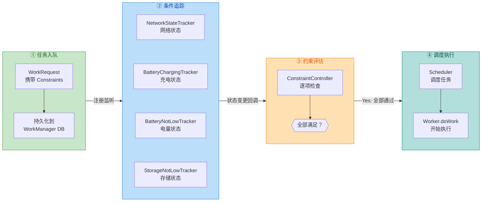
```mermaid
graph LR
    subgraph Enqueue["① 任务入队"]
        direction TB
        A["WorkRequest\n携带 Constraints"]
        B["持久化到\nWorkManager DB"]
        A --> B
    end

    subgraph Track["② 条件追踪"]
        direction TB
        C["NetworkStateTracker\n网络状态"]
        D["BatteryChargingTracker\n充电状态"]
        E["BatteryNotLowTracker\n电量状态"]
        F["StorageNotLowTracker\n存储状态"]
        C ~~~ D
        D ~~~ E
        E ~~~ F
    end

    subgraph Eval["③ 约束评估"]
        direction TB
        G["ConstraintController\n逐项检查"]
        H{{"全部满足？"}}
        G --> H
    end

    subgraph Exec["④ 调度执行"]
        direction TB
        I["Scheduler\n调度任务"]
        J["Worker.doWork\n开始执行"]
        I --> J
    end

    Enqueue -->|"注册监听"| Track -->|"状态变更回调"| Eval -->|"Yes: 全部通过"| Exec

    classDef greenNode fill:#C8E6C9,stroke:#388E3C,color:#1B5E20
    classDef blueNode fill:#BBDEFB,stroke:#1976D2,color:#0D47A1
    classDef orangeNode fill:#FFE0B2,stroke:#F57C00,color:#E65100
    classDef tealNode fill:#B2DFDB,stroke:#00796B,color:#004D40

    class Enqueue greenNode
    class Track blueNode
    class Eval orangeNode
    class Exec tealNode
```

从这个流程可以看出，约束评估的核心在 `ConstraintController`。它内部维护了一个约束条件列表，每当任何一个 Tracker 上报状态变化时，Controller 会 **重新评估所有待调度任务**。这种"事件驱动 + 全量重评估"的模型虽然看起来开销较大，但由于待调度任务数量通常有限（几十到几百个量级），且每次评估都是简单的布尔判断，实际性能开销微乎其微。

关于"AND 组合"这一设计选择，可能有人会问：为什么不支持"OR 组合"（即任意一个条件满足就执行）？这是因为 **WorkManager 的约束本质上是"安全门槛"而非"触发条件"**。每个约束都代表一个"执行这个任务至少需要的环境保障"，降低任何一个门槛都意味着潜在的风险（比如在低电量时执行重度任务）。如果你确实需要 OR 逻辑，可以创建多个带有不同约束的 WorkRequest，分别入队，谁先满足条件谁先执行，然后通过 `UniqueWork` 机制避免重复执行。

### 约束与 Doze / App Standby 的关系

理解 Constraints 的行为不能脱离 Android 的 **电量管理大背景**。从 Android 6.0（API 23）开始，系统引入了 **Doze 模式** 和 **App Standby**，对后台任务施加了严格限制。当设备进入 Deep Doze 状态时，系统会推迟所有 `AlarmManager` 闹钟、暂停网络访问、推迟 `JobScheduler` 任务。WorkManager 作为构建在这些底层机制之上的抽象层，同样受到 Doze 的影响。

具体来说：

- 当设备进入 **Doze 模式** 时，即使约束条件已全部满足，WorkManager 的任务也 **不会立即执行**，而是被推迟到下一个 **Maintenance Window**（维护窗口）。系统会周期性地打开短暂的维护窗口，在此期间允许后台任务执行。
- 当设备处于 **App Standby Bucket** 的 Restricted 级别时，该 App 的 WorkManager 任务被限制为 **每天最多执行一次**（具体限制因 Android 版本和 OEM 策略有差异）。

这意味着开发者不能期望约束满足后任务会 **立即** 执行。WorkManager 的 `enqueue` 是一个"最终一致性"的承诺——任务 **最终一定会执行**（因为持久化到数据库），但执行的时机受到系统电量策略的约束。这也是为什么 WorkManager 文档反复强调它适用于 **deferrable（可延迟的）** 任务，而非实时性要求高的任务。

对于确实需要在 Doze 模式下执行的紧急任务（如即时通讯的消息推送），应该使用 `setExpedited(OutOfQuotaPolicy.RUN_AS_NON_EXPEDITED_WORK_REQUEST)` 将任务标记为加急，或者使用 **高优先级 FCM 推送**（Firebase Cloud Messaging）来唤醒设备。这些机制超出了 Constraints 的范畴，但理解它们与约束系统的边界很重要。

```kotlin
// 加急任务示例：即使在 Doze 模式下也尽快执行
val urgentRequest = OneTimeWorkRequestBuilder<UrgentSyncWorker>()
    // 设置约束：需要网络
    .setConstraints(
        Constraints.Builder()
            .setRequiredNetworkType(NetworkType.CONNECTED)
            .build()
    )
    // 标记为加急任务（API 31+ 使用 Foreground Service 机制）
    // 如果加急配额用尽，则降级为普通非加急任务
    .setExpedited(OutOfQuotaPolicy.RUN_AS_NON_EXPEDITED_WORK_REQUEST)
    // 构建请求
    .build()
```

### 约束条件的最佳实践

在长期的 Android 应用开发实践中，围绕 Constraints 的使用已经形成了一些被广泛认可的最佳实践：

**第一，约束要精准而非贪婪**。不要为了"保险"而给每个任务都加上全部约束。过多的约束组合意味着满足条件的窗口变得极其狭窄——用户可能需要在连接 Wi-Fi、插上充电器、设备空闲且存储充足时才能触发你的任务，这种"四星对齐"的场景在日常使用中出现的概率远低于你的预期。只添加任务 **真正需要的** 约束条件。

**第二，组合约束要考虑用户的设备使用习惯**。如果你的目标用户群大量使用移动数据而非 Wi-Fi（在许多发展中国家市场，这是常态），那么 `UNMETERED` 约束可能导致任务长期无法执行。可以考虑提供用户可配置的选项，让用户自主决定是否允许蜂窝网络下执行。

**第三，为关键任务设置合理的退避策略与超时**。约束可能导致任务被无限期推迟，配合 `setBackoffCriteria` 和适当的重试逻辑，可以避免任务"永远等待"的困境。同时在 Worker 内部设置超时机制，防止因网络抖动等原因导致的无限阻塞。

**第四，测试时模拟约束变化**。Android Studio 的 **Background Task Inspector** 可以可视化查看 WorkManager 任务的状态和约束条件。配合 `adb shell dumpsys jobscheduler` 和 `adb shell dumpsys deviceidle` 命令，可以在开发阶段模拟 Doze 模式、网络切换等场景，验证约束行为是否符合预期。

---

**📝 练习题**

在使用 WorkManager 时，你为一个日志上传任务设置了以下约束：`setRequiredNetworkType(NetworkType.UNMETERED)` 和 `setRequiresCharging(true)`。设备当前连接了 Wi-Fi 且正在充电，任务已进入 RUNNING 状态。此时用户拔掉充电器，以下哪个描述是正确的？


A. WorkManager 立即中断正在执行的 Worker，任务状态变为 ENQUEUED


B. WorkManager 立即中断正在执行的 Worker，任务状态变为 FAILED


C. 正在执行的 Worker 不受影响，继续运行直到完成或超时


D. 正在执行的 Worker 被暂停，充电恢复后从断点继续执行


**【答案】** C

**【解析】** WorkManager 的约束检查发生在 **调度阶段**（即任务从 ENQUEUED 转为 RUNNING 的时刻），而非执行阶段。一旦 Worker 的 `doWork()` 方法开始执行（状态已变为 RUNNING），约束条件的变化 **不会触发 WorkManager 主动中断当前正在运行的 Worker**。因此选项 A 和 B 的"立即中断"描述不正确。选项 D 的"暂停并恢复"机制在 WorkManager 中并不存在——Worker 没有内置的断点续传能力。正确答案是 C：正在执行的 Worker 会继续运行，直到其自行返回 `Result.success()` / `Result.failure()` / `Result.retry()`，或因系统级原因（如进程被杀、执行超时 10 分钟）而终止。如果开发者需要在执行期间响应约束变化，必须在 Worker 内部自行实现相应的监听与中断逻辑（例如在 `CoroutineWorker` 中检查 `isStopped` 标志）。

---

## 任务链与数据流

WorkManager 最强大的能力之一，就是允许开发者将多个独立的 **Worker** 按照业务逻辑编排成一条有序的 **任务链（Work Chain）**。在实际的应用层开发场景中，很少有后台任务是完全孤立的——比如"先压缩图片，再加水印，最后上传到服务器"这样的流程，天然就是一个多步骤的链式操作。WorkManager 提供了 `beginWith()` 和 `then()` 两个核心 API，配合 `Data` 对象的输入/输出传递机制和多种 **合并策略（InputMerger）**，让开发者可以在声明式的链式调用中完成复杂的任务编排，而无需手动管理线程同步、状态流转或中间结果的传递。

更重要的是，任务链中的每一个节点都继承了 WorkManager 的核心优势——**持久化保证**。即使在链执行到一半时 App 进程被杀死，WorkManager 会在下次合适的时机自动恢复未完成的链节点继续执行，而非从头开始。这一特性是纯手写协程链或 RxJava 链所无法比拟的。本节将从链的构建方式、数据在节点间的流转机制、以及当多个并行前驱汇聚时的合并策略三个维度，彻底拆解任务链的运作原理。

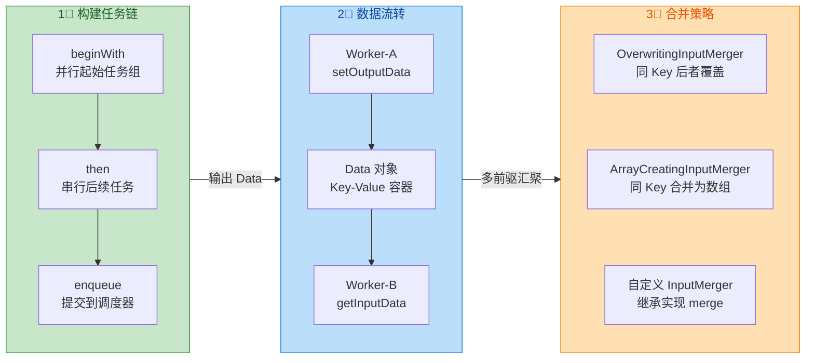
```mermaid
graph LR
    subgraph S1["1⃣ 构建任务链"]
        direction TB
        A["beginWith\n并行起始任务组"]
        B["then\n串行后续任务"]
        C["enqueue\n提交到调度器"]
        A --> B
        B --> C
    end

    subgraph S2["2⃣ 数据流转"]
        direction TB
        D["Worker-A\nsetOutputData"]
        E["Data 对象\nKey-Value 容器"]
        F["Worker-B\ngetInputData"]
        D --> E
        E --> F
    end

    subgraph S3["3⃣ 合并策略"]
        direction TB
        G["OverwritingInputMerger\n同 Key 后者覆盖"]
        H["ArrayCreatingInputMerger\n同 Key 合并为数组"]
        I["自定义 InputMerger\n继承实现 merge"]
        G ~~~ H
        H ~~~ I
    end

    S1 -->|"输出 Data"| S2 -->|"多前驱汇聚"| S3

    classDef greenStyle fill:#C8E6C9,stroke:#388E3C,color:#1B5E20
    classDef blueStyle fill:#BBDEFB,stroke:#1976D2,color:#0D47A1
    classDef orangeStyle fill:#FFE0B2,stroke:#F57C00,color:#E65100

    class S1 greenStyle
    class S2 blueStyle
    class S3 orangeStyle
```

### beginWith 链式调用

`beginWith()` 是构建任务链的 **入口方法**，由 `WorkManager` 实例直接调用，它的返回值不是 `Operation`（提交操作的句柄），而是一个 `WorkContinuation` 对象。`WorkContinuation` 是 WorkManager 对"一条尚未提交的任务链"的抽象表示——你可以把它理解为一条"草稿状态"的流水线，只有在最后调用 `.enqueue()` 时，整条链才会被真正持久化到内部数据库并开始调度。

`beginWith()` 接受两种参数形式：单个 `OneTimeWorkRequest`，或者一个 `List<OneTimeWorkRequest>`。当传入的是列表时，列表中的所有 Worker **并行执行**，它们共同构成链的第一层。只有当这一层的所有 Worker 全部成功完成（`Result.success()`）后，链才会推进到下一个 `then()` 节点。这种"并行起始"的设计在实际业务中极其常见——例如同时从三个不同的 API 拉取数据，全部完成后再统一合并写入本地数据库。

```kotlin
// 构建三个并行的起始任务
val fetchUserWork = OneTimeWorkRequestBuilder<FetchUserWorker>()  // 拉取用户数据
    .build()
val fetchOrderWork = OneTimeWorkRequestBuilder<FetchOrderWorker>() // 拉取订单数据
    .build()
val fetchConfigWork = OneTimeWorkRequestBuilder<FetchConfigWorker>() // 拉取配置数据
    .build()

// beginWith 接收列表 -> 三个任务并行执行，构成链的第一层
// 返回值是 WorkContinuation，此时任务尚未提交
val continuation: WorkContinuation = WorkManager.getInstance(context)
    .beginWith(listOf(fetchUserWork, fetchOrderWork, fetchConfigWork))
```

需要特别注意的是，`beginWith()` **只能接受 `OneTimeWorkRequest`**，不能传入 `PeriodicWorkRequest`。这是因为任务链的语义是"按顺序推进直到完成"，而周期性任务本身就没有"完成"的概念——它会无限循环。如果你尝试将 `PeriodicWorkRequest` 放入链中，编译期就会报错，因为 `beginWith()` 的方法签名明确要求 `OneTimeWorkRequest` 类型。

从内部实现来看，`beginWith()` 做了以下几件事：首先，将传入的 `OneTimeWorkRequest` 列表中每一个请求的 `WorkSpec`（任务的持久化描述对象，包含 Worker 类名、约束条件、输入 Data 等所有元数据）记录到 `WorkContinuation` 内部；其次，为这些 WorkSpec 之间标记"无依赖"关系，表示它们是同一层的并行节点；最后，返回一个 `WorkContinuationImpl` 实例。此时没有任何东西被写入 Room 数据库，也没有任何调度发生。

### then 后续任务

`then()` 方法是 `WorkContinuation` 上的链式调用，用于在已有的任务层之后 **追加新的任务层**。它同样返回一个新的 `WorkContinuation` 对象，因此可以不断地 `.then().then().then()` 串联下去，形成任意长度的串行链。和 `beginWith()` 一样，`then()` 也可以接受单个或列表形式的 `OneTimeWorkRequest`，列表中的任务在该层内并行执行。

链的执行语义是严格的 **层序推进（Level-Order Progression）**：只有当前层的 **所有** Worker 都返回 `Result.success()` 之后，下一层的 Worker 才会开始。如果当前层中任何一个 Worker 返回 `Result.failure()`，则从该节点开始，**后续所有层的任务都会被标记为 `FAILED`**，整条链终止。如果返回 `Result.retry()`，则该 Worker 会按照退避策略重试，后续层继续等待。

```kotlin
// 接上面的 continuation，追加两层后续任务

// 合并任务：在三个并行任务全部成功后执行
val mergeWork = OneTimeWorkRequestBuilder<MergeDataWorker>()
    .build()

// 上传任务：在合并完成后执行
val uploadWork = OneTimeWorkRequestBuilder<UploadWorker>()
    .build()

// 构建完整的三层任务链：
// 第一层(并行): FetchUser, FetchOrder, FetchConfig
// 第二层(串行): MergeData
// 第三层(串行): Upload
val finalContinuation = continuation
    .then(mergeWork)       // 第二层：合并数据，等待第一层三个任务全部 success
    .then(uploadWork)      // 第三层：上传结果，等待第二层 success

// 最终调用 enqueue() 才将整条链持久化并提交调度
finalContinuation.enqueue()
```

这里有一个关键的实现细节值得深入理解：每次调用 `then()` 时，WorkManager 内部会创建一个新的 `WorkContinuationImpl` 对象，该对象持有对前一个 `WorkContinuationImpl` 的引用（类似链表结构）。当最终调用 `enqueue()` 时，WorkManager 会从最末端的 `WorkContinuationImpl` 开始，**递归回溯到链头**，然后从头到尾依次将所有 `WorkSpec` 写入 Room 数据库，并为相邻层之间建立 **依赖关系（Dependency）**。在 Room 数据库中，这些依赖关系存储在一张名为 `dependency` 的表中，每条记录形如 `(work_spec_id, prerequisite_id)`，表示"该任务依赖前置任务完成后才能运行"。

当调度器（`Scheduler`）检查一个 WorkSpec 是否可以执行时，它会查询该 WorkSpec 的所有前置依赖是否都已处于 `SUCCEEDED` 状态。只有全部满足时，该 WorkSpec 才会被 enqueue 到 Executor 中实际运行。这就是链式推进的底层实现——**不是 Worker A 主动通知 Worker B 开始，而是调度器在 A 完成后扫描数据库发现 B 的前置条件已满足，从而调度 B 执行**。

还有一种高级用法值得提及：**多条链的合并（Combine）**。`WorkContinuation.combine()` 静态方法可以将多条独立的 `WorkContinuation` 合并为一条新的 `WorkContinuation`，合并后可以继续追加 `then()`。这在复杂的业务场景中非常有用——例如"链 A 处理图片，链 B 处理音频，两条链都完成后再执行打包上传"。

```kotlin
// 链 A：图片处理流水线
val chainA = WorkManager.getInstance(context)
    .beginWith(compressImageWork)   // 压缩图片
    .then(watermarkWork)            // 加水印

// 链 B：音频处理流水线
val chainB = WorkManager.getInstance(context)
    .beginWith(transcodeAudioWork)  // 转码音频
    .then(normalizeWork)            // 音量归一化

// 合并两条链，然后追加最终的打包上传任务
val combined = WorkContinuation
    .combine(listOf(chainA, chainB)) // 等待两条链都完成
    .then(packageAndUploadWork)      // 打包上传

// 提交整条合并链
combined.enqueue()
```

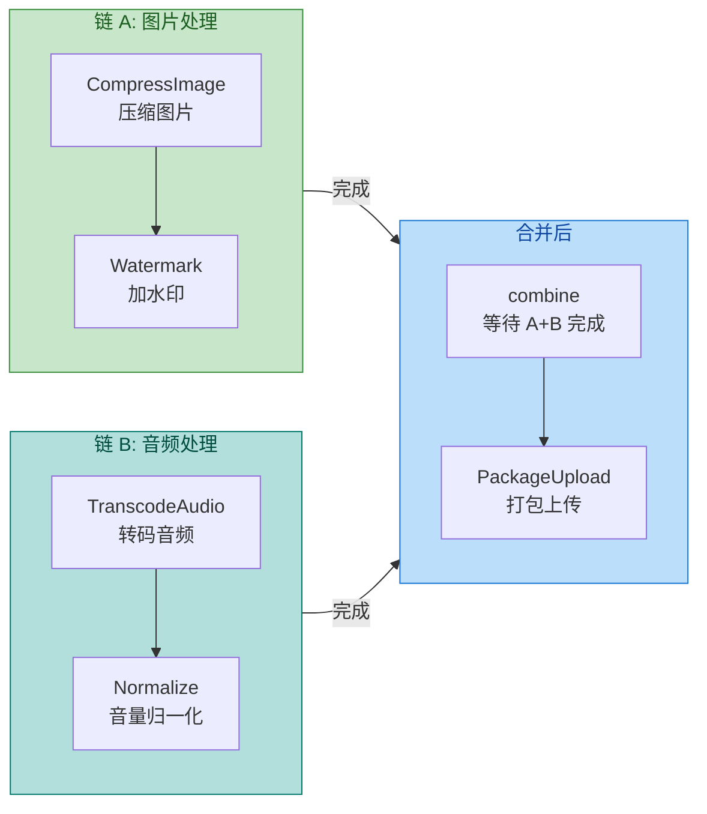
```mermaid
graph LR
    subgraph ChainA["链 A: 图片处理"]
        direction TB
        A1["CompressImage\n压缩图片"] --> A2["Watermark\n加水印"]
    end

    subgraph ChainB["链 B: 音频处理"]
        direction TB
        B1["TranscodeAudio\n转码音频"] --> B2["Normalize\n音量归一化"]
    end

    subgraph Merge["合并后"]
        direction TB
        M1["combine\n等待 A+B 完成"]
        M2["PackageUpload\n打包上传"]
        M1 --> M2
    end

    ChainA -->|"完成"| Merge
    ChainB -->|"完成"| Merge

    classDef greenStyle fill:#C8E6C9,stroke:#388E3C,color:#1B5E20
    classDef tealStyle fill:#B2DFDB,stroke:#00796B,color:#004D40
    classDef blueStyle fill:#BBDEFB,stroke:#1976D2,color:#0D47A1

    class ChainA greenStyle
    class ChainB tealStyle
    class Merge blueStyle
```

### Data 输入输出传递

任务链之所以强大，不仅在于顺序控制，更在于 **数据可以在节点之间流动**。WorkManager 使用 `Data` 类作为任务间传递信息的载体。`Data` 本质上是一个 **轻量级的、不可变的键值对容器（Key-Value Map）**，类似于 `Bundle`，但有严格的设计约束。

**Data 的设计约束**：`Data` 支持的值类型仅限于基本类型（`Boolean`、`Int`、`Long`、`Float`、`Double`、`String`）及其数组形式。它不支持 `Parcelable`、`Serializable` 或任何自定义对象。这是有意为之的设计——因为 `Data` 需要被序列化后存储到 Room 数据库中（持久化保证的核心要求），而复杂对象的序列化既有版本兼容性风险，又可能导致数据膨胀。WorkManager 甚至对单个 `Data` 对象的 **总大小设置了上限：最大 10 KB**。如果你的场景需要传递大量数据，正确的做法是传递一个文件路径或数据库主键，让下游 Worker 自行读取。

**输出数据：Worker 端的设置方式**。在 `doWork()` 方法中，Worker 通过 `Result.success(outputData)` 或 `Result.failure(outputData)` 将数据附着在执行结果上。对于 `CoroutineWorker`，方式完全一样。

```kotlin
class CompressImageWorker(
    context: Context,
    params: WorkerParameters
) : CoroutineWorker(context, params) {

    override suspend fun doWork(): Result {
        // 从 inputData 中读取上游传入的原始图片路径
        val originalPath = inputData.getString("KEY_IMAGE_PATH")
            ?: return Result.failure()  // 缺少必要参数，直接失败

        // 执行图片压缩逻辑（伪代码）
        val compressedPath = ImageCompressor.compress(originalPath)

        // 构建输出 Data，将压缩后的路径传递给下游任务
        val outputData = Data.Builder()
            .putString("KEY_COMPRESSED_PATH", compressedPath)  // 存入压缩后路径
            .putInt("KEY_COMPRESSED_SIZE", File(compressedPath).length().toInt()) // 存入文件大小
            .build()

        // 通过 Result.success() 携带 outputData 返回
        return Result.success(outputData)
    }
}
```

**输入数据：下游 Worker 的读取方式**。在任务链中，下游 Worker 通过 `inputData` 属性（继承自 `ListenableWorker`）直接获取上游传递过来的 `Data`。如果上游是单个 Worker，那么 `inputData` 就是该 Worker 的 `outputData`。如果上游是多个并行 Worker（例如 `beginWith(listOf(A, B, C))`），那么多个 `outputData` 会经过 **InputMerger** 合并成一个 `Data` 后，再作为下游的 `inputData`——这就是下一节要详细讨论的合并策略。

除了链内的数据传递，**链的第一个 Worker 的输入数据** 需要在构建 `WorkRequest` 时通过 `setInputData()` 显式指定：

```kotlin
// 构建初始输入数据
val inputData = Data.Builder()
    .putString("KEY_IMAGE_PATH", "/sdcard/DCIM/photo.jpg") // 原始图片路径
    .build()

// 将输入数据绑定到第一个 WorkRequest
val compressWork = OneTimeWorkRequestBuilder<CompressImageWorker>()
    .setInputData(inputData)  // 设置该 Worker 的 inputData
    .build()

// 构建链
WorkManager.getInstance(context)
    .beginWith(compressWork)       // 第一层：压缩
    .then(watermarkWork)           // 第二层：加水印，inputData = 压缩 Worker 的 outputData
    .then(uploadWork)              // 第三层：上传，inputData = 水印 Worker 的 outputData
    .enqueue()
```

数据流转的完整生命周期可以用如下模型描述：

```text
┌──────────────────────────────────────────────────────────────────────────┐
│                         Data 在任务链中的流转                             │
│                                                                          │
│  setInputData()      outputData         outputData         outputData    │
│       │                  │                   │                  │         │
│       ▼                  ▼                   ▼                  ▼         │
│  ┌─────────┐  Data  ┌─────────┐  Data  ┌─────────┐  Data  ┌─────────┐   │
│  │ Worker A │ ────▶  │ Worker B │ ────▶  │ Worker C │ ────▶  │ Worker D │  │
│  │ inputData│        │ inputData│        │ inputData│        │ inputData│  │
│  └─────────┘        └─────────┘        └─────────┘        └─────────┘   │
│       ▲                                                                  │
│       │                                                                  │
│  外部传入的                                                               │
│  初始 Data                                                               │
└──────────────────────────────────────────────────────────────────────────┘
```

关于 `Data` 的持久化机制，还有一个值得理解的细节：每个 Worker 的 `outputData` 在 `Result.success(data)` 被调用后，会立即序列化为字节数组并写入 Room 数据库中对应 `WorkSpec` 的 `output` 字段。因此即使进程被杀死，下次恢复时下游 Worker 依然可以从数据库中反序列化出正确的 `inputData`。这也是 WorkManager 要求 `Data` 仅支持基本类型且限制 10 KB 大小的根本原因——它要保证序列化/反序列化的安全性和效率。

### 合并策略

当任务链中某一层有 **多个并行 Worker** 同时输出数据，而下一层只有一个（或多个）Worker 需要接收这些数据时，就产生了一个关键问题：**多个 `outputData` 如何合并成一个 `inputData`？** 这就是 `InputMerger` 的职责所在。

WorkManager 内置了两种合并策略，同时支持自定义。合并器在 `WorkRequest` 构建时通过 `setInputMerger()` 设置，且 **只需要在下游 Worker 的 WorkRequest 上设置**（因为是下游在接收合并后的数据）。

#### OverwritingInputMerger（覆盖合并，默认策略）

`OverwritingInputMerger` 是 WorkManager 的 **默认合并策略**。它的行为非常简单粗暴：将所有上游 Worker 的 `outputData` 逐个合并到一个 Map 中，如果遇到 **相同的 Key**，后处理的 Worker 的值会 **覆盖** 先处理的 Worker 的值。

这里的"先后"是指 Worker 完成的时间顺序，而非声明顺序。由于并行 Worker 的完成顺序是不确定的（取决于线程调度），这意味着**当多个并行 Worker 输出了相同 Key 的数据时，最终保留哪个值是不确定的**。因此，`OverwritingInputMerger` 最适合的场景是：**每个并行 Worker 输出的 Key 互不重叠**。

```kotlin
// Worker A 输出: { "KEY_USER_NAME": "Alice" }
// Worker B 输出: { "KEY_ORDER_ID": "ORD-001" }
// Worker C 输出: { "KEY_CONFIG_VERSION": 3 }

// OverwritingInputMerger 的合并结果（Key 不重叠，无覆盖风险）:
// { "KEY_USER_NAME": "Alice", "KEY_ORDER_ID": "ORD-001", "KEY_CONFIG_VERSION": 3 }

// 如果 Worker A 也输出了 "KEY_ORDER_ID": "ORD-999"
// 那么最终 "KEY_ORDER_ID" 的值取决于 A 和 B 谁先完成——这是不确定的！

// 默认策略无需显式设置，但也可以显式声明
val mergeWork = OneTimeWorkRequestBuilder<MergeDataWorker>()
    .setInputMerger(OverwritingInputMerger::class)  // 显式设置覆盖合并策略
    .build()
```

从源码角度看，`OverwritingInputMerger.merge()` 的实现极其简洁：它遍历所有输入 `Data` 列表，依次调用 `Data.getKeyValueMap()`，然后将每个 Map 的内容 `putAll()` 到结果 Map 中。正因为使用的是 `putAll()`，所以同 Key 自然就被后者覆盖。

#### ArrayCreatingInputMerger（数组合并）

`ArrayCreatingInputMerger` 则采用了截然不同的策略：当遇到 **相同 Key** 时，它不会覆盖，而是将所有同 Key 的值 **合并为一个数组**。如果某个 Key 只出现过一次，它的值也会被包装成一个长度为 1 的数组。

```kotlin
// Worker A 输出: { "KEY_RESULT": "compressed_a.jpg" }
// Worker B 输出: { "KEY_RESULT": "compressed_b.jpg" }
// Worker C 输出: { "KEY_RESULT": "compressed_c.jpg" }

// ArrayCreatingInputMerger 的合并结果:
// { "KEY_RESULT": ["compressed_a.jpg", "compressed_b.jpg", "compressed_c.jpg"] }

// 下游 Worker 需要通过 getStringArray() 读取
// val results: Array<String>? = inputData.getStringArray("KEY_RESULT")

// 在下游 Worker 的 WorkRequest 上设置数组合并策略
val uploadWork = OneTimeWorkRequestBuilder<BatchUploadWorker>()
    .setInputMerger(ArrayCreatingInputMerger::class)  // 设置数组合并策略
    .build()
```

`ArrayCreatingInputMerger` 特别适合"扇入（Fan-In）"场景——多个并行 Worker 各自处理一部分数据，然后汇总给一个 Worker 统一处理。例如，并行压缩 N 张图片，每个 Worker 输出压缩后的路径，最终由上传 Worker 一次性批量上传所有路径。

需要注意的一个细节：如果上游 Worker A 输出的某个 Key 的值本身就是数组类型（例如 `putStringArray("KEY", arrayOf("x", "y"))`），而 Worker B 也输出了同名 Key 的数组值 `arrayOf("z")`，那么 `ArrayCreatingInputMerger` 会将两个数组 **展平合并（flatten）** 为 `["x", "y", "z"]`，而非嵌套为 `[["x", "y"], ["z"]]`。这个展平行为是需要特别注意的，否则下游按数组长度做索引时可能产生偏移。

#### 自定义 InputMerger

如果以上两种内置策略都无法满足业务需求，你可以继承 `InputMerger` 抽象类并重写 `merge()` 方法来实现自定义逻辑。`merge()` 接收一个 `List<Data>` 参数（即所有上游 Worker 的 outputData 列表），返回一个合并后的 `Data` 对象。

```kotlin
/**
 * 自定义合并策略：取所有上游 "KEY_SCORE" 值的最大值
 * 适用场景：多个评分 Worker 并行打分，取最高分传递给下游
 */
class MaxScoreInputMerger : InputMerger() {

    // merge 方法接收所有上游 Worker 的 outputData 列表
    override fun merge(inputs: MutableList<Data>): Data {
        // 从每个 Data 中提取 KEY_SCORE，过滤掉不存在该 Key 的情况
        var maxScore = Int.MIN_VALUE // 初始化为最小值
        for (data in inputs) {       // 遍历所有上游输出
            val score = data.getInt("KEY_SCORE", Int.MIN_VALUE) // 读取分数
            if (score > maxScore) {  // 比较并更新最大值
                maxScore = score
            }
        }
        // 构建合并后的 Data，只包含最高分
        return Data.Builder()
            .putInt("KEY_MAX_SCORE", maxScore) // 输出合并结果
            .build()
    }
}

// 使用自定义合并器
val finalWork = OneTimeWorkRequestBuilder<FinalWorker>()
    .setInputMerger(MaxScoreInputMerger::class) // 应用自定义合并策略
    .build()
```

下面这张时序图完整展示了一条带有并行层和合并策略的任务链，从提交到最终完成的全过程：

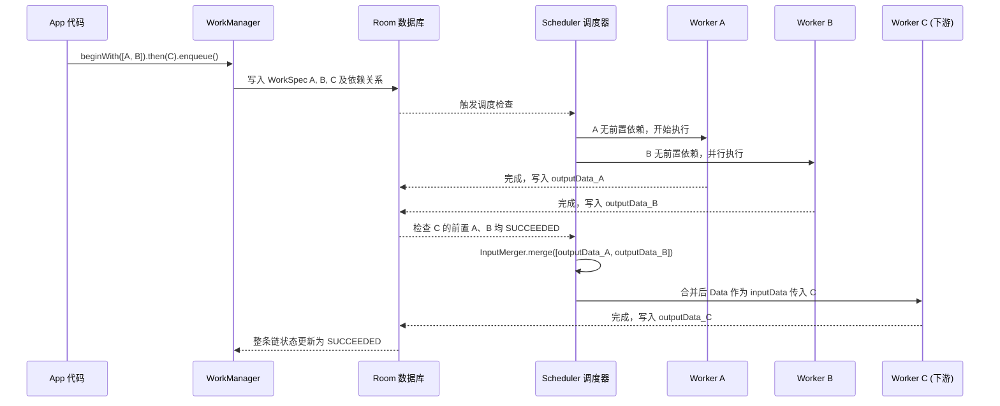
```mermaid
sequenceDiagram
    participant App as App 代码
    participant WM as WorkManager
    participant DB as Room 数据库
    participant Sched as Scheduler 调度器
    participant WA as Worker A
    participant WB as Worker B
    participant WC as Worker C (下游)

    App->>WM: beginWith([A, B]).then(C).enqueue()
    WM->>DB: 写入 WorkSpec A, B, C 及依赖关系
    DB-->>Sched: 触发调度检查
    Sched->>WA: A 无前置依赖，开始执行
    Sched->>WB: B 无前置依赖，并行执行
    WA-->>DB: 完成，写入 outputData_A
    WB-->>DB: 完成，写入 outputData_B
    DB-->>Sched: 检查 C 的前置 A、B 均 SUCCEEDED
    Sched->>Sched: InputMerger.merge([outputData_A, outputData_B])
    Sched->>WC: 合并后 Data 作为 inputData 传入 C
    WC-->>DB: 完成，写入 outputData_C
    DB-->>WM: 整条链状态更新为 SUCCEEDED
```

#### 合并策略对比与选择指南

| 维度 | OverwritingInputMerger | ArrayCreatingInputMerger | 自定义 InputMerger |
|------|----------------------|------------------------|--------------------|
| **同 Key 处理** | 后者覆盖前者 | 合并为数组（展平） | 完全自定义 |
| **默认行为** | ✅ 系统默认 | 需显式设置 | 需显式设置 |
| **适用场景** | 各 Worker 输出 Key 互不重叠 | 多 Worker 输出相同 Key、扇入汇总 | 特殊聚合逻辑（求最值、去重等） |
| **数据确定性** | Key 重叠时不确定 | 确定（数组包含所有值） | 取决于实现 |
| **下游读取方式** | `getString()` / `getInt()` 等标量方法 | `getStringArray()` 等数组方法 | 取决于实现 |

最后，有一个容易被忽略的实践建议：**为链中每个 Worker 的输出 Key 添加统一的命名前缀**，例如 `"compress_output_path"`、`"watermark_output_path"`。这样即使使用默认的 `OverwritingInputMerger`，也不会出现意外的 Key 冲突。而如果你确实需要多个 Worker 输出同名 Key 并保留所有值，请务必显式设置 `ArrayCreatingInputMerger`，并让下游用数组方式读取。

---

**📝 练习题**

在一条 WorkManager 任务链中，第一层有 Worker A 和 Worker B 并行执行，第二层有一个 Worker C 作为后续任务。Worker A 输出 `Data { "status": "ok_a" }`，Worker B 输出 `Data { "status": "ok_b" }`。Worker C 的 `WorkRequest` **未显式设置** `InputMerger`。以下关于 Worker C 收到的 `inputData` 描述正确的是：

A. `inputData.getString("status")` 一定返回 `"ok_a"`，因为 A 在链中声明顺序靠前


B. `inputData.getString("status")` 返回 `"ok_a"` 还是 `"ok_b"` 取决于 A 和 B 谁后完成，是不确定的


C. `inputData.getStringArray("status")` 返回 `["ok_a", "ok_b"]`，因为 WorkManager 默认使用 `ArrayCreatingInputMerger`


D. Worker C 会收到空的 `inputData`，因为两个 Key 冲突导致数据被丢弃


**【答案】** B

**【解析】** WorkManager 的默认合并策略是 `OverwritingInputMerger`，而非 `ArrayCreatingInputMerger`，因此选项 C 错误。`OverwritingInputMerger` 的行为是将所有上游 `outputData` 依次合并到同一个 Map 中，遇到相同 Key 时后处理的值覆盖先处理的值。由于 Worker A 和 Worker B 是并行执行的，它们的完成顺序取决于系统线程调度，是不确定的。如果 A 先完成、B 后完成，则 `"status"` 最终为 `"ok_b"`（B 覆盖 A）；反之则为 `"ok_a"`。因此结果是不确定的，选项 B 正确。选项 A 错误，声明顺序不影响覆盖结果；选项 D 错误，Key 冲突只会导致覆盖而不会丢弃。这道题的核心考点是：**在使用默认合并策略时，并行 Worker 输出相同 Key 会导致不确定性，应通过使用不同 Key 或切换为 `ArrayCreatingInputMerger` 来规避。**

---

**📝 练习题**

关于 WorkManager 任务链中 `Data` 对象的使用，以下哪项描述是 **错误** 的？

A. `Data` 支持存储 `String`、`Int`、`Boolean` 等基本类型及其数组形式


B. 单个 `Data` 对象的序列化大小上限为 10 KB，超出会抛出异常


C. `PeriodicWorkRequest` 可以作为 `then()` 的参数添加到任务链中


D. Worker 的 `outputData` 会被持久化到 Room 数据库，进程恢复后下游仍可读取


**【答案】** C

**【解析】** 任务链中只能使用 `OneTimeWorkRequest`，不能使用 `PeriodicWorkRequest`。这是因为任务链的语义建立在"任务完成后推进到下一层"的基础上，而 `PeriodicWorkRequest` 本身设计为无限循环执行、没有明确的"完成"状态，因此在逻辑上与链式推进不兼容。`beginWith()` 和 `then()` 的方法签名都只接受 `OneTimeWorkRequest` 类型，传入 `PeriodicWorkRequest` 会导致编译错误。选项 A 正确，`Data` 确实仅支持基本类型及其数组。选项 B 正确，超过 10 KB 限制会抛出 `IllegalStateException`。选项 D 正确，这正是 WorkManager 持久化保证的核心机制之一——所有中间数据都通过 Room 数据库持久化，确保进程恢复后链可以从断点继续。

---

## 唯一工作 UniqueWork

在实际的 Android 应用开发中，有一类需求极其常见却又容易被忽略——**如何防止同一项后台任务被重复调度**。例如，用户连续点击"同步"按钮五次，我们显然不希望创建五个并行的同步任务；又或者，一个定期上传日志的周期性工作，在 App 每次启动时都被重新注册，如果不加控制，系统中会累积大量重复的 `PeriodicWorkRequest`。WorkManager 通过 **UniqueWork（唯一工作）** 机制来解决这一问题。它允许开发者为一项工作指定一个 **全局唯一的名称（unique name）**，并通过 **ExistingWorkPolicy / ExistingPeriodicWorkPolicy** 来声明"当同名工作已存在时，应该怎么办"。这个机制的核心价值在于：**将任务的去重与冲突处理从业务层下沉到框架层**，让开发者用一行声明式的 API 就能精确控制任务的生命周期。

### 为什么需要 UniqueWork

要理解 UniqueWork 的设计动机，我们需要先看看不使用它时会出现什么问题。

当你调用 `WorkManager.enqueue(workRequest)` 时，WorkManager **每次都会在内部数据库中插入一条新的任务记录**。即使两个 `WorkRequest` 的 `Worker` 类完全相同、约束条件完全相同，WorkManager 也会将它们视为两个独立的任务分别执行。这是因为每个 `WorkRequest` 在创建时都会被分配一个唯一的 UUID，WorkManager 仅凭 UUID 来区分任务，而不会对 Worker 类名做任何去重。

这种"无条件入库"的设计在单次触发场景下没有问题，但在以下场景中会导致严重的资源浪费甚至业务错误：

**场景一：周期性工作重复注册。** 很多开发者习惯在 `Application.onCreate()` 或某个 Activity 的初始化流程中注册周期性同步任务。由于 `onCreate()` 在每次进程创建时都会执行，如果直接使用 `enqueue()`，每次冷启动都会多注册一个周期性任务。运行几天后，数据库中可能已经堆积了几十个相同的同步任务，导致服务器在短时间内收到大量重复请求。

**场景二：用户操作引发的重复触发。** 用户在弱网环境下反复点击"上传"按钮，如果每次点击都 enqueue 一个新的上传 Worker，则同一份文件可能被上传多次。即便你在 UI 层做了按钮禁用，也无法覆盖所有 edge case（例如 Activity 重建后按钮状态被重置）。

**场景三：任务链的可重入性。** 当一条复杂的任务链（如"压缩 → 加密 → 上传 → 清理"）正在执行时，用户又触发了一次相同的业务流程。此时你需要决定：是让新链排队等旧链完成？还是取消旧链启动新链？还是直接忽略新请求？

这三类问题的共同本质是 **任务的唯一性约束（uniqueness constraint）** 缺失。UniqueWork 正是 WorkManager 对此的系统级解答。

### UniqueWork 的核心 API

WorkManager 提供了两组 API 来入列唯一工作，分别对应一次性任务和周期性任务：

```kotlin
// ═══════════════════════════════════════════════════════════
// 一次性唯一工作（支持单任务和任务链）
// ═══════════════════════════════════════════════════════════

// 入列一个单独的一次性唯一工作
// uniqueWorkName: 全局唯一标识符，是去重的关键
// existingWorkPolicy: 冲突策略，决定同名任务已存在时的行为
// workRequest: 要执行的 OneTimeWorkRequest
fun enqueueUniqueWork(
    uniqueWorkName: String,                // 唯一名称
    existingWorkPolicy: ExistingWorkPolicy, // 冲突策略
    workRequest: OneTimeWorkRequest         // 一次性工作请求
): Operation

// 入列一个一次性唯一工作（支持传入多个 WorkRequest 组成并行起点）
fun enqueueUniqueWork(
    uniqueWorkName: String,
    existingWorkPolicy: ExistingWorkPolicy,
    workRequests: List<OneTimeWorkRequest>  // 多个并行起点
): Operation

// ═══════════════════════════════════════════════════════════
// 周期性唯一工作（只能是单任务，不支持链）
// ═══════════════════════════════════════════════════════════

// 入列一个周期性唯一工作
// existingPeriodicWorkPolicy: 周期性任务专用的冲突策略
fun enqueueUniquePeriodicWork(
    uniqueWorkName: String,                          // 唯一名称
    existingPeriodicWorkPolicy: ExistingPeriodicWorkPolicy, // 冲突策略
    periodicWorkRequest: PeriodicWorkRequest          // 周期性工作请求
): Operation
```

这里有一个重要的设计细节值得注意：**uniqueWorkName 是一个纯字符串，其作用域是整个应用进程（实际上是整个 WorkManager 数据库）**。这意味着即使你在不同的模块、不同的 Activity 中使用相同的 name 调用 `enqueueUniqueWork()`，WorkManager 也会将它们视为对同一项唯一工作的操作。因此，业界推荐使用常量或枚举来管理这些名称，避免因拼写错误导致去重失效：

```kotlin
// 用 object 单例集中管理唯一工作名称
// 避免在各处硬编码字符串导致拼写错误或重复定义
object UniqueWorkNames {
    const val SYNC_USER_DATA = "unique_sync_user_data"       // 用户数据同步
    const val UPLOAD_LOGS = "unique_upload_logs"             // 日志上传
    const val PERIODIC_CLEANUP = "unique_periodic_cleanup"   // 周期性缓存清理
    const val IMAGE_COMPRESS_CHAIN = "unique_img_compress"   // 图片压缩上传链
}
```

### ExistingWorkPolicy 四种策略详解

`ExistingWorkPolicy` 是一个枚举（enum），定义了当具有相同 uniqueWorkName 的工作**已经存在**于 WorkManager 数据库中时，新的入列请求应该如何处理。它有四个取值：`KEEP`、`REPLACE`、`APPEND`、`APPEND_OR_REPLACE`。理解这四种策略的行为差异，是正确使用 UniqueWork 的关键。

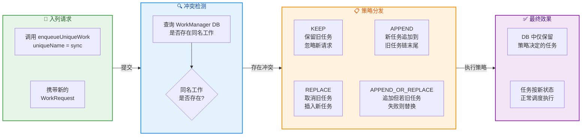
```mermaid
graph LR
    subgraph INPUT["🔄 入列请求"]
        direction TB
        A["调用 enqueueUniqueWork\nuniqueName = sync"]
        B["携带新的\nWorkRequest"]
        A ~~~ B
    end

    subgraph CHECK["🔍 冲突检测"]
        direction TB
        C["查询 WorkManager DB\n是否存在同名工作"]
        D{"同名工作\n是否存在?"}
        C --> D
    end

    subgraph POLICY["📋 策略分发"]
        direction TB
        E["KEEP\n保留旧任务\n忽略新请求"]
        F["REPLACE\n取消旧任务\n插入新任务"]
        G["APPEND\n新任务追加到\n旧任务链末尾"]
        H["APPEND_OR_REPLACE\n追加但若旧任务\n失败则替换"]
        E ~~~ F
        G ~~~ H
    end

    subgraph RESULT["✅ 最终效果"]
        direction TB
        I["DB 中仅保留\n策略决定的任务"]
        J["任务按新状态\n正常调度执行"]
        I ~~~ J
    end

    INPUT -->|"提交"| CHECK
    CHECK -->|"存在冲突"| POLICY
    POLICY -->|"执行策略"| RESULT

    classDef inputStyle fill:#E8F5E9,stroke:#43A047,stroke-width:2px,color:#1B5E20
    classDef checkStyle fill:#E3F2FD,stroke:#1E88E5,stroke-width:2px,color:#0D47A1
    classDef policyStyle fill:#FFF3E0,stroke:#FB8C00,stroke-width:2px,color:#E65100
    classDef resultStyle fill:#F3E5F5,stroke:#8E24AA,stroke-width:2px,color:#4A148C

    class INPUT inputStyle
    class CHECK checkStyle
    class POLICY policyStyle
    class RESULT resultStyle
```

#### KEEP — 保留已有工作，忽略新请求

`ExistingWorkPolicy.KEEP` 的语义是："如果同名工作已经存在（无论它处于 ENQUEUED、RUNNING 还是 BLOCKED 状态），则**什么都不做**，直接丢弃本次新的 WorkRequest。" 只有当同名工作完全不存在（从未入列过，或者已经进入 SUCCEEDED / FAILED / CANCELLED 终态并被清理）时，新的 WorkRequest 才会被真正入列。

**底层行为**：WorkManager 在执行 `enqueueUniqueWork()` 时，会先在 SQLite 数据库的 `WorkSpec` 表中按 `unique_work_name` 查询是否存在未完成（non-terminal state）的记录。如果查到了，就直接返回一个已完成的 `Operation`，新的 `WorkRequest` 不会被写入数据库。

**典型使用场景**：

- **周期性数据同步的初始化注册**：在 `Application.onCreate()` 中注册同步任务时使用 KEEP，确保无论进程重启多少次，数据库中始终只有一个同步任务实例。
- **幂等性操作**：当任务的多次执行与单次执行效果相同时（如全量同步），用 KEEP 避免不必要的重复执行。

```kotlin
// 场景：App 启动时注册一次性数据同步任务
// 使用 KEEP 策略确保不会重复创建
fun scheduleSyncOnAppStart(context: Context) {
    // 构建一次性同步请求，附带网络约束
    val syncRequest = OneTimeWorkRequestBuilder<SyncWorker>()
        .setConstraints(                           // 设置约束条件
            Constraints.Builder()
                .setRequiredNetworkType(NetworkType.CONNECTED) // 需要网络连接
                .build()
        )
        .build()                                   // 构建 WorkRequest 实例

    // 以 KEEP 策略入列唯一工作
    // 如果名为 "unique_sync_user_data" 的工作已存在且未完成，
    // 本次 syncRequest 会被直接忽略，不会插入数据库
    WorkManager.getInstance(context)
        .enqueueUniqueWork(                        // 调用唯一工作入列 API
            UniqueWorkNames.SYNC_USER_DATA,        // 唯一名称常量
            ExistingWorkPolicy.KEEP,               // 策略：保留已有，忽略新的
            syncRequest                            // 要入列的工作请求
        )
}
```

**注意事项**：KEEP 策略有一个容易踩的坑——**如果旧任务的约束条件永远无法满足（比如要求 WiFi 但设备只有蜂窝网络），那么这个旧任务会永远处于 ENQUEUED 状态，导致后续所有同名的新请求都被 KEEP 掉**。此时开发者可能误以为任务"丢了"，实际上是旧任务阻塞了新任务的入列。遇到这种情况时，可以考虑使用 REPLACE 策略，或者主动调用 `cancelUniqueWork()` 清理僵尸任务。

#### REPLACE — 取消已有工作，插入新请求

`ExistingWorkPolicy.REPLACE` 的语义是："无论同名工作当前处于什么状态，**先将其取消（cancel），然后插入新的 WorkRequest**。" 如果旧任务正在执行（RUNNING），它会收到一个取消信号（`isStopped` 变为 true），Worker 应当在 `doWork()` 中检测此信号并尽快退出。

**底层行为**：WorkManager 会将旧任务链中所有 WorkSpec 的状态标记为 CANCELLED，然后从数据库中删除它们（或标记为已终结），接着将新的 WorkRequest 作为全新的记录写入数据库。如果旧工作是一条链（通过 `beginUniqueWork().then().then().enqueue()` 创建），则 **整条链上的所有 Worker 都会被取消**，而不仅仅是当前正在执行的那个节点。

**典型使用场景**：

- **用户主动触发的刷新操作**：用户下拉刷新时，应该用最新的参数（如当前页码、最新 token）重新发起请求，旧的请求已经没有意义。
- **参数变更导致的任务更新**：当任务的输入 Data 发生变化（如上传的文件路径改了），旧任务应该被新任务替换。
- **紧急修复场景**：通过远程配置下发了新的任务参数，需要立即替换正在排队或执行的旧任务。

```kotlin
// 场景：用户点击"立即同步"按钮，用最新参数替换旧的同步任务
fun onUserClickSync(context: Context, userId: String) {
    // 构建输入数据，携带最新的用户 ID
    val inputData = workDataOf(                    // 使用 KTX 扩展构建 Data
        "KEY_USER_ID" to userId                    // 传入当前用户 ID
    )

    // 构建一次性同步请求
    val syncRequest = OneTimeWorkRequestBuilder<SyncWorker>()
        .setInputData(inputData)                   // 设置输入数据
        .addTag("manual_sync")                     // 添加标签便于观察
        .setBackoffCriteria(                       // 设置重试退避策略
            BackoffPolicy.EXPONENTIAL,             // 指数退避
            30, TimeUnit.SECONDS                   // 初始退避 30 秒
        )
        .build()

    // 以 REPLACE 策略入列
    // 如果旧的 "unique_sync_user_data" 正在执行，会先取消它
    // 然后将 syncRequest 作为全新任务入列
    WorkManager.getInstance(context)
        .enqueueUniqueWork(
            UniqueWorkNames.SYNC_USER_DATA,        // 同一个唯一名称
            ExistingWorkPolicy.REPLACE,            // 策略：替换旧任务
            syncRequest
        )
}
```

**注意事项**：REPLACE 是一个"破坏性"操作。如果旧任务已经完成了 80% 的工作（比如上传了一个大文件的 80%），REPLACE 会导致这些进度全部丢失，新任务从头开始。因此，**在使用 REPLACE 之前，必须确认"从头开始"是可接受的业务行为**。如果需要断点续传类的语义，应该在 Worker 内部实现进度保存与恢复逻辑，而不是依赖 UniqueWork 策略。

另一个需要注意的点是 **取消的时序问题**。当 WorkManager 对旧的 RUNNING 状态的 Worker 发出取消信号时，Worker 并不会立即停止——它只是被标记为 `isStopped = true`。如果 Worker 没有在 `doWork()` 中检查 `isStopped` 并提前返回，它可能会继续运行一段时间。WorkManager 会给 Worker 约 10 秒的时间来优雅停止，超时后会强制中断。这意味着在极短的时间窗口内，旧 Worker 和新 Worker 可能会同时存在。对于访问共享资源（如写同一个文件）的 Worker，需要在业务层做好并发控制。

#### APPEND — 将新工作追加为旧工作链的后续节点

`ExistingWorkPolicy.APPEND` 的语义是："将新的 WorkRequest **追加到同名工作链的末尾**，形成隐式的依赖关系——新任务会等待旧任务链中所有任务完成后才开始执行。" 如果旧工作链中的任何一个节点失败（FAILED）或被取消（CANCELLED），追加的新任务也会被标记为 CANCELLED，**不会被执行**。

**底层行为**：WorkManager 在数据库中找到同名唯一工作的最后一个（或多个叶子）节点，然后建立从这些叶子节点到新 WorkRequest 的 `Dependency` 记录。这与 `then()` 的内部实现完全一致——APPEND 本质上就是对已有唯一工作链做了一次动态的 `then()` 操作。新任务的状态会被设为 BLOCKED，直到其所有前置依赖都进入 SUCCEEDED 状态后，才会转为 ENQUEUED 并等待调度。

**典型使用场景**：

- **顺序日志上传**：多个模块各自生成日志文件并请求上传，但服务端要求按顺序接收。使用 APPEND 可以保证后一个上传任务在前一个完成后才开始。
- **事务性操作序列**：一组必须按顺序执行的操作（如"创建订单 → 支付 → 发送确认邮件"），后续步骤必须在前序步骤成功后才能进行。

```kotlin
// 场景：多次追加日志上传任务，保证顺序执行
fun appendLogUpload(context: Context, logFilePath: String) {
    // 构建携带日志文件路径的输入数据
    val inputData = workDataOf(
        "KEY_LOG_PATH" to logFilePath              // 本次要上传的日志文件路径
    )

    // 构建上传任务
    val uploadRequest = OneTimeWorkRequestBuilder<LogUploadWorker>()
        .setInputData(inputData)                   // 绑定输入数据
        .setConstraints(                           // 约束：需要网络
            Constraints.Builder()
                .setRequiredNetworkType(NetworkType.CONNECTED)
                .build()
        )
        .build()

    // 以 APPEND 策略入列
    // 第一次调用时：工作链不存在，uploadRequest 直接入列（等同于普通 enqueue）
    // 第二次调用时：新 uploadRequest 追加到第一次的后面，等第一个完成后执行
    // 第三次调用时：追加到第二次的后面...形成链式顺序执行
    WorkManager.getInstance(context)
        .enqueueUniqueWork(
            UniqueWorkNames.UPLOAD_LOGS,           // 唯一名称
            ExistingWorkPolicy.APPEND,             // 策略：追加到链尾
            uploadRequest
        )
}
```

下面用一个时序图来展示 APPEND 策略下三次调用的链式累积效果：

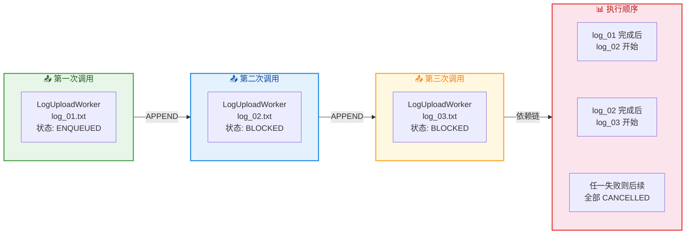
```mermaid
graph LR
    subgraph CALL1["📤 第一次调用"]
        direction TB
        A["LogUploadWorker\nlog_01.txt\n状态: ENQUEUED"]
    end

    subgraph CALL2["📤 第二次调用"]
        direction TB
        B["LogUploadWorker\nlog_02.txt\n状态: BLOCKED"]
    end

    subgraph CALL3["📤 第三次调用"]
        direction TB
        C["LogUploadWorker\nlog_03.txt\n状态: BLOCKED"]
    end

    subgraph STATE["📊 执行顺序"]
        direction TB
        D["log_01 完成后\nlog_02 开始"]
        E["log_02 完成后\nlog_03 开始"]
        F["任一失败则后续\n全部 CANCELLED"]
        D ~~~ E
        E ~~~ F
    end

    CALL1 -->|"APPEND"| CALL2
    CALL2 -->|"APPEND"| CALL3
    CALL3 -->|"依赖链"| STATE

    classDef call1Style fill:#E8F5E9,stroke:#43A047,stroke-width:2px,color:#1B5E20
    classDef call2Style fill:#E3F2FD,stroke:#1E88E5,stroke-width:2px,color:#0D47A1
    classDef call3Style fill:#FFF8E1,stroke:#F9A825,stroke-width:2px,color:#F57F17
    classDef stateStyle fill:#FCE4EC,stroke:#E53935,stroke-width:2px,color:#B71C1C

    class CALL1 call1Style
    class CALL2 call2Style
    class CALL3 call3Style
    class STATE stateStyle
```

**APPEND 的致命弱点——失败传播（failure propagation）**：这是使用 APPEND 时最需要警惕的问题。假设你已经追加了 10 个上传任务形成一条链，如果第 3 个任务失败了，那么第 4 到第 10 个任务 **全部会被标记为 CANCELLED**，即使它们彼此之间在业务上毫无关联。这是因为 WorkManager 的依赖模型规定：**前置节点失败或取消时，所有后续依赖节点都会被级联取消**。这种行为在严格的事务链中是合理的（前一步失败，后续步骤自然不应执行），但在"独立任务碰巧需要排队"的场景中就显得过于激进了。正是为了解决这个问题，Google 在 WorkManager 2.4 中引入了第四种策略：`APPEND_OR_REPLACE`。

#### APPEND_OR_REPLACE — 智能追加，遇到失败则替换

`ExistingWorkPolicy.APPEND_OR_REPLACE` 是 APPEND 的增强版本，其语义可以概括为：

- **当旧工作链正常（所有节点为 SUCCEEDED、ENQUEUED、RUNNING 或 BLOCKED）时**：行为与 APPEND 完全一致，新任务追加到链尾。
- **当旧工作链中存在 FAILED 或 CANCELLED 状态的节点时**：行为切换为类似 REPLACE——将旧链中的失败/取消节点**清除**，然后将新的 WorkRequest 作为新的起点入列。

这种"条件性降级"的设计解决了 APPEND 的失败传播问题：即使前面的任务失败了，后续追加的新任务依然有机会被执行，而不是被连坐取消。

**底层行为**：WorkManager 在查找同名唯一工作时，会检查链中所有叶子节点的状态。如果叶子节点全部处于非终态（ENQUEUED / RUNNING / BLOCKED），就按 APPEND 逻辑追加。如果任何叶子节点处于终态且为 FAILED 或 CANCELLED，则将这些节点及其未完成的后续节点从链中移除，新 WorkRequest 重新成为链的活跃端点。

```kotlin
// 场景：消息发送队列，即使某条消息发送失败，后续消息也应正常发送
fun enqueueMessageSend(context: Context, messageId: String, content: String) {
    // 构建携带消息内容的输入数据
    val inputData = workDataOf(
        "KEY_MSG_ID" to messageId,                 // 消息唯一 ID
        "KEY_CONTENT" to content                   // 消息正文内容
    )

    // 构建发送任务
    val sendRequest = OneTimeWorkRequestBuilder<MessageSendWorker>()
        .setInputData(inputData)                   // 绑定消息数据
        .setConstraints(                           // 约束：需要网络
            Constraints.Builder()
                .setRequiredNetworkType(NetworkType.CONNECTED)
                .build()
        )
        .setBackoffCriteria(                       // 失败重试策略
            BackoffPolicy.LINEAR,                  // 线性退避
            15, TimeUnit.SECONDS                   // 初始 15 秒
        )
        .build()

    // 使用 APPEND_OR_REPLACE 策略
    // 正常情况：新消息排在前一条之后顺序发送
    // 异常情况：如果前一条消息发送失败（Result.failure），
    //          新消息不会被级联取消，而是作为新的起点继续入列
    WorkManager.getInstance(context)
        .enqueueUniqueWork(
            "unique_message_queue",                // 消息队列唯一名称
            ExistingWorkPolicy.APPEND_OR_REPLACE,  // 智能追加策略
            sendRequest
        )
}
```

**APPEND 与 APPEND_OR_REPLACE 的对比**，是面试和实际开发中最常被追问的知识点。我们用一张表格来清晰地对比：

| 维度 | APPEND | APPEND_OR_REPLACE |
|------|--------|-------------------|
| 前置任务成功时 | 新任务追加到链尾，等待前置完成后执行 | 行为完全相同 |
| 前置任务失败时 | 新任务被级联取消（CANCELLED），**不会执行** | 清除失败节点，新任务作为新起点入列，**正常执行** |
| 前置任务被取消时 | 新任务被级联取消 | 清除取消节点，新任务正常入列 |
| 适用场景 | 严格事务链，前置失败则后续必须放弃 | 独立任务排队执行，单个失败不应影响后续 |
| 引入版本 | WorkManager 1.0 | WorkManager 2.4+ |

### ExistingPeriodicWorkPolicy — 周期性任务的策略

对于周期性任务（`PeriodicWorkRequest`），WorkManager 提供了一个独立的枚举 `ExistingPeriodicWorkPolicy`，它只有两个取值：**KEEP** 和 **REPLACE**（在 WorkManager 2.8 之后新增了 **UPDATE**）。没有 APPEND 和 APPEND_OR_REPLACE，这是因为周期性任务在概念上不支持"链式追加"——一个周期性任务本身就会无限重复执行，将另一个任务"追加"到一个永不结束的工作后面没有意义。

```kotlin
// 场景：注册周期性日志清理任务
// 使用 KEEP 确保不会重复注册
fun schedulePeriodicCleanup(context: Context) {
    // 构建周期性工作请求
    // 最小周期为 15 分钟（WorkManager 限制）
    val cleanupRequest = PeriodicWorkRequestBuilder<CacheCleanupWorker>(
        1, TimeUnit.HOURS                          // 每 1 小时执行一次
    )
        .setInitialDelay(10, TimeUnit.MINUTES)     // 首次延迟 10 分钟后执行
        .build()

    // 入列唯一周期性工作
    WorkManager.getInstance(context)
        .enqueueUniquePeriodicWork(
            UniqueWorkNames.PERIODIC_CLEANUP,      // 唯一名称
            ExistingPeriodicWorkPolicy.KEEP,       // KEEP: 已存在就不再注册
            cleanupRequest
        )
}
```

值得一提的是，从 WorkManager 2.8 开始引入的 **`UPDATE`** 策略提供了一种介于 KEEP 和 REPLACE 之间的行为：它会 **原地更新（in-place update）** 已有周期性任务的配置（如约束条件、退避策略等），但 **保留已有任务的执行周期进度**。这意味着如果一个周期性任务距离下次执行还有 5 分钟，用 UPDATE 修改了它的约束条件后，它仍然会在 5 分钟后触发，而不是重新开始一个完整的周期。相比之下，REPLACE 会取消旧任务并重新开始计时。

```kotlin
// 使用 UPDATE 策略更新周期性任务的约束条件
// 但保留已有的周期执行计时
fun updateCleanupConstraints(context: Context) {
    val updatedRequest = PeriodicWorkRequestBuilder<CacheCleanupWorker>(
        1, TimeUnit.HOURS
    )
        .setConstraints(                           // 新增：要求设备空闲时执行
            Constraints.Builder()
                .setRequiresDeviceIdle(true)        // 要求设备空闲（Doze 白名单外）
                .build()
        )
        .build()

    WorkManager.getInstance(context)
        .enqueueUniquePeriodicWork(
            UniqueWorkNames.PERIODIC_CLEANUP,
            ExistingPeriodicWorkPolicy.UPDATE,     // UPDATE: 原地更新，保留计时进度
            updatedRequest
        )
}
```

### beginUniqueWork — 唯一工作链的起点

除了 `enqueueUniqueWork()` 直接入列单个任务外，WorkManager 还提供了 `beginUniqueWork()` 方法，用于创建一条以唯一名称标识的 **任务链（work chain）**。它返回一个 `WorkContinuation` 对象，可以接着调用 `.then()` 追加后续节点，最后通过 `.enqueue()` 提交整条链：

```kotlin
// 场景：构建"压缩 → 加密 → 上传"唯一任务链
fun startUniqueUploadChain(context: Context, filePath: String) {
    // 构建输入数据
    val inputData = workDataOf("KEY_FILE_PATH" to filePath)

    // 第一步：压缩任务
    val compressWork = OneTimeWorkRequestBuilder<CompressWorker>()
        .setInputData(inputData)                   // 传入原始文件路径
        .build()

    // 第二步：加密任务（输入来自压缩任务的输出）
    val encryptWork = OneTimeWorkRequestBuilder<EncryptWorker>()
        .build()                                   // 输入由 WorkManager 自动从前置输出传递

    // 第三步：上传任务
    val uploadWork = OneTimeWorkRequestBuilder<UploadWorker>()
        .setConstraints(                           // 上传需要网络
            Constraints.Builder()
                .setRequiredNetworkType(NetworkType.UNMETERED) // 仅在非计量网络（WiFi）下上传
                .build()
        )
        .build()

    // 使用 beginUniqueWork 创建唯一工作链
    // REPLACE 策略：如果同名链已存在（比如用户重新选了一个文件），取消旧链，启动新链
    WorkManager.getInstance(context)
        .beginUniqueWork(                          // 创建唯一工作链起点
            UniqueWorkNames.IMAGE_COMPRESS_CHAIN,  // 唯一名称
            ExistingWorkPolicy.REPLACE,            // 策略：替换
            compressWork                           // 链的起始节点
        )
        .then(encryptWork)                         // 链的第二步
        .then(uploadWork)                          // 链的第三步
        .enqueue()                                 // 提交整条链到 WorkManager
}
```

`beginUniqueWork()` 与 `enqueueUniqueWork()` 的区别在于：前者返回 `WorkContinuation` 允许后续的 `.then()` 链式调用；后者直接入列并返回 `Operation`。在策略行为上，它们对 KEEP / REPLACE / APPEND / APPEND_OR_REPLACE 的处理逻辑完全一致。

### 策略选择决策指南

面对实际业务场景时，选择哪种策略往往需要综合考虑多个因素。以下决策流程图可以帮助你快速做出判断：

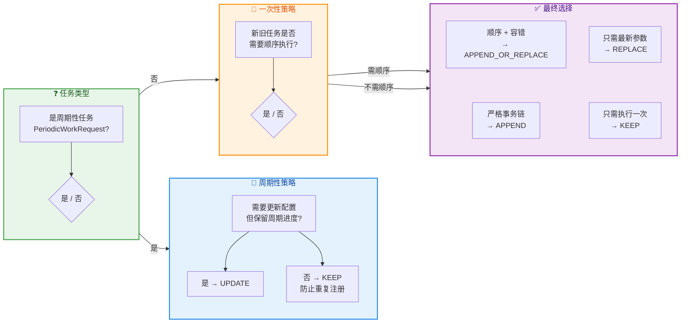
```mermaid
graph LR
    subgraph Q1["❓ 任务类型"]
        direction TB
        A["是周期性任务\nPeriodicWorkRequest?"]
        B{"是 / 否"}
        A --> B
    end

    subgraph Q2["🔄 周期性策略"]
        direction TB
        C["需要更新配置\n但保留周期进度?"]
        D["是 → UPDATE"]
        E["否 → KEEP\n防止重复注册"]
        C --> D
        C --> E
    end

    subgraph Q3["🔀 一次性策略"]
        direction TB
        F["新旧任务是否\n需要顺序执行?"]
        G{"是 / 否"}
        F --> G
    end

    subgraph Q4["✅ 最终选择"]
        direction TB
        H["顺序 + 容错\n→ APPEND_OR_REPLACE"]
        I["严格事务链\n→ APPEND"]
        J["只需最新参数\n→ REPLACE"]
        K["只需执行一次\n→ KEEP"]
        H ~~~ I
        J ~~~ K
    end

    Q1 -->|"是"| Q2
    Q1 -->|"否"| Q3
    Q3 -->|"需顺序"| Q4
    Q3 -->|"不需顺序"| Q4

    classDef q1Style fill:#E8F5E9,stroke:#43A047,stroke-width:2px,color:#1B5E20
    classDef q2Style fill:#E3F2FD,stroke:#1E88E5,stroke-width:2px,color:#0D47A1
    classDef q3Style fill:#FFF3E0,stroke:#FB8C00,stroke-width:2px,color:#E65100
    classDef q4Style fill:#F3E5F5,stroke:#8E24AA,stroke-width:2px,color:#4A148C

    class Q1 q1Style
    class Q2 q2Style
    class Q3 q3Style
    class Q4 q4Style
```

简单总结策略选择的经验法则：

- **"只要有人在做就行"** → `KEEP`（典型：初始化注册、幂等同步）
- **"用最新的替掉旧的"** → `REPLACE`（典型：用户触发刷新、参数变更）
- **"排队依次执行，前面挂了后面也别做"** → `APPEND`（典型：严格事务链）
- **"排队依次执行，前面挂了后面照做"** → `APPEND_OR_REPLACE`（典型：消息队列、日志上传队列）

### 常见陷阱与最佳实践

**陷阱一：uniqueWorkName 冲突。** 不同业务模块不小心使用了相同的唯一名称，导致本应独立的任务互相干扰。例如模块 A 的"sync"和模块 B 的"sync"如果用了同一个字符串 `"sync"`，它们就会被 WorkManager 视为同一项唯一工作。**解决方案**：在名称中加入模块前缀（如 `"moduleA_sync"`, `"moduleB_sync"`），或使用前文推荐的常量集中管理。

**陷阱二：REPLACE 导致正在执行的任务被意外取消。** 如果一个任务正在执行复杂的数据库迁移操作，此时另一处代码以 REPLACE 策略入列了同名任务，正在运行的迁移会被中断，可能导致数据损坏。**解决方案**：对于不可中断的关键任务，优先使用 KEEP 或在 Worker 中设置 `setForegroundAsync()` 提升任务优先级。

**陷阱三：APPEND 链无限增长。** 如果高频地 APPEND 任务到同一个唯一名称下（如每秒一次），WorkManager 数据库中的依赖链会越来越长，导致查询性能下降。**解决方案**：控制 APPEND 频率，或定期用 REPLACE 重置链条。

**陷阱四：混淆 ExistingWorkPolicy 和 ExistingPeriodicWorkPolicy。** 这两个枚举是不同的类型，不能混用。一次性工作使用 `ExistingWorkPolicy`（四种策略），周期性工作使用 `ExistingPeriodicWorkPolicy`（KEEP / REPLACE / UPDATE）。编译器会帮你检查类型，但在代码审查时仍需注意语义是否正确。

**最佳实践：结合 Tags 与 UniqueWork。** UniqueWork 的名称用于去重和策略控制，而 Tags 用于批量查询和观察。两者配合使用效果最佳：

```kotlin
// 为唯一工作同时添加 Tag，方便后续按标签查询
val syncRequest = OneTimeWorkRequestBuilder<SyncWorker>()
    .addTag("network_task")                        // 标签：网络任务类别
    .addTag("sync")                                // 标签：同步类别
    .build()

// 用唯一名称入列
WorkManager.getInstance(context)
    .enqueueUniqueWork(
        UniqueWorkNames.SYNC_USER_DATA,            // 唯一名称控制去重
        ExistingWorkPolicy.KEEP,
        syncRequest
    )

// 之后可以通过标签批量查询所有网络任务的状态
// 唯一名称和标签各司其职，互不冲突
val networkTasks: LiveData<List<WorkInfo>> =
    WorkManager.getInstance(context)
        .getWorkInfosByTagLiveData("network_task") // 按标签查询
```

---

**📝 练习题**

某电商 App 在用户点击"提交订单"时创建一个名为 `"submit_order"` 的唯一工作。业务要求：如果用户在弱网下连续点击了三次提交按钮，系统应该 **只执行最后一次提交**（使用最新的订单参数），之前排队或正在执行的提交任务都应被取消。请问应该使用哪种 `ExistingWorkPolicy`？


A. KEEP — 保留第一次提交，忽略后续两次


B. REPLACE — 取消前面的任务，用最新参数创建新任务


C. APPEND — 三次提交依次排队执行


D. APPEND_OR_REPLACE — 追加到前一个任务之后，如果前一个失败则替换


**【答案】** B

**【解析】** 题目的关键需求是"只执行最后一次提交，之前的都应被取消"。这正是 `REPLACE` 策略的核心语义：无论同名工作当前处于什么状态（ENQUEUED、RUNNING 或 BLOCKED），都会先取消旧的，然后入列新的 WorkRequest。选项 A（KEEP）会保留第一次提交并忽略后续请求，导致使用的是旧参数。选项 C（APPEND）会让三次提交排成一条链，依次执行三次，与"只执行最后一次"的需求矛盾。选项 D（APPEND_OR_REPLACE）同样会在正常情况下排队执行三次，只有在前置任务失败时才会替换，不符合"只用最新参数"的要求。因此正确答案是 B。

---

**📝 练习题**

一个新闻 App 在 `Application.onCreate()` 中注册了一个每 2 小时同步一次新闻列表的周期性任务。开发者在后续版本中需要将同步间隔从 2 小时改为 1 小时，同时希望 **不重置已有任务的执行周期计时器**（即如果距下次执行还有 30 分钟，修改后仍在 30 分钟后触发，而不是重新等 1 小时）。应该使用哪种 `ExistingPeriodicWorkPolicy`？


A. KEEP — 保留旧的 2 小时周期任务不变


B. REPLACE — 取消旧任务，用 1 小时周期重新注册（计时器重置）


C. UPDATE — 原地更新周期配置，保留当前周期计时进度


D. APPEND — 将新周期任务追加到旧任务之后


**【答案】** C

**【解析】** 题目明确要求"不重置执行周期计时器"，这是 `UPDATE` 策略（WorkManager 2.8+ 引入）的独有能力。UPDATE 会原地修改已有周期性任务的配置（如间隔时长、约束条件等），但保留当前的周期执行进度。选项 A（KEEP）会忽略更新请求，旧的 2 小时间隔不会改变。选项 B（REPLACE）虽然能更新间隔，但会取消旧任务并完全重新注册，导致计时器从零开始。选项 D（APPEND）在 `ExistingPeriodicWorkPolicy` 中根本不存在，周期性任务不支持追加语义。因此 C 是唯一满足需求的选项。

---

## 观察任务状态

WorkManager 之所以能成为 Android 后台任务调度的统一方案，不仅在于它能够可靠地执行和持久化任务，更在于它提供了一套 **完善的任务状态观察机制**。在实际业务中，我们经常需要知道一个后台任务"进行到哪一步了"——是还在排队等待约束条件满足？是正在执行中？还是已经成功完成或者失败了？WorkManager 通过 `WorkInfo` 对象将任务的完整生命周期状态暴露给应用层，并支持通过 `LiveData` 和 `Flow` 两种响应式方式进行实时观察。再配合 **Tags 标签** 机制，开发者可以对任务进行灵活的分组管理与批量查询。这三者协同工作，构成了 WorkManager 可观察性（Observability）的核心骨架。

理解这套观察机制不仅对日常开发至关重要——比如在 UI 上展示下载进度、在任务失败时触发重试逻辑——更是面试中高频考点。本节将从 WorkInfo 的状态枚举及其流转规则讲起，逐步深入到 LiveData/Flow 两种观察模式的实战用法，最后详解 Tags 标签管理的设计哲学与最佳实践。

---

### WorkInfo 状态枚举

#### 什么是 WorkInfo

`WorkInfo` 是 WorkManager 暴露给应用层的 **任务状态快照对象**。每一个被 enqueue 的 `WorkRequest` 在 WorkManager 内部数据库中都有一条对应记录，而 `WorkInfo` 就是这条记录在某一时刻的只读投影。它携带了开发者最关心的几个核心信息：任务的唯一 ID（`UUID`）、当前所处的状态（`State`）、输出数据（`Data`）、已附加的标签集合（`Set<String>`）、以及任务的进度信息（`Data` 类型的 progress）。可以说，`WorkInfo` 就是你与 WorkManager 内部引擎之间的 **信息桥梁**——你不需要直接操作数据库，也不需要了解底层调度细节，只要观察 `WorkInfo` 的变化就能掌握任务的一切动态。

从设计思想上看，`WorkInfo` 采用了 **不可变快照（Immutable Snapshot）** 模式。每次状态发生变化时，WorkManager 并不会修改你手中已有的 `WorkInfo` 实例，而是产生一个全新的对象通过 LiveData 或 Flow 推送给你。这种设计天然线程安全，也与 Jetpack 的响应式编程范式完美契合。

#### State 枚举详解

`WorkInfo.State` 是一个枚举类，定义了任务在其整个生命周期中可能处于的 **六种状态**。理解这六种状态及其流转规则，是正确使用 WorkManager 观察机制的前提：

| 状态 | 含义 | 是否终态 |
|------|------|----------|
| **ENQUEUED** | 任务已入队，等待约束条件满足后执行 | 否 |
| **RUNNING** | 任务正在执行中（`doWork()` 正在运行） | 否 |
| **SUCCEEDED** | 任务执行成功（`doWork()` 返回 `Result.success()`） | ✅ 是 |
| **FAILED** | 任务执行失败（`doWork()` 返回 `Result.failure()`） | ✅ 是 |
| **BLOCKED** | 任务被阻塞，因为其前置任务（链中的上游）尚未完成 | 否 |
| **CANCELLED** | 任务被取消（调用 `cancelWorkById()` 等方法） | ✅ 是 |

这里最关键的区分是 **终态（Terminal State）** 与 **非终态（Non-terminal State）** 的概念。一旦任务进入 `SUCCEEDED`、`FAILED` 或 `CANCELLED` 三种终态中的任何一种，它的生命周期就宣告结束，不会再发生任何状态变更。WorkManager 底层数据库中该任务的记录会被标记为已完成，并在一段时间后被清理。而处于非终态（`ENQUEUED`、`RUNNING`、`BLOCKED`）的任务则仍然"活着"，随时可能流转到下一个状态。

`State` 枚举还提供了一个非常实用的方法 `isFinished()`，它在内部判断当前状态是否为上述三种终态之一，返回一个布尔值。这在代码中判断"任务是否还在进行中"时极为方便，避免了冗长的多条件判断。

#### 状态流转规则

不同类型的 `WorkRequest` 有着不同的状态流转路径，这是开发者容易混淆的地方。我们分两种情况来看：

**一次性任务 OneTimeWorkRequest 的状态流转**：一次性任务是最常见的场景。当你调用 `enqueue()` 后，任务首先进入 `ENQUEUED` 状态。如果该任务处于一条任务链中且有未完成的前置任务，则会先进入 `BLOCKED` 状态，等前置任务 `SUCCEEDED` 后才转为 `ENQUEUED`。当约束条件满足、系统调度执行时，任务进入 `RUNNING` 状态。在 `RUNNING` 状态下，`doWork()` 的返回值决定了最终走向：返回 `Result.success()` 则进入 `SUCCEEDED`；返回 `Result.failure()` 则进入 `FAILED`；返回 `Result.retry()` 则回到 `ENQUEUED`，等待退避策略（Backoff Policy）计时结束后重新调度。在任何非终态时刻，任务都可以被外部取消从而进入 `CANCELLED`。

**周期性任务 PeriodicWorkRequest 的状态流转**：周期性任务的特殊之处在于——**它没有 `SUCCEEDED` 终态**。这是一个非常重要的设计差异。周期性任务的生命周期是"无限循环"的：`ENQUEUED → RUNNING → ENQUEUED → RUNNING → ...`。当 `doWork()` 返回 `Result.success()` 或 `Result.failure()` 时，任务并不会进入终态，而是重新回到 `ENQUEUED`，等待下一个周期到来。唯一能让周期性任务真正结束的方式就是 **显式取消**，使其进入 `CANCELLED` 终态。这意味着你在观察周期性任务时，不能依赖 `SUCCEEDED` 状态来判断"任务完成"，而应该从每次推送的 `WorkInfo` 中读取输出数据或进度信息来了解最近一次执行的结果。

下面用 Mermaid 图清晰展示这两种流转路径：

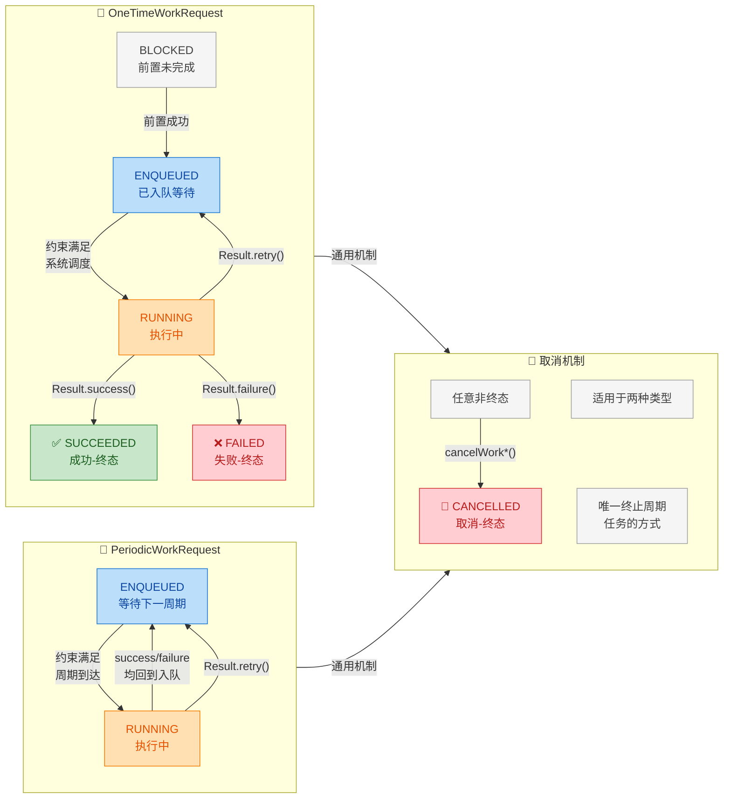
```mermaid
graph LR
    subgraph OneTime["🔹 OneTimeWorkRequest"]
        direction TB
        E1["ENQUEUED\n已入队等待"] -->|"约束满足\n系统调度"| R1["RUNNING\n执行中"]
        R1 -->|"Result.success()"| S1["✅ SUCCEEDED\n成功-终态"]
        R1 -->|"Result.failure()"| F1["❌ FAILED\n失败-终态"]
        R1 -->|"Result.retry()"| E1
        B1["BLOCKED\n前置未完成"] -->|"前置成功"| E1
    end

    subgraph Periodic["🔄 PeriodicWorkRequest"]
        direction TB
        E2["ENQUEUED\n等待下一周期"] -->|"约束满足\n周期到达"| R2["RUNNING\n执行中"]
        R2 -->|"success/failure\n均回到入队"| E2
        R2 -->|"Result.retry()"| E2
    end

    subgraph Cancel["🚫 取消机制"]
        direction TB
        ANY["任意非终态"] -->|"cancelWork*()"| C1["🚫 CANCELLED\n取消-终态"]
        NOTE1["适用于两种类型"] ~~~ NOTE2["唯一终止周期\n任务的方式"]
    end

    OneTime -->|"通用机制"| Cancel
    Periodic -->|"通用机制"| Cancel

    classDef greenNode fill:#C8E6C9,stroke:#388E3C,color:#1B5E20
    classDef blueNode fill:#BBDEFB,stroke:#1976D2,color:#0D47A1
    classDef redNode fill:#FFCDD2,stroke:#D32F2F,color:#B71C1C
    classDef orangeNode fill:#FFE0B2,stroke:#F57C00,color:#E65100
    classDef grayNode fill:#F5F5F5,stroke:#9E9E9E,color:#424242

    class E1,E2 blueNode
    class R1,R2 orangeNode
    class S1 greenNode
    class F1,C1 redNode
    class B1,ANY,NOTE1,NOTE2 grayNode
```

#### 在代码中读取 WorkInfo

获取 `WorkInfo` 最直接的方式是通过 `WorkManager` 实例上的查询方法。WorkManager 提供了 **同步查询** 和 **异步观察** 两大类 API。同步查询适用于"此刻查一下状态"的场景，而异步观察则适用于"持续监听状态变化"的场景（下一小节详述）。同步查询的核心 API 如下：

```kotlin
// 获取 WorkManager 单例（应用层入口）
val workManager = WorkManager.getInstance(context)

// ========== 同步查询（返回 ListenableFuture）==========

// 方式一：通过任务的唯一 ID 查询单个任务的 WorkInfo
// 返回 ListenableFuture<WorkInfo>，调用 .get() 可阻塞获取结果
val futureById = workManager.getWorkInfoById(workRequestId) // workRequestId 是 UUID 类型

// 方式二：通过 Tag 查询所有匹配的任务（返回列表）
// 一个 Tag 可能对应多个 WorkRequest，因此返回 List
val futureByTag = workManager.getWorkInfosByTag("upload") // 返回 ListenableFuture<List<WorkInfo>>

// 方式三：通过唯一工作名称查询（配合 enqueueUniqueWork 使用）
val futureByName = workManager.getWorkInfosForUniqueWork("sync_data") // 返回 ListenableFuture<List<WorkInfo>>

// ========== 从 WorkInfo 中提取信息 ==========
futureById.addListener({
    // 在 ListenableFuture 完成后的回调中读取 WorkInfo
    val workInfo = futureById.get()  // 此时已完成，不会阻塞

    // 获取任务当前状态
    val state: WorkInfo.State = workInfo.state  // 例如 RUNNING、SUCCEEDED 等

    // 判断任务是否已到达终态（SUCCEEDED / FAILED / CANCELLED）
    val isDone: Boolean = state.isFinished  // true 表示任务生命周期已结束

    // 获取任务的输出数据（仅在 SUCCEEDED 时有意义）
    val outputData: Data = workInfo.outputData  // Worker 通过 Result.success(data) 写入

    // 获取任务的进度数据（仅在 RUNNING 时有意义）
    val progress: Data = workInfo.progress  // Worker 通过 setProgress(data) 更新

    // 获取任务绑定的所有 Tag
    val tags: Set<String> = workInfo.tags  // 包含所有通过 addTag() 添加的标签

    // 获取任务失败时的重试次数（Run Attempt Count）
    val runAttempt: Int = workInfo.runAttemptCount  // 从 0 开始，每次 retry +1
}, ContextCompat.getMainExecutor(context))  // 指定回调在主线程执行
```

需要特别注意的是，上述 `getWorkInfoById()` 等方法返回的是 `ListenableFuture`，它是 Google 对 Java `Future` 的增强封装，支持添加回调监听器。如果你在协程环境中使用，可以借助 `kotlinx-coroutines-guava` 或 `await()` 扩展将其转为挂起调用，避免阻塞线程。不过在大多数场景下，我们更推荐使用下一节介绍的 LiveData/Flow 观察模式，因为它能 **自动感知生命周期**，避免内存泄漏。

---

### LiveData/Flow 观察进度

#### 为什么需要响应式观察

在实际开发中，"查一次状态"往往不够——你需要的是 **持续跟踪** 状态变化。想象这样一个场景：用户点击"上传"按钮后，你 enqueue 了一个上传任务，然后需要在 UI 上实时显示"排队中 → 上传中 → 上传成功"的状态流转，甚至要显示上传的百分比进度。这就要求应用层能够以 **响应式（Reactive）** 的方式订阅任务状态的变化流，而不是轮询查询。

WorkManager 为此提供了两套响应式 API：基于 `LiveData` 的观察（传统 Jetpack 方式）和基于 `Flow` 的观察（Kotlin 协程方式）。两者在功能上等价，都能实时推送 `WorkInfo` 的变化，区别主要在于编程范式和生命周期管理方式的不同。

#### LiveData 观察方式

`LiveData` 是 Jetpack Architecture Components 中的生命周期感知型可观察数据持有者。WorkManager 提供了一组返回 `LiveData<WorkInfo>` 或 `LiveData<List<WorkInfo>>` 的 API，可以直接在 Activity/Fragment 中 observe：

```kotlin
class UploadActivity : AppCompatActivity() {

    override fun onCreate(savedInstanceState: Bundle?) {
        super.onCreate(savedInstanceState)

        // 获取 WorkManager 实例
        val workManager = WorkManager.getInstance(applicationContext)

        // ========== 方式一：通过 ID 观察单个任务 ==========
        // getWorkInfoByIdLiveData() 返回 LiveData<WorkInfo>
        // 每当该任务状态发生变化时，LiveData 会推送最新的 WorkInfo 快照
        workManager.getWorkInfoByIdLiveData(uploadWorkRequest.id)
            .observe(this) { workInfo ->  // this = LifecycleOwner，自动管理订阅生命周期
                // workInfo 可能为 null（任务被清理后）
                if (workInfo == null) return@observe

                // 根据状态更新 UI
                when (workInfo.state) {
                    WorkInfo.State.ENQUEUED -> {
                        // 任务已入队，约束条件尚未满足或等待系统调度
                        statusText.text = "等待上传..."
                    }
                    WorkInfo.State.RUNNING -> {
                        // 任务正在执行中，可以从 progress 读取进度
                        val percent = workInfo.progress.getInt("percent", 0)
                        progressBar.progress = percent  // 更新进度条
                        statusText.text = "上传中：${percent}%"
                    }
                    WorkInfo.State.SUCCEEDED -> {
                        // 任务成功完成，从 outputData 读取结果
                        val url = workInfo.outputData.getString("download_url")
                        statusText.text = "上传成功！"
                        progressBar.progress = 100
                    }
                    WorkInfo.State.FAILED -> {
                        // 任务失败，可以读取错误信息（如果 Worker 写入了的话）
                        val error = workInfo.outputData.getString("error_msg")
                        statusText.text = "上传失败：$error"
                    }
                    WorkInfo.State.CANCELLED -> {
                        statusText.text = "上传已取消"
                    }
                    WorkInfo.State.BLOCKED -> {
                        // 仅在任务链中出现，当前任务等待前置任务完成
                        statusText.text = "等待前置任务..."
                    }
                }
            }

        // ========== 方式二：通过 Tag 观察一组任务 ==========
        // 返回 LiveData<List<WorkInfo>>，适合批量管理场景
        workManager.getWorkInfosByTagLiveData("image_upload")
            .observe(this) { workInfoList ->
                // workInfoList 包含所有带 "image_upload" 标签的任务的最新状态
                val allFinished = workInfoList.all { it.state.isFinished }
                val successCount = workInfoList.count { it.state == WorkInfo.State.SUCCEEDED }
                batchStatus.text = "完成 $successCount / ${workInfoList.size}"
            }

        // ========== 方式三：通过唯一工作名称观察 ==========
        // 配合 enqueueUniqueWork / enqueueUniquePeriodicWork 使用
        workManager.getWorkInfosForUniqueWorkLiveData("daily_sync")
            .observe(this) { workInfoList ->
                // 唯一工作名称下通常只有一个活跃任务
                val info = workInfoList.firstOrNull() ?: return@observe
                syncIndicator.isVisible = info.state == WorkInfo.State.RUNNING
            }
    }
}
```

使用 `LiveData` 观察有一个天然优势：**生命周期自动管理**。当 Activity 处于 `STARTED` 或 `RESUMED` 状态时，Observer 会正常接收数据更新；当 Activity 进入 `STOPPED` 状态（比如用户按下 Home 键）时，Observer 自动暂停接收；当 Activity 被销毁时，Observer 自动解除注册，不会发生内存泄漏。这与直接使用 `ListenableFuture` + 回调的方式相比，安全性大大提升。

但 `LiveData` 也有局限性。它本质上是一个 **粘性事件持有者（Sticky Event Holder）**——新注册的 Observer 会立即收到当前最新值。在大多数场景下这是好事（比如屏幕旋转后能立即恢复状态），但在某些场景下可能导致重复处理。此外，`LiveData` 的操作符（`map`、`switchMap`）功能相对有限，复杂的流式变换需要大量样板代码。

#### Flow 观察方式

从 WorkManager 2.4.0 开始，WorkManager 提供了返回 `Flow<WorkInfo>` 和 `Flow<List<WorkInfo>>` 的 Kotlin 协程原生 API。对于已经全面采用 Kotlin 协程和 Flow 的项目来说，这是更现代、更灵活的选择：

```kotlin
class UploadViewModel(
    application: Application
) : AndroidViewModel(application) {

    // 获取 WorkManager 实例
    private val workManager = WorkManager.getInstance(application)

    // 保存当前任务的 UUID（由外部传入或在 enqueue 时获取）
    private var currentWorkId: UUID? = null

    /**
     * 观察指定任务的状态流
     * 返回一个 StateFlow，UI 层可以直接 collect
     */
    fun observeUploadState(workId: UUID): Flow<UploadUiState> {
        currentWorkId = workId

        // getWorkInfoByIdFlow() 返回 Flow<WorkInfo?>
        // 每当任务状态变化时，会 emit 最新的 WorkInfo
        return workManager.getWorkInfoByIdFlow(workId)
            .filterNotNull()  // 过滤掉 null（任务可能被清理）
            .map { workInfo ->
                // 将 WorkInfo 映射为 UI 层友好的密封类
                when (workInfo.state) {
                    WorkInfo.State.ENQUEUED -> UploadUiState.Pending
                    WorkInfo.State.RUNNING -> {
                        // 从 progress 中提取百分比
                        val percent = workInfo.progress.getInt("percent", 0)
                        UploadUiState.Uploading(percent)
                    }
                    WorkInfo.State.SUCCEEDED -> {
                        // 从 outputData 中提取下载链接
                        val url = workInfo.outputData.getString("download_url").orEmpty()
                        UploadUiState.Success(url)
                    }
                    WorkInfo.State.FAILED -> {
                        val msg = workInfo.outputData.getString("error_msg").orEmpty()
                        UploadUiState.Error(msg)
                    }
                    WorkInfo.State.CANCELLED -> UploadUiState.Cancelled
                    WorkInfo.State.BLOCKED -> UploadUiState.Blocked
                }
            }
            .distinctUntilChanged()  // 避免相同状态重复推送（性能优化）
            .stateIn(  // 转为 StateFlow，支持 UI 层直接 collect
                scope = viewModelScope,           // 绑定到 ViewModel 生命周期
                started = SharingStarted.WhileSubscribed(5_000), // 5秒无订阅者后停止上游
                initialValue = UploadUiState.Pending  // 初始状态
            )
    }

    /**
     * 通过 Tag 批量观察一组任务（如多图上传场景）
     */
    fun observeBatchUpload(tag: String): Flow<BatchUploadState> {
        // getWorkInfosByTagFlow() 返回 Flow<List<WorkInfo>>
        return workManager.getWorkInfosByTagFlow(tag)
            .map { infoList ->
                // 统计各状态的任务数量
                val total = infoList.size
                val running = infoList.count { it.state == WorkInfo.State.RUNNING }
                val succeeded = infoList.count { it.state == WorkInfo.State.SUCCEEDED }
                val failed = infoList.count { it.state == WorkInfo.State.FAILED }
                BatchUploadState(total, running, succeeded, failed)
            }
    }
}

// 定义 UI 状态密封类——将 WorkInfo 的底层概念转为 UI 语义
sealed interface UploadUiState {
    data object Pending : UploadUiState     // 等待中
    data object Blocked : UploadUiState     // 被阻塞
    data object Cancelled : UploadUiState   // 已取消
    data class Uploading(val percent: Int) : UploadUiState  // 上传中（含进度）
    data class Success(val downloadUrl: String) : UploadUiState  // 成功
    data class Error(val message: String) : UploadUiState  // 失败
}

// 批量上传状态
data class BatchUploadState(
    val total: Int,      // 总任务数
    val running: Int,    // 正在执行数
    val succeeded: Int,  // 已成功数
    val failed: Int      // 已失败数
)
```

在 UI 层（Activity / Fragment / Compose）中收集这个 Flow：

```kotlin
// ========== 在 Fragment 中使用（传统 View 体系） ==========
class UploadFragment : Fragment() {
    private val viewModel: UploadViewModel by viewModels()

    override fun onViewCreated(view: View, savedInstanceState: Bundle?) {
        super.onViewCreated(view, savedInstanceState)

        // 使用 repeatOnLifecycle 安全地收集 Flow
        // 仅在 STARTED 及以上状态时才会 collect，STOPPED 时自动取消
        viewLifecycleOwner.lifecycleScope.launch {
            viewLifecycleOwner.repeatOnLifecycle(Lifecycle.State.STARTED) {
                viewModel.observeUploadState(workId).collect { uiState ->
                    // 根据 UiState 更新界面
                    when (uiState) {
                        is UploadUiState.Uploading -> {
                            progressBar.progress = uiState.percent
                        }
                        is UploadUiState.Success -> {
                            showSuccessDialog(uiState.downloadUrl)
                        }
                        // ... 其他状态处理
                        else -> {}
                    }
                }
            }
        }
    }
}

// ========== 在 Jetpack Compose 中使用 ==========
@Composable
fun UploadScreen(viewModel: UploadViewModel, workId: UUID) {
    // collectAsStateWithLifecycle 自动绑定 Compose 生命周期
    val uiState by viewModel.observeUploadState(workId)
        .collectAsStateWithLifecycle()  // 需要 lifecycle-runtime-compose 依赖

    // 根据状态渲染 UI
    when (uiState) {
        is UploadUiState.Uploading -> {
            // 显示进度条，percent 来自 WorkInfo.progress
            LinearProgressIndicator(
                progress = { (uiState as UploadUiState.Uploading).percent / 100f }
            )
        }
        is UploadUiState.Success -> {
            Text("上传成功！链接：${(uiState as UploadUiState.Success).downloadUrl}")
        }
        is UploadUiState.Error -> {
            Text("失败：${(uiState as UploadUiState.Error).message}", color = Color.Red)
        }
        else -> { /* Pending / Blocked / Cancelled */ }
    }
}
```

`Flow` 相比 `LiveData` 的优势在于 **丰富的操作符生态**：你可以自由使用 `map`、`filter`、`distinctUntilChanged`、`combine`、`debounce` 等操作符对数据流进行精细变换，而不需要 `MediatorLiveData` 那样的笨重封装。同时，`Flow` 与 Kotlin 协程天然一体，在 `viewModelScope` 中可以无缝挂起和取消，符合 Structured Concurrency 的最佳实践。

#### Worker 内部报告进度

上面的代码反复提到了"从 `workInfo.progress` 中读取进度"，那么这个进度信息是 Worker 如何写入的呢？WorkManager 从 2.3.0 版本开始支持 **中间进度报告（Intermediate Progress）**。在 `CoroutineWorker` 中，可以通过 `setProgress(Data)` 挂起函数来更新进度：

```kotlin
class FileUploadWorker(
    appContext: Context,
    params: WorkerParameters
) : CoroutineWorker(appContext, params) {

    override suspend fun doWork(): Result {
        // 从 inputData 中获取文件路径
        val filePath = inputData.getString("file_path")
            ?: return Result.failure()  // 缺少参数直接失败

        val file = File(filePath)
        val totalBytes = file.length()  // 文件总大小
        var uploadedBytes = 0L           // 已上传字节数

        // 模拟分块上传
        file.inputStream().buffered().use { input ->
            val buffer = ByteArray(8192)  // 8KB 缓冲区
            var bytesRead: Int

            while (input.read(buffer).also { bytesRead = it } != -1) {
                // 实际上传逻辑（伪代码）
                uploadChunk(buffer, bytesRead)

                // 累加已上传字节数
                uploadedBytes += bytesRead

                // 计算百分比（0~100）
                val percent = ((uploadedBytes * 100) / totalBytes).toInt()

                // ★ 核心：调用 setProgress() 将进度写入 WorkManager 数据库
                // 该方法是 suspend 函数，会异步写入但保证顺序
                // 外部 Observer（LiveData/Flow）会在数据库更新后收到通知
                setProgress(workDataOf("percent" to percent))  // workDataOf 是 Data.Builder 的便捷扩展
            }
        }

        // 上传完成，返回成功并附带下载链接
        val downloadUrl = getDownloadUrl(filePath)
        return Result.success(workDataOf("download_url" to downloadUrl))
    }
}
```

**关键约束**：`setProgress()` 只有在任务处于 `RUNNING` 状态时才有效。一旦 `doWork()` 返回（无论 success/failure/retry），进度数据就不再可用，取而代之的是 `outputData`。这意味着进度报告是一种 **瞬时中间态信息**，而非最终产物。如果你需要持久化进度（比如断点续传的偏移量），应该自行写入 SharedPreferences 或数据库，而不是依赖 `setProgress()`。

另一个要注意的是，`setProgress()` 的调用频率不宜过高。虽然 WorkManager 内部做了一定的合并处理，但每次调用都会触发数据库写操作和 Observer 通知。对于大文件上传这种高频进度更新的场景，建议做一层 **节流（Throttle）**——例如每上传 1% 或每隔 500ms 才更新一次，避免不必要的 I/O 和 UI 刷新开销。

#### LiveData vs Flow 选型指南

两种方式功能上等价，选择哪种取决于你的技术栈和项目规范：

| 维度 | LiveData | Flow |
|------|----------|------|
| **编程范式** | 观察者模式（Lifecycle-aware） | 协程冷流 / 热流 |
| **生命周期管理** | 自动（传入 LifecycleOwner） | 需手动配合 `repeatOnLifecycle` 或 `collectAsStateWithLifecycle` |
| **操作符丰富度** | 有限（map, switchMap） | 极其丰富（map, filter, combine, debounce, ...） |
| **Java 兼容性** | ✅ 原生支持 | ❌ 需要 Kotlin |
| **Compose 集成** | 需转换 `observeAsState()` | 原生 `collectAsStateWithLifecycle()` |
| **推荐场景** | 传统 View 体系、Java 项目 | 纯 Kotlin 项目、Compose UI |
| **粘性行为** | 有（新 Observer 收到最新值） | 取决于 StateFlow/SharedFlow 配置 |

对于 2024 年及以后的新项目，如果已经全面采用 Kotlin + Compose 技术栈，**Flow 是首选**。它与 Kotlin 协程的整合更加自然，操作符更强大，也是 Google 官方推荐的方向。而对于存量 Java 项目或混合语言项目，`LiveData` 仍然是稳定可靠的选择。

---

### Tags 标签管理

#### Tag 的设计哲学

在 WorkManager 的世界里，每个 `WorkRequest` 都有一个系统分配的 **唯一 ID（UUID）**，这个 ID 是全局唯一、不可重复的。但在实际业务中，仅靠 UUID 来管理任务往往不够灵活。试想这样的场景：你的 App 允许用户同时上传多张图片，每张图片是一个独立的 `OneTimeWorkRequest`。你想在 UI 上显示"所有图片上传"的整体进度，或者在用户点击"取消全部"时一次性取消所有上传任务。如果只靠 UUID，你就必须在应用层维护一个 UUID 列表，逐一查询、逐一取消——这既繁琐又容易出错。

**Tags（标签）** 就是为了解决这个问题而生的。Tag 是一个 `String` 类型的标识符，你可以给一个 `WorkRequest` 添加 **多个** Tag，也可以让 **多个** `WorkRequest` 共享同一个 Tag。它们之间是多对多的关系。Tag 的本质是一种 **逻辑分组机制**——它将物理上独立的任务在逻辑上归为一类，方便你进行批量查询、批量观察和批量取消。

从底层实现看，Tag 信息与 `WorkRequest` 一起被持久化到 WorkManager 的内部 SQLite 数据库中（`WorkSpec` 表和 `WorkTag` 关联表）。这意味着即使 App 进程被杀死、设备重启，Tag 关联关系也不会丢失。当你调用 `getWorkInfosByTag("upload")` 时，WorkManager 实际上是对数据库执行了一个 JOIN 查询来找出所有匹配的任务记录。

#### 添加 Tag

Tag 在构建 `WorkRequest` 时通过 `addTag()` 方法添加。你可以链式调用多次来添加多个 Tag：

```kotlin
// 构建一个图片上传任务，添加多个有语义的 Tag
val uploadRequest = OneTimeWorkRequestBuilder<ImageUploadWorker>()
    .setInputData(workDataOf("image_uri" to imageUri.toString()))  // 传入图片 URI
    .addTag("upload")           // Tag1: 业务类型——上传类任务
    .addTag("image_upload")     // Tag2: 更细分的类型——图片上传
    .addTag("batch_20240315")   // Tag3: 批次标识——用于区分不同批次的上传
    .addTag("user_123")         // Tag4: 用户标识——用于多账号场景
    .build()

// enqueue 后，该任务就携带了以上四个 Tag
// 可以通过任意一个 Tag 查询到这个任务
WorkManager.getInstance(context).enqueue(uploadRequest)
```

**Tag 命名最佳实践**：Tag 是纯字符串，没有强制格式，但良好的命名约定能极大提升可维护性。推荐采用 **分层命名法**，用冒号或下划线分隔层级：

```kotlin
// ========== 推荐的 Tag 命名策略 ==========

object WorkTags {
    // 第一层：业务域
    const val UPLOAD = "upload"                      // 所有上传相关任务
    const val SYNC = "sync"                          // 所有同步相关任务
    const val CLEANUP = "cleanup"                    // 所有清理相关任务

    // 第二层：业务域 + 子类型
    const val UPLOAD_IMAGE = "upload:image"          // 图片上传
    const val UPLOAD_VIDEO = "upload:video"          // 视频上传
    const val SYNC_CONTACTS = "sync:contacts"       // 联系人同步
    const val SYNC_MESSAGES = "sync:messages"       // 消息同步

    // 第三层：动态标签（运行时生成）
    fun uploadBatch(batchId: String) = "upload:batch:$batchId"  // 上传批次
    fun userScope(userId: String) = "user:$userId"              // 用户级标签
}

// 使用示例：同时添加多层标签
val request = OneTimeWorkRequestBuilder<ImageUploadWorker>()
    .addTag(WorkTags.UPLOAD)                              // 粗粒度
    .addTag(WorkTags.UPLOAD_IMAGE)                        // 中粒度
    .addTag(WorkTags.uploadBatch("20240315_001"))         // 细粒度：批次
    .addTag(WorkTags.userScope("user_123"))               // 细粒度：用户
    .build()
```

这种分层 Tag 策略让你在不同业务场景下拥有不同粒度的查询能力：取消所有上传？用 `"upload"`。只取消图片上传？用 `"upload:image"`。只取消某个批次？用 `"upload:batch:20240315_001"`。

#### 隐式 Tag：Worker 类名

这里有一个容易被忽略但非常实用的细节：WorkManager **会自动为每个 WorkRequest 添加一个隐式 Tag——Worker 的全限定类名**。例如，如果你的 Worker 类是 `com.example.app.ImageUploadWorker`，那么不管你是否手动调用了 `addTag()`，这个 WorkRequest 都会自带 `"com.example.app.ImageUploadWorker"` 这个 Tag。

这意味着你可以通过类名来查询所有使用了某个 Worker 的任务，而无需提前设计 Tag 体系：

```kotlin
// 查询所有 ImageUploadWorker 类型的任务——即使你没有手动添加任何 Tag
val workInfos = WorkManager.getInstance(context)
    .getWorkInfosByTag(ImageUploadWorker::class.java.name)  // 隐式 Tag = 全限定类名
    .get()  // 阻塞获取（建议在后台线程或用 ListenableFuture 回调）
```

#### 通过 Tag 查询与取消

掌握了 Tag 的添加方式后，查询与取消操作就非常直观了：

```kotlin
val workManager = WorkManager.getInstance(context)

// ========== 查询操作 ==========

// 同步查询：获取所有带 "upload" 标签的任务状态列表
val uploadInfosFuture: ListenableFuture<List<WorkInfo>> =
    workManager.getWorkInfosByTag("upload")  // 返回 ListenableFuture

// LiveData 观察：持续监听所有带 "upload" 标签的任务状态变化
val uploadInfosLiveData: LiveData<List<WorkInfo>> =
    workManager.getWorkInfosByTagLiveData("upload")

// Flow 观察：持续监听（Kotlin 协程版）
val uploadInfosFlow: Flow<List<WorkInfo>> =
    workManager.getWorkInfosByTagFlow("upload")

// ========== 取消操作 ==========

// 通过 Tag 批量取消：所有带 "upload" 标签的任务都会被取消
// 返回 Operation 对象，可通过 .result 获取 ListenableFuture 确认操作完成
val cancelOperation: Operation = workManager.cancelAllWorkByTag("upload")

// 也可以通过单个 ID 取消
workManager.cancelWorkById(uploadRequest.id)

// 通过唯一工作名称取消
workManager.cancelUniqueWork("daily_sync")

// 取消所有任务（核弹选项，慎用）
workManager.cancelAllWork()
```

**取消的语义与行为**：调用 `cancelAllWorkByTag()` 后，所有匹配的非终态任务会被标记为 `CANCELLED` 状态。如果任务正在 `RUNNING`，WorkManager 会通过以下机制通知 Worker 停止工作：

1. 对于 `CoroutineWorker`，WorkManager 会 **取消其协程作用域（Cancel the Coroutine Scope）**，导致 `doWork()` 中的挂起点抛出 `CancellationException`。这是协程的标准取消机制，开发者无需额外处理——只要你的代码遵循了协程的结构化并发规范（使用标准的挂起函数而不是阻塞线程），取消就会自然传播。
2. 对于传统的 `Worker`（基于线程），WorkManager 会调用 `onStopped()` 回调，并将 `isStopped` 标志位设为 true。但 `doWork()` 中的线程 **不会被强制中断**——开发者必须在耗时循环中主动检查 `isStopped` 标志并提前返回。
3. 对于任务链中的场景，如果某个任务被取消，其所有下游依赖任务也会被递归标记为 `CANCELLED`，因为前置条件已经不可能满足了。

#### Tag 管理的完整实战：多图上传场景

下面通过一个完整的多图上传场景，展示 Tag 在真实业务中如何与 WorkInfo 观察协同工作：

```kotlin
class PhotoUploadManager(private val context: Context) {

    private val workManager = WorkManager.getInstance(context)

    /**
     * 批量上传多张图片
     * @param imageUris 待上传的图片 URI 列表
     * @param batchId 批次 ID，用于后续查询和取消
     * @return 所有 WorkRequest 的 ID 列表
     */
    fun uploadPhotos(imageUris: List<Uri>, batchId: String): List<UUID> {
        // 为每张图片创建独立的 WorkRequest，共享同一批次 Tag
        val requests = imageUris.map { uri ->
            OneTimeWorkRequestBuilder<ImageUploadWorker>()
                .setInputData(workDataOf("image_uri" to uri.toString()))  // 传入图片路径
                .addTag(WorkTags.UPLOAD)                    // 粗粒度 Tag
                .addTag(WorkTags.UPLOAD_IMAGE)              // 中粒度 Tag
                .addTag(WorkTags.uploadBatch(batchId))      // 细粒度：本批次
                .setConstraints(                            // 设置约束
                    Constraints.Builder()
                        .setRequiredNetworkType(NetworkType.CONNECTED)  // 需要网络
                        .build()
                )
                .setBackoffCriteria(                        // 失败重试策略
                    BackoffPolicy.EXPONENTIAL,              // 指数退避
                    WorkRequest.MIN_BACKOFF_MILLIS,         // 最小退避时间 10 秒
                    TimeUnit.MILLISECONDS
                )
                .build()
        }

        // 批量 enqueue（WorkManager 会自动并行调度，受系统资源限制）
        workManager.enqueue(requests)

        // 返回所有任务的 UUID
        return requests.map { it.id }
    }

    /**
     * 观察某个批次的上传进度（返回 Flow）
     */
    fun observeBatch(batchId: String): Flow<BatchProgress> {
        return workManager.getWorkInfosByTagFlow(WorkTags.uploadBatch(batchId))
            .map { workInfoList ->
                // 将 WorkInfo 列表聚合为批次级进度
                val total = workInfoList.size
                val succeeded = workInfoList.count {
                    it.state == WorkInfo.State.SUCCEEDED  // 已成功的任务数
                }
                val failed = workInfoList.count {
                    it.state == WorkInfo.State.FAILED  // 已失败的任务数
                }
                val running = workInfoList.count {
                    it.state == WorkInfo.State.RUNNING  // 正在执行的任务数
                }
                // 计算整体进度百分比
                val overallPercent = if (total > 0) {
                    // 已完成任务贡献 100%，运行中任务贡献其各自的进度
                    val completedPercent = succeeded * 100
                    val runningPercent = workInfoList
                        .filter { it.state == WorkInfo.State.RUNNING }
                        .sumOf { it.progress.getInt("percent", 0) }
                    (completedPercent + runningPercent) / total  // 加权平均
                } else 0

                BatchProgress(total, succeeded, failed, running, overallPercent)
            }
            .distinctUntilChanged()  // 避免重复推送相同的进度值
    }

    /**
     * 取消某个批次的所有上传
     */
    fun cancelBatch(batchId: String) {
        // 通过批次 Tag 一键取消，所有匹配的任务都会进入 CANCELLED 状态
        workManager.cancelAllWorkByTag(WorkTags.uploadBatch(batchId))
    }

    /**
     * 取消所有上传任务（跨批次）
     */
    fun cancelAllUploads() {
        // 通过粗粒度 Tag 取消
        workManager.cancelAllWorkByTag(WorkTags.UPLOAD)
    }
}

// 批次级进度数据类
data class BatchProgress(
    val total: Int,           // 总任务数
    val succeeded: Int,       // 已成功
    val failed: Int,          // 已失败
    val running: Int,         // 执行中
    val overallPercent: Int   // 整体进度百分比（0~100）
)
```

这个例子清晰地展示了 Tag 体系的威力：通过不同粒度的 Tag 组合，你可以在不维护任何额外状态的情况下，实现精细到单个批次的查询、观察和取消。所有的元数据都持久化在 WorkManager 的数据库中，即使 App 进程被杀死也不会丢失。

#### Tag 使用注意事项

在大量使用 Tag 时，有几个容易踩的坑需要提前了解：

**Tag 的不可变性**：一旦 `WorkRequest` 被 `build()` 并 enqueue，其 Tag 集合就 **不可修改**。你无法在任务运行过程中动态添加或移除 Tag。如果需要"动态分类"的能力，应该在 `inputData` 中存储分类信息，或者在应用层维护一个 ID 到分类的映射关系。

**Tag 不保证唯一性**：Tag 本身没有任何唯一性约束——同一个 Tag 可以关联到成百上千个 WorkRequest。这在批量操作场景下是优势，但也意味着你需要谨慎设计 Tag 命名空间，避免不同业务模块的 Tag 意外重名导致误操作（比如一个模块的 `cancelAllWorkByTag("sync")` 误取消了另一个模块的同步任务）。

**已完成任务的 Tag 查询**：WorkManager 会在任务到达终态后保留其数据库记录一段时间（默认 7 天），之后自动清理。这意味着通过 Tag 查询可能会返回已经到达终态（`SUCCEEDED` / `FAILED` / `CANCELLED`）的历史任务。在统计"当前活跃任务数"时，记得过滤掉 `state.isFinished == true` 的记录。

**性能考量**：Tag 查询本质上是数据库查询。如果你有大量任务且频繁查询（比如每秒多次），可能会对性能产生轻微影响。在这种场景下，优先使用 LiveData/Flow 的观察模式（基于数据库变更通知，只在真正有变化时才回调），而非轮询 `getWorkInfosByTag().get()`。

---

**📝 练习题**

当一个 `PeriodicWorkRequest` 的 `doWork()` 方法返回 `Result.success()` 后，该任务会进入什么状态？

A. `SUCCEEDED`，因为 `Result.success()` 语义就是成功完成


B. `ENQUEUED`，因为周期性任务没有 `SUCCEEDED` 终态，它会回到入队状态等待下一周期


C. `RUNNING`，因为周期性任务永远处于运行状态


D. `CANCELLED`，因为一个周期执行完毕后任务自动取消


**【答案】** B

**【解析】** 这是 `PeriodicWorkRequest` 与 `OneTimeWorkRequest` 在状态流转上最核心的区别。对于一次性任务，`Result.success()` 确实会将其推入 `SUCCEEDED` 终态，任务生命周期彻底结束。但周期性任务的设计初衷是"无限重复执行"，因此它 **没有 `SUCCEEDED` 终态**。无论 `doWork()` 返回 `Result.success()` 还是 `Result.failure()`，任务都会重新回到 `ENQUEUED` 状态，等待下一个周期间隔到达后再次执行。唯一能让周期性任务真正终止的方式是 **显式调用取消方法**（如 `cancelWorkById()`、`cancelAllWorkByTag()` 等），使其进入 `CANCELLED` 终态。这个设计决策也意味着，如果你需要判断周期性任务"最近一次执行是否成功"，不能依赖 State 枚举，而应该从 `WorkInfo.outputData` 或 `WorkInfo.progress` 中读取 Worker 写入的自定义状态信息。

---

**📝 练习题**

以下关于 WorkManager 中 Tags 的描述，哪一项是 **错误** 的？

A. 一个 `WorkRequest` 可以添加多个 Tag，多个 `WorkRequest` 也可以共享同一个 Tag


B. WorkManager 会自动为每个 `WorkRequest` 添加一个隐式 Tag，其值为对应 Worker 的全限定类名


C. 任务入队后，可以通过 `WorkManager` 的 API 动态为已有任务添加新的 Tag


D. 调用 `cancelAllWorkByTag("upload")` 会取消所有带 `"upload"` 标签且尚未到达终态的任务


**【答案】** C

**【解析】** Tag 集合在 `WorkRequest` 被 `build()` 时就已经确定，并随 `enqueue()` 操作一起持久化到 WorkManager 内部的 SQLite 数据库中。之后 **不可修改**——WorkManager 没有提供任何 API 来对已入队任务的 Tag 进行增删操作。选项 A 正确，Tag 与 WorkRequest 是多对多关系，这正是 Tag 的核心设计。选项 B 正确，WorkManager 会自动将 Worker 类的全限定名（如 `com.example.ImageUploadWorker`）作为隐式 Tag 注入，方便按 Worker 类型查询。选项 D 正确，`cancelAllWorkByTag()` 会批量取消所有匹配的非终态任务，已到达终态（`SUCCEEDED` / `FAILED` / `CANCELLED`）的任务不受影响。因此选项 C 的描述是错误的。

---

## 初始化与配置

WorkManager 作为 Jetpack 中管理后台任务的核心组件，其自身也需要经历一个"初始化"过程——创建内部数据库、注册底层调度器（JobScheduler / AlarmManager）、读取用户配置等。绝大多数开发者在日常使用中并不会显式感知这一过程，因为 WorkManager 默认借助 **AndroidX App Startup** 库在应用冷启动时自动完成了初始化。然而，当应用对启动速度有极致要求，或者需要自定义日志级别、线程池、甚至跨进程调度时，理解并掌握 WorkManager 的初始化机制就变得至关重要。本节将从"默认初始化"出发，逐步深入到"按需初始化"与"多进程支持"，帮助你在不同业务场景下做出最优选择。

### 默认初始化

#### 自动初始化的底层机制：App Startup

从 WorkManager **2.6.0** 开始，库内部利用 **AndroidX App Startup**（`androidx.startup`）来完成自动初始化。App Startup 的核心思想是：在应用进程创建时，通过一个名为 `InitializationProvider` 的 **ContentProvider** 统一执行各库的初始化逻辑，避免每个库都注册自己的 ContentProvider 而带来的启动性能损耗。

当你在 `build.gradle` 中引入 `androidx.work:work-runtime` 依赖后，其 **AAR 包中的 AndroidManifest.xml** 会声明一个 `<provider>` 节点，指向 `androidx.startup.InitializationProvider`，并通过 `<meta-data>` 注册了 `androidx.work.WorkManagerInitializer` 这个 `Initializer` 实现。整个流程可用如下时序描述：

1. **应用进程启动** → 系统实例化 Application 之前，先按照 Manifest 中的声明创建所有 ContentProvider。
2. **InitializationProvider.onCreate()** 被调用 → 它扫描自身 `<meta-data>` 中注册的所有 `Initializer`。
3. **WorkManagerInitializer.create()** 被回调 → 在此方法中，WorkManager 读取默认的 `Configuration`（日志级别 `Log.INFO`、默认线程池等），创建单例 `WorkManagerImpl`，初始化内部 Room 数据库，注册 `Scheduler`。
4. 初始化完成后，应用代码中任何地方调用 `WorkManager.getInstance(context)` 都能直接拿到已就绪的实例。

可以看出，**默认初始化对开发者完全透明**——你无需编写任何初始化代码，只要依赖了 work-runtime，WorkManager 就会在应用最早期阶段准备就绪。

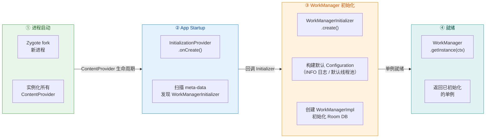
```mermaid
graph LR
    subgraph Phase1["① 进程启动"]
        direction TB
        A["Zygote fork\n新进程"] ~~~ B["实例化所有\nContentProvider"]
    end

    subgraph Phase2["② App Startup"]
        direction TB
        C["InitializationProvider\n.onCreate()"] ~~~ D["扫描 meta-data\n发现 WorkManagerInitializer"]
    end

    subgraph Phase3["③ WorkManager 初始化"]
        direction TB
        E["WorkManagerInitializer\n.create()"] ~~~ F["构建默认 Configuration\n（INFO 日志 / 默认线程池）"] ~~~ G["创建 WorkManagerImpl\n初始化 Room DB"]
    end

    subgraph Phase4["④ 就绪"]
        direction TB
        H["WorkManager\n.getInstance(ctx)"] ~~~ I["返回已初始化\n的单例"]
    end

    Phase1 -->|"ContentProvider 生命周期"| Phase2
    Phase2 -->|"回调 Initializer"| Phase3
    Phase3 -->|"单例就绪"| Phase4

    classDef greenBox fill:#E8F5E9,stroke:#43A047,color:#1B5E20
    classDef blueBox fill:#E3F2FD,stroke:#1E88E5,color:#0D47A1
    classDef orangeBox fill:#FFF3E0,stroke:#FB8C00,color:#E65100
    classDef tealBox fill:#E0F2F1,stroke:#26A69A,color:#004D40

    class Phase1 greenBox
    class Phase2 blueBox
    class Phase3 orangeBox
    class Phase4 tealBox
```

#### 默认 Configuration 包含了什么

当你不做任何自定义时，WorkManager 会使用一个"开箱即用"的 `Configuration`，其关键参数如下：

| 参数 | 默认值 | 说明 |
|------|--------|------|
| **最低日志级别** | `Log.INFO` | 仅输出 INFO 及以上级别日志，Debug 信息被过滤 |
| **Executor（任务执行线程池）** | 内部默认线程池 | 基于 `Executors.newFixedThreadPool`，核心线程数通常等于 CPU 核心数 |
| **TaskExecutor（内部数据库操作线程池）** | 独立的串行 Executor | 保证对 Room 数据库的读写按顺序执行 |
| **InputMergerFactory** | `OverwritingInputMergerFactory` | 任务链中如果多个前置任务输出同名 Key，后者覆盖前者 |
| **WorkerFactory** | `DefaultWorkerFactory` | 通过反射创建 Worker 实例，构造函数签名为 `(Context, WorkerParameters)` |

对于大多数中小型应用，默认配置已经足够应对日常场景。但如果你需要在 Debug 构建中查看更详细的调度日志，或者希望使用依赖注入框架（如 Hilt / Dagger）来创建 Worker 实例，就需要自定义 `Configuration`——这正是"按需初始化"要解决的问题。

#### 默认初始化的潜在代价

虽然方便，默认初始化也并非没有缺点。由于 `ContentProvider.onCreate()` 是在 `Application.onCreate()` **之前** 被调用的，此时应用的其他组件（如 DI 框架）可能尚未初始化。这意味着：

- **启动耗时增加**：WorkManager 的内部 Room 数据库首次创建需要磁盘 I/O，会略微拖慢冷启动速度。如果应用同时还有其他库通过 ContentProvider 初始化，累积效果可能更为明显。
- **无法注入依赖**：在 ContentProvider 阶段，Hilt / Dagger 的组件树尚未构建，无法将自定义依赖传入 Worker 的构造函数。
- **配置不可变**：默认初始化完成后，`Configuration` 就已锁定，应用层再想修改已为时已晚。

当你遇到上述任何一个痛点时，就应该考虑切换到 **按需初始化（On-Demand Initialization）** 模式。

---

### 按需初始化 Configuration.Provider

#### 为什么需要按需初始化

所谓"按需初始化"（On-Demand Initialization），核心思想就是：**延迟 WorkManager 的初始化时机，让它在应用首次真正需要时才执行**，同时允许开发者提供完全自定义的 `Configuration`。这带来三大好处：

1. **降低冷启动耗时**：将 Room 数据库创建和 Scheduler 注册推迟到首次调用 `WorkManager.getInstance()` 时，避免在 ContentProvider 阶段阻塞主线程。
2. **支持自定义 WorkerFactory**：在 Application 初始化完成后才构建 Configuration，此时 DI 容器已就绪，可以安全地传入自定义 WorkerFactory。
3. **灵活配置**：可以根据 Build Type、Feature Flag 等动态决定日志级别、线程池大小等参数。

#### 实现步骤

按需初始化的配置分为两步：**禁用自动初始化** 和 **实现 Configuration.Provider 接口**。

**第一步：在 AndroidManifest.xml 中禁用默认的自动初始化。**

WorkManager 的自动初始化是通过 App Startup 的 `InitializationProvider` 触发的。你需要在应用的 Manifest 中使用 `<provider>` 的 `tools:node="merge"` 策略，将 `WorkManagerInitializer` 从 `<meta-data>` 中移除。如果你只想禁用 WorkManager 的自动初始化（保留 App Startup 其他 Initializer），写法如下：

```xml
<!-- AndroidManifest.xml -->
<application ...>

    <!--
        保留 InitializationProvider 本身，但移除 WorkManager 的 Initializer。
        tools:node="merge" 让此声明与库的 Manifest 合并，
        而内部的 meta-data 通过 tools:node="remove" 精确移除。
    -->
    <provider
        android:name="androidx.startup.InitializationProvider"
        android:authorities="${applicationId}.androidx-startup"
        android:exported="false"
        tools:node="merge">

        <!--
            移除 WorkManagerInitializer，阻止 App Startup 自动回调它。
            这样 WorkManager 就不会在 ContentProvider 阶段初始化了。
        -->
        <meta-data
            android:name="androidx.work.WorkManagerInitializer"
            android:value="androidx.startup"
            tools:node="remove" />

    </provider>

</application>
```

如果你的应用完全不使用 App Startup（没有其他 Initializer），也可以更彻底地移除整个 `InitializationProvider`：

```xml
<!-- 完全移除 InitializationProvider，App Startup 将不起作用 -->
<provider
    android:name="androidx.startup.InitializationProvider"
    android:authorities="${applicationId}.androidx-startup"
    tools:node="remove" />
```

> **注意**：如果你使用了 Firebase、Lifecycle Process 等同样依赖 App Startup 的库，请 **不要** 使用上面这种完全移除的方式，否则会导致那些库的初始化也失效。

**第二步：让 Application 类实现 `Configuration.Provider` 接口。**

禁用自动初始化后，WorkManager 需要知道去哪里获取配置。约定是：让你的 `Application` 类实现 `androidx.work.Configuration.Provider` 接口，并重写 `getWorkManagerConfiguration()` 方法。当应用首次调用 `WorkManager.getInstance(context)` 时，WorkManager 内部会检测到自身尚未初始化，于是向 `context.applicationContext` 请求 `Configuration`——如果它实现了 `Configuration.Provider`，就会回调 `getWorkManagerConfiguration()` 拿到配置，然后完成初始化。

下面是一个典型示例，展示了如何自定义日志级别和 WorkerFactory：

```kotlin
// 自定义 Application，实现 Configuration.Provider 接口
class MyApplication : Application(), Configuration.Provider {

    // 假设使用 Hilt 或手动管理的 WorkerFactory
    // 这里演示一个自定义 WorkerFactory，用于依赖注入
    lateinit var myWorkerFactory: DelegatingWorkerFactory

    override fun onCreate() {
        super.onCreate()
        // 在 Application.onCreate() 中初始化 DI 容器、构建 WorkerFactory
        // 此时 Hilt/Dagger 组件树已就绪，可以安全注入依赖
        myWorkerFactory = DelegatingWorkerFactory().apply {
            // 注册自定义的 Factory，可以在 Worker 构造函数中注入任意依赖
            addFactory(MyCustomWorkerFactory(someDependency))
        }
    }

    // 实现 Configuration.Provider 的唯一方法
    // 当 WorkManager.getInstance(context) 首次被调用时，此方法会被回调
    override val workManagerConfiguration: Configuration
        get() = Configuration.Builder()
            // 设置最低日志级别为 DEBUG，方便开发阶段排查调度问题
            .setMinimumLoggingLevel(android.util.Log.DEBUG)
            // 传入自定义的 WorkerFactory，替代默认的反射创建方式
            .setWorkerFactory(myWorkerFactory)
            // 自定义任务执行线程池：固定 4 个核心线程
            .setExecutor(Executors.newFixedThreadPool(4))
            // 构建最终的 Configuration 对象
            .build()
}
```

完成以上两步后，WorkManager 的初始化就变成了"懒加载"模式。整个时序如下：

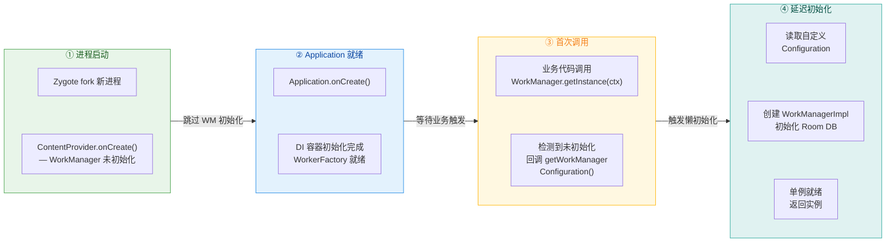
```mermaid
graph LR
    subgraph Phase1["① 进程启动"]
        direction TB
        A1["Zygote fork 新进程"] ~~~ A2["ContentProvider.onCreate()\n— WorkManager 未初始化"]
    end

    subgraph Phase2["② Application 就绪"]
        direction TB
        B1["Application.onCreate()"] ~~~ B2["DI 容器初始化完成\nWorkerFactory 就绪"]
    end

    subgraph Phase3["③ 首次调用"]
        direction TB
        C1["业务代码调用\nWorkManager.getInstance(ctx)"] ~~~ C2["检测到未初始化\n回调 getWorkManager\nConfiguration()"]
    end

    subgraph Phase4["④ 延迟初始化"]
        direction TB
        D1["读取自定义\nConfiguration"] ~~~ D2["创建 WorkManagerImpl\n初始化 Room DB"] ~~~ D3["单例就绪\n返回实例"]
    end

    Phase1 -->|"跳过 WM 初始化"| Phase2
    Phase2 -->|"等待业务触发"| Phase3
    Phase3 -->|"触发懒初始化"| Phase4

    classDef greenBox fill:#E8F5E9,stroke:#43A047,color:#1B5E20
    classDef blueBox fill:#E3F2FD,stroke:#1E88E5,color:#0D47A1
    classDef amberBox fill:#FFF8E1,stroke:#FFB300,color:#F57F17
    classDef tealBox fill:#E0F2F1,stroke:#26A69A,color:#004D40

    class Phase1 greenBox
    class Phase2 blueBox
    class Phase3 amberBox
    class Phase4 tealBox
```

#### Configuration.Builder 常用 API 详解

`Configuration.Builder` 提供了丰富的自定义项，下面逐一解读核心 API：

| API 方法 | 作用 | 典型用法 |
|----------|------|----------|
| `setMinimumLoggingLevel(int)` | 控制 WorkManager 内部日志输出的最低级别 | Debug 包设为 `Log.DEBUG`，Release 包设为 `Log.ERROR` |
| `setWorkerFactory(WorkerFactory)` | 替换默认的反射 Worker 创建方式 | 配合 Hilt 的 `HiltWorkerFactory`，实现构造函数注入 |
| `setExecutor(Executor)` | 自定义 Worker.doWork() 的执行线程池 | 使用限定线程数的线程池，避免任务过多导致线程爆炸 |
| `setTaskExecutor(Executor)` | 自定义 WorkManager 内部数据库操作的线程池 | 通常不需修改，除非有特殊性能调优需求 |
| `setInputMergerFactory(InputMergerFactory)` | 自定义任务链中 Data 的合并策略工厂 | 极少使用，除非需要实现非标准的合并逻辑 |
| `setDefaultProcessName(String)` | 指定 WorkManager 默认运行的进程名 | 多进程应用中指定调度进程，后续小节详述 |

#### 与 Hilt 的集成实践

在使用 Hilt 进行依赖注入的项目中，按需初始化几乎是必选项。Hilt 提供了 `@HiltWorker` 注解和内置的 `HiltWorkerFactory`，让 Worker 可以通过 `@AssistedInject` 接收自定义依赖。集成方式如下：

```kotlin
// 1. Worker 使用 @HiltWorker 注解，构造函数用 @AssistedInject
@HiltWorker  // Hilt 会为此 Worker 生成对应的 Factory
class SyncWorker @AssistedInject constructor(
    @Assisted context: Context,            // WorkManager 提供的 Context
    @Assisted workerParams: WorkerParameters,  // WorkManager 提供的参数
    private val repository: SyncRepository     // 通过 Hilt 注入的业务依赖
) : CoroutineWorker(context, workerParams) {

    // 在 doWork 中可以直接使用注入的 repository
    override suspend fun doWork(): Result {
        // repository 已由 Hilt 注入，无需手动创建
        return try {
            repository.syncData()  // 执行同步逻辑
            Result.success()       // 返回成功
        } catch (e: Exception) {
            Result.retry()         // 异常时重试
        }
    }
}
```

```kotlin
// 2. Application 中集成 HiltWorkerFactory
@HiltAndroidApp  // Hilt 的 Application 注解
class MyApplication : Application(), Configuration.Provider {

    // Hilt 自动注入 HiltWorkerFactory 实例
    @Inject
    lateinit var workerFactory: HiltWorkerFactory

    // 将 HiltWorkerFactory 传入 Configuration
    override val workManagerConfiguration: Configuration
        get() = Configuration.Builder()
            // 使用 Hilt 提供的 WorkerFactory，它知道如何创建 @HiltWorker 标注的 Worker
            .setWorkerFactory(workerFactory)
            .build()
}
```

这种模式的优雅之处在于：Worker 的依赖完全由 Hilt 管理，你无需在 Worker 内部手动获取 Application 或 Service Locator。每个 Worker 都是可测试的——单元测试中只需 Mock 注入的依赖即可。

#### getWorkManagerConfiguration 属性 vs 函数的版本差异

在较早的 WorkManager 版本中，`Configuration.Provider` 接口要求重写的是一个 **函数** `getWorkManagerConfiguration()`。从 WorkManager **2.7.0+** 与 Kotlin 优先的 API 风格对齐后，推荐使用 **Kotlin 属性** 语法 `override val workManagerConfiguration: Configuration`。两者在 JVM 字节码层面等价（Kotlin 属性本质上会生成 getter 方法），但属性语法更符合 Kotlin 惯例。如果你的 Application 是用 Java 编写的，则仍然使用方法重写：

```java
// Java 写法
public class MyApplication extends Application implements Configuration.Provider {

    @NonNull
    @Override
    // Java 中仍使用方法重写的方式
    public Configuration getWorkManagerConfiguration() {
        // 构建并返回自定义 Configuration
        return new Configuration.Builder()
                .setMinimumLoggingLevel(Log.DEBUG)  // 设置日志级别
                .build();                            // 构建配置
    }
}
```

---

### 多进程支持

#### 多进程应用的挑战

在 Android 中，一个应用可以通过在 Manifest 中为 Activity、Service、ContentProvider 等组件声明 `android:process` 属性来运行多个进程。典型场景包括：将 WebView 放在独立进程以隔离崩溃、将推送服务放在常驻进程以提高存活率、大型 Super App 按模块拆分进程等。

然而，多进程环境给 WorkManager 带来了一个根本性挑战：**WorkManager 的内部 Room 数据库是持久化在磁盘上的，多个进程如果各自独立初始化 WorkManager 并同时操作同一个数据库，就可能产生并发冲突**。更具体地说：

- **调度冲突**：进程 A 入队了一个任务，进程 B 的 WorkManager 可能无法感知到这个任务的存在，导致任务丢失或重复执行。
- **数据库锁竞争**：SQLite 的写操作是互斥的，多个进程同时写入会导致 `SQLITE_BUSY` 错误。
- **状态不一致**：进程 A 中观察到的 `WorkInfo` 可能与进程 B 中观察到的不同步。

在 WorkManager **2.6.0** 之前，官方并没有提供开箱即用的多进程方案，开发者要么自己用 AIDL / Binder 协调，要么约定所有 WorkManager 操作只在主进程中进行。从 **2.6.0** 起，Jetpack 引入了专门的 `work-multiprocess` 工件来解决这一问题。

#### work-multiprocess 的架构原理

`work-multiprocess` 的核心思想是 **指定进程（Designated Process）** 模式：

1. 在 `Configuration` 中通过 `setDefaultProcessName(processName)` 指定一个"主调度进程"（通常是应用的默认主进程）。
2. WorkManager 的 Room 数据库和核心调度逻辑 **只在主调度进程中运行**。
3. 其他进程（称为"远程进程"）如果需要入队任务或查询状态，通过 **RemoteWorkManager** 类发起跨进程调用。RemoteWorkManager 内部使用 AIDL/Binder 机制与主调度进程中的 `RemoteWorkManagerService`（一个 Bound Service）通信。
4. 主调度进程收到请求后，在本地执行真正的入队、取消、查询等操作，然后将结果通过 Binder 返回给远程进程。

这种架构确保了 **数据库操作的单进程串行化**，从根本上避免了多进程并发写入的问题。

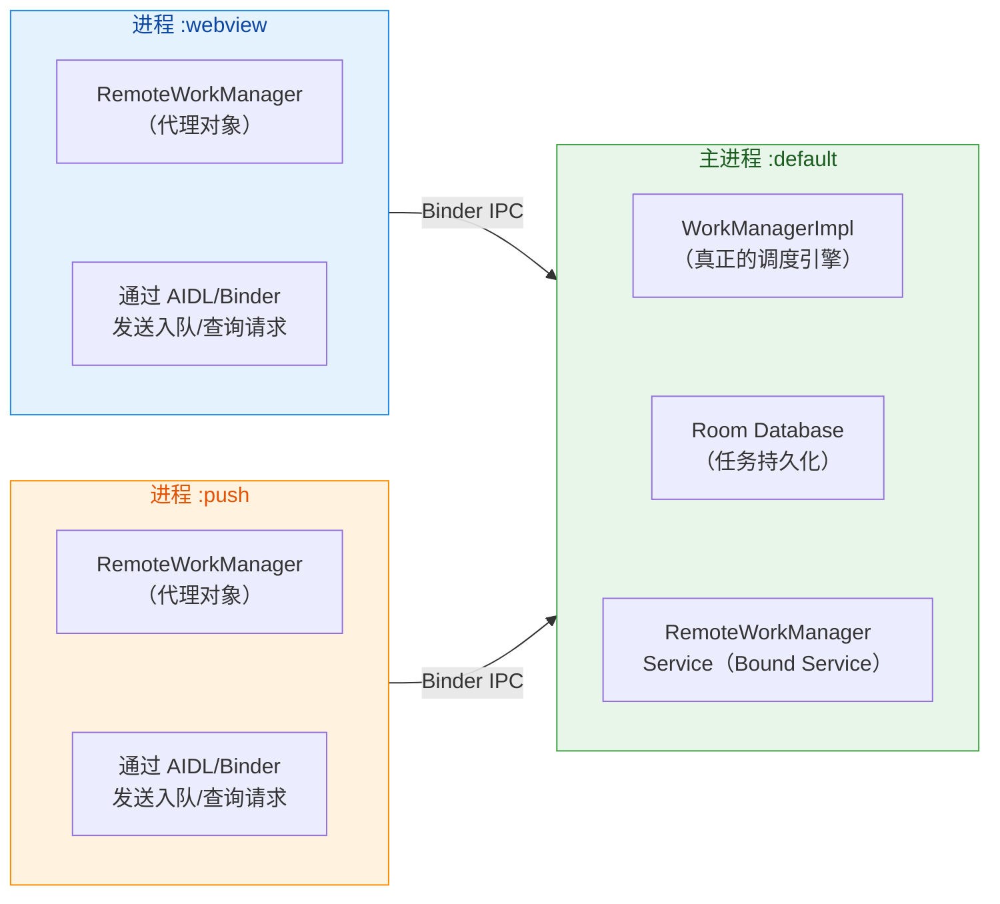
```mermaid
graph LR
    subgraph ProcessA["主进程 :default"]
        direction TB
        PA1["WorkManagerImpl\n（真正的调度引擎）"] ~~~ PA2["Room Database\n（任务持久化）"] ~~~ PA3["RemoteWorkManager\nService（Bound Service）"]
    end

    subgraph ProcessB["进程 :webview"]
        direction TB
        PB1["RemoteWorkManager\n（代理对象）"] ~~~ PB2["通过 AIDL/Binder\n发送入队/查询请求"]
    end

    subgraph ProcessC["进程 :push"]
        direction TB
        PC1["RemoteWorkManager\n（代理对象）"] ~~~ PC2["通过 AIDL/Binder\n发送入队/查询请求"]
    end

    ProcessB -->|"Binder IPC"| ProcessA
    ProcessC -->|"Binder IPC"| ProcessA

    classDef mainProc fill:#E8F5E9,stroke:#43A047,color:#1B5E20
    classDef remoteProc fill:#E3F2FD,stroke:#1E88E5,color:#0D47A1
    classDef pushProc fill:#FFF3E0,stroke:#FB8C00,color:#E65100

    class ProcessA mainProc
    class ProcessB remoteProc
    class ProcessC pushProc
```

#### 配置与使用步骤

**第一步：添加 `work-multiprocess` 依赖。**

```kotlin
// build.gradle.kts (Module)
dependencies {
    // 基础 WorkManager 依赖（Kotlin 协程版本）
    implementation("androidx.work:work-runtime-ktx:2.9.0")
    // 多进程支持模块
    implementation("androidx.work:work-multiprocess:2.9.0")
}
```

**第二步：在 Configuration 中指定默认进程名。**

```kotlin
class MyApplication : Application(), Configuration.Provider {

    override val workManagerConfiguration: Configuration
        get() = Configuration.Builder()
            // 指定主调度进程名。格式为 "包名:进程后缀" 或直接 "包名"（表示默认主进程）
            // 这里指定为应用的默认主进程（无 : 后缀）
            .setDefaultProcessName("com.example.myapp")
            .setMinimumLoggingLevel(Log.DEBUG)
            .build()
}
```

> **关于进程名格式**：如果你的主进程没有声明 `android:process` 属性，其进程名就是 `applicationId`（如 `com.example.myapp`）。如果你希望指定某个自定义进程作为调度进程（如 `:scheduler`），则传入 `"com.example.myapp:scheduler"`。

**第三步：在远程进程中使用 `RemoteWorkManager` 代替 `WorkManager`。**

```kotlin
// 在 :webview 或 :push 等非主进程中执行的代码
class PushMessageHandler(private val context: Context) {

    fun scheduleSyncTask() {
        // 构建一个普通的 OneTimeWorkRequest，与单进程写法完全一致
        val syncRequest = OneTimeWorkRequestBuilder<SyncWorker>()
            .setConstraints(
                Constraints.Builder()
                    .setRequiredNetworkType(NetworkType.CONNECTED)  // 需要网络
                    .build()
            )
            .build()

        // 关键区别：使用 RemoteWorkManager 而非 WorkManager
        // RemoteWorkManager.getInstance() 返回的代理会通过 Binder 与主进程通信
        val remoteWorkManager = RemoteWorkManager.getInstance(context)

        // enqueue 返回的是 ListenableFuture，操作会跨进程转发到主进程执行
        remoteWorkManager.enqueue(syncRequest)
    }
}
```

需要特别注意的是，`RemoteWorkManager` 的 API 与 `WorkManager` 并非完全镜像。`RemoteWorkManager` 提供的入队和取消方法返回的是 `ListenableFuture<Void>` 而非直接的 `Operation`，因为跨进程调用本身是异步的。查询类 API（如 `getWorkInfoById`）同样返回 `ListenableFuture`。

#### Worker 在哪个进程执行

这是一个容易混淆的关键点：**即使任务是从远程进程入队的，Worker 的 `doWork()` 方法默认仍然在主调度进程中执行**。这是因为 WorkManager 的线程池和调度器都归属于主调度进程。

如果你确实需要 Worker 在特定的远程进程中执行（例如某些 Worker 依赖于远程进程中的资源），可以继承 `RemoteListenableWorker` 并在 WorkRequest 中通过 `setInputData` 指定目标进程和 Service 类名：

```kotlin
// 继承 RemoteListenableWorker，此 Worker 可以在指定的远程进程中执行
class RemoteSyncWorker(
    context: Context,
    workerParams: WorkerParameters
) : RemoteListenableWorker(context, workerParams) {

    // startRemoteWork 会在指定的远程进程中被回调
    override fun startRemoteWork(): ListenableFuture<Result> {
        // 使用 CallbackToFutureAdapter 将回调转换为 ListenableFuture
        return CallbackToFutureAdapter.getFuture { completer ->
            try {
                // 在远程进程中执行具体逻辑
                performSyncInRemoteProcess()
                // 完成后通知 WorkManager 任务成功
                completer.set(Result.success())
            } catch (e: Exception) {
                // 失败时返回 retry
                completer.set(Result.retry())
            }
            "RemoteSyncWorker"  // 作为 Future 的标识 tag
        }
    }
}
```

```kotlin
// 入队时指定 Worker 运行的远程进程
val remoteRequest = OneTimeWorkRequestBuilder<RemoteSyncWorker>()
    .setInputData(
        Data.Builder()
            // ARGUMENT_CLASS_NAME: 指定远程进程中承载 Worker 的 Service 全类名
            .putString(
                RemoteListenableWorker.ARGUMENT_CLASS_NAME,
                "com.example.myapp.RemoteWorkerService"
            )
            // ARGUMENT_PACKAGE_NAME: 应用包名
            .putString(
                RemoteListenableWorker.ARGUMENT_PACKAGE_NAME,
                "com.example.myapp"
            )
            .build()
    )
    .build()
```

#### 多进程场景的最佳实践

1. **尽量将所有 WorkManager 操作集中在主进程**。只有当远程进程确实需要直接入队任务时，才使用 `RemoteWorkManager`。如果可以通过广播、EventBus 或 SharedPreferences 等机制通知主进程发起入队，往往架构更简单。

2. **避免在远程进程中频繁查询 WorkInfo**。每次查询都需要 IPC 通信，开销远大于进程内调用。可以在主进程中观察状态变化，再通过 Messenger 等轻量级 IPC 将结果推送到远程进程。

3. **注意进程存活性**。如果主调度进程被系统杀死，远程进程通过 `RemoteWorkManager` 发起的请求会失败（Binder 连接断开）。设计时应考虑异常处理和重试逻辑。

4. **测试环境模拟**。多进程应用的 WorkManager 行为在 Instrumented Test 中较难模拟，建议使用 `WorkManagerTestInitHelper` 配合自定义 Configuration 进行单进程测试覆盖核心逻辑，再辅以手动的多进程集成测试。

---

**📝 练习题**

某大型应用使用 Hilt 进行依赖注入，团队希望在 Worker 的构造函数中注入 Repository 依赖。以下关于 WorkManager 初始化配置的说法，哪一项是正确的？

A. 无需任何额外配置，WorkManager 默认的反射机制可以自动注入 Hilt 管理的依赖


B. 只需在 Application 中实现 Configuration.Provider 并传入 HiltWorkerFactory，无需修改 AndroidManifest.xml


C. 需要在 AndroidManifest.xml 中禁用 WorkManager 的自动初始化，并在 Application 中实现 Configuration.Provider 传入 HiltWorkerFactory


D. 只需在 AndroidManifest.xml 中禁用自动初始化即可，WorkManager 会自动检测 Hilt 并使用 HiltWorkerFactory


**【答案】** C

**【解析】** WorkManager 的默认初始化通过 App Startup 在 ContentProvider 阶段完成，此时使用的是 `DefaultWorkerFactory`（基于反射），它只能调用 Worker 的标准双参构造函数 `(Context, WorkerParameters)`，无法注入任何额外依赖，因此 A 错误。要使用 Hilt 的 `HiltWorkerFactory`，你必须将自定义的 `Configuration`（包含 HiltWorkerFactory）传给 WorkManager，而这要求采用"按需初始化"模式。按需初始化的完整步骤包含两部分：**(1)** 在 AndroidManifest.xml 中通过 `tools:node="remove"` 禁用 `WorkManagerInitializer`，阻止自动初始化；**(2)** 让 Application 实现 `Configuration.Provider` 接口，在 `workManagerConfiguration` 属性中传入包含 `HiltWorkerFactory` 的 Configuration。两步缺一不可——如果不禁用自动初始化（如选项 B），WorkManager 会在 ContentProvider 阶段就以默认配置完成初始化，之后 `Configuration.Provider` 永远不会被回调。选项 D 的说法也不成立，WorkManager 不会自动检测 Hilt 的存在。因此正确答案是 C。

---

**📝 练习题**

在一个多进程 Android 应用中，`:push` 进程收到推送消息后需要通过 WorkManager 调度一个数据同步任务。以下做法中，最推荐的方案是？

A. 在 `:push` 进程中直接调用 `WorkManager.getInstance(context).enqueue(request)`，WorkManager 会自动处理多进程冲突


B. 在 `:push` 进程中使用 `RemoteWorkManager.getInstance(context).enqueue(request)`，由主进程统一调度


C. 在 `:push` 进程中创建一个独立的 WorkManager 实例，使用单独的数据库文件避免冲突


D. 在 `:push` 进程中通过反射调用主进程的 WorkManager 单例方法


**【答案】** B

**【解析】** 在多进程环境下，如果每个进程都通过 `WorkManager.getInstance()` 各自初始化并操作同一个 Room 数据库，会导致并发写入冲突和调度状态不一致，因此选项 A 是有隐患的做法。WorkManager 的 `work-multiprocess` 模块正是为了解决这个问题而设计的：它采用"指定进程"模式，所有数据库操作和调度逻辑集中在通过 `setDefaultProcessName()` 指定的主进程中，其他进程通过 `RemoteWorkManager` 发起跨进程 RPC 调用，由主进程统一执行入队操作。这保证了数据库访问的单进程串行化，从根本上避免了并发问题。选项 C 中的"独立数据库"并非 WorkManager 支持的官方方案，且任务无法跨进程协调。选项 D 使用反射调用跨进程单例在 Android 多进程架构下不可行（不同进程拥有独立的内存空间，单例不共享）。因此最佳方案是 B。

---

## 本章小结

本章围绕 Android 后台任务调度的核心组件 **WorkManager** 展开，从架构设计哲学到每一个关键 API 的使用方式与底层机制，做了系统化的梳理。下面按照知识脉络进行全面回顾，帮助读者将零散的知识点串联为一张完整的认知地图。

---

### 从全局视角理解 WorkManager 的定位

Android 后台任务调度的历史经历了从 `AlarmManager` → `JobScheduler` → `GcmNetworkManager` → `FirebaseJobDispatcher` 的漫长演化。每一代方案都在尝试解决同一个核心矛盾：**应用希望在后台可靠地执行任务，而系统希望尽可能节省电量和资源**。WorkManager 的诞生，正是 Google 对这一矛盾给出的"终局方案"——它在应用层提供了一套统一的、声明式的任务调度 API，而在底层根据设备 API Level 自动选择最优的调度委托（API 23+ 使用 `JobScheduler`，低版本回退到 `AlarmManager + BroadcastReceiver`）。这种 **"上层统一、底层自适应"** 的架构思想，是 Jetpack 组件设计的典型范式。

更关键的是，WorkManager 提供了 **持久化保证（Guaranteed Execution）**。任务一旦入库（Room 数据库），即使应用进程被杀、设备重启，系统也会在合适的时机重新调度执行。这一特性使它与 Kotlin Coroutines、RxJava 等"进程内"异步方案形成了本质区别：**Coroutines 解决的是"异步"，WorkManager 解决的是"可靠的延迟/条件执行"**。理解这个定位差异，是正确使用 WorkManager 的第一步。

---

### 两种 WorkRequest：一次性与周期性

任务请求是应用向 WorkManager 表达"我要做什么、何时做、怎么做"的载体。本章详细区分了两种核心类型：

- **`OneTimeWorkRequest`**：一次性任务，执行完毕即结束。适用于上传日志、同步一次数据、压缩图片等场景。它的生命周期是线性的：`ENQUEUED → RUNNING → SUCCEEDED / FAILED`，一旦到达终态就不会再被调度。

- **`PeriodicWorkRequest`**：周期性任务，按指定间隔反复执行。适用于定期数据同步、心跳上报等场景。系统强制最小间隔为 **15 分钟**（`PeriodicWorkRequest.MIN_PERIODIC_INTERVAL_MILLIS`），这是为了防止应用滥用后台资源。周期任务的每一次执行只能返回 `Result.success()` 或 `Result.retry()`，返回 `Result.failure()` 不会终止周期链——任务会继续在下一个周期被调度。此外，`flex interval`（弹性窗口）机制允许系统在每个周期的尾部一段时间窗口内选择最优时机执行，而非精确到秒的触发。

两种 Request 都通过 Builder 模式构建，支持设置约束条件、初始延迟（`setInitialDelay`）、退避策略（`setBackoffCriteria`）、标签（`addTag`）等通用配置。Builder 模式的好处在于将复杂的配置项平铺为可读性极高的链式调用，同时在 `build()` 时进行参数校验。

---

### Worker 的执行模型与多种变体

Worker 是任务的实际执行体，WorkManager 的调度最终会回调到 Worker 的核心方法中。本章梳理了三种关键变体的适用场景与内部机制：

1. **`Worker`**（同步阻塞）：`doWork()` 在 WorkManager 管理的后台线程池中同步执行，方法返回即代表任务完成。适合简单的、阻塞式的 I/O 操作。`Result` 的三种返回值——`success()`、`failure()`、`retry()`——分别驱动状态机向不同终态或中间态迁移。

2. **`CoroutineWorker`**（协程挂起）：`doWork()` 是一个 `suspend` 函数，默认在 `Dispatchers.Default` 上执行，可以通过 `withContext` 自由切换调度器。它本质上是对 `ListenableWorker` 的协程化封装，通过 `suspendCancellableCoroutine` 桥接了 `ListenableFuture` 与协程世界。对于现代 Kotlin 项目，这是首选方案。

3. **`ListenableWorker`**（异步回调）：提供最底层的灵活性，`startWork()` 返回一个 `ListenableFuture<Result>`，开发者完全自主控制线程和异步逻辑。它是 `Worker` 和 `CoroutineWorker` 的共同父类，适合需要与回调式 SDK（如某些 C++ 库的 JNI 回调）深度集成的场景。

理解这三者的继承关系（`ListenableWorker` → `Worker` / `CoroutineWorker`）有助于在项目中做出正确选择：**简单同步用 Worker，协程项目用 CoroutineWorker，极端自定义用 ListenableWorker**。

---

### 约束条件：声明式的执行前提

`Constraints` 是 WorkManager 最具实用价值的特性之一。它让开发者以声明式的方式表达任务执行的前提条件，而无需自己编写大量的 `BroadcastReceiver` 来监听系统状态变化。本章覆盖了三个最常用的约束维度：

- **`setRequiredNetworkType(NetworkType)`**：控制网络条件。`CONNECTED`（任意网络）、`UNMETERED`（Wi-Fi 等非计量网络）、`NOT_ROAMING`（非漫游）等枚举值覆盖了绝大多数业务场景。底层通过 `ConnectivityManager` 的 `NetworkCallback` 实时监听网络状态变化，在条件满足时唤醒任务。

- **`setRequiresCharging(true)`**：要求设备处于充电状态。适合大文件上传、数据库压缩等重度操作。系统通过 `BatteryManager` 的 sticky broadcast 或 `ACTION_CHARGING` / `ACTION_DISCHARGING` 广播来跟踪充电状态。

- **`setRequiresStorageNotLow(true)`**：要求设备存储空间不处于低空间状态。避免在存储告急时执行写入密集型任务，防止触发系统的低存储行为（如清理缓存）。

这些约束在底层被序列化到 Room 数据库中，WorkManager 的内部 `SystemJobScheduler` 或 `SystemAlarmScheduler` 会将它们转化为对应平台调度器的原生约束。约束条件的变化会触发 **重新评估（re-evaluation）**：当某个约束从不满足变为满足时，WorkManager 会检查所有等待中的任务，将符合条件的任务标记为可执行。这一"响应式"调度模型，是 WorkManager 高效利用系统资源的关键。

---

### 任务链与数据流：复杂工作流的编排

现实业务中，单个孤立的任务往往不够，需要多个任务按顺序或并行组合。WorkManager 通过 `beginWith()` + `then()` 的链式 API 提供了直观的 DAG（有向无环图）编排能力：

- **串行链**：`beginWith(A).then(B).then(C).enqueue()`，A 完成后执行 B，B 完成后执行 C。任何一个节点返回 `failure()` 都会导致后续所有节点被标记为 `FAILED`（短路语义）。

- **并行 + 汇聚**：`beginWith(listOf(A1, A2, A3)).then(B).enqueue()`，A1/A2/A3 并行执行，全部成功后 B 才会启动。这种 fan-out / fan-in 模式非常适合"多图并行压缩 → 统一打包上传"等场景。

**`Data` 对象**是任务之间传递信息的媒介。它是一个轻量的键值对容器，最大 **10 KB**（`Data.MAX_DATA_BYTES`）。上游任务通过 `Result.success(outputData)` 输出数据，下游任务通过 `inputData` 接收。当并行任务汇聚到同一个下游节点时，面临"多份输出如何合并为一份输入"的问题——WorkManager 提供了 **`InputMerger`** 策略：

- **`OverwritingInputMerger`**（默认）：同 key 后写覆盖先写，简单但可能丢失数据。
- **`ArrayCreatingInputMerger`**：同 key 的值合并为数组，保留所有输入，适合需要汇总结果的场景。

数据流的设计哲学是 **"轻量传递、重量外存"**：`Data` 只负责传递文件路径、ID、状态标记等小型信息，真正的大数据（图片、视频）应通过文件系统或数据库中转。

---

### 唯一工作：避免重复调度的利器

在实际应用中，同一类型的任务被多次触发的情况非常常见（例如用户反复点击"同步"按钮、多个页面都触发数据预加载）。`enqueueUniqueWork()`（一次性）和 `enqueueUniquePeriodicWork()`（周期性）通过一个 **唯一名称（unique name）** 来标识工作，并提供四种冲突策略：

| 策略 | 行为 | 典型场景 |
|---|---|---|
| **`KEEP`** | 如果同名任务已存在且未完成，忽略新请求 | 数据同步（避免重复同步） |
| **`REPLACE`** | 取消已有任务，用新任务替换 | 重新上传（以最新参数为准） |
| **`APPEND`** | 将新任务追加到已有链尾部；若已有任务失败，新任务也标记失败 | 有序日志上传 |
| **`APPEND_OR_REPLACE`** | 追加到链尾部；若已有任务失败，新任务不受影响，独立运行 | 容错性更强的追加场景 |

`KEEP` 和 `REPLACE` 是最常用的两种策略。`KEEP` 保证幂等性，`REPLACE` 保证时效性。`APPEND` 系列则构建了一种"动态追加的任务链"，适合日志收集、消息队列等需要保序的场景。底层实现上，唯一名称作为数据库的唯一索引，`enqueueUniqueWork` 在一个数据库事务中完成"查询已有 → 执行冲突策略 → 插入/更新"的原子操作，保证了并发安全。

---

### 观察任务状态：响应式的进度追踪

WorkManager 不是一个"发射后不管"的黑盒，它提供了完善的状态观察机制：

- **`WorkInfo`**：封装了任务的当前状态（`State` 枚举：`ENQUEUED`、`RUNNING`、`SUCCEEDED`、`FAILED`、`BLOCKED`、`CANCELLED`）、输出数据、标签、进度信息等。

- **`LiveData<WorkInfo>` / `Flow<WorkInfo>`**：通过 `getWorkInfoByIdLiveData(id)` 或 `getWorkInfoByIdFlow(id)` 获取可观察的状态流。UI 层可以直接绑定这些流来显示进度条、同步状态等。结合 Lifecycle-aware 特性，`LiveData` 方式在 Activity/Fragment 中使用时不会出现泄漏问题。

- **Tags 标签管理**：为 WorkRequest 打上标签后，可以通过 `getWorkInfosByTagLiveData(tag)` 批量查询同一类任务的状态，也可以通过 `cancelAllWorkByTag(tag)` 批量取消。标签是一种比 `id` 更灵活的分组管理手段。

进度上报方面，`CoroutineWorker` 可以在 `doWork()` 中调用 `setProgress(Data)` 来实时更新中间进度，观察方通过 `WorkInfo.progress` 获取。这种机制使得"下载进度 → UI 进度条"的数据流可以完全通过 WorkManager 内建能力实现，无需额外引入 EventBus 或 SharedFlow。

---

### 初始化与配置：从默认到精细控制

WorkManager 的默认初始化依赖 `ContentProvider`（`WorkManagerInitializer`），在应用启动时自动完成。这种"零代码初始化"虽然方便，但存在两个潜在问题：一是增加了冷启动时间（`ContentProvider.onCreate()` 在 `Application.onCreate()` 之前执行），二是无法自定义配置参数。

**按需初始化（On-Demand Initialization）** 通过让 `Application` 实现 `Configuration.Provider` 接口来解决这两个问题。开发者需要在 `AndroidManifest.xml` 中移除默认的 `WorkManagerInitializer`，然后在 `Configuration.Provider.getWorkManagerConfiguration()` 中返回自定义的 `Configuration` 对象。自定义配置可以指定：

- **自定义线程池 / Executor**：控制 Worker 的执行线程池大小和优先级。
- **日志级别**：调试阶段设为 `Log.DEBUG`，生产环境设为 `Log.ERROR`。
- **自定义 `WorkerFactory`**：实现依赖注入，让 Worker 的构造函数可以接收自定义参数（配合 Hilt 的 `@HiltWorker` 使用尤为优雅）。

**多进程支持**方面，WorkManager 2.6+ 提供了 `RemoteCoroutineWorker` 和 `RemoteListenableWorker`，允许任务在指定的独立进程中执行。这对于需要隔离内存、防止 OOM 影响主进程的重度后台任务（如大型文件处理、ML 推理）非常有价值。配置时需要在 `Configuration` 中指定进程绑定的 `Authority`，WorkManager 通过 `ContentProvider` + AIDL 实现跨进程通信。

---

### 核心决策速查

下面这张图将本章所有关键决策点浓缩为一张选型路径，帮助读者在实际开发中快速定位应该使用哪些 API 组合：

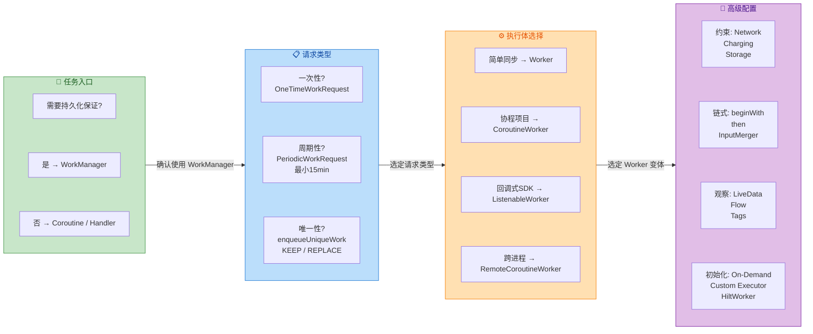
```mermaid
graph LR
    subgraph Entry["🚪 任务入口"]
        direction TB
        Q1["需要持久化保证?"]
        Q2["是 → WorkManager"]
        Q3["否 → Coroutine / Handler"]
        Q1 ~~~ Q2
        Q2 ~~~ Q3
    end

    subgraph Type["📋 请求类型"]
        direction TB
        T1["一次性?\nOneTimeWorkRequest"]
        T2["周期性?\nPeriodicWorkRequest\n最小15min"]
        T3["唯一性?\nenqueueUniqueWork\nKEEP / REPLACE"]
        T1 ~~~ T2
        T2 ~~~ T3
    end

    subgraph Exec["⚙️ 执行体选择"]
        direction TB
        E1["简单同步 → Worker"]
        E2["协程项目 → CoroutineWorker"]
        E3["回调式SDK → ListenableWorker"]
        E4["跨进程 → RemoteCoroutineWorker"]
        E1 ~~~ E2
        E2 ~~~ E3
        E3 ~~~ E4
    end

    subgraph Config["🔧 高级配置"]
        direction TB
        C1["约束: Network\nCharging\nStorage"]
        C2["链式: beginWith\nthen\nInputMerger"]
        C3["观察: LiveData\nFlow\nTags"]
        C4["初始化: On-Demand\nCustom Executor\nHiltWorker"]
        C1 ~~~ C2
        C2 ~~~ C3
        C3 ~~~ C4
    end

    Entry -->|"确认使用 WorkManager"| Type -->|"选定请求类型"| Exec -->|"选定 Worker 变体"| Config

    classDef entryStyle fill:#C8E6C9,stroke:#388E3C,color:#1B5E20
    classDef typeStyle fill:#BBDEFB,stroke:#1976D2,color:#0D47A1
    classDef execStyle fill:#FFE0B2,stroke:#F57C00,color:#E65100
    classDef configStyle fill:#E1BEE7,stroke:#7B1FA2,color:#4A148C

    class Entry entryStyle
    class Type typeStyle
    class Exec execStyle
    class Config configStyle
```

---

### 关键原则总结

回顾全章，有几条贯穿始终的设计原则值得反复强调：

**第一，WorkManager 是"可靠调度"而非"实时执行"。** 它不保证任务在精确时间点触发，而是保证任务最终一定会在条件满足时被执行。对于需要毫秒级响应的场景（如聊天消息发送），应使用 Foreground Service + Coroutine；对于需要跨进程存活的持久化任务（如日志上传、数据同步），WorkManager 是唯一正确选择。

**第二，约束条件是 WorkManager 的灵魂。** 没有约束的 WorkManager 任务，和一个简单的后台线程几乎没有区别。约束条件赋予了任务"感知环境"的能力，让调度器在最合适的时机执行任务，这既是对用户体验的保护（不在弱网时上传大文件），也是对系统资源的尊重（不在低电量时跑 CPU 密集任务）。

**第三，数据传递要"轻"。** `Data` 对象的 10KB 限制不是缺陷，而是有意为之的设计约束。它迫使开发者将大数据存储在文件或数据库中，只通过 `Data` 传递引用（路径、URI、ID）。这种模式确保了序列化/反序列化的效率，也避免了数据库膨胀。

**第四，初始化要按需、注入要优雅。** 默认初始化虽然方便，但在追求启动性能的大型应用中，按需初始化 + `@HiltWorker` 依赖注入才是生产级最佳实践。它将 WorkManager 的初始化时机完全交给开发者控制，同时让 Worker 的构造函数可以接收任意依赖，彻底告别 `Worker` 中手动 `get()` 单例的反模式。

---

### 📝 练习题

**题目一：** 在一个图片社交应用中，用户拍照后需要依次执行"图片压缩 → 添加水印 → 上传到服务器"三个步骤。要求仅在 Wi-Fi 环境下上传，且上传失败时采用指数退避重试。以下哪种实现方案最合理？

A. 使用三个独立的 `OneTimeWorkRequest` 分别 `enqueue()`，在每个 Worker 中手动检查上一步是否完成


B. 使用 `beginWith(compress).then(watermark).then(upload)` 构建任务链，仅对 `upload` 设置 `NetworkType.UNMETERED` 约束和指数退避策略


C. 使用一个 `PeriodicWorkRequest`，在 `doWork()` 中按顺序执行压缩、水印、上传三个步骤


D. 使用 `beginWith(listOf(compress, watermark, upload))` 让三个任务并行执行，通过 `ArrayCreatingInputMerger` 合并结果


**【答案】** B

**【解析】** 这道题考查任务链编排与约束条件的综合运用。方案 B 是最合理的做法：`beginWith().then().then()` 天然保证了三个步骤的串行顺序，每个 Worker 通过 `inputData` 接收上游的输出（如压缩后的文件路径），数据流自动贯通。约束条件可以精细到单个 `WorkRequest` 级别——压缩和水印不依赖网络，无需设置网络约束；只有上传步骤需要 `NetworkType.UNMETERED` 和 `setBackoffCriteria(BackoffPolicy.EXPONENTIAL, ...)`。方案 A 将链式依赖关系手动化，既冗余又容易出错（如并发竞态、状态不一致）。方案 C 滥用了 `PeriodicWorkRequest`——这是一次性任务而非周期任务，且将三个步骤塞进一个 Worker 违反了单一职责原则。方案 D 让三个存在严格顺序依赖的步骤并行执行，逻辑上完全错误（水印必须在压缩之后、上传必须在水印之后）。

---

**题目二：** 应用中有一个"同步用户数据"的后台任务，可能从多个页面触发（首页下拉刷新、设置页手动同步、Push 通知触发）。为避免同一时刻多个同步任务并行执行导致数据冲突，最佳做法是：

A. 使用 `enqueueUniqueWork("sync", ExistingWorkPolicy.REPLACE, syncRequest)` 确保每次都用最新请求替换


B. 使用 `enqueueUniqueWork("sync", ExistingWorkPolicy.KEEP, syncRequest)` 确保已有任务运行时忽略新请求


C. 在每次触发前手动调用 `cancelAllWorkByTag("sync")` 清除旧任务，再 `enqueue()` 新任务


D. 使用 `synchronized` 关键字在 Application 中加锁，防止多次 `enqueue()`


**【答案】** B

**【解析】** 本题考查 `UniqueWork` 的冲突策略选择。对于"同步用户数据"这一场景，核心诉求是 **幂等性**——无论触发几次，只要当前已经有一个同步任务在运行或排队中，就不需要再启动新的。`KEEP` 策略完美匹配这一语义：如果同名任务已存在且尚未完成（状态为 `ENQUEUED` 或 `RUNNING`），新请求会被静默忽略。方案 A 使用 `REPLACE` 会导致正在执行中的同步任务被取消后重新开始，可能造成数据写入中断、重复请求等问题。方案 C 手动取消再入队不是原子操作，存在竞态条件（取消和入队之间可能有其他线程也在操作），且语义上等同于一个更脆弱的 `REPLACE`。方案 D 用 Java 锁只能防止同一进程内的并发 `enqueue()`，无法防止跨进程、跨时间的重复（且 WorkManager 本身已经通过数据库事务保证了并发安全，无需外部加锁）。

---

