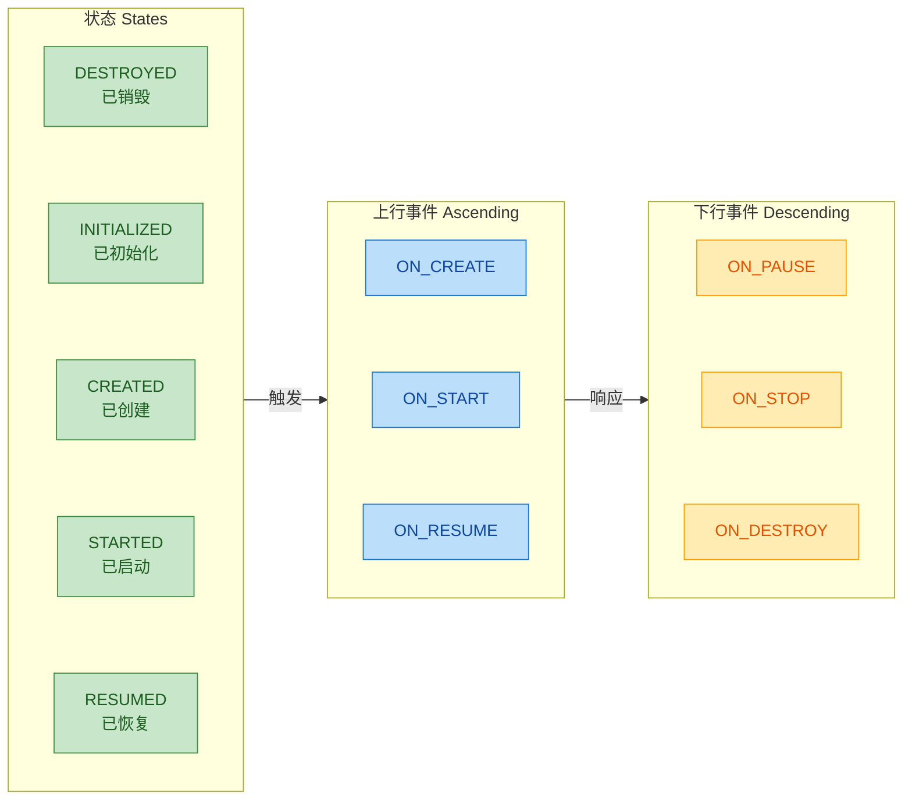
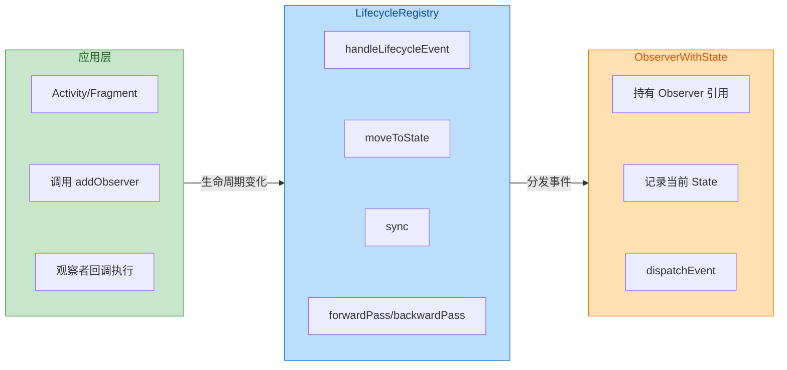
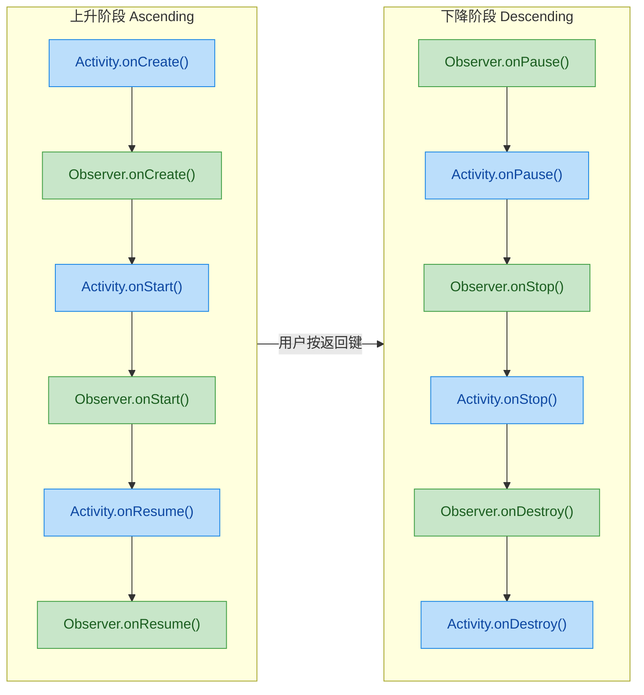
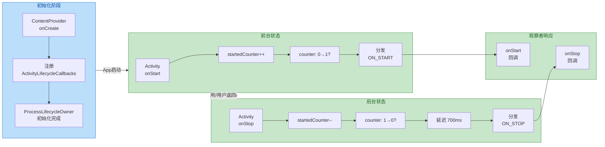
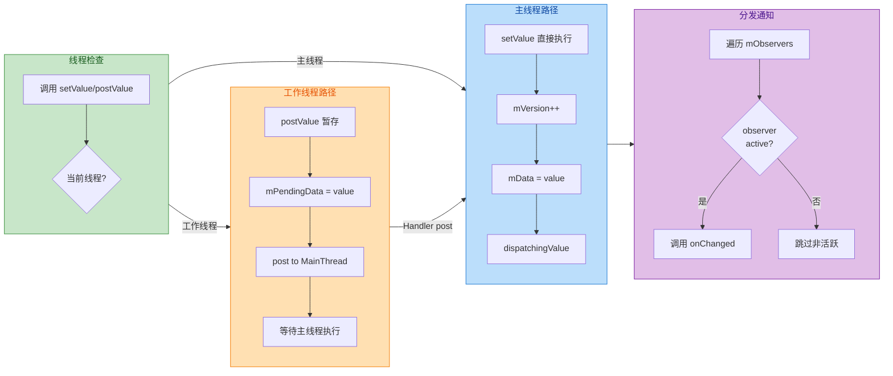
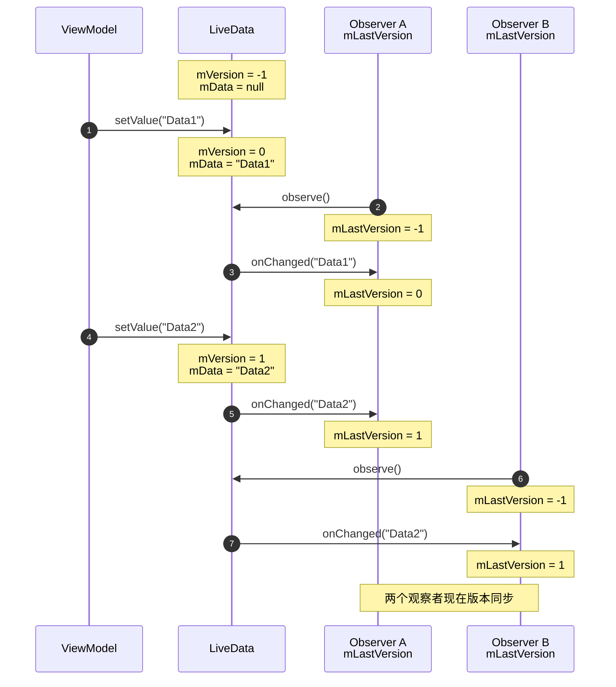
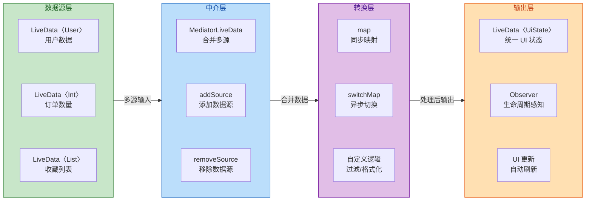
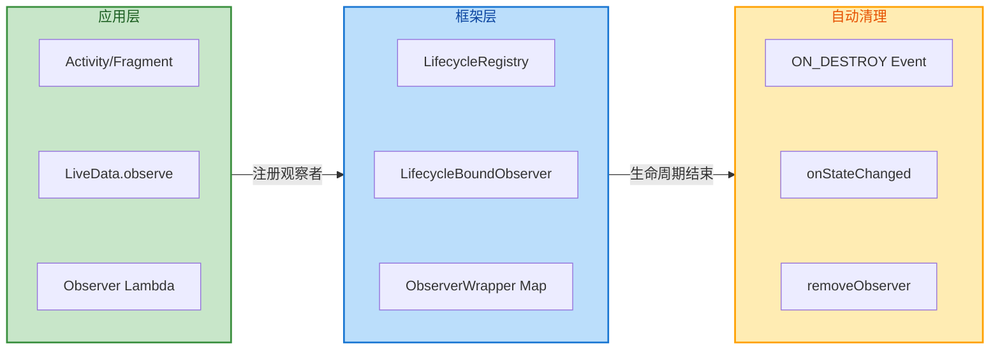
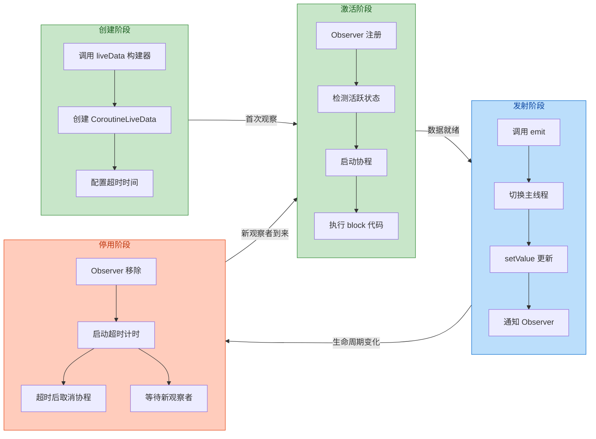
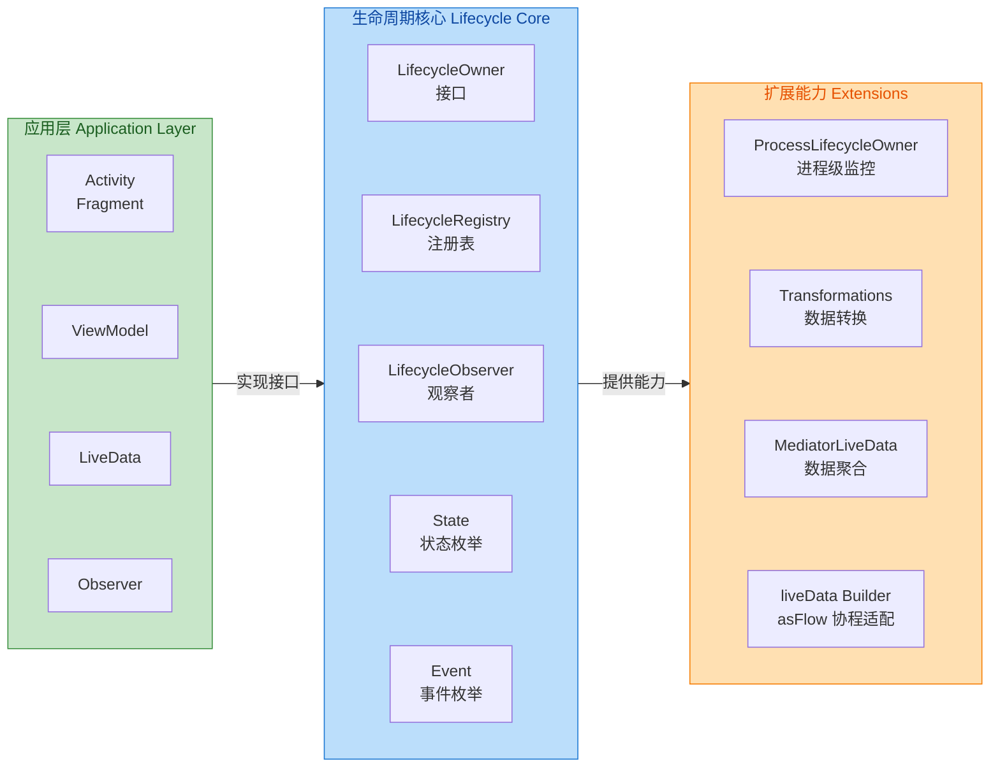

---

# 生命周期感知组件

---

## 生命周期所有者 LifecycleOwner

在 Android Jetpack 架构组件中，**LifecycleOwner** 是整个生命周期感知体系的基石。它定义了"谁拥有生命周期"这一核心问题，使得其他组件（如 LiveData、ViewModel）能够感知宿主的存亡状态，从而实现资源的自动管理与内存泄漏的有效规避。

从设计哲学角度看，LifecycleOwner 采用了**组合优于继承**（Composition over Inheritance）的思想。它并非强制要求开发者继承某个特定基类，而是通过一个极简的接口契约，让任何类都能成为生命周期的持有者。这种松耦合设计为自定义组件（如 Service、自定义 View）提供了极大的灵活性。

### Activity/Fragment 实现

Android 官方的 **ComponentActivity**（AppCompatActivity 的直接父类）与 **Fragment** 均已实现 LifecycleOwner 接口。这意味着当你在应用层使用 `AppCompatActivity` 或 `androidx.fragment.app.Fragment` 时，无需任何额外配置即可享受生命周期感知能力。

**为什么 Activity 和 Fragment 是天然的 LifecycleOwner？**

Activity 与 Fragment 是 Android 应用中最核心的 UI 容器，它们的生命周期直接受 **ActivityManagerService (AMS)** 调度。当系统发生配置变更（如屏幕旋转）、内存回收、用户导航等事件时，AMS 会通过 Binder IPC 通知应用进程，触发相应的生命周期回调。将 LifecycleOwner 内置于这两个组件中，能够确保生命周期事件的**权威性**与**一致性**。

从源码层面分析，ComponentActivity 在其构造函数中完成了 LifecycleRegistry 的初始化，并在各个生命周期回调（`onCreate`、`onStart`、`onResume` 等）中主动上报事件。以下是简化后的核心逻辑：

```java
// ComponentActivity.java 核心实现（简化版）
public class ComponentActivity extends Activity implements LifecycleOwner {
    
    // 持有 LifecycleRegistry 实例，负责管理观察者与状态
    private final LifecycleRegistry mLifecycleRegistry = new LifecycleRegistry(this);
    
    // 实现 LifecycleOwner 接口的唯一方法
    @NonNull
    @Override
    public Lifecycle getLifecycle() {
        // 返回 LifecycleRegistry，它是 Lifecycle 的具体实现
        return mLifecycleRegistry;
    }
    
    @Override
    protected void onCreate(@Nullable Bundle savedInstanceState) {
        super.onCreate(savedInstanceState);
        // 通过 ReportFragment 注入生命周期上报逻辑（兼容方案）
        ReportFragment.injectIfNeededIn(this);
    }
}
```

**ReportFragment 的作用**：为了兼容未继承 ComponentActivity 的旧版 Activity，Jetpack 引入了一个无 UI 的 `ReportFragment`。它会在 `onCreate` 时被动态添加到 Activity 中，通过 Fragment 的生命周期回调来"监视"宿主 Activity 的状态变化，再转发给 LifecycleRegistry。这是一种典型的**代理模式**（Proxy Pattern）应用。

Fragment 的实现与 Activity 类似，但有一个关键区别：Fragment 拥有**两套生命周期**——自身的生命周期（`getLifecycle()`）与其 View 的生命周期（`getViewLifecycleOwner()`）。在实际开发中，当你在 Fragment 中观察 LiveData 时，应当优先使用 `viewLifecycleOwner` 而非 `this`，以避免因 Fragment 复用导致的重复订阅问题。

```kotlin
// Fragment 中正确观察 LiveData 的方式
class MyFragment : Fragment() {
    
    private val viewModel: MyViewModel by viewModels()
    
    override fun onViewCreated(view: View, savedInstanceState: Bundle?) {
        super.onViewCreated(view, savedInstanceState)
        
        // ✅ 使用 viewLifecycleOwner，View 销毁时自动取消订阅
        viewModel.data.observe(viewLifecycleOwner) { data ->
            // 更新 UI
            binding.textView.text = data
        }
        
        // ❌ 使用 this 可能导致内存泄漏或重复回调
        // viewModel.data.observe(this) { ... }
    }
}
```

### getLifecycle 方法

`getLifecycle()` 是 LifecycleOwner 接口定义的**唯一方法**，它返回一个 `Lifecycle` 对象。这个方法的设计体现了**单一职责原则**（Single Responsibility Principle）：LifecycleOwner 仅负责"提供生命周期"，而生命周期的具体管理逻辑则委托给 Lifecycle 及其实现类。

```kotlin
// LifecycleOwner 接口定义（极简）
public interface LifecycleOwner {
    /**
     * 返回该组件的 Lifecycle 实例
     * 该方法必须在主线程调用
     */
    @NonNull
    Lifecycle getLifecycle();
}
```

返回的 `Lifecycle` 是一个抽象类，它定义了三个核心能力：

1. **添加观察者**：`addObserver(LifecycleObserver observer)`
2. **移除观察者**：`removeObserver(LifecycleObserver observer)`
3. **获取当前状态**：`getCurrentState()`

在实际应用中，`getLifecycle()` 返回的通常是 `LifecycleRegistry` 实例。开发者无需关心这一细节，只需通过接口与生命周期交互即可。这种**面向接口编程**的设计使得测试变得简单——你可以轻松地 mock 一个假的 Lifecycle 来测试依赖它的组件。

**自定义 LifecycleOwner 示例**：假设你需要让一个 Service 具备生命周期感知能力：

```kotlin
// 自定义 LifecycleOwner 的 Service 实现
class MyLifecycleService : Service(), LifecycleOwner {
    
    // 创建 LifecycleRegistry，传入 this 作为 owner
    private val lifecycleRegistry = LifecycleRegistry(this)
    
    // 实现 LifecycleOwner 接口
    override val lifecycle: Lifecycle
        get() = lifecycleRegistry
    
    override fun onCreate() {
        super.onCreate()
        // 手动标记状态为 CREATED
        lifecycleRegistry.currentState = Lifecycle.State.CREATED
    }
    
    override fun onStartCommand(intent: Intent?, flags: Int, startId: Int): Int {
        // 手动标记状态为 STARTED
        lifecycleRegistry.currentState = Lifecycle.State.STARTED
        return START_STICKY
    }
    
    override fun onDestroy() {
        // 手动标记状态为 DESTROYED
        lifecycleRegistry.currentState = Lifecycle.State.DESTROYED
        super.onDestroy()
    }
    
    override fun onBind(intent: Intent?): IBinder? = null
}
```

### 状态枚举 State

`Lifecycle.State` 是一个枚举类，定义了生命周期的**五种离散状态**。理解这些状态及其转换关系，是掌握生命周期感知组件的关键。

```kotlin
// Lifecycle.State 枚举定义
public enum class State {
    DESTROYED,  // 已销毁，终态
    INITIALIZED, // 已初始化，但尚未调用 onCreate
    CREATED,    // 已创建，介于 onCreate 之后与 onStart 之前
    STARTED,    // 已启动，介于 onStart 之后与 onResume 之前
    RESUMED;    // 已恢复，用户可见且可交互，最活跃状态
    
    // 判断当前状态是否至少处于指定状态
    public fun isAtLeast(state: State): Boolean {
        return compareTo(state) >= 0
    }
}
```

**状态与事件的对应关系**：生命周期**状态（State）是静态的**，表示组件当前所处的位置；而生命周期**事件（Event）是动态的**，表示状态之间的跃迁。下图展示了两者的映射关系：



**状态转换的本质**：当 Activity 从后台返回前台时，系统会依次触发 `ON_START` → `ON_RESUME` 事件，使状态从 `CREATED` 升至 `STARTED` 再到 `RESUMED`。反之，当用户按下 Home 键时，会触发 `ON_PAUSE` → `ON_STOP` 事件，状态降级。

**isAtLeast 方法的妙用**：该方法用于判断当前状态是否"至少"达到某个阈值。例如，LiveData 内部使用 `state.isAtLeast(STARTED)` 来判断观察者是否处于"活跃"状态——只有活跃的观察者才会收到数据更新通知。这是 LiveData 能够避免在后台更新 UI、防止崩溃的核心机制。

```kotlin
// LiveData 内部判断观察者是否活跃的简化逻辑
fun shouldBeActive(): Boolean {
    // 只有当宿主至少处于 STARTED 状态时，观察者才被视为活跃
    return owner.lifecycle.currentState.isAtLeast(Lifecycle.State.STARTED)
}
```

**为什么是 STARTED 而非 RESUMED？** 这是一个设计权衡。`STARTED` 状态意味着 Activity 已可见但可能未获得焦点（如被对话框部分遮挡），此时更新 UI 是安全的。如果设置为 `RESUMED`，则在显示对话框期间 LiveData 将无法通知数据变化，这会导致用户体验下降。因此，Google 选择了更宽松的 `STARTED` 作为活跃阈值。

---

**📝 练习题**

关于 LifecycleOwner 和 Lifecycle.State，以下说法正确的是？

A. LifecycleOwner 接口定义了 `addObserver` 和 `removeObserver` 两个方法


B. Fragment 的 `getViewLifecycleOwner()` 返回的生命周期与 `getLifecycle()` 完全一致


C. `Lifecycle.State.STARTED.isAtLeast(Lifecycle.State.CREATED)` 返回 `true`


D. 当 Activity 处于 `CREATED` 状态时，LiveData 会将其观察者视为"活跃"


**【答案】** C

**【解析】** 

- **A 错误**：`addObserver` 和 `removeObserver` 定义在 `Lifecycle` 抽象类中，而非 `LifecycleOwner` 接口。LifecycleOwner 仅定义了 `getLifecycle()` 一个方法。
- **B 错误**：Fragment 的 `getViewLifecycleOwner()` 与 `getLifecycle()` 是两套独立的生命周期。View 的生命周期仅在 `onCreateView` 到 `onDestroyView` 之间有效，而 Fragment 自身的生命周期跨度更长（`onCreate` 到 `onDestroy`）。
- **C 正确**：State 枚举按照 DESTROYED < INITIALIZED < CREATED < STARTED < RESUMED 的顺序定义。`STARTED` 的 ordinal 值大于 `CREATED`，因此 `isAtLeast(CREATED)` 返回 `true`。
- **D 错误**：LiveData 使用 `isAtLeast(STARTED)` 判断活跃状态。`CREATED` 状态低于 `STARTED`，因此不会被视为活跃，观察者不会收到更新通知。

---

## 生命周期注册表 LifecycleRegistry

`LifecycleRegistry` 是 Jetpack Lifecycle 库中**最核心的实现类**，它充当着生命周期状态的"中央调度器"角色。当你调用 `activity.lifecycle` 或 `fragment.lifecycle` 时，返回的正是一个 `LifecycleRegistry` 实例。它不仅负责**存储当前的生命周期状态**（State），还承担着**管理所有观察者**、**同步状态变更**以及**分发生命周期事件**的重任。理解 `LifecycleRegistry` 的内部机制，是掌握整个 Lifecycle 体系的关键。

从设计模式角度看，`LifecycleRegistry` 是典型的**观察者模式（Observer Pattern）**实现——它维护一个观察者列表，当被观察的状态发生变化时，自动通知所有已注册的观察者。然而，与传统观察者模式不同的是，`LifecycleRegistry` 还需要处理**状态同步**的复杂场景：新注册的观察者可能需要"追赶"当前状态，而状态变更过程中也可能有新的观察者加入或现有观察者移除。

---

### 添加观察者

向 `LifecycleRegistry` 添加观察者是通过 `addObserver(LifecycleObserver observer)` 方法完成的。这个看似简单的操作背后，隐藏着精妙的状态同步逻辑。

当你调用 `lifecycle.addObserver(myObserver)` 时，`LifecycleRegistry` 并不是简单地将观察者放入列表就完事了。它需要考虑一个关键问题：**如果当前 Lifecycle 已经处于 `STARTED` 或 `RESUMED` 状态，而新加入的观察者还处于 `INITIALIZED` 状态，该怎么办？**

答案是：`LifecycleRegistry` 会**逐步将新观察者的状态"推进"到当前状态**，并在推进过程中触发相应的生命周期事件。这就是所谓的 **State Synchronization（状态同步）**。

```kotlin
// LifecycleRegistry 添加观察者的核心逻辑（简化版）
override fun addObserver(observer: LifecycleObserver) {
    // 强制在主线程执行，确保线程安全
    enforceMainThreadIfNeeded("addObserver")
    
    // 新观察者的初始状态：如果当前状态是 DESTROYED 则为 DESTROYED，否则为 INITIALIZED
    val initialState = if (state == State.DESTROYED) State.DESTROYED else State.INITIALIZED
    
    // 将观察者包装为 ObserverWithState，该包装类持有观察者及其当前状态
    val statefulObserver = ObserverWithState(observer, initialState)
    
    // 使用 FastSafeIterableMap 存储，支持在遍历时修改
    val previous = observerMap.putIfAbsent(observer, statefulObserver)
    
    // 如果观察者已存在，直接返回，避免重复添加
    if (previous != null) return
    
    // 获取 LifecycleOwner（使用弱引用避免内存泄漏）
    val lifecycleOwner = lifecycleOwner.get() 
        ?: return  // 如果 Owner 已被回收，直接返回
    
    // 标记正在添加观察者，用于处理重入情况
    val isReentrance = addingObserverCounter != 0 || handlingEvent
    
    // 计算目标状态：取当前状态和新观察者状态的较小值
    var targetState = calculateTargetState(observer)
    
    addingObserverCounter++  // 增加计数器，标记添加操作进行中
    
    // 核心循环：逐步将观察者状态推进到目标状态
    while (statefulObserver.state < targetState && observerMap.contains(observer)) {
        pushParentState(statefulObserver.state)  // 压入父状态（用于处理嵌套调用）
        
        // 获取将观察者从当前状态推进到下一状态所需的事件
        val event = Event.upFrom(statefulObserver.state)
            ?: throw IllegalStateException("no event up from ${statefulObserver.state}")
        
        // 分发事件给观察者，同时更新观察者的状态
        statefulObserver.dispatchEvent(lifecycleOwner, event)
        
        popParentState()  // 弹出父状态
        
        // 重新计算目标状态（因为在分发事件过程中，状态可能被修改）
        targetState = calculateTargetState(observer)
    }
    
    // 如果不是重入调用，则同步所有观察者的状态
    if (!isReentrance) {
        sync()
    }
    
    addingObserverCounter--  // 减少计数器
}
```

上述代码揭示了几个关键设计点：

**1. 初始状态的确定**：新观察者默认从 `INITIALIZED` 状态开始，除非当前 Lifecycle 已经是 `DESTROYED`（此时新观察者直接设为 `DESTROYED`，不会收到任何回调）。

**2. ObserverWithState 包装类**：每个观察者都被包装为 `ObserverWithState` 对象，这个包装类不仅持有原始观察者的引用，还记录该观察者当前所处的状态。这使得 `LifecycleRegistry` 能够**独立追踪每个观察者的状态**，而不是假设所有观察者都处于同一状态。

**3. 渐进式状态推进**：通过 `while` 循环，新观察者会**逐级接收**从 `INITIALIZED` 到当前状态之间的所有事件。例如，如果当前状态是 `RESUMED`，新观察者会依次收到 `ON_CREATE` → `ON_START` → `ON_RESUME` 三个事件。

---

### 状态同步

状态同步（State Synchronization）是 `LifecycleRegistry` 最复杂也最精妙的部分。它解决的核心问题是：**如何在状态变更过程中，确保所有观察者最终都达到一致的目标状态？**

`LifecycleRegistry` 内部维护着两个关键变量来实现状态同步：

- **`state`**：当前 Lifecycle 的目标状态（the state that the registry is trying to reach）
- **`observerMap`**：存储所有观察者及其各自当前状态的映射表

当 `handleLifecycleEvent(Event)` 被调用时（通常由 `ReportFragment` 或 `ComponentActivity` 在生命周期回调中触发），`LifecycleRegistry` 会执行以下同步流程：

```kotlin
// 处理生命周期事件的入口方法
fun handleLifecycleEvent(event: Event) {
    // 强制主线程执行
    enforceMainThreadIfNeeded("handleLifecycleEvent")
    // 将事件转换为目标状态，并移动到该状态
    moveToState(event.targetState)
}

// 移动到目标状态
private fun moveToState(next: State) {
    // 如果目标状态与当前状态相同，无需处理
    if (state == next) return
    
    // 更新当前状态
    state = next
    
    // 如果正在处理事件或正在添加观察者，标记需要同步并返回
    // 这是为了避免重入导致的状态混乱
    if (handlingEvent || addingObserverCounter != 0) {
        newEventOccurred = true
        return
    }
    
    // 标记正在处理事件
    handlingEvent = true
    
    // 核心同步方法
    sync()
    
    handlingEvent = false
}
```

`sync()` 方法是状态同步的核心，它的任务是确保 `observerMap` 中**所有观察者的状态**都与 `LifecycleRegistry` 的当前状态**保持一致**：

```kotlin
// 同步所有观察者的状态
private fun sync() {
    val lifecycleOwner = lifecycleOwner.get()
        ?: throw IllegalStateException("LifecycleOwner was GC'd")
    
    // 循环直到所有观察者都同步完成
    while (!isSynced) {
        newEventOccurred = false  // 重置新事件标记
        
        // 情况1：需要向后回退（如 RESUMED -> STARTED）
        // 比较当前状态与最老观察者（eldest）的状态
        if (state < observerMap.eldest()!!.value.state) {
            backwardPass(lifecycleOwner)
        }
        
        // 情况2：需要向前推进（如 STARTED -> RESUMED）
        // 比较当前状态与最新观察者（newest）的状态
        val newest = observerMap.newest()
        if (!newEventOccurred && newest != null && state > newest.value.state) {
            forwardPass(lifecycleOwner)
        }
    }
    
    newEventOccurred = false
}

// 判断是否已同步完成：所有观察者状态一致且等于当前状态
private val isSynced: Boolean
    get() {
        if (observerMap.size() == 0) return true
        val eldestState = observerMap.eldest()!!.value.state
        val newestState = observerMap.newest()!!.value.state
        // 最老和最新观察者状态相同，且等于当前目标状态
        return eldestState == newestState && state == eldestState
    }
```

**为什么要区分 `eldest` 和 `newest`？** 这与 `FastSafeIterableMap` 的实现有关。这个数据结构以**插入顺序**存储观察者，`eldest` 指最早添加的观察者，`newest` 指最近添加的观察者。

- **向前推进（forwardPass）**：从最老的观察者开始，逐个推进到目标状态。这确保了先注册的观察者先收到事件。
- **向后回退（backwardPass）**：从最新的观察者开始，逐个回退到目标状态。这确保了后注册的观察者先收到回退事件（符合"后进先出"的销毁顺序）。



---

### 分发事件 Event

`LifecycleRegistry` 通过 **Event 枚举**来表示生命周期事件。Event 与 State 之间存在明确的映射关系：

```kotlin
// Lifecycle.Event 枚举定义
enum class Event {
    ON_CREATE,   // 对应 CREATED 状态
    ON_START,    // 对应 STARTED 状态  
    ON_RESUME,   // 对应 RESUMED 状态
    ON_PAUSE,    // 从 RESUMED 回退到 STARTED
    ON_STOP,     // 从 STARTED 回退到 CREATED
    ON_DESTROY,  // 从 CREATED 回退到 DESTROYED
    ON_ANY;      // 通配符，匹配任意事件
    
    // 获取事件对应的目标状态
    val targetState: State
        get() = when (this) {
            ON_CREATE, ON_STOP -> State.CREATED
            ON_START, ON_PAUSE -> State.STARTED
            ON_RESUME -> State.RESUMED
            ON_DESTROY -> State.DESTROYED
            ON_ANY -> throw IllegalArgumentException("ON_ANY has no target state")
        }
    
    // 从某状态向上推进时应触发的事件
    companion object {
        @JvmStatic
        fun upFrom(state: State): Event? = when (state) {
            State.INITIALIZED -> ON_CREATE
            State.CREATED -> ON_START
            State.STARTED -> ON_RESUME
            else -> null
        }
        
        // 从某状态向下回退时应触发的事件
        @JvmStatic
        fun downFrom(state: State): Event? = when (state) {
            State.CREATED -> ON_DESTROY
            State.STARTED -> ON_STOP
            State.RESUMED -> ON_PAUSE
            else -> null
        }
    }
}
```

事件分发的实际执行由 `ObserverWithState.dispatchEvent()` 完成：

```kotlin
// ObserverWithState 内部类
class ObserverWithState(
    observer: LifecycleObserver,   // 原始观察者
    initialState: State            // 初始状态
) {
    var state: State = initialState  // 当前状态
    
    // 生命周期事件适配器，负责将事件路由到具体的回调方法
    private val lifecycleEventObserver: LifecycleEventObserver = 
        Lifecycling.lifecycleEventObserver(observer)
    
    // 分发事件
    fun dispatchEvent(owner: LifecycleOwner, event: Event) {
        // 根据事件计算新状态
        val newState = event.targetState
        
        // 取当前状态和新状态的较小值（防止状态超前）
        state = minOf(state, newState)
        
        // 调用适配器的 onStateChanged 方法，最终触发观察者的回调
        lifecycleEventObserver.onStateChanged(owner, event)
        
        // 更新为新状态
        state = newState
    }
}
```

**事件分发时序**是开发者需要特别关注的。以 Activity 从后台回到前台为例，事件触发顺序是：

1. `ON_START`（State 从 `CREATED` → `STARTED`）
2. `ON_RESUME`（State 从 `STARTED` → `RESUMED`）

而从前台进入后台时，顺序相反：

1. `ON_PAUSE`（State 从 `RESUMED` → `STARTED`）
2. `ON_STOP`（State 从 `STARTED` → `CREATED`）

这种**镜像对称**的设计确保了资源获取和释放的配对。

---

### 弱引用持有

`LifecycleRegistry` 对 `LifecycleOwner` 的引用采用**弱引用（WeakReference）**方式持有，这是避免内存泄漏的关键设计。

```kotlin
// LifecycleRegistry 构造函数
class LifecycleRegistry private constructor(
    provider: LifecycleOwner,
    enforceMainThread: Boolean
) : Lifecycle() {
    
    // 使用 WeakReference 持有 LifecycleOwner
    private val lifecycleOwner: WeakReference<LifecycleOwner> = WeakReference(provider)
    
    // ...
}
```

**为什么需要弱引用？** 考虑以下场景：

```kotlin
// 内存引用关系示意
// ┌─────────────────────────────────────────────────────────┐
// │  GC Root                                                │
// │    │                                                    │
// │    ▼                                                    │
// │  Activity ◄──────── 强引用 ──────── LifecycleRegistry   │
// │    │         (如果是强引用，Activity 无法被回收)          │
// │    ▼                                                    │
// │  lifecycle (LifecycleRegistry)                          │
// │    │                                                    │
// │    ▼                                                    │
// │  observerMap ────► Observer                             │
// └─────────────────────────────────────────────────────────┘
```

如果 `LifecycleRegistry` 强引用 `LifecycleOwner`（即 Activity/Fragment），而某些长生命周期对象（如 Singleton、ViewModel）持有了 `LifecycleRegistry` 或其内部的 Observer，就会形成**引用链**：

```text
Singleton → Observer → LifecycleRegistry → Activity（强引用）
```

这条链会导致 Activity 无法被 GC 回收，造成内存泄漏。

采用**弱引用**后，即使存在上述引用链，GC 仍然可以回收 Activity：

```text
Singleton → Observer → LifecycleRegistry ⇢ Activity（弱引用，可被 GC）
```

当 Activity 被回收后，`lifecycleOwner.get()` 返回 `null`，`LifecycleRegistry` 会感知到这一点并停止分发事件：

```kotlin
private fun sync() {
    // 获取 LifecycleOwner，如果已被回收则抛异常或提前返回
    val lifecycleOwner = lifecycleOwner.get()
        ?: throw IllegalStateException("LifecycleOwner was GC'd")
    // ...
}
```

**Observer 的持有方式**：与 `LifecycleOwner` 不同，`LifecycleRegistry` 对 Observer 使用的是**强引用**。这是因为 Observer 的生命周期应当由注册它的组件管理——如果你希望 Observer 在 Activity 销毁时自动解除注册，Lifecycle 机制本身已经提供了这个能力（在 `ON_DESTROY` 时自动移除非粘性观察者）。

```kotlin
// FastSafeIterableMap 存储 Observer，使用强引用
private val observerMap = FastSafeIterableMap<LifecycleObserver, ObserverWithState>()
```

开发者需要注意的是，如果你的 Observer 是**匿名内部类**或**非静态内部类**，它会隐式持有外部类（通常是 Activity）的引用。虽然 Lifecycle 机制会在 `DESTROYED` 时移除 Observer，但在 Activity 即将销毁但尚未到达 `DESTROYED` 状态时，这种引用仍然存在。因此，推荐使用**静态内部类 + WeakReference** 或 **顶层类/object** 来定义长期运行的 Observer。

---

**📝 练习题**

在以下代码中，Activity 进入后台（`onStop` 回调执行后），`LifecycleRegistry` 中各观察者的状态分别是什么？

```kotlin
class MyActivity : AppCompatActivity() {
    override fun onCreate(savedInstanceState: Bundle?) {
        super.onCreate(savedInstanceState)
        lifecycle.addObserver(ObserverA())  // 第1个观察者
    }
    
    override fun onStart() {
        super.onStart()
        lifecycle.addObserver(ObserverB())  // 第2个观察者
    }
}
```

A. ObserverA 和 ObserverB 都处于 `CREATED` 状态


B. ObserverA 处于 `CREATED` 状态，ObserverB 处于 `STARTED` 状态


C. ObserverA 和 ObserverB 都处于 `STARTED` 状态


D. ObserverA 处于 `STARTED` 状态，ObserverB 处于 `CREATED` 状态


**【答案】** A

**【解析】** 当 Activity 进入后台时，系统会依次触发 `onPause` 和 `onStop` 回调。`LifecycleRegistry` 收到 `ON_PAUSE` 事件后，状态从 `RESUMED` 变为 `STARTED`；收到 `ON_STOP` 事件后，状态从 `STARTED` 变为 `CREATED`。由于 `sync()` 方法会确保**所有观察者的状态最终与 Registry 的当前状态一致**，无论 ObserverA 和 ObserverB 是在何时添加的，在 `onStop` 执行完毕后，它们的状态都会同步到 `CREATED`。选项 B、C、D 描述的状态不一致情况只会在同步过程中**瞬时存在**，不会是最终稳定状态。

---

## 观察者 LifecycleObserver

在 Android Jetpack 的生命周期感知架构中，**LifecycleObserver** 扮演着"订阅者"的角色。它是一个标记接口（marker interface），本身不包含任何方法，其设计目的是让开发者能够定义一个对象，该对象可以"观察"某个 LifecycleOwner（如 Activity 或 Fragment）的生命周期变化，并在特定的生命周期事件发生时执行相应的业务逻辑。

从设计哲学上看，LifecycleObserver 体现了**关注点分离**（Separation of Concerns）的原则。传统做法中，我们往往在 Activity 的 `onStart()` 中启动某个资源，在 `onStop()` 中释放它，这导致 Activity 代码日益臃肿。而 LifecycleObserver 允许我们将这些"生命周期敏感"的逻辑封装到独立的类中，Activity 只需要一行 `lifecycle.addObserver(myObserver)` 即可完成绑定，极大地提升了代码的可维护性和可测试性。

### DefaultLifecycleObserver 接口

**DefaultLifecycleObserver** 是 Google 官方推荐的、用于监听生命周期事件的标准接口。它继承自 LifecycleObserver，并定义了与 Activity/Fragment 生命周期回调一一对应的方法：

| 方法 | 对应的生命周期事件 | 触发时机 |
|------|-------------------|---------|
| `onCreate(LifecycleOwner)` | ON_CREATE | LifecycleOwner 的 `onCreate()` 执行后 |
| `onStart(LifecycleOwner)` | ON_START | LifecycleOwner 的 `onStart()` 执行后 |
| `onResume(LifecycleOwner)` | ON_RESUME | LifecycleOwner 的 `onResume()` 执行后 |
| `onPause(LifecycleOwner)` | ON_PAUSE | LifecycleOwner 的 `onPause()` 执行前 |
| `onStop(LifecycleOwner)` | ON_STOP | LifecycleOwner 的 `onStop()` 执行前 |
| `onDestroy(LifecycleOwner)` | ON_DESTROY | LifecycleOwner 的 `onDestroy()` 执行前 |

这个接口之所以被命名为"Default"，是因为它利用了 Java 8 的 **default method** 特性——所有方法都有空的默认实现，开发者只需按需覆写关心的回调即可，无需实现全部六个方法。这种设计避免了接口污染，使用起来非常灵活。

```kotlin
// 一个典型的 DefaultLifecycleObserver 实现
// 用于管理位置服务的生命周期
class LocationObserver(
    private val context: Context,  // 需要 Context 来获取系统服务
    private val callback: (Location) -> Unit  // 位置更新时的回调
) : DefaultLifecycleObserver {

    // LocationManager 实例，延迟初始化
    private var locationManager: LocationManager? = null

    // 当 LifecycleOwner 进入 STARTED 状态时触发
    // 此时 Activity/Fragment 对用户可见，适合开始位置监听
    override fun onStart(owner: LifecycleOwner) {
        // 获取系统位置服务
        locationManager = context.getSystemService(Context.LOCATION_SERVICE)
            as LocationManager
        // 开始请求位置更新（实际代码需处理权限）
        // locationManager?.requestLocationUpdates(...)
    }

    // 当 LifecycleOwner 即将离开 STARTED 状态时触发
    // 此时 Activity/Fragment 即将不可见，应停止耗电操作
    override fun onStop(owner: LifecycleOwner) {
        // 移除位置更新监听，避免后台耗电
        locationManager?.removeUpdates { }
        // 释放引用
        locationManager = null
    }
}
```

从框架实现角度看，DefaultLifecycleObserver 的回调分发依赖于 **LifecycleRegistry** 内部的反射或生成的适配器类。当你调用 `lifecycle.addObserver(observer)` 时，LifecycleRegistry 会检查 observer 的类型：如果是 DefaultLifecycleObserver，则直接调用其对应方法；如果是使用注解的旧式 Observer，则通过反射或 APT 生成的 `GeneratedAdapter` 来分发事件。

### OnLifecycleEvent 注解废弃

在 Lifecycle 库的早期版本（1.x）中，Google 提供了另一种监听方式：使用 `@OnLifecycleEvent` 注解标记方法。这种方式曾经是主流做法：

```java
// ⚠️ 已废弃的写法，仅供历史参考
public class OldStyleObserver implements LifecycleObserver {
    
    @OnLifecycleEvent(Lifecycle.Event.ON_START)
    public void onStartEvent() {
        // 处理 onStart
    }
    
    @OnLifecycleEvent(Lifecycle.Event.ON_STOP)
    public void onStopEvent() {
        // 处理 onStop
    }
}
```

然而，从 **Lifecycle 2.4.0** 开始，`@OnLifecycleEvent` 注解被正式标记为 **@Deprecated**，并计划在未来版本中移除。废弃的原因主要有以下几点：

**1. 反射性能开销**

注解方式的事件分发依赖运行时反射。每当生命周期事件发生时，LifecycleRegistry 需要遍历 Observer 的所有方法，检查哪些方法被 `@OnLifecycleEvent` 注解标记，然后通过 `Method.invoke()` 反射调用。虽然 Google 提供了 APT（Annotation Processing Tool）来生成适配器类以避免反射，但这需要额外配置 `kapt` 或 `ksp`，增加了构建复杂度。

**2. 编译时类型安全缺失**

注解方式无法在编译期保证方法签名的正确性。开发者可能将方法参数写错（比如漏掉 `LifecycleOwner` 参数），或者拼写错误事件名称，这些问题只有在运行时才会暴露。而 DefaultLifecycleObserver 作为接口，其方法签名由编译器严格检查，任何错误都会在编译期报出。

**3. 代码可读性与 IDE 支持**

接口方法比注解方法更容易被 IDE 识别和导航。使用 DefaultLifecycleObserver 时，IDE 可以提供完整的代码补全和方法跳转；而注解方法则需要 IDE 插件的额外支持，且在代码审查时不够直观。

**4. Kotlin 兼容性优势**

Kotlin 对 Java 8 default method 有良好支持，使用 DefaultLifecycleObserver 在 Kotlin 中非常自然。而注解方式在 Kotlin 中略显笨拙，且与 Kotlin 的函数式编程风格不太契合。

迁移指南非常简单：将 `@OnLifecycleEvent(Lifecycle.Event.ON_XXX)` 注解的方法替换为 DefaultLifecycleObserver 接口的对应覆写方法即可。

```kotlin
// ✅ 推荐的现代写法
class ModernObserver : DefaultLifecycleObserver {
    
    // 直接覆写接口方法，编译器保证类型安全
    override fun onStart(owner: LifecycleOwner) {
        // 处理 onStart
    }
    
    override fun onStop(owner: LifecycleOwner) {
        // 处理 onStop
    }
}
```

### 回调时序

理解 LifecycleObserver 的回调时序对于编写健壮的生命周期感知代码至关重要。这里有一个关键概念需要明确：**Observer 的回调发生在 LifecycleOwner 的对应方法之后（上升阶段）或之前（下降阶段）**。



这种时序设计背后有深刻的考量：

**上升阶段（CREATED → STARTED → RESUMED）**：Observer 的回调在 Activity/Fragment 的方法**之后**触发。这是因为在上升阶段，LifecycleOwner 需要先完成自身的初始化工作（如 `setContentView()`），然后 Observer 才能安全地与之交互。例如，一个需要访问 View 的 Observer 必须等待 `onCreate()` 完成后才能执行，否则会遇到 NPE。

**下降阶段（RESUMED → STARTED → CREATED → DESTROYED）**：Observer 的回调在 Activity/Fragment 的方法**之前**触发。这是为了让 Observer 有机会在 LifecycleOwner 销毁资源之前完成清理工作。例如，当 Activity 即将 `onStop()` 时，Observer 应该先停止网络请求或位置监听，避免在 Activity 停止后仍尝试更新 UI。

这种"上升后触发、下降前触发"的对称设计，保证了 Observer 始终在一个"安全窗口"内执行：在这个窗口内，LifecycleOwner 的资源是有效的、可用的。

**多个 Observer 的执行顺序**

当同一个 LifecycleOwner 注册了多个 Observer 时，它们的回调按照**注册顺序**依次执行（上升阶段），或按照**注册顺序的逆序**执行（下降阶段）——这类似于栈的 LIFO 特性。

```kotlin
// 演示多 Observer 的执行顺序
class MainActivity : AppCompatActivity() {
    
    override fun onCreate(savedInstanceState: Bundle?) {
        super.onCreate(savedInstanceState)
        
        // 按顺序注册三个 Observer
        lifecycle.addObserver(ObserverA())  // 第一个注册
        lifecycle.addObserver(ObserverB())  // 第二个注册
        lifecycle.addObserver(ObserverC())  // 第三个注册
        
        // 上升阶段（如 onStart）的执行顺序：A → B → C
        // 下降阶段（如 onStop）的执行顺序：C → B → A
    }
}
```

这种设计同样有其合理性：假设 ObserverA 初始化了某个资源，ObserverB 依赖这个资源，那么在销毁时，ObserverB 应该先清理自己对资源的使用，然后 ObserverA 才能安全地销毁资源。

**FullLifecycleObserver 与 LifecycleEventObserver**

除了 DefaultLifecycleObserver，Lifecycle 库还提供了另一个接口 **LifecycleEventObserver**，它只有一个方法：

```kotlin
// LifecycleEventObserver 的定义
interface LifecycleEventObserver : LifecycleObserver {
    // 统一的事件回调入口
    // event 参数告诉你具体发生了哪个事件
    fun onStateChanged(source: LifecycleOwner, event: Lifecycle.Event)
}
```

这个接口适用于需要在单一入口处理所有事件的场景，比如日志记录或通用的生命周期追踪：

```kotlin
// 使用 LifecycleEventObserver 实现生命周期日志
class LifecycleLogger(private val tag: String) : LifecycleEventObserver {
    
    // 所有生命周期事件都会调用这个方法
    override fun onStateChanged(source: LifecycleOwner, event: Lifecycle.Event) {
        // 统一打印日志，event.name 返回如 "ON_CREATE", "ON_START" 等
        Log.d(tag, "Lifecycle event: ${event.name}")
        
        // 也可以用 when 表达式分别处理
        when (event) {
            Lifecycle.Event.ON_CREATE -> { /* ... */ }
            Lifecycle.Event.ON_DESTROY -> { /* ... */ }
            else -> { /* ... */ }
        }
    }
}
```

如果一个类同时实现了 DefaultLifecycleObserver 和 LifecycleEventObserver，那么 LifecycleRegistry 会**同时调用**两者的方法。具体顺序是：先调用 DefaultLifecycleObserver 的特定方法（如 `onStart()`），再调用 LifecycleEventObserver 的 `onStateChanged()`。

**底层分发机制简析**

从 Framework 视角看，LifecycleRegistry 内部维护了一个 `ObserverWithState` 的集合。每个 `ObserverWithState` 包装了用户传入的 Observer，并记录其当前同步到的状态（State）。当 LifecycleOwner 的状态发生变化时，LifecycleRegistry 会遍历所有 Observer，逐个将其状态"推进"到目标状态，期间触发相应的事件回调。

```kotlin
// LifecycleRegistry 内部的简化逻辑（伪代码）
internal class LifecycleRegistry : Lifecycle {
    
    // 当前状态
    private var currentState: State = State.INITIALIZED
    
    // Observer 集合，使用 FastSafeIterableMap 支持迭代中修改
    private val observerMap = FastSafeIterableMap<LifecycleObserver, ObserverWithState>()
    
    // 状态变化时调用
    fun handleLifecycleEvent(event: Event) {
        // 根据 Event 计算目标 State
        val targetState = event.targetState
        // 将当前状态移动到目标状态
        moveToState(targetState)
    }
    
    private fun moveToState(targetState: State) {
        // 更新当前状态
        currentState = targetState
        // 同步所有 Observer 到新状态
        sync()
    }
    
    private fun sync() {
        // 遍历所有 Observer
        for ((observer, observerWithState) in observerMap) {
            // 将每个 Observer 的状态推进到当前状态
            // 期间会触发相应的 Event 回调
            observerWithState.dispatchEvent(this, currentState)
        }
    }
}
```

理解这一机制有助于解释一些"奇怪"的行为：比如，如果你在 `onStart()` 回调中调用 `addObserver()` 添加一个新的 Observer，这个新 Observer 会**立即收到** `ON_CREATE` 和 `ON_START` 事件，因为 LifecycleRegistry 会将其状态从 INITIALIZED 同步到当前的 STARTED 状态。

---

**📝 练习题**

关于 LifecycleObserver 的回调时序，以下说法正确的是？

A. Observer.onStart() 在 Activity.onStart() 之前执行


B. Observer.onStop() 在 Activity.onStop() 之后执行


C. Observer.onResume() 在 Activity.onResume() 之后执行


D. 多个 Observer 在下降阶段按注册顺序正序执行


**【答案】** C

**【解析】** LifecycleObserver 的回调遵循"上升后触发、下降前触发"的原则。在上升阶段（onCreate → onStart → onResume），Observer 的回调在 LifecycleOwner 的对应方法**之后**执行，因此 C 正确。选项 A 错误，onStart() 是上升阶段，Observer 应在 Activity 之后执行。选项 B 错误，onStop() 是下降阶段，Observer 应在 Activity **之前**执行，以便在 Activity 销毁资源前完成清理。选项 D 错误，下降阶段多个 Observer 按注册顺序的**逆序**执行（LIFO），这样后注册的依赖方可以先清理。

---

## 进程生命周期 ProcessLifecycleOwner

在 Android 应用开发中，我们经常需要监听整个应用（而非单个 Activity 或 Fragment）的前后台切换状态。典型场景包括：用户离开应用时暂停音乐播放、应用回到前台时刷新数据、统计用户在应用内的停留时长等。传统做法是在 `Application` 类中维护一个 Activity 计数器，通过 `registerActivityLifecycleCallbacks` 手动追踪，但这种方式代码繁琐且容易出错。

`ProcessLifecycleOwner` 是 Jetpack Lifecycle 库提供的一个 **Application 级别的 LifecycleOwner**，它将整个应用进程视为一个整体，统一暴露前台（Foreground）与后台（Background）两种状态，开发者只需注册一个 `LifecycleObserver` 即可优雅地监听应用级生命周期变化。

### 核心定位与设计哲学

`ProcessLifecycleOwner` 的设计目标是为开发者提供一个 **"粗粒度"的应用可见性感知能力**。它不关心具体是哪个 Activity 在前台，也不追踪 Fragment 的细节切换，而是回答一个简单的问题：**"当前用户是否正在与我的应用交互？"**

从架构层面看，`ProcessLifecycleOwner` 是一个 **全局单例**（Singleton），其生命周期与应用进程绑定。它实现了 `LifecycleOwner` 接口，内部持有一个 `LifecycleRegistry` 实例来管理状态转换和事件分发。这意味着你可以像监听 Activity 生命周期一样，使用相同的 `LifecycleObserver` 模式来监听应用级事件。

与 Activity/Fragment 的生命周期相比，`ProcessLifecycleOwner` 有几个关键差异：

1. **只有 `ON_CREATE` 被调用一次**：应用进程启动时触发，且永远不会收到 `ON_DESTROY`（因为进程被杀死时没有机会执行回调）
2. **`ON_START` / `ON_STOP` 对应前后台切换**：第一个 Activity 进入 `started` 状态时触发 `ON_START`，最后一个 Activity 离开 `started` 状态时触发 `ON_STOP`
3. **`ON_RESUME` / `ON_PAUSE` 同理**：追踪的是至少有一个 Activity 处于 `resumed` 状态

### 应用前后台监控机制

理解 `ProcessLifecycleOwner` 如何判断前后台状态，需要深入其内部实现。它并没有使用什么黑魔法，而是依赖 `ActivityLifecycleCallbacks` 和一个精心设计的计数与延迟机制。

当任意 Activity 的 `onStart()` 被调用时，`ProcessLifecycleOwner` 内部的 `started` 计数器加 1；当 `onStop()` 被调用时，计数器减 1。当计数器从 0 变为 1 时，说明应用从后台进入前台，此时分发 `ON_START` 事件；当计数器从 1 变为 0 时，说明应用即将进入后台。

但这里有一个微妙的问题：**Activity 之间的切换**（如从 Activity A 跳转到 Activity B）会产生短暂的"间隙"。在这个间隙中，Activity A 已经 `onStop()`，但 Activity B 还没有 `onStart()`，如果不做处理，计数器会短暂变为 0，导致错误地认为应用进入了后台。

为了解决这个问题，`ProcessLifecycleOwner` 引入了一个 **700 毫秒的延迟机制**（`TIMEOUT_MS = 700L`）。当 `onStop()` 导致计数器变为 0 时，它不会立即分发 `ON_STOP` 事件，而是通过 `Handler.postDelayed()` 延迟 700 毫秒再检查。如果在这 700 毫秒内另一个 Activity 进入了 `started` 状态（计数器重新变为正数），则取消延迟任务，不分发 `ON_STOP`。

```kotlin
// ProcessLifecycleOwner 内部简化逻辑示意
class ProcessLifecycleOwner private constructor() : LifecycleOwner {
    
    // 全局单例，通过 companion object 暴露
    companion object {
        // 延迟时间常量：700 毫秒
        private const val TIMEOUT_MS = 700L
        
        // 单例实例，懒加载
        private val sInstance = ProcessLifecycleOwner()
        
        // 获取单例的静态方法
        @JvmStatic
        fun get(): ProcessLifecycleOwner = sInstance
    }
    
    // 记录处于 started 状态的 Activity 数量
    private var mStartedCounter = 0
    
    // 记录处于 resumed 状态的 Activity 数量
    private var mResumedCounter = 0
    
    // 标记延迟的 ON_PAUSE 是否已被消费
    private var mPauseSent = true
    
    // 标记延迟的 ON_STOP 是否已被消费
    private var mStopSent = true
    
    // 内部持有的 LifecycleRegistry，负责状态管理和事件分发
    private val mRegistry = LifecycleRegistry(this)
    
    // 主线程 Handler，用于延迟任务
    private val mHandler = Handler(Looper.getMainLooper())
    
    // 延迟分发 ON_PAUSE 和 ON_STOP 的 Runnable
    private val mDelayedPauseRunnable = Runnable {
        // 延迟时间到，分发 ON_PAUSE 事件
        dispatchPauseIfNeeded()
        // 紧接着分发 ON_STOP 事件
        dispatchStopIfNeeded()
    }
    
    // 当 Activity onStart() 时被调用
    fun activityStarted() {
        // 计数器加 1
        mStartedCounter++
        // 如果从 0 变为 1，说明应用进入前台
        if (mStartedCounter == 1 && mStopSent) {
            // 将状态推进到 STARTED，分发 ON_START 事件
            mRegistry.handleLifecycleEvent(Lifecycle.Event.ON_START)
            // 标记 ON_STOP 未发送（等待后续可能的后台切换）
            mStopSent = false
        }
    }
    
    // 当 Activity onStop() 时被调用
    fun activityStopped() {
        // 计数器减 1
        mStartedCounter--
        // 延迟分发 ON_STOP，防止 Activity 切换时的误判
        dispatchStopIfNeeded()
    }
    
    private fun dispatchStopIfNeeded() {
        // 只有当所有 Activity 都不在 started 状态时才可能进入后台
        if (mStartedCounter == 0 && !mStopSent) {
            // 发送延迟任务，700ms 后再决定是否真的进入后台
            mHandler.postDelayed(mDelayedPauseRunnable, TIMEOUT_MS)
        }
    }
    
    // 实现 LifecycleOwner 接口，返回内部的 LifecycleRegistry
    override val lifecycle: Lifecycle
        get() = mRegistry
}
```

这个 700 毫秒的延迟是一个经验值，足以覆盖绝大多数 Activity 切换场景，同时不会让真正的后台检测延迟太久。但开发者需要注意：**你监听到的 `ON_STOP` 事件实际上发生在用户按下 Home 键后约 700 毫秒**，而不是立即触发。

### Application 级监听的使用方式

使用 `ProcessLifecycleOwner` 非常简单，它遵循标准的 `LifecycleOwner` + `LifecycleObserver` 模式。推荐的做法是在 `Application.onCreate()` 中注册观察者，这样可以确保从应用启动的第一刻起就开始监听。

```kotlin
// 自定义 Application 类
class MyApplication : Application() {
    
    override fun onCreate() {
        super.onCreate()
        
        // 在 Application 创建时注册进程生命周期观察者
        // ProcessLifecycleOwner.get() 获取全局单例
        // lifecycle 属性返回其内部的 LifecycleRegistry
        ProcessLifecycleOwner.get().lifecycle.addObserver(AppLifecycleObserver())
    }
}

// 实现 DefaultLifecycleObserver 接口的观察者
// DefaultLifecycleObserver 提供了所有生命周期回调的默认空实现
// 开发者只需覆写关心的方法
class AppLifecycleObserver : DefaultLifecycleObserver {
    
    // 应用进程首次创建时调用（仅一次）
    // 对应 Lifecycle.Event.ON_CREATE
    override fun onCreate(owner: LifecycleOwner) {
        // 适合做全局初始化，如日志系统、Analytics SDK 等
        Log.d("AppLifecycle", "Application process created")
    }
    
    // 应用进入前台时调用（至少一个 Activity 处于 started 状态）
    // 对应 Lifecycle.Event.ON_START
    override fun onStart(owner: LifecycleOwner) {
        // 应用从后台回到前台
        // 适合刷新数据、恢复网络连接、继续动画等
        Log.d("AppLifecycle", "App moved to foreground")
    }
    
    // 应用获得焦点时调用（至少一个 Activity 处于 resumed 状态）
    // 对应 Lifecycle.Event.ON_RESUME
    override fun onResume(owner: LifecycleOwner) {
        // 应用完全可交互
        // 适合开始传感器监听、定位更新等高功耗操作
        Log.d("AppLifecycle", "App is interactive")
    }
    
    // 应用失去焦点时调用（所有 Activity 都离开 resumed 状态）
    // 对应 Lifecycle.Event.ON_PAUSE
    override fun onPause(owner: LifecycleOwner) {
        // 应用即将失去焦点（可能是弹出系统对话框等）
        // 适合暂停传感器、减少资源消耗
        Log.d("AppLifecycle", "App lost focus")
    }
    
    // 应用进入后台时调用（所有 Activity 都离开 started 状态）
    // 对应 Lifecycle.Event.ON_STOP
    // 注意：此回调会延迟约 700ms 触发
    override fun onStop(owner: LifecycleOwner) {
        // 应用进入后台
        // 适合保存草稿、上传未同步数据、释放资源
        Log.d("AppLifecycle", "App moved to background")
    }
    
    // 注意：ON_DESTROY 永远不会被 ProcessLifecycleOwner 分发
    // 因为进程被杀死时没有机会执行回调
    override fun onDestroy(owner: LifecycleOwner) {
        // 这个方法永远不会被调用
        Log.d("AppLifecycle", "This will never be called")
    }
}
```

在实际项目中，常见的应用场景包括：

**场景一：全局 Analytics 追踪**

```kotlin
// 追踪用户会话的观察者
class SessionTracker : DefaultLifecycleObserver {
    
    // 会话开始时间戳
    private var sessionStartTime: Long = 0L
    
    override fun onStart(owner: LifecycleOwner) {
        // 记录会话开始时间
        sessionStartTime = System.currentTimeMillis()
        // 上报会话开始事件到 Analytics 平台
        Analytics.trackEvent("session_start")
    }
    
    override fun onStop(owner: LifecycleOwner) {
        // 计算会话时长（毫秒）
        val duration = System.currentTimeMillis() - sessionStartTime
        // 上报会话结束事件，附带时长参数
        Analytics.trackEvent("session_end", mapOf("duration_ms" to duration))
    }
}
```

**场景二：网络请求优化**

```kotlin
// 根据应用前后台状态调整网络策略
class NetworkPolicyObserver(
    private val networkManager: NetworkManager
) : DefaultLifecycleObserver {
    
    override fun onStart(owner: LifecycleOwner) {
        // 应用在前台，启用激进的数据同步策略
        networkManager.setSyncPolicy(SyncPolicy.AGGRESSIVE)
        // 立即拉取最新数据
        networkManager.fetchLatestData()
    }
    
    override fun onStop(owner: LifecycleOwner) {
        // 应用在后台，切换到保守策略，减少网络请求
        networkManager.setSyncPolicy(SyncPolicy.CONSERVATIVE)
        // 取消非关键的网络请求
        networkManager.cancelNonEssentialRequests()
    }
}
```

### 初始化延迟与 ContentProvider 机制

`ProcessLifecycleOwner` 的一个亮点是 **零配置自动初始化**。开发者不需要在 `Application.onCreate()` 中手动调用任何初始化方法，`ProcessLifecycleOwner` 就已经准备就绪了。这是如何做到的？

答案是 **利用 `ContentProvider` 的初始化时机**。Android 系统在启动应用进程时，会按照以下顺序执行初始化：

1. `Application.attachBaseContext()`
2. **所有 `ContentProvider.onCreate()`**（按 Manifest 中声明顺序）
3. `Application.onCreate()`

Jetpack Lifecycle 库定义了一个名为 `ProcessLifecycleOwnerInitializer` 的 `ContentProvider`，它在 `onCreate()` 方法中完成 `ProcessLifecycleOwner` 的初始化工作。由于 `ContentProvider.onCreate()` 在 `Application.onCreate()` 之前执行，因此当你在 `Application.onCreate()` 中访问 `ProcessLifecycleOwner.get()` 时，它已经初始化完毕。

```kotlin
// Lifecycle 库内部的 ContentProvider（简化版）
// 这个类定义在 lifecycle-process 模块中
class ProcessLifecycleOwnerInitializer : ContentProvider() {
    
    override fun onCreate(): Boolean {
        // 获取 Application Context
        val appContext = context?.applicationContext
            ?: throw IllegalStateException("Context cannot be null")
        
        // 初始化 ProcessLifecycleOwner
        // 内部会注册 ActivityLifecycleCallbacks
        LifecycleDispatcher.init(appContext)
        ProcessLifecycleOwner.init(appContext)
        
        // 返回 true 表示初始化成功
        return true
    }
    
    // ContentProvider 的其他方法返回空实现
    // 这个 Provider 不提供任何数据，仅用于初始化
    override fun query(...) = null
    override fun insert(...) = null
    override fun delete(...) = 0
    override fun update(...) = 0
    override fun getType(...) = null
}
```

在 AAR 的 `AndroidManifest.xml` 中，这个 `ContentProvider` 被声明为：

```xml
<!-- lifecycle-process 库的 Manifest 片段 -->
<provider
    android:name="androidx.lifecycle.ProcessLifecycleOwnerInitializer"
    android:authorities="${applicationId}.lifecycle-process"
    android:exported="false"
    android:multiprocess="true" />
```

这种初始化模式被称为 **App Startup 模式**（虽然早于 Jetpack App Startup 库），它有几个优点：

1. **对开发者透明**：无需手动调用初始化代码
2. **时机早**：在 `Application.onCreate()` 之前完成，确保后续代码可以直接使用
3. **模块化**：每个库可以独立管理自己的初始化逻辑

但这种模式也有一个潜在问题：**启动性能影响**。每个使用 `ContentProvider` 初始化的库都会增加冷启动时间（通常几毫秒到十几毫秒不等）。对于 `ProcessLifecycleOwner` 这种轻量级组件影响很小，但如果大量库都采用这种模式，累积效应可能显著。这也是后来 **Jetpack App Startup** 库诞生的原因之一——它提供了一种统一管理初始化依赖的方式，避免每个库都创建自己的 `ContentProvider`。

### 状态流转与事件时序

下面的流程图展示了 `ProcessLifecycleOwner` 的状态流转与事件分发机制：



从时序角度看，当用户与应用交互时，事件流转如下：

1. **应用冷启动**：`ContentProvider.onCreate()` → `ProcessLifecycleOwner` 初始化 → 分发 `ON_CREATE`
2. **首个 Activity 可见**：`Activity.onStart()` → `startedCounter` 变为 1 → 分发 `ON_START`
3. **Activity 切换**（A → B）：A.`onStop()` → `startedCounter` 变为 0 → 延迟 700ms → B.`onStart()` → `startedCounter` 变为 1 → 取消延迟任务（不分发 `ON_STOP`）
4. **用户按 Home 键**：`Activity.onStop()` → `startedCounter` 变为 0 → 延迟 700ms → 无新 Activity 启动 → 分发 `ON_STOP`
5. **用户返回应用**：`Activity.onStart()` → `startedCounter` 变为 1 → 分发 `ON_START`

### 常见陷阱与最佳实践

**陷阱一：误以为 `ON_DESTROY` 会被调用**

开发者有时会在 `onDestroy()` 中执行资源释放逻辑，但 `ProcessLifecycleOwner` 永远不会分发 `ON_DESTROY` 事件。进程被杀死是一个"突然死亡"的过程，没有机会执行回调。应将关键的清理逻辑放在 `onStop()` 中。

**陷阱二：忽视 700ms 延迟**

如果你的业务逻辑对前后台切换的响应时间敏感（如实时通讯应用需要立即切换到后台保活模式），需要考虑这 700ms 的延迟。必要时可以直接使用 `ActivityLifecycleCallbacks` 实现更精确的控制。

**陷阱三：在 Observer 中持有 Activity 引用**

虽然 `ProcessLifecycleOwner` 是 Application 级别的，但如果你的 `LifecycleObserver` 持有了某个 Activity 的引用，仍然会导致内存泄漏。确保 Observer 只依赖 Application Context 或无状态的服务。

**最佳实践**：

```kotlin
// 推荐：使用依赖注入或 Application Context
class GoodObserver(
    private val appContext: Context  // Application Context，安全
) : DefaultLifecycleObserver {
    // ...
}

// 避免：直接持有 Activity 引用
class BadObserver(
    private val activity: Activity  // 危险！会导致内存泄漏
) : DefaultLifecycleObserver {
    // ...
}
```

---

**📝 练习题**

某应用需要在用户离开应用（进入后台）时自动保存草稿。开发者使用 `ProcessLifecycleOwner` 监听生命周期事件，在 `onStop()` 中执行保存逻辑。以下关于此实现的说法，正确的是：

A. 用户按下 Home 键后，`onStop()` 会立即被调用，草稿立即保存


B. 当用户从 Activity A 跳转到 Activity B 时，`onStop()` 会被调用，导致不必要的草稿保存


C. `onStop()` 会在用户离开应用约 700 毫秒后被调用，Activity 切换不会触发该回调


D. 如果应用进程被系统强杀，`onStop()` 仍会被调用以确保草稿保存


**【答案】** C

**【解析】** `ProcessLifecycleOwner` 内部使用 **700 毫秒的延迟机制** 来区分"Activity 切换"和"真正进入后台"。当最后一个 Activity 进入 `stopped` 状态时，并不会立即分发 `ON_STOP` 事件，而是延迟 700 毫秒后再检查。如果在这段时间内有新的 Activity 进入 `started` 状态（即 Activity 切换），则取消延迟任务，不分发 `ON_STOP`。因此选项 A 错误（不是立即调用）、选项 B 错误（Activity 切换不会触发）。选项 D 错误是因为进程被强杀时没有机会执行任何回调，这也是为什么 `ProcessLifecycleOwner` 永远不分发 `ON_DESTROY` 的原因。正确答案是 C。

---

## 实时数据 LiveData

LiveData 是 Android Jetpack 架构组件中用于**可观察数据持有**的核心类。它的设计目标是提供一种生命周期感知（lifecycle-aware）的数据容器，使得 UI 组件能够安全地订阅数据变化，而无需担心内存泄漏或因组件销毁导致的崩溃。与传统的观察者模式（如 Java 的 `Observable`）不同，LiveData 内置了对 `Lifecycle` 的感知能力，只有当观察者处于活跃状态（`STARTED` 或 `RESUMED`）时，才会收到数据更新通知。

从应用层开发角度来看，LiveData 解决了一个长期困扰 Android 开发者的痛点：如何在数据层与 UI 层之间建立一个既响应式又安全的通信桥梁。在 LiveData 出现之前，开发者通常需要手动管理回调的注册与注销，稍有不慎就会造成内存泄漏（Observer 持有 Activity 引用导致 Activity 无法回收）或 `IllegalStateException`（在 Activity 销毁后尝试更新 UI）。LiveData 通过与 Lifecycle 的深度整合，将这些繁琐的管理工作自动化，让开发者可以专注于业务逻辑本身。

### Observer 模式的实现机制

LiveData 的核心设计基于经典的**观察者模式（Observer Pattern）**，但在此基础上增加了生命周期感知的维度。在标准的观察者模式中，Subject（被观察者）维护一个 Observer 列表，当 Subject 状态变化时，遍历列表通知所有 Observer。LiveData 在此基础上引入了一个关键的过滤层：只有当 Observer 关联的 `LifecycleOwner` 处于活跃状态时，通知才会真正分发。

当你调用 `liveData.observe(lifecycleOwner, observer)` 时，LiveData 内部会创建一个包装对象 `LifecycleBoundObserver`，它同时实现了 `LifecycleEventObserver` 接口。这个包装对象会被注册到 `LifecycleOwner` 的 `Lifecycle` 上，从而能够监听生命周期状态的变化。当 `LifecycleOwner` 进入 `DESTROYED` 状态时，`LifecycleBoundObserver` 会自动将自己从 LiveData 的观察者列表中移除，这就是 LiveData 能够自动清理的根本原因。

LiveData 内部使用 `SafeIterableMap` 来存储观察者，这是一个支持在迭代过程中安全添加/移除元素的特殊数据结构。这一设计允许在分发通知的过程中动态修改观察者列表，避免了 `ConcurrentModificationException`。

```kotlin
// LiveData 观察者注册的核心流程示意
class LiveData<T> {
    // 使用 SafeIterableMap 存储观察者，键是 Observer，值是包装后的 ObserverWrapper
    private val mObservers = SafeIterableMap<Observer<in T>, ObserverWrapper>()
    
    // 当前存储的数据值
    private var mData: T? = null
    
    // 数据版本号，每次 setValue 都会递增
    private var mVersion = START_VERSION  // START_VERSION = -1
    
    // 核心注册方法：将 Observer 与 LifecycleOwner 绑定
    fun observe(owner: LifecycleOwner, observer: Observer<in T>) {
        // 检查是否在主线程调用，LiveData 的观察必须在主线程进行
        assertMainThread("observe")
        
        // 如果 LifecycleOwner 已经处于 DESTROYED 状态，直接忽略注册
        if (owner.lifecycle.currentState == Lifecycle.State.DESTROYED) {
            return
        }
        
        // 创建生命周期绑定的观察者包装对象
        val wrapper = LifecycleBoundObserver(owner, observer)
        
        // 尝试将包装对象放入观察者 Map
        // putIfAbsent 返回已存在的值，如果返回 null 表示新增成功
        val existing = mObservers.putIfAbsent(observer, wrapper)
        
        // 如果同一个 Observer 已经绑定到不同的 LifecycleOwner，抛出异常
        if (existing != null && !existing.isAttachedTo(owner)) {
            throw IllegalArgumentException(
                "Cannot add the same observer with different lifecycles"
            )
        }
        
        // 如果已经存在相同的绑定关系，直接返回
        if (existing != null) {
            return
        }
        
        // 将包装对象注册到 Lifecycle，开始监听生命周期事件
        owner.lifecycle.addObserver(wrapper)
    }
}
```

```kotlin
// LifecycleBoundObserver 包装类的核心实现
class LifecycleBoundObserver(
    private val mOwner: LifecycleOwner,      // 持有 LifecycleOwner 的引用
    observer: Observer<in T>                  // 实际的观察者回调
) : ObserverWrapper(observer), LifecycleEventObserver {
    
    // 判断当前观察者是否处于活跃状态
    // 只有 STARTED 和 RESUMED 状态才被认为是活跃的
    override fun shouldBeActive(): Boolean {
        // isAtLeast 检查当前状态是否 >= STARTED
        return mOwner.lifecycle.currentState.isAtLeast(Lifecycle.State.STARTED)
    }
    
    // 生命周期事件回调，当 LifecycleOwner 状态变化时触发
    override fun onStateChanged(source: LifecycleOwner, event: Lifecycle.Event) {
        // 获取当前的生命周期状态
        val currentState = mOwner.lifecycle.currentState
        
        // 如果已经处于 DESTROYED 状态，自动移除观察者
        if (currentState == Lifecycle.State.DESTROYED) {
            // 调用 LiveData 的 removeObserver 方法清理自己
            removeObserver(mObserver)
            return
        }
        
        // 状态变化可能导致活跃状态改变，需要重新分发数据
        // 使用 while 循环是因为在 activeStateChanged 执行过程中
        // 状态可能再次发生变化
        var prevState: Lifecycle.State? = null
        while (prevState != currentState) {
            prevState = currentState
            // 通知 ObserverWrapper 活跃状态可能发生了变化
            activeStateChanged(shouldBeActive())
            currentState = mOwner.lifecycle.currentState
        }
    }
    
    // 检查此包装对象是否绑定到指定的 LifecycleOwner
    override fun isAttachedTo(owner: LifecycleOwner): Boolean {
        return mOwner === owner
    }
    
    // 从 Lifecycle 中移除自己
    override fun detachObserver() {
        mOwner.lifecycle.removeObserver(this)
    }
}
```

值得注意的是，LiveData 还提供了 `observeForever(observer)` 方法，它不需要传入 `LifecycleOwner`，创建的是 `AlwaysActiveObserver` 包装对象。这种观察者始终被认为是活跃的，不会自动移除，因此开发者必须手动调用 `removeObserver()` 来清理，否则会造成内存泄漏。这种方式通常用于 ViewModel 之间的通信或者后台服务中的数据监听。

### setValue 与 postValue 的差异

LiveData 提供了两种更新数据的方法：`setValue()` 和 `postValue()`，它们的使用场景和内部机制有着本质区别。

**`setValue(T value)`** 是同步方法，必须在**主线程（Main Thread）**调用。当你调用 `setValue()` 时，LiveData 会立即更新内部存储的值，递增版本号，然后同步遍历所有活跃的观察者进行通知。这意味着在 `setValue()` 返回之前，所有观察者的 `onChanged()` 回调都已经执行完毕。

```kotlin
// setValue 的核心实现
@MainThread  // 强制标注必须在主线程调用
protected fun setValue(value: T) {
    // 断言当前在主线程，否则抛出 IllegalStateException
    assertMainThread("setValue")
    
    // 递增版本号，这是 LiveData 判断数据是否更新的关键
    mVersion++
    
    // 更新内部存储的数据值
    mData = value
    
    // 分发数据变化给所有观察者
    dispatchingValue(null)  // 传入 null 表示通知所有观察者
}
```

**`postValue(T value)`** 是异步方法，可以在**任意线程**调用。它通过 `Handler` 将值的更新操作 post 到主线程的消息队列中，因此实际的数据更新和观察者通知会延迟到主线程的下一个消息循环执行。这使得 `postValue()` 非常适合在后台线程（如网络请求回调、数据库操作完成后）更新 LiveData。

```kotlin
// postValue 的核心实现
protected fun postValue(value: T) {
    // mPendingData 用于暂存待发送的值
    // NOT_SET 是一个特殊的哨兵值，表示没有待处理的数据
    val postTask: Boolean
    
    synchronized(mDataLock) {
        // 检查是否已经有待处理的 post 任务
        postTask = mPendingData === NOT_SET
        
        // 更新待发送的值（注意：这会覆盖之前未处理的值！）
        mPendingData = value
    }
    
    // 如果已经有任务在排队，就不再重复 post
    // 这意味着快速连续调用 postValue 时，只有最后一个值会被分发
    if (!postTask) {
        return
    }
    
    // 通过 ArchTaskExecutor 将任务 post 到主线程
    ArchTaskExecutor.getInstance().postToMainThread(mPostValueRunnable)
}

// 在主线程执行的 Runnable
private val mPostValueRunnable = Runnable {
    val newValue: Any?
    synchronized(mDataLock) {
        // 取出待发送的值
        newValue = mPendingData
        // 重置为 NOT_SET，表示没有待处理的数据
        mPendingData = NOT_SET
    }
    // 调用 setValue 完成实际的数据更新（此时已在主线程）
    setValue(newValue as T)
}
```

这里有一个非常重要的设计细节：**`postValue()` 的值会被覆盖**。如果在主线程执行 `mPostValueRunnable` 之前，你连续调用了多次 `postValue()`，只有最后一次的值会被分发给观察者。这是一种有意为之的设计，目的是避免在高频更新场景下造成 UI 的过度刷新。但在某些需要处理每一个值的场景中（如事件总线），这可能会导致事件丢失。



在实际开发中，选择 `setValue()` 还是 `postValue()` 取决于你的调用上下文。如果你确定在主线程（如 UI 事件回调、`lifecycleScope.launch` 中），使用 `setValue()` 能获得更即时的更新。如果在后台线程（如 `Dispatchers.IO` 协程、Retrofit 回调），则必须使用 `postValue()`。

### 粘性事件问题（Sticky Event Problem）

LiveData 的一个广受争议的特性是其**粘性行为（Sticky Behavior）**：当一个新的观察者订阅 LiveData 时，如果 LiveData 已经持有数据，观察者会立即收到这个"旧"数据的回调。这种设计在某些场景下非常有用（如配置变更后恢复 UI 状态），但在另一些场景下会导致问题（如一次性事件的重复消费）。

粘性行为的根源在于 LiveData 的 `dispatchingValue()` 方法和 `considerNotify()` 方法中的版本检查逻辑。每个 `ObserverWrapper` 都维护着一个 `mLastVersion` 字段，初始值为 `START_VERSION`（-1）。当 LiveData 尝试通知一个观察者时，会比较 LiveData 的 `mVersion` 与观察者的 `mLastVersion`，只有当 `mVersion > mLastVersion` 时才会触发回调。

```kotlin
// 决定是否通知单个观察者的核心逻辑
private fun considerNotify(observer: ObserverWrapper) {
    // 如果观察者不活跃，直接返回不通知
    if (!observer.mActive) {
        return
    }
    
    // 再次检查观察者的活跃状态（可能在分发过程中发生变化）
    if (!observer.shouldBeActive()) {
        observer.activeStateChanged(false)
        return
    }
    
    // 关键的版本检查：如果观察者已经收到过当前版本的数据，不再重复通知
    // 这就是粘性事件的根源：新观察者的 mLastVersion 是 -1
    // 而 LiveData 的 mVersion 在 setValue 后至少是 0
    // 因此条件 mLastVersion >= mVersion 不成立，会执行通知
    if (observer.mLastVersion >= mVersion) {
        return
    }
    
    // 更新观察者的版本号为当前 LiveData 版本
    observer.mLastVersion = mVersion
    
    // 调用实际的观察者回调
    observer.mObserver.onChanged(mData as T)
}
```

当新观察者通过 `observe()` 注册时，其 `mLastVersion = -1`。如果此时 LiveData 已经通过 `setValue()` 设置过值（`mVersion >= 0`），那么在观察者变为活跃状态时（如 Activity 进入 `STARTED`），`considerNotify()` 会判断 `-1 < mVersion`，条件成立，于是触发 `onChanged()` 回调。这就是粘性事件的产生机制。

**粘性事件导致的典型问题**：

假设你使用 LiveData 来传递一次性事件，如显示 Toast 或导航到另一个页面。用户点击按钮后，ViewModel 调用 `showToastEvent.setValue("操作成功")`，观察者收到事件并显示 Toast。但当用户旋转屏幕导致 Activity 重建时，新的 Activity 重新订阅 `showToastEvent`，由于粘性行为，会再次收到 "操作成功" 并显示 Toast——这显然不是预期的行为。

**解决方案一：SingleLiveEvent 模式**

Google 在官方示例中提供了 `SingleLiveEvent` 类，它通过一个 `AtomicBoolean` 标志位来标记事件是否已被消费：

```kotlin
// SingleLiveEvent 的核心实现思路
class SingleLiveEvent<T> : MutableLiveData<T>() {
    
    // 原子布尔标志，标记事件是否已被处理
    // 使用 AtomicBoolean 保证线程安全
    private val mPending = AtomicBoolean(false)
    
    override fun observe(owner: LifecycleOwner, observer: Observer<in T>) {
        // 包装原始观察者，增加消费检查逻辑
        super.observe(owner, Observer { t ->
            // compareAndSet(true, false)：如果当前值是 true，则设置为 false 并返回 true
            // 这保证了事件只会被消费一次
            if (mPending.compareAndSet(true, false)) {
                observer.onChanged(t)
            }
            // 如果 mPending 已经是 false，说明事件已被消费，不再触发回调
        })
    }
    
    override fun setValue(value: T) {
        // 设置新值前，将标志位设为 true，表示有新事件待处理
        mPending.set(true)
        super.setValue(value)
    }
}
```

这种方案简单有效，但有一个局限：如果有多个观察者，只有第一个活跃的观察者能收到事件，其他观察者会错过。这在某些多 Fragment 共享 ViewModel 的场景中可能是问题。

**解决方案二：Event 包装类模式**

另一种更灵活的方案是将事件数据包装在一个带有消费状态的容器类中：

```kotlin
// Event 包装类，支持标记数据是否已被消费
open class Event<out T>(private val content: T) {
    
    // 标记事件是否已被处理，初始为 false
    var hasBeenHandled = false
        private set  // 只允许内部修改
    
    // 获取内容并标记为已处理（只能获取一次）
    // 返回值为 null 表示事件已被消费
    fun getContentIfNotHandled(): T? {
        return if (hasBeenHandled) {
            null  // 已处理过，返回 null
        } else {
            hasBeenHandled = true  // 标记为已处理
            content  // 返回实际内容
        }
    }
    
    // 无论是否已处理，都返回内容（用于需要重复读取的场景）
    fun peekContent(): T = content
}

// 在 ViewModel 中使用
class MyViewModel : ViewModel() {
    // 使用 Event 包装一次性事件数据
    private val _navigateToDetail = MutableLiveData<Event<String>>()
    val navigateToDetail: LiveData<Event<String>> = _navigateToDetail
    
    fun onItemClick(itemId: String) {
        // 每次点击创建新的 Event 实例
        _navigateToDetail.value = Event(itemId)
    }
}

// 在 Activity/Fragment 中观察
viewModel.navigateToDetail.observe(this) { event ->
    // getContentIfNotHandled() 确保事件只被消费一次
    event.getContentIfNotHandled()?.let { itemId ->
        // 执行导航操作
        navigateToDetailScreen(itemId)
    }
}
```

**解决方案三：使用 Kotlin Flow 替代**

随着 Kotlin 协程和 Flow 的普及，越来越多的开发者选择使用 `SharedFlow` 或 `StateFlow` 来处理事件。`SharedFlow` 可以通过配置 `replay = 0` 来避免粘性行为，同时支持多个订阅者：

```kotlin
class MyViewModel : ViewModel() {
    // SharedFlow with replay = 0，不保留历史数据，避免粘性问题
    private val _events = MutableSharedFlow<UiEvent>()
    val events: SharedFlow<UiEvent> = _events.asSharedFlow()
    
    fun showToast(message: String) {
        viewModelScope.launch {
            // emit 是挂起函数，可以安全地从任何协程调用
            _events.emit(UiEvent.ShowToast(message))
        }
    }
}
```

### Version 版本控制机制

版本控制是 LiveData 内部实现数据分发逻辑的核心机制，它通过一个简单的整数递增来追踪数据的变化，并决定是否需要通知观察者。理解这个机制对于正确使用 LiveData 和调试相关问题至关重要。

LiveData 内部维护两个关键的版本字段：

1. **`mVersion`**：LiveData 级别的版本号，初始值为 `START_VERSION = -1`。每次调用 `setValue()` 时递增。
2. **`ObserverWrapper.mLastVersion`**：每个观察者包装对象各自维护的版本号，记录该观察者最后一次收到通知时 LiveData 的版本。初始值也是 `START_VERSION = -1`。

```kotlin
// 版本控制在 LiveData 中的应用
abstract class LiveData<T> {
    
    companion object {
        // 起始版本号，表示"从未设置过值"
        const val START_VERSION = -1
    }
    
    // LiveData 当前的版本号
    private var mVersion = START_VERSION
    
    // 当前存储的数据
    private var mData: T = null as T
    
    // 分发逻辑：遍历所有观察者，决定是否通知
    private fun dispatchingValue(initiator: ObserverWrapper?) {
        // mDispatchingValue 防止递归分发
        if (mDispatchingValue) {
            // 如果正在分发过程中又触发了分发，标记需要重新分发
            mDispatchInvalidated = true
            return
        }
        
        mDispatchingValue = true
        do {
            mDispatchInvalidated = false
            
            if (initiator != null) {
                // 只通知指定的观察者（观察者状态变化时使用）
                considerNotify(initiator)
                initiator = null
            } else {
                // 通知所有观察者（setValue 时使用）
                for ((_, observer) in mObservers) {
                    considerNotify(observer)
                    // 如果在通知过程中状态被标记为无效，重新开始分发
                    if (mDispatchInvalidated) {
                        break
                    }
                }
            }
        } while (mDispatchInvalidated)
        
        mDispatchingValue = false
    }
    
    // 判断是否需要通知某个观察者
    private fun considerNotify(observer: ObserverWrapper) {
        // 检查 1：观察者必须处于活跃状态
        if (!observer.mActive) {
            return
        }
        
        // 检查 2：再次确认活跃状态（状态可能在分发过程中改变）
        if (!observer.shouldBeActive()) {
            observer.activeStateChanged(false)
            return
        }
        
        // 检查 3：版本比较——核心逻辑
        // 如果观察者已经处理过当前版本或更新的数据，跳过
        if (observer.mLastVersion >= mVersion) {
            return
        }
        
        // 更新观察者的版本号
        observer.mLastVersion = mVersion
        
        // 执行回调通知
        observer.mObserver.onChanged(mData)
    }
    
    // 获取当前版本号（用于子类或测试）
    fun getVersion(): Int {
        return mVersion
    }
}
```

版本控制机制带来了几个重要的行为特性：

**1. 防止重复通知**

如果 LiveData 的值没有变化（没有调用 `setValue()`），即使观察者重新变为活跃状态，也不会收到重复的通知。因为 `mVersion` 没有变化，而观察者的 `mLastVersion` 在上次通知时已经同步为 `mVersion`，版本检查 `mLastVersion >= mVersion` 成立，回调被跳过。

**2. 配置变更后的数据恢复**

当设备旋转导致 Activity 重建时，新 Activity 重新订阅 LiveData。新的 `ObserverWrapper` 的 `mLastVersion = -1`，而 LiveData 的 `mVersion >= 0`（假设之前已设置过值），版本检查不通过，触发回调，UI 得以恢复到之前的状态。这是一个非常有用的特性，避免了手动保存和恢复 UI 状态的繁琐工作。

**3. 多观察者的独立版本追踪**

每个观察者有独立的 `mLastVersion`，这意味着：
- 不同观察者可以在不同时间点订阅，各自收到"从当前版本开始"的数据。
- 如果观察者 A 在设置值 V1 后订阅，观察者 B 在设置值 V2 后订阅，A 可能只收到 V1（如果 A 在 V2 设置前就活跃并处理了 V1），而 B 只收到 V2。

```text
时间线示意图（ASCII）：

时间 →  T1        T2        T3        T4        T5
        │         │         │         │         │
LiveData状态:
        setValue(V1)       setValue(V2)
        mVersion=0         mVersion=1
        │         │         │         │         │
Observer A:
        订阅       活跃      收到V1    活跃       收到V2
        v=-1      v=-1      v=0       v=0        v=1
        │         │         │         │         │
Observer B:
                           订阅       活跃       收到V2
                           v=-1      v=-1       v=1
```

**版本号的线程安全考量**

注意到 `mVersion` 的递增和读取都发生在主线程（因为 `setValue()` 强制在主线程调用），所以不存在并发修改的问题。而 `postValue()` 虽然可以从任意线程调用，但实际的 `mVersion++` 操作仍然被延迟到主线程执行，因此版本号的一致性得到了保证。



---

**📝 练习题**

在以下代码场景中，Activity 旋转后会发生什么？

```kotlin
class MyViewModel : ViewModel() {
    val toastMessage = MutableLiveData<String>()
    
    fun showWelcome() {
        toastMessage.value = "欢迎使用"
    }
}

class MyActivity : AppCompatActivity() {
    override fun onCreate(savedInstanceState: Bundle?) {
        super.onCreate(savedInstanceState)
        viewModel.toastMessage.observe(this) { message ->
            Toast.makeText(this, message, Toast.LENGTH_SHORT).show()
        }
        if (savedInstanceState == null) {
            viewModel.showWelcome()  // 首次创建时显示欢迎
        }
    }
}
```

A. 旋转后不会再次显示 Toast，因为 `savedInstanceState != null`


B. 旋转后会再次显示 Toast，因为 LiveData 的粘性行为


C. 旋转后会崩溃，因为 Toast 使用了被销毁的 Activity Context


D. 旋转后 LiveData 数据会丢失，不会显示任何 Toast


**【答案】** B

**【解析】** 这道题考察的是 LiveData 的粘性事件机制。虽然代码中通过 `savedInstanceState == null` 检查避免了重复调用 `showWelcome()`，但 LiveData 的粘性行为与此无关。当 Activity 旋转重建后，新的 Activity 在 `onCreate()` 中重新调用 `observe()` 订阅 `toastMessage`。此时，新观察者的 `mLastVersion = -1`，而 LiveData 的 `mVersion = 0`（因为之前已经 `setValue("欢迎使用")`），版本检查 `mLastVersion < mVersion` 成立，LiveData 会立即将当前存储的 "欢迎使用" 分发给新观察者，导致 Toast 再次显示。这正是粘性事件问题的典型案例，解决方案包括使用 `SingleLiveEvent`、`Event` 包装类或改用 `SharedFlow(replay=0)`。选项 C 不会发生，因为 `observe()` 使用了新 Activity 作为 `LifecycleOwner`，并且 Toast 创建时使用的也是新的 Activity Context。选项 D 错误，因为 `ViewModel` 在配置变更时会被保留，其持有的 LiveData 数据不会丢失。

---

## 转换与中介

在实际开发中，原始数据往往不能直接用于 UI 展示——我们需要对数据进行**格式化、过滤、组合**等操作。如果每次数据变化都在 Observer 回调中手动处理，代码会变得臃肿且难以维护。为此，Jetpack 提供了一套**声明式的 LiveData 转换 API**，让你能够以**函数式编程**的风格对数据流进行加工，同时保持生命周期感知的特性。

这套 API 主要包括两个核心操作符（`Transformations.map` 与 `Transformations.switchMap`）以及一个强大的中介类（`MediatorLiveData`）。理解它们的**设计哲学与内部机制**，是构建响应式、可维护 UI 层的关键。

---

### Transformations.map：同步一对一映射

`Transformations.map()` 是最基础的转换操作符，它的作用是将**源 LiveData 的每一个值**通过一个**同步函数**映射为**另一个值**，并包装在新的 LiveData 中返回。这个过程类似于 Kotlin 集合中的 `map` 函数，但它作用于**数据流**而非静态集合。

**核心特征**：

1. **同步执行**：映射函数在主线程同步调用，因此不适合耗时操作。
2. **惰性求值**：只有当返回的 LiveData 有活跃观察者时，映射函数才会被调用。
3. **一对一关系**：源数据的每次变化都会触发一次映射，产生一个新值。

**典型场景**：将 `User` 对象转换为用于 UI 展示的 `String`；将时间戳转换为格式化的日期字符串；将状态码映射为可读的状态描述。

```kotlin
// 假设 userLiveData 是从 Repository 获取的用户数据
// 类型为 LiveData<User>
val userLiveData: LiveData<User> = userRepository.getUser()

// 使用 Transformations.map 将 User 对象转换为显示名称
// 返回类型为 LiveData<String>
val displayNameLiveData: LiveData<String> = Transformations.map(userLiveData) { user ->
    // 这个 lambda 在主线程同步执行
    // 每当 userLiveData 发出新值时，此函数被调用
    // 将 User 对象映射为格式化的显示名称
    "${user.firstName} ${user.lastName} (${user.age}岁)"
}

// 在 Activity/Fragment 中观察转换后的数据
// UI 层无需关心原始 User 对象的结构
displayNameLiveData.observe(viewLifecycleOwner) { displayName ->
    // displayName 已经是可以直接显示的字符串
    binding.tvUserName.text = displayName
}
```

**内部机制深入剖析**：

`Transformations.map()` 的实现非常精巧。它并没有创建一个全新的 LiveData 子类，而是基于 `MediatorLiveData` 构建：

```kotlin
// Transformations.map 的简化源码实现
// 位于 androidx.lifecycle.Transformations
@MainThread
fun <X, Y> map(
    source: LiveData<X>,           // 源 LiveData
    mapFunction: (X) -> Y          // 映射函数
): LiveData<Y> {
    // 创建一个 MediatorLiveData 作为结果容器
    val result = MediatorLiveData<Y>()
    
    // 将源 LiveData 作为数据源添加到 Mediator
    // 当源数据变化时，执行映射并更新 result
    result.addSource(source) { x ->
        // 调用映射函数，将结果设置到 result 中
        result.value = mapFunction(x)
    }
    
    // 返回的 LiveData 会自动跟随源的生命周期
    return result
}
```

这段代码揭示了一个重要事实：**`map` 操作符本质上是 `MediatorLiveData` 的一个特化应用**。理解了这一点，你就能明白为什么它能自动处理生命周期——因为 `MediatorLiveData` 内部已经实现了对源 LiveData 的订阅管理。

**惰性求值的实现原理**：

为什么说 `map` 是惰性求值的？这要从 `MediatorLiveData.addSource()` 的实现说起。当调用 `addSource()` 时，并不会立即开始观察源 LiveData，而是等到 `MediatorLiveData` 自身变为活跃状态（有活跃观察者）时，才会调用源 LiveData 的 `observeForever()` 方法。这意味着如果你只是创建了转换但从未观察结果，映射函数永远不会执行，从而节省了不必要的计算。

---

### Transformations.switchMap：动态切换数据源

如果说 `map` 处理的是**值到值**的映射，那么 `switchMap` 处理的则是**值到 LiveData**的映射。这是一个至关重要的区别：`switchMap` 允许你根据源数据的变化**动态切换**到完全不同的 LiveData 数据源。

**核心特征**：

1. **异步友好**：映射函数返回的是 LiveData，而非普通值，因此可以封装异步操作。
2. **自动取消订阅**：当源数据变化时，会自动取消对旧 LiveData 的订阅，转而订阅新的 LiveData。
3. **防止数据混乱**：确保 UI 总是展示与最新输入对应的数据，避免竞态条件。

**典型场景**：根据用户 ID 查询用户详情；根据搜索关键词获取搜索结果；根据选中的类别加载对应的商品列表。

```kotlin
// 用户 ID 的 LiveData，可能由 UI 输入或其他事件触发变化
val userIdLiveData: MutableLiveData<String> = MutableLiveData()

// 使用 switchMap 根据 userId 动态获取用户详情
// 每当 userId 变化，自动切换到新的数据源
val userDetailsLiveData: LiveData<UserDetails> = Transformations.switchMap(userIdLiveData) { userId ->
    // 这个 lambda 每当 userId 变化时调用
    // 返回一个新的 LiveData，代表该用户的详情数据
    // 这个 LiveData 可能来自 Room 数据库查询或网络请求
    userRepository.getUserDetails(userId)  // 返回 LiveData<UserDetails>
}

// 触发查询：设置新的用户 ID
// switchMap 会自动取消对旧用户数据的订阅
userIdLiveData.value = "user_12345"

// 稍后切换到另一个用户
// 之前用户的数据变化不会再影响 userDetailsLiveData
userIdLiveData.value = "user_67890"
```

**switchMap 与 map 的本质区别**：

很多开发者容易混淆这两个操作符。记住这个简单的规则：

- **map**：`(A) -> B`，输入一个值，同步返回另一个值
- **switchMap**：`(A) -> LiveData<B>`，输入一个值，返回一个可观察的数据源

当你的映射逻辑涉及**异步操作**（如数据库查询、网络请求）时，应该使用 `switchMap`；当映射逻辑是**纯粹的数据转换**（如格式化、类型转换）时，使用 `map` 即可。

**内部机制深入剖析**：

`switchMap` 的实现比 `map` 稍微复杂，因为它需要处理**数据源切换**的逻辑：

```kotlin
// Transformations.switchMap 的简化源码实现
@MainThread
fun <X, Y> switchMap(
    source: LiveData<X>,                    // 源 LiveData
    switchMapFunction: (X) -> LiveData<Y>   // 返回 LiveData 的映射函数
): LiveData<Y> {
    val result = MediatorLiveData<Y>()
    
    // 用于跟踪当前订阅的数据源
    var currentSource: LiveData<Y>? = null
    
    // 监听源数据的变化
    result.addSource(source) { x ->
        // 根据新值获取新的数据源
        val newLiveData: LiveData<Y> = switchMapFunction(x)
        
        // 如果数据源没有变化，无需处理
        if (currentSource === newLiveData) {
            return@addSource
        }
        
        // 移除对旧数据源的订阅（关键步骤！）
        currentSource?.let { oldSource ->
            result.removeSource(oldSource)
        }
        
        // 更新当前数据源引用
        currentSource = newLiveData
        
        // 订阅新的数据源
        result.addSource(newLiveData) { y ->
            // 将新数据源的值传递给结果
            result.value = y
        }
    }
    
    return result
}
```

注意 `result.removeSource(oldSource)` 这一行——这就是 `switchMap` 能够**自动取消订阅**的秘密。当源数据变化时，旧的 LiveData 会被从 Mediator 中移除，从而停止接收其更新。这避免了一个常见问题：如果用户快速切换查询条件，不会因为旧请求的响应而导致 UI 显示错误的数据。

---

### MediatorLiveData：多源数据合并的枢纽

`MediatorLiveData` 是 LiveData 转换体系的**基石**。正如我们在前面看到的，`map` 和 `switchMap` 都是基于它实现的。但 `MediatorLiveData` 的能力远不止于此——它能够**同时观察多个 LiveData 数据源**，并根据自定义逻辑产生合并后的输出。

**核心能力**：

1. **多数据源监听**：可以通过 `addSource()` 添加任意数量的 LiveData 作为输入源。
2. **自定义合并逻辑**：每个源都有独立的回调，你可以自由定义如何处理各个源的数据。
3. **动态管理**：可以通过 `removeSource()` 动态移除不再需要的数据源。
4. **生命周期感知**：内部自动管理对各个源的订阅，当 Mediator 不活跃时暂停订阅。

**典型场景**：合并多个数据源（如本地缓存 + 网络数据）；实现复杂的业务逻辑（如表单验证需要同时检查多个字段）；构建依赖多个输入的计算属性。

```kotlin
// 场景：用户个人资料页面需要同时展示用户信息和用户订单数量
// 这两个数据来自不同的数据源，需要合并后统一展示

// 数据源 1：用户基本信息
val userLiveData: LiveData<User> = userRepository.getUser()

// 数据源 2：用户订单数量
val orderCountLiveData: LiveData<Int> = orderRepository.getOrderCount()

// 合并后的 UI 状态
data class ProfileUiState(
    val user: User? = null,       // 用户信息
    val orderCount: Int = 0,      // 订单数量
    val isComplete: Boolean = false  // 数据是否完整
)

// 使用 MediatorLiveData 合并多个数据源
val profileStateLiveData: MediatorLiveData<ProfileUiState> = MediatorLiveData<ProfileUiState>().apply {
    // 初始状态
    value = ProfileUiState()
    
    // 添加用户数据源
    // 当用户数据变化时，更新合并状态中的 user 字段
    addSource(userLiveData) { user ->
        // 获取当前状态，如果为 null 则使用默认值
        val currentState = value ?: ProfileUiState()
        // 更新 user 字段，保留其他字段不变
        value = currentState.copy(
            user = user,
            // 当两个数据源都有值时，标记为完整
            isComplete = user != null && currentState.orderCount > 0
        )
    }
    
    // 添加订单数量数据源
    // 当订单数量变化时，更新合并状态中的 orderCount 字段
    addSource(orderCountLiveData) { count ->
        val currentState = value ?: ProfileUiState()
        value = currentState.copy(
            orderCount = count,
            isComplete = currentState.user != null && count > 0
        )
    }
}

// 在 UI 层只需观察一个 LiveData
// 无需关心数据来自哪里，如何合并
profileStateLiveData.observe(viewLifecycleOwner) { state ->
    if (state.isComplete) {
        binding.tvUserName.text = state.user?.name
        binding.tvOrderCount.text = "订单数：${state.orderCount}"
        binding.progressBar.visibility = View.GONE
    } else {
        binding.progressBar.visibility = View.VISIBLE
    }
}
```

**内部机制深入剖析**：

`MediatorLiveData` 内部维护了一个 **Source 列表**，每个 Source 封装了一个 LiveData 及其对应的 Observer：

```kotlin
// MediatorLiveData 内部结构示意（简化）
class MediatorLiveData<T> : MutableLiveData<T>() {
    
    // 存储所有数据源及其观察者的映射
    // 使用 SafeIterableMap 支持在遍历时修改
    private val sources: SafeIterableMap<LiveData<*>, Source<*>> = SafeIterableMap()
    
    // Source 内部类：封装数据源和对应的观察者
    private class Source<V>(
        val liveData: LiveData<V>,           // 被观察的数据源
        val observer: Observer<in V>         // 数据变化时的回调
    ) : Observer<V> {
        var version: Int = START_VERSION     // 用于防止重复通知
        var plugged: Boolean = false         // 是否已连接（正在观察）
        
        // 开始观察数据源
        fun plug() {
            // 使用 observeForever，因为生命周期由 MediatorLiveData 管理
            liveData.observeForever(this)
            plugged = true
        }
        
        // 停止观察数据源
        fun unplug() {
            liveData.removeObserver(this)
            plugged = false
        }
        
        // Observer 接口实现
        override fun onChanged(value: V) {
            // 检查版本，避免重复通知
            if (version != liveData.version) {
                version = liveData.version
                // 调用用户提供的回调
                observer.onChanged(value)
            }
        }
    }
    
    // 添加数据源
    @MainThread
    fun <S> addSource(source: LiveData<S>, onChanged: Observer<in S>) {
        val e = Source(source, onChanged)
        val existing = sources.putIfAbsent(source, e)
        
        // 检查是否重复添加同一个源
        require(existing == null || existing.observer === onChanged) {
            "已经添加了相同的数据源但使用了不同的观察者"
        }
        
        // 如果 Mediator 当前有活跃观察者，立即开始观察源
        if (hasActiveObservers()) {
            e.plug()
        }
    }
    
    // 移除数据源
    @MainThread
    fun <S> removeSource(source: LiveData<S>) {
        val e = sources.remove(source)
        e?.unplug()  // 停止观察
    }
    
    // 当 MediatorLiveData 变为活跃时（有活跃观察者）
    override fun onActive() {
        // 开始观察所有已添加的数据源
        for ((_, source) in sources) {
            source.plug()
        }
    }
    
    // 当 MediatorLiveData 变为不活跃时（无活跃观察者）
    override fun onInactive() {
        // 停止观察所有数据源，释放资源
        for ((_, source) in sources) {
            source.unplug()
        }
    }
}
```

这个实现揭示了几个关键点：

1. **生命周期传递**：`MediatorLiveData` 通过重写 `onActive()` 和 `onInactive()` 方法，将自身的活跃状态传递给所有子源。当没有观察者时，所有子源的订阅都会暂停。

2. **使用 observeForever**：对子源使用的是 `observeForever()` 而非 `observe()`，因为生命周期管理由 `MediatorLiveData` 统一处理。

3. **版本检查**：通过 `version` 字段防止重复通知，确保只有真正的数据变化才会触发回调。

---

### 转换链的构建与优化

在实际项目中，数据往往需要经过**多次转换**才能用于 UI 展示。LiveData 的转换操作符支持链式调用，你可以构建复杂的数据处理管道：

```kotlin
// 构建数据转换链
// 源数据 -> 过滤 -> 映射 -> 格式化
val displayTextLiveData: LiveData<String> = Transformations.switchMap(categoryIdLiveData) { categoryId ->
    // 第一步：根据类别 ID 获取商品列表
    productRepository.getProductsByCategory(categoryId)
}.let { productsLiveData ->
    // 第二步：过滤出库存大于 0 的商品
    Transformations.map(productsLiveData) { products ->
        products.filter { it.stock > 0 }
    }
}.let { availableProductsLiveData ->
    // 第三步：映射为显示文本
    Transformations.map(availableProductsLiveData) { products ->
        if (products.isEmpty()) {
            "暂无可用商品"
        } else {
            "共 ${products.size} 件商品可购买"
        }
    }
}
```

**性能考量与最佳实践**：

1. **避免过长的转换链**：每一层转换都会创建一个新的 `MediatorLiveData`，过长的链会增加内存开销。如果逻辑复杂，考虑在 ViewModel 中使用普通函数封装。

2. **注意主线程执行**：`map` 的映射函数在主线程执行，避免在其中进行耗时操作。如需异步处理，使用 `switchMap` 配合返回 LiveData 的异步方法。

3. **合理使用 MediatorLiveData**：当需要合并的数据源超过 2-3 个时，直接使用 `MediatorLiveData` 比嵌套多层 `switchMap` 更清晰。



---

### 与 Kotlin Flow 的对比思考

随着 Kotlin 协程的普及，`Flow` 逐渐成为新的响应式编程首选。LiveData 的转换操作符与 Flow 有着相似的设计理念，但也存在重要差异：

| 特性 | LiveData Transformations | Kotlin Flow |
|------|-------------------------|-------------|
| **map 语义** | 同步，主线程执行 | 支持挂起，可在任意调度器执行 |
| **flatMap/switchMap** | `switchMap` 自动取消旧源 | `flatMapLatest` 提供类似语义 |
| **合并多源** | `MediatorLiveData` 手动管理 | `combine`、`zip` 等声明式操作符 |
| **背压处理** | 无（总是最新值） | 支持多种背压策略 |
| **生命周期** | 内置感知 | 需要配合 `lifecycleScope` |

对于新项目，推荐结合使用：ViewModel 内部使用 `Flow` 进行数据处理，最终通过 `asLiveData()` 或 `StateFlow` 暴露给 UI 层。但理解 LiveData 转换机制仍然重要，因为大量现有代码库依赖这套 API，且其设计思想具有普遍价值。

---

**📝 练习题**

在一个电商 App 的 ViewModel 中，需要根据用户选择的商品分类 ID（`categoryIdLiveData: MutableLiveData<Int>`）动态加载商品列表。商品列表数据通过 `productRepository.getProducts(categoryId): LiveData<List<Product>>` 获取。以下哪种实现方式是正确的？

A. 使用 `Transformations.map`，因为只是简单的数据转换

B. 使用 `Transformations.switchMap`，因为需要根据输入动态切换数据源

C. 直接在 Observer 回调中调用 `productRepository.getProducts()`，然后观察返回的 LiveData

D. 使用 `MediatorLiveData.addSource()` 观察 `categoryIdLiveData`，在回调中手动创建新的 LiveData 并直接赋值

**【答案】** B

**【解析】** 这道题考察的是 `map` 与 `switchMap` 的核心区别。关键在于 `productRepository.getProducts()` 返回的是 `LiveData<List<Product>>` 而非 `List<Product>`。

- **选项 A 错误**：`map` 的映射函数签名是 `(X) -> Y`，返回的是普通值。如果用 `map`，你会得到 `LiveData<LiveData<List<Product>>>` 这种嵌套结构，无法正确观察。

- **选项 B 正确**：`switchMap` 的映射函数签名是 `(X) -> LiveData<Y>`，正好匹配 `productRepository.getProducts()` 的返回类型。且 `switchMap` 会在分类 ID 变化时自动取消对旧列表的订阅，避免数据错乱。

- **选项 C 错误**：在 Observer 回调中创建新的 LiveData 会导致**每次分类变化都产生新的订阅**，旧订阅不会自动清理，可能造成内存泄漏和数据混乱。

- **选项 D 不完整**：虽然使用 `MediatorLiveData` 可以实现类似效果，但需要手动调用 `removeSource()` 移除旧数据源，否则同样会有订阅泄漏问题。这正是 `switchMap` 内部帮你处理的逻辑。

---

## 自动清理机制

在 Android 应用开发中，**内存泄漏 (Memory Leak)** 是一个老生常谈却又极其棘手的问题。传统的观察者模式要求开发者在组件销毁时手动取消注册，一旦疏忽就会导致观察者持有已销毁组件的引用，造成内存无法回收。Jetpack 的 Lifecycle 组件正是为了从根本上解决这一痛点而设计的——它通过 **基于生命周期的自动移除机制**，让 Observer 的生命周期与 LifecycleOwner 绑定，当宿主组件进入销毁状态时，系统自动清除所有关联的观察者，开发者无需编写任何 `removeObserver()` 代码。

这一机制的核心思想可以概括为："**观察者的生命不应该比它的宿主更长。**" 当 Activity 或 Fragment 被销毁时，依附于它的 LiveData Observer、Lifecycle Observer 都应该同步消亡。这种设计不仅简化了代码，更重要的是从架构层面杜绝了一整类内存泄漏问题。

### 传统观察者模式的内存泄漏陷阱

在没有 Lifecycle 组件之前，我们通常使用回调接口或广播接收器来监听数据变化。以一个经典的"位置服务监听"为例：

```kotlin
// 传统方式：Activity 中注册位置监听
class LocationActivity : AppCompatActivity() {
    
    // 位置管理器实例，全局单例
    private val locationManager = LocationManager.getInstance()
    
    // 位置变化回调，持有 Activity 的隐式引用
    private val locationCallback = object : LocationCallback {
        override fun onLocationChanged(location: Location) {
            // 更新 UI，此处 this@LocationActivity 被隐式持有
            updateLocationUI(location)
        }
    }
    
    override fun onStart() {
        super.onStart()
        // 注册监听
        locationManager.addCallback(locationCallback)
    }
    
    override fun onStop() {
        super.onStop()
        // 必须手动取消注册，否则会内存泄漏！
        locationManager.removeCallback(locationCallback)
    }
}
```

上述代码的问题在于：`locationCallback` 作为匿名内部类，**隐式持有外部类 `LocationActivity` 的引用**。如果开发者忘记在 `onStop()` 中调用 `removeCallback()`，当用户离开这个页面后，`LocationManager` 这个全局单例仍然持有 callback 引用，进而持有已销毁 Activity 的引用，GC 无法回收该 Activity 实例，造成内存泄漏。

更糟糕的是，在复杂的业务场景中，可能存在多个监听器、多个数据源，开发者很容易遗漏某个取消注册的调用。配置变更（如屏幕旋转）导致的 Activity 重建更是加剧了这一问题——旧 Activity 被销毁但监听器未移除，新 Activity 又注册了新的监听器，监听器数量不断累积，内存占用持续上升。

### LiveData 的自动清理原理

LiveData 的 `observe()` 方法要求传入一个 `LifecycleOwner` 参数，这正是实现自动清理的关键。当你调用 `liveData.observe(this, observer)` 时，LiveData 内部会创建一个 **LifecycleBoundObserver** 包装器，将你的 Observer 与传入的 LifecycleOwner 绑定在一起。

```kotlin
// LiveData.observe() 源码简化版
public void observe(LifecycleOwner owner, Observer<? super T> observer) {
    // 断言：必须在主线程调用
    assertMainThread("observe");
    
    // 关键判断：如果 owner 已经处于 DESTROYED 状态，直接忽略，不添加观察者
    if (owner.getLifecycle().getCurrentState() == DESTROYED) {
        return;
    }
    
    // 创建生命周期绑定的观察者包装器
    LifecycleBoundObserver wrapper = new LifecycleBoundObserver(owner, observer);
    
    // 将 wrapper 存入观察者 Map
    ObserverWrapper existing = mObservers.putIfAbsent(observer, wrapper);
    
    // 防止同一个 observer 被绑定到不同的 owner
    if (existing != null && !existing.isAttachedTo(owner)) {
        throw new IllegalArgumentException("Cannot add the same observer with different lifecycles");
    }
    
    // 将 wrapper 注册为 owner 的生命周期观察者
    owner.getLifecycle().addObserver(wrapper);
}
```

注意最后一行代码：`owner.getLifecycle().addObserver(wrapper)`。这意味着 `LifecycleBoundObserver` 自身也是一个 `LifecycleEventObserver`，它会监听宿主的生命周期事件。当宿主发生 `ON_DESTROY` 事件时，wrapper 会主动将自己从 LiveData 的观察者列表中移除：

```kotlin
// LifecycleBoundObserver 内部类源码简化
class LifecycleBoundObserver extends ObserverWrapper implements LifecycleEventObserver {
    
    // 持有宿主的引用
    final LifecycleOwner mOwner;
    
    LifecycleBoundObserver(LifecycleOwner owner, Observer<? super T> observer) {
        super(observer);
        mOwner = owner;
    }
    
    // 判断当前是否处于活跃状态（至少 STARTED）
    @Override
    boolean shouldBeActive() {
        return mOwner.getLifecycle().getCurrentState().isAtLeast(STARTED);
    }
    
    // 核心：监听生命周期事件
    @Override
    public void onStateChanged(LifecycleOwner source, Lifecycle.Event event) {
        // 获取当前生命周期状态
        Lifecycle.State currentState = mOwner.getLifecycle().getCurrentState();
        
        // 如果状态为 DESTROYED，自动移除观察者
        if (currentState == DESTROYED) {
            // 调用 LiveData 的 removeObserver 方法
            removeObserver(mObserver);
            return;
        }
        
        // 否则，根据活跃状态决定是否分发数据
        activeStateChanged(shouldBeActive());
    }
    
    // 判断是否绑定到指定 owner
    @Override
    boolean isAttachedTo(LifecycleOwner owner) {
        return mOwner == owner;
    }
    
    // 解除与 owner 的绑定
    @Override
    void detachObserver() {
        mOwner.getLifecycle().removeObserver(this);
    }
}
```

这个设计非常精妙：**Observer 的移除不是由开发者触发，而是由生命周期事件自动触发**。当 Activity 执行 `onDestroy()` 时，其内部的 `LifecycleRegistry` 会分发 `ON_DESTROY` 事件给所有注册的 `LifecycleObserver`，包括每一个 `LifecycleBoundObserver`。每个 wrapper 在收到这个事件后，会自动调用 `removeObserver()` 将自己从 LiveData 中移除。



### Active 状态判断机制

除了自动移除观察者，LiveData 还有另一个重要特性：**只在 Observer 处于活跃状态时才分发数据**。这不仅是性能优化，也是避免崩溃的关键保障。

什么是"活跃状态"？在 Lifecycle 的定义中，当宿主处于 **STARTED** 或 **RESUMED** 状态时，认为 Observer 是活跃的。对应到 Activity 生命周期，就是 `onStart()` 调用之后、`onStop()` 调用之前的时间段。

```kotlin
// Lifecycle.State 枚举定义
enum class State {
    DESTROYED,   // Activity 已销毁
    INITIALIZED, // Activity 已创建但未调用 onCreate
    CREATED,     // onCreate 已调用，但未调用 onStart
    STARTED,     // onStart 已调用，但未调用 onResume
    RESUMED;     // onResume 已调用，Activity 完全可见可交互
    
    // 判断当前状态是否至少达到某个级别
    fun isAtLeast(state: State): Boolean {
        return compareTo(state) >= 0
    }
}
```

`shouldBeActive()` 方法判断的就是当前状态是否 "at least STARTED"：

```kotlin
// 判断逻辑：状态值 >= STARTED 即为活跃
override fun shouldBeActive(): Boolean {
    return mOwner.getLifecycle().getCurrentState().isAtLeast(STARTED)
}
```

当 LiveData 的值发生变化（调用 `setValue()` 或 `postValue()`）时，它会遍历所有观察者，但只有活跃状态的观察者才会收到通知：

```kotlin
// LiveData 内部数据分发逻辑
private void considerNotify(ObserverWrapper observer) {
    // 第一道门：如果观察者不活跃，直接返回
    if (!observer.mActive) {
        return;
    }
    
    // 第二道门：再次检查生命周期状态（可能在分发过程中状态变化）
    if (!observer.shouldBeActive()) {
        observer.activeStateChanged(false);
        return;
    }
    
    // 第三道门：版本检查，防止重复分发
    if (observer.mLastVersion >= mVersion) {
        return;
    }
    
    // 更新观察者的版本号
    observer.mLastVersion = mVersion;
    
    // 真正调用 Observer.onChanged()
    observer.mObserver.onChanged((T) mData);
}
```

这种设计带来两个好处：

1. **避免后台更新 UI 导致的崩溃**：当 Activity 处于后台（CREATED 状态）时，UI 可能已经不可见甚至 View 层次结构已被清理，此时更新 UI 可能导致空指针异常或资源浪费。LiveData 自动屏蔽这种情况。

2. **自动恢复分发**：当 Activity 从后台回到前台（STARTED 状态），LiveData 会自动检测活跃状态变化，并将最新数据分发给刚变为活跃的 Observer，确保 UI 与数据同步。

```kotlin
// 活跃状态变化处理
void activeStateChanged(boolean newActive) {
    // 如果状态没变，不处理
    if (newActive == mActive) {
        return;
    }
    
    // 更新活跃标记
    mActive = newActive;
    
    // 更新 LiveData 的活跃观察者计数
    changeActiveCounter(mActive ? 1 : -1);
    
    // 如果变为活跃，立即尝试分发最新数据
    if (mActive) {
        dispatchingValue(this);
    }
}
```

### 避免内存泄漏的最佳实践

虽然 LiveData 的自动清理机制已经很完善，但在某些场景下仍需开发者注意：

**1. observeForever 需要手动移除**

`observeForever()` 方法不需要传入 LifecycleOwner，因此创建的是 `AlwaysActiveObserver` 而非 `LifecycleBoundObserver`。这种观察者**永远活跃**，不会自动移除，必须手动调用 `removeObserver()`：

```kotlin
class DataRepository {
    
    private val dataLiveData = MutableLiveData<Data>()
    
    // 使用 observeForever 的观察者
    private val foreverObserver = Observer<Data> { data ->
        // 处理数据...
    }
    
    fun startObserving() {
        // 注意：这种方式不会自动清理！
        dataLiveData.observeForever(foreverObserver)
    }
    
    fun stopObserving() {
        // 必须手动移除，否则会导致泄漏
        dataLiveData.removeObserver(foreverObserver)
    }
}
```

**2. 在 ViewModel 中使用 viewModelScope**

ViewModel 本身没有生命周期（它的生命周期比 Activity/Fragment 更长），如果在 ViewModel 中使用 `observeForever`，需要在 `onCleared()` 中手动清理：

```kotlin
class MyViewModel : ViewModel() {
    
    private val repository = DataRepository()
    private val _uiState = MutableLiveData<UiState>()
    val uiState: LiveData<UiState> = _uiState
    
    private val dataObserver = Observer<Data> { data ->
        _uiState.value = UiState.Success(data)
    }
    
    init {
        // 在 ViewModel 中监听 Repository 的 LiveData
        repository.dataLiveData.observeForever(dataObserver)
    }
    
    override fun onCleared() {
        super.onCleared()
        // ViewModel 销毁时手动移除观察者
        repository.dataLiveData.removeObserver(dataObserver)
    }
}
```

**3. Fragment 中使用 viewLifecycleOwner**

Fragment 有两个生命周期：Fragment 实例本身的生命周期，以及其 View 的生命周期。在配置变更时，Fragment 可能被保留（`setRetainInstance(true)` 或 Navigation 的 back stack），但其 View 会被销毁重建。如果在 `onCreateView()` 中使用 `this` 作为 LifecycleOwner，Observer 会绑定到 Fragment 实例生命周期，当 View 销毁重建后，旧的 Observer 仍然存在，新的 Observer 又被添加，导致重复观察。

正确做法是使用 `viewLifecycleOwner`：

```kotlin
class MyFragment : Fragment() {
    
    private val viewModel: MyViewModel by viewModels()
    
    override fun onViewCreated(view: View, savedInstanceState: Bundle?) {
        super.onViewCreated(view, savedInstanceState)
        
        // 正确：使用 viewLifecycleOwner，Observer 与 View 生命周期绑定
        viewModel.uiState.observe(viewLifecycleOwner) { state ->
            updateUI(state)
        }
        
        // 错误：使用 this，Observer 与 Fragment 实例绑定
        // viewModel.uiState.observe(this) { state -> ... }
    }
}
```

### 内存引用关系图解

理解自动清理机制的关键在于理解对象间的引用关系。以下展示了使用 LiveData 时的内存引用结构：

```kotlin
// 内存引用关系 (无泄漏情况)
//
// ┌─────────────────────────────────────────────────────────┐
// │                    ViewModel (长生命周期)                 │
// │  ┌───────────────────────────────────────────────────┐  │
// │  │  MutableLiveData                                   │  │
// │  │  ├── mData: T                                     │  │
// │  │  ├── mVersion: Int                                │  │
// │  │  └── mObservers: SafeIterableMap                  │  │
// │  │       └── [Observer] → LifecycleBoundObserver ────┼──┼─── 弱引用 ──┐
// │  └───────────────────────────────────────────────────┘  │             │
// └─────────────────────────────────────────────────────────┘             │
//                                                                         │
// ┌─────────────────────────────────────────────────────────┐             │
// │                    Activity (短生命周期)                  │◄────────────┘
// │  ┌───────────────────────────────────────────────────┐  │
// │  │  LifecycleRegistry                                 │  │
// │  │  └── mObserverMap                                  │  │
// │  │       └── LifecycleBoundObserver ◄─── 弱引用 ──────┼──┼── (循环引用被打破)
// │  └───────────────────────────────────────────────────┘  │
// │  ┌───────────────────────────────────────────────────┐  │
// │  │  Observer Lambda (匿名类)                          │  │
// │  │  └── 隐式引用 this@Activity                        │  │
// │  └───────────────────────────────────────────────────┘  │
// └─────────────────────────────────────────────────────────┘
//
// 当 Activity 销毁时：
// 1. LifecycleRegistry 分发 ON_DESTROY 事件
// 2. LifecycleBoundObserver.onStateChanged() 被调用
// 3. LifecycleBoundObserver 从 LiveData.mObservers 中移除自己
// 4. Observer Lambda 引用断开，可被 GC 回收
// 5. Activity 实例无外部强引用，可被 GC 回收
```

### 源码中的弱引用策略

值得注意的是，`LifecycleRegistry` 在存储观察者时并**没有**使用 `WeakReference`，而是使用普通的强引用 Map。真正防止泄漏的机制是**及时移除**而非弱引用。让我们看一下相关源码：

```java
// LifecycleRegistry 内部的观察者存储
private FastSafeIterableMap<LifecycleObserver, ObserverWithState> mObserverMap =
        new FastSafeIterableMap<>();

// 添加观察者（强引用）
public void addObserver(LifecycleObserver observer) {
    // ...
    ObserverWithState statefulObserver = new ObserverWithState(observer, initialState);
    // 强引用存储
    ObserverWithState previous = mObserverMap.putIfAbsent(observer, statefulObserver);
    // ...
}
```

这里没有使用弱引用是因为：弱引用可能在任意时刻被 GC 清除，导致观察者莫名失效。而通过生命周期事件主动移除，时机可控、行为可预期。**"主动移除"比"被动 GC"是更可靠的资源管理策略。**

---

**📝 练习题**

关于 LiveData 的自动清理机制，以下说法正确的是？

A. LiveData 使用 WeakReference 持有 Observer，当 Activity 被 GC 时 Observer 自动失效


B. 使用 observeForever() 注册的 Observer 也会随 Activity 销毁而自动移除


C. LiveData 在 LifecycleOwner 进入 DESTROYED 状态时自动移除绑定的 Observer


D. 只要使用了 LiveData.observe()，就永远不会发生内存泄漏

**【答案】** C

**【解析】** 

- **A 错误**：LiveData 内部使用的是强引用 Map 存储观察者（`SafeIterableMap`），并非弱引用。自动清理依赖的是生命周期事件触发的主动移除，而非 GC 的被动清理。

- **B 错误**：`observeForever()` 创建的是 `AlwaysActiveObserver`，不与任何 `LifecycleOwner` 绑定，因此不会响应生命周期事件，必须手动调用 `removeObserver()` 才能移除。

- **C 正确**：这是 LiveData 自动清理的核心机制。`LifecycleBoundObserver` 实现了 `LifecycleEventObserver` 接口，当收到 `ON_DESTROY` 事件时，会调用 `removeObserver()` 将自己从 LiveData 的观察者列表中移除。

- **D 错误**：虽然 `observe()` 方法提供了自动清理机制，但如果传入错误的 `LifecycleOwner`（如在 Fragment 中使用 `this` 而非 `viewLifecycleOwner`），或者在 Lambda 中捕获了外部长生命周期对象的引用，仍可能导致逻辑上的泄漏或重复观察问题。

---

## 协程适配 LiveData

在 Android Jetpack 架构组件的演进历程中，LiveData 与 Kotlin 协程的深度整合是一个里程碑式的进步。传统的 LiveData 虽然提供了生命周期感知的数据观察能力，但在处理异步操作时往往需要借助回调或者手动管理协程作用域，代码显得冗长且容易出错。为了解决这一痛点，Google 推出了 `lifecycle-livedata-ktx` 扩展库，其中最核心的就是 **`liveData { }` 构建器**（coroutine builder）。这个构建器将协程的结构化并发（Structured Concurrency）与 LiveData 的生命周期感知特性完美结合，让开发者可以在一个挂起函数环境中直接发射数据到 LiveData，同时自动处理取消逻辑。

从设计哲学上看，协程适配 LiveData 遵循了 "**响应式数据流 + 生命周期安全**" 的双重保障原则。当 LifecycleOwner 进入活跃状态时，协程开始执行；当 LifecycleOwner 被销毁时，协程自动取消，从而彻底杜绝内存泄漏和无效计算。这种设计使得 LiveData 不再仅仅是一个简单的数据持有者，而是进化为一个**具备自驱动能力的响应式数据源**。

---

### liveData { } 构建器

`liveData { }` 是 `lifecycle-livedata-ktx` 库提供的顶层扩展函数，它返回一个 `LiveData<T>` 实例，同时在内部创建一个与 LiveData 生命周期绑定的协程作用域。这个构建器的本质是一个**冷流**（Cold Stream）的 LiveData 实现——只有当存在活跃的观察者时，内部的协程代码块才会执行。

**核心签名与参数解析**

```kotlin
// liveData 构建器的函数签名
// context: 协程上下文，默认为 EmptyCoroutineContext
// timeoutInMs: 超时时间（毫秒），当没有活跃观察者时，协程会延迟取消
// block: 挂起函数代码块，在其中执行异步操作并发射数据
public fun <T> liveData(
    context: CoroutineContext = EmptyCoroutineContext,  // 可指定调度器如 Dispatchers.IO
    timeoutInMs: Long = DEFAULT_TIMEOUT,                // 默认 5000ms
    @BuilderInference block: suspend LiveDataScope<T>.() -> Unit  // 核心逻辑代码块
): LiveData<T>
```

**timeoutInMs 参数的深层含义**

这个超时参数是一个非常精妙的设计。当用户旋转屏幕导致 Activity 重建时，旧的 Activity 会销毁，新的 Activity 会创建。如果没有超时机制，协程会在旧 Activity 销毁时立即取消，然后在新 Activity 观察时重新启动，这会导致**重复执行网络请求**等副作用。通过设置一个合理的超时时间（默认 5 秒），协程会在失去观察者后继续运行一段时间，等待新的观察者重新绑定。如果在超时时间内有新的观察者到来，协程会继续执行而不是重新开始；如果超时后仍无观察者，协程才会被取消。

**工作机制的底层原理**

`liveData { }` 构建器内部使用了 `CoroutineLiveData` 这个特殊的 LiveData 子类。当第一个观察者注册时，CoroutineLiveData 会启动内部协程；当最后一个活跃观察者离开时，它会启动一个超时计时器；计时器到期后若仍无观察者，则取消协程。这种**延迟取消策略**极大地优化了配置变更场景下的用户体验。

```kotlin
// 典型使用示例：在 ViewModel 中获取用户数据
class UserViewModel(
    private val repository: UserRepository  // 数据仓库
) : ViewModel() {

    // 使用 liveData 构建器创建响应式数据源
    val user: LiveData<User> = liveData(
        context = Dispatchers.IO,  // 指定在 IO 线程池执行
        timeoutInMs = 5000L        // 配置变更时保持 5 秒
    ) {
        // 这个代码块是一个挂起函数环境
        // 只有当存在活跃观察者时才会执行
        
        // 首先发射一个加载中的占位数据（可选）
        emit(User.loading())
        
        // 执行耗时的网络请求，这是一个挂起函数
        val userData = repository.fetchUser()
        
        // 将结果发射给所有观察者
        emit(userData)
    }
}
```

---

### emit 发送机制

在 `liveData { }` 代码块内部，`emit()` 函数是向 LiveData 发射数据的唯一方式。与 LiveData 传统的 `setValue()` / `postValue()` 不同，`emit()` 是一个**挂起函数**，它会自动处理线程切换，确保数据最终在主线程被分发给观察者。

**emit 的核心特性**

`emit()` 函数在 `LiveDataScope` 接口中定义，其签名如下：

```kotlin
// LiveDataScope 接口定义了 emit 方法
public interface LiveDataScope<T> {
    // 发射一个值到 LiveData
    // 这是一个挂起函数，会等待值被设置到 LiveData 后才返回
    public suspend fun emit(value: T)
    
    // 从另一个 LiveData 源收集数据并发射
    public suspend fun emitSource(source: LiveData<T>): DisposableHandle
    
    // 获取当前 LiveData 持有的最新值
    public val latestValue: T?
}
```

**线程安全与自动切换**

`emit()` 的一个重要特性是**线程安全**。无论你在哪个调度器（Dispatcher）上调用 `emit()`，它都会自动将值传递到主线程进行分发。这与 `postValue()` 的行为类似，但 `emit()` 是挂起函数，它会**等待值真正被设置**后才继续执行后续代码，这为顺序性逻辑提供了保障。

```kotlin
// emit 的线程切换机制示例
val data: LiveData<String> = liveData(Dispatchers.IO) {
    // 当前在 IO 线程池中执行
    val result = heavyComputation()  // 耗时计算
    
    // emit 会将 result 安全地传递到主线程
    // 并等待 LiveData.setValue() 执行完毕后才返回
    emit(result)
    
    // 这行代码一定在 emit 完成后执行
    Log.d("LiveData", "Value has been emitted")
}
```

**emitSource 的高级用法**

除了 `emit()` 之外，`LiveDataScope` 还提供了 `emitSource()` 方法，它允许你将另一个 LiveData 作为数据源，自动转发其所有更新。这在需要**切换数据源**的场景中非常有用。

```kotlin
// 使用 emitSource 动态切换数据源
val userData: LiveData<User> = liveData {
    // 首先发射缓存数据
    val cachedUser = database.getCachedUser()
    emit(cachedUser)
    
    // 然后切换到网络数据源，持续监听更新
    // emitSource 返回一个 DisposableHandle，可以用来停止监听
    val disposable = emitSource(repository.observeUser())
    
    // 如果需要，可以在之后停止监听并切换到其他源
    // disposable.dispose()
}
```

`emitSource()` 的工作原理是：它会观察传入的 LiveData，每当源 LiveData 的值发生变化时，就自动调用 `emit()` 将新值发射出去。返回的 `DisposableHandle` 允许你在需要时手动断开与源的连接。

**latestValue 的妙用**

`LiveDataScope` 还暴露了一个 `latestValue` 属性，它返回 LiveData 当前持有的最新值。这在需要基于当前值进行计算或判断时非常方便：

```kotlin
val counter: LiveData<Int> = liveData {
    emit(0)  // 初始值
    
    while (true) {
        delay(1000)  // 每秒更新一次
        
        // 使用 latestValue 获取当前值并递增
        val current = latestValue ?: 0
        emit(current + 1)
    }
}
```

---

### asFlow 转换

随着 Kotlin Flow 的成熟，越来越多的开发者开始在项目中使用 Flow 作为主要的响应式数据流方案。为了实现 LiveData 与 Flow 之间的互操作，Jetpack 提供了 `asFlow()` 扩展函数，它将 LiveData 转换为一个冷流（Cold Flow），使得你可以使用 Flow 丰富的操作符来处理数据。

**asFlow 的基本用法**

```kotlin
// 将 LiveData 转换为 Flow
val userLiveData: LiveData<User> = repository.getUserLiveData()

// 转换为 Flow 后可以使用所有 Flow 操作符
val userFlow: Flow<User> = userLiveData.asFlow()

// 在 ViewModel 中使用
viewModelScope.launch {
    userFlow
        .map { user -> user.name }      // 映射操作
        .filter { name -> name.isNotEmpty() }  // 过滤操作
        .collect { name ->
            // 处理最终数据
            _displayName.value = name
        }
}
```

**asFlow 的实现原理**

`asFlow()` 的内部实现非常巧妙。它创建了一个 `callbackFlow`，在 Flow 被收集时注册一个 Observer 到 LiveData 上，每当 LiveData 的值发生变化时，就通过 `trySend()` 将新值发送到 Flow 中。当 Flow 的收集被取消时，Observer 会自动从 LiveData 上移除。

```kotlin
// asFlow 的简化实现原理
public fun <T> LiveData<T>.asFlow(): Flow<T> = callbackFlow {
    // 创建一个 Observer 来监听 LiveData 的变化
    val observer = Observer<T> { value ->
        // 当 LiveData 更新时，将值发送到 Flow
        trySend(value)
    }
    
    // 注册观察者（需要在主线程执行）
    withContext(Dispatchers.Main.immediate) {
        observeForever(observer)
    }
    
    // 当 Flow 被取消时，移除观察者
    awaitClose {
        // 必须在主线程移除观察者
        MainScope().launch(Dispatchers.Main.immediate) {
            removeObserver(observer)
        }
    }
}
```

**asFlow 与 asLiveData 的对称性**

Flow 也提供了 `asLiveData()` 扩展函数，实现了相反方向的转换。这两个函数构成了 LiveData 与 Flow 之间的**双向桥梁**：

```kotlin
// Flow 转 LiveData
val userFlow: Flow<User> = repository.observeUser()
val userLiveData: LiveData<User> = userFlow.asLiveData(
    context = Dispatchers.IO,  // 指定协程上下文
    timeoutInMs = 5000L        // 超时时间
)

// LiveData 转 Flow
val anotherFlow: Flow<User> = userLiveData.asFlow()
```

**使用场景与最佳实践**

1. **Repository 层使用 Flow，ViewModel 暴露 LiveData**：这是 Google 推荐的架构模式。Repository 返回 Flow 以支持丰富的数据转换，ViewModel 将 Flow 转换为 LiveData 以便与 UI 层的生命周期绑定。

2. **渐进式迁移**：如果项目中已有大量使用 LiveData 的代码，`asFlow()` 提供了一条渐进式迁移到 Flow 的路径，而不需要一次性重写所有代码。

3. **测试便利性**：Flow 相比 LiveData 更容易进行单元测试，因为它不依赖 Android 主线程。将 LiveData 转换为 Flow 后可以使用 `turbine` 等测试库进行流的断言。

```kotlin
// 在 ViewModel 中的推荐模式
class UserViewModel(
    private val repository: UserRepository
) : ViewModel() {
    
    // Repository 返回 Flow
    // ViewModel 转换为 LiveData 供 UI 观察
    val user: LiveData<User> = repository
        .observeUser()                    // 返回 Flow<User>
        .map { user -> user.toUiModel() } // 数据转换
        .asLiveData(                      // 转换为 LiveData
            context = viewModelScope.coroutineContext,
            timeoutInMs = 5000L
        )
}
```

---

### 协程适配 LiveData 的执行流程

下面这张流程图展示了 `liveData { }` 构建器从创建到数据发射的完整执行流程，包括超时机制和生命周期感知的工作方式：



---

### 协程 LiveData 与传统 LiveData 的对比

| 特性 | 传统 LiveData | liveData { } 构建器 |
|------|--------------|-------------------|
| 数据设置 | `setValue()` / `postValue()` | `emit()` 挂起函数 |
| 异步支持 | 需要手动管理协程作用域 | 内置协程作用域，自动管理 |
| 取消机制 | 需要手动取消任务 | 基于生命周期自动取消 |
| 配置变更 | 数据保留，但异步任务可能重复 | 超时机制避免重复执行 |
| 线程切换 | `postValue()` 需要手动切换 | `emit()` 自动切换到主线程 |
| 代码风格 | 回调式，嵌套较深 | 顺序式，扁平化 |

---

**📝 练习题**

在使用 `liveData { }` 构建器时，以下关于 `timeoutInMs` 参数的描述，哪一项是正确的？

A. 设置为 0 可以完全禁用超时机制，协程会在没有观察者时立即取消


B. 超时时间内如果有新的观察者注册，协程会从头重新执行 block 代码块


C. 超时机制的设计主要是为了处理网络请求超时的场景


D. 超时期间协程仍然在运行，如果新观察者到来会继续执行而不是重启


**【答案】** D

**【解析】** `timeoutInMs` 参数的核心作用是处理**配置变更**（如屏幕旋转）时的协程续命问题。当 Activity 因配置变更而销毁时，旧的观察者会被移除，但新的 Activity 很快会创建并重新观察。如果没有超时机制，协程会立即取消然后重新启动，导致网络请求等操作被重复执行。通过设置超时时间（默认 5 秒），协程会在失去观察者后继续运行，等待新的观察者。如果新观察者在超时时间内到来（选项 D 正确），协程会继续执行而不是重启；如果超时后仍无观察者，协程才会被真正取消。

选项 A 错误：即使设置为 0，协程也不会"立即"取消，而是会有一个最小的延迟来处理快速的观察者切换。
选项 B 错误：这是超时机制要**避免**的行为。新观察者到来时，如果协程还在运行（或在超时等待中），会继续执行而不是重启。
选项 C 错误：这个超时与网络请求超时是完全不同的概念，它是为了处理 UI 组件生命周期变化的场景。

---

## 本章小结

本章系统性地探讨了 Android Jetpack 中 **生命周期感知组件（Lifecycle-aware Components）** 的完整生态。这套架构的核心设计哲学是：**将组件的生命周期从"被动响应"转变为"主动感知"**，让业务逻辑能够自动适应宿主的生命周期变化，从根本上解决传统开发模式中因手动管理生命周期而导致的内存泄漏、空指针异常和状态不一致等痼疾。

### 核心架构回顾

整个生命周期感知体系构建于经典的 **观察者模式（Observer Pattern）** 之上，但进行了深度的领域适配。其核心三角关系可以概括为：

1. **LifecycleOwner（生命周期所有者）** 作为被观察的主体，Activity 和 Fragment 通过实现此接口，对外暴露自己的生命周期状态。`getLifecycle()` 方法返回的 `Lifecycle` 对象成为连接观察者与被观察者的桥梁。

2. **LifecycleRegistry（生命周期注册表）** 是 `Lifecycle` 抽象类的标准实现，负责维护观察者列表、同步当前状态，并在状态变迁时分发对应的 `Event`。它采用 **弱引用（WeakReference）** 持有观察者，配合状态同步算法确保所有观察者最终收敛到一致的状态。

3. **LifecycleObserver（生命周期观察者）** 是业务组件实现的接口，现代实践推荐使用 `DefaultLifecycleObserver`，通过重写 `onCreate()`、`onStart()` 等方法响应生命周期回调，废弃的 `@OnLifecycleEvent` 注解依赖反射，性能较差且在 Java 8+ 环境下已不再必要。

### 状态与事件的双轨模型

理解 **State（状态）** 与 **Event（事件）** 的关系是掌握整套体系的关键。State 是静态的"位置"，描述组件当前处于哪个生命阶段（INITIALIZED、CREATED、STARTED、RESUMED、DESTROYED）；Event 是动态的"迁移"，描述从一个状态转换到另一个状态时触发的通知（ON_CREATE、ON_START、ON_RESUME、ON_PAUSE、ON_STOP、ON_DESTROY）。

这种双轨模型使得观察者既可以响应瞬时的事件通知，也可以查询当前的稳态位置，为复杂业务逻辑提供了灵活的决策依据。

### LiveData 的响应式数据层

**LiveData** 将观察者模式从生命周期层面延伸到数据层面。它的核心特性包括：

- **生命周期感知的订阅**：Observer 只在宿主处于 Active 状态（STARTED 或 RESUMED）时接收更新，自动过滤非活跃期间的无效通知。

- **线程安全的数据更新**：`setValue()` 限定于主线程调用，`postValue()` 允许从任意线程通过 Handler 机制切换到主线程执行。

- **版本控制（Version）** 机制确保观察者不会收到过期数据，每次 `setValue()` 递增内部版本号，Observer 持有的 `lastVersion` 与 LiveData 的 `mVersion` 比对决定是否分发。

- **粘性事件（Sticky Event）** 是 LiveData 的固有行为——新订阅的观察者会立即收到最新值，这在某些场景下（如一次性导航事件）需要通过 `SingleLiveEvent` 或 `Event Wrapper` 模式规避。

### 数据转换与组合

**Transformations** 工具类提供了函数式的数据变换能力：

- `map()` 对 LiveData 的值进行同步映射，适合轻量级的格式转换。
- `switchMap()` 根据源数据动态切换到另一个 LiveData，适合需要重新发起异步请求的场景（如根据用户 ID 查询详情）。

**MediatorLiveData** 则充当数据聚合器，可以同时观察多个源 LiveData，并根据自定义逻辑合并、过滤或转发数据，典型应用包括合并本地缓存与网络请求、实现搜索防抖等。

### 自动清理与内存安全

生命周期感知组件的一大卖点是 **自动清理机制**。当 LifecycleOwner 进入 DESTROYED 状态时，LifecycleRegistry 会自动移除所有观察者；LiveData 在检测到宿主销毁后也会清理对应的 ObserverWrapper。这种设计从架构层面杜绝了因忘记反注册而导致的内存泄漏，开发者无需在 `onDestroy()` 中手动调用 `removeObserver()`。

**Active 状态判断** 是自动清理机制的前提——只有当 `lifecycle.currentState.isAtLeast(STARTED)` 为 true 时，Observer 才被视为活跃，才会接收数据更新。这一判断逻辑贯穿整个 LiveData 的分发流程。

### 进程级生命周期监控

**ProcessLifecycleOwner** 将生命周期感知能力提升到 Application 级别，提供了可靠的前后台切换监控。它的 ON_START 表示应用进入前台（至少有一个 Activity 可见），ON_STOP 表示应用进入后台（所有 Activity 均不可见）。需要注意的是，ProcessLifecycleOwner 永远不会分发 ON_DESTROY 事件，因为进程的销毁由系统决定且不可预测。

其内部使用了 **延迟检测策略**（约 700ms），以容忍 Activity 间快速切换时的短暂间隙，避免误报前后台切换。

### 协程时代的 LiveData 适配

随着 Kotlin 协程成为 Android 异步编程的首选方案，`liveData { }` 构建器和 `asFlow()` 扩展函数架起了 LiveData 与协程世界的桥梁：

- `liveData { }` 构建器在协程作用域内通过 `emit()` 发送数据，自动关联 LifecycleOwner 的生命周期，宿主非活跃时协程挂起，销毁时取消。

- `asFlow()` 将 LiveData 转换为冷流（Cold Flow），便于与其他 Flow 操作符组合使用，享受协程生态的完整能力。

### 架构全景图



### 最佳实践要点

1. **优先使用 DefaultLifecycleObserver** 而非 @OnLifecycleEvent 注解，前者类型安全且无反射开销。

2. **ViewModel + LiveData** 是黄金搭配，ViewModel 持有 LiveData 作为数据容器，UI 层仅负责观察和渲染，实现清晰的单向数据流。

3. **避免在 LiveData 中持有 Activity/Fragment 引用**，LiveData 应存放纯数据或 ViewModel 作用域内的对象。

4. **对一次性事件使用 Event Wrapper 或 SingleLiveEvent**，规避粘性事件导致的重复消费问题。

5. **ProcessLifecycleOwner 适合轻量级前后台监控**，复杂场景（如精确的 Activity 栈管理）仍需结合 ActivityLifecycleCallbacks。

6. **协程优先**：新项目推荐使用 StateFlow/SharedFlow 替代 LiveData，配合 `repeatOnLifecycle` 实现更现代的响应式架构；但 LiveData 在 Java 项目和渐进式迁移中仍有其价值。

### 知识脉络总结表

| 组件 | 职责 | 关键 API | 注意事项 |
|------|------|----------|----------|
| LifecycleOwner | 暴露生命周期 | `getLifecycle()` | Activity/Fragment 默认实现 |
| LifecycleRegistry | 管理观察者、分发事件 | `addObserver()`, `handleLifecycleEvent()` | 弱引用持有，状态同步 |
| LifecycleObserver | 响应生命周期回调 | `DefaultLifecycleObserver` | 废弃 @OnLifecycleEvent |
| ProcessLifecycleOwner | 应用前后台监控 | `get().lifecycle` | 无 ON_DESTROY，延迟检测 |
| LiveData | 生命周期感知的可观察数据 | `observe()`, `setValue()`, `postValue()` | 粘性事件、版本控制 |
| Transformations | 数据映射与切换 | `map()`, `switchMap()` | 返回新 LiveData，惰性求值 |
| MediatorLiveData | 多源数据聚合 | `addSource()`, `removeSource()` | 手动管理源的添加移除 |
| liveData Builder | 协程发射 LiveData | `liveData { emit() }` | 自动取消，超时配置 |

---

**📝 练习题 1**

关于 LiveData 的 `setValue()` 和 `postValue()` 方法，以下说法**错误**的是？

A. `setValue()` 必须在主线程调用，`postValue()` 可在任意线程调用


B. 连续调用多次 `postValue()`，Observer 可能只收到最后一次的值


C. `postValue()` 内部通过 Handler 机制将数据切换到主线程分发


D. `setValue()` 和 `postValue()` 都会同步递增 LiveData 的 version 字段


**【答案】** D

**【解析】** `setValue()` 是同步操作，会立即递增 version 并分发数据。而 `postValue()` 是异步操作，它将新值暂存到 `mPendingData` 字段，并通过 `ScheduledExecutorService` 向主线程 Handler 提交一个 Runnable，**只有当 Runnable 实际执行时才会调用 `setValue()` 递增 version**。因此，如果在 Runnable 执行前连续调用多次 `postValue()`，中间值会被覆盖，只有最后一次的值会被分发，这也解释了选项 B 的正确性。选项 D 的描述"都会同步递增"是错误的，`postValue()` 的递增是延迟的、异步的。

---

**📝 练习题 2**

以下代码在 Activity 的 `onCreate()` 中执行，当 Activity 首次创建时，Observer 会收到几次回调？

```kotlin
val liveData = MutableLiveData<Int>()
liveData.value = 1
liveData.value = 2
liveData.observe(this) { value ->
    Log.d("Test", "Received: $value")
}
liveData.value = 3
```

A. 1 次，值为 3


B. 2 次，值分别为 2 和 3


C. 3 次，值分别为 1、2、3


D. 0 次，因为 Activity 在 onCreate 时尚未处于 Active 状态


**【答案】** B

**【解析】** 这道题考察 LiveData 的版本机制和粘性事件特性。当 `observe()` 被调用时，会创建一个 `LifecycleBoundObserver`，其初始 `lastVersion` 为 -1。此时 LiveData 的 `mVersion` 已经是 2（经历了两次 `setValue()`）。虽然 Activity 在 `onCreate()` 时 State 为 CREATED（尚未 STARTED），Observer 暂时不会收到回调。但当 Activity 进入 `onStart()` 后，Observer 变为 Active，LiveData 会触发分发逻辑。由于 Observer 的 `lastVersion`(-1) 小于 LiveData 的 `mVersion`(2)，会立即分发当前值 2（粘性事件）。随后，`liveData.value = 3` 会再次触发分发，Observer 收到值 3。因此共收到 2 次回调，值分别为 2 和 3。选项 D 错误是因为虽然 onCreate 时不是 Active，但生命周期会继续推进到 STARTED 状态。

---

