---

# Compose 布局与互操作

---

Jetpack Compose 的渲染管线（Rendering Pipeline）将每一帧的工作划分为三个有序阶段：**Composition → Layout → Drawing**。其中 **Layout Phase** 是承上启下的关键环节——它接收 Composition 阶段产出的 UI 树（即由各种 `LayoutNode` 组成的语义树），通过 **测量（Measure）** 与 **放置（Place）** 两大步骤，为每一个节点计算出精确的尺寸与位置，最终将结果交给 Drawing 阶段进行像素级渲染。

与传统 View 体系中 `onMeasure()` → `onLayout()` → `onDraw()` 的三步回调不同，Compose 在 Layout Phase 做了一项极为重要的 **架构级优化**：**禁止多次测量（Single-pass Measurement）**。在 View 体系中，一个父 ViewGroup 可以对同一个子 View 反复调用 `child.measure()` 来试探不同约束下的尺寸（典型案例就是 `RelativeLayout` 的两次测量），这会导致嵌套层级加深时测量次数呈指数级膨胀，即所谓的 **"double taxation"** 问题。Compose 则在编译器和运行时层面强制规定：**每个子节点在单次布局过程中只允许被测量一次**，如果违反则直接抛出异常。这一约束使得即便 UI 树的嵌套非常深，测量总开销也只与节点总数成线性关系 O(n)，从根本上消除了传统布局的性能陷阱。

为了在 "只许测一次" 的前提下仍然满足某些需要 "先窥探子节点理想尺寸再做决定" 的场景，Compose 引入了 **固有特性测量（Intrinsic Measurement）** 机制——它是一套独立于正式测量的 "预查询" 通道，允许父节点在真正测量开始之前，以极低成本获取子节点的固有最小/最大宽高。这三者——Measure、Place、Intrinsics——共同构成了 Layout Phase 的完整知识图谱。

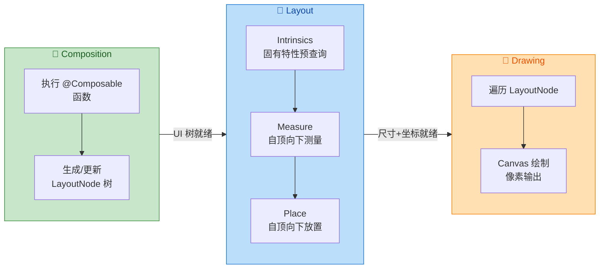

---

### 测量 Measure

#### 核心概念：Constraints 约束模型

Layout Phase 的测量过程始终围绕一个核心数据结构展开——`Constraints`。它是父节点传递给子节点的 **"你应该把自己控制在多大范围内"** 的指令，包含四个整型字段：`minWidth`、`maxWidth`、`minHeight`、`maxHeight`，单位为像素（px）。子节点收到约束后，必须返回一个同时满足宽高范围的 **测量结果（Measurable → Placeable）**。

```kotlin
// Constraints 核心字段（简化）
// 实际实现使用 Long 位压缩，这里展开便于理解
data class Constraints(
    val minWidth: Int = 0,      // 允许的最小宽度（px）
    val maxWidth: Int = Infinity,// 允许的最大宽度（px），Infinity 表示不限
    val minHeight: Int = 0,     // 允许的最小高度（px）
    val maxHeight: Int = Infinity// 允许的最大高度（px）
)
```

Constraints 有几种典型形态值得关注：

- **Unbounded（无界约束）**：`minWidth=0, maxWidth=∞, minHeight=0, maxHeight=∞`。根节点接收到的就是这种约束，子节点可以选择任意尺寸。典型来源是 `Modifier.verticalScroll()` 包裹的容器，它会把垂直方向的 maxHeight 设为无穷，因为内容可以滚动，无需限高。
- **Bounded（有界约束）**：`minWidth ≤ maxWidth, minHeight ≤ maxHeight`，且都是有限值。这是最常见的情况。
- **Exact / Tight（精确约束）**：`minWidth == maxWidth` 且 `minHeight == maxHeight`。当你使用 `Modifier.size(100.dp)` 时，它会将约束收紧为精确值，子节点没有选择余地，必须返回该精确尺寸。

理解 Constraints 至关重要，因为 Compose 中许多令人困惑的布局行为都与约束传播有关。例如，为什么 `Modifier.fillMaxSize()` 之后再写 `Modifier.size(50.dp)` 就无法缩小？因为 `fillMaxSize` 会将约束变为 exact（min==max），后续的 `size` 修饰符收到的约束已经是固定值，无法再缩小。

#### 测量的递归过程

测量从根 `LayoutNode` 开始，沿 UI 树自顶向下递归执行。每个节点的测量逻辑由它的 **`MeasurePolicy`** 决定（即你在 `Layout` Composable 中传入的 lambda，或者 `Column`/`Row` 等内置容器自带的策略）。整体流程可以总结为三步循环：

1. **父节点调用子节点的 `measure(constraints)`**：将约束传递给子节点。子节点是一个 `Measurable` 接口实例。
2. **子节点执行自己的 MeasurePolicy**：如果子节点也是容器，它会继续向下测量自己的子节点（递归）。
3. **子节点返回 `Placeable`**：`Placeable` 携带了该子节点测量后确定的 `width` 和 `height`，父节点拿到后用于后续计算。

**Measurable 与 Placeable 的关系**十分明确：`Measurable` 是"可被测量的对象"（测量前），调用 `measurable.measure(constraints)` 后得到 `Placeable`，即"已测量完毕、可被放置的对象"（测量后）。这是一次性转换——你不能对同一个 `Measurable` 调用两次 `measure()`，否则会抛出 `IllegalStateException`。

```kotlin
// 一个简化的自定义布局，演示测量过程
@Composable
fun SimpleColumn(
    modifier: Modifier = Modifier,             // 接收外部修饰符
    content: @Composable () -> Unit             // 子内容 lambda
) {
    Layout(
        content = content,                      // 传入子 Composable
        modifier = modifier,                    // 传入修饰符链
        measurePolicy = { measurables, constraints ->
            // measurables: List<Measurable>，即所有子节点
            // constraints: 父节点传下来的约束

            // 第一步：逐个测量子节点，各自拿到 Placeable
            val placeables = measurables.map { measurable ->
                measurable.measure(constraints)  // 每个子节点只能调用一次 measure
            }

            // 第二步：根据所有子节点的尺寸，计算本容器的总尺寸
            val totalHeight = placeables.sumOf { it.height } // 高度累加（竖直排列）
            val maxWidth = placeables.maxOf { it.width }     // 宽度取最大值

            // 第三步：调用 layout() 声明本容器的尺寸，并进入放置阶段
            layout(maxWidth, totalHeight) {
                // 这里是 PlacementScope，进行 Place 操作（下一节详述）
                var yOffset = 0                               // 纵向偏移累加器
                placeables.forEach { placeable ->
                    placeable.placeRelative(0, yOffset)       // 将子节点放在 (0, yOffset)
                    yOffset += placeable.height               // 偏移量累加
                }
            }
        }
    )
}
```

上面的代码就是一个最简化版的 `Column` 实现。它清晰地展现了 `Measure → 得到 Placeable → 计算尺寸 → layout() { place }` 的完整链路。

#### 约束传播与修饰符的角色

在实际开发中，约束并不是从根节点直接"穿透"到叶子节点的——每经过一层 `LayoutModifier`，约束都可能被 **变换（transform）**。以 `Modifier.padding(16.dp)` 为例，它会把父约束的 maxWidth/maxHeight 各减去 32px（两侧各 16dp），然后将缩小后的约束传给内层子节点；当子节点返回 Placeable 后，padding 修饰符再把子节点的尺寸加回 32px，作为自己的 "对外尺寸" 返回给上层。这种 **"缩约束→测子节点→扩尺寸"** 的模式是几乎所有 LayoutModifier 的通用套路。

所以修饰符的顺序极为重要。`Modifier.padding(16.dp).background(Color.Red)` 和 `Modifier.background(Color.Red).padding(16.dp)` 的视觉效果截然不同——前者是在 padding 之后绘制背景（背景不含 padding 区域），后者是先绘制背景再 padding（背景覆盖整个含 padding 的区域）。这背后的原因就是 Modifier Chain 的折叠顺序决定了约束传播的层次（详见下一节 Modifier Chain）。

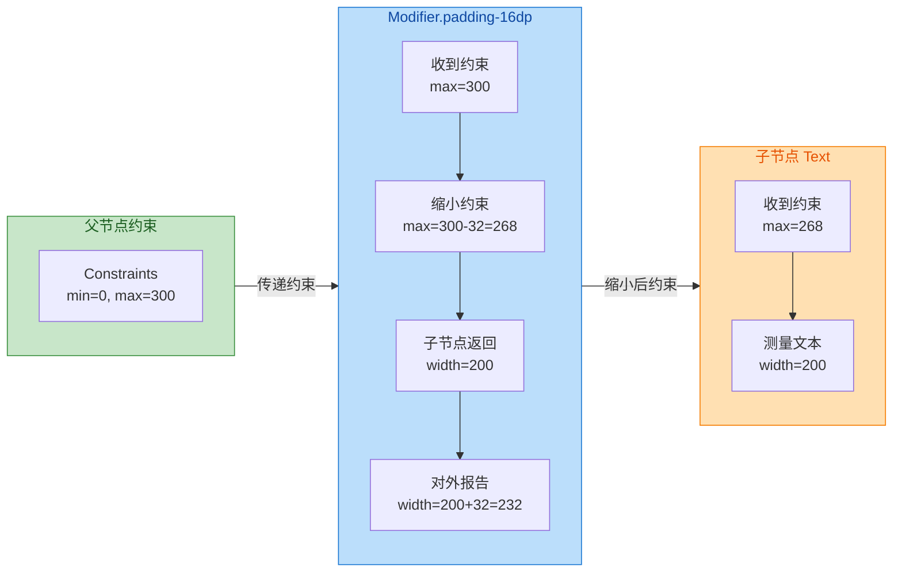

---

### 放置 Place

#### 从 Placeable 到屏幕坐标

当所有子节点完成测量并返回 `Placeable` 后，父节点调用 `layout(width, height) { ... }` 进入 **放置阶段（Placement Scope）**。在这个 lambda 内部，父节点通过调用每个 `Placeable` 的 `place()`、`placeRelative()` 或 `placeWithLayer()` 方法，为其分配相对于父节点左上角的 **(x, y) 偏移坐标**。

需要特别注意的是，Place 阶段的坐标系是 **相对坐标**——每个子节点的 (x, y) 都是相对于其直接父容器的偏移。Compose 框架在最终绘制时会自动将这些相对坐标转换为屏幕绝对坐标，开发者无需关心。

#### place 与 placeRelative 的区别

Compose 提供了两种放置方法，它们在 RTL（Right-to-Left）布局方向处理上有本质差异：

- **`placeable.place(x, y)`**：直接将子节点放在 (x, y) 位置，**不会** 自动镜像。无论当前布局方向是 LTR 还是 RTL，x 坐标都是从左边缘开始计算。适用于开发者已经自行处理了 RTL 的场景。
- **`placeable.placeRelative(x, y)`**：在 RTL 布局方向下，框架会自动将 x 坐标做镜像翻转（即 `parentWidth - childWidth - x`），使得逻辑上的 "起始侧" 始终对应正确的物理方向。**推荐在大多数场景下使用此方法**，除非你有明确理由需要绝对定位。

#### placeWithLayer 的性能优势

`placeWithLayer()` 是一个高级放置方法，它将子节点的绘制内容放入一个独立的 **RenderNode Layer**。这意味着当子节点的位置或透明度发生变化时，框架可以 **跳过重新测量和重新绘制**，仅通过 GPU 层面的变换（平移、缩放、旋转、透明度）来更新画面。这与传统 View 体系中 `View.setLayerType(LAYER_TYPE_HARDWARE)` 的原理一致。

典型应用场景包括：动画过程中频繁变更子节点偏移量的情况（如列表滑动、拖拽、折叠展开动画等）。使用 `placeWithLayer` 可以让这些变化完全在 Drawing Phase 中完成，而无需重新触发 Measure 和 Place。

```kotlin
// 放置阶段的几种方式对比
layout(totalWidth, totalHeight) {
    // 方式 1：绝对放置，不处理 RTL
    placeable.place(x = 0, y = 0)

    // 方式 2：相对放置，自动处理 RTL 镜像（推荐）
    placeable.placeRelative(x = 16, y = 0)

    // 方式 3：带图层放置，适合高频位移动画
    placeable.placeWithLayer(
        x = animatedOffsetX,   // 动画驱动的 x 偏移
        y = 0,
        layerBlock = {
            alpha = animatedAlpha       // 可在图层上直接设置透明度
            scaleX = animatedScale      // 也可设置缩放
            // translationX / rotationZ 等均可
        }
    )
}
```

#### 放置阶段的独立重组

Compose 的另一个重要性能优化是 **Layout Phase 内部的细粒度失效（Fine-grained Invalidation）**。Measure 和 Place 虽然同属 Layout Phase，但它们的状态读取是 **分别追踪** 的。如果一个 `State` 值仅在 `PlacementScope`（即 `layout { ... }` 内部）被读取，那么当该值变化时，Compose 仅会重新执行 Place 步骤，而 **跳过 Measure 步骤**。这被称为 **"仅放置失效"（placement-only invalidation）**。

举个实际例子：当你在 `layout { ... }` 块中读取一个由手势驱动的 `offset` State 来决定子节点的放置位置，而这个 State 不参与测量逻辑，那么每次手指移动时，只有 Place 会被重新执行，测量完全跳过——这对于拖拽、滑动等高频操作来说是巨大的性能提升。

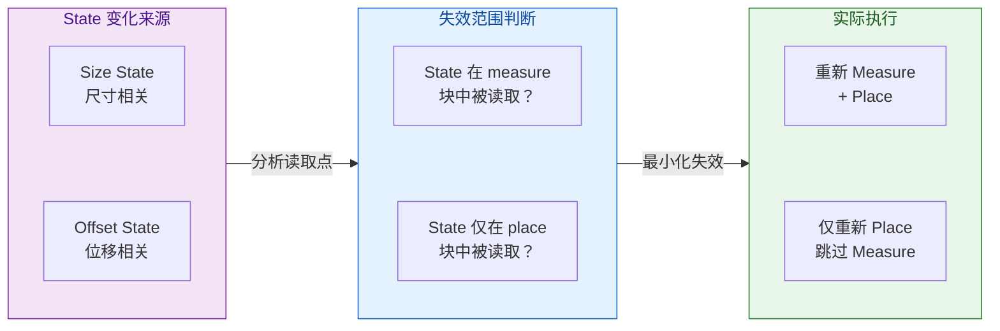

---

### 固有特性测量 Intrinsics

#### 为什么需要 Intrinsics？

前面提到，Compose 严格禁止对同一子节点进行多次测量。但在某些布局场景下，父节点确实需要在正式测量前 "预知" 子节点的理想尺寸。经典案例是这样的：

> 假设一个 `Row` 包含两个子节点 `Text("Hello")` 和一个 `Divider`（竖直分割线）。我们希望 `Divider` 的高度等于 `Text` 的高度。但在测量 `Divider` 时，`Text` 可能还没有被测量（或者即使测量了，`Divider` 也无法直接引用 `Text` 的测量结果来决定自己的约束）。

如果没有 Intrinsics，解决方案只有两个：要么允许多次测量（性能灾难），要么写复杂的自定义布局逻辑。Compose 用 Intrinsics 优雅地解决了这个问题——它允许父节点在正式测量之前，向子节点 **查询（query）** 其固有尺寸特征，而这种查询 **不算正式测量**，不会触发单次测量限制。

#### 四个 Intrinsic 查询

每个 `Measurable` 都提供四个 Intrinsic 查询方法，它们的语义非常对称：

| 方法 | 语义 |
|------|------|
| `minIntrinsicWidth(height)` | 给定高度约束后，能正确展示内容的 **最小宽度** 是多少？ |
| `maxIntrinsicWidth(height)` | 给定高度约束后，能充分展示内容的 **最大合理宽度** 是多少？ |
| `minIntrinsicHeight(width)` | 给定宽度约束后，能正确展示内容的 **最小高度** 是多少？ |
| `maxIntrinsicHeight(width)` | 给定宽度约束后，能充分展示内容的 **最大合理高度** 是多少？ |

以 `Text` 为例：`minIntrinsicWidth(h)` 返回的是将文本逐词换行后最长单词的宽度（这是不截断内容所需的最小宽度）；`maxIntrinsicWidth(h)` 返回的是文本单行排列时的总宽度（这是不换行所需的宽度）。`minIntrinsicHeight(w)` 返回的是在给定宽度 w 下文本换行后的总高度。

这些查询方法是 **纯计算**，它们不会产生 Placeable，也不会改变任何状态。父节点拿到 Intrinsic 值后，可以用来构造更精确的 Constraints，然后再进行正式测量。

#### height(IntrinsicSize.Min) 与 width(IntrinsicSize.Min)

在日常开发中，你通常不需要直接调用 Intrinsic 查询方法。Compose 提供了两个便利修饰符：`Modifier.height(IntrinsicSize.Min)` 和 `Modifier.width(IntrinsicSize.Min)`（以及 `.Max` 变体），它们会自动触发 Intrinsic 查询并将结果作为精确约束传递给子节点。

回到前面 `Row + Text + Divider` 的例子：

```kotlin
@Composable
fun TextWithDivider() {
    Row(
        modifier = Modifier
            .height(IntrinsicSize.Min)           // 关键：让 Row 的高度等于子节点的最小固有高度
    ) {
        Text(
            text = "Hello Compose!",             // 文本子节点
            modifier = Modifier
                .weight(1f)                      // 占据剩余水平空间
                .padding(8.dp)                   // 内边距
        )
        Divider(                                 // 竖直分割线
            modifier = Modifier
                .fillMaxHeight()                 // 填满父容器高度（此时父高度已由 Intrinsics 确定）
                .width(1.dp),                    // 分割线宽度 1dp
            color = Color.Gray
        )
        Text(
            text = "World!",                     // 第二个文本
            modifier = Modifier
                .weight(1f)
                .padding(8.dp)
        )
    }
}
```

工作流程如下：

1. `Modifier.height(IntrinsicSize.Min)` 使 `Row` 在正式测量前，先对所有子节点调用 `minIntrinsicHeight(availableWidth)` 查询。
2. `Text` 返回其在可用宽度下的最小高度（即文字排版后的实际高度加上 padding）；`Divider` 的 `minIntrinsicHeight` 返回 0（分割线本身没有固有内容高度）。
3. `Row` 取所有子节点 `minIntrinsicHeight` 的 **最大值**（因为 Row 的高度由最高的子节点决定），得到一个确定的高度值 H。
4. 然后 Row 用 `Constraints(minHeight=H, maxHeight=H, ...)` 这个精确高度约束来正式测量所有子节点。
5. `Divider` 因为有 `fillMaxHeight()`，所以它会填满 H，从而与文字等高。

整个过程中，**没有任何子节点被测量两次**——Intrinsic 查询是独立于 Measure 的轻量操作。

#### 自定义 Intrinsics

当你编写自定义 Layout 时，可以通过覆盖 `MeasurePolicy` 的四个 Intrinsic 方法来提供准确的固有尺寸信息。如果不覆盖，默认实现会尝试基于子节点的 Intrinsic 值做推断，但这不一定准确。

```kotlin
@Composable
fun TwoColumnLayout(
    modifier: Modifier = Modifier,
    content: @Composable () -> Unit
) {
    Layout(
        content = content,
        modifier = modifier,
        measurePolicy = object : MeasurePolicy {

            // 正式测量逻辑
            override fun MeasureScope.measure(
                measurables: List<Measurable>,          // 子节点列表
                constraints: Constraints                // 父约束
            ): MeasureResult {
                // 将可用宽度平分给两列
                val halfWidth = constraints.maxWidth / 2 // 每列宽度
                val childConstraints = constraints.copy( // 构造子约束
                    minWidth = 0,                        // 子节点最小宽度为 0
                    maxWidth = halfWidth                 // 子节点最大宽度为一半
                )
                // 测量所有子节点
                val placeables = measurables.map { it.measure(childConstraints) }
                // 计算总高度（简化：取最大高度）
                val height = placeables.maxOfOrNull { it.height } ?: 0
                return layout(constraints.maxWidth, height) {
                    var x = 0                            // x 偏移
                    placeables.forEach { placeable ->
                        placeable.placeRelative(x, 0)    // 水平排列
                        x += halfWidth                   // 每个子节点偏移半宽
                    }
                }
            }

            // 自定义：给定高度约束，本布局的最小固有宽度
            override fun IntrinsicMeasureScope.minIntrinsicWidth(
                measurables: List<IntrinsicMeasurable>, // 子节点（Intrinsic 版）
                height: Int                             // 给定的高度
            ): Int {
                // 两列布局：最小宽度 = 两个子节点最小宽度之和
                val maxChildMinWidth = measurables.maxOfOrNull {
                    it.minIntrinsicWidth(height)        // 查询每个子节点的最小固有宽度
                } ?: 0
                return maxChildMinWidth * 2             // 两列，所以乘 2
            }

            // 自定义：给定宽度约束，本布局的最小固有高度
            override fun IntrinsicMeasureScope.minIntrinsicHeight(
                measurables: List<IntrinsicMeasurable>,
                width: Int
            ): Int {
                val halfWidth = width / 2               // 每列可用宽度
                return measurables.maxOfOrNull {
                    it.minIntrinsicHeight(halfWidth)    // 在半宽约束下，子节点需要的最小高度
                } ?: 0
            }

            // maxIntrinsicWidth 和 maxIntrinsicHeight 同理，此处省略
            override fun IntrinsicMeasureScope.maxIntrinsicWidth(
                measurables: List<IntrinsicMeasurable>,
                height: Int
            ): Int {
                val maxChildMaxWidth = measurables.maxOfOrNull {
                    it.maxIntrinsicWidth(height)
                } ?: 0
                return maxChildMaxWidth * 2
            }

            override fun IntrinsicMeasureScope.maxIntrinsicHeight(
                measurables: List<IntrinsicMeasurable>,
                width: Int
            ): Int {
                val halfWidth = width / 2
                return measurables.maxOfOrNull {
                    it.maxIntrinsicHeight(halfWidth)
                } ?: 0
            }
        }
    )
}
```

#### Intrinsics 的性能考量

虽然 Intrinsic 查询本身是轻量的，但它会递归向下传播——当父节点查询 `minIntrinsicHeight` 时，它的子节点可能需要查询自己子节点的 `minIntrinsicHeight`，一直到叶子节点。这意味着一次 Intrinsic 查询会触发整棵子树的遍历。因此，应该 **仅在确实需要时** 使用 Intrinsic 查询（如上面 Divider 等高的场景），避免在深层嵌套的大树上滥用，否则可能带来不必要的开销。

总结来看，Intrinsics 是 Compose "Single-pass Measurement" 设计哲学的 **安全阀**：它在不打破"只测一次"铁律的前提下，为那些需要预知子节点尺寸的场景提供了一条合法的"信息旁路"。

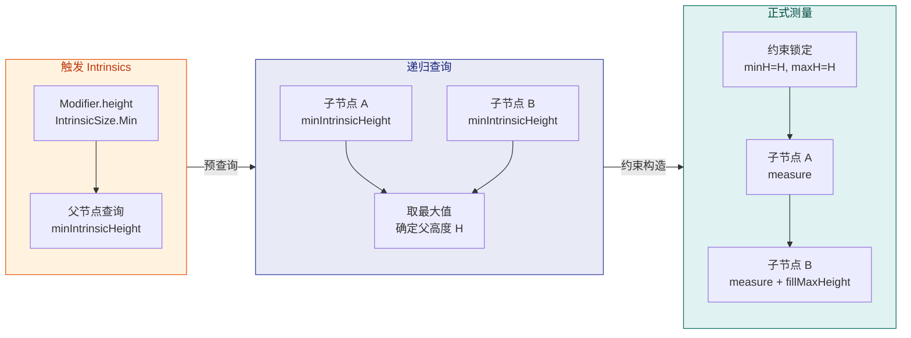

---

**📝 练习题**

在 Compose 的 Layout Phase 中，以下关于 Intrinsic Measurement 的说法，哪个是 **正确的**？


A. Intrinsic 查询会消耗子节点的唯一一次测量机会，因此查询后不能再调用 `measure()`


B. `Modifier.height(IntrinsicSize.Min)` 会对子节点调用 `maxIntrinsicHeight()` 来确定父容器高度


C. Intrinsic 查询是独立于正式 Measure 的轻量操作，不会产生 Placeable，也不计入 "single-pass" 限制


D. 自定义 Layout 不需要覆盖 Intrinsic 方法，因为框架会自动生成完全准确的默认值


**【答案】** C

**【解析】** Intrinsic 查询机制的设计初衷就是在不违反 "每个子节点单次布局过程中只能被 `measure()` 一次" 这一铁律的前提下，提供预查询能力。Intrinsic 查询调用的是 `IntrinsicMeasurable` 上的 `minIntrinsicWidth/Height` 或 `maxIntrinsicWidth/Height` 方法，这些方法 **不会返回 Placeable**，也不会改变节点的测量状态，因此不计入 single-pass 限制。选项 A 错在将 Intrinsic 查询等同于正式测量；选项 B 错在 `IntrinsicSize.Min` 对应的是 `minIntrinsicHeight()` 而非 `maxIntrinsicHeight()`；选项 D 错在框架的默认实现只是一种 **尽力而为（best-effort）** 的推断，对于复杂的自定义布局逻辑，默认值很可能不准确，开发者应当主动覆盖以提供精确值。

---

## 修饰符链 Modifier Chain

在 Jetpack Compose 的世界里，`Modifier` 是控制组件外观与行为的**唯一入口**。与传统 View 体系中在 XML 里散落设置 `layout_width`、`padding`、`margin`、`background` 等属性不同，Compose 将所有这些"装饰"与"布局约束"统一收敛到一条 **Modifier 链（Modifier Chain）** 中。理解这条链的内部结构、执行顺序以及底层的折叠（Fold）机制，是写出正确且高性能 Compose UI 的前提。本节将从最直觉的链式调用顺序讲起，逐步深入到 `Modifier` 接口的代数结构与 `foldIn` / `foldOut` 原理，最后落地到如何自定义一个 `LayoutModifier`。

---

### 链式调用顺序

#### 一、Modifier 是什么

从类型系统的角度看，`Modifier` 是一个 **接口**（interface）。它只有一个核心能力——与另一个 `Modifier` 通过 `then()` 函数进行拼接，返回一个新的 `Modifier`。我们日常写的 `.padding().background().clickable()` 这种链式写法，本质上就是对 `then()` 的语法糖式连续调用。每次调用都不会修改已有对象，而是产生一个新的 **CombinedModifier** 节点，将左侧（outer）与右侧（inner）包裹在一起，最终形成一棵**左偏二叉树**。

这里有一个非常关键的心智模型：**链式书写的顺序就是从外到内包裹的顺序**。你可以把每个 Modifier 想象成一层"洋葱皮"，最先写的那个 Modifier 在最外层，最后写的在最内层、最贴近实际内容。这与传统 View 体系中 `padding` 和 `margin` 是两个独立属性完全不同——在 Compose 里，你可以通过在 `background` 前后分别加 `padding` 来精确控制"背景色是否覆盖 padding 区域"。

#### 二、顺序敏感性：经典案例

来看最经典的例子：`padding` 与 `background` 的排列顺序如何影响最终渲染。

```kotlin
// ========== 写法 A：先 padding 后 background ==========
Box(
    modifier = Modifier
        .padding(16.dp)      // 第 1 层（最外层）：先在外围留出 16dp 空白
        .background(Color.Red) // 第 2 层（内层）：然后给剩余区域上色
        .size(100.dp)         // 第 3 层（最内层）：最终内容区 100x100
)
// 效果：红色区域周围有 16dp 透明间距，背景色不覆盖 padding

// ========== 写法 B：先 background 后 padding ==========
Box(
    modifier = Modifier
        .background(Color.Red) // 第 1 层（最外层）：先铺上红色背景
        .padding(16.dp)        // 第 2 层（内层）：在红色区域内部再向内缩 16dp
        .size(100.dp)          // 第 3 层（最内层）：最终内容区 100x100
)
// 效果：红色区域包含了 padding，整体尺寸为 132x132，内容区 100x100
```

为什么会这样？因为 Compose 布局阶段的测量（Measure）是**从外向内**传递约束、**从内向外**汇报尺寸的。写法 A 中，`padding` 在最外层，它先从父级拿到约束后"吃掉"32dp（上下各 16），把缩小后的约束传给 `background`，`background` 不改变约束继续传给 `size`。最终 `background` 只知道内层给它汇报的 100×100 尺寸，所以只绘制 100×100 的红色矩形。写法 B 中，`background` 在最外层，它会等内层（`padding` + `size`）汇报完尺寸后，拿到 132×132 这个"已经包含了 padding"的结果来绘制红色背景。

用一张流程图来直观呈现这两种写法在测量阶段的约束传递差异：

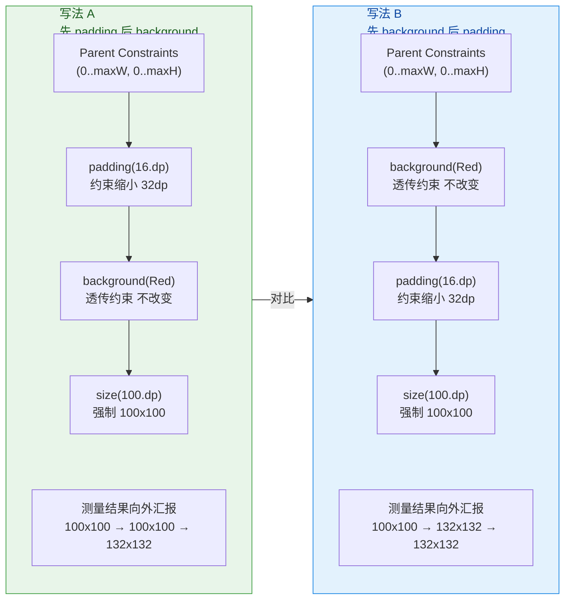

这个例子揭示了 Compose Modifier 最重要的设计哲学：**没有 margin 这个概念**。传统 View 把 margin（外间距）和 padding（内间距）做成两个独立属性，而 Compose 只保留了 `padding` 这一个原语——你只需要通过调整它在链中的位置，就能实现 margin（放在 `background` 之前）或 padding（放在 `background` 之后）的效果。这是一种更正交、更可组合的设计。

#### 三、多次同类 Modifier 的叠加

由于 Modifier 链中每个节点都是独立的，同类 Modifier 可以出现多次，且效果会叠加而非覆盖：

```kotlin
Box(
    modifier = Modifier
        .padding(8.dp)          // 外层留白 8dp
        .background(Color.Blue) // 蓝色背景
        .padding(16.dp)         // 蓝色内部再留白 16dp
        .background(Color.Red)  // 红色背景
        .padding(4.dp)          // 红色内部留白 4dp
        .size(50.dp)            // 最终内容 50x50
)
// 最终效果：从外到内依次是 8dp透明 → 蓝色边框 → 16dp蓝色区域 → 红色背景 → 4dp红色区域 → 内容
```

这就像套了多层信封：第一层信封外面留了 8dp 空白，信封本身是蓝色的；打开蓝色信封后里面有 16dp 蓝色衬纸，然后是红色信封；红色信封里 4dp 衬纸后才是内容。这种"每次 padding 都是新的一层"的特性，让 Compose 的布局表达力远超传统 View 体系。

#### 四、事件分发方向：与绘制相反

值得注意的是，**触摸事件（Pointer Input）的分发方向与绘制方向相反**。绘制是从最外层画到最内层（后绘制的覆盖先绘制的），而事件是从最内层向外冒泡。但在 Modifier 链中，`clickable` 等事件 Modifier 的位置同样重要：放在 `padding` 之前意味着 padding 区域也可点击（因为 clickable 在外层，它感知到的尺寸包含了内层的 padding），放在 `padding` 之后则只有内容区域可点击。

```kotlin
// padding 区域可点击（clickable 在外层，尺寸包含 padding）
Modifier.clickable { }.padding(32.dp)

// 仅内容区域可点击（clickable 在内层，padding 已把区域缩小了）
Modifier.padding(32.dp).clickable { }
```

这一点在实际开发中经常导致 bug：用户点击了按钮周围的空白区域却没有响应，或者反过来——点击空白区域意外触发了事件。排查时第一步就应该检查 `clickable` 在 Modifier 链中的位置。

---

### Fold 操作原理

#### 一、Modifier 的代数结构

理解了链式调用的外在行为后，我们需要深入 `Modifier` 接口的内部设计。打开源码会发现 `Modifier` 接口定义了三个关键成员：

```kotlin
// Modifier.kt —— Compose 核心接口
interface Modifier {

    // 从左到右（从外到内）折叠：initial 是起始累加值，operation 对每个 Element 执行操作
    fun <R> foldIn(initial: R, operation: (R, Modifier.Element) -> R): R

    // 从右到左（从内到外）折叠：initial 是起始累加值，operation 对每个 Element 执行操作
    fun <R> foldOut(initial: R, operation: (Modifier.Element, R) -> R): R

    // 判断链中是否存在满足条件的 Element
    fun any(predicate: (Modifier.Element) -> Boolean): Boolean

    // 所有具体修饰符的基接口：每个 .padding()、.background() 都是一个 Element
    interface Element : Modifier {
        // Element 是叶子节点，foldIn 只需将自己交给 operation
        override fun <R> foldIn(initial: R, operation: (R, Modifier.Element) -> R): R =
            operation(initial, this)

        // Element 是叶子节点，foldOut 同理
        override fun <R> foldOut(initial: R, operation: (Modifier.Element, R) -> R): R =
            operation(this, initial)
    }

    // 伴生对象：空 Modifier，作为链的起点（类似数学中的单位元 identity）
    companion object : Modifier {
        override fun <R> foldIn(initial: R, operation: (R, Modifier.Element) -> R): R = initial
        override fun <R> foldOut(initial: R, operation: (Modifier.Element, R) -> R): R = initial
        override fun toString() = "Modifier"
    }
}
```

这个设计非常精妙，它本质上是一个 **Monoid**（幺半群）结构：

- **单位元（Identity）**：`Modifier.Companion`，即空的 Modifier，和任何 Modifier 拼接都不改变结果。
- **二元运算（Binary Operation）**：`then()` 函数，将两个 Modifier 合并成一个 `CombinedModifier`。
- **结合律（Associativity）**：`(a.then(b)).then(c)` 与 `a.then(b.then(c))` 的折叠结果相同。

这种代数结构保证了 Modifier 链可以被安全地拼接、拆分、重组，而不会产生歧义。

#### 二、CombinedModifier：链的骨架

当我们写 `Modifier.padding(8.dp).background(Color.Red)` 时，实际调用路径是：

1. `Modifier`（Companion 单位元）`.then(PaddingModifier(8.dp))` → 因为左侧是单位元，直接返回 `PaddingModifier`
2. `PaddingModifier`.`then(BackgroundModifier(Color.Red))` → 创建 `CombinedModifier(outer=PaddingModifier, inner=BackgroundModifier)`

再追加 `.size(100.dp)` 后变成 `CombinedModifier(outer=CombinedModifier(outer=Padding, inner=Background), inner=SizeModifier)`。画出来就是一棵**左偏二叉树**：

```text
        CombinedModifier
       /                \
  CombinedModifier    SizeModifier
  /              \
PaddingModifier  BackgroundModifier
```

`then()` 的源码实现也印证了这一点：

```kotlin
// Modifier 接口的默认 then 实现
fun then(other: Modifier): Modifier =
    if (other === Modifier) this   // 拼接单位元直接返回自身，短路优化
    else CombinedModifier(this, other) // 否则创建组合节点，this 为 outer，other 为 inner
```

#### 三、foldIn 与 foldOut 的遍历方向

`foldIn` 和 `foldOut` 是对这棵二叉树进行遍历的两种方式，分别对应函数式编程中经典的 `foldLeft` 和 `foldRight`。

**foldIn（从外到内 / 从左到右）**：先处理链中最先书写的 Modifier（最外层），再依次向内。`CombinedModifier` 的实现是先对 `outer` 做 foldIn，把结果作为新的累加值传给 `inner` 的 foldIn：

```kotlin
// CombinedModifier.kt
class CombinedModifier(
    private val outer: Modifier,  // 链中先写的（外层）
    private val inner: Modifier   // 链中后写的（内层）
) : Modifier {
    override fun <R> foldIn(initial: R, operation: (R, Modifier.Element) -> R): R =
        // 先折叠外层，结果作为累加值传给内层继续折叠
        inner.foldIn(outer.foldIn(initial, operation), operation)

    override fun <R> foldOut(initial: R, operation: (Modifier.Element, R) -> R): R =
        // 先折叠内层，结果作为累加值传给外层继续折叠
        outer.foldOut(inner.foldOut(initial, operation), operation)
}
```

用我们的 `padding → background → size` 链来模拟 `foldIn` 的执行过程：

```text
foldIn(initial=R₀, op)
  ├── outer = CombinedModifier(Padding, Background)
  │     ├── outer = Padding  →  R₁ = op(R₀, Padding)     ← 第 1 个处理
  │     └── inner = Background → R₂ = op(R₁, Background)  ← 第 2 个处理
  └── inner = Size             → R₃ = op(R₂, Size)        ← 第 3 个处理

处理顺序：Padding → Background → Size（从外到内 ✓）
```

**foldOut（从内到外 / 从右到左）** 则完全相反：先处理 `inner`（Size），再处理 `Background`，最后处理 `Padding`。

```text
foldOut(initial=R₀, op)
  ├── inner = Size             → R₁ = op(Size, R₀)        ← 第 1 个处理
  │
  └── outer = CombinedModifier(Padding, Background)
        ├── inner = Background → R₂ = op(Background, R₁)  ← 第 2 个处理
        └── outer = Padding    → R₃ = op(Padding, R₂)     ← 第 3 个处理

处理顺序：Size → Background → Padding（从内到外 ✓）
```

#### 四、Fold 在框架中的实际应用

Compose 框架在多个关键路径上使用 fold 操作来遍历 Modifier 链：

1. **构建 LayoutNode 的 Modifier 链**：当一个 Composable 首次进入 Composition 或其 Modifier 发生变化时，框架会对新的 Modifier 链执行 `foldIn`，依次为每个 `Modifier.Element` 创建对应的内部节点（在新版 Modifier.Node 架构中则是分配或更新 `Modifier.Node` 链表）。`foldIn` 保证了处理顺序与书写顺序一致，外层 Modifier 对应的节点在链表头部，内层在尾部。

2. **语义树（Semantics Tree）聚合**：无障碍服务（Accessibility）需要从 Modifier 链中收集所有 `SemanticsModifier` 的属性（如 contentDescription、role 等）。框架通过 `foldIn` 将它们按书写顺序合并成一个 `SemanticsConfiguration`，先写的语义信息优先级更高。

3. **查找特定 Modifier**：`any()` 函数本质也是基于 fold 的短路版本——遍历链中所有 Element，一旦找到满足条件的就返回 `true`。

4. **Modifier.Node 架构下的 diff 更新**：Compose 1.3+ 引入的 `Modifier.Node` 系统在重组（Recomposition）时，会对新旧两条 Modifier 链进行结构化比对。框架先将链 fold 成扁平列表，再逐位置比较类型与内容，决定是复用已有 Node、更新参数，还是销毁旧 Node 并创建新 Node。这种增量更新避免了每次重组都重建整条链，对性能至关重要。

下面用一张时序图展示框架如何利用 foldIn 将 Modifier 链展开并绑定到 LayoutNode：

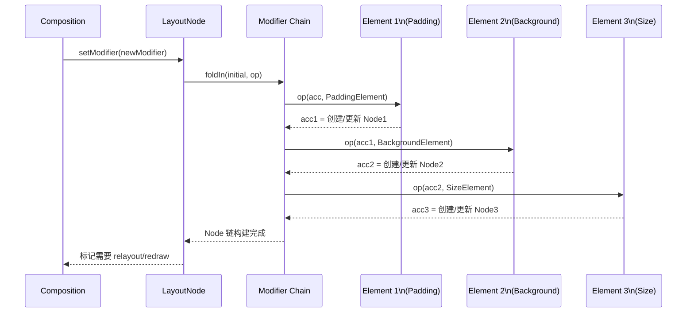

#### 五、为什么选择 Fold 而非简单 List

你可能会问：既然最终目的是"按顺序遍历每个 Element"，为什么不直接用 `List<Modifier.Element>` 呢？原因有几个：

- **零分配（Zero Allocation）拼接**：`then()` 只需创建一个 `CombinedModifier` 包装对象，而不需要复制数组。在重组频繁的场景下，这比 List 的 `plus` 操作高效得多。
- **短路优化**：对 `Modifier.Companion`（空 Modifier）的 `then()` 直接返回另一方，无需任何分配。这在条件修饰 `if (condition) Modifier.xxx() else Modifier` 的场景中非常常见。
- **函数式可组合性**：Fold 是一种通用的归约操作，可以适配任意累加逻辑。框架只需一次遍历就能同时完成"创建 Node""收集语义""计算总 padding"等多种任务。

---

### LayoutModifier 自定义

#### 一、Modifier.Element 的主要类别

在深入 LayoutModifier 之前，有必要了解 `Modifier.Element` 的主要子类别。Compose 根据修饰符的职责将其分为几大类：

| 类别 | 职责 | 典型示例 |
|------|------|---------|
| **LayoutModifier** | 参与测量和放置，可改变子组件的约束与位置 | `padding`, `size`, `offset`, `wrapContentSize` |
| **DrawModifier** | 在绘制阶段执行自定义绘制（Canvas 操作） | `background`, `border`, `drawBehind`, `drawWithContent` |
| **PointerInputModifier** | 处理触摸/指针事件 | `clickable`, `draggable`, `pointerInput` |
| **SemanticsModifier** | 为无障碍和测试提供语义信息 | `semantics`, `contentDescription`, `testTag` |
| **ParentDataModifier** | 向父布局传递子组件的布局参数 | `weight`（在 Row/Column 中）、`align`（在 Box 中） |

其中 **LayoutModifier** 是最核心也最复杂的一类，因为它直接介入了 Layout Phase 的测量与放置流程。

#### 二、LayoutModifier 接口剖析

> **注意**：在 Compose 较新版本中，官方推荐使用 `Modifier.Node` + `LayoutModifierNode` 接口来实现自定义布局修饰符，性能更优。但经典的 `LayoutModifier` 接口依然有效，且其原理对理解整个机制至关重要，因此我们先以经典接口讲解概念，再迁移到新架构。

`LayoutModifier` 接口的核心方法只有一个——`measure()`：

```kotlin
// LayoutModifier 接口核心定义
interface LayoutModifier : Modifier.Element {

    /**
     * 在布局阶段被调用。
     * @param measurable   —— 代表"被此 Modifier 包裹的内层内容"，你可以对它进行测量
     * @param constraints  —— 父级传下来的约束（最小/最大 宽度/高度）
     * 返回值：MeasureResult —— 包含该 Modifier 节点自身的宽高，以及内层内容的放置逻辑
     */
    fun MeasureScope.measure(
        measurable: Measurable,
        constraints: Constraints
    ): MeasureResult
}
```

这个签名与 `Layout` Composable 的 `MeasurePolicy.measure()` 极为相似，差别在于 `LayoutModifier` 只包裹**一个** `Measurable`（就是它内侧的下一个节点），而 `Layout` 可以接收多个子组件的 `List<Measurable>`。

执行流程是这样的：当框架在 Layout Phase 遍历到某个 LayoutModifier 节点时，它会调用该节点的 `measure()` 方法，并把"内层所有内容"打包成一个 `Measurable` 传进来。你在 `measure()` 中可以：

1. **修改约束**：在调用 `measurable.measure(modifiedConstraints)` 之前，对 constraints 做变换（比如减去 padding 值）。
2. **测量内层**：调用 `measurable.measure(...)` 得到 `Placeable`，此时内层的宽高已确定。
3. **决定自身尺寸**：调用 `layout(width, height)` 声明自己的最终尺寸。
4. **放置内层**：在 `layout` 的 lambda 中调用 `placeable.placeRelative(x, y)` 决定内层内容在自己坐标系中的位置。

#### 三、手写一个 CustomPadding Modifier

理论讲完，我们来手写一个简化版的 `padding` 修饰符，完整展示 LayoutModifier 的工作方式：

```kotlin
/**
 * 自定义 padding Modifier —— 经典 LayoutModifier 写法
 * @param horizontal 水平方向（左右各一半）的 padding 值
 * @param vertical   垂直方向（上下各一半）的 padding 值
 */
fun Modifier.customPadding(
    horizontal: Dp = 0.dp, // 水平 padding，默认 0
    vertical: Dp = 0.dp    // 垂直 padding，默认 0
): Modifier = this.then(  // 将自定义 Modifier 追加到现有链尾部
    CustomPaddingModifier(horizontal, vertical)
)

// 实现 LayoutModifier 接口的具体类
private class CustomPaddingModifier(
    private val horizontal: Dp, // 存储水平 padding 参数
    private val vertical: Dp    // 存储垂直 padding 参数
) : LayoutModifier {

    // 核心：参与测量与放置
    override fun MeasureScope.measure(
        measurable: Measurable,    // "内层内容"的测量代理
        constraints: Constraints   // 父级传入的约束范围
    ): MeasureResult {

        // Step 1：将 Dp 转换为像素值（roundToPx 使用 MeasureScope 提供的 density）
        val horizontalPx = horizontal.roundToPx() // 水平 padding 像素值
        val verticalPx = vertical.roundToPx()     // 垂直 padding 像素值

        // Step 2：缩小约束 —— 内层可用空间要减去左右和上下的 padding
        val newConstraints = constraints.offset(   // offset 是 Constraints 的工具函数
            horizontal = -horizontalPx * 2,        // 左右各占 horizontalPx，所以总共减 2 倍
            vertical = -verticalPx * 2             // 上下各占 verticalPx，所以总共减 2 倍
        )

        // Step 3：用缩小后的约束测量内层内容，得到 Placeable（含宽高信息）
        val placeable = measurable.measure(newConstraints)

        // Step 4：自身的总宽高 = 内层宽高 + 两侧 padding
        val totalWidth = placeable.width + horizontalPx * 2  // 总宽 = 内容宽 + 左右 padding
        val totalHeight = placeable.height + verticalPx * 2  // 总高 = 内容高 + 上下 padding

        // Step 5：调用 layout() 声明自身尺寸，并在 lambda 中放置内层
        return layout(totalWidth, totalHeight) {
            // 将内层内容偏移到 padding 之后的位置
            placeable.placeRelative(
                x = horizontalPx, // 向右偏移 horizontalPx（左 padding）
                y = verticalPx    // 向下偏移 verticalPx（上 padding）
            )
        }
    }

    // equals/hashCode 对于重组时的 Modifier 比较非常重要
    override fun equals(other: Any?): Boolean {
        if (this === other) return true                      // 同一引用直接相等
        if (other !is CustomPaddingModifier) return false    // 类型不匹配直接不等
        return horizontal == other.horizontal                // 比较水平值
                && vertical == other.vertical                // 比较垂直值
    }

    override fun hashCode(): Int {
        var result = horizontal.hashCode()   // 以 horizontal 的 hash 为基础
        result = 31 * result + vertical.hashCode() // 混入 vertical 的 hash
        return result
    }
}
```

关于 `equals` 和 `hashCode` 的重写，这里要特别强调：Compose 框架在重组时会比较新旧 Modifier 链。如果一个 `Modifier.Element` 的 `equals` 返回 `true`，框架会跳过该节点的更新，直接复用已有的内部状态。如果你忘记重写 `equals`，则默认使用引用相等（`===`），这意味着即使参数完全相同，每次重组都会被视为"发生了变化"，导致不必要的重新测量和放置。

#### 四、迁移到 Modifier.Node 架构

从 Compose 1.3 开始，官方引入了 `Modifier.Node` 架构来替代经典的 `Modifier.Element` 直接实现方式。核心动机是**性能**：经典方式中每个 `Modifier.Element` 在每次重组时都可能被重新分配（即使参数没变），而 `Modifier.Node` 是一个**有状态的、可复用的**节点对象，它被绑定到 LayoutNode 的生命周期中，重组时只需更新参数而非重建。

新架构的核心组件有三个：

- **`Modifier.Node`**：有状态节点，持有实际逻辑。通过实现不同的 `XxxNode` 接口（如 `LayoutModifierNode`、`DrawModifierNode`）来声明自己的能力。
- **`ModifierNodeElement<T : Modifier.Node>`**：无状态的 `Modifier.Element` 实现，充当"工厂 + 更新器"角色。它负责创建 Node 实例（`create()`）以及在参数变化时更新已有 Node（`update()`）。
- **Node 链表**：框架在 LayoutNode 内部维护一条 `Modifier.Node` 双向链表，与 Modifier 链一一对应。

来看用新架构重写的 CustomPadding：

```kotlin
/**
 * 新架构：Modifier.Node 版本的自定义 padding
 * 对外 API 不变，内部实现切换到 Node 架构
 */
fun Modifier.customPadding(
    horizontal: Dp = 0.dp,
    vertical: Dp = 0.dp
): Modifier = this then CustomPaddingElement(horizontal, vertical)
// 注意：这里用的是中缀 then，效果与 .then() 相同

/**
 * ModifierNodeElement —— 无状态工厂，负责创建和更新 Node
 * data class 自动生成 equals/hashCode，框架据此判断是否需要更新
 */
private data class CustomPaddingElement(
    val horizontal: Dp, // padding 参数（水平）
    val vertical: Dp    // padding 参数（垂直）
) : ModifierNodeElement<CustomPaddingNode>() {

    // 首次附加到 LayoutNode 时调用，创建 Node 实例
    override fun create() = CustomPaddingNode(horizontal, vertical)

    // 重组时参数发生变化，更新已有 Node（避免重建）
    override fun update(node: CustomPaddingNode) {
        node.horizontal = horizontal // 直接修改 Node 的属性
        node.vertical = vertical     // 直接修改 Node 的属性
    }
}

/**
 * Modifier.Node —— 有状态节点，实现 LayoutModifierNode 接口以参与测量/放置
 */
private class CustomPaddingNode(
    var horizontal: Dp, // 可变属性，update() 时会被修改
    var vertical: Dp    // 可变属性，update() 时会被修改
) : Modifier.Node(),    // 继承 Modifier.Node 基类
    LayoutModifierNode { // 实现布局修饰符能力接口

    // 与经典 LayoutModifier.measure() 签名几乎一致
    override fun MeasureScope.measure(
        measurable: Measurable,
        constraints: Constraints
    ): MeasureResult {
        // 将 Dp 转为 px
        val hPx = horizontal.roundToPx()
        val vPx = vertical.roundToPx()

        // 缩小约束，测量内层
        val placeable = measurable.measure(
            constraints.offset(
                horizontal = -hPx * 2, // 水平方向总共减去左右 padding
                vertical = -vPx * 2    // 垂直方向总共减去上下 padding
            )
        )

        // 声明自身尺寸并放置内层
        return layout(placeable.width + hPx * 2, placeable.height + vPx * 2) {
            placeable.placeRelative(hPx, vPx) // 内层向右下偏移一个 padding 的距离
        }
    }
}
```

新旧两种方式的核心区别可以用下面这张对比图概括：

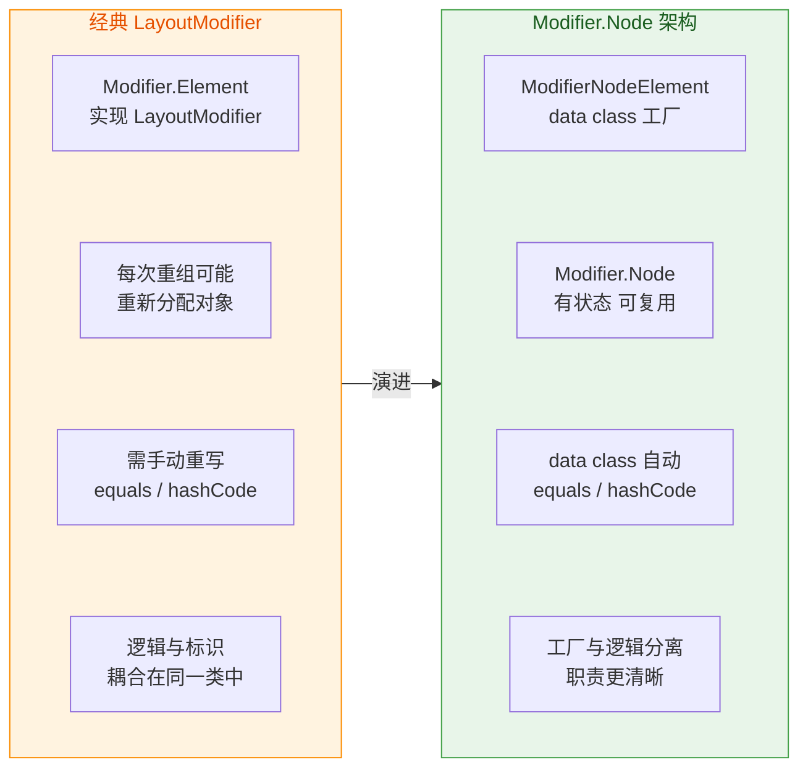

**何时选择哪种方式？** 如果你的项目最低依赖 Compose 1.3+（对应 Compose Compiler 1.3+），应该优先使用 `Modifier.Node` 架构。它不仅性能更好（减少不必要的对象分配），而且 `Modifier.Node` 可以同时实现多个能力接口（例如一个 Node 同时实现 `LayoutModifierNode` + `DrawModifierNode`），在经典架构中你需要创建多个 `Element` 并用 `then` 拼接，而现在一个 Node 就能搞定，减少了链的长度，也减少了遍历开销。

#### 五、LayoutModifier 在 Modifier 链中的执行位置

最后，我们从全局视角看 LayoutModifier 在整个 Layout Phase 中的执行位置。一个 LayoutNode 的 Modifier 链可能包含多个 LayoutModifier（比如 `padding` 后面跟 `size`），框架会将它们视为一个**嵌套的测量链**：外层 LayoutModifier 先被调用，它的 `measurable` 参数指向内层的下一个 LayoutModifier（或最终的 Layout content）。

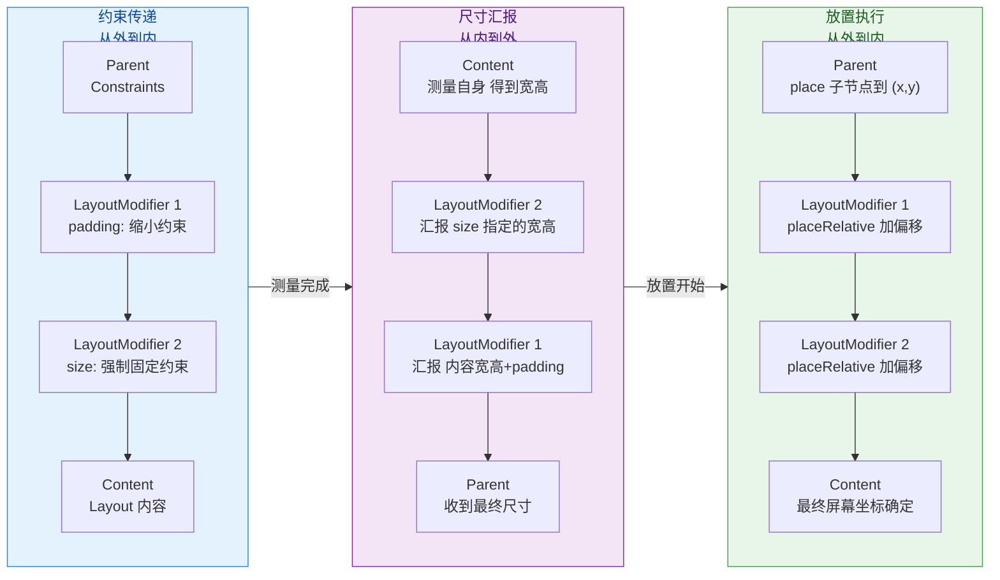

这三个子阶段——约束传递（Measure down）、尺寸汇报（Size up）、放置执行（Place down）——就是上一节"布局流程 Layout Phase"中讲过的核心流程。LayoutModifier 是应用层开发者介入这个流程的主要手段，而 `Modifier.Node` 架构则让这种介入更加高效和可维护。

---

**📝 练习题**

在以下 Compose 代码中，最终显示的绿色背景区域尺寸是多少？

```kotlin
Box(
    modifier = Modifier
        .size(200.dp)
        .padding(20.dp)
        .background(Color.Green)
        .padding(30.dp)
)
```

A. 200 × 200 dp


B. 160 × 160 dp


C. 100 × 100 dp


D. 140 × 140 dp

**【答案】** B

**【解析】** Modifier 链从外到内依次是：`size(200dp)` → `padding(20dp)` → `background(Green)` → `padding(30dp)`。首先 `size` 将约束固定为 200×200；然后 `padding(20dp)` 从四边各减去 20dp，传给内层的可用空间为 160×160；接着 `background` 不改变约束，它会等内层汇报完尺寸后绘制背景；最内层的 `padding(30dp)` 再减去 60dp 但这不影响 `background` 的绘制尺寸——`background` 绘制的区域取决于它包裹的"全部内层"汇报的尺寸。内层 `padding(30dp)` 包裹的是 Box 的空内容（无子组件），所以内容测量为 0×0，加上 `padding(30dp)` 的上下左右各 30dp... 等等，这里需要更仔细地分析。实际上 `padding(30dp)` 并不会增大尺寸——它只是缩小约束。由于内层没有子组件，内层 `padding` 的 measurable 测量结果取决于 Box 的默认行为（wrap content = 0×0），所以 `padding(30dp)` 汇报的尺寸为 0 + 60 = 60×60。但此时 `background` 拿到的尺寸是 160×160 的约束下的 60×60 吗？不对——让我们重新理顺：`padding(20dp)` 传给 `background` 的约束是 `0..160`，`background` 透传给 `padding(30dp)`，`padding(30dp)` 约束变为 `0..100`，内层空 Box 汇报 0×0，`padding(30dp)` 汇报 60×60，`background` 收到 60×60 并以此尺寸绘制……**但这里 Box 没有子组件时，默认会使用 Constraints 的最小值**。题目中 `size(200dp)` 产生的约束是 `exact 200×200`（min=max=200），`padding(20dp)` 变为 `exact 160×160`（min=max=160），`background` 透传 `exact 160×160`，`padding(30dp)` 变为 `exact 100×100`。空内容在 exact 约束下测量为 100×100，`padding(30dp)` 汇报 160×160，`background` 收到 160×160。所以绿色背景区域为 **160×160 dp**。关键点在于 `size()` 设置的是 exact 约束（min=max），这使得后续所有 padding 只是"内缩"可用空间，而每层汇报尺寸时会加回 padding 值，直到恢复到上层的 exact 尺寸。答案是 B。

---

## 常用布局容器

在 Jetpack Compose 的世界里，UI 构建的基本单元不再是 XML 中的 `LinearLayout`、`FrameLayout` 等 ViewGroup，而是一组 **Composable 函数**。这些函数本质上是"声明式的布局指令"——你只需要描述"我希望子元素如何排列"，Compose 的布局引擎会在 Layout Phase 中完成测量（Measure）与放置（Place）。本节将深入讲解最核心的三大基础容器 `Column`、`Row`、`Box`，以及在实际项目中极为常用的脚手架 `Scaffold` 和表面容器 `Surface`，从使用方式、内部原理到最佳实践，层层展开。

### Column / Row / Box —— 线性与层叠布局

#### 核心定位：三种最基本的排列策略

如果你从传统 View 体系过来，可以建立这样一个对照关系：`Column` 约等于 `LinearLayout(vertical)`，`Row` 约等于 `LinearLayout(horizontal)`，`Box` 约等于 `FrameLayout`。但这只是表面相似，Compose 的实现机制完全不同——它们不是 ViewGroup 子类，而是调用 `Layout` Composable 函数并传入不同 `MeasurePolicy` 的纯函数。

**Column** 将所有子元素沿 **纵轴（Y 轴）** 从上到下依次排列。每个子元素被测量后，其 Y 偏移量等于前面所有子元素高度之和（加上间距）。它的签名中最关键的两个参数是 `verticalArrangement` 和 `horizontalAlignment`：前者控制子元素在纵轴方向上如何分布（顶部对齐、底部对齐、均匀间隔等），后者控制每个子元素在横轴方向上的对齐方式（居左、居中、居右）。

**Row** 则是 Column 的"旋转 90°版本"，将子元素沿 **横轴（X 轴）** 从左到右排列。其核心参数对称地变为 `horizontalArrangement`（横向分布策略）和 `verticalAlignment`（纵向对齐方式）。

**Box** 的行为完全不同：它将所有子元素 **层叠（Stack）** 在同一个区域内，后声明的子元素绘制在上层（类似 z-index 更高）。Box 只提供一个 `contentAlignment` 参数来控制所有子元素的默认对齐位置（如居中、左上角等），但每个子元素可以通过 `Modifier.align()` 独立覆盖。

以下 Mermaid 图展示了三者在概念上的排列方向差异：

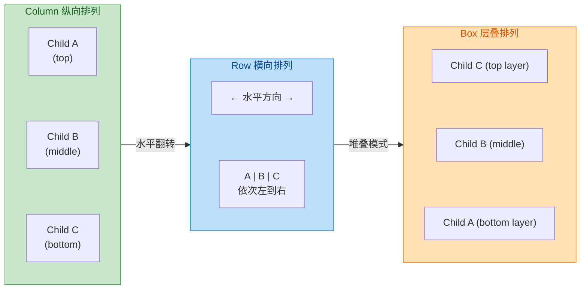

#### Arrangement 与 Alignment 详解

理解 `Arrangement` 和 `Alignment` 是使用 Column/Row 的关键，很多初学者容易把二者混淆。

**Arrangement（排列/分布）** 作用于 **主轴**（Column 的主轴是垂直方向，Row 的主轴是水平方向）。它解决的问题是：当所有子元素的总尺寸 **小于** 容器在主轴上的可用空间时，多余的空间该如何分配？Compose 提供了丰富的内置策略：

- `Arrangement.Top` / `Arrangement.Start`：所有子元素紧靠起始端，剩余空间留在末尾。
- `Arrangement.Bottom` / `Arrangement.End`：所有子元素紧靠末尾端。
- `Arrangement.Center`：所有子元素作为整体居中，剩余空间平分在两端。
- `Arrangement.SpaceBetween`：首尾子元素贴边，剩余空间 **均匀分配** 在子元素之间。
- `Arrangement.SpaceAround`：每个子元素两侧分配等量空间，首尾子元素到边缘的距离是中间间距的一半。
- `Arrangement.SpaceEvenly`：所有间隔（包括首尾到边缘）完全相等。
- `Arrangement.spacedBy(dp)`：子元素之间插入固定间距，这在实际开发中使用频率极高。

**Alignment（对齐）** 作用于 **交叉轴**（与主轴垂直的方向）。它解决的问题是：当某个子元素在交叉轴方向上的尺寸 **小于** 容器提供的交叉轴空间时，这个子元素该靠哪边？例如在 Column 中，`horizontalAlignment = Alignment.CenterHorizontally` 意味着每个子元素在水平方向居中。

在 Box 中，由于不存在"主轴"的概念，`contentAlignment` 实际上同时控制了水平和垂直两个方向的对齐，它接受的是一个二维的 `Alignment` 值，如 `Alignment.TopStart`、`Alignment.Center`、`Alignment.BottomEnd` 等。

#### 底层测量机制：为何 Column/Row 不允许多次测量

Compose 布局系统有一条铁律：**每个子节点在一次布局过程中只能被测量一次**（single-pass measurement）。这与传统 View 系统中 `LinearLayout` 对 `weight` 子元素执行两次 `measure` 的做法截然不同。Compose 选择单次测量是为了避免嵌套布局时的指数级性能衰减（在 View 系统中，多层嵌套的 LinearLayout + weight 会导致 O(2^n) 次测量）。

那么 Column/Row 是如何在"单次测量"的约束下实现 `weight` 功能的呢？答案在于测量的 **两阶段策略**（虽然每个子节点只被测量一次）：

1. **第一轮：测量所有无 weight 的子元素**。这些子元素的约束直接来自父容器，测量完成后可以得到它们的实际尺寸。
2. **第二轮：测量所有有 weight 的子元素**。此时引擎已经知道"剩余空间 = 父容器主轴尺寸 − 无 weight 子元素总尺寸"，将剩余空间按 weight 比例分配给各个 weight 子元素作为约束。

注意，每个子节点确实只被测量了一次，只是测量的 **顺序** 被精心安排了。这种设计保证了 O(n) 的线性复杂度。

#### 实战代码：Column + Row + Box 组合

下面展示一个典型的列表卡片布局，综合运用三种容器：

```kotlin
@Composable
fun UserCard(
    name: String,          // 用户名
    subtitle: String,      // 副标题
    avatarUrl: String,     // 头像地址
    isOnline: Boolean      // 是否在线
) {
    // 最外层 Row：头像在左，文字信息在右，水平排列
    Row(
        modifier = Modifier
            .fillMaxWidth()                    // 宽度撑满父容器
            .padding(16.dp),                   // 四周留白 16dp
        verticalAlignment = Alignment.CenterVertically // 子元素在垂直方向居中
    ) {
        // Box 用于层叠：头像 + 在线状态小绿点
        Box(
            contentAlignment = Alignment.BottomEnd // 默认内容对齐到右下角
        ) {
            // 头像图片（底层）
            AsyncImage(
                model = avatarUrl,             // 图片 URL
                contentDescription = "头像",    // 无障碍描述
                modifier = Modifier
                    .size(48.dp)               // 固定 48dp 大小
                    .clip(CircleShape)          // 裁剪为圆形
            )
            // 在线状态指示器（上层，叠在头像右下角）
            if (isOnline) {
                Box(
                    modifier = Modifier
                        .size(12.dp)                        // 小圆点 12dp
                        .background(Color(0xFF4CAF50), CircleShape) // 绿色圆形背景
                        .border(2.dp, Color.White, CircleShape)     // 白色描边避免与头像融合
                )
            }
        }

        // Spacer 在 Row 中充当水平间距
        Spacer(modifier = Modifier.width(12.dp)) // 头像与文字之间留 12dp

        // Column 用于垂直排列用户名和副标题
        Column(
            modifier = Modifier.weight(1f),     // 占据 Row 中剩余的所有水平空间
            verticalArrangement = Arrangement.Center // 文字在垂直方向居中分布
        ) {
            // 用户名（主标题）
            Text(
                text = name,                    // 显示用户名
                style = MaterialTheme.typography.titleMedium, // Material 中等标题样式
                maxLines = 1,                   // 最多一行
                overflow = TextOverflow.Ellipsis // 超出部分显示省略号
            )
            // 副标题
            Text(
                text = subtitle,                // 显示副标题文字
                style = MaterialTheme.typography.bodySmall, // Material 小号正文样式
                color = MaterialTheme.colorScheme.onSurfaceVariant, // 使用次要文字颜色
                maxLines = 1,                   // 最多一行
                overflow = TextOverflow.Ellipsis // 超出部分省略
            )
        }
    }
}
```

这段代码体现了一个非常常见的组合模式：**Row 管水平排列 → Box 管层叠叠加 → Column 管垂直排列**。三者各司其职，嵌套组合就能构建绝大多数常规 UI。

#### BoxWithConstraints：需要运行时尺寸决策时的选择

标准 `Box` 在 Composition 阶段执行，此时你无法知道容器的实际像素尺寸。如果需要根据容器宽高做条件判断（例如宽度大于 600dp 时显示双栏布局），应使用 `BoxWithConstraints`。它在 **Layout Phase** 中提供 `maxWidth`、`maxHeight` 等 `Constraints` 信息作为 scope 属性，使你能在 Composable 内部根据实际约束值做分支渲染。但需要注意，`BoxWithConstraints` 本质上使用了 `SubcomposeLayout`，其子组合会被推迟到测量阶段执行，这意味着它的性能开销略高于普通 `Box`，不应在列表 item 等高频重组场景中滥用。

---

### Scaffold —— 脚手架

#### 为什么需要 Scaffold

在 Material Design 规范中，一个典型的应用页面通常包含以下"固定区域"：顶部应用栏（TopAppBar）、底部导航栏（BottomBar）、浮动操作按钮（FAB）、侧边抽屉（Drawer）、以及底部弹出面板（BottomSheet）。如果你手动用 `Column` + `Box` 去组合这些区域，需要自己处理各区域之间的间距、FAB 与 BottomBar 的嵌套协调、Snackbar 的弹出位置、系统栏 Insets 的适配等大量细节。`Scaffold` 的存在就是为了 **将这些 Material 标准页面结构的布局逻辑封装为一个统一容器**，开发者只需通过具名参数"填槽"即可。

#### Scaffold 的 Slot API 设计

Compose 中大量使用 **Slot API**（插槽模式），`Scaffold` 是其中最典型的代表。它的函数签名中有多个 `@Composable` 类型的参数，每个参数对应一个"插槽"：

```kotlin
@Composable
fun Scaffold(
    modifier: Modifier = Modifier,                          // 整体修饰符
    topBar: @Composable () -> Unit = {},                     // 顶部栏插槽
    bottomBar: @Composable () -> Unit = {},                  // 底部栏插槽
    snackbarHost: @Composable () -> Unit = {},               // Snackbar 宿主插槽
    floatingActionButton: @Composable () -> Unit = {},       // FAB 插槽
    floatingActionButtonPosition: FabPosition = FabPosition.End, // FAB 位置（End 或 Center）
    containerColor: Color = MaterialTheme.colorScheme.background, // 容器背景色
    contentColor: Color = contentColorFor(containerColor),   // 内容默认颜色
    contentWindowInsets: WindowInsets = ScaffoldDefaults.contentWindowInsets, // 内容区域的窗口 insets
    content: @Composable (PaddingValues) -> Unit             // 主内容插槽（核心）
) { /* ... */ }
```

最需要关注的是 **`content` 参数接收一个 `PaddingValues`**。这个 `PaddingValues` 由 Scaffold 内部计算得出，它精确表示了"TopBar 底部到 BottomBar 顶部之间的安全区域"的内边距。**你必须将这个 PaddingValues 应用到 content 的根元素上**，否则内容会被 TopBar 或 BottomBar 遮挡。这是初学者最常犯的错误之一。

#### Scaffold 内部的布局原理

Scaffold 内部使用了 `SubcomposeLayout` 而非普通的 `Layout`。为什么？因为 content 区域的约束取决于 TopBar 和 BottomBar 的实际测量高度，而这些高度在 Composition 阶段是未知的。`SubcomposeLayout` 允许 Scaffold 分步执行：

1. **先测量 TopBar、BottomBar、FAB、SnackbarHost** —— 获得它们各自的实际高度。
2. **计算 contentPadding** —— `top = topBarHeight`, `bottom = bottomBarHeight`（同时考虑 WindowInsets）。
3. **再组合并测量 content** —— 将计算好的 `PaddingValues` 传给 content lambda，此时 content 才开始组合。
4. **放置所有元素** —— TopBar 放在 y=0，content 占据中间区域，BottomBar 放在底部，FAB 按 `FabPosition` 放置在右下或中下。

这种"先测量依赖项，再组合被依赖项"的模式正是 `SubcomposeLayout` 的核心价值。

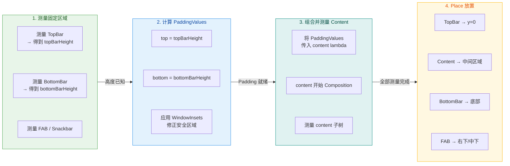

#### Scaffold 实战示例

```kotlin
@OptIn(ExperimentalMaterial3Api::class) // TopAppBar 在 Material3 中仍标记为实验性
@Composable
fun MainScreen(
    onNavigateToSettings: () -> Unit // 导航到设置页的回调
) {
    // SnackbarHostState 用于控制 Snackbar 的显示
    val snackbarHostState = remember { SnackbarHostState() }
    // 协程作用域，用于在点击事件中启动 Snackbar
    val scope = rememberCoroutineScope()

    Scaffold(
        // 顶部栏：使用 Material3 的 TopAppBar
        topBar = {
            TopAppBar(
                title = { Text("首页") },          // 标题文字
                actions = {                          // 右侧操作按钮区域
                    IconButton(onClick = onNavigateToSettings) { // 点击跳转设置
                        Icon(
                            imageVector = Icons.Default.Settings,   // 齿轮图标
                            contentDescription = "设置"             // 无障碍描述
                        )
                    }
                }
            )
        },
        // 底部栏：底部导航
        bottomBar = {
            NavigationBar {                           // Material3 底部导航栏
                NavigationBarItem(                    // 导航项 - 首页
                    selected = true,                  // 当前选中
                    onClick = { },                    // 点击回调
                    icon = { Icon(Icons.Default.Home, contentDescription = "首页") },
                    label = { Text("首页") }          // 标签文字
                )
                NavigationBarItem(                    // 导航项 - 消息
                    selected = false,                 // 未选中
                    onClick = { },                    // 点击回调
                    icon = { Icon(Icons.Default.Email, contentDescription = "消息") },
                    label = { Text("消息") }          // 标签文字
                )
            }
        },
        // Snackbar 宿主
        snackbarHost = { SnackbarHost(hostState = snackbarHostState) },
        // 浮动操作按钮
        floatingActionButton = {
            FloatingActionButton(
                onClick = {                           // FAB 点击时弹出 Snackbar
                    scope.launch {                    // 在协程中调用 suspend 函数
                        snackbarHostState.showSnackbar(
                            message = "新建成功",     // Snackbar 消息
                            duration = SnackbarDuration.Short // 短暂显示
                        )
                    }
                }
            ) {
                Icon(Icons.Default.Add, contentDescription = "新建") // FAB 图标
            }
        }
    ) { innerPadding ->
        // ⚠️ 必须使用 innerPadding，否则内容会被 TopBar/BottomBar 遮挡
        LazyColumn(
            modifier = Modifier
                .fillMaxSize()                        // 撑满可用空间
                .padding(innerPadding)                // 应用 Scaffold 计算的内边距
        ) {
            items(50) { index ->                      // 生成 50 个列表项
                Text(
                    text = "Item #$index",            // 显示序号
                    modifier = Modifier
                        .fillMaxWidth()               // 宽度撑满
                        .padding(16.dp)               // 内边距
                )
            }
        }
    }
}
```

#### 关于 innerPadding 的深入理解

很多开发者对 `innerPadding` 的使用有疑惑：为什么不能直接忽略它？原因在于 Scaffold 会让 content 区域 **占满整个屏幕**（而不是仅占 TopBar 和 BottomBar 之间的区域），这样做是为了让 content 中的滚动内容（如 LazyColumn）可以在 TopBar/BottomBar **下方滑动**，实现"内容穿透"的视觉效果。如果 content 不应用 innerPadding，第一个列表项会被 TopBar 遮挡，最后一个列表项会被 BottomBar 遮挡。

对于 `LazyColumn` 或 `LazyRow`，更优雅的做法是将 `innerPadding` 传给 `contentPadding` 参数而不是 `Modifier.padding()`：

```kotlin
LazyColumn(
    contentPadding = innerPadding // 内容内边距，不影响滚动条和边缘效果的位置
) { /* ... */ }
```

这样做的区别是：`contentPadding` 会让 padding 区域也参与滚动，当列表滚动到顶部时，第一个 item 可以从 TopBar 下方"滑出"，体验更流畅；而 `Modifier.padding()` 会硬性缩小整个 LazyColumn 的可滚动区域。

---

### Surface —— 表面容器

#### Surface 的设计哲学

在 Material Design 的设计体系中，**Surface（表面）** 是一个核心隐喻——所有 UI 元素都被认为存在于一个或多个"纸面"之上，每个纸面有自己的高度（Elevation）、颜色、形状和边界。`Surface` Composable 正是对这一概念的直接实现。

从功能上看，`Surface` 做了以下几件事：

1. **背景色与内容色绑定**：设置 `color` 参数后，Surface 会通过 `CompositionLocal`（具体是 `LocalContentColor`）自动推导出合适的内容色（`contentColor`），使其内部的 `Text`、`Icon` 等组件自动采用对比度足够的颜色。你无需手动为每个子元素指定颜色。
2. **形状裁剪**：`shape` 参数决定了 Surface 的轮廓形状（如圆角矩形 `RoundedCornerShape`），内容会被自动裁剪到形状边界内。
3. **阴影/Elevation**：`shadowElevation` 和 `tonalElevation` 控制视觉高度。前者产生传统的投影阴影，后者通过 Material3 的 Tonal Color System 使背景色随高度变化产生微妙的色调偏移（在 Dark Theme 中尤其明显）。
4. **语义边界**：Surface 在 semantics tree 中标记了一个内容区域的边界，有助于无障碍功能（Accessibility）正确识别和朗读内容。

#### Surface 与 Box + Modifier 的区别

你可能会问："我直接用 `Box(modifier = Modifier.background(color).clip(shape))` 不也能实现同样效果吗？"技术上可以，但 Surface 提供了几个 Box 做不到的东西：

- **ContentColor 自动传播**：Surface 内部调用了 `CompositionLocalProvider(LocalContentColor provides contentColor)`，这意味着所有子组件都会自动获得正确的文字/图标颜色，无需手动指定。用 Box + background 则不会有这种行为。
- **Tonal Elevation 支持**：Material3 的色调系统需要通过 Surface 来生效。单纯的 `Modifier.background()` 无法响应 tonal elevation 的颜色映射。
- **阻止点击穿透**：Surface 默认会消费（consume）触摸事件，防止其背后的元素被点击。这在层叠布局中非常重要。
- **语义分组**：Surface 会在 accessibility tree 中创建一个合并的语义节点。

因此，**在 Material Design 体系下，应该优先使用 Surface 而非 Box + Modifier 来创建"卡片"、"对话框"、"底部面板"等具有独立视觉层的区域**。

#### Surface 的多种重载

Material3 中 `Surface` 有多个重载版本，适用于不同场景：

| 重载形式 | 适用场景 | 额外参数 |
|---------|---------|---------|
| `Surface(modifier, shape, color, ...)` | 纯静态容器，无交互 | — |
| `Surface(onClick, modifier, shape, ...)` | 可点击容器（如卡片） | `onClick: () -> Unit`，`enabled: Boolean` |
| `Surface(checked, onCheckedChange, ...)` | 可选中容器（如 Toggle 卡片） | `checked: Boolean`，`onCheckedChange: (Boolean) -> Unit` |
| `Surface(selected, onClick, ...)` | 可选择容器（如导航列表项） | `selected: Boolean` |

可点击版本的 Surface 会自动添加 ripple 效果（涟漪反馈），并在 semantics 中标记为 clickable，这比 `Box + Modifier.clickable` 更符合 Material 设计规范。

#### Surface 实战：自定义卡片组件

```kotlin
@Composable
fun InfoCard(
    title: String,                               // 卡片标题
    description: String,                          // 卡片描述
    onClick: () -> Unit,                          // 点击回调
    modifier: Modifier = Modifier                 // 外部传入的修饰符
) {
    // 使用可点击版本的 Surface，自带 ripple 和无障碍标记
    Surface(
        onClick = onClick,                        // 点击回调
        modifier = modifier.fillMaxWidth(),       // 宽度撑满
        shape = RoundedCornerShape(12.dp),        // 12dp 圆角
        shadowElevation = 2.dp,                   // 2dp 投影阴影
        tonalElevation = 1.dp,                    // 1dp 色调提升（Dark Theme 中生效明显）
        color = MaterialTheme.colorScheme.surface, // 使用 Material 主题的 surface 颜色
        // contentColor 会自动推导为 onSurface，无需手动指定
    ) {
        // Surface 内部使用 Column 排列标题和描述
        Column(
            modifier = Modifier.padding(16.dp)    // 内边距 16dp
        ) {
            // 标题文字——自动继承 Surface 提供的 contentColor
            Text(
                text = title,                     // 标题内容
                style = MaterialTheme.typography.titleMedium // 中等标题字体
            )
            Spacer(modifier = Modifier.height(8.dp)) // 标题与描述之间 8dp 间距
            // 描述文字——使用 onSurfaceVariant 次要颜色
            Text(
                text = description,               // 描述内容
                style = MaterialTheme.typography.bodyMedium, // 中号正文字体
                color = MaterialTheme.colorScheme.onSurfaceVariant // 次要文字色
            )
        }
    }
}
```

#### Surface 与 Card 的关系

Material3 中的 `Card` 组件实际上就是 Surface 的一层封装。查看源码可以发现，`Card` 内部直接调用了 `Surface`，只是预设了不同的默认参数（如默认使用 `CardDefaults.cardColors()` 作为颜色、`CardDefaults.cardElevation()` 作为阴影配置）。因此，如果你需要高度自定义的"卡片式"容器，直接使用 `Surface` 可能比 `Card` 更灵活；如果你希望快速获得符合 Material 规范的标准卡片外观，直接用 `Card` 即可。两者的关系可以这样理解：**Card = Surface + Material 卡片默认样式**。

---

### 三者协作的全局视角

在一个实际的 Compose 页面中，`Scaffold`、`Surface` 和 `Column/Row/Box` 通常呈现出清晰的层级关系：

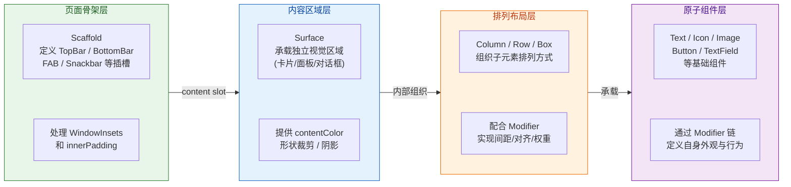

这种分层并非硬性规定，但它反映了 Compose 的最佳实践：**Scaffold 搭骨架 → Surface 划区域 → Column/Row/Box 排内容 → 原子组件填细节**。遵循这个思路，代码结构会非常清晰，每一层的职责分明。

---

**📝 练习题**

在一个使用 `Scaffold` 的页面中，开发者将 `LazyColumn` 放在 `content` 插槽内，但忘记使用 Scaffold 传递的 `innerPadding`。以下哪种现象最可能发生？


A. 编译报错，因为 `content` 的 lambda 参数 `PaddingValues` 未被使用


B. 列表首项被 TopAppBar 遮挡，末项被 BottomBar 遮挡


C. 应用运行时崩溃，抛出 `IllegalStateException`


D. 列表正常显示，Scaffold 会自动将 padding 应用到 content 根节点


**【答案】** B

**【解析】** Scaffold 的设计是让 `content` 区域 **占据整个屏幕**（而非 TopBar 和 BottomBar 之间的区域），然后通过 `PaddingValues` 告知开发者安全区域的偏移量。如果开发者不使用这个 `PaddingValues`，`LazyColumn` 会从屏幕最顶部（y=0）开始布局，导致第一个 item 被 TopAppBar 覆盖；同样，列表底部也会延伸到 BottomBar 下方，最后一个 item 被遮挡。Kotlin 中未使用的 lambda 参数不会导致编译错误（最多是一个 lint 警告），也不会引发运行时异常。Scaffold 并不会"自动"帮你把 padding 施加到 content 的根节点上——这是开发者的责任，也正是它将 `PaddingValues` 作为参数显式传递的原因。正确的做法是对 content 根元素使用 `Modifier.padding(innerPadding)` 或将其传给 `LazyColumn` 的 `contentPadding` 参数。

---

**📝 练习题**

关于 Compose 中 `Surface` 组件的作用，以下说法 **错误** 的是：


A. Surface 会通过 `LocalContentColor` 自动为内部子组件提供合适的内容颜色


B. Surface 的 `tonalElevation` 参数在 Material3 暗色主题下会使背景色产生色调偏移


C. Surface 与 `Box(Modifier.background(color).clip(shape))` 在功能上完全等价，仅是语法糖


D. 可点击版本的 Surface 会自动附加 ripple 效果和无障碍语义标记


**【答案】** C

**【解析】** 选项 C 的说法是错误的。虽然从视觉上看，`Box + Modifier.background + clip` 可以模拟出类似的外观效果，但 Surface 提供了多项 Box 无法替代的能力：第一，Surface 内部通过 `CompositionLocalProvider` 向子树注入了 `LocalContentColor`，使子组件自动获得正确的文字/图标颜色（选项 A 正确）；第二，Surface 支持 Material3 的 Tonal Elevation 系统，能根据 `tonalElevation` 值在暗色主题下自动调整背景色调（选项 B 正确）；第三，Surface 默认会在 semantics tree 中创建语义边界，并阻止点击事件穿透；第四，可点击版本的 Surface 自动集成了 ripple indication 和无障碍 clickable 标记（选项 D 正确）。这些行为都是 `Box + Modifier` 组合所不具备的，因此两者绝非"完全等价"。

---

## 约束布局 ConstraintLayout

在传统 View 体系中，`ConstraintLayout` 是解决复杂扁平化布局的利器，它通过声明式的约束关系取代了多层嵌套的 `LinearLayout` / `RelativeLayout`，大幅降低了布局层级（Layout Hierarchy）。进入 Jetpack Compose 时代后，虽然 `Column`、`Row`、`Box` 的组合已经能应对绝大多数场景，且 Compose 本身就不存在传统意义上的"嵌套性能问题"（因为 Compose 的测量模型天然支持单次测量 Single-pass Measurement），但在面对以下场景时，`ConstraintLayout` 仍有不可替代的价值：

- **多组件之间存在复杂的相对定位关系**：例如 A 的右侧对齐 B 的左侧，C 垂直居中于 A 和 B 之间，D 以百分比偏移放置等。用 `Column`/`Row` 嵌套虽然也能实现，但代码会变得极其冗长且难以维护。
- **需要 Barrier（屏障）、Chain（链）、Guideline（引导线）等高级排版特性**：这些概念在线性布局中没有直接等价物。
- **从传统 XML 布局迁移**：如果团队正在逐步将 XML 界面迁移到 Compose，保留 `ConstraintLayout` 的思维模型可以降低迁移成本。

Compose 版本的 `ConstraintLayout` 并非简单的"包一层 wrapper"，而是用纯 Kotlin DSL 重新设计了约束声明方式。它的底层求解器（Solver）仍然使用的是与 View 版本相同的 Cassowary 线性约束求解算法，但上层 API 完全融入了 Compose 的声明式范式。

### Compose 版本 DSL

传统 View 体系的 `ConstraintLayout` 使用 XML 属性（如 `app:layout_constraintStart_toEndOf`）或 Java/Kotlin 代码动态设置约束。而在 Compose 中，约束关系通过一套 **Kotlin DSL** 在 `ConstraintLayout` 的 lambda 作用域内声明，核心 API 围绕 `createRefs()` / `createRefFor()` 和 `constrain()` / `Modifier.constrainAs()` 展开。

#### 基本结构与 constraintSet 内联模式

Compose 的 `ConstraintLayout` 提供了两种声明约束的方式：**内联模式（Inline）** 和 **解耦模式（Decoupled / ConstraintSet）**。先看最常用的内联模式：

```kotlin
// 引入 Compose 版本的 ConstraintLayout 依赖：
// implementation("androidx.constraintlayout:constraintlayout-compose:1.1.x")

@Composable
fun ProfileCard() {
    // ConstraintLayout 本身是一个 Composable，接收 Modifier 和一个 lambda
    // lambda 的 receiver 是 ConstraintLayoutScope，提供了 createRefs() 等 DSL 方法
    ConstraintLayout(
        modifier = Modifier
            .fillMaxWidth()       // 宽度充满父布局
            .padding(16.dp)       // 四周留 16dp 内边距
    ) {
        // 1. 创建引用（Reference）—— 每个引用对应一个子组件的"锚点身份"
        //    createRefs() 通过解构声明，一次可创建多个引用
        val (avatar, name, bio) = createRefs()

        // 2. 通过 Modifier.constrainAs(ref) { ... } 为组件绑定引用并声明约束
        Image(
            painter = painterResource(id = R.drawable.avatar),
            contentDescription = "头像",                     // 无障碍描述
            modifier = Modifier
                .size(64.dp)                                  // 头像尺寸 64x64
                .clip(CircleShape)                            // 裁剪为圆形
                .constrainAs(avatar) {                        // 绑定到 avatar 引用
                    top.linkTo(parent.top)                    // 顶部对齐父布局顶部
                    start.linkTo(parent.start)                // 起始边对齐父布局起始边
                }
        )

        Text(
            text = "Claude",
            style = MaterialTheme.typography.titleMedium,     // Material 标题样式
            modifier = Modifier.constrainAs(name) {           // 绑定到 name 引用
                top.linkTo(avatar.top)                        // 顶部对齐头像顶部
                start.linkTo(avatar.end, margin = 12.dp)     // 起始边在头像右侧，间距 12dp
            }
        )

        Text(
            text = "Android Application Architect",
            style = MaterialTheme.typography.bodyMedium,      // Material 正文样式
            modifier = Modifier.constrainAs(bio) {            // 绑定到 bio 引用
                top.linkTo(name.bottom, margin = 4.dp)        // 顶部在 name 底部下方 4dp
                start.linkTo(name.start)                      // 起始边对齐 name 的起始边
                end.linkTo(parent.end)                        // 结束边对齐父布局结束边
                width = Dimension.fillToConstraints            // 宽度填充到约束边界之间
            }
        )
    }
}
```

这段代码体现了 Compose ConstraintLayout DSL 的核心思想：**先创建引用，再通过 `constrainAs` 建立引用与组件的绑定关系，同时在其 lambda 中使用 `linkTo` 声明约束**。其中几个关键概念值得深入理解：

**`constrainAs` 的 lambda receiver 是 `ConstrainScope`**。在这个作用域中，你可以访问组件自身的四条边（`top` / `bottom` / `start` / `end`）、基线（`baseline`）以及中心锚点（`centerTo` / `centerHorizontallyTo` / `centerVerticallyTo`）。每条边都可以通过 `linkTo()` 连接到其他引用的某条边或者 `parent` 的对应边。

**`Dimension` 控制约束维度**。在传统 View 版本中，`0dp`（match constraint）是一个常见但容易误解的概念。Compose 用更语义化的 `Dimension` 枚举清晰表达：

| Dimension 值 | 含义 | 等价 View 版本 |
|---|---|---|
| `Dimension.wrapContent` | 包裹内容，默认行为 | `wrap_content` |
| `Dimension.fillToConstraints` | 填充到约束边界之间的空间 | `0dp` (match_constraint) |
| `Dimension.preferredWrapContent` | 优先包裹内容，但不超过约束范围 | `wrap` + 约束限制 |
| `Dimension.value(x.dp)` | 固定尺寸 | 具体 dp 值 |
| `Dimension.percent(0.5f)` | 占父布局百分比 | `layout_constraintWidth_percent` |

`Dimension.fillToConstraints` 是使用频率极高的值。它的含义是：组件的宽度（或高度）不再由自身内容决定，而是"撑满"左右（或上下）约束之间的所有可用空间。这在需要让 `Text` 自动填充剩余宽度的场景中尤为常见。

#### 解耦模式 ConstraintSet

内联模式的优点是直观——约束和组件声明在一起。但当约束关系变得复杂，或者你希望 **在不同状态之间切换布局**（例如横竖屏切换、动画过渡）时，**解耦模式** 更为灵活：

```kotlin
@Composable
fun DecoupledExample() {
    // 1. 在 Composable 外部（或提前）定义 ConstraintSet
    //    ConstraintSet 是一个纯数据描述，不依赖任何 Composable 上下文
    val constraints = ConstraintSet {
        // 通过 createRefFor(id) 创建具名引用，id 使用字符串标识
        val title = createRefFor("title")           // 用 "title" 作为唯一标识
        val subtitle = createRefFor("subtitle")     // 用 "subtitle" 作为唯一标识

        // 使用 constrain(ref) { ... } 为引用声明约束（注意不是 constrainAs）
        constrain(title) {
            top.linkTo(parent.top)                  // 标题顶部对齐父布局顶部
            start.linkTo(parent.start)              // 标题起始边对齐父布局起始边
        }

        constrain(subtitle) {
            top.linkTo(title.bottom, margin = 8.dp) // 副标题在标题下方 8dp
            start.linkTo(title.start)               // 副标题与标题左对齐
        }
    }

    // 2. 将 ConstraintSet 传入 ConstraintLayout
    ConstraintLayout(
        constraintSet = constraints,                 // 传入预定义的约束集合
        modifier = Modifier.fillMaxSize()            // 充满整个屏幕
    ) {
        // 3. 子组件通过 layoutId 与 ConstraintSet 中的引用匹配
        //    layoutId("title") 将此 Text 与 constraints 中 "title" 引用绑定
        Text(
            text = "解耦模式标题",
            modifier = Modifier.layoutId("title")    // 关键：通过 layoutId 映射
        )
        Text(
            text = "副标题内容",
            modifier = Modifier.layoutId("subtitle") // 映射到 "subtitle" 引用
        )
    }
}
```

解耦模式的核心价值在于 **约束声明与组件树分离**。`ConstraintSet` 本质上是一个纯数据对象，可以通过函数参数传入、可以根据屏幕方向动态切换、甚至可以配合 `MotionLayout`（Compose 版本尚在实验阶段）实现两组 `ConstraintSet` 之间的过渡动画。这种"数据驱动布局"的理念完全符合 Compose 的声明式哲学。

两种模式对比如下图：

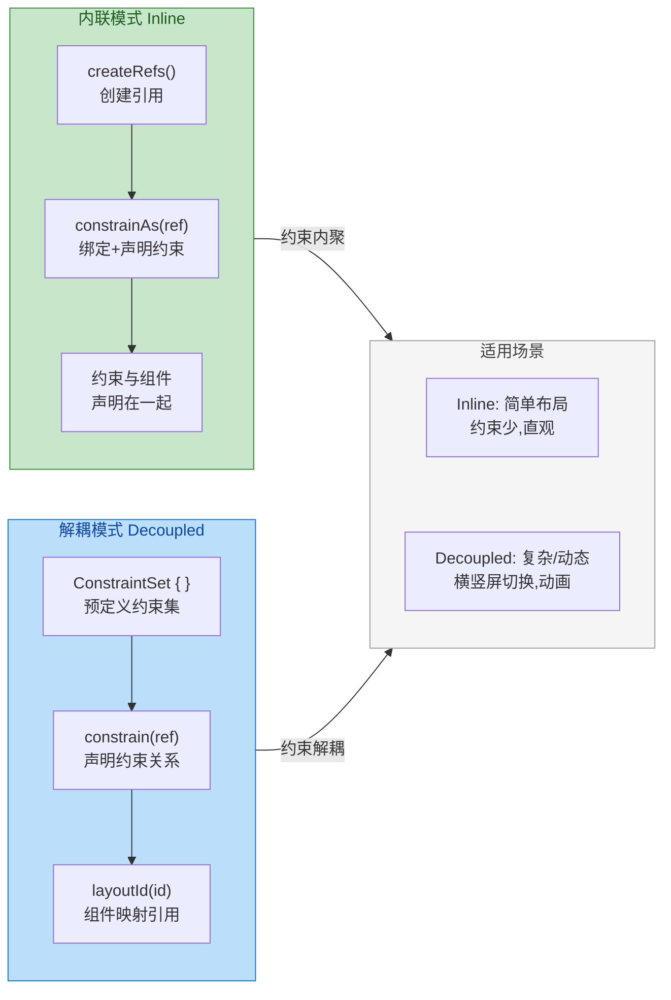

### 引用 Ref

引用（Reference，简称 Ref）是 ConstraintLayout DSL 中连接"约束声明"与"实际组件"的桥梁。每一个参与约束关系的子组件都必须拥有一个唯一的引用标识。根据使用模式的不同，引用的创建方式也有差异。

#### createRefs 与 createRefFor

在 **内联模式** 中，引用通过 `ConstraintLayoutScope` 提供的工厂方法创建：

- **`createRef()`**：创建单个引用。适合只有一两个组件需要约束的简单场景。返回的是一个 `ConstrainedLayoutReference` 对象。
- **`createRefs()`**：借助 Kotlin 的 **解构声明（Destructuring Declaration）** 一次创建多个引用。内部实现是返回一个支持 `component1()` ~ `componentN()` 的容器对象。这是最常用的方式。

```kotlin
// createRef() —— 单个引用
val button = createRef()

// createRefs() —— 解构声明，一次创建多个
// 内部利用 operator fun componentN() 实现解构
val (header, body, footer) = createRefs()
```

在 **解耦模式** 中，引用通过 `ConstraintSetScope.createRefFor(id)` 创建，其中 `id` 是一个任意对象（通常是 `String`），用于后续与子组件的 `Modifier.layoutId(id)` 匹配：

```kotlin
val constraints = ConstraintSet {
    // createRefFor 接收一个 id 参数，用于和子组件的 layoutId 配对
    val card = createRefFor("card")           // id = "card"
    val badge = createRefFor("badge")         // id = "badge"
    // ...
}
```

这里有一个重要的细节值得理解：**引用本身并不持有组件实例**。引用只是一个"占位符标识"，在布局阶段，ConstraintLayout 的 `MeasurePolicy` 会根据引用的 id 将约束规则映射到对应的可测量节点（Measurable）。这种设计保证了约束声明的纯粹性——它不依赖于组件的 Composition 顺序或具体类型。

#### parent 引用

在所有约束作用域中，`parent` 是一个预定义的特殊引用，代表 `ConstraintLayout` 本身的边界。你可以将子组件的任意边约束到 `parent` 的对应边：

```kotlin
constrain(myRef) {
    // 水平居中：左边和右边同时连接 parent 的左右两边
    start.linkTo(parent.start)       // 起始边连接父布局起始边
    end.linkTo(parent.end)           // 结束边连接父布局结束边
    // 当左右都连接 parent 时，组件默认水平居中（偏移量为 0.5）
    // 等价于直接调用：centerHorizontallyTo(parent)
}
```

当组件的同一方向（水平或垂直）的两条边同时被约束时，组件会在两个约束之间 **居中放置**。如果想要偏离中心，可以使用 **`horizontalBias` / `verticalBias`** 来调整偏移比例：

```kotlin
constrain(myRef) {
    start.linkTo(parent.start)        // 左约束
    end.linkTo(parent.end)            // 右约束
    // bias = 0f → 完全贴左，0.5f → 居中（默认），1f → 完全贴右
    horizontalBias = 0.3f             // 偏向起始边 30% 的位置
}
```

`horizontalBias` 和 `verticalBias` 的取值范围是 `0f` 到 `1f`，表示组件在两个约束锚点之间的相对位置。这个概念与传统 View 版本中 `layout_constraintHorizontal_bias` 完全一致。

### 屏障 Barrier

Barrier（屏障）是 ConstraintLayout 中一个极具实用价值的虚拟辅助对象。它不会在屏幕上绘制任何内容，但会根据 **一组引用中最远边的位置** 动态生成一条虚拟边界线，其他组件可以约束到这条线上。

#### 为什么需要 Barrier

考虑一个常见场景：表单布局中，左侧有两个不等长的标签（Label），右侧是对应的输入框。你希望所有输入框的左边缘统一对齐到 **两个标签中较长那个的右侧**。如果只是简单地将输入框约束到某一个固定标签的右边，那么当另一个标签更长时，输入框可能与标签重叠。

Barrier 正是为解决这类问题而生。它会"监控"一组组件的某一条边（例如 `end` 边），并始终将自己的位置设定为这些组件中 **最远那条边** 的位置。无论这些组件的内容如何变化（多语言切换导致文字长度不同、动态数据等），Barrier 的位置都会自动调整。

#### DSL 声明

在 Compose ConstraintLayout 中，通过 `createEndBarrier()` / `createStartBarrier()` / `createTopBarrier()` / `createBottomBarrier()` 创建屏障：

```kotlin
@Composable
fun FormLayout() {
    ConstraintLayout(modifier = Modifier.fillMaxWidth().padding(16.dp)) {
        // 创建所有引用
        val (label1, label2, input1, input2) = createRefs()

        // 创建一个"结束边屏障"，监控 label1 和 label2 的 end 边
        // 屏障的位置 = max(label1.end, label2.end)
        // margin 参数为屏障在最远边基础上额外增加的间距
        val labelsBarrier = createEndBarrier(label1, label2, margin = 12.dp)

        Text(
            text = "用户名",
            modifier = Modifier.constrainAs(label1) {        // 标签 1
                top.linkTo(parent.top)                        // 顶部对齐父布局
                start.linkTo(parent.start)                    // 起始边对齐父布局
            }
        )

        Text(
            text = "电子邮箱地址",                              // 比"用户名"更长
            modifier = Modifier.constrainAs(label2) {         // 标签 2
                top.linkTo(label1.bottom, margin = 16.dp)     // 在标签 1 下方 16dp
                start.linkTo(parent.start)                    // 起始边对齐父布局
            }
        )

        // 输入框 1 的 start 边约束到 Barrier 而非某个具体标签
        OutlinedTextField(
            value = "", onValueChange = {},
            modifier = Modifier.constrainAs(input1) {
                top.linkTo(label1.top)                        // 垂直对齐标签 1
                start.linkTo(labelsBarrier)                   // 关键：起始边对齐屏障
                end.linkTo(parent.end)                        // 结束边对齐父布局
                width = Dimension.fillToConstraints            // 宽度填充约束空间
            }
        )

        // 输入框 2 同样约束到 Barrier
        OutlinedTextField(
            value = "", onValueChange = {},
            modifier = Modifier.constrainAs(input2) {
                top.linkTo(label2.top)                        // 垂直对齐标签 2
                start.linkTo(labelsBarrier)                   // 起始边对齐同一个屏障
                end.linkTo(parent.end)                        // 结束边对齐父布局
                width = Dimension.fillToConstraints            // 宽度填充约束空间
            }
        )
    }
}
```

上述代码的运行效果如下图所示：

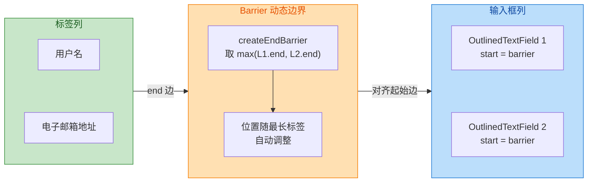

Barrier 的方向选择有一个简单规则：**你需要"挡住"哪个方向，就创建那个方向的 Barrier**。如果要让组件始终在一组组件的右侧，就用 `createEndBarrier`；如果要在一组组件的下方，就用 `createBottomBarrier`。

#### Barrier 的底层行为

从求解器的角度看，Barrier 本质上是一个 **单向的、动态的辅助约束**。以 `createEndBarrier(a, b)` 为例，它等价于对求解器添加了一条约束：`barrier.position = max(a.end, b.end)`。这是一个不等式约束（inequality constraint），Cassowary 算法会在每次布局 Pass 中重新求解它，确保 Barrier 的位置始终正确。

需要注意的是，**Barrier 是单向的**——它只提供一条边，不能像普通组件那样拥有四条边。所以你不能写 `start.linkTo(labelsBarrier.end)` 这样的语句，只能直接写 `start.linkTo(labelsBarrier)`，因为 Barrier 本身就代表那条边。

### 引导线 Guideline

Guideline（引导线）是另一个虚拟辅助对象，与 Barrier 的"动态追踪最远边"不同，Guideline 是一条 **位置固定（或按百分比固定）的参考线**。它的作用类似于设计软件中的辅助线——不可见，但其他组件可以对齐到它。

#### 创建方式

Compose ConstraintLayout 提供了水平和垂直两个方向的 Guideline 工厂方法：

```kotlin
@Composable
fun GuidelineDemo() {
    ConstraintLayout(modifier = Modifier.fillMaxSize()) {
        // ---- 垂直引导线（竖线）----
        // 方式一：距离起始边固定距离
        val startGuide = createGuidelineFromStart(offset = 80.dp)

        // 方式二：按父布局宽度的百分比定位
        // fraction = 0.3f 表示距离起始边 30% 的位置
        val percentGuide = createGuidelineFromStart(fraction = 0.3f)

        // 方式三：距离结束边固定距离
        val endGuide = createGuidelineFromEnd(offset = 24.dp)

        // ---- 水平引导线（横线）----
        // 距离顶部 56dp（常用于 Toolbar 下方基准线）
        val topGuide = createGuidelineFromTop(offset = 56.dp)

        // 距离顶部 50% 的位置（屏幕垂直中线）
        val centerGuide = createGuidelineFromTop(fraction = 0.5f)

        val (header, content) = createRefs()

        // 使用引导线作为约束锚点
        Text(
            text = "Header Area",
            modifier = Modifier.constrainAs(header) {
                top.linkTo(parent.top)             // 顶部对齐父布局
                bottom.linkTo(topGuide)            // 底部对齐到水平引导线
                start.linkTo(parent.start)         // 水平充满
                end.linkTo(parent.end)             // 水平充满
                height = Dimension.fillToConstraints // 高度填充约束空间
            }
        )

        Text(
            text = "Content starts after guideline",
            modifier = Modifier.constrainAs(content) {
                top.linkTo(topGuide, margin = 8.dp)  // 顶部在引导线下方 8dp
                start.linkTo(startGuide)              // 起始边对齐垂直引导线
            }
        )
    }
}
```

#### Guideline 的典型应用

**百分比布局（Percentage-based Layout）**：这是 Guideline 最核心的使用场景。在响应式设计中，你经常需要让某个区域占据屏幕的特定比例。例如一个登录页面，输入区域从屏幕 30% 的位置开始，到 70% 的位置结束：

```kotlin
@Composable
fun LoginScreen() {
    ConstraintLayout(modifier = Modifier.fillMaxSize()) {
        // 创建两条垂直引导线，划定输入区域的左右边界
        val leftGuide = createGuidelineFromStart(fraction = 0.15f)  // 15% 位置
        val rightGuide = createGuidelineFromEnd(fraction = 0.15f)   // 距结束边 15%

        // 创建一条水平引导线，确定输入区域的起始高度
        val topGuide = createGuidelineFromTop(fraction = 0.35f)     // 35% 位置

        val (emailField, passField, loginBtn) = createRefs()

        OutlinedTextField(
            value = "", onValueChange = {},
            label = { Text("Email") },                     // 输入框标签
            modifier = Modifier.constrainAs(emailField) {
                top.linkTo(topGuide)                        // 在 35% 高度处开始
                start.linkTo(leftGuide)                     // 左边界对齐 15% 引导线
                end.linkTo(rightGuide)                      // 右边界对齐 85% 引导线
                width = Dimension.fillToConstraints          // 宽度充满两条引导线之间
            }
        )

        OutlinedTextField(
            value = "", onValueChange = {},
            label = { Text("Password") },                  // 密码框标签
            modifier = Modifier.constrainAs(passField) {
                top.linkTo(emailField.bottom, margin = 12.dp) // 在邮箱框下方 12dp
                start.linkTo(leftGuide)                       // 同样对齐引导线
                end.linkTo(rightGuide)
                width = Dimension.fillToConstraints
            }
        )

        Button(
            onClick = { /* 登录逻辑 */ },
            modifier = Modifier.constrainAs(loginBtn) {
                top.linkTo(passField.bottom, margin = 24.dp)  // 在密码框下方 24dp
                start.linkTo(leftGuide)                        // 对齐引导线
                end.linkTo(rightGuide)
                width = Dimension.fillToConstraints
            }
        ) {
            Text("登录")                                       // 按钮文字
        }
    }
}
```

这种基于 Guideline 的百分比布局在平板或折叠屏适配中尤其有用。通过调整 `fraction` 值，可以让同一套布局代码在不同屏幕尺寸下呈现不同的视觉比例，而无需编写大量的尺寸判断逻辑。

#### Guideline vs Barrier 对比

两者都是虚拟辅助对象，但设计意图完全不同：

| 特性 | Guideline（引导线） | Barrier（屏障） |
|---|---|---|
| **位置决定方式** | 固定偏移量或固定百分比 | 动态追踪一组组件的最远边 |
| **是否随内容变化** | ❌ 不变，始终在固定位置 | ✅ 随被监控组件的尺寸/位置变化 |
| **典型使用场景** | 百分比分栏、固定基准线对齐 | 不等长组件的对齐、动态表单 |
| **方向** | 水平线或垂直线 | 起始/结束/顶部/底部四种 |
| **数量建议** | 可以多条，用于划分页面区域 | 按需创建，避免过多增加求解复杂度 |

从架构设计的角度来看，Guideline 更多服务于 **设计师的视觉规范**（如间距系统、栅格系统），而 Barrier 更多服务于 **数据驱动的动态布局**。在实际项目中，两者经常配合使用：Guideline 划定大的区域框架，Barrier 在局部区域内处理动态对齐。

#### 综合示例：Chain 链

除了 Barrier 和 Guideline，`Chain`（链）也是一个高频使用的约束特性，它用于控制一组组件在某个方向上的 **分布方式**。虽然它不是 Guideline/Barrier 的内容，但在实际使用 ConstraintLayout 时几乎总是与它们配合出现，因此值得在此一并介绍。

```kotlin
@Composable
fun ChainExample() {
    ConstraintLayout(modifier = Modifier.fillMaxWidth().height(120.dp)) {
        val (btn1, btn2, btn3) = createRefs()

        // 创建一条水平链，将三个按钮串联起来
        // chainStyle 控制分布方式：
        //   Spread       → 等间距分布（默认），两端也有间距
        //   SpreadInside → 等间距但两端贴边
        //   Packed       → 所有元素紧凑聚拢在中间
        createHorizontalChain(
            btn1, btn2, btn3,                               // 链中的成员
            chainStyle = ChainStyle.SpreadInside             // 两端贴边，中间等距
        )

        Button(
            onClick = {},
            modifier = Modifier.constrainAs(btn1) {
                centerVerticallyTo(parent)                   // 垂直居中
            }
        ) { Text("A") }

        Button(
            onClick = {},
            modifier = Modifier.constrainAs(btn2) {
                centerVerticallyTo(parent)                   // 垂直居中
            }
        ) { Text("B") }

        Button(
            onClick = {},
            modifier = Modifier.constrainAs(btn3) {
                centerVerticallyTo(parent)                   // 垂直居中
            }
        ) { Text("C") }
    }
}
```

三种 `ChainStyle` 的视觉效果可以这样理解：

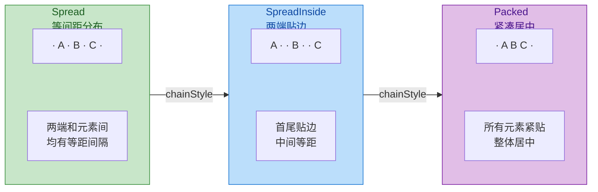

`Packed` 模式还支持配合 `bias` 使用——`ChainStyle.Packed(bias = 0.3f)` 可以让一整组紧凑的元素偏向起始边 30% 的位置。

#### 性能考量与最佳实践

虽然 Compose ConstraintLayout 功能强大，但在使用时需要注意以下几点：

**不要过度使用**。Compose 的 `Column`/`Row`/`Box` 在绝大多数场景下已经足够高效且代码可读性更好。ConstraintLayout 内部的 Cassowary 求解器虽然时间复杂度接近线性（对于大部分实际布局约束来说），但相比简单的线性测量仍有额外开销。只有当布局关系确实复杂到无法用线性容器简洁表达时，才应选择 ConstraintLayout。

**引用数量与约束复杂度**。每增加一个引用和一组约束，求解器的方程组都会增大。在包含 20+ 个子组件的复杂布局中，约束关系的合理规划（减少冗余约束、利用 Barrier/Guideline 统一管理）可以显著降低求解时间。

**避免循环约束**。例如 A 的右边约束到 B 的左边，B 的右边又约束到 A 的左边，同时两者都设置了 `fillToConstraints`——这会导致求解器无法确定尺寸，最终可能产生不可预期的布局结果。ConstraintLayout 的求解器对循环依赖有一定的容错处理，但最终行为是不确定的（undefined behavior）。

**与 LazyList 的关系**。不要在 `LazyColumn`/`LazyRow` 的 `item` 中使用过于复杂的 ConstraintLayout。由于 LazyList 的 item 会频繁参与组合和回收，ConstraintLayout 的初始化开销（构建约束方程组）在快速滚动时可能成为性能瓶颈。对于列表项，优先使用简单的 `Row`/`Column` 组合。

---

**📝 练习题**

某表单页面左侧有"姓名"和"详细通讯地址"两个长度不同的标签，右侧是对应输入框。需求是：所有输入框的左边缘始终对齐到两个标签中较长者的右侧 + 8dp 间距。以下哪种方案最合适？

A. 将两个输入框的 `start` 都约束到"详细通讯地址"标签的 `end`，因为它更长


B. 创建 `createEndBarrier(nameLabel, addressLabel, margin = 8.dp)`，将两个输入框的 `start` 约束到该 Barrier


C. 创建 `createGuidelineFromStart(fraction = 0.4f)`，将两个输入框的 `start` 约束到该 Guideline


D. 使用 `createHorizontalChain` 将标签和输入框串成链，设置 `ChainStyle.SpreadInside`


**【答案】** B

**【解析】** 题目核心需求是"输入框左边缘始终对齐到**两个标签中较长者**的右侧"，这正是 Barrier 的设计用途——动态追踪一组组件的最远边。选项 A 硬编码了"详细通讯地址更长"这一假设，当多语言切换（如英文环境下 "Name" 可能比 "Address" 短）或数据动态变化时会失效。选项 C 使用固定百分比的 Guideline，虽然也能实现对齐，但它不会随标签长度变化而调整，如果标签文字变得更长以至于超过 40% 的位置，就会出现重叠。选项 D 的 Chain 主要解决的是一组组件的分布方式问题，而非动态边界对齐问题。只有选项 B 的 `createEndBarrier` 会自动取两个标签 `end` 边的最大值，并附加 8dp 间距，完美满足需求。

---

## 懒加载列表 LazyList

在传统 View 体系中，`RecyclerView` 是处理大量列表数据的标准方案，它通过 ViewHolder 回收机制避免了为每个条目都创建独立 View 的巨大开销。进入 Compose 时代后，Google 为声明式 UI 量身打造了 **LazyColumn** 与 **LazyRow** 这对"懒加载列表"组件。所谓"懒"，核心含义是：**只有当 item 即将进入可视区域（Viewport）时，Compose 才会对其执行 Composition → Layout → Drawing 的完整流程；而一旦 item 滑出可视区域，其对应的 Composition 会被销毁（dispose），关联的 SlotTable 节点也会被移除**。这与 RecyclerView 的"创建一次 ViewHolder、后续 rebind"的策略有本质区别——Compose 并不复用旧的 Composition 节点来绑定新数据，而是依赖自身高效的 Composition 机制和一套独立的"组合缓存"来保证性能。理解 LazyList 的内部原理，对于写出流畅、无卡顿的列表 UI 至关重要。

### LazyColumn / LazyRow 原理

#### 基本用法与 DSL 结构

LazyColumn（垂直滚动）和 LazyRow（水平滚动）的 API 形式非常直观。它们接收一个 `LazyListScope` 的 DSL Lambda，开发者在其中通过 `item {}` 和 `items() {}` 声明条目内容：

```kotlin
// LazyColumn 基本用法示例
LazyColumn(
    // Modifier 定义列表整体的大小、边距等外观属性
    modifier = Modifier.fillMaxSize(),
    // contentPadding 为列表内容区域添加内边距，不会裁剪滚动内容
    contentPadding = PaddingValues(horizontal = 16.dp, vertical = 8.dp),
    // verticalArrangement 控制子项之间的垂直间距
    verticalArrangement = Arrangement.spacedBy(8.dp),
    // state 用于观察和控制滚动位置
    state = rememberLazyListState()
) {
    // item {} 声明单个条目
    item {
        // 这里放置列表头部的 Composable
        HeaderSection()
    }
    // items() 接收一个列表，为每个数据元素生成条目
    items(
        items = userList,       // 数据源列表
        key = { it.id }         // 为每个条目提供唯一且稳定的 key
    ) { user ->
        // 这里是每个数据条目对应的 Composable
        UserCard(user = user)
    }
    // item {} 声明列表尾部
    item {
        FooterSection()
    }
}
```

这段代码表面看起来与普通的 Column 非常相似，但底层执行路径截然不同。普通 Column 会一次性 Compose 所有子节点，而 LazyColumn **只会对当前视口内（以及预取缓冲区内）的 item 执行 Composition**。

#### 从 LazyListScope 到 LazyListIntervalContent

当 LazyColumn 的 DSL Lambda 执行时，每一次 `item {}` 或 `items() {}` 调用并**不会**立即触发 Composition。相反，它们的作用是向一个名为 `LazyListIntervalContent` 的内部数据结构中**注册区间（Interval）**。可以将 Interval 理解为一个"蓝图登记表"：

- 每个 `item {}` 注册一个长度为 1 的 Interval。
- 每个 `items(count) {}` 注册一个长度为 `count` 的 Interval。
- 每个 Interval 记录了其起始全局索引（global index）、长度（size）、content lambda（即如何生成对应的 Composable）、以及可选的 key factory 和 contentType factory。

所有 Interval 按注册顺序被存入一个 `IntervalList`（内部实现为一个支持二分查找的有序列表）。这样，给定任意一个全局 index，Compose 就能通过二分查找快速定位到它属于哪个 Interval，进而获取对应的 content lambda 来执行 Composition。**这种设计让"数据索引 → 内容工厂"的映射查找复杂度降低为 O(log N)**，即使列表拥有数万个条目、由多个 `items()` 块拼接而成，查找依然高效。

#### 可视区域计算与按需 Composition

LazyColumn 的核心排版逻辑位于 `LazyListMeasurePolicy` 中。在每一帧的 Layout Phase，它会执行以下关键步骤：

**第一步：确定可视区域**。根据当前的滚动偏移量（scroll offset）和列表容器自身的高度约束（对 LazyColumn 来说就是可用高度），计算出视口的起始像素位置和结束像素位置。

**第二步：向前/向后填充**。从"锚点 item"（通常是上一帧第一个可见的 item）开始，依次向下（或向上）对 item 执行 Composition + Measure，获取每个 item 的实际高度，然后累加。当已测量的 item 总高度覆盖了整个视口（甚至包含预取缓冲区域），填充过程就停止。**这意味着：如果你的列表有 10,000 个条目，但屏幕上只能显示 8 个，那么每帧只会有大约 8 ~ 12 个条目（包含少量预取）参与 Composition 和 Measure，其余 9,988 个条目完全不会被 Compose 触及**。

**第三步：生成布局结果**。将所有已测量的可见 item 收集起来，在 Place 阶段根据各自的偏移量放置到正确的位置。

**第四步：回收不可见项**。滑出视口的 item 对应的 Composition 会被 dispose（销毁），释放其中持有的状态、Effect 等资源。不过这里有个重要的细节——它并非立即丢弃一切，而是会将部分信息送入缓存池，这就引出了下面的缓存策略讨论。

以下时序图展示了从用户滑动手势到最终屏幕渲染的完整链路：

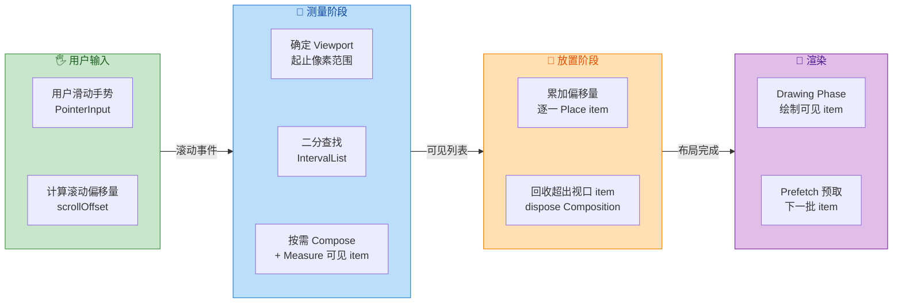

#### Prefetch 预取机制

为了保证快速滑动时的流畅度，LazyList 内部还实现了 **Prefetch（预取）** 机制。当用户正在向下滑动时，Compose 会预判下一个即将进入视口的 item，并利用**当前帧剩余的空闲时间**（类似于 RecyclerView 的 GapWorker 思路）提前对该 item 执行 Composition 和 Measure。这样当该 item 真正滑入视口需要显示时，它的 Composition 和测量结果已经就绪，直接进入 Place 和 Draw，从而避免了"滑到才开始 Compose"造成的掉帧。

Prefetch 的调度由 `LazyListPrefetchStrategy` 控制。默认实现 `DefaultLazyListPrefetchStrategy` 会根据滚动方向和速度预取视口边缘之外的若干个 item。在 Compose 1.7+ 中，预取策略变得更加可定制，开发者甚至可以实现自己的 `LazyListPrefetchStrategy` 来调整预取数量和时机。

### item 缓存策略

说到"缓存"，很多从 RecyclerView 迁移过来的开发者会立刻联想到 RecyclerView 的四级缓存（Scrap → CachedViews → ViewPool → Adapter.onCreateViewHolder）。Compose 的 LazyList 缓存机制在哲学上有所不同，但目标一致：**减少重复创建的开销**。

#### SubcomposeLayout：按需子组合

LazyList 底层使用了 `SubcomposeLayout` 来实现"按需 Composition"。普通的 `Layout` Composable 在 Composition 阶段就会执行所有子节点的 Composition；而 SubcomposeLayout 将"**子节点的 Composition 推迟到 Measure 阶段**"，即只有在 MeasurePolicy 内部调用 `subcompose(slotId, content)` 时，对应的 content lambda 才会被 Compose。这是 LazyList 能够做到"只 Compose 可见 item"的核心技术基础。

每一个被 subcompose 的 item 会在 SlotTable 中创建一组独立的 slot，用一个 `slotId` 标识。对于 LazyList 来说，这个 slotId 本质上就是 item 的 key（后面会详述 key 的重要性）。当一个 item 滑出可视区域时，它的 Composition 会被标记为"不再活跃"，但并不一定立即销毁——而是进入 **"可复用池"（Reusable Pool）**。

#### 可复用 Composition 池（Reusable Slot）

从 Compose 1.2+ 起，SubcomposeLayout 引入了 `deactivate` 的概念（内部实现经历过多次演化，在后续版本中也称为"reusable slots"）。其工作原理如下：

1. 当 item A 滑出视口，其对应的 Composition 并不立即 dispose，而是被移入一个 **"Reusable" 状态** 的缓存池。此时 item A 内部的 `remember` 状态会被保留在 SlotTable 中，但 Composable 不再参与渲染。

2. 当新的 item B 即将进入视口时，如果缓存池中存在相同 **contentType** 的可复用 Composition，Compose 就会取出这个旧 Composition，用 item B 的数据对其进行 **Recomposition**，而非从零开始创建一个全新的 Composition。这一步骤可以显著减少 SlotTable 的 insert/delete 操作，因为复用时只需要 update 已有的 slot 节点。

3. 如果缓存池中没有匹配的 contentType，或缓存池容量已满，才会真正 dispose 最旧的缓存 Composition 并创建新的。

**缓存池的默认容量**：在 Compose 的实现中（`SubcomposeLayoutState`），默认会缓存一定数量的 Reusable slot（具体数量由内部常量控制，通常与屏幕可见 item 数量相当）。这意味着对于典型的滑动场景，滑出的 item 几乎都能被缓存住，并在新 item 进入时复用。

#### contentType 的作用

`contentType` 是 Compose 缓存复用机制的 **"类型标签"**。它类似于 RecyclerView 中 `getItemViewType()` 的角色。在 `items()` DSL 中可以这样指定：

```kotlin
LazyColumn {
    // 为不同类型的 item 指定不同的 contentType
    items(
        items = feedItems,
        key = { it.id },
        // contentType 告诉 Compose 这个 item 的 UI 结构类型
        contentType = { item ->
            when (item) {
                is TextPost -> "text"       // 纯文本帖子
                is ImagePost -> "image"     // 图片帖子
                is VideoPost -> "video"     // 视频帖子
            }
        }
    ) { item ->
        // 根据类型渲染不同的 Composable
        when (item) {
            is TextPost -> TextPostCard(item)
            is ImagePost -> ImagePostCard(item)
            is VideoPost -> VideoPostCard(item)
        }
    }
}
```

当一个 `contentType = "text"` 的 item 滑出视口后，它的 Composition 进入 Reusable Pool 并携带 `"text"` 标签。之后当新的 `"text"` 类型 item 需要进入视口时，就能复用该 Composition，因为两者 UI 结构高度相似（都是 `TextPostCard`），Recomposition 只需要更新文字数据，效率极高。相反，如果让一个 `"text"` 类型的旧 Composition 去"复用"为 `"video"` 类型的新 item，则几乎所有子节点都要替换，效率反而比新建更差。**因此，在列表中存在多种不同结构的 item 时，正确设置 contentType 是性能优化的关键一步**。

#### 与 RecyclerView 缓存的对比

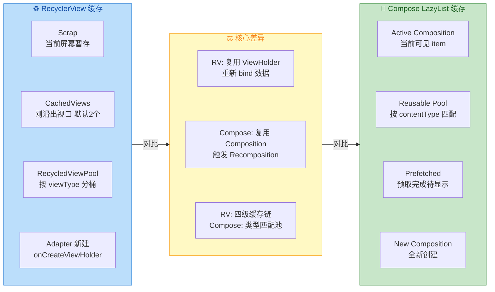

总结关键差异：RecyclerView 复用的是 **View 实例**（ViewHolder 不销毁，只重新绑定数据），而 Compose LazyList 复用的是 **Composition 上下文**（SlotTable 中的节点结构保留，触发 Recomposition 更新数据）。两者殊途同归——都是为了避免高成本的"从零创建"操作。

### key 优化

`key` 是 LazyList 性能优化中**最重要也最容易被忽视**的参数之一。许多开发者在初次使用 LazyColumn 时会跳过 key 的设置，结果在数据变更（增删、排序）时遭遇不必要的性能损耗甚至 UI 状态丢失。

#### 为什么需要 key？

当 LazyList 的数据源发生变化（比如用户下拉刷新，列表中间插入了一条新数据）时，Compose 需要将"旧的 item Composition"与"新的 data item"对应起来。**如果没有 key，Compose 只能按照 index（位置）进行匹配**。这会导致一个严重的问题——

假设原始列表为 `[A, B, C]`，现在在头部插入了一个 `X`，列表变为 `[X, A, B, C]`。如果按 index 匹配：

- index 0 的旧 Composition（原来显示 A）现在要显示 X → 需要 Recompose
- index 1 的旧 Composition（原来显示 B）现在要显示 A → 需要 Recompose
- index 2 的旧 Composition（原来显示 C）现在要显示 B → 需要 Recompose
- index 3 没有旧 Composition → 新建，显示 C

结果是：**所有 item 都发生了 Recomposition**，即使 A、B、C 的数据完全没有变化。更糟糕的是，如果 item 内部有 `remember` 保存的状态（如展开/收起状态、TextField 输入内容），这些状态也会错位——原本属于 A 的展开状态现在会出现在 X 身上。

而如果为每个 item 提供了稳定且唯一的 key（如 `key = { it.id }`），Compose 就能精确识别：

- key="X" 是新增的 → 新建 Composition
- key="A" 还在 → 旧 Composition 原封不动，无需 Recompose
- key="B" 还在 → 同上
- key="C" 还在 → 同上

**只有真正新增的 item 才会新建 Composition，其余 item 零开销**。同时，所有 `remember` 状态都正确跟随各自的 key，不会错位。

#### key 的工作原理：movableContentOf 思想

在 Compose 内部，LazyList 的 key 机制与 `movableContentOf` 的理念密切相关。当 Compose 进行 Recomposition 并发现某个 key 对应的 Composition 已经存在（只是位置变了），它不会销毁旧 Composition 再新建，而是**将该 Composition 在 SlotTable 中"移动"到新的位置**。这是一个开销极低的操作，因为只需要调整 SlotTable 内部的指针/索引，不需要重新执行 content lambda。

这就是为什么 key 能带来如此显著的性能提升——它把"销毁旧 + 创建新"的 O(N) 全量重建，优化为"移动节点"的 O(1) 操作（对每个未变化的 item 而言）。

#### key 的最佳实践

```kotlin
// ✅ 正确做法：使用业务数据的唯一标识符
items(
    items = messages,
    key = { message -> message.id } // 数据库主键 / 服务端 ID
) { message ->
    MessageBubble(message)
}

// ❌ 错误做法 1：使用 index 作为 key（等于没设 key）
items(
    items = messages,
    key = { index -> index } // 插入/删除时 index 会变化，无法稳定标识
) { message ->
    MessageBubble(message)
}

// ❌ 错误做法 2：使用不稳定的值作为 key
items(
    items = messages,
    key = { message -> message.hashCode() } // hashCode 可能冲突，且不稳定
) { message ->
    MessageBubble(message)
}

// ❌ 错误做法 3：使用可变数据作为 key
items(
    items = messages,
    key = { message -> message.content } // content 可能被编辑，key 不应变化
) { message ->
    MessageBubble(message)
}
```

key 的选择原则：**唯一性（Unique）** + **稳定性（Stable）** + **不可变性（Immutable）**。最佳候选是数据库自增 ID、UUID、或服务端分配的唯一标识。

#### key 与 remember / rememberSaveable 的关联

key 的影响不仅限于 Recomposition 性能，它还直接决定了 item 内部状态的生命周期。在 LazyList 中：

- **`remember` 状态**：与 Composition 绑定。当 item 滑出视口后 Composition 被 deactivated 或 disposed，`remember` 的值也随之丢失。但如果有 key 且该 item 再次滚回视口，Compose 会为其创建全新的 Composition，`remember` 重新初始化——所以 `remember` 无法跨"滑出再滑回"保留状态。

- **`rememberSaveable` 状态**：与 key 绑定并保存到 `SavedStateRegistry` 中。即使 item 滑出视口导致 Composition 销毁，`rememberSaveable` 的值仍然通过 SavedState 机制持久化。当该 item（通过 key 标识）再次回到视口时，`rememberSaveable` 能恢复之前的值。**这就是为什么在 LazyList item 中保存用户输入、滚动位置等重要状态时，应使用 `rememberSaveable` 而非 `remember`**。

```kotlin
items(
    items = notes,
    key = { it.id }
) { note ->
    // ✅ 使用 rememberSaveable，即使 item 滑出视口再回来，展开状态也不会丢失
    var isExpanded by rememberSaveable { mutableStateOf(false) }
    
    // ❌ 使用 remember，item 滑出视口再回来后 isExpanded 会重置为 false
    // var isExpanded by remember { mutableStateOf(false) }
    
    NoteCard(
        note = note,
        isExpanded = isExpanded,
        onToggle = { isExpanded = !isExpanded }
    )
}
```

### StickyHeader 粘性标题

StickyHeader（粘性标题）是列表中一种常见的交互模式：当用户向上滚动时，当前分组的标题会"粘"在列表顶部，直到下一个分组的标题将其"推"走。这在联系人列表（按字母分组）、聊天记录（按日期分组）等场景中极为常见。

#### 基本用法

Compose 在 `LazyListScope` 中提供了 `stickyHeader {}` 函数来实现此效果：

```kotlin
// 假设 contacts 已按首字母分组：Map<Char, List<Contact>>
val grouped: Map<Char, List<Contact>> = contacts.groupBy { it.name.first() }

LazyColumn(
    modifier = Modifier.fillMaxSize()
) {
    grouped.forEach { (initial, contactsForInitial) ->
        // stickyHeader 声明一个粘性标题
        stickyHeader(
            key = "header_$initial" // 为 header 也提供稳定的 key
        ) {
            // 标题的 Composable 内容
            Text(
                text = initial.toString(),
                modifier = Modifier
                    .fillMaxWidth()
                    .background(MaterialTheme.colorScheme.primaryContainer)
                    .padding(horizontal = 16.dp, vertical = 8.dp),
                style = MaterialTheme.typography.titleMedium,
                color = MaterialTheme.colorScheme.onPrimaryContainer
            )
        }
        // items 声明该分组下的所有联系人
        items(
            items = contactsForInitial,
            key = { it.id } // 每个联系人也有唯一 key
        ) { contact ->
            ContactRow(contact)
        }
    }
}
```

#### StickyHeader 的内部实现原理

StickyHeader 的"粘性"效果并非通过额外的悬浮层实现，而是巧妙地利用了 LazyList 的 Place 阶段来调整标题的偏移量。具体机制如下：

**第一步**：在 `LazyListMeasurePolicy` 完成所有可见 item 的测量后，它会检查当前可见 item 中是否存在被标记为 `stickyHeader` 的条目。

**第二步**：如果当前视口的第一个可见 item 之前（或者就是）一个 stickyHeader，那么这个 header 在 Place 阶段的 Y 偏移量会被特殊处理——它不会随正常滚动被推出屏幕，而是被**钳位（clamp）到 Y = 0**（即列表顶部）。用数学表达就是 `max(normalOffset, 0)`：当正常滚动偏移使其 Y 变为负值（即应该滑出顶部）时，强制将其保持在 0。

**第三步**：当下一个 stickyHeader 从底部滚动上来时，当前粘住的 header 会被逐渐"推走"——其 Y 偏移量变为 `min(0, nextHeaderOffset - currentHeaderHeight)`，产生一个 header 被下一个 header "顶上去"的视觉效果。

**第四步**：Z-index 的处理。粘性标题需要在视觉上"覆盖"其下方的普通 item，因此 LazyList 会为 stickyHeader 赋予比普通 item 更高的 `zIndex`，确保它在绘制时处于上层。

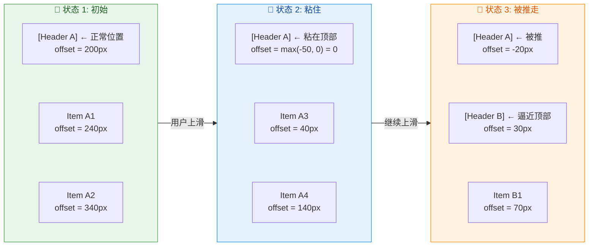

#### StickyHeader 的注意事项与实验性 API

需要注意的是，`stickyHeader` 在较早的 Compose 版本中被标记为 `@ExperimentalFoundationApi`。随着版本演进（Compose Foundation 1.4+），该 API 逐渐趋于稳定，但在某些版本中仍然需要 `@OptIn(ExperimentalFoundationApi::class)` 注解。使用前应查看当前依赖版本的具体状态。

此外，`stickyHeader` **仅在 LazyColumn 中有效**（垂直列表顶部粘性），LazyRow 虽然理论上可以支持左侧粘性标题，但标准 API 中暂未提供水平方向的 stickyHeader 实现。如果需要在 LazyRow 中实现类似效果，通常需要自定义 `LazyListMeasurePolicy` 或使用其他方案。

#### 综合实践：完整的分组列表

将上述所有优化手段结合在一起，一个完整的高性能分组列表实现如下：

```kotlin
@Composable
fun GroupedContactList(
    // 接收已按首字母分组的联系人数据
    groupedContacts: Map<Char, List<Contact>>
) {
    // 创建并记住 LazyListState，可用于程序化滚动控制
    val listState = rememberLazyListState()

    LazyColumn(
        state = listState,
        modifier = Modifier.fillMaxSize(),
        // 内容区域顶部和底部留出间距，避免被 StatusBar / NavigationBar 遮挡
        contentPadding = PaddingValues(vertical = 8.dp)
    ) {
        // 遍历每个分组
        groupedContacts.forEach { (letter, contacts) ->

            // 粘性标题：显示分组字母
            stickyHeader(key = "header_$letter") {
                // Surface 提供背景色和阴影，确保粘住时能遮盖下方内容
                Surface(
                    modifier = Modifier.fillMaxWidth(),
                    color = MaterialTheme.colorScheme.surfaceVariant,
                    // tonalElevation 提供微妙的层次感
                    tonalElevation = 2.dp
                ) {
                    Text(
                        text = letter.toString(),
                        modifier = Modifier.padding(
                            horizontal = 16.dp,
                            vertical = 12.dp
                        ),
                        style = MaterialTheme.typography.titleSmall
                    )
                }
            }

            // 该分组下的联系人列表
            items(
                items = contacts,
                // 业务唯一 ID 确保数据变更时精准 diff
                key = { contact -> contact.id },
                // 同一 contentType 确保滑出/滑入时 Composition 高效复用
                contentType = { "contact_item" }
            ) { contact ->
                // 使用 rememberSaveable 保存展开状态
                // 即使滑出视口再回来，状态不丢失
                var expanded by rememberSaveable { mutableStateOf(false) }
                
                ContactCard(
                    contact = contact,
                    isExpanded = expanded,
                    onToggleExpand = { expanded = !expanded },
                    modifier = Modifier
                        // animateItem 为 item 增/删/移动提供动画
                        // 需要稳定的 key 才能正确工作
                        .animateItem(
                            fadeInSpec = tween(durationMillis = 250),
                            fadeOutSpec = tween(durationMillis = 250),
                            placementSpec = spring(
                                dampingRatio = Spring.DampingRatioMediumBouncy,
                                stiffness = Spring.StiffnessLow
                            )
                        )
                )
            }
        }
    }
}
```

这段代码综合运用了 `key`（精准 diff + 动画支撑）、`contentType`（高效 Composition 复用）、`rememberSaveable`（状态跨视口保留）、`stickyHeader`（分组粘性标题）和 `animateItem`（条目动画）五大核心特性。这就是 Compose LazyList 在生产环境中的推荐最佳实践。

---

**📝 练习题**

在一个 LazyColumn 中展示 5000 条聊天消息，每条消息有唯一的 `messageId`。当用户在列表中间的某条消息中通过 TextField 输入了文字后，上下滑动使该消息滑出视口再滑回来。要让输入的文字不丢失，以下哪种组合方案是**必需且充分的**？

A. 使用 `items(key = { it.messageId })`，TextField 状态用 `remember { mutableStateOf("") }` 保存


B. 使用 `items(key = { it.messageId })`，TextField 状态用 `rememberSaveable { mutableStateOf("") }` 保存


C. 不设置 key，TextField 状态用 `rememberSaveable { mutableStateOf("") }` 保存


D. 使用 `items(key = { it.messageId })`，TextField 状态提升到外部 ViewModel 的 `MutableStateMap` 中保存


**【答案】** B

**【解析】** 当 item 滑出 LazyColumn 的视口后，其 Composition 会被 dispose 或 deactivate，`remember` 保存的状态会随之丢失，因此选项 A 不可行。选项 B 中，`rememberSaveable` 会将状态序列化并保存到 `SavedStateRegistry`，即使 Composition 被销毁也能恢复；同时 `key = { it.messageId }` 确保了状态与正确的消息绑定（而非按 index 错位），二者缺一不可。选项 C 虽然用了 `rememberSaveable`，但没有设置 key，当数据发生增删或重排时，`rememberSaveable` 的状态恢复是基于 index 位置的，可能导致状态恢复到错误的 item 上，因此不够"充分"。选项 D 也是一种可行方案（状态完全外部化），但题目问的是"必需且充分"——D 虽然能工作，但它依赖额外的架构层（ViewModel），并非 Compose LazyList 自身提供的标准机制，属于过度设计。综合而言，B 是 Compose 框架层面上最标准、最轻量的正确答案。

---

## 自定义布局 Custom Layout

在前面的章节中，我们已经深入了解了 Compose 布局的三阶段流程（Measure → Place → Draw）以及 `Column`、`Row`、`Box` 等系统预置容器的工作方式。然而，当业务需求超出了线性排列与简单层叠的能力边界时——例如实现一个环形菜单（Circular Menu）、瀑布流（Staggered Grid）、或者需要根据子元素测量结果动态决定其他子元素是否参与组合的场景——我们就必须深入 **自定义布局（Custom Layout）** 这一核心机制。

自定义布局是 Compose 布局系统中最具表现力的工具。它让开发者可以 **完全接管测量与放置的逻辑**，从而精确控制每一个子 Composable 在屏幕上的大小与位置。Compose 为此提供了三种粒度递增的 API：

1. **`Layout` Composable 函数**：最基础也最核心的自定义布局入口，你需要提供一个 `MeasurePolicy` 来定义测量与放置规则。
2. **`MeasurePolicy` 接口**：布局策略的抽象，它是 `Layout` 函数的"大脑"，负责定义"如何测量子元素"和"把子元素放在哪"。
3. **`SubcomposeLayout`**：一种延迟组合（Deferred Composition）机制，允许在测量阶段根据已知约束甚至其他子元素的测量结果来 **动态决定组合哪些子 Composable**，是实现 `Scaffold`、`LazyColumn` 等高级容器的基石。

接下来，我们逐一拆解这三层机制。

---

### Layout Composable 函数

`Layout` 是 Compose 中 **所有布局容器的终极基石**。你在日常使用的 `Column`、`Row`、`Box`，其内部实现最终都会调用到 `Layout` 这个 Composable 函数。理解它，就是理解 Compose 布局系统的"第一性原理"。

#### 函数签名与参数解析

`Layout` 函数的标准签名如下：

```kotlin
@Composable
fun Layout(
    content: @Composable () -> Unit,   // 子 Composable 内容（槽位 Slot）
    modifier: Modifier = Modifier,     // 应用于该布局节点自身的修饰符链
    measurePolicy: MeasurePolicy       // 测量与放置策略（核心）
)
```

这三个参数各司其职：

- **`content`**：这是一个 `@Composable` lambda，代表该布局容器内部承载的所有子元素。当 Compose 运行到这个 `Layout` 节点时，首先会执行 `content` lambda 来完成子元素的 **组合（Composition）**，将子节点挂载到 Composition 树上。需要注意的是，`content` 在 **组合阶段** 就已经执行完毕，而不是在测量阶段才执行——这一点对于理解后面的 `SubcomposeLayout` 非常关键。
- **`modifier`**：这是外部施加给当前布局节点的修饰符链。Compose 会把这些 Modifier 包装为 LayoutModifier 节点，插入到当前布局节点与其父节点之间的测量链路中（参见"修饰符链"章节）。
- **`measurePolicy`**：这是布局逻辑的核心，稍后在 `MeasurePolicy` 小节中详细展开。简而言之，它定义了"拿到子元素列表和父级约束后，如何测量子元素、如何确定自身大小、如何放置子元素"。

#### Layout 在节点树中的角色

当 Compose 编译器处理一个 `Layout` 调用时，它会在 **Composition 树** 中创建一个 `LayoutNode`。这个 `LayoutNode` 是 Compose UI 的核心数据结构，它持有：

- 自身的 `MeasurePolicy`（来自 `Layout` 参数）
- 子 `LayoutNode` 列表（来自 `content` 中嵌套的 Layout 调用）
- 修饰符链生成的外层包装节点
- 测量缓存（上一次的 `Constraints` 和测量结果）

在布局阶段，Compose 的布局引擎从根节点开始，自顶向下地对每个 `LayoutNode` 调用其 `MeasurePolicy.measure()`。这就是整个布局系统运转的方式——**递归测量，逐层放置**。

#### 一个最简自定义布局示例

为了建立直觉，我们先看一个最简单的自定义布局：将所有子元素 **垂直堆叠**（即手动实现一个简化版 `Column`）：

```kotlin
@Composable
fun SimpleColumn(
    modifier: Modifier = Modifier,               // 外部传入的修饰符
    content: @Composable () -> Unit               // 子 Composable 槽位
) {
    Layout(                                        // 调用 Layout Composable
        content = content,                         // 传递子元素内容
        modifier = modifier,                       // 传递修饰符链
        measurePolicy = { measurables, constraints ->
            // ── 第一步：测量所有子元素 ──
            // measurables 是子元素的可测量代理列表（List<Measurable>）
            // constraints 是父布局传下来的约束（最小/最大 宽度/高度）
            val placeables = measurables.map { measurable ->
                // 用父级约束直接测量每个子元素
                // 这里没有修改约束，子元素会拿到和父级相同的约束范围
                measurable.measure(constraints)
            }

            // ── 第二步：确定自身尺寸 ──
            // 宽度取所有子元素中最宽的那个
            val width = placeables.maxOfOrNull { it.width } ?: 0
            // 高度为所有子元素高度之和
            val height = placeables.sumOf { it.height }

            // layout() 函数：声明自身尺寸并进入放置作用域
            layout(width, height) {
                // ── 第三步：放置子元素 ──
                var yOffset = 0                    // 记录当前 y 轴偏移量
                placeables.forEach { placeable ->
                    // 将子元素放置在 (0, yOffset) 位置
                    placeable.placeRelative(
                        x = 0,
                        y = yOffset
                    )
                    // 累加 y 偏移量，下一个子元素紧接在下方
                    yOffset += placeable.height
                }
            }
        }
    )
}
```

这段代码完整地展示了自定义布局的 **三步范式**：**测量子元素 → 确定自身大小 → 放置子元素**。这三步在后面的所有自定义布局中都会反复出现，只是逻辑复杂度不同。

#### `Measurable` 与 `Placeable` 的区别

在自定义布局中你会频繁接触两个关键接口，理解它们的区别至关重要：

- **`Measurable`**：代表一个 **尚未测量** 的子元素。你可以对它调用 `measure(constraints)` 来产出一个 `Placeable`。每个 `Measurable` **只能被测量一次**（Compose 的单遍测量约束，Single-pass Measurement），如果你尝试对同一个 `Measurable` 调用两次 `measure()`，运行时会抛出异常。这个限制是 Compose 高性能布局的核心保证——它避免了 View 系统中因多次 `measure()` 导致的指数级性能退化问题。
- **`Placeable`**：代表一个 **已经完成测量** 的子元素。它持有确定的 `width` 和 `height`，你可以在 `layout()` 的放置作用域中调用 `placeable.placeRelative(x, y)` 或 `placeable.place(x, y)` 来指定它的最终位置。

两者的关系可以用一句话概括：**`Measurable` 是输入，`Placeable` 是输出；`measure()` 是转换函数**。

```text
Measurable  ──measure(constraints)──▶  Placeable
（未测量）                                （已测量，持有 width/height）
```

#### `placeRelative` 与 `place` 的选择

在放置子元素时，Compose 提供了两种方法：

- **`placeRelative(x, y)`**：会自动根据当前布局方向（`LayoutDirection`）镜像 x 坐标。在 RTL（Right-to-Left）语言环境下，`x = 0` 会被自动映射到右侧。**推荐在大多数场景下使用**，因为它天然支持国际化。
- **`place(x, y)`**：直接使用绝对坐标，不做 RTL 镜像。适用于那些不应随布局方向变化的场景（如动画中的绝对定位）。

#### 约束传递与修改

自定义布局的一个重要能力是 **修改传递给子元素的约束**。上面的 `SimpleColumn` 直接将父级约束透传给子元素，但实际场景中你往往需要对约束进行变换。例如，如果你想让每个子元素不受父级最小宽度的约束：

```kotlin
val placeables = measurables.map { measurable ->
    // 创建一份新约束：将最小宽度/高度设为 0，最大值保持不变
    // 这样子元素可以自由决定自己的最小尺寸，不被强制撑满
    val looseConstraints = constraints.copy(
        minWidth = 0,       // 子元素宽度下限放开为 0
        minHeight = 0       // 子元素高度下限放开为 0
    )
    measurable.measure(looseConstraints)  // 用宽松约束测量子元素
}
```

这种 **约束变换** 正是 `Column`、`Row` 内部实现各种对齐与权重分配的基础。例如 `Column` 在处理 `Modifier.weight()` 时，会先测量没有 weight 的子元素，计算出剩余空间，然后为带 weight 的子元素构造一个精确的 `fixedHeight` 约束。

---

### MeasurePolicy 策略

`MeasurePolicy` 是一个函数式接口（`fun interface`），它是 `Layout` 函数的"大脑"。将它单独抽出来理解，有助于我们掌握更高级的布局自定义技巧，特别是 **固有特性测量（Intrinsics）** 的对接。

#### 接口定义

```kotlin
@JvmDefaultWithCompatibility
fun interface MeasurePolicy {
    // ── 核心方法：测量与放置 ──
    // MeasureScope 提供了 layout() 函数和布局方向等上下文信息
    // measurables：子元素的可测量代理列表
    // constraints：父级传递下来的约束
    fun MeasureScope.measure(
        measurables: List<Measurable>,       // 所有子元素
        constraints: Constraints              // 父级约束
    ): MeasureResult                          // 返回测量结果（含自身尺寸 + 放置逻辑）

    // ── 固有特性方法（可选重写）──
    // 最小固有宽度：给定高度下，布局内容能正常显示所需的最小宽度
    fun IntrinsicMeasureScope.minIntrinsicWidth(
        measurables: List<IntrinsicMeasurable>,
        height: Int
    ): Int = 0  // 默认返回 0

    // 最小固有高度：给定宽度下，布局内容能正常显示所需的最小高度
    fun IntrinsicMeasureScope.minIntrinsicHeight(
        measurables: List<IntrinsicMeasurable>,
        width: Int
    ): Int = 0  // 默认返回 0

    // 最大固有宽度
    fun IntrinsicMeasureScope.maxIntrinsicWidth(
        measurables: List<IntrinsicMeasurable>,
        height: Int
    ): Int = 0  // 默认返回 0

    // 最大固有高度
    fun IntrinsicMeasureScope.maxIntrinsicHeight(
        measurables: List<IntrinsicMeasurable>,
        width: Int
    ): Int = 0  // 默认返回 0
}
```

可以看到，`MeasurePolicy` 包含 **一个必须实现的方法和四个可选的固有特性方法**。绝大多数自定义布局只需要实现 `measure()` 即可；只有当你的布局需要参与 `Modifier.width(IntrinsicSize.Min)` 等固有特性查询时，才需要重写后面四个方法。

#### MeasureScope 的能力

`measure()` 函数的接收者（receiver）是 `MeasureScope`，这个作用域对象提供了若干关键能力：

- **`layout(width, height, alignmentLines, placementBlock)`**：最核心的函数，用于声明当前布局节点的最终尺寸，并在 `placementBlock` 中放置子元素。返回值是一个 `MeasureResult`。
- **`layoutDirection`**：当前的布局方向（LTR 或 RTL），你可以据此在放置阶段做方向适配。
- **`density` / `fontScale`**：当前的显示密度和字体缩放因子，允许你在测量逻辑中进行 dp → px 的换算。

#### 固有特性方法与自定义布局的对接

在"布局流程 Layout Phase"一章中我们讲过，**Intrinsics（固有特性测量）** 是一种在正式测量之前"预询问"子元素理想尺寸的机制。当父布局对当前布局调用 `minIntrinsicWidth(height)` 时，Compose 会转发到 `MeasurePolicy` 中对应的方法。

如果你的自定义布局没有重写这四个方法，它们会返回默认值 `0`，这意味着当外部使用 `Modifier.width(IntrinsicSize.Min)` 修饰你的自定义布局时，**会得到错误的尺寸**。因此，如果你的自定义布局可能被用于固有特性查询场景，就应该正确实现这些方法。

下面以一个 **等宽垂直列表** 为例，展示如何对接固有特性：

```kotlin
@Composable
fun EqualWidthColumn(
    modifier: Modifier = Modifier,
    content: @Composable () -> Unit
) {
    Layout(
        content = content,
        modifier = modifier,
        measurePolicy = object : MeasurePolicy {
            // ── 核心测量逻辑 ──
            override fun MeasureScope.measure(
                measurables: List<Measurable>,
                constraints: Constraints
            ): MeasureResult {
                // 第一步：用宽松约束预测量，获取每个子元素的自然宽度
                val looseConstraints = constraints.copy(minWidth = 0, minHeight = 0)
                val placeables = measurables.map { it.measure(looseConstraints) }
                // 第二步：取最大宽度作为统一宽度
                val maxChildWidth = placeables.maxOfOrNull { it.width } ?: 0
                // 第三步：自身高度为所有子元素高度之和
                val totalHeight = placeables.sumOf { it.height }
                // 第四步：放置
                return layout(maxChildWidth, totalHeight) {
                    var y = 0
                    placeables.forEach { placeable ->
                        placeable.placeRelative(0, y)  // 左对齐放置
                        y += placeable.height           // 累加垂直偏移
                    }
                }
            }

            // ── 固有特性：最小固有宽度 ──
            // 语义："要让所有子元素都能正常显示，最少需要多宽？"
            // 答案：所有子元素的最小固有宽度中的最大值
            override fun IntrinsicMeasureScope.minIntrinsicWidth(
                measurables: List<IntrinsicMeasurable>,
                height: Int
            ): Int {
                // 遍历所有子元素，取它们各自最小固有宽度的最大值
                return measurables.maxOfOrNull {
                    it.minIntrinsicWidth(height)       // 递归查询子元素
                } ?: 0
            }

            // ── 固有特性：最小固有高度 ──
            override fun IntrinsicMeasureScope.minIntrinsicHeight(
                measurables: List<IntrinsicMeasurable>,
                width: Int
            ): Int {
                // 垂直堆叠：高度为所有子元素最小固有高度之和
                return measurables.sumOf {
                    it.minIntrinsicHeight(width)       // 递归查询子元素
                }
            }

            // maxIntrinsicWidth / maxIntrinsicHeight 同理，此处省略
            // ...
        }
    )
}
```

核心要点是：**固有特性方法中不能调用 `measure()`**，只能调用 `IntrinsicMeasurable` 上的 `minIntrinsicWidth()` / `maxIntrinsicHeight()` 等方法进行递归查询。这保证了固有特性查询是一个 **只读的、无副作用的** 预探测过程。

#### 实战：环形布局 CircularLayout

为了展示自定义布局的表现力，我们来实现一个将子元素均匀分布在圆周上的布局：

```kotlin
@Composable
fun CircularLayout(
    modifier: Modifier = Modifier,
    radius: Dp = 100.dp,                          // 圆的半径
    content: @Composable () -> Unit
) {
    Layout(
        content = content,
        modifier = modifier
    ) { measurables, constraints ->
        // ── 测量所有子元素（使用无限制约束，让子元素自由决定大小）──
        val placeables = measurables.map { measurable ->
            measurable.measure(
                Constraints()                      // 默认构造 = 无最小/无最大限制
            )
        }

        // ── 将半径从 dp 转换为 px ──
        val radiusPx = radius.roundToPx()          // MeasureScope 自带 density

        // ── 计算自身尺寸：直径 + 最大子元素尺寸（确保不裁剪）──
        val maxChildWidth = placeables.maxOfOrNull { it.width } ?: 0
        val maxChildHeight = placeables.maxOfOrNull { it.height } ?: 0
        val diameter = radiusPx * 2
        val layoutWidth = diameter + maxChildWidth
        val layoutHeight = diameter + maxChildHeight

        // ── 放置子元素 ──
        layout(layoutWidth, layoutHeight) {
            val centerX = layoutWidth / 2          // 布局中心 X
            val centerY = layoutHeight / 2         // 布局中心 Y
            val angleStep = 2 * Math.PI / placeables.size  // 每个子元素的角度间隔

            placeables.forEachIndexed { index, placeable ->
                // 计算当前子元素在圆周上的角度（从 12 点钟方向开始）
                val angle = angleStep * index - Math.PI / 2
                // 计算子元素中心点的目标坐标
                val x = centerX + (radiusPx * cos(angle)).toInt() - placeable.width / 2
                val y = centerY + (radiusPx * sin(angle)).toInt() - placeable.height / 2
                // 放置到计算出的位置
                placeable.place(x, y)              // 环形布局一般不需要 RTL 镜像
            }
        }
    }
}
```

这个示例展示了自定义布局的核心价值：**你拥有对每个子元素位置的完全控制权**。系统预置的 `Column`/`Row`/`Box` 无论如何组合都无法实现环形排列，而通过 `Layout` + 简单的三角函数计算，我们可以轻松实现。

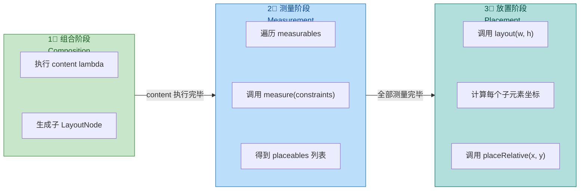

#### ParentData 与子元素的通信

在许多复杂布局中，子元素需要向父布局传递额外信息。例如 `Column` 中的 `Modifier.weight()` 就是子元素通过 **ParentData** 机制向 `Column` 的 `MeasurePolicy` 传递权重值。

实现方式是：

1. **定义数据类**：用于承载子元素想要传递给父布局的信息。
2. **创建 `ParentDataModifier`**：子元素通过 `Modifier` 链附加数据。
3. **在 `MeasurePolicy` 中读取**：通过 `measurable.parentData` 获取。

```kotlin
// 第一步：定义数据类
data class CircularParentData(
    val angularOffset: Float = 0f              // 子元素额外的角度偏移
)

// 第二步：创建扩展修饰符，附加 ParentData
fun Modifier.angularOffset(degrees: Float): Modifier = this.then(
    object : ParentDataModifier {
        // 将角度偏移信息注入到 parentData 中
        override fun Density.modifyParentData(parentData: Any?): Any {
            return CircularParentData(angularOffset = degrees)
        }
    }
)

// 第三步：在 MeasurePolicy 中读取
// ...在 CircularLayout 的放置阶段...
placeables.forEachIndexed { index, placeable ->
    // 从对应的 measurable 中读取 parentData
    val data = measurables[index].parentData as? CircularParentData
    // 获取额外角度偏移（如果有的话）
    val extraAngle = Math.toRadians((data?.angularOffset ?: 0f).toDouble())
    // 叠加到基础角度上
    val angle = angleStep * index - Math.PI / 2 + extraAngle
    // ... 后续坐标计算同上 ...
}
```

这套 **ParentData 通信机制** 是 Compose 布局系统中父子协商的标准方式。它保持了单向数据流的清晰性——子元素只是"声明意图"，最终的测量与放置决策权始终在父布局手中。

---

### SubcomposeLayout 子组合

`SubcomposeLayout` 是 Compose 布局工具箱中 **最强大也最复杂** 的一个。它解决了 `Layout` 函数无法处理的一类核心问题：**当你需要根据测量阶段获得的信息来决定"组合哪些子 Composable"时**。

#### 问题的根源：组合与测量的时序矛盾

回顾普通 `Layout` 的工作流程：

1. **组合阶段**（Composition）：执行 `content` lambda，所有子 Composable 被"实例化"并挂载到节点树上。
2. **测量阶段**（Measurement）：对已挂载的子节点进行测量。

问题在于：**步骤 1 必须在步骤 2 之前完成**。也就是说，在普通 `Layout` 中，当你进入 `measurePolicy.measure()` 时，`content` 中的所有子 Composable 已经全部组合完毕，你无法根据测量信息来"决定是否组合某个子元素"。

举几个典型场景：

- **`Scaffold`**：需要先测量 `topBar` 和 `bottomBar` 的高度，然后才能知道 `content` 区域的可用约束。如果用普通 `Layout`，`content` 区域的组合（比如 `LazyColumn` 的 item 数量）无法依赖 topBar/bottomBar 的实际测量高度。
- **`LazyColumn`**：需要根据视口大小和滚动偏移量来决定"此刻屏幕上应该组合哪些 item"。这些信息只有在测量阶段才能确定。
- **自适应布局**：例如一个布局想在宽度足够时显示两列，否则显示一列——列数决策依赖于约束宽度，而约束宽度只在测量阶段才可用。

`SubcomposeLayout` 通过将 **组合推迟到测量阶段** 来打破这个时序矛盾。

#### 函数签名

```kotlin
@Composable
fun SubcomposeLayout(
    modifier: Modifier = Modifier,
    // 注意：这里没有 content 参数！
    // 取而代之的是 measurePolicy 中通过 subcompose() 按需组合
    measurePolicy: SubcomposeMeasureScope.(Constraints) -> MeasureResult
)
```

与 `Layout` 最显著的区别是：**没有 `content` 参数**。子 Composable 的组合不再在外部预先执行，而是在 `measurePolicy` 内部通过 `SubcomposeMeasureScope.subcompose()` 按需触发。

#### SubcomposeMeasureScope 与 subcompose()

`SubcomposeMeasureScope` 继承自 `MeasureScope`，额外提供了一个关键方法：

```kotlin
fun subcompose(
    slotId: Any?,                              // 槽位标识符（用于复用和缓存）
    content: @Composable () -> Unit            // 要在此槽位中组合的 Composable
): List<Measurable>                            // 返回组合产出的可测量子元素列表
```

**`slotId`** 是一个非常重要的概念。Compose 使用它来 **标识和缓存** 不同的子组合槽位。当重组（Recomposition）发生时，Compose 会根据 `slotId` 判断某个槽位是否已经存在：
- 如果存在，则 **复用已有的组合**，仅在 `content` 的状态变化时更新。
- 如果不存在，则 **创建新的子组合**。
- 如果某个之前存在的 `slotId` 在本轮测量中未被 `subcompose()` 调用，则对应的组合会被 **销毁（disposed）**。

`slotId` 通常使用枚举值、字符串常量或数据对象来标识。

#### 实战：手动实现简化版 Scaffold

以下示例展示了 `SubcomposeLayout` 的典型用法——先测量顶栏高度，再将剩余空间作为约束传给内容区域：

```kotlin
// 定义槽位标识枚举
enum class ScaffoldSlot { TopBar, Content }

@Composable
fun SimpleScaffold(
    modifier: Modifier = Modifier,
    topBar: @Composable () -> Unit,            // 顶栏内容
    content: @Composable (PaddingValues) -> Unit // 主体内容（接收内边距）
) {
    SubcomposeLayout(modifier = modifier) { constraints ->
        // ── 第一步：子组合并测量 TopBar ──
        // subcompose 返回 TopBar 槽位中所有子 Composable 的 Measurable 列表
        val topBarMeasurables = subcompose(ScaffoldSlot.TopBar) {
            topBar()                           // 在此槽位中组合 topBar
        }
        // 测量 TopBar（使用父级约束，但高度不限制）
        val topBarPlaceables = topBarMeasurables.map { measurable ->
            measurable.measure(
                constraints.copy(minHeight = 0) // 允许 TopBar 自由决定高度
            )
        }
        // 计算 TopBar 实际占用的高度
        val topBarHeight = topBarPlaceables.maxOfOrNull { it.height } ?: 0

        // ── 第二步：根据 TopBar 高度，计算剩余空间并子组合 Content ──
        val contentMaxHeight = constraints.maxHeight - topBarHeight
        val contentMeasurables = subcompose(ScaffoldSlot.Content) {
            // 将 TopBar 高度通过 PaddingValues 传递给 content
            content(PaddingValues(top = with(this@SubcomposeLayout) {
                topBarHeight.toDp()            // px 转 dp
            }))
        }
        // 用调整后的约束测量 Content
        val contentPlaceables = contentMeasurables.map { measurable ->
            measurable.measure(
                constraints.copy(
                    minHeight = 0,
                    maxHeight = contentMaxHeight // Content 最大高度 = 总高度 - TopBar高度
                )
            )
        }

        // ── 第三步：放置 ──
        layout(constraints.maxWidth, constraints.maxHeight) {
            // TopBar 放在顶部
            topBarPlaceables.forEach { it.placeRelative(0, 0) }
            // Content 放在 TopBar 下方
            contentPlaceables.forEach { it.placeRelative(0, topBarHeight) }
        }
    }
}
```

这段代码清晰地展示了 `SubcomposeLayout` 的核心价值：**第二步的 `content` 组合依赖于第一步的 `topBarHeight` 测量结果**。这在普通 `Layout` 中是不可能实现的，因为普通 `Layout` 要求所有子 Composable 在进入 `measure()` 之前就已经组合完毕。

#### SubcomposeLayout 的性能考量

`SubcomposeLayout` 虽然强大，但 **不应该被滥用**。它的延迟组合特性意味着：

1. **组合与测量交织**：子 Composable 的组合被推迟到测量阶段，这打破了 Compose 默认的"组合→测量→绘制"三阶段清晰边界。每次测量都可能触发子组合的创建或更新，这增加了测量阶段的计算开销。

2. **无法参与 Composition 级别的优化**：由于子 Composable 的存在是在测量阶段才确定的，Compose 编译器无法在组合阶段对这些子节点做跳过优化（skip optimization）。这意味着即使子 Composable 的参数没有变化，它也可能在每次测量时被重新评估。

3. **SlotId 管理的复杂性**：如果 `slotId` 设计不当（例如使用不稳定的 key），可能导致子组合频繁销毁和重建，引发性能问题和状态丢失。

因此，**使用决策树** 如下：

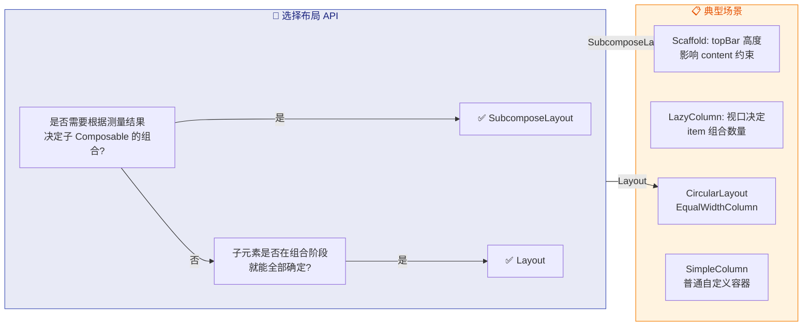

#### SubcomposeLayout 的内部机制

从实现角度看，`SubcomposeLayout` 内部维护了一个 **`SubcomposeLayoutState`**，它管理着：

- **SlotTable**：一个用于存储各个槽位（slot）组合状态的数据结构。每个 `slotId` 对应 SlotTable 中的一段记录。当 `subcompose()` 被调用时，引擎会在 SlotTable 中查找该 `slotId`，如果找到则复用并更新，否则新建。
- **PrecomposedSlots**：一些高级用法（如 `LazyColumn` 的预组合优化）会在正式测量前预先 subcompose 即将进入视口的 item，以减少滚动时的卡顿。这通过 `SubcomposeLayoutState.precompose(slotId, content)` API 实现。
- **Slot 生命周期管理**：当某个 `slotId` 在连续两次布局中都没有被 `subcompose()` 调用时，Compose 会 dispose 该槽位对应的子组合树，触发其中所有 `DisposableEffect` 的 `onDispose` 回调，释放相关资源。

这也解释了为什么 `LazyColumn` 的 item 离开屏幕后其 `DisposableEffect` 会被回调——因为 `LazyColumn` 底层基于 `SubcomposeLayout`，当 item 滚出视口后其 `slotId` 不再被 subcompose，对应的组合就会被销毁。

#### 预组合 Precomposition

`SubcomposeLayoutState` 还提供了一个高级 API `precompose()`，允许在测量阶段之前 **预先组合** 某些槽位的内容。这在滚动列表场景中非常有用：

```kotlin
// SubcomposeLayoutState 的预组合 API
val state = SubcomposeLayoutState()

// 预组合一个即将进入视口的 item
val handle: PrecomposedSlotHandle = state.precompose(slotId = "item_42") {
    ItemComposable(data = items[42])       // 提前组合但不测量
}

// 当该 item 真正需要显示时，在 SubcomposeLayout 的 measure 中
// 调用 subcompose("item_42") 会直接复用已预组合的内容
// 避免了在帧内进行组合 + 测量的双重开销

// 如果预组合的内容最终不需要了，手动释放
handle.dispose()
```

`precompose()` 的返回值 `PrecomposedSlotHandle` 提供了一个 `dispose()` 方法用于手动释放。如果预组合的槽位后续在正式 `subcompose()` 中被使用，则 handle 自动失效，无需手动 dispose。

这个机制的核心价值在于 **将组合的开销从测量帧中分摊出去**，使得快速滚动时帧率更稳定。`LazyColumn` 内部就使用了这种预组合策略来优化滚动性能。

#### 完整对比总结

| 特性 | `Layout` | `SubcomposeLayout` |
|---|---|---|
| **子元素组合时机** | 组合阶段（Composition Phase） | 测量阶段（Measurement Phase） |
| **content 参数** | 有，预先声明 | 无，通过 `subcompose()` 按需触发 |
| **是否可依赖测量结果决定组合** | ❌ 不可以 | ✅ 可以 |
| **组合阶段跳过优化** | ✅ 支持 | ⚠️ 受限 |
| **性能开销** | 较低 | 较高（组合与测量交织） |
| **典型使用场景** | 静态结构布局 | 动态依赖布局（Scaffold、LazyList） |
| **固有特性测量支持** | 通过 MeasurePolicy 实现 | 需额外处理，复杂度更高 |

**设计哲学总结**：`Layout` 是声明式布局的基础，适用于子元素集合在组合阶段就能确定的绝大多数场景；`SubcomposeLayout` 是应对"鸡生蛋蛋生鸡"问题的利器，它牺牲了一部分性能优化空间来换取 **"测量驱动组合"** 的灵活性。在实际开发中，**优先使用 `Layout`，仅在确实需要延迟组合时才升级为 `SubcomposeLayout`**。

---

**📝 练习题**

在自定义布局的 `MeasurePolicy.measure()` 中，对同一个 `Measurable` 调用两次 `measure()` 会发生什么？

A. 第二次调用返回缓存的上一次测量结果，不会重新测量


B. 第二次调用会使用新的约束重新测量，覆盖上一次结果


C. 运行时抛出 `IllegalStateException` 异常


D. 编译期报错，无法通过编译


**【答案】** C
**【解析】** Compose 布局系统强制执行 **单遍测量约束（Single-pass Measurement）**。每个 `Measurable` 在一次布局过程中只允许被 `measure()` 一次。如果对同一个 `Measurable` 调用第二次 `measure()`，运行时会抛出 `IllegalStateException`，提示该节点已经被测量过。这一设计是 Compose 相比传统 View 系统的关键性能优势之一——在 View 系统中，一个 `ViewGroup` 可以对子 View 调用多次 `measure()`（例如 `RelativeLayout` 会进行两次测量），当嵌套层级较深时，测量次数会呈指数级增长。Compose 通过禁止重复测量，保证了布局复杂度始终为 O(n)。如果确实需要"预探测"子元素尺寸，应使用固有特性测量（Intrinsics）机制，它提供了一条独立于正式测量的查询通道。

---

**📝 练习题**

关于 `SubcomposeLayout` 与普通 `Layout` 的区别，以下说法 **错误** 的是？

A. `SubcomposeLayout` 可以在测量阶段根据约束动态决定组合哪些子 Composable


B. `SubcomposeLayout` 的 `subcompose()` 方法通过 `slotId` 实现子组合的缓存与复用


C. `SubcomposeLayout` 由于延迟组合特性，其子 Composable 能获得更好的 Composition 跳过优化


D. `LazyColumn` 和 `Scaffold` 底层都基于 `SubcomposeLayout` 实现


**【答案】** C
**【解析】** 选项 C 的说法与事实相反。`SubcomposeLayout` 的子 Composable 是在测量阶段才被组合的，这意味着 Compose 编译器在组合阶段无法"看到"这些子节点，因此 **无法** 对它们应用标准的跳过优化（skip optimization）。相比之下，普通 `Layout` 的 `content` 在组合阶段就已经执行，编译器可以基于参数稳定性分析跳过不需要重组的子树。选项 A 正确，这正是 `SubcomposeLayout` 的核心价值；选项 B 正确，`slotId` 机制避免了每次测量都重建子组合树；选项 D 正确，`Scaffold` 需要先测量 topBar/bottomBar 高度来确定 content 约束，`LazyColumn` 需要根据视口大小决定组合哪些 item，两者都依赖 `SubcomposeLayout` 的延迟组合能力。

---

## 互操作性 Interoperability

Jetpack Compose 从诞生之初就面对一个现实：绝大多数 Android 项目都有深厚的 View 体系历史包袱。Google 不可能要求开发者一夜之间推翻所有 XML 布局和自定义 View，因此 Compose 必须提供一条双向桥梁——既能在 Compose 树中嵌入传统 View（**Compose 包 View**），也能在传统 XML 布局中嵌入 Compose 内容（**View 包 Compose**）。这套机制被统称为 **Interoperability（互操作性）**，它是 Compose 渐进式迁移策略（Incremental Adoption）的技术基石。

理解互操作的关键在于认识到 Compose 与 View 是两套完全不同的 UI 描述与渲染体系。View 体系以 `ViewGroup` 树为核心，通过 `measure → layout → draw` 三阶段完成渲染；Compose 以 **SlotTable + LayoutNode** 为核心，通过 Composition → Layout Phase → Drawing Phase 完成渲染。两者的测量协议、坐标系统、生命周期管理方式均不同。互操作层的本质工作就是在两套体系的边界做 **协议翻译**——把一侧的测量约束转化为另一侧能理解的格式，把一侧的生命周期事件同步到另一侧，同时尽量降低性能损耗。

从实际工程角度看，互操作主要解决以下几类场景：项目处于 Compose 迁移过渡期、需要使用尚无 Compose 对应物的系统 View（如 `MapView`、`WebView`、`SurfaceView`）、第三方 SDK 只提供 View 实现、或者团队希望将已有的 Compose 组件库暴露给尚未迁移的模块使用。

---

### AndroidView 嵌入 View

`AndroidView` 是 Compose 提供的一个 **Composable 函数**，其作用是在 Compose 布局树中嵌入一个传统的 Android `View`。它是"Compose 包 View"方向最核心的 API。

#### 基本原理与工作机制

当你在 Compose 树中调用 `AndroidView` 时，Compose 框架会在其内部的 LayoutNode 树中插入一个特殊节点。这个节点并不像普通 Compose 节点那样通过 Canvas 绘制内容，而是持有一个真实的 Android `View` 实例，并将该 View 添加到承载 Compose 内容的宿主 ViewGroup（通常是 `ComposeView` 内部的 `AndroidComposeView`）中。

具体流程如下：首次进入 Composition 阶段时，`AndroidView` 的 `factory` lambda 被调用，创建出目标 View 实例。这个 View 随后被添加为 `AndroidComposeView` 的子 View。在 Layout Phase 中，Compose 的测量约束（`Constraints`）会被转换为 View 体系的 `MeasureSpec`，然后对该 View 调用 `measure()` 和 `layout()`。绘制阶段则直接交由 View 自身的 `draw()` 机制完成——View 作为 `AndroidComposeView` 的子 View，自然参与其 `dispatchDraw()` 流程。

这意味着嵌入的 View **并非** 以某种虚拟化方式存在——它是一个 **真实存在于 View 层级** 中的实例，拥有完整的 View 生命周期（`onAttachedToWindow` / `onDetachedFromWindow`）、触摸事件分发能力和无障碍服务支持。

#### 核心参数详解

`AndroidView` 函数签名中有几个关键参数，理解它们的用途和调用时机对正确使用至关重要：

- **`factory: (Context) -> T`**：View 的创建工厂。它接收一个 `Context`（来自当前 Compose 宿主），返回你需要嵌入的 View 实例。这个 lambda **只在首次 Composition 时调用一次**，其返回的 View 会被缓存复用。因此你应该在 `factory` 中完成 View 的初始化配置（如设置不会随状态变化的属性）。
- **`update: (T) -> Unit`**：状态同步回调。每当 Compose 发生 Recomposition 且 `AndroidView` 被重新执行时，`update` lambda 就会被调用，参数是 `factory` 创建的那个 View 实例。你应该在这里将 Compose State 同步到 View 的属性上。这是"单向数据流"在互操作边界的体现——Compose State 变化 → 触发 Recomposition → `update` 被调用 → 更新 View。
- **`modifier: Modifier`**：应用于包裹该 View 的 Compose LayoutNode 的修饰符。你可以用它设置尺寸、padding、点击等，这些最终会影响传递给 View 的测量约束。
- **`onRelease: () -> Unit`**：当 `AndroidView` 离开 Composition 时（即从树中移除）回调，适合做资源释放。
- **`onReset: (() -> Unit)?`**：配合 Compose 的复用机制（ReusableContent），当 View 被复用前调用，用于重置 View 到初始状态。

#### 约束转换机制

Compose 使用 `Constraints`（以像素为单位，定义 minWidth/maxWidth/minHeight/maxHeight）来表达测量约束，而 View 使用 `MeasureSpec`（包含 EXACTLY/AT_MOST/UNSPECIFIED 模式加尺寸值）。`AndroidView` 内部会执行如下转换逻辑：

- 若 `minWidth == maxWidth`（即约束精确），转换为 `MeasureSpec.EXACTLY(maxWidth)`。
- 若 `minWidth != maxWidth` 且 `maxWidth != Constraints.Infinity`，转换为 `MeasureSpec.AT_MOST(maxWidth)`。
- 若 `maxWidth == Constraints.Infinity`，转换为 `MeasureSpec.UNSPECIFIED`。

高度方向同理。这套转换使得 View 能在 Compose 布局系统中获得正确的尺寸约束信息，表现出预期的测量行为。

#### 典型使用示例

以嵌入 `WebView` 为例，这是一个尚无 Compose 原生替代的经典场景：

```kotlin
@Composable
fun WebViewScreen(url: String) {
    // 用 remember 保存 url 的变化不影响 factory 重复创建
    // AndroidView 在 Compose 树中嵌入一个传统 View
    AndroidView(
        // factory 只在首次 Composition 时调用一次
        // 在其中完成 WebView 的创建和初始配置
        factory = { context ->
            // 创建 WebView 实例，context 来自 Compose 宿主
            WebView(context).apply {
                // 配置 WebView 的客户端，处理页面跳转等
                webViewClient = WebViewClient()
                // 启用 JavaScript 支持
                settings.javaScriptEnabled = true
            }
        },
        // update 在每次 Recomposition 时调用
        // 将 Compose 的 State（url）同步到 View 属性
        update = { webView ->
            // 当 url 状态变化时，加载新的页面
            webView.loadUrl(url)
        },
        // 通过 Modifier 控制 View 在 Compose 布局中的尺寸
        modifier = Modifier.fillMaxSize(),
        // 当 AndroidView 离开 Composition 时释放资源
        onRelease = { webView ->
            // 销毁 WebView，释放内存和网络连接
            webView.destroy()
        }
    )
}
```

#### 生命周期同步

嵌入的 View 的生命周期与 Compose 的 Composition 生命周期绑定。当 `AndroidView` 首次进入 Composition 时，View 被创建并 attach 到窗口；当 `AndroidView` 离开 Composition 时（比如条件判断使其不再被调用），View 被从窗口 detach 并可通过 `onRelease` 执行清理。如果宿主 Activity/Fragment 被销毁，`AndroidComposeView` 本身被移除，其中所有子 View 自然跟随 detach。

但要注意一个微妙之处：对于 `MapView`、`WebView` 这类需要感知 Activity 级别生命周期（`onPause`/`onResume`/`onDestroy`）的 View，仅靠 Composition 的进出还不够。你需要借助 `LocalLifecycleOwner` 手动添加 `LifecycleObserver` 来转发这些事件：

```kotlin
@Composable
fun LifecycleAwareMapView() {
    // 获取当前 Compose 节点所在的 LifecycleOwner（通常是 Activity/Fragment）
    val lifecycleOwner = LocalLifecycleOwner.current

    AndroidView(
        factory = { context ->
            // 创建 MapView 实例
            MapView(context).apply {
                // 调用 MapView 的 onCreate 完成初始化
                onCreate(Bundle())
            }
        },
        modifier = Modifier.fillMaxSize()
    )

    // 使用 DisposableEffect 来管理生命周期观察者
    // key 为 lifecycleOwner，当其变化时重新注册
    DisposableEffect(lifecycleOwner) {
        // 创建一个生命周期观察者，转发事件给 MapView
        val observer = LifecycleEventObserver { _, event ->
            // 根据 Activity 生命周期事件，调用 MapView 对应方法
            when (event) {
                Lifecycle.Event.ON_RESUME -> { /* mapView.onResume() */ }
                Lifecycle.Event.ON_PAUSE -> { /* mapView.onPause() */ }
                Lifecycle.Event.ON_DESTROY -> { /* mapView.onDestroy() */ }
                else -> { /* 其他事件忽略 */ }
            }
        }
        // 将观察者注册到 lifecycleOwner
        lifecycleOwner.lifecycle.addObserver(observer)

        // DisposableEffect 的清理块，移除观察者防止泄漏
        onDispose {
            lifecycleOwner.lifecycle.removeObserver(observer)
        }
    }
}
```

#### 事件与焦点的互通

触摸事件方面，嵌入的 View 作为 `AndroidComposeView` 的真实子 View，自然参与 Android 标准的触摸事件分发流程（`dispatchTouchEvent → onInterceptTouchEvent → onTouchEvent`）。当触摸点落在嵌入 View 的区域内时，事件优先交由该 View 处理。如果 View 不消费该事件，事件会回传给 Compose 的 PointerInput 系统。

焦点系统同样可以互通。Compose 的 `FocusRequester` 可以将焦点转移到嵌入的 View（通过 `AndroidView` 上的 Modifier.focusable()），而 View 内部的焦点变化也能被 Compose 感知。这在表单场景中尤其重要——比如一个 Compose 按钮需要将焦点转移到嵌入的 `EditText`。

#### 性能注意事项

虽然 `AndroidView` 的使用非常简便，但必须意识到它引入了两套 UI 系统之间的 **协议转换开销**。每次 Layout Phase 都需要进行 `Constraints → MeasureSpec` 的转换和独立的 View `measure/layout` 调用。在大多数场景下这个开销可以忽略不计，但在 `LazyColumn` 这类高频创建/回收 item 的容器中频繁使用 `AndroidView`，可能导致卡顿。Google 为此引入了 `onReset` 参数以配合 View 的复用，避免反复执行 `factory` 中昂贵的创建逻辑。

---

### ComposeView 嵌入 XML

`ComposeView` 是"View 包 Compose"方向的核心桥梁，它本质上是一个 **继承自 `AbstractComposeView` 的 ViewGroup**，可以被放置在任何传统的 View 层级中（XML 布局、代码动态添加），并在其内部承载 Compose UI 内容。

#### 核心机制

`ComposeView` 继承链为：`ComposeView → AbstractComposeView → ViewGroup → View`。它是一个合法的 Android View，可以参与传统 View 树的 `measure/layout/draw` 流程。其内部持有一个 Composition 实例，当 `ComposeView` 被 attach 到窗口后，Composition 启动，开始对 `setContent {}` 中声明的 Composable 函数进行首次 Composition。

从渲染角度看，`ComposeView` 内部会创建一个 `AndroidComposeView`（这是真正执行 Compose 渲染的内部 View），它接管了 Canvas 绘制、触摸分发和无障碍服务。当外部 View 系统对 `ComposeView` 执行 `measure()` 时，`ComposeView` 将 `MeasureSpec` 转换为 Compose 的 `Constraints`，传递给内部的 LayoutNode 树进行测量。测量结果再转换回 View 的尺寸，通过 `setMeasuredDimension()` 报告给父 View。

这种双向转换与 `AndroidView` 是镜像对称的——`AndroidView` 做 `Constraints → MeasureSpec`，`ComposeView` 做 `MeasureSpec → Constraints`。

#### 在 XML 中声明

`ComposeView` 可以直接在 XML 布局中使用，就像使用任何自定义 View 一样：

```xml
<!-- activity_main.xml -->
<!-- 传统的线性布局作为容器 -->
<LinearLayout
    xmlns:android="http://schemas.android.com/apk/res/android"
    android:layout_width="match_parent"
    android:layout_height="match_parent"
    android:orientation="vertical">

    <!-- 传统的 TextView，展示 View 体系的内容 -->
    <TextView
        android:id="@+id/title"
        android:layout_width="wrap_content"
        android:layout_height="wrap_content"
        android:text="This is a traditional View" />

    <!-- ComposeView 嵌入到 XML 中，用于承载 Compose 内容 -->
    <!-- 它是一个标准的 ViewGroup，可设置任何 View 属性 -->
    <androidx.compose.ui.platform.ComposeView
        android:id="@+id/compose_view"
        android:layout_width="match_parent"
        android:layout_height="wrap_content" />

</LinearLayout>
```

在 Activity 或 Fragment 中为其设置 Compose 内容：

```kotlin
class MainActivity : AppCompatActivity() {
    override fun onCreate(savedInstanceState: Bundle?) {
        super.onCreate(savedInstanceState)
        // 使用传统方式加载 XML 布局
        setContentView(R.layout.activity_main)

        // 通过 findViewById 获取 XML 中声明的 ComposeView
        val composeView = findViewById<ComposeView>(R.id.compose_view)

        // 调用 setContent 为 ComposeView 设置 Compose UI 内容
        composeView.setContent {
            // 包裹 MaterialTheme 提供主题
            MaterialTheme {
                // 在这里编写任意 Composable 内容
                // 它会被渲染在 ComposeView 占据的区域内
                Column {
                    // Compose 的 Text 组件
                    Text(text = "Hello from Compose!")
                    // Compose 的按钮组件
                    Button(onClick = { /* 处理点击 */ }) {
                        Text("Click Me")
                    }
                }
            }
        }
    }
}
```

#### ViewCompositionStrategy：Composition 生命周期策略

这是使用 `ComposeView` 时最容易出问题的知识点。默认情况下，`ComposeView` 的 Composition 会在 View 从窗口 detach 时被销毁（`DisposeOnDetachedFromWindowOrReleasedFromPool`）。这个默认策略在 Activity 直接持有 `ComposeView` 时工作良好，但在 **Fragment** 中会引发问题。

原因在于 Fragment 的 View 生命周期与 Fragment 本身的生命周期是分离的。当 Fragment 进入 back stack 时，其 View 被 destroy（detach from window），但 Fragment 实例本身存活。如果此时 Composition 被销毁，那么当 Fragment 从 back stack 返回、View 被重建时，Compose 的状态（`remember` 保存的值、`ViewModel` 的作用域绑定等）可能出现异常。

为此，`ComposeView` 提供了 `setViewCompositionStrategy()` 方法，支持四种策略：

| 策略 | 销毁 Composition 的时机 | 适用场景 |
|---|---|---|
| `DisposeOnDetachedFromWindowOrReleasedFromPool` | View detach 或从 RecyclerView 缓存池释放 | **默认策略**，适用于 Activity 或 RecyclerView Item |
| `DisposeOnDetachedFromWindow` | View detach 时 | 简单场景，不涉及 RecyclerView 复用 |
| `DisposeOnLifecycleDestroyed(lifecycle)` | 指定 Lifecycle 到达 DESTROYED 时 | 手动指定生命周期 |
| `DisposeOnViewTreeLifecycleDestroyed` | 从 ViewTree 获取的 LifecycleOwner 到达 DESTROYED 时 | **Fragment 中推荐**，跟随 Fragment viewLifecycleOwner |

在 Fragment 中的标准用法：

```kotlin
class MyFragment : Fragment() {

    override fun onCreateView(
        inflater: LayoutInflater,
        container: ViewGroup?,
        savedInstanceState: Bundle?
    ): View {
        // 直接创建 ComposeView 作为 Fragment 的根 View
        return ComposeView(requireContext()).apply {
            // 关键：设置 Composition 销毁策略
            // DisposeOnViewTreeLifecycleDestroyed 会跟随
            // Fragment 的 viewLifecycleOwner，而不是 window detach
            // 这样当 Fragment 进入 back stack 时 Composition 正确销毁
            // 当 Fragment View 重建时 Composition 重新创建
            setViewCompositionStrategy(
                ViewCompositionStrategy.DisposeOnViewTreeLifecycleDestroyed
            )

            // 设置 Compose 内容
            setContent {
                MaterialTheme {
                    // Fragment 中的 Compose UI
                    Text("Inside Fragment")
                }
            }
        }
    }
}
```

选用错误的策略会导致两类问题：一是 **内存泄漏**（Composition 未及时销毁，持有过期引用）；二是 **状态丢失或异常重建**（Composition 过早销毁，返回时丢失状态）。在 Fragment 场景中务必使用 `DisposeOnViewTreeLifecycleDestroyed`。

#### 在 RecyclerView 中使用 ComposeView

渐进式迁移中一个常见需求是将 RecyclerView 的某些 Item 用 Compose 实现。此时 `ComposeView` 会被放入 `ViewHolder`，随 RecyclerView 的回收复用机制反复 detach/attach。默认策略 `DisposeOnDetachedFromWindowOrReleasedFromPool` 正是为此场景设计——View 被回收到 RecyclerView 的缓存池（Pool）时不立即销毁 Composition，只有当 View 从 Pool 中被释放（即 Pool 满了需要丢弃）时才销毁。这避免了频繁的 Composition 创建/销毁开销。

```kotlin
class ComposeItemViewHolder(
    // 创建 ComposeView 作为 itemView
    val composeView: ComposeView
) : RecyclerView.ViewHolder(composeView) {

    init {
        // 使用默认策略即可，它能感知 RecyclerView Pool 的释放
        composeView.setViewCompositionStrategy(
            ViewCompositionStrategy.DisposeOnDetachedFromWindowOrReleasedFromPool
        )
    }

    // 在 onBindViewHolder 中调用此方法更新内容
    fun bind(data: ItemData) {
        // 每次 bind 时重新 setContent
        // ComposeView 内部会判断：若 Composition 还在则触发 Recomposition
        // 若 Composition 已销毁则重新创建
        composeView.setContent {
            MaterialTheme {
                // 使用 data 渲染 Compose UI
                ItemCard(data = data)
            }
        }
    }
}
```

#### 多个 ComposeView 共存

一个 View 层级中可以同时存在多个 `ComposeView`。每个 `ComposeView` 拥有独立的 Composition 实例和独立的 Recomposer。但它们共享同一套 `ViewTreeOwners`（`LifecycleOwner`、`SavedStateRegistryOwner`、`ViewModelStoreOwner`），因为这些 Owner 是从 View 树向上查找的，最终都指向宿主 Activity 或 Fragment。

需要注意的是，不同 `ComposeView` 之间的 Compose 主题和 `CompositionLocal` 是隔离的。如果你在一个 `ComposeView` 的 `setContent` 中提供了自定义的 `CompositionLocal` 值，另一个 `ComposeView` 是无法访问的。若需要共享配置，要么在每个 `setContent` 中重复提供，要么将共享数据放在 `ViewModel` 或其他外部容器中。

---

### AbstractComposeView

`AbstractComposeView` 是 `ComposeView` 的父类，也是自定义"Compose-backed View"的基础。当你需要创建一个 **对外表现为传统 View、内部用 Compose 实现 UI** 的组件时，继承 `AbstractComposeView` 是标准做法。

#### 设计定位

`ComposeView` 是一个通用容器——它通过 `setContent {}` 接受任意 Composable 内容，适用于"在某个 View 位置嵌入一块 Compose UI"的通用场景。但如果你想要封装一个 **具有特定 API 的可复用 View 组件**，比如一个自定义的 `ComposeRatingBar`，它对外暴露 `setRating(Float)` 等传统 View 风格的 API，内部却用 Compose 绘制星星，那么直接使用 `ComposeView` 就不够优雅了——你需要继承 `AbstractComposeView` 来创建自己的封装。

从框架实现角度看，`ComposeView` 本身也只是 `AbstractComposeView` 的一个简单子类，它覆写了 `Content()` 函数，将 `setContent {}` 传入的 lambda 作为 Content 的实现。

#### 核心结构

`AbstractComposeView` 要求子类实现一个抽象方法：

```kotlin
// AbstractComposeView 的核心抽象方法
// 子类必须覆写此方法，返回要渲染的 Compose UI 内容
@Composable
abstract fun Content()
```

`Content()` 就是这个 View 的"Compose 入口点"。当 `AbstractComposeView` 被 attach 到窗口并触发 Composition 时，框架会调用 `Content()` 获取 Composable 树。

#### 自定义示例

下面以一个评分组件为例，展示如何用 `AbstractComposeView` 封装一个对外保持传统 View API、内部用 Compose 实现的组件：

```kotlin
/**
 * 自定义评分 View，继承 AbstractComposeView
 * 对外：传统 View API（setRating / setOnRatingChanged）
 * 对内：Compose 实现 UI
 */
class ComposeRatingBar @JvmOverloads constructor(
    context: Context,
    attrs: AttributeSet? = null,
    defStyleAttr: Int = 0
    // 调用 AbstractComposeView 的构造函数
) : AbstractComposeView(context, attrs, defStyleAttr) {

    // 使用 mutableStateOf 创建 Compose 可观察状态
    // 当 rating 变化时，Content() 会自动 Recomposition
    var rating: Float by mutableStateOf(0f)

    // 传统 View 风格的回调监听器
    var onRatingChanged: ((Float) -> Unit)? = null

    // 覆写 Content()，提供 Compose UI 实现
    @Composable
    override fun Content() {
        // 包裹主题，确保 Material 组件正常工作
        MaterialTheme {
            // 使用 Row 水平排列星星
            Row {
                // 循环创建 5 颗星
                for (i in 1..5) {
                    // 每颗星是一个可点击的 Icon
                    Icon(
                        // 根据 rating 值决定显示实心还是空心星
                        imageVector = if (i <= rating) {
                            Icons.Filled.Star
                        } else {
                            Icons.Outlined.Star
                        },
                        contentDescription = "Star $i",
                        modifier = Modifier
                            // 设置星星大小
                            .size(32.dp)
                            // 点击时更新 rating 并回调
                            .clickable {
                                // 更新 Compose State，触发 Recomposition
                                rating = i.toFloat()
                                // 通知外部监听器
                                onRatingChanged?.invoke(rating)
                            },
                        // 根据是否选中设置颜色
                        tint = if (i <= rating) Color(0xFFFFD700) else Color.Gray
                    )
                }
            }
        }
    }
}
```

这个组件可以在 XML 中直接声明，也可以在代码中 `new ComposeRatingBar(context)` 创建，使用方式与传统自定义 View 完全一致：

```kotlin
// 在 Activity 中使用自定义的 ComposeRatingBar
val ratingBar = findViewById<ComposeRatingBar>(R.id.rating_bar)
// 通过传统 View API 设置初始值
ratingBar.rating = 3.5f
// 设置传统风格的回调监听
ratingBar.onRatingChanged = { newRating ->
    // 处理评分变化
    Log.d("Rating", "New rating: $newRating")
}
```

#### 状态同步的关键：mutableStateOf

上面示例中最值得关注的是 `var rating by mutableStateOf(0f)` 这行代码。它将一个传统的 View 属性（`rating`）与 Compose 的响应式系统绑定在一起。当外部代码通过 `ratingBar.rating = 4f` 修改值时，`mutableStateOf` 的 setter 会通知 Compose 框架该 State 发生了变化，从而触发 `Content()` 的 Recomposition，UI 自动更新。

这种模式解决了传统 View 中常见的"属性变化后忘记调用 `invalidate()`"问题——Compose 的响应式机制自动处理了 UI 刷新。

#### shouldCreateCompositionOnAttachedToWindow

`AbstractComposeView` 还提供了一个可覆写的属性 `shouldCreateCompositionOnAttachedToWindow`。默认为 `true`，即 View 一旦 attach 到窗口就立即创建 Composition。将其设为 `false` 可以延迟 Composition 的创建——此时需要手动调用 `createComposition()` 来启动。`ComposeView` 就覆写了此属性为 `false`，因为它需要等待 `setContent {}` 被调用后才知道要渲染什么内容。

---

### 互操作的整体架构

下面的图表展示了三种互操作方式在整体架构中的位置与数据流向：

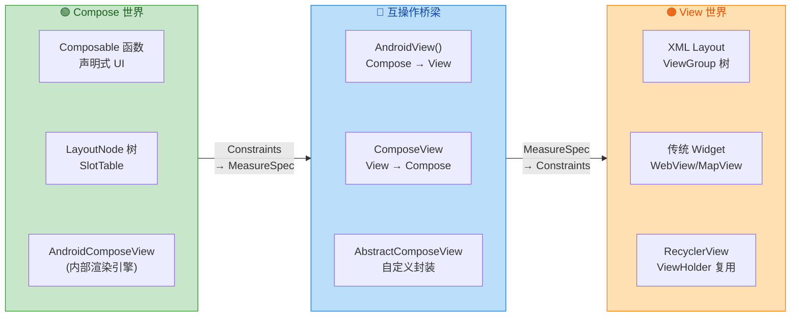

#### 嵌套互操作

实际项目中经常出现多层嵌套的情况：一个 XML Activity 中嵌入 `ComposeView`，`ComposeView` 中的某个 Composable 又通过 `AndroidView` 嵌入传统 `MapView`。这种 View → Compose → View 的嵌套是完全合法的，框架会逐层进行约束转换。但每多一层互操作边界，就多一次协议转换开销。因此在架构设计上应尽量减少不必要的嵌套层级——如果一个页面大部分是 Compose，仅嵌入少量 View，那是合理的；但如果来回嵌套三四层，就该考虑统一技术栈了。

#### CompositionLocal 的穿透

当 Compose 通过 `AndroidView` 嵌入一个 View，而这个 View 内部又包含一个 `ComposeView` 时（即 Compose → View → Compose 嵌套），内外两层 Compose 的 `CompositionLocal` 是 **不共享** 的。内层 `ComposeView` 会创建独立的 Composition，拥有自己的 CompositionLocal 作用域。如果你需要传递主题、导航控制器等信息，需要在内层 `ComposeView` 的 `setContent` 中重新提供，或者通过 `ViewModel`、`ViewTreeOwners` 等机制间接共享。

---

**📝 练习题**

在 Fragment 中使用 `ComposeView` 时，以下哪种 `ViewCompositionStrategy` 是推荐的选择？

A. `DisposeOnDetachedFromWindow`，因为 Fragment 的 View 会在进入 back stack 时 detach


B. `DisposeOnViewTreeLifecycleDestroyed`，因为它跟随 Fragment 的 `viewLifecycleOwner` 正确管理 Composition 生命周期


C. `DisposeOnLifecycleDestroyed(fragment.lifecycle)`，因为它绑定到 Fragment 实例的生命周期


D. 不需要设置策略，默认策略 `DisposeOnDetachedFromWindowOrReleasedFromPool` 在 Fragment 中同样适用


**【答案】** B

**【解析】** Fragment 的 View 生命周期与 Fragment 实例的生命周期是分离的。当 Fragment 进入 back stack 时，其 View 被销毁（detach from window），但 Fragment 实例本身仍然存活。选项 A 的 `DisposeOnDetachedFromWindow` 虽然能在 View detach 时销毁 Composition，但这与默认策略表现相似，并未解决核心问题——它只是描述了现象而非正确方案。选项 C 的 `DisposeOnLifecycleDestroyed(fragment.lifecycle)` 绑定的是 Fragment 实例的生命周期而非 View 的生命周期，这意味着当 Fragment 还在 back stack 中存活时 Composition 不会销毁，但 View 已经被销毁了，会导致 Composition 持有已不存在的 View 引用，造成内存泄漏。选项 D 的默认策略在 View detach 时就销毁 Composition，在 Fragment back stack 场景下同样不理想。**选项 B 的 `DisposeOnViewTreeLifecycleDestroyed`** 是正确答案，它从 ViewTree 中获取最近的 `LifecycleOwner`，在 Fragment 中这就是 `viewLifecycleOwner`。当 Fragment View 被销毁时（`viewLifecycleOwner` 到达 DESTROYED），Composition 跟随销毁；当 Fragment 从 back stack 返回、View 重建时，新的 Composition 随之创建。这完美匹配了 Fragment View 生命周期的语义。

---

**📝 练习题**

关于 `AndroidView` 的 `factory` 和 `update` 参数，以下说法正确的是？

A. `factory` 和 `update` 在每次 Recomposition 时都会被调用，以确保 View 状态最新


B. `factory` 在每次 Recomposition 时创建新的 View 实例，`update` 负责回收旧实例


C. `factory` 仅在首次 Composition 时调用一次，`update` 在每次 Recomposition 时调用以同步 Compose State 到 View


D. `factory` 创建 View 后立即被 GC 回收，`update` 持有 View 的弱引用进行更新


**【答案】** C

**【解析】** `AndroidView` 的设计遵循"创建一次、多次更新"的模式。`factory` lambda 接收 `Context` 参数并返回一个 View 实例，这个 lambda **仅在 `AndroidView` 首次进入 Composition 时执行一次**，创建出的 View 被缓存并持续复用。后续的 Recomposition 不会重新调用 `factory`，因为创建 View 是一个相对昂贵的操作（涉及资源加载、布局初始化等），反复创建会严重损害性能。`update` lambda 则在每次 Recomposition 时被调用，它接收 `factory` 创建的那个 View 实例作为参数，开发者在其中将 Compose 的 State 值写入 View 的属性（如 `textView.text = newText`）。这种分离确保了 View 的创建成本只发生一次，而状态同步可以高效地随 Recomposition 频繁执行。选项 A 错误在于 `factory` 不会在每次 Recomposition 时调用；选项 B 和 D 的描述完全不符合实际机制。

---

## 视图树所有者 ViewTreeOwners

在 Compose 与传统 View 系统的互操作（Interoperability）过程中，有一个经常被忽视但极其关键的底层机制——**ViewTreeOwners**。它是连接 Compose 世界与 Android 架构组件（Lifecycle、ViewModel、SavedState）的桥梁。如果你曾在 Service 中使用 `ComposeView` 却遭遇 `IllegalStateException: ViewTreeLifecycleOwner not found`，或者在 `BottomSheetDialog` 中嵌入 `AbstractComposeView` 而崩溃，那么理解 ViewTreeOwners 的完整运作机制就是解决这些问题的钥匙。

ViewTreeOwners 本质上回答了一个问题：**当一个 View（尤其是 ComposeView）被添加到视图树中时，它如何找到管理自己生命周期、状态恢复和 ViewModel 存储的"所有者"？** 答案就是：沿着 View 的 parent 链逐层向上查找，直到找到被预先 set 进某个祖先 View tag 中的 Owner 对象。

### LifecycleOwner 查找机制

`LifecycleOwner` 是整个 ViewTreeOwners 体系中最核心的角色。Compose 的布局需要一个 Recomposer，而这个 Recomposer 本质上是一个调度器（Scheduler），负责执行 recomposition 并将更新应用到 Composition 中。Recomposer 必须知道自己应该绑定到哪个 Lifecycle 上。这就是为什么 `LifecycleOwner` 对 ComposeView 来说是不可或缺的——没有它，Compose 无法创建出 `LifecycleAwareWindowRecomposer`，也就无法启动任何 Composition。

**底层查找算法**

在 `ViewTreeLifecycleOwner` 的 `get(View)` 方法中，查找逻辑非常直观：首先检查当前 View 的 tag 中是否存储了 `LifecycleOwner`（key 为 `R.id.view_tree_lifecycle_owner`）；如果没有找到，就沿着 `view.getParent()` 链不断向上遍历，直到找到一个设置了该 tag 的祖先 View，或者遍历完整个 parent 链返回 null。

用伪代码表达这个过程：

```kotlin
// ViewTreeLifecycleOwner.get() 的核心逻辑（简化版）
fun get(view: View): LifecycleOwner? {
    // 1. 先从当前 View 的 tag 中尝试获取
    var found = view.getTag(R.id.view_tree_lifecycle_owner) as? LifecycleOwner
    // 2. 如果当前 View 没有，沿 parent 链向上查找
    var parent = view.parent
    while (found == null && parent is View) {
        // 检查每一个 parent View 的 tag
        found = (parent as View).getTag(R.id.view_tree_lifecycle_owner) as? LifecycleOwner
        // 继续向上
        parent = parent.parent
    }
    // 3. 返回找到的 LifecycleOwner，或者 null
    return found
}
```

**谁来 set LifecycleOwner？**

在 `ComponentActivity` 的 `initViewTreeOwners()` 方法中，Activity 会在设置 content view **之前**，将自身（`this`，因为 `ComponentActivity` 实现了 `LifecycleOwner`）设置到 `window.decorView` 的 tag 上。同样，在 `Fragment` 的 `performCreateView()` 中，Fragment 会将 `mViewLifecycleOwner`（注意不是 Fragment 自身，而是 Fragment 的 View 级别 LifecycleOwner）设置到 Fragment 根 View 上。

这意味着，在标准的 Activity/Fragment 宿主环境下，视图树中的任何 View 只要向上查找，最终都能在 DecorView 或 Fragment 根 View 上找到 `LifecycleOwner`。这个 `set` 方法的设计文档明确指出：只有像 Activity 或 Fragment 这类管理视图树并通过 `LifecycleOwner` 反映自身生命周期的构造体才应该调用它。

**Compose 侧的消费：LocalLifecycleOwner**

当 `ComposeView` 或 `AbstractComposeView` attach 到 Window 后，它会沿视图树查找到 `LifecycleOwner`，然后将其包装为 `CompositionLocal` 注入到 Compose 组合树中。在 Compose 中，`LocalLifecycleOwner` 提供了对当前 Composition 所对应的 LifecycleOwner 的访问，开发者可以使用这个 owner 来观察生命周期事件并执行相应操作。

值得注意的一个版本兼容性问题：`LocalLifecycleOwner` 存在两个版本——旧版来自 `androidx.compose.ui.platform`，新版来自 `androidx.lifecycle.compose`。新版只能与 Compose UI 1.7.0-alpha05 或更高版本搭配使用。在实际开发中要确保 import 路径正确，否则可能出现 `CompositionLocal LocalLifecycleOwner not present` 异常。

### SavedStateRegistryOwner 查找机制

`SavedStateRegistryOwner` 是 ViewTreeOwners 体系中的第二个重要角色。它的职责是为 View 树中的组件提供 **状态保存与恢复** 的能力。`SavedStateRegistry` 本身就是 Android Jetpack 对传统 `onSaveInstanceState` 机制的现代化封装——它允许任何组件（不仅限于 Activity/Fragment）注册自己的 `SavedStateProvider`，在配置更改（Configuration Change）或进程被杀时保存并恢复状态。

**查找算法与 LifecycleOwner 完全一致**

`ViewTreeSavedStateRegistryOwner` 的实现思路与 `ViewTreeLifecycleOwner` 如出一辙：使用 `R.id.view_tree_saved_state_registry_owner` 作为 tag key，在当前 View 及其 parent 链上逐层查找。这个扩展函数 `findViewTreeSavedStateRegistryOwner()` 实际上来自 `androidx.savedstate` artifact，而非 `androidx.lifecycle`。

**在 Activity 和 Fragment 中的设置时机**

ComponentActivity 在 `initViewTreeOwners()` 中一次性调用了三个 set 方法：`ViewTreeLifecycleOwner.set(getWindow().getDecorView(), this)`、`ViewTreeViewModelStoreOwner.set(getWindow().getDecorView(), this)` 和 `ViewTreeSavedStateRegistryOwner.set(getWindow().getDecorView(), this)`。这个设置发生在 `setContentView` 之前，确保后续 inflate 出来的所有 View 在 attach 时就能查找到这三个 Owner。

对于 Fragment，情况稍有不同。Fragment 在 `performCreateView()` 中设置 `ViewTreeSavedStateRegistryOwner` 时，使用的是 `mViewLifecycleOwner`——它同时实现了 `LifecycleOwner` 和 `SavedStateRegistryOwner`。这意味着 Fragment 内部 View 的 SavedState 生命周期与 Fragment 的 View 生命周期保持一致（`onCreateView` 到 `onDestroyView`），而非 Fragment 自身的生命周期。

**Compose 侧的消费：LocalSavedStateRegistryOwner**

在 Compose 组合树中，`LocalSavedStateRegistryOwner` 这个 CompositionLocal 承载了从 View 树传入的 `SavedStateRegistryOwner`。Compose 自身的 `rememberSaveable` API 底层就依赖于 `SavedStateRegistry` 来持久化 Composable 的状态。当你调用 `rememberSaveable { mutableStateOf("hello") }` 时，Compose 会通过 `LocalSavedStateRegistryOwner` 获取 registry，注册一个 provider，在 Activity 保存状态时将值序列化到 Bundle 中。

### ViewModelStoreOwner 查找机制

`ViewModelStoreOwner` 是三大 Owner 中面向"业务逻辑存活"的关键角色。它拥有一个 `ViewModelStore`，这个 store 内部就是一个 `HashMap<String, ViewModel>`，用于在配置更改时保留 ViewModel 实例，避免昂贵的数据重新加载。

**查找算法**

`ViewTreeViewModelStoreOwner` 与 `ViewTreeLifecycleOwner` 的基本动作完全相同，使用 `R.id.view_tree_view_model_store_owner` 作为 View tag 的 key 来存储和获取 `ViewModelStoreOwner`。查找方向同样是从当前 View 向上遍历 parent 链。

官方文档指出，这个 set 方法只应由像 Activity 或 Fragment 这类管理视图树并通过 `ViewModelStoreOwner` 保留状态的构造体来调用。调用者应该只设置一个"稳定的" `ViewModelStoreOwner`。当视图树被移除且不保证以后会重新 attach 到窗口时，关联的 `ViewModelStore` 应当被 clear。

**Custom View 中使用 ViewModelStoreOwner**

通过 `View.findViewTreeLifecycleOwner()`、`View.findViewTreeViewModelStoreOwner()` 和 `View.findViewTreeSavedStateRegistryOwner()` 这三个 Kotlin 扩展函数，开发者拥有了在 View 内部访问和使用 ViewModel 的全部工具。这意味着可以在 ViewModel 中完成工作，自定义 View 监听 ViewModel 的数据发射并更新自身 UI，与 Fragment 的做法类似。

需要特别注意：由于 `ViewTreeViewModelStoreOwner` 依赖于从祖先 View 获取 store owner，务必在 `onAttachedToWindow()` 中调用它。在 View 尚未 attach 到 window 时调用 `findViewTreeViewModelStoreOwner()` 会返回 null，因为此时 parent 链尚未建立。

```kotlin
// 在自定义 View 中安全地获取 ViewModel
class MyCustomView @JvmOverloads constructor(
    context: Context,
    attrs: AttributeSet? = null
) : FrameLayout(context, attrs) {

    // 延迟初始化，确保在 attach 之后才访问
    private val viewModel: MyViewModel by lazy {
        // 从视图树中查找最近的 ViewModelStoreOwner
        val owner = findViewTreeViewModelStoreOwner()
            ?: throw IllegalStateException("ViewModelStoreOwner not found")
        // 使用 owner 构建 ViewModelProvider 并获取 ViewModel
        ViewModelProvider(owner)[MyViewModel::class.java]
    }

    override fun onAttachedToWindow() {
        super.onAttachedToWindow()
        // 此时 parent 链已建立，可以安全获取 LifecycleOwner
        val lifecycleOwner = findViewTreeLifecycleOwner()
            ?: return
        // 观察 ViewModel 的 LiveData / StateFlow
        viewModel.uiState.observe(lifecycleOwner) { state ->
            // 更新 UI
        }
    }
}
```

**Compose 侧的消费：LocalViewModelStoreOwner**

`LocalViewModelStoreOwner` 这个 CompositionLocal 提供了当前作用域的 `ViewModelStoreOwner`，开发者可以通过它访问当前范围内的 ViewModel。在 Compose 中调用 `viewModel()` 函数时，内部默认使用 `LocalViewModelStoreOwner.current` 来确定 ViewModel 的存储范围。如果使用 Navigation Compose，每个 `NavBackStackEntry` 本身就是一个 `ViewModelStoreOwner`，Navigation 框架会在导航到新目的地时通过 `CompositionLocalProvider` 注入该 entry 的 owner，从而实现"每个导航目的地拥有独立的 ViewModel 作用域"。

### 三者协同：从 DecorView 到 CompositionLocal 的完整链路

理解了三个 Owner 各自的查找机制后，我们来看它们如何在一个完整的 Compose 互操作场景中协同工作。

```mermaid
graph LR
    subgraph Activity["🏠 ComponentActivity"]
        direction TB
        A1["initViewTreeOwners\n在 setContentView 之前调用"]
        A2["DecorView\n.setTag LifecycleOwner"]
        A3["DecorView\n.setTag SavedStateRegistryOwner"]
        A4["DecorView\n.setTag ViewModelStoreOwner"]
        A1 --> A2
        A2 --> A3
        A3 --> A4
    end

    subgraph Bridge["🔗 View Tree 向上查找"]
        direction TB
        B1["ComposeView\nattach to Window"]
        B2["findViewTreeLifecycleOwner\n沿 parent 链查找"]
        B3["findViewTreeSavedStateRegistryOwner\n沿 parent 链查找"]
        B4["findViewTreeViewModelStoreOwner\n沿 parent 链查找"]
        B1 --> B2
        B2 --> B3
        B3 --> B4
    end

    subgraph Compose["🎨 Compose Composition"]
        direction TB
        C1["LocalLifecycleOwner\nRecomposer 绑定生命周期"]
        C2["LocalSavedStateRegistryOwner\nrememberSaveable 持久化"]
        C3["LocalViewModelStoreOwner\nviewModel 作用域"]
        C1 ~~~ C2
        C2 ~~~ C3
    end

    Activity -->|"DecorView 提供三大 Owner"| Bridge -->|"注入 CompositionLocal"| Compose

    classDef activityStyle fill:#C8E6C9,stroke:#388E3C,color:#1B5E20
    classDef bridgeStyle fill:#BBDEFB,stroke:#1976D2,color:#0D47A1
    classDef composeStyle fill:#FFF9C4,stroke:#F9A825,color:#F57F17

    class Activity activityStyle
    class Bridge bridgeStyle
    class Compose composeStyle
```

整个流程可以总结为三个阶段：

1. **设置阶段（Set Phase）**：`ComponentActivity` 在 `onCreate` 的 `initViewTreeOwners()` 中，将自身作为三大 Owner 的实现者，分别 set 到 `window.decorView` 的 tag 上。Fragment 则在 `performCreateView()` 中将 `mViewLifecycleOwner`（同时实现 LifecycleOwner 和 SavedStateRegistryOwner）和 Fragment 自身（实现 ViewModelStoreOwner）set 到 Fragment 根 View 上。

2. **查找阶段（Find Phase）**：当 `ComposeView`（或 `AbstractComposeView`）attach 到 Window 时，它内部创建 `WindowRecomposer` 的过程中会调用 `ViewTreeLifecycleOwner.get(this)` 沿 parent 链向上查找。如果找不到，就会抛出 `IllegalStateException: ViewTreeLifecycleOwner not found`——框架在抱怨 ComposeView 没有 ViewTreeLifecycleOwner。

3. **注入阶段（Provide Phase）**：找到的三个 Owner 被包装为对应的 `CompositionLocal`，通过 `CompositionLocalProvider` 注入到 Compose 组合树中，供所有 Composable 函数通过 `LocalLifecycleOwner.current`、`LocalSavedStateRegistryOwner.current`、`LocalViewModelStoreOwner.current` 访问。

### 非标准宿主场景的 Owner 手动配置

在标准的 `ComponentActivity` + `Fragment` 体系下，三大 Owner 都是自动配置的，开发者完全不需要操心。但在以下非标准场景中，你必须**手动**配置 ViewTreeOwners：

**场景一：Service 中使用 ComposeView（悬浮窗/Overlay）**

Jetpack Compose 在标准的 Activity 和 Fragment 环境中工作良好，但如果尝试从 Service 中显示 Compose UI，就会遇到问题。要解决这个错误，需要将 Service 变成 LifecycleOwner 并传递给 ComposeView；之后还需要将 Service 变成 SavedStateRegistryOwner 并同样传递给 ComposeView。

完整的解决方案是创建一个自定义的 Owner 实现：

```kotlin
// 自定义 LifecycleOwner + SavedStateRegistryOwner 实现
// 用于 Service、Dialog 等非 Activity 宿主环境
class CustomLifecycleOwner : SavedStateRegistryOwner {

    // 创建 LifecycleRegistry，管理生命周期状态
    private val lifecycleRegistry = LifecycleRegistry(this)

    // 创建 SavedStateRegistryController，管理状态保存与恢复
    private val savedStateRegistryController =
        SavedStateRegistryController.create(this)

    // 实现 LifecycleOwner 接口，返回 lifecycleRegistry
    override val lifecycle: Lifecycle = lifecycleRegistry

    // 实现 SavedStateRegistryOwner 接口，返回 savedStateRegistry
    override val savedStateRegistry: SavedStateRegistry =
        savedStateRegistryController.savedStateRegistry

    // 手动分发生命周期事件
    fun handleLifecycleEvent(event: Lifecycle.Event) {
        lifecycleRegistry.handleLifecycleEvent(event)
    }

    // 恢复之前保存的状态
    fun performRestore(savedState: Bundle?) {
        savedStateRegistryController.performRestore(savedState)
    }
}
```

在 Service 中使用时，需要在 `ComposeView` 上手动设置这些 Owner：

```kotlin
// 在 Service 中创建并配置 ComposeView
class MyOverlayService : Service() {

    private lateinit var windowManager: WindowManager
    // 创建自定义的 LifecycleOwner
    private val lifecycleOwner = CustomLifecycleOwner()
    // 创建独立的 ViewModelStore
    private val viewModelStore = ViewModelStore()
    // 创建 ViewModelStoreOwner
    private val viewModelStoreOwner = object : ViewModelStoreOwner {
        override val viewModelStore: ViewModelStore
            get() = this@MyOverlayService.viewModelStore
    }

    override fun onCreate() {
        super.onCreate()
        windowManager = getSystemService(WINDOW_SERVICE) as WindowManager

        // 执行 SavedState 的 attach 和 restore
        lifecycleOwner.performRestore(null)
        // 分发 ON_CREATE 事件
        lifecycleOwner.handleLifecycleEvent(Lifecycle.Event.ON_CREATE)

        // 创建 ComposeView 并手动设置三大 Owner
        val composeView = ComposeView(this).apply {
            // 设置 LifecycleOwner —— Recomposer 依赖它
            setViewTreeLifecycleOwner(lifecycleOwner)
            // 设置 SavedStateRegistryOwner —— rememberSaveable 依赖它
            setViewTreeSavedStateRegistryOwner(lifecycleOwner)
            // 设置 ViewModelStoreOwner —— viewModel() 依赖它
            setViewTreeViewModelStoreOwner(viewModelStoreOwner)

            setContent {
                // Compose 内容可以正常使用 viewModel()、rememberSaveable 等
                MyOverlayContent()
            }
        }

        // 将 ComposeView 添加到 WindowManager
        val params = WindowManager.LayoutParams(/* ... 省略参数 ... */)
        windowManager.addView(composeView, params)

        // 必须分发 ON_START 和 ON_RESUME，否则 Recomposer 不会开始工作
        lifecycleOwner.handleLifecycleEvent(Lifecycle.Event.ON_START)
        lifecycleOwner.handleLifecycleEvent(Lifecycle.Event.ON_RESUME)
    }

    override fun onDestroy() {
        super.onDestroy()
        // 按照生命周期顺序逆序分发事件
        lifecycleOwner.handleLifecycleEvent(Lifecycle.Event.ON_PAUSE)
        lifecycleOwner.handleLifecycleEvent(Lifecycle.Event.ON_STOP)
        lifecycleOwner.handleLifecycleEvent(Lifecycle.Event.ON_DESTROY)
        // 清理 ViewModelStore
        viewModelStore.clear()
    }

    override fun onBind(intent: Intent?): IBinder? = null
}
```

**场景二：Dialog / BottomSheetDialog 中嵌入 ComposeView**

`ComponentDialog`（如 `AlertDialog`）实现了 `LifecycleOwner` 并在 `setContentView` 时调用了 `window.decorView.setViewTreeLifecycleOwner(this)`，但 `BottomSheetDialog` / `AppCompatDialog` 并没有这么做。这意味着在 `BottomSheetDialog` 中直接嵌入 `AbstractComposeView` 会崩溃，因为 Dialog 的 DecorView 上没有设置 Owner。

解决方案是在 Dialog 创建后手动 set：

```kotlin
// 修复 BottomSheetDialog 中使用 Compose 的问题
class ComposeBottomSheet(context: Context) : BottomSheetDialog(context) {

    override fun setContentView(view: View) {
        super.setContentView(view)
        // BottomSheetDialog 没有自动 set ViewTreeOwners
        // 需要手动将宿主 Activity 的 Owner 传递到 Dialog 的 DecorView
        val activity = context as? ComponentActivity
            ?: return
        window?.decorView?.let { decorView ->
            // 将 Activity 的三大 Owner set 到 Dialog 的 DecorView 上
            decorView.setViewTreeLifecycleOwner(activity)
            decorView.setViewTreeSavedStateRegistryOwner(activity)
            decorView.setViewTreeViewModelStoreOwner(activity)
        }
    }
}
```

**场景三：Android Auto / 无 Activity 环境**

在没有 Activity 的环境下使用 ComposeView 的需求越来越常见，包括 Android Auto、Overlay、IME（输入法）、底部弹窗等场景。仅仅创建一个 `ComposeView` 是不够的，因为它必须被 attach 到一个 Window 上（否则会抛出异常），而且必须能够在视图树中找到 Owner。

在这类场景下，核心策略与 Service 方案类似：创建自定义 Owner 实现 → set 到 ComposeView → 通过 `WindowManager` 或 `Presentation` attach 到 Window → 手动分发生命周期事件。

### ViewCompositionStrategy 与 ViewTreeOwners 的关联

`ViewCompositionStrategy` 决定了 Composition 何时被 dispose，而这个策略与 ViewTreeOwners 紧密相关。

当使用 `DisposeOnViewTreeLifecycleDestroyed` 策略时，Composition 会在最近的 `ViewTreeLifecycleOwner` 被销毁时一并 dispose。这本质上是通过 `ViewTreeLifecycleOwner.get` API 查找到负责管理 ComposeView 的 LifecycleOwner，然后监听其 `ON_DESTROY` 事件。

那什么时候用 `DisposeOnLifecycleDestroyed`，什么时候用 `DisposeOnViewTreeLifecycleDestroyed`？如果 Lifecycle 对象已知（例如手动传入），使用前者；否则使用后者。这个区分在 Fragment 场景中尤为重要——Fragment 的 View Lifecycle 和 Fragment 的 Lifecycle 是不同的对象，选错可能导致 Composition 在不恰当的时机被 dispose 或泄漏。

默认策略 `DisposeOnDetachedFromWindowOrReleasedFromPool` 在创建 `ComposeView` 时就已经自动应用，因此在绝大多数情况下不需要显式设置。但在 Fragment 中使用 ComposeView 时，建议切换到 `DisposeOnViewTreeLifecycleDestroyed`，以匹配 Fragment 的 View 生命周期。

### ComposeView 要求所有者传播的强制约束

`ComposeView` 只支持被添加到传播了 `LifecycleOwner` 和 `SavedStateRegistryOwner` 的视图层次中（通过 `setViewTreeLifecycleOwner` 和 `setViewTreeSavedStateRegistryOwner`）。这是一个**硬性约束**——如果视图层次中没有这些 Owner，ComposeView 在尝试创建 Recomposer 时会直接崩溃。

这个约束的根源在于 `AbstractComposeView` 的 `resolveParentCompositionContext` 方法。当 ComposeView attach 到 Window 后，它需要获取或创建 `Recomposer`。默认的 `WindowRecomposerFactory.LifecycleAware` 会调用 `createLifecycleAwareWindowRecomposer()`，这个方法内部调用 `ViewTreeLifecycleOwner.get(rootView)` 来获取 `LifecycleOwner`，如果返回 null 就直接 throw。

**关键理解**：这不是一个设计缺陷，而是 Compose 对运行环境的最低要求。Compose 的 Recomposer 必须知道何时暂停/恢复 recomposition（绑定 Lifecycle），`rememberSaveable` 必须知道往哪里保存状态（绑定 SavedStateRegistry），`viewModel()` 必须知道 ViewModel 存储在哪里（绑定 ViewModelStore）。没有这些 Owner，Compose 的核心功能都无法运作。

```mermaid
graph LR
    subgraph Owners["📋 三大 Owner 接口"]
        direction TB
        O1["LifecycleOwner\n提供 Lifecycle 对象\n控制 Recomposer 启停"]
        O2["SavedStateRegistryOwner\n提供 SavedStateRegistry\n支持 rememberSaveable"]
        O3["ViewModelStoreOwner\n提供 ViewModelStore\n支持 viewModel 函数"]
        O1 ~~~ O2
        O2 ~~~ O3
    end

    subgraph Hosts["🏗️ 标准宿主（自动 Set）"]
        direction TB
        H1["ComponentActivity\n实现全部三个接口\nset 到 DecorView"]
        H2["Fragment\nViewModelStoreOwner\nViewLifecycleOwner"]
        H3["ComponentDialog\n实现 LifecycleOwner\nset 到 Dialog DecorView"]
        H1 ~~~ H2
        H2 ~~~ H3
    end

    subgraph NonStd["⚠️ 非标准宿主（手动 Set）"]
        direction TB
        N1["Service\n悬浮窗 Overlay"]
        N2["BottomSheetDialog\nAppCompatDialog"]
        N3["Android Auto\nIME / 无 Activity"]
        N1 ~~~ N2
        N2 ~~~ N3
    end

    Owners -->|"标准宿主自动注入"| Hosts -->|"非标准宿主需手动配置"| NonStd

    classDef ownerStyle fill:#E8F5E9,stroke:#43A047,color:#1B5E20
    classDef hostStyle fill:#E3F2FD,stroke:#1E88E5,color:#0D47A1
    classDef nonStdStyle fill:#FFF3E0,stroke:#FB8C00,color:#E65100

    class Owners ownerStyle
    class Hosts hostStyle
    class NonStd nonStdStyle
```

### 常见问题与排查指南

在实际开发中，ViewTreeOwners 相关的问题往往表现为运行时崩溃，以下是最常见的错误及其排查路径：

**错误 1：`IllegalStateException: ViewTreeLifecycleOwner not found`**

由于这个错误不会影响在 Activity 和 Fragment 中托管的 ComposeView，我们可以推断出这些组件以某种方式提供了这个关键依赖。排查方向：
- 检查 ComposeView 是否被添加到了一个没有 Owner 的 Window 中（如直接通过 WindowManager 添加）
- 检查 `AppCompatActivity` / `Fragment` 的版本是否过低（需要 `activity:1.2.0+` 和 `fragment:1.3.0+`）
- 如果在 Dialog 中使用，确认 Dialog 类型是否自动设置了 Owner

**错误 2：`CompositionLocal LocalLifecycleOwner not present`**

这个错误是由于 Compose 和 Lifecycle 组件之间的版本不兼容引起的。排查方向：
- 检查是否混用了 `androidx.compose.ui.platform.LocalLifecycleOwner` 和 `androidx.lifecycle.compose.LocalLifecycleOwner`
- 如果 Lifecycle 版本升级到 2.8.x，Compose UI 版本必须跟进到 1.7.x

**错误 3：`No ViewModelStoreOwner was provided via LocalViewModelStoreOwner`**

排查方向：
- 确认 ComposeView 的宿主是否实现了 `ViewModelStoreOwner`
- 在自定义导航框架中，确保每个导航目的地通过 `CompositionLocalProvider` 提供了 `LocalViewModelStoreOwner`

---

**📝 练习题**

在一个 `Service` 中通过 `WindowManager` 添加了 `ComposeView` 来显示悬浮窗，但运行时崩溃并报错 `ViewTreeLifecycleOwner not found`。以下哪种做法可以**正确解决**这个问题？

A. 在 `ComposeView` 的 `setContent` 闭包中调用 `CompositionLocalProvider(LocalLifecycleOwner provides myLifecycleOwner)` 来提供 LifecycleOwner


B. 创建一个自定义 `LifecycleOwner` 和 `SavedStateRegistryOwner`，在 ComposeView attach 到 Window **之前**通过 `setViewTreeLifecycleOwner()` 和 `setViewTreeSavedStateRegistryOwner()` 设置到 ComposeView 上，并手动分发生命周期事件


C. 将 Service 的 `baseContext` 强转为 `LifecycleOwner` 并传入 ComposeView


D. 升级 AppCompat 版本到最新即可，Service 会自动获得 ViewTreeOwners 支持


**【答案】** B

**【解析】** 崩溃发生在 `ComposeView` attach 到 Window 后尝试创建 `Recomposer` 的过程中——此时 Compose 还没有进入 `setContent` 的执行，因此 A 选项中的 `CompositionLocalProvider` 根本不会被执行到，问题在 Composition 建立之前就已经发生了。正确做法是在 ComposeView attach 之前就通过 View 的 `setViewTreeLifecycleOwner()` 方法将自定义 Owner set 到 View 的 tag 上，让 `createLifecycleAwareWindowRecomposer()` 在查找时能够成功找到。同时还需 set `SavedStateRegistryOwner`，并在适当时机手动分发 `ON_CREATE` → `ON_START` → `ON_RESUME` 事件，确保 Recomposer 正常启动。C 选项中 Service 的 `baseContext` 是 `ContextWrapper`，不实现 `LifecycleOwner`，强转会抛出 `ClassCastException`。D 选项的说法完全错误——`Service` 不属于视图树的标准宿主，无论 AppCompat 版本多新都不会自动为 Service 注入 ViewTreeOwners。

---

## 本章小结

本章围绕 **Compose 布局与互操作（Compose Layout & Interoperability）** 这一核心主题，从布局流程的底层机制出发，逐步深入到修饰符链、常用容器、约束布局、懒加载列表、自定义布局，再延伸到与传统 View 体系的互操作性，最终落脚到视图树所有者的查找机制。整个章节构成了一条从"Compose 如何把 UI 从声明变为像素"到"Compose 如何与既有 View 世界共存"的完整知识链路。以下对各节核心内容进行系统回顾与提炼。

---

### 布局流程 Layout Phase：三步走的核心引擎

Compose 的布局流程由 **Composition → Layout → Drawing** 三大阶段构成，其中 Layout 阶段本身又细分为 **Measure（测量）** 与 **Place（放置）** 两个子步骤。这一设计的核心哲学是 **单遍测量（Single-pass Measurement）**：与传统 View 体系中父布局可能对子 View 进行多次 `measure()` 不同，Compose 严格规定每个子节点 **只被测量一次**，从根本上杜绝了嵌套布局导致的指数级性能膨胀问题。

Measure 阶段自上而下传递 `Constraints`（最小/最大宽高的四元组），每个节点在约束范围内决定自身尺寸；Place 阶段则自上而下确定每个节点在父容器坐标系中的偏移量。**固有特性测量（Intrinsics）** 作为补充机制，允许父布局在正式测量之前 **"预查询"** 子节点的理想尺寸（`minIntrinsicWidth`、`maxIntrinsicWidth` 等），从而在不违反单遍测量原则的前提下实现跨兄弟节点的尺寸协调——典型场景如 `IntrinsicSize.Min` 让同一 Row 中的多个子项对齐到最小公共高度。

**关键收获**：理解 Constraints 的传递方向（自顶向下）与尺寸确定的回报方向（自底向上），是掌握所有后续布局行为的基石。

---

### 修饰符链 Modifier Chain：由外到内的洋葱模型

`Modifier` 是 Compose UI 中最强大也最容易误解的机制。修饰符通过 `then()` 运算符形成链式结构，其本质是一个 **有序链表（Linked Chain）**，每个节点代表一项独立的布局、绘制或交互行为。

核心要点在于 **顺序敏感性**：`Modifier.padding(16.dp).background(Color.Red)` 与 `Modifier.background(Color.Red).padding(16.dp)` 的视觉效果截然不同。前者先收缩约束再绘制背景（背景不含 padding 区域），后者先绘制背景再收缩（背景覆盖 padding 区域）。这源于修饰符链的 **Fold 操作原理**——链中的每个 `LayoutModifier` 会对传入的 `Constraints` 进行变换后再传递给内层，形成一层层的"包裹"（Wrapping），如同洋葱的层次结构。

自定义 `LayoutModifier` 允许开发者拦截测量过程：接收外层传来的 Constraints，自行决定如何测量子节点（`measurable.measure(modifiedConstraints)`），并在放置阶段控制子节点偏移。这使得诸如自定义 padding、偏移、对齐等行为可以在不创建完整 Layout Composable 的前提下轻量实现。

**关键收获**：修饰符的书写顺序就是执行顺序，每一层都对约束和绘制范围进行变换——**先写的在外层，后写的在内层**。

---

### 常用布局容器：线性、层叠与脚手架

Compose 提供的基础容器对应着最常见的布局范式：

- **Column / Row**：线性布局的纵向与横向变体。它们通过 `Arrangement`（主轴分布策略，如 `SpaceEvenly`、`SpaceBetween`）和 `Alignment`（交叉轴对齐）两个维度完整控制子项排列。`weight` 修饰符实现了类似传统 `LinearLayout` 权重分配的能力，但语义更清晰——它在测量阶段先让无权重子项确定尺寸，再将剩余空间按比例分配给有权重子项。

- **Box**：层叠容器，子项默认按声明顺序堆叠（后声明者在上层），通过 `contentAlignment` 控制默认对齐，通过 `Modifier.align()` 逐项覆盖。它是实现浮动按钮、角标、遮罩层等 UI 模式的基础。

- **Scaffold**：Material Design 脚手架，预定义了 `topBar`、`bottomBar`、`floatingActionButton`、`snackbarHost`、`content` 等槽位（Slot）。它的核心价值在于 **自动处理 `PaddingValues`**——将各槽位占用的空间计算后通过 `innerPadding` 传递给 content lambda，开发者只需将其应用到内容根节点即可避免遮挡。

- **Surface**：Material 表面容器，封装了形状裁剪（Shape Clipping）、elevation 投影、背景色与内容色（`contentColor`）的自动传播。它是 Card、Dialog 等组件的底层构建块。

**关键收获**：选择容器的依据是布局语义——线性排列用 Column/Row，堆叠用 Box，页面骨架用 Scaffold，Material 卡片/面板用 Surface。

---

### 约束布局 ConstraintLayout：扁平化的复杂布局

Compose 版 ConstraintLayout 通过 DSL 替代了 XML 中的属性声明，核心 API 围绕三个概念展开：

1. **引用（Ref）**：通过 `createRefs()` 或 `createRefFor()` 为每个子项创建唯一标识，再用 `Modifier.constrainAs(ref) { ... }` 声明约束关系。
2. **屏障（Barrier）**：`createEndBarrier(ref1, ref2)` 等 API 创建虚拟边界线，其位置动态跟随所引用节点中最极端的那一个，适用于表单标签对齐等场景。
3. **引导线（Guideline）**：`createGuidelineFromStart(0.3f)` 创建固定或百分比位置的参考线，用于实现黄金分割、比例布局等设计规范。

ConstraintLayout 的核心价值在于 **扁平化**：当多个子项之间存在复杂的相互约束关系时，使用嵌套的 Column/Row/Box 可能导致层级过深，而 ConstraintLayout 允许所有子项处于同一层级，通过声明式约束描述关系。不过需注意，对于简单的线性或堆叠布局，直接使用 Column/Row/Box 的性能和可读性通常更优——ConstraintLayout 应当在"约束关系确实复杂"时才引入。

**关键收获**：ConstraintLayout 解决的是子项间存在复杂相互依赖关系时的扁平化布局问题，DSL 写法比 XML 更直观但学习曲线依然存在。

---

### 懒加载列表 LazyList：按需组合的高性能列表

`LazyColumn` / `LazyRow` 是 Compose 世界的 RecyclerView 等价物，但其工作机制有本质差异。传统 RecyclerView 依赖 ViewHolder 回收复用，而 LazyList 采用 **按需组合（On-demand Composition）**——只有可见区域及少量缓冲区内的 item 会参与 Composition，离开视口的 item 直接被 **销毁其 Composition**（而非回收复用 View 实例）。

**item 缓存策略** 涉及两层：Composition 层面，离屏 item 的 Composition 会被 dispose；Layout 节点层面，`SubcomposeLayout` 的内部缓存会保留少量最近离屏的 slot，以便快速回滚时减少重新 Composition 的开销。

**key 优化** 是保障列表性能的关键实践：为每个 item 提供稳定且唯一的 `key`（通常是业务 ID），使得数据集发生增删或排序时，Compose 能正确识别哪些 item 是"移动"而非"删除后重建"，从而保留其内部状态（如输入框文本、动画进度）并最小化重组范围。

**StickyHeader 粘性标题** 允许在滚动过程中将分组标题固定在列表顶部，直到下一个分组标题将其"推走"。其实现原理是在 LazyList 的放置阶段，将当前粘性标题的偏移量锁定在视口顶部，并在下一个粘性标题靠近时逐像素下推。

**关键收获**：LazyList 的核心思想是"不可见则不组合"，务必为 item 提供稳定 key 以避免不必要的重组和状态丢失。

---

### 自定义布局 Custom Layout：完全掌控测量与放置

当内置容器无法满足需求时，`Layout` Composable 函数提供了完全自定义测量与放置逻辑的能力。开发者通过实现 `MeasurePolicy` 接口，在 `measure()` 回调中接收 `measurables`（可测量子项列表）和 `constraints`（父级约束），逐一测量子项后返回 `layout(width, height) { ... }` 块，在其中调用 `placeable.placeRelative(x, y)` 放置每个子项。

**SubcomposeLayout** 是更高级的变体，它允许 **在测量阶段动态决定要组合哪些子项**。典型场景包括：先测量"头部内容"的实际高度，再根据该高度决定"主体内容"应获得多少剩余空间——这在传统 `Layout` 中无法实现，因为 `Layout` 要求所有子项在 Composition 阶段就已确定。`SubcomposeLayout` 通过将 Composition 延迟到 Layout 阶段，打破了"先组合，后布局"的常规时序，代价是轻微的性能开销和无法在其内部使用 `LookaheadScope` 等特性。

**关键收获**：`Layout` = 自定义排列策略；`SubcomposeLayout` = 根据测量结果动态决定子组合内容，适用于尺寸依赖场景。

---

### 互操作性 Interoperability：两个世界的桥梁

Compose 与传统 View 体系的共存通过双向桥接组件实现：

- **AndroidView**：在 Compose 树中嵌入传统 View。`factory` lambda 负责创建 View 实例（仅执行一次），`update` lambda 在每次 Recomposition 时被调用以同步 Compose state 到 View 属性。其底层通过在 Compose 的 LayoutNode 树中插入一个特殊节点，将传统 View 的测量/布局/绘制委托给 Android 原生管线。`onRelease` / `onReset` 回调分别处理 View 被永久移除和在 LazyList 中被缓存复用的场景。

- **ComposeView**：在传统 XML 布局或 Fragment 中嵌入 Compose 内容。它继承自 `AbstractComposeView`，通过 `setContent {}` 设置 Composable 树。`ViewCompositionStrategy` 控制 Composition 的生命周期绑定——默认策略 `DisposeOnDetachedFromWindow` 适用于 Activity 直接使用的场景，而在 Fragment 中必须切换为 `DisposeOnViewTreeLifecycleDestroyed` 以避免 Fragment view 重建时 Composition 泄漏。

- **AbstractComposeView**：自定义桥接组件的基类，开发者可继承它创建封装了特定 Composable 内容的自定义 View 组件，对外暴露传统 View 接口，对内运行 Compose 渲染管线。

**关键收获**：互操作的核心挑战是生命周期与状态同步——`AndroidView` 的 `update` 和 `ComposeView` 的 `ViewCompositionStrategy` 是解决该挑战的两个关键 API。

---

### 视图树所有者 ViewTreeOwners：连接生命周期与状态的纽带

Compose 运行在 Android 平台上，本质上仍依赖传统 View 树提供的基础设施。**ViewTreeOwners** 是三个关键接口的统称：

1. **LifecycleOwner**：提供 `Lifecycle` 对象，Compose 通过它感知 Activity/Fragment 的生命周期状态，从而在 `ON_STOP` 时暂停动画、在 `ON_DESTROY` 时 dispose Composition。`LocalLifecycleOwner` CompositionLocal 使得任意 Composable 都能访问当前的生命周期。

2. **SavedStateRegistryOwner**：提供 `SavedStateRegistry`，`rememberSaveable` 底层正是通过它将状态序列化到 `Bundle` 中，以在进程被杀后恢复。

3. **ViewModelStoreOwner**：提供 `ViewModelStore`，`viewModel()` / `hiltViewModel()` 等 API 通过它获取或创建 ViewModel 实例，确保 ViewModel 的生命周期与 Activity/Fragment/NavBackStackEntry 正确绑定。

这三个 Owner 通过 `ViewTreeLifecycleOwner`、`ViewTreeSavedStateRegistryOwner`、`ViewTreeViewModelStoreOwner` 等扩展函数沿 View 树向上查找（`findViewTreeXxxOwner()`）。`ComponentActivity.setContent {}` / `ComposeView.setContent {}` 内部会自动完成这些 Owner 的设置，但当开发者在自定义场景（如 Dialog 的独立 Window、悬浮窗）中手动创建 ComposeView 并添加到 WindowManager 时，必须 **手动设置这三个 Owner**，否则 `rememberSaveable` 崩溃、`viewModel()` 找不到 Store、生命周期感知失效等问题会接踵而至。

**关键收获**：ViewTreeOwners 是 Compose "寄生"于 Android 平台的脐带，自动场景下无感，手动场景下务必显式设置。

---

### 全章知识脉络总览

以下 Mermaid 图展示本章各知识点之间的逻辑关系——从底层布局引擎出发，经过修饰符、容器、列表、自定义布局，到互操作与平台基础设施的完整链路：

```mermaid
graph LR
    subgraph Phase["🔧 布局引擎"]
        direction TB
        M["Measure\n约束传递 + 单遍测量"]
        P["Place\n坐标偏移确定"]
        I["Intrinsics\n固有特性预查询"]
        M ~~~ P
        P ~~~ I
    end

    subgraph Modifier["🔗 修饰符链"]
        direction TB
        MO["Modifier Chain\n有序链表 · 洋葱模型"]
        MF["Fold 操作\n约束逐层变换"]
        ML["LayoutModifier\n自定义测量拦截"]
        MO ~~~ MF
        MF ~~~ ML
    end

    subgraph Container["📦 布局容器"]
        direction TB
        CR["Column / Row\n线性排列"]
        BX["Box\n层叠布局"]
        SC["Scaffold / Surface\n脚手架与表面"]
        CL["ConstraintLayout\n扁平约束"]
        CR ~~~ BX
        BX ~~~ SC
        SC ~~~ CL
    end

    subgraph Advanced["⚡ 高级布局"]
        direction TB
        LL["LazyColumn / Row\n按需组合 · key 优化"]
        LY["Layout Composable\n自定义 MeasurePolicy"]
        SL["SubcomposeLayout\n延迟组合"]
        LL ~~~ LY
        LY ~~~ SL
    end

    subgraph Bridge["🌉 互操作"]
        direction TB
        AV["AndroidView\n嵌入传统 View"]
        CV["ComposeView\n嵌入 Compose"]
        VT["ViewTreeOwners\nLifecycle · SavedState\nViewModelStore"]
        AV ~~~ CV
        CV ~~~ VT
    end

    Phase -->|"驱动"| Modifier -->|"应用于"| Container -->|"扩展为"| Advanced -->|"桥接"| Bridge

    classDef phaseStyle fill:#E8F5E9,stroke:#43A047,color:#1B5E20
    classDef modStyle fill:#E3F2FD,stroke:#1E88E5,color:#0D47A1
    classDef containerStyle fill:#F3E5F5,stroke:#8E24AA,color:#4A148C
    classDef advStyle fill:#FFF3E0,stroke:#FB8C00,color:#E65100
    classDef bridgeStyle fill:#FCE4EC,stroke:#E53935,color:#B71C1C

    class Phase phaseStyle
    class Modifier modStyle
    class Container containerStyle
    class Advanced advStyle
    class Bridge bridgeStyle
```

---

### 核心设计思想提炼

纵观本章，Compose 布局体系的设计哲学可归纳为以下几条主线：

**第一，声明式优先（Declarative First）**。无论是 Column/Row 的子项排列，还是 ConstraintLayout 的约束关系，抑或 LazyList 的 item 声明，开发者始终在描述"想要什么"而非"怎么做"。测量、放置、回收的具体执行由框架在运行时自动调度，这与传统 View 体系中需手动管理 `onMeasure`/`onLayout`、手动维护 ViewHolder 形成鲜明对比。

**第二，单遍测量约束传播（Single-pass with Constraints Propagation）**。传统 View 的 `MeasureSpec` 模式允许多次测量，导致嵌套 RelativeLayout 等复杂布局的性能不可预测。Compose 通过 Constraints 四元组 + 单遍测量强制约束，将布局复杂度锁定在 O(n)，使得嵌套不再是性能瓶颈。Intrinsics 机制则在不打破此约束的前提下提供了"预查询"逃生阀。

**第三，组合优于继承（Composition over Inheritance）**。修饰符链体现了这一原则的极致应用——padding、background、clickable、size 等行为不是通过继承某个基类获得的，而是通过组合独立的 Modifier 节点实现的。这使得行为可以任意排列组合，灵活性远超传统 View 属性体系。

**第四，渐进式迁移（Incremental Migration）**。互操作性 API（AndroidView / ComposeView / AbstractComposeView）确保团队可以在不重写整个应用的前提下逐步采用 Compose。ViewTreeOwners 机制则保证了 Compose 内容在任何宿主环境中都能正确获取生命周期、状态保存和 ViewModel 等平台基础设施。

---

### 实践检查清单

在将本章知识应用到实际项目时，建议对照以下检查项：

| 维度 | 检查项 | 常见失误 |
|------|--------|----------|
| **Modifier 顺序** | padding/background/clickable 顺序是否符合预期视觉效果？ | padding 写在 background 之前导致背景范围错误 |
| **LazyList key** | 每个 item 是否提供了稳定唯一的 key？ | 使用 index 作为 key 导致数据变更时状态错乱 |
| **ConstraintLayout 适用性** | 是否真正需要扁平约束？简单布局应优先 Column/Row | 过度使用 ConstraintLayout 增加代码复杂度 |
| **SubcomposeLayout 必要性** | 是否存在"尺寸依赖组合"场景？不需要时应使用普通 Layout | 滥用导致不必要的性能开销 |
| **ComposeView 策略** | Fragment 中是否设置了正确的 ViewCompositionStrategy？ | 默认策略导致 Composition 提前 dispose 或泄漏 |
| **手动 ComposeView** | 手动添加到 WindowManager 时是否设置了三个 ViewTreeOwner？ | 遗漏导致 rememberSaveable/viewModel 崩溃 |
| **AndroidView update** | 是否在 update lambda 中正确同步所有响应式状态？ | 遗漏状态同步导致传统 View 显示陈旧数据 |

---

**📝 练习题**

某团队正在将一个大型传统 View 项目逐步迁移至 Compose。当前有一个用 XML 编写的复杂 Fragment，其中需要嵌入一段 Compose UI。同时，该 Compose UI 内部需要嵌入一个尚未迁移的自定义传统 View（`LegacyChartView`）。关于这种"XML → Compose → View"三层嵌套的互操作场景，以下哪项描述是 **正确** 的？


A. 在 Fragment 的 XML 中使用 `ComposeView` 嵌入 Compose 内容时，必须将 `ViewCompositionStrategy` 设置为 `DisposeOnDetachedFromWindow`，否则 Composition 无法正常创建。


B. 在 Compose 内部通过 `AndroidView` 嵌入 `LegacyChartView` 时，`factory` lambda 会在每次 Recomposition 时重新执行以确保 View 状态最新。


C. `ComposeView` 会自动从 Fragment 的 View 树中查找 `LifecycleOwner`、`SavedStateRegistryOwner` 和 `ViewModelStoreOwner`，Compose 内部的 `viewModel()` 和 `rememberSaveable` 可以正常工作；而 `AndroidView` 的 `update` lambda 负责在 Recomposition 时将 Compose state 同步到 `LegacyChartView`。


D. `AndroidView` 内嵌的 `LegacyChartView` 无法响应 Compose 的状态变化，必须通过 `LiveData` 或 `Flow` 建立额外的数据通道才能更新其显示内容。


**【答案】** C

**【解析】**

本题考查 Compose 互操作体系中 ComposeView 与 AndroidView 的协作机制。

**选项 A 错误**：在 Fragment 中使用 ComposeView 时，恰恰 **不应该** 使用默认的 `DisposeOnDetachedFromWindow` 策略。Fragment 的生命周期中，view 可能被销毁后重建（如 `onDestroyView` → `onCreateView`），但 Fragment 实例本身仍存活。默认策略会在 view detach 时 dispose Composition，当 view 重建时需要重新创建 Composition，可能导致状态丢失。正确做法是设置为 `DisposeOnViewTreeLifecycleDestroyed`，使 Composition 的生命周期与 Fragment 的 view lifecycle 对齐。该选项不仅策略推荐错误，且"否则无法正常创建"的表述也不准确——默认策略可以创建 Composition，只是在 Fragment view 重建场景下行为不正确。

**选项 B 错误**：`AndroidView` 的 `factory` lambda 仅在该 Composable 首次进入 Composition 时执行 **一次**，负责创建并返回传统 View 实例。后续 Recomposition 触发的是 `update` lambda（而非 factory），用于将最新的 Compose state 同步到已创建的 View 实例上。如果 factory 每次都重新执行，将导致 View 反复创建销毁，完全违背互操作的设计初衷。

**选项 C 正确**：这是对互操作机制的准确描述。ComposeView 作为传统 View 挂载在 Fragment 的 view 树中，通过 `findViewTreeLifecycleOwner()`、`findViewTreeSavedStateRegistryOwner()`、`findViewTreeViewModelStoreOwner()` 等扩展函数自动向上查找并获取 Fragment 设置的三个 Owner。因此 Compose 内部的 `viewModel()`、`rememberSaveable` 等 API 能够正常运作。同时，`AndroidView` 的 `update` lambda 在每次 Recomposition 时被调用，开发者在其中读取 Compose state 并设置到 `LegacyChartView` 的属性上，实现了声明式状态到命令式 View 的单向同步。

**选项 D 错误**：`AndroidView` 的 `update` 机制本身就是 Compose state 到传统 View 的同步通道。在 `update` lambda 中直接读取 Compose state 值并赋给 View 属性即可，无需额外建立 LiveData/Flow 通道。当 Compose state 变化触发 Recomposition 时，`update` 会自动被重新调用，`LegacyChartView` 也随之更新。额外的数据通道不仅多余，还会引入不必要的复杂性和潜在的生命周期管理问题。

---

**📝 练习题**

在一个使用 `LazyColumn` 的列表页面中，开发者定义了如下 item 块（简化示意）：

```kotlin
// items 块中未提供 key 参数
items(dataList) { item ->
    // 每个 item 内部包含一个可编辑文本框
    var text by rememberSaveable { mutableStateOf("") }
    OutlinedTextField(
        value = text,
        onValueChange = { text = it },
        label = { Text(item.title) }
    )
}
```

用户在第 3 个 item 的文本框中输入了 "Hello"，然后开发者在 `dataList` 的头部插入了一条新数据并触发了列表刷新。此时第 3 个位置的文本框最可能显示什么内容？


A. 显示 "Hello"，因为 `rememberSaveable` 会将状态与数据项的内容自动绑定。


B. 显示空字符串 ""，因为头部插入新数据后所有 item 的 Composition 被完全销毁重建。


C. 显示 "Hello"，但它现在属于新插入的那条数据的文本框，原第 3 条数据的文本框变为空。


D. 应用崩溃，因为 `rememberSaveable` 在 `LazyColumn` 中不被支持。


**【答案】** C

**【解析】**

本题考查 LazyList 中 key 机制与状态关联的核心问题。

当 `items()` 未提供 `key` 参数时，LazyColumn 默认使用 **item 在列表中的位置索引（positional index）** 作为标识符。`rememberSaveable` 存储的状态同样以该索引为键进行关联。

在用户对第 3 个位置（index = 2）输入 "Hello" 后，该文本值被 `rememberSaveable` 以 index 2 为键保存。当 dataList 头部插入新数据后，原来 index 2 位置的数据变成了新插入的那条数据（原第 3 条数据下移到了 index 3）。但 Compose 并不知道数据"移动"了——它只看到 index 2 的 slot 仍然存在，于是将该 slot 关联的旧 `rememberSaveable` 状态（值为 "Hello"）继续应用到 index 2 的 item 上。

结果就是：**位置 index 2 的文本框仍显示 "Hello"，但该位置现在对应的是新插入的数据项**。原来用户实际编辑的那条数据（现在在 index 3）的文本框则显示空字符串，因为 index 3 对应的是一个"新的" `rememberSaveable` 实例。

**选项 A 错误**：`rememberSaveable` 不会自动与数据项内容绑定，它只与 Composition 中的位置（或显式提供的 key）关联。

**选项 B 错误**：LazyColumn 不会因为数据变更就销毁所有 Composition。它会尽量复用现有 slot，只对变化的部分进行增量更新。

**选项 D 错误**：`rememberSaveable` 在 LazyColumn 中完全受支持，并且是保存 item 级状态的推荐方式——前提是配合正确的 `key`。

**修复方法**：为 `items()` 提供稳定唯一的 key（如 `items(dataList, key = { it.id })`），使 Compose 能够正确追踪数据项的移动，将 `rememberSaveable` 状态与数据身份（而非位置）绑定。

---
