---

# Compose 编程思想

---

## 声明式 UI 范式

Android 界面开发经历了一场深刻的范式转移。从 XML 布局 + `findViewById` + 手动 `setText()` 的命令式时代，走向了 Jetpack Compose 所代表的声明式时代。这不仅仅是 API 层面的更替，更是一种 **思维方式的根本转变**——开发者不再告诉框架"怎么做"（How），而是描述"要什么"（What）。理解这个范式，是掌握 Compose 一切机制的前提。

### UI = f(State)

Compose 的核心哲学可以浓缩为一个极其简洁的公式：**UI = f(State)**。它的含义是：界面（UI）是状态（State）经过某个函数（f）变换后的产物。状态变了，函数重新执行，界面自动更新。整个过程中，开发者只需要管理好"状态"，框架负责把状态"映射"成屏幕上的像素。

要真正理解这个公式，需要拆解三个要素：

**State（状态）** 是驱动界面变化的数据源。它可以是一个简单的 `Boolean`（如"是否正在加载"）、一个 `String`（如"输入框的文本"）、一个 `List<Item>`（如"列表数据"），也可以是一个复杂的数据类聚合体。在 Compose 中，状态通常被包裹在 `MutableState<T>` 这样的可观察容器中，以便框架能够感知它的变化。关键点在于：**状态是唯一的变化因子**。界面上的任何视觉变化，都必须能追溯到某个状态的改变。如果一个按钮的颜色变了，一定是因为某个 `isSelected: Boolean` 从 `false` 变成了 `true`，而不是因为有人调用了 `button.setBackgroundColor()`。

**f（函数）** 就是 `@Composable` 函数本身。它接收状态作为参数（或从其他来源读取状态），然后通过调用其他 Composable 函数来"描述"界面应该长什么样。注意这里用的是"描述"而非"构建"——Composable 函数并不直接操作 View 对象或 Canvas，它只是向 Compose Runtime 提交一份"界面声明"，由 Runtime 决定如何高效地将这份声明转化为实际的渲染指令。这个函数具有一个至关重要的特性：**给定相同的输入状态，它应该产出相同的 UI 描述**。这就是函数式编程中"纯函数"的理念在 UI 领域的投射。

**UI（界面）** 是函数执行后的产物，但它并不是传统意义上的 View 树。Compose 内部维护着一棵 **Slot Table**（槽表），这是一种高效的线性数据结构，记录着当前界面的完整描述。当状态变化触发函数重新执行（即 Recomposition，重组）时，Compose Runtime 会对比新旧两份描述，计算出最小差异（类似 React 的 Virtual DOM Diff，但实现机制不同），然后只更新需要变化的部分。

下面用一个最小的例子来具象化这个公式：

```kotlin
// 这个 Composable 函数就是公式中的 "f"
// 参数 count 就是 "State"
// 函数体描述的界面就是 "UI"
@Composable
fun Counter(count: Int, onIncrement: () -> Unit) {
    // 声明一个纵向排列的布局容器
    Column {
        // 将状态 count 映射为屏幕上的文本——这就是 UI = f(State) 的直接体现
        Text(text = "当前计数: $count")
        // 按钮被点击时，不直接修改 UI，而是触发状态变更
        // 状态变更后，Compose 会自动重新调用此函数，UI 随之更新
        Button(onClick = onIncrement) {
            // 按钮内的文本，同样是对"要什么"的声明，而非对"怎么做"的指令
            Text("增加")
        }
    }
}
```

在这个例子中，开发者没有持有任何 `TextView` 的引用，也没有调用任何 `setText()` 方法。当 `count` 从 `0` 变为 `1` 时，`Counter` 函数被重新调用，`Text` 组件自然地显示出新的值。**数据流是单向的**：State → f → UI。用户操作（如点击按钮）不直接改变 UI，而是通过回调（`onIncrement`）去修改 State，State 的变化再触发 f 的重新执行，最终更新 UI。这种单向数据流（Unidirectional Data Flow, UDF）模式消除了状态与界面之间的双向纠缠，使得程序行为变得可预测、可追踪。

用一个 Mermaid 图来呈现这个核心循环：

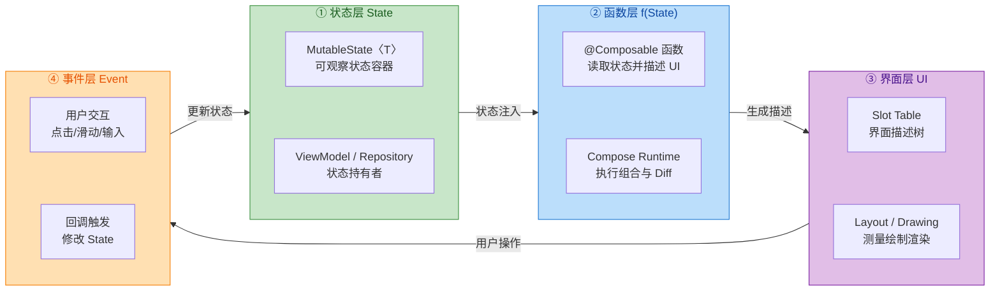
```mermaid
graph LR
    subgraph InputPhase["① 状态层 State"]
        direction TB
        S1["MutableState〈T〉\n可观察状态容器"]
        S2["ViewModel / Repository\n状态持有者"]
        S1 ~~~ S2
    end

    subgraph TransformPhase["② 函数层 f(State)"]
        direction TB
        F1["@Composable 函数\n读取状态并描述 UI"]
        F2["Compose Runtime\n执行组合与 Diff"]
        F1 ~~~ F2
    end

    subgraph OutputPhase["③ 界面层 UI"]
        direction TB
        U1["Slot Table\n界面描述树"]
        U2["Layout / Drawing\n测量绘制渲染"]
        U1 ~~~ U2
    end

    subgraph EventPhase["④ 事件层 Event"]
        direction TB
        E1["用户交互\n点击/滑动/输入"]
        E2["回调触发\n修改 State"]
        E1 ~~~ E2
    end

    InputPhase -->|"状态注入"| TransformPhase -->|"生成描述"| OutputPhase -->|"用户操作"| EventPhase -->|"更新状态"| InputPhase

    classDef stateStyle fill:#C8E6C9,stroke:#388E3C,color:#1B5E20
    classDef funcStyle fill:#BBDEFB,stroke:#1976D2,color:#0D47A1
    classDef uiStyle fill:#E1BEE7,stroke:#7B1FA2,color:#4A148C
    classDef eventStyle fill:#FFE0B2,stroke:#F57C00,color:#E65100

    class InputPhase stateStyle
    class TransformPhase funcStyle
    class OutputPhase uiStyle
    class EventPhase eventStyle
```

这个循环清晰地展示了声明式 UI 的运转机制：状态驱动函数，函数生成界面，界面捕获事件，事件反馈回状态。这是一个闭环，但数据永远只朝一个方向流动。

### 命令式 vs 声明式

要深刻理解声明式范式的价值，最有效的方式是与命令式范式做对比。两者的本质区别不在于语法或 API，而在于 **"谁来管理 UI 与 State 之间的同步"**。

**命令式（Imperative）** 范式的核心特征是：开发者必须 **手动编写每一步 UI 变更指令**。你持有 View 的引用，监听数据的变化，然后在回调中精确地告诉每个 View 该如何更新。传统的 Android View 体系就是典型的命令式范式。考虑一个简单的场景——根据用户的登录状态显示不同的问候语：

```kotlin
// ========== 命令式写法（传统 View 体系）==========

// 1. 在 Activity 中通过 ID 找到 View 的引用
val greetingText: TextView = findViewById(R.id.greeting_text)
// 2. 找到登录按钮的引用
val loginButton: Button = findViewById(R.id.login_button)
// 3. 找到登出按钮的引用
val logoutButton: Button = findViewById(R.id.logout_button)

// 4. 定义一个"更新 UI"的函数——这就是手动同步的体现
fun updateUI(isLoggedIn: Boolean, userName: String) {
    // 5. 根据状态，手动设置文本内容
    if (isLoggedIn) {
        greetingText.text = "欢迎回来, $userName"  // 命令：设置文本
    } else {
        greetingText.text = "请登录"               // 命令：设置另一个文本
    }
    // 6. 根据状态，手动控制按钮的可见性
    loginButton.visibility = if (isLoggedIn) View.GONE else View.VISIBLE    // 命令：隐藏或显示
    logoutButton.visibility = if (isLoggedIn) View.VISIBLE else View.GONE   // 命令：显示或隐藏
}

// 7. 在某个回调（如 ViewModel 的 LiveData 观察者）中调用更新函数
viewModel.userState.observe(this) { state ->
    // 8. 每次状态变化时，开发者必须记得调用这个函数
    updateUI(state.isLoggedIn, state.userName)
}
```

这段代码表面上看起来还算清晰，但随着界面复杂度的增长，问题会迅速暴露。假设后续需要在登录时额外显示一个头像、隐藏广告栏、修改标题栏颜色……每增加一个 UI 元素，`updateUI` 函数就要多写几行手动同步的代码。如果有多个状态来源（网络请求、数据库更新、用户输入）同时影响界面，开发者必须在每个回调中都不遗漏地更新所有相关 View。**遗漏任何一处，都会导致界面与状态不一致**——这就是命令式范式最根本的痛点：**状态同步的责任完全落在开发者肩上**。

**声明式（Declarative）** 范式则彻底翻转了这个关系。开发者不再告诉框架"当状态变化时，请执行这些步骤来更新 UI"，而是简单地声明"在任意时刻，给定当前状态，UI 应该是什么样子"。框架负责在状态变化时自动重新执行声明、计算差异、应用更新。同样的场景，用 Compose 来写：

```kotlin
// ========== 声明式写法（Jetpack Compose）==========

@Composable
fun GreetingScreen(isLoggedIn: Boolean, userName: String) {
    // 不需要 findViewById，不需要持有任何引用
    // 只需要根据当前状态，声明界面"应该是什么样"
    Column {
        // 文本内容完全由状态决定
        // 当 isLoggedIn 或 userName 变化时，这个函数会被 Compose 自动重新调用
        Text(
            text = if (isLoggedIn) "欢迎回来, $userName" else "请登录"
        )

        // 条件渲染：声明式地表达"登录时不显示登录按钮"
        // 注意：这里不是设置 visibility = GONE，而是直接不生成这个节点
        if (!isLoggedIn) {
            // 未登录时，这个 Button 存在于组合中
            Button(onClick = { /* 触发登录 */ }) {
                Text("登录")
            }
        }

        // 同理，登录后才显示登出按钮
        if (isLoggedIn) {
            Button(onClick = { /* 触发登出 */ }) {
                Text("登出")
            }
        }
    }
}
```

对比之下，声明式写法的优势一目了然。首先，**没有手动同步逻辑**——开发者只写了一份"在任意状态下界面应该是什么"的描述，框架自动保证界面与状态一致。其次，**可见性控制变成了组合存在性**——传统的 `View.GONE` / `View.VISIBLE` 切换变成了 Kotlin 的 `if` 语句，如果条件不满足，对应的组件根本不会进入组合树（Composition），这比隐藏一个仍然存在于 View 树中的节点更加高效和语义化。最后，**代码即文档**——阅读这段代码，就能直接理解界面在各种状态下的样子，不需要在 XML 和多个回调之间来回跳转。

两种范式的差异可以总结为以下对比：

| 维度 | 命令式 (Imperative) | 声明式 (Declarative) |
|:---|:---|:---|
| **核心动作** | 告诉框架"怎么做" (How) | 告诉框架"要什么" (What) |
| **状态同步** | 开发者手动维护 State → UI 映射 | 框架自动执行 f(State) → UI |
| **UI 更新粒度** | 操作具体 View 节点 (setText, setVisibility) | 重新执行函数，框架 Diff 出最小变更 |
| **View/组件引用** | 必须持有引用 (findViewById / ViewBinding) | 无引用，组件由函数调用描述 |
| **可见性控制** | `View.GONE` / `View.VISIBLE` | `if` / `when` 条件组合 |
| **复杂度增长** | 线性甚至指数增长（每个状态×每个View） | 缓慢增长（只需在函数中添加声明） |
| **错误风险** | 高：容易遗漏同步、产生不一致 | 低：框架保证一致性 |
| **心智模型** | 状态机 + 手动转换 | 纯函数映射 |

值得强调的是，声明式并不意味着"没有命令"。在底层，Compose Runtime 仍然需要执行具体的绘制命令。声明式是一种 **抽象层次的提升**——把"如何更新"的复杂性从开发者转移到了框架内部。开发者只需维护好状态和描述函数，剩下的交给 Compose 的 Recomposition、Diff 和渲染管线。这种分工让应用代码更简洁、更安全、更易测试。

### 单一数据源 SSOT

当我们接受了"UI = f(State)"这个公式之后，一个自然的问题浮现出来：**State 应该存放在哪里？** 如果同一份数据在多个地方各持有一份副本，那么当其中一份被修改时，其他副本是否能自动同步？如果不能，界面就会出现不一致——某个地方显示"已登录"，另一个地方还停留在"未登录"。这就是 **Single Source of Truth（SSOT，单一数据源/单一事实来源）** 原则要解决的问题。

SSOT 的核心思想极其简单：**对于任意一项数据，系统中有且仅有一个"权威"的存储位置**。所有需要使用该数据的组件，都从这个唯一的来源去读取，而不是各自维护一份副本。当数据需要变更时，也只通过这个唯一来源进行修改。这样，数据的一致性由架构天然保证，而不需要开发者手动同步多份副本。

在 Android Compose 应用中，SSOT 原则体现在多个层面：

**1. 状态提升（State Hoisting）——组件层面的 SSOT**

Compose 中最基础的 SSOT 实践就是"状态提升"。考虑一个输入框组件：如果输入框自己内部维护文本状态，那么外部的父组件就无法知道用户输入了什么，除非通过某种同步机制。更好的做法是把状态提升到父组件，让输入框变成一个"无状态"（Stateless）的组件，只接收状态和事件回调：

```kotlin
// ========== 状态提升示例 ==========

// 无状态的输入框组件——它不拥有任何状态
// text 和 onTextChange 都来自外部，这个组件只负责"显示"和"上报事件"
@Composable
fun StatelessInput(
    text: String,                    // 状态：由父组件提供（SSOT 在父组件）
    onTextChange: (String) -> Unit   // 事件：用户输入后通知父组件修改状态
) {
    // TextField 接收外部传入的 text，并在用户输入时回调 onTextChange
    TextField(
        value = text,                // 显示的文本由外部状态决定
        onValueChange = onTextChange // 输入变化时，不自行修改，而是向上传递
    )
}

// 有状态的父组件——它是 text 这项数据的 Single Source of Truth
@Composable
fun SearchScreen() {
    // 状态的唯一定义点——这就是 SSOT
    var query by remember { mutableStateOf("") }

    Column {
        // 将状态向下传递给无状态组件
        StatelessInput(
            text = query,                  // 读取 SSOT
            onTextChange = { query = it }  // 通过 SSOT 修改
        )
        // 同一份状态可以驱动多个 UI 元素，且保证一致
        Text("搜索内容: $query")
        // 结果列表也从同一个 query 状态派生
        SearchResults(query = query)
    }
}
```

在这个例子中，`query` 只在 `SearchScreen` 中定义了一次。`StatelessInput`、`Text`、`SearchResults` 三个组件都从同一个来源读取数据。无论哪个组件触发了变化（这里只有 `StatelessInput` 能触发），变化都会通过 SSOT 传播到所有消费者。不会出现"输入框显示了新文本，但下面的搜索结果还停留在旧查询"的问题。

**2. ViewModel 作为 Screen-Level SSOT**

当状态的生命周期超过单个 Composable 函数（例如需要在配置变更后保留），或者状态的管理逻辑比较复杂时，通常会将 SSOT 提升到 `ViewModel` 层：

```kotlin
// ========== ViewModel 作为 SSOT ==========

// ViewModel 持有屏幕级别的状态——它是这个屏幕所有 UI 状态的 SSOT
class SearchViewModel : ViewModel() {
    // 私有的可变状态——外部不能直接修改，只能通过 ViewModel 的方法
    private val _uiState = MutableStateFlow(SearchUiState())
    // 公开的不可变状态流——Composable 只能读取，不能写入
    val uiState: StateFlow<SearchUiState> = _uiState.asStateFlow()

    // 所有状态变更都通过明确的方法进行——这是 SSOT 的"写入入口"
    fun onQueryChanged(newQuery: String) {
        // 更新状态，Compose 会自动感知变化并重组
        _uiState.update { it.copy(query = newQuery) }
    }

    // 更多状态变更方法...
    fun onSearch() {
        // 修改 SSOT 中的加载状态
        _uiState.update { it.copy(isLoading = true) }
        // 发起搜索...
    }
}

// 用一个数据类聚合所有屏幕状态——清晰地表达"这就是屏幕的全部状态"
data class SearchUiState(
    val query: String = "",       // 搜索关键词
    val isLoading: Boolean = false, // 是否正在加载
    val results: List<String> = emptyList() // 搜索结果
)
```

这里的 `_uiState` 就是 SSOT。它把多个相关状态（查询词、加载状态、结果列表）聚合在一个数据类中，避免了状态分散在多个独立变量中可能导致的不一致。例如，如果 `isLoading` 和 `results` 分别存储，可能出现"加载已完成但结果还是空"的中间不一致状态。通过 `data class` 的 `copy()` 方法进行原子化更新，可以确保每次状态变更都是一致的。

**3. Repository 作为 Data-Level SSOT**

在更宏观的架构层面（如 Google 推荐的 Architecture Guide），SSOT 原则延伸到了数据层。对于同一份业务数据（如用户信息），即使它可能来源于网络 API、本地数据库、缓存等多个通道，也应该有一个"权威来源"。通常，本地数据库（如 Room）被选作 SSOT，网络数据获取后先写入数据库，UI 层只观察数据库的变化：

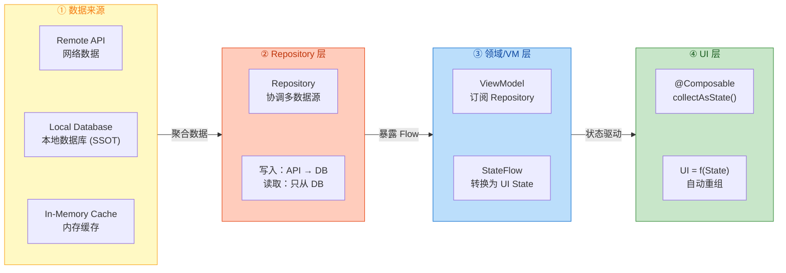
```mermaid
graph LR
    subgraph DataSources["① 数据来源"]
        direction TB
        DS1["Remote API\n网络数据"]
        DS2["Local Database\n本地数据库 (SSOT)"]
        DS3["In-Memory Cache\n内存缓存"]
        DS1 ~~~ DS2 ~~~ DS3
    end

    subgraph RepoLayer["② Repository 层"]
        direction TB
        R1["Repository\n协调多数据源"]
        R2["写入：API → DB\n读取：只从 DB"]
        R1 ~~~ R2
    end

    subgraph DomainLayer["③ 领域/VM 层"]
        direction TB
        D1["ViewModel\n订阅 Repository"]
        D2["StateFlow\n转换为 UI State"]
        D1 ~~~ D2
    end

    subgraph UILayer["④ UI 层"]
        direction TB
        U1["@Composable\ncollectAsState()"]
        U2["UI = f(State)\n自动重组"]
        U1 ~~~ U2
    end

    DataSources -->|"聚合数据"| RepoLayer -->|"暴露 Flow"| DomainLayer -->|"状态驱动"| UILayer

    classDef dataStyle fill:#FFF9C4,stroke:#F9A825,color:#F57F17
    classDef repoStyle fill:#FFCCBC,stroke:#E64A19,color:#BF360C
    classDef domainStyle fill:#BBDEFB,stroke:#1976D2,color:#0D47A1
    classDef uiStyle fill:#C8E6C9,stroke:#388E3C,color:#1B5E20

    class DataSources dataStyle
    class RepoLayer repoStyle
    class DomainLayer domainStyle
    class UILayer uiStyle
```

在这条数据链路中，Local Database 是业务数据的 SSOT，ViewModel 是 UI 状态的 SSOT，而 Composable 函数是最终的消费者。每一层都只从上一层的 SSOT 读取数据，变更也只通过 SSOT 的写入接口进行。这种分层 SSOT 架构让整个应用的数据流变得 **可预测、可调试、可测试**。

**为什么 SSOT 如此重要？** 根本原因在于：多副本意味着需要同步，而同步逻辑是 Bug 的温床。在传统命令式开发中，开发者常常在 Activity、Fragment、Adapter 中各自维护一份数据副本，然后通过 `notifyDataSetChanged()`、`EventBus`、回调接口等方式艰难地保持同步。一旦某个同步路径遗漏，就会出现 UI 不一致、数据丢失、甚至崩溃。SSOT 原则从架构层面消灭了这类问题：**不需要同步，因为根本没有副本**。所有消费者都指向同一个源头，源头变了，所有消费者自动感知——在 Compose 中，这种"自动感知"正是由 Recomposition 机制保障的。

---

**📝 练习题**

在一个 Compose 购物车页面中，商品列表和总价标签都需要显示购物车数据。某开发者在 `ProductList` 组件内部维护了一份 `cartItems: List<Item>` 状态，同时在 `PriceSummary` 组件内部也独立维护了一份 `cartItems: List<Item>` 状态，两者通过 EventBus 同步。以下哪项描述最准确地指出了该设计的问题？

A. 违反了 SSOT 原则，同一份数据存在两个独立副本，EventBus 同步容易遗漏导致 UI 不一致


B. 违反了声明式范式，因为 Compose 中不允许在组件内部使用 `mutableStateOf`


C. 没有问题，EventBus 是 Android 中成熟的组件间通信方案，可以保证数据一致性


D. 违反了 UI = f(State) 原则，因为购物车数据不应该作为 State 存在


**【答案】** A

**【解析】** 这道题考察的是 SSOT 原则的实际应用。题目描述的设计中，`cartItems` 这同一份业务数据在 `ProductList` 和 `PriceSummary` 两个组件中各维护了一份独立的副本，这直接违反了 Single Source of Truth 原则。正确的做法是将 `cartItems` 提升到它们共同的父组件（或 ViewModel）中作为唯一的状态来源，然后分别以参数形式传入两个子组件。选项 B 错误，Compose 完全允许在组件内部使用 `mutableStateOf`（只是需要配合 `remember`）；选项 C 错误，EventBus 是一种隐式的、松散的通信机制，在 Compose 的声明式架构中不推荐使用，且它无法从架构上保证一致性；选项 D 错误，购物车数据当然应该作为 State 存在，这正是 UI = f(State) 的体现——界面是状态的函数，购物车数据变化，界面自动更新。

---

## Composable 函数

在上一节中我们确立了声明式 UI 的核心公式 **UI = f(State)**，那么这个 **f** 在 Jetpack Compose 中到底是什么？答案就是 **Composable 函数**。它是 Compose 整个编程模型的基本构建单元（Building Block）。每一个你在屏幕上看到的文本、按钮、列表，甚至是一个完整的页面，本质上都是一个或多个 Composable 函数的调用结果。然而，Composable 函数绝不仅仅是"加了注解的普通函数"——它的背后隐藏着一套精密的编译期变换与运行时协议，理解这些机制才能真正掌握 Compose 的运行方式，写出高效、正确的声明式 UI 代码。

### `@Composable` 注解含义

很多初学者第一次接触 Compose 时都会产生一个疑问：为什么一定要在函数上面写 `@Composable`？它和普通的 Kotlin 注解（比如 `@Deprecated`、`@JvmStatic`）有什么本质区别？

从表面形式上看，`@Composable` 确实是一个标准的 Kotlin Annotation，它定义在 `androidx.compose.runtime` 包中。但与大多数注解不同，`@Composable` 的真正力量不来自运行时反射，而来自 **编译期变换**。你可以把它类比为 Kotlin 中的 `suspend` 关键字——`suspend` 改变了函数的 **调用协议**（Call Protocol），使得函数只能在协程作用域内被调用；`@Composable` 同样改变了函数的调用协议，使得函数只能在 **组合作用域**（Composition Scope）内被调用。这就是 Compose 团队经常用的类比：**`@Composable` 之于 Composition，正如 `suspend` 之于 Coroutine**。

具体来说，`@Composable` 注解为函数赋予了以下几重含义：

**第一，类型系统层面的隔离。** 一旦一个函数被标记为 `@Composable`，它的函数类型（Function Type）就发生了本质变化。一个普通的 `() -> Unit` 和一个 `@Composable () -> Unit` 在 Compose 编译器的视角下是 **完全不同的类型**。你不能将一个 Composable lambda 赋值给一个普通的函数类型变量，反之亦然。这种隔离是在编译期严格检查的，如果你试图在一个非 Composable 的函数中调用 Composable 函数，编译器会直接报错：`@Composable invocations can only happen from the context of a @Composable function`。这条规则保证了 Composable 函数始终运行在 Compose Runtime 所管控的环境中，Runtime 能够追踪、调度、优化每一次 Composable 调用。

**第二，语义声明。** `@Composable` 向开发者和编译器同时传达了一个语义信号：这个函数 **描述 UI**（或 UI 相关的逻辑），而非执行一般性的计算。虽然从 Kotlin 语言层面来看，Composable 函数和普通函数的写法几乎一样，但 `@Composable` 告诉整个工具链——这个函数需要接受 Compose 编译器插件的特殊处理，它的执行将遵循重组（Recomposition）协议，它的内部状态可能被 Snapshot 系统追踪。

**第三，生命周期绑定。** Composable 函数不是"调用一次就结束"的纯粹逻辑单元。当一个 Composable 函数第一次进入 Composition 时（即首次被调用），它就"活"了——Compose Runtime 会为它建立对应的节点（Slot）；当它在后续的重组中不再被调用时，它就"离开"了 Composition，Runtime 会执行对应的清理操作。`@Composable` 注解隐含了这种 **进入→可能被多次重组→离开** 的生命周期语义，这是普通函数所不具备的。

为了直观感受这种区别，让我们看一个最基本的 Composable 函数：

```kotlin
// @Composable 注解标记此函数为"可组合函数"
// 它不再是一个简单的函数调用，而是 Composition 中的一个"节点声明"
@Composable
fun Greeting(name: String) {
    // Text() 本身也是 @Composable 函数
    // 此处的调用意为：在当前 Composition 节点下，声明一个"文本子节点"
    Text(text = "Hello, $name!")
}
```

这段代码在开发者视角极其简洁，但在编译后的 class 文件中，它的签名和实现都会被大幅变换——这正是下面要讨论的 **编译器插件处理**。

### 编译器插件处理

Compose 之所以能在"看起来像普通 Kotlin 代码"的表象之下实现强大的声明式 UI 运行时能力，核心功劳在于 **Compose Compiler Plugin**。这是一个 Kotlin 编译器插件（Kotlin Compiler Plugin），它工作在代码编译阶段（Compile Time），对所有被 `@Composable` 标记的函数进行 **IR（Intermediate Representation）变换**。开发者写出的源码和最终运行的字节码之间存在着显著的差异，理解这一层变换是掌握 Compose 运行机制的关键。

#### 变换的整体思路

Compose Compiler Plugin 的核心任务可以概括为一句话：**将开发者书写的"声明式描述"转化为 Runtime 可以调度的"带状态管理协议的函数"**。为了达到这个目的，编译器插件至少做了以下几件事：

1. **注入隐式参数**：为每个 Composable 函数注入 `Composer` 实例和一个或多个 `$changed` 位掩码参数（以及可能的 `$default` 参数）。
2. **插入 Group 调用**：在函数体的开头和结尾分别插入 `startRestartGroup` / `endRestartGroup`（或 `startReplaceGroup` / `endReplaceGroup`、`startMovableGroup` / `endMovableGroup` 等），这些 Group 调用构成了 Compose 在 SlotTable 中追踪节点身份的基础。
3. **生成 Skipping 逻辑**：在函数体开头插入参数对比逻辑——如果所有参数与上次组合时的值相比都"没有变化"（`$changed` 位标记为 stable & unchanged），则直接跳过整个函数体（Skip），不执行任何内部逻辑。
4. **处理 `remember`、`key` 等内置 API**：将这些调用转化为对 SlotTable 的读/写操作。

#### IR 变换示例

我们以一个非常简单的 Composable 函数为例，看看编译前后的对比。开发者写出的源码如下：

```kotlin
// 开发者编写的源码：一个简单的展示问候语的 Composable
@Composable
fun Greeting(name: String) {
    // 直接声明一个 Text 节点
    Text(text = "Hello, $name!")
}
```

经过 Compose Compiler Plugin 变换后，生成的伪代码大致如下（真实字节码更复杂，此处做了简化以便理解核心逻辑）：

```kotlin
// ===== 编译器变换后的伪代码（简化版）=====
// 1. 函数签名被改写：增加了 $composer 和 $changed 两个隐式参数
fun Greeting(
    name: String,              // 开发者声明的原始参数
    $composer: Composer,       // 编译器注入：当前 Composer 实例，管理 Composition 树
    $changed: Int              // 编译器注入：位掩码，标记参数是否发生了变化
) {
    // 2. 开启一个 RestartGroup —— 告诉 Runtime "这个函数是一个可重组的单元"
    //    startRestartGroup 接收一个唯一的 key（通常是源码位置的哈希值）
    $composer = $composer.startRestartGroup(0x1a2b3c4d)

    // 3. Skipping 判断：检查参数是否与上次完全相同
    //    如果 $changed 中 name 对应的位表明"未变化"且类型稳定，
    //    则 skipping == true，跳过函数体
    val $dirty = $changed
    if ($changed and 0b0110 == 0) {
        // 如果调用者没有确切告知 name 是否改变，Runtime 自行对比
        $dirty = $dirty or if ($composer.changed(name)) 0b0100 else 0b0010
    }
    // 如果所有参数都标记为"未改变"（低位 == 0b0010），则跳过
    if ($dirty and 0b0011 xor 0b0010 != 0 || !$composer.skipping) {
        // ===== 执行函数体 =====
        // 4. 调用子 Composable：Text()，同样会被传入 $composer
        Text(
            text = "Hello, $name!",
            $composer,           // 透传 Composer 给子 Composable
            0                    // Text 的 $changed 标记
        )
    } else {
        // 5. 跳过：通知 Composer 直接跳过这段子树
        $composer.skipToGroupEnd()
    }

    // 6. 结束 RestartGroup，并注册"重组 lambda"
    //    如果将来 name 发生变化，Runtime 可以通过这个 lambda 重新执行 Greeting
    $composer.endRestartGroup()?.updateScope { nextComposer, nextChanged ->
        // 重组时重新调用自身，传入新的 Composer
        Greeting(name, nextComposer, nextChanged or 0b0001)
    }
}
```

让我们重点解读这段变换中几个关键的设计意图：

**`startRestartGroup` / `endRestartGroup`** 配对调用在 SlotTable 中创建了一个 **Group**，这个 Group 就是 Compose Runtime 追踪"这个 Composable 函数"在 UI 树中位置的基本单位。每个 Group 都有一个编译期确定的 key（通常由源码文件路径 + 行号 + 列号计算得出），Runtime 正是通过这个 key 来判断"上次这个位置是什么，这次还是不是同一个东西"，从而决定是复用旧状态还是创建新状态。

**`$changed` 位掩码** 是 Compose 实现高效 Skipping 的核心数据结构。每个参数在位掩码中占据若干位（通常是 2~3 位），用于编码参数的"变化状态"：是"确认未变"、"确认已变"还是"不确定需要 Runtime 检查"。当一个父 Composable 调用子 Composable 时，如果父级已经知道某个传下去的值没有变化，就会在 `$changed` 中直接标记好，子 Composable 收到后就无需再做任何对比，直接判定可以跳过——这种**自顶向下的变化传播**使得 Compose 在深层 UI 树中也能保持极高的重组效率。

**`endRestartGroup()?.updateScope { ... }`** 注册了一个"重启 lambda"。当 Runtime 检测到该 Composable 依赖的某个 State 发生变化时，它会调用这个 lambda 来重新执行函数体。这也是为什么 Composable 函数可以被"重组"的根本原因——Runtime 手里握着每一个 Composable 的"重来一次"的入口。

下面这张图展示了编译器插件在整个编译流程中的位置，以及变换前后的关键差异：

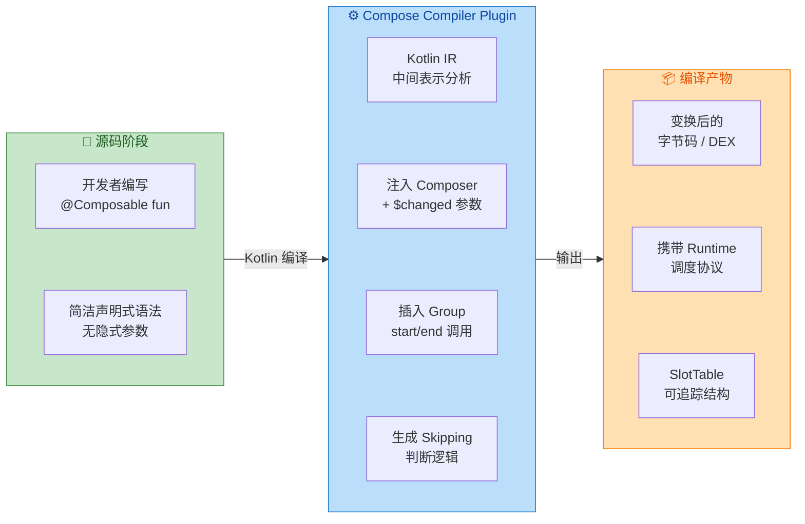
```mermaid
graph LR
    subgraph Source["📝 源码阶段"]
        direction TB
        A["开发者编写\n@Composable fun"] ~~~ B["简洁声明式语法\n无隐式参数"]
    end

    subgraph Compiler["⚙️ Compose Compiler Plugin"]
        direction TB
        C["Kotlin IR\n中间表示分析"] ~~~ D["注入 Composer\n+ $changed 参数"]
        D ~~~ E["插入 Group\nstart/end 调用"]
        E ~~~ F["生成 Skipping\n判断逻辑"]
    end

    subgraph Output["📦 编译产物"]
        direction TB
        G["变换后的\n字节码 / DEX"] ~~~ H["携带 Runtime\n调度协议"]
        H ~~~ I["SlotTable\n可追踪结构"]
    end

    Source -->|"Kotlin 编译"| Compiler -->|"输出"| Output

    classDef srcStyle fill:#C8E6C9,stroke:#388E3C,color:#1B5E20
    classDef compilerStyle fill:#BBDEFB,stroke:#1976D2,color:#0D47A1
    classDef outStyle fill:#FFE0B2,stroke:#F57C00,color:#E65100

    class Source srcStyle
    class Compiler compilerStyle
    class Output outStyle
```

值得特别说明的是，从 Kotlin 2.0 开始，Compose Compiler 已经从一个独立维护的编译器插件合并进了 Kotlin 编译器仓库本身，这意味着 Compose Compiler 的版本将直接与 Kotlin 版本对齐，开发者不再需要手动维护 Compose Compiler 与 Kotlin 的版本兼容映射表。但其底层的 IR 变换逻辑并没有本质改变，上面描述的机制仍然适用。

### 参数注入 Composer

上一小节已经看到，编译器为每个 Composable 函数注入了一个 `$composer: Composer` 参数。那么 **Composer 到底是什么？它在运行时扮演怎样的角色？** 这是理解 Compose 运行时架构的核心切入点。

#### Composer 的本质角色

`Composer` 是 Compose Runtime 的 **"执行上下文"**（Execution Context），你可以类比为：

- Kotlin 协程中的 `Continuation`——每个 `suspend` 函数都被注入 `Continuation` 参数来驱动状态机，Composable 函数则被注入 `Composer` 来驱动 UI 树的构建与更新。
- 数据库事务中的 `Connection`——所有的读写操作都必须通过这个上下文对象来进行。

每一个 Composable 函数在执行时，都通过 `Composer` 来完成以下关键操作：

**1. 管理 SlotTable（Gap Buffer 数据结构）。** Composer 内部持有一个 `SlotTable` 引用，这是 Compose 存储整棵 UI 树"组合数据"的核心数据结构。SlotTable 使用 **Gap Buffer** 算法（类似于文本编辑器的实现），将树结构线性化存储在一个扁平数组中。每当 Composable 函数执行时，Composer 在 SlotTable 中按顺序"扫描"——如果是首次组合（Initial Composition），就"插入"新的 Group 和数据 Slot；如果是重组（Recomposition），就"对比"当前值与已存储的值。开发者调用 `remember { ... }` 存储的值、每个 Composable 函数的 Group 标记、甚至传递给子节点的参数，全部都存储在 SlotTable 中。

**2. 追踪调用顺序与位置。** Composer 依靠编译期注入的 Group key 和运行时的调用顺序，精确地知道"当前正在执行的是 UI 树中的哪个节点"。这是 Positional Memoization（位置记忆化，后面章节详述）的基础——同一个 Composable 函数，在不同的调用位置会拥有完全独立的状态和 Slot。

**3. 驱动 Skipping 决策。** 前面看到的 `$composer.changed(name)` 调用，就是 Composer 在运行时从 SlotTable 中取出上一次存储的参数值，与当前传入的值做 **结构性相等**（Structural Equality, `equals()`）比较。如果所有参数都相等且类型稳定（Stable），Composer 标记当前 Group 为"可跳过"。

**4. 记录重组作用域（RecomposeScope）。** 当一个 Composable 函数读取了某个 `State` 对象时，Composer 会将当前的 RecomposeScope 注册为该 State 的观察者。日后 State 值改变时，Snapshot 系统会通知 Composer："这些 RecomposeScope 需要重新执行"，Composer 就会安排对应的 Composable 函数进行重组。

#### Composer 的传递链

一个至关重要的设计是：**Composer 实例在整棵 Composable 调用树中是逐层透传的**。当你的 `Greeting` 调用了 `Text`，`Text` 内部又调用了更底层的 `Layout`，这些函数收到的都是同一个 `Composer` 实例（或者说是同一个 Composition Session 内的 Composer）。这种设计保证了整棵 UI 树的构建过程共享同一份 SlotTable、同一套调度逻辑，从而使 Runtime 拥有全局视野。

以下 ASCII 模型展示了 Composer 在调用链中的流动：

```text
┌─────────────────────────────────────────────────────────────────┐
│                     Composition Session                         │
│                                                                 │
│  ┌─────────┐    $composer     ┌─────────┐    $composer          │
│  │ Screen  │ ────────────────▶│Greeting │ ────────────────▶     │
│  │  (Root) │   (同一实例)      │         │   (同一实例)          │
│  └─────────┘                  └─────────┘                       │
│                                    │                            │
│                                    │ $composer (同一实例)        │
│                                    ▼                            │
│                               ┌─────────┐                      │
│                               │  Text   │                      │
│                               │(Layout) │                      │
│                               └─────────┘                      │
│                                    │                            │
│                                    ▼                            │
│                              SlotTable                          │
│                          (Gap Buffer 存储)                      │
│  ┌──────────────────────────────────────────────────────────┐   │
│  │ [Group:Screen][Group:Greeting][Slot:name][Group:Text]... │   │
│  └──────────────────────────────────────────────────────────┘   │
└─────────────────────────────────────────────────────────────────┘
```

可以看到，从最外层的 `Screen`（假设是根 Composable）到内层的 `Text`，所有 Composable 函数共享同一个 Composer，Composer 像一条"管道"一样串联起整棵 UI 树的构建过程，并将所有的 Group 和 Slot 数据写入到同一个 SlotTable 中。

#### `$changed` 参数的位编码细节

除了 `$composer` 之外，编译器还注入了 `$changed` 整型参数。`$changed` 是一个紧凑的 **位掩码**（Bitmask），用于在"父调用方→子 Composable"之间高效传递参数变化信息。它的编码规则如下：

每个参数占用 **3 位**（bits），由于一个 `Int` 有 32 位，其中最低位被 Composer 自身使用（标记是否为"强制重组"），剩余 31 位可以容纳最多 **10 个参数** 的变化信息（31 ÷ 3 ≈ 10）。如果 Composable 函数的参数超过 10 个，编译器会自动拆分为多个 `$changed` 参数（`$changed1`, `$changed2`, ...）。

每个参数的 3 位编码含义如下：

| 位模式 | 含义 | 说明 |
|:---:|:---|:---|
| `0b000` | **Unknown** | 调用者不确定参数是否变化，需要 Runtime 自行比较 |
| `0b001` | **Same** | 调用者已确认参数与上次相同，子 Composable 可直接信任 |
| `0b010` | **Different** | 调用者已确认参数发生了变化 |
| `0b011` | **Static** | 参数是编译期常量或字面量，永远不会变化 |

这套机制的精妙之处在于：**很多时候子 Composable 根本不需要执行任何 `equals()` 比较**——父级在编译期或执行期就已经确定了参数的变化状态，通过 `$changed` 直接告知子级。只有当标记为 `Unknown` 时，子 Composable 才会调用 `$composer.changed(value)` 进行实际比较。这种分层传播的设计使得 Compose 在复杂 UI 树中也能保持极低的重组开销。

#### 为什么注入 Composer 而不用全局变量？

这是一个值得深思的设计决策。理论上，Compose Runtime 可以使用一个 ThreadLocal 或全局的 Composer 来实现类似功能，就像某些早期的声明式框架那样。但 Compose 选择了 **参数注入** 的方式，核心原因包括：

- **线程安全与并发组合**：Compose 的架构设计支持未来的并行重组（Parallel Composition），不同的子树可能在不同线程上同时组合。如果使用全局变量，并发控制将变得极其复杂；通过参数注入，每个调用链天然持有自己的上下文。
- **可测试性**：参数注入使得在测试环境中替换 Composer 实现变得简单——Compose 的测试框架 `compose-test` 正是通过注入特殊的 Test Composer 来驱动 UI 测试。
- **编译器可见性**：参数注入是在 IR 层面完成的，编译器可以对 Composer 的传递链做静态分析和优化（比如内联、消除不必要的 Group）。

### 无返回值特性

如果你仔细观察 Compose 官方库中的 Composable 函数，会发现一个有趣的模式：**绝大多数"描述 UI"的 Composable 函数返回 `Unit`**，也就是没有返回值。`Text()`、`Button()`、`Column()`、`Row()`……这些函数全都不返回任何东西。这与传统的命令式 UI 框架形成了鲜明的对比——在 View 体系中，你调用 `new TextView(context)` 会得到一个 `TextView` 引用，你可以随后修改它的属性、把它添加到父容器。但在 Compose 中，`Text("hello")` 什么也不"返回"，那它的结果去哪了？

#### 声明而非创建

Composable 函数不返回值的核心原因在于：**它们的语义是"声明"（Declare），而不是"创建并返回"（Create & Return）**。当你写 `Text("hello")` 时，你并不是在说"请创建一个 Text 对象并给我"，你是在说"在当前 Composition 树的这个位置，应该存在一个显示 'hello' 的文本节点"。声明的结果不会交给调用者，而是被 Composer 直接写入 SlotTable，最终由 Runtime 映射为真实的 UI 节点（Android 平台上就是 `LayoutNode`，进而驱动 Canvas 绘制）。

这种"发射（Emit）"模型意味着：Composable 函数的 **"返回值"是对 Composition 树的副作用（Side Effect on the Composition Tree）**。函数体内的每一个子 Composable 调用都在向 Composer "发射"节点数据，Composer 负责收集这些数据并构建/更新树结构。因此，返回值在语义上是不必要的——你不需要"拿到"一个节点引用，因为你永远不应该直接操作节点；你只需要在下一次重组时改变传入的参数，Compose 自然会帮你更新 UI。

#### 返回值会破坏重组模型

假设 `Text()` 返回了一个 `TextNode` 对象，开发者可能会写出这样的代码：

```kotlin
// ⚠️ 假设的错误设计：Composable 返回了 UI 节点引用
@Composable
fun BadExample() {
    // 假设 Text 返回一个 TextNode
    val node = Text("Hello")
    // 开发者拿到引用后，试图命令式地修改它
    node.color = Color.Red    // 这绕开了 Compose 的状态管理！
    node.textSize = 20.sp     // Runtime 完全不知道这些修改！
}
```

这段代码的问题是致命的：开发者绕过了 Compose 的状态追踪系统，直接修改了节点属性。Runtime 对此一无所知——它不知道 `color` 和 `textSize` 被改了，无法在重组时正确恢复或对比状态，也无法保证 UI 的一致性。**返回值打开了一扇"命令式逃逸"的门**，而 Compose 的整个设计哲学就是要关上这扇门。

通过不返回任何引用，Compose 强制开发者只能通过 **参数传递** 和 **状态驱动** 来控制 UI——这正是声明式范式的核心约束（Constraint），也是它的核心优势。

#### 例外情况：返回非 UI 值的 Composable

虽然"不返回值"是 UI Composable 的核心惯例，但 Compose 中也存在一些 **返回值的 Composable 函数**，比如 `remember { }` 和 `rememberCoroutineScope()`。这些函数通常不直接发射 UI 节点，而是利用 Composition 的位置记忆化能力来缓存或生产一个值。例如：

```kotlin
@Composable
fun Example() {
    // remember 返回一个缓存的值 —— 它不发射 UI 节点
    // 而是利用 Composer 在 SlotTable 中存取数据
    val count = remember { mutableStateOf(0) }

    // rememberCoroutineScope 返回一个绑定到 Composition 生命周期的 CoroutineScope
    val scope = rememberCoroutineScope()

    // 下面这些才是"发射 UI"的 Composable，它们返回 Unit
    Button(onClick = { count.value++ }) {
        Text("Clicked ${count.value} times")
    }
}
```

这类返回值的 Composable 在命名上通常遵循以小写字母开头的函数命名惯例（如 `remember`、`rememberSaveable`），而发射 UI 的 Composable 则以大写字母开头（如 `Text`、`Button`、`Column`），这是 Compose API 设计的命名规范（Naming Convention），帮助开发者一眼区分两种角色。Compose 官方指南明确建议：**如果一个 Composable 函数返回 Unit（即发射 UI），其名称应以大写字母开头并使用名词命名（如 `PascalCase` 的组件名）；如果返回一个值，则以小写字母开头并使用动词/描述性命名，遵循标准 Kotlin 函数命名风格**。

下面这张图总结了 Composable 函数的两种主要角色：

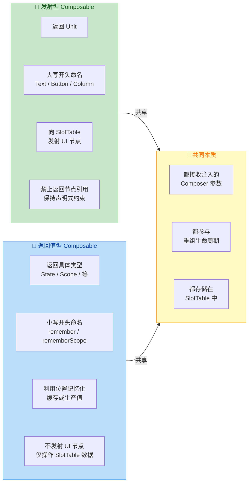
```mermaid
graph LR
    subgraph Emitting["🎨 发射型 Composable"]
        direction TB
        A["返回 Unit"] ~~~ B["大写开头命名\nText / Button / Column"]
        B ~~~ C["向 SlotTable\n发射 UI 节点"]
        C ~~~ D["禁止返回节点引用\n保持声明式约束"]
    end

    subgraph Returning["🔧 返回值型 Composable"]
        direction TB
        E["返回具体类型\nState / Scope / 等"] ~~~ F["小写开头命名\nremember / rememberScope"]
        F ~~~ G["利用位置记忆化\n缓存或生产值"]
        G ~~~ H["不发射 UI 节点\n仅操作 SlotTable 数据"]
    end

    subgraph Core["🧠 共同本质"]
        direction TB
        I["都接收注入的\nComposer 参数"] ~~~ J["都参与\n重组生命周期"]
        J ~~~ K["都存储在\nSlotTable 中"]
    end

    Emitting -->|"共享"| Core
    Returning -->|"共享"| Core

    classDef emitStyle fill:#C8E6C9,stroke:#388E3C,color:#1B5E20
    classDef retStyle fill:#BBDEFB,stroke:#1976D2,color:#0D47A1
    classDef coreStyle fill:#FFF9C4,stroke:#F9A825,color:#F57F17

    class Emitting emitStyle
    class Returning retStyle
    class Core coreStyle
```

---

**📝 练习题**

在 Compose Compiler Plugin 的 IR 变换过程中，编译器会为每个 `@Composable` 函数注入隐式参数。以下关于这些注入参数的描述，**正确** 的是？

A. 编译器仅注入 `$composer: Composer` 一个参数，参数变化检测完全由 Runtime 在运行时执行 `equals()` 比较完成。


B. 编译器注入 `$composer` 和 `$changed` 参数，其中 `$changed` 是一个位掩码，允许父 Composable 将参数变化信息直接传递给子 Composable，从而在许多情况下避免运行时 `equals()` 比较。


C. `$changed` 参数是一个 `Map<String, Boolean>`，以参数名为 key，记录每个参数是否变化。


D. `$composer` 参数仅在首次 Composition 时注入，重组时 Composable 函数通过 ThreadLocal 获取 Composer 实例。


**【答案】** B

**【解析】** Compose Compiler Plugin 在 IR 变换阶段会为每个 `@Composable` 函数注入至少两个隐式参数：`$composer: Composer` 和 `$changed: Int`。`$changed` 是一个位掩码（Bitmask），每个参数占用 3 位来编码其变化状态（Unknown / Same / Different / Static）。当父 Composable 在调用子 Composable 时已经知道某个参数没有变化，它会在 `$changed` 中直接标记为 `Same`（`0b001`），子 Composable 收到后无需再调用 `equals()` 做运行时比较，直接信任父级的判断。只有当标记为 `Unknown`（`0b000`）时，才需要通过 `$composer.changed(value)` 进行实际的相等性比较。选项 A 遗漏了 `$changed` 参数，选项 C 将位掩码错误描述为 `Map` 结构，选项 D 关于 ThreadLocal 的描述不符合 Compose 的参数注入设计——Composer 在每次组合和重组时都通过函数参数显式传递，这正是为了保证线程安全和未来并行重组的可能性。

---

## 重组机制 Recomposition

Recomposition（重组）是 Jetpack Compose 声明式 UI 框架最核心的运行时行为——当驱动 UI 的 State 发生变化时，Compose Runtime 会 **重新调用** 受影响的 Composable 函数，以产出新的 UI 描述树（Slot Table 中的数据）。理解重组机制，是写出高性能、无 Bug 的 Compose 代码的前提。

但重组绝非"全量刷新"。Compose 的设计哲学是 **"最小化工作量"**：它只重新执行那些 **读取了已变更 State** 的代码片段，并在参数未变时 **跳过（Skip）** 不必要的函数调用。这背后涉及调用点识别（Call-site Identity）、重组作用域（Recompose Scope）、智能跳过（Intelligent Skipping）以及对函数 **幂等性（Idempotency）** 的强约束。下面逐一展开。

### 智能重组 Skipping

#### 什么是 Skipping

在命令式 UI 体系中，当数据变化时，开发者要精确定位哪个 `TextView` 需要 `setText()`，而 Compose 的声明式范式要求你"重新描述整个 UI"。如果每次 State 变化都把整棵 Composable 树从根到叶全部重新执行一遍，性能显然是灾难性的。因此，Compose Runtime 引入了 **Skipping** 机制：当一个 Composable 函数被再次调用时，Runtime 会比较本次传入参数与上一次组合（Composition）时记录的参数值——如果所有参数都"没有变化"（equals 相等），就 **直接跳过** 这个函数的整个函数体，复用上一次的产出。

这和 React 中 `React.memo` 的思路类似，但 Compose 在编译器层面自动实现了这一优化，开发者 **无需手动标注** `memo`。编译器插件（Compose Compiler Plugin）会在编译期为每个 Restartable Composable 函数注入参数比较逻辑与 Skip 分支：

```kotlin
// 开发者写的源码
@Composable
fun Greeting(name: String, modifier: Modifier = Modifier) {
    // 展示一段问候文字
    Text(text = "Hello, $name!", modifier = modifier)
}
```

编译器转换后的 **概念性伪码**（实际产物是字节码，此处为便于理解而简化）：

```kotlin
// 编译器自动生成的等价逻辑（伪码）
fun Greeting(
    name: String,                // 原始参数
    modifier: Modifier,          // 原始参数
    $composer: Composer,         // 编译器注入：Composer 实例，管理 Slot Table
    $changed: Int                // 编译器注入：位掩码，标记每个参数的变更状态
) {
    // --- 1. 开启一个 Restart Group，用于标记重组边界 ---
    $composer.startRestartGroup(0x7a3b_key)

    // --- 2. 判断是否可以跳过 ---
    // 通过 $changed 位掩码判断 name 和 modifier 是否与上次相同
    val allParamsUnchanged = ($changed and 0b0011 == 0)  // 简化表达

    if (allParamsUnchanged && $composer.skipping) {
        // ✅ 全部参数未变 → 跳过函数体，直接复用 Slot Table 中的旧数据
        $composer.skipToGroupEnd()
    } else {
        // ❌ 有参数变化 → 正常执行函数体（重组）
        Text(
            text = "Hello, $name!",       // 使用最新的 name 值
            modifier = modifier,           // 使用最新的 modifier 值
            $composer = $composer,         // 透传 Composer
            $changed = ...                // 透传变更标记
        )
    }

    // --- 3. 结束 Restart Group，并注册"当依赖的 State 变化时从此处重启"的 Lambda ---
    $composer.endRestartGroup()?.updateScope { nextComposer ->
        // 当 Greeting 依赖的 State 失效时，Runtime 调用此 Lambda 重新执行
        Greeting(name, modifier, nextComposer, $changed or 0b0001)
    }
}
```

以上伪码揭示了几个关键信息：

- **`$changed` 位掩码**：编译器为每个参数分配若干 bit 位，用于在调用链上游就传递"这个参数到底变没变"的信息。这避免了在函数体内才进行 `equals()` 比较，做到了 **尽早判断、尽早跳过**。
- **`startRestartGroup` / `endRestartGroup`**：在 Slot Table 中开辟一个 Group 节点，作为"重组重启点"。当 State 失效时，Runtime 可以精确从这个 Group 开始重新执行，而不必回溯到更上层。
- **`skipToGroupEnd()`**：跳过当前 Group 下的所有子节点（包括嵌套调用的 Composable），直接移动 Slot Table 的游标到 Group 尾部。这是 O(1) 操作——**跳过的成本极低**。

#### Skipping 的触发条件

一个 Composable 函数能够被 Skip，需要同时满足以下条件：

1. **函数是 Restartable 的**：绝大多数返回 `Unit` 的 `@Composable` 函数都是 Restartable 的。返回值非 `Unit` 的 Composable（如 `Layout` 的 `measurePolicy` Lambda）通常不可跳过，因为调用者需要其返回值。
2. **所有参数都是"稳定的"（Stable）**：只有 Stable 类型的参数才能被可靠地用 `equals()` 比较。如果某个参数类型不稳定（如一个普通的 `data class` 持有 `var` 字段或 `List` 接口），编译器无法保证 `equals` 返回 `true` 就意味着"真的没变"，此时会保守地 **总是重组**，永不跳过。关于稳定性的详细机制，将在后续"稳定性系统"章节深入讲解。
3. **所有参数的 `equals()` 均返回 `true`**：比较的是本次传入值与 Slot Table 中缓存的上一次值。

三个条件缺一不可。这也解释了为什么社区经常强调"给你的数据类加上 `@Stable` 或 `@Immutable`"——这正是在帮助编译器开启 Skipping 优化的大门。

#### Skipping 的直观模型

下面用一棵简化的 Composable 调用树来演示 Skipping 效果。假设 `count` 状态从 `0` 变为 `1`：

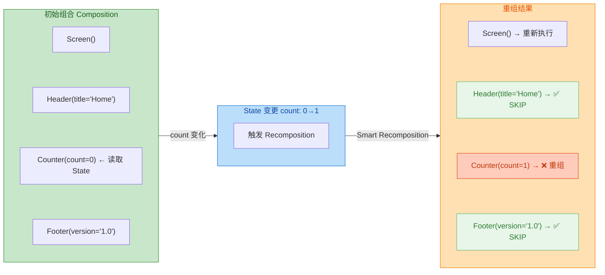
```mermaid
graph LR
    subgraph Phase1["初始组合 Composition"]
        direction TB
        A1["Screen()"] ~~~ B1["Header(title='Home')"]
        B1 ~~~ C1["Counter(count=0) ← 读取 State"]
        C1 ~~~ D1["Footer(version='1.0')"]
    end

    subgraph Phase2["State 变更 count: 0→1"]
        direction TB
        A2["触发 Recomposition"]
    end

    subgraph Phase3["重组结果"]
        direction TB
        E1["Screen() → 重新执行"] ~~~ F1["Header(title='Home') → ✅ SKIP"]
        F1 ~~~ G1["Counter(count=1) → ❌ 重组"]
        G1 ~~~ H1["Footer(version='1.0') → ✅ SKIP"]
    end

    Phase1 -->|"count 变化"| Phase2 -->|"Smart Recomposition"| Phase3

    classDef greenBox fill:#C8E6C9,stroke:#388E3C,color:#1B5E20
    classDef blueBox fill:#BBDEFB,stroke:#1976D2,color:#0D47A1
    classDef orangeBox fill:#FFE0B2,stroke:#F57C00,color:#E65100
    classDef skipNode fill:#E8F5E9,stroke:#66BB6A,color:#2E7D32
    classDef recompNode fill:#FFCCBC,stroke:#E64A19,color:#BF360C

    class Phase1 greenBox
    class Phase2 blueBox
    class Phase3 orangeBox
    class F1,H1 skipNode
    class G1 recompNode
```

在这个例子中，`Header` 和 `Footer` 的参数没有任何变化（`title` 仍是 `"Home"`，`version` 仍是 `"1.0"`），所以它们被 **跳过**。只有 `Counter` 因为 `count` 参数从 `0` 变成了 `1`，才真正重新执行。这就是"智能重组"——**只重组必须重组的部分**。

---

### 调用点识别（Call-site Identity）

在 Compose 的 Slot Table 中，每一个 Composable 函数的调用都会对应一个 **Group 节点**。Runtime 需要一种机制来识别："这次重组时遇到的这个 `Text()` 调用，和上一次组合时的哪个 `Text()` 是同一个？"——答案就是 **调用点（Call Site）**。

#### 调用点 = 源码位置

Compose Compiler Plugin 在编译期会为每一个 `@Composable` 函数调用分配一个基于 **源码位置**（文件路径 + 行号 + 列号）计算出的 **唯一整数 Key**。这个 Key 被注入到 `startGroup(key)` 调用中，写入 Slot Table。在重组时，Runtime 按顺序遍历函数体的每个调用点，将当前执行路径的 Key 与 Slot Table 中存储的上一次 Key 做匹配：

- **Key 匹配** → 认为是"同一个实例"，可以做 Diff 和 Skip 判断。
- **Key 不匹配** → 认为旧节点被移除、新节点被插入，执行插入/删除操作。

这就是为什么 Composable 函数 **不靠变量名** 也不靠 **对象引用** 来标识身份——它的身份 **完全由调用位置决定**。

```kotlin
@Composable
fun ContactList() {
    // 调用点 A：编译器分配 key = 0xA1（基于此处源码位置计算）
    ContactCard(name = "Alice")

    // 调用点 B：编译器分配 key = 0xB2（不同的源码位置 → 不同的 key）
    ContactCard(name = "Bob")
}
```

虽然两次调用的都是同一个 `ContactCard` 函数，但由于源码位置不同，它们在 Slot Table 中是 **两个独立的 Group 节点**，各自拥有独立的状态（`remember` 缓存、动画状态等）。

#### 条件分支导致的身份问题

调用点识别依赖"执行顺序的确定性"。当代码中存在 `if/else` 等条件分支时，同一个调用点可能在某次组合中执行、另一次不执行，这会导致 Slot Table 中 Group 的插入/删除。Compose 对此的处理方式是 **为条件分支也生成包裹 Group**：

```kotlin
@Composable
fun DynamicGreeting(showFormal: Boolean) {
    // 编译器在 if/else 外层包裹一个 Replaceable Group
    if (showFormal) {
        // 分支 A Group
        Text("Good morning, Sir.")   // 调用点 key = 0xC1
    } else {
        // 分支 B Group
        Text("Hey!")                  // 调用点 key = 0xD2
    }
}
```

当 `showFormal` 从 `true` 变为 `false` 时，Runtime 发现 Slot Table 中分支 A 的 Group 不再匹配当前执行路径，会 **移除** 分支 A 的所有子节点（包括其中 `remember` 的数据），并 **插入** 分支 B 的新节点。这意味着 **条件切换会丢失分支内的所有本地状态**——这是符合预期的行为，因为两个分支在语义上就是不同的 UI。

#### 循环中的调用点困境与 `key()` 的救济

调用点基于"源码位置"的设计，在 **循环** 场景下会遇到问题：

```kotlin
@Composable
fun MessageList(messages: List<Message>) {
    // 循环体内的 MessageCard 调用，每次迭代的"源码位置"是相同的！
    for (msg in messages) {
        MessageCard(msg)   // key 全部相同 → Runtime 只能靠"执行顺序"区分
    }
}
```

此时 Runtime 退化为 **按索引匹配**——第 0 次迭代对应 Slot Table 中第 0 个 Group，第 1 次对应第 1 个，以此类推。这在列表 **仅在尾部追加/删除** 时工作正常，但一旦发生 **中间插入、删除或重排序**，就会出现严重的身份错配：原本属于第 3 条消息的 `remember` 状态可能被错误地关联到第 2 条消息上。

解决方案是使用 Compose 提供的 `key()` 函数，为循环中的每个调用提供一个 **语义化的、稳定的唯一标识**：

```kotlin
@Composable
fun MessageList(messages: List<Message>) {
    for (msg in messages) {
        // 使用 msg.id 作为逻辑 key → Runtime 用 id 而非索引来匹配 Group
        key(msg.id) {
            // 即使列表重排序，msg.id=42 的 Group 总能找到 Slot Table 中 id=42 的旧数据
            MessageCard(msg)
        }
    }
}
```

`key()` 的本质是在 Slot Table 中创建一个以 **开发者提供的值** 而非 **源码位置** 为标识的 Group。Runtime 在重组时会基于这个 Key 值做"按值查找"而非"按顺序匹配"，从而正确关联新旧节点。

需要注意，`LazyColumn` / `LazyRow` 内部的 `items()` DSL 也提供了 `key` 参数，原理完全相同，且 **强烈建议总是为 Lazy 列表提供 key**，否则 Item 的重排序动画和状态保持都会出问题。

```kotlin
// LazyColumn 中提供 key 的推荐写法
LazyColumn {
    items(
        items = messages,          // 数据列表
        key = { msg -> msg.id }    // 提供稳定唯一标识
    ) { msg ->
        MessageCard(msg)           // 每个 Item 通过 msg.id 识别身份
    }
}
```

---

### Scope 作用域（Recompose Scope）

#### 什么是 Recompose Scope

重组并不是漫无边际的——每一次重组都有一个明确的 **起始边界**，这个边界就是 Recompose Scope。它定义了"当某个 State 失效时，Runtime 从 **哪里** 开始重新执行代码"。

从技术实现上讲，每个 Restartable Composable 函数调用（即调用了 `startRestartGroup` / `endRestartGroup` 的 Group）都会生成一个 `RecomposeScope` 对象。当函数体内 **读取**（read）了某个 `State` 对象时，该 State 通过 Snapshot 系统 **记录下当前的 RecomposeScope**（建立订阅关系）。当 State 的值被写入（write）并且发生变化时，Snapshot 系统会将所有订阅了该 State 的 RecomposeScope 标记为 **Invalidated（失效）**，并在下一帧调度重组。

这个过程可以用一个简化时序图来表达：

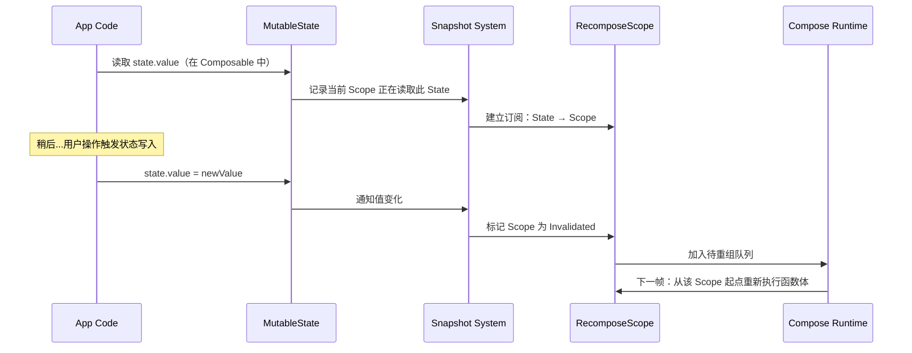
```mermaid
sequenceDiagram
    participant App as App Code
    participant State as MutableState
    participant Snap as Snapshot System
    participant Scope as RecomposeScope
    participant RT as Compose Runtime

    App->>State: 读取 state.value（在 Composable 中）
    State->>Snap: 记录当前 Scope 正在读取此 State
    Snap->>Scope: 建立订阅：State → Scope

    Note over App: 稍后...用户操作触发状态写入

    App->>State: state.value = newValue
    State->>Snap: 通知值变化
    Snap->>Scope: 标记 Scope 为 Invalidated
    Scope->>RT: 加入待重组队列
    RT->>Scope: 下一帧：从该 Scope 起点重新执行函数体
```

**核心要点**：State 的读取位置决定了哪个 Scope 被失效，进而决定重组的范围大小。这就是为什么 **"在哪里读 State"非常重要**。

#### Scope 的粒度控制：读取位置的艺术

同一个 State，在不同的位置读取，会导致截然不同的重组范围。以一个实际场景来说明：

**反面示例——在过高的 Scope 中读取 State**：

```kotlin
@Composable
fun ChatScreen(viewModel: ChatViewModel) {
    // ❌ 在 ChatScreen 的函数体直接读取 scrollPosition
    // 导致 ChatScreen 的 Recompose Scope 订阅了 scrollPosition
    val scrollPos = viewModel.scrollPosition  // 读取发生在此处

    Column {
        // 整个 TopBar 和 MessageList 都在 ChatScreen 的 Scope 内
        // scrollPos 每次变化 → ChatScreen 整体重组 → TopBar 和 MessageList 都要被重新调用
        TopBar(title = "Chat Room")
        MessageList(messages = viewModel.messages)
        ScrollIndicator(position = scrollPos)  // 真正使用 scrollPos 的地方
    }
}
```

在这个例子中，`scrollPosition` 只有 `ScrollIndicator` 需要，但因为在 `ChatScreen` 层级就读取了它，整个 `ChatScreen` 的 Scope 被失效，导致 `TopBar` 和 `MessageList` 也必须被重新调用（虽然如果参数没变它们可以被 Skip，但调用本身的参数比较仍有成本，且如果参数类型不稳定就会穿透重组）。

**正面示例——将读取推迟到最小 Scope**：

```kotlin
@Composable
fun ChatScreen(viewModel: ChatViewModel) {
    Column {
        // ✅ TopBar 和 MessageList 在 ChatScreen 的 Scope 中
        // 但 ChatScreen 没有读取 scrollPosition → 不会因 scrollPosition 变化而重组
        TopBar(title = "Chat Room")
        MessageList(messages = viewModel.messages)
        // ✅ scrollPosition 只在 ScrollIndicator 内部读取
        ScrollIndicator(positionState = viewModel.scrollPositionState)
    }
}

@Composable
fun ScrollIndicator(positionState: State<Float>) {
    // 读取发生在 ScrollIndicator 的 Scope 中 → 只有这个 Scope 被失效
    val position = positionState.value
    // 绘制滚动指示器...
    Box(
        Modifier
            .offset(y = position.dp)   // 根据 position 偏移
            .size(4.dp, 40.dp)         // 指示器大小
            .background(Color.Gray)    // 指示器颜色
    )
}
```

注意这里传递的是 `State<Float>` 而非 `Float`——这是一个经典的 Compose 性能优化模式，称为 **State Deferral（状态延迟读取）**。传递 State 对象本身不会触发外层重组（State 对象的引用没有变），只有在 `ScrollIndicator` 内部调用 `.value` 的那一刻，才在该 Scope 内建立订阅关系。

#### Lambda 与 Scope 的关系

Compose Runtime 中一个经常被忽略的细节是：**传入 Composable 函数的 `@Composable` Lambda 本身就会形成独立的 Recompose Scope**。这就是为什么在 `Column`、`Row`、`Box` 等布局内部读取 State，并不会让整个外层函数重组——Lambda 体是一个独立的 Scope：

```kotlin
@Composable
fun CounterScreen() {
    // CounterScreen 的 Scope
    val count = remember { mutableStateOf(0) }

    Column {
        // 这个 Lambda 是 Column 的 content 参数，形成独立 Scope
        // ⚠️ 但实际上，读取 count.value 发生在这个 Lambda Scope 中

        Text("Count: ${count.value}")  // 读取 count → 订阅此 Lambda Scope
        Button(onClick = { count.value++ }) {
            // Button 的 content Lambda → 又一个独立 Scope
            Text("Increment")
        }
    }
}
```

当 `count` 变化时，被失效的是 **`Column` 的 content Lambda Scope**，而非 `CounterScreen` 本身。所以 `Column` 之前或之后如果还有其他不依赖 `count` 的 Composable 调用，它们不会被波及。这种"Lambda 自动形成 Scope"的设计，让 Compose 在大多数情况下无需开发者手动优化就能获得不错的重组粒度。

不过要注意的是，**非 `@Composable` 的普通 Lambda（如 `onClick`）不会形成 Recompose Scope**。在 `onClick` 中读取 State 不会建立任何订阅关系，因为 `onClick` 不在组合过程中执行，而是在用户点击事件时执行。

---

### 幂等性要求（Idempotency）

#### 为什么幂等性是硬性要求

重组的核心特征是：**同一个 Composable 函数可能被 Runtime 在任意时刻、以任意频率重新执行**。一帧之内甚至可能发生多次重组（当多个 State 在同一帧内变化时，Runtime 会合并为一次，但这不是规范保证）。这意味着：

> 给定相同的输入参数，一个 Composable 函数 **无论被执行多少次**，都必须产生 **完全相同的 UI 输出**，并且 **不产生可观测的副作用**。

这就是 **幂等性（Idempotency）** 的要求。它是 Compose Runtime 能够安全地跳过、重排序、并行执行（未来优化方向）Composable 函数的基础。

#### 违反幂等性的典型场景

**场景一：在 Composable 中直接修改外部可变状态**

```kotlin
// ❌ 反面示例：每次重组都会 count++
var count = 0  // 外部可变变量

@Composable
fun BrokenCounter() {
    count++  // 每次重组执行一次 → count 的值取决于重组次数 → 不幂等
    Text("Count: $count")
}
```

问题在于，`count++` 是一个 **副作用（Side Effect）**，它改变了外部世界的状态，且其效果会随重组次数累积。如果 Runtime 因为某些原因重组了 `BrokenCounter` 三次，`count` 就加了 3；如果跳过了一次，就只加了 2。UI 的输出取决于"被重组了几次"——这完全不可预测。

**场景二：在 Composable 中发起网络请求**

```kotlin
// ❌ 反面示例：每次重组都发起网络请求
@Composable
fun UserProfile(userId: String) {
    // 每次重组都会调用 fetchUser() → 重复请求 → 不幂等
    val user = fetchUserFromNetwork(userId)  // 同步阻塞 + 副作用
    Text("Name: ${user.name}")
}
```

网络请求是典型的副作用，不仅会因重组次数变化导致重复请求，还可能阻塞组合线程（Main Thread），造成 UI 卡顿甚至 ANR。

**场景三：在 Composable 中生成随机值且不缓存**

```kotlin
// ❌ 反面示例：每次重组颜色都不同
@Composable
fun RandomColorBox() {
    // 每次重组生成新的随机颜色 → UI 闪烁 → 不幂等
    val color = Color(
        red = Random.nextFloat(),    // 随机红色分量
        green = Random.nextFloat(),  // 随机绿色分量
        blue = Random.nextFloat()    // 随机蓝色分量
    )
    Box(Modifier.size(100.dp).background(color))
}
```

#### 正确的做法：副作用必须走"副作用 API"

Compose 为那些确实需要在组合过程中触发的副作用提供了专门的 API（后续章节详解），以确保它们在受控的生命周期内执行：

```kotlin
@Composable
fun UserProfile(userId: String) {
    // ✅ remember：在组合中缓存值，重组时不重新计算（除非 key 变化）
    val randomColor = remember {
        Color(
            red = Random.nextFloat(),    // 仅在首次组合时生成
            green = Random.nextFloat(),  // 后续重组复用缓存值
            blue = Random.nextFloat()
        )
    }

    // ✅ LaunchedEffect：受控的副作用，userId 变化时才重新触发
    var user by remember { mutableStateOf<User?>(null) }
    LaunchedEffect(userId) {
        // 这个协程在 userId 变化时取消旧的、启动新的
        user = fetchUserFromNetwork(userId)  // 挂起函数，不阻塞主线程
    }

    // UI 描述部分保持幂等：相同 user + randomColor → 相同输出
    if (user != null) {
        Text("Name: ${user!!.name}")           // 展示用户名
        Box(Modifier.size(48.dp).background(randomColor))  // 展示随机颜色头像占位
    } else {
        CircularProgressIndicator()             // 加载中
    }
}
```

#### 幂等性的完整约束清单

为了帮助开发者在实践中自检，下面列出 Composable 函数幂等性的核心约束：

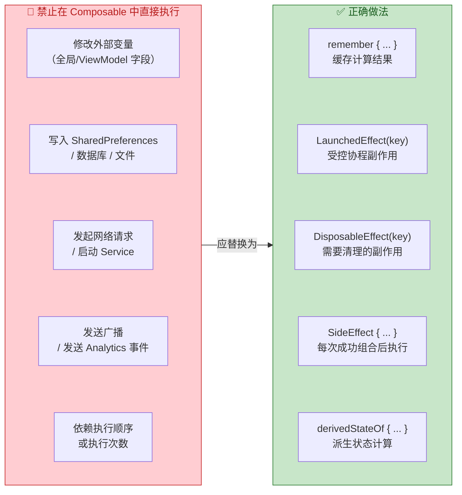
```mermaid
graph LR
    subgraph Forbidden["🚫 禁止在 Composable 中直接执行"]
        direction TB
        F1["修改外部变量\n（全局/ViewModel 字段）"] ~~~ F2["写入 SharedPreferences\n/ 数据库 / 文件"]
        F2 ~~~ F3["发起网络请求\n/ 启动 Service"]
        F3 ~~~ F4["发送广播\n/ 发送 Analytics 事件"]
        F4 ~~~ F5["依赖执行顺序\n或执行次数"]
    end

    subgraph Allowed["✅ 正确做法"]
        direction TB
        A1["remember { ... }\n缓存计算结果"] ~~~ A2["LaunchedEffect(key)\n受控协程副作用"]
        A2 ~~~ A3["DisposableEffect(key)\n需要清理的副作用"]
        A3 ~~~ A4["SideEffect { ... }\n每次成功组合后执行"]
        A4 ~~~ A5["derivedStateOf { ... }\n派生状态计算"]
    end

    Forbidden -->|"应替换为"| Allowed

    classDef redBox fill:#FFCDD2,stroke:#C62828,color:#B71C1C
    classDef greenBox fill:#C8E6C9,stroke:#2E7D32,color:#1B5E20

    class Forbidden redBox
    class Allowed greenBox
```

遵守幂等性不仅是"最佳实践"，更是 Compose 编程模型的 **契约（Contract）**。违反它不会导致编译错误，但会导致运行时出现难以调试的 UI 不一致、状态丢失、性能劣化等问题。Compose Runtime 假定所有 Composable 函数都是幂等的，并基于此假设进行优化——如果你打破假设，优化就变成了 Bug。

---

### 重组机制全景回顾

将以上四个子主题串联起来，可以形成对 Recomposition 的完整理解：

1. **State 变化** 通过 Snapshot 系统通知到订阅了它的 **Recompose Scope**（作用域），触发 Scope 失效。
2. Runtime 在下一帧从失效 Scope 的起点 **重新执行** Composable 函数体。
3. 执行过程中，每个子 Composable 调用通过 **调用点 Key** 在 Slot Table 中找到对应的旧 Group 节点。
4. 如果参数未变且类型稳定，触发 **Skipping**，整个子树被跳过。
5. 如果参数变化，则进入子 Composable 函数体继续执行（可能触发更深层的递归重组或 Skip）。
6. 整个过程要求所有 Composable 函数满足 **幂等性**，以确保重组结果的确定性。

这套机制的精妙之处在于：它让开发者可以用 **"每次都描述完整 UI"** 的简单心智模型编码，而 Runtime 在底层通过 Scope 细粒度失效 + Skipping 跳过 + 调用点匹配，将实际执行的代码量降到最低——**声明式的简洁** 与 **命令式的效率** 兼得。

---

**📝 练习题**

在以下代码中，当 `counter.value` 从 0 变为 1 时，哪些 Composable 函数会被 **重新执行**（不被 Skip）？

```kotlin
@Composable
fun MainScreen() {                        // Scope ①
    val counter = remember { mutableStateOf(0) }
    Column {                               // Scope ②（Column content Lambda）
        Title(text = "Dashboard")          // 调用 A
        CounterDisplay(count = counter.value) // 调用 B（读取发生在此处）
        Footer(text = "v2.0")             // 调用 C
    }
}

// 所有参数类型均为 Stable
```

A. 仅 `CounterDisplay`


B. `Column` 的 content Lambda + `CounterDisplay`


C. `MainScreen` + `Column` 的 content Lambda + `Title` + `CounterDisplay` + `Footer`


D. `Column` 的 content Lambda + `Title` + `CounterDisplay` + `Footer`


**【答案】** B

**【解析】** `counter.value` 的读取发生在 `Column` 的 content Lambda 内部（Scope ②），而非 `MainScreen` 的函数体直接层级（虽然语法上写在 `MainScreen` 中，但 `Column` 的 `content: @Composable () -> Unit` 参数是一个独立的 Composable Lambda，形成独立的 Recompose Scope）。因此当 `counter` 变化时，**Scope ②** 被失效并重新执行。在 Scope ② 重新执行的过程中，`Title(text = "Dashboard")` 的参数 `"Dashboard"` 未变（`String` 是 Stable 类型且值不变），触发 **Skip**；`CounterDisplay(count = 1)` 的参数从 `0` 变为 `1`，**必须重组**；`Footer(text = "v2.0")` 参数未变，触发 **Skip**。所以实际被重新执行函数体的是 Column content Lambda 和 `CounterDisplay`，选 B。选项 A 忽略了 Lambda Scope 本身也需要重新执行这一事实；选项 C 和 D 错误地扩大了重组范围。

---

## 状态驱动

Compose 的声明式 UI 范式（`UI = f(State)`）决定了"状态"才是一切 UI 行为的源头。传统 View 体系中，开发者通过命令式调用 `textView.setText("...")` 直接操纵视图属性；而在 Compose 中，你只需修改状态值，框架会自动将变化映射到 UI 上。传统 Android 开发使用命令式模型：直接修改视图，调用类似 `textView.setText()` 或 `button.setEnabled()` 等方法。Compose 则截然不同——你将状态作为"真理的唯一来源"（Single Source of Truth, SSOT），所有 UI 节点都是状态的函数投影。

但这一切的底层，究竟是如何实现的？为什么一个看似普通的变量赋值 `state.value = newValue` 就能触发整棵 UI 树的精准刷新？答案就隐藏在 Compose 运行时的三大核心机制中：**MutableState 接口**提供了可观测的状态容器，**StateObject 标记**将状态对象纳入快照系统的管辖范围，而 **Snapshot 快照系统**则借助 MVCC（Multi-Version Concurrency Control）实现了线程安全的状态隔离与原子化变更通知。本节将依次深入这三个支柱，帮你建立从 API 表层到运行时内核的完整认知链路。

---

### MutableState 接口

#### 从普通变量到可观测状态

初学 Compose 的开发者常犯的一个错误是：在 Composable 函数中用 Kotlin 原生的 `var` 声明状态变量，然后期望修改该变量后 UI 能自动刷新。然而事实是，要让 Compose 观察到状态变化，必须使用 `MutableState` 或 `collectAsState()` 等 Compose 专属的 State 类型，而不是 Kotlin 的原生 `var`——因为普通变量的变更无法被 Compose 运行时感知。

原因很简单：Compose 的重组机制需要一个"钩子"（hook）来**拦截读操作**和**通知写操作**。普通的 Kotlin 属性既不会在被读取时通知任何人，也不会在被写入时触发回调。而 `MutableState<T>` 的设计正是为了解决这两个问题。

#### 接口定义与核心契约

`MutableState<T>` 是 Compose 运行时最基础的可变状态容器。它继承自只读的 `State<T>` 接口，额外提供了 `value` 属性的可写能力。其完整接口定义非常精简：

```kotlin
// State<T>：只读状态接口
// 任何读取 value 的地方都会被 Snapshot 系统追踪
interface State<out T> {
    val value: T  // 只提供 getter，外部只可读
}

// MutableState<T>：可变状态接口
// 继承 State<T>，增加 setter，允许外部修改
interface MutableState<T> : State<T> {
    override var value: T  // 可读可写：getter 触发读追踪，setter 触发写通知

    // 以下两个 operator 函数支持 Kotlin 解构语法:
    // val (value, setValue) = remember { mutableStateOf("") }
    operator fun component1(): T             // 返回当前 value
    operator fun component2(): (T) -> Unit   // 返回一个设置 value 的 lambda
}
```

核心契约在于 `value` 属性的 **getter** 和 **setter** 并非普通的字段存取，它们是精心设计的"陷阱"（trap）：

- **getter（读取）**：通知当前 Snapshot 的 Read Observer："我（某个 Composable Scope）正在读取这个状态"，从而建立 **依赖关系**。
- **setter（写入）**：首先检查新旧值是否等价（由 `SnapshotMutationPolicy` 决定），若不等价，则写入新的 StateRecord 并通知 Write Observer："这个状态发生了变更"，从而 **标记依赖它的 Scope 为 invalid**。

在 `MutableState` 的实现中，`value` 的 getter 和 setter 都使用了自定义的存取器——它不是一个简单的变量，而是经过特殊处理的属性。换言之，Compose 运行时会监控 State value 的读取行为，并记录哪些函数读取了该值；当 `MutableState` 发生变化时，运行时就能回调那些读取过该 State 的函数来触发重组。

#### mutableStateOf() 工厂函数

开发者几乎不会直接实现 `MutableState` 接口，而是通过工厂函数 `mutableStateOf()` 来创建实例：

```kotlin
// mutableStateOf 的完整签名
// value: 初始值
// policy: 快照变更策略，默认使用结构相等判断
fun <T> mutableStateOf(
    value: T,
    policy: SnapshotMutationPolicy<T> = structuralEqualityPolicy()
): MutableState<T>
```

该函数接受两个参数：`value` 是状态初始值，`policy` 是 `SnapshotMutationPolicy` 类型的策略参数。大多数开发者只关注第一个参数，却忽略了第二个参数 `policy`——它决定了 Compose 何时认为一次状态更新"确实是一次变更"。

#### SnapshotMutationPolicy：变更等价判定

`SnapshotMutationPolicy` 是一个策略接口，用于控制 `mutableStateOf` 如何报告和合并对状态对象的变更。通过此策略，我们可以告诉 Compose 何时将一个状态视为"已改变"，从而触发重组。

该接口定义了两个方法：

```kotlin
interface SnapshotMutationPolicy<T> {
    // 判断新旧值是否等价
    // 返回 true 表示"未发生变化"，不触发重组
    // 返回 false 表示"发生了变化"，触发重组
    fun equivalent(a: T, b: T): Boolean

    // 当多个 Snapshot 并发修改同一状态时的冲突合并策略
    // 返回合并后的值；返回 null 表示无法合并（冲突）
    fun merge(previous: T, current: T, applied: T): T? = null
}
```

Compose 内建了三种开箱即用的策略：

| 策略 | 判断方式 | 适用场景 |
|------|----------|----------|
| `structuralEqualityPolicy()` | `a == b`（结构相等） | **默认策略**，适合 data class、基本类型 |
| `referentialEqualityPolicy()` | `a === b`（引用相等） | 持有可变对象但对象引用本身才是"变化"的标志 |
| `neverEqualPolicy()` | 永远返回 `false` | 每次赋值都被视为变更；适合持有外部可变对象 |

`structuralEqualityPolicy` 将两个值通过 `==` 进行结构相等判断。如果将 `MutableState.value` 设为一个与当前值结构相等的值，则不被认为是一次变更。这也是 Google 推荐使用 `data class` 作为状态模型的原因——因为 `data class` 会自动生成 `equals()` 方法，从而配合此策略正常工作。

`referentialEqualityPolicy` 使用 `===` 引用相等进行判断。如果将 `MutableState.value` 设为一个与当前值引用相同的对象，则不被认为是一次变更。当需要基于引用相等来控制重组时，可以使用此策略。

`neverEqualPolicy` 则永远不将两个值视为等价——每次更新 `MutableState.value` 都被视为一次变更。这意味着即使你将 `state.value` 设为与当前完全相同的值，也会触发重组。这在你持有一个外部可变对象（如 Java 老代码中的 Mutable POJO），且无法通过 `==` 或 `===` 检测到其内部变化时非常有用。

#### SnapshotMutableStateImpl：真正的实现类

当调用 `mutableStateOf()` 时，返回的实际对象是 `SnapshotMutableStateImpl`。这是 `mutableStateOf` 返回的内部具体实现类。`SnapshotStateList` 和 `SnapshotStateMap` 也同样实现了 `StateObject` 接口。理解它的 `value` getter/setter 的实现逻辑，是掌握整个状态驱动机制的钥匙。

```kotlin
// SnapshotMutableStateImpl 的核心结构（简化）
internal open class SnapshotMutableStateImpl<T>(
    value: T,                                          // 初始值
    override val policy: SnapshotMutationPolicy<T>     // 变更策略
) : StateObject, SnapshotMutableState<T> {

    // next 是 StateRecord 链表的头节点（详见 StateObject 一节）
    private var next: StateStateRecord<T> = StateStateRecord(value)

    // --- value 的 getter ---
    // 调用 readable() 在 StateRecord 链表中查找
    // "对当前 Snapshot 可见的最新记录"，并触发 ReadObserver 回调
    override var value: T
        get() = next.readable(this).value

        // --- value 的 setter ---
        // 1. withCurrent {} 获取当前快照下的活跃记录
        // 2. policy.equivalent() 比较新旧值
        // 3. 若不等价，调用 overwritable() 写入新值并触发 WriteObserver
        set(value) = next.withCurrent {
            if (!policy.equivalent(it.value, value)) {
                next.overwritable(this, it) {
                    this.value = value
                }
            }
        }

    // StateObject 接口要求：返回链表头节点
    override val firstStateRecord: StateRecord
        get() = next
}
```

上述代码的关键在于：**`value` 的读写并不是直接操作内存中的一个字段，而是通过 `readable()` 和 `overwritable()` 两个函数与 Snapshot 系统进行交互。** `readable()` 不仅返回当前快照下的正确值，还会调用当前快照的 Read Observer 将此次读取登记在册；`overwritable()` 则在写入新值的同时触发 Write Observer，将所有依赖此状态的 Composable Scope 标记为 dirty（需要重组）。

因此，`SnapshotMutableStateImpl` 本身并不包含复杂的链表查找和版本控制逻辑——它更像是一个"代理"，将所有的读写操作都转发给了快照系统去处理。

#### 属性委托与 by 语法糖

在日常开发中，我们通常不直接使用 `.value` 存取，而是用 Kotlin 的属性委托（Property Delegation）来简化代码：

```kotlin
@Composable
fun Counter() {
    // 方式一：显式 .value 存取
    val countState: MutableState<Int> = remember { mutableStateOf(0) }
    Text("Count: ${countState.value}")                  // 读：countState.value
    Button(onClick = { countState.value++ }) { ... }    // 写：countState.value++

    // 方式二：by 委托，等价于方式一但更简洁
    var count by remember { mutableStateOf(0) }
    Text("Count: $count")                               // 实际调用 MutableState.getValue()
    Button(onClick = { count++ }) { ... }               // 实际调用 MutableState.setValue()

    // 方式三：解构声明（Destructuring）
    val (text, setText) = remember { mutableStateOf("") }
    TextField(value = text, onValueChange = setText)     // component1() 和 component2()
}
```

三种方式在运行时行为完全一致——无论你用 `.value`、`by` 还是解构，**最终都会走到 `SnapshotMutableStateImpl` 的 getter/setter**，触发同样的 Read/Write Observer 流程。`by` 只是 Kotlin 编译器在编译期将 `count` 的 get/set 翻译成对底层 `MutableState.value` 的调用，不涉及任何运行时额外开销。State 的读取追踪是通过对 `State.value` getter 的实际调用来实现的，无论从哪里或如何调用——这里没有编译器魔法。底层实际上是通过 Thread-Local 指向当前 Snapshot，读取操作在此处自行注册。因此调用栈的形态并不影响追踪结果。

---

### StateObject 标记

#### 为什么需要 StateObject 接口

`MutableState` 解决了"对外如何提供可观测的读写接口"的问题，但它并未告诉 Snapshot 系统"如何存储不同快照版本的值"。这就是 `StateObject` 接口的职责。

在 Compose 中，每一个代表状态单元的类都实现了 `StateObject` 接口。换句话说，`StateObject` 是一个"注册标记"——实现了这个接口的对象就正式进入了 Snapshot 系统的管辖范围。Compose 对 MVCC 的实现分为两部分：Snapshot 本身（`Snapshot` 类），以及存储应用状态的对象（`StateObject` 接口）。

#### 接口定义

```kotlin
// StateObject 接口：所有参与 Snapshot 系统的状态对象都必须实现
public interface StateObject {
    // 获取 StateRecord 链表的头节点
    // Snapshot 系统通过遍历这个链表来查找
    // "在某个特定快照下可见的最新值"
    public val firstStateRecord: StateRecord

    // 在链表头部插入一条新的 StateRecord
    // 当发生写入操作时，Snapshot 系统会创建新的 Record 并调用此方法
    public fun prependStateRecord(value: StateRecord)

    // 解决并发快照写入冲突的合并方法
    // previous: 两个快照分叉时的原始值
    // current:  当前全局快照中的值
    // applied:  即将被 apply 的快照中的值
    // 返回值：合并结果；返回 null 表示冲突无法解决
    public fun mergeRecords(
        previous: StateRecord,
        current: StateRecord,
        applied: StateRecord
    ): StateRecord?
}
```

`firstStateRecord` 返回 StateRecord 链表的头节点，而 `prependStateRecord` 在链表头部添加一条记录——它实际上就是 `firstStateRecord` 的 setter。新记录甚至不需要自己链接到前一个头节点，运行时会自行处理。

#### StateRecord：多版本值的载体

如果 `StateObject` 是"户口簿"，那 `StateRecord` 就是簿上的每一行"记录"。每一条 `StateRecord` 都是一个单向链表节点，包含核心属性 `snapshotId: Int`（该记录所属快照的唯一 ID）和 `next: StateRecord?`（指向链表中下一个记录的指针）。

其抽象结构如下：

```kotlin
// StateRecord：状态值的版本记录（链表节点）
abstract class StateRecord {
    // 该记录创建时所属的 Snapshot ID
    // Snapshot 系统通过比较 ID 来判断"这条记录对当前快照是否可见"
    internal var snapshotId: Int = currentSnapshot().id

    // 链表指针：指向下一条记录（更早的版本）
    internal var next: StateRecord? = null

    // 将另一条记录的值复制到本记录（用于创建快照副本）
    abstract fun assign(value: StateRecord)

    // 创建一条与本记录同类型的新空记录
    abstract fun create(): StateRecord
}
```

例如，`mutableStateOf()` 返回的 `SnapshotMutableStateImpl` 内部使用的就是 `StateStateRecord` 子类，它简单地包装了一个 `value: T` 字段来存储真正的值。

```kotlin
// StateStateRecord：存储实际值的 StateRecord 子类
private class StateStateRecord<T>(
    snapshotId: SnapshotId,  // 所属快照 ID
    myValue: T               // 初始值
) : StateRecord(snapshotId) {
    var value: T = myValue   // 真正的状态值存储在这里
    // ...
}
```

一个 `StateObject` 拥有一条 **StateRecord 链表**，链表中每个节点对应该状态在某个特定 Snapshot 下的值版本。这就是 MVCC 的核心数据结构——不是"就地修改"一个变量，而是**追加新版本**。

#### 读取机制：readable()

当 Composable 函数读取 `state.value` 时，getter 调用 `readable()`。该函数会遍历 StateRecord 链表，根据当前 Snapshot 的 ID，通过整数比较快速定位到**对当前快照可见的最新记录**，并触发 Read Observer 回调。

`readable` 函数允许多个 Snapshot 从同一条记录进行读取，它会查找与当前 Snapshot "最近"的那条记录。概念上，它在父级 Snapshot 中查找是否有对应记录，如果没有就继续向上搜索。但实际实现中并不遍历树结构，而只是进行一些整数比较。

这里的 Read Observer 就是 Recomposer 注册的回调函数，它会将 `(StateObject, RecomposeScope)` 这个映射关系记录到一张 **依赖关系映射表（Observations）** 中。这一步是"建立依赖关系"的关键——它让运行时知道"谁在读这个状态"。

#### 写入机制：overwritable()

当开发者写入 `state.value = newValue` 时，setter 首先通过 `SnapshotMutationPolicy.equivalent()` 判断新旧值是否等价。如果等价，直接返回，什么都不发生。如果不等价，则调用 `overwritable()` 将新值写入对应的 StateRecord（或创建一条新 Record），并触发 Write Observer 回调。

写操作 `state.value = newValue` 会触发 Write Observer，运行时从依赖关系映射表中找到所有依赖了该状态的作用域（Scope），然后调用 `invalidate` 将它们标记为"脏"——脏意味着需要被重新组合。

#### StateObject 的实现者家族

不仅仅是 `MutableState`，Compose 中有一整套集合类型都实现了 `StateObject`：

| 类型 | 创建方式 | 说明 |
|------|----------|------|
| `SnapshotMutableStateImpl` | `mutableStateOf()` | 单值状态容器 |
| `SnapshotStateList` | `mutableStateListOf()` | 可观测的 MutableList |
| `SnapshotStateMap` | `mutableStateMapOf()` | 可观测的 MutableMap |
| `DerivedSnapshotState` | `derivedStateOf {}` | 派生（计算）状态 |

例如 `SnapshotStateMap` 是一个实现了 `StateObject` 和 `MutableMap` 的类——一个既能被观测又能参与快照的 Map 实现。它们都将内部数据存储在 StateRecord 链表中，因此天然享有 Snapshot 系统提供的一切能力：**读追踪、写通知、线程隔离、原子变更**。

下面的 Mermaid 图展示了 StateObject 与 StateRecord 的类层级关系及 MVCC 链表结构：

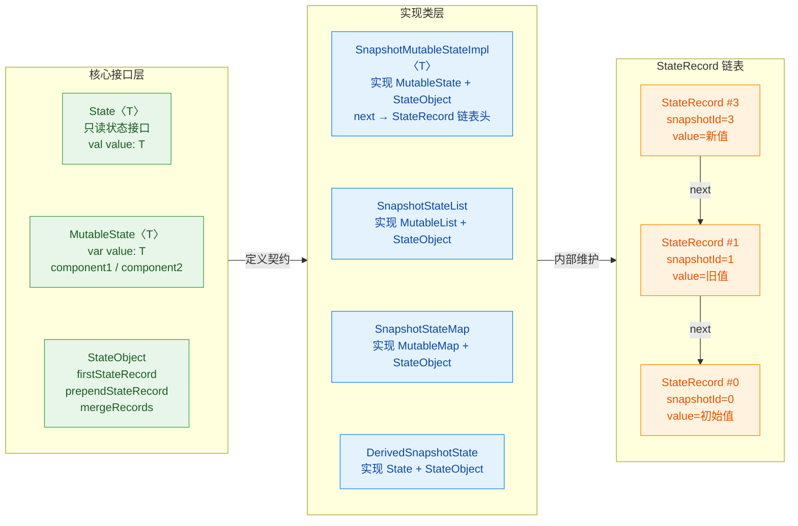
```mermaid
graph LR
    subgraph Interfaces["核心接口层"]
        direction TB
        StateI["State〈T〉\n只读状态接口\nval value: T"]
        MutableStateI["MutableState〈T〉\nvar value: T\ncomponent1 / component2"]
        StateObjectI["StateObject\nfirstStateRecord\nprependStateRecord\nmergeRecords"]
        StateI ~~~ MutableStateI
        MutableStateI ~~~ StateObjectI
    end

    subgraph Impl["实现类层"]
        direction TB
        SMSI["SnapshotMutableStateImpl〈T〉\n实现 MutableState + StateObject\nnext → StateRecord 链表头"]
        SSL["SnapshotStateList\n实现 MutableList + StateObject"]
        SSM["SnapshotStateMap\n实现 MutableMap + StateObject"]
        DSS["DerivedSnapshotState\n实现 State + StateObject"]
        SMSI ~~~ SSL
        SSL ~~~ SSM
        SSM ~~~ DSS
    end

    subgraph Records["StateRecord 链表"]
        direction TB
        R1["StateRecord #3\nsnapshotId=3\nvalue=新值"]
        R2["StateRecord #1\nsnapshotId=1\nvalue=旧值"]
        R3["StateRecord #0\nsnapshotId=0\nvalue=初始值"]
        R1 -->|"next"| R2
        R2 -->|"next"| R3
    end

    Interfaces -->|"定义契约"| Impl
    Impl -->|"内部维护"| Records

    classDef iface fill:#E8F5E9,stroke:#43A047,color:#1B5E20
    classDef impl fill:#E3F2FD,stroke:#1E88E5,color:#0D47A1
    classDef record fill:#FFF3E0,stroke:#FB8C00,color:#E65100

    class StateI,MutableStateI,StateObjectI iface
    class SMSI,SSL,SSM,DSS impl
    class R1,R2,R3 record
```

---

### Snapshots 快照系统基础

#### 什么是 Snapshot

Snapshot（快照）很像电子游戏中的存档点：它代表了你整个程序在某一历史时刻的状态。Compose 通过 `Snapshot` 类来实现这个概念。快照是某个特定时刻下所有状态值的记录。当你在 Composable 内部读取一个 `MutableState` 时，Compose 会在当前快照中捕获这次读取。

更形象地理解：想象你有一个巨大的白板（全局状态），上面写着所有 `MutableState` 的当前值。**拍一张照片**就是"创建一个 Snapshot"——在你研究这张照片的过程中，即使别人正在白板上修改数据，你看到的仍然是你拍照那一刻的画面。等你研究完想把自己的改动合并回白板时，再执行 `apply()`。

#### MVCC 的核心思想

快照系统实现其功能的方式就是使用多版本并发控制（MVCC）。MVCC 这一底层算法已经存在很长时间，并广泛应用于大多数你听说过的数据库系统中。其核心思想与数据库几乎一致：当你在 MVCC 数据库中执行 `UPDATE` 操作时，数据库不会覆盖现有的行，而是创建该行的新版本。

Compose 的 Snapshot MVCC 同理——当你修改 `state.value` 时，系统不是"就地修改"那个值，而是在 StateRecord 链表中**追加一条带有新 Snapshot ID 的新记录**。不同的 Snapshot 可以同时存在，各自看到自己"版本"的值，互不干扰。

MVCC 为了实现独立性，每次数据写入时都会创建新的数据副本，而非覆盖原始值。在 Compose 的实现中，这通过 `StateRecord` 类的链表来实现。

#### 快照的分类

Compose 内部存在两大类 Snapshot：

**1. Global Snapshot（全局快照）**

这是 Compose 运行时默认使用的快照环境。在 Android 平台上，Compose 运行时使用全局快照来协调读写操作，并在下一帧绘制之前将变更统一 apply。这就是为什么你在 onClick 回调中连续修改多个状态，UI 不会"闪烁"——所有变更被批量合并后再统一触发重组。

在主线程上操作时不需要显式快照，变更本身就是原子的，因为全局快照的推进（advance）发生在主线程上。

**2. Mutable Snapshot（可变快照）**

通过 `Snapshot.takeMutableSnapshot()` 或 `Snapshot.withMutableSnapshot {}` 显式创建。可变快照类似数据库事务——你可以在其中修改多个状态，这些修改在 `apply()` 之前对外部不可见，形成一个原子操作单元。

`takeMutableSnapshot()` 可以接受两个可选参数：一个 Read Observer 和一个 Write Observer。它们是简单的 `(Any) -> Unit` 回调，会在 `enter` 块内每次读写快照状态值时被调用。

Recomposer 正是利用这一机制来追踪依赖关系和标记失效作用域的：

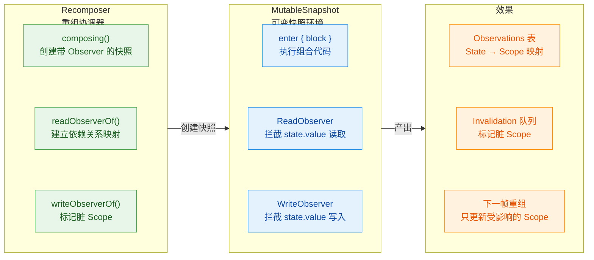
```mermaid
graph LR
    subgraph Recomposer["Recomposer\n重组协调器"]
        direction TB
        C1["composing()\n创建带 Observer 的快照"]
        C2["readObserverOf()\n建立依赖关系映射"]
        C3["writeObserverOf()\n标记脏 Scope"]
        C1 ~~~ C2
        C2 ~~~ C3
    end

    subgraph Snapshot["MutableSnapshot\n可变快照环境"]
        direction TB
        S1["enter { block }\n执行组合代码"]
        S2["ReadObserver\n拦截 state.value 读取"]
        S3["WriteObserver\n拦截 state.value 写入"]
        S1 ~~~ S2
        S2 ~~~ S3
    end

    subgraph Effects["效果"]
        direction TB
        E1["Observations 表\nState → Scope 映射"]
        E2["Invalidation 队列\n标记脏 Scope"]
        E3["下一帧重组\n只更新受影响的 Scope"]
        E1 ~~~ E2
        E2 ~~~ E3
    end

    Recomposer -->|"创建快照"| Snapshot -->|"产出"| Effects

    classDef recomp fill:#E8F5E9,stroke:#43A047,color:#1B5E20
    classDef snap fill:#E3F2FD,stroke:#1E88E5,color:#0D47A1
    classDef effect fill:#FFF3E0,stroke:#FB8C00,color:#E65100

    class C1,C2,C3 recomp
    class S1,S2,S3 snap
    class E1,E2,E3 effect
```

在 Compose 运行时中，Recomposer 通过 `composing` 方法创建一个带观察者的快照环境。读操作触发 `readObserver`，将（状态, 重组作用域）对添加到依赖关系映射表中（建立依赖关系）；写操作触发 `writeObserver`，从映射表中找到所有依赖该状态的作用域并调用 `invalidate` 标记为"脏"。

#### Snapshot 的生命周期

一个 MutableSnapshot 的典型生命周期如下：

1. **创建（Take）**：调用 `takeMutableSnapshot()` 冻结当前时刻的全局状态视图。
2. **进入（Enter）**：调用 `snapshot.enter { ... }`，在块内所有状态读写都被隔离在此快照中。所有状态对象在快照中的值与快照创建时一致，除非在快照内显式修改。要进入一个快照，需要调用 `enter`。
3. **应用（Apply）**：调用 `snapshot.apply()` 将快照内的修改合并回全局状态。如果存在冲突，会尝试通过 `SnapshotMutationPolicy.merge()` 解决。
4. **释放（Dispose）**：释放快照。如果不释放快照，会导致难以诊断的内存泄漏——因为它会间接导致所有状态对象为未释放的快照保留其值。

#### 冲突检测与合并

当两个 MutableSnapshot 并发修改同一个 `MutableState` 时，会产生冲突。冲突的原因是两个快照都试图基于同一个初始值修改相同的状态。由于第二个快照是在旧值基础上执行的，快照系统无法确认新值是否仍然正确——要么需要重新执行 enter 块，要么需要被明确告知如何合并。

`apply()` 返回的是一个 sealed class `SnapshotApplyResult`，可以是 `Success` 或 `Failure`。对于默认的三种内置策略，`merge()` 函数返回 `null`（即不支持自动合并），因此如果发生冲突就会 apply 失败。但你可以通过自定义 `SnapshotMutationPolicy` 实现 `merge()` 来处理特定场景，例如计数器的冲突可以通过"增量合并"来解决（conflict-free data type）。

#### 全局快照的自动推进

在 Android 平台上，Compose UI 会在每一帧（frame）自动推进全局快照。如果你不使用 Compose UI Android 运行时，就没有东西会帮你推进全局快照。`withMutableSnapshot` 是一种手段，但容易遗忘。更好的做法是自行设置一个回调在每帧推进全局快照，类似 Compose UI Android 的底层实现。

对于应用层开发者来说，这意味着：

- 在 **主线程的事件回调**（onClick、onValueChange 等）中修改状态，全局快照会在下一帧自动 apply，你无需手动管理。
- 在 **后台线程**修改快照状态时（例如在 `LaunchedEffect` 中从 IO 线程写入），Compose 运行时会自动包裹在合适的快照中。使用快照状态对象持有状态同样重要的原因在于：来自不同线程（例如 LaunchedEffect）的状态修改可以被适当隔离，并以安全的方式执行，避免竞态条件。

#### snapshotFlow：连接 Snapshot 与 Flow 的桥梁

Snapshot 专注于状态本身——它是一个恰好在整个快照级别可被观测的 MVCC 系统。当快照被提交时，你可以看到哪些元素发生了变化。这正是 `snapshotFlow {}` API 的基础——你可以从任何读取快照状态的代码块中获取一个 Cold Flow，完全不需要 `@Composable` 或 Compose 编译器插件。

`snapshotFlow {}` 的工作原理是：创建一个内部 Snapshot 来执行你的 lambda，追踪其中的所有 State 读取；当这些 State 中的任何一个发生变化时，重新执行 lambda 并将新结果 emit 到 Flow 中。这使得你可以在非 Composable 的环境（如 ViewModel）中优雅地观察快照状态的变化。

#### MutableState vs MutableStateFlow

这是一个社区中经常讨论的话题。当你使用 ViewModel 中的 Flow 并通过 `collectAsState` 在 Compose 中消费时，你实际上同时使用了 Flow 和快照状态——`collectAsState` 会将 Flow 收集到一个快照状态对象中。但这样做会失去快照的原子事务特性：如果你用快照系统在一个事务中修改多个状态对象，观察者会以原子方式看到这些变化；但如果你将不同的 Flow 分别收集到快照状态中，这些 emit 之间并不存在事务绑定。

快照是比 Compose 编译器插件或任何其他 compose-runtime 机制更底层的工具，可以完全独立使用。拒绝使用快照仅仅因为它在 compose-runtime 产物中发布，就像因为同一个产物中包含 Flow 就拒绝使用 `suspendCancellableCoroutine` 一样。

核心决策建议：

- **UI 层**的局部状态，优先用 `mutableStateOf()` + `remember {}`——更简洁、天然集成快照原子性。
- **跨层共享**的状态流（需要 replay、transform、stateIn 等能力），使用 `StateFlow`。
- 两者可以通过 `snapshotFlow {}` 和 `collectAsState()` 无缝互转。

---

**📝 练习题**

某团队在 ViewModel 中持有一个普通 Kotlin `data class User(val name: String, val age: Int)` 的状态。他们使用 `mutableStateOf(User("Alice", 25))` 创建状态后，在事件回调中执行 `state.value = state.value.copy(name = "Bob")`。UI 成功触发了重组。接着他们改为 `state.value = state.value`（赋值为同一个值）。在默认的 `SnapshotMutationPolicy` 下，以下哪种行为是正确的？

A. 仍然触发重组，因为 setter 被调用就一定会通知 Write Observer


B. 不触发重组，因为默认策略是 `structuralEqualityPolicy()`，`data class` 的 `equals()` 判定新旧值相等


C. 不触发重组，因为默认策略是 `referentialEqualityPolicy()`，新旧值是同一个对象引用


D. 抛出 `SnapshotApplyConflictException`，因为在同一快照中重复写入同一个状态


**【答案】** B

**【解析】** `mutableStateOf()` 的默认策略是 `structuralEqualityPolicy()`，其 `equivalent()` 方法通过 `==` 运算符比较新旧值。由于 `User` 是 `data class`，Kotlin 编译器会自动生成 `equals()` 方法，基于所有构造函数属性进行结构比较。当执行 `state.value = state.value` 时，新值与旧值完全相同，`policy.equivalent(oldValue, newValue)` 返回 `true`，setter 中的 `if (!policy.equivalent(...))` 判断不成立，因此**不会**调用 `overwritable()` 写入新 Record，也不会触发 Write Observer，自然不会有任何 Scope 被标记为 dirty。选项 A 忽略了 setter 内部的等价检查逻辑；选项 C 混淆了默认策略的类型；选项 D 所描述的冲突场景仅在两个不同的 MutableSnapshot 并发修改同一状态时才可能出现。

---

**📝 练习题**

关于 Compose Snapshot 系统，以下说法错误的是：

A. Snapshot 系统基于 MVCC（多版本并发控制）实现，与数据库系统的并发控制理念一脉相承


B. 每个 `StateObject` 内部通过 `StateRecord` 链表存储多个版本的值，读取时根据当前 Snapshot ID 查找可见记录


C. 在主线程事件回调中修改多个 `MutableState`，这些修改会被全局快照自动批处理并在下一帧统一 apply


D. `snapshotFlow {}` 必须在 `@Composable` 函数内部调用，否则无法追踪 State 的读取


**【答案】** D

**【解析】** `snapshotFlow {}` 不需要在 `@Composable` 上下文中使用——它是一个普通的挂起函数/Flow 构建器，可以在 ViewModel、Repository 或任何协程作用域中使用。它内部会自行创建 Snapshot 来追踪 lambda 中的 State 读取，完全不依赖 Compose 编译器插件或 `@Composable` 注解。选项 A 正确：Compose 的快照系统确实是 MVCC 的实现。选项 B 正确：StateRecord 链表是多版本数据的核心存储结构。选项 C 正确：全局快照在主线程的每一帧自动推进，确保事件回调中的多次状态修改作为一个原子单元被应用。

---

## 副作用 SideEffect

在 Compose 的声明式世界中，Composable 函数的核心职责是 **描述 UI**——给定一组 State，输出对应的 UI 树。理想情况下，Composable 函数应该是纯函数（Pure Function），即"相同输入必产生相同输出，且无可观察的副作用"。但现实开发中，我们不可避免地需要执行那些 **超出 UI 描述范围** 的操作：发起网络请求、写入数据库、启动定时器、注册监听器、打点日志……这些操作统称为 **副作用（Side Effect）**。

为什么副作用在 Compose 中需要特殊处理？根本原因在于 **重组（Recomposition）的不可预测性**。Compose 运行时可能在任何时刻、以任意频率触发重组：一次滑动可能导致某个 Composable 被重组数十次，如果在组合体（Composition）内直接调用网络请求，那同一个请求就可能被发送数十次。更糟糕的是，重组可能被取消、可能并行执行、可能以不同于代码书写顺序的次序运行——这一切都让"裸写"副作用变得极其危险。

Compose 的解决方案是提供一组 **Effect API**，它们本质上是特殊的 Composable 函数，负责在受控的生命周期节点中执行副作用，确保副作用与组合的生命周期正确对齐。理解这些 API 之前，我们必须先理解 Composable 的生命周期模型。

### 组合生命周期

传统 Android 开发者熟悉 Activity/Fragment 的生命周期（onCreate → onStart → onResume → …），而 Compose 拥有一套更简洁但同样关键的生命周期模型。每一个 Composable 在 Composition 中的存在，都遵循三个阶段：

1. **进入组合（Enter the Composition）**：当某个 Composable 函数第一次被调用并生成对应的节点插入到 Composition 树中时，我们称之为"进入组合"。这个阶段类似于 View 的 `onAttachedToWindow`，标志着这个 Composable "活了"。
2. **重组（Recompose, 0 次或多次）**：当它所依赖的 State 发生变化时，Compose 运行时会重新调用该 Composable 函数以更新 UI。重组可以发生零次（State 从未变化，或该 Composable 因 Skipping 被跳过）到无限次。
3. **离开组合（Leave the Composition）**：当该 Composable 不再被其父级调用（例如条件分支不再进入、列表项被移除），它对应的节点从 Composition 树中移除。这类似于 `onDetachedFromWindow`。

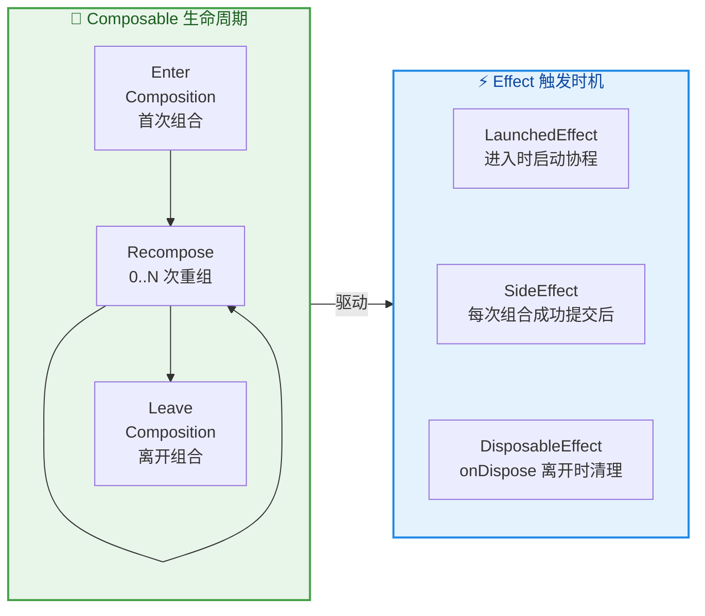
```mermaid
graph LR
    subgraph Lifecycle["🔄 Composable 生命周期"]
        direction TB
        A["Enter\nComposition\n首次组合"]
        B["Recompose\n0..N 次重组"]
        C["Leave\nComposition\n离开组合"]
        A --> B
        B --> B
        B --> C
    end

    subgraph Effects["⚡ Effect 触发时机"]
        direction TB
        D["LaunchedEffect\n进入时启动协程"]
        E["SideEffect\n每次组合成功提交后"]
        F["DisposableEffect\nonDispose 离开时清理"]
        D ~~~ E
        E ~~~ F
    end

    Lifecycle -->|"驱动"| Effects

    classDef lifecycleCls fill:#E8F5E9,stroke:#43A047,stroke-width:2px,color:#1B5E20
    classDef effectCls fill:#E3F2FD,stroke:#1E88E5,stroke-width:2px,color:#0D47A1

    class Lifecycle lifecycleCls
    class Effects effectCls
```

这个生命周期模型有几个关键特征需要牢记：

**首先，生命周期的粒度是"调用实例"而非"函数定义"。** 同一个 `@Composable` 函数如果在代码中被调用了两次（比如两个 `Greeting("Alice")` 和 `Greeting("Bob")`），它们在 Composition 中是两个独立的实例，各自拥有独立的生命周期。Compose 通过 **调用点（Call Site）** 在编译期为每个调用分配唯一的 `key`，来区分这些实例。

**其次，"离开组合"是一个确定性事件。** 当条件分支改变导致某个 Composable 不再被执行时，Compose 运行时会立即感知到它的缺失，并触发清理流程。这一点至关重要——它意味着我们可以依赖这个时机来释放资源，这正是 `DisposableEffect` 设计的基石。

**最后，重组是"可能被跳过"和"可能被取消"的。** Skipping 机制可能让某次重组跳过某些 Composable（参数未变化且稳定），而 Compose 运行时也可能因为有更新的 State 到来而取消正在进行的重组。这意味着我们不能假设每次 State 变化都一定会导致 Composable 函数体被执行。

理解了这三个阶段后，我们就可以精准地理解每个 Effect API 的设计意图：它们分别在这三个阶段的不同节点介入，为开发者提供安全执行副作用的时机。

### LaunchedEffect 协程启动

`LaunchedEffect` 是 Compose 中最常用的副作用 API，专门用于在 Composable 的生命周期内 **安全地启动协程**。它的典型签名如下：

```kotlin
// LaunchedEffect 的函数签名
@Composable
fun LaunchedEffect(
    key1: Any?,           // 用于控制协程重启的 key
    block: suspend CoroutineScope.() -> Unit  // 在协程中执行的挂起代码块
)
```

它的核心语义可以用一句话概括：**当 Composable 进入组合时，启动一个协程执行 `block`；当 Composable 离开组合或 key 发生变化时，取消该协程。**

我们来看一个典型的使用场景——进入页面后加载数据：

```kotlin
@Composable
fun UserProfileScreen(userId: String) {
    // 用于保存加载结果的状态
    var user by remember { mutableStateOf<User?>(null) }

    // LaunchedEffect 以 userId 为 key
    // 当 userId 变化时，旧协程被取消，新协程启动
    LaunchedEffect(userId) {
        // 这里的 this 是 CoroutineScope
        // 该协程会在 UserProfileScreen 离开组合时自动取消
        user = repository.fetchUser(userId) // 挂起函数，发起网络请求
    }

    // 根据 user 状态渲染 UI
    if (user != null) {
        // 展示用户信息
        Text(text = user!!.name) // 当 user 不为 null 时显示姓名
    } else {
        // 展示加载中
        CircularProgressIndicator() // 加载指示器
    }
}
```

**Key 的机制与重启语义** 是理解 `LaunchedEffect` 的关键。`LaunchedEffect` 可以接受一个或多个 key 参数。每次重组时，Compose 运行时会检查这些 key 是否与上一次组合时的值相同（通过 `equals` 比较）。如果 **任何一个 key 发生了变化**，当前正在执行的协程会被 **立即取消（cancel）**，然后以新的 key 值 **重新启动** 一个全新的协程。

这个设计解决了一个经典问题：假设用户正在查看用户 A 的资料页，此时导航到用户 B 的资料页（`userId` 从 `"A"` 变为 `"B"`），那么正在加载用户 A 数据的协程会被自动取消，转而启动加载用户 B 的协程。开发者无需手动管理取消逻辑。

如果你传入 `Unit` 或 `true` 作为 key，意味着 key 永远不会变化，协程只在 **进入组合时启动一次**，离开组合时取消——这等价于"生命周期绑定"：

```kotlin
@Composable
fun TimerScreen() {
    var seconds by remember { mutableStateOf(0) } // 计时器秒数状态

    // key 为 Unit，意味着只在进入组合时启动一次
    LaunchedEffect(Unit) {
        while (true) {                   // 无限循环
            delay(1000)                  // 每秒挂起一次
            seconds++                    // 递增秒数
        }
        // 当 TimerScreen 离开组合时，协程自动取消
        // while(true) 不会导致泄漏
    }

    Text("Timer: ${seconds}s")           // 展示当前秒数
}
```

**LaunchedEffect 的内部原理** 值得简单展开。编译后，`LaunchedEffect` 的实现本质上利用了 `remember` + `DisposableEffect` + `rememberCoroutineScope` 的组合模式。它在内部：

1. 使用 `remember(key)` 追踪 key 是否变化。
2. 如果是首次进入或 key 变化，在一个与 Composition 关联的 `CoroutineScope` 中 `launch` 新的协程。
3. 在离开组合或 key 变化触发重启前，对旧的 `Job` 调用 `cancel()`。

这个 `CoroutineScope` 的生命周期由 Composition 管控，其 `CoroutineContext` 通常包含 `Dispatchers.Main.immediate`，这意味着协程默认在主线程上启动（但遇到第一个挂起点后可能切换到其他线程）。

**常见误区提醒**：不要在 `LaunchedEffect` 中捕获频繁变化的 State 而不将其作为 key。例如：

```kotlin
// ❌ 错误示范：count 变化后，协程内的 count 仍然是旧值（闭包捕获）
@Composable
fun Wrong(count: Int) {
    LaunchedEffect(Unit) {               // key 是 Unit，永不重启
        delay(5000)                      // 5 秒后
        println("count = $count")        // 打印的是初始值，不是最新值！
    }
}

// ✅ 正确做法 1：将 count 作为 key，每次 count 变化重启协程
@Composable
fun Correct1(count: Int) {
    LaunchedEffect(count) {              // key 随 count 变化
        delay(5000)                      // 5 秒后
        println("count = $count")        // 打印的是触发重启时的 count 值
    }
}

// ✅ 正确做法 2：如果不想重启协程，使用 rememberUpdatedState
@Composable
fun Correct2(count: Int) {
    val currentCount by rememberUpdatedState(count) // 始终持有最新值的引用
    LaunchedEffect(Unit) {               // 协程只启动一次
        delay(5000)                      // 5 秒后
        println("count = $currentCount") // 通过 State 读取最新值
    }
}
```

`rememberUpdatedState` 在这里起到了"桥梁"的作用：它创建了一个 `State<T>` 对象，其值在每次重组时被更新为最新的参数值，而协程通过读取这个 State 来获取最新值，无需重启。

### DisposableEffect 清理

如果说 `LaunchedEffect` 面向的是"启动协程"场景，那 `DisposableEffect` 则面向更广泛的 **"需要配对操作"** 的场景——注册/注销监听器、绑定/解绑服务、添加/移除回调等。它的核心特征是：**必须提供一个 `onDispose` 清理回调**。

```kotlin
// DisposableEffect 的函数签名
@Composable
fun DisposableEffect(
    key1: Any?,                           // 控制重启的 key
    effect: DisposableEffectScope.() -> DisposableEffectResult  // 执行副作用并返回清理逻辑
)
```

注意这个返回值类型 `DisposableEffectResult`——它由 `onDispose { ... }` 构造，这是 **强制的**。编译器会要求 `effect` 代码块的最后一个表达式必须是 `onDispose`，否则编译报错。这个设计是故意的——它迫使开发者在编写注册逻辑的同时，立刻编写对应的注销逻辑，从而在设计层面杜绝资源泄漏。

一个经典场景是监听系统广播或生命周期事件：

```kotlin
@Composable
fun LifecycleObserverEffect(
    lifecycleOwner: LifecycleOwner = LocalLifecycleOwner.current, // 获取当前 LifecycleOwner
    onStart: () -> Unit,   // 进入 onStart 时的回调
    onStop: () -> Unit     // 进入 onStop 时的回调
) {
    // 使用 rememberUpdatedState 确保回调始终是最新的
    val currentOnStart by rememberUpdatedState(onStart)   // 包装 onStart
    val currentOnStop by rememberUpdatedState(onStop)     // 包装 onStop

    // DisposableEffect 以 lifecycleOwner 为 key
    DisposableEffect(lifecycleOwner) {
        // 创建 LifecycleEventObserver，在生命周期事件到来时分发
        val observer = LifecycleEventObserver { _, event ->
            when (event) {
                Lifecycle.Event.ON_START -> currentOnStart() // 读取最新的回调并执行
                Lifecycle.Event.ON_STOP -> currentOnStop()   // 读取最新的回调并执行
                else -> {}                                    // 忽略其他事件
            }
        }
        lifecycleOwner.lifecycle.addObserver(observer)       // 注册观察者

        // onDispose: 当 Composable 离开组合或 lifecycleOwner 变化时执行
        onDispose {
            lifecycleOwner.lifecycle.removeObserver(observer) // 注销观察者，防止泄漏
        }
    }
}
```

**DisposableEffect 的执行时序** 需要精确理解：

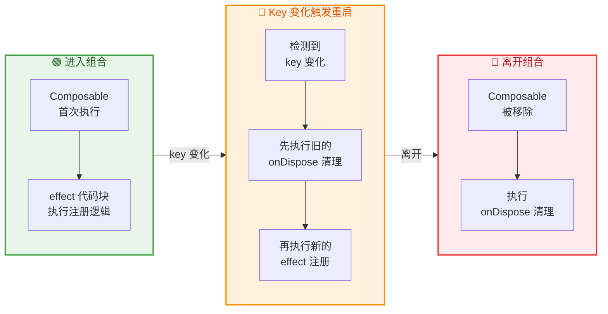
```mermaid
graph LR
    subgraph Phase1["🟢 进入组合"]
        direction TB
        A1["Composable\n首次执行"]
        A2["effect 代码块\n执行注册逻辑"]
        A1 --> A2
    end

    subgraph Phase2["🔄 Key 变化触发重启"]
        direction TB
        B1["检测到\nkey 变化"]
        B2["先执行旧的\nonDispose 清理"]
        B3["再执行新的\neffect 注册"]
        B1 --> B2
        B2 --> B3
    end

    subgraph Phase3["🔴 离开组合"]
        direction TB
        C1["Composable\n被移除"]
        C2["执行\nonDispose 清理"]
        C1 --> C2
    end

    Phase1 -->|"key 变化"| Phase2
    Phase2 -->|"离开"| Phase3

    classDef enterCls fill:#E8F5E9,stroke:#43A047,stroke-width:2px,color:#1B5E20
    classDef restartCls fill:#FFF3E0,stroke:#FB8C00,stroke-width:2px,color:#E65100
    classDef leaveCls fill:#FFEBEE,stroke:#E53935,stroke-width:2px,color:#B71C1C

    class Phase1 enterCls
    class Phase2 restartCls
    class Phase3 leaveCls
```

当 key 变化时，执行顺序是 **先 dispose 旧的，再 setup 新的**。这个顺序至关重要——它保证了在任何时刻最多只有一组注册/注销配对在生效，不会出现"注册了两次但只注销了一次"的泄漏问题。

另一个常见场景是在 Compose 中使用传统的回调式 API：

```kotlin
@Composable
fun BackPressHandler(onBack: () -> Unit) {
    // 保持对最新回调的引用
    val currentOnBack by rememberUpdatedState(onBack)
    // 获取当前的 BackPressedDispatcher
    val dispatcher = LocalOnBackPressedDispatcherOwner.current
        ?.onBackPressedDispatcher           // 从 CompositionLocal 获取

    DisposableEffect(dispatcher) {
        // 创建一个回调对象
        val callback = object : OnBackPressedCallback(true) {
            override fun handleOnBackPressed() {
                currentOnBack()              // 执行最新的 onBack 回调
            }
        }
        dispatcher?.addCallback(callback)    // 向 dispatcher 注册回调

        onDispose {
            callback.remove()                // 离开时移除回调，防止泄漏
        }
    }
}
```

**DisposableEffect 与 LaunchedEffect 的对比选择** 可以归纳为一个简单的决策规则：如果你的副作用是一个 **挂起操作**（如网络请求、延时操作、Flow 收集），选择 `LaunchedEffect`；如果你的副作用需要 **配对的注册/注销操作**（如监听器、回调、观察者），选择 `DisposableEffect`。当然，`DisposableEffect` 内部不能直接调用挂起函数（它的 `effect` 代码块不是 `suspend` 的），如果你同时需要协程和清理，可以在 `DisposableEffect` 中手动创建 `CoroutineScope` 并在 `onDispose` 中取消它，但通常更推荐拆分成两个独立的 Effect。

### SideEffect 提交后

`SideEffect` 是三个核心 Effect API 中最简单也最容易被误解的一个。它的签名极其简洁：

```kotlin
// SideEffect 的函数签名
@Composable
fun SideEffect(
    effect: () -> Unit    // 每次组合成功提交后执行的代码块
)
```

没有 key 参数，没有 `onDispose`，没有协程支持——它只是一个 **"每次成功重组后都会执行"** 的回调。

精确地说，`SideEffect` 的 `effect` 代码块会在 **Composition 成功应用（apply/commit）到 UI 树之后** 被调用。注意"成功"这个词——如果一次重组在中途被取消（因为有更新的 State 到来），那么这次重组对应的 `SideEffect` 不会执行。这保证了 `SideEffect` 中看到的 State 总是已经反映到 UI 上的最终一致状态。

`SideEffect` 最典型的应用场景是 **将 Compose 的 State 同步到非 Compose 管理的外部系统**。例如，将当前的分析数据（analytics data）同步给第三方 SDK：

```kotlin
@Composable
fun AnalyticsScreen(screenName: String, metadata: Map<String, String>) {
    // 获取 analytics 工具（通过 CompositionLocal 或 DI）
    val analytics = LocalAnalytics.current          // 从 CompositionLocal 获取分析工具

    // SideEffect：每次重组成功提交后，同步最新状态给 analytics
    SideEffect {
        // 这里的 screenName 和 metadata 保证是最新值
        analytics.updateScreenInfo(screenName, metadata) // 将最新信息同步到外部系统
    }

    // ... 正常的 UI 代码
    Text(text = "Screen: $screenName")              // 显示当前页面名称
}
```

**为什么不直接在 Composable 函数体中写 `analytics.updateScreenInfo(...)`，而要包裹在 `SideEffect` 中？** 区别在于执行时机与保证：

1. **直接写在函数体中**：在组合阶段（composition phase）执行。此时 Composition 还没有被 commit，如果这次重组后来被取消了，你就白白执行了一次无效的副作用操作。更糟糕的是，某些情况下 Compose 运行时可能以非主线程执行组合（虽然当前默认在主线程，但这不是 API 契约），直接在函数体中执行副作用可能引发线程安全问题。

2. **包裹在 `SideEffect` 中**：在提交阶段（commit/apply phase）执行。保证了这次组合的结果确实已经被应用，且保证在主线程执行。

一个更底层的使用案例是 `rememberUpdatedState` 的内部实现——它本质上就是利用 `SideEffect` 来在每次成功重组后将新值写入 `State`：

```kotlin
// rememberUpdatedState 的简化实现原理
@Composable
fun <T> rememberUpdatedState(newValue: T): State<T> {
    // 创建一个 State 对象，只在首次组合时初始化
    val state = remember { mutableStateOf(newValue) }

    // 每次重组成功提交后，更新 state 的值为最新的 newValue
    SideEffect {
        state.value = newValue  // 同步最新值到 State 对象
    }

    return state  // 返回这个 State，外部通过它始终能读到最新值
}
```

这揭示了 `SideEffect` 的本质定位：**它是 Compose 声明式世界与外部命令式世界之间的"同步桥梁"**。它不管理生命周期（没有清理逻辑），不管理异步（没有协程），它只负责"每次 UI 更新后，把最新状态告诉外部"。

**三种 Effect API 的完整对比总结**：

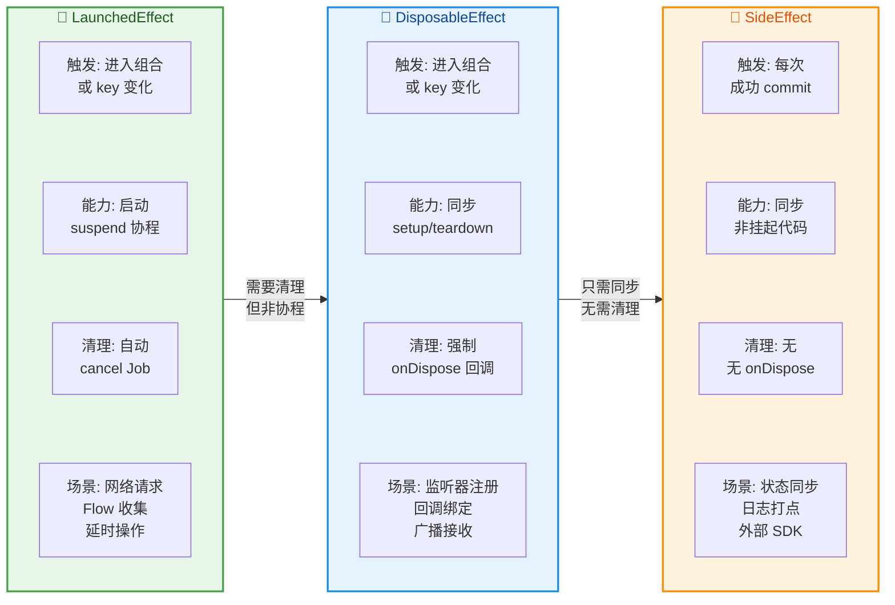
```mermaid
graph LR
    subgraph LE["🚀 LaunchedEffect"]
        direction TB
        LE1["触发: 进入组合\n或 key 变化"]
        LE2["能力: 启动\nsuspend 协程"]
        LE3["清理: 自动\ncancel Job"]
        LE4["场景: 网络请求\nFlow 收集\n延时操作"]
        LE1 ~~~ LE2
        LE2 ~~~ LE3
        LE3 ~~~ LE4
    end

    subgraph DE["🧹 DisposableEffect"]
        direction TB
        DE1["触发: 进入组合\n或 key 变化"]
        DE2["能力: 同步\nsetup/teardown"]
        DE3["清理: 强制\nonDispose 回调"]
        DE4["场景: 监听器注册\n回调绑定\n广播接收"]
        DE1 ~~~ DE2
        DE2 ~~~ DE3
        DE3 ~~~ DE4
    end

    subgraph SE["🔔 SideEffect"]
        direction TB
        SE1["触发: 每次\n成功 commit"]
        SE2["能力: 同步\n非挂起代码"]
        SE3["清理: 无\n无 onDispose"]
        SE4["场景: 状态同步\n日志打点\n外部 SDK"]
        SE1 ~~~ SE2
        SE2 ~~~ SE3
        SE3 ~~~ SE4
    end

    LE -->|"需要清理\n但非协程"| DE
    DE -->|"只需同步\n无需清理"| SE

    classDef leCls fill:#E8F5E9,stroke:#43A047,stroke-width:2px,color:#1B5E20
    classDef deCls fill:#E3F2FD,stroke:#1E88E5,stroke-width:2px,color:#0D47A1
    classDef seCls fill:#FFF3E0,stroke:#FB8C00,stroke-width:2px,color:#E65100

    class LE leCls
    class DE deCls
    class SE seCls
```

最后，还有一些衍生 API 值得简要提及。`produceState` 是 `LaunchedEffect` 的一个便捷封装，它将挂起操作的结果直接转化为 `State<T>` 供 Composable 读取；`snapshotFlow` 则可以将 Compose 的 `State` 变化转化为 `Flow`，方便在 `LaunchedEffect` 中以 Flow 的方式响应状态变化。它们都构建在上述三个核心 Effect 的基础之上。

掌握 Effect API 的关键在于理解 **生命周期对齐** 的思想：你的副作用需要在什么时候启动？需要在什么时候清理？是否需要随某个参数变化而重启？回答了这三个问题，选择正确的 Effect API 就是水到渠成的事。

---

**📝 练习题**

在以下代码中，`LaunchedEffect` 的行为是什么？

```kotlin
@Composable
fun SearchScreen(query: String) {
    var results by remember { mutableStateOf(emptyList<String>()) }
    LaunchedEffect(query) {
        delay(300)
        results = repository.search(query)
    }
    ResultList(results)
}
```

当用户快速连续输入 "a" → "ab" → "abc" 时，`repository.search()` 最终被成功执行了几次？

A. 3 次，每次输入都会完整执行一次搜索


B. 1 次，只有最后的 "abc" 会完成搜索（前两次因 key 变化协程被取消）


C. 0 次，因为 `delay(300)` 导致所有协程都被取消


D. 3 次，但只有最后一次的结果会被显示


**【答案】** B

**【解析】** `LaunchedEffect` 的 key 是 `query`。当用户输入 "a" 时，启动一个协程执行 `delay(300)` 然后搜索。但在 300ms 内用户又输入了 "ab"，此时 `query` 从 "a" 变为 "ab"，旧协程（正在 `delay`）被 **取消（cancel）**，新协程启动。同理 "ab" 的协程也因 "abc" 的到来被取消。只有 "abc" 对应的协程在 300ms 的 `delay` 后没有被打断，成功执行了 `repository.search("abc")`。这实际上是一种 **防抖（debounce）** 模式——通过 key 变化触发的协程取消 + `delay` 组合实现。需要注意的是，如果两次输入之间的间隔超过 300ms，那么前一次搜索也会成功执行，所以"快速连续输入"是关键前提。

---

## 稳定性系统

在前面章节中，我们已经深入探讨了重组机制（Recomposition）的运作方式——Compose Runtime 能够在状态发生变化时，精确地跳过（Skip）那些"输入未变"的 Composable 函数，从而避免不必要的重新执行。但问题在于：**Runtime 如何判断一个参数"没有变化"？** 这个看似简单的问题，背后对应着一套精密的 **稳定性系统（Stability System）**。它是 Compose 编译器插件与运行时协同工作的产物，直接决定了 Skipping 优化能否生效，是 Compose 性能模型中最核心、也最容易被误解的一环。

稳定性系统要解决的根本矛盾是：**Kotlin/JVM 的类型系统并没有提供"这个对象是否会在观察之外发生变化"这一语义信息**。`equals()` 方法可以告诉我们两个值"当前是否相等"，却无法保证一个对象"在两次比较之间不会悄悄改变"。举例来说，一个普通的 `data class User(var name: String)` 拥有结构化的 `equals()`，但由于 `name` 是 `var`，Runtime 在第一次比较后无法确定它不会被外部代码修改。如果 Runtime 基于上一次 `equals()` 的结果就决定跳过重组，而对象实际已被突变（mutated），那 UI 就会呈现过期数据——这是绝对不可接受的。因此，Compose 引入了"稳定"（Stable）这一概念来做出承诺：**如果一个类型是稳定的，那么当它的 `equals()` 返回 `true` 时，Runtime 可以安全地认为"这个值在可观察范围内确实没有变化"，从而放心地执行 Skipping。**

从宏观视角看，稳定性系统的工作流是这样的：**编译期**，Compose Compiler Plugin 会分析每个 Composable 函数的参数类型，推断其稳定性，并据此决定是否为该函数生成 Skipping 逻辑；**运行期**，当 Recomposition 发生时，Runtime 根据编译器注入的比较代码，对比新旧参数值——只有当 **所有参数都是稳定的** 且 **`equals()` 均返回 `true`** 时，才会跳过该函数的执行。任何一个参数被判定为"不稳定"（Unstable），整个函数的 Skipping 能力就会丧失。

这一设计哲学体现了 Compose 的保守安全策略（conservative-safe strategy）：**宁可多做一次重组（正确但略慢），也绝不跳过一次本应执行的重组（错误且不可逆）。** 理解了这个大前提，我们才能真正理解下面每个注解和推断规则存在的意义。

### @Stable 注解

`@Stable` 是稳定性系统的基石注解，定义在 `androidx.compose.runtime` 包中。它向 Compose 编译器做出一个 **契约级别的声明（Contract）**：被标注的类型满足以下三个条件——

第一，**`equals()` 的一致性（Consistent equality）**：对于同一对两个实例的调用，`equals()` 必须始终返回相同的结果。这意味着，如果 `a.equals(b)` 在某一时刻返回 `true`，那么只要 `a` 和 `b` 都没有被"以 Compose 可观察的方式"修改过，后续调用依然应返回 `true`。注意，这里的关键词是"Compose 可观察的方式"——如果一个属性通过 `MutableState` 改变，那 Compose 是能感知的；但如果它是普通 `var` 被外部悄悄改了，Compose 就无从得知。

第二，**公共属性变化的可通知性（Observable mutation）**：当类型的任何公共属性发生变化时，Compose 必须能得到通知。实际上这意味着，如果类型含有可变属性，这些属性应该用 `MutableState` 来持有，这样 Snapshot 系统就能自动追踪它们的读写。

第三，**公共属性自身也必须是稳定的（Recursive stability）**：一个类型的稳定性是递归定义的。如果 `User` 类型有一个 `address: Address` 属性，那么 `Address` 也必须是稳定的，否则 `User` 整体就不稳定。

看一个使用 `@Stable` 的典型场景——一个包含可变状态但仍然"稳定"的类：

```kotlin
// 使用 @Stable 标注，向编译器承诺该类型满足稳定性契约
@Stable
class CounterState {
    // 可变属性使用 mutableStateOf 持有
    // 这样变化能被 Snapshot 系统追踪，满足"可通知性"要求
    var count by mutableStateOf(0)
        private set // 仅对外暴露只读语义，内部控制变化

    // 公开的修改方法——修改通过 MutableState 发生
    // Compose 会感知到 count 的变化并触发正确的重组
    fun increment() {
        count++ // 底层是 MutableState.setValue()，会写入 Snapshot
    }
}
```

这里有一个非常重要的认知要强调：**`@Stable` 并不意味着不可变**。恰恰相反，`@Stable` 的设计意图就是为了处理"可变但可追踪"的场景。上面的 `CounterState` 有一个会变化的 `count` 属性，但因为它通过 `mutableStateOf` 持有，所有变化都在 Snapshot 系统的监控之下，所以它完全满足 `@Stable` 契约。这正是 `@Stable` 与 `@Immutable` 的核心区分点。

再看一个反面例子——**标注了 `@Stable` 但实际违反契约**的情况：

```kotlin
// ⚠️ 错误示范：标注了 @Stable 但违反了契约
@Stable
class UserProfile {
    // 使用普通 var 而非 mutableStateOf
    // 当 name 被外部修改时，Compose 无法感知
    var name: String = "Alice" // 违反"可通知性"条件
}
```

在这种情况下，编译器会信任 `@Stable` 注解并生成 Skipping 代码。但如果外部代码直接修改了 `name`，由于不经过 Snapshot 系统，Compose 不会察觉变化，UI 就不会更新——这是一个隐蔽的 Bug。编译器 **不会** 验证你的 `@Stable` 声明是否属实；它完全基于信任。这就是为什么说 `@Stable` 是一个"契约"而非"校验"——**你在向编译器做出承诺，责任由你承担**。

从编译器视角看，当 Compose Compiler Plugin 看到一个参数类型被标注了 `@Stable`，它会为该参数生成 `$changed` flag 中的比较分支。在运行时，对应的逻辑大致是：先检查该参数在 Slot Table 中的旧值与新值是否 `equals()`，如果相等则标记该参数为"未变化"。当函数的所有参数均为"未变化"时，函数体被整体跳过。

`@Stable` 还可以被施加在接口、抽象类上，用来约束其所有实现者。例如 Compose 自身的 `MutableState<T>` 接口就被标注为 `@Stable`，这确保了任何 `MutableState` 的实现都被视为稳定的。

### @Immutable 注解

`@Immutable` 是比 `@Stable` 更强的一个注解，它向编译器声明：**该类型的实例一旦创建，其所有公共属性就永远不会再改变**。换言之，一个 `@Immutable` 类型不仅满足 `@Stable` 的全部条件，还额外保证了"不存在可变性"这一更强的约束。

从逻辑上说，`@Immutable` 是 `@Stable` 的子集关系（Subset）：**所有 Immutable 类型一定是 Stable 的，但并非所有 Stable 类型都是 Immutable 的。** 一个含有 `MutableState` 属性的类可以是 `@Stable`（变化可追踪），但绝不能是 `@Immutable`（因为它确实会变）。

```kotlin
// 使用 @Immutable 标注，声明该类型完全不可变
@Immutable
data class UiConfig(
    val primaryColor: Long,   // val + 基本类型 → 天然不可变
    val fontSize: Float,      // val + 基本类型 → 天然不可变
    val title: String         // val + String(不可变类型) → 安全
)
```

上面的 `UiConfig` 是 `@Immutable` 的理想候选者：所有属性都是 `val`，且类型均为基本类型或 `String`（本身不可变）。一旦实例创建，就不存在任何修改的可能性。

从编译器优化的角度来看，在早期版本的 Compose Compiler 中，`@Immutable` 和 `@Stable` 在实际生成的代码上几乎没有区别——它们都会使参数被视为"可比较的、可跳过的"。但在概念层面，`@Immutable` 传达的语义更强，为未来潜在的优化留下了空间。例如，编译器理论上可以对 `@Immutable` 类型做更激进的缓存策略，因为它知道这些对象永远不会改变。

需要特别注意的是 `@Immutable` 的一个常见陷阱——**属性类型本身的可变性**：

```kotlin
// ⚠️ 隐患示范：val 持有的引用指向可变对象
@Immutable
data class ScreenState(
    val items: List<String> // List 是接口，实际可能是 MutableList
)
```

虽然 `items` 属性是 `val`（引用不可变），但 `List<String>` 在 Kotlin 中只是一个接口——实际传入的对象完全可能是 `MutableList`，外部代码可以通过持有的同一引用去添加或删除元素。这种情况下，`@Immutable` 的契约就被违反了。正确的做法是使用 Kotlinx Immutable Collections 库提供的 `ImmutableList`（或 `PersistentList`），或者确保在构造时进行防御性拷贝（defensive copy）。

在实际项目中，选择 `@Stable` 还是 `@Immutable` 的经验法则如下：

- **纯数据、全 `val`、无可变集合** → 优先用 `@Immutable`，语义最明确。
- **含 `MutableState` 属性的状态持有者（State Holder）** → 用 `@Stable`，因为有受控的可变性。
- **不确定** → 默认用 `@Stable`，它的要求更宽松，违反契约的风险更小。

### 类型稳定性推断

在大多数实际开发中，开发者并不需要手动为每个类添加 `@Stable` 或 `@Immutable` 注解。Compose Compiler Plugin 内置了一套 **自动稳定性推断（Automatic Stability Inference）** 机制，能够在编译期静态分析类型的结构，自动判定其稳定性。理解这套推断规则，是掌握 Compose 性能模型的关键。

**推断规则的核心逻辑**可以概括为：**一个类型是稳定的，当且仅当它的所有公共属性都是稳定的，且这些属性要么是不可变的（`val`），要么其变化可以被 Compose 追踪（`MutableState`）。**

具体来说，编译器会按照以下规则进行判定：

**天然稳定的基本类型（Primitives & Built-in Stable Types）**：所有 Kotlin 基本类型——`Int`、`Long`、`Float`、`Double`、`Boolean`、`Char`、`Byte`、`Short`——都被视为稳定的。`String` 也是稳定的，因为它在 JVM 上是不可变的。`Unit` 和函数类型（如 `() -> Unit`、`(Int) -> String`）同样被视为稳定的。这些构成了稳定性推断的"基准锚点"。

**枚举类（Enum Classes）**：所有枚举类天然稳定。因为枚举值是固定的常量集合，不会在运行时改变。

**`data class` 的推断**：这是最常见的场景。编译器会逐一检查 `data class` 的每个属性。如果 **所有属性** 都满足以下条件之一，则该 `data class` 被推断为稳定的：

1. 属性是 `val` 且类型本身是稳定的（例如 `val name: String`）。
2. 属性是通过 `MutableState` 持有的（例如 `var count by mutableStateOf(0)`）。

反之，只要有 **任何一个属性** 不满足条件，整个类就被判定为不稳定。

```kotlin
// ✅ 编译器自动推断为 Stable
// 原因：所有属性都是 val，且类型均为基本类型或 String
data class UserInfo(
    val id: Int,       // Int → 基本类型，稳定
    val name: String,  // String → 不可变类型，稳定
    val age: Int       // Int → 基本类型，稳定
)

// ❌ 编译器自动推断为 Unstable
// 原因：var 属性未通过 MutableState 持有，变化不可追踪
data class MutableUser(
    val id: Int,       // 稳定
    var name: String   // var + 非 MutableState → 不稳定！
)

// ❌ 编译器自动推断为 Unstable
// 原因：List 是接口，编译器无法保证其运行时实现是不可变的
data class TodoList(
    val items: List<String> // List<T> 在 Compose Compiler 中默认不稳定
)
```

最后一个例子尤其值得注意：**`List`、`Set`、`Map` 等 Kotlin 标准集合接口，在 Compose Compiler 的默认推断规则中被视为不稳定的**。这是因为它们只是只读接口（read-only interfaces），并不保证底层实现的不可变性。一个 `List<String>` 在运行时可能是 `ArrayList`，外部可以将其向下转型后进行修改。这是实际开发中最常见的"意外不稳定"来源。

**解决集合不稳定性的方案**有几种：

第一种是使用 `kotlinx.collections.immutable` 库提供的真正不可变集合类型（如 `ImmutableList`、`PersistentList`），它们在 Compose Compiler 中被识别为稳定的。

第二种是在 Compose Compiler 1.5.5+ 版本中引入的 **稳定性配置文件（Stability Configuration File）** 机制。你可以创建一个配置文件，显式告诉编译器某些类型应被视为稳定的：

```text
// stability_config.conf
// 告诉 Compose Compiler 将以下类型视为稳定的
java.util.UUID
kotlin.collections.List
kotlin.collections.Map
kotlin.collections.Set
```

然后在 `build.gradle.kts` 中配置：

```kotlin
// 在模块级 build.gradle.kts 中配置 Compose Compiler 的稳定性文件
composeCompiler {
    // 指定稳定性配置文件路径
    stabilityConfigurationFile =
        rootProject.layout.projectDirectory.file("stability_config.conf")
}
```

第三种是最直接的手动标注——在类上添加 `@Stable` 或 `@Immutable`，强行覆盖编译器的推断结果。

**跨模块推断的限制** 是另一个极其重要的实战知识点。Compose Compiler Plugin 的稳定性推断 **仅作用于当前编译模块内部的类型**。如果一个类型定义在另一个没有启用 Compose Compiler 的模块中（比如你的 `:domain` 或 `:data` 模块仅包含纯 Kotlin 代码，未应用 Compose 插件），那么该类型在 Compose 编译器的视角中是完全不透明的——**默认被视为不稳定**。即使它是一个所有属性均为 `val` 的完美 `data class`。

```kotlin
// ===== :domain 模块（未启用 Compose Compiler） =====
// 纯 Kotlin 模块中定义的数据类
data class Product(
    val id: String,   // 虽然全是 val
    val name: String, // 且类型都是基本/不可变类型
    val price: Double // 但由于所在模块无 Compose Compiler → Unstable
)

// ===== :app 模块（启用了 Compose Compiler） =====
@Composable
fun ProductCard(product: Product) { // product 参数被视为 Unstable
    // 因为 Product 不稳定，该函数 永远不会被 Skip
    // 每次父级重组都会导致 ProductCard 重新执行
    Text(text = product.name)
}
```

这在多模块架构中是非常常见的性能陷阱。解决方案包括：在数据模块也启用 Compose Compiler 插件（Compose Compiler 2.0+ 已独立于 Compose UI 库，可以单独应用）；使用稳定性配置文件进行全局声明；或在 UI 层将外部类型包装为本模块内的稳定类型。

为了在开发阶段诊断稳定性问题，Compose Compiler 提供了 **编译器报告（Compiler Reports）** 功能。通过在 Gradle 配置中启用：

```kotlin
// 在 build.gradle.kts 中开启 Compose 编译器指标报告
composeCompiler {
    // 启用指标收集（函数/类的稳定性统计信息）
    metricsDestination = layout.buildDirectory.dir("compose_metrics")
    // 启用详细报告（每个类/函数的稳定性判定明细）
    reportsDestination = layout.buildDirectory.dir("compose_reports")
}
```

编译后，你可以在输出目录中找到 `.txt` 格式的报告文件，清楚地列出每个类型的稳定性判定结果和每个 Composable 函数的可跳过性（Skippable / Restartable）状态。这是性能调优的第一手资料。

下面用一张图来总结编译器的稳定性推断决策流程：

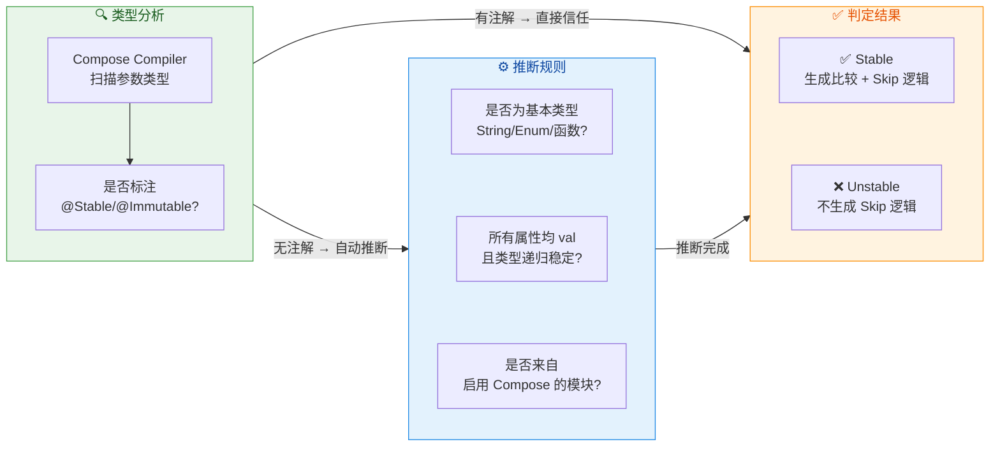
```mermaid
graph LR
    subgraph Analyze["🔍 类型分析"]
        direction TB
        A["Compose Compiler\n扫描参数类型"]
        B["是否标注\n@Stable/@Immutable?"]
        A --> B
    end

    subgraph Infer["⚙️ 推断规则"]
        direction TB
        C["是否为基本类型\nString/Enum/函数?"]
        D["所有属性均 val\n且类型递归稳定?"]
        E["是否来自\n启用 Compose 的模块?"]
        C ~~~ D
        D ~~~ E
    end

    subgraph Result["✅ 判定结果"]
        direction TB
        F["✅ Stable\n生成比较 + Skip 逻辑"]
        G["❌ Unstable\n不生成 Skip 逻辑"]
        F ~~~ G
    end

    Analyze -->|"有注解 → 直接信任"| Result
    Analyze -->|"无注解 → 自动推断"| Infer
    Infer -->|"推断完成"| Result

    classDef analyzeStyle fill:#E8F5E9,stroke:#43A047,color:#1B5E20
    classDef inferStyle fill:#E3F2FD,stroke:#1E88E5,color:#0D47A1
    classDef resultStyle fill:#FFF3E0,stroke:#FB8C00,color:#E65100
    class Analyze analyzeStyle
    class Infer inferStyle
    class Result resultStyle
```

### Skipping 优化条件

理解了稳定性之后，我们可以完整地梳理 Compose 实现 Skipping（跳过重组）所需满足的 **全部条件**。这几个条件必须 **同时成立**，缺一不可：

**条件一：函数必须是 Restartable 的。** Compose Compiler 会将绝大多数顶层 Composable 函数标记为 Restartable（可重启的），这意味着它能独立地作为重组的入口点被 Runtime 调度。但有些函数不会被标记为 Restartable——例如 `inline` 的 Composable 函数（因为它们在编译期就被内联到调用点了，不存在独立的重组边界），以及返回值非 `Unit` 的 Composable 函数（如 `@Composable fun computeColor(): Color`）。不可重启的函数自然也不可能被跳过。

**条件二：函数的所有参数都必须是稳定的（Stable）。** 这正是上文详述的稳定性系统的作用所在。只要有一个参数类型是 Unstable 的，编译器就 **不会** 为该函数生成任何比较和跳过逻辑——函数在每次父级重组时都会被无条件执行。这是一个"全有或全无"（all-or-nothing）的设计：不存在"部分参数跳过"的概念。

**条件三：所有稳定参数的新旧值必须通过 `equals()` 判定为相等。** 在运行时，当重组波及到某个 Composable 函数时，Runtime 会将当前传入的参数值与 Slot Table 中存储的上一次的值逐一进行 `equals()` 比较。只有当 **全部** 参数都 `equals` 为 `true` 时，函数才被跳过。任何一个参数不等，函数都会重新执行。

让我们把三个条件综合起来看一个完整的例子：

```kotlin
// === 数据类型定义 ===

// ✅ 所有属性为 val + 基本类型 → 编译器推断为 Stable
data class StableItem(
    val id: Int,
    val label: String
)

// ❌ 含有 List 属性 → 编译器推断为 Unstable
data class UnstableItem(
    val id: Int,
    val tags: List<String> // List 默认不稳定
)

// === Composable 函数定义 ===

// ✅ Skippable：参数 StableItem 是稳定的
// 编译器会生成比较 + Skip 逻辑
@Composable
fun StableCard(item: StableItem) {
    // 若 item 与上一次 equals 相等，则整个函数被跳过
    Text(text = item.label)
}

// ❌ NOT Skippable：参数 UnstableItem 是不稳定的
// 编译器不会生成 Skip 逻辑，每次父级重组都会重新执行
@Composable
fun UnstableCard(item: UnstableItem) {
    // 即使 item 内容实际未变，也会每次重新执行
    Text(text = item.tags.joinToString())
}

// ❌ NOT Skippable：混合稳定与不稳定参数
// 只要有一个参数不稳定，整个函数就无法 Skip
@Composable
fun MixedCard(
    title: String,          // String → 稳定 ✅
    item: UnstableItem      // UnstableItem → 不稳定 ❌
) {
    // 由于 item 不稳定，MixedCard 永远不会被跳过
    Text(text = "$title: ${item.id}")
}
```

下面从编译器生成代码的角度来看 Skipping 的内部机制。当编译器确定一个函数可以 Skip 时，它会在函数体的入口处注入类似如下的伪逻辑：

```kotlin
// ===== 编译器生成的 Skipping 逻辑伪代码 =====
// 原始函数签名: fun StableCard(item: StableItem)
// 编译器改写后的实际签名（简化示意）:
fun StableCard(
    item: StableItem,       // 原始参数
    $composer: Composer,    // 编译器注入的 Composer 上下文
    $changed: Int           // 编译器注入的变化位掩码（bitmask）
) {
    // 1️⃣ 启动 Restart Group（标记重组边界）
    $composer.startRestartGroup(uniqueKey)

    // 2️⃣ 检查是否可以跳过
    // $changed 中的位标记携带了调用者传递的"参数是否确定已变"的信息
    // 如果调用者已知参数未变，会在 $changed 中设置对应位
    // Runtime 结合 $changed 标记和实际 equals 比较做最终决策
    if ($changed and 0b0001 == 0) {
        // 调用者未能确定参数是否变化 → 需要运行时比较
        // 从 Slot Table 取出上一次的 item 值进行 equals 比较
        val isItemSame = $composer.changed(item).not()
        if (isItemSame) {
            // 所有参数均未变化 → 跳过函数体执行
            $composer.skipToGroupEnd()  // 快速跳过整个 Group
            return                      // 直接返回，函数体不执行
        }
    }

    // 3️⃣ 参数有变化 → 正常执行函数体
    Text(text = item.label)

    // 4️⃣ 结束 Restart Group，并注册 lambda 以便后续重组时可重新进入
    $composer.endRestartGroup()?.updateScope { nextComposer, nextChanged ->
        // 重组时的回调：使用新 Composer 重新调用自身
        StableCard(item, nextComposer, nextChanged)
    }
}
```

`$changed` 参数是一个整数位掩码（bitmask），每两位对应一个参数的状态信息。它有三种主要状态：**Same**（确定未变）、**Different**（确定已变）、**Uncertain**（不确定，需运行时比较）。调用方如果能在编译期或上层重组时就确定某参数未变（例如传入的是一个常量或 `remember` 缓存的值），就会直接设置 `Same` 位，运行时甚至不需要调用 `equals()`。这种 **多级快速路径（Multi-level Fast Path）** 设计极大减少了运行时的比较开销。

最后，补充几个实战中容易踩坑的 Skipping 相关问题：

**Lambda 参数的稳定性**：函数类型本身是稳定的，但 **Lambda 捕获的变量** 会影响其 `equals()` 行为。在 Kotlin 中，每次重组时创建的非记忆化 Lambda（non-memoized lambda）通常是一个新的实例，导致 `equals()` 为 `false`。Compose Compiler 会尽力对 Lambda 进行记忆化（自动用 `remember` 包装），但在某些情况下（如 Lambda 捕获了不稳定的变量），记忆化无法生效，Lambda 就成为"永远不等"的参数，导致子 Composable 永远无法被 Skip。这时可以手动使用 `remember` + 函数引用来稳定化 Lambda。

**Strong Skipping Mode**：在 Compose Compiler 较新的版本中引入了 **Strong Skipping Mode**，它改变了默认行为：即使参数类型不稳定，编译器也会生成比较逻辑——只不过对不稳定参数使用 **引用相等（`===`）** 而非 `equals()` 进行比较。这意味着如果传入的是"同一个对象实例"，即使类型不稳定也可以跳过。Strong Skipping Mode 可通过编译器选项开启（从 Compose Compiler 2.0 开始已经默认启用），它显著降低了手动管理稳定性的负担，但开发者仍然需要理解其原理以处理边界情况。

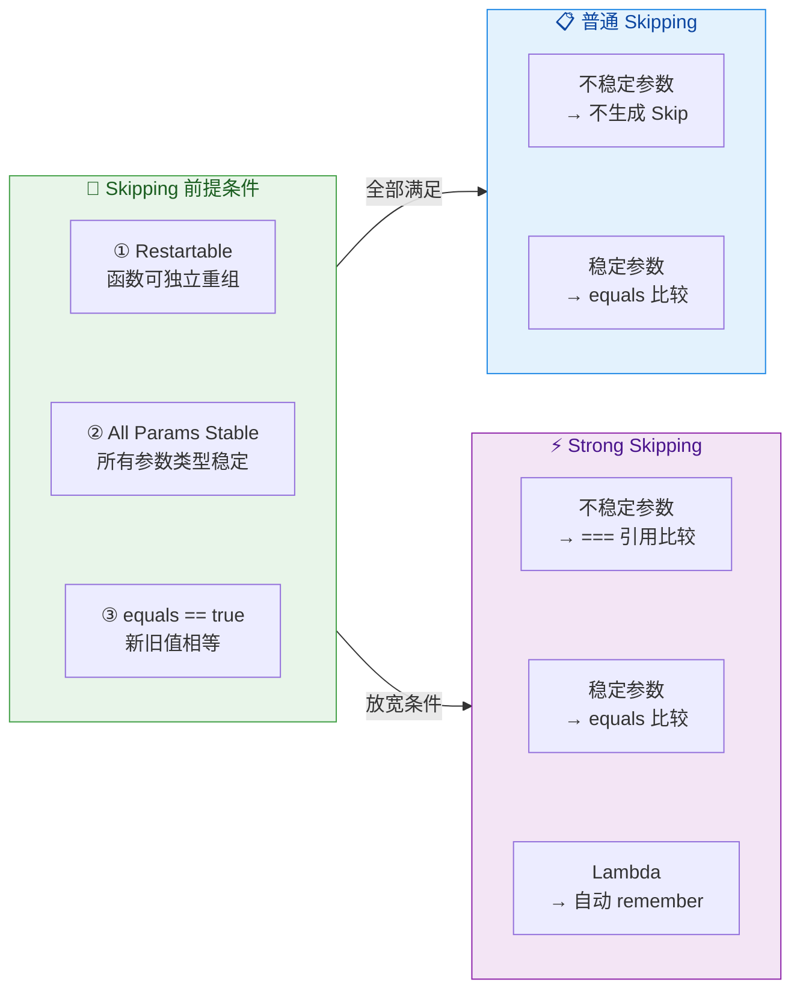
```mermaid
graph LR
    subgraph Conditions["🔑 Skipping 前提条件"]
        direction TB
        C1["① Restartable\n函数可独立重组"]
        C2["② All Params Stable\n所有参数类型稳定"]
        C3["③ equals == true\n新旧值相等"]
        C1 ~~~ C2
        C2 ~~~ C3
    end

    subgraph Normal["📋 普通 Skipping"]
        direction TB
        N1["不稳定参数\n→ 不生成 Skip"]
        N2["稳定参数\n→ equals 比较"]
        N1 ~~~ N2
    end

    subgraph Strong["⚡ Strong Skipping"]
        direction TB
        S1["不稳定参数\n→ === 引用比较"]
        S2["稳定参数\n→ equals 比较"]
        S3["Lambda\n→ 自动 remember"]
        S1 ~~~ S2
        S2 ~~~ S3
    end

    Conditions -->|"全部满足"| Normal
    Conditions -->|"放宽条件"| Strong

    classDef condStyle fill:#E8F5E9,stroke:#43A047,color:#1B5E20
    classDef normalStyle fill:#E3F2FD,stroke:#1E88E5,color:#0D47A1
    classDef strongStyle fill:#F3E5F5,stroke:#8E24AA,color:#4A148C
    class Conditions condStyle
    class Normal normalStyle
    class Strong strongStyle
```

总结来说，Skipping 优化的完整决策链条是：**编译器推断/标注确定稳定性 → 为稳定函数生成比较代码 → 运行时逐参数比较 → 全部相等则跳过**。在 Strong Skipping Mode 下，这个链条被放宽为：**所有函数都生成比较代码 → 稳定参数用 `equals()` 比较，不稳定参数用 `===` 比较 → 全部通过则跳过**。无论哪种模式，理解稳定性系统都是掌控 Compose 性能的前提。

---

**📝 练习题**

在一个多模块 Android 项目中，`:domain` 模块（纯 Kotlin 模块，未启用 Compose Compiler Plugin）中定义了如下数据类：

```kotlin
// :domain 模块
data class Article(val id: Long, val title: String, val content: String)
```

在 `:app` 模块（已启用 Compose Compiler）中，有如下 Composable 函数：

```kotlin
// :app 模块
@Composable
fun ArticleCard(article: Article) {
    Column {
        Text(text = article.title)
        Text(text = article.content)
    }
}
```

在 **未开启 Strong Skipping Mode** 的情况下，当父级 Composable 发生重组并再次调用 `ArticleCard`，传入一个 `equals()` 为 `true` 的 `Article` 实例时，以下说法正确的是：

A. `ArticleCard` 会被跳过，因为 `Article` 是 `data class` 且所有属性均为 `val` + 基本/不可变类型


B. `ArticleCard` 不会被跳过，因为 `Article` 定义在未启用 Compose Compiler 的模块中，被视为 Unstable


C. `ArticleCard` 会被跳过，因为 Compose Runtime 会在运行时用反射检测 `Article` 的属性结构


D. `ArticleCard` 会被跳过，因为 `data class` 自动生成的 `equals()` 已足以让 Runtime 做出判断


**【答案】** B

**【解析】** Compose Compiler Plugin 的稳定性推断 **仅对当前启用了该插件的模块内定义的类型生效**。`:domain` 模块是纯 Kotlin 模块，未应用 Compose Compiler Plugin，因此 `Article` 类在编译时不会被 Compose 分析和标注稳定性元数据。当 `:app` 模块中的 Composable 函数引用 `Article` 作为参数类型时，Compose Compiler 无法获取其稳定性信息，只能保守地将其视为 **Unstable**。既然参数类型不稳定，编译器就 **不会** 为 `ArticleCard` 生成 Skipping 逻辑，该函数在每次父级重组时都会无条件地重新执行，即使传入的 `Article` 实例在 `equals()` 意义上完全相同。选项 A 的推理如果 `Article` 定义在 `:app` 模块内是正确的，但跨模块后就失效了。选项 C 错误，Compose 不使用反射来推断稳定性，一切都在编译期决定。选项 D 错误，`equals()` 的存在只是 Skipping 的运行时条件之一，前提是编译器已经判定类型为 Stable 并生成了比较代码。解决该问题的方案包括：在 `:domain` 模块也启用 Compose Compiler 插件、使用稳定性配置文件声明 `Article` 为稳定、或在 `:app` 模块中手动包装一个 `@Stable` / `@Immutable` 类型。

---

## 位置记忆化（Positional Memoization）

在传统函数式编程中，**记忆化（Memoization）** 是一种经典优化手段——缓存函数的计算结果，当输入不变时直接返回缓存值，避免重复计算。然而 Compose 面临一个独特挑战：Composable 函数 **没有显式的实例标识**。它不像 View 系统中每个控件都有唯一对象引用，Composable 只是一个被反复调用的函数。那么问题来了——既然函数没有"身份"，Compose Runtime 该把缓存的数据 **存在哪里**，又该如何在重组时 **找回它**？

答案就是 **位置记忆化（Positional Memoization）**。Compose 不依赖对象引用来定位数据，而是利用 **函数在组合树（Composition Tree）中的调用位置** 作为天然的身份标识。每一次 `remember { ... }` 调用，其缓存值都与"这个 `remember` 出现在代码中的哪个位置"绑定。只要该位置在重组中仍然被执行到，之前存储的值就能被精准取回。这一机制是 Compose 状态管理的 **底层基石**——`mutableStateOf`、`remember`、`rememberSaveable`，乃至动画 API 内部，都建立在它之上。

理解位置记忆化，就理解了 Compose 如何在"无实例"的函数式世界中实现有状态的 UI 构建。

---

### remember 原理

#### 从问题出发：函数重组时局部变量会丢失

先看一个最朴素的写法：

```kotlin
@Composable
fun Counter() {
    // 每次重组都会重新执行这一行，count 永远被重置为 0
    var count = 0
    Button(onClick = { count++ }) {
        Text("Clicked $count times")
    }
}
```

这段代码 **永远无法正常工作**。原因很简单：`Counter()` 是一个函数，每次重组（Recomposition）都意味着函数被重新调用，`var count = 0` 每次都会把 `count` 重新初始化为 `0`。即使在 `onClick` 里执行了 `count++`，下一次重组时 `count` 又回到了零点。局部变量的生命周期与函数调用栈绑定，函数返回即销毁——这是 JVM 的基本规则，Compose 无法改变。

因此，Compose 需要一种机制，把某些值 **"提升"到函数调用之外**，使其生命周期跨越多次重组。这就是 `remember` 的核心职责。

#### remember 的本质：在 SlotTable 中存/取值

`remember` 的签名看似简单：

```kotlin
// remember 接受一个 lambda（calculation），仅在首次组合时执行
// 后续重组时，直接从 SlotTable 对应位置取回缓存值
@Composable
inline fun <T> remember(calculation: @DisallowComposableCalls () -> T): T =
    // currentComposer 是编译器注入的 Composer 实例
    // cache 方法是真正执行存取的核心
    currentComposer.cache(invalid = false, calculation)
```

这里的关键在于 `currentComposer.cache()`。`currentComposer` 就是编译器插件在每个 Composable 函数签名中 **隐式注入的 `Composer` 参数**（在前面"Composable 函数"章节中已详细说明）。`Composer` 内部维护着一张称为 **SlotTable** 的数据结构——可以将其理解为一张巨大的线性表格，组合树中每一个 Composable 调用点所需要持久化的数据（State、remember 值、Group 信息等）都按位置顺序排列在其中。

当 Compose Runtime 执行到某个 `remember` 调用时，大致流程如下：

1. **确定当前位置**：Composer 内部维护一个 **游标（cursor/slot index）**，随着组合过程的推进逐步向前移动。每一次进入 `remember`（或其他需要存储数据的 API），游标指向 SlotTable 中与该调用位置对应的 slot。

2. **首次组合（Initial Composition）**：SlotTable 在该位置还没有数据。Composer 会执行 `calculation` lambda，将计算结果 **写入**（insert）当前 slot，然后游标前移。

3. **后续重组（Recomposition）**：Composer 到达同一位置时，发现 slot 已有数据。只要 `invalid` 参数为 `false`（即无失效信号），就 **跳过** `calculation`，直接 **读取**（read）缓存值并返回。

这种"首次写入、后续读取"的模式，就是 **位置记忆化** 的核心行为。

```text
// 概念模型：SlotTable 与 remember 的关系
// ┌─────────────────────────── SlotTable ──────────────────────────┐
// │ Slot 0    │ Slot 1       │ Slot 2      │ Slot 3    │ ...      │
// │ Group:    │ remember #1  │ remember #2 │ Group:    │          │
// │ Counter() │ count = 3    │ name = "Hi" │ Text()    │          │
// └───────────┴──────────────┴─────────────┴───────────┴──────────┘
//                ▲                 ▲
//                │                 │
//          cursor 到达时          cursor 继续前移
//          读取 count=3          读取 name="Hi"
```

需要特别强调的是：SlotTable 的存储是 **按执行顺序线性排列** 的，而非按"变量名"或"对象引用"索引。这意味着 **调用顺序一旦改变，数据就会错位**。这也是 Compose 要求 Composable 函数 **不能在条件分支中随意改变调用顺序** 的根本原因。

#### 带参数的 remember：输入变化时重新计算

`remember` 还有一组接受 `key` 参数的重载：

```kotlin
// 单 key 版本：当 key1 发生变化时，重新执行 calculation
@Composable
inline fun <T> remember(
    key1: Any?,                                    // 用于判断缓存是否失效的依赖项
    calculation: @DisallowComposableCalls () -> T   // 失效时重新执行的计算逻辑
): T = currentComposer.cache(
    invalid = currentComposer.changed(key1),       // changed() 对比上次存储的 key 值
    calculation
)

// 双 key 版本：任意一个 key 变化即触发重新计算
@Composable
inline fun <T> remember(
    key1: Any?,
    key2: Any?,
    calculation: @DisallowComposableCalls () -> T
): T = currentComposer.cache(
    invalid = currentComposer.changed(key1) or currentComposer.changed(key2),
    calculation
)

// vararg 版本：支持任意数量的 key
@Composable
inline fun <T> remember(
    vararg keys: Any?,
    calculation: @DisallowComposableCalls () -> T
): T = currentComposer.cache(
    invalid = keys.any { currentComposer.changed(it) },  // 遍历检查每个 key
    calculation
)
```

`currentComposer.changed(key)` 的工作原理是：将本次传入的 `key` 与 SlotTable 中 **上一次存储的同位置的 key 值** 进行比较（使用 `equals`）。如果不同，返回 `true`，表示缓存已失效（invalid），需要重新执行 `calculation` 并将新结果写回 slot。

一个典型应用场景：

```kotlin
@Composable
fun UserProfile(userId: String) {
    // 当 userId 不变时，parsedData 直接从 SlotTable 返回
    // 当 userId 变化时（如切换用户），重新执行 parseUserData
    val parsedData = remember(userId) {
        // 假设这是一个耗时的 CPU 密集型解析操作
        parseUserData(userId)
    }
    Text(parsedData.displayName)
}
```

这就是 `remember` 完整的工作模型：**以调用位置为身份，以 key 为失效判据，以 SlotTable 为存储介质**。

---

### cache 缓存

#### Composer.cache 的内部机制

所有 `remember` 最终都汇聚到 `Composer.cache()` 这个底层方法。深入理解它，就能彻底看清位置记忆化的运作方式。其简化后的核心逻辑如下：

```kotlin
// Composer 内部的 cache 方法（简化版）
@ComposeCompilerApi
inline fun <T> Composer.cache(
    invalid: Boolean,                              // 是否需要重新计算
    block: @DisallowComposableCalls () -> T         // 计算逻辑
): T {
    // rememberedValue() 从 SlotTable 当前 slot 读取上一次存储的值
    // 如果是首次组合（slot 为空），返回 Composer.Empty 这个哨兵对象
    var result = rememberedValue()

    // 判断是否需要重新计算：
    // 1. invalid = true，说明 key 发生了变化
    // 2. result === Composer.Empty，说明首次组合尚未存储过值
    if (invalid || result === Composer.Empty) {
        // 执行用户提供的 calculation lambda
        result = block()
        // 将新结果写回 SlotTable 的当前 slot 位置
        updateRememberedValue(result)
    }

    // 返回结果（首次计算的新值 或 缓存的旧值）
    @Suppress("UNCHECKED_CAST")
    return result as T
}
```

这段代码揭示了几个重要细节：

**第一，`Composer.Empty` 哨兵对象**。Compose 用一个特殊的单例对象 `Empty` 来标记"此 slot 从未被写入过"。这比使用 `null` 更安全，因为 `null` 本身可能是用户的合法缓存值。

**第二，`rememberedValue()` 与 `updateRememberedValue()` 的对称性**。前者从 SlotTable 读取，后者向 SlotTable 写入——操作的都是 **当前游标指向的 slot**。这两个方法内部会自动管理游标的移动，确保下一个 `remember` 调用对应到下一个正确的 slot 位置。

**第三，`invalid` 参数决定一切**。无 key 的 `remember` 传入 `invalid = false`，因此除首次组合外永远命中缓存。有 key 的 `remember` 传入 `changed()` 的比较结果，key 不变时 `invalid = false`（命中缓存），key 变化时 `invalid = true`（重新计算）。

#### SlotTable 的数据组织方式

SlotTable 是 Compose Runtime 的 **核心数据结构**，它本质上是两个平行的数组：

- **Groups 数组**：存储组合树的结构信息——每一个 Composable 调用都会被编译器包裹为一个 Group（分为 `RestartGroup`、`ReplaceGroup`、`MoveableGroup` 等类型）。Group 记录了该节点在组合树中的 **位置标识（key）**、**子 Group 的数量**、**关联的 Slot 数据范围** 等元数据。

- **Slots 数组**：存储实际的数据值——`remember` 缓存的对象、`State` 的值、`CompositionLocal` 的提供值等。每个 Group 对应一段连续的 Slot 区域。

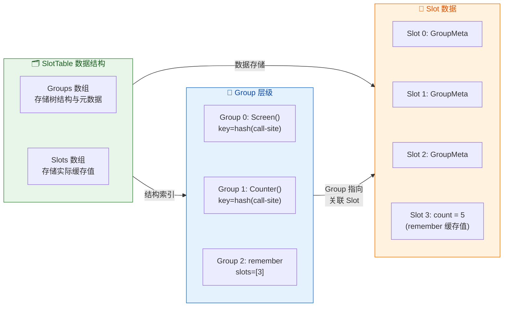
```mermaid
graph LR
    subgraph SlotTable["🗂️ SlotTable 数据结构"]
        direction TB
        G["Groups 数组\n存储树结构与元数据"]
        S["Slots 数组\n存储实际缓存值"]
        G ~~~ S
    end

    subgraph Groups["📐 Group 层级"]
        direction TB
        G0["Group 0: Screen()\nkey=hash(call-site)"]
        G1["Group 1: Counter()\nkey=hash(call-site)"]
        G2["Group 2: remember\nslots=[3]"]
        G0 ~~~ G1
        G1 ~~~ G2
    end

    subgraph Slots["💾 Slot 数据"]
        direction TB
        S0["Slot 0: GroupMeta"]
        S1["Slot 1: GroupMeta"]
        S2["Slot 2: GroupMeta"]
        S3["Slot 3: count = 5\n(remember 缓存值)"]
        S0 ~~~ S1
        S1 ~~~ S2
        S2 ~~~ S3
    end

    SlotTable -->|"结构索引"| Groups
    SlotTable -->|"数据存储"| Slots
    Groups -->|"Group 指向\n关联 Slot"| Slots

    classDef tableStyle fill:#E8F5E9,stroke:#2E7D32,color:#1B5E20
    classDef groupStyle fill:#E3F2FD,stroke:#1565C0,color:#0D47A1
    classDef slotStyle fill:#FFF3E0,stroke:#EF6C00,color:#E65100

    class SlotTable tableStyle
    class Groups groupStyle
    class Slots slotStyle
```

当 Composer 遍历组合树时，它在 Groups 数组中按深度优先顺序前进。每进入一个 Group，就锁定其关联的 Slot 范围；遇到 `remember` 等需要读写数据的 API 时，就在 Slot 范围内定位到具体的 slot 进行操作。这种 **线性遍历** 的设计使得"调用位置"自然映射为"数组索引"，无需任何哈希表或字典查找——性能极高。

#### 缓存的生命周期

`remember` 缓存的值与其所在 Composable 的 **组合生命周期** 绑定：

- **创建时机**：首次组合时 `calculation` 被执行，值被写入 SlotTable。
- **存活期间**：只要包含该 `remember` 的 Composable 在组合树中持续存在（即每次重组都被调用到），缓存值就一直保留。
- **销毁时机**：当包含该 `remember` 的 Composable 从组合树中 **离开**（Leave Composition，例如条件分支不再执行到它），Compose Runtime 会清理对应的 Group 及其 Slots，缓存值被丢弃。

需要注意的是，`remember` **不会在 Configuration Change（如屏幕旋转）中存活**，因为整个 Activity 被销毁重建时，Composition 也随之销毁。需要跨越配置变更的数据应使用 `rememberSaveable`，它在 `remember` 的基础上额外利用 `SavedStateHandle` 机制进行持久化。

---

### key 键值刷新

#### 调用位置身份的局限性

位置记忆化在大多数场景下工作良好，但有一个天然的盲区：**当同一个调用位置被循环或集合驱动多次执行时，位置本身不足以区分不同的"实例"**。

考虑以下场景：

```kotlin
@Composable
fun UserList(users: List<User>) {
    Column {
        // 同一个调用位置（代码中的同一行），被循环执行 N 次
        for (user in users) {
            // 每一次循环迭代都是"同一个位置"的 UserCard
            // Compose 如何区分第 1 个 UserCard 和第 2 个？
            UserCard(user)
        }
    }
}
```

Compose 编译器实际上对此有一定的处理能力——它会为循环中的调用自动使用 **循环索引（index）** 作为辅助身份标识。也就是说，"第 0 次迭代的 `UserCard`"和"第 1 次迭代的 `UserCard`"在 SlotTable 中确实占据不同的 Group 位置。

但问题在于：**索引是基于位置的，而非基于语义的**。如果列表发生了 **增删或重排**——比如在列表头部插入一个新用户——原来的索引 0 对应用户 A，现在索引 0 对应新用户 X，索引 1 才对应用户 A。Compose 会认为"索引 0 的数据变了"，导致 **所有后续项的 `remember` 缓存全部失配**，触发大面积无意义的重新计算。

#### key() 的作用：赋予语义身份

为了解决这个问题，Compose 提供了 `key()` 这个 Composable 工具函数：

```kotlin
@Composable
fun UserList(users: List<User>) {
    Column {
        for (user in users) {
            // key() 用 user.id 作为该调用位置的 "语义身份"
            // 即使列表重排，Compose 也能通过 id 精准匹配到正确的 SlotTable Group
            key(user.id) {
                UserCard(user)
            }
        }
    }
}
```

`key()` 的工作原理是：它告诉 Composer，"不要用默认的循环索引来标识这个 Group，而是使用我提供的 `user.id` 值"。在 SlotTable 的 Groups 数组中，每个 Group 本身就有一个 `key` 字段。默认情况下，编译器根据调用位置的源码哈希（source location hash）加上循环索引来生成 key；而 `key()` 函数会 **覆盖** 这个默认 key，将其替换为用户提供的值。

这样一来，当列表头部插入新元素时，Compose 的 **树差异算法（Tree Diff）** 在对比新旧 Groups 时，能够通过 `key` 字段精确匹配——用户 A 虽然从索引 0 移动到了索引 1，但其 Group key（`user.id = "A"`）保持不变，因此 A 对应的所有 `remember` 缓存、子组合树状态都被完整保留并复用。

#### key 的匹配过程详解

当 Recomposition 发生时，Composer 在遍历新的组合逻辑的同时，会与 SlotTable 中旧的 Group 序列进行对比。这一过程可以类比 `RecyclerView` 的 DiffUtil，但粒度更细。核心步骤为：

1. **逐位对比**：Composer 依次对比"当前要生成的 Group key"与"SlotTable 中同位置旧 Group 的 key"。

2. **命中（Match）**：如果 key 相同，直接复用该 Group 的全部 Slot 数据（包括所有嵌套的 `remember` 缓存），进入 Group 内部进行可能的局部重组。

3. **未命中（Mismatch）**：如果 key 不同，Composer 会向前搜索（look-ahead）旧 Group 序列，尝试找到匹配的 key。找到后，该 Group 会被 **移动（move）** 到当前位置；找不到，则视为新插入的 Group，从零开始组合。

4. **多余的旧 Group**：对比结束后，旧序列中没有被匹配到的 Group 会被标记为 **删除**，其 Slot 数据被清理。

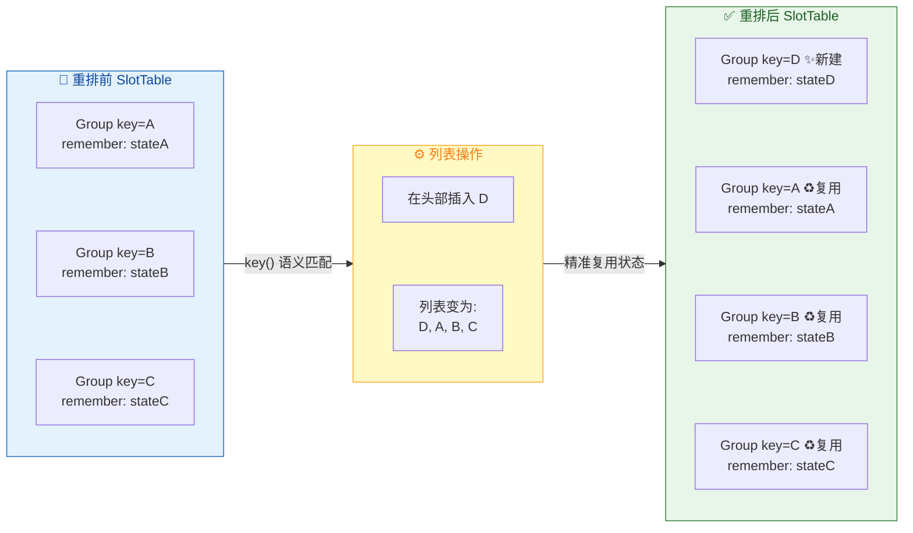
```mermaid
graph LR
    subgraph Before["🔄 重排前 SlotTable"]
        direction TB
        B0["Group key=A\nremember: stateA"]
        B1["Group key=B\nremember: stateB"]
        B2["Group key=C\nremember: stateC"]
        B0 ~~~ B1
        B1 ~~~ B2
    end

    subgraph Operation["⚙️ 列表操作"]
        direction TB
        OP1["在头部插入 D"]
        OP2["列表变为:\nD, A, B, C"]
        OP1 ~~~ OP2
    end

    subgraph After["✅ 重排后 SlotTable"]
        direction TB
        A0["Group key=D ✨新建\nremember: stateD"]
        A1["Group key=A ♻️复用\nremember: stateA"]
        A2["Group key=B ♻️复用\nremember: stateB"]
        A3["Group key=C ♻️复用\nremember: stateC"]
        A0 ~~~ A1
        A1 ~~~ A2
        A2 ~~~ A3
    end

    Before -->|"key() 语义匹配"| Operation -->|"精准复用状态"| After

    classDef beforeStyle fill:#E3F2FD,stroke:#1565C0,color:#0D47A1
    classDef opStyle fill:#FFF9C4,stroke:#F9A825,color:#F57F17
    classDef afterStyle fill:#E8F5E9,stroke:#2E7D32,color:#1B5E20

    class Before beforeStyle
    class Operation opStyle
    class After afterStyle
```

上图清晰地展示了：使用 `key()` 后，即使列表头部插入了新元素 D，原有元素 A、B、C 的状态（`remember` 缓存）被完整复用，仅 D 需要新建。若不使用 `key()`，索引错位会导致 A、B、C 的缓存全部与错误的元素配对，轻则性能浪费（不必要的重计算），重则导致 UI 状态错乱（比如展开/折叠状态被分配给了错误的列表项）。

#### key 的使用注意事项

**唯一性要求**：传递给 `key()` 的值在 **同一父级作用域内必须唯一**。如果两个兄弟节点拥有相同的 key，Compose Runtime 在匹配时会产生歧义，可能导致状态错配或崩溃。通常使用数据库主键、唯一 ID 等作为 key。

**稳定性要求**：key 值应当是 **稳定的（Stable）**——也就是说，同一逻辑实体在不同重组周期中应产生相同的 key。如果每次重组都生成新的随机 key，等于告诉 Compose "所有旧数据都作废"，完全丧失了缓存复用的意义。

**复合 key**：`key()` 支持多个参数，Compose 会将它们组合为一个复合身份标识：

```kotlin
// 当单一值不足以唯一标识时，可以使用复合 key
key(section.id, item.id) {
    // 此 Group 的身份 = section.id + item.id 的组合
    SectionItem(item)
}
```

**与 LazyList 的关系**：在 `LazyColumn` / `LazyRow` 中，`key` 参数直接内置于 `items()` DSL 中，原理完全一致：

```kotlin
LazyColumn {
    items(
        items = users,
        key = { user -> user.id }   // 为每个 item 指定语义 key
    ) { user ->
        // 列表滚动、增删时，通过 key 精准复用 item 状态
        UserCard(user)
    }
}
```

这里的 `key` 参数本质上就是让 `LazyList` 内部使用 `key()` 包裹每个 item 的 Composable 调用。对于需要支持 **拖拽排序**、**动画增删** 等场景，正确设置 key 是 **必不可少** 的前提。

#### remember 与 key 的协同模型

将 `remember` 和 `key` 结合来看，位置记忆化的完整身份体系可以概括为：

> **Composable 实例的身份 = 源码调用位置（Compile-time Hash）+ 运行时 key（默认为循环索引 / 手动指定）**

这两者共同决定了一个 Group 在 SlotTable 中的位置，进而决定了所有 `remember` 缓存值的归属。编译期的位置哈希保证了静态代码中不同调用点的隔离，运行时的 key 保证了动态列表中不同迭代实例的隔离。两层机制叠加，构成了 Compose 强大而灵活的状态管理基础。

最后值得一提的是，`movableContentOf` 这个高级 API 将位置记忆化推向了更极端的场景——它允许一段 Composable 内容连同其全部 SlotTable 状态 **从组合树的一个位置移动到另一个位置**，而不丢失任何 `remember` 缓存。这再一次印证了 Compose 的设计哲学：**身份不是绑定在对象上的，而是绑定在组合树的结构上的**——只要你有能力在结构间"搬运"这个身份，状态就能跟着走。

---

**📝 练习题**

在一个使用 `for` 循环渲染的列表中，如果没有使用 `key()` 包裹子项，当在列表 **头部** 插入一条新数据后，下列描述正确的是：

A. Compose 会正确识别新插入项，仅对新项执行首次组合，其余项状态完全不受影响

B. 所有子项的 `remember` 缓存都会被清空，因为 Compose 检测到列表长度发生变化

C. 由于默认使用循环索引作为身份标识，索引 0 处的旧缓存会被错误地应用到新插入的项上，后续所有项的缓存也会发生错位

D. Compose 会自动根据数据内容进行智能匹配，即使不使用 `key()` 也不会出现状态错配


**【答案】** C

**【解析】** 当不使用 `key()` 时，Compose 编译器为循环中的 Composable 调用分配的 Group key 默认基于 **调用位置 + 循环索引**。在头部插入新元素后，新元素占据索引 0，原来索引 0 的元素移到索引 1，以此类推。但 SlotTable 中旧的 Group 仍然按原索引排列——索引 0 的 Group 存储的是旧第一项的状态。Compose 在重组时按索引逐一匹配，索引 0 的新数据会 **错误地命中** 旧第一项的缓存，索引 1 的旧第一项会命中旧第二项的缓存……整条链路全部错位。选项 A 描述的是使用了 `key()` 后的理想行为；选项 B 错误，列表长度变化不会导致全部清空，只是匹配错位；选项 D 错误，Compose 不会自动根据数据内容（如 `equals`）匹配 Group 身份，身份仅由编译期位置哈希和运行时 key 决定。正确设置 `key()` 使 Compose 能通过语义标识（如 `user.id`）精准匹配，从根源上避免此类问题。

---

## 平台互操作

Jetpack Compose 并非凭空出现的孤岛，它诞生在一个已经拥有十余年 View 体系积累的 Android 生态之中。Google 在设计 Compose 时就充分考虑到了这一现实：**没有任何团队能够在一夜之间将整个应用从 View 体系迁移到 Compose**。因此，Compose 从架构层面就内建了与传统 View 系统的双向互操作能力（Interoperability）。这种互操作不是简单的"嵌套壳"，而是在渲染管线、生命周期管理、触摸事件分发等多个层面进行了深度桥接，使得两套 UI 框架可以在同一个 Activity、同一个 View 树中和谐共存。

平台互操作的核心价值体现在三个维度：**渐进式迁移（Incremental Migration）**、**生态复用（Ecosystem Reuse）** 和 **能力补全（Capability Complementation）**。渐进式迁移意味着团队可以在不重写整个应用的前提下，逐屏幕、逐组件地引入 Compose；生态复用意味着 MapView、WebView、CameraX Preview 这些成熟的 View 组件可以直接在 Compose 界面中使用；能力补全则意味着某些 Compose 尚未覆盖的平台能力（如部分系统弹窗、SurfaceView 高性能渲染）可以通过桥接传统 View 来实现。

从架构上看，Compose 的互操作机制建立在一个关键事实之上：**Compose 的渲染最终仍然发生在 Android View 体系之内**。`ComposeView` 本身就是一个 `android.view.ViewGroup`，它承载了 Compose 的整个渲染管线（Composition、Layout、Drawing）。这意味着 Compose 并不绕过 View 体系，而是在 View 体系内部构建了一套独立的 UI 描述与渲染机制。理解了这一底层事实，互操作的各种 API 设计就变得顺理成章了。

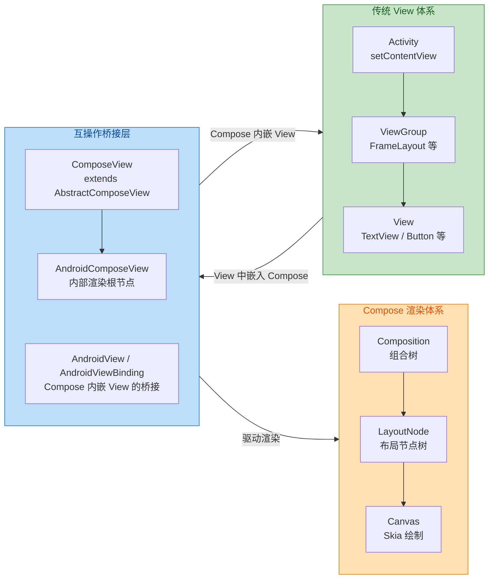
```mermaid
graph LR
    subgraph Traditional["传统 View 体系"]
        direction TB
        A["Activity\nsetContentView"]
        B["ViewGroup\nFrameLayout 等"]
        C["View\nTextView / Button 等"]
        A --> B
        B --> C
    end

    subgraph Bridge["互操作桥接层"]
        direction TB
        D["ComposeView\nextends AbstractComposeView"]
        E["AndroidComposeView\n内部渲染根节点"]
        F["AndroidView / AndroidViewBinding\nCompose 内嵌 View 的桥接"]
        D --> E
        E ~~~ F
    end

    subgraph Compose["Compose 渲染体系"]
        direction TB
        G["Composition\n组合树"]
        H["LayoutNode\n布局节点树"]
        I["Canvas\nSkia 绘制"]
        G --> H
        H --> I
    end

    Traditional -->|"View 中嵌入 Compose"| Bridge
    Bridge -->|"Compose 内嵌 View"| Traditional
    Bridge -->|"驱动渲染"| Compose

    classDef greenStyle fill:#C8E6C9,stroke:#388E3C,color:#1B5E20
    classDef blueStyle fill:#BBDEFB,stroke:#1976D2,color:#0D47A1
    classDef orangeStyle fill:#FFE0B2,stroke:#F57C00,color:#E65100

    class Traditional greenStyle
    class Bridge blueStyle
    class Compose orangeStyle
```

上图清晰地展示了互操作的整体架构：传统 View 体系与 Compose 渲染体系通过中间的桥接层进行双向通信。`ComposeView` 负责"View → Compose"方向的桥接，而 `AndroidView` 则负责"Compose → View"方向的桥接。两者并不对称——前者是一个真实的 `ViewGroup` 子类，后者是一个 Composable 函数，它们的实现机制截然不同，但目标一致：让两个 UI 世界无缝衔接。

### ComposeView 在 View 中使用

`ComposeView` 是将 Compose 内容嵌入传统 View 体系的核心桥梁。它继承自 `AbstractComposeView`，而 `AbstractComposeView` 又继承自 `ViewGroup`。这意味着 `ComposeView` 本质上就是一个标准的 Android View，可以像任何其他 View 一样被添加到 XML 布局中、通过 `addView()` 动态插入父容器、或者直接通过 `setContentView()` 设置为 Activity 的根视图。

#### 基本使用方式

最直接的使用方式是在 XML 布局中声明 `ComposeView`，然后在 Activity 或 Fragment 中通过 `findViewById` 获取引用并设置 Compose 内容：

```xml
<!-- res/layout/activity_main.xml -->
<!-- 在传统 XML 布局中声明 ComposeView，与其他 View 共存 -->
<LinearLayout
    xmlns:android="http://schemas.android.com/apk/res/android"
    android:layout_width="match_parent"
    android:layout_height="match_parent"
    android:orientation="vertical">

    <!-- 传统 View：一个标准的 TextView -->
    <TextView
        android:id="@+id/title"
        android:layout_width="wrap_content"
        android:layout_height="wrap_content"
        android:text="这是传统 View" />

    <!-- ComposeView：Compose 内容将渲染在这个 View 内部 -->
    <androidx.compose.ui.platform.ComposeView
        android:id="@+id/compose_view"
        android:layout_width="match_parent"
        android:layout_height="wrap_content" />

    <!-- 传统 View：Compose 下方还可以继续放传统 View -->
    <Button
        android:id="@+id/legacy_button"
        android:layout_width="wrap_content"
        android:layout_height="wrap_content"
        android:text="传统 Button" />
</LinearLayout>
```

```kotlin
// Activity 中获取 ComposeView 并设置 Compose 内容
class MainActivity : AppCompatActivity() {
    override fun onCreate(savedInstanceState: Bundle?) {
        super.onCreate(savedInstanceState)
        // 使用传统方式加载 XML 布局
        setContentView(R.layout.activity_main)

        // 通过 findViewById 获取 ComposeView 实例
        val composeView = findViewById<ComposeView>(R.id.compose_view)

        // 调用 setContent 设置 Compose 内容
        // 这个方法内部会创建 Composition 并开始首次组合
        composeView.setContent {
            // 这里就是 Compose 的世界了
            // MaterialTheme 提供主题上下文
            MaterialTheme {
                // 一个简单的 Compose 组件
                Text(
                    text = "这是 Compose 内容",
                    modifier = Modifier.padding(16.dp)
                )
            }
        }
    }
}
```

另一种常见方式是完全跳过 XML，在代码中动态创建 `ComposeView`：

```kotlin
class MainActivity : AppCompatActivity() {
    override fun onCreate(savedInstanceState: Bundle?) {
        super.onCreate(savedInstanceState)
        // 直接创建 ComposeView 并设为根视图
        // 不需要 XML 布局文件
        setContentView(
            // ComposeView 构造函数接收 Context 参数
            ComposeView(this).apply {
                // setContent 设置 Compose UI 树
                setContent {
                    MaterialTheme {
                        // Scaffold 提供标准 Material 页面结构
                        Scaffold { padding ->
                            // 在 Scaffold 内部放置内容
                            Text(
                                text = "纯 Compose 页面",
                                modifier = Modifier.padding(padding)
                            )
                        }
                    }
                }
            }
        )
    }
}
```

事实上，当你使用 `ComponentActivity.setContent {}` 这个扩展函数时，它的内部实现就是创建了一个 `ComposeView` 并调用 `setContentView`。也就是说，即使是"纯 Compose"应用，其底层仍然是通过 `ComposeView` 这个 View 来承载 Compose 内容的。

#### ViewCompositionStrategy 生命周期策略

在将 `ComposeView` 嵌入传统 View 体系时，一个核心问题是：**Composition 的生命周期应该如何与宿主的生命周期对齐？** 具体来说，就是 Composition 应该在什么时候被销毁（dispose）。这个问题在 Fragment 场景下尤为关键，因为 Fragment 的 View 生命周期与 Fragment 自身的生命周期并不完全一致——Fragment 可能在 View 被销毁后继续存活（例如被加入 back stack 时）。

`ViewCompositionStrategy` 就是用来解决这个问题的策略接口。它定义了 Composition 何时应该被自动销毁。Compose 提供了四种内置策略：

**`DisposeOnDetachedFromWindow`**（默认策略）：当 `ComposeView` 从窗口中 detach 时销毁 Composition。这是最直观的策略，适用于 Activity 直接持有 `ComposeView` 的简单场景。当 Activity 被销毁时，其 View 树会从窗口 detach，Composition 随之销毁。但这个策略在 Fragment 中可能产生问题：当 Fragment 进入 back stack 时，其 View 会被销毁（detach），但 Fragment 实例仍然存活。如果后续 Fragment 从 back stack 弹出，View 会被重建，此时 `ComposeView` 需要重新创建 Composition，这可能导致状态丢失。

**`DisposeOnLifecycleDestroyed`**：当关联的 `Lifecycle` 被销毁时（收到 `ON_DESTROY` 事件）销毁 Composition。你可以指定一个具体的 `Lifecycle` 实例，如果不指定，它会使用 `ComposeView` 所在窗口的 `LifecycleOwner`。

**`DisposeOnViewTreeLifecycleDestroyed`**：当 View 通过 `ViewTreeLifecycleOwner` 获取到的 `LifecycleOwner` 被销毁时才销毁 Composition。**这是在 Fragment 中使用 `ComposeView` 时推荐的策略**。因为 Fragment 的 `viewLifecycleOwner` 会在 `onDestroyView` 时被销毁，这与 Fragment 的 View 生命周期完全对齐。

**`DisposeOnDetachedFromWindowOrReleasedFromPool`**：专门为 `RecyclerView` 场景设计。当 `ComposeView` 在 `RecyclerView.ViewHolder` 中使用时，ViewHolder 可能被回收到 RecycledViewPool 中。此策略确保 Composition 在 View 从窗口 detach **或者** 被放入回收池时都能被正确销毁。

```kotlin
// Fragment 中使用 ComposeView 的最佳实践
class MyFragment : Fragment() {
    override fun onCreateView(
        inflater: LayoutInflater,
        container: ViewGroup?,
        savedInstanceState: Bundle?
    ): View {
        // 直接返回一个 ComposeView 作为 Fragment 的根 View
        return ComposeView(requireContext()).apply {
            // 【关键】设置 Composition 策略为跟随 ViewTree 生命周期
            // 这确保 Composition 在 Fragment 的 View 被销毁时才 dispose
            // 而不是在 View 简单地 detach 时就 dispose
            setViewCompositionStrategy(
                ViewCompositionStrategy.DisposeOnViewTreeLifecycleDestroyed
            )
            // 设置 Compose 内容
            setContent {
                MaterialTheme {
                    // Fragment 的 Compose 内容
                    MyScreen()
                }
            }
        }
    }
}
```

```kotlin
// RecyclerView ViewHolder 中使用 ComposeView
class MyViewHolder(
    // 接收 ComposeView 作为 itemView
    val composeView: ComposeView
) : RecyclerView.ViewHolder(composeView) {

    init {
        // 设置回收池感知的 Composition 策略
        // 当 ViewHolder 被回收或 View 被 detach 时，Composition 都会被销毁
        composeView.setViewCompositionStrategy(
            ViewCompositionStrategy.DisposeOnDetachedFromWindowOrReleasedFromPool
        )
    }

    // 绑定数据时设置 Compose 内容
    fun bind(item: MyItem) {
        composeView.setContent {
            // 每次 bind 时重新设置内容
            // Composition 策略确保旧的 Composition 已被正确清理
            MyItemComposable(item = item)
        }
    }
}
```

#### 内部机制：从 setContent 到渲染

当你调用 `ComposeView.setContent {}` 时，背后发生了一系列复杂但有序的事件。理解这些内部机制有助于排查互操作场景下的各种问题。

首先，`setContent` 会将传入的 `@Composable` lambda 保存到内部变量中。真正的 Composition 创建并不会立即发生，而是被延迟到 `ComposeView` 被 attach 到窗口时（`onAttachedToWindow`）。这是一个重要的设计决策：在 View 尚未进入 View 树之前，创建 Composition 是没有意义的，因为此时缺少必要的上下文信息（如 `ViewTreeLifecycleOwner`、`ViewTreeSavedStateRegistryOwner`、density、configuration 等）。

当 `ComposeView` attach 到窗口后，`AbstractComposeView` 的 `onAttachedToWindow` 会触发 Composition 的创建。内部会实例化一个 `AndroidComposeView`——这是真正的 Compose 渲染根节点。`AndroidComposeView` 同样是一个 `ViewGroup`（但对外不可见），它持有 `LayoutNode` 树的根节点，并负责将 Compose 的 measure/layout/draw 请求转化为 Android View 系统的对应操作。

在这个过程中，`ComposeView` 还会从 View 树中提取一系列重要信息并注入到 Composition 的 `CompositionLocal` 中。这些信息包括：`LocalContext`（来自 `getContext()`）、`LocalLifecycleOwner`（来自 `ViewTreeLifecycleOwner`）、`LocalSavedStateRegistryOwner`（来自 `ViewTreeSavedStateRegistryOwner`）、`LocalDensity`（来自 `Resources`）、`LocalConfiguration`（来自 `Resources.getConfiguration()`）等。这就是为什么 Compose 中能够通过 `LocalContext.current` 访问 Context 的原因——它是由 `ComposeView` 在创建 Composition 时从 View 体系"搬运"过来的。

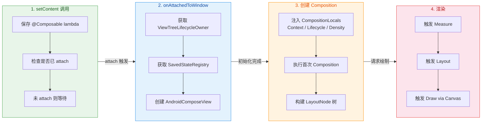
```mermaid
graph LR
    subgraph Step1["1. setContent 调用"]
        direction TB
        A["保存 @Composable lambda"]
        B["检查是否已 attach"]
        C["未 attach 则等待"]
        A --> B
        B --> C
    end

    subgraph Step2["2. onAttachedToWindow"]
        direction TB
        D["获取 ViewTreeLifecycleOwner"]
        E["获取 SavedStateRegistry"]
        F["创建 AndroidComposeView"]
        D --> E
        E --> F
    end

    subgraph Step3["3. 创建 Composition"]
        direction TB
        G["注入 CompositionLocals\nContext / Lifecycle / Density"]
        H["执行首次 Composition"]
        I["构建 LayoutNode 树"]
        G --> H
        H --> I
    end

    subgraph Step4["4. 渲染"]
        direction TB
        J["触发 Measure"]
        K["触发 Layout"]
        L["触发 Draw via Canvas"]
        J --> K
        K --> L
    end

    Step1 -->|"attach 触发"| Step2
    Step2 -->|"初始化完成"| Step3
    Step3 -->|"请求绘制"| Step4

    classDef step1Style fill:#E8F5E9,stroke:#43A047,color:#1B5E20
    classDef step2Style fill:#E3F2FD,stroke:#1E88E5,color:#0D47A1
    classDef step3Style fill:#FFF3E0,stroke:#FB8C00,color:#E65100
    classDef step4Style fill:#FCE4EC,stroke:#E53935,color:#B71C1C

    class Step1 step1Style
    class Step2 step2Style
    class Step3 step3Style
    class Step4 step4Style
```

#### 多个 ComposeView 共存

在同一个 View 层级中可以同时存在多个 `ComposeView`。每个 `ComposeView` 都拥有独立的 `Composition` 实例和独立的 `LayoutNode` 树。但需要注意的是，如果这些 `ComposeView` 位于同一个 Activity/Fragment 中，它们会共享相同的 `ViewTreeLifecycleOwner` 和 `SavedStateRegistryOwner`。这意味着它们的 Composition 生命周期受同一个宿主控制，但它们的 **状态是隔离的**。一个 `ComposeView` 中的 `remember` 状态对另一个 `ComposeView` 完全不可见。

不过，如果多个 `ComposeView` 需要共享状态，可以通过在 View 层持有共享的 `ViewModel`、依赖注入框架（如 Hilt/Koin），或者 `CompositionLocalProvider` 在各自的 `setContent` 中提供相同的数据源来实现。这种模式在渐进式迁移中非常常见：一个页面的 Header 用 Compose 实现，Body 用传统 RecyclerView，Footer 又用 Compose，三者通过共享的 ViewModel 保持数据一致。

### AndroidView 在 Compose 中使用

与 `ComposeView` 方向相反，`AndroidView` 是一个 Composable 函数，用于在 Compose 布局树中嵌入传统的 Android View。这是 Compose 复用现有 View 生态的关键机制。无论是 `MapView`、`WebView`、`SurfaceView`，还是任何自定义 View，都可以通过 `AndroidView` 嵌入 Compose 界面。

#### 核心 API 签名

```kotlin
// AndroidView 的核心签名（简化版）
@Composable
fun <T : View> AndroidView(
    // factory：创建 View 实例的工厂函数
    // 接收 Context 参数，返回一个 View 实例
    // 此函数仅在首次组合时调用一次（类似 remember 的初始化块）
    factory: (Context) -> T,

    // modifier：标准 Compose Modifier，控制布局约束、padding 等
    modifier: Modifier = Modifier,

    // update：当 Composition 重组时调用此回调
    // 用于将 Compose 侧的状态同步到 View 上（命令式更新）
    // 接收 factory 创建的 View 实例作为参数
    update: (T) -> Unit = {},

    // onRelease：当 AndroidView 从 Composition 中移除时调用
    // 用于清理 View 持有的资源（类似 DisposableEffect 的 onDispose）
    onRelease: (T) -> Unit = {},

    // onReset：当 View 被复用（例如在 LazyColumn 中）时调用
    // 用于将 View 重置为初始状态
    onReset: ((T) -> Unit)? = null
)
```

理解 `AndroidView` 的关键在于区分 `factory` 和 `update` 这两个回调的时机与职责。`factory` 只在 `AndroidView` 首次进入 Composition 时调用一次，负责创建 View 实例。这与 `remember` 的语义高度一致——事实上，`AndroidView` 内部就是用 `remember` 来缓存 `factory` 创建的 View 实例的。而 `update` 则在每次重组时都可能被调用，负责将 Compose 侧最新的状态"推送"到 View 上。这种分离设计是 Compose 声明式与 View 命令式两种范式的桥接核心：**Compose 负责状态管理和触发更新，View 负责按命令式方式应用这些更新**。

#### 实践示例

**嵌入 WebView**：

```kotlin
@Composable
fun ComposeWebView(
    url: String,  // 要加载的 URL，由 Compose 状态驱动
    modifier: Modifier = Modifier
) {
    // AndroidView 是将传统 View 嵌入 Compose 的桥梁
    AndroidView(
        // factory 仅在首次组合时调用，创建 WebView 实例
        factory = { context ->
            // 使用传入的 Context 创建 WebView
            WebView(context).apply {
                // 配置 WebView 的基础设置
                // 这些设置只需要执行一次，因此放在 factory 中
                settings.javaScriptEnabled = true
                // 设置 WebViewClient 防止外部浏览器打开链接
                webViewClient = WebViewClient()
                // 设置布局参数为全宽全高
                layoutParams = ViewGroup.LayoutParams(
                    ViewGroup.LayoutParams.MATCH_PARENT,
                    ViewGroup.LayoutParams.MATCH_PARENT
                )
            }
        },
        // update 在每次重组时调用，将 Compose 状态同步到 View
        update = { webView ->
            // 当 url 参数发生变化时，重组触发，加载新 URL
            webView.loadUrl(url)
        },
        // onRelease 在 AndroidView 从 Composition 移除时调用
        onRelease = { webView ->
            // 清理 WebView 资源，防止内存泄漏
            webView.stopLoading()
            webView.destroy()
        },
        // modifier 控制 Compose 侧的布局约束
        modifier = modifier.fillMaxSize()
    )
}
```

**嵌入 MapView（需要生命周期管理）**：

某些 View 组件（如 `MapView`）拥有自己的生命周期方法（`onCreate`、`onResume`、`onPause`、`onDestroy`），需要与宿主的生命周期同步。在 Compose 中，这需要结合 `DisposableEffect` 和 `LocalLifecycleOwner` 来实现：

```kotlin
@Composable
fun ComposeMapView(
    modifier: Modifier = Modifier,
    onMapReady: (GoogleMap) -> Unit  // 地图准备就绪的回调
) {
    // 获取当前的 Lifecycle，用于同步 MapView 的生命周期
    val lifecycle = LocalLifecycleOwner.current.lifecycle

    // 使用 remember 创建并缓存 MapView 实例
    // 这样可以在 AndroidView 外部引用它以进行生命周期管理
    val mapView = remember {
        // 注意：这里暂时传 null context，实际会在 AndroidView factory 中设置
        // 此处仅作示意，真实代码需要调整
        MapView(/* context */).apply {
            // MapView 需要调用 onCreate
            onCreate(Bundle())
            // 异步获取 GoogleMap 实例
            getMapAsync { googleMap ->
                onMapReady(googleMap)
            }
        }
    }

    // DisposableEffect 监听生命周期事件
    // 将 Lifecycle 事件转发给 MapView 的对应方法
    DisposableEffect(lifecycle) {
        // 创建生命周期观察者
        val observer = LifecycleEventObserver { _, event ->
            when (event) {
                // Activity/Fragment onResume 时恢复地图
                Lifecycle.Event.ON_RESUME -> mapView.onResume()
                // Activity/Fragment onPause 时暂停地图
                Lifecycle.Event.ON_PAUSE -> mapView.onPause()
                // Activity/Fragment onDestroy 时销毁地图
                Lifecycle.Event.ON_DESTROY -> mapView.onDestroy()
                else -> { /* 其他事件忽略 */ }
            }
        }
        // 将观察者注册到 Lifecycle
        lifecycle.addObserver(observer)

        // DisposableEffect 清理：移除观察者
        onDispose {
            lifecycle.removeObserver(observer)
        }
    }

    // 使用 AndroidView 将 MapView 嵌入 Compose 布局
    AndroidView(
        factory = { mapView },  // 返回已创建的 MapView 实例
        modifier = modifier
    )
}
```

这个示例展示了一个重要模式：**当传统 View 拥有独立的生命周期需求时，`AndroidView` 本身不提供生命周期桥接**。开发者需要通过 `DisposableEffect` + `LocalLifecycleOwner` 手动构建这座桥梁。这体现了 Compose 的设计哲学——副作用（包括生命周期管理）应该显式声明，而不是隐式耦合。

#### AndroidViewBinding：与 ViewBinding 集成

除了 `AndroidView`，Compose 还提供了 `AndroidViewBinding` 函数，用于直接在 Compose 中 inflate 一个 XML 布局（通过 ViewBinding）。这在迁移过程中非常有用——当你已经有一个复杂的 XML 布局，不想逐个 View 地用 `AndroidView` 包装时，可以直接将整个布局嵌入 Compose：

```kotlin
@Composable
fun LegacyProfileSection(
    userName: String,  // Compose 侧的状态
    avatarUrl: String
) {
    // AndroidViewBinding 直接 inflate XML 布局
    // 泛型参数是 ViewBinding 生成的绑定类
    AndroidViewBinding(
        // factory 接收 inflater、parent、attachToParent 三个参数
        // 这与 ViewBinding 的 inflate 方法签名一致
        factory = FragmentProfileBinding::inflate,
        // modifier 控制 Compose 侧的布局
        modifier = Modifier.fillMaxWidth()
    ) {
        // 这个 lambda 的 receiver 就是 ViewBinding 实例
        // 可以直接访问 binding 中的 View
        // 将 Compose 状态同步到传统 View 上
        tvUserName.text = userName
        // 使用 Glide 等图片库加载头像
        Glide.with(ivAvatar).load(avatarUrl).into(ivAvatar)
    }
}
```

使用 `AndroidViewBinding` 需要添加额外的依赖 `androidx.compose.ui:ui-viewbinding`，并确保模块已启用 ViewBinding 特性。

#### 内部实现原理

`AndroidView` 的内部实现涉及 Compose 渲染管线的一个特殊节点类型。当 Compose 遇到 `AndroidView` 时，它会在 `LayoutNode` 树中插入一个特殊的节点，这个节点持有对真实 Android View 的引用。在 Compose 的 measure/layout 阶段，这个节点会将 Compose 侧的约束（`Constraints`）转换为 View 体系的 `MeasureSpec`，然后调用 View 的 `measure()` 方法。View 测量完成后，其尺寸被报告回 Compose 的布局系统。在 draw 阶段，Compose 会预留出这个 View 的区域，让 View 通过自己的 `draw()` 方法绘制到 Canvas 上。

触摸事件的分发同样需要桥接。当用户点击一个通过 `AndroidView` 嵌入的传统 View 时，触摸事件首先被 `AndroidComposeView`（Compose 的根 View）接收，然后通过 Compose 的指针输入系统传递到对应的 `LayoutNode`。当事件到达 `AndroidView` 对应的节点时，它会被重新封装为标准的 `MotionEvent` 并分发给内嵌的传统 View。这个过程对开发者来说是透明的，但了解它有助于排查偶尔出现的触摸事件冲突问题。

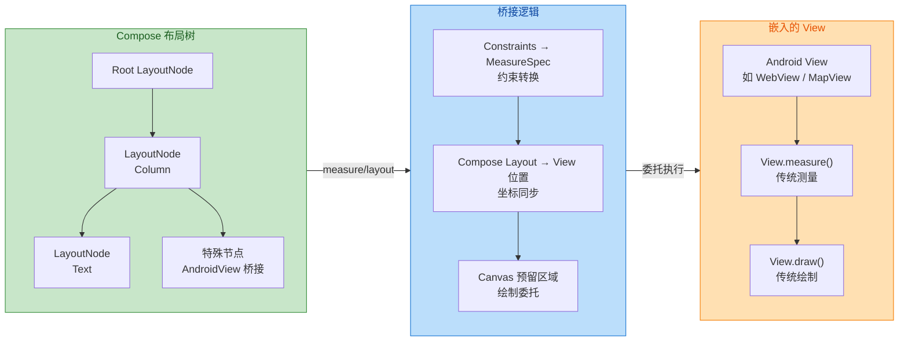
```mermaid
graph LR
    subgraph ComposeTree["Compose 布局树"]
        direction TB
        R["Root LayoutNode"]
        N1["LayoutNode\nColumn"]
        N2["LayoutNode\nText"]
        N3["特殊节点\nAndroidView 桥接"]
        R --> N1
        N1 --> N2
        N1 --> N3
    end

    subgraph BridgeLogic["桥接逻辑"]
        direction TB
        M["Constraints → MeasureSpec\n约束转换"]
        L["Compose Layout → View 位置\n坐标同步"]
        D["Canvas 预留区域\n绘制委托"]
        M --> L
        L --> D
    end

    subgraph ViewNode["嵌入的 View"]
        direction TB
        V["Android View\n如 WebView / MapView"]
        VM["View.measure()\n传统测量"]
        VD["View.draw()\n传统绘制"]
        V --> VM
        VM --> VD
    end

    ComposeTree -->|"measure/layout"| BridgeLogic
    BridgeLogic -->|"委托执行"| ViewNode

    classDef composeStyle fill:#C8E6C9,stroke:#388E3C,color:#1B5E20
    classDef bridgeStyle fill:#BBDEFB,stroke:#1976D2,color:#0D47A1
    classDef viewStyle fill:#FFE0B2,stroke:#F57C00,color:#E65100

    class ComposeTree composeStyle
    class BridgeLogic bridgeStyle
    class ViewNode viewStyle
```

### Context 获取

在传统的 Android 开发中，`Context` 是一个无处不在的依赖。启动 Activity 需要 Context，获取系统服务需要 Context，访问资源需要 Context，创建 View 需要 Context。然而，Compose 的 Composable 函数是普通的 Kotlin 函数，它们没有继承自任何 Android 类，自然也不持有 Context 引用。那么，在 Compose 中如何获取 Context？

答案是 **`CompositionLocal`**。具体来说，Compose 通过 `LocalContext` 这个 `CompositionLocal` 将 Context 注入到整个 Composition 树中。任何 Composable 函数都可以通过 `LocalContext.current` 获取当前的 Context 实例。

#### Context 的来源与传播

前面在讲 `ComposeView` 时提到，当 `ComposeView` 创建 Composition 时，会从 View 体系中提取一系列上下文信息并通过 `CompositionLocalProvider` 注入到 Composition 中。`LocalContext` 的值就来自 `ComposeView.getContext()`，即 `ComposeView` 所在的 Activity 的 Context（或者更精确地说，是一个经过 `ContextThemeWrapper` 包装的 Context）。

这意味着 `LocalContext.current` 返回的 Context 具有以下特征：

- **它是一个 Activity Context**（而非 Application Context）。因此，它可以用于启动 Activity（带有正确的 Task 栈行为）、显示 Dialog、访问 Activity 级别的主题资源。
- **它包含主题信息**。通过这个 Context 获取的资源会反映当前 Activity 应用的 Theme。
- **它的生命周期与 Activity 绑定**。如果你将这个 Context 传递给一个长生命周期的对象（如 Singleton），可能导致 Activity 泄漏——这与传统 View 开发中的注意事项完全一致。

```kotlin
@Composable
fun ContextUsageExample() {
    // 通过 CompositionLocal 获取 Context
    // 这是在 Compose 中获取 Context 的标准方式
    val context = LocalContext.current

    // 示例 1：启动另一个 Activity
    Button(onClick = {
        // 使用获取到的 Context 创建 Intent 并启动 Activity
        val intent = Intent(context, DetailActivity::class.java)
        context.startActivity(intent)
    }) {
        Text("打开详情页")
    }

    // 示例 2：获取系统服务
    val clipboardManager = remember(context) {
        // 通过 Context 获取系统剪贴板服务
        context.getSystemService(Context.CLIPBOARD_SERVICE) as ClipboardManager
    }

    // 示例 3：访问字符串资源
    // 注意：Compose 提供了更优雅的 stringResource() 函数
    // 但 stringResource 内部也是通过 LocalContext 获取的
    val appName = context.getString(R.string.app_name)

    // 示例 4：获取资源维度值
    val customDimen = with(context.resources) {
        // 从传统资源系统读取尺寸值
        getDimension(R.dimen.custom_spacing)
    }

    // 示例 5：Toast 消息
    Button(onClick = {
        // 使用 Context 显示 Toast
        Toast.makeText(context, "来自 Compose 的 Toast", Toast.LENGTH_SHORT).show()
    }) {
        Text("显示 Toast")
    }
}
```

#### 其他重要的 CompositionLocal 上下文

除了 `LocalContext`，Compose 还通过 CompositionLocal 机制提供了一系列来自 View 体系的上下文信息。理解这些 Local 的来源和用途，对于深度互操作开发非常重要：

| CompositionLocal | 类型 | 来源 | 典型用途 |
|---|---|---|---|
| `LocalContext` | `Context` | `ComposeView.getContext()` | 启动 Activity、获取系统服务、访问资源 |
| `LocalLifecycleOwner` | `LifecycleOwner` | `ViewTreeLifecycleOwner` | 感知生命周期、在 LaunchedEffect 中使用 |
| `LocalSavedStateRegistryOwner` | `SavedStateRegistryOwner` | `ViewTreeSavedStateRegistryOwner` | `rememberSaveable` 的状态保存与恢复 |
| `LocalConfiguration` | `Configuration` | `Resources.getConfiguration()` | 监听配置变化（屏幕方向、语言、暗色模式等） |
| `LocalDensity` | `Density` | `Resources.displayMetrics` | dp/px 转换、文字缩放 |
| `LocalView` | `View` | `AndroidComposeView` 实例 | 在 Compose 中访问宿主 View 的能力 |

其中 `LocalView` 值得特别说明。它返回的是 Compose 内部的 `AndroidComposeView` 实例（一个真实的 View 对象），通过它可以执行一些 Compose 本身不直接支持的 View 级操作：

```kotlin
@Composable
fun AdvancedViewInterop() {
    // 获取 Compose 宿主 View 的引用
    val view = LocalView.current

    // 示例：控制系统 UI（状态栏/导航栏）
    // 某些场景下需要通过 WindowInsetsController 操作系统 UI
    LaunchedEffect(Unit) {
        // 通过 View 获取 Window，进而获取 InsetsController
        val window = (view.context as? Activity)?.window
        window?.let {
            // 设置状态栏为沉浸模式等
            WindowCompat.setDecorFitsSystemWindows(it, false)
        }
    }

    // 示例：请求焦点或处理软键盘
    // 某些底层操作仍需要通过 View 体系完成
    val focusRequester = remember { FocusRequester() }
    TextField(
        value = "",
        onValueChange = {},
        modifier = Modifier.focusRequester(focusRequester)
    )
}
```

#### Context 使用的注意事项

在 Compose 中使用 Context 时，需要特别注意以下几点：

**避免在 Composable 函数体中直接执行有副作用的 Context 操作**。Composable 函数可能在任何时刻被重组调用多次，如果你在函数体中直接调用 `context.startActivity()`，每次重组都会触发一次页面跳转。这类操作应该放在事件回调（如 `onClick`）或副作用 API（如 `LaunchedEffect`）中。

**注意 Context 的生命周期**。`LocalContext.current` 返回的 Context 通常是 Activity Context。如果你需要一个长生命周期的 Context（例如初始化全局 SDK），应该通过 `context.applicationContext` 获取 Application Context，以避免 Activity 泄漏。

**`stringResource()` 优于 `context.getString()`**。Compose 提供的 `stringResource(R.string.xxx)` 函数不仅更简洁，而且能自动监听 Configuration 变化（如语言切换），在配置变更后自动触发重组以显示新语言的文字。而直接使用 `context.getString()` 则可能在配置变更后仍显示旧值，直到手动触发重组。

```kotlin
@Composable
fun ContextBestPractices() {
    val context = LocalContext.current

    // ✅ 正确：在事件回调中使用 Context 执行副作用
    Button(onClick = {
        // onClick 是用户触发的，不受重组影响
        context.startActivity(Intent(context, NextActivity::class.java))
    }) {
        // ✅ 正确：使用 stringResource 而非 context.getString
        // stringResource 能自动响应语言等配置变化
        Text(stringResource(R.string.next_page))
    }

    // ❌ 错误：在 Composable 函数体中直接执行副作用操作
    // context.startActivity(...) // 这会在每次重组时都执行！

    // ✅ 正确：需要 Application Context 时显式获取
    val appContext = context.applicationContext
    // 将 appContext 传递给长生命周期的对象是安全的

    // ✅ 正确：在 LaunchedEffect 中执行一次性的 Context 操作
    LaunchedEffect(Unit) {
        // 这只在首次组合时执行一次
        val packageInfo = appContext.packageManager
            .getPackageInfo(appContext.packageName, 0)
        // 使用 packageInfo...
    }
}
```

总结来看，Compose 的平台互操作机制设计得相当优雅。`ComposeView` 和 `AndroidView` 分别解决了两个方向的嵌入问题，`CompositionLocal` 系统则将传统 View 体系的上下文信息（Context、Lifecycle、SavedState 等）无缝桥接到 Compose 世界。这套机制使得团队可以从容地进行渐进式迁移——无论是在老项目中逐步引入 Compose，还是在新项目中偶尔需要使用传统 View 组件，都能游刃有余。

---

**📝 练习题**

在一个使用 Navigation 组件的 Fragment 中嵌入 `ComposeView`，当用户导航到下一个 Fragment 时，当前 Fragment 被加入 back stack（View 被销毁但 Fragment 实例存活）。此时应该使用哪种 `ViewCompositionStrategy` 来避免 Composition 提前销毁导致的状态问题？

A. `DisposeOnDetachedFromWindow`


B. `DisposeOnViewTreeLifecycleDestroyed`


C. `DisposeOnLifecycleDestroyed`


D. `DisposeOnDetachedFromWindowOrReleasedFromPool`

**【答案】** B

**【解析】** 这道题考查的是 `ViewCompositionStrategy` 各策略与 Fragment 生命周期的配合关系。当 Fragment 被加入 back stack 时，其 View 会被销毁（`onDestroyView`），但 Fragment 实例仍然存活。此时 `ComposeView` 会从窗口 detach。如果使用默认的 `DisposeOnDetachedFromWindow`（选项 A），Composition 会在 View detach 时立即销毁。当用户按返回键回到这个 Fragment 时，`onCreateView` 被重新调用，`ComposeView` 会重新创建 Composition，但之前 `remember` 保存的所有状态都已丢失。`DisposeOnViewTreeLifecycleDestroyed`（选项 B）将 Composition 的销毁时机绑定到 Fragment 的 `viewLifecycleOwner`，它会在 `onDestroyView` 时被销毁。这虽然也会在 Fragment 的 View 销毁时 dispose Composition，但关键在于它的 **时机更加精确**——它在 `ON_DESTROY` 事件时才销毁，而不是简单地在 detach 时销毁。更重要的是，这是 Google 官方文档中明确推荐在 Fragment 中使用的策略，因为它能正确处理 Fragment 在 ViewPager2、Navigation 等容器中的各种复杂生命周期场景，包括 `setMaxLifecycle` 对 Lifecycle 状态的限制。选项 C 的 `DisposeOnLifecycleDestroyed` 如果绑定到 Fragment 本身的 Lifecycle（而非 viewLifecycle），可能导致 Fragment 的 View 已被销毁但 Composition 仍存活，造成资源浪费。选项 D 是专为 `RecyclerView` 场景设计的，与 Fragment 无关。

---

**📝 练习题**

以下关于 `AndroidView` 的 `factory` 和 `update` 参数的描述，哪一项是**错误**的？

A. `factory` 仅在 `AndroidView` 首次进入 Composition 时调用一次，用于创建 View 实例


B. `update` 在每次 Recomposition 时都会被调用，用于将 Compose 状态同步到 View


C. `factory` 创建的 View 实例在内部通过 `remember` 机制被缓存


D. 如果 `factory` 中 View 的初始配置依赖 Compose 状态，当该状态变化时 `factory` 会被重新调用以重建 View

**【答案】** D

**【解析】** 选项 D 是错误的。`factory` 在整个 `AndroidView` 的生命周期中**只会被调用一次**，不会因为 Compose 状态的变化而重新调用。如果 View 的初始配置依赖某个 Compose 状态，而该状态后来发生了变化，正确的做法是在 `update` 回调中进行更新，而不是期望 `factory` 重新执行。这体现了 `AndroidView` 的核心设计：`factory` 负责一次性的创建与初始化配置（如设置 `WebViewClient`、注册底层监听器等不变配置），`update` 负责持续的状态同步（如加载新 URL、更新文本内容等可变属性）。选项 A、B、C 的描述都是正确的。`factory` 确实只调用一次（A），`update` 在每次重组时如果读取的状态发生了变化就会被调用（B），而 `factory` 创建的 View 实例确实通过内部的 `remember` 机制进行缓存以避免重复创建（C）。

---

## 本章小结

本章以 **Compose 编程思想** 为主线，从声明式 UI 范式的核心理念出发，逐步深入到 Composable 函数的本质、重组机制的智能调度、状态驱动的底层支撑、副作用的生命周期管理、稳定性系统的优化策略、位置记忆化的缓存原理，以及与传统 View 体系的互操作方案。这些知识点并非彼此孤立，而是构成了一条 **从理念到实践、从表层 API 到底层机制** 的完整认知链路。以下将对全章内容进行系统性回顾与串联。

---

### 核心思想回顾：声明式 UI 与状态驱动的统一

整章的基石是 **UI = f(State)** 这一公式。声明式 UI 范式将开发者从"手动操纵视图节点"的命令式思维中解放出来，转而聚焦于"描述在某个状态下界面应该长什么样"。这不仅仅是语法糖层面的改变，而是 **编程心智模型（Mental Model）** 的根本转变。在命令式体系下，开发者需要时刻追踪"界面当前处于什么状态"并发出精确的变更指令（`setText`、`setVisibility`）；而在声明式体系下，开发者只需要维护好 **单一数据源（SSOT）**，框架自动完成从状态到界面的映射。

这一思想的落地依赖三大支柱，它们贯穿全章：

1. **Composable 函数** —— 承担 `f` 的角色，是将 State 转换为 UI 描述的基本单元。
2. **状态系统（MutableState + Snapshot）** —— 承担 `State` 的管理与变更追踪职责。
3. **重组机制（Recomposition）** —— 承担 `=` 的角色，是连接状态变更与界面刷新的调度引擎。

三者缺一不可，共同构成了 Compose 区别于传统 View 体系的根本架构。

---

### Composable 函数：不只是一个注解

`@Composable` 注解不是简单的标记，而是触发 **Kotlin Compiler Plugin** 进行代码变换的信号。编译器会为每个 Composable 函数注入 `Composer` 参数和 `$changed` 位掩码参数，使得函数具备了 **参与 Slot Table 读写** 和 **判断参数是否变更** 的能力。这意味着 Composable 函数在 Runtime 的行为远不是"普通函数调用"——它在首次执行时向 Slot Table 写入数据（Composition），在后续执行时读取并比对数据（Recomposition），从而实现增量更新。

Composable 函数 **无返回值（返回 Unit）** 这一设计也值得再次强调。它不返回一个视图对象供调用者持有和操控，而是通过 `emit` 向 Composition 树中注册节点。这从根本上杜绝了"拿到引用后随意修改"的命令式操作路径，强制开发者走 **状态驱动** 的正路。

---

### 重组机制：智能、精准、有边界

Recomposition 是 Compose 性能的核心保障。框架并非在状态变更时重新执行所有 Composable 函数，而是依赖 **Scope 作用域追踪** 精准定位哪些函数读取了变更的状态，仅重新执行这些函数。更进一步，**智能跳过（Skipping）** 机制会在重组启动后，对每个 Composable 函数检查其参数是否真的发生了变化——如果所有参数都"等价于上次"，则直接跳过该函数的执行体，复用 Slot Table 中的已有数据。

这里引出了两个关键约束：

- **幂等性（Idempotent）**：同样的参数输入必须产生同样的 UI 输出，因为框架可能在任何时候、以任何频率触发重组。
- **无副作用（Side-effect Free）**：Composable 函数体内不应包含写入外部状态、发起网络请求等操作，因为重组的执行时机和次数不由开发者控制。

**调用点识别（Call Site Identity）** 则是重组机制识别"同一个 Composable 实例"的方式。编译器为每个调用点生成唯一的 `$key`，结合在 Slot Table 中的位置信息，使得 Runtime 能够区分同一函数在不同位置的不同调用，从而正确地进行数据比对和复用。

---

### 状态驱动：从 MutableState 到 Snapshot 系统

`mutableStateOf()` 创建的不是普通变量，而是实现了 `StateObject` 接口的特殊对象，它的每一次读操作都会被 Snapshot 系统记录（注册到当前 Scope 的依赖列表），每一次写操作都会触发 **Invalidation**（将依赖该状态的 Scope 标记为需要重组）。这套 **读追踪 + 写通知** 的机制是"状态变 → 界面自动刷"这一响应式链路的核心基础设施。

Snapshot 快照系统提供了 **事务隔离** 能力：重组过程在一个快照中执行，期间对状态的修改不会立即对外可见，只有在重组成功完成后才会统一提交（apply）。这保证了 UI 的一致性——不会出现"半个界面用新数据，半个界面用旧数据"的撕裂现象。

---

### 副作用管理：在声明式世界中安全地执行命令式操作

现实应用不可能完全没有副作用。网络请求、数据库读写、传感器监听、日志埋点——这些操作本质上是命令式的、有时序要求的。Compose 通过一组 **Effect Handler API** 在声明式框架中开辟了安全的"副作用通道"：

| Effect API | 核心职责 | 生命周期语义 |
|---|---|---|
| `LaunchedEffect` | 启动协程执行异步任务 | 进入 Composition 时启动，离开时自动取消；key 变化时重启 |
| `DisposableEffect` | 注册/注销需要清理的监听器 | 进入时执行注册，离开时调用 `onDispose` 清理 |
| `SideEffect` | 每次重组成功提交后执行同步操作 | 无清理语义，每次成功重组后都执行 |

这三者的设计遵循同一原则：**将副作用的生命周期绑定到 Composition 的生命周期**，而非 Activity/Fragment 的生命周期。这使得副作用的管理与 UI 树的存活状态天然同步，避免了传统 View 体系中常见的内存泄漏和生命周期错乱问题。

---

### 稳定性系统：Skipping 优化的前提条件

智能跳过（Skipping）听起来很美好，但它能否生效取决于一个前提——**编译器是否能证明参数"没有变化"**。这就引出了稳定性（Stability）概念。只有当一个类型被认定为 **Stable** 时，编译器才会为使用该类型参数的 Composable 函数生成 Skipping 逻辑。

稳定性推断的核心规则是：

- **基本类型**（`Int`、`String`、`Float` 等）天然 Stable。
- **所有属性均为 `val` 且类型均 Stable** 的 `data class` 会被自动推断为 Stable。
- 包含 `var` 属性、或属性类型为 `List`/`Map`/`Set`（标准库接口，编译器无法证明其不可变性）的类 **不会** 被推断为 Stable。

`@Stable` 和 `@Immutable` 注解是开发者向编译器做出的 **契约承诺（Contract）**——"我保证这个类型的行为符合稳定性要求"。编译器不会验证这一承诺，因此滥用注解可能导致界面不刷新的隐蔽 Bug。理解稳定性系统是进行 Compose 性能优化的必备知识。

---

### 位置记忆化：remember 不是魔法

`remember` 是 Compose 中使用频率最高的 API 之一，但它的本质是 **基于调用点位置的缓存（Positional Memoization）**。当一个 `remember` 块首次执行时，其计算结果被存入 Slot Table 中与当前调用点位置绑定的槽位；后续重组经过同一调用点时，直接从槽位读取缓存值，跳过重新计算。

这一机制的关键推论包括：

- `remember` 的缓存生命周期与其所在 Composable 的 **Composition 生命周期** 一致，而非 Activity 生命周期。Composable 从树中移除时，对应的缓存也会被清除。
- 传入 `key` 参数可以实现 **主动刷新**：当 key 值变化时，框架认为"上下文已变"，会丢弃旧缓存并重新执行计算块。
- `remember` 不具备跨 Configuration Change 的存活能力，这一需求需要 `rememberSaveable` 来满足。

位置记忆化与重组机制紧密配合：重组时，Composer 按照调用顺序遍历 Slot Table，`remember` 利用位置信息精准命中缓存槽位，这也是为什么 **Composable 函数中不允许出现条件性调用顺序变化**（除非使用 `key` 来显式标识）的根本原因。

---

### 平台互操作：现实世界的桥梁

Compose 并非存在于真空中。绝大多数现有项目都包含大量传统 View 代码，完全重写既不经济也不必要。Compose 提供了双向互操作能力：

- **`ComposeView`**：作为传统 `ViewGroup` 的子 View 存在，内部承载 Compose UI 树。它是在 XML 布局或现有 Fragment 中嵌入 Compose 内容的标准入口，负责创建 Composition 并将其生命周期绑定到 `ViewTreeLifecycleOwner`。
- **`AndroidView`**：在 Compose 树中嵌入传统 View 控件。通过 `factory` 参数创建 View 实例，通过 `update` 参数在重组时以命令式方式更新 View 的属性。这是复用 MapView、WebView、ExoPlayer 等复杂传统控件的关键手段。
- **`LocalContext`**：在 Composable 函数中获取 Android `Context` 的标准方式，基于 CompositionLocal 机制向下传递，使得 Compose 代码能够访问系统服务、资源等平台能力。

互操作层的设计体现了 Compose 团队的务实态度：不强求一步到位的全量迁移，而是提供平滑的渐进式迁移路径。

---

### 知识脉络总览

以下 Mermaid 图将本章所有核心知识点串联为一条完整的认知链路，展示它们之间的依赖与协作关系：

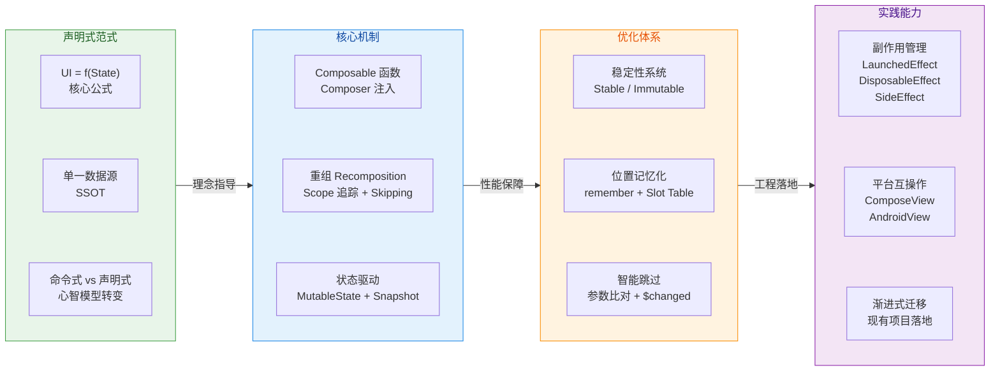
```mermaid
graph LR
    subgraph Paradigm["声明式范式"]
        direction TB
        A1["UI = f(State)\n核心公式"]
        A2["单一数据源\nSSOT"]
        A3["命令式 vs 声明式\n心智模型转变"]
        A1 ~~~ A2
        A2 ~~~ A3
    end

    subgraph Core["核心机制"]
        direction TB
        B1["Composable 函数\nComposer 注入"]
        B2["重组 Recomposition\nScope 追踪 + Skipping"]
        B3["状态驱动\nMutableState + Snapshot"]
        B1 ~~~ B2
        B2 ~~~ B3
    end

    subgraph Optimization["优化体系"]
        direction TB
        C1["稳定性系统\nStable / Immutable"]
        C2["位置记忆化\nremember + Slot Table"]
        C3["智能跳过\n参数比对 + $changed"]
        C1 ~~~ C2
        C2 ~~~ C3
    end

    subgraph Practice["实践能力"]
        direction TB
        D1["副作用管理\nLaunchedEffect\nDisposableEffect\nSideEffect"]
        D2["平台互操作\nComposeView\nAndroidView"]
        D3["渐进式迁移\n现有项目落地"]
        D1 ~~~ D2
        D2 ~~~ D3
    end

    Paradigm -->|"理念指导"| Core -->|"性能保障"| Optimization -->|"工程落地"| Practice

    classDef paradigmStyle fill:#E8F5E9,stroke:#43A047,color:#1B5E20
    classDef coreStyle fill:#E3F2FD,stroke:#1E88E5,color:#0D47A1
    classDef optStyle fill:#FFF3E0,stroke:#FB8C00,color:#E65100
    classDef practiceStyle fill:#F3E5F5,stroke:#8E24AA,color:#4A148C

    class Paradigm paradigmStyle
    class Core coreStyle
    class Optimization optStyle
    class Practice practiceStyle
```

从左到右的四列清晰地展示了学习路径：**先建立声明式思维，再理解核心运行机制，然后掌握性能优化手段，最终具备工程实践能力**。每一列的知识都以前一列为基础——不理解声明式范式就无法理解为什么需要重组机制；不理解重组机制就无法理解稳定性系统存在的意义；不理解这些底层机制就无法在实际项目中做出正确的架构决策。

---

### 关键设计哲学总结

回顾全章，Compose 的编程思想可以提炼为以下几条核心设计哲学：

**第一，数据的单向流动**。状态从上层流向下层（通过函数参数），事件从下层流向上层（通过回调 Lambda）。这种单向数据流（Unidirectional Data Flow, UDF）消除了传统双向绑定中常见的循环依赖和状态不一致问题，使得应用的数据流向清晰可追踪。

**第二，组合优于继承**。Composable 函数本质上是普通的 Kotlin 函数，通过函数调用实现 UI 的组合。这与传统 View 体系中通过 `extends ViewGroup` 实现的继承式复用形成鲜明对比。函数组合更灵活、更易测试、更少耦合。

**第三，框架管理生命周期，开发者管理状态**。Composition 的创建、重组、销毁全部由框架自动调度，开发者无需（也不应）手动控制。开发者的职责是正确地定义状态、提升状态（State Hoisting）、管理副作用，框架负责将状态变化高效地映射为界面更新。

**第四，约定即优化**。Compose 的性能优化不依赖开发者手动调用 `DiffUtil` 或 `notifyItemChanged`，而是通过一系列约定（幂等性、无副作用、类型稳定性）自动获得。遵守约定的代码自然高效，违反约定的代码不仅性能差，还可能产生正确性问题。

这些哲学共同指向一个目标：**让开发者专注于"界面应该是什么样"，而不是"如何让界面变成那样"**。这是 Compose 对 Android UI 开发最深刻的变革。

---

**📝 练习题**

某团队正在将一个大型项目从传统 View 体系渐进迁移到 Compose。在一个已有的 Fragment 中，他们需要嵌入一段 Compose UI，同时这段 Compose UI 内部又需要复用一个已有的自定义 `MapView`（传统 View）。以下关于互操作方案的描述，哪一项是 **正确** 的？

A. 在 Fragment 的 XML 布局中放置 `ComposeView`，在其 `setContent` 中使用 `AndroidView` 的 `factory` 创建 `MapView`，并在 `update` 中根据 Compose State 更新地图参数


B. 直接在 Fragment 的 `onCreateView` 中 `new MapView()` 并通过 `addView` 添加到 `ComposeView` 中，因为 `ComposeView` 本质是一个 `ViewGroup`


C. 在 Compose 中使用 `remember { MapView(context) }` 缓存 `MapView` 实例，然后直接在 Composable 函数中调用 `mapView.addMarker()` 即可完成命令式操作


D. 应该放弃互操作，将 `MapView` 完全用 Compose Canvas 重写，因为 Compose 不支持在声明式树中嵌入传统 View


**【答案】** A

**【解析】** 本题考查 Compose 与传统 View 体系的双向互操作方案。选项 A 描述的是标准的互操作路径：`ComposeView` 负责在传统 View 层级中承载 Compose 内容（View → Compose 方向），`AndroidView` 负责在 Compose 树中嵌入传统 View 控件（Compose → View 方向），`factory` 参数用于创建 View 实例，`update` 参数用于在重组时以命令式方式同步 Compose 状态到传统 View 属性。选项 B 错误在于，虽然 `ComposeView` 确实继承自 `AbstractComposeView`（间接继承 `ViewGroup`），但不应直接通过 `addView` 手动向其中添加子 View，因为其内部布局由 Compose Runtime 管理。选项 C 的问题在于，仅用 `remember` 缓存 View 实例并不能将其接入 Compose 的渲染管线，必须通过 `AndroidView` 才能正确地将传统 View 嵌入 Composition 树并管理其生命周期。选项 D 显然错误，`AndroidView` 正是 Compose 官方提供的在声明式树中嵌入传统 View 的解决方案。

---

**📝 练习题**

以下关于 Compose 重组机制和稳定性系统的描述，哪一项是 **错误** 的？

A. 重组时，如果一个 Composable 函数的所有参数都被判定为"与上次相同"，并且参数类型全部满足稳定性要求，框架可以跳过该函数的执行


B. `data class UserState(val name: String, val tags: List<String>)` 会被 Compose 编译器自动推断为 Stable，因为所有属性都是 `val`


C. `@Stable` 注解是开发者对编译器的契约承诺，编译器不会在编译期验证类的实际行为是否真的满足稳定性语义


D. `remember` 的缓存基于调用点位置存储在 Slot Table 中，当所在的 Composable 从 Composition 树中移除时，对应缓存也会被清除


**【答案】** B

**【解析】** 本题考查稳定性推断规则。选项 B 的错误在于：虽然 `name: String` 是 Stable 的，但 `tags: List<String>` 中的 `List` 是 Kotlin 标准库的接口，编译器 **无法证明** 其运行时实现是不可变的（它可能是 `ArrayList`，也可能被外部持有引用并修改）。因此，包含 `List` 类型属性的类 **不会** 被自动推断为 Stable，即使属性声明为 `val`。`val` 只保证引用不变，不保证引用指向的集合内容不变。要让此类参与 Skipping 优化，开发者需要手动添加 `@Stable` 或 `@Immutable` 注解（并确保实际行为确实稳定），或者使用 Kotlinx Immutable Collections（`ImmutableList`）等被编译器认可的不可变集合类型。选项 A、C、D 的描述均与本章所讲内容一致，是正确的。

---