---

# 状态管理与快照系统

---

## 状态提升 State Hoisting

在 Jetpack Compose 的声明式 UI 范式中，**状态（State）** 是驱动界面渲染的唯一真相来源（Single Source of Truth）。当一个 Composable 函数内部自行持有并管理状态时，它就成为了一个"有状态组件"（Stateful Composable）。这类组件虽然编写简单，却带来了严重的 **可测试性缺陷**、**复用性障碍** 和 **状态同步困难**。State Hoisting（状态提升）正是 Compose 框架为解决这些问题而推崇的核心设计模式——它要求开发者将状态从"使用状态的组件"中抽离出去，提升到更高层级的调用者手中，从而让底层组件变为"无状态组件"（Stateless Composable）。

这一模式并非 Compose 首创，它的思想根基深植于 **单向数据流（Unidirectional Data Flow, UDF）** 架构理念之中。React、Flutter 等声明式框架都不约而同地采用了类似策略。在 Android Compose 的语境下，State Hoisting 与 Snapshot System、Recomposition 机制深度耦合，理解它不仅是写好 Compose UI 的前提，更是理解整个 Compose 运行时如何高效更新界面的关键入口。

### 单向数据流 UDF

#### UDF 的核心思想

单向数据流（Unidirectional Data Flow）是一种严格约束数据流动方向的架构模式。其核心可以浓缩为一句话：**状态向下流动（State flows down），事件向上流动（Events flow up）**。在 Compose 的组件树中，这意味着父组件通过参数将当前状态值传递给子组件，子组件在用户交互时不直接修改状态，而是通过回调函数（lambda）将事件上报给父组件，由父组件统一决定如何更新状态。状态被修改后，Compose 运行时会触发 Recomposition，新的状态值再次向下流动到子组件，完成一次完整的 **数据循环（Data Loop）**。

这一循环可以拆解为三个严格有序的阶段：

1. **事件触发（Event）**：用户在 UI 上执行操作（点击按钮、输入文字、滑动列表等），子组件捕获到这个原始事件。
2. **状态更新（Update State）**：子组件不自行处理，而是调用父组件传入的回调 lambda。父组件（或更上层的状态持有者如 ViewModel）接收到事件后，根据业务逻辑计算并修改状态。
3. **界面重组（Recomposition）**：Compose 运行时检测到 `MutableState` 的值发生变化，找到依赖该状态的 Recompose Scope，触发相关 Composable 函数重新执行，子组件接收到新的状态参数值，界面完成更新。

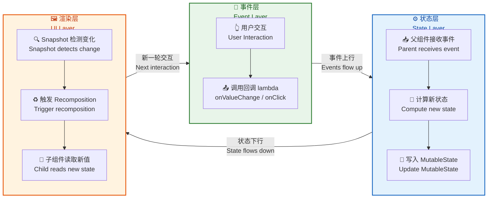

#### 为什么必须是"单向"的

在命令式 UI 体系（如传统 Android View 系统）中，数据流往往是 **双向** 的。一个 `EditText` 既可以被外部调用 `setText()` 来设置内容，也可以在内部通过 `TextWatcher` 自行响应用户输入并修改自己的文本——它同时是状态的消费者和生产者。当多个 View 互相依赖状态时，这种双向绑定极易产生 **循环更新（Update Loop）** 和 **状态不一致（State Inconsistency）** 问题。一个经典的 bug 场景是：View A 的变化触发 View B 更新，View B 的更新又回过来触发 View A 的 Listener，导致无限递归或状态混乱。

单向数据流从根本上消除了这种混乱。它的约束非常朴素：**数据只有一个流动方向，变更只有一个入口**。子组件永远只是"读取"状态并"报告"事件，决策权和写入权归属唯一的状态所有者。这种确定性（Determinism）带来了三个直接收益：

- **可预测性**：给定同样的状态输入，Composable 的输出永远一致，这使得 UI 行为可被精确推理。
- **可调试性**：状态变更有唯一来源，出现 bug 时只需追踪状态所有者的逻辑，而不必在整棵 View 树中排查谁偷偷修改了值。
- **可测试性**：无状态组件可以通过直接传入不同参数值来测试不同场景，无需模拟复杂的交互序列。

#### UDF 在 Compose 中的落地形态

在 Compose 中，UDF 并不是一个需要额外引入的库或框架，而是通过 **函数参数** 天然实现的。Composable 函数本质上就是一个 Kotlin 函数，它的输入参数就是"向下流动的状态"，它的 lambda 类型参数就是"向上流动的事件通道"。这种设计使得 UDF 成为 Compose 最自然的编程范式，而非一种需要刻意遵守的额外约定。

来看一个最基础的示例来理解这一点：

```kotlin
// ❌ 反模式：有状态组件，状态和 UI 紧耦合
@Composable
fun CounterStateful() {
    // 状态定义在组件内部，外部无法观察也无法控制
    var count by remember { mutableStateOf(0) }
    // 按钮既读取状态又直接修改状态——职责不清晰
    Button(onClick = { count++ }) {
        Text("Count: $count")
    }
}

// ✅ 正确模式：状态提升后的无状态组件
@Composable
fun CounterStateless(
    count: Int,               // 状态向下流动：父组件传入当前计数值
    onIncrement: () -> Unit   // 事件向上流动：子组件上报"增加"意图
) {
    // 组件只负责展示和事件转发，不持有任何状态
    Button(onClick = onIncrement) {
        Text("Count: $count")
    }
}

// 父组件作为状态所有者
@Composable
fun CounterScreen() {
    // 状态在此定义和管理——这是唯一的真相来源
    var count by remember { mutableStateOf(0) }
    // 将状态值和事件处理器传递给无状态子组件
    CounterStateless(
        count = count,                 // 传递当前值（State flows down）
        onIncrement = { count++ }      // 传递修改逻辑（Events flow up）
    )
}
```

在 `CounterStateless` 中，`count` 参数是一个普通的 `Int`——它是不可变的、只读的。组件内部没有任何途径去修改这个值，它只能通过调用 `onIncrement` 向上层发出"请帮我加一"的请求。**决策权** 完全在 `CounterScreen` 手中：它可以决定是直接 `count++`，还是先做校验（比如限制最大值），还是触发一个网络请求后再更新。这就是 UDF 最核心的价值——**关注点分离**。

### 状态所有权

#### 谁应该拥有状态

状态所有权（State Ownership）是 State Hoisting 中最关键的设计决策。一个状态应该被提升到哪一层？提升得太低，共享范围不够，多个同级组件无法访问同一份状态；提升得太高，又会导致不相关的组件因为状态变化而发生不必要的 Recomposition。Compose 社区对此有一条简洁而精准的指导原则：

> **将状态提升到所有需要读取或写入该状态的 Composable 的最低公共祖先（Lowest Common Ancestor, LCA）。**

这条原则的含义是：找到组件树中所有 **消费** 这个状态的节点，然后沿着树向上追溯，找到它们共同的最近父节点——状态就应该存放在那里。如果只有一个组件使用该状态，那么状态就提升到它的直接父级即可；如果两个兄弟组件都需要，就提升到它们共同的父组件。

来看一个稍微复杂一点的场景来理解这个原则的应用：

```kotlin
@Composable
fun SearchScreen() {
    // query 被 SearchBar 和 SearchResults 共同使用
    // 因此必须提升到它们的公共父级 SearchScreen
    var query by remember { mutableStateOf("") }

    // 垂直排列搜索栏和结果列表
    Column {
        // SearchBar 需要读取 query（显示当前文字）
        // 也需要写入 query（用户输入时更新）
        SearchBar(
            query = query,                       // 状态下行
            onQueryChange = { query = it }       // 事件上行
        )
        // SearchResults 需要读取 query（根据关键词筛选结果）
        // 但不需要写入 query
        SearchResults(query = query)             // 状态下行，无事件上行
    }
}

@Composable
fun SearchBar(
    query: String,                    // 只读：当前搜索文本
    onQueryChange: (String) -> Unit   // 回调：文本变化时通知父级
) {
    // TextField 是 Compose 内置的文本输入组件
    // 它自身也遵循 State Hoisting：需要外部传入 value 和 onValueChange
    TextField(
        value = query,                 // 传入当前值
        onValueChange = onQueryChange  // 直接转发事件给上层
    )
}

@Composable
fun SearchResults(query: String) {
    // 根据 query 过滤并展示结果
    // 这个组件只读取状态，完全不需要修改 query
    val results = remember(query) {
        // 当 query 变化时重新计算过滤结果
        filterItems(query)
    }
    LazyColumn {
        items(results) { item ->
            Text(text = item.title)
        }
    }
}
```

在这个例子中，`query` 状态被 `SearchBar`（读 + 写）和 `SearchResults`（只读）共同使用。它们的最低公共祖先是 `SearchScreen`，因此 `query` 的 `mutableStateOf` 声明放在 `SearchScreen` 中。如果我们错误地将 `query` 放在 `SearchBar` 内部，`SearchResults` 就无法访问它；如果将它提升到更高的 `MainActivity` 级别，则 `SearchScreen` 之外不相关的组件也可能受到 Recomposition 影响。

#### 状态所有权的三个层级

随着应用复杂度的提升，状态所有权不仅仅是"放在哪个 Composable 里"这么简单。实践中，状态所有者通常分为三个层级，对应不同的生命周期和职责范围：

**第一层级：Composable 函数内部（`remember`）**。适用于纯 UI 状态，例如一个 `BottomSheet` 是否展开、一个动画的当前进度、一个输入框的临时文本。这些状态的生命周期与 Composable 在 Composition 中的存活期一致——组件离开 Composition 时状态即丢失。这是最轻量的状态持有方式，适合"丢了也无所谓"的瞬时 UI 状态。

**第二层级：普通类 State Holder**。当一个组件的 UI 状态逻辑变得复杂（比如一个包含多个输入字段和校验逻辑的表单），将所有状态和逻辑都塞在 Composable 函数里会导致函数体膨胀、可读性下降。此时可以抽取一个普通的 Kotlin 类来封装这些状态和操作，并通过 `remember` 在 Composable 中持有这个类的实例。这种做法的好处是逻辑集中、可单元测试，但生命周期仍然绑定在 Composition 存活期内。

**第三层级：ViewModel**。适用于需要 **跨配置变更（Configuration Change）存活** 的业务状态，例如从网络加载的数据列表、用户编辑中的草稿等。ViewModel 由 `ViewModelStore` 管理，其生命周期横跨 Activity/Fragment 的重建。在 Compose 中通过 `viewModel()` 函数获取实例。ViewModel 通常持有 `StateFlow` 或 `MutableState`，并通过 `collectAsState()` 将 Flow 转换为 Compose 可观察的 State。

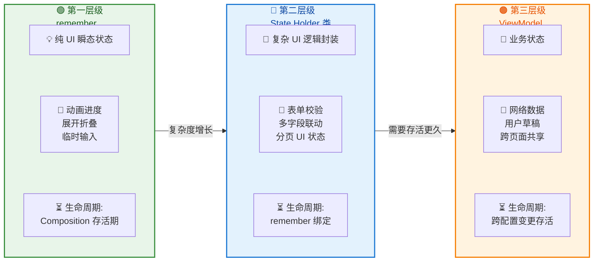

选择哪个层级取决于两个维度的判断：**状态的复杂度** 和 **状态需要存活多久**。简单且短暂的状态用 `remember`；复杂但仍是 UI 级别的状态用 State Holder 类；需要在配置变更中存活或涉及业务逻辑的状态用 ViewModel。做出错误的选择不会导致编译错误，但会导致架构腐化——过度使用 ViewModel 管理所有状态会让业务层与 UI 层耦合过紧；反之，把业务状态放在 `remember` 中则会在屏幕旋转时丢失数据。

### 事件回调

#### 回调 Lambda 的设计艺术

在 State Hoisting 模式中，事件回调（Event Callback）是子组件与父组件之间 **唯一** 的通信通道。子组件通过调用父组件传入的 lambda 参数来上报事件，而不是直接修改状态或发送广播。这些 lambda 的设计质量直接决定了组件的可复用性和接口清晰度。

一个常见的设计失误是传递 **过于底层的原始事件**。例如，对一个自定义评分组件 `RatingBar`，不应该暴露 `onTouch: (MotionEvent) -> Unit` 这样的原始触摸事件，而应该提供语义化的 `onRatingChange: (Int) -> Unit`。调用者不需要也不应该关心组件内部是通过触摸、拖拽还是键盘操作来改变评分的——它只关心"评分变了，新值是多少"。

另一个重要的设计原则是：**回调应该描述"发生了什么"（What happened），而不是"该做什么"（What to do）**。对比以下两种命名风格：

```kotlin
// ❌ 命令式命名：暗示了具体动作，限制了调用者的处理方式
@Composable
fun UserCard(
    user: User,
    navigateToProfile: () -> Unit,   // 命名暗示"必须导航"
    deleteFromDatabase: () -> Unit   // 命名暗示"必须删除数据库记录"
)

// ✅ 事件化命名：描述发生了什么，调用者自行决定如何响应
@Composable
fun UserCard(
    user: User,
    onUserClick: () -> Unit,         // 用户被点击了——至于导航还是弹窗，调用者决定
    onDeleteRequest: () -> Unit      // 删除被请求了——至于是删数据库还是标记软删除，调用者决定
)
```

这种命名差异看似微小，实则影响深远。`navigateToProfile` 这样的命名将组件与"导航"这个特定行为绑定在了一起，如果有一天需求变成了"点击弹出预览弹窗"，命名就变得自相矛盾。而 `onUserClick` 是纯粹的事件描述，不对处理方式做任何假设。

#### 多回调与事件聚合

当组件支持的交互变多时，lambda 参数的数量可能会急剧膨胀。例如一个功能完整的编辑器组件可能需要 `onTextChange`、`onBoldClick`、`onItalicClick`、`onImageInsert`、`onUndo`、`onRedo` 等数十个回调。此时，可以使用 **事件密封类（Sealed Class / Sealed Interface）** 将多个回调聚合为一个：

```kotlin
// 定义编辑器所有可能的事件类型
sealed interface EditorEvent {
    // 文本内容变化，携带新文本
    data class TextChanged(val text: String) : EditorEvent
    // 切换粗体状态
    data object ToggleBold : EditorEvent
    // 切换斜体状态
    data object ToggleItalic : EditorEvent
    // 插入图片，携带图片 URI
    data class InsertImage(val uri: Uri) : EditorEvent
    // 撤销操作
    data object Undo : EditorEvent
    // 重做操作
    data object Redo : EditorEvent
}

// 组件只需要一个事件回调参数
@Composable
fun RichEditor(
    state: EditorState,                   // 状态下行：编辑器当前状态
    onEvent: (EditorEvent) -> Unit        // 事件上行：所有事件走同一通道
) {
    // 文本输入区域
    TextField(
        value = state.text,
        // 文本变化时，包装成 TextChanged 事件上报
        onValueChange = { onEvent(EditorEvent.TextChanged(it)) }
    )
    // 工具栏按钮
    IconButton(
        // 粗体按钮点击时，上报 ToggleBold 事件
        onClick = { onEvent(EditorEvent.ToggleBold) }
    ) {
        Icon(Icons.Default.FormatBold, contentDescription = "Bold")
    }
    // ... 更多按钮同理
}
```

这种聚合模式的好处是：组件接口保持简洁（永远只有一个 `onEvent` 参数）；新增事件类型只需扩展密封类，无需修改组件签名；父组件可以用 `when` 表达式统一处理所有事件，享受编译器的穷举检查（exhaustive check）。

但也需注意，并非所有场景都适合聚合。对于只有一两个简单回调的轻量组件（如 `Button` 的 `onClick`、`Switch` 的 `onCheckedChange`），单独的 lambda 参数更加直观和轻量。事件聚合是 **复杂度升级后的优化手段**，而非默认选择。

#### 回调 Lambda 与 Recomposition 的性能关系

每一次 Recomposition 时，Composable 函数体会重新执行，其中定义的 lambda 表达式也会被重新创建。在 Kotlin 中，如果一个 lambda 没有捕获任何外部可变变量，编译器会将其编译为 **单例（Singleton）**——多次执行得到的是同一个实例。但如果 lambda 捕获了变量（这在 Compose 中非常普遍，例如 `{ count++ }` 捕获了 `count`），每次 Recomposition 都会产生一个新的 lambda 实例。

这是否会导致子组件不必要的 Recomposition？在许多场景下，Compose 编译器插件会 **自动处理** 这个问题。Compose Compiler 会通过 `remember` 自动包裹 lambda（称为 **lambda memoization**），使得只要捕获的变量值没有变化，传递给子组件的就是同一个 lambda 引用。不过，这一优化依赖于 Compose Compiler 的 **Stability 推断**——如果捕获的变量被判定为 unstable，lambda 就不会被缓存，每次都是新实例。关于 Stability 的详细机制，将在"重组作用域 Recompose Scope"一节中深入讨论。

对于性能敏感的场景（如 `LazyColumn` 中大量 item 的点击回调），如果发现不必要的 Recomposition，可以手动使用 `remember` 来稳定 lambda：

```kotlin
@Composable
fun UserList(users: List<User>, onUserClick: (UserId) -> Unit) {
    LazyColumn {
        items(users, key = { it.id }) { user ->
            // 手动 remember 化 lambda，避免每次 Recomposition 创建新实例
            // 关键点：remember 的 key 是 user.id 和 onUserClick
            // 只有当它们变化时才重建 lambda
            val onClick = remember(user.id, onUserClick) {
                { onUserClick(user.id) }
            }
            UserItem(
                user = user,
                onClick = onClick  // 传入稳定的 lambda 引用
            )
        }
    }
}
```

### 无状态组件

#### 无状态组件的定义与特征

经过 State Hoisting 改造后的组件，其内部 **不持有任何 `mutableStateOf` 或 `mutableStateListOf` 等可变状态**，所有需要的数据都通过参数传入，所有产生的事件都通过回调上报。这就是无状态组件（Stateless Composable）。它具备以下鲜明特征：

**纯函数特性**：给定相同的参数，无状态组件永远产生相同的 UI 输出。它不依赖任何隐藏的内部状态，也不产生任何观察不到的副作用。这使得它的行为完全可预测——你可以通过审视它的参数列表来 **完全理解** 它可能产生的所有 UI 形态。

**高度可复用**：由于不持有状态，无状态组件不对"状态从哪里来"、"事件到哪里去"做任何假设。同一个 `SearchBar` 组件可以出现在首页搜索、商品搜索、用户搜索等完全不同的业务场景中——调用者只需要提供对应的 `query` 值和 `onQueryChange` 回调。

**天然可测试**：测试无状态组件不需要模拟任何 ViewModel 或 Repository，只需要直接传入参数值并断言 UI 输出。Compose 的测试框架 `createComposeRule` 可以轻松设置参数、触发交互、验证结果：

```kotlin
@Test
fun counterDisplaysCurrentCount() {
    // 创建 Compose 测试规则
    composeTestRule.setContent {
        // 直接传入固定参数——无需构造任何 ViewModel 或 mock 对象
        CounterStateless(
            count = 42,              // 传入确定的状态值
            onIncrement = {}         // 空 lambda，本测试不关心交互
        )
    }
    // 断言：文本 "Count: 42" 必须存在于组件树中
    composeTestRule
        .onNodeWithText("Count: 42")
        .assertExists()
}

@Test
fun counterCallsOnIncrementWhenClicked() {
    // 用变量追踪回调是否被调用
    var incrementCalled = false
    composeTestRule.setContent {
        CounterStateless(
            count = 0,
            onIncrement = { incrementCalled = true }  // 验证回调是否被触发
        )
    }
    // 执行点击操作
    composeTestRule
        .onNodeWithText("Count: 0")
        .performClick()
    // 断言：onIncrement 必须被调用
    assert(incrementCalled)
}
```

#### Preview 友好性

无状态组件的另一个显著优势是 **对 Android Studio Preview 极度友好**。由于组件不依赖 ViewModel、Repository 或任何运行时环境，可以在 `@Preview` 中直接传入模拟参数进行预览，无需启动模拟器或连接数据库：

```kotlin
// 多种状态的预览可以并排显示，快速验证 UI 表现
@Preview(name = "Empty State")
@Composable
fun SearchBarPreviewEmpty() {
    // 传入空字符串，预览"初始空白"状态
    SearchBar(query = "", onQueryChange = {})
}

@Preview(name = "With Query")
@Composable
fun SearchBarPreviewWithQuery() {
    // 传入固定文本，预览"已输入关键词"状态
    SearchBar(query = "Jetpack Compose", onQueryChange = {})
}

@Preview(name = "Long Query Overflow")
@Composable
fun SearchBarPreviewOverflow() {
    // 传入超长文本，预览"文字溢出"的边界情况
    SearchBar(
        query = "This is a very long search query to test overflow behavior",
        onQueryChange = {}
    )
}
```

这种 Preview 能力在有状态组件中几乎不可能实现——因为 `remember { mutableStateOf(...) }` 的初始值是硬编码的，你无法在 Preview 中灵活切换不同状态场景。

#### 有状态 vs 无状态：如何共存

在实际项目中，**并非所有组件都应该是无状态的**。一个成熟的 Compose 应用通常采用 **"有状态容器 + 无状态展示"** 的双层结构。最顶层的 Screen 级 Composable 作为有状态容器（Stateful Wrapper），负责持有状态和协调逻辑；其下的所有 UI 元素都是无状态组件，只负责展示和事件转发。

```kotlin
// ——————————————————————————————————————————
// 有状态容器：Screen 级别，负责状态管理和业务逻辑调度
// ——————————————————————————————————————————
@Composable
fun TodoScreen(
    viewModel: TodoViewModel = viewModel()  // 注入 ViewModel
) {
    // 从 ViewModel 收集状态，转为 Compose State
    val uiState by viewModel.uiState.collectAsStateWithLifecycle()

    // 将状态展开后传递给无状态展示组件
    TodoContent(
        todos = uiState.todos,                           // 待办列表
        inputText = uiState.inputText,                   // 输入框当前文本
        onInputChange = viewModel::onInputChange,        // 文本变化回调
        onAddTodo = viewModel::addTodo,                  // 新增待办回调
        onToggleTodo = viewModel::toggleTodo,            // 切换完成状态回调
        onDeleteTodo = viewModel::deleteTodo             // 删除待办回调
    )
}

// ——————————————————————————————————————————
// 无状态展示：纯 UI 组件，不持有任何状态
// ——————————————————————————————————————————
@Composable
fun TodoContent(
    todos: List<TodoItem>,                  // 待办事项列表
    inputText: String,                      // 输入框文本
    onInputChange: (String) -> Unit,        // 输入变化事件
    onAddTodo: () -> Unit,                  // 新增事件
    onToggleTodo: (TodoId) -> Unit,         // 切换完成事件
    onDeleteTodo: (TodoId) -> Unit          // 删除事件
) {
    Column(modifier = Modifier.fillMaxSize().padding(16.dp)) {
        // 输入区域
        Row {
            TextField(
                value = inputText,
                onValueChange = onInputChange,           // 转发输入事件
                modifier = Modifier.weight(1f)
            )
            Button(onClick = onAddTodo) {                // 转发新增事件
                Text("Add")
            }
        }
        // 列表区域
        LazyColumn {
            items(todos, key = { it.id }) { todo ->
                TodoRow(
                    todo = todo,
                    onToggle = { onToggleTodo(todo.id) },    // 转发切换事件
                    onDelete = { onDeleteTodo(todo.id) }     // 转发删除事件
                )
            }
        }
    }
}
```

这种分层策略的核心智慧在于：**有状态容器是整个组件树中唯一知道"数据从哪里来"和"事件到哪里去"的地方**，它像一座桥梁连接着业务层（ViewModel / Repository）和展示层（无状态 Composable）。而无状态展示组件则完全不知道 ViewModel 的存在——它只看得见参数和 lambda。这种 **信息屏障** 是高质量 Compose 架构的基石。

#### 状态提升的边界与反模式

虽然 State Hoisting 是 Compose 的核心最佳实践，但它并非没有边界。以下是几种常见的反模式或需要注意的场景：

**反模式一：过度提升**。将所有状态无脑提升到最顶层的 `Activity` 或 `NavHost` 中。这会导致顶层组件的参数列表爆炸式增长，违反了单一职责原则，也使得任何底层状态的变化都会触发从顶层开始的大范围 Recomposition。正确做法是遵循 LCA 原则，**按需提升到最低必要层级**。

**反模式二：将 `MutableState` 直接暴露给子组件**。例如传递 `MutableState<Int>` 而非 `Int` + `(Int) -> Unit`。这打破了单向数据流——子组件获得了直接修改状态的能力，绕过了父组件的控制。状态变更将变得不可追踪。

```kotlin
// ❌ 反模式：暴露 MutableState，子组件可以绕过父组件直接修改
@Composable
fun BadChild(countState: MutableState<Int>) {
    // 子组件直接操作 MutableState——父组件完全不知道发生了什么
    Button(onClick = { countState.value++ }) {
        Text("Count: ${countState.value}")
    }
}

// ✅ 正确：只暴露只读值 + 事件回调
@Composable
fun GoodChild(count: Int, onIncrement: () -> Unit) {
    // 子组件无法直接修改状态，只能通过回调上报意图
    Button(onClick = onIncrement) {
        Text("Count: $count")
    }
}
```

**反模式三：在子组件中 `remember` 父组件的状态副本**。例如在子组件中 `var localCopy by remember { mutableStateOf(parentValue) }`，然后操作 `localCopy`。这会在子组件内部创建一份状态副本，当父组件更新原始状态时，副本并不会自动同步（因为 `remember` 的初始化块只在首次 Composition 时执行），最终导致 UI 展示的是 **过期数据**。

---

**📝 练习题**

在以下代码中，当用户在 `TextField` 中输入文字时，`ResultText` 显示的内容会是什么？

```kotlin
@Composable
fun QuizScreen() {
    var text by remember { mutableStateOf("Hello") }
    Column {
        ChildInput(parentText = text)
        ResultText(text = text)
    }
}

@Composable
fun ChildInput(parentText: String) {
    var localText by remember { mutableStateOf(parentText) }
    TextField(value = localText, onValueChange = { localText = it })
}

@Composable
fun ResultText(text: String) {
    Text("Result: $text")
}
```

A. `ResultText` 始终显示 `"Result: Hello"`，无论用户如何输入


B. `ResultText` 实时跟随用户输入的内容更新


C. `ResultText` 显示空字符串 `"Result: "`


D. 代码编译报错，因为 `localText` 不能用 `remember` 初始化


**【答案】** A

**【解析】** 这道题考查的是 State Hoisting 反模式中"子组件 remember 父组件状态副本"的问题。`ChildInput` 中的 `localText` 通过 `remember { mutableStateOf(parentText) }` 初始化，这意味着 `localText` 只在 **首次 Composition** 时取 `parentText` 的值 `"Hello"` 作为初始值，此后 `localText` 就是一个独立于 `parentText` 的状态副本。用户输入时修改的是 `localText`，而非 `QuizScreen` 中的 `text`。由于 `text` 始终没有被修改（没有事件回调上报给 `QuizScreen`），`ResultText` 接收到的 `text` 参数值永远是 `"Hello"`。这正是违反 State Hoisting 原则的典型后果——状态在子组件内部被"截断"，父组件和兄弟组件完全感知不到变化。正确做法是让 `ChildInput` 成为无状态组件：接收 `text: String` 和 `onTextChange: (String) -> Unit`，将输入事件回传给 `QuizScreen` 统一处理。

---

## 状态持有者 State Holders

在上一节"状态提升"中，我们已经明确了一条核心原则：**状态应该被提升到"使用它的所有 Composable 的最低公共祖先"**。但随着界面复杂度的增长，一个不可回避的问题浮出水面——如果一个屏幕拥有十几个状态字段、多种用户交互事件、还需要调用网络请求或数据库操作，把这些逻辑全部塞进某个上层 Composable 函数里，代码将迅速膨胀到不可维护的地步。**State Holder（状态持有者）** 正是为了解决这一问题而存在的架构模式：它把"状态的声明、读写、变换、以及与状态相关的逻辑"从 Composable 函数中 **抽离** 出来，封装到一个独立的对象中，让 Composable 只负责"读状态 → 渲染 UI"和"接收事件 → 回调给 State Holder"。

从 Google 官方架构指南的角度来看，State Holder 可以被分为两大类别：

- **业务逻辑状态持有者（Business Logic State Holder）**：通常就是 `ViewModel`。它持有与业务规则、数据层交互相关的状态，生命周期跟随 `ViewModelStoreOwner`（通常是 Activity/Fragment/Navigation destination），在 Configuration Change（如屏幕旋转）后依然存活。
- **UI 逻辑状态持有者（UI Logic State Holder）**：一个普通的 Kotlin 类，通过 `remember` 在 Composition 中被持有。它管理的是纯 UI 层面的逻辑，比如 `ScrollState`、`LazyListState`、对话框的展开/折叠等。它的生命周期与所在 Composition 的生命周期一致——离开 Composition 就被回收。

这两者并非互斥关系，而是**分层协作**。一个典型的屏幕往往同时拥有一个 ViewModel 处理业务数据，以及一个或多个 UI State Holder 处理界面交互细节。理解它们各自的职责边界、创建方式和生命周期差异，是写出可测试、可维护的 Compose 代码的关键。

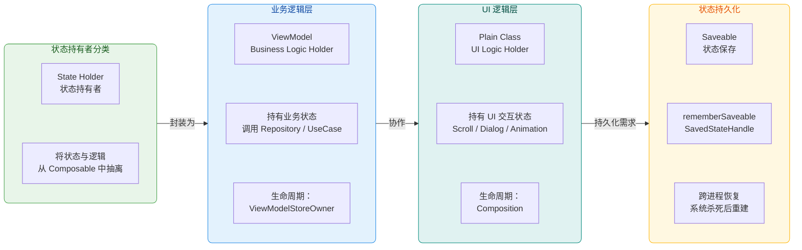

---

### ViewModel 集成

#### 为什么 Compose 仍然需要 ViewModel

在传统 View 体系中，ViewModel 的核心价值在于：**跨越 Configuration Change 存活**，避免因屏幕旋转、语言切换等操作导致内存中的数据丢失。进入 Compose 时代后，这个价值丝毫未减。Compose 的 `remember` 只能在当前 Composition 的生命周期内缓存数据——一旦 Activity 被销毁重建，整棵 Composition Tree 会被完全重新构建，所有通过 `remember` 持有的状态都将归零。而 ViewModel 由 `ViewModelStore` 管理，其实例在 Configuration Change 时并不会被销毁，只有在 `ViewModelStoreOwner`（如 Activity）真正 finish 或 Navigation back stack 弹出时才被清理。

除了生存周期的优势，ViewModel 还承担另一个重要角色——**作为 UI 层与 Data 层（Repository、DataSource、UseCase）的桥梁**。Compose 的函数式范式强烈建议 Composable 是纯函数（给定相同输入产生相同输出），不应该直接在 Composable 中发起网络请求或数据库查询。这些带有副作用的业务操作应该委托给 ViewModel，由 ViewModel 内部的 `viewModelScope` 启动协程，将结果以 `State` 的形式暴露给 UI。

#### 在 Compose 中获取 ViewModel

Compose 通过 `androidx.lifecycle:lifecycle-viewmodel-compose` 库提供了 `viewModel()` 这个 Composable 函数，让我们能在 Composition 中便捷地获取 ViewModel 实例。其核心行为是：查找当前最近的 `ViewModelStoreOwner`（通常是宿主 Activity 或 Navigation destination），从它的 `ViewModelStore` 中获取（或创建）指定类型的 ViewModel。

```kotlin
// --- 1. 定义 ViewModel：持有屏幕的业务状态 ---
class TaskListViewModel(
    // SavedStateHandle 由框架自动注入，用于访问 Navigation 参数及保存状态
    private val savedStateHandle: SavedStateHandle,
    // 业务数据源，通常通过依赖注入（Hilt）提供
    private val taskRepository: TaskRepository
) : ViewModel() {

    // 使用 MutableStateFlow 持有内部可变状态
    private val _uiState = MutableStateFlow(TaskListUiState())

    // 对外暴露不可变的 StateFlow，UI 只能读取不能写入
    val uiState: StateFlow<TaskListUiState> = _uiState.asStateFlow()

    // init 块在 ViewModel 创建时执行，启动数据加载
    init {
        loadTasks()  // 首次进入屏幕时自动加载任务列表
    }

    // 加载任务列表的业务逻辑
    private fun loadTasks() {
        // viewModelScope 是 ViewModel 自带的协程作用域
        // 当 ViewModel 被 clear 时，该作用域会自动取消
        viewModelScope.launch {
            _uiState.update { it.copy(isLoading = true) }  // 进入加载态
            try {
                // 调用 Repository 获取数据（挂起函数，不阻塞主线程）
                val tasks = taskRepository.getAllTasks()
                // 更新状态：加载完成，填入数据
                _uiState.update { it.copy(isLoading = false, tasks = tasks) }
            } catch (e: Exception) {
                // 异常处理：将错误信息写入状态
                _uiState.update { it.copy(isLoading = false, error = e.message) }
            }
        }
    }

    // 公开的事件处理方法：删除任务
    fun deleteTask(taskId: String) {
        viewModelScope.launch {
            taskRepository.deleteTask(taskId)  // 调用 Repository 删除
            loadTasks()                         // 删除后重新加载列表
        }
    }
}

// --- 2. 定义 UI 状态的数据类 ---
// 使用 data class 天然满足 Compose 的 Stability 要求（所有字段为 val 且为稳定类型）
data class TaskListUiState(
    val isLoading: Boolean = false,   // 是否正在加载
    val tasks: List<Task> = emptyList(), // 任务列表数据
    val error: String? = null          // 错误信息（null 表示无错误）
)
```

在 Composable 端使用时：

```kotlin
@Composable
fun TaskListScreen(
    // viewModel() 会自动从最近的 ViewModelStoreOwner 获取或创建实例
    // 若使用 Hilt，则替换为 hiltViewModel()，自动处理依赖注入
    viewModel: TaskListViewModel = viewModel(),
    // 导航事件以 lambda 形式向上传递，保持 Screen 级 Composable 可测试
    onNavigateToDetail: (String) -> Unit
) {
    // collectAsStateWithLifecycle 是生命周期感知的收集方式
    // 当 UI 进入后台（STOPPED）时自动停止收集，节省资源
    val uiState by viewModel.uiState.collectAsStateWithLifecycle()

    // 根据状态渲染不同的 UI
    when {
        // 加载中：显示进度指示器
        uiState.isLoading -> {
            CircularProgressIndicator()
        }
        // 有错误：显示错误信息与重试按钮
        uiState.error != null -> {
            ErrorScreen(
                message = uiState.error!!,
                onRetry = { viewModel.loadTasks() }  // 重试回调
            )
        }
        // 正常：显示任务列表
        else -> {
            TaskList(
                tasks = uiState.tasks,                    // 传递数据
                onDelete = { viewModel.deleteTask(it) },  // 删除事件回调
                onItemClick = onNavigateToDetail           // 点击事件向上传递
            )
        }
    }
}
```

这里有几个关键设计决策值得深入理解：

**第一，ViewModel 作为默认参数而非内部创建**。把 `viewModel: TaskListViewModel = viewModel()` 写在参数列表中而非函数体内，是为了 **可测试性**。在单元测试或 Preview 中，我们可以直接传入一个 Fake ViewModel，而不需要启动真实的 `ViewModelStore`。这本质上仍是"状态提升"思想的延伸——将依赖注入点暴露在函数签名上。

**第二，`collectAsStateWithLifecycle` 而非 `collectAsState`**。两者都能将 `Flow` 转换为 Compose 的 `State`，但前者来自 `androidx.lifecycle:lifecycle-runtime-compose`，能够感知 Lifecycle 状态。当 Activity 进入 `STOPPED` 状态（比如用户按下 Home 键），它会自动取消对上游 Flow 的订阅，避免在后台做无意义的 UI 更新甚至引发 crash。这在收集来自 Room 或 DataStore 的热流时尤为重要——否则后台仍在持续收集并尝试更新不可见的 UI。

**第三，单一 UiState 数据类**。把所有屏幕状态（加载态、数据、错误信息）封装进一个 `data class`，而非分散成多个独立的 `StateFlow`，好处在于：保证状态的**一致性**（不会出现"isLoading=true 但同时 error!=null"这种矛盾状态），同时让 UI 层只需要观察一个流，逻辑更简洁。这种模式被称为 **UiState 封装模式**，是 Google 官方推荐的做法。

#### ViewModel 的作用域与共享

ViewModel 的一个强大特性是**基于作用域的实例共享**。当多个 Composable 通过相同的 `ViewModelStoreOwner` 调用 `viewModel<SameType>()` 时，它们获得的是**同一个**实例。这为跨组件通信提供了天然管道：

```kotlin
@Composable
fun OrderScreen() {
    // 这两个子 Composable 获取的是同一个 ViewModel 实例
    // 因为它们共享同一个 ViewModelStoreOwner（宿主 Activity 或 NavBackStackEntry）
    OrderHeader()   // 显示订单摘要
    OrderDetail()   // 显示订单详情
}

@Composable
fun OrderHeader(
    // 默认从最近的 ViewModelStoreOwner 获取——与 OrderDetail 共享
    viewModel: OrderViewModel = viewModel()
) {
    val summary by viewModel.orderSummary.collectAsStateWithLifecycle()
    Text(text = summary.title)  // 读取共享状态
}

@Composable
fun OrderDetail(
    // 同一个 ViewModelStoreOwner → 同一个 ViewModel 实例
    viewModel: OrderViewModel = viewModel()
) {
    val detail by viewModel.orderDetail.collectAsStateWithLifecycle()
    Text(text = detail.description)  // 读取同一个 ViewModel 的另一个状态
}
```

但这里有一个容易踩的坑：如果在 Navigation Compose 中，每个 `NavBackStackEntry` 就是一个独立的 `ViewModelStoreOwner`。在 Screen A 中通过 `viewModel()` 获取的实例，与在 Screen B 中获取的是**不同的实例**。若确实需要在多个 Navigation destination 之间共享 ViewModel，需要显式指定父级作用域：

```kotlin
@Composable
fun ChildScreen(
    // 通过 navController 获取父 NavGraph 的 BackStackEntry 作为 ViewModelStoreOwner
    // 这样同一个 NavGraph 下的所有 destination 共享同一个 ViewModel
    sharedViewModel: SharedViewModel = viewModel(
        viewModelStoreOwner = LocalNavController.current
            .getBackStackEntry("parent_graph_route")
    )
) {
    // 使用共享的 ViewModel 实例
}
```

---

### 普通类 State Holder

#### 何时需要普通类 State Holder

并非所有状态逻辑都需要 ViewModel 这么"重"的容器。考虑以下场景：一个可展开的搜索栏组件，它需要管理"输入框文字"、"是否展开"、"搜索建议列表的滚动位置"等状态，以及"点击展开按钮时聚焦输入框"、"输入为空时自动折叠建议列表"等 UI 交互逻辑。这些状态和逻辑：

- **不涉及业务数据层**（不需要调用 Repository）
- **不需要跨 Configuration Change 存活**（旋转后搜索栏回到初始状态是可以接受的）
- **与特定 UI 组件强耦合**（换一个组件这些逻辑完全不适用）

对于这类场景，创建一个普通的 Kotlin 类作为 UI Logic State Holder，然后用 `remember` 在 Composition 中持有它，是更轻量、更合适的选择。这种模式在 Compose 标准库中随处可见——`ScrollState`、`LazyListState`、`DrawerState`、`PagerState` 全部都是普通类 State Holder 的典范。

#### 设计一个普通类 State Holder

一个规范的普通类 State Holder 通常遵循以下结构模式：

```kotlin
// --- 1. 定义 State Holder 类 ---
// 使用 @Stable 标注，向 Compose 编译器承诺：
// "当该对象的公开属性未变化时，可以安全跳过使用它的重组"
@Stable
class SearchBarState(
    // 通过构造参数注入初始值或其他 Compose 状态（如 CoroutineScope）
    initialQuery: String = "",
    private val coroutineScope: CoroutineScope
) {
    // --- 内部可变状态 ---
    // 使用 mutableStateOf 让 Compose 能够追踪变化并触发重组
    var query by mutableStateOf(initialQuery)
        private set  // 外部只读，只能通过下方方法修改

    var isExpanded by mutableStateOf(false)
        private set  // 外部只读

    var suggestions by mutableStateOf<List<String>>(emptyList())
        private set  // 外部只读

    // FocusRequester 用于程序化控制焦点
    val focusRequester = FocusRequester()

    // 滚动状态：建议列表的滚动位置
    val listScrollState = LazyListState()

    // --- 派生状态 ---
    // 是否显示清除按钮：仅当输入框有文字时显示
    val showClearButton: Boolean
        get() = query.isNotEmpty()

    // --- UI 逻辑方法 ---

    // 更新搜索关键字
    fun onQueryChange(newQuery: String) {
        query = newQuery  // 更新输入内容
        // 根据输入动态过滤建议（纯 UI 逻辑，非业务逻辑）
        suggestions = if (newQuery.isBlank()) {
            emptyList()  // 输入为空时清空建议
        } else {
            // 本地静态建议过滤（若需要网络搜索建议，应移至 ViewModel）
            STATIC_SUGGESTIONS.filter {
                it.contains(newQuery, ignoreCase = true)
            }
        }
    }

    // 展开搜索栏
    fun expand() {
        isExpanded = true  // 切换展开状态
        // 使用传入的 CoroutineScope 启动协程（因为 focusRequester 需要延迟请求焦点）
        coroutineScope.launch {
            // 等待一帧让动画开始后再请求焦点
            awaitFrame()
            focusRequester.requestFocus()  // 自动聚焦到输入框
        }
    }

    // 折叠搜索栏并清空输入
    fun collapse() {
        isExpanded = false  // 折叠
        query = ""           // 清空输入
        suggestions = emptyList()  // 清空建议
    }

    // 清除输入内容（但保持展开状态）
    fun clearQuery() {
        query = ""
        suggestions = emptyList()
    }

    companion object {
        // 本地静态建议数据（实际项目中可能来自本地缓存）
        private val STATIC_SUGGESTIONS = listOf(
            "Android", "Architecture", "Animation", "Accessibility"
        )
    }
}
```

接下来是配套的 `remember` 工厂函数。这是 Compose 社区的**最佳实践惯例**——为每个 State Holder 提供一个 `rememberXxxState()` 函数：

```kotlin
// --- 2. 提供 remember 工厂函数 ---
// 这是 Compose 标准库的命名惯例：rememberScrollState()、rememberLazyListState() 等
@Composable
fun rememberSearchBarState(
    initialQuery: String = ""  // 允许外部配置初始值
): SearchBarState {
    // rememberCoroutineScope 返回一个绑定到当前 Composition 的协程作用域
    // 当该 Composable 离开 Composition 时，作用域自动取消
    val coroutineScope = rememberCoroutineScope()
    // remember 确保 SearchBarState 在重组时不被重新创建
    // 使用 initialQuery 作为 key——当初始值变化时重建 State Holder
    return remember(initialQuery) {
        SearchBarState(
            initialQuery = initialQuery,
            coroutineScope = coroutineScope
        )
    }
}
```

在 Composable 中使用：

```kotlin
// --- 3. 在 Composable 中使用 ---
@Composable
fun SearchScreen(
    // ViewModel 处理业务逻辑（发起真正的搜索请求）
    viewModel: SearchViewModel = viewModel()
) {
    // UI State Holder 处理搜索栏的交互逻辑
    val searchBarState = rememberSearchBarState()
    // ViewModel 暴露的业务状态
    val searchResults by viewModel.searchResults.collectAsStateWithLifecycle()

    Column {
        // 搜索栏组件：只关心 UI 交互
        SearchBar(
            state = searchBarState,  // 传入 UI State Holder
            onSearch = { query ->
                // 真正的搜索操作委托给 ViewModel（业务逻辑）
                viewModel.search(query)
                searchBarState.collapse()  // 搜索后折叠搜索栏（UI 逻辑）
            }
        )
        // 搜索结果列表：直接消费 ViewModel 的业务状态
        SearchResultList(results = searchResults)
    }
}
```

#### 普通类 State Holder 的设计要点

**封装与访问控制**。State Holder 内部的状态字段使用 `private set`，确保外部只能通过定义好的方法修改状态。这不是 Kotlin 语法上的卖弄，而是为了**保护状态一致性**——防止外部代码在不恰当的时机直接篡改某个字段，导致状态组合出现无效值。

**`@Stable` 注解的意义**。对于一个包含 `mutableStateOf` 属性的类，Compose 编译器默认会将其视为"不稳定的"（unstable），因为编译器无法确信它在重组期间是否真的没变。加上 `@Stable` 注解后，你向编译器做出了承诺："当 `equals` 返回 true 时，所有公开属性都未变化"。编译器就可以在参数未变时安全地**跳过**使用该 State Holder 的 Composable 重组。但请注意，这是一个**契约**，编译器不会替你验证——如果你违反了承诺（比如有一个不通过 `mutableStateOf` 追踪的可变字段），就会引发微妙的 UI 不更新 Bug。

**协程作用域的注入**。State Holder 自身不应该创建 `CoroutineScope`（否则谁来负责取消？），而是通过构造参数接收一个已经与 Composition 生命周期绑定的 Scope（来自 `rememberCoroutineScope()`）。当 Composable 离开 Composition 时，这个 Scope 被自动取消，State Holder 中所有挂起的协程也随之终止，不会泄漏。

#### ViewModel 与普通类 State Holder 的分工边界

很多开发者纠结于"这个逻辑到底放 ViewModel 还是放普通 State Holder"。下面这张对照表能帮你快速做出决策：

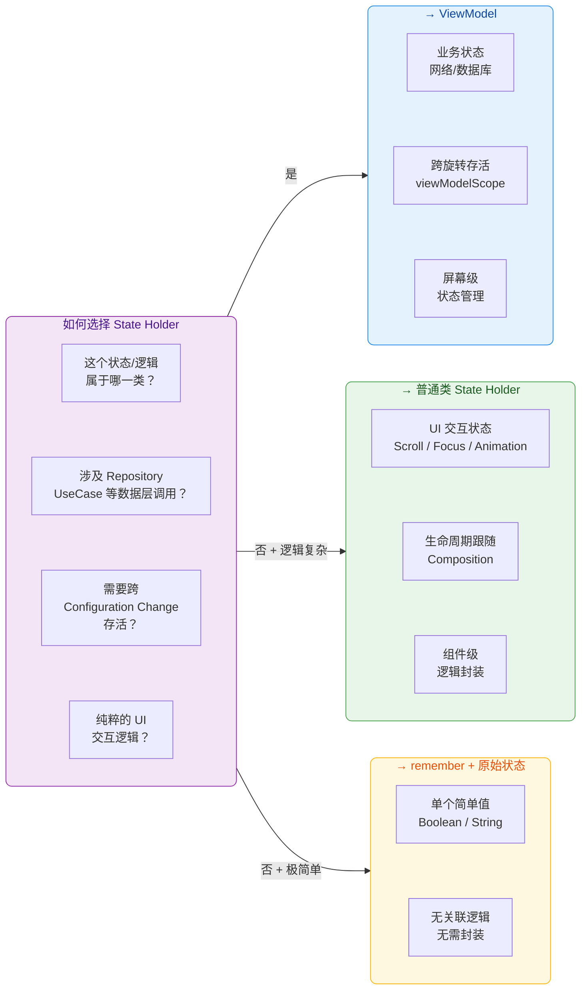

简单来说，决策路径是这样的：

1. **涉及 Data Layer（Repository / UseCase / 网络 / 数据库）？** → **ViewModel**。
2. **不涉及 Data Layer，但 UI 交互逻辑较复杂（多个关联状态 + 多个操作方法）？** → **普通类 State Holder**。
3. **只是一个简单的 Boolean 或 String，没有关联逻辑？** → 直接 `remember { mutableStateOf(...) }`，无需额外封装。

实际开发中，两者经常同时出现在一个屏幕中：ViewModel 向下提供业务数据状态，普通类 State Holder 管理 UI 组件的交互行为，两者在 Screen 级 Composable 中被组合调度。

---

### Saveable 状态保存

#### 问题：Configuration Change 之外的另一重威胁

很多开发者知道 ViewModel 能在旋转屏幕后保活状态，就以为状态安全无虞了。但 Android 系统有一个更极端的场景：**进程被系统杀死（Process Death）**。当用户按下 Home 键把 App 切到后台，系统在内存紧张时可以直接杀死 App 进程——此时 ViewModel 也会被销毁（因为 ViewModel 只是内存中的对象，进程没了它也没了）。当用户从最近任务列表切回 App 时，系统会尝试 **重建 Activity 并恢复状态**，但 ViewModel 中的数据已经永久丢失了。

这就是 **SavedState 机制** 存在的意义。它将关键状态序列化写入一个由系统管理的 `Bundle`，在进程被杀后系统仍然持有这个 Bundle，并在 Activity 重建时将其回传。Compose 对此提供了两套互补的 API：

| 机制 | 适用场景 | 存储位置 |
|------|----------|----------|
| `rememberSaveable` | Composable 中的 UI 状态 | `SavedInstanceState Bundle` |
| `SavedStateHandle` | ViewModel 中的业务状态 | `SavedInstanceState Bundle` |

两者底层都依赖同一个 `SavedStateRegistry`，最终数据都写入 Activity 的 `onSaveInstanceState(Bundle)` 中。

#### `rememberSaveable`：Composable 中的状态保存

`rememberSaveable` 的用法与 `remember` 几乎一致，区别在于它会自动将值**序列化保存**到 `SavedInstanceState` 中。对于 Android 平台内置支持 `Bundle` 序列化的类型（`Int`、`String`、`Boolean`、`Float`、`Parcelable`、`Serializable` 等），可以直接使用：

```kotlin
@Composable
fun LoginForm() {
    // rememberSaveable 自动保存 String 到 Bundle
    // 即使进程被杀再恢复，用户输入的内容也不会丢失
    var username by rememberSaveable { mutableStateOf("") }

    // 同样自动保存 Boolean 值
    var rememberMe by rememberSaveable { mutableStateOf(false) }

    // 使用 TextFieldValue 需要自定义 Saver（见下文），因为它不是基本类型
    var passwordVisible by rememberSaveable { mutableStateOf(false) }

    Column {
        // 输入框：读取并修改 username 状态
        OutlinedTextField(
            value = username,                    // 读取状态
            onValueChange = { username = it },   // 写入状态（触发重组）
            label = { Text("用户名") }
        )
        // 复选框：读取并修改 rememberMe 状态
        Row(verticalAlignment = Alignment.CenterVertically) {
            Checkbox(
                checked = rememberMe,                    // 读取状态
                onCheckedChange = { rememberMe = it }    // 写入状态
            )
            Text("记住我")
        }
    }
}
```

`rememberSaveable` 的内部工作原理可以这样理解：

1. **首次进入 Composition 时**：执行 lambda 创建初始值，同时向 `SavedStateRegistry` 注册一个回调。
2. **系统触发 `onSaveInstanceState` 时**：回调被调用，将当前值通过 `Saver` 序列化后写入 `Bundle`。
3. **进程被杀、Activity 重建时**：`SavedStateRegistry` 从 Bundle 中恢复数据，`rememberSaveable` 用恢复的值（而非 lambda 的初始值）重新创建状态。

#### `SavedStateHandle`：ViewModel 中的状态保存

对于 ViewModel 中需要跨进程死亡存活的状态，使用 `SavedStateHandle`。这是一个类似 `Map` 的键值存储，由框架在 ViewModel 创建时自动注入（如果使用 Hilt 的 `@HiltViewModel`，则会自动作为构造参数提供）。

```kotlin
@HiltViewModel
class SearchViewModel @Inject constructor(
    // 由框架自动注入，内部关联到 Activity 的 SavedStateRegistry
    private val savedStateHandle: SavedStateHandle,
    private val searchRepository: SearchRepository
) : ViewModel() {

    // getStateFlow：从 SavedStateHandle 中读取值并包装为 StateFlow
    // key = "search_query"：存储键
    // initialValue = ""：首次使用（且 Bundle 中无保存值）时的默认值
    // 如果进程被杀后恢复，会自动从 Bundle 中读取上次保存的值
    val searchQuery: StateFlow<String> =
        savedStateHandle.getStateFlow("search_query", "")

    // 更新搜索关键字：同时更新 SavedStateHandle（自动持久化）
    fun onQueryChange(query: String) {
        // 写入 SavedStateHandle——值立即更新到 StateFlow，且会在下次 onSaveInstanceState 时写入 Bundle
        savedStateHandle["search_query"] = query
    }

    // 执行搜索：使用 SavedStateHandle 中保存的查询关键字
    fun performSearch() {
        viewModelScope.launch {
            // 从 SavedStateHandle 读取当前值
            val query = savedStateHandle.get<String>("search_query") ?: return@launch
            val results = searchRepository.search(query)
            _searchResults.value = results
        }
    }

    private val _searchResults = MutableStateFlow<List<SearchResult>>(emptyList())
    val searchResults: StateFlow<List<SearchResult>> = _searchResults.asStateFlow()
}
```

`SavedStateHandle` 还有一个高级用法：配合 Compose 的 `mutableStateOf` 使用 `saveable` 委托，让 ViewModel 中的状态既是 Compose 可观察的 `State`，又能自动保存到 Bundle：

```kotlin
@HiltViewModel
class FilterViewModel @Inject constructor(
    private val savedStateHandle: SavedStateHandle
) : ViewModel() {
    // saveable 委托：结合了 mutableStateOf + SavedStateHandle 持久化
    // 效果：Compose 可以直接读取触发重组 + 进程死亡后自动恢复
    var selectedCategory by savedStateHandle.saveable {
        mutableStateOf("All")  // 默认选中"全部"分类
    }
        private set  // 外部只读

    // 更新分类选择
    fun selectCategory(category: String) {
        selectedCategory = category  // 同时更新 Compose State 和 SavedStateHandle
    }
}
```

#### 自定义 Saver：保存复杂对象

当需要保存的对象不是 Bundle 支持的基本类型时，`rememberSaveable` 提供了 `Saver` 接口来自定义序列化/反序列化逻辑。Compose 内置了两个便捷实现：`mapSaver` 和 `listSaver`。

```kotlin
// --- 定义一个复杂的 UI 状态类 ---
data class EditFormState(
    val title: String,         // 标题输入
    val description: String,   // 描述输入
    val priority: Int,         // 优先级（1-5）
    val tags: List<String>     // 标签列表
)

// --- 方式一：MapSaver（键值对风格，可读性好）---
val EditFormStateSaver = mapSaver(
    // save：将对象转换为 Map<String, Any?>
    // map 的 value 必须是 Bundle 支持的类型
    save = { state ->
        mapOf(
            "title" to state.title,              // String → Bundle 直接支持
            "description" to state.description,   // String → 直接支持
            "priority" to state.priority,          // Int → 直接支持
            "tags" to ArrayList(state.tags)        // List → 转为 ArrayList（Bundle 支持）
        )
    },
    // restore：从 Map 中重建对象
    restore = { map ->
        EditFormState(
            title = map["title"] as String,                    // 从 map 读取并强转
            description = map["description"] as String,
            priority = map["priority"] as Int,
            tags = (map["tags"] as ArrayList<*>).filterIsInstance<String>()  // 安全转换
        )
    }
)

// --- 方式二：ListSaver（按索引存取，更紧凑）---
val EditFormStateListSaver = listSaver(
    // save：将对象转换为 List<Any?>
    save = { state ->
        listOf(
            state.title,                    // index 0
            state.description,              // index 1
            state.priority,                 // index 2
            ArrayList(state.tags)           // index 3
        )
    },
    // restore：从 List 中按索引重建
    restore = { list ->
        EditFormState(
            title = list[0] as String,
            description = list[1] as String,
            priority = list[2] as Int,
            tags = (list[3] as ArrayList<*>).filterIsInstance<String>()
        )
    }
)

// --- 在 Composable 中使用自定义 Saver ---
@Composable
fun EditForm() {
    // stateSaver 参数指定使用哪个 Saver
    var formState by rememberSaveable(stateSaver = EditFormStateSaver) {
        // 初始值
        mutableStateOf(
            EditFormState(
                title = "",
                description = "",
                priority = 3,
                tags = emptyList()
            )
        )
    }

    // 使用 formState 渲染和更新表单...
    OutlinedTextField(
        value = formState.title,
        onValueChange = { formState = formState.copy(title = it) },  // copy 生成新实例触发重组
        label = { Text("标题") }
    )
}
```

对于已经实现了 `Parcelable` 接口的类（在 Android 中非常常见，可以使用 `@Parcelize` 注解自动生成），`rememberSaveable` 可以直接保存它们而无需自定义 Saver：

```kotlin
// --- 使用 @Parcelize 自动实现 Parcelable ---
// 需要在 build.gradle 中启用 kotlin-parcelize 插件
@Parcelize
data class UserProfile(
    val id: String,        // 基本类型自动支持 Parcel 序列化
    val name: String,
    val avatarUrl: String
) : Parcelable             // 实现 Parcelable 接口

@Composable
fun ProfileEditor(initialProfile: UserProfile) {
    // Parcelable 对象可以直接用 rememberSaveable 保存，无需 Saver
    var profile by rememberSaveable { mutableStateOf(initialProfile) }

    // 编辑并更新 profile...
    OutlinedTextField(
        value = profile.name,
        onValueChange = { profile = profile.copy(name = it) },
        label = { Text("姓名") }
    )
}
```

#### 什么应该保存、什么不应该保存

一个非常重要的设计决策是：**并非所有状态都值得（或应该）保存到 Bundle 中**。Bundle 有大小限制（通常约 500KB~1MB，超过会抛出 `TransactionTooLargeException`），且序列化/反序列化有性能开销。应该保存的是：

- **用户输入**（搜索框文字、表单填写内容）——丢失这些会严重损害用户体验
- **导航状态**（当前选中的 Tab、列表滚动位置）——帮助用户回到之前的浏览位置
- **轻量级选择状态**（筛选条件、排序方式）——避免用户重新设置

不应该保存到 Bundle 的是：

- **大量业务数据**（完整的列表数据、图片 Bitmap）——这些应该从 Data Layer 重新加载
- **可以从其他已保存状态推导出的数据**（比如已保存了搜索关键字，搜索结果可以重新请求）
- **临时的 UI 动画状态**（动画从头开始完全可以接受）

正确的架构模式是：只保存**最小必要的输入/选择状态**到 Bundle，在 ViewModel `init` 中或 Composable 首次组合时，用这些恢复的输入状态**重新触发数据加载**，而非试图把所有数据都塞进 Bundle。

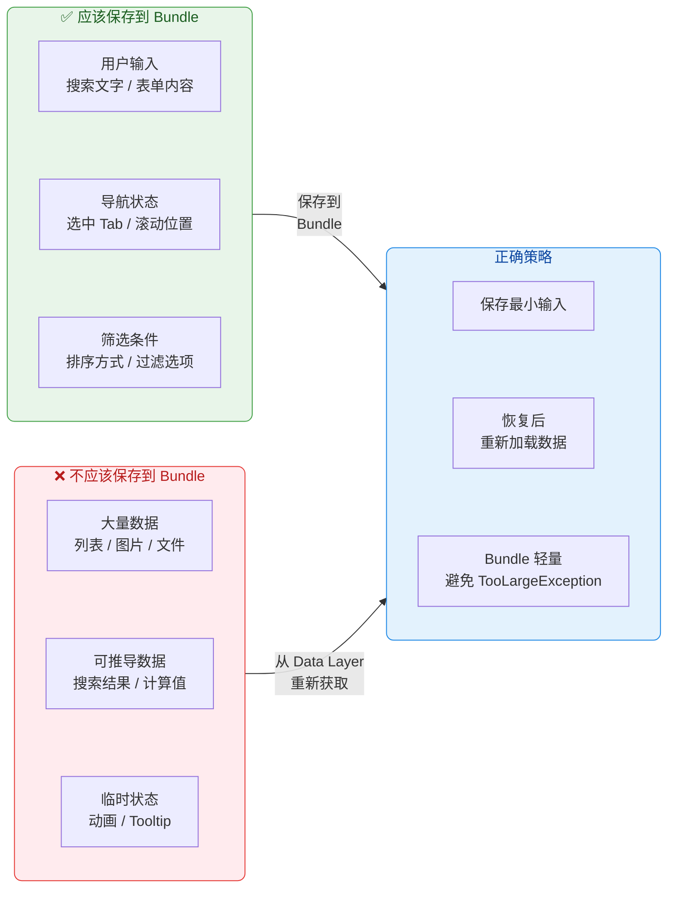

#### 完整生命周期对照

最后，让我们通过一个完整的对比来总结三种状态持有机制在不同场景下的表现：

| 场景 | `remember` | `rememberSaveable` | `ViewModel` + `SavedStateHandle` |
|------|-----------|-------------------|--------------------------------|
| **重组（Recomposition）** | ✅ 保留 | ✅ 保留 | ✅ 保留 |
| **Configuration Change（旋转）** | ❌ 丢失 | ✅ 恢复 | ✅ 存活（内存对象） |
| **进程被杀后恢复** | ❌ 丢失 | ✅ 从 Bundle 恢复 | 仅 SavedStateHandle 中的值恢复 |
| **导航离开再返回（在 back stack 中）** | ❌ 丢失 | ✅ 恢复 | ✅ 存活（NavBackStackEntry 持有） |
| **适合的数据类型** | 任意对象 | 可序列化的轻量数据 | 业务状态 + 可序列化的关键输入 |
| **存储容量** | 无限制（内存） | 受 Bundle 大小限制 | 内存无限制 + Handle 受 Bundle 限制 |

这张表清晰地展示了：**三种机制互相补充，而非互相替代**。一个健壮的屏幕通常同时使用：`ViewModel` 持有业务数据并用 `SavedStateHandle` 保存关键输入、`rememberSaveable` 保存 UI 层的交互状态（如 Tab 选择）、`remember` 持有不需要跨重建存活的临时值（如动画进度）。

---

**📝 练习题**

某 Compose 应用中，一个搜索屏幕需要管理以下状态：①搜索关键字（用户输入）、②搜索结果列表（从网络获取）、③搜索栏的展开/折叠状态、④结果列表的滚动位置。应用需要在进程被杀后恢复到用户之前的状态。以下关于状态持有方式的描述，哪一个是**最佳实践**？


A. 全部放入 ViewModel 的普通 `MutableStateFlow` 中，因为 ViewModel 能跨旋转存活，足以覆盖所有场景


B. 搜索关键字放入 `SavedStateHandle`，搜索结果放入 ViewModel 的 `StateFlow`，展开/折叠状态和滚动位置使用 `rememberSaveable` 保存


C. 全部使用 `rememberSaveable`，因为它能在进程被杀后恢复，是最安全的选择


D. 搜索关键字和搜索结果都放入 `SavedStateHandle`，展开/折叠状态和滚动位置用 `remember` 即可


**【答案】** B

**【解析】** 本题考察对不同状态持有机制的正确选型。选项 A 的问题在于：ViewModel 的普通 `MutableStateFlow` 只存在于内存中，进程被杀后所有数据丢失，搜索关键字无法恢复，用户需要重新输入——不满足题目要求。选项 C 的问题在于：搜索结果列表可能非常大，将其序列化到 Bundle 中可能触发 `TransactionTooLargeException`；且搜索结果属于业务数据，应该由 ViewModel 管理并从网络重新获取，而非硬塞进 Bundle。选项 D 有两个错误：搜索结果作为大量数据不适合放入 `SavedStateHandle`（本质也是 Bundle）；展开/折叠和滚动位置使用 `remember` 意味着旋转后就丢失，题目要求跨进程恢复，应使用 `rememberSaveable`。选项 B 是最佳实践：搜索关键字（轻量、用户输入、需要恢复）放入 `SavedStateHandle` 确保跨进程存活；搜索结果（大量、可重新获取）放入 ViewModel 的 `StateFlow`，在 `init` 中根据恢复的关键字重新加载；展开/折叠和滚动位置（UI 状态、轻量）使用 `rememberSaveable` 保存到 Bundle。这体现了"保存最小必要输入、从 Data Layer 重新加载数据"的核心原则。

---

## 快照系统 Snapshot System

Compose 的响应式 UI 之所以能在多线程环境中安全运行，核心秘密就在于其底层的 **快照系统（Snapshot System）**。当我们在代码中写下 `mutableStateOf("Hello")` 时，表面上只是创建了一个可观察的状态变量，但在水面之下，Compose Runtime 围绕这个状态构建了一套精密的 **多版本并发控制（MVCC, Multi-Version Concurrency Control）** 机制。这套机制借鉴了数据库事务的经典思想——每个"读者"看到的是某一刻的一致性快照，每个"写者"在自己的隔离沙盒中修改数据，最终通过原子性提交将变更合并回全局。正是这套系统，让 Compose 得以在主线程进行 UI 渲染的同时，在后台线程执行重组计算，而两者互不干扰。

要真正理解 Compose 状态为什么"好用又安全"，就必须深入快照系统的四大支柱：**MVCC 多版本并发控制**、**读写追踪**、**状态隔离** 和 **原子性提交**。它们共同构成了 Compose 状态管理的底层基石。

---

### MVCC 多版本并发控制

#### 从数据库到 UI 框架的思想迁移

MVCC（Multi-Version Concurrency Control）并非 Compose 的发明，它是关系型数据库（PostgreSQL、MySQL InnoDB、Oracle）中久经考验的并发控制策略。其核心思想可以用一句话概括：**不要让读者和写者互相阻塞，而是让每个读者看到数据在某一时刻的"快照版本"**。

在传统数据库中，如果没有 MVCC，一个长时间运行的查询（读事务）可能会被一个写事务阻塞，反之亦然。MVCC 的解法是：每次写操作不会覆盖旧数据，而是创建数据的一个 **新版本**；读操作则根据自己的"事务起始时间"去读取对应版本的数据，完全忽略那些在它启动之后才发生的写入。这样，读和写就能真正地并行执行。

Compose 面临的问题与数据库惊人地相似。UI 线程需要渲染当前帧（读状态），而重组过程可能在后台线程计算新的 UI 树（也在读状态，甚至写状态）。如果使用简单的锁机制，要么重组等渲染完成，要么渲染等重组完成，性能将大打折扣。Compose 团队选择了 MVCC，让 **每次重组都在一个独立的快照中进行**，读到的是重组开始那一刻的状态一致性视图，即使主线程在重组期间修改了某些状态，也不会影响正在进行的重组。

#### Snapshot 的版本模型

Compose 的快照系统维护着一个全局递增的 **快照 ID（Snapshot ID）**。每当创建一个新快照，全局 ID 就会自增。每个 `MutableState` 对象内部并不只存一个值，而是维护着一条 **版本链（version chain）**，链上的每个节点记录了"这个值是在哪个快照 ID 下被写入的"。

```kotlin
// 概念模型：MutableState 内部的版本记录（简化示意）
// 并非 Compose 源码的直接翻译，而是帮助理解的抽象模型
class StateRecord(
    val snapshotId: Int,   // 写入该值时的快照 ID
    val value: Any?,       // 该版本对应的值
    var next: StateRecord? // 指向上一个版本的链表指针
)
```

当一个快照（比如 ID = 5）去读取某个 State 时，它会沿着版本链查找 **snapshotId ≤ 5 的最新记录**。这意味着在快照 5 创建之后、由快照 6 或 7 写入的新值，对快照 5 来说是 **不可见的**。这就是"多版本"的含义：同一个 State 对象可以同时拥有多个版本的值，不同快照各取所需。

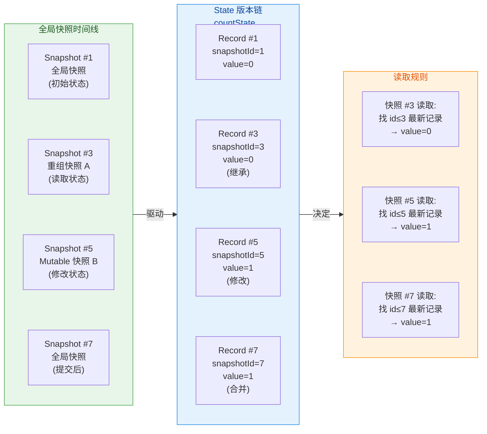

上图展示了快照系统的核心运作方式。全局快照时间线不断推进，每个 State 对象维护着自己的版本链，而读取规则确保每个快照只能看到属于自己"时代"的数据。这种设计的优雅之处在于：**无需任何锁**，读操作就能获得一致性视图。

#### 快照的三种类型

Compose 内部实际使用了三种快照，它们的权限和用途各不相同：

**只读快照（ReadonlySnapshot）** 是最轻量的快照类型。它在创建时记录当前全局快照 ID，之后所有的读操作都基于这个 ID 来查找版本链。它不允许任何写操作。Compose 在某些纯读取场景（比如判断状态是否变化）中使用只读快照。

**可变快照（MutableSnapshot）** 是功能最完整的快照类型。它既能读也能写。所有的写操作都发生在快照内部的隔离空间中，不会影响外部世界，直到显式调用 `apply()` 进行提交。Compose 的重组过程就运行在可变快照中——重组可以安全地读取状态，某些情况下甚至修改状态，而这些变更只有在重组成功完成后才会被提交到全局。

**透明快照（TransparentObserverSnapshot）** 有点特殊，不创建新的隔离作用域，而是直接"穿透"到其父快照或全局快照上进行读写操作。它存在的主要目的是 **安装读写观察者**，而不改变数据的可见性规则。全局快照（GlobalSnapshot）在概念上类似于透明快照的一种特殊形式——它是所有快照的"根"，代表最新的已提交状态。

```kotlin
// 创建只读快照：用于纯读取场景
val readonlySnapshot = Snapshot.takeSnapshot()
// 在只读快照中读取状态，看到的是快照创建时的值
readonlySnapshot.enter {
    // 即使此时其他线程修改了 someState，这里读到的仍然是旧值
    val currentValue = someState.value
}
readonlySnapshot.dispose() // 用完必须释放

// 创建可变快照：用于隔离修改场景
val mutableSnapshot = Snapshot.takeMutableSnapshot()
mutableSnapshot.enter {
    // 在快照内部修改状态，外部看不到
    someState.value = "modified in snapshot"
}
// 提交变更到全局，此时外部才能看到新值
mutableSnapshot.apply() // 返回 SnapshotApplyResult
mutableSnapshot.dispose()
```

---

### 读写追踪

#### 为什么需要追踪

MVCC 解决了"并发安全"的问题，但 Compose 还需要解决另一个关键问题：**当状态发生变化时，如何精准地知道哪些 Composable 函数需要重组？** 如果每次状态变化都重组整棵 UI 树，性能将无法接受。Compose 的答案是 **读写追踪（Read/Write Tracking）**：在重组过程中，精确记录每个 Composable 函数读取了哪些状态；当某个状态被修改时，只标记那些读取过该状态的 Composable 为"需要重组"。

这就是 `mutableStateOf` 的神奇之处——它不仅仅是一个"可以被观察的值"，它在被读取和被写入时都会 **主动通知** 快照系统，而快照系统会将这些信息路由到正确的监听者。

#### 读取追踪机制

当你在一个 Composable 函数中访问 `state.value` 时，底层会触发以下调用链：

1. `state.value` 的 getter 被调用
2. getter 内部调用 `Snapshot.current.readObserver?.invoke(state)` —— 将"我读取了这个 state"通知给当前快照的 **读观察者（Read Observer）**
3. Compose Runtime 在重组开始前就已经设置好了读观察者（通过 `Snapshot.takeSnapshot(readObserver = ...)` 或 `Snapshot.takeMutableSnapshot(readObserver = ...)`）
4. 读观察者收到通知后，将这个 state 与当前正在执行的 **重组作用域（RecomposeScope）** 关联起来

这套机制建立了一个 **State → RecomposeScope 的映射关系**。可以把它想象成一张订阅表：State A 被 Scope 1 和 Scope 3 读取，State B 被 Scope 2 读取，等等。

```kotlin
// 概念模型：Compose Runtime 如何追踪读取（简化）
// 实际实现分布在 Composer、SnapshotState 等多个类中
class ComposerImpl {
    // 当前正在执行的重组作用域
    private var currentRecomposeScope: RecomposeScope? = null

    // 读观察者回调：当任何 State 被读取时触发
    val readObserver: (Any) -> Unit = { state ->
        // 将 State 与当前作用域绑定
        // 意味着：如果这个 state 将来发生变化，currentRecomposeScope 需要重组
        currentRecomposeScope?.let { scope ->
            // 内部维护 Map<State, Set<RecomposeScope>> 的映射
            recordReadOf(state, scope)
        }
    }
}
```

这里有一个非常重要的设计细节：**追踪发生在读取时，而非声明时**。如果一个 Composable 函数中有条件分支，某个 State 只在特定条件下才被读取，那么只有实际读取了该 State 的执行路径才会建立订阅关系。这使得追踪非常精准，避免了不必要的重组。

```kotlin
@Composable
fun ConditionalReader(showDetail: Boolean) {
    // name 总是被读取 → 这个 Scope 总是订阅 name 的变化
    val name by remember { mutableStateOf("Alice") }
    Text(name)

    if (showDetail) {
        // age 只在 showDetail 为 true 时被读取
        // 若 showDetail 为 false，则这个 Scope 不会订阅 age 的变化
        val age by remember { mutableStateOf(25) }
        Text("Age: $age")
    }
}
```

#### 写入追踪机制

与读追踪对应，当 `state.value = newValue` 被调用时：

1. setter 内部检查当前是否处于可变快照（MutableSnapshot）中
2. 如果在可变快照中，写操作被隔离记录到快照本地的版本记录中（不影响全局），同时调用 `writeObserver?.invoke(state)` 通知写观察者
3. 当快照被 `apply()` 时，所有被修改过的 State 会被收集起来，Compose Runtime 查询订阅表，找出所有需要重组的 RecomposeScope，标记为 **invalid（无效）**
4. Compose 调度器在下一帧对所有无效的 Scope 执行重组

全局快照（GlobalSnapshot）有一个特殊的机制叫做 **Snapshot.sendApplyNotifications()**。当在全局快照中直接修改状态（比如在非 Composable 的代码中执行 `state.value = x`），Runtime 会调用此方法来推进全局快照并触发失效通知。这确保了即使不在显式的快照事务中，状态变更也能被正确追踪。

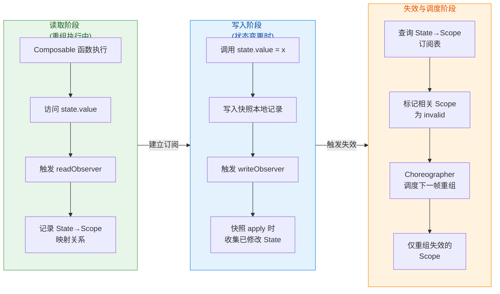

读写追踪的精妙之处在于它完全是 **自动的、透明的**。开发者只需要使用 `mutableStateOf`，不需要手动订阅或取消订阅，不需要调用 `notifyDataSetChanged()` 之类的方法。快照系统在幕后默默完成了"谁在读"和"谁在写"的全部记账工作。

#### readObserver 与 writeObserver 的注册时机

一个自然的疑问是：这些 observer 是何时、由谁注册的？答案藏在 Compose Runtime 的 `Recomposer` 中。当 Recomposer 启动重组时，它会创建一个可变快照，并在创建时传入两个回调：

- **readObserver**：每当快照中有 State 被读取，就记录到当前 RecomposeScope 的依赖集合中。
- **writeObserver**：每当快照中有 State 被写入，就将该 State 记录到"已修改状态集合"中，供后续 apply 时使用。

这就是为什么只有在 **Composable 组合阶段** 读取 State 才会触发自动重组——因为只有在那个阶段，readObserver 才是活跃的。如果你在一个普通的 `onClick` Lambda 中读取 State，虽然能拿到正确的值，但不会建立订阅关系（因为 onClick 不在快照的 readObserver 作用域内）。

---

### 状态隔离

#### 隔离的本质：写时复制

状态隔离是 MVCC 的直接产物。当一个 MutableSnapshot 被创建后，它内部的所有写操作都被 **隔离** 在这个快照的私有空间中，外部世界完全感知不到。这是通过一种类似 **写时复制（Copy-on-Write）** 的策略实现的。

具体来说，当你在一个 MutableSnapshot 中首次写入某个 State 时，快照系统会：

1. 从该 State 的版本链中取出当前版本的记录（StateRecord）
2. **复制** 一份新的 StateRecord
3. 将新记录的 snapshotId 设置为当前快照的 ID
4. 在新记录上执行写入操作
5. 将新记录插入版本链

这样，其他快照查找版本链时，由于它们的 ID 不同于当前快照，自然不会看到这条新记录。只有当前快照自己，以及它创建之后派生的子快照，才能看到这个修改。

```kotlin
// 状态隔离的直观演示
fun demonstrateIsolation() {
    // 在全局快照中创建状态
    val counter = mutableStateOf(0)

    // 创建可变快照 A
    val snapshotA = Snapshot.takeMutableSnapshot()
    // 创建可变快照 B
    val snapshotB = Snapshot.takeMutableSnapshot()

    // 在快照 A 中修改
    snapshotA.enter {
        counter.value = 10  // 只在 A 的隔离空间中可见
        println("A sees: ${counter.value}") // 输出: A sees: 10
    }

    // 在快照 B 中修改
    snapshotB.enter {
        counter.value = 20  // 只在 B 的隔离空间中可见
        println("B sees: ${counter.value}") // 输出: B sees: 20
    }

    // 全局快照完全不受影响
    println("Global sees: ${counter.value}") // 输出: Global sees: 0

    // 提交 A 的修改
    snapshotA.apply()
    println("After A applied, Global sees: ${counter.value}") // 输出: 10

    // 此时 B 的修改与 A 冲突（同一个 State 被两个快照修改）
    val result = snapshotB.apply()
    // result 可能是 SnapshotApplyResult.Failure，取决于冲突解决策略

    // 必须释放快照资源
    snapshotA.dispose()
    snapshotB.dispose()
}
```

上面的例子清楚地展示了隔离的效果：三个"观察者"（快照 A、快照 B、全局）同时观察同一个 `counter`，但各自看到的值完全不同。这就像数据库中三个事务各自有自己的数据视图一样。

#### 嵌套快照与隔离层级

Compose 支持 **嵌套快照（Nested Snapshot）**。一个 MutableSnapshot 内部可以再创建子快照，子快照继承父快照的所有修改，并在此基础上进一步隔离。子快照的 apply 会将修改合并到父快照（而非全局），父快照再通过自己的 apply 合并到全局。

这种嵌套结构在 Compose 内部被用于实现 **部分重组的隔离**。例如，当一个 LazyColumn 中的单个 item 需要重组时，Runtime 可以为这个 item 创建一个子快照，使得 item 的重组过程与其他 item 完全隔离。如果这个 item 的重组失败或被取消，只需丢弃子快照即可，不会污染父快照的状态。

```text
GlobalSnapshot (ID=1, counter=0)
  └── MutableSnapshot A (ID=3, counter=10)  ← 本地修改
        └── Nested Snapshot A1 (ID=5)        ← 继承 A 的 counter=10
              └── 可以进一步修改，不影响 A
  └── MutableSnapshot B (ID=4, counter=20)  ← 独立隔离
```

#### 对应用层开发的意义

对于日常开发而言，状态隔离主要体现在以下场景：

**重组的安全性**：当 Compose 在重组某个 Composable 时，如果主线程上的用户操作修改了某个状态，正在进行的重组不会"看到一半新值一半旧值"。重组开始时拍下的快照保证了数据一致性——要么全部是旧值，要么等下次重组时全部是新值。

**并发重组（Experimental）**：Compose 的长期愿景支持在多个后台线程上并行重组 UI 树的不同部分。没有快照隔离，这将是一场灾难——线程 A 的修改会干扰线程 B 的读取。有了快照隔离，每个线程在自己的快照沙盒中工作，互不干扰。

**动画与手势的一致性**：在复杂动画中，多个状态可能在同一帧内被更新。快照隔离保证了这些更新对外部是"原子的"——外部观察者要么看到所有更新前的值，要么看到所有更新后的值，不会出现中间状态。

---

### 原子性提交

#### apply() 的工作流程

当一个 MutableSnapshot 中的工作完成后，需要通过 `apply()` 方法将修改提交回全局（或父快照）。这个提交过程是 **原子的**，意味着快照中的所有修改要么全部生效，要么全部不生效。`apply()` 的内部流程大致如下：

**第一步：冲突检测（Conflict Detection）**。快照系统检查快照中所有被修改的 State，看是否有其他快照在这个快照创建之后也修改了同一个 State 并且已经提交。如果存在这种"写写冲突"，就进入冲突解决阶段。

**第二步：冲突解决（Conflict Resolution）**。如果检测到冲突，Compose 会尝试调用 State 对象上的 **合并策略（merge policy）**。`SnapshotMutableState` 提供了一个可选的 `SnapshotMutationPolicy` 参数（就是 `mutableStateOf` 的第二个参数），其中的 `merge` 函数负责决定如何合并冲突的值。如果 merge 函数返回了一个合并后的值，冲突被解决；如果 merge 函数不存在或返回失败，apply 将返回 `SnapshotApplyResult.Failure`。

**第三步：原子写入（Atomic Write）**。如果没有冲突，或冲突已被成功解决，快照系统会在持有全局锁的情况下，将所有修改过的 StateRecord 合并到全局版本链中，并推进全局快照 ID。这个合并操作在锁的保护下是瞬时完成的，确保了原子性。

**第四步：发送通知（Send Notifications）**。提交成功后，快照系统调用已注册的 apply observer，通知所有关注者"这些 State 发生了变更"。Compose Runtime 的 Recomposer 会在此时收到通知，并根据之前建立的 State→Scope 映射表，标记相关的 RecomposeScope 为 invalid，安排下一帧重组。

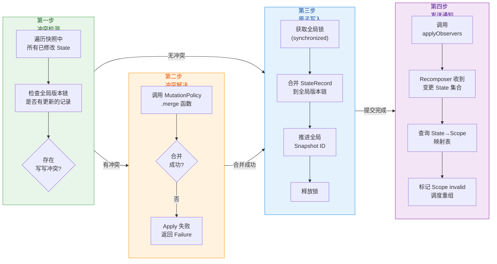

#### SnapshotMutationPolicy 深度解析

`mutableStateOf` 函数的完整签名是：

```kotlin
fun <T> mutableStateOf(
    value: T,
    // 变更策略：决定"何时算作变更"以及"冲突如何合并"
    policy: SnapshotMutationPolicy<T> = structuralEqualityPolicy()
): MutableState<T>
```

`SnapshotMutationPolicy` 接口定义了两个关键方法：

```kotlin
interface SnapshotMutationPolicy<T> {
    // 判断两个值是否"等价"
    // 如果返回 true，写入操作将被忽略（不触发重组）
    fun equivalent(a: T, b: T): Boolean

    // 当发生写写冲突时，尝试合并三个版本的值
    // current: 当前全局最新值（别人提交的）
    // applied: 快照中修改后的值（我要提交的）
    // previous: 快照创建时的原始值（修改前的公共基准）
    // 返回合并结果；如果无法合并，返回 null 表示失败
    fun merge(previous: T, current: T, applied: T): T? = null
}
```

Compose 内置了三种策略：

**`structuralEqualityPolicy()`**（默认）：使用 `==`（即 `equals()`）判断等价性。如果新值与旧值结构相等，不触发重组。不提供 merge 实现，冲突时 apply 失败。

**`referentialEqualityPolicy()`**：使用 `===`（引用相等）判断等价性。只有当新值与旧值是完全同一个对象引用时才认为等价。适用于需要"即使内容相同但引用不同也要触发重组"的场景。

**`neverEqualPolicy()`**：永远返回 `false`，意味着每次赋值都会触发重组，即使值完全一样。适用于需要"强制刷新"的场景。

```kotlin
// structuralEqualityPolicy 示例
val name = mutableStateOf("Alice") // 默认 structuralEqualityPolicy
name.value = "Alice" // equivalent("Alice", "Alice") = true → 不触发重组

// referentialEqualityPolicy 示例
val list = mutableStateOf(
    listOf(1, 2, 3),
    policy = referentialEqualityPolicy() // 使用引用相等策略
)
val sameContent = listOf(1, 2, 3)
list.value = sameContent // 虽然内容相同，但引用不同 → 触发重组

// neverEqualPolicy 示例
val forceUpdate = mutableStateOf(
    Unit,
    policy = neverEqualPolicy() // 每次赋值都触发
)
forceUpdate.value = Unit // 即使值是同一个 Unit → 仍然触发重组
```

#### 冲突合并的实际应用

在大多数应用开发场景中，写写冲突不太常见，因为 Compose 的重组通常是串行的。但在高级场景（比如使用 `Snapshot.takeMutableSnapshot()` 手动创建并发快照）中，冲突合并就变得重要了。

一个经典的例子是 **计数器状态**。如果两个快照都想对同一个计数器执行"加一"操作，默认的 `structuralEqualityPolicy` 不提供 merge，apply 会失败。但我们可以自定义一个"数值累加"的合并策略：

```kotlin
// 自定义合并策略：数值累加
// 当两个快照都修改了同一个 Int 状态时，将增量叠加
val additiveMergePolicy = object : SnapshotMutationPolicy<Int> {
    // 值相等时不触发重组
    override fun equivalent(a: Int, b: Int): Boolean = a == b

    // 冲突合并：将两个快照各自的增量叠加
    // previous = 修改前的基准值
    // current = 别人已提交的值（别人的增量 = current - previous）
    // applied = 我要提交的值（我的增量 = applied - previous）
    override fun merge(previous: Int, current: Int, applied: Int): Int {
        // 合并结果 = 基准 + 别人的增量 + 我的增量
        // 等价于: current + (applied - previous)
        return current + (applied - previous)
    }
}

// 使用自定义策略创建状态
val counter = mutableStateOf(0, additiveMergePolicy)

// 场景：两个快照并发地对 counter 加一
val snap1 = Snapshot.takeMutableSnapshot()
val snap2 = Snapshot.takeMutableSnapshot()

snap1.enter { counter.value = counter.value + 1 } // 0 → 1
snap2.enter { counter.value = counter.value + 1 } // 0 → 1（snap2 看到的还是 0）

snap1.apply() // 成功，全局 counter = 1
snap2.apply() // 冲突！调用 merge(previous=0, current=1, applied=1)
              // 合并结果 = 1 + (1 - 0) = 2 ✓ 正确！

snap1.dispose()
snap2.dispose()
```

这个例子展示了 merge 函数的三参数设计的精妙之处：`previous` 是公共基准，`current` 是别人的版本，`applied` 是我的版本。通过比较各自与基准的差异，可以智能地合并结果。这与 Git 的三路合并（three-way merge）思想完全一致。

#### 全局快照推进与 apply 通知

在 Compose 的日常运行中，全局快照会在以下时机被推进：

1. 每次 `MutableSnapshot.apply()` 成功后，全局快照 ID 递增
2. Compose Runtime 在每一帧开始时调用 `Snapshot.sendApplyNotifications()`，将自上次通知以来在全局快照中的所有直接修改（不通过 MutableSnapshot 的修改）收集起来并发送通知
3. `Recomposer` 监听 apply 通知，根据变更的 State 集合决定哪些 Scope 需要重组

这个机制确保了不论状态在何处、以何种方式被修改（在快照中或在全局中），Compose 都能及时感知并触发正确的 UI 更新。整个过程从状态的修改到 UI 的更新，形成了一条完整的响应链。

```kotlin
// 完整的响应链示意
// 1. 用户点击按钮
Button(onClick = {
    // 2. 修改状态（在全局快照中直接写入）
    viewModel.count.value++ 
    // 3. 底层: writeObserver 记录 count 被修改
    // 4. 底层: sendApplyNotifications() 推进全局快照
    // 5. 底层: applyObserver 通知 Recomposer
    // 6. Recomposer 查找读取过 count 的 Scope，标记 invalid
}) {
    // 7. 下一帧：Recomposer 对 invalid Scope 执行重组
    // 8. 重组时重新读取 count.value，获得新值
    // 9. readObserver 重新建立订阅关系（为下次变更做准备）
    Text("Count: ${viewModel.count.value}")
}
```

从宏观视角看，快照系统的四大支柱形成了一个完美的闭环：**MVCC 提供并发安全的多版本基础** → **读写追踪建立状态与 UI 的精准映射** → **状态隔离保证重组过程的一致性** → **原子性提交将变更安全地合并并触发下一轮更新**。这套系统是 Compose 声明式 UI 范式的核心引擎，也是它区别于传统 Android View 系统的根本技术创新之一。

---

**📝 练习题**

在 Compose 的快照系统中，以下关于 `SnapshotMutationPolicy` 的说法，哪一项是**正确的**？

A. `structuralEqualityPolicy()` 使用 `===` 进行等价性判断，适用于基本类型的比较


B. `neverEqualPolicy()` 的 `equivalent` 方法始终返回 `true`，因此永远不会触发重组


C. `referentialEqualityPolicy()` 使用 `==`（即 `equals()`）进行判断，只要内容相同就不触发重组


D. 默认的 `structuralEqualityPolicy()` 不提供 `merge` 实现，当发生写写冲突时 `apply()` 会失败


**【答案】** D

**【解析】** 本题考查 `SnapshotMutationPolicy` 三种内置策略的行为差异。

选项 A 错误：`structuralEqualityPolicy()` 使用的是 `==`（即 `equals()`）进行结构相等性判断，而非 `===` 引用相等。`===` 是 `referentialEqualityPolicy()` 的行为。

选项 B 错误：`neverEqualPolicy()` 的 `equivalent` 方法始终返回 `false`（而非 `true`），意味着每次赋值都被认为是一次变更，因此 **每次都会触发重组**，即使赋的是相同的值。

选项 C 错误：`referentialEqualityPolicy()` 使用的是 `===`（引用相等），只有当两个对象是同一个引用时才认为等价。即使两个对象的 `equals()` 返回 `true`，只要引用不同，仍会触发重组。

选项 D 正确：`structuralEqualityPolicy()` 是 `mutableStateOf` 的默认策略，其 `merge` 方法使用基类的默认实现（返回 `null`），意味着不支持自动合并。当两个 MutableSnapshot 同时修改了同一个使用该策略的 State 并先后 apply 时，后提交的快照会检测到冲突，由于 merge 返回 null，apply 将返回 `SnapshotApplyResult.Failure`。开发者可以通过自定义 `SnapshotMutationPolicy` 并实现 `merge` 方法来提供冲突合并逻辑。

---

**📝 练习题**

以下代码在 Compose 运行时会产生什么行为？

```kotlin
@Composable
fun SnapshotDemo() {
    var text by remember { mutableStateOf("Hello") }
    
    LaunchedEffect(Unit) {
        val snapshot = Snapshot.takeMutableSnapshot()
        snapshot.enter {
            text = "World"
            println("Inside snapshot: $text")
        }
        println("Outside snapshot: $text")
        snapshot.dispose() // 注意：没有调用 apply()
    }
    
    Text(text)
}
```

A. 打印 `Inside snapshot: World` 和 `Outside snapshot: World`，UI 显示 "World"


B. 打印 `Inside snapshot: World` 和 `Outside snapshot: Hello`，UI 显示 "Hello"


C. 打印 `Inside snapshot: Hello` 和 `Outside snapshot: Hello`，UI 显示 "Hello"


D. 代码会抛出异常，因为不能在 LaunchedEffect 中操作快照


**【答案】** B

**【解析】** 本题考查快照系统的 **状态隔离** 和 **apply 提交** 机制。

在代码中，通过 `Snapshot.takeMutableSnapshot()` 手动创建了一个可变快照。进入快照（`snapshot.enter`）后执行 `text = "World"`，这个写操作被 **隔离在快照的私有空间中**，不会影响外部（全局快照）的 `text` 值。因此在快照内部打印 `text` 得到的是 `"World"`（快照自己能看到自己的修改），但在快照外部打印 `text` 得到的仍然是 `"Hello"`（全局值未被改变）。

关键点在于代码 **没有调用 `snapshot.apply()`**，而是直接调用了 `snapshot.dispose()` 释放了快照。这意味着快照中的修改 **被丢弃了**，永远不会合并到全局。因此 UI 上的 `Text` 始终显示 `"Hello"`，也不会触发重组。

选项 A 错误，因为快照的修改没有被 apply，外部看不到 "World"。选项 C 错误，因为在快照内部能看到自己的修改。选项 D 错误，在 LaunchedEffect 中操作快照是完全合法的。

---

## 状态转换与合并

在真实的 Compose 应用中，UI 所需要的状态往往不是"直接持有"的原始值，而是从一个或多个原始状态 **经过计算、过滤、映射** 得到的"衍生产物"。例如：一个搜索框的文本（原始状态）经过过滤后产生"匹配的列表项"（派生状态）；一个 Compose `State<T>` 的变化需要被外部的 Flow/协程世界感知（流转换）；一个外部的冷流（Cold Flow）需要被安全地"收集"并表达为 Compose 可观察的状态（生产状态）。Compose 针对这三种典型场景，分别提供了 `derivedStateOf`、`snapshotFlow` 和 `produceState` 三把利器。它们的本质目标完全一致——**在 Snapshot System 与外部响应式世界之间架起高性能桥梁**，但各自的方向与机制截然不同。本节将逐一深入剖析。

---

### derivedStateOf 派生状态

#### 问题的起源：不必要的重组

先来看一个经典的反面案例。假设我们有一个待办列表，用户可以在搜索框中输入关键字进行过滤：

```kotlin
@Composable
fun TodoScreen(
    todos: List<Todo>,          // 全量待办列表
    query: String,              // 搜索关键字
    onQueryChange: (String) -> Unit // 搜索框文字变化回调
) {
    // ❌ 每次 query 或 todos 变化，filteredTodos 都会重新计算
    // 但更关键的问题是：即使计算结果没变，下方的 LazyColumn 也会触发重组
    val filteredTodos = todos.filter { it.title.contains(query, ignoreCase = true) }

    Column {
        // 搜索框：用户每敲一个字符，query 变化 → 整个 TodoScreen 重组
        TextField(value = query, onValueChange = onQueryChange)
        // 列表：filteredTodos 是普通 List，Compose 无法知道"结果是否真的变了"
        LazyColumn {
            items(filteredTodos) { todo ->
                TodoItem(todo)
            }
        }
    }
}
```

这段代码的问题在于：`filteredTodos` 是一个普通的局部变量，每次 Composable 函数体执行时都会重新计算一次 `filter`。更严重的是，即使过滤结果与上一次 **完全相同**（比如用户输入了一个空格又删掉），`LazyColumn` 以及其内部所有 `TodoItem` 仍然会被标记为"可能需要重组"的状态，因为 Compose 编译器在默认情况下无法对一个每次都是新引用的 `List` 做"结构相等性"的跳过判断。

#### derivedStateOf 的解法

`derivedStateOf` 正是为了解决这类"**计算结果变化频率远低于输入变化频率**"的场景而设计的。它的核心语义是：

> 我依赖一个或多个 `State` 作为输入，但我只在 **计算结果真正发生变化** 时才通知下游重组。

改写后的代码如下：

```kotlin
@Composable
fun TodoScreen(
    todos: List<Todo>,
    query: String,
    onQueryChange: (String) -> Unit
) {
    // ✅ 使用 derivedStateOf 包裹过滤逻辑
    // remember 确保 derivedStateOf 返回的 State 对象在重组间保持同一实例
    val filteredTodos by remember(todos) {
        // derivedStateOf 内部的 lambda 称为"计算块 (calculation block)"
        // 它会在首次执行时被求值，并自动追踪内部读取的所有 Snapshot State
        derivedStateOf {
            // 这里读取了 query（假设它是由上层 MutableState 驱动的）
            // derivedStateOf 会追踪到这个读操作
            todos.filter { it.title.contains(query, ignoreCase = true) }
        }
    }

    Column {
        TextField(value = query, onValueChange = onQueryChange)
        // 现在 filteredTodos 是一个 State<List<Todo>>
        // LazyColumn 只会在 filteredTodos 的值（通过 structuralEqual）真正改变时重组
        LazyColumn {
            items(filteredTodos) { todo ->
                TodoItem(todo)
            }
        }
    }
}
```

注意 `remember(todos)` 的写法：外部传入的 `todos` 列表如果引用发生变化，需要重新创建 `derivedStateOf`，因为 `todos` 本身不是 Snapshot State，无法被自动追踪。而 `query` 如果底层是由一个 `MutableState<String>` 驱动的，则会被 `derivedStateOf` 的计算块自动追踪，无需写入 `remember` 的 key。

#### 内部机制深度解析

`derivedStateOf` 的底层运作与 Snapshot System 的读写追踪机制密切相关，其核心流程可以用以下步骤概括：

**第一步：首次求值与依赖收集。** 当 `derivedStateOf { ... }` 的计算块首次被执行时，Snapshot System 会开启一个 **读观察者（Read Observer）**。计算块内部每一次对 `State.value` 的读取操作都会被该观察者捕获并记录下来，形成一张"依赖表"。这与 Vue.js 的响应式依赖收集、MobX 的 `computed` 在原理上如出一辙。

**第二步：缓存结果。** 计算块的返回值会被缓存在 `derivedStateOf` 内部持有的 `StateRecord` 中。此时，`derivedStateOf` 对外暴露的 `.value` 就是这个缓存值。

**第三步：依赖失效通知。** 当依赖表中任何一个 `State` 的值发生写入时，Snapshot System 会通过写观察者通知 `derivedStateOf`："你的某个依赖变了"。此时 `derivedStateOf` 会将自身标记为 **"可能过期（potentially stale）"**，但 **不会立即重新计算**。这是一个关键的惰性（lazy）设计。

**第四步：惰性重新求值与比对。** 只有当某个 Recompose Scope 或其他消费者实际去 **读取** `derivedStateOf.value` 时，它才会执行重新计算。计算完成后，新值会与旧的缓存值做 **结构相等性比较（structural equality, 即 `equals()`）**。如果新旧值相等，`derivedStateOf` 不会发出任何变更通知——这意味着所有依赖它的 Recompose Scope 都 **不会被调度重组**。

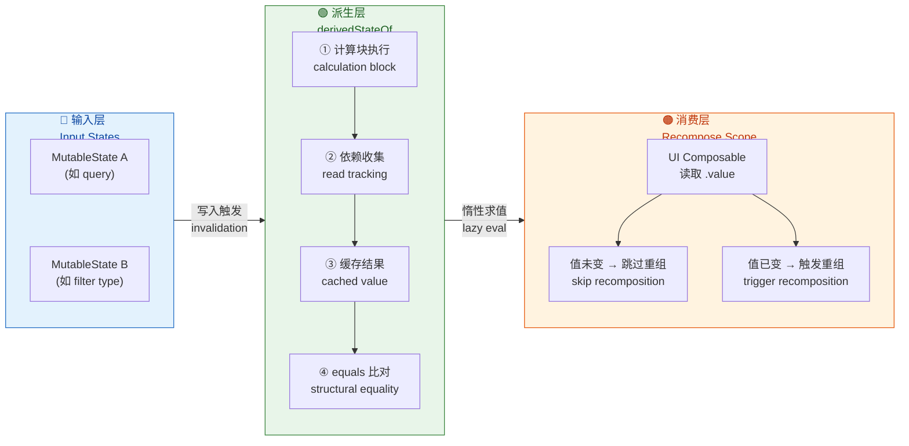

#### 性能特征与使用要点

`derivedStateOf` 最大的价值在于它实现了 **"输入高频变化 → 输出低频变化"的降频效果**。这种降频不是基于时间窗口的去抖动（debounce），而是基于 **计算结果的语义相等性**。只要计算结果不变，无论输入状态变化了多少次，下游都纹丝不动。

但需要注意以下几个要点：

1. **不要滥用**。如果输入变化频率与输出变化频率基本一致（比如一个简单的 `count + 1`），使用 `derivedStateOf` 反而会引入额外的缓存和比对开销，得不偿失。它只在"输出变化频率显著低于输入"的场景才有收益。

2. **计算块内只追踪 Snapshot State 的读取**。普通变量、函数参数等不会被自动追踪。如果依赖了非 Snapshot State 的外部值，需要将其作为 `remember` 的 key，以便在该值变化时重新创建 `derivedStateOf`。

3. **`equals()` 的正确实现很重要**。`derivedStateOf` 靠 `equals()` 来判断结果是否变化。如果计算结果是一个自定义类型但没有正确覆写 `equals()`，那么每次都会被视为"新值"，降频效果就会失效。Kotlin 的 `data class` 天然提供了基于属性的 `equals()`，是搭配 `derivedStateOf` 的最佳选择。

4. **与 `remember` 配合**。`derivedStateOf` 本身只是一个创建 `State` 的工厂函数，它返回的 `State` 对象需要在重组间保持稳定引用，因此几乎总是搭配 `remember` 使用。忘记 `remember` 是最常见的错误之一——每次重组都会创建一个全新的 `derivedStateOf`，导致依赖关系不断重建，性能反而更差。

---

### snapshotFlow 流转换

#### 从 Snapshot 世界到 Flow 世界的桥梁

`derivedStateOf` 解决的是 **Snapshot 世界内部** 的派生问题——输入是 State，输出还是 State。但现实开发中，我们经常需要将 Compose 的 State 变化"导出"到协程/Flow 世界，以便做更复杂的响应式操作（如 `debounce`、`distinctUntilChanged`、`flatMapLatest` 等）。`snapshotFlow` 就是为此而生的。

其函数签名非常简洁：

```kotlin
// snapshotFlow 接收一个 "读取块（read block）"
// 返回一个标准的 Kotlin Flow<T>
// 每当读取块内读取的 State 值发生变化，Flow 就会 emit 新值
fun <T> snapshotFlow(
    block: () -> T   // 在 Snapshot 中执行的读取块
): Flow<T>
```

一个典型场景——监听 `LazyListState` 的滚动位置，当第一个可见项索引变化时执行某些操作：

```kotlin
@Composable
fun ScrollTracker(listState: LazyListState) {
    // LaunchedEffect 确保协程绑定到组合的生命周期
    LaunchedEffect(listState) {
        // snapshotFlow 将 Compose State 的读取转化为 Flow 的 emission
        snapshotFlow {
            // 读取 firstVisibleItemIndex —— 这是一个 Snapshot State
            // snapshotFlow 会追踪这个读操作
            listState.firstVisibleItemIndex
        }
        // 现在我们进入了标准 Flow 的世界，可以使用所有 Flow 操作符
        .distinctUntilChanged()  // 去重：只在值真正变化时向下游发射
        .filter { index ->
            index > 0            // 只关心滚动到非顶部的情况
        }
        .collect { index ->
            // 在这里执行副作用：打日志、发分析事件等
            analytics.trackScroll(index)
        }
    }
}
```

#### 内部工作原理

`snapshotFlow` 的实现原理可以分解为以下几个阶段：

**阶段一：创建观察快照并首次求值。** 当 `snapshotFlow` 的 Flow 被 `collect` 时（注意是冷流，只有被收集才会启动），它会在一个带有读观察者的 Snapshot 中执行传入的 `block`。执行过程中，所有被读取的 `State` 对象都会被记录到一个"依赖集合"中。`block` 的返回值作为 Flow 的第一次 emission 发射给下游。

**阶段二：注册全局写观察者。** 首次求值完成后，`snapshotFlow` 会向 Snapshot System 的全局写观察者（Global Write Observer）注册一个回调。每当任何 Snapshot State 被修改并通过 `Snapshot.apply()` 提交时，这个回调就会被触发。

**阶段三：过滤无关写入，重新求值。** 写观察者被触发后，`snapshotFlow` 会检查被修改的 State 对象是否在自己的"依赖集合"中。如果不在，直接忽略——这是一个关键的性能优化，避免了无关状态变化导致的无效计算。如果依赖的 State 确实被修改了，`snapshotFlow` 会重新执行 `block`，获得新值。

**阶段四：比对与发射。** 新值会与上一次发射的值做比较（默认使用 `equals()`）。如果不同，则通过 Flow 的 `emit()` 将新值发射给下游；如果相同，则静默跳过。这个 `distinctUntilChanged` 的行为是 **内建的**，无需手动添加。

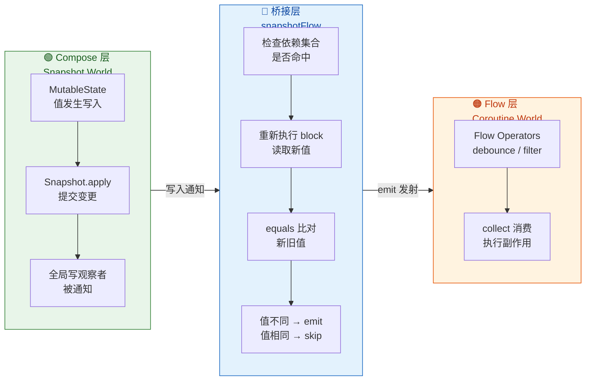

#### snapshotFlow 与 derivedStateOf 的对比

两者都涉及"追踪 State 的读取并做降频"，但面向的消费者完全不同：

| 维度 | `derivedStateOf` | `snapshotFlow` |
|---|---|---|
| **输入** | 一个或多个 Snapshot State | 一个或多个 Snapshot State |
| **输出** | `State<T>`（Compose 世界） | `Flow<T>`（协程世界） |
| **消费者** | Composable 函数（重组） | `collect`（协程） |
| **求值时机** | 惰性：被读取时才求值 | 主动：依赖变化后立即求值并尝试 emit |
| **去重机制** | 内建 `equals()` 比对 | 内建 `equals()` 比对 |
| **典型用途** | 减少 UI 重组频率 | 将 UI 状态变化导出到副作用/业务逻辑 |

一个黄金法则：**如果下游消费者是 Composable，用 `derivedStateOf`；如果下游消费者是协程/Flow 管道，用 `snapshotFlow`。** 二者不应混用——在 Composable 中使用 `snapshotFlow` 再用 `collectAsState` 收回来，不仅绕了远路，还多了协程调度的开销。

---

### produceState 生产状态

#### 从 Flow 世界到 Snapshot 世界的反向桥梁

如果说 `snapshotFlow` 是从 Compose → Flow 的"出口"，那么 `produceState` 就是从 Flow/协程 → Compose 的"入口"。它允许你在一个生命周期安全的协程作用域中执行任意异步操作（网络请求、数据库查询、Flow 收集等），并将结果"推入"一个 Compose `State<T>` 中。

```kotlin
// produceState 的函数签名
@Composable
fun <T> produceState(
    initialValue: T,          // State 的初始值（在异步结果到达前展示）
    vararg keys: Any?,        // 当 key 变化时，旧协程被取消，新协程重新启动
    producer: suspend ProduceStateScope<T>.() -> Unit  // 协程生产者
): State<T>
```

`ProduceStateScope` 继承自 `MutableState<T>` 和 `CoroutineScope`，因此在 `producer` 内部你可以直接通过 `value = xxx` 来更新状态。

#### 三种典型使用模式

**模式一：一次性异步加载。** 适合网络请求、数据库查询等"发起 → 等待 → 返回"的一次性操作。

```kotlin
@Composable
fun UserProfile(userId: String) {
    // produceState 返回一个 State<UiState<User>>
    // initialValue 为 Loading 状态，在请求完成前 UI 展示加载指示器
    val userState by produceState<UiState<User>>(
        initialValue = UiState.Loading, // 初始值：加载中
        key1 = userId                   // 当 userId 变化时，重新发起请求
    ) {
        // 这个 lambda 运行在一个协程中
        // 如果组合离开或 userId 变化，协程会被自动取消
        try {
            val user = repository.fetchUser(userId) // 挂起函数：发起网络请求
            value = UiState.Success(user)            // 请求成功 → 更新 State
        } catch (e: Exception) {
            value = UiState.Error(e)                 // 请求失败 → 更新为错误状态
        }
    }

    // UI 根据 userState 渲染不同界面
    when (userState) {
        is UiState.Loading -> CircularProgressIndicator()
        is UiState.Success -> UserCard((userState as UiState.Success).data)
        is UiState.Error -> ErrorView((userState as UiState.Error).exception)
    }
}
```

**模式二：持续收集 Flow。** 当你需要将一个 `Flow` 转化为 Compose State 时，`produceState` 是 `collectAsState` 的底层实现基础。

```kotlin
@Composable
fun TickerDisplay() {
    // 每秒发射一次递增数字的 Flow → 转化为 Compose State
    val count by produceState(initialValue = 0) {
        // tickerFlow 是一个无限的 Flow<Int>
        tickerFlow(intervalMs = 1000L)
            .collect { tick ->
                value = tick  // 每次 Flow emit，更新 State 的值
            }
        // 当 Composable 离开组合时，协程被取消，Flow 收集自动停止
    }

    Text(text = "Tick: $count")
}
```

**模式三：组合多个异步源。** 在同一个 `producer` 协程中，可以使用 `launch` 并发收集多个 Flow，或组合多个挂起调用。

```kotlin
@Composable
fun DashboardMetrics() {
    val metrics by produceState(
        initialValue = DashboardState.Empty // 初始空状态
    ) {
        // 使用 coroutineScope 或直接在 ProduceStateScope 中 launch
        // 并发收集两个不同的数据流
        launch {
            // 收集用户数据流
            userRepository.observeUserCount().collect { count ->
                // 部分更新：只更新 userCount 字段
                value = value.copy(userCount = count)
            }
        }
        launch {
            // 收集订单数据流
            orderRepository.observeOrderStats().collect { stats ->
                // 部分更新：只更新 orderStats 字段
                value = value.copy(orderStats = stats)
            }
        }
    }

    // UI 使用 metrics 渲染仪表盘
    DashboardContent(metrics)
}
```

#### 内部实现剖析

`produceState` 的实现非常精炼，理解它有助于掌握 Compose 副作用 API 的设计哲学。其内部实现可以近似等价于以下代码：

```kotlin
@Composable
fun <T> produceState(
    initialValue: T,
    vararg keys: Any?,
    producer: suspend ProduceStateScope<T>.() -> Unit
): State<T> {
    // 1. 创建一个 MutableState 并用 remember 保持引用稳定
    val result = remember { mutableStateOf(initialValue) }

    // 2. 使用 LaunchedEffect 启动协程
    //    key 变化时旧协程取消、新协程启动
    @Suppress("CHANGING_ARGUMENTS_EXECUTION_ORDER_FOR_NAMED_VARARGS")
    LaunchedEffect(keys = keys) {
        // 3. 创建 ProduceStateScope 实例
        //    它同时实现了 MutableState<T>（委托给 result）和 CoroutineScope
        val scope = ProduceStateScopeImpl(result, coroutineContext)
        // 4. 在该 scope 上执行用户提供的 producer lambda
        scope.producer()
    }

    // 5. 对外返回不可变的 State<T> 引用
    return result
}
```

从这段等价实现可以看出三个关键设计决策：

**第一，状态与协程分离。** `MutableState` 由 `remember` 持有，生命周期跟随组合。协程由 `LaunchedEffect` 管理，生命周期跟随 key。二者解耦意味着：即使协程因 key 变化被重启，State 对象本身保持稳定，UI 不会因为 State 引用变化而产生多余重组。

**第二，自动取消保证资源安全。** `LaunchedEffect` 的协程在 Composable 离开组合（onDispose）或 key 变化时会被自动 `cancel()`。如果 `producer` 内部正在 `collect` 一个 Flow 或等待一个挂起函数，取消会沿着协程的结构化并发（Structured Concurrency）链路向下传播，确保所有子协程、资源回调都被正确清理。

**第三，`initialValue` 的语义是"立即可用"。** 在 `producer` 协程还没有产出第一个值之前，`produceState` 返回的 `State` 就已经持有 `initialValue`。这使得 UI 可以立刻渲染一个"占位"状态（如 Loading），而不需要使用 `null` 或额外的 `isLoading` 标志。

#### produceState vs collectAsState

在实际开发中，将 Flow 转化为 Compose State 最常用的方式是 `flow.collectAsState(initial)`。事实上，`collectAsState` 内部就是使用 `produceState` 实现的：

```kotlin
// collectAsState 的简化内部实现
@Composable
fun <T> Flow<T>.collectAsState(initial: T): State<T> {
    // 直接委托给 produceState
    return produceState(initialValue = initial, key1 = this) {
        // this 就是 ProduceStateScope
        // collect 是 Flow 的标准收集函数
        collect { newValue ->
            value = newValue  // 每次 emit → 更新 State
        }
    }
}
```

因此，`collectAsState` 本质是 `produceState` 的一个便捷封装。当你的需求只是"把 Flow 收集为 State"时，直接用 `collectAsState` 更简洁。而当你需要在协程中做更复杂的逻辑（错误处理、多流合并、条件加载等），`produceState` 则提供了更大的灵活度。

---

### 三者协作：全景数据流

在一个成熟的 Compose 应用中，`derivedStateOf`、`snapshotFlow`、`produceState` 往往协同工作，形成一条从外部数据源到 UI 再到副作用的完整数据管道：

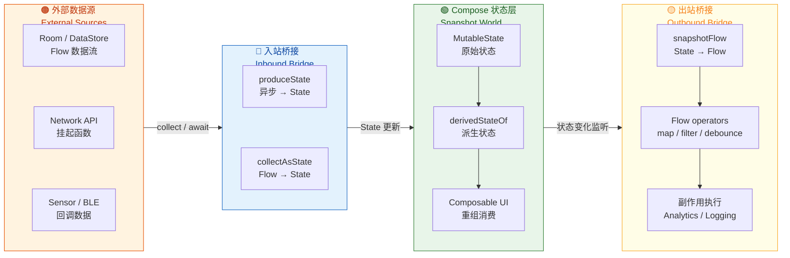

这条管道的数据流向是单向的：**外部源 → `produceState`/`collectAsState` → `MutableState` → `derivedStateOf` → UI → `snapshotFlow` → 副作用**。这与 UDF（Unidirectional Data Flow）的设计哲学高度吻合。每一环都有明确的职责边界——入站桥接负责"外部到快照"的类型转换，派生状态负责"高频到低频"的降噪优化，出站桥接负责"快照到协程"的世界切换。

掌握这三个 API 的设计意图与适用边界，是写出高性能、可维护 Compose 状态管理代码的关键能力。

---

**📝 练习题**

在一个搜索场景中，用户输入的搜索文本 `query` 存储在 `MutableState<String>` 中，需要对搜索结果列表做过滤。过滤后的结果列表变化频率远低于 `query` 的变化频率。以下哪种方案最合适？

A. 直接在 Composable 中计算 `val filtered = list.filter { ... }`，不做任何包装


B. 使用 `snapshotFlow { query }` 收集后通过 `collectAsState` 转回 State，再过滤


C. 使用 `remember { derivedStateOf { list.filter { ... } } }` 包裹过滤逻辑


D. 使用 `produceState` 在协程中执行过滤并更新 State


**【答案】** C

**【解析】** 本题考查的核心是"输出变化频率远低于输入变化频率"这一特征所对应的最佳 API 选择。`derivedStateOf` 正是为此场景设计的——它在计算块内自动追踪 Snapshot State 的读取（此处为 `query`），并在计算结果通过 `equals()` 比对后确认未变化时，跳过对下游 Recompose Scope 的通知，从而大幅减少不必要的重组。选项 A 没有任何缓存和去重机制，每次 `query` 变化都会触发整个 Composable 及其子树的重组。选项 B 通过 `snapshotFlow` → `collectAsState` 绕了一大圈回到 State，不仅引入了协程调度延迟，还没有利用到 `derivedStateOf` 的惰性求值和内建比对优势。选项 D 的 `produceState` 面向的是异步数据源（网络请求、Flow 收集等），对于纯同步的列表过滤计算来说是杀鸡用牛刀，且同样增加了不必要的协程开销。

---

**📝 练习题**

关于 `snapshotFlow` 的行为，以下描述中 **错误** 的是？

A. `snapshotFlow` 返回的是一个冷流（Cold Flow），只有被 `collect` 时才会开始观察


B. `snapshotFlow` 内部会自动执行 `distinctUntilChanged` 语义，相同的值不会重复发射


C. `snapshotFlow` 的读取块中可以读取多个不同的 `State`，它们都会被追踪


D. `snapshotFlow` 每次发射新值时会自动触发 Composable 重组


**【答案】** D

**【解析】** `snapshotFlow` 的作用是将 Compose Snapshot State 的变化 **导出到 Flow 世界**，供协程消费者（如 `LaunchedEffect` 中的 `collect`）使用。它的产物是一个标准的 `Flow<T>`，由协程通过 `collect` 来消费——这是一种副作用行为，与 Composable 重组没有直接关系。只有当 `collect` 内部手动去修改某个 `MutableState` 时，才会间接触发重组，但这并非 `snapshotFlow` 本身的行为。选项 A 正确：`snapshotFlow` 返回的确实是冷流。选项 B 正确：其内部实现在 emit 之前会做 `equals()` 比对，相等则跳过。选项 C 正确：读取块中所有被读取的 `State` 都会被注册到依赖集合中，任何一个变化都会触发重新求值。

---

## 重组作用域 Recompose Scope

Jetpack Compose 之所以能在声明式 UI 框架中保持高性能，核心秘密之一就在于它的 **重组作用域（Recompose Scope）** 机制。当状态发生变化时，Compose 并不会像早期 React 那样对整棵组件树做 Virtual DOM diff，而是精确地定位到 **读取了该状态的最小代码块**，仅对这些代码块执行重新调用——这就是所谓的 **智能重组（Smart Recomposition）**。但"智能"并非无条件生效，它依赖一套严格的 **稳定性契约（Stability Contract）**：只有当 Compose 编译器能够证明某个参数"没有发生语义上的变化"时，才能安全地跳过对应的重组作用域。理解这套机制，是写出高性能 Compose 界面的基本功。

本节将从三个维度展开：首先剖析重组作用域的划定规则与智能跳过的运行原理；然后深入 Stability 稳定性系统，解释编译器如何判断"值是否变了"；最后讲解 `@Stable` 和 `@Immutable` 两个注解的正确用法与常见陷阱。

---

### 智能跳过原理

#### 什么是重组作用域

在 Compose 的编译产物中，每一个 **可重启的代码区间** 都会被编译器包装成一个 `RecomposeScope` 对象。通俗地说，一个 Recompose Scope 就是"当某个状态变化后，运行时需要重新执行的最小代码单元"。Compose 编译器在编译期对每一个 `@Composable` 函数体进行分析，在合适的位置插入 `startRestartGroup()` / `endRestartGroup()` 调用，从而在 Slot Table 中登记这个作用域。

我们来看一个极简的例子，以理解作用域的边界：

```kotlin
// 顶层 Composable，本身构成一个 Recompose Scope
@Composable
fun Greeting(name: String) {          // ← Scope A 开始
    // Column 是 inline 函数，不会产生独立作用域
    Column {
        // Text 是一个非 inline 的 @Composable，它内部有自己的 Scope
        Text("Hello, $name")          // ← Scope B（Text 内部）
        Text("Welcome to Compose")    // ← Scope C（Text 内部）
    }
}                                      // ← Scope A 结束
```

关键规则如下：

1. **每个非 inline 的 `@Composable` 函数调用** 都会产生一个独立的 Recompose Scope。在上面的例子中，`Greeting` 本身是 Scope A，两个 `Text` 各自拥有 Scope B 和 Scope C。
2. **`inline` 的 `@Composable` 函数不会产生独立作用域**。`Column`、`Row`、`Box` 等布局容器之所以被声明为 `inline`，就是为了让其内部代码 **融入调用方的作用域**，减少不必要的作用域碎片化。因此，`Column { ... }` 内部的代码仍然属于 Scope A。
3. **Lambda 表达式** 如果被传递给非 inline 的 `@Composable` 参数（例如 `LazyColumn` 的 `items` block），则 Lambda 本身会成为一个新的 Recompose Scope。

理解了作用域边界，就能回答一个常见问题：**为什么有时候改了一个状态，好像整个函数都重组了？** 原因往往是状态被读取的位置恰好在一个较大的作用域内（比如直接在 `Greeting` 函数体中读取），导致整个 Scope A 都被标记为 invalid。

#### 读取追踪与失效标记

Compose 的快照系统（Snapshot System）在运行时追踪每一次 `State` 的 **读取（read）** 操作。当某个 `State` 在某个 Recompose Scope 内部被读取时，快照系统会将 `<该 State, 该 Scope>` 的映射关系记录下来。这是一种 **观察者模式** 的自动注册：

```kotlin
@Composable
fun Counter(count: State<Int>) {        // ← Scope X 开始
    // 当 count.value 被读取时，Snapshot 系统自动将
    // Scope X 注册为 count 的观察者
    Text("Count: ${count.value}")       // ← 读取发生在此
}                                        // ← Scope X 结束
```

当 `count.value` 被写入新值时，快照系统会遍历所有观察了该 `State` 的 Scope，将它们标记为 **invalid（失效）**。在下一帧到来时，Compose 的 `Recomposer` 会收集所有 invalid 的 Scope，按照 Slot Table 中的顺序依次重新执行它们——这就是一次 **重组（Recomposition）**。

下面这张图清晰展示了从状态变更到精准重组的完整链路：

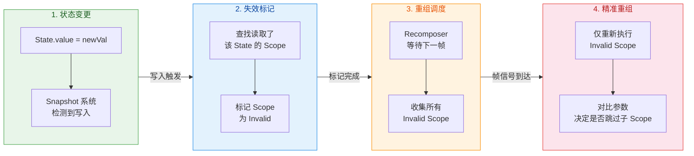

这里有一个容易被忽视的细节：失效标记发生在 **写入时**，而非读取时。读取只负责"注册观察关系"，写入才真正触发"通知失效"。这也是为什么 **延迟读取（deferred read）** 技巧如此有效——如果你把 `State` 的读取操作推迟到更小的作用域内，那么失效范围也随之缩小。

#### 智能跳过的判定流程

当一个 Recompose Scope 被标记为 invalid 并开始重新执行时，它内部调用的每一个子 `@Composable` 函数都需要被重新"评估"。但 Compose 并不会无脑地递归执行所有子函数——它会在进入子函数前，对该函数的 **所有参数** 做一次 **相等性检查（equality check）**。如果所有参数都与上一次组合时的值"相等"，则直接 **跳过（skip）** 该子函数的执行，从 Slot Table 中复用上次的结果。

这就是 **Smart Recomposition / Intelligent Skip** 的核心逻辑。用伪代码表达如下：

```kotlin
// 编译器为每个 @Composable 函数生成的简化逻辑（伪代码）
fun Greeting(name: String, $composer: Composer, $changed: Int) {
    // $changed 是编译器注入的位掩码，记录参数是否"可能变了"
    // 如果编译器在调用侧已经能判定参数没变，对应 bit = 0

    // 第一步：检查是否可以跳过
    if ($changed and 0b0001 == 0) {
        // name 参数没有发生变化，可以跳过整个函数体
        $composer.skipToGroupEnd()      // 跳过，复用 Slot Table 中的旧数据
        return
    }

    // 第二步：参数变了，正常执行函数体
    Text("Hello, $name")
    Text("Welcome to Compose")
}
```

编译器注入的 `$changed` 参数是一个 **位掩码（bitmask）**，每个参数占若干位，用来编码三种状态：**确定没变（Same）**、**确定变了（Different）**、**不确定（Uncertain）**。当状态为 Uncertain 时，运行时会调用参数的 `equals()` 方法做实际比较。

但这里产生了一个关键问题：**并非所有类型都能安全地用 `equals()` 判断"语义不变"**。例如，一个 `MutableList<String>` 即使 `equals()` 返回 `true`，它的内容也可能在两次组合之间被外部代码修改了——`equals()` 只比较了快照时刻的值，无法保证"未来不会变"。如果 Compose 信任了这个 `equals()` 结果并跳过了重组，那么 UI 就会显示过期数据。

这就引出了 **Stability（稳定性）** 的概念——Compose 需要一种机制来判断"这个类型的 `equals()` 结果是否可靠"。

#### 缩小重组范围的实践技巧

在讲解 Stability 之前，先介绍几种从"作用域"角度优化重组性能的实用手段：

**技巧一：延迟读取（Deferred Read / Lambda Wrapping）**

将 State 的读取推迟到尽可能小的作用域内，最经典的做法是使用 Lambda 传递：

```kotlin
// ❌ 不推荐：offset 在 AnimatedBox 作用域内被读取
// 每次 offset 变化，整个 AnimatedBox 都会重组
@Composable
fun AnimatedBox(offset: State<Float>) {
    val currentOffset = offset.value      // 读取发生在这里
    Box(
        Modifier
            .offset(x = currentOffset.dp) // 这里只是使用了已读取的值
            .size(50.dp)
            .background(Color.Blue)
    )
}

// ✅ 推荐：使用 Lambda 版本的 Modifier，将读取推迟到布局阶段
// offset 变化时，AnimatedBox 不会重组，只会在布局阶段重新计算偏移
@Composable
fun AnimatedBox(offset: State<Float>) {
    Box(
        Modifier
            .offset { IntOffset(offset.value.dp.roundToPx(), 0) } // 读取推迟到 Lambda 内
            .size(50.dp)
            .background(Color.Blue)
    )
}
```

第二种写法中，`offset.value` 的读取发生在 `Modifier.offset { }` 的 Lambda 内，这个 Lambda 在 **布局阶段（Layout Phase）** 才被调用，完全绕过了 Composition 阶段。因此 `offset` 的变化不会触发任何 Recompose Scope 的失效。

**技巧二：包装提取（Wrapping Extraction）**

将频繁变化的状态读取封装到一个独立的子 Composable 中，使失效范围仅限于该子函数：

```kotlin
// ❌ name 和 scrollOffset 的变化都会导致整个 UserProfile 重组
@Composable
fun UserProfile(name: String, scrollOffset: State<Int>) {
    Column {
        Text(name)
        Header(scrollOffset.value)      // scrollOffset 在 UserProfile 作用域内被读取
    }
}

// ✅ 将 scrollOffset 的读取隔离到独立的 Composable 中
@Composable
fun UserProfile(name: String, scrollOffset: State<Int>) {
    Column {
        Text(name)
        ScrollAwareHeader(scrollOffset)  // 传递 State 对象本身，不在这里读取 .value
    }
}

@Composable
fun ScrollAwareHeader(scrollOffset: State<Int>) {
    // scrollOffset.value 的读取被限制在此 Scope 内
    // scrollOffset 变化时，只有 ScrollAwareHeader 重组
    Header(scrollOffset.value)
}
```

**技巧三：利用 `derivedStateOf` 减少无意义的失效**

如果某个计算结果只在输入发生"有意义的变化"时才需要更新，可以使用 `derivedStateOf` 来过滤冗余通知（详见本章"状态转换与合并"一节）。

---

### Stability 稳定性契约

#### 稳定性的定义

Compose 编译器为每一个被用作 `@Composable` 函数参数的类型赋予一个 **稳定性分类（Stability Classification）**。这个分类决定了编译器是否有信心对该参数使用 `equals()` 做跳过判断。Compose 对"稳定"的定义非常严格，可以归纳为以下契约：

> 一个类型被认为是 **Stable（稳定的）**，当且仅当满足以下全部条件：
> 1. 对于同一个实例，`equals()` 的返回值在任意两次调用之间 **永远一致**（除非实例本身被重新赋值）。
> 2. 当该类型的某个 **公开属性发生变化** 时，Compose 会被 **通知到**（例如属性本身是 `MutableState`）。
> 3. 该类型的 **所有公开属性也必须是 Stable 的**（递归要求）。

简单说，Stable 类型要么是 **不可变的（immutable）**——一旦创建就永远不变，`equals()` 天然可靠；要么是 **可观察的可变类型（observable mutable）**——虽然会变，但每次变化都会通过 Compose 的 State 系统发出通知。

#### 编译器的自动推断

Compose 编译器（Kotlin Compiler Plugin）在编译期会自动分析每个类的稳定性，推断结果分为三类：

| 分类 | 含义 | 典型示例 |
|---|---|---|
| **Stable** | 满足稳定性契约，可安全用于跳过判断 | `String`、`Int`、`Float`、`Color`、`Dp`、`data class`（所有属性为 `val` 且类型均 Stable） |
| **Unstable** | 不满足稳定性契约，编译器无法信任其 `equals()` | `List<T>`、`Map<K,V>`、`MutableList`、含 `var` 属性的普通 class、来自非 Compose 模块的类 |
| **Immutable** | Stable 的更强子集：绝对不会变 | 被 `@Immutable` 标注的类、基础类型字面量 |

编译器的推断逻辑遵循以下优先规则：

1. **基本类型**（`Int`、`String`、`Boolean`、`Float` 等）和 **函数类型**（`() -> Unit`、`(Int) -> String` 等）天然被视为 Stable。
2. **枚举类（enum class）** 天然 Stable，因为实例固定且不可变。
3. **`data class`**：如果所有属性都声明为 `val`，且每个属性的类型都是 Stable 的，则该 `data class` 被推断为 Stable。若任何属性是 `var`，或任何属性的类型是 Unstable，则整个类被推断为 Unstable。
4. **来自外部模块（非 Compose 编译器处理的模块）的类**：一律视为 Unstable，因为编译器无法查看其源码。这是一个非常常见的"性能陷阱"——例如你使用了一个定义在 `:domain` 模块中的 `data class User(val name: String, val age: Int)`，即使它看起来完全不可变，如果 `:domain` 模块没有应用 Compose 编译器插件，它就会被视为 Unstable。
5. **集合接口**（`List`、`Set`、`Map`）：被视为 Unstable。因为 `List<T>` 在 Kotlin 中只是一个接口，实际实例可能是 `MutableList` 的向上转型，编译器无法保证其不可变性。

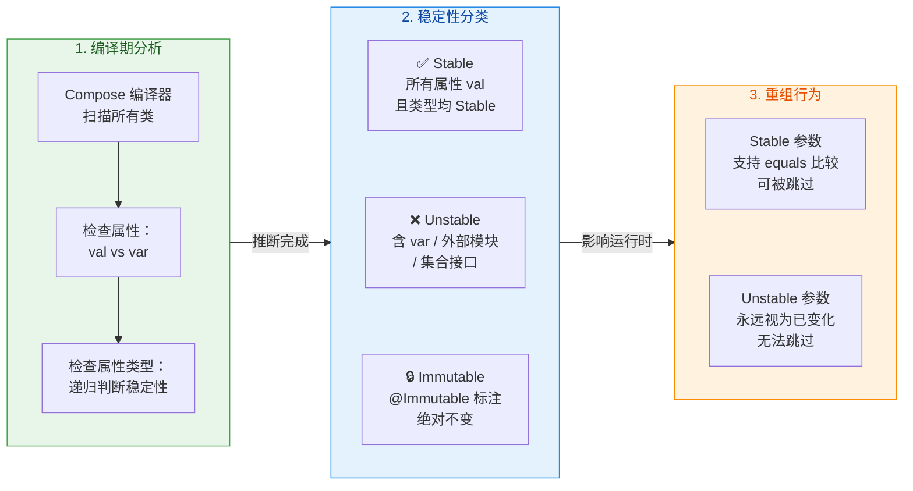

上图揭示了一个极为重要的结论：**如果一个 `@Composable` 函数的任何一个参数是 Unstable 的，那么该函数永远无法被跳过——即使其他参数都没变，即使 Unstable 参数的 `equals()` 实际返回了 `true`**。编译器不会冒险信任一个 Unstable 类型的 `equals()`，因此直接放弃跳过优化，每次父作用域重组都会连带重新执行这个子函数。

#### 如何诊断稳定性问题

Compose 编译器提供了一个非常实用的诊断工具：**Compose Compiler Metrics**。通过在 `build.gradle.kts` 中添加以下配置，可以在编译期生成稳定性报告：

```kotlin
// 在模块级 build.gradle.kts 中添加
// 配置 Compose 编译器生成指标报告
android {
    composeCompiler {
        // 启用指标报告，输出到 build/compose_metrics 目录
        reportsDestination = layout.buildDirectory.dir("compose_metrics")
        // 启用指标文件，输出到相同目录
        metricsDestination = layout.buildDirectory.dir("compose_metrics")
    }
}
```

编译后会在指定目录下生成多个文件，其中最关键的是 `*-composables.txt` 和 `*-classes.txt`：

- **`-classes.txt`**：列出所有被分析的类及其稳定性结论。例如：

```text
// 稳定性报告示例
stable class UserUiState {              // ← 被判定为 stable
  stable val name: String               // ← 每个属性独立标注
  stable val age: Int
}
unstable class OrderItem {              // ← 被判定为 unstable
  unstable val tags: List<String>       // ← List 是罪魁祸首
  stable val price: Double
}
```

- **`-composables.txt`**：列出每个 Composable 函数的 **可重启（restartable）** 和 **可跳过（skippable）** 状态。如果某个函数被标记为 `restartable` 但 **不是** `skippable`，就意味着它无法被智能跳过，需要重点排查参数稳定性。

```text
// Composable 可跳过性报告
restartable skippable fun UserCard(     // ← 可跳过 ✅
  stable name: String
  stable age: Int
)
restartable fun OrderCard(              // ← 不可跳过 ❌（缺少 skippable 标记）
  unstable order: OrderItem             // ← 因为参数 unstable
)
```

看到 `OrderCard` 没有 `skippable` 标记时，就应该追溯 `OrderItem` 的不稳定原因并修复它。

#### 强跳过模式（Strong Skipping Mode）

从 Compose Compiler **1.5.4+** 开始，Compose 引入了一个实验性的 **强跳过模式（Strong Skipping Mode）**，从 Kotlin 2.0.20 起已默认开启。该模式放宽了跳过条件：

1. **对于 Unstable 参数**：不再直接放弃跳过，而是改用 **引用相等（`===`）** 进行比较。如果同一个对象实例被传入（引用没变），即使它是 Unstable 的，也允许跳过。
2. **对于 Lambda 参数**：会自动被 `remember` 包装，避免因 Lambda 重新创建导致的引用不等。

这意味着在 Strong Skipping Mode 下，参数的判定逻辑变为：

| 参数稳定性 | 比较方式 | 可跳过条件 |
|---|---|---|
| Stable | `equals()` | `equals()` 返回 `true` |
| Unstable | `===`（引用相等） | 同一实例（引用未变） |

Strong Skipping Mode 显著减少了因稳定性问题导致的不必要重组，但它 **并非万能**。如果你每次都创建新的 Unstable 实例（如在父 Composable 中 `val item = OrderItem(...)`），引用必然不同，跳过仍然不会生效。因此，正确管理稳定性依然是最佳实践。

---

### @Stable / @Immutable 标记

#### @Immutable 注解

`@Immutable` 是一个 **向编译器做出的承诺**：标注的类实例一旦创建，其所有公开属性将 **永远不会改变**。编译器接收到这个承诺后，会将该类视为 Immutable（Stable 的最强子集），从而允许对以该类型为参数的 Composable 进行跳过优化。

```kotlin
// 使用 @Immutable 标注，向编译器承诺此类完全不可变
@Immutable
data class UiColor(
    val red: Int,       // val + 基本类型 → 满足不可变要求
    val green: Int,
    val blue: Int,
    val alpha: Float
)

// 编译器信任 @Immutable 的承诺
// UserBadge 参数全部 Stable → 函数可被跳过
@Composable
fun UserBadge(color: UiColor, label: String) {
    Box(
        modifier = Modifier
            .size(24.dp)
            .background(Color(color.red, color.green, color.blue, color.alpha))
    ) {
        Text(label)
    }
}
```

**重要**：`@Immutable` 只是一个"标记"（marker annotation），编译器 **不会** 在运行时校验你的承诺是否属实。如果你在一个标注了 `@Immutable` 的类中使用了 `var` 属性或持有了可变集合的引用，编译器不会报错，但 **UI 行为会出现诡异的状态不同步问题**——因为 Compose 信任了你的承诺并跳过了本应触发的重组。

```kotlin
// ⚠️ 危险：@Immutable 承诺不可变，但实际上 tags 是可变的
@Immutable
data class UserProfile(
    val name: String,
    val tags: List<String>   // List 接口可能持有 MutableList 实例！
)

// 如果外部代码将 MutableList 传入并在之后修改了它
// Compose 不会感知到变化，UI 会显示过期数据
val mutableTags = mutableListOf("VIP", "New")
val profile = UserProfile("Alice", mutableTags)
mutableTags.add("Premium")  // ← 这次修改对 Compose 来说是"隐形的"
```

因此，使用 `@Immutable` 时必须确保 **深度不可变（deeply immutable）**：不仅属性声明为 `val`，属性引用的对象本身也不能被外部修改。对于集合，推荐使用 Kotlinx Immutable Collections（`kotlinx.collections.immutable`）中的 `ImmutableList`、`PersistentList` 等类型，它们在类型层面就保证了不可变性。

#### @Stable 注解

`@Stable` 的语义比 `@Immutable` 更宽松。它允许类的属性发生变化，但要求 **每次变化都能被 Compose 观察到**。最典型的场景是：类的属性是 `MutableState`。

```kotlin
// @Stable 标记：属性可变，但通过 MutableState 保证 Compose 可观察
@Stable
class CounterState(initialCount: Int) {
    // count 的每次变化都通过 mutableStateOf 发出通知
    // Compose 能感知到变化并触发对应 Scope 的重组
    var count by mutableStateOf(initialCount)
        private set                          // 外部只能通过 increment() 修改

    // 提供安全的变更方法
    fun increment() {
        count++                              // 写入 MutableState，触发通知
    }
}
```

`@Stable` 的契约可以总结为：**`equals()` 的结果可靠，且状态变化对 Compose 可见**。与 `@Immutable` 类似，这也是一个开发者承诺，编译器不做运行时验证。

实际开发中，`@Stable` 和 `@Immutable` 的选择逻辑如下：

| 场景 | 推荐注解 | 原因 |
|---|---|---|
| 纯数据、一旦创建不再变化 | `@Immutable` | 语义明确：绝对不变 |
| 含 `MutableState` 属性、可变但可观察 | `@Stable` | 满足"变化可被通知"契约 |
| 来自外部模块的不可变 `data class` | `@Immutable` 或 `@Stable` | 绕过"外部模块默认 Unstable"的限制 |
| 含普通 `var` 属性（非 `MutableState`） | **都不推荐** | 变化对 Compose 不可见，标注会导致 bug |

#### Stability 配置文件

从 Compose Compiler **1.5.5+** 开始，你还可以通过一个外部的 **Stability 配置文件** 来批量声明类的稳定性，而无需逐个添加注解。这对于那些你无法修改源码的第三方库类型（如 Java 库中的 POJO）尤为有用。

```kotlin
// 在 build.gradle.kts 中指定配置文件路径
android {
    composeCompiler {
        // 指向项目根目录下的 stability_config.conf 文件
        stabilityConfigurationFile =
            rootProject.layout.projectDirectory.file("stability_config.conf")
    }
}
```

配置文件的格式非常简洁，每行一个完全限定类名（支持通配符）：

```text
// stability_config.conf
// 将指定的类视为 Stable（等价于在其源码上添加 @Stable）
com.example.domain.model.User
com.example.domain.model.Product
// 通配符：将某个包下的所有类都视为 Stable
com.example.network.dto.*
// 将 Kotlinx Immutable Collections 标记为 Stable
kotlinx.collections.immutable.*
```

这个方案优雅地解决了"跨模块稳定性丢失"的痛点。许多大型项目的 `:domain` 或 `:data` 模块并不依赖 Compose（也没必要依赖），通过配置文件就能让 Compose 编译器信任这些模块中的数据类。

#### 常见陷阱与最佳实践总结

**陷阱一：`List` / `Map` / `Set` 默认 Unstable**

这是最常见的稳定性问题。即使你写的是 `val items: List<String>`，由于 `List` 只是接口，编译器不知道实际实例是否可变，因此判定为 Unstable。解决方案有三种：

1. 使用 `kotlinx.collections.immutable` 中的 `ImmutableList<T>` / `PersistentList<T>`。
2. 在 Stability 配置文件中声明 `kotlinx.collections.immutable.*`。
3. 对整个包含 `List` 属性的类添加 `@Immutable`（前提是你能保证深度不可变）。

**陷阱二：跨模块类型默认 Unstable**

如前所述，来自未应用 Compose 编译器插件的模块的类，一律被视为 Unstable。修复方式：

1. 在 `:domain` 模块也应用 Compose 编译器插件（即使不依赖 Compose Runtime，仅用于生成稳定性元数据）。
2. 使用 Stability 配置文件。
3. 在 UI 层创建一个带 `@Immutable` / `@Stable` 标注的 UI Model，从 domain Model 映射过来。

**陷阱三：Lambda 重建导致跳过失效**

每次父 Composable 重组时，内部定义的 Lambda 都会被重新创建（新实例），导致子 Composable 参数的引用不等，跳过失效。在 Strong Skipping Mode 下，Lambda 会被自动 `remember`，但如果你没有启用该模式，则需要手动 `remember` Lambda 或将其提取为稳定的引用：

```kotlin
// ❌ 每次 ParentScreen 重组，onClick Lambda 都是新实例
@Composable
fun ParentScreen(viewModel: MyViewModel) {
    val state by viewModel.state.collectAsState()
    // 这个 Lambda 每次重组都会重建
    ChildButton(onClick = { viewModel.onAction() })
}

// ✅ 方案一：手动 remember（仅在非 Strong Skipping Mode 下需要）
@Composable
fun ParentScreen(viewModel: MyViewModel) {
    val state by viewModel.state.collectAsState()
    // remember 缓存 Lambda 实例，避免重建
    val onClick = remember { { viewModel.onAction() } }
    ChildButton(onClick = onClick)
}

// ✅ 方案二：使用方法引用（天然稳定引用）
@Composable
fun ParentScreen(viewModel: MyViewModel) {
    val state by viewModel.state.collectAsState()
    // 方法引用在相同的 viewModel 实例上是稳定的
    ChildButton(onClick = viewModel::onAction)
}
```

**最终的思维模型**可以用一句话概括：**Compose 的智能跳过建立在"信任"之上——编译器需要信任参数的 `equals()` 能真实反映语义变化；而 `@Stable` / `@Immutable` / Stability 配置文件就是开发者向编译器建立信任的三种方式。** 信任一旦被错误地给出（标注了不可变，实际却可变），后果就是 UI 状态不同步这类难以排查的 Bug。反之，信任若缺失（类型被误判为 Unstable），后果则是不必要的重组导致性能退化。在这两个极端之间找到平衡，就是 Compose 性能优化的核心功课。

---

**📝 练习题**

某团队发现 `ProductCard` Composable 在列表滚动时出现了严重的性能问题。经过 Compose Compiler Metrics 分析，报告如下：

```
restartable fun ProductCard(
  unstable product: Product
)
```

`Product` 类定义在 `:domain` 模块中（该模块未应用 Compose 编译器插件）：

```kotlin
data class Product(val id: Long, val name: String, val price: Double)
```

以下哪种方案 **无法** 有效解决 `ProductCard` 的稳定性问题？


A. 在 `:domain` 模块的 `build.gradle.kts` 中添加 Compose 编译器插件


B. 在 Stability 配置文件中添加 `com.example.domain.model.Product`


C. 在 UI 层创建 `@Immutable data class ProductUi(val id: Long, val name: String, val price: Double)` 并从 `Product` 映射


D. 在 `ProductCard` 函数体内使用 `remember { product }` 缓存参数


**【答案】** D

**【解析】** 选项 A、B、C 都是本节讲过的正规解决方案：A 让 Compose 编译器能分析 `:domain` 模块的源码并正确推断稳定性；B 通过配置文件显式声明 `Product` 为 Stable；C 在 UI 层用带 `@Immutable` 的映射类替代原始类型。而选项 D 的 `remember { product }` 只是在组合存活期间缓存了一个值，它 **不会改变 `product` 参数本身的稳定性分类**。Compose 编译器在编译期就已经判定 `product: Product` 为 Unstable，因此 **在进入函数体之前** 就已经决定不跳过——`remember` 在函数体内部的操作根本来不及影响跳过判定。真正的问题出在参数的类型层面，而非运行时的值缓存层面。

---

**📝 练习题**

在 Compose 的重组作用域划分中，以下说法正确的是：

A. `Column`、`Row` 等布局容器各自构成独立的 Recompose Scope，因此在 `Column` 内读取 State 只会触发 `Column` 内部的重组


B. 每个 `@Composable` Lambda（无论是否 inline）都会创建一个独立的 Recompose Scope


C. `inline` 修饰的 `@Composable` 函数不会创建独立的 Recompose Scope，其内部代码属于调用方的作用域


D. Recompose Scope 的划分发生在运行时，由 Recomposer 根据 State 读取情况动态决定


**【答案】** C

**【解析】** `Column`、`Row`、`Box` 等常用布局容器都被声明为 `inline` 函数，这意味着它们的函数体在编译时会被内联到调用方，不会产生独立的 Recompose Scope（排除 A）。选项 B 错误在于 `inline` 的 `@Composable` Lambda 同样不会创建独立作用域，只有非 inline 的才会。选项 D 的错误在于 Recompose Scope 的划分发生在 **编译期**，由 Compose 编译器通过插入 `startRestartGroup()` / `endRestartGroup()` 调用来静态确定，运行时只负责追踪读取关系和触发失效，不会改变作用域边界。因此正确答案是 C：`inline` 的 `@Composable` 不创建独立作用域，其代码融入调用方。

---

## 副作用与生命周期

Compose 的声明式编程模型要求 Composable 函数是**无副作用（side-effect free）**的——它们只负责描述 UI 应该长什么样，而不应该在函数体内直接发起网络请求、写入数据库、注册监听器或执行任何"不可逆"的操作。然而在真实应用中，这些操作又是不可避免的：你总需要在某个页面进入时加载数据、在某个组件挂载时注册传感器监听、在状态变化时同步给非 Compose 系统。为此，Compose 提供了一套精心设计的 **Effect API**，将副作用的执行时机与 Composition 的生命周期精确绑定，既保证了声明式模型的纯粹性，又提供了与命令式世界交互的安全通道。

理解 Effect API 的关键在于理解 Compose 的**三阶段模型（Three-Phase Model）**：Composition → Layout → Drawing。副作用并不发生在这三个阶段的"内部"，而是发生在 Composition **成功提交（commit）之后**。这意味着当 Compose Runtime 完成了对 Slot Table 的写入、确定了哪些节点新增/更新/删除之后，才会触发对应的 Effect 回调。这一设计确保了副作用看到的永远是"已经稳定"的组合结果，而不是某个中间态。

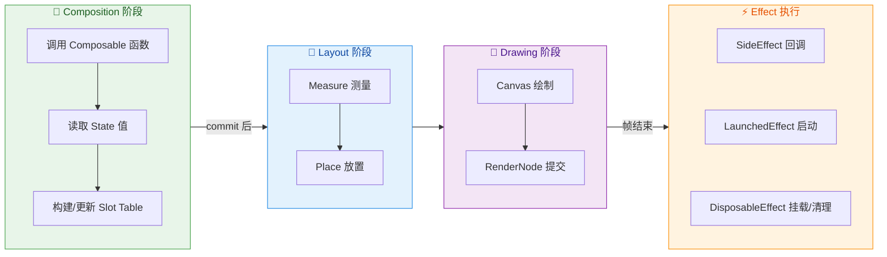

从上图可以看出，所有 Effect 都被推迟到了**当前帧的 Composition 和渲染完成之后**才执行。这种设计带来两个重要保证：第一，Effect 中读取的 State 值一定是本次 Composition 的最终结果；第二，Effect 的执行不会干扰正在进行的 UI 构建过程，避免了"边构建边触发副作用导致再次重组"的死循环。

在深入每个具体 API 之前，需要先建立一个核心概念——**Effect 的生命周期与 Composition 的进出（enter/leave）绑定**。当一个 Composable 第一次进入 Composition（即首次被调用并写入 Slot Table）时，其内部的 Effect 会被"安装"；当该 Composable 从 Composition 中移除（例如条件分支导致不再被调用）时，其 Effect 会被"卸载"并执行清理。而在两次 Recomposition 之间，Effect 是否需要重新执行，则取决于其 **key 参数**是否发生了变化。这套机制与 React 的 `useEffect` 依赖数组有异曲同工之妙，但 Compose 通过 Kotlin 的协程系统实现得更加优雅。

---

### LaunchedEffect 挂起任务

`LaunchedEffect` 是 Compose Effect 家族中最常用的成员，专门用于在 Composable 的生命周期内启动**协程（Coroutine）**来执行异步副作用。它的核心价值在于将协程的生命周期与 Composable 的存活周期自动绑定——当 Composable 进入 Composition 时启动协程，当 Composable 离开 Composition 时自动取消协程，无需手动管理。

#### 基本签名与工作原理

`LaunchedEffect` 的函数签名如下：

```kotlin
// LaunchedEffect 接收一个或多个 key 参数以及一个挂起 Lambda
@Composable
fun LaunchedEffect(
    key1: Any?,           // 用于控制重启时机的键值
    block: suspend CoroutineScope.() -> Unit  // 在协程作用域中执行的挂起代码块
)

// 也有多 key 的重载版本
@Composable
fun LaunchedEffect(
    key1: Any?,
    key2: Any?,
    block: suspend CoroutineScope.() -> Unit
)

// vararg 版本，支持任意数量的 key
@Composable
fun LaunchedEffect(
    vararg keys: Any?,
    block: suspend CoroutineScope.() -> Unit
)
```

当 Compose Runtime 执行到一个 `LaunchedEffect` 调用时，它的行为遵循以下规则：

**首次进入 Composition 时**：Runtime 会在当前 Composition 关联的 `CoroutineScope`（由 `rememberCoroutineScope` 的底层机制维护，该 Scope 绑定到 Composition 的生命周期）中启动一个新协程来执行 `block`。这个协程的 `CoroutineContext` 默认包含一个 `Job`，该 Job 是当前 Composition Scope 的子 Job，遵循结构化并发（Structured Concurrency）原则。

**Recomposition 时 key 未变化**：如果 `LaunchedEffect` 的所有 key 值与上一次 Composition 时相同（通过 `equals` 比较），Runtime 不会做任何操作——之前启动的协程继续运行，不会被取消或重启。这是一个极其重要的特性，意味着一个正在进行的网络请求或动画不会因为无关 State 的变化引发的 Recomposition 而被打断。

**Recomposition 时 key 发生变化**：Runtime 会先**取消（cancel）**上一次启动的协程（通过调用其 Job 的 `cancel()`），然后**启动一个全新的协程**来执行最新的 `block`。这使得你可以通过改变 key 来"重置"某个异步操作。例如，当用户选择了不同的商品 ID，你希望取消对旧商品的数据加载并开始加载新商品的数据。

**离开 Composition 时**：当包含 `LaunchedEffect` 的 Composable 不再被调用（例如导航到了另一个页面、条件判断使其分支不再执行），Runtime 会自动取消该协程。这彻底避免了 Android 开发中常见的"页面已销毁但回调仍在执行"导致的内存泄漏和崩溃问题。

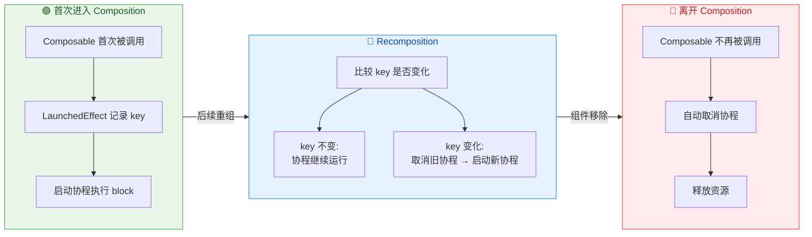

#### 典型使用场景

**场景一：页面进入时加载数据**

这是最经典的使用场景。当一个屏幕级 Composable 首次进入 Composition 时，需要触发数据加载：

```kotlin
@Composable
fun UserProfileScreen(
    userId: String,                    // 用户 ID，作为 LaunchedEffect 的 key
    viewModel: UserProfileViewModel = viewModel()  // 获取 ViewModel 实例
) {
    // 当 userId 变化时，取消旧的加载并启动新的加载
    // key = userId 确保了：相同用户不会重复加载，不同用户会重新加载
    LaunchedEffect(userId) {
        // 这里是一个 CoroutineScope，可以直接调用挂起函数
        viewModel.loadUserProfile(userId)  // 挂起函数，执行网络请求
    }

    // 读取 ViewModel 中的状态来构建 UI
    val uiState by viewModel.uiState.collectAsStateWithLifecycle()

    // 根据状态渲染不同的 UI
    when (uiState) {
        is Loading -> CircularProgressIndicator()   // 加载中显示进度条
        is Success -> ProfileContent(uiState.data)  // 成功显示内容
        is Error -> ErrorMessage(uiState.message)   // 失败显示错误信息
    }
}
```

这里 `userId` 作为 key 的选择非常精妙：如果用户从一个 Profile 页导航到另一个 Profile 页（userId 改变），`LaunchedEffect` 会自动取消对旧用户数据的加载，启动对新用户数据的加载。而如果只是页面内某个无关 State 变化导致 Recomposition（例如用户展开了一个折叠面板），由于 userId 没有变化，数据加载协程不会被打断。

**场景二：Snackbar 显示控制**

```kotlin
@Composable
fun MessageScreen(
    snackbarHostState: SnackbarHostState,  // Snackbar 宿主状态
    messageToShow: String?                  // 需要显示的消息，可能为 null
) {
    // 仅当 messageToShow 不为 null 时才执行副作用
    // key = messageToShow，每次消息内容变化都会重新显示
    if (messageToShow != null) {
        LaunchedEffect(messageToShow) {
            // showSnackbar 是一个挂起函数，会等待 Snackbar 显示完毕（用户点击或超时）
            snackbarHostState.showSnackbar(
                message = messageToShow,     // Snackbar 显示的文本
                duration = SnackbarDuration.Short  // 短暂显示后自动消失
            )
        }
    }
}
```

**场景三：持续运行的动画或定时任务**

```kotlin
@Composable
fun PulsingDot() {
    // 使用 Animatable 创建一个可动画的 Float 值，初始为 0.5f（半透明）
    val alpha = remember { Animatable(0.5f) }

    // key = Unit 意味着这个 LaunchedEffect 在整个 Composable 存活期间只启动一次
    // 不会因为任何 Recomposition 而重启
    LaunchedEffect(Unit) {
        // 无限循环执行呼吸灯效果
        while (true) {
            // 从当前值动画到 1f（完全不透明）
            alpha.animateTo(
                targetValue = 1f,
                animationSpec = tween(durationMillis = 500)  // 500ms 线性动画
            )
            // 从 1f 动画回到 0.5f（半透明）
            alpha.animateTo(
                targetValue = 0.5f,
                animationSpec = tween(durationMillis = 500)
            )
            // 循环不需要手动 delay，animateTo 本身是挂起函数，会挂起等待动画完成
        }
        // 注意：while(true) 不会造成泄漏
        // 因为当 PulsingDot 离开 Composition 时，协程会被自动取消
        // CancellationException 会中断 while 循环
    }

    // 使用动画值绘制一个圆点
    Box(
        modifier = Modifier
            .size(16.dp)                        // 固定大小 16dp
            .alpha(alpha.value)                 // 使用动画值控制透明度
            .background(Color.Red, CircleShape) // 红色圆形背景
    )
}
```

使用 `Unit` 作为 key 是一个重要的惯用模式（idiom）。因为 `Unit` 永远等于 `Unit`，所以 key 永远不会"变化"，协程只会在首次进入 Composition 时启动一次。这适用于那些不依赖外部参数、需要在整个组件生命周期内持续运行的任务。但需要谨慎——如果你的副作用确实应该在某个参数变化时重启，错误地使用 `Unit` 作为 key 会导致 bug。

#### 底层机制：RememberObserver 与 Slot Table

`LaunchedEffect` 在底层并不是什么"魔法"，它实际上是基于 `remember` 和 `RememberObserver` 接口构建的。当你调用 `LaunchedEffect(key) { ... }` 时，Compose Runtime 大致执行以下逻辑：

1. 在 Slot Table 中为这个 `LaunchedEffect` 分配一个 Slot 位置（与 `remember` 机制相同）。
2. 在该 Slot 中存储一个实现了 `RememberObserver` 接口的内部对象（`LaunchedEffectImpl`），这个对象持有当前的 key 值和 block lambda。
3. `RememberObserver` 接口有三个回调：`onRemembered()`（进入 Composition 时调用）、`onForgotten()`（离开 Composition 时调用）、`onAbandoned()`（Composition 未成功完成时调用）。
4. 当 `onRemembered()` 被调用时，启动协程执行 block。
5. 当 key 变化时，Runtime 发现存储的 key 与新传入的 key 不同，于是先调用旧对象的 `onForgotten()`（取消旧协程），再创建新对象并调用 `onRemembered()`（启动新协程）。
6. 当 `onForgotten()` 被调用时，取消协程。

这套机制使得 `LaunchedEffect` 的行为完全由 Slot Table 的生命周期驱动，与 Composable 的存活/移除保持了精确同步。

---

### DisposableEffect 清理

如果说 `LaunchedEffect` 是为异步协程世界设计的，那么 `DisposableEffect` 就是为**需要成对执行的"注册/注销"式副作用**设计的。它的核心特征是提供了一个明确的 `onDispose` 回调，用于在 Effect 结束时执行清理逻辑——这与 Android 传统开发中在 `onStart/onStop` 或 `onResume/onPause` 中成对执行注册与注销的模式完全对应。

#### 基本签名与清理契约

```kotlin
// DisposableEffect 同样接收 key 参数
@Composable
fun DisposableEffect(
    key1: Any?,
    effect: DisposableEffectScope.() -> DisposableEffectResult
    // 注意返回值：必须返回一个 DisposableEffectResult
    // 实践中通过调用 onDispose { } 来创建这个返回值
)
```

`DisposableEffect` 的 block 不是一个挂起函数（与 `LaunchedEffect` 不同），它运行在**主线程**上，同步执行。block 的最后一行**必须**调用 `onDispose { ... }`，Kotlin 编译器和 Compose Lint 都会强制检查这一点。这种设计是刻意为之的——它强制开发者在编写"注册"逻辑的同时就写好对应的"注销"逻辑，从根源上避免忘记清理的问题。

`DisposableEffect` 的生命周期行为如下：

**首次进入 Composition 时**：执行 effect block 中 `onDispose` 之前的所有代码（即"setup"部分），然后将 `onDispose` lambda 存储起来，等待后续调用。

**Recomposition 时 key 未变化**：什么都不做。之前的 setup 效果保持，onDispose 也不会被调用。

**Recomposition 时 key 发生变化**：先调用**上一次**存储的 `onDispose` lambda 进行清理，然后**重新执行** effect block（新的 setup + 新的 onDispose 注册）。

**离开 Composition 时**：调用当前存储的 `onDispose` lambda 进行最终清理。

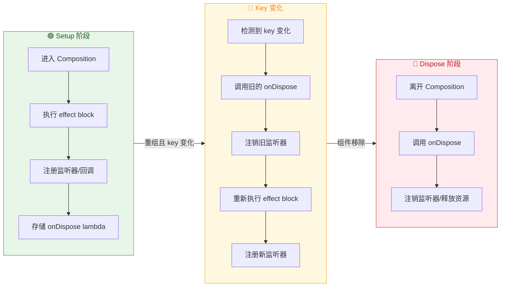

#### 典型使用场景

**场景一：监听 Lifecycle 事件**

这是 `DisposableEffect` 最经典的用例——将 Compose 组件与 Android 传统的 `LifecycleObserver` 桥接：

```kotlin
@Composable
fun LifecycleAwareScreen(
    lifecycleOwner: LifecycleOwner = LocalLifecycleOwner.current  // 获取当前生命周期持有者
) {
    // key = lifecycleOwner，当 LifecycleOwner 变化时重新注册
    DisposableEffect(lifecycleOwner) {
        // --- Setup 部分 ---
        // 创建一个生命周期观察者
        val observer = LifecycleEventObserver { _, event ->
            // 当生命周期事件发生时执行相应逻辑
            when (event) {
                Lifecycle.Event.ON_START -> {
                    // Activity/Fragment 进入 STARTED 状态
                    // 例如：开始定位服务、恢复视频播放
                    println("Screen is visible - start tracking")
                }
                Lifecycle.Event.ON_STOP -> {
                    // Activity/Fragment 进入 STOPPED 状态
                    // 例如：停止定位服务、暂停视频播放
                    println("Screen is hidden - stop tracking")
                }
                else -> {} // 其他事件不处理
            }
        }
        // 将观察者注册到 LifecycleOwner
        lifecycleOwner.lifecycle.addObserver(observer)

        // --- Cleanup 部分（必须是最后一行）---
        onDispose {
            // 当 Composable 离开 Composition 或 lifecycleOwner 变化时
            // 注销观察者，避免内存泄漏
            lifecycleOwner.lifecycle.removeObserver(observer)
        }
    }
}
```

这里为什么用 `DisposableEffect` 而不是 `LaunchedEffect`？因为 `addObserver/removeObserver` 是同步的、成对的注册/注销操作，不需要协程的挂起能力。`DisposableEffect` 的 `onDispose` 契约恰好完美匹配这种模式。

**场景二：注册 BroadcastReceiver**

```kotlin
@Composable
fun NetworkStatusMonitor(
    context: Context = LocalContext.current  // 获取 Android Context
) {
    // 用于向 UI 暴露网络状态的 mutableState
    var isConnected by remember { mutableStateOf(true) }

    // key = context，通常 Context 在组件存活期间不会变化
    DisposableEffect(context) {
        // 创建一个广播接收器，监听网络连接变化
        val receiver = object : BroadcastReceiver() {
            override fun onReceive(ctx: Context, intent: Intent) {
                // 从 ConnectivityManager 查询当前网络状态
                val cm = ctx.getSystemService(Context.CONNECTIVITY_SERVICE)
                        as ConnectivityManager
                // 获取活动网络信息，判断是否已连接
                val activeNetwork = cm.activeNetworkInfo
                isConnected = activeNetwork?.isConnectedOrConnecting == true
            }
        }
        // 创建 IntentFilter，指定监听网络变化广播
        val filter = IntentFilter(ConnectivityManager.CONNECTIVITY_ACTION)
        // 注册广播接收器
        context.registerReceiver(receiver, filter)

        // 清理：注销广播接收器
        onDispose {
            // 必须在清理时注销，否则会导致 Context 泄漏
            context.unregisterReceiver(receiver)
        }
    }

    // 使用 isConnected 状态渲染 UI
    if (!isConnected) {
        // 没有网络时显示提示横幅
        NetworkUnavailableBanner()
    }
}
```

**场景三：管理平台 View 引用（与 AndroidView 配合）**

```kotlin
@Composable
fun MapViewComposable(
    onMapReady: (GoogleMap) -> Unit  // 地图准备就绪后的回调
) {
    // 使用 remember 持有 MapView 引用
    val mapView = remember { MapView(LocalContext.current) }

    DisposableEffect(Unit) {
        // Setup：初始化 MapView 生命周期
        mapView.onCreate(null)  // 调用 MapView 的 onCreate
        mapView.onResume()      // 调用 MapView 的 onResume

        // 异步获取 GoogleMap 对象
        mapView.getMapAsync { googleMap ->
            onMapReady(googleMap)  // 地图就绪，通知调用者
        }

        // Cleanup：销毁 MapView，释放原生资源
        onDispose {
            mapView.onPause()    // 暂停
            mapView.onDestroy()  // 销毁，释放 GPU 纹理、内存等
        }
    }

    // 将 MapView 嵌入到 Compose 布局树中
    AndroidView(factory = { mapView })
}
```

#### DisposableEffect 与 LaunchedEffect 的选择原则

两者的根本区别在于**执行模型**：

| 特征 | LaunchedEffect | DisposableEffect |
|------|---------------|-----------------|
| **执行模型** | 启动协程（挂起函数） | 同步执行（普通函数） |
| **清理方式** | 协程被取消（CancellationException） | 调用 onDispose lambda |
| **适用场景** | 异步操作（网络请求、动画、Flow 收集） | 同步的注册/注销操作 |
| **是否需要挂起** | 是，block 是 suspend lambda | 否，block 是普通 lambda |
| **资源管理** | 依赖协程的结构化并发自动清理 | 开发者在 onDispose 中手动清理 |

简单的判断法则：如果你的副作用需要调用 `suspend` 函数或需要长时间运行，用 `LaunchedEffect`；如果你的副作用是"注册一个东西，以后要注销它"，用 `DisposableEffect`。当然，有时两者可以互换——你可以在 `LaunchedEffect` 中使用 `try/finally` 来实现清理，但 `DisposableEffect` 的 `onDispose` 语义更加明确，代码意图更清晰。

---

### SideEffect 提交后回调

`SideEffect` 是三个 Effect API 中最简单的一个，但也最容易被误用。它的作用是：**每次 Composition 成功提交后**，同步执行一段代码。注意关键词——"**每次**"和"**成功提交后**"。

#### 基本签名与行为

```kotlin
// SideEffect 没有 key 参数，每次成功的 Composition 都会执行
@Composable
fun SideEffect(
    effect: () -> Unit  // 普通的无参无返回值 lambda
)
```

`SideEffect` 的行为极其直白：

- **没有 key 参数**：它不像 `LaunchedEffect` 或 `DisposableEffect` 那样可以通过 key 来控制是否重新执行。每一次包含它的 Composable 被成功组合（无论是首次还是 Recomposition），它都会在 Composition 提交后执行。
- **没有清理机制**：它不提供 `onDispose` 或协程取消。它是一个"fire-and-forget"的同步回调。
- **同步执行**：block 运行在主线程上，不是挂起函数，不应该在里面做耗时操作。

这使得 `SideEffect` 的使用场景非常特定——它主要用于**将 Compose 的 State 同步到非 Compose 管理的外部系统**。因为它在每次 Composition 后都执行，所以它总是反映最新的 State 值，非常适合作为 Compose 世界和命令式世界之间的"同步桥梁"。

#### 为什么需要 SideEffect

你可能会问：既然 `SideEffect` 的 block 每次都执行，那我直接在 Composable 函数体内写代码不就行了？答案是**不行**，原因在于 Composition 的事务性（Transactional Nature）。

Composable 函数的执行发生在 Composition 阶段，而 Composition 是可以被取消或回滚的——例如当一个并发的 Recomposition 被更高优先级的 Recomposition 打断时。如果你在 Composable 函数体内直接修改外部状态，而这次 Composition 最终被取消了，你就会把一个"从未真正生效"的中间状态写入到外部系统中。

`SideEffect` 解决了这个问题：它的 block 只会在 Composition **成功提交**（即确认写入 Slot Table 且不会被回滚）之后才执行。这保证了你同步到外部系统的值一定是最终生效的值。

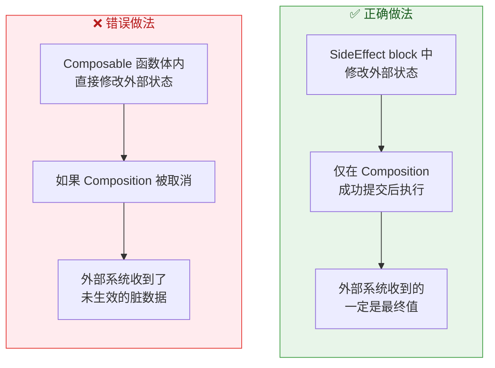

#### 典型使用场景

**场景一：同步状态到 Analytics 系统**

```kotlin
@Composable
fun AnalyticsScreen(
    screenName: String,             // 当前屏幕名称
    analytics: AnalyticsService     // 分析服务（非 Compose 管理的外部对象）
) {
    // 每次 Composition 成功提交后，都将最新的 screenName 同步给分析服务
    // 这确保了分析系统中记录的屏幕名称始终与 UI 实际显示的一致
    SideEffect {
        // 在 Composition 成功提交后同步执行
        analytics.setCurrentScreen(screenName)
    }

    // 屏幕内容
    Text("Welcome to $screenName")
}
```

如果用 `LaunchedEffect(screenName)` 也能实现类似效果，但有两个区别：第一，`LaunchedEffect` 启动的是协程，有一定开销；第二，`LaunchedEffect` 只在 key 变化时重新执行，而 `SideEffect` 每次 Composition 都执行。对于 Analytics 同步这种轻量级操作，`SideEffect` 更合适。

**场景二：更新 Callback 引用**

这是 `SideEffect` 的一个非常重要的高级模式，也是 Compose 底层大量使用的技巧——`rememberUpdatedState` 的内部就是基于 `SideEffect` 实现的：

```kotlin
// rememberUpdatedState 的简化实现原理
@Composable
fun <T> rememberUpdatedState(newValue: T): State<T> {
    // 使用 remember 创建一个 MutableState，初始值为 newValue
    // 在后续 Recomposition 中，remember 会返回同一个 State 对象（不会重新创建）
    val state = remember { mutableStateOf(newValue) }

    // 使用 SideEffect 在每次 Composition 成功后更新 State 的值
    // 这确保了：
    // 1. state 对象的引用永远不变（remember 保证）
    // 2. state 的值总是最新的（SideEffect 保证）
    SideEffect {
        state.value = newValue  // 将最新值写入 State
    }

    return state  // 返回稳定引用的 State 对象
}
```

`rememberUpdatedState` 解决了一个微妙但重要的问题：在长生命周期的 Effect（如 `LaunchedEffect(Unit)`）中引用一个可能在 Recomposition 中变化的值。由于 `LaunchedEffect(Unit)` 的 block 只执行一次，block 中捕获的是首次 Composition 时的 lambda 引用。如果这个 lambda 在后续 Recomposition 中被替换了，block 中的引用已经过时：

```kotlin
@Composable
fun TimerScreen(
    onTimeout: () -> Unit  // 超时回调，可能在 Recomposition 中被替换
) {
    // ❌ 错误：LaunchedEffect(Unit) 的 block 捕获了首次的 onTimeout 引用
    // 如果父组件在 10 秒内更新了 onTimeout lambda，这里仍然会调用旧的
    // LaunchedEffect(Unit) {
    //     delay(10_000)
    //     onTimeout()  // 可能调用的是过期的回调！
    // }

    // ✅ 正确：使用 rememberUpdatedState 包装
    // currentOnTimeout 的值在每次 Recomposition 后都会被 SideEffect 更新为最新的 onTimeout
    val currentOnTimeout by rememberUpdatedState(onTimeout)

    LaunchedEffect(Unit) {
        delay(10_000L)                // 等待 10 秒
        currentOnTimeout()            // 调用的一定是最新的回调引用
    }
}
```

**场景三：同步到 Framework 层的非 Compose 对象**

```kotlin
@Composable
fun WindowConfigSync(
    window: Window,                  // Android Window 对象
    statusBarColor: Color            // 期望的状态栏颜色
) {
    // 每次 Composition 成功后，将最新的颜色同步到 Window
    SideEffect {
        // Window.statusBarColor 是 Android Framework API，不受 Compose 管理
        // 使用 SideEffect 确保只在 Composition 确认提交后才修改
        window.statusBarColor = statusBarColor.toArgb()
    }
}
```

#### 三大 Effect API 对比总结

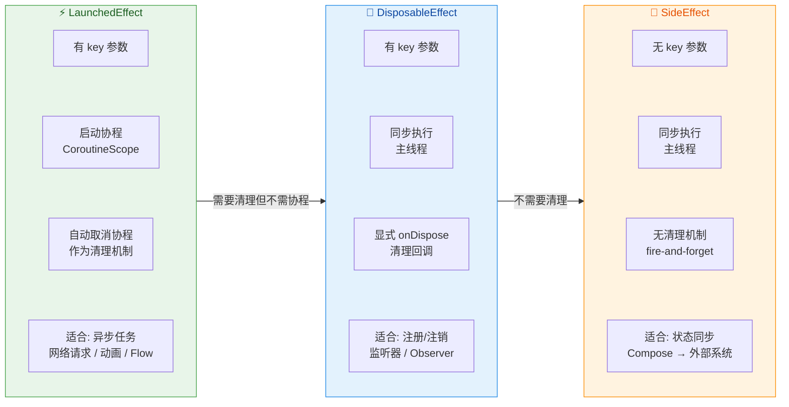

为了更直观地理解三者的差异，这里提供一个决策路径：

1. **你的副作用需要调用 `suspend` 函数吗？** → 是 → **LaunchedEffect**
2. **你的副作用需要在结束时执行清理（注销监听器、释放资源）吗？** → 是 → **DisposableEffect**
3. **你只是想把 Compose State 同步到某个外部系统，不需要异步也不需要清理？** → **SideEffect**

还有一个更深层的选择维度——**执行频率**：
- `LaunchedEffect(key)` 和 `DisposableEffect(key)` 只在 key 变化时重新执行，适合"事件驱动"的副作用。
- `SideEffect` 在每次 Composition 后都执行，适合"状态同步"式的副作用。

最后需要强调一个容易被忽略的共同点：**三者都只在 Composition 成功提交后执行**。这是 Compose Effect 系统的根基性保证，确保了副作用与 UI 状态的一致性。如果 Composition 被取消（例如被更高优先级的重组抢占），所有 Effect 都不会执行，外部系统也不会收到任何"不一致"的状态更新。这种事务性语义是 Compose 相对于传统 View 系统在状态管理方面的一个重大进步。

---

**📝 练习题**

在一个 Composable 中，你需要注册一个 `SensorManager` 的加速度传感器监听器，并在 Composable 离开 Composition 时注销。以下哪种 Effect API 最适合这个场景？

A. `LaunchedEffect(Unit) { sensorManager.registerListener(...) }`，依靠协程取消时在 `finally` 块中注销


B. `DisposableEffect(Unit) { sensorManager.registerListener(...); onDispose { sensorManager.unregisterListener(...) } }`


C. `SideEffect { sensorManager.registerListener(...) }`


D. 直接在 Composable 函数体内调用 `sensorManager.registerListener(...)` 即可


**【答案】** B

**【解析】** 传感器监听器的注册（`registerListener`）和注销（`unregisterListener`）是典型的**同步成对操作**，不需要协程的挂起能力，因此 `DisposableEffect` 是最佳选择。它的 `onDispose` 回调提供了明确的清理时机，语义清晰。选项 A 虽然技术上可行（在 `LaunchedEffect` 内使用 `try/finally` + `awaitCancellation()` 来保持协程存活并在取消时清理），但这种写法是对协程机制的"滥用"——为一个不需要挂起的操作引入了不必要的协程开销和代码复杂度。选项 C 的 `SideEffect` 每次 Recomposition 都会执行注册，但没有注销机制，会导致重复注册和资源泄漏。选项 D 在 Composable 函数体内直接执行副作用，违反了 Compose 的声明式原则，且如果 Composition 被取消则注册了一个永远不会被注销的监听器。

---

**📝 练习题**

下面代码中的 `LaunchedEffect` 在什么情况下会重新启动协程？

```kotlin
@Composable
fun SearchScreen(query: String, filter: Filter) {
    LaunchedEffect(query, filter) {
        val results = repository.search(query, filter)
        updateUI(results)
    }
}
```

A. 每次 `SearchScreen` 发生 Recomposition 时都会重启


B. 仅当 `query` 发生变化时重启，`filter` 的变化不会触发重启


C. 当 `query` 或 `filter` 任意一个发生变化时（通过 `equals` 判断），取消旧协程并启动新协程


D. 永远不会重启，因为使用了多 key 版本的 `LaunchedEffect`


**【答案】** C

**【解析】** `LaunchedEffect` 接收多个 key 时，Runtime 会对**每一个** key 进行 `equals` 比较。只要**任意一个** key 与上次 Composition 时的值不同，就会触发"取消旧协程 → 启动新协程"的流程。在本例中，`query` 从 `"android"` 变为 `"compose"` 会触发重启；`filter` 从 `Filter.ALL` 变为 `Filter.RECENT` 也会触发重启；两者同时变化当然也会重启。只有当 `query` 和 `filter` 都没有变化时（即 Recomposition 由其他无关 State 引起），协程才会继续运行不受影响。选项 A 错误，因为 key 未变化时不会重启。选项 B 错误，因为 `filter` 同样是 key 之一。选项 D 完全错误，多 key 版本的行为与单 key 版本一致，只是检查的 key 更多。

---

## 组合局部 CompositionLocal

在 Compose 的组合树（Composition Tree）中，数据的传递默认遵循 **显式参数传递** 原则——父 Composable 通过函数参数将数据逐层传递给子 Composable。这种方式在层级较浅时简洁清晰，但当某些"横切关注点"（Cross-cutting Concerns）需要贯穿整棵组合树时，就会引发臭名昭著的 **"参数钻透"（Prop Drilling）** 问题：主题色、字体排版、导航控制器、Locale 语言环境等数据，几乎每个层级都需要，却不得不逐层传递，导致中间层 Composable 被迫接收并转发它们根本不关心的参数。

`CompositionLocal` 正是 Compose 为解决这一问题而设计的 **隐式参数传递机制**。它允许在组合树的某个节点 **提供（Provide）** 一个值，树中该节点以下的所有后代 Composable 均可 **直接读取（Consume）**，而无需通过中间层的函数签名显式传递。这与 React 的 Context API 思想一脉相承，但在实现机制上与 Compose 的快照系统（Snapshot System）和重组作用域（Recompose Scope）深度耦合，有着独特的性能优化策略。

### 隐式参数传递

#### 从"参数钻透"问题说起

设想一个典型的 UI 结构：`App → Screen → Card → Title`，其中 `Title` 需要读取当前主题的 primary color。若采用显式参数传递：

```kotlin
// ❌ Prop Drilling：每一层都被迫携带 primaryColor 参数
@Composable
fun App() {
    // App 层确定主题色
    val primaryColor = Color(0xFF6200EE)
    // 传给 Screen
    Screen(primaryColor = primaryColor)
}

@Composable
fun Screen(primaryColor: Color) {
    // Screen 本身不用这个颜色，却必须接收并转发
    Card(primaryColor = primaryColor)
}

@Composable
fun Card(primaryColor: Color) {
    // Card 也只是中转
    Title(primaryColor = primaryColor)
}

@Composable
fun Title(primaryColor: Color) {
    // 真正的消费者，只有 Title 需要这个颜色
    Text("Hello", color = primaryColor)
}
```

这段代码中 `Screen` 和 `Card` 完全不关心 `primaryColor`，它们的函数签名被"污染"了。随着横切数据的增多（主题、字体、语言、无障碍配置等），中间层的参数列表会迅速膨胀，代码的可维护性急剧下降。

#### CompositionLocal 的解决方案

`CompositionLocal` 在组合树中建立了一条 **隐式的数据通道**。提供者在树的上层"注入"值，消费者在树的任意深度"提取"值，中间层完全无感知：

```kotlin
// 1. 定义一个 CompositionLocal，提供默认值
//    compositionLocalOf 创建的是"动态"变体（后文详解）
val LocalPrimaryColor = compositionLocalOf { Color(0xFF6200EE) }

@Composable
fun App() {
    // 2. 使用 CompositionLocalProvider 在组合树中提供值
    //    provides 是一个中缀函数，将值绑定到 LocalPrimaryColor
    CompositionLocalProvider(LocalPrimaryColor provides Color(0xFF03DAC5)) {
        // 此 lambda 内的所有后代都能读取到 Color(0xFF03DAC5)
        Screen()
    }
}

@Composable
fun Screen() {
    // Screen 的参数列表干净了，完全不知道 primaryColor 的存在
    Card()
}

@Composable
fun Card() {
    // Card 同样不受影响
    Title()
}

@Composable
fun Title() {
    // 3. 消费者通过 .current 属性读取最近祖先提供的值
    val color = LocalPrimaryColor.current
    Text("Hello", color = color)
}
```

中间层 `Screen` 和 `Card` 的签名完全解耦，`Title` 通过 `LocalPrimaryColor.current` 直接从组合树中读取值。这就是 **隐式参数传递** 的核心含义——数据不通过函数参数（显式），而是通过组合树的上下文环境（隐式）进行流通。

#### 组合树中的"作用域覆盖"机制

`CompositionLocal` 遵循 **最近祖先优先（Nearest Ancestor Wins）** 原则。如果在组合树的不同层级对同一个 `CompositionLocal` 提供了不同的值，子节点读取到的始终是离它最近的那个祖先所提供的值。这种行为类似于编程语言中的 **变量遮蔽（Variable Shadowing）**：

```kotlin
@Composable
fun App() {
    // 外层提供红色
    CompositionLocalProvider(LocalPrimaryColor provides Color.Red) {
        // 这里读取到 Red
        Label("Outside") // → Red

        // 内层覆盖为蓝色
        CompositionLocalProvider(LocalPrimaryColor provides Color.Blue) {
            // 这里读取到 Blue（最近祖先覆盖）
            Label("Inside") // → Blue
        }

        // 回到外层作用域，仍然是 Red
        Label("Outside Again") // → Red
    }
}

@Composable
fun Label(text: String) {
    // .current 自动解析到最近的 Provider
    Text(text, color = LocalPrimaryColor.current)
}
```

这种作用域覆盖机制使得 **局部主题定制** 变得非常自然。例如，Material Design 中的 `Surface` 组件会根据自身的 `backgroundColor` 自动覆盖 `LocalContentColor`，确保其子内容的文字颜色与背景形成合适的对比度——这正是 `CompositionLocal` 在实际框架中最经典的应用模式。

#### 底层机制：SlotTable 中的存储与查找

从实现原理看，`CompositionLocal` 的值存储在 Compose 的 **SlotTable**（插槽表）中。SlotTable 是 Compose 编译器与运行时共同维护的核心数据结构，记录了组合树中每个节点的状态、参数和上下文信息。当调用 `CompositionLocalProvider` 时，运行时会在 SlotTable 的当前位置插入一条 **Provider Record**，记录 `CompositionLocal` 的 key 与对应的 value。

当某个 Composable 通过 `.current` 读取值时，运行时会从当前节点在 SlotTable 中的位置 **向上遍历** 祖先链，查找最近的 Provider Record。这个查找过程在概念上类似于作用域链（Scope Chain）查找，但 Compose 做了大量优化（如缓存、分层索引）以避免每次读取都进行线性遍历。

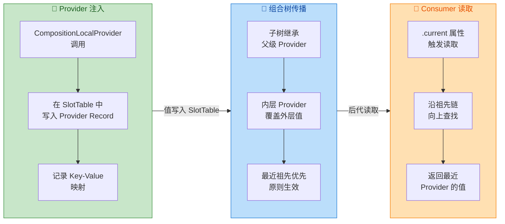

需要特别注意的是，`.current` 的读取行为会被 Compose 的 **快照系统** 追踪。这意味着当某个 `CompositionLocal` 的 provided value 发生变化时，所有读取过该值的 Composable 都会被标记为 **需要重组（Invalidated）**。这正是 `compositionLocalOf` 与 `staticCompositionLocalOf` 两种变体在性能特性上产生差异的根源——后文将深入分析。

#### 与 DI 框架的关系辨析

开发者常将 `CompositionLocal` 与依赖注入框架（如 Hilt/Dagger、Koin）进行类比。两者确实都解决了"如何将依赖传递给消费者"的问题，但在适用场景和设计哲学上有本质区别：

| 维度 | CompositionLocal | DI 框架（Hilt 等） |
|:---|:---|:---|
| **作用范围** | 组合树的子树作用域 | 通常是全局或 Android 组件作用域 |
| **绑定时机** | 运行时、可在组合过程中动态切换 | 编译时/初始化时确定绑定关系 |
| **值的变化** | 天然支持响应式更新、触发重组 | 注入后通常是固定引用 |
| **典型用途** | 主题、字体、Locale 等 UI 环境数据 | 业务服务、Repository、UseCase |
| **设计意图** | 解决 UI 层的"环境数据"穿透 | 解决业务层的"对象创建与依赖解耦" |

简言之，`CompositionLocal` 是 **UI 层的隐式环境变量**，不应被滥用为通用 DI 容器。Google 官方文档明确建议：只有当数据确实需要在组合树中"自然流动"、且可能在不同子树中被覆盖时，才适合使用 `CompositionLocal`。对于业务逻辑依赖，仍应使用正规的 DI 方案。

### ProvidableCompositionLocal

#### 两种创建方式的本质差异

Compose 提供了两个工厂函数来创建 `CompositionLocal` 实例，它们返回的都是 `ProvidableCompositionLocal<T>` 类型，但在 **值变化时的重组传播策略** 上截然不同：

```kotlin
// 动态变体：值变化时，只重组"读取过该值"的 Composable
val LocalDynamic = compositionLocalOf<String> { 
    // 默认值工厂：当没有任何 Provider 时，消费者读取到的值
    error("No value provided") // 也可以提供合理的默认值
}

// 静态变体：值变化时，重组整个 Provider 下的子树
val LocalStatic = staticCompositionLocalOf<String> {
    error("No value provided")
}
```

这两个函数的返回类型都是 `ProvidableCompositionLocal<T>`，它是 `CompositionLocal<T>` 的子类，额外提供了 `provides` 和 `providesDefault` 两个中缀函数，使得 `CompositionLocalProvider` 能够接收 key-value 对。

#### compositionLocalOf —— 精准重组的动态变体

`compositionLocalOf` 创建的实例内部使用快照系统的 **State 对象** 来存储值。当 Provider 的值发生变化时，快照系统能够精确追踪到哪些 Composable 在当前快照中 **实际读取过** 这个 `CompositionLocal` 的 `.current` 属性。只有这些真正依赖该值的 Composable 才会被标记为无效并触发重组，其他同在子树中但未读取该值的 Composable 则完全不受影响。

这种精准重组的能力来自于快照系统的 **读追踪（Read Tracking）** 机制。回顾前面快照系统章节的内容：当 Composable 函数执行过程中访问了某个 `State` 对象的 `value` 属性，快照系统会自动记录"当前重组作用域（Recompose Scope）依赖了该 State"。`compositionLocalOf` 内部正是利用了相同的机制——它将 provided value 包装为一个 `State` 对象，当 `.current` 被访问时触发 read tracking，从而建立起"重组作用域 → CompositionLocal 值"的依赖关系。

```kotlin
// 定义动态 CompositionLocal
val LocalCount = compositionLocalOf { 0 }

@Composable
fun DemoScreen() {
    // count 变化时触发 Provider 的值更新
    var count by remember { mutableStateOf(0) }

    CompositionLocalProvider(LocalCount provides count) {
        // Reader 读取了 LocalCount.current → 建立依赖
        Reader()
        // Bystander 从未读取 LocalCount → 不受影响
        Bystander()
    }

    Button(onClick = { count++ }) {
        Text("Increment")
    }
}

@Composable
fun Reader() {
    // 读取 .current，快照系统记录依赖
    // count 变化时，只有 Reader 重组
    val value = LocalCount.current
    Text("Count: $value")
}

@Composable
fun Bystander() {
    // 完全不涉及 LocalCount
    // count 变化时，Bystander 不会重组
    Text("I don't care about count")
}
```

`compositionLocalOf` 的工厂函数签名中有一个可选参数 `defaultFactory`，它提供了当组合树中没有任何祖先 Provider 时的 **降级值（Fallback Value）**。如果你的 `CompositionLocal` 没有合理的默认值（比如必须由上层提供的导航控制器），推荐在 `defaultFactory` 中抛出异常，将错误提前暴露到开发期。

#### provides 与 providesDefault 的区别

`ProvidableCompositionLocal<T>` 提供了两个中缀函数用于创建 `ProvidedValue<T>`，它们在语义上有微妙但重要的差别：

```kotlin
// provides：强制覆盖，不论子树中是否已有 Provider
//   → 等价于"我明确知道要给这个 CompositionLocal 设什么值"
CompositionLocalProvider(
    LocalThemeColor provides Color.Red // 强制设为 Red
) {
    // 子树读取到 Red
}

// providesDefault：仅当"尚未有任何 Provider 提供过值"时才生效
//   → 等价于"如果上层没人管，我就兜底"
CompositionLocalProvider(
    LocalThemeColor providesDefault Color.Gray // 兜底值
) {
    // 如果外层已有 Provider 提供了 Color.Red，这里仍然是 Red
    // 只有在没有任何外层 Provider 时，才会使用 Gray
}
```

`providesDefault` 在库开发中非常有用。假设你开发了一个 UI 组件库，内部使用了某个 `CompositionLocal`，你希望库有一个合理的默认行为，但又允许应用层开发者通过 `provides` 进行覆盖。此时用 `providesDefault` 提供库的默认值，就能实现"可选配置"的效果。

#### 多个 CompositionLocal 同时提供

`CompositionLocalProvider` 接收 **可变参数（vararg）** 的 `ProvidedValue<*>`，可以在同一层一次性提供多个 `CompositionLocal` 的值，避免嵌套地狱：

```kotlin
@Composable
fun ThemedContent(content: @Composable () -> Unit) {
    // 一次性提供多个 CompositionLocal，避免多层嵌套
    CompositionLocalProvider(
        LocalContentColor provides Color.White,       // 内容文字颜色
        LocalContentAlpha provides ContentAlpha.high,  // 内容透明度
        LocalTextStyle provides MaterialTheme.typography.body1 // 文字样式
    ) {
        content()
    }
}
```

运行时会将这些 key-value 对一起写入 SlotTable 的 Provider Record 中，保证同一次组合操作的原子性——要么全部生效，要么全部不生效（在同一个重组 pass 中）。

#### 自定义 CompositionLocal 的最佳实践

定义 `CompositionLocal` 时，有几条广泛认同的最佳实践值得遵循：

**命名约定**：以 `Local` 前缀开头，后接描述性名称。这是 Compose 社区的强约定，Material Design 库中的 `LocalContentColor`、`LocalContentAlpha`、`LocalTextStyle` 等均遵循此规则。`Local` 前缀清晰传达了"这是一个从组合树的局部环境中读取的值"的语义。

**顶层声明**：`CompositionLocal` 实例应声明为 **顶层属性（Top-level Property）**，而非类成员或函数内局部变量。它本质上是一个 **键（Key）**，用于在 SlotTable 中查找值，全局唯一即可：

```kotlin
// ✅ 正确：顶层声明，全局可见
val LocalUserSession = compositionLocalOf<UserSession> {
    error("UserSession not provided")
}

// ❌ 错误：不要放在类里，增加了不必要的访问复杂度
class MyComponent {
    val localSession = compositionLocalOf<UserSession> { ... }
}
```

**谨慎使用原则**：`CompositionLocal` 是一种 **隐式** 依赖。过度使用会使代码的数据流变得不透明——开发者需要向上遍历组合树才能确定某个 `.current` 到底读到了哪个 Provider 的值。Google 官方建议只在满足以下条件时使用：

1. 该数据确实是"环境级别"的（如主题、Locale、无障碍配置）。
2. 该数据可能需要在子树中被局部覆盖。
3. 大量中间层 Composable 不需要使用该数据，仅少数叶子节点消费。

若仅是简单的父子传值、或只有固定的一两层传递，显式参数仍然是更好的选择。

### staticCompositionLocalOf

#### 为什么需要"静态"变体

前面提到 `compositionLocalOf` 利用快照系统的读追踪实现精准重组。这种精准能力是有成本的——运行时需要为每个读取点维护依赖关系（读追踪记录），并在值变化时逐一通知。对于 **几乎不会在运行时改变** 的数据（例如 App 启动时确定的 Context、固定的系统服务引用、主题在 App 运行期间不会切换等），这些追踪开销就成了纯粹的浪费。

`staticCompositionLocalOf` 就是为这类场景量身定制的。它放弃了精准重组的能力，换取了 **更低的存储与追踪成本**。但"更低成本"指的是 **正常读取时** 的开销——一旦值真的发生变化，`staticCompositionLocalOf` 的重组范围反而更大。

#### 重组传播策略的对比

两种变体在值变化时的行为差异，是理解 `staticCompositionLocalOf` 的关键：

- **`compositionLocalOf`（动态）**：值变化 → 仅通知读取过 `.current` 的 Recompose Scope → **精准重组**。
- **`staticCompositionLocalOf`（静态）**：值变化 → **整个 Provider 子树** 全部无效化（Invalidate All） → **广播式重组**。

"广播式重组"意味着 Provider 节点下的 **所有** 后代 Composable，无论是否读取过该 `CompositionLocal`，都会被标记为需要重组。这在值频繁变化时会造成严重的性能问题，但对于"几乎不变"的值来说完全可以接受——因为重组根本不会发生，追踪开销的节省反而成了净收益。

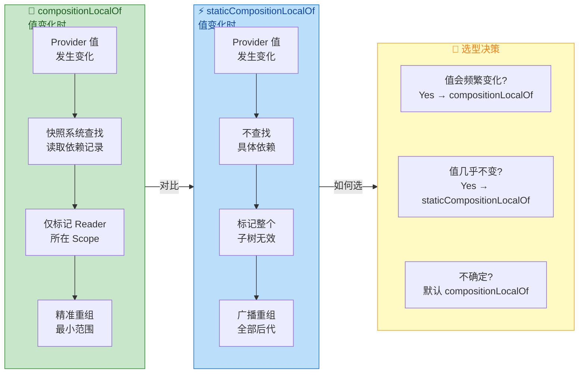

#### 典型使用场景

`staticCompositionLocalOf` 最经典的使用场景就是 **Android Context** 的传递。Compose 框架自身就定义了 `LocalContext`：

```kotlin
// Compose 框架内部的定义（简化）
// Context 在 Activity 的生命周期内几乎不会改变
// 因此使用 static 变体，省去读追踪开销
val LocalContext = staticCompositionLocalOf<Context> {
    // 没有 Provider 时抛异常，因为 Context 是必须的
    error("CompositionLocal LocalContext not present")
}
```

类似的，Compose 框架中还有多个内置的 `staticCompositionLocalOf` 实例：

```kotlin
// 以下均为 Compose 框架使用 staticCompositionLocalOf 定义的
// 因为它们在 App 运行期间基本不变

// LocalLifecycleOwner — 当前的 Lifecycle 持有者
// LocalView — 当前的 Android View
// LocalConfiguration — 设备配置（屏幕方向、语言等，变化极少）
// LocalDensity — 屏幕像素密度
```

但要注意 `LocalDensity` 是一个有趣的例外——它使用的是 `compositionLocalOf` 而非 `staticCompositionLocalOf`。这是因为在某些场景下（如用户调整系统字体大小、折叠屏展开收合），Density 可能在运行时变化，使用动态变体可以实现精准重组，而不是让整个组合树全部重组。

#### 自定义 static 变体的示例

当你的应用中存在"全局配置型"数据时，`staticCompositionLocalOf` 是合适的选择：

```kotlin
// App 的全局特性开关，由后端下发，运行期间几乎不变
data class FeatureFlags(
    val enableNewCheckout: Boolean = false, // 新结算页开关
    val enableDarkMode: Boolean = true,     // 暗色模式开关
    val maxCartItems: Int = 99              // 购物车上限
)

// 使用 staticCompositionLocalOf，因为 FeatureFlags 在 App 启动时确定
// 运行期间极少变化，无需精准追踪
val LocalFeatureFlags = staticCompositionLocalOf {
    FeatureFlags() // 提供安全的默认值
}

// 在 App 根节点提供
@Composable
fun MyApp(featureFlags: FeatureFlags) {
    CompositionLocalProvider(LocalFeatureFlags provides featureFlags) {
        // 整个 App 的组合树都能读取到 featureFlags
        AppNavGraph()
    }
}

// 任意深层 Composable 中消费
@Composable
fun CheckoutButton() {
    // 直接从组合树环境中读取特性开关
    val flags = LocalFeatureFlags.current
    if (flags.enableNewCheckout) {
        NewCheckoutUI()
    } else {
        LegacyCheckoutUI()
    }
}
```

#### 性能影响的量化理解

为了更具体地理解两种变体的性能差异，考虑以下场景：Provider 子树中有 **100 个** Composable，但其中只有 **3 个** 读取了某个 `CompositionLocal` 的值。

| 场景 | compositionLocalOf | staticCompositionLocalOf |
|:---|:---|:---|
| **值不变时的开销** | 3 个读追踪记录的维护成本 | 零追踪开销 |
| **值变化时的重组** | 仅 3 个 Composable 重组 | 全部 100 个 Composable 被标记为无效（Smart Recomposition 可能跳过部分） |

当值几乎不变时，`staticCompositionLocalOf` 在"值不变"这一列的优势持续生效，而"值变化"这一列的劣势几乎不会触发。反之，如果值频繁变化，`compositionLocalOf` 的精准重组优势就会被放大——每次只重组 3 个而非 100 个 Composable，差距可能是数量级的。

需要补充的是，即使 `staticCompositionLocalOf` 触发了广播式无效化，Compose 的 **Smart Recomposition**（智能重组跳过）机制仍然会发挥作用：那些输入参数没有实际变化的 Composable 在重新执行时会被快速跳过。因此"100 个被标记无效"不一定意味着"100 个都真正重新执行"，但无效化标记本身和 Skip 检查仍然有成本。

#### 从动态变体迁移到静态变体

如果你发现项目中某个 `compositionLocalOf` 定义的值在实际运行中 **从未改变过**，可以安全地将其改为 `staticCompositionLocalOf`。这种迁移只需修改定义处的一行代码，不影响任何消费侧的 `.current` 调用，也不影响 `CompositionLocalProvider` 的 `provides` 调用——因为两种变体都返回 `ProvidableCompositionLocal<T>` 类型，API 完全兼容。

```kotlin
// 迁移前
val LocalAnalyticsTracker = compositionLocalOf<AnalyticsTracker> {
    error("AnalyticsTracker not provided")
}

// 迁移后（仅改工厂函数名）
val LocalAnalyticsTracker = staticCompositionLocalOf<AnalyticsTracker> {
    error("AnalyticsTracker not provided")
}

// 所有消费侧代码无需任何修改
// LocalAnalyticsTracker.current 继续正常工作
```

反向迁移（static → dynamic）也同样安全。选型的核心判断标准只有一个：**该值在 Provider 存活期间是否会频繁变化**。

#### Material Design 中的实际应用

Compose Material 库大量使用 `CompositionLocal` 来实现主题系统。`MaterialTheme` Composable 在内部通过 `CompositionLocalProvider` 提供了丰富的主题数据：

```kotlin
// MaterialTheme 的简化实现（展示 CompositionLocal 的运用）
@Composable
fun MaterialTheme(
    colors: Colors = MaterialTheme.colors,       // 颜色方案
    typography: Typography = MaterialTheme.typography, // 排版方案
    shapes: Shapes = MaterialTheme.shapes,       // 形状方案
    content: @Composable () -> Unit              // 子内容
) {
    // 一次性提供多个主题相关的 CompositionLocal
    CompositionLocalProvider(
        // Colors 可能在运行时切换（如暗色模式切换），使用动态变体
        LocalColors provides colors,
        // Typography 和 Shapes 通常不会在运行时变化
        LocalTypography provides typography,
        LocalShapes provides shapes
    ) {
        content()
    }
}

// 消费侧：通过 MaterialTheme 对象的属性访问（内部读取 .current）
@Composable
fun MyButton() {
    // MaterialTheme.colors 内部实际调用了 LocalColors.current
    val primary = MaterialTheme.colors.primary
    // MaterialTheme.typography 内部调用了 LocalTypography.current
    val bodyStyle = MaterialTheme.typography.body1

    Button(
        onClick = { /* ... */ },
        colors = ButtonDefaults.buttonColors(backgroundColor = primary)
    ) {
        Text("Click Me", style = bodyStyle)
    }
}
```

Material 将 `CompositionLocal` 的 `.current` 访问封装在 `MaterialTheme` 对象的属性 getter 中，既保证了类型安全，又为开发者提供了更友好的 API。这是封装 `CompositionLocal` 的推荐模式——避免让消费者直接接触 `LocalXxx.current`，而是通过语义化的 API 入口统一管理。

---

**📝 练习题**

在一个 Compose 应用中，有如下定义：

```kotlin
val LocalUserName = compositionLocalOf { "Guest" }
```

在组合树中，外层 Provider 提供了 `"Alice"`，内层 Provider 提供了 `"Bob"`。内层 Provider 子树中的 Composable 调用 `LocalUserName.current`，读取到的值是什么？如果将 `compositionLocalOf` 改为 `staticCompositionLocalOf`，结果是否会改变？

A. 读取到 `"Alice"`；改为 static 后读取到 `"Bob"`


B. 读取到 `"Bob"`；改为 static 后读取到 `"Alice"`


C. 读取到 `"Bob"`；改为 static 后结果不变，仍为 `"Bob"`


D. 读取到 `"Guest"`；改为 static 后读取到 `"Bob"`


**【答案】** C

**【解析】** `CompositionLocal` 遵循 **最近祖先优先** 原则，无论使用 `compositionLocalOf` 还是 `staticCompositionLocalOf`，消费者读取到的始终是离它最近的 Provider 提供的值。在本题中，内层 Provider 提供了 `"Bob"`，因此 `.current` 返回 `"Bob"`。`compositionLocalOf` 与 `staticCompositionLocalOf` 的差异仅在于 **值发生变化时的重组传播策略**（精准重组 vs 广播式重组），而不影响值的解析逻辑。默认值 `"Guest"` 仅在组合树中完全没有任何 Provider 时才会被使用。

---

**📝 练习题**

以下哪种场景最适合使用 `staticCompositionLocalOf` 而非 `compositionLocalOf`？

A. 一个实时倒计时器的剩余秒数，每秒都会更新，多个子 Composable 需要读取并显示


B. 用户当前选择的主题模式（浅色/深色），用户可能在设置页随时切换


C. App 启动时从服务端获取的 API Base URL，整个 App 运行期间不会改变


D. 购物车中的商品数量，用户在浏览过程中频繁增减


**【答案】** C

**【解析】** `staticCompositionLocalOf` 适用于 **值在 Provider 存活期间几乎不变** 的场景。API Base URL 在 App 启动时确定后，整个运行期间保持不变，使用 static 变体可以省去快照系统的读追踪开销。选项 A（每秒变化）和 D（频繁增减）的值变化极为频繁，如果使用 static 变体，每次变化都会导致整个 Provider 子树广播式重组，严重影响性能。选项 B 的主题模式虽然不算频繁变化，但确实会在运行时切换，且主题覆盖整棵组合树，使用 `compositionLocalOf` 可以精准地只重组读取了主题值的 Composable，避免无关组件的无效重组。

---

## 状态恢复 Saver

Android 系统在资源紧张时会毫不犹豫地杀掉后台进程，而用户切回应用时却期望一切如故——输入框里的文字、滚动的位置、选中的标签页都应完好无损。在传统 View 体系中，开发者依赖 `onSaveInstanceState` 将关键 UI 状态写入 `Bundle`，系统重建 Activity 后再从 `Bundle` 恢复。Compose 将这一整套机制抽象为一个更通用、更可组合的 API 家族：**`rememberSaveable`** 与 **`Saver`** 接口。它们的核心思想是：把"如何将任意类型序列化为可持久化的形式"这一职责，从组件内部抽离出来，交给一个独立的策略对象（即 `Saver`）完成。这样一来，无论你要保存的是一个简单的 `Int`、一个自定义的数据类，还是一个复杂的嵌套对象，都可以用统一的模式处理。

理解 Saver 体系，关键要分清两层关注点。**第一层**是"何时保存、何时恢复"——这由 Compose 运行时与 `SaveableStateRegistry` 协作完成，开发者几乎不需要干预。**第二层**是"如何保存、如何恢复"——这正是 `Saver` 接口要回答的问题。Compose 内置了 `autoSaver`（直接利用 `Bundle` 支持的基本类型）、`MapSaver`（将对象拆成键值对）和 `ListSaver`（将对象拆成有序列表）三种策略，同时也支持完全自定义。下面逐一展开。

---

### RememberSaveable 原理

#### 从 remember 到 rememberSaveable 的本质跃迁

`remember` 是 Compose 最基础的状态缓存机制：它在 Composition 的 SlotTable 中分配一个槽位（Slot），将计算结果存入其中，后续重组直接读取而不重新计算。但 `remember` 的生命周期严格绑定在 **当前 Composition 实例** 上——一旦 Activity 因配置变更（如旋转屏幕）被销毁重建，或进程被系统回收，整棵 Composition 树会被丢弃，所有 `remember` 存储的值也随之消亡。

`rememberSaveable` 在 `remember` 的基础上额外注册了一套 **保存-恢复回调**，使得状态可以跨越 Composition 的销毁与重建。它的工作流程可以概括为四个阶段：

1. **首次进入组合**：如果没有已保存的值，则执行 `init` lambda 计算初始值，同时向 `SaveableStateRegistry` 注册一个 "provider" 回调。
2. **系统请求保存**：当 Activity 的 `onSaveInstanceState` 被触发时，`SaveableStateHolder` 会遍历所有已注册的 provider，调用它们获取当前值，经 `Saver.save()` 转换后写入 `Bundle`。
3. **Composition 销毁**：Activity 销毁，SlotTable 被回收，但 `Bundle` 已被系统持久化。
4. **Composition 重建**：新的 Composition 创建时，`rememberSaveable` 发现 `SaveableStateRegistry` 中存有对应 key 的旧值，于是调用 `Saver.restore()` 将其还原为原始类型，跳过 `init` lambda。

```kotlin
// 最简用法：保存一个 String，autoSaver 自动处理
// autoSaver 能处理所有 Bundle 原生支持的类型
val text = rememberSaveable { mutableStateOf("Hello") }

// 等价的显式写法，明确指定 saver 参数
val textExplicit = rememberSaveable(
    saver = autoSaver()  // 默认就是 autoSaver，此处仅为展示
) {
    mutableStateOf("Hello")  // init lambda：首次进入时执行
}
```

#### SaveableStateRegistry 的注册机制

`rememberSaveable` 的底层依赖是 `SaveableStateRegistry`，它是 Compose 对 `SavedStateRegistry`（AndroidX Lifecycle 组件）的适配封装。每个 `rememberSaveable` 调用都会生成一个唯一的 **key**（默认由 Composer 在 SlotTable 中的位置自动推导），然后调用 `registry.registerProvider(key, provider)` 注册保存回调。当系统触发保存时，`SaveableStateRegistry.performSave()` 被调用，它会逐一执行所有已注册的 provider 函数，收集返回值后统一打包为一个 `Map<String, List<Any?>>`，最终序列化到 `Bundle` 中。

这里有一个重要的设计细节：`rememberSaveable` 返回的状态如果在重组过程中位置发生了变化（比如条件分支导致的重排），Compose 会在 **离开组合** 时注销旧的 provider，在 **重新进入组合** 时注册新的 provider，并利用已保存的值进行恢复。这意味着即便是列表中动态增减的 item，也能正确保存和恢复各自的状态。

```kotlin
// 源码级伪代码：rememberSaveable 的核心逻辑
@Composable
fun <T : Any> rememberSaveable(
    vararg inputs: Any?,           // 额外的输入依赖，变化时重新计算
    saver: Saver<T, out Any>,      // 序列化/反序列化策略
    key: String? = null,           // 可选的自定义 key
    init: () -> T                  // 初始值工厂
): T {
    // 1. 从 CompositionLocal 获取当前的 SaveableStateRegistry
    val registry = LocalSaveableStateRegistry.current

    // 2. 计算最终 key（自定义 key 或由 Composer 位置推导）
    val finalKey = key ?: currentCompositeKeyHash.toString()

    // 3. 尝试从 registry 中恢复旧值
    val restored = registry?.consumeRestored(finalKey)

    // 4. 如果有旧值，用 saver.restore() 还原；否则调用 init()
    val value = remember(*inputs) {
        restored?.let { saver.restore(it) } ?: init()
    }

    // 5. 注册 provider 回调：系统保存时调用 saver.save()
    DisposableEffect(value) {
        val entry = registry?.registerProvider(finalKey) {
            with(saver) { SaverScope(registry::canBeSaved).save(value) }
        }
        onDispose {
            entry?.unregister()  // 离开组合时注销，避免内存泄漏
        }
    }

    return value  // 6. 返回状态值给 Composable
}
```

#### autoSaver 的能力边界

`autoSaver` 是 `rememberSaveable` 的默认 Saver 实现，它的策略极其简单：**原样传入、原样取出**——不做任何转换。这意味着它只能处理 `Bundle` 原生支持的类型：基本数据类型（`Int`, `Long`, `Float`, `Double`, `Boolean`, `String` 等）、`Parcelable`、`Serializable`，以及它们的数组和 `ArrayList` 变体。如果你尝试用 `autoSaver` 保存一个普通的 `data class`，编译期不会报错，但运行时会在 `Bundle.putXxx()` 时抛出 `IllegalArgumentException`。

```kotlin
// ✅ 正确：String 是 Bundle 原生支持的类型
val name = rememberSaveable { "Alice" }

// ✅ 正确：Int 也是 Bundle 原生支持的类型
var count by rememberSaveable { mutableStateOf(0) }

// ❌ 运行时崩溃：普通 data class 不被 Bundle 支持
data class Filter(val keyword: String, val page: Int)
val filter = rememberSaveable { Filter("android", 1) } // 保存时抛异常
```

这正是 `MapSaver`、`ListSaver` 和自定义 `Saver` 存在的意义——它们负责将任意复杂类型 **拆解** 为 Bundle 可接受的基本类型组合。

---

### MapSaver 自定义

当你需要保存一个包含多个字段的对象时，`mapSaver` 是最直观、最具可读性的选择。它的思路是：将对象的每个字段映射为一个键值对（`String → Any?`），保存时生成一个 `Map<String, Any?>`，恢复时从这个 Map 中按 key 取出各字段再组装回原始对象。

#### 工作原理

`mapSaver` 是一个工厂函数，它接受两个 lambda：`save` 负责将对象拆解为 `Map`，`restore` 负责从 `Map` 重建对象。其内部实际上是构造了一个 `Saver<T, Any>` 实例，在 `save` 阶段调用你的拆解逻辑并返回 Map，在 `restore` 阶段将传入的 `Any` 强转为 `Map<String, Any?>` 后交给你的重建逻辑。

Map 中每个 value 本身也必须是 Bundle 兼容类型。换言之，`mapSaver` 只是把"拆解复杂对象"的责任交给了开发者，最终写入 `Bundle` 的仍然是基本类型。

```kotlin
// 定义一个不可 Parcelable 的数据类
data class SearchState(
    val query: String,        // 搜索关键词
    val page: Int,            // 当前页码
    val isActive: Boolean     // 搜索框是否展开
)

// 为 SearchState 创建 MapSaver
val SearchStateSaver = mapSaver(
    // save：将 SearchState 拆解为 Map<String, Any?>
    save = { state ->
        mapOf(
            "query" to state.query,       // String → Bundle 兼容 ✅
            "page" to state.page,         // Int → Bundle 兼容 ✅
            "isActive" to state.isActive  // Boolean → Bundle 兼容 ✅
        )
    },
    // restore：从 Map 中取出字段，重建 SearchState
    restore = { map ->
        SearchState(
            query = map["query"] as String,       // 按 key 取值并强转
            page = map["page"] as Int,            // 类型必须与 save 时一致
            isActive = map["isActive"] as Boolean // 否则 ClassCastException
        )
    }
)
```

#### 在 Composable 中使用

```kotlin
@Composable
fun SearchScreen() {
    // 使用 SearchStateSaver 保存/恢复 SearchState
    var searchState by rememberSaveable(stateSaver = SearchStateSaver) {
        mutableStateOf(SearchState(             // 初始值
            query = "",                         // 空查询
            page = 1,                           // 第一页
            isActive = false                    // 搜索框收起
        ))
    }

    // searchState 在配置变更、进程恢复后都能完整还原
    SearchBar(
        query = searchState.query,              // 读取当前查询词
        isActive = searchState.isActive,        // 读取展开状态
        onQueryChange = { newQuery ->
            searchState = searchState.copy(      // 不可变更新
                query = newQuery                 // 只改变 query 字段
            )
        },
        onActiveChange = { active ->
            searchState = searchState.copy(      // 不可变更新
                isActive = active                // 只改变 isActive 字段
            )
        }
    )
}
```

#### MapSaver 的优缺点

**优点**在于 **可读性极强**：每个字段都有明确的 key 名称，调试时查看 `Bundle` 内容能直接看到 `"query" = "android"` 这样的键值对，非常直观。当字段顺序发生变化或新增字段时，只要 key 不变，旧版本保存的状态仍可部分恢复（新字段给默认值即可），具备一定的 **向前兼容性**。

**缺点**则是 **冗余**：每个 key 字符串都会被序列化进 `Bundle`，占用额外空间。对于字段非常多的对象，Map 的开销会比 List 稍大。此外，`save` 和 `restore` 中的 key 必须严格一致，拼写错误只会在运行时暴露，编译器无法帮你检查。

---

### ListSaver 自定义

`listSaver` 是 `mapSaver` 的 "精简版"——它用 **有序列表**（`List<Any?>`）而非键值对来序列化对象。字段的含义完全由位置（index）决定。

#### 工作原理

与 `mapSaver` 类似，`listSaver` 也接受 `save` 和 `restore` 两个 lambda。`save` 返回一个 `List<Any?>`，`restore` 接受同一个 List 并重建对象。内部实现上，`listSaver` 构造的 `Saver` 在保存阶段会检查 List 中每个元素是否都能被 `Bundle` 接受（通过 `SaverScope.canBeSaved()` 验证），不满足则抛出异常。

```kotlin
// 同样的 SearchState，改用 ListSaver
val SearchStateListSaver = listSaver(
    // save：按固定顺序将字段放入 List
    save = { state ->
        listOf(
            state.query,      // index 0 → query
            state.page,       // index 1 → page
            state.isActive    // index 2 → isActive
        )
    },
    // restore：按相同顺序从 List 取出字段
    restore = { list ->
        SearchState(
            query = list[0] as String,       // index 0 → query
            page = list[1] as Int,           // index 1 → page
            isActive = list[2] as Boolean    // index 2 → isActive
        )
    }
)
```

#### 与 MapSaver 的对比

| 维度 | MapSaver | ListSaver |
|:---:|:---:|:---:|
| **序列化格式** | `Map<String, Any?>` | `List<Any?>` |
| **字段标识** | 显式 key 名称 | 隐式位置 index |
| **可读性** | 高（调试友好） | 中（需对照代码） |
| **空间开销** | 稍大（key 字符串） | 更紧凑 |
| **字段顺序敏感** | 否（按 key 取值） | 是（按 index 取值） |
| **版本兼容** | 较好（可按 key 容错） | 较差（顺序变动即错位） |

选择建议很简单：**字段少且稳定** 用 `listSaver`，**字段多或可能演化** 用 `mapSaver`。两者在性能上的差异微乎其微，更多是 **维护性** 的考量。

#### 嵌套对象的处理

当对象内部包含另一个复杂对象时，你可以在外层 Saver 的 `save` 中递归调用内层 Saver 的 `save`，恢复时同理。但实践中更常见的做法是 **扁平化**：将嵌套字段直接展开到同一层 List 或 Map 中。

```kotlin
// 嵌套数据类
data class Address(
    val city: String,              // 城市
    val zipCode: String            // 邮编
)

data class UserProfile(
    val name: String,              // 用户名
    val age: Int,                  // 年龄
    val address: Address           // 嵌套的 Address 对象
)

// 扁平化方式：将 Address 字段直接展开
val UserProfileSaver = listSaver(
    save = { profile ->
        listOf(
            profile.name,                // index 0 → name
            profile.age,                 // index 1 → age
            profile.address.city,        // index 2 → address.city（展开）
            profile.address.zipCode      // index 3 → address.zipCode（展开）
        )
    },
    restore = { list ->
        UserProfile(
            name = list[0] as String,    // index 0
            age = list[1] as Int,        // index 1
            address = Address(           // 从展开的字段重建 Address
                city = list[2] as String,    // index 2
                zipCode = list[3] as String  // index 3
            )
        )
    }
)
```

---

### Parcelable 适配

Android 平台有一套原生的高性能序列化机制——`Parcelable`。任何实现了 `Parcelable` 接口的类都可以直接写入 `Bundle`，因此也可以直接被 `autoSaver` 处理，**无需** 额外编写 `MapSaver` 或 `ListSaver`。这为 Compose 状态恢复提供了第三条路径。

#### 使用 @Parcelize 简化实现

手动实现 `Parcelable` 接口需要编写大量样板代码（`writeToParcel`、`createFromParcel`、`CREATOR` 伴生对象等），极其繁琐且容易出错。Kotlin 的 `kotlin-parcelize` 插件彻底消除了这些负担：只需在 `data class` 上添加 `@Parcelize` 注解，编译器就会自动生成完整的 `Parcelable` 实现。

```kotlin
// build.gradle.kts 中启用插件
// plugins {
//     id("kotlin-parcelize")   // 启用 @Parcelize 注解处理器
// }

import android.os.Parcelable     // Android Parcelable 接口
import kotlinx.parcelize.Parcelize // Kotlin 编译器插件注解

// @Parcelize 让编译器自动生成 writeToParcel / createFromParcel
@Parcelize
data class SearchState(
    val query: String,            // 搜索关键词
    val page: Int,                // 当前页码
    val isActive: Boolean         // 搜索框是否展开
) : Parcelable                    // 必须实现 Parcelable 接口

@Composable
fun SearchScreen() {
    // 因为 SearchState 是 Parcelable，autoSaver 直接就能处理
    // 不需要自定义 Saver！
    var state by rememberSaveable {
        mutableStateOf(SearchState("", 1, false))
    }

    // state 在配置变更和进程恢复后都能自动还原
    Text(text = "Query: ${state.query}, Page: ${state.page}")
}
```

#### Parcelable 的底层机制

`Parcelable` 的序列化基于 `Parcel` 对象——一种高性能的二进制缓冲区。`writeToParcel` 将对象的各字段按顺序写入 `Parcel` 的内存区域（本质上是一块连续的 native 内存），`createFromParcel` 则按相同顺序依次读出。与 Java 的 `Serializable`（基于反射和对象图遍历）相比，`Parcelable` 完全避免了反射开销，序列化/反序列化速度通常快一个数量级以上。这也是 Android 官方一直推荐 `Parcelable` 而非 `Serializable` 的原因。

需要注意的是，`Parcel` 并非设计用于持久化存储——它是一种 **瞬态传输格式**，主要用于 IPC（进程间通信）和 `Bundle` 传输。但在 `rememberSaveable` 的场景下，`Bundle` 最终会被系统序列化到磁盘（通过 `Parcel.marshall()`），因此 `Parcelable` 对象可以安全地跨进程恢复。

#### @Parcelize 的类型限制

`@Parcelize` 并非万能。它能自动处理的字段类型有限：

- **基本类型**：`Int`, `Long`, `Float`, `Double`, `Boolean`, `Char`, `Byte`, `Short`, `String`
- **集合类型**：`List`, `Set`, `Map`（元素类型也必须可 Parcel）
- **Parcelable 子类型**：嵌套的 `@Parcelize` 类
- **枚举**：`enum class`（自动按 `ordinal` 序列化）
- **其他**：`Bundle`, `IBinder`, `Size`, `SizeF`, `SparseBooleanArray` 等少数系统类型

如果字段类型不在上述列表中（例如一个第三方库的类），你需要通过 `@TypeParceler` 或 `@WriteWith` 注解提供自定义的 `Parceler` 实现。

```kotlin
import kotlinx.parcelize.Parceler    // 自定义序列化器接口
import kotlinx.parcelize.Parcelize   // 注解
import kotlinx.parcelize.WriteWith   // 指定字段的序列化器
import java.time.Instant             // Java 8 时间类（非 Parcelable）

// 为 Instant 编写自定义 Parceler
object InstantParceler : Parceler<Instant> {
    // 写入：将 Instant 转为 epochMilli（Long），Long 是 Parcel 原生支持的
    override fun create(parcel: android.os.Parcel): Instant =
        Instant.ofEpochMilli(parcel.readLong())  // 从 Parcel 读取 Long 并转回 Instant

    // 读取：从 Parcel 中读取 Long 并还原为 Instant
    override fun Instant.write(parcel: android.os.Parcel, flags: Int) {
        parcel.writeLong(this.toEpochMilli())    // 将 Instant 转为 Long 写入 Parcel
    }
}

@Parcelize
data class TimestampedNote(
    val content: String,                                // 笔记内容
    @WriteWith<InstantParceler>                         // 告知编译器用 InstantParceler
    val createdAt: Instant                              // 创建时间（非标准 Parcelable 类型）
) : Parcelable
```

#### 三种方案的选型决策

到此为止，我们已经看到了三种在 `rememberSaveable` 中保存自定义类型的方案。它们之间的选择并不复杂，下面用一张流程图总结决策路径：

```mermaid
graph LR
    subgraph Decide["🤔 选型决策"]
        direction TB
        Q1["需要保存自定义类型?"]
        Q2["可以添加\n@Parcelize?"]
        Q3["字段需要\n语义化 key?"]
    end

    subgraph Solutions["✅ 方案选择"]
        direction TB
        S1["🟢 autoSaver\n直接使用"]
        S2["🔵 @Parcelize\n编译器生成"]
        S3["🟠 MapSaver\n键值对拆解"]
        S4["🟣 ListSaver\n有序列表拆解"]
    end

    Decide -->|"决策流"| Solutions

    Q1 -->|"否\n基本类型"| S1
    Q1 -->|"是"| Q2
    Q2 -->|"是\n可修改类"| S2
    Q2 -->|"否\n第三方类型"| Q3
    Q3 -->|"是\n字段多/会演化"| S3
    Q3 -->|"否\n字段少且稳定"| S4

    classDef decideStyle fill:#E3F2FD,stroke:#1565C0,color:#0D47A1
    classDef solutionStyle fill:#E8F5E9,stroke:#2E7D32,color:#1B5E20

    class Decide decideStyle
    class Solutions solutionStyle
```

**总结每种方案的适用场景**：

- **`autoSaver`（默认）**：状态类型本身就是 `Bundle` 原生支持的（`String`、`Int`、`Boolean` 等基本类型，或已实现 `Parcelable` 的类）。零额外代码，开箱即用。
- **`@Parcelize`**：你 **拥有** 类的源代码（可以修改它），且所有字段类型都支持 Parcel。添加一个注解即可，代码量最少，序列化性能最优（原生二进制格式）。这是大多数项目中处理自定义类型的 **首选方案**。
- **`mapSaver`**：你 **无法修改** 类的源代码（第三方库类型），或者需要更好的版本兼容性（按 key 取值，不怕字段顺序变动）。适合字段较多、可能演化的对象。
- **`listSaver`**：同样用于无法修改源代码的场景，但对象字段少且稳定，不需要语义化 key，追求更紧凑的序列化格式。

#### 状态保存的大小限制

无论使用哪种 Saver，最终数据都会流入 `Bundle`，而 `Bundle` 通过 `Binder` 事务传递给系统进程保管。Binder 事务缓冲区的大小上限约为 **1MB**（所有事务共享），而单个 Activity 的 `savedInstanceState` 实际可用空间通常建议 **不超过 50KB**。如果你尝试保存大量数据（如整个列表的详细内容、大尺寸图片的 Base64 编码），很可能触发 `TransactionTooLargeException`。

正确的做法是：`rememberSaveable` 只保存 **最小必要状态**（如 ID、搜索关键词、滚动位置等标量值），而完整数据应存储在 ViewModel（内存缓存）、Room 数据库或 DataStore 中。恢复时，先从 `Bundle` 取回关键标识符，再用它去加载完整数据。

```kotlin
// ❌ 反模式：保存整个列表数据到 Bundle
val items = rememberSaveable {
    mutableStateOf(hugeListOfItems) // 可能超出 Bundle 大小限制！
}

// ✅ 正确做法：只保存必要的标识信息
val selectedId = rememberSaveable { mutableStateOf<Long?>(null) }
// 完整数据从 ViewModel / Repository 获取
val items by viewModel.items.collectAsState()
```

#### rememberSaveable 与 ViewModel 的协作

理解 `rememberSaveable` 的定位，还需要将它与 `ViewModel` + `SavedStateHandle` 做对比。两者都能跨配置变更和进程恢复保存状态，但适用层次不同：

`rememberSaveable` 是 **Composable 级别** 的状态保存方案，与 UI 组件一一对应，适合保存纯 UI 状态（如文本框输入、展开/折叠状态、Tab 选中索引）。它的生命周期跟随 Composition——组件离开组合树时，保存的值也会被清理。

`ViewModel` + `SavedStateHandle` 是 **屏幕级别** 的状态管理方案，适合保存业务逻辑状态（如筛选条件、分页位置、用户操作历史）。ViewModel 在配置变更时不会被销毁（直接存活在内存中），只有在 Activity `finish()` 或进程被杀后重建时才需要从 `SavedStateHandle`（本质也是 `Bundle`）恢复。

两者是互补而非替代关系。一个健壮的 Compose 屏幕通常同时使用两者：ViewModel 管理业务状态，`rememberSaveable` 管理局部 UI 状态。

```kotlin
@Composable
fun ProductListScreen(
    viewModel: ProductViewModel = viewModel() // 屏幕级状态管理
) {
    // 业务状态：从 ViewModel 获取（ViewModel 内部使用 SavedStateHandle 持久化）
    val products by viewModel.products.collectAsState()    // 商品列表
    val filterState by viewModel.filterState.collectAsState() // 筛选条件

    // UI 状态：用 rememberSaveable 保存（Composable 局部）
    val listState = rememberLazyListState()                // 滚动位置（内部已用 rememberSaveable）
    var isFilterSheetOpen by rememberSaveable {             // 筛选面板是否展开
        mutableStateOf(false)
    }

    Scaffold(
        topBar = {
            TopAppBar(
                title = { Text("Products") },
                actions = {
                    IconButton(onClick = {
                        isFilterSheetOpen = true            // 纯 UI 操作
                    }) {
                        Icon(Icons.Default.FilterList, null)
                    }
                }
            )
        }
    ) { padding ->
        LazyColumn(
            state = listState,                              // 滚动状态自动保存/恢复
            contentPadding = padding
        ) {
            items(products) { product ->
                ProductCard(product)                        // 渲染商品卡片
            }
        }
    }
}
```

---

**📝 练习题**

在 Compose 中，你有一个第三方库提供的 `data class GeoPoint(val lat: Double, val lng: Double)`，该类没有实现 `Parcelable`，你无法修改其源代码。你希望在 `rememberSaveable` 中保存一个 `GeoPoint` 实例。以下哪种做法是最合适的？


A. 直接使用 `rememberSaveable { mutableStateOf(GeoPoint(0.0, 0.0)) }`，因为 `data class` 会被自动序列化


B. 为 `GeoPoint` 编写一个 `listSaver`，在 `save` 中返回 `listOf(lat, lng)`，在 `restore` 中按 index 取值重建


C. 使用 `remember` 代替 `rememberSaveable`，然后在 `onSaveInstanceState` 中手动保存


D. 在 `GeoPoint` 上添加 `@Parcelize` 注解，使其自动实现 `Parcelable`


**【答案】** B

**【解析】** 选项 A 错误，普通 `data class` 不被 `Bundle` 原生支持，`autoSaver` 无法处理，运行时会抛出异常。选项 C 虽然理论上可行，但违背了 Compose 的声明式理念，手动在 `onSaveInstanceState` 中管理状态会引入大量样板代码，且无法与 Compose 的组合生命周期自动协调。选项 D 不可行，因为题目明确说明无法修改 `GeoPoint` 的源代码，而 `@Parcelize` 必须标注在类的声明处。选项 B 是正确做法：`GeoPoint` 只有两个 `Double` 字段，数量少且结构稳定，用 `listSaver` 将它们按位置序列化为 `listOf(lat, lng)` 既简洁又高效，`Double` 是 `Bundle` 原生支持的类型，完全满足序列化要求。如果字段更多或可能演化，`mapSaver` 也是合理选择。

---

## 本章小结

本章围绕 Compose 状态管理与快照系统，从 **状态的声明与持有**、**快照的底层机制**、**状态的转换与派生**、**重组的智能调度**、**副作用的生命周期协调**、**隐式参数传递**，到 **状态的持久化恢复**，构建了一套完整的知识体系。本节将对全章内容进行系统性回顾，梳理各知识点之间的内在联系，并提炼核心设计思想，帮助读者在脑中形成一张清晰的 "状态管理全景图"。

---

### 全章知识脉络

整章内容可以用一句话概括：**Compose 的状态管理本质上是一个 "声明 → 追踪 → 调度 → 恢复" 的闭环系统**。每一个知识点都在这个闭环中承担特定职责，彼此衔接、互为依赖。我们按照状态数据从诞生到消亡的完整生命线来回顾：

**第一步：状态的声明与所有权确立。** 一切的起点是 State Hoisting（状态提升）。当我们决定在 Compose 中管理某个状态时，首先要回答的问题是 "这个状态应该被谁持有？"。单向数据流（UDF）原则为我们指明了方向——状态向下流动，事件向上传递。通过将状态提升到合适的共同祖先节点，我们让下层的 Composable 变成了无状态组件（Stateless Component），它们只负责 "展示" 和 "上报事件"，不持有任何可变状态。这一设计思想直接决定了组件的可测试性、可复用性和可预测性。状态提升并非只有一种形式：简单的 UI 状态可以提升到父级 Composable 的参数中；复杂的、需要跨越 Configuration Change 存活的业务状态，则应该提升到 State Holder 中去。

**第二步：状态的持有与管理容器。** State Holders（状态持有者）是状态提升后的 "着陆点"。本章将其分为两个层级：对于纯 UI 逻辑（如 Drawer 的展开/收起、ScrollState 的偏移量），推荐使用普通类（Plain Class）State Holder，它轻量、可组合、生命周期由 `remember` 管理；对于涉及业务逻辑、需要访问 Repository/UseCase、需要在进程重建后存活的状态，则使用 ViewModel。ViewModel 通过 `viewModelStore` 挂载在 `ViewModelStoreOwner`（通常是 Activity/Fragment/NavBackStackEntry）上，具备跨 Configuration Change 的存活能力。而 `rememberSaveable` 则进一步解决了进程被系统回收后的状态恢复问题，它通过 `SavedStateRegistry` 将状态序列化到 Bundle 中，实现了真正意义上的 "死而复生"。两者的职责边界非常清晰：ViewModel 管 "活着时的状态延续"，`rememberSaveable` 管 "死后的状态重建"。

**第三步：状态变化的底层追踪引擎。** 快照系统（Snapshot System）是整个 Compose 状态管理的 "隐形心脏"。当我们调用 `mutableStateOf()` 创建一个状态时，返回的并非一个简单的值持有者，而是一个接入了快照系统的 `SnapshotMutableState` 对象。快照系统借鉴了数据库领域的 MVCC（多版本并发控制）思想：每个 Snapshot 都拥有一个唯一的递增 ID，状态的每次写入都会生成一条新的 `StateRecord`，不同的 Snapshot 通过 ID 找到属于自己版本的记录，从而实现了 **读写隔离**。在重组期间，Compose 运行时会创建一个 `MutableSnapshot`，所有的状态读取和写入都发生在这个隔离的快照空间中——读操作会被自动记录到 `readObservers` 中（这就是精准重组的基础），写操作则被暂存在快照的本地副本中，只有当整个重组成功完成后才会通过 `apply()` 原子性地提交到 Global Snapshot。如果提交时检测到冲突（其他线程也修改了同一个状态），系统会尝试合并，合并失败则回滚重试。这套机制保证了 UI 线程永远不会看到 "重组进行到一半" 的中间状态，也保证了并发安全。

**第四步：状态的转换、派生与流式桥接。** 原始状态往往不能直接用于 UI 展示，需要经过计算、过滤、组合。`derivedStateOf` 提供了一种 **惰性缓存** 的派生机制——只有当上游依赖状态实际发生变化时，派生计算才会重新执行，其结果会被缓存以避免重复计算。这对于 "从一个长列表中过滤出符合条件的子集" 这类高开销计算尤为关键。`snapshotFlow` 则在 Compose 状态世界和 Kotlin Flow 世界之间架起了一座桥梁，它将 Snapshot 的读追踪能力与 Flow 的冷流特性结合，使得我们可以在协程中以响应式的方式观察状态变化。反方向的桥接则由 `produceState` 完成，它将一个 Flow（或任何挂起数据源）转换为 Compose 可直接消费的 `State<T>`，在 Composition 进入时自动启动协程收集，退出时自动取消。

**第五步：重组的智能调度与性能守门员。** Recompose Scope（重组作用域）是 Compose 实现 "精准重组" 的核心单元。编译器插件会在每个可重启的 Composable 函数调用处插入一个 `RecomposeScope` 对象，运行时通过快照系统的读追踪，将 "哪个 Scope 读了哪个 State" 的映射关系记录下来。当某个 State 变化时，只有依赖它的 Scope 才会被标记为 Invalid 并加入重组队列。但仅有作用域级别的精准还不够——如果一个 Composable 被调度重组，但其所有入参都没有变化，重组应当被 **跳过**。这就是 Stability（稳定性）契约发挥作用的地方。Compose 编译器会分析每个类的稳定性：所有属性都是 `val` 且类型本身稳定的类被标记为 `@Stable`；如果编译器无法推断（如使用了外部模块的类、包含 `var` 属性、持有 `List`/`Map` 等集合接口），该类会被视为不稳定（Unstable），导致接收它作为参数的 Composable **永远无法跳过重组**。开发者可以通过 `@Stable`、`@Immutable` 注解显式告知编译器 "我保证这个类的行为是稳定的"，也可以通过 Compose 编译器的 Stability Configuration File 对第三方类进行全局配置。理解稳定性契约是 Compose 性能优化的 "分水岭"。

**第六步：副作用的安全执行与生命周期对齐。** Compose 的 Composable 函数应当是 "纯函数"——给定相同的输入，产生相同的 UI 描述，不产生 side effect。但现实开发中，我们总需要在组合过程中执行一些副作用操作：启动协程加载数据、注册/注销监听器、记录埋点日志等。Effect Handlers 提供了一套与 Composition 生命周期对齐的副作用管理 API。`LaunchedEffect` 提供了一个与 Composition 绑定的协程作用域，当 key 变化时自动取消旧协程并启动新协程；`DisposableEffect` 用于需要 "成对操作" 的场景（注册/注销、绑定/解绑），它的 `onDispose` 回调保证了资源的确定性释放；`SideEffect` 则在每次重组 **成功提交** 后同步执行，适合将 Compose 状态同步给非 Compose 管理的外部系统。三者的执行时机和生命周期各不相同，选择错误会导致资源泄漏或行为异常。

**第七步：跨层级的隐式参数传递。** CompositionLocal 解决了 "深层嵌套组件需要访问上层数据，但不想逐层传参" 的问题。它本质上是一个绑定在 Composition 树上的隐式 Key-Value 存储。`compositionLocalOf` 创建的实例在值变化时会精准地只重组读取了该值的 Scope；`staticCompositionLocalOf` 则采用更粗粒度的策略——值变化时会重组整个 `CompositionLocalProvider` 包裹的子树，但省去了读追踪的开销，适合极少变化的全局配置（如主题、Locale）。CompositionLocal 虽然强大，但应当节制使用，因为它使得数据流变得隐式、不透明，过度使用会降低代码的可读性和可测试性。

**第八步：状态的持久化与跨进程恢复。** `rememberSaveable` 是状态恢复的入口，它在 `remember` 的基础上增加了一层序列化/反序列化能力。对于基本类型和 Parcelable 对象，系统自动处理；对于自定义复杂类型，开发者需要通过 `Saver` 接口手动定义 save/restore 逻辑。`mapSaver` 和 `listSaver` 是两种便捷的工厂方法：前者将对象拆解为键值对存入 Map，可读性好但略有性能开销；后者将对象拆解为有序列表，性能更优但依赖位置索引。状态恢复机制的底层依赖 Android 平台的 `SavedStateRegistry`，它在 `onSaveInstanceState` 时将所有已注册的状态打包写入 Bundle，在重建时通过 `onRestoreInstanceState` 取回。理解这一层对于排查 "状态丢失" 问题至关重要。

---

### 核心架构全景图

下面的 Mermaid 图将全章八大知识模块整合为一张架构全景图，展示了状态数据从声明到恢复的完整流转路径，以及各模块之间的协作关系：

```mermaid
graph LR
    subgraph Declare["① 声明与提升\nState Hoisting"]
        direction TB
        A1["State Hoisting\n单向数据流 UDF"]
        A2["状态所有权\n确立"]
        A3["无状态组件\nStateless"]
        A1 --> A2
        A2 --> A3
    end

    subgraph Hold["② 持有与管理\nState Holders"]
        direction TB
        B1["Plain Class\nUI State Holder"]
        B2["ViewModel\n业务状态"]
        B3["SavedStateHandle\n进程恢复"]
        B1 ~~~ B2
        B2 --> B3
    end

    subgraph Snapshot["③ 快照引擎\nSnapshot System"]
        direction TB
        C1["MVCC\n多版本并发"]
        C2["读写追踪\nObserver"]
        C3["状态隔离\n原子提交"]
        C1 --> C2
        C2 --> C3
    end

    subgraph Transform["④ 转换与派生\nState Transform"]
        direction TB
        D1["derivedStateOf\n惰性缓存"]
        D2["snapshotFlow\n流转换桥"]
        D3["produceState\n挂起转状态"]
        D1 ~~~ D2
        D2 ~~~ D3
    end

    subgraph Recompose["⑤ 重组调度\nRecompose Scope"]
        direction TB
        E1["精准重组\nScope 粒度"]
        E2["Stability\n稳定性契约"]
        E3["智能跳过\nSkipping"]
        E1 --> E2
        E2 --> E3
    end

    subgraph Effect["⑥ 副作用\nEffect Handlers"]
        direction TB
        F1["LaunchedEffect\n挂起任务"]
        F2["DisposableEffect\n资源清理"]
        F3["SideEffect\n提交后回调"]
        F1 ~~~ F2
        F2 ~~~ F3
    end

    subgraph Local["⑦ 隐式传递\nCompositionLocal"]
        direction TB
        G1["compositionLocalOf\n精准追踪"]
        G2["staticLocal\n全子树重组"]
        G3["Provider\n作用域覆盖"]
        G1 ~~~ G2
        G2 --> G3
    end

    subgraph Restore["⑧ 状态恢复\nSaver"]
        direction TB
        H1["rememberSaveable\n序列化入口"]
        H2["MapSaver\nListSaver"]
        H3["SavedStateRegistry\nBundle 存取"]
        H1 --> H2
        H2 --> H3
    end

    Declare -->|"状态交由\n容器持有"| Hold
    Hold -->|"状态变更\n触发追踪"| Snapshot
    Snapshot -->|"读追踪驱动\n派生计算"| Transform
    Transform -->|"新值触发\n作用域失效"| Recompose
    Recompose -->|"重组过程中\n执行副作用"| Effect
    Effect -->|"副作用内\n读取隐式参数"| Local
    Local -->|"配置变更时\n状态持久化"| Restore
    Restore -->|"重建后\n重新声明"| Declare

    classDef green fill:#C8E6C9,stroke:#388E3C,color:#1B5E20
    classDef blue fill:#BBDEFB,stroke:#1976D2,color:#0D47A1
    classDef teal fill:#B2DFDB,stroke:#00897B,color:#004D40
    classDef amber fill:#FFE0B2,stroke:#F57C00,color:#E65100

    class Declare,Hold green
    class Snapshot,Transform blue
    class Recompose,Effect teal
    class Local,Restore amber
```

从图中可以看到，八个模块形成了一个 **闭环**：状态从声明开始，经过持有、追踪、转换、调度、副作用执行、隐式传递，最终在进程销毁时被持久化保存，并在重建后重新声明——周而复始。这正是 Compose 状态管理的设计哲学：**一切都是声明式的、一切都是可追踪的、一切都是可恢复的**。

---

### 关键设计思想提炼

纵观全章，有几个贯穿始终的设计思想值得特别强调：

**第一，声明式优于命令式。** 无论是状态的声明（`mutableStateOf`）、派生（`derivedStateOf`）、副作用的注册（`LaunchedEffect`），还是隐式参数的提供（`CompositionLocalProvider`），Compose 都采用了声明式 API。开发者只需声明 "我需要什么"，框架负责 "何时执行、何时清理、何时恢复"。这与传统 View 体系中开发者需要手动管理生命周期、手动注册/注销监听器的命令式风格形成了鲜明对比。声明式的好处在于：框架拥有了完整的调度控制权，可以做出更智能的优化决策（如跳过不必要的重组、自动取消过期的协程），同时也大幅降低了资源泄漏的风险。

**第二，单一数据源（Single Source of Truth）。** 状态提升和 State Holder 的设计，都在强调一个核心原则：每个状态只有一个权威的持有者。UI 组件通过回调上报事件，由状态持有者统一决策如何修改状态，修改后的新状态再向下流动驱动 UI 更新。这种单向数据流模型极大地简化了状态的可预测性——在任何时刻，只需检查状态持有者中的当前值，就能确定 UI 应该呈现的样子。

**第三，读追踪驱动一切。** 快照系统的读追踪（Read Observation）是 Compose 响应式能力的 "根基"。`derivedStateOf` 之所以能惰性缓存，是因为它在计算过程中自动追踪了所有被读取的上游状态；`snapshotFlow` 之所以能将状态变化转为 Flow 事件，也是因为它在 `block` 执行过程中记录了所有依赖；Recompose Scope 之所以能精准定位需要重组的函数，同样依赖读追踪建立的映射关系。甚至 `compositionLocalOf` 的精准重组能力，也是读追踪的直接产物。理解了读追踪，就理解了 Compose 响应式编程的灵魂。

**第四，隔离与原子性保证安全。** 快照系统的 MVCC 设计确保了重组过程中的状态读写不会影响到 UI 线程正在使用的数据，也不会被其他线程的写入干扰。只有当重组全部完成、验证无冲突后，修改才会原子性地提交。这种隔离策略在并发场景下尤为重要——多个重组可能同时发生在不同的线程上（Compose 支持将重组分发到后台线程），MVCC 确保了它们不会相互践踏。

**第五，分层恢复策略。** 状态恢复不是一个单一机制，而是一个分层体系。`remember` 处理 Composition 内部的缓存（Configuration Change 时丢失）；ViewModel 处理 Configuration Change 存活但进程死亡时丢失的场景；`rememberSaveable` + Saver 处理进程死亡后的完整恢复。三者的性能开销和能力递增——`remember` 几乎零成本，ViewModel 需要维护 ViewModelStore，`rememberSaveable` 需要序列化/反序列化。开发者应该根据状态的重要性和生存需求，选择 **最低成本** 的恢复策略。

---

### 常见陷阱与最佳实践速查表

以下表格汇总了全章各节中提到的常见错误和推荐做法，供日常开发中快速查阅：

| 模块 | ❌ 常见陷阱 | ✅ 最佳实践 |
|---|---|---|
| **State Hoisting** | 所有状态都提升到顶层，导致根节点频繁重组 | 状态提升到 "最低共同祖先"，不过度提升 |
| **State Holders** | 在 ViewModel 中持有 UI 控件引用或 Context | ViewModel 只持有应用层数据，UI 引用通过 StateFlow 暴露状态 |
| **Snapshot System** | 在 Composable 外直接修改 `MutableState` 而不理解线程安全 | 利用 `Snapshot.withMutableSnapshot` 保证原子写入 |
| **derivedStateOf** | 对每次重组都会变化的值使用 `derivedStateOf`（无缓存收益） | 仅用于 "输入频繁变化但输出变化较少" 的场景 |
| **snapshotFlow** | 在 `snapshotFlow` 的 block 中执行有副作用的操作 | block 应当是纯读取，副作用放在 `collect` 端处理 |
| **Stability** | 忽略稳定性分析，大量使用 `data class` 包含 `List` 属性 | 使用 `kotlinx.collections.immutable` 的 `ImmutableList`，或添加 `@Immutable` 注解 |
| **LaunchedEffect** | 使用 `Unit` 作为 key 但期望在参数变化时重新执行 | key 应绑定到驱动副作用的参数，如 `LaunchedEffect(userId)` |
| **DisposableEffect** | 忘记在 `onDispose` 中清理资源 | 始终编写 `onDispose {}` 块，即使当前为空也留好占位 |
| **CompositionLocal** | 将频繁变化的业务数据放入 CompositionLocal | CompositionLocal 适合低频变化的环境参数（主题、Locale） |
| **rememberSaveable** | 保存大体积对象（如 Bitmap、完整列表）到 Bundle | Bundle 有 1MB 限制，大数据应持久化到磁盘，只保存 ID/Key |

---

### 模块选型决策指引

开发中经常面临 "该用哪个 API" 的选择困难。以下是一个基于场景的快速决策指引：

**"我需要在 Composable 中保存一个临时值"** → 使用 `remember { mutableStateOf(...) }`。这是最轻量的方案，状态生命周期与 Composition 绑定，Configuration Change 时会重置。

**"我需要这个值在屏幕旋转后还在"** → 如果是简单的 UI 状态（如输入框内容、滚动位置），使用 `rememberSaveable`；如果是复杂的业务状态（如从网络加载的数据），使用 ViewModel + StateFlow。

**"我需要这个值在进程被系统杀死后还能恢复"** → 使用 `rememberSaveable` 搭配自定义 `Saver`，或使用 ViewModel 中的 `SavedStateHandle`。

**"我有一个高开销的计算，依赖多个状态"** → 使用 `derivedStateOf` 进行惰性缓存，避免每次重组都重新计算。

**"我需要在 Composable 中启动一个协程"** → 使用 `LaunchedEffect(key)`，框架会自动管理协程的取消与重启。

**"我需要注册一个监听器并在组件移除时注销"** → 使用 `DisposableEffect(key)`，在 `onDispose` 中执行注销逻辑。

**"我需要将 Flow 转换为 Compose State"** → 在 Composable 中使用 `collectAsStateWithLifecycle()`（推荐，具有生命周期感知）；如果数据源不是 Flow 而是回调式 API，使用 `produceState`。

**"我需要将 Compose State 转换为 Flow"** → 使用 `snapshotFlow { someState.value }`，在协程中对其进行 `collect`。

**"我需要让深层嵌套的子组件访问某个全局配置"** → 使用 `CompositionLocal`。如果该值极少变化，选 `staticCompositionLocalOf`；如果可能动态变化且希望精准重组，选 `compositionLocalOf`。

---

### 从全局视角理解 Compose 状态管理的设计哲学

将全章内容放到更宏观的视角下审视，Compose 的状态管理系统其实在回答一个根本性问题：**如何在声明式 UI 范式下，安全、高效、可恢复地管理可变状态？**

传统 View 体系中，状态散落在各个 View 对象中（`TextView.text`、`CheckBox.isChecked`），开发者需要手动同步状态与视图，这就是著名的 "状态同步地狱"。Compose 通过将状态与视图解耦（状态是独立的 `State<T>` 对象，视图是纯函数的返回值），再通过快照系统的读追踪自动建立两者的依赖关系，从根本上消除了手动同步的需求。

但声明式范式引入了新的挑战：既然 Composable 函数可能被反复调用（重组），那么副作用如何安全执行？状态如何跨越重组存活？重组的范围如何精确控制以保证性能？全章的八个模块，正是对这些挑战的逐一回应。快照系统是技术基石，State Hoisting 和 State Holder 解决了架构问题，derivedStateOf/snapshotFlow/produceState 解决了状态转换问题，Recompose Scope 和 Stability 解决了性能问题，Effect Handlers 解决了副作用安全问题，CompositionLocal 解决了参数传递问题，Saver 解决了持久化问题。它们共同构成了一个自洽的、完整的状态管理生态。

掌握这套体系，意味着你不仅知道 "怎么用"，更知道 "为什么这样设计" 以及 "什么场景该用什么"。这正是从 API 调用者成长为架构设计者的关键一步。

---

**📝 练习题**

**题目一：** 在一个电商应用中，商品详情页需要管理以下几种状态：① 用户对商品的收藏状态（需要在进程重建后恢复）；② 当前选中的商品规格（如颜色、尺码，纯 UI 交互状态）；③ 商品详情数据（从网络加载）；④ 底部评论区的滚动位置。以下关于状态持有方案的描述，哪一项是 **最佳实践**？


A. 四种状态全部放入 ViewModel 中管理，通过 StateFlow 暴露给 UI 层


B. ① 使用 ViewModel + SavedStateHandle；② 使用 `rememberSaveable`；③ 使用 ViewModel + StateFlow；④ 使用 `rememberLazyListState()`（内部基于 rememberSaveable）


C. 四种状态全部使用 `rememberSaveable` 保存，因为它既能跨 Configuration Change 又能跨进程重建


D. ① 和 ③ 使用 ViewModel；② 和 ④ 使用 `remember`（不需要 Saveable，因为用户可以重新选择）


**【答案】** B

**【解析】** 这道题考察的是状态分层持有策略。选项 A 的问题在于过度使用 ViewModel——滚动位置和规格选择这类纯 UI 状态不应该进入 ViewModel，否则会导致 ViewModel 臃肿且职责不清。选项 C 的问题在于网络数据不适合通过 Bundle 序列化保存（数据量可能超过 1MB 限制，且网络数据应该由 Repository 层缓存管理），同时 `rememberSaveable` 没有协程作用域来发起网络请求。选项 D 的问题在于使用了普通 `remember` 而非 `rememberSaveable`，这意味着屏幕旋转后用户选择的规格和滚动位置都会丢失，用户体验不佳。选项 B 的方案最为合理：收藏状态是业务数据且需要跨进程恢复，适合 SavedStateHandle；规格选择是简单 UI 状态但需跨 Configuration Change 存活，适合 `rememberSaveable`；商品详情是需要协程加载的业务数据，适合 ViewModel + StateFlow；LazyList 的滚动状态由框架提供的 `rememberLazyListState()` 管理（其内部使用了 `rememberSaveable`），开箱即用。

---

**题目二：** 以下关于 Compose 快照系统和重组机制的描述，哪一项是 **错误** 的？


A. `derivedStateOf` 内部利用快照系统的读追踪自动记录上游依赖，当且仅当上游依赖的值实际发生变化时才重新计算派生值


B. `snapshotFlow` 会在每次 Global Snapshot 推进时重新执行其 block 参数，比较新旧结果，仅在结果不同时向下游发射新值


C. 当一个 Composable 函数的所有参数都是 Stable 类型且值未发生变化时，Compose 编译器会插入代码使运行时跳过该函数的重组


D. `staticCompositionLocalOf` 创建的 CompositionLocal 在值变化时，会触发读取了该值的所有 RecomposeScope 进行精准重组，而不会影响未读取的 Scope


**【答案】** D

**【解析】** 选项 D 描述的是 `compositionLocalOf` 的行为，而非 `staticCompositionLocalOf`。`staticCompositionLocalOf` 不参与快照系统的读追踪，因此在其值发生变化时，框架无法精准定位哪些 Scope 依赖了它，只能采取保守策略——重组整个 `CompositionLocalProvider` 所包裹的子树。这也是为什么 `staticCompositionLocalOf` 只推荐用于极少变化的数据（如主题配置）的原因。选项 A 正确描述了 `derivedStateOf` 的惰性缓存机制；选项 B 正确描述了 `snapshotFlow` 的工作原理（基于 Global Snapshot 的 apply 通知和 `distinctUntilChanged` 语义）；选项 C 正确描述了 Compose 编译器 Smart Skipping 的工作方式。

---

