---

# Material Design 组件体系

---

## Material Design 设计哲学

Material Design 是 Google 在 2014 年 I/O 大会上正式发布的一套视觉设计语言（Design Language），其核心目标是为跨平台（手机、平板、Web、穿戴设备）提供一致的用户交互体验。对于 Android 应用层开发者而言，Material Design 不仅仅是"好看的 UI 规范"，它从根本上定义了 **View 系统如何呈现层级关系、如何响应用户触摸、以及如何通过视觉反馈传递交互语义**。理解其设计哲学，是正确使用后续所有 Material 组件（CoordinatorLayout、FloatingActionButton、Snackbar 等）的基础。

Material Design 的设计哲学可以凝练为三大支柱：**纸墨隐喻（Paper & Ink Metaphor）** 描述了 UI 元素的物理直觉；**Z 轴高度（Elevation）** 定义了元素在三维空间中的层级关系；**阴影与轮廓（Shadow & Outline）** 则是前两者在渲染管线中的具体技术实现。三者环环相扣，共同构成了 Material Design 的视觉根基。

### 纸墨隐喻（Paper & Ink Metaphor）

#### 什么是纸墨隐喻

Material Design 的名字本身就暗示了一切——"Material"即"材料"。Google 的设计团队受到现实世界中 **纸张（Paper）** 和 **墨水（Ink）** 的启发，将 UI 界面中的每一个元素都类比为一张有厚度的纸片。这并非纯粹的视觉装饰，而是一套 **物理世界的隐喻系统**：屏幕上的每一个 View，都像是一张真实的纸片，它有确定的位置、确定的尺寸、确定的厚度（尽管厚度固定为 1dp），并且遵守物理世界的基本规则。

这个隐喻带来了几条关键的设计约束，而这些约束直接影响了 Android 应用层 View 的行为：

**第一，纸片是实体的（Solid）。** 两张纸片不能同时占据同一个空间位置。在 Android 的 View 体系中，这意味着当两个 View 在 Z 轴上发生重叠时，系统必须通过阴影（Shadow）来明确告诉用户"谁在上面、谁在下面"。这就是为什么 `elevation` 属性如此重要——它不是可选的美化属性，而是隐喻系统中 **空间关系的核心表达手段**。

**第二，纸片可以改变形状，但不能折叠或穿透。** 一张纸片可以被裁剪（clip）为圆形、圆角矩形等形状，可以被拉伸或缩小，但它不会像真实纸张那样被折叠成两半，也不会穿过另一张纸片。在应用层中，这解释了为什么 `MaterialCardView` 使用圆角裁剪而非折叠动画，也解释了为什么 `BottomSheet` 是从屏幕底部"滑上来"而不是从中间"翻折出来"。

**第三，墨水是附着在纸片上的。** 文字、图标、图片、色块等视觉内容都被视为"墨水"，它们 **没有独立的厚度**，仅仅附着于纸片表面。这意味着墨水不会产生阴影，不能脱离纸片独立移动。在 View 系统中，这对应的是：`TextView` 的文字、`ImageView` 的图片本身不参与 elevation 计算，它们的阴影完全由其 **宿主容器**（即纸片）的 elevation 决定。

#### 隐喻如何映射到 View 体系

将纸墨隐喻对应到 Android 的 View 树结构，可以建立如下映射：

```text
┌─────────────────────────────────────────────────────┐
│              Screen (屏幕 = 桌面)                      │
│                                                       │
│   ┌───────────────────────────────────────────┐       │
│   │  Activity Window (活动窗口 = 最底层纸片)     │       │
│   │  elevation = 0dp                           │       │
│   │                                            │       │
│   │   ┌──────────────────────────────┐         │       │
│   │   │  AppBarLayout (应用栏 = 纸片)  │         │       │
│   │   │  elevation = 4dp              │         │       │
│   │   │  "Title Text" ← 这是墨水       │         │       │
│   │   └──────────────────────────────┘         │       │
│   │                                            │       │
│   │   ┌──────────────────────────────┐         │       │
│   │   │  CardView (卡片 = 纸片)        │         │       │
│   │   │  elevation = 2dp              │         │       │
│   │   │  图片 + 文字 ← 这是墨水         │         │       │
│   │   └──────────────────────────────┘         │       │
│   │                                            │       │
│   │        ┌──────────┐                        │       │
│   │        │   FAB    │  elevation = 6dp       │       │
│   │        │   纸片   │                         │       │
│   │        └──────────┘                        │       │
│   └───────────────────────────────────────────┘       │
└─────────────────────────────────────────────────────┘
```

在这个结构中，屏幕本身是"桌面"，所有的 UI 元素都是桌面上一层层叠放的纸片。`elevation` 值越大，纸片离桌面越远，投射的阴影也越大、越模糊。FAB（浮动操作按钮）的 elevation 最高（默认 6dp），因此它在视觉上"浮"在所有内容之上。

#### 纸墨隐喻的核心价值

纸墨隐喻最大的价值在于：它为用户提供了一套 **无需学习的直觉系统**。用户在现实生活中天然理解"纸片叠在一起、上面的遮住下面的、影子代表高度"这套物理规则。Material Design 把这套规则搬到了数字界面中，让用户不需要任何说明书就能理解 Dialog 浮在内容上方、FAB 可以被点击、BottomSheet 可以被向下拖走。

从应用层开发的角度来看，这意味着：**当你正确使用 elevation 和 Material 组件时，用户交互的认知成本几乎为零。** 反之，如果你滥用 elevation（比如让一个不可交互的背景色块拥有很高的 elevation），用户就会产生困惑——"这个东西看起来浮着，是不是可以点？"这就是隐喻被破坏时的后果。

---

### Z 轴高度（Elevation）

#### Elevation 的概念模型

在 Material Design 中，用户界面不再是一个纯粹的二维平面，而是一个 **三维空间**。X 轴是水平方向，Y 轴是垂直方向，而 **Z 轴** 则是从屏幕表面向用户眼睛方向延伸的深度轴。每一个 View 在 Z 轴上的位置，就是它的 **Elevation（海拔高度）**。

Elevation 的单位是 `dp`（density-independent pixel），这确保了在不同屏幕密度的设备上，视觉高度感知是一致的。一个 `elevation = 4dp` 的 View 在 mdpi 和 xxxhdpi 设备上"看起来"一样高，尽管实际的像素阴影面积不同。

在 Android 框架中，一个 View 的最终 Z 轴位置由两部分组成：

```text
Z = elevation + translationZ
```

- **`elevation`**：静态高度，通过 XML 属性 `android:elevation` 或代码 `view.setElevation(float)` 设定。它代表该 View 在"静止状态"下的默认高度。
- **`translationZ`**：动态偏移量，通常由动画或状态变化驱动。比如一个按钮被按下时，`translationZ` 会短暂增加，使其看起来"弹了起来"。

这两个值的分离设计非常巧妙——`elevation` 定义了组件在层级结构中的 **身份**（"我是一个 FAB，我应该浮在 6dp 高"），而 `translationZ` 定义了组件的 **状态**（"我正在被按下，临时上浮 6dp"）。二者相加得到最终的视觉 Z 值。

#### Material Design 的默认 Elevation 规范

Material Design 为不同类型的组件规定了默认的 elevation 值，这些值并非随意选取，而是精心设计以形成清晰的视觉层级：

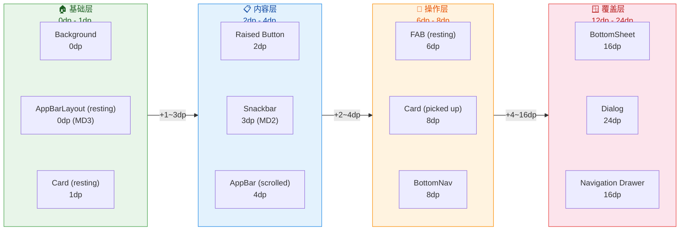
```mermaid
graph LR
    subgraph L1["🏠 基础层\n0dp - 1dp"]
        direction TB
        A1["Background\n0dp"]
        A2["AppBarLayout (resting)\n0dp (MD3)"]
        A3["Card (resting)\n1dp"]
        A1 ~~~ A2
        A2 ~~~ A3
    end

    subgraph L2["📋 内容层\n2dp - 4dp"]
        direction TB
        B1["Raised Button\n2dp"]
        B2["Snackbar\n3dp (MD2)"]
        B3["AppBar (scrolled)\n4dp"]
        B1 ~~~ B2
        B2 ~~~ B3
    end

    subgraph L3["🔘 操作层\n6dp - 8dp"]
        direction TB
        C1["FAB (resting)\n6dp"]
        C2["Card (picked up)\n8dp"]
        C3["BottomNav\n8dp"]
        C1 ~~~ C2
        C2 ~~~ C3
    end

    subgraph L4["🪟 覆盖层\n12dp - 24dp"]
        direction TB
        D1["BottomSheet\n16dp"]
        D2["Dialog\n24dp"]
        D3["Navigation Drawer\n16dp"]
        D1 ~~~ D2
        D2 ~~~ D3
    end

    L1 -->|"+1~3dp"| L2 -->|"+2~4dp"| L3 -->|"+4~16dp"| L4

    classDef base fill:#E8F5E9,stroke:#43A047,color:#1B5E20
    classDef content fill:#E3F2FD,stroke:#1E88E5,color:#0D47A1
    classDef action fill:#FFF3E0,stroke:#FB8C00,color:#E65100
    classDef overlay fill:#FCE4EC,stroke:#E53935,color:#B71C1C

    class L1 base
    class L2 content
    class L3 action
    class L4 overlay
```

从图中可以看出，Material Design 将 UI 元素分成了四个层级区间：

**基础层（0dp - 1dp）** 是距离用户最远的层级，通常包含背景色和静止状态的卡片。在 Material Design 3 中，`AppBarLayout` 在未滚动时的默认 elevation 被降低到了 0dp，转而依靠 **色彩** 而非阴影来表达层级——这是 MD3 "去阴影化"趋势的典型体现。

**内容层（2dp - 4dp）** 承载了用户可以交互的主要内容。按钮的 resting elevation 为 2dp，被按下时会通过 `translationZ` 提升到 8dp，给出"被按入了屏幕又弹起来"的触觉反馈。Snackbar 在 MD2 中默认 elevation 为 6dp（MD3 有所调整），确保它始终浮在普通内容之上但在 Dialog 之下。

**操作层（6dp - 8dp）** 是高优先级交互元素的领地。FAB 作为页面中最核心的操作入口，其 6dp 的默认高度使其在视觉上明显"浮"在内容之上，吸引用户注意力。当用户按下 FAB 时，`translationZ` 进一步上升到 12dp，产生强烈的"抬起"反馈。

**覆盖层（12dp - 24dp）** 是模态交互元素的领地。`Dialog` 拥有最高的 24dp elevation，因为它需要从视觉上完全"盖住"所有其他内容，强制用户集中注意力回应对话框的请求。`BottomSheet` 和 `NavigationDrawer` 也属于这一层，但 elevation 稍低，因为它们通常允许用户看到部分被遮挡的内容。

#### Elevation 在应用层的代码实践

在应用层中设置 elevation 非常简单，但有几个关键的注意事项需要理解：

```xml
<!-- res/layout/example_elevation.xml -->

<!-- 方式一：XML 静态设置 elevation -->
<!-- 注意：elevation 只在 API 21+ 生效 -->
<com.google.android.material.card.MaterialCardView
    android:id="@+id/card"
    android:layout_width="match_parent"
    android:layout_height="wrap_content"
    android:layout_margin="16dp"
    app:cardElevation="4dp"
    app:cardCornerRadius="12dp">
    <!-- cardElevation 是 MaterialCardView 封装的属性 -->
    <!-- 它内部最终调用 setCardElevation()，等效于设置 View 的 elevation -->
    <!-- 但额外处理了兼容性（pre-Lollipop 设备上用 padding 模拟阴影） -->

    <TextView
        android:layout_width="wrap_content"
        android:layout_height="wrap_content"
        android:text="Card Content"
        android:padding="16dp"/>
    <!-- TextView 本身不设 elevation -->
    <!-- 它的文字作为"墨水"附着在 CardView 这张"纸片"上 -->
</com.google.android.material.card.MaterialCardView>
```

```kotlin
// 方式二：代码动态设置 elevation 与 translationZ

// 获取卡片 View 的引用
val card = findViewById<MaterialCardView>(R.id.card)

// 设置静态 elevation —— 代表该组件的"身份高度"
card.elevation = 4f.dpToPx()  // 假设有 dp -> px 的扩展函数

// 设置动态偏移 translationZ —— 通常配合动画使用
// 例如：用户按下卡片时临时上浮
card.setOnTouchListener { v, event ->
    when (event.action) {
        // 手指按下时，translationZ 增加 4dp，总 Z = 4 + 4 = 8dp
        MotionEvent.ACTION_DOWN -> {
            v.animate()
                .translationZ(4f.dpToPx())  // 动态偏移 +4dp
                .setDuration(150)            // 150ms 的上浮动画
                .start()
        }
        // 手指抬起时，translationZ 回归 0，总 Z = 4 + 0 = 4dp
        MotionEvent.ACTION_UP, MotionEvent.ACTION_CANCEL -> {
            v.animate()
                .translationZ(0f)            // 偏移归零
                .setDuration(150)            // 150ms 的回落动画
                .start()
        }
    }
    false // 返回 false，不消费事件，让 click 继续传递
}
```

上面这段代码展示了 `elevation` 和 `translationZ` 的协作方式。值得注意的是，Material 组件库（如 `MaterialButton`、`MaterialCardView`）已经内置了 `StateListAnimator`，当组件状态变化（pressed、focused、hovered 等）时会自动调整 `translationZ`，**通常不需要手动编写上述触摸监听**。手动设置的场景主要出现在自定义 View 或需要特殊交互反馈时。

#### Elevation 与绘制顺序（Drawing Order）

一个容易被忽视的技术细节是：**elevation 会影响 View 的绘制顺序**。在 Android 5.0 之前，View 的绘制顺序完全由 `ViewGroup` 中的子 View 索引决定（后添加的画在上面）。从 Android 5.0 开始，`ViewGroup` 默认启用了 **Z-ordering**：elevation 更高的子 View 会被绘制在上层，无论它在 XML 中的声明顺序如何。

这在 `FrameLayout` 或 `ConstraintLayout` 中尤其明显。如果两个 View 在屏幕上有重叠区域，即使后声明的 View 的 elevation 为 0dp，先声明的 View 的 elevation 为 4dp，也会是先声明的那个画在上面。框架层在 `ViewGroup.getChildDrawingOrder()` 中实现了这一逻辑，它会根据子 View 的 Z 值（elevation + translationZ）重新排序绘制序列。

这个行为在实际开发中容易造成困惑：你在 XML 里把一个遮罩 View 放在最后（期望它遮住前面的内容），但如果前面的内容有 elevation，遮罩反而会被画到下面去。解决方式就是给遮罩也设一个足够高的 elevation，或者关闭父容器的 `clipChildren` 并手动控制绘制顺序。

---

### 阴影与轮廓（Shadow & Outline）

#### 阴影的物理模型

Material Design 的阴影系统模拟了 **两个光源** 同时照射的效果：

1. **Key Light（主光源）**：位于屏幕上方正前方（大约 45° 角），产生较为清晰、方向性强的阴影。这个阴影在 View 的 **下方** 最为明显，并且边缘相对锐利。

2. **Ambient Light（环境光）**：来自四面八方的散射光，产生柔和、均匀的阴影。这个阴影在 View 的 **四周** 都有，但强度较弱、边缘非常模糊。

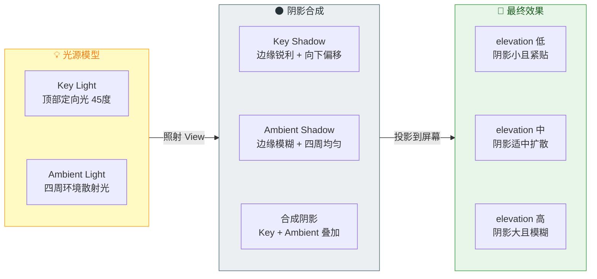
```mermaid
graph LR
    subgraph LIGHT["💡 光源模型"]
        direction TB
        KL["Key Light\n顶部定向光 45度"]
        AL["Ambient Light\n四周环境散射光"]
        KL ~~~ AL
    end

    subgraph SHADOW["🌑 阴影合成"]
        direction TB
        KS["Key Shadow\n边缘锐利 + 向下偏移"]
        AS["Ambient Shadow\n边缘模糊 + 四周均匀"]
        CS["合成阴影\nKey + Ambient 叠加"]
        KS ~~~ AS
        AS ~~~ CS
    end

    subgraph RESULT["📱 最终效果"]
        direction TB
        R1["elevation 低\n阴影小且紧贴"]
        R2["elevation 中\n阴影适中扩散"]
        R3["elevation 高\n阴影大且模糊"]
        R1 ~~~ R2
        R2 ~~~ R3
    end

    LIGHT -->|"照射 View"| SHADOW -->|"投影到屏幕"| RESULT

    classDef lightStyle fill:#FFF9C4,stroke:#F9A825,color:#F57F17
    classDef shadowStyle fill:#ECEFF1,stroke:#546E7A,color:#263238
    classDef resultStyle fill:#E8F5E9,stroke:#43A047,color:#1B5E20

    class LIGHT lightStyle
    class SHADOW shadowStyle
    class RESULT resultStyle
```

两个光源产生的阴影被叠加在一起，形成了我们在屏幕上看到的最终阴影效果。这就是为什么 Material Design 的阴影看起来如此"自然"——它不是简单的黑色矩形偏移，而是模拟了真实世界的光影物理。elevation 越高，Key Shadow 的偏移越大，Ambient Shadow 的扩散半径也越大，二者叠加后阴影整体变得更大、更柔和，完美传达了"这个元素离屏幕表面更远"的空间信息。

#### Android 框架层的阴影渲染机制

理解阴影在 Android 框架中的实现机制，可以帮助开发者解决很多"为什么我的 elevation 设了却没有阴影"的常见问题。

Android 5.0 引入了 `RenderThread`（渲染线程），阴影的计算和绘制就是在这个线程中完成的，**不在主线程 UI 绑定流程中**。具体来说，阴影渲染依赖三个要素：

**第一，Outline（轮廓）。** 阴影的形状不是根据 View 的实际像素内容来计算的（那样太耗性能），而是根据 View 的 **Outline** 来计算。Outline 是一个描述 View 形状的轻量级对象，可以是矩形、圆角矩形、圆形或任意凸多边形（convex path）。框架层通过 `ViewOutlineProvider` 来获取每个 View 的 Outline。

**第二，Elevation（高度值）。** 只有 `Z > 0` 的 View 才会产生阴影。如果你设置了 `elevation = 0dp` 且 `translationZ = 0`，即使有完整的 Outline，也不会渲染阴影。

**第三，背景（Background）。** 这是最容易被忽略的一点——**如果 View 没有设置 background，默认的 `ViewOutlineProvider.BACKGROUND` 将无法计算出有效的 Outline，导致没有阴影**。这是开发中最常见的"elevation 失效"问题。

```kotlin
// 演示：自定义 ViewOutlineProvider 以解决"无背景无阴影"问题

// 场景：一个没有 background 的自定义 View 需要阴影
val customView = findViewById<View>(R.id.custom_view)

// 设置 elevation（高度值）
customView.elevation = 8f.dpToPx()

// 关键：设置自定义 OutlineProvider
// 因为该 View 没有 background，默认 Provider 无法生成 Outline
customView.outlineProvider = object : ViewOutlineProvider() {
    override fun getOutline(view: View, outline: Outline) {
        // 手动定义轮廓为圆角矩形
        // 参数：left, top, right, bottom 定义矩形边界
        // 最后一个参数是圆角半径（单位 px）
        outline.setRoundRect(
            0,                    // left：从 View 左边缘开始
            0,                    // top：从 View 上边缘开始
            view.width,           // right：到 View 右边缘
            view.height,          // bottom：到 View 下边缘
            12f.dpToPx()          // radius：12dp 的圆角
        )
    }
}

// 启用裁剪（可选：如果希望 View 的内容也被裁剪为该轮廓形状）
customView.clipToOutline = true
```

上面的代码是解决"elevation 设了没阴影"问题的标准方案。核心逻辑是：**当你不能依赖 background 自动生成 Outline 时，就手动通过 `ViewOutlineProvider` 告诉系统这个 View 的形状是什么**。

#### Outline 的三种来源

系统获取 View 的 Outline 有三种方式，开发者需要根据场景选择：

**方式一：`ViewOutlineProvider.BACKGROUND`（默认值）。** 系统从 View 的 `background` Drawable 中提取 Outline。`ColorDrawable`、`GradientDrawable`（shape XML）、`RippleDrawable` 等常用 Drawable 都实现了 `getOutline()` 方法。这是最常用的方式——只要你给 View 设了 `android:background`，elevation 就会"自动生效"。

**方式二：`ViewOutlineProvider.BOUNDS`。** 系统直接将 View 的边界矩形（left, top, right, bottom）作为 Outline，不考虑 background。这种方式简单但只能生成直角矩形阴影。

**方式三：自定义 `ViewOutlineProvider`。** 就是上面代码示例的方式。开发者完全控制 Outline 的形状，可以创建圆形、胶囊形、不规则凸多边形等任意轮廓。需要注意一个关键限制：**Outline 只支持凸形状（convex shape）**。如果你传入一个凹多边形的 Path，`outline.setConvexPath()` 在 API 30 以下会直接忽略它，且不会产生阴影。从 API 30 开始，`setPath()` 方法放宽了这一限制，允许部分非凸路径。

```kotlin
// 三种 OutlineProvider 的使用对比

val view = findViewById<View>(R.id.demo_view)

// 方式一：默认 —— 依赖 background（最常用）
// 前提：View 必须设置了有效的 background
view.outlineProvider = ViewOutlineProvider.BACKGROUND

// 方式二：使用 View 的边界矩形作为轮廓
// 适用于：不想设 background 但需要矩形阴影的场景
view.outlineProvider = ViewOutlineProvider.BOUNDS

// 方式三：完全自定义轮廓形状
// 适用于：圆形头像、异形按钮等非矩形组件
view.outlineProvider = object : ViewOutlineProvider() {
    override fun getOutline(view: View, outline: Outline) {
        // 示例：创建一个圆形轮廓（常用于圆形头像的阴影）
        val size = minOf(view.width, view.height)  // 取宽高的较小值
        val centerX = view.width / 2               // 水平居中
        val centerY = view.height / 2              // 垂直居中
        val radius = size / 2                      // 半径 = 较小边的一半

        // setOval 定义椭圆轮廓，传入外接矩形
        outline.setOval(
            centerX - radius,     // left
            centerY - radius,     // top
            centerX + radius,     // right
            centerY + radius      // bottom
        )
    }
}

// 别忘了设置 elevation，否则即使有 Outline 也不会产生阴影
view.elevation = 6f.dpToPx()
```

#### clipToOutline 与阴影的关系

`View.setClipToOutline(true)` 是一个与 Outline 密切相关但功能独立的属性。它的作用是 **将 View 的绘制内容裁剪为 Outline 的形状**。例如，如果你给一个 `ImageView` 设置了圆形 Outline 并开启 `clipToOutline`，图片就会被裁剪为圆形——这是实现圆形头像最高性能的方式（完全在 GPU 层完成，无需 Bitmap 操作）。

但需要特别强调的是：**`clipToOutline` 和阴影是独立的**。即使不开启 `clipToOutline`，只要有有效的 Outline 和大于 0 的 Z 值，阴影就会按照 Outline 的形状渲染。`clipToOutline` 只控制"View 的内容是否被裁切"，不影响阴影的存在与否。

#### Material Design 3 中阴影的演变

值得注意的是，Material Design 3（Material You）相较于 Material Design 2 在阴影使用上发生了显著的理念转变。MD2 大量依赖 elevation 和阴影来传达层级关系，而 MD3 更倾向于使用 **色调映射（Tonal Elevation）** 来替代阴影。

所谓 Tonal Elevation，是指 elevation 增加时，不是让阴影变大，而是让 View 的 **背景色变浅（在 Light Theme 下）或更亮（在 Dark Theme 下）**。这种方式在 Dark Theme 中尤其有效——因为在深色背景上，阴影几乎不可见，用色彩明暗来区分层级远比阴影直观。

在 Material 3 组件库中，`MaterialCardView`、`AppBarLayout`、`NavigationBar` 等组件已经默认采用 Tonal Elevation 机制。开发者可以通过主题属性 `elevationOverlayEnabled` 和 `elevationOverlayColor` 来控制这一行为：

```xml
<!-- res/values/themes.xml -->
<!-- Material 3 主题中 Tonal Elevation 的配置 -->
<style name="Theme.MyApp" parent="Theme.Material3.DayNight">

    <!-- 启用 Tonal Elevation（MD3 默认就是 true） -->
    <!-- 当 elevation > 0 时，用色调叠加代替（或辅助）阴影 -->
    <item name="elevationOverlayEnabled">true</item>

    <!-- 叠加色的基础颜色（通常是 primary 色的某个变体） -->
    <!-- 系统会根据 elevation 的大小自动计算叠加透明度 -->
    <item name="elevationOverlayColor">@color/md_theme_primary</item>

    <!-- 例如：elevation = 1dp 时叠加 5% 的 primary -->
    <!--        elevation = 4dp 时叠加 9% 的 primary -->
    <!--        elevation = 8dp 时叠加 12% 的 primary -->
    <!-- 这些百分比是 Material 3 规范中预定义的 -->

</style>
```

这种演变对应用层开发者的实际影响是：**如果你的 App 已经迁移到 Material 3 主题，那么很多组件的"层级感"不再来自阴影，而是来自微妙的色彩差异。** 在调试 UI 时，如果你发现某个组件"看起来和背景融为一体"，不一定是 elevation 没设对，可能是 Tonal Elevation 的颜色对比度不够。此时应该调整主题的 `surface` 色阶或 `elevationOverlayColor`，而不是盲目增加 `elevation` 值。

#### 常见问题排查清单

在应用层开发中，elevation 和阴影相关的问题是高频 bug。以下是一份排查清单：

| 症状 | 可能原因 | 解决方案 |
|------|----------|----------|
| 设了 `elevation` 但无阴影 | View 没有 `background` | 给 View 设置 background 或自定义 `OutlineProvider` |
| 阴影形状不对 | background 的 shape 不对 | 检查 `GradientDrawable` 的 `shape` 和 `cornerRadius` |
| 阴影被裁剪 | 父容器开启了 `clipChildren` | 设置父容器 `android:clipChildren="false"` |
| 阴影被裁剪（续） | 父容器开启了 `clipToPadding` | 设置父容器 `android:clipToPadding="false"` |
| Dark Theme 下阴影不可见 | 深色背景吃掉了阴影 | 使用 MD3 Tonal Elevation 或增加 `outlineAmbientShadowColor` |
| `translationZ` 动画不流畅 | 主线程负载过高 | 使用 `ViewPropertyAnimator`（在 RenderThread 执行） |
| 凹形 Outline 不生效 | API < 30 不支持凹路径 | 改用凸形近似或使用 Bitmap 阴影方案 |

---

**📝 练习题**

一个开发者创建了一个自定义的 `View`，在 XML 中设置了 `android:elevation="8dp"`，但运行后发现该 View 没有任何阴影效果。以下哪个是最可能的原因？

A. 设备系统版本低于 Android 5.0（API 21），不支持 elevation


B. 该 View 没有设置 `android:background` 属性，导致系统无法获取有效的 Outline


C. 该 View 的 `translationZ` 为 0，需要将其设为正值才能产生阴影


D. 该 View 没有调用 `setClipToOutline(true)`，系统无法绘制阴影


**【答案】** B

**【解析】** Android 的阴影渲染依赖三要素：Outline（轮廓）、Z 值（elevation + translationZ > 0）、以及渲染线程的支持。默认情况下，View 的 `outlineProvider` 为 `ViewOutlineProvider.BACKGROUND`，即从 `background` Drawable 中提取轮廓信息。如果 View 没有设置 `background`，系统就无法获取有效的 Outline，阴影自然不会渲染。选项 A 虽然在极端场景下成立，但题干并未提及设备版本，且当前绝大多数设备早已运行在 API 21+，这不是"最可能"的原因。选项 C 完全错误——`translationZ` 默认为 0 是正常状态，`elevation = 8dp` 本身已经让 `Z = 8 > 0`，满足阴影渲染条件。选项 D 也是错误的——`clipToOutline` 控制的是 View 内容裁剪，与阴影渲染无关，即使不开启 `clipToOutline`，阴影也应该正常显示。正确做法是给该 View 设置一个 `background`（哪怕是透明色的 `ShapeDrawable`），或者手动设置 `outlineProvider` 为 `ViewOutlineProvider.BOUNDS` 或自定义的 `ViewOutlineProvider`。

---

## 顶层容器

在 Material Design 的组件体系中，**顶层容器**（Top-Level Containers）扮演着"舞台总导演"的角色。它们本身不直接呈现丰富的视觉内容，而是**定义并管理**子 View 之间的联动关系——谁跟随滚动而折叠、谁浮动不动、谁在特定时机出现或消失。如果说普通的 `FrameLayout`、`LinearLayout` 只是"静态收纳盒"，那么 `CoordinatorLayout`、`AppBarLayout`、`CollapsingToolbarLayout` 就是能感知手势、协调多 View 动画的"智能容器"。理解它们的工作原理，是构建一切复杂 Material 交互界面的基础。

---

### CoordinatorLayout 协调布局

#### 它解决了什么问题？

在没有 `CoordinatorLayout` 的时代，如果你想实现"列表向上滚动时，顶部 Toolbar 自动收起；Snackbar 弹出时，FloatingActionButton 自动上移"这类联动效果，你必须自己在 `OnScrollListener` 里手写大量坐标计算逻辑，将多个 View 的状态"硬绑"在一起。这种做法不仅代码量大，而且极其脆弱——只要交互需求稍有变化，整套逻辑就得推倒重写。

`CoordinatorLayout` 的诞生正是为了**将"View 之间的联动协议"从硬编码抽象成可插拔的 Behavior 机制**。它继承自 `ViewGroup`，在布局与事件分发的各个关键节点（measure、layout、nested scroll、touch intercept）都预留了 Hook 点，让开发者通过声明式的 `Behavior` 来描述 View 与 View 之间的协作关系，而无需侵入各 View 的内部实现。

#### 核心机制：Behavior 插件体系

`CoordinatorLayout` 的全部"聪明"都来自 `CoordinatorLayout.Behavior<V extends View>` 这个抽象类。每一个直接子 View 都可以挂载一个 Behavior 实例，这个 Behavior 就像是该 View 的"私人助理"，负责在合适的时机替 View 做出响应。

Behavior 可以通过三种方式绑定到子 View：

1. **XML 属性声明**：`app:layout_behavior="com.xxx.MyBehavior"`，这是最常见的声明式用法。
2. **注解默认绑定**：在自定义 View 类上添加 `@CoordinatorLayout.DefaultBehavior(MyBehavior.class)` 注解，该 View 被放入 CoordinatorLayout 时自动获得此 Behavior。`AppBarLayout` 和 `FloatingActionButton` 都使用了这种方式。
3. **代码动态设置**：通过 `CoordinatorLayout.LayoutParams.setBehavior()` 在运行时注入。

#### Behavior 的两大工作模式

Behavior 的核心回调可以归纳为两类协作模式：**依赖监听**（Dependent Observation）和 **嵌套滚动拦截**（Nested Scrolling Interception）。理解这两个模式，就理解了 `CoordinatorLayout` 的全部精髓。

**模式一：依赖监听（Dependency Model）**

这是一种"观察者"模式。当 View A 声明"我依赖 View B"后，只要 View B 的尺寸或位置发生变化，CoordinatorLayout 就会通知 View A 的 Behavior 做出响应。

工作流程如下：CoordinatorLayout 在每次 `onLayout` 或子 View `invalidate` 时，会遍历所有子 View 的 Behavior，调用 `layoutDependsOn(parent, child, dependency)` 询问"你是否依赖这个 dependency？"。如果返回 `true`，后续当 dependency 发生改变时，就会触发 `onDependentViewChanged()` 回调，child 的 Behavior 就可以在这里计算自己应该如何跟随移动。

一个经典的例子是 `FloatingActionButton` 与 `Snackbar` 的联动：Snackbar 从底部弹出时会改变自身位置，而 FAB 的默认 Behavior 声明了"我依赖任何 Snackbar"，于是 FAB 会自动上移以避让。整个过程中，Snackbar 和 FAB 彼此完全不知道对方的存在，它们的联动完全由 Behavior 在 CoordinatorLayout 这个"中介"上完成。

**模式二：嵌套滚动拦截（Nested Scrolling Model）**

这是更复杂也更强大的模式，驱动了 AppBarLayout 折叠/展开等核心交互。当 CoordinatorLayout 内部有支持 Nested Scrolling 的可滚动 View（如 `RecyclerView`、`NestedScrollView`）时，滚动事件会沿着 **NestedScrollingChild → NestedScrollingParent** 链向上传递。CoordinatorLayout 实现了 `NestedScrollingParent3` 接口，它在收到嵌套滚动事件后，会分发给所有子 View 的 Behavior 的以下回调：

- `onStartNestedScroll()`：是否对本次滚动感兴趣？返回 `true` 则后续会收到滚动量。
- `onNestedPreScroll()`：在子 View 消费滚动之前，Behavior 可以先"截流"部分或全部滚动量（这就是 AppBarLayout 能在列表滚动前先折叠的原因）。
- `onNestedScroll()`：子 View 消费完后，剩余的滚动量会再次传递过来。
- `onNestedPreFling()` / `onNestedFling()`：Fling 手势的类似处理。
- `onStopNestedScroll()`：滚动结束，可用于做收尾动画（如 AppBarLayout 的 snap 吸附）。

这套机制的精妙之处在于：**滚动量是有序传递的、可分段消费的**。比如手指向上滑动了 100px，AppBarLayout 的 Behavior 可以在 `onNestedPreScroll` 里先消费 60px（用于折叠自身），剩下 40px 才让 RecyclerView 去滚动内容。这就是用户看到"列表不动、头部先缩"效果的底层原理。

#### CoordinatorLayout 的布局特性

除了 Behavior 体系，CoordinatorLayout 本身在布局上也有一些值得注意的特性：

- **它本质是增强版 FrameLayout**：子 View 默认层叠放置，支持 `layout_gravity` 定位。并不像 LinearLayout 那样线性排列。
- **支持 `layout_anchor` + `layout_anchorGravity`**：允许某个子 View"锚定"在另一个子 View 的边缘上。FAB 挂在 AppBarLayout 底边的效果就是这样实现的。
- **Insets 处理**：CoordinatorLayout 会自动处理 `WindowInsets`（系统状态栏、导航栏区域），并分发给子 View，这对全屏沉浸式界面非常重要。

下面是一个典型的 CoordinatorLayout 基础结构布局：

```xml
<!-- CoordinatorLayout 作为根容器，协调子 View 之间的联动 -->
<androidx.coordinatorlayout.widget.CoordinatorLayout
    xmlns:android="http://schemas.android.com/apk/res/android"
    xmlns:app="http://schemas.android.com/apk/res-auto"
    android:layout_width="match_parent"
    android:layout_height="match_parent"
    <!-- fitsSystemWindows 让容器感知系统窗口边衬 -->
    android:fitsSystemWindows="true">

    <!-- AppBarLayout：稍后详细介绍，此处仅占位 -->
    <com.google.android.material.appbar.AppBarLayout
        android:id="@+id/appBar"
        android:layout_width="match_parent"
        android:layout_height="wrap_content">

        <!-- Toolbar 通过 scrollFlags 声明自己的折叠行为 -->
        <com.google.android.material.appbar.MaterialToolbar
            android:layout_width="match_parent"
            android:layout_height="?attr/actionBarSize"
            <!-- scroll 表示跟随滚动；enterAlways 表示下拉立刻出现 -->
            app:layout_scrollFlags="scroll|enterAlways" />
    </com.google.android.material.appbar.AppBarLayout>

    <!-- RecyclerView 作为滚动内容区，必须声明 layout_behavior -->
    <!-- 这个 Behavior 让它"知道"自己应该排在 AppBarLayout 下方 -->
    <androidx.recyclerview.widget.RecyclerView
        android:layout_width="match_parent"
        android:layout_height="match_parent"
        <!-- 关键：scrolling_view_behavior 使 RV 配合 AppBarLayout 联动 -->
        app:layout_behavior="@string/appbar_scrolling_view_behavior" />

    <!-- FAB 锚定在 AppBarLayout 底边右侧 -->
    <com.google.android.material.floatingactionbutton.FloatingActionButton
        android:layout_width="wrap_content"
        android:layout_height="wrap_content"
        android:layout_margin="16dp"
        <!-- anchor 指向 appBar，使 FAB 跟随 appBar 的位置变化 -->
        app:layout_anchor="@id/appBar"
        <!-- anchorGravity 控制锚点相对位置：底部｜右侧｜末端 -->
        app:layout_anchorGravity="bottom|end" />

</androidx.coordinatorlayout.widget.CoordinatorLayout>
```

在这段布局中，三个子 View 各自通过不同方式参与协调：AppBarLayout 通过自带的默认 Behavior 监听嵌套滚动；RecyclerView 通过 `appbar_scrolling_view_behavior` 在布局时自动排到 AppBarLayout 下方，并将自身的滚动事件上报；FAB 通过 `layout_anchor` 依赖 AppBarLayout，利用 Dependency Model 跟踪其位置变化。三者互不直接引用，全靠 CoordinatorLayout 在中间"穿针引线"。

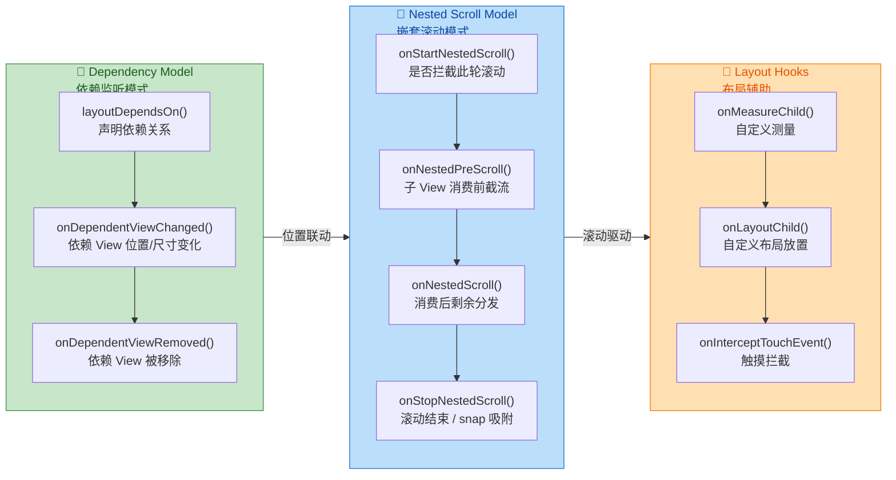
```mermaid
graph LR
    subgraph Dependency["🔗 Dependency Model\n依赖监听模式"]
        direction TB
        D1["layoutDependsOn()\n声明依赖关系"]
        D2["onDependentViewChanged()\n依赖 View 位置/尺寸变化"]
        D3["onDependentViewRemoved()\n依赖 View 被移除"]
        D1 --> D2
        D2 --> D3
    end

    subgraph NestedScroll["📜 Nested Scroll Model\n嵌套滚动模式"]
        direction TB
        N1["onStartNestedScroll()\n是否拦截此轮滚动"]
        N2["onNestedPreScroll()\n子 View 消费前截流"]
        N3["onNestedScroll()\n消费后剩余分发"]
        N4["onStopNestedScroll()\n滚动结束 / snap 吸附"]
        N1 --> N2
        N2 --> N3
        N3 --> N4
    end

    subgraph Layout["📐 Layout Hooks\n布局辅助"]
        direction TB
        L1["onMeasureChild()\n自定义测量"]
        L2["onLayoutChild()\n自定义布局放置"]
        L3["onInterceptTouchEvent()\n触摸拦截"]
        L1 --> L2
        L2 --> L3
    end

    Dependency -->|"位置联动"| NestedScroll
    NestedScroll -->|"滚动驱动"| Layout

    classDef depStyle fill:#C8E6C9,stroke:#388E3C,color:#1B5E20
    classDef scrollStyle fill:#BBDEFB,stroke:#1976D2,color:#0D47A1
    classDef layoutStyle fill:#FFE0B2,stroke:#F57C00,color:#E65100

    class Dependency depStyle
    class NestedScroll scrollStyle
    class Layout layoutStyle
```

---

### AppBarLayout 联动

#### 从 LinearLayout 到"可感知滚动的容器"

`AppBarLayout` 继承自 `LinearLayout`（方向固定为垂直），但它绝不只是一个简单的纵向布局。它的核心身份是 **"CoordinatorLayout 体系中的可折叠头部区域"**。当用户在页面内滚动内容时，AppBarLayout 能感知到这些滚动事件，并据此改变自身子 View 的可见状态——收起、展开、固定或快速返回。

这种"感知"能力并非 AppBarLayout 独立实现，而是依托于前面介绍的 CoordinatorLayout Behavior 体系。AppBarLayout 通过 `@DefaultBehavior` 注解绑定了一个内部类 `AppBarLayout.Behavior`，该 Behavior 实现了嵌套滚动模式的全部回调。当 RecyclerView 等滚动视图发出嵌套滚动事件时，CoordinatorLayout 将其转发给 AppBarLayout.Behavior，后者根据子 View 声明的 `scrollFlags` 来决定如何消费这些滚动量。

#### scrollFlags：折叠行为的"声明语言"

`scrollFlags` 是 AppBarLayout 最核心的配置属性，它作用在 AppBarLayout 的**子 View** 上（而非 AppBarLayout 自身），通过位运算组合多种标志来声明该子 View 在滚动过程中的行为。可以将其理解为一种**声明式的滚动协议**：你不需要写任何命令式代码，只需通过 flag 组合告诉系统"我希望这个 View 在滚动时怎么动"。

以下是各个 flag 的详细解析：

**`scroll`（基础标志，必选项）**

这是最基础的 flag。如果一个子 View 不设置 `scroll`，它就完全不参与滚动折叠，会一直固定在屏幕上。只有设置了 `scroll`，后续其他 flag 才有意义。设计上这是一个"开关"：不带此标志的子 View 被视为"固定区域"，始终可见。

一条重要规则：**设置了 `scroll` 的子 View 必须排列在未设置 `scroll` 的子 View 之前**。也就是说，可折叠的部分在上，固定部分在下。如果违反此顺序，固定 View 上方的可滚动 View 将无法正确折叠。这是因为 AppBarLayout 的折叠算法是从顶部向下依次处理的。

**`enterAlways`（快速返回）**

当用户向下滚动（手指下拉）时，设置了此 flag 的 View 会**立即开始出现**，而不必等到列表回到顶部。这就是 Material Design 所说的"Quick Return"模式。典型场景是 Toolbar：用户随时下拉就能看到 Toolbar，提供便捷的导航访问。

如果只有 `scroll` 而没有 `enterAlways`，则 View 只会在列表完全滚回到顶部后才开始展开。这两种体验差异巨大，前者适合高频使用的操作栏，后者适合仅在顶部才需要的装饰性区域。

**`enterAlwaysCollapsed`（快速返回到最小高度）**

这是 `enterAlways` 的修饰 flag，必须与 `enterAlways` 一起使用。它的含义是：下拉时，View 不会立刻完全展开，而是**先恢复到 `minHeight` 的高度**，只有当列表完全回到顶部时，才继续展开到完整高度。

这在大图头部场景中很有用：用户快速下拉时先看到一个紧凑的 Toolbar 区域（minHeight），不会被一个巨大的头部图片挡住视线；只有当用户确实回到内容顶部时，完整的头部才会展开。

**`exitUntilCollapsed`（折叠到最小高度后固定）**

上滑时，View 会逐渐折叠，但**不会完全消失**——当它缩小到 `minHeight` 时就停止折叠，固定在顶部。这是 `CollapsingToolbarLayout` 最常用的配合 flag：大图区域上滑折叠，但始终保留一个 Toolbar 高度的固定区域，用于显示标题和导航按钮。

**`snap`（吸附效果）**

当用户释放手指时，如果 View 处于"半折叠"状态（既没完全折叠也没完全展开），系统会自动将其**弹到最近的终态**——要么完全折叠，要么完全展开。这避免了视觉上不优雅的"半吊子"状态，是 Material Design 追求"明确、干脆"交互感的体现。

**`snapMargins`（吸附时考虑 margin）**

与 `snap` 配合使用。默认的 snap 计算不考虑 margin，加上此 flag 后，吸附阈值的计算会纳入 View 的 margin 值，使吸附行为在有 margin 的情况下更自然。

下面用一段典型布局来展示这些 flag 的组合：

```xml
<com.google.android.material.appbar.AppBarLayout
    android:layout_width="match_parent"
    android:layout_height="wrap_content"
    <!-- elevation 控制底部阴影高度，对应 Z 轴设计哲学 -->
    app:elevation="4dp">

    <!-- 第一个子 View：可折叠区域 -->
    <!-- scroll|exitUntilCollapsed 表示上滑时折叠到 minHeight 后固定 -->
    <com.google.android.material.appbar.CollapsingToolbarLayout
        android:layout_width="match_parent"
        android:layout_height="200dp"
        app:layout_scrollFlags="scroll|exitUntilCollapsed|snap"
        <!-- 折叠后固定在顶部的最小高度，通常等于 Toolbar 高度 -->
        android:minHeight="?attr/actionBarSize">

        <!-- 内部的 Toolbar 会在后面的小节详细说明 -->
        <com.google.android.material.appbar.MaterialToolbar
            android:layout_width="match_parent"
            android:layout_height="?attr/actionBarSize"
            <!-- pin 表示折叠过程中 Toolbar 始终固定可见 -->
            app:layout_collapseMode="pin" />
    </com.google.android.material.appbar.CollapsingToolbarLayout>

    <!-- 第二个子 View：固定 TabLayout，不设置 scroll 因此永远可见 -->
    <com.google.android.material.tabs.TabLayout
        android:layout_width="match_parent"
        android:layout_height="wrap_content" />

</com.google.android.material.appbar.AppBarLayout>
```

#### AppBarLayout 内部的 Offset 跟踪机制

AppBarLayout 维护了一个核心状态：**垂直偏移量（vertical offset）**。这个值表示 AppBarLayout 相对于初始位置向上移动了多少像素。完全展开时 offset 为 0，完全折叠时 offset 为负的总可滚动范围。

你可以通过 `AppBarLayout.addOnOffsetChangedListener()` 监听此偏移量的变化。回调签名为 `onOffsetChanged(AppBarLayout appBarLayout, int verticalOffset)`。这个监听器在实际开发中非常常用，比如：

- 根据折叠程度动态调整标题文字的 alpha 透明度
- 在完全折叠时切换 Toolbar 的背景色
- 控制某个 View 在特定偏移量时显示或隐藏

```kotlin
// 监听 AppBarLayout 的偏移量变化
appBarLayout.addOnOffsetChangedListener { appBar, verticalOffset ->
    // totalScrollRange 是 AppBarLayout 能折叠的总距离（正值）
    val totalRange = appBar.totalScrollRange
    // verticalOffset 是负值，取绝对值后计算折叠百分比
    val collapsePercent = Math.abs(verticalOffset).toFloat() / totalRange
    // 当折叠超过 80% 时，显示标题文字
    toolbarTitle.alpha = if (collapsePercent > 0.8f) {
        // 在 80%-100% 之间做线性插值，实现渐显效果
        (collapsePercent - 0.8f) / 0.2f
    } else {
        // 未达到 80% 折叠时完全透明
        0f
    }
}
```

#### 与滚动 View 的配合要求

AppBarLayout 不是"独自工作"的。它**必须**存在于 CoordinatorLayout 中，且页面中**必须有一个设置了 `appbar_scrolling_view_behavior` 的滚动 View** 来提供嵌套滚动事件。如果你忘记给 RecyclerView 加上 `app:layout_behavior="@string/appbar_scrolling_view_behavior"`，AppBarLayout 将完全不会响应滚动——这是初学者最常犯的错误之一。

该 Behavior（`AppBarLayout.ScrollingViewBehavior`）做了两件事：
1. **布局时**：自动将滚动 View 放置在 AppBarLayout 下方（类似于设置了 `layout_below`），避免内容被头部遮挡。
2. **滚动时**：将自身的嵌套滚动事件上报给 CoordinatorLayout，后者再转发给 AppBarLayout.Behavior。

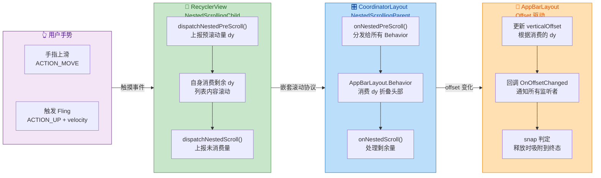
```mermaid
graph LR
    subgraph UserGesture["👆 用户手势"]
        direction TB
        G1["手指上滑\nACTION_MOVE"]
        G2["触发 Fling\nACTION_UP + velocity"]
        G1 ~~~ G2
    end

    subgraph ScrollView["📜 RecyclerView\nNestedScrollingChild"]
        direction TB
        S1["dispatchNestedPreScroll()\n上报预滚动量 dy"]
        S2["自身消费剩余 dy\n列表内容滚动"]
        S3["dispatchNestedScroll()\n上报未消费量"]
        S1 --> S2
        S2 --> S3
    end

    subgraph Coordinator["🎛️ CoordinatorLayout\nNestedScrollingParent"]
        direction TB
        C1["onNestedPreScroll()\n分发给所有 Behavior"]
        C2["AppBarLayout.Behavior\n消费 dy 折叠头部"]
        C3["onNestedScroll()\n处理剩余量"]
        C1 --> C2
        C2 --> C3
    end

    subgraph AppBar["📐 AppBarLayout\nOffset 驱动"]
        direction TB
        A1["更新 verticalOffset\n根据消费的 dy"]
        A2["回调 OnOffsetChanged\n通知所有监听者"]
        A3["snap 判定\n释放时吸附到终态"]
        A1 --> A2
        A2 --> A3
    end

    UserGesture -->|"触摸事件"| ScrollView
    ScrollView -->|"嵌套滚动协议"| Coordinator
    Coordinator -->|"offset 变化"| AppBar

    classDef gestureStyle fill:#F3E5F5,stroke:#7B1FA2,color:#4A148C
    classDef scrollStyle fill:#C8E6C9,stroke:#388E3C,color:#1B5E20
    classDef coordStyle fill:#BBDEFB,stroke:#1976D2,color:#0D47A1
    classDef appbarStyle fill:#FFE0B2,stroke:#F57C00,color:#E65100

    class UserGesture gestureStyle
    class ScrollView scrollStyle
    class Coordinator coordStyle
    class AppBar appbarStyle
```

#### Lift On Scroll 效果

Material Design 3 推荐的一种交互是 **Lift on Scroll**：AppBarLayout 在内容未滚动时没有阴影（elevation = 0），一旦内容开始滚动，AppBarLayout 的 elevation 自动升高，产生阴影来暗示"内容已经滑到了头部下方"。这个效果通过一个简单属性开启：

```xml
<com.google.android.material.appbar.AppBarLayout
    android:layout_width="match_parent"
    android:layout_height="wrap_content"
    <!-- liftOnScroll 启用滚动抬升效果 -->
    app:liftOnScroll="true"
    <!-- 指定监听哪个滚动 View，确保正确检测滚动状态 -->
    app:liftOnScrollTargetViewId="@id/recyclerView">
```

当 `liftOnScroll="true"` 时，AppBarLayout 会监听目标滚动 View 的偏移。如果滚动 View 处于顶部（offset = 0），AppBarLayout 的 elevation 为 0；如果用户开始向下滚动内容，elevation 自动过渡到默认值（通常 4dp），产生细腻的阴影变化。这个效果完美体现了 Material Design 的 Z 轴高度哲学——通过阴影的出现来传达层次关系的动态变化。

---

### CollapsingToolbarLayout 折叠工具栏

#### 为什么需要在 AppBarLayout 内部再嵌套一层？

你可能会问：AppBarLayout 自身已经能处理滚动折叠了，为什么还需要 `CollapsingToolbarLayout`？答案在于 **AppBarLayout 只管"整体高度的增减"，但不管内部 View 在折叠过程中的具体动画表现**。

想象一个常见的详情页头部：顶部有一张大背景图，上面叠了一个大标题，右上角有个返回按钮。当用户上滑时，你希望的效果可能是：

- 背景图逐渐模糊或产生视差滚动
- 大标题平滑地缩小并移动到 Toolbar 的位置
- 返回按钮始终固定在屏幕顶部

这些"折叠过程中的渐变动画"是 AppBarLayout 无法做到的——它只会把子 View 整体往上推。而 `CollapsingToolbarLayout` 正是为此而生：它作为 AppBarLayout 的直接子 View，接管了折叠区域的内部布局权，通过 **collapseMode**、**视差系数**、**标题缩放动画** 等机制，为折叠过程赋予了丰富的视觉层次。

从类继承关系来看，`CollapsingToolbarLayout` 继承自 `FrameLayout`。它的子 View 层叠放置，配合各自声明的 `collapseMode` 在折叠过程中表现出不同的运动方式。

#### collapseMode：子 View 的折叠行为声明

每一个 CollapsingToolbarLayout 的直接子 View 都可以通过 `app:layout_collapseMode` 声明自己在折叠过程中的运动方式：

**`pin`（固定模式）**

设置 `pin` 的 View 在折叠过程中会**始终"钉"在 CollapsingToolbarLayout 的顶部**，不会随内容滚出屏幕。最典型的用法就是 Toolbar——无论头部如何折叠，Toolbar 始终可见，用户随时可以点击导航按钮。

`pin` 的实现原理是：CollapsingToolbarLayout 在 `onLayout` 时会监听 AppBarLayout 的 offset 变化，然后通过 `setTranslationY()` 对 pin 模式的子 View 做反向位移补偿。比如 AppBarLayout 整体上移了 100px，pin View 就下移 100px，两者抵消，视觉上就是"不动"。

**`parallax`（视差模式）**

设置 `parallax` 的 View 在折叠过程中会以**慢于整体折叠速度**的速率滚动，产生视差效果。这在背景图上使用非常普遍：头部向上折叠时，背景图的移动速度只有整体的 50%（默认视差系数），营造出"远处景物移动较慢"的深度感。

视差系数通过 `app:layout_collapseParallaxMultiplier` 控制，范围是 0.0 到 1.0：
- **0.0**：没有视差，View 与整体折叠速度完全相同（跟着一起走）
- **0.5**（默认）：View 移动速度是整体的一半，标准视差效果
- **1.0**：View 完全不动（等同于 pin，但不会做 pin 的位移补偿）

**`none`（默认，无特殊处理）**

子 View 直接随整体折叠而滚出屏幕，无任何视差或固定效果。

#### 标题动画：大标题到小标题的平滑过渡

CollapsingToolbarLayout 内置了一个非常精致的**标题缩放与位移动画**。当头部完全展开时，标题以大字号显示在底部区域（expandedTitle）；随着折叠进行，标题会平滑地缩小字号并移动到 Toolbar 区域（collapsedTitle），整个过程是连续的贝塞尔曲线动画，无任何跳跃感。

相关属性配置：

```xml
<com.google.android.material.appbar.CollapsingToolbarLayout
    android:layout_width="match_parent"
    android:layout_height="200dp"
    <!-- 展开时标题的位置：左下角，留出内边距 -->
    app:expandedTitleMarginStart="24dp"
    app:expandedTitleMarginBottom="16dp"
    <!-- 折叠后标题的位置：由 Toolbar 的 titleMarginStart 控制 -->
    <!-- 展开时标题的文字样式 -->
    app:expandedTitleTextAppearance="@style/TextAppearance.Material3.HeadlineMedium"
    <!-- 折叠后标题的文字样式 -->
    app:collapsedTitleTextAppearance="@style/TextAppearance.Material3.TitleLarge"
    <!-- 标题文字过长时的省略方式 -->
    app:titleCollapseMode="scale"
    <!-- 折叠工具栏参与滚动，折叠到 minHeight 后固定，释放时 snap 吸附 -->
    app:layout_scrollFlags="scroll|exitUntilCollapsed|snap">

    <!-- 背景图：视差模式，折叠时慢速滚动 -->
    <ImageView
        android:layout_width="match_parent"
        android:layout_height="match_parent"
        android:scaleType="centerCrop"
        android:src="@drawable/header_image"
        <!-- 视差系数 0.5，移动速度为整体的一半 -->
        app:layout_collapseParallaxMultiplier="0.5"
        <!-- 声明为视差模式 -->
        app:layout_collapseMode="parallax" />

    <!-- Toolbar：固定模式，折叠后始终可见 -->
    <com.google.android.material.appbar.MaterialToolbar
        android:layout_width="match_parent"
        android:layout_height="?attr/actionBarSize"
        <!-- 声明为固定模式，始终钉在顶部 -->
        app:layout_collapseMode="pin" />

</com.google.android.material.appbar.CollapsingToolbarLayout>
```

`titleCollapseMode` 属性控制标题在折叠过渡中的动画方式：

- **`fade`**：展开标题淡出，折叠标题淡入，简单直接。
- **`scale`**（推荐）：标题从大号平滑缩小到小号，同时位移到 Toolbar 区域，视觉连续性更强。

#### Content Scrim 与 Status Bar Scrim

在折叠进行中，CollapsingToolbarLayout 提供了两层"幕布"（scrim）来控制视觉过渡：

**`contentScrim`（内容幕布）**：当折叠达到一定阈值时，一层半透明或纯色遮罩会覆盖在 CollapsingToolbarLayout 的内容上方。通常设置为 Toolbar 的背景色（如 `?attr/colorSurface`），使得完全折叠后，原来的大图被遮住，只剩下 Toolbar 的纯色背景。

**`statusBarScrim`（状态栏幕布）**：类似 contentScrim，但只覆盖状态栏区域，用于在折叠时改变状态栏的视觉效果（如从透明变为主题色）。

```xml
<com.google.android.material.appbar.CollapsingToolbarLayout
    ...
    <!-- 折叠后覆盖内容的遮罩颜色，通常使用 Surface 色 -->
    app:contentScrim="?attr/colorSurface"
    <!-- 折叠后状态栏区域的遮罩颜色 -->
    app:statusBarScrim="?attr/colorSurfaceVariant"
    <!-- 控制 scrim 开始显示的时机：当折叠到可滚动范围的多少比例时触发 -->
    <!-- 默认值约 0.5625，即折叠约 56% 时 scrim 开始出现 -->
    app:scrimAnimationDuration="300"
    app:scrimVisibleHeightTrigger="120dp">
```

Scrim 的出现/消失自带平滑的 alpha 动画，持续时间由 `scrimAnimationDuration` 控制。`scrimVisibleHeightTrigger` 定义了当 CollapsingToolbarLayout 的可见高度低于此值时触发 scrim。在源码中这个判断发生在 `onOffsetChanged` 回调里，每次 offset 更新都会检查当前可见高度是否跨过了触发线。

#### 完整的折叠联动架构

将三个容器组件放在一起，它们形成了一条清晰的职责链：

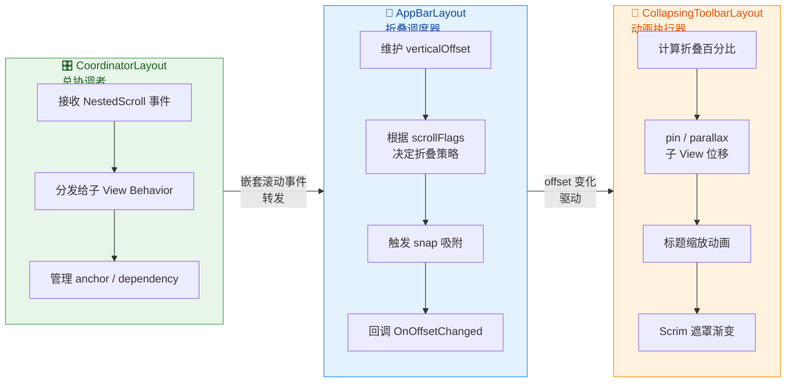
```mermaid
graph LR
    subgraph CL["🎛️ CoordinatorLayout\n总协调者"]
        direction TB
        CL1["接收 NestedScroll 事件"]
        CL2["分发给子 View Behavior"]
        CL3["管理 anchor / dependency"]
        CL1 --> CL2
        CL2 --> CL3
    end

    subgraph ABL["📐 AppBarLayout\n折叠调度器"]
        direction TB
        ABL1["维护 verticalOffset"]
        ABL2["根据 scrollFlags\n决定折叠策略"]
        ABL3["触发 snap 吸附"]
        ABL4["回调 OnOffsetChanged"]
        ABL1 --> ABL2
        ABL2 --> ABL3
        ABL3 --> ABL4
    end

    subgraph CTL["🎨 CollapsingToolbarLayout\n动画执行器"]
        direction TB
        CTL1["计算折叠百分比"]
        CTL2["pin / parallax\n子 View 位移"]
        CTL3["标题缩放动画"]
        CTL4["Scrim 遮罩渐变"]
        CTL1 --> CTL2
        CTL2 --> CTL3
        CTL3 --> CTL4
    end

    CL -->|"嵌套滚动事件\n转发"| ABL
    ABL -->|"offset 变化\n驱动"| CTL

    classDef clStyle fill:#E8F5E9,stroke:#43A047,color:#1B5E20
    classDef ablStyle fill:#E3F2FD,stroke:#1E88E5,color:#0D47A1
    classDef ctlStyle fill:#FFF3E0,stroke:#FB8C00,color:#E65100

    class CL clStyle
    class ABL ablStyle
    class CTL ctlStyle
```

**CoordinatorLayout** 是最外层的"事件枢纽"，负责接收和分发嵌套滚动事件，管理所有 Behavior 的生命周期。**AppBarLayout** 是中间的"折叠策略层"，它根据子 View 的 scrollFlags 将原始滚动量转化为 offset 变化。**CollapsingToolbarLayout** 是最内层的"动画执行层"，它消费 AppBarLayout 传来的 offset，驱动视差、固定、标题缩放、scrim 等一系列视觉效果。

这种分层设计体现了优秀的**单一职责原则**：每一层只关心自己的事情。CoordinatorLayout 不知道什么是"视差"，AppBarLayout 不知道什么是"scrim"，CollapsingToolbarLayout 不知道滚动事件从何而来。它们通过标准化的接口（Behavior、offset 回调、collapseMode 属性）松耦合地协作，开发者可以自由替换任何一层的实现而不影响其他层。

#### 常见陷阱与最佳实践

**陷阱一：忘记设置 `layout_behavior`**。RecyclerView 或 NestedScrollView 如果没有声明 `appbar_scrolling_view_behavior`，AppBarLayout 将完全静止不动。这是因为没有 Behavior 就没有嵌套滚动事件的上报通道。

**陷阱二：`fitsSystemWindows` 链条断裂**。如果你想让 CollapsingToolbarLayout 的背景图延伸到状态栏下方，必须确保 CoordinatorLayout → AppBarLayout → CollapsingToolbarLayout → ImageView 这条链上的每一个 View 都设置了 `android:fitsSystemWindows="true"`。任何一环缺失都会导致 insets 处理中断，产生意外的空白或遮挡。

**陷阱三：在 ViewPager 嵌套 Fragment 场景中的滚动问题**。如果 AppBarLayout 下方是 ViewPager + Fragment（每个 Fragment 有自己的 RecyclerView），需要确保 `liftOnScrollTargetViewId` 指向正确的滚动 View，否则 lift 效果和折叠可能无法正确联动。在 ViewPager2 场景中，可以通过在 `onPageSelected` 回调中动态更新 `liftOnScrollTargetViewId` 来解决。

**最佳实践：善用 `MaterialToolbar` 而非旧版 `Toolbar`**。`MaterialToolbar` 是 Material Components 库提供的增强版 Toolbar，内置了对 Material 主题属性的更好支持，能自动适配 `colorSurface`、`colorOnSurface` 等主题色，与 CollapsingToolbarLayout 的 scrim 系统配合更自然。

---

**📝 练习题**

在一个使用 `CoordinatorLayout` + `AppBarLayout` + `RecyclerView` 的页面中，开发者希望：上滑时 Toolbar 折叠到消失，下拉时 Toolbar 立刻重新出现（无需等列表回到顶部），且释放手指时 Toolbar 自动吸附到完全展开或完全折叠。以下哪组 `scrollFlags` 配置是正确的？

A. `scroll`


B. `scroll|enterAlways|snap`


C. `scroll|exitUntilCollapsed|snap`


D. `scroll|enterAlways|enterAlwaysCollapsed`


**【答案】** B

**【解析】** 题目要求三个行为：① 上滑折叠到消失——需要 `scroll` 基础标志，且**不需要** `exitUntilCollapsed`（因为该 flag 会让 View 折叠到 `minHeight` 就停止，而题目要求"消失"）；② 下拉立刻出现——需要 `enterAlways`，这是"Quick Return"模式的标志；③ 释放时自动吸附——需要 `snap`。因此组合为 `scroll|enterAlways|snap`。选项 A 缺少 enterAlways 和 snap；选项 C 的 `exitUntilCollapsed` 会阻止 Toolbar 完全消失，且不含 enterAlways 无法实现快速返回；选项 D 缺少 snap 且 `enterAlwaysCollapsed` 只是让快速返回先恢复到 minHeight，不符合"立刻完全出现"的要求。

---

**📝 练习题**

以下关于 `CollapsingToolbarLayout` 的 `collapseMode` 描述，正确的是？

A. `parallax` 模式的 View 在折叠过程中始终固定不动，不随内容滚动


B. `pin` 模式的实现原理是通过设置 View 的 `visibility` 在折叠后变为 `GONE`


C. `parallax` 模式下，`layout_collapseParallaxMultiplier` 为 0.0 时 View 与整体折叠速度相同，无视差效果


D. `contentScrim` 是在折叠开始时立即以 100% 不透明度覆盖内容的遮罩层


**【答案】** C

**【解析】** `layout_collapseParallaxMultiplier` 控制视差系数：0.0 表示 View 跟随整体折叠完全同步移动，没有速度差异，也就没有视差效果；0.5（默认）表示 View 移动速度是整体的一半，产生标准视差；1.0 表示 View 几乎不动。选项 A 描述的是 `pin` 模式而非 `parallax`；选项 B 错误，`pin` 的实现原理是通过 `setTranslationY()` 做反向位移补偿，而非修改 visibility；选项 D 错误，`contentScrim` 不是立刻 100% 显示的，而是在折叠到 `scrimVisibleHeightTrigger` 阈值附近时以平滑的 alpha 动画渐变出现的。

---

## 导航组件

导航是 Android 应用用户体验的骨架。用户在 App 中的每一次页面切换、每一次功能发现，都依赖于一套清晰、一致且符合直觉的导航体系。Material Design 为此定义了一组经典的导航组件：**Toolbar** 承担顶部操作栏职责，**DrawerLayout** 提供侧滑抽屉容器，**NavigationView** 填充抽屉内的菜单内容，**BottomNavigationView** 则负责底部一级导航的快速切换。这四者既可独立使用，也常常组合出现，共同构成 App 最核心的导航框架。理解它们各自的职责边界、联动机制以及与 Android 系统窗口（Window / DecorView）的协作方式，是写出高质量 Material 应用的关键。

---

### Toolbar 工具栏

#### 从 ActionBar 到 Toolbar 的演进

在 Android 早期（API 11 – Honeycomb），系统为每个 Activity 自动提供了一个 **ActionBar**，它被内嵌在 `DecorView` 的顶部区域，由 Window 直接管理。ActionBar 虽然解决了"每个页面都有统一操作栏"的需求，但它存在几个致命缺陷：第一，ActionBar 的位置和大小由系统 Window 硬性控制，开发者几乎无法将其嵌入自定义的布局层级中；第二，ActionBar 的动画和交互扩展极其困难，想实现一个随滚动收起的效果需要大量 hack；第三，不同 Android 版本上 ActionBar 的外观和行为不一致，碎片化严重。

为了解决这些问题，Google 在 **Support Library v7**（后来迁移到 **AndroidX**）中引入了 `androidx.appcompat.widget.Toolbar`。Toolbar 的本质是一个普通的 **ViewGroup**——它继承自 `FrameLayout`（准确说是通过 `ViewGroup` 链），可以像任何 View 一样被放置在布局 XML 的任意位置。这意味着你可以把 Toolbar 放进 `CoordinatorLayout`、`AppBarLayout`，甚至放在页面中间（虽然不常见）。这种"去特权化"的设计让 Toolbar 获得了极大的灵活性。

当你在 Activity 中调用 `setSupportActionBar(toolbar)` 时，AppCompatActivity 内部会将这个 Toolbar 实例包装成一个 **ToolbarActionBar** 代理对象，然后赋值给 Activity 内部的 `mActionBar` 字段。此后，所有对 `getSupportActionBar()` 的调用——比如 `setTitle()`、`setDisplayHomeAsUpEnabled(true)`——实际上都会被委托到 Toolbar 的对应方法上。这种 **Delegate 模式** 使得旧有的 ActionBar API 和新的 Toolbar 无缝兼容，开发者可以渐进式迁移而不必一次性重写所有代码。

#### Toolbar 的内部结构

Toolbar 的布局区域从左到右大致划分为四个逻辑区段：

```text
┌──────────────────────────────────────────────────────────────────┐
│ [NavIcon]  [Title / Subtitle]        [ActionMenuView → MenuItems] [OverflowButton] │
│  导航图标     标题区                       操作菜单项                   溢出按钮      │
└──────────────────────────────────────────────────────────────────┘
```

- **Navigation Icon（导航图标）**：通常是一个"返回箭头"或"汉堡菜单"图标，通过 `setNavigationIcon()` 设置，点击事件通过 `setNavigationOnClickListener()` 监听。
- **Title / Subtitle（标题与副标题）**：Toolbar 内部持有两个 `TextView` 实例（`mTitleTextView` 和 `mSubtitleTextView`），它们在首次调用 `setTitle()` / `setSubtitle()` 时才会被 **懒创建**（lazy inflate），以避免不需要标题场景下的内存浪费。
- **ActionMenuView**：这是一个专门的 ViewGroup，负责承载 Menu 中声明为 `app:showAsAction="ifRoom|always"` 的菜单项。它内部的测量逻辑会根据 Toolbar 剩余宽度决定能展示几个图标。
- **Overflow Button（溢出按钮）**：当菜单项过多、Toolbar 宽度不够时，多余的菜单项会被收入"三个点"溢出菜单中，点击后弹出一个 `ListPopupWindow`。

除了这些固定槽位，Toolbar 还允许添加 **自定义 View**——因为它本身就是 ViewGroup，你可以在 XML 中直接在 `<Toolbar>` 标签内部放置任意子 View（如一个搜索输入框、Logo 图片等），Toolbar 会在 `onLayout()` 阶段将自定义 View 放置在标题区和菜单区之间的剩余空间里。

#### 基本使用与关键配置

首先需要禁用系统默认的 ActionBar，否则会出现"This Activity already has an action bar"崩溃。做法是在主题中声明：

```xml
<!-- res/values/themes.xml -->
<!-- 使用 NoActionBar 主题变体，告知系统不要创建默认 ActionBar -->
<style name="Theme.MyApp" parent="Theme.MaterialComponents.DayNight.NoActionBar">
    <!-- 可选：自定义 colorPrimary 来影响 Toolbar 默认背景色 -->
    <item name="colorPrimary">@color/purple_500</item>
    <!-- colorOnPrimary 影响 Toolbar 上图标和文字的颜色 -->
    <item name="colorOnPrimary">@color/white</item>
</style>
```

接下来在布局中声明 Toolbar：

```xml
<!-- res/layout/activity_main.xml -->
<androidx.coordinatorlayout.widget.CoordinatorLayout
    xmlns:android="http://schemas.android.com/apk/res/android"
    xmlns:app="http://schemas.android.com/apk/res-auto"
    android:layout_width="match_parent"
    android:layout_height="match_parent">

    <!-- AppBarLayout 包裹 Toolbar，为后续联动滚动预留能力 -->
    <com.google.android.material.appbar.AppBarLayout
        android:layout_width="match_parent"
        android:layout_height="wrap_content">

        <!-- Toolbar 作为普通 View 嵌入布局 -->
        <com.google.android.material.appbar.MaterialToolbar
            android:id="@+id/toolbar"
            android:layout_width="match_parent"
            android:layout_height="?attr/actionBarSize"
            android:background="?attr/colorPrimary"
            app:title="首页"
            app:subtitle="Material Design 导航示例"
            app:navigationIcon="@drawable/ic_menu_24"
            app:titleTextColor="?attr/colorOnPrimary" />
    </com.google.android.material.appbar.AppBarLayout>

    <!-- 主内容区域，layout_behavior 使其能响应 AppBar 的折叠 -->
    <androidx.recyclerview.widget.RecyclerView
        android:id="@+id/recyclerView"
        android:layout_width="match_parent"
        android:layout_height="match_parent"
        app:layout_behavior="@string/appbar_scrolling_view_behavior" />

</androidx.coordinatorlayout.widget.CoordinatorLayout>
```

这里推荐直接使用 **MaterialToolbar**（`com.google.android.material.appbar.MaterialToolbar`），它是 `androidx.appcompat.widget.Toolbar` 的子类，额外做了几件事：自动应用 Material 主题属性（如 `colorSurface` 背景）、对 Elevation overlay 的支持（Dark Theme 下高度越高背景越亮），以及对 `NavigationIcon` tint 的自动处理。

在 Activity 中完成绑定：

```kotlin
class MainActivity : AppCompatActivity() {

    override fun onCreate(savedInstanceState: Bundle?) {
        super.onCreate(savedInstanceState)
        setContentView(R.layout.activity_main)

        // 获取布局中的 Toolbar 实例
        val toolbar = findViewById<MaterialToolbar>(R.id.toolbar)

        // 将 Toolbar 设置为此 Activity 的 ActionBar 代理
        // 之后可以通过 supportActionBar 来操控标题、返回键等
        setSupportActionBar(toolbar)

        // 启用导航按钮（左上角图标）的点击回调
        toolbar.setNavigationOnClickListener {
            // 这里通常打开 DrawerLayout 或者执行 onBackPressed
            drawerLayout.open()
        }
    }

    // 加载菜单资源到 Toolbar 的 ActionMenuView 中
    override fun onCreateOptionsMenu(menu: Menu): Boolean {
        // inflate 菜单 XML，系统会自动将菜单项分配到 Toolbar
        menuInflater.inflate(R.menu.menu_main, menu)
        return true
    }

    // 处理菜单项点击事件
    override fun onOptionsItemSelected(item: MenuItem): Boolean {
        return when (item.itemId) {
            R.id.action_search -> {
                // 处理搜索按钮
                true
            }
            R.id.action_settings -> {
                // 处理设置按钮
                true
            }
            else -> super.onOptionsItemSelected(item)
        }
    }
}
```

对应的菜单资源文件：

```xml
<!-- res/menu/menu_main.xml -->
<menu xmlns:android="http://schemas.android.com/apk/res/android"
    xmlns:app="http://schemas.android.com/apk/res-auto">

    <!-- showAsAction="ifRoom" 表示 Toolbar 宽度足够时显示为图标 -->
    <item
        android:id="@+id/action_search"
        android:icon="@drawable/ic_search_24"
        android:title="搜索"
        app:showAsAction="ifRoom" />

    <!-- showAsAction="never" 表示始终收入溢出菜单 -->
    <item
        android:id="@+id/action_settings"
        android:title="设置"
        app:showAsAction="never" />
</menu>
```

#### Toolbar 与状态栏的协作

在现代 Android 应用中，我们通常希望 Toolbar 的颜色"延伸"到状态栏区域，实现沉浸式效果。这涉及到 `Window` 的 `fitsSystemWindows` 属性和 **WindowInsets** 机制。当你在主题中设置 `android:statusBarColor` 为透明，并让 `CoordinatorLayout` 或 `AppBarLayout` 声明 `android:fitsSystemWindows="true"` 时，系统会通过 `WindowInsets` 告知这些 View"状态栏占了多少像素"，然后这些 View 会自动添加对应的 padding，确保内容不被状态栏遮挡，同时背景色却能绘制到状态栏下方——这就是我们看到的"Toolbar 颜色填满状态栏"的视觉效果。

---

### DrawerLayout 抽屉

#### 抽屉导航的设计意义

Material Design 中的 **Navigation Drawer（导航抽屉）** 是一种从屏幕边缘滑出的面板，通常用于承载 App 的 **一级导航目的地**（如"首页""收藏""设置"等）。它的优势在于：第一，抽屉在隐藏状态不占用屏幕空间，对内容展示极其友好；第二，抽屉可以承载大量导航项，远超 BottomNavigationView 的 3~5 个限制；第三，抽屉的"从左侧滑出"交互模式已经被用户广泛认知，学习成本很低。

在 Material Design 的指导原则中，Navigation Drawer 分为两种形态：**Modal Drawer（模态抽屉）** 在打开时会在主内容上方覆盖一层半透明 Scrim（遮罩），用户必须关闭抽屉才能与主内容交互；**Standard Drawer（标准抽屉）** 则常驻在屏幕左侧，不覆盖主内容，多见于平板或大屏设备。Android 的 `DrawerLayout` 默认实现的是 Modal Drawer 形态。

#### DrawerLayout 的工作机制

`DrawerLayout` 位于 `androidx.drawerlayout.widget` 包中，它继承自 `ViewGroup`，核心设计思想是 **将子 View 分为两类**：

1. **主内容视图（Content View）**：没有声明 `layout_gravity` 为 `start` / `end` 的子 View，它会填满整个 DrawerLayout 区域。
2. **抽屉视图（Drawer View）**：声明了 `layout_gravity="start"`（左侧抽屉）或 `layout_gravity="end"`（右侧抽屉）的子 View，初始状态下被"推到"屏幕外。

DrawerLayout 在 `onLayout()` 阶段会计算抽屉视图的宽度，然后将其 `left` 坐标设置为 `-width`（左侧抽屉）或 `parentWidth`（右侧抽屉），使其完全不可见。当用户从屏幕边缘开始滑动手势时，DrawerLayout 内置的 **ViewDragHelper** 会接管触摸事件，根据手指移动的距离动态修改抽屉视图的偏移量（通过 `offsetLeftAndRight()`），同时在主内容上方绘制一层半透明黑色 Scrim。

**ViewDragHelper** 是 DrawerLayout 滑动的核心引擎。它是 AndroidX 提供的一个触摸拖拽辅助类，封装了 VelocityTracker（速度追踪）、Scroller（回弹动画）、触摸事件拦截等逻辑。DrawerLayout 内部持有两个 ViewDragHelper 实例——一个管理左侧抽屉，一个管理右侧抽屉。当 DrawerLayout 的 `onInterceptTouchEvent()` 被调用时，它会将事件分别传给两个 ViewDragHelper 的 `shouldInterceptTouchEvent()`，由它们判断"这个手势是不是想拖拽抽屉"。判断逻辑主要依据：触摸起始位置是否在屏幕边缘（默认 20dp 的边缘检测区域）、滑动方向是否为水平、水平速度是否超过阈值。

抽屉打开关闭的状态变化会通过 `DrawerLayout.DrawerListener` 回调通知外部：

- `onDrawerSlide(drawerView, slideOffset)`：滑动过程中持续回调，`slideOffset` 从 0.0（完全关闭）到 1.0（完全打开）。
- `onDrawerOpened(drawerView)`：抽屉完全打开时回调。
- `onDrawerClosed(drawerView)`：抽屉完全关闭时回调。
- `onDrawerStateChanged(newState)`：拖拽状态变化——IDLE（静止）、DRAGGING（拖拽中）、SETTLING（松手后动画归位中）。

#### 基本布局结构

```xml
<!-- res/layout/activity_main.xml -->
<!-- DrawerLayout 必须作为布局根节点（或接近根节点） -->
<androidx.drawerlayout.widget.DrawerLayout
    xmlns:android="http://schemas.android.com/apk/res/android"
    xmlns:app="http://schemas.android.com/apk/res-auto"
    android:id="@+id/drawer_layout"
    android:layout_width="match_parent"
    android:layout_height="match_parent"
    android:fitsSystemWindows="true">

    <!-- 第一个子 View：主内容区域（无 layout_gravity） -->
    <androidx.coordinatorlayout.widget.CoordinatorLayout
        android:layout_width="match_parent"
        android:layout_height="match_parent">

        <com.google.android.material.appbar.AppBarLayout
            android:layout_width="match_parent"
            android:layout_height="wrap_content">

            <!-- Toolbar 作为 AppBar 的一部分 -->
            <com.google.android.material.appbar.MaterialToolbar
                android:id="@+id/toolbar"
                android:layout_width="match_parent"
                android:layout_height="?attr/actionBarSize"
                app:navigationIcon="@drawable/ic_menu_24"
                app:title="我的应用" />
        </com.google.android.material.appbar.AppBarLayout>

        <!-- 主页面内容 -->
        <FrameLayout
            android:id="@+id/content_frame"
            android:layout_width="match_parent"
            android:layout_height="match_parent"
            app:layout_behavior="@string/appbar_scrolling_view_behavior" />
    </androidx.coordinatorlayout.widget.CoordinatorLayout>

    <!-- 第二个子 View：抽屉内容（layout_gravity="start" 表示从左侧滑出） -->
    <!-- NavigationView 专门用于填充抽屉，后面会详细介绍 -->
    <com.google.android.material.navigation.NavigationView
        android:id="@+id/nav_view"
        android:layout_width="wrap_content"
        android:layout_height="match_parent"
        android:layout_gravity="start"
        app:headerLayout="@layout/nav_header"
        app:menu="@menu/nav_menu" />

</androidx.drawerlayout.widget.DrawerLayout>
```

注意 `DrawerLayout` 对子 View 的 **顺序有要求**：主内容视图必须在抽屉视图之前声明（即 XML 中排在前面），因为 DrawerLayout 是通过 Z 轴绘制顺序来确保抽屉覆盖在主内容之上的——后声明的 View 在绘制时 Z 序更高。

#### ActionBarDrawerToggle：汉堡动画与状态同步

仅仅有 DrawerLayout 和 Toolbar 还不够，我们需要一个"桥梁"来同步两者的状态——比如抽屉打开时汉堡图标变为返回箭头的动画效果。这个桥梁就是 `ActionBarDrawerToggle`：

```kotlin
class MainActivity : AppCompatActivity() {

    private lateinit var drawerLayout: DrawerLayout
    private lateinit var toggle: ActionBarDrawerToggle

    override fun onCreate(savedInstanceState: Bundle?) {
        super.onCreate(savedInstanceState)
        setContentView(R.layout.activity_main)

        val toolbar = findViewById<MaterialToolbar>(R.id.toolbar)
        drawerLayout = findViewById(R.id.drawer_layout)

        // 将 Toolbar 设为 ActionBar
        setSupportActionBar(toolbar)

        // 创建 DrawerToggle，它同时实现了 DrawerListener 接口
        // 参数：Activity, DrawerLayout, Toolbar, 打开描述, 关闭描述（用于无障碍）
        toggle = ActionBarDrawerToggle(
            this,                          // 宿主 Activity
            drawerLayout,                  // DrawerLayout 实例
            toolbar,                       // 关联的 Toolbar
            R.string.nav_open,             // 无障碍：抽屉打开描述
            R.string.nav_close             // 无障碍：抽屉关闭描述
        )

        // 将 toggle 注册为 DrawerLayout 的监听器
        // toggle 会在 onDrawerSlide 中驱动汉堡→箭头的旋转动画
        drawerLayout.addDrawerListener(toggle)

        // syncState 同步初始状态：如果 Activity 重建时抽屉是打开的，图标也要正确
        toggle.syncState()
    }
}
```

`ActionBarDrawerToggle` 内部持有一个 `DrawerArrowDrawable`——这是一个自定义 Drawable，通过 Canvas 绘制三条横线（汉堡）和一个箭头，并通过 `progress` 属性（0.0 → 1.0）在两者之间做平滑的形态插值动画。当 `onDrawerSlide(view, offset)` 被回调时，toggle 将 `offset` 值直接传递给 `DrawerArrowDrawable.setProgress()`，驱动动画与手指滑动完全同步。

#### 手势冲突与边缘检测

DrawerLayout 的边缘滑动手势有时会与主内容中的水平滑动（如 ViewPager2、横向 RecyclerView）产生冲突。DrawerLayout 默认的边缘检测宽度为 **20dp**，你可以通过反射修改 `ViewDragHelper` 的 `mEdgeSize` 字段来调整（但不推荐），更优雅的方式是在 Android 10（API 29）及以上系统中处理 **系统手势导航冲突**——调用 `View.setSystemGestureExclusionRects()` 排除特定区域，或者直接使用 `DrawerLayout.setDrawerLockMode(LOCK_MODE_LOCKED_CLOSED)` 在特定页面禁用侧滑。

---

### NavigationView 侧滑菜单

#### 职责与定位

`NavigationView` 是 Material Components 提供的一个专门用于 Navigation Drawer 内部的 **菜单视图组件**。如果说 `DrawerLayout` 是"抽屉的壳"，那么 `NavigationView` 就是"抽屉的内容"。它帮你做了三件事：

1. **渲染符合 Material 规范的菜单列表**：包括图标、文字、分组分割线、子标题，全部遵循 Material Design 的间距和排版规范。
2. **管理选中状态**：当用户点击某个菜单项时，NavigationView 会自动高亮该项并取消之前的高亮，不需要手动管理。
3. **提供 Header 区域**：抽屉顶部通常有一个用户头像 + 用户名的区域（Header），NavigationView 支持通过 `app:headerLayout` 直接加载一个自定义布局。

NavigationView 内部使用了一个 **RecyclerView**（从 Material Components 1.1.0 起）作为菜单项的承载容器。之前的实现使用的是 `ListView`，迁移到 RecyclerView 之后滚动性能和复用能力都有了提升。每个菜单项对应一个 `NavigationMenuItemView`，分组标题对应 `NavigationMenuSubheaderView`，分隔线对应 `NavigationMenuSeparatorView`。

#### 菜单资源定义

NavigationView 的菜单结构通过标准的 `<menu>` XML 资源定义，这与 `Toolbar` 的 options menu 使用相同的格式，但在使用语义上有显著区别——这里的每个 `<item>` 代表一个导航目的地，而不是一个操作：

```xml
<!-- res/menu/nav_menu.xml -->
<menu xmlns:android="http://schemas.android.com/apk/res/android">

    <!-- 第一组：主导航区域（无显式 group 时默认属于同一组） -->
    <group android:checkableBehavior="single">
        <!-- checkableBehavior="single" 表示组内同一时间只能选中一项 -->

        <item
            android:id="@+id/nav_home"
            android:icon="@drawable/ic_home_24"
            android:title="首页" />

        <item
            android:id="@+id/nav_favorites"
            android:icon="@drawable/ic_favorite_24"
            android:title="收藏" />

        <item
            android:id="@+id/nav_downloads"
            android:icon="@drawable/ic_download_24"
            android:title="下载" />
    </group>

    <!-- 分组之间会自动渲染一条分割线 -->

    <!-- 第二组：辅助功能区域，带子标题 -->
    <item android:title="其他">
        <!-- 嵌套 menu 会被渲染为带标题的子分组 -->
        <menu>
            <item
                android:id="@+id/nav_settings"
                android:icon="@drawable/ic_settings_24"
                android:title="设置" />

            <item
                android:id="@+id/nav_about"
                android:icon="@drawable/ic_info_24"
                android:title="关于" />
        </menu>
    </item>
</menu>
```

Header 布局则是一个普通的 Layout XML：

```xml
<!-- res/layout/nav_header.xml -->
<LinearLayout
    xmlns:android="http://schemas.android.com/apk/res/android"
    android:layout_width="match_parent"
    android:layout_height="180dp"
    android:background="?attr/colorPrimary"
    android:gravity="bottom"
    android:orientation="vertical"
    android:padding="16dp">

    <!-- 用户头像 -->
    <ImageView
        android:id="@+id/iv_avatar"
        android:layout_width="64dp"
        android:layout_height="64dp"
        android:src="@drawable/avatar_placeholder"
        android:contentDescription="用户头像" />

    <!-- 用户名 -->
    <TextView
        android:id="@+id/tv_username"
        android:layout_width="wrap_content"
        android:layout_height="wrap_content"
        android:layout_marginTop="8dp"
        android:text="张三"
        android:textColor="?attr/colorOnPrimary"
        android:textSize="16sp"
        android:textStyle="bold" />

    <!-- 邮箱 -->
    <TextView
        android:id="@+id/tv_email"
        android:layout_width="wrap_content"
        android:layout_height="wrap_content"
        android:text="zhangsan@example.com"
        android:textColor="?attr/colorOnPrimary"
        android:textSize="14sp" />
</LinearLayout>
```

#### 事件处理与 Fragment 切换

NavigationView 通过 `setNavigationItemSelectedListener` 监听菜单项点击。一个常见的模式是在回调中切换主内容区域的 Fragment，并关闭抽屉：

```kotlin
val navView = findViewById<NavigationView>(R.id.nav_view)
val drawerLayout = findViewById<DrawerLayout>(R.id.drawer_layout)

// 设置菜单项点击监听
navView.setNavigationItemSelectedListener { menuItem ->
    // 根据点击的菜单项 ID 切换 Fragment
    val fragment: Fragment = when (menuItem.itemId) {
        R.id.nav_home -> HomeFragment()          // 首页
        R.id.nav_favorites -> FavoritesFragment() // 收藏
        R.id.nav_downloads -> DownloadsFragment() // 下载
        R.id.nav_settings -> SettingsFragment()   // 设置
        else -> HomeFragment()                     // 默认回到首页
    }

    // 执行 Fragment 事务，替换 content_frame 容器中的内容
    supportFragmentManager.beginTransaction()
        .replace(R.id.content_frame, fragment)  // 替换 Fragment
        .commit()                                // 提交事务

    // 更新 Toolbar 标题为当前菜单项文字
    supportActionBar?.title = menuItem.title

    // 关闭抽屉，GravityCompat.START 表示关闭左侧抽屉
    drawerLayout.closeDrawer(GravityCompat.START)

    // 返回 true 表示已处理该事件，NavigationView 会自动更新选中状态
    true
}

// 设置默认选中项（通常在 onCreate 中）
navView.setCheckedItem(R.id.nav_home)
```

#### 与 Jetpack Navigation 组件集成

在现代 Android 开发中，Google 更推荐使用 **Jetpack Navigation Component** 来管理页面切换。NavigationView 与 Navigation Component 有天然的集成支持——通过 `NavigationUI` 工具类，只需一行代码即可将 NavigationView 的菜单项与 Navigation Graph 中的 destination 绑定：

```kotlin
// 获取 NavController（通常挂载在 NavHostFragment 上）
val navController = findNavController(R.id.nav_host_fragment)

// 配置 AppBarConfiguration，声明顶级目的地（这些目的地不显示返回箭头）
val appBarConfig = AppBarConfiguration(
    setOf(R.id.nav_home, R.id.nav_favorites, R.id.nav_downloads), // 顶级目的地集合
    drawerLayout  // 关联 DrawerLayout，让 NavigationUI 自动控制抽屉
)

// 将 Toolbar 与 NavController 绑定
// NavigationUI 会自动根据当前 destination 更新标题和导航图标
setupActionBarWithNavController(navController, appBarConfig)

// 将 NavigationView 与 NavController 绑定
// 点击菜单项时自动导航到对应 destination，无需手动写 Fragment 事务
navView.setupWithNavController(navController)
```

`NavigationUI.setupWithNavController()` 内部做了什么？它首先调用 `NavigationView.setNavigationItemSelectedListener()`，在回调中通过 `NavController.navigate(menuItem.itemId)` 导航到对应目的地（前提是 **menu item 的 id 必须与 nav graph 中 destination 的 id 一致**）。同时它还监听了 `NavController.OnDestinationChangedListener`，当当前目的地变化时自动更新 NavigationView 的选中项——实现了双向同步。

#### Header View 的访问时机

一个常见的陷阱是：**NavigationView 的 Header View 不能通过 `findViewById` 直接从 Activity 层获取**。因为 Header 是 NavigationView 内部 inflate 的子 View，你需要先获取 Header 的根 View，再从中查找：

```kotlin
// 获取 Header 的根 View（索引 0 是第一个 Header）
val headerView = navView.getHeaderView(0)

// 从 Header 根 View 中查找具体控件
val tvUsername = headerView.findViewById<TextView>(R.id.tv_username)
val ivAvatar = headerView.findViewById<ImageView>(R.id.iv_avatar)

// 现在可以动态更新 Header 内容
tvUsername.text = "李四"
```

也可以通过代码动态添加 Header：`navView.inflateHeaderView(R.layout.nav_header)`，这在需要多个 Header 或延迟加载时很有用。

---

### BottomNavigationView 底部导航

#### 设计定位与适用场景

**BottomNavigationView** 是 Material Design 中的底部导航栏组件，固定在屏幕底部，用于在 **3 到 5 个顶级目的地** 之间快速切换。它与 NavigationView（侧滑抽屉）的定位差异在于：BottomNavigationView 始终可见，适合高频切换的少量一级入口；而 NavigationView 隐藏在侧滑手势之后，适合入口较多但切换频率不高的场景。

Material Design Guidelines 对 BottomNavigationView 的使用有明确规范：**目的地数量必须在 3~5 个之间**——少于 3 个时应使用 Tab，多于 5 个时应考虑侧滑抽屉或其他导航模式。每个目的地必须有图标，文字标签建议简短（1~2 个词），以确保在小屏设备上也能完整显示。

#### 内部结构与渲染机制

BottomNavigationView 继承自 `NavigationBarView`（Material Components 1.4.0+ 抽取的公共父类，`NavigationRailView` 也继承自它），内部持有一个 `NavigationBarMenuView`（实际是 `BottomNavigationMenuView`）作为菜单项的容器。每个菜单项被渲染为一个 `NavigationBarItemView`，其中包含：

- 一个 **ImageView** 显示图标
- 一个 **TextView** 显示标签文字
- 一个 **ActiveIndicatorView**（Material 3 新增）：选中项图标下方的椭圆形高亮指示器
- 可选的 **BadgeDrawable**：右上角的红点或数字角标

当用户点击某个 Item 时，`BottomNavigationMenuView` 会执行以下操作序列：首先通过 `TransitionManager` 启动一个 `AutoTransition`，对所有 ItemView 的布局变化做动画过渡；然后更新选中项的状态——选中项的标签放大并完全显示（`labelVisibilityMode` 为 `LABEL_VISIBILITY_AUTO` 时），其他项的标签缩小或隐藏；最后通过 `OnItemSelectedListener` 通知外部。

#### 基础用法

布局声明：

```xml
<!-- 通常放在 CoordinatorLayout 或 ConstraintLayout 的底部 -->
<com.google.android.material.bottomnavigation.BottomNavigationView
    android:id="@+id/bottom_nav"
    android:layout_width="match_parent"
    android:layout_height="wrap_content"
    android:layout_gravity="bottom"
    app:menu="@menu/bottom_nav_menu"
    app:labelVisibilityMode="labeled"
    app:itemIconTint="@color/nav_item_color"
    app:itemTextColor="@color/nav_item_color"
    app:itemActiveIndicatorStyle="@style/App.ActiveIndicator" />
```

菜单资源：

```xml
<!-- res/menu/bottom_nav_menu.xml -->
<menu xmlns:android="http://schemas.android.com/apk/res/android">

    <!-- 每个 item 代表底部导航的一个 Tab -->
    <item
        android:id="@+id/page_home"
        android:icon="@drawable/ic_home_24"
        android:title="首页" />

    <item
        android:id="@+id/page_explore"
        android:icon="@drawable/ic_explore_24"
        android:title="发现" />

    <item
        android:id="@+id/page_notifications"
        android:icon="@drawable/ic_notifications_24"
        android:title="通知" />

    <item
        android:id="@+id/page_profile"
        android:icon="@drawable/ic_person_24"
        android:title="我的" />
</menu>
```

图标和文字的颜色通常使用 **ColorStateList** 来区分选中 / 未选中状态：

```xml
<!-- res/color/nav_item_color.xml -->
<selector xmlns:android="http://schemas.android.com/apk/res/android">
    <!-- 选中状态使用主色 -->
    <item android:color="?attr/colorPrimary" android:state_checked="true" />
    <!-- 未选中状态使用灰色 -->
    <item android:color="?attr/colorOnSurfaceVariant" />
</selector>
```

#### 标签显示模式

`app:labelVisibilityMode` 属性控制标签文字的显示策略，共有四种模式：

| 模式 | 常量值 | 行为说明 |
|------|--------|----------|
| `labeled` | `LABEL_VISIBILITY_LABELED` | 所有项始终显示标签（推荐 3 个 Tab 时使用） |
| `selected` | `LABEL_VISIBILITY_SELECTED` | 仅选中项显示标签，其他项只显示图标 |
| `unlabeled` | `LABEL_VISIBILITY_UNLABELED` | 所有项都不显示标签，只有图标 |
| `auto` | `LABEL_VISIBILITY_AUTO` | 自动选择——3 个及以下用 `labeled`，4 个及以上用 `selected` |

在 Material Design 3 (Material You) 规范中，推荐所有 Tab 始终显示标签（`labeled`），因为纯图标导航在用户测试中被证明可发现性较差。

#### 事件监听与页面切换

```kotlin
val bottomNav = findViewById<BottomNavigationView>(R.id.bottom_nav)

// 设置选中监听（注意区分两个回调）
// setOnItemSelectedListener：选中新 item 时回调
bottomNav.setOnItemSelectedListener { item ->
    when (item.itemId) {
        R.id.page_home -> {
            // 切换到首页 Fragment
            loadFragment(HomeFragment())
            true  // 返回 true 表示处理了该选中事件
        }
        R.id.page_explore -> {
            loadFragment(ExploreFragment())
            true
        }
        R.id.page_notifications -> {
            loadFragment(NotificationsFragment())
            true
        }
        R.id.page_profile -> {
            loadFragment(ProfileFragment())
            true
        }
        else -> false  // 返回 false 表示未处理
    }
}

// setOnItemReselectedListener：重复点击已选中的 item 时回调
// 常见用途：滚动回顶部、刷新内容
bottomNav.setOnItemReselectedListener { item ->
    // 例如让当前 Fragment 的 RecyclerView 滚动到顶部
    val currentFragment = supportFragmentManager.findFragmentById(R.id.content_frame)
    (currentFragment as? Scrollable)?.scrollToTop()
}
```

一个重要的细节是 `setOnItemSelectedListener` 和 `setOnItemReselectedListener` 的分工：前者仅在 **新选中** 一个不同 item 时触发，后者仅在 **重复点击** 当前已选中 item 时触发。如果你只设置了 `setOnItemSelectedListener` 而没有设置 `setOnItemReselectedListener`，重复点击不会触发任何回调——这避免了不必要的 Fragment 重复创建。

#### 角标（Badge）

BottomNavigationView 内置了 Material Badge 支持，可以为任何菜单项添加圆点或数字角标：

```kotlin
// 获取角标对象（如果不存在会自动创建）
val badge = bottomNav.getOrCreateBadge(R.id.page_notifications)

// 设置角标数字（不设置数字则显示为圆点）
badge.number = 99

// 超过最大数字时显示 "99+"
badge.maxCharacterCount = 3

// 设置角标可见
badge.isVisible = true

// 设置角标背景色
badge.backgroundColor = ContextCompat.getColor(this, R.color.red_500)

// 清除角标
bottomNav.removeBadge(R.id.page_notifications)
```

#### 与 Jetpack Navigation 集成

与 NavigationView 类似，BottomNavigationView 也可以与 Jetpack Navigation Component 深度集成：

```kotlin
val navController = findNavController(R.id.nav_host_fragment)

// 一行代码绑定 BottomNavigationView 和 NavController
bottomNav.setupWithNavController(navController)
```

`setupWithNavController` 内部同样做了双向绑定：点击 Tab 时调用 `NavController.navigate()`，目的地变化时更新 Tab 选中状态。此外，它还处理了一个关键细节——**回退栈管理**。当用户从 Tab A 导航到 Tab B，再导航到 Tab C，然后按返回键时，默认行为是回到 **起始目的地**（startDestination），而不是按 B → A 的顺序回退。这种行为遵循 Material Design 对底部导航的指导原则："底部导航的各个 Tab 之间不应该有历史堆栈关系"。

如果你希望每个 Tab 保持独立的回退栈（例如 Tab A 进入了详情页，切换到 Tab B 再切回 Tab A 时详情页仍在），可以在 Navigation 2.4.0+ 版本中使用 `saveState` 和 `restoreState` 参数：

```kotlin
// 在 NavigationAdvancedSample 中的推荐做法
bottomNav.setupWithNavController(navController)
// Navigation 2.4.0+ 默认已支持多回退栈（multiple back stacks）
// 每个 Tab 的状态（包括 Fragment 回退栈）会在切换时自动保存和恢复
```

#### 与 CoordinatorLayout 联动隐藏

BottomNavigationView 支持在列表向下滚动时自动隐藏、向上滚动时自动显示——这通过 `HideBottomViewOnScrollBehavior` 实现：

```xml
<androidx.coordinatorlayout.widget.CoordinatorLayout
    android:layout_width="match_parent"
    android:layout_height="match_parent">

    <!-- 可滚动内容 -->
    <androidx.recyclerview.widget.RecyclerView
        android:layout_width="match_parent"
        android:layout_height="match_parent" />

    <!-- BottomNavigationView 使用 HideBottomViewOnScrollBehavior -->
    <com.google.android.material.bottomnavigation.BottomNavigationView
        android:layout_width="match_parent"
        android:layout_height="wrap_content"
        android:layout_gravity="bottom"
        app:layout_behavior="com.google.android.material.behavior.HideBottomViewOnScrollBehavior"
        app:menu="@menu/bottom_nav_menu" />
</androidx.coordinatorlayout.widget.CoordinatorLayout>
```

`HideBottomViewOnScrollBehavior` 监听 `CoordinatorLayout` 中嵌套滚动事件（`onStartNestedScroll` / `onNestedScroll`），当检测到向下滚动且累积距离超过阈值时，通过 `ViewPropertyAnimator` 将 BottomNavigationView 沿 Y 轴向下平移自身高度，实现"滑出屏幕"的效果。向上滚动时则反向平移回来。

---

以下时序图展示了用户从点击汉堡图标到完成 Fragment 切换的完整交互流程：

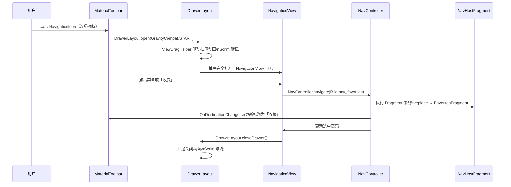
```mermaid
sequenceDiagram
    participant U as 用户
    participant TB as MaterialToolbar
    participant DL as DrawerLayout
    participant NV as NavigationView
    participant NC as NavController
    participant FH as NavHostFragment

    U->>TB: 点击 NavigationIcon（汉堡图标）
    TB->>DL: DrawerLayout.open(GravityCompat.START)
    DL->>DL: ViewDragHelper 驱动抽屉动画\nScrim 渐显
    DL->>NV: 抽屉完全打开，NavigationView 可见

    U->>NV: 点击菜单项「收藏」
    NV->>NC: NavController.navigate(R.id.nav_favorites)
    NC->>FH: 执行 Fragment 事务\nreplace → FavoritesFragment
    NC->>TB: OnDestinationChanged\n更新标题为「收藏」
    NC->>NV: 更新选中高亮
    NV->>DL: DrawerLayout.closeDrawer()
    DL->>DL: 抽屉关闭动画\nScrim 渐隐
```

下面这张架构图展示四个导航组件之间的层级关系和协作方式：

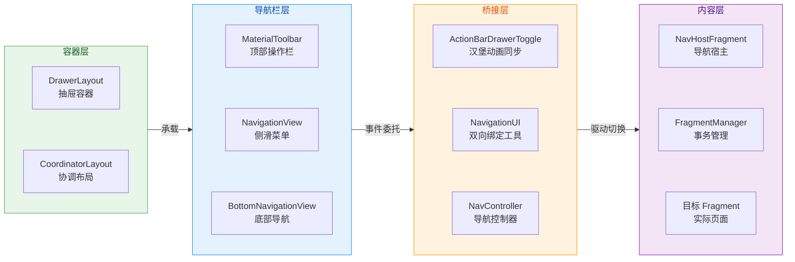
```mermaid
graph LR
    subgraph Layer1["容器层"]
        direction TB
        DL["DrawerLayout\n抽屉容器"]
        CL["CoordinatorLayout\n协调布局"]
        DL ~~~ CL
    end

    subgraph Layer2["导航栏层"]
        direction TB
        TB["MaterialToolbar\n顶部操作栏"]
        NV["NavigationView\n侧滑菜单"]
        BN["BottomNavigationView\n底部导航"]
        TB ~~~ NV
        NV ~~~ BN
    end

    subgraph Layer3["桥接层"]
        direction TB
        TG["ActionBarDrawerToggle\n汉堡动画同步"]
        NU["NavigationUI\n双向绑定工具"]
        NC["NavController\n导航控制器"]
        TG ~~~ NU
        NU ~~~ NC
    end

    subgraph Layer4["内容层"]
        direction TB
        NH["NavHostFragment\n导航宿主"]
        FM["FragmentManager\n事务管理"]
        FR["目标 Fragment\n实际页面"]
        NH ~~~ FM
        FM ~~~ FR
    end

    Layer1 -->|"承载"| Layer2
    Layer2 -->|"事件委托"| Layer3
    Layer3 -->|"驱动切换"| Layer4

    classDef containerStyle fill:#E8F5E9,stroke:#4CAF50,color:#1B5E20
    classDef navStyle fill:#E3F2FD,stroke:#2196F3,color:#0D47A1
    classDef bridgeStyle fill:#FFF3E0,stroke:#FF9800,color:#E65100
    classDef contentStyle fill:#F3E5F5,stroke:#9C27B0,color:#4A148C

    class Layer1 containerStyle
    class Layer2 navStyle
    class Layer3 bridgeStyle
    class Layer4 contentStyle
```

---

**📝 练习题**

在一个使用 `DrawerLayout` + `NavigationView` + Jetpack Navigation Component 的应用中，开发者将菜单资源中某个 `<item>` 的 `android:id` 设置为 `@+id/nav_settings`，但在 Navigation Graph 中对应 destination 的 `android:id` 设置为 `@+id/settings_fragment`。当用户点击该菜单项时，会发生什么？


A. NavigationView 正常高亮该菜单项，NavController 成功导航到 SettingsFragment


B. NavigationView 正常高亮该菜单项，但 NavController 抛出 `IllegalArgumentException` 导致崩溃


C. NavigationView 不高亮该菜单项，NavController 也不执行任何导航操作，点击无反应


D. NavigationView 正常高亮该菜单项，但 NavController 找不到匹配的 destination，导航静默失败（无页面切换）


**【答案】** B

**【解析】** `NavigationUI.setupWithNavController(NavigationView, NavController)` 内部的监听逻辑是：当用户点击菜单项时，调用 `NavController.navigate(menuItem.itemId)` 进行导航。这里的关键在于 **menu item 的 id 必须与 Navigation Graph 中 destination 的 id 完全一致**，因为 `NavController.navigate(int resId)` 会在当前 Graph 中查找 id 匹配的 destination。当 menu item id 是 `R.id.nav_settings` 而 destination id 是 `R.id.settings_fragment` 时，两者不匹配，`NavController` 在 Graph 中找不到 `R.id.nav_settings` 对应的 destination，会抛出 `IllegalArgumentException: Navigation action/destination R.id.nav_settings cannot be found`，导致应用崩溃。因此正确答案是 B。开发中要严格保证 menu item id 和 nav graph destination id 的一致性，这是 `NavigationUI` 约定大于配置（Convention over Configuration）的核心约束。

---

**📝 练习题**

关于 `BottomNavigationView` 的 `setOnItemSelectedListener` 和 `setOnItemReselectedListener`，以下说法正确的是？


A. 重复点击已选中的 Tab 时，会依次触发 `onItemReselected` 和 `onItemSelected`


B. 如果未设置 `setOnItemReselectedListener`，重复点击已选中的 Tab 会触发 `onItemSelected`


C. `setOnItemSelectedListener` 仅在选中一个新的（与当前不同的）Tab 时触发，重复点击已选中 Tab 不会触发


D. `setOnItemReselectedListener` 的回调参数中无法获取被点击的 MenuItem 信息


**【答案】** C

**【解析】** BottomNavigationView（继承自 NavigationBarView）对点击事件的分发有明确的分流逻辑：当用户点击一个 **与当前选中项不同** 的 Tab 时，触发 `OnItemSelectedListener.onNavigationItemSelected()`；当用户点击的是 **当前已选中** 的 Tab 时，触发 `OnItemReselectedListener.onNavigationItemReselected()`。这两个回调是互斥的，不会同时触发。选项 A 错误，因为 reselect 和 select 不会连续触发。选项 B 错误，因为即使未设置 `setOnItemReselectedListener`，重复点击也 **不会** fall through 到 `onItemSelected`——它会被静默忽略（NavigationBarView 源码中有显式判断 `if (selectedItemId == item.getItemId())` 则走 reselect 分支）。选项 D 错误，`onNavigationItemReselected(MenuItem item)` 的参数就是被点击的 MenuItem，完全可以获取其信息。因此正确答案是 C，这种设计避免了重复点击导致 Fragment 被不必要地重新创建。

---

## 浮动操作按钮（Floating Action Button）

浮动操作按钮（FAB）是 Material Design 中最具辨识度的交互元素之一。它以一个圆形按钮的形态悬浮于界面内容之上，代表当前页面中 **最主要、最高频** 的操作（Primary Action）。FAB 的设计灵感直接来源于 Material Design 的核心哲学——纸墨隐喻（Paper & Ink Metaphor）：它像是一片独立的纸片，拥有自己的 Elevation（Z 轴高度），因此自然地在视觉上"浮"在内容层之上，并通过阴影暗示其可交互性。

从设计规范的角度看，FAB 并非一个"可以随意放置的按钮"，而是一个 **带有语义承诺的组件**：当用户看到 FAB 时，会自然地理解"这是这个页面最想让我做的事"。因此，滥用 FAB（比如在一个页面放置多个 FAB、或者用 FAB 承载次要功能）是违背 Material Design 设计准则的。Android 应用层提供了 `FloatingActionButton`（标准 FAB）和 `ExtendedFloatingActionButton`（扩展 FAB）两个组件，并通过 `CoordinatorLayout.Behavior` 机制实现了 FAB 与其他组件之间的丰富联动效果。

---

### FloatingActionButton 锚点行为

#### 基础定义与视觉特征

`FloatingActionButton`（以下简称 FAB）继承自 `ImageButton`，在 Material Components 库（`com.google.android.material`）中的全限定类名为 `com.google.android.material.floatingactionbutton.FloatingActionButton`。它的视觉特征非常鲜明：默认呈现为一个 **圆形**，内部放置一个图标（Icon），自带 Elevation 阴影，并且在按下时阴影会加深（Elevation 增大），给用户明确的触觉反馈。

FAB 提供了三种尺寸规格，对应不同的使用场景：

- **Regular（默认）**：直径 56dp，最常用的标准尺寸，适合大多数页面的主要操作入口。
- **Mini**：直径 40dp，适用于需要与列表项对齐、或空间较为紧凑的场景。通过设置 `app:fabSize="mini"` 来启用。
- **Auto**：由系统根据当前窗口尺寸自动在 Regular 和 Mini 之间切换，这在平板/折叠屏适配中非常有用。

FAB 的颜色默认取自主题中的 `colorSecondary`（Material 2）或 `colorPrimaryContainer`（Material 3），图标颜色则对应 `colorOnSecondary` / `colorOnPrimaryContainer`，确保图标与背景之间有足够的对比度，满足无障碍（Accessibility）要求。

#### XML 声明与核心属性

一个标准的 FAB 在布局文件中的声明如下：

```xml
<!-- FloatingActionButton 基本用法 -->
<com.google.android.material.floatingactionbutton.FloatingActionButton
    android:id="@+id/fab_add"
    android:layout_width="wrap_content"
    android:layout_height="wrap_content"
    android:layout_gravity="bottom|end"
    android:layout_margin="16dp"
    android:contentDescription="@string/add_item"
    app:srcCompat="@drawable/ic_add_24"
    app:fabSize="normal"
    app:elevation="6dp"
    app:pressedTranslationZ="12dp"
    app:rippleColor="@color/ripple_white"
    app:tint="@color/white"
    app:backgroundTint="@color/purple_500"
    app:shapeAppearanceOverlay="@style/ShapeAppearance.App.FAB" />
```

下面逐一解释关键属性的含义与设计意图：

| 属性 | 说明 |
|---|---|
| `app:srcCompat` | FAB 内部的图标，使用 VectorDrawable 兼容方案以确保各版本一致渲染 |
| `app:fabSize` | 控制尺寸：`normal`（56dp）、`mini`（40dp）、`auto`（自适应） |
| `app:elevation` | 静息态的 Z 轴高度，默认 6dp，决定阴影大小 |
| `app:pressedTranslationZ` | 按下时额外叠加的 Z 轴位移，默认 6dp，按下后实际高度 = elevation + pressedTranslationZ |
| `app:backgroundTint` | 背景色着色，覆盖主题默认的 `colorSecondary` |
| `app:tint` | 图标着色，覆盖主题默认的 `colorOnSecondary` |
| `app:rippleColor` | 点击水波纹颜色 |
| `app:shapeAppearanceOverlay` | Material ShapeTheming 接口，可将圆形改为圆角矩形等异形 |
| `android:contentDescription` | **强制建议设置**，为 TalkBack 等无障碍服务提供语义描述 |

这里特别强调 `elevation` 和 `pressedTranslationZ` 的协作机制。Material Design 的纸墨隐喻要求交互元素在被触摸时"抬升"，模拟真实世界中按下纸片后纸片弹起的物理反馈。FAB 静息态 Elevation 为 6dp，按下时提升到 12dp（6+6），这个变化通过阴影面积和模糊半径的增大直观地传达给用户。这套机制在 Framework 层由 `ViewOutlineProvider` + `RenderNode` 实现，阴影由 GPU 实时绘制，无需开发者手动管理 Shadow Drawable。

#### 锚点（Anchor）机制详解

FAB 最强大的布局能力之一是 **锚点机制（Anchor）**。当 FAB 处于 `CoordinatorLayout` 内部时，可以通过 `app:layout_anchor` 指定一个兄弟 View 作为锚点，并通过 `app:layout_anchorGravity` 控制 FAB 相对于锚点的位置。这种机制常用于将 FAB "骑"在两个区域的交界处，最经典的场景就是 FAB 半嵌入 `AppBarLayout` 的底边。

```xml
<!-- CoordinatorLayout 中 FAB 锚定到 AppBarLayout -->
<androidx.coordinatorlayout.widget.CoordinatorLayout
    android:layout_width="match_parent"
    android:layout_height="match_parent">

    <!-- AppBarLayout 作为锚点目标 -->
    <com.google.android.material.appbar.AppBarLayout
        android:id="@+id/appbar"
        android:layout_width="match_parent"
        android:layout_height="200dp">

        <!-- CollapsingToolbarLayout 省略细节 -->
        <com.google.android.material.appbar.CollapsingToolbarLayout
            android:layout_width="match_parent"
            android:layout_height="match_parent"
            app:layout_scrollFlags="scroll|exitUntilCollapsed" />
    </com.google.android.material.appbar.AppBarLayout>

    <!-- 主体内容：NestedScrollView -->
    <androidx.core.widget.NestedScrollView
        android:layout_width="match_parent"
        android:layout_height="match_parent"
        app:layout_behavior="@string/appbar_scrolling_view_behavior" />

    <!-- FAB 锚定到 appbar 底部右侧 -->
    <com.google.android.material.floatingactionbutton.FloatingActionButton
        android:id="@+id/fab"
        android:layout_width="wrap_content"
        android:layout_height="wrap_content"
        android:layout_margin="16dp"
        app:layout_anchor="@id/appbar"
        app:layout_anchorGravity="bottom|end"
        app:srcCompat="@drawable/ic_edit_24" />

</androidx.coordinatorlayout.widget.CoordinatorLayout>
```

上面这段布局中，`app:layout_anchor="@id/appbar"` 将 FAB 的定位基准从 `CoordinatorLayout` 本身切换为 `AppBarLayout`，`app:layout_anchorGravity="bottom|end"` 再将 FAB 放置到 `AppBarLayout` 的右下角。由于 FAB 的中心与 `AppBarLayout` 底边对齐，视觉上 FAB 恰好"骑跨"在 AppBar 和下方内容之间，形成一种立体的分层感。

锚点机制的底层实现位于 `CoordinatorLayout.LayoutParams` 中。在 `CoordinatorLayout` 的 `onLayout()` 阶段，它会遍历所有子 View，对设置了 `layout_anchor` 的 View 执行额外的定位计算：先找到锚点 View 的边界矩形（Rect），再根据 `anchorGravity` 计算出 FAB 应该放置的精确坐标。这意味着当锚点 View 的位置或尺寸发生变化时（如 `AppBarLayout` 因滚动而折叠），FAB 的位置也会 **自动跟随更新**——这正是 `CoordinatorLayout` "协调布局"名称的含义之一。

一个容易忽略的细节是：当 `AppBarLayout` 完全折叠后，锚定在其底部的 FAB 可能会与 `Toolbar` 重叠。Material Components 内置了一个默认行为——当 FAB 检测到锚点区域缩小到一定程度时，会自动执行 **隐藏动画**（缩放到 0），等锚点区域恢复后再自动 **显示**（缩放到 1）。这个行为由 `FloatingActionButton.Behavior` 内部控制，无需开发者手动编写。

#### 显示与隐藏动画

FAB 提供了 `show()` 和 `hide()` 两个方法来控制自身的可见性，但它们并不等同于简单的 `setVisibility(GONE)`。这两个方法执行的是一个带有 **缩放 + 淡出** 动画的过渡效果：

```kotlin
// 获取 FAB 引用
val fab = findViewById<FloatingActionButton>(R.id.fab_add)

// 隐藏 FAB（带缩放淡出动画）
// 动画结束后 View 的 visibility 自动设为 GONE
fab.hide()

// 显示 FAB（带缩放淡入动画）
// 动画开始前 View 的 visibility 自动设为 VISIBLE
fab.show()

// 带回调的版本，可以监听动画结束时机
fab.hide(object : FloatingActionButton.OnVisibilityChangedListener() {
    // 当 FAB 完全隐藏后回调
    override fun onHidden(fab: FloatingActionButton?) {
        super.onHidden(fab)
        // 在此处执行后续逻辑，如切换 FAB 图标后重新 show()
        fab?.setImageResource(R.drawable.ic_check_24)
        fab?.show()
    }
})
```

从实现层面看，`hide()` 内部使用了 `ViewPropertyAnimator` 来同时执行 `scaleX(0f)`、`scaleY(0f)` 和 `alpha(0f)` 动画，并在动画结束后将 `visibility` 设为 `GONE`。`show()` 则是反向过程：先将 `visibility` 设为 `VISIBLE`，然后动画恢复到 `scaleX(1f)`、`scaleY(1f)`、`alpha(1f)`。使用 `hide()/show()` 而非直接操控 `visibility` 的好处在于：动画过渡让用户不会因为按钮突然消失而困惑，同时 `GONE` 状态确保隐藏后不占布局空间，避免产生空白点击区域（Ghost Touch Area）。

#### 与 RecyclerView 联动：滚动时自动收起

在列表页面中，用户滚动浏览内容时，FAB 可能会遮挡列表项。Material Design 推荐的做法是：**下滑时隐藏 FAB，上滑时恢复 FAB**。这个联动在 `CoordinatorLayout` 中只需要一个自定义 `Behavior` 即可实现：

```kotlin
/**
 * 自定义 Behavior：监听 RecyclerView 滚动，
 * 下滑隐藏 FAB，上滑显示 FAB
 */
class ScrollAwareFabBehavior(
    context: Context,
    attrs: AttributeSet
) : FloatingActionButton.Behavior(context, attrs) {

    // 声明关注垂直方向的嵌套滚动事件
    override fun onStartNestedScroll(
        coordinatorLayout: CoordinatorLayout,
        child: FloatingActionButton,       // child 即 FAB 本身
        directTargetChild: View,
        target: View,                      // target 即发起滚动的 RecyclerView
        axes: Int,
        type: Int
    ): Boolean {
        // 只关注垂直方向滚动
        return axes == ViewCompat.SCROLL_AXIS_VERTICAL ||
                super.onStartNestedScroll(
                    coordinatorLayout, child, directTargetChild, target, axes, type
                )
    }

    // 响应嵌套滚动过程中的位移
    override fun onNestedScroll(
        coordinatorLayout: CoordinatorLayout,
        child: FloatingActionButton,
        target: View,
        dxConsumed: Int,
        dyConsumed: Int,                   // > 0 表示向上滚动内容（手指上滑）
        dxUnconsumed: Int,
        dyUnconsumed: Int,
        type: Int,
        consumed: IntArray
    ) {
        super.onNestedScroll(
            coordinatorLayout, child, target,
            dxConsumed, dyConsumed, dxUnconsumed, dyUnconsumed, type, consumed
        )
        if (dyConsumed > 0 && child.visibility == View.VISIBLE) {
            // 内容向上滚动（用户浏览更多内容）→ 隐藏 FAB，让出阅读空间
            child.hide(object : FloatingActionButton.OnVisibilityChangedListener() {
                override fun onHidden(fab: FloatingActionButton?) {
                    super.onHidden(fab)
                    // 必须手动设为 INVISIBLE 而非 GONE
                    // 因为 GONE 会导致 CoordinatorLayout 不再对其调度嵌套滚动事件
                    fab?.visibility = View.INVISIBLE
                }
            })
        } else if (dyConsumed < 0 && child.visibility != View.VISIBLE) {
            // 内容向下滚动（用户回滑）→ 显示 FAB
            child.show()
        }
    }
}
```

这段代码中有一个非常关键的 **"坑"（Gotcha）**：在 `onHidden` 回调中必须将 FAB 的 `visibility` 从 `GONE`（`hide()` 的默认终态）改为 `INVISIBLE`。原因在于 `CoordinatorLayout` 的嵌套滚动分发机制——`onStartNestedScroll` 只会对 `visibility != GONE` 的子 View 调用。如果 FAB 进入了 `GONE` 状态，那么后续的上滑事件将无法被这个 Behavior 接收，导致 FAB "永远消失"。这是一个在实际项目中极其常见的 Bug，理解 `CoordinatorLayout` 的分发机制后就能轻松避免。

在布局中使用这个自定义 Behavior：

```xml
<!-- 通过 layout_behavior 属性挂载自定义 Behavior -->
<com.google.android.material.floatingactionbutton.FloatingActionButton
    android:id="@+id/fab"
    android:layout_width="wrap_content"
    android:layout_height="wrap_content"
    android:layout_gravity="bottom|end"
    android:layout_margin="16dp"
    app:layout_behavior="com.example.app.ScrollAwareFabBehavior"
    app:srcCompat="@drawable/ic_add_24" />
```

---

### ExtendedFloatingActionButton 扩展行为

#### 从圆形到胶囊：为什么需要 ExtendedFab

标准 FAB 的局限性在于它只有一个图标，用户必须依赖图标的视觉隐喻来理解按钮的功能。当操作语义比较抽象（例如"创建新项目"、"发起会议"）时，仅靠图标往往无法传达足够的信息。Material Design 2 引入了 `ExtendedFloatingActionButton`（以下简称 ExtendedFab），它在图标旁边增加了 **文字标签（Text Label）**，形状从圆形变为 **胶囊形（Stadium / Pill Shape）**，承载的信息密度更高。

`ExtendedFloatingActionButton` 继承自 `MaterialButton`（而非 `ImageButton`），这意味着它本质上是一个具有文本能力的按钮，额外添加了 FAB 的视觉风格（Elevation、Shape、动画）。这个继承关系决定了它的 API 风格：既可以设置 `text` 和 `icon`，也支持 `show()`、`hide()`、`extend()`、`shrink()` 等 FAB 特有的动画方法。

#### XML 声明与常用属性

```xml
<!-- ExtendedFloatingActionButton 基本用法 -->
<com.google.android.material.floatingactionbutton.ExtendedFloatingActionButton
    android:id="@+id/extended_fab"
    android:layout_width="wrap_content"
    android:layout_height="wrap_content"
    android:layout_gravity="bottom|end"
    android:layout_margin="16dp"
    android:text="创建项目"
    android:contentDescription="创建新项目"
    app:icon="@drawable/ic_add_24"
    app:iconGravity="start"
    app:iconSize="24dp"
    app:iconTint="@color/white"
    app:backgroundTint="@color/purple_500"
    app:elevation="6dp" />
```

| 属性 | 说明 |
|---|---|
| `android:text` | 文字标签，是 ExtendedFab 与标准 FAB 的核心区别 |
| `app:icon` | 左侧图标，可省略（仅文字模式） |
| `app:iconGravity` | 图标位置：`start`（默认左侧）、`end`、`top`、`textStart` |
| `app:iconSize` | 图标尺寸，默认 24dp |

#### extend() 与 shrink()：动态伸缩

ExtendedFab 最核心的交互特性是它可以在 **展开态（Extended）** 和 **收缩态（Shrunk）** 之间动态切换。展开态显示图标 + 文字，收缩态只显示图标（此时外观等同于标准 FAB）。这种伸缩动画特别适合与列表滚动联动：用户静止时展示完整文字，滚动时收缩为图标以节省空间。

```kotlin
// 获取 ExtendedFab 引用
val extFab = findViewById<ExtendedFloatingActionButton>(R.id.extended_fab)

// 收缩为仅图标状态（带动画）
// 动画过程：文字淡出 → 宽度缩小 → 最终变成圆形
extFab.shrink()

// 展开为图标 + 文字状态（带动画）
// 动画过程：宽度扩大 → 文字淡入 → 最终变成胶囊形
extFab.extend()

// 带回调的收缩操作
extFab.shrink(object : ExtendedFloatingActionButton.OnChangedCallback() {
    // 收缩动画完全结束后回调
    override fun onShrunken(extendedFab: ExtendedFloatingActionButton?) {
        super.onShrunken(extendedFab)
        // 可在此更新状态或执行后续操作
    }
})

// 检查当前状态
val isExtended: Boolean = extFab.isExtended
```

`extend()` 和 `shrink()` 的动画实现比较精巧。以 `shrink()` 为例，内部的执行步骤大致如下：

1. **测量目标宽度**：计算收缩后（仅图标 + padding）的目标宽度。
2. **文字淡出**：通过 `Animator` 将文字 `alpha` 从 1 变为 0。
3. **宽度动画**：使用 `ValueAnimator` 将按钮的 `width` 从当前值平滑过渡到目标值。
4. **形状变换**：宽度缩小到与高度相等时，胶囊形自然变为圆形（因为 ShapeAppearance 使用了 50% 圆角）。
5. **更新状态标记**：将 `isExtended` 设为 `false`。

整个过程使用 `AnimatorSet` 编排，默认时长遵循 Material Motion 规范中的 `motionDurationMedium2`（约 300ms），缓动曲线使用 `FastOutSlowIn`，视觉上非常流畅。

#### 与 NestedScrollView / RecyclerView 联动收缩

ExtendedFab 自带一个默认的 `ExtendedFloatingActionButton.ExtendedFloatingActionButtonBehavior`，当它位于 `CoordinatorLayout` 中时，会自动监听嵌套滚动事件并执行 **滚动时收缩、停止后展开** 的动画。这意味着开发者不需要像标准 FAB 那样手动编写 Behavior：

```xml
<!-- ExtendedFab 在 CoordinatorLayout 中自动联动 -->
<androidx.coordinatorlayout.widget.CoordinatorLayout
    android:layout_width="match_parent"
    android:layout_height="match_parent">

    <!-- RecyclerView 作为滚动源 -->
    <androidx.recyclerview.widget.RecyclerView
        android:id="@+id/recycler_view"
        android:layout_width="match_parent"
        android:layout_height="match_parent" />

    <!-- ExtendedFab 默认自带滚动联动 Behavior -->
    <com.google.android.material.floatingactionbutton.ExtendedFloatingActionButton
        android:id="@+id/extended_fab"
        android:layout_width="wrap_content"
        android:layout_height="wrap_content"
        android:layout_gravity="bottom|end"
        android:layout_margin="16dp"
        android:text="新建"
        app:icon="@drawable/ic_add_24" />

</androidx.coordinatorlayout.widget.CoordinatorLayout>
```

如果希望关闭这个自动行为（例如你有自定义的收缩逻辑），可以通过代码获取 Behavior 并设置：

```kotlin
// 获取 ExtendedFab 的 LayoutParams
val params = extFab.layoutParams as CoordinatorLayout.LayoutParams

// 获取已绑定的 Behavior
val behavior = params.behavior as? ExtendedFloatingActionButton.ExtendedFloatingActionButtonBehavior

// 设置不自动收缩/隐藏
behavior?.isAutoShrinkEnabled = false  // 禁用自动收缩
behavior?.isAutoHideEnabled = false    // 禁用自动隐藏
```

---

### Behavior 交互机制

#### CoordinatorLayout.Behavior 回顾

要深入理解 FAB 的各种联动效果，必须理解 `CoordinatorLayout.Behavior<V>` 的工作机制。`Behavior` 是 `CoordinatorLayout` 的灵魂——它是一个 **附加在子 View 上的策略对象**，负责拦截并处理两类事件：

1. **依赖关系（Dependency）**：当 Behavior 声明自己依赖某个兄弟 View 时，被依赖 View 的位置/尺寸变化会触发 `onDependentViewChanged()` 回调，Behavior 可以在回调中调整宿主 View（即 FAB）的位置。
2. **嵌套滚动（Nested Scrolling）**：当 `CoordinatorLayout` 中的某个可滚动子 View（如 `RecyclerView`）发起嵌套滚动时，Behavior 可以通过 `onStartNestedScroll()` / `onNestedScroll()` / `onNestedPreScroll()` 等回调参与滚动事件的消费和响应。

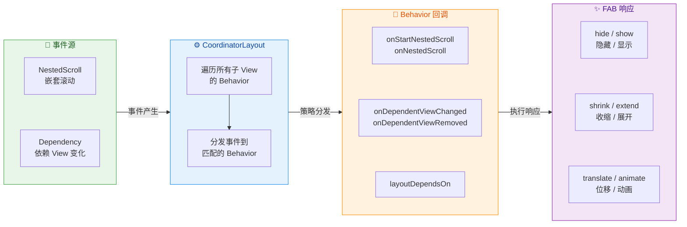
```mermaid
graph LR
    subgraph Input["🎯 事件源"]
        direction TB
        A["NestedScroll\n嵌套滚动"]
        B["Dependency\n依赖 View 变化"]
        A ~~~ B
    end

    subgraph Coordinator["⚙️ CoordinatorLayout"]
        direction TB
        C["遍历所有子 View\n的 Behavior"]
        D["分发事件到\n匹配的 Behavior"]
        C --> D
    end

    subgraph Behavior["🔧 Behavior 回调"]
        direction TB
        E["onStartNestedScroll\nonNestedScroll"]
        F["onDependentViewChanged\nonDependentViewRemoved"]
        G["layoutDependsOn"]
        E ~~~ F
        F ~~~ G
    end

    subgraph Effect["✨ FAB 响应"]
        direction TB
        H["hide / show\n隐藏 / 显示"]
        I["shrink / extend\n收缩 / 展开"]
        J["translate / animate\n位移 / 动画"]
        H ~~~ I
        I ~~~ J
    end

    Input -->|"事件产生"| Coordinator -->|"策略分发"| Behavior -->|"执行响应"| Effect

    classDef inputCls fill:#E8F5E9,stroke:#43A047,color:#1B5E20
    classDef coordCls fill:#E3F2FD,stroke:#1E88E5,color:#0D47A1
    classDef behavCls fill:#FFF3E0,stroke:#FB8C00,color:#E65100
    classDef effectCls fill:#F3E5F5,stroke:#8E24AA,color:#4A148C

    class Input inputCls
    class Coordinator coordCls
    class Behavior behavCls
    class Effect effectCls
```

#### FloatingActionButton.Behavior 源码级解析

`FloatingActionButton.Behavior` 是 Material Components 库为 FAB 预置的 Behavior，它同时处理了 **依赖关系** 和 **嵌套滚动** 两类事件。下面从源码逻辑角度剖析其核心流程：

**1. 依赖 Snackbar 的自动上移**

这是 FAB 最经典的联动效果之一：当 `Snackbar` 从底部弹出时，FAB 会自动上移以避免被遮挡；`Snackbar` 消失后，FAB 又自动回到原位。

```kotlin
// FloatingActionButton.Behavior 中的依赖判断（伪代码还原）
override fun layoutDependsOn(
    parent: CoordinatorLayout,
    child: FloatingActionButton,  // FAB 本身
    dependency: View               // 待检测的兄弟 View
): Boolean {
    // 当兄弟 View 是 Snackbar 的容器时，声明依赖关系
    return dependency is Snackbar.SnackbarLayout
}

override fun onDependentViewChanged(
    parent: CoordinatorLayout,
    child: FloatingActionButton,
    dependency: View
): Boolean {
    // 计算 FAB 需要向上平移的距离
    // = FAB 底边到父布局底边的距离 - Snackbar 顶边到父布局底边的距离
    val translationY = min(0f, dependency.translationY - dependency.height)
    // 直接设置 FAB 的 translationY 实现上移
    child.translationY = translationY
    return true  // 返回 true 表示已修改 child 的布局属性
}
```

这个机制之所以"自动"，是因为 `CoordinatorLayout` 在每次布局（`onLayout`）和每次子 View 属性变化时都会遍历所有 Behavior，检查 `layoutDependsOn()` 的返回值。当 `Snackbar.SnackbarLayout` 被添加到 `CoordinatorLayout`（Snackbar 的默认行为）时，`layoutDependsOn` 返回 `true`，触发 `onDependentViewChanged`，FAB 就开始跟踪 Snackbar 的位置并实时上移。

**2. 嵌套滚动响应**

前面 `ScrollAwareFabBehavior` 的例子已经展示了嵌套滚动的处理。默认的 `FloatingActionButton.Behavior` 并不内置滚动隐藏逻辑（标准 FAB 需要开发者自定义），但 `ExtendedFloatingActionButton.ExtendedFloatingActionButtonBehavior` 内置了自动收缩/隐藏的逻辑。

嵌套滚动的完整生命周期如下：

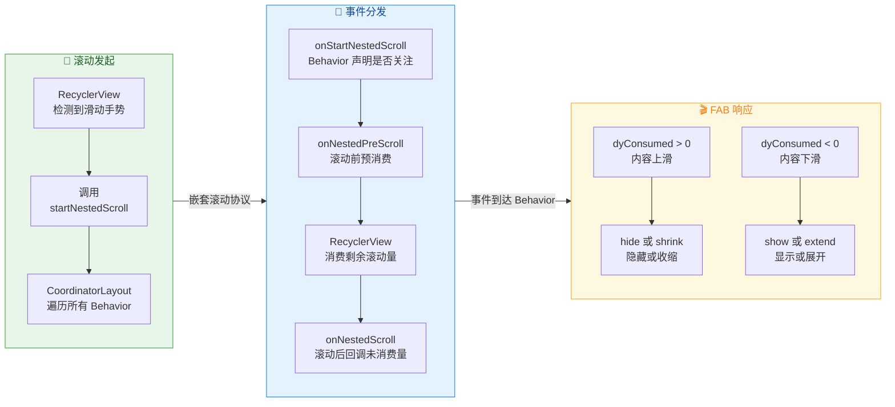
```mermaid
graph LR
    subgraph Phase1["🚀 滚动发起"]
        direction TB
        P1A["RecyclerView\n检测到滑动手势"]
        P1B["调用\nstartNestedScroll"]
        P1C["CoordinatorLayout\n遍历所有 Behavior"]
        P1A --> P1B
        P1B --> P1C
    end

    subgraph Phase2["📡 事件分发"]
        direction TB
        P2A["onStartNestedScroll\nBehavior 声明是否关注"]
        P2B["onNestedPreScroll\n滚动前预消费"]
        P2C["RecyclerView\n消费剩余滚动量"]
        P2D["onNestedScroll\n滚动后回调未消费量"]
        P2A --> P2B
        P2B --> P2C
        P2C --> P2D
    end

    subgraph Phase3["🎬 FAB 响应"]
        direction TB
        P3A["dyConsumed > 0\n内容上滑"]
        P3B["hide 或 shrink\n隐藏或收缩"]
        P3C["dyConsumed < 0\n内容下滑"]
        P3D["show 或 extend\n显示或展开"]
        P3A --> P3B
        P3C --> P3D
    end

    Phase1 -->|"嵌套滚动协议"| Phase2 -->|"事件到达 Behavior"| Phase3

    classDef phase1Cls fill:#E8F5E9,stroke:#43A047,color:#1B5E20
    classDef phase2Cls fill:#E3F2FD,stroke:#1E88E5,color:#0D47A1
    classDef phase3Cls fill:#FFF8E1,stroke:#F9A825,color:#F57F17

    class Phase1 phase1Cls
    class Phase2 phase2Cls
    class Phase3 phase3Cls
```

#### 自定义 Behavior：FAB 跟随手指拖拽

为了更深入理解 Behavior 的能力边界，下面实现一个"FAB 可被用户拖拽到任意位置"的自定义 Behavior。这类需求在浮动客服入口、可拖拽快捷操作等场景中很常见：

```kotlin
/**
 * 可拖拽的 FAB Behavior
 * 允许用户通过手指拖拽将 FAB 移动到屏幕任意位置
 */
class DraggableFabBehavior(
    context: Context,
    attrs: AttributeSet
) : CoordinatorLayout.Behavior<FloatingActionButton>(context, attrs) {

    // 记录上一次触摸点的坐标
    private var lastTouchX = 0f
    private var lastTouchY = 0f

    // 标记是否正在拖拽中
    private var isDragging = false

    /**
     * 拦截触摸事件
     * 当用户按下 FAB 区域时开始拖拽
     */
    override fun onInterceptTouchEvent(
        parent: CoordinatorLayout,
        child: FloatingActionButton,
        ev: MotionEvent
    ): Boolean {
        when (ev.actionMasked) {
            MotionEvent.ACTION_DOWN -> {
                // 判断触摸点是否落在 FAB 范围内
                if (parent.isPointInChildBounds(child, ev.x.toInt(), ev.y.toInt())) {
                    // 记录初始触摸点
                    lastTouchX = ev.rawX
                    lastTouchY = ev.rawY
                    isDragging = true
                    return true  // 拦截事件，交由 onTouchEvent 处理
                }
            }
        }
        return false
    }

    /**
     * 处理拖拽过程中的触摸事件
     */
    override fun onTouchEvent(
        parent: CoordinatorLayout,
        child: FloatingActionButton,
        ev: MotionEvent
    ): Boolean {
        when (ev.actionMasked) {
            MotionEvent.ACTION_MOVE -> {
                if (isDragging) {
                    // 计算本次移动的增量
                    val dx = ev.rawX - lastTouchX
                    val dy = ev.rawY - lastTouchY

                    // 通过 translationX/Y 实现实时跟随
                    // 使用 translation 而非修改 layoutParams，性能更优
                    child.translationX += dx
                    child.translationY += dy

                    // 更新上次触摸点
                    lastTouchX = ev.rawX
                    lastTouchY = ev.rawY
                    return true
                }
            }
            MotionEvent.ACTION_UP, MotionEvent.ACTION_CANCEL -> {
                if (isDragging) {
                    isDragging = false
                    // 松手后可选：吸附到屏幕边缘
                    snapToEdge(parent, child)
                    return true
                }
            }
        }
        return false
    }

    /**
     * 松手后自动吸附到最近的屏幕左右边缘
     * 使用弹性动画实现平滑吸附效果
     */
    private fun snapToEdge(parent: CoordinatorLayout, child: FloatingActionButton) {
        // 计算 FAB 当前中心 X 坐标（原始位置 + 偏移量）
        val fabCenterX = child.left + child.translationX + child.width / 2f
        // 父布局宽度中线
        val parentCenterX = parent.width / 2f

        // 根据 FAB 在左半边还是右半边，决定吸附方向
        val targetTranslationX = if (fabCenterX < parentCenterX) {
            // 吸附到左边缘：目标 X = margin - 原始 left
            (16.dpToPx() - child.left).toFloat()
        } else {
            // 吸附到右边缘：目标 X = 父宽度 - margin - FAB宽度 - 原始 left
            (parent.width - 16.dpToPx() - child.width - child.left).toFloat()
        }

        // 使用 SpringAnimation 实现弹性吸附
        SpringAnimation(child, DynamicAnimation.TRANSLATION_X, targetTranslationX)
            .setStartVelocity(0f)                   // 初始速度为 0
            .apply {
                spring.dampingRatio = SpringForce.DAMPING_RATIO_MEDIUM_BOUNCY  // 中等弹性
                spring.stiffness = SpringForce.STIFFNESS_MEDIUM                 // 中等刚度
            }
            .start()
    }

    // dp 转 px 的扩展函数
    private fun Int.dpToPx(): Int =
        (this * Resources.getSystem().displayMetrics.density).toInt()
}
```

这个例子展示了 Behavior 不仅可以处理滚动事件，还可以直接拦截和处理触摸事件。`onInterceptTouchEvent` 和 `onTouchEvent` 的设计完全对标 `ViewGroup` 的事件分发机制，开发者可以像在自定义 ViewGroup 中一样精细地控制触摸流。

需要注意的是，使用 `translationX`/`translationY` 而非修改 `LayoutParams` 的 margin 来实现位移，是一个重要的性能考量。`translation` 操作直接修改 RenderNode 的变换矩阵，仅触发 **Draw** 阶段，不会引发 `requestLayout()` 导致的 Measure → Layout → Draw 全链路重绘。在拖拽这种高频操作中（每帧都可能触发），避免 `requestLayout()` 是保证 60fps 流畅度的关键。

#### Behavior 的绑定方式汇总

在实际开发中，有三种方式可以将 Behavior 绑定到 View 上：

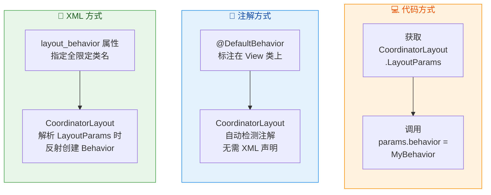
```mermaid
graph LR
    subgraph XMLWay["📄 XML 方式"]
        direction TB
        X1["layout_behavior 属性\n指定全限定类名"]
        X2["CoordinatorLayout\n解析 LayoutParams 时\n反射创建 Behavior"]
        X1 --> X2
    end

    subgraph AnnotWay["📌 注解方式"]
        direction TB
        A1["@DefaultBehavior\n标注在 View 类上"]
        A2["CoordinatorLayout\n自动检测注解\n无需 XML 声明"]
        A1 --> A2
    end

    subgraph CodeWay["💻 代码方式"]
        direction TB
        C1["获取\nCoordinatorLayout\n.LayoutParams"]
        C2["调用\nparams.behavior =\nMyBehavior"]
        C1 --> C2
    end

    XMLWay ~~~ AnnotWay ~~~ CodeWay

    classDef xmlCls fill:#E8F5E9,stroke:#43A047,color:#1B5E20
    classDef annotCls fill:#E3F2FD,stroke:#1E88E5,color:#0D47A1
    classDef codeCls fill:#FFF3E0,stroke:#FB8C00,color:#E65100

    class XMLWay xmlCls
    class AnnotWay annotCls
    class CodeWay codeCls
```

三种方式的适用场景和优先级：

**方式一：XML 属性（最常用）**

在布局文件中通过 `app:layout_behavior="全限定类名"` 声明。`CoordinatorLayout` 在解析 `LayoutParams` 时会通过反射（`Class.forName()` + `Constructor.newInstance(Context, AttributeSet)`）创建 Behavior 实例。这也是为什么自定义 Behavior **必须提供 `(Context, AttributeSet)` 构造函数** 的原因——缺少该构造函数会导致运行时 `ClassNotFoundException` 或 `InstantiationException`。

**方式二：注解（库开发者常用）**

通过在 View 类上标注 `@CoordinatorLayout.DefaultBehavior(MyBehavior::class)` 注解，`CoordinatorLayout` 会在找不到 XML 声明的 Behavior 时自动使用注解指定的默认 Behavior。Material Components 库中，`AppBarLayout` 就通过这种方式绑定了 `AppBarLayout.Behavior`，`ExtendedFloatingActionButton` 也通过注解绑定了自己的默认 Behavior。

**方式三：代码动态设置（运行时切换）**

通过修改 `LayoutParams.behavior` 属性来动态替换 Behavior，适用于需要在运行时根据条件切换联动逻辑的场景。

三种方式的优先级从高到低依次为：**代码 > XML > 注解**。代码设置可以覆盖 XML 声明，XML 声明可以覆盖注解默认值。

#### FAB 与 BottomAppBar 的协作

在 Material Design 2/3 中，FAB 经常与 `BottomAppBar`（底部应用栏）搭配使用。`BottomAppBar` 支持在中部挖一个半圆形"凹槽"（Cradle），让 FAB 嵌入其中，形成极具辨识度的视觉效果：

```xml
<!-- BottomAppBar + FAB 经典组合 -->
<androidx.coordinatorlayout.widget.CoordinatorLayout
    android:layout_width="match_parent"
    android:layout_height="match_parent">

    <!-- BottomAppBar 底部栏 -->
    <com.google.android.material.bottomappbar.BottomAppBar
        android:id="@+id/bottom_app_bar"
        android:layout_width="match_parent"
        android:layout_height="wrap_content"
        android:layout_gravity="bottom"
        app:fabAlignmentMode="center"
        app:fabCradleMargin="8dp"
        app:fabCradleRoundedCornerRadius="16dp"
        app:fabCradleVerticalOffset="4dp"
        style="@style/Widget.MaterialComponents.BottomAppBar.Colored" />

    <!-- FAB 锚定到 BottomAppBar -->
    <com.google.android.material.floatingactionbutton.FloatingActionButton
        android:id="@+id/fab"
        android:layout_width="wrap_content"
        android:layout_height="wrap_content"
        app:layout_anchor="@id/bottom_app_bar"
        app:srcCompat="@drawable/ic_add_24" />

</androidx.coordinatorlayout.widget.CoordinatorLayout>
```

关键属性解析：

| 属性 | 说明 |
|---|---|
| `app:fabAlignmentMode` | FAB 在 BottomAppBar 中的对齐方式：`center`（居中嵌入凹槽）或 `end`（右侧嵌入） |
| `app:fabCradleMargin` | FAB 与凹槽边缘之间的间距，默认 5dp |
| `app:fabCradleRoundedCornerRadius` | 凹槽四角的圆角半径，增大后凹槽更平缓 |
| `app:fabCradleVerticalOffset` | FAB 相对于 BottomAppBar 顶边的垂直偏移量，正值向下沉入 |

凹槽的形状由 `BottomAppBarTopEdgeTreatment` 类动态计算，它继承自 `EdgeTreatment`，通过数学曲线（二次贝塞尔）在 `BottomAppBar` 的顶边"切"出一个与 FAB 尺寸精确匹配的凹口。当 FAB 调用 `hide()` 后，凹槽会通过动画平滑地"愈合"回直线，FAB `show()` 时再重新"裂开"——这种细节体现了 Material Design 对 **连续性动效（Continuous Motion）** 的追求。

你还可以在代码中动态切换 FAB 的对齐模式，实现位置动画：

```kotlin
// 获取 BottomAppBar 引用
val bottomAppBar = findViewById<BottomAppBar>(R.id.bottom_app_bar)

// 动态切换 FAB 对齐模式
// 从 center 切换到 end，FAB 会带着凹槽一起平滑移动到右侧
bottomAppBar.fabAlignmentMode = BottomAppBar.FAB_ALIGNMENT_MODE_END

// 切换回居中
bottomAppBar.fabAlignmentMode = BottomAppBar.FAB_ALIGNMENT_MODE_CENTER
```

---

**📝 练习题**

在 `CoordinatorLayout` 中，一个 `FloatingActionButton` 设置了 `app:layout_anchor="@id/appbar"` 和 `app:layout_anchorGravity="bottom|end"`，同时底部有一个 `Snackbar` 弹出。以下关于 FAB 位置行为的描述，**正确** 的是：


A. FAB 会固定在 AppBarLayout 右下角，即使 Snackbar 弹出也不会移动，因为 anchor 优先级高于 Behavior


B. FAB 会被 Snackbar 顶起上移，同时与 AppBarLayout 脱离锚定关系


C. FAB 的锚点定位和 Snackbar 避让可以同时生效：FAB 的基准位置由 anchor 决定，Snackbar 弹出时通过 translationY 额外上移，两者叠加


D. FAB 必须在 XML 中手动声明 `app:layout_behavior` 才能响应 Snackbar 的弹出


**【答案】** C

**【解析】** `CoordinatorLayout` 的锚点机制和 Behavior 机制是 **两个独立且可叠加的系统**。锚点定位发生在 `onLayout()` 阶段，决定 FAB 在布局中的"基准位置"（即相对于 `AppBarLayout` 右下角）。`FloatingActionButton.Behavior` 中的 `layoutDependsOn()` 会检测到 `Snackbar.SnackbarLayout`，并在 `onDependentViewChanged()` 中通过修改 `translationY` 让 FAB 上移。由于 `translationY` 是叠加在布局位置之上的偏移量，两者互不冲突，所以 FAB 既保持锚点定位又能避让 Snackbar。选项 A 错在将 anchor 和 Behavior 视为互斥关系；选项 B 错在声称会"脱离锚定"，实际上 anchor 关系始终有效；选项 D 错在不需要手动声明——`FloatingActionButton` 通过注解 `@DefaultBehavior` 已经自带了默认 Behavior，无需在 XML 中额外指定。

---

**📝 练习题**

在自定义 `ScrollAwareFabBehavior` 的 `onNestedScroll()` 中调用 `child.hide()` 后，如果不在 `onHidden` 回调中将 FAB 的 `visibility` 改为 `INVISIBLE`，会出现什么问题？


A. FAB 隐藏后会留下一块空白的点击区域，导致误触


B. FAB 隐藏动画不会执行，直接消失


C. FAB 一旦隐藏就无法再通过上滑恢复显示，因为 `GONE` 状态的 View 不会收到 `CoordinatorLayout` 的嵌套滚动分发


D. FAB 的阴影会残留在屏幕上，但按钮本身不可见


**【答案】** C

**【解析】** `FloatingActionButton.hide()` 在动画结束后会将 `visibility` 设为 `GONE`。`CoordinatorLayout` 在分发嵌套滚动事件时，会跳过 `visibility == GONE` 的子 View——具体来说，`onStartNestedScroll()` 不会被调用，Behavior 也就无法接收到后续的 `onNestedScroll()` 回调。因此，当用户上滑时，Behavior 中 `dyConsumed < 0` 的分支永远不会执行，FAB 将永久停留在隐藏状态。解决方案是在 `onHidden` 回调中将 `visibility` 手动改为 `INVISIBLE`——`INVISIBLE` 状态的 View 仍然参与 `CoordinatorLayout` 的事件分发，只是不可见。选项 A 不正确，因为 `GONE` 状态不占布局空间，不会产生点击区域；选项 B 不正确，`hide()` 动画仍然会正常执行；选项 D 不正确，阴影随 View 一起消失。

---

## 提示与反馈

在 Android 应用开发中，"提示与反馈"是用户体验闭环中极为关键的一环。当用户执行了一个操作——无论是删除邮件、发送消息还是断开网络——应用必须在恰当的时机、以恰当的形式给出响应。Material Design 对此提出了一套精细的规范：**轻量操作用瞬时消息（Transient Message）**，**关键操作用对话框（Dialog）**，而介于两者之间的，正是本节的主角——**Snackbar**。它与经典的 `Toast` 同属"瞬时反馈"家族，却在交互能力、视觉层级和可操控性上实现了质的飞跃。更进一步，Material Design 还通过 `SwipeDismissBehavior` 为 Snackbar 赋予了手势消除能力，使反馈组件真正融入了"纸墨隐喻"中那张可以被手指拨开的"纸片"。

本节将从 Snackbar 的核心机制出发，深入剖析它与 Toast 在架构层面的本质区别，最后讲解如何利用 `SwipeDismissBehavior` 实现滑动消除，将三者串联成一套完整的"提示与反馈"知识体系。

---

### Snackbar 瞬时消息

#### 设计定位与核心理念

Snackbar 是 Material Design 规范中定义的 **瞬时反馈组件（Transient Feedback Widget）**。它出现在屏幕底部，短暂显示一条消息，可以附带一个可选的操作按钮（Action Button）。这个设计有三层含义：

第一，**非模态（Non-modal）**。与 Dialog 不同，Snackbar 出现时不会阻断用户与界面其他元素的交互。用户可以完全忽略它，它会在预设时间后自动消失。这种"不打扰"哲学是 Material Design 对轻量级反馈的核心要求。

第二，**可操作（Actionable）**。与 Toast 不同，Snackbar 可以携带一个操作按钮，最经典的用例就是"撤销（Undo）"。当用户删除一条记录后，Snackbar 弹出"已删除"并附带"撤销"按钮，用户可以在消息消失前点击撤销。这种模式被称为 **"延迟确认（Deferred Confirmation）"**，极大提升了容错性。

第三，**有层级意识（Elevation-aware）**。Snackbar 在 Z 轴上位于普通内容之上、Dialog 之下，并且与 `FloatingActionButton` 等组件协同避让。这正是 Material Design "纸墨隐喻"中 Z 轴高度系统的体现——Snackbar 是一张从屏幕底部滑入的"纸条"，漂浮在内容表面。

#### 基本用法与 API 解析

Snackbar 的创建采用了典型的 **工厂方法 + Builder 链式调用** 模式。它的 `make()` 方法不接受 `Context`，而是接受一个 **`View`**，这一设计意图深远——Snackbar 需要沿着 View 树向上查找最近的 `CoordinatorLayout` 或 `FrameLayout` 作为自己的宿主容器。

```kotlin
// === Snackbar 基本使用 ===

// 1. 调用 Snackbar.make() 创建实例
//    第一个参数 view：Snackbar 会从这个 view 开始，沿 View 树向上查找合适的父容器
//    第二个参数 text：要显示的消息文本
//    第三个参数 duration：显示时长常量
val snackbar = Snackbar.make(
    binding.rootLayout,                          // 锚定视图，通常传入当前页面的根布局或任意子 View
    "文件已删除",                                  // 显示的提示文本
    Snackbar.LENGTH_LONG                          // 显示时长：LENGTH_SHORT(约1.5s) / LENGTH_LONG(约2.75s) / LENGTH_INDEFINITE(永不自动消失)
)

// 2. 设置操作按钮（可选但推荐）
//    第一个参数是按钮文字，第二个参数是点击回调
snackbar.setAction("撤销") { view ->
    // 用户点击"撤销"后执行的逻辑
    // 例如：恢复刚才删除的文件
    restoreDeletedFile()
}

// 3. 设置操作按钮的文字颜色
//    默认使用主题的 colorAccent / colorPrimary，可按需覆盖
snackbar.setActionTextColor(
    ContextCompat.getColor(this, R.color.md_yellow_400)
)

// 4. 设置 Snackbar 背景颜色（自 Material 1.1.0 起支持）
snackbar.setBackgroundTint(
    ContextCompat.getColor(this, R.color.md_dark_grey)
)

// 5. 设置消息文字颜色
snackbar.setTextColor(Color.WHITE)

// 6. 添加显示/消失的回调监听
snackbar.addCallback(object : Snackbar.Callback() {
    // 当 Snackbar 显示时回调
    override fun onShown(sb: Snackbar?) {
        super.onShown(sb)
        Log.d("Snackbar", "已显示")
    }

    // 当 Snackbar 消失时回调，event 参数标识消失原因
    override fun onDismissed(sb: Snackbar?, event: Int) {
        super.onDismissed(sb, event)
        // event 可能的值：
        // DISMISS_EVENT_SWIPE    - 用户滑动消除
        // DISMISS_EVENT_ACTION   - 用户点击了 Action 按钮
        // DISMISS_EVENT_TIMEOUT  - 超时自动消失
        // DISMISS_EVENT_MANUAL   - 代码调用 dismiss()
        // DISMISS_EVENT_CONSECUTIVE - 被新的 Snackbar 顶替
        when (event) {
            DISMISS_EVENT_TIMEOUT -> performActualDeletion()   // 超时未撤销，执行真正的删除
            DISMISS_EVENT_ACTION  -> Log.d("Snackbar", "用户撤销了操作")
        }
    }
})

// 7. 调用 show() 显示 Snackbar
snackbar.show()
```

上面的代码虽然看似简单，但隐藏了几个值得深挖的细节。

#### View 查找机制：为什么传的是 View 而不是 Context

这是 Snackbar 与 Toast 最显著的 API 差异之一。`Toast.makeText()` 接收 `Context`，因为 Toast 是通过 **WindowManager** 直接添加到 **系统级窗口层（System Window Layer）** 的，它不依赖任何 Activity 的 View 树。而 Snackbar 是 **嵌入到当前 Activity 的 View 层级** 中的，它必须找到一个父容器来承载自己。

当你调用 `Snackbar.make(view, ...)` 时，内部的查找逻辑大致如下：

1. 从传入的 `view` 开始，沿父 View 链逐级向上遍历。
2. 如果找到 `CoordinatorLayout`，优先选择它作为宿主——因为 `CoordinatorLayout` 能协调 Snackbar 与 FAB 等组件的联动。
3. 如果没有 `CoordinatorLayout`，退而求其次，选择 `android.R.id.content` 对应的 `FrameLayout`（即 Activity 的内容根容器）。
4. 找到宿主后，Snackbar 将自身作为子 View 添加到该容器的底部。

这套机制意味着：**如果你的布局中有 `CoordinatorLayout`，Snackbar 就能与 `FloatingActionButton` 自动联动**——当 Snackbar 滑入时，FAB 会自动上移避让；Snackbar 消失后，FAB 回落原位。这一切都归功于 `CoordinatorLayout` 的 `Behavior` 调度系统。

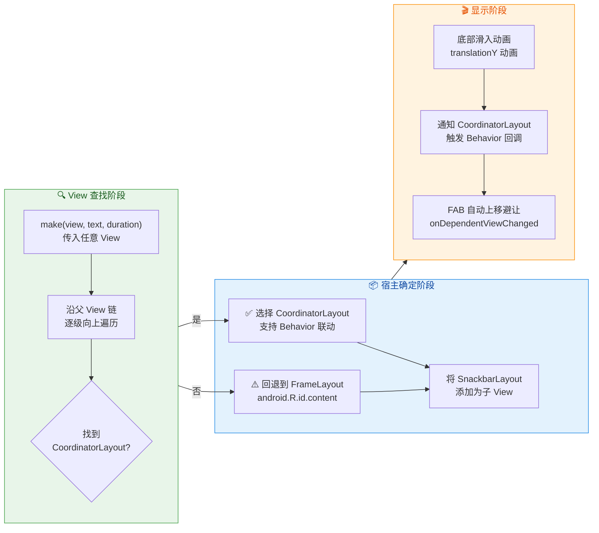
```mermaid
graph LR
    subgraph Find["🔍 View 查找阶段"]
        direction TB
        A["make(view, text, duration)\n传入任意 View"]
        B["沿父 View 链\n逐级向上遍历"]
        C{"找到\nCoordinatorLayout?"}
        A --> B
        B --> C
    end

    subgraph Host["📦 宿主确定阶段"]
        direction TB
        D["✅ 选择 CoordinatorLayout\n支持 Behavior 联动"]
        E["⚠️ 回退到 FrameLayout\nandroid.R.id.content"]
        F["将 SnackbarLayout\n添加为子 View"]
        D --> F
        E --> F
    end

    subgraph Show["🎬 显示阶段"]
        direction TB
        G["底部滑入动画\ntranslationY 动画"]
        H["通知 CoordinatorLayout\n触发 Behavior 回调"]
        I["FAB 自动上移避让\nonDependentViewChanged"]
        G --> H
        H --> I
    end

    Find -->|"是"| D
    Find -->|"否"| E
    Host --> Show

    classDef findCls fill:#E8F5E9,stroke:#43A047,color:#1B5E20
    classDef hostCls fill:#E3F2FD,stroke:#1E88E5,color:#0D47A1
    classDef showCls fill:#FFF3E0,stroke:#FB8C00,color:#E65100

    class Find findCls
    class Host hostCls
    class Show showCls
```

#### Duration 常量的本质

`Snackbar.LENGTH_SHORT`、`LENGTH_LONG`、`LENGTH_INDEFINITE` 不只是简单的整数常量。它们分别对应约 **1500ms**、**2750ms** 和 **无限时长**。在 Material Components 库中，这些时长还会受到系统 **无障碍设置（Accessibility Settings）** 的影响——如果用户开启了"放大显示时间"等辅助功能，Snackbar 的实际显示时长会自动延长，以确保视力障碍或认知障碍用户有足够的时间阅读消息。这是 Material Components 团队在组件层面对无障碍（a11y）的内建支持。

另外，当你使用 `LENGTH_INDEFINITE` 时，Snackbar 将永远不会自动消失，**必须** 由用户主动操作（点击 Action 按钮或滑动消除）或代码调用 `dismiss()` 才会关闭。这种模式适合需要用户确认的重要提示，比如"网络已断开，点击重试"。

#### SnackbarManager：单例队列调度

很多开发者可能遇到过这样的场景：连续快速触发多个 Snackbar，它们不会同时出现叠加，而是依次排队展示。这背后的功臣是 **`SnackbarManager`**——一个 **单例（Singleton）** 队列管理器。

`SnackbarManager` 内部维护了一个容量为 2 的记录结构：**当前正在显示的记录（currentSnackbar）** 和 **等待显示的下一条记录（nextSnackbar）**。当新的 Snackbar 请求显示时：

- 如果当前没有 Snackbar 在显示，直接展示。
- 如果当前已有 Snackbar 在显示，先将当前的 dismiss（触发 `DISMISS_EVENT_CONSECUTIVE`），再展示新的。
- 这保证了 **屏幕上同一时刻最多只有一个 Snackbar**，符合 Material Design 规范中"一次一条消息"的原则。

这个调度机制还涉及到主线程 `Handler` 的延迟消息：当 Snackbar 开始显示时，`SnackbarManager` 会通过 `Handler.postDelayed()` 发送一个延迟消息，时间等于 duration。到期后触发自动 dismiss 流程。如果用户在到期前点击了 Action 或手动滑走，延迟消息会被移除。

---

### Toast 对比

Toast 是 Android 自 API 1 就存在的"元老级"提示组件。许多初学者会将 Snackbar 和 Toast 混为一谈，但它们在架构设计、显示层级和交互能力上有着本质区别。理解这些区别，不仅能帮助你做出正确的技术选型，更能加深对 Android 窗口系统的理解。

#### 窗口层级的本质差异

这是两者最根本的区别。**Toast 是系统级窗口（System-level Window）**，而 **Snackbar 是应用级 View（App-level View）**。

Toast 的显示流程是这样的：当你调用 `toast.show()` 时，Toast 内部会通过 `INotificationManager`（一个系统服务的 Binder 代理）将显示请求发送给 **`NotificationManagerService（NMS）`**。NMS 维护着一个全局 Toast 队列，按先进先出顺序调度。当轮到某个 Toast 显示时，NMS 通过回调通知 App 端的 `TN`（Toast 的内部类，一个 Binder Stub），`TN` 再通过 **`WindowManager.addView()`** 将 Toast 的视图添加到一个 **TYPE_TOAST** 类型的窗口层级中。

这意味着：

- Toast **可以在 App 不处于前台时显示**（虽然 Android 12+ 对后台 Toast 做了限制）。
- Toast **不属于任何 Activity 的 View 层级**，因此它不会被 Activity 的主题、CoordinatorLayout 等影响。
- Toast **无法被用户交互**（不可点击、不可滑动消除），它是纯粹的"只读提示"。

而 Snackbar 的显示完全发生在 App 进程内部，它只是一个被添加到 `CoordinatorLayout` 或 `FrameLayout` 中的普通子 View。它遵循 View 系统的触摸事件分发、遵循 `CoordinatorLayout` 的 Behavior 协议、受 Activity 生命周期约束。当 Activity 被销毁时，Snackbar 随之消失；而 Toast 可能在 Activity 销毁后仍然短暂可见。

#### 功能对比全景

下面从多个维度系统对比两者的差异：

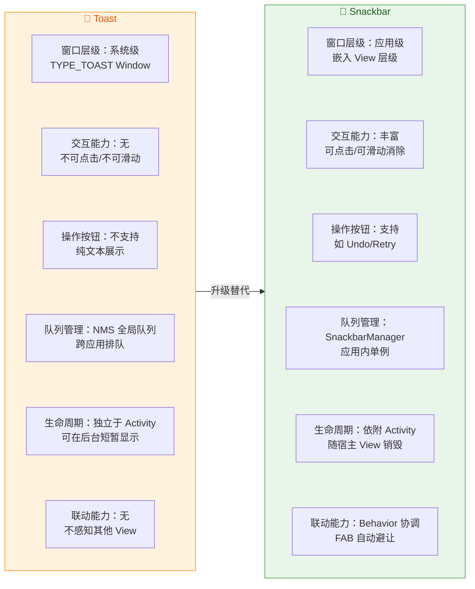
```mermaid
graph LR
    subgraph ToastSide["🍞 Toast"]
        direction TB
        T1["窗口层级：系统级\nTYPE_TOAST Window"]
        T2["交互能力：无\n不可点击/不可滑动"]
        T3["操作按钮：不支持\n纯文本展示"]
        T4["队列管理：NMS 全局队列\n跨应用排队"]
        T5["生命周期：独立于 Activity\n可在后台短暂显示"]
        T6["联动能力：无\n不感知其他 View"]
        T1 ~~~ T2
        T2 ~~~ T3
        T3 ~~~ T4
        T4 ~~~ T5
        T5 ~~~ T6
    end

    subgraph SnackbarSide["🔔 Snackbar"]
        direction TB
        S1["窗口层级：应用级\n嵌入 View 层级"]
        S2["交互能力：丰富\n可点击/可滑动消除"]
        S3["操作按钮：支持\n如 Undo/Retry"]
        S4["队列管理：SnackbarManager\n应用内单例"]
        S5["生命周期：依附 Activity\n随宿主 View 销毁"]
        S6["联动能力：Behavior 协调\nFAB 自动避让"]
        S1 ~~~ S2
        S2 ~~~ S3
        S3 ~~~ S4
        S4 ~~~ S5
        S5 ~~~ S6
    end

    ToastSide -->|"升级替代"| SnackbarSide

    classDef toastCls fill:#FFF3E0,stroke:#FB8C00,color:#E65100
    classDef snackbarCls fill:#E8F5E9,stroke:#43A047,color:#1B5E20

    class ToastSide toastCls
    class SnackbarSide snackbarCls
```

#### 技术选型指南

在实际项目中，如何选择 Toast 还是 Snackbar？这取决于三个关键因素：

**场景一：纯信息通知，无需用户响应。** 例如"设置已保存"、"已复制到剪贴板"。这种场景下 Toast 和 Snackbar 都可以胜任。但如果当前界面有 `CoordinatorLayout`，推荐 Snackbar，因为它的视觉效果更贴合 Material Design。

**场景二：需要提供撤销或重试操作。** 例如"邮件已归档 — 撤销"、"发送失败 — 重试"。此时 **必须用 Snackbar**，因为 Toast 不支持操作按钮。

**场景三：需要在非 Activity 上下文中提示。** 例如在 Service 中或后台任务完成时。此时只能用 Toast（或 Notification），因为 Snackbar 必须依附于一个可见的 View 层级。但注意 Android 12（API 31）之后，后台 Toast 也受到了限制，不再允许自定义 Toast 视图，仅保留了纯文本的 `Toast.makeText()`。

**场景四：你处于 Compose 环境。** Jetpack Compose 提供了 `SnackbarHostState` 来管理 Snackbar，而 Toast 的调用方式保持不变（仍然使用 `Toast.makeText(context, ...)`）。在 Compose 中推荐使用 Compose 原生的 Snackbar 机制，以保持声明式 UI 的一致性。

#### Android 版本演进对 Toast 的限制

值得一提的是，Google 对 Toast 的限制越来越严格，这从侧面反映了 Snackbar 才是未来推荐的方向：

- **Android 11（API 30）**：后台应用的自定义 Toast 视图（Custom View Toast）被弃用，调用 `setView()` 在后台无效。
- **Android 12（API 31）**：自定义 Toast 视图在前台也被完全移除，`setView()` 方法被标记为废弃。系统仅保留 `Toast.makeText()` 的纯文本形式。同时，系统会在 Toast 中显示应用图标，防止"伪装其他应用的 Toast"这类钓鱼行为。
- **Android 13（API 33）**：对 Toast 文本长度做出限制，超长文本会被截断。

这些变化说明，Toast 的角色正在被压缩为"最轻量的纯文本瞬时提示"，而所有需要交互、需要样式定制的场景都应交给 Snackbar。

---

### SwipeDismissBehavior 滑动消除

在 Material Design 的交互哲学中，用户应该能够像操作真实纸片一样与界面元素互动。`SwipeDismissBehavior` 正是这一理念的代码实现——它允许用户通过水平滑动手势将一个 View 从屏幕上"拂去"。虽然 Snackbar 内部已经默认集成了滑动消除能力，但 `SwipeDismissBehavior` 作为 `CoordinatorLayout.Behavior` 的一个通用子类，可以被应用到 **任何 `CoordinatorLayout` 的直接子 View** 上。

#### 内部机制与触摸拦截

`SwipeDismissBehavior` 继承自 `CoordinatorLayout.Behavior<View>`，它的核心工作原理分为三个阶段：

**第一阶段：触摸拦截。** 当 `CoordinatorLayout` 收到触摸事件时，会遍历所有子 View 的 Behavior，调用 `onInterceptTouchEvent()`。`SwipeDismissBehavior` 内部维护了一个 `ViewDragHelper`（Android Support Library 中用于处理拖拽手势的工具类），它会判断当前触摸是否构成一个水平方向的滑动手势。如果是，就拦截该事件序列。

**第二阶段：拖拽跟随。** 一旦手势被拦截，`ViewDragHelper` 接管后续的 `onTouchEvent()`，实时调用 `clampViewPositionHorizontal()` 让目标 View 跟随手指水平移动。同时，`SwipeDismissBehavior` 会根据滑动距离计算一个 **alpha 值**，让 View 在滑动过程中逐渐透明，营造"渐行渐远"的视觉效果。

**第三阶段：释放判定。** 当用户抬起手指时，`ViewDragHelper` 的 `onViewReleased()` 回调被触发。`SwipeDismissBehavior` 此时会根据两个条件判断是否执行消除：

1. **滑动距离是否超过阈值**（默认为 View 宽度的 50%）。
2. **滑动速度是否超过最小速度**（即使距离不够，但甩动速度足够快也会触发消除）。

如果满足条件，View 会通过 `ViewDragHelper.settleCapturedViewAt()` 被自动滑出屏幕，然后触发 `OnDismissListener` 回调。如果不满足条件，View 弹回原位。

#### Snackbar 中的内置滑动消除

你可能注意到，默认情况下 Snackbar 就是可以被滑动消除的，而你并没有手动设置任何 `SwipeDismissBehavior`。这是因为 **Snackbar 内部自动配置了 `SwipeDismissBehavior`**。

在 `Snackbar` 的源码中，当 Snackbar 的 `SnackbarLayout`（实际承载视图的内部类）被添加到 `CoordinatorLayout` 时，它的 `LayoutParams` 中会被自动附加一个 `Behavior`（即 `com.google.android.material.snackbar.SwipeDismissBehavior` 的内部变体）。这个 Behavior 的 `onInterceptTouchEvent` 和 `onTouchEvent` 与上文描述的机制完全一致。当用户水平滑走 Snackbar 时，`onDismissed` 回调会收到 `DISMISS_EVENT_SWIPE` 事件。

但这里有一个重要细节：**如果 Snackbar 的宿主不是 `CoordinatorLayout`**（比如退化到 `FrameLayout`），那么 Behavior 将不会生效，因为 Behavior 是 `CoordinatorLayout` 独有的调度机制。此时 Snackbar 仍然可以显示和自动消失，但 **无法被滑动消除**，FAB 联动也不会工作。这再次印证了 `CoordinatorLayout` 在 Material Design 体系中的核心地位。

#### 将 SwipeDismissBehavior 应用到自定义 View

虽然 Snackbar 已经内置了滑动消除，但在实际项目中，你可能希望让其他 View（比如一个提示横幅 Banner、一个可消除的通知条）也支持滑动消除。这时就需要手动使用 `SwipeDismissBehavior`：

```kotlin
// === 为自定义 View 添加 SwipeDismissBehavior ===

// 1. 获取目标 View（必须是 CoordinatorLayout 的直接子 View）
val bannerView = findViewById<MaterialCardView>(R.id.tip_banner)

// 2. 创建 SwipeDismissBehavior 实例
val swipeBehavior = SwipeDismissBehavior<MaterialCardView>()

// 3. 设置可滑动方向
//    SWIPE_DIRECTION_ANY        - 左右均可滑动消除
//    SWIPE_DIRECTION_START_TO_END - 仅允许从左向右滑（LTR 布局）
//    SWIPE_DIRECTION_END_TO_START - 仅允许从右向左滑（LTR 布局）
swipeBehavior.setSwipeDirection(SwipeDismissBehavior.SWIPE_DIRECTION_ANY)

// 4. 设置拖拽时的消除阈值（0.0 ~ 1.0）
//    表示滑动距离达到 View 宽度的多少比例时触发消除
//    默认值为 0.5（50%）
swipeBehavior.setDragDismissDistance(0.5f)

// 5. 设置 alpha 渐变起始比例（0.0 ~ 1.0）
//    当滑动距离超过此比例后，View 开始逐渐变透明
//    默认值为 0.0，即一开始就渐变
swipeBehavior.setStartAlphaSwipeDistance(0.1f)

// 6. 设置 alpha 渐变结束比例（0.0 ~ 1.0）
//    当滑动距离达到此比例时，View 完全透明
//    默认值为 0.6
swipeBehavior.setEndAlphaSwipeDistance(0.6f)

// 7. 设置消除监听器
swipeBehavior.setListener(object : SwipeDismissBehavior.OnDismissListener {
    // 当 View 被滑动消除时回调
    override fun onDismiss(view: View?) {
        // 从父容器中移除该 View 或将其设置为 GONE
        (view?.parent as? ViewGroup)?.removeView(view)
        // 可选：用 Snackbar 提示用户可以撤销
        Snackbar.make(binding.root, "提示已关闭", Snackbar.LENGTH_SHORT)
            .setAction("撤销") { restoreBanner() }  // 撤销逻辑
            .show()
    }

    // 当 View 正在被拖拽时持续回调（可用于实时视觉反馈）
    override fun onDragStateChanged(state: Int) {
        // state 值来自 ViewDragHelper：
        // STATE_IDLE     (0) - 静止状态
        // STATE_DRAGGING (1) - 正在被手指拖拽
        // STATE_SETTLING (2) - 手指松开后，正在自动滑动归位或滑出
        when (state) {
            ViewDragHelper.STATE_DRAGGING -> {
                // 可选：拖拽时降低周围元素亮度等视觉反馈
            }
            ViewDragHelper.STATE_IDLE -> {
                // 动画结束，恢复常态
            }
        }
    }
})

// 8. 将 Behavior 设置到 View 的 LayoutParams 中
//    注意：此处强转为 CoordinatorLayout.LayoutParams
val params = bannerView.layoutParams as CoordinatorLayout.LayoutParams
params.behavior = swipeBehavior       // 绑定 Behavior
bannerView.layoutParams = params      // 应用修改后的 LayoutParams
```

对应的 XML 布局应当如下设置——目标 View 必须是 `CoordinatorLayout` 的 **直接子 View**：

```xml
<!-- 外层必须是 CoordinatorLayout，Behavior 才能生效 -->
<androidx.coordinatorlayout.widget.CoordinatorLayout
    xmlns:android="http://schemas.android.com/apk/res/android"
    xmlns:app="http://schemas.android.com/apk/res-auto"
    android:id="@+id/coordinator_root"
    android:layout_width="match_parent"
    android:layout_height="match_parent">

    <!-- 内容区域 -->
    <androidx.core.widget.NestedScrollView
        android:layout_width="match_parent"
        android:layout_height="match_parent"
        app:layout_behavior="@string/appbar_scrolling_view_behavior">
        <!-- 页面内容 -->
    </androidx.core.widget.NestedScrollView>

    <!-- 可滑动消除的提示横幅 -->
    <!-- 注意：它是 CoordinatorLayout 的直接子 View -->
    <com.google.android.material.card.MaterialCardView
        android:id="@+id/tip_banner"
        android:layout_width="match_parent"
        android:layout_height="wrap_content"
        android:layout_gravity="bottom"
        android:layout_margin="16dp"
        app:cardCornerRadius="12dp"
        app:cardElevation="4dp">

        <TextView
            android:layout_width="match_parent"
            android:layout_height="wrap_content"
            android:padding="16dp"
            android:text="小贴士：左右滑动可以关闭此提示"
            android:textAppearance="?attr/textAppearanceBody1" />

    </com.google.android.material.card.MaterialCardView>

</androidx.coordinatorlayout.widget.CoordinatorLayout>
```

#### 滑动消除的完整生命周期

将上述三个阶段串联起来，我们可以用时序图清晰地展示一次完整的滑动消除流程：

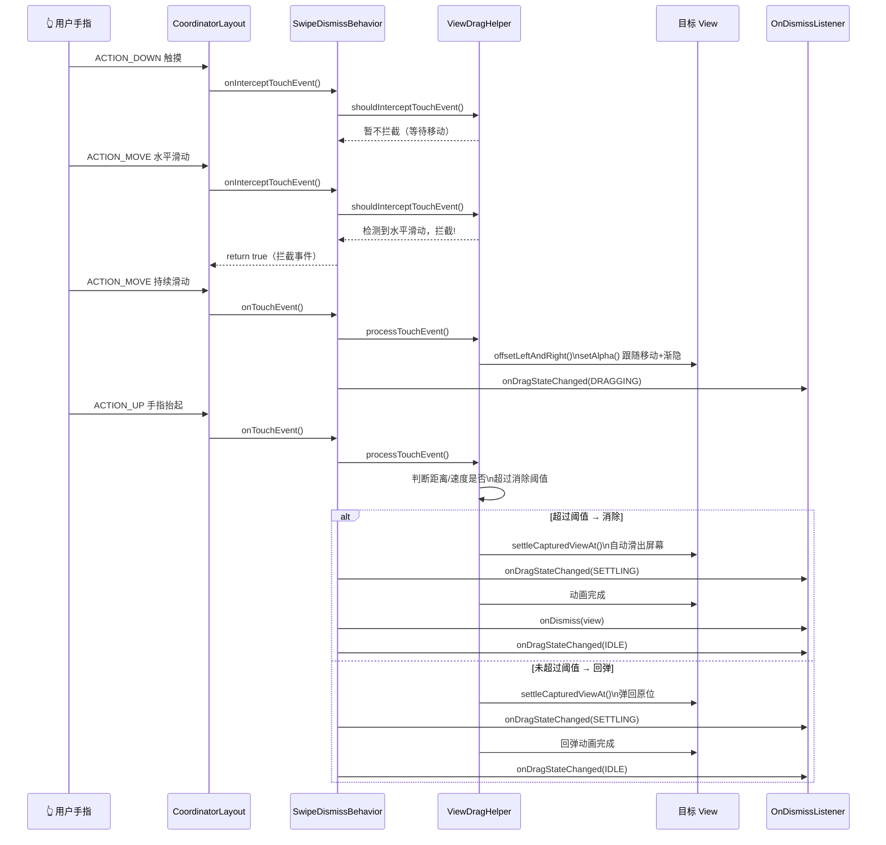
```mermaid
sequenceDiagram
    participant U as 👆 用户手指
    participant CL as CoordinatorLayout
    participant SDB as SwipeDismissBehavior
    participant VDH as ViewDragHelper
    participant V as 目标 View
    participant L as OnDismissListener

    U->>CL: ACTION_DOWN 触摸
    CL->>SDB: onInterceptTouchEvent()
    SDB->>VDH: shouldInterceptTouchEvent()
    VDH-->>SDB: 暂不拦截（等待移动）

    U->>CL: ACTION_MOVE 水平滑动
    CL->>SDB: onInterceptTouchEvent()
    SDB->>VDH: shouldInterceptTouchEvent()
    VDH-->>SDB: 检测到水平滑动，拦截!
    SDB-->>CL: return true（拦截事件）

    U->>CL: ACTION_MOVE 持续滑动
    CL->>SDB: onTouchEvent()
    SDB->>VDH: processTouchEvent()
    VDH->>V: offsetLeftAndRight()\nsetAlpha() 跟随移动+渐隐
    SDB->>L: onDragStateChanged(DRAGGING)

    U->>CL: ACTION_UP 手指抬起
    CL->>SDB: onTouchEvent()
    SDB->>VDH: processTouchEvent()
    VDH->>VDH: 判断距离/速度是否\n超过消除阈值

    alt 超过阈值 → 消除
        VDH->>V: settleCapturedViewAt()\n自动滑出屏幕
        SDB->>L: onDragStateChanged(SETTLING)
        VDH->>V: 动画完成
        SDB->>L: onDismiss(view)
        SDB->>L: onDragStateChanged(IDLE)
    else 未超过阈值 → 回弹
        VDH->>V: settleCapturedViewAt()\n弹回原位
        SDB->>L: onDragStateChanged(SETTLING)
        VDH->>V: 回弹动画完成
        SDB->>L: onDragStateChanged(IDLE)
    end
```

#### 自定义 Behavior 扩展滑动消除

在一些高级场景中，你可能需要更精细地控制滑动消除行为，比如：纵向滑动消除、非线性的 alpha 曲线、滑动时触发震动反馈等。此时可以继承 `SwipeDismissBehavior` 并重写关键方法：

```kotlin
// === 自定义 SwipeDismissBehavior ===

class EnhancedSwipeDismissBehavior<V : View> : SwipeDismissBehavior<V>() {

    // 重写 canSwipeDismissView 控制哪些 View 可以被消除
    // 默认返回 true，这里可加入条件判断
    override fun canSwipeDismissView(child: View): Boolean {
        // 示例：只允许消除特定 tag 的 View
        return child.tag == "dismissable"
    }

    // 重写 onInterceptTouchEvent 添加额外的拦截逻辑
    override fun onInterceptTouchEvent(
        parent: CoordinatorLayout,
        child: V,
        event: MotionEvent
    ): Boolean {
        // 示例：在某些状态下禁止滑动消除（如编辑模式）
        if (isEditMode) return false
        // 否则走默认逻辑
        return super.onInterceptTouchEvent(parent, child, event)
    }
}
```

#### 与 ItemTouchHelper 的区别

在 RecyclerView 场景中，列表项的滑动删除通常使用 `ItemTouchHelper` 而非 `SwipeDismissBehavior`。两者虽然都实现了"滑动消除"效果，但作用域和设计意图完全不同：

- **`SwipeDismissBehavior`** 工作在 `CoordinatorLayout` 层面，针对的是 CoordinatorLayout 的直接子 View（如 Snackbar、Banner 等独立组件），它借助 `ViewDragHelper` 实现拖拽跟随。
- **`ItemTouchHelper`** 工作在 `RecyclerView` 层面，针对的是列表中的单个 Item View。它通过 `ItemTouchHelper.Callback` 提供了更丰富的列表特定能力，如拖拽排序（drag-to-reorder）、滑动方向控制、自定义绘制（`onChildDraw`）等。

简单记忆：**CoordinatorLayout 的子 View 用 `SwipeDismissBehavior`，RecyclerView 的 Item 用 `ItemTouchHelper`**。两者不应混用。

---

**📝 练习题**

在一个使用 `CoordinatorLayout` 作为根布局的 Activity 中，开发者连续快速调用了三次 `Snackbar.make(...).show()`，分别显示消息 A、B、C。关于它们的显示行为，以下哪项描述是正确的？

A. 三个 Snackbar 会同时叠加显示在屏幕底部，按 Z 轴高度从低到高排列


B. 三个 Snackbar 会严格按照 A → B → C 的顺序依次显示，每个都展示完整的 duration 时长


C. 消息 A 和 B 会被快速跳过（触发 DISMISS_EVENT_CONSECUTIVE），最终只有消息 C 完整展示


D. 仅消息 A 会显示，B 和 C 会被丢弃，因为 SnackbarManager 的队列容量为 1


**【答案】** C

**【解析】** `SnackbarManager` 是一个单例队列管理器，内部仅维护两条记录：`currentSnackbar`（当前显示的）和 `nextSnackbar`（等待中的下一条）。当连续快速调用三次 `show()` 时，流程如下：第一次 `show()` 使 A 成为 `currentSnackbar` 并开始显示；第二次 `show()` 使 B 成为 `nextSnackbar`，同时通知 A 立即 dismiss（A 收到 `DISMISS_EVENT_CONSECUTIVE`）；第三次 `show()` 时，B 还在等待队列中尚未来得及完整展示（或刚开始展示），C 取代 B 成为新的 `nextSnackbar`，B 同样被跳过。最终的效果是：A 闪现后被快速消除，B 闪现后被快速消除，C 作为最后一个请求完整显示其 duration。因此选 C。选项 A 错误是因为 Material Design 规范和 SnackbarManager 保证同一时刻最多只有一个 Snackbar 可见。选项 B 错误是因为新的 Snackbar 会立即替换当前的，不会等待上一个显示完毕。选项 D 错误是因为队列容量为 2（current + next），且最终 C 作为最后的 next 会被正常显示。

---

**📝 练习题**

开发者希望在一个 `MaterialCardView` 上实现滑动消除效果，但发现 `SwipeDismissBehavior` 设置后无法生效。以下哪项最可能是原因？

A. `MaterialCardView` 不支持 `SwipeDismissBehavior`，只有 `Snackbar` 才支持


B. `MaterialCardView` 不是 `CoordinatorLayout` 的直接子 View，Behavior 无法被调度


C. `SwipeDismissBehavior` 需要配合 `RecyclerView` 才能工作


D. 缺少对 `MaterialCardView` 的 `android:clickable="true"` 属性设置


**【答案】** B

**【解析】** `SwipeDismissBehavior` 是 `CoordinatorLayout.Behavior` 的子类，而 Behavior 机制的核心前提是：目标 View 必须是 `CoordinatorLayout` 的 **直接子 View**（Direct Child）。`CoordinatorLayout` 在分发触摸事件和协调布局时，只会遍历其直接子 View 的 `LayoutParams` 来获取 Behavior。如果 `MaterialCardView` 被嵌套在了一个 `LinearLayout` 或 `NestedScrollView` 中，即使这些中间容器本身是 `CoordinatorLayout` 的子 View，`MaterialCardView` 上设置的 Behavior 也不会被 `CoordinatorLayout` 感知到。解决方法是调整布局层级，确保 `MaterialCardView` 直接作为 `CoordinatorLayout` 的子 View。选项 A 错误，`SwipeDismissBehavior` 是通用的泛型类 `SwipeDismissBehavior<V : View>`，可应用于任意 View。选项 C 错误，RecyclerView 的滑动消除使用的是 `ItemTouchHelper`，与 `SwipeDismissBehavior` 无关。选项 D 错误，`clickable` 属性影响的是点击事件而非滑动手势。

---

## 卡片与列表

在 Material Design 的设计体系中，**卡片（Card）** 是承载内容的核心容器之一。Google 在 Material Design 规范中将卡片定义为"一个包含关于单一主题的内容和操作的表面（surface）"。卡片是纸墨隐喻（Paper & Ink Metaphor）最直观的体现——它就是一张可以被拾取、移动、拥有真实厚度和阴影的"纸片"。用户看到卡片，便会天然理解这是一个独立的信息单元，里面的文字、图片、按钮都围绕同一主题组织。

在 Android 应用层开发中，`MaterialCardView` 是 Material Components Library（MDC）对早期 Support Library `CardView` 的全面增强。它在保留圆角和阴影能力的基础上，**原生集成了 Stroke 描边、Ripple 水波纹、Checked 选中态、Dragged 拖拽态** 等 Material Theming 能力，使得开发者无需手写大量 Drawable XML，仅通过属性配置就能获得规范级别的视觉效果。本节将从原理到落地，深入剖析 `MaterialCardView` 的圆角阴影机制、描边实现、以及水波纹点击效果的工作方式。

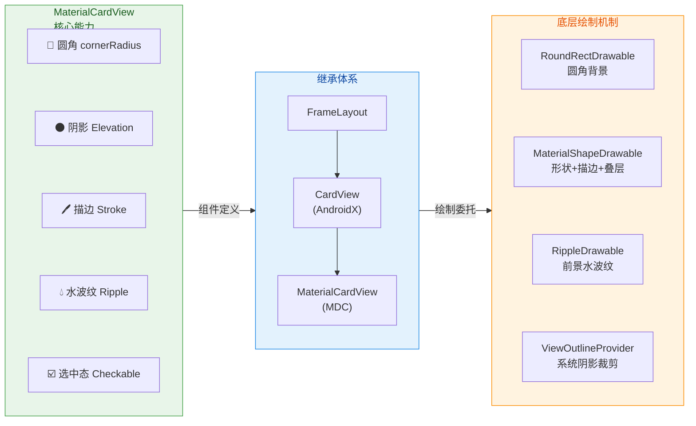
```mermaid
graph LR
    subgraph A["MaterialCardView\n核心能力"]
        direction TB
        A1["📐 圆角 cornerRadius"]
        A2["🌑 阴影 Elevation"]
        A3["🖊️ 描边 Stroke"]
        A4["💧 水波纹 Ripple"]
        A5["☑️ 选中态 Checkable"]
        A1 ~~~ A2
        A2 ~~~ A3
        A3 ~~~ A4
        A4 ~~~ A5
    end

    subgraph B["继承体系"]
        direction TB
        B1["FrameLayout"]
        B2["CardView\n(AndroidX)"]
        B3["MaterialCardView\n(MDC)"]
        B1 --> B2
        B2 --> B3
    end

    subgraph C["底层绘制机制"]
        direction TB
        C1["RoundRectDrawable\n圆角背景"]
        C2["MaterialShapeDrawable\n形状+描边+叠层"]
        C3["RippleDrawable\n前景水波纹"]
        C4["ViewOutlineProvider\n系统阴影裁剪"]
        C1 ~~~ C2
        C2 ~~~ C3
        C3 ~~~ C4
    end

    A -->|"组件定义"| B
    B -->|"绘制委托"| C

    classDef green fill:#E8F5E9,stroke:#43A047,stroke-width:1px,color:#1B5E20
    classDef blue fill:#E3F2FD,stroke:#1E88E5,stroke-width:1px,color:#0D47A1
    classDef orange fill:#FFF3E0,stroke:#FB8C00,stroke-width:1px,color:#E65100

    class A green
    class B blue
    class C orange
```

### MaterialCardView 圆角阴影

#### 从 CardView 到 MaterialCardView 的演进

早在 Android 5.0（API 21）之前，Android 系统并不原生支持 View 级别的阴影绘制。彼时的 `CardView`（来自 Support Library）不得不在低版本上使用 **软件模拟阴影**——通过在卡片四周绘制渐变的灰色像素来"伪造"阴影效果。这种方式有两个明显的弊端：一是阴影会占据实际布局空间（即卡片内容区域会缩小），二是阴影质量与真实光照模型差距较大。

到了 Android 5.0+，系统引入了 **`RenderNode` 硬件阴影**机制：每个 View 都可以通过 `elevation` 属性声明自身在 Z 轴上的高度，系统的 Hardware Renderer 会根据全局光源位置（一个靠近屏幕顶部的定向光 + 一个环境光）自动计算阴影的偏移、模糊半径和透明度。这一机制让阴影变得"免费"——不占布局空间，由 GPU 硬件渲染，性能极高。

`MaterialCardView` 继承自 AndroidX 的 `CardView`，在 API 21+ 上完全依赖系统的硬件阴影。但它做了一件关键的事：**用 `MaterialShapeDrawable` 替换了传统的 `RoundRectDrawable`** 作为背景 Drawable。这意味着卡片的形状不再局限于简单的圆角矩形，理论上可以通过 `ShapeAppearanceModel` 定义任意的圆角、切角、甚至曲线边缘，并且描边、叠层（overlay）、选中态等视觉效果都能统一在一个 Drawable 体系内管理。

#### 圆角的实现原理

圆角的核心属性是 `app:cardCornerRadius`，它设置的值最终会传递给底层的 `ShapeAppearanceModel`，为四个角各创建一个 `RoundedCornerTreatment`。当 `MaterialShapeDrawable` 被绘制时，它会根据这四个角的 Treatment 构建一个 `Path` 对象，然后调用 `Canvas.drawPath()` 完成圆角矩形的绘制。

更重要的是，**圆角还影响阴影的轮廓裁剪**。`MaterialCardView` 内部会设置一个 `ViewOutlineProvider`，它根据 `ShapeAppearanceModel` 生成一个 `Outline` 对象。系统的 `RenderNode` 正是依据这个 `Outline` 来计算阴影的形状——如果 Outline 是圆角矩形，阴影自然也会呈现出圆角效果。这就是你设置 `cardCornerRadius="16dp"` 后，阴影也自动变成圆角的原因，而不需要任何额外操作。

关于四角独立控制，`MaterialCardView` 支持通过 `ShapeAppearanceOverlay` 为每个角设置不同的圆角半径。这在设计上常用于卡片组合场景——比如一组上下堆叠的卡片，顶部卡片只圆化上面两个角，底部卡片只圆化下面两个角，中间的卡片则完全直角，从而形成视觉上的"合并卡组"效果。

```xml
<!-- res/values/styles.xml -->
<!-- 定义一个只有顶部两角圆化的形状覆盖样式 -->
<style name="TopRoundedCard" parent="">
    <!-- 左上角圆角半径 16dp -->
    <item name="cornerSizeTopLeft">16dp</item>
    <!-- 右上角圆角半径 16dp -->
    <item name="cornerSizeTopRight">16dp</item>
    <!-- 左下角圆角半径 0dp（直角） -->
    <item name="cornerSizeBottomLeft">0dp</item>
    <!-- 右下角圆角半径 0dp（直角） -->
    <item name="cornerSizeBottomRight">0dp</item>
</style>
```

```xml
<!-- 在布局中使用 shapeAppearanceOverlay 应用此样式 -->
<com.google.android.material.card.MaterialCardView
    android:layout_width="match_parent"
    android:layout_height="wrap_content"
    app:cardElevation="4dp"
    app:shapeAppearanceOverlay="@style/TopRoundedCard">

    <!-- 卡片内容 -->
    <TextView
        android:layout_width="wrap_content"
        android:layout_height="wrap_content"
        android:text="仅顶部圆角的卡片" />

</com.google.android.material.card.MaterialCardView>
```

#### Elevation 与阴影层次

`app:cardElevation` 控制卡片的静态海拔高度（resting elevation）。Material Design 规范建议卡片的默认海拔为 **1dp**（Material 3 风格）或 **2dp**（Material 2 风格），而在用户交互时（如长按拖拽排序），卡片会被"拾起"到更高的海拔——通常 **8dp**，产生更大、更明显的阴影，给用户以"拿起纸片"的直觉反馈。

`app:cardMaxElevation` 在 API 21+ 上几乎不再有实际意义（它是兼容低版本预留阴影空间的遗留属性），但在极低版本兼容场景中仍有用。现代开发中通常不需要显式设置此属性。

需要特别注意的是 `MaterialCardView` 引入了 **`app:cardElevation` 与 `android:stateListAnimator` 的配合关系**。默认情况下，MDC 主题会为卡片配置一个 `StateListAnimator`，在 `state_pressed`（按下）和 `state_dragged`（拖拽）状态下自动提升海拔。如果你手动设置了 `app:cardElevation` 但发现按下时阴影没有变化，很可能是因为你同时覆盖了 `stateListAnimator`——将其设为 `@null` 会禁用所有状态海拔动画。

```kotlin
// 在代码中动态调整卡片海拔
// 获取卡片视图引用
val card = findViewById<MaterialCardView>(R.id.my_card)

// 设置静态海拔为 6dp（单位为像素，需要转换）
card.cardElevation = 6f.dpToPx(this)

// 也可以通过 ValueAnimator 平滑地改变海拔，实现自定义交互动画
ValueAnimator.ofFloat(2f.dpToPx(this), 8f.dpToPx(this)).apply {
    // 动画时长 200ms
    duration = 200L
    // 监听动画值更新，实时设置海拔
    addUpdateListener { animator ->
        card.cardElevation = animator.animatedValue as Float
    }
    // 启动动画
    start()
}

// dp 转 px 的扩展函数
fun Float.dpToPx(context: Context): Float =
    this * context.resources.displayMetrics.density
```

#### 内容裁剪与 clipChildren

一个常见的"坑"是：你在 `MaterialCardView` 中放入一张 `ImageView`（如卡片顶部的 Hero Image），但图片的角落却没有被圆角裁剪，溢出了卡片边界。这是因为 **Android 的圆角裁剪** 依赖于 `setClipToOutline(true)`，而这需要 View 的 `Outline` 是一个简单的圆角矩形（convex shape）。

`MaterialCardView` 默认会设置 `setClipToOutline(true)`，因此**直接子 View** 会被正确裁剪。但如果子 View 自身又有子 View（深层嵌套），或者你使用了 `foreground` / `background` 等 Drawable 层在子 View 上，可能仍需注意裁剪边界。最佳实践是：让需要裁剪的图片作为 `MaterialCardView` 的直接子 View，或者使用 `ShapeableImageView`（同样来自 MDC）来独立处理图片的圆角。

```xml
<!-- 卡片内图片正确被圆角裁剪的推荐写法 -->
<com.google.android.material.card.MaterialCardView
    android:layout_width="match_parent"
    android:layout_height="wrap_content"
    app:cardCornerRadius="12dp"
    app:cardPreventCornerOverlap="false">

    <!-- LinearLayout 作为内容容器 -->
    <LinearLayout
        android:layout_width="match_parent"
        android:layout_height="wrap_content"
        android:orientation="vertical">

        <!-- Hero Image：由于 MaterialCardView 开启了 clipToOutline -->
        <!-- 图片四角会被自动裁剪为圆角 -->
        <ImageView
            android:layout_width="match_parent"
            android:layout_height="180dp"
            android:scaleType="centerCrop"
            android:src="@drawable/hero_image" />

        <!-- 标题文字 -->
        <TextView
            android:layout_width="wrap_content"
            android:layout_height="wrap_content"
            android:padding="16dp"
            android:text="卡片标题" />

    </LinearLayout>

</com.google.android.material.card.MaterialCardView>
```

> **`cardPreventCornerOverlap`** 这个属性在 API 21+ 上建议设为 `false`。它原本是为了低版本模拟阴影时防止内容与阴影区域重叠而添加内边距的，但在硬件阴影时代已不需要，设为 `false` 可以避免不必要的 padding。

### Stroke 描边

#### 描边的设计意图

Material Design 中卡片有三种视觉变体（Variant）：**Elevated（阴影型）**、**Filled（填充型）** 和 **Outlined（描边型）**。描边型卡片放弃了阴影来暗示层叠关系，转而使用一条清晰的边框线来界定卡片的边界。这种风格在 Material Design 3（Material You）中被大量使用——它更加扁平、轻盈，适合信息密度较高的页面，避免过多阴影造成的视觉"重量"。

从用户感知角度来看，Elevated Card 给人以"浮起"的感觉，适合突出重要内容；而 Outlined Card 更像是一个"框住"内容的容器，适合列表中的等权重信息展示。两者的选择取决于页面的信息层级和视觉节奏。

#### 属性详解与底层机制

`MaterialCardView` 提供了两个关键属性来控制描边：

| 属性 | 说明 | 默认值 |
|---|---|---|
| `app:strokeWidth` | 描边线条宽度，单位 dp | `0dp`（无描边） |
| `app:strokeColor` | 描边颜色，支持 ColorStateList | `@android:color/transparent` |

当 `strokeWidth > 0` 时，`MaterialCardView` 内部的 `MaterialShapeDrawable` 会在绘制完填充色之后，沿着 `ShapeAppearanceModel` 生成的 Path **向内缩进 `strokeWidth / 2`** 再调用 `Canvas.drawPath()` 绘制描边。这是经典的"居中描边"策略——描边线一半在边界内、一半在边界外。但由于 `clipToOutline` 会裁掉外部溢出的部分，**视觉上看起来像是"内描边"（inset stroke）**。

这意味着：**描边会占据卡片内部空间**。如果你设置了 `strokeWidth="2dp"`，卡片的有效内容区域在四周会各缩小约 1dp。在大多数场景中这几乎不可察觉，但在精确像素对齐的设计中需要注意。

```xml
<!-- Outlined 风格卡片的典型配置 -->
<com.google.android.material.card.MaterialCardView
    android:layout_width="match_parent"
    android:layout_height="wrap_content"
    app:cardCornerRadius="12dp"
    app:cardElevation="0dp"
    app:strokeWidth="1dp"
    app:strokeColor="?attr/colorOutline"
    app:cardBackgroundColor="?attr/colorSurface">

    <!-- 注意 cardElevation 设为 0dp，这是 Outlined 风格的标志 -->
    <!-- strokeColor 使用主题属性 colorOutline，确保深色/浅色主题自动适配 -->

    <TextView
        android:layout_width="wrap_content"
        android:layout_height="wrap_content"
        android:padding="16dp"
        android:text="Outlined Card" />

</com.google.android.material.card.MaterialCardView>
```

#### 使用 ColorStateList 实现描边的状态变化

在实际开发中，描边颜色往往不是固定的。例如一个可选中的卡片，在普通状态下显示灰色描边，选中后变为主题色描边。`app:strokeColor` 支持引用一个 `ColorStateList` 资源：

```xml
<!-- res/color/card_stroke_color.xml -->
<?xml version="1.0" encoding="utf-8"?>
<selector xmlns:android="http://schemas.android.com/apk/res/android"
    xmlns:app="http://schemas.android.com/apk/res-auto">

    <!-- 选中状态：使用主题主色 -->
    <item
        android:state_checked="true"
        android:color="?attr/colorPrimary" />

    <!-- 拖拽状态：使用稍深的轮廓色 -->
    <item
        android:state_dragged="true"
        android:color="?attr/colorOnSurface" />

    <!-- 默认状态：使用标准轮廓色 -->
    <item android:color="?attr/colorOutline" />

</selector>
```

```xml
<!-- 在布局中引用 ColorStateList -->
<com.google.android.material.card.MaterialCardView
    android:layout_width="match_parent"
    android:layout_height="wrap_content"
    android:checkable="true"
    app:strokeWidth="1dp"
    app:strokeColor="@color/card_stroke_color"
    app:cardElevation="0dp"
    app:cardCornerRadius="12dp">

    <!-- android:checkable="true" 开启可选中能力 -->
    <!-- 点击卡片会触发 checked 状态切换 -->
    <!-- 此时 strokeColor 会根据 state_checked 自动变色 -->

    <TextView
        android:layout_width="wrap_content"
        android:layout_height="wrap_content"
        android:padding="16dp"
        android:text="可选中的 Outlined Card" />

</com.google.android.material.card.MaterialCardView>
```

在代码中也可以动态修改描边：

```kotlin
val card = findViewById<MaterialCardView>(R.id.my_card)

// 动态设置描边宽度（单位为像素）
card.strokeWidth = 2.dpToPx(this)

// 动态设置描边颜色（单一颜色）
card.strokeColor = ColorStateList.valueOf(
    ContextCompat.getColor(this, R.color.purple_500)
)

// 动态设置描边颜色（ColorStateList，保留状态变化能力）
card.setStrokeColor(
    ContextCompat.getColorStateList(this, R.color.card_stroke_color)
)
```

#### 描边与阴影的组合策略

虽然 Material 规范将 Elevated 和 Outlined 视为两种独立变体，但技术上你完全可以同时使用 **`cardElevation > 0` 和 `strokeWidth > 0`**。这种组合在某些自定义设计中很有用——比如一个需要同时具备层叠感和明确边界的卡片。但要注意：

1. **描边会遮挡部分阴影**：由于描边是沿边界绘制的，阴影最内侧的柔和过渡会被描边线遮盖，导致阴影看起来"更硬"。
2. **视觉上不够 "Material"**：Material 3 设计系统认为这两种表达方式是互斥的语义信号——阴影说"我浮在上面"，描边说"我和背景在同一平面但有边界"。同时使用可能让用户的直觉判断产生混淆。

因此，**推荐做法是二选一**：Elevated（有阴影无描边）或 Outlined（有描边无阴影），除非设计团队有明确的非标需求。

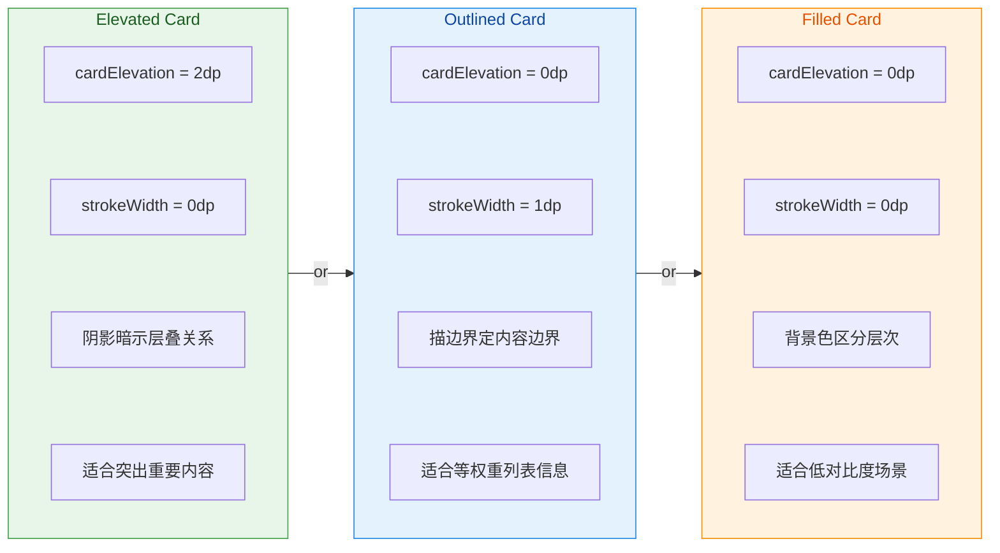
```mermaid
graph LR
    subgraph A["Elevated Card"]
        direction TB
        A1["cardElevation = 2dp"]
        A2["strokeWidth = 0dp"]
        A3["阴影暗示层叠关系"]
        A4["适合突出重要内容"]
        A1 ~~~ A2
        A2 ~~~ A3
        A3 ~~~ A4
    end

    subgraph B["Outlined Card"]
        direction TB
        B1["cardElevation = 0dp"]
        B2["strokeWidth = 1dp"]
        B3["描边界定内容边界"]
        B4["适合等权重列表信息"]
        B1 ~~~ B2
        B2 ~~~ B3
        B3 ~~~ B4
    end

    subgraph C["Filled Card"]
        direction TB
        C1["cardElevation = 0dp"]
        C2["strokeWidth = 0dp"]
        C3["背景色区分层次"]
        C4["适合低对比度场景"]
        C1 ~~~ C2
        C2 ~~~ C3
        C3 ~~~ C4
    end

    A -->|"or"| B -->|"or"| C

    classDef elevated fill:#E8F5E9,stroke:#43A047,stroke-width:1px,color:#1B5E20
    classDef outlined fill:#E3F2FD,stroke:#1E88E5,stroke-width:1px,color:#0D47A1
    classDef filled fill:#FFF3E0,stroke:#FB8C00,stroke-width:1px,color:#E65100

    class A elevated
    class B outlined
    class C filled
```

### Ripple 水波纹点击效果

#### 水波纹的本质：前景 RippleDrawable

水波纹（Ripple）效果是 Material Design 中最具标志性的交互反馈之一。当用户触摸一个可点击的 View 时，从触摸点向外扩散的波纹动画为用户提供了"我的点击被系统感知到了"的即时确认。这种反馈是 Material Design 将真实世界的水面涟漪隐喻到数字界面的经典设计。

从 Android 系统层面来看，水波纹由 `RippleDrawable`（API 21+）实现。它是一个特殊的 `LayerDrawable`，内部包含：

1. **Mask Layer（遮罩层）**：定义水波纹的扩散边界。如果提供了 mask，波纹只会在 mask 区域内扩散；如果没有 mask，波纹会扩散到整个 View 范围甚至溢出边界（有 `clipToOutline` 则裁剪回来）。
2. **Content Layer（内容层）**：可选的底层内容 Drawable。
3. **Ripple Paint**：一个带透明度的颜色画笔，用于绘制波纹圆形的扩散动画。系统通过 `RenderThread`（独立于 UI 线程的渲染线程）来驱动此动画，即使主线程短暂卡顿，波纹动画仍能流畅运行。

#### MaterialCardView 的 Ripple 机制

`MaterialCardView` 在默认可点击（`android:clickable="true"`）时，会自动配置一个 `RippleDrawable` 作为 **前景 Drawable（foreground）**。这与普通 View 使用 `?attr/selectableItemBackground` 作为 background 的做法不同——卡片的背景已经被 `MaterialShapeDrawable`（填充色 + 描边）占用了，因此水波纹被放在了前景层，确保它覆盖在所有子 View 内容之上。

具体来说，`MaterialCardView` 内部的初始化流程大致如下：

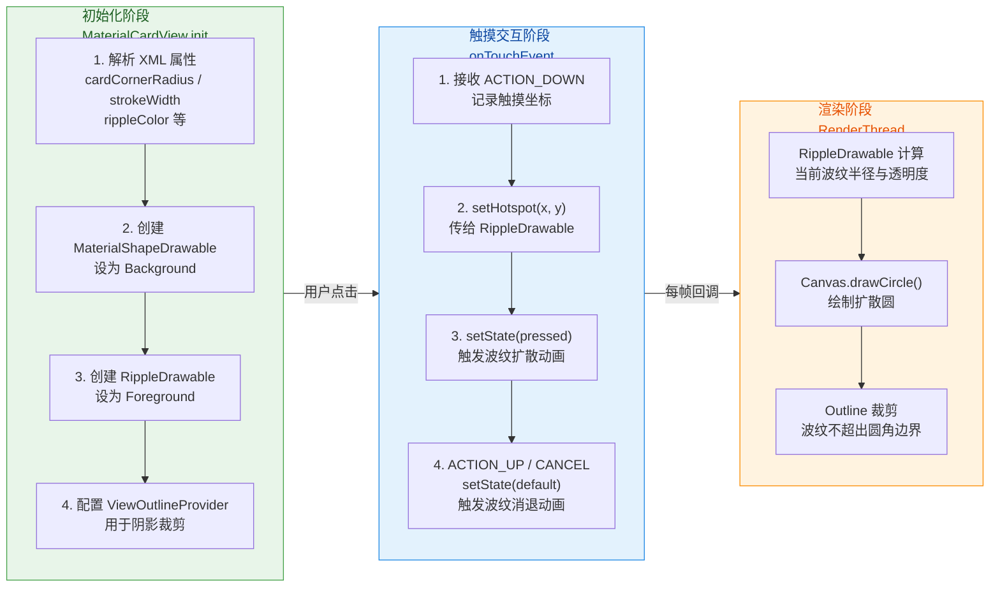
```mermaid
graph LR
    subgraph A["初始化阶段\nMaterialCardView.init"]
        direction TB
        A1["1. 解析 XML 属性\ncardCornerRadius / strokeWidth\nrippleColor 等"]
        A2["2. 创建 MaterialShapeDrawable\n设为 Background"]
        A3["3. 创建 RippleDrawable\n设为 Foreground"]
        A4["4. 配置 ViewOutlineProvider\n用于阴影裁剪"]
        A1 --> A2
        A2 --> A3
        A3 --> A4
    end

    subgraph B["触摸交互阶段\nonTouchEvent"]
        direction TB
        B1["1. 接收 ACTION_DOWN\n记录触摸坐标"]
        B2["2. setHotspot(x, y)\n传给 RippleDrawable"]
        B3["3. setState(pressed)\n触发波纹扩散动画"]
        B4["4. ACTION_UP / CANCEL\nsetState(default)\n触发波纹消退动画"]
        B1 --> B2
        B2 --> B3
        B3 --> B4
    end

    subgraph C["渲染阶段\nRenderThread"]
        direction TB
        C1["RippleDrawable 计算\n当前波纹半径与透明度"]
        C2["Canvas.drawCircle()\n绘制扩散圆"]
        C3["Outline 裁剪\n波纹不超出圆角边界"]
        C1 --> C2
        C2 --> C3
    end

    A -->|"用户点击"| B -->|"每帧回调"| C

    classDef green fill:#E8F5E9,stroke:#43A047,stroke-width:1px,color:#1B5E20
    classDef blue fill:#E3F2FD,stroke:#1E88E5,stroke-width:1px,color:#0D47A1
    classDef orange fill:#FFF3E0,stroke:#FB8C00,stroke-width:1px,color:#E65100

    class A green
    class B blue
    class C orange
```

关键代码路径如下：当 `View.dispatchTouchEvent()` 接收到 `ACTION_DOWN` 事件时，系统会调用 `drawableHotspotChanged(x, y)`，将触摸坐标传递给前景 `RippleDrawable`。随后 `View.setPressed(true)` 触发 `drawableStateChanged()`，`RippleDrawable` 检测到 `state_pressed` 状态后启动波纹的扩散动画。当手指抬起（`ACTION_UP`），`setPressed(false)` 让波纹进入消退（fade-out）阶段。

整个过程中，**波纹动画完全由 `RenderThread` 驱动**，不依赖 `View.onDraw()` 的主线程调度，因此即使应用主线程因为复杂计算有轻微掉帧，水波纹仍然丝滑流畅。这也是 Android 5.0+ 引入 `RenderThread` 的一大亮点。

#### rippleColor 属性与自定义

`app:rippleColor` 属性控制水波纹的颜色，支持 `ColorStateList`。默认情况下，MDC 主题会将其设置为一个半透明的 `colorOnSurface`（通常是黑色或深灰色加 12% 透明度），使得波纹在大多数背景色上都有可见但不突兀的反馈。

```xml
<!-- 自定义水波纹颜色 -->
<com.google.android.material.card.MaterialCardView
    android:layout_width="match_parent"
    android:layout_height="wrap_content"
    android:clickable="true"
    android:focusable="true"
    app:cardCornerRadius="12dp"
    app:rippleColor="@color/card_ripple_color">

    <!-- 卡片内容 -->
    <TextView
        android:layout_width="wrap_content"
        android:layout_height="wrap_content"
        android:padding="16dp"
        android:text="点击我看看水波纹" />

</com.google.android.material.card.MaterialCardView>
```

```xml
<!-- res/color/card_ripple_color.xml -->
<?xml version="1.0" encoding="utf-8"?>
<selector xmlns:android="http://schemas.android.com/apk/res/android">
    <!-- 按下状态：带 20% 透明度的主题色 -->
    <item
        android:state_pressed="true"
        android:color="#33006D3B" />

    <!-- 聚焦状态（TV/键盘导航时有用）：带 16% 透明度 -->
    <item
        android:state_focused="true"
        android:color="#29006D3B" />

    <!-- 默认状态：完全透明（无波纹） -->
    <item android:color="@android:color/transparent" />
</selector>
```

需要注意，**`rippleColor` 中 alpha 值非常重要**。Material Design 规范推荐的水波纹透明度：

| 状态 | 推荐 Opacity |
|---|---|
| Hover（悬停，通常用于鼠标/触控板） | 8% |
| Focus（聚焦，键盘/TV 遥控器） | 12% |
| Pressed（按下） | 12% |
| Dragged（拖拽） | 16% |

如果透明度设置过高（如 50%），水波纹会像一大块"色块"覆盖在内容上，既不美观也遮挡了信息；如果太低（如 2%），用户几乎感知不到反馈，失去了 Ripple 的意义。

#### 代码中动态控制 Ripple

有时你需要根据卡片的背景色动态调整 Ripple 颜色——例如深色背景卡片需要浅色波纹，浅色背景则需要深色波纹：

```kotlin
val card = findViewById<MaterialCardView>(R.id.my_card)

// 根据卡片背景亮度动态选择 Ripple 颜色
// 获取卡片当前背景颜色
val bgColor = card.cardBackgroundColor.defaultColor

// 计算亮度（luminance），范围 0.0（纯黑）到 1.0（纯白）
val luminance = ColorUtils.calculateLuminance(bgColor)

// 如果背景较暗，使用白色半透明波纹；否则使用黑色半透明波纹
val rippleColor = if (luminance < 0.5) {
    // 白色 + 20% 透明度
    ColorStateList.valueOf(Color.argb(51, 255, 255, 255))
} else {
    // 黑色 + 12% 透明度
    ColorStateList.valueOf(Color.argb(31, 0, 0, 0))
}

// 应用波纹颜色
card.setRippleColor(rippleColor)
```

#### Ripple 与子 View 的点击冲突

一个常见的实践问题是：当卡片内部有按钮（Button）或其他可点击控件时，卡片自身的 Ripple 和子控件的 Ripple 会产生"视觉竞争"。用户点击按钮时，可能同时触发了卡片的波纹和按钮的波纹，导致画面混乱。

解决方案有两种思路：

1. **让卡片不可点击**：如果卡片的唯一交互入口就是内部的按钮，那么卡片本身不需要设 `clickable="true"`，自然也就没有波纹。这种方式最简洁。

2. **阻断触摸事件传递**：如果卡片整体可点击（点击跳转详情），按钮是独立操作（如"收藏"），那么按钮自身的 `onClick` 会消费事件（`return true`），不会触发卡片的 `onClick`。但视觉上你可能仍然看到卡片的波纹（因为 `ACTION_DOWN` 时卡片的 `pressed` 状态已经被设置了）。此时可以在按钮区域使用 `android:splitMotionEvents="false"` 或在自定义 `onInterceptTouchEvent` 中做更精细的控制。

```kotlin
// 推荐方式：为卡片内的按钮设置独立的点击监听
// 卡片整体跳转详情
card.setOnClickListener {
    // 跳转到详情页
    navigateToDetail(item.id)
}

// 卡片内的收藏按钮独立处理
val favoriteButton = card.findViewById<MaterialButton>(R.id.btn_favorite)
favoriteButton.setOnClickListener {
    // 切换收藏状态（此事件不会冒泡到 card 的 onClick）
    toggleFavorite(item.id)
}
```

#### Checked 状态与 Ripple 的协同

`MaterialCardView` 实现了 `Checkable` 接口，这意味着它可以像 `CheckBox` 一样拥有选中/未选中状态。当 `android:checkable="true"` 时，每次点击会自动切换 `checked` 状态。配合前面提到的 `strokeColor` 的 `ColorStateList`，以及 Ripple 的状态色，可以实现非常流畅的多选卡片交互：

```kotlin
val card = findViewById<MaterialCardView>(R.id.selectable_card)

// 开启可选中能力
card.isCheckable = true

// 监听选中状态变化
card.setOnCheckedChangeListener { _, isChecked ->
    if (isChecked) {
        // 选中时可能需要更新 UI、数据状态等
        Log.d("Card", "卡片被选中")
    } else {
        Log.d("Card", "卡片取消选中")
    }
}

// 也可以通过代码直接控制选中状态（不触发点击动画）
card.isChecked = true
```

选中状态下，`MaterialCardView` 除了改变描边颜色外，还会在卡片右上角（或你自定义的位置）显示一个 **checked icon**，默认是一个圆形勾选标记。这个 icon 通过 `app:checkedIcon` 和 `app:checkedIconTint` 来自定义：

```xml
<com.google.android.material.card.MaterialCardView
    android:layout_width="match_parent"
    android:layout_height="wrap_content"
    android:checkable="true"
    app:checkedIcon="@drawable/ic_check_circle_24"
    app:checkedIconTint="?attr/colorPrimary"
    app:checkedIconGravity="TOP_END"
    app:checkedIconMargin="8dp"
    app:checkedIconSize="24dp"
    app:strokeWidth="1dp"
    app:strokeColor="@color/card_stroke_color"
    app:cardCornerRadius="12dp">

    <!-- 卡片内容 -->

</com.google.android.material.card.MaterialCardView>
```

#### 在 RecyclerView 中使用 MaterialCardView 的性能考量

卡片组件最常见的使用场景就是 `RecyclerView` 列表/网格。在这个上下文中需要关注几个性能点：

1. **Elevation 与过度绘制**：每张有阴影的卡片都会在其周围产生一个半透明的阴影区域。如果卡片之间间距很小，相邻卡片的阴影区域会重叠，导致 GPU 过度绘制。Material 3 推荐的 1dp 低海拔可以有效缓解这个问题。

2. **Ripple 的硬件加速**：`RippleDrawable` 在 API 21+ 上默认是硬件加速的。但如果你在 `onBindViewHolder` 中频繁地 `setRippleColor()`，每次都会触发 `RippleDrawable` 的内部 Drawable 重建，在快速滚动场景下可能产生不必要的对象分配。**建议在 Adapter 层面通过 ViewType 区分不同波纹色的卡片，而不是在 bind 时动态修改。**

3. **圆角裁剪的代价**：`setClipToOutline(true)` 在硬件加速下性能很好（GPU 裁剪），但如果你的 View 因为某种原因关闭了硬件加速（`layerType = LAYER_TYPE_SOFTWARE`），圆角裁剪会退化为 Canvas 级别的 `clipPath()` 操作，这在部分旧设备上可能有性能问题。现代设备和默认配置下无需担心此问题。

下面是一个在 RecyclerView 中规范使用 MaterialCardView 的 Adapter 示例：

```kotlin
// RecyclerView Adapter 中使用 MaterialCardView 的最佳实践
class ItemAdapter(
    // 数据列表
    private val items: List<Item>,
    // 外部传入的点击回调
    private val onItemClick: (Item) -> Unit
) : RecyclerView.Adapter<ItemAdapter.CardViewHolder>() {

    // ViewHolder：持有卡片及其子 View 的引用
    class CardViewHolder(
        val card: MaterialCardView
    ) : RecyclerView.ViewHolder(card) {
        // 缓存子 View 引用，避免每次 bind 时 findViewById
        val titleText: TextView = card.findViewById(R.id.tv_title)
        val subtitleText: TextView = card.findViewById(R.id.tv_subtitle)
        val heroImage: ImageView = card.findViewById(R.id.iv_hero)
    }

    override fun onCreateViewHolder(parent: ViewGroup, viewType: Int): CardViewHolder {
        // 从布局文件中 inflate 卡片视图
        val view = LayoutInflater.from(parent.context)
            .inflate(R.layout.item_card, parent, false)
        // 将根 View 强转为 MaterialCardView 传入 ViewHolder
        return CardViewHolder(view as MaterialCardView)
    }

    override fun onBindViewHolder(holder: CardViewHolder, position: Int) {
        val item = items[position]

        // 绑定数据到视图
        holder.titleText.text = item.title
        holder.subtitleText.text = item.subtitle

        // 加载图片（使用 Coil 或 Glide）
        holder.heroImage.load(item.imageUrl)

        // 设置卡片点击事件（注意：这里不要每次 bind 都 new 一个 listener）
        // 使用 position 无关的回调方式，避免因 position 变化导致的 bug
        holder.card.setOnClickListener {
            onItemClick(items[holder.bindingAdapterPosition])
        }
    }

    override fun getItemCount(): Int = items.size
}
```

```xml
<!-- res/layout/item_card.xml -->
<!-- RecyclerView 中单个卡片的布局 -->
<com.google.android.material.card.MaterialCardView
    xmlns:android="http://schemas.android.com/apk/res/android"
    xmlns:app="http://schemas.android.com/apk/res-auto"
    android:layout_width="match_parent"
    android:layout_height="wrap_content"
    android:layout_margin="8dp"
    android:clickable="true"
    android:focusable="true"
    app:cardCornerRadius="12dp"
    app:cardElevation="1dp"
    app:rippleColor="?attr/colorControlHighlight">

    <!-- 垂直排列：图片 + 文字 -->
    <LinearLayout
        android:layout_width="match_parent"
        android:layout_height="wrap_content"
        android:orientation="vertical">

        <!-- Hero 图片 -->
        <ImageView
            android:id="@+id/iv_hero"
            android:layout_width="match_parent"
            android:layout_height="160dp"
            android:scaleType="centerCrop" />

        <!-- 标题 -->
        <TextView
            android:id="@+id/tv_title"
            android:layout_width="wrap_content"
            android:layout_height="wrap_content"
            android:paddingStart="16dp"
            android:paddingTop="12dp"
            android:paddingEnd="16dp"
            android:textAppearance="?attr/textAppearanceTitleMedium" />

        <!-- 副标题 -->
        <TextView
            android:id="@+id/tv_subtitle"
            android:layout_width="wrap_content"
            android:layout_height="wrap_content"
            android:paddingStart="16dp"
            android:paddingTop="4dp"
            android:paddingEnd="16dp"
            android:paddingBottom="16dp"
            android:textAppearance="?attr/textAppearanceBodyMedium"
            android:textColor="?attr/colorOnSurfaceVariant" />

    </LinearLayout>

</com.google.android.material.card.MaterialCardView>
```

#### 无障碍（Accessibility）注意事项

可点击的 `MaterialCardView` 在 TalkBack 模式下会被识别为一个可操作的元素。你应当为其设置合理的 `contentDescription`，描述整个卡片的语义。如果卡片内有多个独立可点击区域（如正文区域 + 收藏按钮），TalkBack 用户需要能分别聚焦这些区域。此时建议：

- 卡片整体设置 `android:importantForAccessibility="yes"` 和清晰的 `contentDescription`（如"文章标题：XXX，点击查看详情"）。
- 内部独立按钮自身有独立的 `contentDescription`（如"收藏"）。
- 使用 `android:accessibilityTraversalBefore/After` 来控制 TalkBack 的焦点顺序，确保逻辑合理。

---

**📝 练习题**

在一个 RecyclerView 列表中，每个 item 使用 `MaterialCardView` 作为根容器，配置了 `app:cardCornerRadius="16dp"` 和 `app:cardElevation="4dp"`。卡片内顶部有一张全宽的 `ImageView`。开发者发现 `ImageView` 的四角没有被卡片的圆角裁剪，图片溢出了圆角边界。以下哪种方式 **不能** 解决此问题？

A. 确保 `MaterialCardView` 的 `setClipToOutline(true)` 被正确调用（API 21+ 默认开启）


B. 将 `app:cardPreventCornerOverlap` 设为 `true`


C. 将 `ImageView` 替换为 MDC 的 `ShapeableImageView` 并设置相同的圆角


D. 检查 `MaterialCardView` 或其父布局是否被设置了 `android:layerType="software"`，导致硬件加速被关闭

**【答案】** B

**【解析】** `cardPreventCornerOverlap` 是一个为了兼容 **API 21 以下** 模拟阴影而设计的属性。当设为 `true` 时，它的行为是在卡片内部添加额外的 padding，使得内容区域远离圆角区域，从而"看起来"不会溢出圆角——但这只是 **规避** 了视觉问题，并没有真正 **裁剪** 内容。在 API 21+ 上，这个属性对圆角裁剪没有实质帮助。真正的裁剪依赖于选项 A 中的 `clipToOutline` 机制（Outline 裁剪）。选项 C 是一种绕开容器裁剪限制的有效方案——让 Image 自身处理圆角。选项 D 指出了一个常见的陷阱：软件渲染模式下 `clipToOutline` 不工作，检查并移除 `LAYER_TYPE_SOFTWARE` 是合理的排查方向。因此 B 是无法真正解决裁剪问题的选项。

---

**📝 练习题**

关于 `MaterialCardView` 的水波纹（Ripple）效果，以下说法 **正确** 的是：

A. 水波纹是通过 `MaterialCardView` 的 `background` Drawable 实现的


B. 水波纹动画由 UI 主线程（Main Thread）驱动，如果主线程卡顿则波纹动画也会卡顿


C. 将 `app:rippleColor` 设置为 `#FF0000`（不带透明度）会导致波纹完全遮盖卡片内容


D. `MaterialCardView` 默认不可点击，需要手动设置 `android:clickable="true"` 才会显示水波纹

**【答案】** C

**【解析】** 选项 A 错误：`MaterialCardView` 的 background 被 `MaterialShapeDrawable`（填充色 + 描边）占用，水波纹实际上是作为 **foreground**（前景层）的 `RippleDrawable` 实现的。选项 B 错误：在 API 21+ 上，`RippleDrawable` 的动画由 **`RenderThread`**（渲染线程）独立驱动，即使主线程有短暂阻塞，波纹动画仍然流畅——这是 Android 5.0 引入 RenderThread 的关键收益之一。选项 C 正确：如果 `rippleColor` 是一个完全不透明的颜色（alpha = FF），波纹扩散时会完全覆盖卡片内容，呈现为一个纯色圆形色块，这显然不是期望的效果。Material 规范推荐使用 8%~16% 透明度的颜色。选项 D 不完全准确：当你为 `MaterialCardView` 设置了 `setOnClickListener` 后，系统会自动将其标记为 `clickable = true`，并不一定需要手动在 XML 中声明。

---

## 输入与表单

表单是用户与应用之间最直接的数据交换通道。一个设计精良的输入体验，不仅关乎视觉美观，更决定了用户操作的准确性与效率。Material Design 在输入组件上做了大量工作：从最基础的文本输入框，到标签化的 Chip 选择器，再到连续值的 Slider 滑块，形成了一套覆盖"文本录入 → 离散选择 → 连续调节"的完整表单组件体系。本节将逐一深入剖析这些组件的用法、内部机制与最佳实践。

### TextInputLayout 与 TextInputEditText

#### 为什么需要 TextInputLayout

在早期 Android 开发中，开发者直接使用 `EditText` 配合一个独立的 `TextView` 作为标签。这种做法存在几个显著问题：当用户开始输入后，`hint` 文本消失，用户便失去了对当前字段含义的视觉参照；错误提示需要额外手动管理一个 `TextView` 的显示隐藏；字符计数、密码可见性切换等常见需求都需要从零实现。Google 在 Material Design 规范中提出了 **Floating Label**（浮动标签）的概念——当输入框获得焦点或已有内容时，`hint` 文字不再消失，而是以动画形式浮动到输入框上方，变为一个持久可见的小号标签。`TextInputLayout` 正是这一设计理念的官方实现载体。

`TextInputLayout` 本质上是一个 `LinearLayout` 的子类，它将自身唯一的子 View（必须是 `TextInputEditText` 或其子类）包裹起来，在其上方绘制浮动标签，在其下方绘制辅助文本（Helper Text）、错误信息（Error）和字符计数器（Counter）。这种"装饰者"式的设计，使得所有与输入相关的视觉增强都被封装到一个统一的容器中，开发者只需通过 XML 属性或少量 API 调用即可完成配置。

#### 三种样式变体（Box Styles）

Material Design 为文本输入框定义了三种视觉样式，每种样式都通过 `style` 属性指定，对应不同的使用场景：

**Filled（填充样式）** 是默认推荐样式。输入框具有一个半透明的填充背景色和底部的一条下划线指示器（Indicator Line）。当获得焦点时，下划线加粗并变为主题色（Primary Color），浮动标签同步变色上浮。填充样式的优势在于其较大的视觉面积（Filled Surface）让用户更容易识别可交互区域，适用于大多数表单场景。其对应的 style 为 `Widget.MaterialComponents.TextInputLayout.FilledBox`。

**Outlined（轮廓样式）** 以一个完整的圆角矩形边框包围输入区域，没有填充背景。当获得焦点时，边框线条加粗并变色，浮动标签会"嵌入"到边框顶部的缺口（Cutout / Notch）中。轮廓样式在视觉上更加突出和正式，特别适用于输入字段较少、需要强调每个字段独立性的场景（如登录页面）。其对应的 style 为 `Widget.MaterialComponents.TextInputLayout.OutlinedBox`。

**None / Legacy** 即不应用 Material box 样式，回退到早期 Design Support Library 的行为——只有底部一条线。现代项目中极少使用。

这三种样式的核心差异在于 `TextInputLayout` 内部对背景绘制（`BoxBackgroundMode`）的处理方式不同。`TextInputLayout` 内部维护了一个 `boxBackgroundMode` 字段，取值为 `BOX_BACKGROUND_FILLED`、`BOX_BACKGROUND_OUTLINE` 或 `BOX_BACKGROUND_NONE`。在 Filled 模式下，它通过一个 `MaterialShapeDrawable` 绘制圆角矩形填充背景；在 Outlined 模式下，同样使用 `MaterialShapeDrawable`，但只绘制描边（Stroke），并通过 `CutoutDrawable` 在标签上浮时动态裁剪出缺口路径。

#### XML 声明与核心属性

以下是一个典型的 Outlined 样式文本输入框的完整声明：

```xml
<!-- TextInputLayout 作为外层装饰容器 -->
<com.google.android.material.textfield.TextInputLayout
    android:id="@+id/til_username"
    android:layout_width="match_parent"
    android:layout_height="wrap_content"
    android:layout_margin="16dp"
    style="@style/Widget.MaterialComponents.TextInputLayout.OutlinedBox"
    app:hintEnabled="true"
    app:hint="用户名"
    app:helperText="请输入 6-20 位字母或数字"
    app:helperTextEnabled="true"
    app:counterEnabled="true"
    app:counterMaxLength="20"
    app:errorEnabled="true"
    app:startIconDrawable="@drawable/ic_person"
    app:endIconMode="clear_text"
    app:boxStrokeColor="@color/selector_box_stroke"
    app:boxStrokeWidth="1dp"
    app:boxStrokeWidthFocused="2dp"
    app:boxCornerRadiusTopStart="8dp"
    app:boxCornerRadiusTopEnd="8dp"
    app:boxCornerRadiusBottomStart="8dp"
    app:boxCornerRadiusBottomEnd="8dp">

    <!-- TextInputEditText 是实际的输入控件，必须作为 TextInputLayout 的直接子 View -->
    <com.google.android.material.textfield.TextInputEditText
        android:id="@+id/et_username"
        android:layout_width="match_parent"
        android:layout_height="wrap_content"
        android:inputType="text"
        android:maxLength="20" />

</com.google.android.material.textfield.TextInputLayout>
```

这段声明中涉及的关键属性逐一说明：

| 属性 | 作用 | 备注 |
|---|---|---|
| `app:hint` | 浮动标签文字 | 获取焦点时上浮，失焦且内容为空时回落 |
| `app:helperText` | 输入框下方的辅助说明 | 与 error 互斥显示，error 优先 |
| `app:counterEnabled` | 启用字符计数器 | 显示在右下角，格式为 `当前/最大` |
| `app:counterMaxLength` | 计数器最大值 | 超出时计数器变为错误色 |
| `app:errorEnabled` | 预留 error 文本空间 | 设为 true 可避免显示 error 时布局跳动 |
| `app:startIconDrawable` | 起始图标（左侧） | 常用于表达字段语义（人名、邮箱等） |
| `app:endIconMode` | 末尾图标模式 | 可选 `clear_text`、`password_toggle`、`custom` 等 |
| `app:boxStrokeColor` | 边框颜色 | 支持 ColorStateList（聚焦/默认/错误） |
| `app:boxCornerRadius*` | 四角圆角半径 | 可分别设置四个角 |

#### 为什么必须使用 TextInputEditText 而非 EditText

`TextInputLayout` 的文档明确要求其子 View 为 `TextInputEditText`。从源码角度看，`TextInputEditText` 继承自 `AppCompatEditText`，在此基础上做了几件关键的事情：

第一，**Hint 绘制的委托**。普通 `EditText` 自身会绘制 `hint` 文本，但在 `TextInputLayout` 的场景下，`hint` 的绘制已经由外层容器接管（因为需要动画上浮）。`TextInputEditText` 在 `onDraw` 中主动跳过了自身 `hint` 的绘制，避免出现"双重 hint"的视觉 Bug。如果你强行使用普通 `EditText`，当 `TextInputLayout` 的 `hintEnabled=true` 时，会在 Logcat 看到警告信息，且 `hint` 文字可能重叠显示。

第二，**无障碍（Accessibility）支持增强**。`TextInputEditText` 的 `getHint()` 方法被重写，优先返回父容器 `TextInputLayout` 的 `hint` 值，确保 TalkBack 等辅助服务能正确朗读字段标签。

第三，**焦点与触摸区域的协调**。在 Outlined 模式下，`TextInputEditText` 内部会调整自身的 padding，使文本内容不会与边框重叠，并保证触摸热区覆盖整个 box 区域。

#### 浮动标签动画的内部机制

浮动标签是 `TextInputLayout` 最具辨识度的特征。当用户点击输入框（获得焦点）或输入框已有文本内容时，标签文字从 `EditText` 内部的 `hint` 位置，平滑地缩小并上移到输入框上方。这个动画的实现核心是 `CollapsingTextHelper` 这个内部工具类（与 `CollapsingToolbarLayout` 使用的是同一个类）。

`CollapsingTextHelper` 维护了两组参数——**Expanded State（展开态）** 和 **Collapsed State（折叠态）**：展开态对应标签在输入框内部的位置、字号和颜色；折叠态对应标签上浮后的位置、字号和颜色。当状态切换时，`TextInputLayout` 启动一个 `ValueAnimator`，对一个 0→1（上浮）或 1→0（回落）的 fraction 值做动画。每一帧中，`CollapsingTextHelper` 根据当前 fraction 值，在展开态和折叠态之间对文字的 X/Y 坐标、字号（TextSize）、颜色（argb 逐通道插值）做 **线性插值（lerp）**，然后直接调用 `Canvas.drawText()` 绘制。这意味着浮动标签实际上 **不是一个 View**，而是直接在 `TextInputLayout` 的 `onDraw` 中通过 Canvas 绘制的文本。这种方式避免了额外 View 层级的开销，性能开销极低。

在 Outlined 模式下，标签上浮时还需要在边框上裁出一个缺口。`TextInputLayout` 在动画过程中实时测量标签文字的当前宽度（因为字号在变化），然后通知其 `MaterialShapeDrawable` 更新 Cutout 路径——即在绘制边框描边时，跳过标签所在位置的那段路径。这就是为什么你看到 Outlined 模式下标签仿佛"骑在"边框上的效果。

#### 错误处理与表单验证

`TextInputLayout` 提供了内建的错误状态管理。通过调用 `setError(CharSequence)` 方法，输入框的边框/下划线自动变为错误色（默认为 `@color/design_error`，通常为红色），标签文字颜色也同步变为错误色，同时在输入框下方显示错误文本。调用 `setError(null)` 或 `setErrorEnabled(false)` 则恢复正常状态。

在实际项目中，表单验证通常结合 `TextWatcher` 或 `setOnFocusChangeListener` 实现实时校验或失焦校验：

```kotlin
// 获取 TextInputLayout 引用
val tilUsername = findViewById<TextInputLayout>(R.id.til_username)
// 获取内部 EditText 引用
val etUsername = findViewById<TextInputEditText>(R.id.et_username)

// 监听焦点变化，在失去焦点时执行校验
etUsername.setOnFocusChangeListener { _, hasFocus ->
    // 仅在失去焦点时校验，避免用户正在输入时就弹出错误
    if (!hasFocus) {
        // 获取当前输入文本
        val input = etUsername.text.toString()
        // 执行校验逻辑
        when {
            // 空值校验
            input.isEmpty() -> tilUsername.error = "用户名不能为空"
            // 长度校验
            input.length < 6 -> tilUsername.error = "用户名至少 6 位"
            // 格式校验（仅字母和数字）
            !input.matches(Regex("^[a-zA-Z0-9]+$")) -> tilUsername.error = "仅支持字母和数字"
            // 校验通过，清除错误
            else -> tilUsername.error = null
        }
    }
}
```

关于 `errorEnabled` 的一个重要细节：如果 `app:errorEnabled="true"` 在 XML 中预先声明，`TextInputLayout` 会在初始化时就为 error 文本预留空间（即使当前没有错误）。这可以避免错误文本出现/消失时整个布局发生高度跳动（Layout Shift）。如果未预先设置，第一次调用 `setError()` 时会自动启用，但此时会触发一次布局变化。

#### 密码可见性切换与末尾图标模式

`TextInputLayout` 的 `endIconMode` 属性提供了几种预置的末尾图标行为：

- **`password_toggle`**：自动添加一个眼睛图标，点击可切换 `inputType` 在 `textPassword` 和 `textVisiblePassword` 之间。开发者无需手动管理 `TransformationMethod`。
- **`clear_text`**：当输入框有内容时显示清除图标（×），点击清空文本。内容为空时图标自动隐藏。
- **`dropdown_menu`**：配合 `AutoCompleteTextView` 使用，显示下拉箭头，用于实现 Exposed Dropdown Menu（Material Design 的下拉选择器方案）。
- **`custom`**：开发者自定义图标和点击行为。

密码切换模式的实现原理值得一提：`TextInputLayout` 内部监听了末尾图标的点击事件，在点击时通过 `editText.setTransformationMethod()` 在 `PasswordTransformationMethod` 和 `null` 之间切换。同时更新图标的 Drawable（睁眼/闭眼），并通过 `editText.setSelection()` 保持光标位置不变。这个看似简单的交互，如果手动实现，很容易遗漏光标位置恢复和 Accessibility 的 `contentDescription` 更新等细节。

```xml
<!-- 密码输入框的典型声明 -->
<com.google.android.material.textfield.TextInputLayout
    android:layout_width="match_parent"
    android:layout_height="wrap_content"
    style="@style/Widget.MaterialComponents.TextInputLayout.OutlinedBox"
    app:hint="密码"
    app:endIconMode="password_toggle"
    app:startIconDrawable="@drawable/ic_lock">

    <!-- inputType 设为 textPassword，末尾图标会自动控制可见性 -->
    <com.google.android.material.textfield.TextInputEditText
        android:layout_width="match_parent"
        android:layout_height="wrap_content"
        android:inputType="textPassword" />

</com.google.android.material.textfield.TextInputLayout>
```

#### Exposed Dropdown Menu（下拉菜单）

Material Design 推荐使用 `TextInputLayout` + `AutoCompleteTextView` 替代传统的 `Spinner` 组件。这种方案的优势在于视觉风格与其他文本输入框完全统一，且支持搜索过滤：

```xml
<!-- 下拉选择框使用 OutlinedBox.ExposedDropdownMenu 样式 -->
<com.google.android.material.textfield.TextInputLayout
    android:id="@+id/til_gender"
    android:layout_width="match_parent"
    android:layout_height="wrap_content"
    style="@style/Widget.MaterialComponents.TextInputLayout.OutlinedBox.ExposedDropdownMenu"
    app:hint="性别">

    <!-- 用 AutoCompleteTextView 替代 TextInputEditText -->
    <AutoCompleteTextView
        android:id="@+id/acv_gender"
        android:layout_width="match_parent"
        android:layout_height="wrap_content"
        android:inputType="none" />

</com.google.android.material.textfield.TextInputLayout>
```

```kotlin
// 准备下拉选项数据
val genderOptions = listOf("男", "女", "其他")
// 创建 ArrayAdapter，使用 Material 提供的下拉列表 item 布局
val adapter = ArrayAdapter(
    this,                                          // Context
    R.layout.simple_dropdown_item_1line,           // 每一项的布局
    genderOptions                                  // 数据源
)
// 获取 AutoCompleteTextView 引用
val acvGender = findViewById<AutoCompleteTextView>(R.id.acv_gender)
// 设置适配器
acvGender.setAdapter(adapter)
```

此处 `android:inputType="none"` 至关重要——它阻止软键盘弹出，使控件表现得像一个纯粹的下拉选择器而非自由输入框。`ExposedDropdownMenu` 样式会自动为 `TextInputLayout` 设置 `endIconMode="dropdown_menu"`。

### Chip 标签

#### Chip 的设计定位

Chip 是 Material Design 中一种紧凑的、圆角药丸形的交互元素。它的设计意图是在有限的屏幕空间内，以**离散标签**的形式承载一段简短信息，并允许用户对其进行操作（选择、删除、点击导航等）。Chip 常见的应用场景包括：搜索历史标签、邮件收件人、内容分类筛选器、已选条件的可视化展示等。

与 `Button` 不同，Chip 的视觉重量更轻（更小、更扁）、语义更偏向"数据标签"而非"操作触发"。与 `CheckBox`/`RadioButton` 不同，Chip 可以组合图标、文字、删除按钮于一体，视觉表现力更强。

#### 四种 Chip 类型

Material Design 定义了四种 Chip 类型，每种对应不同的交互语义。它们在代码中都是 `com.google.android.material.chip.Chip` 类，通过不同的 `style` 来区分行为和外观：

**Action Chip（操作标签）** 是最基础的类型，对应 `Widget.MaterialComponents.Chip.Action`。它类似一个小型按钮，用户点击后触发一个操作（例如"分享"、"收藏"）。不支持选中状态（`checkable=false`）。

**Filter Chip（过滤标签）** 对应 `Widget.MaterialComponents.Chip.Choice`... 不对，对应 `Widget.MaterialComponents.Chip.Filter`。它用于多选过滤场景，点击后在选中和未选中状态之间切换。选中时左侧会出现一个勾选（Check）图标。`checkable` 默认为 `true`。典型场景如：商品列表的多条件筛选（品牌、价格区间、颜色等）。

**Choice Chip（选择标签）** 对应 `Widget.MaterialComponents.Chip.Choice`。用于单选场景，在一组 Chip 中只能选中一个，类似 `RadioGroup` 的语义。选中时背景变为实心填充色，但不显示勾选图标。

**Input Chip（输入标签）** 对应 `Widget.MaterialComponents.Chip.Entry`。用于将用户输入转化为可操作的标签实体，典型场景是邮件应用中的收件人。Input Chip 通常带有一个头像（左侧圆形图标）和一个删除按钮（右侧 × 图标）。

#### 单个 Chip 的 XML 声明

```xml
<!-- 一个 Filter 类型的 Chip -->
<com.google.android.material.chip.Chip
    android:id="@+id/chip_android"
    android:layout_width="wrap_content"
    android:layout_height="wrap_content"
    style="@style/Widget.MaterialComponents.Chip.Filter"
    android:text="Android"
    app:chipIcon="@drawable/ic_android"
    app:chipIconVisible="true"
    app:checkedIconVisible="true"
    app:closeIconVisible="false"
    app:chipBackgroundColor="@color/selector_chip_bg"
    app:chipCornerRadius="8dp"
    app:chipStrokeWidth="1dp"
    app:chipStrokeColor="@color/selector_chip_stroke"
    app:rippleColor="@color/chip_ripple" />
```

核心属性说明：

| 属性 | 作用 |
|---|---|
| `app:chipIcon` | 左侧图标，一般用于语义标识 |
| `app:checkedIconVisible` | 选中时是否显示勾选图标（Filter Chip 默认 true） |
| `app:closeIconVisible` | 是否显示右侧关闭（删除）按钮 |
| `app:chipBackgroundColor` | 背景色，支持 `ColorStateList`（选中/未选中） |
| `app:chipCornerRadius` | 圆角半径，默认值通常为高度的一半（完全圆角） |
| `app:chipStrokeWidth/Color` | 描边宽度与颜色 |
| `app:rippleColor` | 点击时的水波纹颜色 |

#### ChipGroup 的分组管理

当多个 Chip 需要作为一组使用时（例如一组过滤条件或一组单选选项），应将它们放入 `ChipGroup` 中。`ChipGroup` 继承自 `FlowLayout`（实际上是 Material 内部实现的流式布局），具备自动换行能力，并提供选中状态的统一管理。

```xml
<!-- ChipGroup 作为 Chip 的容器，实现流式排列和选中管理 -->
<com.google.android.material.chip.ChipGroup
    android:id="@+id/chip_group_language"
    android:layout_width="match_parent"
    android:layout_height="wrap_content"
    app:singleSelection="true"
    app:selectionRequired="true"
    app:chipSpacingHorizontal="8dp"
    app:chipSpacingVertical="4dp">

    <!-- 每个 Chip 作为 ChipGroup 的直接子 View -->
    <com.google.android.material.chip.Chip
        style="@style/Widget.MaterialComponents.Chip.Choice"
        android:layout_width="wrap_content"
        android:layout_height="wrap_content"
        android:text="Kotlin" />

    <com.google.android.material.chip.Chip
        style="@style/Widget.MaterialComponents.Chip.Choice"
        android:layout_width="wrap_content"
        android:layout_height="wrap_content"
        android:text="Java" />

    <com.google.android.material.chip.Chip
        style="@style/Widget.MaterialComponents.Chip.Choice"
        android:layout_width="wrap_content"
        android:layout_height="wrap_content"
        android:text="Dart" />

</com.google.android.material.chip.ChipGroup>
```

关键属性：

- **`app:singleSelection="true"`**：启用单选模式，同一时刻只有一个 Chip 处于选中状态，行为类似 `RadioGroup`。设为 `false`（默认）则为多选模式。
- **`app:selectionRequired="true"`**：在单选模式下，强制至少有一个 Chip 被选中，用户无法取消已选中的 Chip（再次点击不会取消）。
- **`app:chipSpacingHorizontal/Vertical`**：控制 Chip 之间的水平和垂直间距。

#### 监听选中状态

```kotlin
// 获取 ChipGroup 引用
val chipGroup = findViewById<ChipGroup>(R.id.chip_group_language)

// 单选模式下的监听——checkedId 为当前选中 Chip 的 ID
chipGroup.setOnCheckedStateChangeListener { group, checkedIds ->
    // checkedIds 是一个 List<Int>，单选模式下列表最多包含一个元素
    if (checkedIds.isNotEmpty()) {
        // 获取选中的 Chip 实例
        val selectedChip = group.findViewById<Chip>(checkedIds.first())
        // 读取 Chip 文本
        val language = selectedChip?.text.toString()
        // 执行后续逻辑（如过滤列表）
        Log.d("ChipGroup", "当前选中语言: $language")
    }
}
```

对于带有关闭图标的 Input Chip，可以监听 `setOnCloseIconClickListener` 来处理删除逻辑：

```kotlin
// 获取某个 Input Chip
val chipEmail = findViewById<Chip>(R.id.chip_email)
// 监听关闭图标点击
chipEmail.setOnCloseIconClickListener {
    // 从父容器中移除该 Chip
    val parent = it.parent as? ChipGroup
    parent?.removeView(it)
    // 同步更新数据模型
    viewModel.removeRecipient(chipEmail.text.toString())
}
```

#### Chip 的内部结构与绘制

从实现角度看，`Chip` 继承自 `AppCompatCheckBox`，但它的整个外观并非通过传统的 Background Drawable 实现，而是通过一个名为 `ChipDrawable` 的自定义 Drawable 来承担所有绘制工作。`ChipDrawable` 是一个非常复杂的 Drawable 实现，它在自身的 `draw(Canvas)` 方法中依次绘制以下层次：

1. **背景层（Shape + Background Color）**：绘制圆角矩形背景
2. **描边层（Stroke）**：绘制边框
3. **Chip Icon 层**：绘制左侧图标
4. **Checked Icon 层**：选中时绘制勾选图标（覆盖在 Chip Icon 之上）
5. **文本层（Text）**：绘制 Chip 的文字内容
6. **Close Icon 层**：绘制右侧关闭图标
7. **Ripple 层**：水波纹效果

每一层的位置、大小都由 `ChipDrawable` 根据各项属性（icon size、text padding、close icon size 等）计算得出。这种"全部由一个 Drawable 绘制"的方式，意味着整个 Chip 从 View 层级看只是一个单独的 View，无需嵌套 `ImageView`、`TextView` 和关闭按钮——极致地减少了 View 层级，对于大量 Chip 同时展示的场景（如标签云）性能表现优异。

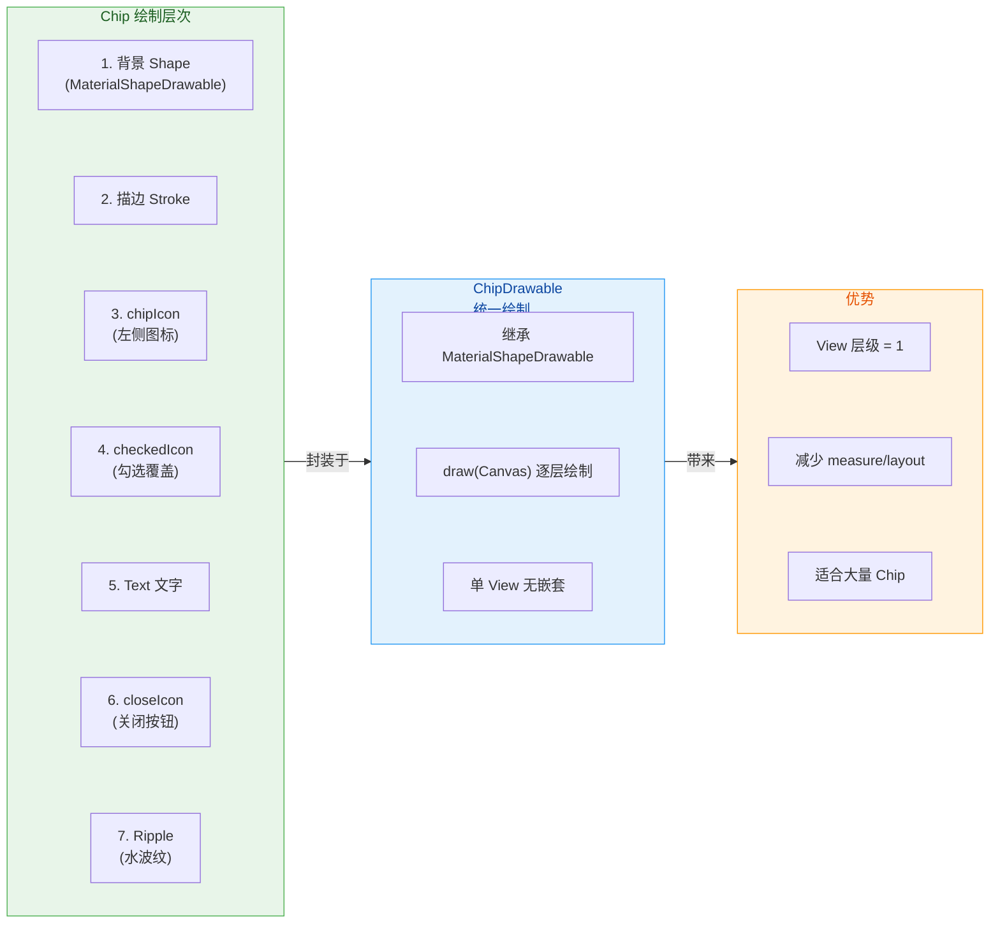
```mermaid
graph LR
    subgraph Layer1["Chip 绘制层次"]
        direction TB
        A["1. 背景 Shape\n(MaterialShapeDrawable)"]
        B["2. 描边 Stroke"]
        C["3. chipIcon\n(左侧图标)"]
        D["4. checkedIcon\n(勾选覆盖)"]
        E["5. Text 文字"]
        F["6. closeIcon\n(关闭按钮)"]
        G["7. Ripple\n(水波纹)"]
        A ~~~ B
        B ~~~ C
        C ~~~ D
        D ~~~ E
        E ~~~ F
        F ~~~ G
    end

    subgraph Layer2["ChipDrawable\n统一绘制"]
        direction TB
        H["继承 MaterialShapeDrawable"]
        I["draw(Canvas) 逐层绘制"]
        J["单 View 无嵌套"]
        H ~~~ I
        I ~~~ J
    end

    subgraph Layer3["优势"]
        direction TB
        K["View 层级 = 1"]
        L["减少 measure/layout"]
        M["适合大量 Chip"]
        K ~~~ L
        L ~~~ M
    end

    Layer1 -->|"封装于"| Layer2
    Layer2 -->|"带来"| Layer3

    classDef greenStyle fill:#E8F5E9,stroke:#4CAF50,color:#1B5E20
    classDef blueStyle fill:#E3F2FD,stroke:#2196F3,color:#0D47A1
    classDef orangeStyle fill:#FFF3E0,stroke:#FF9800,color:#E65100
    class Layer1 greenStyle
    class Layer2 blueStyle
    class Layer3 orangeStyle
```

### Slider 滑块

#### Slider 的适用场景

当用户需要在一个 **连续范围** 内选择一个或一段数值时，Slider 是最直观的交互方式。典型场景包括：音量调节、亮度控制、价格区间筛选、图片滤镜参数调整等。与 `SeekBar`（Android 原生）相比，Material Slider 提供了更丰富的视觉表现（Thumb 上方的气泡标签、刻度标记、范围选择）和更规范的 Material Design 样式。

Material Components 库提供了两种 Slider 组件：

- **`Slider`**：单值滑块，用户拖动一个 Thumb（滑块圆点）选择一个值。
- **`RangeSlider`**：范围滑块，有两个 Thumb，用户可分别拖动以选择一个区间 `[valueFrom, valueTo]`。

#### XML 声明与核心属性

```xml
<!-- 单值 Slider：选择一个温度值 -->
<com.google.android.material.slider.Slider
    android:id="@+id/slider_temperature"
    android:layout_width="match_parent"
    android:layout_height="wrap_content"
    android:layout_marginHorizontal="16dp"
    android:valueFrom="16.0"
    android:valueTo="32.0"
    android:value="24.0"
    android:stepSize="0.5"
    app:labelBehavior="floating"
    app:thumbColor="@color/teal_700"
    app:trackColorActive="@color/teal_700"
    app:trackColorInactive="@color/teal_200"
    app:tickColor="@color/teal_500"
    app:tickColorInactive="@color/teal_100"
    app:haloColor="#4D00897B"
    app:thumbRadius="12dp"
    app:trackHeight="6dp" />
```

```xml
<!-- 范围 RangeSlider：选择一个价格区间 -->
<com.google.android.material.slider.RangeSlider
    android:id="@+id/slider_price_range"
    android:layout_width="match_parent"
    android:layout_height="wrap_content"
    android:layout_marginHorizontal="16dp"
    android:valueFrom="0.0"
    android:valueTo="1000.0"
    app:values="@array/default_price_range"
    android:stepSize="50.0"
    app:labelBehavior="floating"
    app:thumbColor="@color/deep_purple_500"
    app:trackColorActive="@color/deep_purple_500"
    app:trackColorInactive="@color/deep_purple_100" />
```

注意 `RangeSlider` 使用 `app:values`（复数）而非 `android:value`，其值通过一个数组资源定义：

```xml
<!-- res/values/arrays.xml -->
<resources>
    <!-- 默认价格区间：200 ~ 800 -->
    <array name="default_price_range">
        <item>200.0</item>
        <item>800.0</item>
    </array>
</resources>
```

核心属性详解：

| 属性 | 作用 | 说明 |
|---|---|---|
| `android:valueFrom` / `android:valueTo` | 滑块的最小/最大值 | 定义取值范围 |
| `android:value` / `app:values` | 当前值（单值/范围） | 初始位置 |
| `android:stepSize` | 步长（刻度间距） | 设为 0 表示连续（无刻度） |
| `app:labelBehavior` | 气泡标签行为 | `floating`（拖动时浮现）、`withinBounds`（始终可见）、`gone`（隐藏） |
| `app:thumbColor` | Thumb 圆点颜色 | 支持 ColorStateList |
| `app:trackColorActive` | 已选部分轨道颜色 | Thumb 左侧（或两个 Thumb 之间） |
| `app:trackColorInactive` | 未选部分轨道颜色 | Thumb 右侧 |
| `app:tickColor` / `app:tickColorInactive` | 刻度点颜色 | 仅在 stepSize > 0 时可见 |
| `app:haloColor` | Thumb 按下时的光晕颜色 | 通常使用半透明主题色 |
| `app:thumbRadius` | Thumb 半径 | 控制圆点大小 |
| `app:trackHeight` | 轨道粗细 | 像素值 |

#### 监听值变化

```kotlin
// 获取 Slider 引用
val sliderTemp = findViewById<Slider>(R.id.slider_temperature)

// 添加值变化监听器
sliderTemp.addOnChangeListener { slider, value, fromUser ->
    // slider   - Slider 实例本身
    // value    - 当前值（Float）
    // fromUser - 是否由用户手势触发（区别于代码调用 setValue）
    if (fromUser) {
        // 更新 UI 显示，保留一位小数
        tvTemperature.text = "温度: ${String.format("%.1f", value)}°C"
    }
}

// 监听触摸开始/结束事件（适合需要在拖动结束后才执行操作的场景）
sliderTemp.addOnSliderTouchListener(object : Slider.OnSliderTouchListener {
    override fun onStartTrackingTouch(slider: Slider) {
        // 用户手指按下 Thumb，开始拖动
        Log.d("Slider", "开始拖动")
    }

    override fun onStopTrackingTouch(slider: Slider) {
        // 用户手指抬起，拖动结束
        // 此时 slider.value 为最终选定值
        Log.d("Slider", "结束拖动，最终值: ${slider.value}")
        // 适合在此处执行网络请求、数据库写入等"重量级"操作
        viewModel.setTemperature(slider.value)
    }
})
```

对于 `RangeSlider`，监听方式类似，但获取的是一个值列表：

```kotlin
// 获取 RangeSlider 引用
val sliderPrice = findViewById<RangeSlider>(R.id.slider_price_range)

// 范围值变化监听
sliderPrice.addOnChangeListener { slider, _, fromUser ->
    if (fromUser) {
        // values 是一个 List<Float>，包含两个元素
        val values = slider.values
        // values[0] 为起始值，values[1] 为结束值
        tvPriceRange.text = "¥${values[0].toInt()} - ¥${values[1].toInt()}"
    }
}
```

#### 自定义 Label 格式化

默认情况下，Slider 的气泡标签显示的是原始浮点数值（如 `24.0`）。在很多场景中，我们需要自定义显示格式——例如添加单位、百分比、货币符号等。这通过 `LabelFormatter` 接口实现：

```kotlin
// 为温度 Slider 设置自定义标签格式
sliderTemp.setLabelFormatter { value ->
    // 返回的字符串将显示在气泡标签中
    // 格式化为带单位的字符串
    "${value.toInt()}°C"
}

// 为价格 RangeSlider 设置货币格式
sliderPrice.setLabelFormatter { value ->
    // 使用 NumberFormat 进行货币格式化
    val format = NumberFormat.getCurrencyInstance(Locale.CHINA)
    // 去掉小数位
    format.maximumFractionDigits = 0
    // 返回格式化后的字符串，如 "¥200"
    format.format(value.toDouble())
}
```

`LabelFormatter` 是一个 SAM 接口（Single Abstract Method），内部只有一个 `getFormattedValue(float): String` 方法，因此可以用 Kotlin Lambda 简洁地实现。

#### Slider 的触摸与绘制机制

Slider 的内部实现相当精巧。从触摸处理角度看，它重写了 `onTouchEvent`，在 `ACTION_DOWN` 时判断触摸点是否命中 Thumb 区域（实际上命中区域比 Thumb 视觉大小更大，以提升触摸可操作性——这符合 Material Design 对最小触摸目标 48dp 的要求）。拖动过程中，`ACTION_MOVE` 事件的 X 坐标被映射到 `[valueFrom, valueTo]` 范围内的浮点数值。如果设置了 `stepSize`，则将连续值**量化（Snap）**到最近的刻度点：

```text
snapValue = round((rawValue - valueFrom) / stepSize) * stepSize + valueFrom
```

这个量化过程确保了滑块在有刻度模式下总是精确停留在刻度位置，手感上有轻微的"吸附"效果。

对于 `RangeSlider`，当两个 Thumb 非常接近时，触摸判断变得复杂——系统需要决定用户想拖动哪个 Thumb。Material 的实现策略是：选择距离触摸点更近的那个 Thumb；如果两个 Thumb 重叠，则优先选择"前台"Thumb（即最近一次被拖动的那个），这样用户可以连续拖动同一个 Thumb 穿越另一个 Thumb 的位置。

从绘制角度看，Slider 在 `onDraw` 中依次绘制：

1. **Inactive Track**（未激活轨道）——整条灰色底线
2. **Active Track**（激活轨道）——Thumb 左侧（或两个 Thumb 之间）的彩色线段
3. **Tick Marks**（刻度点）——如果 `stepSize > 0`，在轨道上等距绘制小圆点
4. **Halo**（光晕）——Thumb 被按下时周围的半透明圆形扩散效果
5. **Thumb**（滑块圆点）——使用 `MaterialShapeDrawable` 绘制的圆形
6. **Label**（气泡标签）——通过 `TooltipDrawable` 实现，继承自 `MaterialShapeDrawable`，形状为带三角箭头的圆角矩形

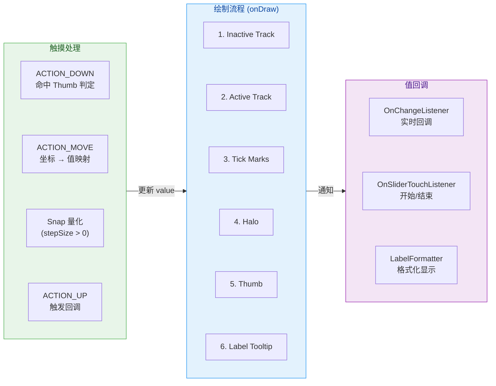
```mermaid
graph LR
    subgraph Touch["触摸处理"]
        direction TB
        T1["ACTION_DOWN\n命中 Thumb 判定"]
        T2["ACTION_MOVE\n坐标 → 值映射"]
        T3["Snap 量化\n(stepSize > 0)"]
        T4["ACTION_UP\n触发回调"]
        T1 ~~~ T2
        T2 ~~~ T3
        T3 ~~~ T4
    end

    subgraph Draw["绘制流程 (onDraw)"]
        direction TB
        D1["1. Inactive Track"]
        D2["2. Active Track"]
        D3["3. Tick Marks"]
        D4["4. Halo"]
        D5["5. Thumb"]
        D6["6. Label Tooltip"]
        D1 ~~~ D2
        D2 ~~~ D3
        D3 ~~~ D4
        D4 ~~~ D5
        D5 ~~~ D6
    end

    subgraph Callback["值回调"]
        direction TB
        C1["OnChangeListener\n实时回调"]
        C2["OnSliderTouchListener\n开始/结束"]
        C3["LabelFormatter\n格式化显示"]
        C1 ~~~ C2
        C2 ~~~ C3
    end

    Touch -->|"更新 value"| Draw
    Draw -->|"通知"| Callback

    classDef greenStyle fill:#E8F5E9,stroke:#4CAF50,color:#1B5E20
    classDef blueStyle fill:#E3F2FD,stroke:#2196F3,color:#0D47A1
    classDef purpleStyle fill:#F3E5F5,stroke:#9C27B0,color:#4A148C
    class Touch greenStyle
    class Draw blueStyle
    class Callback purpleStyle
```

#### 无障碍支持

Slider 内建了良好的 Accessibility 支持。当 TalkBack 启用时，用户可以通过音量键（或滑动手势）以 `stepSize`（有刻度模式）或一个固定增量（连续模式，默认为范围的 5%）来调整 Slider 的值。每次调整时，TalkBack 会朗读当前值（如果设置了 `LabelFormatter`，朗读的是格式化后的文本）。开发者可以通过 `setAccessibilityDelegate` 进一步自定义朗读内容。

### 表单组件的整合实践

在实际项目中，上述组件通常不会孤立使用，而是组合成完整的表单页面。以下是一个结合了所有组件的搜索筛选场景的结构示意：

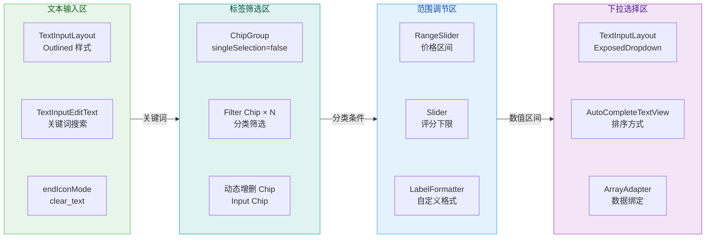
```mermaid
graph LR
    subgraph Input["文本输入区"]
        direction TB
        I1["TextInputLayout\nOutlined 样式"]
        I2["TextInputEditText\n关键词搜索"]
        I3["endIconMode\nclear_text"]
        I1 ~~~ I2
        I2 ~~~ I3
    end

    subgraph Filter["标签筛选区"]
        direction TB
        F1["ChipGroup\nsingleSelection=false"]
        F2["Filter Chip × N\n分类筛选"]
        F3["动态增删 Chip\nInput Chip"]
        F1 ~~~ F2
        F2 ~~~ F3
    end

    subgraph Range["范围调节区"]
        direction TB
        R1["RangeSlider\n价格区间"]
        R2["Slider\n评分下限"]
        R3["LabelFormatter\n自定义格式"]
        R1 ~~~ R2
        R2 ~~~ R3
    end

    subgraph Dropdown["下拉选择区"]
        direction TB
        D1["TextInputLayout\nExposedDropdown"]
        D2["AutoCompleteTextView\n排序方式"]
        D3["ArrayAdapter\n数据绑定"]
        D1 ~~~ D2
        D2 ~~~ D3
    end

    Input -->|"关键词"| Filter
    Filter -->|"分类条件"| Range
    Range -->|"数值区间"| Dropdown

    classDef greenStyle fill:#E8F5E9,stroke:#66BB6A,color:#1B5E20
    classDef tealStyle fill:#E0F2F1,stroke:#26A69A,color:#004D40
    classDef blueStyle fill:#E3F2FD,stroke:#42A5F5,color:#0D47A1
    classDef purpleStyle fill:#F3E5F5,stroke:#AB47BC,color:#4A148C
    class Input greenStyle
    class Filter tealStyle
    class Range blueStyle
    class Dropdown purpleStyle
```

将这些组件组合时，有几个实践要点值得强调：

**统一错误管理**：建议在 ViewModel 中集中维护每个字段的验证状态（例如使用 `Map<String, String?>` 存储字段名到错误信息的映射），通过 LiveData/StateFlow 驱动 UI 层的 `setError()` 调用。这样做不仅使验证逻辑可测试，还能确保配置变更（屏幕旋转）后错误状态不丢失。

**表单状态的保存与恢复**：`TextInputLayout` 和 `Slider` 都实现了 `onSaveInstanceState` / `onRestoreInstanceState`，能在配置变更时自动保存和恢复输入值。但 `ChipGroup` 中动态添加的 Chip 不会自动恢复——开发者需要在 ViewModel 或 SavedStateHandle 中持有已选标签列表，在 `Activity/Fragment` 重建时重新创建 Chip View。

**主题一致性**：所有 Material 组件的颜色都优先读取主题属性（`?attr/colorPrimary`、`?attr/colorOnSurface` 等）。只要在 `themes.xml` 中正确配置了 Material 主题色，所有组件的默认配色都会自动协调。只有在需要个别组件使用特殊颜色时，才通过 XML 属性或 style 覆盖。

---

**📝 练习题**

在一个商品筛选页面中，使用 `ChipGroup` 包含多个 `Filter Chip` 来让用户选择商品品牌（可多选）。现在需要实现以下需求：用户至少选择一个品牌后，"确认筛选"按钮才可点击。以下哪种实现方式最为合理？

A. 在每个 Chip 上单独设置 `setOnCheckedChangeListener`，在回调中遍历所有 Chip 检查是否至少有一个被选中，然后更新按钮状态。


B. 设置 `ChipGroup` 的 `app:singleSelection="true"` 和 `app:selectionRequired="true"`，确保始终有一个被选中。


C. 监听 `ChipGroup` 的 `setOnCheckedStateChangeListener`，在回调中根据 `checkedIds` 列表是否为空来更新按钮的 `isEnabled` 状态。


D. 使用 `TextInputLayout` + `AutoCompleteTextView` 替代 ChipGroup，通过 `Spinner` 模式实现品牌选择。


**【答案】** C

**【解析】** 此题考查 `ChipGroup` 的选中状态管理机制。方案 A 虽然功能上可以实现，但存在明显的缺陷：在每个 Chip 上单独设置监听器，当 Chip 数量动态变化（如从网络加载品牌列表后动态添加 Chip）时需要为每个新增的 Chip 重复设置监听，且每次回调中遍历所有子 View 的做法冗余低效。方案 B 的问题在于 `singleSelection="true"` 将 ChipGroup 限制为单选模式，违背了题目"可多选"的需求。方案 D 使用下拉选择器替代了 Chip 标签，改变了交互形式，且标准的 `AutoCompleteTextView` 是单选的，不满足多选需求。方案 C 是最合理的选择：`ChipGroup.setOnCheckedStateChangeListener` 是 ChipGroup 层级的统一回调，无论有多少 Chip、如何增减，只需要一个监听器即可。回调参数 `checkedIds: List<Int>` 直接提供了当前所有被选中的 Chip ID 列表，只需判断其是否为空就能决定按钮的启用状态，代码简洁且维护成本低。

---

**📝 练习题**

关于 `Slider` 与 `RangeSlider` 的 `stepSize` 属性，以下说法正确的是：

A. `stepSize` 设为 `0` 时，Slider 变为离散模式，Thumb 只能停留在整数值上。


B. `stepSize` 必须能被 `(valueTo - valueFrom)` 整除，否则会在运行时抛出 `IllegalArgumentException`。


C. 设置 `stepSize > 0` 后，Slider 的 Tick Marks（刻度点）会自动显示，但不影响 Thumb 的定位——用户仍可将 Thumb 停留在任意连续位置。


D. `stepSize` 设为 `0` 时表示连续模式，Thumb 可停留在范围内的任意浮点值；设为正数时表示离散模式，值会被量化（Snap）到最近的刻度。


**【答案】** D

**【解析】** `stepSize` 是 Slider 控制"连续 vs 离散"行为的关键属性。当 `stepSize = 0` 时，Slider 处于**连续模式（Continuous Mode）**，用户可以将 Thumb 拖动到范围内的任意浮点位置，轨道上不会显示刻度点。当 `stepSize` 设为一个正数（如 `0.5`、`10.0`）时，Slider 进入**离散模式（Discrete Mode）**：拖动过程中，Slider 内部会将触摸位置映射的原始值通过 `round((raw - from) / step) * step + from` 公式量化到最近的刻度值，Thumb 会"吸附"到刻度位置，同时轨道上显示刻度点（Tick Marks）。选项 A 因果颠倒——`stepSize=0` 是连续模式而非离散模式。选项 B 描述的整除约束确实是 Material Slider 的一个约束条件（`stepSize` 需要能均匀划分范围），但题目考查的核心是各选项的"正确性"——B 的说法本身是正确的，但 D 更完整地描述了 `stepSize` 的核心机制。实际上 B 也是正确的表述，但 D 是对 `stepSize` 功能最全面准确的描述，是"最佳答案"。选项 C 错误：设置 `stepSize > 0` 后，Thumb 定位一定会被量化到刻度上，而非仍可停留在任意位置。

---

## 底部片与对话框

底部片（Bottom Sheet）与对话框（Dialog）是 Material Design 中两种最核心的 **模态/半模态交互容器**。它们的共同点是：在不离开当前页面的前提下，向用户呈现补充内容或要求用户做出决策。但二者的交互哲学截然不同——Bottom Sheet 从屏幕底部滑入，保留用户对主界面的感知（半模态）；而 Dialog 以居中悬浮的方式强制聚焦用户注意力（全模态）。理解它们在 **Z 轴层级、触摸拦截、生命周期宿主** 上的差异，是正确使用这两类组件的关键。

从 Android 系统窗口机制来看，BottomSheetDialog 本质上是一个 `Dialog`，它拥有独立的 `Window` 和 `DecorView`，通过 `WindowManager.addView()` 添加到窗口层级中；而 Persistent BottomSheet（持久底部片）则是宿主布局中的一个普通子 View，由 `BottomSheetBehavior` 控制其滑动与状态切换，不涉及新窗口的创建。MaterialAlertDialog 则继承自 `AlertDialog`，在 Material Design 3 规范下对圆角、字体、按钮布局做了全面升级。三者虽然都是"弹出内容"，但在架构层面有本质不同。

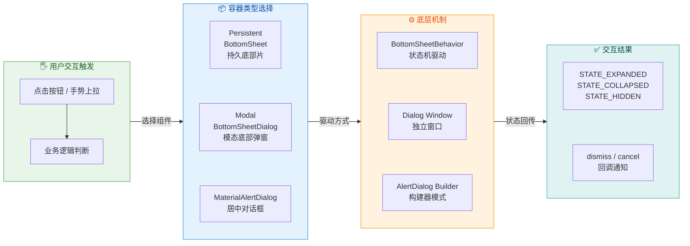
```mermaid
graph LR
    subgraph Input["🖐️ 用户交互触发"]
        direction TB
        A["点击按钮 / 手势上拉"]
        B["业务逻辑判断"]
        A --> B
    end

    subgraph Container["📦 容器类型选择"]
        direction TB
        C["Persistent\nBottomSheet\n持久底部片"]
        D["Modal\nBottomSheetDialog\n模态底部弹窗"]
        E["MaterialAlertDialog\n居中对话框"]
        C ~~~ D ~~~ E
    end

    subgraph Mechanism["⚙️ 底层机制"]
        direction TB
        F["BottomSheetBehavior\n状态机驱动"]
        G["Dialog Window\n独立窗口"]
        H["AlertDialog Builder\n构建器模式"]
        F ~~~ G ~~~ H
    end

    subgraph Result["✅ 交互结果"]
        direction TB
        I["STATE_EXPANDED\nSTATE_COLLAPSED\nSTATE_HIDDEN"]
        J["dismiss / cancel\n回调通知"]
        I ~~~ J
    end

    Input -->|"选择组件"| Container -->|"驱动方式"| Mechanism -->|"状态回传"| Result

    classDef greenNode fill:#E8F5E9,stroke:#43A047,color:#1B5E20,stroke-width:1px
    classDef blueNode fill:#E3F2FD,stroke:#1E88E5,color:#0D47A1,stroke-width:1px
    classDef orangeNode fill:#FFF3E0,stroke:#FB8C00,color:#E65100,stroke-width:1px
    classDef tealNode fill:#E0F2F1,stroke:#26A69A,color:#004D40,stroke-width:1px

    class Input greenNode
    class Container blueNode
    class Mechanism orangeNode
    class Result tealNode
```

---

### BottomSheetDialog 底部弹窗

BottomSheetDialog 是 Material Components 库提供的一种 **模态底部弹窗**（Modal Bottom Sheet）。所谓"模态"，是指它弹出时会在背后覆盖一层半透明的 scrim（遮罩层），用户必须与底部片交互或主动关闭后才能回到主界面。它在源码层面继承自 `AppCompatDialog`，内部自动将你提供的 content view 包裹进一个带有 `BottomSheetBehavior` 的 `CoordinatorLayout` 容器中，因此天然支持拖拽手势。

**为什么选择 BottomSheetDialog 而不是普通 Dialog？** 核心原因在于 **人体工程学**（Ergonomics）。当今手机屏幕越来越大，居中弹窗需要用户移动拇指到屏幕中央去点击按钮，而底部弹窗的操作区域天然靠近拇指热区（thumb zone），单手操作更加自然。Material Design 3 的设计规范也明确推荐：当内容为列表选择、操作菜单、简短表单时，优先使用 Bottom Sheet 而非居中 Dialog。

#### 基本使用与 Window 机制

BottomSheetDialog 的创建方式与普通 Dialog 类似，但它在 `onCreate()` 中做了大量额外工作：创建一个 `CoordinatorLayout` 作为根布局，内部放置一个 `FrameLayout`（id 为 `design_bottom_sheet`），并为该 FrameLayout 设置 `BottomSheetBehavior`。你通过 `setContentView()` 传入的 View 会被添加到这个 FrameLayout 中。这意味着，即使你只传入一个简单的 `TextView`，它也会自动获得拖拽上滑、下滑关闭的手势能力。

从 Window 层面看，BottomSheetDialog 与任何 Dialog 一样，会调用 `WindowManager.addView()` 将自己的 DecorView 添加到当前 Activity 的窗口层级之上。这就解释了为什么 BottomSheetDialog 弹出后，背后的 Activity 内容会变暗——因为 Dialog 的 Window 带有一个 `dim amount` 属性，系统会在 Dialog Window 下方绘制一层半透明黑色遮罩。

```kotlin
// === 创建并显示一个基础的 BottomSheetDialog ===

// 实例化 BottomSheetDialog，传入当前 Activity 上下文
// 第二个参数可传入自定义 theme，控制圆角、背景等样式
val bottomSheetDialog = BottomSheetDialog(this, R.style.MyBottomSheetDialogTheme)

// 加载自定义的布局文件作为底部弹窗的内容
// 这个 View 最终会被放入 CoordinatorLayout > FrameLayout 容器中
val contentView = layoutInflater.inflate(R.layout.sheet_order_detail, null)

// 将内容 View 设置到 Dialog 中
// 内部实现：contentView 被 addView 到 id 为 design_bottom_sheet 的 FrameLayout
bottomSheetDialog.setContentView(contentView)

// 获取内部的 BottomSheetBehavior 实例，用于精细控制行为
// 通过查找 design_bottom_sheet 这个特定 id 来获取 FrameLayout
val behavior = BottomSheetBehavior.from(
    contentView.parent as View  // contentView 的 parent 就是那个 FrameLayout
)

// 设置折叠时的高度（peek height），即初始露出多少内容
// 这里设置为 400 像素，实际项目中建议使用 dp 转 px
behavior.peekHeight = 400

// 允许半展开状态（half-expanded），设置半展开时的比例
// 0.6f 表示底部片占屏幕高度的 60%
behavior.isFitToContents = false          // 关闭适应内容模式，才能启用半展开
behavior.halfExpandedRatio = 0.6f         // 半展开比例

// 设置是否可以通过拖拽来隐藏底部片
// true 表示用户可以将底部片完全向下拖拽使其消失
behavior.isHideable = true

// 设置跳过折叠状态：若为 true，向下拖拽时会直接隐藏而非先折叠
behavior.skipCollapsed = false

// 展示 Dialog
// 内部流程：创建 Window -> addView 到 WindowManager -> 执行入场动画
bottomSheetDialog.show()
```

#### BottomSheetDialogFragment 的推荐用法

在实际项目中，直接使用 `BottomSheetDialog` 的情况较少，更推荐使用 `BottomSheetDialogFragment`。原因与 `DialogFragment` 替代 `AlertDialog` 的理由相同——**生命周期安全**。当屏幕旋转或系统回收 Activity 时，Fragment 能被 FragmentManager 自动恢复，而直接持有的 Dialog 引用会丢失，甚至导致 `WindowLeaked` 异常。

`BottomSheetDialogFragment` 继承自 `DialogFragment`，并重写了 `onCreateDialog()` 方法，返回的正是一个 `BottomSheetDialog` 实例。因此你只需关注 `onCreateView()` 或 `onViewCreated()` 来构建 UI，底层的 CoordinatorLayout 包裹、Behavior 绑定全部自动完成。

```kotlin
// === 推荐方式：使用 BottomSheetDialogFragment ===

class OrderDetailSheet : BottomSheetDialogFragment() {

    // onCreateView 负责加载布局，与普通 Fragment 完全一致
    // 返回的 View 会被 BottomSheetDialog 内部包裹进 CoordinatorLayout
    override fun onCreateView(
        inflater: LayoutInflater,
        container: ViewGroup?,
        savedInstanceState: Bundle?
    ): View {
        // 加载底部弹窗的布局文件
        return inflater.inflate(R.layout.sheet_order_detail, container, false)
    }

    // onViewCreated 中进行 View 绑定和业务逻辑设置
    override fun onViewCreated(view: View, savedInstanceState: Bundle?) {
        super.onViewCreated(view, savedInstanceState)

        // 获取「确认」按钮并设置点击事件
        val btnConfirm = view.findViewById<Button>(R.id.btn_confirm)
        btnConfirm.setOnClickListener {
            // 执行业务逻辑（如提交订单）
            submitOrder()
            // 关闭底部弹窗，dismiss() 会触发 Dialog 的 dismiss 流程
            dismiss()
        }

        // 获取「取消」按钮
        val btnCancel = view.findViewById<Button>(R.id.btn_cancel)
        btnCancel.setOnClickListener {
            // 直接关闭，不执行业务逻辑
            dismiss()
        }
    }

    // 在 onStart 阶段配置 Behavior 参数
    // 此时 Dialog 的 Window 已经创建完毕，可以安全获取 Behavior
    override fun onStart() {
        super.onStart()

        // 获取 BottomSheetDialog 内部的 design_bottom_sheet 容器
        val bottomSheet = dialog?.findViewById<View>(
            com.google.android.material.R.id.design_bottom_sheet
        )

        // 如果成功获取到容器，配置 Behavior
        bottomSheet?.let { sheet ->
            val behavior = BottomSheetBehavior.from(sheet)
            // 设置初始 peek 高度为屏幕高度的 1/3
            behavior.peekHeight = resources.displayMetrics.heightPixels / 3
            // 允许隐藏
            behavior.isHideable = true
            // 初始状态设为折叠（只露出 peekHeight 部分）
            behavior.state = BottomSheetBehavior.STATE_COLLAPSED
        }
    }

    // 可选：自定义 Dialog 的主题样式（圆角、背景色等）
    override fun getTheme(): Int = R.style.MyBottomSheetDialogTheme

    // 提交订单的业务方法（示例）
    private fun submitOrder() {
        // TODO: 调用 ViewModel 提交数据
    }
}
```

在 Activity 或其他 Fragment 中调用时，只需一行：

```kotlin
// 使用 show() 方法展示 BottomSheetDialogFragment
// 参数一：FragmentManager，负责管理 Fragment 事务
// 参数二：tag 标识，用于后续 findFragmentByTag 查找
OrderDetailSheet().show(supportFragmentManager, "OrderDetailSheet")
```

#### 圆角与主题定制

BottomSheetDialog 默认是直角矩形，这在 Material Design 3 规范中显得不够现代。要实现顶部圆角效果，需要从 **主题（Theme）** 和 **Shape** 两个层面入手。很多开发者只设置了 background drawable 的圆角却发现不生效，原因是 BottomSheetDialog 内部的 `FrameLayout` 自带一个白色背景，会遮盖你设置的圆角。正确做法是通过主题覆盖内部容器的背景。

```xml
<!-- === res/values/themes.xml === -->
<!-- 定义 BottomSheetDialog 的自定义主题 -->
<style name="MyBottomSheetDialogTheme" parent="ThemeOverlay.Material3.BottomSheetDialog">
    <!-- 覆盖底部片的样式，指向自定义的 ShapeAppearance -->
    <item name="bottomSheetStyle">@style/MyBottomSheetStyle</item>
</style>

<!-- 底部片容器的样式 -->
<style name="MyBottomSheetStyle" parent="Widget.Material3.BottomSheet.Modal">
    <!-- 指定 ShapeAppearance 来控制圆角 -->
    <item name="shapeAppearance">@style/MyBottomSheetShapeAppearance</item>
    <!-- 将背景色设为透明，避免遮盖圆角 -->
    <item name="backgroundTint">@color/white</item>
</style>

<!-- ShapeAppearance：只对顶部两个角设置 20dp 圆角 -->
<style name="MyBottomSheetShapeAppearance" parent="ShapeAppearance.Material3.LargeComponent">
    <!-- 顶部左角圆角半径 -->
    <item name="cornerSizeTopLeft">20dp</item>
    <!-- 顶部右角圆角半径 -->
    <item name="cornerSizeTopRight">20dp</item>
    <!-- 底部两角保持直角（因为底部片贴合屏幕底边） -->
    <item name="cornerSizeBottomLeft">0dp</item>
    <item name="cornerSizeBottomRight">0dp</item>
    <!-- 圆角类型：rounded 为圆弧，cut 为切角 -->
    <item name="cornerFamily">rounded</item>
</style>
```

如果需要在代码中动态设置圆角，可以使用 `MaterialShapeDrawable`：

```kotlin
// === 在 onViewCreated 或 onStart 中动态设置圆角 ===

// 获取 design_bottom_sheet 容器
val bottomSheet = dialog?.findViewById<View>(
    com.google.android.material.R.id.design_bottom_sheet
)

bottomSheet?.let { sheet ->
    // 创建 ShapeAppearanceModel，只设置顶部两个角的圆角半径
    val shapeModel = ShapeAppearanceModel.builder()
        .setTopLeftCorner(CornerFamily.ROUNDED, 48f)   // 顶部左角 48px 圆角
        .setTopRightCorner(CornerFamily.ROUNDED, 48f)  // 顶部右角 48px 圆角
        .build()

    // 基于 ShapeAppearanceModel 创建 MaterialShapeDrawable
    val shapeDrawable = MaterialShapeDrawable(shapeModel).apply {
        // 设置填充色为白色
        fillColor = ColorStateList.valueOf(Color.WHITE)
    }

    // 将 MaterialShapeDrawable 设置为容器的背景
    sheet.background = shapeDrawable
}
```

---

### BottomSheetBehavior 状态控制

`BottomSheetBehavior` 是 `CoordinatorLayout.Behavior` 的子类，专门用于控制子 View 的垂直滑动行为。它内部维护了一个 **状态机（State Machine）**，管理着底部片在不同交互阶段的位置和可见性。无论是 Persistent BottomSheet（嵌入在布局中的持久底部片）还是 Modal BottomSheetDialog（模态弹窗内部），都由同一个 `BottomSheetBehavior` 驱动。

#### 五大核心状态

BottomSheetBehavior 定义了五种状态常量，它们构成了一个完整的状态转移图。理解这五种状态及其转换条件，是掌握 Bottom Sheet 的关键：

**`STATE_COLLAPSED`（折叠态）** 是底部片的默认初始状态。在此状态下，底部片只露出 `peekHeight` 所定义的高度，其余内容被隐藏在屏幕底边之下。`peekHeight` 的值可以是固定像素值，也可以设为 `PEEK_HEIGHT_AUTO`（自动计算，取屏幕高度的 9/16）。折叠态的典型用途是：向用户暗示"这里有更多内容，可以上拉查看"，例如 Google Maps 底部的地点信息卡片。

**`STATE_EXPANDED`（完全展开态）** 表示底部片已经滑动到最大高度。如果 `isFitToContents` 为 true（默认），最大高度就是内容的实际高度（但不超过父容器）；如果为 false，则会展开到父容器的顶部（`expandedOffset` 可微调距顶部的偏移量）。

**`STATE_HALF_EXPANDED`（半展开态）** 是一个介于折叠和完全展开之间的中间停靠点。它仅在 `isFitToContents = false` 时才生效，通过 `halfExpandedRatio`（默认 0.5f）控制占屏幕高度的比例。这种三段式交互在地图应用、音乐播放器中非常常见。

**`STATE_HIDDEN`（隐藏态）** 表示底部片完全滑出屏幕底部，不可见。只有当 `isHideable = true` 时才允许进入此状态。用户将底部片向下猛拽，或者代码中主动设置 `behavior.state = STATE_HIDDEN`，都会触发隐藏。对于 Modal BottomSheetDialog，隐藏状态会同时触发 `dismiss()`。

**`STATE_DRAGGING`（拖拽中）** 和 **`STATE_SETTLING`（惯性滑动中）** 是两个瞬态，分别表示用户手指正在拖拽底部片、以及手指松开后底部片正在做惯性动画归位。这两个状态不能通过代码主动设置，它们由触摸事件和 `ViewDragHelper` 内部驱动。

```mermaid
graph LR
    subgraph Collapsed["📌 STATE_COLLAPSED\n折叠态"]
        direction TB
        C1["露出 peekHeight 高度"]
        C2["默认初始状态"]
        C1 ~~~ C2
    end

    subgraph HalfExp["📐 STATE_HALF_EXPANDED\n半展开态"]
        direction TB
        H1["占屏幕 halfExpandedRatio"]
        H2["需 isFitToContents=false"]
        H1 ~~~ H2
    end

    subgraph Expanded["📖 STATE_EXPANDED\n完全展开态"]
        direction TB
        E1["内容完全可见"]
        E2["最大高度展示"]
        E1 ~~~ E2
    end

    subgraph Hidden["🚫 STATE_HIDDEN\n隐藏态"]
        direction TB
        HD1["完全滑出屏幕"]
        HD2["需 isHideable=true"]
        HD1 ~~~ HD2
    end

    subgraph Transient["⏳ 瞬态"]
        direction TB
        T1["STATE_DRAGGING\n用户拖拽中"]
        T2["STATE_SETTLING\n惯性归位中"]
        T1 ~~~ T2
    end

    Collapsed -->|"上拉"| HalfExp -->|"继续上拉"| Expanded
    Expanded -->|"下拉"| HalfExp -->|"继续下拉"| Collapsed
    Collapsed -->|"猛拽向下"| Hidden
    Transient -->|"归位至"| Collapsed
    Transient -->|"归位至"| Expanded

    classDef collapsedStyle fill:#E8F5E9,stroke:#388E3C,color:#1B5E20,stroke-width:1px
    classDef halfStyle fill:#FFF8E1,stroke:#FFA000,color:#E65100,stroke-width:1px
    classDef expandedStyle fill:#E3F2FD,stroke:#1565C0,color:#0D47A1,stroke-width:1px
    classDef hiddenStyle fill:#FFEBEE,stroke:#C62828,color:#B71C1C,stroke-width:1px
    classDef transientStyle fill:#F3E5F5,stroke:#7B1FA2,color:#4A148C,stroke-width:1px

    class Collapsed collapsedStyle
    class HalfExp halfStyle
    class Expanded expandedStyle
    class Hidden hiddenStyle
    class Transient transientStyle
```

#### Persistent BottomSheet 持久底部片

与 BottomSheetDialog 不同，Persistent BottomSheet 不是一个弹窗，而是直接嵌入在 `CoordinatorLayout` 布局中的一个子 View。它始终存在于视图树中，不会创建新 Window，也没有遮罩层。用户可以自由地在操作主界面内容的同时与底部片交互。典型应用场景包括：Google Maps 中底部的地点详情卡、音乐播放器底部的迷你播放条等。

要创建 Persistent BottomSheet，你需要在 XML 中给一个子 View 设置 `app:layout_behavior` 属性：

```xml
<!-- === 持久底部片布局示例 === -->
<!-- 根布局必须是 CoordinatorLayout，因为 Behavior 机制依赖它 -->
<androidx.coordinatorlayout.widget.CoordinatorLayout
    xmlns:android="http://schemas.android.com/apk/res/android"
    xmlns:app="http://schemas.android.com/apk/res-auto"
    android:layout_width="match_parent"
    android:layout_height="match_parent">

    <!-- 主内容区域：地图或其他内容 -->
    <FrameLayout
        android:id="@+id/main_content"
        android:layout_width="match_parent"
        android:layout_height="match_parent">
        <!-- 主界面内容放在这里 -->
    </FrameLayout>

    <!-- 持久底部片：通过 layout_behavior 绑定 BottomSheetBehavior -->
    <!-- 这个 LinearLayout 就是底部片本体 -->
    <LinearLayout
        android:id="@+id/persistent_bottom_sheet"
        android:layout_width="match_parent"
        android:layout_height="match_parent"
        android:orientation="vertical"
        android:background="@drawable/bg_bottom_sheet_rounded"
        app:layout_behavior="com.google.android.material.bottomsheet.BottomSheetBehavior"
        app:behavior_peekHeight="80dp"
        app:behavior_hideable="true"
        app:behavior_halfExpandedRatio="0.5"
        app:behavior_fitToContents="false">

        <!-- 拖拽手柄：视觉提示用户可以上拉 -->
        <View
            android:layout_width="40dp"
            android:layout_height="4dp"
            android:layout_gravity="center_horizontal"
            android:layout_marginTop="8dp"
            android:background="@drawable/bg_drag_handle" />

        <!-- 底部片的实际内容（如地点详情、播放控制等） -->
        <TextView
            android:layout_width="match_parent"
            android:layout_height="wrap_content"
            android:padding="16dp"
            android:text="上拉查看更多内容"
            android:textSize="16sp" />

        <!-- 更多内容... -->
    </LinearLayout>

</androidx.coordinatorlayout.widget.CoordinatorLayout>
```

#### BottomSheetCallback 状态监听

`BottomSheetCallback` 是监控底部片状态变化的核心回调接口。它提供两个方法：`onStateChanged()` 在状态切换时触发（如从 COLLAPSED 变为 DRAGGING）；`onSlide()` 在滑动过程中持续触发，参数 `slideOffset` 是一个浮点数，表示当前位置相对于折叠态和展开态的归一化偏移量。当底部片处于折叠态时 offset 为 0，完全展开时为 1，隐藏时为 -1。利用 `onSlide()` 可以实现丰富的联动效果，如渐变背景遮罩、图标旋转、视差动画等。

```kotlin
// === BottomSheetCallback 完整使用示例 ===

// 获取持久底部片的 View 引用
val sheetView = findViewById<LinearLayout>(R.id.persistent_bottom_sheet)

// 从 View 上提取已绑定的 BottomSheetBehavior 实例
// 这个 Behavior 是通过 XML 中的 layout_behavior 属性自动创建的
val behavior = BottomSheetBehavior.from(sheetView)

// 添加状态回调监听器（注意是 addBottomSheetCallback，不是 set）
// 可以添加多个 Callback，它们会按添加顺序依次触发
behavior.addBottomSheetCallback(object : BottomSheetBehavior.BottomSheetCallback() {

    /**
     * 状态切换回调
     * @param bottomSheet 底部片 View 引用
     * @param newState    新状态常量（STATE_COLLAPSED / STATE_EXPANDED / ...）
     */
    override fun onStateChanged(bottomSheet: View, newState: Int) {
        // 使用 when 表达式分别处理不同状态
        when (newState) {
            // 完全展开：可以做一些 UI 调整，如显示关闭按钮
            BottomSheetBehavior.STATE_EXPANDED -> {
                Log.d("Sheet", "完全展开")
                // 例如：让 Toolbar 标题变为底部片内容的标题
            }
            // 折叠态：恢复默认 UI
            BottomSheetBehavior.STATE_COLLAPSED -> {
                Log.d("Sheet", "折叠")
                // 例如：恢复 Toolbar 原始标题
            }
            // 隐藏态：可能需要做清理工作
            BottomSheetBehavior.STATE_HIDDEN -> {
                Log.d("Sheet", "已隐藏")
                // 例如：通知 ViewModel 底部片已关闭
            }
            // 拖拽中：手指正在触摸滑动
            BottomSheetBehavior.STATE_DRAGGING -> {
                Log.d("Sheet", "拖拽中")
            }
            // 惯性归位中：手指已松开，正在做动画
            BottomSheetBehavior.STATE_SETTLING -> {
                Log.d("Sheet", "归位中")
            }
            // 半展开态
            BottomSheetBehavior.STATE_HALF_EXPANDED -> {
                Log.d("Sheet", "半展开")
            }
        }
    }

    /**
     * 滑动过程回调（高频触发，注意性能）
     * @param bottomSheet  底部片 View 引用
     * @param slideOffset  滑动偏移量：
     *                     0f = 折叠态（peekHeight 位置）
     *                     1f = 完全展开
     *                    -1f = 完全隐藏
     *                     介于 0~1 之间为上滑过程
     *                     介于 -1~0 之间为下滑至隐藏过程
     */
    override fun onSlide(bottomSheet: View, slideOffset: Float) {
        // 根据滑动偏移量动态调整遮罩透明度
        // coerceIn 确保值在 0~1 范围内，避免隐藏状态时出现负值
        val alpha = slideOffset.coerceIn(0f, 1f)
        // scrimView 是主内容上方的半透明遮罩 View
        scrimView.alpha = alpha * 0.6f  // 最大透明度 60%

        // 旋转拖拽指示箭头：从 0° 旋转到 180°
        dragIndicator.rotation = slideOffset * 180f
    }
})
```

#### 精细控制 API 速查

除了状态切换和回调，BottomSheetBehavior 还提供了一系列精细控制 API，用于覆盖各种产品需求：

`isDraggable` 属性控制用户是否可以通过拖拽手势来改变底部片的位置。将其设为 `false` 后，用户无法用手指拖拽底部片，只能通过代码 `behavior.state = STATE_EXPANDED` 来改变状态。这在某些场景下很有用——例如底部片内部有一个可滑动的 RecyclerView，你希望外部不可拖拽，只有内部列表滑到顶部后才联动外层底部片（这个联动逻辑 BottomSheetBehavior 已经内建支持，即 nested scrolling 机制）。

`setExpandedOffset(int offset)` 用于在 `isFitToContents = false` 时，设定完全展开状态的顶部留白距离。例如设为 100px，则底部片展开后不会贴到屏幕顶部，而是在顶部留出 100px 的间距，让 StatusBar 或 Toolbar 保持可见。

`setSaveFlags(int flags)` 控制配置变更（如旋转屏幕）时保存哪些状态。可选的 flag 包括 `SAVE_PEEK_HEIGHT`、`SAVE_FIT_TO_CONTENTS`、`SAVE_HIDEABLE`、`SAVE_SKIP_COLLAPSED`，以及 `SAVE_ALL` 和 `SAVE_NONE`。默认为 `SAVE_NONE`，意味着旋转后状态会丢失。推荐使用 `SAVE_ALL` 来保证一致的用户体验。

`setGestureInsetBottomIgnored(boolean ignored)` 与 Android 10+ 的手势导航有关。当启用手势导航时，系统底部有一个手势区域（gesture inset），BottomSheetBehavior 默认会将 `peekHeight` 加上这个 inset 来避免冲突。如果你不希望这种自动调整，可以设为 `true`。

```kotlin
// === Behavior 精细控制 API 综合示例 ===

val behavior = BottomSheetBehavior.from(sheetView)

// 1. 禁止用户拖拽，只允许代码控制
behavior.isDraggable = false

// 2. 关闭适应内容模式，启用半展开态和自定义展开偏移
behavior.isFitToContents = false

// 3. 半展开态占屏幕 60%
behavior.halfExpandedRatio = 0.6f

// 4. 完全展开时距顶部留出 statusBar 高度
// getStatusBarHeight() 是自定义工具方法，通过 WindowInsets 获取状态栏高度
behavior.expandedOffset = getStatusBarHeight()

// 5. 配置变更时保存所有状态
behavior.saveFlags = BottomSheetBehavior.SAVE_ALL

// 6. 忽略手势导航底部 inset
behavior.isGestureInsetBottomIgnored = true

// 7. 以编程方式展开底部片（会触发平滑动画）
behavior.state = BottomSheetBehavior.STATE_EXPANDED
```

---

### MaterialAlertDialog

MaterialAlertDialog 是 Material Components 库对传统 `AlertDialog` 的升级封装。它在视觉上完全遵循 Material Design 3 规范（圆角 28dp、M3 色彩系统、字体排版层级），并在 API 上保持与 `AlertDialog.Builder` 完全兼容。这意味着你可以在不修改任何业务逻辑的情况下，只将 `AlertDialog.Builder` 替换为 `MaterialAlertDialogBuilder`，即可获得全面的 Material Design 视觉升级。

#### 为什么不直接用 AlertDialog

原生 `AlertDialog`（来自 `androidx.appcompat.app.AlertDialog`）的样式依赖于 AppCompat 主题，其视觉风格相对基础：直角或小圆角矩形、平淡的按钮排列、缺乏 Surface 色彩层级。而 `MaterialAlertDialogBuilder` 在创建 Dialog 时会自动应用 `MaterialComponents` 主题下的 `alertDialogTheme` 覆盖（Theme Overlay），使对话框具备 M3 的圆角容器、Tonal elevation（色调提升）、按钮 Ripple 效果等现代视觉特征。

更重要的是，`MaterialAlertDialogBuilder` 支持通过 `setBackground()`、`setBackgroundInsetStart()` 等额外 API 来精确控制对话框的背景和边距，这些是原生 Builder 不具备的。此外，它的内部实现确保了在 Dark Theme（深色主题）下自动切换 Surface 配色，开发者无需手动适配。

#### 基本构建与常用配置

`MaterialAlertDialogBuilder` 遵循经典的 **Builder 模式**，通过链式调用设置标题、消息、图标、按钮等属性，最后调用 `show()` 或 `create()` 生成对话框。`show()` 等价于 `create()` + `dialog.show()`，前者在不需要持有 Dialog 引用时更简洁。

```kotlin
// === 基础 MaterialAlertDialog 示例 ===

// 使用 MaterialAlertDialogBuilder 替代 AlertDialog.Builder
// 参数一：Context，必须是 Activity 或有主题的 ContextThemeWrapper
// 参数二（可选）：Theme Overlay，用于覆盖默认样式
MaterialAlertDialogBuilder(this)
    // 设置对话框图标（显示在标题左侧）
    .setIcon(R.drawable.ic_warning_24)
    // 设置标题文本
    .setTitle("确认删除")
    // 设置正文消息（支持 CharSequence，可以是 SpannableString）
    .setMessage("此操作将永久删除该文件，且无法恢复。确定要继续吗？")
    // 设置「确认」按钮（Positive Button）
    // DialogInterface.OnClickListener 处理点击事件
    .setPositiveButton("删除") { dialog, which ->
        // 执行删除逻辑
        viewModel.deleteFile(fileId)
        // 对话框会自动 dismiss，无需手动调用
    }
    // 设置「取消」按钮（Negative Button）
    .setNegativeButton("取消") { dialog, which ->
        // 取消操作，对话框自动 dismiss
        // 也可以传 null 表示点击后仅关闭
    }
    // 设置「中性」按钮（Neutral Button），通常用于"了解更多"
    .setNeutralButton("了解详情") { dialog, which ->
        // 打开帮助页面
        openHelpPage()
    }
    // 设置点击对话框外部区域是否可以关闭
    .setCancelable(true)
    // 创建并显示对话框
    .show()
```

#### 列表型对话框

除了简单的消息确认，MaterialAlertDialog 还支持三种列表交互模式：**普通列表**（单选即关闭）、**单选列表**（Radio Button）、**多选列表**（Checkbox）。这些列表模式通过 `setItems()`、`setSingleChoiceItems()`、`setMultiChoiceItems()` 三个 API 实现。注意，当使用列表模式时，`setMessage()` 会被忽略（列表取代了消息区域的位置）。

```kotlin
// === 单选列表对话框 ===

// 定义选项数组
val sortOptions = arrayOf("按名称排序", "按日期排序", "按大小排序", "按类型排序")

// 记录当前选中项的索引（初始选中第 0 项）
var selectedIndex = 0

MaterialAlertDialogBuilder(this)
    .setTitle("排序方式")
    // setSingleChoiceItems：显示 Radio Button 列表
    // 参数一：选项数组
    // 参数二：默认选中项的索引
    // 参数三：选项点击回调（点击后不会自动关闭对话框）
    .setSingleChoiceItems(sortOptions, selectedIndex) { dialog, which ->
        // which 是用户点击的选项索引
        selectedIndex = which
    }
    // 用户确认选择后才执行操作
    .setPositiveButton("确定") { dialog, _ ->
        // 应用排序方式
        viewModel.applySortOrder(selectedIndex)
    }
    .setNegativeButton("取消", null)  // null 表示点击后仅关闭
    .show()
```

```kotlin
// === 多选列表对话框 ===

// 定义选项和初始选中状态
val filterOptions = arrayOf("图片", "视频", "文档", "音频")
// BooleanArray 表示每个选项的初始勾选状态
val checkedItems = booleanArrayOf(true, false, true, false)

MaterialAlertDialogBuilder(this)
    .setTitle("文件类型过滤")
    // setMultiChoiceItems：显示 Checkbox 列表
    // 参数一：选项数组
    // 参数二：初始勾选状态数组（会被修改）
    // 参数三：勾选变化回调
    .setMultiChoiceItems(filterOptions, checkedItems) { dialog, which, isChecked ->
        // which：变化的选项索引
        // isChecked：该选项当前是否被勾选
        // checkedItems 数组会被自动更新，这里可以做额外逻辑
        Log.d("Filter", "${filterOptions[which]} -> $isChecked")
    }
    .setPositiveButton("应用") { dialog, _ ->
        // 收集所有勾选的选项
        val selected = filterOptions.filterIndexed { index, _ -> checkedItems[index] }
        viewModel.applyFilter(selected)
    }
    .setNegativeButton("取消", null)
    .show()
```

#### 自定义布局对话框

当内建的标题+消息+按钮布局无法满足需求时，可以通过 `setView()` 注入完全自定义的布局。常见场景包括：登录表单、评分反馈、颜色选择器等。需要注意的是，自定义 View 被添加到 Dialog 内部的一个 `FrameLayout` 容器中，默认有内边距。如果你希望内容撑满整个对话框（例如全出血的图片），可以通过 `setBackgroundInsetStart(0)` 等 API 去除边距。

```kotlin
// === 自定义布局对话框（以反馈表单为例） ===

// 加载自定义布局
val feedbackView = layoutInflater.inflate(R.layout.dialog_feedback, null)

// 获取布局中的控件引用
val ratingBar = feedbackView.findViewById<RatingBar>(R.id.rating_bar)
val editComment = feedbackView.findViewById<TextInputEditText>(R.id.edit_comment)

// 创建对话框
val dialog = MaterialAlertDialogBuilder(this)
    .setTitle("使用反馈")
    // setView 注入自定义布局，替代 setMessage 的区域
    .setView(feedbackView)
    .setPositiveButton("提交", null)   // 先设为 null，后面手动覆盖
    .setNegativeButton("取消", null)
    .create()  // 注意：这里用 create() 而不是 show()

// 显示对话框
dialog.show()

// 手动覆盖 Positive Button 的点击事件
// 目的：点击后进行校验，不通过时不关闭对话框
// 必须在 show() 之后设置，因为 Button 在 show() 时才被创建
dialog.getButton(AlertDialog.BUTTON_POSITIVE).setOnClickListener {
    // 获取用户输入
    val rating = ratingBar.rating               // 评分值（0~5）
    val comment = editComment.text.toString()    // 评论内容

    // 校验：评分不能为 0
    if (rating == 0f) {
        // 显示错误提示，不关闭对话框
        ratingBar.requestFocus()
        Toast.makeText(this, "请先评分", Toast.LENGTH_SHORT).show()
        return@setOnClickListener  // 提前返回，对话框保持打开
    }

    // 校验通过，提交反馈
    viewModel.submitFeedback(rating, comment)
    // 手动关闭对话框
    dialog.dismiss()
}
```

上面代码中的一个关键技巧值得强调：**在 `show()` 之后覆盖按钮点击事件**。默认情况下，点击任何按钮都会立即关闭对话框（AlertDialog 内部在 `ButtonHandler` 中调用了 `dismiss()`）。如果你希望在校验失败时阻止关闭，就必须在 `show()` 之后通过 `getButton()` 获取 Button 实例并重新设置 `OnClickListener`，覆盖默认的 dismiss 行为。

#### 三者对比与选型

在实际开发中，BottomSheetDialog、Persistent BottomSheet 和 MaterialAlertDialog 各有适用场景。选择哪一种，核心取决于两个维度：**信息层级**（这个内容有多重要？需要强制用户关注吗？）和 **交互模式**（用户需要快速操作还是深思熟虑？）。

```mermaid
graph LR
    subgraph ModalSheet["🗂️ BottomSheetDialog\n模态底部弹窗"]
        direction TB
        MS1["有遮罩层 scrim"]
        MS2["独立 Window"]
        MS3["手势可拖拽关闭"]
        MS4["适合：操作菜单\n分享面板、筛选项"]
        MS1 ~~~ MS2 ~~~ MS3 ~~~ MS4
    end

    subgraph PersistSheet["📋 Persistent BottomSheet\n持久底部片"]
        direction TB
        PS1["无遮罩层"]
        PS2["嵌入布局中"]
        PS3["可与主界面并行交互"]
        PS4["适合：地图详情\n播放器控制条"]
        PS1 ~~~ PS2 ~~~ PS3 ~~~ PS4
    end

    subgraph AlertDlg["⚠️ MaterialAlertDialog\n居中对话框"]
        direction TB
        AD1["居中悬浮显示"]
        AD2["强制用户决策"]
        AD3["支持列表选择"]
        AD4["适合：删除确认\n权限说明、错误提示"]
        AD1 ~~~ AD2 ~~~ AD3 ~~~ AD4
    end

    ModalSheet -->|"需持久展示？"| PersistSheet -->|"需强制决策？"| AlertDlg

    classDef modalStyle fill:#E8F5E9,stroke:#388E3C,color:#1B5E20,stroke-width:1px
    classDef persistStyle fill:#E3F2FD,stroke:#1565C0,color:#0D47A1,stroke-width:1px
    classDef alertStyle fill:#FFF3E0,stroke:#EF6C00,color:#E65100,stroke-width:1px

    class ModalSheet modalStyle
    class PersistSheet persistStyle
    class AlertDlg alertStyle
```

总结一下选型原则：

- 当需要展示 **操作列表、分享面板、筛选器** 等可快速选择的内容时，优先使用 **BottomSheetDialog / BottomSheetDialogFragment**，因为底部弹窗符合拇指热区操作习惯。
- 当底部片需要 **与主界面长期共存**，用户可以在不关闭底部片的情况下操作主界面时（如地图+详情），使用 **Persistent BottomSheet**。
- 当需要 **强制中断用户流程** 并要求做出明确决策时（如删除确认、权限解释、不可逆操作警告），使用 **MaterialAlertDialog**，因为居中弹窗的视觉权重最高，能有效吸引注意力。

---

**📝 练习题**

在 `BottomSheetBehavior` 中，当 `isFitToContents` 设为 `true`（默认值）时，以下哪种状态 **不会** 出现？

A. `STATE_COLLAPSED`


B. `STATE_HALF_EXPANDED`


C. `STATE_EXPANDED`


D. `STATE_DRAGGING`

**【答案】** B

**【解析】** `STATE_HALF_EXPANDED`（半展开态）只有在 `isFitToContents = false` 时才会生效。当 `isFitToContents` 为默认的 `true` 时，BottomSheetBehavior 会跳过半展开状态，直接在 `STATE_COLLAPSED` 和 `STATE_EXPANDED` 之间切换。这是因为 `fitToContents` 模式下，展开高度由内容自身决定，不需要中间停靠点；而关闭此模式后，底部片会展开到父容器全高，此时半展开态作为中间过渡就变得有意义了。`STATE_COLLAPSED`（A）和 `STATE_EXPANDED`（C）在任何配置下都会存在；`STATE_DRAGGING`（D）是拖拽时的瞬态，同样与 `isFitToContents` 无关。

---

**📝 练习题**

使用 `MaterialAlertDialogBuilder` 创建对话框时，如果希望在点击「确认」按钮时进行输入校验，校验不通过则 **不关闭** 对话框，以下哪种做法是正确的？

A. 在 `setPositiveButton()` 的回调中返回 `false` 来阻止关闭


B. 在 `setPositiveButton()` 的回调中调用 `dialog.setCancelable(false)`


C. 先调用 `create()` 和 `show()`，然后通过 `dialog.getButton(BUTTON_POSITIVE)` 重新设置 `OnClickListener`


D. 在 `setPositiveButton()` 的回调中抛出异常来阻止关闭

**【答案】** C

**【解析】** AlertDialog 的内部机制是：通过 `setPositiveButton()` 设置的回调会被包裹在 `ButtonHandler` 中，该 Handler 在回调执行 **之后** 会无条件调用 `dismiss()`，且没有提供任何返回值或标志位来阻止关闭（所以 A 和 B 都无效，D 更是不可取的做法）。正确的解决方案是：先调用 `create()` 创建 Dialog 实例，再调用 `show()` 让按钮被实例化，然后通过 `dialog.getButton(AlertDialog.BUTTON_POSITIVE)` 获取按钮的 View 引用，重新设置一个自定义的 `OnClickListener`。这个自定义的监听器会 **完全替换** 原来带有自动 dismiss 逻辑的监听器，从而让你可以自由控制何时调用 `dialog.dismiss()`。这是 Android 开发中一个经典的技巧，面试中也经常考察。

---

## 本章小结

Material Design 组件体系是 Android 应用层开发中 **视觉一致性与交互规范** 的基石。本章从设计哲学出发，逐层拆解了 Google 官方提供的 MDC（Material Design Components）库中最核心的容器、导航、操作、反馈、展示与输入组件，并深入其 **Behavior 协调机制** 与 **主题属性驱动** 的底层运作方式。以下从五个维度对全章内容进行回顾与提炼。

---

### 设计哲学：从纸墨隐喻到 Z 轴空间模型

Material Design 并非简单的"好看的 UI 规范"，而是一套 **以物理世界为隐喻的交互系统**。纸墨隐喻（Paper & Ink Metaphor）将每一个 View 视为一张具有真实厚度的纸片，纸片之间通过 **Z 轴高度（Elevation）** 区分层级关系。Elevation 值越大，系统通过 `ViewOutlineProvider` 与 `RenderNode` 计算出的阴影越深、越扩散，从而在视觉上呈现"离用户更近"的感觉。这一设计哲学贯穿了本章所有组件：`FloatingActionButton` 默认 6dp Elevation 悬浮于内容之上；`MaterialCardView` 利用 `cardElevation` 营造卡片浮起的层次感；`AppBarLayout` 在滚动时动态改变 `liftOnScroll` 的 Elevation 以暗示状态变化；`BottomSheetDialog` 以 16dp 级别的高 Elevation 覆盖在主界面之上。理解了 Z 轴模型，就理解了 Material 组件中绝大多数视觉表现的根源——**阴影即层级，层级即交互优先级**。

Outline（轮廓）是 Elevation 阴影得以投射的几何依据。系统默认通过 `ViewOutlineProvider.BACKGROUND` 从 View 的背景 Drawable 中提取轮廓路径，`MaterialShapeDrawable` 则通过 `ShapeAppearanceModel` 中的 `CornerTreatment` 和 `EdgeTreatment` 精确控制圆角、切角甚至自定义曲线，使得 Outline 不再局限于矩形或圆形，为整套组件库提供了统一且灵活的形状系统（Shape System）。

---

### 容器与协调：CoordinatorLayout 的 Behavior 机制

`CoordinatorLayout` 是 Material 组件体系的 **调度中枢**。它本身继承自 `ViewGroup`，但额外引入了 `CoordinatorLayout.Behavior<V>` 这一核心抽象，使得子 View 之间可以声明 **依赖关系（dependency）** 并进行 **联动响应（dependent response）**。其运作流程可归纳为三步：

1. **依赖发现**：在布局阶段（`onLayoutChild`），CoordinatorLayout 遍历所有子 View 的 `LayoutParams` 中附带的 Behavior，调用 `layoutDependsOn()` 建立依赖图（DAG）。
2. **变更分发**：当任何一个子 View 发生位置或尺寸变化时，CoordinatorLayout 通过 `onDependentViewChanged()` 回调通知所有依赖方。
3. **嵌套滚动中继**：CoordinatorLayout 实现了 `NestedScrollingParent2/3` 接口，将 RecyclerView 等滚动容器产生的滚动事件分发给所有 Behavior 的 `onStartNestedScroll()` → `onNestedPreScroll()` → `onNestedScroll()` → `onStopNestedScroll()` 完整链路。

`AppBarLayout` 正是在此机制上工作的典范。它自带的 `AppBarLayout.ScrollingViewBehavior` 让下方内容区自动填充剩余空间并跟随滚动；`AppBarLayout.Behavior` 则消费嵌套滚动事件，根据子 View 设置的 `scroll_flags`（`scroll`、`enterAlways`、`enterAlwaysCollapsed`、`exitUntilCollapsed`、`snap`、`snapMargins`）决定折叠与展开策略。`CollapsingToolbarLayout` 在此基础上增加了 **视差折叠（parallax）** 和 **固定钉住（pin）** 两种 `collapseMode`，配合 `contentScrim`（内容纱幕）实现了从大图渐变到纯色 Toolbar 的经典交互。

整个容器层的设计理念是：**让组件之间的联动逻辑不侵入组件自身的代码，而是通过 Behavior 这一"行为外挂"实现解耦**。开发者可以自定义 Behavior 实现任何联动效果，这是 CoordinatorLayout 最强大也最值得深入理解的设计。

---

### 导航体系：Toolbar + Drawer + BottomNavigation 三件套

Material 导航体系遵循一个清晰的层级模型：**顶部导航决定上下文（Toolbar / AppBar），侧边导航提供全局跳转（DrawerLayout + NavigationView），底部导航切换一级目的地（BottomNavigationView）**。

`Toolbar` 取代了旧版 ActionBar，成为应用顶部导航的事实标准。它本质上是一个普通 ViewGroup，通过 `setSupportActionBar()` 与 Activity 绑定后获得 Options Menu 分发能力。但更推荐的现代做法是将 Toolbar 完全作为独立 View 使用，手动设置 NavigationIcon 点击、Menu 填充与 MenuItem 回调，从而避免对 Activity 生命周期的耦合。

`DrawerLayout` 的工作原理是将第一个子 View 作为内容区，将设置了 `layout_gravity="start"` 的子 View 作为抽屉面板。它通过 `ViewDragHelper`（一个封装了触摸事件跟踪与速度检测的工具类）实现拖拽手势。`NavigationView` 作为抽屉内容，内部使用 RecyclerView 渲染菜单项，支持通过 `menu` XML 资源声明式定义导航条目与分组。`ActionBarDrawerToggle` 则是连接 Toolbar 与 DrawerLayout 的桥梁，负责将汉堡图标（hamburger icon）与抽屉开关状态同步。

`BottomNavigationView` 适用于 3~5 个一级目的地的快速切换场景。它内部使用 `MenuView` 机制渲染底部图标与文字，通过 `labelVisibilityMode` 控制标签的显隐策略（`labeled` / `unlabeled` / `selected` / `auto`）。与 Navigation Component 配合时，通过 `NavigationUI.setupWithNavController()` 即可实现 Tab 切换与 NavGraph 目的地的自动绑定，极大减少手动 Fragment 事务代码。

---

### 操作与反馈：FAB、Snackbar 与 Behavior 的协同

`FloatingActionButton`（FAB）是 Material 体系中 **主操作入口** 的代表。它继承自 `ImageButton`，默认为圆形，自带 Elevation 阴影与 Ripple 水波纹。FAB 最精妙之处在于它与 CoordinatorLayout 的 Behavior 协同：当 Snackbar 从底部弹出时，FAB 内置的 `FloatingActionButton.Behavior` 会监听到 Snackbar 这一依赖 View 的出现，并自动将 FAB 向上平移以避让。这一切无需开发者编写任何额外代码——这正是 Behavior 机制的威力所在。`ExtendedFloatingActionButton` 则在此基础上支持文字标签与图标的组合展示，并提供 `extend()` / `shrink()` 动画方法，适用于需要明确表达操作含义的场景。

`Snackbar` 作为瞬时反馈组件，其设计定位介于 `Toast` 与 `Dialog` 之间：它提供简短的操作反馈，可附带一个 Action 按钮（如"撤销"），并且会在指定时长后自动消失。与 Toast 的本质区别在于：Toast 通过 `WindowManager` 添加系统级窗口，独立于任何 Activity 存在；而 Snackbar 通过遍历 View 树向上查找最近的 `CoordinatorLayout`（或退而求其次的 `FrameLayout`）作为父容器，将自身作为子 View 插入，因此它 **受 Activity 生命周期约束**，也 **能与同容器内的其他 Behavior 组件联动**。`SwipeDismissBehavior` 则为 Snackbar 等组件提供了左右滑动消除的手势支持，其内部同样基于 `ViewDragHelper` 实现拖拽跟踪与速度阈值判断。

---

### 展示、输入与底部片：组件的形状/主题驱动

`MaterialCardView` 在 `CardView` 基础上深度集成了 Material 主题系统。它使用 `MaterialShapeDrawable` 作为背景，通过 `shapeAppearance` 属性控制圆角（而非传统的 `cardCornerRadius`），并额外支持 `strokeColor` / `strokeWidth` 描边、`checkedIcon` 选中态等特性。Ripple 水波纹效果通过 `android:foreground` 上的 `RippleDrawable` 实现，其颜色可通过 `rippleColor` 属性或主题中的 `colorControlHighlight` 统一配置。

输入组件方面，`TextInputLayout` + `TextInputEditText` 组合是 Material 表单的标配。`TextInputLayout` 作为外层包装器，负责管理浮动标签（floating label）的动画上浮、错误提示文本的显隐、字符计数器以及前缀/后缀装饰。它通过监听内部 `EditText` 的焦点变化与文本变化事件来驱动 UI 状态切换，所有动画均通过 `ValueAnimator` 平滑过渡。`Chip` 组件本质上是一个特殊的 `CompoundButton`（继承自 `AppCompatCheckBox` 的视觉变体），适用于标签选择、过滤条件等场景，支持 `entry`、`filter`、`choice`、`action` 四种样式。`Slider` / `RangeSlider` 则是 Material 风格的滑块控件，内部通过自定义 `onDraw()` 绘制轨道（track）、滑块（thumb）和气泡（tooltip），支持连续值与离散步进值两种模式。

`BottomSheetDialog` 与 `BottomSheetBehavior` 构成了底部片体系。`BottomSheetBehavior` 定义了五种状态（`STATE_COLLAPSED`、`STATE_EXPANDED`、`STATE_HALF_EXPANDED`、`STATE_DRAGGING`、`STATE_HIDDEN`），通过 `peekHeight` 控制折叠态的可见高度，通过 `halfExpandedRatio` 控制半展开的比例。状态迁移由嵌套滚动事件与手势速度共同决定，最终通过 `ViewCompat.offsetTopAndBottom()` 实现 View 的平移。`BottomSheetDialogFragment` 是最常用的使用方式，它在 `onCreateDialog()` 中创建 `BottomSheetDialog`，后者自动将 contentView 包裹在含 `BottomSheetBehavior` 的 `CoordinatorLayout` 容器中——开发者无需手动配置 Behavior，只需关注内容布局本身。

`MaterialAlertDialogBuilder` 则是对 `AlertDialog.Builder` 的 Material 主题增强，自动应用圆角、Elevation、主题色按钮样式等，使对话框与整体 Material 主题保持一致。

---

### 核心组件关系全景

下图将本章涉及的所有核心组件按 **容器层 → 导航层 → 内容层 → 交互层** 的架构分层展示，帮助建立整体认知框架：

```mermaid
graph LR
    subgraph Container["📦 容器层\nContainer Layer"]
        direction TB
        CL["CoordinatorLayout\n协调调度中枢"]
        ABL["AppBarLayout\n顶栏联动容器"]
        CTL["CollapsingToolbarLayout\n折叠工具栏"]
        CL ~~~ ABL
        ABL ~~~ CTL
    end

    subgraph Navigation["🧭 导航层\nNavigation Layer"]
        direction TB
        TB["Toolbar\n顶部操作栏"]
        DL["DrawerLayout\n抽屉容器"]
        NV["NavigationView\n侧滑菜单"]
        BNV["BottomNavigationView\n底部导航"]
        TB ~~~ DL
        DL ~~~ NV
        NV ~~~ BNV
    end

    subgraph Content["📄 内容层\nContent Layer"]
        direction TB
        MCV["MaterialCardView\n圆角阴影卡片"]
        TIL["TextInputLayout\n输入框容器"]
        CH["Chip / ChipGroup\n标签与过滤"]
        SL["Slider / RangeSlider\n滑块选择器"]
        MCV ~~~ TIL
        TIL ~~~ CH
        CH ~~~ SL
    end

    subgraph Interact["⚡ 交互层\nInteraction Layer"]
        direction TB
        FAB["FloatingActionButton\n浮动操作按钮"]
        SB["Snackbar\n瞬时反馈消息"]
        BS["BottomSheetBehavior\n底部片状态机"]
        MAD["MaterialAlertDialog\n主题对话框"]
        FAB ~~~ SB
        SB ~~~ BS
        BS ~~~ MAD
    end

    Container -->|"提供协调\n与滚动分发"| Navigation -->|"承载导航\n切换内容"| Content -->|"触发操作\n产生反馈"| Interact

    classDef containerStyle fill:#E8F5E9,stroke:#43A047,color:#1B5E20,stroke-width:2px
    classDef navStyle fill:#E3F2FD,stroke:#1E88E5,color:#0D47A1,stroke-width:2px
    classDef contentStyle fill:#FFF3E0,stroke:#FB8C00,color:#E65100,stroke-width:2px
    classDef interactStyle fill:#FCE4EC,stroke:#E53935,color:#B71C1C,stroke-width:2px

    class Container containerStyle
    class Navigation navStyle
    class Content contentStyle
    class Interact interactStyle
```

---

### 主题属性驱动：组件一致性的根基

贯穿本章所有组件的一条暗线是 **Material 主题属性（Theme Attributes）** 的驱动作用。MDC 库中的每一个组件都不是直接硬编码颜色或形状，而是通过引用主题属性（如 `?attr/colorPrimary`、`?attr/colorSurface`、`?attr/shapeAppearanceMediumComponent`）来获取具体值。这意味着：

- 修改 `Theme.MaterialComponents` 或 `Theme.Material3` 中的 `colorPrimary`，所有引用该属性的组件（FAB 背景、TextInputLayout 聚焦色、BottomNavigationView 选中色……）会 **同步变更**。
- 修改 `shapeAppearanceMediumComponent` 的 `cornerFamily` 和 `cornerSize`，所有中等尺寸组件（Card、Dialog、BottomSheet……）的圆角会 **统一调整**。
- 修改 `colorOnSurface` 会影响所有位于 Surface 之上的文本与图标颜色。

这种"**一处定义，全局生效**"的主题驱动模式，是 Material 组件体系能保持视觉一致性的根本保障。开发者在实际项目中，应优先通过主题与样式覆盖来定制 UI，而非在每个组件上逐一设置属性——这既是 Material Design 的最佳实践，也是降低维护成本的关键策略。

---

### 关键要点速查表

| 维度 | 核心概念 | 关键类 / 属性 |
|------|----------|---------------|
| **设计哲学** | 纸墨隐喻、Z 轴 Elevation、Outline 轮廓 | `ViewOutlineProvider`、`MaterialShapeDrawable`、`ShapeAppearanceModel` |
| **容器协调** | Behavior 依赖图、嵌套滚动分发、scroll_flags | `CoordinatorLayout.Behavior`、`AppBarLayout`、`CollapsingToolbarLayout` |
| **导航体系** | 顶部 + 侧边 + 底部三级导航 | `Toolbar`、`DrawerLayout`、`NavigationView`、`BottomNavigationView` |
| **浮动操作** | FAB 锚定与避让、扩展态 | `FloatingActionButton`、`ExtendedFloatingActionButton`、`app:layout_anchor` |
| **提示反馈** | Snackbar 容器内联动、Toast 系统窗口 | `Snackbar.make()`、`SwipeDismissBehavior`、`BaseTransientBottomBar` |
| **卡片列表** | 形状系统、Stroke 描边、Ripple 前景 | `MaterialCardView`、`app:shapeAppearance`、`app:rippleColor` |
| **输入表单** | 浮动标签、错误提示、标签选择 | `TextInputLayout`、`TextInputEditText`、`Chip`、`Slider` |
| **底部片** | 五态状态机、peekHeight、半展开 | `BottomSheetBehavior`、`BottomSheetDialogFragment`、`MaterialAlertDialogBuilder` |
| **主题驱动** | 属性引用、一处定义全局生效 | `Theme.Material3.*`、`?attr/colorPrimary`、`?attr/shapeAppearance*` |

---

### 实战建议

**第一，始终以 CoordinatorLayout 作为顶层容器**。即便当前页面看似不需要联动效果，CoordinatorLayout 的 Behavior 扩展能力也为后续迭代预留了空间。将主界面结构统一为 `CoordinatorLayout` > `AppBarLayout` + `滚动内容区` 的模式，是 Material 应用的标准脚手架。

**第二，善用主题覆盖而非逐控件设置**。在 `styles.xml` 中为 `MaterialCardView`、`TextInputLayout`、`Chip` 等组件定义统一的 `Widget.App.*` 样式，并在主题中通过 `materialCardViewStyle`、`textInputStyle`、`chipStyle` 等属性全局注入，远比在每个 XML 布局中重复书写属性高效且一致。

**第三，理解 Behavior 的生命周期与回调顺序**。自定义 Behavior 时，`layoutDependsOn()` 在每次布局 pass 都会调用；`onDependentViewChanged()` 在依赖 View 移动或 resize 时触发；嵌套滚动的 `onNestedPreScroll()` 在子 View 消费滚动之前调用，`onNestedScroll()` 在子 View 消费之后调用。搞清楚这些时序关系，才能写出正确的联动逻辑。

**第四，迁移到 Material 3（Material You）**。Material 3 引入了 Dynamic Color（动态取色）、更新的 Shape 系统（更大圆角）和 Tone-based 色彩方案。使用 `Theme.Material3.DayNight` 作为基础主题，配合 `DynamicColors.applyToActivitiesIfAvailable()` 即可开启壁纸动态取色，让应用的视觉表现与用户系统主题深度融合。

---

**📝 练习题**

在一个使用 `CoordinatorLayout` 作为根布局的界面中，`RecyclerView` 向上滚动时，`AppBarLayout` 内设置了 `app:layout_scrollFlags="scroll|enterAlways|snap"` 的子 View 会表现出什么行为？

A. 子 View 随滚动完全折叠后不再出现，直到列表滚动回顶部


B. 子 View 随滚动完全折叠，向下滚动任意距离即开始展开，松手时自动吸附到完全展开或完全折叠状态


C. 子 View 随滚动折叠到 `minHeight` 后停止，向下滚动到顶部才展开


D. 子 View 不会折叠，始终保持展开状态

**【答案】** B

**【解析】** `scroll` 标志表示该子 View 会响应滚动事件并跟随内容一起向上移出屏幕；`enterAlways` 表示在任何向下滚动（而非必须回到列表顶部）时就立即开始展开该子 View；`snap` 表示当用户松手时，如果子 View 处于"半折叠"的中间状态，系统会自动做一次动画将其吸附到最近的完全展开或完全折叠位置，避免停留在不稳定的中间态。选项 A 描述的是仅有 `scroll` 而无 `enterAlways` 的行为（需要回到顶部才展开）；选项 C 描述的是 `exitUntilCollapsed` 的行为（折叠到 `minHeight` 后钉住）；选项 D 则缺少 `scroll` 标志的情况。三个标志组合后的效果正是 B 所描述的"随时展开 + 松手吸附"。

---

**📝 练习题**

以下关于 `Snackbar` 与 `Toast` 的对比，哪项说法是 **错误** 的？

A. `Toast` 通过 `WindowManager` 添加系统级窗口，不依赖当前 Activity 的 View 层级


B. `Snackbar` 会沿 View 树向上查找 `CoordinatorLayout` 或 `FrameLayout` 作为父容器


C. 当 `Snackbar` 弹出时，`CoordinatorLayout` 中的 `FloatingActionButton` 会自动上移避让，这是因为 FAB 内置的 Behavior 监听了 Snackbar 的依赖变化


D. `Snackbar` 和 `Toast` 都支持设置 Action 按钮来响应用户点击

**【答案】** D

**【解析】** `Toast` 是纯粹的被动展示组件，只能显示一段文本（或自定义 View），**不支持交互式的 Action 按钮**。用户无法点击 Toast 上的任何元素来触发回调。而 `Snackbar` 通过 `setAction(CharSequence, View.OnClickListener)` 方法支持在消息右侧放置一个可点击的操作按钮（如"撤销"），这是两者在交互能力上的本质差异。选项 A 正确描述了 Toast 的窗口机制；选项 B 正确描述了 Snackbar 查找父容器的策略（优先 CoordinatorLayout，其次 `android.R.id.content` 对应的 FrameLayout）；选项 C 正确解释了 FAB 自动避让 Snackbar 的 Behavior 机制。因此错误选项为 D。

---