---

# 事件分发与手势

---

## 事件分发模型

Android 的触摸事件分发机制是整个交互系统的基石。当用户手指触碰屏幕的那一刻，一个 `MotionEvent` 对象便诞生了。但这个事件并不会"凭空"到达你在 XML 里声明的某个 Button——它要经历一条精心设计的传递链路，从最顶层的 Activity 出发，逐级穿越 Window、DecorView、各级 ViewGroup，最终抵达那个最"具体"的 View。这条链路的设计哲学，正是经典的 **责任链模式（Chain of Responsibility）** 的一种变体。理解它，是掌握一切手势交互、滑动冲突解决方案的前提。

### 责任链模式变体

#### 经典责任链回顾

在 GoF 设计模式中，**责任链模式**的核心思想是：将多个处理者（Handler）串成一条链，一个请求沿着链传递，每个处理者决定自己是否处理该请求；如果不处理，则将请求转发给链上的下一个处理者。这种模式最大的优势在于 **解耦请求的发送者与接收者**——发送者无需知道最终由谁处理请求，链上的每个节点都有机会参与。

经典责任链通常是一条 **单向链表**，请求只沿一个方向流动，且一旦被某个节点消费就终止传递。

#### Android 事件分发：一种"增强型"责任链

Android 的事件分发借鉴了责任链的思想，但在此基础上做了显著的增强，使其更适合 UI 树形结构的场景。与经典模式相比，Android 的变体有以下几个关键区别：

**第一，传递结构从"链"变为"树"。** Android 的 View 层级本质上是一棵 N 叉树（N-ary Tree），而非简单的线性链表。事件从根节点（DecorView）开始，通过递归的方式深入子树。每个 ViewGroup 都可能有多个子 View，分发逻辑需要判断触摸点落在哪个子 View 的范围内，再将事件传递给它。这意味着事件不是在一条直线上传播，而是在一棵倒置的树中自顶向下（Top-Down）寻路。

**第二，存在"分发—拦截—消费"三阶段。** 经典责任链的每个节点只有"处理/不处理"两种选择。但 Android 的 ViewGroup 在这条链上额外拥有 **拦截（Intercept）** 的能力。一个 ViewGroup 在分发事件给子 View 之前，可以先通过 `onInterceptTouchEvent()` 决定是否"截胡"——一旦拦截，事件将不再向下传递，而是转交给自己的 `onTouchEvent()` 处理。这种拦截机制是经典责任链不具备的。

**第三，未消费事件的"回溯"机制。** 经典责任链中，如果链上没有任何节点处理请求，请求通常被丢弃。但 Android 的事件分发具有 **回溯（Bubble Up）** 特性：如果最底层的 View 不消费事件（`onTouchEvent()` 返回 `false`），事件会沿着调用栈 **逐级回传** 给父 ViewGroup 的 `onTouchEvent()`，依次向上，直到 Activity 层。这形成了一条"先向下分发，再向上回溯"的 **U 型路径**。

**第四，事件序列的"绑定记忆"。** 一次完整的触摸操作是一个事件序列（从 `ACTION_DOWN` 到 `ACTION_UP`）。Android 在 `ACTION_DOWN` 阶段确定事件的最终消费者后，会将该消费者"记住"（记录在 `mFirstTouchTarget` 链表中）。后续的 `ACTION_MOVE`、`ACTION_UP` 等事件将 **跳过寻路过程**，直接发往已绑定的消费者。这种"一次定责、全程直达"的机制极大提升了后续事件的分发效率，也是经典责任链所没有的优化。

下面用一张 Mermaid 图来对比经典责任链与 Android 变体的结构差异：

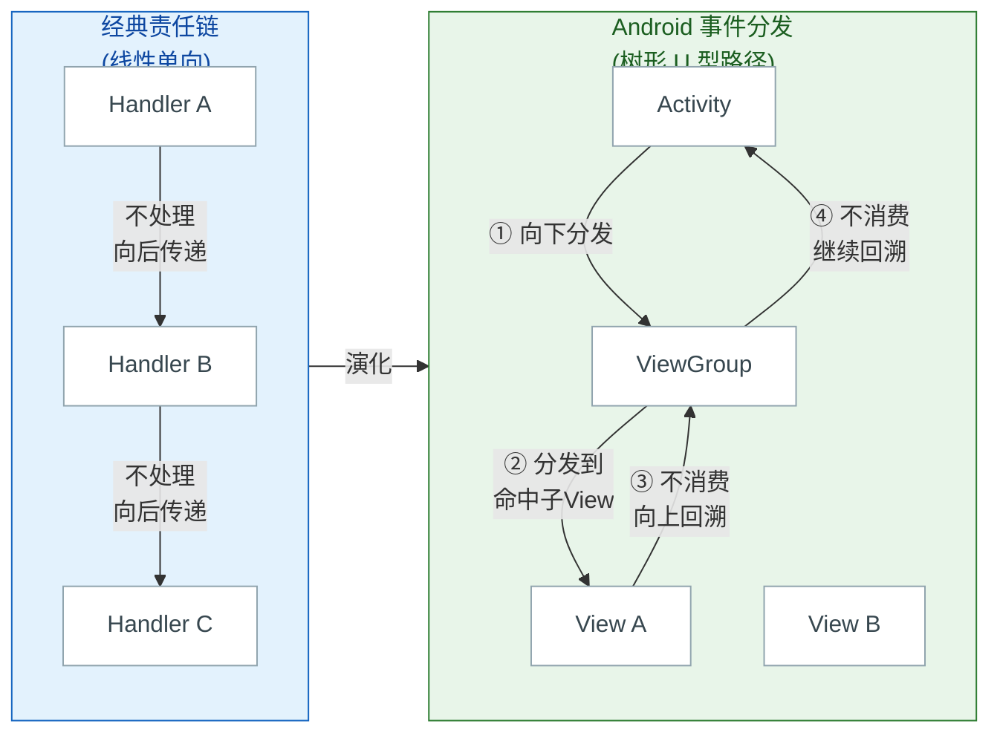
```mermaid
graph LR
    subgraph Classic["经典责任链\n(线性单向)"]
        direction TB
        H1["Handler A"] 
        H2["Handler B"]
        H3["Handler C"]
        H1 -->|"不处理\n向后传递"| H2
        H2 -->|"不处理\n向后传递"| H3
    end

    subgraph AndroidVariant["Android 事件分发\n(树形 U 型路径)"]
        direction TB
        A1["Activity"]
        VG1["ViewGroup"]
        V1["View A"]
        V2["View B"]
        A1 -->|"① 向下分发"| VG1
        VG1 -->|"② 分发到\n命中子View"| V1
        VG1 ~~~ V2
        V1 -->|"③ 不消费\n向上回溯"| VG1
        VG1 -->|"④ 不消费\n继续回溯"| A1
    end

    Classic -->|"演化"| AndroidVariant

    classDef classicStyle fill:#E3F2FD,stroke:#1565C0,color:#0D47A1
    classDef androidStyle fill:#E8F5E9,stroke:#2E7D32,color:#1B5E20
    classDef nodeStyle fill:#FFFFFF,stroke:#90A4AE,color:#37474F
    class Classic classicStyle
    class AndroidVariant androidStyle
    class H1,H2,H3,A1,VG1,V1,V2 nodeStyle
```

可以看到，Android 的事件分发虽然继承了责任链"逐级传递、各自决策"的精神，但在结构（树形 vs 线性）、流向（U 型 vs 单向）、阶段（三阶段 vs 单阶段）和效率优化（绑定记忆 vs 每次遍历）上都做了重大革新。理解这些区别，能帮助你在遇到复杂嵌套布局时，精准预判事件会走到哪里、被谁消费。

### Activity → Window → DecorView → ViewGroup → View

接下来，我们沿着事件分发的完整链路，逐层深入每个角色的职责与实现细节。

#### 起点：硬件到应用进程

在深入应用层代码之前，有必要简要了解事件是如何"到达" Activity 的。用户触碰屏幕后，Linux 内核的 Input 子系统通过 `/dev/input/eventX` 节点产生原始事件。系统的 `InputManagerService`（IMS）读取这些原始事件并加工为 `MotionEvent`，然后通过 `InputChannel`（一对 Unix Socket）将事件传递到应用进程。应用进程的主线程（UI 线程）中，`ViewRootImpl` 内部的 `WindowInputEventReceiver` 接收到事件，并触发 `ViewRootImpl.processPointerEvent()` 开始处理。这一阶段属于 Framework/Native 层，应用开发者通常无需介入，但了解它有助于理解"为什么事件总是在主线程回调"——因为 `InputChannel` 的 fd 被注册到了主线程 Looper 的 epoll 中。

#### 第一层：Activity

事件进入应用层的第一站是 `Activity.dispatchTouchEvent()`。Activity 是整个分发链的 **入口** 和 **兜底者**。

来看其核心源码逻辑（基于 AOSP 精简）：

```java
// Activity.java —— 事件分发的入口
public boolean dispatchTouchEvent(MotionEvent ev) {
    // 1. 如果是 ACTION_DOWN，通知用户开始与界面交互
    //    onUserInteraction() 是一个空方法，子类可以重写它来监听"用户交互开始"
    if (ev.getAction() == MotionEvent.ACTION_DOWN) {
        onUserInteraction();  // 供子类重写，例如可用于重置屏幕常亮计时器
    }

    // 2. 核心：将事件委托给 Window（实际是 PhoneWindow）去分发
    //    getWindow() 返回的是 PhoneWindow 实例
    //    superDispatchTouchEvent() 会将事件传递给 DecorView
    if (getWindow().superDispatchTouchEvent(ev)) {
        // 3. 如果 Window 内的 View 树消费了事件（返回 true），Activity 直接返回 true
        //    表示事件已被处理，不再需要 Activity 的 onTouchEvent 兜底
        return true;
    }

    // 4. 兜底：如果整个 View 树没有任何 View 消费事件
    //    事件"回溯"到 Activity，由 Activity 自己的 onTouchEvent 处理
    //    默认实现几乎什么都不做（返回 false），但子类可以重写
    return onTouchEvent(ev);
}
```

这段代码清晰地展现了 Activity 在分发链中的双重角色：**入口**（把事件交给 Window）和 **兜底**（没人要的事件最终回到自己手上）。值得注意的是 `onUserInteraction()` 这个小细节——它在每次 `ACTION_DOWN` 时被调用，应用可以利用它来实现"用户活跃检测"相关逻辑，例如自动锁屏计时器的重置。

#### 第二层：Window（PhoneWindow）

`Window` 是一个抽象类，它在 Android 中唯一的实现就是 `PhoneWindow`。它在事件分发链中扮演的是一个 **薄薄的中转层**，职责非常单一：将事件从 Activity 转交给 DecorView。

```java
// PhoneWindow.java —— Window 层的事件中转
@Override
public boolean superDispatchTouchEvent(MotionEvent event) {
    // 直接调用 DecorView 的 superDispatchTouchEvent
    // mDecor 就是 PhoneWindow 内部持有的 DecorView 实例
    return mDecor.superDispatchTouchEvent(event);
}
```

你会发现这个方法简洁得令人意外——它就是一个纯粹的委托调用，没有任何额外逻辑。那么，为什么要多这一层呢？原因在于 **架构解耦**。Android 设计了 `Window` 抽象层来隔离 Activity 与具体的 View 树。Activity 不直接持有 DecorView 的引用来分发事件，而是通过 Window 间接操作。这种设计使得未来如果需要替换窗口实现（虽然目前只有 PhoneWindow），上层代码无需改动。同时，Window 还承担着窗口属性管理（如 Flag、软键盘模式等）的职责，事件分发只是它顺手做的事情之一。

#### 第三层：DecorView

`DecorView` 是整个 View 树的 **根节点**。它是一个特殊的 `FrameLayout`，由 PhoneWindow 在 `setContentView()` 时创建。DecorView 的内部结构通常包含一个标题栏区域（TitleBar / ActionBar）和一个内容区域——而你在 `setContentView()` 中设置的布局，就被添加到了内容区域（id 为 `android.R.id.content` 的 FrameLayout）中。

DecorView 在事件分发中起到了一个关键的 **转接** 作用：

```java
// DecorView.java —— 根 View 的事件转接
public boolean superDispatchTouchEvent(MotionEvent event) {
    // 调用父类 ViewGroup 的 dispatchTouchEvent
    // DecorView 继承自 FrameLayout，FrameLayout 继承自 ViewGroup
    // 所以这里实际调用的是 ViewGroup.dispatchTouchEvent()
    return super.dispatchTouchEvent(event);
}
```

从这里开始，事件正式进入了 **View 树的递归分发流程**。DecorView 作为最顶层的 ViewGroup，调用 `ViewGroup.dispatchTouchEvent()` 方法，开启自顶向下的事件遍历。

值得一提的是，DecorView 还有一个容易被忽视的逻辑：在某些场景下（如 Dialog），DecorView 的 `dispatchTouchEvent()` 方法中会先检查 `Window.Callback`（通常就是 Activity），调用其 `dispatchTouchEvent()`。这就形成了 Activity → PhoneWindow → DecorView → Activity callback 的看似"绕圈"的调用。但对于标准 Activity 场景，上面展示的直链路径是主流程。

#### 第四层：ViewGroup — 分发引擎的核心

`ViewGroup.dispatchTouchEvent()` 是整个事件分发机制中 **最复杂、最核心** 的方法。它大约有 200 多行代码，完成了拦截判断、子 View 遍历、触摸目标记录等所有关键逻辑。我们分阶段拆解：

**阶段一：拦截判断（Intercept Check）**

```java
// ViewGroup.dispatchTouchEvent() 核心逻辑 —— 阶段一：拦截判断
// 标记变量：本次事件是否被当前 ViewGroup 拦截
final boolean intercepted;

// 仅在两种情况下执行拦截检查：
// 情况1: ACTION_DOWN 事件（新事件序列的起点，必须检查）
// 情况2: mFirstTouchTarget != null（说明之前有子 View 接管了事件，需要判断是否要夺回）
if (actionMasked == MotionEvent.ACTION_DOWN || mFirstTouchTarget != null) {

    // disallowIntercept 标记位：子 View 可以通过
    // requestDisallowInterceptTouchEvent(true) 来设置此标记
    // 一旦设置，父 ViewGroup 将跳过 onInterceptTouchEvent() 的调用
    // 这是"内部拦截法"解决滑动冲突的关键机制
    final boolean disallowIntercept = (mGroupFlags & FLAG_DISALLOW_INTERCEPT) != 0;

    if (!disallowIntercept) {
        // 子 View 没有禁止拦截，正常调用 onInterceptTouchEvent
        // 默认实现返回 false（不拦截），子类（如 ScrollView）可重写
        intercepted = onInterceptTouchEvent(ev);
        // 恢复 action，防止 onInterceptTouchEvent 内部修改了 event
        ev.setAction(action);
    } else {
        // 子 View 禁止父 ViewGroup 拦截，直接标记为不拦截
        intercepted = false;
    }
} else {
    // 既不是 DOWN 事件，又没有子 View 接管事件（mFirstTouchTarget == null）
    // 说明之前的 DOWN 就没有子 View 消费，那后续事件自然全部由自己处理
    intercepted = true;
}
```

这段代码中有几个关键点需要理解。首先，`mFirstTouchTarget` 是一个 **链表头指针**，记录了当前事件序列中，哪些子 View 正在接收事件（支持多点触控时可能有多个 target）。如果它为 `null`，说明没有子 View 在处理事件。其次，`FLAG_DISALLOW_INTERCEPT` 是子 View 对抗父 ViewGroup 拦截的"武器"，这就是后续章节会讲到的"内部拦截法"的底层支撑。

**阶段二：寻找触摸目标（Find Touch Target）—— 仅在 ACTION_DOWN 时执行**

```java
// ViewGroup.dispatchTouchEvent() 核心逻辑 —— 阶段二：遍历子 View
// 仅在未拦截且为 DOWN 事件（或多点触控新手指按下）时，才需要寻找新的触摸目标
if (!canceled && !intercepted) {
    if (actionMasked == MotionEvent.ACTION_DOWN
            || actionMasked == MotionEvent.ACTION_POINTER_DOWN) {

        // 获取子 View 数量
        final int childrenCount = mChildrenCount;
        if (childrenCount != 0) {
            // 获取触摸点坐标
            final float x = ev.getX(actionIndex);
            final float y = ev.getY(actionIndex);

            // 构建子 View 的遍历顺序列表
            // 默认按 Z 轴绘制顺序的 **逆序** 遍历（即最上层的 View 最先被检查）
            // 这保证了用户看到的"最上面的View"优先获得事件
            final ArrayList<View> preorderedList = buildTouchDispatchChildList();

            // 逆序遍历所有子 View
            for (int i = childrenCount - 1; i >= 0; i--) {
                final int childIndex = getAndVerifyPreorderedIndex(
                        childrenCount, i, customOrder);
                final View child = getAndVerifyPreorderedView(
                        preorderedList, children, childIndex);

                // 检查1: 子 View 是否可以接收事件
                //   - View 必须 VISIBLE 或正在执行动画
                //   - 触摸点必须在 View 的边界内（考虑 scroll offset）
                if (!child.canReceivePointerEvents()
                        || !isTransformedTouchPointInView(x, y, child, null)) {
                    continue;  // 不满足条件，跳过此子 View
                }

                // 找到了候选子 View，尝试将事件分发给它
                // dispatchTransformedTouchEvent 内部会调用 child.dispatchTouchEvent()
                // 如果 child 是 ViewGroup，则递归执行分发流程
                // 如果 child 是 View，则调用 View.dispatchTouchEvent()
                if (dispatchTransformedTouchEvent(ev, false, child, idBitsToAssign)) {
                    // 子 View 消费了事件（返回 true）
                    // 将该子 View 记录到 mFirstTouchTarget 链表中
                    // 后续 MOVE/UP 事件可以直接发往该 target，无需再次遍历
                    newTouchTarget = addTouchTarget(child, idBitsToAssign);
                    alreadyDispatchedToNewTouchTarget = true;
                    break;  // 找到消费者，停止遍历
                }
            }
        }
    }
}
```

这里的遍历顺序非常重要——**逆序遍历**意味着绘制顺序最高（最靠近用户视觉前端）的 View 先被检测。这符合用户直觉：你点击了两个重叠的 View，应该是上面那个响应事件。同时，`dispatchTransformedTouchEvent()` 这个方法名中的"Transformed"指的是会将触摸坐标从父 ViewGroup 的坐标系 **转换** 到子 View 的坐标系（考虑子 View 的 `scrollX/scrollY`、`translationX/translationY` 等变换），确保子 View 收到的坐标是相对于自身左上角的。

**阶段三：事件派发（Dispatch）**

```java
// ViewGroup.dispatchTouchEvent() 核心逻辑 —— 阶段三：事件派发
if (mFirstTouchTarget == null) {
    // 没有任何子 View 消费事件
    // 将事件交给自己处理：第三个参数 child 传 null
    // 内部实际调用的是 super.dispatchTouchEvent(ev)，即 View.dispatchTouchEvent()
    // 最终会触发自身的 onTouchEvent()
    handled = dispatchTransformedTouchEvent(ev, canceled, null, TouchTarget.ALL_POINTER_IDS);
} else {
    // 有子 View 消费了事件（mFirstTouchTarget != null）
    // 遍历 TouchTarget 链表，将事件分发给所有记录的目标
    TouchTarget target = mFirstTouchTarget;
    while (target != null) {
        final TouchTarget next = target.next;
        if (alreadyDispatchedToNewTouchTarget && target == newTouchTarget) {
            // 该 target 在阶段二中已经收到了本次 DOWN 事件，标记为已处理
            handled = true;
        } else {
            // 将事件分发给目标子 View
            // 如果本 ViewGroup 此时拦截了事件（intercepted=true），
            // 则发送 ACTION_CANCEL 给子 View，通知它事件被夺走了
            final boolean cancelChild = resetCancelNextUpFlag(target.child) || intercepted;
            if (dispatchTransformedTouchEvent(ev, cancelChild, target.child,
                    target.pointerIdBits)) {
                handled = true;
            }
            // 如果发送了 CANCEL，清除该 target
            if (cancelChild) {
                if (prev == null) {
                    mFirstTouchTarget = next;
                } else {
                    prev.next = next;
                }
                target.recycle();  // 回收 TouchTarget 对象到对象池
                target = next;
                continue;
            }
        }
        prev = target;
        target = next;
    }
}
```

至此，ViewGroup 的分发逻辑形成了一个完整闭环。总结其核心决策路径：先判断是否拦截；不拦截则遍历子 View 寻找消费者；找到消费者则记录 target，后续事件直达；找不到消费者或拦截成功，则自己通过 `onTouchEvent()` 处理。

#### 第五层：View — 最终消费者

链路的终点是 `View.dispatchTouchEvent()`。注意，这里的 `View` 指的是叶子节点（如 Button、TextView），它不再有子 View，因此不存在"向下分发"的逻辑。它的职责是决定 **自己是否消费事件**。

```java
// View.java —— 叶子节点的事件分发
public boolean dispatchTouchEvent(MotionEvent event) {
    boolean result = false;

    // 1. 首先检查是否设置了 OnTouchListener
    //    三个条件必须同时满足：
    //    a) mListenerInfo.mOnTouchListener 不为 null（设置了监听器）
    //    b) View 的状态是 ENABLED（可用的）
    //    c) OnTouchListener.onTouch() 返回 true（监听器消费了事件）
    if (li != null && li.mOnTouchListener != null
            && (mViewFlags & ENABLED_MASK) == ENABLED
            && li.mOnTouchListener.onTouch(this, event)) {
        // OnTouchListener 消费了事件，标记为 true
        result = true;
    }

    // 2. 如果 OnTouchListener 没有消费事件，才调用 onTouchEvent
    //    onTouchEvent 内部会处理点击事件（onClick）、长按事件（onLongClick）等
    if (!result && onTouchEvent(event)) {
        // onTouchEvent 消费了事件
        result = true;
    }

    return result;
}
```

这段代码揭示了一个经典面试题的答案：**`OnTouchListener.onTouch()` 的优先级高于 `onTouchEvent()`**。如果你给一个 View 设置了 `OnTouchListener` 并在 `onTouch()` 中返回 `true`，那么 `onTouchEvent()` 将永远不会被调用——这意味着 `OnClickListener.onClick()` 也不会触发，因为 `onClick()` 是在 `onTouchEvent()` 的 `ACTION_UP` 分支中被调用的。

`View.onTouchEvent()` 内部的核心逻辑简述如下：对于 `CLICKABLE` 或 `LONG_CLICKABLE` 的 View，`onTouchEvent()` 默认返回 `true`（消费事件）。在 `ACTION_DOWN` 时，它会启动一个长按检测延时任务（默认 500ms，通过 `ViewConfiguration.getLongPressTimeout()` 获取）。在 `ACTION_UP` 时，如果长按尚未触发，则执行 `performClick()`，进而回调 `OnClickListener.onClick()`。

#### 整体流程总览

将五个层级串起来，事件分发的完整 U 型流程可以用下图表示：

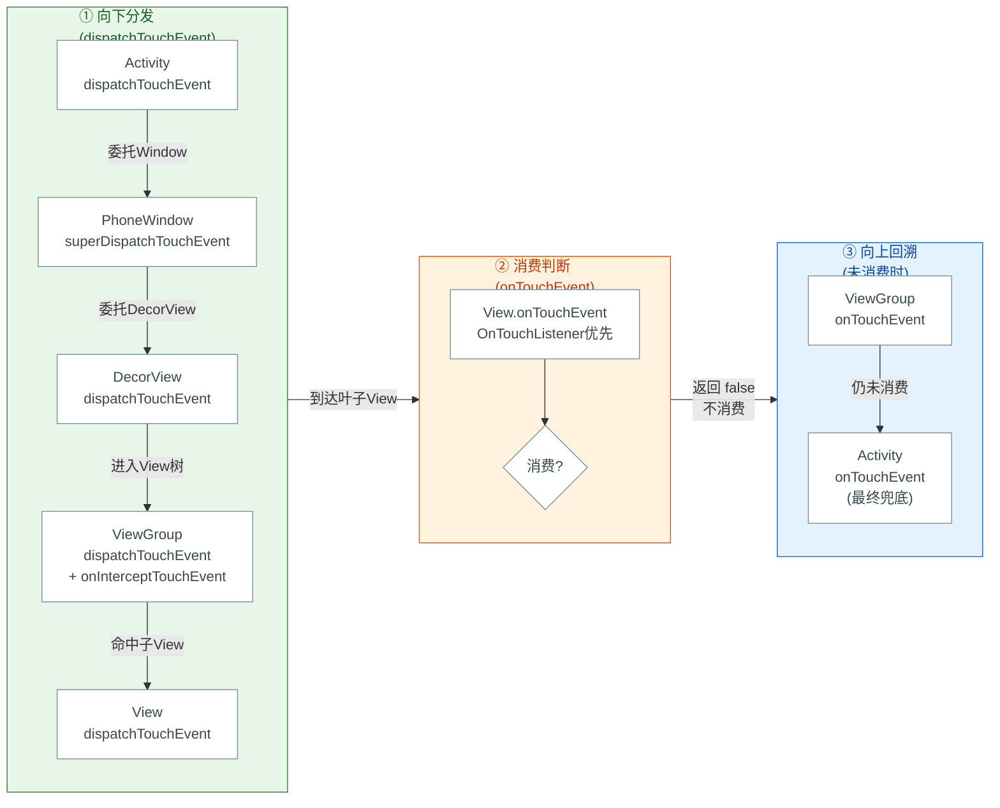
```mermaid
graph LR
    subgraph Down["① 向下分发\n(dispatchTouchEvent)"]
        direction TB
        A["Activity\ndispatchTouchEvent"]
        W["PhoneWindow\nsuperDispatchTouchEvent"]
        D["DecorView\ndispatchTouchEvent"]
        VG["ViewGroup\ndispatchTouchEvent\n+ onInterceptTouchEvent"]
        V["View\ndispatchTouchEvent"]
        A -->|"委托Window"| W
        W -->|"委托DecorView"| D
        D -->|"进入View树"| VG
        VG -->|"命中子View"| V
    end

    subgraph Consume["② 消费判断\n(onTouchEvent)"]
        direction TB
        VT["View.onTouchEvent\nOnTouchListener优先"]
        C1{"消费?"}
        VT --> C1
    end

    subgraph Up["③ 向上回溯\n(未消费时)"]
        direction TB
        VGT["ViewGroup\nonTouchEvent"]
        AT["Activity\nonTouchEvent\n(最终兜底)"]
        VGT -->|"仍未消费"| AT
    end

    Down -->|"到达叶子View"| Consume
    Consume -->|"返回 false\n不消费"| Up

    classDef downStyle fill:#E8F5E9,stroke:#2E7D32,color:#1B5E20
    classDef consumeStyle fill:#FFF3E0,stroke:#E65100,color:#BF360C
    classDef upStyle fill:#E3F2FD,stroke:#1565C0,color:#0D47A1
    classDef nodeStyle fill:#FFFFFF,stroke:#78909C,color:#37474F
    class Down downStyle
    class Consume consumeStyle
    class Up upStyle
    class A,W,D,VG,V,VT,C1,VGT,AT nodeStyle
```

整个 U 型路径可以用一句话概括：**事件从 Activity 向下分发，穿越 Window 和 DecorView 进入 View 树；在 View 树中自顶向下寻找消费者；若无人消费，则事件自底向上回溯，最终回到 Activity 的 `onTouchEvent()` 作为兜底处理。**

#### mFirstTouchTarget 的本质与作用

在上面的源码中，`mFirstTouchTarget` 被反复提及，它是 ViewGroup 中一个极其重要的成员变量，值得单独深入理解。

`mFirstTouchTarget` 是一个 `TouchTarget` 类型的 **单向链表头**。每个 `TouchTarget` 节点记录了一个子 View 及其关联的 pointer ID（手指标识）。在单点触控场景下，链表通常只有一个节点；在多点触控场景下，不同手指可能落在不同子 View 上，链表就会有多个节点。

它的核心作用是 **性能优化与状态记忆**。在 `ACTION_DOWN` 事件中，ViewGroup 通过遍历子 View 找到了消费者并记录到 `mFirstTouchTarget` 中。之后，后续的 `ACTION_MOVE`（可能几十甚至上百次）和 `ACTION_UP` 事件到来时，ViewGroup **不再遍历子 View**，而是直接从 `mFirstTouchTarget` 中取出目标，将事件分发过去。这意味着一次触摸操作中，昂贵的子 View 遍历和坐标命中检测只在第一个 `ACTION_DOWN` 时执行一次。

同时，`mFirstTouchTarget` 还直接影响拦截逻辑的执行路径：当 `mFirstTouchTarget == null`（没有子 View 消费 DOWN 事件）时，后续所有事件都不再调用 `onInterceptTouchEvent()`，而是直接由 ViewGroup 自身处理。这是一个常被忽略的细节——很多开发者以为 `onInterceptTouchEvent()` 每次事件都会被调用，实际上它的调用前提是存在活跃的 touch target。

```text
// mFirstTouchTarget 链表结构示意（多点触控场景）
//
// mFirstTouchTarget
//       │
//       ▼
// ┌──────────────┐     ┌──────────────┐
// │ TouchTarget  │     │ TouchTarget  │
// │ child: ViewA │────▶│ child: ViewB │────▶ null
// │ pointerId: 0 │     │ pointerId: 1 │
// └──────────────┘     └──────────────┘
//   (第一根手指)          (第二根手指)
```

#### 关键设计总结

回顾整条分发链路，Android 事件分发模型有几个精妙的设计值得铭记：

**1. 分层解耦（Layered Decoupling）。** Activity、Window、DecorView、ViewGroup、View 各司其职。Activity 负责入口与兜底，Window 负责窗口抽象，DecorView 作为树根，ViewGroup 执行核心分发逻辑，View 做最终消费判断。这种分层使得每一层都可以独立变化而不影响其他层。

**2. 效率优先的序列绑定。** 通过 `mFirstTouchTarget` 在 DOWN 事件中锁定消费者，后续事件直达目标。这种"一次握手、持续通信"的模式，避免了每次 MOVE 事件都重新遍历整棵 View 树的性能开销。考虑到一次滑动手势可能产生数百个 MOVE 事件，这个优化的价值是巨大的。

**3. 灵活的拦截与反拦截。** 父 ViewGroup 可以通过 `onInterceptTouchEvent()` 拦截事件，子 View 又可以通过 `requestDisallowInterceptTouchEvent()` 反制父 ViewGroup 的拦截。这种双向博弈机制为解决嵌套滑动冲突提供了灵活的工具。

**4. U 型回溯保障兜底。** 事件永远不会"凭空消失"。即使整棵 View 树都不消费事件，它最终也会回到 Activity 的 `onTouchEvent()` 中。这保证了事件处理的完整性，开发者可以在 Activity 层面做最后的全局处理。

---

**📝 练习题**

当一个 ViewGroup 的 `onInterceptTouchEvent()` 在 `ACTION_MOVE` 阶段返回 `true` 进行拦截时，以下哪个说法是正确的？


A. 子 View 会收到一个 `ACTION_UP` 事件，表示触摸已结束


B. 子 View 会收到一个 `ACTION_CANCEL` 事件，之后不再收到该事件序列的后续事件


C. 子 View 不会收到任何通知，事件直接由父 ViewGroup 的 `onTouchEvent()` 处理


D. 子 View 仍然会继续收到后续的 `ACTION_MOVE` 和 `ACTION_UP` 事件


**【答案】** B

**【解析】** 当 ViewGroup 在事件序列中途（如 `ACTION_MOVE` 阶段）通过 `onInterceptTouchEvent()` 返回 `true` 拦截事件时，框架会向之前正在接收事件的子 View 发送一个 `ACTION_CANCEL` 事件，通知该子 View "你的事件序列被中断了"。这使得子 View 有机会执行清理操作（如取消高亮状态、停止长按计时等）。从这一刻起，该子 View 对应的 `TouchTarget` 会从 `mFirstTouchTarget` 链表中移除，后续的 `MOVE` 和 `UP` 事件将不再发给子 View，而是转由 ViewGroup 自身的 `onTouchEvent()` 处理。选项 A 错误，发送的是 `ACTION_CANCEL` 而非 `ACTION_UP`；选项 C 错误，子 View 会收到 `CANCEL` 通知，而非完全无感知；选项 D 错误，拦截后子 View 就脱离了事件传递链路。

---

## 核心分发方法

Android 触摸事件分发体系的运转，归根结底依赖三个核心方法的协同配合：**`dispatchTouchEvent()`** 负责分发、**`onInterceptTouchEvent()`** 负责拦截、**`onTouchEvent()`** 负责消费。它们各自承担着职责链中截然不同的角色，但彼此之间存在严格的调用时序关系。理解这三个方法的内部逻辑与相互作用，是掌握整套事件分发机制的关键前提。本节将逐一拆解每个方法的设计意图、执行流程、返回值语义以及在不同层级（Activity / ViewGroup / View）中的行为差异。

### dispatchTouchEvent —— 事件的总调度器

`dispatchTouchEvent(MotionEvent ev)` 是触摸事件进入任何一个 `View` 或 `ViewGroup` 时的 **第一个被调用的方法**。它的核心职责并不是"处理"事件本身，而是 **决定事件下一步该交给谁**——是拦截后自己消费，还是向子 View 继续传递，亦或是回传给父容器。可以将它理解为一个 **路由器（Router）**：事件流入后，它根据一系列内部判断，把事件转发到正确的下游节点。

在不同的层级中，`dispatchTouchEvent` 的实现复杂度截然不同：

- **Activity 层**：`Activity.dispatchTouchEvent()` 是整条链的起点。它先将事件交给关联的 `Window`（实际上是 `PhoneWindow`），`PhoneWindow` 再委托给 `DecorView`。如果整棵 View 树没有任何节点消费该事件（所有 `dispatchTouchEvent` 返回 `false`），事件最终回到 `Activity.onTouchEvent()` 作为兜底处理。
- **ViewGroup 层**：这是整个分发逻辑最复杂的地方。`ViewGroup.dispatchTouchEvent()` 内部会先调用 `onInterceptTouchEvent()` 判断是否拦截；如果不拦截，则遍历子 View，寻找合适的消费者；如果拦截或者没有子 View 消费，则调用自己的 `onTouchEvent()`。
- **View 层**（叶子节点）：`View.dispatchTouchEvent()` 逻辑相对简单——先检查是否设置了 `OnTouchListener`，如果 listener 的 `onTouch()` 返回 `true` 则直接消费；否则进入 `onTouchEvent()` 流程。

下面这段伪代码精确地还原了 **ViewGroup 层** `dispatchTouchEvent` 的核心决策逻辑：

```kotlin
// ViewGroup.dispatchTouchEvent 核心伪代码
override fun dispatchTouchEvent(ev: MotionEvent): Boolean {
    // result 用于记录本次事件是否被消费
    var result = false

    // ① 先询问自己：是否要拦截这个事件？
    //    只有 ViewGroup 才有 onInterceptTouchEvent，普通 View 没有
    val intercepted = onInterceptTouchEvent(ev)

    if (!intercepted) {
        // ② 不拦截 → 遍历子 View，尝试将事件分发下去
        for (child in children.reversedOrder()) {
            // 检查触摸点是否落在该子 View 的边界内
            if (!isTransformedTouchPointInView(ev, child)) continue
            // 将事件坐标变换到子 View 的坐标系后，递归调用子 View 的 dispatchTouchEvent
            result = child.dispatchTouchEvent(transformedEvent)
            // 如果某个子 View 消费了事件（返回 true），记录该子 View 为 TouchTarget
            if (result) {
                mFirstTouchTarget = addTouchTarget(child)
                break  // 找到消费者后停止遍历
            }
        }
    }

    if (intercepted || mFirstTouchTarget == null) {
        // ③ 两种情况走到这里：
        //    a. 自己拦截了事件
        //    b. 没有任何子 View 消费事件
        //    此时调用自身的 onTouchEvent（通过 super.dispatchTouchEvent 间接调用）
        result = super.dispatchTouchEvent(ev)  // 内部会调用 onTouchEvent
    }

    // 将结果向上返回：true = 事件已被消费，false = 无人处理
    return result
}
```

这段逻辑中有几个要点值得深入理解：

**倒序遍历子 View**。源码中遍历子 View 的顺序是 **从最后添加的子 View 开始**（即 Z 轴最高、视觉上最上层的 View），这保证了"视觉最前面的 View 优先响应触摸"。如果你在一个 `FrameLayout` 中堆叠了多个 View，用户点击重叠区域时，最后添加的（绘制在最上层的）View 会优先获得事件。

**TouchTarget 链表的建立**。当某个子 View 在 `ACTION_DOWN` 阶段成功消费了事件，`ViewGroup` 会将其记录到一个名为 `mFirstTouchTarget` 的链表中。后续同一事件序列的 `ACTION_MOVE`、`ACTION_UP` 将 **直接发送给这个 TouchTarget**，不再重复遍历所有子 View。这是一种重要的性能优化——在一次完整的手指按下到抬起的过程中，"谁来处理"这个决定只需要在 `ACTION_DOWN` 时做一次。

**`mFirstTouchTarget` 的双重角色**。这个字段不仅用于缓存事件消费者，还在拦截判断中起关键作用：当 `mFirstTouchTarget == null` 时，意味着没有子 View 消费 `ACTION_DOWN`，ViewGroup 就不会再对后续事件调用 `onInterceptTouchEvent`（因为已经没有"可以从子 View 手中抢走"的事件了），而是直接走自身消费逻辑。

以下时序图展示了一次完整的 `ACTION_DOWN` 从 Activity 一路分发到叶子 View 再回溯的全过程：

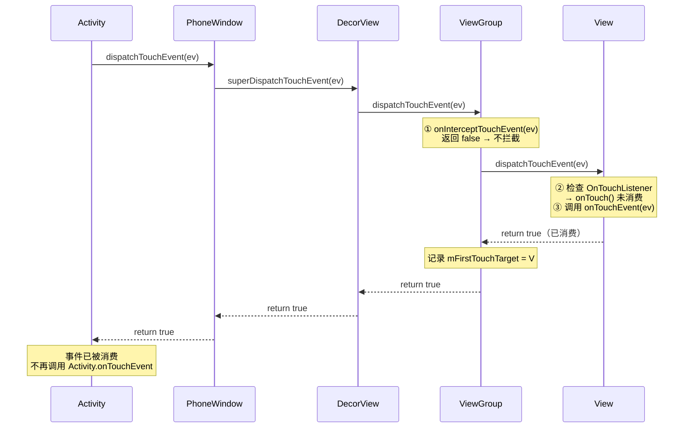
```mermaid
sequenceDiagram
    participant A as Activity
    participant W as PhoneWindow
    participant D as DecorView
    participant VG as ViewGroup
    participant V as View

    A->>W: dispatchTouchEvent(ev)
    W->>D: superDispatchTouchEvent(ev)
    D->>VG: dispatchTouchEvent(ev)

    Note over VG: ① onInterceptTouchEvent(ev)<br/>返回 false → 不拦截

    VG->>V: dispatchTouchEvent(ev)

    Note over V: ② 检查 OnTouchListener<br/>→ onTouch() 未消费<br/>③ 调用 onTouchEvent(ev)

    V-->>VG: return true（已消费）

    Note over VG: 记录 mFirstTouchTarget = V

    VG-->>D: return true
    D-->>W: return true
    W-->>A: return true

    Note over A: 事件已被消费<br/>不再调用 Activity.onTouchEvent
```

Activity 的 `dispatchTouchEvent` 存在一个容易被忽视的细节：它在将事件交给 Window 之前，会先调用 `onUserInteraction()` 回调。这个方法在每次用户触摸屏幕时都会被调用（无论事件是否被消费），常用于重置屏幕超时计时器、统计用户活跃时间等场景。这也意味着 **即使整棵 View 树没有任何控件消费事件，Activity 也能感知到用户的触摸行为**。

关于返回值语义的总结：`dispatchTouchEvent` 返回 `true` 表示"事件已被本节点或其子节点消费"，返回 `false` 表示"本节点及所有子节点均未消费，事件需要继续回溯给父节点"。返回值沿着调用栈逐层向上传递，最终告知 Activity 是否需要走兜底逻辑。

### onInterceptTouchEvent —— ViewGroup 独有的拦截阀门

`onInterceptTouchEvent(MotionEvent ev)` 是 **仅存在于 `ViewGroup`** 中的方法，普通 `View` 没有，`Activity` 也没有。它的设计目的非常纯粹：**让父容器有机会在事件到达子 View 之前，将其"截胡"**。

这个方法的返回值语义极其简洁：

| 返回值 | 含义 |
|--------|------|
| `true` | 拦截事件，后续事件将不再分发给子 View，转而由 ViewGroup 自身的 `onTouchEvent` 处理 |
| `false` | 不拦截，事件继续向子 View 分发（默认行为） |

默认实现中，`ViewGroup.onInterceptTouchEvent()` 始终返回 `false`，即 **默认不拦截**。这符合"子 View 优先"的设计哲学——在没有明确干预的情况下，事件总是尽可能下沉到最深的叶子节点。

但该方法的调用时机比表面看起来复杂得多。以下是拦截机制的关键规则：

**规则一：`ACTION_DOWN` 时必定调用**。无论之前的状态如何，当一个新的触摸序列开始（`ACTION_DOWN`）时，`onInterceptTouchEvent` 一定会被调用。这是 ViewGroup 做出"要不要拦截本次手势"初始决策的唯一机会。

**规则二：如果 `ACTION_DOWN` 时不拦截且有子 View 消费了事件，后续 `ACTION_MOVE / ACTION_UP` 仍然会调用 `onInterceptTouchEvent`**。这意味着父容器可以在手势进行过程中"中途拦截"——例如 `ScrollView` 在检测到用户手指移动超过 Touch Slop 阈值后，即使子 View 已经在处理 `ACTION_DOWN`，也会在 `ACTION_MOVE` 时返回 `true` 抢夺后续事件。

**规则三：一旦 `onInterceptTouchEvent` 返回了 `true`，后续事件将不再调用它**。因为拦截决定已经做出，事件流已经确定由 ViewGroup 自身处理，无需再重复询问。

**规则四：如果 `ACTION_DOWN` 时没有子 View 消费事件（`mFirstTouchTarget == null`），后续事件将跳过 `onInterceptTouchEvent`**。原因很简单——既然没有子 View 在接收事件，就不存在"拦截"的语境了。

**中途拦截触发的 `ACTION_CANCEL`** 是一个非常重要的机制。当 ViewGroup 在 `ACTION_MOVE` 阶段突然决定拦截时，正在处理事件的子 View 会收到一个 `ACTION_CANCEL` 事件，而不是 `ACTION_MOVE` 或 `ACTION_UP`。这是系统对子 View 的一种"通知"机制：**你之前获得的事件序列被强行中断了，请做必要的清理工作**（比如取消按钮的 pressed 状态、停止动画等）。如果子 View 不正确处理 `ACTION_CANCEL`，就可能出现按钮一直保持高亮、长按计时器不取消等 UI 异常。

```kotlin
// 典型的 onInterceptTouchEvent 实现：一个自定义的可滑动容器
override fun onInterceptTouchEvent(ev: MotionEvent): Boolean {
    when (ev.actionMasked) {
        // ACTION_DOWN 阶段通常不拦截，先让子 View 有机会接收事件
        MotionEvent.ACTION_DOWN -> {
            // 记录手指按下的初始坐标，供后续 MOVE 时计算偏移量
            lastInterceptX = ev.x
            lastInterceptY = ev.y
            // 返回 false：不拦截 DOWN，子 View 可以正常接收
            return false
        }
        MotionEvent.ACTION_MOVE -> {
            // 计算手指水平和垂直方向的移动距离
            val deltaX = Math.abs(ev.x - lastInterceptX)
            val deltaY = Math.abs(ev.y - lastInterceptY)
            // 如果水平滑动距离超过垂直距离，判定为横向滑动，父容器拦截
            // touchSlop 是系统定义的最小滑动识别距离（防止误触）
            if (deltaX > deltaY && deltaX > touchSlop) {
                // 返回 true：拦截事件，子 View 将收到 ACTION_CANCEL
                return true
            }
            // 否则不拦截，事件继续分发给子 View
            return false
        }
        // ACTION_UP / ACTION_CANCEL 通常不拦截
        else -> return false
    }
}
```

下面的流程图清晰地展示了 `onInterceptTouchEvent` 在整个分发链中的决策位置：

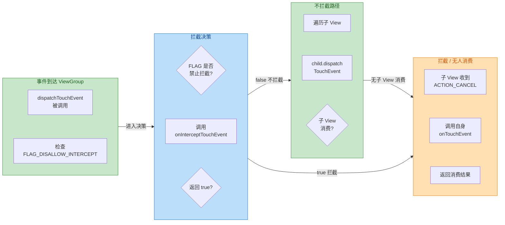
```mermaid
graph LR
    subgraph S1["事件到达 ViewGroup"]
        direction TB
        A["dispatchTouchEvent\n被调用"] ~~~ B["检查\nFLAG_DISALLOW_INTERCEPT"]
    end

    subgraph S2["拦截决策"]
        direction TB
        C{"FLAG 是否\n禁止拦截?"} ~~~ D["调用\nonInterceptTouchEvent"] ~~~ E{"返回 true?"}
    end

    subgraph S3["不拦截路径"]
        direction TB
        F["遍历子 View"] ~~~ G["child.dispatch\nTouchEvent"] ~~~ H{"子 View\n消费?"}
    end

    subgraph S4["拦截 / 无人消费"]
        direction TB
        I["子 View 收到\nACTION_CANCEL"] ~~~ J["调用自身\nonTouchEvent"] ~~~ K["返回消费结果"]
    end

    S1 -->|"进入决策"| S2
    S2 -->|"false 不拦截"| S3
    S3 -->|"无子 View 消费"| S4
    S2 -->|"true 拦截"| S4

    classDef green fill:#C8E6C9,stroke:#388E3C,color:#1B5E20
    classDef blue fill:#BBDEFB,stroke:#1976D2,color:#0D47A1
    classDef orange fill:#FFE0B2,stroke:#F57C00,color:#E65100
    classDef red fill:#FFCDD2,stroke:#D32F2F,color:#B71C1C

    class S1 green
    class S2 blue
    class S3 green
    class S4 orange
```

还有一个设计上的考量值得关注：**为什么 `View`（叶子节点）没有 `onInterceptTouchEvent`？** 答案很直观——`View` 没有子节点，自然不存在"在事件到达子节点之前拦截"的需求。拦截是一种父子关系中的权力行使，只有 ViewGroup 这种容器角色才需要。

### onTouchEvent —— 事件的最终消费者

`onTouchEvent(MotionEvent event)` 是事件分发链的 **终端处理器**。当一个事件经过分发和拦截的层层筛选后，最终到达某个节点需要"真正处理"时，`onTouchEvent` 就是执行触摸响应逻辑的地方。点击回调、长按检测、滑动处理……这些我们日常打交道的交互行为，都在 `onTouchEvent` 中实现。

`onTouchEvent` 存在于 **三个层级**：Activity、ViewGroup（继承自 View）、View。它们的调用优先级遵循一个"从下到上回溯"的模式：事件先给最深层的 View 处理；如果它不消费，回传给父 ViewGroup；如果父 ViewGroup 也不消费，一路回传到 Activity。

**返回值的约定**：返回 `true` 表示"我消费了这个事件"，返回 `false` 表示"我不处理，请交给上层"。但这里有一条极其重要的规则——**`onTouchEvent` 对 `ACTION_DOWN` 的返回值决定了整个后续事件序列的归属**。如果一个 View 在 `ACTION_DOWN` 时返回了 `false`，那么同一事件序列中后续的 `ACTION_MOVE`、`ACTION_UP` 将 **永远不会** 再发给它。系统认为"你既然不接受起始事件，那后续事件也与你无关"。

#### View.onTouchEvent 的内部机制

`View` 的默认 `onTouchEvent` 实现远比想象中复杂。它不仅处理简单的点击，还内置了 **点击（Click）检测**、**长按（LongClick）检测**、以及 **Pressed 状态管理** 三套机制。以下是其核心流程：

```kotlin
// View.onTouchEvent 核心伪代码（简化自 AOSP 源码）
override fun onTouchEvent(event: MotionEvent): Boolean {
    // 前置条件：如果 View 被禁用（disabled）但仍然是 clickable 的，
    // 仍然消费事件（返回 true），只是不触发任何回调。
    // 这防止了 disabled 按钮后面的 View 意外收到点击。
    if (!isEnabled) {
        return isClickable || isLongClickable || isContextClickable
    }

    // 检查是否设置了 TouchDelegate（触摸代理，用于扩大点击区域）
    if (touchDelegate != null && touchDelegate.onTouchEvent(event)) {
        return true  // 代理处理了事件
    }

    // 核心判断：只要 View 是 clickable 或 long-clickable，就会进入处理逻辑
    if (isClickable || isLongClickable || isContextClickable) {
        when (event.action) {
            MotionEvent.ACTION_DOWN -> {
                // ① 设置 pressed 标志（但有延迟，见下方说明）
                // ② 启动长按检测定时器（默认 500ms）
                //    通过 postDelayed(mPendingCheckForLongPress, timeout) 实现
                isPressed = true
                checkForLongClick(ViewConfiguration.getLongPressTimeout())
            }
            MotionEvent.ACTION_MOVE -> {
                // 检查手指是否滑出了 View 的边界
                if (!pointInView(event.x, event.y, touchSlop)) {
                    // 手指滑出边界：取消 pressed 状态，移除长按检测
                    isPressed = false
                    removeLongPressCallback()
                }
            }
            MotionEvent.ACTION_UP -> {
                // ③ 如果处于 pressed 状态（手指没有滑出边界）
                if (isPressed) {
                    // 如果长按检测器尚未触发，说明这是一次普通点击
                    if (!hasPerformedLongPress) {
                        // 移除长按检测的定时器
                        removeLongPressCallback()
                        // 触发 performClick()，内部会调用 OnClickListener.onClick()
                        performClick()
                    }
                }
                // 重置所有状态
                isPressed = false
            }
            MotionEvent.ACTION_CANCEL -> {
                // ④ 事件序列被父容器中断：清理一切状态
                isPressed = false
                removeLongPressCallback()
                // 不触发任何 click/longClick 回调
            }
        }
        // 只要进入了这个 if 块，就返回 true（表示消费事件）
        return true
    }
    // View 既不是 clickable 也不是 long-clickable → 不消费
    return false
}
```

从上述逻辑中可以提炼出几个开发中高频遇到的知识点：

**Clickable 属性决定消费行为**。一个 View 只要 `isClickable == true` 或 `isLongClickable == true`，它的 `onTouchEvent` 就一定返回 `true`，无论它是否设置了 `OnClickListener`。反过来说，调用 `setOnClickListener()` 会自动将 `clickable` 设为 `true`。这就解释了一个常见困惑：**为什么给一个自定义 View 设置了 `OnClickListener` 之后，它就能消费触摸事件了？** 因为 `setOnClickListener` 隐式地改变了 `clickable` 属性，进而改变了 `onTouchEvent` 的返回值。

**OnTouchListener 与 onTouchEvent 的优先级关系**。这是一个经典面试考点。事件到达 `View.dispatchTouchEvent` 后的处理顺序是：

1. 先检查是否有 `OnTouchListener`，且 View 是 `enabled` 状态
2. 如果有，调用 `OnTouchListener.onTouch()`
3. 如果 `onTouch()` 返回 `true` → 事件被消费，**`onTouchEvent` 不会被调用**
4. 如果 `onTouch()` 返回 `false` 或没有设置 listener → 才调用 `onTouchEvent`

这个优先级是在 `View.dispatchTouchEvent` 中实现的：

```kotlin
// View.dispatchTouchEvent 核心逻辑
override fun dispatchTouchEvent(event: MotionEvent): Boolean {
    var result = false

    // 第一优先级：OnTouchListener
    // 条件：listener 不为 null、View 处于 enabled 状态、onTouch 返回 true
    if (onTouchListener != null
        && isEnabled
        && onTouchListener.onTouch(this, event)) {
        // OnTouchListener 消费了事件，直接返回 true
        result = true
    }

    // 第二优先级：onTouchEvent
    // 只有在 OnTouchListener 未消费时才调用
    if (!result && onTouchEvent(event)) {
        result = true
    }

    return result
}
```

这个设计体现了一种 **外部优先** 原则：通过 listener 设置的外部逻辑优先于 View 自身的内部逻辑。如果你同时设置了 `OnTouchListener` 和 `OnClickListener`，且 `onTouch()` 返回了 `true`，那么 `OnClickListener.onClick()` **永远不会被触发**——因为 `onClick` 是在 `onTouchEvent` 中的 `performClick()` 触发的，而 `onTouchEvent` 根本没有被调用。

**Pressed 状态的延迟设置**。在实际源码中，`isPressed = true` 并不是在 `ACTION_DOWN` 时立即设置的，而是通过 `postDelayed` 延迟 **100ms**（`ViewConfiguration.getTapTimeout()`）后才设置。这个延迟是为了处理 **滚动容器中的子 View** 场景：用户可能只是想滚动列表而不是点击某个条目，100ms 的延迟给了父容器足够的时间来判断用户意图是"滚动"还是"点击"。如果在 100ms 内父容器拦截了事件（用户开始滑动），子 View 的 pressed 状态就不会被设置，避免了"滑动列表时条目闪烁高亮"的视觉问题。

#### Activity.onTouchEvent 的兜底角色

`Activity.onTouchEvent()` 是整条事件分发链的 **最终兜底**。只有当 View 树中没有任何节点消费事件时，它才会被调用。默认实现几乎什么都不做（仅在某些边界情况下判断是否应该关闭 Activity，比如点击了 Dialog 样式 Activity 的外部区域）。

在实际开发中，覆写 `Activity.onTouchEvent()` 的场景较少，但在某些全局手势识别的需求中有用武之地——例如"双击屏幕空白区域隐藏键盘"。

### 三个方法的协作全景

将三个核心方法放在一起，它们的调用关系可以用一句话概括：**`dispatchTouchEvent` 是入口，`onInterceptTouchEvent` 是阀门，`onTouchEvent` 是终点**。以下表格从多个维度对比它们的差异：

| 维度 | `dispatchTouchEvent` | `onInterceptTouchEvent` | `onTouchEvent` |
|------|---------------------|------------------------|----------------|
| **存在层级** | Activity / ViewGroup / View | 仅 ViewGroup | Activity / ViewGroup / View |
| **核心职责** | 路由事件 | 决定是否拦截 | 消费事件 |
| **返回 true** | 事件已被消费 | 拦截，事件转给自身 | 消费事件 |
| **返回 false** | 事件未被消费，回传上层 | 不拦截，继续下发 | 不消费，回传上层 |
| **默认行为** | 分发给子 View / onTouchEvent | 返回 false（不拦截） | 视 clickable 属性而定 |
| **调用频率** | 每个事件都调用 | 见上文四条规则 | 仅在事件路由到自身时 |

最后用一张完整的流程图将三个方法在 ViewGroup 中的协作关系串联起来：

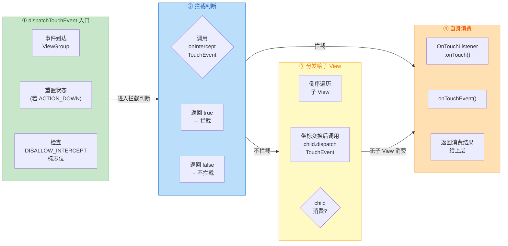
```mermaid
graph LR
    subgraph S1["① dispatchTouchEvent 入口"]
        direction TB
        A["事件到达\nViewGroup"] ~~~ B["重置状态\n(若 ACTION_DOWN)"] ~~~ C["检查\nDISALLOW_INTERCEPT\n标志位"]
    end

    subgraph S2["② 拦截判断"]
        direction TB
        D{"调用\nonIntercept\nTouchEvent"} ~~~ E["返回 true\n→ 拦截"] ~~~ F["返回 false\n→ 不拦截"]
    end

    subgraph S3["③ 分发给子 View"]
        direction TB
        G["倒序遍历\n子 View"] ~~~ H["坐标变换后调用\nchild.dispatch\nTouchEvent"] ~~~ I{"child\n消费?"}
    end

    subgraph S4["④ 自身消费"]
        direction TB
        J["OnTouchListener\n.onTouch()"] ~~~ K["onTouchEvent()"] ~~~ L["返回消费结果\n给上层"]
    end

    S1 -->|"进入拦截判断"| S2
    S2 -->|"不拦截"| S3
    S2 -->|"拦截"| S4
    S3 -->|"无子 View 消费"| S4

    classDef green fill:#C8E6C9,stroke:#388E3C,color:#1B5E20
    classDef blue fill:#BBDEFB,stroke:#1976D2,color:#0D47A1
    classDef amber fill:#FFF9C4,stroke:#F9A825,color:#F57F17
    classDef orange fill:#FFE0B2,stroke:#F57C00,color:#E65100

    class S1 green
    class S2 blue
    class S3 amber
    class S4 orange
```

理解了这三个方法的职责边界和调用时序，你就掌握了 Android 事件分发机制的 **核心骨架**。后续章节中将要讨论的滑动冲突解决、嵌套滑动、手势检测等高级话题，本质上都是围绕着"在合适的时机覆写这三个方法中的某一个，改变其返回值"展开的。

---

**📝 练习题**

某开发者在一个自定义 `ViewGroup` 中同时覆写了 `onInterceptTouchEvent` 和 `onTouchEvent`。在 `onInterceptTouchEvent` 中对 `ACTION_DOWN` 返回了 `true`（拦截）。此时关于事件的流转，以下说法正确的是？


A. 子 View 会收到 `ACTION_DOWN` 事件，然后紧接着收到 `ACTION_CANCEL`


B. 子 View 不会收到任何事件，`ACTION_DOWN` 直接由 ViewGroup 的 `onTouchEvent` 处理


C. 后续的 `ACTION_MOVE` 仍会调用 `onInterceptTouchEvent` 进行拦截判断


D. ViewGroup 的 `onTouchEvent` 不会被调用，因为拦截只影响子 View


**【答案】** B

**【解析】** `onInterceptTouchEvent` 在 `ACTION_DOWN` 阶段返回 `true` 意味着 ViewGroup **从一开始就拦截了事件**，子 View 完全没有机会接收到 `ACTION_DOWN`，所以 A 选项错误（`ACTION_CANCEL` 只在"中途拦截"场景下才会发给子 View，即子 View 已经接收了 `ACTION_DOWN` 后才被父容器抢走事件的情况）。事件被拦截后，`dispatchTouchEvent` 会走到 `super.dispatchTouchEvent(ev)` 分支，即调用 `View.dispatchTouchEvent`，最终触发 ViewGroup 自身的 `onTouchEvent`，所以 D 错误。由于 `ACTION_DOWN` 阶段就已拦截，`mFirstTouchTarget` 始终为 `null`，后续 `ACTION_MOVE / ACTION_UP` 将直接跳过 `onInterceptTouchEvent`（因为没有子 View 的 TouchTarget 需要"抢夺"），所以 C 也错误。正确答案是 B：子 View 完全无感知，事件直接由 ViewGroup 自身的 `onTouchEvent` 处理。

---

**📝 练习题**

对一个 `Button`（默认 `clickable = true`）同时设置了 `OnTouchListener` 和 `OnClickListener`，其中 `OnTouchListener.onTouch()` 始终返回 `true`。当用户点击该 Button 时，下列描述正确的是？


A. `onTouch` 和 `onClick` 都会被触发


B. 只有 `onClick` 会被触发，因为 `OnClickListener` 优先级更高


C. 只有 `onTouch` 会被触发，`onClick` 不会被调用


D. 两个回调都不会被触发，因为它们相互冲突


**【答案】** C

**【解析】** 在 `View.dispatchTouchEvent` 的实现中，事件首先交给 `OnTouchListener.onTouch()` 处理。当 `onTouch()` 返回 `true` 时，`dispatchTouchEvent` 直接将事件标记为已消费（`result = true`），**不再调用 `onTouchEvent()`**。而 `OnClickListener.onClick()` 是在 `onTouchEvent()` 的 `ACTION_UP` 分支中通过 `performClick()` 触发的。既然 `onTouchEvent()` 根本没有执行机会，`onClick` 自然不会被调用。因此正确答案是 C。这道题的关键在于理解 `OnTouchListener` > `onTouchEvent` > `OnClickListener` 这条优先级链——`OnTouchListener` 是最外层的拦截点，一旦它消费了事件，内部的一切回调（包括 click、long-click）都会被跳过。

---

## 事件序列详解

在前面的章节中，我们已经了解了事件分发的整体模型（责任链）以及三大核心方法（`dispatchTouchEvent`、`onInterceptTouchEvent`、`onTouchEvent`）。但事件分发并不是"单次"行为——用户的一次完整触摸操作（手指按下、滑动、抬起）会产生 **一连串有严格时序关系的 MotionEvent**，这一连串事件被称为 **事件序列（Event Sequence / Gesture Sequence）**。理解事件序列的内在逻辑，是掌握滑动冲突解决、手势识别、多点触控等所有高级主题的基石。

一个标准的事件序列以 `ACTION_DOWN` 开始，以 `ACTION_UP` 或 `ACTION_CANCEL` 结束，中间穿插零个或多个 `ACTION_MOVE`。可以把它想象成一段"对话"：`ACTION_DOWN` 是开场白（"我触摸了屏幕"），`ACTION_MOVE` 是正文内容（"我在移动"），而 `ACTION_UP` / `ACTION_CANCEL` 是结语（"我松手了" 或 "这次触摸被打断了"）。这段"对话"从始至终是 **不可分割的整体**——Framework 层的 `InputDispatcher` 保证了同一事件序列中的所有事件会被投递给同一个 Window，而应用层的 `ViewGroup.dispatchTouchEvent` 则在 `ACTION_DOWN` 阶段就确定了后续事件的目标 View（即 `mFirstTouchTarget`），后续的 `ACTION_MOVE` 和 `ACTION_UP` 不再重新遍历子 View 寻找消费者。

这一设计背后的核心思想是 **"谁消费了 DOWN，谁就负责整个序列"**。这既是性能优化（避免每次 MOVE 都做完整的命中测试），也是交互一致性的保证（想象一下，如果手指在按钮上按下，滑动到旁边的文本框，按钮仍然应该收到后续事件来正确取消高亮状态，而不是让文本框莫名其妙地收到一半事件）。

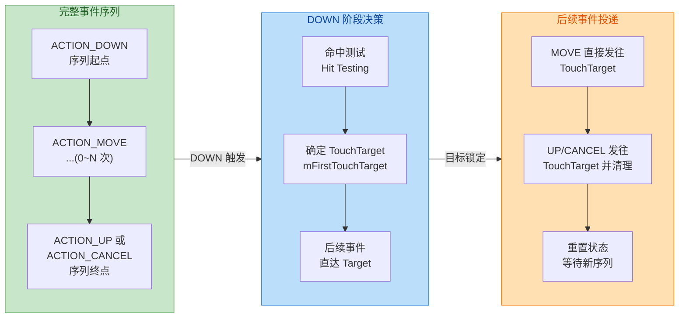
```mermaid
graph LR
    subgraph SEQ["完整事件序列"]
        direction TB
        D["ACTION_DOWN\n序列起点"]
        M1["ACTION_MOVE\n...(0~N 次)"]
        ENDING["ACTION_UP 或\nACTION_CANCEL\n序列终点"]
        D --> M1
        M1 --> ENDING
    end

    subgraph DECIDE["DOWN 阶段决策"]
        direction TB
        HIT["命中测试\nHit Testing"]
        TARGET["确定 TouchTarget\nmFirstTouchTarget"]
        BINDSEQ["后续事件\n直达 Target"]
        HIT --> TARGET
        TARGET --> BINDSEQ
    end

    subgraph DELIVER["后续事件投递"]
        direction TB
        MOVE_D["MOVE 直接发往\nTouchTarget"]
        UP_D["UP/CANCEL 发往\nTouchTarget 并清理"]
        RESET["重置状态\n等待新序列"]
        MOVE_D --> UP_D
        UP_D --> RESET
    end

    SEQ -->|"DOWN 触发"| DECIDE -->|"目标锁定"| DELIVER

    classDef greenNode fill:#C8E6C9,stroke:#388E3C,color:#1B5E20
    classDef blueNode fill:#BBDEFB,stroke:#1976D2,color:#0D47A1
    classDef orangeNode fill:#FFE0B2,stroke:#F57C00,color:#E65100

    class SEQ greenNode
    class DECIDE blueNode
    class DELIVER orangeNode
```

下面我们逐一深入每个 Action 类型的机制、触发条件、以及在应用层开发中需要注意的关键细节。

---

### ACTION_DOWN — 事件序列的起点与决策核心

`ACTION_DOWN` 是整个事件序列中 **最重要、最特殊** 的一个事件，没有之一。它的特殊性体现在以下几个层面：

**1. 状态重置（Reset）**

当 `ViewGroup.dispatchTouchEvent` 收到 `ACTION_DOWN` 时，它做的第一件事不是分发，而是 **清理上一轮事件序列的所有残留状态**。在 Android 源码中，这一步由 `resetTouchState()` 方法完成。该方法会遍历并清空 `mFirstTouchTarget` 链表（TouchTarget 链表记录了哪些子 View 正在接收事件），同时重置 `FLAG_DISALLOW_INTERCEPT` 标志位。这意味着，**无论上一轮事件序列中子 View 是否调用了 `requestDisallowInterceptTouchEvent(true)`，在新的 DOWN 到来时，这个标志一定会被清除**。这是一个非常重要的设计点——它保证了每一轮新的事件序列都从"干净"的状态开始，父 ViewGroup 在新序列中始终有权决定是否拦截。

```kotlin
// ViewGroup.dispatchTouchEvent 中 ACTION_DOWN 的状态重置（简化伪代码）
if (action == MotionEvent.ACTION_DOWN) {
    // 清空所有 TouchTarget，释放上一轮事件序列的绑定关系
    // 这意味着 mFirstTouchTarget 会被置为 null
    cancelAndClearTouchTargets(ev)
    // 重置 FLAG_DISALLOW_INTERCEPT 等标志位
    // 子 View 之前设置的 disallowIntercept 在此刻失效
    resetTouchState()
}
```

这段逻辑揭示了一个面试高频考点：**子 View 无法通过 `requestDisallowInterceptTouchEvent` 阻止父 ViewGroup 拦截 `ACTION_DOWN`**。因为在 DOWN 到达时，`disallow` 标志已经被重置了。子 View 只能在收到 DOWN 之后（通常在 MOVE 阶段）才能有效地设置这个标志。

**2. 命中测试与 TouchTarget 确定**

状态清理完成后，`ViewGroup` 开始 **从后往前（即 Z 轴从高到低）遍历子 View**，对每个子 View 进行命中测试（Hit Testing）：触摸坐标是否落在子 View 的边界内？子 View 是否可见（`VISIBLE`）且没有在执行动画？如果命中，就调用子 View 的 `dispatchTouchEvent`，看它是否愿意消费这个 DOWN 事件（即返回 `true`）。

一旦某个子 View 消费了 DOWN，`ViewGroup` 就会创建一个 `TouchTarget` 节点，将该子 View 记录在 `mFirstTouchTarget` 链表中。这个链表在后续的 MOVE/UP 事件中起着"路由表"的作用——事件不需要再遍历所有子 View，直接查表投递即可。如果所有子 View 都不消费 DOWN，`mFirstTouchTarget` 保持为 `null`，此时 `ViewGroup` 自己会调用 `super.dispatchTouchEvent(ev)`（即 `View.dispatchTouchEvent`），尝试自己消费该事件。

**3. 拦截检查的特殊逻辑**

在 DOWN 事件中，`ViewGroup` 会调用 `onInterceptTouchEvent` 来决定是否拦截。但注意这里有一个条件：如果 `mFirstTouchTarget != null`（说明之前有子 View 在接收事件——这在多点触控场景下可能出现）且 `FLAG_DISALLOW_INTERCEPT` 被设置，则跳过 `onInterceptTouchEvent` 调用。但正如前面所说，DOWN 事件到来时 `disallow` 标志已被重置，所以 **对于单点触控的 DOWN，`onInterceptTouchEvent` 一定会被调用**。

**4. 对应用层的直接影响**

在日常开发中，如果你自定义的 `View` 在 `onTouchEvent` 中返回了 `false`（不消费 DOWN），那你将 **永远收不到后续的 MOVE 和 UP 事件**。这是新手最容易踩的坑之一。常见表现是：自定义 View 只处理了 MOVE 来做拖拽，但忘记在 DOWN 中返回 `true`，导致拖拽逻辑永远不执行。

```kotlin
// 典型错误示例：忘记在 DOWN 阶段返回 true
override fun onTouchEvent(event: MotionEvent): Boolean {
    when (event.action) {
        // ❌ 没有处理 ACTION_DOWN，默认返回 false
        // 后续 MOVE/UP 永远不会到达这个 View
        MotionEvent.ACTION_MOVE -> {
            // 拖拽逻辑...永远不会执行
            handleDrag(event)
            return true
        }
        MotionEvent.ACTION_UP -> {
            return true
        }
    }
    // 默认返回 false，DOWN 阶段走到这里，序列就丢了
    return super.onTouchEvent(event)
}
```

```kotlin
// 正确写法：必须在 DOWN 阶段声明"我要消费这个序列"
override fun onTouchEvent(event: MotionEvent): Boolean {
    when (event.action) {
        MotionEvent.ACTION_DOWN -> {
            // ✅ 返回 true，声明消费此序列
            // 后续 MOVE/UP 才会投递到这个 View
            return true
        }
        MotionEvent.ACTION_MOVE -> {
            // 此时拖拽逻辑可以正常执行
            handleDrag(event)
            return true
        }
        MotionEvent.ACTION_UP -> {
            // 处理抬起，如判定是否为点击
            handleUp(event)
            return true
        }
    }
    return super.onTouchEvent(event)
}
```

此外，`View` 的 `clickable` 或 `longClickable` 属性为 `true` 时，`View.onTouchEvent` 默认会在 DOWN 阶段返回 `true`。这就是为什么给一个 `TextView` 设置了 `OnClickListener` 之后它就能接收完整事件序列——`setOnClickListener` 内部会将 `clickable` 设为 `true`，从而改变 `onTouchEvent` 在 DOWN 阶段的返回值。

---

### ACTION_MOVE — 连续反馈与拦截博弈的主战场

`ACTION_MOVE` 是事件序列中 **数量最多、频率最高** 的事件类型。从手指按下到抬起的几百毫秒甚至数秒内，系统可能产生数十乃至上百个 MOVE 事件（取决于触摸屏的采样率，一般为 60~120Hz，高刷屏幕可达 240Hz 甚至更高）。MOVE 事件承载着用户意图的核心信息——滑动方向、滑动速度、滑动距离，它是实现拖拽、滑动、缩放、绘画等交互的数据源泉。

**1. 投递路径：直达 TouchTarget**

在 DOWN 阶段确定了 `mFirstTouchTarget` 之后，后续的 MOVE 事件 **不再做子 View 遍历**。`ViewGroup.dispatchTouchEvent` 会直接将 MOVE 事件沿着 `mFirstTouchTarget` 链表投递给对应的子 View。这一点是理解事件分发性能模型的关键——即使一个 `ViewGroup` 有 100 个子 View，MOVE 阶段的分发开销也是 O(1)（链表查找），而非 O(n)（遍历所有子 View）。

**2. 拦截的时机与后果**

MOVE 阶段是 **父 ViewGroup 进行拦截的最典型时机**。很多滑动容器（如 `ScrollView`、`RecyclerView`、`ViewPager`）都不会在 DOWN 阶段拦截事件——因为 DOWN 时还无法判断用户意图是点击还是滑动。它们会等到 MOVE 阶段，累积一定的滑动距离（超过 `TouchSlop` 阈值）后，才在 `onInterceptTouchEvent` 中返回 `true` 进行拦截。

当父 ViewGroup 在 MOVE 阶段首次拦截时，Framework 会做两件事：

- **向原 TouchTarget（子 View）发送一个 `ACTION_CANCEL` 事件**，通知它"你的事件序列被中断了，请清理状态"。
- **后续的 MOVE 和 UP 事件将不再投递给子 View，而是交给父 ViewGroup 自己的 `onTouchEvent` 处理**。同时，`mFirstTouchTarget` 被清空，设为 `null`。

这个机制可以用一个现实比喻来理解：你正在和同事 A 讨论问题（A 是 TouchTarget），突然领导（父 ViewGroup）插话说"这个事情我来处理"（拦截），于是同事 A 被通知"你不用管了"（CANCEL），之后所有后续讨论都由领导接手。

**3. 历史坐标与批量事件（Batched Events）**

出于性能考量，Android 系统会将多个 MOVE 事件 **合并（batch）** 后一次性投递。一个 `MotionEvent` 对象可能包含多个历史采样点。你可以通过 `getHistorySize()` 获取历史点的数量，通过 `getHistoricalX(i)` / `getHistoricalY(i)` 获取每个历史点的坐标。对于绘画类应用（如手写板），处理历史坐标是获得 **平滑笔迹** 的关键技巧。

```kotlin
override fun onTouchEvent(event: MotionEvent): Boolean {
    when (event.action) {
        MotionEvent.ACTION_MOVE -> {
            // 先处理批量合并的历史采样点
            // 这些点是上一次分发到这一次分发之间累积的中间位置
            val historySize = event.historySize // 获取历史点数量
            for (i in 0 until historySize) {
                // 依次取出每个历史点的 X/Y 坐标
                val hx = event.getHistoricalX(i) // 第 i 个历史点的 X
                val hy = event.getHistoricalY(i) // 第 i 个历史点的 Y
                // 将历史点连入绘制路径，保证笔迹平滑不跳跃
                path.lineTo(hx, hy)
            }
            // 最后处理当前最新的坐标点
            val cx = event.x // 本次事件的最新 X 坐标
            val cy = event.y // 本次事件的最新 Y 坐标
            path.lineTo(cx, cy) // 连入路径终点
            invalidate() // 请求重绘，让新路径显示在屏幕上
            return true
        }
        // ...
    }
    return super.onTouchEvent(event)
}
```

如果不处理 `historySize`，只用 `event.x` 和 `event.y`，在快速滑动时会丢失中间采样点，绘制的线条会出现明显折线而非平滑曲线。

**4. TouchSlop：区分"点击"与"滑动"**

`ViewConfiguration.get(context).scaledTouchSlop` 返回一个以像素为单位的阈值（通常在 8dp 左右，约 24px @3x 密度）。只有当 MOVE 事件的累积位移超过这个阈值时，才应当判定用户意图为"滑动"而非"点击抖动"。几乎所有系统控件（`ScrollView`、`RecyclerView`、`SeekBar` 等）都依赖 `TouchSlop` 来做这个判断。在自定义滑动 View 时，同样必须使用 `scaledTouchSlop` 而不是硬编码一个像素数——因为不同设备的屏幕密度不同，硬编码会导致在低密度设备上过于灵敏、在高密度设备上又过于迟钝。

---

### ACTION_UP — 序列终止与行为判定

`ACTION_UP` 标志着一个正常事件序列的 **自然结束**。当用户手指离开屏幕时，系统生成 UP 事件，携带手指最后离开时的坐标、时间戳等信息。UP 事件的到来触发一系列"终结性"逻辑。

**1. Click / LongClick 判定**

`View.onTouchEvent` 在收到 UP 事件时，会进行最终的 **点击判定**。其核心逻辑（简化版）如下：

- 在 DOWN 阶段，`View` 会通过 `postDelayed` 发送一个延迟消息（`CheckForLongPress`），延迟时间为 `ViewConfiguration.getLongPressTimeout()`（默认 500ms）。
- 如果用户在 500ms 内抬起手指（即 UP 到来），则取消 LongPress 检测，判定为 **单击（Click）**，回调 `OnClickListener.onClick`。
- 如果用户按住超过 500ms 且未大幅移动，则 `CheckForLongPress` Runnable 被执行，判定为 **长按（LongClick）**，回调 `OnLongClickListener.onLongClick`。如果 `onLongClick` 返回 `true`（已消费），后续 UP 不再触发 Click；如果返回 `false`，UP 仍会触发 Click。

```kotlin
// View.onTouchEvent 中 ACTION_UP 的简化逻辑
MotionEvent.ACTION_UP -> {
    // mHasPerformedLongPress: 标记长按回调是否已执行
    if (!mHasPerformedLongPress) {
        // 长按未触发，说明这是一次点击
        // 移除尚未执行的长按检测 Runnable
        removeLongPressCallback()
        // 执行点击回调（performClick 内部会调用 OnClickListener.onClick）
        performClick()
    }
    // 重置按压状态（如取消背景高亮 / pressed state）
    setPressed(false)
    // 清理所有触摸相关的回调和标志
    removeTapCallback()
}
```

**2. Pressed State 与视觉反馈**

`View` 在 DOWN 阶段会进入 **按压状态（pressed state）**，触发 `StateListDrawable` 中 `state_pressed` 对应的 Drawable（如按钮变色、波纹效果等）。在 UP 阶段，`setPressed(false)` 会将 View 恢复到正常状态。但这里有一个细节：为了确保用户能 **看到** 按压反馈（即使是非常快速的点击），`View` 会将 `setPressed(true)` 延迟 `ViewConfiguration.getTapTimeout()`（约 100ms）后执行。如果手指在 100ms 内就抬起了，`View` 仍会先显示 pressed 状态，再延迟一小段时间后恢复，确保视觉反馈不会"闪得太快看不见"。

**3. 状态清理与序列终结**

UP 事件是 `ViewGroup` 清理 `mFirstTouchTarget` 链表的时机之一。当 UP 被投递给 TouchTarget 后，`ViewGroup` 会清空链表，将 `mFirstTouchTarget` 置为 `null`，为下一轮事件序列做好准备。如果不做这个清理，下一轮 DOWN 的逻辑可能会出现异常（虽然 DOWN 也会做 `resetTouchState`，但 UP 的清理仍然是设计上必要的一环，体现了"谁用完谁清理"的原则）。

**4. 速度计算**

许多 Fling（惯性滑动）操作需要在 UP 时刻获取手指的 **滑动速度**。`VelocityTracker` 在整个序列中持续记录 MOVE 坐标，在 UP 时调用 `computeCurrentVelocity()` 来计算最终速度。这个速度值决定了 `RecyclerView` 的惯性滚动距离、`ViewPager` 的翻页判定等关键行为。详细用法将在后续 **速度追踪与检测** 章节展开。

---

### ACTION_CANCEL — 非正常终止的安全网

`ACTION_CANCEL` 是四种核心事件类型中最容易被忽视，但也是 **最容易引发 Bug** 的一个。它不是由用户的物理操作直接产生，而是由系统在特定条件下 **注入** 的"通知性"事件，告诉当前 TouchTarget："你的事件序列被外力中断了，请立即清理状态并放弃后续处理。"

**1. 触发条件**

`ACTION_CANCEL` 的产生主要有以下几种场景：

- **父 ViewGroup 中途拦截**：这是最常见的场景。如前所述，当父 ViewGroup 在 MOVE 阶段首次从 `onInterceptTouchEvent` 返回 `true` 时，子 View 会收到一个 CANCEL 而不是后续的 MOVE/UP。
- **Window 级别的事件转移**：当系统弹出一个对话框（Dialog）、通知栏下拉、或者应用被切到后台时，当前正在接收事件的 View 会收到 CANCEL。因为事件流被系统重定向到了其他 Window。
- **父 View 被移除或隐藏**：当事件序列进行中，父 View 被从视图树中 `removeView` 或 `setVisibility(GONE)`，子 View 也会收到 CANCEL。
- **`requestDisallowInterceptTouchEvent` 被父级否决**：在嵌套滑动等复杂场景下，多层 ViewGroup 的拦截策略冲突，也可能导致 CANCEL 的产生。

**2. 必须处理 CANCEL 的原因**

很多开发者在 `onTouchEvent` 中只处理 DOWN / MOVE / UP，完全忽略 CANCEL。这会导致一系列隐蔽的 Bug：

- **视觉状态残留**：View 在 DOWN 阶段进入了 pressed 或 highlighted 状态，期望在 UP 阶段恢复。但如果 UP 永远不来（被 CANCEL 替代），View 就会一直保持高亮状态。
- **资源泄漏**：如果在 DOWN 阶段申请了 `VelocityTracker`、启动了动画、注册了回调等，这些资源在 UP 阶段清理。CANCEL 替代了 UP 后，清理逻辑不执行，资源泄漏。
- **状态机错乱**：自定义手势识别器通常维护内部状态（如"已开始拖拽"），如果不处理 CANCEL 来重置状态，下一轮事件序列的状态机可能从错误的初始状态开始。

**3. 正确处理 CANCEL 的范式**

最佳实践是 **让 CANCEL 和 UP 共享同一个清理逻辑**。可以将清理代码抽取到一个公共方法中：

```kotlin
override fun onTouchEvent(event: MotionEvent): Boolean {
    when (event.action) {
        MotionEvent.ACTION_DOWN -> {
            // 记录起始坐标、初始化 VelocityTracker、设置 pressed 状态
            startX = event.x            // 记录按下时的 X 坐标
            startY = event.y            // 记录按下时的 Y 坐标
            isDragging = false          // 重置拖拽标志
            isPressed = true            // 进入按压状态
            velocityTracker = VelocityTracker.obtain()  // 获取速度追踪器
            velocityTracker?.addMovement(event)          // 记录 DOWN 事件
            return true                 // 消费 DOWN，接管整个序列
        }
        MotionEvent.ACTION_MOVE -> {
            velocityTracker?.addMovement(event) // 持续记录 MOVE 坐标
            val dx = event.x - startX          // 计算水平位移
            val dy = event.y - startY          // 计算垂直位移
            if (!isDragging && hypot(dx, dy) > touchSlop) {
                // 位移超过阈值，判定为拖拽开始
                isDragging = true
                isPressed = false               // 开始拖拽，取消按压状态
            }
            if (isDragging) {
                // 执行拖拽逻辑，如移动 View 的位置
                handleDragMove(event.x, event.y)
            }
            return true
        }
        MotionEvent.ACTION_UP -> {
            if (isDragging) {
                // 拖拽结束，可能需要计算速度做 fling
                handleDragEnd(event)
            } else {
                // 没有拖拽，判定为点击
                performClick()
            }
            // ✅ 统一清理
            resetTouchState()
            return true
        }
        MotionEvent.ACTION_CANCEL -> {
            // ✅ 被中断，不做任何最终行为（不 click，不 fling）
            // 只做状态清理，与 UP 共享清理逻辑
            resetTouchState()
            return true
        }
    }
    return super.onTouchEvent(event)
}

// 公共清理方法：UP 和 CANCEL 都调用
private fun resetTouchState() {
    isDragging = false                      // 重置拖拽标志
    isPressed = false                       // 重置按压状态（取消视觉高亮）
    velocityTracker?.recycle()              // 回收速度追踪器到对象池
    velocityTracker = null                  // 清空引用，避免误用
    invalidate()                            // 重绘以更新视觉状态
}
```

注意 CANCEL 和 UP 的关键区别：**CANCEL 只清理，不触发最终行为**（不 `performClick`，不做 fling）。因为 CANCEL 意味着这次交互是"被打断的"，用户的意图不完整，不应该产生有意义的操作结果。

**4. 从 ViewGroup 源码看 CANCEL 的注入过程**

当 `ViewGroup` 在 MOVE 阶段决定拦截时，它的 `dispatchTouchEvent` 内部逻辑大致如下：

```kotlin
// ViewGroup.dispatchTouchEvent 内部 MOVE 阶段拦截逻辑（简化伪代码）
val intercepted = onInterceptTouchEvent(ev) // 父 ViewGroup 判断是否拦截

if (intercepted) {
    // 将当前事件的 action 临时改为 ACTION_CANCEL
    ev.action = MotionEvent.ACTION_CANCEL
    // 把这个 CANCEL 事件投递给原来的 TouchTarget（子 View）
    mFirstTouchTarget!!.child.dispatchTouchEvent(ev)
    // 清空 TouchTarget 链表，后续事件不再投递给子 View
    clearTouchTargets()
    // 恢复事件的原始 action（框架内部需要）
    ev.action = MotionEvent.ACTION_MOVE
    // 接下来，这个 MOVE 和后续事件将由 ViewGroup 自身的 onTouchEvent 处理
}
```

这段伪代码清晰展示了 **CANCEL 是由父 ViewGroup 通过修改 MotionEvent 的 action 值注入的**，而不是由硬件或 InputFlinger 产生的。子 View 收到的 CANCEL 事件在坐标等其他字段上与原始的 MOVE 事件完全相同，仅 action 被替换。

---

### 事件序列的完整生命周期总览

将四种 Action 类型组合起来，一个完整的事件序列在分发过程中的生命周期可以用以下时序图来表达：

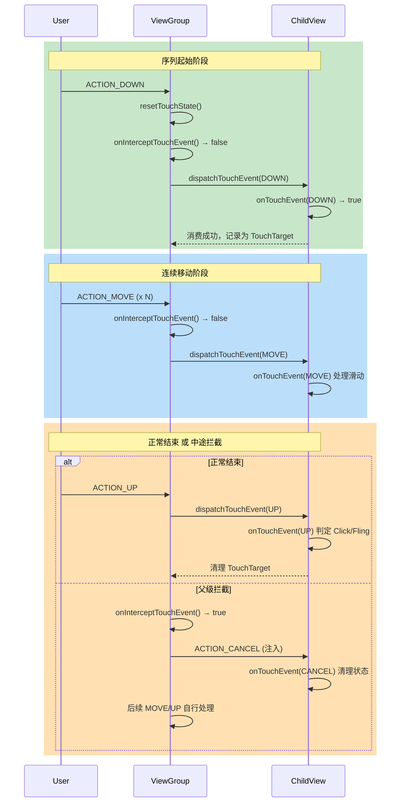
```mermaid
sequenceDiagram
    participant U as User
    participant VG as ViewGroup
    participant V as ChildView

    rect rgb(200, 230, 201)
    Note over U,V: 序列起始阶段
    U->>VG: ACTION_DOWN
    VG->>VG: resetTouchState()
    VG->>VG: onInterceptTouchEvent() → false
    VG->>V: dispatchTouchEvent(DOWN)
    V->>V: onTouchEvent(DOWN) → true
    V-->>VG: 消费成功，记录为 TouchTarget
    end

    rect rgb(187, 222, 251)
    Note over U,V: 连续移动阶段
    U->>VG: ACTION_MOVE (x N)
    VG->>VG: onInterceptTouchEvent() → false
    VG->>V: dispatchTouchEvent(MOVE)
    V->>V: onTouchEvent(MOVE) 处理滑动
    end

    rect rgb(255, 224, 178)
    Note over U,V: 正常结束 或 中途拦截
    alt 正常结束
        U->>VG: ACTION_UP
        VG->>V: dispatchTouchEvent(UP)
        V->>V: onTouchEvent(UP) 判定 Click/Fling
        V-->>VG: 清理 TouchTarget
    else 父级拦截
        VG->>VG: onInterceptTouchEvent() → true
        VG->>V: ACTION_CANCEL (注入)
        V->>V: onTouchEvent(CANCEL) 清理状态
        VG->>VG: 后续 MOVE/UP 自行处理
    end
    end
```

可以看到，整个序列是一个 **严格有序的状态机**：DOWN 是入口，MOVE 是循环体，UP / CANCEL 是出口。无论走哪条路径，序列一定会以 UP 或 CANCEL 结束（系统保证），View 层必须在这两个出口处做好清理。

---

### 边界情况与实战陷阱

**1. 多点触控中的事件序列**

当第二根手指按下时，产生的不是 `ACTION_DOWN`，而是 `ACTION_POINTER_DOWN`（附带新手指的 pointer index）。同理，非最后一根手指抬起时产生 `ACTION_POINTER_UP`。只有 **最后一根手指** 抬起时才产生 `ACTION_UP`。这意味着在多点触控场景下，事件序列的"开始"和"结束"定义需要更精细的判断——`ACTION_DOWN` 和 `ACTION_UP` 仍然是整个多点触控序列的边界，但中间嵌套了多个 pointer 的生命周期。

**2. `ACTION_OUTSIDE`**

这是一个很少见的事件类型，通常只在 `TYPE_APPLICATION_OVERLAY` 类型的 Window（如系统悬浮窗）中出现。当触摸发生在 Window 区域外部时，系统会发送 `ACTION_OUTSIDE`。普通 Activity 几乎不会收到此事件，了解其存在即可。

**3. FLAG_WINDOW_IS_OBSCURED**

当你的 View 被其他 Window 遮挡（如恶意的透明悬浮窗），`MotionEvent` 会携带 `FLAG_WINDOW_IS_OBSCURED` 标志。Android 的 `filterTouchesWhenObscured` 属性（或 `View.setFilterTouchesWhenObscured(true)`）可以让 View 在被遮挡时自动忽略触摸事件，这是防御 **Tapjacking 攻击**（诱导用户点击底层 UI）的重要安全措施。

**4. 事件时间戳**

每个 `MotionEvent` 都携带 `eventTime`（通过 `getEventTime()` 获取）和 `downTime`（通过 `getDownTime()` 获取）。`downTime` 是本序列第一个 DOWN 事件的时间，在整个序列中保持不变；`eventTime` 是当前事件的时间。通过 `eventTime - downTime` 可以计算用户从按下到当前的持续时间，这在实现自定义长按、双击等手势时非常有用。

---

**📝 练习题**

在 Android 事件分发中，一个子 View 在 `onTouchEvent` 的 `ACTION_DOWN` 阶段返回了 `false`。随后用户手指滑动并抬起。以下哪个描述是正确的？

A. 子 View 仍然会收到后续的 `ACTION_MOVE` 和 `ACTION_UP` 事件，因为手指仍在其区域内


B. 子 View 会收到一个 `ACTION_CANCEL` 事件，告知它序列已结束


C. 子 View 不会再收到任何后续事件；父 ViewGroup 会尝试自己消费或继续向上传递


D. 子 View 不会收到后续事件，且父 ViewGroup 也不会再处理该事件序列


**【答案】** C

**【解析】** 当子 View 在 `ACTION_DOWN` 阶段的 `onTouchEvent` 返回 `false` 时，它表示"我不消费这个事件序列"。此时 `ViewGroup` 不会为该子 View 创建 `TouchTarget`（即 `mFirstTouchTarget` 不会指向它），因此后续的 `ACTION_MOVE` 和 `ACTION_UP` 自然不会投递给它。选项 B 描述的 `ACTION_CANCEL` 只在 **已经成为 TouchTarget 之后被中途剥夺** 的场景下才会出现——如果从未成为 TouchTarget，也就谈不上"取消"。子 View 拒绝消费后，`ViewGroup` 会尝试将 DOWN 交给自己的 `onTouchEvent` 处理（即调用 `super.dispatchTouchEvent`），如果 `ViewGroup` 自身也不消费，则继续向上层传递。因此 C 正确，D 错误（父 ViewGroup 仍有机会处理）。

---

**📝 练习题**

在一个嵌套布局中，父 `ScrollView` 在 `ACTION_MOVE` 阶段通过 `onInterceptTouchEvent` 返回 `true` 拦截了事件。此时子 View 会收到什么事件？之后的 `ACTION_MOVE` 和 `ACTION_UP` 会被投递给谁？

A. 子 View 收到 `ACTION_UP`；后续事件不再产生


B. 子 View 收到 `ACTION_CANCEL`；后续事件由 `ScrollView` 的 `onTouchEvent` 处理


C. 子 View 收到 `ACTION_CANCEL`；后续事件仍然发给子 View，但 action 全部是 `CANCEL`


D. 子 View 不收到任何通知；后续事件由 `ScrollView` 的 `onTouchEvent` 处理


**【答案】** B

**【解析】** 当父 ViewGroup 在 MOVE 阶段首次拦截时，Framework 会将当前 MOVE 事件的 action 临时修改为 `ACTION_CANCEL`，投递给子 View，让它知道"你的序列被打断了，请清理状态"。这就是为什么子 View 必须正确处理 CANCEL——它可能在任何时刻到来。之后，`mFirstTouchTarget` 被清空，后续的 MOVE 和 UP 事件不再投递给子 View，而是交给 `ScrollView` 自身的 `onTouchEvent` 处理。选项 A 错误，子 View 收到的是 CANCEL 而非 UP（UP 意味着正常结束，CANCEL 意味着被打断）。选项 C 错误，CANCEL 只发送一次，之后子 View 不再收到任何事件。选项 D 错误，子 View 一定会收到 CANCEL 通知，不会被"悄悄"剥夺事件。

---

## 滑动冲突解决

在 Android 应用层开发中，滑动冲突（Scroll Conflict）是一个极其常见且必须掌握的难题。当界面中存在多个可滑动的 View 嵌套时——比如一个纵向滚动的 `RecyclerView` 内部嵌套了一个横向滚动的 `ViewPager`，或者一个可下拉刷新的 `SwipeRefreshLayout` 包裹着一个纵向列表——事件分发链上的多个 ViewGroup 都会"争夺"同一组 `MotionEvent`，导致用户的滑动手势被错误的层级消费，出现滑不动、抖动、卡顿等体验问题。

理解滑动冲突的解决，必须建立在对前几节 **事件分发模型**、**核心分发方法** 以及 **事件序列** 的深刻理解之上。核心思想可以归纳为一句话：**在恰当的时机，让恰当的 View 拿到事件的处理权**。Android 提供了两种经典的解题范式——**外部拦截法（External Interception）** 和 **内部拦截法（Internal Interception）**，它们分别从父容器和子 View 的视角出发，利用事件分发链上不同的回调点来协调冲突。

### 滑动冲突的产生场景

在深入两种解法之前，我们需要先系统梳理滑动冲突到底在哪些场景下会发生。根据父容器与子 View 的滑动方向组合，滑动冲突大致可以分为三类。

**第一类：方向不一致型冲突。** 这是最常见也最容易解决的类型。典型场景是外层容器可以纵向滑动（如 `ScrollView`），内层子 View 可以横向滑动（如 `ViewPager` 或横向 `RecyclerView`）。由于滑动方向正交，可以通过判断手指在水平方向和垂直方向上的位移分量（dx 和 dy）的大小关系来确定用户的真实意图：如果 `|dx| > |dy|`，说明用户想要横向滑动，事件应该交给子 View；反之交给父容器。

**第二类：方向一致型冲突。** 外层和内层的滑动方向相同，例如一个纵向 `ScrollView` 嵌套一个纵向 `RecyclerView`。这种情况下无法简单通过方向判断来分配事件，需要根据业务逻辑制定规则——比如"当子 View 滑动到顶部无法再向下滑时，将事件交给父容器"。

**第三类：以上两种的混合型。** 多层嵌套中既有方向不一致的冲突，也有方向一致的冲突。例如一个 `SwipeRefreshLayout`（纵向下拉）嵌套 `ViewPager`（横向翻页），`ViewPager` 的每一页又是一个纵向 `RecyclerView`。这种场景需要逐层分析并组合使用两种拦截法。

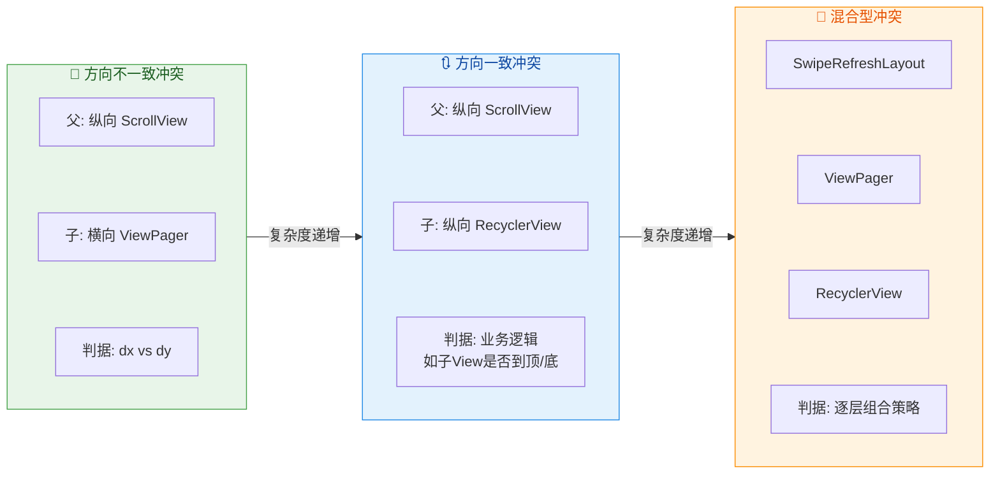
```mermaid
graph LR
    subgraph Scene1["🔀 方向不一致冲突"]
        direction TB
        S1A["父: 纵向 ScrollView"]
        S1B["子: 横向 ViewPager"]
        S1C["判据: dx vs dy"]
        S1A ~~~ S1B
        S1B ~~~ S1C
    end

    subgraph Scene2["🔃 方向一致冲突"]
        direction TB
        S2A["父: 纵向 ScrollView"]
        S2B["子: 纵向 RecyclerView"]
        S2C["判据: 业务逻辑\n如子View是否到顶/底"]
        S2A ~~~ S2B
        S2B ~~~ S2C
    end

    subgraph Scene3["🔄 混合型冲突"]
        direction TB
        S3A["SwipeRefreshLayout"]
        S3B["ViewPager"]
        S3C["RecyclerView"]
        S3D["判据: 逐层组合策略"]
        S3A ~~~ S3B
        S3B ~~~ S3C
        S3C ~~~ S3D
    end

    Scene1 -->|"复杂度递增"| Scene2 -->|"复杂度递增"| Scene3

    classDef sceneGreen fill:#E8F5E9,stroke:#43A047,color:#1B5E20
    classDef sceneBlue fill:#E3F2FD,stroke:#1E88E5,color:#0D47A1
    classDef sceneOrange fill:#FFF3E0,stroke:#FB8C00,color:#E65100
    class Scene1 sceneGreen
    class Scene2 sceneBlue
    class Scene3 sceneOrange
```

无论哪种场景，解决滑动冲突的本质都是回答同一个问题：**在 `ACTION_MOVE` 到来时，当前这个触摸事件应该被谁消费？** 外部拦截法和内部拦截法只是回答这个问题的两种不同路径。

### 外部拦截法（External Interception）

外部拦截法的核心思想是：**由父容器主动决定是否拦截事件**。它的实现载体是重写父容器的 `onInterceptTouchEvent()` 方法，在该方法中根据一定的策略判断当前事件是否应该由自己处理。如果判定为"是"，就返回 `true` 进行拦截，后续的 `ACTION_MOVE` 和 `ACTION_UP` 将不再下发给子 View，而是直接调用父容器自己的 `onTouchEvent()`；如果判定为"否"，就返回 `false` 放行，让事件继续向子 View 传递。

这种方法之所以叫"外部"拦截，是因为决策权在外层——即父容器。它完全符合 Android 事件分发的默认设计逻辑：**父容器天然拥有在事件下发到子 View 之前进行拦截的权力**。

#### 外部拦截法的标准模板

外部拦截法有一套非常经典且稳定的代码模板。理解这个模板中每一个分支的设计意图，是掌握该方法的关键。

```kotlin
/**
 * 外部拦截法标准模板
 * 父容器通过重写 onInterceptTouchEvent 来决定是否拦截事件
 */
class ConflictParentLayout @JvmOverloads constructor(
    context: Context,
    attrs: AttributeSet? = null,
    defStyleAttr: Int = 0
) : ViewGroup(context, attrs, defStyleAttr) {

    // 记录上一次触摸事件的 X 坐标，用于计算水平位移增量
    private var lastInterceptX = 0f
    // 记录上一次触摸事件的 Y 坐标，用于计算垂直位移增量
    private var lastInterceptY = 0f

    override fun onInterceptTouchEvent(ev: MotionEvent): Boolean {
        // 默认不拦截，只有满足特定条件时才拦截
        var intercepted = false

        // 获取当前触摸点的坐标
        val x = ev.x
        val y = ev.y

        when (ev.action) {
            /**
             * 【关键点 1】ACTION_DOWN 绝对不能拦截
             * 
             * 原因：如果在 DOWN 事件时就返回 true 进行拦截，
             * 那么根据事件分发机制，后续整个事件序列（MOVE、UP）
             * 都会直接交给父容器处理，子 View 将完全收不到任何事件。
             * 这就失去了"动态判断"的意义——我们需要在 MOVE 阶段
             * 根据手指滑动的方向和距离来做决策。
             */
            MotionEvent.ACTION_DOWN -> {
                intercepted = false
                // 注意：此处只记录初始坐标，不做任何拦截
            }

            /**
             * 【关键点 2】ACTION_MOVE 中执行核心判断逻辑
             * 
             * 这是外部拦截法的灵魂所在。在 MOVE 事件中，
             * 我们可以拿到手指从上一次事件到当前事件的位移增量，
             * 从而判断用户的滑动意图。
             */
            MotionEvent.ACTION_MOVE -> {
                // 计算自上次事件以来，手指在 X 方向和 Y 方向上的位移增量
                val deltaX = x - lastInterceptX
                val deltaY = y - lastInterceptY

                // parentNeedThisEvent() 是一个由业务逻辑定义的方法
                // 对于方向不一致冲突：|deltaX| > |deltaY| → 父容器要横向事件
                // 对于方向一致冲突：子 View 已到边界 → 父容器需要接管
                intercepted = parentNeedThisEvent(deltaX, deltaY)
            }

            /**
             * 【关键点 3】ACTION_UP 必须不拦截
             * 
             * 如果在 UP 时拦截，子 View 将收不到 UP 事件，
             * 导致其 onClick 等回调无法正常触发。
             * 因为 onClick 的判定依赖于子 View 完整地收到
             * DOWN → UP 序列。
             */
            MotionEvent.ACTION_UP -> {
                intercepted = false
            }
        }

        // 更新上一次触摸坐标，供下一次 MOVE 事件计算增量使用
        lastInterceptX = x
        lastInterceptY = y

        // 返回拦截决策
        return intercepted
    }

    /**
     * 业务判断方法 —— 根据具体场景实现不同逻辑
     * @param deltaX 水平位移增量
     * @param deltaY 垂直位移增量
     * @return true 表示父容器需要消费此事件（拦截），false 表示放行
     */
    private fun parentNeedThisEvent(deltaX: Float, deltaY: Float): Boolean {
        // 示例：父容器处理纵向滑动，子 View 处理横向滑动
        // 当纵向位移大于横向位移时，父容器拦截
        return Math.abs(deltaY) > Math.abs(deltaX)
    }

    // ... layout 相关方法省略
}
```

#### 外部拦截法的原理深层剖析

为什么这个模板有效？要彻底理解它，必须回顾事件分发流程中的几个关键机制。

**`ACTION_DOWN` 不拦截的深层原因。** 在 `ViewGroup.dispatchTouchEvent()` 的源码中，当收到 `ACTION_DOWN` 时，系统会做两件重要的事情：第一，清除之前事件序列中所有的状态（重置 `mFirstTouchTarget` 等成员变量）；第二，将 `FLAG_DISALLOW_INTERCEPT` 标志位清零。如果父容器在 `ACTION_DOWN` 时就返回 `true` 拦截了事件，那么 `mFirstTouchTarget` 将始终为 `null`——这意味着没有任何子 View 被标记为"能处理此事件序列"。根据分发逻辑，后续所有的 `MOVE` 和 `UP` 事件都不会再调用 `onInterceptTouchEvent()`（因为已经没有目标子 View 了），而是直接交由父容器的 `onTouchEvent()` 处理。这就相当于"一刀切"，完全失去了动态决策的能力。

**`ACTION_MOVE` 中拦截后的连锁反应。** 当父容器在某个 `ACTION_MOVE` 中返回 `true` 开始拦截时，事件分发机制会做一件精妙的事情：向当前正在接收事件的子 View 发送一个 `ACTION_CANCEL` 事件。这个 `CANCEL` 事件告诉子 View："你之前收到的那些事件作废了，事件序列被中断了"。子 View 收到 `CANCEL` 后应该做好清理工作（比如取消按下态、重置内部状态等）。从这个 `MOVE` 之后，后续的所有事件都不再经过 `onInterceptTouchEvent()`，而是直接进入父容器的 `onTouchEvent()`。

**`ACTION_UP` 不拦截的必要性。** 如果整个 `MOVE` 过程中父容器都没有拦截（说明事件一直在子 View 中处理），那么 `UP` 时也不应该拦截。子 View 需要收到完整的 `DOWN → MOVE(s) → UP` 序列才能正确触发 `OnClickListener.onClick()` 或 `OnLongClickListener.onLongClick()` 等回调。如果最后一刻拦截了 `UP`，子 View 只会收到一个 `CANCEL`，click 事件就丢失了。

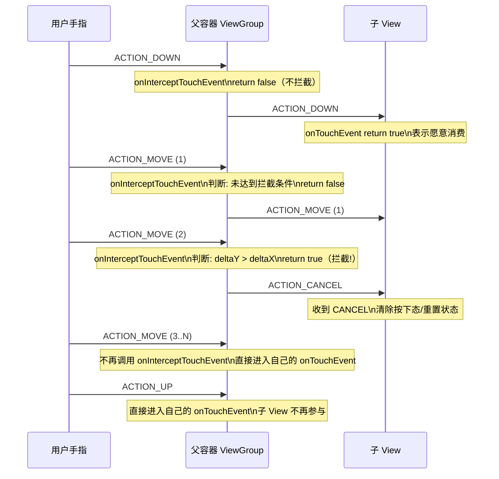
```mermaid
sequenceDiagram
    participant U as 用户手指
    participant P as 父容器 ViewGroup
    participant C as 子 View

    U->>P: ACTION_DOWN
    Note over P: onInterceptTouchEvent\nreturn false（不拦截）
    P->>C: ACTION_DOWN
    Note over C: onTouchEvent return true\n表示愿意消费

    U->>P: ACTION_MOVE (1)
    Note over P: onInterceptTouchEvent\n判断: 未达到拦截条件\nreturn false
    P->>C: ACTION_MOVE (1)

    U->>P: ACTION_MOVE (2)
    Note over P: onInterceptTouchEvent\n判断: deltaY > deltaX\nreturn true（拦截!）
    P->>C: ACTION_CANCEL
    Note over C: 收到 CANCEL\n清除按下态/重置状态

    U->>P: ACTION_MOVE (3..N)
    Note over P: 不再调用 onInterceptTouchEvent\n直接进入自己的 onTouchEvent

    U->>P: ACTION_UP
    Note over P: 直接进入自己的 onTouchEvent\n子 View 不再参与
```

#### 方向不一致冲突的外部拦截实战

以最常见的场景为例：一个纵向滚动的 `ScrollView` 内部嵌套了一个横向滚动的 `HorizontalScrollView`（或者 `ViewPager`）。我们需要让纵向滑动时父容器响应，横向滑动时子 View 响应。

```kotlin
/**
 * 解决纵向父容器与横向子 View 的滑动冲突
 * 使用外部拦截法
 */
class VerticalScrollLayout @JvmOverloads constructor(
    context: Context,
    attrs: AttributeSet? = null,
    defStyleAttr: Int = 0
) : ScrollView(context, attrs, defStyleAttr) {

    // 记录 DOWN 事件时的初始 X、Y 坐标
    private var initialX = 0f
    private var initialY = 0f

    // 从系统配置中获取「最小滑动距离」阈值
    // 只有超过此阈值，才认为用户真正开始了滑动（而非轻微抖动）
    private val touchSlop = ViewConfiguration.get(context).scaledTouchSlop

    override fun onInterceptTouchEvent(ev: MotionEvent): Boolean {
        when (ev.action) {
            MotionEvent.ACTION_DOWN -> {
                // DOWN 时记录初始坐标，不拦截
                initialX = ev.x
                initialY = ev.y
                // 必须调用 super，让 ScrollView 内部记录必要状态
                // ScrollView 的 onInterceptTouchEvent 在 DOWN 时默认返回 false
                return super.onInterceptTouchEvent(ev)
            }

            MotionEvent.ACTION_MOVE -> {
                // 计算从 DOWN 到当前 MOVE 的总位移
                val dx = Math.abs(ev.x - initialX)
                val dy = Math.abs(ev.y - initialY)

                // 只有位移超过 touchSlop 才进行方向判断
                // touchSlop 的存在是为了过滤手指按下时的微小抖动
                if (dx > touchSlop || dy > touchSlop) {
                    // 如果纵向位移 > 横向位移，说明用户想纵向滑动
                    // 父容器（纵向 ScrollView）应该拦截此事件
                    return dy > dx
                }
            }

            MotionEvent.ACTION_UP -> {
                // UP 不拦截，确保子 View 能收到完整事件序列
                return false
            }
        }
        // 默认走父类逻辑
        return super.onInterceptTouchEvent(ev)
    }
}
```

这段代码中有一个细节值得注意：**`touchSlop` 的使用**。`ViewConfiguration.getScaledTouchSlop()` 返回的是系统认定的"最小滑动距离"，通常为 8dp 左右（因设备而异）。在手指位移还没有超过这个阈值时，我们不做方向判断，因为此时的位移量太小，方向判断不准确。只有当位移超过阈值后，dx 和 dy 的比较才有统计意义。

#### 方向一致冲突的外部拦截实战

方向一致型冲突更棘手，因为无法通过位移方向来区分意图。此时需要引入**业务规则**作为判断依据。以"纵向 `ScrollView` 嵌套纵向 `RecyclerView`"为例，一种常见的策略是：**当子 RecyclerView 无法继续向上或向下滚动时（到达边界），将事件交给父容器**。

```kotlin
/**
 * 方向一致冲突的外部拦截法示例
 * 父容器为纵向滚动，子 View 也为纵向滚动
 */
class SmartScrollView @JvmOverloads constructor(
    context: Context,
    attrs: AttributeSet? = null,
    defStyleAttr: Int = 0
) : ScrollView(context, attrs, defStyleAttr) {

    // 上一次 MOVE 事件的 Y 坐标
    private var lastY = 0f

    override fun onInterceptTouchEvent(ev: MotionEvent): Boolean {
        when (ev.action) {
            MotionEvent.ACTION_DOWN -> {
                // DOWN 记录坐标，不拦截
                lastY = ev.y
                // 调用 super 保证内部状态正确
                return super.onInterceptTouchEvent(ev)
            }

            MotionEvent.ACTION_MOVE -> {
                // 计算本次 MOVE 相对上次的 Y 方向增量
                val deltaY = ev.y - lastY
                // 更新 lastY 为当前 Y
                lastY = ev.y

                // 找到内部的 RecyclerView（实际项目中应缓存引用）
                val child = findRecyclerViewChild()

                child?.let {
                    if (deltaY > 0) {
                        // 手指向下移动 → 内容想向上滚动（查看更前面的内容）
                        // 如果 RecyclerView 已经不能再向上滚动（到顶了），
                        // 则父容器拦截事件，执行自己的下拉行为
                        // canScrollVertically(-1) 返回 false 表示不能再向上滚了
                        return !it.canScrollVertically(-1)
                    } else if (deltaY < 0) {
                        // 手指向上移动 → 内容想向下滚动（查看更后面的内容）
                        // 如果 RecyclerView 已经到底了
                        // canScrollVertically(1) 返回 false 表示不能再向下滚了
                        return !it.canScrollVertically(1)
                    }
                }
            }

            MotionEvent.ACTION_UP -> {
                return false
            }
        }
        return super.onInterceptTouchEvent(ev)
    }

    /**
     * 递归查找子 View 中的 RecyclerView
     * 实际项目中建议通过 ID 或在初始化阶段缓存引用
     */
    private fun findRecyclerViewChild(): RecyclerView? {
        // 遍历子 View 查找 RecyclerView 实例
        for (i in 0 until childCount) {
            val child = getChildAt(i)
            if (child is RecyclerView) return child
            // 如果子 View 是 ViewGroup，可递归查找（此处简化处理）
        }
        return null
    }
}
```

这里使用了 `View.canScrollVertically(direction)` 这个方法——它是 Android 提供的判断 View 在指定方向上是否还能继续滚动的标准 API。参数为 `-1` 表示向上（手指向下），参数为 `1` 表示向下（手指向上）。当返回 `false` 时，说明子 View 在该方向上已经滚到尽头了，此时由父容器接管事件是合理的。

### 内部拦截法（Internal Interception）

与外部拦截法的"父容器主导"思路截然不同，内部拦截法将决策权交给了**子 View**。子 View 通过调用父容器的 `requestDisallowInterceptTouchEvent()` 方法来告诉父容器："你不要拦截这个事件序列，让我来处理"；而当子 View 判断自己不需要这个事件时，则取消该限制，让父容器恢复拦截能力。

这种方法之所以叫"内部"拦截，是因为决策发生在内层——即子 View 内部。

#### requestDisallowInterceptTouchEvent 的机制解析

`requestDisallowInterceptTouchEvent(boolean disallowIntercept)` 是 `ViewParent` 接口中定义的方法。当子 View 调用 `getParent().requestDisallowInterceptTouchEvent(true)` 时，它实际上是在父容器的内部设置了一个标志位 `FLAG_DISALLOW_INTERCEPT`。当这个标志位被设置时，父容器的 `dispatchTouchEvent()` 方法在执行事件分发时会**直接跳过 `onInterceptTouchEvent()` 的调用**，从而无法拦截事件。

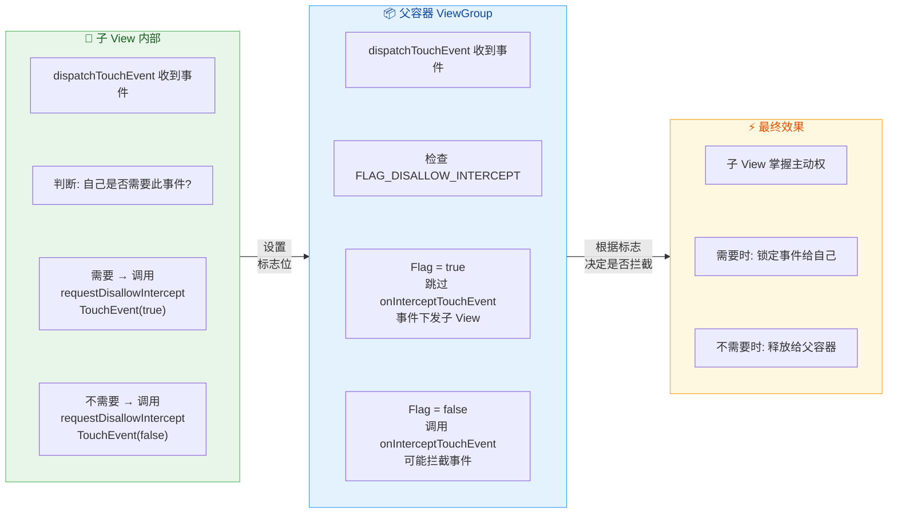
```mermaid
graph LR
    subgraph ChildView["📱 子 View 内部"]
        direction TB
        C1["dispatchTouchEvent 收到事件"]
        C2["判断: 自己是否需要此事件?"]
        C3["需要 → 调用\nrequestDisallowIntercept\nTouchEvent(true)"]
        C4["不需要 → 调用\nrequestDisallowIntercept\nTouchEvent(false)"]
        C1 ~~~ C2
        C2 ~~~ C3
        C3 ~~~ C4
    end

    subgraph ParentVG["📦 父容器 ViewGroup"]
        direction TB
        P1["dispatchTouchEvent 收到事件"]
        P2["检查 FLAG_DISALLOW_INTERCEPT"]
        P3["Flag = true\n跳过 onInterceptTouchEvent\n事件下发子 View"]
        P4["Flag = false\n调用 onInterceptTouchEvent\n可能拦截事件"]
        P1 ~~~ P2
        P2 ~~~ P3
        P3 ~~~ P4
    end

    subgraph Effect["⚡ 最终效果"]
        direction TB
        E1["子 View 掌握主动权"]
        E2["需要时: 锁定事件给自己"]
        E3["不需要时: 释放给父容器"]
        E1 ~~~ E2
        E2 ~~~ E3
    end

    ChildView -->|"设置\n标志位"| ParentVG -->|"根据标志\n决定是否拦截"| Effect

    classDef childGreen fill:#E8F5E9,stroke:#66BB6A,color:#1B5E20
    classDef parentBlue fill:#E3F2FD,stroke:#42A5F5,color:#0D47A1
    classDef effectAmber fill:#FFF8E1,stroke:#FFA726,color:#E65100
    class ChildView childGreen
    class ParentVG parentBlue
    class Effect effectAmber
```

但这里有一个**极其关键的细节**：在 `ViewGroup.dispatchTouchEvent()` 的源码中，每当收到 `ACTION_DOWN` 事件时，系统会**强制清除 `FLAG_DISALLOW_INTERCEPT` 标志位**。这意味着无论子 View 之前设置了什么，在新的事件序列开始时（即 `ACTION_DOWN`），父容器的 `onInterceptTouchEvent()` 一定会被调用。这是 Android Framework 的设计保障——确保父容器至少在事件序列开始时有一次决策机会，避免子 View 完全"劫持"所有事件。

这个设计对内部拦截法产生了一个直接的约束：**父容器的 `onInterceptTouchEvent()` 在 `ACTION_DOWN` 时必须返回 `false`**，否则子 View 根本收不到后续事件，`requestDisallowInterceptTouchEvent` 也就无从调用。

#### 内部拦截法的标准模板

内部拦截法需要同时修改子 View 和父容器的代码。子 View 承担主要的决策逻辑，父容器则做最简化的配合。

**子 View 的实现：**

```kotlin
/**
 * 内部拦截法 —— 子 View 端实现
 * 子 View 重写 dispatchTouchEvent 来主动控制事件归属
 */
class ConflictChildView @JvmOverloads constructor(
    context: Context,
    attrs: AttributeSet? = null,
    defStyleAttr: Int = 0
) : View(context, attrs, defStyleAttr) {

    // 记录上一次触摸事件的 X/Y 坐标
    private var lastX = 0f
    private var lastY = 0f

    /**
     * 重点：重写的是 dispatchTouchEvent，而不是 onTouchEvent
     * 
     * 原因：dispatchTouchEvent 是事件到达子 View 后最先被调用的方法，
     * 在这里调用 requestDisallowInterceptTouchEvent 可以在最早的时机
     * 影响父容器的行为。如果放在 onTouchEvent 中，时序上可能已经晚了。
     */
    override fun dispatchTouchEvent(ev: MotionEvent): Boolean {
        val x = ev.x
        val y = ev.y

        when (ev.action) {
            MotionEvent.ACTION_DOWN -> {
                // 【核心步骤 1】DOWN 时立即请求父容器不要拦截
                // 确保后续 MOVE 事件能到达子 View
                parent.requestDisallowInterceptTouchEvent(true)
            }

            MotionEvent.ACTION_MOVE -> {
                // 计算位移增量
                val deltaX = x - lastX
                val deltaY = y - lastY

                // 【核心步骤 2】在 MOVE 中判断：自己是否需要此事件
                if (parentNeedThisEvent(deltaX, deltaY)) {
                    // 如果当前事件应该由父容器处理，
                    // 则取消"禁止父容器拦截"的请求
                    // 父容器的 onInterceptTouchEvent 将重新生效
                    parent.requestDisallowInterceptTouchEvent(false)
                }
                // 如果自己需要事件，不做任何操作（维持 DOWN 时设置的禁止拦截状态）
            }

            MotionEvent.ACTION_UP -> {
                // UP 时不需要特殊处理
                // 事件序列即将结束，标志位会在下次 DOWN 时被自动清除
            }
        }

        // 更新坐标
        lastX = x
        lastY = y

        // 调用 super 执行默认分发逻辑（最终会走到 onTouchEvent）
        return super.dispatchTouchEvent(ev)
    }

    /**
     * 业务判断：父容器是否需要此事件
     * 返回 true 表示应该交给父容器，返回 false 表示子 View 自己处理
     */
    private fun parentNeedThisEvent(deltaX: Float, deltaY: Float): Boolean {
        // 示例：子 View 处理横向滑动，父容器处理纵向滑动
        // 当纵向位移大于横向位移时，说明父容器需要此事件
        return Math.abs(deltaY) > Math.abs(deltaX)
    }
}
```

**父容器的配合实现：**

```kotlin
/**
 * 内部拦截法 —— 父容器端配合实现
 * 父容器只需要做最小限度的修改
 */
class CooperativeParentLayout @JvmOverloads constructor(
    context: Context,
    attrs: AttributeSet? = null,
    defStyleAttr: Int = 0
) : ViewGroup(context, attrs, defStyleAttr) {

    override fun onInterceptTouchEvent(ev: MotionEvent): Boolean {
        // 【关键配合】ACTION_DOWN 时必须返回 false
        // 因为 DOWN 时 FLAG_DISALLOW_INTERCEPT 会被系统强制清除
        // 如果此时返回 true，子 View 将完全收不到事件
        if (ev.action == MotionEvent.ACTION_DOWN) {
            return false
        }

        // 【关键配合】对于除 DOWN 以外的所有事件，返回 true
        // 表示父容器"默认想要拦截"
        // 但如果子 View 调用了 requestDisallowInterceptTouchEvent(true)，
        // 这个方法根本不会被执行到（FLAG_DISALLOW_INTERCEPT 会让系统跳过此调用）
        // 只有当子 View 调用 requestDisallowInterceptTouchEvent(false) 
        // 取消禁止后，这个 return true 才会生效，实现拦截
        return true
    }

    // ... layout 相关方法省略
}
```

**父容器的代码为什么如此简洁？** 因为内部拦截法的精妙之处在于利用了 `FLAG_DISALLOW_INTERCEPT` 和 `onInterceptTouchEvent()` 的配合关系。父容器对 `MOVE`/`UP` 默认返回 `true`（想要拦截），但这并不意味着它一定能拦截到——只有当 `FLAG_DISALLOW_INTERCEPT` 未被设置时，`onInterceptTouchEvent()` 才会被调用。子 View 通过动态设置和取消该标志位，就像操控一个"开关"一样，精确控制父容器的拦截行为。

#### 内部拦截法的事件流转时序

让我们用一个具体的时序来理清内部拦截法在运行时的完整流转：

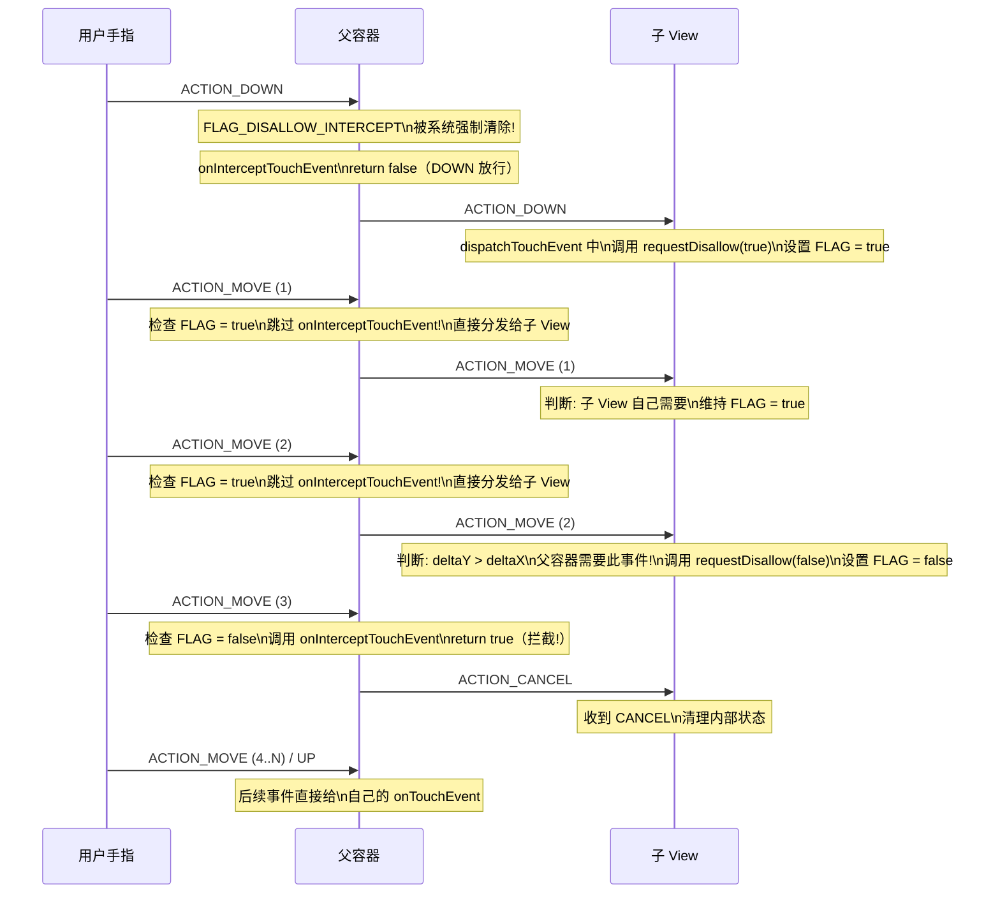
```mermaid
sequenceDiagram
    participant U as 用户手指
    participant P as 父容器
    participant C as 子 View

    U->>P: ACTION_DOWN
    Note over P: FLAG_DISALLOW_INTERCEPT\n被系统强制清除!
    Note over P: onInterceptTouchEvent\nreturn false（DOWN 放行）
    P->>C: ACTION_DOWN
    Note over C: dispatchTouchEvent 中\n调用 requestDisallow(true)\n设置 FLAG = true

    U->>P: ACTION_MOVE (1)
    Note over P: 检查 FLAG = true\n跳过 onInterceptTouchEvent!\n直接分发给子 View
    P->>C: ACTION_MOVE (1)
    Note over C: 判断: 子 View 自己需要\n维持 FLAG = true

    U->>P: ACTION_MOVE (2)
    Note over P: 检查 FLAG = true\n跳过 onInterceptTouchEvent!\n直接分发给子 View
    P->>C: ACTION_MOVE (2)
    Note over C: 判断: deltaY > deltaX\n父容器需要此事件!\n调用 requestDisallow(false)\n设置 FLAG = false

    U->>P: ACTION_MOVE (3)
    Note over P: 检查 FLAG = false\n调用 onInterceptTouchEvent\nreturn true（拦截!）
    P->>C: ACTION_CANCEL
    Note over C: 收到 CANCEL\n清理内部状态

    U->>P: ACTION_MOVE (4..N) / UP
    Note over P: 后续事件直接给\n自己的 onTouchEvent
```

### 外部拦截法 vs 内部拦截法：全面对比

两种方法的本质目标相同——动态分配事件的处理权——但实现路径和适用场景有明显差异。

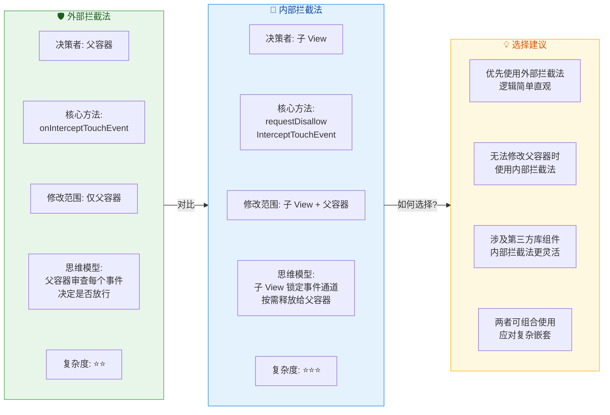
```mermaid
graph LR
    subgraph External["🛡️ 外部拦截法"]
        direction TB
        E1["决策者: 父容器"]
        E2["核心方法:\nonInterceptTouchEvent"]
        E3["修改范围: 仅父容器"]
        E4["思维模型:\n父容器审查每个事件\n决定是否放行"]
        E5["复杂度: ⭐⭐"]
        E1 ~~~ E2
        E2 ~~~ E3
        E3 ~~~ E4
        E4 ~~~ E5
    end

    subgraph Internal["🎯 内部拦截法"]
        direction TB
        I1["决策者: 子 View"]
        I2["核心方法:\nrequestDisallow\nInterceptTouchEvent"]
        I3["修改范围: 子 View + 父容器"]
        I4["思维模型:\n子 View 锁定事件通道\n按需释放给父容器"]
        I5["复杂度: ⭐⭐⭐"]
        I1 ~~~ I2
        I2 ~~~ I3
        I3 ~~~ I4
        I4 ~~~ I5
    end

    subgraph Advice["💡 选择建议"]
        direction TB
        A1["优先使用外部拦截法\n逻辑简单直观"]
        A2["无法修改父容器时\n使用内部拦截法"]
        A3["涉及第三方库组件\n内部拦截法更灵活"]
        A4["两者可组合使用\n应对复杂嵌套"]
        A1 ~~~ A2
        A2 ~~~ A3
        A3 ~~~ A4
    end

    External -->|"对比"| Internal -->|"如何选择?"| Advice

    classDef extGreen fill:#E8F5E9,stroke:#43A047,color:#1B5E20
    classDef intBlue fill:#E3F2FD,stroke:#1E88E5,color:#0D47A1
    classDef advAmber fill:#FFF8E1,stroke:#FFB300,color:#E65100
    class External extGreen
    class Internal intBlue
    class Advice advAmber
```

**选择策略总结：**

- **优先使用外部拦截法。** 它只需要修改父容器的代码，逻辑集中且直观。在绝大多数场景中，外部拦截法都是首选。

- **当无法修改父容器时，使用内部拦截法。** 典型场景：父容器是第三方库提供的组件（如某个自定义的 `PullToRefreshLayout`），你无法修改它的源码。此时只能从子 View 端发力，通过 `requestDisallowInterceptTouchEvent` 来影响父容器的行为。

- **内部拦截法在某些复杂场景下更灵活。** 例如，同一个父容器内有多个不同类型的子 View，每个子 View 对事件的需求各不相同。如果用外部拦截法，父容器需要知道所有子 View 的逻辑并分别处理，代码会变得臃肿。而用内部拦截法，每个子 View 只管自己的逻辑，各自独立决策，解耦更彻底。

- **两者可以组合使用。** 在多层嵌套场景中，某一层用外部拦截法，另一层用内部拦截法，并不冲突。核心是理解每一层的事件流向，确保同一个事件序列中不会出现决策矛盾。

### 典型实战案例：ViewPager 嵌套 RecyclerView

这个场景几乎是每个 Android 开发者都会遇到的：外层 `ViewPager`（横向翻页），内层每个 Page 是一个纵向滚动的 `RecyclerView`。我们用外部拦截法来解决：

```kotlin
/**
 * 实战: ViewPager 嵌套纵向 RecyclerView 的滑动冲突解决
 * 采用外部拦截法，由自定义 ViewPager 负责判断拦截时机
 */
class SmartViewPager @JvmOverloads constructor(
    context: Context,
    attrs: AttributeSet? = null
) : ViewPager(context, attrs) {

    // 记录初始触摸坐标
    private var startX = 0f
    private var startY = 0f

    // 获取系统定义的最小滑动阈值
    private val touchSlop = ViewConfiguration.get(context).scaledTouchSlop

    // 标记是否已经确定了滑动方向（一旦确定，整个序列内不再更改）
    private var directionDecided = false
    // 标记确定的方向是否为横向
    private var isHorizontalDrag = false

    override fun onInterceptTouchEvent(ev: MotionEvent): Boolean {
        when (ev.action) {
            MotionEvent.ACTION_DOWN -> {
                // DOWN 时重置状态并记录坐标
                startX = ev.x
                startY = ev.y
                directionDecided = false
                isHorizontalDrag = false
                // 调用 super 让 ViewPager 内部正确处理 DOWN
                // ViewPager 自身也有拦截逻辑，需要让它初始化状态
                return super.onInterceptTouchEvent(ev)
            }

            MotionEvent.ACTION_MOVE -> {
                // 如果方向已经确定过了，直接返回之前的决定
                if (directionDecided) {
                    return isHorizontalDrag
                }

                // 计算总位移
                val dx = Math.abs(ev.x - startX)
                val dy = Math.abs(ev.y - startY)

                // 位移超过阈值时才确定方向
                if (dx > touchSlop || dy > touchSlop) {
                    // 标记方向已确定
                    directionDecided = true
                    // 横向位移更大 → 横向拖拽 → ViewPager 拦截
                    // 纵向位移更大 → 纵向拖拽 → 放行给 RecyclerView
                    isHorizontalDrag = dx > dy

                    if (isHorizontalDrag) {
                        // 横向拦截，调用 super 让 ViewPager 内部
                        // 也进入拖拽状态（设置 mIsBeingDragged 等）
                        return super.onInterceptTouchEvent(ev)
                    } else {
                        // 纵向放行
                        return false
                    }
                }
            }

            MotionEvent.ACTION_UP, MotionEvent.ACTION_CANCEL -> {
                // 序列结束，重置状态
                directionDecided = false
                isHorizontalDrag = false
                // 让 ViewPager 内部也做清理
                return super.onInterceptTouchEvent(ev)
            }
        }
        return super.onInterceptTouchEvent(ev)
    }
}
```

这段代码有一个值得深思的设计——**方向锁定（Direction Locking）**。一旦在某个 `MOVE` 事件中确定了滑动方向，后续的所有 `MOVE` 事件都沿用同一个方向判定结果，不再重新计算。这样做的原因是，用户的滑动过程中手指轨迹往往不是完美的直线，如果每次 `MOVE` 都重新判断方向，可能会导致事件在父容器和子 View 之间来回跳跃，表现为"抖动"。方向锁定保证了一旦做出决策，整个事件序列中滑动行为是稳定一致的。

### 常见陷阱与最佳实践

**陷阱 1：忘记在 `ACTION_DOWN` 时调用 `super.onInterceptTouchEvent(ev)`。** 很多自带拦截逻辑的系统组件（如 `ViewPager`、`DrawerLayout`、`SwipeRefreshLayout`）在 `onInterceptTouchEvent` 的 `ACTION_DOWN` 分支中会初始化内部状态（如记录起始坐标、重置标志位等）。如果你的子类在 `ACTION_DOWN` 时没有调用 `super`，父类的这些初始化代码就不会执行，可能导致后续行为异常。

**陷阱 2：在内部拦截法中忽视 `ACTION_DOWN` 的特殊性。** 前面已经强调过，`ACTION_DOWN` 时 `FLAG_DISALLOW_INTERCEPT` 会被系统清除。如果父容器在 `ACTION_DOWN` 时的 `onInterceptTouchEvent` 返回了 `true`，那么子 View 的 `requestDisallowInterceptTouchEvent(true)` 就永远没有机会执行——因为子 View 根本收不到 `DOWN` 事件。

**陷阱 3：混淆 `dispatchTouchEvent`、`onInterceptTouchEvent` 和 `onTouchEvent` 的修改位置。** 外部拦截法修改的是**父容器的 `onInterceptTouchEvent`**；内部拦截法修改的是**子 View 的 `dispatchTouchEvent`**。把逻辑写错了位置是初学者最常犯的错误。

**最佳实践 1：始终使用 `touchSlop` 作为滑动起始阈值。** 不要在位移为 0 或极小值时就开始拦截或消费事件。`touchSlop` 的存在是为了区分"真正的滑动"和"手指微微抖动"。

**最佳实践 2：善用 `canScrollVertically()` / `canScrollHorizontally()` 判断子 View 的边界状态。** 这两个方法是 `View` 类提供的标准 API，适用于所有可滚动的 View（`RecyclerView`、`ScrollView`、`NestedScrollView` 等），比手动计算滚动偏移更可靠、更通用。

**最佳实践 3：在复杂嵌套场景下，优先考虑 `NestedScrolling` 机制。** 外部拦截法和内部拦截法本质上是传统的事件分发层面的解法，在两层嵌套中够用，但在三层甚至更多层嵌套中会变得非常复杂。Android 后续引入的 `NestedScrollingParent` / `NestedScrollingChild` 接口（以及 `NestedScrolling2`、`NestedScrolling3`）提供了更优雅的滑动协作机制，将在后续章节详细展开。

---

**📝 练习题**

在使用 **内部拦截法** 解决滑动冲突时，以下哪项描述是正确的？


A. 子 View 应在 `onTouchEvent()` 中调用 `requestDisallowInterceptTouchEvent()` 来控制父容器的拦截行为


B. 父容器的 `onInterceptTouchEvent()` 在 `ACTION_DOWN` 时应返回 `true`，以便第一时间拦截事件序列


C. 子 View 在 `ACTION_DOWN` 时调用 `requestDisallowInterceptTouchEvent(true)`，且父容器在 `ACTION_DOWN` 以外的事件中默认返回 `true`


D. 子 View 只需调用 `requestDisallowInterceptTouchEvent(true)` 即可永久阻止父容器拦截，无需在 `ACTION_MOVE` 中动态切换


**【答案】** C

**【解析】** 内部拦截法的标准模式要求两端配合。**子 View 端**：在 `dispatchTouchEvent()` 的 `ACTION_DOWN` 中立即调用 `requestDisallowInterceptTouchEvent(true)` 锁定事件通道，然后在 `ACTION_MOVE` 中根据业务逻辑动态决定是否释放（调用 `requestDisallowInterceptTouchEvent(false)`）。**父容器端**：`onInterceptTouchEvent()` 在 `ACTION_DOWN` 时必须返回 `false`（因为此时 `FLAG_DISALLOW_INTERCEPT` 已被系统强制清除，如果返回 `true` 子 View 将收不到任何事件），而在 `ACTION_MOVE` 和 `ACTION_UP` 时默认返回 `true`——这个 `true` 在正常情况下不会生效（因为子 View 设置了禁止拦截标志），只有当子 View 主动释放（调用 `requestDisallowInterceptTouchEvent(false)`）时才真正拦截事件。选项 A 错误，因为内部拦截法应在 `dispatchTouchEvent()` 而非 `onTouchEvent()` 中操作；选项 B 错误，`ACTION_DOWN` 返回 `true` 会导致子 View 完全收不到事件；选项 D 错误，`FLAG_DISALLOW_INTERCEPT` 会在每次新 `ACTION_DOWN` 时被系统重置，而且静态锁定无法实现动态的冲突协调。

---

**📝 练习题**

当使用 **外部拦截法** 处理一个纵向 `ScrollView` 内嵌横向 `RecyclerView` 的方向不一致冲突时，以下哪种实现方式最合理？


A. 在 `ACTION_DOWN` 中通过 `ev.x` 和 `ev.y` 判断初始方向，立即决定是否拦截


B. 在 `ACTION_MOVE` 中计算位移增量 `deltaX` 和 `deltaY`，当 `|deltaY| > |deltaX|` 且超过 `touchSlop` 时拦截，`ACTION_DOWN` 和 `ACTION_UP` 不拦截


C. 在 `ACTION_UP` 中根据整个滑动路径的总位移方向决定是否拦截


D. 在所有事件类型中统一返回 `true`，始终让父容器处理事件


**【答案】** B

**【解析】** 外部拦截法的核心模板要求 `ACTION_DOWN` 不拦截（否则子 View 收不到事件，`mFirstTouchTarget` 为 `null`，后续事件不再走 `onInterceptTouchEvent`）；`ACTION_UP` 不拦截（否则子 View 的 click 事件会丢失）；只在 `ACTION_MOVE` 中根据位移增量做方向判断。对于方向不一致冲突，当纵向位移绝对值大于横向位移绝对值时说明用户在做纵向滑动，父容器 `ScrollView` 应该拦截。同时必须加入 `touchSlop` 阈值判断，避免在手指微小抖动时做出错误的方向决策。选项 A 错误，因为 `ACTION_DOWN` 只是一个点，没有位移可供判断方向，且 `DOWN` 拦截会导致子 View 完全失去事件；选项 C 错误，因为 `UP` 时事件序列已经接近结束，此时拦截为时已晚且会破坏子 View 的点击回调；选项 D 错误，全部拦截等于子 View 永远收不到事件。

---

## 触摸代理

在 Android 应用层开发中，触摸事件的精细化处理远不止 `dispatchTouchEvent` → `onInterceptTouchEvent` → `onTouchEvent` 这条主线。当我们面对"按钮太小难以点中"、"两根手指同时操作地图"、"需要从 MotionEvent 里提取每根手指的精确坐标"等实际场景时，就必须深入理解三个进阶主题：**TouchDelegate 触摸代理**、**多点触控的 PointerId 与 PointerIndex 体系**，以及 **MotionEvent 本身的内部结构拆解**。这三者共同构成了"从系统拿到原始触摸信号后，如何在应用层做精准、灵活处理"的完整知识图谱。

---

### TouchDelegate 扩大点击区域

#### 问题的由来——为什么需要 TouchDelegate

Material Design 规范建议可点击目标至少为 **48dp × 48dp**，但 UI 设计中经常出现比这更小的图标按钮、复选框、关闭按钮等控件。如果直接给 View 增大 `layout_width` / `layout_height`，会破坏整体布局；如果增加 `padding`，虽然可以扩大 View 的绘制边界，但会影响背景、波纹效果（Ripple）的范围。Android 框架给出的官方答案是 **TouchDelegate**——它允许我们在 **不改变 View 尺寸** 的前提下，把父 View 中一块更大的矩形区域"代理"给子 View，使得用户触摸这块扩大区域时，系统会认为触摸的是子 View。

从设计模式角度看，TouchDelegate 是一种 **委托模式（Delegate Pattern）**：父 View 把自身接收到的部分触摸事件"转交"给子 View 处理。它与事件分发主链路（责任链）并行，是 View 类中内置的一条"旁路"。

#### TouchDelegate 的工作原理

在 `View` 源码中，与 TouchDelegate 相关的核心逻辑非常简洁。每个 View 内部持有一个可为 null 的 `mTouchDelegate` 字段。当 `View.onTouchEvent()` 被调用时，系统会在方法的 **最前面** 检查这个字段：

```java
// View.java — onTouchEvent() 简化伪代码
public boolean onTouchEvent(MotionEvent event) {
    // 1. 首先检查是否设置了 TouchDelegate
    if (mTouchDelegate != null) {
        // 将事件交给 TouchDelegate 处理
        if (mTouchDelegate.onTouchEvent(event)) {
            // 如果 TouchDelegate 消费了事件，直接返回 true
            return true;
        }
    }
    // 2. 后续才是 View 自身的点击/长按等处理逻辑
    // ...
}
```

这意味着 TouchDelegate 的优先级 **高于** View 自身的默认触摸处理。一旦 TouchDelegate 判定本次触摸落在扩大区域内，它就会接管这次事件。

再来看 `TouchDelegate` 类本身的核心逻辑。构造时需要两个参数：一个 `Rect bounds`（扩大后的矩形区域，坐标相对于"设置 delegate 的那个父 View"）和一个 `View delegateView`（真正要接收事件的子 View）。其 `onTouchEvent()` 方法的判断流程如下：

```java
// TouchDelegate.java — 核心逻辑简化
public boolean onTouchEvent(MotionEvent event) {
    int x = (int) event.getX();                    // 获取触摸点 x（相对于父 View）
    int y = (int) event.getY();                    // 获取触摸点 y（相对于父 View）
    boolean hit = mBounds.contains(x, y);          // 判断是否落在扩大区域内
    boolean sendToDelegate = false;                 // 标记是否要转发给子 View

    switch (event.getAction()) {
        case MotionEvent.ACTION_DOWN:
            if (hit) {
                sendToDelegate = true;              // DOWN 在区域内，开始代理
                mDelegateTargeted = true;           // 记录本次序列已锁定代理
            }
            break;
        case MotionEvent.ACTION_MOVE:
            sendToDelegate = mDelegateTargeted;     // MOVE 跟随 DOWN 的决策
            break;
        case MotionEvent.ACTION_UP:
        case MotionEvent.ACTION_CANCEL:
            sendToDelegate = mDelegateTargeted;     // UP/CANCEL 同样跟随
            mDelegateTargeted = false;              // 序列结束，重置标记
            break;
    }

    if (sendToDelegate) {
        // 关键：把触摸坐标偏移到子 View 的中心
        // 这样子 View "以为" 用户精确地点在了自己身上
        event.setLocation(
            mDelegateView.getWidth() / 2f,          // 映射到子 View 中心 x
            mDelegateView.getHeight() / 2f           // 映射到子 View 中心 y
        );
        return mDelegateView.dispatchTouchEvent(event); // 转发给子 View
    }
    return false;                                   // 不在区域内，不消费
}
```

这里有两个特别值得注意的设计细节：

**第一，"序列锁定"机制**。只有 `ACTION_DOWN` 时才判断 `hit`，一旦 DOWN 命中扩大区域，后续整条事件序列（MOVE、UP）都会转发给子 View，即使手指滑出了扩大区域。这与事件分发主链路中"DOWN 确定 target，后续跟随"的设计理念完全一致。

**第二，坐标重映射**。TouchDelegate 会把触摸坐标 `setLocation` 到子 View 的中心点，而不是传递原始坐标。这是因为原始坐标可能落在子 View 的物理边界之外（毕竟我们扩大了区域），如果直接传递，子 View 内部的 `onTouchEvent` 可能会因为 `pointInView()` 检测失败而拒绝处理。映射到中心后，子 View 总是认为"用户点在了我身上"，从而正常触发 click/ripple 等效果。

#### 实际使用方式

使用 TouchDelegate 需要注意一个时序问题：**必须在父 View 完成布局之后** 才能设置，因为我们需要子 View 的准确位置来计算扩大后的 Rect。通常通过 `View.post()` 或 `OnGlobalLayoutListener` 来保证时机正确：

```kotlin
// 在父 View（如 FrameLayout）上设置 TouchDelegate
parentView.post {
    // 1. 获取子 View 在父 View 坐标系中的位置
    val rect = Rect()                               // 创建矩形对象
    childButton.getHitRect(rect)                     // 填充子 View 的命中矩形

    // 2. 向四个方向各扩展 40px
    val extraPadding = 40                            // 扩展量（单位 px）
    rect.top -= extraPadding                         // 上边界上移
    rect.bottom += extraPadding                      // 下边界下移
    rect.left -= extraPadding                        // 左边界左移
    rect.right += extraPadding                       // 右边界右移

    // 3. 将扩大后的矩形与子 View 绑定，设置到父 View 上
    parentView.touchDelegate = TouchDelegate(rect, childButton)
}
```

需要强调的是，`TouchDelegate` 是设置在 **父 View** 上的，而不是子 View 上。这是因为扩大后的区域已经超出了子 View 的物理边界，只有父 View 才能"看到"那块额外区域内的触摸事件，再通过 delegate 转发给子 View。

#### TouchDelegate 的局限性

原生 `TouchDelegate` 有一个明显限制：**一个父 View 只能设置一个 TouchDelegate**，因为 `mTouchDelegate` 是单一字段。如果需要同时扩大多个子 View 的点击区域，需要自行封装一个 `TouchDelegateComposite`，在内部维护多个 `TouchDelegate` 实例并逐一分发。在 Jetpack 的 Compose 体系中，修改触摸区域的能力被更优雅地内建在了 `Modifier` 系统里（如 `Modifier.padding()` 配合 `minimumInteractiveComponentSize()`），但在传统 View 体系中，TouchDelegate 仍然是官方推荐的标准方案。

下面的流程图概括了 TouchDelegate 的整体工作机制：

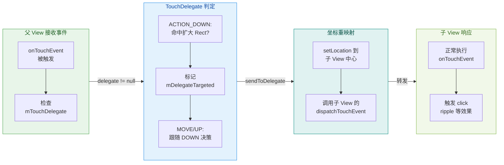
```mermaid
graph LR
    subgraph A["父 View 接收事件"]
        direction TB
        A1["onTouchEvent\n被触发"]
        A2["检查\nmTouchDelegate"]
        A1 --> A2
    end

    subgraph B["TouchDelegate 判定"]
        direction TB
        B1["ACTION_DOWN:\n命中扩大 Rect?"]
        B2["标记\nmDelegateTargeted"]
        B3["MOVE/UP:\n跟随 DOWN 决策"]
        B1 --> B2
        B2 --> B3
    end

    subgraph C["坐标重映射"]
        direction TB
        C1["setLocation 到\n子 View 中心"]
        C2["调用子 View 的\ndispatchTouchEvent"]
        C1 --> C2
    end

    subgraph D["子 View 响应"]
        direction TB
        D1["正常执行\nonTouchEvent"]
        D2["触发 click\nripple 等效果"]
        D1 --> D2
    end

    A -->|"delegate != null"| B -->|"sendToDelegate"| C -->|"转发"| D

    classDef greenBox fill:#E8F5E9,stroke:#43A047,color:#1B5E20
    classDef blueBox fill:#E3F2FD,stroke:#1E88E5,color:#0D47A1
    classDef tealBox fill:#E0F2F1,stroke:#00897B,color:#004D40
    classDef limeBox fill:#F1F8E9,stroke:#7CB342,color:#33691E

    class A greenBox
    class B blueBox
    class C tealBox
    class D limeBox
```

---

### 多点触控 PointerId 与 PointerIndex

#### 多点触控的本质挑战

当只有一根手指触摸屏幕时，一切简单明了：每个 MotionEvent 里只有一组坐标 `(x, y)`。但 Android 设备支持多点触控（通常 5~10 个触控点），当多根手指同时落在屏幕上时，一个 MotionEvent 对象里会 **同时携带多根手指的数据**。这时就产生了两个核心问题：

1. **如何区分不同手指**？——用户的食指和拇指必须有各自的"身份证"。
2. **如何在一个 MotionEvent 中定位某根手指的数据**？——需要一种索引机制。

Android 用两个截然不同但容易混淆的概念来解决这两个问题：**Pointer Id** 和 **Pointer Index**。

#### Pointer Id：手指的"身份证号"

每当一根新手指触碰屏幕，系统（InputFlinger/InputDispatcher）会为它分配一个 **Pointer Id**，这个 Id 在该手指从按下到抬起的整个生命周期内 **保持不变**。即使中间有其他手指先抬起、再落下导致触控点数量变化，已有手指的 Pointer Id 也不会被重新分配。

举个例子来直观理解：

- 时刻 T1：食指按下 → 分配 `pointerId = 0`
- 时刻 T2：中指按下 → 分配 `pointerId = 1`
- 时刻 T3：食指抬起 → `pointerId = 0` 被释放
- 时刻 T4：无名指按下 → 分配 `pointerId = 0`（复用了之前释放的 Id）

在 T2~T3 之间，屏幕上同时有两根手指，但我们始终可以用 `pointerId = 0` 追踪食指、用 `pointerId = 1` 追踪中指，不会混淆。Pointer Id 的设计目的就是让应用层能够 **跨多个 MotionEvent 持续跟踪同一根手指**。

#### Pointer Index：MotionEvent 内部的"数组下标"

一个 MotionEvent 内部用 **数组** 存储当前所有触控点的数据（坐标、压力、大小等）。Pointer Index 就是这个数组的下标，取值范围是 `[0, pointerCount - 1]`。

**关键区别**：Pointer Index 是 **不稳定** 的——每次生成新的 MotionEvent 时，系统可能重新排列数组，导致同一根手指在不同 MotionEvent 中的 Index 不同。因此，**绝对不能用 Pointer Index 来跟踪手指身份**，它只是"在当前这个 MotionEvent 对象内部，帮你定位数据的临时下标"。

两者的关系可以用下面的类比来理解：

```text
Pointer Id    ≈ 学生的学号（终身不变，用于跨学期追踪）
Pointer Index ≈ 学生在教室里的座位号（每节课可能换座）
```

它们之间的转换由 MotionEvent 提供的两个方法完成：

```kotlin
// 已知 pointerId，找到它在当前 MotionEvent 中的 index
val index = event.findPointerIndex(pointerId)    // 返回 index，找不到返回 -1

// 已知 index，获取对应的 pointerId
val id = event.getPointerId(index)               // 返回该位置手指的 Id
```

一旦拿到正确的 Index，就可以获取该手指的各项数据：

```kotlin
val x = event.getX(index)                        // 该手指的 x 坐标
val y = event.getY(index)                        // 该手指的 y 坐标
val pressure = event.getPressure(index)           // 该手指的压力值
val size = event.getSize(index)                   // 该手指的触控面积
```

无参版本 `event.getX()` / `event.getY()` 等价于 `event.getX(0)`，即只返回 Index 为 0 的手指数据。在单指场景下这没问题，但在多指场景下，Index 0 不一定是你想跟踪的那根手指，因此必须通过 Pointer Id → Index 的转换来精确定位。

#### ACTION_POINTER_DOWN 与 ACTION_POINTER_UP

多点触控引入了两个额外的 Action 类型：

- **ACTION_POINTER_DOWN**：当屏幕上 **已有至少一根手指** 的情况下，又有一根新手指按下时触发。（第一根手指按下是普通的 `ACTION_DOWN`。）
- **ACTION_POINTER_UP**：当屏幕上 **还会剩下至少一根手指** 的情况下，有一根手指抬起时触发。（最后一根手指抬起是普通的 `ACTION_UP`。）

这两个 Action 的特殊之处在于，它们把 **触发该事件的那根手指的 Pointer Index** 编码进了 action 值的高 8 位。因此获取 action 和对应 index 的标准写法是：

```kotlin
// 从 MotionEvent 中正确提取 action 和触发手指的 index
val actionMasked = event.actionMasked               // 低 8 位：事件类型
val actionIndex = event.actionIndex                  // 高 8 位解码：触发者的 index

when (actionMasked) {
    MotionEvent.ACTION_DOWN -> {
        // 第一根手指按下，actionIndex 必然为 0
        val id = event.getPointerId(0)               // 获取第一根手指的 Id
    }
    MotionEvent.ACTION_POINTER_DOWN -> {
        // 新手指按下，actionIndex 指向它在数组中的位置
        val newId = event.getPointerId(actionIndex)  // 获取新手指的 Id
    }
    MotionEvent.ACTION_POINTER_UP -> {
        // 某根手指抬起，actionIndex 指向它
        val leavingId = event.getPointerId(actionIndex)  // 即将离开的手指 Id
    }
    MotionEvent.ACTION_MOVE -> {
        // MOVE 不包含 actionIndex，因为所有手指可能都在移动
        // 需要遍历所有 pointer
        for (i in 0 until event.pointerCount) {      // 遍历每根手指
            val id = event.getPointerId(i)            // 当前手指 Id
            val x = event.getX(i)                     // 当前手指 x
            val y = event.getY(i)                     // 当前手指 y
        }
    }
    MotionEvent.ACTION_UP -> {
        // 最后一根手指抬起
    }
}
```

特别要注意：**不要用 `event.action` 直接和 `ACTION_DOWN` 比较**。`event.action` 返回的是包含高位 index 信息的完整值，在多指场景下 `ACTION_POINTER_DOWN` 的原始值可能是 `0x0105`（index=1, action=5），直接比较会出错。始终使用 `event.actionMasked` 来获取纯净的 action 类型。

#### 多指追踪的实战模型

下面是一个典型的多指追踪场景的时序示意。假设用户先后按下两根手指，然后先抬起第一根：

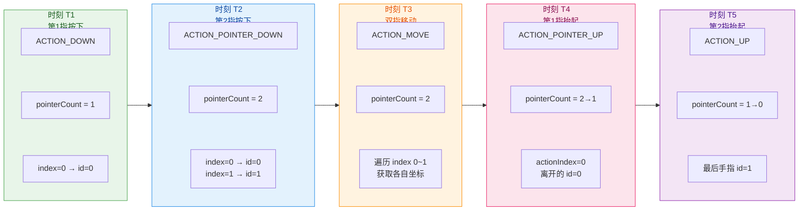
```mermaid
graph LR
    subgraph T1["时刻 T1\n第1指按下"]
        direction TB
        T1A["ACTION_DOWN"]
        T1B["pointerCount = 1"]
        T1C["index=0 → id=0"]
        T1A ~~~ T1B
        T1B ~~~ T1C
    end

    subgraph T2["时刻 T2\n第2指按下"]
        direction TB
        T2A["ACTION_POINTER_DOWN"]
        T2B["pointerCount = 2"]
        T2C["index=0 → id=0\nindex=1 → id=1"]
        T2A ~~~ T2B
        T2B ~~~ T2C
    end

    subgraph T3["时刻 T3\n双指移动"]
        direction TB
        T3A["ACTION_MOVE"]
        T3B["pointerCount = 2"]
        T3C["遍历 index 0~1\n获取各自坐标"]
        T3A ~~~ T3B
        T3B ~~~ T3C
    end

    subgraph T4["时刻 T4\n第1指抬起"]
        direction TB
        T4A["ACTION_POINTER_UP"]
        T4B["pointerCount = 2→1"]
        T4C["actionIndex=0\n离开的 id=0"]
        T4A ~~~ T4B
        T4B ~~~ T4C
    end

    subgraph T5["时刻 T5\n第2指抬起"]
        direction TB
        T5A["ACTION_UP"]
        T5B["pointerCount = 1→0"]
        T5C["最后手指 id=1"]
        T5A ~~~ T5B
        T5B ~~~ T5C
    end

    T1 --> T2 --> T3 --> T4 --> T5

    classDef step1 fill:#E8F5E9,stroke:#43A047,color:#1B5E20
    classDef step2 fill:#E3F2FD,stroke:#1E88E5,color:#0D47A1
    classDef step3 fill:#FFF3E0,stroke:#FB8C00,color:#E65100
    classDef step4 fill:#FCE4EC,stroke:#E91E63,color:#880E4F
    classDef step5 fill:#F3E5F5,stroke:#8E24AA,color:#4A148C

    class T1 step1
    class T2 step2
    class T3 step3
    class T4 step4
    class T5 step5
```

注意 T4 时刻：虽然 `pointerCount` 即将变为 1，但在当前这个 MotionEvent 中仍然是 2（系统在 POINTER_UP 事件中仍包含即将离开的手指数据）。下一个 MOVE 事件开始，`pointerCount` 才变为 1，且剩余手指的 Pointer Index 可能会变化（比如之前 index=1 的手指可能变成 index=0），但它的 Pointer Id 始终是 1。

---

### MotionEvent 拆解

#### MotionEvent 的内部数据结构

MotionEvent 是 Android 触摸系统中信息密度最高的对象之一。从应用层视角看，一个 MotionEvent 可以被理解为如下的分层结构：

**第一层：事件元信息（Event Metadata）**

| 字段 | 含义 | 获取方法 |
|------|------|---------|
| action | 事件类型 + 触发 pointer index | `getActionMasked()`, `getActionIndex()` |
| eventTime | 事件发生的系统时间（ms） | `getEventTime()` |
| downTime | 本序列 ACTION_DOWN 的时间（ms） | `getDownTime()` |
| edgeFlags | 触摸是否发生在屏幕边缘 | `getEdgeFlags()` |
| source | 输入源类型（触屏/触控板等） | `getSource()` |
| deviceId | 输入设备 Id | `getDeviceId()` |

其中 `downTime` 贯穿整个事件序列——从 DOWN 到 UP，所有事件的 `downTime` 都相同。这让我们可以计算长按时间：`eventTime - downTime`。而 `eventTime` 则每个事件都不同，用于计算速度、加速度等。

**第二层：Pointer 数据数组**

这是 MotionEvent 的核心载荷。内部维护了一个大小为 `pointerCount` 的数组，每个元素包含一根手指的完整信息：

```kotlin
// 伪代码展示 MotionEvent 内部的 Pointer 数据结构
data class PointerData(
    val pointerId: Int,        // 手指身份 Id（稳定）
    val x: Float,              // 相对于当前 View 的 x 坐标
    val y: Float,              // 相对于当前 View 的 y 坐标
    val rawX: Float,           // 相对于屏幕左上角的绝对 x 坐标
    val rawY: Float,           // 相对于屏幕左上角的绝对 y 坐标
    val pressure: Float,       // 压力值，通常 0.0~1.0
    val size: Float,           // 触控面积归一化值
    val toolType: Int,         // 工具类型：手指/触控笔/鼠标/橡皮
    val orientation: Float     // 触控椭圆的方向角（弧度）
)
```

**`getX()` 与 `getRawX()` 的区别** 是高频考点。`getX(index)` 返回的坐标是经过 View 树层层 `offsetLocation()` 变换后的值，即相对于 **接收事件的 View 的左上角**。而 `getRawX()` 返回的始终是相对于 **屏幕物理左上角** 的绝对坐标。在事件分发过程中，`ViewGroup.dispatchTransformedTouchEvent()` 会调用 `event.offsetLocation(-child.left, -child.top)` 把坐标从父 View 坐标系变换到子 View 坐标系，因此每经过一层 ViewGroup，`getX()` 的值就会发生偏移，但 `getRawX()` 始终不变。

需要注意：在 API 29 之前，`getRawX()` / `getRawY()` **没有** 接受 pointer index 参数的重载版本，即只能获取 index=0 的手指的原始坐标。API 29（Android 10）开始才增加了 `getRawX(int pointerIndex)` 方法。如果在低版本上需要获取多指的原始坐标，需要通过 `getX(index) + View 在屏幕上的位置` 手动计算。

**第三层：历史批量数据（Historical Batch）**

这是 MotionEvent 中最容易被忽略但对绘图类应用至关重要的部分。为了提高效率，Android 的 InputDispatcher 并不是每产生一个采样点就立刻发送一个 MotionEvent，而是会把多个采样点 **批量打包** 进一个 MotionEvent 中。当前最新的坐标通过 `getX()` / `getY()` 获取，而之前积攒的采样点存放在 **history** 中：

```kotlin
// 在自定义绘图 View 中利用历史数据实现平滑笔迹
override fun onTouchEvent(event: MotionEvent): Boolean {
    when (event.actionMasked) {
        MotionEvent.ACTION_MOVE -> {
            // 1. 先处理历史采样点（时间更早的点）
            val historySize = event.historySize          // 历史采样点数量
            for (h in 0 until historySize) {             // 遍历每个历史点
                val hx = event.getHistoricalX(h)         // 历史点 x
                val hy = event.getHistoricalY(h)         // 历史点 y
                path.lineTo(hx, hy)                      // 连线到历史点
            }
            // 2. 再处理当前最新的采样点
            val cx = event.x                             // 当前点 x
            val cy = event.y                             // 当前点 y
            path.lineTo(cx, cy)                          // 连线到当前点
            invalidate()                                 // 请求重绘
        }
    }
    return true
}
```

如果忽略 history 数据，只使用 `getX()` / `getY()`，在快速滑动时笔迹会出现明显的"折线感"——因为丢失了中间的采样点。一个 MOVE 事件中可能包含 2~10 个历史点，具体数量取决于屏幕的采样率（通常 120Hz~240Hz）和应用的主线程消费速度。

#### MotionEvent 的对象池与回收

MotionEvent 采用 **对象池（Object Pool）** 模式管理内存。框架通过 `MotionEvent.obtain()` 从池中获取实例，通过 `recycle()` 归还。这意味着：

1. **不要在异步任务中持有 MotionEvent 引用**。一旦 `onTouchEvent` 返回，该 MotionEvent 随时可能被 `recycle()` 并重新分配给下一个事件，你持有的引用会指向完全不同的数据。
2. 如果必须保存事件数据供后续使用，应该调用 `MotionEvent.obtain(event)` 创建一个 **副本**，用完后手动 `recycle()`。
3. 或者更简洁的做法：只提取需要的基本值（x、y、action、pointerId），存入自定义数据结构中。

```kotlin
// 错误做法 ❌：在协程中直接引用原始 MotionEvent
var savedEvent: MotionEvent? = null
override fun onTouchEvent(event: MotionEvent): Boolean {
    savedEvent = event     // 危险！event 会被回收复用
    return true
}

// 正确做法 ✅：拷贝一份或提取值
override fun onTouchEvent(event: MotionEvent): Boolean {
    val copy = MotionEvent.obtain(event)   // 从池中获取一个拷贝
    // 使用完毕后务必回收
    handler.post {
        processEvent(copy)                 // 在另一个时机处理
        copy.recycle()                     // 用完归还到池中
    }
    return true
}
```

#### MotionEvent 的坐标变换全景

为了更好地理解 `getX()` 在事件分发路径上的变化过程，下面用一张图来展示坐标从屏幕绝对坐标到最终子 View 局部坐标的变换链：

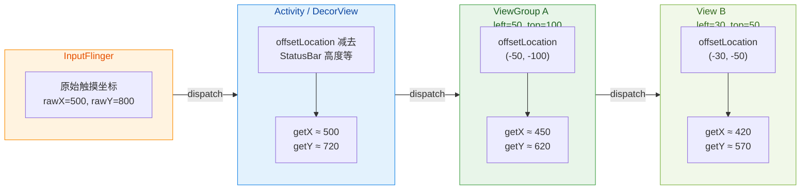
```mermaid
graph LR
    subgraph S1["InputFlinger"]
        direction TB
        S1A["原始触摸坐标\nrawX=500, rawY=800"]
    end

    subgraph S2["Activity / DecorView"]
        direction TB
        S2A["offsetLocation 减去\nStatusBar 高度等"]
        S2B["getX ≈ 500\ngetY ≈ 720"]
        S2A --> S2B
    end

    subgraph S3["ViewGroup A\nleft=50, top=100"]
        direction TB
        S3A["offsetLocation\n(-50, -100)"]
        S3B["getX ≈ 450\ngetY ≈ 620"]
        S3A --> S3B
    end

    subgraph S4["View B\nleft=30, top=50"]
        direction TB
        S4A["offsetLocation\n(-30, -50)"]
        S4B["getX ≈ 420\ngetY ≈ 570"]
        S4A --> S4B
    end

    S1 -->|"dispatch"| S2 -->|"dispatch"| S3 -->|"dispatch"| S4

    classDef kernel fill:#FFF3E0,stroke:#FB8C00,color:#E65100
    classDef framework fill:#E3F2FD,stroke:#1E88E5,color:#0D47A1
    classDef app fill:#E8F5E9,stroke:#43A047,color:#1B5E20
    classDef view fill:#F1F8E9,stroke:#7CB342,color:#33691E

    class S1 kernel
    class S2 framework
    class S3 app
    class S4 view
```

每经过一层 ViewGroup 的分发，`getX()` / `getY()` 就会被减去该 child 的 `left` / `top` 偏移，最终到达目标 View 时，坐标已经完全是相对于该 View 左上角的局部坐标。而 `getRawX()` / `getRawY()` 全程不变，始终是屏幕绝对坐标。如果 View 有 `translationX/Y`、`scaleX/Y`、`rotation` 等变换，`ViewGroup.dispatchTransformedTouchEvent()` 会通过逆矩阵变换把坐标从父 View 空间映射到子 View 的变换后空间，确保子 View 拿到的坐标始终是"正确的局部坐标"。

#### toolType：区分输入工具

MotionEvent 还携带了输入工具类型信息，通过 `getToolType(pointerIndex)` 获取。常见值包括：

| 常量 | 含义 | 典型场景 |
|------|------|---------|
| `TOOL_TYPE_FINGER` | 手指触摸 | 绝大多数触屏交互 |
| `TOOL_TYPE_STYLUS` | 触控笔 | Samsung S Pen, 绘图应用 |
| `TOOL_TYPE_ERASER` | 触控笔橡皮端 | 笔尾翻转擦除 |
| `TOOL_TYPE_MOUSE` | 鼠标 | ChromeOS, DeX 模式 |
| `TOOL_TYPE_UNKNOWN` | 未知 | 某些非标输入设备 |

在绘图类应用中，可以根据 `toolType` 动态切换工具模式——当检测到 `TOOL_TYPE_STYLUS` 时自动切为画笔模式，检测到 `TOOL_TYPE_ERASER` 时切为橡皮模式，极大提升用户体验。

#### MotionEvent 完整结构总览

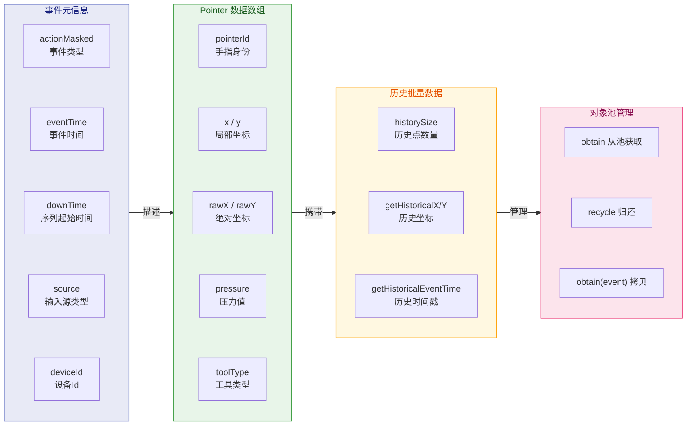
```mermaid
graph LR
    subgraph META["事件元信息"]
        direction TB
        M1["actionMasked\n事件类型"]
        M2["eventTime\n事件时间"]
        M3["downTime\n序列起始时间"]
        M4["source\n输入源类型"]
        M5["deviceId\n设备Id"]
        M1 ~~~ M2
        M2 ~~~ M3
        M3 ~~~ M4
        M4 ~~~ M5
    end

    subgraph PTRS["Pointer 数据数组"]
        direction TB
        P1["pointerId\n手指身份"]
        P2["x / y\n局部坐标"]
        P3["rawX / rawY\n绝对坐标"]
        P4["pressure\n压力值"]
        P5["toolType\n工具类型"]
        P1 ~~~ P2
        P2 ~~~ P3
        P3 ~~~ P4
        P4 ~~~ P5
    end

    subgraph HIST["历史批量数据"]
        direction TB
        H1["historySize\n历史点数量"]
        H2["getHistoricalX/Y\n历史坐标"]
        H3["getHistoricalEventTime\n历史时间戳"]
        H1 ~~~ H2
        H2 ~~~ H3
    end

    subgraph POOL["对象池管理"]
        direction TB
        O1["obtain 从池获取"]
        O2["recycle 归还"]
        O3["obtain(event) 拷贝"]
        O1 ~~~ O2
        O2 ~~~ O3
    end

    META -->|"描述"| PTRS -->|"携带"| HIST -->|"管理"| POOL

    classDef metaStyle fill:#E8EAF6,stroke:#3F51B5,color:#1A237E
    classDef ptrStyle fill:#E8F5E9,stroke:#43A047,color:#1B5E20
    classDef histStyle fill:#FFF8E1,stroke:#FFA000,color:#E65100
    classDef poolStyle fill:#FCE4EC,stroke:#E91E63,color:#880E4F

    class META metaStyle
    class PTRS ptrStyle
    class HIST histStyle
    class POOL poolStyle
```

---

**📝 练习题**

在多点触控场景中，用户先用食指按下（pointerId=0），然后拇指按下（pointerId=1），接着食指抬起，此时触发的 MotionEvent 中，关于 Pointer Index 和 Pointer Id 的描述，以下哪项是正确的？

A. 食指抬起时触发 ACTION_UP，actionIndex 为 0，此后拇指的 pointerId 变为 0


B. 食指抬起时触发 ACTION_POINTER_UP，actionIndex 指向食指，拇指的 pointerId 仍为 1


C. 食指抬起时触发 ACTION_POINTER_UP，此后拇指的 pointerIndex 一定仍为 1


D. 食指抬起时触发 ACTION_UP，此后拇指的 pointerIndex 和 pointerId 都不变


**【答案】** B

**【解析】** 当屏幕上还剩余至少一根手指时，某根手指的抬起触发的是 `ACTION_POINTER_UP`，而不是 `ACTION_UP`（`ACTION_UP` 仅在最后一根手指抬起时触发），因此排除 A 和 D。在 `ACTION_POINTER_UP` 事件中，`actionIndex` 指向即将离开的那根手指（即食指）。关于 Pointer Id：Id 是在手指按下时分配的，并在该手指整个生命周期内保持不变，与其他手指的变化无关，所以拇指的 `pointerId` 仍然是 1。而 C 选项的错误在于：食指抬起后，下一个 MotionEvent 中 `pointerCount` 变为 1，拇指很可能被重新排到 index=0 的位置（Pointer Index 是不稳定的临时下标）。因此 B 正确：事件类型是 `ACTION_POINTER_UP`，`actionIndex` 指向食指，拇指的 `pointerId` 始终为 1 不受影响。

---

**📝 练习题**

在自定义 View 中处理绘图需求时，用户快速滑动手指，你发现绘制的线条呈现明显的折线感而非平滑曲线。以下哪种做法最能改善这个问题？

A. 在 ACTION_MOVE 中使用 `getRawX()` / `getRawY()` 替代 `getX()` / `getY()`


B. 在 ACTION_MOVE 中遍历 `event.historySize` 获取所有历史采样点并逐一 `lineTo`


C. 将 MotionEvent 对象保存到列表中，在 `onDraw` 时统一处理


D. 调用 `event.recycle()` 强制系统更频繁地生成新事件


**【答案】** B

**【解析】** Android 的 InputDispatcher 会将多个触摸采样点批量打包进一个 MotionEvent 中。`getX()` / `getY()` 只返回最新的一个采样点，如果只用这组坐标绘制，快速滑动时就会跳过中间的采样点，导致折线感。正确做法是在处理 `ACTION_MOVE` 时，先通过 `event.historySize` 获取历史采样点的数量，用 `getHistoricalX(h)` / `getHistoricalY(h)` 遍历所有历史点并 `lineTo`，最后再连到当前点 `getX()` / `getY()`，从而利用全部采样数据画出平滑曲线。A 选项切换坐标系并不能增加采样精度；C 选项直接保存 MotionEvent 引用是危险的（对象池会回收复用）；D 选项中 `recycle()` 是归还对象到池中，调用后该对象数据不再可靠，不会提高采样频率。

---

## 速度追踪与检测

在 Android 的触摸交互体系中，仅仅知道"手指在哪里"是远远不够的。当用户快速滑动一个列表后抬起手指，列表应当继续以一定速度"惯性滚动"（Fling）；当用户手指轻微抖动时，系统不应将其误判为一次滑动操作。这两个核心需求分别对应了本节要深入探讨的两大机制：**VelocityTracker（速度追踪器）** 和 **ViewConfiguration 中的触摸阈值体系**。它们看似简单，却是所有高级手势交互——Fling、Swipe-to-dismiss、Pull-to-refresh——的物理根基。理解其内部原理，才能在自定义控件中写出手感丝滑、行为精确的触摸逻辑。

---

### VelocityTracker 速度计算

#### 为什么需要速度追踪

触摸事件的 `MotionEvent` 只携带了 **位置**（x, y）和 **时间戳**（eventTime）信息。如果开发者想知道手指滑动的速度，最朴素的方法是自行记录两次 `ACTION_MOVE` 的坐标与时间差，然后用 `Δx / Δt` 算出瞬时速度。但这种做法存在严重缺陷：

- **采样噪声**：触摸屏的采样率因设备而异（通常 60–240 Hz），单次 `MOVE` 间隔极短，位置波动大，直接除法会得到剧烈跳动的速度值。
- **批量事件**：Android 为了性能会将多个触摸采样点 "打包" 到一个 `MotionEvent` 中（通过 Historical 数据），简单取首尾两点会丢失中间轨迹信息。
- **多点触控**：多个手指同时触碰时，需要按 `PointerId` 分别追踪，手动管理非常繁琐。

`VelocityTracker` 正是 Android Framework 为解决这些问题而提供的 **专用速度估算器**。它内部维护了一个滑动窗口的采样点队列，并使用 **最小二乘法多项式拟合（Least-Squares Polynomial Fitting）** 来平滑计算速度，远比简单差分精确、稳定。

#### 核心工作原理

VelocityTracker 的底层实现位于 Native 层（`frameworks/base/libs/input/VelocityTracker.cpp`），其核心算法可以概括为以下流程：

1. **采样收集**：每次调用 `addMovement(event)` 时，VelocityTracker 会从 `MotionEvent` 中提取所有采样点（包括 Historical 批量点），记录 `(timestamp, x, y)` 三元组，并按 `PointerId` 分桶存储。
2. **滑动窗口裁剪**：只保留最近 **100ms** 内的采样点（`HORIZON = 100ms`）。超过这个时间窗口的旧数据会被丢弃，因为它们已不能反映"当前"的滑动意图。
3. **多项式拟合**：调用 `computeCurrentVelocity()` 时，对窗口内的采样点使用 **加权最小二乘法** 拟合一条 N 阶多项式曲线（默认 2 阶，即二次多项式）。拟合后，对时间求导即可得到速度。
4. **结果输出**：`getXVelocity()` / `getYVelocity()` 返回拟合曲线在 **最新时刻** 的一阶导数值，单位为 **像素 / 秒**（pixels per second），或根据传入的 `units` 参数换算。

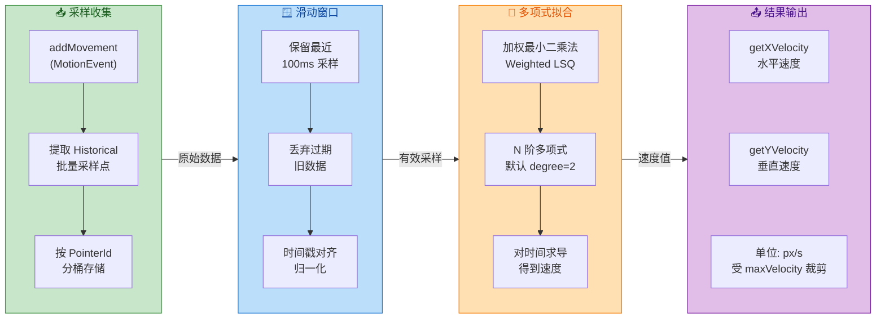
```mermaid
graph LR
    subgraph Collect["📥 采样收集"]
        direction TB
        A["addMovement\n(MotionEvent)"]
        B["提取 Historical\n批量采样点"]
        C["按 PointerId\n分桶存储"]
        A --> B
        B --> C
    end

    subgraph Window["🪟 滑动窗口"]
        direction TB
        D["保留最近\n100ms 采样"]
        E["丢弃过期\n旧数据"]
        F["时间戳对齐\n归一化"]
        D --> E
        E --> F
    end

    subgraph Fit["📐 多项式拟合"]
        direction TB
        G["加权最小二乘法\nWeighted LSQ"]
        H["N 阶多项式\n默认 degree=2"]
        I["对时间求导\n得到速度"]
        G --> H
        H --> I
    end

    subgraph Output["📤 结果输出"]
        direction TB
        J["getXVelocity\n水平速度"]
        K["getYVelocity\n垂直速度"]
        L["单位: px/s\n受 maxVelocity 裁剪"]
        J ~~~ K
        K ~~~ L
    end

    Collect -->|"原始数据"| Window -->|"有效采样"| Fit -->|"速度值"| Output

    classDef collectStyle fill:#C8E6C9,stroke:#388E3C,color:#1B5E20
    classDef windowStyle fill:#BBDEFB,stroke:#1976D2,color:#0D47A1
    classDef fitStyle fill:#FFE0B2,stroke:#F57C00,color:#E65100
    classDef outputStyle fill:#E1BEE7,stroke:#7B1FA2,color:#4A148C

    class Collect collectStyle
    class Window windowStyle
    class Fit fitStyle
    class Output outputStyle
```

为什么选择 **多项式拟合** 而不是简单差分？因为触摸屏的物理特性决定了原始采样点存在随机噪声。如果直接对相邻两点做差分，噪声会被放大（微积分中的"数值微分不稳定性"）。而最小二乘拟合会在全部采样点上寻找一条"最优曲线"，天然具有 **低通滤波** 效果，能过滤高频噪声，输出平滑且符合物理直觉的速度值。二阶多项式意味着系统假设手指运动可以用 `x(t) = at² + bt + c` 近似，求导后 `v(t) = 2at + b`，是一条线性变化的速度，这对于"手指加速—匀速—减速"的常见滑动模式是合理的近似。

#### 标准使用方式

VelocityTracker 采用 **对象池（Object Pool）** 模式管理实例，开发者 **不应** 直接 `new VelocityTracker()`，而应使用 `obtain()` 获取、`recycle()` 归还，以减少 GC 压力。

```kotlin
// 一个典型的自定义 View 中使用 VelocityTracker 实现 Fling 检测的完整示例
class FlingableView @JvmOverloads constructor(
    context: Context,
    attrs: AttributeSet? = null
) : View(context, attrs) {

    // 持有 VelocityTracker 的可空引用，仅在触摸序列进行中非空
    private var velocityTracker: VelocityTracker? = null

    // 从 ViewConfiguration 获取系统级的最小 Fling 速度阈值（px/s）
    // 低于此值的滑动不应触发惯性滚动
    private val minFlingVelocity = ViewConfiguration.get(context).scaledMinimumFlingVelocity

    // 系统级的最大 Fling 速度上限（px/s）
    // 超过此值的速度会被截断，防止 Fling 距离过远失控
    private val maxFlingVelocity = ViewConfiguration.get(context).scaledMaximumFlingVelocity

    override fun onTouchEvent(event: MotionEvent): Boolean {
        // 获取当前触摸事件的 action 类型
        when (event.actionMasked) {

            MotionEvent.ACTION_DOWN -> {
                // === 触摸序列开始 ===
                // 从对象池中获取一个 VelocityTracker 实例
                // 如果之前有残留实例（异常情况），先回收再重新获取
                velocityTracker?.recycle()
                velocityTracker = VelocityTracker.obtain()

                // 将 DOWN 事件加入追踪器，作为采样起点
                // 虽然 DOWN 时速度为零，但它确立了时间和位置的基准
                velocityTracker?.addMovement(event)
            }

            MotionEvent.ACTION_MOVE -> {
                // === 手指移动中 ===
                // 持续喂入 MOVE 事件，VelocityTracker 会自动提取
                // event 中的所有 Historical 采样点（批量数据）
                velocityTracker?.addMovement(event)
            }

            MotionEvent.ACTION_UP -> {
                // === 手指抬起，判断是否触发 Fling ===
                // 先将 UP 事件也加入（它包含最后一个位置和时间戳）
                velocityTracker?.addMovement(event)

                // 计算当前速度，参数 1000 表示速度单位为 "像素/1000毫秒"
                // 即 "像素/秒"（px/s），这是最常用的单位
                // maxFlingVelocity 是速度的绝对值上限，超出会被裁剪
                velocityTracker?.computeCurrentVelocity(
                    1000,                // units: 1000 表示每秒
                    maxFlingVelocity.toFloat()  // maxVelocity: 速度上限
                )

                // 获取 X 和 Y 方向的速度值（带正负号）
                // 正方向：X 向右为正，Y 向下为正
                val vx = velocityTracker?.xVelocity ?: 0f
                val vy = velocityTracker?.yVelocity ?: 0f

                // 判断是否超过最小 Fling 速度阈值
                // 使用绝对值比较，因为速度可正可负
                if (Math.abs(vx) > minFlingVelocity
                    || Math.abs(vy) > minFlingVelocity
                ) {
                    // 触发 Fling！将速度传给 Scroller 或 OverScroller
                    onFling(vx, vy)
                }

                // 触摸序列结束，回收 VelocityTracker 到对象池
                velocityTracker?.recycle()
                // 置空引用，避免后续误用已回收的实例
                velocityTracker = null
            }

            MotionEvent.ACTION_CANCEL -> {
                // === 触摸序列被取消（如父 View 拦截） ===
                // 同样需要回收资源
                velocityTracker?.recycle()
                velocityTracker = null
            }
        }
        // 返回 true 表示消费此事件
        return true
    }

    // Fling 处理逻辑（示意），实际开发中通常会配合 OverScroller 使用
    private fun onFling(velocityX: Float, velocityY: Float) {
        // 例如：启动 OverScroller.fling() 进行惯性滚动
        // scroller.fling(startX, startY, vx.toInt(), vy.toInt(), ...)
    }
}
```

#### computeCurrentVelocity 的参数细节

`computeCurrentVelocity(int units, float maxVelocity)` 这个方法的两个参数经常让开发者困惑，值得展开说明：

- **units**：速度的"时间分母"，单位为毫秒。传入 `1` 表示速度单位为 **像素/毫秒**；传入 `1000` 表示 **像素/秒**。绝大多数场景应传 `1000`，因为 `ViewConfiguration` 中 `scaledMinimumFlingVelocity` 和 `scaledMaximumFlingVelocity` 的单位都是 px/s，必须统一才能正确比较。
- **maxVelocity**：速度绝对值的裁剪上限。计算出的速度如果超过这个值，会被 clamp 到 `[-maxVelocity, +maxVelocity]` 区间。这是一个安全阀，防止极端速度导致 Fling 飞出太远。通常传入 `scaledMaximumFlingVelocity`。

值得注意的是，`computeCurrentVelocity()` 必须在 `getXVelocity()` / `getYVelocity()` **之前** 调用，否则获取的速度值不会更新。这是一个常见的使用错误。

#### 多点触控下的速度追踪

当多个手指同时触摸屏幕时，VelocityTracker 会为 **每个 PointerId** 独立维护采样数据。获取特定手指的速度需要传入 `pointerId`：

```kotlin
// 获取特定手指（pointerId）的速度
// pointerId 是手指的唯一标识，在整个触摸序列中保持不变
val pointerId = event.getPointerId(pointerIndex)

// 计算完速度后，传入 pointerId 获取对应手指的速度
velocityTracker?.computeCurrentVelocity(1000, maxFlingVelocity.toFloat())

// 注意：这里传入的是 pointerId（不是 pointerIndex！）
// pointerId 是稳定的标识符，pointerIndex 会随手指抬起重新排列
val vx = velocityTracker?.getXVelocity(pointerId) ?: 0f
val vy = velocityTracker?.getYVelocity(pointerId) ?: 0f
```

一个经典的错误是将 `pointerIndex` 误传为 `pointerId`。`pointerIndex` 是事件中手指的数组下标，会在手指抬起后重新编号；而 `pointerId` 是手指的唯一 ID，从 DOWN 到 UP 不变。两者混淆会导致获取到错误手指的速度。

#### 对象池与生命周期管理

VelocityTracker 使用 `SynchronizedPool` 管理实例复用。`obtain()` 从池中取出或新建实例，`recycle()` 清空内部状态后放回池中。严格遵守"一个触摸序列对应一次 obtain/recycle"的原则至关重要：

- **泄漏风险**：如果忘记 `recycle()`，实例不会回到池中，下次 `obtain()` 只能新建，池逐渐耗尽后退化为频繁 allocation。
- **Use-after-recycle**：如果 `recycle()` 后仍持有引用并调用方法，可能读到被其他组件覆写的脏数据，产生难以排查的 Bug。因此 `recycle()` 后必须立即将引用置 `null`。
- **ACTION_CANCEL 不要遗漏**：父 View 拦截事件后，子 View 会收到 `ACTION_CANCEL` 而非 `ACTION_UP`。如果只在 `UP` 中回收而遗漏了 `CANCEL`，就会造成泄漏。

---

### ViewConfiguration.getScaledTouchSlop 滑动阈值

#### 为什么需要滑动阈值

人的手指不是精密仪器。当用户想要"点击"一个按钮时，手指在 DOWN 到 UP 期间几乎不可能完全静止——即使主观上没有移动，触摸屏仍然会采集到若干像素的位移。如果系统不设置任何容差，几乎每次点击都会被误判为"滑动"，Click 事件将永远无法触发。

**Touch Slop**（触摸滑动距离）就是 Android 为解决这个问题而定义的 **最小滑动距离阈值**。只有手指移动距离 **超过** Touch Slop，系统才认为用户 "真正想要滑动"；在 Touch Slop 范围内的微小位移一律视为 "点击时的手指抖动" 被忽略。

这个概念看似简单，但它是整个触摸交互体系的 **分水岭**：Touch Slop 决定了"点击"与"滑动"的边界，直接影响用户感知到的操作灵敏度。

#### ViewConfiguration 阈值体系全景

`ViewConfiguration` 是 Android 中集中管理所有触摸/滚动相关 **经验常量** 的配置类。它的值来源于系统资源文件（`frameworks/base/core/res/res/values/config.xml`），并会根据屏幕密度（density）进行缩放（所以方法名都带 `Scaled`）。核心阈值包括：

| 方法 | 典型值 (mdpi) | 含义 |
|---|---|---|
| `getScaledTouchSlop()` | **8dp** | 通用滑动判定阈值 |
| `getScaledPagingTouchSlop()` | **16dp** | 分页滑动（ViewPager）的更大阈值 |
| `getScaledMinimumFlingVelocity()` | **50dp/s** | 触发 Fling 的最小速度 |
| `getScaledMaximumFlingVelocity()` | **8000dp/s** | Fling 速度上限 |
| `getScaledOverscrollDistance()` | **0dp** | 过度滚动（EdgeEffect）的弹性距离 |
| `getScaledOverflingDistance()` | **6dp** | 过度 Fling 的弹性距离 |
| `getLongPressTimeout()` | **500ms** | 长按判定时长 |
| `getTapTimeout()` | **100ms** | 轻触确认时长 |
| `getDoubleTapTimeout()` | **300ms** | 双击间隔上限 |

注意：上表中的 dp 值是 `mdpi`（160dpi）下的基准值。在高密度屏幕（如 `xxhdpi` = 480dpi）上，`getScaledTouchSlop()` 返回的 **像素值** 会是 `8dp × 3 = 24px`。这是 "Scaled" 的含义——阈值随屏幕密度缩放，确保在不同设备上的 **物理距离一致**（约 1.27mm），用户体验统一。

#### Touch Slop 的实际应用

在自定义 View 中判断"手指是否已开始滑动"，是 Touch Slop 最核心的应用场景：

```kotlin
class DraggableView @JvmOverloads constructor(
    context: Context,
    attrs: AttributeSet? = null
) : View(context, attrs) {

    // 获取系统配置的 Touch Slop 值（单位：像素）
    // 该值已根据当前设备的屏幕密度进行缩放
    private val touchSlop = ViewConfiguration.get(context).scaledTouchSlop

    // 记录 DOWN 事件的起始坐标
    private var downX = 0f
    private var downY = 0f

    // 标记：是否已确认进入拖拽状态
    // 一旦为 true，后续 MOVE 事件才执行真正的拖拽逻辑
    private var isDragging = false

    override fun onTouchEvent(event: MotionEvent): Boolean {
        when (event.actionMasked) {

            MotionEvent.ACTION_DOWN -> {
                // 记录手指按下的位置
                downX = event.x
                downY = event.y
                // 重置拖拽状态
                isDragging = false
                // 返回 true 消费 DOWN，确保能收到后续 MOVE 和 UP
                return true
            }

            MotionEvent.ACTION_MOVE -> {
                if (!isDragging) {
                    // 尚未确认拖拽，计算手指已移动的距离
                    val dx = event.x - downX
                    val dy = event.y - downY

                    // 使用勾股定理计算直线距离
                    // 与 touchSlop 比较（注意：比较的是距离，不是位移分量）
                    if (Math.sqrt((dx * dx + dy * dy).toDouble()) > touchSlop) {
                        // 移动距离超过阈值，确认用户意图是"拖拽"而非"点击抖动"
                        isDragging = true

                        // 【关键技巧】通知父 View 不要拦截后续事件
                        // 一旦确认拖拽，我们需要独占触摸序列
                        parent.requestDisallowInterceptTouchEvent(true)
                    }
                }

                if (isDragging) {
                    // 已进入拖拽状态，执行真正的移动逻辑
                    // 例如：更新 View 的 translationX/Y
                    translationX = event.x - downX
                    translationY = event.y - downY
                }
                return true
            }

            MotionEvent.ACTION_UP -> {
                if (!isDragging) {
                    // 整个触摸序列中从未超过 Touch Slop
                    // 说明这是一次"点击"，可以执行 click 逻辑
                    performClick()
                }
                // 重置状态
                isDragging = false
                return true
            }
        }
        return super.onTouchEvent(event)
    }
}
```

这段代码中最关键的逻辑是 `ACTION_MOVE` 中的距离判断。在 `isDragging` 变为 `true` 之前，所有的 MOVE 事件都只用于"累积位移量并与 Touch Slop 比较"，不执行任何实际拖拽操作。只有越过 Touch Slop 这道"门槛"后，才正式进入拖拽模式。这种 **"两阶段"处理模式**（等待确认 → 执行操作）是 Android 触摸交互的核心设计范式，几乎所有可滑动控件都遵循这一逻辑。

#### 不同场景使用不同的 Slop

Android 提供了多种 Touch Slop 以适应不同交互语义：

- **`getScaledTouchSlop()`**：通用场景。8dp 的阈值适合大多数拖拽、滑动判定。`ScrollView`、`RecyclerView` 内部都使用这个值。
- **`getScaledPagingTouchSlop()`**：翻页场景。16dp，是通用值的两倍。`ViewPager` 使用这个更大的阈值，因为翻页是"重量级操作"（一旦触发会切换整个页面），需要更高的触发门槛来避免误触。用户在页面上做微小滑动时不应轻易翻页。
- **`getScaledDoubleTapSlop()`**：双击判定中，两次 tap 之间允许的最大位移。如果两次点击的位置偏差超过这个值，不认为是双击。

理解不同 Slop 的设计意图，有助于在自定义交互中选择合适的阈值。例如，一个"左滑删除"功能因为操作后果严重，可能应当使用较大的 Slop（甚至自定义一个更大的值）来降低误触概率。

#### Touch Slop 判断的方向优化

上面的示例使用了勾股定理计算欧几里得距离，这在全方向拖拽中是合适的。但在很多实际场景中，滑动是 **单方向** 的（如 `RecyclerView` 的垂直滚动）。此时只需比较对应方向的分量即可：

```kotlin
// 垂直滚动场景：只关心 Y 方向位移是否超过 Touch Slop
// 这避免了水平方向的微小晃动误触发垂直滚动
val dy = Math.abs(event.y - downY)
val dx = Math.abs(event.x - downX)

// 条件 1：Y 方向位移超过 Touch Slop
// 条件 2：Y 方向位移 > X 方向位移（确保用户主要在垂直方向滑动）
if (dy > touchSlop && dy > dx) {
    // 确认为垂直滑动
    isDragging = true
}
```

这种"主轴判断"在处理滑动冲突时尤其重要。例如，一个水平 `ViewPager` 嵌套垂直 `RecyclerView` 时，外层和内层都需要通过方向判断来决定"这次滑动归谁处理"。

#### Touch Slop 值修正：起始偏移补偿

当 Touch Slop 门槛被越过、正式进入滑动状态时，存在一个容易被忽视的细节：**手指实际已经移动了 Touch Slop 大小的距离**，但拖拽视觉效果此时才开始。如果直接用当前位置减去 DOWN 位置来计算偏移，拖拽的第一帧会出现一个 Touch Slop 大小的"跳跃"（视觉突变），体验不够丝滑。

Android 内部的很多控件（如 `ScrollView`、`RecyclerView`）都会做 **起始偏移补偿**：

```kotlin
// 在确认进入拖拽的那一刻，修正基准坐标
// 让后续计算的偏移量从 0 开始，而不是从 touchSlop 开始
if (!isDragging && Math.abs(dy) > touchSlop) {
    isDragging = true
    // 补偿：将 downY 前移 touchSlop 的距离
    // 这样 (event.y - downY) 在刚越过阈值时约等于 0，消除跳跃
    downY += if (dy > 0) touchSlop else -touchSlop
}
```

这个微小的补偿让拖拽的起始瞬间平滑过渡，是"手感好"与"手感差"之间的关键差异。所有成熟的可滑动控件内部都有类似处理。

#### VelocityTracker 与 Touch Slop 的协作关系

最后，将 VelocityTracker 和 Touch Slop 放在一起看，它们在一个完整的触摸交互中扮演着 **前后衔接** 的角色：

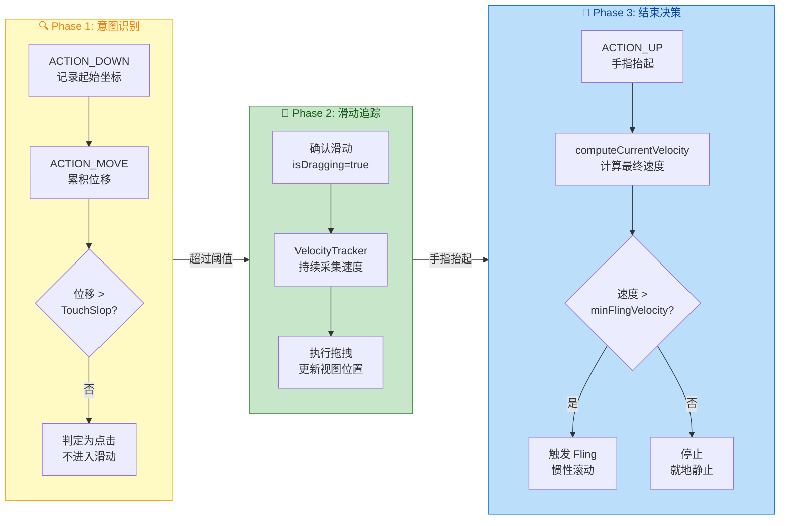
```mermaid
graph LR
    subgraph Phase1["🔍 Phase 1: 意图识别"]
        direction TB
        A["ACTION_DOWN\n记录起始坐标"]
        B["ACTION_MOVE\n累积位移"]
        C{"位移 > \nTouchSlop?"}
        D["判定为点击\n不进入滑动"]
        A --> B
        B --> C
        C -->|"否"| D
    end

    subgraph Phase2["📏 Phase 2: 滑动追踪"]
        direction TB
        E["确认滑动\nisDragging=true"]
        F["VelocityTracker\n持续采集速度"]
        G["执行拖拽\n更新视图位置"]
        E --> F
        F --> G
    end

    subgraph Phase3["🚀 Phase 3: 结束决策"]
        direction TB
        H["ACTION_UP\n手指抬起"]
        I["computeCurrentVelocity\n计算最终速度"]
        J{"速度 > \nminFlingVelocity?"}
        K["触发 Fling\n惯性滚动"]
        L["停止\n就地静止"]
        H --> I
        I --> J
        J -->|"是"| K
        J -->|"否"| L
    end

    Phase1 -->|"超过阈值"| Phase2 -->|"手指抬起"| Phase3

    classDef phase1Style fill:#FFF9C4,stroke:#F9A825,color:#F57F17
    classDef phase2Style fill:#C8E6C9,stroke:#388E3C,color:#1B5E20
    classDef phase3Style fill:#BBDEFB,stroke:#1976D2,color:#0D47A1

    class Phase1 phase1Style
    class Phase2 phase2Style
    class Phase3 phase3Style
```

- **Phase 1（Touch Slop 主导）**：手指按下后，系统处于"观察期"，通过 Touch Slop 判断用户意图是"点击"还是"滑动"。
- **Phase 2（VelocityTracker 主导）**：一旦确认滑动，VelocityTracker 开始积累采样数据，同时 View 响应拖拽。
- **Phase 3（两者协同）**：手指抬起时，VelocityTracker 给出最终速度，系统将其与 `minFlingVelocity`（来自 ViewConfiguration）比较，决定是否触发 Fling。

这三个阶段构成了 Android 中"从按下到松手"的完整触摸交互生命周期。无论是 `RecyclerView` 的滚动、`ViewPager2` 的翻页，还是 `SwipeRefreshLayout` 的下拉刷新，其内部逻辑都严格遵循这一三阶段模型。深入理解这一模型，是构建任何自定义手势交互的基础。

---

**📝 练习题**

在自定义 View 的 `onTouchEvent` 中使用 `VelocityTracker`，以下哪种做法是 **正确的**？

A. 在 `ACTION_DOWN` 中调用 `new VelocityTracker()` 创建实例，在 `ACTION_UP` 中调用 `recycle()` 回收


B. 在 `ACTION_UP` 中先调用 `getXVelocity()` 获取速度，再调用 `computeCurrentVelocity(1000)` 设定单位


C. 在 `ACTION_UP` 中调用 `computeCurrentVelocity(1000, maxVelocity)` 后再调用 `getXVelocity()`，并在 `ACTION_UP` 和 `ACTION_CANCEL` 中都执行 `recycle()` 并置空引用


D. 在 `ACTION_MOVE` 中每次都调用 `computeCurrentVelocity()` 并立即获取速度，以实现实时速度显示，最后在 `ACTION_UP` 中不调用 `recycle()` 让 GC 自动回收


**【答案】** C

**【解析】** 本题考查 VelocityTracker 的正确使用规范。

- **A 错误**：VelocityTracker 的构造函数是 `private` 的，不能通过 `new` 创建。必须使用静态方法 `VelocityTracker.obtain()` 从对象池中获取实例，这是对象池模式的标准用法。
- **B 错误**：`computeCurrentVelocity()` 必须在 `getXVelocity()` / `getYVelocity()` **之前**调用。`compute` 方法负责执行实际的多项式拟合计算并缓存结果，`get` 方法只是读取缓存值。顺序反了会读到上次计算的旧值（或默认的零值）。
- **C 正确**：这是标准的使用模式——先 `compute` 再 `get`；并且在 `ACTION_UP` 和 `ACTION_CANCEL` 两个事件中都执行回收并置空引用。`ACTION_CANCEL` 不能遗漏，否则在父 View 拦截事件的场景下会造成 VelocityTracker 实例泄漏。
- **D 错误**：虽然在 MOVE 中调用 `computeCurrentVelocity()` 本身在技术上是允许的（某些实时速度显示场景确实会这么做），但最后不调用 `recycle()` 是严重错误。VelocityTracker 通过对象池管理，不 recycle 意味着实例无法复用，造成资源浪费。不能依赖 GC 回收，因为 GC 只释放 Java 层内存，VelocityTracker 底层的 Native 资源需要通过 `recycle()` 显式释放。

---

## 手势识别器

在前面的章节中，我们已经深入了解了 Android 事件分发的完整链路——从 `ACTION_DOWN` 到 `ACTION_UP`，从 `dispatchTouchEvent` 到 `onTouchEvent`。然而在实际开发中，我们很少直接在 `onTouchEvent` 里手动计算"用户到底做了什么手势"。原因很简单：一个看似简单的"双击"判定，背后涉及两次点击的时间间隔、空间偏移、中间是否插入了 `ACTION_MOVE` 等多重条件，手写逻辑既冗长又脆弱。Android Framework 为此提供了一套 **手势识别器（Gesture Detector）** 体系，将原始的 `MotionEvent` 流翻译为语义化的手势回调（单击、长按、快速滑动、缩放等），让开发者可以直接面向"意图"编程。

本节将围绕三个核心组件展开：**GestureDetector** 负责单指手势检测，**ScaleGestureDetector** 负责双指缩放检测，**Scroller** 则提供手势结束后的弹性滑动（惯性 Fling / 平滑 Scroll）能力。三者经常组合使用——例如一个图片查看器，既要支持双击放大（GestureDetector），又要支持捏合缩放（ScaleGestureDetector），松手后还要有惯性滑动效果（Scroller）。理解它们的内部机制，是构建高品质交互体验的基石。

---

### GestureDetector 手势检测

#### 设计定位与核心思想

`GestureDetector` 的本质是一个 **MotionEvent 状态机**。它接收你从 `onTouchEvent` 或 `dispatchTouchEvent` 转发过来的每一个 `MotionEvent`，内部维护一组定时器（通过 `Handler` 发送延迟消息）和距离阈值，按照预设规则将原始触摸事件"翻译"为高级手势回调。它并不消费事件，也不拦截事件——它只是一个纯粹的 **事件分析器（Analyzer）**，你需要主动把事件"喂"给它。

这一点非常重要：`GestureDetector` 并不是 View 体系的一部分，它不参与责任链分发。它更像是一个工具类——你在自己的 `onTouchEvent` 里调用 `gestureDetector.onTouchEvent(event)`，它内部分析后回调你注册的 Listener。这种设计使得它可以被任意 View、ViewGroup 甚至 Activity 使用，具有极高的复用性。

#### 回调接口体系

`GestureDetector` 提供了两个核心回调接口和一个便捷基类：

**`OnGestureListener`（必选接口）** 定义了六个方法，覆盖了单指操作的主要手势：

- **`onDown(MotionEvent e)`**：每次 `ACTION_DOWN` 到来时立即回调。这是所有手势序列的起点。需要特别注意的是，如果你希望后续手势（如 Fling、Scroll）能被检测到，`onDown` **必须返回 `true`**。因为在 View 的事件分发体系中，`onTouchEvent` 在 `ACTION_DOWN` 时返回 `false` 意味着放弃整个事件序列，后续的 `ACTION_MOVE` 和 `ACTION_UP` 将不再传递给当前 View。`GestureDetector` 的 `onTouchEvent` 返回值就依赖于 `onDown` 的返回值（在 DOWN 阶段），所以这里返回 `true` 是一个几乎固定的写法。

- **`onShowPress(MotionEvent e)`**：在 `ACTION_DOWN` 发生后、长按触发前，如果用户手指仍停留在原地（未移动超出 `touchSlop`），系统会在约 100ms 后回调此方法。它的语义是"用户似乎想按下某个东西"，常用于提供视觉按压反馈（如高亮列表项）。这是一种介于"按下"和"长按"之间的中间态，在 `ListView` / `RecyclerView` 的 Item 按压高亮逻辑中被广泛使用。

- **`onSingleTapUp(MotionEvent e)`**：用户手指抬起（`ACTION_UP`）时，如果此次触摸没有触发 Scroll 或 Long Press，就回调此方法。注意它与"单击确认"是不同的——它在手指抬起时立即触发，此刻系统尚不知道用户是否会紧接着再按下第二次（即双击的第一次抬起也会触发 `onSingleTapUp`）。如果你需要确认"就是单击、不是双击的前半段"，应该使用 `OnDoubleTapListener.onSingleTapConfirmed`。

- **`onScroll(MotionEvent e1, MotionEvent e2, float distanceX, float distanceY)`**：当用户按下后拖动距离超过 `touchSlop`（系统定义的最小滑动阈值，通常为 8dp），后续每个 `ACTION_MOVE` 都会回调此方法。参数 `e1` 是初始 DOWN 事件，`e2` 是当前 MOVE 事件，`distanceX` / `distanceY` 是 **上一次回调位置到本次位置的距离**（注意方向：向右滑动 distanceX 为负值，因为它表示"旧位置 - 新位置"）。这个回调常用于实现跟手拖拽，比如自定义 ScrollView 或地图平移。

- **`onLongPress(MotionEvent e)`**：用户按下后保持不动（未超过 `touchSlop`），约 500ms 后触发。这个超时时间由 `ViewConfiguration.getLongPressTimeout()` 定义。长按一旦触发，后续如果用户抬起手指，**不会** 再触发 `onSingleTapUp` 或 `onFling`。长按常用于弹出上下文菜单或进入多选模式。

- **`onFling(MotionEvent e1, MotionEvent e2, float velocityX, float velocityY)`**：快速滑动并抬起手指时触发。"快速"的判定标准是抬起时的速度超过 `ViewConfiguration.getScaledMinimumFlingVelocity()`（通常约 50dp/s）。`velocityX` / `velocityY` 的单位是 px/s，方向与手指滑动方向一致（向右为正）。这个回调是实现"惯性滑动"的起点——通常在这里拿到速度后，交给 `Scroller` 或 `OverScroller` 来计算后续的惯性动画。

**`OnDoubleTapListener`（可选接口）** 额外提供三个方法来处理双击场景：

- **`onSingleTapConfirmed(MotionEvent e)`**：**确认** 这是一次单击。与 `onSingleTapUp` 的区别是，系统会在 `ACTION_UP` 后等待约 300ms（`ViewConfiguration.getDoubleTapTimeout()`），确认用户没有进行第二次点击后才回调。如果用户双击，则 `onSingleTapConfirmed` 不会被调用。这意味着它有约 300ms 的延迟，如果你的场景不需要区分单击和双击，应该使用 `onSingleTapUp` 以获得更快的响应。

- **`onDoubleTap(MotionEvent e)`**：双击发生时回调（第二次 DOWN 到来时触发）。双击的判定条件是两次 DOWN 的间隔 < 300ms 且空间距离 < 系统定义的 `doubleTapSlop`。

- **`onDoubleTapEvent(MotionEvent e)`**：双击确认后，第二次触摸的所有后续事件（DOWN / MOVE / UP）都会通过此方法传递。这允许你实现"双击后拖动"这种复合手势（如 Google Maps 的双击按住上下拖动来缩放）。

**`SimpleOnGestureListener`（便捷基类）** 同时实现了 `OnGestureListener` 和 `OnDoubleTapListener`，所有方法都给了空实现（返回 `false`）。实际开发中几乎总是继承这个类，只覆写你关心的方法，避免实现一堆空方法。

#### 内部机制：状态机与延迟消息

理解 `GestureDetector` 的行为，关键在于理解它内部的 **三个 Handler 延迟消息** 和 **状态标记**：

**消息一：SHOW_PRESS**。在 `ACTION_DOWN` 时，`GestureDetector` 向内部 Handler 发送一个延迟约 100ms（`TAP_TIMEOUT`）的消息。如果 100ms 内用户没有移动也没有抬起，则触发 `onShowPress`。如果用户在 100ms 内抬起了手指（快速点击），则取消此消息，直接走 tap 逻辑。如果用户在 100ms 内移动超过 `touchSlop`，同样取消此消息，走 scroll 逻辑。

**消息二：LONG_PRESS**。同样在 `ACTION_DOWN` 时发送，延迟约 500ms（`TAP_TIMEOUT + LONG_PRESS_TIMEOUT`）。如果 500ms 内手指一直静止，则触发 `onLongPress`，并设置内部标记 `mInLongPress = true`。一旦进入长按状态，后续的 MOVE 和 UP 都不会触发 Scroll 或 Fling。

**消息三：TAP（双击检测窗口）**。当第一次 `ACTION_UP` 到来时，如果设置了 `OnDoubleTapListener`，系统不会立即确认单击，而是发送一个延迟 300ms（`DOUBLE_TAP_TIMEOUT`）的消息。如果 300ms 内收到第二次 `ACTION_DOWN`，则判定为双击，取消该消息；如果超时未收到，则触发 `onSingleTapConfirmed`。

可以用一张时序图来展示 `ACTION_DOWN` 后各消息的触发关系：

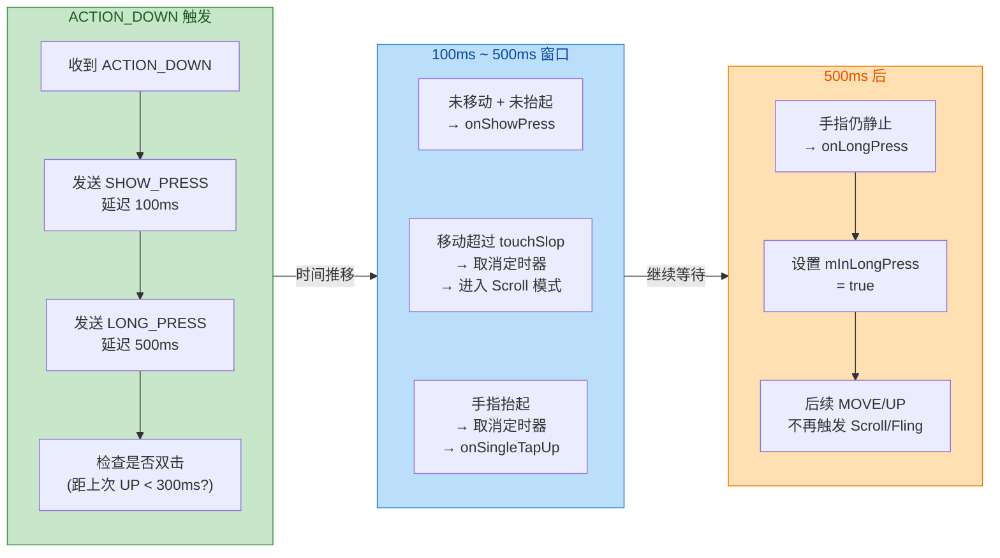
```mermaid
graph LR
    subgraph Phase1["ACTION_DOWN 触发"]
        direction TB
        A["收到 ACTION_DOWN"]
        B["发送 SHOW_PRESS\n延迟 100ms"]
        C["发送 LONG_PRESS\n延迟 500ms"]
        D["检查是否双击\n(距上次 UP < 300ms?)"]
        A --> B
        B --> C
        C --> D
    end

    subgraph Phase2["100ms ~ 500ms 窗口"]
        direction TB
        E["未移动 + 未抬起\n→ onShowPress"]
        F["移动超过 touchSlop\n→ 取消定时器\n→ 进入 Scroll 模式"]
        G["手指抬起\n→ 取消定时器\n→ onSingleTapUp"]
        E ~~~ F
        F ~~~ G
    end

    subgraph Phase3["500ms 后"]
        direction TB
        H["手指仍静止\n→ onLongPress"]
        I["设置 mInLongPress\n= true"]
        J["后续 MOVE/UP\n不再触发 Scroll/Fling"]
        H --> I
        I --> J
    end

    Phase1 -->|"时间推移"| Phase2 -->|"继续等待"| Phase3

    classDef green fill:#C8E6C9,stroke:#388E3C,color:#1B5E20
    classDef blue fill:#BBDEFB,stroke:#1976D2,color:#0D47A1
    classDef orange fill:#FFE0B2,stroke:#F57C00,color:#E65100
    class Phase1 green
    class Phase2 blue
    class Phase3 orange
```

整个状态机的驱动核心就是 `Handler` 的延迟消息机制。这也是为什么 `GestureDetector` 的构造函数需要一个 `Handler`（或者默认使用当前线程的 `Looper`）——它必须在有消息循环的线程上工作。如果你在子线程创建 `GestureDetector` 但没有初始化 `Looper`，将会抛出异常。

#### 标准使用模式

以下是在自定义 View 中使用 `GestureDetector` 的典型模式：

```kotlin
// 自定义 View，集成 GestureDetector 实现手势识别
class GestureAwareView @JvmOverloads constructor(
    context: Context,
    attrs: AttributeSet? = null
) : View(context, attrs) {

    // 创建手势监听器，继承 SimpleOnGestureListener 以只覆写需要的方法
    private val gestureListener = object : GestureDetector.SimpleOnGestureListener() {

        // ACTION_DOWN 时回调，必须返回 true 以确保后续事件能继续传递
        override fun onDown(e: MotionEvent): Boolean {
            Log.d("Gesture", "onDown: 手势序列开始")
            return true // ← 关键：返回 true 才能接收后续 MOVE/UP
        }

        // 按下约 100ms 后、手指未移动时回调，适合做按压视觉反馈
        override fun onShowPress(e: MotionEvent) {
            Log.d("Gesture", "onShowPress: 可以高亮显示按压状态")
        }

        // 确认的单击（等待双击超时后触发，有约 300ms 延迟）
        override fun onSingleTapConfirmed(e: MotionEvent): Boolean {
            Log.d("Gesture", "onSingleTapConfirmed: 确认单击，非双击")
            // 在这里处理单击逻辑
            return true
        }

        // 双击回调（第二次 DOWN 时触发）
        override fun onDoubleTap(e: MotionEvent): Boolean {
            Log.d("Gesture", "onDoubleTap: 检测到双击")
            // 在这里处理双击逻辑，如切换放大/缩小
            return true
        }

        // 长按回调（按住约 500ms 不动时触发）
        override fun onLongPress(e: MotionEvent) {
            Log.d("Gesture", "onLongPress: 长按触发")
            // 在这里处理长按逻辑，如弹出菜单
        }

        // 拖动滚动回调，每次 MOVE 事件触发
        // distanceX/distanceY 是"上次位置 - 本次位置"，注意符号方向
        override fun onScroll(
            e1: MotionEvent?,  // 初始 DOWN 事件
            e2: MotionEvent,   // 当前 MOVE 事件
            distanceX: Float,  // X 方向移动距离（向右滑为负）
            distanceY: Float   // Y 方向移动距离（向下滑为负）
        ): Boolean {
            // 典型用法：用 scrollBy 实现跟手滚动
            scrollBy(distanceX.toInt(), distanceY.toInt())
            return true
        }

        // 快速滑动抬起时回调
        // velocityX/velocityY 单位 px/s，方向与滑动方向一致
        override fun onFling(
            e1: MotionEvent?,  // 初始 DOWN 事件
            e2: MotionEvent,   // 最终 UP 事件
            velocityX: Float,  // X 方向速度（向右为正）
            velocityY: Float   // Y 方向速度（向下为正）
        ): Boolean {
            Log.d("Gesture", "onFling: vX=$velocityX, vY=$velocityY")
            // 典型做法：将速度交给 Scroller 进行惯性滚动
            return true
        }
    }

    // 创建 GestureDetector 实例，传入上下文和监听器
    // 内部会使用主线程 Handler 来发送延迟消息
    private val gestureDetector = GestureDetector(context, gestureListener)

    // 在 onTouchEvent 中将事件转发给 GestureDetector
    override fun onTouchEvent(event: MotionEvent): Boolean {
        // 将原始事件"喂"给 GestureDetector 进行分析
        // 它的返回值表示是否有手势被识别并消费
        val handled = gestureDetector.onTouchEvent(event)
        // 返回 true 表示消费此事件，保证后续事件继续传入
        return handled
    }
}
```

几个实践要点需要特别强调：

第一，**`onDown` 返回 `true` 是铁律**。这一点在之前的事件分发章节已经讲过——如果 `onTouchEvent` 在 DOWN 时返回 `false`，父 ViewGroup 会将当前 View 从 `mFirstTouchTarget` 链表中移除，后续事件不再下发。`GestureDetector.onTouchEvent` 在 DOWN 阶段的返回值取决于 `onDown` 的返回值，所以这里必须返回 `true`。

第二，**`onSingleTapUp` vs `onSingleTapConfirmed` 的选择**。如果你的场景里没有双击需求（比如一个普通按钮），应该用 `onSingleTapUp`，因为它在手指抬起时立即响应，没有 300ms 延迟。只有当你的 View 同时支持单击和双击（如图片查看器），才需要用 `onSingleTapConfirmed` 来区分。

第三，**长按与滑动互斥**。一旦 `onLongPress` 被触发，`GestureDetector` 内部会设置 `mInLongPress = true`。此后即使用户移动手指，也不会再回调 `onScroll` 或 `onFling`。如果你希望实现"长按后拖拽"（如拖拽排序），需要在 `onLongPress` 中自行启动拖拽逻辑，不能依赖 `onScroll`。另外可以通过 `setIsLongpressEnabled(false)` 禁用长按检测。

---

### ScaleGestureDetector 缩放检测

#### 设计定位

`ScaleGestureDetector` 是 Android 专为 **双指捏合缩放（Pinch-to-Zoom）** 场景设计的手势识别器。它和 `GestureDetector` 的设计哲学一致——不参与事件分发，只做事件分析。你把 `MotionEvent` 喂给它，它计算出缩放比例（scale factor）、缩放中心点（focus point）等信息，通过回调通知你。

为什么需要单独的缩放检测器？因为双指缩放涉及 **多点触控（Multi-Touch）** 的处理。我们在前面"触摸代理"章节提到过 `PointerId` 和 `PointerIndex` 的概念——双指操作时，`MotionEvent` 中同时包含两个 Pointer 的坐标信息，每个 Pointer 有独立的 ID。`ScaleGestureDetector` 封装了双指距离的计算、Pointer 的跟踪（包括一个手指抬起后的稳定处理）、以及"快速缩放"（Quick Scale，即双击后拖动）模式，这些逻辑如果手写会非常复杂。

#### 核心回调：OnScaleGestureListener

`ScaleGestureDetector` 只有一个回调接口 `OnScaleGestureListener`，包含三个方法：

- **`onScaleBegin(ScaleGestureDetector detector)`**：当双指间距变化超过 `spanSlop`（系统触摸阈值）时，缩放手势正式开始。**必须返回 `true`** 才能继续接收后续的 `onScale` 回调。如果返回 `false`，则忽略此次缩放。你可以在这里做一些预处理，比如记录缩放起始状态。

- **`onScale(ScaleGestureDetector detector)`**：缩放过程中持续回调（每次 `ACTION_MOVE`）。核心数据通过 `detector` 对象获取。返回 `true` 表示"我已经处理了当前的缩放增量，请重置基准"；返回 `false` 表示"我没处理，累计计算"。通常返回 `true`。

- **`onScaleEnd(ScaleGestureDetector detector)`**：缩放手势结束（第二根手指抬起）时回调。可以在这里做边界修正或动画。

#### detector 对象的关键属性

在 `onScale` 回调中，`ScaleGestureDetector` 对象提供了以下关键属性：

**`scaleFactor`**（缩放因子）：这是最核心的属性。它表示 **相对于上次回调的缩放比例**，是一个增量值而非绝对值。比如 `scaleFactor = 1.05` 表示"比上次放大了 5%"，`scaleFactor = 0.95` 表示"比上次缩小了 5%"。如果两指没有张合只是平移，`scaleFactor` 接近 `1.0`。典型用法是维护一个累计缩放值：`totalScale *= detector.scaleFactor`。

**`focusX` / `focusY`**（缩放中心点）：两个手指的中点坐标。缩放应该以此点为中心进行，这样才符合用户的直觉——"我捏合哪里，哪里就是缩放中心"。在使用 `Matrix` 进行图片缩放时，应该调用 `matrix.postScale(factor, factor, focusX, focusY)` 而非 `matrix.postScale(factor, factor)`。

**`currentSpan`**（当前双指间距）：两指之间的像素距离。`currentSpanX` / `currentSpanY` 分别是 X/Y 方向的分量。这个值在需要自定义缩放逻辑时很有用。

**`timeDelta`**（时间间隔）：距上次缩放事件的时间，单位毫秒。可用于计算缩放速率。

#### 标准使用模式

以下示例展示了一个支持捏合缩放的自定义 ImageView：

```kotlin
// 支持双指缩放的自定义 ImageView
class PinchZoomImageView @JvmOverloads constructor(
    context: Context,
    attrs: AttributeSet? = null
) : AppCompatImageView(context, attrs) {

    // 用 Matrix 控制图片的变换（平移、缩放、旋转）
    private val imageMatrix = Matrix()

    // 累计缩放比例，用于限制缩放范围
    private var totalScale = 1.0f

    // 允许的最小和最大缩放比例
    private val minScale = 0.5f
    private val maxScale = 5.0f

    // 缩放手势监听器
    private val scaleListener = object : ScaleGestureDetector.SimpleOnScaleGestureListener() {

        // 缩放开始时回调，返回 true 表示接受此次缩放
        override fun onScaleBegin(detector: ScaleGestureDetector): Boolean {
            return true // 必须返回 true
        }

        // 缩放过程中持续回调
        override fun onScale(detector: ScaleGestureDetector): Boolean {
            // 获取本次增量缩放因子（相对于上次回调）
            var factor = detector.scaleFactor

            // 计算如果应用此因子后的总缩放值
            val projected = totalScale * factor

            // 边界钳制：确保缩放后不超出 [minScale, maxScale] 范围
            when {
                projected < minScale -> factor = minScale / totalScale
                projected > maxScale -> factor = maxScale / totalScale
            }

            // 更新累计缩放比例
            totalScale *= factor

            // 以双指中心点为轴心进行缩放变换
            // focusX/focusY 就是两指的中点，作为缩放锚点
            imageMatrix.postScale(
                factor, factor,        // X/Y 方向等比缩放
                detector.focusX,       // 缩放中心 X
                detector.focusY        // 缩放中心 Y
            )

            // 将变换矩阵应用到 ImageView
            setImageMatrix(imageMatrix)

            // 返回 true 表示已消费本次缩放增量，重置基准
            return true
        }

        // 缩放结束时回调
        override fun onScaleEnd(detector: ScaleGestureDetector) {
            // 可以在此做回弹动画，如缩放值太小则动画回到 minScale
        }
    }

    // 创建 ScaleGestureDetector 实例
    private val scaleDetector = ScaleGestureDetector(context, scaleListener)

    init {
        // ImageView 必须设置为 MATRIX 类型才能手动控制矩阵
        scaleType = ScaleType.MATRIX
    }

    override fun onTouchEvent(event: MotionEvent): Boolean {
        // 将事件转发给缩放检测器
        scaleDetector.onTouchEvent(event)
        // 返回 true 以持续接收事件
        return true
    }
}
```

#### Quick Scale 模式

从 API 19（Android 4.4）开始，`ScaleGestureDetector` 默认支持 **Quick Scale（快速缩放）** 模式。其交互方式是：**双击后不抬起，直接上下拖动** 来实现单指缩放。这是 Google Maps 和 Chrome 浏览器中常见的交互方式。

Quick Scale 的内部实现原理是：当检测到双击（第二次 DOWN）后，如果用户没有立即 UP 而是继续 MOVE，`ScaleGestureDetector` 会将 **双击点** 作为虚拟的第二个"手指"，用户实际手指的当前位置作为第一个"手指"，两者之间的距离变化转化为 `scaleFactor`。这意味着向上拖动（远离双击点）= 放大，向下拖动（靠近双击点）= 缩小（具体方向取决于双击点与拖动方向的相对位置）。

这个模式默认开启，可以通过 `setQuickScaleEnabled(false)` 关闭。在某些场景下（如绘图应用，双击有其他含义），你可能需要关闭它以避免冲突。

#### GestureDetector 与 ScaleGestureDetector 协同

在实际项目中，一个 View 往往同时需要单指手势（拖动、Fling）和双指手势（缩放）。两个 Detector 可以共存，但需要注意协调：

```kotlin
override fun onTouchEvent(event: MotionEvent): Boolean {
    // 先让缩放检测器处理（它只关心双指事件）
    scaleDetector.onTouchEvent(event)

    // 如果当前不在缩放过程中，才把事件给手势检测器
    // 避免缩放时误触发 onScroll / onFling
    if (!scaleDetector.isInProgress) {
        gestureDetector.onTouchEvent(event)
    }

    // 始终返回 true 以持续接收事件
    return true
}
```

关键点是使用 `scaleDetector.isInProgress` 来判断是否正处于缩放中。如果正在缩放，就不要将事件传给 `GestureDetector`，否则双指移动会被误识别为 `onScroll`。

---

### Scroller 弹性滑动原理

#### 为什么需要 Scroller

当用户在可滚动的 View 上快速滑动（Fling）并抬起手指时，内容不应该戛然而止——它应该像有惯性一样继续滑动，并逐渐减速直到停止。这就是 **弹性滑动（Smooth Scrolling / Fling）** 的核心需求。

你可能会想："直接用 `ValueAnimator` 不就行了？" 确实可以，但 `Scroller` 比通用动画框架更适合滚动场景，原因有二：

1. **物理模型内置**：`Scroller`（准确说是 `OverScroller`）内部实现了基于物理减速的 Fling 模型（摩擦力减速曲线），以及匀速或减速的 Smooth Scroll 模型。你不需要自己调参 `Interpolator`。
2. **纯计算，不驱动**：`Scroller` **不会** 自动移动任何 View。它只是一个"位置计算器"——你告诉它起始位置、速度或目标位置，它在你每次询问时告诉你"当前时刻应该滚动到哪个位置"。真正驱动 View 移动的是 `View.computeScroll()` + `invalidate()` 循环。这种"计算与渲染分离"的设计非常灵活。

#### Scroller vs OverScroller

Android 提供了两个类：`Scroller`（API 1）和 `OverScroller`（API 9）。在现代开发中，**应该始终使用 `OverScroller`**，理由如下：

- `OverScroller` 支持 **over-scroll**（过度滚动）效果——内容可以滚动超出边界，然后弹回，模拟真实物理行为。
- `OverScroller` 的 Fling 减速模型更真实，使用了 `SplineOverScroller`（样条曲线）来模拟物理摩擦。
- `Scroller` 的 Fling 使用简单的 `ViscousFluidInterpolator`（粘性流体插值器），效果较生硬。
- `OverScroller` 是 `RecyclerView`、`NestedScrollView` 等现代组件内部使用的实现。

#### 两种核心操作模式

`OverScroller` 有两种截然不同的使用模式：

**模式一：`startScroll(startX, startY, dx, dy, duration)`——平滑滚动**

这种模式用于"从 A 点平滑移动到 B 点"。你指定起始坐标、偏移量和持续时间，`Scroller` 会按照插值器（默认减速）计算每一帧的位置。典型场景是"点击按钮滚动到顶部"或"翻页效果"。

内部实现非常简单：记录起始位置、总偏移量、起始时间、持续时间，每次调用 `computeScrollOffset()` 时根据已过去的时间比例和插值器计算当前位置。当时间达到 duration 时，`computeScrollOffset()` 返回 `false`，表示滚动结束。

**模式二：`fling(startX, startY, velocityX, velocityY, minX, maxX, minY, maxY)`——惯性滑动**

这种模式用于模拟物理惯性。你传入初始速度（通常来自 `GestureDetector.onFling` 或 `VelocityTracker`），`Scroller` 根据物理减速模型计算位置。`minX/maxX/minY/maxY` 定义了滚动的边界范围。

内部使用 `SplineOverScroller`，其减速曲线基于物理公式：在高速阶段减速较快（模拟空气阻力），低速阶段减速较慢，最终平滑停止。如果内容到达边界但仍有速度，可以通过 `overFling` 参数允许越界一小段距离再弹回。

下面这张图展示了 Scroller 的工作循环：

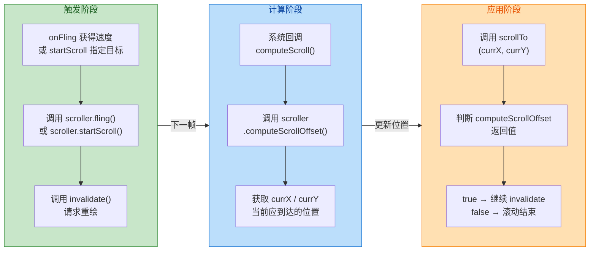
```mermaid
graph LR
    subgraph Trigger["触发阶段"]
        direction TB
        A["onFling 获得速度\n或 startScroll 指定目标"]
        B["调用 scroller.fling()\n或 scroller.startScroll()"]
        C["调用 invalidate()\n请求重绘"]
        A --> B
        B --> C
    end

    subgraph Compute["计算阶段"]
        direction TB
        D["系统回调\ncomputeScroll()"]
        E["调用 scroller\n.computeScrollOffset()"]
        F["获取 currX / currY\n当前应到达的位置"]
        D --> E
        E --> F
    end

    subgraph Apply["应用阶段"]
        direction TB
        G["调用 scrollTo\n(currX, currY)"]
        H["判断 computeScrollOffset\n返回值"]
        I["true → 继续 invalidate\nfalse → 滚动结束"]
        G --> H
        H --> I
    end

    Trigger -->|"下一帧"| Compute -->|"更新位置"| Apply

    classDef green fill:#C8E6C9,stroke:#388E3C,color:#1B5E20
    classDef blue fill:#BBDEFB,stroke:#1976D2,color:#0D47A1
    classDef orange fill:#FFE0B2,stroke:#F57C00,color:#E65100
    class Trigger green
    class Compute blue
    class Apply orange
```

#### computeScroll 驱动循环详解

这是理解 `Scroller` 的最关键环节。`Scroller` 本身 **不会** 触发任何 UI 更新，它只是一个数学计算器。驱动 UI 更新的是 `View.computeScroll()` 方法——这是 View 类中的一个空方法，专门留给子类覆写以配合 `Scroller` 使用。

完整的驱动循环如下：

1. **启动**：用户快速滑动，`onFling` 回调触发，你调用 `scroller.fling(...)` 设置初始参数，然后调用 `invalidate()` 请求重绘。

2. **绘制帧**：`invalidate()` 会导致 View 在下一个 VSYNC 信号到来时重新绘制。在 `View.draw()` 方法的执行过程中（具体是在绘制滚动条之前），系统会调用 `computeScroll()`。

3. **计算位置**：在你覆写的 `computeScroll()` 中，调用 `scroller.computeScrollOffset()`。这个方法根据当前时间计算此刻应该到达的位置，将结果存入 `scroller.currX` / `scroller.currY`，并返回一个布尔值——`true` 表示滚动仍在进行，`false` 表示已到达终点。

4. **应用位置**：如果返回 `true`，你调用 `scrollTo(scroller.currX, scroller.currY)` 移动内容，然后再次调用 `postInvalidateOnAnimation()`（或 `invalidate()`）请求下一帧重绘。这就形成了递归循环，直到 `computeScrollOffset()` 返回 `false`。

5. **结束**：当 `computeScrollOffset()` 返回 `false`，不再调用 `invalidate()`，循环自然终止。

值得注意的是，`scrollTo` 改变的是 View 的 **内容偏移**（`mScrollX` / `mScrollY`），而非 View 本身的位置。它等同于移动"窗口"来观看内容的不同区域。如果你需要移动 View 本身，应该使用 `translationX` / `translationY` 或 `offsetLeftAndRight` / `offsetTopAndBottom`。

#### 完整实现示例

以下代码展示了一个完整的支持 Fling 惯性滑动的自定义 View：

```kotlin
// 支持惯性滑动（Fling）的自定义可滚动 View
class FlingScrollView @JvmOverloads constructor(
    context: Context,
    attrs: AttributeSet? = null
) : View(context, attrs) {

    // 使用 OverScroller 而非 Scroller，物理模型更真实
    // 可传入自定义 Interpolator，默认为减速插值器
    private val scroller = OverScroller(context)

    // 内容总高度（实际场景中应根据内容动态计算）
    private var contentHeight = 3000

    // 手势监听器
    private val gestureListener = object : GestureDetector.SimpleOnGestureListener() {

        // 必须返回 true 以接收后续事件
        override fun onDown(e: MotionEvent): Boolean {
            // 如果正在 Fling 过程中用户按下，立即停止 Fling
            // forceFinished(true) 会使 computeScrollOffset 返回 false
            if (!scroller.isFinished) {
                scroller.forceFinished(true)
            }
            return true
        }

        // 跟手拖动
        override fun onScroll(
            e1: MotionEvent?,
            e2: MotionEvent,
            distanceX: Float,
            distanceY: Float
        ): Boolean {
            // distanceY > 0 表示手指向上滑（内容向上移动，scrollY 增大）
            // 使用 clamp 限制滚动范围
            val maxScrollY = contentHeight - height
            val targetY = (scrollY + distanceY.toInt()).coerceIn(0, maxScrollY)
            scrollTo(0, targetY)
            return true
        }

        // 快速滑动抬起
        override fun onFling(
            e1: MotionEvent?,
            e2: MotionEvent,
            velocityX: Float,
            velocityY: Float
        ): Boolean {
            // 启动 Fling 动画
            // 参数：起始X, 起始Y, X速度, Y速度, X最小值, X最大值, Y最小值, Y最大值
            scroller.fling(
                0, scrollY,                    // 起始位置（当前滚动位置）
                0, -velocityY.toInt(),          // 速度（注意取反：手指向上滑 velocity > 0，
                                                // 但 scrollY 应该增大，所以取反）
                0, 0,                           // X 方向不滚动
                0, contentHeight - height,      // Y 方向滚动范围 [0, maxScrollY]
                0, 100                          // overScrollY: 允许越界 100px 后弹回
            )

            // 请求重绘以启动 computeScroll 循环
            postInvalidateOnAnimation()
            return true
        }
    }

    // 创建手势检测器
    private val gestureDetector = GestureDetector(context, gestureListener)

    // 转发触摸事件
    override fun onTouchEvent(event: MotionEvent): Boolean {
        return gestureDetector.onTouchEvent(event)
    }

    // 核心：Scroller 驱动循环
    // 在 View.draw() 过程中被系统调用
    override fun computeScroll() {
        // 计算当前时刻的滚动位置
        // 返回 true 表示动画仍在进行
        if (scroller.computeScrollOffset()) {
            // 获取 Scroller 计算出的当前应到达的 Y 位置
            val currY = scroller.currY
            // 应用滚动位置
            scrollTo(0, currY)
            // 请求下一帧继续绘制（形成循环）
            // postInvalidateOnAnimation 比 invalidate 更高效，
            // 它会精确对齐到下一个 VSYNC 信号
            postInvalidateOnAnimation()
        }
    }
}
```

#### velocityY 取反问题

上述代码中 `fling` 参数使用了 `-velocityY.toInt()`，这是一个常见的困惑点，需要深入解释。

`GestureDetector.onFling` 提供的 `velocityY` 遵循 **屏幕坐标系**：手指从下往上滑（常见的"向上翻页"操作），`velocityY` 为 **负值**（因为 Y 坐标减小了）。而 `OverScroller.fling` 的 `velocityY` 参数含义是"scrollY 的变化速度"：正值表示 `scrollY` 增大（内容向上移动），负值表示 `scrollY` 减小（内容向下移动）。

用户向上滑（`velocityY < 0`），意图是看到下方的内容，即 `scrollY` 应该增大。所以我们需要传入正的速度值，即 `-velocityY`。

不过需要注意的是，取反与否取决于你对 scroll 方向的定义。`RecyclerView` 等系统组件在内部已经处理好了这种映射，如果使用系统组件通常不需要手动处理。只有在完全自定义滚动逻辑时才需要注意这一点。

#### Scroller 在 Framework 中的典型应用

`Scroller` 并不只是一个供开发者使用的工具类——Android Framework 内部大量使用它：

- **`ScrollView` / `HorizontalScrollView`**：`fling()` 方法内部就是调用 `mScroller.fling(...)`，然后配合 `computeScroll()` 来实现惯性滚动。
- **`ViewPager`**：页面切换动画使用 `Scroller.startScroll()` 实现平滑翻页。
- **`RecyclerView`**：内部的 `ViewFlinger` 类使用 `OverScroller` 来驱动 Fling，并且在每一帧中计算消费的距离以配合嵌套滑动机制。
- **`DrawerLayout`**：抽屉的打开/关闭动画通过 `ViewDragHelper`（内部包含 `Scroller`）实现。

理解了 `Scroller` 的工作原理，你就能理解这些系统组件的滚动行为为何如此流畅——它们都遵循同一个"计算-应用-重绘"的驱动循环。

#### 高级：abortAnimation vs forceFinished

当需要中途停止 Scroller 时，有两个方法可以选择：

- **`forceFinished(true)`**：立即标记滚动结束，`computeScrollOffset()` 下次调用直接返回 `false`。`currX` / `currY` 保持为调用 `forceFinished` 时刻的值。这是最常用的方式——用户在 Fling 过程中按下手指时，应该立即停止。

- **`abortAnimation()`**：立即标记结束，但会将 `currX` / `currY` **跳到** 目标终点值（`finalX` / `finalY`）。这适用于你希望"瞬间到达目的地"的场景，比如快速定位。

两者的选择取决于你的 UX 需求：用户中途打断通常用 `forceFinished`（停在当前位置），程序化取消通常用 `abortAnimation`（跳到目标位置）。

---

**📝 练习题**

在自定义 View 中使用 `GestureDetector` 时，下列说法正确的是？

A. `GestureDetector` 会自动拦截事件，不需要在 `onTouchEvent` 中手动转发


B. `onSingleTapUp` 会等待双击超时后才回调，因此有约 300ms 延迟


C. 如果 `onDown` 返回 `false`，后续 `onFling` 和 `onScroll` 可能不会被回调


D. `onLongPress` 触发后，用户继续移动手指仍会收到 `onScroll` 回调


**【答案】** C

**【解析】** `GestureDetector` 是一个纯分析器，不参与事件分发链，不会自动拦截事件，必须在 `onTouchEvent` 中手动调用 `gestureDetector.onTouchEvent(event)` 转发事件，所以 A 错误。`onSingleTapUp` 在手指抬起时 **立即** 回调，不需要等待双击超时；有延迟的是 `onSingleTapConfirmed`，所以 B 错误。`onDown` 返回 `false` 会导致 `GestureDetector.onTouchEvent` 在 `ACTION_DOWN` 时返回 `false`，进而导致 View 的 `onTouchEvent` 返回 `false`。根据事件分发机制，父 ViewGroup 在 DOWN 阶段发现子 View 不消费事件，就不会再将后续的 MOVE / UP 传递给它，`onFling` 和 `onScroll` 自然无法被回调，所以 **C 正确**。`onLongPress` 触发后，内部会设置 `mInLongPress = true`，后续的 `ACTION_MOVE` 不会再触发 `onScroll`，所以 D 错误。

---

**📝 练习题**

关于 `OverScroller` 的使用，下列代码存在什么问题？

```kotlin
override fun computeScroll() {
    scroller.computeScrollOffset()
    scrollTo(0, scroller.currY)
}
```

A. 没有问题，代码逻辑完全正确


B. 没有检查 `computeScrollOffset()` 的返回值，滚动结束后仍会不断执行 `scrollTo`


C. 缺少 `invalidate()` 调用，滚动只会执行一帧就停止


D. B 和 C 都存在


**【答案】** D

**【解析】** 这段代码有两个问题。第一，没有用 `if` 判断 `computeScrollOffset()` 的返回值。当滚动已经结束时，`computeScrollOffset()` 返回 `false`，但代码仍然无条件执行 `scrollTo`，虽然此时 `currY` 不再变化（停在终点），`scrollTo` 实际上没有副作用，但这是一种不规范的写法，在边界情况下可能引起不必要的重绘。第二，也是更严重的问题：`computeScroll()` 是在 `draw()` 流程中被调用的，它不会自动触发下一帧绘制。如果不在滚动进行时调用 `invalidate()` 或 `postInvalidateOnAnimation()`，系统不会再次触发 `draw()`，`computeScroll()` 就不会再被调用，滚动只会执行一帧就停止。正确写法应该是 `if (scroller.computeScrollOffset()) { scrollTo(...); postInvalidateOnAnimation() }`。因此 **D 正确**，B 和 C 两个问题同时存在。

---

## 嵌套滑动机制

在 Android 应用开发中，"嵌套滑动"是一个极为常见且棘手的交互场景——当一个可滚动的父容器内部嵌套了另一个可滚动的子 View 时，手指的一次连续滑动操作应该如何在两者之间分配？传统的事件分发机制（`dispatchTouchEvent` → `onInterceptTouchEvent` → `onTouchEvent`）本质上是一个 **单向的、自顶向下** 的责任链：一旦某个 View 消费了 `ACTION_DOWN`，后续的整个事件序列就被它"锁定"了，父容器想要中途"抢夺"事件只能依赖 `onInterceptTouchEvent` 拦截，而子 View 想要"还给"父容器就只能调用 `requestDisallowInterceptTouchEvent`。这种模型在面对"子 View 先滚到底，再顺滑地让父容器接手继续滚动"这样的需求时，显得力不从心——因为它无法在同一个事件序列中实现父子之间的 **协商式、双向的** 滑动距离分配。

为了解决这个问题，Google 从 Android 5.0（API 21）开始引入了 **NestedScrolling 机制**，并通过 Support Library（后来的 AndroidX）向下兼容。这套机制的核心思想可以用一句话概括：**子 View 在自己消费滑动之前，先把滑动距离"上报"给父容器，让父容器优先消费；父容器消费不完的，再还给子 View 自己消费；子 View 消费完之后如果还有剩余，再次上报给父容器做最终处理**。这就形成了一个 `Child → Parent → Child → Parent` 的 **双向协商** 流程，完美解决了传统事件分发无法处理的嵌套滑动场景。

### NestedScrollingParent / Child 接口

嵌套滑动机制的基础建立在两个核心接口之上：`NestedScrollingChild`（由发起滑动的子 View 实现）和 `NestedScrollingParent`（由需要参与协商的父容器实现）。它们各自定义了一组方法，这些方法按调用时序形成一套严格的"协议"。理解这套协议的关键在于理解 **谁主动、谁被动**——在嵌套滑动中，**始终是 Child 主动发起** 每一个环节的调用，Parent 只是被动响应。这与传统事件分发中"Parent 主动拦截"的模型恰好相反。

我们先从宏观视角看一次完整嵌套滑动的生命周期。当用户手指按下并开始滑动时，Child 首先调用 `startNestedScroll()` 告知系统"我要开始嵌套滑动了"，系统会沿着 View 树向上寻找愿意配合的 Parent（Parent 通过 `onStartNestedScroll()` 返回 `true` 表示愿意参与）。找到之后，每一帧滑动中 Child 都会先调用 `dispatchNestedPreScroll()` 把即将消费的滑动量发给 Parent，Parent 在 `onNestedPreScroll()` 中"截留"自己需要的部分；剩余的 Child 自己消费；消费完后 Child 再调用 `dispatchNestedScroll()` 把自己的消费量和剩余量告诉 Parent，Parent 在 `onNestedScroll()` 中处理最终剩余。手指抬起时，Child 调用 `stopNestedScroll()` 结束整个流程。

下面用一张时序图来展示这个完整流程：

```mermaid
sequenceDiagram
    participant U as User Touch
    participant C as NestedScrollingChild
    participant H as NestedScrollingHelper
    participant P as NestedScrollingParent

    Note over U,P: 阶段一：建立嵌套滑动连接

    U->>C: ACTION_DOWN
    C->>H: startNestedScroll(axes)
    H->>P: onStartNestedScroll(child, target, axes)
    P-->>H: return true（愿意参与）
    H->>P: onNestedScrollAccepted(child, target, axes)

    Note over U,P: 阶段二：滑动协商（每帧重复）

    U->>C: ACTION_MOVE (dy=100)
    C->>H: dispatchNestedPreScroll(dx,dy,consumed,offset)
    H->>P: onNestedPreScroll(target,dx,dy,consumed)
    P-->>H: consumed[1]=40（Parent先吃40）
    Note over C: Child自己消费剩余60
    C->>H: dispatchNestedScroll(dxConsumed,dyConsumed,\ndxUnconsumed,dyUnconsumed)
    H->>P: onNestedScroll(target,dxConsumed,\ndyConsumed,dxUnconsumed,dyUnconsumed)

    Note over U,P: 阶段三：Fling 协商

    U->>C: ACTION_UP (velocityY=3000)
    C->>H: dispatchNestedPreFling(velocityX,velocityY)
    H->>P: onNestedPreFling(target,velocityX,velocityY)
    P-->>H: return false（不拦截fling）
    C->>H: dispatchNestedFling(velocityX,velocityY,consumed)
    H->>P: onNestedFling(target,velocityX,velocityY,consumed)

    Note over U,P: 阶段四：结束

    C->>H: stopNestedScroll()
    H->>P: onStopNestedScroll(target)
```

现在让我们深入每个方法的含义和设计意图。

**Child 侧的方法**定义在 `NestedScrollingChild` 接口中（实际实现通常委托给 `NestedScrollingChildHelper`）：

- **`setNestedScrollingEnabled(boolean enabled)`**：开关嵌套滑动功能。当设为 `false` 时，Child 不会向上发起任何嵌套滑动调用。这个方法在某些场景下很有用，比如你希望 RecyclerView 在特定状态下退化为"普通滑动"模式。

- **`startNestedScroll(int axes)`**：通知系统嵌套滑动开始。参数 `axes` 是 `ViewCompat.SCROLL_AXIS_HORIZONTAL`、`ViewCompat.SCROLL_AXIS_VERTICAL` 或两者的组合，表明本次滑动的方向。这个方法内部会沿 View 树逐级向上查找，对每个候选 Parent 调用 `onStartNestedScroll()`，直到找到第一个返回 `true` 的 Parent。如果没有任何 Parent 愿意参与，后续的 `dispatchNestedPreScroll` 等调用就会直接跳过（返回 `false`），Child 自行处理所有滑动。

- **`dispatchNestedPreScroll(int dx, int dy, int[] consumed, int[] offsetInWindow)`**：这是协商的核心——"预分发"。Child 在自己消费滑动之前，先把本帧的滑动增量 `dx`/`dy` 通过这个方法告知 Parent。`consumed` 是一个长度为 2 的输出数组，Parent 会把自己消费的量写入 `consumed[0]`（水平）和 `consumed[1]`（垂直）。`offsetInWindow` 也是输出参数，记录因 Parent 消费滑动导致 Child 在窗口中的位置偏移。Child 从 `consumed` 中读取 Parent 的消费量，然后只消费 `dy - consumed[1]` 的剩余部分。

- **`dispatchNestedScroll(int dxConsumed, int dyConsumed, int dxUnconsumed, int dyUnconsumed, int[] offsetInWindow)`**：Child 自身消费完成后，把消费结果上报给 Parent。`dxConsumed`/`dyConsumed` 是 Child 消费掉的量，`dxUnconsumed`/`dyUnconsumed` 是 Child 也消费不了的剩余量。Parent 可以在 `onNestedScroll()` 中对这些剩余量做最终处理（例如实现 overscroll 效果）。

- **`dispatchNestedPreFling(float velocityX, float velocityY)` 和 `dispatchNestedFling(...)`**：与 scroll 类似，但针对的是手指抬起后的 fling（惯性滑动）。PreFling 让 Parent 有机会在 Child 执行 fling 之前拦截整个 fling，而 Fling 则是在 Child 消费/不消费 fling 之后通知 Parent。

- **`stopNestedScroll()`**：通知 Parent 嵌套滑动结束，释放连接。

**Parent 侧的方法**定义在 `NestedScrollingParent` 接口中（实际实现通常委托给 `NestedScrollingParentHelper`）：

- **`onStartNestedScroll(View child, View target, int axes)`**：当某个后代 View 发起 `startNestedScroll()` 时被调用。`child` 是直接子 View（可能是中间容器），`target` 是真正发起嵌套滑动的后代 View。返回 `true` 表示愿意参与本次嵌套滑动。这里可以根据 `axes` 进行判断——例如 `CoordinatorLayout` 会检查自己的 `Behavior` 对象是否对该轴向的滑动感兴趣。

- **`onNestedScrollAccepted(View child, View target, int axes)`**：在 `onStartNestedScroll()` 返回 `true` 后立刻调用，通知 Parent 嵌套滑动连接已建立。Parent 通常在这里做一些初始化工作，比如停止当前正在进行的动画。

- **`onNestedPreScroll(View target, int dx, int dy, int[] consumed)`**：对应 Child 的 `dispatchNestedPreScroll()`。Parent 可以在这里"截留"自己需要的滑动量，并写入 `consumed` 数组。例如，`AppBarLayout` 的 `Behavior` 会在这里判断：如果 AppBar 还没有完全折叠，就先消费向上的滑动来折叠 AppBar，写入 `consumed[1] = 实际折叠的像素数`。

- **`onNestedScroll(View target, int dxConsumed, int dyConsumed, int dxUnconsumed, int dyUnconsumed)`**：对应 Child 的 `dispatchNestedScroll()`。Parent 在这里处理 Child 消费不了的剩余滑动。

- **`onNestedPreFling(View target, float velocityX, float velocityY)`**：返回 `true` 表示 Parent 完全拦截 fling，Child 不再执行 fling。

- **`onNestedFling(View target, float velocityX, float velocityY, boolean consumed)`**：`consumed` 参数表明 Child 是否已经消费了这个 fling。

- **`onStopNestedScroll(View target)`**：嵌套滑动结束，Parent 做清理工作。

在实际开发中，我们很少直接从零实现这两个接口。`RecyclerView` 已经内置实现了 `NestedScrollingChild`，而 `CoordinatorLayout` 实现了 `NestedScrollingParent`。但理解接口的每个方法和调用时序是至关重要的，因为当你需要自定义嵌套滑动行为时（比如自定义一个下拉刷新容器），必须精确地在正确的时机调用正确的方法。

一个特别值得注意的设计细节是 **Helper 类的存在**。Google 提供了 `NestedScrollingChildHelper` 和 `NestedScrollingParentHelper` 两个辅助类，它们封装了沿 View 树查找 Parent、管理嵌套滑动状态等繁琐逻辑。接口的实现者只需要把每个接口方法委托给对应的 Helper 方法即可。这种"接口 + Helper 委托"的模式是 Android 中处理"类无法多继承"问题的经典做法——View 已经有自己的继承体系，不可能再继承一个"NestedScrollingBase"基类，所以用接口声明能力、用 Helper 提供实现。

```kotlin
// 演示：自定义 View 实现 NestedScrollingChild 接口时的委托模式
class MyScrollableView(context: Context, attrs: AttributeSet?) :
    View(context, attrs), NestedScrollingChild {

    // 创建 Helper 实例，所有接口方法都委托给它
    private val childHelper = NestedScrollingChildHelper(this)

    init {
        // 默认启用嵌套滑动
        isNestedScrollingEnabled = true
    }

    // 将接口方法委托给 Helper
    override fun setNestedScrollingEnabled(enabled: Boolean) {
        // Helper 内部维护了一个 boolean 标志位
        childHelper.isNestedScrollingEnabled = enabled
    }

    override fun isNestedScrollingEnabled(): Boolean {
        // 直接返回 Helper 维护的标志位
        return childHelper.isNestedScrollingEnabled
    }

    override fun startNestedScroll(axes: Int): Boolean {
        // Helper 内部会沿 View 树向上遍历，调用每个父容器的 onStartNestedScroll()
        // 找到第一个返回 true 的 Parent 并保存引用
        return childHelper.startNestedScroll(axes)
    }

    override fun stopNestedScroll() {
        // Helper 会调用已连接 Parent 的 onStopNestedScroll() 并清除引用
        childHelper.stopNestedScroll()
    }

    override fun hasNestedScrollingParent(): Boolean {
        // Helper 检查是否有已建立连接的 Parent
        return childHelper.hasNestedScrollingParent()
    }

    override fun dispatchNestedPreScroll(
        dx: Int, dy: Int, consumed: IntArray?, offsetInWindow: IntArray?
    ): Boolean {
        // Helper 会调用已连接 Parent 的 onNestedPreScroll()，并回填 consumed 和 offset
        return childHelper.dispatchNestedPreScroll(dx, dy, consumed, offsetInWindow)
    }

    override fun dispatchNestedScroll(
        dxConsumed: Int, dyConsumed: Int,
        dxUnconsumed: Int, dyUnconsumed: Int,
        offsetInWindow: IntArray?
    ): Boolean {
        // Helper 会调用已连接 Parent 的 onNestedScroll()
        return childHelper.dispatchNestedScroll(
            dxConsumed, dyConsumed, dxUnconsumed, dyUnconsumed, offsetInWindow
        )
    }

    override fun dispatchNestedPreFling(velocityX: Float, velocityY: Float): Boolean {
        // Helper 会调用 Parent 的 onNestedPreFling()
        return childHelper.dispatchNestedPreFling(velocityX, velocityY)
    }

    override fun dispatchNestedFling(
        velocityX: Float, velocityY: Float, consumed: Boolean
    ): Boolean {
        // Helper 会调用 Parent 的 onNestedFling()
        return childHelper.dispatchNestedFling(velocityX, velocityY, consumed)
    }

    // 在 onTouchEvent 中发起嵌套滑动的完整流程
    override fun onTouchEvent(event: MotionEvent): Boolean {
        when (event.actionMasked) {
            MotionEvent.ACTION_DOWN -> {
                // 按下时建立嵌套滑动连接（垂直方向）
                startNestedScroll(ViewCompat.SCROLL_AXIS_VERTICAL)
            }
            MotionEvent.ACTION_MOVE -> {
                // 计算本帧垂直滑动增量
                val dy = (lastY - event.y).toInt()
                val consumed = IntArray(2)   // Parent 消费的量
                val offset = IntArray(2)     // 窗口偏移量

                // 第一步：先让 Parent 截留
                if (dispatchNestedPreScroll(0, dy, consumed, offset)) {
                    // Parent 消费了 consumed[1] 像素
                }

                // 第二步：自己消费剩余量
                val remainingDy = dy - consumed[1]
                val selfConsumed = selfScroll(remainingDy) // 自定义方法，返回实际消费量

                // 第三步：把结果上报给 Parent
                val unconsumed = remainingDy - selfConsumed
                dispatchNestedScroll(0, selfConsumed, 0, unconsumed, offset)
            }
            MotionEvent.ACTION_UP, MotionEvent.ACTION_CANCEL -> {
                // 结束嵌套滑动
                stopNestedScroll()
            }
        }
        return true
    }
}
```

从上面的代码可以清晰看出嵌套滑动的"三步协商"模型：**Parent 先吃 → Child 再吃 → 剩余还给 Parent**。这种设计使得 Parent 拥有最高的滑动优先权，它可以在 `onNestedPreScroll()` 中消费任意数量的滑动，甚至全部消费掉让 Child 完全不动。同时，Child 消费后的剩余也会通过 `onNestedScroll()` 回到 Parent，实现了真正的"滴水不漏"的滑动分配。

### NestedScrolling 2/3 版本演进

第一版 NestedScrolling 接口（`NestedScrollingChild` / `NestedScrollingParent`）虽然解决了基本的嵌套滑动协商问题，但在实际使用中暴露出一个严重的缺陷——**它无法正确处理非触摸驱动的滑动（fling 阶段的持续滑动）**。

问题出在哪里？回忆一下完整的滑动交互：用户手指按下 → 手指移动（`TYPE_TOUCH`）→ 手指抬起 → 惯性滑动（`TYPE_NON_TOUCH`/fling）。在第一版接口中，`dispatchNestedPreFling()` 和 `dispatchNestedFling()` 只是在 fling **开始** 时调用一次，让 Parent 决定是否拦截整个 fling。一旦 fling 开始执行，后续每一帧由 `OverScroller` 产生的滑动增量就完全在 Child 内部消化了，Parent **无法参与 fling 过程中每一帧的滑动分配**。

这在实际场景中造成了什么问题？考虑一个经典的布局：`CoordinatorLayout` 内部有一个 `AppBarLayout`（顶部可折叠工具栏）和一个 `RecyclerView`（列表）。用户快速向上滑动 RecyclerView 然后松手，期望看到的效果是：RecyclerView 在 fling 中先把 AppBarLayout 完全折叠，然后继续滑动列表内容。但在第一版机制下，fling 一旦交给了 RecyclerView，AppBarLayout 就无法在 fling 过程中被逐帧折叠了——要么 fling 前全部拦截（AppBar 独吞 fling，列表不动），要么不拦截（列表独吞 fling，AppBar 不动），无法实现"先折叠 AppBar 再滚动列表"的连续效果。

为了解决这个问题，Google 在 AndroidX 中引入了 **NestedScrollingChild2 / NestedScrollingParent2** 接口。核心改进只有一点：**为所有滑动方法增加了一个 `type` 参数，区分 `TYPE_TOUCH`（手指驱动）和 `TYPE_NON_TOUCH`（fling/程序驱动）**。

```java
// NestedScrollingChild2 接口相比第一版的关键变化
public interface NestedScrollingChild2 extends NestedScrollingChild {

    // 新增 type 参数：ViewCompat.TYPE_TOUCH 或 ViewCompat.TYPE_NON_TOUCH
    boolean startNestedScroll(int axes, int type);

    void stopNestedScroll(int type);

    boolean hasNestedScrollingParent(int type);

    // 关键方法：fling 过程中的每一帧也走 Pre-Scroll 协商
    boolean dispatchNestedPreScroll(
        int dx, int dy,
        @Nullable int[] consumed,
        @Nullable int[] offsetInWindow,
        int type  // TYPE_TOUCH 或 TYPE_NON_TOUCH
    );

    boolean dispatchNestedScroll(
        int dxConsumed, int dyConsumed,
        int dxUnconsumed, int dyUnconsumed,
        @Nullable int[] offsetInWindow,
        int type  // TYPE_TOUCH 或 TYPE_NON_TOUCH
    );
}
```

有了 `type` 参数之后，Child 在 fling 阶段的 **每一帧** 计算出滑动增量后，不再直接自己消费，而是继续走 `dispatchNestedPreScroll(dx, dy, consumed, offset, TYPE_NON_TOUCH)` → 自己消费 → `dispatchNestedScroll(..., TYPE_NON_TOUCH)` 的完整协商流程。Parent 在 `onNestedPreScroll()` 中可以通过 `type` 参数知道当前是触摸滑动还是 fling 滑动，并相应地消费滑动量。这样，前面描述的"AppBar 先折叠再列表滚动"的连续效果就自然实现了——fling 的每一帧中，AppBarLayout 的 Behavior 在 `onNestedPreScroll(TYPE_NON_TOUCH)` 中先消费折叠所需的像素，剩余的交给 RecyclerView 继续 fling。

```mermaid
graph LR
    subgraph V1["NestedScrolling V1"]
        direction TB
        V1A["Touch 阶段\n逐帧协商 Pre/Post"]
        V1B["Fling 开始时\n仅一次 Pre/Fling 调用"]
        V1C["Fling 执行中\nChild 独自消费\nParent 无法参与"]
        V1A ~~~ V1B
        V1B ~~~ V1C
    end

    subgraph V2["NestedScrolling V2"]
        direction TB
        V2A["Touch 阶段\n逐帧协商 + TYPE_TOUCH"]
        V2B["Fling 执行中\n逐帧协商 + TYPE_NON_TOUCH"]
        V2C["Parent 可在 fling 的\n每一帧截留滑动量"]
        V2A ~~~ V2B
        V2B ~~~ V2C
    end

    subgraph V3["NestedScrolling V3"]
        direction TB
        V3A["继承 V2 全部能力"]
        V3B["dispatchNestedScroll\n新增 consumed 输出参数"]
        V3C["Parent 报告 Post-Scroll\n实际消费量\n实现精确剩余量追踪"]
        V3A ~~~ V3B
        V3B ~~~ V3C
    end

    V1 -->|"增加 type 参数"| V2
    V2 -->|"增加 consumed 输出"| V3

    classDef v1Style fill:#E8F5E9,stroke:#4CAF50,color:#1B5E20
    classDef v2Style fill:#E3F2FD,stroke:#2196F3,color:#0D47A1
    classDef v3Style fill:#FFF3E0,stroke:#FF9800,color:#E65100

    class V1 v1Style
    class V2 v2Style
    class V3 v3Style
```

`RecyclerView` 从 AndroidX 1.0 开始就实现了 `NestedScrollingChild2`。具体来说，RecyclerView 内部使用 `OverScroller` 来执行 fling，在每一帧的 `computeScroll()` → `scrollStep()` 流程中，它会先调用 `dispatchNestedPreScroll(..., TYPE_NON_TOUCH)`，自己消费剩余后再调用 `dispatchNestedScroll(..., TYPE_NON_TOUCH)`。这意味着如果你使用的 Parent 只实现了 `NestedScrollingParent`（V1），它就收不到 fling 阶段的逐帧协商回调——这也是很多开发者在旧版本中遇到"AppBarLayout 在 fling 时抖动/不跟手"等 Bug 的根源。

**NestedScrollingChild3 / NestedScrollingParent3** 是在此基础上的进一步精细化。V2 的 `dispatchNestedScroll()` 方法虽然会把 `dxUnconsumed`/`dyUnconsumed` 传给 Parent，但 **Parent 在 `onNestedScroll()` 中消费了多少，Child 并不知道**。V3 通过增加一个 `consumed` 输出参数解决了这个问题：

```java
// NestedScrollingChild3 新增方法签名
public interface NestedScrollingChild3 extends NestedScrollingChild2 {

    void dispatchNestedScroll(
        int dxConsumed, int dyConsumed,          // Child 已消费量
        int dxUnconsumed, int dyUnconsumed,      // Child 未消费量
        @Nullable int[] offsetInWindow,           // 窗口偏移
        int type,                                 // 滑动类型
        @NonNull int[] consumed                   // 【新增】Parent 在 post-scroll 中消费的量
    );
}
```

这个看似微小的改动实际上解决了一个精确度问题：在 V2 中，如果一个 fling 产生了 100px 的滑动，Parent 在 pre-scroll 中吃了 30px，Child 自己消费了 50px，还有 20px 的 unconsumed 传给 Parent 的 post-scroll。但 Parent 在 post-scroll 中实际可能只消费了 15px（比如到达边界了），还有 5px 真正没有任何 View 消费。在 V2 中，Child 无法知道这 5px 的存在，它无法做出准确的 fling 速度衰减。V3 的 `consumed` 输出参数让 Child 知道了"真正的总剩余"，使得 fling 的物理效果更加精确和流畅。

下面我们通过一个对比表来总结三个版本的核心差异：

| 特性维度 | V1 (原始版本) | V2 (AndroidX) | V3 (AndroidX) |
|:---|:---|:---|:---|
| **Touch 阶段协商** | ✅ 逐帧 Pre/Post | ✅ 逐帧 Pre/Post + `TYPE_TOUCH` | ✅ 同 V2 |
| **Fling 阶段协商** | ❌ 仅开始时一次通知 | ✅ 逐帧 Pre/Post + `TYPE_NON_TOUCH` | ✅ 同 V2 |
| **Parent Post-Scroll 消费量可知** | ❌ | ❌ | ✅ `consumed[]` 输出参数 |
| **典型实现者 (Child)** | `ListView`(部分) | `RecyclerView` | `RecyclerView`(新版) |
| **典型实现者 (Parent)** | — | `CoordinatorLayout` | `CoordinatorLayout`(新版) |
| **推荐使用** | 已过时 | 大多数场景足够 | 需要极致精确度时使用 |

在实际项目中，**始终使用最新版本的接口** 是最佳实践。如果你自定义 View 需要实现嵌套滑动，直接实现 `NestedScrollingChild3` / `NestedScrollingParent3`。由于接口是继承关系（V3 extends V2 extends V1），实现 V3 自动兼容所有旧版 Parent/Child。

### CoordinatorLayout 联动原理

`CoordinatorLayout` 是 Google 在 Material Design 库中提供的一个"超级 FrameLayout"，它是嵌套滑动机制在应用层最重要的落地载体。它实现了 `NestedScrollingParent2`（较新版本实现了 `NestedScrollingParent3`），但它的核心价值并不在于自己处理嵌套滑动，而是引入了 **`Behavior`（行为）模式**——把所有的嵌套滑动响应逻辑下放到每个子 View 附带的 `Behavior` 对象中，`CoordinatorLayout` 自身只充当"调度中枢"。

**为什么需要 Behavior？** 设想一下：一个 `CoordinatorLayout` 里可能有 `AppBarLayout`、`FloatingActionButton`、`BottomSheet`、`RecyclerView` 等多个子 View，每个子 View 对嵌套滑动的响应完全不同——AppBar 需要折叠/展开，FAB 需要显示/隐藏，BottomSheet 需要跟着拖拽。如果把这些逻辑全写在 `CoordinatorLayout` 里，代码会极度臃肿且不可扩展。`Behavior` 模式将响应逻辑封装在独立的对象中，每个子 View 通过 `LayoutParams` 关联自己的 `Behavior`，实现了"策略模式"般的灵活扩展。

`CoordinatorLayout` 接收到嵌套滑动回调后的分发流程如下：

```mermaid
graph LR
    subgraph A["RecyclerView\n(NestedScrollingChild)"]
        direction TB
        A1["startNestedScroll()"]
        A2["dispatchNestedPreScroll()"]
        A3["dispatchNestedScroll()"]
        A1 ~~~ A2
        A2 ~~~ A3
    end

    subgraph B["CoordinatorLayout\n(NestedScrollingParent)"]
        direction TB
        B1["onStartNestedScroll()\n遍历所有子 View"]
        B2["逐一调用子 View\nBehavior.onStartNestedScroll()"]
        B3["onNestedPreScroll()\n遍历有效 Behavior"]
        B4["聚合 consumed 值\n回传给 Child"]
        B1 ~~~ B2
        B2 ~~~ B3
        B3 ~~~ B4
    end

    subgraph C["Behavior 对象"]
        direction TB
        C1["AppBarLayout.Behavior\nonNestedPreScroll():\n折叠/展开 AppBar"]
        C2["FAB.Behavior\nonNestedScroll():\n自动隐藏/显示"]
        C3["自定义 Behavior\n实现任意联动效果"]
        C1 ~~~ C2
        C2 ~~~ C3
    end

    A -->|"嵌套滑动回调"| B
    B -->|"委托分发"| C

    classDef childStyle fill:#E8F5E9,stroke:#4CAF50,color:#1B5E20
    classDef parentStyle fill:#E3F2FD,stroke:#2196F3,color:#0D47A1
    classDef behaviorStyle fill:#FFF3E0,stroke:#FF9800,color:#E65100

    class A childStyle
    class B parentStyle
    class C behaviorStyle
```

让我们详细追踪 `CoordinatorLayout` 的关键源码逻辑来理解这个分发过程。

**第一步：建立连接（`onStartNestedScroll`）**。当 RecyclerView 调用 `startNestedScroll()` 时，`CoordinatorLayout` 的 `onStartNestedScroll()` 被触发。它的实现并不是简单地返回 `true` 或 `false`，而是 **遍历所有直接子 View**，检查每个子 View 的 `LayoutParams` 中是否设置了 `Behavior`，如果有，就调用 `behavior.onStartNestedScroll()`。只要有任何一个 Behavior 返回 `true`，`CoordinatorLayout` 就整体返回 `true`，表示自己愿意作为 NestedScrollingParent 参与协商。同时，它会用一个 `accepted` 标记记录哪些 Behavior 参与了本次嵌套滑动。

```kotlin
// CoordinatorLayout.onStartNestedScroll() 核心逻辑伪代码
override fun onStartNestedScroll(
    child: View, target: View, axes: Int, type: Int
): Boolean {
    var handled = false
    // 遍历所有直接子 View
    for (i in 0 until childCount) {
        val view = getChildAt(i)
        // 获取子 View 的 LayoutParams 中关联的 Behavior
        val lp = view.layoutParams as LayoutParams
        val behavior = lp.behavior

        if (behavior != null) {
            // 调用该 Behavior 的 onStartNestedScroll，判断是否参与
            val accepted = behavior.onStartNestedScroll(
                this,   // CoordinatorLayout 自身
                view,   // 当前遍历到的子 View（Behavior 的宿主）
                child,  // 嵌套滑动的直接子 View
                target, // 发起嵌套滑动的后代 View（如 RecyclerView）
                axes,   // 滑动方向
                type    // TYPE_TOUCH 或 TYPE_NON_TOUCH
            )
            if (accepted) {
                // 标记该 Behavior 参与了本次嵌套滑动
                lp.setNestedScrollAccepted(type, true)
                handled = true
            }
        }
    }
    // 只要有一个 Behavior 参与，CoordinatorLayout 就返回 true
    return handled
}
```

**第二步：Pre-Scroll 分发（`onNestedPreScroll`）**。在 RecyclerView 的每帧 `ACTION_MOVE` 中，`dispatchNestedPreScroll()` 触发 `CoordinatorLayout.onNestedPreScroll()`。`CoordinatorLayout` 再次遍历所有子 View，对标记为 `accepted` 的 Behavior 逐一调用 `behavior.onNestedPreScroll()`。每个 Behavior 会修改 `consumed` 数组，**注意这里的 consumed 是累积的**——前一个 Behavior 消费的量会体现在 `consumed` 中，后一个 Behavior 看到的就是之前已被消费后的状态。最终，`consumed` 数组反映的是所有 Behavior 的总消费量，回传给 RecyclerView。

这里有一个重要的实现细节：多个 Behavior 的遍历顺序就是子 View 在 `CoordinatorLayout` 中的排列顺序（与 XML 中的声明顺序一致，受 `layout_gravity` 和 `layout_anchor` 影响后的依赖排序）。这意味着如果有多个 Behavior 都想消费同一方向的滑动，**先被遍历到的 Behavior 有更高的优先级**——它会先把 `consumed` 写入，后续 Behavior 能消费的就更少了。在实际项目中，这个顺序问题很少成为痛点，因为通常只有一个 Behavior（如 AppBarLayout 的）在 pre-scroll 中消费滑动。

**第三步：Post-Scroll 分发（`onNestedScroll`）**。RecyclerView 自身消费完剩余滑动后，调用 `dispatchNestedScroll()`。`CoordinatorLayout` 在 `onNestedScroll()` 中再次遍历 accepted 的 Behavior，逐一调用 `behavior.onNestedScroll()`。这一步主要用于处理"溢出"滑动，比如 RecyclerView 已经滚到底了但 fling 还没结束，这些 unconsumed 的滑动可以被某个 Behavior 拿来做 overscroll 效果或展开底部面板。

**Behavior 的声明与绑定方式** 也是开发中需要掌握的实践知识。一个 Behavior 对象与子 View 的关联有三种方式：

第一种是 **XML 属性声明**，通过 `app:layout_behavior` 指定 Behavior 类的全限定名：

```xml
<!-- RecyclerView 使用 AppBarLayout 提供的 ScrollingViewBehavior -->
<!-- 该 Behavior 负责让 RecyclerView 布局在 AppBarLayout 下方并跟随其折叠/展开 -->
<androidx.recyclerview.widget.RecyclerView
    android:layout_width="match_parent"
    android:layout_height="match_parent"
    app:layout_behavior="@string/appbar_scrolling_view_behavior" />
    <!-- 这个字符串值实际是：
         com.google.android.material.appbar.AppBarLayout$ScrollingViewBehavior -->
```

第二种是 **注解默认绑定**。很多 Material 组件（如 `AppBarLayout`、`FloatingActionButton`）在类上使用了 `@CoordinatorLayout.DefaultBehavior` 注解，指定了默认的 Behavior。当它们被放入 `CoordinatorLayout` 时，无需在 XML 中显式声明，系统会自动创建对应的 Behavior 实例。

第三种是 **代码动态设置**，通过 `CoordinatorLayout.LayoutParams.setBehavior()` 在运行时绑定：

```kotlin
// 在代码中动态设置 Behavior
val params = myView.layoutParams as CoordinatorLayout.LayoutParams
// 创建自定义 Behavior 实例
params.behavior = MyCustomBehavior()
// 重新设置 LayoutParams 触发 CoordinatorLayout 重新布局
myView.layoutParams = params
```

**Behavior 的依赖机制（`layoutDependsOn`）** 是 `CoordinatorLayout` 的另一个精妙设计。除了嵌套滑动的被动响应，Behavior 还可以声明对其他子 View 的"依赖关系"——当被依赖的 View（`dependency`）发生位置或大小变化时，`CoordinatorLayout` 会自动通知依赖它的 Behavior，调用其 `onDependentViewChanged()` 方法。

这个机制使得子 View 之间可以建立"联动"关系而无需互相持有引用。经典例子是 `FloatingActionButton` 对 `Snackbar` 的躲避效果：当 Snackbar 从底部弹出时，FAB 会自动上移以避免被遮挡。这背后的原理是：

1. `Snackbar` 的容器 View 被添加到 `CoordinatorLayout` 中。
2. `FloatingActionButton` 的默认 `Behavior` 在 `layoutDependsOn()` 中检查 dependency 是否是 `SnackbarLayout`，如果是则返回 `true`。
3. 当 Snackbar 执行入场动画（改变了 `translationY`），`CoordinatorLayout` 检测到 dependency 的变化，调用 FAB Behavior 的 `onDependentViewChanged()`。
4. FAB Behavior 在 `onDependentViewChanged()` 中计算 Snackbar 的当前位置，相应地调整 FAB 的 `translationY`，使其始终在 Snackbar 上方。

```kotlin
// 自定义 Behavior 完整示例：实现一个跟随 AppBarLayout 折叠而缩放的头像效果
class AvatarScaleBehavior(
    context: Context, attrs: AttributeSet
) : CoordinatorLayout.Behavior<ImageView>(context, attrs) {

    // ──────────── 依赖机制 ────────────

    override fun layoutDependsOn(
        parent: CoordinatorLayout,
        child: ImageView,       // Behavior 的宿主（头像 ImageView）
        dependency: View        // 候选依赖对象
    ): Boolean {
        // 声明依赖 AppBarLayout：当 AppBarLayout 变化时通知我
        return dependency is AppBarLayout
    }

    override fun onDependentViewChanged(
        parent: CoordinatorLayout,
        child: ImageView,       // 头像 ImageView
        dependency: View        // AppBarLayout 实例
    ): Boolean {
        // 获取 AppBarLayout 的当前垂直偏移（折叠量）
        val appBar = dependency as AppBarLayout
        // totalScrollRange 是 AppBar 可折叠的总距离
        val totalRange = appBar.totalScrollRange
        // appBar.top 表示当前 AppBar 顶部的 Y 坐标偏移
        val currentOffset = -appBar.top

        // 计算折叠比例：0.0 = 完全展开，1.0 = 完全折叠
        val ratio = currentOffset.toFloat() / totalRange

        // 头像缩放：完全展开时 scale=1.0，完全折叠时 scale=0.4
        val scale = 1f - ratio * 0.6f
        child.scaleX = scale
        child.scaleY = scale

        // 头像透明度：完全折叠时半透明
        child.alpha = 1f - ratio * 0.5f

        // 返回 true 表示我们改变了 child 的外观，
        // CoordinatorLayout 需要通知依赖此 child 的其他 Behavior
        return true
    }

    // ──────────── 嵌套滑动响应（可选）────────────

    override fun onStartNestedScroll(
        coordinatorLayout: CoordinatorLayout,
        child: ImageView,
        directTargetChild: View,
        target: View,
        axes: Int,
        type: Int
    ): Boolean {
        // 只关心垂直方向的嵌套滑动
        return axes and ViewCompat.SCROLL_AXIS_VERTICAL != 0
    }

    override fun onNestedPreScroll(
        coordinatorLayout: CoordinatorLayout,
        child: ImageView,
        target: View,
        dx: Int, dy: Int,
        consumed: IntArray,
        type: Int
    ) {
        // 这里不消费任何滑动（consumed 保持全零）
        // 只是演示 Behavior 也可以参与嵌套滑动协商
        // 实际的折叠效果由 AppBarLayout 自己的 Behavior 处理
    }
}
```

```xml
<!-- 在 XML 中使用自定义 Behavior -->
<androidx.coordinatorlayout.widget.CoordinatorLayout
    android:layout_width="match_parent"
    android:layout_height="match_parent">

    <!-- AppBarLayout：头像的依赖对象 -->
    <com.google.android.material.appbar.AppBarLayout
        android:layout_width="match_parent"
        android:layout_height="200dp">

        <com.google.android.material.appbar.CollapsingToolbarLayout
            android:layout_width="match_parent"
            android:layout_height="match_parent"
            app:layout_scrollFlags="scroll|exitUntilCollapsed">

            <androidx.appcompat.widget.Toolbar
                android:layout_width="match_parent"
                android:layout_height="?attr/actionBarSize"
                app:layout_collapseMode="pin" />

        </com.google.android.material.appbar.CollapsingToolbarLayout>
    </com.google.android.material.appbar.AppBarLayout>

    <!-- RecyclerView：嵌套滑动的发起者 -->
    <androidx.recyclerview.widget.RecyclerView
        android:layout_width="match_parent"
        android:layout_height="match_parent"
        app:layout_behavior="@string/appbar_scrolling_view_behavior" />

    <!-- 头像 ImageView：使用自定义 Behavior -->
    <ImageView
        android:layout_width="80dp"
        android:layout_height="80dp"
        android:layout_gravity="center_horizontal"
        app:layout_behavior=".AvatarScaleBehavior" />

</androidx.coordinatorlayout.widget.CoordinatorLayout>
```

**`CoordinatorLayout` 的 View 变化检测机制** 也值得了解。它是怎么知道"dependency 发生了变化"的呢？在 `CoordinatorLayout` 的 `onAttachedToWindow()` 中，它会注册一个 `ViewTreeObserver.OnPreDrawListener`。在每次绘制之前，它会遍历所有子 View，比较它们当前的 `Rect`（位置和大小）与上次记录的 `Rect` 是否一致。如果不一致，就说明该 View 发生了变化，然后查找所有依赖它的 Behavior 并触发 `onDependentViewChanged()`。这种基于 `PreDrawListener` 的"轮询"机制虽然不是最高效的，但它的好处是 **完全解耦**——被依赖的 View 不需要做任何特殊处理，任何改变（layout、translation、scale 等）都会被自动检测到。

最后，让我们梳理一下 `CoordinatorLayout` 中嵌套滑动的完整数据流，以理解 RecyclerView 向上快速滑动、AppBarLayout 折叠、FAB 隐藏这一经典场景的全部联动过程：

1. 用户手指按下并向上移动，`RecyclerView`（作为 `NestedScrollingChild2`）触发 `startNestedScroll(VERTICAL, TYPE_TOUCH)`。
2. `CoordinatorLayout` 的 `onStartNestedScroll()` 遍历子 View。`AppBarLayout` 的 `Behavior` 返回 `true`（它关心垂直滑动），`FAB` 的 `Behavior` 也可能返回 `true`。
3. 每帧 `ACTION_MOVE`，`RecyclerView` 调用 `dispatchNestedPreScroll(0, dy, consumed, offset, TYPE_TOUCH)`。
4. `CoordinatorLayout.onNestedPreScroll()` 遍历 accepted 的 Behavior。`AppBarLayout.Behavior.onNestedPreScroll()` 检查 AppBar 是否还能折叠——如果能，就消费 `dy` 中的一部分（或全部），写入 `consumed[1]`，并调用 `appBarLayout.setTop()` 实际折叠 AppBar。
5. `RecyclerView` 收到 `consumed` 后，自己消费 `dy - consumed[1]` 的剩余量来滚动列表。
6. `RecyclerView` 调用 `dispatchNestedScroll(0, selfConsumed, 0, unconsumed, offset, TYPE_TOUCH)`。
7. `CoordinatorLayout.onNestedScroll()` 遍历 Behavior。如果有 unconsumed（RecyclerView 已到底），某些 Behavior 可以处理。
8. 与此同时，由于 `AppBarLayout` 在第 4 步中改变了位置，`CoordinatorLayout` 的 `PreDrawListener` 在下一帧绘制前检测到 AppBar 的 `Rect` 变化，触发所有依赖 AppBar 的 Behavior 的 `onDependentViewChanged()`。比如头像的 `AvatarScaleBehavior` 就在这里更新缩放。
9. 手指抬起后，`RecyclerView` 以 `TYPE_NON_TOUCH` 继续 fling，每帧仍走相同的 Pre/Post 协商流程，AppBar 可以继续在 fling 中被折叠。
10. `FAB` 的 `Behavior` 可能在 `onNestedScroll()` 中根据滑动方向调用 `fab.hide()` 或 `fab.show()`，实现滑动时自动隐藏/显示。

这个完整的联动过程充分展示了嵌套滑动机制和 `CoordinatorLayout` + `Behavior` 架构的强大之处——多个不相关的 View 通过统一的协议实现了丝滑的联动效果，而它们之间没有任何直接的代码耦合。

---

**📝 练习题**

某团队在自定义 `NestedScrollingParent` 时，发现用户快速向上滑动 `RecyclerView`（fling）时，`AppBarLayout` 不会跟随折叠，只有手指按住慢慢拖动时才正常。以下哪项最可能是根本原因？

A. `RecyclerView` 没有调用 `setNestedScrollingEnabled(true)`


B. 自定义 Parent 只实现了 `NestedScrollingParent`（V1）接口，没有实现 `NestedScrollingParent2`


C. `AppBarLayout` 的 `layout_scrollFlags` 没有设置 `snap` 标志


D. `CoordinatorLayout` 没有注册 `OnPreDrawListener`


**【答案】** B

**【解析】** 这是 NestedScrolling V1 到 V2 演进中最经典的问题。V1 接口在 fling 阶段只会在开始时调用一次 `onNestedPreFling()` / `onNestedFling()`，**不会在 fling 执行期间的每一帧调用 `onNestedPreScroll()`**。这意味着 fling 产生的逐帧滑动量完全由 `RecyclerView` 自己消费，Parent 无法参与逐帧协商。而 `RecyclerView`（实现了 `NestedScrollingChild2`）在 fling 阶段会以 `TYPE_NON_TOUCH` 类型调用 `dispatchNestedPreScroll()` 和 `dispatchNestedScroll()`，但这些调用只会发给实现了 `NestedScrollingParent2` 的 Parent。因此，如果自定义 Parent 只实现了 V1，它在 fling 阶段就收不到任何逐帧回调，AppBarLayout 自然不会折叠。选项 A 排除是因为 `RecyclerView` 默认就启用了嵌套滑动；选项 C 的 `snap` 只影响松手后是否自动吸附到完全折叠/展开状态，与 fling 时能否折叠无关；选项 D 的 `OnPreDrawListener` 由 `CoordinatorLayout` 内部自动注册，且它只用于依赖变化检测而非嵌套滑动。

---

**📝 练习题**

在 `CoordinatorLayout` 中，以下关于 `Behavior.layoutDependsOn()` 和嵌套滑动回调的说法，哪项是正确的？

A. `layoutDependsOn()` 返回 `true` 后，该 Behavior 会自动接收嵌套滑动的 `onNestedPreScroll()` 回调


B. `onDependentViewChanged()` 是通过 dependency View 主动发出通知触发的，类似于观察者模式的 `notifyObservers()`


C. `layoutDependsOn()` 和 `onStartNestedScroll()` 是两套独立机制——前者响应 View 位置/大小变化，后者响应嵌套滑动事件


D. 一个 Behavior 对象不能同时参与依赖联动和嵌套滑动响应，两者互斥


**【答案】** C

**【解析】** `CoordinatorLayout` 的 `Behavior` 类中包含两套完全独立的回调机制。第一套是 **依赖联动机制**，由 `layoutDependsOn()` + `onDependentViewChanged()` + `onDependentViewRemoved()` 组成，用于在一个 View 的位置或大小发生变化时联动其他 View，触发源是 `CoordinatorLayout` 通过 `ViewTreeObserver.OnPreDrawListener` 在每帧绘制前自动检测的（并非 dependency 主动通知，所以 B 错误）。第二套是 **嵌套滑动协商机制**，由 `onStartNestedScroll()` + `onNestedPreScroll()` + `onNestedScroll()` 等方法组成，用于参与子 View 发起的嵌套滑动分配。两套机制互不干扰，一个 Behavior 可以同时实现两者（如前文的 `AvatarScaleBehavior` 示例），所以 D 错误。A 的错误在于混淆了两套机制——`layoutDependsOn()` 返回 `true` 只会使 `onDependentViewChanged()` 被调用，与嵌套滑动回调无关；要接收 `onNestedPreScroll()` 必须在 `onStartNestedScroll()` 中返回 `true`。

---

## 本章小结

本章围绕 Android 事件分发与手势处理这一核心主题，从底层分发模型到上层手势识别，再到复杂场景下的嵌套滑动机制，进行了系统性的梳理。事件分发体系是 Android 交互的基石——用户每一次触摸屏幕，背后都有一套精密的责任链在运转。掌握这套体系，不仅能解决日常开发中最常见的滑动冲突问题，更能在自定义 View、复杂交互动效、性能优化等场景中做到游刃有余。以下对全章知识脉络进行回顾与提炼。

---

### 知识脉络全景回顾

**一、事件分发模型：责任链的骨架**

事件分发的本质是一条 **自顶向下的责任链**（Chain of Responsibility 的变体）。一个触摸事件从硬件产生后，经由 InputManagerService 传递到应用进程，随后沿 `Activity → Window（PhoneWindow）→ DecorView → ViewGroup → View` 的路径逐层分发。这条链有两个方向：**向下分发（dispatch）** 与 **向上回传（consume or return）**。如果最底层的 View 不消费事件，事件会像"踢皮球"一样沿原路返回，最终由 Activity 的 `onTouchEvent()` 兜底处理。这个模型的精妙之处在于：**任何一个节点都可以中断分发、拦截事件或决定消费**，赋予了开发者极大的灵活性。

理解这条链最关键的一点是：**`ACTION_DOWN` 是整个事件序列的"入场券"**。只有在 `ACTION_DOWN` 阶段表明自己愿意消费事件（返回 `true`）的 View，才会收到后续的 `MOVE`、`UP` 等事件。这一设计避免了系统对每一个事件都进行全树遍历，是 Android 在交互性能上的重要优化。

**二、核心分发方法：三个方法的协奏曲**

整个分发机制的核心落在三个方法上：

- **`dispatchTouchEvent()`**：事件的"总调度器"，每个层级都有。它是事件流经某个节点时的第一个入口，负责决定事件是自己处理、交给子 View、还是被拦截。在 ViewGroup 中，它内部会先询问 `onInterceptTouchEvent()`，再决定是否向下传递。
- **`onInterceptTouchEvent()`**：仅 ViewGroup 拥有，是"拦截关卡"。默认返回 `false`（不拦截），一旦返回 `true`，事件就不再向子 View 传递，而是交给自己的 `onTouchEvent()` 处理。同时，原来正在接收事件的子 View 会收到一个 `ACTION_CANCEL`，被"夺走"事件流。
- **`onTouchEvent()`**：事件的"最终消费者"。返回 `true` 表示消费事件，该事件不再回传；返回 `false` 表示不消费，事件会沿责任链向上回传给父 View。

这三个方法的关系可以用一段经典的伪代码概括：当 `dispatchTouchEvent()` 被调用时，先检查 `onInterceptTouchEvent()` 是否拦截；若拦截，调用自身 `onTouchEvent()`；若不拦截，调用子 View 的 `dispatchTouchEvent()`；若子 View 不消费，再调用自身 `onTouchEvent()`。这段逻辑虽然简短，但几乎可以解释所有事件分发的行为。

**三、事件序列：四种 Action 的生命周期**

触摸事件并非孤立的单个事件，而是以 **事件序列（Event Sequence）** 的形式存在。一个完整序列由 `ACTION_DOWN` 开始，中间伴随若干 `ACTION_MOVE`，最终以 `ACTION_UP` 或 `ACTION_CANCEL` 结束。

- **`ACTION_DOWN`** 是序列的起点，系统在此阶段执行 **TouchTarget 查找**，确定哪个 View 将成为后续事件的接收者。ViewGroup 会重置所有拦截标志位（包括 `FLAG_DISALLOW_INTERCEPT`），确保每个新序列都有"重新谈判"的机会。
- **`ACTION_MOVE`** 是最频繁的事件，承载着滑动、拖拽等核心交互。它直接发送给 `DOWN` 阶段确定的 TouchTarget，不会再遍历子 View。
- **`ACTION_UP`** 标志着手指抬起，是点击判定（click）、长按结束等逻辑的触发点。
- **`ACTION_CANCEL`** 是一个"被动"事件，通常由父 ViewGroup 在中途拦截事件时，发送给原来的子 View，通知其"你的事件流被终止了"。子 View 应在此时 **重置所有触摸状态**（如按压效果、滑动标记），避免 UI 状态异常。

理解事件序列的整体性至关重要：**不要孤立地看待单个 MotionEvent，而要始终将其放在 DOWN → MOVE... → UP/CANCEL 的序列语境中思考**。

**四、滑动冲突解决：外部拦截与内部拦截**

当多个可滑动控件嵌套时（如 ScrollView 嵌套 RecyclerView、ViewPager 嵌套列表），滑动冲突几乎不可避免。本章介绍了两种经典解法：

- **外部拦截法**：在父 ViewGroup 的 `onInterceptTouchEvent()` 中根据触摸方向、距离等条件判断是否拦截。这是最推荐的方式，因为它符合事件分发的自然流向——父 View 主动决定"我要不要接管"。核心要点是 `DOWN` 事件绝不能拦截（否则子 View 永远收不到事件），`UP` 事件也不应拦截（避免子 View 的 click 失效）。
- **内部拦截法**：在子 View 中通过 `requestDisallowInterceptTouchEvent()` 控制父 ViewGroup 的拦截行为。子 View 先"霸占"事件流，在自己不需要时再"放权"给父 View。这种方式逻辑较复杂，需要子 View 和父 ViewGroup 配合修改，通常在父 View 不方便修改（如第三方库）时使用。

两种方法的本质区别在于 **控制权的归属**：外部拦截法的控制权在父 View，内部拦截法的控制权在子 View。实际开发中，优先选择外部拦截法，代码更简洁、行为更可预测。

**五、触摸代理与多点触控：MotionEvent 的精细操控**

`TouchDelegate` 解决了一个常见的 UI 问题——按钮太小难以点击。它允许父 View 将一个更大的矩形区域映射到子 View 的触摸判定范围，而不需要改变子 View 的实际布局大小。原理很简单：父 View 在 `onTouchEvent()` 中检查触摸坐标是否落在代理区域内，若是则将事件转发给目标子 View。

多点触控则引入了 **PointerId** 和 **PointerIndex** 两个关键概念。PointerId 是手指的"身份证"，在整个触摸序列中保持不变；PointerIndex 是手指在当前 MotionEvent 中的数组下标，可能因手指抬起而发生变化。正确处理多点触控的核心是 **始终通过 PointerId 追踪手指，再通过 `findPointerIndex()` 获取当前 Index 来读取坐标**，而不是硬编码 Index。

MotionEvent 的 action 拆解也是重点：多指场景下 `getAction()` 返回的是一个复合值，需要通过 `getActionMasked()` 获取纯动作类型，`getActionIndex()` 获取触发该动作的手指 Index。`ACTION_POINTER_DOWN` 和 `ACTION_POINTER_UP` 分别对应非首个手指的按下和抬起。

**六、速度追踪与检测：量化触摸行为**

`VelocityTracker` 将用户的滑动行为量化为速度值（像素/时间单位），是实现 fling（快速滑动惯性）效果的基础。使用模式是"三步走"：`obtain()` 获取实例 → `addMovement()` 喂入事件 → `computeCurrentVelocity()` + `getXVelocity()`/`getYVelocity()` 计算速度 → `recycle()` 回收。需要特别注意的是，速度的方向与坐标轴一致：**手指向左滑，X 速度为负值**。

`ViewConfiguration` 提供了一系列与设备相关的触摸常量，其中最常用的是 `getScaledTouchSlop()`——系统认定的"最小滑动距离"。只有当手指移动距离超过这个阈值，才应认定为"用户在滑动"。这个值因设备 DPI 不同而不同，硬编码像素值是常见的错误做法。`getScaledMinimumFlingVelocity()` 和 `getScaledMaximumFlingVelocity()` 则定义了 fling 的速度边界。

**七、手势识别器：从原始事件到语义手势**

直接在 `onTouchEvent()` 中处理所有手势逻辑会导致代码臃肿且难以维护。`GestureDetector` 将常见手势封装为语义化的回调：`onSingleTapUp()`（单击）、`onDoubleTap()`（双击）、`onLongPress()`（长按）、`onFling()`（快速滑动）、`onScroll()`（拖拽滑动）等。开发者只需将 `onTouchEvent()` 中的 MotionEvent 委托给 `GestureDetector.onTouchEvent()`，然后在对应回调中编写业务逻辑。

`ScaleGestureDetector` 专门处理双指缩放手势，通过 `onScale()` 回调提供缩放因子（`getScaleFactor()`）、焦点坐标（`getFocusX()`/`getFocusY()`）等信息，是图片查看器、地图缩放等场景的标配。

`Scroller`（及其升级版 `OverScroller`）则解决了"弹性滑动"的问题。它本身并不移动任何 View，而是一个 **数学模型**，根据起始值、结束值和时间插值函数，计算出每一帧的当前位置。真正的移动通过 `View.computeScroll()` + `scrollTo()` 配合 `invalidate()` 实现。这种"计算与渲染分离"的设计是 Android 动画体系的核心思想之一。

**八、嵌套滑动机制：协同滑动的终极方案**

传统的事件分发模型有一个根本性局限：**事件一旦被某个 View 消费，父 View 就无法再参与处理**（除非强行拦截并夺走整个序列）。这在"子 View 滑动到边界后，剩余滑动量应由父 View 继续消费"的场景下力不从心。

`NestedScrolling` 机制应运而生，它在传统事件分发之上建立了一条 **额外的协商通道**：子 View（NestedScrollingChild）在滑动前先询问父 View（NestedScrollingParent）"我要滑 dy 像素，你要不要先消费一部分？"，父 View 消费后返回已消费量，子 View 再处理剩余量。滑动后，子 View 还可以把自己未消费的量再次传给父 View。这种 **pre-scroll / post-scroll 双轮协商** 实现了真正的"无缝协同滑动"。

接口经历了三代演进：V1 版本建立了基础协商协议；V2 版本增加了 `type` 参数区分 `TYPE_TOUCH`（手指触摸）和 `TYPE_NON_TOUCH`（fling 惯性），解决了 fling 场景的协同问题；V3 版本（通过 `NestedScrollingChild3` 和 `NestedScrollingParent3`）进一步允许在 fling 阶段也进行精确的像素级分配，让诸如"子 View fling 到顶后，剩余速度无缝传递给父 View 继续 fling"这样的体验成为可能。

`CoordinatorLayout` 是嵌套滑动机制最重要的实践载体。它通过 `Behavior` 模式将滑动联动逻辑解耦——`AppBarLayout.ScrollingViewBehavior` 监听滚动 View 的嵌套滑动事件，驱动 `AppBarLayout` 的折叠与展开。开发者无需手写拦截逻辑，只需正确配置 `layout_behavior` 和 `scrollFlags`，即可获得 Material Design 规范的联动效果。

---

### 核心要点速查

```mermaid
graph LR
    subgraph S1["📋 分发模型"]
        direction TB
        A1["责任链: Activity → Window\n→ DecorView → ViewGroup → View"]
        A2["三方法协奏:\ndispatchTouchEvent\nonInterceptTouchEvent\nonTouchEvent"]
        A3["DOWN 确定 TouchTarget\n后续事件直达目标"]
        A1 ~~~ A2
        A2 ~~~ A3
    end

    subgraph S2["⚡ 冲突解决"]
        direction TB
        B1["外部拦截法:\n父 onInterceptTouchEvent\n控制权在父 View"]
        B2["内部拦截法:\n子 requestDisallow...\n控制权在子 View"]
        B3["原则: DOWN 不拦截\nUP 不拦截\nMOVE 按条件判断"]
        B1 ~~~ B2
        B2 ~~~ B3
    end

    subgraph S3["🎯 手势与检测"]
        direction TB
        C1["VelocityTracker: 速度量化\nViewConfiguration: 系统阈值"]
        C2["GestureDetector: 语义手势\nScaleGestureDetector: 缩放"]
        C3["Scroller/OverScroller:\n弹性滑动数学模型"]
        C1 ~~~ C2
        C2 ~~~ C3
    end

    subgraph S4["🔄 嵌套滑动"]
        direction TB
        D1["NestedScrollingChild\nNestedScrollingParent\n双轮协商通道"]
        D2["V1 基础协议\nV2 touch/non-touch 分离\nV3 fling 像素级分配"]
        D3["CoordinatorLayout\n+ Behavior 解耦\n+ AppBarLayout 联动"]
        D1 ~~~ D2
        D2 ~~~ D3
    end

    S1 -->|"冲突场景"| S2
    S2 -->|"精确量化"| S3
    S3 -->|"协同升级"| S4

    classDef green fill:#E8F5E9,stroke:#43A047,color:#1B5E20
    classDef blue fill:#E3F2FD,stroke:#1E88E5,color:#0D47A1
    classDef amber fill:#FFF8E1,stroke:#FFA000,color:#E65100
    classDef purple fill:#F3E5F5,stroke:#8E24AA,color:#4A148C
    class S1 green
    class S2 blue
    class S3 amber
    class S4 purple
```

---

### 开发实践 Checklist

在实际项目中处理事件与手势时，以下清单可作为自查参考：

**分发与拦截层面：**
- ✅ 自定义 ViewGroup 时，是否正确重写了 `onInterceptTouchEvent()` 而非在 `dispatchTouchEvent()` 中硬编码逻辑？
- ✅ `onInterceptTouchEvent()` 中是否保证了 `ACTION_DOWN` 返回 `false`（除非确实需要从一开始就接管事件）？
- ✅ 子 View 收到 `ACTION_CANCEL` 时，是否正确重置了所有触摸状态（按压高亮、滑动标记等）？
- ✅ 是否理解 `OnTouchListener.onTouch()` 优先级高于 `onTouchEvent()`，且返回 `true` 时会屏蔽 `onTouchEvent()` 和 `OnClickListener`？

**滑动冲突层面：**
- ✅ 是否优先使用外部拦截法？只在父 View 不可修改时才考虑内部拦截法？
- ✅ 使用内部拦截法时，父 View 是否配合在 `onInterceptTouchEvent()` 中对非 `DOWN` 事件返回 `true`？
- ✅ 滑动方向判断是否使用了 `ViewConfiguration.getScaledTouchSlop()` 而非硬编码像素值？

**多点触控层面：**
- ✅ 是否通过 `getActionMasked()` 而非 `getAction()` 判断事件类型？
- ✅ 是否通过 PointerId 追踪手指，而非直接使用 PointerIndex？
- ✅ 手指抬起时是否正确切换了 Active Pointer？

**手势识别层面：**
- ✅ 使用 `GestureDetector` 时，`onTouchEvent()` 是否正确返回了 `detector.onTouchEvent(event)` 的结果？
- ✅ `VelocityTracker` 是否在使用完毕后调用了 `recycle()` 避免内存泄漏？
- ✅ `Scroller` 配合使用时，`computeScroll()` 中是否调用了 `invalidate()` 以驱动下一帧计算？

**嵌套滑动层面：**
- ✅ 是否使用 `NestedScrollView` 而非传统 `ScrollView` 来嵌套 `RecyclerView`？
- ✅ 自定义嵌套滑动时，是否实现了 V2 版本接口以正确处理 fling 场景？
- ✅ `CoordinatorLayout` 中是否为滚动主体正确设置了 `layout_behavior`，为 `AppBarLayout` 子 View 正确配置了 `scrollFlags`？

---

### 常见误区警示

**误区一："在 `dispatchTouchEvent()` 中做所有事"**
有些开发者试图在 `dispatchTouchEvent()` 中同时处理拦截和消费逻辑。这不仅破坏了责任链的清晰分层，还容易导致事件流紊乱。正确做法是：**拦截逻辑放 `onInterceptTouchEvent()`，消费逻辑放 `onTouchEvent()`**，让 `dispatchTouchEvent()` 保持其"调度器"的职责。

**误区二："滑动冲突就用 `requestDisallowInterceptTouchEvent()`"**
内部拦截法虽然强大，但它要求父 View 必须配合修改 `onInterceptTouchEvent()` 的行为。如果父 View 是系统控件且不支持这种配合（如某些自定义的下拉刷新控件），内部拦截法会失效。此外，每次 `ACTION_DOWN` 都会重置 `FLAG_DISALLOW_INTERCEPT` 标志位，因此子 View 必须在每个 `DOWN` 之后重新调用 `requestDisallowInterceptTouchEvent(true)`。

**误区三："Scroller 会自动移动 View"**
`Scroller` 是纯粹的数学工具，不会触发任何 UI 变化。它只负责根据时间插值计算出当前值，真正的移动需要开发者在 `computeScroll()` 中手动调用 `scrollTo()` 或 `offsetLeftAndRight()` 等方法。忘记调用 `invalidate()` 会导致动画只执行一帧就停止。

**误区四："嵌套滑动就是事件拦截的升级版"**
嵌套滑动并非替代事件拦截，而是在其基础上的 **补充机制**。事件分发仍然正常运行——子 View 仍然接收并消费事件。嵌套滑动只是在子 View 消费事件的过程中，额外建立了一条与父 View 协商滑动量的通道。两者共存且互不冲突。

---

### 学习路径建议

本章内容从简单到复杂可以分为三个层次：

1. **基础层**（必须牢固掌握）：事件分发模型、三个核心方法、事件序列的完整生命周期。这是所有后续内容的根基，面试中也是最高频的考点。建议手写一遍 ViewGroup 的 `dispatchTouchEvent()` 伪代码，直到能脱稿复述。

2. **应用层**（日常开发高频使用）：滑动冲突的两种解法、`GestureDetector` 系列、`VelocityTracker`、`TouchDelegate`。这些工具直接服务于业务开发，建议结合实际项目场景反复练习，尤其是外部拦截法的模板代码。

3. **进阶层**（复杂场景与自定义控件）：多点触控的 PointerId 管理、`Scroller` 弹性滑动原理、嵌套滑动机制（V1/V2/V3 演进）、`CoordinatorLayout` + `Behavior` 的联动原理。这部分在自定义复杂控件（如可缩放图片查看器、自定义下拉刷新、联动折叠头部）时必不可少。

掌握本章后，你将具备从"理解一个触摸事件如何从屏幕到达 View"到"设计复杂多层嵌套滑动交互"的完整能力链。这不仅是 Android 面试的核心考察领域，更是日常开发中每天都会触碰的底层基础。

---

**📝 练习题**

某个页面使用 `CoordinatorLayout` + `AppBarLayout` + `RecyclerView` 实现折叠头部效果。用户在 `RecyclerView` 上快速向上滑动（fling），列表滚动到顶部后停止，但 `AppBarLayout` 并未继续折叠。最可能的原因是什么？

A. `RecyclerView` 没有设置 `layout_behavior`，导致 `CoordinatorLayout` 无法感知其滚动事件


B. `AppBarLayout` 的子 View 没有设置 `app:layout_scrollFlags`，导致它不参与滚动联动


C. 使用了 NestedScrolling V1 接口，fling 产生的惯性滑动无法在 Child 和 Parent 之间传递剩余速度


D. `RecyclerView` 的 `onInterceptTouchEvent()` 拦截了所有事件，`CoordinatorLayout` 收不到触摸事件


**【答案】** C

**【解析】** 这是一道综合考察嵌套滑动版本演进的题目。题目描述的现象是 **fling 场景下剩余速度无法传递**——RecyclerView 自身滚动到顶后停止，但按理说剩余的 fling 速度应该继续驱动 AppBarLayout 折叠。

- **选项 A**：如果没有设置 `layout_behavior`，CoordinatorLayout 确实无法协调滚动，但这种情况下整个联动都不会生效（包括手指拖拽阶段），而题目暗示拖拽阶段是正常的，只有 fling 有问题，因此 A 不是最佳答案。
- **选项 B**：如果没有 `scrollFlags`，AppBarLayout 在任何情况下都不会折叠，同样与"只有 fling 有问题"的描述不符。
- **选项 C ✅**：NestedScrolling V1 的 `fling()` 方法只传递一个布尔值（是否被消费），无法实现 **精确的剩余速度传递**。V2 引入了 `TYPE_NON_TOUCH` 来区分 fling 阶段的嵌套滑动，V3 进一步支持了 `dispatchNestedScroll()` 中 fling 产生的逐帧滑动量分配。如果内部使用的是 V1 接口实现的自定义滚动控件，就会出现"fling 到边界后停止，无法传递给 Parent"的问题。RecyclerView 本身实现了 V2/V3，但如果是自定义控件只实现了 V1，就会复现此场景。
- **选项 D**：RecyclerView 确实会在滑动时拦截事件，但这是正常行为。CoordinatorLayout 通过嵌套滑动机制（而非事件拦截）与 RecyclerView 协同，事件拦截不影响嵌套滑动通道的运作。

本题的核心知识点是 **嵌套滑动 V1/V2/V3 的演进解决了 fling 场景的速度传递问题**。在实际开发中，如果遇到类似的"拖拽正常但 fling 不联动"的现象，应首先检查相关控件是否实现了 V2 及以上版本的嵌套滑动接口。

---

**📝 练习题**

在自定义一个支持拖拽排序的 `RecyclerView`（外层）嵌套横向滑动删除 `ItemView`（内层）的场景中，采用外部拦截法解决滑动冲突。以下 `onInterceptTouchEvent()` 的实现中，哪一项是正确的？

A. `ACTION_DOWN` 时返回 `true` 以尽早获取事件控制权，后续在 `onTouchEvent()` 中判断方向


B. `ACTION_MOVE` 时，若纵向位移大于横向位移且超过 `TouchSlop`，返回 `true`；否则返回 `false`。`ACTION_DOWN` 和 `ACTION_UP` 均返回 `false`


C. `ACTION_MOVE` 时始终返回 `true`，在 `onTouchEvent()` 中再根据方向决定是否处理


D. `ACTION_UP` 时返回 `true`，确保父 View 能收到完整的事件序列


**【答案】** B

**【解析】** 外部拦截法的核心模板有三条铁律：`DOWN` 不拦截、`UP` 不拦截、`MOVE` 按条件拦截。

- **选项 A 错误**：`ACTION_DOWN` 返回 `true` 意味着父 ViewGroup 直接拦截了事件序列的起点。此时子 View（ItemView）永远收不到任何触摸事件，横向滑动删除功能完全失效。`DOWN` 是 TouchTarget 的确定时机，必须让它传递到子 View。
- **选项 B ✅**：这是标准的外部拦截法实现。在 `MOVE` 阶段，通过比较横向位移（`dx`）与纵向位移（`dy`）的大小来判断用户意图：如果纵向位移更大且超过 `TouchSlop`，说明用户在做纵向拖拽排序，父 View 拦截；如果横向位移更大，说明用户在做横向滑动删除，不拦截，交给子 View 处理。`DOWN` 返回 `false` 确保子 View 能成为 TouchTarget，`UP` 返回 `false` 确保子 View 的 click 事件不被吞掉。
- **选项 C 错误**：`MOVE` 始终返回 `true` 意味着只要手指一移动，父 View 就拦截所有事件。子 View 的横向滑动删除永远无法触发，等于没有解决冲突，只是单方面禁止了子 View 的滑动。
- **选项 D 错误**：拦截 `UP` 事件会导致子 View 收到 `ACTION_CANCEL` 而非 `ACTION_UP`，这会使子 View 的 click 判定失败（click 需要 `DOWN` + `UP` 配对）。此外，父 View 在 `UP` 阶段拦截毫无意义——此时手指已经抬起，拦截后也无法执行任何有效的触摸交互。

---

