---

# 列表视图与复用机制

---

## 列表组件演进

在 Android 应用开发中，"列表"是最高频的 UI 形态之一——聊天记录、商品瀑布流、设置页面、新闻 Feed 流……几乎每一个 App 都离不开列表。围绕"如何高效地展示大量同构或异构的数据项"，Android 平台经历了从 `ListView` 到 `RecyclerView` 的完整架构演进。理解这段演进史，不仅能帮助你在面试中讲清楚"为什么要用 RecyclerView"，更重要的是，它揭示了一条通用的架构设计思路：**把单一职责拆分到独立组件，用组合取代继承，用复用池取代频繁创建**。这些思想远超列表本身，贯穿整个 Android 应用层设计。

本节将从 `ListView` 时代的痛点讲起，追溯 `ViewHolder` 模式的诞生动机，最后落到 `RecyclerView` 的架构优势，为后续深入缓存机制、布局管理器、差分算法等内容打下基础。

---

### ListView 历史局限

`ListView` 是 Android 1.0（API Level 1）就随平台发布的列表控件，继承自 `AbsListView`，再往上追溯是 `AdapterView<ListAdapter>`。在 Android 早期，它几乎是唯一的列表方案。一个典型的 `ListView` 使用场景只需要三步：准备数据集合、编写一个继承自 `BaseAdapter` 的适配器、调用 `setAdapter()` 绑定。看起来简单直观，但随着应用的 UI 需求日益复杂，`ListView` 暴露出了一系列深层次的设计缺陷。

#### 1. 布局方向被硬编码为纵向线性

`ListView` 的滚动方向在源码中是写死的——它只支持 **垂直方向的线性排列**。如果你需要横向列表，就必须换用 `HorizontalScrollView` 嵌套自定义布局，或者使用同家族的 `Gallery`（已在 API 16 被标记为 Deprecated）。而如果你需要网格布局，则要换成 `GridView`，它虽然也继承自 `AbsListView`，但与 `ListView` 是两个独立的类，无法在运行时切换布局方式。这意味着：**布局策略与控件本身是强耦合的**。想要从"列表模式"切到"网格模式"（比如文件管理器中常见的切换），你几乎需要替换整个 View，重新设置 Adapter，处理滚动位置恢复等一系列问题。

这个问题的根因在于 `AbsListView` 在设计时，把"如何测量并摆放子 View"的逻辑直接写在了自身的 `onLayout()` / `onMeasure()` 方法中，而没有将其抽象为一个可替换的策略对象。这是典型的违反 **开闭原则（Open-Closed Principle）** 的案例：要支持新的布局方向，就必须修改（或继承重写）控件类本身。

#### 2. 没有强制的 ViewHolder 模式——性能隐患由开发者"自觉"规避

`ListView` 的 `Adapter` 接口核心方法是 `getView(int position, View convertView, ViewGroup parent)`。其中 `convertView` 参数是系统递回给你的"可复用旧 View"——如果不为 `null`，说明有一个已经滑出屏幕的 item View 可以复用，你可以直接更新数据而不必重新 `inflate` 布局。这个设计本身是好的，但问题在于：**框架并不强制你复用**。

一个不了解复用机制的开发者完全可以写出如下代码：

```java
// ❌ 反面示例：每次都 inflate 新布局，完全忽略 convertView
@Override
public View getView(int position, View convertView, ViewGroup parent) {
    // 每次调用都重新 inflate，忽略了 convertView 参数
    View view = LayoutInflater.from(context).inflate(R.layout.item, parent, false);
    // 每次都通过 findViewById 遍历 View 树查找子控件
    TextView title = view.findViewById(R.id.tv_title);
    // 绑定数据
    title.setText(dataList.get(position));
    // 返回全新创建的 View
    return view;
}
```

这段代码在功能上完全正确，列表也能正常显示。但它带来的性能问题是灾难性的：每次 `getView()` 被调用（列表滚动时，可见区域内的每一个 item 每一帧都可能被调用），都会触发一次 XML 解析 + View 树构建 + `findViewById` 遍历。`LayoutInflater.inflate()` 内部需要通过 `XmlPullParser` 解析 XML 资源，反射创建 View 对象，递归构建子 View 树——这是一组 **CPU 密集型操作**。在快速滑动时，大量的 inflate 调用会导致主线程忙于创建对象，进而引发 **丢帧（frame drop）** 和明显的卡顿。

即使开发者知道应该复用 `convertView`，仍然需要手动处理 `findViewById` 的开销。`findViewById` 的时间复杂度在最坏情况下是 **O(N)**（N 为 View 树节点数），它从当前 View 出发，深度优先遍历整棵子树来查找匹配 ID 的 View。对于复杂的 item 布局（比如一个包含头像、标题、副标题、多个按钮的社交动态卡片），每次绑定数据时重复遍历 View 树，虽然单次耗时微秒级，但在快速滚动列表的高频调用下，累积起来的性能损耗也不容忽视。

**关键问题在于：框架层面没有任何约束来防止这些低效写法**。一切全凭开发者自律。而在实际项目中，尤其是多人协作、需求迭代频繁的场景下，"自律"往往是最不靠谱的防线。

#### 3. 数据更新只有"核弹级"全量刷新

当列表数据发生变化时（添加了一条、删除了一条、修改了某个字段），`ListView` 时代的标准做法是调用 `adapter.notifyDataSetChanged()`。这个方法发出的信号是"**整个数据集都变了**"——框架会丢弃所有已有的布局信息，对当前可见区域的每一个 item 重新调用 `getView()` 进行完整的重新绑定。

这种"核弹级"刷新带来的问题有多个层面：

- **性能浪费**：如果你只是修改了第 5 条数据的一个字段，却要让全部可见 item（可能有 10-15 个）都重新绑定，这是不必要的计算开销。
- **无动画过渡**：因为框架不知道"具体哪条数据变了"，所以无法对新增、删除、移动等操作施加定向的过渡动画。用户看到的是列表"闪"了一下，体验粗糙。
- **状态丢失**：全量刷新可能导致一些中间状态丢失，比如某个 item 正在播放的动画、EditText 中用户正在输入的文字等。

`ListView` 后来虽然也提供了诸如 `notifyDataSetInvalidated()` 等方法，但它们的语义同样是全局性的，无法精确到 item 级别的增删改。

#### 4. 动画支持极其薄弱

在 Material Design 的时代，列表的 item 新增时应该有淡入或滑入动画，删除时应该有淡出或收缩动画，位置变化时应该有位移过渡。这些效果在 `ListView` 上实现起来极为困难，因为：

- 如上所述，`notifyDataSetChanged()` 不携带任何变更的语义信息（哪些 item 是新增的？哪些被删除了？哪些移动了位置？），框架无从知道该对哪些 item 播放什么动画。
- `ListView` 对子 View 的布局控制非常"强势"，在 `layoutChildren()` 中直接操作子 View 的位置，留给外部插入动画逻辑的空间极小。
- 开发者如果硬要实现 item 动画，需要手动计算位移、手动管理动画状态、手动处理动画结束后的布局刷新，代码复杂度极高且容易出 Bug。

#### 5. Item 装饰的扩展性差

如果你想在 item 之间画一条分割线，`ListView` 提供了内置的 `divider` 和 `dividerHeight` 属性，使用起来确实很方便。但如果你的需求是"最后一条不画分割线"、"分组标题下面的分割线颜色不同"、"item 之间需要间距但不需要线条"等，`ListView` 内置的 divider 机制就力不从心了。你需要通过 item 布局内部自行添加 View 来模拟，或者自定义 `ListView` 子类重写绘制逻辑。**装饰逻辑与列表控件强耦合**，缺乏灵活的扩展点。

#### 6. 触摸交互缺少统一的拦截层

实现"左滑删除"、"长按拖拽排序"等交互，在 `ListView` 上需要直接处理 `onTouchEvent` / `onInterceptTouchEvent` 的分发逻辑，与列表自身的滚动手势处理相互纠缠。这类代码不仅编写难度大（涉及触摸事件分发的完整机制），而且极易引发滚动冲突。第三方库如 `SwipeMenuListView` 的流行，恰恰反映了框架层面对这类交互缺乏原生支持。

---

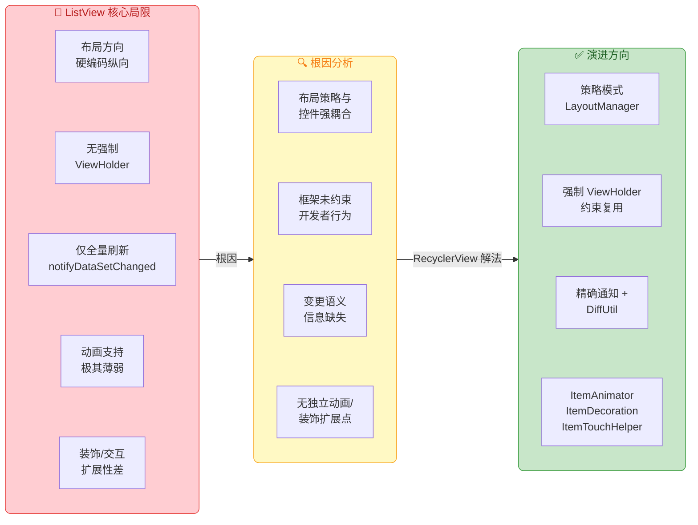

---

### ViewHolder 模式起源

`ViewHolder` 模式并非由 `RecyclerView` 首创，它的历史远早于 `RecyclerView` 的诞生。这个模式最早以 **最佳实践（Best Practice）** 的形式出现在 Android 官方文档和 Google I/O 的演讲中，用于优化 `ListView` 的滚动性能。理解它的诞生动机，有助于你深刻认识 `RecyclerView` 为什么要将其"升格"为强制性的一等公民。

#### 1. 问题的源头：重复的 `findViewById`

即使开发者已经学会复用 `convertView`（即检查 `convertView` 是否为 `null`，不为空就复用，为空才 inflate），仍然存在一个性能瓶颈：每次 `getView()` 被调用时，都需要通过 `findViewById()` 在复用的 View 树中查找各个子控件的引用，然后才能绑定数据。

```java
// ✅ 正确复用了 convertView，但仍有 findViewById 的重复开销
@Override
public View getView(int position, View convertView, ViewGroup parent) {
    // 如果没有可复用的旧 View，才 inflate 新布局
    if (convertView == null) {
        convertView = LayoutInflater.from(context).inflate(R.layout.item, parent, false);
    }
    // ⚠️ 每次 getView 都要执行 findViewById，遍历 View 树
    TextView title = convertView.findViewById(R.id.tv_title);
    ImageView avatar = convertView.findViewById(R.id.iv_avatar);
    TextView subtitle = convertView.findViewById(R.id.tv_subtitle);
    // 绑定数据到子控件
    title.setText(dataList.get(position).getTitle());
    subtitle.setText(dataList.get(position).getSubtitle());
    // 返回复用或新创建的 View
    return convertView;
}
```

这里的 `findViewById` 虽然在复用后的 View 树上执行（树的规模是单个 item 的规模，不算大），但在快速滚动场景下，`getView()` 每秒可能被调用数十次甚至上百次，每次调用都要做 3、5 甚至 10 次 `findViewById`，累积开销不容忽视。更重要的是，View 的引用在同一个 `convertView` 实例中是 **固定不变的**——item 布局的 View 树结构在 inflate 之后就不会变了，每次重新查找完全是浪费。

#### 2. 解法：用一个"持有者"对象缓存 View 引用

`ViewHolder` 模式的核心思想极其简洁：**创建一个 POJO（Plain Old Java Object），把 `findViewById` 的结果缓存在其字段中，然后通过 `View.setTag()` / `View.getTag()` 将这个对象"附着"在 `convertView` 上。** 这样，`findViewById` 只在 `convertView` 被第一次创建时执行一次，后续所有的复用都直接从 `ViewHolder` 对象中读取引用，时间复杂度降为 **O(1)**。

```java
// ViewHolder 内部类：持有对 item 布局中各子 View 的引用
static class ViewHolder {
    // 缓存标题 TextView 的引用
    TextView title;
    // 缓存头像 ImageView 的引用
    ImageView avatar;
    // 缓存副标题 TextView 的引用
    TextView subtitle;
}

@Override
public View getView(int position, View convertView, ViewGroup parent) {
    // 声明 ViewHolder 变量
    ViewHolder holder;
    if (convertView == null) {
        // 第一次创建：inflate 布局
        convertView = LayoutInflater.from(context).inflate(R.layout.item, parent, false);
        // 创建 ViewHolder 实例
        holder = new ViewHolder();
        // 执行 findViewById 并缓存到 holder 的字段中（仅此一次）
        holder.title = convertView.findViewById(R.id.tv_title);
        holder.avatar = convertView.findViewById(R.id.iv_avatar);
        holder.subtitle = convertView.findViewById(R.id.tv_subtitle);
        // 将 holder 附着到 convertView 上，建立 View -> Holder 的关联
        convertView.setTag(holder);
    } else {
        // 复用时：直接从 convertView 的 Tag 中取出 holder，无需 findViewById
        holder = (ViewHolder) convertView.getTag();
    }
    // 通过 holder 直接访问子 View 引用进行数据绑定（O(1)）
    holder.title.setText(dataList.get(position).getTitle());
    holder.subtitle.setText(dataList.get(position).getSubtitle());
    // 返回视图
    return convertView;
}
```

这段代码展示了 `ViewHolder` 模式的经典实现。其中有几个关键点值得深入理解：

**`View.setTag()` / `getTag()` 的本质**：`View` 类内部维护了一个 `Object mTag` 字段，`setTag(Object)` 和 `getTag()` 就是简单的 setter/getter。它相当于给 View 附加了一个"行李"，可以存放任意对象。在 ViewHolder 模式中，这个"行李"就是持有子 View 引用的 Holder 对象。这是一种轻量的 View-to-Data 关联机制，避免了使用 HashMap 等外部数据结构。

**`static class` 而非 inner class**：ViewHolder 声明为 `static class` 是刻意为之。非静态内部类会隐式持有外部类（通常是 Adapter 或 Activity）的引用，可能导致内存泄漏。静态内部类没有这个问题，且语义更清晰：ViewHolder 只是一个纯粹的数据容器，不需要访问 Adapter 的实例字段。

**性能收益的量化理解**：假设一个 item 布局有 8 个需要绑定数据的子 View，屏幕可见 12 个 item，用户快速滑动时每秒约触发 60 次 `getView()`。没有 ViewHolder 时，每秒需要 `60 × 8 = 480` 次 `findViewById`；有了 ViewHolder 后，`findViewById` 仅在最初的 12 + 若干buffer 次 inflate 时执行，之后全部为 O(1) 的字段读取。

#### 3. "推荐"而非"强制"——模式的天然软肋

尽管 ViewHolder 模式带来了显著的性能提升，Google 官方也在文档和 Lint 检查中反复推荐，但在 `ListView` 的 API 层面，它始终是 **可选的（Optional）**。`BaseAdapter.getView()` 方法的签名和返回值没有任何地方要求你使用 ViewHolder。编译器不会报错，运行时也不会崩溃，Lint 最多给出一个黄色警告（而很多开发者会忽略或抑制 Lint 警告）。

这就导致了一个现实问题：在大型项目中，不同模块可能由不同开发者维护，有人用 ViewHolder，有人不用；有人 ViewHolder 写得规范，有人把 Adapter 和 ViewHolder 的职责混在一起。**代码质量参差不齐，框架无法提供统一的保障。**

正是这个痛点，直接催生了 `RecyclerView` 在 API 设计上的一个核心决策：**将 ViewHolder 从"推荐模式"升级为"强制要求"**。在 `RecyclerView.Adapter` 中，你必须重写 `onCreateViewHolder()` 返回一个 `RecyclerView.ViewHolder` 实例，必须重写 `onBindViewHolder(ViewHolder, int)` 在 Holder 上绑定数据。框架从 API 层面 **消灭了"不用 ViewHolder"的可能性**，这是架构上的一次重要升级。

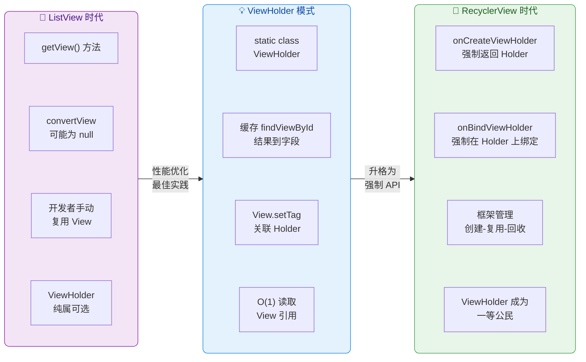

---

### RecyclerView 架构优势

`RecyclerView` 于 2014 年在 Android 5.0 Lollipop（API 21）中正式推出，同时也作为 Support Library（后来的 AndroidX）的一部分向下兼容。它的设计目标非常明确：**彻底解决 `ListView` 时代暴露出的所有架构性问题，同时为未来的扩展留足空间。** 如果说 `ListView` 是一把"瑞士军刀"（把所有功能塞进一个类里），那么 `RecyclerView` 就是一套"模块化工具箱"——每个功能都由一个专门的组件负责，通过组合来完成复杂任务。

#### 1. 核心设计哲学：关注点分离（Separation of Concerns）

`RecyclerView` 最根本的架构优势在于它将列表的职责拆分到了多个独立的组件中，每个组件只关心一件事：

| 职责 | ListView 时代 | RecyclerView 组件 |
|------|--------------|-------------------|
| 数据到 View 的映射 | `BaseAdapter.getView()` 一揽子搞定 | `RecyclerView.Adapter` + `ViewHolder` |
| 子 View 的测量与布局 | 硬编码在 `ListView.layoutChildren()` | `LayoutManager`（可替换策略） |
| item 增删改动画 | 无原生支持 | `ItemAnimator` |
| item 间装饰（分割线等） | 内置 `divider` 属性，扩展性差 | `ItemDecoration`（可叠加多个） |
| 触摸手势（拖拽/侧滑） | 自行处理 Touch 事件 | `ItemTouchHelper` |
| View 的回收与复用 | `AbsListView.RecycleBin`（内部） | `Recycler`（四级缓存，可共享 Pool） |

这种拆分带来的直接好处是：**每个组件可以独立替换、独立演进、独立测试。** 你可以在不改 Adapter 代码的情况下，把布局从线性列表切换到网格或瀑布流；可以在不改布局逻辑的情况下，替换 item 动画效果；可以叠加多个 `ItemDecoration`（比如一个画分割线，一个画分组粘性头部）而不会相互冲突。

这就是 **策略模式（Strategy Pattern）** 和 **组合优于继承（Composition over Inheritance）** 在 Android 框架中的教科书级实践。

#### 2. LayoutManager：布局策略的彻底解耦

`RecyclerView` 自身 **不负责子 View 的布局**。`RecyclerView.onLayout()` 的核心逻辑会委托给一个 `LayoutManager` 对象。这意味着，列表的排列方式完全由 `LayoutManager` 决定：

- **`LinearLayoutManager`**：线性排列，支持水平/垂直方向，支持 reverseLayout。一行代码就能把竖向列表变成横向列表。
- **`GridLayoutManager`**：网格排列，继承自 `LinearLayoutManager`，支持指定列数和 SpanSizeLookup（不等分跨列）。
- **`StaggeredGridLayoutManager`**：瀑布流布局，item 高度不必相同，自动填充空间。

```kotlin
// 纵向线性布局（最常见的列表形式）
recyclerView.layoutManager = LinearLayoutManager(context)

// 横向线性布局（如横向卡片轮播）
recyclerView.layoutManager = LinearLayoutManager(context, RecyclerView.HORIZONTAL, false)

// 3 列网格布局
recyclerView.layoutManager = GridLayoutManager(context, 3)

// 2 列瀑布流布局
recyclerView.layoutManager = StaggeredGridLayoutManager(2, StaggeredGridLayoutManager.VERTICAL)
```

更强大的是，你可以 **自定义 LayoutManager** 来实现任意布局形式——环形布局、旋转木马、封面流等。只需继承 `RecyclerView.LayoutManager` 并实现 `onLayoutChildren()` 等方法即可。这个扩展点的存在，使得 `RecyclerView` 几乎能胜任任何需要复用大量子 View 的场景，远不只是"列表"。

运行时动态切换 `LayoutManager` 也是完全合法且平滑的。框架会自动处理切换过程中的 View 回收与重新布局，开发者无需手动管理任何中间状态：

```kotlin
// 用户点击按钮：列表模式 ↔ 网格模式一键切换
btnToggle.setOnClickListener {
    // 判断当前是否为线性布局
    recyclerView.layoutManager = if (recyclerView.layoutManager is LinearLayoutManager
        && recyclerView.layoutManager !is GridLayoutManager) {
        // 切换为 2 列网格布局
        GridLayoutManager(context, 2)
    } else {
        // 切换回线性布局
        LinearLayoutManager(context)
    }
}
```

#### 3. 强制 ViewHolder 与分离的创建-绑定生命周期

前面已经讲过，`RecyclerView.Adapter` 强制你使用 `ViewHolder`。但这里还有一个更深层的设计意义：**它将 View 的"创建"与"数据绑定"明确拆分为两个独立的生命周期回调。**

```kotlin
// RecyclerView.Adapter 的两个核心回调
class MyAdapter : RecyclerView.Adapter<MyViewHolder>() {

    // 回调一：创建 ViewHolder（inflate 布局 + 初始化 View 引用）
    // 仅在需要全新 View 时调用（缓存中没有可用的 ViewHolder）
    override fun onCreateViewHolder(parent: ViewGroup, viewType: Int): MyViewHolder {
        // inflate 布局文件，创建 item 根 View
        val view = LayoutInflater.from(parent.context)
            .inflate(R.layout.item_layout, parent, false)
        // 返回 ViewHolder 实例（构造函数中完成 findViewById 缓存）
        return MyViewHolder(view)
    }

    // 回调二：绑定数据到已存在的 ViewHolder
    // 每当一个 ViewHolder 需要显示新位置的数据时调用
    override fun onBindViewHolder(holder: MyViewHolder, position: Int) {
        // 直接通过 holder 的字段访问子 View（O(1)，无需 findViewById）
        holder.titleView.text = dataList[position].title
        // 绑定图片等数据
        holder.avatarView.setImageResource(dataList[position].avatarRes)
    }

    // 返回数据集大小
    override fun getItemCount(): Int = dataList.size
}
```

这种分离意味着：`onCreateViewHolder()` 是"重"操作（inflate XML、创建对象），但调用频率低（只有缓存不命中时才调用）；`onBindViewHolder()` 是"轻"操作（设置文本、图片等属性），调用频率高但每次耗时很短。框架通过高效的缓存复用机制，确保 `onCreateViewHolder()` 的调用次数被控制在最低限度——通常只在列表初始化和少量预创建时调用。

在 `ListView` 的 `getView()` 中，创建和绑定是混在同一个方法里的，开发者需要自己用 `if (convertView == null)` 来区分两条路径。而 `RecyclerView` 从 API 设计上就把这两条路径分成了两个方法，**消除了开发者犯错的空间。**

#### 4. 四级缓存机制——复用效率的量级提升

`RecyclerView` 的核心内部类 `Recycler` 实现了一套精密的 **多级缓存体系**，从最"新鲜"到最"通用"依次为：

1. **Scrap（一级缓存）**：存放当前正在布局过程中被临时"分离（detach）"但尚未"移除（remove）"的 ViewHolder。分为 `mAttachedScrap`（数据未变化的"干净"ViewHolder）和 `mChangedScrap`（数据发生变化的 ViewHolder）。命中 Scrap 缓存时，**无需重新绑定数据**，因为 ViewHolder 的数据还是当前这个位置的。
2. **CachedViews（二级缓存）**：一个默认大小为 2 的 `ArrayList<ViewHolder>`，存放刚刚滑出屏幕的 ViewHolder。它按 position 缓存，命中时 **同样不需要重新绑定**——如果用户反向滑动，这个 ViewHolder 可以直接"归位"，体验极度丝滑。
3. **ViewCacheExtension（三级缓存）**：一个留给开发者的自定义扩展层。大多数场景下不需要使用，但在某些特殊场景（如固定位置的广告位、不变的 Header View）中，开发者可以自己实现缓存逻辑来短路默认流程。
4. **RecycledViewPool（四级缓存）**：按 `viewType` 分类存放的对象池，默认每种 type 最多缓存 5 个 ViewHolder。命中 Pool 缓存时，**需要重新绑定数据**（`onBindViewHolder` 会被调用），因为 Pool 中的 ViewHolder 已经丢失了与原始 position 的关联——它只是一个"空壳"，等待被灌入新数据。

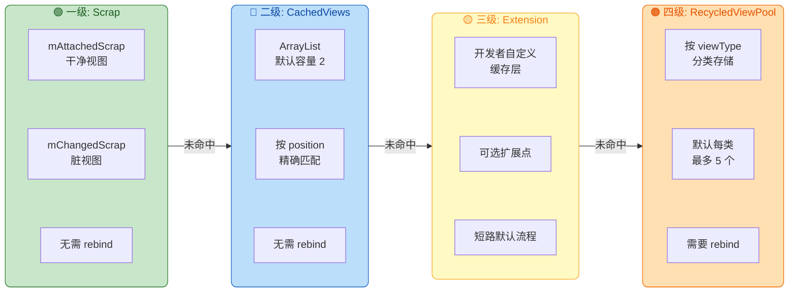

这套缓存体系的精妙之处在于：**越高层的缓存，命中时的开销越小（不需要绑定数据），但容量越有限、适用范围越窄（按 position 精确匹配）；越低层的缓存，容量越大、适用范围越广（按 viewType 匹配），但命中时需要重新绑定数据。** 这是一种典型的 **多级缓存分层策略**，与 CPU 的 L1/L2/L3 Cache 设计思想如出一辙。

特别值得一提的是 `RecycledViewPool` 可以 **跨 `RecyclerView` 实例共享**。比如在 ViewPager 的多个 Fragment 中，如果每个 Fragment 都有一个使用相同 `viewType` 的 `RecyclerView`，可以让它们共享同一个 Pool，进一步减少 `onCreateViewHolder` 的调用次数：

```kotlin
// 创建一个共享的 RecycledViewPool
val sharedPool = RecyclerView.RecycledViewPool()

// Fragment A 中的 RecyclerView
recyclerViewA.setRecycledViewPool(sharedPool)

// Fragment B 中的 RecyclerView（使用相同的 viewType 布局）
recyclerViewB.setRecycledViewPool(sharedPool)
```

#### 5. 精确的数据变更通知与 DiffUtil

`RecyclerView.Adapter` 提供了一组 **细粒度的数据变更通知方法**，彻底告别了"核弹级"全量刷新：

```kotlin
// 精确通知：第 3 个位置的数据发生了变化（只重新绑定这一个 item）
adapter.notifyItemChanged(3)

// 精确通知：从第 5 个位置开始插入了 2 条数据
adapter.notifyItemRangeInserted(5, 2)

// 精确通知：第 7 个位置的数据被移除
adapter.notifyItemRemoved(7)

// 精确通知：第 2 个位置的数据移动到了第 8 个位置
adapter.notifyItemMoved(2, 8)
```

每种通知都携带了明确的语义信息：变更的位置、变更的类型（修改/插入/删除/移动）。框架根据这些信息，**只对受影响的 item 进行重新绑定，并自动播放对应的过渡动画**。比如 `notifyItemInserted(5)` 会触发第 5 个位置的 "insert animation"（默认是淡入效果），同时将第 5 个位置之后的所有 item 自动向下平移——这一切都由 `ItemAnimator` 自动完成，开发者无需编写任何动画代码。

更进一步，当数据变更比较复杂（比如从服务端拉取了新的列表数据，与旧列表之间有多处增删改）时，手动逐个调用 `notifyItemXxx()` 非常繁琐且容易出错。`DiffUtil` 就是为解决这个问题而生的——它使用 **Myers 差分算法** 自动计算新旧列表之间的最小编辑操作序列，然后一次性派发所有精确的变更通知。后续章节会详细分析其原理。

#### 6. ItemAnimator：即插即用的动画系统

`RecyclerView` 通过 `ItemAnimator` 抽象类提供了完整的 item 动画支持。默认实现 `DefaultItemAnimator` 提供了增、删、改、移四种标准动画。由于 `RecyclerView` 精确知道每一个 item 的变更类型（得益于细粒度的 notify 方法），它能准确地告诉 `ItemAnimator`："这个 ViewHolder 是新插入的，请播放添加动画"、"这个 ViewHolder 被移除了，请播放移除动画"。

如果默认动画不满足需求，你可以替换为自定义的 `ItemAnimator`（社区有丰富的开源实现），或者直接替换为 `null` 来禁用所有动画——一行代码搞定：

```kotlin
// 使用自定义动画器
recyclerView.itemAnimator = MyCustomItemAnimator()

// 禁用所有 item 动画（某些性能敏感场景可能需要）
recyclerView.itemAnimator = null
```

#### 7. ItemDecoration：可叠加的装饰系统

`ItemDecoration` 提供了三个扩展点：`onDraw()`（在 item 内容之下绘制）、`onDrawOver()`（在 item 内容之上绘制）、`getItemOffsets()`（为 item 设置偏移量，腾出绘制空间）。开发者可以通过这三个回调实现各种装饰效果：分割线、边距、粘性分组头部、水印等。

关键是，**ItemDecoration 可以叠加多个**：

```kotlin
// 添加一个分割线装饰
recyclerView.addItemDecoration(DividerItemDecoration(context, LinearLayout.VERTICAL))
// 再添加一个粘性头部装饰（两者互不干扰）
recyclerView.addItemDecoration(StickyHeaderDecoration(adapter))
```

每次绘制时，框架会按添加顺序依次调用所有 `ItemDecoration` 的绘制方法。这种"叠加"设计使得装饰逻辑可以自由组合，无需修改列表控件本身或 Adapter 的代码。

#### 8. 全局架构对比总结

通过以下对比，可以清晰看到 `RecyclerView` 相对于 `ListView` 的架构跃迁——从"单体巨类"到"可插拔组件集"：

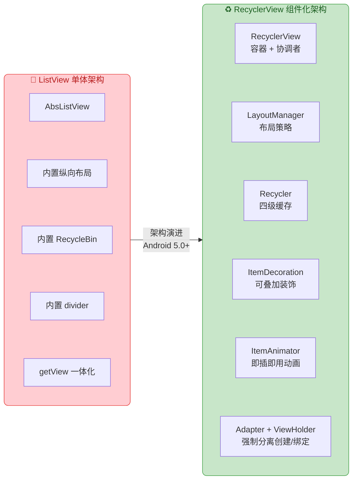

`RecyclerView` 的架构优势可以归纳为一句话：**它用"关注点分离 + 策略模式 + 多级缓存 + 精确变更通知"这四大设计支柱，将原本耦合在 `ListView` 一个类中的所有职责拆解为可独立替换的组件。** 每个组件都有明确的职责边界和扩展接口，开发者可以按需组合、替换、扩展，而框架通过强制 API 约束（如必须使用 ViewHolder）来保证基准性能。

这套设计哲学深刻影响了后来 Android 平台的其他组件（如 ViewPager2 内部就直接基于 RecyclerView 实现），也为 Jetpack Compose 中 `LazyColumn` / `LazyRow` 的设计提供了宝贵经验。

---

**📝 练习题**

某 Android 开发者在 `ListView` 的 `Adapter` 中正确实现了 `convertView` 复用，但没有使用 ViewHolder 模式。当列表快速滑动时，以下哪个操作是导致性能损耗的主要原因？

A. `LayoutInflater.inflate()` 每次都会被调用，重复解析 XML


B. `findViewById()` 在每次 `getView()` 调用时都会重复遍历 View 树查找子控件


C. `notifyDataSetChanged()` 导致了不必要的全量数据刷新


D. `View.setTag()` 的反射调用导致了性能瓶颈


**【答案】** B

**【解析】** 题目明确说"正确实现了 `convertView` 复用"，这意味着 `LayoutInflater.inflate()` 只会在 `convertView == null` 时才调用，因此 A 排除。C 描述的是数据更新机制的问题，与滚动时的 `getView()` 性能无关，排除。D 是错误陈述，`View.setTag()` 只是一个简单的字段赋值（`mTag = tag`），不涉及反射，排除。正确答案是 B：在没有 ViewHolder 模式的情况下，每次 `getView()` 被调用时（即使复用了 `convertView`），仍然需要通过 `findViewById()` 遍历 View 树来获取子控件引用。`findViewById()` 的时间复杂度为 O(N)，在快速滚动的高频调用下，累积的开销是主要的性能瓶颈。ViewHolder 模式通过将 `findViewById()` 的结果缓存到对象字段中，把后续查找降为 O(1)，从根本上解决了这个问题。

---

**📝 练习题**

关于 `RecyclerView` 的四级缓存机制，以下说法正确的是？

A. `mAttachedScrap` 中的 ViewHolder 被复用时，需要重新调用 `onBindViewHolder()` 绑定数据


B. `CachedViews` 按 `viewType` 匹配，默认容量为 5


C. `RecycledViewPool` 按 `viewType` 分类存储，命中时需要重新调用 `onBindViewHolder()` 绑定数据


D. `RecycledViewPool` 不支持跨 `RecyclerView` 实例共享


**【答案】** C

**【解析】** A 错误：`mAttachedScrap` 存放的是当前布局过程中临时 detach 的"干净"ViewHolder，其数据与当前 position 仍然一致，复用时**无需重新绑定**。B 错误：`CachedViews` 是按 **position** 精确匹配的（而非 viewType），默认容量为 **2**（而非 5）。D 错误：`RecycledViewPool` **支持跨 RecyclerView 实例共享**，这是它的一个重要特性，多个使用相同 viewType 的 RecyclerView 可以通过 `setRecycledViewPool()` 共享同一个 Pool。C 正确：`RecycledViewPool` 按 `viewType` 分类存储 ViewHolder，默认每种 type 最多缓存 5 个。由于 Pool 中的 ViewHolder 已经失去了与原始 position 的关联（它们只是"空壳"），复用时框架必须调用 `onBindViewHolder()` 重新绑定数据。

---

## RecyclerView 核心组件

RecyclerView 之所以能够取代 ListView 成为 Android 列表开发的事实标准，根本原因在于它将"列表"这一整体行为拆解为若干职责单一的核心组件，再通过组合（Composition）的方式协作完成数据绑定、布局排列、动画执行等全部工作。这种设计完全遵循了 **单一职责原则（SRP）** 与 **策略模式（Strategy Pattern）**——每个组件只关心自己那"一件事"，而 RecyclerView 本身退化成一个轻量级的协调容器。

从应用层开发者的视角来看，使用一个完整可用的 RecyclerView 至少需要提供三大核心组件：

1. **Adapter**（适配器）—— 负责"数据 → 视图"的映射与绑定。
2. **LayoutManager**（布局管理器）—— 负责子 View 在可视区域内的测量与摆放。
3. **ItemAnimator**（条目动画器）—— 负责数据变更时条目的进场、退场与移动动画。

三者之间的协作关系可以用一张架构图来呈现：

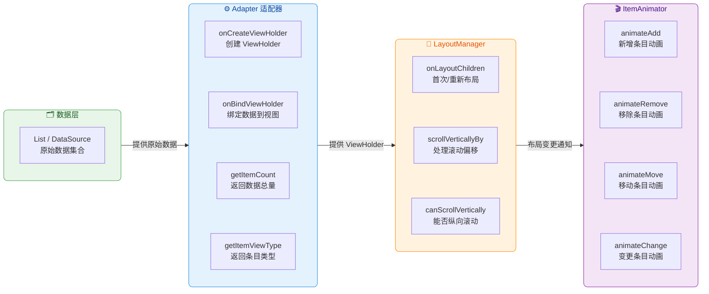

从图中可以清晰地看到：数据层向 Adapter 提供原始数据，Adapter 将数据映射为 ViewHolder 交给 LayoutManager 进行测量摆放，当数据发生增删改时，LayoutManager 将布局变更事件转交给 ItemAnimator 来执行过渡动画。RecyclerView 本身只充当"会议室"，让三方在里面有序地完成各自的工作。接下来逐一深入每个组件的设计原理与使用方式。

---

### Adapter 适配器

#### 从"适配"二字理解 Adapter 的本质

Adapter 这个词来源于经典设计模式中的 **适配器模式（Adapter Pattern）**。它的职责是在两个不兼容的接口之间做翻译——在 RecyclerView 的场景中，一侧是 **原始数据**（一个 `List<T>`、一组数据库查询结果、甚至一个分页流），另一侧是 **屏幕上的像素**（一个个 View）。Adapter 就是这两者之间的翻译官，它知道"第 N 条数据应该创建什么样的视图"以及"如何把数据的字段填充到视图的控件上"。

在 ListView 时代，`BaseAdapter` 已经承担了类似角色，但它把"创建 View"和"复用 View"的逻辑混杂在 `getView()` 一个方法里，开发者需要手动判断 `convertView` 是否为空，手动调用 `findViewById()`。这种设计导致了大量模板代码和潜在的性能陷阱。RecyclerView 的 Adapter 通过引入 **ViewHolder 强约束** 彻底解决了这个问题——它把"创建"和"绑定"拆成两个独立方法，并强制要求所有视图引用都缓存在 ViewHolder 中。

#### RecyclerView.Adapter 的核心 API

`RecyclerView.Adapter<VH extends ViewHolder>` 是一个泛型抽象类，开发者必须实现以下三个抽象方法：

| 方法签名 | 调用时机 | 职责 |
|---------|---------|------|
| `onCreateViewHolder(parent, viewType)` | 缓存池中没有可复用的 ViewHolder 时 | 创建新的 ViewHolder 实例（inflate 布局） |
| `onBindViewHolder(holder, position)` | 需要把数据绑定到 ViewHolder 时 | 将 `position` 对应的数据写入 holder 的控件 |
| `getItemCount()` | RecyclerView 需要知道数据集大小时 | 返回当前数据集合的总条目数 |

除了这三个必须实现的方法外，还有若干可选但极为重要的方法：

- **`getItemViewType(position)`**：当列表中存在多种布局样式时（如聊天页面的"我发的消息"与"对方发的消息"），通过此方法返回不同的 `viewType` 整型值，RecyclerView 会据此为不同类型分别维护独立的缓存池。
- **`onViewRecycled(holder)`**：ViewHolder 被回收进缓存池时的回调，适合在此释放图片引用、取消网络请求等资源清理操作。
- **`onBindViewHolder(holder, position, payloads)`**：带 Payload 参数的重载版本，支持 **局部刷新**——只更新条目中发生变化的部分控件，避免整个条目重新绑定。
- **`setHasStableIds(true)` + `getItemId(position)`**：告知 RecyclerView 每个条目拥有唯一稳定 ID，这能显著优化动画效果和 `notifyDataSetChanged()` 时的性能，因为 RecyclerView 可以据此追踪条目身份而非仅依赖位置。

#### 一个典型的 Adapter 实现

下面以一个展示用户列表的场景为例，演示 Adapter 的标准写法：

```kotlin
// 定义数据模型：每个用户包含名字和头像 URL
data class User(
    val id: Long,        // 唯一标识，用于 stableId 和 DiffUtil
    val name: String,    // 用户名
    val avatarUrl: String // 头像链接
)

// Adapter 泛型指定为内部定义的 UserViewHolder
class UserAdapter(
    private var users: List<User> = emptyList() // 初始数据为空列表
) : RecyclerView.Adapter<UserAdapter.UserViewHolder>() {

    // ========== ViewHolder 定义 ==========
    // ViewHolder 持有条目布局中所有需要操作的控件引用
    // 通过构造器接收 itemView，内部一次性完成 findViewById
    class UserViewHolder(itemView: View) : RecyclerView.ViewHolder(itemView) {
        // 头像 ImageView 的引用，只在创建时查找一次
        val avatarImage: ImageView = itemView.findViewById(R.id.iv_avatar)
        // 用户名 TextView 的引用
        val nameText: TextView = itemView.findViewById(R.id.tv_name)
    }

    // ========== 创建 ViewHolder ==========
    // 当 RecyclerView 的 Recycler 缓存中找不到可复用的 ViewHolder 时被调用
    // parent 是 RecyclerView 自身，viewType 由 getItemViewType() 返回
    override fun onCreateViewHolder(parent: ViewGroup, viewType: Int): UserViewHolder {
        // 使用 LayoutInflater 从 XML 布局文件创建 View 对象
        // 第三个参数 attachToParent 必须为 false，RecyclerView 会自行管理 attach
        val view = LayoutInflater.from(parent.context)
            .inflate(R.layout.item_user, parent, false)
        // 将 inflate 出来的 View 包装成 ViewHolder 返回
        return UserViewHolder(view)
    }

    // ========== 绑定数据到 ViewHolder ==========
    // holder 是从缓存复用或刚创建的 ViewHolder 实例
    // position 是当前条目在数据集中的索引
    override fun onBindViewHolder(holder: UserViewHolder, position: Int) {
        // 根据位置获取对应的 User 数据对象
        val user = users[position]
        // 将用户名设置到 TextView 上
        holder.nameText.text = user.name
        // 使用 Glide 异步加载网络头像到 ImageView
        // Glide 内部会自动处理缓存、生命周期绑定与占位图
        Glide.with(holder.itemView.context)
            .load(user.avatarUrl)    // 传入头像 URL
            .circleCrop()            // 圆形裁剪
            .into(holder.avatarImage) // 目标 ImageView
    }

    // ========== 返回数据集大小 ==========
    // RecyclerView 依据此值决定需要布局多少个条目
    override fun getItemCount(): Int = users.size

    // ========== 外部更新数据的方法 ==========
    // 接收新列表，后续章节会用 DiffUtil 替代 notifyDataSetChanged
    fun submitList(newUsers: List<User>) {
        users = newUsers                // 替换数据源引用
        notifyDataSetChanged()          // 通知 RecyclerView 全量刷新（暴力但简单）
    }
}
```

这段代码虽然简单，但已经体现了 RecyclerView Adapter 设计的几个核心思想：

1. **ViewHolder 是强制的**。你无法绕过它直接操作 View，这从架构层面杜绝了 `findViewById()` 被反复调用的问题。
2. **创建与绑定分离**。`onCreateViewHolder()` 可能只被调用十几次（屏幕可见条目数 + 少量缓冲），而 `onBindViewHolder()` 会随着滚动被反复调用。这种分离让"昂贵的 inflate 操作"尽可能少执行，而"轻量的数据填充"可以高频执行。
3. **Adapter 不关心布局方式**。它完全不知道自己的条目会以线性列表、网格还是瀑布流的方式排列——这是 LayoutManager 的事情。

#### Adapter 的数据通知机制

Adapter 内置了一套基于 **观察者模式（Observer Pattern）** 的数据变更通知体系。当你调用 `notifyXxx()` 系列方法时，Adapter 会通过内部持有的 `AdapterDataObservable`（被观察者）通知 RecyclerView 注册的 `AdapterDataObserver`（观察者）。RecyclerView 在收到通知后，会触发 `requestLayout()` 进入下一帧的布局流程。

常用的通知方法可以分为两大类：

**全量通知：**
- `notifyDataSetChanged()`：告诉 RecyclerView "整个数据集都变了，你自己看着办"。RecyclerView 会将所有现存 ViewHolder 标记为 **INVALID**，放弃任何追踪信息，无法执行动画。这是最粗暴但最安全的刷新方式。

**精确通知（强烈推荐）：**
- `notifyItemInserted(position)`：在指定位置插入了一条数据。
- `notifyItemRemoved(position)`：移除了指定位置的数据。
- `notifyItemChanged(position)`：指定位置的数据内容发生变化。
- `notifyItemMoved(fromPosition, toPosition)`：数据从某位置移动到另一位置。
- `notifyItemRangeXxx(positionStart, itemCount)`：上述操作的批量版本。

精确通知的优势在于两点：第一，RecyclerView 能够精确知道哪些位置发生了什么类型的变化，从而触发对应的 **ItemAnimator 动画**（插入动画、移除动画、移动动画）；第二，只有受影响的 ViewHolder 会被重新绑定，其余条目保持原样，性能开销最小。在实际开发中，手动计算精确变更位置容易出错且繁琐，因此 Google 提供了 **DiffUtil** 工具类来自动比较新旧列表并派发最优的精确通知序列——这部分将在后续"数据更新与差分"章节详细展开。

---

### LayoutManager 布局策略

#### 为什么要把布局逻辑从 RecyclerView 中剥离

在传统的 ListView/GridView 时代，列表的布局行为是写死在控件内部的——ListView 只能垂直滚动、GridView 只能等宽网格。如果你需要一个水平滚动列表，就得换用 `HorizontalScrollView` + 自定义逻辑；如果需要瀑布流，则完全没有官方支持，只能依赖第三方库。

RecyclerView 用 **策略模式（Strategy Pattern）** 彻底解决了这个问题。它把"如何摆放子 View"这一核心能力抽取到 `LayoutManager` 这个独立的抽象类中，RecyclerView 自身不做任何布局决策。这意味着：

- 想要垂直列表？设置 `LinearLayoutManager(context, VERTICAL, false)`。
- 想要水平列表？设置 `LinearLayoutManager(context, HORIZONTAL, false)`。
- 想要网格？设置 `GridLayoutManager(context, spanCount)`。
- 想要瀑布流？设置 `StaggeredGridLayoutManager(spanCount, orientation)`。
- 想要圆弧布局、旋转木马、环形菜单？自定义 `LayoutManager` 即可。

更换布局方式只需一行代码 `recyclerView.layoutManager = XxxLayoutManager(...)`，Adapter 和 ItemAnimator 完全不需要修改。这就是策略模式带来的巨大灵活性。

#### LayoutManager 的核心职责

LayoutManager 的工作远不止"把子 View 排成一行"那么简单，它实际上承担了以下五项关键职责：

**第一，测量与布局子 View（onLayoutChildren）**。这是 LayoutManager 最核心的方法。当 RecyclerView 需要首次填充、数据变更后需要重新布局、或者滚动到新区域需要填充新条目时，都会调用此方法。在 `onLayoutChildren()` 中，LayoutManager 需要决定：哪些位置的条目应该出现在屏幕上？每个条目应该放在什么坐标？LayoutManager 会向 RecyclerView 的 **Recycler** 请求指定位置的 ViewHolder（`Recycler.getViewForPosition(position)`），Recycler 会优先从缓存中查找，找不到才让 Adapter 创建新的。

**第二，处理滚动（scrollVerticallyBy / scrollHorizontallyBy）**。当用户手指滑动列表时，RecyclerView 将滚动偏移量转发给 LayoutManager，由其决定如何移动现有子 View、回收滚出屏幕的子 View、以及填充新滚入屏幕的子 View。返回值表示实际消耗了多少滚动距离（用于处理"已到顶/底"的过度滚动效果）。

**第三，确定滚动能力**。`canScrollVertically()` 和 `canScrollHorizontally()` 这两个方法告诉 RecyclerView 当前布局是否支持纵向或横向滚动。RecyclerView 据此决定是否接收对应方向的触摸事件以及是否显示滚动条。

**第四，支持 Focus 导航**。在 TV、车载等使用方向键导航的场景中，LayoutManager 的 `onFocusSearchFailed()` 方法会在当前焦点 View 无法在已有子 View 中找到下一个焦点时被调用，LayoutManager 需要在此时填充新的条目并返回可聚焦的 View。

**第五，提供对齐与锚点信息**。LayoutManager 内部维护了一个"锚点（Anchor Point）"概念——它记录了当前布局的参考位置和偏移量。当配置发生变化（如屏幕旋转）导致 RecyclerView 被重建时，LayoutManager 能通过 `onSaveInstanceState()` / `onRestoreInstanceState()` 保存和恢复锚点信息，让列表回到用户之前浏览的位置。

#### LayoutManager 与 Recycler 的协作流程

理解 LayoutManager 的关键在于理解它与 `Recycler` 的交互。整个布局填充过程可以用以下时序图表示：

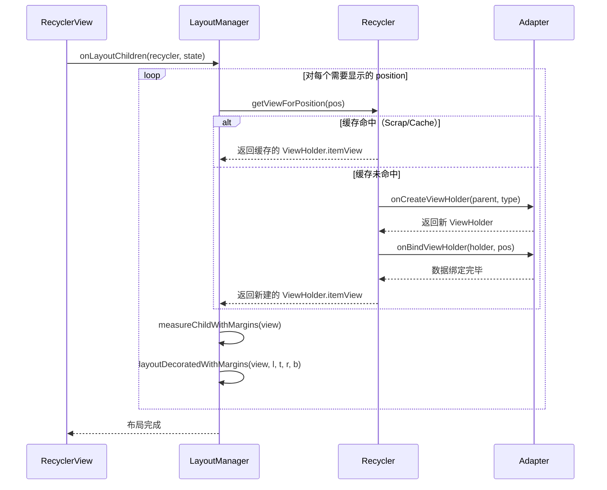

从这个时序中可以清楚地看到几个关键点：

1. **LayoutManager 从不直接创建 View**。它始终通过 `Recycler` 这个中间人获取 View，Recycler 内部维护了多级缓存机制（Scrap → CachedViews → RecycledViewPool），只有所有缓存都未命中时才会回退到 Adapter 创建新实例。
2. **测量和摆放是 LayoutManager 的事**。`measureChildWithMargins()` 和 `layoutDecoratedWithMargins()` 是 LayoutManager 提供的辅助方法，它们会自动考虑 ItemDecoration 的 insets 和 View 的 margin。
3. **布局是按需进行的**。LayoutManager 只填充当前可见区域 + 少量预取区域的条目，不会一次性为所有数据创建 View——这正是 RecyclerView "回收复用"能力的核心基础。

#### 三大内置 LayoutManager 快速对比

Google 在 RecyclerView 库中提供了三种开箱即用的 LayoutManager 实现，覆盖了绝大多数应用场景：

| 特性 | LinearLayoutManager | GridLayoutManager | StaggeredGridLayoutManager |
|------|-------------------|------------------|---------------------------|
| 排列方式 | 单行/单列线性排列 | 等宽网格（支持合并列） | 不等高瀑布流网格 |
| 继承关系 | 直接继承 LayoutManager | 继承 LinearLayoutManager | 直接继承 LayoutManager |
| 方向支持 | VERTICAL / HORIZONTAL | VERTICAL / HORIZONTAL | VERTICAL / HORIZONTAL |
| spanCount | N/A（始终为 1） | 构造参数指定列数 | 构造参数指定列数 |
| spanSizeLookup | N/A | 支持（动态指定某位置占几列） | 支持 fullSpan |
| 典型场景 | 消息列表、设置页面 | 图片九宫格、应用商店 | Pinterest 风格瀑布流 |

这三种 LayoutManager 的具体使用细节和进阶配置将在后续"布局管理器详解"章节中展开。此处只需理解：**LayoutManager 是 RecyclerView 布局行为的唯一决策者**，更换 LayoutManager 就等于更换列表的整体排列方式，而 Adapter 代码无需任何改动。

#### 实际使用示例

以下代码展示了如何为 RecyclerView 设置不同的 LayoutManager：

```kotlin
// 获取 RecyclerView 的引用
val recyclerView = findViewById<RecyclerView>(R.id.recycler_view)

// ===== 方案一：垂直线性列表 =====
// 最常见的场景，等同于传统 ListView 的效果
recyclerView.layoutManager = LinearLayoutManager(
    this,                          // Context 上下文
    LinearLayoutManager.VERTICAL,  // 方向：垂直滚动
    false                          // reverseLayout：不反转（从上到下）
)

// ===== 方案二：水平滚动列表 =====
// 常见于"推荐商品"横向滑动卡片
recyclerView.layoutManager = LinearLayoutManager(
    this,
    LinearLayoutManager.HORIZONTAL, // 方向：水平滚动
    false
)

// ===== 方案三：3 列等宽网格 =====
// 常见于图片墙、App 宫格导航
recyclerView.layoutManager = GridLayoutManager(
    this,
    3 // spanCount：3 列
)

// ===== 方案四：2 列瀑布流 =====
// 常见于 Pinterest 风格的图片流
recyclerView.layoutManager = StaggeredGridLayoutManager(
    2,                                          // spanCount：2 列
    StaggeredGridLayoutManager.VERTICAL         // 方向：垂直
)

// 无论使用哪种 LayoutManager，Adapter 的代码完全相同
recyclerView.adapter = UserAdapter(userList)
```

这段代码背后的哲学就是 **"开闭原则"（OCP）**——RecyclerView 对扩展开放（可以随意切换或自定义 LayoutManager），对修改关闭（切换布局方式不需要修改 Adapter 或 RecyclerView 的任何代码）。

---

### ItemAnimator 动画

#### ItemAnimator 的角色定位

如果说 Adapter 是"数据与视图的桥梁"，LayoutManager 是"视图的排版引擎"，那么 ItemAnimator 就是"变化的叙事者"。它的职责是：**当列表数据发生变化时，通过动画让用户感知到"发生了什么"**。

一条消息被删除了？其他消息向上滑动填补空缺。一个新任务被插入了？它从透明渐变为可见，同时下方条目依次下移。一个条目的内容更新了？它执行一个微妙的交叉淡变。这些动画并非锦上添花，而是交互设计中 **"对象恒常性（Object Permanence）"** 原则的体现——用户需要知道界面元素去了哪里、从哪里来，否则瞬间变化会造成认知断裂。

#### 四种核心动画类型

ItemAnimator 需要处理四种数据变更场景，每种场景对应一个核心方法：

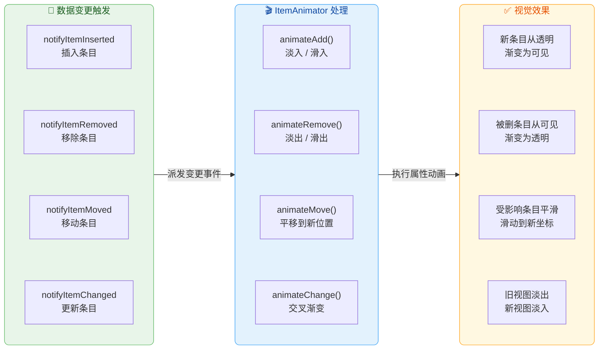

四种动画的详细说明如下：

**animateAdd（插入动画）**：当调用 `notifyItemInserted()` 后，新插入的 ViewHolder 会先被 LayoutManager 放置在目标位置，然后交给 ItemAnimator 执行"出场动画"。默认实现（`DefaultItemAnimator`）是一个简单的 alpha 从 0 到 1 的淡入效果。同时，在插入位置之后的所有已存在条目会触发 `animateMove()`，向下/向右平移腾出空间。

**animateRemove（移除动画）**：当调用 `notifyItemRemoved()` 后，被移除的 ViewHolder 并不会立即从 RecyclerView 中 detach，而是先执行"退场动画"（默认是 alpha 从 1 到 0 的淡出），动画结束后才真正移除。同时，后续条目通过 `animateMove()` 向上/向左平移填补空缺。

**animateMove（移动动画）**：当条目因为其他条目的插入、移除或显式的 `notifyItemMoved()` 而需要改变位置时触发。默认实现是从旧坐标到新坐标的平移动画（translationX / translationY）。

**animateChange（变更动画）**：当调用 `notifyItemChanged()` 后触发。这是四种动画中最特殊的一种——它涉及**两个** ViewHolder：旧的（pre-layout）和新的（post-layout）。默认实现是旧 ViewHolder 淡出 + 新 ViewHolder 淡入的"交叉渐变"（Cross-fade）。如果使用 Payload 局部刷新，则 `animateChange` 可以避免，因为 RecyclerView 会复用同一个 ViewHolder 而非创建新旧两个。

#### DefaultItemAnimator 源码设计解析

RecyclerView 默认使用的 `DefaultItemAnimator` 继承自 `SimpleItemAnimator`，后者又继承自 `ItemAnimator`。这个三层继承链的设计意图如下：

- **ItemAnimator**（抽象基类）：定义了最底层的动画接口，使用"预布局/后布局"（pre-layout / post-layout）的概念来记录动画前后的状态。它的 API 比较底层，直接使用需要处理大量细节。
- **SimpleItemAnimator**（中间层）：将 ItemAnimator 的复杂 API 简化为四个直观的方法（`animateAdd`、`animateRemove`、`animateMove`、`animateChange`），并自动处理了 pre/post-layout 的状态追踪。绝大多数自定义 ItemAnimator 应该继承此类。
- **DefaultItemAnimator**（默认实现）：实现了 SimpleItemAnimator 的四个方法，使用 `ViewPropertyAnimator` 执行标准的淡入淡出和平移动画，动画时长默认为 **120ms**（remove）和 **120ms**（add、move、change），这些时长可以通过 setter 方法调整。

`DefaultItemAnimator` 内部使用了"挂起-批量执行"的策略：它不会在 `animateXxx()` 被调用时立即启动动画，而是将待执行的动画信息收集到 `mPendingAdditions`、`mPendingRemovals` 等列表中，然后在 `runPendingAnimations()` 方法（由 RecyclerView 在合适时机调用）中统一启动。这种批处理设计确保了：移除动画先执行 → 移动动画随后执行 → 插入动画最后执行，形成自然流畅的视觉顺序。

#### 自定义 ItemAnimator 示例

虽然 `DefaultItemAnimator` 的淡入淡出效果在大多数场景下够用，但产品设计往往需要更丰富的动画表现。以下示例展示如何实现一个"从底部滑入"的插入动画：

```kotlin
// 自定义 ItemAnimator：新插入的条目从底部滑入
// 继承 DefaultItemAnimator 以复用 remove/move/change 的默认实现
class SlideInBottomAnimator : DefaultItemAnimator() {

    // ===== 插入动画预处理 =====
    // 在动画开始前，将新条目移到屏幕下方并设为透明
    // 这样后续动画才能从"不可见且偏移"的状态回到"可见且归位"
    override fun animateAdd(holder: RecyclerView.ViewHolder): Boolean {
        // 将条目向下偏移自身高度（起始位置在正常位置下方）
        holder.itemView.translationY = holder.itemView.height.toFloat()
        // 设置初始透明度为 0（完全不可见）
        holder.itemView.alpha = 0f
        // 将此 holder 加入待执行动画队列
        // 返回 true 表示有动画需要执行
        return super.animateAdd(holder)
    }

    // ===== 实际执行插入动画 =====
    // DefaultItemAnimator 在 runPendingAnimations() 中
    // 会对每个 pending add 调用此处的 animateAddImpl
    // 但 DefaultItemAnimator 没有暴露此方法
    // 因此我们重写 animateAdd 并在 runPendingAnimations 中处理

    // 更推荐的方式：直接重写 runPendingAnimations 中 add 部分
    // 此处为简化示例，使用 ViewPropertyAnimator 的 withEndAction 机制
}
```

在实际项目中，更常见的做法是使用成熟的第三方动画库（如 `recyclerview-animators`），它们提供了数十种预设的插入/移除/移动动画效果，开箱即用：

```kotlin
// 使用第三方库 recyclerview-animators 的示例
// 一行代码即可设置自定义动画
recyclerView.itemAnimator = SlideInUpAnimator().apply {
    // 设置插入动画时长为 300 毫秒
    addDuration = 300
    // 设置移除动画时长为 200 毫秒
    removeDuration = 200
}
```

#### 关闭动画的场景

并非所有场景都需要条目动画。在以下情况中，你可能需要关闭或简化动画：

1. **大批量数据更新**：如调用 `notifyDataSetChanged()` 后，如果同时触发几十个条目的动画，会导致明显的卡顿。此时 RecyclerView 的策略是直接跳过动画（`notifyDataSetChanged` 本身就不触发 ItemAnimator）。
2. **快速滚动场景**：用户高速 fling 滚动时，条目的"飞入飞出"动画可能造成视觉干扰。
3. **性能敏感的低端设备**：动画本质是多帧连续绘制，在 GPU 性能较弱的设备上可能导致丢帧。

关闭动画非常简单：

```kotlin
// 方法一：将 itemAnimator 设为 null，彻底禁用所有条目动画
recyclerView.itemAnimator = null

// 方法二：保留 animator 但将所有动画时长设为 0
// 这样仍然会走动画流程（包括 pre/post-layout），但视觉上无动画
(recyclerView.itemAnimator as? SimpleItemAnimator)?.apply {
    addDuration = 0       // 插入动画时长归零
    removeDuration = 0    // 移除动画时长归零
    moveDuration = 0      // 移动动画时长归零
    changeDuration = 0    // 变更动画时长归零
}
```

方法一和方法二有一个重要区别：设为 `null` 后，`notifyItemChanged()` 触发的变更将**不再经历 pre-layout 阶段**，RecyclerView 会少走一次完整的布局流程，性能更优。而将时长设为 0 仍然会走完整的动画生命周期，只是视觉上看不到动画效果。

#### 三大核心组件的协作全景

最后，将 Adapter、LayoutManager、ItemAnimator 三者的协作关系做一个全景梳理。当用户执行一次"删除第 3 条数据"的操作时，整个链路如下：

1. **业务层**从数据源移除第 3 条，调用 `adapter.notifyItemRemoved(2)`。
2. **Adapter** 内部的 `AdapterDataObservable` 通知 RecyclerView 的 `AdapterDataObserver`："position 2 被移除了"。
3. **RecyclerView** 调用 `requestLayout()`，触发下一帧的布局流程。
4. 在布局流程中，RecyclerView 先进入 **pre-layout 阶段**：让 LayoutManager 按照旧数据做一次"预布局"，记录所有当前可见条目的位置快照。
5. 然后进入 **post-layout 阶段**：让 LayoutManager 按照新数据做真正的布局——此时 position 2 不再存在，position 3 及之后的条目各前移一位。
6. RecyclerView 对比 pre-layout 和 post-layout 的差异，计算出：position 2 的 ViewHolder 需要 **animateRemove**，position 3、4、... 的 ViewHolder 需要 **animateMove**（从旧坐标移到新坐标）。如果有条目从屏幕外滚入可视区，还会触发 **animateAdd**。
7. 这些动画指令被交给 **ItemAnimator** 执行。`DefaultItemAnimator` 收集所有指令，在 `runPendingAnimations()` 中按"先 remove → 再 move → 后 add"的顺序批量启动动画。
8. 动画结束后，ItemAnimator 回调 `dispatchAnimationFinished()`，RecyclerView 将被移除的 ViewHolder 放入 **RecycledViewPool** 等待未来复用。

这个精密的协作流程，正是 RecyclerView "组件化、职责分离"架构设计的最佳体现。每个组件只做自己擅长的事，通过清晰的接口契约协作，最终为用户呈现出流畅自然的列表交互体验。

---

**📝 练习题**

在 RecyclerView 中，当调用 `adapter.notifyItemChanged(5)` 且 RecyclerView 的 `itemAnimator` 不为 null 时，以下哪种描述是正确的？


A. RecyclerView 会销毁 position 5 的旧 ViewHolder 并创建一个全新的 ViewHolder，然后对新 ViewHolder 执行 animateAdd 动画。


B. RecyclerView 会在 pre-layout 和 post-layout 中分别使用旧 ViewHolder 和新 ViewHolder，ItemAnimator 的 animateChange 会同时操作这两个 ViewHolder 来完成交叉渐变效果。


C. RecyclerView 直接复用同一个 ViewHolder，仅重新调用 onBindViewHolder，不涉及任何 ItemAnimator 动画。


D. RecyclerView 会对 position 5 执行 animateRemove，接着对同一位置执行 animateAdd，以"先移除后插入"的方式模拟变更效果。


**【答案】** B

**【解析】** 当 `notifyItemChanged()` 被调用且 ItemAnimator 存在时，RecyclerView 会进入 pre-layout / post-layout 双阶段布局流程。在 pre-layout 阶段，旧的 ViewHolder 被记录在当前位置；在 post-layout 阶段，RecyclerView 会为该位置获取一个新的 ViewHolder（如果没有 Payload，通常会从缓存中取或新建一个）并重新绑定数据。随后 `DefaultItemAnimator.animateChange()` 会同时持有旧/新两个 ViewHolder 的引用，对旧 ViewHolder 执行 alpha 淡出、对新 ViewHolder 执行 alpha 淡入，完成交叉渐变。选项 A 错误在于 animateAdd 不是 change 场景的动画类型；选项 C 描述的是带 Payload 局部刷新的情况——当 `notifyItemChanged(pos, payload)` 携带 Payload 时，RecyclerView 确实会复用同一个 ViewHolder，此时 animateChange 可以被跳过，但题目中的调用不带 Payload；选项 D 描述的"先 remove 后 add"并非 ItemAnimator 对 change 事件的处理方式，change 有独立的 `animateChange` 方法。

---

**📝 练习题**

以下关于 RecyclerView LayoutManager 的说法，哪一项是 **错误** 的？


A. LayoutManager 通过 `Recycler.getViewForPosition()` 获取子 View，Recycler 会依次查找 Scrap → CachedViews → RecycledViewPool → Adapter.onCreateViewHolder 来提供 View。


B. `GridLayoutManager` 继承自 `LinearLayoutManager`，因此它天然支持 LinearLayoutManager 的所有特性，并在此基础上增加了多列网格能力。


C. 将 `recyclerView.layoutManager` 从 `LinearLayoutManager` 切换为 `GridLayoutManager` 时，必须同时修改 Adapter 的 `onCreateViewHolder` 方法来适配网格布局。


D. LayoutManager 的 `onLayoutChildren()` 方法负责测量和摆放子 View，它决定了哪些 position 的条目应该出现在当前可见区域。


**【答案】** C

**【解析】** RecyclerView 架构设计的核心优势之一就是 Adapter 与 LayoutManager 的解耦。Adapter 只负责"数据 → ViewHolder"的映射，完全不关心这些 ViewHolder 最终会被怎样排列——是线性、网格还是瀑布流。因此切换 LayoutManager 时无需修改 Adapter 的任何代码，选项 C 的说法是错误的。选项 A 正确描述了 Recycler 的多级缓存查找顺序；选项 B 正确，`GridLayoutManager` 确实继承自 `LinearLayoutManager`，复用了其滚动、锚点等逻辑；选项 D 正确描述了 `onLayoutChildren()` 的核心职责。

---

## 缓存复用机制

RecyclerView 之所以能在长列表场景下保持流畅的滚动体验，其核心秘密就藏在 **缓存复用机制（Caching & Recycling Mechanism）** 之中。如果说 `Adapter` 是数据与视图之间的桥梁，`LayoutManager` 是布局的调度者，那么 **`Recycler`** 就是 RecyclerView 内部那台精密运转的 **"视图回收再利用工厂"**。理解这套多级缓存体系，不仅是面试高频考点，更是日常做列表性能优化时必须掌握的底层知识。

本节将从 `Recycler` 内部类的整体结构出发，逐层剖析 Scrap 缓存、CachedViews 缓存、ViewCacheExtension 扩展缓存、以及 RecycledViewPool 共享池的运作原理，同时厘清 **"干净视图（Clean View）"** 与 **"脏视图（Dirty View）"** 的本质区别，帮助你建立起对 RecyclerView 缓存体系的全景认知。

### Recycler 内部类

`Recycler` 是定义在 `RecyclerView` 内部的一个 **非静态内部类（inner class）**，它并不继承任何 Android 系统组件，而是 RecyclerView 自己设计的一套 **视图管理器**。其核心职责可以概括为一句话：**当 LayoutManager 需要一个 ItemView 时，Recycler 负责以最低成本提供它；当 ItemView 不再可见时，Recycler 负责回收它以备后用。**

之所以设计成内部类而非独立组件，是因为 `Recycler` 需要直接访问 `RecyclerView` 的 `Adapter`、`LayoutManager`、`State` 等内部成员，如果抽离成独立类，就需要暴露大量内部 API，既不安全也不优雅。作为内部类，它天然持有外部 RecyclerView 实例的引用，可以自由地与各组件协作。

从数据结构的角度看，`Recycler` 内部维护了 **四级缓存容器**，它们按照查找优先级从高到低排列如下：

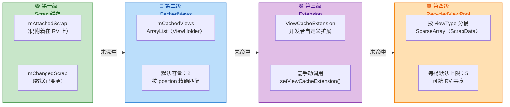

当 `LayoutManager` 在布局过程中调用 `Recycler.getViewForPosition(int position)` 来获取某个位置的 ItemView 时，Recycler 会按照 **第一级 → 第二级 → 第三级 → 第四级** 的顺序依次查找。如果所有缓存都未命中（cache miss），才会走到最终的 **`Adapter.createViewHolder()`** 创建全新的 ViewHolder。这套分级策略的设计哲学非常清晰：**越靠前的缓存命中成本越低（甚至可以免去 `bindViewHolder` 的调用），越靠后的缓存通用性越强（可以跨 position 甚至跨 RecyclerView 共享）。**

下面是 Recycler 内部关键成员变量的简化映射，帮助你在阅读源码时快速对应：

```java
// RecyclerView.Recycler 核心成员（简化版）
public final class Recycler {
    // 第一级：Scrap 缓存 —— 用于 layout 过程中临时 detach 的 ViewHolder
    final ArrayList<ViewHolder> mAttachedScrap = new ArrayList<>();  // 数据未变
    ArrayList<ViewHolder> mChangedScrap = null;                      // 数据已变（仅动画场景懒初始化）

    // 第二级：CachedViews —— 刚滚出屏幕的 ViewHolder，按 position 缓存
    final ArrayList<ViewHolder> mCachedViews = new ArrayList<>();    // 默认最大容量 2
    int mViewCacheMax = DEFAULT_CACHE_SIZE;                          // DEFAULT_CACHE_SIZE = 2

    // 第三级：开发者自定义扩展（极少使用）
    private ViewCacheExtension mViewCacheExtension;

    // 第四级：共享回收池 —— 按 viewType 分桶存储
    RecycledViewPool mRecyclerPool;                                  // 可多个 RV 共享同一实例
}
```

理解了 Recycler 的整体骨架之后，我们就可以逐层深入每一级缓存的工作原理了。

### Scrap 废弃缓存

**Scrap（废弃缓存）** 是 Recycler 的第一级缓存，也是整个缓存体系中 **最轻量、最高效** 的一层。它的名字容易引起误解——"废弃"并不意味着这些 ViewHolder 要被丢弃，恰恰相反，Scrap 中的 ViewHolder 是 **"暂时从 RecyclerView 上拆下来、但马上就要装回去"** 的视图。

#### Scrap 的触发时机

要理解 Scrap 缓存的存在意义，首先需要理解 RecyclerView 的 **布局流程（Layout Pass）**。每当 RecyclerView 需要重新布局（例如调用了 `notifyItemChanged()`、`notifyItemInserted()`，或者首次 `onLayout()` 时），它的布局过程大致分为三步：

1. **Pre-layout（预布局）**：记录动画前的 ItemView 状态。
2. **Layout（正式布局）**：这是核心步骤。LayoutManager 会先把当前所有已经 attached 的子 View **全部 detach（临时脱离）**，然后重新逐个 `fill`，按照新的数据状态把需要显示的 ItemView 重新 attach 或 add 回来。
3. **Post-layout（后布局）**：记录动画后的 ItemView 状态，触发 ItemAnimator 执行过渡动画。

关键就在第 2 步。当 LayoutManager 执行 `detachAndScrapAttachedViews()` 时，那些被 detach 下来的 ViewHolder 不会被直接扔进 RecycledViewPool，而是先放入 **Scrap 缓存**——因为它们大概率在这轮布局中马上就要被重新使用。这就好比你整理书架时，先把书全部取下来放在桌面上（Scrap），然后再按新顺序插回去，而不是把书搬到仓库再搬回来。

#### mAttachedScrap 与 mChangedScrap

Scrap 缓存内部又细分为两个列表，它们的区分标准是 ViewHolder 的 **数据是否发生了变更**：

**`mAttachedScrap`**（附着废弃列表）存放的是 **数据未发生变化** 的 ViewHolder。在重新布局时，如果某个 position 的数据没有被 `notifyItemChanged()` 标记为 "changed"，那么对应的 ViewHolder 就会进入这个列表。当 LayoutManager 再次请求该 position 的视图时，Recycler 直接从 `mAttachedScrap` 里按 position（或 stable id）精确匹配取出，**无需调用 `bindViewHolder()`**——因为数据没变，ViewHolder 中展示的内容完全是正确的，拿来直接用就行。这就是 Scrap 缓存高效的根本原因：**零绑定成本（zero-bindView cost）**。

**`mChangedScrap`**（变更废弃列表）存放的是被标记为 **数据已变更（FLAG_UPDATE / FLAG_CHANGED）** 的 ViewHolder。典型场景是调用了 `notifyItemChanged(int position)` 之后，该 position 对应的 ViewHolder 就会带上 changed 标记。在 pre-layout 阶段，这些旧的 ViewHolder 仍然需要被保留用于计算 **离场动画（disappear animation）**，所以它们被放入 `mChangedScrap` 而不是直接回收。在正式 layout 阶段，LayoutManager 请求该 position 时，不会从 `mChangedScrap` 中取（因为数据已过期），而是走更下层的缓存或 `createViewHolder` 拿到一个新的/复用的 ViewHolder 并 `bindViewHolder` 绑定新数据。`mChangedScrap` 中的旧 ViewHolder 在动画结束后才会被真正回收到 RecycledViewPool。

这里有一个值得注意的实现细节：`mChangedScrap` 在源码中初始值为 `null`，采用 **懒初始化（lazy initialization）** 策略。只有当确实存在 changed 的 ViewHolder 时才会创建 ArrayList 实例。这是因为大多数布局场景（如纯滚动）不涉及数据变更，避免了不必要的对象分配。

#### Scrap 的生命周期

Scrap 缓存有一个非常显著的特征：**它是临时性的，只存在于一次 layout pass 期间**。当一次完整的布局流程（pre-layout → layout → post-layout）结束后，Scrap 列表一定会被清空。具体来说：

- 被成功重新 attach 的 ViewHolder 会从 Scrap 中移除（因为它们已经回到了 RecyclerView 的子 View 列表中）。
- 未被重新使用的 ViewHolder（比如因数据删除导致某个 position 不再需要展示）会被 **"晋升"** 到更低级别的缓存——通常是 CachedViews 或 RecycledViewPool。

所以你永远不会在两次 `requestLayout()` 之间看到 Scrap 中残留的 ViewHolder，这与后续级别的缓存有本质不同。

```java
// LayoutManager 在布局时的典型调用链（简化）
void onLayoutChildren(Recycler recycler, State state) {
    // 1. 把当前所有 child detach 并放入 Scrap
    detachAndScrapAttachedViews(recycler);  // → 内部调用 recycler.scrapView(view)

    // 2. 重新逐个 fill
    while (hasMoreItems) {
        // 从 Recycler 获取 view（优先查 Scrap）
        View view = recycler.getViewForPosition(pos);  // Scrap → Cache → Pool → create
        addView(view);   // 重新 attach 到 RecyclerView
        layoutDecorated(view, left, top, right, bottom); // 测量并布局
    }

    // 3. layout 结束后 Scrap 中剩余的 ViewHolder 会被 recycler 清理
    //    转移到 CachedViews 或 RecycledViewPool
}
```

#### 为什么需要 Scrap 而不直接用 RecycledViewPool

这是一个非常好的设计思考题。答案在于 **性能粒度** 的差异：

- **Scrap** 中的 ViewHolder 保留了完整的绑定数据和 position 信息，复用时直接跳过 `onBindViewHolder()`，成本约等于零。
- **RecycledViewPool** 中的 ViewHolder 已经被 `resetInternal()` 清除了 position、flags 等信息，复用时必须重新 `onBindViewHolder()`。

在一次 layout pass 中，屏幕上可能有 10 个 ItemView 需要重新布局，但其中 8 个的数据根本没变。如果没有 Scrap 缓存，这 8 个 ViewHolder 就要被放入 RecycledViewPool 再取出、再 bind，白白浪费了 8 次 `onBindViewHolder()` 调用。有了 Scrap，这 8 个可以 **原封不动地放回原位**，只有那 2 个真正数据变更的才需要重新绑定——这就是 Scrap 存在的核心价值。

### Dirty 脏视图

在 RecyclerView 的源码和官方文档中，你会经常看到 **"dirty"** 这个词。它不是一个独立的缓存级别，而是一个 **状态标记（state flag）**，用于描述某个 ViewHolder 当前展示的数据是否 **过期（stale）、需要重新绑定**。

#### Clean View vs Dirty View

**Clean View（干净视图）** 指的是 ViewHolder 内部绑定的数据与当前 Adapter 中对应 position 的数据 **完全一致**，不需要重新调用 `onBindViewHolder()`。从 `mAttachedScrap` 或 `mCachedViews` 中命中的 ViewHolder 通常就是 Clean 的（前者是数据未变，后者是按 position 精确匹配的刚滚出屏幕的项）。

**Dirty View（脏视图）** 指的是 ViewHolder 内部绑定的数据 **已经过期或根本不属于当前 position**，必须重新调用 `onBindViewHolder()` 进行数据刷新。从 `RecycledViewPool` 中取出的 ViewHolder 一定是 Dirty 的，因为 Pool 中的 ViewHolder 只按 `viewType` 分桶，不保留 position 信息，取出后需要绑定到新的 position 上。

用生活类比：Clean View 就像你在自助餐台上看到一个贴着"番茄意面"标签的盘子里确实装着番茄意面——可以直接端走；Dirty View 就像你拿到了一个空盘子（或者盘子里装的是昨天的剩菜）——你得重新装盘。

#### Flag 机制

ViewHolder 内部通过一个 `int mFlags` 位字段来记录各种状态。与 "dirty" 相关的几个关键 flag 包括：

- **`FLAG_BOUND`（已绑定）**：表示该 ViewHolder 已经通过 `onBindViewHolder()` 绑定了数据。
- **`FLAG_UPDATE`（需更新）**：表示数据可能已经过期，需要重新绑定。调用 `notifyItemChanged()` 时会为对应 ViewHolder 设置此 flag。
- **`FLAG_INVALID`（已失效）**：表示该 ViewHolder 完全失效，通常在 `notifyDataSetChanged()` 全量刷新时对所有 ViewHolder 设置。失效的 ViewHolder 连 position 信息都不可信。
- **`FLAG_REMOVED`（已移除）**：对应的 item 已从数据集中删除，ViewHolder 仅为了播放消失动画而保留。

当 Recycler 在 `tryGetViewHolderForPositionByDeadline()` 方法中找到一个候选 ViewHolder 时，会检查它的 flags。如果 ViewHolder 携带了 `FLAG_UPDATE` 或 `FLAG_INVALID`，或者它的 `position` 与请求的 position 不匹配，Recycler 就会判定它为 Dirty View，并在返回给 LayoutManager 之前调用 `Adapter.bindViewHolder(holder, position)` 进行重新绑定。

```java
// Recycler.tryGetViewHolderForPositionByDeadline() 核心逻辑（简化）
ViewHolder tryGetViewHolderForPositionByDeadline(int position, ...) {
    ViewHolder holder = null;

    // === 第一级：Scrap 缓存 ===
    // 1a. 如果有 changed scrap 且处于 pre-layout，尝试从 mChangedScrap 取
    if (mState.isPreLayout()) {
        holder = getChangedScrapViewForPosition(position); // 按 position / stableId 匹配
    }

    // 1b. 从 mAttachedScrap 按 position 精确匹配
    if (holder == null) {
        holder = getScrapOrHiddenOrCachedHolderForPosition(position, false);
        // 匹配到的 holder 是 Clean 的（数据未变，position 一致）→ 直接返回
    }

    // 1c. 如果 Adapter 启用了 stableIds，按 id 从 Scrap 匹配
    if (holder == null && mAdapter.hasStableIds()) {
        holder = getScrapOrCachedViewForId(mAdapter.getItemId(position), type, false);
        // 命中后需验证 viewType，若一致则标记需要重新绑定（position 可能变了）
    }

    // === 第三级：ViewCacheExtension（开发者自定义，极少使用）===
    if (holder == null && mViewCacheExtension != null) {
        View view = mViewCacheExtension.getViewForPositionAndType(recycler, position, type);
        if (view != null) {
            holder = getChildViewHolder(view); // 将 View 转换为 ViewHolder
        }
    }

    // === 第四级：RecycledViewPool ===
    if (holder == null) {
        holder = getRecycledViewPool().getRecycledView(type); // 按 viewType 取
        if (holder != null) {
            holder.resetInternal();  // 清除旧的 position、flags → 变成 Dirty
        }
    }

    // === 兜底：创建全新 ViewHolder ===
    if (holder == null) {
        holder = mAdapter.createViewHolder(RecyclerView.this, type); // onCreateViewHolder
    }

    // === 最终判定是否需要 bind ===
    if (needsRebind) {  // 即 holder 是 Dirty 的
        mAdapter.bindViewHolder(holder, position); // onBindViewHolder
    }

    return holder;
}
```

#### 理解 Dirty 对性能的影响

理解 Dirty 的概念对性能优化有直接指导意义：

- **尽量让 ViewHolder 保持 Clean**：这意味着优先从高层级缓存（Scrap、CachedViews）中命中，避免不必要地掉到 RecycledViewPool。实际操作中，合理使用 `notifyItemChanged(position)` 而非 `notifyDataSetChanged()` 就是在减少 Dirty ViewHolder 的数量——前者只让特定 position 变 dirty，后者让所有 ViewHolder 全部 `FLAG_INVALID`，全部变 dirty。

- **`onBindViewHolder()` 要尽量轻量**：既然 Dirty View 必须经过 bind，那 bind 方法本身的执行时间就至关重要。避免在 `onBindViewHolder()` 中做复杂计算、大图解码或频繁创建对象——这些都会直接影响列表滚动的流畅度（因为 bind 发生在主线程）。

- **Payload 局部刷新**：调用 `notifyItemChanged(position, payload)` 时附带 payload 对象，可以在 `onBindViewHolder(holder, position, payloads)` 中只更新视图的局部内容（如只更新一个 TextView 的文字），而不是重新设置整个 ItemView 的所有属性。这是 **"在 Dirty 状态下也尽量减少绑定工作量"** 的技巧。

### RecycledViewPool 共享池

**RecycledViewPool** 是 Recycler 四级缓存中的 **最后一道防线（last resort before creation）**，也是唯一一个可以 **跨 RecyclerView 实例共享** 的缓存级别。它的设计理念是：即使 ViewHolder 的 position 信息已经完全过期，只要 `viewType` 相同，View 的布局结构就是相同的，重新绑定数据即可复用——这比从零创建一个新 ViewHolder（inflate XML + 构造子 View 树）要高效得多。

#### 内部数据结构

RecycledViewPool 的内部结构可以用一句话概括：**以 `viewType` 为 key，以 `ScrapData` 为 value 的 `SparseArray`**。每个 `ScrapData` 内部又持有一个 `ArrayList<ViewHolder>`，作为该 viewType 的回收桶。

```java
// RecycledViewPool 内部结构（简化）
public static class RecycledViewPool {
    // 每种 viewType 对应一个 ScrapData
    SparseArray<ScrapData> mScrap = new SparseArray<>();

    // ScrapData 是一个简单的包装类
    static class ScrapData {
        final ArrayList<ViewHolder> mScrapHeap = new ArrayList<>(); // 回收桶
        int mMaxScrap = DEFAULT_MAX_SCRAP;                          // 每桶默认上限 5
    }

    // 从池中取出一个指定 viewType 的 ViewHolder
    public ViewHolder getRecycledView(int viewType) {
        ScrapData scrapData = mScrap.get(viewType);          // 按 viewType 查桶
        if (scrapData != null && !scrapData.mScrapHeap.isEmpty()) {
            ArrayList<ViewHolder> scrapHeap = scrapData.mScrapHeap;
            // 取最后一个（ArrayList 尾部操作 O(1)）
            return scrapHeap.remove(scrapHeap.size() - 1);
        }
        return null;  // 桶为空，返回 null → 将触发 createViewHolder
    }

    // 将废弃的 ViewHolder 放入池中
    public void putRecycledView(ViewHolder scrap) {
        int viewType = scrap.getItemViewType();               // 获取 viewType
        ArrayList<ViewHolder> scrapHeap = getScrapDataForType(viewType).mScrapHeap;
        if (scrapHeap.size() >= mMaxScrap) {                  // 已满则丢弃，不再缓存
            return;
        }
        scrap.resetInternal();                                // 清除 position、flags 等信息
        scrapHeap.add(scrap);                                 // 加入回收桶
    }

    // 允许开发者自定义某个 viewType 的最大缓存数量
    public void setMaxRecycledViews(int viewType, int max) {
        ScrapData scrapData = getScrapDataForType(viewType);
        scrapData.mMaxScrap = max;                            // 修改上限
        ArrayList<ViewHolder> scrapHeap = scrapData.mScrapHeap;
        while (scrapHeap.size() > max) {                      // 如果当前数量超出新上限
            scrapHeap.remove(scrapHeap.size() - 1);           // 从尾部逐个移除
        }
    }
}
```

这里有几个值得关注的设计细节：

**默认每桶上限 5**：`DEFAULT_MAX_SCRAP = 5` 是一个经验值。对于大多数列表场景，屏幕上同时可见的同一 viewType 的 Item 数量不会太多，5 个的缓冲已经足够应对正常滚动时的复用需求。但在某些特殊场景下（如水平滑动的 ViewPager2 嵌套多个 RecyclerView、或一次性大量数据更新），这个默认值可能不够，开发者可以通过 `setMaxRecycledViews()` 手动调大。

**`resetInternal()` 的调用**：ViewHolder 在被放入 Pool 之前，会调用 `resetInternal()` 清除 `mPosition`、`mFlags`、`mPreLayoutPosition` 等字段。这意味着从 Pool 中取出的 ViewHolder 已经 **完全丧失了身份信息**，它只知道自己是什么 `viewType`，不知道自己应该展示哪个 position 的数据——所以一定需要 `onBindViewHolder()` 重新绑定。这也正是 Pool 中的 ViewHolder 一定是 **Dirty** 的原因。

**LIFO（后进先出）策略**：`getRecycledView()` 从 ArrayList 尾部取元素。这隐含了一个局部性假设：最近被回收的 ViewHolder，其 View 树可能还驻留在 CPU 缓存中（cache locality），复用它的成本更低。

#### 跨 RecyclerView 共享

RecycledViewPool 最强大的特性之一是 **跨 RecyclerView 实例共享**。考虑以下常见场景：

- **ViewPager2 + 多个 Fragment，每个 Fragment 各持有一个 RecyclerView**：如果这些 RecyclerView 展示的 Item 布局相同（viewType 相同），它们可以共用一个 RecycledViewPool。当用户从 Fragment A 滑动到 Fragment B 时，Fragment A 中被回收的 ViewHolder 可以直接被 Fragment B 复用，免去了 `createViewHolder()` 的开销。

- **嵌套 RecyclerView（外层垂直列表，内层水平列表）**：多个内层 RecyclerView 可以共享同一个 Pool，避免每个内层列表都要独立创建一批 ViewHolder。

共享的设置方法非常简单：

```kotlin
// 创建一个共享的 RecycledViewPool 实例
val sharedPool = RecyclerView.RecycledViewPool()

// 对于有大量同类 Item 的场景，可以增大桶的容量
sharedPool.setMaxRecycledViews(VIEW_TYPE_NORMAL, 20)  // viewType 0 的桶扩容到 20

// 让多个 RecyclerView 共用这个 Pool
recyclerView1.setRecycledViewPool(sharedPool)  // Fragment A 的列表
recyclerView2.setRecycledViewPool(sharedPool)  // Fragment B 的列表
recyclerView3.setRecycledViewPool(sharedPool)  // Fragment C 的列表
```

共享 Pool 时需要注意一个前提：**共享的 RecyclerView 必须使用相同的 `viewType` 值来表示相同的布局结构**。如果 RecyclerView A 的 `viewType = 1` 表示图片卡片，但 RecyclerView B 的 `viewType = 1` 表示文字条目，共享 Pool 就会导致 **类型错乱** 和 crash。实践中建议使用一个统一的常量或枚举来定义 viewType。

#### CachedViews 与 Pool 的联动

第二级缓存 `mCachedViews` 与 RecycledViewPool 之间存在一种 **"溢出下沉"** 的关系。`mCachedViews` 默认容量为 2（如果开启了 Prefetch 机制，GapWorker 会临时将容量 +1），当新的 ViewHolder 需要进入 CachedViews 但已满时，CachedViews 中 **最老的（earliest/oldest）** ViewHolder 会被 **挤出（evict）** 并转移到 RecycledViewPool 中。这个过程中，被挤出的 ViewHolder 会经历 `resetInternal()` 从 Clean 变为 Dirty。

这个联动机制可以用下面的流程概括：

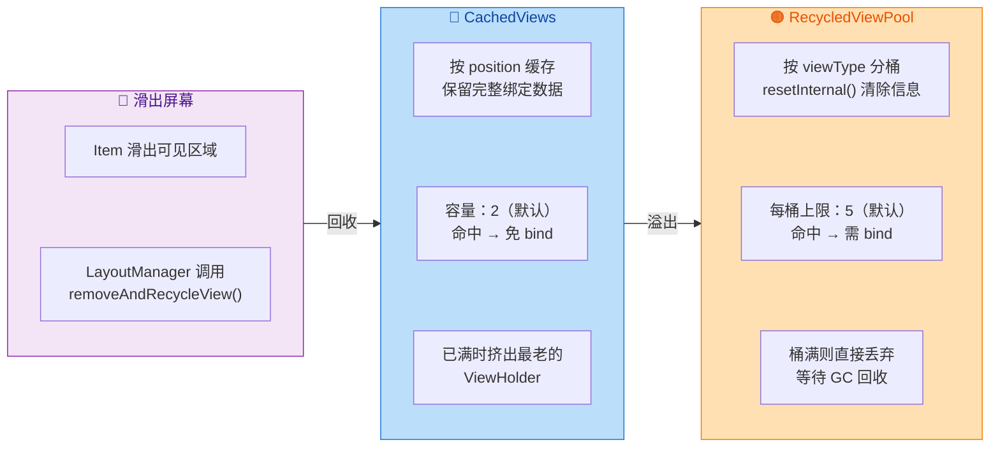

注意最后的兜底行为：如果 RecycledViewPool 中某个 viewType 的桶也已满（达到 `mMaxScrap` 上限），新来的 ViewHolder **直接被丢弃**，不会进入任何缓存，最终由 GC 回收。这就是为什么在高频创建销毁的场景下（如快速滚动大列表），合理调整 Pool 容量可以显著减少 `onCreateViewHolder()` 调用次数的原因。

#### 完整缓存查找流程总结

将四级缓存的查找逻辑串联起来，完整的视图获取流程如下：

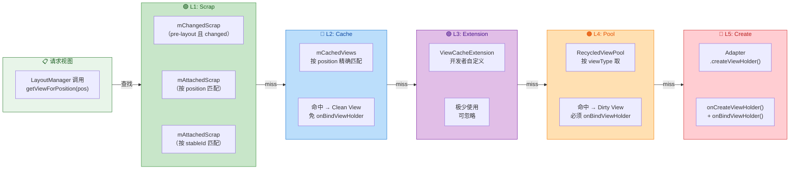

整套缓存体系的精妙之处在于它 **层层递进、逐步退化（progressive degradation）**：

| 缓存级别 | 匹配依据 | 是否需要 bind | 视图状态 | 生命周期 |
|:-:|:-:|:-:|:-:|:-:|
| **mAttachedScrap** | position / stableId | ❌ 不需要 | Clean | 仅 layout pass 期间 |
| **mChangedScrap** | position / stableId | ✅ 需要（新 holder） | Dirty（旧 holder 用于动画） | 仅 layout pass 期间 |
| **mCachedViews** | position | ❌ 不需要 | Clean | 跨 layout pass 持久 |
| **ViewCacheExtension** | 自定义 | 取决于实现 | 取决于实现 | 开发者控制 |
| **RecycledViewPool** | viewType | ✅ 需要 | Dirty | 跨 layout pass 持久 |

每向下一级，匹配精度降低，复用成本增加，但通用性也在增强。这种分级设计使得 RecyclerView 在各种场景下都能找到最佳的 **成本-收益平衡点（cost-benefit tradeoff）**：能免费复用就免费复用，不得已才重新绑定，实在没有才创建新的。

---

**📝 练习题**

在 RecyclerView 的缓存机制中，当一个 ViewHolder 从 `mCachedViews` 中被挤出并转入 `RecycledViewPool` 时，以下哪项描述是正确的？


A. ViewHolder 保留原有的 position 和绑定数据，从 Pool 取出后可直接使用，无需调用 `onBindViewHolder()`


B. ViewHolder 会调用 `resetInternal()` 清除 position 和 flags 信息，从 Pool 取出后必须重新调用 `onBindViewHolder()`


C. ViewHolder 会被立即销毁并由 GC 回收，RecycledViewPool 中不会保留任何引用


D. ViewHolder 的 `itemView` 会被解除与父布局的关联，但 position 信息仍被保留用于后续精确匹配


**【答案】** B

**【解析】** `mCachedViews` 是按 position 精确缓存的第二级缓存，其中的 ViewHolder 是 Clean 的（保留完整的绑定数据和 position 信息）。但当 CachedViews 已满且有新的 ViewHolder 需要进入时，最老的 ViewHolder 会被挤出转移到 RecycledViewPool。在这个过程中，ViewHolder 的 `resetInternal()` 方法会被调用，清除 `mPosition`、`mFlags`、`mPreLayoutPosition` 等身份信息，使其从 Clean View 退化为 Dirty View。RecycledViewPool 只按 `viewType` 分桶存储，不再保留 position 信息，因此从 Pool 中取出的 ViewHolder 必须经过 `onBindViewHolder()` 重新绑定数据后才能使用。选项 A 错误是因为 Pool 中的 ViewHolder 已经丢失了 position 信息；选项 C 错误是因为 ViewHolder 并非被销毁而是转入 Pool 缓存（只有 Pool 也满了才会被丢弃）；选项 D 错误是因为 `resetInternal()` 已经清除了 position 信息，不再用于精确匹配。

---

## 布局管理器详解

RecyclerView 之所以能够取代 ListView、GridView、StaggeredGridView 等多种列表组件，其核心秘密就在于 **LayoutManager（布局管理器）** 的抽象设计。在 ListView 时代，布局逻辑被硬编码在控件内部——ListView 只能纵向滚动、GridView 只能固定列数网格——如果需要一种新的布局方式，就必须从头编写一个全新的 ViewGroup。而 RecyclerView 将"如何测量子 View"和"如何摆放子 View"这两件事彻底抽离出来，交给一个可插拔的 LayoutManager 组件来完成。这意味着同一个 RecyclerView 实例，仅通过更换 LayoutManager，就能在线性列表、网格、瀑布流甚至自定义的环形布局之间自由切换，而 Adapter、ItemAnimator、ItemDecoration 等其他组件完全不需要改动。这种 **"策略模式"（Strategy Pattern）** 的运用，正是 RecyclerView 高度灵活的根源。

从职责上看，LayoutManager 承担了以下几个关键任务：第一，**决定子 View 的排列方向与顺序**（水平还是垂直、正向还是反向）；第二，**执行子 View 的测量（measure）与布局（layout）**，即在 `onLayoutChildren()` 回调中决定每个 ItemView 出现在屏幕的哪个位置、占据多大的空间；第三，**处理滚动**，在 `scrollVerticallyBy()` 或 `scrollHorizontallyBy()` 中响应用户手指拖动或惯性滑动，计算偏移量并移动子 View；第四，**与 Recycler 缓存交互**，在布局和滚动的过程中，将滑出屏幕的 View 回收进缓存池，并从缓存池中取出即将进入屏幕的 View，从而实现高效复用。可以说，LayoutManager 是 RecyclerView 布局与滚动的"大脑"，而 Recycler 则是负责 View 存取的"仓库管理员"，二者紧密协作。

在 Google 提供的 `androidx.recyclerview` 库中，内置了三种 LayoutManager 实现，覆盖了绝大多数业务场景。下面我们逐一深入。

---

### LinearLayoutManager 线性布局

LinearLayoutManager 是最常用、也是语义最直观的布局管理器。它将所有 Item **沿单一方向依次排列**，视觉效果等同于传统的 ListView（垂直）或水平滚动列表。尽管"线性排列"听起来简单，但 LinearLayoutManager 内部的布局与回收逻辑相当精密，理解它是掌握其他两种 LayoutManager 的基础。

**基本使用与方向控制**

创建一个 LinearLayoutManager 只需要一行代码，但它背后暗含了三个维度的配置：**Context 上下文**、**orientation 方向**、**reverseLayout 是否反转**。方向通过常量 `RecyclerView.VERTICAL`（默认）和 `RecyclerView.HORIZONTAL` 指定；而 `reverseLayout` 若设为 `true`，则 Item 会从尾部开始排列——在垂直模式下意味着最新的数据出现在底部而列表从底部向上填充，聊天界面常用此技巧。

```kotlin
// 创建垂直方向的 LinearLayoutManager，Item 从上往下排列
val verticalLM = LinearLayoutManager(context) // 默认 VERTICAL + reverseLayout=false

// 创建水平方向的 LinearLayoutManager，Item 从左往右排列
val horizontalLM = LinearLayoutManager(
    context,                        // 上下文，用于获取资源与配置信息
    RecyclerView.HORIZONTAL,        // 设置方向为水平滚动
    false                           // reverseLayout = false，正常从左到右排列
)

// 创建反转的垂直 LinearLayoutManager，适用于聊天列表
val chatLM = LinearLayoutManager(
    context,                        // 上下文
    RecyclerView.VERTICAL,          // 垂直方向
    true                            // reverseLayout = true，Item 从底部开始向上排列
)

// 将 LayoutManager 设置给 RecyclerView
recyclerView.layoutManager = verticalLM  // 一行切换布局策略
```

**`onLayoutChildren()` — 布局的核心入口**

当 RecyclerView 首次展示、或数据发生变化（如调用 `notifyXxx()`）时，会触发重新布局，最终走到 LayoutManager 的 `onLayoutChildren(recycler, state)` 方法。LinearLayoutManager 在此方法内执行一套精密的 **"锚点 + 填充"策略（Anchor + Fill）**：

1. **确定锚点（Anchor Point）**：首先找到一个"参考 Item"作为锚点。通常情况下，锚点就是当前屏幕上第一个可见的 Item（position + offset）。如果是首次布局，锚点为 position = 0、offset = 0；如果是数据更新后的重新布局，则尽量恢复到更新前用户看到的位置，保证视觉不跳动。

2. **分离所有子 View（Detach）**：调用 `detachAndScrapAttachedViews(recycler)` 将当前屏幕上的所有 ItemView 临时放入 Scrap 缓存。注意这里用的是 **detach** 而非 remove——detach 只是将 View 从 RecyclerView 的子 View 列表中移除，但并不触发完整的 View 移除流程，性能开销很小，且这些 View 随时可以被快速重新 attach。

3. **从锚点向两端填充（Fill）**：以锚点为起点，先向列表尾部方向（向下或向右）逐个从 Recycler 获取 View 并测量、布局，直到填满可见区域；然后再向列表头部方向（向上或向左）填充，确保锚点上方也没有空白区域。填充过程中，每一个 Item 的获取都经过 Recycler 的四级缓存查找（Scrap → CachedViews → ViewCacheExtension → RecycledViewPool → 新建），这就是布局与缓存紧密耦合的体现。

4. **回收多余 View**：填充完成后，如果有 Scrap 中的 View 没有被重新使用（例如某些 Item 在数据更新后已被删除），它们会被移入 RecycledViewPool 等待未来复用。

这个 Anchor + Fill 的设计非常优雅——它不需要一次性计算所有 Item 的位置，而是只关心 **"当前可见区域需要哪些 Item"**，天然地适配了 RecyclerView "按需加载"的哲学。

**滚动处理 — `scrollVerticallyBy()`**

当用户手指拖动或 Fling 惯性滑动时，RecyclerView 会计算出一个滚动偏移量 `dy`（垂直方向）或 `dx`（水平方向），并传递给 LayoutManager 的 `scrollVerticallyBy(dy, recycler, state)` 方法。LinearLayoutManager 在此方法中做三件事：

- **偏移所有子 View**：调用 `offsetChildrenVertical(-dy)` 将所有已布局的子 View 整体平移。这一步非常高效，因为它只修改每个 View 的 `top`/`bottom` 而不触发重新测量。
- **填充新出现的区域**：平移后，屏幕一端可能露出空白，需要从 Recycler 中获取新的 ItemView 来填充。
- **回收滑出屏幕的 View**：另一端的 ItemView 完全滑出了可见区域，将它们回收进缓存。

整个过程在 **一帧之内** 完成（16ms 目标），确保流畅的 60fps 滚动体验。

**`findFirstVisibleItemPosition()` 与位置查询**

LinearLayoutManager 提供了一组非常实用的位置查询方法，它们在业务开发中频繁使用：

```kotlin
// 获取当前屏幕上第一个可见 Item 的 Adapter position
// "可见"指该 Item 的任意部分出现在屏幕内（即使只露出 1px）
val firstVisible = linearLM.findFirstVisibleItemPosition()

// 获取当前屏幕上第一个完全可见 Item 的 Adapter position
// "完全可见"指该 Item 的上下（或左右）边界都在 RecyclerView 可见区域内
val firstCompletelyVisible = linearLM.findFirstCompletelyVisibleItemPosition()

// 获取最后一个可见 / 完全可见的 position，常用于"加载更多"判断
val lastVisible = linearLM.findLastVisibleItemPosition()
val lastCompletelyVisible = linearLM.findLastCompletelyVisibleItemPosition()

// 经典的"加载更多"判断逻辑
recyclerView.addOnScrollListener(object : RecyclerView.OnScrollListener() {
    override fun onScrolled(rv: RecyclerView, dx: Int, dy: Int) {
        super.onScrolled(rv, dx, dy)
        val totalItemCount = linearLM.itemCount              // Adapter 中总 Item 数
        val lastVisiblePos = linearLM.findLastVisibleItemPosition() // 最后可见位置
        // 当最后可见 Item 距末尾不足 5 个时，触发预加载
        if (lastVisiblePos >= totalItemCount - 5) {
            loadMoreData()  // 业务层发起下一页数据请求
        }
    }
})
```

这些方法的内部实现是 **遍历当前已布局的子 View**（通常只有屏幕上可见的十几个），检查它们的 `getTop()`/`getBottom()` 与 RecyclerView 可见区域的关系，因此时间复杂度为 O(n)，n 为屏幕上的子 View 数量，执行速度非常快。

**`StackFromEnd` 与 `SmoothScrollToPosition`**

除了 `reverseLayout`，LinearLayoutManager 还支持 `stackFromEnd` 属性。两者容易混淆：`reverseLayout = true` 是 **反转数据顺序**（position 0 在底部），而 `stackFromEnd = true` 是 **当 Item 不足以填满屏幕时，将所有 Item 堆叠到底部**（数据顺序不变，只是整体位置下沉）。聊天界面通常结合使用 `stackFromEnd = true` + `reverseLayout = true`，让最新消息始终固定在底部。

平滑滚动方面，调用 `recyclerView.smoothScrollToPosition(targetPos)` 时，LinearLayoutManager 内部会创建一个 `LinearSmoothScroller`，通过逐帧计算速度和位移，实现平滑动画滚动到目标位置。开发者可以继承 `LinearSmoothScroller` 并重写 `calculateSpeedPerPixel()` 来自定义滚动速度。

---

### GridLayoutManager 网格布局

GridLayoutManager 是 LinearLayoutManager 的 **直接子类**（`class GridLayoutManager extends LinearLayoutManager`），这一继承关系非常重要——它意味着 GridLayoutManager 复用了 LinearLayoutManager 的所有核心逻辑（锚点策略、滚动处理、缓存交互），仅在此基础上扩展了 **"跨度（Span）"** 的概念来实现网格效果。

**Span 的本质**

GridLayoutManager 构造时需要指定一个 `spanCount`（跨度总数）。你可以将可用宽度（垂直滚动时）想象为被等分成 `spanCount` 条"轨道"，每个 Item 默认占据 1 条轨道，也可以通过 SpanSizeLookup 配置某些 Item 占据多条轨道。这种基于 Span 的设计远比传统 GridView 的"固定列数"灵活——它允许不同 Item 占据不同数量的列，轻松实现"标题横跨满行 + 内容 2/3/4 列"的混合网格。

```kotlin
// 创建一个 3 列的垂直网格布局
val gridLM = GridLayoutManager(
    context,      // 上下文
    3             // spanCount = 3，可用空间被分为 3 条轨道
)

// 也可以指定方向和反转
val horizontalGridLM = GridLayoutManager(
    context,                        // 上下文
    2,                              // spanCount = 2，2 行的水平网格
    RecyclerView.HORIZONTAL,        // 水平滚动
    false                           // 不反转
)

recyclerView.layoutManager = gridLM // 应用网格布局
```

**SpanSizeLookup — 动态跨度控制**

SpanSizeLookup 是 GridLayoutManager 的灵魂配置。它是一个抽象类，只有一个方法 `getSpanSize(position): Int`，返回指定 position 的 Item 应占据多少条 Span。默认实现 `DefaultSpanSizeLookup` 始终返回 1（每个 Item 占 1 列）。在实际业务中，我们几乎总是需要自定义它——例如让 Header 横跨整行、让广告卡片占据 2 列等。

```kotlin
// 设置 spanCount = 6 提供更灵活的分栏能力（6 是 2、3 的公倍数）
val gridLM = GridLayoutManager(context, 6)

// 自定义 SpanSizeLookup
gridLM.spanSizeLookup = object : GridLayoutManager.SpanSizeLookup() {
    override fun getSpanSize(position: Int): Int {
        // 根据 Adapter 中该位置的 viewType 决定跨度
        return when (adapter.getItemViewType(position)) {
            TYPE_HEADER -> 6      // Header 占满整行（6/6）
            TYPE_BANNER -> 6      // Banner 广告也占满整行
            TYPE_LARGE_CARD -> 3  // 大卡片占半行（3/6），每行 2 个
            TYPE_SMALL_CARD -> 2  // 小卡片占 1/3 行（2/6），每行 3 个
            else -> 1             // 默认占 1/6，每行 6 个（如标签）
        }
    }
}
```

这里有一个经验技巧：**将 `spanCount` 设为各种列数需求的最小公倍数**。比如你的 UI 需要同时支持"满行""2 列""3 列"，那 spanCount 设为 6 最为灵活（6/6 = 满行，6/3 = 2 列，6/2 = 3 列）。如果只需要"满行"和"3 列"，spanCount = 3 就够了。

**SpanSizeLookup 的缓存优化**

SpanSizeLookup 内部维护了一个 `mSpanIndexCache`（SparseIntArray），用于缓存每个 position 对应的 Span Index（即该 Item 位于行内的第几条轨道）。默认情况下这个缓存是 **关闭** 的，意味着每次布局和滚动时都要从头计算每个 Item 的 SpanIndex，数据量大时会有性能损耗。强烈建议在数据稳定后开启缓存：

```kotlin
gridLM.spanSizeLookup.isSpanIndexCacheEnabled = true  // 开启 SpanIndex 缓存
// 注意：如果 Item 的 spanSize 会动态变化（如折叠展开），
// 需要在变化后调用 spanSizeLookup.invalidateSpanIndexCache() 清除缓存
```

**GridLayoutManager 的布局流程**

由于 GridLayoutManager 继承自 LinearLayoutManager，它的 `onLayoutChildren()` 核心流程与前者相同（Anchor → Detach → Fill → Recycle）。关键差异在于 **填充阶段的宽度分配**：对于一行内的多个 Item，GridLayoutManager 需要根据各自的 spanSize 按比例分配宽度。具体来说，每个 Item 的宽度计算公式为：

```
itemWidth = (totalWidth / spanCount) × spanSize
```

其中 `totalWidth` 是 RecyclerView 的可用宽度（减去 padding），`spanCount` 是总跨度数，`spanSize` 是该 Item 的跨度。在测量子 View 时，GridLayoutManager 会构造一个约束宽度为 `itemWidth` 的 MeasureSpec，传递给子 View 的 `measure()` 方法，从而让子 View 在正确的宽度约束下完成自我测量。

**与 ItemDecoration 的配合陷阱**

使用 GridLayoutManager 时，ItemDecoration 的间距设置需要特别注意。如果你天真地给每个 Item 设置相同的左右间距，会导致 **边缘 Item 与中间 Item 的实际内容宽度不一致**（因为第一列没有左边的相邻间距、最后一列没有右边的相邻间距）。正确的做法是根据 Item 在行内的 Span Index 动态计算间距，确保每个 Item 的"内容宽度 + 间距总和"完全一致。这也是为什么很多项目会封装一个 `GridSpacingItemDecoration` 工具类。

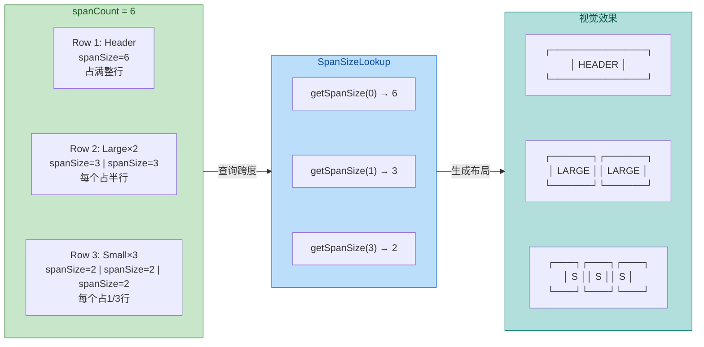

---

### StaggeredGridLayoutManager 瀑布流布局

StaggeredGridLayoutManager（以下简称 SGLM）是三种内置 LayoutManager 中 **最复杂** 的一个。与 GridLayoutManager 不同，SGLM **不继承** LinearLayoutManager，而是直接继承自 `RecyclerView.LayoutManager`，这意味着它的布局逻辑完全是独立实现的。它的核心特征是：每个 Item 的高度（垂直模式）或宽度（水平模式）可以 **各不相同**，形成错落有致的"瀑布流"视觉效果，广泛应用于图片社区（如 Pinterest、小红书）、商品列表等场景。

**与 GridLayoutManager 的本质区别**

GridLayoutManager 是 **行对齐** 的——同一行内的所有 Item 共享相同的行高（取决于该行中最高的 Item），因此每一行的顶部和底部都是整齐的水平线。而 SGLM 是 **列独立** 的——每一列（Span）维护自己的已填充高度，新 Item 总是被放置到 **当前最短的那一列** 的底部。这导致各列的底部参差不齐，形成瀑布流效果，但也带来了布局计算和滚动处理上的额外复杂度。

```kotlin
// 创建 2 列垂直瀑布流
val staggeredLM = StaggeredGridLayoutManager(
    2,                              // spanCount = 2，两列瀑布流
    StaggeredGridLayoutManager.VERTICAL  // 垂直滚动方向
)

// 创建 3 列水平瀑布流（较少见，但 API 支持）
val horizontalStaggered = StaggeredGridLayoutManager(
    3,                              // spanCount = 3，三行
    StaggeredGridLayoutManager.HORIZONTAL  // 水平滚动
)

recyclerView.layoutManager = staggeredLM  // 应用瀑布流布局
```

**全跨度 Item（Full Span）**

SGLM 不使用 SpanSizeLookup（那是 GridLayoutManager 的专属），而是通过 `StaggeredGridLayoutManager.LayoutParams` 上的 `isFullSpan` 属性来控制某个 Item 是否横跨所有列。这通常在 ViewHolder 的绑定阶段或 Adapter 的 `onBindViewHolder` 中设置：

```kotlin
override fun onBindViewHolder(holder: RecyclerView.ViewHolder, position: Int) {
    // 获取当前 Item 的 LayoutParams，类型为 StaggeredGridLayoutManager.LayoutParams
    val layoutParams = holder.itemView.layoutParams 
            as StaggeredGridLayoutManager.LayoutParams
    
    // 如果当前 Item 是 Header 类型，设置为全跨度（横跨所有列）
    if (getItemViewType(position) == TYPE_HEADER) {
        layoutParams.isFullSpan = true   // 该 Item 将独占一整行
    } else {
        layoutParams.isFullSpan = false  // 普通 Item，占据单列
    }
}
```

**布局机制 — "最短列优先"策略**

SGLM 内部为每一列维护一个 `Span` 对象，记录该列当前的起始偏移和结束偏移（可以理解为该列已经"堆叠"到了什么高度）。在填充新 Item 时，算法会遍历所有 Span，找到 **结束偏移最小的那一列**（即最短列），将下一个 Item 放到这一列的底部，然后更新该列的结束偏移。这个过程反复进行，直到所有列的结束偏移都超出了屏幕可见区域底部。

这种"最短列优先"的贪心策略是瀑布流布局的经典算法。它的好处是简单高效、视觉效果自然（不会出现某一列特别长而其他列很短的极端情况），但也有一个副作用：**Item 的实际显示顺序可能与 Adapter 中的 position 顺序不完全一致**。例如 position=5 的 Item 可能因为被分配到较短的列而在屏幕上出现在 position=4 的上方。对于大多数瀑布流场景（如图片浏览），这不是问题，但如果业务要求严格的顺序展示，就需要慎重考虑。

**瀑布流的"跳动"问题与 Gap 修复**

SGLM 最臭名昭著的问题是 **滚动时 Item 位置跳动（flickering/jumping）**。这种跳动的根源在于：当用户快速向上滚动（回到顶部方向）时，SGLM 需要"反向填充"——它必须重新决定每个 Item 应该放在哪一列。但由于"最短列优先"的分配结果取决于之前所有 Item 的高度累积，而反向填充时可能还没有获取到所有 Item 的真实高度（部分 Item 的高度可能需要绑定数据后才能确定），导致 Item 被分配到了与之前不同的列，从而产生视觉跳动。

SGLM 内部有一套 **Gap 检测与修复机制**（`checkForGaps()`）：在每次滚动完成后，它会检查各列之间是否出现了"间隙"（即某一列的顶部高度与相邻列不一致且存在空白），如果发现 Gap，就会触发一次 **`requestSimpleAnimationsInNextLayout()`** 并重新布局来修复。但这个自动修复有时仍不够理想，开发者可以配合以下策略进一步优化：

```kotlin
// 策略 1：设置 GapStrategy 为 GAP_HANDLING_MOVE_ITEMS_BETWEEN_SPANS
// 这是默认值，允许 SGLM 在发现 Gap 时移动 Item 到其他列来填补间隙
staggeredLM.gapStrategy = 
    StaggeredGridLayoutManager.GAP_HANDLING_MOVE_ITEMS_BETWEEN_SPANS

// 策略 2：在 Adapter 中预设 Item 高度，避免绑定后高度变化导致跳动
// 比如服务端下发图片时附带宽高比，客户端在 onBindViewHolder 中直接设置固定高度
override fun onBindViewHolder(holder: ViewHolder, position: Int) {
    val item = dataList[position]               // 获取数据
    val params = holder.imageView.layoutParams   // 获取 ImageView 的 LayoutParams
    // 根据服务端下发的宽高比，结合列宽计算出精确的 Item 高度
    params.height = (columnWidth / item.aspectRatio).toInt()
    holder.imageView.layoutParams = params       // 设置固定高度，避免图片加载后高度突变
    // 然后再用 Glide/Coil 加载图片
    Glide.with(context).load(item.imageUrl).into(holder.imageView)
}

// 策略 3：监听布局完成后的 InvalidationTracker，手动检测跳动
recyclerView.addOnScrollListener(object : RecyclerView.OnScrollListener() {
    override fun onScrollStateChanged(rv: RecyclerView, newState: Int) {
        super.onScrollStateChanged(rv, newState)
        // 当滚动停止时，检查并修复 Gap
        if (newState == RecyclerView.SCROLL_STATE_IDLE) {
            staggeredLM.invalidateSpanAssignments() // 重新计算 Span 分配
        }
    }
})
```

其中 **策略 2（预设高度）** 是效果最好的解决方案。只要每个 Item 在绑定数据 **之前** 就已经有了确定的高度，SGLM 就不会因为高度变化而重新分配列，跳动问题自然消失。

**SGLM 与缓存的特殊关系**

由于瀑布流中同一 ViewType 的 Item 高度各不相同，SGLM 在回收 ViewHolder 到 RecycledViewPool 后，下次复用时必须 **重新测量**（因为新位置的数据可能导致不同的高度）。这意味着瀑布流的复用效率天然低于 LinearLayoutManager 和 GridLayoutManager——后两者的同类型 Item 高度通常一致，复用时可以跳过测量步骤。这也是为什么瀑布流列表在快速滚动时更容易出现卡顿，性能优化的优先级更高。

---

### 三种 LayoutManager 对比总结

下面通过一张对比图，直观呈现三种内置 LayoutManager 的核心差异：

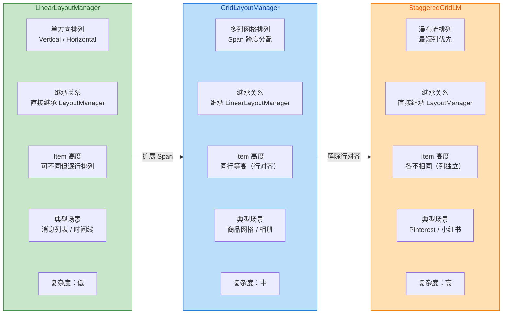

从设计哲学上看，这三种 LayoutManager 形成了一个 **递进关系**：LinearLayoutManager 是最基础的单方向排列；GridLayoutManager 在其基础上引入 Span 概念实现多列，但保持行对齐的约束；StaggeredGridLayoutManager 则彻底打破行对齐的限制，让每一列独立增长，实现自由错落的瀑布流。复杂度和灵活度逐级递增，但性能优化的难度也随之上升。

**如何选择？** 原则很简单：**能用简单的就不用复杂的**。纯列表用 LinearLayoutManager；规整网格用 GridLayoutManager；只有当 Item 高度确实不一致且需要紧凑排列时，才使用 StaggeredGridLayoutManager。在实际项目中，大约 70% 的列表场景用 LinearLayoutManager 就够了，25% 需要 GridLayoutManager，只有不到 5% 的场景真正需要瀑布流。

---

**📝 练习题**

RecyclerView 使用 `GridLayoutManager(context, 4)` 作为布局管理器，现在需要让 position = 0 的 Header Item 横跨整行（占满 4 列），而其余 Item 各占 1 列。以下哪种方式是正确的实现方案？


A. 在 Adapter 的 `onBindViewHolder()` 中将 Header 的 `layoutParams.width` 设置为 `MATCH_PARENT`


B. 调用 `gridLayoutManager.setSpanSizeLookup()` 设置自定义 SpanSizeLookup，在 `getSpanSize()` 中对 position = 0 返回 4，其余返回 1


C. 在 Header 的 XML 布局文件中设置 `android:layout_span="4"`


D. 将 Header 对应的 LayoutParams 强转为 `StaggeredGridLayoutManager.LayoutParams` 并设置 `isFullSpan = true`


**【答案】** B

**【解析】** GridLayoutManager 通过 **SpanSizeLookup** 机制来控制每个 Item 占据的跨度数。`getSpanSize(position)` 返回值表示该 position 的 Item 占据多少个 Span，返回值必须在 1 到 spanCount 之间。对于 Header 需要占满整行的场景，让 `getSpanSize(0)` 返回 spanCount 的值（此处为 4）即可。选项 A 直接设置 `width = MATCH_PARENT` 是无效的，因为 GridLayoutManager 会根据 Span 重新计算宽度，手动设置的宽度会被覆盖。选项 C 的 `layout_span` 是旧版 GridView 的 XML 属性，RecyclerView 并不支持。选项 D 使用了 `StaggeredGridLayoutManager.LayoutParams` 的 `isFullSpan` 属性，但当前使用的是 GridLayoutManager，LayoutParams 类型不匹配，运行时会抛出 `ClassCastException`。

---

**📝 练习题**

在使用 `StaggeredGridLayoutManager` 实现瀑布流时，快速向上滚动经常出现 Item 位置跳动（闪烁）。以下哪种优化方案对解决此问题 **最有效**？


A. 将 `gapStrategy` 设置为 `GAP_HANDLING_NONE`，禁止 Gap 修复


B. 在 `onBindViewHolder()` 中根据服务端下发的宽高比预先设置 Item 的固定高度，避免图片加载后高度突变


C. 增大 `RecycledViewPool` 的最大缓存数量


D. 改用 `GridLayoutManager` 替代 `StaggeredGridLayoutManager`


**【答案】** B

**【解析】** 瀑布流跳动的根本原因是 Item 高度在绑定数据前后发生变化（例如图片加载完成后 ImageView 从 0 高度变为实际高度），导致 SGLM 重新计算各列高度、重新分配 Item 到不同的列，视觉上就表现为跳动。最有效的解决方案是 **在绑定数据时立刻设置确定的高度**（根据服务端下发的宽高比计算），这样 Item 从布局到显示期间高度不会变化，SGLM 的列分配始终稳定。选项 A 禁止 Gap 修复反而会让列间空隙无法自动填补，效果更差。选项 C 增大缓存池只能提升复用命中率，与跳动问题无关。选项 D 虽然能"解决"跳动（因为 Grid 是行对齐的），但也放弃了瀑布流效果，属于回避问题而非解决问题。

---

## 数据更新与差分

RecyclerView 的数据更新机制是连接 **数据层变化** 与 **UI 层响应** 的核心桥梁。在早期 ListView 时代，开发者只有 `notifyDataSetChanged()` 一种"大锤"可用——无论数据发生了怎样细微的改变，整个列表都要推倒重来。这种方式在数据量小的场景下尚可接受，但当列表承载数百上千条数据时，全量刷新会导致严重的帧率下降、动画丢失以及不必要的重新绑定开销。RecyclerView 引入了精细化通知体系（Granular Notification）和 **DiffUtil** 差分工具，从根本上改变了列表更新的范式：不再告诉框架"数据变了"，而是精确地告诉它"哪里变了、怎么变了"。本节将从全量刷新的问题出发，逐步深入 DiffUtil 的设计思想，最终揭示其底层所依赖的 **Myers 差分算法** 的核心原理。

### notifyDataSetChanged 全量刷新

#### 工作机制与调用链路

当你调用 `Adapter.notifyDataSetChanged()` 时，其内部实际上通过 `AdapterDataObservable` 这个被观察者，向所有已注册的观察者（其中最重要的就是 RecyclerView 内部的 `RecyclerViewDataObserver`）发送了一个 **"数据全部失效"** 的信号。这个信号的语义非常粗暴：它告诉 RecyclerView，"我无法告诉你具体哪些数据变了，你应该假设所有数据都可能已经改变"。

RecyclerView 收到这个信号后，会将当前屏幕上所有可见的 ViewHolder 标记为 **FLAG_UPDATE** 和 **FLAG_INVALID**（无效状态）。这意味着在下一次布局过程（layout pass）中，LayoutManager 不会信任任何现有 ViewHolder 的绑定状态，而是会对每一个可见位置重新调用 `onBindViewHolder()`。更严重的是，由于框架无法知道数据变化的具体类型（插入、删除、移动还是内容更新），它 **不会触发任何 ItemAnimator 动画**——用户看到的是列表瞬间"闪"了一下，而非优雅的插入或淡出效果。

```kotlin
// === notifyDataSetChanged 内部调用链（简化） ===

// 1. 开发者在 Adapter 中调用全量刷新
adapter.notifyDataSetChanged()

// 2. Adapter 内部委托给 Observable 广播
// mObservable 是 AdapterDataObservable 实例，持有观察者列表
mObservable.notifyChanged()

// 3. AdapterDataObservable.notifyChanged() 遍历所有观察者
// 对每个 observer 调用 onChanged()
for (i in mObservers.indices.reversed()) {  // 倒序遍历观察者列表
    mObservers[i].onChanged()               // 触发观察者的 onChanged 回调
}

// 4. RecyclerViewDataObserver.onChanged() 被触发
// 这是 RecyclerView 注册的内部观察者
fun onChanged() {
    // 标记整个数据集已变化，所有 ViewHolder 需要重新绑定
    mState.mStructureChanged = true          // 标记结构变化
    processDataSetCompletelyChanged(true)    // 将所有 ViewHolder 标记失效
    if (!mAdapterHelper.hasPendingUpdates()) {
        requestLayout()                      // 请求重新布局（触发完整的 measure → layout → draw）
    }
}
```

#### 全量刷新的三大代价

**第一，性能浪费**。假设列表有 1000 条数据，你只修改了第 500 条的一个文本字段。调用 `notifyDataSetChanged()` 后，屏幕上所有可见的（比如 10 个）ViewHolder 都会被重新绑定，而不仅仅是第 500 条对应的那个（甚至它可能不在屏幕上，根本不需要任何操作）。`onBindViewHolder()` 中如果涉及图片加载、SpannableString 构建等重操作，这些开销会被无意义地放大。

**第二，动画丢失**。RecyclerView 的 ItemAnimator 能够为插入（fade in）、删除（fade out）、移动（translate）等操作提供流畅的过渡动画。但这些动画的前提是框架知道 **具体发生了什么变化**。`notifyDataSetChanged()` 传递的信息量为零——它等同于对框架说"一切都可能变了"，于是框架只能放弃动画，直接跳到最终状态。

**第三，状态丢失**。全量刷新会导致所有 ViewHolder 失效后重新绑定，这意味着用户正在进行的交互状态（如某个 EditText 中输入了一半的文字、某个 CheckBox 的选中态、某个 item 正在播放的动画）都可能被重置。

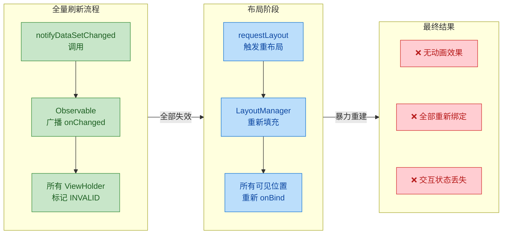

#### 精细化通知 API

为了弥补全量刷新的缺陷，RecyclerView 的 Adapter 提供了一系列 **精细化通知方法**（Granular Notification Methods），它们允许你精确描述数据变化的类型和范围：

| 方法 | 语义 | 是否触发动画 |
|------|------|:----------:|
| `notifyItemInserted(pos)` | 在 pos 处插入了 1 条 | ✅ |
| `notifyItemRemoved(pos)` | pos 处删除了 1 条 | ✅ |
| `notifyItemChanged(pos)` | pos 处内容变化 | ✅ |
| `notifyItemChanged(pos, payload)` | pos 处局部变化 | ✅（局部） |
| `notifyItemMoved(from, to)` | 从 from 移动到 to | ✅ |
| `notifyItemRangeInserted(pos, count)` | 从 pos 起插入 count 条 | ✅ |
| `notifyItemRangeRemoved(pos, count)` | 从 pos 起删除 count 条 | ✅ |
| `notifyItemRangeChanged(pos, count)` | 从 pos 起 count 条内容变化 | ✅ |

这些方法向框架提供了充分的信息：变化的类型（插入/删除/更新/移动）以及变化的位置范围。RecyclerView 只需对受影响的 ViewHolder 进行操作，未变化的 ViewHolder 保持原样不动。同时，ItemAnimator 也能根据变化类型播放对应的过渡动画。

但精细化通知带来了一个新问题：**当数据变化复杂时（多处同时插入、删除、移动），手动计算每个变化的位置和类型极其繁琐且容易出错。** 比如你从服务器拉取了一份新列表，与本地旧列表相比可能有几十处差异——此时手动逐一调用 `notifyItemXxx()` 是不现实的。这正是 DiffUtil 诞生的动机。

### DiffUtil 差分算法

#### 设计思想与定位

DiffUtil 是 Android Support Library（现为 AndroidX）提供的一个 **工具类**，专门用来计算两个列表（旧列表 oldList 与新列表 newList）之间的差异，并自动生成一组最小的精细化更新操作（insert / remove / move / change），然后将这些操作一次性派发给 RecyclerView.Adapter。它的核心价值在于：**将"对比两个列表差异"这件需要算法功底的事情封装成了简洁的 API，让开发者只需定义"如何判断两个 item 是否相同"即可。**

从架构角度看，DiffUtil 扮演的是一个 **"数据变化翻译器"** 的角色：它接收新旧两份数据，输出一组对 RecyclerView 有意义的操作指令。这种设计将"数据对比逻辑"与"UI 更新逻辑"彻底解耦——你的数据层不需要关心 RecyclerView 的通知 API，DiffUtil 自动完成这个桥接。

#### DiffUtil.Callback —— 差分的契约

使用 DiffUtil 的第一步是实现 `DiffUtil.Callback` 抽象类。这个 Callback 是你告诉 DiffUtil "如何理解你的数据"的契约（Contract），它包含四个核心方法：

```kotlin
// === 自定义 DiffUtil.Callback 实现 ===

class ArticleDiffCallback(
    private val oldList: List<Article>,  // 旧数据列表的引用
    private val newList: List<Article>   // 新数据列表的引用
) : DiffUtil.Callback() {

    // 返回旧列表的总长度，DiffUtil 用它确定旧数据的边界
    override fun getOldListSize(): Int = oldList.size

    // 返回新列表的总长度，DiffUtil 用它确定新数据的边界
    override fun getNewListSize(): Int = newList.size

    // 判断两个位置的 item 是否代表「同一个实体」
    // 通常通过唯一标识符（如数据库主键、服务器 ID）来判断
    // 这决定了 DiffUtil 是否认为这是"同一行"（可能内容变了）
    // 还是"不同行"（需要插入/删除）
    override fun areItemsTheSame(oldPos: Int, newPos: Int): Boolean {
        return oldList[oldPos].id == newList[newPos].id  // 以唯一 ID 判断同一性
    }

    // 仅当 areItemsTheSame 返回 true 时才会被调用
    // 判断"同一个实体"的具体内容是否发生了变化
    // 返回 true 表示内容完全相同，无需重新绑定
    // 返回 false 表示内容有变化，需要调用 onBindViewHolder 刷新
    override fun areContentsTheSame(oldPos: Int, newPos: Int): Boolean {
        return oldList[oldPos] == newList[newPos]  // 依赖 data class 的 equals 深度比较
    }

    // 可选重写：当 areContentsTheSame 返回 false 时调用
    // 返回一个 payload 对象，描述具体变化了哪些字段
    // 配合 Adapter 的 onBindViewHolder(holder, pos, payloads) 实现局部刷新
    override fun getChangePayload(oldPos: Int, newPos: Int): Any? {
        val old = oldList[oldPos]                     // 获取旧数据
        val new = newList[newPos]                     // 获取新数据
        val diff = mutableSetOf<String>()             // 用 Set 收集变化的字段名
        if (old.title != new.title) diff.add("title") // 标题变化
        if (old.likes != new.likes) diff.add("likes") // 点赞数变化
        return diff.ifEmpty { null }                  // 无变化则返回 null（降级为全量刷新该 item）
    }
}
```

这四个方法形成了一个 **"漏斗式"判断逻辑**：先用 `areItemsTheSame()` 过滤出"同一个实体"，再用 `areContentsTheSame()` 进一步判断是否需要刷新，最后用 `getChangePayload()` 精确定位变化字段。这种分层设计让 DiffUtil 能以最小代价完成 UI 更新。

#### 计算与派发流程

DiffUtil 的使用分为两步：**计算差异** 和 **派发更新**。

```kotlin
// === DiffUtil 使用流程（主线程版本 - 仅用于演示原理） ===

// 第一步：传入 Callback，计算差异
// calculateDiff 会在内部运行 Myers 算法，找出新旧列表的最短编辑脚本
// 第二个参数 detectMoves = true 表示开启"移动检测"
// 开启后 DiffUtil 会将"删除A + 插入A"优化为"移动A"，触发移动动画
val diffResult: DiffUtil.DiffResult = DiffUtil.calculateDiff(
    ArticleDiffCallback(oldList, newList),  // 传入我们定义的 Callback
    true                                     // 检测 item 移动（推荐开启）
)

// 第二步：将计算结果派发给 Adapter
// dispatchUpdatesTo 会自动调用一系列 notifyItemXxx 方法
// 你不需要手动调用任何 notify 方法
diffResult.dispatchUpdatesTo(adapter)
```

`DiffUtil.calculateDiff()` 的时间复杂度为 **O(N + D²)**，其中 N 是新旧列表长度之和，D 是最短编辑脚本（Edit Script）的长度——也就是将旧列表变为新列表所需的最少操作数。当两个列表差异较大（D 接近 N）时，复杂度可能接近 O(N²)。空间复杂度为 **O(N)**，因为算法需要维护搜索路径信息。因此，对于大型列表，`calculateDiff()` **不应在主线程执行**，否则可能导致 UI 卡顿。

#### 异步差分 —— AsyncListDiffer 与 ListAdapter

为了解决 DiffUtil 计算可能阻塞主线程的问题，AndroidX 提供了两个高级封装：

**AsyncListDiffer** 是一个独立的辅助类，内部使用后台线程执行 `calculateDiff()`，然后在主线程回调 `dispatchUpdatesTo()`。它管理着列表的"当前快照"（current list），你只需调用 `submitList(newList)` 即可触发异步差分和更新。

**ListAdapter** 则更进一步——它是 `RecyclerView.Adapter` 的子类，内部已经内置了 `AsyncListDiffer`。你只需继承 `ListAdapter` 并传入一个 `DiffUtil.ItemCallback`（注意不是 `DiffUtil.Callback`，而是一个更简洁的版本），就能获得开箱即用的异步差分能力。

```kotlin
// === 使用 ListAdapter 实现自动异步差分 ===

// ItemCallback 是 DiffUtil.Callback 的简化版本
// 不需要提供 getOldListSize / getNewListSize（因为 ListAdapter 自己管理列表）
class ArticleDiffItemCallback : DiffUtil.ItemCallback<Article>() {

    // 同一性判断：是否代表同一条数据
    override fun areItemsTheSame(oldItem: Article, newItem: Article): Boolean {
        return oldItem.id == newItem.id  // 用唯一 ID 判断
    }

    // 内容相等判断：数据是否完全没变
    override fun areContentsTheSame(oldItem: Article, newItem: Article): Boolean {
        return oldItem == newItem  // data class 的 equals
    }
}

// 继承 ListAdapter，泛型参数为数据类型和 ViewHolder 类型
// 构造时传入 ItemCallback
class ArticleListAdapter : ListAdapter<Article, ArticleViewHolder>(
    ArticleDiffItemCallback()  // 传入差分回调
) {

    // onCreateViewHolder 创建 ViewHolder（与普通 Adapter 一致）
    override fun onCreateViewHolder(parent: ViewGroup, viewType: Int): ArticleViewHolder {
        val view = LayoutInflater.from(parent.context)  // 获取 LayoutInflater
            .inflate(R.layout.item_article, parent, false)  // 加载布局
        return ArticleViewHolder(view)  // 包装为 ViewHolder
    }

    // onBindViewHolder 绑定数据
    override fun onBindViewHolder(holder: ArticleViewHolder, position: Int) {
        val article = getItem(position)  // ListAdapter 提供的方法，获取当前位置的数据
        holder.bind(article)             // 将数据绑定到视图
    }
}

// === 在 Activity / Fragment 中使用 ===

val adapter = ArticleListAdapter()      // 创建 Adapter 实例
recyclerView.adapter = adapter          // 设置给 RecyclerView

// 当新数据到达时（例如从网络请求或数据库查询返回）
// 只需调用 submitList，ListAdapter 会自动：
// 1. 在后台线程计算 DiffResult
// 2. 在主线程派发精确更新
// 3. 触发对应的 ItemAnimator 动画
adapter.submitList(newArticleList)       // 提交新列表，自动异步差分
```

`ListAdapter` 内部的异步机制有一个重要细节：如果你连续快速调用多次 `submitList()`，它不会排队执行每一次差分。当新的 `submitList()` 到来时，如果上一次差分还在计算中，**旧的计算会被丢弃**，直接用最新的列表重新计算。这保证了 UI 最终总是反映最新数据，而不会积压大量中间状态的更新操作。

另一个需要注意的要点是：`submitList()` 会对传入的列表对象进行 **引用比较**（`==`）。如果你传入的是同一个列表对象引用（即使其内容已经修改），`ListAdapter` 会认为"列表没变"而直接忽略本次调用。因此，每次更新时你必须传入一个 **新的列表实例**（通常是 `list.toList()` 或 `list.toMutableList()` 创建的副本）。

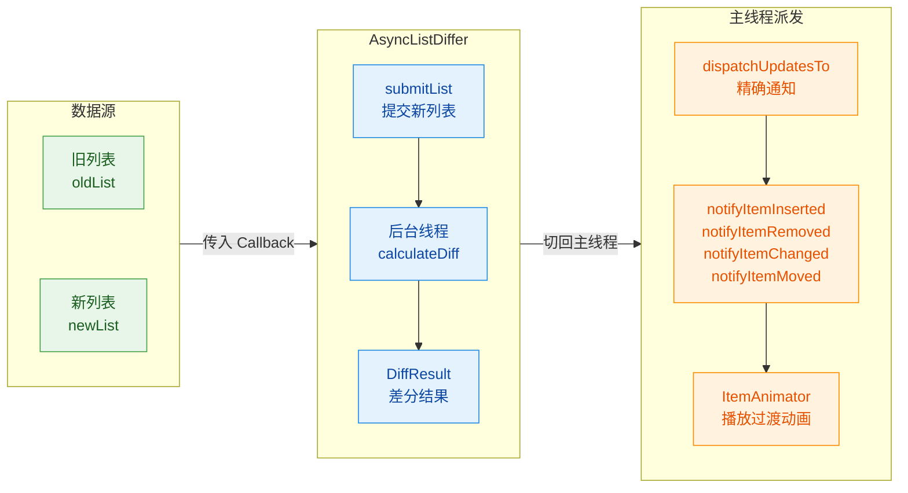

### Myers 差分算法应用

#### 问题本质：最短编辑距离

DiffUtil 内部使用的核心算法是 Eugene W. Myers 于 1986 年发表的经典论文 *"An O(ND) Difference Algorithm and Its Variations"* 中描述的 **Myers Diff Algorithm**。要理解这个算法，首先要明确它解决的问题：

给定两个序列 A（长度 N）和 B（长度 M），找到一个 **最短编辑脚本**（Shortest Edit Script, SES），使得通过尽可能少的 **插入**（insert）和 **删除**（delete）操作，将序列 A 转换为序列 B。这与经典的 "最长公共子序列"（LCS, Longest Common Subsequence）问题是等价的——LCS 越长，需要的编辑操作就越少。

在 RecyclerView 的语境下：
- 序列 A = 旧列表（oldList）
- 序列 B = 新列表（newList）
- 插入 = `notifyItemInserted`
- 删除 = `notifyItemRemoved`
- 同一个 item 内容变化 = `notifyItemChanged`（areItemsTheSame=true 但 areContentsTheSame=false）

#### 编辑图（Edit Graph）模型

Myers 算法的精髓在于将序列比较问题转化为 **图的最短路径问题**。它构建了一个概念上的"编辑图"（Edit Graph），这个图是一个 `(N+1) × (M+1)` 的网格：

```text
         newList (B)
         0   1   2   3   4
    0    ·───·───·───·───·
         │ ╲ │   │ ╲ │   │
    1    ·───·───·───·───·
         │   │ ╲ │   │   │
o   2    ·───·───·───·───·
l        │   │   │   │ ╲ │
d   3    ·───·───·───·───·
L        │   │   │   │   │
i   4    ·───·───·───·───·
s        │   │ ╲ │   │   │
t   5    ·───·───·───·───·

→ 向右移动 = 插入 newList[j]（代价 1）
↓ 向下移动 = 删除 oldList[i]（代价 1）
╲ 对角线移动 = oldList[i] == newList[j]，匹配（代价 0）
```

从左上角 `(0,0)` 到右下角 `(N,M)` 的路径就是一个编辑脚本。每条路径的代价 = 非对角线移动的总次数（即插入 + 删除的总数，记为 D）。**最短路径就是最短编辑脚本。** 对角线移动是"免费的"——它代表旧列表和新列表中对应位置的元素相同，不需要任何操作。

#### 算法核心思路：按 D 值逐层搜索

Myers 算法的核心思想是 **按编辑距离 D 从小到大逐层搜索**（BFS 的变体），在每一层中尽可能贪心地沿对角线"滑行"（即尽可能多地匹配相同元素，因为这不增加代价）：

1. **D = 0**：从起点 `(0,0)` 开始，看能否完全沿对角线走到终点——也就是旧列表和新列表完全相同。如果能走到终点，差异为 0，算法结束。

2. **D = 1**：如果 D=0 不行，尝试 1 次编辑操作（1 次插入或 1 次删除），然后再贪心地沿对角线滑行，看是否能到达终点。

3. **D = 2, 3, ...**：逐步增加编辑次数，直到找到一条能到达终点的路径。

这种"逐层递增 D"的策略保证了找到的第一条到达终点的路径一定是最短的。

算法使用一个关键的数据结构：一维数组 `V`，其中 `V[k]` 记录在对角线 `k = x - y` 上能到达的最远 x 坐标。每一轮 D 值扩展时，算法遍历所有可到达的对角线，在每条对角线上选择"从上方插入"或"从左方删除"中 x 更大的那个方向前进，然后贪心地沿对角线滑行到底。

```kotlin
// === Myers 差分算法核心逻辑（概念化 Kotlin 实现） ===
// 此为教学简化版本，展示核心思路，非 Android 源码

fun myersDiff(old: List<Any>, new: List<Any>): List<EditOp> {
    val n = old.size                              // 旧列表长度
    val m = new.size                              // 新列表长度
    val max = n + m                               // 最大可能编辑距离（全删再全插）
    
    // V 数组：V[k] 表示对角线 k 上能到达的最远 x 坐标
    // 对角线编号 k = x - y，范围 [-max, max]
    // 使用偏移量 max 将负索引映射为正索引
    val v = IntArray(2 * max + 1)                 // 初始化 V 数组
    v[max + 1] = 0                                // 起始条件：对角线 k=1 处 x=0

    // trace 记录每一轮 D 的 V 数组快照，用于回溯路径
    val trace = mutableListOf<IntArray>()         // 路径回溯用的历史记录

    // 外层循环：按编辑距离 D 从 0 到 max 逐层搜索
    for (d in 0..max) {
        trace.add(v.copyOf())                     // 保存当前轮 V 快照

        // 内层循环：遍历当前 D 能到达的所有对角线
        // 每增加 1 次编辑，对角线编号 k 的奇偶性翻转
        for (k in -d..d step 2) {
            val idx = k + max                     // 将 k 映射为数组索引

            // 决策：向右移动（插入）还是向下移动（删除）
            // 如果 k == -d，只能向右（插入）
            // 如果 k == d，只能向下（删除）
            // 否则选择 x 更大的方向（贪心：尽量多匹配）
            val x: Int = if (k == -d || (k != d && v[idx - 1] < v[idx + 1])) {
                v[idx + 1]                        // 从对角线 k+1 向右移动（插入）
            } else {
                v[idx - 1] + 1                    // 从对角线 k-1 向下移动（删除）
            }
            var curX = x                          // 当前 x 坐标
            var curY = x - k                      // 由 k = x - y 推出 y

            // 贪心滑行：沿对角线尽可能向前（匹配相同元素不增加代价）
            while (curX < n && curY < m && old[curX] == new[curY]) {
                curX++                            // x 前进 1（旧列表匹配下一个）
                curY++                            // y 前进 1（新列表匹配下一个）
            }

            v[idx] = curX                         // 更新 V[k] 为最远 x 坐标

            // 到达终点：找到最短编辑脚本
            if (curX >= n && curY >= m) {
                return backtrack(trace, n, m)     // 从 trace 回溯出具体操作序列
            }
        }
    }
    return emptyList()                            // 理论上不会执行到这里
}
```

#### 复杂度分析与 DiffUtil 的优化

Myers 算法的时间复杂度为 **O((N+M) × D)**，通常简写为 **O(ND)**。当两个列表非常相似（D 很小）时，算法非常快；当差异很大（D 接近 N+M）时，退化为接近 O(N²)。空间复杂度为 **O(N)** 用于 V 数组，外加 **O(D²)** 用于回溯路径（如果需要输出具体的编辑脚本）。

Android 的 DiffUtil 在 Myers 算法基础上做了几项工程优化：

**第一，双端搜索（Linear Space Refinement）。** DiffUtil 的实际实现采用了 Myers 论文中描述的"线性空间"变体——同时从 `(0,0)` 正向搜索和从 `(N,M)` 反向搜索，当两个搜索前沿相遇时，即可确定一个"中间蛇"（middle snake）。然后递归地对左半部分和右半部分分别求解。这将空间复杂度从 O(D²)（需要存储全部路径历史）降低到 **O(N)**，使得大型列表的差分计算在内存上可行。

**第二，移动检测（Move Detection）。** 标准的 Myers 算法只能产生插入和删除两种操作。DiffUtil 在获取基本的 SES（最短编辑脚本）后，会执行第二轮扫描：它检查所有"被删除"的 item 是否在"被插入"的 item 中有匹配（通过 `areItemsTheSame()` 判断）。如果有，就将这对删除 + 插入合并为一个 **移动操作**。这使得 RecyclerView 能播放 item 移动动画，而不是生硬的"先消失再出现"。

**第三，变化载荷（Change Payload）。** 当一个 item 的身份不变但内容改变时（areItemsTheSame=true, areContentsTheSame=false），DiffUtil 会调用 `getChangePayload()` 获取精确的变化信息。这个 payload 会被传递给 `onBindViewHolder(holder, position, payloads)`，让开发者可以只更新变化的视图部分（如只更新价格文本而不重新加载图片），进一步减少绑定开销。

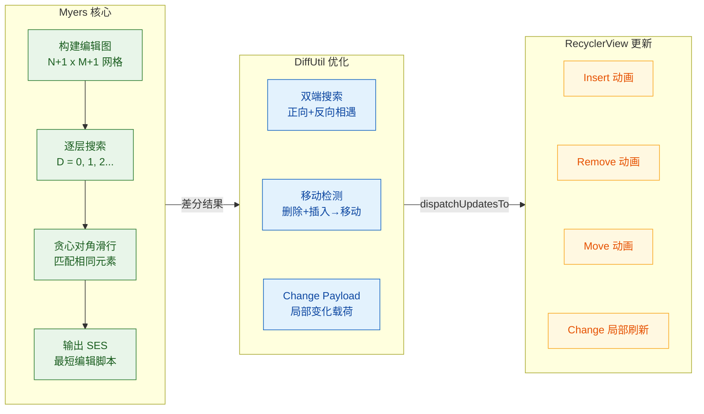

#### 实际场景中的对比示例

为了直观理解 Myers 算法的工作过程，我们来看一个具体的例子。假设旧列表包含 items `[A, B, C, D, E]`，新列表为 `[B, C, D, F, A]`：

```text
旧列表: A  B  C  D  E
新列表: B  C  D  F  A

--- Myers 算法计算过程（概念化）---

D=0: 起点(0,0)，oldList[0]=A ≠ newList[0]=B，无法对角滑行，未到达终点
D=1: 尝试 1 次操作...未到达终点
D=2: 尝试 2 次操作...未到达终点
D=3: 尝试 3 次操作...未到达终点
D=4: 找到路径！

--- 基本编辑脚本 ---
删除 oldList[0] (A)        → notifyItemRemoved(0)
保留 B (匹配)               → 无操作
保留 C (匹配)               → 无操作
保留 D (匹配)               → 无操作
删除 oldList[4] (E)        → notifyItemRemoved(4)
插入 newList[3] (F)        → notifyItemInserted(3)
插入 newList[4] (A)        → notifyItemInserted(4)

--- 移动检测优化后 ---
删除 A @0 + 插入 A @4      → notifyItemMoved(0, 4)   ← 识别为移动！
删除 E @4                  → notifyItemRemoved(3)     ← 位置因移动调整
插入 F @3                  → notifyItemInserted(3)

最终操作：1 次 Move + 1 次 Remove + 1 次 Insert（而非全量刷新 5 个 item）
```

可以看到，移动检测将 A 的"先删后插"合并成了一次移动操作，使得 RecyclerView 能为 A 播放平滑的位移动画，而不是让它突然消失再出现在列表末尾。

#### 使用注意事项与最佳实践

**第一，确保 areItemsTheSame 使用稳定的唯一标识符。** 不要使用列表位置（position）或可变字段作为判断依据，而应使用数据库主键、服务器下发的 UUID 等不可变标识。如果同一性判断不稳定，DiffUtil 可能产生错误的编辑脚本，导致 UI 异常。

**第二，data class 是 areContentsTheSame 的好搭档。** Kotlin 的 data class 自动生成基于所有属性的 `equals()` 方法，非常适合作为 `areContentsTheSame` 的判断依据。但要注意：如果 data class 包含 `List` 或 `Map` 等可变集合字段，确保比较的是深拷贝或不可变集合，否则可能因引用共享导致"明明内容变了但 equals 返回 true"的问题。

**第三，大列表务必使用 ListAdapter 或 AsyncListDiffer。** 对于超过几百条数据的列表，同步调用 `DiffUtil.calculateDiff()` 可能需要十几到几十毫秒，足以导致跳帧。使用异步方案可以将计算开销完全从主线程剥离。

**第四，善用 getChangePayload 实现局部刷新。** 对于包含图片、复杂布局的 item，全量重新绑定代价很高。通过 payload 机制，你可以只更新变化的文本或图标，避免不必要的图片重新加载和布局重新计算。

---

**📝 练习题**

在使用 `ListAdapter` 时，你调用了 `submitList(currentList)` 传入了与当前列表 **同一个对象引用**（但已对其内部元素做了修改），发现列表没有更新。最可能的原因是什么？

A. DiffUtil 算法计算出差异为 0，因此不触发更新


B. `ListAdapter` 内部对传入的 list 做了引用比较（`===`），发现是同一个对象就直接跳过


C. `submitList()` 必须在主线程调用，后台线程调用会静默失败


D. RecyclerView 的 `ItemAnimator` 拦截了更新操作


**【答案】** B

**【解析】** `ListAdapter`（具体在其内部的 `AsyncListDiffer`）在 `submitList()` 方法的入口处会进行一次 **引用相等性检查**（`newList == mList`，Kotlin 中为 `===`）。如果传入的新列表与当前持有的列表是同一个对象引用，方法会直接 return，不会触发任何差分计算或更新操作。这是一个有意为之的性能优化：如果引用相同，框架认为数据没有变化。但开发者如果直接修改原列表然后传回同一个引用，就会踩到这个"坑"。正确做法是每次提交新列表时创建一个新的列表实例，例如 `submitList(currentList.toList())` 或 `submitList(ArrayList(currentList))`。选项 A 虽然听起来合理，但问题出在"根本没走到 DiffUtil 计算那一步"——引用检查在差分之前就将调用拦截了。选项 C 不正确，`submitList()` 确实应在主线程调用，但这不是本场景的原因。选项 D 与 `ItemAnimator` 无关，动画器不会拦截数据更新。

---

**📝 练习题**

关于 Myers 差分算法在 DiffUtil 中的应用，以下说法 **正确** 的是：

A. Myers 算法的时间复杂度为 O(N log N)，适合任意大小的列表在主线程同步执行


B. Myers 算法只能产生"插入"和"删除"两种操作，DiffUtil 通过额外的移动检测阶段将配对的"删除 + 插入"合并为"移动"


C. DiffUtil 的 `areItemsTheSame()` 返回 false 时，`areContentsTheSame()` 仍然会被调用以做二次确认


D. Myers 算法的空间复杂度为 O(N²)，因此 DiffUtil 在处理大列表时需要大量内存


**【答案】** B

**【解析】** Myers 算法本身的编辑操作只有两种：**插入**（从新列表取一个元素）和 **删除**（从旧列表丢弃一个元素）。它不原生支持"移动"操作。DiffUtil 在得到 Myers 算法产出的基本编辑脚本后，会执行一个额外的 **移动检测（move detection）** 后处理阶段：扫描所有被删除的 item，检查它们是否在被插入的 item 中有 `areItemsTheSame()` 匹配的对应项。如果匹配，就将这对删除 + 插入合并为一次移动操作，从而使 RecyclerView 能播放 item 的移动动画。因此 B 正确。选项 A 错误，Myers 算法的时间复杂度是 O(ND) 而非 O(N log N)，当 D 较大时不适合在主线程同步执行。选项 C 错误，`areContentsTheSame()` **仅在** `areItemsTheSame()` 返回 true 时才会被调用——它只对"同一个 item"才检查内容是否变化。选项 D 错误，DiffUtil 使用了 Myers 算法的线性空间变体（中间蛇分治策略），空间复杂度为 O(N) 而非 O(N²)。

---

## 视图持有者模式

RecyclerView 之所以能在大规模列表中保持流畅滚动，**ViewHolder 模式**是其中最核心的设计基石之一。在前面的章节中，我们已经从缓存复用机制的角度了解了 ViewHolder 如何被 Recycler 管理和回收；而在本节，我们将把视角聚焦于 ViewHolder **自身**——它的封装思想、它如何支撑多类型布局、以及它如何实现高效的局部刷新。理解这三个维度，才算真正掌握了 RecyclerView 数据绑定的精髓。

从宏观来看，ViewHolder 解决的是一个在 GUI 编程中反复出现的经典问题：**视图查找的开销**。每一次 `findViewById()` 都是一次基于 View Tree 的深度遍历，当列表条目布局复杂（嵌套层级深、子 View 多）且滚动频率高时，这种反复遍历会成为显著的性能瓶颈。ViewHolder 的核心契约就是——**一次查找，长期持有**。它将 `findViewById()` 的结果缓存为成员变量，使后续的数据绑定操作变成简单的字段访问，将 O(n) 的树遍历降为 O(1) 的直接引用。

但 ViewHolder 的价值远不止"缓存 View 引用"。在 RecyclerView 的体系中，ViewHolder 还承担了**身份标识**（通过 `itemViewType` 区分条目类型）、**位置追踪**（通过内部的 `mPosition`、`mOldPosition` 等字段记录自己在 Adapter 数据集中的位置）、**状态标记**（通过 Flag 位标识自己是否被绑定、是否失效、是否被移除等状态）等多重职责。可以说，ViewHolder 是 RecyclerView 缓存体系、动画体系和数据更新体系的**联结枢纽**。

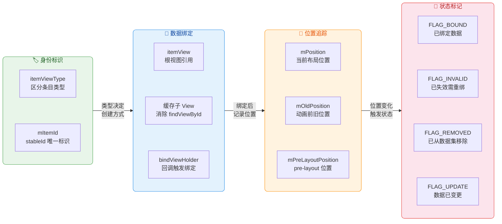

---

### ViewHolder 封装

#### 从 ListView 的教训说起

要真正理解 ViewHolder 的封装价值，必须先回顾 ListView 时代的痛点。在 ListView 中，Adapter 的核心方法是 `getView(int position, View convertView, ViewGroup parent)`。系统会把一个可能已被回收的旧 View（即 `convertView`）传给你，你需要自行决定：如果 `convertView` 为 null，就 inflate 一个新布局；如果不为 null，就复用它。这个机制本身没有问题，问题出在**数据绑定环节**——每次 `getView()` 被调用时，开发者都需要通过 `convertView.findViewById(R.id.xxx)` 来获取子 View 的引用，然后为其设置文本、图片等内容。

```java
// ListView 时代的典型 getView() 写法（无 ViewHolder）
@Override
public View getView(int position, View convertView, ViewGroup parent) {
    // 如果没有可复用的旧 View，就从 XML 膨胀一个新布局
    if (convertView == null) {
        convertView = LayoutInflater.from(context)
                .inflate(R.layout.item_contact, parent, false);
    }
    // ❌ 每次绑定都要执行 findViewById —— 这是一次 View 树遍历
    // 当布局层级深、子 View 多时，开销不可忽视
    TextView nameView = convertView.findViewById(R.id.tv_name);
    ImageView avatarView = convertView.findViewById(R.id.iv_avatar);
    TextView phoneView = convertView.findViewById(R.id.tv_phone);

    // 将当前 position 对应的数据绑定到视图
    Contact contact = dataList.get(position);
    nameView.setText(contact.getName());        // 设置姓名
    avatarView.setImageResource(contact.getAvatarRes()); // 设置头像
    phoneView.setText(contact.getPhone());      // 设置电话号码

    return convertView;
}
```

上面的代码有一个核心缺陷：虽然 View（convertView）本身被复用了，但**每次绑定数据时都在重新查找子 View**。`findViewById()` 的底层实现是从当前节点出发，对 View Tree 做深度优先搜索（DFS），直到找到匹配 ID 的子节点为止。对于一个只有 3 个子 View 的简单布局，这个开销微乎其微；但在实际项目中，列表条目往往包含复杂的嵌套结构——外层 ConstraintLayout 里嵌 CardView，CardView 里再嵌 LinearLayout，加上图片、多行文字、标签群组等，一个条目拥有 15~30 个子 View 是常态。在快速滑动场景下，`getView()` 每秒可能被调用 30~60 次，累积的 `findViewById()` 开销便成为卡顿的元凶之一。

聪明的开发者很快发明了一种解决方案：创建一个普通的 Java 类（习惯命名为 `ViewHolder`），在其中持有所有子 View 的引用，然后通过 `View.setTag()` / `View.getTag()` 将其附着到 convertView 上。这样，`findViewById()` 只在 inflate 新布局时执行一次，后续复用 convertView 时直接从 Tag 中取出 ViewHolder 即可。

```java
// ListView 时代的手动 ViewHolder 模式
@Override
public View getView(int position, View convertView, ViewGroup parent) {
    ViewHolder holder; // 声明一个 ViewHolder 变量

    if (convertView == null) {
        // 第一次创建：inflate 布局并将子 View 引用缓存到 ViewHolder
        convertView = LayoutInflater.from(context)
                .inflate(R.layout.item_contact, parent, false);
        holder = new ViewHolder();                              // 创建 ViewHolder 实例
        holder.nameView = convertView.findViewById(R.id.tv_name);    // 缓存姓名 TextView
        holder.avatarView = convertView.findViewById(R.id.iv_avatar);// 缓存头像 ImageView
        holder.phoneView = convertView.findViewById(R.id.tv_phone);  // 缓存电话 TextView
        convertView.setTag(holder);  // ✅ 将 ViewHolder 附着到 convertView 上
    } else {
        // 复用旧 View：直接从 Tag 中取出已缓存的 ViewHolder
        holder = (ViewHolder) convertView.getTag(); // ✅ O(1) 获取，无需再遍历
    }

    // 数据绑定 —— 直接通过 holder 的字段访问子 View
    Contact contact = dataList.get(position);
    holder.nameView.setText(contact.getName());
    holder.avatarView.setImageResource(contact.getAvatarRes());
    holder.phoneView.setText(contact.getPhone());

    return convertView;
}

// 一个普通的内部类，纯粹用于缓存子 View 引用
static class ViewHolder {
    TextView nameView;    // 姓名
    ImageView avatarView; // 头像
    TextView phoneView;   // 电话
}
```

这个模式极其有效，但它有一个致命缺陷：**它是可选的**。ListView 的 API 并不强制你使用 ViewHolder，也不会在编译期或运行时给你任何提示。这意味着在团队协作中，总会有人忘记或不愿意使用这个模式，导致性能问题在 Code Review 中反复出现。

#### RecyclerView.ViewHolder：从"约定"到"强制"

RecyclerView 的设计者（由当时的 Android Support Library 团队，后来的 Jetpack/AndroidX 团队推出）吸取了这个教训，做了一个关键决策——**将 ViewHolder 提升为框架级别的强制契约**。在 RecyclerView 中，你无法绕过 ViewHolder。Adapter 的泛型签名是 `RecyclerView.Adapter<VH extends RecyclerView.ViewHolder>`，它的两个核心方法 `onCreateViewHolder()` 和 `onBindViewHolder()` 都以 ViewHolder 作为参数或返回值。你不使用 ViewHolder，代码根本无法编译。

让我们看看 `RecyclerView.ViewHolder` 的关键源码结构（简化版）：

```java
public abstract static class ViewHolder {
    // ====== 核心公开字段 ======
    public final View itemView;    // 条目的根视图，在构造器中一次性绑定，不可更改

    // ====== 内部位置字段（包访问级别，App 层通过 getter 使用）======
    int mPosition;                 // 当前在 Adapter 数据集中的位置
    int mOldPosition;              // 上次布局时的旧位置（用于动画计算）
    long mItemId;                  // 稳定 ID，仅在 hasStableIds() = true 时有意义
    int mItemViewType;             // 视图类型（对应 getItemViewType() 的返回值）
    int mPreLayoutPosition;        // pre-layout 阶段的位置（用于 predictive animation）

    // ====== 状态标记（通过位运算管理）======
    int mFlags;                    // 组合了多个 FLAG_* 常量的位掩码
    // FLAG_BOUND       = 1 << 0   标识此 ViewHolder 已完成数据绑定
    // FLAG_UPDATE      = 1 << 1   标识对应位置的数据已变更，需要重新绑定
    // FLAG_INVALID     = 1 << 2   标识此 ViewHolder 已完全失效（如调用了 notifyDataSetChanged）
    // FLAG_REMOVED     = 1 << 3   标识对应的数据项已从数据集中移除
    // FLAG_NOT_RECYCLABLE = 1 << 4 标识此 ViewHolder 当前不允许被回收
    // FLAG_RETURNED_FROM_SCRAP = 1 << 5  标识从 Scrap 缓存中取出

    // ====== 构造器 ======
    public ViewHolder(View itemView) {
        if (itemView == null) {
            throw new IllegalArgumentException("itemView may not be null");
        }
        this.itemView = itemView;  // 将传入的根视图绑定为不可变引用
    }

    // ====== 常用公开方法 ======
    public final int getAdapterPosition() { ... } // 返回在当前 Adapter 中的位置（动画期间可能为 NO_POSITION）
    public final int getLayoutPosition() { ... }   // 返回上次布局后的位置（更稳定，但可能滞后于数据变化）
    public final int getItemViewType() { return mItemViewType; } // 返回视图类型
}
```

从源码中可以提炼出几个关键的封装设计：

**第一，`itemView` 是 `public final` 的。** 这意味着一旦在构造器中传入根视图，就再也不能更改。这是一个很强的不可变性保证——ViewHolder 和它所持有的条目视图之间形成了**终身绑定**（lifetime binding）。RecyclerView 的缓存系统可以安全地假设：一个 ViewHolder 永远对应同一个 View 对象，反之亦然。这也是为什么 RecyclerView 能直接用 ViewHolder 作为缓存单元，而不需要像 ListView 那样把 View 和 ViewHolder 分开管理（Tag 机制）。

**第二，位置信息被内部化管理。** 开发者不需要（也不应该）自己在 ViewHolder 中维护 position 字段。RecyclerView 内部在 `onBindViewHolder()` 调用前会自动更新 `mPosition`，在进行增删操作后会通过 offset 机制批量调整所有受影响的 ViewHolder 位置。App 层通过 `getAdapterPosition()` 或 `getLayoutPosition()` 安全地获取位置——前者在动画进行中可能返回 `NO_POSITION`（-1），后者返回上次布局完成时的位置，更稳定但可能有短暂的延迟。

**第三，Flag 机制实现了细粒度的生命周期管控。** `mFlags` 字段通过位运算同时管理多个状态，例如一个 ViewHolder 可以同时处于 `FLAG_BOUND | FLAG_UPDATE` 状态——表示它已经绑定了数据，但数据已过期需要重新绑定。RecyclerView 在决定是否可以直接复用、是否需要重新调用 `onBindViewHolder()`、是否可以播放动画时，都会检查这些 Flag。

#### 现代 ViewHolder 的推荐写法

在现代 Android 开发中，结合 Kotlin 和 View Binding（或 Data Binding），ViewHolder 的编写变得极为简洁，同时保持了类型安全：

```kotlin
// 使用 ViewBinding 的现代 ViewHolder 封装
class ContactViewHolder(
    private val binding: ItemContactBinding  // ViewBinding 自动生成的绑定类，持有所有子 View 引用
) : RecyclerView.ViewHolder(binding.root) {  // 将 binding.root（即条目根视图）传给父类构造器

    /**
     * 数据绑定方法 —— 将 Contact 数据模型映射到 UI 控件
     * 这种将绑定逻辑封装在 ViewHolder 内部的做法，
     * 能让 Adapter 的 onBindViewHolder() 保持简洁，
     * 同时提高 ViewHolder 的内聚性和可测试性
     */
    fun bind(contact: Contact) {
        binding.tvName.text = contact.name         // 姓名 —— 直接通过 binding 字段访问，无需 findViewById
        binding.ivAvatar.load(contact.avatarUrl)   // 头像 —— 假设使用 Coil 图片加载库
        binding.tvPhone.text = contact.phone       // 电话号码

        // 点击事件也可以在 ViewHolder 内部设置
        // 但注意：不要在这里捕获 position 参数，应使用 bindingAdapterPosition
        binding.root.setOnClickListener {
            val pos = bindingAdapterPosition       // 获取当前在绑定 Adapter 中的实际位置
            if (pos != RecyclerView.NO_POSITION) { // 防御性检查：动画期间位置可能无效
                onItemClick?.invoke(pos, contact)   // 回调外部点击监听
            }
        }
    }

    companion object {
        var onItemClick: ((Int, Contact) -> Unit)? = null  // 静态的点击回调（简化示例）
    }
}
```

这里有一个值得深入讨论的点：**为什么推荐将 `bind()` 方法放在 ViewHolder 内部，而不是在 Adapter 的 `onBindViewHolder()` 中直接操作？** 原因在于**职责分离**（Separation of Concerns）。ViewHolder 的职责是"管理视图引用和数据映射"，Adapter 的职责是"管理数据集和 ViewHolder 的创建/类型分发"。将绑定逻辑下沉到 ViewHolder，Adapter 的 `onBindViewHolder()` 就变成了简单的一行调用 `holder.bind(dataList[position])`，代码结构更清晰，在多 ViewType 场景下尤其明显。

---

### ViewType 多类型布局

#### 为什么需要多类型布局

真实世界的列表很少是"千篇一律"的——打开任何一个成熟的 App，你会发现列表中混杂着各种不同样式的条目：社交 Feed 中有图文帖子、纯文字帖子、视频帖子、广告卡片、"猜你喜欢"推荐横排栏；电商首页有 Banner 轮播、分类入口网格、秒杀倒计时、商品瀑布流卡片……这些不同样式的条目拥有**完全不同的布局结构和子 View 组成**，用同一个 ViewHolder 来承载显然不合适。

RecyclerView 通过 **ViewType 机制** 优雅地解决了这个问题。其核心思路是：**让每一种布局样式对应一个整数类型标识（viewType），RecyclerView 根据这个标识来创建和复用对应类型的 ViewHolder。**

#### ViewType 的工作流程

让我们从 RecyclerView 获取一个条目 ViewHolder 的完整流程来理解 ViewType 是如何运转的：

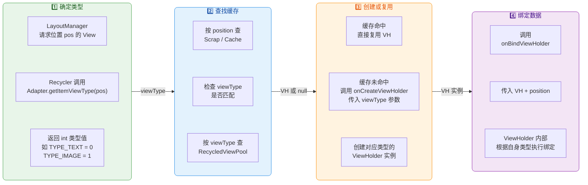

这个流程中有几个关键细节：

**1. `getItemViewType(position)` 是一切的起点。** 这个方法默认返回 0（即所有条目类型相同），你需要重写它来根据 position 对应的数据类型返回不同的整数值。RecyclerView 内部在调用 `tryGetViewHolderForPositionByDeadline()` 方法获取 ViewHolder 时，第一步就是调用这个方法确定目标类型。

**2. 缓存复用严格遵守 ViewType 匹配。** 当 Recycler 从 `mCachedViews`（第二级缓存）中找到一个 ViewHolder 时，会校验其 `mItemViewType` 是否与当前请求的 viewType 一致，不一致则跳过。从 `RecycledViewPool`（第四级缓存）中获取时，Pool 本身就是按 viewType 分桶存储的（内部使用 `SparseArray<ScrapData>`，key 就是 viewType），所以天然保证了类型匹配。

**3. `onCreateViewHolder(parent, viewType)` 接收 viewType 参数。** 这让你可以在创建时根据类型 inflate 不同的布局、返回不同的 ViewHolder 子类。

#### 多类型布局的实现

以一个典型的 Feed 列表为例，我们来看完整的多类型实现：

```kotlin
// ========== 第一步：定义数据模型 ==========
// 使用 Kotlin 密封类（sealed class）来表达"有限种类"的数据类型
// 密封类的优势：when 表达式可以穷尽检查，编译器会提示你处理所有类型
sealed class FeedItem {
    data class TextPost(                   // 纯文字帖子
        val author: String,                // 作者名
        val content: String,               // 正文内容
        val timestamp: Long                // 发布时间戳
    ) : FeedItem()

    data class ImagePost(                  // 图文帖子
        val author: String,                // 作者名
        val content: String,               // 正文内容
        val imageUrls: List<String>,       // 图片 URL 列表（支持多图）
        val timestamp: Long                // 发布时间戳
    ) : FeedItem()

    data class AdBanner(                   // 广告横幅
        val adTitle: String,               // 广告标题
        val adImageUrl: String,            // 广告图片 URL
        val targetUrl: String              // 点击跳转链接
    ) : FeedItem()
}
```

```kotlin
// ========== 第二步：定义各类型的 ViewHolder ==========

// 纯文字帖子的 ViewHolder
class TextPostViewHolder(
    private val binding: ItemTextPostBinding   // 绑定 item_text_post.xml 布局
) : RecyclerView.ViewHolder(binding.root) {

    fun bind(item: FeedItem.TextPost) {
        binding.tvAuthor.text = item.author            // 设置作者名
        binding.tvContent.text = item.content          // 设置正文
        binding.tvTime.text = formatTime(item.timestamp) // 格式化并设置时间
    }
}

// 图文帖子的 ViewHolder
class ImagePostViewHolder(
    private val binding: ItemImagePostBinding  // 绑定 item_image_post.xml 布局
) : RecyclerView.ViewHolder(binding.root) {

    fun bind(item: FeedItem.ImagePost) {
        binding.tvAuthor.text = item.author            // 设置作者名
        binding.tvContent.text = item.content          // 设置正文
        binding.tvTime.text = formatTime(item.timestamp) // 格式化并设置时间
        // 将图片列表交给内嵌的图片网格适配器处理
        binding.rvImages.adapter = ImageGridAdapter(item.imageUrls)
    }
}

// 广告横幅的 ViewHolder
class AdBannerViewHolder(
    private val binding: ItemAdBannerBinding   // 绑定 item_ad_banner.xml 布局
) : RecyclerView.ViewHolder(binding.root) {

    fun bind(item: FeedItem.AdBanner) {
        binding.tvAdTitle.text = item.adTitle           // 设置广告标题
        binding.ivAdImage.load(item.adImageUrl)         // 加载广告图片
        binding.root.setOnClickListener {               // 点击跳转广告链接
            openUrl(item.targetUrl)
        }
    }
}
```

```kotlin
// ========== 第三步：编写多类型 Adapter ==========
class FeedAdapter(
    private val items: List<FeedItem>          // 数据列表，包含多种 FeedItem 子类
) : RecyclerView.Adapter<RecyclerView.ViewHolder>() {
    // 注意泛型是基类 RecyclerView.ViewHolder，因为要容纳多种 VH 子类

    companion object {
        // 定义类型常量 —— 用于标识不同的条目样式
        const val TYPE_TEXT_POST = 0           // 纯文字帖子
        const val TYPE_IMAGE_POST = 1          // 图文帖子
        const val TYPE_AD_BANNER = 2           // 广告横幅
    }

    /**
     * ★ 核心方法一：根据 position 返回对应的 viewType
     * RecyclerView 在获取 ViewHolder 前必定先调用此方法
     */
    override fun getItemViewType(position: Int): Int {
        // Kotlin 的 when + 密封类 = 编译期穷尽检查
        return when (items[position]) {
            is FeedItem.TextPost -> TYPE_TEXT_POST      // 数据是 TextPost → 返回文字类型
            is FeedItem.ImagePost -> TYPE_IMAGE_POST    // 数据是 ImagePost → 返回图文类型
            is FeedItem.AdBanner -> TYPE_AD_BANNER      // 数据是 AdBanner → 返回广告类型
        }
    }

    /**
     * ★ 核心方法二：根据 viewType 创建对应的 ViewHolder
     * 仅在缓存中找不到可复用 ViewHolder 时才会被调用
     */
    override fun onCreateViewHolder(parent: ViewGroup, viewType: Int): RecyclerView.ViewHolder {
        val inflater = LayoutInflater.from(parent.context)  // 获取布局膨胀器
        return when (viewType) {
            TYPE_TEXT_POST -> {
                // 膨胀纯文字布局，并包装为 TextPostViewHolder
                val binding = ItemTextPostBinding.inflate(inflater, parent, false)
                TextPostViewHolder(binding)
            }
            TYPE_IMAGE_POST -> {
                // 膨胀图文布局，并包装为 ImagePostViewHolder
                val binding = ItemImagePostBinding.inflate(inflater, parent, false)
                ImagePostViewHolder(binding)
            }
            TYPE_AD_BANNER -> {
                // 膨胀广告布局，并包装为 AdBannerViewHolder
                val binding = ItemAdBannerBinding.inflate(inflater, parent, false)
                AdBannerViewHolder(binding)
            }
            else -> throw IllegalArgumentException("Unknown viewType: $viewType")
        }
    }

    /**
     * ★ 核心方法三：将数据绑定到 ViewHolder
     * 此处通过类型转换将基类 VH 还原为具体子类，然后调用其 bind() 方法
     */
    override fun onBindViewHolder(holder: RecyclerView.ViewHolder, position: Int) {
        when (val item = items[position]) {             // 取出当前位置的数据
            is FeedItem.TextPost -> (holder as TextPostViewHolder).bind(item)
            is FeedItem.ImagePost -> (holder as ImagePostViewHolder).bind(item)
            is FeedItem.AdBanner -> (holder as AdBannerViewHolder).bind(item)
        }
    }

    override fun getItemCount(): Int = items.size       // 返回数据总条数
}
```

#### 多 ViewType 场景下的缓存效率考量

在多类型布局中，有一个容易被忽视的性能陷阱：**RecycledViewPool 的默认容量是每种 viewType 最多缓存 5 个 ViewHolder**。如果你的列表有 10 种 viewType，但其中 8 种出现频率极低（比如"每日推荐"卡片可能整个列表只有 1 张），那么 Pool 为这些低频类型保留的缓存槽位几乎不会被命中，白白占据内存；而高频类型（如普通帖子）可能 5 个不够用，导致频繁创建新 ViewHolder。

针对这种情况，RecyclerView 提供了精细的池容量调优 API：

```kotlin
// 调整 RecycledViewPool 中各类型的最大缓存数量
val pool = recyclerView.recycledViewPool                    // 获取当前 RecyclerView 的共享池
pool.setMaxRecycledViews(TYPE_TEXT_POST, 15)                // 文字帖子高频，扩大到 15
pool.setMaxRecycledViews(TYPE_IMAGE_POST, 10)               // 图文帖子次高频，设为 10
pool.setMaxRecycledViews(TYPE_AD_BANNER, 2)                 // 广告低频，缩小到 2 节省内存
```

另一个常见的误区是 **viewType 值的选取**。有些开发者喜欢用布局资源 ID（如 `R.layout.item_text_post`）作为 viewType 值，认为这样"直观"。虽然功能上完全可行（viewType 只要求是 int），但 layout resource ID 通常是很大的正整数，而 RecycledViewPool 内部使用 `SparseArray` 存储，key 分散会增加二分查找的次数。使用连续的小整数（0, 1, 2...）作为 viewType 是最佳实践。

#### 使用密封类 + 委托模式简化多类型管理

当 viewType 数量超过 5 种时，`onCreateViewHolder` 和 `onBindViewHolder` 中的 `when` 分支会膨胀得难以维护。业界的常见解法是引入**委托模式**（Delegate Pattern），将每种类型的创建和绑定逻辑封装到独立的 Delegate 类中，Adapter 只负责分发。这也是 `Hannes Dorfmann` 的开源库 `AdapterDelegates` 以及 Google 官方的 `ListAdapter` + `ConcatAdapter` 所采用的思路。

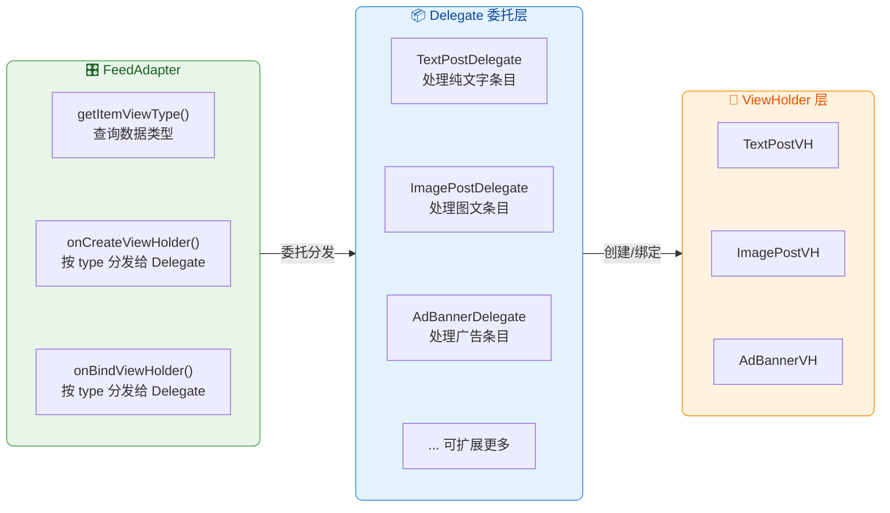

这种架构的好处在于**开闭原则**（Open/Closed Principle）：新增一种条目类型时，只需创建一个新的 Delegate 类并注册到 Adapter 中，无需修改 Adapter 的已有代码。

---

### Payload 局部刷新

#### 全量绑定的浪费

在前面的章节中，我们学习了 `DiffUtil` 如何计算数据集的差异，并精确通知 RecyclerView 哪些位置发生了变化。但即便 DiffUtil 精确地告诉 RecyclerView "位置 5 的数据变了"，默认行为仍然是调用 `onBindViewHolder(holder, position)` 对该条目执行**全量绑定**——也就是说，ViewHolder 中的所有子 View 都会被重新设置一遍，即使实际上只有一个"点赞数"从 99 变成了 100。

考虑一个社交 Feed 的场景：用户点了一个赞，后端返回了更新数据，DiffUtil 检测到位置 3 的帖子发生了变化。如果执行全量绑定，会发生什么？

- 作者头像被重新加载（Coil/Glide 虽然有缓存，但仍有磁盘/内存缓存查找开销）
- 作者名称被重新设置（`TextView.setText()` 即使文本相同也会触发测量和重绘）
- 帖子正文被重新设置（如果是富文本，解析 Spannable 的开销更大）
- 图片列表被重新绑定（可能触发内嵌 RecyclerView 的重新布局）
- 点赞数被重新设置 ← **这才是唯一真正需要更新的**

上述操作中，前四步全是浪费。在快速连续操作（比如双击连赞、批量标记已读等）场景下，这种浪费会累积成可感知的卡顿。

#### Payload 的工作原理

**Payload** 是 RecyclerView 提供的"细粒度更新提示"机制。它允许你在通知数据变化时，附带一个描述"具体什么变了"的对象（即 payload），然后在 `onBindViewHolder()` 的重载版本中根据这个 payload 仅更新变化的部分。

整个 Payload 流程涉及三个关键环节：

**环节一：发出带 Payload 的变更通知。** 这可以通过两种方式实现——手动调用 `notifyItemChanged(position, payload)`，或在 `DiffUtil.Callback` 的 `getChangePayload()` 方法中返回 payload 对象。

**环节二：RecyclerView 将 Payload 传递给 `onBindViewHolder()` 的三参重载。** 注意，RecyclerView.Adapter 有两个 `onBindViewHolder` 签名：

```java
// 二参版本（无 payload）—— 必须重写，执行全量绑定
public abstract void onBindViewHolder(VH holder, int position);

// 三参版本（带 payloads 列表）—— 可选重写，执行局部绑定
// 注意 payloads 是一个 List，因为多次 notifyItemChanged 可能在同一帧内
// 针对同一 position 发出了多个 payload，它们会被合并到这个列表中
public void onBindViewHolder(VH holder, int position, List<Object> payloads) {
    // 默认实现：忽略 payloads，直接调用二参版本（即全量绑定）
    onBindViewHolder(holder, position);
}
```

**环节三：在三参版本中解析 Payload 并执行局部更新。**

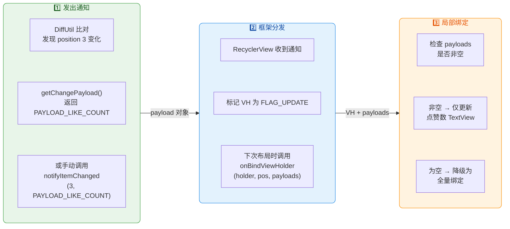

关于 Payload 的传递，有一个非常重要的底层细节：**当一个 ViewHolder 被标记为需要更新（FLAG_UPDATE）时，RecyclerView 会优先尝试从 Scrap 缓存（mAttachedScrap / mChangedScrap）中复用它，而不是去 RecycledViewPool 中找**。此时 ViewHolder 仍然持有旧数据的视图状态，只需要"打补丁"式地更新变化部分即可——这正是 Payload 局部刷新的物理基础。如果 ViewHolder 来自 RecycledViewPool（意味着它经历了完全回收），那么 payloads 列表会为空，必须执行全量绑定。

#### 完整实现示例

让我们以一个社交帖子列表为例，实现 Payload 局部刷新：

```kotlin
// ========== 定义 Payload 常量 ==========
// 使用常量来标识不同类型的局部变化
// 也可以使用 Bundle、枚举或密封类作为 Payload，本例使用简单字符串常量
object PayloadType {
    const val LIKE_COUNT = "payload_like_count"      // 点赞数变化
    const val LIKE_STATUS = "payload_like_status"    // 点赞状态变化（是否已赞）
    const val COMMENT_COUNT = "payload_comment_count" // 评论数变化
}
```

```kotlin
// ========== DiffUtil.ItemCallback 中生成 Payload ==========
class PostDiffCallback : DiffUtil.ItemCallback<Post>() {

    // 判断是否是同一条数据（通常比较唯一 ID）
    override fun areItemsTheSame(oldItem: Post, newItem: Post): Boolean {
        return oldItem.id == newItem.id        // ID 相同 → 是同一条帖子
    }

    // 判断同一条数据的内容是否相同（内容全部相同则无需任何更新）
    override fun areContentsTheSame(oldItem: Post, newItem: Post): Boolean {
        return oldItem == newItem              // data class 自动生成的 equals 逐字段比较
    }

    /**
     * ★ 核心：当 areItemsTheSame = true 但 areContentsTheSame = false 时调用
     * 返回一个描述"具体哪些字段变了"的 Payload 对象
     * 如果返回 null，则 RecyclerView 会执行全量绑定
     */
    override fun getChangePayload(oldItem: Post, newItem: Post): Any? {
        val diffBundle = Bundle()              // 使用 Bundle 承载多个变化字段

        // 逐字段对比，记录变化
        if (oldItem.likeCount != newItem.likeCount) {
            // 点赞数发生了变化 —— 将新的点赞数放入 Bundle
            diffBundle.putInt(PayloadType.LIKE_COUNT, newItem.likeCount)
        }
        if (oldItem.isLiked != newItem.isLiked) {
            // 点赞状态发生了变化 —— 将新的状态放入 Bundle
            diffBundle.putBoolean(PayloadType.LIKE_STATUS, newItem.isLiked)
        }
        if (oldItem.commentCount != newItem.commentCount) {
            // 评论数发生了变化 —— 将新的评论数放入 Bundle
            diffBundle.putInt(PayloadType.COMMENT_COUNT, newItem.commentCount)
        }

        // 如果 Bundle 非空则返回它，否则返回 null 触发全量绑定
        return if (diffBundle.isEmpty) null else diffBundle
    }
}
```

```kotlin
// ========== Adapter 中处理 Payload ==========
class PostAdapter : ListAdapter<Post, PostViewHolder>(PostDiffCallback()) {

    override fun onCreateViewHolder(parent: ViewGroup, viewType: Int): PostViewHolder {
        val binding = ItemPostBinding.inflate(
            LayoutInflater.from(parent.context), parent, false  // 从 XML 膨胀条目布局
        )
        return PostViewHolder(binding)                          // 包装为 ViewHolder
    }

    // 二参版本：全量绑定（当没有 payload 或 payload 为空时调用）
    override fun onBindViewHolder(holder: PostViewHolder, position: Int) {
        holder.bindFull(getItem(position))    // 全量绑定 —— 设置所有字段
    }

    /**
     * ★ 三参版本：局部绑定（优先被 RecyclerView 调用）
     * payloads 列表不为空时 → 执行局部更新
     * payloads 列表为空时 → 调用 super（即二参版本，全量绑定）
     */
    override fun onBindViewHolder(
        holder: PostViewHolder,
        position: Int,
        payloads: MutableList<Any>
    ) {
        if (payloads.isEmpty()) {
            // 没有 payload → 降级为全量绑定
            super.onBindViewHolder(holder, position, payloads)
            return
        }

        // 遍历所有 payload（同一帧内可能累积了多个）
        for (payload in payloads) {
            if (payload is Bundle) {
                holder.bindPartial(payload)   // 将 Bundle 交给 ViewHolder 处理局部更新
            }
        }
    }
}
```

```kotlin
// ========== ViewHolder 中实现全量与局部绑定 ==========
class PostViewHolder(
    private val binding: ItemPostBinding
) : RecyclerView.ViewHolder(binding.root) {

    /**
     * 全量绑定 —— 设置条目中的所有 UI 元素
     * 当 ViewHolder 是全新创建或从 RecycledViewPool 中取出时调用
     */
    fun bindFull(post: Post) {
        binding.ivAvatar.load(post.authorAvatar)       // 加载作者头像
        binding.tvAuthorName.text = post.authorName    // 设置作者名
        binding.tvContent.text = post.content          // 设置帖子正文
        binding.tvTime.text = formatTime(post.timestamp) // 设置发布时间

        // 以下是"可能频繁变化"的字段，也在全量绑定中设置
        updateLikeCount(post.likeCount)                // 设置点赞数
        updateLikeStatus(post.isLiked)                 // 设置点赞状态
        updateCommentCount(post.commentCount)          // 设置评论数
    }

    /**
     * 局部绑定 —— 仅根据 Bundle 中的 key 更新对应的 UI 元素
     * 未包含在 Bundle 中的字段保持原有视图状态不变
     */
    fun bindPartial(bundle: Bundle) {
        // 检查 Bundle 中是否包含点赞数的变化
        if (bundle.containsKey(PayloadType.LIKE_COUNT)) {
            val newCount = bundle.getInt(PayloadType.LIKE_COUNT)
            updateLikeCount(newCount)                  // ✅ 仅更新点赞数 TextView
        }
        // 检查 Bundle 中是否包含点赞状态的变化
        if (bundle.containsKey(PayloadType.LIKE_STATUS)) {
            val isLiked = bundle.getBoolean(PayloadType.LIKE_STATUS)
            updateLikeStatus(isLiked)                  // ✅ 仅更新点赞按钮的选中状态
        }
        // 检查 Bundle 中是否包含评论数的变化
        if (bundle.containsKey(PayloadType.COMMENT_COUNT)) {
            val newCount = bundle.getInt(PayloadType.COMMENT_COUNT)
            updateCommentCount(newCount)               // ✅ 仅更新评论数 TextView
        }
        // 头像、作者名、正文、时间等字段 —— 完全不触碰，零开销
    }

    // ========== 私有辅助方法：封装单个字段的 UI 更新逻辑 ==========
    private fun updateLikeCount(count: Int) {
        binding.tvLikeCount.text = formatCount(count)  // 格式化数字（如 1.2w）并设置
    }

    private fun updateLikeStatus(isLiked: Boolean) {
        binding.btnLike.isSelected = isLiked           // 切换点赞按钮的 selected 状态
        // selected 状态变化会触发 StateListDrawable 自动切换图标颜色
    }

    private fun updateCommentCount(count: Int) {
        binding.tvCommentCount.text = formatCount(count) // 格式化评论数并设置
    }
}
```

#### Payload 的进阶细节

**1. Payload 的合并机制。** 当同一帧内对同一 position 多次调用 `notifyItemChanged(pos, payload)` 时（例如快速连续点赞），RecyclerView 不会为每次通知都单独触发绑定。相反，它会将所有的 payload 对象收集到一个 `List<Object>` 中，在下一次布局时统一传给 `onBindViewHolder(holder, pos, payloads)`。这就是为什么 `payloads` 参数是一个 List 而不是单个对象——你需要遍历整个列表来处理所有累积的变更。

**2. Payload 与 ItemAnimator 的关系。** 默认的 `DefaultItemAnimator` 在处理 `notifyItemChanged` 时，会对变化的条目播放一个"闪烁"动画（cross-fade）。但如果你传递了非 null 的 payload，`DefaultItemAnimator` 的 `canReuseUpdatedViewHolder(holder, payloads)` 方法会返回 true——意味着它会复用同一个 ViewHolder 而不是创建一个新的来做交叉淡入淡出。这既减少了一次 ViewHolder 的创建开销，也避免了不必要的视觉闪烁。这是 Payload 带来的一个容易被忽视但非常实用的**附带好处**。

```kotlin
// DefaultItemAnimator 源码（简化）
override fun canReuseUpdatedViewHolder(
    viewHolder: RecyclerView.ViewHolder,
    payloads: List<Any>          // 注意这个参数
): Boolean {
    // 如果 payloads 非空，说明是局部更新，可以复用同一个 ViewHolder
    // 这避免了交叉淡入淡出动画的开销和视觉闪烁
    return payloads.isNotEmpty() || super.canReuseUpdatedViewHolder(viewHolder, payloads)
}
```

**3. Payload 对象的选择。** Payload 可以是任何 `Object`，但不同的选择有不同的权衡：

| Payload 类型 | 优点 | 缺点 | 适用场景 |
|:---|:---|:---|:---|
| **String 常量** | 极简，零分配开销 | 无法携带变更后的具体值 | 只需知道"哪个字段变了"即可从数据源重取 |
| **Int Flag 位运算** | 高性能，可组合多个变更 | 可读性差，无法携带值 | 变更类型固定且数量少 |
| **Bundle** | 可携带变更后的具体值，类型安全 | 有对象分配开销 | 字段多、需要携带新值 |
| **密封类/枚举** | Kotlin 友好，类型安全，可读性强 | 需要定义额外类 | 团队规范化开发 |

在实际项目中，**Bundle 方案**和**密封类方案**最为常见。Bundle 方案的优势在于 Android 开发者对 Bundle API 非常熟悉，且可以自然地携带各种类型的值；密封类方案则在 Kotlin 项目中与 `when` 表达式搭配得天衣无缝。

```kotlin
// 密封类方案示例 —— 更具类型安全性和可读性
sealed class PostPayload {
    data class LikeChanged(                    // 点赞变更
        val count: Int,                        // 新的点赞数
        val isLiked: Boolean                   // 新的点赞状态
    ) : PostPayload()

    data class CommentCountChanged(            // 评论数变更
        val count: Int                         // 新的评论数
    ) : PostPayload()
}

// 在 onBindViewHolder 中使用
override fun onBindViewHolder(
    holder: PostViewHolder,
    position: Int,
    payloads: MutableList<Any>
) {
    if (payloads.isEmpty()) {
        super.onBindViewHolder(holder, position, payloads) // 全量绑定
        return
    }
    for (payload in payloads) {
        when (payload) {                                    // Kotlin when 表达式
            is PostPayload.LikeChanged -> {                 // 点赞变更
                holder.updateLikeCount(payload.count)       // 更新点赞数
                holder.updateLikeStatus(payload.isLiked)    // 更新点赞状态
            }
            is PostPayload.CommentCountChanged -> {         // 评论数变更
                holder.updateCommentCount(payload.count)    // 更新评论数
            }
        }
    }
}
```

#### Payload 与 DiffUtil 的完整闭环

将所有机制串联在一起，Payload 局部刷新在整个 RecyclerView 数据更新流水线中的位置如下：

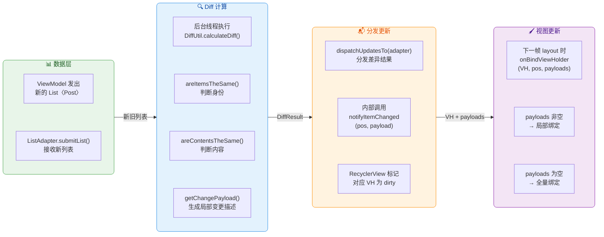

这条流水线中，`getChangePayload()` 是连接 DiffUtil 差分计算和 ViewHolder 局部绑定的**桥梁**。没有它，DiffUtil 只能做到"知道哪些条目变了"，有了它，才能做到"知道条目的哪些**字段**变了"。而 ViewHolder 内部将 `bindFull()` 和 `bindPartial()` 分离封装的做法，则保证了两种路径都能被干净地处理，不会出现遗漏或混乱。

---

**📝 练习题**

在 RecyclerView 中实现多类型列表时，RecycledViewPool 默认为**每种 viewType** 最多缓存多少个 ViewHolder？当某一类型条目出现频率极高时，以下哪种做法最合适？

A. 使用 `setItemViewCacheSize()` 增大所有类型的缓存数量


B. 调用 `recycledViewPool.setMaxRecycledViews(viewType, count)` 为高频类型单独扩大池容量


C. 将所有类型合并为同一个 viewType，在 `onBindViewHolder` 中通过 `View.GONE/VISIBLE` 切换样式


D. 为每个条目调用 `setIsRecyclable(false)` 防止回收，确保不会重新创建


**【答案】** B

**【解析】** RecycledViewPool 默认为每种 viewType 缓存上限为 **5 个** ViewHolder（`DEFAULT_MAX_SCRAP = 5`）。当某一类型出现频率特别高时，5 个缓存可能不够用，导致频繁调用 `onCreateViewHolder()` 创建新实例。选项 B 的 `setMaxRecycledViews(viewType, count)` 正是 RecyclerView 提供的精细调优 API，它允许你按 viewType 单独设置池容量，将高频类型的上限调高（如 15 或 20），同时低频类型保持默认或降低，从而在内存和性能之间取得最佳平衡。

选项 A 的 `setItemViewCacheSize()` 调整的是 **mCachedViews**（第二级缓存，按 position 缓存而非按 viewType），它对所有类型统一生效，且增大此缓存主要优化的是前后来回滑动场景，对"类型高频"问题帮助有限。选项 C 将所有类型合并为同一 viewType，虽然能简化缓存管理，但会导致每个条目的布局臃肿（包含所有类型的 View），inflate 开销增大，且违背了 ViewType 的设计初衷。选项 D 完全禁止回收会导致每个可见条目都必须 inflate 新实例，内存快速膨胀，在长列表中极易引发 OOM，是最不可取的做法。

---

**📝 练习题**

关于 Payload 局部刷新机制，以下说法**正确**的是：

A. 只要 `onBindViewHolder(holder, position, payloads)` 中 payloads 不为空，就一定不会调用二参版本的 `onBindViewHolder`


B. 使用 Payload 时，`DefaultItemAnimator` 默认会对变化的条目播放交叉淡入淡出（cross-fade）动画


C. 如果 `DiffUtil.ItemCallback.getChangePayload()` 返回 null，RecyclerView 会对该条目执行全量绑定


D. 在同一帧内多次对同一 position 调用 `notifyItemChanged(pos, payload)`，只有最后一次的 payload 会生效


**【答案】** C

**【解析】** 当 `areItemsTheSame() = true`、`areContentsTheSame() = false`、且 `getChangePayload()` 返回 null 时，RecyclerView 会调用 `notifyItemChanged(position)` 而非 `notifyItemChanged(position, payload)`，此时三参 `onBindViewHolder` 收到的 payloads 列表为空，默认实现会直接调用二参版本执行全量绑定，因此 C 正确。

选项 A 错误：三参版本是否调用二参版本完全取决于你自己的实现。默认的三参版本 `super.onBindViewHolder(holder, pos, payloads)` 在 payloads 非空时仍然会调用二参版本——除非你重写了三参版本并在 payloads 非空时跳过 `super` 调用。选项 B 错误：恰恰相反，当 payloads 非空时，`DefaultItemAnimator.canReuseUpdatedViewHolder()` 返回 true，会**复用同一个 ViewHolder**，不播放 cross-fade 动画；只有 payloads 为空时才会创建新的 ViewHolder 来做交叉淡入淡出。选项 D 错误：同一帧内多次通知同一 position 的 payload 会被**累积**到 `List<Object>` 中全部传递给三参 `onBindViewHolder`，不是只保留最后一次。

---

## 交互与修饰

RecyclerView 的设计哲学是 **"一切皆可插拔"（Everything is pluggable）**。与 ListView 时代将分割线、点击事件、拖拽等能力内建到控件本身不同，RecyclerView 把这些职责全部拆解为独立的组件：**ItemDecoration** 负责视觉修饰，**OnItemTouchListener** 负责触摸事件拦截，**ItemTouchHelper** 则在此基础上封装了拖拽与侧滑的高级交互。这三者共同构成了 RecyclerView 的 **"交互与修饰层"**，它们不侵入 Adapter 也不耦合 LayoutManager，而是通过 RecyclerView 暴露的钩子（Hook）机制优雅地接入。

理解这一层的意义在于：实际项目中，列表的视觉体验和交互品质往往决定了用户感知的流畅度。一条精心绘制的分割线、一次跟手的侧滑删除、一个顺滑的长按拖拽排序——这些细节的实现质量直接影响应用的专业感。本节将从原理到实战，逐一拆解这三大组件。

### ItemDecoration 分割线绘制

#### 设计定位与核心思想

ItemDecoration，从字面上看就是"条目装饰器"。它的本质是一套 **不修改 Item 布局本身、不增加 View 层级** 的视觉附加机制。你可以把它理解为一张透明的 "贴纸"：RecyclerView 在绘制每个 Item 之前或之后，会额外调用 ItemDecoration 的绘制方法，让你在 Item 周围画上任何你想要的东西——分割线、背景色块、角标、悬浮吸顶的 Header 等等。

之所以采用这种设计而非 ListView 的 `divider` 属性，是因为 RecyclerView 支持多种 LayoutManager（线性、网格、瀑布流），每种布局对"分割"的语义完全不同：线性列表需要水平分割线，网格布局需要纵横交错的间距，瀑布流则需要均匀的 Gap。用一个统一的 `divider` 属性根本无法覆盖这些场景，而 ItemDecoration 的 **自定义绘制 + 自定义偏移量** 模型则完美适配了所有可能性。

#### 三个核心回调方法

ItemDecoration 是一个抽象类（实际上方法都有空的默认实现，严格来说是一个可选覆写的基类），它提供三个关键方法：

**`getItemOffsets(outRect, view, parent, state)`** —— 这是最基础也最常用的方法。RecyclerView 在测量和布局每个 child 时，会询问所有已添加的 ItemDecoration："你需要在这个 Item 的上下左右各留出多少空间？"这些空间会被加到 Item 的 **layoutParams 的 margin** 上（概念上等价于 margin，但不修改真正的 LayoutParams 对象，而是通过内部的 `mInsets` 字段叠加）。`outRect` 是一个 Rect 对象，你往它的 `left`、`top`、`right`、`bottom` 分别写入偏移量即可。比如，你想在每个 Item 底部画一条 2px 的分割线，那就设置 `outRect.bottom = 2`，RecyclerView 就会在每个 Item 下方预留 2px 的空间。

**`onDraw(canvas, parent, state)`** —— 在 **所有 Item 绘制之前** 被调用。你拿到的是 RecyclerView 自身的 Canvas，可以在上面自由绘制。由于是在 Item 之前绘制，所以你画的内容会被 Item **覆盖在下面**（即 Item 是在上层的）。分割线通常画在这里：在 `getItemOffsets` 预留的空间中，用 Canvas 画一个矩形色块或 Drawable，这样分割线就自然地出现在两个 Item 之间了。

**`onDrawOver(canvas, parent, state)`** —— 在 **所有 Item 绘制之后** 被调用。你画的内容会 **覆盖在 Item 之上**。这个方法非常适合做"吸顶 Header"效果——当用户滚动列表时，分组的标题固定在顶部，其实就是在 `onDrawOver` 里根据滚动位置在 Canvas 顶部绘制了一个 Header 的快照。

三者的调用时序可以用下面的流程图表达：

```mermaid
graph LR
    subgraph Phase1["1 · 测量布局阶段"]
        direction TB
        A["RecyclerView\nonMeasure / onLayout"]
        B["遍历每个 child"]
        C["调用 getItemOffsets\n为 Item 预留偏移空间"]
        A --> B
        B --> C
    end

    subgraph Phase2["2 · 绘制底层"]
        direction TB
        D["RecyclerView.onDraw"]
        E["调用所有 Decoration\n的 onDraw"]
        F["绘制内容在\nItem 层之下"]
        D --> E
        E --> F
    end

    subgraph Phase3["3 · 绘制 Item"]
        direction TB
        G["super.dispatchDraw"]
        H["逐个绘制\nchild ItemView"]
        G --> H
    end

    subgraph Phase4["4 · 绘制顶层"]
        direction TB
        I["RecyclerView\ndraw 尾部"]
        J["调用所有 Decoration\n的 onDrawOver"]
        K["绘制内容覆盖\n在 Item 层之上"]
        I --> J
        J --> K
    end

    Phase1 -->|"布局完成"| Phase2 -->|"底层绘制完成"| Phase3 -->|"Item 绘制完成"| Phase4

    classDef greenBox fill:#E8F5E9,stroke:#43A047,color:#1B5E20
    classDef blueBox fill:#E3F2FD,stroke:#1E88E5,color:#0D47A1
    classDef orangeBox fill:#FFF3E0,stroke:#FB8C00,color:#E65100
    classDef purpleBox fill:#F3E5F5,stroke:#8E24AA,color:#4A148C
    class Phase1 greenBox
    class Phase2 blueBox
    class Phase3 orangeBox
    class Phase4 purpleBox
```

需要特别注意的是，一个 RecyclerView 可以 **同时添加多个 ItemDecoration**（通过 `addItemDecoration()` 多次调用）。多个 Decoration 的 `getItemOffsets` 偏移量会 **累加**，而 `onDraw` / `onDrawOver` 会按添加顺序依次调用。这给了开发者极大的组合自由度：一个 Decoration 画分割线，另一个画分组背景，第三个画吸顶 Header，各司其职互不干扰。

#### 实战：自定义分割线 Decoration

下面以最经典的 "线性列表底部分割线" 为例，展示一个完整的 ItemDecoration 实现。为了教学清晰，我们不使用系统的 `DividerItemDecoration`，而是从零手写：

```kotlin
/**
 * 线性列表底部分割线 Decoration
 * @param dividerHeight 分割线高度（单位：px）
 * @param dividerColor  分割线颜色
 * @param marginStart   分割线左侧留白（单位：px）
 * @param marginEnd     分割线右侧留白（单位：px）
 */
class LinearDividerDecoration(
    private val dividerHeight: Int,    // 分割线的粗细，以像素为单位
    private val dividerColor: Int,     // 分割线的颜色值（如 Color.GRAY）
    private val marginStart: Int = 0,  // 分割线距离左边缘的缩进
    private val marginEnd: Int = 0     // 分割线距离右边缘的缩进
) : RecyclerView.ItemDecoration() {

    // 创建画笔，在构造时就初始化，避免在 onDraw 中反复创建对象
    private val paint = Paint().apply {
        color = dividerColor            // 设置画笔颜色为传入的分割线颜色
        style = Paint.Style.FILL        // 填充模式，画实心矩形
        isAntiAlias = true              // 开启抗锯齿（对于直线影响不大，但保持良好习惯）
    }

    /**
     * 为每个 Item 的底部预留出分割线的空间。
     * 最后一个 Item 通常不需要底部分割线，所以做了排除处理。
     */
    override fun getItemOffsets(
        outRect: Rect,                  // 输出矩形，写入四个方向的偏移量
        view: View,                     // 当前正在处理的 child View
        parent: RecyclerView,           // 父 RecyclerView 引用
        state: RecyclerView.State       // 当前 RecyclerView 的状态信息
    ) {
        // 获取当前 child 在 Adapter 数据集中的位置
        val position = parent.getChildAdapterPosition(view)
        // 获取 Adapter 中 Item 的总数量
        val itemCount = state.itemCount
        // 如果是最后一个 Item，不预留空间（不画最底部的分割线）
        if (position == itemCount - 1) {
            outRect.set(0, 0, 0, 0)     // 四个方向偏移量均为 0
        } else {
            outRect.set(0, 0, 0, dividerHeight) // 仅在底部预留 dividerHeight 的空间
        }
    }

    /**
     * 在 Item 绘制之前，在预留的空间内画出分割线矩形。
     * 遍历当前屏幕上可见的所有 child，在每个 child 的底部画线。
     */
    override fun onDraw(
        canvas: Canvas,                 // RecyclerView 提供的画布
        parent: RecyclerView,           // 父 RecyclerView 引用
        state: RecyclerView.State       // 当前状态
    ) {
        // 获取当前 RecyclerView 上挂载的 child 数量（只包含屏幕上可见的）
        val childCount = parent.childCount
        // 遍历每一个可见的 child
        for (i in 0 until childCount) {
            val child = parent.getChildAt(i)    // 拿到第 i 个 child View
            // 获取该 child 在 Adapter 中的真实位置
            val adapterPos = parent.getChildAdapterPosition(child)
            // 最后一个 Item 不画分割线，直接跳过
            if (adapterPos == state.itemCount - 1) continue

            // 获取 child 的 LayoutParams，用于获取 margin 信息
            val params = child.layoutParams as RecyclerView.LayoutParams

            // 计算分割线矩形的四条边坐标
            // 左边界 = child 左边缘 - child 的 leftMargin + 自定义左缩进
            // 注意 translationX：Item 可能正在做动画偏移，需要加上
            val left = parent.paddingLeft + marginStart
            // 右边界 = RecyclerView 宽度 - 右 padding - 自定义右缩进
            val right = parent.width - parent.paddingRight - marginEnd
            // 上边界 = child 底边 + child 的 bottomMargin + child 的 translationY（动画偏移）
            val top = child.bottom + params.bottomMargin + child.translationY.toInt()
            // 下边界 = 上边界 + 分割线高度
            val bottom = top + dividerHeight

            // 在计算好的矩形区域内绘制分割线
            canvas.drawRect(
                left.toFloat(),         // 矩形左边 x 坐标
                top.toFloat(),          // 矩形上边 y 坐标
                right.toFloat(),        // 矩形右边 x 坐标
                bottom.toFloat(),       // 矩形下边 y 坐标
                paint                   // 使用预设的画笔
            )
        }
    }
}
```

使用时只需一行代码即可添加：

```kotlin
// 添加自定义分割线：高度 1dp 转 px，颜色为浅灰，左侧缩进 16dp
recyclerView.addItemDecoration(
    LinearDividerDecoration(
        dividerHeight = 1.dp,           // 1dp 转换为对应的 px 值
        dividerColor = Color.parseColor("#E0E0E0"),  // Material Grey 300
        marginStart = 16.dp             // 左侧留 16dp 的缩进，模仿 Material 风格
    )
)
```

#### 进阶：吸顶 Header 的实现原理

吸顶 Header（Sticky Header）是 ItemDecoration 最强大的应用之一。其核心思想是：**不在 Adapter 中插入真正的 Header Item**，而是在 `onDrawOver` 中根据当前滚动状态 **直接把 Header 画在 Canvas 顶部**。这样做的好处是：不影响 Adapter 的数据结构、不产生额外的 ViewType、且 Header 始终悬浮在最顶层。

实现的关键步骤如下：首先，定义一个接口让外部告诉 Decoration 哪些 position 是分组头、对应的 Header View 长什么样；其次，在 `onDrawOver` 中，找到当前屏幕上第一个可见 Item 所属的分组，将该分组的 Header 绘制在 RecyclerView 顶部；最后，处理"推挤效果"——当下一个分组的第一个 Item 即将滚动到顶部时，当前的 Header 应该被它 **向上推走**，而不是突然消失。推挤的计算方式是：如果下一个分组头 Item 的 `top` 坐标小于 Header 的高度，就将 Canvas 向上平移 `(itemTop - headerHeight)` 的距离，从而产生自然的推挤动画效果。

#### 网格布局的等间距 Decoration

网格布局的间距处理比线性列表复杂得多，因为你需要确保每一列的 Item **宽度一致** 且 **间距均匀**。如果简单地给每个 Item 左右都加固定 offset，会导致边缘列的 Item 比中间列更窄。

正确的做法是根据 Item 所处的列索引（column index）动态计算左右偏移量。假设总列数为 `spanCount`，列间距为 `spacing`，则对于第 `column` 列（从 0 开始）的 Item：

- `left offset = spacing * (spanCount - column) / spanCount`
- `right offset = spacing * (column + 1) / spanCount`

这个公式保证了所有列的 `left + itemWidth + right` 之和相等，从而使每个 Item 的实际可用宽度完全一致。这是一个常见的面试考点，也是实际开发中容易出错的地方。

---

### OnItemTouchListener 触摸拦截

#### 为什么 RecyclerView 没有 OnItemClickListener

使用过 ListView 的开发者第一次接触 RecyclerView 时，最常见的困惑就是："为什么没有 `setOnItemClickListener()`？"这并非设计遗漏，而是 **刻意为之**。

ListView 的 `OnItemClickListener` 存在一个根本性的问题：它只能处理 **整个 Item 的点击**。但现代 UI 中，一个列表 Item 内部往往包含多个可交互元素——点赞按钮、头像、展开箭头等。如果 Item 内部有 Button 等可聚焦控件，`OnItemClickListener` 甚至会失效（因为焦点被子 View 抢走了）。为了解决这些冲突，开发者不得不设置 `android:descendantFocusability="blocksDescendants"` 等 hack。

RecyclerView 的理念是：**点击事件应该在 ViewHolder 中处理**，因为只有 ViewHolder 最清楚自己内部有哪些可交互区域。在 `onBindViewHolder` 或 ViewHolder 的构造函数中直接 `setOnClickListener`，不仅代码更清晰，而且天然支持 Item 内部多个点击区域。

那 `OnItemTouchListener` 的定位是什么呢？它不是用来替代 `OnItemClickListener` 的，而是一个 **更底层的触摸事件拦截机制**，用于在 RecyclerView 处理触摸事件之前进行拦截和消费。

#### 接口定义与工作机制

`RecyclerView.OnItemTouchListener` 是一个接口，包含三个方法：

```kotlin
interface OnItemTouchListener {
    /**
     * 拦截判断：在 RecyclerView 的 onInterceptTouchEvent 中被调用。
     * 返回 true 表示你要拦截这个触摸事件序列，后续的 MOVE/UP 都交给 onTouchEvent 处理。
     * 返回 false 表示不拦截，事件正常传递给 child 或 RecyclerView 自己处理滚动。
     *
     * @param rv 宿主 RecyclerView
     * @param e  当前 MotionEvent
     * @return 是否拦截
     */
    fun onInterceptTouchEvent(rv: RecyclerView, e: MotionEvent): Boolean

    /**
     * 事件处理：当 onInterceptTouchEvent 返回 true 后，
     * 后续同一事件序列（直到 UP 或 CANCEL）的所有事件都会被分发到这里。
     *
     * @param rv 宿主 RecyclerView
     * @param e  当前 MotionEvent
     */
    fun onTouchEvent(rv: RecyclerView, e: MotionEvent)

    /**
     * 请求取消：当另一个子 View 调用了 requestDisallowInterceptTouchEvent 时触发。
     * 通常用于清理中间状态。
     */
    fun onRequestDisallowInterceptTouchEvent(disallowIntercept: Boolean)
}
```

其在 RecyclerView 触摸分发流程中的位置非常关键。RecyclerView 覆写了 `onInterceptTouchEvent`，在执行自身滚动判断逻辑 **之前**，会先遍历所有注册的 `OnItemTouchListener`，依次调用它们的 `onInterceptTouchEvent`。只要有一个返回 `true`，RecyclerView 就会将该 listener 记录为"活跃拦截者"（mInterceptingOnItemTouchListener），并且 **跳过自身的滚动拦截逻辑**，将后续所有事件直接转发给这个 listener 的 `onTouchEvent`。

这意味着 `OnItemTouchListener` 的优先级 **高于** RecyclerView 自身的滚动处理，这一点非常重要。它给了开发者一个在最早期介入触摸处理的窗口。

```mermaid
graph LR
    subgraph Input["1 · 触摸事件到达"]
        direction TB
        A["ACTION_DOWN\n触摸事件产生"]
        B["RecyclerView\nonInterceptTouchEvent"]
        A --> B
    end

    subgraph Listener["2 · Listener 拦截判断"]
        direction TB
        C["遍历所有已注册的\nOnItemTouchListener"]
        D{"listener\nonInterceptTouchEvent\n返回 true ?"}
        E["记录为活跃拦截者\nmInterceptingOnItemTouchListener"]
        C --> D
        D -->|"是"| E
    end

    subgraph Dispatch["3 · 事件分发路径"]
        direction TB
        F["后续 MOVE / UP\n直接交给 listener.onTouchEvent"]
        G["RecyclerView 自身\n滚动逻辑被跳过"]
        H["child View\n也收不到事件"]
        F ~~~ G
        G ~~~ H
    end

    subgraph Fallback["4 · 未拦截路径"]
        direction TB
        I["所有 listener\n均返回 false"]
        J["RecyclerView\n执行自身滚动判断"]
        K["或事件传递给\nchild View 处理"]
        I --> J
        J --> K
    end

    Input -->|"进入拦截流程"| Listener
    Listener -->|"拦截成功"| Dispatch
    Listener -->|"无人拦截"| Fallback

    classDef inputBox fill:#E8F5E9,stroke:#43A047,color:#1B5E20
    classDef listenerBox fill:#E3F2FD,stroke:#1E88E5,color:#0D47A1
    classDef dispatchBox fill:#FFF3E0,stroke:#FB8C00,color:#E65100
    classDef fallbackBox fill:#F3E5F5,stroke:#8E24AA,color:#4A148C
    class Input inputBox
    class Listener listenerBox
    class Dispatch dispatchBox
    class Fallback fallbackBox
```

#### SimpleOnItemTouchListener 与 GestureDetector 搭配

直接实现 `OnItemTouchListener` 接口需要覆写三个方法，有时显得冗余。RecyclerView 提供了一个便利类 `SimpleOnItemTouchListener`，它为所有方法提供了空的默认实现，你只需覆写感兴趣的方法即可。

在实际开发中，`OnItemTouchListener` 最常见的用法是配合 `GestureDetector` 来实现 **Item 级别的点击和长按监听**（虽然前面说过推荐在 ViewHolder 中处理，但在某些场景下——如需要统一管理所有 Item 的手势策略时——这种方式更灵活）：

```kotlin
// 创建手势检测器，识别单击和长按事件
val gestureDetector = GestureDetectorCompat(
    context,                                // Context 上下文
    object : GestureDetector.SimpleOnGestureListener() {
        
        // 单击事件回调
        override fun onSingleTapUp(e: MotionEvent): Boolean {
            // 通过触摸坐标找到对应的 child View
            val child = recyclerView.findChildViewUnder(e.x, e.y)
            if (child != null) {
                // 获取该 child 在 Adapter 中的位置
                val position = recyclerView.getChildAdapterPosition(child)
                // 触发自定义的点击回调
                onItemClick(position)
            }
            return true                     // 返回 true 表示消费了该事件
        }

        // 长按事件回调
        override fun onLongPress(e: MotionEvent) {
            val child = recyclerView.findChildViewUnder(e.x, e.y)
            if (child != null) {
                val position = recyclerView.getChildAdapterPosition(child)
                onItemLongClick(position)   // 触发自定义的长按回调
            }
        }
    }
)

// 将手势检测器包装进 OnItemTouchListener，注册到 RecyclerView
recyclerView.addOnItemTouchListener(
    object : RecyclerView.SimpleOnItemTouchListener() {
        override fun onInterceptTouchEvent(
            rv: RecyclerView,
            e: MotionEvent
        ): Boolean {
            // 将触摸事件转交给 GestureDetector 处理
            // 如果 GestureDetector 识别出了手势，返回 true 拦截
            return gestureDetector.onTouchEvent(e)
        }
    }
)
```

这里有一个细节值得注意：`findChildViewUnder(x, y)` 方法会遍历所有可见的 child View，找到包含指定坐标点的那个。它考虑了 View 的 `translationX/Y`（动画偏移），所以即使 Item 正在做位移动画，也能正确命中。但它 **不考虑** View 的 `scaleX/Y` 和 `rotation`，如果你的 Item 做了缩放或旋转变换，命中判断可能不准确。

---

### ItemTouchHelper 拖拽侧滑

#### 设计与架构

`ItemTouchHelper` 是 RecyclerView 生态中最精巧的辅助类之一。它 **本身就是一个 `OnItemTouchListener`**（同时也是一个 `RecyclerView.OnChildAttachStateChangeListener`），内部封装了完整的拖拽（Drag）和侧滑（Swipe）交互逻辑。你只需要通过一个 `Callback` 对象告诉它 "哪些方向允许拖拽/滑动" 以及 "拖拽/滑动完成后做什么"，剩下的触摸追踪、动画驱动、视图偏移等全部由 ItemTouchHelper 自动处理。

它的架构可以分为三层：

1. **触摸检测层**：通过 `OnItemTouchListener` 拦截 RecyclerView 的触摸事件，判断用户是在做"长按后拖拽"还是"水平/垂直滑动"。
2. **动画驱动层**：在手指移动过程中，不断调用 `ViewCompat.setTranslationX/Y` 来实时移动被拖拽/侧滑的 Item View，并在释放后用 `RecoverAnimation` 驱动回弹或飞出动画。
3. **数据同步层**：在拖拽交换位置或侧滑移除时，通过 Callback 通知开发者更新数据源并调用 `Adapter.notifyItemMoved()` 或 `notifyItemRemoved()`。

```mermaid
graph LR
    subgraph Callback["1 · Callback 配置"]
        direction TB
        A["getMovementFlags\n定义拖拽/滑动方向"]
        B["isLongPressDragEnabled\n是否长按触发拖拽"]
        C["isItemViewSwipeEnabled\n是否允许侧滑"]
        A ~~~ B
        B ~~~ C
    end

    subgraph Touch["2 · 触摸检测"]
        direction TB
        D["onInterceptTouchEvent\n识别手势类型"]
        E["长按超过阈值\n进入拖拽模式"]
        F["水平滑动超过\nslop 进入侧滑模式"]
        D --> E
        D --> F
    end

    subgraph Anim["3 · 动画驱动"]
        direction TB
        G["实时设置\ntranslationX / Y"]
        H["onChildDraw 回调\n自定义绘制效果"]
        I["释放后\nRecoverAnimation"]
        G --> H
        H --> I
    end

    subgraph Sync["4 · 数据同步"]
        direction TB
        J["onMove 回调\n通知拖拽交换"]
        K["onSwiped 回调\n通知侧滑移除"]
        L["开发者更新数据源\n调用 notifyItemXxx"]
        J --> L
        K --> L
    end

    Callback -->|"配置完成"| Touch -->|"手势识别"| Anim -->|"动画结束"| Sync

    classDef greenBox fill:#E8F5E9,stroke:#43A047,color:#1B5E20
    classDef blueBox fill:#E3F2FD,stroke:#1E88E5,color:#0D47A1
    classDef orangeBox fill:#FFF3E0,stroke:#FB8C00,color:#E65100
    classDef redBox fill:#FFEBEE,stroke:#E53935,color:#B71C1C
    class Callback greenBox
    class Touch blueBox
    class Anim orangeBox
    class Sync redBox
```

#### Callback 核心方法详解

`ItemTouchHelper.Callback` 是你需要实现的核心类。它有几个关键方法：

**`getMovementFlags(recyclerView, viewHolder)`** —— 最重要的配置方法。你需要返回一个由 `makeMovementFlags(dragFlags, swipeFlags)` 组合而成的 int 值。`dragFlags` 指定允许的拖拽方向（如 `UP | DOWN` 表示可上下拖拽排序），`swipeFlags` 指定允许的侧滑方向（如 `START | END` 表示可向左或向右滑动）。通过这个方法，你可以精确控制每种 ViewType 甚至每个具体位置的 Item 的交互行为——比如 Header 类型的 Item 禁止拖拽和侧滑，普通 Item 允许上下拖拽和左滑删除。

**`onMove(recyclerView, source, target)`** —— 当一个 Item 被拖拽到另一个 Item 的位置时调用。`source` 是被拖拽的 ViewHolder，`target` 是被覆盖的 ViewHolder。你需要在这里更新数据源（如 `Collections.swap()`），然后调用 `adapter.notifyItemMoved(fromPos, toPos)`。返回 `true` 表示处理了这次移动。

**`onSwiped(viewHolder, direction)`** —— 当一个 Item 被侧滑超过阈值并飞出屏幕后调用。`direction` 告诉你滑动方向（LEFT/RIGHT/START/END）。你需要在这里从数据源中移除对应数据，然后调用 `adapter.notifyItemRemoved(position)`。

**`onChildDraw(canvas, recyclerView, viewHolder, dX, dY, actionState, isCurrentlyActive)`** —— 这是自定义视觉效果的关键回调。每一帧绘制时都会被调用，`dX` 和 `dY` 表示 Item 当前的位移量。你可以在这里实现丰富的视觉反馈，例如：侧滑时 Item 逐渐变透明、背景逐渐显露出红色删除图标、拖拽时 Item 轻微放大产生"提起"效果等。

#### 完整实战：拖拽排序 + 侧滑删除

```kotlin
/**
 * 实现拖拽排序和侧滑删除的 ItemTouchHelper.Callback
 * @param adapter  RecyclerView 的 Adapter 引用，用于通知数据变更
 * @param dataList 数据源列表的引用，用于实际修改数据
 */
class DragSwipeCallback<T>(
    private val adapter: RecyclerView.Adapter<*>,  // Adapter 引用
    private val dataList: MutableList<T>            // 可变数据源列表
) : ItemTouchHelper.Callback() {

    /**
     * 配置每个 Item 的移动方向标记。
     * dragFlags: 允许上下拖拽（用于排序）
     * swipeFlags: 允许左右侧滑（用于删除）
     */
    override fun getMovementFlags(
        recyclerView: RecyclerView,
        viewHolder: RecyclerView.ViewHolder
    ): Int {
        // 拖拽方向：上下（垂直列表排序）
        val dragFlags = ItemTouchHelper.UP or ItemTouchHelper.DOWN
        // 侧滑方向：左和右
        val swipeFlags = ItemTouchHelper.START or ItemTouchHelper.END
        // 使用工具方法将 drag 和 swipe flags 合并为一个 int
        return makeMovementFlags(dragFlags, swipeFlags)
    }

    /**
     * 拖拽交换位置时的回调。
     * 核心逻辑：交换数据源中两个位置的元素，并通知 Adapter。
     */
    override fun onMove(
        recyclerView: RecyclerView,
        source: RecyclerView.ViewHolder,            // 被拖拽的 Item
        target: RecyclerView.ViewHolder             // 目标位置的 Item
    ): Boolean {
        val fromPos = source.adapterPosition        // 拖拽起始位置
        val toPos = target.adapterPosition          // 拖拽目标位置
        // 交换数据源中对应位置的元素
        Collections.swap(dataList, fromPos, toPos)
        // 通知 Adapter 某个 Item 从 fromPos 移动到了 toPos
        // 这会触发 RecyclerView 的移动动画
        adapter.notifyItemMoved(fromPos, toPos)
        return true                                 // 返回 true 表示已处理
    }

    /**
     * 侧滑移除后的回调。
     * 核心逻辑：从数据源中移除该位置的元素，并通知 Adapter。
     */
    override fun onSwiped(
        viewHolder: RecyclerView.ViewHolder,
        direction: Int                              // 滑动方向 (START / END)
    ) {
        val position = viewHolder.adapterPosition   // 获取被侧滑 Item 的位置
        dataList.removeAt(position)                 // 从数据源中移除
        adapter.notifyItemRemoved(position)         // 通知 Adapter 该位置被移除
    }

    /**
     * 自定义侧滑过程中的视觉效果。
     * 实现：随着滑动距离增大，Item 逐渐变透明。
     */
    override fun onChildDraw(
        canvas: Canvas,                             // 画布
        recyclerView: RecyclerView,
        viewHolder: RecyclerView.ViewHolder,
        dX: Float,                                  // 水平方向位移
        dY: Float,                                  // 垂直方向位移
        actionState: Int,                           // 当前操作类型（DRAG 或 SWIPE）
        isCurrentlyActive: Boolean                  // 是否用户正在主动操作（非动画回弹）
    ) {
        // 仅在侧滑状态下做透明度效果
        if (actionState == ItemTouchHelper.ACTION_STATE_SWIPE) {
            // 计算透明度：滑动距离越远，越透明
            // abs(dX) / itemView.width 得到一个 0~1 的比例
            val alpha = 1f - Math.abs(dX) / viewHolder.itemView.width
            // 设置 Item View 的透明度（clamp 到 0~1 之间）
            viewHolder.itemView.alpha = alpha.coerceIn(0f, 1f)
        }
        // 调用 super 保持默认的位移行为
        super.onChildDraw(canvas, recyclerView, viewHolder, dX, dY, actionState, isCurrentlyActive)
    }

    /**
     * 当 Item 被选中（开始拖拽或侧滑）时的视觉反馈。
     * 实现：被拖拽时轻微放大 + 添加阴影，产生"提起"效果。
     */
    override fun onSelectedChanged(
        viewHolder: RecyclerView.ViewHolder?,
        actionState: Int
    ) {
        super.onSelectedChanged(viewHolder, actionState)
        if (actionState == ItemTouchHelper.ACTION_STATE_DRAG) {
            // 进入拖拽状态时，放大 Item 并提升阴影
            viewHolder?.itemView?.let { view ->
                view.scaleX = 1.05f                 // 水平方向放大 5%
                view.scaleY = 1.05f                 // 垂直方向放大 5%
                ViewCompat.setElevation(view, 8f)   // 提升 elevation 产生阴影
            }
        }
    }

    /**
     * 当用户松手、交互结束后，清除视觉效果，恢复 Item 的正常状态。
     */
    override fun clearView(
        recyclerView: RecyclerView,
        viewHolder: RecyclerView.ViewHolder
    ) {
        super.clearView(recyclerView, viewHolder)
        val view = viewHolder.itemView
        view.alpha = 1f                             // 恢复完全不透明
        view.scaleX = 1f                            // 恢复原始大小
        view.scaleY = 1f
        ViewCompat.setElevation(view, 0f)           // 移除额外阴影
    }

    /**
     * 是否启用长按拖拽。返回 true 表示长按 Item 即可触发拖拽。
     * 如果想通过特定的拖拽手柄触发，返回 false 并手动调用 startDrag。
     */
    override fun isLongPressDragEnabled(): Boolean = true

    /**
     * 是否启用侧滑。返回 true 表示任意位置触摸滑动即可触发。
     */
    override fun isItemViewSwipeEnabled(): Boolean = true
}
```

绑定使用：

```kotlin
// 创建 Callback 实例，传入 adapter 和数据源
val callback = DragSwipeCallback(adapter, dataList)
// 创建 ItemTouchHelper，传入 callback
val touchHelper = ItemTouchHelper(callback)
// 将 ItemTouchHelper 附着到 RecyclerView 上
// 内部会自动调用 recyclerView.addOnItemTouchListener(this)
touchHelper.attachToRecyclerView(recyclerView)
```

#### 拖拽手柄（Drag Handle）模式

在很多场景中，我们不希望长按 Item 的任意位置都能触发拖拽（这会与 Item 内部的点击事件冲突），而是希望用户按住一个 **专用的拖拽图标**（drag handle）才能拖拽。实现方式如下：

1. 在 Callback 中将 `isLongPressDragEnabled()` 返回 `false`，禁用默认的长按拖拽。
2. 在 ViewHolder 中，为 drag handle 的 View 设置触摸监听，当检测到 `ACTION_DOWN` 时，手动调用 `itemTouchHelper.startDrag(viewHolder)`。

```kotlin
// 在 ViewHolder 的初始化中
// dragHandle 是 Item 布局中专门用于拖拽的小图标 View
dragHandle.setOnTouchListener { _, event ->
    // 当用户按下拖拽手柄时，主动通知 ItemTouchHelper 开始拖拽
    if (event.actionMasked == MotionEvent.ACTION_DOWN) {
        itemTouchHelper.startDrag(this)     // this 指当前 ViewHolder
    }
    false                                   // 返回 false，不消费事件，让正常触摸流程继续
}
```

这种模式在"设置列表排序"、"待办事项排序"等场景中非常常见。拖拽手柄通常是一个三条横线的图标（≡），放在 Item 的最右侧或最左侧。

#### 侧滑背景的高级绘制

仅仅让 Item 变透明还不够，优秀的侧滑体验应该在 Item 滑开后 **露出底部的操作区域**——比如红色背景上的删除图标。这个效果同样在 `onChildDraw` 中实现：

```kotlin
override fun onChildDraw(
    canvas: Canvas,
    recyclerView: RecyclerView,
    viewHolder: RecyclerView.ViewHolder,
    dX: Float, dY: Float,
    actionState: Int,
    isCurrentlyActive: Boolean
) {
    if (actionState == ItemTouchHelper.ACTION_STATE_SWIPE && dX < 0) {
        // dX < 0 表示向左滑动
        val itemView = viewHolder.itemView

        // 绘制红色背景矩形，覆盖 Item 滑走后露出的区域
        val background = ColorDrawable(Color.parseColor("#F44336"))  // Material Red 500
        background.setBounds(
            itemView.right + dX.toInt(),    // 左边界跟随 Item 移动
            itemView.top,                   // 上边界与 Item 对齐
            itemView.right,                 // 右边界固定在 Item 原始右边
            itemView.bottom                 // 下边界与 Item 对齐
        )
        background.draw(canvas)             // 将红色背景画到 Canvas 上

        // 在红色背景中央绘制删除图标
        val icon = ContextCompat.getDrawable(recyclerView.context, R.drawable.ic_delete_white)!!
        val iconMargin = (itemView.height - icon.intrinsicHeight) / 2   // 垂直居中
        val iconTop = itemView.top + iconMargin
        val iconBottom = iconTop + icon.intrinsicHeight
        val iconLeft = itemView.right - iconMargin - icon.intrinsicWidth
        val iconRight = itemView.right - iconMargin
        icon.setBounds(iconLeft, iconTop, iconRight, iconBottom)
        icon.draw(canvas)                   // 将删除图标画到 Canvas 上
    }
    // 调用默认实现处理 Item 的位移
    super.onChildDraw(canvas, recyclerView, viewHolder, dX, dY, actionState, isCurrentlyActive)
}
```

#### 三大组件的协作关系

最后，让我们从全局视角审视 ItemDecoration、OnItemTouchListener、ItemTouchHelper 三者之间的关系：

- **ItemDecoration** 是纯粹的 **视觉层**，它不参与任何触摸事件处理，只在绘制阶段发挥作用。
- **OnItemTouchListener** 是 **触摸拦截层**，它在 RecyclerView 处理触摸事件的最早期介入，可以拦截和消费事件。
- **ItemTouchHelper** 是 **高级交互层**，它内部实现了 `OnItemTouchListener`，在此基础上封装了拖拽和侧滑的完整逻辑。

三者都是通过 RecyclerView 的公开 API 注册的（`addItemDecoration`、`addOnItemTouchListener`、`attachToRecyclerView`），它们互不依赖、可自由组合，完美体现了 RecyclerView 的 **组合优于继承（Composition over Inheritance）** 设计哲学。

---

**📝 练习题**

RecyclerView 使用 `ItemTouchHelper` 实现侧滑删除功能时，以下哪个方法中应该执行"从数据源移除元素并调用 `notifyItemRemoved()`"的操作？

A. `getMovementFlags()`


B. `onChildDraw()`


C. `onSwiped()`


D. `onMove()`

**【答案】** C

**【解析】** `onSwiped(viewHolder, direction)` 是 `ItemTouchHelper.Callback` 中专门处理"侧滑完成后"逻辑的回调方法。当一个 Item 被用户滑动超过触发阈值（默认为 Item 宽度的 50%）并被 RecoverAnimation 驱动飞出屏幕后，ItemTouchHelper 会调用此方法通知开发者。开发者应在此方法中执行两步操作：① 从数据源中移除对应 position 的元素；② 调用 `adapter.notifyItemRemoved(position)` 让 RecyclerView 触发移除动画并更新布局。选项 A 的 `getMovementFlags()` 用于配置允许的移动方向，是纯配置方法；选项 B 的 `onChildDraw()` 在每一帧绘制时调用，用于自定义侧滑过程中的视觉效果（如透明度渐变、背景显露），不应在此做数据操作；选项 D 的 `onMove()` 是拖拽交换位置的回调，而非侧滑删除的回调。

---

**📝 练习题**

关于 `ItemDecoration` 的三个核心方法，以下说法正确的是？

A. `onDraw()` 绘制的内容会覆盖在 Item 之上，适合做吸顶 Header


B. `onDrawOver()` 在所有 Item 绘制之后调用，绘制内容在 Item 之上，适合做吸顶 Header


C. `getItemOffsets()` 会直接修改 Item View 的 LayoutParams 中的 margin 值


D. 一个 RecyclerView 最多只能添加一个 ItemDecoration

**【答案】** B

**【解析】** `onDrawOver()` 在 RecyclerView 的 `draw()` 方法的尾部被调用，此时所有 child Item 已经绘制完毕，因此 `onDrawOver` 中绘制的内容会覆盖在 Item 之上，非常适合实现吸顶 Header（Sticky Header）等悬浮效果。选项 A 错误，`onDraw()` 是在 Item 绘制 **之前** 调用的，绘制内容在 Item **之下**（会被 Item 遮盖），通常用于画分割线等底层装饰。选项 C 错误，`getItemOffsets()` 并不会真正修改 View 的 LayoutParams，而是通过 RecyclerView 内部维护的 `mInsets`（即 `Rect` 偏移量数组）在测量和布局阶段叠加额外间距，概念上类似 margin 但实现机制不同。选项 D 错误，RecyclerView 支持添加 **多个** ItemDecoration，多个 Decoration 的偏移量会累加，绘制方法按添加顺序依次调用，可以自由组合以实现复杂的视觉效果。

---

## 性能优化实战

RecyclerView 之所以成为 Android 列表展示的事实标准，不仅在于其灵活的架构设计，更在于它为开发者预留了大量可调优的性能杠杆。然而在实际项目中，仅仅"用了 RecyclerView"并不等于"性能好"——当列表 Item 布局嵌套过深、图片资源未做预加载、多个列表之间缓存各自为政时，依然会出现掉帧、白屏、内存抖动等问题。本节将从三个维度展开：**布局层级扁平化**、**预取与预加载机制**、**跨列表共享复用池**，逐一剖析其原理与落地手段。

```mermaid
graph LR
    subgraph A["🏗️ 布局层级优化"]
        direction TB
        A1["减少嵌套层级\nflatten hierarchy"]
        A2["ConstraintLayout\n替代多层嵌套"]
        A3["merge / ViewStub\n延迟加载"]
        A1 ~~~ A2
        A2 ~~~ A3
    end

    subgraph B["⚡ 预取 Prefetch"]
        direction TB
        B1["GapWorker\n空闲帧预取"]
        B2["LayoutPrefetchRegistry\n预注册待取项"]
        B3["图片预加载\nPreloader 集成"]
        B1 ~~~ B2
        B2 ~~~ B3
    end

    subgraph C["♻️ 共用复用池"]
        direction TB
        C1["RecycledViewPool\n跨列表共享"]
        C2["setMaxRecycledViews\n容量调优"]
        C3["ViewPager2 + Tabs\n典型场景"]
        C1 ~~~ C2
        C2 ~~~ C3
    end

    A -->|"渲染更快"| B -->|"滑动更顺"| C

    classDef greenBox fill:#E8F5E9,stroke:#43A047,color:#1B5E20,stroke-width:1px
    classDef blueBox fill:#E3F2FD,stroke:#1E88E5,color:#0D47A1,stroke-width:1px
    classDef tealBox fill:#E0F2F1,stroke:#00897B,color:#004D40,stroke-width:1px

    class A greenBox
    class B blueBox
    class C tealBox
```

---

### Item 布局层级优化

#### 为什么布局层级如此关键

Android 的 UI 渲染遵循一个经典管线：**Measure → Layout → Draw**。View 树的每一个节点都需要参与这三个阶段，而父容器在测量子 View 时往往需要进行多次 measure pass（尤其是 `LinearLayout` 使用 `layout_weight`、`RelativeLayout` 的双向约束依赖等情况下）。假设一个 Item 布局有 N 层嵌套，最坏情况下测量次数可能达到 **2^N** 量级——这就是所谓的 **double taxation** 问题。对于 RecyclerView 而言，屏幕上同时可见 5~15 个 Item，每一帧（16.6ms 预算内）都需要对可见 Item 执行布局遍历，任何一个 Item 的层级膨胀都会被放大数倍。

要理解这个问题的严重性，可以做一个简单的算术：假设单个 Item 有 4 层 `LinearLayout` 嵌套且使用了 `weight`，每层触发 2 次 measure，那么从根到叶的一次完整测量就需要 2^4 = 16 次 measure 调用；若屏幕上有 10 个 Item 同时可见，一帧内仅 measure 阶段就要执行 160 次。而 `ConstraintLayout` 通过 **约束求解器（Cassowary 算法变体）** 将所有子 View 的约束关系转化为线性方程组，只需 **两次** measure pass（一次水平方向、一次垂直方向），即可完成所有子 View 的测量，无论子 View 数量多少，层级始终保持扁平。

#### 实战策略一：ConstraintLayout 替代多层嵌套

最直接的优化手段就是用 `ConstraintLayout` 替代嵌套的 `LinearLayout` + `RelativeLayout` 组合。一个典型的"左头像 + 右侧上下两行文字 + 右端时间戳"的聊天列表 Item，传统写法至少需要 3 层嵌套：

```xml
<!-- ❌ 不推荐：3 层嵌套，measure 开销大 -->
<LinearLayout                          <!-- 第 1 层：水平排列 -->
    android:layout_width="match_parent"
    android:layout_height="wrap_content"
    android:orientation="horizontal">

    <ImageView                         <!-- 头像 -->
        android:layout_width="48dp"
        android:layout_height="48dp" />

    <LinearLayout                      <!-- 第 2 层：垂直排列标题和副标题 -->
        android:layout_width="0dp"
        android:layout_height="wrap_content"
        android:layout_weight="1"      <!-- ⚠️ weight 触发二次 measure -->
        android:orientation="vertical">

        <TextView                      <!-- 标题 -->
            android:layout_width="match_parent"
            android:layout_height="wrap_content" />

        <TextView                      <!-- 副标题 -->
            android:layout_width="match_parent"
            android:layout_height="wrap_content" />
    </LinearLayout>

    <TextView                          <!-- 时间戳 -->
        android:layout_width="wrap_content"
        android:layout_height="wrap_content" />
</LinearLayout>
```

改用 `ConstraintLayout` 后，所有 View 处于同一层级：

```xml
<!-- ✅ 推荐：单层 ConstraintLayout，measure 只需 2 pass -->
<androidx.constraintlayout.widget.ConstraintLayout
    android:layout_width="match_parent"
    android:layout_height="wrap_content"       <!-- Item 高度自适应 -->
    android:padding="12dp">

    <!-- 头像：固定在左侧，垂直居中 -->
    <ImageView
        android:id="@+id/iv_avatar"
        android:layout_width="48dp"
        android:layout_height="48dp"
        app:layout_constraintStart_toStartOf="parent"   <!-- 左对齐父容器 -->
        app:layout_constraintTop_toTopOf="parent"        <!-- 顶部对齐 -->
        app:layout_constraintBottom_toBottomOf="parent"  <!-- 底部对齐 → 垂直居中 -->
        />

    <!-- 标题：头像右侧，时间戳左侧，形成水平链 -->
    <TextView
        android:id="@+id/tv_title"
        android:layout_width="0dp"                        <!-- 0dp = match_constraint -->
        android:layout_height="wrap_content"
        app:layout_constraintStart_toEndOf="@id/iv_avatar"    <!-- 头像右侧 -->
        app:layout_constraintEnd_toStartOf="@id/tv_time"      <!-- 时间戳左侧 -->
        app:layout_constraintTop_toTopOf="parent"              <!-- 顶部对齐 -->
        app:layout_constraintHorizontal_bias="0"               <!-- 文字靠左 -->
        android:layout_marginStart="12dp"
        />

    <!-- 副标题：标题正下方 -->
    <TextView
        android:id="@+id/tv_subtitle"
        android:layout_width="0dp"
        android:layout_height="wrap_content"
        app:layout_constraintStart_toStartOf="@id/tv_title"   <!-- 与标题左对齐 -->
        app:layout_constraintEnd_toEndOf="@id/tv_title"        <!-- 与标题右对齐 -->
        app:layout_constraintTop_toBottomOf="@id/tv_title"     <!-- 紧贴标题下方 -->
        android:layout_marginTop="4dp"
        />

    <!-- 时间戳：右侧固定 -->
    <TextView
        android:id="@+id/tv_time"
        android:layout_width="wrap_content"
        android:layout_height="wrap_content"
        app:layout_constraintEnd_toEndOf="parent"              <!-- 右对齐父容器 -->
        app:layout_constraintTop_toTopOf="parent"              <!-- 顶部对齐 -->
        />

</androidx.constraintlayout.widget.ConstraintLayout>
```

这种写法的视图树深度从 3 层降到了 1 层，measure pass 从指数级降到了常数级。在 Systrace 中可以直观观察到 `RV OnLayout` 阶段的耗时显著缩短。

#### 实战策略二：merge 标签与 ViewStub 延迟加载

除了核心的扁平化之外，还有两个经典技巧可以进一步减少不必要的 View 节点：

**`<merge>` 标签** 适用于"include 复用布局但不想多套一层容器"的场景。当你用 `<include>` 引入一个子布局时，如果子布局的根标签是一个 `LinearLayout`，而外层已经有一个 `LinearLayout`，那么就会多出一层冗余嵌套。将子布局的根标签改为 `<merge>` 后，inflate 时其子 View 会直接挂到外层容器下，等价于"把子布局的内容复制粘贴进来"。

**`ViewStub`** 则适合那些"大部分时间不会展示"的区域，比如列表 Item 中的错误状态提示、展开后的详情区域等。`ViewStub` 本身是一个 **零尺寸、不参与 draw** 的轻量占位符，只有在调用 `inflate()` 或 `setVisibility(VISIBLE)` 时才会真正将目标布局加载到视图树中。这意味着在正常浏览列表时，这些隐藏区域完全不会增加 measure/layout 的开销。

```kotlin
// ViewStub 的典型用法：Item 中有一个"展开详情"区域，默认折叠
class MessageViewHolder(view: View) : RecyclerView.ViewHolder(view) {

    // 通过 ViewStub 引用，初始时不 inflate
    private val detailStub: ViewStub = view.findViewById(R.id.stub_detail) // 获取 ViewStub 引用
    private var detailView: View? = null                                    // 缓存已 inflate 的视图

    fun bindExpandState(expanded: Boolean) {
        if (expanded) {
            // 首次展开时才真正 inflate 详情布局
            if (detailView == null) {
                detailView = detailStub.inflate()   // inflate() 会将 ViewStub 替换为真实布局
            }
            detailView?.visibility = View.VISIBLE   // 后续展开直接显示
        } else {
            detailView?.visibility = View.GONE      // 折叠时隐藏（但不会移除，避免重复 inflate）
        }
    }
}
```

#### 实战策略三：利用 Layout Inspector 与 Systrace 定位瓶颈

光凭经验判断层级是否过深是不够的，工具辅助才是工程化的做法。**Layout Inspector**（Android Studio 内置）可以实时查看当前界面的 View 树结构和每个节点的属性，一目了然地看到哪些 Item 嵌套过深。而 **Systrace / Perfetto** 则从帧维度展示 `RV OnLayout`、`RV OnDraw`、`measure` 等 trace section 的耗时，帮助你量化优化前后的性能差距。优化后应当以 Systrace 中 **p50/p95 帧耗时** 的实际降幅作为验收标准，而非仅凭肉眼感受。

---

### 图片预加载与 Prefetch 机制

#### GapWorker：RecyclerView 内置的预取引擎

从 Android Support Library 25.1（后并入 AndroidX）开始，RecyclerView 引入了一个名为 **GapWorker** 的内部类，它利用 **Choreographer 的帧间空闲时间（gap between frames）** 来预先创建和绑定即将进入屏幕的 ViewHolder。这个机制的设计动机很简单：当用户快速滑动列表时，如果等到新 Item 真正滚入可见区域才开始 `onCreateViewHolder` + `onBindViewHolder`，很可能赶不上 16.6ms 的帧预算，导致掉帧。GapWorker 的策略是**"趁这一帧还有余量，提前把下一帧要用的 ViewHolder 准备好"**。

其工作流程可以拆解为以下步骤：

1. **注册监听**：每个 attached 到 Window 的 RecyclerView 都会通过 `GapWorker` 向 `Choreographer` 注册一个 `FrameCallback`。当 VSYNC 信号到来、本帧的布局和绘制完成后，如果还有剩余时间，`GapWorker` 就会被回调。

2. **收集预取任务**：GapWorker 调用 `LayoutManager.collectAdjacentPrefetchPositions()` 方法，由 LayoutManager 计算出"下一个最可能进入屏幕的 position"。以 `LinearLayoutManager` 为例，如果用户正在向下滑动，它会返回当前最后一个可见 Item 的下一个 position；如果用户向上滑动，则返回第一个可见 Item 的上一个 position。

3. **执行预取**：GapWorker 依据收集到的 position 列表，通过 `Recycler.tryGetViewHolderForPositionByDeadline()` 从缓存层级中获取或新建 ViewHolder，并在 deadline 时间内完成 bind 操作。这里的 **deadline** 正是本帧剩余的 VSYNC 时间——如果超时，则放弃本轮预取，避免抢占渲染时间导致反而掉帧。

4. **放入缓存**：预取到的 ViewHolder 会被放入 `mCachedViews`（即前文所述的二级缓存），等到用户真正滑到该 position 时，可以直接从缓存中取出，跳过 create 和 bind 阶段，实现"零成本"上屏。

```mermaid
sequenceDiagram
    participant C as Choreographer
    participant G as GapWorker
    participant LM as LayoutManager
    participant R as Recycler
    participant VH as ViewHolder

    Note over C: VSYNC 信号到达
    C->>C: 执行本帧\n布局 + 绘制
    C->>G: 帧完成后回调\n(剩余时间 > 0)
    G->>LM: collectAdjacentPrefetchPositions()
    LM-->>G: 返回待预取 position 列表
    G->>R: tryGetViewHolderForPosition\nByDeadline(pos, deadline)
    R->>R: 查找缓存层级\n(Scrap → Cache → Pool)
    alt 缓存未命中
        R->>VH: onCreateViewHolder()
    end
    R->>VH: onBindViewHolder()
    R-->>G: 返回已绑定的 ViewHolder
    G->>R: 放入 mCachedViews\n等待下一帧使用
    Note over G: deadline 到期则停止
```

#### 嵌套 RecyclerView 的预取优化

一个非常典型的场景是**纵向列表嵌套横向列表**（如首页的"推荐商品"横排、"热门活动"横排等）。在这种结构中，当外层纵向 RecyclerView 滚动时，新进入屏幕的"横向列表 Item"需要在一帧内完成自身的 `onCreateViewHolder`，还要再为其内部的横向 RecyclerView 创建若干子 ViewHolder——这很容易突破帧预算。

`LinearLayoutManager` 提供了 `setInitialPrefetchItemCount(int count)` 方法来解决这个问题。它告诉 GapWorker："当你预取这个横向列表时，顺便把它里面最先可见的 `count` 个子 Item 也一并预取了。"这样当这一行真正滑入可见区域时，内部的横向 RecyclerView 已经有了现成的 ViewHolder 可用，大幅减少卡顿。

```kotlin
// 外层纵向列表的 Adapter
class OuterAdapter : RecyclerView.Adapter<OuterViewHolder>() {

    override fun onCreateViewHolder(parent: ViewGroup, viewType: Int): OuterViewHolder {
        val view = LayoutInflater.from(parent.context)
            .inflate(R.layout.item_horizontal_list, parent, false) // inflate 包含横向 RV 的 Item
        return OuterViewHolder(view)
    }

    override fun onBindViewHolder(holder: OuterViewHolder, position: Int) {
        val innerRv = holder.innerRecyclerView                    // 获取内部横向 RecyclerView
        
        // ① 设置横向 LayoutManager（如果尚未设置）
        if (innerRv.layoutManager == null) {
            val lm = LinearLayoutManager(
                innerRv.context,
                LinearLayoutManager.HORIZONTAL,                   // 水平方向
                false
            )
            lm.initialPrefetchItemCount = 4                       // ② 关键：预取 4 个子 Item
            innerRv.layoutManager = lm
        }

        // ③ 设置或更新内部 Adapter 的数据
        (innerRv.adapter as? InnerAdapter)?.submitList(getInnerData(position))
    }
}
```

这里 `initialPrefetchItemCount = 4` 的含义是：当 GapWorker 在空闲帧预取外层 Item 时，同时会为该 Item 的内部横向 RecyclerView 预取 4 个子 ViewHolder。这个数值应当设置为**横向列表一屏可见的 Item 数量**，既不浪费也不遗漏。

#### 图片预加载：与 Glide RecyclerViewPreloader 协作

GapWorker 解决的是 **ViewHolder 创建与绑定** 的预取，但 ViewHolder 绑定完成后、图片异步加载的网络/磁盘 I/O 耗时它管不了。如果用户快速滑动，图片加载经常来不及，导致 Item 先显示占位图再闪烁一下换成真图——这就是所谓的 **"图片闪烁"（image flickering）** 问题。

Glide 提供了 `RecyclerViewPreloader` 组件来解决这个问题。它的原理是：**监听 RecyclerView 的滚动事件，根据滚动方向和速度，在 Item 即将可见之前就开始异步下载/解码图片到内存缓存中**。当 ViewHolder 真正执行 `onBindViewHolder` 调用 `Glide.with(…).load(url).into(imageView)` 时，图片已经在内存缓存中了，可以同步加载，不会闪烁。

要集成 `RecyclerViewPreloader`，需要实现 `PreloadModelProvider` 和 `PreloadSizeProvider` 两个接口：

```kotlin
// ① 实现 PreloadModelProvider：告诉 Glide 每个 position 要预加载的图片 URL
class MyPreloadModelProvider(
    private val dataList: List<ItemData>,          // 数据源
    private val context: Context
) : ListPreloader.PreloadModelProvider<String> {   // 泛型为图片加载的 model 类型（这里是 URL String）

    // 返回指定 position 需要预加载的所有图片 URL
    override fun getPreloadItems(position: Int): List<String> {
        val url = dataList[position].imageUrl      // 获取该 position 的图片地址
        return if (url.isNullOrEmpty()) {
            emptyList()                             // 无图片则返回空列表
        } else {
            listOf(url)                             // 有图片则返回包含该 URL 的列表
        }
    }

    // 返回加载该 URL 时使用的 Glide RequestBuilder
    override fun getPreloadRequestBuilder(item: String): RequestBuilder<Drawable> {
        return Glide.with(context)
            .load(item)                             // 加载指定 URL
            .override(300, 300)                     // 指定预加载尺寸（应与 Item 中显示尺寸一致）
            .centerCrop()                           // 裁剪方式也要与实际一致，否则缓存 key 不匹配
    }
}

// ② 实现 PreloadSizeProvider：告诉 Glide 预加载图片的目标尺寸
val sizeProvider = ViewPreloadSizeProvider<String>()  // 自动从 ImageView 获取尺寸

// ③ 创建 RecyclerViewPreloader 并添加到 RecyclerView
val preloader = RecyclerViewPreloader(
    Glide.with(this),                                 // Glide RequestManager
    MyPreloadModelProvider(dataList, this),            // Model 提供者
    sizeProvider,                                      // 尺寸提供者
    10                                                 // maxPreload：最多预加载前方 10 个 Item 的图片
)
recyclerView.addOnScrollListener(preloader)            // ④ 将 preloader 注册为滚动监听器
```

最后一个参数 `maxPreload = 10` 控制了预加载的"预算"——即最多提前加载滑动方向上未来 10 个 Item 的图片。这个值需要根据列表的滑动速度和图片大小进行平衡：设太大会浪费带宽和内存，设太小则预加载效果不明显。一般建议设置为 **一屏可见 Item 数的 2~3 倍**。

整个预取体系可以归纳为两个层面协同工作：

```mermaid
graph LR
    subgraph A["🔧 ViewHolder 预取层"]
        direction TB
        A1["GapWorker\n帧间空闲驱动"]
        A2["LayoutManager\ncollectAdjacentPrefetch"]
        A3["Recycler\ntryGetViewHolder\nByDeadline"]
        A1 ~~~ A2
        A2 ~~~ A3
    end

    subgraph B["🖼️ 图片预加载层"]
        direction TB
        B1["RecyclerViewPreloader\n滚动监听驱动"]
        B2["PreloadModelProvider\n提供 URL 列表"]
        B3["Glide Engine\n异步下载到内存缓存"]
        B1 ~~~ B2
        B2 ~~~ B3
    end

    subgraph C["📱 最终呈现"]
        direction TB
        C1["ViewHolder 从 Cache 命中\n跳过 create + bind"]
        C2["图片从 MemoryCache 命中\n同步加载无闪烁"]
        C3["用户体感：\n流畅 + 即时"]
        C1 ~~~ C2
        C2 ~~~ C3
    end

    A -->|"VH 就绪"| C
    B -->|"Bitmap 就绪"| C

    classDef greenBox fill:#E8F5E9,stroke:#43A047,color:#1B5E20,stroke-width:1px
    classDef blueBox fill:#E3F2FD,stroke:#1E88E5,color:#0D47A1,stroke-width:1px
    classDef purpleBox fill:#F3E5F5,stroke:#8E24AA,color:#4A148C,stroke-width:1px

    class A greenBox
    class B blueBox
    class C purpleBox
```

---

### 共用复用池（Shared RecycledViewPool）

#### 问题场景：多个 RecyclerView 各自缓存、浪费内存

在许多 App 的首页中，会出现 **ViewPager2（本身基于 RecyclerView）+ 多个 Tab 页、每个 Tab 页内各有一个纵向 RecyclerView** 的结构。如果这些 RecyclerView 的 Item 类型高度相似（例如都是"商品卡片"、"资讯卡片"），那么每个 RecyclerView 各自维护独立的 `RecycledViewPool` 就显得非常浪费——Tab A 划走后，其 Pool 中缓存的 ViewHolder 闲置；Tab B 滑入时又要重新创建同类型的 ViewHolder。

```kotlin
// 以下是各自独立 Pool 时的内存状态示意
// Tab A RecyclerView → Pool A: [CardVH, CardVH, CardVH]  (闲置)
// Tab B RecyclerView → Pool B: []                          (空，要新建)
// Tab C RecyclerView → Pool C: []                          (空，要新建)
// 总计：3 个 CardVH 闲置 + N 个新建 = 浪费
```

#### 解决方案：共享 RecycledViewPool

`RecyclerView.RecycledViewPool` 是一个可以被**多个 RecyclerView 实例共享**的对象。将同一个 Pool 实例通过 `setRecycledViewPool()` 设置给多个 RecyclerView 后，当 Tab A 的 RecyclerView 回收 ViewHolder 时会放入共享 Pool，Tab B 的 RecyclerView 需要同类型 ViewHolder 时直接从共享 Pool 取出复用，**完全跳过 `onCreateViewHolder` 阶段**。

这种设计的前提条件是：**共享 Pool 的多个 RecyclerView 必须使用相同的 `viewType` 体系**。也就是说，如果 Tab A 的 `viewType = 1` 代表"商品卡片"，那么 Tab B 的 `viewType = 1` 也必须代表同样结构的"商品卡片"。这通常要求多个 Tab 页使用同一个 Adapter 类或至少共享 ViewHolder 类和 viewType 常量定义。

```kotlin
class HomeActivity : AppCompatActivity() {

    // ① 在 Activity 级别创建共享 Pool（生命周期与 Activity 一致）
    private val sharedPool = RecyclerView.RecycledViewPool().apply {
        // ② 调整"商品卡片"类型的最大缓存数量（默认每种 viewType 只缓存 5 个）
        setMaxRecycledViews(VIEW_TYPE_PRODUCT_CARD, 15)   // 商品卡片：缓存 15 个
        setMaxRecycledViews(VIEW_TYPE_BANNER, 3)          // Banner：缓存 3 个
        setMaxRecycledViews(VIEW_TYPE_HEADER, 5)          // Header：缓存 5 个
    }

    override fun onCreate(savedInstanceState: Bundle?) {
        super.onCreate(savedInstanceState)
        setContentView(R.layout.activity_home)

        // ③ 将 sharedPool 传递给 ViewPager2 的 Fragment 工厂
        val pagerAdapter = HomePagerAdapter(this, sharedPool)
        findViewById<ViewPager2>(R.id.view_pager).adapter = pagerAdapter
    }

    companion object {
        const val VIEW_TYPE_PRODUCT_CARD = 1              // viewType 常量：各 Tab 共享
        const val VIEW_TYPE_BANNER = 2
        const val VIEW_TYPE_HEADER = 3
    }
}
```

在每个 Tab 页的 Fragment 中，设置共享 Pool：

```kotlin
class TabFragment : Fragment() {

    private var sharedPool: RecyclerView.RecycledViewPool? = null  // 接收共享 Pool

    companion object {
        // 工厂方法，通过 arguments 无法传递对象引用，改用 setter
        fun newInstance() = TabFragment()
    }

    // 由外部（ViewPager Adapter）注入共享 Pool
    fun setSharedPool(pool: RecyclerView.RecycledViewPool) {
        this.sharedPool = pool                                     // 持有引用
    }

    override fun onViewCreated(view: View, savedInstanceState: Bundle?) {
        super.onViewCreated(view, savedInstanceState)
        val rv = view.findViewById<RecyclerView>(R.id.recycler_view)

        rv.layoutManager = LinearLayoutManager(requireContext())   // 设置布局管理器
        rv.adapter = TabContentAdapter()                           // 设置适配器

        // ④ 关键：将共享 Pool 绑定到当前 RecyclerView
        sharedPool?.let { rv.setRecycledViewPool(it) }             // 共享复用池生效
    }
}
```

#### setMaxRecycledViews 容量调优

`RecycledViewPool` 默认每种 `viewType` 最多缓存 **5 个** ViewHolder。这个默认值对于简单列表足够了，但在共享 Pool 的场景下往往不够——多个 RecyclerView 同时回收同类型 ViewHolder，5 个名额很快被占满，溢出的 ViewHolder 只能被丢弃（GC 回收），后续又要重新 `onCreateViewHolder`。

调优原则是：**缓存容量 ≈ 单屏可见该类型 Item 数 × 共享该 Pool 的 RecyclerView 数量**。例如每个 Tab 页一屏可见 5 个商品卡片，共有 3 个 Tab 页共享 Pool，那么 `setMaxRecycledViews(VIEW_TYPE_PRODUCT_CARD, 15)` 是一个合理的起点。过大的容量会占用过多内存（每个 ViewHolder 持有完整的 ItemView 树），过小则复用率不足。

下面通过一个表格总结不同容量设置的权衡：

| 容量设置 | 优点 | 缺点 | 适用场景 |
|---------|------|------|---------|
| 默认 (5) | 内存占用低 | 共享时溢出频繁，create 调用多 | 单一列表、Item 类型多 |
| 中等 (10~15) | 复用率高，create 调用少 | 内存略增 | 多 Tab 共享、Item 类型集中 |
| 较大 (20+) | 极高复用率 | 内存占用显著，可能挤占图片缓存 | Item 布局极重（如视频卡片） |

#### 嵌套场景中的共享 Pool

除了横向的"多 Tab 共享"之外，另一个经典场景是**纵向列表嵌套横向列表**：外层每一行的横向 RecyclerView 如果都使用独立的 Pool，那么滑出屏幕的横向列表的 ViewHolder 无法被新滑入的横向列表复用。给所有内部横向 RecyclerView 设置同一个共享 Pool，可以大幅减少 ViewHolder 的创建次数。

```kotlin
// 外层 Adapter 的 onCreateViewHolder 中统一设置共享 Pool
class OuterAdapter(
    private val innerPool: RecyclerView.RecycledViewPool   // 由外部注入
) : RecyclerView.Adapter<OuterViewHolder>() {

    override fun onCreateViewHolder(parent: ViewGroup, viewType: Int): OuterViewHolder {
        val view = LayoutInflater.from(parent.context)
            .inflate(R.layout.item_outer, parent, false)
        val holder = OuterViewHolder(view)

        // 在创建时就将共享 Pool 绑定到内部横向 RecyclerView
        holder.innerRecyclerView.setRecycledViewPool(innerPool)  // 所有行共享同一个 Pool
        
        // 同时设置 initialPrefetchItemCount 配合 GapWorker
        (holder.innerRecyclerView.layoutManager as? LinearLayoutManager)
            ?.initialPrefetchItemCount = 4                        // 预取 4 个子 Item
        
        return holder
    }
}
```

这样一来，当用户纵向滑动时，上方划出屏幕的横向行的 ViewHolder 被回收到共享 Pool 中，下方新出现的横向行可以直接从 Pool 中取出同类型的 ViewHolder 进行复用——**两级复用机制（外层 + 内层）完美联动**。

#### 完整的 RecyclerView 性能优化清单

将本节的所有优化策略汇总为一个可操作的 checklist：

```mermaid
graph LR
    subgraph A["📐 布局层级"]
        direction TB
        A1["✅ ConstraintLayout\n替代多层嵌套"]
        A2["✅ merge 消除\n冗余容器"]
        A3["✅ ViewStub\n延迟加载隐藏区域"]
        A4["✅ Layout Inspector\n验证层级深度"]
        A1 ~~~ A2
        A2 ~~~ A3
        A3 ~~~ A4
    end

    subgraph B["⚡ 预取与预加载"]
        direction TB
        B1["✅ GapWorker 默认开启\n确认未被禁用"]
        B2["✅ initialPrefetchItemCount\n嵌套列表预取"]
        B3["✅ Glide Preloader\n图片预加载"]
        B4["✅ maxPreload 调参\n2~3 屏 Item 数"]
        B1 ~~~ B2
        B2 ~~~ B3
        B3 ~~~ B4
    end

    subgraph C["♻️ 共享复用池"]
        direction TB
        C1["✅ 多 Tab 共享\nRecycledViewPool"]
        C2["✅ 嵌套 RV 共享\n内部 Pool"]
        C3["✅ setMaxRecycledViews\n容量调优"]
        C4["✅ Systrace 验收\n帧耗时达标"]
        C1 ~~~ C2
        C2 ~~~ C3
        C3 ~~~ C4
    end

    A -->|"渲染快"| B -->|"加载快"| C

    classDef greenBox fill:#E8F5E9,stroke:#43A047,color:#1B5E20,stroke-width:1px
    classDef blueBox fill:#E3F2FD,stroke:#1E88E5,color:#0D47A1,stroke-width:1px
    classDef tealBox fill:#E0F2F1,stroke:#00897B,color:#004D40,stroke-width:1px

    class A greenBox
    class B blueBox
    class C tealBox
```

除了以上三个核心维度外，还有一些常被忽视的细节优化值得注意：

- **`setHasFixedSize(true)`**：当 RecyclerView 的尺寸不会因内容变化而改变时（即宽高都是 `match_parent` 或固定值），调用此方法可以避免每次数据更新时都触发 `requestLayout()`，减少不必要的布局计算。
- **`setItemViewCacheSize(int)`**：调整 `mCachedViews` 的容量（默认 2）。增大此值意味着更多刚滑出屏幕的 ViewHolder 被保留在 Cache 中（position 精确匹配可跳过 bind），适合用户频繁来回小幅滑动的场景。
- **避免在 `onBindViewHolder` 中创建对象**：lambda、Listener 匿名类等每次 bind 都会 new 一个新对象，造成内存抖动。应将 click listener 的设置移到 `onCreateViewHolder` 中，通过 `holder.bindingAdapterPosition` 获取当前 position。
- **`recyclerView.setRecyclerListener { }`**：在 ViewHolder 被回收时释放重型资源（如 Bitmap 引用、Video Player），防止 Pool 中缓存的 ViewHolder 占用过多内存。

---

**📝 练习题**

在一个使用 ViewPager2 + 3 个 Tab Fragment 的首页中，每个 Fragment 内有一个纵向 RecyclerView，Item 类型相同（均为商品卡片）。当用户在 Tab 间切换时，发现每次都有明显的"白屏后加载"现象。以下哪种优化组合最能有效解决该问题？


A. 在每个 Fragment 中调用 `setHasFixedSize(true)` 并增大 `setItemViewCacheSize` 为 20


B. 为三个 RecyclerView 设置共享 `RecycledViewPool`，并调用 `setMaxRecycledViews` 适当增大容量


C. 在每个 Adapter 的 `onBindViewHolder` 中使用 `RecyclerViewPreloader` 进行图片预加载


D. 将每个 Item 布局从 `ConstraintLayout` 改为 `LinearLayout` 以减少约束求解耗时


**【答案】** B

**【解析】** Tab 切换时出现"白屏后加载"，其根本原因是新 Tab 的 RecyclerView 需要重新创建大量 ViewHolder（`onCreateViewHolder` 耗时），而原 Tab 回收的 ViewHolder 被存储在各自独立的 `RecycledViewPool` 中无法被新 Tab 利用。设置共享 `RecycledViewPool` 后，Tab A 回收的商品卡片 ViewHolder 可以直接被 Tab B 的 RecyclerView 取出复用，跳过了昂贵的 create 阶段。同时 `setMaxRecycledViews` 需要根据"单屏可见数 × Tab 数"适当调大，避免 Pool 溢出导致缓存失效。选项 A 中 `setHasFixedSize` 仅避免不必要的 `requestLayout`，`CacheSize` 是按 position 精确匹配的缓存、对跨 Tab 复用无效；选项 C 的图片预加载解决的是图片闪烁而非 ViewHolder 创建瓶颈，且 `RecyclerViewPreloader` 应作为 `OnScrollListener` 注册而非在 `onBindViewHolder` 中使用；选项 D 更是反向优化——`ConstraintLayout` 的扁平化恰恰是减少 measure 开销的正确做法。

---

**📝 练习题**

关于 RecyclerView 的 GapWorker 预取机制，以下说法正确的是？


A. GapWorker 在主线程之外的后台线程执行 `onCreateViewHolder` 和 `onBindViewHolder`


B. GapWorker 利用 Choreographer 帧间空闲时间进行预取，如果超过 deadline 则放弃本轮预取


C. `setInitialPrefetchItemCount` 设置的是外层 RecyclerView 自身的预取数量


D. GapWorker 预取的 ViewHolder 直接放入 `RecycledViewPool` 等待复用


**【答案】** B

**【解析】** GapWorker 的核心设计理念是"利用帧间空闲时间（gap between frames）预取即将进入屏幕的 ViewHolder"。它通过向 Choreographer 注册 `FrameCallback`，在当前帧的布局与绘制完成后，如果仍有剩余的 VSYNC 时间，就执行预取操作。关键在于 `tryGetViewHolderForPositionByDeadline()` 方法中的 **deadline 参数**——一旦超时就停止预取，确保不会侵占下一帧的渲染时间导致掉帧。选项 A 错误，GapWorker 的 create 和 bind 操作都是在主线程上执行的（UI 操作不能在后台线程）；选项 C 错误，`setInitialPrefetchItemCount` 是设置**内部嵌套** RecyclerView 的预取子 Item 数量，用于嵌套滚动场景；选项 D 错误，预取的 ViewHolder 被放入 `mCachedViews`（二级缓存），而非 `RecycledViewPool`（四级缓存），因为 Cache 支持 position 精确匹配、可以跳过 bind 阶段。

---

## 本章小结

本章围绕 Android 应用层中最核心的 UI 组件之一——**列表视图与复用机制**——进行了由浅入深的全面剖析。从早期 ListView 的设计局限，到 RecyclerView 的现代化架构，再到性能优化的实战技巧，整条知识链覆盖了日常开发中与列表相关的几乎所有关键议题。以下从宏观视角对本章内容做一次系统性回顾与提炼。

### 列表组件的演进脉络

本章首先回溯了 Android 列表组件的历史。ListView 作为早期唯一的官方列表方案，其内部将 **数据适配、布局排列、动画处理、触摸交互** 等职责高度耦合在同一个类中。这种"大一统"设计虽然在简单场景下使用便捷，但一旦面临复杂布局（如水平列表、网格、瀑布流）或精细化动画需求时，就暴露出扩展性不足的根本缺陷。更重要的是，ListView 并未在 API 层面强制要求 ViewHolder 模式，导致大量开发者在 `getView()` 中反复调用 `findViewById()`，造成不必要的性能损耗。

ViewHolder 模式的诞生，正是社区对这一痛点的自发应答——将 `findViewById()` 的结果缓存在一个持有者对象中，使得每个 convertView 只需在首次创建时执行一次视图查找。这一模式后来被 RecyclerView 以 **强制约束** 的形式内化到框架设计中，成为 `RecyclerView.ViewHolder` 这一抽象基类。

RecyclerView 的架构优势可以用一个词概括：**关注点分离（Separation of Concerns）**。它将列表的核心职责拆解为多个独立组件——Adapter 负责数据到视图的映射、LayoutManager 负责测量与布局、ItemAnimator 负责增删动画、ItemDecoration 负责装饰绘制、Recycler 负责缓存回收。每个组件都可以独立替换和扩展，这种 **"组合优于继承"** 的设计理念使 RecyclerView 具备了远超 ListView 的灵活性与可测试性。

### 核心组件的协作模型

本章详细解构了 RecyclerView 三大核心组件的职责边界与协作方式：

- **Adapter** 是数据层与视图层之间的桥梁。它通过 `onCreateViewHolder()` 创建视图持有者、通过 `onBindViewHolder()` 将数据绑定到视图、通过 `getItemViewType()` 支持多类型布局。Adapter 采用观察者模式（Observable Pattern），在数据变化时通过 `notifyXxx()` 系列方法通知 RecyclerView 进行相应的局部或全局刷新。
- **LayoutManager** 是布局策略的抽象。它全权接管了子 View 的测量（measure）、布局（layout）与回收（recycle）决策。RecyclerView 自身的 `onLayout()` 实际上委托给了 LayoutManager 的 `onLayoutChildren()` 方法，这意味着仅仅通过切换 LayoutManager 的实现类，同一个 RecyclerView 就可以在线性列表、网格、瀑布流之间自由变换，而无需改动任何 Adapter 或数据层代码。
- **ItemAnimator** 负责条目增删改时的视觉过渡。默认实现 `DefaultItemAnimator` 提供了淡入淡出与平移效果。其工作原理是在布局前后分别记录每个 ViewHolder 的位置与透明度等属性，然后对差异进行属性动画插值。开发者可以通过继承 `SimpleItemAnimator` 或 `ItemAnimator` 实现完全自定义的转场效果。

### 缓存复用机制的四级体系

缓存复用机制是本章的 **重中之重**，也是 RecyclerView 能够在大数据量下保持流畅滚动的根本原因。RecyclerView 内部类 `Recycler` 维护了一套精心设计的四级缓存体系：

1. **Scrap 缓存（一级）**：包括 `mAttachedScrap` 和 `mChangedScrap`，用于暂存当前仍在屏幕上但因重新布局而被临时分离（detach）的 ViewHolder。Scrap 中的 ViewHolder 被视为"干净的"，复用时 **无需重新绑定数据**，这使得 `onLayoutChildren()` 期间的视图重排几乎零成本。
2. **CachedViews 缓存（二级）**：即 `mCachedViews`，默认容量为 2，用于保存刚刚滑出屏幕的 ViewHolder。它以 **position** 作为匹配键，命中时同样无需重新绑定。这一层是 RecyclerView 在快速来回滚动场景下性能优异的关键——用户稍微回滚时，刚消失的条目可以瞬间恢复。
3. **ViewCacheExtension（三级）**：这是一个供开发者自定义的扩展缓存层。框架提供了抽象接口，但默认不使用。适合缓存某些固定不变的条目（如广告位、Header），由开发者完全自行管理存取逻辑。
4. **RecycledViewPool（四级）**：终极回收池，以 **viewType** 为键分桶存储，每个类型默认最多保存 5 个 ViewHolder。进入 Pool 前，ViewHolder 会被 `resetInternal()` 清空所有状态，因此从 Pool 取出后 **必须** 重新调用 `onBindViewHolder()` 进行完整的数据绑定。Pool 可以在多个 RecyclerView 之间共享，这对 ViewPager2 中多个同类型列表页面的场景尤为有用。

这四级缓存的查找顺序是严格固定的：Scrap → CachedViews → ViewCacheExtension → RecycledViewPool。只有当所有层级都未命中时，才会调用 `onCreateViewHolder()` 创建全新的 ViewHolder。理解这一机制，是诊断列表卡顿、优化滚动性能的基础。

### 布局管理器的三种策略

本章对系统内置的三种 LayoutManager 进行了逐一拆解：

- **LinearLayoutManager** 是最基础也是最常用的布局管理器，支持垂直和水平两个方向。它内部维护了一个"锚点（Anchor Point）"概念，每次 `onLayoutChildren()` 都从锚点位置出发，向前（toward start）和向后（toward end）两个方向依次填充子 View，直至填满可见区域。这种 **双向填充** 策略使得跳转到指定位置、处理数据插入后的布局偏移等场景都有清晰的实现路径。
- **GridLayoutManager** 继承自 LinearLayoutManager，通过引入 `SpanCount`（列数）和 `SpanSizeLookup`（每个条目占据的跨度）来实现网格布局。它复用了父类的填充逻辑，但在分配每一行的空间时，会根据 spanSize 计算每个条目的宽度。`SpanSizeLookup` 的 `getSpanSize(position)` 回调是实现"某些条目占满整行、某些条目占半行"这类不规则网格的关键。
- **StaggeredGridLayoutManager** 是独立实现（不继承 LinearLayoutManager），专为瀑布流设计。与 GridLayoutManager 的"行对齐"不同，瀑布流中每一列独立维护自己的填充偏移量，新条目总是插入到当前最短的那一列。这种 **列独立填充** 策略天然支持高度不等的条目，但也带来了"Gap 修复"（列间高度差过大时需要重新排列）等额外复杂性。

### 数据更新与差分算法

数据更新策略直接影响列表的刷新效率与用户体验。本章对比了两种截然不同的更新方式：

- **`notifyDataSetChanged()` 全量刷新**：简单粗暴，它将所有现有 ViewHolder 标记为 `FLAG_INVALID`，导致整个列表被完全重新绑定，且无法播放条目级别的增删动画。这本质上等同于"重建整个列表"，在大数据集下会造成明显的帧率下降。
- **DiffUtil 差分算法**：Google 官方推荐的高效更新方案。它基于 Eugene W. Myers 在 1986 年提出的差分算法，通过比较旧列表与新列表之间的最小编辑距离（最少的插入、删除、移动操作），自动生成精确的 `notifyItemInserted/Removed/Moved/Changed` 调用序列。Myers 算法的时间复杂度为 O(N + D²)（N 为列表长度，D 为差异数），在列表差异较小时非常高效。

DiffUtil 的使用需要开发者实现 `DiffUtil.Callback`，其中 `areItemsTheSame()` 判断是否为同一条目（通常比较唯一 ID），`areContentsTheSame()` 判断内容是否有变化，`getChangePayload()` 则可以进一步返回局部变化的描述对象（Payload）。配合 `ListAdapter`（内置 `AsyncListDiffer`），差分计算还可以自动在后台线程执行，避免阻塞主线程。

### ViewHolder 模式的深层价值

ViewHolder 不仅仅是一个"缓存 `findViewById()` 结果"的工具类。在 RecyclerView 架构中，ViewHolder 是 **缓存系统的最小管理单元**。每个 ViewHolder 内部维护了丰富的状态标志位（如 `FLAG_BOUND`、`FLAG_INVALID`、`FLAG_REMOVED`、`FLAG_UPDATE` 等），这些标志位决定了该 ViewHolder 在缓存体系中的流转路径——是可以直接复用，还是需要重新绑定，抑或必须彻底回收。

**多类型布局（ViewType）** 机制允许一个 Adapter 管理多种外观迥异的条目。`getItemViewType(position)` 返回的整数类型值会贯穿整个缓存链路：CachedViews 按 position 匹配但会校验 viewType 一致性，RecycledViewPool 则直接以 viewType 为键进行分桶存储。这意味着不同 viewType 的 ViewHolder 绝不会被错误复用，框架在类型安全上提供了严格保障。

**Payload 局部刷新** 是一个容易被忽视但极具价值的优化手段。当仅有条目的某个字段发生变化（如"点赞数"更新）时，通过 `notifyItemChanged(position, payload)` 传递一个描述变化的 Payload 对象，`onBindViewHolder(holder, position, payloads)` 的三参数重载就可以只更新发生变化的那个控件，避免对整个 ItemView 进行重新绑定。这在高频局部更新场景（如直播弹幕计数、实时价格变动）中效果显著。

### 交互与装饰

RecyclerView 的交互与装饰体系同样遵循"组合优于继承"的设计原则：

- **ItemDecoration** 通过 `onDraw()`（绘制在条目之下）和 `onDrawOver()`（绘制在条目之上）两个回调，以及 `getItemOffsets()`（为条目预留额外空间），实现了分割线、分组悬浮头、边距装饰等各种视觉效果。多个 ItemDecoration 可以叠加使用，互不干扰。
- **OnItemTouchListener** 提供了在 RecyclerView 的 `onInterceptTouchEvent` / `onTouchEvent` 阶段拦截触摸事件的能力，适合实现整体手势识别（如双指缩放列表）。
- **ItemTouchHelper** 是官方为拖拽排序和侧滑删除提供的高级封装。它内部通过 `OnItemTouchListener` 拦截触摸事件，配合 `ItemTouchHelper.Callback` 中的 `onMove()` 和 `onSwiped()` 回调，将复杂的手势追踪与动画计算封装得对开发者几乎透明。

### 性能优化的系统思路

性能优化不是单点突破，而是一套系统化的方法论。本章总结的优化策略覆盖了多个层面：

- **布局层级优化**：减少 Item 布局的嵌套深度，优先使用 ConstraintLayout 实现扁平化布局，避免深层嵌套带来的多次 measure/layout 开销。
- **Prefetch 预取机制**：RecyclerView 在 API 25+ 引入的 GapWorker 机制，利用主线程每一帧渲染完成后的空闲时间，提前创建并绑定即将进入屏幕的 ViewHolder，将原本集中在滚动帧的工作分散到空闲帧，有效减少滚动时的帧率波动。
- **共享 RecycledViewPool**：在 ViewPager2 + 多 Fragment 列表、嵌套 RecyclerView 等场景下，让多个 RecyclerView 实例共享同一个 RecycledViewPool，可以大幅减少 `onCreateViewHolder()` 的调用次数，降低内存分配压力。
- **其他实用技巧**：包括 `setHasFixedSize(true)`（当 Adapter 数据变化不影响 RecyclerView 尺寸时跳过 `requestLayout()`）、`setItemViewCacheSize()` 调整二级缓存容量、合理使用 `setHasStableIds(true)` 配合 `getItemId()` 提升动画与复用的准确性等。

### 全景知识图谱

下面这张图将本章所有核心知识点及其关联关系进行了可视化梳理，帮助读者在脑海中建立完整的知识网络：

```mermaid
graph LR
    subgraph Evolution["📜 组件演进"]
        direction TB
        LV["ListView\n历史局限"]
        VH_O["ViewHolder\n模式起源"]
        RV_A["RecyclerView\n架构优势"]
        LV ~~~ VH_O
        VH_O ~~~ RV_A
    end

    subgraph Core["⚙️ 核心组件"]
        direction TB
        AD["Adapter\n适配器"]
        LM["LayoutManager\n布局策略"]
        IA["ItemAnimator\n动画引擎"]
        AD ~~~ LM
        LM ~~~ IA
    end

    subgraph Cache["♻️ 四级缓存"]
        direction TB
        SC["Scrap\n一级缓存"]
        CV["CachedViews\n二级缓存"]
        VCE["ViewCacheExtension\n三级缓存"]
        RVP["RecycledViewPool\n四级缓存"]
        SC ~~~ CV
        CV ~~~ VCE
        VCE ~~~ RVP
    end

    subgraph Layout["📐 布局管理器"]
        direction TB
        LLM["Linear\n线性布局"]
        GLM["Grid\n网格布局"]
        SGLM["StaggeredGrid\n瀑布流"]
        LLM ~~~ GLM
        GLM ~~~ SGLM
    end

    subgraph Data["🔄 数据更新"]
        direction TB
        FULL["notifyDataSetChanged\n全量刷新"]
        DIFF["DiffUtil\nMyers 差分"]
        PL["Payload\n局部刷新"]
        FULL ~~~ DIFF
        DIFF ~~~ PL
    end

    subgraph Perf["🚀 性能优化"]
        direction TB
        FLAT["布局扁平化\nConstraintLayout"]
        PRE["Prefetch\nGapWorker 预取"]
        POOL["共享池\nRecycledViewPool"]
        FLAT ~~~ PRE
        PRE ~~~ POOL
    end

    Evolution -->|"架构升级"| Core
    Core -->|"缓存驱动"| Cache
    Cache -->|"布局填充"| Layout
    Layout -->|"数据驱动"| Data
    Data -->|"极致调优"| Perf

    classDef evoStyle fill:#E8F5E9,stroke:#43A047,color:#1B5E20
    classDef coreStyle fill:#E3F2FD,stroke:#1E88E5,color:#0D47A1
    classDef cacheStyle fill:#FFF3E0,stroke:#FB8C00,color:#E65100
    classDef layoutStyle fill:#F3E5F5,stroke:#8E24AA,color:#4A148C
    classDef dataStyle fill:#E0F7FA,stroke:#00ACC1,color:#006064
    classDef perfStyle fill:#FCE4EC,stroke:#E53935,color:#B71C1C

    class Evolution evoStyle
    class Core coreStyle
    class Cache cacheStyle
    class Layout layoutStyle
    class Data dataStyle
    class Perf perfStyle
```

### 核心要点速查表

| 主题 | 关键结论 | 开发者行动项 |
|:---|:---|:---|
| **组件演进** | RecyclerView 以组合模式彻底取代了 ListView 的单体设计 | 新项目一律使用 RecyclerView；老项目逐步迁移 |
| **Adapter** | 观察者模式驱动数据→视图同步 | 优先使用 `ListAdapter` + `DiffUtil` 管理数据更新 |
| **LayoutManager** | 布局策略完全解耦，可插拔替换 | 根据业务需求选择或自定义 LayoutManager |
| **四级缓存** | Scrap → CachedViews → Extension → Pool，逐级降速 | 理解每级缓存的匹配条件，针对性调优缓存容量 |
| **DiffUtil** | Myers 算法 O(N+D²) 自动计算最小编辑序列 | 数据量极大时务必使用 `AsyncListDiffer` 异步计算 |
| **ViewType** | viewType 贯穿缓存全链路，保证类型安全 | 多类型列表务必正确实现 `getItemViewType()` |
| **Payload** | 三参数 `onBindViewHolder` 实现字段级局部刷新 | 高频更新场景必须使用 Payload 避免整条目重绑 |
| **ItemDecoration** | 多层叠加，`onDraw` 在下，`onDrawOver` 在上 | 分割线、悬浮头、边距装饰各用独立 Decoration 实现 |
| **ItemTouchHelper** | 官方封装的拖拽排序与侧滑删除方案 | 优先使用 ItemTouchHelper 而非自行处理触摸事件 |
| **Prefetch** | GapWorker 利用帧间空闲时间提前创建 ViewHolder | 确保 `onCreateViewHolder` 和 `onBindViewHolder` 足够轻量 |
| **共享 Pool** | 多 RecyclerView 共享 RecycledViewPool 减少创建开销 | ViewPager2 + 同类型列表场景强烈建议开启共享池 |
| **FixedSize** | `setHasFixedSize(true)` 跳过不必要的 `requestLayout` | RecyclerView 尺寸不随内容变化时务必开启 |

### 写在最后

列表视图与复用机制是 Android 应用层开发中 **使用频率最高、性能影响最大** 的知识领域。几乎每一个 App 都至少包含一个列表页面，而列表的滚动流畅度直接决定了用户对应用性能的第一感知。

本章的核心思想可以凝练为三句话：

1. **架构决定上限**——RecyclerView 通过关注点分离（Adapter / LayoutManager / ItemAnimator / Recycler）将列表组件从"可以用"提升到"可以灵活扩展"。
2. **缓存决定性能**——四级缓存体系是 RecyclerView 流畅滚动的引擎，理解每一级缓存的进入条件、匹配规则与清除时机，是性能优化的根基。
3. **差分决定体验**——DiffUtil 与 Payload 将数据更新从"暴力全刷"推进到"精准微操"，既提升了帧率，也为条目动画提供了必要的信息支撑。

掌握这三层认知，开发者便能够在日常业务开发中游刃有余地构建高性能列表，也能在遇到疑难卡顿时快速定位问题根源。

---

**📝 练习题**

在一个使用 RecyclerView 的电商首页中，商品列表包含"普通商品卡片"和"广告横幅"两种样式。当用户下拉刷新时，服务端返回了一组新数据（商品顺序变化、部分商品价格更新、新增了一条广告）。为了获得最佳的刷新性能和动画效果，以下哪种更新策略最优？

A. 调用 `notifyDataSetChanged()` 全量刷新，简单可靠


B. 手动计算变化位置，逐一调用 `notifyItemInserted()` / `notifyItemChanged()` / `notifyItemMoved()`


C. 使用 `DiffUtil.calculateDiff()` 在主线程计算差异，然后 `dispatchUpdatesTo(adapter)`


D. 使用 `ListAdapter`（内置 `AsyncListDiffer`），在 `DiffUtil.ItemCallback` 中实现 `areItemsTheSame()` 和 `areContentsTheSame()`，直接提交新列表


**【答案】** D

**【解析】** 逐项分析：

- **A 错误**：`notifyDataSetChanged()` 会将所有 ViewHolder 标记为 `FLAG_INVALID` 并强制全部重新绑定，完全丧失条目级增删动画，且在大数据量下造成不必要的性能浪费，是最不推荐的方式。
- **B 不优**：手动计算变化位置在逻辑上可行，但当数据集较大、变化类型较多（插入 + 删除 + 移动 + 内容变更同时存在）时，手动维护正确的 position 偏移极其容易出错（一次插入会导致后续所有 position 偏移），在工程实践中几乎不可维护。
- **C 次优**：使用 `DiffUtil.calculateDiff()` 能正确计算最小编辑序列并自动派发精确的 notify 调用，但 Myers 算法的 O(N + D²) 计算在数据集较大时可能阻塞主线程，造成帧率下降。
- **D 最优**：`ListAdapter` 内部封装了 `AsyncListDiffer`，会自动将 `DiffUtil.calculateDiff()` 调度到后台线程执行，计算完成后再切回主线程派发更新。开发者只需实现 `areItemsTheSame()`（比较唯一 ID）和 `areContentsTheSame()`（比较内容是否变化），然后调用 `submitList(newList)` 即可。这既保证了差分计算的正确性与动画完整性，又避免了主线程阻塞，是 Google 官方推荐的最佳实践。对于题目中"多 ViewType + 顺序变化 + 内容更新 + 新增条目"这种复杂场景，D 方案在正确性、性能和可维护性三个维度都是最优解。

---