---

# 动画系统详解

---

## 动画体系演进

Android 的动画系统并非一步到位，而是经历了从 **View Animation**（视图动画/补间动画）到 **Property Animation**（属性动画）的重大范式跃迁。理解这一演进脉络，不仅能帮助开发者在不同场景下做出正确的技术选型，更能深入领会 Android Framework 在"声明式动画意图"与"实际视图渲染"之间的设计哲学转变。简单来说，早期的 View Animation 只是在绘制层面"画一个假象"，而 Property Animation 则真正修改了对象的属性值，使动画效果与交互状态完全一致。这个根本性差异，是贯穿整章学习的核心主线。

### View Animation 补间动画限制

**View Animation** 是 Android 1.0 时代就存在的动画框架，位于 `android.view.animation` 包下。它提供了四种基本变换类型：**Alpha**（透明度）、**Scale**（缩放）、**Translate**（平移）和 **Rotate**（旋转），通常也被称为"补间动画"（Tween Animation）。所谓"补间"，指的是开发者只需指定动画的起始状态和终止状态，系统自动计算中间帧（in-between frames）的视觉效果。这一设计在早期满足了简单的 UI 动效需求，但随着 Android 应用交互复杂度的提升，其先天缺陷逐渐暴露无遗。

**核心限制一：只改变绘制，不改变属性（Visual-Only, No Property Mutation）**

这是 View Animation 最致命的问题。当你对一个 Button 执行 `TranslateAnimation` 将其从左侧平移到右侧时，**用户看到的按钮确实移动到了新位置**，但该 Button 的 `left`、`top`、`x`、`y` 等布局属性 **丝毫未变**。这意味着按钮的**点击热区（touch target）仍然停留在原始位置**。用户点击"看到的位置"无法触发点击事件，而点击"看不到的原始位置"却能触发——这种视觉与交互的割裂，在实际产品中会造成极其糟糕的用户体验。

从 Framework 层面解释这一现象：View Animation 的工作原理是在 `View.draw()` 流程中，通过 `Animation.getTransformation()` 获取一个 **Transformation** 对象（内含一个 `Matrix` 变换矩阵和一个 alpha 值），然后将这个变换矩阵应用到 Canvas 上。换句话说，View Animation 只是在 **绘制阶段** 对 Canvas 做了矩阵变换（translate/rotate/scale）或透明度修改，整个过程完全不会调用 `View.setX()`、`View.setTranslationX()` 或触发 `requestLayout()`。View 在视图树（View Hierarchy）中的实际位置、大小等属性完全没有改变，自然其事件分发时的 hit testing 区域也不会改变。

```kotlin
// 演示 View Animation 的"假象"问题
val button = findViewById<Button>(R.id.myButton)  // 获取按钮引用

// 创建平移动画：X 方向从 0 平移到 300 像素
val translateAnim = TranslateAnimation(
    0f, 300f,  // fromXDelta, toXDelta
    0f, 0f     // fromYDelta, toYDelta（Y 方向不动）
)
translateAnim.duration = 1000           // 动画持续 1 秒
translateAnim.fillAfter = true          // 动画结束后保持最终状态（但只是视觉保持）

button.startAnimation(translateAnim)    // 启动动画

// 动画结束后：
// button.x 仍然是原始值，没有变成 原始值+300
// 点击右侧"看到的"按钮位置 —— 无响应
// 点击左侧"看不到的"原始位置 —— 响应点击事件！
```

`fillAfter = true` 经常误导开发者以为动画"生效了"。实际上它只是让最后一帧的 Canvas 变换持续保留，View 的真实属性依旧没变。这也是为什么很多早期 Android 应用在动画结束后需要手动调用 `view.layout()` 或 `setLayoutParams()` 来"修正"位置——本质上是在用额外代码弥补框架的缺陷。

**核心限制二：只能作用于 View 对象**

View Animation 的 API 设计**紧耦合于 View 类型**。它只能对 `View` 执行动画，无法对任意 Java/Kotlin 对象的任意属性做动画。比如你想让一个自定义绘图中的"圆的半径"从 50 渐变到 200，或者让一个 `Paint` 对象的颜色从红色渐变到蓝色——View Animation 对此完全无能为力。这严重限制了动画系统在自定义绘制（Custom Drawing）、游戏化交互等高级场景下的适用性。

**核心限制三：变换类型固定，无法扩展**

View Animation 只提供了 Alpha、Scale、Translate、Rotate 四种变换，且这四种变换是**硬编码在框架内部**的。如果你需要做"背景颜色渐变"、"圆角半径变化"、"阴影 elevation 变化"等效果，View Animation 没有任何扩展点可以实现。开发者被迫在 `AnimationListener.onAnimationEnd()` 回调中拼凑逻辑，或者使用 `Handler.postDelayed()` 手动模拟——这些做法既不优雅，也容易引入时序 Bug。

**核心限制四：动画监听粒度粗糙**

View Animation 提供的 `AnimationListener` 只有三个回调：`onAnimationStart()`、`onAnimationEnd()` 和 `onAnimationRepeat()`。它**没有提供每一帧的值更新回调**。开发者无法在动画过程中获取当前的插值进度或中间值来做联动效果（比如根据当前平移量同步改变另一个 View 的透明度）。这使得复杂的多 View 联动动画难以基于 View Animation 实现。

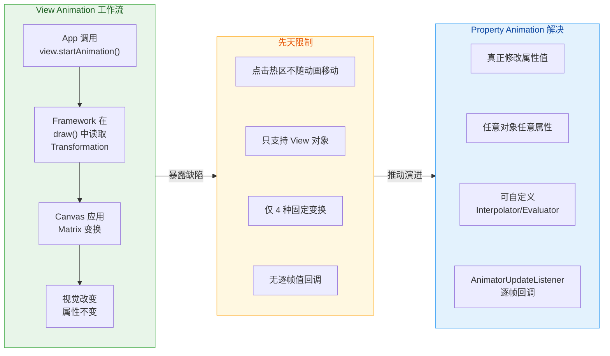
```mermaid
graph LR
    subgraph VA["View Animation 工作流"]
        direction TB
        VA1["App 调用\nview.startAnimation()"]
        VA2["Framework 在\ndraw() 中读取\nTransformation"]
        VA3["Canvas 应用\nMatrix 变换"]
        VA4["视觉改变\n属性不变"]
        VA1 --> VA2
        VA2 --> VA3
        VA3 --> VA4
    end

    subgraph LIMIT["先天限制"]
        direction TB
        L1["点击热区不随动画移动"]
        L2["只支持 View 对象"]
        L3["仅 4 种固定变换"]
        L4["无逐帧值回调"]
        L1 ~~~ L2
        L2 ~~~ L3
        L3 ~~~ L4
    end

    subgraph PA["Property Animation 解决"]
        direction TB
        PA1["真正修改属性值"]
        PA2["任意对象任意属性"]
        PA3["可自定义\nInterpolator/Evaluator"]
        PA4["AnimatorUpdateListener\n逐帧回调"]
        PA1 ~~~ PA2
        PA2 ~~~ PA3
        PA3 ~~~ PA4
    end

    VA -->|"暴露缺陷"| LIMIT -->|"推动演进"| PA

    classDef appGreen fill:#E8F5E9,stroke:#4CAF50,color:#1B5E20
    classDef warnAmber fill:#FFF8E1,stroke:#FFA000,color:#E65100
    classDef fwkBlue fill:#E3F2FD,stroke:#42A5F5,color:#0D47A1

    class VA appGreen
    class LIMIT warnAmber
    class PA fwkBlue
```

### Property Animation 属性动画优势

Android 3.0（API 11）引入的 **Property Animation** 框架（`android.animation` 包）是对 View Animation 的全面超越。它的核心设计理念可以用一句话概括：**动画就是在指定时间内，按照指定规律，不断修改对象的属性值**。这个"对象"可以是任何 Java/Kotlin 对象，这个"属性"可以是任何具有 getter/setter 的字段。这一设计彻底打破了 View Animation 的所有限制。

**优势一：真正修改属性值（Real Property Mutation）**

Property Animation 最革命性的变化在于：它**真正调用了目标对象的 setter 方法**来修改属性。以 `ObjectAnimator.ofFloat(view, "translationX", 0f, 300f)` 为例，在动画的每一帧，框架都会计算出当前时刻对应的 `translationX` 值（比如第 500ms 时可能是 150f），然后调用 `view.setTranslationX(150f)`。由于 `setTranslationX()` 内部会调用 `invalidate()` 触发重绘，并且 View 的 `mTranslationX` 字段被真正修改了，所以：

- **视觉效果正确**：View 在新位置绘制
- **交互状态正确**：事件分发的 hit testing 基于更新后的属性计算，点击热区随动画移动
- **属性可查询**：动画过程中或结束后，调用 `view.translationX` 获取的就是动画当前/最终值

这从根本上消除了 View Animation 的"视觉假象"问题。

**优势二：面向任意对象与任意属性**

Property Animation 的目标不再局限于 View。`ValueAnimator` 作为最基础的数值生成器，仅负责在给定时间内按照插值规律生成中间值，**完全不关心这个值要应用到哪里**。开发者在 `AnimatorUpdateListener` 中拿到当前值后，可以自由决定如何使用：修改 View 属性、修改自定义对象字段、驱动自定义绘制、甚至更新数据模型。

`ObjectAnimator` 则在 `ValueAnimator` 基础上增加了自动属性赋值能力。它通过**反射（Reflection）**或 **`Property` 抽象类** 找到目标对象的 setter 方法并自动调用。只要目标对象对某个属性提供了符合命名规范的 setter（如属性名 `"alpha"` 对应 `setAlpha(float)`），`ObjectAnimator` 就能对其做动画。这意味着你可以轻松对自定义类的任意属性做动画：

```kotlin
// 自定义圆形对象——非 View 类型
class Circle(
    var radius: Float = 50f,  // 半径属性，有默认 getter/setter
    var color: Int = Color.RED // 颜色属性
)

val circle = Circle()

// 对自定义对象的 radius 属性做动画：50f -> 200f
val radiusAnimator = ObjectAnimator.ofFloat(
    circle,      // 目标对象（任意对象，不限于 View）
    "radius",    // 属性名（框架会通过反射调用 setRadius(float)）
    50f, 200f    // 起始值, 终止值
)
radiusAnimator.duration = 800  // 持续 800ms

// 每帧更新时手动触发重绘（因为 Circle 不是 View，不会自动 invalidate）
radiusAnimator.addUpdateListener {
    customView.invalidate()  // 通知自定义 View 重绘，在 onDraw 中使用 circle.radius 绘制
}

radiusAnimator.start()  // 启动动画
```

这段代码完美展示了 Property Animation 的泛用性：`Circle` 不是 View，甚至不是 Android 框架的任何类，但 `ObjectAnimator` 照样可以驱动其属性变化。

**优势三：强大的可扩展性**

Property Animation 框架提供了三个关键扩展点，使其几乎能应对任何动画需求：

1. **TimeInterpolator（时间插值器）**：控制动画进度与时间的映射关系。线性、加速、减速、弹跳、过冲（Overshoot）等效果都通过不同的 Interpolator 实现。开发者可以自定义 Interpolator 实现任意缓动曲线。

2. **TypeEvaluator（类型估值器）**：控制如何从起始值和终止值计算出任意中间值。框架内置了 `IntEvaluator`、`FloatEvaluator`、`ArgbEvaluator` 等。对于自定义类型（比如 `PointF`、自定义 `ColorState`），开发者实现 `TypeEvaluator` 接口即可让框架知道如何"插值"该类型。

3. **PropertyValuesHolder**：允许在单个 Animator 中同时对多个属性做动画，共享同一个时间线，避免创建多个 Animator 对象的开销。

**优势四：精细的生命周期与监听机制**

Property Animation 提供了远比 View Animation 丰富的回调体系：

- **AnimatorListener**：`onAnimationStart()`、`onAnimationEnd()`、`onAnimationCancel()`、`onAnimationRepeat()`——注意多了一个 `onAnimationCancel()`，这在处理用户中途打断动画的场景至关重要。
- **AnimatorUpdateListener**：**每一帧**都会回调 `onAnimationUpdate()`，传入当前 `ValueAnimator` 实例，开发者可以获取当前 `animatedValue`、`animatedFraction` 等信息，实现任意联动逻辑。
- **AnimatorPauseListener**（API 19+）：支持 `onAnimationPause()` / `onAnimationResume()`，可以暂停和恢复动画。

这种精细控制使得多 View 联动、动画与业务逻辑同步等复杂需求变得优雅可行。

**优势五：与 View 系统的深度整合**

虽然 Property Animation 可以作用于任意对象，但它对 View 的支持做了特别优化。Android 3.0 起，View 类新增了一系列可直接用于属性动画的属性及其 setter/getter：`translationX/Y`、`rotation`、`rotationX/Y`、`scaleX/Y`、`alpha`、`pivotX/Y` 等。更重要的是，View 还提供了 **`ViewPropertyAnimator`**（通过 `view.animate()` 获取），这是一种针对 View 常见动画场景的流式 API 优化：

```kotlin
// ViewPropertyAnimator: 针对 View 的流式动画 API
view.animate()                      // 获取 ViewPropertyAnimator 实例
    .translationX(300f)             // X 方向平移到 300
    .alpha(0.5f)                    // 透明度变为 0.5
    .scaleX(1.2f)                   // X 方向缩放 1.2 倍
    .setDuration(500)               // 持续 500ms
    .setInterpolator(               // 设置减速插值器
        DecelerateInterpolator()
    )
    .withEndAction {                // 动画结束后执行
        // 收尾逻辑
    }
    .start()                        // 启动（也可省略，设置属性后自动在下一帧启动）
```

`ViewPropertyAnimator` 内部做了批量优化：它会将同一帧内设置的多个属性合并为一次 `invalidate()` 调用，避免了使用多个独立 `ObjectAnimator` 时可能触发的多次无用重绘。在简单 View 动画场景下，`ViewPropertyAnimator` 既比 `ObjectAnimator` 更简洁，性能也更优。

**属性动画的内部驱动机制**

理解 Property Animation 的运行原理，有助于理解为什么它能精准地"每帧更新"。其核心驱动链路如下：

1. 调用 `animator.start()` 后，Animator 将自己注册到 **`AnimationHandler`** 中。`AnimationHandler` 是一个线程单例（per-thread singleton），它持有当前线程中所有活跃 Animator 的列表。
2. `AnimationHandler` 通过 **`Choreographer`** 注册 `CALLBACK_ANIMATION` 类型的帧回调。`Choreographer` 是 Android 渲染管线的节拍器，它监听底层的 **VSYNC 信号**（通常 60Hz，即约 16.6ms 一次）。
3. 每当 VSYNC 信号到达时，`Choreographer` 按顺序触发 `CALLBACK_INPUT` → `CALLBACK_ANIMATION` → `CALLBACK_TRAVERSAL` 回调。在 `CALLBACK_ANIMATION` 阶段，`AnimationHandler` 遍历所有活跃 Animator，调用其 `doAnimationFrame()` 方法。
4. `doAnimationFrame()` 根据当前时间戳计算动画进度（fraction），经过 Interpolator 映射后得到 interpolated fraction，再通过 TypeEvaluator 计算出当前属性值，最后调用目标对象的 setter 方法完成属性更新。
5. setter 方法通常内部会调用 `invalidate()`（对于 View），在后续的 `CALLBACK_TRAVERSAL` 阶段触发 `draw()` 流程，将新值体现在屏幕上。

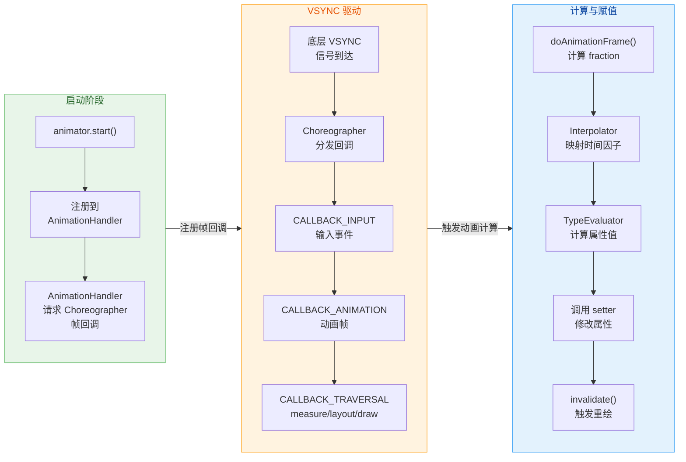
```mermaid
graph LR
    subgraph START["启动阶段"]
        direction TB
        S1["animator.start()"]
        S2["注册到\nAnimationHandler"]
        S3["AnimationHandler\n请求 Choreographer\n帧回调"]
        S1 --> S2
        S2 --> S3
    end

    subgraph VSYNC["VSYNC 驱动"]
        direction TB
        V1["底层 VSYNC\n信号到达"]
        V2["Choreographer\n分发回调"]
        V3["CALLBACK_INPUT\n输入事件"]
        V4["CALLBACK_ANIMATION\n动画帧"]
        V5["CALLBACK_TRAVERSAL\nmeasure/layout/draw"]
        V1 --> V2
        V2 --> V3
        V3 --> V4
        V4 --> V5
    end

    subgraph CALC["计算与赋值"]
        direction TB
        C1["doAnimationFrame()\n计算 fraction"]
        C2["Interpolator\n映射时间因子"]
        C3["TypeEvaluator\n计算属性值"]
        C4["调用 setter\n修改属性"]
        C5["invalidate()\n触发重绘"]
        C1 --> C2
        C2 --> C3
        C3 --> C4
        C4 --> C5
    end

    START -->|"注册帧回调"| VSYNC -->|"触发动画计算"| CALC

    classDef appGreen fill:#E8F5E9,stroke:#66BB6A,color:#1B5E20
    classDef fwkBlue fill:#E3F2FD,stroke:#42A5F5,color:#0D47A1
    classDef sysOrange fill:#FFF3E0,stroke:#FFA726,color:#E65100

    class START appGreen
    class VSYNC sysOrange
    class CALC fwkBlue
```

这条驱动链揭示了一个重要事实：**Property Animation 天然与 VSYNC 同步**，每次属性更新都发生在渲染管线的正确时机。这也是为什么属性动画在正常情况下能保持流畅的 60fps（或更高刷新率）——它并非依赖 `Timer` 或 `Handler.postDelayed()` 等不精确的定时机制，而是直接搭载在系统渲染节拍上。

**两代动画框架的对比总结**

| 维度 | View Animation | Property Animation |
|------|---------------|-------------------|
| **属性修改** | 不修改，仅变换 Canvas | 真正调用 setter 修改属性值 |
| **交互热区** | 停留在原始位置 | 随动画移动，实时正确 |
| **作用对象** | 仅限 View | 任意 Java/Kotlin 对象 |
| **变换类型** | 固定 4 种 | 任意属性，可扩展 |
| **逐帧回调** | 不支持 | `AnimatorUpdateListener` |
| **暂停/恢复** | 不支持 | API 19+ 支持 |
| **驱动机制** | 每帧在 draw() 中读取 Transformation | Choreographer VSYNC 驱动 |
| **所在包** | `android.view.animation` | `android.animation` |
| **最低 API** | API 1 | API 11（Honeycomb） |

需要指出的是，**View Animation 并未被废弃（deprecated）**，它在某些特定场景下仍有价值：比如 `Window` 进出动画、`LayoutAnimation`（列表/网格子项依次入场）等场景，Framework 内部依然使用 View Animation 体系。因此开发者不必完全抛弃 View Animation，而应理解二者的能力边界，在合适场景选用合适工具。但在绝大多数应用层动画需求中，**Property Animation 应当是首选**。

从 Android 动画体系的整体演进来看，Property Animation 的引入标志着 Android 从"受限的视觉效果框架"进化为"通用的属性驱动动画引擎"。后续章节中我们将深入探讨的 `ObjectAnimator`、`ValueAnimator`、`AnimatorSet`、以及物理动画（`SpringAnimation`/`FlingAnimation`）、矢量动画（`AnimatedVectorDrawable`）和过渡动画（`Transition`）等，都建立在 Property Animation 这一基石之上。理解了属性动画的核心思想——**动画的本质是在时间轴上持续修改属性值**——后续所有高级动画 API 的学习都将事半功倍。

---

**📝 练习题**

在 Android 中，使用 `TranslateAnimation` 将一个 Button 从 (0, 0) 平移到 (300, 0) 并设置 `fillAfter = true`，动画结束后点击屏幕坐标 (300, 0) 处的按钮外观位置，会发生什么？

A. 按钮正常响应点击事件，因为 `fillAfter` 保持了动画最终状态


B. 按钮不响应点击，因为 `TranslateAnimation` 不修改 View 的实际布局属性，点击热区仍在原始位置 (0, 0)


C. 按钮不响应点击，因为 `fillAfter` 只在 API 21 以上才真正生效


D. 按钮响应点击但会抛出 `IllegalStateException`，因为动画状态与布局状态不一致


**【答案】** B

**【解析】** `TranslateAnimation` 属于 View Animation 体系，其工作原理是在 `View.draw()` 阶段通过 `Transformation` 中的 `Matrix` 对 Canvas 做平移变换，**并不会调用 `View.setTranslationX()` 或修改任何布局参数**。`fillAfter = true` 只是让最后一帧的 Canvas 变换持续保留，使视觉上按钮停留在 (300, 0)，但 View 的 `left`、`top`、`x`、`y` 等属性不变，事件分发系统在做 hit testing 时仍然基于原始位置判断。因此点击 (300, 0) 处不会命中该 Button，而点击原始位置 (0, 0) 处才会触发点击事件。这正是 Property Animation（如 `ObjectAnimator.ofFloat(button, "translationX", 0f, 300f)`）被引入的根本原因——它会真正调用 `setTranslationX()` 修改属性，使视觉效果与交互状态始终一致。

---

## 属性动画核心

属性动画（Property Animation）是 Android 3.0（API 11）引入的全新动画框架，它从根本上改变了动画的工作方式——不再仅仅"画一个假象"，而是 **真正修改目标对象的属性值**。整个属性动画体系的设计围绕一个极其简洁的核心思想运转：在一段给定的时间（duration）内，按照某种数学曲线（interpolator），从起始值（start value）平滑过渡到结束值（end value），并在每一帧将计算出的中间值（animated value）回写给目标对象的某个属性。这个过程由 `Choreographer` 驱动的 VSync 信号逐帧触发，保证动画与屏幕刷新节奏一致。

属性动画框架的三大核心组件——**ValueAnimator**、**ObjectAnimator** 与 **AnimatorSet**——分别承担着"数值引擎"、"属性驱动器"和"编排指挥"三种角色。理解它们之间的继承关系和协作方式，是掌握整个动画系统的关键。

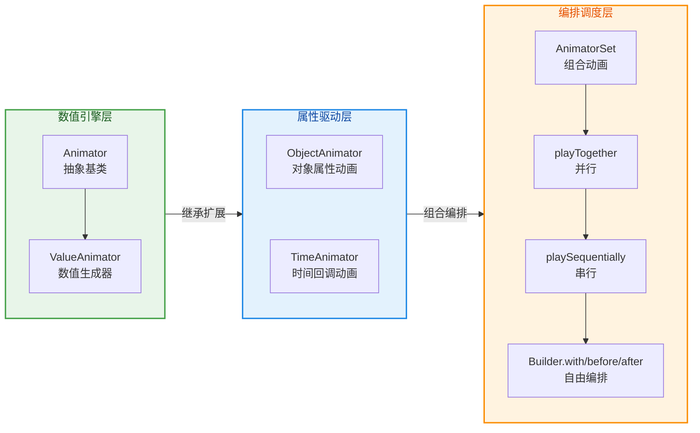
```mermaid
graph LR
    subgraph S1["数值引擎层"]
        direction TB
        A1["Animator\n抽象基类"]
        A2["ValueAnimator\n数值生成器"]
        A1 --> A2
    end

    subgraph S2["属性驱动层"]
        direction TB
        B1["ObjectAnimator\n对象属性动画"]
        B2["TimeAnimator\n时间回调动画"]
        B1 ~~~ B2
    end

    subgraph S3["编排调度层"]
        direction TB
        C1["AnimatorSet\n组合动画"]
        C2["playTogether\n并行"]
        C3["playSequentially\n串行"]
        C4["Builder.with/before/after\n自由编排"]
        C1 --> C2
        C2 --> C3
        C3 --> C4
    end

    S1 -->|"继承扩展"| S2 -->|"组合编排"| S3

    classDef engineCls fill:#E8F5E9,stroke:#43A047,color:#1B5E20,stroke-width:2px
    classDef driverCls fill:#E3F2FD,stroke:#1E88E5,color:#0D47A1,stroke-width:2px
    classDef setCls fill:#FFF3E0,stroke:#FB8C00,color:#E65100,stroke-width:2px
    class S1 engineCls
    class S2 driverCls
    class S3 setCls
```

从类继承结构来看，`Animator` 是抽象基类，`ValueAnimator` 直接继承自 `Animator`，而 `ObjectAnimator` 又继承自 `ValueAnimator`。这意味着 ObjectAnimator 天然拥有 ValueAnimator 的全部数值计算能力，只是在其基础上增加了"自动将计算结果写入目标对象属性"的能力。`AnimatorSet` 同样继承自 `Animator`，但它本身不产生数值，而是负责管理和调度多个 `Animator` 实例的执行顺序与时序关系。

---

### ValueAnimator 数值生成器

ValueAnimator 是整个属性动画体系的 **心脏**。它的职责极其纯粹：在给定的时间区间内，根据插值器（Interpolator）和估值器（TypeEvaluator）的协作，逐帧产生一个从起始值到结束值之间的中间数值。它本身 **不关心这个数值最终被用在哪里**——你可以拿它去改变 View 的位置，也可以拿它去驱动自定义绘制中的某个参数，甚至可以用它来控制一段音频的音量。这种"只管生产数值、不管消费场景"的设计，赋予了 ValueAnimator 极高的灵活性和复用性。

**核心工作流程**：每当 Choreographer 发出 VSync 信号时，ValueAnimator 会被回调执行以下步骤：首先，根据已经流逝的时间占总时长的比例，计算出一个 **时间因子**（elapsed fraction，范围 0.0 ~ 1.0）；然后，将这个线性的时间因子传入 TimeInterpolator，得到一个经过曲线变换的 **插值因子**（interpolated fraction）；最后，将插值因子传入 TypeEvaluator，由估值器根据起始值和结束值计算出当前帧的 **动画值**（animated value）。整个过程可以用一个公式概括：

```kotlin
// 属性动画核心计算公式（伪代码）
// 第一步：计算线性时间比例
val elapsedFraction = elapsedTime / duration          // 已过时间 / 总时长 = 线性因子
// 第二步：通过插值器进行曲线变换
val interpolatedFraction = interpolator.getInterpolation(elapsedFraction)  // 线性 → 非线性
// 第三步：通过估值器计算当前属性值
val animatedValue = evaluator.evaluate(interpolatedFraction, startValue, endValue) // 因子 → 实际值
```

这三步是属性动画最核心的计算链路。理解了这个链路，后续的插值器、估值器、关键帧等概念都不过是在这条链路上做文章。

**基础使用方式**：ValueAnimator 提供了多个工厂方法来创建实例，最常见的包括 `ofFloat()`、`ofInt()` 和 `ofObject()`。这些工厂方法的参数是 **可变参数**（varargs），支持传入两个或多个值，从而定义单段或多段动画路径。

```kotlin
// === 示例 1：基础 Float 数值动画 ===
// ofFloat() 接收可变参数，这里表示从 0f 过渡到 1f
val animator = ValueAnimator.ofFloat(0f, 1f).apply {
    duration = 300                    // 设置动画总时长为 300 毫秒
    interpolator = AccelerateDecelerateInterpolator()  // 使用先加速后减速的插值曲线

    // 添加数值更新监听器，每一帧回调一次
    addUpdateListener { valueAnimator ->
        // getAnimatedValue() 返回当前帧计算出的中间值（此处为 Float 类型）
        val currentValue = valueAnimator.animatedValue as Float
        // 开发者自行决定如何使用这个值
        // 例如：更新自定义 View 的某个绘制参数
        myCustomView.progress = currentValue
        // 请求重绘，使变化生效
        myCustomView.invalidate()
    }
}
// 启动动画
animator.start()
```

```kotlin
// === 示例 2：多段数值动画 ===
// 传入三个值：0f → 100f → 50f，动画会先从 0 涨到 100，再从 100 回落到 50
val multiSegment = ValueAnimator.ofFloat(0f, 100f, 50f).apply {
    duration = 600                    // 总时长 600ms，两段各约 300ms
    addUpdateListener { anim ->
        val value = anim.animatedValue as Float   // 获取当前帧的数值
        textView.translationY = value             // 直接应用到 View 的 translationY 属性
    }
}
multiSegment.start()
```

**关键帧（Keyframe）机制**：当需要更精细地控制动画在不同时间点的数值和插值行为时，可以使用 Keyframe。关键帧允许你指定"在动画进度为 X% 时，数值应为 Y"，并且每个关键帧可以单独设置自己的插值器，从而在同一个动画中实现不同阶段使用不同缓动曲线的效果。

```kotlin
// === 关键帧动画：实现"快速弹出 → 缓慢回弹"效果 ===
// 关键帧 1：动画开始时（fraction=0），值为 0f
val kf0 = Keyframe.ofFloat(0f, 0f)
// 关键帧 2：动画进行到 40% 时，值已经冲到 1.2f（超过目标值，产生过冲效果）
val kf1 = Keyframe.ofFloat(0.4f, 1.2f).apply {
    interpolator = DecelerateInterpolator()      // 这一段使用减速插值（快速到达）
}
// 关键帧 3：动画结束时（fraction=1），值回落到 1.0f（最终目标值）
val kf2 = Keyframe.ofFloat(1f, 1.0f).apply {
    interpolator = OvershootInterpolator(2f)     // 这一段使用过冲插值（弹性回落）
}
// 使用 PropertyValuesHolder 将关键帧组合成一个属性值持有器
// 参数 "scaleX" 在 ValueAnimator 中不会自动应用，仅作标识
val pvh = PropertyValuesHolder.ofKeyframe("scaleX", kf0, kf1, kf2)
// 通过 ofPropertyValuesHolder() 创建 ValueAnimator
val animator = ValueAnimator.ofPropertyValuesHolder(pvh).apply {
    duration = 500                               // 总时长 500ms
    addUpdateListener { anim ->
        val scale = anim.animatedValue as Float   // 获取当前帧的缩放值
        view.scaleX = scale                       // 手动应用到 View 的 scaleX
        view.scaleY = scale                       // 同时应用到 scaleY，保持等比缩放
    }
}
animator.start()
```

**PropertyValuesHolder 的多属性并行**：一个 ValueAnimator（或 ObjectAnimator）可以同时持有多个 PropertyValuesHolder，使得 **单个动画对象** 就能并行驱动多个属性值的变化，而无需创建多个 Animator 实例。这在性能上优于使用 AnimatorSet 来组合多个独立的 Animator，因为只需要一次时间计算和一次监听回调。

```kotlin
// === 单个 ValueAnimator 同时驱动透明度和缩放 ===
// 第一个属性值持有器：控制透明度从 0 到 1
val alphaHolder = PropertyValuesHolder.ofFloat("alpha", 0f, 1f)
// 第二个属性值持有器：控制缩放从 0.5 到 1.0
val scaleHolder = PropertyValuesHolder.ofFloat("scale", 0.5f, 1.0f)

// 将两个 Holder 传入同一个 ValueAnimator
ValueAnimator.ofPropertyValuesHolder(alphaHolder, scaleHolder).apply {
    duration = 400                                   // 总时长 400ms
    addUpdateListener { anim ->
        // 通过属性名获取各自的当前值
        val alphaVal = anim.getAnimatedValue("alpha") as Float
        val scaleVal = anim.getAnimatedValue("scale") as Float
        // 手动应用到目标 View
        targetView.alpha = alphaVal                  // 设置透明度
        targetView.scaleX = scaleVal                 // 设置横向缩放
        targetView.scaleY = scaleVal                 // 设置纵向缩放
    }
    start()                                          // 启动动画
}
```

**底层驱动机制**：ValueAnimator 的逐帧回调并非通过 `Handler.postDelayed()` 等粗糙的定时器实现，而是依赖 `Choreographer` 的 VSync 回调。当调用 `start()` 时，ValueAnimator 内部会通过 `AnimationHandler`（一个线程局部的单例）向 Choreographer 注册 `CALLBACK_ANIMATION` 类型的回调。每当屏幕准备刷新时（VSync 信号到达），Choreographer 会依次触发 Input → Animation → Traversal 三类回调，属性动画的计算就发生在 Animation 阶段。这保证了动画值的更新与屏幕刷新严格同步，避免了丢帧和撕裂。同时也意味着，**属性动画必须在拥有 Looper 的线程上启动**（通常是主线程），否则 Choreographer 无法正常工作。

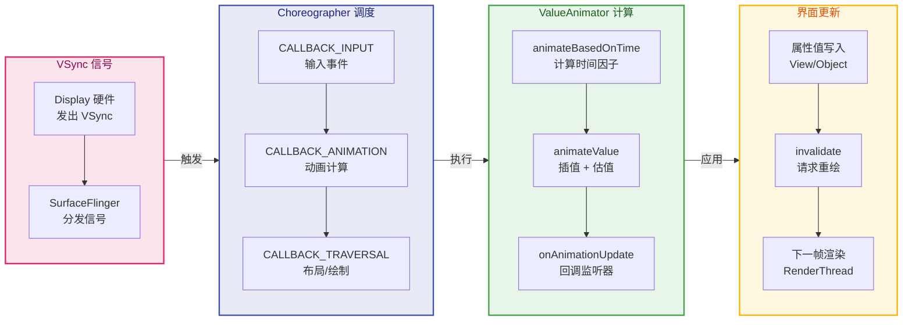
```mermaid
graph LR
    subgraph S1["VSync 信号"]
        direction TB
        V1["Display 硬件\n发出 VSync"]
        V2["SurfaceFlinger\n分发信号"]
        V1 --> V2
    end

    subgraph S2["Choreographer 调度"]
        direction TB
        C1["CALLBACK_INPUT\n输入事件"]
        C2["CALLBACK_ANIMATION\n动画计算"]
        C3["CALLBACK_TRAVERSAL\n布局/绘制"]
        C1 --> C2
        C2 --> C3
    end

    subgraph S3["ValueAnimator 计算"]
        direction TB
        A1["animateBasedOnTime\n计算时间因子"]
        A2["animateValue\n插值 + 估值"]
        A3["onAnimationUpdate\n回调监听器"]
        A1 --> A2
        A2 --> A3
    end

    subgraph S4["界面更新"]
        direction TB
        U1["属性值写入\nView/Object"]
        U2["invalidate\n请求重绘"]
        U3["下一帧渲染\nRenderThread"]
        U1 --> U2
        U2 --> U3
    end

    S1 -->|"触发"| S2 -->|"执行"| S3 -->|"应用"| S4

    classDef vsyncCls fill:#FCE4EC,stroke:#E91E63,color:#880E4F,stroke-width:2px
    classDef choreCls fill:#E8EAF6,stroke:#3F51B5,color:#1A237E,stroke-width:2px
    classDef animCls fill:#E8F5E9,stroke:#43A047,color:#1B5E20,stroke-width:2px
    classDef uiCls fill:#FFF8E1,stroke:#FFB300,color:#E65100,stroke-width:2px
    class S1 vsyncCls
    class S2 choreCls
    class S3 animCls
    class S4 uiCls
```

**重要属性与方法速览**：

- **`setRepeatCount(int)`**：设置重复次数，`ValueAnimator.INFINITE`（值为 -1）表示无限循环。需要注意，无限循环动画如果不在适当时机调用 `cancel()`，会造成内存泄漏（因为 AnimationHandler 持有对 Animator 的引用，间接持有 Activity/View 引用）。
- **`setRepeatMode(int)`**：设置重复模式，`RESTART` 表示每次从头开始，`REVERSE` 表示正向/反向交替执行。
- **`setStartDelay(long)`**：设置动画启动前的延迟时间。在延迟期间，动画状态已经是 `isStarted() == true`，但 `isRunning()` 仍为 `false`。
- **`getAnimatedFraction()`**：返回当前帧经过插值器变换后的因子值（0.0 ~ 1.0，但使用 OvershootInterpolator 等曲线时可能超出此范围）。
- **`pause()` / `resume()`**：API 19 引入的暂停/恢复能力，允许动画在中途冻结状态，后续从暂停点继续。

---

### ObjectAnimator 对象动画

ObjectAnimator 是 ValueAnimator 的直接子类，也是日常开发中 **使用频率最高** 的属性动画类。如果说 ValueAnimator 是一台纯粹的"数值发动机"，那么 ObjectAnimator 就是在发动机上装了一套"自动传动系统"——它会 **自动** 将每一帧计算出的数值通过反射（或 Property 对象）写入目标对象的指定属性。开发者不再需要手动注册 `UpdateListener` 来获取数值并手动赋值，ObjectAnimator 内部帮你完成了这最后一步。

**自动写入的原理**：ObjectAnimator 在初始化时会接收两个关键参数——**目标对象**（target）和**属性名**（propertyName）。内部通过以下优先级查找属性的 setter 方法：

1. **优先查找 `Property<T, V>` 对象**：如果通过 `ObjectAnimator.ofFloat(target, Property, values)` 的重载传入了类型安全的 Property 对象（如 `View.ALPHA`、`View.TRANSLATION_X`），则直接调用 `Property.set(target, value)`，**无需反射**，性能最优。
2. **回退到反射查找 setter**：如果传入的是字符串属性名（如 `"alpha"`），ObjectAnimator 会通过反射查找目标对象上对应的 `setAlpha(float)` 方法，缓存 `Method` 对象后逐帧反射调用。虽然反射有一定性能开销，但由于 Method 对象被缓存，实际影响很小。
3. **getter 的作用**：如果开发者没有显式指定起始值（只传了一个结束值），ObjectAnimator 还会通过反射查找 `getAlpha()` 方法来获取动画的起始值。如果既没有 getter 也没有指定起始值，动画会崩溃或行为不符合预期。

这种设计的优雅之处在于：任何 Java/Kotlin 对象，只要对目标属性提供了合法的 getter/setter，就可以成为 ObjectAnimator 的动画目标——不限于 View，自定义对象同样适用。

```kotlin
// === 示例 1：最常见的 View 属性动画 ===
// 将 myView 的 alpha（透明度）从当前值过渡到 0f（完全透明）
ObjectAnimator.ofFloat(
    myView,            // target：目标 View 对象
    "alpha",           // propertyName：属性名，对应 setAlpha(float)
    0f                 // 结束值（起始值未指定，将通过 getAlpha() 自动获取）
).apply {
    duration = 250     // 动画时长 250ms
    start()            // 启动动画
}
```

```kotlin
// === 示例 2：使用 Property 对象替代字符串（推荐方式）===
// View 类预定义了多个 Property 常量，避免反射开销和属性名拼写错误
ObjectAnimator.ofFloat(
    myView,                   // target：目标 View
    View.TRANSLATION_X,       // Property 对象：类型安全，无反射
    0f,                       // 起始值：水平偏移 0
    200f                      // 结束值：向右平移 200px
).apply {
    duration = 300            // 动画时长 300ms
    interpolator = DecelerateInterpolator(1.5f)  // 减速插值器，系数 1.5
    start()
}
```

**View 类预定义的 Property 常量**：Android 为 View 提供了一组 `Property<View, Float>` 类型的静态常量，这些是使用 ObjectAnimator 操作 View 属性的最佳实践，因为它们内部直接调用 View 的 native 方法（如 `nSetTranslationX`），完全绕过反射：

| Property 常量 | 对应属性 | 说明 |
|---|---|---|
| `View.ALPHA` | 透明度 | 0.0（完全透明）~ 1.0（完全不透明） |
| `View.TRANSLATION_X` | X 轴平移 | 相对于 layout 位置的水平偏移（像素） |
| `View.TRANSLATION_Y` | Y 轴平移 | 相对于 layout 位置的垂直偏移（像素） |
| `View.TRANSLATION_Z` | Z 轴平移 | 控制阴影高度（API 21+） |
| `View.SCALE_X` | X 轴缩放 | 1.0 为原始大小，以 pivotX 为中心 |
| `View.SCALE_Y` | Y 轴缩放 | 1.0 为原始大小，以 pivotY 为中心 |
| `View.ROTATION` | Z 轴旋转 | 单位为度（degree），以 pivot 为圆心 |
| `View.ROTATION_X` | X 轴旋转 | 3D 翻转效果 |
| `View.ROTATION_Y` | Y 轴旋转 | 3D 翻转效果 |
| `View.X` / `View.Y` | 绝对位置 | = left/top + translationX/Y |

**对自定义对象执行动画**：ObjectAnimator 的 target 不限于 View。只要对象提供了对应的 setter（以及在需要时提供 getter），就可以对任意属性做动画。这在自定义 View 绘制、数据可视化等场景中非常实用：

```kotlin
// === 自定义对象的属性动画 ===
// 定义一个圆形数据类，具备 radius 属性的 getter/setter
class Circle {
    var radius: Float = 0f              // 属性：圆的半径
        set(value) {                    // setter：每次被 ObjectAnimator 调用时触发
            field = value               // 更新字段值
            bindingView?.invalidate()   // 请求与之绑定的 View 重绘
        }
    var bindingView: View? = null       // 关联的 View 引用，用于触发重绘
}

// 创建实例并绑定 View
val circle = Circle().apply {
    bindingView = myCanvasView          // 绑定到自定义绘制 View
}

// ObjectAnimator 会自动调用 circle.setRadius(value)
ObjectAnimator.ofFloat(
    circle,            // target：自定义的 Circle 对象
    "radius",          // propertyName：对应 setRadius(float)
    0f,                // 起始值
    150f               // 结束值
).apply {
    duration = 500     // 时长 500ms
    start()            // 启动后，每一帧自动调用 circle.radius = currentValue
}
```

**ViewPropertyAnimator —— 更轻量的语法糖**：虽然 ObjectAnimator 已经很方便，但 Android 还提供了 `View.animate()` 返回的 `ViewPropertyAnimator`，它针对 View 属性动画做了进一步的 API 简化和性能优化。ViewPropertyAnimator 内部会将同一帧的多个属性变化合并为一次 `invalidate()` 调用，并且全程不使用反射。适合简单的 View 动画场景：

```kotlin
// === ViewPropertyAnimator：最简洁的 View 动画写法 ===
myView.animate()                          // 获取 ViewPropertyAnimator
    .alpha(0.5f)                          // 透明度过渡到 0.5
    .translationX(100f)                   // 水平平移到 100px
    .scaleX(1.2f)                         // 横向缩放到 1.2 倍
    .scaleY(1.2f)                         // 纵向缩放到 1.2 倍
    .setDuration(300)                     // 总时长 300ms
    .setInterpolator(OvershootInterpolator())  // 过冲插值器
    .withStartAction {                    // 动画开始前执行（主线程）
        myView.visibility = View.VISIBLE  // 确保 View 可见
    }
    .withEndAction {                      // 动画结束后执行（主线程）
        // 做收尾工作，如移除 View
    }
    .start()                              // 启动（也可以省略，设置属性后自动在下一帧启动）
```

ViewPropertyAnimator 与 ObjectAnimator 的选择原则：**简单的 View 多属性联动** 优先用 `View.animate()`，代码最简洁、性能最好；**需要监听中间值、关键帧控制、非 View 对象动画** 则使用 ObjectAnimator 或 ValueAnimator。

---

### AnimatorSet 组合动画

实际的动画需求往往不是单个属性的单调变化，而是 **多个动画按特定时序组合执行**。例如，一个 View 先从屏幕外滑入（translationX），滑入完成后开始淡入（alpha），与此同时伴随一个缩放回弹效果（scaleX / scaleY）。AnimatorSet 正是为这种"动画编排"场景而设计的容器类。

AnimatorSet 继承自 Animator，但它本身不产生任何动画数值。它的职责是 **持有一组子 Animator**（可以是 ValueAnimator、ObjectAnimator，甚至嵌套的 AnimatorSet），并管理它们的启动顺序、并行/串行关系以及整体生命周期。当你对 AnimatorSet 调用 `start()` 时，它会根据内部构建的依赖图（Dependency Graph）来决定每个子动画何时启动。

**三种编排模式**：

**1. playTogether —— 全部并行**：所有子动画同时启动。注意"同时启动"不等于"同时结束"，因为每个子动画可以有不同的 duration 和 startDelay。AnimatorSet 整体的时长等于最后一个结束的子动画的时长。

```kotlin
// === playTogether：三个动画同时执行 ===
val fadeIn = ObjectAnimator.ofFloat(view, View.ALPHA, 0f, 1f).apply {
    duration = 300                        // 淡入持续 300ms
}
val slideUp = ObjectAnimator.ofFloat(view, View.TRANSLATION_Y, 200f, 0f).apply {
    duration = 400                        // 上滑持续 400ms
}
val scaleUp = ObjectAnimator.ofFloat(view, View.SCALE_X, 0.8f, 1f).apply {
    duration = 400                        // 缩放持续 400ms
}

AnimatorSet().apply {
    // 三个动画同时启动
    playTogether(fadeIn, slideUp, scaleUp)
    // AnimatorSet 整体时长由最长的子动画决定（此处为 400ms）
    start()
}
```

**2. playSequentially —— 全部串行**：子动画按传入顺序依次执行，前一个结束后才启动下一个。

```kotlin
// === playSequentially：动画依次执行 ===
val step1 = ObjectAnimator.ofFloat(view, View.TRANSLATION_X, 0f, 300f).apply {
    duration = 300                        // 第一步：右移 300px
}
val step2 = ObjectAnimator.ofFloat(view, View.TRANSLATION_Y, 0f, 200f).apply {
    duration = 250                        // 第二步：下移 200px
}
val step3 = ObjectAnimator.ofFloat(view, View.ALPHA, 1f, 0f).apply {
    duration = 200                        // 第三步：淡出
}

AnimatorSet().apply {
    // 按顺序执行：step1 → step2 → step3
    // 总时长 = 300 + 250 + 200 = 750ms
    playSequentially(step1, step2, step3)
    start()
}
```

**3. Builder API —— 自由编排**：这是 AnimatorSet 最强大的模式。通过 `play(A).with(B).before(C).after(D)` 的链式调用，可以构建任意复杂的依赖关系图。

- `play(A).with(B)`：A 和 B 同时执行
- `play(A).before(B)`：A 先执行，A 结束后 B 开始
- `play(A).after(B)`：B 先执行，B 结束后 A 开始
- `play(A).after(delay)`：A 在延迟 delay 毫秒后执行

```kotlin
// === Builder API：复杂时序编排 ===
val moveRight = ObjectAnimator.ofFloat(view, View.TRANSLATION_X, 0f, 250f).apply {
    duration = 300
}
val moveDown = ObjectAnimator.ofFloat(view, View.TRANSLATION_Y, 0f, 150f).apply {
    duration = 300
}
val fadeOut = ObjectAnimator.ofFloat(view, View.ALPHA, 1f, 0.3f).apply {
    duration = 200
}
val scaleDown = ObjectAnimator.ofFloat(view, View.SCALE_X, 1f, 0.5f).apply {
    duration = 200
}

AnimatorSet().apply {
    // moveRight 和 moveDown 同时执行（对角线移动效果）
    play(moveRight).with(moveDown)
    // 移动结束后，fadeOut 和 scaleDown 同时执行
    play(fadeOut).after(moveRight)
    play(scaleDown).with(fadeOut)
    start()
}
```

上述代码构建的依赖图如下：

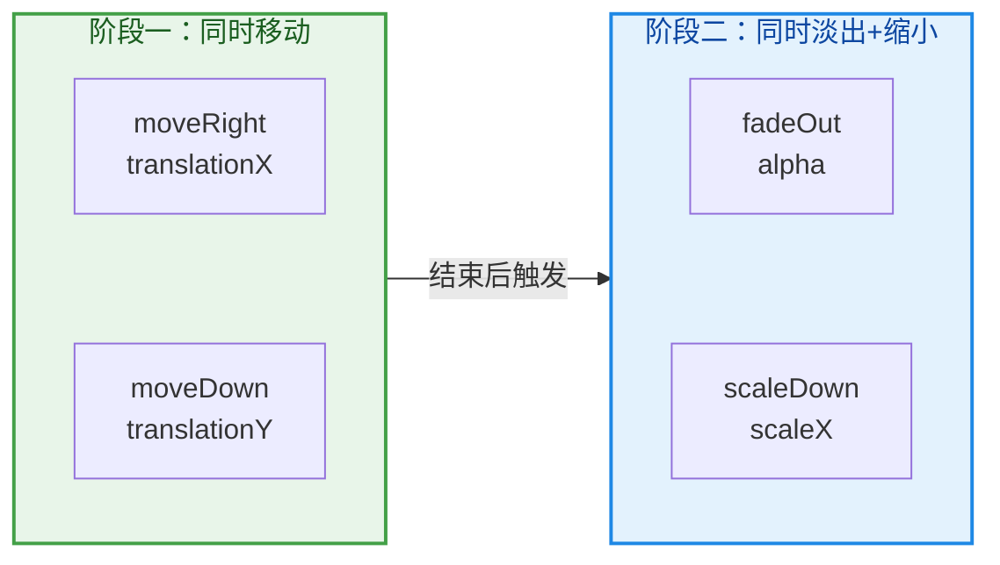
```mermaid
graph LR
    subgraph S1["阶段一：同时移动"]
        direction TB
        A["moveRight\ntranslationX"]
        B["moveDown\ntranslationY"]
        A ~~~ B
    end

    subgraph S2["阶段二：同时淡出+缩小"]
        direction TB
        C["fadeOut\nalpha"]
        D["scaleDown\nscaleX"]
        C ~~~ D
    end

    S1 -->|"结束后触发"| S2

    classDef phase1 fill:#E8F5E9,stroke:#43A047,color:#1B5E20,stroke-width:2px
    classDef phase2 fill:#E3F2FD,stroke:#1E88E5,color:#0D47A1,stroke-width:2px
    class S1 phase1
    class S2 phase2
```

**AnimatorSet 的整体控制**：AnimatorSet 继承自 Animator，因此拥有 `start()`、`cancel()`、`pause()`、`resume()`、`setStartDelay()` 等方法。但有几个容易踩坑的行为需要特别注意：

- **duration 的传递性**：如果对 AnimatorSet 调用了 `setDuration()`，它会 **覆盖** 所有子动画各自设置的 duration，使它们统一为同一时长。这在某些场景下很方便（统一节奏），但也容易无意间破坏精心设计的时序。如果你希望每个子动画保持自己的时长，**不要** 对 AnimatorSet 调用 `setDuration()`。
- **interpolator 的传递性**：类似地，对 AnimatorSet 设置 interpolator 也会传递给所有子动画。如果子动画需要不同的插值曲线，应当在子动画上单独设置。
- **监听器的粒度**：可以对 AnimatorSet 设置 `AnimatorListener`，其 `onAnimationStart/End` 对应的是整个组合动画的开始/结束；也可以对单个子动画分别设置监听器，以获得更细粒度的状态回调。

**XML 声明方式**：属性动画也支持通过 XML 文件定义，放在 `res/animator/` 目录下。AnimatorSet 对应 `<set>` 标签，ObjectAnimator 对应 `<objectAnimator>` 标签。XML 方式的好处是将动画配置从代码中分离，方便设计师调整参数，同时支持通过 `AnimatorInflater.loadAnimator()` 加载：

```xml
<!-- res/animator/slide_fade_in.xml -->
<!-- ordering="together" 表示子动画并行执行，"sequentially" 表示串行 -->
<set xmlns:android="http://schemas.android.com/apk/res/android"
    android:ordering="together">

    <!-- 透明度动画：从 0 到 1 -->
    <objectAnimator
        android:propertyName="alpha"
        android:valueFrom="0"
        android:valueTo="1"
        android:valueType="floatType"
        android:duration="300" />

    <!-- 垂直平移动画：从 100px 到 0 -->
    <objectAnimator
        android:propertyName="translationY"
        android:valueFrom="100"
        android:valueTo="0"
        android:valueType="floatType"
        android:duration="400"
        android:interpolator="@android:interpolator/decelerate_cubic" />
</set>
```

```kotlin
// === 在代码中加载 XML 动画 ===
// AnimatorInflater 从 XML 资源加载 Animator 对象
val animatorSet = AnimatorInflater.loadAnimator(
    context,                           // 上下文
    R.animator.slide_fade_in           // XML 资源 ID
) as AnimatorSet

// 设置目标对象（XML 中无法指定 target）
animatorSet.setTarget(myView)
// 启动动画
animatorSet.start()
```

**性能提示与最佳实践**：

1. **优先使用 `View.animate()`**：对于简单的 View 属性动画，ViewPropertyAnimator 内部做了合并 invalidate、无反射等优化，性能最佳。
2. **使用 Property 常量**：当必须使用 ObjectAnimator 时，传 `View.ALPHA` 而非 `"alpha"` 字符串，避免反射开销。
3. **避免在 `onAnimationUpdate` 中做重活**：该回调每帧都会执行（60fps 下每 16ms 一次），如果在回调中执行耗时操作（如 layout 计算、大量对象创建），会直接导致掉帧。
4. **及时 cancel 无限动画**：使用 `repeatCount = INFINITE` 的动画在 View detach 或 Activity destroy 时务必调用 `cancel()`，否则会造成内存泄漏。推荐在 `onPause()` 或 `Lifecycle.ON_DESTROY` 中处理。
5. **AnimatorSet 嵌套要谨慎**：AnimatorSet 可以嵌套 AnimatorSet，但深层嵌套会增加依赖图的解析复杂度，且 debug 困难。尽量用扁平的 Builder API 或 `playTogether/playSequentially` 组合。

---

**📝 练习题**

在 Android 属性动画体系中，以下关于 `ObjectAnimator` 与 `ValueAnimator` 的描述，哪个是 **正确的**？

A. `ObjectAnimator` 是 `ValueAnimator` 的父类，提供了更底层的数值计算能力


B. `ValueAnimator.ofFloat(0f, 1f)` 启动后会自动修改目标 View 的透明度属性


C. `ObjectAnimator` 在找不到目标属性的 setter 方法时会静默忽略，不会抛出异常


D. 使用 `ObjectAnimator.ofFloat(view, View.ALPHA, 0f, 1f)` 传入 `Property` 对象时，内部不走反射，性能优于传入字符串 `"alpha"`


**【答案】** D

**【解析】** 选项 A 因果颠倒：`ObjectAnimator` 继承自 `ValueAnimator`，是子类而非父类。选项 B 错误：`ValueAnimator` 只负责生成数值，不会自动修改任何对象的属性，需要开发者在 `addUpdateListener` 中手动应用。选项 C 错误：`ObjectAnimator` 在通过反射查找 setter 失败时，会在日志中输出警告，并且动画效果会失效（属性值不会被更新）；在某些情况下，缺少 getter 获取起始值还会导致崩溃。选项 D 正确：`View.ALPHA` 等 `Property<View, Float>` 常量内部直接调用 View 的 `setAlpha()` 等方法（非反射路径），比字符串属性名的反射方式性能更优，同时还具有编译期类型安全检查的优势。

---

## 插值器与估值器

属性动画之所以能呈现出千变万化的运动效果，其核心秘密就藏在两个关键组件中：**插值器（Interpolator）** 与 **估值器（TypeEvaluator）**。如果把一段动画比作一场从 A 城到 B 城的旅程，那么插值器决定的是"旅途中你在每个时刻走了全程的百分之几"——它控制的是**速度节奏**；而估值器决定的是"知道了百分比之后，你当前的确切位置坐标是多少"——它负责**数值转换**。两者分工协作，缺一不可。

在 `ValueAnimator` 的每一帧回调中，动画引擎内部执行的逻辑可以精确概括为一条流水线：

> **elapsed fraction → Interpolator → interpolated fraction → TypeEvaluator → animated value**

首先，引擎根据已流逝时间计算出一个线性的"原始进度"（elapsed fraction，范围 0→1）；接着由 Interpolator 将其映射为"插值后进度"（interpolated fraction）——这一步可能是非线性的，比如先快后慢；最后由 TypeEvaluator 根据这个插值后进度，结合起始值与结束值，算出当前帧的真实属性值。这条流水线是属性动画引擎最核心的数学模型，理解它，就等于掌握了所有动画曲线效果的底层原理。

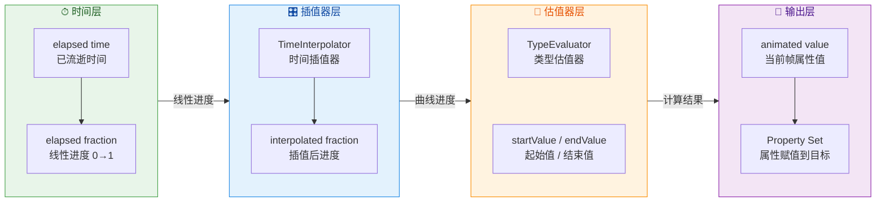
```mermaid
graph LR
    subgraph Stage1["⏱ 时间层"]
        direction TB
        A["elapsed time\n已流逝时间"]
        B["elapsed fraction\n线性进度 0→1"]
        A --> B
    end

    subgraph Stage2["🎛 插值器层"]
        direction TB
        C["TimeInterpolator\n时间插值器"]
        D["interpolated fraction\n插值后进度"]
        C --> D
    end

    subgraph Stage3["🔢 估值器层"]
        direction TB
        E["TypeEvaluator\n类型估值器"]
        F["startValue / endValue\n起始值 / 结束值"]
        E ~~~ F
    end

    subgraph Stage4["🎯 输出层"]
        direction TB
        G["animated value\n当前帧属性值"]
        H["Property Set\n属性赋值到目标"]
        G --> H
    end

    Stage1 -->|"线性进度"| Stage2 -->|"曲线进度"| Stage3 -->|"计算结果"| Stage4

    classDef timeStyle fill:#E8F5E9,stroke:#43A047,color:#1B5E20
    classDef interpStyle fill:#E3F2FD,stroke:#1E88E5,color:#0D47A1
    classDef evalStyle fill:#FFF3E0,stroke:#FB8C00,color:#E65100
    classDef outStyle fill:#F3E5F5,stroke:#8E24AA,color:#4A148C

    class Stage1 timeStyle
    class Stage2 interpStyle
    class Stage3 evalStyle
    class Stage4 outStyle
```

从这张流程图中可以直观地看到，Interpolator 和 TypeEvaluator 分别承担了**时间域变换**和**值域变换**两个独立环节。Android 系统之所以将它们解耦为两个接口，正是为了实现"运动曲线"与"值类型计算"的自由组合——你可以让一个颜色动画使用弹性回弹曲线，也可以让一个自定义的 `PointF` 动画走匀速直线，两个维度互不干扰。

---

### TimeInterpolator 时间因子

#### 接口定义与数学本质

`TimeInterpolator` 是 Android 动画框架中定义动画**时间曲线**的顶层接口（位于 `android.animation` 包下）。它只有一个方法：

```java
// TimeInterpolator 接口定义
public interface TimeInterpolator {
    /**
     * @param input  线性进度，范围 [0, 1]，0 代表动画开始，1 代表动画结束
     * @return       插值后进度，通常也在 [0, 1] 范围内，
     *               但允许超出（如 Overshoot 效果可返回 >1 的值）
     */
    float getInterpolation(float input);  // 将线性时间映射为曲线时间
}
```

从数学角度看，`getInterpolation()` 就是一个 **f(t) → t'** 的函数，其中 t 是线性时间因子（input），t' 是插值后的进度因子（output）。当 `f(t) = t` 时，输出与输入完全一致，动画呈现匀速运动，这就是 `LinearInterpolator` 的行为。而当 `f(t)` 是一条加速的抛物线（如 `t²`）时，动画前段慢、后段快，这就是 `AccelerateInterpolator` 的效果。

值得注意的是，接口对返回值 **并没有强制约束在 [0, 1] 区间内**。这是一个非常关键的设计：当返回值大于 1 时，估值器会计算出一个"超过终点"的值，从而产生 **Overshoot（越界回弹）** 效果；当返回值小于 0 时，属性值会"穿越起点"，形成 **Anticipation（蓄力回退）** 效果。这种"允许越界"的设计使得 Android 的插值器系统拥有极强的表现力。

另外，`Interpolator` 是旧版（`android.view.animation` 包）的接口名称，它继承自 `TimeInterpolator`，二者实际上是同一回事。系统内置插值器同时实现了这两个接口，因此它们既可以用于旧版 View Animation，也可以用于新版 Property Animation。

#### 系统内置插值器全览

Android SDK 提供了十余种开箱即用的插值器，每一种本质上都是一个不同的数学函数。以下是完整列表及其运动特征：

| 插值器类 | 数学特征 | 运动效果描述 |
|---------|---------|------------|
| `LinearInterpolator` | f(t) = t | 完全匀速，无加减速 |
| `AccelerateInterpolator` | f(t) = t^(2·factor) | 从静止开始持续加速，像自由落体 |
| `DecelerateInterpolator` | f(t) = 1-(1-t)^(2·factor) | 高速开始逐渐减速，像刹车停车 |
| `AccelerateDecelerateInterpolator` | 余弦曲线 | 慢→快→慢，两端柔和的 S 形曲线 |
| `OvershootInterpolator` | 三次函数越界 | 越过终点后回弹到终点，弹性到达感 |
| `AnticipateInterpolator` | 三次函数蓄力 | 先向反方向蓄力再正向冲出，射箭感 |
| `AnticipateOvershootInterpolator` | 组合蓄力+越界 | 先蓄力回退 → 正向冲刺 → 越界回弹 |
| `BounceInterpolator` | 分段弹跳函数 | 模拟小球落地后多次弹跳 |
| `CycleInterpolator` | 正弦周期函数 | 在起始值和终值间做正弦振荡 |
| `PathInterpolator` | 自定义贝塞尔/Path | 通过 Path 或控制点完全自定义曲线 |

其中 `AccelerateInterpolator` 和 `DecelerateInterpolator` 的构造函数接受一个 `factor` 参数，用于控制加速/减速的剧烈程度——factor 越大，加速越猛（或减速越急）。默认 factor 为 1.0。

`OvershootInterpolator` 的构造函数接受一个 `tension` 参数，控制越界幅度。默认 tension 为 2.0，值越大越界越远。`AnticipateInterpolator` 也有类似的 tension 参数控制蓄力幅度。

`PathInterpolator` 是 API 21 引入的最灵活的插值器，它允许你用一条 `Path` 曲线或贝塞尔控制点来定义任意时间曲线。Material Design 推荐的 `FastOutSlowIn`、`FastOutLinearIn`、`LinearOutSlowIn` 三条标准动效曲线，在 AndroidX 中的实现正是基于 `PathInterpolator`。

#### 常见插值器使用示例

以下示例展示了如何为 `ObjectAnimator` 设置不同的插值器：

```kotlin
// 示例1：先加速后减速的平移动画（最常用的自然运动曲线）
val translateAnim = ObjectAnimator.ofFloat(
    view,                          // 目标视图
    "translationX",                // 动画属性：水平位移
    0f, 300f                       // 从 0 平移到 300 像素
)
translateAnim.duration = 500       // 动画时长 500ms
translateAnim.interpolator = AccelerateDecelerateInterpolator()  // 设置 S 形插值器
translateAnim.start()              // 启动动画

// 示例2：带越界回弹效果的缩放动画
val scaleAnim = ObjectAnimator.ofFloat(
    view,                          // 目标视图
    "scaleX",                      // 动画属性：水平缩放
    0.5f, 1.0f                     // 从 50% 缩放到 100%
)
scaleAnim.duration = 600           // 动画时长 600ms
scaleAnim.interpolator = OvershootInterpolator(3.0f)  // tension=3.0，越界幅度较大
scaleAnim.start()                  // 启动动画

// 示例3：Material Design 标准曲线（通过 PathInterpolator）
val pathInterpolator = PathInterpolator(0.4f, 0.0f, 0.2f, 1.0f)  // FastOutSlowIn 控制点
val alphaAnim = ObjectAnimator.ofFloat(
    view,                          // 目标视图
    "alpha",                       // 动画属性：透明度
    0f, 1f                         // 从完全透明到完全不透明
)
alphaAnim.duration = 300           // Material 推荐 300ms
alphaAnim.interpolator = pathInterpolator  // 使用 Material 标准曲线
alphaAnim.start()                  // 启动动画
```

在实际开发中，**绝大多数 UI 动画都应使用非线性插值器**。纯线性运动在自然界中几乎不存在，人眼会将匀速运动感知为"机械感"和"不自然"。Google 的 Material Motion 指南明确推荐使用 `FastOutSlowIn`（即标准 ease-in-out）作为默认动效曲线，它模拟了现实世界中物体运动的基本规律——启动时加速、到达时减速。

#### 插值器选择策略

选择插值器时，应当根据动画的**语义和交互目的**来决定：

- **元素进入画面**（如 Dialog 弹出）：使用 `DecelerateInterpolator` 或 `FastOutSlowIn`，让元素"高速飞入后减速停稳"，给人"落定"的感觉。
- **元素离开画面**（如 Snackbar 消失）：使用 `AccelerateInterpolator` 或 `FastOutLinearIn`，让元素"加速飞出"，不要有减速拖沓感。
- **元素在画面内变换**（如卡片展开）：使用 `AccelerateDecelerateInterpolator` 或 `FastOutSlowIn`，两端柔和才不突兀。
- **弹性/趣味效果**（如点赞按钮弹跳）：使用 `OvershootInterpolator` 或 `BounceInterpolator`，增加愉悦感。
- **警告/错误震动**（如密码输入错误）：使用 `CycleInterpolator`，让控件左右震动提示用户。

---

### TypeEvaluator 类型计算

#### 核心职责与工作机制

如果说插值器解决的是"动画走到了百分之几"的问题，那么 **TypeEvaluator（类型估值器）** 解决的是"百分之几对应什么具体值"的问题。它的核心职责是：**接收一个 [0, 1] 范围的插值因子（fraction），加上动画的起始值和结束值，计算出当前帧应该使用的属性值**。

接口定义非常简洁：

```java
// TypeEvaluator 泛型接口定义
public interface TypeEvaluator<T> {
    /**
     * @param fraction   插值器输出的当前进度因子（通常 0→1，可能越界）
     * @param startValue 动画起始值
     * @param endValue   动画结束值
     * @return           当前帧计算出的属性值
     */
    T evaluate(float fraction, T startValue, T endValue);  // 根据进度计算当前值
}
```

泛型 `T` 是这个接口的灵魂所在——它意味着估值器可以处理**任意类型**的值。系统内置了三种估值器分别处理最常见的类型：

- **`IntEvaluator`**：处理 `int` 类型。计算公式为 `startValue + (int)(fraction * (endValue - startValue))`，即经典的线性插值取整。
- **`FloatEvaluator`**：处理 `float` 类型。计算公式为 `startValue + fraction * (endValue - startValue)`，与 IntEvaluator 类似但保留浮点精度。
- **`ArgbEvaluator`**：处理颜色值（`int` 编码的 ARGB）。它不能简单地对颜色整数做线性插值，而是需要**将 A/R/G/B 四个通道分别拆开，各自独立做线性插值，再合并回整数**。这样才能保证颜色过渡的视觉平滑性。

以 `FloatEvaluator` 的源码为例来深入理解：

```java
// FloatEvaluator 源码（android.animation 包）
public class FloatEvaluator implements TypeEvaluator<Number> {

    // 线性插值公式：result = start + fraction * (end - start)
    @Override
    public Float evaluate(float fraction, Number startValue, Number endValue) {
        float startFloat = startValue.floatValue();  // 获取起始值的 float 表示
        // 核心计算：起始值 + 进度比例 * 值域跨度
        return startFloat + fraction * (endValue.floatValue() - startFloat);
    }
}
```

这就是最经典的 **线性插值公式（LERP, Linear Interpolation）**：`result = a + t * (b - a)`。几乎所有数值类型的估值器都以此为基础。但需要注意，这里的"线性"指的是**值域**的线性——fraction 与 result 之间是线性关系。而 fraction 本身可能已经经过了插值器的非线性变换，所以最终动画效果依然可以是加速、减速等各种曲线。

#### ArgbEvaluator 的特殊处理

颜色插值是一个容易踩坑的知识点。一个 ARGB 颜色值在内存中是一个 32 位整数，例如 `0xFFFF0000`（不透明红色）。如果直接对两个颜色整数做线性插值（如从红色 `0xFFFF0000` 过渡到蓝色 `0xFF0000FF`），中间会出现毫无意义的脏色，因为整数的线性插值会错误地混合不同通道的比特位。

`ArgbEvaluator` 的做法是把颜色拆成四个独立通道，分别插值：

```kotlin
// ArgbEvaluator 的核心逻辑（简化后的 Kotlin 表示）
fun evaluate(fraction: Float, startColor: Int, endColor: Int): Int {
    // 1. 将起始颜色拆分为 A/R/G/B 四个通道（各 8 bit）
    val startA = (startColor shr 24) and 0xff  // 提取 Alpha 通道
    val startR = (startColor shr 16) and 0xff  // 提取 Red 通道
    val startG = (startColor shr 8) and 0xff   // 提取 Green 通道
    val startB = startColor and 0xff            // 提取 Blue 通道

    // 2. 将结束颜色同样拆分为四个通道
    val endA = (endColor shr 24) and 0xff      // 目标 Alpha
    val endR = (endColor shr 16) and 0xff      // 目标 Red
    val endG = (endColor shr 8) and 0xff       // 目标 Green
    val endB = endColor and 0xff               // 目标 Blue

    // 3. 对每个通道独立执行线性插值
    val a = startA + (fraction * (endA - startA)).toInt()  // 插值 Alpha
    val r = startR + (fraction * (endR - startR)).toInt()  // 插值 Red
    val g = startG + (fraction * (endG - startG)).toInt()  // 插值 Green
    val b = startB + (fraction * (endB - startB)).toInt()  // 插值 Blue

    // 4. 将四个通道重新合并为一个 32 位颜色值
    return (a shl 24) or (r shl 16) or (g shl 8) or b     // 组装 ARGB
}
```

实际上 Android API 28+ 的 `ArgbEvaluator` 还引入了**线性 RGB 色彩空间**的处理（先将 sRGB 转换到线性空间做插值，再转回 sRGB），以获得更加物理准确的颜色过渡效果。这在深色到浅色的过渡中尤为明显——使用线性空间插值可以避免中间色彩"变灰变脏"的问题。

#### 默认估值器的自动选择机制

当你使用 `ObjectAnimator.ofFloat()` 或 `ofInt()` 时，系统会**自动选择**对应的 `FloatEvaluator` 或 `IntEvaluator`，你无需手动设置。而当你使用 `ofArgb()`（API 21+）时，系统自动使用 `ArgbEvaluator`。只有当你使用 `ofObject()` 时，才**必须**手动传入一个自定义的 `TypeEvaluator`，因为系统无法猜测任意对象类型的插值逻辑。

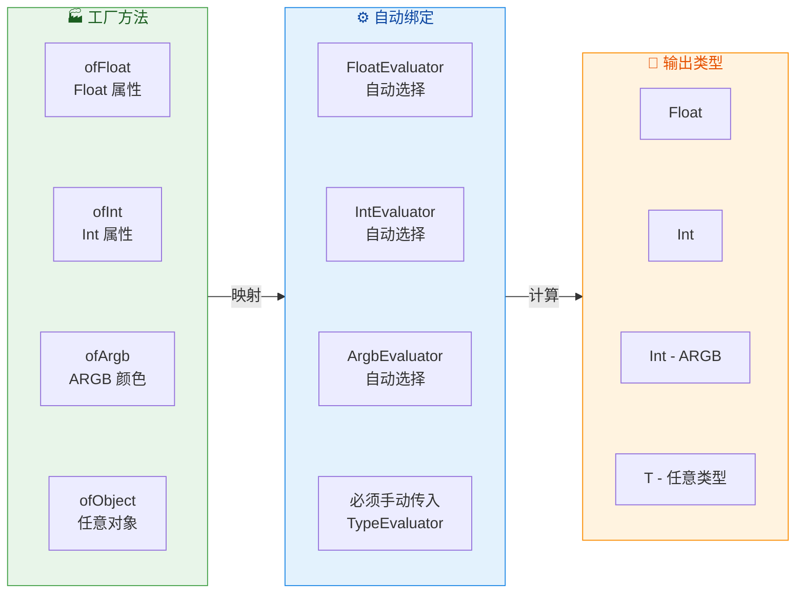
```mermaid
graph LR
    subgraph Factory["🏭 工厂方法"]
        direction TB
        F1["ofFloat\nFloat 属性"]
        F2["ofInt\nInt 属性"]
        F3["ofArgb\nARGB 颜色"]
        F4["ofObject\n任意对象"]
        F1 ~~~ F2 ~~~ F3 ~~~ F4
    end

    subgraph Auto["⚙️ 自动绑定"]
        direction TB
        A1["FloatEvaluator\n自动选择"]
        A2["IntEvaluator\n自动选择"]
        A3["ArgbEvaluator\n自动选择"]
        A4["必须手动传入\nTypeEvaluator"]
        A1 ~~~ A2 ~~~ A3 ~~~ A4
    end

    subgraph Result["🎯 输出类型"]
        direction TB
        R1["Float"]
        R2["Int"]
        R3["Int - ARGB"]
        R4["T - 任意类型"]
        R1 ~~~ R2 ~~~ R3 ~~~ R4
    end

    Factory -->|"映射"| Auto -->|"计算"| Result

    classDef factoryStyle fill:#E8F5E9,stroke:#43A047,color:#1B5E20
    classDef autoStyle fill:#E3F2FD,stroke:#1E88E5,color:#0D47A1
    classDef resultStyle fill:#FFF3E0,stroke:#FB8C00,color:#E65100

    class Factory factoryStyle
    class Auto autoStyle
    class Result resultStyle
```

---

### 自定义估值器

#### 为什么需要自定义

系统提供的 `IntEvaluator`、`FloatEvaluator`、`ArgbEvaluator` 只能处理单一数值或颜色值。但实际开发中，我们经常需要为**复合类型**做动画，例如：

- **PointF 动画**：让一个 View 沿曲线路径移动，每帧需要同时计算 x 和 y 两个分量。
- **Rect 动画**：让一个矩形区域从一个大小/位置平滑变换到另一个大小/位置。
- **自定义数据模型**：比如一个包含 `radius`、`color`、`alpha` 多个字段的粒子对象。

这些场景下，你必须告诉动画引擎"如何对我的自定义类型做插值"，这就是自定义 `TypeEvaluator` 的用武之地。

#### 实战：PointF 曲线运动估值器

以下示例实现了一个让 View 沿**二阶贝塞尔曲线**运动的估值器。二阶贝塞尔曲线由三个控制点决定：起点 P0、控制点 P1、终点 P2，其参数方程为：

**B(t) = (1-t)²·P0 + 2·(1-t)·t·P1 + t²·P2**

```kotlin
// 自定义贝塞尔曲线估值器：控制 View 沿二阶贝塞尔路径运动
class BezierEvaluator(
    private val controlPoint: PointF  // 贝塞尔曲线的控制点 P1
) : TypeEvaluator<PointF> {

    /**
     * 根据进度因子 fraction 计算贝塞尔曲线上的当前坐标
     * @param fraction   当前动画进度（经过插值器处理后的值）
     * @param startValue 起点 P0
     * @param endValue   终点 P2
     * @return           当前帧的 PointF 坐标
     */
    override fun evaluate(
        fraction: Float,       // 动画进度 t
        startValue: PointF,    // 起点坐标 P0
        endValue: PointF       // 终点坐标 P2
    ): PointF {
        // 预计算 (1 - t)，因为公式中多次使用
        val oneMinusT = 1f - fraction
        // 贝塞尔 X 分量：(1-t)²·x0 + 2·(1-t)·t·x1 + t²·x2
        val x = oneMinusT * oneMinusT * startValue.x +    // (1-t)² * P0.x
                2 * oneMinusT * fraction * controlPoint.x + // 2(1-t)t * P1.x
                fraction * fraction * endValue.x             // t² * P2.x
        // 贝塞尔 Y 分量：(1-t)²·y0 + 2·(1-t)·t·y1 + t²·y2
        val y = oneMinusT * oneMinusT * startValue.y +    // (1-t)² * P0.y
                2 * oneMinusT * fraction * controlPoint.y + // 2(1-t)t * P1.y
                fraction * fraction * endValue.y             // t² * P2.y
        // 返回当前帧的曲线坐标点
        return PointF(x, y)
    }
}
```

使用这个估值器驱动动画：

```kotlin
// 定义贝塞尔曲线的三个关键点
val startPoint = PointF(0f, 0f)          // 起点 P0：左上角
val endPoint = PointF(600f, 800f)        // 终点 P2：右下方
val controlPoint = PointF(600f, 0f)      // 控制点 P1：右上方（使曲线向右弯曲）

// 创建 ValueAnimator，使用 ofObject 传入自定义估值器
val bezierAnimator = ValueAnimator.ofObject(
    BezierEvaluator(controlPoint),       // 传入自定义贝塞尔估值器
    startPoint,                          // 动画起始值
    endPoint                             // 动画结束值
)
bezierAnimator.duration = 1000           // 动画时长 1 秒
bezierAnimator.interpolator = DecelerateInterpolator()  // 减速插值器，到终点时柔和

// 每帧更新 View 的位置
bezierAnimator.addUpdateListener { animation ->
    val point = animation.animatedValue as PointF  // 获取估值器计算的当前坐标
    view.translationX = point.x                    // 设置 View 的水平偏移
    view.translationY = point.y                    // 设置 View 的垂直偏移
}
bezierAnimator.start()                   // 启动动画
```

这段代码实现了一个 View 从屏幕左上角沿抛物线飞向右下方的效果——这正是购物车"加入商品"抛物线动画的经典实现方式。

#### 实战：多属性复合估值器

有时候我们需要对一个包含多个属性的自定义对象做动画。例如，一个"圆形指示器"对象同时具有 `radius`（半径）和 `color`（颜色）两个属性，我们希望用一个动画同时驱动它们变化：

```kotlin
// 定义一个包含半径和颜色的圆形数据类
data class CircleState(
    val radius: Float,  // 圆的半径（像素）
    val color: Int      // 圆的填充颜色（ARGB 整数）
)

// 自定义估值器：同时插值半径和颜色
class CircleStateEvaluator : TypeEvaluator<CircleState> {

    // 复用 ArgbEvaluator 来处理颜色通道插值
    private val argbEvaluator = ArgbEvaluator()

    override fun evaluate(
        fraction: Float,           // 动画进度
        startValue: CircleState,   // 起始状态
        endValue: CircleState      // 结束状态
    ): CircleState {
        // 半径使用标准线性插值
        val radius = startValue.radius +
                fraction * (endValue.radius - startValue.radius)  // LERP 公式
        // 颜色委托给 ArgbEvaluator，确保通道分别插值
        val color = argbEvaluator.evaluate(
            fraction,                  // 传入相同的进度因子
            startValue.color,          // 起始颜色
            endValue.color             // 目标颜色
        ) as Int                       // ArgbEvaluator 返回的是 Object，需强转
        // 组装并返回当前帧的圆形状态
        return CircleState(radius, color)
    }
}
```

这个例子展示了自定义估值器的一个**关键设计模式**：对于复合对象的不同字段，可以分别采用不同的插值策略，甚至**嵌套复用**已有的估值器（如这里对颜色字段复用了 `ArgbEvaluator`）。这种组合方式既保证了代码复用，又确保了每种类型字段都能得到正确的插值处理。

#### 插值器与估值器的协作全景

最后，让我们用一张完整的时序图来展现一帧动画中，从 Choreographer 垂直同步信号到属性值最终赋值的完整协作流程：

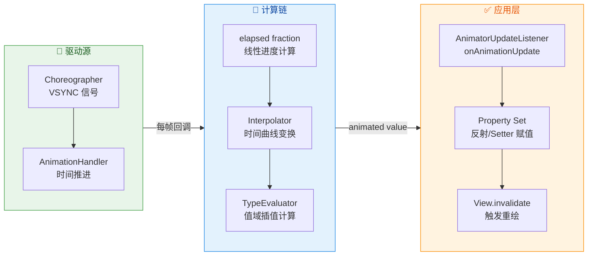
```mermaid
graph LR
    subgraph Trigger["📡 驱动源"]
        direction TB
        V["Choreographer\nVSYNC 信号"]
        T["AnimationHandler\n时间推进"]
        V --> T
    end

    subgraph Compute["🧮 计算链"]
        direction TB
        E["elapsed fraction\n线性进度计算"]
        I["Interpolator\n时间曲线变换"]
        EV["TypeEvaluator\n值域插值计算"]
        E --> I
        I --> EV
    end

    subgraph Apply["✅ 应用层"]
        direction TB
        L["AnimatorUpdateListener\nonAnimationUpdate"]
        P["Property Set\n反射/Setter 赋值"]
        INV["View.invalidate\n触发重绘"]
        L --> P
        P --> INV
    end

    Trigger -->|"每帧回调"| Compute -->|"animated value"| Apply

    classDef triggerStyle fill:#E8F5E9,stroke:#43A047,color:#1B5E20
    classDef computeStyle fill:#E3F2FD,stroke:#1E88E5,color:#0D47A1
    classDef applyStyle fill:#FFF3E0,stroke:#FB8C00,color:#E65100

    class Trigger triggerStyle
    class Compute computeStyle
    class Apply applyStyle
```

**完整流程解读**：每当屏幕刷新时（通常 16.6ms 一次），`Choreographer` 发出 VSYNC 信号，`AnimationHandler` 接收后推进时间，计算出线性进度 elapsed fraction。这个线性进度经过 `TimeInterpolator.getInterpolation()` 变换为曲线进度，再经过 `TypeEvaluator.evaluate()` 计算出真实属性值。如果你使用 `ObjectAnimator`，它会通过反射或 `Property` 对象直接调用目标对象的 setter 方法赋值，并触发 `View.invalidate()` 请求重绘；如果使用 `ValueAnimator`，则通过 `AnimatorUpdateListener` 回调将值传递给你，由你手动赋值。

理解这条完整链路后，你就能够清晰地回答诸如"为什么我的自定义插值器效果不对"、"为什么颜色过渡中间出现灰色"等常见问题——问题一定出在 Interpolator 或 TypeEvaluator 这两个环节中的某一个。

---

**📝 练习题**

在属性动画中，一个 `ObjectAnimator` 的 duration 为 1000ms，当动画运行到第 500ms 时，使用的插值器为 `AccelerateInterpolator`（factor=1），则此刻 `TypeEvaluator.evaluate()` 收到的 fraction 参数最接近哪个值？

A. 0.50


B. 0.25


C. 0.75


D. 1.00


**【答案】** B

**【解析】** `AccelerateInterpolator` 在 factor=1 时的数学公式为 **f(t) = t²**。在第 500ms 时，线性进度 elapsed fraction = 500/1000 = 0.5。经过插值器变换后，interpolated fraction = 0.5² = **0.25**。这个 0.25 才是传递给 `TypeEvaluator.evaluate()` 的 fraction 参数。这道题的核心在于理解 **Interpolator 是在 Evaluator 之前工作的**——Evaluator 拿到的不是线性进度，而是经过插值器曲线映射后的非线性进度。AccelerateInterpolator 使得动画前半段进展缓慢（0~0.25），后半段才急剧加速（0.25~1.0），因此在时间过半时动画实际上只完成了四分之一，正确答案为 B。

---

**📝 练习题**

开发者实现了一个自定义 `TypeEvaluator<PointF>`，用于驱动 View 沿直线从 (0, 0) 移动到 (100, 100)。动画使用 `OvershootInterpolator`，在某一帧中 `evaluate()` 收到的 fraction 值为 1.15。此时 evaluate 方法应该返回什么坐标？

A. (100, 100)，因为 fraction 超过 1 后应钳位到终点


B. (115, 115)，按照线性插值公式正常计算


C. (0, 0)，fraction 非法应返回起点


D. 抛出异常，因为 fraction 超出了 [0, 1] 的合法范围


**【答案】** B

**【解析】** 属性动画系统**允许**插值器返回超出 [0, 1] 范围的值——这正是 `OvershootInterpolator` 的设计本意：fraction > 1 表示"越过终点"。在 `TypeEvaluator.evaluate()` 中，开发者应当**忠实地按照插值公式计算**，而不是做任何钳位（clamp）处理。按线性插值公式 `start + fraction * (end - start)` 计算：x = 0 + 1.15 × (100 - 0) = 115，y 同理为 115，所以返回 (115, 115)。随后的帧中 fraction 会回落到 1.0，View 自然回弹到 (100, 100) 的最终位置。如果在估值器中错误地钳位，越界回弹效果就会被破坏，动画会在终点处"卡住"而非弹跳。正确答案为 B。

---

## 视图动画兼容

尽管属性动画（Property Animation）自 Android 3.0 起已成为官方推荐的动画方案，但 **视图动画（View Animation）** 至今仍未被废弃，且在大量生产项目中广泛存在。理解它的设计哲学、运作机制以及局限性边界，不仅是维护老代码的必备技能，更能帮助开发者在某些 **轻量场景** 中做出更高效的技术选型。视图动画有时也被称为 **"补间动画"（Tween Animation）**，因为系统只需要开发者提供起始帧与结束帧的状态描述，中间过程由框架自动 **"补"** 出来——这正是 "tween"（in-between 的缩写）一词的由来。

视图动画的整体工作原理可以用一句话概括：**它不改变 View 的任何真实属性，而是在每一帧绘制时，通过对 Canvas 施加变换矩阵（Matrix）来 "视觉上" 改变 View 的呈现效果。** 这意味着一个被 `TranslateAnimation` 移到屏幕右侧的按钮，它的点击热区依然停留在原始位置——这是视图动画最为人诟病的特性，也是催生属性动画的根本原因之一。但反过来看，正因为它不修改属性，视图动画在执行时的开销非常低：没有反射调用、没有属性写入、没有 `requestLayout()`，仅仅是一个 Matrix 运算。在只需要 "视觉反馈" 而不需要 "真实状态变化" 的场景里（例如列表项的入场特效、启动页的渐显），视图动画依然是 **性价比最高** 的选择。

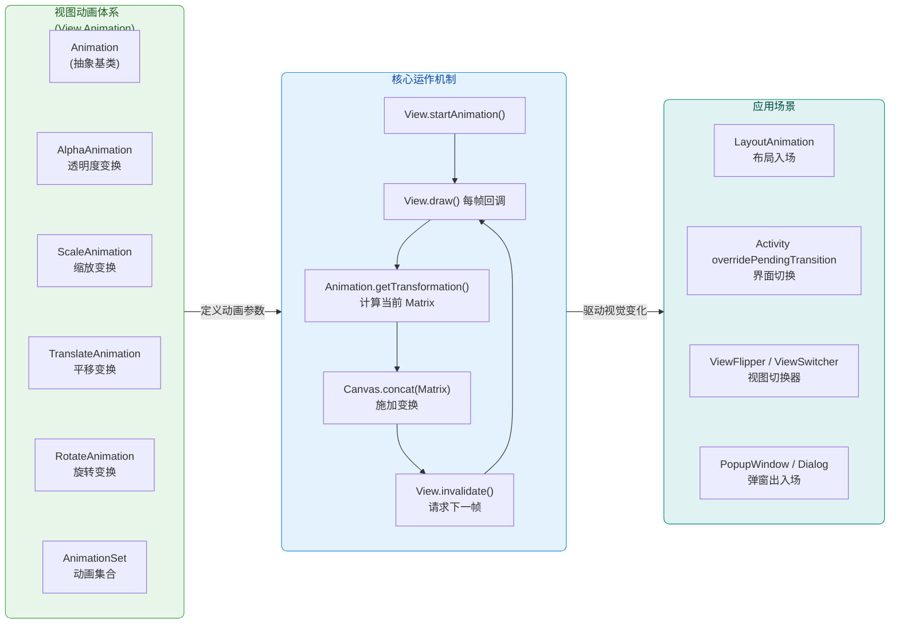
```mermaid
graph LR
    subgraph A["视图动画体系\n(View Animation)"]
        direction TB
        A1["Animation\n(抽象基类)"]
        A2["AlphaAnimation\n透明度变换"]
        A3["ScaleAnimation\n缩放变换"]
        A4["TranslateAnimation\n平移变换"]
        A5["RotateAnimation\n旋转变换"]
        A6["AnimationSet\n动画集合"]
        A1 ~~~ A2
        A2 ~~~ A3
        A3 ~~~ A4
        A4 ~~~ A5
        A5 ~~~ A6
    end

    subgraph B["核心运作机制"]
        direction TB
        B1["View.startAnimation()"]
        B2["View.draw() 每帧回调"]
        B3["Animation.getTransformation()\n计算当前 Matrix"]
        B4["Canvas.concat(Matrix)\n施加变换"]
        B5["View.invalidate()\n请求下一帧"]
        B1 --> B2
        B2 --> B3
        B3 --> B4
        B4 --> B5
        B5 --> B2
    end

    subgraph C["应用场景"]
        direction TB
        C1["LayoutAnimation\n布局入场"]
        C2["Activity overridePendingTransition\n界面切换"]
        C3["ViewFlipper / ViewSwitcher\n视图切换器"]
        C4["PopupWindow / Dialog\n弹窗出入场"]
        C1 ~~~ C2
        C2 ~~~ C3
        C3 ~~~ C4
    end

    A -->|"定义动画参数"| B -->|"驱动视觉变化"| C

    classDef greenBox fill:#E8F5E9,stroke:#43A047,color:#1B5E20,rx:8
    classDef blueBox fill:#E3F2FD,stroke:#1E88E5,color:#0D47A1,rx:8
    classDef tealBox fill:#E0F2F1,stroke:#00897B,color:#004D40,rx:8
    class A greenBox
    class B blueBox
    class C tealBox
```

### Alpha/Scale/Translate/Rotate 变换

Android 视图动画框架提供了四种基本变换类型，它们全部继承自抽象基类 `android.view.animation.Animation`。每一种变换对应 Canvas 绑定的一种矩阵操作，理解这层映射关系是深入掌握视图动画的关键。

**一、AlphaAnimation —— 透明度变换**

`AlphaAnimation` 控制 View 在绘制时的 **透明度因子**（alpha 值），取值范围为 `0.0f`（完全透明）到 `1.0f`（完全不透明）。在底层实现中，它并不修改 `View.setAlpha()` 属性，而是在 `applyTransformation()` 方法中将计算出的 alpha 值写入 `Transformation` 对象的 alpha 字段。当 `View.draw()` 执行时，框架读取这个 alpha 值，通过 `Canvas.saveLayerAlpha()` 或直接设置 `Paint.setAlpha()` 来实现透明度效果。正因为它走的是 Canvas 绘制管线而非属性修改，所以动画结束后如果没有设置 `setFillAfter(true)`，View 会 **瞬间恢复** 到初始透明度。

```kotlin
// ========== AlphaAnimation 代码示例 ==========

// 创建透明度动画：从完全不透明(1.0)渐变到完全透明(0.0)
val fadeOut = AlphaAnimation(1.0f, 0.0f).apply {
    // 动画持续时间设为 500 毫秒
    duration = 500L
    // 动画结束后保持最终状态（即保持透明）
    // 注意：这只是视觉保持，View 的真实 alpha 属性并未改变
    fillAfter = true
    // 设置插值器为减速曲线，使淡出效果更自然
    interpolator = DecelerateInterpolator()
    // 设置动画监听器，在动画结束后执行逻辑
    setAnimationListener(object : Animation.AnimationListener {
        // 动画开始时回调
        override fun onAnimationStart(animation: Animation?) {}
        // 动画结束时回调
        override fun onAnimationEnd(animation: Animation?) {
            // 动画结束后将 View 设为 GONE，释放布局空间
            // 这是一个常见的 "淡出后隐藏" 模式
            targetView.visibility = View.GONE
        }
        // 动画重复时回调
        override fun onAnimationRepeat(animation: Animation?) {}
    })
}
// 在目标 View 上启动动画
targetView.startAnimation(fadeOut)
```

这里有一个值得注意的细节：`fillAfter = true` 的效果依赖于 **父布局不重绘子 View**。如果父布局因某种原因触发了 `invalidate()`，子 View 可能会 "闪回" 到原始状态。因此在生产代码中，**淡出动画结束后立即设置 `visibility = GONE` 或 `INVISIBLE`** 是更稳妥的做法，如上面代码所示。

**二、ScaleAnimation —— 缩放变换**

`ScaleAnimation` 提供了对 View 的 X 轴和 Y 轴分别进行缩放的能力。它的构造函数较为复杂，因为除了缩放因子（起始/结束），还需要指定 **缩放中心点（pivot）**。缩放中心点决定了 View 朝哪个方向 "膨胀" 或 "收缩"。在矩阵层面，其运算顺序是：先平移使 pivot 对齐原点 → 执行 scale → 再平移回去。这就是为什么 pivot 的选择会显著影响视觉效果。

`ScaleAnimation` 的 pivot 支持三种坐标模式（通过 `Animation.RELATIVE_TO_SELF`、`Animation.RELATIVE_TO_PARENT`、`Animation.ABSOLUTE` 指定）：

- **`RELATIVE_TO_SELF`**：值域 `0.0~1.0`，表示 View 自身宽/高的比例。`0.5f` 即 View 中心。这是最常用的模式。
- **`RELATIVE_TO_PARENT`**：值域 `0.0~1.0`，表示父容器宽/高的比例。在复杂布局中可用于对齐特定位置。
- **`ABSOLUTE`**：以像素为单位的绝对坐标，极少使用，因为无法适配不同屏幕。

```kotlin
// ========== ScaleAnimation 代码示例 ==========

// 创建缩放动画：从 0 倍放大到 1 倍（即从无到有的 "弹出" 效果）
// 参数说明：fromX, toX, fromY, toY, pivotXType, pivotXValue, pivotYType, pivotYValue
val scaleIn = ScaleAnimation(
    0.0f, 1.0f,                          // X 轴：从 0 倍缩放到 1 倍
    0.0f, 1.0f,                          // Y 轴：从 0 倍缩放到 1 倍
    Animation.RELATIVE_TO_SELF, 0.5f,    // 缩放中心 X：View 自身宽度的 50%（水平居中）
    Animation.RELATIVE_TO_SELF, 0.5f     // 缩放中心 Y：View 自身高度的 50%（垂直居中）
).apply {
    // 动画持续 400 毫秒
    duration = 400L
    // 使用 OvershootInterpolator 产生 "弹过头再回来" 的弹性效果
    // 参数 tension 控制过冲幅度，默认为 2.0
    interpolator = OvershootInterpolator(2.0f)
}
// 启动缩放动画
cardView.startAnimation(scaleIn)
```

**三、TranslateAnimation —— 平移变换**

`TranslateAnimation` 将 View 在 X/Y 方向上做平移。它的底层操作是 `Matrix.setTranslate(dx, dy)`，即在绘制时偏移 Canvas 的坐标原点。再次强调：**这只是绘制偏移，View 的 `left/top/right/bottom` 属性不会改变，触摸事件仍然响应在原始位置。** 这一点在处理可交互元素（如按钮、输入框）时尤其危险。

`TranslateAnimation` 同样支持三种坐标模式来描述偏移量。最常用的是 `RELATIVE_TO_SELF`，其中 `1.0f` 表示自身宽/高的 100%。例如从 `fromXDelta = 0, toXDelta = 1.0(RELATIVE_TO_SELF)` 意味着向右移动一个自身宽度的距离。这种模式的好处是 **与 View 实际尺寸解耦**，无论 View 多大，动画效果都是一致的相对位移。

```kotlin
// ========== TranslateAnimation 代码示例 ==========

// 创建平移动画：View 从当前位置向右滑出（移动自身宽度的 100%）
val slideOut = TranslateAnimation(
    Animation.RELATIVE_TO_SELF, 0.0f,    // 起始 X：当前位置（0% 偏移）
    Animation.RELATIVE_TO_SELF, 1.0f,    // 结束 X：向右偏移自身宽度的 100%
    Animation.RELATIVE_TO_SELF, 0.0f,    // 起始 Y：当前位置
    Animation.RELATIVE_TO_SELF, 0.0f     // 结束 Y：当前位置（Y 方向不动）
).apply {
    // 动画持续 300 毫秒
    duration = 300L
    // 使用加速插值器，模拟 "加速离场" 效果
    interpolator = AccelerateInterpolator()
    // 动画结束后保持在最终位置
    fillAfter = true
}
// 对目标 View 启动平移动画
listItem.startAnimation(slideOut)
```

**四、RotateAnimation —— 旋转变换**

`RotateAnimation` 围绕一个指定的 **旋转中心点（pivot）** 做角度旋转。角度值以 **度数** 表示，正值为顺时针，负值为逆时针。与 `ScaleAnimation` 类似，pivot 的位置至关重要——以 View 中心旋转和以左上角旋转的视觉效果完全不同。在矩阵层面，操作序列为：translate → rotate → translate back，与缩放的思路一致。

```kotlin
// ========== RotateAnimation 代码示例 ==========

// 创建旋转动画：从 0° 旋转到 360°（顺时针一圈），围绕 View 中心
val rotate = RotateAnimation(
    0.0f, 360.0f,                        // 从 0° 旋转到 360°
    Animation.RELATIVE_TO_SELF, 0.5f,    // 旋转中心 X：View 宽度的 50%
    Animation.RELATIVE_TO_SELF, 0.5f     // 旋转中心 Y：View 高度的 50%
).apply {
    // 动画持续 1000 毫秒
    duration = 1000L
    // 无限重复（常用于 loading 指示器）
    repeatCount = Animation.INFINITE
    // 重复模式为 RESTART（每次从头开始，而非反向）
    repeatMode = Animation.RESTART
    // 使用线性插值器保持匀速旋转
    interpolator = LinearInterpolator()
}
// 对 loading 图标启动旋转
loadingIcon.startAnimation(rotate)
```

使用 `repeatCount = Animation.INFINITE` 时务必注意 **生命周期管理**。如果 Activity/Fragment 进入后台而没有停止动画，虽然视图动画本身不会导致内存泄漏（因为它不持有 Context 强引用），但它会持续触发 `invalidate()`，造成不必要的 CPU 消耗。最佳实践是在 `onPause()` 中调用 `view.clearAnimation()`。

**五、applyTransformation() —— 四种变换的统一入口**

无论是哪种变换类型，框架驱动动画的流程都是一致的。当 `View.draw()` 被调用时，如果该 View 身上绑定了 Animation 对象，框架会调用 `Animation.getTransformation(currentTime, outTransformation)` 方法。这个方法内部做了两件事：第一，根据当前时间计算出一个 **归一化进度（interpolatedTime）**，范围为 `0.0~1.0`，这个值已经经过 `Interpolator` 处理；第二，将这个进度传入 `applyTransformation(interpolatedTime, t)` 方法——这是每个子类（Alpha / Scale / Translate / Rotate）的核心重写点，它们各自将进度值换算成对应的矩阵参数，写入 `Transformation` 对象中。最后，`View.draw()` 拿到 `Transformation` 中的 Matrix 和 alpha 值，应用到 Canvas 上完成本帧绘制，然后调用 `invalidate()` 请求下一帧——形成动画循环，直到进度到达 `1.0`。

### AnimationSet 集合

在实际开发中，单一的变换效果往往不够表达复杂的视觉语言。例如一个对话框弹出时，通常需要 **同时** 执行透明度渐显、缩放放大，甚至还有轻微的上移——这就需要将多个 `Animation` 组合在一起播放。`AnimationSet` 正是为此而生的容器。

`AnimationSet` 继承自 `Animation`，因此它本身也是一个 `Animation`，这意味着它可以被嵌套到另一个 `AnimationSet` 中（尽管这种用法极少）。它的核心职责是 **统一管理子动画的时间线和变换矩阵的合并**。

**一、shareInterpolator 参数**

`AnimationSet` 的构造函数接受一个 `boolean shareInterpolator` 参数，这个参数的含义是：是否让所有子动画 **共享** 同一个插值器。如果设为 `true`，那么在 `AnimationSet` 上设置的 `Interpolator` 会覆盖所有子动画各自的插值器设置；如果设为 `false`，每个子动画可以保留自己独立的插值器。在需要"淡入用减速、同时缩放用弹性"这类差异化节奏时，必须传 `false`。

**二、时间属性的继承与覆盖规则**

`AnimationSet` 对子动画属性的处理并非简单的"全部覆盖"或"全部独立"，而是有一套 **明确的规则**：

- **`duration`**：如果在 `AnimationSet` 上调用 `setDuration()`，该值会 **强制应用到每一个子动画**，覆盖子动画自身设置的 duration。如果不调用，则每个子动画使用自己的 duration。
- **`fillAfter` / `fillBefore`**：这两个属性是在 `AnimationSet` 级别生效的，设置在子动画上通常 **无效**。要让组合动画结束后保持最终状态，必须在 `AnimationSet` 上设置 `fillAfter = true`。
- **`startOffset`**：子动画的 `startOffset` 是相对于 `AnimationSet` 开始播放时间的延迟。这意味着可以通过给不同子动画设置不同的 `startOffset` 来实现 **错位播放（staggered animation）** 效果——视觉上类似于先淡入、稍后再缩放。
- **`repeatCount`**：在 `AnimationSet` 上设置 `repeatCount` 的行为在不同 Android 版本上存在不一致，实践中建议 **在每个子动画上分别设置 repeatCount**，或者避免在 `AnimationSet` 中使用重复。

**三、Matrix 合并原理**

当 `AnimationSet.getTransformation()` 被调用时，它会遍历所有子动画，依次调用每个子动画的 `getTransformation()`，将返回的 `Transformation` 按照 **矩阵乘法（Matrix concatenation）** 合并为一个最终的 `Transformation`。对于 alpha 值则取所有子动画 alpha 的 **乘积**。这意味着如果两个子动画都设置了半透明（0.5），最终效果是 0.25 而不是 0.5。

```kotlin
// ========== AnimationSet 代码示例：对话框弹出效果 ==========

// 创建动画集合，shareInterpolator = false 表示子动画各用各的插值器
val dialogPopIn = AnimationSet(false).apply {

    // 子动画 1：透明度从 0 到 1（淡入）
    addAnimation(AlphaAnimation(0.0f, 1.0f).apply {
        // 淡入持续 250 毫秒
        duration = 250L
        // 使用减速插值器：快速出现，缓慢稳定
        interpolator = DecelerateInterpolator()
    })

    // 子动画 2：缩放从 0.8 到 1.0（轻微放大）
    addAnimation(ScaleAnimation(
        0.8f, 1.0f,                          // X 轴从 80% 放大到 100%
        0.8f, 1.0f,                          // Y 轴从 80% 放大到 100%
        Animation.RELATIVE_TO_SELF, 0.5f,    // 中心点 X
        Animation.RELATIVE_TO_SELF, 0.5f     // 中心点 Y
    ).apply {
        // 缩放持续 350 毫秒（比淡入稍长，视觉上更有弹性）
        duration = 350L
        // 使用 OvershootInterpolator 产生弹过头的效果
        interpolator = OvershootInterpolator(1.5f)
    })

    // 子动画 3：从底部轻微上移
    addAnimation(TranslateAnimation(
        Animation.RELATIVE_TO_SELF, 0.0f,    // X 起始：无偏移
        Animation.RELATIVE_TO_SELF, 0.0f,    // X 结束：无偏移
        Animation.RELATIVE_TO_SELF, 0.1f,    // Y 起始：向下偏移 10%
        Animation.RELATIVE_TO_SELF, 0.0f     // Y 结束：回到原位
    ).apply {
        // 上移持续 300 毫秒
        duration = 300L
        // 使用减速插值器
        interpolator = DecelerateInterpolator(1.5f)
    })

    // 在 AnimationSet 级别设置 fillAfter
    fillAfter = true
}

// 对对话框根布局启动组合动画
dialogRootView.startAnimation(dialogPopIn)
```

**四、XML 声明方式**

除了代码构建，`AnimationSet` 也支持通过 XML 资源文件声明（放置在 `res/anim/` 目录下），这在样式统一和跨模块复用时更为方便：

```xml
<!-- res/anim/dialog_pop_in.xml -->
<!-- 根标签 <set> 对应 AnimationSet -->
<!-- android:shareInterpolator="false" 表示子动画各自使用独立插值器 -->
<set xmlns:android="http://schemas.android.com/apk/res/android"
    android:shareInterpolator="false"
    android:fillAfter="true">

    <!-- 透明度动画：从透明到不透明 -->
    <alpha
        android:fromAlpha="0.0"
        android:toAlpha="1.0"
        android:duration="250"
        android:interpolator="@android:anim/decelerate_interpolator" />

    <!-- 缩放动画：从 80% 放大到 100%，以自身中心为锚点 -->
    <scale
        android:fromXScale="0.8"
        android:toXScale="1.0"
        android:fromYScale="0.8"
        android:toYScale="1.0"
        android:pivotX="50%"
        android:pivotY="50%"
        android:duration="350"
        android:interpolator="@android:anim/overshoot_interpolator" />

    <!-- 平移动画：从下方 10% 处上移到原位 -->
    <translate
        android:fromYDelta="10%"
        android:toYDelta="0%"
        android:duration="300"
        android:interpolator="@android:anim/decelerate_interpolator" />

</set>
```

在代码中加载这个 XML 资源只需一行：

```kotlin
// 从 XML 资源加载动画，AnimationUtils 内部通过 XmlPullParser 解析
val anim = AnimationUtils.loadAnimation(context, R.anim.dialog_pop_in)
// 启动动画
dialogRootView.startAnimation(anim)
```

XML 方式的优势不仅仅是 "代码更简洁"，更重要的是它可以被 **主题（Theme）和样式（Style）系统引用**，例如在 `windowAnimationStyle` 中指定 Activity 的进入/退出动画，或在 `PopupWindow` 的 `setAnimationStyle()` 中引用——这些场景 **只接受 XML 资源引用**，代码方式反而无法使用。

### LayoutAnimation 布局入场

`LayoutAnimation` 是视图动画体系中一个非常独特的功能：它不是作用于单个 View，而是作用于 **ViewGroup 的所有直接子 View**，为它们的 **首次布局出现** 提供一个统一的、有节奏的入场动画。典型的使用场景包括 `ListView` / `RecyclerView` 首次加载时列表项依次飞入、`GridLayout` 中卡片逐个弹出等。

**一、核心组件：LayoutAnimationController**

`LayoutAnimation` 的核心实现类是 `android.view.animation.LayoutAnimationController`。它包装了一个普通的 `Animation` 对象（即上面讲过的 Alpha/Scale/Translate/Rotate 或它们的 AnimationSet 组合），并为 ViewGroup 中的每个子 View 计算出不同的 **起始延迟（start offset）**，从而产生 "依次入场" 的错位效果。

`LayoutAnimationController` 的两个核心参数：

- **`animation`**：每个子 View 要执行的入场动画。所有子 View 执行的是 **同一个动画定义** 的不同实例。
- **`delay`**：延迟因子（float），表示相邻两个子 View 的入场间隔。这个值是 **相对于动画总时长的比例**。例如 `delay = 0.3f` 且动画 duration 为 500ms，则第 1 个子 View 延迟 0ms、第 2 个延迟 150ms（500 × 0.3）、第 3 个延迟 300ms，以此类推。

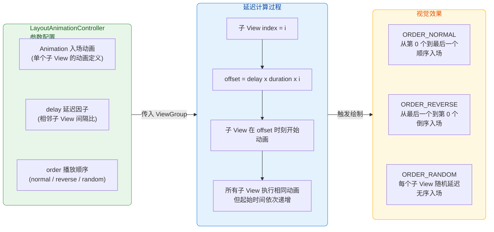
```mermaid
graph LR
    subgraph A["LayoutAnimationController\n参数配置"]
        direction TB
        A1["Animation 入场动画\n(单个子 View 的动画定义)"]
        A2["delay 延迟因子\n(相邻子 View 间隔比)"]
        A3["order 播放顺序\n(normal / reverse / random)"]
        A1 ~~~ A2
        A2 ~~~ A3
    end

    subgraph B["延迟计算过程"]
        direction TB
        B1["子 View index = i"]
        B2["offset = delay x duration x i"]
        B3["子 View 在 offset 时刻开始动画"]
        B4["所有子 View 执行相同动画\n但起始时间依次递增"]
        B1 --> B2
        B2 --> B3
        B3 --> B4
    end

    subgraph C["视觉效果"]
        direction TB
        C1["ORDER_NORMAL\n从第 0 个到最后一个\n顺序入场"]
        C2["ORDER_REVERSE\n从最后一个到第 0 个\n倒序入场"]
        C3["ORDER_RANDOM\n每个子 View 随机延迟\n无序入场"]
        C1 ~~~ C2
        C2 ~~~ C3
    end

    A -->|"传入 ViewGroup"| B -->|"触发绘制"| C

    classDef greenBox fill:#E8F5E9,stroke:#43A047,color:#1B5E20,rx:8
    classDef blueBox fill:#E3F2FD,stroke:#1E88E5,color:#0D47A1,rx:8
    classDef amberBox fill:#FFF8E1,stroke:#FFB300,color:#E65100,rx:8
    class A greenBox
    class B blueBox
    class C amberBox
```

**二、播放顺序（Order）**

`LayoutAnimationController` 提供了三种内置的播放顺序：

- **`ORDER_NORMAL`（默认）**：子 View 按照它们在 ViewGroup 中的索引顺序依次入场——0、1、2、3……对于垂直 LinearLayout 来说就是从上到下，对于 ListView 来说就是从第一项到最后一项。
- **`ORDER_REVERSE`**：按索引倒序入场——最后一个子 View 先出现，第一个最后出现。
- **`ORDER_RANDOM`**：每个子 View 的延迟被随机化，产生 "无序涌入" 的效果。内部通过 `Random` 打乱 index 来实现。

如果需要更复杂的入场顺序（例如 GridLayout 中从左上角向右下角 "波纹扩散"），可以使用 `GridLayoutAnimationController`——它是 `LayoutAnimationController` 的子类，增加了 **列延迟（columnDelay）、行延迟（rowDelay）和扩散方向（direction）** 的控制。

**三、代码方式使用 LayoutAnimation**

```kotlin
// ========== LayoutAnimation 代码示例 ==========

// 第一步：创建子 View 的入场动画（从左侧滑入 + 淡入）
val slideIn = AnimationSet(true).apply {
    // 设置统一插值器为减速
    interpolator = DecelerateInterpolator()
    // 添加平移动画：从左侧 100% 自身宽度处滑入
    addAnimation(TranslateAnimation(
        Animation.RELATIVE_TO_SELF, -1.0f,   // 起始 X：在自身宽度的左侧 100%
        Animation.RELATIVE_TO_SELF, 0.0f,    // 结束 X：回到原位
        Animation.RELATIVE_TO_SELF, 0.0f,    // Y 不变
        Animation.RELATIVE_TO_SELF, 0.0f
    ).apply {
        duration = 400L                       // 持续 400 毫秒
    })
    // 添加透明度动画：从透明到不透明
    addAnimation(AlphaAnimation(0.0f, 1.0f).apply {
        duration = 400L                       // 与平移同步
    })
}

// 第二步：创建 LayoutAnimationController
val controller = LayoutAnimationController(slideIn).apply {
    // 延迟因子 0.15，即相邻子 View 间隔 = 400ms × 0.15 = 60ms
    delay = 0.15f
    // 顺序播放（从第一个到最后一个）
    order = LayoutAnimationController.ORDER_NORMAL
}

// 第三步：将 Controller 设置到 ViewGroup 上
recyclerView.layoutAnimation = controller
// 触发布局动画的执行
// 如果 ViewGroup 已经完成了布局（子 View 已存在），需要手动调度
recyclerView.scheduleLayoutAnimation()
```

需要特别说明 `scheduleLayoutAnimation()` 的触发时机：`LayoutAnimation` 设计上是在 ViewGroup **首次执行 layout 并分配子 View 位置后** 自动播放的。如果在 ViewGroup 已经完成布局之后才设置 `layoutAnimation`（例如数据异步加载完成后），就需要显式调用 `scheduleLayoutAnimation()` 来告知框架"下一次绘制时播放布局动画"。对于 `RecyclerView`，由于其内部的复用机制和布局管理器的特殊性，更推荐在设置 Adapter 数据之前配置好 `layoutAnimation`，以确保首次填充时动画正常触发。

**四、XML 声明方式**

`LayoutAnimation` 同样支持纯 XML 定义，分两步：先定义子动画，再定义布局动画控制器。

```xml
<!-- res/anim/item_slide_in.xml：单个子 View 的入场动画 -->
<set xmlns:android="http://schemas.android.com/apk/res/android"
    android:shareInterpolator="true"
    android:interpolator="@android:anim/decelerate_interpolator">

    <!-- 从左侧滑入 -->
    <translate
        android:fromXDelta="-100%"
        android:toXDelta="0%"
        android:duration="400" />

    <!-- 同时淡入 -->
    <alpha
        android:fromAlpha="0.0"
        android:toAlpha="1.0"
        android:duration="400" />

</set>
```

```xml
<!-- res/anim/layout_slide_in.xml：LayoutAnimation 控制器定义 -->
<!-- 根标签为 layoutAnimation -->
<layoutAnimation xmlns:android="http://schemas.android.com/apk/res/android"
    android:animation="@anim/item_slide_in"
    android:delay="15%"
    android:animationOrder="normal" />
```

然后在布局 XML 中直接引用：

```xml
<!-- 在 ViewGroup 上通过 android:layoutAnimation 属性引用 -->
<androidx.recyclerview.widget.RecyclerView
    android:id="@+id/recyclerView"
    android:layout_width="match_parent"
    android:layout_height="match_parent"
    android:layoutAnimation="@anim/layout_slide_in" />
```

**五、LayoutAnimation 的局限与替代方案**

`LayoutAnimation` 有几个显著的局限性，在使用时需要充分认知：

第一，**只触发一次**。默认情况下，`LayoutAnimation` 只在 ViewGroup 首次布局时执行。后续动态添加的子 View 不会自动播放入场动画。如果需要每次数据刷新都触发，必须在每次刷新数据后重新调用 `scheduleLayoutAnimation()`。

第二，**仅支持视图动画**。`LayoutAnimationController` 只接受 `Animation` 对象（即视图动画），无法使用 `ObjectAnimator` 等属性动画。如果需要用属性动画实现类似效果，应当考虑使用 `RecyclerView.ItemAnimator`（如 `DefaultItemAnimator`）或第三方库。

第三，**与 RecyclerView 的兼容性**。虽然 `RecyclerView` 支持 `layoutAnimation` 属性，但由于 `RecyclerView` 的子 View 是通过 `LayoutManager` 延迟绑定的，在某些场景下（如嵌套 `RecyclerView`、复杂的 `DiffUtil` 更新）可能出现动画不触发或重复触发的问题。在这类复杂场景中，`RecyclerView.ItemAnimator` 是更可控的选择。

第四，**GridLayoutAnimationController** 是针对 `GridView` 设计的。对于 `RecyclerView` + `GridLayoutManager` 的组合，`GridLayoutAnimationController` 并不能开箱即用——因为它依赖的是 `ViewGroup.getChildAt(index)` 的顺序，而 `RecyclerView` 的子 View 顺序可能因复用机制而不可预测。实现网格波纹入场效果更稳妥的方式是自定义 `ItemAnimator` 或在 Adapter 的 `onBindViewHolder` 中手动控制每个 item 的动画延迟。

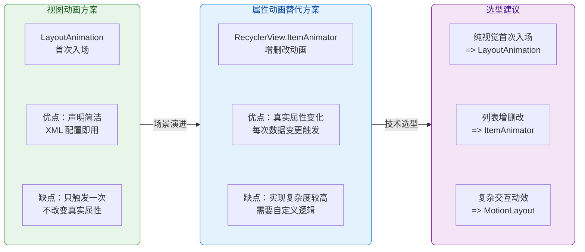
```mermaid
graph LR
    subgraph A["视图动画方案"]
        direction TB
        A1["LayoutAnimation\n首次入场"]
        A2["优点：声明简洁\nXML 配置即用"]
        A3["缺点：只触发一次\n不改变真实属性"]
        A1 ~~~ A2
        A2 ~~~ A3
    end

    subgraph B["属性动画替代方案"]
        direction TB
        B1["RecyclerView.ItemAnimator\n增删改动画"]
        B2["优点：真实属性变化\n每次数据变更触发"]
        B3["缺点：实现复杂度较高\n需要自定义逻辑"]
        B1 ~~~ B2
        B2 ~~~ B3
    end

    subgraph C["选型建议"]
        direction TB
        C1["纯视觉首次入场\n=> LayoutAnimation"]
        C2["列表增删改\n=> ItemAnimator"]
        C3["复杂交互动效\n=> MotionLayout"]
        C1 ~~~ C2
        C2 ~~~ C3
    end

    A -->|"场景演进"| B -->|"技术选型"| C

    classDef greenBox fill:#E8F5E9,stroke:#43A047,color:#1B5E20,rx:8
    classDef blueBox fill:#E3F2FD,stroke:#1E88E5,color:#0D47A1,rx:8
    classDef purpleBox fill:#F3E5F5,stroke:#8E24AA,color:#4A148C,rx:8
    class A greenBox
    class B blueBox
    class C purpleBox
```

总结来说，视图动画（View Animation）虽然在属性动画面前显得 "古老"，但它的设计哲学——**不修改属性、只变换绘制**——在特定场景下反而是优势。`AnimationSet` 提供了组合能力，`LayoutAnimation` 提供了优雅的集体入场方案。开发者需要做的是：**充分理解它 "只是画面变了，View 本身没动" 的本质**，在合适的场景中使用它，在需要真实状态变化的场景中果断选择属性动画。

---

**📝 练习题**

在一个 `AnimationSet` 中同时添加了 `AlphaAnimation(1.0f, 0.5f)` 和 `AlphaAnimation(1.0f, 0.5f)` 两个透明度动画（参数完全相同），动画结束时 View 的视觉透明度最接近以下哪个值？

A. 0.5（两个动画取最后一个的值）


B. 0.25（两个 alpha 值相乘：0.5 × 0.5）


C. 0.0（两个 alpha 值相减：0.5 − 0.5）


D. 1.0（AnimationSet 忽略重复类型的动画）


**【答案】** B

**【解析】** `AnimationSet` 在合并子动画的 `Transformation` 时，对于 alpha 值采用的是 **乘法合并** 而非覆盖或加法。每个 `AlphaAnimation` 在结束时产生的 alpha 因子为 0.5，两个子动画的 alpha 被乘在一起得到 `0.5 × 0.5 = 0.25`。这是因为 `Transformation.compose()` 方法中，alpha 字段的合并逻辑是 `this.alpha *= other.alpha`。理解这一点有助于避免多个透明度动画叠加时出现意料之外的过度透明。同理，如果一个 `AnimationSet` 中包含三个 `AlphaAnimation(1.0f, 0.5f)`，最终视觉 alpha 将是 `0.5³ = 0.125`。

---

**📝 练习题**

关于 `LayoutAnimationController` 的 `delay` 参数，以下说法正确的是？

A. `delay` 表示所有子 View 的动画统一延迟多少毫秒后开始播放


B. `delay` 是一个绝对时间值（单位为毫秒），表示相邻两个子 View 的入场间隔


C. `delay` 是一个比例因子，相邻子 View 的实际间隔等于 `delay × 动画总时长`


D. `delay` 仅在 `ORDER_NORMAL` 模式下生效，`ORDER_RANDOM` 模式下被忽略


**【答案】** C

**【解析】** `LayoutAnimationController` 的 `delay` 是一个 **浮点比例因子**（如 `0.3f`），而非绝对毫秒值。第 `i` 个子 View 的起始延迟计算公式为 `offset = delay × animation.duration × i`。例如 `delay = 0.3f`、动画 duration 为 500ms 时，第 0 个子 View 延迟 0ms，第 1 个延迟 150ms，第 2 个延迟 300ms。选项 A 和 B 都误解了 delay 的含义。选项 D 也不正确——在 `ORDER_RANDOM` 模式下 delay 仍然生效，只是 index 被随机化了，实际延迟 = `delay × duration × randomIndex`。

---

## 帧动画

帧动画（Frame Animation）是 Android 动画体系中概念最简单、实现最直观的一种动画形式。它的工作原理与传统手翻书（Flipbook）完全一致——将一系列预先绘制好的静态图片按照固定的时间间隔逐帧切换显示，当切换速度足够快时，人眼的 **视觉暂留效应**（Persistence of Vision）便会将这些离散的画面感知为连续的动画。这种"逐帧播放"的思路虽然古老，却在特定场景下有着不可替代的价值：例如复杂的角色行走动画、不规则形变的 Loading 效果、逐帧手绘的启动引导页等——这些效果往往难以用属性动画或矢量动画的数学插值来精确描述，而帧动画只需设计师导出一组序列图即可完美还原。

然而，"简单"往往意味着"粗暴"。帧动画的最大隐患在于 **内存开销**。由于每一帧都对应一张完整的 Bitmap，一旦帧数较多或单帧分辨率较高，整个动画所占用的内存将急剧膨胀，极易触发 `OutOfMemoryError`。因此，理解帧动画的资源加载机制、掌握 XML 定义方式、并深刻认识其内存特性，是正确使用帧动画的三大核心要点。

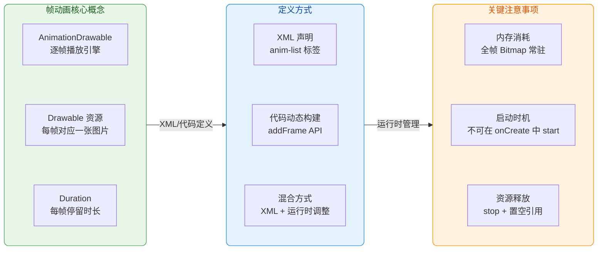
```mermaid
graph LR
    subgraph S1["帧动画核心概念"]
        direction TB
        A1["AnimationDrawable\n逐帧播放引擎"]
        A2["Drawable 资源\n每帧对应一张图片"]
        A3["Duration\n每帧停留时长"]
        A1 ~~~ A2
        A2 ~~~ A3
    end

    subgraph S2["定义方式"]
        direction TB
        B1["XML 声明\nanim-list 标签"]
        B2["代码动态构建\naddFrame API"]
        B3["混合方式\nXML + 运行时调整"]
        B1 ~~~ B2
        B2 ~~~ B3
    end

    subgraph S3["关键注意事项"]
        direction TB
        C1["内存消耗\n全帧 Bitmap 常驻"]
        C2["启动时机\n不可在 onCreate 中 start"]
        C3["资源释放\nstop + 置空引用"]
        C1 ~~~ C2
        C2 ~~~ C3
    end

    S1 -->|"XML/代码定义"| S2 -->|"运行时管理"| S3

    classDef greenBox fill:#E8F5E9,stroke:#43A047,color:#1B5E20,rx:8
    classDef blueBox fill:#E3F2FD,stroke:#1E88E5,color:#0D47A1,rx:8
    classDef orangeBox fill:#FFF3E0,stroke:#FB8C00,color:#E65100,rx:8
    class S1 greenBox
    class S2 blueBox
    class S3 orangeBox
```

---

### AnimationDrawable 资源

`AnimationDrawable` 是 Android 帧动画的核心载体类，它继承自 `DrawableContainer`，而 `DrawableContainer` 又是 `Drawable` 的子类。这意味着 `AnimationDrawable` 本质上就是一个 **可绘制对象**，可以被设置为任何 `View` 的背景（`setBackground`）或任何 `ImageView` 的前景图片（`setImageDrawable`）。它内部维护了一个 **帧列表**（frame list），每个条目由一个 `Drawable` 引用和一个以毫秒为单位的持续时间组成。当动画启动后，`AnimationDrawable` 通过 `scheduleSelf()` 机制向宿主 View 的消息队列投递定时回调，每次回调触发时切换到下一帧并请求重绘（`invalidateSelf()`），从而实现视觉上的连续播放。

**类继承关系与内部结构**

从类继承角度看，`AnimationDrawable` 的继承链为：`AnimationDrawable → DrawableContainer → Drawable`。`DrawableContainer` 本身就具备"在多个 Drawable 子项之间切换显示"的能力（`SelectionDrawable` 如 `StateListDrawable` 也利用了这一基类），而 `AnimationDrawable` 在此基础上增加了 **时间驱动的自动切换逻辑**。其内部关键数据结构是 `AnimationState`（继承自 `DrawableContainerState`），它持有一个 `Drawable[]` 数组和一个 `int[]` 持续时间数组。当我们通过 XML 或代码添加帧时，实际上就是在向这两个并行数组中追加条目。

`AnimationDrawable` 实现了 `Runnable` 和 `Animatable` 两个接口。`Animatable` 接口定义了 `start()`、`stop()`、`isRunning()` 三个方法，这是控制动画生命周期的标准 API。而 `Runnable` 接口的 `run()` 方法则是帧切换的实际执行体——每次 `run()` 被调用时，`AnimationDrawable` 将当前帧索引前移一位，调用 `selectDrawable()` 切换显示内容，然后再通过 `scheduleSelf(this, SystemClock.uptimeMillis() + duration)` 安排下一次回调。这种 **"回调链"**（callback chain）模式使得帧动画无需独立线程，完全运行在主线程的 `MessageQueue` 上，与 UI 渲染流水线天然同步。

**通过代码构建 AnimationDrawable**

虽然 XML 定义是更常见的方式（后文详述），但通过纯代码构建 `AnimationDrawable` 能够帮助我们更清晰地理解其 API 设计。以下是一个典型示例：

```kotlin
// 创建 AnimationDrawable 实例，它将承载所有帧
val frameAnimation = AnimationDrawable()

// 设置是否只播放一次：true 表示播放到最后一帧后停止，false 表示循环
frameAnimation.isOneShot = false

// 逐帧添加：第一个参数是该帧的 Drawable，第二个参数是该帧的持续时间（毫秒）
// 每一帧都是一张独立的图片资源，Android 会将其解码为 Bitmap 加载到内存
frameAnimation.addFrame(
    ContextCompat.getDrawable(context, R.drawable.frame_01)!!, // 第 1 帧图片
    80  // 该帧显示 80ms 后切换到下一帧
)
frameAnimation.addFrame(
    ContextCompat.getDrawable(context, R.drawable.frame_02)!!, // 第 2 帧图片
    80  // 同样持续 80ms
)
frameAnimation.addFrame(
    ContextCompat.getDrawable(context, R.drawable.frame_03)!!, // 第 3 帧图片
    120 // 这一帧特意延长到 120ms，可制造"停顿"效果
)
// ... 按需继续添加更多帧

// 将帧动画设置为 ImageView 的图片源
imageView.setImageDrawable(frameAnimation)

// 注意：不能在 onCreate/onResume 中直接调用 start()，
// 因为此时 View 尚未完成测量与布局，AnimationDrawable 的宿主窗口还没准备好
// 正确做法是等 View 完成 attach 后再启动，典型方式如下：
imageView.post {
    // post 将 Runnable 投递到主线程消息队列尾部，
    // 此时 View 已完成至少一次 layout，可以安全启动动画
    frameAnimation.start()
}
```

上面代码揭示了几个重要细节：

第一，`addFrame()` 方法接受的第一个参数类型是 `Drawable` 而非 `Bitmap`。这意味着每帧不一定必须是 `BitmapDrawable`，理论上也可以是 `ShapeDrawable`、`VectorDrawable` 甚至嵌套的 `AnimationDrawable`（虽然后者极少使用）。但在实际开发中，帧动画几乎总是使用光栅图片（PNG/WebP），因为其目的就是播放设计师导出的序列帧。

第二，`isOneShot` 属性控制播放模式。当设为 `true` 时，动画播放到最后一帧后 `run()` 方法将不再 `scheduleSelf()`，动画停在末帧。当设为 `false`（默认值）时，播放到末帧后索引重置为 0，形成无限循环。需要注意的是，**没有内置的播放次数控制**——不像属性动画的 `repeatCount`，帧动画要么播一次，要么无限循环。如果需要"播放 N 次后停止"的效果，必须自行在代码中计数并在适当时机调用 `stop()`。

第三，**启动时机至关重要**。`AnimationDrawable.start()` 内部需要通过 `getCallback()` 获取宿主 View 来安排定时重绘。如果在 `Activity.onCreate()` 或 `Fragment.onViewCreated()` 中直接调用 `start()`，此时 View 树尚未完成 `measure → layout → draw` 的首轮流程，`AnimationDrawable` 可能尚未被 attach 到窗口，`getCallback()` 返回 null，导致动画静默失败（不会崩溃，但什么都不播放）。正确做法是利用 `View.post()` 或 `ViewTreeObserver.OnPreDrawListener` 将启动操作延迟到首帧绘制之后。

**start() 与 stop() 的内部调度**

当 `start()` 被调用时，`AnimationDrawable` 首先将运行标记设为 `true`，然后调用 `run()` 方法。`run()` 内部的逻辑可以简化描述为以下伪代码流程：

```kotlin
// AnimationDrawable.run() 的简化逻辑描述
override fun run() {
    // 调用 nextFrame 方法前进到下一帧
    // unschedule 参数为 false，表示不取消当前调度（因为本次 run 就是当前调度的执行体）
    nextFrame(unschedule = false)
}

// nextFrame 内部逻辑
private fun nextFrame(unschedule: Boolean) {
    // 获取总帧数
    val numFrames = numberOfFrames
    // 计算下一帧索引
    val nextIdx = currentIndex + 1

    // 判断是否播完了
    val isLastFrame = (nextIdx >= numFrames)
    // 如果不是最后一帧，或者不是 oneShot 模式（即需要循环），就继续
    if (!isLastFrame || !isOneShot) {
        // 如果已经到末尾则回绕到第 0 帧（循环播放的关键）
        val actualIdx = if (isLastFrame) 0 else nextIdx
        // 切换到对应帧的 Drawable
        selectDrawable(actualIdx)
        // 记录当前帧索引
        currentIndex = actualIdx
        // 安排下一次 run() 的执行时间 = 当前时间 + 当前帧的持续时长
        scheduleSelf(this, SystemClock.uptimeMillis() + getDuration(actualIdx))
    } else {
        // oneShot 模式且已到末帧：停止运行
        running = false
    }
}
```

可以看到，整个调度完全依赖 `Drawable.scheduleSelf()`，而 `scheduleSelf()` 内部其实是调用 `Callback.scheduleDrawable()`——这个 Callback 就是宿主 View。`View` 类实现了 `Drawable.Callback` 接口，其 `scheduleDrawable()` 方法通过 `Choreographer` 或 `Handler.postAtTime()` 将回调投递到主线程消息队列。因此，帧动画的每一次帧切换本质上是一次 **主线程 Handler Message** 的处理——如果主线程因为其他耗时操作（如大量列表 Inflate）而阻塞，帧动画也会出现明显卡顿。

**stop() 的行为** 则相对简单：它将运行标记置为 `false`，并调用 `unscheduleSelf(this)` 从消息队列中移除待执行的 `run()` 回调。调用 `stop()` 后，画面停留在当前帧，不会自动重置到第一帧。如果希望"停止并回到起点"，需要在 `stop()` 之后手动调用 `selectDrawable(0)` 或直接再次设置 `ImageView` 的 Drawable。

---

### XML 定义帧序列

在实际开发中，帧动画的定义几乎都通过 XML 资源文件完成，这不仅使帧序列的管理更加直观，还能利用 Android 资源系统的屏幕密度适配能力自动匹配不同 DPI 下的图片资源。帧动画的 XML 文件存放在 `res/drawable/` 目录下（注意不是 `res/anim/`，后者用于 View Animation），使用 `<animation-list>` 作为根标签。

**基本 XML 格式**

```xml
<?xml version="1.0" encoding="utf-8"?>
<!-- animation-list 是帧动画 XML 的根标签 -->
<!-- android:oneshot: true 只播放一次，false 循环播放 -->
<animation-list
    xmlns:android="http://schemas.android.com/apk/res/android"
    android:oneshot="false">

    <!-- 每个 item 代表动画中的一帧 -->
    <!-- android:drawable 指向该帧使用的图片资源 -->
    <!-- android:duration 该帧的持续时间，单位为毫秒 -->
    <item
        android:drawable="@drawable/loading_frame_01"
        android:duration="80" />

    <item
        android:drawable="@drawable/loading_frame_02"
        android:duration="80" />

    <item
        android:drawable="@drawable/loading_frame_03"
        android:duration="80" />

    <item
        android:drawable="@drawable/loading_frame_04"
        android:duration="80" />

    <item
        android:drawable="@drawable/loading_frame_05"
        android:duration="80" />

    <item
        android:drawable="@drawable/loading_frame_06"
        android:duration="100" />

    <!-- 帧按顺序排列，播放时从第一个 item 开始依次显示 -->
    <!-- 可以为不同帧设置不同的 duration 以实现变速效果 -->

</animation-list>
```

上面的 XML 文件会被 Android 资源编译器（AAPT2）编译为二进制格式。当代码中引用该资源时（例如 `R.drawable.loading_animation`），系统通过 `Resources.getDrawable()` 将其 inflate 为 `AnimationDrawable` 对象。整个 inflate 过程由 `AnimationDrawable.inflate()` 方法完成——它遍历 XML 中的每一个 `<item>` 标签，解析 `drawable` 和 `duration` 属性，然后逐个调用 `addFrame()`。

**在代码中加载并播放 XML 帧动画**

XML 帧动画的典型使用流程分为三步：设置资源 → 获取 AnimationDrawable 引用 → 在合适时机启动播放。

```kotlin
// ========== 方式一：通过 ImageView 的 src 属性在 XML 布局中引用 ==========

// 布局文件 activity_main.xml 中的声明：
// <ImageView
//     android:id="@+id/iv_loading"
//     android:layout_width="48dp"
//     android:layout_height="48dp"
//     android:src="@drawable/loading_animation" />

// Activity 代码中获取 AnimationDrawable 并启动
class MainActivity : AppCompatActivity() {
    override fun onCreate(savedInstanceState: Bundle?) {
        super.onCreate(savedInstanceState)
        setContentView(R.layout.activity_main)

        // 获取 ImageView 实例
        val loadingView = findViewById<ImageView>(R.id.iv_loading)

        // 由于 XML 中通过 android:src 设置了 AnimationDrawable 资源，
        // ImageView 的 drawable 属性即为 AnimationDrawable 实例
        val animDrawable = loadingView.drawable as AnimationDrawable

        // 利用 post 确保 View 已完成首次绘制，再启动动画
        loadingView.post {
            animDrawable.start() // 开始逐帧播放
        }
    }
}
```

```kotlin
// ========== 方式二：通过 View 的 background 属性引用 ==========

// 布局文件中声明：
// <View
//     android:id="@+id/v_anim_bg"
//     android:layout_width="match_parent"
//     android:layout_height="200dp"
//     android:background="@drawable/loading_animation" />

// Activity 代码
val animView = findViewById<View>(R.id.v_anim_bg)

// 此时 AnimationDrawable 作为背景存在，需要从 background 属性获取
val animDrawable = animView.background as AnimationDrawable

animView.post {
    animDrawable.start()
}
```

```kotlin
// ========== 方式三：代码动态设置资源 ==========

val imageView = findViewById<ImageView>(R.id.iv_loading)

// 通过 setImageResource 设置帧动画资源
// 注意：setImageResource 内部会触发资源 inflate，生成 AnimationDrawable
imageView.setImageResource(R.drawable.loading_animation)

// 设置资源后，通过 drawable 属性获取生成的 AnimationDrawable 实例
val animDrawable = imageView.drawable as AnimationDrawable

imageView.post {
    animDrawable.start()
}
```

三种方式本质相同，区别仅在于 `AnimationDrawable` 是作为 ImageView 的 `src`（前景图）还是作为任意 View 的 `background`（背景图），或是代码动态设置。作为 `src` 时通过 `getDrawable()` 获取引用，作为 `background` 时通过 `getBackground()` 获取引用。

**XML 定义的优势与局限**

使用 XML 定义帧动画有几个显著优势：

- **清晰的帧序列管理**：所有帧及其时长一目了然，设计师与开发者协作时只需关注资源文件。
- **密度适配自动化**：`@drawable/frame_01` 会根据设备 DPI 自动从 `drawable-mdpi`、`drawable-xhdpi`、`drawable-xxhdpi` 等目录中加载对应分辨率的图片，无需在代码中手动处理。
- **工具链支持**：Android Studio 的 Drawable 预览功能可以直接在编辑器中预览帧动画效果，方便调试。

但 XML 方式也有局限：帧序列在编译期就已固定，无法在运行时根据条件动态增删帧。如果需要根据服务端配置或用户行为动态生成帧序列（例如从网络下载的表情包动画），则必须使用代码方式通过 `addFrame()` 逐帧构建。

**`<animation-list>` 属性详解**

| 属性 | 位置 | 含义 |
|---|---|---|
| `android:oneshot` | `<animation-list>` | 是否只播放一次。`true`=单次，`false`=循环 |
| `android:visible` | `<animation-list>` | 初始可见性，默认 `true` |
| `android:variablePadding` | `<animation-list>` | 各帧 Padding 不同时是否动态调整，默认 `false` |
| `android:drawable` | `<item>` | 该帧的 Drawable 资源引用 |
| `android:duration` | `<item>` | 该帧的持续时间，毫秒 |

其中 `android:variablePadding` 值得特别说明：默认情况下 `AnimationDrawable` 会使用所有帧中最大的 Padding 值作为统一 Padding，以避免帧切换时布局跳动。如果将其设为 `true`，则每帧使用自己的 Padding——这在实践中几乎不会用到，因为帧序列图片的尺寸和 Padding 通常是一致的。

---

### 内存消耗注意

帧动画的内存问题是 Android 开发中一个经典而高频的陷阱。许多开发者在首次接触帧动画时会被其简单的 API 所迷惑，轻松写出一个包含数十帧高清图片的动画，直到应用在低端设备上崩溃才意识到问题的严重性。要深入理解这个问题，我们需要从 **Bitmap 内存模型** 和 **AnimationDrawable 的加载策略** 两个层面进行分析。

**Bitmap 的内存占用公式**

Android 中每个 Bitmap 在内存中的占用大小由以下公式决定：

```
内存占用 (bytes) = 宽 (px) × 高 (px) × 每像素字节数
```

每像素字节数取决于 Bitmap 的色彩配置（`Bitmap.Config`）：

| Config | 每像素字节数 | 说明 |
|---|---|---|
| `ARGB_8888` | 4 bytes | 默认配置，32 位真彩+透明通道 |
| `RGB_565` | 2 bytes | 16 位，无透明通道，质量略低 |
| `ALPHA_8` | 1 byte | 仅透明通道，用于遮罩 |
| `HARDWARE` | 4 bytes* | GPU 纹理内存，不占 Java Heap |

默认情况下，从资源加载的 Bitmap 使用 `ARGB_8888` 配置。假设我们有一组 Loading 动画的序列帧，每帧原始尺寸为 **400×400 像素**，总共 **30 帧**。那么在 `xxhdpi`（3x）设备上，如果图片放在 `drawable-xxhdpi` 目录中，加载后像素尺寸保持不变（400×400）；但如果图片放在了 `drawable-mdpi`（1x）目录中，系统会自动按 3 倍上采样，变为 **1200×1200 像素**。我们以最理想情况（图片放在匹配的密度目录下）来计算：

```
单帧内存 = 400 × 400 × 4 = 640,000 bytes ≈ 0.6 MB
30 帧总内存 = 0.6 × 30 = 18 MB
```

18 MB 看起来似乎不多，但考虑到低端设备的单应用堆内存限制可能仅为 128-256 MB，而应用本身还有大量其他内存消耗（View 树、Bitmap 缓存、网络缓冲等），18 MB 的帧动画已经是一笔不小的开销。如果设计师给出的帧图尺寸是 **1080×1080**，同样 30 帧：

```
单帧内存 = 1080 × 1080 × 4 = 4,665,600 bytes ≈ 4.4 MB
30 帧总内存 = 4.4 × 30 ≈ 133 MB
```

**133 MB**——这足以在绝大多数设备上导致 OOM。

**AnimationDrawable 的加载策略——"全量预加载"**

帧动画内存问题的根源不仅在于单帧大，更在于 `AnimationDrawable` 的加载策略：**它会在动画首次使用时将所有帧的 Bitmap 全部解码到内存中**。这一行为源自 `DrawableContainer` 的实现——当 `AnimationDrawable` 被 inflate 或通过 `addFrame()` 构建后，虽然帧的 Drawable 对象已创建，但 Bitmap 的实际解码可能延迟到首次绘制。然而，一旦某帧被绘制过一次，其 Bitmap 就会被缓存在 `DrawableContainerState` 的 `Drawable[]` 中，不会被主动释放。在循环播放模式下，**所有帧都会在第一个完整循环内被全部解码并常驻内存**，之后每一帧切换只是在已解码的 Bitmap 之间做指针切换。

这种"全量预加载"策略是为了保证播放流畅性——如果每次显示新帧都要重新解码 Bitmap，解码延迟（尤其是 PNG 解码）会导致明显的帧间卡顿。但代价就是巨大的内存占用。与之形成对比的是 **GIF/WebP 动画解码器**（如 Glide 内置的 `GifDrawable`），它们通常采用"边播边解码"策略，只保留当前帧和前一帧的 Bitmap，内存占用仅为两帧的量级。

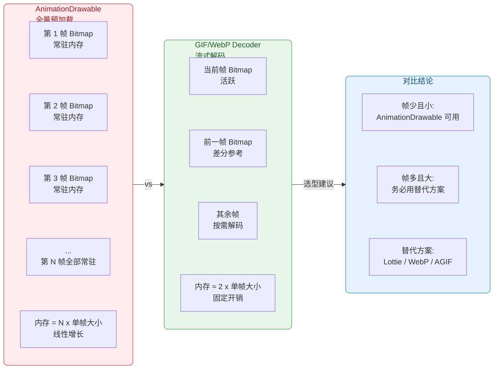
```mermaid
graph LR
    subgraph S1["AnimationDrawable\n全量预加载"]
        direction TB
        A1["第 1 帧 Bitmap\n常驻内存"]
        A2["第 2 帧 Bitmap\n常驻内存"]
        A3["第 3 帧 Bitmap\n常驻内存"]
        A4["...\n第 N 帧全部常驻"]
        A5["内存 = N x 单帧大小\n线性增长"]
        A1 ~~~ A2
        A2 ~~~ A3
        A3 ~~~ A4
        A4 ~~~ A5
    end

    subgraph S2["GIF/WebP Decoder\n流式解码"]
        direction TB
        B1["当前帧 Bitmap\n活跃"]
        B2["前一帧 Bitmap\n差分参考"]
        B3["其余帧\n按需解码"]
        B4["内存 ≈ 2 x 单帧大小\n固定开销"]
        B1 ~~~ B2
        B2 ~~~ B3
        B3 ~~~ B4
    end

    subgraph S3["对比结论"]
        direction TB
        C1["帧少且小:\nAnimationDrawable 可用"]
        C2["帧多且大:\n务必用替代方案"]
        C3["替代方案:\nLottie / WebP / AGIF"]
        C1 ~~~ C2
        C2 ~~~ C3
    end

    S1 -->|"vs"| S2 -->|"选型建议"| S3

    classDef redBox fill:#FFEBEE,stroke:#E53935,color:#B71C1C,rx:8
    classDef greenBox fill:#E8F5E9,stroke:#43A047,color:#1B5E20,rx:8
    classDef blueBox fill:#E3F2FD,stroke:#1E88E5,color:#0D47A1,rx:8
    class S1 redBox
    class S2 greenBox
    class S3 blueBox
```

**内存优化策略**

既然帧动画的内存消耗如此严峻，那么在确实需要使用帧动画的场景下，应该如何优化？以下是一系列从不同维度出发的策略：

**策略一：减少帧数与降低分辨率**。这是最直接的手段。一个 12 帧 60ms 间隔的动画在视觉上已经足够流畅（约 16.7 FPS），没有必要为了"丝滑"而堆到 30 帧甚至 60 帧。同时，动画图片的分辨率应当与其 **实际显示尺寸** 严格匹配——如果动画区域只有 48×48 dp（在 xxhdpi 设备上为 144×144 px），那么提供 1080×1080 的原图毫无意义，反而浪费了 (1080/144)² ≈ 56 倍的内存。应当与设计师沟通，按实际展示尺寸的各密度版本导出切图。

**策略二：使用 WebP 格式替代 PNG**。虽然 WebP 的 **文件体积** 比 PNG 小很多（通常压缩率提升 30-50%），但这里需要澄清一个常见误解：**文件格式的压缩率不影响解码后的内存占用**。一张 400×400 的 PNG 和同尺寸同色深的 WebP，解码后在内存中都是 `400 × 400 × 4 = 640KB` 的 Bitmap。WebP 的真正优势在于减小 APK 体积和资源加载（I/O）时间，对运行时内存没有直接帮助。不过，WebP 支持有损压缩，有损模式下可以在视觉可接受的范围内降低画质，设计师可以用更小的分辨率出图来间接减少内存。

**策略三：及时停止与释放**。当帧动画所在的页面不可见时（如 Activity 进入 `onStop`、Fragment 被隐藏），必须调用 `stop()` 停止动画。虽然 `stop()` 本身不释放 Bitmap 内存（Bitmap 仍然被 AnimationDrawable 持有），但至少避免了不必要的定时器回调和重绘开销。如果要真正释放内存，需要将 AnimationDrawable 从 View 上移除（设 `imageView.setImageDrawable(null)` 或 `view.background = null`），并确保没有其他引用持有该 AnimationDrawable 对象，使其能被 GC 回收。

```kotlin
// 在 Activity 或 Fragment 的生命周期中管理帧动画
class AnimFrameActivity : AppCompatActivity() {

    // 持有 AnimationDrawable 引用，方便在生命周期方法中控制
    private var animDrawable: AnimationDrawable? = null

    override fun onCreate(savedInstanceState: Bundle?) {
        super.onCreate(savedInstanceState)
        setContentView(R.layout.activity_anim_frame)

        val imageView = findViewById<ImageView>(R.id.iv_frame_anim)
        imageView.setImageResource(R.drawable.loading_animation)
        // 保存引用以供后续生命周期管理
        animDrawable = imageView.drawable as? AnimationDrawable

        // 安全启动动画
        imageView.post { animDrawable?.start() }
    }

    override fun onStop() {
        super.onStop()
        // 页面不可见时停止动画，避免无意义的 CPU/GPU 消耗
        animDrawable?.stop()
    }

    override fun onStart() {
        super.onStart()
        // 页面重新可见时恢复播放
        // 注意：这里直接 start 即可，因为 View 此时已完成首次 layout
        animDrawable?.start()
    }

    override fun onDestroy() {
        super.onDestroy()
        // 页面销毁时彻底解除引用，帮助 GC 回收 Bitmap 内存
        val imageView = findViewById<ImageView>(R.id.iv_frame_anim)
        // 将 ImageView 的 drawable 置空，断开 AnimationDrawable 与 View 的关联
        imageView?.setImageDrawable(null)
        // 清空自身引用
        animDrawable = null
    }
}
```

**策略四：自定义流式帧动画**。对于帧数多、分辨率大但又必须使用序列帧的场景（如游戏中的角色动画），可以自己实现一个 **"按需解码"** 的帧动画引擎。核心思路是：仅维护 2-3 个 Bitmap 缓冲区，利用 `BitmapFactory.Options.inBitmap` 实现 Bitmap 复用（Bitmap Pool），在后台线程预解码下一帧，在主线程绘制当前帧。这样无论帧数多少，内存开销始终是固定的 2-3 帧。

```kotlin
/**
 * 简化版流式帧动画加载器 —— 核心思路演示
 * 实际生产环境需要更完善的线程同步与错误处理
 */
class StreamFrameAnimator(
    private val context: Context,
    private val frameResIds: List<Int>,  // 所有帧的资源 ID 列表
    private val frameDurationMs: Long    // 统一帧间隔
) {
    // Bitmap 复用池：预分配两块同尺寸 Bitmap，交替使用
    // inBitmap 机制允许新解码的 Bitmap 写入已有的 Bitmap 内存区域，避免重复分配
    private var bufferA: Bitmap? = null
    private var bufferB: Bitmap? = null
    private var useA = true  // 标记当前使用哪块 buffer

    // 后台解码线程的 Handler
    private val decodeThread = HandlerThread("FrameDecode").apply { start() }
    private val decodeHandler = Handler(decodeThread.looper)

    // 主线程 Handler，用于切换帧
    private val mainHandler = Handler(Looper.getMainLooper())

    private var currentIndex = 0   // 当前帧索引
    private var isRunning = false  // 运行状态标记

    /**
     * 启动流式帧动画
     * @param target 要显示动画的 ImageView
     */
    fun start(target: ImageView) {
        isRunning = true
        currentIndex = 0
        // 首帧直接在主线程解码并显示（通常首帧需立即呈现）
        val firstBitmap = decodeBitmap(frameResIds[0], null)
        bufferA = firstBitmap
        target.setImageBitmap(firstBitmap)
        // 预解码第二帧，使用 bufferB
        scheduleNextDecode(target)
    }

    /**
     * 在后台线程解码下一帧，解码完成后在主线程切换显示
     */
    private fun scheduleNextDecode(target: ImageView) {
        if (!isRunning) return  // 已停止则不再调度

        decodeHandler.postDelayed({
            // 计算下一帧索引（循环）
            currentIndex = (currentIndex + 1) % frameResIds.size

            // 选择当前空闲的 buffer 作为 inBitmap 复用目标
            val reuseBitmap = if (useA) bufferB else bufferA
            // 解码下一帧，复用已有 Bitmap 的内存
            val nextBitmap = decodeBitmap(frameResIds[currentIndex], reuseBitmap)

            // 更新 buffer 引用
            if (useA) bufferB = nextBitmap else bufferA = nextBitmap
            useA = !useA  // 切换标记

            // 回到主线程更新 ImageView
            mainHandler.post {
                if (isRunning) {
                    target.setImageBitmap(nextBitmap)
                    // 继续调度下一帧
                    scheduleNextDecode(target)
                }
            }
        }, frameDurationMs)
    }

    /**
     * 使用 inBitmap 复用机制解码资源图片
     */
    private fun decodeBitmap(resId: Int, reuse: Bitmap?): Bitmap {
        val options = BitmapFactory.Options().apply {
            // 如果提供了可复用的 Bitmap，设置 inBitmap 以避免重新分配内存
            // 要求：复用 Bitmap 的尺寸 >= 待解码图片的尺寸（API 19+）
            inMutable = true         // inBitmap 要求 Bitmap 是 mutable 的
            inBitmap = reuse         // 设置复用目标，为 null 则正常分配
            inPreferredConfig = Bitmap.Config.ARGB_8888
        }
        // 解码资源图片，如果 inBitmap 有效，解码结果会写入 reuse 的内存区域
        return BitmapFactory.decodeResource(context.resources, resId, options)
    }

    /**
     * 停止动画并释放资源
     */
    fun stop() {
        isRunning = false
        // 移除后台线程和主线程的所有待执行任务
        decodeHandler.removeCallbacksAndMessages(null)
        mainHandler.removeCallbacksAndMessages(null)
    }

    /**
     * 彻底销毁，回收 Bitmap 和线程
     */
    fun destroy() {
        stop()
        // 回收两块 buffer 的 Bitmap 内存
        bufferA?.recycle()
        bufferB?.recycle()
        bufferA = null
        bufferB = null
        // 安全退出后台解码线程
        decodeThread.quitSafely()
    }
}
```

这种方案将内存占用从 **O(N)** 降低到 **O(1)**（常数级别，仅 2-3 帧的大小），代价是增加了解码延迟和代码复杂度。在实际项目中，如果帧动画复杂度已经到了需要自定义引擎的程度，更推荐直接使用成熟的第三方方案。

**策略五：使用替代技术方案**。在很多场景下，帧动画并非最优选择。以下是几种常见的替代方案对比：

| 方案 | 原理 | 内存特征 | 适用场景 |
|---|---|---|---|
| **Lottie** | 解析 After Effects 导出的 JSON，实时矢量渲染 | 极低（无 Bitmap） | 扁平化 UI 动画、Icon 动画 |
| **AnimatedVectorDrawable** | SVG 路径的属性动画 | 极低 | 简单的图标形变、路径动画 |
| **WebP 动画** (Glide/Coil) | 流式解码 WebP 动画文件 | 低（2 帧缓冲） | 表情包、Sticker 等 |
| **SurfaceView + 自定义渲染** | 独立线程绘制 | 可控 | 游戏、复杂粒子效果 |
| **帧动画 (AnimationDrawable)** | 全帧预加载 | 高（N 帧全驻） | 帧少且小的简单循环动画 |

**内存消耗的检测与监控**

在开发阶段，应该养成使用工具检测帧动画内存消耗的习惯：

- **Android Studio Profiler**：在 Memory Profiler 中可以看到帧动画启动时 Bitmap 内存的阶梯式增长。如果 `start()` 后观察到一连串 Bitmap 分配（数量等于帧数），说明全量预加载已发生。
- **`adb shell dumpsys meminfo <package>`**：查看 `Graphics` 和 `Native Heap` 部分，帧动画的 Bitmap 在 Android 8.0+ 上分配在 Native Heap（而非 Java Heap），因此需要关注 Native 内存增长。
- **StrictMode**：虽然不直接检测帧动画内存，但可以帮助发现主线程上的 I/O 操作（如帧动画的同步解码）。

综合来看，帧动画是一把 **"简单但危险"** 的双刃剑。它适合帧数少（≤15 帧）、单帧分辨率低（≤200×200 dp）、播放时间短的场景——典型如小型 Loading 指示器、按钮状态切换微动画等。一旦帧数或分辨率超出安全范围，应果断切换到 Lottie、AnimatedVectorDrawable 或自定义流式方案，避免让帧动画成为应用内存的"隐形杀手"。

---

**📝 练习题**

某 Android 应用在 `res/drawable/` 中定义了一个帧动画，包含 **20 帧 PNG 图片**，每帧原始尺寸为 **500×500 像素**（放在 `drawable-xxhdpi` 目录中），图片格式为 ARGB_8888。在一台 xxhdpi 设备上播放该动画时，`AnimationDrawable` 大约会占用多少内存？


A. 约 2 MB（每帧 100KB，因为 PNG 压缩率很高）


B. 约 10 MB（每帧仅解码为 RGB_565 以节省内存）


C. 约 20 MB（500×500×4 bytes × 20 帧）


D. 约 60 MB（系统自动将图片上采样 3 倍到 1500×1500 像素）


**【答案】** C

**【解析】** `AnimationDrawable` 在播放时会将所有帧解码为 Bitmap 并常驻内存。每帧 Bitmap 的内存大小取决于 **解码后的像素尺寸** 和 **色彩配置**，与 PNG 文件的压缩率无关（排除 A）。由于图片放在 `drawable-xxhdpi` 目录中，在 xxhdpi 设备上加载时不会发生缩放，像素尺寸保持 500×500（排除 D——D 描述的是图片放在 `drawable-mdpi` 而在 xxhdpi 设备上加载的情况）。默认色彩配置为 `ARGB_8888`（4 bytes/pixel），而非 `RGB_565`（排除 B）。因此：单帧内存 = 500 × 500 × 4 = 1,000,000 bytes ≈ 1 MB；20 帧总内存 ≈ 20 MB。答案为 C。这也说明了即使帧图尺寸看起来不大（500px），20 帧的帧动画依然可以轻松消耗 20 MB 内存，开发时务必谨慎评估。

---

**📝 练习题**

开发者在 `Activity.onCreate()` 中编写了如下代码，但发现帧动画没有播放。最可能的原因是什么？

```kotlin
val iv = findViewById<ImageView>(R.id.iv_anim)
iv.setImageResource(R.drawable.frame_animation)
val anim = iv.drawable as AnimationDrawable
anim.start()
```


A. `setImageResource()` 不支持加载 `AnimationDrawable`，应该用 `setBackground()`


B. 需要先调用 `anim.reset()` 初始化帧索引才能播放


C. `AnimationDrawable.start()` 在 `onCreate()` 中调用时，View 尚未 attach 到窗口，`scheduleSelf()` 无法正常工作


D. XML 帧动画必须放在 `res/anim/` 目录下，放在 `res/drawable/` 中会导致解析失败


**【答案】** C

**【解析】** `AnimationDrawable.start()` 的内部实现依赖 `Drawable.Callback`（即宿主 View）来调度帧切换的定时回调。在 `onCreate()` 执行时，View 树尚未完成首次 `measure → layout → draw` 流程，`AnimationDrawable` 的 Callback 可能尚未就绪，导致 `scheduleSelf()` 的定时任务无法被正确投递到消息队列，动画因此静默失败。正确做法是使用 `iv.post { anim.start() }` 将启动操作延迟到 View 完成至少一次布局之后。选项 A 错误——`setImageResource()` 完全支持加载 `AnimationDrawable`。选项 B 错误——`AnimationDrawable` 没有 `reset()` 方法。选项 D 错误——帧动画的 XML 文件应放在 `res/drawable/` 目录下，`res/anim/` 是给 View Animation（补间动画）使用的。

---

## 物理动画

在传统的属性动画体系中，开发者通过 `Interpolator`（插值器）来定义动画的运动节奏——线性、加速、减速、回弹等。然而，这些数学曲线本质上是 **预设的时间函数**，它们在启动那一刻就已经"注定"了结局：持续时间固定、终点固定、运动轨迹固定。这意味着，当用户在动画执行中途进行了一次新的触摸交互（比如手指反向滑动），传统动画要么生硬地取消再起一个新动画，要么出现"跳帧"般的视觉断裂。这在追求流畅自然交互的现代 App 中是不可接受的。

Google 在 AndroidX 中引入了 `androidx.dynamicanimation` 库，提供了一套 **基于物理模型（Physics-based Animation）** 的动画引擎。它的核心理念与传统动画截然不同：动画不再由"时间"驱动，而是由 **"力"** 驱动。每一帧的位置不是从预设曲线上查表得到的，而是根据当前的速度、位置以及施加在对象上的力，通过物理公式 **实时计算** 得出的。这带来了两个革命性的优势：

- **自然感（Natural Feel）**：弹簧回弹、投掷惯性这些现实世界的运动特征，天然地嵌入了动画逻辑中，用户感知上会觉得"这个 UI 有重量、有质感"。
- **连续性（Continuity）**：由于每一帧都是基于"当前状态"计算的，当目标值或速度在动画中途被改变时，动画会 **平滑地过渡** 到新的状态，而不会出现任何突变或跳跃，这一点被称为 **velocity continuity（速度连续性）**。

整个物理动画库的类结构相当精简，核心就是一个抽象基类 `DynamicAnimation` 和两个具体实现 `SpringAnimation`、`FlingAnimation`。接下来我们逐一深入。

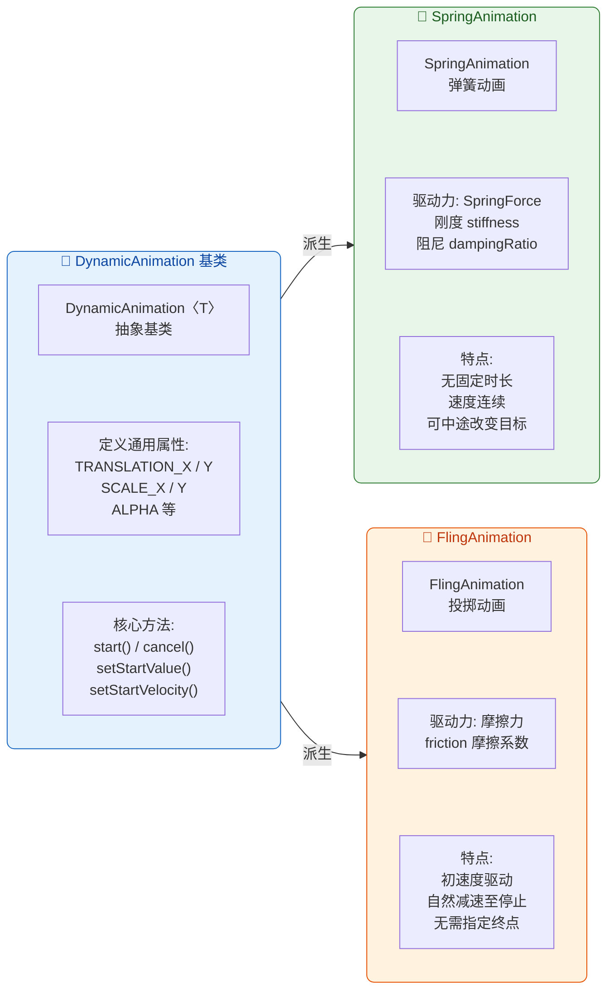
```mermaid
graph LR
    subgraph Base["🧱 DynamicAnimation 基类"]
        direction TB
        A["DynamicAnimation〈T〉\n抽象基类"]
        B["定义通用属性:\nTRANSLATION_X / Y\nSCALE_X / Y\nALPHA 等"]
        C["核心方法:\nstart() / cancel()\nsetStartValue()\nsetStartVelocity()"]
        A ~~~ B
        B ~~~ C
    end

    subgraph Spring["🌿 SpringAnimation"]
        direction TB
        D["SpringAnimation\n弹簧动画"]
        E["驱动力: SpringForce\n刚度 stiffness\n阻尼 dampingRatio"]
        F["特点:\n无固定时长\n速度连续\n可中途改变目标"]
        D ~~~ E
        E ~~~ F
    end

    subgraph Fling["💨 FlingAnimation"]
        direction TB
        G["FlingAnimation\n投掷动画"]
        H["驱动力: 摩擦力\nfriction 摩擦系数"]
        I["特点:\n初速度驱动\n自然减速至停止\n无需指定终点"]
        G ~~~ H
        H ~~~ I
    end

    Base -->|"派生"| Spring
    Base -->|"派生"| Fling

    classDef baseStyle fill:#E3F2FD,stroke:#1565C0,color:#0D47A1,rx:8
    classDef springStyle fill:#E8F5E9,stroke:#2E7D32,color:#1B5E20,rx:8
    classDef flingStyle fill:#FFF3E0,stroke:#E65100,color:#BF360C,rx:8

    class Base baseStyle
    class Spring springStyle
    class Fling flingStyle
```

### SpringAnimation 弹簧效果

`SpringAnimation` 是物理动画库中使用频率最高的组件。它模拟了一根 **弹簧（Spring）** 连接在对象与目标位置之间的物理模型：当对象偏离目标位置时，弹簧会施加一个将对象拉回目标的力；当对象到达目标位置时，由于惯性它会越过目标（overshoot），然后弹簧再次将其拉回——如此往复，最终在阻尼的作用下 **收敛到平衡位置（final position）**。

#### 物理模型：阻尼谐振

弹簧动画的底层数学模型是经典力学中的 **阻尼谐振方程（Damped Harmonic Oscillator）**。在每一帧的计算中，系统需要考虑两个力：

1. **弹性恢复力**：`F_spring = -k × (x - x_target)`，其中 `k` 是弹簧的刚度（stiffness），`x` 是当前位置，`x_target` 是目标位置。偏离越远，回复力越大。
2. **阻尼力**：`F_damping = -c × v`，其中 `c` 是阻尼系数，`v` 是当前速度。速度越大，阻尼越强，防止系统无限振荡。

系统在每帧中根据当前的位置和速度，计算出合力后更新加速度，再更新速度和位置（本质上是对微分方程的数值积分）。当位置和速度都足够接近平衡态时，动画判定 **收敛** 并自动结束。注意：弹簧动画 **没有固定时长（duration）**——它在物理上"自然"地结束，这与传统动画的 `setDuration()` 设计理念完全不同。

#### SpringForce 弹簧力配置

`SpringAnimation` 的行为特性完全由其内部的 `SpringForce` 对象决定。`SpringForce` 暴露了两个关键参数：

**Stiffness（刚度）** 控制弹簧"有多硬"。刚度越高，弹簧将对象拉回目标的力越大，振荡频率越高，动画收敛越快。`SpringForce` 提供了四个预设常量：

| 常量 | 值 | 效果描述 |
|---|---|---|
| `STIFFNESS_HIGH` | 10000f | 非常硬，快速回弹，几乎看不到振荡 |
| `STIFFNESS_MEDIUM` | 1500f | 中等硬度，适合大多数 UI 回弹 |
| `STIFFNESS_LOW` | 200f | 较软，振荡明显，适合装饰性动效 |
| `STIFFNESS_VERY_LOW` | 50f | 非常软，长时间缓慢振荡 |

**Damping Ratio（阻尼比）** 控制振荡的衰减速度。它是一个无量纲比值，物理含义是"实际阻尼 / 临界阻尼"。不同的阻尼比会产生截然不同的运动特征：

| 阻尼比范围 | 物理术语 | 运动表现 |
|---|---|---|
| `= 0` | Undamped | 永远振荡，永不停止（实际不用） |
| `0 < ratio < 1` | Underdamped（欠阻尼） | 有振荡（overshoot），逐渐收敛。值越小振荡越明显 |
| `= 1` | Critically Damped（临界阻尼） | **最快速地回到目标且无振荡**，这是最常用的 UI 交互选项 |
| `> 1` | Overdamped（过阻尼） | 无振荡但回归速度比临界阻尼慢，显得"迟钝" |

对于绝大多数 UI 交互场景（下拉刷新回弹、底部弹出面板归位等），**临界阻尼（`DAMPING_RATIO_NO_BOUNCY = 1f`）** 是最佳选择——它既快速又不会产生多余的晃动。而对于需要"弹性"视觉反馈的场景（如点赞后的图标弹跳），**欠阻尼（`DAMPING_RATIO_LOW_BOUNCY = 0.75f` 或 `DAMPING_RATIO_MEDIUM_BOUNCY = 0.5f`）** 能带来更活泼的观感。

#### 基础使用

下面展示最核心的使用方式——让一个 View 的 `translationY` 属性通过弹簧动画回到 0 位置（典型的"下拉释放回弹"场景）：

```kotlin
// 1. 创建 SpringAnimation，绑定到目标 View 的 TRANSLATION_Y 属性
val springAnim = SpringAnimation(
    myView,                          // 动画作用的 View 对象
    DynamicAnimation.TRANSLATION_Y,  // 要改变的属性（纵向平移）
    0f                               // finalPosition：弹簧的平衡位置（目标值）
)

// 2. 获取（或创建）SpringForce 对象并配置弹簧参数
springAnim.spring.apply {
    stiffness = SpringForce.STIFFNESS_MEDIUM    // 刚度：中等，回弹不会太快也不会太慢
    dampingRatio = SpringForce.DAMPING_RATIO_MEDIUM_BOUNCY  // 阻尼比 0.5，会有明显的弹跳效果
}

// 3. 设置初始速度（通常来自用户手势的 VelocityTracker）
//    单位是 px/s，正值表示向下运动
springAnim.setStartVelocity(1000f)

// 4. 启动动画 —— 无需指定 duration，弹簧模型会自动收敛
springAnim.start()
```

这段代码的关键在于第 3 步的 `setStartVelocity()`。在真实的交互场景中，用户释放手指时手势跟踪器（`VelocityTracker`）会提供一个 **释放速度**。将这个速度直接传递给弹簧动画，就能实现 **从手势到动画的无缝衔接**——手指快速甩动时动画冲得远、振荡大；轻轻释放时动画平缓回归。这是传统 `ObjectAnimator` + `Interpolator` 模式极难实现的效果。

#### 动画中途改变目标值

`SpringAnimation` 最强大的特性之一是 **支持在运行中修改 `finalPosition`**（即弹簧平衡位置），且动画会平滑过渡，不产生任何跳跃：

```kotlin
// 假设弹簧动画正在运行中（对象正在向 position=0 回弹）
// 此时用户又做了一个新操作，需要让对象弹到 position=500
springAnim.animateToFinalPosition(500f)
// 这个方法内部的逻辑：
//   - 如果动画尚未启动 → 设置目标值并启动
//   - 如果动画已在运行 → 平滑地将目标切换为 500f
//     当前速度被完整保留（velocity continuity），
//     弹簧力的方向自动调整为指向新目标
```

这就是物理动画 **速度连续性** 的实际体现。想象一个场景：用户快速左右滑动一张卡片，每次滑动方向改变时你调用 `animateToFinalPosition()` 传入新的 X 坐标。在传统动画中你需要 `cancel()` 旧动画 → 获取当前位置 → 创建新动画 → 设置初始速度（但很可能计算不准确），而弹簧动画只需一行代码就能获得丝滑的方向切换效果。

#### 监听动画状态

`DynamicAnimation` 提供了两种监听器，满足不同的监听粒度需求：

```kotlin
// 逐帧更新监听 —— 每一帧计算后都会回调
springAnim.addUpdateListener { animation, value, velocity ->
    // animation: 当前 DynamicAnimation 实例
    // value: 当前帧计算出的属性值（如 translationY 的像素值）
    // velocity: 当前帧的速度（px/s），可用于驱动关联动画
    
    // 典型应用：根据位移比例同步调整其他 UI 属性
    val progress = value / maxDragDistance       // 计算拖拽进度 [0, 1]
    backgroundView.alpha = 1f - progress         // 背景透明度随位移变化
}

// 动画结束监听 —— 在动画收敛或被取消时回调
springAnim.addEndListener { animation, canceled, value, velocity ->
    // canceled: 是否被 cancel() 强制终止（而非自然收敛）
    // value: 结束时的属性值
    // velocity: 结束时的速度（自然收敛时接近 0）
    
    if (!canceled) {
        // 动画自然结束，执行后续逻辑
        showContent()
    }
}
```

特别值得关注的是 `UpdateListener` 中的 `velocity` 参数。在复杂动效中，我们经常需要 **"链式物理动画"**——一个弹簧动画结束时的速度作为下一个动画的初始速度，从而形成连贯的物理运动链。这个 `velocity` 值正是实现这一技术的关键桥梁。

#### 手势与弹簧动画的无缝衔接

在实际项目中，弹簧动画最常见的应用模式是与触摸手势配合。下面展示一个完整的"拖拽 → 释放回弹"交互流程：

```kotlin
// 全局变量：用于跟踪手指速度
private val velocityTracker = VelocityTracker.obtain()
// 预先创建弹簧动画实例（避免每次触摸都创建新对象）
private val springX = SpringAnimation(targetView, DynamicAnimation.TRANSLATION_X, 0f).apply {
    spring.stiffness = SpringForce.STIFFNESS_LOW           // 低刚度：拖拽释放后柔和回弹
    spring.dampingRatio = SpringForce.DAMPING_RATIO_LOW_BOUNCY  // 低阻尼：明显弹跳
}
private val springY = SpringAnimation(targetView, DynamicAnimation.TRANSLATION_Y, 0f).apply {
    spring.stiffness = SpringForce.STIFFNESS_LOW
    spring.dampingRatio = SpringForce.DAMPING_RATIO_LOW_BOUNCY
}

override fun onTouchEvent(event: MotionEvent): Boolean {
    velocityTracker.addMovement(event)                     // 将每个触摸事件喂给速度追踪器

    when (event.actionMasked) {
        MotionEvent.ACTION_DOWN -> {
            springX.cancel()                                // 如果弹簧正在回弹，立刻停止
            springY.cancel()                                // 用户重新触摸意味着"接管"控制权
        }
        MotionEvent.ACTION_MOVE -> {
            // 手指移动阶段：直接跟手，不使用动画
            targetView.translationX = event.rawX - initialTouchX
            targetView.translationY = event.rawY - initialTouchY
        }
        MotionEvent.ACTION_UP -> {
            // 计算手指释放时的速度（单位：px/s）
            velocityTracker.computeCurrentVelocity(1000)    // 1000 表示速度单位为 px/秒
            val vx = velocityTracker.xVelocity              // X 轴释放速度
            val vy = velocityTracker.yVelocity              // Y 轴释放速度

            // 将手指速度传递给弹簧动画，确保"跟手 → 回弹"无缝衔接
            springX.setStartVelocity(vx)                    // 弹簧初始速度 = 手指释放速度
            springY.setStartVelocity(vy)
            springX.start()                                  // X 轴弹簧回弹
            springY.start()                                  // Y 轴弹簧回弹
        }
    }
    return true
}
```

这段代码实现的效果是：用户拖拽一个 View，释放后 View 以弹簧效果回到原位。**关键细节**是在 `ACTION_DOWN` 时调用 `cancel()` 来中断可能正在进行的回弹动画——这样用户可以在 View 回弹到一半时重新"抓住"它，体验上毫无割裂感。同时 `ACTION_UP` 中将 `VelocityTracker` 的速度传入弹簧动画，确保动画的初始状态与手势的末端状态完全匹配。

### FlingAnimation 投掷效果

如果说 `SpringAnimation` 模拟的是"弹簧拉回"，那么 `FlingAnimation` 模拟的就是"在摩擦力作用下的自由滑行"。它的物理模型非常简单：一个对象以某个初速度出发，受到一个与速度方向相反的 **摩擦力（friction）**，速度逐渐衰减直到为零。这完全就是我们在冰面上推出一个物体后看到的运动过程。

#### 物理模型与核心参数

`FlingAnimation` 的运动方程是一个指数衰减函数：`v(t) = v0 × e^(-friction × t)`。在这个模型下：

- **初速度（startVelocity）** 决定了对象能"飞"多远。速度越大，滑行距离越长。
- **摩擦力（friction）** 决定了减速的快慢。值越大，减速越快，滑行距离越短。默认值为 `1f`，可根据场景调节。

与 `SpringAnimation` 不同，`FlingAnimation` **不需要也不支持设置目标终点位置**——终点完全由初速度和摩擦力决定。你无法指定"减速到 x=500 时停下"；对象会滑到力学上自然停止的位置。但你可以通过 `setMinValue()` 和 `setMaxValue()` 设定 **边界**，当滑行到边界时动画会立即停止。

#### 基本使用

下面演示一个典型的"投掷滚动"效果——用户快速甩动一张图片，图片惯性滑行后自然停下：

```kotlin
// 创建 FlingAnimation，绑定到 View 的 TRANSLATION_X 属性
val flingAnim = FlingAnimation(
    imageView,                           // 目标 View
    DynamicAnimation.TRANSLATION_X       // 要 fling 的属性
)

// 配置参数
flingAnim.apply {
    setStartVelocity(2000f)              // 初始速度 2000 px/s（通常来自 VelocityTracker）
    friction = 1.5f                      // 摩擦力：比默认值(1f)大，减速更快
    setMinValue(0f)                      // 左边界：translationX 不会小于 0
    setMaxValue(screenWidth.toFloat())   // 右边界：translationX 不会超过屏幕宽度
}

// 启动投掷动画
flingAnim.start()
```

上述代码的意思是：图片从当前位置开始以每秒 2000 像素的速度向右滑动，受 `friction = 1.5f` 的摩擦力减速，如果滑到屏幕右边缘还有速度就直接停下。

#### Fling + Spring 联动

在实际开发中，`FlingAnimation` 很少单独使用，更常见的模式是 **Fling → Spring** 联动：先让对象以惯性滑行，到达边界后立刻接入弹簧动画产生回弹效果。这种组合非常适合"带弹性边界的列表滚动"或"可投掷的卡片"等交互。

```kotlin
// 1. 创建 Fling 动画（投掷阶段）
val flingAnim = FlingAnimation(card, DynamicAnimation.TRANSLATION_X).apply {
    setStartVelocity(velocityFromGesture)       // 手势释放速度
    friction = 1.2f                              // 适中的摩擦力
    setMinValue(-maxOffset)                      // 左边界
    setMaxValue(maxOffset)                       // 右边界
}

// 2. 预创建 Spring 动画（回弹阶段）
val springBack = SpringAnimation(card, DynamicAnimation.TRANSLATION_X, 0f).apply {
    spring.stiffness = SpringForce.STIFFNESS_MEDIUM
    spring.dampingRatio = SpringForce.DAMPING_RATIO_MEDIUM_BOUNCY
}

// 3. 在 Fling 结束时衔接 Spring
flingAnim.addEndListener { _, canceled, _, velocity ->
    // 只有当 Fling 自然结束（非 cancel）时才触发回弹
    if (!canceled) {
        // 关键：将 Fling 结束时的残余速度传递给 Spring 动画
        // 这保证了从 Fling 到 Spring 的速度连续性
        springBack.setStartVelocity(velocity)    // 速度无缝传递
        springBack.start()                        // 启动弹簧回弹
    }
}

// 4. 启动 Fling
flingAnim.start()
```

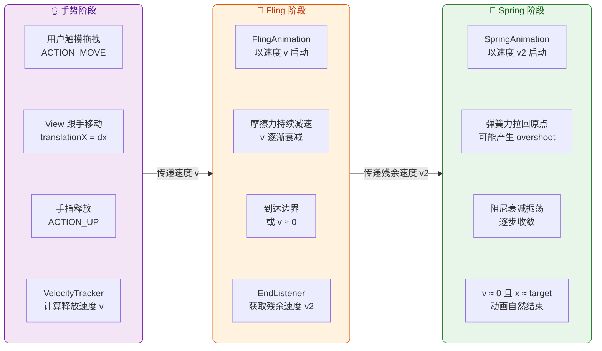
```mermaid
graph LR
    subgraph Gesture["👆 手势阶段"]
        direction TB
        G1["用户触摸拖拽\nACTION_MOVE"]
        G2["View 跟手移动\ntranslationX = dx"]
        G3["手指释放\nACTION_UP"]
        G4["VelocityTracker\n计算释放速度 v"]
        G1 ~~~ G2
        G2 ~~~ G3
        G3 ~~~ G4
    end

    subgraph Fling["💨 Fling 阶段"]
        direction TB
        F1["FlingAnimation\n以速度 v 启动"]
        F2["摩擦力持续减速\nv 逐渐衰减"]
        F3["到达边界\n或 v ≈ 0"]
        F4["EndListener\n获取残余速度 v2"]
        F1 ~~~ F2
        F2 ~~~ F3
        F3 ~~~ F4
    end

    subgraph Spring["🌿 Spring 阶段"]
        direction TB
        S1["SpringAnimation\n以速度 v2 启动"]
        S2["弹簧力拉回原点\n可能产生 overshoot"]
        S3["阻尼衰减振荡\n逐步收敛"]
        S4["v ≈ 0 且 x ≈ target\n动画自然结束"]
        S1 ~~~ S2
        S2 ~~~ S3
        S3 ~~~ S4
    end

    Gesture -->|"传递速度 v"| Fling -->|"传递残余速度 v2"| Spring

    classDef gestureStyle fill:#F3E5F5,stroke:#7B1FA2,color:#4A148C,rx:8
    classDef flingStyle fill:#FFF3E0,stroke:#E65100,color:#BF360C,rx:8
    classDef springStyle fill:#E8F5E9,stroke:#2E7D32,color:#1B5E20,rx:8

    class Gesture gestureStyle
    class Fling flingStyle
    class Spring springStyle
```

上面这段代码和流程图清晰地展示了物理动画链的核心思想：**速度是衔接各阶段的纽带**。从手指速度 → Fling 初速度 → Fling 残余速度 → Spring 初速度，整条链路的速度是连续传递的，用户看到的就是一个完整、自然、符合物理直觉的运动过程。

### DynamicAnimation 库

`DynamicAnimation` 既是整个物理动画库的 **包名**（`androidx.dynamicanimation`），也是 `SpringAnimation` 和 `FlingAnimation` 的 **抽象基类名**。理解这个基类的设计对于灵活使用物理动画至关重要。

#### 依赖引入

物理动画不是 Android SDK 的内置组件，需要显式添加 AndroidX 依赖：

```kotlin
// build.gradle.kts (Module)
dependencies {
    // 物理动画库：包含 SpringAnimation、FlingAnimation
    implementation("androidx.dynamicanimation:dynamicanimation:1.0.0")
    // 如果使用 KTX 扩展（提供 Kotlin DSL 风格 API）
    implementation("androidx.dynamicanimation:dynamicanimation-ktx:1.0.0")
}
```

KTX 扩展库提供了更符合 Kotlin 习惯的 API 写法，例如使用扩展函数直接在 View 上创建弹簧动画：

```kotlin
// 使用 KTX 扩展：更简洁的弹簧动画创建方式
val anim = myView.spring(DynamicAnimation.TRANSLATION_Y) {
    // this 就是 SpringAnimation 实例
    spring.stiffness = SpringForce.STIFFNESS_LOW        // 配置刚度
    spring.dampingRatio = SpringForce.DAMPING_RATIO_LOW_BOUNCY  // 配置阻尼
}
anim.animateToFinalPosition(0f)                          // 启动动画到目标位置
```

#### ViewProperty 动画属性

`DynamicAnimation` 基类定义了一组 **预置属性常量**（`ViewProperty`），它们封装了对 View 属性的读写操作。这些属性是你创建物理动画时必须传入的第二个参数：

| 属性常量 | 对应 View 属性 | 描述 |
|---|---|---|
| `TRANSLATION_X` / `TRANSLATION_Y` | `view.translationX/Y` | 平移偏移量 |
| `TRANSLATION_Z` | `view.translationZ` | Z 轴偏移（影响阴影） |
| `SCALE_X` / `SCALE_Y` | `view.scaleX/Y` | 缩放比例 |
| `ROTATION` | `view.rotation` | Z 轴旋转角度 |
| `ROTATION_X` / `ROTATION_Y` | `view.rotationX/Y` | 绕 X/Y 轴旋转 |
| `X` / `Y` / `Z` | `view.x/y/z` | 绝对位置（layout 位置 + translation） |
| `ALPHA` | `view.alpha` | 透明度 |
| `SCROLL_X` / `SCROLL_Y` | `view.scrollX/Y` | 滚动偏移 |

如果内置属性不能满足需求（比如你想对自定义属性做弹簧动画），可以通过实现 `FloatPropertyCompat` 来定义自定义属性：

```kotlin
// 自定义属性：对 View 的 cornerRadius（圆角半径）做弹簧动画
val CORNER_RADIUS = object : FloatPropertyCompat<View>("cornerRadius") {
    // 读取当前属性值 —— 框架每帧需要知道"现在是多少"
    override fun getValue(view: View): Float {
        // 从 View 的 background 中获取当前圆角值
        val bg = view.background as? GradientDrawable       // 需要 background 是 GradientDrawable
        return bg?.cornerRadius ?: 0f                        // 返回当前圆角半径
    }

    // 设置新的属性值 —— 框架每帧计算出新值后调用此方法应用到 View
    override fun setValue(view: View, value: Float) {
        val bg = view.background as? GradientDrawable
        bg?.cornerRadius = value                             // 将弹簧计算出的值设置为新圆角
    }
}

// 使用自定义属性创建弹簧动画
SpringAnimation(myView, CORNER_RADIUS, 48f).apply {
    spring.stiffness = SpringForce.STIFFNESS_MEDIUM          // 中等刚度
    spring.dampingRatio = SpringForce.DAMPING_RATIO_NO_BOUNCY // 临界阻尼，无弹跳
    start()                                                    // 圆角从当前值弹性过渡到 48f
}
```

#### 动画驱动机制

物理动画的帧驱动与属性动画一样依赖 `Choreographer`——Android 的 VSync 信号调度器。具体流程如下：

1. 调用 `start()` 后，`DynamicAnimation` 向 `AnimationHandler`（一个单例的帧回调管理器）注册自己。
2. `AnimationHandler` 通过 `Choreographer.postFrameCallback()` 监听 VSync 信号。
3. 每当 VSync 到来（通常每 16.6ms，即 60fps），`AnimationHandler` 遍历所有注册的动画，调用它们的 `doAnimationFrame()` 方法。
4. 在 `doAnimationFrame()` 中，`SpringAnimation` 或 `FlingAnimation` 根据自己的物理模型、当前状态（位置 + 速度）和时间步长，计算出新的位置和速度。
5. 新值通过 `ViewProperty.setValue()` 写入 View，触发重绘。
6. 重复 3-5，直到动画判定收敛（速度和位移变化量小于阈值）或手动 `cancel()`。

需要注意的是，**物理动画必须在主线程（UI 线程）创建和启动**，因为它直接操作 View 属性。如果在后台线程调用 `start()` 将会抛出异常。

#### 多属性协同动画

在复杂场景中，我们经常需要同时对一个 View 的多个属性做弹簧动画（如同时回弹位移和缩放）。由于每个 `SpringAnimation` 实例只能绑定一个属性，因此需要创建多个实例并同时启动。一个实用的封装模式如下：

```kotlin
// 封装：对 View 的多个属性同时施加弹簧动画
fun View.springReset() {
    // 定义需要回归的属性及其目标值
    val properties = mapOf(
        DynamicAnimation.TRANSLATION_X to 0f,    // X 平移归零
        DynamicAnimation.TRANSLATION_Y to 0f,    // Y 平移归零
        DynamicAnimation.SCALE_X to 1f,          // X 缩放恢复原始
        DynamicAnimation.SCALE_Y to 1f,          // Y 缩放恢复原始
        DynamicAnimation.ROTATION to 0f           // 旋转归零
    )

    // 统一的弹簧参数
    val stiffness = SpringForce.STIFFNESS_MEDIUM
    val damping = SpringForce.DAMPING_RATIO_LOW_BOUNCY

    // 为每个属性创建并启动独立的弹簧动画
    properties.forEach { (property, target) ->
        SpringAnimation(this, property, target).apply {
            spring.stiffness = stiffness          // 所有属性使用统一的弹簧参数
            spring.dampingRatio = damping          // 确保各属性的回弹节奏一致
            start()                                // 同时启动所有属性的弹簧动画
        }
    }
}

// 调用：一行代码让 View 从任意变形状态弹回原始状态
cardView.springReset()
```

虽然我们启动了 5 个独立的 `SpringAnimation`，但因为它们使用相同的弹簧参数（刚度和阻尼比相同），所以各属性的回弹节奏是一致的，视觉上呈现为一个协调统一的弹簧回弹效果。如果你刻意给不同属性设置不同的刚度或阻尼比，可以创造出更复杂的"层次感"动效——例如位移先到位、缩放稍微滞后，产生一种微妙的弹性质感。

#### 与属性动画体系的对比

最后，让我们系统地将物理动画与传统属性动画进行对比，帮助你在实际开发中做出正确的选择：

| 维度 | Property Animation (ObjectAnimator) | Physics-based Animation (DynamicAnimation) |
|---|---|---|
| **驱动模型** | 时间驱动：duration + interpolator | 力驱动：spring force 或 friction |
| **持续时间** | 必须指定固定 duration | 无 duration，物理模型自然收敛 |
| **目标终点** | 必须预先指定 endValue | Spring 可中途改变；Fling 无目标终点 |
| **速度连续性** | 不支持（切换动画会速度跳变） | 天然支持（中途改目标速度不断裂） |
| **手势衔接** | 需要手动计算起始状态 | 直接传入手势速度，无缝衔接 |
| **多属性** | AnimatorSet 可统一编排 | 需创建多个独立实例分别启动 |
| **适用场景** | 时间精确、有节奏感的展示动画 | 与用户手势交互紧密耦合的响应动画 |
| **性能** | 基于 Choreographer，性能相近 | 同样基于 Choreographer，性能相近 |

总结来说：**当动画需要与用户手势交互时，优先选择物理动画；当动画是纯展示性质且需要精确时间控制时，使用传统属性动画。** 两者并非替代关系，而是互补关系。在复杂 App 中，你经常会看到它们混合使用——页面切换用 `Transition`（基于属性动画），而页面内的拖拽交互用 `SpringAnimation`。

---

**📝 练习题**

某社交 App 中有一个可拖拽的浮动按钮（FAB），用户可以在屏幕内任意拖拽它。当用户释放手指后，需要实现以下效果：按钮先以手指释放时的速度惯性滑行一段距离，然后自动吸附到屏幕左侧或右侧边缘并带有弹性回弹效果。关于实现方案，以下哪个描述最合理？

A. 使用单个 `SpringAnimation`，将 `finalPosition` 设为左或右边缘，设置 `setStartVelocity()` 为手指速度即可，不需要 `FlingAnimation`


B. 使用 `FlingAnimation` 完成惯性滑行，在其 `EndListener` 中获取残余速度和当前位置，然后根据位置判断吸附方向，再启动 `SpringAnimation` 并传入残余速度作为初始速度


C. 使用 `ObjectAnimator` 配合 `OvershootInterpolator` 即可实现相同效果，物理动画并无额外优势


D. 使用 `FlingAnimation` 完成整个过程，通过 `setMinValue()` 和 `setMaxValue()` 限制边界，投掷动画自带弹性回弹效果


**【答案】** B

**【解析】** 题目要求两个阶段的效果：先惯性滑行，再弹性吸附。这是典型的 **Fling → Spring 联动** 模式。选项 A 虽然可以实现弹性回弹，但缺少了"惯性滑行"阶段——`SpringAnimation` 会直接把按钮拉向边缘，不会出现先自由滑行再吸附的效果。选项 B 完整实现了两阶段联动：`FlingAnimation` 负责惯性阶段，结束后通过 `EndListener` 获取残余速度（velocity）和当前位置（value），根据位置判断离哪个边缘更近来确定吸附目标，再将残余速度传给 `SpringAnimation` 实现 **速度连续（velocity continuity）** 的弹性回弹。选项 C 的 `OvershootInterpolator` 只能提供固定曲线的回弹，无法实现自然的惯性滑行，且中途改变方向时会出现速度断裂。选项 D 错误地认为 `FlingAnimation` 自带弹性效果——实际上 Fling 动画到达边界时会直接停止，不会回弹。

---

## 矢量动画

在传统 Android 开发中，图片资源以位图（Bitmap）形式存在——PNG、JPEG、WebP 等。位图的根本问题在于它与分辨率强绑定：一张 48×48 的图标放到 xxxhdpi 屏幕上势必模糊，而预先为每个密度桶（density bucket）切出对应尺寸的图又会显著增大 APK 体积。矢量图（Vector Graphics）正是为了解决这一痛点而引入的。矢量图用 **数学路径描述**（直线、贝塞尔曲线、弧线等）来定义图形，无论缩放到多大都不会失真，且同一份 XML 即可适配全部屏幕密度。

Android 从 API 21（Lollipop）起在平台层面提供了 `VectorDrawable`，并在 Support Library / Jetpack 中向下兼容到 API 14。在此基础上，`AnimatedVectorDrawable`（AVD）进一步让矢量图的 **路径、颜色、透明度** 等属性都变得可动画化，从而实现极其精美且体积极小的图标动效——无需引入 Lottie 等三方库即可完成大量 Motion Icon、Loading Indicator、Morphing Transition 等效果。

本节从矢量图的底层路径语法讲起，逐步深入到 `AnimatedVectorDrawable` 的工作机制与 `trimPath` 路径修剪技巧，力求在 **原理层面** 和 **实战层面** 都讲透。

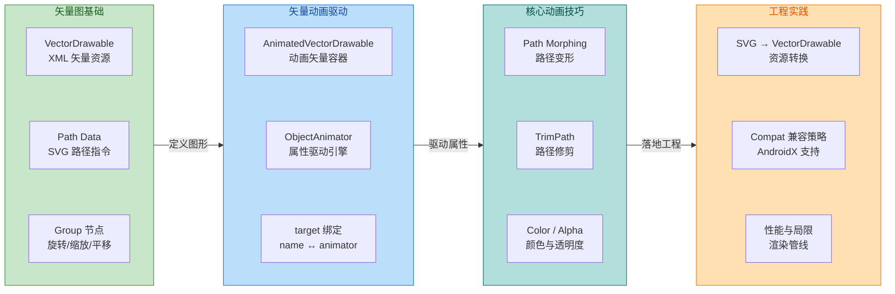
```mermaid
graph LR
    subgraph A["矢量图基础"]
        direction TB
        A1["VectorDrawable\nXML 矢量资源"]
        A2["Path Data\nSVG 路径指令"]
        A3["Group 节点\n旋转/缩放/平移"]
        A1 ~~~ A2
        A2 ~~~ A3
    end

    subgraph B["矢量动画驱动"]
        direction TB
        B1["AnimatedVectorDrawable\n动画矢量容器"]
        B2["ObjectAnimator\n属性驱动引擎"]
        B3["target 绑定\nname ↔ animator"]
        B1 ~~~ B2
        B2 ~~~ B3
    end

    subgraph C["核心动画技巧"]
        direction TB
        C1["Path Morphing\n路径变形"]
        C2["TrimPath\n路径修剪"]
        C3["Color / Alpha\n颜色与透明度"]
        C1 ~~~ C2
        C2 ~~~ C3
    end

    subgraph D["工程实践"]
        direction TB
        D1["SVG → VectorDrawable\n资源转换"]
        D2["Compat 兼容策略\nAndroidX 支持"]
        D3["性能与局限\n渲染管线"]
        D1 ~~~ D2
        D2 ~~~ D3
    end

    A -->|"定义图形"| B
    B -->|"驱动属性"| C
    C -->|"落地工程"| D

    classDef greenNode fill:#C8E6C9,stroke:#388E3C,color:#1B5E20
    classDef blueNode fill:#BBDEFB,stroke:#1976D2,color:#0D47A1
    classDef tealNode fill:#B2DFDB,stroke:#00796B,color:#004D40
    classDef amberNode fill:#FFE0B2,stroke:#F57C00,color:#E65100

    class A greenNode
    class B blueNode
    class C tealNode
    class D amberNode
```

---

### VectorDrawable 矢量图

#### 为什么需要 VectorDrawable

在多分辨率适配的语境下，位图方案要求开发者准备 mdpi / hdpi / xhdpi / xxhdpi / xxxhdpi 多套切图。以一个简单的 "播放" 图标为例，五套切图可能就需要 5 × 3 KB ≈ 15 KB 的空间，且后续修改颜色或形状时要重新切出五张。`VectorDrawable` 只需一个 XML 文件（通常不到 1 KB），在运行时由系统按实际像素密度光栅化（Rasterize），颜色可通过 `tint` 一键变更，维护成本骤降。

更重要的是，矢量图天然具备 **可寻址属性**（Addressable Properties）：每一条路径（`<path>`）、每一个分组（`<group>`）都可被命名，然后通过 `ObjectAnimator` 对其施加动画。这是 `AnimatedVectorDrawable` 得以实现的根基。

#### VectorDrawable XML 结构

一个典型的 `VectorDrawable` 资源文件如下（以一个简单的 "对勾" 图标为例）：

```xml
<!-- res/drawable/ic_check.xml -->
<!-- 根标签 vector 定义画布尺寸与视口 -->
<vector
    xmlns:android="http://schemas.android.com/apk/res/android"
    android:width="24dp"          <!-- 1. 固有宽度：决定 wrap_content 时的展示尺寸 -->
    android:height="24dp"         <!-- 2. 固有高度 -->
    android:viewportWidth="24"    <!-- 3. 视口宽度：路径坐标的数学坐标系宽 -->
    android:viewportHeight="24"   <!-- 4. 视口高度：路径坐标的数学坐标系高 -->
    android:tint="#FF4CAF50">     <!-- 5. 可选着色：会叠加到所有 path 之上 -->

    <!-- group 可对子路径做整体的旋转/缩放/平移 -->
    <group
        android:name="checkGroup"       <!-- 6. 命名，用于后续 AVD 动画寻址 -->
        android:pivotX="12"             <!-- 7. 旋转/缩放中心 X -->
        android:pivotY="12"             <!-- 8. 旋转/缩放中心 Y -->
        android:rotation="0">           <!-- 9. 初始旋转角度 -->

        <!-- 单条路径，用 SVG path data 描述图形 -->
        <path
            android:name="checkPath"              <!-- 10. 路径命名 -->
            android:pathData="M9,16.2 L4.8,12     
                              l-1.4,1.4 L9,19     
                              L21,7 l-1.4,-1.4z"  <!-- 11. SVG 路径数据 -->
            android:fillColor="#FFFFFFFF"          <!-- 12. 填充色 -->
            android:strokeColor="#00000000"        <!-- 13. 描边色(此处透明) -->
            android:strokeWidth="0"/>              <!-- 14. 描边宽 -->
    </group>
</vector>
```

有几个关键概念必须澄清：

**① width/height vs. viewportWidth/viewportHeight**

`width` 和 `height` 是该 Drawable 的 **固有尺寸**（intrinsic size），单位是 dp，影响的是 `ImageView` 设为 `wrap_content` 时的显示大小。`viewportWidth` 和 `viewportHeight` 则定义了 `pathData` 坐标所处的 **数学坐标系**。两者是解耦的——你可以把 `viewport` 设为 100×100，同时 `width/height` 设为 24dp×24dp，路径数据在 0~100 的坐标系中描述，最终由系统映射到实际像素区域。

**② SVG Path Data 语法**

`pathData` 使用的是 SVG（Scalable Vector Graphics）标准中的路径命令子集。Android 支持以下核心指令：

| 指令 | 含义 | 参数 |
|------|------|------|
| `M` / `m` | MoveTo 移动画笔 | `x, y` |
| `L` / `l` | LineTo 画直线 | `x, y` |
| `H` / `h` | 水平线 | `x` |
| `V` / `v` | 垂直线 | `y` |
| `C` / `c` | 三次贝塞尔曲线 | `x1,y1 x2,y2 x,y` |
| `S` / `s` | 平滑三次贝塞尔 | `x2,y2 x,y` |
| `Q` / `q` | 二次贝塞尔曲线 | `x1,y1 x,y` |
| `T` / `t` | 平滑二次贝塞尔 | `x,y` |
| `A` / `a` | 弧线 | `rx,ry rotation large-arc sweep x,y` |
| `Z` / `z` | 闭合路径 | 无 |

大写字母表示 **绝对坐标**，小写表示 **相对坐标**（相对于当前画笔位置）。理解 `pathData` 至关重要，因为后续的 Path Morphing 动画要求两条路径拥有 **完全相同数量和类型** 的指令——这是 Android 做路径插值的前提条件。

**③ `<group>` 的作用**

`<group>` 是一个变换容器，它本身不绘制任何东西，但可以对其子节点（`<path>` 或嵌套 `<group>`）施加 **rotation、scaleX/Y、translateX/Y、pivotX/Y** 变换。这种设计有两个好处：

- **动画解耦**：对勾的形状由 `<path>` 的 `pathData` 定义，旋转动画则由 `<group>` 的 `rotation` 属性承载，互不干扰。
- **层级组合**：可以嵌套多层 `<group>` 实现复杂的齿轮联动、钟表指针等效果。

**④ 运行时渲染机制**

当 `VectorDrawable` 被首次绘制时，系统会在 **RenderThread**（硬件加速管线的渲染线程）解析 `pathData`，将路径命令翻译为 GPU 可执行的三角形网格（Tessellation），然后缓存这份网格数据（称为 **DisplayList** 或 **RenderNode** 的一部分）。后续帧若矢量图未发生变化，则直接复用缓存，不会重复做路径解析和三角化，性能开销与普通 Bitmap 差异不大。但一旦动画驱动了 `pathData` 的变化（如 Path Morphing），系统需要在每帧重新做 Tessellation，这就是为什么复杂矢量动画可能导致掉帧的根本原因。

#### 代码中使用 VectorDrawable

```kotlin
// 方式一：在 XML 布局中直接引用
// <ImageView android:src="@drawable/ic_check" />

// 方式二：代码中动态加载（推荐使用 Compat 版本）
val drawable = AppCompatResources.getDrawable(context, R.drawable.ic_check)
// AppCompatResources 内部会自动处理 VectorDrawableCompat 的降级逻辑
imageView.setImageDrawable(drawable)

// 方式三：动态修改着色（tint）
drawable?.let {
    DrawableCompat.setTint(it, Color.RED)  // 将矢量图整体着色为红色
}
```

如果要在 `TextView` 的 `drawableStart` 等复合位置使用矢量图，需要在 `Activity` 或 `Application` 中启用兼容开关（AndroidX AppCompat 1.2+ 已默认支持）：

```kotlin
// 在 Application 的 onCreate 或 Activity 的 attachBaseContext 中设置
// 允许所有 AppCompat 控件支持矢量图 Drawable 引用
AppCompatDelegate.setCompatVectorFromResourcesEnabled(true)
```

---

### AnimatedVectorDrawable 路径变换

`AnimatedVectorDrawable`（以下简称 AVD）是 Android 动画系统中最优雅的存在之一。它将 `VectorDrawable` 中的 **命名节点** 与 `ObjectAnimator` 桥接起来，使得矢量图的任何可动画属性都能被驱动——路径形变（Path Morphing）、颜色渐变、旋转缩放、透明度变化、路径修剪（trimPath）等。

#### AVD 的三件套架构

AVD 的定义涉及三个 XML 文件（或使用 `aapt` 内联语法合并为一个文件）：

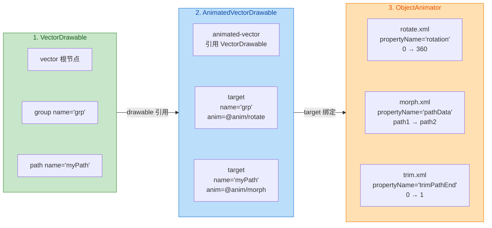
```mermaid
graph LR
    subgraph F1["1. VectorDrawable"]
        direction TB
        F1A["vector 根节点"]
        F1B["group name='grp'"]
        F1C["path name='myPath'"]
        F1A ~~~ F1B
        F1B ~~~ F1C
    end

    subgraph F2["2. AnimatedVectorDrawable"]
        direction TB
        F2A["animated-vector\n引用 VectorDrawable"]
        F2B["target\nname='grp'\nanim=@anim/rotate"]
        F2C["target\nname='myPath'\nanim=@anim/morph"]
        F2A ~~~ F2B
        F2B ~~~ F2C
    end

    subgraph F3["3. ObjectAnimator"]
        direction TB
        F3A["rotate.xml\npropertyName='rotation'\n0 → 360"]
        F3B["morph.xml\npropertyName='pathData'\npath1 → path2"]
        F3C["trim.xml\npropertyName='trimPathEnd'\n0 → 1"]
        F3A ~~~ F3B
        F3B ~~~ F3C
    end

    F1 -->|"drawable 引用"| F2
    F2 -->|"target 绑定"| F3

    classDef vecStyle fill:#C8E6C9,stroke:#388E3C,color:#1B5E20
    classDef avdStyle fill:#BBDEFB,stroke:#1976D2,color:#0D47A1
    classDef animStyle fill:#FFE0B2,stroke:#F57C00,color:#E65100

    class F1 vecStyle
    class F2 avdStyle
    class F3 animStyle
```

**第一层：VectorDrawable**——定义矢量图的全部路径和分组，每个需要被动画化的节点必须有 `android:name`。

**第二层：AnimatedVectorDrawable**——充当"胶水"角色，声明自己引用哪个 `VectorDrawable`，以及每个 `target`（按 `name` 匹配）绑定哪个 `Animator` 资源。

**第三层：ObjectAnimator / AnimatorSet**——定义具体的动画参数（属性名、起止值、时长、插值器等）。

这种三层解耦架构的好处在于：同一个 `VectorDrawable` 可被多个不同的 AVD 复用，而同一组 Animator 也可以施加到不同矢量图的同名节点上，实现最大程度的资源复用。

#### 分离式写法（三个文件）

**第一步：定义 VectorDrawable**

以一个经典的 "播放 → 暂停" 图标变形动画为例。我们需要两个形状，但在同一个 VectorDrawable 中只需要定义 **初始状态**：

```xml
<!-- res/drawable/ic_play.xml -->
<vector
    xmlns:android="http://schemas.android.com/apk/res/android"
    android:width="48dp"
    android:height="48dp"
    android:viewportWidth="24"
    android:viewportHeight="24">

    <!-- 播放三角形，由两条 path 组成（以便变形为两条竖线） -->
    <!-- 左半部分 -->
    <path
        android:name="left"
        android:pathData="M5,3 L5,21 L12,16.5 L12,7.5Z"
        android:fillColor="#FFFFFFFF"/>

    <!-- 右半部分 -->
    <path
        android:name="right"
        android:pathData="M12,7.5 L12,16.5 L19,12Z"
        android:fillColor="#FFFFFFFF"/>
</vector>
```

注意：播放三角形被拆成了 **左右两条路径**，且每条路径的指令数量已经与目标暂停状态对齐（都是 4 个指令点）。这正是 Path Morphing 的硬性要求。

**第二步：定义 Animator**

```xml
<!-- res/animator/morph_left.xml -->
<!-- 左半 path 从三角形左半变形为左竖线 -->
<objectAnimator
    xmlns:android="http://schemas.android.com/apk/res/android"
    android:propertyName="pathData"           
    android:valueFrom="M5,3 L5,21 L12,16.5 L12,7.5Z"    
    android:valueTo="M5,3 L5,21 L9,21 L9,3Z"             
    android:valueType="pathType"              
    android:duration="300"                    
    android:interpolator="@android:interpolator/fast_out_slow_in"/>
    <!-- 
      propertyName="pathData"  → 驱动路径形变
      valueType="pathType"     → 告知系统按路径类型做插值
      valueFrom 与 valueTo 的指令数量和类型必须完全一致
    -->
```

```xml
<!-- res/animator/morph_right.xml -->
<!-- 右半 path 从三角形右半变形为右竖线 -->
<objectAnimator
    xmlns:android="http://schemas.android.com/apk/res/android"
    android:propertyName="pathData"
    android:valueFrom="M12,7.5 L12,16.5 L19,12Z"
    android:valueTo="M15,3 L15,21 L19,21 L19,3Z"
    android:valueType="pathType"
    android:duration="300"
    android:interpolator="@android:interpolator/fast_out_slow_in"/>
    <!--
      注意：valueFrom 有 4 个控制点(M + 3个L/Z)
      valueTo   也有 4 个控制点
      若数量不匹配，运行时会 crash 或静默无效果
    -->
```

**第三步：定义 AnimatedVectorDrawable（胶水）**

```xml
<!-- res/drawable/avd_play_to_pause.xml -->
<animated-vector
    xmlns:android="http://schemas.android.com/apk/res/android"
    android:drawable="@drawable/ic_play">   <!-- 引用初始矢量图 -->

    <!-- 将 name="left" 的 path 绑定到 morph_left 动画 -->
    <target
        android:name="left"
        android:animation="@animator/morph_left"/>

    <!-- 将 name="right" 的 path 绑定到 morph_right 动画 -->
    <target
        android:name="right"
        android:animation="@animator/morph_right"/>
</animated-vector>
```

#### 内联式写法（aapt 单文件）

从 Android Gradle Plugin 2.0+ 和 AndroidX 开始，支持使用 `aapt:attr` 将三个文件 **内联** 到一个 XML 中，极大提升可维护性：

```xml
<!-- res/drawable/avd_play_to_pause_inline.xml -->
<animated-vector
    xmlns:android="http://schemas.android.com/apk/res/android"
    xmlns:aapt="http://schemas.android.com/aapt">

    <!-- 内联 VectorDrawable -->
    <aapt:attr name="android:drawable">
        <vector
            android:width="48dp"
            android:height="48dp"
            android:viewportWidth="24"
            android:viewportHeight="24">

            <path
                android:name="left"
                android:pathData="M5,3 L5,21 L12,16.5 L12,7.5Z"
                android:fillColor="#FFFFFFFF"/>

            <path
                android:name="right"
                android:pathData="M12,7.5 L12,16.5 L19,12Z"
                android:fillColor="#FFFFFFFF"/>
        </vector>
    </aapt:attr>

    <!-- Target: left path 变形 -->
    <target android:name="left">
        <aapt:attr name="android:animation">
            <objectAnimator
                android:propertyName="pathData"
                android:valueFrom="M5,3 L5,21 L12,16.5 L12,7.5Z"
                android:valueTo="M5,3 L5,21 L9,21 L9,3Z"
                android:valueType="pathType"
                android:duration="300"
                android:interpolator="@android:interpolator/fast_out_slow_in"/>
        </aapt:attr>
    </target>

    <!-- Target: right path 变形 -->
    <target android:name="right">
        <aapt:attr name="android:animation">
            <objectAnimator
                android:propertyName="pathData"
                android:valueFrom="M12,7.5 L12,16.5 L19,12Z"
                android:valueTo="M15,3 L15,21 L19,21 L19,3Z"
                android:valueType="pathType"
                android:duration="300"
                android:interpolator="@android:interpolator/fast_out_slow_in"/>
        </aapt:attr>
    </target>
</animated-vector>
```

#### Path Morphing 的核心规则与原理

Path Morphing 是 AVD 最引人注目的能力，但它也有最严格的约束。深入理解它的插值机制，才能做出流畅的变形动画，也能快速定位问题。

**规则一：指令序列必须完全一致**

当系统在两条路径之间做插值时，它并不会"理解"路径的视觉语义。它的做法极其简单粗暴——**逐指令、逐参数线性插值**。例如：

```text
From: M5,3  L5,21  L12,16.5  L12,7.5  Z
To:   M5,3  L5,21  L9,21     L9,3     Z
```

在 progress = 0.5 时，系统会生成：

```text
Mid:  M5,3  L5,21  L10.5,18.75  L10.5,5.25  Z
```

每个数值都是 `from + (to - from) * progress` 的结果。正因为这种逐参数插值机制，如果 `from` 有 4 个 `L` 而 `to` 只有 3 个 `L`，系统根本无法对齐参数，就会报错或不执行。

**规则二：指令类型必须匹配**

不仅数量要一致，类型也要一致。不能一条路径用 `C`（三次贝塞尔曲线），另一条用 `L`（直线）——即使参数数量凑巧相同。解决办法是将所有路径统一为最复杂的指令类型（比如将 `L` 退化为控制点重合的 `C`）。

**规则三：视觉连续性由设计师保证**

系统只做数值插值，至于中间帧的形状是否"好看"，完全取决于路径的设计。如果起始形状是一只猫，终止形状是一条鱼，但路径点的空间分布差异巨大，中间帧就会看到扭曲的"意面怪物"。好的 Morphing 动画需要设计师精心编排控制点的对应关系。

#### 在代码中启动 AVD

```kotlin
// 获取 AnimatedVectorDrawable 实例
val avd = AppCompatResources.getDrawable(
    context, 
    R.drawable.avd_play_to_pause      // 引用 AVD 资源
) as AnimatedVectorDrawableCompat     // 使用 Compat 版本以兼容低版本

// 绑定到 ImageView
imageView.setImageDrawable(avd)

// 启动动画
avd.start()

// 注册动画完成回调（API 23+ 原生支持，Compat 版本也提供）
avd.registerAnimationCallback(object : Animatable2Compat.AnimationCallback() {
    override fun onAnimationStart(drawable: Drawable?) {
        // 动画开始时回调
        Log.d("AVD", "Morph animation started")
    }
    override fun onAnimationEnd(drawable: Drawable?) {
        // 动画结束时回调——可在此启动反向动画实现循环切换
        Log.d("AVD", "Morph animation ended")
    }
})
```

对于需要 **双向切换**（播放 ↔ 暂停）的场景，可以使用 `AnimatedStateListDrawable`，它根据 View 的 `state_checked` 等状态自动切换对应的 AVD：

```xml
<!-- res/drawable/asl_play_pause.xml -->
<animated-selector xmlns:android="http://schemas.android.com/apk/res/android">

    <!-- 状态：未选中 → 显示播放图标 -->
    <item
        android:id="@+id/play"
        android:drawable="@drawable/ic_play"
        android:state_checked="false"/>

    <!-- 状态：选中 → 显示暂停图标 -->
    <item
        android:id="@+id/pause"
        android:drawable="@drawable/ic_pause"
        android:state_checked="true"/>

    <!-- 过渡：播放 → 暂停 -->
    <transition
        android:fromId="@id/play"
        android:toId="@id/pause"
        android:drawable="@drawable/avd_play_to_pause"/>

    <!-- 过渡：暂停 → 播放 -->
    <transition
        android:fromId="@id/pause"
        android:toId="@id/play"
        android:drawable="@drawable/avd_pause_to_play"/>
</animated-selector>
```

---

### TrimPath 路径修剪

TrimPath 是矢量动画中最实用、最容易上手的技巧之一。它不改变路径的形状（不需要路径指令对齐），而是控制路径 **可见部分的起止比例**，从而实现"笔画绘制"（stroke drawing）、"进度指示"（progress indicator）等效果。

#### TrimPath 的三个属性

`<path>` 标签支持三个 trim 属性：

| 属性名 | 取值范围 | 含义 |
|--------|---------|------|
| `trimPathStart` | 0.0 ~ 1.0 | 路径可见区间的 **起点**（0 = 路径起点，1 = 路径终点） |
| `trimPathEnd` | 0.0 ~ 1.0 | 路径可见区间的 **终点** |
| `trimPathOffset` | 0.0 ~ 1.0 | 对可见区间做 **整体偏移**（循环偏移） |

可见部分 = 路径上从 `(trimPathStart + trimPathOffset) % 1.0` 到 `(trimPathEnd + trimPathOffset) % 1.0` 的线段。

**关键认知：trimPath 仅对 `strokeColor`（描边）有效，对 `fillColor`（填充）无效。** 因为 fill 是封闭区域着色，概念上不存在"起止"。因此使用 trimPath 时，务必确保路径是以描边方式绘制的。

#### 原理深究：trimPath 的 GPU 实现

在渲染管线中，`trimPath` 并不真的"截断"路径——它依然把完整路径提交到 Skia（Android 的 2D 渲染引擎），但在 Shader 层通过 `PathMeasure` 计算出路径总长度后，只光栅化指定区间内的像素。具体步骤：

1. **PathMeasure.getLength()**：计算路径的总弧长。
2. **计算可见区间**：`start = totalLength * trimPathStart`, `end = totalLength * trimPathEnd`。
3. **getSegment(start, end, dst, startWithMoveTo)**：将可见段提取到一个临时 Path 对象中。
4. **绘制临时 Path**：只对这段子路径执行 stroke 绘制。

这意味着 trimPath 的性能开销极低——路径解析只做一次，trim 仅影响最终绘制的线段范围。

#### 笔画绘制效果（Handwriting / Drawing Effect）

最经典的 trimPath 应用场景是让一个对勾、签名或文字"像被笔画出来一样"逐渐显现：

```xml
<!-- res/drawable/avd_check_draw.xml（内联写法） -->
<animated-vector
    xmlns:android="http://schemas.android.com/apk/res/android"
    xmlns:aapt="http://schemas.android.com/aapt">

    <aapt:attr name="android:drawable">
        <vector
            android:width="48dp"
            android:height="48dp"
            android:viewportWidth="24"
            android:viewportHeight="24">

            <!-- 对勾路径 —— 注意使用 stroke 而非 fill -->
            <path
                android:name="check"
                android:pathData="M4,12 L9,17 L20,6"
                android:strokeColor="#FF4CAF50"
                android:strokeWidth="2"
                android:strokeLineCap="round"
                android:fillColor="#00000000"
                android:trimPathEnd="0"/>
                <!-- trimPathEnd=0 表示初始状态完全不可见 -->
        </vector>
    </aapt:attr>

    <!-- 动画：trimPathEnd 从 0 → 1，路径逐渐显现 -->
    <target android:name="check">
        <aapt:attr name="android:animation">
            <objectAnimator
                android:propertyName="trimPathEnd"
                android:valueFrom="0"
                android:valueTo="1"
                android:valueType="floatType"
                android:duration="600"
                android:interpolator="@android:interpolator/decelerate_cubic"/>
                <!--
                  propertyName="trimPathEnd" → 驱动路径终点
                  0 → 1 的过程中，路径从起点逐渐延伸到终点
                  视觉上就像一支笔在画对勾
                -->
        </aapt:attr>
    </target>
</animated-vector>
```

#### 无限旋转进度环（Indeterminate Spinner）

Material Design 的圆形进度指示器（CircularProgressIndicator）的核心原理就是 trimPath + rotation 的组合。我们可以用纯 AVD 实现一个极简版：

```xml
<!-- res/drawable/avd_spinner.xml -->
<animated-vector
    xmlns:android="http://schemas.android.com/apk/res/android"
    xmlns:aapt="http://schemas.android.com/aapt">

    <aapt:attr name="android:drawable">
        <vector
            android:width="48dp"
            android:height="48dp"
            android:viewportWidth="48"
            android:viewportHeight="48">

            <!-- 外层 group 用于整体旋转 -->
            <group android:name="spinGroup"
                android:pivotX="24"
                android:pivotY="24"
                android:rotation="0">

                <!-- 圆弧路径：一个完整圆 -->
                <path
                    android:name="arc"
                    android:pathData="M24,4 A20,20,0,1,1,23.99,4"
                    android:strokeColor="#FF1976D2"
                    android:strokeWidth="4"
                    android:strokeLineCap="round"
                    android:fillColor="#00000000"
                    android:trimPathStart="0"
                    android:trimPathEnd="0.3"
                    android:trimPathOffset="0"/>
                    <!-- 初始可见区间：0 ~ 0.3，即圆的 30% 弧长 -->
            </group>
        </vector>
    </aapt:attr>

    <!-- 动画1：整体旋转 —— 让弧线绕圆心转动 -->
    <target android:name="spinGroup">
        <aapt:attr name="android:animation">
            <objectAnimator
                android:propertyName="rotation"
                android:valueFrom="0"
                android:valueTo="720"
                android:valueType="floatType"
                android:duration="2400"
                android:repeatCount="-1"
                android:interpolator="@android:interpolator/linear"/>
                <!-- 匀速旋转两圈，无限循环 -->
        </aapt:attr>
    </target>

    <!-- 动画2：trimPathStart 呼吸 —— 弧线长度周期性变化 -->
    <target android:name="arc">
        <aapt:attr name="android:animation">
            <set xmlns:android="http://schemas.android.com/apk/res/android"
                android:ordering="sequential">

                <!-- 第一阶段：弧线缩短（start 追赶 end） -->
                <objectAnimator
                    android:propertyName="trimPathStart"
                    android:valueFrom="0"
                    android:valueTo="0.7"
                    android:valueType="floatType"
                    android:duration="1200"
                    android:interpolator="@android:interpolator/accelerate_decelerate"/>

                <!-- 第二阶段：弧线恢复（start 退回起点） -->
                <objectAnimator
                    android:propertyName="trimPathStart"
                    android:valueFrom="0.7"
                    android:valueTo="0"
                    android:valueType="floatType"
                    android:duration="1200"
                    android:interpolator="@android:interpolator/accelerate_decelerate"/>
            </set>
        </aapt:attr>
    </target>

    <!-- 动画3：trimPathOffset 平移 —— 让缩短/恢复的位置不断偏移 -->
    <target android:name="arc">
        <aapt:attr name="android:animation">
            <objectAnimator
                android:propertyName="trimPathOffset"
                android:valueFrom="0"
                android:valueTo="1"
                android:valueType="floatType"
                android:duration="2400"
                android:repeatCount="-1"
                android:interpolator="@android:interpolator/linear"/>
                <!-- offset 匀速变化，使弧线的可见区间沿圆周滑动 -->
        </aapt:attr>
    </target>
</animated-vector>
```

这个示例同时展示了三种动画的叠加：**group 旋转** 负责整体转圈，**trimPathStart 呼吸** 负责弧线伸缩，**trimPathOffset 偏移** 负责弧线位置平移。三者叠加后就形成了 Material Design 标志性的不确定进度环效果。

#### TrimPath 可动画属性总结

下表列出了 `<path>` 和 `<group>` 节点所有可动画的属性，方便开发者在构建 AVD 时快速查阅：

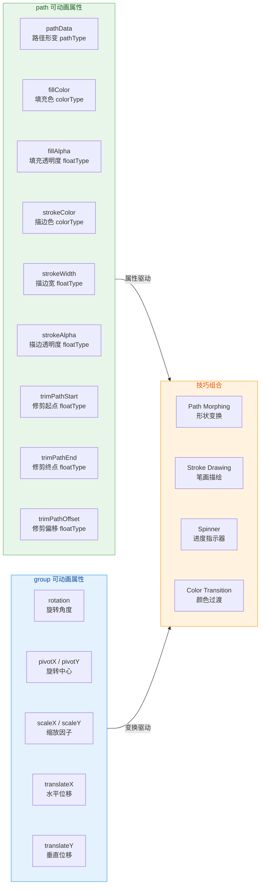
```mermaid
graph LR
    subgraph P["path 可动画属性"]
        direction TB
        P1["pathData\n路径形变 pathType"]
        P2["fillColor\n填充色 colorType"]
        P3["fillAlpha\n填充透明度 floatType"]
        P4["strokeColor\n描边色 colorType"]
        P5["strokeWidth\n描边宽 floatType"]
        P6["strokeAlpha\n描边透明度 floatType"]
        P7["trimPathStart\n修剪起点 floatType"]
        P8["trimPathEnd\n修剪终点 floatType"]
        P9["trimPathOffset\n修剪偏移 floatType"]
        P1 ~~~ P2
        P2 ~~~ P3
        P3 ~~~ P4
        P4 ~~~ P5
        P5 ~~~ P6
        P6 ~~~ P7
        P7 ~~~ P8
        P8 ~~~ P9
    end

    subgraph G["group 可动画属性"]
        direction TB
        G1["rotation\n旋转角度"]
        G2["pivotX / pivotY\n旋转中心"]
        G3["scaleX / scaleY\n缩放因子"]
        G4["translateX\n水平位移"]
        G5["translateY\n垂直位移"]
        G1 ~~~ G2
        G2 ~~~ G3
        G3 ~~~ G4
        G4 ~~~ G5
    end

    subgraph T["技巧组合"]
        direction TB
        T1["Path Morphing\n形状变换"]
        T2["Stroke Drawing\n笔画描绘"]
        T3["Spinner\n进度指示器"]
        T4["Color Transition\n颜色过渡"]
        T1 ~~~ T2
        T2 ~~~ T3
        T3 ~~~ T4
    end

    P -->|"属性驱动"| T
    G -->|"变换驱动"| T

    classDef pathStyle fill:#E8F5E9,stroke:#4CAF50,color:#1B5E20
    classDef groupStyle fill:#E3F2FD,stroke:#2196F3,color:#0D47A1
    classDef trickStyle fill:#FFF3E0,stroke:#FF9800,color:#E65100

    class P pathStyle
    class G groupStyle
    class T trickStyle
```

---

### 工程实践与性能考量

#### SVG 到 VectorDrawable 的转换

实际项目中，设计师通常交付 SVG 格式的图标。Android Studio 内置了 **Vector Asset Studio**（`File → New → Vector Asset`），可以直接导入 SVG 或 PSD 文件并自动转为 `VectorDrawable` XML。但需要注意：

- **不支持的 SVG 特性**：渐变填充（Gradient）在 API 24+ 才支持；滤镜（Filter）、蒙版（Mask）、文字（Text）等不被支持。Vector Asset Studio 会自动忽略这些特性，可能导致视觉偏差。
- **路径简化**：某些 SVG 可能包含冗余控制点，可以用 [Shape Shifter](https://shapeshifter.design/) 等在线工具做路径简化和对齐——这对 Path Morphing 尤为重要。
- **`pathData` 对齐工具**：Shape Shifter 不仅能可视化编辑 AVD，还能自动将两条路径的指令类型和数量对齐，是制作 Morphing 动画的利器。

#### 兼容性策略

`VectorDrawable` 在 API 21+ 原生支持，AndroidX 的 `VectorDrawableCompat` 向下支持到 API 14，但存在一些差异：

| 特性 | 原生（API 21+） | Compat（API 14+） |
|------|-----------------|---------------------|
| 基本 VectorDrawable | ✅ | ✅ |
| AnimatedVectorDrawable | API 21+ | API 14+（部分限制） |
| Path Morphing | API 21+ | API 14+（需 aapt 内联） |
| Gradient | API 24+ | API 24+（Compat 不降级） |
| trimPath 动画 | API 21+ | API 14+ |

在使用 Compat 库时，确保在 `build.gradle` 中启用矢量图支持：

```kotlin
// app/build.gradle.kts
android {
    defaultConfig {
        // 启用 AndroidX 矢量图 Compat 支持
        vectorDrawables.useSupportLibrary = true  // 必须设置为 true
    }
}
```

#### 性能注意事项

1. **复杂度与帧率**：矢量图的渲染成本与路径复杂度（控制点数量）正相关。Google 官方建议单个 `VectorDrawable` 的路径指令不超过 **200 个命令**。超过此阈值，渲染耗时可能超出一帧（16ms），导致肉眼可见的卡顿。

2. **Path Morphing 的额外开销**：每帧变形都需要重新做路径插值和 Tessellation。如果变形路径非常复杂，建议降低帧率或减少控制点。

3. **缓存机制**：静态 `VectorDrawable`（不做动画时）只需要首次绘制时做一次 Tessellation，后续帧使用 DisplayList 缓存。如果图标只需展示不需动画，性能与位图接近。

4. **大尺寸矢量图的陷阱**：虽然矢量图可以无损缩放，但如果将一个 24dp 的图标放大到全屏（如 360dp），光栅化产生的像素量级会激增，首次渲染会有明显延迟。对于大面积矢量图（如背景图案），应考虑预渲染为 Bitmap 并缓存。

5. **Bitmap 缓存优化**：Android 系统内部对 `VectorDrawable` 有一层 **Bitmap Cache**。当 `VectorDrawable` 被绑定到某个固定尺寸的 `View` 后，系统会在首次绘制后将光栅化结果缓存为 Bitmap，后续 `draw()` 调用直接 blitting 缓存的 Bitmap。但一旦尺寸变化（如 `View` 被 resize），缓存会失效并重新光栅化。

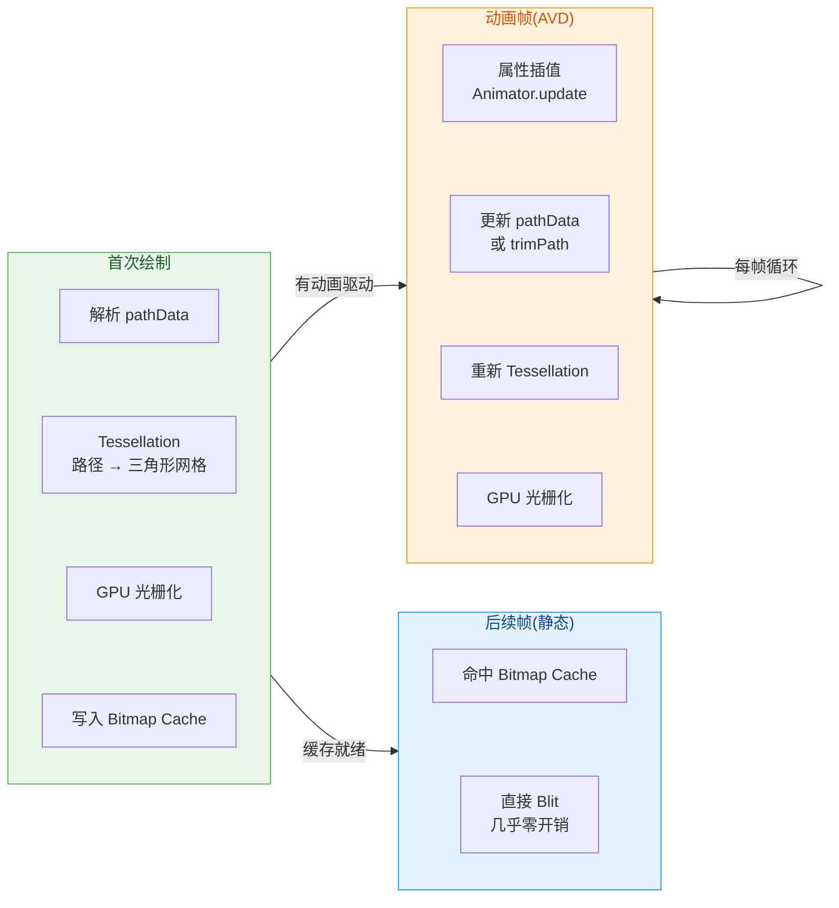
```mermaid
graph LR
    subgraph S1["首次绘制"]
        direction TB
        S1A["解析 pathData"]
        S1B["Tessellation\n路径 → 三角形网格"]
        S1C["GPU 光栅化"]
        S1D["写入 Bitmap Cache"]
        S1A ~~~ S1B
        S1B ~~~ S1C
        S1C ~~~ S1D
    end

    subgraph S2["后续帧(静态)"]
        direction TB
        S2A["命中 Bitmap Cache"]
        S2B["直接 Blit\n几乎零开销"]
        S2A ~~~ S2B
    end

    subgraph S3["动画帧(AVD)"]
        direction TB
        S3A["属性插值\nAnimator.update"]
        S3B["更新 pathData\n或 trimPath"]
        S3C["重新 Tessellation"]
        S3D["GPU 光栅化"]
        S3A ~~~ S3B
        S3B ~~~ S3C
        S3C ~~~ S3D
    end

    S1 -->|"缓存就绪"| S2
    S1 -->|"有动画驱动"| S3
    S3 -->|"每帧循环"| S3

    classDef firstStyle fill:#E8F5E9,stroke:#4CAF50,color:#1B5E20
    classDef cacheStyle fill:#E3F2FD,stroke:#2196F3,color:#0D47A1
    classDef animStyle fill:#FFF3E0,stroke:#FF9800,color:#E65100

    class S1 firstStyle
    class S2 cacheStyle
    class S3 animStyle
```

---

### 实战总结：何时选择矢量动画

| 场景 | 推荐方案 | 理由 |
|------|---------|------|
| 简单图标状态切换（播放/暂停、菜单/返回） | AVD + Path Morphing | 体积极小、效果优雅、系统原生支持 |
| 进度指示器、Loading 动效 | AVD + trimPath + rotation | 无需额外依赖、可高度自定义 |
| 对勾/签名/笔画出现效果 | AVD + trimPath | 最自然的"画出来"效果 |
| 复杂矢量插画动画（多图层、遮罩、表达式） | Lottie（三方库） | AVD 不支持蒙版/渐变动画 |
| 大面积背景动画 | Bitmap + Property Animation 或 Lottie | 矢量图大面积渲染开销高 |

---

**📝 练习题**

当使用 `AnimatedVectorDrawable` 实现 Path Morphing 时，`valueFrom` 的路径数据为 `"M0,0 L10,0 L10,10 L0,10Z"`（4条直线组成的正方形），以下哪个 `valueTo` 路径数据可以正常执行变形动画？


A. `"M5,0 L10,5 L5,10 Z"`


B. `"M5,0 C7,0 10,3 10,5 C10,7 7,10 5,10 C3,10 0,7 0,5 C0,3 3,0 5,0Z"`


C. `"M5,0 L10,5 L5,10 L0,5Z"`


D. `"M0,0 Q5,0 10,0 L10,10 L0,10Z"`


**【答案】** C

**【解析】** Path Morphing 的核心约束是两条路径的 **指令类型和数量必须完全一致**。原始路径为 `M L L L Z`，共 5 个指令（1 个 MoveTo + 3 个 LineTo + 1 个 ClosePath）。选项 A 为 `M L L Z`（仅 3 个 LineTo 中的 2 个，总共 4 个指令，数量不匹配）。选项 B 使用了 `C`（三次贝塞尔曲线）指令，类型与 `L` 不匹配。选项 C 为 `M L L L Z`，指令类型和数量与原始路径完全一致（菱形 ← 正方形的变形），可以正常执行逐参数插值。选项 D 引入了 `Q`（二次贝塞尔曲线），类型不匹配。因此正确答案为 C。

---

**📝 练习题**

关于 `VectorDrawable` 中 `trimPathStart`、`trimPathEnd`、`trimPathOffset` 三个属性，以下说法正确的是？


A. `trimPath` 系列属性对 `fillColor` 和 `strokeColor` 都有效


B. 当 `trimPathStart=0.3`，`trimPathEnd=0.8` 时，可见部分是路径总长度的 50%


C. `trimPathOffset` 会改变路径的实际形状（pathData）


D. `trimPath` 动画每帧都需要重新做路径的 Tessellation（三角化）


**【答案】** B

**【解析】** 选项 A 错误——`trimPath` 仅对 `strokeColor`（描边）有效，对 `fillColor`（填充）无效，因为填充是闭合区域着色，概念上不存在线性起止。选项 B 正确——可见区间为 `end - start = 0.8 - 0.3 = 0.5`，即路径总长度的 50%。选项 C 错误——`trimPathOffset` 只是对可见区间做循环偏移，路径的 `pathData` 自身不会被修改，改变的只是哪一段被绘制出来。选项 D 错误——`trimPath` 动画不需要重新 Tessellation；系统使用 `PathMeasure.getSegment()` 提取子段，然后只绘制该子段，路径解析和三角化在首次绑定时已完成（变化的只是绘制范围）。只有 `pathData` 变化（Path Morphing）才需要每帧重新 Tessellation。因此正确答案为 B。

---

## 过渡动画

Android 的过渡动画（Transition Animation）是整个动画体系中 **最贴近用户体验设计** 的一环。它解决的核心问题是：当界面从一个"状态"变为另一个"状态"时，如何让这种变化 **不突兀、有因果、可追踪**。这里的"状态"可以是同一个 Activity 内不同 View 树的布局切换，也可以是两个 Activity / Fragment 之间的跳转。Google 在 Android 4.4（KitKat）引入 `Transition` 框架，在 5.0（Lollipop）引入 `ActivityTransition` 与 `SharedElementTransition`，使"界面 A 上的某张图片飞到界面 B 的某个位置"这类视觉连续性成为原生能力。

从本质上看，过渡动画并不神秘——它底层依然依赖属性动画（Property Animation）来驱动每一帧的变化，但在此之上封装了 **场景捕获（Scene Capture）→ 差异计算（Diff）→ 动画生成（Animator Creation）** 三步流水线。开发者只需要声明"起始场景"和"结束场景"，框架自动对比两者之间 View 属性的差异（位置、尺寸、透明度、可见性……），然后生成平滑的属性动画。这种"声明式"的思路极大地降低了复杂界面切换动画的编码成本。

---

### TransitionManager 场景切换

#### 核心概念：Scene 与 Transition

要理解 `TransitionManager`，必须先搞清两个基本概念——**Scene（场景）** 与 **Transition（过渡）**。

**Scene** 代表 View 树在某一时刻的 **完整快照**。你可以把它想象成舞台剧里的"一幕"：灯光、道具、演员站位都已确定。在 Android 中，一个 Scene 通常由一个根 ViewGroup（称为 **Scene Root**）加上一个布局资源文件来描述。当你要求 TransitionManager "进入某个 Scene"时，框架会把 Scene Root 下的所有子 View **替换** 为 Scene 描述的布局，然后在替换前后做 diff 来驱动动画。

**Transition** 则描述 **"如何"** 从一个 Scene 变化到另一个 Scene。内置的 Transition 类型包括：

| Transition 类型 | 作用 | 捕获的属性 |
|---|---|---|
| `ChangeBounds` | 动画化 View 的位置与大小变化 | left / top / right / bottom / width / height |
| `Fade` | 动画化 View 的出现与消失 | visibility / alpha |
| `ChangeTransform` | 动画化 View 的 scale / rotation | scaleX / scaleY / rotation / translationX / translationY |
| `ChangeClipBounds` | 动画化 `clipBounds` 裁剪区域 | clipBounds Rect |
| `ChangeImageTransform` | 动画化 ImageView 的 `imageMatrix` | ImageView.imageMatrix |
| `TransitionSet` | 组合多个 Transition（顺序或并行） | 取决于子 Transition |
| `AutoTransition`（默认） | 先 Fade Out 不可见 View → 再 ChangeBounds → 最后 Fade In 新 View | 综合 |

`AutoTransition` 是框架在你不显式指定时的默认选择。它的内部其实是一个 `TransitionSet`，按 `ORDERING_SEQUENTIAL` 依次播放 Fade(OUT) → ChangeBounds → Fade(IN)，保证了"先移走不需要的、再移动保留的、最后引入新来的"这一符合直觉的视觉顺序。

#### 工作流水线

TransitionManager 的工作流程可以分为四步，理解它们对调试问题极有帮助：

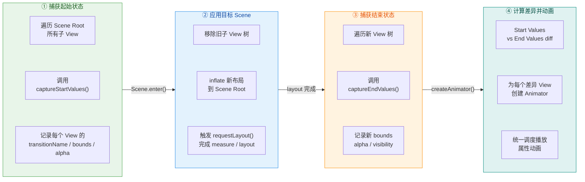
```mermaid
graph LR
    subgraph Step1["① 捕获起始状态"]
        direction TB
        A1["遍历 Scene Root\n所有子 View"] ~~~ A2["调用\ncaptureStartValues()"] ~~~ A3["记录每个 View 的\ntransitionName / bounds / alpha"]
    end

    subgraph Step2["② 应用目标 Scene"]
        direction TB
        B1["移除旧子 View 树"] ~~~ B2["inflate 新布局\n到 Scene Root"] ~~~ B3["触发 requestLayout()\n完成 measure / layout"]
    end

    subgraph Step3["③ 捕获结束状态"]
        direction TB
        C1["遍历新 View 树"] ~~~ C2["调用\ncaptureEndValues()"] ~~~ C3["记录新 bounds\nalpha / visibility"]
    end

    subgraph Step4["④ 计算差异并动画"]
        direction TB
        D1["Start Values\nvs End Values diff"] ~~~ D2["为每个差异 View\n创建 Animator"] ~~~ D3["统一调度播放\n属性动画"]
    end

    Step1 -->|"Scene.enter()"| Step2 -->|"layout 完成"| Step3 -->|"createAnimator()"| Step4

    classDef green fill:#E8F5E9,stroke:#43A047,color:#1B5E20
    classDef blue fill:#E3F2FD,stroke:#1E88E5,color:#0D47A1
    classDef orange fill:#FFF3E0,stroke:#FB8C00,color:#E65100
    classDef teal fill:#E0F2F1,stroke:#00897B,color:#004D40
    class Step1 green
    class Step2 blue
    class Step3 orange
    class Step4 teal
```

**第一步：捕获起始状态**。框架遍历 Scene Root 下的所有子 View，对每个 View 调用 `Transition.captureStartValues(TransitionValues)`。`TransitionValues` 是一个简单的包装类，内部有一个 `Map<String, Object>` 用于存放任意属性快照。例如 `ChangeBounds` 会把 `view.getLeft()`、`view.getTop()` 等记录进去。每个 View 用 **`transitionName`**（API 21+）或 **View id** 来作为"前后匹配"的 key。

**第二步：应用目标 Scene**。调用 `Scene.enter()`，此方法会先 `removeAllViews()` 清空 Scene Root，再 `inflate` 目标布局添加到 Scene Root。紧接着触发一次完整的 `measure → layout` 流程，使得新的 View 树完成定位。

**第三步：捕获结束状态**。在新 View 树 layout 结束后（通常通过 `OnPreDrawListener` 回调时机），框架再次遍历 Scene Root，调用 `captureEndValues()` 记录每个 View 的新属性值。

**第四步：差异计算与动画生成**。框架拿 startValues 和 endValues 做 diff——对于同一个 `transitionName`（或同一个 id）的 View，比较其前后属性值。如果不同，调用 `Transition.createAnimator()` 为该 View 生成一个 `Animator`。最终所有 Animator 由框架统一调度播放，用户就看到了平滑的过渡效果。

> **关键洞察**：Scene 机制是"整棵 View 树替换"的模式，所以每次 Scene 切换都会重新 inflate 布局。如果你的布局很复杂，inflate 本身就可能造成掉帧。对于仅需微调局部 View 属性（可见性、位置）的轻量场景，`TransitionManager.beginDelayedTransition()` 是更优选择——它不需要预定义 Scene 对象。

#### Scene 的创建方式

Scene 的创建有两种主要途径：

```kotlin
// 方式一：从布局资源创建（最常用）
// 参数1: sceneRoot — 过渡动画的根容器，新布局将被挂载到这里
// 参数2: layoutResId — 目标场景对应的布局资源 ID
// 参数3: context — 用于 inflate 布局
val scene1 = Scene.getSceneForLayout(
    sceneRoot,            // 动画发生的根 ViewGroup
    R.layout.scene_one,   // 目标布局
    this                  // Context
)

val scene2 = Scene.getSceneForLayout(
    sceneRoot,
    R.layout.scene_two,
    this
)

// 方式二：从已有 View 树创建（动态构建场景）
// 适用于运行时动态生成的 View 而非 xml 布局
val dynamicView = FrameLayout(this).apply {
    // ... 动态添加子 View
}
// 将动态构建的 View 树包装成 Scene
val dynamicScene = Scene(sceneRoot, dynamicView)
```

两个不同的 Scene 布局（`scene_one.xml` 和 `scene_two.xml`）应该共享 **相同的 View id** 或 **相同的 `transitionName`**，这样框架才能在前后两个 Scene 中找到"同一个"View 并为其做动画。如果某个 View 只在 scene_one 中存在、在 scene_two 中不存在，那么 `Fade` Transition 会把它 fade out；反之则 fade in。

#### beginDelayedTransition：最实用的 API

日常开发中，`TransitionManager.beginDelayedTransition()` 的使用频率远高于显式 Scene 切换，因为大多数场景只是"改变同一布局中若干 View 的属性"，不需要整棵树替换。

它的工作原理与 Scene 切换一脉相承：调用 `beginDelayedTransition()` 时，框架 **立即** 捕获当前 View 树的属性快照（startValues）。然后你在代码中修改 View 属性（如 `view.visibility = View.GONE`、修改 `LayoutParams`）。到下一帧 `onPreDraw` 时，框架捕获 endValues，做 diff，生成动画。整个过程是 **异步** 的——你写的属性修改代码并不会立即导致 View 跳变，框架会拦截这些变化并以动画方式呈现。

```kotlin
// 示例：点击按钮时，让一个 View 平滑展开/折叠
btn.setOnClickListener {
    // 第一步：告诉 TransitionManager "我要对 container 做过渡"
    // 传入的 Transition 决定了动画效果，不传则使用 AutoTransition
    TransitionManager.beginDelayedTransition(
        container,                    // sceneRoot：过渡动画的根 ViewGroup
        ChangeBounds().apply {        // 使用 ChangeBounds 动画化尺寸变化
            duration = 300            // 动画时长 300ms
            interpolator = FastOutSlowInInterpolator()  // Material 标准插值器
        }
    )

    // 第二步：直接修改 View 属性
    // 框架会对比修改前后的差异，自动生成过渡动画
    val params = targetView.layoutParams
    if (expanded) {
        params.height = collapsedHeight   // 折叠高度
    } else {
        params.height = expandedHeight    // 展开高度
    }
    targetView.layoutParams = params      // 触发 requestLayout
    expanded = !expanded                  // 切换状态标记
}
```

这段代码的关键在于 **`beginDelayedTransition` 必须在属性修改之前调用**。如果顺序反了，框架捕获的 startValues 已经是修改后的值，diff 结果为空，就看不到动画了。

#### 自定义 Transition

内置 Transition 覆盖不了所有场景时，可以继承 `Transition` 基类编写自定义过渡。你需要重写三个方法：

```kotlin
class CustomColorTransition : Transition() {

    companion object {
        // 定义属性 key，命名规范：包名:类名:属性名
        private const val PROP_COLOR = "com.example:CustomColorTransition:backgroundColor"
    }

    // 声明本 Transition 关心哪些属性（框架用于优化）
    override fun getTransitionProperties(): Array<String> {
        return arrayOf(PROP_COLOR)   // 返回需要捕获的属性 key 数组
    }

    // 捕获 View 的当前属性值，存入 transitionValues.values
    override fun captureStartValues(transitionValues: TransitionValues) {
        captureValues(transitionValues)  // 复用通用捕获逻辑
    }

    override fun captureEndValues(transitionValues: TransitionValues) {
        captureValues(transitionValues)  // 同样的捕获逻辑
    }

    // 通用属性捕获：获取 View 的当前背景色
    private fun captureValues(transitionValues: TransitionValues) {
        val view = transitionValues.view          // 当前正在捕获的 View
        val background = view.background          // 获取 View 的背景 Drawable
        if (background is ColorDrawable) {
            // 将背景色存入 values Map
            transitionValues.values[PROP_COLOR] = background.color
        }
    }

    // 核心方法：根据前后差异创建 Animator
    override fun createAnimator(
        sceneRoot: ViewGroup,
        startValues: TransitionValues?,   // 起始状态快照（可能为 null）
        endValues: TransitionValues?      // 结束状态快照（可能为 null）
    ): Animator? {
        // 空值保护：如果无法获取前后值，则不创建动画
        if (startValues == null || endValues == null) return null

        val startColor = startValues.values[PROP_COLOR] as? Int ?: return null
        val endColor = endValues.values[PROP_COLOR] as? Int ?: return null

        // 颜色相同无需动画
        if (startColor == endColor) return null

        val view = endValues.view   // 目标 View（结束状态的 View 引用）

        // 创建 ARGB 颜色过渡属性动画
        return ValueAnimator.ofArgb(startColor, endColor).apply {
            addUpdateListener { animator ->
                // 每帧更新 View 背景色
                view.setBackgroundColor(animator.animatedValue as Int)
            }
        }
    }
}
```

自定义 Transition 的价值在于——你可以让 **任何** View 属性（颜色、圆角、阴影高度、自定义绘制参数……）参与过渡系统的自动 diff 机制，而不用手动管理动画的创建与取消。

#### TransitionSet 组合

复杂的过渡效果往往需要多个 Transition 协作。`TransitionSet` 支持 **ORDERING_TOGETHER**（并行）和 **ORDERING_SEQUENTIAL**（串行）两种模式：

```kotlin
// 创建一个组合过渡：fade + changeBounds 并行，完成后再执行颜色过渡
val transitionSet = TransitionSet().apply {
    ordering = TransitionSet.ORDERING_SEQUENTIAL  // 整体串行

    // 第一阶段：fade 和 changeBounds 并行
    addTransition(TransitionSet().apply {
        ordering = TransitionSet.ORDERING_TOGETHER  // 内部并行
        addTransition(Fade())                       // 透明度过渡
        addTransition(ChangeBounds())               // 位置尺寸过渡
    })

    // 第二阶段：自定义颜色过渡
    addTransition(CustomColorTransition())          // 背景色过渡

    duration = 400  // 统一时长（会分配给每个子 Transition）
}

// 应用组合过渡
TransitionManager.beginDelayedTransition(container, transitionSet)
```

还可以通过 `addTarget()` / `excludeTarget()` 精确控制每个子 Transition 作用的 View 范围，避免"所有 View 都做所有动画"导致的性能浪费和视觉混乱。

---

### SharedElement 共享元素

#### 什么是共享元素过渡

共享元素过渡（Shared Element Transition）是 Android 5.0 引入的最具视觉冲击力的过渡方案。它的核心思想是：当两个界面（Activity ↔ Activity，或 Fragment ↔ Fragment）之间存在 **逻辑上"同一个"元素**（比如列表中的一张商品图片和详情页的大图），过渡时让这个元素看起来 **从源位置平滑"飞"到目标位置**，同时伴随尺寸和形状的变化。用户会感觉"这个元素在两个页面之间是连续的"，而不是突然消失又出现。

从实现角度看，共享元素并不是"真的把一个 View 搬到另一个 Activity"——两个 Activity 有各自的 Window 和 View 树，不可能共享一个 View 实例。实际机制是：

1. 退出界面的共享元素被 **截图或隐藏**。
2. 进入界面在自己的 Window 上创建一个 **覆盖层（Overlay）**，在覆盖层中绘制共享元素的起始状态。
3. 框架通过属性动画将覆盖层上的元素从"起始位置/尺寸"动画到"目标位置/尺寸"。
4. 动画结束后移除覆盖层，目标 View 正常显示。

这个过程对开发者几乎透明，你只需要做三件事：**给共享元素设置 `transitionName`、启动 Activity 时传入共享 View、配置 Transition 类型**。

#### Activity 间共享元素

```xml
<!-- activity_list.xml：列表项中的图片 -->
<!-- transitionName 是共享元素的唯一标识符，前后两个界面必须一致 -->
<ImageView
    android:id="@+id/iv_product"
    android:transitionName="product_image"
    android:layout_width="120dp"
    android:layout_height="120dp"
    android:scaleType="centerCrop" />

<!-- activity_detail.xml：详情页的大图 -->
<!-- transitionName 与列表项一致，框架据此匹配前后元素 -->
<ImageView
    android:id="@+id/iv_detail"
    android:transitionName="product_image"
    android:layout_width="match_parent"
    android:layout_height="300dp"
    android:scaleType="centerCrop" />
```

```kotlin
// 列表页：点击商品图片，跳转详情页
adapter.setOnItemClickListener { view, position ->
    val intent = Intent(this, DetailActivity::class.java)
    intent.putExtra("product_id", productList[position].id)

    // 获取被点击的 ImageView（共享元素）
    val sharedImage = view.findViewById<ImageView>(R.id.iv_product)

    // 创建包含共享元素信息的 ActivityOptions
    // Pair 的第一个元素是共享 View，第二个是 transitionName
    val options = ActivityOptions.makeSceneTransitionAnimation(
        this,                           // Activity 引用
        sharedImage,                    // 共享的 View 实例
        "product_image"                 // transitionName（必须与目标布局一致）
    )

    // 使用 options.toBundle() 启动 Activity
    startActivity(intent, options.toBundle())
}
```

```kotlin
// 详情页：配置进入过渡
class DetailActivity : AppCompatActivity() {
    override fun onCreate(savedInstanceState: Bundle?) {
        super.onCreate(savedInstanceState)

        // 必须在 setContentView 之前启用 Transition（窗口特性）
        window.requestFeature(Window.FEATURE_ACTIVITY_TRANSITIONS)

        setContentView(R.layout.activity_detail)

        // 设置共享元素进入过渡效果
        // ChangeImageTransform 会处理 ImageView 的 scaleType 差异
        // ChangeBounds 处理位置和尺寸的变化
        window.sharedElementEnterTransition = TransitionSet().apply {
            addTransition(ChangeImageTransform())  // ImageView matrix 动画
            addTransition(ChangeBounds())          // 边界尺寸动画
            addTransition(ChangeTransform())       // scale/rotation 动画
            duration = 350                         // 过渡总时长
            interpolator = FastOutSlowInInterpolator()  // Material 缓动
        }
    }

    // 覆写返回行为以触发共享元素返回过渡
    override fun onBackPressed() {
        // finishAfterTransition 会播放返回过渡动画后再 finish
        finishAfterTransition()
    }
}
```

**`transitionName` 的匹配机制**：框架在两个 Activity 之间传递共享元素信息时，使用的唯一标识就是 `transitionName` 字符串。起始 Activity 遍历 Window 中所有设置了 `transitionName` 的 View，将其 **屏幕坐标、尺寸、transitionName** 打包传递给目标 Activity。目标 Activity 在 layout 完成后，根据 `transitionName` 找到对应的目标 View，然后做 diff 生成动画。这意味着 **同一个界面中不能有两个 View 拥有相同的 `transitionName`**，否则框架无法正确匹配。

#### 多个共享元素

一次过渡可以包含多个共享元素。比如商品卡片中既有图片又有标题，都想做共享过渡：

```kotlin
// 多个共享元素时使用 Pair 数组
val options = ActivityOptions.makeSceneTransitionAnimation(
    this,
    // 使用 androidx.core.util.Pair（注意不是 kotlin.Pair）
    Pair.create(sharedImage, "product_image"),     // 共享图片
    Pair.create(sharedTitle, "product_title"),     // 共享标题
    Pair.create(sharedPrice, "product_price")      // 共享价格
)
startActivity(intent, options.toBundle())
```

多个共享元素时，框架会为每个元素独立生成 Animator，默认并行播放。需要注意的是，共享元素越多，过渡越复杂，也越容易出现视觉"混乱"。**Material Design 指南建议共享元素不超过 2~3 个**，聚焦在最能传达内容连续性的核心元素上。

#### Fragment 间共享元素

Fragment 间的共享元素过渡使用 `FragmentTransaction` API，原理相同但 API 形式不同：

```kotlin
// Fragment 间共享元素过渡
val detailFragment = DetailFragment().apply {
    // Fragment 的共享元素过渡通过 sharedElementEnterTransition 设置
    sharedElementEnterTransition = TransitionSet().apply {
        addTransition(ChangeBounds())           // 尺寸位置变化
        addTransition(ChangeTransform())        // 变换矩阵变化
        addTransition(ChangeImageTransform())   // ImageView scaleType 变化
        duration = 350
    }
    // 可选：设置非共享元素的进入过渡（如背景 fade in）
    enterTransition = Fade().apply {
        duration = 250
        // 排除状态栏和导航栏，避免它们也参与 fade
        excludeTarget(android.R.id.statusBarBackground, true)
        excludeTarget(android.R.id.navigationBarBackground, true)
    }
}

parentFragmentManager.beginTransaction()
    // 指定共享元素：第一个参数是当前 Fragment 中的 View
    // 第二个参数是 transitionName（目标 Fragment 中对应 View 的 transitionName）
    .addSharedElement(sharedImageView, "product_image")
    .replace(R.id.fragment_container, detailFragment)
    .addToBackStack(null)   // 加入返回栈以支持返回过渡
    .commit()
```

Fragment 共享过渡有一个常见陷阱：如果目标 Fragment 的布局中包含需要异步加载的图片（如 Glide / Coil 加载网络图），共享元素动画可能在图片加载完成之前就开始了，导致目标 View 还是空白状态。解决方案是 **推迟过渡**：

```kotlin
// 目标 Fragment 中：推迟进入过渡
override fun onViewCreated(view: View, savedInstanceState: Bundle?) {
    super.onViewCreated(view, savedInstanceState)
    
    // 告诉框架"先别开始共享元素过渡，我还没准备好"
    postponeEnterTransition()

    // 使用 Glide 加载图片
    Glide.with(this)
        .load(imageUrl)
        .listener(object : RequestListener<Drawable> {
            override fun onResourceReady(
                resource: Drawable,
                model: Any,
                target: Target<Drawable>,
                dataSource: DataSource,
                isFirstResource: Boolean
            ): Boolean {
                // 图片加载完成后，允许过渡开始
                startPostponedEnterTransition()
                return false  // 返回 false 让 Glide 继续正常设置图片
            }

            override fun onLoadFailed(
                e: GlideException?,
                model: Any?,
                target: Target<Drawable>,
                isFirstResource: Boolean
            ): Boolean {
                // 加载失败也要恢复过渡，否则界面会卡住
                startPostponedEnterTransition()
                return false
            }
        })
        .into(ivDetail)

    // 安全超时：防止回调永远不被触发导致界面冻结
    // 推荐使用 view.doOnPreDraw { startPostponedEnterTransition() } 作为兜底
    view.postDelayed({ startPostponedEnterTransition() }, 1000)
}
```

`postponeEnterTransition()` 与 `startPostponedEnterTransition()` 是 **成对调用** 的。如果你 postpone 了但忘记 start，界面会"冻住"——所有过渡动画都不会播放，用户看到的就是一个空白或闪烁的界面。因此务必在所有分支路径（成功、失败、超时）中都调用 `startPostponedEnterTransition()`。

#### RecyclerView 中的共享元素

列表 → 详情的共享元素过渡是最常见的业务场景，但也是坑最多的。关键问题有两个：

**问题一：transitionName 的唯一性**。RecyclerView 中每个 ItemView 如果都写死同一个 `transitionName`，框架无法区分是哪个 item 的图片要做共享过渡。解决方案是在 `onBindViewHolder` 中动态设置：

```kotlin
override fun onBindViewHolder(holder: ViewHolder, position: Int) {
    val item = dataList[position]
    holder.imageView.load(item.imageUrl)
    // 动态设置 transitionName，确保唯一性
    // 通常使用业务 ID 作为后缀
    holder.imageView.transitionName = "product_image_${item.id}"
}
```

**问题二：返回过渡时 RecyclerView 的 item 可能已被回收**。用户从详情页返回列表页时，如果列表滚动过或数据变化了，原来那个 item 的 View 可能已经不在屏幕上了。这时框架找不到 `transitionName` 对应的 View，返回过渡就会失效。应对策略是在 Activity 的 `setExitSharedElementCallback` 中动态重新映射共享元素：

```kotlin
// 列表页 Activity
setExitSharedElementCallback(object : SharedElementCallback() {
    override fun onMapSharedElements(
        names: MutableList<String>,              // 需要共享的 transitionName 列表
        sharedElements: MutableMap<String, View>  // name → View 的映射
    ) {
        // 从详情页返回时，重新找到正确的 View
        // selectedPosition 由详情页通过 setResult 传回
        val holder = recyclerView.findViewHolderForAdapterPosition(selectedPosition)
        if (holder != null) {
            // 将 transitionName 映射到当前可见的 View
            sharedElements[names[0]] = holder.itemView.findViewById(R.id.iv_product)
        }
    }
})
```

下面这张图展示了 Activity 间共享元素过渡的完整时序：

```mermaid
graph LR
    subgraph Source["源 Activity"]
        direction TB
        S1["用户点击\n共享 View"] ~~~ S2["构建\nActivityOptions\n.makeSceneTransition"] ~~~ S3["调用\nstartActivity()\nwith Bundle"] ~~~ S4["Exit Transition\n播放"]
    end

    subgraph Framework["Framework 层"]
        direction TB
        F1["AMS 启动\n目标 Activity"] ~~~ F2["捕获共享元素\n屏幕坐标/尺寸"] ~~~ F3["通过 Binder\n传递 SharedElement\nInfo"] ~~~ F4["Window 创建\nOverlay 绘制层"]
    end

    subgraph Target["目标 Activity"]
        direction TB
        T1["onCreate +\nsetContentView"] ~~~ T2["layout 完成\n定位目标 View"] ~~~ T3["Overlay 上绘制\n起始→目标动画"] ~~~ T4["动画结束\n移除 Overlay\n显示真实 View"]
    end

    Source -->|"Intent + Bundle"| Framework -->|"SharedElementInfo"| Target

    classDef green fill:#E8F5E9,stroke:#43A047,color:#1B5E20
    classDef blue fill:#E3F2FD,stroke:#1E88E5,color:#0D47A1
    classDef orange fill:#FFF3E0,stroke:#FB8C00,color:#E65100
    class Source green
    class Framework blue
    class Target orange
```

---

### ActivityOptions 界面跳转

#### 从传统跳转到 Transition 系统

在 Android 5.0 之前，Activity 跳转动画只能通过 `overridePendingTransition(enterAnim, exitAnim)` 设置，这是一对补间动画（View Animation），作用于整个 Window 表面。它简单、兼容性好，但只能做"整个页面滑入滑出"这种粗粒度效果，无法针对特定 View 做精细动画。

Android 5.0 引入 `Window.FEATURE_ACTIVITY_TRANSITIONS` 后，Activity 跳转动画被纳入了完整的 Transition 框架，拥有了四个独立可配置的过渡阶段：

| 过渡阶段 | Window 属性 | 说明 |
|---|---|---|
| **Enter Transition** | `window.enterTransition` | 目标 Activity 的非共享 View 如何进入 |
| **Exit Transition** | `window.exitTransition` | 源 Activity 的非共享 View 如何退出 |
| **Shared Element Enter** | `window.sharedElementEnterTransition` | 共享元素从起始到目标位置的过渡 |
| **Shared Element Return** | `window.sharedElementReturnTransition` | 返回时共享元素的过渡（不设则复用 Enter） |

还有 `returnTransition`（返回时非共享元素的过渡）和 `reenterTransition`（源 Activity 重新进入的过渡），共计 **六个可独立配置的过渡时机**。

```mermaid
graph LR
    subgraph AExit["Activity A 退出"]
        direction TB
        A1["exitTransition\n非共享 View 退出"] ~~~ A2["Shared Element\n被捕获截图"]
    end

    subgraph Shared["共享元素飞行"]
        direction TB
        B1["sharedElement\nEnterTransition"] ~~~ B2["Overlay 层绘制\n起始→目标位置"]
    end

    subgraph BEnter["Activity B 进入"]
        direction TB
        C1["enterTransition\n非共享 View 进入"] ~~~ C2["动画完成\n显示最终状态"]
    end

    subgraph BReturn["返回 Activity A"]
        direction TB
        D1["returnTransition\nB 的 View 退出"] ~~~ D2["sharedElement\nReturnTransition"] ~~~ D3["reenterTransition\nA 的 View 重入"]
    end

    AExit -->|"startActivity"| Shared -->|"并行"| BEnter -->|"onBackPressed"| BReturn

    classDef green fill:#E8F5E9,stroke:#43A047,color:#1B5E20
    classDef blue fill:#E3F2FD,stroke:#1E88E5,color:#0D47A1
    classDef teal fill:#E0F2F1,stroke:#00897B,color:#004D40
    classDef orange fill:#FFF3E0,stroke:#FB8C00,color:#E65100
    class AExit green
    class Shared blue
    class BEnter teal
    class BReturn orange
```

#### ActivityOptions 的工厂方法

`ActivityOptions` 类提供了多种静态工厂方法来创建不同类型的跳转动画：

```kotlin
// ① makeSceneTransitionAnimation：共享元素过渡（前文已详述）
val options1 = ActivityOptions.makeSceneTransitionAnimation(
    this,                          // Activity
    sharedView,                    // 共享 View
    "transition_name"              // transitionName
)

// ② makeClipRevealAnimation：圆形揭露动画
// 从指定的矩形区域开始，以圆形展开方式显示新 Activity
val options2 = ActivityOptions.makeClipRevealAnimation(
    triggerView,                   // 触发动画的 View（通常是被点击的按钮）
    0,                             // 起始 x 偏移（相对于 triggerView）
    0,                             // 起始 y 偏移
    triggerView.width,             // 起始宽度
    triggerView.height             // 起始高度
)

// ③ makeCustomAnimation：自定义进入/退出资源动画
// 最接近旧版 overridePendingTransition 的方式
val options3 = ActivityOptions.makeCustomAnimation(
    this,
    R.anim.slide_in_right,         // 新 Activity 的进入动画资源
    R.anim.slide_out_left          // 当前 Activity 的退出动画资源
)

// ④ makeScaleUpAnimation：从指定 View 放大展开
val options4 = ActivityOptions.makeScaleUpAnimation(
    triggerView,                   // 起始 View
    0, 0,                          // 起始位置偏移
    triggerView.width,             // 起始宽度
    triggerView.height             // 起始高度
)

// ⑤ makeThumbnailScaleUpAnimation：从缩略图放大展开
val bitmap = createThumbnail()     // 创建缩略图 Bitmap
val options5 = ActivityOptions.makeThumbnailScaleUpAnimation(
    triggerView,                   // 起始 View
    bitmap,                        // 缩略图
    0, 0                           // 偏移量
)

// 启动 Activity 时传入 options
startActivity(intent, options1.toBundle())
```

#### Window Transition 的完整配置

实际项目中，通常通过 Theme 或代码来系统性地配置过渡效果。以下是一个完整的配置示例：

```kotlin
class BaseTransitionActivity : AppCompatActivity() {

    override fun onCreate(savedInstanceState: Bundle?) {
        super.onCreate(savedInstanceState)
        setupWindowTransitions()
    }

    private fun setupWindowTransitions() {
        // 启用 Activity Transition 特性
        window.requestFeature(Window.FEATURE_ACTIVITY_TRANSITIONS)
        // 启用 Content Transition 特性
        window.requestFeature(Window.FEATURE_CONTENT_TRANSITIONS)

        // —— 非共享元素过渡 ——

        // 进入过渡：从底部滑入
        window.enterTransition = Slide(Gravity.BOTTOM).apply {
            duration = 300                                        // 动画时长
            interpolator = FastOutSlowInInterpolator()            // Material 缓动
            excludeTarget(android.R.id.statusBarBackground, true) // 排除状态栏
            excludeTarget(android.R.id.navigationBarBackground, true) // 排除导航栏
            excludeTarget(R.id.app_bar_layout, true)              // 排除顶部 AppBar
        }

        // 退出过渡：淡出
        window.exitTransition = Fade().apply {
            duration = 250
        }

        // 返回过渡：不设置则默认复用 enterTransition 的反向
        window.returnTransition = Slide(Gravity.BOTTOM).apply {
            duration = 250
        }

        // —— 共享元素过渡 ——

        window.sharedElementEnterTransition = TransitionSet().apply {
            ordering = TransitionSet.ORDERING_TOGETHER  // 所有共享元素过渡并行
            addTransition(ChangeBounds())               // 位置尺寸
            addTransition(ChangeTransform())            // 变换矩阵
            addTransition(ChangeImageTransform())       // ImageView
            addTransition(ChangeClipBounds())           // 裁剪区域
            duration = 350
            interpolator = FastOutSlowInInterpolator()
        }

        // 允许过渡重叠：enterTransition 可以在 exitTransition 尚未结束时开始
        // 设为 true 会让切换更流畅，但可能有视觉重叠
        window.allowEnterTransitionOverlap = true
        window.allowReturnTransitionOverlap = true
    }
}
```

你也可以在 `styles.xml` 中通过 Theme 属性声明，避免每个 Activity 都写代码：

```xml
<!-- res/values/styles.xml -->
<style name="AppTheme.Transition" parent="Theme.Material3.DayNight.NoActionBar">
    <!-- 启用 Activity Transition -->
    <item name="android:windowActivityTransitions">true</item>
    <!-- 进入过渡 -->
    <item name="android:windowEnterTransition">@transition/slide_bottom</item>
    <!-- 退出过渡 -->
    <item name="android:windowExitTransition">@transition/fade_out</item>
    <!-- 共享元素进入过渡 -->
    <item name="android:windowSharedElementEnterTransition">@transition/shared_element</item>
    <!-- 允许过渡重叠 -->
    <item name="android:windowAllowEnterTransitionOverlap">true</item>
    <item name="android:windowAllowReturnTransitionOverlap">true</item>
</style>
```

```xml
<!-- res/transition/shared_element.xml -->
<!-- 组合多个过渡效果 -->
<transitionSet xmlns:android="http://schemas.android.com/apk/res/android"
    android:transitionOrdering="together"
    android:duration="350"
    android:interpolator="@android:interpolator/fast_out_slow_in">

    <!-- 位置尺寸变化 -->
    <changeBounds />
    <!-- 变换矩阵变化 -->
    <changeTransform />
    <!-- ImageView scaleType 变化 -->
    <changeImageTransform />

</transitionSet>
```

#### Jetpack 兼容：ActivityOptionsCompat

为了在低版本 Android 上优雅降级，AndroidX 提供了 `ActivityOptionsCompat`：

```kotlin
// 使用 ActivityOptionsCompat 替代 ActivityOptions
// 在 API < 21 时自动降级为无动画跳转，不会崩溃
val optionsCompat = ActivityOptionsCompat.makeSceneTransitionAnimation(
    this,
    sharedView,
    ViewCompat.getTransitionName(sharedView) ?: ""  // 兼容方式获取 transitionName
)

// ActivityCompat.startActivity 内部会判断版本
ActivityCompat.startActivity(
    this,
    intent,
    optionsCompat.toBundle()
)
```

`ViewCompat.setTransitionName()` 可以在 API 21 以下安全调用（内部是 no-op），保证代码不需要版本判断就能编译通过。

#### 常见问题与优化建议

**1. 过渡动画闪烁 / 白屏**

这是最常见的问题。原因通常是目标 Activity 的 Window 背景在 Transition 播放期间可见。解决方案：

```kotlin
// 在目标 Activity 的 Theme 中将窗口背景设为透明
// 让 Transition 动画期间不会看到白色底色
<style name="TransparentWindowTheme" parent="AppTheme.Transition">
    <item name="android:windowBackground">@android:color/transparent</item>
    <item name="android:windowIsTranslucent">true</item>
</style>
```

但 `windowIsTranslucent` 会影响 Activity 的生命周期行为（源 Activity 不会走 `onStop`），需要权衡。更好的做法是设置 `window.setBackgroundDrawable(ColorDrawable(primaryColor))` 让 Window 背景与页面主色调一致，减少视觉断裂感。

**2. 共享元素回弹时形状不一致**

从圆形头像 → 方形大图做共享过渡时，如果没有处理 clipBounds 或 shapeAppearance，动画过程中会看到不连续的形变。推荐使用 `MaterialContainerTransform`（Material Components 库提供），它能自动处理不同形状之间的平滑过渡。

**3. 性能优化**

- **精简共享元素数量**：每个共享元素都会增加一次截图和 Overlay 绘制开销。
- **避免在过渡期间做耗时操作**：`onCreate()` 中加载数据、初始化 RecyclerView 等如果阻塞主线程，会导致动画卡顿。
- **使用 `postponeEnterTransition` + 超时机制**：既保证视觉正确性，又防止无限等待。
- **测试低端设备**：Transition 动画在低端机上更容易掉帧，必要时可通过 `window.setTransitionBackgroundFadeDuration(0)` 或直接跳过动画来降级。

#### Material Motion（Material 运动系统）

Google 的 Material Design 在 Transition 框架基础上，封装了四种标准化的运动模式，它们位于 **Material Components for Android** 库中：

| Motion 类型 | 类名 | 适用场景 |
|---|---|---|
| **Container Transform** | `MaterialContainerTransform` | 一个元素变形为另一个（FAB → 全屏、卡片 → 详情） |
| **Shared Axis** | `MaterialSharedAxis` | 沿 X / Y / Z 轴切换的同级导航 |
| **Fade Through** | `MaterialFadeThrough` | 无强关联的页面切换（如底部导航切换） |
| **Fade** | `MaterialElevationScale` | 打开/关闭层级（如对话框弹出） |

以 `MaterialContainerTransform` 为例，它是共享元素过渡的增强版，能自动处理 **圆角、阴影、背景色** 的平滑过渡——这些传统 `ChangeBounds` + `ChangeTransform` 组合做不到或做得不好的效果：

```kotlin
// 使用 MaterialContainerTransform 实现 FAB → 全屏展开
// 这是 Material Components 库提供的增强版 Shared Element Transition
val transform = MaterialContainerTransform().apply {
    startView = fab                  // 起始 View（FAB 按钮）
    endView = detailContainer        // 目标 View（全屏容器）
    scrimColor = Color.TRANSPARENT   // 遮罩层颜色（透明则无遮罩）
    duration = 450L                  // 动画时长
    fadeMode = MaterialContainerTransform.FADE_MODE_THROUGH  // 淡入淡出模式

    // 容器颜色：过渡过程中容器的背景色（避免看到内容突变）
    containerColor = ContextCompat.getColor(this@MainActivity, R.color.surface)

    // 添加到当前根 View 的 Overlay 上
    addTarget(detailContainer)
}

// 使用 TransitionManager 触发过渡
TransitionManager.beginDelayedTransition(
    findViewById(android.R.id.content),  // 根 View
    transform
)

// 改变可见性触发过渡
fab.visibility = View.GONE
detailContainer.visibility = View.VISIBLE
```

Material Motion 体系的优势在于：它将"何时使用什么动画"标准化了。开发者不需要自行决定每个页面切换该用什么 Transition，只需按照 Material 指南选择对应的 Motion 类型，就能获得一致、专业的视觉效果。

---

**📝 练习题**

当使用 `postponeEnterTransition()` 延迟 Fragment 的共享元素过渡时，以下哪种做法最安全？

A. 只在 Glide/Coil 图片加载成功的回调中调用 `startPostponedEnterTransition()`，加载失败时不处理


B. 在 `onViewCreated()` 中调用 `postponeEnterTransition()`，并同时设置一个超时兜底（如 `view.doOnPreDraw {}` 或 `postDelayed`），在成功和失败回调中都调用 `startPostponedEnterTransition()`


C. 在 `onCreate()` 中调用 `postponeEnterTransition()`，在 `onResume()` 中无条件调用 `startPostponedEnterTransition()`


D. 不调用 `postponeEnterTransition()`，通过将共享元素 Transition 的 duration 设置为 2000ms 来等待图片加载

**【答案】** B

**【解析】** `postponeEnterTransition()` 和 `startPostponedEnterTransition()` 必须成对出现，且 **所有可能的执行路径都必须保证 start 被调用**。选项 A 只在成功回调中调用 start，如果图片加载失败，start 永远不会被调用，界面将"冻住"——所有过渡动画不会播放，用户会看到一个无响应的空白界面。选项 C 虽然保证了 start 会被调用，但 `onResume()` 的时机太早，此时目标 View 可能还没完成 layout，共享元素的 endValues 不正确，动画效果会异常。选项 D 完全是错误思路——增加 Transition 时长不会延迟过渡的"开始"时间，只会让过渡本身播放得更慢，图片依然会来不及加载。选项 B 是最佳实践：在 `onViewCreated()` 中 postpone（时机正确，View 已创建但未绘制），在所有分支（成功、失败）中都 start，并额外设置超时兜底以防回调丢失，确保界面永远不会卡死。

---

**📝 练习题**

关于 `TransitionManager.beginDelayedTransition()` 的工作原理，以下描述正确的是：

A. 调用后框架会启动一个后台线程来执行布局变化的 diff 计算


B. 调用后框架立即捕获当前 View 树的属性快照作为 startValues，然后在下一帧的 `onPreDraw` 时捕获 endValues 并生成动画


C. 必须在调用后立即调用 `requestLayout()` 才能触发过渡动画，否则无效


D. 它内部使用 View Animation（补间动画）来实现过渡效果，因此不支持硬件加速

**【答案】** B

**【解析】** `beginDelayedTransition()` 的核心机制是"快照 diff"：调用时框架 **同步地** 遍历 Scene Root 下的 View 树，通过 `captureStartValues()` 记录每个 View 当前的位置、尺寸、透明度等属性（startValues）。随后开发者修改 View 属性（改 visibility、改 LayoutParams 等），这些修改会触发 `requestLayout()` 或 `invalidate()`。到下一个渲染帧的 `ViewTreeObserver.OnPreDrawListener` 回调时，框架再次遍历 View 树调用 `captureEndValues()` 获取新状态。两组快照做 diff 后，为每个有差异的 View 生成 `Animator`，统一播放。整个过程发生在主线程（选项 A 错），不需要手动调用 `requestLayout()`——修改 LayoutParams 等操作本身就会触发（选项 C 说法不准确），且底层使用的是属性动画而非补间动画，完全支持硬件加速（选项 D 错）。

---

## 本章小结

本章从 Android 动画体系的演进历程出发，系统梳理了从最早期的 **View Animation（视图动画）** 到现代 **物理动画（Physics-based Animation）** 与 **矢量动画（AnimatedVectorDrawable）** 的完整技术脉络。回顾全章内容，可以清晰地看到一条核心主线：**Android 动画系统的每一次迭代，都是在解决上一代方案的根本局限，同时为开发者提供更强的表现力与更精细的控制粒度。**

### 体系演进的核心脉络

Android 动画体系的发展并非简单的"新替旧"，而是呈现出 **层层叠加、各有所长** 的生态格局。最初的 **补间动画（Tween Animation）** 诞生于 Android 1.0 时代，它通过矩阵变换在绘制层面对 View 施加视觉变换——Alpha 透明度渐变、Scale 缩放、Translate 平移、Rotate 旋转。这套方案简单直观，XML 声明即可使用，至今在一些轻量场景（如 Activity 切换、布局入场 LayoutAnimation）中仍然活跃。但它的致命缺陷在于 **"形变而神不变"**：动画改变的只是 View 的绘制投影（Canvas 矩阵），而非 View 的真实属性。一个被 Translate 动画平移到右侧的 Button，其点击热区依然停留在原位，这对交互驱动的现代应用来说是不可接受的。

**属性动画（Property Animation）** 在 Android 3.0（API 11）中登场，从根本上解决了这一问题。它的设计哲学发生了质变：不再操纵绘制矩阵，而是 **直接修改目标对象的真实属性值**。`ObjectAnimator` 通过反射或 `Property` 对象调用目标的 setter 方法，`ValueAnimator` 则作为纯粹的数值生成引擎，将"数值随时间变化"这一核心能力抽象出来，赋予开发者对任意属性、任意对象施加动画的自由度。`AnimatorSet` 提供了 `playTogether()`、`playSequentially()` 以及 Builder 模式的 `before()`/`after()`/`with()` 编排能力，使复杂动画的时序组合变得优雅可控。属性动画是整个现代 Android 动画体系的 **基石（cornerstone）**，后续的物理动画、矢量动画、过渡动画都在其基础上构建或与其深度协作。

在属性动画内部，**插值器（TimeInterpolator）** 与 **估值器（TypeEvaluator）** 构成了两大核心扩展点。插值器将线性均匀流逝的时间映射为带有节奏感的时间因子（input fraction → interpolated fraction），内置的 `AccelerateDecelerateInterpolator`、`OvershootInterpolator`、`PathInterpolator` 等覆盖了大部分常见的运动曲线。估值器则负责将插值后的时间因子转化为具体类型的属性值——`IntEvaluator` 处理整型、`FloatEvaluator` 处理浮点、`ArgbEvaluator` 处理颜色渐变，而自定义 `TypeEvaluator<T>` 则允许开发者对 `PointF`、`Rect` 等任意复合类型执行动画。两者的分工精妙而清晰：**插值器管"节奏"，估值器管"计算"**，协同驱动了属性动画的丰富表现力。

**帧动画（Frame Animation）** 作为最朴素的逐帧播放方案，适用于需要精细手绘效果的场景（如 loading 菊花、角色 sprite 动画）。但它的本质是将每一帧作为独立 Bitmap 加载到内存中，帧数越多、分辨率越高，内存消耗越惊人。实际项目中必须严格控制帧数与图片尺寸，或转而使用 Lottie/SVGA 等矢量方案替代。

**物理动画（Physics-based Animation）** 是 Google 在 Support Library 中引入的高级动画能力，以 `SpringAnimation`（弹簧动画）和 `FlingAnimation`（抛掷/惯性动画）为代表。与传统属性动画使用"时长 + 插值器"确定运动轨迹不同，物理动画基于 **力学模型（force-based model）** 实时计算每一帧的位置、速度和加速度。弹簧动画通过刚度（stiffness）与阻尼比（damping ratio）模拟真实弹簧的回弹行为，抛掷动画则通过摩擦力系数让物体自然减速直至静止。物理动画的最大优势在于 **速度连续性（velocity continuity）**：用户手势释放时的瞬时速度可以无缝传递给动画起始速度，避免了传统动画中"突然加速/停顿"的割裂感，这对拖拽、滑动等手势交互场景至关重要。

**矢量动画（AnimatedVectorDrawable）** 将 SVG 级别的矢量图形能力引入 Android，通过 `VectorDrawable` 定义路径（`pathData`）、组（`group`）、以及 `trimPathStart`/`trimPathEnd` 等裁剪属性，再结合 `<animated-vector>` + `<objectAnimator>` 对这些属性施加动画，实现了 **路径变形（path morphing）**、**笔画绘制（stroke drawing）**、**图标状态切换（icon transition）** 等精细效果。矢量动画天然支持分辨率无关（resolution-independent），文件体积小，是现代 Material Design 图标动效的首选方案。

**过渡动画（Transition Animation）** 将动画的视角从"单个 View 的属性变化"提升到 **"整个场景（Scene）的状态切换"**。`TransitionManager` 在 `beginDelayedTransition()` 调用后自动捕获布局变化并生成动画，`ChangeBounds`、`Fade`、`Slide`、`ChangeTransform` 等内置 Transition 覆盖了尺寸变化、透明度渐变、滑入滑出、变换矩阵等常见场景。**共享元素过渡（Shared Element Transition）** 是这套体系的高光能力，它让两个 Activity 或 Fragment 之间的"同一个"视觉元素（如图片缩略图到详情大图）在跳转过程中实现无缝的位置、尺寸、形状连续变化，极大增强了界面之间的空间连贯性。配合 `ActivityOptions.makeSceneTransitionAnimation()` 与 `postponeEnterTransition()` / `startPostponedEnterTransition()` 可精确控制过渡时机，解决图片异步加载等实际问题。

### 动画体系全景图

下面这张图将本章所有动画类型按照 **体系层级** 与 **适用场景** 进行了全局归纳，帮助在实际开发中快速选型：

```mermaid
graph LR
    subgraph Legacy["🕰️ 传统动画"]
        direction TB
        VA["View Animation\n补间动画\nAlpha/Scale/Translate/Rotate"]
        FA["Frame Animation\n帧动画\nAnimationDrawable"]
        LA["LayoutAnimation\n布局入场动画"]
        VA ~~~ FA
        FA ~~~ LA
    end

    subgraph Core["⚙️ 属性动画 (核心基石)"]
        direction TB
        OA["ObjectAnimator\n直接驱动对象属性"]
        VAnim["ValueAnimator\n纯数值生成引擎"]
        AS["AnimatorSet\n时序编排组合"]
        TI["TimeInterpolator\n运动节奏控制"]
        TE["TypeEvaluator\n类型值计算"]
        OA ~~~ VAnim
        VAnim ~~~ AS
        AS ~~~ TI
        TI ~~~ TE
    end

    subgraph Advanced["🚀 高级动画"]
        direction TB
        PHY["Physics Animation\nSpring / Fling\n力学模型驱动"]
        VEC["Vector Animation\nAnimatedVectorDrawable\n路径变形与绘制"]
        TRA["Transition Animation\nScene 场景切换\nSharedElement 共享元素"]
        PHY ~~~ VEC
        VEC ~~~ TRA
    end

    Legacy -->|"API 11+ 革新"| Core
    Core -->|"能力扩展"| Advanced

    classDef legacyCls fill:#E8F5E9,stroke:#66BB6A,color:#1B5E20,stroke-width:1px
    classDef coreCls fill:#E3F2FD,stroke:#42A5F5,color:#0D47A1,stroke-width:1px
    classDef advCls fill:#FFF3E0,stroke:#FFA726,color:#E65100,stroke-width:1px

    class Legacy legacyCls
    class Core coreCls
    class Advanced advCls
```

### 选型决策指南

面对实际业务需求时，动画方案的选择应遵循以下决策逻辑：

**场景一：简单的 View 视觉反馈（如按钮按下缩放、页面淡入淡出）。** 属性动画 `ObjectAnimator` 是首选，一行代码即可完成，且属性值真实改变，交互状态正确。如果是极度简单的场景且不涉及交互（如纯装饰性渐隐），`ViewCompat.animate()` 或旧版补间动画也可胜任。

**场景二：复杂的多属性、多阶段编排动画。** 使用 `AnimatorSet` 的 Builder 模式，精确控制各动画的 before/after/with 时序关系。若需要在中间阶段插入回调逻辑，`ValueAnimator` + `AnimatorListenerAdapter` 提供最大灵活性。

**场景三：手势驱动的交互动画（拖拽释放回弹、列表惯性滚动）。** 物理动画 `SpringAnimation` / `FlingAnimation` 是最佳选择。它们能接收手势速度作为初始速度，保证运动的速度连续性，且无需预设时长——动画在力学模型自然收敛时自动结束。

**场景四：图标状态切换（菜单 ↔ 返回箭头、播放 ↔ 暂停）。** `AnimatedVectorDrawable` 配合路径变形（path morphing）是 Material Design 官方推荐方案，文件体积小、缩放无损、视觉效果精致。

**场景五：页面/Fragment 之间的过渡，尤其涉及"同一元素"的连续变化。** 过渡框架 `TransitionManager` + `SharedElementTransition` 是标准方案。注意为异步加载内容使用 `postponeEnterTransition()` 确保过渡时机正确。

**场景六：复杂的逐帧手绘动画（角色动作、特殊 loading 效果）。** 如果帧数少（< 20 帧）且分辨率可控，`AnimationDrawable` 可以快速实现。但帧数多时务必考虑 Lottie 等矢量方案，避免 OOM。

### 性能优化核心原则

贯穿全章各类动画，性能优化的核心原则可以归纳为以下几点：

**第一，优先动画化"廉价"属性。** `translationX`/`translationY`、`alpha`、`scaleX`/`scaleY`、`rotation` 这些属性在开启硬件加速后仅触发 **RenderNode 的 DisplayList 属性更新**，不会引发 `measure()` → `layout()` → `draw()` 的完整重绘链路。而对 `width`、`height`、`padding`、`margin` 等布局属性做动画则会在每一帧触发 `requestLayout()`，导致整棵 View Tree 重新测量与布局，代价极其高昂。

**第二，使用 `withLayer()` 或 `setLayerType(LAYER_TYPE_HARDWARE)` 在动画期间开启硬件层。** 硬件层将 View 的渲染结果缓存为 GPU 纹理（texture），动画期间只需对纹理施加变换，避免每帧重复执行 `onDraw()` 中的绑定操作。但动画结束后必须及时关闭硬件层（设回 `LAYER_TYPE_NONE`），否则纹理占用的 GPU 内存不会释放。

**第三，严格管理动画生命周期。** 在 `onPause()` 或 `onDestroyView()` 中调用 `animator.cancel()` 或 `animator.end()`，避免动画持有 View/Activity 引用导致内存泄漏。`ValueAnimator` 的 `addUpdateListener` 是常见的泄漏源——匿名内部类隐式持有外部 Activity 引用，动画未取消则 Activity 无法被 GC 回收。

**第四，帧动画严格控管资源。** 每帧 Bitmap 都会常驻内存，大尺寸图片 × 多帧数 = 灾难性的内存消耗。必须控制帧图片的尺寸与帧数，或转向 Lottie/SVGA 等基于矢量描述的动画方案。

### 知识体系关联

动画系统并非孤立存在，它与本书其他章节的知识紧密关联：

- **View 绘制体系**：属性动画最终通过 `invalidate()` 触发重绘，理解 `measure → layout → draw` 三步流程才能明白为何某些属性动画"便宜"而另一些"昂贵"。
- **事件分发机制**：补间动画不改变 View 真实位置，这直接影响触摸事件的命中测试（hit testing）。属性动画修改 `translationX/Y` 后，View 的点击热区跟随移动，因为 `getX()/getY()` = `getLeft()/getTop()` + `getTranslationX()/getTranslationY()`。
- **生命周期管理**：动画泄漏是 Activity/Fragment 内存泄漏的高频原因之一，必须结合 Lifecycle 感知组件进行自动管理。
- **自定义 View**：在 `onDraw()` 中配合 `ValueAnimator` 驱动 Canvas 绘制，是实现高度定制化动画效果（粒子、波纹、路径绘制）的核心手段。
- **RecyclerView 与列表**：`ItemAnimator` 是属性动画在列表场景中的具体应用，`DefaultItemAnimator` 内部正是使用 `ViewPropertyAnimator` 实现添加/移除/移动动画的。

---

**📝 练习题（一）**

在一个电商 App 的商品列表页面，点击某个商品卡片后跳转到商品详情页，要求商品图片从列表中的缩略图位置"飞"到详情页的大图位置，实现连续的位置与尺寸变化。以下哪种动画方案最适合实现这个效果？

A. 使用 ObjectAnimator 对详情页的 ImageView 执行 translationX/Y 和 scaleX/Y 动画

B. 使用 TransitionManager + SharedElement Transition，为两个页面中的 ImageView 设置相同的 transitionName

C. 使用 SpringAnimation 对详情页的 ImageView 执行弹簧回弹效果

D. 使用 AnimationDrawable 逐帧播放从缩略图到大图的过渡帧


**【答案】** B

**【解析】** 这是一个典型的 **跨 Activity/Fragment 共享元素过渡** 场景。方案 B 使用 `SharedElement Transition`，系统会自动捕获起始页面与目标页面中 `transitionName` 相同的 View 的位置、尺寸、形状等属性，自动计算并播放中间过渡动画（内部使用 `ChangeBounds`、`ChangeTransform`、`ChangeImageTransform` 等 Transition），无需手动计算坐标。方案 A 虽然理论上可行，但需要手动获取起始 View 在屏幕中的绝对坐标、计算偏移量和缩放比，跨 Activity 场景下尤其复杂且容易出错。方案 C 的弹簧动画适用于手势交互的回弹效果，不适合页面间过渡。方案 D 的帧动画完全不适用——无法动态适配不同尺寸的缩略图和大图。

---

**📝 练习题（二）**

以下关于 Android 动画性能的说法，哪项是 **错误** 的？

A. 对 View 的 `translationX` 属性执行属性动画，在开启硬件加速的情况下不会触发 `onDraw()` 重新执行

B. 补间动画（View Animation）虽然不改变 View 的实际属性，但由于只操作绘制矩阵，其性能通常优于属性动画

C. 帧动画（AnimationDrawable）的内存消耗与帧数和每帧图片的分辨率成正比，大量高分辨率帧可能导致 OOM

D. 物理动画（SpringAnimation）不需要预设固定时长，动画在力学模型收敛到平衡点时自动结束


**【答案】** B

**【解析】** 方案 B 的说法是错误的。补间动画确实只操作绘制矩阵而不修改真实属性，但这并不意味着它的性能"通常优于"属性动画。事实上，属性动画在修改 `translationX/Y`、`alpha`、`scaleX/Y`、`rotation` 等 RenderNode 属性时，在硬件加速下只需更新 DisplayList 中的属性值，甚至不需要重新执行 `onDraw()`（选项 A 正确）。而补间动画每帧都需要通过 `applyTransformation()` 重新计算变换矩阵并触发 `invalidate()`，在某些场景下反而更"重"。两者的性能差异取决于具体实现和场景，不能笼统地说补间动画性能更优。选项 C 正确描述了帧动画的内存风险，选项 D 正确描述了物理动画基于力学模型自然收敛的特性。

---
