---

# 基础控件与交互事件

---

## View 与 ViewGroup 体系

Android 的整个 UI 系统，从最顶层的 `DecorView` 到最末端的一个小小 `TextView`，都建立在 **View 与 ViewGroup** 这对核心抽象之上。理解它们的关系与运作机制，是掌握一切 UI 开发的基石。本节将从三个维度——**视图树结构**、**组合模式**、**LayoutParams 布局参数**——由浅入深地展开，帮助你建立完整的心智模型。

### 视图树结构（View Hierarchy / View Tree）

当你在 XML 布局文件里写下第一个 `<LinearLayout>` 并嵌套了一些子控件，Android 框架在 `inflate` 之后就会在内存中构建出一棵 **树形数据结构**，这棵树就是所谓的 **视图树（View Tree）**。视图树不是一个抽象概念，它是真实存在于 JVM 堆上的一组对象引用关系，每个节点都是 `View` 或其子类的实例。

#### 树的基本构成

在这棵树中，只存在两种角色：

- **叶子节点（Leaf Node）**：即 `View` 及其直接子类（如 `TextView`、`ImageView`、`Button`）。它们不能再包含子视图，只负责绘制自身内容。
- **中间节点（Branch Node）**：即 `ViewGroup` 及其子类（如 `LinearLayout`、`FrameLayout`、`RelativeLayout`、`ConstraintLayout`）。它们既可以绘制自身（虽然很多时候只绘制背景），又承担着 **容纳和管理子视图** 的职责。

`ViewGroup` 本身继承自 `View`，所以在类型层面上，它也是一个 `View`。这意味着任何期望 `View` 类型参数的 API，都能接受一个 `ViewGroup`。这种 "**is-a**" 关系是整棵视图树能够递归嵌套的类型基础。

#### DecorView 与窗口的关系

在应用层，我们通常通过 `setContentView(R.layout.xxx)` 设置布局。但你设置的这棵子树，并不是窗口的最顶层。实际的层次关系如下：

1. **PhoneWindow**：每个 `Activity` 持有一个 `Window` 对象（实现类是 `PhoneWindow`），它是 Android 窗口系统的应用层抽象。`PhoneWindow` 并非 `View`，它是一个管理类，负责窗口的特性（标题栏、状态栏控制、输入事件分发入口等）。
2. **DecorView**：`PhoneWindow` 内部会创建一个 `DecorView`（继承自 `FrameLayout`），这才是整棵视图树的 **真正根节点**。它包含了系统级的 UI 元素（如 `ActionBar` / `Toolbar` 的容器）和一个 **id 为 `android.R.id.content`** 的 `FrameLayout`。
3. **ContentView**：你通过 `setContentView()` 传入的布局，最终会被添加到这个 `content` 容器中，成为它的子树。

所以，从底层往上看，完整链路是：**你的布局 → content FrameLayout → DecorView → PhoneWindow → Activity**。当你调用 `findViewById()` 时，搜索起点就是 `DecorView`（实际上是对 `content` 子树做深度优先遍历）。而 `Activity.getWindow().getDecorView()` 可以拿到这个根节点，在某些需要全屏截图或自定义系统栏颜色的场景下非常实用。

#### 视图树的遍历方式

视图树的三大核心流程——**Measure（测量）→ Layout（布局）→ Draw（绘制）**——全部采用 **深度优先遍历（DFS）** 策略。这意味着：

- 父节点先被调用相关方法（如 `onMeasure`），然后递归地调用每个子节点。
- 在 Measure 阶段，父节点会向子节点传递 **MeasureSpec**（测量规格），子节点据此计算自身尺寸后回报给父节点。
- 在 Layout 阶段，父节点根据自己的布局算法，为每个子节点分配 **左上右下（left, top, right, bottom）** 的屏幕坐标。
- 在 Draw 阶段，按照 Z 轴顺序（默认为子视图添加顺序，可通过 `elevation` 或 `translationZ` 改变）逐层绘制。

这个遍历顺序解释了为什么 **视图层级过深会导致性能问题**：每多嵌套一层 `ViewGroup`，测量和布局阶段就多一轮递归调用。对于 `RelativeLayout` 这类会对子节点做两次 measure 的布局，嵌套后性能损耗会呈指数级增长。这也是 Google 推出 `ConstraintLayout`（扁平化布局）的核心动机之一。

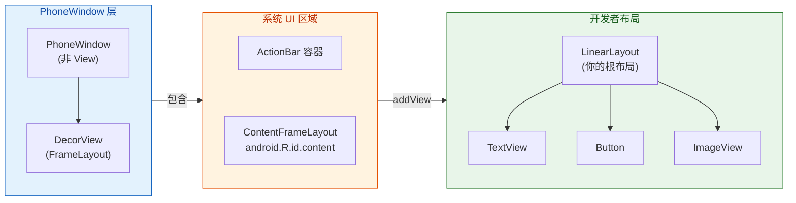

上图清晰展示了从 `PhoneWindow` 到开发者自定义布局之间的层级关系。蓝色区域代表窗口管理层，橙色区域代表系统自带的 UI 结构，绿色区域代表你通过 `setContentView()` 注入的布局。理解这个层级后，你就能明白为什么 `Activity.findViewById()` 和 `View.findViewById()` 的搜索范围不同——前者从 `DecorView` 开始搜索，后者仅搜索调用者自身的子树。

#### 实际开发中的常见问题

**为什么在 `onCreate()` 中获取 View 的宽高为 0？** 这是新手最常踩的坑之一。原因在于视图树的 Measure 和 Layout 过程发生在 `onResume()` 之后，由 `ViewRootImpl.performTraversals()` 触发。在 `onCreate()` 甚至 `onStart()` 时，视图树尚未完成第一次遍历，自然拿不到尺寸。正确的做法包括：

- 使用 `View.post(Runnable)`：将获取宽高的代码投递到消息队列尾部，确保在 layout 完成后执行。
- 使用 `ViewTreeObserver.OnGlobalLayoutListener`：监听全局 layout 事件，回调时视图已完成布局。
- 使用 `View.doOnLayout { }` (Kotlin KTX 扩展)：本质是对上述监听器的语法糖封装。

---

### 组合模式（Composite Pattern）

视图树之所以能够如此灵活地嵌套和递归，背后依靠的设计模式就是经典 GoF 模式中的 **组合模式（Composite Pattern）**。这个模式在 Android View 体系中的应用堪称教科书级别。

#### 模式定义与核心思想

组合模式的核心意图是：**将对象组合成树形结构以表示"整体-部分"的层次结构。组合模式使得客户端对单个对象和组合对象的使用具有一致性。**

翻译到 Android 的世界里：

- **Component（抽象组件）**= `View`：定义了所有视图共有的接口，如 `draw()`、`measure()`、`layout()`、`onTouchEvent()` 等。
- **Leaf（叶子）**= `TextView`、`ImageView` 等不含子节点的控件。
- **Composite（容器）**= `ViewGroup`（以及 `LinearLayout`、`FrameLayout` 等）：除了拥有 `View` 的全部能力外，还额外维护了一个 **子视图列表**（`View[] mChildren`），并提供 `addView()`、`removeView()`、`getChildAt()`、`getChildCount()` 等管理子节点的方法。

#### 一致性接口的意义

组合模式带来的最大好处是 **统一的操作接口**。当系统需要对整棵视图树执行测量、布局或绘制时，不需要区分当前节点是叶子还是容器——直接调用 `measure()`、`layout()`、`draw()` 即可。如果当前节点是 `ViewGroup`，它在自身方法内部会自动遍历子节点并递归调用。如果是叶子 `View`，则直接处理自身逻辑。整个过程对调用者完全透明。

这种透明性在 **事件分发** 中体现得更为明显。`ViewGroup.dispatchTouchEvent()` 会先判断是否拦截（`onInterceptTouchEvent()`），若不拦截则遍历子视图并调用每个子视图的 `dispatchTouchEvent()`。子视图如果还是 `ViewGroup`，同样的递归逻辑继续下去。最终，触摸事件沿着视图树自顶向下传递，消费结果自底向上回溯——这正是组合模式在事件处理中的完美实践。

#### 从源码角度看 ViewGroup 的子视图管理

`ViewGroup` 内部使用一个 `View[]` 数组（字段名为 `mChildren`）来存储子视图，同时用 `mChildrenCount` 记录当前子视图数量。当你调用 `addView(View child)` 时，核心流程如下：

```java
// ViewGroup.addView() 的简化流程（便于理解，非完整源码）
public void addView(View child, int index, LayoutParams params) {
    // 1. 参数校验：child 不能为 null，不能已有 parent
    if (child.getParent() != null) {
        throw new IllegalStateException("child already has a parent");
    }

    // 2. 校验并修正 LayoutParams（后文会详细讲解）
    if (!checkLayoutParams(params)) {
        params = generateLayoutParams(params); // 生成当前 ViewGroup 兼容的 LayoutParams
    }

    // 3. 将 child 存入 mChildren 数组
    addViewInner(child, index, params, false);

    // 4. 设置 child 的 parent 引用为当前 ViewGroup
    child.assignParent(this);

    // 5. 请求重新布局（触发新一轮 measure → layout → draw）
    requestLayout();

    // 6. 触发视图失效，确保重绘
    invalidate(true);
}
```

注意第 1 步的校验：**一个 `View` 只能有一个 parent**。如果你尝试把一个已经被添加到某个 `ViewGroup` 的子视图再添加到另一个容器中，会直接抛出 `IllegalStateException`。这是视图树"树形结构"的约束——树中每个节点有且仅有一个父节点（根节点除外）。如果确实需要复用某个 View，必须先从旧 parent 中 `removeView()`。

#### 自定义 ViewGroup 中的应用

理解组合模式后，自定义 `ViewGroup` 就有了清晰的脉络。你需要做的就是在以下两个回调中编写逻辑：

- **`onMeasure(int widthMeasureSpec, int heightMeasureSpec)`**：遍历所有子视图，调用 `child.measure()` 让每个子视图先确定自身大小，然后根据你的布局算法汇总出当前 `ViewGroup` 自己的尺寸，最终调用 `setMeasuredDimension()` 保存结果。
- **`onLayout(boolean changed, int l, int t, int r, int b)`**：遍历所有子视图，根据你的算法计算每个子视图应该放在哪个位置，调用 `child.layout(left, top, right, bottom)` 逐一安排。

这两个回调就是组合模式中 Composite 角色的核心职责体现：**管理子节点，并将整体操作分解为对子节点的递归操作**。

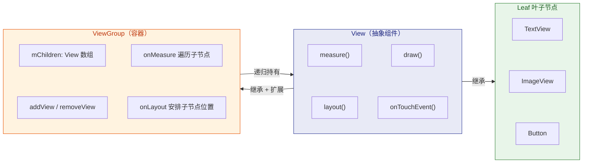

上图展示了组合模式在 Android 视图体系中的映射。注意 `Composite` 指向 `Component` 的"递归持有"关系——`ViewGroup` 持有的子节点类型是 `View`，而 `ViewGroup` 本身也是 `View`，所以子节点可以是另一个 `ViewGroup`，从而形成无限嵌套。

---

### LayoutParams 布局参数

如果说视图树定义了 **"有哪些东西"**，组合模式定义了 **"如何组织这些东西"**，那么 `LayoutParams` 就定义了 **"每个东西想以什么方式被其父容器安排"**。`LayoutParams` 是连接子视图与父容器之间的 **布局契约（Layout Contract）**，理解它的运作机制对于编写正确的布局代码至关重要。

#### LayoutParams 的本质

`ViewGroup.LayoutParams` 是一个嵌套在 `ViewGroup` 内部的静态类。它最基础的版本只有两个字段：

```java
// ViewGroup.LayoutParams 基类（简化）
public static class LayoutParams {
    public int width;   // 期望宽度：MATCH_PARENT(-1) / WRAP_CONTENT(-2) / 具体 dp 值
    public int height;  // 期望高度：同上

    // 常量定义
    public static final int MATCH_PARENT = -1;  // 填满父容器
    public static final int WRAP_CONTENT = -2;  // 包裹自身内容
}
```

`width` 和 `height` 并不是最终的像素尺寸，而是子视图向父容器表达的 **"期望"**。`MATCH_PARENT` 表示"我希望和父容器一样大"，`WRAP_CONTENT` 表示"我只需要刚好容纳我的内容"，具体数值则表示"我想要精确的这么多像素"。最终的实际尺寸，取决于父容器在 `onMeasure()` 阶段如何解读并满足（或部分满足）这些期望。

#### 继承体系——"谁的孩子用谁的 LayoutParams"

这是理解 `LayoutParams` 的关键认知：**一个子 View 的 LayoutParams 类型，由其父 ViewGroup 决定，而非由子 View 自身决定。**

不同的 `ViewGroup` 子类会定义自己的 `LayoutParams` 子类，以扩展额外的布局属性：

| 父容器类型 | LayoutParams 子类 | 扩展的属性 |
|---|---|---|
| `ViewGroup` | `ViewGroup.LayoutParams` | `width`, `height`（基类） |
| `ViewGroup` | `ViewGroup.MarginLayoutParams` | `leftMargin`, `topMargin`, `rightMargin`, `bottomMargin` |
| `LinearLayout` | `LinearLayout.LayoutParams` | `weight`（权重）, `gravity` |
| `FrameLayout` | `FrameLayout.LayoutParams` | `gravity` |
| `RelativeLayout` | `RelativeLayout.LayoutParams` | `addRule()` 系列规则（`ABOVE`, `BELOW`, `ALIGN_PARENT_START` 等） |
| `ConstraintLayout` | `ConstraintLayout.LayoutParams` | 约束锚点、链式属性、比例等 |

举一个具体例子来强化这个概念：当你在 XML 中这样写：

```xml
<!-- 父容器是 LinearLayout -->
<LinearLayout
    android:layout_width="match_parent"
    android:layout_height="match_parent"
    android:orientation="vertical">

    <!-- 子 View 使用了 layout_weight，这是 LinearLayout.LayoutParams 的属性 -->
    <TextView
        android:layout_width="match_parent"
        android:layout_height="0dp"
        android:layout_weight="1"
        android:text="占据剩余空间" />

</LinearLayout>
```

`layout_weight` 属性能够生效，是因为 `LinearLayout` 的 `generateLayoutParams()` 方法会创建 `LinearLayout.LayoutParams` 实例来解析这个属性。如果你把这个 `TextView` 原封不动地移到 `FrameLayout` 中，`layout_weight` 就会被忽略——因为 `FrameLayout.LayoutParams` 中根本没有 `weight` 字段。XML 解析时虽然不会报错，但该属性会被 `FrameLayout` 的 LayoutParams 直接跳过。

#### LayoutParams 的创建流程

LayoutParams 对象有两种主要创建途径：

**途径一：XML Inflate（最常见）**

当 `LayoutInflater` 解析 XML 时，对于每个子视图节点，它会调用父 ViewGroup 的 `generateLayoutParams(AttributeSet attrs)` 方法，将 XML 中以 `layout_` 开头的属性读取出来，创建对应的 `LayoutParams` 对象，并通过 `child.setLayoutParams(params)` 绑定到子 View 上。

这就是为什么所有布局属性都以 `layout_` 前缀命名（如 `layout_width`、`layout_height`、`layout_margin`、`layout_weight`）——这个前缀是一种命名约定，标识 **"这个属性属于 LayoutParams，由父容器解读"**，而非 View 自身的属性（如 `padding`、`background`、`text` 等没有 `layout_` 前缀的属性）。

**途径二：代码动态创建**

在代码中动态添加子视图时，你需要手动创建 `LayoutParams`：

```kotlin
// 动态创建并添加一个 TextView 到 LinearLayout
val textView = TextView(context).apply {
    text = "动态添加的文本"          // View 自身属性
    setPadding(16, 8, 16, 8)       // View 自身属性（内边距）
}

// 创建的是 LinearLayout.LayoutParams —— 因为父容器是 LinearLayout
val params = LinearLayout.LayoutParams(
    LinearLayout.LayoutParams.MATCH_PARENT,   // width = 填满父容器
    LinearLayout.LayoutParams.WRAP_CONTENT    // height = 包裹内容
).apply {
    weight = 1f                    // LinearLayout 特有的权重属性
    topMargin = 16                 // MarginLayoutParams 的外边距（单位：px）
    bottomMargin = 16
}

// 将 LayoutParams 绑定给 TextView，然后添加到父容器
linearLayout.addView(textView, params)
```

**关键提醒**：代码中设定 margin 的单位是 **像素（px）**，而非 dp。如果你需要以 dp 为单位设置，必须手动转换：

```kotlin
// dp 转 px 的工具扩展函数
fun Int.dpToPx(context: Context): Int {
    // displayMetrics.density 即为当前设备的像素密度倍数（如 xxhdpi = 3.0）
    return (this * context.resources.displayMetrics.density + 0.5f).toInt()
}

// 使用示例
params.topMargin = 16.dpToPx(context) // 将 16dp 转为实际像素值
```

#### LayoutParams 与 MeasureSpec 的关系

`LayoutParams` 表达的是子视图的 **期望**，而最终的测量结果需要经过父容器的 **约束转换**。这个转换过程就是 `MeasureSpec` 的核心职责。

`MeasureSpec` 是一个 32 位整型值，高 2 位表示 **模式（Mode）**，低 30 位表示 **尺寸值（Size）**。三种模式如下：

| 模式 | 含义 | 常见触发条件 |
|---|---|---|
| `EXACTLY` | 父容器已确定精确尺寸，子视图必须使用该值 | 子视图设置了具体 dp 值，或设置了 `MATCH_PARENT` 且父容器尺寸已确定 |
| `AT_MOST` | 父容器给出一个上限，子视图尺寸不能超过该值 | 子视图设置了 `WRAP_CONTENT` |
| `UNSPECIFIED` | 父容器对子视图没有限制，子视图可以任意大 | `ScrollView` 等可滚动容器对子视图的测量 |

父容器在 `onMeasure()` 中，会根据 **自身的 MeasureSpec** 和 **子视图的 LayoutParams** 共同计算出子视图的 MeasureSpec，然后传递给子视图的 `measure()` 方法。这个逻辑封装在 `ViewGroup.getChildMeasureSpec()` 静态方法中：

```java
// ViewGroup.getChildMeasureSpec() 的简化逻辑
// parentSpec: 父容器的 MeasureSpec
// padding:    父容器已用掉的空间（padding + 已分配给其他子视图的空间）
// childDimension: 子视图 LayoutParams 中的 width 或 height 值
public static int getChildMeasureSpec(int parentSpec, int padding, int childDimension) {
    int parentMode = MeasureSpec.getMode(parentSpec);   // 父容器的测量模式
    int parentSize = MeasureSpec.getSize(parentSpec);   // 父容器的可用尺寸
    int available = Math.max(0, parentSize - padding);  // 子视图实际可用的空间

    int resultSize = 0;    // 最终传给子视图的尺寸值
    int resultMode = 0;    // 最终传给子视图的模式

    if (childDimension >= 0) {
        // 情况1：子视图指定了具体尺寸（如 100dp）
        // 无论父容器什么模式，子视图都得到 EXACTLY + 指定值
        resultSize = childDimension;
        resultMode = MeasureSpec.EXACTLY;
    } else if (childDimension == MATCH_PARENT) {
        // 情况2：子视图想填满父容器
        // 尺寸 = 父容器可用空间，模式跟随父容器
        resultSize = available;
        resultMode = parentMode; // 父 EXACTLY → 子 EXACTLY；父 AT_MOST → 子 AT_MOST
    } else if (childDimension == WRAP_CONTENT) {
        // 情况3：子视图想包裹内容
        // 尺寸上限 = 父容器可用空间，模式 = AT_MOST（不能超过这个上限）
        resultSize = available;
        resultMode = MeasureSpec.AT_MOST;
    }

    return MeasureSpec.makeMeasureSpec(resultSize, resultMode); // 合并为 32 位整型
}
```

这段逻辑是整个 Android 测量体系的基石，理解它之后，你就能回答诸如"为什么 `ScrollView` 里的 `ListView` 只显示一行"之类的经典问题——因为 `ScrollView` 传递 `UNSPECIFIED` 模式给子视图，而 `ListView` 在 `UNSPECIFIED` 模式下默认只测量一个 item 的高度。

#### Margin 与 Padding 的本质区别

最后值得强调一个初学者经常混淆的概念：

- **Padding（内边距）**：属于 `View` 自身的属性，存储在 `View` 对象内部。它影响的是 **内容区域与 View 边界之间的间距**。在 `onDraw()` 中绘制内容时，你需要手动考虑 padding 值。
- **Margin（外边距）**：属于 `LayoutParams` 的属性（具体是 `MarginLayoutParams`），由 **父容器** 在布局阶段读取并使用。它影响的是 **View 边界与相邻兄弟视图或父容器内壁之间的间距**。

```text
┌─────────── 父容器 ViewGroup ───────────┐
│           ↑ margin-top                  │
│    ┌──────┴───────────────────┐         │
│    │      ↑ padding-top       │         │
│    │  ┌───┴──────────────┐    │         │
│    │  │                  │    │         │
│←m→ │←p→│   内容区域     │←p→│ ←m→     │
│    │  │                  │    │         │
│    │  └───┬──────────────┘    │         │
│    │      ↓ padding-bottom    │         │
│    └──────┬───────────────────┘         │
│           ↓ margin-bottom               │
└─────────────────────────────────────────┘

m = margin (属于 LayoutParams，父容器负责处理)
p = padding (属于 View 自身，影响内容绘制区域)
```

用一句话总结：**Padding 是 View 对自己说"我内容要远离边界"，Margin 是子 View 对父容器说"请不要让其他人靠我太近"**。

---

### 小结

本节的三个知识点是一个层层递进的逻辑链：

1. **视图树** 告诉你 Android UI 在内存中的数据结构形态——一棵以 `DecorView` 为根的 N 叉树。
2. **组合模式** 解释了这棵树为何能够无限嵌套——`View` 与 `ViewGroup` 遵循同一接口，`ViewGroup` 递归持有 `View` 类型的子节点。
3. **LayoutParams** 揭示了子视图如何与父容器协商布局参数——它是连接子视图期望与父容器约束的桥梁，最终通过 `MeasureSpec` 完成测量转换。

掌握了这三者，你就获得了解读任何 Android 布局行为的底层思维工具。无论是排查布局显示异常、优化层级性能，还是自定义 `ViewGroup`，这些原理都是你最可靠的指南针。

---

**📝 练习题**

在 Android 视图体系中，某开发者在代码中创建了一个 `TextView`，并尝试执行以下代码：

```kotlin
val textView = TextView(context)
containerA.addView(textView) // containerA 是一个 LinearLayout
containerB.addView(textView) // containerB 是一个 FrameLayout
```

请问运行到第二行时会发生什么？

A. `textView` 会同时出现在 `containerA` 和 `containerB` 中


B. `textView` 会从 `containerA` 自动移除，然后添加到 `containerB`


C. 抛出 `IllegalStateException`，提示该 View 已有 parent


D. 编译错误，`addView()` 不接受已被添加的 View


**【答案】** C

**【解析】** Android 的视图树是严格的 **树形结构**，每个 `View` 只能有一个 parent（父节点）。当执行 `containerA.addView(textView)` 后，`textView` 的 `mParent` 字段已被设置为 `containerA`。此时再执行 `containerB.addView(textView)`，`addView()` 内部会检查 `child.getParent() != null`，发现该 View 已有父节点，直接抛出 `IllegalStateException: The specified child already has a parent. You must call removeView() on the child's parent first.`。这一行为保证了视图层级是合法的树结构，不会出现一个节点有两个父节点的"图"结构。如果确实需要将 View 移到另一个容器，必须先调用 `containerA.removeView(textView)`，再调用 `containerB.addView(textView)`。

---

## 文本控件

文本控件是 Android 应用层中使用频率最高的一类基础 UI 组件。无论是展示一段简单的标题文字，还是接收用户输入的搜索关键词，其背后都离不开 `TextView` 与 `EditText` 这对"父子"组件。理解它们的属性体系、富文本机制以及输入过滤能力，是构建高质量表单与信息展示界面的基石。

从类继承关系来看，`EditText` 是 `TextView` 的直接子类，而 `TextView` 本身继承自 `View`。这意味着 `TextView` 上几乎所有可用的属性和方法，`EditText` 都天然继承。两者的核心区别在于：`TextView` 默认不可编辑（`focusable=false`），而 `EditText` 默认开启了可编辑、可聚焦的光标交互模式。Android Framework 在 `TextView` 内部通过一个叫做 `Editor` 的辅助对象来管理光标绘制、文本选择、拼写检查等编辑态逻辑——只有当 `TextView` 处于可编辑模式时，这个 `Editor` 对象才会被创建。因此，从底层机制来看，`EditText` 并没有引入大量新代码，它更像是对 `TextView` 编辑能力的一个"预配置快捷方式"。

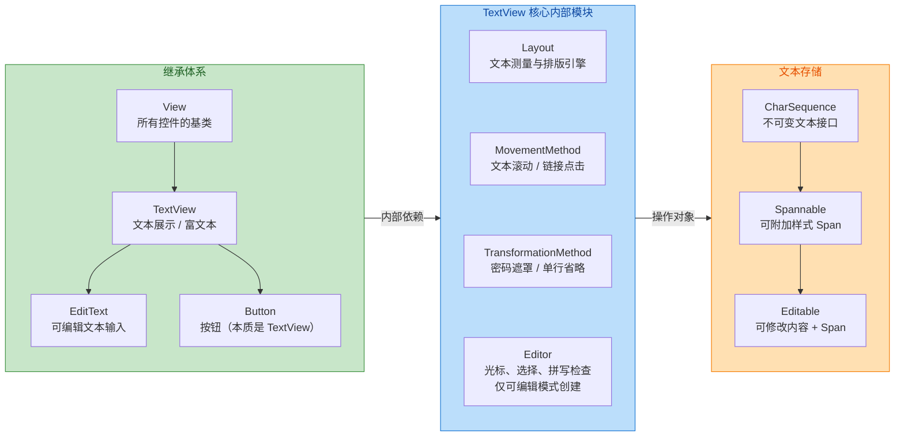

上图清晰地展示了三个维度：左侧是应用层直接使用的类继承关系——`Button` 也是 `TextView` 的子类，这意味着按钮上的文字同样享有 `TextView` 全部的文本排版能力；中间是 `TextView` 内部的四大功能模块；右侧是文本数据的存储层级，从只读的 `CharSequence` 到可编辑的 `Editable`，逐级增强。

---

### TextView 属性

`TextView` 的 XML 属性和对应的 Java/Kotlin API 数量超过百个，但日常开发中高频使用的属性可以归纳为以下几大类别：**文本内容与外观、尺寸与行为控制、行与对齐、阴影与装饰、以及自动功能**。逐一深入理解这些属性的实际效果与底层原理，能帮助开发者在复杂 UI 场景中做出更精准的选择。

#### 文本内容与基础外观

`android:text` 是最基本的属性，它接受一个字符串资源引用（推荐）或硬编码字符串。在 Framework 内部，调用 `setText(CharSequence text)` 时，`TextView` 会判断传入的文本类型：如果是普通 `String`，内部会直接保存引用，测量和绘制都使用轻量路径；如果是 `Spannable` 类型，则会走富文本路径，需要逐段解析 Span 并在绘制时分别应用样式。

`android:textColor` 设置文字颜色，它的值实际上是一个 `ColorStateList`，这意味着你可以为不同状态（normal、pressed、disabled）指定不同颜色，而不只是一个固定色值。当你写 `android:textColor="#333333"` 时，系统会将其包装为一个只有 default state 的 `ColorStateList`。

`android:textSize` 控制字号，默认单位是 `sp`（Scale-independent Pixels）。`sp` 与 `dp` 的区别在于 `sp` 额外叠加了用户在系统设置中调整的 **字体缩放因子**（Font Scale）。Framework 中的计算公式为：`实际像素 = sp值 × density × fontScale`。这就是为什么无障碍友好的应用应当使用 `sp` 而非 `dp` 来定义文字大小——当用户在"设置 → 显示 → 字体大小"中调大字体时，使用 `sp` 的文字会随之变大，而 `dp` 定义的文字大小则不会响应。

`android:textStyle` 接受 `normal`、`bold`、`italic` 或 `bold|italic` 的组合。需要注意的是，这个属性是通过 `Typeface` 的 **伪粗体/伪斜体** 算法实现的——如果当前字体文件本身不包含 Bold 变体，系统会通过算法让笔画加粗，视觉效果不如真正的 Bold 字体文件精致。因此，在对排版品质要求较高的场景中，推荐使用 `android:fontFamily` 搭配具体的字重字体文件（如 Roboto-Medium.ttf）。

`android:fontFamily` 是 Android 4.1+ 引入的属性，支持系统内置字体名（如 `sans-serif`、`serif`、`monospace`）以及通过 `@font/` 资源引用的自定义字体。自 Support Library 26 起，Android 还支持 **Downloadable Fonts**，允许应用在运行时从 Google Fonts Provider 按需下载字体，避免将大体积字体文件打包到 APK 中。

```kotlin
// === TextView 基础外观属性演示 ===

// 获取布局中的 TextView 引用
val tvTitle = findViewById<TextView>(R.id.tv_title)

// 设置文本内容，传入 String 时走轻量路径
tvTitle.text = "Hello, Android"

// 设置字体大小为 18sp，注意第二个参数指定单位为 SP
// 这样即使用户调整系统字体缩放，文字大小也会自适应
tvTitle.setTextSize(TypedValue.COMPLEX_UNIT_SP, 18f)

// 设置文字颜色 —— 直接传入颜色整型值
// 内部会将此值包装为只有 default state 的 ColorStateList
tvTitle.setTextColor(Color.parseColor("#212121"))

// 设置字体：使用 ResourcesCompat 加载 res/font 目录下的自定义字体
// 这种方式兼容 API 14+，且支持矢量字体子集化
val customTypeface = ResourcesCompat.getFont(this, R.font.roboto_medium)
tvTitle.typeface = customTypeface

// 设置粗体样式 —— 如果 customTypeface 本身没有 bold 变体
// 系统会使用算法伪粗体（通过 Paint.setFakeBoldText）
tvTitle.setTypeface(customTypeface, Typeface.BOLD)
```

#### 行控制与对齐

`android:maxLines` 和 `android:minLines` 分别限制 `TextView` 显示文本的最大行数和最小行数。当文本内容超过 `maxLines` 时，超出部分会被截断。配合 `android:ellipsize` 可以控制截断时的省略号位置：`start`（省略号在开头）、`middle`（省略号在中间）、`end`（省略号在末尾）、`marquee`（跑马灯滚动效果）。

需要特别理解的一个底层机制是：`android:singleLine="true"` 虽然常见，但其实 **已被官方标记为 deprecated**。它之所以仍被广泛使用，是因为 `marquee` 跑马灯效果在某些系统版本上需要 `singleLine` 才能正确启用。官方推荐的替代方式是同时设置 `android:maxLines="1"` 和 `android:ellipsize="end"`。

`android:lineSpacingExtra` 和 `android:lineSpacingMultiplier` 用于调整行间距。前者是 **绝对增量**（单位为 dp/sp），后者是 **倍率因子**（默认 1.0）。最终行高的计算公式为：`实际行高 = 默认行高 × multiplier + extra`。在设计稿还原中，如果设计师标注的行高为 24dp、字号为 16sp，那么 `lineSpacingExtra` 应设为 `24 - 默认行高`。不过更精确的做法是在 API 28+ 使用 `android:lineHeight` 直接指定行高像素值，Framework 会自动反算出 `extra` 和 `multiplier`。

`android:gravity` 控制 **文本在 TextView 内部** 的对齐方式（如 `center`、`start`、`end`、`center_vertical`），而 `android:layout_gravity` 控制的是 **TextView 自身在父容器中** 的位置——这两个属性初学者极易混淆。一个简单的记忆方法是：没有 `layout_` 前缀的管"内部内容"，有 `layout_` 前缀的管"自己在外面的位置"。

```xml
<!-- 多行文本截断 + 行间距调整示例 -->
<TextView
    android:id="@+id/tv_content"
    android:layout_width="match_parent"
    android:layout_height="wrap_content"

    android:text="@string/long_article_content"

    android:maxLines="3"
    android:ellipsize="end"

    android:lineSpacingMultiplier="1.2"
    android:lineSpacingExtra="2dp"

    android:gravity="start"

    android:textSize="14sp"
    android:textColor="#616161" />
```

#### 阴影、装饰与自动功能

`android:shadowColor`、`android:shadowDx`、`android:shadowDy`、`android:shadowRadius` 这四个属性组合可以给文字添加阴影效果。底层实现是 `Paint.setShadowLayer()`，这个阴影是绘制在文字 Glyph 下方的一层模糊位图。注意，文字阴影 **不会** 影响 `TextView` 的测量尺寸——阴影可能会被裁剪如果没有足够的 padding。

`android:autoLink` 是一个非常实用的属性，它可以自动识别文本中的 URL（`web`）、电话号码（`phone`）、邮箱地址（`email`）和地图地址（`map`），将其转换为可点击的超链接。其内部实现依赖 `Linkify` 工具类，通过正则表达式匹配文本并自动注入 `URLSpan`。使用时需要注意：`autoLink` 会将 `TextView` 的 `MovementMethod` 替换为 `LinkMovementMethod`，这可能影响文本的滚动行为和点击事件的传递。

`android:drawableStart`（以及 `drawableTop`、`drawableEnd`、`drawableBottom`）允许在文本的四个方向放置一个 Drawable 图标，配合 `android:drawablePadding` 控制图标与文字之间的间距。这种方式称为 **Compound Drawable**，在只需要"图标+文字"的简单场景中，可以避免使用 `LinearLayout + ImageView + TextView` 的嵌套组合，从而 **减少视图层级、提升渲染性能**。

```kotlin
// === Compound Drawable 代码设置示例 ===

val tvLocation = findViewById<TextView>(R.id.tv_location)

// 从资源加载一个矢量图标 Drawable
val iconDrawable = ContextCompat.getDrawable(this, R.drawable.ic_location_pin)

// 设置 Drawable 的固有尺寸边界（intrinsic bounds）
// 如果不调用 setBounds，Compound Drawable 将不会显示
// 这里使用 Drawable 自身的固有宽高（矢量图的 android:width / android:height）
iconDrawable?.setBounds(0, 0,
    iconDrawable.intrinsicWidth,   // 右边界 = 固有宽度
    iconDrawable.intrinsicHeight   // 下边界 = 固有高度
)

// 将 Drawable 设置到文字的左侧（Start 方向）
// 四个参数分别对应：start, top, end, bottom 位置的 Drawable
tvLocation.setCompoundDrawablesRelative(
    iconDrawable,  // start（左侧 / RTL 时为右侧）
    null,          // top
    null,          // end
    null           // bottom
)

// 设置图标与文字之间的间距，单位为 px，建议将 dp 转换后传入
tvLocation.compoundDrawablePadding = (8 * resources.displayMetrics.density).toInt()
```

---

### SpannableString 富文本

在 Android 文本系统中，**Span 机制** 是实现"同一段文字中不同片段拥有不同样式或行为"的核心架构。当你需要让一段文字中的某几个字变红、某个词加粗可点击、或者在文字中间内嵌一张小图片时，都需要依赖 Span。

#### 文本存储层级与 Span 容器

理解 Span 机制的第一步，是弄清楚 Android 文本的三个核心接口层级：

- **`CharSequence`**：最基础的文本接口，只提供字符序列的读取能力。`String` 就是它的最常见实现。
- **`Spanned`**：继承自 `CharSequence`，额外提供了 **只读的 Span 查询能力**——你可以读取已经附加在文本上的样式 Span，但不能添加或移除。
- **`Spannable`**：继承自 `Spanned`，进一步开放了 **Span 的增删能力**——可以调用 `setSpan()` 和 `removeSpan()`。
- **`Editable`**：继承自 `Spannable`，在此基础上还允许 **修改文本内容本身**（插入、删除、替换字符）。`EditText` 内部使用的文本对象就是 `Editable` 的实现类 `SpannableStringBuilder`。

与这些接口对应的实现类有两个关键角色：

| 类名 | 接口 | 文本可变 | Span 可变 | 适用场景 |
|---|---|---|---|---|
| `SpannableString` | `Spannable` | ❌ | ✅ | 文本固定，只需添加样式 |
| `SpannableStringBuilder` | `Editable` | ✅ | ✅ | 需要动态拼接文本 + 样式 |

当你调用 `textView.setText(spannableString)` 时，`TextView` 内部会检查传入对象的类型。如果是 `Spannable`，它会默认以 `BufferType.SPANNABLE` 模式存储，这样后续仍可通过 `(textView.text as Spannable).setSpan(...)` 动态修改样式而无需重新 `setText`。但如果传入的是普通 `String`，`TextView` 默认使用 `BufferType.NORMAL`，内部仅保存不可变引用，性能更高但无法追加 Span。

#### Span 的分类体系

Android 内置了数十种 Span 实现类，可以按 **影响维度** 分为两大类：

**1. 字符级 Span（Character-level Spans）** —— 继承自 `CharacterStyle`，影响单个字符的绘制外观：

- **`ForegroundColorSpan`**：改变文字前景色（字体颜色）。
- **`BackgroundColorSpan`**：改变文字背景色，类似荧光笔效果。
- **`StyleSpan`**：设置粗体（`Typeface.BOLD`）、斜体（`Typeface.ITALIC`）。
- **`RelativeSizeSpan`**：按倍率缩放字号，如 `RelativeSizeSpan(1.5f)` 将目标片段放大到 1.5 倍。
- **`AbsoluteSizeSpan`**：设置绝对字号（可指定 dp 或 px）。
- **`StrikethroughSpan`**：添加删除线。
- **`UnderlineSpan`**：添加下划线。
- **`TypefaceSpan`**：为片段指定不同的字体族。
- **`ImageSpan`**：用一张图片 **替换** 文字片段的显示，常用于聊天表情。
- **`ClickableSpan`**：让文字片段可点击，是实现"用户协议"、"@某人"等交互的基础。

**2. 段落级 Span（Paragraph-level Spans）** —— 实现 `LeadingMarginSpan`、`AlignmentSpan` 等接口，影响整行或整段的排版：

- **`AlignmentSpan.Standard`**：控制段落对齐方式（居左、居中、居右）。
- **`BulletSpan`**：在段落前绘制项目符号圆点。
- **`QuoteSpan`**：在段落左侧绘制引用竖线。
- **`LeadingMarginSpan.Standard`**：为段落添加首行/后续行缩进。

#### setSpan() 的 flag 参数

`setSpan(Object what, int start, int end, int flags)` 中的 `flags` 参数决定了当文本内容被编辑时，这个 Span 是否会 **自动扩展** 覆盖新插入的字符。这在 `EditText` 场景中尤为重要：

- **`SPAN_EXCLUSIVE_EXCLUSIVE`**：在 Span 的起点和终点处插入新字符时，新字符 **不会** 被此 Span 覆盖。适用于"已完成标记"的场景。
- **`SPAN_INCLUSIVE_EXCLUSIVE`**：在起点处插入的新字符 **会** 被覆盖，在终点处不会。
- **`SPAN_EXCLUSIVE_INCLUSIVE`**：在终点处插入的新字符会被覆盖，在起点处不会。适用于"用户正在继续输入同样样式的文字"的场景。
- **`SPAN_INCLUSIVE_INCLUSIVE`**：两端插入的新字符都会被覆盖。

"Inclusive"可以理解为"包容"，即 Span 的边界会主动吸纳紧邻新增的字符；"Exclusive"即"排斥"，边界不会扩展。对于纯展示的 `TextView`（不可编辑），flag 的选择不影响显示效果，惯例使用 `SPAN_EXCLUSIVE_EXCLUSIVE`。

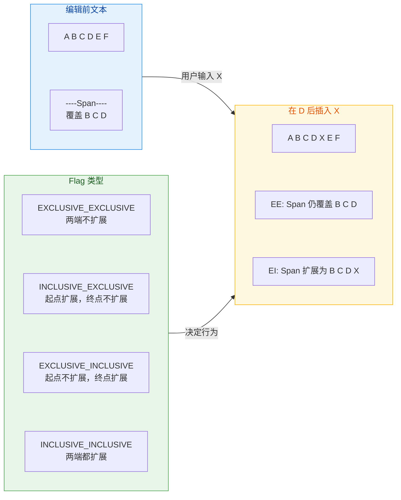

#### 实战：构建多样式富文本

下面通过一个完整的示例展示如何在同一段文字中混合应用多种 Span——模拟一个"用户协议"提示文本，其中"服务条款"和"隐私政策"需要高亮可点击：

```kotlin
// === SpannableString 富文本综合示例 ===

// 定义完整的提示文本
val fullText = "注册即表示同意《服务条款》和《隐私政策》"

// 创建 SpannableString，文本内容不可变，但可以附加 Span
val spannable = SpannableString(fullText)

// --- 1. 为"《服务条款》"添加前景色 Span（蓝色高亮） ---

// 计算目标子串的起止索引
val termsStart = fullText.indexOf("《服务条款》")  // 起始索引
val termsEnd = termsStart + "《服务条款》".length   // 结束索引（exclusive）

// 设置蓝色前景色
spannable.setSpan(
    ForegroundColorSpan(Color.parseColor("#1976D2")), // 蓝色
    termsStart,                                        // 起始位置
    termsEnd,                                          // 结束位置（不包含）
    Spanned.SPAN_EXCLUSIVE_EXCLUSIVE                   // 纯展示，两端不扩展
)

// --- 2. 为"《服务条款》"添加可点击 Span ---
spannable.setSpan(
    object : ClickableSpan() {
        // 重写 onClick 方法，处理点击事件
        override fun onClick(widget: View) {
            // 跳转到服务条款页面
            val intent = Intent(widget.context, TermsActivity::class.java)
            widget.context.startActivity(intent)
        }

        // 重写 updateDrawState 以自定义点击文字的外观
        override fun updateDrawState(ds: TextPaint) {
            super.updateDrawState(ds)
            ds.isUnderlineText = false  // 移除默认下划线
            ds.color = Color.parseColor("#1976D2") // 保持蓝色
        }
    },
    termsStart,
    termsEnd,
    Spanned.SPAN_EXCLUSIVE_EXCLUSIVE
)

// --- 3. 对"《隐私政策》"执行类似操作 ---
val privacyStart = fullText.indexOf("《隐私政策》")
val privacyEnd = privacyStart + "《隐私政策》".length

// 前景色 Span
spannable.setSpan(
    ForegroundColorSpan(Color.parseColor("#1976D2")),
    privacyStart,
    privacyEnd,
    Spanned.SPAN_EXCLUSIVE_EXCLUSIVE
)

// 可点击 Span
spannable.setSpan(
    object : ClickableSpan() {
        override fun onClick(widget: View) {
            val intent = Intent(widget.context, PrivacyActivity::class.java)
            widget.context.startActivity(intent)
        }

        override fun updateDrawState(ds: TextPaint) {
            super.updateDrawState(ds)
            ds.isUnderlineText = false
            ds.color = Color.parseColor("#1976D2")
        }
    },
    privacyStart,
    privacyEnd,
    Spanned.SPAN_EXCLUSIVE_EXCLUSIVE
)

// --- 4. 将富文本设置到 TextView ---
val tvAgreement = findViewById<TextView>(R.id.tv_agreement)
tvAgreement.text = spannable

// 【关键】设置 MovementMethod，否则 ClickableSpan 无法响应点击
// LinkMovementMethod 会拦截触摸事件并检查点击位置是否命中 ClickableSpan
tvAgreement.movementMethod = LinkMovementMethod.getInstance()

// 【可选】移除点击时的默认高亮背景色
tvAgreement.highlightColor = Color.TRANSPARENT
```

这段代码中有一个非常关键的细节：**必须设置 `movementMethod = LinkMovementMethod.getInstance()`**，否则 `ClickableSpan` 将无法响应用户点击。原因在于 `TextView` 的触摸事件处理流程中，默认的 `MovementMethod` 为 `null`（不可编辑的 `TextView`），触摸事件不会被分发到 Span 层。`LinkMovementMethod` 会在 `onTouchEvent` 中检查手指触摸的坐标对应的 offset（字符偏移量），然后查找该 offset 处是否存在 `ClickableSpan`，如果有则调用其 `onClick()` 方法。

但 `LinkMovementMethod` 有一个副作用：它会使 `TextView` 变得可滚动（Scrollable），在 `ScrollView` 嵌套中可能引发滑动冲突。如果遇到此问题，可以考虑自定义一个简化版的 `MovementMethod`，只处理点击事件而不启用滚动。

#### SpannableStringBuilder 的链式拼接

相比 `SpannableString`（文本创建后不可修改），`SpannableStringBuilder` 支持动态拼接文本和样式，更适合需要条件拼接的复杂场景：

```kotlin
// === SpannableStringBuilder 链式拼接示例 ===

// 构建一段带有价格信息的商品文本：
// "原价 ¥199  现价 ¥99"
// 其中原价带删除线，现价红色加粗放大

val builder = SpannableStringBuilder()

// 拼接"原价 ¥199"并添加灰色 + 删除线
val originalPrice = "原价 ¥199  "
builder.append(originalPrice) // 先追加文本

// 对已追加的文本范围设置 Span
// 起始位置 = 0，结束位置 = originalPrice.length
builder.setSpan(
    ForegroundColorSpan(Color.GRAY),    // 灰色前景
    0,                                   // 起始
    originalPrice.length,                // 结束
    Spanned.SPAN_EXCLUSIVE_EXCLUSIVE
)
builder.setSpan(
    StrikethroughSpan(),                 // 删除线
    0,
    originalPrice.length,
    Spanned.SPAN_EXCLUSIVE_EXCLUSIVE
)

// 记录当前长度作为下一段 Span 的起始位置
val currentPriceStart = builder.length

// 拼接"现价 ¥99"
val currentPrice = "现价 ¥99"
builder.append(currentPrice)

// 为现价设置红色 + 粗体 + 1.5 倍字号
builder.setSpan(
    ForegroundColorSpan(Color.RED),       // 红色
    currentPriceStart,
    builder.length,
    Spanned.SPAN_EXCLUSIVE_EXCLUSIVE
)
builder.setSpan(
    StyleSpan(Typeface.BOLD),             // 粗体
    currentPriceStart,
    builder.length,
    Spanned.SPAN_EXCLUSIVE_EXCLUSIVE
)
builder.setSpan(
    RelativeSizeSpan(1.5f),               // 字号放大 1.5 倍
    currentPriceStart,
    builder.length,
    Spanned.SPAN_EXCLUSIVE_EXCLUSIVE
)

// 设置到 TextView
findViewById<TextView>(R.id.tv_price).text = builder
```

#### 性能注意事项

Span 机制虽然强大，但在 `RecyclerView` 等高频复用场景中需要注意性能：

- **避免在 `onBindViewHolder` 中重复创建 `SpannableString`**：如果文本内容不变，应将 Span 结果缓存到数据模型中。每次 `setText(Spannable)` 都会触发 `TextView` 的 `requestLayout()` 和重新测量，开销不小。
- **`ImageSpan` 中的 Drawable 需要设置 bounds**：如果忘记调用 `drawable.setBounds()`，图片将不会显示。且 `ImageSpan` 引用的 Drawable 如果是 Bitmap，要注意内存大小。
- **Span 对象会被 `TextView` 持有引用**：如果 Span 中持有 Activity 引用（如匿名内部类的 `ClickableSpan`），可能造成内存泄漏。建议使用弱引用或确保在 Activity 销毁时清理。

---

### EditText 输入类型

`EditText` 作为 `TextView` 的子类，其核心差异化能力在于 **可编辑文本输入**。而 `android:inputType` 属性是控制 `EditText` 行为的最重要属性——它不仅影响弹出的软键盘布局，还决定了输入内容的基本过滤规则和文本显示方式。

#### inputType 的底层机制

当 `EditText` 获取焦点、需要弹出软键盘时，系统的 **InputMethodManager (IMM)** 会通过 `EditorInfo` 对象将 `EditText` 的 `inputType` 值传递给当前活跃的输入法应用（IME，Input Method Editor）。IME 根据收到的 `inputType` 值来决定显示什么样的键盘布局。例如：收到 `TYPE_CLASS_NUMBER` 时，IME 会切换到数字键盘；收到 `TYPE_TEXT_VARIATION_EMAIL_ADDRESS` 时，IME 会在字母键盘上增加 `@` 和 `.` 的快捷键。

`inputType` 的值是一个 **位掩码**（bitmask），由 **类别（Class）** 和 **变体（Variation）** 以及 **标志（Flag）** 三部分组合而成：

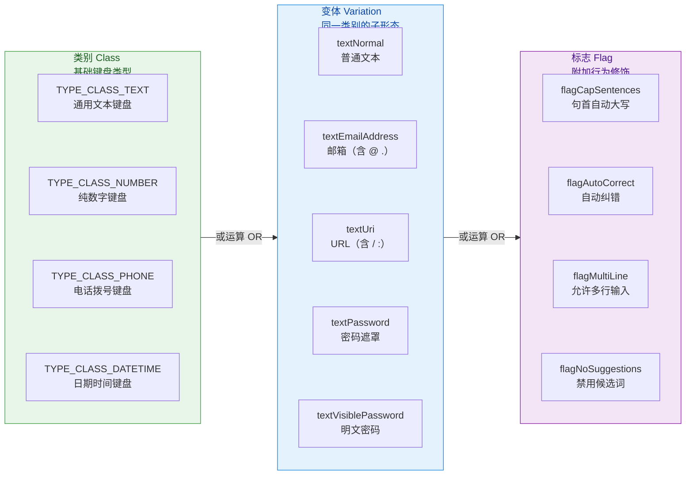

三个部分通过按位或（`|`）组合。例如，一个"支持多行、句首自动大写"的普通文本输入框：

```xml
<!-- inputType 位掩码组合示例 -->
<EditText
    android:layout_width="match_parent"
    android:layout_height="wrap_content"
    android:inputType="textCapSentences|textMultiLine|textAutoCorrect"
    android:hint="请输入评论内容..." />
```

#### 常用 inputType 组合速查

以下列出应用开发中最常见的输入场景及其推荐 `inputType` 配置：

**文本输入场景**：

| 场景 | XML 值 | 效果说明 |
|---|---|---|
| 普通文本 | `text` | 标准 QWERTY 键盘 |
| 多行文本 | `textMultiLine` | 键盘回车键变为换行，而非"完成" |
| 人名 | `textPersonName` | 部分 IME 会关闭自动纠错 |
| 邮箱地址 | `textEmailAddress` | 键盘显示 `@` 和 `.` 快捷键 |
| URL | `textUri` | 键盘显示 `/` 和 `.com` 快捷键 |
| 密码 | `textPassword` | 字符输入后自动变为圆点遮罩 |
| 可见密码 | `textVisiblePassword` | 明文显示，但禁用自动补全 |

**数字输入场景**：

| 场景 | XML 值 | 效果说明 |
|---|---|---|
| 整数 | `number` | 纯数字键盘 |
| 带符号整数 | `numberSigned` | 数字键盘 + 正负号 |
| 小数 | `numberDecimal` | 数字键盘 + 小数点 |
| 带符号小数 | `numberSigned\|numberDecimal` | 数字键盘 + 正负号 + 小数点 |
| 电话号码 | `phone` | 电话拨号键盘（含 `*#+-`） |

#### 密码输入的底层原理

当 `inputType` 包含 `textPassword` 时，`TextView` 内部会设置一个 `PasswordTransformationMethod` 作为其 `TransformationMethod`。这个类的职责是：**在绘制文本时，将每个字符替换为圆点符号（`•`）**，但它不会修改底层存储的文本内容——通过 `editText.text.toString()` 获取到的仍然是用户输入的明文。

`PasswordTransformationMethod` 还实现了一个"最后输入字符短暂可见"的效果：当用户输入新字符时，最后一个字符会以明文形式短暂显示约 1.5 秒，然后变为圆点。这个时间窗口由 `PasswordTransformationMethod` 内部的 `Handler` 消息控制。

实现"密码可见/隐藏"切换功能时，推荐使用 Material Components 的 `TextInputLayout` 配合 `TextInputEditText`，只需设置 `app:endIconMode="password_toggle"` 即可获得标准的眼睛图标切换交互。若手动实现，则需要在切换时保存并恢复光标位置：

```kotlin
// === 手动实现密码可见性切换 ===

val etPassword = findViewById<EditText>(R.id.et_password)
val btnToggle = findViewById<ImageButton>(R.id.btn_toggle_visibility)

// 记录当前是否为密码模式
var isPasswordHidden = true

btnToggle.setOnClickListener {
    // 保存当前光标位置
    val cursorPosition = etPassword.selectionEnd

    if (isPasswordHidden) {
        // 切换到明文模式：inputType 设为 textVisiblePassword
        // 注意：不能使用 text，因为 text 会启用自动补全，可能泄露密码候选词
        etPassword.inputType = InputType.TYPE_CLASS_TEXT or
                InputType.TYPE_TEXT_VARIATION_VISIBLE_PASSWORD
    } else {
        // 切换回密码遮罩模式
        etPassword.inputType = InputType.TYPE_CLASS_TEXT or
                InputType.TYPE_TEXT_VARIATION_PASSWORD
    }

    // 恢复光标到之前的位置
    // 因为 setInputType 会导致 TextView 重置 TransformationMethod
    // 进而触发 setText，光标会跳到末尾，所以需要手动恢复
    etPassword.setSelection(cursorPosition)

    isPasswordHidden = !isPasswordHidden
}
```

#### TextWatcher 文本变化监听

`EditText` 最重要的监听器之一是 `TextWatcher`，它提供了三个回调方法，分别对应文本修改的三个阶段：

```kotlin
// === TextWatcher 三阶段回调详解 ===

val etInput = findViewById<EditText>(R.id.et_input)

etInput.addTextChangedListener(object : TextWatcher {

    // 阶段一：文本即将改变（改变发生之前调用）
    // s: 改变前的完整文本
    // start: 即将被替换的区域起始位置
    // count: 即将被替换的字符数量（删除时 > 0）
    // after: 替换后新文本的字符数量（输入时 > 0）
    override fun beforeTextChanged(
        s: CharSequence?,
        start: Int,
        count: Int,
        after: Int
    ) {
        // 适合在此保存"改变前的状态"用于对比或撤销
    }

    // 阶段二：文本正在改变（改变已发生，但 View 尚未重新测量和绘制）
    // s: 改变后的完整文本
    // start: 新插入文本的起始位置
    // before: 被替换掉的旧文本字符数
    // count: 新插入的字符数量
    override fun onTextChanged(
        s: CharSequence?,
        start: Int,
        before: Int,
        count: Int
    ) {
        // 适合在此执行轻量的即时验证（如检查长度）
    }

    // 阶段三：文本改变已完成（Editable 已稳定）
    // s: 改变后的 Editable 对象，可在此安全地修改文本
    override fun afterTextChanged(s: Editable?) {
        // 适合执行格式化、过滤等需要修改文本的操作
        // 注意：如果在此修改 s，会再次触发 TextWatcher 回调
        // 需要用 flag 防止无限递归
    }
})
```

`TextWatcher` 使用时最常见的陷阱是 **在 `afterTextChanged` 中修改文本导致无限递归**。例如，你想在用户每输入 4 位数字后自动插入空格（银行卡号格式化），在 `afterTextChanged` 中调用 `s.insert()` 会再次触发完整的 `TextWatcher` 回调链。解决方案有两种：一是使用一个 `boolean isFormatting` 标志位来防护递归；二是在修改前先 `removeTextChangedListener`，修改后再 `addTextChangedListener`。

---

### InputFilter

`InputFilter` 是 Android 文本输入系统中一个优雅而强大的过滤机制。与 `TextWatcher` 的"事后观察"不同，`InputFilter` 在 **文本实际写入 `Editable` 之前** 就拦截并修改输入内容，相当于一道"前置守门员"。

#### 过滤机制原理

当用户在 `EditText` 中输入字符、粘贴文本，或者代码调用 `Editable.replace()` / `Editable.insert()` 方法时，`Editable` 的实现类 `SpannableStringBuilder` 会在真正修改内部字符数组之前，依次调用所有已注册的 `InputFilter` 的 `filter()` 方法。这个方法的签名如下：

```kotlin
// InputFilter 接口的核心方法签名
fun filter(
    source: CharSequence,  // 即将被插入的新文本
    start: Int,            // source 中要插入的起始位置
    end: Int,              // source 中要插入的结束位置
    dest: Spanned,         // 当前已有的完整文本
    dstart: Int,           // dest 中被替换区域的起始位置
    dend: Int              // dest 中被替换区域的结束位置
): CharSequence?           // 返回值：
                           //   null → 接受原始输入，不做修改
                           //   "" (空串) → 拒绝此次输入
                           //   其他 CharSequence → 替换为返回值
```

理解这 6 个参数的含义是正确使用 `InputFilter` 的关键。想象一个场景：`EditText` 中已有文本 `"Hello"`（即 `dest`），用户将光标放在 `H` 和 `e` 之间，输入了 `"XY"`（即 `source`）。此时各参数的值为：

```text
source = "XY",  start = 0,  end = 2
dest   = "Hello",  dstart = 1,  dend = 1
```

如果 `filter()` 返回 `null`，最终文本变为 `"HXYello"`；如果返回 `""`，则文本保持 `"Hello"` 不变（输入被拒绝）；如果返回 `"Z"`，则文本变为 `"HZello"`。

#### 内置 InputFilter

Android SDK 提供了两个常用的内置 `InputFilter` 实现：

**`InputFilter.LengthFilter(maxLength)`** —— 限制输入的最大字符数。与 `android:maxLength` XML 属性等价，实际上 `android:maxLength` 在 `TextView` 的构造函数中就是被转换为 `LengthFilter` 添加到 filter 数组中的。它的 `filter()` 实现逻辑是：计算 `dest` 在本次替换后的总长度是否超过 `maxLength`，如果超过则截取 `source` 中允许的前 N 个字符返回。

**`InputFilter.AllCaps()`** —— 将所有输入的小写字母自动转为大写。与 `android:textAllCaps="true"` 的效果类似，但两者的实现层级不同：`AllCaps` filter 作用于输入阶段，修改的是实际存储的文本内容；而 `textAllCaps` 是通过 `AllCapsTransformationMethod` 仅在显示时转换，底层存储的文本仍为原始大小写。

#### 自定义 InputFilter 实战

在实际开发中，自定义 `InputFilter` 的场景非常丰富。以下是几个典型案例：

**案例一：限制只能输入中文、英文字母和数字**

```kotlin
// === 自定义 InputFilter：只允许中文、英文、数字 ===

class ChineseAlphaNumericFilter : InputFilter {

    // 正则表达式：匹配中文字符、英文字母、数字
    // \u4E00-\u9FFF 是 CJK 统一汉字的 Unicode 范围
    private val pattern = Regex("[\\u4E00-\\u9FFFa-zA-Z0-9]*")

    override fun filter(
        source: CharSequence,  // 用户输入的新文本
        start: Int,            // source 的起始索引
        end: Int,              // source 的结束索引
        dest: Spanned,         // 当前已有文本
        dstart: Int,           // 替换区域起始
        dend: Int              // 替换区域结束
    ): CharSequence? {

        // 提取本次输入的实际内容
        val input = source.subSequence(start, end).toString()

        // 如果完全匹配合法字符模式，返回 null 表示接受
        if (pattern.matches(input)) {
            return null  // 不修改，原样写入
        }

        // 否则逐字符过滤，只保留合法字符
        val filtered = StringBuilder()
        for (char in input) {
            // 逐个判断字符是否匹配合法模式
            if (pattern.matches(char.toString())) {
                filtered.append(char)  // 合法字符保留
            }
            // 非法字符直接跳过（不添加到结果中）
        }

        // 返回过滤后的字符串，替代原始输入
        return filtered.toString()
    }
}
```

**案例二：金额输入过滤器（限制小数点位数）**

```kotlin
// === 金额输入 InputFilter：最多两位小数 ===

class DecimalDigitsFilter(
    private val maxDecimalPlaces: Int = 2  // 允许的最大小数位数
) : InputFilter {

    override fun filter(
        source: CharSequence,
        start: Int,
        end: Int,
        dest: Spanned,
        dstart: Int,
        dend: Int
    ): CharSequence? {

        // 模拟替换后的最终文本
        // dest 中 [dstart, dend) 区间将被 source[start, end) 替换
        val result = StringBuilder(dest)
            .replace(dstart, dend, source.subSequence(start, end).toString())
            .toString()

        // 如果结果为空，允许（用户在清空输入）
        if (result.isEmpty()) return null

        // 尝试解析为合法的金额格式
        // 允许的格式：整数 / 整数. / 整数.小数（最多 maxDecimalPlaces 位）
        val regex = Regex("^\\d+(\\.\\d{0,$maxDecimalPlaces})?\$")

        // 如果模拟后的文本不符合金额格式，拒绝此次输入
        if (!regex.matches(result)) {
            return ""  // 返回空串 = 拒绝输入
        }

        // 格式合法，接受输入
        return null
    }
}
```

#### 设置与组合 InputFilter

`EditText` 的 `filters` 属性是一个 `Array<InputFilter>`，多个 filter 会按数组顺序依次执行，形成链式过滤。设置时需要特别注意：**直接赋值新数组会覆盖已有 filter（包括 XML 中 `maxLength` 生成的 `LengthFilter`）**。因此，正确的做法是先获取现有 filter，再合并：

```kotlin
// === 安全地添加 InputFilter，不覆盖已有的 ===

val etAmount = findViewById<EditText>(R.id.et_amount)

// 获取当前已有的 filter 数组（可能包含 XML 中 maxLength 生成的 LengthFilter）
val existingFilters = etAmount.filters

// 创建新的 filter
val decimalFilter = DecimalDigitsFilter(maxDecimalPlaces = 2)
val chineseFilter = ChineseAlphaNumericFilter()

// 合并为新数组：保留旧 filter + 添加新 filter
val newFilters = existingFilters.copyOf(existingFilters.size + 2)
newFilters[existingFilters.size] = decimalFilter      // 追加到末尾
newFilters[existingFilters.size + 1] = chineseFilter   // 继续追加

// 重新设置合并后的数组
etAmount.filters = newFilters
```

也可以使用更简洁的 Kotlin 写法：

```kotlin
// Kotlin 简洁写法：使用 plus 运算符合并数组
etAmount.filters = etAmount.filters + arrayOf(
    DecimalDigitsFilter(2),
    InputFilter.LengthFilter(10)  // 同时限制最大 10 个字符
)
```

#### InputFilter vs TextWatcher 对比

两者都能"干预"用户输入，但职责和时机有本质区别：

| 维度 | InputFilter | TextWatcher |
|---|---|---|
| **执行时机** | 文本写入 `Editable` **之前** | 文本写入 `Editable` **之后** |
| **能否阻止输入** | ✅ 返回 `""` 即可拒绝 | ❌ 只能在 `afterTextChanged` 中回退修改 |
| **是否修改底层文本** | 直接替换即将写入的内容 | 需要手动修改 `Editable`，有递归风险 |
| **典型用途** | 字符合法性校验、长度限制、格式约束 | UI 响应（实时搜索）、格式化显示（银行卡分段） |
| **多个实例的执行** | 数组顺序，链式过滤 | 列表顺序，每个都会收到完整三阶段回调 |

最佳实践是：**用 `InputFilter` 做"限制"（不允许什么），用 `TextWatcher` 做"响应"（输入后触发什么）**。两者配合使用可以覆盖绝大多数表单输入需求。

---

**📝 练习题**

在一个 `EditText` 中，XML 属性设置了 `android:maxLength="10"`。在代码中执行了以下操作：

```kotlin
editText.filters = arrayOf(InputFilter.AllCaps())
```

此时用户最多能输入多少个字符？

A. 10 个字符，因为 `maxLength` 仍然生效


B. 无限制，因为代码赋值覆盖了 XML 设置的 `LengthFilter`


C. 0 个字符，因为 `AllCaps` 会阻止输入


D. 10 个字符，因为 `maxLength` 是独立于 `filters` 的属性

**【答案】** B

**【解析】** `android:maxLength="10"` 在 `TextView` 构造时会被解析为一个 `InputFilter.LengthFilter(10)` 并添加到 `filters` 数组中。当代码中执行 `editText.filters = arrayOf(InputFilter.AllCaps())` 时，这是对 `filters` 属性的 **整体赋值**，新数组 `[AllCaps]` 完全替换了旧数组 `[LengthFilter(10)]`，导致长度限制失效。`AllCaps` 只负责将小写字母转为大写，不会限制字符数量。因此用户可以无限输入（直到内存不足）。正确做法是在设置新 filter 时保留现有 filter：`editText.filters = editText.filters + arrayOf(InputFilter.AllCaps())`。选项 D 的错误在于 `maxLength` 并非独立于 `filters` 的机制，它本身就是通过 `InputFilter.LengthFilter` 实现的。

---

**📝 练习题**

关于 `ClickableSpan` 在 `TextView` 中的使用，以下说法正确的是？

A. 只要调用 `setSpan()` 添加 `ClickableSpan`，用户就能点击对应文字


B. 需要设置 `android:clickable="true"` 才能让 `ClickableSpan` 生效


C. 需要设置 `movementMethod` 为 `LinkMovementMethod`，`ClickableSpan` 才能响应点击


D. `ClickableSpan` 仅适用于 `EditText`，`TextView` 不支持

**【答案】** C

**【解析】** `ClickableSpan` 的点击响应依赖于 `TextView` 的 `MovementMethod` 机制。`TextView` 默认的 `MovementMethod` 为 `null`，此时触摸事件不会被分发到 Span 层进行命中检测。必须将 `movementMethod` 设置为 `LinkMovementMethod.getInstance()`（或其他支持 Span 点击检测的实现），`LinkMovementMethod` 会在 `onTouchEvent` 中根据触摸坐标计算文本偏移量，再查找该位置是否存在 `ClickableSpan` 并调用其 `onClick()` 方法。选项 A 遗漏了 `movementMethod` 的设置步骤；选项 B 中的 `android:clickable` 控制的是 `View` 级别的点击事件，与 Span 层的点击检测是两套独立机制；选项 D 完全错误，`ClickableSpan` 在 `TextView` 和 `EditText` 中均可使用。

---

## 按钮与状态

按钮是用户与应用交互的最直接入口。当用户的手指落在屏幕上那一小块区域时，一个看似简单的"点击"动作背后，涉及了 View 的状态流转、Drawable 的按需切换、以及背景图的自适应拉伸等一系列机制。Android 将这些能力分别封装在 **Button / ImageButton**（控件层）、**StateListDrawable**（状态选择层）和 **9-Patch**（图片拉伸层）三个维度中，形成了一套完整的"按钮视觉反馈链"。本节将从这三个维度展开，逐层讲清原理与实践。

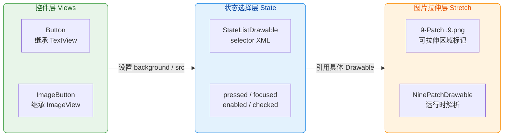

上图清晰地展示了按钮体系的三层协作关系：**控件层** 提供可点击的 View；**状态选择层** 根据 View 的当前状态（按下、聚焦等）选出对应的 Drawable；**图片拉伸层** 确保所选 Drawable 在不同尺寸的按钮上依然清晰美观。理解了这个分层模型，后续的每个知识点都会水到渠成。

---

### Button

#### Button 的本质——一个可点击的 TextView

很多初学者以为 Button 是一个独立的、功能复杂的控件，实际上打开源码你会发现：`Button extends TextView`。也就是说，Button **本质上就是一个 TextView**，只不过在默认样式（Theme Style）上做了以下几点差异化：

- **默认可点击（clickable = true）**：普通 TextView 默认不可点击，必须手动设置 `android:clickable="true"` 才能响应点击。而 Button 在其默认样式 `Widget.Material.Button`（Material 主题下）中已将 `clickable` 设为 true，因此声明即可响应点击。
- **默认带背景（background）**：Button 默认应用了一个带圆角、带阴影、有按压水波纹（Ripple）的背景 Drawable。这个背景由当前 Theme 的 `buttonStyle` 属性指定，通常是一个 `RippleDrawable` 嵌套 `InsetDrawable` 的复合结构。
- **文字默认全大写（textAllCaps = true）**：在 Material 主题下，Button 文字会被自动转为大写。如果不需要此行为，需显式设置 `android:textAllCaps="false"`。
- **默认有最小高度和内边距**：确保按钮的可触摸区域不会过小，符合 Material Design 中 48dp 最小触摸目标的建议。

因为 Button 继承自 TextView，所以 TextView 的一切能力——`SpannableString` 富文本、`Compound Drawable`（上下左右图标）、`ellipsize` 省略、`autoLink` 等等——Button 全部可用。你完全可以在 Button 上设置 `drawableStart` 来实现"图标 + 文字"的按钮样式，无需额外嵌套 ImageView。

#### XML 声明与常用属性

```xml
<!-- activity_main.xml -->
<!-- Button 声明示例：一个带图标的 Material 风格按钮 -->
<Button
    android:id="@+id/btn_submit"
    android:layout_width="wrap_content"
    android:layout_height="wrap_content"
    android:text="提交订单"
    android:textAllCaps="false"
    android:drawableStart="@drawable/ic_submit"
    android:drawablePadding="8dp"
    android:backgroundTint="@color/purple_500"
    android:textColor="@android:color/white"
    android:minHeight="48dp"
    android:paddingHorizontal="24dp" />
<!-- android:text — 按钮文字 -->
<!-- android:textAllCaps="false" — 关闭默认的全大写转换 -->
<!-- android:drawableStart — 文字左侧放置图标（LTR 布局） -->
<!-- android:drawablePadding — 图标与文字之间的间距 -->
<!-- android:backgroundTint — 对默认背景进行颜色着色，无需替换整个背景 Drawable -->
<!-- android:textColor — 按钮文字颜色 -->
<!-- android:minHeight — 保证最小触摸高度符合 Material 规范 -->
<!-- android:paddingHorizontal — 左右内边距，让文字不贴边 -->
```

这里特别值得注意的是 `android:backgroundTint` 属性。在 Material 主题下，如果你想改变按钮的颜色，**不要直接替换 background**，因为那样会丢失默认的 Ripple 水波纹和阴影效果。正确做法是通过 `backgroundTint` 给默认背景"上色"，这样 Ripple 效果和圆角形状都会保留。

#### Kotlin 中操作 Button

```kotlin
// 获取 Button 引用
val btnSubmit = findViewById<Button>(R.id.btn_submit) // 通过 id 查找按钮

// 设置点击监听器（最常见的交互方式）
btnSubmit.setOnClickListener { view ->                 // lambda 参数 view 即被点击的按钮本身
    // 处理点击事件，例如提交表单
    submitOrder()                                      // 调用业务逻辑方法
}

// 动态修改按钮文字
btnSubmit.text = "正在提交..."                          // 因为继承 TextView，直接使用 text 属性

// 动态禁用按钮（防止重复点击）
btnSubmit.isEnabled = false                            // 设为 false 后按钮变灰，不再响应点击

// 动态修改背景着色
btnSubmit.backgroundTintList =                         // backgroundTintList 接受 ColorStateList
    ColorStateList.valueOf(Color.GRAY)                 // valueOf 创建单一颜色的 ColorStateList
```

这段代码展示了 Button 在 Kotlin 中最常见的操作模式。值得关注的是 `isEnabled` 属性——当设为 `false` 时，View 内部会将状态标记中的 `STATE_ENABLED` 移除，这会触发 StateListDrawable（如果背景使用了 selector）切换到 `state_enabled=false` 对应的 Drawable，从而自动呈现"灰色不可用"的视觉效果。这就是 **状态驱动 UI** 的核心思想，后面讲 StateListDrawable 时会详细展开。

#### Button 的点击处理顺序

当你同时在 XML 中设置了 `android:onClick="onBtnClick"` 属性，又在代码中通过 `setOnClickListener` 设置了监听器时，两者的执行顺序是怎样的？答案是：**`setOnClickListener` 优先**。因为在 `View.performClick()` 的源码中，会先检查 `mOnClickListener` 是否非空，如果非空就调用它并返回 true，XML 中声明的 `onClick` 方法会在反射层被忽略（实际上，XML 的 onClick 本身也是通过内部设置一个 OnClickListener 来实现的，后设置的会覆盖先设置的）。因此，**在现代开发中推荐统一使用 `setOnClickListener`**，避免 XML 声明带来的反射性能开销和可维护性问题。

---

### ImageButton

#### 与 Button 的本质区别

如果说 Button 是 "可点击的 TextView"，那么 ImageButton 就是 "可点击的 ImageView"。`ImageButton extends ImageView`，它继承了 ImageView 的全部图片显示能力（ScaleType、Tint、adjustViewBounds 等），并在默认样式中将 `clickable` 设为 true、添加了默认按钮背景。

这带来一个重要的结构性差异：

| 特性 | Button (extends TextView) | ImageButton (extends ImageView) |
|------|--------------------------|--------------------------------|
| 显示文字 | ✅ 原生支持 `text` 属性 | ❌ 不支持，`setText()` 无效 |
| 显示图片 | ⚠️ 通过 `drawableStart/End` 等辅助 | ✅ 原生支持 `src` 属性，支持 ScaleType |
| 默认背景 | 有（Material 风格） | 有（通常是一个方形浮起的背景） |
| 继承关系 | TextView → Button | ImageView → ImageButton |

选择依据非常明确：**如果按钮需要显示文字（或文字 + 小图标），用 Button；如果按钮只需要显示一张图片（如工具栏图标按钮），用 ImageButton**。

#### XML 声明与关键属性

```xml
<!-- 一个图片按钮示例：返回键 -->
<ImageButton
    android:id="@+id/btn_back"
    android:layout_width="48dp"
    android:layout_height="48dp"
    android:src="@drawable/ic_arrow_back"
    android:scaleType="centerInside"
    android:background="?attr/selectableItemBackgroundBorderless"
    android:contentDescription="@string/btn_back_desc"
    android:padding="12dp" />
<!-- android:src — 设置前景图片（ImageView 的核心属性） -->
<!-- android:scaleType="centerInside" — 图片居中，等比缩放不超出 -->
<!-- android:background="?attr/selectableItemBackgroundBorderless" — 圆形水波纹无边界背景 -->
<!-- android:contentDescription — 无障碍描述，屏幕阅读器会朗读此文字 -->
<!-- android:padding — 内边距，让图标不贴边，同时扩大可触摸区域 -->
```

这里有一个容易踩的坑：ImageButton **默认自带一个方形灰色背景**。如果你只想要一个纯图标按钮（透明背景 + 点击时有水波纹），必须手动设置 `android:background="?attr/selectableItemBackgroundBorderless"`。`selectableItemBackgroundBorderless` 是系统主题提供的一个 RippleDrawable，它会在点击时以圆形扩散水波纹，非常适合图标按钮。

#### src 与 background 的区别

ImageButton 同时拥有 `src`（前景图，通过 `setImageDrawable` 设置）和 `background`（背景图）两层绘制。这两层是独立叠加的：**background 先绘制在最底层，src 叠在上面**。在自定义 ImageButton 时，通常的做法是：

- `background`：放状态选择器（按下变色、聚焦高亮等视觉反馈）
- `src`：放实际的图标图片

这种分层设计使得"图标"和"视觉反馈"互不干扰，切换图标时不影响按压效果，修改按压效果时不影响图标显示。

```kotlin
// Kotlin 中操作 ImageButton
val btnBack = findViewById<ImageButton>(R.id.btn_back) // 查找 ImageButton

// 动态切换图标
btnBack.setImageResource(R.drawable.ic_close)          // 将图标从"返回"换成"关闭"

// 应用图标着色（Tint），无需准备多套图标
btnBack.imageTintList =                                // 设置前景图的着色
    ColorStateList.valueOf(Color.WHITE)                 // 将图标着色为白色

// 点击监听（与 Button 完全一致）
btnBack.setOnClickListener {                           // ImageButton 同样支持 OnClickListener
    finish()                                           // 关闭当前 Activity
}
```

---

### StateListDrawable 状态选择器

#### 什么是 View 的"状态"

在讲 StateListDrawable 之前，必须先理解 Android View 的 **状态机制**。每个 View 在任意时刻都持有一组"状态标记"（int 数组），常见的状态包括：

| 状态常量 | XML 属性 | 含义 |
|---------|---------|------|
| `STATE_PRESSED` | `state_pressed` | 手指正在按压此 View |
| `STATE_FOCUSED` | `state_focused` | View 获得了焦点（键盘/遥控器导航） |
| `STATE_SELECTED` | `state_selected` | View 被选中（开发者通过 `setSelected(true)` 手动设置） |
| `STATE_ENABLED` | `state_enabled` | View 处于可用状态（`isEnabled = true`） |
| `STATE_CHECKED` | `state_checked` | 可勾选控件（CheckBox、Switch）处于选中态 |
| `STATE_ACTIVATED` | `state_activated` | 激活状态，常用于列表项高亮 |
| `STATE_HOVERED` | `state_hovered` | 鼠标悬停（ChromeOS / 桌面模式） |

当 View 的状态发生变化时（比如手指按下，`STATE_PRESSED` 被加入状态集），View 会调用 `drawableStateChanged()` 方法，通知其持有的所有 Drawable "我的状态变了，你该更新了"。这就是 StateListDrawable 发挥作用的时机。

#### StateListDrawable 的工作原理

`StateListDrawable` 是 `Drawable` 的子类，它内部维护了一个 **有序列表**，每一项都是一个 `(stateSet, drawable)` 二元组。当 View 通知它状态变化时，StateListDrawable 会 **从上到下遍历** 这个列表，找到 **第一个** 与当前状态集匹配的项，然后将该项的 Drawable 作为当前要绘制的内容。

这里的"匹配"规则是：stateSet 中声明的 **所有** 状态都必须在 View 的当前状态集中存在（取正值）或不存在（取负值），才算匹配成功。**遍历顺序非常重要**——一旦匹配到第一项，后面的就不看了，类似于 `if-else if-else` 的逻辑。

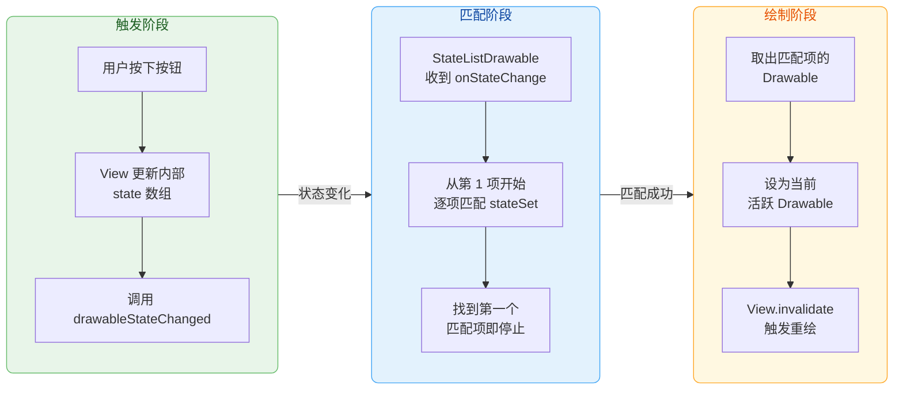

#### XML 中定义 selector

StateListDrawable 在 XML 中通过 `<selector>` 根标签定义，通常放在 `res/drawable/` 目录下：

```xml
<!-- res/drawable/btn_submit_bg.xml -->
<!-- 按钮背景状态选择器：根据不同状态显示不同背景色 -->
<selector xmlns:android="http://schemas.android.com/apk/res/android">

    <!-- 第 1 项：禁用状态（最高优先级判断，避免禁用时还显示按压色） -->
    <item
        android:state_enabled="false"
        android:drawable="@color/gray_300" />

    <!-- 第 2 项：按压状态（手指按下时） -->
    <item
        android:state_pressed="true"
        android:drawable="@color/purple_700" />

    <!-- 第 3 项：聚焦状态（键盘/遥控器导航到此按钮时） -->
    <item
        android:state_focused="true"
        android:drawable="@color/purple_600" />

    <!-- 第 4 项：默认状态（兜底项，不声明任何 state_ 属性） -->
    <item
        android:drawable="@color/purple_500" />

</selector>
<!-- 关键：项的顺序决定匹配优先级，从上到下第一个匹配即生效 -->
<!-- 兜底项必须放在最后，否则它会匹配一切状态，后面的项永远不会被执行 -->
```

上面的 XML 定义了一个典型的按钮背景 selector。**项的排列顺序是开发中最常犯的错误来源**。一个经典的 Bug 是：把默认项（没有任何 `state_` 属性的 item）放在了列表的第一位。由于默认项匹配任意状态，它会"吞掉"所有状态变化，导致按压、聚焦都看不到效果。记住这条铁律：**默认项永远放最后**。

再来看一个更精细的组合状态示例：

```xml
<!-- res/drawable/btn_complex_selector.xml -->
<!-- 组合状态选择器：同时检查多个状态 -->
<selector xmlns:android="http://schemas.android.com/apk/res/android">

    <!-- 既按压又聚焦（TV 遥控器场景中，先聚焦再按下确认键） -->
    <item
        android:state_pressed="true"
        android:state_focused="true"
        android:drawable="@drawable/btn_pressed_focused" />

    <!-- 仅按压（触屏场景，按压时通常没有焦点） -->
    <item
        android:state_pressed="true"
        android:drawable="@drawable/btn_pressed" />

    <!-- 仅聚焦 -->
    <item
        android:state_focused="true"
        android:drawable="@drawable/btn_focused" />

    <!-- 默认兜底 -->
    <item
        android:drawable="@drawable/btn_normal" />

</selector>
<!-- 组合状态项必须放在单一状态项之前，否则单一状态项会先匹配成功 -->
<!-- 例如：如果 state_pressed="true" 的项在 state_pressed+state_focused 之前 -->
<!-- 那么同时按压且聚焦时，只会匹配到 state_pressed 那一项，丢失 focused 区分 -->
```

#### 用于文字颜色的 ColorStateList

StateListDrawable 是用于 **Drawable 类型**（背景、图标）的状态选择器。对于 **颜色值**（如文字颜色），Android 提供了类似机制的 `ColorStateList`，XML 文件放在 `res/color/` 目录下，根标签同样是 `<selector>`：

```xml
<!-- res/color/btn_text_color.xml -->
<!-- 按钮文字颜色状态选择器 -->
<selector xmlns:android="http://schemas.android.com/apk/res/android">

    <!-- 禁用时文字变灰 -->
    <item
        android:state_enabled="false"
        android:color="#80FFFFFF" />
    <!-- #80FFFFFF: 白色 50% 透明度，产生灰暗效果 -->

    <!-- 按压时文字略微变亮 -->
    <item
        android:state_pressed="true"
        android:color="#FFFFFFFF" />

    <!-- 默认白色 -->
    <item
        android:color="#DDFFFFFF" />
    <!-- #DDFFFFFF: 白色 87% 不透明度，符合 Material Design 文字规范 -->

</selector>
```

使用方式：

```xml
<!-- 在 Button 中引用 ColorStateList -->
<Button
    android:textColor="@color/btn_text_color"
    ... />
<!-- android:textColor 既接受纯色值 "#FF0000"，也接受 ColorStateList 引用 -->
```

#### 在代码中动态构建 StateListDrawable

有时候，状态选择器的颜色需要根据服务器下发的主题色动态确定，此时就需要在 Kotlin 代码中构建：

```kotlin
// 动态构建 StateListDrawable
fun createButtonBackground(
    normalColor: Int,                                      // 正常状态颜色
    pressedColor: Int,                                     // 按压状态颜色
    disabledColor: Int                                     // 禁用状态颜色
): StateListDrawable {
    val stateListDrawable = StateListDrawable()             // 创建空的状态选择器

    // 添加项的顺序与 XML 中一致：优先级从高到低
    stateListDrawable.addState(                            // 第 1 项：禁用状态
        intArrayOf(-android.R.attr.state_enabled),         // 负号表示"不具备该状态"，即 enabled=false
        ColorDrawable(disabledColor)                       // 对应的 Drawable
    )

    stateListDrawable.addState(                            // 第 2 项：按压状态
        intArrayOf(android.R.attr.state_pressed),          // 正值表示"具备该状态"，即 pressed=true
        ColorDrawable(pressedColor)                        // 对应的 Drawable
    )

    stateListDrawable.addState(                            // 第 3 项：默认兜底
        intArrayOf(),                                      // 空数组表示匹配任意状态
        ColorDrawable(normalColor)                         // 对应的 Drawable
    )

    return stateListDrawable                               // 返回构建好的选择器
}

// 使用示例
val bg = createButtonBackground(
    normalColor = Color.parseColor("#6200EE"),             // Material Purple 500
    pressedColor = Color.parseColor("#3700B3"),            // Material Purple 700
    disabledColor = Color.parseColor("#BDBDBD")            // Gray 400
)
btnSubmit.background = bg                                  // 应用到按钮背景
```

注意代码中 `intArrayOf(-android.R.attr.state_enabled)` 的负号用法——在 Android 的状态匹配体系中，**正值** 表示"要求该状态存在"，**负值** 表示"要求该状态不存在"。`-state_enabled` 就意味着"当 View 处于 not enabled 时匹配"。

---

### 9-Patch 图

#### 为什么需要 9-Patch

假设你有一个按钮背景图：圆角矩形，带阴影。当这张图被拉伸到不同尺寸的按钮上时，普通的位图缩放会导致圆角变形、阴影模糊。特别是当按钮文字长度不确定时（比如"确定"和"我已阅读并同意用户协议"使用同一个背景），这个问题更为突出。

**9-Patch（九宫格拉伸图）** 正是为解决这个问题而生的。它是一种特殊的 PNG 图片格式（文件扩展名为 `.9.png`），通过在图片四边各添加 **1 像素宽的黑色标记线**，告诉 Android 系统：哪些区域可以拉伸、哪些区域必须保持原样。这样，无论按钮如何变大，圆角、阴影等边缘细节始终清晰锐利。

#### 9-Patch 的四条标记线

一张 9-Patch 图的四边各有一条 1px 的控制线，它们的含义两两成对：

```text
                    ┌── 顶部黑线（Top）──┐
                    │  定义水平可拉伸区域  │
                    ▼                    ▼
         ┌──────────────────────────────────┐
         │█████████                          │ ← 左侧黑线（Left）
         │█  ┌──────────────────────┐       │    定义垂直可拉伸区域
         │█  │                      │       │
         │   │    图片内容区域       │       │
         │   │                      │       │
         │   └──────────────────────┘  █████│ ← 右侧黑线（Right）
         │                             █████│    定义内容填充区域（Padding）
         └──────────────────────────────────┘
                    ▲                    ▲
                    │  定义内容填充区域  │
                    └── 底部黑线（Bottom）─┘
```

**左侧和顶部** 的黑线定义 **可拉伸区域（Stretchable Area）**：
- **顶部黑线** 标记的水平范围表示"这部分列可以水平拉伸"
- **左侧黑线** 标记的垂直范围表示"这部分行可以垂直拉伸"
- 两者的交集就是会被拉伸的矩形区域；未标记的区域（如四个圆角）保持固定像素不变

**右侧和底部** 的黑线定义 **内容填充区域（Padding Box）**：
- 这相当于告诉系统"文字/子 View 应该放在这个范围内"
- 等价于设置了 `paddingLeft/Top/Right/Bottom`
- 如果不画右侧和底部的线，则默认内容区域等于整个可拉伸区域

这就是"九宫格"名称的由来——两条拉伸线将图片划分为 9 个格子：4 个角（固定不变）、4 条边（单方向拉伸）、1 个中心（双向拉伸）。

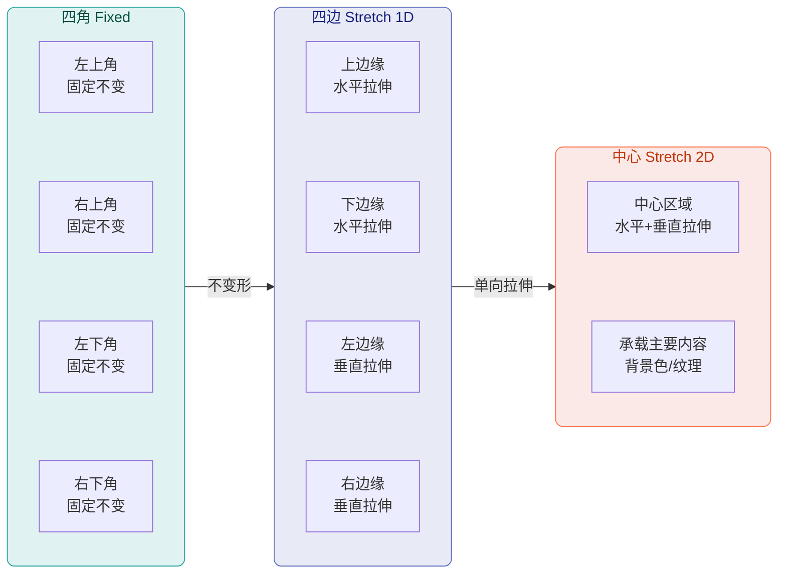

#### 制作 9-Patch 图的工具

1. **Android Studio 内置编辑器**：将任意 `.png` 文件重命名为 `.9.png` 后放入 `res/drawable-*` 目录，双击即可打开 9-Patch 编辑器。在编辑器中，你可以直接在四边拖动鼠标来画黑线，右侧有实时预览展示拉伸效果。

2. **Draw 9-patch 独立工具**：Android SDK 早期自带的独立工具（`sdk/tools/draw9patch`），功能与 AS 内置编辑器类似，但现在已逐渐被取代。

3. **设计工具导出**：Figma、Sketch 等设计工具可以通过插件直接导出 `.9.png`，设计师在切图时标注好可拉伸区域，开发者直接使用。

#### 在项目中使用 9-Patch

使用 9-Patch 图与使用普通 Drawable 没有任何区别，系统会自动识别 `.9.png` 后缀：

```xml
<!-- 将 9-Patch 图设为按钮背景 -->
<Button
    android:layout_width="wrap_content"
    android:layout_height="wrap_content"
    android:background="@drawable/btn_bg_rounded"
    android:text="确定" />
<!-- btn_bg_rounded.9.png 放在 res/drawable/ 或 res/drawable-xxhdpi/ 下 -->
<!-- 系统自动解析为 NinePatchDrawable，按标记线规则拉伸 -->
<!-- 9-Patch 定义的内容填充区域会自动应用为 padding -->
```

当 Android 资源系统加载 `.9.png` 文件时，它会读取四边各 1px 的标记线信息，构建出一个 `NinePatchDrawable` 对象。这个对象内部持有一个 `NinePatch` 实例，记录了拉伸区域和 padding 区域的数据。在绘制时，`NinePatchDrawable.draw(Canvas)` 会调用 native 层的 `NinePatch_draw` 方法，将图片按九宫格规则分块绘制到 Canvas 上，性能极高。

#### 9-Patch 与 StateListDrawable 的联合使用

在实际项目中，9-Patch 图和 StateListDrawable 经常配合使用——为每个状态准备一张不同的 9-Patch 图，然后用 selector 组织起来：

```xml
<!-- res/drawable/btn_bg_stateful.xml -->
<!-- 使用不同 9-Patch 图响应不同状态 -->
<selector xmlns:android="http://schemas.android.com/apk/res/android">

    <!-- 禁用状态：灰色 9-Patch 背景 -->
    <item
        android:state_enabled="false"
        android:drawable="@drawable/btn_bg_disabled" />
    <!-- btn_bg_disabled.9.png：灰色圆角矩形 -->

    <!-- 按压状态：深色 9-Patch 背景 -->
    <item
        android:state_pressed="true"
        android:drawable="@drawable/btn_bg_pressed" />
    <!-- btn_bg_pressed.9.png：深紫色圆角矩形，模拟按下凹陷 -->

    <!-- 默认状态：正常 9-Patch 背景 -->
    <item
        android:drawable="@drawable/btn_bg_normal" />
    <!-- btn_bg_normal.9.png：紫色圆角矩形 -->

</selector>
```

这种方案在 Material Design 普及之前是按钮视觉反馈的主流方案。现在虽然 `RippleDrawable` 已经成为默认选择（水波纹效果更优雅），但在需要高度自定义视觉风格的应用中（如游戏化 UI、品牌定制 App），9-Patch + StateListDrawable 仍然是不可替代的方案。

#### 9-Patch 使用的注意事项

1. **标记线必须是纯黑（#000000）且只有 1px 宽**：任何非纯黑的像素或超过 1px 的标记都会导致解析失败或意外行为。

2. **分辨率适配**：9-Patch 图本身也需要提供多套分辨率版本（`drawable-mdpi`, `drawable-xhdpi`, `drawable-xxhdpi` 等），因为固定区域（如圆角）在不同密度下需要不同的像素尺寸才能保持视觉一致。

3. **不要在可拉伸区域放置复杂纹理**：可拉伸区域会被线性拉伸，如果里面有渐变或花纹，拉伸后会变形。最佳实践是让可拉伸区域为纯色或简单的单方向渐变。

4. **优先考虑 ShapeDrawable / VectorDrawable**：如果按钮背景只是简单的圆角矩形 + 纯色填充，完全可以用 XML `<shape>` 标签实现，无需切图，体积更小且完美适配所有分辨率。9-Patch 更适合有阴影、纹理、拟物等复杂视觉效果的场景。

```xml
<!-- 用 ShapeDrawable 替代简单的 9-Patch（推荐） -->
<shape xmlns:android="http://schemas.android.com/apk/res/android"
    android:shape="rectangle">
    <!-- 圆角半径 -->
    <corners android:radius="8dp" />
    <!-- 填充色 -->
    <solid android:color="@color/purple_500" />
    <!-- 可选：描边 -->
    <stroke
        android:width="1dp"
        android:color="@color/purple_700" />
</shape>
<!-- 这个 XML Shape 可以完美替代一个纯色圆角矩形的 9-Patch 图 -->
<!-- 优势：零切图、自适应任意尺寸、支持颜色动态修改 -->
```

---

### 本节小结

按钮体系的核心思想是 **状态驱动 UI**。View 持有状态集合，Drawable 监听状态变化并切换外观——整个过程由框架自动完成，开发者只需要声明"什么状态对应什么外观"。Button 和 ImageButton 分别服务于文字按钮和图标按钮两种场景；StateListDrawable 是连接"用户交互"与"视觉反馈"的桥梁；9-Patch 则保证自定义背景在任意尺寸下都不失真。在现代开发中，Material Design 的 `RippleDrawable` 和 `MaterialButton` 组件已经封装了大部分默认行为，但理解底层的 StateListDrawable + 9-Patch 机制，是你处理复杂自定义 UI 需求时的核心能力。

---

**📝 练习题**

在一个 StateListDrawable 的 XML 定义中，以下四种 `<item>` 排列顺序，哪一种能正确实现"禁用灰色、按压深色、默认浅色"的效果？

A. 默认浅色 → 按压深色 → 禁用灰色


B. 按压深色 → 默认浅色 → 禁用灰色


C. 禁用灰色 → 按压深色 → 默认浅色


D. 按压深色 → 禁用灰色 → 默认浅色


**【答案】** C

**【解析】** StateListDrawable 采用 **从上到下，首次匹配即生效** 的策略。选项 A 将默认项（无状态约束）放在最前面，它会匹配一切状态，导致按压和禁用效果永远不会显示。选项 B 虽然按压能生效，但默认项在禁用之前，当 View 被 disable 时会命中默认项而非禁用项。选项 D 将禁用放在按压之后，当按钮处于 `enabled=false` 时，由于 `pressed` 在 disabled 状态下不会触发（系统不会给 disabled 的 View 发送 touch 事件），实际上 D 的按压项不会匹配，会走到禁用项——表面上看似正确，但这种排列违反了"限制条件最严格的项放最前"的最佳实践。而 **选项 C** 将禁用（最高优先级保护）放最前，按压放中间，默认兜底放最后，逻辑最清晰、最安全，是标准推荐的排列方式。

---

**📝 练习题**

关于 ImageButton，以下说法正确的是？

A. ImageButton 继承自 Button，因此同时支持 `setText()` 和 `setImageResource()`


B. ImageButton 的 `src` 属性和 `background` 属性指向同一层绘制，设置 `src` 会覆盖 `background`


C. ImageButton 继承自 ImageView，默认 `clickable` 为 true，且不支持通过 `text` 属性显示文字


D. ImageButton 必须手动设置 `clickable="true"` 才能响应点击事件


**【答案】** C

**【解析】** ImageButton 的继承关系是 `ImageView → ImageButton`，而非继承自 Button 或 TextView，因此不支持 `setText()`，排除 A。`src`（前景图）和 `background`（背景层）是两层独立绘制，不会互相覆盖，排除 B。ImageButton 在默认样式中已将 `clickable` 设为 true，无需手动设置，排除 D。**选项 C 准确描述了 ImageButton 的继承关系、默认可点击性以及不支持文字显示的特征。**

---

## 图片控件

在 Android 应用层开发中，图片展示是最基础也是最高频的 UI 需求之一。无论是用户头像、商品图片、背景横幅还是图标，几乎都离不开 `ImageView` 这个核心控件。然而，看似简单的"显示一张图片"背后，其实隐藏着大量细节：原始图片的尺寸往往与控件尺寸不一致，如何裁剪、如何缩放、如何对齐？控件自身的宽高又该如何随图片比例自适应？在不同主题或状态下如何快速改变图标颜色而无需准备多套资源？这些问题正是本节要深入解答的。

`ImageView` 继承自 `View`，它的核心职责是将一个 **Drawable**（可绘制对象）渲染到自己的 Canvas 上。在内部，`ImageView` 持有一个 `mDrawable` 引用和一个 `mDrawMatrix`（绘制矩阵），通过 Matrix 变换来控制图片在控件区域内的位置与缩放。理解了"**图片尺寸 ≠ 控件尺寸，Matrix 是桥梁**"这一核心概念，后续所有知识点都会变得非常自然。

### ImageView 缩放类型 ScaleType

#### ScaleType 的本质：Matrix 变换策略

`ScaleType` 是一个枚举（`ImageView.ScaleType`），定义在 `ImageView` 内部，共有 **8 种** 取值。它本质上决定了 `ImageView` 内部在 `configureBounds()` 方法中如何计算那个关键的 `mDrawMatrix`。当我们调用 `setScaleType()` 或在 XML 中声明 `android:scaleType` 时，`ImageView` 并不会立即重新绘制，而是标记需要重新配置边界（invalidate），在下一次 `onDraw()` 之前通过 `configureBounds()` 重新计算矩阵，最终 `onDraw()` 中用 `canvas.concat(mDrawMatrix)` 应用变换后再调用 `mDrawable.draw(canvas)` 完成绘制。

理解这一过程有助于我们把握一个关键事实：**ScaleType 不会改变原始 Bitmap 的像素数据**，它只是在绘制时通过矩阵对画布做缩放/平移变换。这意味着即使你把一张 4000×3000 的大图设置为 `CENTER_INSIDE` 缩小显示，内存中仍然驻留着完整的大 Bitmap——因此图片的内存优化需要在 decode 阶段处理（如 `BitmapFactory.Options.inSampleSize`），而非依赖 ScaleType。

#### 8 种 ScaleType 详解

为了便于理解，我们把 8 种缩放类型按"是否缩放"和"对齐方式"两个维度来分组讲解。假设图片原始尺寸为 `srcW × srcH`，控件尺寸为 `vW × vH`。

**第一组：不缩放，直接放置**

- **`MATRIX`**：最原始、最自由的模式。`ImageView` 不做任何自动计算，完全使用你通过 `setImageMatrix()` 手动设置的 Matrix 来绘制图片。如果你没有设置任何 Matrix，图片会以原始尺寸绘制在控件的 **左上角（0, 0）**。这种模式常用于需要手动实现双指缩放、平移等手势操作的场景——你在手势回调中不断更新 Matrix 并调用 `setImageMatrix()` 即可实现流畅的图片浏览效果。需要注意的是，使用 `MATRIX` 模式时必须同时调用 `setScaleType(ScaleType.MATRIX)`，否则你设置的 Matrix 会被其他 ScaleType 的计算结果覆盖。

- **`CENTER`**：图片 **不缩放**，以原始像素尺寸绘制，并居中放置在控件中央。如果图片比控件大，超出部分会被裁剪（clip）；如果图片比控件小，周围会留空。它的实现非常简单：仅做一个平移（translate），使图片中心与控件中心对齐。这种模式适用于你已经确切知道图片尺寸并且不希望任何缩放的场景（例如像素级精确的图标展示）。

**第二组：等比缩放，完整显示（不裁剪）**

- **`FIT_CENTER`**（**默认值**）：这是最常用的 ScaleType，也是 ImageView 在未指定 scaleType 时的默认行为。它的策略是：等比缩放图片，使得图片 **完整地** 放入控件区域内（即宽或高恰好贴合控件边缘，另一维度留白），然后将缩放后的图片 **居中** 放置。数学上，缩放比例为 `scale = min(vW/srcW, vH/srcH)`，然后平移使中心对齐。这保证了图片不被裁剪且比例不失真，但可能在一个方向上出现空白区域。

- **`FIT_START`**：缩放策略与 `FIT_CENTER` 完全相同（同样是 `min` 缩放比例，完整显示），唯一的区别在于 **对齐方式**——缩放后的图片对齐到控件的 **左上角**（对于 LTR 布局）。内部实现上，`FIT_CENTER` 和 `FIT_START` 以及下面的 `FIT_END` 都使用了 `Matrix.ScaleToFit` 枚举来配合 `Matrix.setRectToRect()` 方法计算变换矩阵，分别对应 `ScaleToFit.CENTER`、`ScaleToFit.START`、`ScaleToFit.END`。

- **`FIT_END`**：同上，缩放策略一样，但缩放后的图片对齐到控件的 **右下角**。

- **`CENTER_INSIDE`**：乍看与 `FIT_CENTER` 很像，但有一个关键区别——它会先判断图片是否已经比控件小。如果 **图片原始尺寸已经小于控件尺寸**（`srcW <= vW && srcH <= vH`），则 **不缩放**，直接居中放置（行为等同于 `CENTER`）；如果图片大于控件，则执行与 `FIT_CENTER` 一样的缩小操作。简言之，`CENTER_INSIDE` 是"**只缩小不放大**"的版本。这在展示用户上传的图片时很实用：小图保持清晰不被拉大产生模糊，大图自动缩小以适应控件。

**第三组：等比缩放，填满控件（可能裁剪）**

- **`CENTER_CROP`**：等比缩放图片，使得图片的 **短边** 恰好贴合控件的对应边（即完全覆盖控件区域），然后居中放置，超出控件的部分被裁剪。数学上，缩放比例为 `scale = max(vW/srcW, vH/srcH)`——注意这里是 `max` 而非 `min`。这意味着图片至少有一个维度会超出控件，从而确保不留白。`CENTER_CROP` 是社交应用中最常用的 ScaleType——用户头像、信息流封面图几乎都用它，因为它保证控件区域被完全填满，视觉效果最饱满。

**第四组：非等比缩放**

- **`FIT_XY`**：将图片的宽和高分别独立缩放到与控件完全一致（`scaleX = vW/srcW`, `scaleY = vH/srcH`），不保持纵横比。这意味着如果图片与控件的宽高比不同，图片会被 **拉伸变形**。虽然听起来不常用，但在某些特殊场景下却有其价值：比如纯色或渐变背景图、不在乎比例的装饰性纹理。另外，`FIT_XY` 在与 `adjustViewBounds` 配合时有特殊行为，稍后会详细讨论。

下面用一张总览图，帮助你在脑海中建立起直觉：

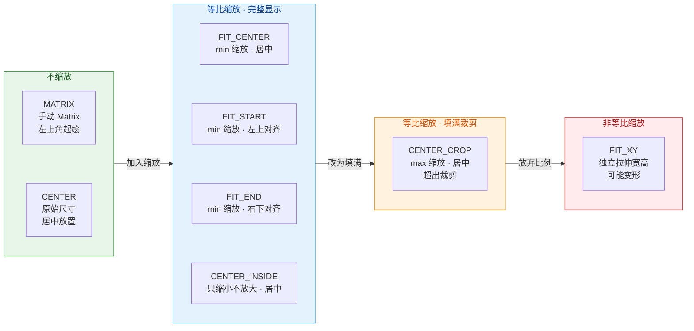

#### ScaleType 的代码用法

在 XML 中声明 ScaleType 非常简单：

```xml
<!-- XML 中设置 scaleType -->
<!-- fitCenter 是默认值，可以省略，但为了可读性建议显式声明 -->
<ImageView
    android:id="@+id/iv_avatar"
    android:layout_width="120dp"
    android:layout_height="120dp"
    android:src="@drawable/user_photo"
    android:scaleType="centerCrop" />
<!-- centerCrop: 填满 120x120 区域，多余部分裁剪 -->
```

在 Kotlin 代码中动态设置：

```kotlin
// 获取 ImageView 引用
val ivAvatar = findViewById<ImageView>(R.id.iv_avatar)

// 动态切换为 FIT_CENTER 模式
// 枚举值全部定义在 ImageView.ScaleType 中
ivAvatar.scaleType = ImageView.ScaleType.FIT_CENTER

// 如果使用 MATRIX 模式，需要手动设置矩阵
ivAvatar.scaleType = ImageView.ScaleType.MATRIX  // 先切换模式
val matrix = Matrix()                             // 创建新的 Matrix 对象
matrix.postScale(2.0f, 2.0f)                      // 放大 2 倍
matrix.postTranslate(50f, 50f)                     // 向右下平移 50px
ivAvatar.imageMatrix = matrix                      // 应用矩阵，触发重绘
```

#### ScaleType 选型实践建议

在实际项目中，ScaleType 的选择通常遵循以下规律：

1. **用户头像、封面图** → `CENTER_CROP`。填满控件、不留白，视觉效果最佳。配合圆形裁剪（如 `ShapeableImageView` 或 Glide 的 `CircleCrop`）更常见。
2. **商品详情大图、图片预览** → `FIT_CENTER`。保证图片完整可见，不丢失任何信息。
3. **图标/Logo（尺寸已知且较小）** → `CENTER` 或 `CENTER_INSIDE`。避免小图被放大导致模糊。
4. **手势缩放浏览器** → `MATRIX`。手动控制 Matrix 实现流畅的双指缩放和拖拽。
5. **纯背景填充** → `FIT_XY` 或 `CENTER_CROP`。如果是纯色/渐变，`FIT_XY` 即可；如果是有内容的背景图，用 `CENTER_CROP` 保持比例。

### adjustViewBounds：让控件尺寸适应图片比例

#### 问题的由来

在很多场景中，我们无法提前确定图片的宽高比（例如服务器下发的动态图片），但又希望 `ImageView` 的尺寸能 **自动适配图片的宽高比**，避免留白或裁剪。比如你希望宽度铺满屏幕，高度按照图片比例自动计算。如果你直接设置 `layout_width="match_parent"` 和 `layout_height="wrap_content"`，你会发现 `ImageView` 在 `wrap_content` 模式下确实会参考图片尺寸，但它参考的是图片的 **原始像素尺寸** 而非缩放后的尺寸，这往往不是你想要的结果。

#### adjustViewBounds 的作用机制

`android:adjustViewBounds="true"` 正是为了解决这个问题而设计的。当此属性开启时，`ImageView` 在 `onMeasure()` 阶段会执行额外的逻辑：它会根据图片的原始宽高比（`srcW : srcH`）和父容器给出的宽高约束（MeasureSpec），**主动调整自身的测量尺寸**，使得控件的宽高比与图片的宽高比一致。

具体来说，`ImageView.onMeasure()` 内部的关键流程如下：

1. **检查前置条件**：`adjustViewBounds` 为 `true`，且宽或高中至少有一个不是固定值（即不能两个都是精确的 dp 值，否则没有调整空间）。
2. **获取图片原始尺寸**：从 `mDrawable` 获取 `getIntrinsicWidth()` 和 `getIntrinsicHeight()`。
3. **确定可用空间**：根据 MeasureSpec 获取父容器允许的最大宽度和最大高度（同时减去 padding）。
4. **计算期望尺寸**：按图片宽高比计算。如果宽度是确定的（如 `match_parent` 解析出了具体值），则按比例计算高度；如果高度确定，则按比例计算宽度。若两者都不确定（都是 `wrap_content`），则取能完整放入可用空间的最大等比尺寸。
5. **调用 `setMeasuredDimension()`**：用计算出的新宽高作为控件的最终测量尺寸。

还有一个容易被忽略的细节：`adjustViewBounds` 在 ScaleType 为 `FIT_CENTER`、`FIT_START`、`FIT_END` 时效果最理想，因为这几种模式本身就是等比缩放。如果你同时使用 `adjustViewBounds="true"` 和 `scaleType="centerCrop"`，虽然控件尺寸会按比例调整，但由于调整后控件比例已经与图片一致，`CENTER_CROP` 的裁剪效果反而不会体现——两者搭配时本质上退化为 `FIT_CENTER` 的视觉效果。而 `FIT_XY` 配合 `adjustViewBounds` 时，由于控件已经调整为图片比例，独立拉伸也不会变形，同样退化为等比缩放的效果。

#### maxWidth / maxHeight 的配合

`adjustViewBounds` 还经常与 `android:maxWidth` 和 `android:maxHeight` 搭配使用，用于设置控件尺寸的上限。需要注意的是，这两个属性 **只有在 `adjustViewBounds="true"` 时才会生效**——这一点在官方文档中有明确说明，也是面试中常考的知识点。当计算出的期望尺寸超过 maxWidth/maxHeight 时，`ImageView` 会将尺寸限制在上限内，并按比例缩小另一个维度。

#### 典型用法示例

```xml
<!-- 宽度铺满父容器，高度按图片比例自适应 -->
<ImageView
    android:id="@+id/iv_banner"
    android:layout_width="match_parent"
    android:layout_height="wrap_content"
    android:adjustViewBounds="true"
    android:maxHeight="300dp"
    android:scaleType="fitCenter"
    android:src="@drawable/banner_dynamic" />
<!-- 
  工作流程：
  1. 宽度由 match_parent 确定为父容器宽度（如 1080px）
  2. adjustViewBounds 读取图片原始比例（如 1920:800）
  3. 按比例计算高度：1080 * (800/1920) = 450px
  4. 450px 未超过 maxHeight(300dp ≈ 900px@3x)，最终高度 450px
  5. fitCenter 将图片等比缩放到 1080x450 区域内绘制
-->
```

```kotlin
// 代码中动态启用 adjustViewBounds
val ivBanner = findViewById<ImageView>(R.id.iv_banner)

// 开启自适应边界
ivBanner.adjustViewBounds = true

// 设置最大高度限制（单位为像素）
ivBanner.maxHeight = resources.getDimensionPixelSize(R.dimen.banner_max_height)

// 搭配 FIT_CENTER 效果最佳
ivBanner.scaleType = ImageView.ScaleType.FIT_CENTER
```

#### adjustViewBounds 的局限性

虽然 `adjustViewBounds` 很实用，但它有几个需要注意的局限：

1. **两个维度都固定时无效**：如果 `layout_width` 和 `layout_height` 都设置为精确的 dp 值，`adjustViewBounds` 无法发挥作用——没有"可调整"的维度。
2. **在 `ConstraintLayout` 中需注意约束冲突**：当 `ImageView` 在 `ConstraintLayout` 中被两端约束且设置了 `0dp`（`MATCH_CONSTRAINT`）时，尺寸由约束决定，`adjustViewBounds` 的效果可能被覆盖。此时应考虑使用 `ConstraintLayout` 自身的 `app:layout_constraintDimensionRatio` 属性来替代。
3. **wrap_content 在 RecyclerView 中的性能隐患**：如果在列表项中使用 `adjustViewBounds` + `wrap_content`，每个 item 的高度可能不同，会影响 `RecyclerView` 的回收复用效率，也可能导致滚动时的抖动。

### Tint 着色：一套图标适配多种颜色

#### 为什么需要 Tint

在 Material Design 中，图标通常以单色矢量图（VectorDrawable）或纯色 PNG 提供。同一个图标可能在不同状态下需要不同颜色：选中时为品牌主色、未选中时为灰色、禁用时为浅灰色。传统做法是准备多套不同颜色的图标资源，但这会导致 APK 体积膨胀且维护成本极高。

**Tint（着色）** 机制的出现彻底解决了这个问题。它允许你在运行时对 Drawable 施加一层颜色覆盖，原理是利用 **PorterDuff 混合模式**（或自 API 29 起的 `BlendMode`）将 Tint 颜色与原始 Drawable 的像素进行合成。这样你只需要一套白色或黑色的基础图标，通过 Tint 即可变换出任意颜色。

#### Tint 的底层原理：PorterDuff 混合模式

PorterDuff 混合模式源自 Thomas Porter 和 Tom Duff 在 1984 年发表的经典论文，定义了 12 种基本的像素合成规则。Android 在 `PorterDuff.Mode` 枚举中提供了这些模式。当 Tint 应用到 `ImageView` 时，内部会调用 `Drawable.setTintList()` 和 `Drawable.setTintMode()`，最终在 Drawable 的 `draw()` 方法中通过 `Paint.setColorFilter(new PorterDuffColorFilter(tintColor, tintMode))` 来实现混合。

在 Tint 场景中，最常用的混合模式是 **`SRC_IN`**（默认模式）。它的语义是：**取 Destination（原始图片）的 Alpha 通道与 Source（Tint 颜色）的 RGB 通道**。换句话说，它保留了原始图片的形状（不透明区域），但用 Tint 颜色完全替换了原始颜色。这恰好适用于单色图标的场景——图标的形状保留，颜色被替换。

其他几种在 Tint 中有用的模式包括：

- **`SRC_ATOP`**：与 `SRC_IN` 类似，但会保留 Destination 中 Alpha 为 0 的区域不变。在大多数单色图标场景中与 `SRC_IN` 效果一致。
- **`MULTIPLY`**：将 Tint 颜色与原始颜色逐通道相乘（`result = src * dst / 255`）。适用于需要"加深/调色"效果的彩色图片，例如对一张彩色照片叠加暖色调。
- **`SCREEN`**：与 `MULTIPLY` 相反，产生"变亮"效果（`result = src + dst - src * dst / 255`）。
- **`ADD`**：简单相加，产生高光效果。

#### XML 中使用 Tint

```xml
<!-- 最基础的用法：通过 tint 属性设置单一颜色 -->
<ImageView
    android:layout_width="48dp"
    android:layout_height="48dp"
    android:src="@drawable/ic_favorite_24"
    android:tint="@color/md_red_500" />
<!-- 图标将以红色显示，保留原始形状 -->

<!-- 使用 AppCompat 兼容属性（推荐，兼容 API 21 以下） -->
<ImageView
    android:layout_width="48dp"
    android:layout_height="48dp"
    android:src="@drawable/ic_favorite_24"
    app:tint="@color/md_red_500" />
<!-- app:tint 来自 AppCompat，会自动使用 ImageViewCompat 处理 -->

<!-- 同时指定混合模式 -->
<ImageView
    android:layout_width="48dp"
    android:layout_height="48dp"
    android:src="@drawable/ic_photo"
    android:tint="#80FF6D00"
    android:tintMode="multiply" />
<!-- 对一张彩色图片施加半透明橙色的 MULTIPLY 混合 -->
```

注意 `android:tint` 是 API 1 就存在的属性，但它在低版本上只支持单一颜色。`app:tint`（来自 AndroidX AppCompat 库）则支持 `ColorStateList`，可以根据控件状态（pressed、enabled、selected 等）自动切换颜色——这在实际开发中非常重要。

#### 代码中使用 Tint

```kotlin
val ivIcon = findViewById<ImageView>(R.id.iv_icon)

// ===== 方式一：使用 ImageViewCompat（推荐，兼容性最好）=====
// 设置单一颜色 Tint
// ColorStateList.valueOf() 将单色包装为不随状态变化的 ColorStateList
ImageViewCompat.setImageTintList(
    ivIcon,                                          // 目标 ImageView
    ColorStateList.valueOf(Color.RED)                 // 红色 Tint
)

// 设置混合模式（默认 SRC_IN，通常无需更改）
ImageViewCompat.setImageTintMode(
    ivIcon,                                          // 目标 ImageView
    PorterDuff.Mode.SRC_IN                           // 使用 SRC_IN 模式
)

// ===== 方式二：使用带状态的 ColorStateList =====
// 构建根据 enabled 和 pressed 状态变化的颜色列表
val tintStates = ColorStateList(
    arrayOf(
        intArrayOf(-android.R.attr.state_enabled),   // 禁用状态（取反用负号）
        intArrayOf(android.R.attr.state_pressed),    // 按下状态
        intArrayOf()                                  // 默认状态（空数组匹配所有）
    ),
    intArrayOf(
        0xFFBDBDBD.toInt(),                           // 禁用 → 浅灰色
        0xFFD32F2F.toInt(),                           // 按下 → 深红色
        0xFFF44336.toInt()                            // 默认 → 标准红色
    )
)

// 应用状态感知的 Tint
ImageViewCompat.setImageTintList(ivIcon, tintStates)

// ===== 方式三：清除 Tint =====
// 传入 null 即可移除 Tint，恢复原始颜色
ImageViewCompat.setImageTintList(ivIcon, null)
```

> **为什么推荐 `ImageViewCompat` 而不是直接调用 `ImageView.setImageTintList()`？** 因为 `setImageTintList()` 是 API 21 引入的方法，低版本会崩溃。`ImageViewCompat` 是 AndroidX 提供的兼容工具类，内部会根据 API 版本自动选择最佳实现路径——在 API 21+ 调用原生方法，在低版本通过 `DrawableCompat` 包装实现等效效果。

#### Tint 在 res/color 状态列表中的实践

在实际项目中，更优雅的做法是将 Tint 颜色定义为 `res/color/` 目录下的 `ColorStateList` 资源文件，而非在代码中硬编码：

```xml
<!-- res/color/tint_icon_favorite.xml -->
<?xml version="1.0" encoding="utf-8"?>
<selector xmlns:android="http://schemas.android.com/apk/res/android">
    <!-- 禁用状态：浅灰色 -->
    <item android:color="#FFBDBDBD" android:state_enabled="false" />
    <!-- 选中状态：品牌红色 -->
    <item android:color="#FFF44336" android:state_selected="true" />
    <!-- 按下状态：深红色 -->
    <item android:color="#FFD32F2F" android:state_pressed="true" />
    <!-- 默认状态：深灰色（必须放在最后，因为匹配规则是从上到下first-match） -->
    <item android:color="#FF757575" />
</selector>
```

```xml
<!-- 在 ImageView 中引用 -->
<ImageView
    android:layout_width="48dp"
    android:layout_height="48dp"
    android:src="@drawable/ic_favorite_24"
    app:tint="@color/tint_icon_favorite" />
<!-- 现在图标颜色会随 enabled/selected/pressed 状态自动切换 -->
```

这种方式将颜色状态逻辑从代码中抽离到资源文件，遵循了 Android 的 **资源化配置** 理念，也便于设计师统一管理颜色规范。

#### Tint 与 VectorDrawable 的最佳实践

在 Material Design 图标体系中，Tint 与 VectorDrawable 是天生的搭配。推荐工作流如下：

1. 从 [Material Icons](https://fonts.google.com/icons) 下载 SVG，使用 Android Studio 的 **Vector Asset Studio** 导入为 VectorDrawable（XML 格式）。
2. 将 VectorDrawable 的 `fillColor` 统一设置为黑色（`#FF000000`）或白色（`#FFFFFFFF`），作为"基础色"。
3. 在使用时通过 `app:tint` 叠加目标颜色。这样一套矢量图标即可适配全部主题和状态。

```xml
<!-- res/drawable/ic_favorite_24.xml -->
<!-- VectorDrawable 使用黑色作为基础色 -->
<vector xmlns:android="http://schemas.android.com/apk/res/android"
    android:width="24dp"
    android:height="24dp"
    android:viewportWidth="24"
    android:viewportHeight="24">
    <!-- path 的 fillColor 为纯黑 -->
    <path
        android:fillColor="#FF000000"
        android:pathData="M12,21.35l-1.45,-1.32C5.4,15.36 2,12.28 2,8.5
                          2,5.42 4.42,3 7.5,3c1.74,0 3.41,0.81 4.5,2.09
                          C13.09,3.81 14.76,3 16.5,3 19.58,3 22,5.42 22,8.5
                          c0,3.78 -3.4,6.86 -8.55,11.54L12,21.35z" />
</vector>
```

```xml
<!-- 使用时：同一图标在不同场景展示不同颜色 -->
<!-- 导航栏：未选中灰色、选中品牌色 -->
<ImageView
    android:layout_width="24dp"
    android:layout_height="24dp"
    android:src="@drawable/ic_favorite_24"
    app:tint="@color/tint_nav_icon" />
```

下面用一张时序图展示 Tint 的内部工作流：

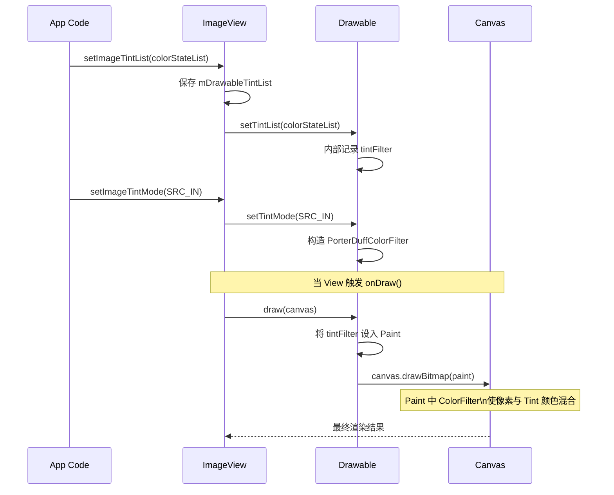

#### 注意事项与陷阱

1. **Drawable 的共享与变异（Mutate）**：Android 中，从同一资源 ID 加载的 Drawable 默认共享同一个 **ConstantState**。这意味着如果你对一个 Drawable 设置了 Tint，所有使用同一资源的 ImageView 都会受影响。解决方法是在设置 Tint 前调用 `drawable.mutate()`，使其脱离共享状态，拥有独立的属性副本。`ImageViewCompat` 内部在某些路径上会自动处理 mutate，但如果你直接操作 Drawable 对象，务必手动调用。

2. **`android:tint` vs `app:tint` 的区别**：`android:tint` 是框架原生属性，在 API 21 以下不支持 `ColorStateList`（只能传单色）。`app:tint` 来自 AppCompat 库，通过 `AppCompatImageView`（`ImageView` 在 AppCompat 主题下会自动膨胀为此子类）实现了全版本兼容。**现代开发中，统一使用 `app:tint`**。

3. **Tint 对 Background 与 Foreground 无效**：`ImageView` 的 Tint 只作用于 **`src`（即 `setImageDrawable` 设置的 Drawable）**，不影响 `background`。如果需要对背景着色，可以使用 `ViewCompat.setBackgroundTintList()`。

4. **与 Glide/Coil 等图片库的配合**：当使用第三方图片加载库动态设置图片时，Tint 设置不会被覆盖——因为 Tint 是绑定在 `ImageView` 上的，而非 Drawable 上。不过，如果图片库在加载完成后调用了 `setImageDrawable()` 替换了 Drawable，`ImageView` 会自动将已有的 TintList 应用到新 Drawable 上。

---

**📝 练习题**

当一个 `ImageView` 设置了 `android:layout_width="match_parent"`、`android:layout_height="wrap_content"`、`android:adjustViewBounds="true"` 以及 `android:scaleType="centerCrop"` 时，显示一张宽高比为 2:1 的图片，控件最终表现最接近以下哪种情况？

A. 图片被裁剪，控件高度等于控件宽度（即 1:1），只显示图片中心区域


B. 控件高度自动调整为宽度的一半（即宽高比 2:1），图片完整显示无裁剪


C. 控件高度为 wrap_content 的默认值（图片原始像素高度），图片被 centerCrop 裁剪


D. adjustViewBounds 与 centerCrop 冲突，导致运行时异常


**【答案】** B

**【解析】** 这道题考察 `adjustViewBounds` 与 `ScaleType` 的交互机制。当 `adjustViewBounds="true"` 时，`ImageView` 在 `onMeasure()` 阶段会根据图片的原始宽高比来调整控件自身的尺寸。在本题中，宽度由 `match_parent` 确定，高度由 `adjustViewBounds` 按 2:1 比例计算得出（即宽度的一半）。关键点在于：**尺寸调整发生在 measure 阶段，早于 ScaleType 的矩阵计算（layout/draw 阶段）**。当控件尺寸已经与图片比例一致后，无论 ScaleType 是 `fitCenter` 还是 `centerCrop`，实际效果都一样——图片恰好完整铺满控件，既无留白也无裁剪。因此 `centerCrop` 的裁剪行为在本场景中不会体现，最终视觉效果等价于 `FIT_CENTER`。选项 A 误认为 `centerCrop` 会强制 1:1；选项 C 忽略了 `adjustViewBounds` 的作用；选项 D 是错误的，两者不会冲突，只是 `centerCrop` 的裁剪效果被"中和"了。

---

**📝 练习题**

关于 `ImageView` 的 Tint 机制，以下哪种说法是 **错误** 的？

A. `app:tint` 支持 `ColorStateList`，可以根据控件的 pressed/enabled 等状态自动切换颜色


B. Tint 的默认混合模式是 `SRC_IN`，它保留原始图片的形状但用 Tint 颜色替换原始颜色


C. 对 `ImageView` 设置 Tint 后，其 `android:background` 的颜色也会同步受到 Tint 影响


D. 从同一资源加载的多个 Drawable 共享 ConstantState，对其中一个设置 Tint 可能影响其他实例，应通过 `mutate()` 避免


**【答案】** C

**【解析】** `ImageView` 的 Tint（通过 `android:tint` / `app:tint` 或 `setImageTintList()` 设置）仅作用于通过 `android:src`（即 `setImageDrawable()`）设置的前景 Drawable，**不会影响 `background`**。如果需要对背景进行着色，需要使用 `ViewCompat.setBackgroundTintList()` 或 `android:backgroundTint` 属性。选项 A 正确，`app:tint` 来自 AppCompat，支持 `ColorStateList`。选项 B 正确，`SRC_IN` 模式取 Destination 的 Alpha 与 Source 的 RGB，正是"保留形状、替换颜色"的语义。选项 D 正确，Drawable 的 ConstantState 共享机制是 Android 的经典陷阱，`mutate()` 是标准解决方案。

---

## 进度与指示器（ProgressBar、SeekBar、RatingBar）

在 Android 应用开发中，"进度"与"指示"是一类极为常见的交互范式。用户需要在等待网络请求时看到旋转的加载圈，需要在播放音乐时拖动进度条，需要在商品页面点击星星完成评分——这些场景背后对应的正是 `ProgressBar`、`SeekBar` 和 `RatingBar` 三大控件。它们在继承体系上一脉相承，却在交互语义上各有侧重。理解它们的共性与差异，是高效构建 UI 交互的基础。

从类继承关系来看，这三个控件的血缘关系非常紧密：`SeekBar` 继承自 `AbsSeekBar`，`AbsSeekBar` 继承自 `ProgressBar`；而 `RatingBar` 同样继承自 `AbsSeekBar`。也就是说，**ProgressBar 是整个进度家族的根基**，它定义了"当前值 / 最大值"的核心模型；`AbsSeekBar` 在此基础上增加了 **可拖动的 Thumb（滑块）** 概念；`SeekBar` 和 `RatingBar` 则分别面向"连续值拖拽"和"离散星级评分"做了进一步特化。理解这条继承链，就能明白为什么很多 `ProgressBar` 的属性（如 `max`、`progress`、`progressDrawable`）在 `SeekBar` 和 `RatingBar` 上同样生效——因为它们本质上共享同一套进度模型。

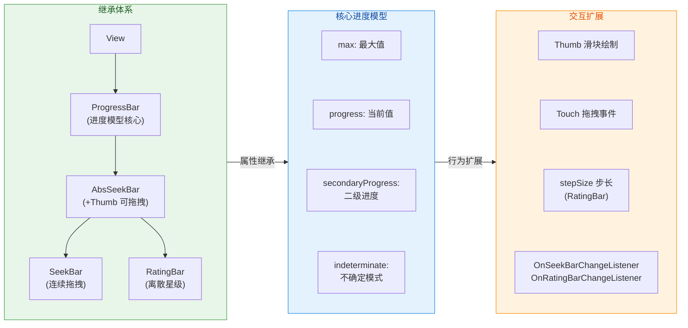

上图清晰展示了三个层次：最左侧是类继承链，中间是从 `ProgressBar` 继承而来的核心进度属性，右侧则是 `AbsSeekBar` 及其子类扩展出的交互能力。下面我们逐一深入讲解每个控件。

---

### ProgressBar 样式

#### 两种基本形态：确定模式与不确定模式

`ProgressBar` 最核心的设计决策在于区分 **Determinate（确定）** 和 **Indeterminate（不确定）** 两种模式。这不仅仅是视觉差异，更代表着完全不同的信息传达语义。

**Indeterminate 模式（不确定模式）** 是 `ProgressBar` 的默认形态。当你在 XML 中直接写 `<ProgressBar />` 而不加任何额外属性时，得到的就是一个持续旋转的环形动画。这种模式表达的语义是"操作正在进行中，但我无法告诉你还要多久"——典型场景如网络请求等待、页面初次加载。系统会自动播放一个循环动画，开发者无需调用任何 `setProgress()` 方法。在底层实现中，Indeterminate 模式使用的是 `indeterminateDrawable` 属性指向的 Drawable，默认是一个通过 `AnimatedRotateDrawable` 或 `AnimationDrawable` 实现旋转效果的矢量图。

**Determinate 模式（确定模式）** 则用于明确知道进度百分比的场景，如文件下载（已下载 60%）、表单填写进度等。启用此模式需要设置 `style="?android:attr/progressBarStyleHorizontal"` 并将 `android:indeterminate` 设置为 `false`（或不设置，因为水平样式默认为确定模式）。此时，`progress` 属性才有意义——它与 `max` 一起决定了进度条填充的比例。

```xml
<!-- 不确定模式：默认旋转圆环，用于无法量化进度的场景 -->
<ProgressBar
    android:id="@+id/pb_loading"
    android:layout_width="wrap_content"
    android:layout_height="wrap_content"
    android:indeterminate="true" />
    <!-- indeterminate="true" 是默认值，此处显式声明仅为清晰表达意图 -->

<!-- 确定模式：水平进度条，用于可量化进度的场景 -->
<ProgressBar
    android:id="@+id/pb_download"
    style="?android:attr/progressBarStyleHorizontal"
    android:layout_width="match_parent"
    android:layout_height="wrap_content"
    android:max="100"
    android:progress="0"
    android:secondaryProgress="0" />
    <!-- max=100 表示进度范围 0~100 -->
    <!-- progress=0 表示当前主进度为 0 -->
    <!-- secondaryProgress=0 表示二级进度为 0（常用于缓冲进度） -->
```

#### 系统预置样式（Built-in Styles）

Android 系统为 `ProgressBar` 预置了多种样式，它们本质上是通过 Theme 属性引用不同的 style 资源，进而改变 Drawable、尺寸和动画行为。常用的有以下几种：

- **`?android:attr/progressBarStyle`**（默认）：中等大小的圆形旋转（Indeterminate）。
- **`?android:attr/progressBarStyleSmall`**：小尺寸圆形旋转，适合嵌入列表 Item 或按钮旁。
- **`?android:attr/progressBarStyleLarge`**：大尺寸圆形旋转，适合全屏加载遮罩。
- **`?android:attr/progressBarStyleHorizontal`**：水平条形，支持确定模式和不确定模式切换。

在 Material Design 体系下，Google 推荐使用 `com.google.android.material.progressindicator.LinearProgressIndicator` 和 `CircularProgressIndicator` 来替代原生 `ProgressBar`，因为它们提供了更丰富的动画控制（如 indeterminate animation type、track thickness、indicator color 等），且默认遵循 Material 3 规范。但理解原生 `ProgressBar` 的机制是必要的，因为 Material 组件本质上也是对其进行了包装。

#### secondaryProgress 的设计意义

`ProgressBar` 提供了一个容易被忽视但非常实用的属性——`secondaryProgress`（二级进度）。最经典的使用场景就是 **视频/音频播放器的缓冲进度**：主进度（`progress`）表示当前播放到哪里，二级进度（`secondaryProgress`）表示已经缓冲到哪里。两者在视觉上通过不同颜色或透明度区分，给用户传达了"即使网络断开，还能播到哪里"的信息。

在底层实现上，`ProgressBar` 的 `progressDrawable` 是一个 `LayerDrawable`，它包含三层：**background（背景轨道）**、**secondaryProgress（二级进度层）**、**progress（主进度层）**。每一层通过 `id` 标识（`android.R.id.background`、`android.R.id.secondaryProgress`、`android.R.id.progress`），`ProgressBar` 在 `onDraw()` 时根据各自的比例裁剪绘制。

```kotlin
// 模拟文件下载场景：主进度表示已写入磁盘，二级进度表示已从网络接收
val pbDownload = findViewById<ProgressBar>(R.id.pb_download)

// 设置最大值为文件总字节数（单位：KB）
pbDownload.max = 10240 // 10MB 文件

// 模拟：网络已接收 7MB 数据（缓冲在内存中），但仅 4MB 已写入磁盘
pbDownload.secondaryProgress = 7168 // 7 * 1024 = 7168 KB 已接收
pbDownload.progress = 4096           // 4 * 1024 = 4096 KB 已写入

// 在 API 24+ 上可使用带动画的版本，过渡更流畅
if (Build.VERSION.SDK_INT >= Build.VERSION_CODES.N) {
    // 第二个参数 animate=true 启用平滑动画过渡
    pbDownload.setProgress(5120, true) // 平滑动画至 5MB
}
```

#### 自定义 Drawable 外观

当系统默认样式无法满足设计需求时，可以通过自定义 `progressDrawable` 来完全掌控视觉表现。最常见的做法是创建一个 `LayerListDrawable` XML 文件，为三层分别指定形状、颜色或渐变。

```xml
<!-- res/drawable/custom_progress.xml -->
<!-- 自定义水平进度条的三层 Drawable -->
<layer-list xmlns:android="http://schemas.android.com/apk/res/android">

    <!-- 第一层：背景轨道（灰色底色） -->
    <item android:id="@android:id/background">
        <shape android:shape="rectangle">
            <!-- 圆角矩形，radius=8dp 产生胶囊形 -->
            <corners android:radius="8dp" />
            <!-- 背景色使用浅灰 -->
            <solid android:color="#E0E0E0" />
        </shape>
    </item>

    <!-- 第二层：二级进度（缓冲层，半透明主题色） -->
    <item android:id="@android:id/secondaryProgress">
        <clip>
            <!-- clip 标签使 Drawable 可被 ProgressBar 按比例裁剪 -->
            <shape android:shape="rectangle">
                <corners android:radius="8dp" />
                <!-- 半透明绿色表示缓冲区域 -->
                <solid android:color="#8081C784" />
            </shape>
        </clip>
    </item>

    <!-- 第三层：主进度（实色渐变，视觉焦点） -->
    <item android:id="@android:id/progress">
        <clip>
            <shape android:shape="rectangle">
                <corners android:radius="8dp" />
                <!-- 从左到右的渐变色，增强视觉层次 -->
                <gradient
                    android:startColor="#66BB6A"
                    android:endColor="#2E7D32"
                    android:angle="0" />
                    <!-- angle=0 表示从左到右渐变 -->
            </shape>
        </clip>
    </item>

</layer-list>
```

```xml
<!-- 在布局中引用自定义 Drawable -->
<ProgressBar
    style="?android:attr/progressBarStyleHorizontal"
    android:layout_width="match_parent"
    android:layout_height="12dp"
    android:max="100"
    android:progress="45"
    android:secondaryProgress="70"
    android:progressDrawable="@drawable/custom_progress" />
    <!-- progressDrawable 指向自定义的三层 LayerList -->
    <!-- 高度 12dp 配合 radius=8dp 产生圆润的胶囊形进度条 -->
```

这里有一个容易踩坑的细节：`<clip>` 标签是关键。如果二级进度层和主进度层不使用 `<clip>` 包裹，`ProgressBar` 将无法按比例裁剪 Drawable，导致进度始终显示为满格。`ClipDrawable` 的工作原理是根据 `level`（0~10000）对 Drawable 进行水平裁剪，`ProgressBar` 内部会将 `progress / max` 的比值映射为 level 值，然后调用 `Drawable.setLevel()` 来控制可见区域。

#### 通过代码动态控制 ProgressBar

在实际业务场景中，ProgressBar 的进度值几乎总是通过代码动态更新的。以下展示了几个关键操作：

```kotlin
val progressBar = findViewById<ProgressBar>(R.id.pb_download)

// 1. 切换模式：从不确定模式切换到确定模式
//    典型场景：网络请求开始时显示旋转圈，获取到文件大小后切换为水平进度
progressBar.isIndeterminate = false // 关闭不确定模式

// 2. 动态修改最大值
//    当获取到文件总大小后，设置 max 值
progressBar.max = totalBytes.toInt() // max 对应文件总字节数

// 3. 增量更新进度
//    incrementProgressBy() 是线程安全的便捷方法
progressBar.incrementProgressBy(bytesRead) // 每次读取后增加对应字节数

// 4. 直接设置进度（线程安全）
//    ProgressBar 重写了 postXxx 系列方法，可从非主线程安全调用
progressBar.progress = currentBytes // 底层通过 Handler 切换到主线程更新

// 5. 显示/隐藏进度条
//    下载完成后隐藏进度条
progressBar.visibility = View.GONE // GONE 不占据空间
// 或 View.INVISIBLE 保留空间但不可见
```

值得特别强调的是 `ProgressBar` 的 **线程安全特性**。与大多数 View 操作必须在主线程执行不同，`ProgressBar` 的 `setProgress()`、`incrementProgressBy()` 等方法内部通过 `RefreshProgressRunnable` 和主线程 `Handler` 做了线程调度，因此可以直接在后台线程（如下载线程）中调用而不会抛出 `CalledFromWrongThreadException`。这是 Android Framework 为这个高频异步场景做出的特殊设计。

---

### SeekBar 拖动条

#### 从 ProgressBar 到可交互的 SeekBar

`SeekBar` 在继承链上是 `ProgressBar` 的孙子类（`ProgressBar → AbsSeekBar → SeekBar`），它将进度条从"只读展示"升级为"可交互输入"。最直观的变化就是增加了一个 **Thumb（滑块）**——用户可以通过拖拽 Thumb 来改变当前 `progress` 值。这一设计使得 SeekBar 成为音量调节、播放进度拖动、亮度控制等场景的首选控件。

`AbsSeekBar` 这个中间抽象类承担了核心的交互逻辑：它重写了 `onTouchEvent()` 来处理手指按下、拖动和抬起事件，并在内部计算触摸位置对应的 progress 值。具体来说，当用户手指在 SeekBar 上水平移动时，`AbsSeekBar` 会将触摸点的 X 坐标转换为 `[0, max]` 范围内的进度值，同时考虑 padding 和 Thumb 宽度的偏移。

#### XML 声明与核心属性

```xml
<!-- 基础 SeekBar 声明 -->
<SeekBar
    android:id="@+id/seek_volume"
    android:layout_width="match_parent"
    android:layout_height="wrap_content"
    android:max="100"
    android:progress="50"
    android:thumb="@drawable/custom_thumb"
    android:thumbTint="@color/green_500"
    android:progressTint="@color/green_700"
    android:progressBackgroundTint="@color/grey_300"
    android:splitTrack="false" />
    <!-- max: 最大值，决定拖拽范围 -->
    <!-- progress: 初始位置，Thumb 会定位到对应比例处 -->
    <!-- thumb: 自定义滑块 Drawable（可用 shape/vector/bitmap） -->
    <!-- thumbTint: 滑块着色，快速改色而不必替换 Drawable -->
    <!-- progressTint: 已走过区域（左侧）的颜色 -->
    <!-- progressBackgroundTint: 未走过区域（右侧）的颜色 -->
    <!-- splitTrack=false: 防止 Thumb 两侧轨道出现透明间隙 -->
```

这里的 `splitTrack` 属性值得注意。默认情况下，SeekBar 的 Thumb 会在其所在位置对轨道（track）进行"切割"，导致 Thumb 下方出现透明间隙——这在使用自定义圆形 Thumb 时尤其明显且不美观。将 `splitTrack` 设为 `false` 可以让轨道在 Thumb 下方连续绘制，视觉上更完整。

#### OnSeekBarChangeListener 三回调详解

`SeekBar` 的核心交互接口是 `OnSeekBarChangeListener`，它包含三个回调方法，对应用户拖拽的完整生命周期：

```kotlin
val seekVolume = findViewById<SeekBar>(R.id.seek_volume)

seekVolume.setOnSeekBarChangeListener(object : SeekBar.OnSeekBarChangeListener {

    /**
     * 进度变化时回调（高频调用）
     * @param seekBar   当前 SeekBar 实例
     * @param progress  当前进度值 [0, max]
     * @param fromUser  是否来自用户操作（true=拖拽触发，false=代码 setProgress 触发）
     */
    override fun onProgressChanged(seekBar: SeekBar, progress: Int, fromUser: Boolean) {
        // fromUser 参数极为重要：
        // 当你在代码中 seekBar.progress = x 时，此回调同样会触发，但 fromUser=false
        // 若不检查 fromUser，可能导致循环更新或不必要的业务逻辑执行
        if (fromUser) {
            // 仅响应用户拖拽操作
            adjustVolume(progress) // 实时调节音量
        }
    }

    /**
     * 用户手指按下 Thumb 开始拖拽时回调（仅一次）
     * 典型用途：暂停播放、记录初始值、显示气泡提示
     */
    override fun onStartTrackingTouch(seekBar: SeekBar) {
        // 用户开始拖拽，暂停自动进度更新（如播放器场景）
        pauseAutoProgress()
        // 可在此处显示一个跟随 Thumb 的数值气泡
        showTooltip(seekBar.progress)
    }

    /**
     * 用户手指抬起停止拖拽时回调（仅一次）
     * 典型用途：执行 seek 操作、恢复播放、保存设置
     */
    override fun onStopTrackingTouch(seekBar: SeekBar) {
        // 用户松手，执行最终的 seek 操作
        mediaPlayer.seekTo(seekBar.progress) // 跳转到目标位置
        // 恢复自动进度更新
        resumeAutoProgress()
        // 隐藏气泡提示
        hideTooltip()
    }
})
```

三个回调的调用顺序为：`onStartTrackingTouch → onProgressChanged（多次） → onStopTrackingTouch`。理解这个时序对于实现播放器 seek 功能至关重要——如果在 `onProgressChanged` 中直接执行 `seekTo()`，由于该回调在拖动过程中高频触发，会导致播放器频繁跳转，严重影响体验。正确做法是：在 `onStartTrackingTouch` 中暂停进度同步，在 `onStopTrackingTouch` 中才执行最终的 `seekTo()`。

#### 自定义 Thumb 与轨道

`SeekBar` 的视觉定制主要围绕两个元素：**Thumb（滑块）** 和 **Track（轨道）**。Thumb 通过 `android:thumb` 属性设置，Track 通过 `android:progressDrawable` 设置（与 ProgressBar 一致）。

```xml
<!-- res/drawable/thumb_circle.xml -->
<!-- 自定义圆形 Thumb -->
<shape xmlns:android="http://schemas.android.com/apk/res/android"
    android:shape="oval">
    <!-- oval 形状 + 相等宽高 = 正圆 -->
    <solid android:color="#43A047" />
    <!-- 实心绿色填充 -->
    <size
        android:width="24dp"
        android:height="24dp" />
    <!-- 24dp 直径，适合手指点击（推荐触摸目标 >= 48dp，可通过 padding 补足） -->
    <stroke
        android:width="2dp"
        android:color="#FFFFFF" />
    <!-- 白色描边增加层次感 -->
</shape>
```

在实际开发中，常常需要在 Thumb 上方显示一个 **气泡（Tooltip）** 来实时展示当前数值。Android 原生 SeekBar 并不内置此功能，但可通过以下思路实现：在 `onProgressChanged` 中计算 Thumb 的 X 坐标（利用 `seekBar.thumb.bounds` 获取 Thumb 的绘制区域），然后将一个悬浮的 `TextView` 或 `PopupWindow` 定位到 Thumb 上方。Material Components 库中的 `Slider` 控件则原生支持 Label 气泡功能，推荐优先使用。

#### 离散模式（Discrete SeekBar）

Android 原生 SeekBar 的进度是连续的（可取 0 到 max 之间任意整数值），但某些场景需要 **离散的步进值**，例如字体大小只允许选择 12、14、16、18、20。虽然原生 SeekBar 没有直接提供 `stepSize` 属性（这是 `RatingBar` 和 Material `Slider` 的能力），但可以通过巧妙设置 `max` 来模拟：

```kotlin
// 需要 5 个离散档位：12, 14, 16, 18, 20
// 将 max 设为 档位数 - 1 = 4
val seekFontSize = findViewById<SeekBar>(R.id.seek_font_size)
seekFontSize.max = 4 // 进度只能是 0, 1, 2, 3, 4

// 定义档位映射表
val fontSizes = intArrayOf(12, 14, 16, 18, 20)

seekFontSize.setOnSeekBarChangeListener(object : SeekBar.OnSeekBarChangeListener {
    override fun onProgressChanged(seekBar: SeekBar, progress: Int, fromUser: Boolean) {
        // progress 为 0~4 的整数，直接作为数组下标
        val selectedSize = fontSizes[progress] // 映射到实际字体大小
        textView.textSize = selectedSize.toFloat() // 应用字体大小
    }
    override fun onStartTrackingTouch(seekBar: SeekBar) {}
    override fun onStopTrackingTouch(seekBar: SeekBar) {}
})
```

如果需要更完善的离散体验（如刻度标记 tick marks），推荐使用 Material Components 的 `com.google.android.material.slider.Slider`，它通过 `stepSize` 属性原生支持离散步进，并自动绘制刻度点。

---

### RatingBar 评分

#### 从 SeekBar 到星级评分

`RatingBar` 与 `SeekBar` 是"兄弟关系"，它们都继承自 `AbsSeekBar`，但 `RatingBar` 将连续的滑动条语义转变为 **离散的星级评分** 语义。其核心差异在于：

1. **视觉表现**：用一排星星（⭐）替代水平轨道，每颗星代表一个评分单位。
2. **步长（Step Size）**：默认为 0.5，即支持半星评分。可设为 1.0 实现整星评分。
3. **数量（numStars）**：默认显示 5 颗星，可自定义。
4. **交互模式**：通过 `isIndicator` 属性控制是否可交互。设为 `true` 时仅作展示用途（如商品评分展示），用户无法修改评分。

`RatingBar` 内部的进度模型依然基于 `ProgressBar` 的 `max` 和 `progress`：`max` 被自动设置为 `numStars * (1 / stepSize)`。例如，当 `numStars=5`、`stepSize=0.5` 时，内部 `max` 实际为 10（每颗星对应 2 个 progress 单位）。但对外暴露的 API（`getRating()`、`setRating()`）使用的是浮点数（如 3.5），`RatingBar` 内部完成了 `progress ↔ rating` 的转换。

```xml
<!-- 可交互的评分输入 RatingBar -->
<RatingBar
    android:id="@+id/rating_product"
    android:layout_width="wrap_content"
    android:layout_height="wrap_content"
    android:numStars="5"
    android:stepSize="0.5"
    android:rating="3.0"
    android:isIndicator="false"
    style="?android:attr/ratingBarStyle" />
    <!-- numStars=5: 显示 5 颗星 -->
    <!-- stepSize=0.5: 最小评分粒度为半星 -->
    <!-- rating=3.0: 初始评分 3 颗星（第4颗开始为空） -->
    <!-- isIndicator=false: 用户可拖拽/点击修改评分 -->
    <!-- ratingBarStyle: 默认大号样式（适合输入） -->

<!-- 仅展示的小型 RatingBar（如列表项中展示平均分） -->
<RatingBar
    android:id="@+id/rating_display"
    android:layout_width="wrap_content"
    android:layout_height="wrap_content"
    android:numStars="5"
    android:stepSize="0.1"
    android:rating="4.3"
    android:isIndicator="true"
    style="?android:attr/ratingBarStyleSmall" />
    <!-- stepSize=0.1: 展示模式下可使用更精细的粒度 -->
    <!-- isIndicator=true: 纯展示，不可交互 -->
    <!-- ratingBarStyleSmall: 小号样式，适合列表项 -->
```

#### 布局宽度的"坑"

使用 `RatingBar` 时有一个常见陷阱：**`layout_width` 必须设为 `wrap_content`**。如果设为 `match_parent` 或固定宽度，`RatingBar` 可能会根据可用空间自动增加星星数量，导致显示出超过 `numStars` 指定数量的星星。这是因为 `RatingBar` 在 `onMeasure()` 中的逻辑是：如果给定了确定宽度，它会根据单颗星的宽度计算能容纳多少颗星。只有 `wrap_content` 才能确保严格按照 `numStars` 值来测量宽度。

#### OnRatingBarChangeListener

`RatingBar` 的监听器比 `SeekBar` 更简洁，只有一个回调方法：

```kotlin
val ratingProduct = findViewById<RatingBar>(R.id.rating_product)

ratingProduct.onRatingBarChangeListener =
    RatingBar.OnRatingBarChangeListener { ratingBar, rating, fromUser ->
        // ratingBar: 当前 RatingBar 实例
        // rating: 当前评分值（Float），如 3.5
        // fromUser: 是否来自用户操作
        if (fromUser) {
            // 仅处理用户手动评分
            submitRating(rating) // 提交评分到服务器
            // rating 的取值范围：[0, numStars]，步进为 stepSize
            // 例如 stepSize=0.5 时，可能的值为 0, 0.5, 1.0, ..., 4.5, 5.0
            tvRatingValue.text = String.format("%.1f 分", rating) // 显示评分数字
        }
    }
```

注意 `fromUser` 参数的重要性与 `SeekBar` 完全一致：当代码调用 `ratingBar.rating = 4.0f` 时，监听器同样会被触发，`fromUser` 为 `false`。不加判断可能导致业务逻辑重复执行。

#### 自定义星星外观

默认的系统星星样式往往不符合 App 的视觉风格。自定义 `RatingBar` 外观主要通过替换 `progressDrawable` 实现。与 ProgressBar 的三层结构类似，RatingBar 的 `progressDrawable` 也是一个 `LayerDrawable`，包含三层：

- **`@android:id/background`**：空星（未选中状态）
- **`@android:id/secondaryProgress`**：一般不用，可设为透明
- **`@android:id/progress`**：实星（选中状态）

```xml
<!-- res/drawable/custom_rating_stars.xml -->
<layer-list xmlns:android="http://schemas.android.com/apk/res/android">

    <!-- 空星：未选中状态 -->
    <item
        android:id="@android:id/background"
        android:drawable="@drawable/ic_star_empty" />
        <!-- ic_star_empty: 自定义的空心星星 Vector Drawable -->

    <!-- 二级进度：RatingBar 通常不使用此层，保留为透明 -->
    <item
        android:id="@android:id/secondaryProgress"
        android:drawable="@drawable/ic_star_empty" />

    <!-- 实星：选中状态 -->
    <item
        android:id="@android:id/progress"
        android:drawable="@drawable/ic_star_filled" />
        <!-- ic_star_filled: 自定义的实心星星 Vector Drawable -->

</layer-list>
```

```xml
<!-- 在 RatingBar 中引用自定义样式 -->
<RatingBar
    android:layout_width="wrap_content"
    android:layout_height="wrap_content"
    android:numStars="5"
    android:stepSize="1"
    android:rating="0"
    android:isIndicator="false"
    android:progressDrawable="@drawable/custom_rating_stars"
    android:minHeight="36dp"
    android:maxHeight="36dp" />
    <!-- minHeight 和 maxHeight 配合控制星星大小 -->
    <!-- 两者设为相同值可确保星星是正方形 -->
```

自定义星星时需要注意一个关键问题：**星星的 Drawable 必须使用 `<selector>` 或固定尺寸的 Drawable**，并且 `minHeight`/`maxHeight` 必须与星星 Drawable 的实际大小匹配，否则可能出现星星被拉伸变形或裁切的情况。如果使用 VectorDrawable，需要确保其 `viewportWidth`、`viewportHeight` 与 `width`、`height` 的比例一致。

#### RatingBar 与 Material Design Alternatives

在现代 Android 开发中，原生 `RatingBar` 的定制能力有限且外观老旧。如果只是展示评分（如 "4.3/5"），很多团队选择直接使用 `ImageView` 组合或自定义 View 来渲染星星。如果需要完整的交互评分功能，也可考虑社区库或 Jetpack Compose 中的自定义实现。但无论使用何种方案，底层"当前值 / 最大值 / 步进"的进度模型都是一致的。

---

### 三控件对比总结

下面通过一个对比表快速回顾三个控件的关键特征差异：

```
┌──────────────────┬──────────────────┬──────────────────┬──────────────────┐
│      特性         │   ProgressBar    │     SeekBar      │    RatingBar     │
├──────────────────┼──────────────────┼──────────────────┼──────────────────┤
│ 继承关系          │ View 直接子类     │ PB → AbsSeekBar  │ PB → AbsSeekBar  │
│                  │                  │    → SeekBar     │    → RatingBar   │
├──────────────────┼──────────────────┼──────────────────┼──────────────────┤
│ 用户可交互        │ ✗ (只读展示)      │ ✓ (拖拽 Thumb)   │ ✓ (点击/拖拽)    │
│                  │                  │                  │ 可设 isIndicator │
├──────────────────┼──────────────────┼──────────────────┼──────────────────┤
│ 进度模型          │ progress / max   │ progress / max   │ rating / numStars│
│                  │ (int)            │ (int)            │ (float)          │
├──────────────────┼──────────────────┼──────────────────┼──────────────────┤
│ 二级进度          │ ✓ secondary      │ ✓ secondary      │ 通常不用          │
├──────────────────┼──────────────────┼──────────────────┼──────────────────┤
│ Indeterminate    │ ✓ (旋转圈)       │ ✗ (无意义)       │ ✗ (无意义)       │
├──────────────────┼──────────────────┼──────────────────┼──────────────────┤
│ 步进(Step)       │ 连续整数          │ 连续整数          │ stepSize(Float) │
├──────────────────┼──────────────────┼──────────────────┼──────────────────┤
│ 典型场景          │ 加载/下载进度     │ 音量/播放进度     │ 商品/服务评分     │
├──────────────────┼──────────────────┼──────────────────┼──────────────────┤
│ 监听器            │ 无专用监听器      │ OnSeekBar-       │ OnRatingBar-     │
│                  │ (可轮询/观察)     │ ChangeListener   │ ChangeListener   │
└──────────────────┴──────────────────┴──────────────────┴──────────────────┘
```

---

**📝 练习题**

一个音乐播放器页面使用 `SeekBar` 显示播放进度，后台 `MediaPlayer` 通过定时器每秒调用 `seekBar.progress = currentPosition` 更新进度。用户拖动 SeekBar 时，在 `onProgressChanged` 中直接调用 `mediaPlayer.seekTo(progress)`。测试发现拖动过程中音频频繁卡顿跳转，以下哪种做法能最有效地解决此问题？

A. 将 `seekBar.max` 设置为与 `MediaPlayer.duration` 相同的值以提高精度


B. 在 `onProgressChanged` 中检查 `fromUser` 参数，仅当 `fromUser == true` 时调用 `seekTo()`


C. 在 `onStartTrackingTouch` 中停止定时器更新，在 `onStopTrackingTouch` 中执行 `seekTo()` 并恢复定时器


D. 将 `SeekBar` 替换为 `ProgressBar` 以避免用户交互干扰播放


**【答案】** C

**【解析】** 此题考查 `OnSeekBarChangeListener` 三回调的正确使用时序。题目中的问题有两个层面：第一，定时器持续调用 `seekBar.progress = currentPosition` 会在用户拖拽过程中"抢夺"进度值，导致 Thumb 不断跳回当前播放位置；第二，`onProgressChanged` 在拖动过程中高频触发，每次都调用 `seekTo()` 会导致 MediaPlayer 频繁跳转解码，造成卡顿。

选项 B 只解决了第二个问题——区分了用户操作和代码更新，但用户拖动时 `fromUser == true` 的回调依然高频触发 `seekTo()`，卡顿不会根本消除。而且定时器持续更新进度的干扰也没有解决。

选项 C 是最佳实践：在 `onStartTrackingTouch` 中暂停定时器（消除代码更新对拖拽的干扰），在 `onStopTrackingTouch` 中用最终位置执行一次 `seekTo()`（避免高频跳转），然后恢复定时器。这是所有主流播放器处理 SeekBar 的标准模式。

选项 A 仅调整了精度，与问题无关。选项 D 直接取消了用户交互能力，不符合需求。

---

## 对话框与浮层

Android 应用开发中，"对话框"与"浮层"是两类核心的 **临时性 UI 容器**。它们的共同特征是：不占据固定的布局位置，而是以 **悬浮窗口（Floating Window）** 的形式叠加在已有视图之上，用于向用户传递信息或收集输入。虽然日常开发中我们常将 Dialog、Toast、PopupWindow 混为一谈，但它们在 **窗口层级（Window Layer）**、**生命周期管理** 以及 **事件分发机制** 上存在本质差异。理解这些差异，是写出健壮 UI 代码的前提。

从 Window 的角度来看，Android 的 WindowManager 将所有可见元素都视为一个个 Window。Activity 自身就是一个 Application Window；Dialog 是附着在 Activity 上的 **Sub-Window**（子窗口）；Toast 则是由系统服务 `NotificationManagerService` 统一调度的 **System Window**；PopupWindow 本质上也是一个子窗口，但它不像 Dialog 那样拥有自己的完整生命周期回调，而是通过一个轻量的 `PopupDecorView` 直接挂载到 WindowManager 上。这种分层设计决定了它们各自适用的场景——Dialog 适合需要用户明确交互才能关闭的场景（模态对话框）；Toast 适合短暂的、无需交互的提示；PopupWindow 则适合相对于某个锚点 View 弹出的上下文菜单或提示气泡。

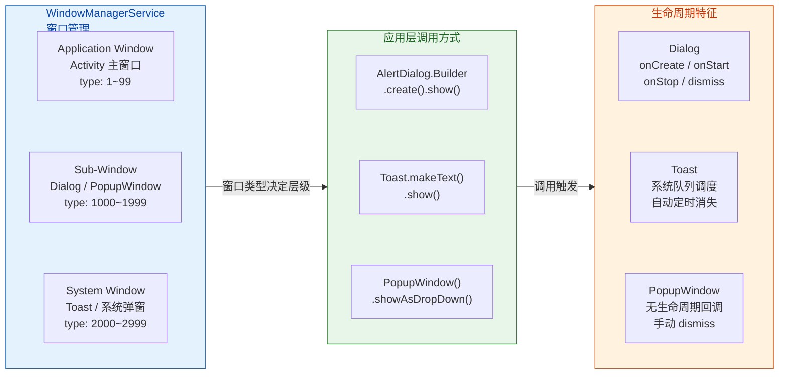

上面的流程图概括了三者在窗口系统中的定位关系。接下来我们逐一深入每个组件的构建方式、底层运作与最佳实践。

---

### AlertDialog 构建

AlertDialog 是 Android 中最常用的模态对话框（Modal Dialog）。所谓"模态"，是指对话框弹出后，**用户必须与之交互（确认、取消或点击外部关闭）才能继续操作底层 Activity**。这种强制聚焦的设计使其特别适合用于确认删除、权限申请说明、表单填写等关键交互场景。

**Builder 模式的设计哲学**

AlertDialog 的创建采用了经典的 **Builder 设计模式**。这并非偶然——一个对话框可能包含标题、消息、图标、按钮（最多三个）、列表项、自定义 View 等多种可选配置。如果通过构造函数传参，参数列表会极其冗长且难以维护。Builder 模式允许开发者以 **链式调用（Fluent API）** 的方式按需组装，最终通过 `create()` 一次性构建出不可变的 Dialog 实例。

从源码层面来看，`AlertDialog.Builder` 内部持有一个 `AlertController.AlertParams` 对象（在 AndroidX 版本中名为 `AlertDialogLayout`），每次调用 `setTitle()`、`setMessage()` 等方法时，实际上只是在往这个 Params 对象中填值。当调用 `create()` 时，才会真正将这些参数 `apply()` 到 AlertDialog 的内部控件上（标题 TextView、内容 TextView、按钮 Button 等）。这种 **延迟装配（Lazy Assembly）** 策略保证了构建过程的灵活性和最终对象的一致性。

```kotlin
// === 标准 AlertDialog 构建示例 ===

// 1. 实例化 Builder，传入当前 Activity 的 Context
//    注意：必须传 Activity Context，不能传 Application Context
//    因为 Dialog 需要依附于 Activity 的 Window Token
val builder = AlertDialog.Builder(this)

// 2. 设置对话框标题（可选）
//    内部会赋值给 AlertParams.mTitle
builder.setTitle("确认删除")

// 3. 设置对话框正文消息（可选）
//    内部赋值给 AlertParams.mMessage
builder.setMessage("此操作不可撤销，确定要删除该文件吗？")

// 4. 设置对话框图标（可选）
//    显示在标题左侧
builder.setIcon(R.drawable.ic_warning)

// 5. 设置"确定"按钮（Positive Button）
//    第一个参数为按钮文本，第二个为点击回调
//    DialogInterface.OnClickListener 的 which 参数标识被点击的按钮
builder.setPositiveButton("删除") { dialog, which ->
    // 执行删除逻辑
    performDelete()
    // dialog.dismiss() 会自动调用，无需手动
}

// 6. 设置"取消"按钮（Negative Button）
builder.setNegativeButton("取消") { dialog, which ->
    // 用户取消，对话框自动关闭
}

// 7. 设置"中立"按钮（Neutral Button，位于最左侧）
builder.setNeutralButton("了解更多") { dialog, which ->
    // 打开帮助文档
    openHelpPage()
}

// 8. 设置点击对话框外部区域是否关闭
//    默认为 true；关键操作建议设为 false 强制用户做出选择
builder.setCancelable(false)

// 9. create() 构建 AlertDialog 实例（此时尚未显示）
//    内部调用 AlertParams.apply(dialog) 装配所有控件
val dialog: AlertDialog = builder.create()

// 10. show() 将 Dialog 的 Window 添加到 WindowManager
//     此时对话框才真正可见
dialog.show()
```

上面的代码覆盖了 AlertDialog 最常见的配置项。值得特别注意的是 **Context 的选择问题**：Dialog 是一个 Sub-Window，它必须挂载在某个 Activity 的 Window Token 之下。如果传入 `ApplicationContext`，运行时会抛出 `BadTokenException`，因为 Application 没有关联任何 Window Token。这也是许多初学者常踩的坑。在 Fragment 中构建 Dialog 时，应使用 `requireActivity()` 或 `requireContext()`（后者在 Fragment attached 状态下返回的也是 Activity Context）。

**按钮位置规则**

AlertDialog 最多支持三个按钮，它们的位置由系统主题决定，而非开发者指定。在 Material Design 规范下，通常的排列是：Neutral 在最左，Negative 居中偏右，Positive 在最右。但开发者不应依赖这个视觉顺序，因为不同设备厂商的定制 ROM 可能调整按钮排列。

**列表型对话框**

除了简单消息型对话框，AlertDialog 还支持三种列表模式：普通列表 `setItems()`、单选列表 `setSingleChoiceItems()`、多选列表 `setMultiChoiceItems()`。当使用列表模式时，`setMessage()` 的内容会被列表覆盖而不显示——这是一个常见的"冲突"点。

```kotlin
// === 单选列表对话框 ===

// 定义选项数组
val options = arrayOf("按名称排序", "按日期排序", "按大小排序")

// 记录当前选中项索引（-1 表示无默认选中）
var selectedIndex = 0

// 构建单选对话框
AlertDialog.Builder(this)
    // setSingleChoiceItems 的三个参数：
    // items: 选项文本数组
    // checkedItem: 默认选中项的索引
    // listener: 选项被点击时的回调
    .setSingleChoiceItems(options, selectedIndex) { dialog, which ->
        // which 即为用户刚刚点击的选项索引
        selectedIndex = which
    }
    .setTitle("排序方式")
    // 用户点击确认后再真正应用排序
    .setPositiveButton("确定") { dialog, _ ->
        applySortOrder(selectedIndex)
    }
    .setNegativeButton("取消", null) // null 表示仅关闭，无额外操作
    .show() // show() 等同于 create() + show() 的快捷方式
```

**自定义布局对话框**

当内置的标题 + 消息 + 按钮模板不能满足需求时（比如需要一个包含输入框和复选框的复杂表单），可以通过 `setView()` 注入自定义布局。此时需要注意：自定义 View 的 `LayoutParams` 可能与 Dialog 默认的内边距产生冲突，通常需要在 XML 布局中自行控制 padding。

```kotlin
// === 自定义布局对话框 ===

// 1. 通过 LayoutInflater 加载自定义布局 XML
//    parent 传 null 是因为 Dialog 还未创建，尚无可依附的 ViewGroup
val customView = layoutInflater.inflate(R.layout.dialog_feedback, null)

// 2. 获取自定义布局中的控件引用
val editFeedback = customView.findViewById<EditText>(R.id.edit_feedback)
val checkAnonymous = customView.findViewById<CheckBox>(R.id.check_anonymous)

// 3. 构建对话框并注入自定义布局
AlertDialog.Builder(this)
    .setTitle("提交反馈")
    // setView() 将自定义 View 插入到对话框的 content 区域
    // 替换掉默认的 message TextView
    .setView(customView)
    .setPositiveButton("提交") { _, _ ->
        // 从自定义控件中读取用户输入
        val feedback = editFeedback.text.toString()
        val isAnonymous = checkAnonymous.isChecked
        submitFeedback(feedback, isAnonymous)
    }
    .setNegativeButton("取消", null)
    .show()
```

**阻止自动 dismiss 的技巧**

默认情况下，用户点击任何按钮后，AlertDialog 都会自动调用 `dismiss()` 关闭自身。但在表单验证场景中，如果用户输入不合法，我们希望对话框 **保持打开** 并给出提示。此时需要 **绕过 Builder 的按钮注册机制**，在 `show()` 之后手动为按钮设置监听器：

```kotlin
// === 阻止对话框在输入不合法时自动关闭 ===

// 1. 先通过 Builder 创建 Dialog（按钮回调暂传 null）
val dialog = AlertDialog.Builder(this)
    .setTitle("输入用户名")
    .setView(R.layout.dialog_username)
    .setPositiveButton("确定", null)  // 先传 null，不注册回调
    .setNegativeButton("取消", null)
    .create()

// 2. 在 show() 之后，从 dialog 实例中获取按钮并覆盖点击事件
dialog.show()

// 3. getButton() 获取 Positive 按钮的引用
//    此方法必须在 show() 之后调用，否则返回 null
dialog.getButton(AlertDialog.BUTTON_POSITIVE).setOnClickListener {
    // 4. 从 Dialog 的自定义 View 中取得 EditText
    val input = dialog.findViewById<EditText>(R.id.edit_username)
    val username = input?.text?.toString().orEmpty()

    // 5. 执行校验：不合法则提示，不关闭；合法则手动 dismiss
    if (username.length < 3) {
        input?.error = "用户名至少需要 3 个字符"
        // 不调用 dismiss()，对话框保持打开
    } else {
        saveUsername(username)
        dialog.dismiss() // 手动关闭
    }
}
```

这个技巧的关键在于理解 AlertDialog 的内部实现：Builder 在 `apply()` 阶段会为每个按钮包装一个 `ButtonHandler`，该 Handler 在处理点击事件时会 **无条件发送 `MSG_DISMISS_DIALOG` 消息**。而我们在 `show()` 之后直接替换了按钮的 `OnClickListener`，就跳过了这个 Handler，从而获得了对 dismiss 时机的完全控制。

---

### Dialog 生命周期

很多开发者会忽略一个事实：Dialog 拥有自己的 **独立生命周期**。虽然它不像 Activity 和 Fragment 那样由系统（AMS）直接管理，但 Dialog 类确实定义了一套从创建到销毁的回调链。理解这套生命周期有助于我们在正确的时机执行初始化、资源释放和状态保存。

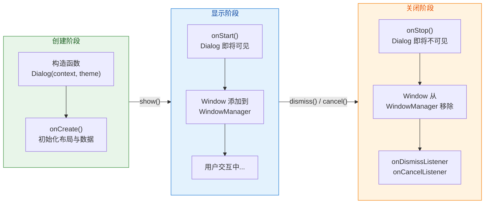

**核心回调详解**

当调用 `dialog.show()` 时，内部执行顺序如下：

1. **`onCreate(Bundle)`**：首次调用 `show()` 时触发（仅一次）。这是设置 Dialog 内容布局（`setContentView()`）的标准位置，类似 Activity 的 `onCreate()`。如果 Dialog 已经创建过，再次调用 `show()` 不会重复触发 `onCreate()`。

2. **`onStart()`**：每次 `show()` 都会调用。此时 Dialog 的 Window 即将被添加到 WindowManager，但尚未真正绘制到屏幕上。适合在这里执行每次显示都需要刷新的逻辑，比如更新数据或重置表单状态。

3. **`onStop()`**：当 `dismiss()` 或 `hide()` 被调用时触发。此时 Window 即将从 WindowManager 中移除。适合在这里释放临时资源。

4. **`dismiss()` vs `cancel()`**：两者都会关闭对话框，但 `cancel()` 会 **额外触发 `OnCancelListener`**。当用户按返回键或点击对话框外部区域关闭时，系统调用的是 `cancel()` 而非 `dismiss()`。不过 `cancel()` 内部最终也会调用 `dismiss()`，所以 `OnDismissListener` 在两种情况下都会被触发。

**与 Activity 生命周期的耦合风险**

Dialog 最大的"坑"在于它与宿主 Activity 的生命周期绑定。由于 Dialog 持有 Activity 的 Context 引用，当 Activity 被销毁（如屏幕旋转导致 Configuration Change）时，如果 Dialog 仍然处于显示状态，就会出现两个严重问题：

- **WindowManager.BadTokenException**：Activity 的 Window Token 已失效，但 Dialog 仍试图操作该 Token 对应的窗口。
- **内存泄漏**：Dialog 持有已销毁 Activity 的引用，导致 Activity 无法被 GC 回收。

**解决方案** 有两种主流思路：

第一种是在 Activity 的 `onDestroy()` 或 `onPause()` 中主动调用 `dialog.dismiss()`。这种方式简单直接，但需要开发者手动管理每一个 Dialog 的引用。

第二种（推荐）是使用 **`DialogFragment`**。DialogFragment 是 Fragment 的子类，它将 Dialog 纳入 Fragment 的生命周期管理体系。当 Activity 重建时，FragmentManager 会自动恢复 DialogFragment 的状态（包括显示 / 隐藏状态），从根本上避免了上述问题。这也是 Google 官方推荐的做法。

```kotlin
// === 使用 DialogFragment 安全管理 Dialog ===

// 1. 继承 DialogFragment，重写 onCreateDialog
class ConfirmDeleteDialogFragment : DialogFragment() {

    // 2. onCreateDialog 在 Fragment 创建时被调用
    //    返回值就是要显示的 Dialog 实例
    override fun onCreateDialog(savedInstanceState: Bundle?): Dialog {
        // 3. 使用 requireContext() 获取安全的 Context
        //    DialogFragment 保证此时 Context 非 null
        return AlertDialog.Builder(requireContext())
            .setTitle("确认删除")
            .setMessage("此操作不可撤销")
            .setPositiveButton("删除") { _, _ ->
                // 4. 通过 parentFragment 或 Activity 回传结果
                //    推荐使用 Fragment Result API (setFragmentResult)
                parentFragmentManager.setFragmentResult(
                    "delete_request",           // requestKey
                    bundleOf("confirmed" to true) // 结果 Bundle
                )
            }
            .setNegativeButton("取消", null)
            .create()
    }

    // 5. 可选：重写 onCancel 处理用户按返回键的情况
    override fun onCancel(dialog: DialogInterface) {
        super.onCancel(dialog)
        // 记录取消操作的日志等
    }
}

// === 在 Activity 或 Fragment 中显示 DialogFragment ===
// 6. 通过 FragmentManager 显示，tag 用于后续查找
ConfirmDeleteDialogFragment()
    .show(supportFragmentManager, "confirm_delete")

// === 监听 Dialog 返回的结果 ===
// 7. 在调用方通过 Fragment Result API 接收回调
supportFragmentManager.setFragmentResultListener(
    "delete_request",  // 与 Dialog 中设置的 requestKey 一致
    this               // LifecycleOwner
) { _, bundle ->
    val confirmed = bundle.getBoolean("confirmed", false)
    if (confirmed) {
        // 执行删除操作
    }
}
```

使用 DialogFragment 后，Configuration Change 时系统会自动重建 Dialog，开发者无需手动保存和恢复 Dialog 的显示状态。同时，Fragment Result API 提供了一种 **解耦的、生命周期安全的** 通信方式，取代了旧的 callback interface 模式。

---

### Toast 消息队列

Toast 是 Android 中最轻量的用户通知方式——它不需要任何用户交互，在短暂显示后自动消失。表面上看，`Toast.makeText(context, "消息", Toast.LENGTH_SHORT).show()` 只是一行代码的事。但其背后涉及 **跨进程通信（IPC）** 和 **系统级队列调度**，机制远比表象复杂。

**Toast 的系统架构**

当你调用 `toast.show()` 时，事件流并不是"直接在当前 Activity 上叠加一个 View"那么简单。实际流程如下：

1. App 进程中的 `Toast.show()` 通过 Binder IPC 调用 `NotificationManagerService`（NMS）的 `enqueueToast()` 方法，将这个 Toast 注册到 **系统级的 Toast 队列** 中。

2. NMS 按照 FIFO（先进先出）顺序依次处理队列中的 Toast。当轮到某个 Toast 显示时，NMS 回调 App 进程中的 `TN`（Toast 内部的 `ITransientNotification.Stub` 实现）的 `show()` 方法。

3. `TN.show()` 通过 Handler 将显示操作 post 到主线程，在主线程中通过 `WindowManager.addView()` 将 Toast 的 View 添加为一个 System Window（`TYPE_TOAST`）。

4. 显示持续一段时间后（`LENGTH_SHORT` = 2秒，`LENGTH_LONG` = 3.5秒），NMS 再次回调 `TN.hide()`，将 View 从 WindowManager 中移除。

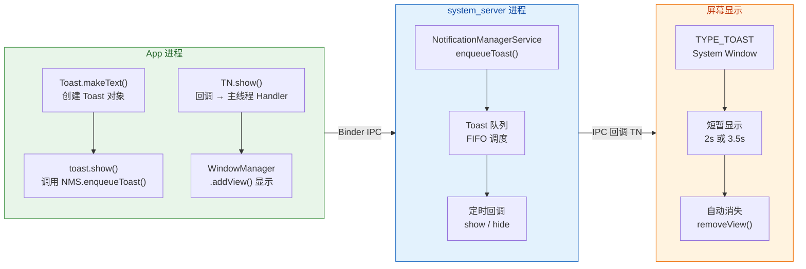

这套跨进程架构带来了几个重要的行为特征：

**系统队列的串行性**：所有 App 的 Toast 共享同一个队列。如果你快速连续调用多次 `toast.show()`，它们不会同时显示，而是排队依次弹出。这意味着短时间内大量调用 Toast 会导致消息"积压"，用户体验很差。

**Application Context 可用**：与 Dialog 不同，Toast 是由系统服务添加到 WindowManager 的 System Window，不需要 Activity 的 Window Token。因此 `Toast.makeText(applicationContext, ...)` 完全合法。

**子线程限制**：虽然 Toast 最终在主线程渲染，但 `Toast.show()` 内部通过 Handler 进行线程调度。在 Android 11+ 中，子线程直接调用 `Toast.show()` 可能不会崩溃（因为 NMS 端做了处理），但在更早的版本中，需要确保子线程有 Looper 才能使用 Toast。最佳实践仍然是 **在主线程调用 Toast**。

**基础使用**

```kotlin
// === Toast 基础用法 ===

// 1. makeText 创建 Toast 实例
//    参数：Context、消息文本、显示时长
//    LENGTH_SHORT ≈ 2 秒，LENGTH_LONG ≈ 3.5 秒
val toast = Toast.makeText(
    this,                     // Context（Activity 或 Application 均可）
    "文件已保存",              // 显示文本
    Toast.LENGTH_SHORT        // 显示时长常量
)

// 2. 可选：设置 Toast 在屏幕上的位置
//    setGravity(gravity, xOffset, yOffset)
//    注意：Android 11 (API 30) 起，对文本 Toast 的 setGravity 不再生效
toast.setGravity(Gravity.TOP or Gravity.CENTER_HORIZONTAL, 0, 100)

// 3. 调用 show() 将 Toast 加入系统队列
toast.show()
```

**避免 Toast 消息积压**

```kotlin
// === 防止重复 Toast 积压的工具封装 ===

object ToastUtil {
    // 持有上一个 Toast 的引用（弱引用语义上已足够，
    // 但此处 Toast 生命周期短，直接强引用问题不大）
    private var lastToast: Toast? = null

    /**
     * 显示 Toast，若上一个 Toast 尚未消失则先取消它
     * 这样可以避免用户连续操作导致 Toast 排队堆积
     */
    fun showToast(context: Context, message: String, duration: Int = Toast.LENGTH_SHORT) {
        // 1. 取消上一个 Toast（若仍在显示）
        lastToast?.cancel()

        // 2. 创建新的 Toast
        val newToast = Toast.makeText(
            context.applicationContext, // 使用 applicationContext 避免 Activity 泄漏
            message,
            duration
        )

        // 3. 保存引用以便下次取消
        lastToast = newToast

        // 4. 显示
        newToast.show()
    }
}

// 使用示例：连续调用也不会堆积
ToastUtil.showToast(this, "第一条消息")
ToastUtil.showToast(this, "第二条消息") // 第一条立即消失，第二条立即显示
```

**Android 版本演进与 Snackbar 的替代趋势**

从 Android 11（API 30）开始，Google 对 Toast 施加了越来越多的限制：自定义 Toast View（`toast.setView()`）已被 **完全废弃**（deprecated），`setGravity()` 和 `setMargin()` 对纯文本 Toast 也不再生效。系统的意图很明确——**Toast 只应用于最简单的文本提示**，任何需要自定义外观或交互的场景应使用 Material Design 的 `Snackbar` 替代。

Snackbar 相比 Toast 有几个显著优势：它可以包含 Action 按钮（如"撤销"）；它自动适应 CoordinatorLayout 的行为（如让 FAB 上移避让）；它不依赖系统服务，完全在 App 进程内渲染，响应更快。如果你的项目已经依赖了 Material Components 库，建议优先使用 Snackbar。

```kotlin
// === Snackbar 替代 Toast 的推荐写法 ===

// 1. Snackbar.make() 需要一个 View 参数作为锚点
//    通常传入当前页面的根布局或 CoordinatorLayout
Snackbar.make(
    findViewById(R.id.root_layout),   // 锚定 View
    "文件已删除",                       // 消息文本
    Snackbar.LENGTH_LONG              // 显示时长
)
    // 2. setAction 添加一个可点击的操作按钮
    .setAction("撤销") {
        // 执行撤销逻辑
        restoreDeletedFile()
    }
    // 3. 可选：设置操作按钮文字颜色
    .setActionTextColor(getColor(R.color.accent))
    // 4. 显示
    .show()
```

---

### PopupWindow 锚点

PopupWindow 是 Android 浮层体系中最灵活、最底层的组件。与 AlertDialog 有标准的"标题 + 消息 + 按钮"模板不同，PopupWindow 就是一个 **纯粹的浮动容器**——你给它一个 View，指定宽高，告诉它相对于哪个锚点（anchor View）弹出，仅此而已。它没有内置样式，没有按钮回调，也没有生命周期方法。这种极简设计使其成为下拉菜单（Dropdown Menu）、工具提示（Tooltip）、筛选面板（Filter Panel）等自定义浮层的首选载体。

**PopupWindow 的核心属性**

创建一个 PopupWindow 至少需要设置三个要素：**内容 View**、**宽度** 和 **高度**。除此之外还有若干关键属性影响其行为：

- **`isFocusable`**：是否获取焦点。设为 `true` 时，PopupWindow 可以响应键盘事件（如按返回键关闭）。设为 `false` 时，触摸 PopupWindow 之外的区域不会关闭它，事件会继续传递给底层 View。
- **`isOutsideTouchable`**：点击外部区域是否关闭 PopupWindow。通常与 `isFocusable = true` 配合使用。
- **`setBackgroundDrawable()`**：这个看似不起眼的属性实际上非常关键。如果不设置 background（或设为 null），在某些 Android 版本上按返回键和点击外部 **无法关闭** PopupWindow。设置一个空的 `ColorDrawable` 即可解决。这是因为 PopupWindow 内部的 `PopupBackgroundView` 需要一个 background 来作为触摸事件的拦截载体。
- **`elevation`**：阴影高度，影响 PopupWindow 的视觉层级感。Material Design 推荐浮层具有 elevation 以区别于底层内容。
- **`animationStyle`**：进场和退场动画的 Style 资源 ID。

**锚点定位机制**

PopupWindow 提供了两种锚点定位方式：

1. **`showAsDropDown(anchor, xOff, yOff, gravity)`**：相对于锚点 View 的 **下方** 弹出。`xOff` 和 `yOff` 是相对于锚点左下角的偏移量。`gravity` 参数（API 19+）控制 PopupWindow 相对于锚点的水平对齐方式。

2. **`showAtLocation(parent, gravity, x, y)`**：相对于整个 **窗口** 定位。`parent` 只是用于获取 Window Token（可以是 Activity 中的任意 View），实际定位由 `gravity` 和 x/y 坐标决定。

从源码角度看，`showAsDropDown()` 内部会调用 `findDropDownPosition()` 方法来计算 PopupWindow 的最终位置。这个方法会考虑：锚点 View 在屏幕上的绝对位置（通过 `getLocationOnScreen()`）、PopupWindow 自身的尺寸、屏幕边界。如果弹出后发现下方空间不足，系统会自动将 PopupWindow **翻转到锚点上方** 显示——这就是所谓的 **"自动翻转（Auto-flip）"** 逻辑。

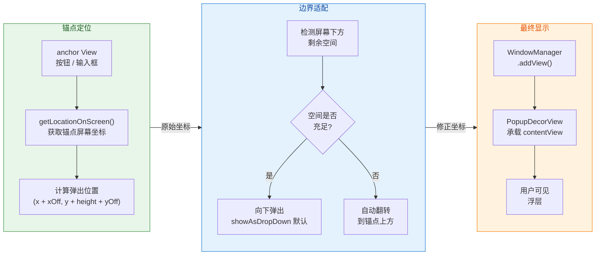

**完整使用示例**

```kotlin
// === PopupWindow 完整构建与显示 ===

// 1. 加载 PopupWindow 的内容布局
//    这里假设是一个包含多个选项的垂直列表
val popupView = LayoutInflater.from(this)
    .inflate(R.layout.popup_menu, null)

// 2. 创建 PopupWindow 实例
//    参数：contentView, width, height
val popupWindow = PopupWindow(
    popupView,                              // 内容 View
    ViewGroup.LayoutParams.WRAP_CONTENT,    // 宽度：自适应内容
    ViewGroup.LayoutParams.WRAP_CONTENT     // 高度：自适应内容
)

// 3. 设置焦点行为：允许获取焦点，这样按返回键才能关闭
popupWindow.isFocusable = true

// 4. 设置外部可触摸关闭
popupWindow.isOutsideTouchable = true

// 5. 【关键】设置背景 Drawable
//    不设置时，某些系统版本上返回键和外部点击无法关闭 PopupWindow
//    传入一个透明的 ColorDrawable 即可
popupWindow.setBackgroundDrawable(ColorDrawable(Color.TRANSPARENT))

// 6. 设置阴影高度（增加悬浮感）
popupWindow.elevation = 12f

// 7. 设置进场/退场动画（引用 styles.xml 中的动画资源）
popupWindow.animationStyle = R.style.PopupAnimation

// 8. 为内容 View 中的选项设置点击事件
popupView.findViewById<TextView>(R.id.option_edit).setOnClickListener {
    // 执行编辑操作
    performEdit()
    // 操作完成后关闭 PopupWindow
    popupWindow.dismiss()
}

popupView.findViewById<TextView>(R.id.option_delete).setOnClickListener {
    performDelete()
    popupWindow.dismiss()
}

// 9. 相对于锚点 View（如一个按钮）显示
//    showAsDropDown(anchor, xOffset, yOffset, gravity)
//    这里在按钮正下方偏左 0dp、偏下 8dp 的位置弹出
val anchorButton = findViewById<View>(R.id.btn_more)
popupWindow.showAsDropDown(
    anchorButton,           // 锚点 View
    0,                      // X 偏移量（像素）
    8,                      // Y 偏移量（像素）
    Gravity.START           // 左对齐锚点
)
```

**PopupWindow 的坐标转换**

在动态计算 PopupWindow 位置的场景中（比如根据手指触摸位置弹出），需要理解坐标系的转换：

```kotlin
// === 根据触摸点显示 PopupWindow ===

someView.setOnTouchListener { view, event ->
    if (event.action == MotionEvent.ACTION_DOWN) {
        // 1. event.x / event.y 是相对于 View 自身的坐标
        //    event.rawX / event.rawY 是相对于屏幕左上角的绝对坐标
        val touchX = event.rawX.toInt()
        val touchY = event.rawY.toInt()

        // 2. 使用 showAtLocation 在屏幕绝对位置弹出
        //    parent 参数仅用于获取 WindowToken
        popupWindow.showAtLocation(
            view,                              // 任意已附着的 View（取其 WindowToken）
            Gravity.NO_GRAVITY,               // 不使用 gravity 对齐，完全由 x/y 决定
            touchX,                            // 屏幕绝对 X 坐标
            touchY                             // 屏幕绝对 Y 坐标
        )
    }
    true // 消费事件
}
```

**PopupWindow 与 ListPopupWindow 的关系**

Android 还提供了 `ListPopupWindow`，它是对 PopupWindow 的封装，内部直接集成了 `ListView` 和 `Adapter` 机制。Spinner 控件的下拉列表底层就是通过 ListPopupWindow 实现的。如果你的需求仅仅是一个简单的下拉选项列表，ListPopupWindow 比手动构建 PopupWindow + RecyclerView 更为便捷。更进一步，Material Components 库中的 `MaterialAlertDialogBuilder` 和 `ExposedDropdownMenu` 等组件也在内部使用了 PopupWindow 或其变体。

**PopupWindow 的常见问题与规避**

第一个常见问题是 **内存泄漏**。PopupWindow 持有传入的 contentView，而 contentView 如果是通过 Activity 的 LayoutInflater 创建的，就间接持有 Activity 引用。如果 PopupWindow 在 Activity 销毁后仍未 dismiss，就会导致泄漏。解决方式与 Dialog 类似——在 `onDestroy()` 中确保调用 `popupWindow.dismiss()`。

第二个常见问题是 **位置计算错误**。当锚点 View 位于 ScrollView 或 RecyclerView 内部且可滚动时，锚点的屏幕位置会随滚动变化。如果 PopupWindow 在显示期间锚点被滚走，PopupWindow 不会自动跟随移动。可以通过监听 `OnScrollListener` 来手动调用 `popupWindow.update()` 刷新位置，或者在锚点不可见时直接 dismiss。

第三个常见问题是 **宽度不受控**。当使用 `WRAP_CONTENT` 时，PopupWindow 的宽度由 contentView 的内容决定。如果内容过宽可能超出屏幕。建议在 XML 布局中为根 View 设置 `android:minWidth` 和 `android:maxWidth`，或者在代码中测量后手动设置 `popupWindow.width`。

---

**📝 练习题**

在 Activity 中使用 `AlertDialog.Builder(context).create().show()` 构建对话框时，如果传入的 `context` 是 `getApplicationContext()` 返回的 Application Context，运行时会出现什么问题？


A. 编译错误，Builder 不接受 Application Context 类型的参数


B. 运行时抛出 `WindowManager.BadTokenException`，因为 Application 没有关联的 Window Token


C. 对话框可以正常弹出，但显示在所有 App 之上，类似系统弹窗


D. 对话框可以正常弹出，但无法响应点击事件


**【答案】** B

**【解析】** AlertDialog 属于 Sub-Window（子窗口），它必须依附于一个已有的 Application Window（即 Activity 的窗口）。Android 的 WindowManager 在添加子窗口时，会校验传入 Context 所关联的 **Window Token** 是否有效。Activity Context 携带了合法的 Window Token，而 Application Context 没有关联任何 Window Token（它不对应任何界面窗口），因此 `WindowManager.addView()` 在尝试将 Dialog 的 Window 添加到显示系统时，会因 Token 校验失败而抛出 `BadTokenException`。选项 A 错误，因为 `Builder(Context)` 的参数类型就是 `Context`，Application Context 是其子类，编译没有问题。选项 C 描述的是 System Window 的行为（需要 `SYSTEM_ALERT_WINDOW` 权限），与普通 Dialog 无关。选项 D 没有依据，点击事件的分发与 Context 类型无关。

---

**📝 练习题**

关于 `PopupWindow` 的 `setBackgroundDrawable()` 方法，以下说法正确的是：


A. 它仅用于设置 PopupWindow 的视觉背景色，不影响功能行为


B. 如果不调用此方法或传入 null，在某些 Android 版本上按返回键和点击外部区域无法关闭 PopupWindow


C. 必须传入一个不透明的 Drawable，否则不生效


D. 调用此方法会自动将 `isFocusable` 设为 true


**【答案】** B

**【解析】** `setBackgroundDrawable()` 的作用远不只是设置视觉背景。PopupWindow 内部使用一个 `PopupBackgroundView` 来包裹 contentView，这个 wrapper view 会根据是否有 background 来决定是否拦截外部触摸事件和返回键。如果 background 为 null，`PopupBackgroundView` 的事件拦截逻辑不会生效，导致按返回键和点击外部区域都无法关闭 PopupWindow。解决方法是传入一个 `ColorDrawable(Color.TRANSPARENT)`——即使完全透明也能让事件拦截机制正常工作。选项 A 说"不影响功能行为"明显错误。选项 C 错误，透明 Drawable 完全可以生效。选项 D 错误，`setBackgroundDrawable()` 和 `isFocusable` 是两个独立属性，互不影响。

---

## 点击事件监听

Android 应用中几乎所有的用户交互都从"点击"开始。一个看似简单的 `setOnClickListener`，背后涉及到 **事件分发链（Event Dispatch Chain）**、**接口回调模式（Interface Callback Pattern）** 以及 View 内部状态机的精密协作。深入理解这些机制，不仅能让你写出健壮的交互代码，更能帮助你在遇到"点击无响应"、"点击穿透"、"重复点击导致崩溃"等疑难问题时，快速定位根因。

### OnClickListener 机制详解

#### 接口回调的本质

`View.OnClickListener` 是 Android 最经典的 **观察者模式（Observer Pattern）** 实现之一。当你调用 `view.setOnClickListener(listener)` 时，实际上是把一个回调对象 **注册** 到了 View 内部的成员变量 `mOnClickListener` 中。View 并不会在注册时立刻执行任何逻辑，而是在事件分发流程判定"这是一次有效点击"后，才通过 `performClick()` 方法回调你传入的 listener。

这种设计的精髓在于 **控制反转（Inversion of Control）**：View 自己决定何时触发点击，开发者只需要声明"点击后做什么"。这让交互逻辑的定义方与执行时机的控制方完全解耦。

从 View 源码来看，整个回调链条可以简化为以下关键步骤：

1. 用户手指按下屏幕，系统生成 `MotionEvent.ACTION_DOWN`。
2. 事件经由 `Activity → Window → DecorView → ViewGroup → View` 的分发链到达目标 View。
3. 目标 View 的 `onTouchEvent()` 处理 `ACTION_DOWN`，设置 **pressed 状态** 并发起一个延迟的 `CheckForTap` Runnable。
4. 如果用户手指在合理范围内抬起（`ACTION_UP`），View 在 `onTouchEvent()` 中调用 `performClick()`。
5. `performClick()` 检查 `mOnClickListener` 是否为空，非空则调用其 `onClick(View v)` 方法。

这里要特别注意一个容易被忽视的细节：**如果你同时设置了 `OnTouchListener` 并在 `onTouch()` 返回 `true`（表示事件已消费），那么 `onTouchEvent()` 将不会被调用，`performClick()` 也就永远不会触发**。这是无数"点击失效" Bug 的根源之一。

#### 基本使用方式

在 Kotlin 中，得益于 SAM（Single Abstract Method）转换和扩展函数，点击监听的写法非常简洁：

```kotlin
// ========== 方式一：Lambda 表达式（最常用） ==========
// Kotlin 的 SAM 转换会自动将 Lambda 包装为 OnClickListener 实例
binding.btnSubmit.setOnClickListener { view ->
    // view 即被点击的 View 本身，可以做类型判断或取 id
    handleSubmit()
}

// ========== 方式二：具名函数引用 ==========
// 将点击逻辑抽取为独立方法，提升可读性与复用性
binding.btnSubmit.setOnClickListener(::onSubmitClicked)

// 具名处理函数，参数类型必须匹配 OnClickListener 的 onClick(View) 签名
private fun onSubmitClicked(view: View) {
    // 执行提交逻辑
    handleSubmit()
}

// ========== 方式三：Activity/Fragment 实现接口（多按钮共享场景） ==========
// 当一个页面有大量按钮时，让宿主统一实现 OnClickListener 减少匿名对象数量
class OrderActivity : AppCompatActivity(), View.OnClickListener {

    override fun onCreate(savedInstanceState: Bundle?) {
        super.onCreate(savedInstanceState)
        // 多个按钮共享同一个 listener（即 this）
        binding.btnConfirm.setOnClickListener(this)
        binding.btnCancel.setOnClickListener(this)
        binding.btnDetail.setOnClickListener(this)
    }

    // 统一的点击分发入口，通过 view.id 区分来源
    override fun onClick(v: View) {
        // when 表达式替代 Java 的 switch-case，更安全也更简洁
        when (v.id) {
            R.id.btn_confirm -> confirmOrder()   // 确认订单
            R.id.btn_cancel  -> cancelOrder()    // 取消订单
            R.id.btn_detail  -> showDetail()     // 查看详情
        }
    }
}
```

#### performClick() 的内部逻辑

`performClick()` 是连接触摸事件与业务回调的 **桥梁方法**，它的职责远不止"调用 listener"那么简单。以下是其核心逻辑的精简还原：

```java
// View.java 中 performClick() 的核心逻辑（精简版）
public boolean performClick() {
    // 通知无障碍服务：即将执行点击，让 TalkBack 等工具能播报操作
    notifyAutofillManagerOnClick();

    boolean result = false;

    // 发送无障碍事件（TYPE_VIEW_CLICKED），确保辅助服务感知到点击
    sendAccessibilityEvent(AccessibilityEvent.TYPE_VIEW_CLICKED);

    // 获取已注册的 OnClickListener 实例
    ListenerInfo li = mListenerInfo;
    if (li != null && li.mOnClickListener != null) {
        // 播放系统点击音效（如果用户开启了触摸音效）
        playSoundEffect(SoundEffectConstants.CLICK);
        // 调用开发者注册的回调——这才是业务逻辑真正执行的时刻
        li.mOnClickListener.onClick(this);
        // 标记事件已被消费
        result = true;
    } else {
        // 没有 listener 时，仅播放音效
        playSoundEffect(SoundEffectConstants.CLICK);
    }

    // 触发 Tooltip 隐藏（Android 8.0+ 的长按提示气泡）
    sendAccessibilityEvent(AccessibilityEvent.TYPE_VIEW_CLICKED);
    return result;
}
```

这段代码有几个值得注意的设计要点。第一，**无障碍优先**：在调用业务回调之前，先发送了 Accessibility 事件。Android 将无障碍视为一等公民，这意味着即使开发者的 `onClick` 逻辑崩溃了，无障碍服务也已经感知到了此次操作。第二，**音效自动播放**：你不需要手动处理点击音，`performClick()` 会自动调用 `playSoundEffect()`，但前提是 View 的 `isSoundEffectsEnabled()` 返回 `true`（默认是 true）。第三，**返回值语义**：返回 `true` 表示有 listener 消费了此次点击，`false` 则表示无人处理。

另一个开发中极其重要的场景是：**如果你重写了 `onTouchEvent()` 来处理自定义手势，但又希望保留点击功能，你必须在 `ACTION_UP` 分支手动调用 `performClick()`**。否则不仅点击回调失效，Android Lint 还会给你一个 Warning：`Custom view has setOnTouchListener called on it but does not override performClick`。这个警告的背后是无障碍合规的要求——TalkBack 用户无法触发触摸事件，只能通过 `performClick()` 执行"点击"。

### OnLongClickListener 机制详解

#### 长按的判定原理

长按（Long Click）与普通点击的根本区别在于 **时间维度**。Android 使用一个系统级常量 `ViewConfiguration.getLongPressTimeout()` 来定义长按阈值，默认为 **500 毫秒**。这个值存储在 `ViewConfiguration` 中，不同设备厂商可能有所不同，且用户可以在辅助功能设置中调整（"触摸和按住延迟"选项）。

从 View 源码来看，长按检测的时序如下：

1. **ACTION_DOWN 到达时**：View 的 `onTouchEvent()` 使用 `postDelayed()` 投递一个 `CheckForLongPress` Runnable 到主线程消息队列，延迟时间即为 `getLongPressTimeout()`。
2. **计时期间**：如果手指移出 View 的触摸区域（slop 范围外）或收到 `ACTION_CANCEL`，Runnable 被 `removeCallbacks()` 移除，长按判定取消。
3. **500ms 到达且手指未移开**：`CheckForLongPress` 的 `run()` 被执行，调用 `performLongClick()`。
4. **`performLongClick()` 返回值决定后续行为**：若返回 `true`（长按事件被消费），后续的 `ACTION_UP` 不再触发 `performClick()`；若返回 `false`，系统认为长按未被处理，`ACTION_UP` 时仍会触发普通点击。

这个设计意味着 **长按和普通点击是互斥的**：一旦长按被确认并消费，同一个触摸序列就不会再产生 Click 事件。这种互斥关系由 View 内部的 `mHasPerformedLongPress` 标志位控制。

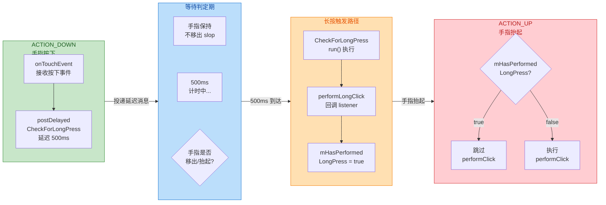

#### 基本使用与返回值语义

```kotlin
// 为 View 注册长按监听器
binding.itemCard.setOnLongClickListener { view ->
    // view: 被长按的 View 引用
    // 弹出上下文菜单或执行删除操作
    showContextMenu(view)

    // ★ 返回值含义极其重要 ★
    // true  -> 长按已被消费，ACTION_UP 不再触发 OnClickListener
    // false -> 长按未消费，ACTION_UP 仍会触发 OnClickListener（通常不推荐）
    true
}
```

返回值的选择有明确的交互设计含义。在绝大多数场景中，你应该返回 `true`。试想一个列表项同时绑定了 Click（打开详情）和 Long Click（弹出删除确认），如果长按回调返回 `false`，用户长按后松手，会先弹出删除对话框，紧接着又跳转到详情页——这显然是灾难性的体验。只有在极少数情况下（如你仅在长按时做一些视觉提示但不算真正的"操作"），才考虑返回 `false`。

#### 长按触摸反馈：HapticFeedback

长按操作通常配合 **触觉反馈（Haptic Feedback）** 来增强用户感知。Android 提供了 `performHapticFeedback()` 方法来触发设备振动：

```kotlin
binding.itemCard.setOnLongClickListener { view ->
    // 触发系统级长按振动反馈，无需 VIBRATE 权限
    // HapticFeedbackConstants.LONG_PRESS 是系统预定义的长按振动模式
    view.performHapticFeedback(HapticFeedbackConstants.LONG_PRESS)

    // 执行业务逻辑
    showDeleteDialog(view)
    true
}
```

`performHapticFeedback()` 不需要声明 `android.permission.VIBRATE` 权限，因为它走的是 View 系统的 Haptic 通道而非直接操作 Vibrator 服务。但它是否真正生效取决于两个条件：一是系统设置中"触摸时振动"开关是否打开，二是当前 Window 是否设置了 `FLAG_HAPTIC_FEEDBACK_ENABLED`（默认启用）。

### 常用 View 方法：可见性、启用状态与交互控制

除了点击/长按监听之外，实际开发中有大量的 View 方法直接影响用户的交互体验。这些方法看似简单，但其底层行为常常有值得深入理解的细节。

#### setVisibility() —— 可见性三态模型

`View.setVisibility()` 接受三个常量，它们的行为差异不仅体现在视觉上，更体现在 **布局计算** 和 **事件分发** 层面：

| 常量 | 值 | 是否绘制 | 是否占据布局空间 | 是否接收事件 |
|---|---|---|---|---|
| `View.VISIBLE` | `0` | ✅ | ✅ | ✅ |
| `View.INVISIBLE` | `4` | ❌ | ✅ | ❌ |
| `View.GONE` | `8` | ❌ | ❌ | ❌ |

**VISIBLE** 是默认状态，View 正常参与测量（measure）、布局（layout）和绘制（draw）三大流程，也能正常接收触摸事件。

**INVISIBLE** 的行为最容易被误解。设为 INVISIBLE 的 View **仍然参与 measure 和 layout**，它在父容器中依然"占位"，其他兄弟 View 的排列不会因它的"隐藏"而发生变化。但它的 `draw()` 方法不会被调用（准确地说，`ViewGroup` 在 `dispatchDraw()` 遍历子 View 时会跳过 INVISIBLE 的子 View）。同时，INVISIBLE 的 View **不会接收任何触摸事件**——`ViewGroup` 在 `dispatchTouchEvent()` 中进行 hit testing 时，会跳过非 VISIBLE 的子 View。

**GONE** 则更加彻底：View 完全退出布局流程。在 `onMeasure()` 中，父容器会直接将 GONE 子 View 的测量尺寸视为 0×0，在 `onLayout()` 中也不会为它分配任何空间。这意味着 **设置 GONE 会触发父容器乃至整棵视图树的重新布局（requestLayout）**，而 INVISIBLE 只触发重绘（invalidate）。因此，在需要频繁切换显隐的场景（如加载动画的 show/hide），优先使用 INVISIBLE 而非 GONE，以避免不必要的 layout 计算开销。

```kotlin
// ========== 可见性切换最佳实践 ==========

// 场景一：加载指示器频繁显隐 → 用 INVISIBLE 避免 layout 抖动
fun showLoading(show: Boolean) {
    // INVISIBLE 不触发 requestLayout，性能更优
    binding.progressBar.visibility = if (show) View.VISIBLE else View.INVISIBLE
}

// 场景二：功能模块整体隐藏 → 用 GONE 释放空间
fun toggleAdvancedSettings(show: Boolean) {
    // GONE 让其他 View 可以占据这块空间
    binding.advancedPanel.visibility = if (show) View.VISIBLE else View.GONE
}

// ★ 常见工具方法：安全切换可见性
// 封装 isVisible 扩展属性（AndroidX Core-KTX 已内置）
// import androidx.core.view.isVisible
// import androidx.core.view.isInvisible
// import androidx.core.view.isGone

fun example() {
    // Core-KTX 提供的布尔属性，比直接使用常量更具可读性
    binding.emptyView.isVisible = list.isEmpty()    // true→VISIBLE, false→GONE
    binding.emptyView.isInvisible = list.isEmpty()  // true→INVISIBLE, false→VISIBLE
    binding.emptyView.isGone = list.isNotEmpty()    // true→GONE, false→VISIBLE
}
```

#### setEnabled() —— 启用/禁用与事件拦截

`setEnabled(false)` 会将 View 置为 **禁用态（disabled state）**，其影响范围包括：

1. **视觉反馈**：View 会切换到 `state_enabled=false` 对应的 Drawable 状态（通常为灰色/半透明），这由 `StateListDrawable` 和 `ColorStateList` 自动管理。
2. **事件处理变化**：禁用状态下，`onTouchEvent()` 仍然会被调用（这是很多人的认知误区），但 View 不会响应点击——`performClick()` 不会被触发。具体来说，`onTouchEvent()` 在 disabled 状态下会消费事件（返回 `true`，前提是 View 本身是 clickable 或 long-clickable 的），但内部直接 return 不执行任何后续逻辑。这个设计的意义是 **防止事件穿透到底层 View**。
3. **子 View 影响**：`setEnabled()` **不会递归** 影响子 View。如果你对一个 ViewGroup 调用 `setEnabled(false)`，它的子 View 仍然是 enabled 的。如需整体禁用，需要手动遍历子 View。

```kotlin
// ========== 表单提交按钮的启用/禁用控制 ==========
fun updateSubmitButton() {
    // 只有当所有必填项都不为空时，才启用提交按钮
    val allFieldsFilled = binding.etName.text.isNotBlank()
            && binding.etEmail.text.isNotBlank()

    // setEnabled 会自动切换 StateListDrawable 的状态
    // 无需手动设置灰色背景或改变 alpha
    binding.btnSubmit.isEnabled = allFieldsFilled
}

// ========== 递归禁用 ViewGroup 内所有子 View ==========
fun setViewGroupEnabled(viewGroup: ViewGroup, enabled: Boolean) {
    // 先设置 ViewGroup 自身
    viewGroup.isEnabled = enabled
    // 遍历所有直接子 View
    for (i in 0 until viewGroup.childCount) {
        val child = viewGroup.getChildAt(i)
        // 直接子 View 设置 enabled
        child.isEnabled = enabled
        // 如果子 View 也是 ViewGroup，递归处理
        if (child is ViewGroup) {
            setViewGroupEnabled(child, enabled)
        }
    }
}
```

#### setClickable() 与 setLongClickable() —— 隐式行为的陷阱

`setClickable(true)` 声明该 View 可接受点击事件，`setLongClickable(true)` 声明可接受长按事件。它们直接影响 `onTouchEvent()` 的返回值——当 View 是 clickable 或 long-clickable 时，`onTouchEvent()` 会返回 `true` 来消费触摸事件。

这里有一个 **极其容易踩坑的隐式行为**：**调用 `setOnClickListener()` 会自动调用 `setClickable(true)`，调用 `setOnLongClickListener()` 会自动调用 `setLongClickable(true)`**。源码如下：

```java
// View.java — setOnClickListener 的实现
public void setOnClickListener(@Nullable OnClickListener l) {
    // 只要设置了 listener（哪怕是 null），clickable 都被设为 true
    // 注意：即使 l 为 null，clickable 也不会恢复为 false！
    if (!isClickable()) {
        setClickable(true);  // ← 隐式副作用
    }
    // 将 listener 保存到 ListenerInfo 内部类中
    getListenerInfo().mOnClickListener = l;
}
```

这意味着，如果你为一个本来不可点击的 View（如 `ImageView`）设置了 `OnClickListener`，它就变成了可点击的——即使你后来把 listener 设为 `null`，`clickable` 状态也 **不会自动恢复**。要真正取消可点击性，你必须显式调用 `setClickable(false)`。

在事件分发层面，这个属性尤为关键：如果一个 View 是 clickable 的，它的 `onTouchEvent()` 在处理 `ACTION_DOWN` 时就会返回 `true`，告诉父 ViewGroup "我要消费这个事件序列"。一旦父 ViewGroup 不再拦截，后续的 `ACTION_MOVE` 和 `ACTION_UP` 都会发到这个 View。反之，如果 View 既不是 clickable 也不是 long-clickable，`onTouchEvent()` 返回 `false`，事件会回溯到父 ViewGroup 处理。

#### setSelected() 与 setActivated() —— UI 状态驱动

这两个方法用于控制 View 的 **额外 UI 状态**，常与 `StateListDrawable` 或 `ColorStateList` 配合使用来实现多态视觉效果。

- **`setSelected(true)`**：标记 View 处于"已选中"状态，对应 XML Drawable 中的 `state_selected="true"`。典型场景：底部导航栏当前选中的 Tab、多选列表中的已选项。
- **`setActivated(true)`**：标记 View 处于"已激活"状态，对应 `state_activated="true"`。典型场景：Material Design 中 Chip 的激活态、RecyclerView 的多选模式。

两者在功能上非常相似，核心区别在于 **语义层级**：`selected` 通常是 **临时性的**（如键盘导航时的焦点高亮），`activated` 通常是 **持久性的**（如用户明确操作后的状态切换）。Material Design 更推荐使用 `activated` 来表达用户主动操作的选中态。

```xml
<!-- res/color/text_color_activatable.xml -->
<!-- 根据 activated 状态自动切换文字颜色 -->
<selector xmlns:android="http://schemas.android.com/apk/res/android">
    <!-- 已激活：使用主题强调色 -->
    <item android:color="@color/purple_500"
          android:state_activated="true" />
    <!-- 默认：使用普通文字色 -->
    <item android:color="@color/gray_700" />
</selector>
```

```kotlin
// 在 RecyclerView 多选模式中切换 activated 状态
fun bindItem(item: DataItem, isSelected: Boolean) {
    // 设置 activated 状态后，绑定了 state_activated 的 Drawable/Color 自动切换
    itemView.isActivated = isSelected

    // 无需手动改背景色、文字色——全部由 StateListDrawable/ColorStateList 驱动
    binding.tvTitle.text = item.title
}
```

#### setAlpha() 与交互可达性

`setAlpha(float)` 控制 View 的透明度（0.0f 完全透明 ~ 1.0f 完全不透明）。这里要特别注意：**Alpha 为 0 的 View 仍然可以接收触摸事件**。这与 `INVISIBLE` 不同——`INVISIBLE` 明确声明"不参与事件分发"，而 `setAlpha(0f)` 只影响绘制层面，View 在事件分发流程中仍然是 VISIBLE 的。

这是一个高频踩坑点：开发者用动画将 View 的 alpha 渐变到 0 来实现"淡出"效果，但忘记在动画结束后设置 `visibility = GONE`，导致一个 **看不见却能拦截触摸事件的幽灵 View** 存在于界面上，用户点击其下方的按钮没有反应。

```kotlin
// ========== 安全的淡出动画 ==========
fun fadeOutAndHide(view: View) {
    view.animate()
        .alpha(0f)                       // 透明度渐变到 0
        .setDuration(300)                // 动画时长 300ms
        .withEndAction {
            // ★ 关键：动画结束后必须设置 GONE，否则 View 仍可拦截触摸事件
            view.visibility = View.GONE
            // 恢复 alpha 为 1，以备下次 show 时使用
            view.alpha = 1f
        }
        .start()
}
```

### 防抖与安全点击

在生产环境中，"防止重复点击"是一个几乎所有项目都必须面对的课题。用户双击、网络延迟导致的多次提交、快速切换页面导致的重复 Fragment 跳转——这些问题的根源都是 **点击回调被短时间内多次触发**。

#### 时间戳防抖方案

最朴素也最可靠的方案是在点击回调中记录上次点击的时间戳，如果两次点击间隔小于阈值则忽略：

```kotlin
// ========== 通用防抖点击工具 ==========

// 内联函数：避免创建额外的 Lambda 包装对象
// crossinline: 保证 Lambda 不会从外部函数 return
inline fun View.setThrottleClickListener(
    intervalMs: Long = 500L,  // 默认防抖间隔 500 毫秒
    crossinline action: (View) -> Unit
) {
    // 利用 View 的 tag 机制存储上次点击时间戳，避免额外的成员变量
    setOnClickListener { view ->
        // 获取上次点击的时间戳（如果是首次点击则为 0）
        val lastClickTime = (view.getTag(R.id.tag_throttle_click) as? Long) ?: 0L
        // 获取当前系统启动后经过的毫秒数（不受系统时间修改影响）
        val currentTime = SystemClock.elapsedRealtime()

        // 只有当间隔超过阈值时才响应点击
        if (currentTime - lastClickTime >= intervalMs) {
            // 更新时间戳
            view.setTag(R.id.tag_throttle_click, currentTime)
            // 执行实际的点击逻辑
            action(view)
        }
        // 间隔不足时，静默忽略此次点击
    }
}

// ========== 使用示例 ==========
// 在 Activity/Fragment 中
binding.btnPay.setThrottleClickListener(intervalMs = 1000L) { 
    // 1 秒内最多响应一次
    startPayment()
}
```

上述方案使用了 `View.setTag()` 来存储时间戳，这是一个巧妙的技巧——每个 View 实例都有独立的 tag 存储空间，不会与其他 View 冲突。`R.id.tag_throttle_click` 需要在 `res/values/ids.xml` 中预声明：

```xml
<!-- res/values/ids.xml -->
<resources>
    <!-- 防抖点击的 tag key，确保唯一性 -->
    <item name="tag_throttle_click" type="id" />
</resources>
```

#### setEnabled 防抖方案

另一种思路是在点击后立即禁用按钮，等异步操作完成后再恢复：

```kotlin
// ========== 基于 setEnabled 的防抖 ==========
binding.btnSubmit.setOnClickListener { view ->
    // 立即禁用，阻止后续点击
    view.isEnabled = false

    // 发起网络请求
    viewModel.submitOrder()
}

// 在 ViewModel 的回调中恢复按钮状态
viewModel.submitResult.observe(this) { result ->
    // 无论成功或失败，都恢复按钮可点击状态
    binding.btnSubmit.isEnabled = true

    if (result.isSuccess) {
        navigateToSuccess()
    } else {
        showError(result.message)
    }
}
```

这种方案的优势是视觉反馈更直观（按钮会自动变灰），但要注意 **必须在所有结果分支中恢复 enabled 状态**——包括成功、失败、异常、超时。如果遗漏了任何分支，按钮将永久不可点击，这类 Bug 极难复现。

### OnClickListener 与事件分发的关系

理解 OnClickListener 在整个事件分发链中的位置，是解决大量交互疑难问题的关键。下面这张时序图展示了从手指触摸到 Click 回调的完整调用链：

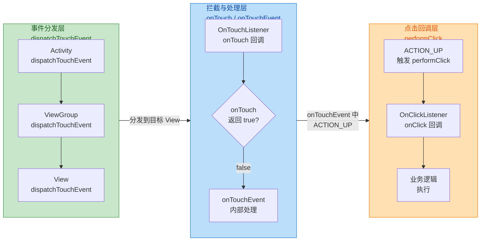

关键优先级链条如下：

1. **`OnTouchListener.onTouch()` 优先级最高**。如果你通过 `setOnTouchListener` 设置了监听且 `onTouch()` 返回 `true`，那么 `onTouchEvent()` 根本不会执行，Click 和 LongClick 自然也不会触发。
2. **`onTouchEvent()` 内部处理点击判定**。只有当 `onTouch()` 返回 `false` 或未设置 `OnTouchListener` 时，事件才会进入 `onTouchEvent()`。在这里，View 通过状态机判定是普通点击还是长按。
3. **`OnClickListener.onClick()` 优先级最低**。它是整个事件处理链的"末端消费者"，在 `performClick()` 中被调用。

这个优先级关系解释了一个经典面试题：**同时设置了 `OnTouchListener` 和 `OnClickListener`，哪个先执行？** 答案是 `OnTouchListener` 先执行，但如果其 `onTouch()` 返回 `false`，`OnClickListener` 仍会执行；如果返回 `true`，`OnClickListener` 不会执行。

### 特殊场景处理

#### View.callOnClick() 与 performClick() 的区别

View 提供了两种方式来"程序化触发点击"：

- **`performClick()`**：完整模拟一次点击，包括播放音效、发送无障碍事件、调用 `OnClickListener`。
- **`callOnClick()`**：仅调用 `OnClickListener.onClick()`，不播放音效也不发送无障碍事件。

在自动化测试或程序化触发场景中，如果你只想执行业务逻辑而不触发副作用（如音效），使用 `callOnClick()` 更合适。但在无障碍相关的实现中，必须使用 `performClick()` 以确保辅助服务能正确感知。

#### 多 Listener 模式的缺陷与替代方案

`setOnClickListener()` 是典型的 **单一回调** 模式——后设置的 listener 会覆盖先设置的。如果你需要多个模块同时监听同一个 View 的点击（例如基类 Activity 需要做埋点统计，子类 Activity 需要执行业务逻辑），直接使用 `setOnClickListener` 会导致冲突。

解决方案之一是使用 **装饰器模式（Decorator Pattern）** 手动链接：

```kotlin
// ========== 装饰器模式实现多 Listener 链 ==========

// 扩展函数：在现有 OnClickListener 基础上追加新逻辑
fun View.addOnClickListener(newListener: View.OnClickListener) {
    // 保存当前已有的 listener（可能为 null）
    val existingListener = this.getTag(R.id.tag_click_chain) as? View.OnClickListener

    // 创建新的组合 listener
    val chainedListener = View.OnClickListener { view ->
        // 先执行旧的 listener（如果存在）
        existingListener?.onClick(view)
        // 再执行新追加的 listener
        newListener.onClick(view)
    }

    // 保存链式 listener 以便后续继续追加
    this.setTag(R.id.tag_click_chain, chainedListener)
    // 设置组合后的 listener
    this.setOnClickListener(chainedListener)
}

// ========== 使用示例 ==========
// 基类埋点
binding.btnAction.addOnClickListener { trackClickEvent("btn_action") }
// 子类业务
binding.btnAction.addOnClickListener { performAction() }
// 两个回调都会执行，按添加顺序依次触发
```

---

**📝 练习题**

当一个 View 同时设置了 `OnTouchListener` 和 `OnClickListener`，且 `OnTouchListener.onTouch()` 返回 `false`，用户正常点击该 View 后，以下哪种情况会发生？

A. 只有 `onTouch()` 被调用，`onClick()` 不会执行


B. 只有 `onClick()` 被调用，`onTouch()` 不会执行


C. `onTouch()` 先被调用（多次），之后 `onClick()` 也会被调用


D. `onClick()` 先被调用，之后 `onTouch()` 被调用


**【答案】** C

**【解析】** 在事件分发流程中，`View.dispatchTouchEvent()` 会先检查是否设置了 `OnTouchListener`，如果有则优先调用 `onTouch()`。由于 `onTouch()` 返回了 `false`，表示未消费事件，事件会继续传递给 `onTouchEvent()` 处理。一次完整的点击操作包含 `ACTION_DOWN` 和 `ACTION_UP`（可能还有若干 `ACTION_MOVE`），因此 `onTouch()` 会被调用多次。在 `onTouchEvent()` 处理 `ACTION_UP` 时，判定为一次有效点击后会调用 `performClick()`，进而触发 `onClick()` 回调。所以 C 正确：`onTouch()` 先被多次调用，最终 `onClick()` 也会执行。A 错误是因为 `onTouch()` 返回 `false` 不会阻止后续处理；B 错误是因为 `OnTouchListener` 的优先级高于 `OnClickListener`；D 错误是因为事件分发顺序是先 touch 后 click，不可能反转。

---

**📝 练习题**

以下关于 `View.setVisibility()` 的说法，哪一个是正确的？

A. `INVISIBLE` 的 View 不参与 measure 和 layout，但占据绘制空间


B. `GONE` 的 View 仍参与 measure（测量尺寸为 0），但不参与 layout


C. 将 View 从 `VISIBLE` 改为 `GONE` 会触发父容器的 `requestLayout()`


D. `setAlpha(0f)` 与 `setVisibility(INVISIBLE)` 的行为完全相同


**【答案】** C

**【解析】** `GONE` 意味着 View 完全退出布局流程，父容器不再为其分配空间，因此从 `VISIBLE` 切换到 `GONE` 必然导致布局重新计算，即触发 `requestLayout()` 沿视图树向上传播。A 错误是因为 `INVISIBLE` 仍然参与 measure 和 layout（占据空间），只是不绘制。B 错误是因为 `GONE` 的 View 在 measure 阶段直接被跳过或视为 0×0，在 layout 阶段同样被跳过，两个阶段都不参与。D 错误是因为 `setAlpha(0f)` 的 View 仍然是 `VISIBLE` 状态，它会参与事件分发（能接收触摸事件），而 `INVISIBLE` 的 View 不会接收触摸事件，二者在事件处理层面有根本区别。

---

## 焦点管理（Focus 机制、requestFocus、键盘导航支持）

在触屏设备主导的 Android 生态中，焦点管理（Focus Management）往往是开发者最容易忽视的交互环节。然而，一旦你的应用需要运行在 **Android TV、车机系统（Android Automotive）、无障碍辅助设备（Accessibility Services）** 或者任何外接键盘/遥控器的场景下，焦点便成了用户与界面交互的 **唯一通道**。即便是纯手机应用，`EditText` 的自动获焦、软键盘弹出时机、`Tab` 键在表单间的跳转顺序等问题，也都直接受焦点系统的管控。因此，深入理解 Android 的焦点机制，是构建高质量、全场景覆盖应用的关键一环。

### Focus 机制的核心原理

#### 什么是"焦点"

在 Android 的视图体系中，**焦点（Focus）** 表示当前 **有资格接收键盘事件（KeyEvent）** 的那个 View。在任意时刻，整棵视图树中 **至多只有一个 View** 持有焦点。当用户通过方向键（D-pad）、Tab 键或遥控器进行导航时，系统会在可聚焦的 View 之间 **转移焦点**；持有焦点的 View 将接收所有后续的按键事件，直到焦点被转走或清除。

这与触摸事件（TouchEvent）的分发模型有着本质的区别。触摸事件依赖 **坐标命中测试（Hit Testing）**——手指点在哪个 View 的区域内，事件就派发给谁；而键盘事件依赖的是 **焦点持有者（Focused View）**——不存在"坐标"概念，事件始终发送给拥有焦点的那一个 View。正因如此，Android 在内部维护了一套完整的焦点搜索与转移算法，来决定"下一个获得焦点的 View 是谁"。

#### focusable 属性与触摸模式

一个 View 能否获得焦点，由以下几个属性共同决定：

- **`android:focusable`**：最基础的开关。设为 `true` 时，该 View 在非触摸模式（Non-Touch Mode）下可以获得焦点。默认情况下，`Button`、`EditText` 等交互控件的 `focusable` 为 `true`，而 `TextView`、`ImageView` 等展示控件默认为 `false`。

- **`android:focusableInTouchMode`**：在触摸模式（Touch Mode）下是否仍然可获焦。Android 有一个重要的概念叫做 **Touch Mode**——当用户最后一次交互是触摸屏幕时，系统进入 Touch Mode；当用户按下方向键或 Tab 键时，系统退出 Touch Mode。在 Touch Mode 下，**只有 `focusableInTouchMode = true` 的 View 才能获得焦点**，这就是为什么你触摸一个 `Button` 时它不会获得焦点高亮，而触摸 `EditText` 时它会获焦并弹出键盘——因为 `EditText` 的 `focusableInTouchMode` 默认是 `true`。

- **`android:focusedByDefault`（API 26+）**：标记某个 View 为其所在焦点簇（Focus Cluster）或视图树中的 **默认焦点接收者**。当窗口首次获得焦点时，系统会优先把焦点交给带有此标记的 View。

这三者的协作关系可以用下图来表示：

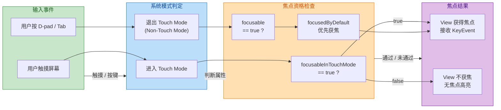

理解 Touch Mode 的切换至关重要。很多开发者困惑"为什么我代码里调了 `requestFocus()` 却没效果"，原因往往是当前处于 Touch Mode，而目标 View 的 `focusableInTouchMode` 为 `false`。系统在 `View.requestFocus()` 的内部实现中，会先检查当前是否处于 Touch Mode，如果是，则进一步检查 `focusableInTouchMode`；只有通过检查，才会真正执行焦点转移。

#### 焦点在视图树中的传递路径

Android 的视图体系是一棵以 `DecorView` 为根的 N 叉树，焦点信息沿着这棵树 **自顶向下逐层记录**。每个 `ViewGroup` 内部维护了一个 `mFocused` 字段，指向其直接子 View 中"包含焦点的那个"（不一定是最终持有焦点的叶子节点，而可能是下一级 ViewGroup）。最终持有焦点的叶子 View，其 `mPrivateFlags` 中的 `PFLAG_FOCUSED` 标志位被置为 `true`。

```text
DecorView (mFocused → FrameLayout)
  └── FrameLayout (mFocused → LinearLayout)
        └── LinearLayout (mFocused → EditText)
              └── EditText  ← PFLAG_FOCUSED = true（真正持有焦点）
```

这种 **链式记录** 的设计有两个优势：第一，从任意一个 ViewGroup 调用 `findFocus()` 时，可以沿着 `mFocused` 链快速定位到叶子节点，时间复杂度为 O(depth) 而非 O(n)；第二，当焦点转移时，系统只需沿着旧链逐层清除 `mFocused`，再沿着新链逐层设置即可，避免了全树遍历。

当某个 View 调用 `requestFocus()` 成功后，内部的流程大致是：

1. 该 View 调用 `handleFocusGainInternal()`，将自身的 `PFLAG_FOCUSED` 置位。
2. 向上逐级通知父 ViewGroup，调用 `requestChildFocus(View child, View focused)`。
3. 每一层 ViewGroup 收到通知后，如果原来的 `mFocused` 是另一个子树，就先对旧子树调用 `unFocus()` 清除焦点；然后将 `mFocused` 指向新的方向。
4. 最终到达 `ViewRootImpl`，由它通知 `InputMethodManager`（如有需要弹出或隐藏软键盘）。

这也解释了为什么 `EditText` 获焦会自动弹出键盘——`ViewRootImpl` 在焦点变化的回调中会判断新焦点 View 是否是一个 `Editor`（即文本输入组件），如果是，则通知 `InputMethodManager.showSoftInput()`。

### requestFocus 的使用与注意事项

#### 基本用法

`requestFocus()` 是 `View` 类中的公开方法，用于主动请求焦点。它有多个重载形式：

```kotlin
// 最简形式：默认方向为 FOCUS_DOWN
// 返回 true 表示成功获得焦点，false 表示失败
val success = myView.requestFocus()

// 指定焦点搜索方向（影响 ViewGroup 内部的焦点分配策略）
// direction 可选值: FOCUS_UP / FOCUS_DOWN / FOCUS_LEFT / FOCUS_RIGHT / FOCUS_FORWARD / FOCUS_BACKWARD
val success2 = myView.requestFocus(View.FOCUS_DOWN)

// 带 Rect 参数：previouslyFocusedRect 告知新焦点 View "上一个焦点的位置"，可用于精细的滚动定位
val rect = Rect() // 可传入上一个焦点 View 的可见区域
val success3 = myView.requestFocus(View.FOCUS_DOWN, rect)
```

对于 `ViewGroup`，`requestFocus()` 的行为还受到 **`descendantFocusability`** 属性的控制，这是一个非常重要却容易被忽略的配置项：

| 属性值 | 常量 | 行为 |
|--------|------|------|
| `beforeDescendants` | `FOCUS_BEFORE_DESCENDANTS` | ViewGroup 自身先尝试获焦，失败了才让子 View 尝试（**默认值**） |
| `afterDescendants` | `FOCUS_AFTER_DESCENDANTS` | 子 View 先尝试获焦，全部失败了 ViewGroup 自身才尝试 |
| `blocksDescendants` | `FOCUS_BLOCK_DESCENDANTS` | ViewGroup 直接阻止所有子 View 获焦 |

`blocksDescendants` 在实际开发中非常实用。例如在 `RecyclerView` 的 item 布局中，如果 item 内部有 `Button`、`EditText` 等可获焦子 View，但你希望整个 item 作为一个整体接收焦点（比如 TV 应用的卡片导航），就可以在 item 根布局上设置 `android:descendantFocusability="blocksDescendants"`，然后将根布局自身设为 `focusable="true"`。

#### requestFocus 失败的常见原因

在实际开发中，`requestFocus()` 返回 `false` 的情况相当常见，以下是最典型的几个原因：

**1. View 不可见或不可用。** `requestFocus()` 的第一步检查就是 `View.isShown()` 和 `View.isEnabled()`。如果 View 的 `visibility` 为 `GONE` 或 `INVISIBLE`，或者 `enabled` 为 `false`，焦点请求会被直接拒绝。一个隐蔽的坑是：View 本身 `VISIBLE`，但其某个祖先 ViewGroup 是 `GONE` 的，此时 `isShown()` 也返回 `false`，焦点同样无法获得。

**2. Touch Mode 下缺少 `focusableInTouchMode`。** 前文已详述。在绝大多数手机场景下，用户的最后一次交互都是触摸，系统处于 Touch Mode。此时如果目标 View 只设置了 `focusable="true"` 而没有 `focusableInTouchMode="true"`，`requestFocus()` 会静默失败。

**3. 父级 ViewGroup 设置了 `blocksDescendants`。** 如果 View 的某个祖先 ViewGroup 的 `descendantFocusability` 是 `FOCUS_BLOCK_DESCENDANTS`，则该 ViewGroup 下的所有子 View 都无法获焦。

**4. View 尚未 attach 到 Window。** 在 `onCreate()` 中直接调用 `requestFocus()` 时，视图树可能尚未完成布局甚至尚未 attach 到 Window。虽然 `requestFocus()` 本身不严格要求 attach（它只操作 View 的 flag 和 ViewGroup 的 mFocused 链），但如果你期望的附加效果（如弹出键盘）需要 `ViewRootImpl` 的参与，则必须等到 View 真正挂载之后。安全的做法是使用 `View.post {}` 或在 `onWindowFocusChanged(true)` 回调中执行：

```kotlin
// 安全地在 View attach 后请求焦点并弹出键盘
editText.post {
    // post 将 Runnable 投递到主线程消息队列
    // 执行时 View 已完成 measure/layout/draw 且已 attach
    editText.requestFocus()
    // 获焦后手动弹出软键盘（某些场景需要显式调用）
    val imm = getSystemService(Context.INPUT_METHOD_SERVICE) as InputMethodManager
    imm.showSoftInput(editText, InputMethodManager.SHOW_IMPLICIT)
}
```

#### clearFocus 与焦点的"回弹"

调用 `View.clearFocus()` 可以主动放弃焦点。但有一个很多开发者不了解的行为：**`clearFocus()` 之后，系统会自动尝试为视图树寻找一个新的焦点接收者**。具体来说，`ViewRootImpl` 在收到焦点清除通知后会从根节点开始调用 `requestFocus()`，这意味着焦点往往会"回弹"到视图树中第一个可获焦的 View（通常是按照布局顺序搜索到的第一个）。如果你的意图是"没有任何 View 持有焦点"，在 Touch Mode 下这通常会自然发生（因为大多数 View 的 `focusableInTouchMode` 为 `false`），但在 Non-Touch Mode 下，焦点几乎必然会被某个 View 接住。

### 键盘导航支持

#### 焦点搜索算法

当用户按下方向键（上、下、左、右）或 Tab / Shift+Tab 时，Android 需要决定 **焦点从当前 View 移动到哪个 View**。这一决策由 `FocusFinder` 类完成，它是一个单例，实现了焦点搜索的核心算法。

**方向导航（D-pad / 方向键）** 使用的是 **空间位置算法（Spatial Navigation）**。`FocusFinder` 会：

1. 收集当前焦点 View 的 **屏幕坐标矩形（Rect）**。
2. 遍历视图树中所有 `focusable = true` 且 `isShown() = true` 的候选 View。
3. 根据导航方向过滤候选者。例如按下 `FOCUS_RIGHT` 时，只考虑"在当前 View 右侧"的候选者。
4. 在过滤后的候选集中，用一套 **加权距离公式** 选出"最近且最对齐"的那个。这个公式同时考虑了 **主轴距离**（沿导航方向的距离）和 **副轴偏移**（垂直于导航方向的偏移），主轴权重远大于副轴，以确保"正前方"的 View 优先于"斜前方"的 View。

**Tab 导航** 则使用不同的逻辑——基于 **tabIndex / 布局顺序的线性搜索**。Tab 键对应 `FOCUS_FORWARD`，Shift+Tab 对应 `FOCUS_BACKWARD`。`FocusFinder` 会按照视图树的前序遍历顺序（即 XML 中声明的先后顺序）为所有可获焦 View 排列一个线性序列，然后简单地取"当前 View 的下一个/上一个"。

#### 手动指定焦点方向（nextFocus 系列属性）

默认的焦点搜索算法在大多数情况下工作良好，但在复杂布局中（如多列网格、不规则卡片排列），算法可能无法给出符合用户直觉的结果。Android 提供了一组 XML 属性来 **手动覆盖焦点方向**：

```xml
<!-- 手动指定按下各方向键时焦点应跳转到哪个 View -->
<Button
    android:id="@+id/btn_center"
    android:layout_width="wrap_content"
    android:layout_height="wrap_content"
    android:text="Center"
    android:nextFocusUp="@id/btn_top"
    android:nextFocusDown="@id/btn_bottom"
    android:nextFocusLeft="@id/btn_left"
    android:nextFocusRight="@id/btn_right"
    android:nextFocusForward="@id/btn_next_tab" />
<!--
    nextFocusUp:    按 ↑ 时焦点跳转到 btn_top
    nextFocusDown:  按 ↓ 时焦点跳转到 btn_bottom
    nextFocusLeft:  按 ← 时焦点跳转到 btn_left
    nextFocusRight: 按 → 时焦点跳转到 btn_right
    nextFocusForward: 按 Tab 时焦点跳转到 btn_next_tab
-->
```

在代码中同样可以动态设置：

```kotlin
// 动态设置焦点导航目标
btnCenter.nextFocusUpId = R.id.btn_top       // 按 ↑ 跳转目标
btnCenter.nextFocusDownId = R.id.btn_bottom   // 按 ↓ 跳转目标
btnCenter.nextFocusLeftId = R.id.btn_left     // 按 ← 跳转目标
btnCenter.nextFocusRightId = R.id.btn_right   // 按 → 跳转目标
btnCenter.nextFocusForwardId = R.id.btn_next  // 按 Tab 跳转目标
```

这在 **Android TV 开发** 中几乎是必备技巧。TV 界面通常由大量横向/纵向排列的卡片组成，自动算法在跨行跳转时容易选错目标，手动指定可以保证导航路径完全可控。

#### Focus Cluster 与 keyboardNavigationCluster（API 26+）

从 Android 8.0（API 26）开始，系统引入了 **焦点簇（Focus Cluster）** 的概念，以改善在复杂界面中用 Tab 键导航的体验。

在传统行为中，按 Tab 键会在 **所有** 可获焦 View 之间逐一切换。当界面有几十个可获焦控件时，用户需要按十几次 Tab 才能到达目标区域，体验很差。Focus Cluster 的思路是：将界面划分为若干个"区域"，Tab 键在 **区域之间** 跳转（每次跳入一个区域时，焦点落在该区域的第一个可获焦 View 上），而方向键在 **区域内部** 的 View 之间移动。

使用方法是在 ViewGroup 上标记 `android:keyboardNavigationCluster="true"`：

```xml
<!-- 将工具栏区域标记为一个焦点簇 -->
<LinearLayout
    android:id="@+id/toolbar_cluster"
    android:layout_width="match_parent"
    android:layout_height="wrap_content"
    android:keyboardNavigationCluster="true"
    android:orientation="horizontal">
    <!-- 簇内的多个按钮 -->
    <Button android:id="@+id/btn_cut" android:text="Cut" ... />
    <Button android:id="@+id/btn_copy" android:text="Copy" ... />
    <Button android:id="@+id/btn_paste" android:text="Paste" ... />
</LinearLayout>

<!-- 将内容区域标记为另一个焦点簇 -->
<ScrollView
    android:id="@+id/content_cluster"
    android:layout_width="match_parent"
    android:layout_height="0dp"
    android:layout_weight="1"
    android:keyboardNavigationCluster="true">
    <!-- 簇内的表单控件 -->
    <EditText android:id="@+id/input_name" ... />
    <EditText android:id="@+id/input_email" ... />
</ScrollView>
```

当用户按 Tab 时，焦点会从 `toolbar_cluster` 整体跳转到 `content_cluster`，而不会在 `btn_cut` → `btn_copy` → `btn_paste` 之间逐一经过。进入 `content_cluster` 后，用户可以用方向键或 Tab 在 `input_name` 和 `input_email` 之间移动。

配合 `android:focusedByDefault="true"`，可以指定某个簇被进入时的 **默认焦点接收者**：

```xml
<EditText
    android:id="@+id/input_name"
    android:focusedByDefault="true"
    ... />
<!-- 当 content_cluster 被 Tab 进入时，焦点直接落在 input_name 上 -->
```

#### 焦点变化的监听与调试

开发中排查焦点问题时，以下几个 API 和技巧非常有用：

```kotlin
// 1. 监听焦点变化（最常用）
myView.setOnFocusChangeListener { view, hasFocus ->
    // view: 发生焦点变化的 View
    // hasFocus: true 表示获得焦点，false 表示失去焦点
    if (hasFocus) {
        // 获焦时的视觉反馈（如放大、高亮边框）
        view.scaleX = 1.1f  // 水平方向放大到 1.1 倍
        view.scaleY = 1.1f  // 垂直方向放大到 1.1 倍
    } else {
        // 失焦时恢复原始状态
        view.scaleX = 1.0f  // 恢复水平原始大小
        view.scaleY = 1.0f  // 恢复垂直原始大小
    }
}

// 2. 查询当前焦点持有者（从 Activity 层面）
val currentFocus: View? = activity.currentFocus
// 内部实现：Activity -> Window -> DecorView -> findFocus()
// 沿着 mFocused 链一路向下找到叶子节点

// 3. 在 ViewGroup 中拦截焦点搜索（高级用法）
// 重写 focusSearch() 可以完全自定义焦点导航逻辑
class CustomLayout(context: Context) : LinearLayout(context) {
    override fun focusSearch(focused: View?, direction: Int): View? {
        // focused: 当前持有焦点的 View
        // direction: 用户按键的方向
        // 返回 null 表示无可用目标，焦点不移动
        // 返回某个 View 表示焦点转移到该 View
        return when (direction) {
            View.FOCUS_RIGHT -> {
                // 自定义逻辑：按右键时始终跳到指定 View
                findViewById(R.id.special_target)
            }
            else -> {
                // 其他方向使用默认逻辑
                super.focusSearch(focused, direction)
            }
        }
    }
}
```

**调试技巧**：在开发者选项中开启 **"Show layout bounds"** 可以看到 View 的边界，但焦点更直观的调试方式是开启 **"Pointer Location"** 或使用 `adb shell dumpsys activity top` 查看当前 Activity 的焦点状态。此外，在 Android Studio 的 **Layout Inspector** 中，你可以实时观察到哪个 View 当前持有焦点（在属性面板中查看 `isFocused` 字段）。

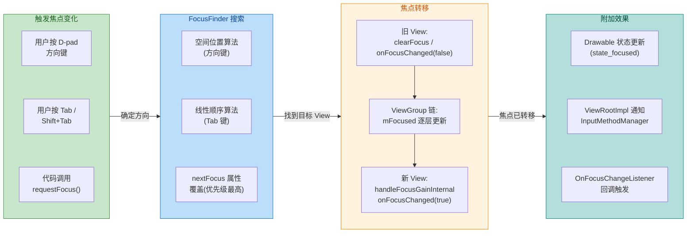

#### 焦点与 Drawable 状态的联动

焦点变化会直接影响 View 的 Drawable 状态。在前面的章节中我们介绍过 `StateListDrawable`，其中 **`android:state_focused`** 就是专门为焦点设计的状态。当一个 View 获得焦点时，系统会将 `state_focused` 加入其 Drawable State 集合，触发背景、前景等 Drawable 的状态切换：

```xml
<!-- res/drawable/button_focus_bg.xml -->
<selector xmlns:android="http://schemas.android.com/apk/res/android">
    <!-- 获得焦点时显示高亮边框 -->
    <item android:state_focused="true">
        <shape android:shape="rectangle">
            <solid android:color="#E8F5E9" />
            <stroke android:width="3dp" android:color="#4CAF50" />
            <corners android:radius="8dp" />
        </shape>
    </item>
    <!-- 默认状态 -->
    <item>
        <shape android:shape="rectangle">
            <solid android:color="#FFFFFF" />
            <stroke android:width="1dp" android:color="#BDBDBD" />
            <corners android:radius="8dp" />
        </shape>
    </item>
</selector>
```

在 Android TV 开发中，焦点高亮通常更加显眼——放大动画 + 阴影提升 + 边框高亮的组合是标准做法，前面代码示例中的 `scaleX/scaleY` 动画就是一个简化版本。

#### 软键盘与焦点的协作

`EditText` 的焦点管理与软键盘（Soft Input）紧密耦合。几个常见需求场景：

**场景一：进入页面时自动弹出键盘。** 在 `AndroidManifest.xml` 中为 Activity 设置 `windowSoftInputMode`，或者在代码中手动控制：

```kotlin
// 方式一：Manifest 声明（Activity 级别）
// android:windowSoftInputMode="stateVisible" 
// 表示 Activity 启动时如果有 EditText 持有焦点，则自动弹出键盘

// 方式二：代码控制（更灵活）
editText.post {
    editText.requestFocus()  // 先确保 EditText 获得焦点
    val imm = getSystemService(Context.INPUT_METHOD_SERVICE) as InputMethodManager
    // SHOW_IMPLICIT: 隐式请求，系统可能根据情况决定是否显示
    imm.showSoftInput(editText, InputMethodManager.SHOW_IMPLICIT)
}
```

**场景二：点击空白区域收起键盘。** 这需要在父布局上监听触摸事件，当触摸点不在 `EditText` 区域内时，清除焦点并隐藏键盘：

```kotlin
// 在 Activity 中重写 dispatchTouchEvent
override fun dispatchTouchEvent(ev: MotionEvent): Boolean {
    // 只在手指按下时处理
    if (ev.action == MotionEvent.ACTION_DOWN) {
        val v = currentFocus  // 获取当前焦点 View
        if (v is EditText) {
            // 计算 EditText 在屏幕上的矩形区域
            val outRect = Rect()
            v.getGlobalVisibleRect(outRect)  // 获取 View 的全局可见区域
            // 判断触摸点是否在 EditText 区域之外
            if (!outRect.contains(ev.rawX.toInt(), ev.rawY.toInt())) {
                v.clearFocus()  // 清除 EditText 的焦点
                // 隐藏软键盘
                val imm = getSystemService(Context.INPUT_METHOD_SERVICE) as InputMethodManager
                imm.hideSoftInputFromWindow(v.windowToken, 0)
            }
        }
    }
    return super.dispatchTouchEvent(ev)  // 继续正常的事件分发
}
```

**场景三：防止 `EditText` 自动获焦。** 很多开发者发现页面一打开，第一个 `EditText` 就自动获得焦点并弹出键盘，但实际并不希望如此。最简洁的解决方案是在 `EditText` 的父布局上"抢夺"焦点：

```xml
<!-- 在 EditText 的父布局上添加以下两个属性 -->
<LinearLayout
    android:layout_width="match_parent"
    android:layout_height="match_parent"
    android:focusable="true"
    android:focusableInTouchMode="true">
    <!-- 父布局会抢先获得焦点，EditText 不会自动获焦 -->
    <EditText ... />
</LinearLayout>
```

这个技巧的原理是：当视图树首次获得焦点时，系统从根节点开始搜索，默认的 `descendantFocusability` 是 `beforeDescendants`，所以 `LinearLayout` 自身会先被检查——由于它 `focusableInTouchMode = true`，它在 Touch Mode 下也能获焦，于是焦点停留在了 `LinearLayout` 上，`EditText` 便不会自动获焦。

### 焦点管理的最佳实践总结

1. **明确区分 `focusable` 和 `focusableInTouchMode`**。对于需要在触摸场景下获焦的控件（如 `EditText`），两者都要设为 `true`；对于只在键盘/遥控器场景下需要获焦的控件（如 TV 卡片），通常只需 `focusable="true"` 即可。

2. **善用 `descendantFocusability`**。在 `RecyclerView` item 中防止子控件抢夺焦点、在 `ScrollView` 内部控制焦点行为时，这个属性是你的得力工具。

3. **TV / 车机项目必须手动规划焦点路径**。依赖默认的空间搜索算法在简单布局中可行，但在多行列网格、异形卡片等复杂布局中，务必通过 `nextFocusXxx` 属性明确指定导航路径，并编写完整的键盘导航测试用例。

4. **使用 `focusedByDefault` 和 Focus Cluster 优化大表单体验**。对于包含大量输入控件的界面，合理划分焦点簇可以显著减少 Tab 键的敲击次数，提升用户效率。

5. **焦点变化后注意滚动行为**。当焦点转移到屏幕外的 View 时，系统会自动调用 `requestChildRectangleOnScreen()` 将焦点 View 滚入可见区域。在 `NestedScrollView` 或 `RecyclerView` 中，如果自动滚动行为不符合预期，可以通过重写该方法来自定义滚动逻辑。

---

**📝 练习题**

在一个运行于 Android TV 的应用中，`Activity` 包含一个纵向 `RecyclerView`，每个 item 是一个横向排列的卡片行（内含多个 `ImageView` 卡片）。开发者发现用遥控器按 **↓ 键** 切换到下一行时，焦点总是跳到该行最左边的第一个卡片，而不是跳到"正下方"对应位置的卡片。最可能的原因和修复方式是？

A. `RecyclerView` 默认使用 Tab 导航算法，应切换为空间算法

B. `ImageView` 默认不可聚焦，需要在每个卡片上设置 `focusable="true"`

C. `RecyclerView` 内部的焦点搜索逻辑在跨 item 时可能重置位置，需要通过重写 `LayoutManager` 的焦点搜索方法或设置 `nextFocusDown` 来手动指定目标

D. 需要将每行的根 `ViewGroup` 设置 `keyboardNavigationCluster="true"` 即可自动修复


**【答案】** C

**【解析】** 这是 Android TV 开发中一个非常经典的焦点问题。`RecyclerView` 的 `LayoutManager`（尤其是嵌套横向/纵向滚动的场景）在跨 ViewHolder 进行焦点搜索时，默认行为可能不符合"空间对齐"的直觉——当焦点从一个 item（行）移出时，进入下一个 item 后 `ViewGroup` 的 `requestFocus()` 会按照 `descendantFocusability` 的默认逻辑（`beforeDescendants` → `afterDescendants` 回退），往往把焦点分配给了第一个可获焦的子 View（即最左边的卡片）。修复方式有两种：一是在自定义 `LayoutManager` 中重写 `onInterceptFocusSearch()` 或 `onAddFocusables()`，根据当前焦点的 X 坐标手动查找下一行中位置最接近的卡片；二是在数据绑定时动态计算并设置每个卡片的 `nextFocusDownId`。选项 A 的说法不成立，`RecyclerView` 并非使用 Tab 算法；选项 B 虽然是必要前提（`ImageView` 确实默认不可聚焦），但题目描述的现象是"焦点能跳到下一行但位置不对"，说明 `focusable` 已经设置好了；选项 D 的 `keyboardNavigationCluster` 主要影响 Tab 键行为而非方向键导航。

---

## 常用工具类

Android SDK 在应用层开发中提供了大量 **工具类（Utility Classes）**，它们并非 UI 控件，却几乎贯穿于每一个 View 交互场景。无论是判断一段文本是否为空、获取系统触摸阈值，还是在运行时动态读取颜色与尺寸资源，这些工具类都扮演着 **"胶水"** 角色——将控件、事件与资源三者黏合在一起。本节聚焦三大高频工具：`TextUtils`（文本工具）、`ViewConfiguration`（视图配置常量）以及 `Resources`（资源访问），从 API 用法到底层机制逐一展开。

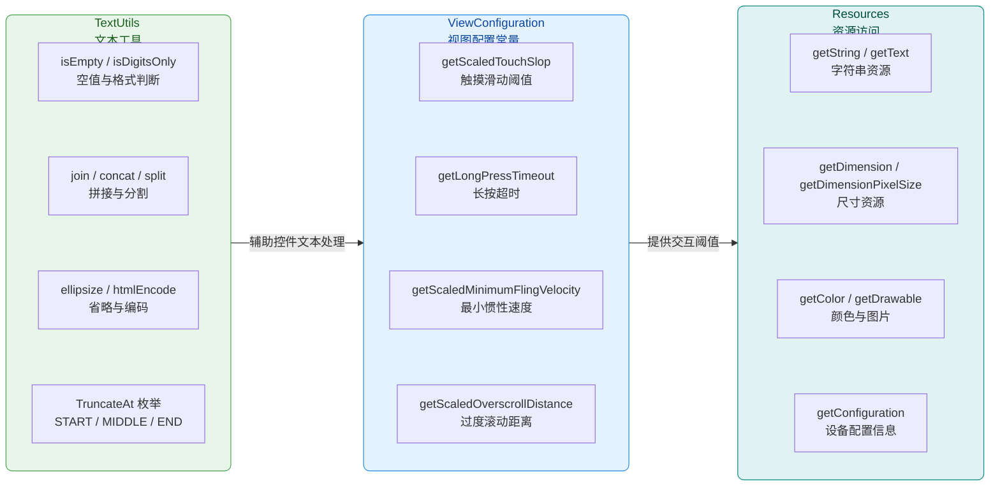

之所以把这三者放在同一节讨论，是因为在实际开发中它们的使用场景高度交叉：你在一个自定义 `EditText` 里用 `TextUtils.isEmpty()` 做空值校验，用 `ViewConfiguration.getScaledTouchSlop()` 区分"点击"和"滑动"，再用 `Resources.getDimensionPixelSize()` 读取控件的 padding 尺寸——三个工具类在同一个类文件里同时出现，是 Android 应用层最典型的日常。

---

### TextUtils —— 文本处理的瑞士军刀

`android.text.TextUtils` 是一个 **纯静态方法工具类**（final class，私有构造器），位于 `android.text` 包下。它诞生的目的非常单纯：把开发者在处理 `CharSequence` / `String` 时最常写的 **样板代码（boilerplate）** 收敛到一个地方，避免每个项目都自己造轮子。从源码层面看，`TextUtils` 内部约有 40+ 个公开静态方法，但在应用层日常开发中，真正高频使用的可以归纳为以下几大类别。

#### 空值与格式判断

这是 `TextUtils` 被调用频率最高的能力——几乎所有涉及用户输入校验的场景都会用到。

```kotlin
// ========== 1. isEmpty：判断字符序列是否为 null 或长度为 0 ==========
// 源码等价于: str == null || str.length() == 0
// 注意：它不会 trim 空白字符，" " (一个空格) 会返回 false
val userInput: String? = editText.text?.toString()  // 从 EditText 获取用户输入
if (TextUtils.isEmpty(userInput)) {                  // null 和 "" 都会命中
    Toast.makeText(this, "输入不能为空", Toast.LENGTH_SHORT).show()
    return                                           // 提前返回，阻止后续逻辑
}

// ========== 2. isDigitsOnly：判断是否全由数字字符组成 ==========
// 内部循环 char-by-char，对每个字符调用 Character.isDigit()
// 空字符串也会返回 false（先调了 isEmpty 判断）
val ageText = "25"
if (TextUtils.isDigitsOnly(ageText)) {               // 全是数字 -> true
    val age = ageText.toInt()                        // 安全转为 Int
}

// ========== 3. equals：null 安全的字符串比较 ==========
// 两个都为 null 返回 true；一个 null 一个非 null 返回 false
// 避免了经典的 NullPointerException
val a: CharSequence? = null
val b: CharSequence? = null
val same = TextUtils.equals(a, b)                    // true, 不会抛异常
```

为什么推荐 `TextUtils.isEmpty()` 而不是 Kotlin 的 `str.isNullOrEmpty()`？在纯 Kotlin 项目中二者功能完全等价，选用哪个属于风格偏好。但在 **Java/Kotlin 混编** 项目中，`TextUtils.isEmpty()` 是 Android 框架原生 API，Java 层调用更加自然；同时许多框架内部（如 `TextView.setText()`）本身就在使用 `TextUtils`，保持一致性有助于代码统一风格。此外，`TextUtils.isEmpty()` 接受的参数类型是 `CharSequence`，不限于 `String`，这意味着 `SpannableString`、`SpannedString` 等富文本对象同样可以直接传入而无需先 `.toString()`。

#### 拼接与分割

在构造日志消息、拼接标签列表、解析服务端返回的逗号分隔字符串时，`TextUtils` 提供了一组比手写 `StringBuilder` 更简洁的 API。

```kotlin
// ========== 1. join：用分隔符拼接集合/数组 ==========
// 内部使用 StringBuilder 循环拼接，效率与手写一致
val tags = listOf("Android", "Kotlin", "Jetpack")    // 标签列表
val joined = TextUtils.join(", ", tags)               // "Android, Kotlin, Jetpack"

// ========== 2. concat：拼接多个 CharSequence ==========
// 与 "+" 拼接的本质区别：concat 保留 SpannableString 的 Span 信息
// 如果所有参数都是普通 String，则返回 String
// 如果任一参数包含 Span，则返回 SpannedString（富文本不丢失）
val prefix: CharSequence = "价格: "                   // 普通文本
val price: CharSequence = SpannableString("¥99").apply {
    setSpan(                                          // 给价格设置红色 Span
        ForegroundColorSpan(Color.RED),
        0, length,
        Spanned.SPAN_EXCLUSIVE_EXCLUSIVE
    )
}
val result = TextUtils.concat(prefix, price)          // 拼接后红色 Span 依然保留
textView.text = result                                // TextView 可正确渲染富文本

// ========== 3. split：按正则分割字符串 ==========
// 注意：返回的是 String[]（Java 数组），且与 String.split() 行为一致
// TextUtils.split 在某些旧版 API 上对 null 做了保护
val csv = "apple,banana,,cherry"                      // 含空段的 CSV
val parts = TextUtils.split(csv, ",")                 // ["apple","banana","","cherry"]
```

`TextUtils.concat()` 是富文本拼接场景下的 **秘密武器**。如果用普通 `+` 运算符或 `StringBuilder` 拼接，`SpannableString` 会被隐式 `toString()`，所有 Span 样式信息就此丢失。只有 `TextUtils.concat()` 会在内部检测参数是否携带 `Spanned` 接口，一旦检测到就走 `SpannableStringBuilder` 的路径，从而完整保留每一段文本的 Span 信息。这也是 Framework 层 `TextView` 内部进行多段文本拼接时采用的方式。

#### 省略（Ellipsize）与编码

当文本过长需要自动截断并加省略号（`…`）时，`TextUtils.ellipsize()` 提供了一个脱离 `TextView` 也能工作的独立算法。

```kotlin
// ========== ellipsize：计算省略后的文本 ==========
// 参数依次为：原始文本、TextPaint（提供字体测量信息）、可用宽度(px)、截断位置
// TruncateAt 枚举有四个值：START / MIDDLE / END / MARQUEE
val paint = textView.paint                            // 复用 TextView 的 TextPaint
val maxWidthPx = 200f                                 // 假设可用空间 200px
val original = "这是一段非常非常非常长的文本内容"

// END 模式：末尾省略 -> "这是一段非常非…"
val endEllipsized = TextUtils.ellipsize(
    original,                                         // 原始 CharSequence
    paint,                                            // 用于测量每个字符宽度
    maxWidthPx,                                       // 可用像素宽度
    TextUtils.TruncateAt.END                          // 在末尾截断
)

// MIDDLE 模式：中间省略 -> "这是一…本内容"
val midEllipsized = TextUtils.ellipsize(
    original, paint, maxWidthPx,
    TextUtils.TruncateAt.MIDDLE                       // 在中间截断
)

// ========== htmlEncode：对 HTML 特殊字符转义 ==========
// 将 < > & " ' 等转为对应的 HTML 实体
val raw = "<script>alert('xss')</script>"
val safe = TextUtils.htmlEncode(raw)                  // "&lt;script&gt;alert(&#39;xss&#39;)&lt;/script&gt;"
// 常用于将用户输入嵌入 WebView 加载的 HTML 片段时防止 XSS 注入
```

`ellipsize()` 的工作原理值得简要了解：它利用传入的 `TextPaint` 对象逐字符（或逐 Grapheme Cluster）调用 `Paint.measureText()` 累加宽度，直到总宽度超过 `availableWidth` 时确定截断点，然后根据 `TruncateAt` 模式决定省略号 `…` 插入的位置。如果传入的文本本身就没有超过可用宽度，则原样返回不做任何截断。`TextView` 的 `android:ellipsize` XML 属性在内部正是调用了这个方法。

#### 其他实用方法速查

| 方法 | 说明 | 典型场景 |
|---|---|---|
| `getReverse()` | 返回字符序列的反转 | 特殊排版需求 |
| `indexOf(CharSequence, char)` | null 安全的字符查找 | 比 `String.indexOf` 多了 null 保护 |
| `substring(CharSequence, int, int)` | null 安全的截取 | 解析固定格式文本 |
| `isGraphic(CharSequence)` | 是否包含可显示字符（排除空格和控制字符） | 判断文本是否"有内容" |
| `getCapsMode()` | 获取当前位置的大写模式 | 自定义输入法 |
| `writeToParcel()` / `CHAR_SEQUENCE_CREATOR` | 将 CharSequence（含 Span）写入 Parcel | 跨进程传递富文本 |

最后一行尤为值得关注：`TextUtils.writeToParcel()` 和 `TextUtils.CHAR_SEQUENCE_CREATOR` 是 Android 框架在 **跨进程传递富文本** 时使用的核心机制。当你向一个 `RemoteViews`（如通知栏）设置带 Span 的文本时，Framework 内部就是通过这对方法将 `SpannableString` 序列化到 `Parcel` 再反序列化还原的。如果你需要通过 `Intent` 或 `Bundle` 传递富文本，也应该使用这个机制而非简单的 `toString()`。

---

### ViewConfiguration —— 交互行为的"物理常量"

`android.view.ViewConfiguration` 是 Android 视图系统中一个非常特殊的类：它 **不参与任何 UI 绘制**，却直接决定了用户交互行为的 **判定标准**。诸如"手指移动多远才算滑动"、"按住多久才算长按"、"手指快速划过多快才能触发惯性滚动"——这些阈值全部由 `ViewConfiguration` 统一提供。可以把它类比为物理学中的"常量表"：万有引力常数 G 决定了星球运动轨迹，而 `touchSlop` 常数决定了手指运动的判定轨迹。

#### 获取实例的两种方式

```kotlin
// ========== 方式一：实例方法（推荐，密度适配） ==========
// get(Context) 会根据当前设备的屏幕密度(density)返回经过缩放的值
// 内部通过 context.getResources().getDisplayMetrics() 获取密度
val vc = ViewConfiguration.get(context)               // 单例模式，同 Context 返回同一实例

// ========== 方式二：静态方法（过时，未缩放） ==========
// 返回的是基于 mdpi (160dpi) 的原始像素值，在高密度屏上不准确
// 大部分静态方法已标记 @Deprecated
val rawTouchSlop = ViewConfiguration.getTouchSlop()   // 已废弃，不推荐
```

为什么存在两种方式？这是 Android 早期 API 设计的历史遗留。在 API Level 1 时期只有静态方法，所有设备都是 mdpi 屏幕，所以直接返回像素值没有问题。随着 hdpi / xhdpi / xxhdpi 屏幕出现，同样 8px 的 `touchSlop` 在高密度屏上物理尺寸过小，手指轻微抖动就会误触发滑动。因此 API 3 引入了 `get(Context)` 实例方法，所有值乘以 `density` 系数后返回，命名也统一加上了 `Scaled` 前缀（如 `getScaledTouchSlop()`）。如今应该 **始终使用 `getScaled*` 系列方法**。

#### 核心常量详解

```kotlin
val vc = ViewConfiguration.get(context)

// ====== 1. Touch Slop：触摸滑动阈值 ======
// 手指从 ACTION_DOWN 到 ACTION_MOVE 的位移超过此值才认定为"滑动"
// 在 xxhdpi (density=3.0) 设备上通常约 24px（8dp * 3）
val touchSlop = vc.scaledTouchSlop                    // 单位：px

// ====== 2. Long Press Timeout：长按超时时间 ======
// 手指按下不移动超过此时间就触发 onLongClick
// 默认 500ms，无障碍模式(Accessibility)下可能更长
val longPressTimeout = ViewConfiguration.getLongPressTimeout()  // 静态方法，单位：ms

// ====== 3. Tap Timeout & Double Tap Timeout ======
// tapTimeout：按下后多久还没松手就不再认为是"轻触"（约 100ms）
// doubleTapTimeout：两次点击间隔小于此值认为是"双击"（约 300ms）
val tapTimeout = ViewConfiguration.getTapTimeout()             // ms
val doubleTapTimeout = ViewConfiguration.getDoubleTapTimeout() // ms

// ====== 4. Fling Velocity：惯性滑动速度阈值 ======
// 手指松开时速度超过 minimumFlingVelocity 才触发惯性滚动
// 速度低于此值则视为普通拖动停止
val minFlingVelocity = vc.scaledMinimumFlingVelocity  // px/s
// 速度超过 maximumFlingVelocity 则钳位(clamp)到此值，防止过快
val maxFlingVelocity = vc.scaledMaximumFlingVelocity  // px/s

// ====== 5. Overscroll Distance & Overfling Distance ======
// overscrollDistance：拖动到边界后还能继续拖动的最大像素偏移
// overflingDistance：惯性滚动到边界后继续冲出去的最大像素偏移
val overscrollDist = vc.scaledOverscrollDistance       // px
val overflingDist = vc.scaledOverflingDistance          // px

// ====== 6. Paging Touch Slop ======
// ViewPager 等翻页控件使用的滑动阈值，通常是 touchSlop 的 2 倍
// 翻页需要更大的位移才触发，避免误操作
val pagingSlop = vc.scaledPagingTouchSlop              // px
```

#### 在自定义 View 中应用 ViewConfiguration

理解 `ViewConfiguration` 最好的方式就是看它如何在自定义触摸处理中被实际使用。下面是一个典型的"区分点击和滑动"的模式：

```kotlin
/**
 * 一个支持拖动的自定义 View
 * 使用 ViewConfiguration 的 touchSlop 区分"点击"和"拖动"
 */
class DraggableView @JvmOverloads constructor(
    context: Context,                                 // 上下文
    attrs: AttributeSet? = null                       // XML 属性集
) : View(context, attrs) {

    // 从 ViewConfiguration 获取触摸滑动阈值
    private val touchSlop = ViewConfiguration.get(context).scaledTouchSlop
    // 记录 ACTION_DOWN 的坐标
    private var downX = 0f
    private var downY = 0f
    // 标记是否已进入拖动状态
    private var isDragging = false

    override fun onTouchEvent(event: MotionEvent): Boolean {
        when (event.actionMasked) {                   // 使用 actionMasked 兼容多指触控
            MotionEvent.ACTION_DOWN -> {
                downX = event.x                       // 记录按下点 X
                downY = event.y                       // 记录按下点 Y
                isDragging = false                    // 重置拖动标记
                return true                           // 消费事件，后续 MOVE/UP 才会分发到这里
            }
            MotionEvent.ACTION_MOVE -> {
                if (!isDragging) {                    // 还没有进入拖动状态
                    val dx = event.x - downX          // 计算 X 方向位移
                    val dy = event.y - downY          // 计算 Y 方向位移
                    // 位移的欧几里得距离是否超过 touchSlop
                    if (dx * dx + dy * dy > touchSlop * touchSlop) {
                        isDragging = true             // 超过阈值 → 进入拖动模式
                        parent.requestDisallowInterceptTouchEvent(true)
                        // 通知父容器不要拦截后续事件
                    }
                }
                if (isDragging) {
                    // 执行实际的拖动逻辑：平移 View
                    translationX += event.x - downX   // 水平平移
                    translationY += event.y - downY   // 垂直平移
                    downX = event.x                   // 更新基准点
                    downY = event.y
                }
                return true
            }
            MotionEvent.ACTION_UP -> {
                if (!isDragging) {
                    performClick()                    // 没有拖动过 → 视为点击
                }
                isDragging = false                    // 重置状态
                return true
            }
        }
        return super.onTouchEvent(event)              // 其他事件交给父类处理
    }
}
```

上面这段代码体现了 `touchSlop` 的核心价值：人的手指在屏幕上按下时，即使主观上没有移动，由于指肉的面积和触控面板的精度，往往也会产生 1~3px 的微小偏移。如果没有 `touchSlop` 这道"过滤门槛"，几乎每次点击都会被误判为滑动，用户体验将不堪设想。`touchSlop` 的典型值在 mdpi 下是 8dp，通过 `scaledTouchSlop` 乘以设备密度后，换算成物理距离大约是 **1.3mm** 左右——恰好足以过滤手指抖动，又不至于让用户感觉"滑不动"。

#### ViewConfiguration 常量全景表

| 方法 | 含义 | 典型值（xxhdpi） | 常用场景 |
|---|---|---|---|
| `scaledTouchSlop` | 最小滑动距离 | ~24px | 自定义滑动手势 |
| `scaledPagingTouchSlop` | 翻页滑动距离 | ~48px | ViewPager |
| `scaledDoubleTapSlop` | 双击第二次允许的偏移 | ~30px | GestureDetector |
| `scaledMinimumFlingVelocity` | 最小惯性速度 | ~150px/s | Scroller / Fling |
| `scaledMaximumFlingVelocity` | 最大惯性速度 | ~24000px/s | 速度钳位 |
| `scaledOverscrollDistance` | 过度拖动距离 | 0px | EdgeEffect |
| `scaledOverflingDistance` | 过度惯性距离 | ~18px | OverScroller |
| `getLongPressTimeout()` | 长按阈值 | 500ms | OnLongClickListener |
| `getTapTimeout()` | 轻触阈值 | ~100ms | 区分 tap/scroll |
| `getDoubleTapTimeout()` | 双击间隔 | ~300ms | 双击缩放 |

---

### Resources —— 资源访问的统一入口

`android.content.res.Resources` 是 Android 资源系统在应用层的 **统一门面（Facade）**。所有放在 `res/` 目录下的文件——字符串、颜色、尺寸、图片、动画、布局——最终都通过 `Resources` 对象提供给应用层代码访问。虽然日常开发中最常见的方式是通过 XML 引用（`@string/app_name`）或 `R.` 常量（`R.string.app_name`），但理解 `Resources` 的运行时工作机制，对于理解 **Configuration Change（配置变更）**、**多语言切换**、**暗色模式适配** 等应用层核心问题至关重要。

#### 获取 Resources 实例

```kotlin
// ========== 方式一：从 Context 获取（最常用） ==========
// 返回的 Resources 与当前 Context 的 Configuration 绑定
// Activity 旋转后新 Activity 的 getResources() 会自动更新 Configuration
val res = context.resources                           // Kotlin 属性访问

// ========== 方式二：从 Application 获取 ==========
// Application 的 Resources 与 App 全局 Configuration 绑定
// 注意：在 per-Activity Configuration（如 per-Activity 语言）场景下
//       Application.resources 可能不反映 Activity 级别的覆写
val appRes = applicationContext.resources

// ========== 方式三：获取系统级 Resources ==========
// Resources.getSystem() 返回的 Resources 只包含系统框架资源
// 可以访问 android.R.* 但不能访问你自己 App 的 R.*
val sysRes = Resources.getSystem()                    // 无需 Context
val screenWidth = sysRes.displayMetrics.widthPixels   // 获取屏幕宽度
```

`Resources` 内部维护着一个 `Configuration` 对象和一个 `DisplayMetrics` 对象。当设备发生配置变更（如旋转屏幕、切换语言、进入暗色模式）时，系统会更新 `Configuration`，而 `Resources` 会据此重新选择 **限定符目录（qualifier directory）** 下匹配的资源。例如，当 `Configuration.uiMode` 包含 `UI_MODE_NIGHT_YES` 标志时，`Resources` 会优先从 `values-night/` 目录加载颜色资源——这就是暗色模式自动切换颜色的底层机制。

#### 字符串资源

```kotlin
// ========== 1. getString：获取纯字符串 ==========
// 内部调用 Resources.getText() 再 toString()
// 如果字符串中包含 Span（如 <b> 标签），会被丢弃
val appName = res.getString(R.string.app_name)        // 返回 String

// ========== 2. getString 带格式化参数 ==========
// XML: <string name="welcome">欢迎 %1$s，你有 %2$d 条消息</string>
val welcome = res.getString(                          // 格式化字符串
    R.string.welcome,                                 // 资源 ID
    "小明",                                           // %1$s -> "小明"
    5                                                 // %2$d -> 5
)   // 结果: "欢迎 小明，你有 5 条消息"

// ========== 3. getText：获取保留 Span 的 CharSequence ==========
// XML: <string name="styled">这是<b>加粗</b>文字</string>
// getText() 返回 SpannedString，<b> 被转为 StyleSpan(BOLD)
val styledText = res.getText(R.string.styled)         // 返回 CharSequence (含 Span)
textView.text = styledText                            // 直接设置，粗体得以保留

// ========== 4. getStringArray / getTextArray ==========
// XML: <string-array name="colors"><item>红</item><item>绿</item></string-array>
val colors: Array<String> = res.getStringArray(R.string_array.colors)
```

`getString()` 和 `getText()` 的区别是一个经典的应用层知识点。在 XML 资源文件中，`<string>` 标签内可以嵌入 HTML 样式标签（如 `<b>`, `<i>`, `<u>`）。资源编译器 AAPT2 在编译时会将这些标签转为对应的 Android Span 对象并存入资源表。当调用 `getText()` 时，系统原样返回带 Span 的 `CharSequence`；而调用 `getString()` 会额外执行一次 `toString()`，将 Span 信息彻底丢弃——只剩下纯文字。因此，**如果你的字符串资源包含 HTML 样式标签，且希望在 `TextView` 中保留样式，就必须使用 `getText()` 而非 `getString()`**。

#### 尺寸资源

Android 资源系统定义了多种尺寸单位（dp、sp、px、pt、mm、in），而 `Resources` 提供了三个方法将它们统一转换为像素值。这三个方法的返回类型和舍入规则各不相同，混淆使用是应用层开发的常见 Bug 来源。

```kotlin
// 假设 XML 中定义：<dimen name="card_margin">16dp</dimen>
// 在 xxhdpi (density=3.0) 设备上，16dp = 48px

// ========== 1. getDimension：返回 float ==========
// 适用于需要精确小数值的场景（如 Paint.setTextSize）
val marginFloat = res.getDimension(R.dimen.card_margin)  // 48.0f

// ========== 2. getDimensionPixelSize：返回 int，四舍五入 ==========
// 适用于布局参数（LayoutParams）、padding、margin
// 保证非零：即使计算结果不足 1px，也至少返回 1（不会返回 0）
val marginInt = res.getDimensionPixelSize(R.dimen.card_margin)  // 48

// ========== 3. getDimensionPixelOffset：返回 int，截断小数（floor） ==========
// 适用于偏移量计算，直接丢弃小数部分
// 不保证非零：0.4dp 在 mdpi 上会返回 0
val offsetInt = res.getDimensionPixelOffset(R.dimen.card_margin)  // 48
```

```mermaid
graph LR
    subgraph A["XML 定义\n资源文件"]
        direction TB
        A1["dimen\n16dp"]
        A2["density\n3.0 xxhdpi"]
        A1 ~~~ A2
    end

    subgraph B["Resources 方法\n转换逻辑"]
        direction TB
        B1["getDimension\n16 × 3.0 = 48.0f"]
        B2["getDimensionPixelSize\nround 48.0 = 48\nmin 保证 ≥ 1"]
        B3["getDimensionPixelOffset\nfloor 48.0 = 48\n可能返回 0"]
        B1 ~~~ B2
        B2 ~~~ B3
    end

    subgraph C["使用场景\n应用层"]
        direction TB
        C1["Paint.setTextSize\n需要 float"]
        C2["LayoutParams\n需要 int"]
        C3["Canvas.translate\n偏移计算"]
        C1 ~~~ C2
        C2 ~~~ C3
    end

    A -->|"编译为资源表"| B -->|"返回像素值"| C

    classDef resStyle fill:#FFF3E0,stroke:#FB8C00,color:#E65100,rx:8
    classDef methodStyle fill:#E8F5E9,stroke:#43A047,color:#1B5E20,rx:8
    classDef useStyle fill:#E3F2FD,stroke:#1E88E5,color:#0D47A1,rx:8

    class A resStyle
    class B methodStyle
    class C useStyle
```

实际开发中的经验法则：**设置 View 的 padding / margin / 宽高时用 `getDimensionPixelSize()`，设置文字大小时用 `getDimension()`**。`getDimensionPixelOffset()` 使用频率较低，主要在自定义绘制中计算 Canvas 偏移量时使用。

#### 颜色与 Drawable 资源

```kotlin
// ========== 1. getColor（已废弃） -> ContextCompat.getColor ==========
// API 23 以前 Resources.getColor(int) 不支持主题属性
// API 23+ 新增了 Resources.getColor(int, Theme) 但不向下兼容
// 推荐始终使用 ContextCompat（AndroidX 自动处理版本差异）
val primaryColor = ContextCompat.getColor(            // AndroidX 兼容方法
    context,                                          // 传入 Context（内部取 Resources + Theme）
    R.color.primary                                   // 颜色资源 ID
)   // 返回 @ColorInt Int

// ========== 2. getColorStateList：状态颜色列表 ==========
// XML 中定义的 <selector> 颜色文件会被解析为 ColorStateList
// 不同状态（pressed, focused, disabled）显示不同颜色
val textColorStates = ContextCompat.getColorStateList(
    context,
    R.color.text_color_selector                       // res/color/text_color_selector.xml
)   // 返回 ColorStateList?
textView.setTextColor(textColorStates)                // 设置带状态的文字颜色

// ========== 3. getDrawable ==========
// 同理，推荐使用 ContextCompat 以支持矢量图(VectorDrawable)向下兼容
val icon = ContextCompat.getDrawable(
    context,
    R.drawable.ic_launcher                            // Drawable 资源 ID
)   // 返回 Drawable?
imageView.setImageDrawable(icon)                      // 设置给 ImageView
```

关于为什么推荐 `ContextCompat` 而非直接调用 `Resources` 的方法，这里展开说明。在 API 23（Android 6.0）之前，`Resources.getColor(int)` 和 `Resources.getDrawable(int)` 不会应用当前 Activity 的 **Theme（主题）** 属性。这意味着如果你在颜色资源中使用了 `?attr/colorPrimary` 这样的主题引用，旧方法无法正确解析。`ContextCompat` 在内部做了版本判断：API 23+ 调用新的 `getColor(int, Theme)`，低版本调用旧方法——从而保证在所有 API Level 上行为一致。这属于 AndroidX 库的 **向下兼容适配模式（Backward Compatibility Pattern）**，是应用层开发中非常普遍的实践。

#### Configuration 与 DisplayMetrics

`Resources` 还承载着设备配置信息的读取能力，这在做屏幕适配和多设备支持时非常有用。

```kotlin
// ========== 获取当前 Configuration ==========
val config = res.configuration

// 屏幕方向判断
val isLandscape = config.orientation == Configuration.ORIENTATION_LANDSCAPE

// 屏幕尺寸类别（small / normal / large / xlarge）
val screenLayout = config.screenLayout and Configuration.SCREENLAYOUT_SIZE_MASK
val isTablet = screenLayout >= Configuration.SCREENLAYOUT_SIZE_LARGE

// 当前语言/地区
val locale = config.locales[0]                        // API 24+，获取首选语言

// 暗色模式判断
val isNightMode = (config.uiMode and Configuration.UI_MODE_NIGHT_MASK) ==
    Configuration.UI_MODE_NIGHT_YES                   // true = 暗色模式

// ========== 获取 DisplayMetrics ==========
val dm = res.displayMetrics
val density = dm.density                              // 密度系数（mdpi=1.0, xxhdpi=3.0）
val densityDpi = dm.densityDpi                        // DPI 值（160, 480...）
val screenWidthPx = dm.widthPixels                    // 屏幕宽度（px）
val screenHeightPx = dm.heightPixels                  // 屏幕高度（px）

// dp <-> px 转换公式
fun dpToPx(dp: Float): Int {                          // dp 转 px
    return (dp * dm.density + 0.5f).toInt()           // +0.5 实现四舍五入
}
fun pxToDp(px: Int): Float {                          // px 转 dp
    return px / dm.density                            // 直接除以密度
}
```

`dp` 与 `px` 的互转是每个 Android 开发者都需要记忆的公式。`1dp = density × 1px`，其中 `density` 在 mdpi 设备上为 1.0，hdpi 为 1.5，xhdpi 为 2.0，xxhdpi 为 3.0，xxxhdpi 为 4.0。`Resources.displayMetrics.density` 返回的正是这个系数。上面 `dpToPx` 方法中 `+ 0.5f` 再取 `toInt()` 是一个经典的 **四舍五入取整** 技巧，等价于 `Math.round()`，这也是 `getDimensionPixelSize()` 内部使用的相同策略。

#### TypedValue —— 资源值的通用容器

在更底层的资源访问场景中，`TypedValue` 是一个绕不开的辅助类。它是 Android 资源系统用来在运行时传递"一个资源值"的通用容器。

```kotlin
// ========== 解析主题属性 ==========
// 场景：获取当前主题下 ?attr/colorPrimary 的实际颜色值
val typedValue = TypedValue()                         // 创建容器
val resolved = context.theme.resolveAttribute(        // 从 Theme 解析
    com.google.android.material.R.attr.colorPrimary,  // 要解析的属性
    typedValue,                                       // 结果写入此容器
    true                                              // resolveRefs：解析间接引用
)
if (resolved) {
    val colorInt = typedValue.data                    // 解析到的颜色 ARGB 值
}

// ========== dp 值转 px（不依赖自定义函数） ==========
// TypedValue.applyDimension 是系统级的单位转换方法
val px = TypedValue.applyDimension(
    TypedValue.COMPLEX_UNIT_DIP,                      // 源单位：dp
    16f,                                              // 数值：16
    res.displayMetrics                                // 用于获取 density
)   // 返回 48.0f（xxhdpi 设备上）
```

`TypedValue.applyDimension()` 是一个经常被忽视却极其实用的方法。当你在代码中需要将 dp/sp 转换为 px 时，与其自己维护一个 `dpToPx()` 工具方法，不如直接使用这个系统 API——它支持所有 Android 尺寸单位（DIP/SP/PT/MM/IN/PX），内部实现与资源系统使用的转换逻辑完全一致，不会出现精度偏差。

---

### 三大工具类的协作模式

在实际应用开发中，`TextUtils`、`ViewConfiguration` 和 `Resources` 往往不是孤立使用的，它们频繁组合出现在同一个业务场景中。下面用一个"自定义搜索框"的案例展示三者的典型协作：

```kotlin
/**
 * 一个自定义搜索框控件
 * 综合使用 TextUtils + ViewConfiguration + Resources
 */
class SearchBar @JvmOverloads constructor(
    context: Context,
    attrs: AttributeSet? = null
) : FrameLayout(context, attrs) {

    private val editText: EditText                    // 输入框
    private val clearButton: ImageView                // 清除按钮

    // ========== [Resources] 从资源文件读取配置 ==========
    private val hintText = context.getString(R.string.search_hint)
    // 搜索提示文案："请输入搜索关键词"
    private val horizontalPadding = context.resources
        .getDimensionPixelSize(R.dimen.search_bar_padding)
    // 水平内边距（dp 自动转 px）
    private val iconTint = ContextCompat.getColor(context, R.color.icon_tint)
    // 图标着色（兼容暗色模式）

    // ========== [ViewConfiguration] 获取交互阈值 ==========
    private val touchSlop = ViewConfiguration.get(context).scaledTouchSlop
    // 用于判断清除按钮上的触摸是点击还是滑动

    init {
        // 初始化输入框
        editText = EditText(context).apply {
            hint = hintText                           // 设置提示文本
            setPadding(                               // 设置内边距
                horizontalPadding, 0,                 // left, top
                horizontalPadding, 0                  // right, bottom
            )
            isSingleLine = true                       // 单行模式
        }
        addView(editText)                             // 添加到布局

        // 初始化清除按钮
        clearButton = ImageView(context).apply {
            setImageResource(R.drawable.ic_clear)     // 设置清除图标
            setColorFilter(iconTint)                  // 应用着色
            visibility = GONE                         // 初始隐藏
            setOnClickListener {
                editText.text.clear()                 // 点击清空内容
            }
        }
        addView(clearButton)                          // 添加到布局

        // ========== [TextUtils] 监听文本变化，控制清除按钮的显示/隐藏 ==========
        editText.addTextChangedListener(object : TextWatcher {
            override fun beforeTextChanged(s: CharSequence?, start: Int, count: Int, after: Int) {}
            override fun onTextChanged(s: CharSequence?, start: Int, before: Int, count: Int) {}
            override fun afterTextChanged(editable: Editable?) {
                // 使用 TextUtils.isEmpty 判断：为空则隐藏清除按钮
                clearButton.visibility = if (TextUtils.isEmpty(editable)) {
                    GONE                              // 无内容 → 隐藏
                } else {
                    VISIBLE                           // 有内容 → 显示
                }
            }
        })
    }
}
```

这个案例虽然代码不长，但完美展示了三者的分工：`Resources` 负责从资源系统获取尺寸、颜色、字符串等配置值（保证适配不同设备和主题）；`ViewConfiguration` 提供交互行为的物理阈值（保证触摸判定的一致性）；`TextUtils` 承担文本内容的逻辑判断（保证 null 安全和语义清晰）。这种分工模式在 Android 应用层代码中随处可见——几乎每一个自定义 View 都会同时依赖这三个工具类。

---

### 补充：其他常用便捷方法与工具

除了上述三大核心工具类，Android SDK 还散落着一些在日常开发中极为高频的辅助方法，它们虽然不属于 `TextUtils` / `ViewConfiguration` / `Resources`，但与基础控件开发密切相关，在此一并补充。

#### View 自带的实用方法

```kotlin
// ========== 1. post / postDelayed：在主线程延迟执行 ==========
// 内部通过 View 关联的 Handler 将 Runnable 投递到主线程消息队列
// 常用于在 View 尚未完成布局时延迟获取宽高
view.post {
    val width = view.width                            // 此时 View 已完成 layout
    val height = view.height                          // 可以安全获取宽高
}
view.postDelayed({                                    // 延迟 500ms 执行
    view.alpha = 1f                                   // 修改透明度
}, 500L)

// ========== 2. getTag / setTag：在 View 上挂载临时数据 ==========
// 底层是 View 内部的一个 Object 字段或 SparseArray
view.tag = "some_data"                                // 挂载数据
val data = view.tag as? String                        // 取回数据

// 带 key 的版本（避免冲突）
view.setTag(R.id.tag_position, 42)                    // 用资源 ID 作 key
val pos = view.getTag(R.id.tag_position) as? Int      // 取回

// ========== 3. isShown：判断 View 是否真正可见 ==========
// 与 visibility == VISIBLE 不同，isShown 会沿视图树向上检查
// 如果任何一个祖先 View 的 visibility 不是 VISIBLE，isShown 返回 false
if (view.isShown) {
    // View 自身和所有祖先都是 VISIBLE，真正可见
}
```

#### Log 与调试辅助

```kotlin
// ========== android.util.Log ==========
// Android 标准日志工具，按级别输出到 Logcat
Log.v("TAG", "Verbose 详细信息")                       // 最低级别
Log.d("TAG", "Debug 调试信息")                         // 开发调试
Log.i("TAG", "Info 一般信息")                          // 重要流程
Log.w("TAG", "Warn 警告信息")                          // 潜在问题
Log.e("TAG", "Error 错误信息", throwable)              // 异常，可附加 Throwable

// ========== Log.isLoggable：检查某 TAG 的日志级别是否开启 ==========
// 可通过 adb shell setprop log.tag.TAG VERBOSE 动态控制
if (Log.isLoggable("MyFeature", Log.DEBUG)) {
    Log.d("MyFeature", "详细调试信息: ${expensiveCalculation()}")
    // 只有 DEBUG 级别开启时才执行耗时的字符串拼接
}
```

#### Pair 与 SparseArray

```kotlin
// ========== 1. android.util.Pair：轻量二元组 ==========
// 当需要返回两个值但不想定义 data class 时使用
val result: Pair<String, Int> = Pair("success", 200)
val message = result.first                            // "success"
val code = result.second                              // 200

// ========== 2. SparseArray：int->Object 的高效映射 ==========
// 比 HashMap<Integer, Object> 更省内存（避免 Integer 自动装箱）
// 内部使用两个数组：int[] keys + Object[] values，二分查找
val cache = SparseArray<String>()                     // 创建
cache.put(1001, "用户A")                              // 存入
cache.put(1002, "用户B")
val name = cache.get(1001)                            // "用户A"
cache.remove(1002)                                    // 删除

// 遍历 SparseArray
for (i in 0 until cache.size()) {                     // 注意用 size() 而非 count
    val key = cache.keyAt(i)                          // 第 i 个位置的 key
    val value = cache.valueAt(i)                      // 第 i 个位置的 value
    Log.d("Cache", "key=$key, value=$value")
}

// ========== 3. SparseIntArray / SparseBooleanArray ==========
// 当 value 也是原始类型时，进一步避免装箱
val flags = SparseBooleanArray()                      // int -> boolean
flags.put(View.VISIBLE, true)                         // 存入
flags.get(View.GONE, false)                           // 获取，带默认值
```

`SparseArray` 系列在 Android 应用层中的使用场景远比想象中广泛。`View` 的 `setTag(int key, Object value)` 内部就是用 `SparseArray` 存储的；`RecyclerView` 的 `ViewHolder` 缓存池在某些实现中也使用了类似的稀疏数组结构。它的核心优势是：当 key 是 `int` 类型时，省去了 `HashMap` 对 `Integer` 的自动装箱开销和 `Entry` 节点对象的内存开销。在 key 数量小于几百的场景下，`SparseArray` 的性能通常优于 `HashMap`，因为二分查找的缓存局部性（cache locality）在小规模数据上非常友好。

---

**📝 练习题**

在一个 xxhdpi（density = 3.0）设备上，`res/values/dimens.xml` 中定义了 `<dimen name="margin">10dp</dimen>`。以下三个调用的返回值分别是什么？

```kotlin
val a = resources.getDimension(R.dimen.margin)
val b = resources.getDimensionPixelSize(R.dimen.margin)
val c = resources.getDimensionPixelOffset(R.dimen.margin)
```

A. a = 30.0f, b = 30, c = 30


B. a = 10.0f, b = 10, c = 10


C. a = 30.0f, b = 31, c = 29


D. a = 30f, b = 30, c = 30（b 可能为 31 取决于舍入）


**【答案】** A

**【解析】** 10dp × 3.0 density = 30.0px，这是一个精确的整数值，因此三种方法不存在舍入差异。`getDimension()` 返回 `Float` 类型，即 `30.0f`；`getDimensionPixelSize()` 对结果执行 `Math.round()`（四舍五入），`round(30.0f) = 30`；`getDimensionPixelOffset()` 对结果执行 `(int)` 截断（floor），`(int)30.0f = 30`。三者结果均为 30。选项 C 的 31/29 是干扰项，只有当原始计算结果带小数时（如 10dp × 2.625 = 26.25px），三个方法才会出现差异：`getDimension()` 返回 26.25f，`getDimensionPixelSize()` 返回 26（round），`getDimensionPixelOffset()` 也返回 26（floor）。如果是 10dp × 2.75 = 27.5px，则 `getDimensionPixelSize()` 返回 28（round），`getDimensionPixelOffset()` 返回 27（floor），这时差异就明显了。选项 D 虽然数值相同，但表述"b 可能为 31"在本题条件下是错误的。

---

**📝 练习题**

以下关于 `TextUtils` 和 `ViewConfiguration` 的说法，哪项是 **错误** 的？

A. `TextUtils.isEmpty(null)` 返回 `true`，`TextUtils.isEmpty("")` 也返回 `true`


B. `TextUtils.concat()` 在拼接含 `Span` 的 `CharSequence` 时，会保留 `Span` 样式信息


C. `ViewConfiguration.getScaledTouchSlop()` 是静态方法，可直接调用无需 `Context`


D. `ViewConfiguration.getLongPressTimeout()` 返回的默认值通常为 500ms，且在无障碍模式下可能更长


**【答案】** C

**【解析】** `getScaledTouchSlop()` 是 **实例方法**，必须先通过 `ViewConfiguration.get(context)` 获取实例再调用，因为它需要根据设备的屏幕密度（density）进行缩放计算。直接调用的静态方法是已废弃的 `getTouchSlop()`（无 `Scaled` 前缀），它返回未经密度适配的原始像素值，不推荐使用。选项 A 正确，`isEmpty` 对 `null` 和空字符串均返回 `true`。选项 B 正确，`concat` 内部检测到 `Spanned` 类型参数后会使用 `SpannableStringBuilder` 拼接，保留所有 Span。选项 D 正确，`getLongPressTimeout()` 虽然是静态方法（不依赖密度），但系统会在无障碍服务开启时通过 `Settings` 调整此值，使长按更容易触发。

---

## 本章小结

本章以 **基础控件与交互事件** 为主线，从视图树的底层组合模式出发，逐步展开到各类常用控件的属性、原理与最佳实践，最终落脚于事件监听、焦点管理和常用工具类。下面按知识脉络进行全面回顾，帮助读者在脑中构建一张完整的知识地图。

---

### View 与 ViewGroup 体系回顾

整个 Android UI 的根基是 **视图树（View Tree）**。每一个屏幕上可见的元素——无论是一段文字、一个按钮还是一张图片——在内存中都对应一个 `View` 对象；而用来 **容纳和排列** 这些子元素的容器则是 `ViewGroup`。二者通过经典的 **组合模式（Composite Pattern）** 组织成一棵 N 叉树：`ViewGroup` 既是一个 `View`（可以被别的容器持有），又能持有多个子 `View`，从而实现无限层级嵌套。理解这棵树是理解后续一切控件行为的前提——测量（Measure）、布局（Layout）、绘制（Draw）三大流程都沿着这棵树递归执行。

在树中，父容器与子 View 之间的 **布局契约** 由 `LayoutParams` 承载。每个子 View 持有的 `LayoutParams` 实例实质上是 "子 View 对父容器提出的布局请求"，其具体子类（如 `LinearLayout.LayoutParams` 的 `weight`、`RelativeLayout.LayoutParams` 的 `addRule()`）决定了可用的布局属性。开发者需要牢记：`LayoutParams` 的类型由 **父容器** 决定，而非子 View 自身；在代码中动态添加 View 时，传入错误类型的 `LayoutParams` 将导致 `ClassCastException`。`MATCH_PARENT`、`WRAP_CONTENT` 这两个特殊常量（分别为 -1 和 -2）也是在此层面生效，它们会在 Measure 阶段被父容器解读为不同的 `MeasureSpec` 模式（`EXACTLY` 或 `AT_MOST`），进而影响子 View 最终的测量尺寸。

---

### 文本控件回顾

`TextView` 是 Android 中使用频率最高的控件之一，它远不只是"显示一行字"那么简单。本章详细梳理了它的核心属性体系：`ellipsize` 与 `maxLines` 控制文本截断策略；`lineSpacingExtra` / `lineSpacingMultiplier` 精调行距；`includeFontPadding` 影响字体上下额外留白；`autoSizeTextType` 实现文字自适应容器大小。这些属性的合理组合，能够覆盖绝大多数产品设计中的排版需求。

在富文本领域，**SpannableString / SpannableStringBuilder** 提供了对同一段文字 **分区间施加不同样式** 的能力。通过 `setSpan()` 方法，开发者可以在指定的字符区间 `[start, end)` 上附加各种 Span 对象——`ForegroundColorSpan` 改前景色、`StyleSpan` 加粗斜体、`ClickableSpan` 实现局部点击、`ImageSpan` 内嵌图片等。四种 Flag（`INCLUSIVE / EXCLUSIVE` 的排列组合）控制着当用户在 Span 边界处插入新文字时，新文字是否继承该 Span，这对 `EditText` 中的富文本编辑场景尤为关键。

`EditText` 作为 `TextView` 的子类，在继承全部文本展示能力的基础上增加了输入能力。`inputType` 属性不仅决定弹出的软键盘类型（数字、电话、邮箱等），还隐式控制了文本是否允许多行、是否为密码模式。`InputFilter` 则是 **在文本真正写入 buffer 之前** 拦截并修改输入的机制——`LengthFilter` 限制最大长度只是最基础的用法，开发者可以自定义 `filter()` 方法来实现正则过滤、敏感词替换、金额格式约束等复杂规则，且多个 Filter 可以链式叠加。

---

### 按钮与状态回顾

`Button` 本质上就是一个带有默认点击样式的 `TextView`，而 `ImageButton` 则是继承自 `ImageView` 的变体。真正让按钮"活"起来的核心机制是 **StateListDrawable（状态选择器）**。Android 的 View 在不同交互阶段会进入不同的 **状态集合**（pressed、focused、enabled、selected、checked 等），而 StateListDrawable 通过在 XML 中定义 `<selector>` 内的多个 `<item>`，将每种状态映射到不同的 Drawable。系统在状态变化时调用 `drawableStateChanged()` → `setState()`，逐条匹配 `<item>` 直到命中第一个满足条件的条目（**First-Match 原则**），因此默认项（无任何状态限定）必须放在最后。

**9-Patch 图（.9.png）** 解决了位图在不同尺寸下拉伸变形的问题。通过在 PNG 四周各留 1px 的控制线——顶部和左侧标记 **可拉伸区域**，底部和右侧标记 **内容区域（Padding Box）**——系统能够智能地仅拉伸指定的像素行/列，保持圆角、阴影等边缘细节不变。在按钮、气泡、输入框等需要适应动态内容长度的场景中，9-Patch 仍然是轻量且高效的方案。

---

### 图片控件回顾

`ImageView` 是展示图片资源的核心控件，其最重要的概念是 **ScaleType（缩放类型）**，它定义了当图片原始尺寸与控件尺寸不一致时的适配策略。本章逐一分析了全部八种模式的行为：`CENTER` 不缩放居中显示；`CENTER_CROP` 等比放大至完全覆盖控件再居中裁剪；`CENTER_INSIDE` 确保图片完整可见、仅在超出时缩小；`FIT_CENTER`（默认）等比缩放使图片完整放入控件并居中；`FIT_START` / `FIT_END` 类似但对齐方向不同；`FIT_XY` 不保持宽高比强制拉伸填满；`MATRIX` 则交由开发者通过 `ImageMatrix` 手动控制变换。理解这八种模式的关键在于区分 **"谁适配谁"**——是图片适配控件，还是控件适配图片——以及 **是否保持宽高比**。

`adjustViewBounds` 属性常与 `FIT_CENTER` 等 FIT 系列模式搭配：当设为 `true` 时，`ImageView` 会在 Measure 阶段根据图片实际宽高比调整自身边界，使控件尺寸贴合缩放后的图片大小，从而消除 FIT 模式下可能出现的留白区域。需要注意的是，`adjustViewBounds` 至少需要宽或高之一设置为 `WRAP_CONTENT` 才能生效，且与 `FIT_XY` 以及 `MATRIX` 模式不兼容。

**Tint 着色** 机制通过 `setImageTintList()` / `app:tint` 为图片叠加一层颜色滤镜。其底层依赖 `PorterDuff.Mode`（或 `BlendMode`）定义颜色混合算法——`SRC_IN` 保留图片形状但替换颜色（适合图标着色）、`MULTIPLY` 将图片颜色与 Tint 颜色相乘产生暗色叠加效果等。Tint 的价值在于：一套灰色/白色图标资源 + 不同 Tint 颜色 = 多种视觉风格，无需为每种颜色单独切图，显著减少 APK 体积和设计维护成本。

---

### 进度与指示器回顾

`ProgressBar` 同时支持 **不确定（Indeterminate）** 和 **确定（Determinate）** 两种模式：前者是无限旋转的加载动画，后者通过 `progress` / `max` 属性展示精确进度。通过 `progressDrawable` 属性替换 `LayerDrawable`（包含 `background`、`secondaryProgress`、`progress` 三个图层），可以完全自定义进度条的外观。

`SeekBar` 继承自 `ProgressBar` 并增加了用户拖动交互能力。其核心回调 `OnSeekBarChangeListener` 提供三个方法：`onProgressChanged()` 在进度变化时持续触发（通过 `fromUser` 参数区分来源）、`onStartTrackingTouch()` 在用户按下滑块时触发、`onStopTrackingTouch()` 在手指抬起时触发。这三个回调的组合可以实现"拖动时实时预览、松手后确认提交"的常见交互模式。自定义 Thumb 和 Track 的 Drawable 可分别通过 `android:thumb` 和 `android:progressDrawable` 实现。

`RatingBar` 则是 `SeekBar` 的进一步特化，以星形图标为视觉表征。`numStars` 定义星星总数，`stepSize` 控制评分粒度（整星、半星或任意精度），`isIndicator` 设为 `true` 时禁止用户修改（只读展示）。需要特别注意：`RatingBar` 使用 `wrap_content` 宽度时才能正确显示指定数量的星星；若设为 `match_parent`，星星数可能超出 `numStars` 的设定。

---

### 对话框与浮层回顾

`AlertDialog` 通过 **Builder 模式** 构建，这是 Android SDK 中 Builder 设计模式的经典应用。链式调用 `setTitle()` → `setMessage()` → `setPositiveButton()` → `create()` → `show()` 的流程清晰且易于扩展。三种按钮位置（Positive / Negative / Neutral）在 Material Design 规范中有明确的语义约定。`setItems()` / `setSingleChoiceItems()` / `setMultiChoiceItems()` 分别对应列表选择、单选、多选三种交互形态。`setView()` 则允许嵌入完全自定义的布局，实现登录框、表单等复杂对话框。

Dialog 拥有独立的 **生命周期**——`onCreate()` → `onStart()` → `onStop()` → `dismiss()`——但它本身 **不是** 一个独立组件，而是依附于宿主 Activity 的 Window 之上的另一个 Window。因此，当 Activity 被销毁时，如果 Dialog 仍在显示且未及时 dismiss，就会触发著名的 **WindowLeaked** 异常。最佳实践是在 `onDestroy()`（或更推荐使用 `DialogFragment`）中确保对话框被正确关闭。`DialogFragment` 将 Dialog 的生命周期托管给 Fragment 事务，从而天然适配配置变更（如屏幕旋转）场景。

`Toast` 的显示由系统服务 `NotificationManagerService`（NMS）统一调度，所有应用的 Toast 请求都进入一个 **全局队列** 依次展示。这意味着频繁调用 `Toast.makeText().show()` 会导致消息排队堆积，而非覆盖前一条。Android 12（API 31）之后系统对后台 Toast 做了进一步限制，且自定义 Toast 视图（Custom View）在面向 API 30+ 的应用中已被弃用，推荐改用 `Snackbar`。

`PopupWindow` 是一个完全独立于 Activity Window 层级的浮层容器。通过 `showAsDropDown()` 以锚点 View 为基准定位，或 `showAtLocation()` 以屏幕坐标定位。`PopupWindow` 不会自动获取焦点或拦截返回键——需要显式设置 `isFocusable = true` 并配合背景 Drawable 才能实现"点击外部关闭"的行为。它的灵活性使其适合实现下拉菜单、工具提示、自动补全列表等 UI 组件。

---

### 点击事件监听回顾

`OnClickListener` 和 `OnLongClickListener` 是 View 最基本的两种交互回调。点击事件的触发依赖于底层的 **Touch 事件序列**——`ACTION_DOWN` → `ACTION_UP`，其间未发生滑动超出 Touch Slop 阈值，才会最终触发 `performClick()`。长按则是 `ACTION_DOWN` 后经过 `ViewConfiguration.getLongPressTimeout()`（默认 500ms）的延迟后触发 `performLongClick()`；如果 `onLongClick()` 返回 `true`，则后续的 `onClick()` 将被消费掉不再触发。

`setVisibility()` 是日常开发中调用最频繁的 View 方法之一。它接受三种常量：`VISIBLE`（可见且参与布局）、`INVISIBLE`（不可见但仍占位）、`GONE`（不可见且不占位、不参与测量布局）。`INVISIBLE` 和 `GONE` 的区别在实际开发中影响深远——前者保留布局空间适用于"占位隐藏"场景（如防止布局跳动），后者释放空间适用于"条件显示"场景。切换 Visibility 会触发父容器重新 `requestLayout()`（`GONE` ↔ `VISIBLE`）或仅 `invalidate()`（`VISIBLE` ↔ `INVISIBLE`），对性能有不同影响。

此外，`setEnabled()`、`setSelected()`、`setActivated()` 等方法改变的是 View 的 **状态标志位**，它们直接驱动前文所述的 StateListDrawable 状态匹配，进而改变控件外观。`isClickable()` 和 `isLongClickable()` 在设置了对应 Listener 后会自动变为 `true`，这意味着即使 XML 中未声明 `clickable="true"`，只要在代码中注册了 `OnClickListener`，View 就会开始消费触摸事件。

---

### 焦点管理回顾

焦点（Focus）机制是为 **非触摸交互** 设计的核心导航系统——D-Pad 遥控器、物理键盘 Tab 键、外接设备等都依赖焦点在 View 之间的转移来完成导航。View 的 `focusable` 属性控制其是否有资格获取焦点；Android 8.0 引入的 `focusableInTouchMode` / `android:focusable="auto"` 在触摸模式和非触摸模式下有不同的默认行为——触摸模式下大多数 View 默认不可聚焦（避免焦点框干扰触摸体验），`EditText` 是少数例外。

`requestFocus()` 用于在代码中主动请求焦点，但它的返回值是 `Boolean`——只有当 View 满足可聚焦、可见、可用等前提条件时才会成功。焦点的搜索与转移由 `FocusFinder` 类负责，它根据方向（上下左右）和 View 的几何位置，在视图树中找到"最近的"候选者。开发者可以通过 `nextFocusUp` / `nextFocusDown` / `nextFocusLeft` / `nextFocusRight` 属性手动指定焦点跳转目标，覆盖系统默认的几何搜索算法。`android:descendantFocusability` 属性控制 ViewGroup 与其子 View 之间的焦点竞争策略（`beforeDescendants`、`afterDescendants`、`blocksDescendants`），在 ListView 等含有可点击子控件的复合布局中尤其重要。

---

### 常用工具类回顾

`TextUtils` 是字符串处理的瑞士军刀：`isEmpty()` 同时判空和判 null，避免 `NullPointerException`；`equals()` 安全比较两个可能为 null 的 CharSequence；`join()` 拼接集合为分隔字符串；`htmlEncode()` 对 HTML 特殊字符转义等。这些方法虽然简单，但在日常编码中能够显著减少样板代码和潜在的空指针风险。

`ViewConfiguration` 封装了一系列 **与设备/平台相关的 UI 常量**，这些值经过 Google 大量的用户体验研究调优。`getScaledTouchSlop()` 返回系统认定为"移动"的最小像素阈值（触发滑动 vs 点击的分界线）；`getLongPressTimeout()` 返回长按触发的时间阈值；`getScaledMinimumFlingVelocity()` / `getScaledMaximumFlingVelocity()` 定义了 Fling 手势的速度范围。自定义手势处理时，应始终引用这些系统常量，而非硬编码魔数值，以确保在不同设备和无障碍设置下行为一致。

`Resources` 类及其便捷访问方法（`getString()`、`getColor()`、`getDimension()`、`getDrawable()` 等）是连接代码逻辑与资源文件的桥梁。理解 `getDimension()` 返回精确像素值、`getDimensionPixelSize()` 四舍五入取整、`getDimensionPixelOffset()` 截断取整三者的微妙差异，能够避免在自定义 View 中出现 1px 的对齐偏差。

---

### 知识脉络总览

下面通过一张结构图，将本章所有知识点串联为一个整体：

```mermaid
graph LR
    subgraph A["视图树基础"]
        direction TB
        A1["View / ViewGroup\n组合模式"]
        A2["LayoutParams\n布局参数"]
        A3["Measure → Layout → Draw\n三大流程"]
        A1 ~~~ A2
        A2 ~~~ A3
    end

    subgraph B["核心控件"]
        direction TB
        B1["TextView\nSpannableString"]
        B2["EditText\nInputFilter"]
        B3["Button / ImageButton\nStateListDrawable"]
        B4["ImageView\nScaleType / Tint"]
        B5["ProgressBar\nSeekBar / RatingBar"]
        B1 ~~~ B2
        B2 ~~~ B3
        B3 ~~~ B4
        B4 ~~~ B5
    end

    subgraph C["浮层与对话框"]
        direction TB
        C1["AlertDialog\nBuilder 模式"]
        C2["Dialog 生命周期\nDialogFragment"]
        C3["Toast\n系统消息队列"]
        C4["PopupWindow\n锚点定位"]
        C1 ~~~ C2
        C2 ~~~ C3
        C3 ~~~ C4
    end

    subgraph D["交互与工具"]
        direction TB
        D1["OnClickListener\nOnLongClickListener"]
        D2["setVisibility\n状态方法"]
        D3["Focus 焦点管理\nFocusFinder"]
        D4["TextUtils\nViewConfiguration"]
        D5["Resources\n资源访问"]
        D1 ~~~ D2
        D2 ~~~ D3
        D3 ~~~ D4
        D4 ~~~ D5
    end

    A -->|"控件载体"| B
    B -->|"高级交互"| C
    C -->|"事件驱动"| D

    classDef greenStyle fill:#E8F5E9,stroke:#43A047,color:#1B5E20
    classDef blueStyle fill:#E3F2FD,stroke:#1E88E5,color:#0D47A1
    classDef amberStyle fill:#FFF8E1,stroke:#FFB300,color:#E65100
    classDef tealStyle fill:#E0F2F1,stroke:#00897B,color:#004D40

    class A greenStyle
    class B blueStyle
    class C amberStyle
    class D tealStyle
```

从左到右的阅读顺序正是本章的学习路径：先理解 **视图树基础**（所有控件的共同根基）→ 掌握各类 **核心控件** 的属性与原理 → 学习 **浮层与对话框** 这类悬浮于普通 View 层级之上的特殊组件 → 最终回到 **交互与工具** 层面，打通从用户手指触摸到代码响应的完整链路。

---

### 核心要点速查表

| 知识领域 | 关键概念 | 易错点 / 面试高频 |
|---|---|---|
| View 体系 | 组合模式、LayoutParams、MeasureSpec | LayoutParams 类型由父容器决定 |
| TextView | ellipsize、autoSize、SpannableString | Span 的 Flag 决定边界处是否扩展 |
| EditText | inputType、InputFilter 链 | inputType 会隐式影响单/多行行为 |
| Button 状态 | StateListDrawable、First-Match | 默认 item 必须放最后一条 |
| 9-Patch | 拉伸区域 vs 内容区域 | 左/上定义拉伸，右/下定义 Padding |
| ImageView | 8 种 ScaleType、adjustViewBounds | FIT_XY 不保持宽高比；MATRIX 需手动设矩阵 |
| Tint | PorterDuff.Mode / BlendMode | SRC_IN 最适合纯图标着色 |
| ProgressBar | Indeterminate vs Determinate | LayerDrawable 三层结构 |
| SeekBar | 三回调方法、fromUser 参数 | 代码 setProgress 也会触发回调 |
| AlertDialog | Builder 模式、setView | 依附 Activity Window，销毁时必须 dismiss |
| DialogFragment | 托管 Dialog 生命周期 | 配置变更自动重建，推荐替代裸 Dialog |
| Toast | NMS 全局队列调度 | 频繁 show 会排队堆积而非覆盖 |
| PopupWindow | showAsDropDown、isFocusable | 不设 focusable + 背景则无法点外部关闭 |
| 点击事件 | Touch Slop、LongPressTimeout | onLongClick 返回 true 会吞掉 onClick |
| Visibility | VISIBLE / INVISIBLE / GONE | GONE ↔ VISIBLE 触发 requestLayout |
| 焦点管理 | FocusFinder、descendantFocusability | 触摸模式下大部分 View 默认不可聚焦 |
| TextUtils | isEmpty 判空 + 判 null | 区别于 String.isEmpty() 不判 null |
| ViewConfiguration | Touch Slop、Fling 速度阈值 | 自定义手势必须引用系统常量 |
| Resources | getDimension 三兄弟 | 返回值的取整方式各不相同 |

---

### 学习建议

**第一层：会用。** 能够在 XML 和代码中正确使用上述控件完成 UI 搭建，理解常用属性的含义，能处理基本的点击、长按、进度拖动等交互。这是应用开发的 **入门门槛**。

**第二层：知其所以然。** 理解 StateListDrawable 的 First-Match 匹配原理、SpannableString 的区间 Span 机制、Toast 的系统队列调度、Dialog 的 Window 附着关系等。这一层是 **面试核心区**，也是排查 Bug 时能迅速定位问题的关键能力。

**第三层：灵活定制。** 能够基于 `ProgressBar` 的 LayerDrawable 机制自定义外观，能利用 `InputFilter` 链实现复杂的输入校验，能结合 `PopupWindow` 和焦点管理构建自定义下拉组件，能在 `ImageView` 的 `MATRIX` 模式下实现手势缩放平移。这一层是走向 **高级 UI 开发** 的起点。

本章所涉及的每一个控件和机制，在后续章节中都会反复出现——自定义 View 需要回顾 Measure/Layout/Draw 流程，列表控件需要理解 View 复用与 ViewGroup 关系，动画系统需要理解 View 属性与 invalidate 机制，主题样式需要理解 Resources 和 StateListDrawable。因此，扎实掌握本章内容，是构建完整 Android 应用层知识体系的 **基石**。

---

**📝 练习题**

在一个 `AlertDialog` 中展示了一个自定义 View，用户旋转屏幕后发现对话框消失且出现 `WindowLeaked` 日志警告。以下关于该问题的分析，哪项是 **最根本的原因与最佳修复方案** 的正确组合？

A. `AlertDialog` 在 `onPause()` 时自动 dismiss，旋转导致 `onPause()` 被调用；修复方案是在 `onResume()` 中重新 show。


B. 旋转导致 Activity 重建，原 Activity 销毁时其 Window 上仍挂载着未 dismiss 的 Dialog，触发 WindowLeaked；修复方案是改用 `DialogFragment`，让 Fragment 事务自动管理 Dialog 生命周期。


C. 旋转导致 Dialog 的自定义 View 被回收，触发空指针异常；修复方案是在 `onSaveInstanceState()` 中保存 Dialog 状态。


D. `AlertDialog` 不支持配置变更，旋转时系统主动抛出 WindowLeaked；修复方案是在 `AndroidManifest.xml` 中添加 `android:configChanges="orientation"` 阻止重建。


**【答案】** B

**【解析】** `AlertDialog` 本质上是一个附着在宿主 Activity Window 之上的独立 Window。当屏幕旋转触发 Configuration Change 时，系统默认销毁并重建 Activity。如果在 `onDestroy()` 之前没有调用 `dialog.dismiss()`，那么旧 Activity 的 Window 在销毁流程中检测到仍有子 Window（Dialog 的 Window）挂载，就会输出 `WindowLeaked` 警告。选项 A 错误：`AlertDialog` 不会在 `onPause()` 时自动 dismiss。选项 C 错误：WindowLeaked 与自定义 View 回收无关，是 Window 层级的泄漏检测。选项 D 错误：虽然 `configChanges` 可以阻止 Activity 重建从而规避问题，但这是 **回避** 而非 **修复**，且会带来资源重新加载等一系列副作用，不是最佳方案。`DialogFragment` 将 Dialog 的创建和销毁交由 FragmentManager 管理——旋转时 Fragment 会随 Activity 一起正确销毁和重建，Dialog 的生命周期天然与 Activity 保持同步，从根本上消除了 WindowLeaked 的隐患。

---

**📝 练习题**

以下代码片段用于监听 `SeekBar` 的拖动事件。当用户拖动滑块到某个位置松手后，才将最终进度值提交给服务器。下列实现方式中，哪种 **最合理**？

A. 在 `onProgressChanged()` 中判断 `fromUser == true` 后立即发起网络请求提交进度。


B. 在 `onStartTrackingTouch()` 中记录初始值，在 `onStopTrackingTouch()` 中获取 `seekBar.progress` 提交最终值。


C. 在 `onProgressChanged()` 中不区分 `fromUser`，每次变化都提交。


D. 不使用 `OnSeekBarChangeListener`，改用 `Handler.postDelayed()` 每秒轮询 SeekBar 的 progress 值。


**【答案】** B

**【解析】** `OnSeekBarChangeListener` 提供的三个回调方法各有明确分工：`onProgressChanged()` 在进度每次变化时都会触发（用户拖动过程中可能触发数十甚至数百次），如果在此处发起网络请求（选项 A/C），会造成大量无效请求，浪费带宽且可能导致服务端数据不一致。选项 B 的策略是"拖动过程中可做 UI 预览（如实时显示数值），但 **仅在 `onStopTrackingTouch()` 手指松开时** 才提交最终值"，这是最合理的模式——`onStopTrackingTouch(seekBar)` 中的 `seekBar.progress` 就是用户松手时的最终位置。选项 D 轮询方式完全违背了事件驱动的编程范式，不仅低效且无法精确捕获用户意图，是典型的反模式。

---