---

# 布局系统详解

---

## 布局引擎基础

Android 的布局系统是整个 UI 框架最核心的基石之一。当我们在 XML 中声明一个 `<LinearLayout>` 或 `<ConstraintLayout>` 时，背后有一套精密的 **测量—布局—绘制（Measure → Layout → Draw）** 流水线在驱动。而这条流水线最关键的"燃料"，就是三大基础设施：**LayoutParams**（布局参数）、**MarginLayoutParams**（外边距参数）和 **MeasureSpec**（测量规格）。理解它们之间的协作关系，是掌握所有高级布局技巧与性能优化的前提。

本节我们将从"一个 View 是如何知道自己该多大"这个根本问题出发，逐层拆解布局引擎的运转机制。

---

### ViewGroup.LayoutParams —— 子 View 向父容器的"诉求单"

#### 本质与定位

`ViewGroup.LayoutParams` 是 Android 布局体系中最基础的数据载体。它并不承担任何测量计算逻辑，而是纯粹地 **记录开发者（或 XML）对某个子 View 的宽高期望**。你可以把它理解成一张"诉求单"——子 View 拿着这张单子告诉父容器："我希望自己的宽度是 `match_parent`，高度是 `48dp`。"

每一个被添加到 `ViewGroup` 中的 View，都必须持有一个与该 ViewGroup 类型匹配的 `LayoutParams` 实例。这个实例被存储在 View 内部的 `mLayoutParams` 字段中，可通过 `view.getLayoutParams()` / `view.setLayoutParams()` 存取。

#### 关键字段

`LayoutParams` 自身只有两个核心字段：

| 字段 | 类型 | 含义 |
|------|------|------|
| `width` | `int` | 期望宽度 |
| `height` | `int` | 期望高度 |

这两个字段的取值有三种语义：

1. **精确像素值（Exact px）**：如 `144`（经过 dp → px 转换后的实际像素），表示"我就要这么大"。
2. **`MATCH_PARENT`（-1）**：表示"我想和父容器一样大"。
3. **`WRAP_CONTENT`（-2）**：表示"我只需要刚好包住自己的内容"。

注意 `MATCH_PARENT` 和 `WRAP_CONTENT` 在源码中是 **负数常量**。这是一种巧妙的设计——正数表示确定的像素尺寸，负数用于标记特殊语义，二者在数值范围上天然不冲突。

#### XML 到 LayoutParams 的解析流程

当 `LayoutInflater` 解析一段 XML 布局时，它会为每个子标签调用父 ViewGroup 的 `generateLayoutParams(AttributeSet attrs)` 方法。这个方法读取 XML 中的 `layout_width`、`layout_height` 以及该 ViewGroup 特有的 `layout_xxx` 属性（比如 `LinearLayout` 的 `layout_weight`，`RelativeLayout` 的 `layout_below`），然后构造出一个对应子类的 `LayoutParams` 实例。整个过程可以用下面的时序图来描述：

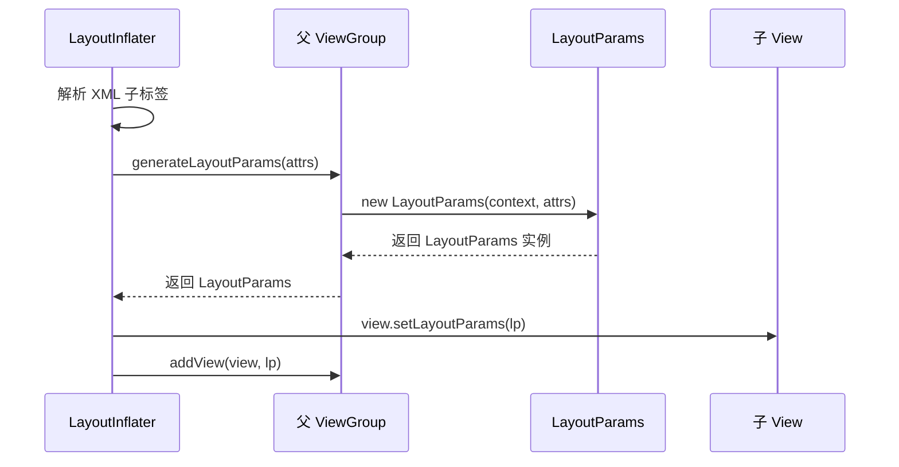
```mermaid
sequenceDiagram
    participant LI as LayoutInflater
    participant VG as 父 ViewGroup
    participant LP as LayoutParams
    participant V as 子 View

    LI->>LI: 解析 XML 子标签
    LI->>VG: generateLayoutParams(attrs)
    VG->>LP: new LayoutParams(context, attrs)
    LP-->>VG: 返回 LayoutParams 实例
    VG-->>LI: 返回 LayoutParams
    LI->>V: view.setLayoutParams(lp)
    LI->>VG: addView(view, lp)
```

这里有一个容易被忽视的设计要点：**LayoutParams 的实际类型是由父 ViewGroup 决定的，而不是由子 View 决定**。例如同一个 `TextView`，放进 `LinearLayout` 就持有 `LinearLayout.LayoutParams`（额外有 `weight`、`gravity` 字段），放进 `RelativeLayout` 就持有 `RelativeLayout.LayoutParams`（额外有各种 `rules` 数组）。这正是为什么在代码中动态修改 LayoutParams 时，往往需要做类型强转：

```kotlin
// 获取子 View 的 LayoutParams，并强转为 LinearLayout 的 LayoutParams
// 因为该 View 的父容器是 LinearLayout
val lp = textView.layoutParams as LinearLayout.LayoutParams
// 修改权重值
lp.weight = 1f
// 修改宽度为 0dp，配合 weight 实现按比例分配
lp.width = 0
// 重新设置 LayoutParams，触发 requestLayout()
textView.layoutParams = lp
```

#### LayoutParams 的继承体系

`LayoutParams` 存在一条深而广的继承链。每个自定义 ViewGroup 都可以（也应该）定义自己的 LayoutParams 子类来携带额外信息。以下是核心继承关系：

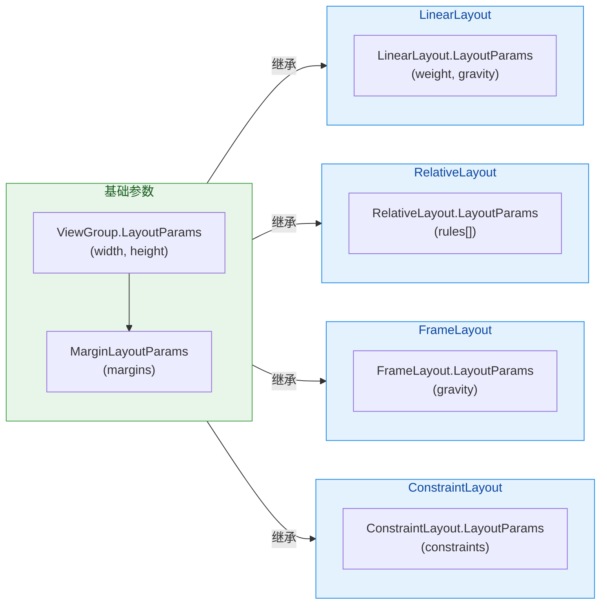
```mermaid
graph LR
    subgraph base["基础参数"]
        direction TB
        A["ViewGroup.LayoutParams\n(width, height)"]
        B["MarginLayoutParams\n(margins)"]
        A --> B
    end

    subgraph linear["LinearLayout"]
        direction TB
        C["LinearLayout.LayoutParams\n(weight, gravity)"]
    end

    subgraph relative["RelativeLayout"]
        direction TB
        D["RelativeLayout.LayoutParams\n(rules[])"]
    end

    subgraph frame["FrameLayout"]
        direction TB
        E["FrameLayout.LayoutParams\n(gravity)"]
    end

    subgraph constraint["ConstraintLayout"]
        direction TB
        F["ConstraintLayout.LayoutParams\n(constraints)"]
    end

    base -->|"继承"| linear
    base -->|"继承"| relative
    base -->|"继承"| frame
    base -->|"继承"| constraint

    classDef baseStyle fill:#E8F5E9,stroke:#43A047,color:#1B5E20
    classDef childStyle fill:#E3F2FD,stroke:#1E88E5,color:#0D47A1
    class base baseStyle
    class linear,relative,frame,constraint childStyle
```

从图中可以清楚看到：几乎所有常见 ViewGroup 的 LayoutParams 都继承自 `MarginLayoutParams`，而非直接继承 `ViewGroup.LayoutParams`。这意味着 **margin 支持是绝大多数布局的默认能力**。

#### checkLayoutParams 与类型安全

ViewGroup 内部在 `addView()` 时会调用 `checkLayoutParams(LayoutParams p)` 来验证传入的 LayoutParams 是否是自己能处理的类型。如果检查不通过，会调用 `generateLayoutParams(p)` 进行一次"类型转换"——用旧的 LayoutParams 中的 width/height 信息构造一个新的、正确类型的实例。这套保护机制确保了即使开发者传入了错误类型的 LayoutParams，也不会导致 ClassCastException 在测量阶段爆发。

---

### MarginLayoutParams —— 外边距的标准化承载

#### 为什么需要单独一层

在最初的设计中，`ViewGroup.LayoutParams` 只有 `width` 和 `height`。但几乎所有实际场景都需要为子 View 设置外边距，如果让每个 ViewGroup 的子类各自实现 margin 逻辑，会产生大量重复代码和不一致行为。因此 Android Framework 在基础 LayoutParams 之上增加了 `MarginLayoutParams` 这一中间层，将 **margin 的解析、存储和 RTL（Right-To-Left）适配** 统一收敛。

#### 核心字段一览

```java
public class MarginLayoutParams extends ViewGroup.LayoutParams {
    // 传统四方向外边距（单位：px）
    public int leftMargin;   // 左外边距
    public int topMargin;    // 上外边距
    public int rightMargin;  // 右外边距
    public int bottomMargin; // 下外边距

    // API 17+ 支持 RTL 的起始/结束外边距
    private int startMargin = DEFAULT_MARGIN_RELATIVE; // 文字起始方向边距
    private int endMargin   = DEFAULT_MARGIN_RELATIVE; // 文字结束方向边距
}
```

这里需要特别理解 **`start`/`end` 与 `left`/`right` 的关系**。在 LTR（从左到右）语言环境中，`start` 等价于 `left`，`end` 等价于 `right`；而在 RTL（如阿拉伯语、希伯来语）环境中，二者恰好相反。`MarginLayoutParams` 内部维护了一套解析优先级机制：

1. 如果开发者同时设置了 `marginStart` 和 `leftMargin`，在 **resolveMargins()** 阶段，`start`/`end` 会覆盖 `left`/`right`。
2. 如果只设置了 `leftMargin` 而未设置 `marginStart`（即 `startMargin == DEFAULT_MARGIN_RELATIVE`），则保留 `leftMargin` 的值。

这意味着在支持国际化的应用中，**推荐始终使用 `marginStart`/`marginEnd` 替代 `marginLeft`/`marginRight`**，以确保在 RTL 语言下布局自动镜像。

#### Margin 在测量中的参与方式

Margin 并不是由子 View 自己消化的，而是 **由父 ViewGroup 在测量和布局子 View 时主动扣除**。这一点至关重要。具体来说，父 ViewGroup 在调用 `child.measure()` 之前，会先读取该 child 的 MarginLayoutParams 中的 margin 值，从自己可用的空间中减去对应的 margin，然后将"减过之后的可用空间"编码成 MeasureSpec 传给子 View。伪代码如下：

```kotlin
// 父 ViewGroup 在测量某个子 View 时的典型逻辑
// parentWidthSpec: 父容器自身收到的宽度 MeasureSpec
// child: 当前要测量的子 View
// lp: child 对应的 MarginLayoutParams

// 1. 获取父容器已经被消耗的宽度（padding + 已测量子 View 的尺寸等）
val usedWidth = paddingLeft + paddingRight

// 2. 将 child 的 lp.width（可能是 MATCH_PARENT / WRAP_CONTENT / 精确值）
//    连同父容器的可用空间和 margin 一起，生成子 View 的 MeasureSpec
val childWidthSpec = getChildMeasureSpec(
    parentWidthSpec,                          // 父容器的宽度约束
    usedWidth + lp.leftMargin + lp.rightMargin, // 已消耗 + 左右外边距
    lp.width                                  // 子 View 期望的宽度
)

// 3. 高度同理
val childHeightSpec = getChildMeasureSpec(
    parentHeightSpec,
    paddingTop + paddingBottom + lp.topMargin + lp.bottomMargin,
    lp.height
)

// 4. 用生成的 childSpec 让子 View 自我测量
child.measure(childWidthSpec, childHeightSpec)
```

从这段逻辑可以看出，**margin 和 padding 在测量阶段是"平级"的消耗项**——它们都会减少子 View 可获得的空间。区别在于 padding 是父 View 自身的内边距，margin 是子 View 声明的外间距，但最终都由父 ViewGroup 在构建 MeasureSpec 时一并扣除。

#### 常见陷阱：Margin 合并（Margin Collapsing）

与 CSS 不同，**Android 布局系统不存在垂直方向上的 margin collapsing**。在 CSS 中，两个相邻块级元素的上下 margin 会取较大值而非叠加；但在 Android 中，如果上面的 View 有 `marginBottom = 16dp`，下面的 View 有 `marginTop = 8dp`，最终它们之间的间距就是 **24dp**（简单叠加）。这是一个从 Web 前端转 Android 开发时非常容易踩的坑。

---

### MeasureSpec —— 父子通信的"测量契约"

#### 什么是 MeasureSpec

如果说 LayoutParams 是子 View 发出的"我希望这么大"的诉求，那么 **MeasureSpec 就是父 ViewGroup 综合考虑自身空间约束和子 View 诉求之后，下发给子 View 的"你最多能这么大"的裁定书**。

在技术实现上，MeasureSpec 是一个 **32 位 int 值**，其中：

- **高 2 位**：表示测量模式（mode），共三种。
- **低 30 位**：表示尺寸值（size），单位为 px。

之所以用一个 int 而不是一个对象，是出于极致的 **性能考量**。在一次完整的布局过程中，`measure()` 可能被调用成百上千次（每个 View 至少一次，某些 ViewGroup 会多次测量子 View）。如果每次传递都创建一个 MeasureSpec 对象，将产生大量短命对象，加重 GC 压力。用一个原始 int 做位打包（bit-packing），零分配、零 GC，是 Framework 团队的经典性能优化思路。

#### 三种测量模式详解

| 模式常量 | 二进制高2位 | 含义 | 典型来源 |
|----------|-------------|------|----------|
| `EXACTLY` | `01` | 父容器已为子 View 确定了精确尺寸，子 View 必须使用这个值 | `layout_width="100dp"` 或 `match_parent`（父容器自身为 EXACTLY） |
| `AT_MOST` | `10` | 父容器给出一个上限，子 View 可以取任意不超过此上限的值 | `wrap_content`（父容器自身为 EXACTLY 或 AT_MOST） |
| `UNSPECIFIED` | `00` | 父容器不做任何约束，子 View 想要多大就多大 | `ScrollView` 对子 View 的纵向测量；系统内部预测量 |

三种模式在实际开发中的感知频率差异很大。大部分日常开发主要打交道的是 `EXACTLY` 和 `AT_MOST`，而 `UNSPECIFIED` 往往出现在 **可滚动容器**（如 `ScrollView`、`RecyclerView`）或 **系统内部的预测量** 场景中。例如 `ScrollView` 在纵向上对子 View 使用 `UNSPECIFIED`，因为它不关心子 View 到底有多高——反正超出屏幕的部分可以滚动。

#### MeasureSpec 的编解码 API

Framework 提供了两组静态方法来操作 MeasureSpec：

```java
// —— 编码：将 mode 和 size 打包为一个 int ——
// mode: 上表中的三种模式常量之一
// size: 期望的尺寸像素值（低30位）
int spec = MeasureSpec.makeMeasureSpec(size, mode);

// —— 解码：从 int 中提取 mode 和 size ——
int mode = MeasureSpec.getMode(spec);  // 高2位
int size = MeasureSpec.getSize(spec);  // 低30位
```

底层实现非常直观：

```java
// 模式掩码：高 2 位全 1，低 30 位全 0
// 0xC0000000 = 1100_0000_..._0000
private static final int MODE_MASK = 0x3 << 30;

// 打包：高2位放 mode，低30位放 size，用按位或合并
public static int makeMeasureSpec(int size, int mode) {
    return (size & ~MODE_MASK) | (mode & MODE_MASK);
}

// 取模式：按位与掩码，保留高2位
public static int getMode(int measureSpec) {
    return (measureSpec & MODE_MASK);
}

// 取尺寸：按位与取反掩码，保留低30位
public static int getSize(int measureSpec) {
    return (measureSpec & ~MODE_MASK);
}
```

这段位运算是面试中的常客。理解核心逻辑后可以总结为：**高 2 位 = 模式，低 30 位 = 尺寸，makeMeasureSpec 合二为一，getMode / getSize 拆开提取**。

#### MeasureSpec 的传递链：从 DecorView 到叶子 View

一个完整的测量流程从 `ViewRootImpl.performTraversals()` 开始，沿视图树自顶向下传递 MeasureSpec。以下是传递链的核心逻辑：

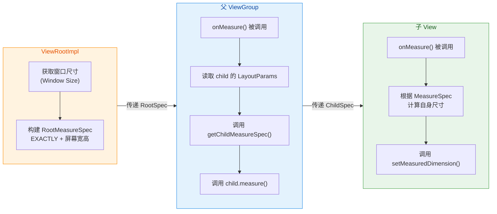
```mermaid
graph LR
    subgraph root["ViewRootImpl"]
        direction TB
        A["获取窗口尺寸\n(Window Size)"]
        B["构建 RootMeasureSpec\nEXACTLY + 屏幕宽高"]
        A --> B
    end

    subgraph parent["父 ViewGroup"]
        direction TB
        C["onMeasure() 被调用"]
        D["读取 child 的 LayoutParams"]
        E["调用 getChildMeasureSpec()"]
        F["调用 child.measure()"]
        C --> D
        D --> E
        E --> F
    end

    subgraph child["子 View"]
        direction TB
        G["onMeasure() 被调用"]
        H["根据 MeasureSpec\n计算自身尺寸"]
        I["调用 setMeasuredDimension()"]
        G --> H
        H --> I
    end

    root -->|"传递 RootSpec"| parent -->|"传递 ChildSpec"| child

    classDef rootStyle fill:#FFF3E0,stroke:#FB8C00,color:#E65100
    classDef parentStyle fill:#E3F2FD,stroke:#1E88E5,color:#0D47A1
    classDef childStyle fill:#E8F5E9,stroke:#43A047,color:#1B5E20
    class root rootStyle
    class parent parentStyle
    class child childStyle
```

**第一步：根 MeasureSpec 的生成**

在 `ViewRootImpl` 中，系统根据窗口（Window）的实际像素尺寸，以 `EXACTLY` 模式生成根 MeasureSpec。对于全屏 Activity，这通常就是屏幕的物理像素宽高。这意味着 **DecorView 总是以精确模式开始测量**。

**第二步：父 ViewGroup 翻译 MeasureSpec**

当某个父 ViewGroup 的 `onMeasure()` 被调用时，它会逐个测量自己的子 View。对每个子 View，它需要结合三个输入来生成子 View 的 MeasureSpec：

1. **自身收到的父级 MeasureSpec**（parentSpec）
2. **自身已消耗的空间**（padding + margin + 已使用宽度等）
3. **子 View 的 LayoutParams 中的 width/height 值**（childDimension）

这个"翻译"工作由 `ViewGroup.getChildMeasureSpec()` 完成，它是整个 MeasureSpec 传递链中最核心的静态方法。

#### getChildMeasureSpec() 深度解析

这个方法的核心是一张 **3×3 决策表**——父模式（3 种）× 子诉求（3 种：精确值 / MATCH_PARENT / WRAP_CONTENT）= 9 种组合，每种组合产出一个确定的 (childMode, childSize)。下面我们用详尽的正文逐一讲解这 9 种情况：

**场景 1：父 EXACTLY + 子精确值**
父容器说"我就是 300px"，子 View 说"我要 100px"。结果很明确：子 View 得到 `EXACTLY 100px`。子 View 的诉求完全被满足。

**场景 2：父 EXACTLY + 子 MATCH_PARENT**
父容器说"我就是 300px"，子 View 说"我要和你一样大"。结果：子 View 得到 `EXACTLY 300px`（实际是 300 减去 padding 和 margin 后的值）。子 View 被精确约束为父容器的剩余空间。

**场景 3：父 EXACTLY + 子 WRAP_CONTENT**
父容器说"我就是 300px"，子 View 说"我只需要包住自己内容"。结果：子 View 得到 `AT_MOST 300px`。"你最多只能占 300px，但你可以更小。"

**场景 4：父 AT_MOST + 子精确值**
父容器说"我最多 300px"，子 View 说"我要 100px"。100 < 300，子 View 得到 `EXACTLY 100px`。即使父不确定自己最终多大，子 View 要的是个确定值，完全没问题。

**场景 5：父 AT_MOST + 子 MATCH_PARENT**
父容器说"我最多 300px"，子 View 说"我要和你一样大"。但父自己都还不确定精确尺寸，所以子 View 只能得到 `AT_MOST 300px`——"你最多和我一样大，但我自己还没定呢。"

**场景 6：父 AT_MOST + 子 WRAP_CONTENT**
父容器说"我最多 300px"，子 View 说"我只需要包住内容"。子 View 得到 `AT_MOST 300px`——上限继承自父容器。

**场景 7：父 UNSPECIFIED + 子精确值**
父容器不做约束，子 View 要 100px。子 View 得到 `EXACTLY 100px`。

**场景 8：父 UNSPECIFIED + 子 MATCH_PARENT**
父容器不做约束，子 View 说"我要和你一样大"——但父没有限制，子 View 得到 `UNSPECIFIED 0`。这意味着子 View 需要在自己的 `onMeasure()` 中自行决定尺寸（通常会使用默认最小尺寸或内容尺寸）。

**场景 9：父 UNSPECIFIED + 子 WRAP_CONTENT**
父容器不做约束，子 View 要包住内容。子 View 得到 `UNSPECIFIED 0`。和场景 8 类似，子 View 完全自主。

将以上九种情况浓缩为一张表：

| | 子 = 精确值 (如 100dp) | 子 = MATCH_PARENT | 子 = WRAP_CONTENT |
|---|---|---|---|
| **父 EXACTLY** | EXACTLY childSize | EXACTLY parentSize | AT_MOST parentSize |
| **父 AT_MOST** | EXACTLY childSize | AT_MOST parentSize | AT_MOST parentSize |
| **父 UNSPECIFIED** | EXACTLY childSize | UNSPECIFIED 0 | UNSPECIFIED 0 |

> 表中 `parentSize` 指的是"父容器可用空间减去 padding 和 child 的 margin 后的值"，而非父容器的原始尺寸。

这张决策表可以精炼出两条直觉规律：

1. **子 View 填了精确值，就铁定是 EXACTLY**——不管父是什么模式，精确值最"硬"。
2. **子 View 填 WRAP_CONTENT，永远不会得到 EXACTLY**——它至多得到一个 AT_MOST 上限，具体多小由自己的内容决定。

#### getChildMeasureSpec 源码对照

```java
public static int getChildMeasureSpec(int spec, int padding, int childDimension) {
    // 解码父 MeasureSpec
    int specMode = MeasureSpec.getMode(spec);     // 父模式
    int specSize = MeasureSpec.getSize(spec);     // 父尺寸

    // 父可用空间 = 父尺寸 - 已消耗（padding + margin），不小于 0
    int size = Math.max(0, specSize - padding);

    // 将要输出的子 Mode 和子 Size
    int resultSize = 0;
    int resultMode = 0;

    switch (specMode) {
        // ——— 父是 EXACTLY ———
        case MeasureSpec.EXACTLY:
            if (childDimension >= 0) {
                // 子是精确值 → EXACTLY childDimension
                resultSize = childDimension;
                resultMode = MeasureSpec.EXACTLY;
            } else if (childDimension == LayoutParams.MATCH_PARENT) {
                // 子要 MATCH_PARENT → EXACTLY 父可用空间
                resultSize = size;
                resultMode = MeasureSpec.EXACTLY;
            } else if (childDimension == LayoutParams.WRAP_CONTENT) {
                // 子要 WRAP_CONTENT → AT_MOST 父可用空间
                resultSize = size;
                resultMode = MeasureSpec.AT_MOST;
            }
            break;

        // ——— 父是 AT_MOST ———
        case MeasureSpec.AT_MOST:
            if (childDimension >= 0) {
                // 子是精确值 → EXACTLY childDimension
                resultSize = childDimension;
                resultMode = MeasureSpec.EXACTLY;
            } else if (childDimension == LayoutParams.MATCH_PARENT) {
                // 子要 MATCH_PARENT → AT_MOST 父可用空间
                resultSize = size;
                resultMode = MeasureSpec.AT_MOST;
            } else if (childDimension == LayoutParams.WRAP_CONTENT) {
                // 子要 WRAP_CONTENT → AT_MOST 父可用空间
                resultSize = size;
                resultMode = MeasureSpec.AT_MOST;
            }
            break;

        // ——— 父是 UNSPECIFIED ———
        case MeasureSpec.UNSPECIFIED:
            if (childDimension >= 0) {
                // 子是精确值 → EXACTLY childDimension
                resultSize = childDimension;
                resultMode = MeasureSpec.EXACTLY;
            } else if (childDimension == LayoutParams.MATCH_PARENT) {
                // 子要 MATCH_PARENT → UNSPECIFIED 0
                resultSize = size;
                resultMode = MeasureSpec.UNSPECIFIED;
            } else if (childDimension == LayoutParams.WRAP_CONTENT) {
                // 子要 WRAP_CONTENT → UNSPECIFIED 0
                resultSize = size;
                resultMode = MeasureSpec.UNSPECIFIED;
            }
            break;
    }
    // 打包为 int 返回
    return MeasureSpec.makeMeasureSpec(resultSize, resultMode);
}
```

#### 自定义 View 中 onMeasure 的正确响应

当一个 View 接收到 MeasureSpec 后，它需要在 `onMeasure(int widthMeasureSpec, int heightMeasureSpec)` 中做出正确响应。很多初学者在自定义 View 时容易犯的错误是 **忽略 AT_MOST 模式**，导致 `wrap_content` 和 `match_parent` 行为相同。典型的正确实现模板如下：

```kotlin
override fun onMeasure(widthMeasureSpec: Int, heightMeasureSpec: Int) {
    // 计算内容本身期望的宽高（比如文字宽高、图片尺寸等）
    val desiredWidth = calculateContentWidth() + paddingLeft + paddingRight
    val desiredHeight = calculateContentHeight() + paddingTop + paddingBottom

    // 使用 resolveSize 对 desired 值做"合规裁剪"
    // resolveSize 内部会读取 MeasureSpec 的模式：
    //   EXACTLY → 直接用 specSize
    //   AT_MOST → 取 min(desired, specSize)
    //   UNSPECIFIED → 直接用 desired
    val finalWidth = resolveSize(desiredWidth, widthMeasureSpec)
    val finalHeight = resolveSize(desiredHeight, heightMeasureSpec)

    // 必须调用 setMeasuredDimension，否则会抛 IllegalStateException
    setMeasuredDimension(finalWidth, finalHeight)
}
```

`resolveSize()` 是 `View` 类提供的便捷方法，封装了对三种模式的标准处理逻辑。在大多数简单自定义 View 场景下，直接使用它即可避免手动 `switch (mode)` 的繁琐。

#### 整体流程回顾

让我们用一张完整的流程图将 LayoutParams、MarginLayoutParams 和 MeasureSpec 三者的协作关系串联起来：

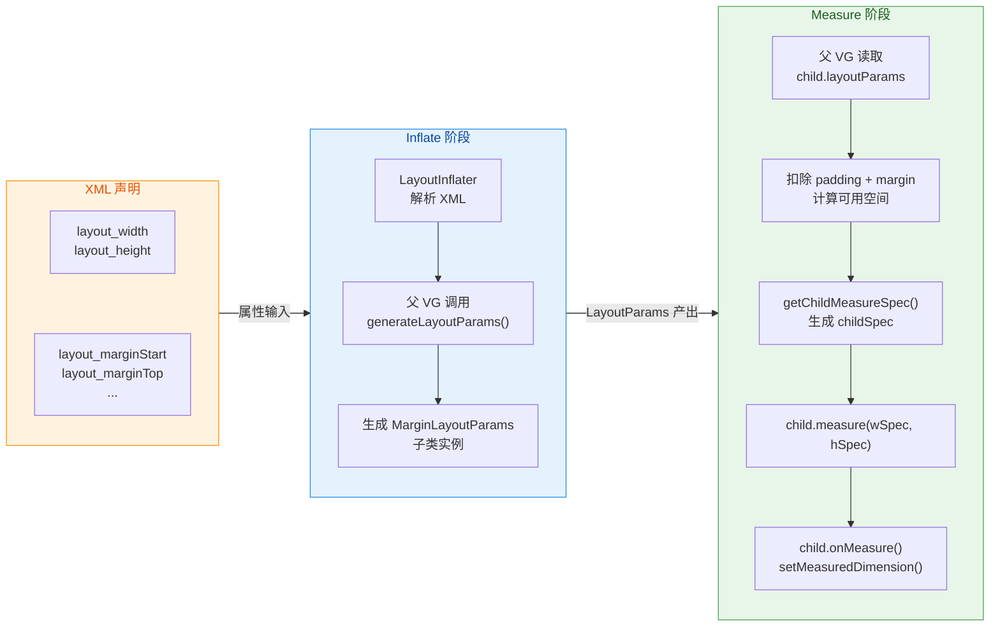
```mermaid
graph LR
    subgraph xml["XML 声明"]
        direction TB
        X1["layout_width\nlayout_height"]
        X2["layout_marginStart\nlayout_marginTop\n..."]
        X1 ~~~ X2
    end

    subgraph inflate["Inflate 阶段"]
        direction TB
        I1["LayoutInflater\n解析 XML"]
        I2["父 VG 调用\ngenerateLayoutParams()"]
        I3["生成 MarginLayoutParams\n子类实例"]
        I1 --> I2
        I2 --> I3
    end

    subgraph measure["Measure 阶段"]
        direction TB
        M1["父 VG 读取\nchild.layoutParams"]
        M2["扣除 padding + margin\n计算可用空间"]
        M3["getChildMeasureSpec()\n生成 childSpec"]
        M4["child.measure(wSpec, hSpec)"]
        M5["child.onMeasure()\nsetMeasuredDimension()"]
        M1 --> M2
        M2 --> M3
        M3 --> M4
        M4 --> M5
    end

    xml -->|"属性输入"| inflate -->|"LayoutParams 产出"| measure

    classDef xmlStyle fill:#FFF3E0,stroke:#FB8C00,color:#E65100
    classDef inflateStyle fill:#E3F2FD,stroke:#1E88E5,color:#0D47A1
    classDef measureStyle fill:#E8F5E9,stroke:#43A047,color:#1B5E20
    class xml xmlStyle
    class inflate inflateStyle
    class measure measureStyle
```

整个流程可以概括为一句话：**XML 中的 `layout_xxx` 属性被解析为 LayoutParams / MarginLayoutParams 对象，在测量阶段由父 ViewGroup 读取并结合自身约束，通过 `getChildMeasureSpec()` 翻译为 MeasureSpec 下发给子 View，子 View 据此在 `onMeasure()` 中确定最终尺寸。**

这条数据流是单向自顶向下的。子 View 无法"反过来"告诉父容器"你应该变大来容纳我"——它只能在父给定的 MeasureSpec 框架内做出选择。如果子 View 设定的尺寸超出了 `AT_MOST` 的上限，父 ViewGroup 在 `onLayout()` 阶段仍然可以按照自己的规则裁剪或调整子 View 的实际摆放位置和可见范围。

---

**📝 练习题**

在一个宽度为 `EXACTLY 600px` 的父 LinearLayout 中，某子 View 的 LayoutParams 设置为 `layout_width="wrap_content"`，且该子 View 的 `leftMargin = 50px`，`rightMargin = 50px`，父 LinearLayout 的 `paddingLeft = 20px`，`paddingRight = 30px`。那么父 ViewGroup 通过 `getChildMeasureSpec()` 为该子 View 生成的宽度 MeasureSpec 是什么？


A. EXACTLY 600px


B. AT_MOST 450px


C. AT_MOST 500px


D. EXACTLY 450px


**【答案】** B

**【解析】** 根据 `getChildMeasureSpec()` 的逻辑，父模式为 `EXACTLY`、子 LayoutParams 为 `WRAP_CONTENT`，查表可知结果模式为 `AT_MOST`。尺寸部分需要计算可用空间：`600 - paddingLeft(20) - paddingRight(30) - leftMargin(50) - rightMargin(50) = 450px`。因此最终结果为 `AT_MOST 450px`。选 B。选项 C 遗漏了 margin 的扣除，选项 A 和 D 的模式错误——`wrap_content` 在父 EXACTLY 下不可能得到 EXACTLY 模式。

---

## 线性布局 LinearLayout

LinearLayout 是 Android 应用开发中最经典、最直觉的布局容器之一。它的核心思想极为简洁：**将子 View 沿单一方向（水平或垂直）依次排列**。正因为这种"一维线性"的排列逻辑，它的测量与布局算法相比 RelativeLayout 要简单许多，在子 View 数量适中时性能表现优秀。然而，"简单"并不意味着"浅薄"——LinearLayout 内部的 **weight 权重分配机制** 涉及到一套精密的剩余空间计算算法，而 **baseline 对齐** 则牵涉到文本渲染与 View 坐标系之间的微妙关系。本节将从使用方式到底层测量流程，逐层拆解 LinearLayout 的三大核心知识点。

---

### orientation 方向

LinearLayout 通过 `android:orientation` 属性决定子 View 的排列方向，仅有两个合法值：`vertical`（垂直，默认值）与 `horizontal`（水平）。这个属性看似简单，但它 **从根本上决定了 LinearLayout 内部 `onMeasure()` 和 `onLayout()` 的执行路径**——源码中这两条路径是完全独立的方法分支。

#### 垂直模式 vertical

当 `orientation="vertical"` 时，所有子 View **从上到下** 依次堆叠。每个子 View 独占一行，宽度可以各不相同，但它们在垂直方向上是 **串行累加** 的关系。LinearLayout 在垂直模式下的测量逻辑可以概括为：

- **主轴（Main Axis）为 Y 轴**：LinearLayout 遍历所有子 View，逐一测量其高度，然后将所有子 View 的高度 **累加**（加上各自的上下 margin 和 LinearLayout 自身的上下 padding），得出自身所需的总高度。
- **交叉轴（Cross Axis）为 X 轴**：在宽度方向上，LinearLayout 取所有子 View 测量宽度（含左右 margin）的 **最大值** 作为自身宽度的参考（当自身宽度为 `wrap_content` 时）。

这意味着在垂直模式下，子 View 之间 **不会在水平方向上产生竞争关系**，每个子 View 都可以独立地决定自己的宽度。

#### 水平模式 horizontal

当 `orientation="horizontal"` 时，所有子 View **从左到右**（LTR 布局方向下）依次排列。主轴变为 X 轴，交叉轴变为 Y 轴，测量逻辑与垂直模式完全对称：

- **主轴为 X 轴**：所有子 View 的宽度被累加，得出 LinearLayout 所需的总宽度。
- **交叉轴为 Y 轴**：取所有子 View 高度的最大值作为 LinearLayout 高度的参考。

水平模式有一个垂直模式不具备的特殊能力——**baseline 对齐**（后面详细展开）。当多个文本控件横向排列且字号不同时，baseline 对齐可以确保它们在视觉上"坐落在同一条基线上"。

#### orientation 对 MeasureSpec 传递的影响

orientation 的选择直接影响父容器向子 View 传递 MeasureSpec 的方式。以垂直模式为例：

- 在 **交叉轴（宽度方向）**，LinearLayout 的行为和普通 ViewGroup 类似——根据自身的宽度 MeasureSpec 与子 View 的 `layout_width` 共同决定子 View 的 widthMeasureSpec。如果 LinearLayout 自身是 `match_parent`（EXACTLY 模式），子 View 设置 `match_parent` 时也会拿到 EXACTLY 模式的 MeasureSpec。
- 在 **主轴（高度方向）**，情况更复杂。LinearLayout 需要把"已经被前面的子 View 消耗掉的空间"从剩余空间中扣除，再传递给下一个子 View。这就是为什么当 LinearLayout 自身高度为 `match_parent` 且内部有多个子 View 时，排在后面的子 View 能获得的最大可用高度会逐步减少。

下面用一个 Mermaid 流程图来直观展示两种方向模式下的测量逻辑差异：

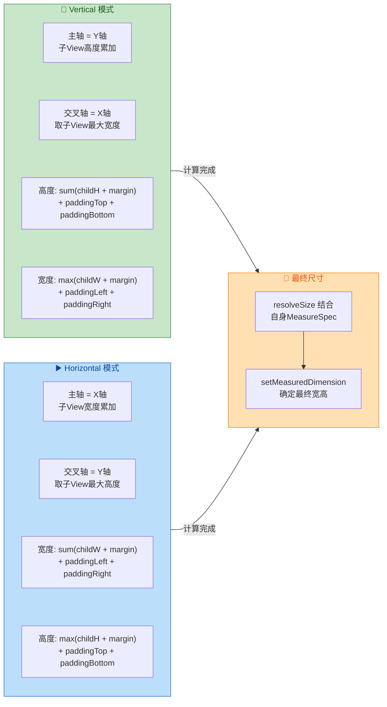
```mermaid
graph LR
    subgraph Vertical["🔽 Vertical 模式"]
        direction TB
        V1["主轴 = Y轴\n子View高度累加"]
        V2["交叉轴 = X轴\n取子View最大宽度"]
        V3["高度: sum(childH + margin)\n+ paddingTop + paddingBottom"]
        V4["宽度: max(childW + margin)\n+ paddingLeft + paddingRight"]
        V1 ~~~ V2
        V2 ~~~ V3
        V3 ~~~ V4
    end

    subgraph Horizontal["▶️ Horizontal 模式"]
        direction TB
        H1["主轴 = X轴\n子View宽度累加"]
        H2["交叉轴 = Y轴\n取子View最大高度"]
        H3["宽度: sum(childW + margin)\n+ paddingLeft + paddingRight"]
        H4["高度: max(childH + margin)\n+ paddingTop + paddingBottom"]
        H1 ~~~ H2
        H2 ~~~ H3
        H3 ~~~ H4
    end

    subgraph Result["📐 最终尺寸"]
        direction TB
        R1["resolveSize 结合\n自身MeasureSpec"]
        R2["setMeasuredDimension\n确定最终宽高"]
        R1 --> R2
    end

    Vertical -->|"计算完成"| Result
    Horizontal -->|"计算完成"| Result

    classDef greenStyle fill:#C8E6C9,stroke:#388E3C,color:#1B5E20
    classDef blueStyle fill:#BBDEFB,stroke:#1976D2,color:#0D47A1
    classDef orangeStyle fill:#FFE0B2,stroke:#F57C00,color:#E65100

    class Vertical greenStyle
    class Horizontal blueStyle
    class Result orangeStyle
```

#### 运行时动态切换方向

orientation 不仅可以在 XML 中静态声明，还可以通过 `setOrientation(LinearLayout.VERTICAL)` 或 `setOrientation(LinearLayout.HORIZONTAL)` 在运行时动态切换。调用此方法后，LinearLayout 会内部调用 `requestLayout()`，触发整棵子树的重新测量与布局。这在某些响应式 UI 场景中非常实用——比如在横屏时让子项水平排列，在竖屏时切换为垂直排列。但要注意，频繁切换 orientation 会带来不必要的 layout pass 开销，应当结合实际需求谨慎使用。

---

### weight 权重计算原理

`android:layout_weight` 是 LinearLayout 最强大也最容易被误解的特性。它允许子 View **按比例瓜分父容器中的剩余空间（或溢出空间）**，从而实现弹性伸缩布局。虽然在 XML 中使用 weight 只需要写一个数字，但其背后的测量算法涉及 **两轮测量（Two-Pass Measurement）**，对性能有直接影响。

#### 基本语义：剩余空间分配

weight 的核心公式可以用一句话概括：

> **子 View 最终尺寸 = 初始测量尺寸 + 剩余空间 × (自身 weight / 总 weight)**

这里有三个关键变量：

1. **初始测量尺寸**：子 View 在不考虑 weight 的情况下，按照自身 `layout_width`/`layout_height` 测量出的尺寸（第一轮测量的结果）。
2. **剩余空间**（delta）：LinearLayout 在主轴方向上的可用总尺寸，减去所有子 View 初始测量尺寸之和。这个值可以是正数（有空余）、零（刚好填满）、或负数（溢出了）。
3. **权重占比**：当前子 View 的 weight 值占所有设置了 weight 的子 View 的 weight 总和的比例。

#### 两轮测量机制（Two-Pass Measurement）

这是 weight 机制的核心，也是面试高频考点。当 LinearLayout 中存在任何一个 weight > 0 的子 View 时，测量过程会分为两轮：

**第一轮（Initial Pass）**：LinearLayout 遍历所有子 View，按照它们声明的 `layout_width` / `layout_height` 进行"正常"测量。这一轮的目的是确定每个子 View 的"初始尺寸"，并累加得出已消耗的总空间。此时 weight 还没有参与计算。

**计算剩余空间**：用 LinearLayout 自身在主轴方向的可用尺寸，减去第一轮累计的总消耗空间，得到 `delta`（剩余空间增量）。

**第二轮（Weight Pass）**：只针对 weight > 0 的子 View 进行第二次测量。每个子 View 的新尺寸 = 初始尺寸 + `delta × (childWeight / totalWeight)`。计算完成后，用这个新尺寸重新调用 `child.measure()`，让子 View 拿到最终的 MeasureSpec。

这个两轮测量的设计意味着：**使用 weight 的 LinearLayout 中，带 weight 的子 View 会被 measure 两次**。如果 LinearLayout 本身嵌套在另一个需要多次测量的容器中（如另一个带 weight 的 LinearLayout），测量次数会指数级增长。这就是 weight 嵌套使用时的性能隐患。

#### `layout_width="0dp"` 的优化技巧

一个广为人知的最佳实践是：**当子 View 要通过 weight 来决定主轴尺寸时，将主轴方向的尺寸设为 `0dp`**。例如在水平 LinearLayout 中，设置 `android:layout_width="0dp"` 配合 `android:layout_weight`。

为什么这样做？回顾上面的公式：

> 最终尺寸 = 初始测量尺寸 + 剩余空间 × 权重占比

如果把 `layout_width` 设为 `0dp`，那么第一轮测量时子 View 的"初始尺寸"就是 0（或接近 0），剩余空间 = 父容器可用总尺寸 - 0 - 0 - ... = 父容器全部可用空间。此时 weight 的分配就变成了 **纯粹的比例分配**：

> 最终尺寸 = 0 + 总空间 × (自身 weight / 总 weight) = 总空间 × 权重占比

这不仅语义更清晰（"我就是要按比例分"），而且在第一轮测量中子 View 的测量开销极小（尺寸为 0 时很多子 View 可以快速完成测量），从而在一定程度上 **缓解两轮测量的性能影响**。

反之，如果把 `layout_width` 设为 `match_parent`，情况就会变得反直觉。因为第一轮测量时每个子 View 都会尝试占满父容器的全部宽度，累加后总消耗远超父容器可用空间，导致 `delta` 成为一个 **很大的负数**。第二轮用这个负数按 weight 比例"回收"空间，最终结果虽然数学上等价（比例关系不变），但语义混乱且第一轮测量浪费了更多性能。

下面通过一个具体的计算示例来巩固理解。假设水平 LinearLayout 总宽度为 300dp，包含三个子 View：

```kotlin
// ============================================================
// 场景一：layout_width="0dp" + weight 纯比例分配
// ============================================================
// 父容器总宽度: 300dp

// Child A: layout_width="0dp", layout_weight=1
// Child B: layout_width="0dp", layout_weight=2
// Child C: layout_width="0dp", layout_weight=1

// --- 第一轮测量 ---
// A 初始宽度 = 0dp
// B 初始宽度 = 0dp
// C 初始宽度 = 0dp
// 已消耗总宽度 = 0 + 0 + 0 = 0dp

// --- 计算剩余空间 ---
// delta = 300dp - 0dp = 300dp（全部空间可供分配）

// --- 第二轮测量（按 weight 分配 delta）---
// totalWeight = 1 + 2 + 1 = 4
// A 最终宽度 = 0 + 300 * (1/4) = 75dp
// B 最终宽度 = 0 + 300 * (2/4) = 150dp
// C 最终宽度 = 0 + 300 * (1/4) = 75dp
// 总计: 75 + 150 + 75 = 300dp ✅
```

```kotlin
// ============================================================
// 场景二：layout_width="match_parent" + weight（反直觉场景）
// ============================================================
// 父容器总宽度: 300dp

// Child A: layout_width="match_parent", layout_weight=1
// Child B: layout_width="match_parent", layout_weight=2
// Child C: layout_width="match_parent", layout_weight=1

// --- 第一轮测量 ---
// A 初始宽度 = 300dp（match_parent，占满父容器）
// B 初始宽度 = 300dp
// C 初始宽度 = 300dp
// 已消耗总宽度 = 300 + 300 + 300 = 900dp

// --- 计算剩余空间 ---
// delta = 300dp - 900dp = -600dp（负值！表示溢出了 600dp）

// --- 第二轮测量（按 weight 回收溢出空间）---
// totalWeight = 1 + 2 + 1 = 4
// A 最终宽度 = 300 + (-600) * (1/4) = 300 - 150 = 150dp
// B 最终宽度 = 300 + (-600) * (2/4) = 300 - 300 = 0dp  ← 注意！
// C 最终宽度 = 300 + (-600) * (1/4) = 300 - 150 = 150dp
// 总计: 150 + 0 + 150 = 300dp ✅（数学正确，但 B 消失了！）
```

场景二清晰地展示了 `match_parent + weight` 组合的反直觉行为：**weight 值越大的子 View 反而越小**，因为它被"回收"了更多的溢出空间。在实际开发中，除非你 **刻意** 需要这种反向效果，否则始终应使用 `0dp + weight` 的组合。

#### weight 对嵌套性能的放大效应

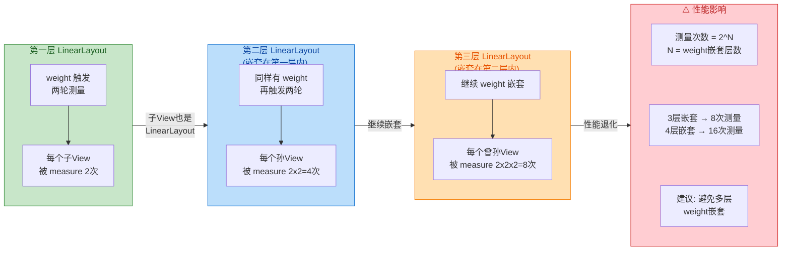
```mermaid
graph LR
    subgraph Layer1["第一层 LinearLayout"]
        direction TB
        L1["weight 触发\n两轮测量"]
        L1C["每个子View\n被 measure 2次"]
        L1 --> L1C
    end

    subgraph Layer2["第二层 LinearLayout\n(嵌套在第一层内)"]
        direction TB
        L2["同样有 weight\n再触发两轮"]
        L2C["每个孙View\n被 measure 2x2=4次"]
        L2 --> L2C
    end

    subgraph Layer3["第三层 LinearLayout\n(嵌套在第二层内)"]
        direction TB
        L3["继续 weight 嵌套"]
        L3C["每个曾孙View\n被 measure 2x2x2=8次"]
        L3 --> L3C
    end

    subgraph Impact["⚠️ 性能影响"]
        direction TB
        I1["测量次数 = 2^N\nN = weight嵌套层数"]
        I2["3层嵌套 → 8次测量\n4层嵌套 → 16次测量"]
        I3["建议: 避免多层\nweight嵌套"]
        I1 ~~~ I2
        I2 ~~~ I3
    end

    Layer1 -->|"子View也是\nLinearLayout"| Layer2
    Layer2 -->|"继续嵌套"| Layer3
    Layer3 -->|"性能退化"| Impact

    classDef green fill:#C8E6C9,stroke:#388E3C,color:#1B5E20
    classDef blue fill:#BBDEFB,stroke:#1976D2,color:#0D47A1
    classDef orange fill:#FFE0B2,stroke:#F57C00,color:#E65100
    classDef red fill:#FFCDD2,stroke:#D32F2F,color:#B71C1C

    class Layer1 green
    class Layer2 blue
    class Layer3 orange
    class Impact red
```

如图所示，weight 的两轮测量在嵌套时呈 **指数级膨胀**：N 层 weight 嵌套会导致最底层子 View 被 measure **2^N 次**。这就是为什么 Android Lint 会在检测到 weight 嵌套时发出 "Nested weights are bad for performance" 警告。在现代开发中，**ConstraintLayout** 通过百分比约束和 Chain 机制，能在扁平的单层结构中实现等同于 weight 的比例分配效果，且只需一轮测量，因此是替代 weight 嵌套的首选方案。

#### weightSum 属性

默认情况下，LinearLayout 会自动将所有子 View 的 weight 值累加作为总权重。但你也可以通过 `android:weightSum` 属性 **手动指定总权重**。这在你希望子 View 只占据部分空间、而非瓜分全部剩余空间时非常有用。

```xml
<!-- 水平 LinearLayout，手动指定 weightSum 为 3 -->
<!-- 但只有一个子 View 拥有 weight=1 -->
<!-- 因此该子 View 只占 1/3 的宽度，剩余 2/3 留空 -->
<LinearLayout
    android:layout_width="match_parent"
    android:layout_height="wrap_content"
    android:orientation="horizontal"
    android:weightSum="3">

    <!-- 这个 Button 只会占据父容器 1/3 的宽度 -->
    <Button
        android:layout_width="0dp"
        android:layout_height="wrap_content"
        android:layout_weight="1"
        android:text="占 1/3" />

    <!-- 没有其他子 View，剩余 2/3 空间留空 -->
</LinearLayout>
```

如果不设 `weightSum="3"`，那么 totalWeight 就等于 1（唯一的子 View 的 weight），Button 会独占全部剩余空间——这与期望的"只占 1/3"完全不同。`weightSum` 为精确的比例控制提供了灵活性。

---

### baseline 对齐

baseline（基线）是 **文本排版** 中的核心概念：它是文字"坐落"的那条不可见的水平线。英文字母如 "a"、"b"、"x" 的底部就落在 baseline 上，而 "g"、"p"、"y" 的下降部分（descender）则会伸到 baseline 以下。在 Android 中，TextView 和其子类（Button、EditText 等）都拥有 baseline 信息，通过 `getBaseline()` 方法返回 **从 View 顶部到 baseline 的像素距离**。

#### 为什么需要 baseline 对齐？

想象一个水平 LinearLayout 中并排放置两个 TextView：一个字号为 14sp，另一个字号为 24sp。如果使用默认的顶部对齐（`gravity="top"`），两段文字的顶部会平齐，但视觉上文字会"高低错落"，阅读体验很差。如果使用底部对齐（`gravity="bottom"`），文字底部平齐但效果仍然不够理想——因为不同字号的文字 descender 深度不同。

**baseline 对齐** 解决的正是这个问题：它让所有子 View 的文字 baseline 对齐到同一水平线上，无论字号大小如何，文字在视觉上都"坐在同一行"，这是符合排版美学的做法。

#### 如何启用 baseline 对齐

在水平方向的 LinearLayout 中，baseline 对齐通过 `android:baselineAligned` 属性控制，**默认值为 `true`**——也就是说，水平 LinearLayout **默认就会尝试做 baseline 对齐**。当此属性为 true 时，LinearLayout 在 `onMeasure()` 过程中会：

1. 遍历所有子 View，调用 `child.getBaseline()` 获取各自的 baseline 偏移量。
2. 找出所有子 View 中 baseline 偏移量的最大值（`maxBaseline`）。
3. 对每个子 View，计算需要额外添加的顶部偏移：`topOffset = maxBaseline - child.getBaseline()`。这样 baseline 偏移量小的 View（通常是小字号的）会被"下推"，使其 baseline 与偏移量最大的 View 对齐。
4. 在 `onLayout()` 阶段，将这个 `topOffset` 加到子 View 的 top 坐标上。

```kotlin
// 伪代码：baseline 对齐的核心逻辑
// 假设水平 LinearLayout 中有 childA (14sp) 和 childB (24sp)

// --- 测量阶段 ---
// childA.getBaseline() = 20px  （从 View 顶部到文字基线的距离）
// childB.getBaseline() = 34px  （更大的字号，baseline 离顶部更远）

// maxBaseline = max(20, 34) = 34px

// childA 的顶部偏移 = 34 - 20 = 14px  （需要下推 14px）
// childB 的顶部偏移 = 34 - 34 = 0px   （已经是最大值，无需调整）

// --- 布局阶段 ---
// childA.layout(left, top + 14px, right, bottom + 14px)
// childB.layout(left, top + 0px,  right, bottom + 0px)

// 结果：两个 TextView 的文字基线完美对齐 ✓
```

#### baseline 对齐对高度测量的影响

baseline 对齐有一个容易被忽视的副作用：**它可能会增大 LinearLayout 的整体高度**。因为某些子 View 被"下推"了，它们的底部可能会超出原本计算的 LinearLayout 高度。源码中，LinearLayout 在计算自身高度时会同时考虑两个值：

- **基于 baseline 以上的最大空间**：`maxBaseline`（所有子 View 中 baseline 偏移量的最大值）。
- **基于 baseline 以下的最大空间**：`max(child.getMeasuredHeight() - child.getBaseline())`（所有子 View 中，baseline 以下部分的最大高度）。

最终高度 = 这两个最大值之和 + padding。这确保了所有子 View 在 baseline 对齐后都能完整显示，不会被裁切。

#### baselineAligned="false" 的性能优化

既然 baseline 对齐默认开启，且涉及额外的计算，那么 **当你确定不需要 baseline 对齐时，显式关闭它可以获得性能提升**。典型场景包括：

- LinearLayout 的子 View 是 ImageView、自定义图形控件等 **没有文本 baseline** 的 View。
- LinearLayout 的子 View 本身也是 ViewGroup（如嵌套的 LinearLayout），此时 baseline 对齐通常没有意义。
- 已经通过 `gravity` 或明确的 margin 控制了对齐方式。

Android Lint 也会在检测到水平 LinearLayout 嵌套 LinearLayout 时，建议你设置 `android:baselineAligned="false"` 以避免不必要的 baseline 计算开销。这个优化在列表项（ListView/RecyclerView item）中尤为重要，因为列表项会被大量重复测量。

```xml
<!-- 嵌套 LinearLayout 场景：关闭 baseline 对齐以优化性能 -->
<LinearLayout
    android:layout_width="match_parent"
    android:layout_height="wrap_content"
    android:orientation="horizontal"
    android:baselineAligned="false">
    <!-- ↑ 显式关闭 baseline 对齐 -->

    <!-- 子 View 是一个垂直的 LinearLayout，不需要 baseline 对齐 -->
    <LinearLayout
        android:layout_width="0dp"
        android:layout_height="wrap_content"
        android:layout_weight="1"
        android:orientation="vertical">

        <!-- 内部的文本控件 -->
        <TextView
            android:layout_width="wrap_content"
            android:layout_height="wrap_content"
            android:text="标题" />

        <TextView
            android:layout_width="wrap_content"
            android:layout_height="wrap_content"
            android:text="副标题" />
    </LinearLayout>

    <!-- 右侧的图标 -->
    <ImageView
        android:layout_width="48dp"
        android:layout_height="48dp"
        android:src="@drawable/ic_arrow" />
</LinearLayout>
```

#### baselineAlignedChildIndex

LinearLayout 还提供了一个更精细的控制属性：`android:baselineAlignedChildIndex`。它指定 **以哪个子 View 的 baseline 作为整个 LinearLayout 对外暴露的 baseline**。当 LinearLayout 自身被嵌套在另一个水平 LinearLayout 中时，外层 LinearLayout 会调用内层 LinearLayout 的 `getBaseline()` 来做 baseline 对齐。此时 `baselineAlignedChildIndex` 就决定了内层 LinearLayout"代表哪个子 View"参与对齐。

默认值为 -1（无效），表示 LinearLayout 使用第一个子 View 的 baseline。如果你的 LinearLayout 中第一个子 View 是图片、第二个是标题文字，而你希望对外以标题文字的 baseline 对齐，就可以设置 `android:baselineAlignedChildIndex="1"`。

---

### 完整测量流程总览

综合 orientation、weight 和 baseline 三大机制，LinearLayout 的完整 `onMeasure()` 流程可以用以下时序图来展示：

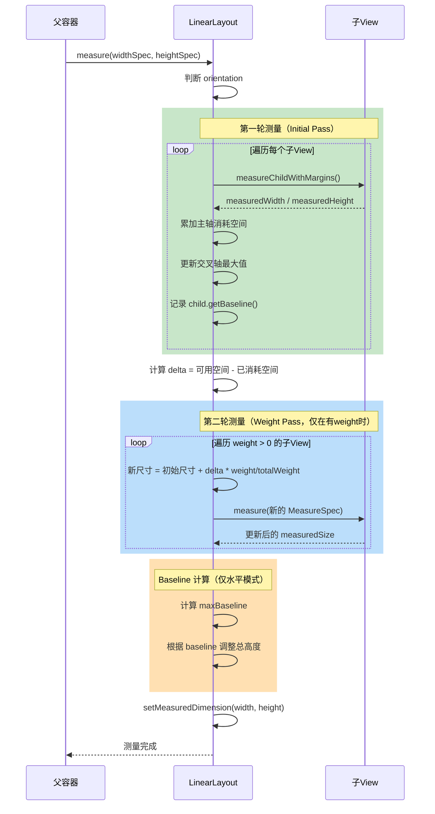
```mermaid
sequenceDiagram
    participant Parent as 父容器
    participant LL as LinearLayout
    participant Child as 子View

    Parent->>LL: measure(widthSpec, heightSpec)
    LL->>LL: 判断 orientation
    
    rect rgb(200, 230, 201)
    Note over LL,Child: 第一轮测量（Initial Pass）
    loop 遍历每个子View
        LL->>Child: measureChildWithMargins()
        Child-->>LL: measuredWidth / measuredHeight
        LL->>LL: 累加主轴消耗空间
        LL->>LL: 更新交叉轴最大值
        LL->>LL: 记录 child.getBaseline()
    end
    end

    LL->>LL: 计算 delta = 可用空间 - 已消耗空间
    
    rect rgb(187, 222, 251)
    Note over LL,Child: 第二轮测量（Weight Pass，仅在有weight时）
    loop 遍历 weight > 0 的子View
        LL->>LL: 新尺寸 = 初始尺寸 + delta * weight/totalWeight
        LL->>Child: measure(新的 MeasureSpec)
        Child-->>LL: 更新后的 measuredSize
    end
    end

    rect rgb(255, 224, 178)
    Note over LL: Baseline 计算（仅水平模式）
    LL->>LL: 计算 maxBaseline
    LL->>LL: 根据 baseline 调整总高度
    end

    LL->>LL: setMeasuredDimension(width, height)
    LL-->>Parent: 测量完成
```

这张图清晰地展示了三个阶段的先后关系：先是所有子 View 的初始测量（绿色），然后是 weight 引发的第二轮测量（蓝色），最后是 baseline 引起的高度修正（橙色）。只有当没有任何 weight > 0 的子 View 时，蓝色阶段才会被完全跳过，此时 LinearLayout 只需一轮测量即可完成——这也解释了为什么 **不使用 weight 的 LinearLayout 性能更好**。

---

### 实用技巧汇总

| 场景 | 推荐做法 | 原因 |
|------|---------|------|
| 按比例分配空间 | `layout_width="0dp"` + `layout_weight` | 语义清晰，第一轮测量开销最小 |
| 子 View 只占部分空间 | 配合 `weightSum` 使用 | 控制总权重，留出空白区域 |
| 嵌套 LinearLayout 横向排列 | `baselineAligned="false"` | 避免无意义的 baseline 计算 |
| 代替 weight 嵌套 | 使用 ConstraintLayout + Chain | 一轮测量，性能更优 |
| 横竖屏切换排列方向 | `setOrientation()` + 配置变更处理 | 运行时灵活切换，注意性能 |
| divider 分割线 | `android:divider` + `showDividers` | 原生支持，无需手动添加 View |

LinearLayout 的 `android:divider` 属性值得一提——它允许你指定一个 Drawable 作为子 View 之间的分割线，配合 `android:showDividers`（可取 `beginning`、`middle`、`end` 的组合）控制分割线出现的位置。这种方式比手动在子 View 之间插入一个高度为 1dp 的 View 更加优雅高效，因为分割线的绘制直接在 LinearLayout 的 `onDraw()` 中完成，不增加 View 层级。

---

**📝 练习题**

在一个水平方向的 LinearLayout（总宽度 360dp）中，有三个子 View 的属性如下：

- Child A：`layout_width="match_parent"`, `layout_weight=1`
- Child B：`layout_width="match_parent"`, `layout_weight=2`
- Child C：`layout_width="match_parent"`, `layout_weight=1`

请问 Child B 的最终宽度是多少？


A. 180dp


B. 90dp


C. 0dp


D. 120dp

**【答案】** C

**【解析】** 当 `layout_width="match_parent"` 与 `layout_weight` 配合使用时，分配逻辑是 **反向** 的。第一轮测量中，A、B、C 各自的初始宽度都是 360dp（match_parent），总消耗 = 360 × 3 = 1080dp。剩余空间 delta = 360 - 1080 = **-720dp**（负值）。第二轮按 weight 比例分配这个负的 delta：totalWeight = 1 + 2 + 1 = 4，Child B 分到 -720 × (2/4) = -360dp。因此 B 的最终宽度 = 360 + (-360) = **0dp**。Child A 和 C 各分到 -720 × (1/4) = -180dp，最终宽度 = 360 - 180 = 180dp。这道题揭示了 `match_parent + weight` 组合的反直觉行为：**weight 越大，被回收的溢出空间越多，最终尺寸反而越小**。正确做法应该使用 `layout_width="0dp"` 来获得符合直觉的正向比例分配。

---

## 相对布局 RelativeLayout（规则引用 rules、双重测量开销、性能瓶颈分析）

RelativeLayout 是 Android 早期最常用的"万能布局"之一。它允许子 View 之间通过 **相对规则（rules）** 来描述彼此的位置关系——"A 在 B 的右边"、"C 居于父容器底部"、"D 与 E 顶部对齐"等。这种声明式的相对定位能力极其灵活，曾是替代多层嵌套 LinearLayout 的首选方案。然而，正是由于子 View 之间存在复杂的依赖关系，RelativeLayout 在测量阶段不得不对每个子 View 执行 **至少两次 measure**（先水平方向，再垂直方向），这就是所谓的"双重测量开销（Double Measurement Pass）"。当布局层级加深或子 View 数量增多时，这种开销会以指数级别放大，成为真实的性能瓶颈。

理解 RelativeLayout 的规则系统与测量机制，不仅能帮助你写出正确的布局 XML，更能让你在面对性能问题时具备从原理层面定位和优化的能力。

---

### 规则引用 rules 系统

#### 规则的本质——LayoutParams 中的 int[] mRules

当我们在 XML 中为 RelativeLayout 的子 View 设置 `layout_toRightOf`、`layout_below`、`layout_alignParentTop` 等属性时，这些信息最终都会被解析并存储到 `RelativeLayout.LayoutParams` 这个内部类里。LayoutParams 内部维护着一个整型数组 `mRules`，其长度等于 RelativeLayout 所定义的规则常量的总数（在较新的 API 中约有 22 种规则）。数组的每一个下标对应一种规则类型，数组的值则记录该规则所引用的 **目标 View ID** 或者一个布尔标记（对于与父容器有关的规则，使用 `RelativeLayout.TRUE` 即 `-1` 表示启用）。

举例来说，当你在 XML 中写下：

```xml
<!-- 子 View B 位于 子 View A 的右侧，且与父容器顶部对齐 -->
<TextView
    android:id="@+id/viewB"
    android:layout_width="wrap_content"
    android:layout_height="wrap_content"
    android:layout_toRightOf="@id/viewA"
    android:layout_alignParentTop="true" />
```

在解析阶段，系统会把 `layout_toRightOf` 对应的规则下标处填入 `viewA` 的 ID 值（一个整数），把 `layout_alignParentTop` 对应的下标处填入 `-1`（`TRUE`）。没有设置的规则位置默认为 `0`，表示该规则未启用。

这套设计的核心思想是 **以数组代替 Map**，用常量下标做 O(1) 查询，极大地加快了规则读取速度。但同时也意味着，规则种类是在编译期就固化的，不支持自定义扩展。

#### 规则的完整分类

RelativeLayout 的规则可以分为两大类：**相对于父容器的规则** 和 **相对于兄弟 View 的规则**。

**（一）相对于父容器的规则（Parent Rules）**

这类规则的值是布尔型的：要么 `TRUE` 要么 `0`（未设置）。它们描述子 View 与 RelativeLayout 本身的对齐关系：

| XML 属性 | 说明 |
|---|---|
| `layout_alignParentLeft` | 子 View 左边缘对齐父容器左边缘 |
| `layout_alignParentTop` | 子 View 上边缘对齐父容器上边缘 |
| `layout_alignParentRight` | 子 View 右边缘对齐父容器右边缘 |
| `layout_alignParentBottom` | 子 View 下边缘对齐父容器下边缘 |
| `layout_centerInParent` | 子 View 水平+垂直居中于父容器 |
| `layout_centerHorizontal` | 子 View 水平居中于父容器 |
| `layout_centerVertical` | 子 View 垂直居中于父容器 |
| `layout_alignParentStart` | RTL 感知：对齐父容器的起始边 |
| `layout_alignParentEnd` | RTL 感知：对齐父容器的结束边 |

Parent Rules 的处理相对简单，因为父容器的边界在 measure 之前就可以通过 MeasureSpec 确定（或在 measure 过程中逐步确定），不存在循环依赖的问题。

**（二）相对于兄弟 View 的规则（Sibling Rules）**

这类规则的值是目标兄弟 View 的 ID。它们又可以细分为两种：

**位置规则（Positional Rules）**——描述"我在目标的哪个方向"：

| XML 属性 | 说明 |
|---|---|
| `layout_toLeftOf` | 我的右边缘紧贴目标的左边缘 |
| `layout_toRightOf` | 我的左边缘紧贴目标的右边缘 |
| `layout_above` | 我的下边缘紧贴目标的上边缘 |
| `layout_below` | 我的上边缘紧贴目标的下边缘 |
| `layout_toStartOf` | RTL 感知的 toLeftOf |
| `layout_toEndOf` | RTL 感知的 toRightOf |

**对齐规则（Alignment Rules）**——描述"我的某条边与目标的某条边对齐"：

| XML 属性 | 说明 |
|---|---|
| `layout_alignLeft` | 我的左边缘与目标的左边缘对齐 |
| `layout_alignTop` | 我的上边缘与目标的上边缘对齐 |
| `layout_alignRight` | 我的右边缘与目标的右边缘对齐 |
| `layout_alignBottom` | 我的下边缘与目标的下边缘对齐 |
| `layout_alignBaseline` | 我的文本基线与目标的基线对齐 |
| `layout_alignStart` | RTL 感知的 alignLeft |
| `layout_alignEnd` | RTL 感知的 alignRight |

Sibling Rules 的复杂之处在于：**目标 View 的位置本身可能也依赖于其他 View**。这就形成了一张有向依赖图（Directed Dependency Graph），RelativeLayout 必须先对这张图做 **拓扑排序** 才能确定正确的测量顺序。

#### 依赖图与拓扑排序

RelativeLayout 内部使用了一个名为 `DependencyGraph` 的辅助类来管理子 View 之间的依赖关系。其工作流程如下：

1. **建图（Build Graph）**：遍历所有子 View 的 LayoutParams，对每一条 Sibling Rule 创建一条从"当前 View"指向"目标 View"的有向边。例如 `B.layout_toRightOf = A` 会创建边 `B → A`，意为"B 依赖于 A"。

2. **拓扑排序（Topological Sort）**：使用经典的 **Kahn 算法**（基于入度的 BFS），从入度为 0 的节点（不依赖任何人的 View）开始，逐层剥离，得到一个线性测量顺序。如果排序完成后仍有节点未被访问，说明存在 **循环依赖**，此时 RelativeLayout 会抛出异常或产生不确定的布局结果。

3. **双轴分离**：这是一个关键细节——RelativeLayout 实际上维护 **两张依赖图**：一张只收集 **水平方向** 的规则（`toLeftOf`、`toRightOf`、`alignLeft`、`alignRight` 等），另一张只收集 **垂直方向** 的规则（`above`、`below`、`alignTop`、`alignBottom` 等）。两张图各自做拓扑排序，得到两个独立的测量序列。这意味着，水平方向上 A 依赖 B、垂直方向上 B 依赖 A 是完全合法的，不会构成循环依赖——因为它们分属不同的依赖图。

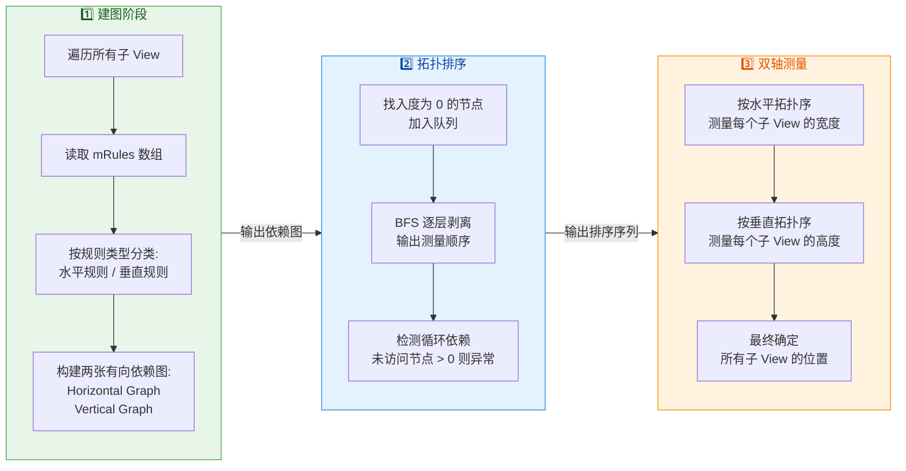
```mermaid
graph LR
    subgraph Build["1️⃣ 建图阶段"]
        direction TB
        R1["遍历所有子 View"]
        R2["读取 mRules 数组"]
        R3["按规则类型分类:\n水平规则 / 垂直规则"]
        R4["构建两张有向依赖图:\nHorizontal Graph\nVertical Graph"]
        R1 --> R2
        R2 --> R3
        R3 --> R4
    end

    subgraph Sort["2️⃣ 拓扑排序"]
        direction TB
        S1["找入度为 0 的节点\n加入队列"]
        S2["BFS 逐层剥离\n输出测量顺序"]
        S3["检测循环依赖\n未访问节点 > 0 则异常"]
        S1 --> S2
        S2 --> S3
    end

    subgraph Measure["3️⃣ 双轴测量"]
        direction TB
        M1["按水平拓扑序\n测量每个子 View 的宽度"]
        M2["按垂直拓扑序\n测量每个子 View 的高度"]
        M3["最终确定\n所有子 View 的位置"]
        M1 --> M2
        M2 --> M3
    end

    Build -->|"输出依赖图"| Sort
    Sort -->|"输出排序序列"| Measure

    classDef buildCls fill:#E8F5E9,stroke:#43A047,color:#1B5E20
    classDef sortCls fill:#E3F2FD,stroke:#1E88E5,color:#0D47A1
    classDef measureCls fill:#FFF3E0,stroke:#FB8C00,color:#E65100

    class Build buildCls
    class Sort sortCls
    class Measure measureCls
```

#### 规则冲突与优先级

当多条规则产生矛盾时，RelativeLayout 有一套内建的优先级策略：

- **同方向的 Parent 规则 vs Sibling 规则**：如果一个子 View 同时设置了 `layout_alignParentLeft="true"` 和 `layout_toRightOf="@id/xxx"`，两者不一定冲突——前者锚定左边缘到父容器左侧，后者锚定左边缘到目标右侧。实际上，**后设置的规则（或更具体的规则）会覆盖前者对同一边缘的约束**。在源码中，规则是按照固定顺序依次应用的，后应用的规则会覆盖先前计算出的坐标。

- **`center` 系列规则与边缘规则的交互**：如果同时设置了 `layout_centerHorizontal="true"` 和 `layout_alignParentLeft="true"`，居中规则的效果会被边缘规则覆盖。这是因为 RelativeLayout 的源码中，居中计算先执行，随后的对齐调整会在已居中的坐标基础上再次修改位置。

- **RTL 兼容**：在 API 17+ 开启 RTL 支持后，`Start/End` 规则会被转换为 `Left/Right`（或反向），转换结果取决于当前布局方向（`layoutDirection`）。如果同时设置了 `layout_alignParentLeft` 和 `layout_alignParentStart`，在 RTL 模式下可能产生冲突，此时 `Start/End` 的优先级更高。

---

### 双重测量开销（Double Measurement Pass）

#### 为什么必须测量两次

要理解"双重测量"，我们需要回到 Android 的 measure 机制本身。对于 LinearLayout 这种沿单一方向排列的布局，子 View 的排列顺序就是测量顺序，一次遍历即可完成。但 RelativeLayout 面对的是一个 **二维平面上的自由定位问题**——子 View 之间的水平依赖和垂直依赖可能相互交织。

考虑以下场景：

```xml
<!-- A 在父容器左上角 -->
<!-- B 在 A 的右边 -->
<!-- C 在 B 的下方，且宽度与 A 对齐 -->
<RelativeLayout
    android:layout_width="match_parent"
    android:layout_height="wrap_content">

    <!-- A：锚点 View，无依赖 -->
    <TextView android:id="@+id/A"
        android:layout_width="100dp"
        android:layout_height="40dp" />

    <!-- B：水平依赖 A（在 A 右边） -->
    <TextView android:id="@+id/B"
        android:layout_width="wrap_content"
        android:layout_height="wrap_content"
        android:layout_toRightOf="@id/A" />

    <!-- C：垂直依赖 B（在 B 下方），水平对齐 A（左边缘对齐 A） -->
    <TextView android:id="@+id/C"
        android:layout_width="wrap_content"
        android:layout_height="wrap_content"
        android:layout_below="@id/B"
        android:layout_alignLeft="@id/A" />
</RelativeLayout>
```

如果只做一次测量，我们面临一个"鸡生蛋"的困境：

- 要确定 C 的垂直位置，需要知道 B 的底部坐标；
- 要知道 B 的底部坐标，需要先确定 B 的高度（通过 measure）；
- 但 B 的 MeasureSpec 可能依赖于其水平位置（比如剩余宽度决定了 B 的最大可用宽度，进而影响 B 的高度——文本换行就是最典型的例子）；
- 而 B 的水平位置又取决于 A 的宽度。

因此，RelativeLayout 选择了一种 **分轴两遍（Two-Pass）** 的策略：

**第一遍——水平测量（Horizontal Pass）**：按照水平依赖图的拓扑顺序，遍历所有子 View。此时只关心每个子 View 的 **水平位置和宽度**。对于每个 View，根据其水平规则（`toLeftOf`、`toRightOf`、`alignLeft`、`alignRight`、`alignParentLeft`、`centerHorizontal` 等）计算出它的左右边界（`left`, `right`），并调用 `child.measure()` 传入一个体现水平约束的 MeasureSpec。此时垂直方向的 MeasureSpec 通常是一个宽泛的约束（如 `AT_MOST parentHeight`），因为垂直位置尚未确定。

**第二遍——垂直测量（Vertical Pass）**：按照垂直依赖图的拓扑顺序，再次遍历所有子 View。此时利用第一遍已确定的宽度信息，计算每个 View 的 **垂直位置和高度**。根据垂直规则（`above`、`below`、`alignTop`、`alignBottom`、`alignParentTop`、`centerVertical` 等）计算出上下边界（`top`, `bottom`），并 **再次调用 `child.measure()`**——这次传入的 MeasureSpec 同时包含精确的水平约束和垂直约束。

也就是说，**每个子 View 的 `measure()` 方法至少被调用了两次**。这就是"双重测量"名称的由来。

#### 源码级的测量流程

让我们从 `RelativeLayout.onMeasure()` 的核心逻辑来拆解这个过程（以下为简化后的伪代码，但保留了关键步骤）：

```java
// RelativeLayout.onMeasure() 核心伪代码
@Override
protected void onMeasure(int widthMeasureSpec, int heightMeasureSpec) {
    // ① 构建依赖图，分离水平/垂直规则
    // mGraph 是 DependencyGraph 实例
    mGraph.clear();                          // 清空上一次的依赖关系
    mGraph.add(getChildren());               // 将所有子 View 加入图
    // getSortedViews 会做拓扑排序，返回水平/垂直两组有序列表
    View[] horizontalSorted = mGraph.getSortedViews(mSortedHorizontalChildren, RULES_HORIZONTAL);
    View[] verticalSorted   = mGraph.getSortedViews(mSortedVerticalChildren, RULES_VERTICAL);

    // ② 第一遍：水平方向测量
    for (View child : horizontalSorted) {
        LayoutParams params = (LayoutParams) child.getLayoutParams();
        // 根据水平规则，计算 child 的 left / right 边界
        applyHorizontalRules(params, myWidth);
        // 用计算出的宽度约束生成 childWidthSpec
        int childWidthSpec  = getChildMeasureSpec(..., params.width, ...);
        // 垂直方向此时给一个宽松的约束
        int childHeightSpec = getChildMeasureSpec(..., params.height, ...);
        // 第一次 measure：主要确定宽度
        child.measure(childWidthSpec, childHeightSpec);
    }

    // ③ 第二遍：垂直方向测量
    for (View child : verticalSorted) {
        LayoutParams params = (LayoutParams) child.getLayoutParams();
        // 根据垂直规则 + 第一遍已确定的宽度信息，计算 top / bottom
        applyVerticalRules(params, myHeight);
        // 此时宽度约束已精确（来自第一遍的结果）
        int childWidthSpec  = getChildMeasureSpec(..., child.getMeasuredWidth(), ...);
        // 垂直约束也精确了
        int childHeightSpec = getChildMeasureSpec(..., params.height, ...);
        // 第二次 measure：确定最终尺寸
        child.measure(childWidthSpec, childHeightSpec);
    }

    // ④ 处理 centerInParent / gravity 等全局偏移
    // ⑤ 计算 RelativeLayout 自身的最终尺寸
    setMeasuredDimension(resolveSize(maxRight, widthMeasureSpec),
                         resolveSize(maxBottom, heightMeasureSpec));
}
```

从上面的流程可以清晰看到：**每个子 View 经历了两次 `child.measure()` 调用**——第一次侧重水平维度，第二次在水平维度确定的基础上精确垂直维度。如果子 View 内部也有复杂的测量逻辑（如嵌套的 RelativeLayout），那么一次 `child.measure()` 本身也可能触发其子树的多次测量，开销会呈指数级增长。

#### MeasureSpec 在两遍中的变化

理解两遍测量时 MeasureSpec 的区别非常重要：

| | 第一遍（水平 Pass） | 第二遍（垂直 Pass） |
|---|---|---|
| **宽度 Spec** | 根据水平规则计算，可能是 EXACTLY 或 AT_MOST | 通常直接使用第一遍 measure 得到的 measuredWidth，传入 EXACTLY |
| **高度 Spec** | 较宽松，一般是 AT_MOST（父容器剩余高度）或 UNSPECIFIED | 根据垂直规则精确计算，可能是 EXACTLY 或 AT_MOST |
| **主要目的** | 确定子 View 的宽度和水平位置 | 确定子 View 的高度和垂直位置 |

这种两遍策略的一个副作用是：**如果子 View 的高度依赖于宽度**（如 TextView 的文本换行），那么第一遍得到的高度可能不准确，必须在第二遍中用精确的宽度重新计算。这正是 RelativeLayout 必须两遍测量的根本原因之一。

---

### 性能瓶颈分析

#### 指数级测量放大效应

RelativeLayout 的最大性能隐患不在于"双重测量"本身——对一个扁平的 RelativeLayout 来说，子 View 被测量两次，开销仅仅是 `2N`，通常不会产生可感知的卡顿。真正的问题出现在 **嵌套** 场景中。

考虑以下层级：

```text
RelativeLayout (Level 0)
  └── RelativeLayout (Level 1)
        └── RelativeLayout (Level 2)
              └── TextView (Level 3)
```

- Level 0 的 `onMeasure` 会对 Level 1 调用两次 `measure()`；
- Level 1 每次被 measure 时，内部又会对 Level 2 调用两次 `measure()`；
- Level 2 每次被 measure 时，内部又会对 TextView 调用两次 `measure()`。

最终，最底层的 TextView 被测量了 **2 × 2 × 2 = 8 次**。如果嵌套深度为 `d`，每层都是 RelativeLayout，则叶子 View 的测量次数为 **2^d**。这就是所谓的 **指数级测量放大（Exponential Measurement Amplification）**。

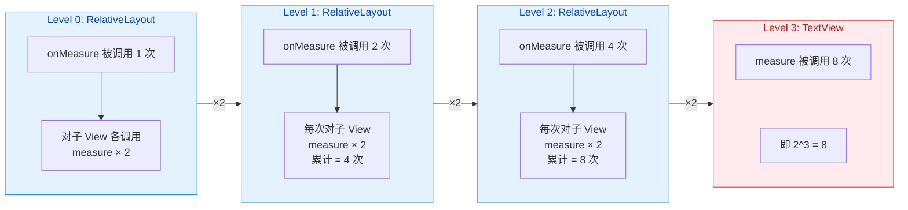
```mermaid
graph LR
    subgraph L0["Level 0: RelativeLayout"]
        direction TB
        L0A["onMeasure 被调用 1 次"]
        L0B["对子 View 各调用\nmeasure × 2"]
        L0A --> L0B
    end

    subgraph L1["Level 1: RelativeLayout"]
        direction TB
        L1A["onMeasure 被调用 2 次"]
        L1B["每次对子 View\nmeasure × 2\n累计 = 4 次"]
        L1A --> L1B
    end

    subgraph L2["Level 2: RelativeLayout"]
        direction TB
        L2A["onMeasure 被调用 4 次"]
        L2B["每次对子 View\nmeasure × 2\n累计 = 8 次"]
        L2A --> L2B
    end

    subgraph Leaf["Level 3: TextView"]
        direction TB
        T1["measure 被调用 8 次"]
        T2["即 2^3 = 8"]
        T1 ~~~ T2
    end

    L0 -->|"×2"| L1
    L1 -->|"×2"| L2
    L2 -->|"×2"| Leaf

    classDef rlCls fill:#E3F2FD,stroke:#1E88E5,color:#0D47A1
    classDef leafCls fill:#FFEBEE,stroke:#E53935,color:#B71C1C

    class L0 rlCls
    class L1 rlCls
    class L2 rlCls
    class Leaf leafCls
```

在实际项目中，3~4 层 RelativeLayout 嵌套并不罕见（尤其在复杂的 RecyclerView Item 中），此时叶子节点被测量 8~16 次，再乘以每个 Item 的子 View 数量，帧耗时很可能超过 16ms 的 VSync 预算，直接造成丢帧。

#### 与 LinearLayout weight 的叠加灾难

比纯 RelativeLayout 嵌套更危险的是 **RelativeLayout 内嵌套带 `weight` 的 LinearLayout**（或反过来）。如前一节所述，LinearLayout 在使用 `weight` 时自身就需要两次测量。当两者叠加：

```text
RelativeLayout          → 2× measure 子 View
  └── LinearLayout(weight) → 2× measure 子 View
        └── View         → 被测量 2 × 2 = 4 次
```

如果再加一层：

```text
RelativeLayout
  └── RelativeLayout
        └── LinearLayout(weight)
              └── View   → 被测量 2 × 2 × 2 = 8 次
```

这种 **混合嵌套** 是性能问题的最大元凶。在 Android 性能优化的最佳实践中，有一条经典建议：**永远不要把带 weight 的 LinearLayout 放在 RelativeLayout 内部，反之亦然**。

#### WRAP_CONTENT 的额外陷阱

当 RelativeLayout 自身的宽度或高度被设为 `wrap_content` 时，情况会更复杂。因为此时 RelativeLayout 自身的尺寸取决于所有子 View 布局后的最大边界，而子 View 的位置又可能依赖于父容器的边缘（如 `alignParentRight`）。这就形成了一个 **"父容器大小取决于子 View，子 View 位置取决于父容器"** 的递归关系。

RelativeLayout 对此的处理策略是：先用一个"尽可能大"的约束（通常是 `AT_MOST` 模式加上父容器给的最大值）完成一次布局，计算出所有子 View 的边界后，再以实际的最大边界作为自身尺寸。对于依赖了 `alignParentRight` 但父容器又是 `wrap_content` 的子 View，其行为可能 **不符合直觉**——子 View 会被推到一个基于"最大可用空间"而非"最终实际空间"的位置。

这也是为什么 Google 的官方文档和 Lint 工具都会在 RelativeLayout 使用 `wrap_content` 且子 View 同时引用了 `alignParentRight/Bottom` 时给出警告。

#### 性能优化策略与替代方案

**策略一：用 ConstraintLayout 替代**

Google 在 2016 年推出 ConstraintLayout 的核心动机之一，就是解决 RelativeLayout 的双重测量问题。ConstraintLayout 使用 **Cassowary 线性约束求解算法**，将所有约束转化为线性方程组，一次求解即可确定所有子 View 的位置和大小。其时间复杂度是 O(N)（N 为约束数），且不存在嵌套放大效应。

对于现代 Android 开发，**ConstraintLayout 几乎是 RelativeLayout 的完全上位替代**。它不仅覆盖了 RelativeLayout 的所有能力（相对定位、居中、对齐），还提供了链（Chain）、屏障（Barrier）、引导线（Guideline）、比例（Ratio）等高级功能。如果你正在新建项目或重构布局，优先使用 ConstraintLayout。

**策略二：减少嵌套深度**

如果仍然使用 RelativeLayout，最直接的优化就是 **控制嵌套层数**。利用 RelativeLayout 本身的相对定位能力，将原本需要多层嵌套才能实现的布局"拍平"成一个单层 RelativeLayout。例如，一个左图标 + 右侧两行文字的列表项，不需要在 RelativeLayout 内再嵌套一个 LinearLayout——直接让两行 TextView 分别 `toRightOf` 图标、一个 `alignTop` 另一个 `below` 即可。

**策略三：避免在高频刷新的场景使用**

在 RecyclerView 的 ItemView 中，布局的 measure 会在滑动过程中频繁触发。如果 ItemView 使用了多层 RelativeLayout，滑动时的帧率会显著下降。此时应优先使用 ConstraintLayout 或纯 LinearLayout（无 weight）来实现 ItemView。

**策略四：利用固定尺寸减少测量计算**

将子 View 的宽高设为固定值（`100dp`）或 `match_parent`，而非 `wrap_content`。固定尺寸的子 View 在 measure 时直接返回，不需要递归计算内容大小，能显著减少每次 measure 的耗时。当然，这会牺牲布局的灵活性，需要根据实际场景权衡。

**策略五：复杂布局考虑自定义 ViewGroup**

对于极端性能敏感的场景（如高频刷新的 RecyclerView Item），可以直接继承 ViewGroup，在 `onMeasure()` 和 `onLayout()` 中手写测量和布局逻辑。手写的好处是完全控制测量次数——你可以确保每个子 View 只被测量一次。微信、抖音等超级 App 在关键列表页面大量使用了自定义 ViewGroup 来压榨性能。

---

### RelativeLayout 在现代开发中的定位

RelativeLayout 在 Android 的历史中扮演了重要角色——它是第一个真正解决"多层 LinearLayout 嵌套"问题的通用布局容器。但随着 ConstraintLayout 的成熟和 Jetpack Compose 的普及，RelativeLayout 已经逐渐退居幕后。

然而，理解 RelativeLayout 的规则系统和双重测量机制仍然具有重要价值：

1. **大量存量代码**仍在使用 RelativeLayout，维护老项目时必须能读懂和优化。
2. **双重测量的原理**帮助你理解 Android 测量系统的深层限制——为什么约束求解比规则遍历更高效。
3. **依赖图与拓扑排序**是通用的算法知识，同样的思想出现在 Gradle 任务调度、数据绑定计算等领域。
4. **性能分析思维**——从"单次开销"到"嵌套放大效应"的推理模式，适用于所有递归结构的性能评估。

---

**📝 练习题**

某个 RecyclerView 的 ItemView 布局结构如下：最外层是 RelativeLayout，内部包含一个带 `layout_weight` 的 LinearLayout，LinearLayout 内部又嵌套了一个 RelativeLayout，最深层有一个 TextView。请问这个 TextView 在一次完整的 measure 过程中，`measure()` 方法最少会被调用多少次？

A. 2 次


B. 4 次


C. 6 次


D. 8 次


**【答案】** D

**【解析】** 分析每一层的测量放大系数：最外层 RelativeLayout 对每个子 View 调用 2 次 measure（水平 Pass + 垂直 Pass）；中间层 LinearLayout 使用了 `layout_weight`，自身也需要 2 次 measure（第一遍测量自然尺寸，第二遍按 weight 分配剩余空间）；最内层 RelativeLayout 又对子 View 调用 2 次 measure。因此，最底层 TextView 的 measure 调用次数为 **2 × 2 × 2 = 8 次**。这正是"指数级测量放大"效应的典型体现。在实际开发中，应当避免这种 RelativeLayout 与带 weight 的 LinearLayout 的嵌套组合，优先考虑用单层 ConstraintLayout 实现同等布局效果。

---

## 帧布局 FrameLayout

FrameLayout 是 Android 布局体系中**最简单也最高效**的 ViewGroup 之一。它的设计哲学可以用一句话概括：**把所有子 View 堆叠在同一块画布上，后添加的 View 覆盖在先添加的 View 之上**。这种"画布堆叠"模型使 FrameLayout 在测量和布局阶段的计算量极低——它不需要像 LinearLayout 那样累加权重，也不需要像 RelativeLayout 那样解析复杂的依赖规则。正因如此，FrameLayout 被大量用于以下典型场景：作为 Fragment 的容器（`FragmentContainerView` 本身就继承自 FrameLayout）、承载单一子 View 的简单包裹容器、需要前后叠加效果的 UI 组合（如图片上叠加文字遮罩、加载动画覆盖内容区域）等。

从源码角度来看，FrameLayout 的核心逻辑集中在 `onMeasure()` 和 `onLayout()` 两个方法中，总代码量不到 200 行，是理解 ViewGroup 自定义布局的最佳入门素材。接下来我们从 Z 轴层叠顺序、前景绘制机制、重力系统三个维度，对 FrameLayout 进行深度解析。

### Z 轴层叠顺序

#### 默认层叠规则：XML 声明顺序即绘制顺序

FrameLayout 的子 View 层叠遵循一个极其朴素的原则——**XML 中声明越靠后的子 View，绘制时越晚被画上去，因此视觉上越靠"前"（越靠近用户眼睛）**。这与现实世界中"后放的纸张盖在先放的纸张上面"完全一致。

在 ViewGroup 的绘制流程中，`dispatchDraw()` 方法会按照子 View 在内部 `children` 数组中的索引顺序（即 index 0, 1, 2 …）依次调用每个子 View 的 `draw()` 方法。FrameLayout 并未覆写这一默认行为，因此索引小的子 View 先被绘制到 Canvas 上，索引大的子 View 后绘制，后绘制的内容自然覆盖先绘制的内容。在没有任何额外干预的情况下，XML 中从上到下的声明顺序直接对应 `children` 数组中从 0 到 N-1 的索引顺序。

```xml
<!-- FrameLayout 的 Z 轴层叠示例 -->
<FrameLayout
    android:layout_width="match_parent"
    android:layout_height="200dp">

    <!-- index=0, 最先绘制, 视觉上最底层 -->
    <View
        android:layout_width="match_parent"
        android:layout_height="match_parent"
        android:background="#B2DFDB" />  <!-- 淡绿色背景板 -->

    <!-- index=1, 第二个绘制, 盖在绿色上方 -->
    <ImageView
        android:layout_width="wrap_content"
        android:layout_height="wrap_content"
        android:src="@drawable/photo"
        android:layout_gravity="center" /> <!-- 居中的图片 -->

    <!-- index=2, 最后绘制, 视觉上最顶层 -->
    <TextView
        android:layout_width="match_parent"
        android:layout_height="wrap_content"
        android:text="覆盖文字"
        android:background="#80000000"
        android:textColor="#FFFFFF"
        android:layout_gravity="bottom" /> <!-- 底部半透明文字遮罩 -->

</FrameLayout>
```

上面这段布局最终的视觉效果是：淡绿色背景铺满整个区域，照片居中显示在背景之上，半透明黑色遮罩带白色文字贴在最底部、盖在照片和背景之上。这就是 FrameLayout 最经典的"层叠卡片"用法。

#### elevation 与 translationZ：Material Design 时代的 Z 轴

从 Android 5.0（API 21）开始，Google 引入了 Material Design 的 **elevation**（海拔高度）概念，为 View 增加了真正意义上的 Z 轴维度。此时 View 在屏幕上的实际 Z 值由以下公式决定：

```
Z = elevation + translationZ
```

`elevation` 是 View 的"静态海拔"，通常在 XML 中通过 `android:elevation` 属性设定，代表该 View 在 UI 层次结构中的固有高度。`translationZ` 是"动态偏移"，常用于按下动画（pressed state）等交互效果。当两个子 View 的 Z 值不同时，**系统渲染管线（RenderThread / hwui）会优先按 Z 值排序来决定绘制顺序**，Z 值越大的 View 越靠近用户。这意味着即使某个子 View 在 XML 中声明得更早（index 更小），只要它的 `elevation` 值足够大，它仍然会被绘制在其他子 View 之上。

需要特别注意的是，elevation 的排序逻辑并非由 FrameLayout 自身实现，而是在 `View.java` 和底层渲染引擎中统一处理的。ViewGroup 的 `dispatchDraw()` 在绘制子 View 前，会通过 `buildOrderedChildList()` 方法按 Z 值重新排序。因此，**elevation 对 Z 轴的影响是全局性的，适用于所有 ViewGroup，而非 FrameLayout 独有的特性**。但由于 FrameLayout 的子 View 天然重叠，elevation 在 FrameLayout 中的视觉效果最为显著。

```xml
<!-- elevation 覆盖默认层叠顺序的示例 -->
<FrameLayout
    android:layout_width="match_parent"
    android:layout_height="200dp">

    <!-- 虽然声明在前(index=0), 但 elevation=8dp, 实际视觉上更靠前 -->
    <View
        android:layout_width="120dp"
        android:layout_height="120dp"
        android:layout_gravity="center"
        android:elevation="8dp"
        android:background="@drawable/rounded_card_blue" />

    <!-- 声明在后(index=1), 但 elevation=0(默认), 反而被盖住 -->
    <View
        android:layout_width="120dp"
        android:layout_height="120dp"
        android:layout_gravity="center"
        android:layout_marginStart="40dp"
        android:layout_marginTop="40dp"
        android:background="@drawable/rounded_card_red" />

</FrameLayout>
```

在这个例子中，蓝色卡片虽然 index=0，但因为拥有 8dp 的 elevation，会被绘制在红色卡片之上。同时，elevation 还会触发系统自动绘制**阴影**（shadow），阴影的深浅与 elevation 值成正比，这是 Material Design "纸张隐喻"的核心视觉表现。需要注意，阴影只会在 View 拥有非透明背景（background）或设置了 `outlineProvider` 时才会出现。

#### 手动控制绘制顺序的 API

除了 elevation，开发者还可以通过以下 API 在运行时动态调整子 View 的层叠关系：

| API | 作用 | 典型场景 |
|-----|------|---------|
| `ViewGroup.bringChildToFront(View)` | 将指定子 View 移到 children 数组末尾 | 点击某个卡片使其浮到最上层 |
| `View.bringToFront()` | 内部调用 parent 的 `bringChildToFront` | 同上，从 View 自身角度调用 |
| `ViewGroup.removeView()` + `addView()` | 移除后重新添加到指定 index | 需要精确控制插入位置时 |
| `setChildrenDrawingOrderEnabled(true)` + `getChildDrawingOrder()` | 自定义绘制顺序映射 | 实现 Gallery 式中间放大效果 |

调用 `bringChildToFront()` 后，FrameLayout 会触发 `requestLayout()` 和 `invalidate()`，这意味着会引发一次完整的测量-布局-绘制流程。在频繁交互的场景中，如果只是想改变视觉层叠而不改变布局位置，使用 `setTranslationZ()` 做动态 elevation 调整是更高效的选择，因为它只触发重绘（invalidate）而不触发重新测量和布局。

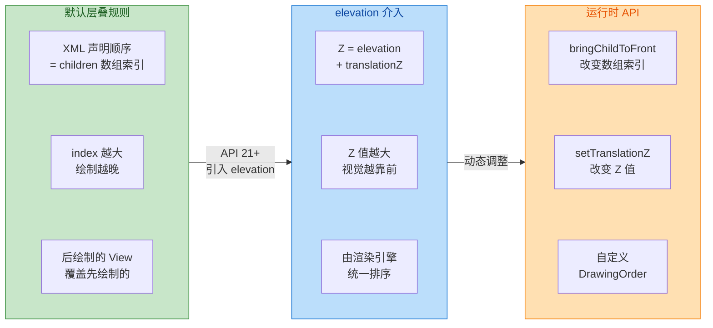
```mermaid
graph LR
    subgraph Layer1["默认层叠规则"]
        direction TB
        A1["XML 声明顺序\n= children 数组索引"]
        A2["index 越大\n绘制越晚"]
        A3["后绘制的 View\n覆盖先绘制的"]
        A1 ~~~ A2
        A2 ~~~ A3
    end

    subgraph Layer2["elevation 介入"]
        direction TB
        B1["Z = elevation\n+ translationZ"]
        B2["Z 值越大\n视觉越靠前"]
        B3["由渲染引擎\n统一排序"]
        B1 ~~~ B2
        B2 ~~~ B3
    end

    subgraph Layer3["运行时 API"]
        direction TB
        C1["bringChildToFront\n改变数组索引"]
        C2["setTranslationZ\n改变 Z 值"]
        C3["自定义\nDrawingOrder"]
        C1 ~~~ C2
        C2 ~~~ C3
    end

    Layer1 -->|"API 21+\n引入 elevation"| Layer2 -->|"动态调整"| Layer3

    classDef greenStyle fill:#C8E6C9,stroke:#388E3C,color:#1B5E20
    classDef blueStyle fill:#BBDEFB,stroke:#1976D2,color:#0D47A1
    classDef orangeStyle fill:#FFE0B2,stroke:#F57C00,color:#E65100
    class Layer1 greenStyle
    class Layer2 blueStyle
    class Layer3 orangeStyle
```

### 前景 foreground

#### 前景绘制机制详解

FrameLayout 是 Android 早期（API 1 起）就支持 **foreground drawable** 的布局容器。所谓"前景"，就是一个**绘制在所有子 View 之上**的 Drawable 层。它的绘制时机在 `draw()` 方法的最后阶段——当背景（background）、内容（content / children）、滚动条（scrollbar）都画完之后，前景作为"盖章"一样的最终层被画上去。

从 API 23（Android 6.0）开始，`setForeground()` 和 `getForeground()` 方法被上移到了 `View` 基类中，这意味着**任何 View 都可以设置前景**，而不再是 FrameLayout 的专属能力。但在 API 23 以下的设备上，只有 FrameLayout（以及继承自它的子类）才支持前景。如果你的 `minSdk < 23` 且需要在非 FrameLayout 的 View 上使用前景效果，可以考虑使用 `MaterialShapeDrawable` 或自定义绘制来替代。

FrameLayout 中与前景相关的核心属性有三个：

```xml
<!-- FrameLayout 前景属性完整示例 -->
<FrameLayout
    android:layout_width="match_parent"
    android:layout_height="200dp"
    android:foreground="@drawable/fg_gradient_scrim"
    android:foregroundGravity="fill"
    android:foregroundTintMode="src_over">
    <!-- foreground:        指定前景 Drawable 资源 -->
    <!-- foregroundGravity:  控制前景在容器中的对齐方式 -->
    <!-- foregroundTintMode: 指定前景着色的 Porter-Duff 混合模式 -->

    <!-- 子 View 内容... -->
</FrameLayout>
```

#### foreground 的绘制流程（源码层面）

FrameLayout 覆写了 `draw(Canvas)` 方法来实现前景绘制。其简化后的核心逻辑如下：

```java
// FrameLayout.draw() 前景绘制核心逻辑（简化版）
@Override
public void draw(Canvas canvas) {
    // 第一步：调用父类 draw(), 依次完成:
    //   背景绘制 → onDraw() → dispatchDraw(子View) → 滚动条
    super.draw(canvas);

    // 第二步：获取前景 Drawable 引用
    final Drawable foreground = mForeground;
    // 如果没有设置前景, 直接返回, 不做额外绘制
    if (foreground != null) {
        // 第三步：检查前景 bounds 是否需要重新计算
        //   当布局尺寸发生变化或 foregroundGravity 改变时,
        //   mForegroundBoundsChanged 标记会被置为 true
        if (mForegroundBoundsChanged) {
            // 标记复位, 避免每帧都重新计算
            mForegroundBoundsChanged = false;

            // 获取容器内容区域(去除 padding 后的矩形)
            final Rect selfBounds = mSelfBounds;
            final Rect overlayBounds = mOverlayBounds;

            // 计算内容区域矩形
            selfBounds.set(
                0, 0,               // 左上角
                getWidth(),          // 右边界 = 容器宽度
                getHeight()          // 下边界 = 容器高度
            );

            // 根据 foregroundGravity 将前景 Drawable 放置到正确位置
            //   Gravity.apply() 是 Android 布局引擎的核心工具方法,
            //   它根据 gravity 规则, 在 selfBounds 内为
            //   指定尺寸的矩形计算出最终位置 overlayBounds
            Gravity.apply(
                mForegroundGravity,                    // gravity 规则
                foreground.getIntrinsicWidth(),         // 前景固有宽度
                foreground.getIntrinsicHeight(),        // 前景固有高度
                selfBounds,                            // 容器矩形
                overlayBounds                          // 输出: 前景最终矩形
            );

            // 将计算好的矩形设置为前景 Drawable 的绘制边界
            foreground.setBounds(overlayBounds);
        }

        // 第四步：在 Canvas 上绘制前景 Drawable
        //   此时 Canvas 上已经有了背景和所有子 View 的内容,
        //   前景将覆盖在它们之上
        foreground.draw(canvas);
    }
}
```

这段代码揭示了几个重要细节：**前景的 bounds 计算是惰性的**——只有在 `mForegroundBoundsChanged` 为 true 时才重新计算，这避免了每帧都执行 `Gravity.apply()` 带来的性能开销。`mForegroundBoundsChanged` 在 `onLayout()` 和 `setForegroundGravity()` 中被置为 true。此外，前景绘制发生在 `super.draw()` 之后，这保证了它始终覆盖在所有子 View 之上，**甚至覆盖在拥有 elevation 的子 View 之上**，因为 elevation 的排序仅影响 `dispatchDraw()` 阶段内部的子 View 相互遮挡关系，而 foreground 的绘制在 `dispatchDraw()` 之后。

#### 实用场景：涟漪效果与渐变遮罩

前景最常见的两个实际用途是**触摸涟漪反馈**（ripple feedback）和**渐变遮罩**（gradient scrim）。

对于涟漪效果，Android 5.0 以上可以直接将 `?attr/selectableItemBackground` 设为前景，这样 FrameLayout 整体就拥有了点击时的涟漪反馈，而不需要为每个子 View 单独设置：

```xml
<!-- 给整个 FrameLayout 添加点击涟漪效果 -->
<FrameLayout
    android:layout_width="match_parent"
    android:layout_height="wrap_content"
    android:clickable="true"
    android:focusable="true"
    android:foreground="?attr/selectableItemBackground">
    <!-- clickable 和 focusable 必须为 true, 否则涟漪不会响应触摸 -->
    <!-- ?attr/selectableItemBackground 在 Material 主题下是 RippleDrawable -->

    <!-- 内部的子 View 不需要单独处理触摸反馈 -->
    <ImageView ... />
    <TextView ... />
</FrameLayout>
```

对于渐变遮罩（常见于图片上叠加文字场景），可以创建一个 `GradientDrawable` 作为前景，使底部区域逐渐变暗以提高文字可读性：

```xml
<!-- res/drawable/fg_bottom_scrim.xml -->
<!-- 从透明渐变到半透明黑色的遮罩 -->
<shape xmlns:android="http://schemas.android.com/apk/res/android">
    <!-- 垂直方向的线性渐变 -->
    <gradient
        android:angle="270"
        android:startColor="#00000000"
        android:endColor="#99000000" />
    <!-- angle=270 表示从上到下渐变 -->
    <!-- startColor 完全透明, endColor 60%不透明黑色 -->
</shape>
```

```xml
<!-- 布局中使用渐变遮罩前景 -->
<FrameLayout
    android:layout_width="match_parent"
    android:layout_height="200dp"
    android:foreground="@drawable/fg_bottom_scrim"
    android:foregroundGravity="fill">
    <!-- foregroundGravity="fill" 让遮罩铺满整个容器 -->

    <!-- 底图 -->
    <ImageView
        android:layout_width="match_parent"
        android:layout_height="match_parent"
        android:scaleType="centerCrop"
        android:src="@drawable/landscape_photo" />

    <!-- 文字在底部, 遮罩让白色文字清晰可读 -->
    <TextView
        android:layout_width="match_parent"
        android:layout_height="wrap_content"
        android:layout_gravity="bottom"
        android:padding="16dp"
        android:text="风景标题"
        android:textColor="#FFFFFF"
        android:textSize="18sp" />
</FrameLayout>
```

### 重力 gravity

#### layout_gravity 与 gravity 的区别

在 FrameLayout 的语境下，有两个容易混淆但含义截然不同的 gravity 属性：

**`android:layout_gravity`**（定义在子 View 的 `LayoutParams` 中）：决定**子 View 自身**在 FrameLayout 容器内的对齐位置。这是子 View 对父容器说"请把我放在你的哪个位置"。在 FrameLayout 中，这是控制子 View 位置的**唯一标准手段**（因为 FrameLayout 没有 LinearLayout 的方向排列，也没有 RelativeLayout 的规则引用）。

**`android:gravity`**（定义在 FrameLayout 自身）：这个属性设定的是**所有未指定 `layout_gravity` 的子 View 的默认对齐方式**。如果子 View 自己声明了 `layout_gravity`，则以子 View 的声明为准（子 View 的优先级高于父容器的默认值）。在源码中，FrameLayout 的 `onLayout()` 方法会检查每个子 View 的 `layout_gravity`，如果其值为 `-1`（即 `Gravity.NO_GRAVITY` 的 `UNSPECIFIED` 状态），就回退使用 FrameLayout 自身的 `gravity` 属性。

```xml
<!-- gravity 与 layout_gravity 的区别演示 -->
<FrameLayout
    android:layout_width="match_parent"
    android:layout_height="300dp"
    android:gravity="center">
    <!-- gravity="center": 所有未声明 layout_gravity 的子 View 默认居中 -->

    <!-- 子 View A: 没有声明 layout_gravity, 继承父容器的 gravity="center" -->
    <!-- 最终位置: 水平+垂直居中 -->
    <View
        android:layout_width="80dp"
        android:layout_height="80dp"
        android:background="#EF5350" />

    <!-- 子 View B: 显式声明了 layout_gravity="bottom|end" -->
    <!-- 自己的 layout_gravity 优先, 忽略父容器的 gravity -->
    <!-- 最终位置: 右下角 -->
    <View
        android:layout_width="80dp"
        android:layout_height="80dp"
        android:layout_gravity="bottom|end"
        android:background="#42A5F5" />
</FrameLayout>
```

#### gravity 在 onLayout() 中的精确计算

FrameLayout 的 `onLayout()` 方法是子 View 位置确定的核心。我们来深入分析它如何利用 gravity 计算每个子 View 的最终 left/top/right/bottom 坐标：

```java
// FrameLayout.onLayout() 核心逻辑（简化注释版）
@Override
protected void onLayout(boolean changed, int left, int top, int right, int bottom) {
    // 调用 layoutChildren() 完成实际布局工作
    layoutChildren(left, top, right, bottom, false);
}

void layoutChildren(int left, int top, int right, int bottom,
                    boolean forceLeftGravity) {
    // 获取子 View 数量
    final int count = getChildCount();

    // 计算容器内容区域(去除 padding)
    //   parentLeft: 内容区左边界 = paddingLeft
    //   parentRight: 内容区右边界 = 容器宽度 - paddingRight
    //   parentTop / parentBottom 同理
    final int parentLeft = getPaddingLeft();
    final int parentRight = right - left - getPaddingRight();
    final int parentTop = getPaddingTop();
    final int parentBottom = bottom - top - getPaddingBottom();

    // 遍历每个子 View, 逐一计算位置
    for (int i = 0; i < count; i++) {
        final View child = getChildAt(i);

        // 跳过 GONE 的子 View (不参与布局)
        if (child.getVisibility() != GONE) {
            final LayoutParams lp = (LayoutParams) child.getLayoutParams();

            // 获取子 View 经过 onMeasure() 确定的宽高
            final int width = child.getMeasuredWidth();
            final int height = child.getMeasuredHeight();

            int childLeft;  // 最终计算出的子 View 左坐标
            int childTop;   // 最终计算出的子 View 顶坐标

            // 获取子 View 的 layout_gravity
            int gravity = lp.gravity;
            // 如果子 View 没有指定 layout_gravity (-1),
            //   则回退使用 FrameLayout 自身的 gravity
            if (gravity == -1) {
                gravity = DEFAULT_CHILD_GRAVITY; // 默认: Gravity.TOP | Gravity.START
            }

            // 解析布局方向(LTR 或 RTL), 将 START/END 转换为 LEFT/RIGHT
            final int layoutDirection = getLayoutDirection();
            final int absoluteGravity = Gravity.getAbsoluteGravity(gravity, layoutDirection);
            final int verticalGravity = gravity & Gravity.VERTICAL_GRAVITY_MASK;

            // === 水平方向定位 ===
            switch (absoluteGravity & Gravity.HORIZONTAL_GRAVITY_MASK) {
                case Gravity.CENTER_HORIZONTAL:
                    // 水平居中: 左坐标 = 父容器水平中点 - 子View宽度一半
                    //   再加上左 margin, 减去右 margin (margin 会造成偏移)
                    childLeft = parentLeft
                        + (parentRight - parentLeft - width) / 2
                        + lp.leftMargin - lp.rightMargin;
                    break;
                case Gravity.RIGHT:
                    // 靠右: 左坐标 = 父容器右边界 - 子View宽度 - 右margin
                    childLeft = parentRight - width - lp.rightMargin;
                    break;
                case Gravity.LEFT:
                default:
                    // 靠左(默认): 左坐标 = 父容器左边界 + 左margin
                    childLeft = parentLeft + lp.leftMargin;
                    break;
            }

            // === 垂直方向定位 ===
            switch (verticalGravity) {
                case Gravity.CENTER_VERTICAL:
                    // 垂直居中: 顶坐标 = 父容器垂直中点 - 子View高度一半
                    childTop = parentTop
                        + (parentBottom - parentTop - height) / 2
                        + lp.topMargin - lp.bottomMargin;
                    break;
                case Gravity.BOTTOM:
                    // 靠底: 顶坐标 = 父容器底边界 - 子View高度 - 底margin
                    childTop = parentBottom - height - lp.bottomMargin;
                    break;
                case Gravity.TOP:
                default:
                    // 靠顶(默认): 顶坐标 = 父容器顶边界 + 顶margin
                    childTop = parentTop + lp.topMargin;
                    break;
            }

            // 调用 child.layout() 确定子 View 的最终矩形区域
            //   四个参数: left, top, right, bottom
            child.layout(childLeft, childTop,
                        childLeft + width, childTop + height);
        }
    }
}
```

这段源码清晰地展示了几个关键机制：

**第一，gravity 的默认值**。当子 View 未指定 `layout_gravity` 时，FrameLayout 使用 `DEFAULT_CHILD_GRAVITY`，其值为 `Gravity.TOP | Gravity.START`。这就是为什么不设置 gravity 的子 View 会"贴在左上角"的原因。

**第二，margin 的处理**。在居中（`CENTER_HORIZONTAL` / `CENTER_VERTICAL`）计算中，leftMargin 和 rightMargin 会**差值化处理**（`+ leftMargin - rightMargin`），这意味着如果左右 margin 相等，它们互相抵消，子 View 仍然精确居中；如果不等，则会产生偏移。这个设计非常巧妙，允许开发者在居中的基础上做微调。

**第三，RTL 适配**。通过 `Gravity.getAbsoluteGravity()` 将 `START` / `END` 转换为 `LEFT` / `RIGHT`，确保在阿拉伯语等 RTL（Right-to-Left）布局方向下，`start` 自动变为右侧。这是 Android 国际化布局的基础能力，开发者应始终优先使用 `start` / `end` 而非 `left` / `right`。

#### gravity 组合值速查

`layout_gravity` 支持使用 `|` 运算符组合水平和垂直方向的值，常见组合如下：

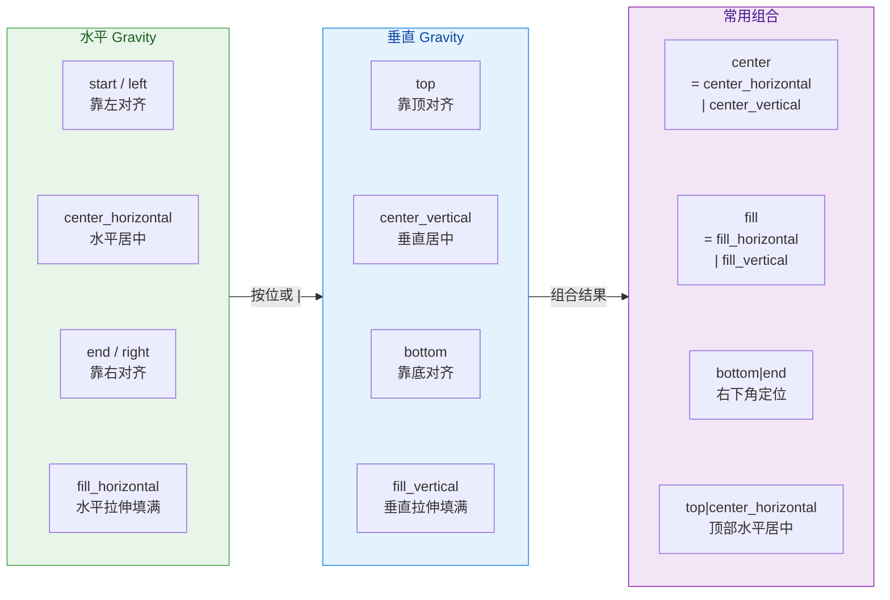
```mermaid
graph LR
    subgraph HG["水平 Gravity"]
        direction TB
        H1["start / left\n靠左对齐"]
        H2["center_horizontal\n水平居中"]
        H3["end / right\n靠右对齐"]
        H4["fill_horizontal\n水平拉伸填满"]
        H1 ~~~ H2
        H2 ~~~ H3
        H3 ~~~ H4
    end

    subgraph VG["垂直 Gravity"]
        direction TB
        V1["top\n靠顶对齐"]
        V2["center_vertical\n垂直居中"]
        V3["bottom\n靠底对齐"]
        V4["fill_vertical\n垂直拉伸填满"]
        V1 ~~~ V2
        V2 ~~~ V3
        V3 ~~~ V4
    end

    subgraph CG["常用组合"]
        direction TB
        C1["center\n= center_horizontal\n| center_vertical"]
        C2["fill\n= fill_horizontal\n| fill_vertical"]
        C3["bottom|end\n右下角定位"]
        C4["top|center_horizontal\n顶部水平居中"]
        C1 ~~~ C2
        C2 ~~~ C3
        C3 ~~~ C4
    end

    HG -->|"按位或 |"| VG -->|"组合结果"| CG

    classDef greenStyle fill:#E8F5E9,stroke:#43A047,color:#1B5E20
    classDef blueStyle fill:#E3F2FD,stroke:#1E88E5,color:#0D47A1
    classDef purpleStyle fill:#F3E5F5,stroke:#8E24AA,color:#4A148C
    class HG greenStyle
    class VG blueStyle
    class CG purpleStyle
```

其中有一个特殊值值得关注：**`fill_horizontal`** 和 **`fill_vertical`**。当子 View 的尺寸为 `wrap_content` 且 `layout_gravity` 包含 `fill` 方向时，FrameLayout 的 `onMeasure()` 不会直接将子 View 拉伸——`fill` 类 gravity 实际上是在 **layout 阶段** 将子 View 的 bounds 扩展到与父容器对应维度一致。但这只改变 View 的布局矩形，不影响 View 内部的内容绘制区域。在实际开发中，**使用 `match_parent` 比 `fill` gravity 更直观、更常用**，`fill` gravity 通常只在需要保持 `wrap_content` 测量逻辑但又要填满父容器的特殊情况下才使用。

#### foregroundGravity：前景的独立定位

前面我们提到了 `android:foregroundGravity` 属性，它控制前景 Drawable 在 FrameLayout 中的对齐方式。这个属性的工作原理与 `layout_gravity` 如出一辙（都是基于 `Gravity.apply()` 计算），但它作用于前景 Drawable 而非子 View。默认值为 `fill`，即前景铺满整个容器。

当 `foregroundGravity` 不是 `fill` 时，前景 Drawable 的绘制区域会按照其 intrinsic width 和 intrinsic height（固有宽高）以及 gravity 规则来定位。例如，如果前景是一个 48×48 的角标图标，设置 `foregroundGravity="top|end"` 就能让它精确地停留在右上角，无需额外包裹一个 ImageView——这是一个非常优雅且零额外 View 开销的实现方式。

```xml
<!-- 右上角角标效果: 使用 foregroundGravity 定位 -->
<FrameLayout
    android:layout_width="wrap_content"
    android:layout_height="wrap_content"
    android:foreground="@drawable/ic_badge_dot"
    android:foregroundGravity="top|end">
    <!-- 前景角标自动定位到右上角 -->
    <!-- 无需额外 View, 无需 ConstraintLayout 的约束链 -->

    <!-- 头像 -->
    <ImageView
        android:layout_width="64dp"
        android:layout_height="64dp"
        android:src="@drawable/avatar" />
</FrameLayout>
```

### FrameLayout 的测量机制

虽然测量（measure）不是本节的三个主题标签之一，但理解 FrameLayout 如何确定自身尺寸对理解 gravity 定位至关重要，因为 gravity 的计算依赖于容器的最终尺寸。

FrameLayout 的 `onMeasure()` 遵循以下策略：**它会测量所有子 View，然后取所有子 View 中最大的宽度和最大的高度（加上 padding 和 margin）作为自身的期望尺寸**。这意味着 FrameLayout 的大小由"最大的那个子 View"决定（当自身尺寸为 `wrap_content` 时）。

有一个值得注意的性能细节：当 FrameLayout 的 MeasureSpec 为 `AT_MOST` 模式（即 `wrap_content`）时，如果存在某些子 View 使用了 `match_parent`，FrameLayout 需要进行**二次测量**。原因是第一轮测量时 FrameLayout 自身的尺寸尚未确定，那些 `match_parent` 的子 View 无法拿到正确的约束尺寸。第一轮结束后 FrameLayout 确定了自身大小，然后对那些 `match_parent` 的子 View 做第二轮测量，传入 `EXACTLY` 模式和确定的尺寸。这个二次测量逻辑在源码中通过一个 `mMatchParentChildren` 列表来跟踪：

```java
// FrameLayout.onMeasure() 二次测量逻辑（关键片段）
// 第一轮: 测量所有子 View, 记录 match_parent 的子 View
for (int i = 0; i < count; i++) {
    final View child = getChildAt(i);
    // 测量子 View (使用 measureChildWithMargins)
    measureChildWithMargins(child, widthMeasureSpec, 0, heightMeasureSpec, 0);

    // 如果 FrameLayout 自身是 wrap_content,
    //   且子 View 宽或高为 match_parent, 则记录到列表中
    if (measureMatchParentChildren) {
        if (lp.width == LayoutParams.MATCH_PARENT
            || lp.height == LayoutParams.MATCH_PARENT) {
            // 加入待二次测量列表
            mMatchParentChildren.add(child);
        }
    }

    // 跟踪最大宽度和最大高度
    maxWidth = Math.max(maxWidth, child.getMeasuredWidth() + lp.leftMargin + lp.rightMargin);
    maxHeight = Math.max(maxHeight, child.getMeasuredHeight() + lp.topMargin + lp.bottomMargin);
}

// 设置 FrameLayout 自身尺寸 (基于最大子 View 尺寸)
setMeasuredDimension(
    resolveSize(maxWidth, widthMeasureSpec),
    resolveSize(maxHeight, heightMeasureSpec)
);

// 第二轮: 对 match_parent 的子 View 重新测量
for (int i = 0; i < mMatchParentChildren.size(); i++) {
    final View child = mMatchParentChildren.get(i);
    // 用 FrameLayout 确定后的尺寸, 以 EXACTLY 模式重新测量
    // 这样 match_parent 的子 View 才能获得正确的容器尺寸
    child.measure(childWidthMeasureSpec, childHeightMeasureSpec);
}
```

这个二次测量机制意味着：**当 FrameLayout 为 `wrap_content` 且内部同时存在 `wrap_content` 和 `match_parent` 的子 View 时，会有额外的测量开销**。不过对比 RelativeLayout 的双重测量（对所有子 View 都测两遍），FrameLayout 的二次测量仅针对 `match_parent` 的子 View，开销仍然低得多。

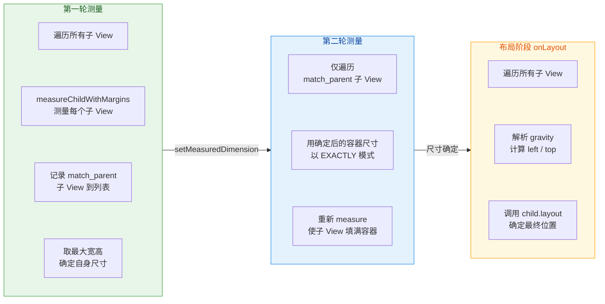
```mermaid
graph LR
    subgraph Phase1["第一轮测量"]
        direction TB
        P1A["遍历所有子 View"]
        P1B["measureChildWithMargins\n测量每个子 View"]
        P1C["记录 match_parent\n子 View 到列表"]
        P1D["取最大宽高\n确定自身尺寸"]
        P1A ~~~ P1B
        P1B ~~~ P1C
        P1C ~~~ P1D
    end

    subgraph Phase2["第二轮测量"]
        direction TB
        P2A["仅遍历\nmatch_parent 子 View"]
        P2B["用确定后的容器尺寸\n以 EXACTLY 模式"]
        P2C["重新 measure\n使子 View 填满容器"]
        P2A ~~~ P2B
        P2B ~~~ P2C
    end

    subgraph Phase3["布局阶段 onLayout"]
        direction TB
        P3A["遍历所有子 View"]
        P3B["解析 gravity\n计算 left / top"]
        P3C["调用 child.layout\n确定最终位置"]
        P3A ~~~ P3B
        P3B ~~~ P3C
    end

    Phase1 -->|"setMeasuredDimension"| Phase2 -->|"尺寸确定"| Phase3

    classDef greenStyle fill:#E8F5E9,stroke:#43A047,color:#1B5E20
    classDef blueStyle fill:#E3F2FD,stroke:#1E88E5,color:#0D47A1
    classDef amberStyle fill:#FFF8E1,stroke:#FFA000,color:#E65100
    class Phase1 greenStyle
    class Phase2 blueStyle
    class Phase3 amberStyle
```

### 实战建议与常见陷阱

**1. FrameLayout 作为 Fragment 容器**：这是最标准的用法。Google 官方推荐使用 `FragmentContainerView`（继承自 FrameLayout），它修复了原生 FrameLayout 在 Fragment 转场动画时的 z-ordering 问题，并强制使用 `FragmentTransaction.replace()` 而非 `add()` 来避免 Fragment 重叠。如果你仍在使用普通 FrameLayout 作为容器，在 `FragmentTransaction` 中添加多个 Fragment 时需要手动管理 `show()` / `hide()`，否则所有 Fragment 的 View 会叠在一起都可见。

**2. 避免在 FrameLayout 内放置过多子 View**：虽然 FrameLayout 的测量和布局效率很高，但如果内部有十几个甚至几十个子 View 层叠，过度绘制（overdraw）会成为严重的性能问题。每个不透明子 View 都会完整地绘制一遍像素，被覆盖的下层 View 的绘制完全浪费了 GPU 资源。可以通过 **开发者选项 → "调试 GPU 过度绘制"** 来可视化检测。

**3. `clickable` 与事件穿透**：FrameLayout 中上层子 View 如果设置了 `clickable="true"` 或注册了 `OnClickListener`，它会"消费"掉触摸事件，下层子 View 就无法接收到点击。如果需要上层 View 可见但允许事件穿透到下层，可以对上层 View 使用 `android:clickable="false"` 并且不设置任何触摸监听器，或者对其设置 `isEnabled = false`。

**4. `wrap_content` + `match_parent` 组合的性能注意**：如前文分析，FrameLayout 为 `wrap_content` 时如果子 View 有 `match_parent`，会触发二次测量。在深层嵌套中这可能被放大（每层 FrameLayout 都触发二次测量），因此在嵌套场景中尽量避免这种组合，或将外层改为固定尺寸 / `match_parent`。

---

**📝 练习题**

在一个 `FrameLayout`（宽高均为 `match_parent`）内有三个子 View：A（`index=0`, `elevation=4dp`）、B（`index=1`, `elevation=0dp`）、C（`index=2`, `elevation=4dp`）。假设三者尺寸相同且完全重叠，最终从上到下（最靠近用户 → 最远离用户）的视觉层叠顺序是？

A. C → A → B


B. A → C → B


C. C → B → A


D. B → C → A


**【答案】** A

**【解析】** Android 渲染引擎在 `dispatchDraw()` 阶段通过 `buildOrderedChildList()` 按 Z 值（`elevation + translationZ`）排序子 View 的绘制顺序。首先比较 elevation：A 和 C 的 elevation 都是 4dp，B 是 0dp，因此 B 一定在最底层。对于 elevation 相同的 A 和 C，系统会回退到它们在 `children` 数组中的默认索引顺序，C 的 index（2）大于 A 的 index（0），C 后绘制，因此 C 覆盖在 A 之上。最终顺序从上到下为：**C → A → B**。这道题的关键考点是：elevation 优先级高于 XML 声明顺序；当 elevation 相同时，回退到默认的索引顺序（后声明者在上）。

---

## 表格与网格布局（TableLayout 表格行、GridLayout 网格权重、Space 空白占位）

在 Android 应用层的布局体系中，当界面需要呈现"行列对齐"的结构化数据时，仅靠 LinearLayout 的嵌套或 RelativeLayout 的规则引用往往会导致层级过深、代码冗长。为此，Android 从早期便提供了 **TableLayout**，并在 API 14 引入了更为灵活的 **GridLayout**。这两者都试图解决同一个核心问题——**如何用最少的嵌套层级，实现行列对齐的矩阵式布局**。本节将从 TableLayout 的行模型机制出发，过渡到 GridLayout 的网格权重与跨行跨列能力，最后讲解辅助占位控件 Space 的设计意图与实战用法。

---

### TableLayout 表格行

#### 继承关系与核心模型

TableLayout 并非凭空设计的独立控件，它直接继承自 **LinearLayout**（方向被强制锁定为 `vertical`）。这意味着 TableLayout 本身就是一个垂直方向的线性布局容器，其直接子 View 被视为"行"。而每一行通常使用 **TableRow**（同样继承自 LinearLayout，方向强制为 `horizontal`）来包裹该行中的各个"单元格"。可以这样理解这一模型：

- **TableLayout = 垂直 LinearLayout**：负责将多行从上到下依次排列。
- **TableRow = 水平 LinearLayout**：负责将一行内的多个单元格从左到右依次排列。
- **单元格 = TableRow 的直接子 View**：每个子 View 占据一列，列索引由其在 TableRow 中的添加顺序决定（从 0 开始）。

正因为 TableLayout 本质上是"两层 LinearLayout 嵌套"，它的 measure/layout 流程并没有引入全新的算法——底层依然是 LinearLayout 那套"先按权重分配剩余空间，再逐一测量子 View"的逻辑。不过 TableLayout 在此基础上增加了 **列宽协商机制**：它会遍历所有 TableRow，找出每一列中最宽的单元格宽度，然后将该宽度作为整列的统一宽度。这就是表格"列对齐"效果的来源。

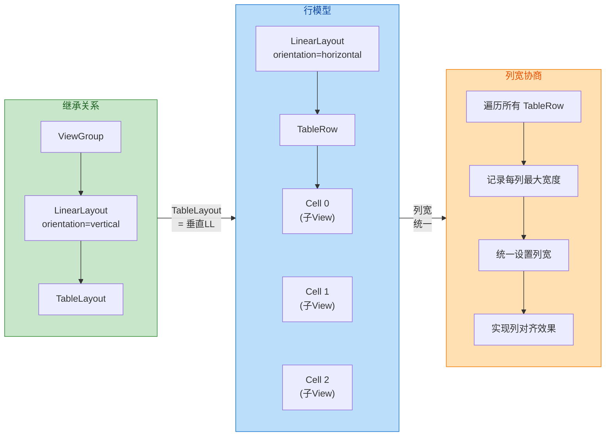
```mermaid
graph LR
    subgraph Inheritance["继承关系"]
        direction TB
        VG["ViewGroup"]
        LL["LinearLayout\norientation=vertical"]
        TL["TableLayout"]
        VG --> LL
        LL --> TL
    end

    subgraph RowModel["行模型"]
        direction TB
        LL2["LinearLayout\norientation=horizontal"]
        TR["TableRow"]
        C1["Cell 0\n(子View)"]
        C2["Cell 1\n(子View)"]
        C3["Cell 2\n(子View)"]
        LL2 --> TR
        TR --> C1
        C1 ~~~ C2
        C2 ~~~ C3
    end

    subgraph ColumnNeg["列宽协商"]
        direction TB
        S1["遍历所有 TableRow"]
        S2["记录每列最大宽度"]
        S3["统一设置列宽"]
        S4["实现列对齐效果"]
        S1 --> S2
        S2 --> S3
        S3 --> S4
    end

    Inheritance -->|"TableLayout\n= 垂直LL"| RowModel -->|"列宽\n统一"| ColumnNeg

    classDef greenNode fill:#C8E6C9,stroke:#388E3C,color:#1B5E20
    classDef blueNode fill:#BBDEFB,stroke:#1976D2,color:#0D47A1
    classDef orangeNode fill:#FFE0B2,stroke:#F57C00,color:#E65100
    class Inheritance greenNode
    class RowModel blueNode
    class ColumnNeg orangeNode
```

#### 列控制属性：shrinkColumns、stretchColumns、collapseColumns

TableLayout 提供了三个 XML 属性（也有对应的 Java/Kotlin API），用于精细控制列宽的行为。这三个属性的值均为 **列索引**，多个索引用逗号分隔，或者使用 `*` 表示"所有列"。

**`stretchColumns`（可拉伸列）** 是最常用的属性。当 TableLayout 的总宽度大于所有列自然宽度之和时（例如 TableLayout 被设置为 `match_parent`），剩余空间会被 **均匀分配** 给标记为 stretchable 的列。它的行为类似于 LinearLayout 中的 `layout_weight`，但无需在每个单元格上逐一设置权重。典型用法是设置 `android:stretchColumns="*"`，让所有列平均瓜分剩余宽度，从而形成"等宽列"的效果。

**`shrinkColumns`（可收缩列）** 则处理相反的情况：当所有列的自然宽度之和超过 TableLayout 的可用宽度时，被标记为 shrinkable 的列会 **按比例收缩** 自身宽度，直到总宽度恰好适配容器。如果没有设置任何 shrinkable 列，超出的内容可能会被裁剪或导致水平滚动。

**`collapseColumns`（可折叠列）** 提供了一种 **动态隐藏整列** 的能力。被标记的列会被完全折叠（visibility 等效于 `GONE`），不占据任何空间，其后续列的索引也不会改变。这在需要根据业务逻辑动态显示/隐藏某些数据列时非常实用，比如在窄屏设备上隐藏次要信息列。

下面的代码示例展示了这三个属性的综合运用：

```xml
<!-- TableLayout 本身作为垂直容器，宽度填满父布局 -->
<TableLayout
    android:layout_width="match_parent"
    android:layout_height="wrap_content"
    android:stretchColumns="1,2"
    android:shrinkColumns="3"
    android:collapseColumns="4">
    <!-- stretchColumns="1,2"：第1、2列瓜分剩余宽度 -->
    <!-- shrinkColumns="3"：第3列在空间不足时优先收缩 -->
    <!-- collapseColumns="4"：第4列完全隐藏 -->

    <!-- 第一行：表头 -->
    <TableRow>
        <!-- 第0列：序号，自然宽度 -->
        <TextView
            android:text="#"
            android:padding="8dp" />
        <!-- 第1列：名称，参与拉伸 -->
        <TextView
            android:text="名称"
            android:padding="8dp" />
        <!-- 第2列：描述，参与拉伸 -->
        <TextView
            android:text="描述"
            android:padding="8dp" />
        <!-- 第3列：备注，空间不足时收缩 -->
        <TextView
            android:text="备注"
            android:padding="8dp" />
        <!-- 第4列：内部ID，已被折叠隐藏 -->
        <TextView
            android:text="ID"
            android:padding="8dp" />
    </TableRow>

    <!-- 第二行：数据行 -->
    <TableRow>
        <!-- 第0列：序号 -->
        <TextView
            android:text="1"
            android:padding="8dp" />
        <!-- 第1列：名称内容 -->
        <TextView
            android:text="Android布局"
            android:padding="8dp" />
        <!-- 第2列：描述内容 -->
        <TextView
            android:text="表格与网格布局详解"
            android:padding="8dp" />
        <!-- 第3列：备注内容 -->
        <TextView
            android:text="重要"
            android:padding="8dp" />
        <!-- 第4列：折叠列，不可见 -->
        <TextView
            android:text="10086"
            android:padding="8dp" />
    </TableRow>

</TableLayout>
```

#### 跨列机制：layout_span

TableRow 的子 View 可以通过 `android:layout_span` 属性声明自己 **横跨多少列**。例如，一个标题行只需要一个 TextView 占满整行，可以将其 `layout_span` 设为总列数。需要注意的是，`layout_span` 只支持 **跨列**，TableLayout 不支持跨行——这是 TableLayout 的一个重要局限性。如果你的界面需要某个单元格跨越多行，那么 TableLayout 将无法胜任，此时应该选择 GridLayout 或 ConstraintLayout。

另一个容易混淆的点是 `android:layout_column` 属性。通过它可以 **显式指定** 某个子 View 位于第几列，跳过中间的列（被跳过的列会留空）。这在表单类界面中偶尔用到，比如让某个按钮固定出现在第 3 列的位置，而第 0~2 列可能没有内容。

#### TableLayout 测量流程深入

由于 TableLayout 继承自 LinearLayout，理解它的测量流程需要先回忆 LinearLayout 的 measure 逻辑，然后叠加 TableLayout 的列宽协商步骤。整个过程可以概括为以下几步：

1. **第一轮测量（收集各列自然宽度）**：TableLayout 遍历所有 TableRow，对每个 TableRow 中的每个子 View 执行初步测量，记录下每一列在所有行中出现的最大自然宽度（wrap_content 时的宽度）。
2. **列宽协商**：根据 stretchColumns、shrinkColumns 的配置，计算出每一列的最终宽度。如果某些列需要拉伸，则将剩余空间均分给这些列；如果需要收缩，则按比例缩减。
3. **第二轮测量（应用最终列宽）**：将协商后的列宽作为 MeasureSpec（EXACTLY 模式）传递给每个 TableRow 的子 View，进行精确测量。
4. **布局阶段**：按照最终的行高和列宽，依次放置每个单元格。

这个"两轮测量"的特性意味着 **TableLayout 的测量开销天然高于普通 LinearLayout**。在行列数较多（比如超过 10 行 × 5 列）的场景下，性能开销会变得显著。对于需要展示大量表格数据的场景，应该考虑使用 RecyclerView 配合 GridLayoutManager，而非 TableLayout。

#### 何时使用 TableLayout

TableLayout 适合于以下场景：

- **简单的表单界面**：标签 + 输入框的两列布局，行数不多。
- **设置页面**：图标 + 文字 + 开关的固定列数布局。
- **少量静态数据表格**：5~10 行的信息展示。

不适合 TableLayout 的场景：

- 需要 **跨行** 的复杂表格。
- 数据量大、需要 **滚动和复用** 的列表。
- 对 **性能敏感** 的界面（因为双重测量开销）。

---

### GridLayout 网格权重

#### GridLayout 的诞生背景

GridLayout 于 Android 4.0（API 14）引入，后来又通过 `androidx.gridlayout:gridlayout` 作为 AndroidX 兼容库提供给低版本系统使用。它的诞生目的是解决 TableLayout 和嵌套 LinearLayout 两个方案共同面临的缺陷：

- **TableLayout 无法跨行**，且列宽协商导致双重测量。
- **嵌套 LinearLayout** 层级过深，measure 开销呈指数级增长。

GridLayout 的核心思想是引入一个 **真正的二维网格坐标系统**：开发者通过指定行索引（`rowIndex`）、列索引（`columnIndex`）、行跨度（`rowSpan`）、列跨度（`columnSpan`），就能将子 View 精确放置在网格中的任意位置，并支持跨行跨列。整个过程只需 **一层嵌套**，彻底消灭了"为了对齐而嵌套"的问题。

#### GridLayout 的网格坐标模型

GridLayout 将整个容器划分为一个由 **网格线（Grid Lines）** 构成的二维矩阵。如果定义了 `rowCount=3, columnCount=4`，则会产生 4 条水平网格线（编号 0~3）和 5 条垂直网格线（编号 0~4）。每个子 View 通过声明自己的起始网格线和结束网格线来确定位置与大小：

```text
       列网格线:  0      1      2      3      4
                  |      |      |      |      |
  行网格线 0 ——  +------+------+------+------+
                  | 0,0  | 0,1  | 0,2  | 0,3  |
  行网格线 1 ——  +------+------+------+------+
                  | 1,0  | 1,1  |    1,2~1,3   |  ← columnSpan=2
  行网格线 2 ——  +------+------+------+------+
                  |   2,0~2,1   | 2,2  | 2,3  |  ← columnSpan=2
  行网格线 3 ——  +------+------+------+------+
```

上面的 ASCII 模型中，`1,2~1,3` 表示第 1 行第 2 列的子 View 设置了 `columnSpan=2`，它横跨第 2、3 两列。同理，`2,0~2,1` 表示第 2 行第 0 列的子 View 横跨两列。如果需要跨行，只需设置 `rowSpan=2`，该子 View 就会纵向占据两行的空间。

在 XML 中，位置通过 `layout_row`、`layout_column` 指定，跨度通过 `layout_rowSpan`、`layout_columnSpan` 指定。如果不显式指定位置，GridLayout 会按照子 View 的声明顺序 **自动分配**，从左到右、从上到下依次填充，这种自动分配模式在大多数简单场景下足够使用。

#### 权重分配：layout_rowWeight 与 layout_columnWeight

在最初的 API 14 版本中，GridLayout 并 **不支持** 权重（weight）概念，这曾是它最大的短板——你无法让某一行或某一列按比例填满剩余空间。开发者不得不使用 Space 控件配合固定尺寸来模拟，非常不便。

**从 API 21（Android 5.0）开始**，GridLayout 正式引入了 `layout_rowWeight` 和 `layout_columnWeight` 两个属性，其行为逻辑类似于 LinearLayout 的 `layout_weight`。而 AndroidX 兼容库 `androidx.gridlayout.widget.GridLayout` 则将这一能力向下兼容到了更早的 API 级别。

权重的工作机制如下：

1. GridLayout 先按照所有子 View 的自然尺寸（wrap_content）或固定尺寸（具体 dp 值）完成初步测量，计算出各行各列的初始尺寸。
2. 如果 GridLayout 的总尺寸（通常是 `match_parent`）大于所有行/列初始尺寸之和，则产生了 **剩余空间**。
3. 剩余空间按照各子 View 声明的 `layout_columnWeight`（水平方向）或 `layout_rowWeight`（垂直方向）进行 **加权分配**。
4. 权重为 0 的行/列不参与分配；权重大于 0 的行/列按比例瓜分剩余空间。

一个非常典型的用法是实现 **等宽 N 列布局**：将每个子 View 的 `layout_columnWeight` 都设为 1，`layout_width` 设为 0dp（类似于 LinearLayout 中 weight 的惯例），GridLayout 就会将可用宽度等分给所有列。

```xml
<!-- 使用 AndroidX GridLayout 实现 3 列等宽布局 -->
<androidx.gridlayout.widget.GridLayout
    xmlns:android="http://schemas.android.com/apk/res/android"
    xmlns:app="http://schemas.android.com/apk/res-auto"
    android:layout_width="match_parent"
    android:layout_height="wrap_content"
    app:columnCount="3"
    app:rowCount="2"
    app:useDefaultMargins="true">
    <!-- columnCount=3：定义 3 列网格 -->
    <!-- rowCount=2：定义 2 行网格 -->
    <!-- useDefaultMargins=true：自动为单元格添加默认间距 -->

    <!-- 第 0 行，第 0 列 -->
    <TextView
        android:text="A"
        android:gravity="center"
        android:background="#E8F5E9"
        android:padding="16dp"
        app:layout_columnWeight="1"
        android:layout_width="0dp"
        android:layout_height="wrap_content" />
    <!-- layout_columnWeight=1：参与等比分配列宽 -->
    <!-- layout_width=0dp：初始宽度为 0，完全由权重决定 -->

    <!-- 第 0 行，第 1 列 -->
    <TextView
        android:text="B"
        android:gravity="center"
        android:background="#E3F2FD"
        android:padding="16dp"
        app:layout_columnWeight="1"
        android:layout_width="0dp"
        android:layout_height="wrap_content" />

    <!-- 第 0 行，第 2 列 -->
    <TextView
        android:text="C"
        android:gravity="center"
        android:background="#FFF3E0"
        android:padding="16dp"
        app:layout_columnWeight="1"
        android:layout_width="0dp"
        android:layout_height="wrap_content" />

    <!-- 第 1 行，第 0 列，跨 2 列 -->
    <TextView
        android:text="D (span 2 cols)"
        android:gravity="center"
        android:background="#F3E5F5"
        android:padding="16dp"
        app:layout_columnSpan="2"
        app:layout_columnWeight="2"
        android:layout_width="0dp"
        android:layout_height="wrap_content" />
    <!-- layout_columnSpan=2：横跨第 0、1 两列 -->
    <!-- layout_columnWeight=2：权重为 2，占据 2 份宽度 -->

    <!-- 第 1 行，第 2 列 -->
    <TextView
        android:text="E"
        android:gravity="center"
        android:background="#FFEBEE"
        android:padding="16dp"
        app:layout_columnWeight="1"
        android:layout_width="0dp"
        android:layout_height="wrap_content" />
    <!-- layout_columnWeight=1：权重为 1，占据 1 份宽度 -->

</androidx.gridlayout.widget.GridLayout>
```

在上面的例子中，第 1 行的 D 单元格跨 2 列且权重为 2，E 单元格占 1 列权重为 1，最终 D 占 2/3 宽度、E 占 1/3 宽度，与第 0 行的三等分形成视觉上的对齐。

#### GridLayout 的测量算法：弧长约束求解

GridLayout 的测量算法与 LinearLayout/TableLayout 截然不同，它基于 **弧长约束（Arc-based Constraint）** 模型，内部使用的是 **Bellman-Ford 最短路径算法** 的变体来求解各网格线的最终位置。这个算法听起来复杂，但核心思想是：

- 每个子 View 的位置和尺寸约束可以表达为"网格线 j 的位置 - 网格线 i 的位置 ≥ 子 View 的最小尺寸"。这本质上是一个 **差分约束系统（System of Difference Constraints）**。
- 求解差分约束系统的标准方法就是将其建模为图的最短路径问题，而 Bellman-Ford 算法恰好能处理含负权边的最短路径求解。

这意味着 GridLayout **在一轮测量中即可同时解决行和列的尺寸分配**，不像 TableLayout 需要两轮测量。对于中等复杂度的网格布局（5×5 以内），GridLayout 的性能通常优于等效的嵌套 LinearLayout 方案。但是对于超大规模网格，Bellman-Ford 的 O(V·E) 复杂度也可能成为瓶颈。

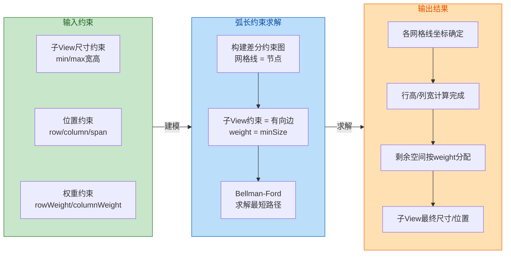
```mermaid
graph LR
    subgraph Input["输入约束"]
        direction TB
        C1["子View尺寸约束\nmin/max宽高"]
        C2["位置约束\nrow/column/span"]
        C3["权重约束\nrowWeight/columnWeight"]
        C1 ~~~ C2
        C2 ~~~ C3
    end

    subgraph Solve["弧长约束求解"]
        direction TB
        S1["构建差分约束图\n网格线 = 节点"]
        S2["子View约束 = 有向边\nweight = minSize"]
        S3["Bellman-Ford\n求解最短路径"]
        S1 --> S2
        S2 --> S3
    end

    subgraph Output["输出结果"]
        direction TB
        O1["各网格线坐标确定"]
        O2["行高/列宽计算完成"]
        O3["剩余空间按weight分配"]
        O4["子View最终尺寸/位置"]
        O1 --> O2
        O2 --> O3
        O3 --> O4
    end

    Input -->|"建模"| Solve -->|"求解"| Output

    classDef greenNode fill:#C8E6C9,stroke:#2E7D32,color:#1B5E20
    classDef blueNode fill:#BBDEFB,stroke:#1565C0,color:#0D47A1
    classDef orangeNode fill:#FFE0B2,stroke:#EF6C00,color:#E65100
    class Input greenNode
    class Solve blueNode
    class Output orangeNode
```

#### GridLayout vs TableLayout 对比

为了帮助开发者做出正确的选型决策，下面从多个维度对比两者：

| 维度 | TableLayout | GridLayout |
|------|-------------|------------|
| **继承关系** | 继承 LinearLayout | 直接继承 ViewGroup |
| **坐标模型** | 行模型（只有行概念，列自动推导） | 二维网格坐标（行+列显式声明） |
| **跨列支持** | ✅ `layout_span` | ✅ `layout_columnSpan` |
| **跨行支持** | ❌ 不支持 | ✅ `layout_rowSpan` |
| **权重支持** | 间接（通过 stretchColumns） | ✅ `layout_columnWeight` / `layout_rowWeight` |
| **测量次数** | 两轮测量 | 一轮（弧长约束求解） |
| **API 级别** | API 1 | API 14（AndroidX 兼容更低版本） |
| **适合场景** | 简单表单、少行少列 | 复杂网格、需跨行跨列、需权重分配 |

从表中可以明确看出，**GridLayout 在功能和性能上全面优于 TableLayout**。在现代 Android 开发中，如果确实需要表格/网格类布局，应优先选择 GridLayout；而 ConstraintLayout 的 Flow 辅助布局甚至可以进一步替代 GridLayout 在某些场景中的角色。TableLayout 更多地作为遗留代码中的存在，新项目中几乎没有使用它的理由。

#### GridLayout 的常见陷阱

**陷阱一：忘记设置 `layout_width="0dp"`**。当使用 `layout_columnWeight` 时，如果子 View 的 `layout_width` 仍为 `wrap_content`，则权重无法生效。原理同 LinearLayout——权重分配的是"剩余空间"，如果子 View 已经有一个自然宽度，则剩余空间就减少了，分配结果会出乎意料。正确做法是将 `layout_width` 设为 `0dp`，让宽度完全由权重决定。

**陷阱二：子 View 顺序与自动位置分配冲突**。当你显式为某些子 View 设置了 `layout_row` 和 `layout_column`，而其他子 View 依赖自动分配时，很容易出现 **位置重叠**——两个子 View 被分配到同一个网格位置。GridLayout 不会报错，而是简单地让它们叠在一起。排查这类问题时，建议 **要么全部显式声明位置，要么全部依赖自动分配**，不要混用。

**陷阱三：GridLayout 不会自动换行**。如果子 View 数量超过 `columnCount × rowCount`，多余的子 View 不会自动换到下一行。它们会被放置到超出定义范围的位置，导致布局异常。解决方案是确保 `rowCount` 足够大，或使用 `rowCount` 不设置（默认为 `Integer.MAX_VALUE`）让 GridLayout 自动扩展行数。

---

### Space 空白占位

#### 为什么需要 Space 控件

在表格或网格布局中，经常需要在某些单元格中 **留白**——不放置任何可见内容，但仍需要该位置占据空间以保持布局结构。在 Space 控件出现之前，开发者通常使用一个设置了固定宽高的空 View 来实现这一目的：

```xml
<!-- 传统做法：使用空 View 占位 -->
<View
    android:layout_width="48dp"
    android:layout_height="48dp" />
<!-- 问题：View 的 draw() 方法仍会被调用 -->
<!-- 虽然没有绘制内容，但仍参与绘制管线，浪费性能 -->
```

这种做法的问题在于，**View 的 `draw()` 方法仍然会被调用**。尽管 View 没有设置背景或前景，绘制流程中的 Canvas 状态保存/恢复、dirty region 计算等操作仍会执行，造成不必要的开销。当页面中有大量占位 View 时（比如一个 10×10 的网格，其中一半是空白单元格），这种开销会累积。

**Space 控件**（`android.widget.Space`，API 14 引入）正是为解决这个问题而设计的。它继承自 View，但关键区别在于——Space **重写了 `draw()` 方法，使其成为空操作（no-op）**。这意味着 Space 控件参与了 measure 和 layout 流程（因此能够正确占位），但 **完全跳过了 draw 流程**，不消耗任何绘制资源。

```kotlin
// Space 的核心源码极其简洁
// 继承自 View
public class Space extends View {

    // 构造方法（省略）

    /**
     * 重写 draw 方法，什么都不做
     * 这是 Space 的核心优化——跳过绘制流程
     */
    @Override
    public void draw(Canvas canvas) {
        // 空实现，不调用 super.draw()
        // 因此不会触发 onDraw、dispatchDraw 等任何绘制操作
    }

    /**
     * 测量逻辑：取 suggested minimum size 和布局参数中的较大值
     * 与普通 View 的默认行为一致
     */
    @Override
    protected void onMeasure(int widthMeasureSpec, int heightMeasureSpec) {
        // 使用 getDefaultSize 计算宽高
        // 这意味着 Space 会尊重 layout_width/layout_height 的设置
        setMeasuredDimension(
            getDefaultSize(getSuggestedMinimumWidth(), widthMeasureSpec),  // 宽度
            getDefaultSize(getSuggestedMinimumHeight(), heightMeasureSpec) // 高度
        );
    }
}
```

从源码中可以看出，Space 的设计哲学是 **"最小开销的占位"**——它保留了 View 的测量和布局能力（这是占位所必需的），但彻底砍掉了绘制能力（这对于不可见的占位控件毫无意义）。

#### Space 在 GridLayout 中的应用

Space 在 GridLayout 中有两个典型的应用场景：

**场景一：显式留白**。在网格中某些位置不需要放置任何控件，但又需要该位置存在以维持网格结构的完整性。此时直接在对应位置放一个 Space：

```xml
<androidx.gridlayout.widget.GridLayout
    android:layout_width="match_parent"
    android:layout_height="wrap_content"
    app:columnCount="3"
    app:useDefaultMargins="true">

    <!-- 第 0 行：三个按钮 -->
    <Button android:text="A"
        app:layout_columnWeight="1"
        android:layout_width="0dp"
        android:layout_height="wrap_content" />
    <!-- 第 0 行第 0 列 -->

    <Button android:text="B"
        app:layout_columnWeight="1"
        android:layout_width="0dp"
        android:layout_height="wrap_content" />
    <!-- 第 0 行第 1 列 -->

    <Button android:text="C"
        app:layout_columnWeight="1"
        android:layout_width="0dp"
        android:layout_height="wrap_content" />
    <!-- 第 0 行第 2 列 -->

    <!-- 第 1 行：只需要第 0 列和第 2 列有内容，第 1 列留白 -->
    <Button android:text="D"
        app:layout_columnWeight="1"
        android:layout_width="0dp"
        android:layout_height="wrap_content" />
    <!-- 第 1 行第 0 列 -->

    <!-- 第 1 行第 1 列：使用 Space 占位 -->
    <Space
        app:layout_columnWeight="1"
        android:layout_width="0dp"
        android:layout_height="wrap_content" />
    <!-- Space 参与权重分配，占据正确的列宽 -->
    <!-- 但不执行任何绘制操作 -->

    <Button android:text="F"
        app:layout_columnWeight="1"
        android:layout_width="0dp"
        android:layout_height="wrap_content" />
    <!-- 第 1 行第 2 列 -->

</androidx.gridlayout.widget.GridLayout>
```

**场景二：固定间距控制**。在 API 21 之前 GridLayout 不支持权重时，开发者会使用 Space 配合固定宽度来模拟列间距。虽然现在有了权重支持，但在某些需要 **精确像素级控制** 的场景中（例如图标网格之间需要恰好 12dp 的间距），Space 仍然是最轻量的选择：

```xml
<!-- 用 Space 精确控制两列之间的间距 -->
<Space
    android:layout_width="12dp"
    android:layout_height="match_parent"
    app:layout_row="0"
    app:layout_column="1"
    app:layout_rowSpan="3" />
<!-- 这个 Space 位于第 1 列，跨 3 行 -->
<!-- 宽度固定 12dp，作为列间距使用 -->
<!-- 高度 match_parent 配合 rowSpan 填满整个列高 -->
```

#### Space 与 Guideline 的异同

在 ConstraintLayout 体系中，**Guideline** 也承担了类似"辅助定位但不可见"的角色。二者的核心区别在于：

- **Space** 是一个真实的 View，参与 measure 和 layout，占据实际空间。其他 View 不能直接"约束到 Space 的边缘"（除非在 ConstraintLayout 中给 Space 加 id 后引用）。
- **Guideline** 不是 View（虽然继承自 View，但宽高被强制设为 0，且标记为 `GONE`），它仅作为 ConstraintLayout 内部的 **虚拟参考线**，不参与测量和绘制。其他 View 通过约束引用 Guideline 的 id 来定位。

简单来说：**Space 用于"占据空间但不绘制"，Guideline 用于"提供参考线但不占空间"**。在 GridLayout 中只能使用 Space（因为 Guideline 是 ConstraintLayout 的专属组件），而在 ConstraintLayout 中推荐使用 Guideline（因为它比 Space 更轻量——连 measure 都跳过了）。

#### 小结：表格与网格布局选型决策树

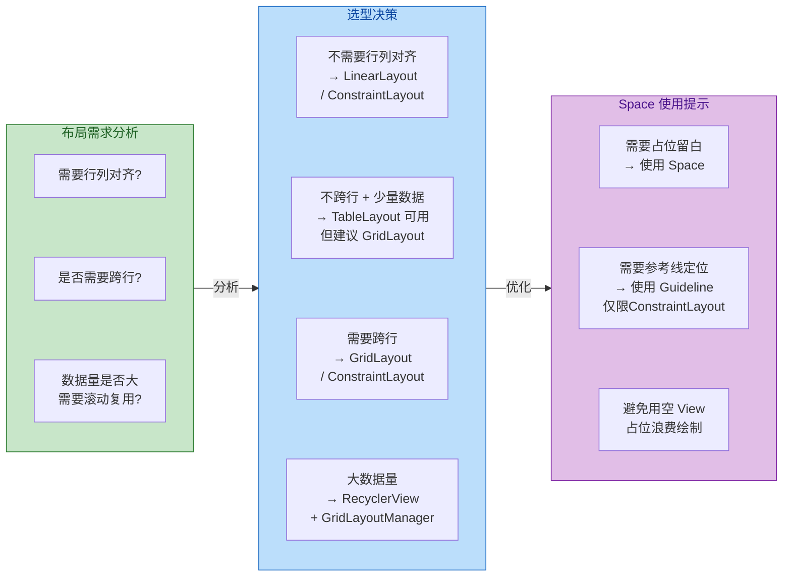
```mermaid
graph LR
    subgraph Question["布局需求分析"]
        direction TB
        Q1["需要行列对齐?"]
        Q2["是否需要跨行?"]
        Q3["数据量是否大\n需要滚动复用?"]
        Q1 ~~~ Q2
        Q2 ~~~ Q3
    end

    subgraph Decision["选型决策"]
        direction TB
        D1["不需要行列对齐\n→ LinearLayout\n/ ConstraintLayout"]
        D2["不跨行 + 少量数据\n→ TableLayout 可用\n但建议 GridLayout"]
        D3["需要跨行\n→ GridLayout\n/ ConstraintLayout"]
        D4["大数据量\n→ RecyclerView\n+ GridLayoutManager"]
        D1 ~~~ D2
        D2 ~~~ D3
        D3 ~~~ D4
    end

    subgraph Tips["Space 使用提示"]
        direction TB
        T1["需要占位留白\n→ 使用 Space"]
        T2["需要参考线定位\n→ 使用 Guideline\n仅限ConstraintLayout"]
        T3["避免用空 View\n占位浪费绘制"]
        T1 ~~~ T2
        T2 ~~~ T3
    end

    Question -->|"分析"| Decision -->|"优化"| Tips

    classDef greenNode fill:#C8E6C9,stroke:#2E7D32,color:#1B5E20
    classDef blueNode fill:#BBDEFB,stroke:#1565C0,color:#0D47A1
    classDef purpleNode fill:#E1BEE7,stroke:#7B1FA2,color:#4A148C
    class Question greenNode
    class Decision blueNode
    class Tips purpleNode
```

---

**📝 练习题**

在一个 GridLayout 中，设置了 `columnCount="3"`，子 View 的排列如下：第一个子 View 设置了 `layout_columnSpan="2"` 和 `layout_columnWeight="2"`，第二个子 View 设置了 `layout_columnWeight="1"`。两个子 View 的 `layout_width` 均为 `0dp`。请问这两个子 View 在水平方向上的宽度比例是多少？


A. 1:1（因为它们各占不同列数，权重机制无效）


B. 2:1（第一个占 2/3 宽度，第二个占 1/3 宽度）


C. 3:1（columnSpan 和 columnWeight 相乘，2×2=4 vs 1×1=1）


D. 无法确定（columnSpan 和 columnWeight 互相冲突，结果不可预测）


**【答案】** B

**【解析】** 在 GridLayout 的权重分配机制中，`layout_columnWeight` 决定了子 View 对 **剩余空间** 的分配比例，而 `layout_columnSpan` 决定了子 View 横跨多少列。当两个 `layout_width="0dp"` 的子 View 分别设置 weight 为 2 和 1 时，GridLayout 会将可用宽度按 2:1 的比例分配。第一个子 View 虽然跨了 2 列，但它获得的总宽度是由权重比例决定的——即 2/(2+1) = 2/3 的总宽度；第二个子 View 获得 1/(2+1) = 1/3 的总宽度。`columnSpan` 在这里的作用是告诉 GridLayout 这个子 View "占据了两列的位置"，使得第二个子 View 自动从第 2 列开始排列，但宽度比例仍由 weight 独立控制。因此答案是 B。注意，columnSpan 与 columnWeight 是正交的两个概念：span 管 **位置占用**，weight 管 **尺寸分配**，二者不会相乘也不会冲突。

---

**📝 练习题**

关于 Space 控件，以下说法正确的是：


A. Space 继承自 ViewGroup，可以包含子 View


B. Space 重写了 `onMeasure()` 使其返回 0×0，因此不占据任何空间


C. Space 重写了 `draw()` 方法为空实现，参与测量和布局但跳过绘制


D. Space 与 ConstraintLayout 的 Guideline 功能完全相同，可以互换使用


**【答案】** C

**【解析】** Space 继承自 **View** 而非 ViewGroup，因此 A 选项错误。Space 的 `onMeasure()` 使用了标准的 `getDefaultSize()` 逻辑，会根据 `layout_width` 和 `layout_height` 计算出实际尺寸（并非 0×0），因此它 **会占据空间**，B 选项错误。Space 的核心优化点在于重写了 `draw()` 方法为空实现（不调用 `super.draw()`），这使得它参与 measure/layout 流程以正确占位，但完全跳过 draw 流程以节省绘制开销，C 选项正确。D 选项错误是因为 Space 和 Guideline 的设计目的不同——Space 是"占位但不绘制"的真实 View，而 Guideline 是 ConstraintLayout 专属的虚拟参考线（宽高为 0，标记为 GONE），二者不可互换。

---

## 布局优化标签（include 复用布局、merge 减少层级、ViewStub 惰性加载）

Android 的 UI 渲染是一条 **"XML → View Tree → Measure/Layout/Draw"** 的流水线。View Tree 的深度和节点数量直接决定了每一帧的遍历开销：层级越深，递归 `measure()` → `layout()` → `draw()` 的调用栈就越长；节点越多，每个阶段需要访问的对象就越多。因此，Android 在 XML 层面提供了三个"零成本"或"低成本"的优化标签——`<include>`、`<merge>` 和 `<ViewStub>`，它们分别解决 **布局复用**、**层级消除** 和 **延迟实例化** 三类不同的性能问题。理解它们的工作原理，是写出高性能 UI 的基本功。

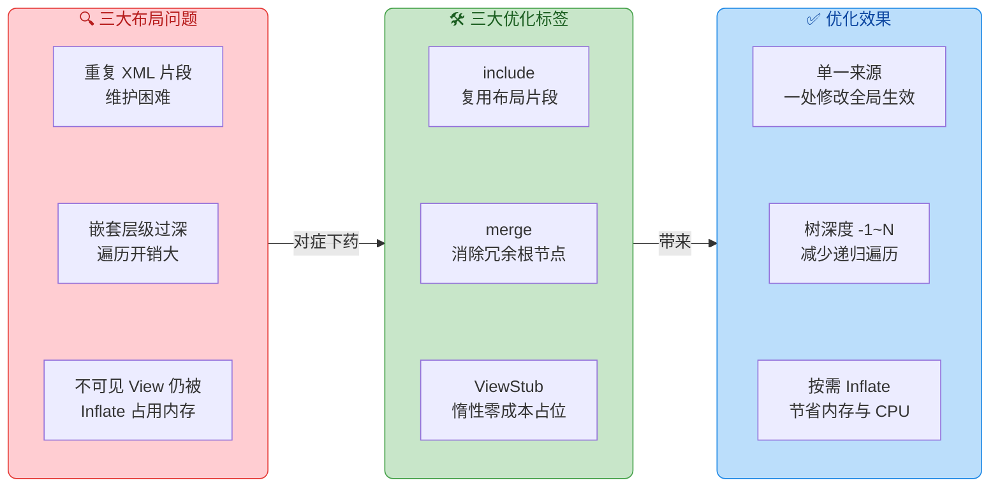
```mermaid
graph LR
    subgraph Problem["🔍 三大布局问题"]
        direction TB
        P1["重复 XML 片段\n维护困难"]
        P2["嵌套层级过深\n遍历开销大"]
        P3["不可见 View 仍被\nInflate 占用内存"]
        P1 ~~~ P2
        P2 ~~~ P3
    end

    subgraph Solution["🛠️ 三大优化标签"]
        direction TB
        S1["include\n复用布局片段"]
        S2["merge\n消除冗余根节点"]
        S3["ViewStub\n惰性零成本占位"]
        S1 ~~~ S2
        S2 ~~~ S3
    end

    subgraph Effect["✅ 优化效果"]
        direction TB
        E1["单一来源\n一处修改全局生效"]
        E2["树深度 -1~N\n减少递归遍历"]
        E3["按需 Inflate\n节省内存与 CPU"]
        E1 ~~~ E2
        E2 ~~~ E3
    end

    Problem -->|"对症下药"| Solution -->|"带来"| Effect

    classDef probCls fill:#FFCDD2,stroke:#E53935,color:#B71C1C,rx:8
    classDef solCls fill:#C8E6C9,stroke:#43A047,color:#1B5E20,rx:8
    classDef effCls fill:#BBDEFB,stroke:#1E88E5,color:#0D47A1,rx:8
    class Problem probCls
    class Solution solCls
    class Effect effCls
```

在开始逐个拆解之前，有一个总体认知非常重要：这三个标签作用的时机全部在 **LayoutInflater 解析 XML 的阶段**，即 `inflate()` 方法内部。它们本身 **不是 View**（`<include>` 和 `<merge>` 在运行时不会产生对应的 View 对象，`<ViewStub>` 虽然是一个真正的 View 但宽高为 0 且不参与绘制），所以它们的"优化"本质上是在 **构建 View Tree 之前或之中** 做手脚，减少最终树上的节点数量或推迟节点的创建时机。

---

### include 复用布局

#### 问题场景与设计动机

在实际项目中，同一个 UI 片段经常出现在多个页面。最典型的例子就是 **自定义 Toolbar**：几乎每个 Activity 都需要相同结构的顶部栏，包含返回按钮、标题文本和右侧操作按钮。如果在每一个 Activity 的 XML 里都复制粘贴同一段 Toolbar 定义，会出现两个严重问题。第一，**维护性灾难**——UI 设计修改了 Toolbar 的高度或图标，你需要同时修改几十个 XML 文件；第二，**一致性风险**——某个文件被漏改，用户在不同页面看到不一致的 Toolbar。`<include>` 就是为了解决这个问题而生的，它的核心思想与软件工程中的 **DRY（Don't Repeat Yourself）** 原则完全一致：把可复用的 XML 片段抽取到独立文件中，在需要的地方用一行 `<include>` 引用即可。

#### 基本用法

首先，把可复用的布局抽取到独立的 XML 文件中，例如 `layout_toolbar.xml`：

```xml
<?xml version="1.0" encoding="utf-8"?>
<!-- layout_toolbar.xml：可复用的自定义 Toolbar 片段 -->
<!-- 注意：这个文件拥有自己的根节点 RelativeLayout -->
<RelativeLayout
    xmlns:android="http://schemas.android.com/apk/res/android"
    android:layout_width="match_parent"
    android:layout_height="48dp"
    android:background="#FFFFFF">

    <!-- 返回按钮，居左垂直居中 -->
    <ImageView
        android:id="@+id/iv_back"
        android:layout_width="24dp"
        android:layout_height="24dp"
        android:layout_centerVertical="true"
        android:layout_marginStart="16dp"
        android:src="@drawable/ic_back" />

    <!-- 标题文本，水平垂直居中 -->
    <TextView
        android:id="@+id/tv_title"
        android:layout_width="wrap_content"
        android:layout_height="wrap_content"
        android:layout_centerInParent="true"
        android:textSize="18sp"
        android:textColor="#212121" />

</RelativeLayout>
```

然后在任意需要此 Toolbar 的宿主布局中通过 `<include>` 引用：

```xml
<?xml version="1.0" encoding="utf-8"?>
<!-- activity_main.xml：宿主布局 -->
<LinearLayout
    xmlns:android="http://schemas.android.com/apk/res/android"
    android:layout_width="match_parent"
    android:layout_height="match_parent"
    android:orientation="vertical">

    <!-- 通过 include 引入可复用的 Toolbar 布局 -->
    <!-- layout 属性指向被引用的 XML 文件（必填） -->
    <include layout="@layout/layout_toolbar" />

    <!-- 页面主体内容 -->
    <FrameLayout
        android:id="@+id/fl_content"
        android:layout_width="match_parent"
        android:layout_height="0dp"
        android:layout_weight="1" />

</LinearLayout>
```

在 Java/Kotlin 代码中，对被 `<include>` 引入的子 View 的访问方式与普通 View **完全相同**，直接通过 `findViewById()` 即可。这是因为 `<include>` 在运行时会被"展开"——它引用的 XML 内容会被完整解析并挂载到宿主 View Tree 上，就好像你手动把那段 XML 复制过来一样：

```kotlin
// Activity 中访问 include 引入的 Toolbar 内部控件
// 直接 findViewById 即可，无需任何特殊处理
val tvTitle = findViewById<TextView>(R.id.tv_title)  // 直接引用被 include 布局中的 id
tvTitle.text = "首页"                                  // 正常设置文本
```

#### 属性覆盖机制

`<include>` 标签支持一个非常实用的功能：**在引用处覆盖被引用布局根节点的属性**。这意味着同一个 `layout_toolbar.xml` 可以在不同宿主中展现出不同的尺寸或外边距。覆盖规则如下：

- **`android:id`**：可以在 `<include>` 上设置新的 `id`，这个 `id` 会 **替换** 被引用布局根节点的 `id`。这在同一个宿主中多次 `<include>` 同一个布局时非常关键，否则会出现 id 冲突。
- **`android:layout_width` / `android:layout_height`**：可以覆盖根节点的宽高。但有一个容易踩坑的硬性规则——**如果要覆盖任何 `layout_*` 属性，`layout_width` 和 `layout_height` 必须同时声明**，否则所有 `layout_*` 覆盖都不会生效。这是因为 `LayoutInflater` 内部的解析逻辑会先检查这两个属性是否存在，只有两者都存在时才会进入 `layout_*` 属性的覆盖分支。
- **`android:layout_margin*`** 等其他 `layout_` 前缀属性：在同时声明了宽高的前提下可以覆盖。
- **非 `layout_` 属性**（如 `android:background`、`android:visibility`）：**无法通过 `<include>` 覆盖**。如果需要动态修改这些属性，只能在代码中获取到根 View 后手动设置。

```xml
<!-- 在同一个宿主中 include 两次同一个 Toolbar，用不同 id 区分 -->
<include
    android:id="@+id/toolbar_top"
    layout="@layout/layout_toolbar"
    android:layout_width="match_parent"
    android:layout_height="56dp"
    android:layout_marginBottom="8dp" />

<!-- 第二次引用，指定不同 id 避免冲突 -->
<!-- layout_width 和 layout_height 必须同时出现，否则 margin 不生效 -->
<include
    android:id="@+id/toolbar_bottom"
    layout="@layout/layout_toolbar"
    android:layout_width="match_parent"
    android:layout_height="48dp" />
```

#### LayoutInflater 内部处理流程

当 `LayoutInflater.inflate()` 方法在解析 XML 时遇到 `<include>` 标签，它执行的并不是简单的"替换文本"，而是一套严谨的 View 构建流程。理解这个过程，能帮你精准预判 `<include>` 在各种场景下的行为：

1. **读取 `layout` 属性**：`LayoutInflater` 首先从 `<include>` 标签中取出 `layout` 属性的值（即被引用布局的资源 ID）。如果这个属性缺失，会直接抛出 `InflateException`。

2. **递归 inflate 被引用布局**：拿到资源 ID 后，`LayoutInflater` 会开启一次 **新的 `inflate()` 调用**，解析被引用的 XML 文件，构建出一棵以其根节点为根的完整子树。

3. **属性覆盖**：子树构建完成后，`LayoutInflater` 检查 `<include>` 标签上是否同时声明了 `layout_width` 和 `layout_height`。如果是，则用 `<include>` 标签上的 `layout_*` 属性重新为根节点生成一个 `LayoutParams`，替换掉被引用布局中原有的 `LayoutParams`。如果 `<include>` 上声明了 `android:id`，也会覆盖根节点的 id。

4. **挂载到宿主树**：最后，把覆盖属性后的子树根节点通过 `addView()` 添加到当前宿主 ViewGroup 的子节点列表中。至此，`<include>` 标签的使命完成，它自身 **不会在 View Tree 中留下任何痕迹**。

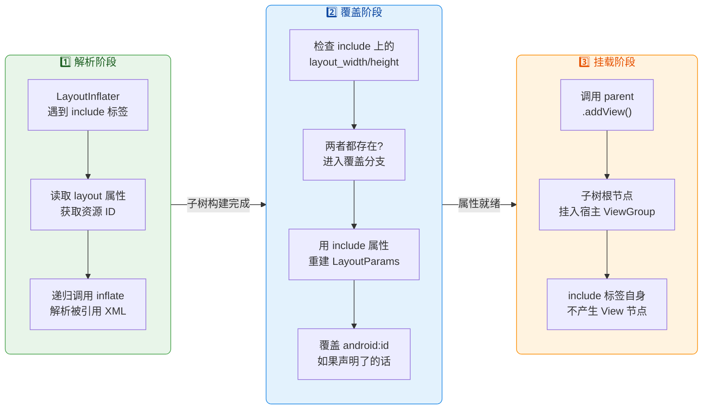
```mermaid
graph LR
    subgraph Phase1["1️⃣ 解析阶段"]
        direction TB
        A1["LayoutInflater\n遇到 include 标签"]
        A2["读取 layout 属性\n获取资源 ID"]
        A3["递归调用 inflate\n解析被引用 XML"]
        A1 --> A2
        A2 --> A3
    end

    subgraph Phase2["2️⃣ 覆盖阶段"]
        direction TB
        B1["检查 include 上的\nlayout_width/height"]
        B2["两者都存在?\n进入覆盖分支"]
        B3["用 include 属性\n重建 LayoutParams"]
        B4["覆盖 android:id\n如果声明了的话"]
        B1 --> B2
        B2 --> B3
        B3 --> B4
    end

    subgraph Phase3["3️⃣ 挂载阶段"]
        direction TB
        C1["调用 parent\n.addView()"]
        C2["子树根节点\n挂入宿主 ViewGroup"]
        C3["include 标签自身\n不产生 View 节点"]
        C1 --> C2
        C2 --> C3
    end

    Phase1 -->|"子树构建完成"| Phase2 -->|"属性就绪"| Phase3

    classDef p1Cls fill:#E8F5E9,stroke:#43A047,color:#1B5E20,rx:8
    classDef p2Cls fill:#E3F2FD,stroke:#1E88E5,color:#0D47A1,rx:8
    classDef p3Cls fill:#FFF3E0,stroke:#FB8C00,color:#E65100,rx:8
    class Phase1 p1Cls
    class Phase2 p2Cls
    class Phase3 p3Cls
```

#### 局限性与注意事项

虽然 `<include>` 非常方便，但它有一些需要注意的地方。首先，**它不减少 View Tree 的深度或节点数**——被引用的布局会被完整展开，包括其根节点。这意味着如果被引用布局的根节点是一个纯粹用于"包裹"的 ViewGroup（如一个没有实际背景、没有自定义行为的 `LinearLayout`），那么这个 ViewGroup 在展开后会成为宿主树中的一个"多余层级"。这正是 `<merge>` 标签要解决的问题，我们接下来就会讲到。

其次，`<include>` 不支持 `<merge>` 作为被引用布局的根标签在所有场景下的直接使用——实际上 `<merge>` **必须** 作为被引用布局的根标签来使用，这恰好与 `<include>` 配合，但你不能在没有父容器的场景（如 `setContentView()` 直接使用 `<merge>` 文件）中这样做。这两者的配合关系，我们在下一小节详细展开。

---

### merge 减少层级

#### 冗余层级问题

在上一节我们看到，`<include>` 会把被引用布局的根节点也一起带入宿主树。假设你有如下的场景：宿主布局是一个垂直方向的 `LinearLayout`，被引用的 `layout_toolbar.xml` 的根节点也是一个垂直方向的 `LinearLayout`，而这个根 `LinearLayout` 的存在 **仅仅是因为 XML 文件必须有一个根节点**，它本身没有设置背景、没有特殊的 padding、也没有被代码引用——它就是一个 **纯结构性的、多余的包裹层**。

```text
宿主 LinearLayout (vertical)          ← 宿主根节点
  └── LinearLayout (vertical)         ← 被 include 引入的根节点（冗余！）
        ├── ImageView (返回按钮)
        └── TextView  (标题)
```

这个冗余层级意味着：每一帧渲染时，系统需要 **额外对这个空 LinearLayout 执行一次 measure + layout + draw**。在简单场景下开销微乎其微，但当页面复杂、嵌套层级多时，每一层冗余都会产生可感知的累积开销。Android 历史上 View Tree 深度曾有一个经验性的软上限（约 10 层），超过后会在 Logcat 输出警告。虽然现代设备性能强劲，扁平化布局树仍然是最佳实践。

#### merge 标签的解决方案

`<merge>` 标签的作用非常纯粹：**它告诉 LayoutInflater "我不是一个真正的 View，不要为我创建节点，直接把我的子元素挂到我的父容器上"**。当你把被引用布局的根标签从 `<LinearLayout>` 换成 `<merge>` 后，LayoutInflater 在解析时会 **跳过** 这个根标签，直接遍历其内部的子标签并将它们逐一添加到宿主 ViewGroup 中。

改造后的 `layout_toolbar.xml`：

```xml
<?xml version="1.0" encoding="utf-8"?>
<!-- layout_toolbar.xml：使用 merge 作为根标签 -->
<!-- merge 自身不会生成 View 节点 -->
<!-- 其子 View 将直接挂载到宿主 ViewGroup 下 -->
<merge xmlns:android="http://schemas.android.com/apk/res/android">

    <!-- 返回按钮 —— inflate 后直接成为宿主 ViewGroup 的子节点 -->
    <ImageView
        android:id="@+id/iv_back"
        android:layout_width="24dp"
        android:layout_height="24dp"
        android:src="@drawable/ic_back" />

    <!-- 标题文本 —— 同样直接成为宿主 ViewGroup 的子节点 -->
    <TextView
        android:id="@+id/tv_title"
        android:layout_width="wrap_content"
        android:layout_height="wrap_content"
        android:textSize="18sp"
        android:textColor="#212121" />

</merge>
```

宿主布局使用方式不变：

```xml
<?xml version="1.0" encoding="utf-8"?>
<!-- activity_main.xml -->
<LinearLayout
    xmlns:android="http://schemas.android.com/apk/res/android"
    android:layout_width="match_parent"
    android:layout_height="match_parent"
    android:orientation="vertical">

    <!-- include 引入使用了 merge 的布局 -->
    <!-- merge 内的 ImageView 和 TextView 将直接成为此 LinearLayout 的子节点 -->
    <include layout="@layout/layout_toolbar" />

    <FrameLayout
        android:id="@+id/fl_content"
        android:layout_width="match_parent"
        android:layout_height="0dp"
        android:layout_weight="1" />

</LinearLayout>
```

展开后的 View Tree 变成了：

```text
宿主 LinearLayout (vertical)          ← 宿主根节点
  ├── ImageView (返回按钮)            ← 直接挂载，无冗余包裹层
  ├── TextView  (标题)                ← 直接挂载
  └── FrameLayout (内容区)
```

对比使用 `<merge>` 前后，**树的深度减少了一层**，节点数也少了一个 ViewGroup。在复杂页面中多处使用 `<merge>` 配合 `<include>`，累计可以显著降低 View Tree 的总深度。

#### LayoutInflater 对 merge 的处理机制

在 `LayoutInflater` 的源码中，`<merge>` 标签的处理逻辑与普通 View 标签有着本质区别。当 inflate 方法遇到根标签名为 `"merge"` 时，它会进入一个特殊分支：

1. **校验父容器**：首先检查调用 `inflate()` 时是否传入了非空的 `root` 参数，并且 `attachToRoot` 为 `true`（或者是从 `<include>` 内部调用的情况）。如果 `root` 为 null，则抛出 `InflateException`，因为 `<merge>` 的子 View 需要一个父容器来接收。这就解释了为什么 **你不能直接用 `LayoutInflater.inflate(R.layout.merge_file, null)` 来 inflate 一个以 `<merge>` 为根的布局**——没有父容器，子 View 无处安放。

2. **跳过根节点创建**：LayoutInflater **不会** 为 `<merge>` 标签调用 `createView()` 或 `createViewFromTag()`，因此不会产生任何 View 对象。

3. **遍历子标签**：直接进入 `rInflateChildren()` 方法，以 `root`（即宿主 ViewGroup）作为父容器，遍历 `<merge>` 下的所有子标签，逐一创建 View 并通过 `addView()` 添加到 `root` 中。

4. **结果**：`<merge>` 下的子 View 在最终的 View Tree 中直接成为宿主 ViewGroup 的直接子节点，就好像它们原本就写在宿主 XML 中一样。

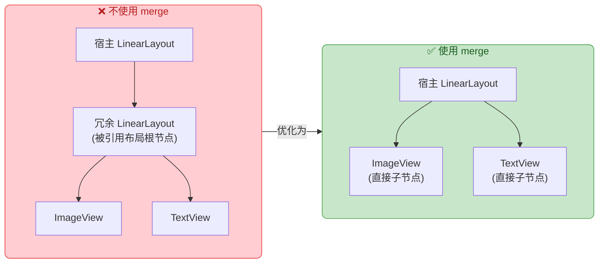
```mermaid
graph LR
    subgraph Without["❌ 不使用 merge"]
        direction TB
        W1["宿主 LinearLayout"]
        W2["冗余 LinearLayout\n(被引用布局根节点)"]
        W3["ImageView"]
        W4["TextView"]
        W1 --> W2
        W2 --> W3
        W2 --> W4
    end

    subgraph With["✅ 使用 merge"]
        direction TB
        M1["宿主 LinearLayout"]
        M2["ImageView\n(直接子节点)"]
        M3["TextView\n(直接子节点)"]
        M1 --> M2
        M1 --> M3
    end

    Without -->|"优化为"| With

    classDef badCls fill:#FFCDD2,stroke:#E53935,color:#B71C1C,rx:8
    classDef goodCls fill:#C8E6C9,stroke:#43A047,color:#1B5E20,rx:8
    class Without badCls
    class With goodCls
```

#### merge 与 Activity 的 setContentView

`<merge>` 还有一个非常经典的使用场景，那就是与 `setContentView()` 搭配使用。我们知道，当 Activity 调用 `setContentView(R.layout.activity_main)` 时，系统内部会把你的布局 inflate 后添加到一个 `id` 为 `android.R.id.content` 的 `FrameLayout` 中（这个 FrameLayout 是 DecorView 内部层级结构的一部分）。如果你的 `activity_main.xml` 的根节点也是一个 `FrameLayout`，那么最终的树结构会出现两个嵌套的 FrameLayout：

```text
DecorView
  └── LinearLayout (系统标题栏 + 内容区)
        └── FrameLayout (android.R.id.content)   ← 系统自动提供
              └── FrameLayout                     ← 你的布局根节点（冗余！）
                    ├── ...
                    └── ...
```

此时，如果你的根 FrameLayout 没有设置背景、padding 等特殊属性，可以将其替换为 `<merge>`，让你的子 View 直接挂载到系统的 `android.R.id.content` FrameLayout 上，减少一层嵌套。但请注意，这种优化需要你 **确认子 View 的 LayoutParams 与 FrameLayout 兼容**（因为父容器现在是 FrameLayout 而不是你原来声明的 ViewGroup 类型）。

#### 使用约束与注意事项

- **`<merge>` 必须是 XML 文件的根元素**：你不能在布局的中间某处使用 `<merge>` 标签，它只能出现在文件的最顶层。
- **必须有父容器接收**：`<merge>` 文件不能通过 `inflate(resId, null)` 方式 inflate（因为没有 parent 来承接子 View）。它通常通过 `<include>` 或 `setContentView()` 等会提供 parent 的场景使用。
- **预览问题**：由于 `<merge>` 没有自己的 LayoutParams，Android Studio 的布局预览可能无法正确显示。可以通过 `tools:parentTag` 属性告诉 IDE 预览时使用哪种父容器类型：

```xml
<!-- 使用 tools:parentTag 解决预览问题 -->
<merge xmlns:android="http://schemas.android.com/apk/res/android"
    xmlns:tools="http://schemas.android.com/tools"
    tools:parentTag="android.widget.LinearLayout"
    tools:orientation="vertical">
    <!-- tools:parentTag 告知 IDE 将此 merge 预览为 LinearLayout -->
    <!-- 仅影响预览，不影响运行时行为 -->

    <ImageView
        android:layout_width="24dp"
        android:layout_height="24dp"
        android:src="@drawable/ic_back" />

    <TextView
        android:layout_width="wrap_content"
        android:layout_height="wrap_content"
        android:text="标题" />

</merge>
```

- **`<include>` 的属性覆盖在 `<merge>` 场景下失效**：由于 `<merge>` 不产生根节点，`<include>` 标签上声明的 `android:id`、`android:layout_width` 等属性 **没有目标 View 可以应用**，因此这些覆盖会被静默忽略。如果你需要对 `<include>` 引入的 merge 布局进行尺寸控制，需要在 merge 内部的子 View 上直接设置，或者在代码中动态修改。

---

### ViewStub 惰性加载

#### 延迟实例化的需求

许多 UI 页面中存在一些 **"大部分时间不会显示"的区域**。典型例子包括：网络错误提示页、空数据占位图、首次登录引导覆盖层、展开后才可见的高级设置面板等。如果这些布局在页面加载时就被完整 inflate 出来——创建 View 对象、分配内存、计算尺寸——但用户在整个页面生命周期内从未触发它们的显示条件，那么这些 inflate 开销就是完全浪费的。

你可能会想：把这些 View 的 `visibility` 设为 `GONE` 不就行了？确实，`GONE` 状态的 View 不参与 `measure()` 和 `layout()`（也不参与 `draw()`），看起来开销为零。但问题在于——**`GONE` 的 View 仍然会被 inflate**。也就是说，LayoutInflater 在解析 XML 时依然会为这个 View（以及它所有的子 View）创建 Java/Kotlin 对象、反射调用构造函数、解析所有 XML 属性。对于一个包含几十个子 View 的复杂错误页面来说，这些对象的创建和属性解析在页面加载时会带来可感知的耗时，尤其在低端设备上。

#### ViewStub 的核心机制

`ViewStub` 是 Android 提供的一个 **极度轻量的占位 View**。它继承自 `View`（注意，不是 ViewGroup），但它有以下特殊性质：

- **`onMeasure()` 中直接将宽高设为 0**：`setMeasuredDimension(0, 0)`，因此不占据任何空间。
- **`draw()` 方法为空实现**：不执行任何绘制操作。
- **不可见且不可交互**：默认 `visibility` 为 `GONE`。
- **持有一个 `layoutResource` 引用**：指向它真正要加载的布局 XML 的资源 ID，但在被显式触发之前 **不会 inflate 这个布局**。

这意味着在页面初始化时，一个 `ViewStub` 的内存开销几乎可以忽略不计——它只是 View Tree 上一个 **"什么都不做"的空壳节点**。只有当代码显式调用 `ViewStub.inflate()` 或将其 `visibility` 设为 `VISIBLE`/`INVISIBLE` 时，它才会真正去 inflate 目标布局，创建真实的 View 子树，并用这棵子树 **替换自身在 View Tree 中的位置**。

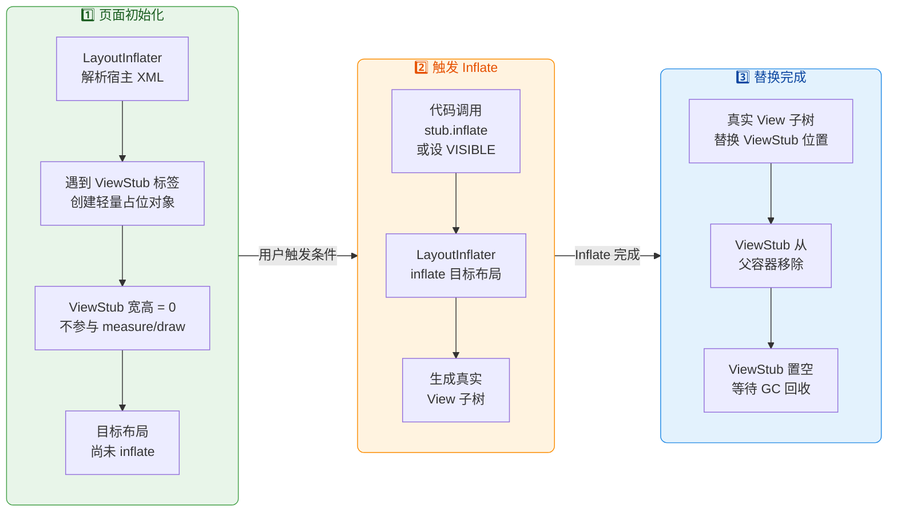
```mermaid
graph LR
    subgraph Init["1️⃣ 页面初始化"]
        direction TB
        I1["LayoutInflater\n解析宿主 XML"]
        I2["遇到 ViewStub 标签\n创建轻量占位对象"]
        I3["ViewStub 宽高 = 0\n不参与 measure/draw"]
        I4["目标布局\n尚未 inflate"]
        I1 --> I2
        I2 --> I3
        I3 --> I4
    end

    subgraph Trigger["2️⃣ 触发 Inflate"]
        direction TB
        T1["代码调用\nstub.inflate\n或设 VISIBLE"]
        T2["LayoutInflater\ninflate 目标布局"]
        T3["生成真实\nView 子树"]
        T1 --> T2
        T2 --> T3
    end

    subgraph Replace["3️⃣ 替换完成"]
        direction TB
        R1["真实 View 子树\n替换 ViewStub 位置"]
        R2["ViewStub 从\n父容器移除"]
        R3["ViewStub 置空\n等待 GC 回收"]
        R1 --> R2
        R2 --> R3
    end

    Init -->|"用户触发条件"| Trigger -->|"Inflate 完成"| Replace

    classDef initCls fill:#E8F5E9,stroke:#43A047,color:#1B5E20,rx:8
    classDef trigCls fill:#FFF3E0,stroke:#FB8C00,color:#E65100,rx:8
    classDef repCls fill:#E3F2FD,stroke:#1E88E5,color:#0D47A1,rx:8
    class Init initCls
    class Trigger trigCls
    class Replace repCls
```

#### 基本用法

在 XML 中声明 ViewStub：

```xml
<?xml version="1.0" encoding="utf-8"?>
<FrameLayout
    xmlns:android="http://schemas.android.com/apk/res/android"
    android:layout_width="match_parent"
    android:layout_height="match_parent">

    <!-- 正常内容区域 -->
    <RecyclerView
        android:id="@+id/rv_list"
        android:layout_width="match_parent"
        android:layout_height="match_parent" />

    <!-- ViewStub：网络错误页的惰性占位符 -->
    <!-- android:id 是 ViewStub 自身的 id，用于在代码中获取 stub 对象 -->
    <!-- android:inflatedId 是 inflate 后真实 View 根节点将被赋予的 id -->
    <!-- android:layout 指向要被惰性加载的目标布局文件 -->
    <ViewStub
        android:id="@+id/stub_error"
        android:inflatedId="@+id/layout_error"
        android:layout="@layout/layout_network_error"
        android:layout_width="match_parent"
        android:layout_height="match_parent" />

</FrameLayout>
```

目标布局 `layout_network_error.xml`：

```xml
<?xml version="1.0" encoding="utf-8"?>
<!-- layout_network_error.xml：网络错误提示页 -->
<!-- 此布局仅在 ViewStub 被 inflate 时才会被解析和创建 -->
<LinearLayout
    xmlns:android="http://schemas.android.com/apk/res/android"
    android:layout_width="match_parent"
    android:layout_height="match_parent"
    android:gravity="center"
    android:orientation="vertical">

    <!-- 错误图标 -->
    <ImageView
        android:layout_width="120dp"
        android:layout_height="120dp"
        android:src="@drawable/ic_network_error" />

    <!-- 错误提示文字 -->
    <TextView
        android:layout_width="wrap_content"
        android:layout_height="wrap_content"
        android:layout_marginTop="16dp"
        android:text="网络连接失败，请重试"
        android:textSize="16sp" />

    <!-- 重试按钮 -->
    <Button
        android:id="@+id/btn_retry"
        android:layout_width="wrap_content"
        android:layout_height="wrap_content"
        android:layout_marginTop="24dp"
        android:text="重试" />

</LinearLayout>
```

在 Kotlin 代码中触发 inflate：

```kotlin
class MainActivity : AppCompatActivity() {

    // 持有 ViewStub 的引用（inflate 前有效）
    private var stubError: ViewStub? = null
    // 持有 inflate 后的真实 View 引用（inflate 后有效）
    private var layoutError: View? = null

    override fun onCreate(savedInstanceState: Bundle?) {
        super.onCreate(savedInstanceState)
        setContentView(R.layout.activity_main)

        // 获取 ViewStub 对象（此时目标布局尚未 inflate）
        stubError = findViewById(R.id.stub_error)
    }

    /**
     * 当网络请求失败时调用此方法，显示错误页面
     */
    fun showError() {
        // layoutError 为 null 说明尚未 inflate，需要首次触发
        if (layoutError == null) {
            // inflate() 方法返回的是目标布局的根 View
            // inflate 后 ViewStub 会从 View Tree 中被移除
            layoutError = stubError?.inflate()
            // inflate 后 stubError 已经失效，置空防止误用
            stubError = null
            // 现在可以通过 layoutError 找到目标布局内部的控件
            layoutError?.findViewById<Button>(R.id.btn_retry)?.setOnClickListener {
                hideError()   // 点击重试时隐藏错误页
                retryNetwork() // 重新发起网络请求
            }
        } else {
            // 已经 inflate 过，直接设为可见即可
            layoutError?.visibility = View.VISIBLE
        }
    }

    /**
     * 隐藏错误页面（不销毁，只设为 GONE）
     */
    fun hideError() {
        // 已 inflate 的布局设为 GONE，不占空间但保留对象
        layoutError?.visibility = View.GONE
    }
}
```

#### ViewStub.inflate() 的内部流程

深入 `ViewStub` 的源码，`inflate()` 方法的执行步骤如下：

1. **获取父容器**：通过 `getParent()` 拿到当前 ViewStub 所在的父 ViewGroup。
2. **inflate 目标布局**：调用 `LayoutInflater.inflate(mLayoutResource, parent, false)`，以父容器为 root 来创建目标布局的 View 子树（`attachToRoot = false`，先不急着挂载）。
3. **设置 inflatedId**：如果 `android:inflatedId` 属性被设置，则将目标布局根 View 的 id 设为该值。
4. **计算位置**：通过 `parent.indexOfChild(this)` 获取 ViewStub 在父容器子列表中的索引位置。
5. **移除 ViewStub**：调用 `parent.removeViewInLayout(this)` 将 ViewStub 自身从父容器中移除。
6. **LayoutParams 传递**：将 ViewStub 上声明的 `LayoutParams`（即 XML 中 ViewStub 标签上的 `layout_width`、`layout_height`、`layout_margin*` 等）赋给目标布局的根 View。
7. **插入目标 View**：调用 `parent.addView(inflatedView, index, layoutParams)` 将目标布局的根 View 插入到 ViewStub **原来的位置**。这确保了布局中的顺序不会被打乱。
8. **回调通知**：如果设置了 `OnInflateListener`，触发回调通知外部 inflate 已完成。
9. **返回根 View**：把目标布局的根 View 作为返回值交给调用者。

```kotlin
// ViewStub 核心源码简化版（帮助理解原理）
public View inflate() {
    // 1. 获取父容器
    val parent = parent as ViewGroup                       // 拿到当前 ViewStub 的父 ViewGroup
    
    // 2. inflate 目标布局（但暂不挂载到 parent）
    val view = inflater.inflate(                           // 使用 LayoutInflater 解析目标 XML
        mLayoutResource,                                   // 目标布局资源 ID
        parent,                                            // root 参数，用于生成正确的 LayoutParams
        false                                              // 暂不 attachToRoot
    )

    // 3. 设置 inflatedId
    if (mInflatedId != NO_ID) {                            // 如果声明了 inflatedId
        view.id = mInflatedId                              // 将目标根 View 的 id 设为 inflatedId
    }

    // 4. 计算 ViewStub 在父容器中的位置索引
    val index = parent.indexOfChild(this)                   // 获取当前位置

    // 5. 移除 ViewStub 自身
    parent.removeViewInLayout(this)                        // 从父容器中移除占位 stub

    // 6. 传递 LayoutParams
    val lp = layoutParams                                  // 获取 ViewStub 上声明的 LayoutParams
    if (lp != null) {
        parent.addView(view, index, lp)                    // 7. 将真实 View 插入原位置，使用 stub 的 LayoutParams
    } else {
        parent.addView(view, index)                        // 无 LayoutParams 时直接插入
    }

    // 8. 回调通知
    mInflateListener?.onInflate(this, view)                // 通知监听者 inflate 完成

    // 9. 返回真实 View
    return view                                            // 返回目标布局的根 View
}
```

#### 使用中的关键注意事项

**一次性限制（One-Shot）**：`ViewStub.inflate()` 只能被调用 **一次**。因为第一次调用后，ViewStub 已经从 View Tree 中被移除了，第二次调用会因为 `getParent()` 返回 null 而抛出 `IllegalStateException`。因此你必须在代码中缓存 inflate 后返回的真实 View 引用（如上面示例中的 `layoutError`），后续通过 `visibility` 控制显示/隐藏。

**通过设置 visibility 也可触发 inflate**：`ViewStub` 重写了 `setVisibility()` 方法。当你对一个尚未 inflate 的 ViewStub 调用 `setVisibility(View.VISIBLE)` 或 `setVisibility(View.INVISIBLE)` 时，它内部会自动调用 `inflate()`。这提供了一种更简洁的触发方式，但本质上与直接调用 `inflate()` 是等价的。需要注意的是，通过 `setVisibility` 触发时你无法直接拿到返回的 View 引用，需要通过 `OnInflateListener` 或事后通过 `findViewById(inflatedId)` 来获取。

**不支持 `<merge>` 作为目标布局根标签**：`ViewStub` 的 inflate 流程是"用一棵新子树替换一个节点"，这要求新子树有一个明确的根 View。而 `<merge>` 没有根 View，因此 ViewStub 的目标布局 **不能** 使用 `<merge>` 作为根元素。如果你强行这样做，运行时会抛出 `InflateException`。

**LayoutParams 的继承**：目标布局根 View 最终使用的 LayoutParams **来自 ViewStub 标签上的声明**，而不是目标布局 XML 文件中根节点自己声明的。这个行为与 `<include>` 的属性覆盖类似，但更加彻底——ViewStub 的 LayoutParams **总是** 会传递给目标 View（因为 ViewStub 已经被移除，必须用自己的 LayoutParams 让替代者继承自己的"位置信息"）。

#### ViewStub 适用场景总结

| 场景 | 是否适合使用 ViewStub | 说明 |
|------|:---:|------|
| 网络错误/空数据页面 | ✅ | 大部分时间不显示，完美契合 |
| 首次使用引导覆盖层 | ✅ | 只在首次启动时显示一次 |
| 展开后可见的详情面板 | ✅ | 默认收起，展开概率低 |
| 评论输入框（点击后出现） | ✅ | 用户不一定会评论 |
| 页面的主要内容区 | ❌ | 必定显示的内容没必要延迟 |
| 频繁切换显隐的 View | ❌ | ViewStub 只能 inflate 一次，后续靠 visibility 切换与普通 View 无异 |

---

### include + merge + ViewStub 综合对比

理解了三个标签各自的职责后，我们把它们放在一起做一个横向对比，帮助你在实际开发中快速决策使用哪个（或哪几个的组合）：

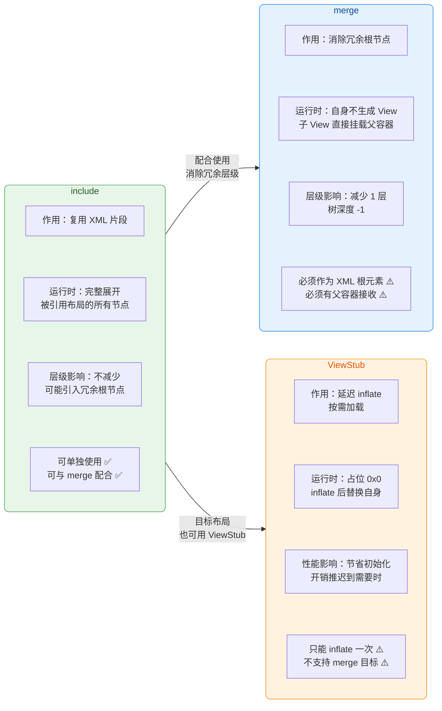
```mermaid
graph LR
    subgraph TagInclude["include"]
        direction TB
        Inc1["作用：复用 XML 片段"]
        Inc2["运行时：完整展开\n被引用布局的所有节点"]
        Inc3["层级影响：不减少\n可能引入冗余根节点"]
        Inc4["可单独使用 ✅\n可与 merge 配合 ✅"]
        Inc1 ~~~ Inc2
        Inc2 ~~~ Inc3
        Inc3 ~~~ Inc4
    end

    subgraph TagMerge["merge"]
        direction TB
        Mer1["作用：消除冗余根节点"]
        Mer2["运行时：自身不生成 View\n子 View 直接挂载父容器"]
        Mer3["层级影响：减少 1 层\n树深度 -1"]
        Mer4["必须作为 XML 根元素 ⚠️\n必须有父容器接收 ⚠️"]
        Mer1 ~~~ Mer2
        Mer2 ~~~ Mer3
        Mer3 ~~~ Mer4
    end

    subgraph TagStub["ViewStub"]
        direction TB
        Stu1["作用：延迟 inflate\n按需加载"]
        Stu2["运行时：占位 0x0\ninflate 后替换自身"]
        Stu3["性能影响：节省初始化\n开销推迟到需要时"]
        Stu4["只能 inflate 一次 ⚠️\n不支持 merge 目标 ⚠️"]
        Stu1 ~~~ Stu2
        Stu2 ~~~ Stu3
        Stu3 ~~~ Stu4
    end

    TagInclude -->|"配合使用\n消除冗余层级"| TagMerge
    TagInclude -->|"目标布局\n也可用 ViewStub"| TagStub

    classDef incCls fill:#E8F5E9,stroke:#43A047,color:#1B5E20,rx:8
    classDef merCls fill:#E3F2FD,stroke:#1E88E5,color:#0D47A1,rx:8
    classDef stuCls fill:#FFF3E0,stroke:#FB8C00,color:#E65100,rx:8
    class TagInclude incCls
    class TagMerge merCls
    class TagStub stuCls
```

| 对比维度 | `<include>` | `<merge>` | `<ViewStub>` |
|---------|:-----------:|:---------:|:------------:|
| 是否是 View | 否 | 否 | 是（继承自 View） |
| 运行时产生节点 | 产生被引用布局的所有节点 | 不产生自身节点 | inflate 前占一个 0×0 节点，inflate 后被替换 |
| 核心能力 | 布局复用 | 层级消除 | 延迟加载 |
| 是否可单独使用 | ✅ | ⚠️ 需要父容器 | ✅ |
| 能否组合使用 | 常与 merge 配合 | 常作为 include 的目标根 | 独立使用为主 |
| 常见搭配 | `<include>` + `<merge>` | 被 `<include>` 引用 | 独立声明 |
| 对 View Tree 的影响 | 不减少层级 | 减少 1 层 | 减少初始节点数 |

在真实项目中，最佳实践通常是 **三者组合使用**：用 `<include>` 复用通用组件，被引用的通用组件用 `<merge>` 作根标签以消除冗余层级，对不常显示的区域用 `<ViewStub>` 延迟加载。这三板斧配合起来，可以在不牺牲代码可维护性的前提下，显著降低页面的初始渲染开销和 View Tree 复杂度。

---

**📝 练习题**

在一个 Activity 的布局中，你使用了 `<ViewStub>` 来延迟加载一个复杂的错误提示页面。当网络请求失败时，你调用 `viewStub.inflate()` 成功展示了错误页面。之后用户点击"重试"，网络恢复正常，你通过 `inflatedView.visibility = View.GONE` 隐藏了错误页面。随后网络再次断开，你再次调用 `viewStub.inflate()` 试图展示错误页面。此时会发生什么？

A. 错误页面正常再次显示，ViewStub 支持多次 inflate


B. 抛出 IllegalStateException，因为 ViewStub 已从 View Tree 中移除，inflate() 只能调用一次


C. 不抛出异常，但错误页面不会显示，inflate() 静默失败返回 null


D. 系统会自动创建一个新的 ViewStub 替换原来的位置，然后正常 inflate


**【答案】** B

**【解析】** `ViewStub.inflate()` 的内部机制是：在第一次 inflate 时，ViewStub 会把目标布局的真实 View 子树创建出来，然后 **将自身从父容器中移除**（`parent.removeViewInLayout(this)`），再将真实 View 插入到自己原来的位置。一旦 ViewStub 被移除，它的 `getParent()` 就会返回 null。当第二次调用 `inflate()` 时，方法内部尝试获取父容器会失败，从而抛出 `IllegalStateException`。正确的做法是：在第一次 `inflate()` 后 **缓存返回的 View 引用**，后续通过 `visibility`（`VISIBLE` / `GONE`）来控制显示与隐藏，不要再碰 ViewStub 对象。这也是 ViewStub 被称为 **"One-Shot"（一次性）** 组件的原因。

---

**📝 练习题**

以下关于 `<merge>` 标签的说法，哪一项是 **错误的**？

A. `<merge>` 必须作为 XML 布局文件的根元素使用，不能出现在布局的中间层级


B. 使用 `<merge>` 作为根标签的布局文件，可以通过 `LayoutInflater.inflate(resId, null)` 方式直接 inflate


C. `<merge>` 常与 `<include>` 配合使用，能够消除被引用布局的冗余根节点，减少 View Tree 层级


D. 在 Android Studio 中预览 `<merge>` 布局时，可以通过 `tools:parentTag` 属性指定预览用的父容器类型


**【答案】** B

**【解析】** `<merge>` 标签的核心机制是"不创建自身 View 节点，直接将子 View 添加到父容器中"。这要求在 inflate 时 **必须有一个非空的父容器（root 参数）** 来接收子 View。当你调用 `LayoutInflater.inflate(resId, null)` 时，root 为 null，LayoutInflater 发现根标签是 `<merge>` 却没有父容器可以挂载子 View，会直接抛出 `InflateException`（错误信息为 `"<merge /> can be used only with a valid ViewGroup root and attachToRoot=true"`）。因此选项 B 是错误的。正确的使用方式是通过 `<include>` 引用（LayoutInflater 会自动以宿主 ViewGroup 作为 root），或者在代码中显式传入非空的 parent：`inflate(resId, parent, true)`。

---

## 布局转换与层级

Android 应用的界面性能，除了取决于布局类型的选择与属性配置之外，还有一个极为关键却常被忽视的维度——**布局的层级深度与绘制效率**。当一个 Activity 被 `setContentView()` 加载后，XML 中声明的每一层 ViewGroup 和 View 都会被 `LayoutInflater` 逐一实例化并构建成一棵 **View Tree**。这棵树的深度（depth）和节点数量（node count）直接影响着三大核心流程——**Measure → Layout → Draw** 的执行耗时。层级越深，递归调用链越长，每一帧的渲染时间就越可能超过 16.6ms（60fps）甚至 11.1ms（90fps）的阈值，从而导致用户可感知的 **掉帧（Jank）** 和 **卡顿**。

更隐蔽的性能杀手是 **过度绘制（Overdraw）**：同一像素在一帧内被多次绘制，GPU 做了大量无用功。一个典型场景是多层嵌套的 ViewGroup 都设置了背景色，底层的像素先被绘制、再被上层完全遮盖，这些不可见的绘制操作白白消耗了 GPU 填充率（Fill Rate）。

本节将从 **工具诊断 → 问题识别 → 优化策略** 三个维度，系统讲解如何分析与优化布局层级。

### Hierarchy Viewer 工具

#### 工具演进历史与现状

早期 Android 开发中，Google 提供了一个名为 **Hierarchy Viewer** 的独立可视化工具（集成在 Android Device Monitor 中），它能以树状图的方式展示当前 Activity 的完整 View 层级，并对每个节点标注 Measure、Layout、Draw 三个阶段的耗时，用红、黄、绿三色圆点直观地指示性能瓶颈。开发者可以一眼看出哪个 View 的测量或绘制异常缓慢。

然而，Hierarchy Viewer 存在严重的局限性：它只能连接运行 **userdebug/eng** 版本系统的设备或模拟器（出于安全原因，user 版本的设备默认不允许连接），并且工具本身已在 **Android Studio 3.1+** 中被标记为 **deprecated**。Google 官方明确推荐使用 **Layout Inspector** 作为替代方案。

#### Layout Inspector——现代化的层级分析工具

Layout Inspector 是 Android Studio 内置的布局检查工具，它的核心能力包括：

**实时层级捕获（Live Layout Inspection）**：在 Android Studio 4.0+ 中，Layout Inspector 支持对运行在 API 29+（Android 10）设备上的 Debug 应用进行 **实时刷新**，无需手动抓取快照。它通过 `WindowManagerGlobal` 和 `ViewDebug` 相关的系统接口，遍历当前 Window 的 View Tree，将每个节点的类名、ID、尺寸、位置、可见性等属性序列化后传回 Studio。

**3D 层级视图（3D View）**：这是 Layout Inspector 最具特色的功能之一。开发者可以将扁平的二维界面"掰开"成三维分层视图，每一层 View 按照 Z 轴的绘制顺序依次展开。这种视觉化呈现方式使得嵌套层级一目了然——如果你看到层级像"千层饼"一样厚，就说明存在过度嵌套。

**属性面板（Properties Panel）**：选中任意 View 节点后，右侧面板会展示其所有属性，包括 `layout_width`、`layout_height`、`padding`、`margin`、`visibility`、`background` 等，帮助开发者快速定位不合理的属性设置。

**Compose 支持**：自 Android Studio Bumblebee（2021.1.1）起，Layout Inspector 已全面支持 Jetpack Compose 的组件层级检查，能够展示 Composable 函数的调用树。

#### 使用 Layout Inspector 的操作流程

```text
1. 在 Android Studio 中以 Debug 模式运行 App
2. 菜单栏: Tools → Layout Inspector
3. 选择目标进程（会自动列出可调试的进程）
4. 等待层级快照加载完成
5. 在组件树（Component Tree）中浏览 View 层级
6. 点击任意节点，查看属性面板中的详细信息
7. 切换 3D 模式，旋转视图观察层级深度
```

#### 通过 adb 命令行辅助分析

除了 IDE 工具外，开发者也可以通过 `adb shell dumpsys` 命令获取当前界面的 View 层级信息，这在自动化测试或 CI 环境中尤为有用：

```bash
# 列出当前所有 Window 及其根 View 信息
adb shell dumpsys window windows | grep -E "mSurface|Window #"

# 导出指定 Activity 的完整 View 层级树
# 需要在 userdebug 设备或开启了 ViewServer 的 Debug App 上执行
adb shell dumpsys activity top | grep -A 100 "View Hierarchy"

# 使用 uiautomator 导出当前界面的 UI 结构（XML 格式）
# 这是最通用的方式，不限设备类型
adb shell uiautomator dump /sdcard/ui_dump.xml
adb pull /sdcard/ui_dump.xml .
```

#### 关键性能指标的解读

无论使用哪种工具，分析布局层级时需要关注以下核心指标：

| 指标 | 健康阈值 | 说明 |
|------|----------|------|
| **View 节点总数** | < 80 | 单个 Activity 的 View 数量超过 80 时需警惕 |
| **层级深度** | < 10 | 嵌套超过 10 层会显著增加递归开销 |
| **Measure 次数** | 每个 View ≤ 2 次 | RelativeLayout 子 View 常被测量 2 次，嵌套则指数膨胀 |
| **不可见 View** | 尽量为 0 | `INVISIBLE` 的 View 仍参与 Measure/Layout，应改用 `GONE` 或 ViewStub |

当你在 Layout Inspector 的组件树中发现某个 ViewGroup 下嵌套了多层"无意义"的中间容器（比如一个 LinearLayout 里只有一个 FrameLayout，而 FrameLayout 里又只有一个 LinearLayout），这些中间层级就是优化的首要目标。

### 过度绘制检测

#### 什么是过度绘制

**过度绘制（Overdraw）** 是指屏幕上同一个像素在同一帧的渲染过程中被 **多次绘制** 的现象。Android 的渲染管线是 **画家算法（Painter's Algorithm）** 的变体——先画远处（底层）的内容，再画近处（上层）的内容，后绘制的会覆盖先绘制的。如果底层绘制的像素最终被上层完全遮盖，那么底层的绘制就是 **无用功**。

举一个直观的例子：假设你的布局结构是 `Activity（白色背景）→ FrameLayout（灰色背景）→ CardView（白色背景）→ TextView（白色背景）`。对于 TextView 区域的每个像素来说，GPU 依次执行了四次颜色填充——白 → 灰 → 白 → 白，但最终用户看到的只是最后一次的白色。前三次绘制全部浪费。

#### GPU 过度绘制可视化

Android 系统内置了一个非常实用的调试功能——**GPU 过度绘制可视化（Debug GPU Overdraw）**，它通过颜色叠加层直观地展示每个像素被绘制的次数。

开启方式：`设置 → 开发者选项 → 调试 GPU 过度绘制 → 显示过度绘制区域`

开启后，系统会在屏幕上覆盖一层半透明的颜色编码：

```text
┌──────────────────────────────────────────────┐
│         GPU Overdraw 颜色编码表              │
├──────────┬───────────┬───────────────────────┤
│   颜色   │ 绘制次数  │        含义           │
├──────────┼───────────┼───────────────────────┤
│ 无色     │    1x     │ 正常：像素仅绘制 1 次 │
│ 蓝色     │    2x     │ 轻微：多绘制了 1 次   │
│ 绿色     │    3x     │ 中度：多绘制了 2 次   │
│ 粉红色   │    4x     │ 严重：多绘制了 3 次   │
│ 红色     │   ≥5x     │ 极端：多绘制了 4+ 次  │
└──────────┴───────────┴───────────────────────┘
```

**优化目标**：理想状态下，界面应以 **无色和蓝色** 为主；**绿色** 区域应尽量减少；**粉红色和红色** 区域必须重点排查和消除。

#### 过度绘制的常见来源

**来源一：多层背景叠加**。这是最常见的过度绘制源头。开发者习惯于在 Activity 的 Theme 中设置 `windowBackground`，又在根 Layout 中设置 `android:background`，再在子 View 上设置背景色。三层背景叠加导致底部像素至少被绘制 3 次。

**来源二：不可见区域的绘制**。一个被其他 View 完全遮盖的底层 View，如果它设置了背景或执行了 `onDraw()`，其绘制操作依然会完整执行。View 系统默认不会做遮挡剔除（Occlusion Culling），因为通用情况下的遮挡关系判断代价很高。

**来源三：复杂自定义 View 未使用 `clipRect()`**。在自定义 View 的 `onDraw()` 中绘制内容时，如果没有通过 `Canvas.clipRect()` 限制绘制区域，Canvas 会对整个 View 范围进行绘制，即使部分区域被其他兄弟 View 遮盖。

**来源四：`alpha` 透明度处理**。当对一个 ViewGroup 设置 `alpha < 1.0f` 时，系统会先将该 ViewGroup 及其所有子 View 绘制到一个离屏缓冲区（Off-screen Buffer），然后再将整个缓冲区以指定透明度合成到屏幕上。这意味着所有子 View 被绘制了 **两次**。

#### 消除过度绘制的实战技巧

**技巧一：移除多余的 Window 背景**

当 Activity 的根布局已经设置了不透明背景色时，`windowBackground` 就是纯粹的浪费。可以在 Theme 中将其移除：

```xml
<!-- res/values/themes.xml -->
<!-- 自定义 Activity 主题，移除默认的 window 背景以减少一层过度绘制 -->
<style name="Theme.MyApp.NoWindowBg" parent="Theme.MaterialComponents.Light.NoActionBar">
    <!-- 将 windowBackground 设为 null，阻止 DecorView 绘制底层背景 -->
    <item name="android:windowBackground">@null</item>
</style>
```

也可以在代码中动态移除：

```kotlin
// 在 Activity.onCreate() 中，setContentView 之后调用
// 获取当前 Window 对象并将其背景设为 null
// 这等效于在 Theme 中设置 windowBackground = @null
window.setBackgroundDrawable(null)
```

**技巧二：减少布局层级中的重复背景**

```xml
<!-- ❌ 错误示例：三层背景叠加 -->
<!-- 根布局设置了白色背景 -->
<LinearLayout
    android:background="#FFFFFF"
    android:layout_width="match_parent"
    android:layout_height="match_parent">

    <!-- 子容器又设置了白色背景（多余！与父布局相同） -->
    <FrameLayout
        android:background="#FFFFFF"
        android:layout_width="match_parent"
        android:layout_height="wrap_content">

        <!-- TextView 再设置白色背景（又多余一层！） -->
        <TextView
            android:background="#FFFFFF"
            android:layout_width="wrap_content"
            android:layout_height="wrap_content"
            android:text="Hello" />
    </FrameLayout>
</LinearLayout>

<!-- ✅ 正确做法：只在最顶层需要的位置设置一次背景 -->
<!-- 根布局设置白色背景，子 View 不再重复设置 -->
<LinearLayout
    android:background="#FFFFFF"
    android:layout_width="match_parent"
    android:layout_height="match_parent">

    <!-- 子容器不设置背景，继承父布局的白色即可 -->
    <FrameLayout
        android:layout_width="match_parent"
        android:layout_height="wrap_content">

        <!-- TextView 也不设置背景，视觉效果完全相同 -->
        <TextView
            android:layout_width="wrap_content"
            android:layout_height="wrap_content"
            android:text="Hello" />
    </FrameLayout>
</LinearLayout>
```

**技巧三：在自定义 View 中使用 `clipRect()` 限制绘制区域**

```kotlin
// 自定义 View：绘制多张卡片堆叠效果
// 每张卡片只露出一部分，被遮盖的部分无需绘制
override fun onDraw(canvas: Canvas) {
    super.onDraw(canvas)
    // 遍历所有卡片（从底层到顶层）
    for (i in cards.indices) {
        // 保存当前 Canvas 状态（变换矩阵、裁剪区域等）
        canvas.save()
        // 计算当前卡片的可见区域（未被上层卡片遮挡的部分）
        // 只有最顶层卡片绘制完整区域，其余只绘制露出的边缘
        if (i < cards.lastIndex) {
            // 裁剪 Canvas 到当前卡片的可见区域
            // 这样 Canvas 后续的绘制操作只在此区域内生效
            canvas.clipRect(
                cards[i].left,          // 可见区域左边界
                cards[i].top,           // 可见区域上边界
                cards[i].visibleRight,  // 可见区域右边界（被下一张卡片遮挡处）
                cards[i].bottom         // 可见区域下边界
            )
        }
        // 在（已裁剪的）Canvas 上绘制卡片内容
        // 被裁剪掉的区域不会执行任何绘制操作，节省 GPU 开销
        drawCard(canvas, cards[i])
        // 恢复 Canvas 到 save() 之前的状态
        canvas.restore()
    }
}
```

**技巧四：避免对 ViewGroup 设置 alpha，改用 `setLayerType()` 或逐个子 View 设置**

```kotlin
// ❌ 不推荐：对整个 ViewGroup 设置 alpha
// 这会触发离屏缓冲区渲染，所有子 View 被绘制两次
containerLayout.alpha = 0.5f

// ✅ 推荐方案一：对每个需要透明的子 View 单独设置 alpha
// 避免离屏缓冲区的额外绘制开销
childView1.alpha = 0.5f  // 仅此 View 受影响
childView2.alpha = 0.5f  // 仅此 View 受影响

// ✅ 推荐方案二：如果必须对 ViewGroup 整体做透明度动画
// 使用硬件层（Hardware Layer）可让 GPU 缓存渲染结果
// 动画期间只需对缓存的纹理调整 alpha，无需重绘子 View
containerLayout.setLayerType(View.LAYER_TYPE_HARDWARE, null) // 开启硬件层
containerLayout.animate()
    .alpha(0.5f)        // 执行透明度动画
    .withEndAction {
        // 动画结束后立即关闭硬件层，释放 GPU 纹理内存
        containerLayout.setLayerType(View.LAYER_TYPE_NONE, null)
    }
    .start()
```

### 层级扁平化策略

#### 为什么层级深度是性能敌人

View Tree 的 Measure → Layout → Draw 三大流程都是 **深度优先递归遍历** 的。对于一棵深度为 D、每层平均有 N 个子节点的 View Tree：

- **Measure 阶段**：`ViewGroup.onMeasure()` 会递归调用每个子 View 的 `measure()`。在最坏情况下（如 `RelativeLayout` 的双重测量），子 View 的 `measure()` 可能被调用 **2^D** 次（指数级膨胀）。
- **Layout 阶段**：递归调用链深度 = 树深度 D，线性增长，但过深的调用栈也有栈溢出风险。
- **Draw 阶段**：每个 ViewGroup 的 `dispatchDraw()` 逐一调用子 View 的 `draw()`，生成的 DisplayList 指令数与节点数成正比。

下图展示了层级深度与测量开销的关系，以及扁平化前后的对比：

```mermaid
graph LR
    subgraph Before["优化前：深层嵌套"]
        direction TB
        B1["LinearLayout\n(根容器)"]
        B2["RelativeLayout\n(中间容器 1)"]
        B3["FrameLayout\n(中间容器 2)"]
        B4["LinearLayout\n(中间容器 3)"]
        B5["TextView\n(实际内容)"]
        B1 --> B2
        B2 --> B3
        B3 --> B4
        B4 --> B5
    end

    subgraph Problem["问题分析"]
        direction TB
        P1["📏 层级深度: 5 层"]
        P2["🔁 Measure: 最多 2⁵=32 次"]
        P3["🎨 Overdraw: 每层背景叠加"]
        P4["💾 内存: 5 个对象实例"]
        P1 ~~~ P2
        P2 ~~~ P3
        P3 ~~~ P4
    end

    subgraph After["优化后：扁平化"]
        direction TB
        A1["ConstraintLayout\n(唯一容器)"]
        A2["TextView\n(实际内容)"]
        A3["📏 层级深度: 2 层\n🔁 Measure: ≤ 2 次\n🎨 Overdraw: 1 层\n💾 内存: 2 个对象"]
        A1 --> A2
        A2 ~~~ A3
    end

    Before -->|"扁平化重构"| Problem
    Problem -->|"使用 ConstraintLayout"| After

    classDef beforeStyle fill:#FFCDD2,stroke:#C62828,color:#B71C1C
    classDef problemStyle fill:#FFF9C4,stroke:#F9A825,color:#F57F17
    classDef afterStyle fill:#C8E6C9,stroke:#2E7D32,color:#1B5E20

    class Before beforeStyle
    class Problem problemStyle
    class After afterStyle
```

#### 策略一：使用 ConstraintLayout 替代多层嵌套

`ConstraintLayout` 是 Google 专为解决布局层级问题而设计的"终极武器"。它的核心思想是：通过 **约束（Constraint）** 描述 View 之间的空间关系，使得原本需要多层嵌套才能实现的复杂布局，在 **单层容器** 中即可完成。

ConstraintLayout 的底层使用了一个名为 **Cassowary** 的线性约束求解算法（与 iOS 的 Auto Layout 相同），能够在一次遍历中求解所有 View 的位置和尺寸。这意味着无论约束关系多么复杂，Measure 阶段的复杂度始终是 **O(n)**（n 为子 View 数量），不会像 RelativeLayout 嵌套那样指数膨胀。

以下是一个典型的嵌套布局重构为 ConstraintLayout 的示例：

```xml
<!-- ❌ 优化前：3 层嵌套实现"左图标 + 右侧标题/副标题"布局 -->
<!-- 根容器：水平线性布局 -->
<LinearLayout
    android:layout_width="match_parent"
    android:layout_height="wrap_content"
    android:orientation="horizontal"
    android:padding="16dp">

    <!-- 左侧图标 -->
    <ImageView
        android:layout_width="48dp"
        android:layout_height="48dp"
        android:src="@drawable/ic_avatar" />

    <!-- 右侧需要垂直排列标题和副标题，所以套一层垂直 LinearLayout -->
    <LinearLayout
        android:layout_width="0dp"
        android:layout_height="wrap_content"
        android:layout_weight="1"
        android:layout_marginStart="12dp"
        android:orientation="vertical">

        <!-- 标题行又需要"文字 + 标签"水平排列，再套一层 -->
        <LinearLayout
            android:layout_width="match_parent"
            android:layout_height="wrap_content"
            android:orientation="horizontal">

            <!-- 标题文字 -->
            <TextView
                android:layout_width="0dp"
                android:layout_height="wrap_content"
                android:layout_weight="1"
                android:text="用户名称"
                android:textSize="16sp" />

            <!-- 右侧标签 -->
            <TextView
                android:layout_width="wrap_content"
                android:layout_height="wrap_content"
                android:text="VIP"
                android:textSize="12sp" />
        </LinearLayout>

        <!-- 副标题文字 -->
        <TextView
            android:layout_width="match_parent"
            android:layout_height="wrap_content"
            android:text="这是一段副标题描述文字"
            android:textSize="14sp" />
    </LinearLayout>
</LinearLayout>
<!-- 总层级：4 层（LinearLayout → LinearLayout → LinearLayout → View） -->
```

```xml
<!-- ✅ 优化后：使用 ConstraintLayout 实现完全相同的视觉效果 -->
<!-- 仅一层容器，所有子 View 直接平铺 -->
<androidx.constraintlayout.widget.ConstraintLayout
    android:layout_width="match_parent"
    android:layout_height="wrap_content"
    android:padding="16dp">

    <!-- 左侧图标：约束到父布局的 start 和 top -->
    <ImageView
        android:id="@+id/ivAvatar"
        android:layout_width="48dp"
        android:layout_height="48dp"
        android:src="@drawable/ic_avatar"
        app:layout_constraintStart_toStartOf="parent"
        app:layout_constraintTop_toTopOf="parent" />

    <!-- 标题文字：起始边约束到图标右侧，结束边约束到 VIP 标签左侧 -->
    <!-- 宽度设为 0dp（match_constraint），自动填充两端约束之间的空间 -->
    <TextView
        android:id="@+id/tvTitle"
        android:layout_width="0dp"
        android:layout_height="wrap_content"
        android:layout_marginStart="12dp"
        android:text="用户名称"
        android:textSize="16sp"
        app:layout_constraintStart_toEndOf="@id/ivAvatar"
        app:layout_constraintEnd_toStartOf="@id/tvVip"
        app:layout_constraintTop_toTopOf="parent" />

    <!-- VIP 标签：约束到父布局的 end，与标题垂直居中对齐 -->
    <TextView
        android:id="@+id/tvVip"
        android:layout_width="wrap_content"
        android:layout_height="wrap_content"
        android:text="VIP"
        android:textSize="12sp"
        app:layout_constraintEnd_toEndOf="parent"
        app:layout_constraintTop_toTopOf="@id/tvTitle"
        app:layout_constraintBottom_toBottomOf="@id/tvTitle" />

    <!-- 副标题：起始边与标题对齐，顶部约束到标题底部 -->
    <TextView
        android:id="@+id/tvSubtitle"
        android:layout_width="0dp"
        android:layout_height="wrap_content"
        android:layout_marginTop="4dp"
        android:text="这是一段副标题描述文字"
        android:textSize="14sp"
        app:layout_constraintStart_toStartOf="@id/tvTitle"
        app:layout_constraintEnd_toEndOf="parent"
        app:layout_constraintTop_toBottomOf="@id/tvTitle" />

</androidx.constraintlayout.widget.ConstraintLayout>
<!-- 总层级：2 层（ConstraintLayout → View），减少了 2 层嵌套 -->
```

从 4 层嵌套到 2 层，View 对象数量从 7 个减少到 5 个，Measure 调用次数大幅降低。对于列表类场景（RecyclerView Item），这种优化的效果会被 **成百上千倍** 地放大。

#### 策略二：善用 merge 标签消除冗余根节点

在前面章节中已经介绍了 `<merge>` 标签的基本用法，这里从层级扁平化的角度进一步阐述其价值。当你通过 `<include>` 引入一个子布局时，子布局的根 ViewGroup 会作为一个节点插入到父布局的 View Tree 中。如果子布局的根节点仅仅是一个"容器壳"（不承载任何视觉表现或功能逻辑），那么这个节点就是多余的层级。

```xml
<!-- res/layout/layout_toolbar_content.xml -->
<!-- 使用 merge 作为根标签 -->
<!-- 当被 include 到父布局时，merge 不会生成实际的 View 节点 -->
<!-- 其中的子 View 直接成为父布局的子节点，减少一层嵌套 -->
<merge xmlns:android="http://schemas.android.com/apk/res/android">

    <!-- 返回按钮：直接成为 include 处父 ViewGroup 的子 View -->
    <ImageButton
        android:id="@+id/btnBack"
        android:layout_width="48dp"
        android:layout_height="48dp"
        android:src="@drawable/ic_back" />

    <!-- 标题文字：同样直接挂在父 ViewGroup 下 -->
    <TextView
        android:id="@+id/tvToolbarTitle"
        android:layout_width="wrap_content"
        android:layout_height="wrap_content"
        android:text="页面标题"
        android:textSize="18sp" />

</merge>
```

**merge 的适用条件**：子布局的根节点类型必须与父布局的类型兼容。例如，如果父布局是 `LinearLayout(horizontal)`，那么 merge 中的子 View 就会按水平方向排列。开发者需要确保这种"隐式父容器"关系在逻辑上是正确的。

#### 策略三：使用 ViewStub 延迟加载不常见的布局

应用中许多布局块在大多数使用场景下 **根本不会显示**，例如：错误提示面板、空状态界面、引导浮层、高级设置区域等。如果在 XML 中直接声明这些布局，它们在 Activity 加载时就会被 inflate 并参与 Measure/Layout，白白消耗 CPU 和内存。

`ViewStub` 是一个 **零尺寸、零绘制** 的轻量级占位 View。它在 inflate 阶段只创建一个极简的 stub 对象（不解析目标布局 XML），只有在显式调用 `inflate()` 或 `setVisibility(View.VISIBLE)` 时，才会真正加载目标布局并替换自身。

```kotlin
// 获取 ViewStub 引用
// ViewStub 此时只是一个轻量占位符，目标布局尚未被解析
val errorStub = findViewById<ViewStub>(R.id.stubError)

// 当需要展示错误面板时，调用 inflate()
// inflate() 会执行以下操作：
// 1. 解析 android:layout 指定的布局 XML
// 2. 创建目标布局的 View Tree
// 3. 将 ViewStub 从父 ViewGroup 中移除
// 4. 将目标布局插入到 ViewStub 原来的位置
// 5. 返回目标布局的根 View
val errorView = errorStub.inflate()

// 注意：inflate() 只能调用一次！
// 第二次调用会抛出 IllegalStateException
// 因为 ViewStub 在第一次 inflate 后已从 View Tree 中移除
// 后续操作应直接通过 errorView 引用来控制可见性
errorView.visibility = View.GONE   // 隐藏
errorView.visibility = View.VISIBLE // 再次显示
```

```xml
<!-- 在布局 XML 中声明 ViewStub -->
<!-- ViewStub 本身不占据任何空间，不参与绘制 -->
<ViewStub
    android:id="@+id/stubError"
    android:layout_width="match_parent"
    android:layout_height="wrap_content"
    android:layout="@layout/layout_error_panel"
    android:inflatedId="@+id/errorPanel" />
<!-- android:layout 指定待加载的目标布局资源 -->
<!-- android:inflatedId 指定目标布局 inflate 后的 ID（可选） -->
```

#### 策略四：RecyclerView Item 布局的极致优化

RecyclerView 是列表场景的核心组件，其 Item 布局的性能会被 **滚动过程中的频繁创建和绑定** 放大。Item 布局优化的关键原则：

**原则一：Item 根布局层级≤ 2**。理想情况下，Item 只有一层 ConstraintLayout 或一层简单的 ViewGroup，子 View 全部平铺。

**原则二：避免 Item 中使用 `wrap_content` 的 RecyclerView 父容器**。如果 RecyclerView 本身的高度是 `wrap_content`，它会尝试测量所有 Item 来确定自身高度，导致性能灾难。

**原则三：固定尺寸的 Item 使用 `setHasFixedSize(true)`**。这告诉 RecyclerView 其 Item 的增删不会改变自身尺寸，可以跳过不必要的 `requestLayout()`。

```kotlin
// RecyclerView 性能配置最佳实践
recyclerView.apply {
    // 告知 RecyclerView Item 的增删不影响自身尺寸
    // 这样 adapter.notifyXxx() 时不会触发 RecyclerView 的 requestLayout()
    setHasFixedSize(true)

    // 设置预创建的 ViewHolder 缓存数量
    // 默认值为 2，对于复杂 Item 可适当增大
    // 缓存的 ViewHolder 在需要时可直接绑定数据，无需重新 inflate
    recycledViewPool.setMaxRecycledViews(
        VIEW_TYPE_NORMAL,  // ViewHolder 类型
        15                  // 缓存池大小
    )

    // 设置屏幕外预加载的 Item 数量（默认为 2）
    // 适当增大可减少快速滑动时的白屏现象
    (layoutManager as? LinearLayoutManager)?.initialPrefetchItemCount = 4
}
```

#### 策略五：利用 Profile GPU Rendering 进行量化验证

在完成上述优化后，需要用数据来验证效果。Android 提供了 **Profile GPU Rendering（GPU 渲染模式分析）** 工具，以柱状图的形式实时展示每一帧的渲染耗时。

开启方式：`设置 → 开发者选项 → GPU 渲染模式分析 → 在屏幕上显示为条形图`

开启后，屏幕底部会出现滚动的柱状图，每个竖条代表一帧的渲染耗时。竖条由多段不同颜色组成，分别对应渲染管线的不同阶段：

```text
┌─────────────────────────────────────────────────────────┐
│         GPU Rendering 柱状图各色段含义                  │
├────────────┬────────────────────────────────────────────┤
│  橙色段     │  处理阶段 (Process)：CPU 处理 Display List │
│  紫色段     │  上传阶段 (Upload)：纹理/位图上传至 GPU    │
│  浅蓝色段   │  绘制命令 (Issue)：发出 OpenGL 绘制命令    │
│  深蓝色段   │  同步上传 (Sync)：GPU 完成同步             │
│  绿色横线   │  16.6ms 基准线（60fps 阈值）              │
├────────────┴────────────────────────────────────────────┤
│  优化目标：所有竖条不超过绿色基准线                      │
└─────────────────────────────────────────────────────────┘
```

当优化前后的竖条高度有明显变化（特别是橙色段变短，说明 View Tree 遍历耗时降低），就说明层级扁平化策略产生了实际效果。

#### 全局优化决策流程

下面以一张流程图总结布局层级优化的完整决策路径：

```mermaid
graph LR
    subgraph Detect["🔍 诊断阶段"]
        direction TB
        D1["Layout Inspector\n分析 View Tree"]
        D2["GPU Overdraw\n可视化检测"]
        D3["Profile GPU Rendering\n帧耗时分析"]
        D1 ~~~ D2
        D2 ~~~ D3
    end

    subgraph Analyze["📊 问题定位"]
        direction TB
        A1["层级深度 > 10？"]
        A2["过度绘制 ≥ 3x？"]
        A3["帧耗时 > 16ms？"]
        A4["Measure 被多次调用？"]
        A1 ~~~ A2
        A2 ~~~ A3
        A3 ~~~ A4
    end

    subgraph Optimize["🛠️ 优化措施"]
        direction TB
        O1["ConstraintLayout\n替代嵌套"]
        O2["merge 标签\n消除冗余节点"]
        O3["ViewStub\n延迟加载"]
        O4["移除多余背景\nclipRect 限制绘制"]
        O1 ~~~ O2
        O2 ~~~ O3
        O3 ~~~ O4
    end

    subgraph Verify["✅ 效果验证"]
        direction TB
        V1["重新运行\nLayout Inspector"]
        V2["对比 GPU Rendering\n柱状图变化"]
        V3["Benchmark 测试\n量化帧率提升"]
        V1 ~~~ V2
        V2 ~~~ V3
    end

    Detect -->|"发现异常"| Analyze
    Analyze -->|"制定方案"| Optimize
    Optimize -->|"实施后"| Verify

    classDef detectStyle fill:#E3F2FD,stroke:#1565C0,color:#0D47A1
    classDef analyzeStyle fill:#FFF3E0,stroke:#E65100,color:#BF360C
    classDef optimizeStyle fill:#E8F5E9,stroke:#2E7D32,color:#1B5E20
    classDef verifyStyle fill:#F3E5F5,stroke:#6A1B9A,color:#4A148C

    class Detect detectStyle
    class Analyze analyzeStyle
    class Optimize optimizeStyle
    class Verify verifyStyle
```

整个优化过程应该是 **循环迭代** 的：诊断 → 定位 → 优化 → 验证 → 再诊断，直到所有性能指标达标。布局层级优化不是一次性工程，而是贯穿整个应用开发周期的持续实践。尤其是在需求迭代过程中，新功能的加入很容易引入新的嵌套层级，因此建议在 Code Review 中将 **布局层级检查** 纳入常规检查项。

---

**📝 练习题**

在 Android 应用的布局性能优化中，以下关于过度绘制（Overdraw）的说法，哪一项是 **正确** 的？


A. 过度绘制只会增加 CPU 负担，与 GPU 无关


B. 将 `android:windowBackground` 设置为 `@null` 可以减少一层过度绘制，但可能导致 Activity 启动时出现短暂黑屏


C. 对 ViewGroup 设置 `alpha = 0.5f` 不会产生额外的绘制开销，因为 alpha 是由硬件加速直接处理的


D. `Canvas.clipRect()` 只影响绘制的视觉裁剪效果，不会减少 GPU 的实际绘制工作量


**【答案】** B

**【解析】** 选项 B 是正确的。当 `windowBackground` 被设为 `@null` 后，DecorView 不再绘制底层背景，确实可以减少一层过度绘制。但代价是：如果 Activity 的内容布局加载较慢（比如首帧还未绘制完成），用户会看到 Window 没有背景的状态（即黑屏或透明），而不是系统默认的白色/主题色背景。这就是为什么很多应用会为 SplashScreen/启动页保留 `windowBackground`，而在主页面才移除它。

选项 A 错误：过度绘制的核心开销在于 **GPU 填充率（Fill Rate）** 的浪费——GPU 需要对同一像素多次执行片段着色器（Fragment Shader），这直接消耗 GPU 算力。

选项 C 错误：对 ViewGroup 设置 alpha 会触发 **离屏缓冲区（Off-screen Buffer）** 渲染，系统先将所有子 View 绘制到临时缓冲区，再将缓冲区以目标 alpha 合成到屏幕，这会让所有子 View 被绘制两次。

选项 D 错误：`clipRect()` 不仅影响视觉裁剪，更重要的是它通过 **限制 Canvas 的绘制区域**，使得裁剪区域外的绘制操作被直接跳过（不会发送给 GPU），从而实质性地减少了 GPU 的工作量。这也是 Android 官方推荐在自定义 View 中使用 `clipRect()` 来消除过度绘制的原因。

---

**📝 练习题**

某开发者发现 RecyclerView 滑动时有明显卡顿，通过 Layout Inspector 发现每个 Item 的布局结构为：`RelativeLayout → LinearLayout → RelativeLayout → FrameLayout → 实际内容 View`，共 5 层嵌套。以下哪种优化方案 **效果最显著**？


A. 将所有 `RelativeLayout` 替换为 `LinearLayout`，减少双重测量


B. 在每个 Item 的根布局外包裹一层 `<merge>` 标签


C. 使用 `ConstraintLayout` 重构 Item 布局，将 5 层嵌套压缩至 2 层


D. 为 RecyclerView 设置 `setHasFixedSize(true)` 并增大 RecycledViewPool 容量


**【答案】** C

**【解析】** 选项 C 效果最显著。RecyclerView Item 的布局被滚动过程反复 inflate 和 measure，5 层嵌套意味着每次 measure 都有深度为 5 的递归调用，而其中包含两个 RelativeLayout 会触发双重测量，最坏情况下单个 Item 的 measure 调用次数可达 2^5 = 32 次。使用 ConstraintLayout 将其扁平化至 2 层后，measure 调用次数降至线性级别（约 n 次，n 为子 View 数量），性能提升数量级最大。

选项 A 虽然能消除 RelativeLayout 的双重测量问题，但 5 层嵌套本身仍然存在，递归深度未改变，优化幅度有限。

选项 B 理解有误：`<merge>` 不能直接用作 RecyclerView Item 的根标签（RecyclerView.Adapter 的 `onCreateViewHolder` 中 inflate 出的 View 必须有一个实际的根 ViewGroup），因此这种用法是错误的。

选项 D 是有效的辅助优化手段，`setHasFixedSize(true)` 避免了不必要的 `requestLayout()`，增大缓存池减少了 ViewHolder 的重复创建。但这些优化不解决 **单个 Item 布局的测量/绘制耗时** 问题，属于"治标不治本"。当 Item 布局本身的嵌套层级过深时，即使缓存命中率达到 100%，每次 `onBindViewHolder` 后的重新 measure/layout 仍然会因深层递归而缓慢。因此，C 的优化效果远大于 D。

---

## 屏幕适配方案

Android 设备的碎片化（Fragmentation）是全球移动开发者面临的最大挑战之一。从 320dp 宽度的入门级手机到 900dp 以上的平板，从 120dpi 的低密度屏到 640dpi 的超高密度屏，再到折叠屏展开/折叠的动态尺寸切换——同一份 UI 代码要在成百上千种屏幕规格上呈现出"设计师预期"的效果，这就是**屏幕适配（Screen Adaptation）**要解决的核心问题。屏幕适配不是某一项单一技术，而是一套涵盖**尺寸单位体系、资源限定符机制、布局弹性策略**的系统性方案。理解它需要从最底层的像素密度换算讲起，逐步上升到资源匹配策略，最后落到工程实践中。

从宏观角度看，Android 的屏幕适配经历了三个阶段的演进。早期 Android 只提供了 `screen size`（small/normal/large/xlarge）四档粗粒度限定符，开发者用 `layout-large/` 目录放平板布局，但这种"四档桶"粒度太粗，一个 360dp 和一个 410dp 的手机被归为同一档，无法做精细适配。第二阶段引入了 `smallestWidth`（sw&lt;N&gt;dp）限定符，将屏幕宽度从离散的四档变为连续的数值维度，开发者可以为 sw320dp、sw360dp、sw480dp 等任意断点提供不同资源，精度大幅提升。第三阶段则是社区和 Google 在 Jetpack 层面推出的各种方案——从早期的百分比布局库（PercentLayout）到 ConstraintLayout 的比例约束，再到如今 Jetpack Compose 的自适应布局 API——适配手段越来越声明式和灵活。本节将按照 **dp/sp 单位原理 → smallestWidth 限定符 → 百分比布局历史** 的顺序，从底到顶地拆解屏幕适配的核心知识体系。

### dp/sp 转换原理

要理解屏幕适配，首先必须把 Android 的**尺寸单位体系**彻底弄清楚。很多开发者知道"用 dp 不用 px"，但不清楚 dp 到底是什么、系统如何把 dp 换算成物理像素、sp 和 dp 又有何区别。这些基础概念是后续一切适配方案的基石。

**像素密度（Density）与 dpi 的概念**

物理屏幕由一个个发光像素点组成。不同设备的屏幕尺寸和分辨率各异，这就导致单位面积内的像素数量不同。衡量这种密度的指标叫做 **dpi（dots per inch）**，即每英寸包含的像素点数。一块 5 英寸 1920×1080 的屏幕，对角线像素约 2203，除以 5 英寸得到约 440dpi；而一块 10 英寸 1920×1080 的平板，同样的分辨率因为屏幕更大，dpi 只有约 220。这意味着如果你在两块屏幕上都画一个 100×100 **px** 的方块，在高 dpi 手机上它看起来很小（因为像素很密集），在低 dpi 平板上它看起来很大——同样的像素数，视觉尺寸完全不一致。这就是"直接用 px 做 UI 尺寸"在 Android 上行不通的根本原因。

**Android 的密度分桶（Density Bucket）**

为了解决像素密度差异问题，Android 定义了一套**密度分桶（Density Bucket）**体系。系统不直接使用设备的真实 dpi，而是将其归入最接近的标准桶：

| 密度桶名称 | 标准 dpi | 缩放因子（density） | 典型设备 |
|:---:|:---:|:---:|:---:|
| ldpi | 120 | 0.75 | 早期低端机（已罕见） |
| mdpi | 160 | 1.0（基准） | 早期 Nexus One 级 |
| hdpi | 240 | 1.5 | 中端手机 |
| xhdpi | 320 | 2.0 | 主流 1080p 手机 |
| xxhdpi | 480 | 3.0 | 旗舰 1080p/1440p |
| xxxhdpi | 640 | 4.0 | 超高端 4K 级 |

其中 **mdpi（160dpi）** 被选为基准密度，缩放因子为 1.0。这个选择有历史原因：Android 最早的 HTC G1（T-Mobile G1）屏幕密度约 160dpi，Google 以此为锚点建立了整个单位体系。缩放因子（`DisplayMetrics.density`）的计算公式非常简单：

$$density = \frac{设备标准 dpi}{160}$$

例如 xxhdpi 设备：480 / 160 = 3.0。这个 `density` 值会被写入 `Resources.DisplayMetrics` 对象，供整个系统使用。

**dp（Density-Independent Pixel）的本质**

dp 全称 **Density-Independent Pixel**（密度无关像素），它是 Android 为了让 UI 尺寸在不同密度屏幕上保持**视觉一致性**而创造的虚拟单位。1dp 在 mdpi（160dpi）基准屏上等于 1px；在其他密度屏上，系统自动用 `density` 系数将 dp 换算为实际像素：

$$px = dp \times density$$

这个公式是 Android 屏幕适配的基石公式。举几个实际例子：在 xhdpi（density=2.0）设备上，`16dp = 16 × 2.0 = 32px`；在 xxhdpi（density=3.0）设备上，`16dp = 16 × 3.0 = 48px`。虽然像素数不同，但因为高密度屏每英寸像素更多，所以 32px 在 xhdpi 上和 48px 在 xxhdpi 上的物理尺寸（毫米数）是近似相等的——这就是 dp 的设计目的：**让同样的 dp 值在不同设备上看起来差不多大**。

从源码层面看，dp → px 的换算发生在 `TypedValue.applyDimension()` 方法中：

```java
// TypedValue.applyDimension() —— Android 维度单位换算的核心方法
// 参数 unit: 单位类型常量（COMPLEX_UNIT_DIP, COMPLEX_UNIT_SP 等）
// 参数 value: 开发者设定的数值（如 16f 代表 16dp）
// 参数 metrics: 当前设备的 DisplayMetrics 实例，包含 density/scaledDensity 等
public static float applyDimension(int unit, float value, DisplayMetrics metrics) {
    switch (unit) {
        // dp → px：直接乘以 density（基础密度缩放因子）
        case COMPLEX_UNIT_DIP:
            return value * metrics.density;
        // sp → px：乘以 scaledDensity（在 density 基础上叠加字体缩放）
        case COMPLEX_UNIT_SP:
            return value * metrics.scaledDensity;
        // pt（磅）→ px：1磅 = 1/72 英寸，乘以 xdpi 得到像素
        case COMPLEX_UNIT_PT:
            return value * metrics.xdpi * (1.0f / 72);
        // in（英寸）→ px：直接乘以 xdpi（每英寸像素数）
        case COMPLEX_UNIT_IN:
            return value * metrics.xdpi;
        // mm（毫米）→ px：1英寸 = 25.4mm，换算后乘以 xdpi
        case COMPLEX_UNIT_MM:
            return value * metrics.xdpi * (1.0f / 25.4f);
        // px → px：不做任何换算，直接返回原值
        case COMPLEX_UNIT_PX:
        default:
            return value;
    }
}
```

可以看到，dp 的换算只依赖 `metrics.density` 这一个变量——这个值在设备出厂时就已经确定（写在系统属性 `ro.sf.lcd_density` 中），应用运行期间通常不会变化（除非开发者在"开发者选项"中手动修改了最小宽度）。

**sp（Scale-Independent Pixel）与字体缩放**

sp 全称 **Scale-Independent Pixel**，专门用于文字尺寸。它在 dp 的基础上额外叠加了一层**用户字体偏好缩放因子（fontScale）**。这个因子来自系统设置中"字体大小"选项——当用户（尤其是老年用户）将字体调大到 1.3 倍时，所有使用 sp 单位的文字都会相应放大。

其换算公式为：

$$px = sp \times density \times fontScale$$

在代码中，这等价于 `sp × scaledDensity`，因为 `scaledDensity = density × fontScale`。从上面的 `applyDimension()` 源码中可以清楚看到 `COMPLEX_UNIT_SP` 分支用的就是 `metrics.scaledDensity`。

这引出一个重要的工程实践原则：**所有面向用户阅读的文字必须使用 sp 单位**，以尊重用户的无障碍（Accessibility）设置；而**非文字的尺寸（间距、图标、按钮高度等）应该使用 dp**，避免因字体缩放导致布局错乱。一个常见的反面案例是：开发者用 sp 设置了 Toolbar 的高度，当用户把字体调到最大时，Toolbar 变得异常高大，整个界面比例失调。

但也有例外情况需要注意。某些特殊文字，比如时钟显示、密码输入框中的掩码字符等，可能不希望随用户字体设置缩放，此时可以刻意用 dp 代替 sp。Android 13（API 33）之后还引入了**非线性字体缩放（Non-linear Font Scaling）**机制——当用户设置的 fontScale 大于 1.0 时，系统不再对所有 sp 值做等比缩放，而是对较大的 sp 值应用较小的缩放比，防止标题等大字号文字变得过于庞大。这意味着从 Android 13 开始，`scaledDensity` 不再是简单的 `density × fontScale` 线性关系，而是一个根据 sp 原始值动态调整的非线性函数。

**DisplayMetrics 的关键字段**

`DisplayMetrics` 是承载所有屏幕参数的核心数据类，理解它的字段是理解适配的基础：

```kotlin
// 获取当前设备的 DisplayMetrics 实例
val dm = resources.displayMetrics

// --- 像素密度相关 ---
dm.density       // 缩放因子，如 3.0（xxhdpi）。dp → px 的乘数
dm.densityDpi    // 标准 dpi 值，如 480。对应密度桶
dm.scaledDensity // 字体缩放密度。sp → px 的乘数。= density × fontScale

// --- 屏幕尺寸相关 ---
dm.widthPixels   // 屏幕宽度（像素），如 1080
dm.heightPixels  // 屏幕高度（像素），不含导航栏/状态栏

// --- 真实 dpi（与密度桶无关的物理值）---
dm.xdpi          // 水平方向每英寸像素数（物理值，非标准桶值）
dm.ydpi          // 垂直方向每英寸像素数（物理值）
```

值得注意的是，`densityDpi` 和设备真实 dpi 往往不完全一致。例如一台真实 dpi 为 403 的手机，系统会将其归入 xxhdpi（480dpi）桶，`densityDpi` 报告为 480。这种"取整入桶"的策略简化了资源匹配逻辑，但也意味着 dp 到物理毫米的换算不是 100% 精确的——在绝大多数场景下这个误差可以忽略，但在需要精确物理尺寸的场景（如尺子 App）需要使用 `xdpi/ydpi` 来计算。

**dp 和屏幕宽度的关系**

理解了 dp 的换算之后，有一个非常重要的推论：**一台设备的屏幕宽度用 dp 表示是固定的**，它等于：

$$widthDp = \frac{widthPixels}{density}$$

例如一台 1080×1920、xxhdpi（density=3.0）的手机：1080 / 3.0 = **360dp**。另一台 1440×2560、xxxhdpi（density=4.0）的手机：1440 / 4.0 = **360dp**。虽然像素分辨率差距巨大，但它们的 dp 宽度完全相同！这也就意味着在这两台设备上，同一份用 dp 写的布局会呈现出完全相同的排列效果——dp 单位把分辨率差异完全屏蔽了。

但反过来，并不是所有设备的 dp 宽度都一样。常见 Android 手机的宽度从 320dp（老旧小屏机）到 411dp（大屏旗舰）不等，平板可达 600dp 以上，折叠屏展开可达 840dp。这个 dp 宽度的差异就是需要用 **smallestWidth 限定符** 来处理的问题。

```mermaid
graph LR
    subgraph Physical["物理层\n Physical Screen"]
        direction TB
        A["px（物理像素）\n 屏幕最小发光单元"]
        B["dpi（像素密度）\n 每英寸像素点数"]
        C["分辨率\n 如 1080×1920"]
        A ~~~ B
        B ~~~ C
    end

    subgraph Density["密度桶\n Density Bucket"]
        direction TB
        D["ldpi: 120dpi\n density = 0.75"]
        E["mdpi: 160dpi\n density = 1.0"]
        F["hdpi: 240dpi\n density = 1.5"]
        G["xhdpi ~ xxxhdpi\n density = 2.0~4.0"]
        D ~~~ E
        E ~~~ F
        F ~~~ G
    end

    subgraph Virtual["虚拟单位\n Virtual Units"]
        direction TB
        H["dp\n px = dp * density"]
        I["sp\n px = sp * scaledDensity"]
        J["scaledDensity\n = density * fontScale"]
        H ~~~ I
        I ~~~ J
    end

    subgraph Result["适配效果\n Adaptation Result"]
        direction TB
        K["视觉一致性\n 同 dp 值 → 近似物理尺寸"]
        L["无障碍支持\n sp 响应字体缩放"]
        M["资源匹配\n 密度桶决定图片选取"]
        K ~~~ L
        L ~~~ M
    end

    Physical -->|"归入标准桶"| Density
    Density -->|"提供 density 值"| Virtual
    Virtual -->|"保证"| Result

    classDef physicalStyle fill:#FFCCBC,stroke:#BF360C,color:#3E2723
    classDef densityStyle fill:#FFE0B2,stroke:#E65100,color:#3E2723
    classDef virtualStyle fill:#C8E6C9,stroke:#2E7D32,color:#1B5E20
    classDef resultStyle fill:#BBDEFB,stroke:#1565C0,color:#0D47A1

    class Physical physicalStyle
    class Density densityStyle
    class Virtual virtualStyle
    class Result resultStyle
```

### smallestWidth 限定符

**从粗粒度到细粒度的演进**

在 Android 3.2（API 13）之前，系统只提供了 `screen size` 这一种屏幕尺寸限定符，将所有设备划分为 **small、normal、large、xlarge** 四个档次。开发者在 `res/layout-large/` 目录下放平板专用布局，在 `res/layout/` 下放手机布局。这种方案存在两个严重缺陷：第一，粒度太粗——一台 4.7 英寸手机和一台 5.5 英寸手机都被归为 normal，无法为大屏手机提供差异化布局；第二，分类标准不透明——开发者无法直接控制"多大算 large"，这个阈值由系统厂商决定。

为了解决这个问题，Android 3.2 引入了一套**基于 dp 数值的屏幕尺寸限定符**，其中最重要的就是 **`sw<N>dp`（smallestWidth）**。它的含义是：**设备屏幕最短边的 dp 值**。之所以用"最短边"，是因为这个值在设备旋转时不会改变——无论手机是竖屏还是横屏，最短边始终是那个较小的维度。这使得 `sw<N>dp` 成为一个**稳定的设备分类依据**。

例如一台典型的 1080×1920 xxhdpi 手机，竖屏时宽度 360dp、高度 640dp，最短边是 360dp，因此它匹配 `sw360dp`。当用户将手机横过来时，宽度变成 640dp、高度变成 360dp，但最短边仍然是 360dp——`sw` 值不变。这种旋转不变性是 `sw` 相比于 `w<N>dp`（可用宽度，随旋转变化）的关键优势。

**限定符的资源匹配规则**

当系统需要加载资源时，会按照 Android 资源匹配算法（Best-Matching Resource Algorithm）从所有候选目录中选择最合适的那个。对于 `sw<N>dp` 限定符，匹配规则是：**选择 N 值小于等于设备 smallestWidth 的、最大的那个目录**。例如你提供了以下资源目录：

```
res/values/              ← 默认（无限定符）
res/values-sw320dp/      ← smallestWidth ≥ 320dp 的设备
res/values-sw360dp/      ← smallestWidth ≥ 360dp 的设备
res/values-sw480dp/      ← smallestWidth ≥ 480dp 的设备
res/values-sw600dp/      ← smallestWidth ≥ 600dp 的设备（平板）
res/values-sw720dp/      ← smallestWidth ≥ 720dp 的设备（大平板）
```

一台 sw=360dp 的手机会匹配 `values-sw360dp/`（360 ≤ 360，且是最大的不超过 360 的）；一台 sw=411dp 的大屏手机会匹配 `values-sw360dp/`（360 ≤ 411，而 480 > 411 不符合）；一台 sw=600dp 的平板会匹配 `values-sw600dp/`。如果没有任何 sw 目录匹配（比如一台 sw=240dp 的极小屏设备），系统会回退到无限定符的默认目录 `values/`。

**基于 smallestWidth 的 dimens 适配方案**

smallestWidth 限定符最经典的工程应用是**生成多套 `dimens.xml`**。其核心思路是：为每个常见的 sw 断点生成一份尺寸值文件，将屏幕宽度按比例切分为若干等分，每一等分的 dp 值随 sw 变化而变化。举一个简化的例子，假设设计稿基于 360dp 宽度出图：

```xml
<!-- res/values-sw360dp/dimens.xml -->
<!-- 设计基准：360dp 宽屏幕 -->
<!-- dp_1 代表屏幕宽度的 1/360，在 360dp 设备上 = 1dp -->
<dimen name="dp_1">1dp</dimen>
<dimen name="dp_10">10dp</dimen>
<dimen name="dp_100">100dp</dimen>
<dimen name="dp_180">180dp</dimen>  <!-- 半屏宽度 = 360/2 -->
```

```xml
<!-- res/values-sw411dp/dimens.xml -->
<!-- 目标设备：411dp 宽屏幕 -->
<!-- dp_1 = 411/360 ≈ 1.14dp，等比放大 -->
<dimen name="dp_1">1.14dp</dimen>
<dimen name="dp_10">11.42dp</dimen>
<dimen name="dp_100">114.17dp</dimen>
<dimen name="dp_180">205.5dp</dimen>  <!-- 半屏宽度 = 411/2 -->
```

```xml
<!-- res/values-sw480dp/dimens.xml -->
<!-- 目标设备：480dp 宽屏幕（小平板/折叠屏展开） -->
<!-- dp_1 = 480/360 ≈ 1.33dp -->
<dimen name="dp_1">1.33dp</dimen>
<dimen name="dp_10">13.33dp</dimen>
<dimen name="dp_100">133.33dp</dimen>
<dimen name="dp_180">240dp</dimen>  <!-- 半屏宽度 = 480/2 -->
```

在布局 XML 中，开发者统一引用 `@dimen/dp_180` 来表示"半屏宽度"，系统会根据当前设备的 sw 值自动选择对应的 dimens.xml，从而实现不同屏幕下元素比例的自动缩放。这套方案的本质是**将"绝对 dp 值"替换为"相对于屏幕宽度的比例值"**，通过资源限定符机制让系统自动选取正确的比例。

在实际工程中，这些 dimens.xml 不会手写——它们由 **Gradle 插件或脚本自动生成**。社区中广泛使用的 **AndroidAutoSize**（今日头条屏幕适配方案的开源实现）以及早期的 **smallestWidth 生成器（sw 适配生成器）** 都是干这件事的工具。开发者只需配置设计稿基准宽度（如 360dp）和需要覆盖的 sw 断点列表，工具就会批量生成几十个 `values-sw<N>dp/dimens.xml` 文件。

**今日头条适配方案：修改 density 的思路**

除了标准的 smallestWidth 多 dimens 方案之外，业界还有一种更激进的适配思路——**直接修改 `DisplayMetrics.density`** 来让所有 dp 值自动适配。这个方案最早由今日头条技术团队在 2018 年提出，核心思想非常简洁：

既然 `px = dp × density`，而设计稿是基于某个固定宽度（比如 360dp）设计的，那么只要让 `density = 设备屏幕宽度 px / 设计稿宽度 dp`，就能保证：在任何设备上，`360dp` 都恰好等于屏幕宽度像素——所有元素都会按设计稿比例等比缩放。

```kotlin
// 今日头条适配方案的核心逻辑
// 在 Activity.onCreate() 或 Application 中调用
fun adaptDensity(activity: Activity, designWidthDp: Float = 360f) {
    // 获取应用级别的 DisplayMetrics（全局基准）
    val appMetrics = activity.application.resources.displayMetrics
    // 计算目标 density：屏幕宽度像素 / 设计稿宽度 dp
    // 例如 1080px / 360dp = 3.0；1440px / 360dp = 4.0
    val targetDensity = appMetrics.widthPixels / designWidthDp
    // 计算目标 scaledDensity：保持 fontScale 比例不变
    // 用原始 scaledDensity/density 的比值乘以新 density
    val targetScaledDensity = targetDensity * (appMetrics.scaledDensity / appMetrics.density)
    // 计算目标 densityDpi：density × 160 即为对应 dpi 值
    val targetDensityDpi = (targetDensity * 160).toInt()

    // 修改 Activity 级别的 DisplayMetrics
    // 这样该 Activity 中所有 dp → px 换算都会使用新的 density
    activity.resources.displayMetrics.apply {
        density = targetDensity          // 核心：覆盖密度缩放因子
        scaledDensity = targetScaledDensity  // 同步更新字体缩放密度
        densityDpi = targetDensityDpi    // 同步更新 dpi 值
    }
}
```

这种方案的优点是**侵入性极小**——开发者不需要更换任何尺寸引用方式，不需要生成多套 dimens.xml，布局文件中直接写设计稿上标注的 dp 值即可。缺点也很明显：一是**全局修改 density 会影响第三方库的 UI 渲染**（第三方库也是用 dp 写的，它们的尺寸也会被等比缩放，可能导致与第三方库预期不符）；二是需要在每个 Activity 的 `onCreate()` 中重新设置（因为系统在配置变更时可能会重置 DisplayMetrics）；三是**在折叠屏、分屏等动态尺寸场景下可能出现问题**，因为屏幕宽度会在运行时变化。社区库 **AndroidAutoSize** 就是对这个方案的工程化封装，它解决了很多边界情况（如字体缩放变化监听、Fragment 级别的粒度控制等）。

**w&lt;N&gt;dp 与 h&lt;N&gt;dp：方向敏感的限定符**

除了 `sw<N>dp`，Android 还提供了 `w<N>dp`（可用宽度）和 `h<N>dp`（可用高度）两种限定符。它们与 sw 的区别在于：**w 和 h 的值会随设备旋转、分屏、窗口大小变化而变化**。例如一台 360×640dp 的手机，竖屏时 w=360dp、h=640dp；横屏时 w=640dp、h=360dp。这使得 `w<N>dp` 更适合用于**响应式布局断点**——"当可用宽度达到 600dp 时切换为双栏布局"这种需求用 `layout-w600dp/` 来实现就非常自然。

在现代 Android 开发中，Google 更推荐使用 **Window Size Classes**（窗口尺寸分类）来定义响应式断点，它将屏幕宽度分为 Compact（&lt;600dp）、Medium（600~839dp）、Expanded（≥840dp）三档。这本质上仍然是 `w<N>dp` 思路的上层封装。

```mermaid
graph LR
    subgraph Device["设备屏幕参数\n Device Screen"]
        direction TB
        A1["屏幕像素宽度\n widthPixels"]
        A2["density 缩放因子\n DisplayMetrics.density"]
        A3["sw 值\n = min(wDp, hDp)"]
        A1 ~~~ A2
        A2 ~~~ A3
    end

    subgraph Qualifier["限定符匹配\n Qualifier Matching"]
        direction TB
        B1["sw320dp\n sw360dp\n sw480dp"]
        B2["sw600dp\n sw720dp"]
        B3["匹配规则：\n N <= 设备sw\n 取最大 N"]
        B1 ~~~ B2
        B2 ~~~ B3
    end

    subgraph Resource["资源加载\n Resource Loading"]
        direction TB
        C1["values-sw360dp/\n dimens.xml"]
        C2["layout-sw600dp/\n activity_main.xml"]
        C3["按比例缩放的\n dp 值"]
        C1 ~~~ C2
        C2 ~~~ C3
    end

    subgraph Alt["替代方案\n Alternative"]
        direction TB
        D1["修改 density\n 今日头条方案"]
        D2["AndroidAutoSize\n 开源库"]
        D3["w/h 限定符\n Window Size Classes"]
        D1 ~~~ D2
        D2 ~~~ D3
    end

    Device -->|"计算 sw 值"| Qualifier
    Qualifier -->|"选择目录"| Resource
    Device -->|"或直接修改"| Alt

    classDef deviceStyle fill:#E8F5E9,stroke:#2E7D32,color:#1B5E20
    classDef qualStyle fill:#E3F2FD,stroke:#1565C0,color:#0D47A1
    classDef resStyle fill:#FFF3E0,stroke:#E65100,color:#BF360C
    classDef altStyle fill:#F3E5F5,stroke:#7B1FA2,color:#4A148C

    class Device deviceStyle
    class Qualifier qualStyle
    class Resource resStyle
    class Alt altStyle
```

### 百分比布局历史

**PercentLayout 的诞生背景**

在 ConstraintLayout 出现之前，Android 的标准布局（LinearLayout、RelativeLayout、FrameLayout）在处理**按比例分配空间**这个需求上都有各自的局限。LinearLayout 的 `weight` 可以在单一方向上按比例分配，但无法同时控制宽度和高度的比例；RelativeLayout 可以做相对定位，但完全没有比例概念；FrameLayout 更是纯粹的层叠容器。开发者要实现"让一个 View 占父容器宽度的 50%、高度的 30%"这样的需求，要么嵌套多层 LinearLayout 用 weight 模拟，要么在代码中动态计算像素值再设置——两种方式都不优雅。

2015 年，Google 在 **Android Support Library** 中发布了 **Percent Support Library**（`com.android.support:percent`），引入了两个百分比容器：`PercentRelativeLayout` 和 `PercentFrameLayout`。它们允许子 View 使用百分比来定义宽高和边距，从而实现真正的**比例布局**。

```xml
<!-- PercentRelativeLayout 使用示例（历史代码，仅供了解） -->
<!-- 注意：此库已被废弃，不应在新项目中使用 -->
<android.support.percent.PercentRelativeLayout
    xmlns:android="http://schemas.android.com/apk/res/android"
    xmlns:app="http://schemas.android.com/apk/res-auto"
    android:layout_width="match_parent"
    android:layout_height="match_parent">

    <!-- 子 View 宽度占父容器 50%，高度占 30% -->
    <!-- 使用 layout_widthPercent 和 layout_heightPercent 属性 -->
    <TextView
        android:layout_width="0dp"
        android:layout_height="0dp"
        app:layout_widthPercent="50%"
        app:layout_heightPercent="30%"
        android:text="占据半宽三成高"
        android:gravity="center" />

    <!-- 支持百分比边距：左边距为父容器宽度的 10% -->
    <ImageView
        android:layout_width="0dp"
        android:layout_height="0dp"
        app:layout_widthPercent="30%"
        app:layout_heightPercent="30%"
        app:layout_marginLeftPercent="10%"
        android:src="@drawable/ic_sample" />

</android.support.percent.PercentRelativeLayout>
```

PercentLayout 的内部实现原理是通过一个辅助类 `PercentLayoutHelper` 来工作的。在 `onMeasure()` 阶段，Helper 会读取子 View 的百分比属性，根据父容器的已知尺寸计算出实际的像素值，然后动态修改子 View 的 `LayoutParams`（将 `width` 和 `height` 从 0dp 替换为计算出的像素值），再交给宿主 ViewGroup 的标准测量逻辑去处理。在 `onLayout()` 之后，Helper 还会将 LayoutParams 恢复原状，以便下次测量时重新计算。这种"篡改 LayoutParams → 测量 → 恢复"的模式虽然巧妙，但也带来了额外的测量开销。

**PercentLayout 的废弃与 ConstraintLayout 的接替**

PercentLayout 的生命周期非常短暂。2016 年 Google I/O 大会上，Google 正式推出了 **ConstraintLayout**，它用一种远比百分比布局更强大、更灵活的方式解决了比例和定位问题。ConstraintLayout 不仅能做百分比宽高（通过 `layout_constraintWidth_percent`），还能做任意 View 之间的相对约束、链式分布（Chain）、宽高比（`layout_constraintDimensionRatio`）、辅助线（Guideline）等——几乎涵盖了 PercentLayout 的所有能力并远远超越。

随后 Google 在 **Support Library 26.1** 中正式将 PercentRelativeLayout 和 PercentFrameLayout 标记为 **@Deprecated**，并建议开发者迁移到 ConstraintLayout。到了 AndroidX 时代，虽然 `androidx.percentlayout:percentlayout` 包仍然存在（维持向后兼容），但已经不再维护和更新。

百分比布局之所以被迅速取代，根本原因在于**它只解决了"比例尺寸"这一个维度的问题**，而 ConstraintLayout 解决了"比例 + 定位 + 对齐 + 链式分布"的全方位问题，同时还通过约束求解器实现了**单次测量**的高性能。换言之，PercentLayout 是一个"只有一招鲜"的方案，而 ConstraintLayout 是一个"一站式"的方案——工程界自然会选择后者。

**ConstraintLayout 中的百分比能力**

既然 PercentLayout 已经废弃，那么在现代开发中如何实现百分比布局呢？答案是 ConstraintLayout 内建的百分比属性：

```xml
<!-- ConstraintLayout 实现百分比布局（推荐方式） -->
<androidx.constraintlayout.widget.ConstraintLayout
    xmlns:android="http://schemas.android.com/apk/res/android"
    xmlns:app="http://schemas.android.com/apk/res-auto"
    android:layout_width="match_parent"
    android:layout_height="match_parent">

    <!-- 宽度为 0dp（MATCH_CONSTRAINT），触发约束计算 -->
    <!-- layout_constraintWidth_percent="0.5" 表示宽度为父容器的 50% -->
    <!-- 必须同时设置左右约束，否则百分比无法生效 -->
    <View
        android:id="@+id/box"
        android:layout_width="0dp"
        android:layout_height="0dp"
        android:background="#4CAF50"
        app:layout_constraintWidth_percent="0.5"
        app:layout_constraintHeight_percent="0.3"
        app:layout_constraintStart_toStartOf="parent"
        app:layout_constraintEnd_toEndOf="parent"
        app:layout_constraintTop_toTopOf="parent"
        app:layout_constraintBottom_toBottomOf="parent" />

    <!-- Guideline：在父容器 70% 宽度处创建垂直辅助线 -->
    <!-- 可作为其他 View 的约束锚点，实现精确的比例定位 -->
    <androidx.constraintlayout.widget.Guideline
        android:id="@+id/guideline_70"
        android:layout_width="wrap_content"
        android:layout_height="wrap_content"
        android:orientation="vertical"
        app:layout_constraintGuide_percent="0.7" />

</androidx.constraintlayout.widget.ConstraintLayout>
```

使用 `layout_constraintWidth_percent` 和 `layout_constraintHeight_percent` 时，View 的对应维度必须设为 `0dp`（即 `MATCH_CONSTRAINT`），并且必须在该维度上建立至少一个约束。百分比值为 0.0~1.0 的浮点数，表示占父容器对应维度的比例。配合 Guideline 的 `layout_constraintGuide_percent`，可以在父容器中划出精确的比例分割线，其他 View 可以约束到这条辅助线上，从而实现任意比例的网格化布局。

**百分比思路在 Compose 中的延续**

进入 Jetpack Compose 时代，百分比布局的思路以更自然的方式延续了下来。Compose 中的 `Modifier.fillMaxWidth(fraction)` 和 `Modifier.fillMaxHeight(fraction)` 直接接受一个 0.0~1.0 的比例参数，无需任何额外容器或辅助工具：

```kotlin
// Compose 中的百分比尺寸：简洁直观
Box(
    modifier = Modifier
        .fillMaxWidth(0.5f)   // 宽度为父容器的 50%
        .fillMaxHeight(0.3f)  // 高度为父容器的 30%
        .background(Color.Green),
    contentAlignment = Alignment.Center  // 内容居中
) {
    Text("50% x 30%")  // 显示比例说明
}
```

此外 Compose 还提供了 `BoxWithConstraints`（可在 composable 内部获取父容器的约束信息来做条件布局）和 `Modifier.weight()`（在 Row/Column 中按权重分配空间，与 LinearLayout 的 weight 类似）。更进一步，Jetpack 推出的 **Material 3 Adaptive Layout**（`material3-adaptive`）库直接提供了基于 Window Size Classes 的自适应布局组件（如 `ListDetailPaneScaffold`），将屏幕适配提升到了声明式组件的层级——开发者不再需要手动管理断点和百分比，框架会根据当前窗口尺寸自动选择合适的布局形态。

**屏幕适配方案总结与选型**

回顾 Android 屏幕适配的整个发展脉络，可以总结出以下几种方案的适用场景：

| 方案 | 核心思想 | 优点 | 缺点 | 推荐度 |
|:---:|:---:|:---:|:---:|:---:|
| dp + 资源限定符 | 利用 dp 单位 + sw/w 限定符提供不同资源 | 官方标准、稳定可靠 | 需维护多套资源文件 | ⭐⭐⭐⭐⭐ |
| 修改 density（今日头条方案） | 运行时修改 density 使 dp 等比缩放 | 侵入性低、无需多套资源 | 影响三方库、动态尺寸适配差 | ⭐⭐⭐ |
| ConstraintLayout 百分比 | 使用约束 + 百分比属性实现比例布局 | 性能好、功能强 | 学习曲线略高 | ⭐⭐⭐⭐⭐ |
| Compose 自适应 | fillMaxWidth(fraction) + Window Size Classes | 声明式、现代化 | 需迁移到 Compose | ⭐⭐⭐⭐⭐ |
| PercentLayout（已废弃） | 百分比容器 | 概念简单 | 已废弃、功能单一 | ❌ |

在实际项目中，最常见的组合是：**dp 作为基础单位 + smallestWidth 限定符处理布局断点 + ConstraintLayout/Compose 处理比例和弹性**。这三者各司其职——dp 屏蔽密度差异，sw 屏蔽尺寸差异，约束/比例屏蔽布局僵硬性——共同构成了一套完整的屏幕适配体系。

```mermaid
graph LR
    subgraph Era1["早期 2009-2012\n Density + Screen Size"]
        direction TB
        E1["dp/sp 单位体系\n 屏蔽密度差异"]
        E2["small/normal/large/xlarge\n 四档粗粒度分类"]
        E3["drawable-hdpi 等\n 多密度图片资源"]
        E1 ~~~ E2
        E2 ~~~ E3
    end

    subgraph Era2["中期 2012-2016\n smallestWidth + Percent"]
        direction TB
        E4["sw〈N〉dp 限定符\n 细粒度尺寸断点"]
        E5["PercentLayout\n 百分比容器"]
        E6["多套 dimens.xml\n 比例缩放方案"]
        E4 ~~~ E5
        E5 ~~~ E6
    end

    subgraph Era3["近期 2016-2022\n ConstraintLayout"]
        direction TB
        E7["约束 + 百分比\n 一站式布局"]
        E8["今日头条方案\n 修改 density"]
        E9["AndroidAutoSize\n 社区最佳实践"]
        E7 ~~~ E8
        E8 ~~~ E9
    end

    subgraph Era4["现代 2022+\n Compose Adaptive"]
        direction TB
        E10["fillMaxWidth(fraction)\n 声明式百分比"]
        E11["Window Size Classes\n Compact/Medium/Expanded"]
        E12["Material3 Adaptive\n 自适应脚手架"]
        E10 ~~~ E11
        E11 ~~~ E12
    end

    Era1 -->|"粒度不足"| Era2
    Era2 -->|"功能单一"| Era3
    Era3 -->|"声明式演进"| Era4

    classDef era1Style fill:#FFCDD2,stroke:#C62828,color:#B71C1C
    classDef era2Style fill:#FFE0B2,stroke:#E65100,color:#BF360C
    classDef era3Style fill:#C8E6C9,stroke:#2E7D32,color:#1B5E20
    classDef era4Style fill:#BBDEFB,stroke:#1565C0,color:#0D47A1

    class Era1 era1Style
    class Era2 era2Style
    class Era3 era3Style
    class Era4 era4Style
```

---

**📝 练习题**

在一台分辨率为 1080×2400、密度为 xxhdpi（density=3.0）的手机上，开发者在布局 XML 中设置了一个 View 的宽度为 `180dp`。同时项目中存在以下资源目录：`values/`、`values-sw320dp/`、`values-sw360dp/`、`values-sw400dp/`。请问该 View 渲染后的实际像素宽度是多少？系统会匹配哪个资源目录？

A. 540px，匹配 values-sw400dp/


B. 540px，匹配 values-sw360dp/


C. 360px，匹配 values-sw360dp/


D. 600px，匹配 values-sw320dp/


**【答案】** B

**【解析】** 首先计算像素宽度：`px = dp × density = 180 × 3.0 = 540px`。然后计算设备的 smallestWidth：屏幕宽度 dp = 1080 / 3.0 = 360dp，高度 dp = 2400 / 3.0 = 800dp，最短边取 min(360, 800) = 360dp。资源匹配规则是"N ≤ 设备 sw 且取最大 N"，360 ≤ 360 成立而 400 > 360 不成立，因此匹配 `values-sw360dp/`。选 A 错误是因为 sw400dp 的 400 大于设备的 360，不满足匹配条件；选 C 的像素值计算错误（可能误用了 density=2.0）；选 D 则两个计算都有误。

---

**📝 练习题**

以下关于 dp 和 sp 的说法，哪一项是**错误**的？

A. dp 到 px 的换算公式为 `px = dp × density`，其中 density 在应用运行期间通常不变


B. sp 到 px 的换算公式为 `px = sp × scaledDensity`，其中 `scaledDensity = density × fontScale`


C. 从 Android 13 开始，系统对所有 sp 值统一应用线性缩放，大标题和小正文的缩放比例完全相同


D. 使用 dp 设置文字大小虽然可以避免随用户字体设置缩放，但会损害无障碍体验（Accessibility）


**【答案】** C

**【解析】** Android 13（API 33）引入了**非线性字体缩放（Non-linear Font Scaling）**机制。当用户的 fontScale 大于 1.0 时，系统不再对所有 sp 值做等比例线性缩放——较大的 sp 值（如 32sp 的大标题）会应用更小的缩放因子，以防止大字号变得过于庞大，影响布局。因此 C 选项"统一应用线性缩放"的说法从 Android 13 开始就不再正确。A 正确描述了 dp 的换算机制且 density 出厂后通常固定；B 正确描述了 sp 的换算机制（在 Android 13 之前是精确的线性关系）；D 正确指出了用 dp 设置文字会绕过用户的字体偏好设置，不利于视力障碍用户。

---

## 本章小结

本章围绕 Android 布局系统，从底层引擎的测量-布局-绘制三阶段机制出发，逐一剖析了每种经典布局容器的设计哲学与运行原理，最后落地到优化实践与屏幕适配方案。下面以"回顾 → 串联 → 提炼"三个维度，对全章知识体系做一次完整的总结与升华。

---

### 核心知识回顾

**布局引擎基础**是理解整个布局系统的根基。我们花了大量篇幅讲清了三个关键类型：`ViewGroup.LayoutParams` 是父容器与子 View 之间的"布局契约"，它告诉父容器子 View 期望的宽高策略（精确值、`MATCH_PARENT` 或 `WRAP_CONTENT`）；`MarginLayoutParams` 在此基础上扩展了外边距语义，使得子 View 可以声明与兄弟或父边界之间的间距；而 `MeasureSpec` 则是测量阶段真正的"指令编码"——它将父容器的约束（`EXACTLY`、`AT_MOST`、`UNSPECIFIED`）与可用尺寸压缩进一个 32 位 `int` 中，自顶向下沿 View Tree 层层传递。理解了 MeasureSpec 的打包解包机制以及 `getChildMeasureSpec()` 的分发逻辑，就等于掌握了所有布局容器测量行为的"第一性原理"。

**LinearLayout** 是最直觉的线性排列容器。它的核心能力在于 `orientation` 方向控制与 `layout_weight` 权重分配。我们详细拆解了权重计算的两阶段过程：第一轮测量收集所有子 View 的自然尺寸，计算剩余空间（或负溢出空间）；第二轮按照权重比例将剩余空间分配给带权重的子 View。特别强调了"0dp + weight"这一经典技巧——它跳过第一轮测量的自然尺寸计算，让权重分配从零开始，语义更清晰、效率更高。此外，`baselineAlignedChildIndex` 与 `baseline` 对齐机制让不同字号的 TextView 能在同一行视觉上对齐基线，这是纯文本排版场景下非常实用的细节。

**RelativeLayout** 赋予了开发者声明式的"相对定位"能力，通过 `rules[]` 数组存储 `toLeftOf`、`below`、`alignParentTop` 等约束关系。它的代价是**双重测量**：横轴方向先排一次，纵轴方向再排一次，以解决水平规则与垂直规则之间的循环依赖。我们分析了其内部的拓扑排序思路——将规则转换为有向图，按依赖顺序逐个确定子 View 的位置。这也解释了为什么在子 View 数量较多时，RelativeLayout 的测量开销会显著高于 LinearLayout：每个子 View 都要被 `measure()` 两次，嵌套越深放大效应越剧烈。

**FrameLayout** 是所有布局中最轻量的容器。它的设计极其简单——所有子 View 默认堆叠在左上角，通过 `layout_gravity` 调整锚点位置，后添加的子 View 绘制在上层（Z 轴层叠）。我们还介绍了 `foreground` 前景 Drawable 的独特能力：它绘制在所有子 View 之上，常用于实现点击涟漪效果（ripple）或遮罩层。FrameLayout 的测量逻辑虽然简单，但在 `WRAP_CONTENT` 模式下存在一个微妙的"二次测量"行为——当容器自身是 wrap 且存在 `MATCH_PARENT` 子 View 时，需要先确定最大子 View 尺寸，再回头重测那些 match 的子 View。

**TableLayout 与 GridLayout** 分别代表了表格化布局的两代方案。TableLayout 继承自 LinearLayout，以 `TableRow` 为行单位，通过 `stretchColumns` / `shrinkColumns` 控制列的伸缩行为，但因为无法跨行合并且灵活性有限，逐渐被 GridLayout 取代。GridLayout 引入了行列索引（`rowSpec` / `columnSpec`）和跨行跨列（`rowSpan` / `columnSpan`）的能力，配合 `Space` 控件实现灵活的空白占位。不过 GridLayout 自身的权重支持在 API 21 之前并不完善，需要借助 `androidx.gridlayout` 兼容库。

**布局优化三大标签**是每个 Android 开发者的必修课。`<include>` 实现布局片段的复用，避免重复编写相同的 XML 结构；`<merge>` 作为"虚拟根节点"在被 include 时自动消融，减少一层不必要的 ViewGroup 嵌套；`<ViewStub>` 则是惰性加载的典范——它在 inflate 阶段仅占据一个近乎零开销的占位符，直到 `inflate()` 或 `setVisibility(VISIBLE)` 被调用时才真正加载目标布局并替换自身。这三者组合使用，是布局层级扁平化的第一道防线。

**布局检测与层级优化**部分，我们介绍了 Hierarchy Viewer（已被 Layout Inspector 取代）、GPU 过度绘制检测（开发者选项中的色块可视化）、以及 Systrace / Perfetto 对布局阶段耗时的追踪方法。层级扁平化的核心策略可以归结为：用 ConstraintLayout 替代多层嵌套、善用 merge 消除冗余层、用 ViewStub 延迟非关键 UI、避免 RelativeLayout 的深层嵌套导致的指数级测量放大。

**屏幕适配方案**从最基础的 dp/sp 转换原理讲起——`px = dp × (dpi / 160)`，sp 在此基础上还要乘以用户字体缩放系数 `fontScale`。`smallestWidth` 限定符（`sw<N>dp`）是当前最主流的多屏适配策略，它以设备最短边的 dp 值为基准选择对应的资源目录，语义明确且不受屏幕旋转影响。我们也回顾了百分比布局库（`percent-support-lib`）的历史地位——它在 ConstraintLayout 出现之前填补了"比例式布局"的空白，但如今已被官方废弃，其核心思想被 ConstraintLayout 的百分比约束完全吸收。

---

### 知识体系全景图

下面这张 Mermaid 图将本章所有核心知识点按照"基础引擎 → 容器选型 → 优化实践 → 适配落地"四大阶段串联起来，帮助你建立完整的心智模型：

```mermaid
graph LR
    subgraph Foundation["🏗️ 布局引擎基础"]
        direction TB
        A1["LayoutParams\n宽高契约"]
        A2["MarginLayoutParams\n外边距扩展"]
        A3["MeasureSpec\n32-bit 约束编码"]
        A4["measure → layout → draw\n三阶段流水线"]
        A1 ~~~ A2
        A2 ~~~ A3
        A3 ~~~ A4
    end

    subgraph Containers["📦 经典布局容器"]
        direction TB
        B1["LinearLayout\nweight 两阶段分配\nbaseline 文本对齐"]
        B2["RelativeLayout\nrules 声明式约束\n双重测量开销"]
        B3["FrameLayout\nZ 轴层叠 + foreground\n最轻量容器"]
        B4["GridLayout\n行列索引 + 跨格合并\nSpace 空白占位"]
        B1 ~~~ B2
        B2 ~~~ B3
        B3 ~~~ B4
    end

    subgraph Optimize["⚡ 布局优化"]
        direction TB
        C1["include\n片段复用"]
        C2["merge\n层级消融"]
        C3["ViewStub\n惰性加载"]
        C4["Layout Inspector\n过度绘制检测\n层级扁平化"]
        C1 ~~~ C2
        C2 ~~~ C3
        C3 ~~~ C4
    end

    subgraph Adapt["📱 屏幕适配"]
        direction TB
        D1["dp/sp 转换原理\npx = dp x dpi/160"]
        D2["smallestWidth 限定符\nsw320dp sw360dp ..."]
        D3["ConstraintLayout\n百分比约束取代\npercent-support-lib"]
        D1 ~~~ D2
        D2 ~~~ D3
    end

    Foundation -->|"约束传递\n驱动容器测量"| Containers
    Containers -->|"层级膨胀\n触发优化需求"| Optimize
    Optimize -->|"结构精简后\n关注多屏兼容"| Adapt

    classDef foundCls fill:#E8F5E9,stroke:#2E7D32,color:#1B5E20
    classDef contCls fill:#E3F2FD,stroke:#1565C0,color:#0D47A1
    classDef optCls fill:#FFF3E0,stroke:#E65100,color:#BF360C
    classDef adpCls fill:#F3E5F5,stroke:#6A1B9A,color:#4A148C

    class Foundation foundCls
    class Containers contCls
    class Optimize optCls
    class Adapt adpCls
```

---

### 核心原则提炼

经过整章的学习，我们可以提炼出 Android 布局系统的**五条核心设计原则**，它们贯穿了从引擎到容器、从优化到适配的方方面面：

**第一，约束自顶向下，尺寸自底向上。** 这是整个 Measure 阶段的灵魂。父容器通过 MeasureSpec 向下传递"你最多能用多大空间"的约束，叶子 View 根据自身内容计算出期望尺寸后向上回报，父容器汇总子 View 尺寸后再决定自身大小。这种双向协商机制保证了布局的灵活性与确定性的平衡。

**第二，测量次数是性能的第一杀手。** RelativeLayout 的双重测量、LinearLayout 中 weight 的两阶段计算、FrameLayout 在 WRAP_CONTENT 下的回测——每多一次 `measure()` 调用，就意味着子树的所有节点都要重新计算。当这些容器层层嵌套时，测量次数呈**指数级增长**（一层双测 ×2，两层 ×4，三层 ×8……）。这正是为什么"层级扁平化"被反复强调的根本原因。

**第三，延迟一切不必要的工作。** ViewStub 的惰性加载是这一原则的典型体现：在布局 inflate 阶段，不可见的复杂子树不应该被创建和测量。同样的思想也体现在 RecyclerView 的 ViewHolder 回收、Fragment 的懒加载、甚至 Compose 的惰性组合（Lazy Composition）中。"Don't pay for what you don't use"——这是性能优化的第一公理。

**第四，声明式优于命令式。** 从 RelativeLayout 的 rules 声明、到 ConstraintLayout 的百分比约束、再到 Jetpack Compose 的声明式 UI，Android 布局系统的演化方向始终是让开发者**描述"想要什么"而非"怎么做"**。声明式约束让引擎有更大的优化空间（例如 ConstraintLayout 的求解器可以一次性解决所有约束，而非像 RelativeLayout 那样分两轮扫描）。

**第五，适配的本质是"让设计语义在不同物理尺寸上保持一致"。** dp 屏蔽了像素密度差异，sp 尊重了用户的字体偏好，smallestWidth 限定符让同一份逻辑在手机与平板上选择最合适的数值资源。理解这些转换公式背后的"语义归一化"思想，比死记硬背限定符名称更加重要。

---

### 选型决策速查

在实际开发中，面对一个 UI 需求时，你需要快速判断应该使用哪种布局容器。以下是一份按场景归纳的决策指南：

当你需要**单方向等分或权重分配**时，LinearLayout 配合 `layout_weight` 是最简洁的选择，例如底部导航栏的等宽按钮、表单中标签与输入框的比例分配。但如果嵌套层级超过两层，就应该考虑切换到 ConstraintLayout。

当你需要**简单的层叠效果**时，FrameLayout 是最轻量的选择。例如在 ImageView 上叠加一个渐变遮罩、在内容区上方浮动一个加载指示器。它也是 Fragment 容器的默认宿主。

当你需要**表格或网格排列**时，如果是简单的等宽多列，GridLayout 或 RecyclerView 配合 GridLayoutManager 更合适。只有在需要"某些列可拉伸、某些列可收缩"这种传统表格语义时，才考虑 TableLayout。

当你面对**复杂约束关系**时（多个 View 之间存在相对定位、链式分布、百分比尺寸等需求），**ConstraintLayout 几乎是唯一正确的选择**。它以单层扁平结构实现了过去需要三四层嵌套才能完成的布局，测量效率远优于等价的 RelativeLayout 嵌套方案。

当你处理**屏幕适配**时，优先使用 `sw<N>dp` 限定符提供多套 `dimens.xml`，配合 dp/sp 单位完成基础适配。对于需要精确比例控制的场景，使用 ConstraintLayout 的 `layout_constraintWidth_percent` 等百分比属性，而非引入已废弃的百分比布局库。

---

### 从 View 体系到 Compose 的桥梁

本章所有内容都基于传统的 View 体系。但值得注意的是，Android 布局系统正在经历从 View 到 Jetpack Compose 的范式迁移。Compose 的布局模型在底层做了一个关键的架构决策：**每个子组件只允许被测量一次**（single-pass measurement）。这意味着 RelativeLayout 那种"双重测量"的设计在 Compose 的世界里从根本上被消灭了——如果你需要相对定位，Compose 的内在测量（Intrinsic Measurement）机制提供了一种更高效的替代方案。

理解了本章讲述的 MeasureSpec 传递、多次测量的性能代价、层级扁平化的必要性，你会更深刻地理解 Compose 为什么要做出"单次测量"这个设计决策——它不是凭空出现的创新，而是对 View 体系十多年痛点的精准回应。所以，学好传统布局系统，恰恰是理解现代声明式 UI 的最佳铺垫。

---

### 常见误区与注意事项

**误区一：认为 ConstraintLayout 总是比其他布局快。** 对于只有两三个子 View 的简单线性排列，LinearLayout 的测量逻辑比 ConstraintLayout 的约束求解器更轻量。ConstraintLayout 的优势体现在"替代多层嵌套"的场景，而非所有场景。

**误区二：滥用 `layout_weight` 导致不必要的双重测量。** 如果你只是想让某个 View 占满剩余空间，使用 `0dp + weight=1` 即可，不需要给所有子 View 都设置 weight。给不需要参与权重分配的 View 设置固定尺寸，可以减少测量开销。

**误区三：用 `GONE` 代替 `ViewStub`。** 将一个复杂布局设置为 `GONE` 只是不参与布局和绘制，但它**在 inflate 阶段已经被完整创建**了，该占的内存一点也没少。ViewStub 才是真正的"按需加载"，它在 inflate 时只创建一个几乎无开销的占位对象。

**误区四：忽视过度绘制。** 很多开发者关注布局层级，却忽略了同一像素区域被多次绘制的问题。一个常见的案例是：Activity 设置了 `windowBackground`，布局根节点又设了 `background`，子 View 再设一层 `background`——同一区域至少被画了三次。通过 `getWindow().setBackgroundDrawable(null)` 消除默认窗口背景，是最简单有效的过度绘制优化手段之一。

**误区五：盲目追求"最少层级"而牺牲可读性。** 布局优化的目标是"在性能可接受的范围内，保持代码的可维护性"。如果一个两层嵌套的 LinearLayout 结构清晰且性能达标，就没有必要强行改写为单层 ConstraintLayout 配上十几条复杂约束。优化永远要以**实际测量数据**为依据，而非教条。

---

**📝 练习题**

某 App 首页有一个"限时促销"模块，该模块仅在服务端下发促销数据时才展示，大约 80% 的用户在首次打开时不会看到它。该模块的布局结构较复杂，包含倒计时器、商品横向列表、优惠券卡片等，共约 40 个 View。为了优化首页启动性能，以下哪种方案最合理？

A. 将该模块布局的根节点设置为 `android:visibility="gone"`，收到促销数据后再设置为 `VISIBLE`


B. 使用 `<ViewStub>` 引用该模块布局，收到促销数据后调用 `inflate()` 加载


C. 使用 `<include>` 引入该模块布局，并在 `onResume()` 中手动移除不需要的子 View


D. 将该模块的 40 个 View 全部改为自定义 View 的 `onDraw()` 手绘，减少 View 数量


**【答案】** B

**【解析】** 本题考查的核心知识点是 **ViewStub 惰性加载与 GONE 的本质区别**。

选项 A 中，`visibility="gone"` 虽然使该模块不参与布局测量和绘制，但在 `LayoutInflater.inflate()` 解析首页 XML 时，这 40 个 View **已经被全部实例化并加入 View Tree**，对象创建、属性解析、内存分配等开销在首页 inflate 阶段就已经发生。对于 80% 不需要看到它的用户来说，这些开销完全是浪费的。

选项 B 使用 `<ViewStub>` 是最优解。ViewStub 本身是一个极其轻量的 View（宽高为 0，不绘制任何内容），在 inflate 首页时它几乎零开销。只有在服务端返回促销数据后调用 `viewStub.inflate()` 或 `viewStub.setVisibility(View.VISIBLE)` 时，才会真正加载目标布局并将其替换到 View Tree 中。这完美契合了"80% 用户不需要"的场景——大多数用户的首页启动完全不会为这 40 个 View 付出任何代价。

选项 C 的 `<include>` 仅是布局复用手段，并不具备延迟加载能力，inflate 时同样会创建所有 View，手动移除子 View 的做法既低效又容易引入 bug。

选项 D 将所有内容用 `onDraw()` 手绘虽然理论上减少了 View 数量，但开发成本极高，事件处理、无障碍支持、动画控制等都需要从零实现，属于过度优化且得不偿失。

---

**📝 练习题**

在一个竖向 LinearLayout 中有三个子 View：A（固定高度 100dp）、B（`layout_height="0dp"`, `layout_weight="2"`）、C（`layout_height="0dp"`, `layout_weight="1"`）。假设该 LinearLayout 自身高度为 400dp，且 padding 为 0，以下关于 B 和 C 最终高度的描述，哪个是正确的？

A. B = 266dp, C = 134dp


B. B = 200dp, C = 100dp


C. B = 267dp, C = 133dp


D. B = 160dp, C = 80dp


**【答案】** B

**【解析】** 本题考查 **LinearLayout 中 weight 权重分配的两阶段计算原理**。

第一阶段，LinearLayout 会按照每个子 View 声明的 `layout_height` 进行初始测量。A 的高度是 100dp，B 和 C 的 `layout_height` 都设为 `0dp`，所以 B 和 C 在第一阶段的自然高度为 0。三者的自然高度之和为 100 + 0 + 0 = 100dp。

第二阶段，计算剩余空间：`400dp - 100dp = 300dp`。这 300dp 将按照 weight 比例分配给参与权重计算的子 View（即 B 和 C）。B 的 weight 为 2，C 的 weight 为 1，总 weight 为 3。因此 B 分得 `300 × (2/3) = 200dp`，C 分得 `300 × (1/3) = 100dp`。

B 的最终高度 = 第一阶段自然高度 0dp + 第二阶段分配 200dp = **200dp**。C 的最终高度 = 0dp + 100dp = **100dp**。三者总和 = 100 + 200 + 100 = 400dp，恰好填满父容器，验证正确。

选项 A 和 C 的错误在于没有先扣除 A 的固定高度就直接用 400dp 做权重分配（400 × 2/3 ≈ 266.7，400 × 1/3 ≈ 133.3）。选项 D 的错误可能是将 A 也纳入了权重分配的分母计算。记住关键公式：**剩余空间 = 父容器总空间 − 所有子 View 的自然尺寸之和**，然后剩余空间才按 weight 比例分配。

---