---

# 窗口与视图架构

---

## Window 管理机制

在 Android 应用层开发中，"窗口"（Window）是一个极其核心却又常被忽视的概念。我们日常编写的 Activity、Dialog、Toast，乃至悬浮窗，它们在屏幕上能够呈现内容，归根结底都是因为背后有一个 **Window 对象** 在承载。可以这样理解：**View 是我们看到的内容，而 Window 是这些内容得以显示在屏幕上的"载体"与"容器"**。没有 Window，View 无处安放；没有 View，Window 则只是一个空壳。

Android 的窗口管理体系涉及应用进程与系统服务的协作。在应用进程内部，`Window` 是一个抽象类，由 `PhoneWindow` 唯一实现；在系统侧，`WindowManagerService`（WMS）统一管理所有进程的窗口，决定它们的 Z 轴层级、显示区域与输入事件分发。应用层开发者虽然很少直接操作 WMS，但理解这套机制对排查 UI 异常、窗口泄漏（Window Leaked）、`BadTokenException` 等问题至关重要。

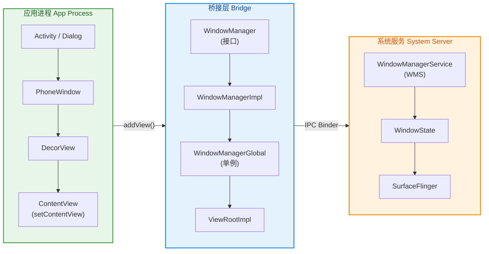

上图清晰展示了从应用层到系统层的完整窗口链路：Activity 持有 PhoneWindow，PhoneWindow 持有 DecorView，通过 WindowManager 接口最终经由 Binder IPC 将窗口信息传递给系统的 WMS。接下来我们逐一深入每个关键角色。

---

### PhoneWindow 实现

#### 唯一实现类的设计哲学

`Window` 是 Android SDK 中定义的一个 **抽象类**（`android.view.Window`），它规定了窗口应当具备的基本能力——如设置内容视图、管理标题栏、处理按键事件等。然而在整个 Android 源码中，`Window` 只有唯一一个实现类：**`PhoneWindow`**（位于 `com.android.internal.policy` 包下）。

为什么只设计一个实现类却仍然使用抽象类？这是典型的 **面向接口编程 + 预留扩展** 思想。Android 最初设计时考虑过多种设备形态（Phone、Tablet、TV、Car），通过抽象 `Window`，可以在不同设备上提供不同的窗口实现。尽管最终收敛为 `PhoneWindow` 一个实现，但抽象层仍然保留了架构的灵活性。对于应用开发者而言，这意味着你永远应该面向 `Window` 接口编程，而非直接依赖 `PhoneWindow` 的内部细节。

#### PhoneWindow 的创建时机

`PhoneWindow` 的创建发生在 **Activity 的 `attach()` 方法** 中。当 AMS（ActivityManagerService）决定启动一个 Activity 后，会通知应用进程的 `ActivityThread`，后者会调用 `Activity.attach()`。在这个方法里，PhoneWindow 被 new 出来并与 Activity 绑定：

```java
// Activity.java — attach() 方法（简化版）
final void attach(Context context, ActivityThread aThread,
        Instrumentation instr, IBinder token, // token：AMS 分配的身份标识
        int ident, Application application, Intent intent,
        ActivityInfo info, CharSequence title, Activity parent,
        String id, NonConfigurationInstances lastNonConfigurationInstances,
        Configuration config, String referrer, IVoiceInteractor voiceInteractor,
        Window window, ActivityConfigCallback activityConfigCallback,
        IBinder assistToken, IBinder shareableActivityToken) {

    // 调用父类 ContextThemeWrapper 的 attachBaseContext，绑定 Context
    attachBaseContext(context);

    // 创建 PhoneWindow 实例 —— 这是整个窗口体系的起点
    mWindow = new PhoneWindow(this, window, activityConfigCallback);

    // 为 PhoneWindow 设置回调 —— Activity 自身实现了 Window.Callback
    // 这使得按键事件、触摸事件等能从 Window 回调到 Activity
    mWindow.setCallback(this);

    // 将 AMS 传入的 token 保存到 Window 中
    // token 是后续向 WMS 添加窗口时的身份凭证
    mWindow.getAttributes().token = token;

    // 设置 WindowManager —— 关联到系统的窗口管理服务
    mWindow.setWindowManager(
            (WindowManager) context.getSystemService(Context.WINDOW_SERVICE),
            mToken, // Activity 的 token
            mComponent.flattenToString(),
            (info.flags & ActivityInfo.FLAG_HARDWARE_ACCELERATED) != 0);

    // 保存 WindowManager 引用，后续 getWindowManager() 返回的就是它
    mWindowManager = mWindow.getWindowManager();
}
```

从这段代码可以看出几个关键信息：

1. **PhoneWindow 在 `onCreate()` 之前就已创建**。`attach()` 先于 `onCreate()` 被调用，因此当你在 `onCreate()` 中调用 `setContentView()` 时，PhoneWindow 已经准备就绪。

2. **Activity 实现了 `Window.Callback` 接口**。这就是为什么 Activity 能接收到 `onKeyDown()`、`onTouchEvent()`、`onMenuOpened()` 等回调——它们本质上是 Window 的回调，Activity 作为 Callback 的实现者被通知。

3. **Token 在此处被设置**。每个 Activity 的 Window 都携带了一个 `IBinder` 类型的 token，这是 AMS 分配的"身份证"，后续会用于 WMS 的合法性校验（详见 Token 验证章节）。

#### setContentView 的内幕

我们在 Activity 中最常调用的 `setContentView(R.layout.xxx)` 实际上是委托给 PhoneWindow 处理的。PhoneWindow 在此过程中完成了一件极为重要的工作——**创建 DecorView 并将我们的布局安装到其中**：

```java
// PhoneWindow.java — setContentView() 核心逻辑（简化版）
@Override
public void setContentView(int layoutResID) {
    // mContentParent 是 DecorView 内部用于放置用户内容的容器
    if (mContentParent == null) {
        // 首次调用：创建 DecorView 和 mContentParent
        installDecor();
    } else if (!hasFeature(FEATURE_CONTENT_TRANSITIONS)) {
        // 非首次调用且无转场动画：清空旧内容
        mContentParent.removeAllViews();
    }

    if (hasFeature(FEATURE_CONTENT_TRANSITIONS)) {
        // 如果设置了内容转场动画，走 Scene/Transition 框架
        final Scene newScene = Scene.getSceneForLayout(mContentParent, layoutResID, getContext());
        transitionTo(newScene);
    } else {
        // 核心步骤：将开发者的布局 XML inflate 到 mContentParent 中
        mLayoutInflater.inflate(layoutResID, mContentParent);
    }

    // 通知 DecorView 内容已更改（触发 insets 重计算等）
    mContentParent.requestApplyInsets();

    // 回调 Activity 的 onContentChanged()
    final Callback cb = getCallback();
    if (cb != null && !isDestroyed()) {
        cb.onContentChanged();
    }
}
```

`installDecor()` 内部做了两件事：创建 `DecorView`（如果还不存在），以及根据当前 Window 的 Feature（如 `FEATURE_NO_TITLE`、`FEATURE_ACTION_BAR`）选择一个系统预定义的布局模板，将其 inflate 到 DecorView 中，并从中找到 `id` 为 `com.android.internal.R.id.content` 的 `FrameLayout` 作为 `mContentParent`。这就是为什么 **`requestWindowFeature()` 必须在 `setContentView()` 之前调用**——因为一旦 DecorView 的模板被确定并 inflate，Feature 就无法再更改了。

---

### DecorView 根视图

#### 什么是 DecorView

`DecorView` 是每个 Activity 窗口中 **最顶层的 View**，它继承自 `FrameLayout`。你可以将其想象为一幅"画框"（Decoration），而你通过 `setContentView()` 添加的布局只是画框中的"画"。DecorView 包含了系统提供的装饰元素——如标题栏（ActionBar/Toolbar 的承载区域）、状态栏背景区域等——以及一个 `id` 为 `android.R.id.content` 的 `FrameLayout`，这才是我们自己布局的真正容器。

视图层级可以用以下结构直观理解：

```kotlin
// DecorView 内部结构示意（伪代码）
DecorView (FrameLayout)               // 窗口最顶层视图
├── LinearLayout (垂直布局)            // 系统选择的装饰模板
│   ├── ViewStub / ActionBarContainer  // 标题栏区域（可能被隐藏）
│   └── FrameLayout                   // id = android.R.id.content
│       └── 你的布局 (setContentView)   // 开发者通过 XML 或代码设置的内容
└── StatusBarBackground               // 状态栏背景绘制（Android 5.0+）
└── NavigationBarBackground           // 导航栏背景绘制（Android 5.0+）
```

#### DecorView 的创建与安装

DecorView 的创建发生在 `PhoneWindow.installDecor()` 中（由 `setContentView()` 触发），但它**真正被添加到 WindowManager**（从而显示到屏幕上）是在 `ActivityThread.handleResumeActivity()` 中：

```java
// ActivityThread.java — handleResumeActivity()（关键片段简化）
@Override
public void handleResumeActivity(ActivityClientRecord r,
        boolean finalStateRequest, boolean isForward, boolean shouldSendCompatFakeFocus,
        String reason) {

    // 先执行 Activity.onResume()
    final Activity a = r.activity;

    if (r.window == null && !a.mFinished && willBeVisible) {
        // 获取 Activity 关联的 Window 和 DecorView
        r.window = r.activity.getWindow();
        View decor = r.window.getDecorView();

        // 此时 DecorView 尚不可见
        decor.setVisibility(View.INVISIBLE);

        // 获取 WindowManager
        ViewManager wm = a.getWindowManager();
        WindowManager.LayoutParams l = r.window.getAttributes();

        // 标记 DecorView 为 Activity 的根视图
        a.mDecor = decor;

        // ★ 核心操作：将 DecorView 添加到 WindowManager
        // 这一步会触发 ViewRootImpl 的创建，建立与 WMS 的连接
        wm.addView(decor, l);
    }

    // 在 addView 完成后，将 DecorView 设为可见
    if (r.activity.mVisibleFromClient) {
        r.activity.makeVisible(); // 内部调用 decor.setVisibility(View.VISIBLE)
    }
}
```

这段逻辑揭示了一个非常重要的事实：**DecorView 在 `onResume()` 之后才被添加到 WindowManager 并最终可见**。这意味着在 `onCreate()` 和 `onStart()` 中，虽然 View 树已经构建完毕，但它尚未被"挂载"到窗口系统中，此时执行 `View.getWidth()` 等测量操作会返回 0。这也是为什么我们通常需要通过 `View.post()` 或 `ViewTreeObserver.OnGlobalLayoutListener` 来获取正确的 View 尺寸。

#### DecorView 与 Window.Callback 的协作

DecorView 在事件分发中扮演着"入口哨兵"的角色。当一个触摸事件从系统侧通过 `InputChannel` 传递到应用进程后，首先到达 `ViewRootImpl`，然后传递到 DecorView。DecorView 的 `dispatchTouchEvent()` 实现并不是直接往子 View 分发，而是先交给 `Window.Callback`（即 Activity）：

```java
// DecorView.java — dispatchTouchEvent()
@Override
public boolean dispatchTouchEvent(MotionEvent ev) {
    // 获取 Window.Callback（通常就是 Activity）
    final Window.Callback cb = mWindow.getCallback();
    // 优先让 Callback 处理 —— 即 Activity.dispatchTouchEvent()
    return cb != null && !mWindow.isDestroyed() && mFeatureId < 0
            ? cb.dispatchTouchEvent(ev)  // 走 Activity 的分发逻辑
            : super.dispatchTouchEvent(ev); // 无 Callback 时直接走 ViewGroup 分发
}
```

这就是 Android 触摸事件分发链的起始段：**InputChannel → ViewRootImpl → DecorView → Activity.dispatchTouchEvent() → PhoneWindow.superDispatchTouchEvent() → DecorView.superDispatchTouchEvent() → ViewGroup 标准分发**。Activity 在这条链路中既是起点的接收者，也是终点的兜底处理者（`onTouchEvent()`）。

---

### WindowManager 服务

#### 接口体系与实现链

在应用层，我们通过 `WindowManager` 接口与窗口系统交互。这个接口继承自 `ViewManager`，后者只定义了三个方法：

```java
// ViewManager.java — 窗口操作的最小接口
public interface ViewManager {
    // 添加一个 View 到窗口系统（附带布局参数）
    void addView(View view, ViewGroup.LayoutParams params);

    // 更新已有 View 的布局参数（位置、大小、Flag 等）
    void updateViewLayout(View view, ViewGroup.LayoutParams params);

    // 从窗口系统中移除一个 View
    void removeView(View view);
}
```

简洁到极致——添加、更新、移除，这就是窗口管理在应用层面的全部操作。`WindowManager` 接口在此基础上增加了获取默认 Display 等能力。其实现链如下：

**`WindowManager`（接口）→ `WindowManagerImpl`（轻量代理）→ `WindowManagerGlobal`（全局单例，真正干活）→ `ViewRootImpl`（每个窗口一个，与 WMS 通信）**

`WindowManagerImpl` 是一个非常"薄"的代理类，几乎所有操作都直接转发给 `WindowManagerGlobal`。之所以存在这个中间层，是因为 `WindowManagerImpl` 是与特定 `Display` 和 `parentWindow` 绑定的，而 `WindowManagerGlobal` 是进程级别的单例。

#### WindowManagerGlobal 的核心数据结构

`WindowManagerGlobal` 维护了三个极为重要的平行列表（parallel arrays），它们记录了当前进程中所有窗口的信息：

```java
// WindowManagerGlobal.java — 三大核心列表
public final class WindowManagerGlobal {
    // 所有已添加的顶层 View（通常是 DecorView）
    private final ArrayList<View> mViews = new ArrayList<>();

    // 每个 View 对应的 ViewRootImpl（窗口与 WMS 的通信桥梁）
    private final ArrayList<ViewRootImpl> mRoots = new ArrayList<>();

    // 每个 View 对应的 WindowManager.LayoutParams（窗口参数）
    private final ArrayList<WindowManager.LayoutParams> mParams = new ArrayList<>();
}
```

当调用 `addView()` 时，`WindowManagerGlobal` 会创建一个新的 `ViewRootImpl`，将 View、ViewRootImpl、LayoutParams 分别存入对应列表，然后调用 `ViewRootImpl.setView()` 发起与 WMS 的 Binder 通信：

```java
// WindowManagerGlobal.java — addView() 核心流程（简化）
public void addView(View view, ViewGroup.LayoutParams params,
        Display display, Window parentWindow, int userId) {

    final WindowManager.LayoutParams wparams = (WindowManager.LayoutParams) params;

    // 如果是子窗口，调整 token 指向父窗口
    if (parentWindow != null) {
        parentWindow.adjustLayoutParamsForSubWindow(wparams);
    }

    ViewRootImpl root;
    synchronized (mLock) {
        // 创建 ViewRootImpl —— 每个窗口的核心管理者
        root = new ViewRootImpl(view.getContext(), display);

        // 设置窗口布局参数
        view.setLayoutParams(wparams);

        // 将三元组存入平行列表
        mViews.add(view);
        mRoots.add(root);
        mParams.add(wparams);

        try {
            // ★ 关键调用：ViewRootImpl 接管 View 并与 WMS 建立连接
            root.setView(view, wparams, panelParentView, userId);
        } catch (RuntimeException e) {
            // 如果添加失败（如 BadTokenException），从列表中移除
            if (index >= 0) {
                removeViewLocked(index, true);
            }
            throw e;
        }
    }
}
```

`ViewRootImpl.setView()` 内部会通过 `IWindowSession`（一个 Binder 代理）调用 `WMS.addWindow()`，这是应用窗口真正"注册"到系统的时刻。如果 token 验证失败，`addWindow()` 会返回错误码，`ViewRootImpl` 将其转换为我们熟知的 `BadTokenException`。

#### WindowManager 的获取方式

应用层获取 `WindowManager` 有两种常见方式，它们存在微妙但重要的差异：

```kotlin
// 方式一：通过 Activity 获取 —— 携带 Activity 的 token 和 Display 信息
val wm1 = activity.windowManager
// 等价于 activity.getSystemService(Context.WINDOW_SERVICE)

// 方式二：通过 Application Context 获取 —— 不携带 Activity token
val wm2 = applicationContext.getSystemService(Context.WINDOW_SERVICE) as WindowManager
```

方式一返回的 `WindowManagerImpl` 绑定了 Activity 的 `parentWindow`（即 Activity 的 PhoneWindow），因此通过它添加的子窗口会自动继承 Activity 的 token。方式二返回的 `WindowManagerImpl` 没有 `parentWindow`，添加窗口时必须手动设置 token 或使用 `TYPE_APPLICATION_OVERLAY`（悬浮窗类型），否则会触发 `BadTokenException`。这就是为什么 **使用 Application Context 弹出 Dialog 会报错** 的根本原因（详见子窗口与对话框章节）。

---

### Token 验证

#### Token 的本质

在 Android 窗口系统中，**Token 是一个 `IBinder` 对象，充当窗口的身份凭证**。它的作用类似于一张"门禁卡"——你想在屏幕上显示一个窗口，就必须出示一个合法的 Token，WMS 会验证这个 Token 是否有效、是否具备添加对应类型窗口的权限。

Token 的生命周期与 Activity 绑定。当 AMS 决定启动一个 Activity 时，会创建一个 `ActivityRecord`（在老版本中是 `ActivityRecord.Token`，实现了 `IApplicationToken`），这个对象的 Binder 引用就是 Token。它随后通过 `Activity.attach()` 传入应用进程，被保存在 `Window.mAppToken` 中。

#### 验证流程

当 `ViewRootImpl.setView()` 将窗口添加请求发送到 WMS 时，WMS 会执行 `addWindow()` 方法。在这个方法中，Token 验证是第一道关卡：

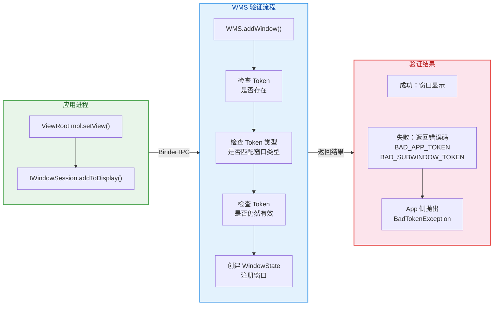

WMS 的验证逻辑可以概括为以下几个核心检查：

1. **Token 存在性检查**：WMS 内部维护了一个 `HashMap<IBinder, WindowToken>` 映射。提交的 Token 必须在这个映射中能找到对应的 `WindowToken` 对象。如果 Activity 已经被销毁（AMS 已通知 WMS 移除了对应的 Token），则查找会失败。

2. **Token 类型匹配**：不同类型的窗口需要不同类型的 Token。应用窗口（`TYPE_APPLICATION` 系列）需要 Activity 的 `AppWindowToken`；子窗口（`TYPE_APPLICATION_PANEL` 等）需要父窗口的 Token；系统窗口（`TYPE_SYSTEM_ALERT` 等）需要特殊权限且 Token 规则不同。

3. **Token 有效性**：即使 Token 存在，如果对应的 Activity 正处于销毁过程中（finishing 状态），WMS 也可能拒绝添加新窗口。

#### 常见的 BadTokenException 场景

理解了 Token 验证机制后，几个经典的崩溃场景就很容易解释了：

**场景一：Activity 销毁后弹 Dialog**

```kotlin
// 错误示例 —— 异步回调中弹 Dialog
fun loadData() {
    // 模拟网络请求
    thread {
        Thread.sleep(3000)
        runOnUiThread {
            // 如果此时 Activity 已经被 finish()，token 已失效
            // 这里会抛出 BadTokenException
            AlertDialog.Builder(this)
                .setMessage("加载完成")
                .show()
        }
    }
}

// 正确做法 —— 检查 Activity 状态
fun loadDataSafe() {
    thread {
        Thread.sleep(3000)
        runOnUiThread {
            // 在弹出 Dialog 之前检查 Activity 是否仍然有效
            if (!isFinishing && !isDestroyed) {
                AlertDialog.Builder(this)
                    .setMessage("加载完成")
                    .show()
            }
        }
    }
}
```

当 Activity 被 `finish()` 后，AMS 会通知 WMS 移除该 Activity 对应的 `AppWindowToken`。如果此时异步回调还在试图使用这个已失效的 Token 添加 Dialog 窗口，WMS 验证失败，返回 `BAD_APP_TOKEN`，应用层就会收到 `BadTokenException`。

**场景二：使用 Application Context 创建 Dialog**

```kotlin
// 错误示例 —— 用 Application Context
val dialog = AlertDialog.Builder(applicationContext) // 没有 Activity token
    .setMessage("Hello")
    .create()
dialog.show() // BadTokenException!
```

Dialog 内部创建的是 `TYPE_APPLICATION` 类型的窗口，这种类型要求提供一个有效的 Activity Token。Application Context 没有关联任何 Activity，自然不携带 Token，WMS 验证必然失败。

**场景三：Service 中弹出悬浮窗未申请权限**

从 Android 8.0（API 26）开始，悬浮窗必须使用 `TYPE_APPLICATION_OVERLAY` 类型，并且需要用户在系统设置中授予 `SYSTEM_ALERT_WINDOW` 权限。如果未申请权限或使用了已废弃的 `TYPE_SYSTEM_ALERT` 等旧类型，同样会导致权限校验失败。

#### Token 的安全设计意义

Token 机制不仅仅是一个技术细节，它承载了 Android 窗口系统的 **安全模型**。试想如果没有 Token 验证：任何应用都可以随意在屏幕上添加窗口、覆盖其他应用的界面，这将带来严重的安全隐患（如钓鱼攻击、点击劫持 clickjacking）。Token 机制确保了：

- **应用窗口必须依附于合法的 Activity**，不能凭空出现。
- **子窗口必须依附于合法的父窗口**，不能脱离宿主。
- **系统级窗口需要额外权限**，由用户明确授权。

这套 Token + 类型 + 权限的三重验证体系，构成了 Android 窗口安全的基石。

---

**📝 练习题**

当一个 Activity 在 `onStop()` 之后，其异步网络回调返回并尝试调用 `AlertDialog.show()`，以下哪种情况最可能发生？

A. Dialog 正常显示，因为 Activity 的 Window Token 在 `onDestroy()` 之后才会失效


B. Dialog 正常显示，但会在 Activity 回到前台时才可见


C. 抛出 `BadTokenException`，因为 `onStop()` 后 Token 一定会被立即移除


D. 是否抛出异常取决于 Activity 是否已被 `finish()`，若仅是被其他 Activity 覆盖（stopped but not finishing），Dialog 可以正常弹出

**【答案】** D

**【解析】** Token 的移除时机与 Activity 的 **销毁**（destroy）流程相关，而非简单的 `onStop()`。当 Activity 仅仅是被另一个 Activity 覆盖（进入 stopped 状态但并未 finish），其 `AppWindowToken` 仍然保留在 WMS 中，此时弹出 Dialog 不会有 Token 问题（Dialog 会在 Activity 所在的窗口层级上显示）。但如果 Activity 已经调用了 `finish()` 并进入了销毁流程，AMS 会通知 WMS 清理对应的 Token，此时再尝试添加窗口就会触发 `BadTokenException`。因此，关键判断依据不是生命周期状态本身，而是 Activity 是否正在被销毁（`isFinishing` / `isDestroyed`）。选项 A 错在"onDestroy 之后才失效"这个说法过于绝对——Token 的清理时机取决于 AMS 的调度，可能在 `onDestroy` 执行前就已发生。选项 C 错在"onStop 后立即移除"——stopped 状态不会触发 Token 移除。

---

## 视图层级结构

在上一节中，我们已经了解了 PhoneWindow、DecorView 以及 WindowManager 之间的关系。但当 DecorView 被"添加"到 WindowManager 之后，真正驱动整棵视图树进行 **测量（Measure）、布局（Layout）、绘制（Draw）** 的核心引擎并不是 Window 本身，而是一个隐藏在幕后的关键角色 —— **ViewRootImpl**。它是连接应用层 View 体系与系统底层渲染管线的桥梁。理解 ViewRootImpl 的职责，以及它如何与 Choreographer（编舞者）和 Surface（画布容器）协作，是深入掌握 Android 视图架构的基石。

从宏观视角看，一帧画面从"应用代码请求刷新"到"像素最终亮屏"，需要经历一条完整的链路：**应用层发起 invalidate → ViewRootImpl 调度 → Choreographer 对齐 VSync → 遍历 View 树（measure/layout/draw）→ 将绘制指令写入 Surface → SurfaceFlinger 合成送显**。本节将沿着这条链路，逐一拆解每个关键组件的角色与原理。

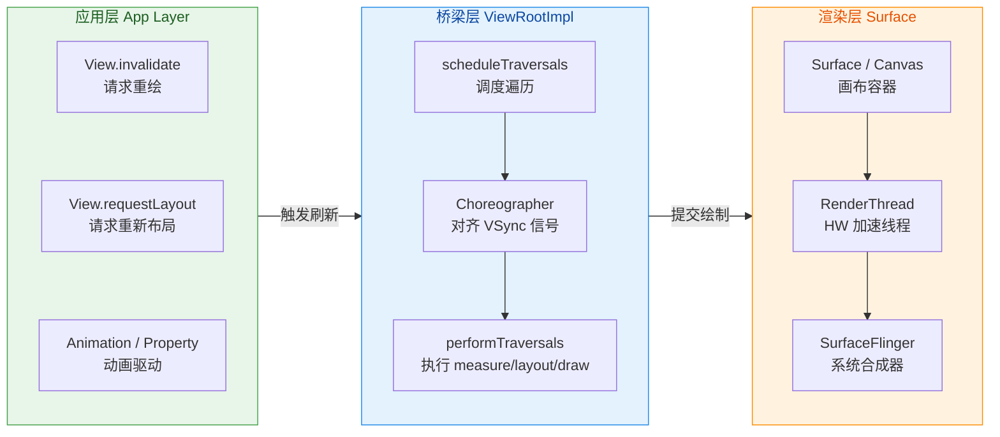

这张图勾勒了本节的三大主角之间的协作关系。接下来我们逐一深入。

---

### ViewRootImpl 职责

#### 什么是 ViewRootImpl

ViewRootImpl 是 `android.view` 包下的一个 **非公开类**（对应用开发者不直接可见），但它是整个视图系统最核心的调度中枢。每当你调用 `WindowManager.addView(decorView, params)` 时，WindowManagerGlobal 内部会为这个 DecorView 创建一个与之一一对应的 ViewRootImpl 实例。换句话说，**一个 Window（DecorView）对应一个 ViewRootImpl**。

ViewRootImpl 实现了 `ViewParent` 接口。虽然 DecorView 在视图树中看起来是"根节点"，但在逻辑上，ViewRootImpl 才是 DecorView 的 **parent**。当任何子 View 调用 `invalidate()` 或 `requestLayout()` 时，调用链会沿着 `mParent` 指针一路向上传递，最终到达 ViewRootImpl，由它统一决定何时、如何执行一次完整的视图遍历。

#### ViewRootImpl 的核心职责一览

ViewRootImpl 承担的职责远超"调用 measure/layout/draw"这么简单，它实际上是一个多功能的协调器：

**1. 视图遍历的调度者（Traversal Scheduler）**

这是 ViewRootImpl 最广为人知的职责。当 View 树中任何节点发生变化（内容变化触发 `invalidate`，尺寸变化触发 `requestLayout`），ViewRootImpl 不会立刻执行遍历，而是调用 `scheduleTraversals()` 方法，向 Choreographer 注册一个 **CALLBACK_TRAVERSAL** 类型的回调，等待下一个 VSync 信号到来时才真正执行 `performTraversals()`。这种"延迟合并"的设计至关重要——一帧之内无论有多少个 View 调用了 `invalidate()`，ViewRootImpl 只会执行 **一次** 完整遍历，避免了不必要的重复工作。

`scheduleTraversals()` 内部还会通过 `mTraversalBarrier`（同步屏障，Sync Barrier）将一条特殊消息插入 MessageQueue。同步屏障的作用是：在该屏障之后，MessageQueue 只处理 **异步消息**（async message），而 Choreographer 发出的 VSync 回调恰好就是异步消息。这样可以确保 UI 遍历获得 **最高优先级**，不会被其他普通 Handler 消息（如网络回调、数据库操作）插队延迟，从而保障帧率稳定性。

```java
// ViewRootImpl.java 核心调度逻辑（简化）
void scheduleTraversals() {
    // 如果已经调度过，则不重复调度（合并多次请求）
    if (!mTraversalScheduled) {
        // 标记为已调度
        mTraversalScheduled = true;
        // 向 MessageQueue 插入同步屏障，阻塞后续同步消息
        mTraversalBarrier = mHandler.getLooper().getQueue().postSyncBarrier();
        // 向 Choreographer 注册 CALLBACK_TRAVERSAL 类型回调
        // mTraversalRunnable 内部会调用 doTraversal() -> performTraversals()
        mChoreographer.postCallback(
            Choreographer.CALLBACK_TRAVERSAL,  // 回调类型
            mTraversalRunnable,                // 执行体
            null                               // token
        );
    }
}
```

**2. 输入事件的分发入口（Input Dispatcher）**

ViewRootImpl 是应用进程接收触摸事件、按键事件的第一站。它内部持有一个 `WindowInputEventReceiver`（继承自 InputEventReceiver），通过 InputChannel 与系统的 InputDispatcher 进程建立 Socket 连接。当用户触摸屏幕时，事件的传递路径是：**硬件驱动 → InputReader → InputDispatcher → （通过 InputChannel 跨进程）→ ViewRootImpl.WindowInputEventReceiver → ViewRootImpl 的事件处理管线 → DecorView.dispatchTouchEvent → Activity.dispatchTouchEvent → 具体的 View**。

ViewRootImpl 内部维护了一条 **InputStage 责任链**，事件依次经过多个 Stage 处理（如 `NativePreImeInputStage`、`ImeInputStage`、`ViewPostImeInputStage` 等）。其中 `ViewPostImeInputStage` 最终会将事件传递给 DecorView，从而进入我们熟悉的 `onTouchEvent` / `onKeyDown` 等回调。

**3. Surface 的管理者（Surface Manager）**

ViewRootImpl 持有一个 `Surface` 对象，这是视图树绘制内容的最终目的地。在 `performTraversals()` 执行过程中，如果检测到 Surface 尚未创建或需要更新（例如窗口大小变化），ViewRootImpl 会通过 `relayoutWindow()` 向 WMS（WindowManagerService）发起一次 IPC 调用，WMS 会在 SurfaceFlinger 中为该窗口分配或调整 Surface 缓冲区，然后将有效的 Surface 句柄返回给 ViewRootImpl。一旦拿到有效 Surface，View 树的绘制操作就有了"画布"。

**4. Window 属性的同步者（Window Attribute Synchronizer）**

当应用层修改了 `WindowManager.LayoutParams`（比如改变窗口 Flag、调整软键盘模式），这些属性变更最终也由 ViewRootImpl 在 `performTraversals()` 中打包发送给 WMS。也就是说，ViewRootImpl 是应用进程与 WMS 之间的 **唯一通信代理**。

**5. 绘制模式的决策者（Draw Mode Decider）**

ViewRootImpl 会根据当前设备是否支持硬件加速、窗口是否开启了 `FLAG_HARDWARE_ACCELERATED`，来决定使用 **软件绘制（Software Rendering）** 还是 **硬件加速绘制（Hardware Accelerated Rendering）**。在硬件加速模式下，`performDraw()` 不会调用 `View.draw(Canvas)` 走传统的 Canvas 路径，而是通过 `ThreadedRenderer`（内部使用 RenderNode 和 DisplayList）将绘制指令录制下来，随后交给 RenderThread 异步执行 GPU 渲染。

#### performTraversals 的完整流程

`performTraversals()` 是 ViewRootImpl 中最长、最复杂的方法之一（源码超过千行），但其核心逻辑可以归纳为三大阶段：

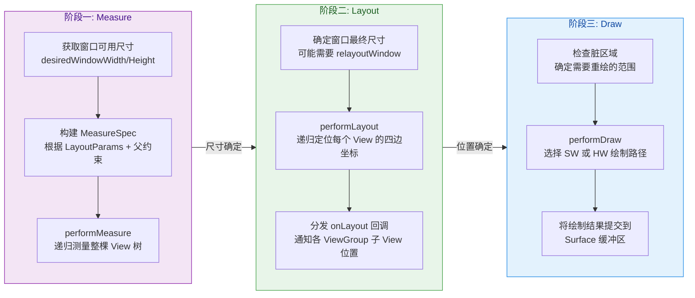

在 **Measure 阶段**，ViewRootImpl 会根据窗口尺寸和 DecorView 的 LayoutParams，构建出根 MeasureSpec，然后调用 `performMeasure()`，DecorView 的 `measure()` 方法被触发，进而递归测量所有子 View。如果 View 树中存在 `wrap_content` 或权重（weight）等复杂约束，可能需要执行 **两次甚至多次** 测量才能确定最终尺寸。

在 **Layout 阶段**，当所有 View 的 measuredWidth/measuredHeight 确定后，ViewRootImpl 调用 `performLayout()`，从 DecorView 开始递归调用 `layout()` 方法，将每个 View 的 left、top、right、bottom 四边坐标最终确定下来。

在 **Draw 阶段**，ViewRootImpl 调用 `performDraw()`，如果是硬件加速模式（绝大多数现代设备），则通过 `ThreadedRenderer.draw()` 录制 DisplayList 并交由 RenderThread 处理；如果是软件渲染，则通过 `Surface.lockCanvas()` 获取一块画布，调用 `DecorView.draw(canvas)` 完成绘制，再通过 `Surface.unlockCanvasAndPost()` 将结果提交。

#### ViewRootImpl 与 DecorView 的绑定时机

一个关键的时序问题是：ViewRootImpl **何时** 与 DecorView 建立连接？答案藏在 Activity 的启动流程中。当 ActivityThread 执行 `handleResumeActivity()` 时，它会做两件事情：首先调用 `activity.onResume()`，然后调用 `wm.addView(decor, l)`。正是在 `addView` 的调用链中，`WindowManagerGlobal.addView()` 会 `new ViewRootImpl()`，并调用 `viewRootImpl.setView(decorView, params, ...)`。

`setView()` 方法是整个连接的起点。在此方法中，ViewRootImpl 会：
- 将 DecorView 保存为 `mView` 成员变量；
- 调用 `requestLayout()` 触发第一次 `performTraversals()`；
- 通过 `mWindowSession.addToDisplayAsUser()` 向 WMS 发起跨进程调用，真正将窗口注册到系统中；
- 创建 `InputChannel` 并注册 `WindowInputEventReceiver`，建立输入事件通道。

这意味着 **在 `onResume()` 执行完毕后**，View 才真正开始了它的第一次测量、布局和绘制。这也解释了为什么在 `onCreate()` 或 `onResume()` 中直接调用 `view.getWidth()` 返回值为 0 —— 因为此时 ViewRootImpl 尚未完成第一次 `performTraversals()`。如果需要在这些生命周期中获取 View 的实际尺寸，应该使用 `View.post(Runnable)` 或 `ViewTreeObserver.OnGlobalLayoutListener`。

```kotlin
// 在 onCreate 中安全获取 View 尺寸的方式
override fun onCreate(savedInstanceState: Bundle?) {
    super.onCreate(savedInstanceState)
    setContentView(R.layout.activity_main)

    val textView = findViewById<TextView>(R.id.text_view)

    // 方式一：View.post —— Runnable 会在下一次 performTraversals 之后执行
    textView.post {
        // 此时 View 已完成至少一次 measure + layout
        val width = textView.width   // 可以拿到实际宽度
        val height = textView.height // 可以拿到实际高度
    }

    // 方式二：OnGlobalLayoutListener —— 在 layout 完成后回调
    textView.viewTreeObserver.addOnGlobalLayoutListener(
        object : ViewTreeObserver.OnGlobalLayoutListener {
            override fun onGlobalLayout() {
                // 移除监听，避免重复回调
                textView.viewTreeObserver.removeOnGlobalLayoutListener(this)
                val width = textView.width
                val height = textView.height
            }
        }
    )
}
```

---

### Choreographer 编舞者连接

#### 为什么需要 Choreographer

在 Android 4.1（API 16，Project Butter）之前，UI 的刷新是"随心所欲"的——应用在任何时刻都可能发起绘制，而这些绘制操作与屏幕刷新周期（VSync）并不同步。这会导致两个典型问题：

- **画面撕裂（Tearing）**：CPU/GPU 正在向 Buffer 写入新帧数据的同时，Display 正在从该 Buffer 读取旧帧数据进行显示，导致屏幕上半部分是旧帧、下半部分是新帧。
- **丢帧 / 卡顿（Jank）**：由于没有统一的节拍，应用可能在一个 VSync 周期内启动了绘制但没有完成，导致显示设备连续两帧都显示同一内容（即"丢帧"）。

Project Butter 引入了 **VSync 同步机制**，其核心思想是：所有 UI 相关的工作（动画计算、输入处理、View 遍历）都必须 **对齐到 VSync 信号**，在每个 VSync 脉冲到来时统一启动，在下一个 VSync 到来前完成。而 **Choreographer** 就是这个同步机制在应用进程中的落地实现。

Choreographer 这个名字取得非常形象——就像一位编舞者，它不直接跳舞，而是在固定节拍（VSync）到来时，依次指挥各位"舞者"（输入处理、动画、布局绘制）按顺序上场表演。

#### Choreographer 的工作原理

Choreographer 是一个 **线程单例**（per-Looper singleton），通过 `ThreadLocal` 与当前线程的 Looper 绑定。对于主线程来说，整个应用进程只有一个主线程 Choreographer 实例。它的核心数据结构是 **四个回调队列**（CallbackQueue），分别对应四种类型的工作：

| 回调类型 | 常量名 | 执行顺序 | 典型注册者 |
|---------|--------|---------|-----------|
| 输入事件 | `CALLBACK_INPUT` | 1（最先） | InputEventReceiver |
| 动画 | `CALLBACK_ANIMATION` | 2 | ValueAnimator / ObjectAnimator |
| Insets 动画 | `CALLBACK_INSETS_ANIMATION` | 3 | WindowInsetsAnimation |
| 视图遍历 | `CALLBACK_TRAVERSAL` | 4（最后） | ViewRootImpl |

每个 VSync 信号到来时，Choreographer 会按照上述顺序依次执行各队列中的回调。这个顺序的设计意图非常明确：**先处理用户输入**（例如手指滑动产生的新位置），**再计算动画**（根据时间插值器计算属性新值），**最后执行视图遍历**（将输入和动画的结果反映到 View 树上）。这样可以保证每一帧绘制的内容都是基于最新的用户交互和动画状态。

#### VSync 信号的接收

Choreographer 内部持有一个 `FrameDisplayEventReceiver`（继承自 `DisplayEventReceiver`），它通过 native 层与 SurfaceFlinger 建立连接，能够接收硬件 VSync 脉冲。但需要注意的是，为了节省电量，Choreographer **不会** 持续监听 VSync。只有当有回调被注册时（即 `postCallback` 被调用），它才会调用 `scheduleVsyncLocked()` 向系统请求 **下一个** VSync 信号。这种"按需请求"的策略意味着：如果界面完全静止，没有动画、没有触摸、没有重绘请求，Choreographer 不会收到任何 VSync 信号，CPU 也不会被无谓唤醒。

当 VSync 信号到达时，`FrameDisplayEventReceiver.onVsync()` 被回调。该方法并不直接执行回调队列，而是向主线程的 MessageQueue 发送一条 **异步消息**。当 Looper 处理到这条消息时，`Choreographer.doFrame()` 方法被调用，这才是真正执行各回调的入口。

```java
// Choreographer.doFrame() 核心逻辑（简化）
void doFrame(long frameTimeNanos, int frame) {
    // 1. 计算实际开始时间与 VSync 时间的差值（jitter）
    long jitterNanos = System.nanoTime() - frameTimeNanos;

    // 2. 如果差值超过一个帧周期，说明主线程被阻塞，需要跳帧
    if (jitterNanos >= mFrameIntervalNanos) {
        // 计算跳过的帧数
        long skippedFrames = jitterNanos / mFrameIntervalNanos;
        // 超过 30 帧会打印著名的 "Skipped XX frames!" 警告日志
        if (skippedFrames >= SKIPPED_FRAME_WARNING_LIMIT) {
            Log.i(TAG, "Skipped " + skippedFrames + " frames! "
                + "The application may be doing too much work on its main thread.");
        }
    }

    // 3. 按顺序依次执行四种回调
    doCallbacks(Choreographer.CALLBACK_INPUT, frameTimeNanos);      // 输入
    doCallbacks(Choreographer.CALLBACK_ANIMATION, frameTimeNanos);  // 动画
    doCallbacks(Choreographer.CALLBACK_INSETS_ANIMATION, frameTimeNanos); // Insets
    doCallbacks(Choreographer.CALLBACK_TRAVERSAL, frameTimeNanos);  // 遍历
}
```

上面代码中那条经典的 `"Skipped XX frames!"` 日志，相信每位 Android 开发者都不陌生。它的触发原理就在这里：如果主线程在上一帧周期内执行了耗时操作（如数据库查询、复杂计算），导致 `doFrame()` 的实际执行时间远远晚于 VSync 时间戳，Choreographer 就会检测到这种延迟并打印警告。

#### 一帧的完整时间线

将 ViewRootImpl 和 Choreographer 的协作串联起来，一帧的完整时间线如下所示：

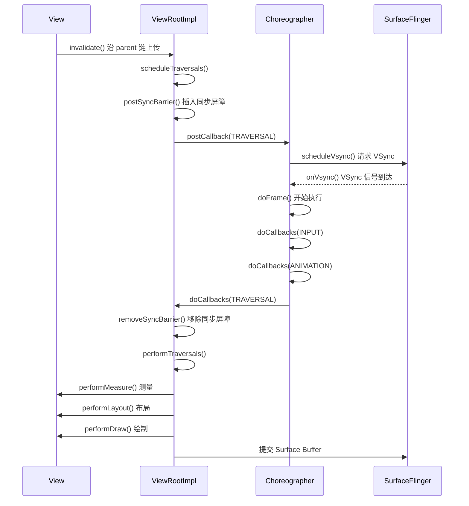

#### Choreographer 与帧率监控

Choreographer 对外暴露了 `postFrameCallback(FrameCallback)` API，允许应用开发者在每一帧开始时收到回调。这个 API 是实现 **帧率监控** 和 **自定义动画引擎** 的基础。许多性能监控框架（如 Tencent Matrix、TinyDancer）都利用此 API 计算相邻两帧的时间差，从而统计 FPS 和丢帧情况：

```kotlin
// 简易帧率监控示例
class FpsMonitor : Choreographer.FrameCallback {
    // 上一帧的时间戳（纳秒）
    private var lastFrameTimeNanos = 0L
    // 帧计数器
    private var frameCount = 0
    // 统计起始时间
    private var startTimeNanos = 0L

    override fun doFrame(frameTimeNanos: Long) {
        if (lastFrameTimeNanos == 0L) {
            // 首帧初始化
            lastFrameTimeNanos = frameTimeNanos
            startTimeNanos = frameTimeNanos
        }

        // 计算与上一帧的间隔
        val intervalMs = (frameTimeNanos - lastFrameTimeNanos) / 1_000_000
        if (intervalMs > 16.67 * 2) {
            // 间隔超过两个帧周期，视为丢帧
            Log.w("FPS", "帧间隔过大: ${intervalMs}ms，可能丢帧")
        }

        frameCount++
        // 每秒统计一次 FPS
        val elapsedSec = (frameTimeNanos - startTimeNanos) / 1_000_000_000.0
        if (elapsedSec >= 1.0) {
            Log.d("FPS", "当前 FPS: ${(frameCount / elapsedSec).toInt()}")
            frameCount = 0
            startTimeNanos = frameTimeNanos
        }

        lastFrameTimeNanos = frameTimeNanos
        // 注册下一帧回调（必须每帧重新注册）
        Choreographer.getInstance().postFrameCallback(this)
    }

    // 启动监控
    fun start() {
        Choreographer.getInstance().postFrameCallback(this)
    }
}
```

值得注意的是，`postFrameCallback` 注册的回调属于 `CALLBACK_ANIMATION` 类型，因此它在 `CALLBACK_INPUT` 之后、`CALLBACK_TRAVERSAL` 之前执行。这也是为什么许多自定义动画框架（如 Lottie 的某些实现路径）选择通过 Choreographer 而非 `ValueAnimator` 来驱动动画——它们可以更精准地控制每一帧的动画计算时机。

---

### Surface 画布容器

#### Surface 的本质

如果把 View 树比作一位画家的创作构思（"画什么"、"画在哪里"），那么 **Surface** 就是画家面前那张真实的画布（"画在上面"）。Surface 是 Android 图形系统中一个核心的底层抽象，它封装了一块 **共享内存缓冲区（GraphicBuffer / AHardwareBuffer）**，CPU 或 GPU 的绘制操作最终都会写入这块缓冲区，而 SurfaceFlinger（系统合成器）则从中读取数据进行屏幕合成。

从类的定义来看，`android.view.Surface` 实现了 `Parcelable` 接口，这意味着它可以跨进程传输。事实上，Surface 的创建和管理涉及三个进程的协作：

- **App 进程**：持有 `Surface` 对象，通过 Canvas 或 OpenGL ES 向其写入绘制数据；
- **system_server 进程（WMS）**：管理窗口的元数据（位置、大小、层级），通过 SurfaceControl 控制 Surface 的状态；
- **SurfaceFlinger 进程**：拥有 Surface 对应的 BufferQueue，负责将多个窗口的 Surface 合成最终帧并送显。

#### BufferQueue 双缓冲 / 三缓冲机制

Surface 的底层核心是 **BufferQueue**，这是一个典型的 **生产者-消费者** 模型：

- **生产者（Producer）**：App 的渲染线程（UI Thread 或 RenderThread），负责向 Buffer 中写入帧数据；
- **消费者（Consumer）**：SurfaceFlinger，负责从 Buffer 中读取帧数据并合成显示。

BufferQueue 通常维护 2~3 个 GraphicBuffer（即双缓冲或三缓冲）。其工作流程是：

1. 生产者调用 `dequeueBuffer()` 从队列中获取一个空闲的 Buffer；
2. 生产者向该 Buffer 写入绘制内容（通过 Canvas 软件绘制或 GPU 硬件渲染）；
3. 生产者调用 `queueBuffer()` 将填充好的 Buffer 放回队列，标记为"已填充"；
4. 消费者（SurfaceFlinger）在下一个 VSync 时调用 `acquireBuffer()` 获取已填充的 Buffer 进行合成；
5. 合成完成后，消费者调用 `releaseBuffer()` 释放该 Buffer，使其回到空闲状态。

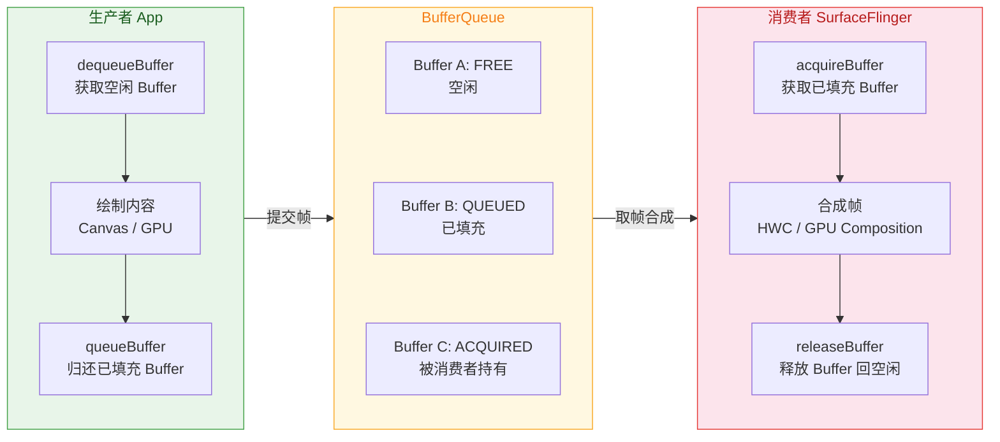

**为什么需要多缓冲？** 如果只有一个 Buffer，生产者和消费者必须交替使用它（即"单缓冲"），这意味着在 SurfaceFlinger 读取 Buffer 进行合成期间，App 无法写入新帧，反之亦然——二者无法并行工作，帧率会大打折扣。引入双缓冲后，App 可以在一个 Buffer 上绘制的同时，SurfaceFlinger 从另一个 Buffer 读取，实现了流水线并行。而 **三缓冲**（Project Butter 引入）则进一步优化了当某一帧超时时的丢帧情况：即使当前帧的绘制超时，App 仍有一个额外的 Buffer 可用于准备下下帧的内容，从而缩短从丢帧到恢复的时间。

#### Surface 与 ViewRootImpl 的关系

在 ViewRootImpl 内部，`mSurface` 是一个 Java 层的 Surface 对象。它最初是一个空壳（isValid() 返回 false），直到 `performTraversals()` 中第一次调用 `relayoutWindow()` 时，WMS 会在 SurfaceFlinger 中创建真正的 BufferQueue 和 Layer，然后将有效的 Surface 句柄通过 Binder 返回给 ViewRootImpl。此后，ViewRootImpl 就可以使用这个 Surface 进行绘制了。

```java
// ViewRootImpl 中 relayoutWindow 的简化逻辑
private int relayoutWindow(WindowManager.LayoutParams params, ...) throws RemoteException {
    // 通过 IPC 调用 WMS 的 relayout 方法
    // mSurface 作为出参，WMS 会将有效 Surface 填充到这个对象中
    int result = mWindowSession.relayout(
        mWindow,          // IWindow binder 对象
        params,           // 窗口属性
        ...,
        mSurface,         // [出参] WMS 将 Surface 填充于此
        ...
    );
    return result;
}
```

#### 软件绘制 vs 硬件加速绘制

Surface 为上层提供了两种绘制路径：

**软件绘制路径（Software Rendering）：**

在软件绘制模式下，ViewRootImpl 调用 `surface.lockCanvas(dirtyRect)` 锁定 Surface 的一个区域，获得一个 `Canvas` 对象。这个 Canvas 直接映射到 GraphicBuffer 的内存——所有通过 Canvas API（`drawRect`、`drawText`、`drawBitmap`）执行的绘制操作，都是 CPU 在直接操作这块共享内存中的像素数据。绘制完成后，调用 `surface.unlockCanvasAndPost()` 将 Buffer 提交给 SurfaceFlinger。

软件绘制的最大问题是：**任何一个 View 的 invalidate 都会导致它和所有相交的兄弟 View 全部重绘**（因为 CPU 直接操作像素，脏区域内的内容必须全部重写）。这对于复杂 UI 来说性能开销巨大。

**硬件加速路径（Hardware Accelerated Rendering）：**

从 Android 3.0 开始引入、Android 4.0 起默认开启的硬件加速彻底改变了绘制模型。在硬件加速模式下，每个 View 的绘制操作不再直接产生像素，而是被录制为一系列 **DisplayList 指令**（封装在 `RenderNode` 中）。当需要绘制时，`ThreadedRenderer`（由 ViewRootImpl 持有）将整棵 RenderNode 树同步给 **RenderThread**（一个独立的渲染线程），RenderThread 使用 OpenGL ES / Vulkan 将 DisplayList 转化为 GPU 指令，GPU 将结果写入 Surface 的 GraphicBuffer。

硬件加速的核心优势在于：

1. **局部更新**：如果只有某个 View 的内容变化了，只需重新录制该 View 的 DisplayList，其他 View 的 DisplayList 直接复用，极大减少了绘制工作量；
2. **主线程解放**：实际的 GPU 渲染在 RenderThread 上执行，主线程在提交 DisplayList 后就可以继续处理其他消息，减少了主线程阻塞；
3. **GPU 并行**：GPU 天生擅长并行的像素操作（着色、混合、抗锯齿），效率远高于 CPU 逐像素计算。

```kotlin
// 判断当前 View 是否处于硬件加速环境
val isHardwareAccelerated = view.isHardwareAccelerated  // true = HW, false = SW

// 在自定义 View 中，某些 Canvas 操作在硬件加速下不支持
// 例如：Canvas.drawPicture() 在部分设备上不兼容
// 可以对单个 View 关闭硬件加速
view.setLayerType(View.LAYER_TYPE_SOFTWARE, null)

// 也可以在 AndroidManifest.xml 中对整个 Activity 关闭
// <activity android:hardwareAccelerated="false" />
```

#### SurfaceView 与 TextureView

标准的 View 树共享同一个 Surface（即 ViewRootImpl 持有的那个 Surface）。但某些场景下，比如视频播放、相机预览、游戏渲染，需要一个 **独立的 Surface** 来承载高频、大量的图形数据。Android 提供了两种方案：

**SurfaceView**：它在 Window 中"挖"了一个洞（实际上是创建了一个独立的 Surface Layer，Z-order 位于主 Window 的 Surface 之下或之上）。SurfaceView 拥有自己独立的 Surface 和 BufferQueue，其绘制可以在 **任何线程** 上进行（不受主线程限制），非常适合高性能渲染场景。但代价是它不参与 View 树的动画和变换（如 alpha、translation、scale），因为它本质上是一个独立的窗口层，不受父 View 的 Canvas 变换矩阵影响。从 Android 7.0 起这个限制有所放宽，但在复杂的动画场景中仍需注意。

**TextureView**：它通过 SurfaceTexture 将一个独立 Surface 的内容作为 OpenGL 纹理接入主 View 树的渲染管线。这意味着 TextureView 可以像普通 View 一样参与动画、裁剪、变换。但代价是它必须在硬件加速环境下工作，且渲染内容需要额外的纹理拷贝操作（多一次 GPU 纹理采样），性能略低于 SurfaceView。

| 对比维度 | SurfaceView | TextureView |
|---------|------------|-------------|
| 独立 Surface | ✅ 是 | ✅ 是（通过 SurfaceTexture） |
| 可在非主线程绘制 | ✅ 是 | ✅ 是 |
| 参与 View 动画/变换 | ❌ 有限 | ✅ 完全支持 |
| 硬件加速要求 | 无 | 必须 |
| 性能 | 更优（零拷贝） | 稍差（纹理拷贝） |
| 典型用途 | 视频、游戏、相机 | 需要动画的视频、直播悬浮窗 |

#### Surface 的生命周期

Surface 的有效期与 Window 的可见状态紧密相关。当 Activity 进入后台（`onStop`）时，WMS 可能会销毁其 Surface 以回收内存（特别是在内存紧张时）。当 Activity 重新回到前台时，ViewRootImpl 会通过 `relayoutWindow()` 重新获取有效的 Surface，并触发一次完整的 `performTraversals()` 来重新绘制内容。

对于使用 SurfaceView 的开发者来说，需要通过 `SurfaceHolder.Callback` 来监听 Surface 的创建和销毁事件（`surfaceCreated` / `surfaceDestroyed`），在 Surface 可用时启动渲染线程，在 Surface 销毁时停止渲染，否则会导致 `IllegalStateException`（向已失效的 Surface 写入数据）。

```kotlin
class GameSurfaceView(context: Context) : SurfaceView(context), SurfaceHolder.Callback {

    // 渲染线程引用
    private var renderThread: RenderThread? = null

    init {
        // 注册 Surface 生命周期监听
        holder.addCallback(this)
    }

    override fun surfaceCreated(holder: SurfaceHolder) {
        // Surface 已创建，可以安全地开始绘制
        renderThread = RenderThread(holder).also { it.start() }
    }

    override fun surfaceChanged(holder: SurfaceHolder, format: Int, width: Int, height: Int) {
        // Surface 尺寸或格式变化时调用
        // 通知渲染线程更新视口大小
        renderThread?.updateSize(width, height)
    }

    override fun surfaceDestroyed(holder: SurfaceHolder) {
        // Surface 即将销毁，必须停止渲染线程
        renderThread?.stopRendering()
        renderThread = null
    }
}
```

---

**📝 练习题**

在 Android 的视图刷新流程中，当某个 View 调用 `invalidate()` 后，以下关于事件处理顺序的描述，正确的是？

A. `invalidate()` 直接触发 `performTraversals()`，同步完成当前帧的绘制


B. `ViewRootImpl.scheduleTraversals()` 向 Choreographer 注册回调，等待 VSync 到来后，按 INPUT → ANIMATION → TRAVERSAL 的顺序执行


C. Choreographer 在收到 VSync 后，先执行 TRAVERSAL 回调完成绘制，再执行 ANIMATION 回调更新动画


D. `scheduleTraversals()` 每次调用都会向 Choreographer 注册一个新的回调，同一帧内可能执行多次 `performTraversals()`


**【答案】** B

**【解析】** 当 View 调用 `invalidate()` 后，调用链会沿 `mParent` 上溯到 ViewRootImpl，触发 `scheduleTraversals()`。该方法首先检查 `mTraversalScheduled` 标志位，如果已经调度过，则直接返回（排除 D）。它会向 MessageQueue 插入同步屏障，然后向 Choreographer 注册 `CALLBACK_TRAVERSAL` 类型的回调，等待下一个 VSync 信号。VSync 到来后，`Choreographer.doFrame()` 按照 INPUT → ANIMATION → INSETS_ANIMATION → TRAVERSAL 的固定顺序执行各回调队列（排除 C）。`performTraversals()` 在 TRAVERSAL 回调中被调用，完成 measure → layout → draw 三阶段。整个过程是异步的，不会在 `invalidate()` 调用时同步执行（排除 A）。

---

**📝 练习题**

关于 Android 的 Surface 与绘制机制，以下说法 **错误** 的是？

A. Surface 的底层是 BufferQueue，采用生产者-消费者模型，App 是生产者，SurfaceFlinger 是消费者


B. 在硬件加速模式下，View 的绘制操作被录制为 DisplayList，由 RenderThread 使用 GPU 异步渲染


C. SurfaceView 拥有独立的 Surface，可以在任意线程绘制，但完全不支持 View 的 alpha、translation 等动画属性


D. ViewRootImpl 通过 `relayoutWindow()` 向 WMS 请求创建或更新 Surface，Surface 的有效期与 Window 的可见状态相关


**【答案】** C

**【解析】** A 正确，Surface 底层确实是基于 BufferQueue 的生产者-消费者模型。B 正确，硬件加速下绘制指令被录制为 DisplayList（存储在 RenderNode 中），由 RenderThread 驱动 GPU 完成实际渲染。D 正确，Surface 的创建和更新都通过 ViewRootImpl 的 `relayoutWindow()` IPC 调用完成。C 说法过于绝对——SurfaceView 确实在早期版本中不支持 View 动画变换，但从 **Android 7.0（API 24）** 起，系统对 SurfaceView 进行了改进，使其能够在一定程度上支持平移、缩放等变换操作。因此"完全不支持"的说法是错误的。

---

## 窗口属性详解

每一个显示在 Android 屏幕上的窗口，最终都会被 WindowManagerService（WMS）以一组 **`WindowManager.LayoutParams`** 来描述和管理。这个类就是窗口属性的"总容器"——它不仅继承自 `ViewGroup.LayoutParams` 提供宽高信息，还额外携带了 **type（窗口类型）**、**flags（行为标志位）**、**softInputMode（软键盘交互模式）**、gravity、format、token 等数十个字段。可以说，`LayoutParams` 是应用层与 WMS 之间的"协议书"：应用通过填写这份协议书，告诉系统"我要一个什么样的窗口"；WMS 读取协议书，决定窗口如何叠放、如何响应输入、如何与软键盘协同。

在上一节我们已经知道，`WindowManager.addView(view, params)` 是将视图树交给系统显示的入口，而这里的 `params` 正是 `WindowManager.LayoutParams`。本节将深入拆解其中最核心的三个维度：**Type（层级类型）**决定窗口在 Z 轴上的位置；**Flags（标志位）**决定窗口的交互行为和视觉特征；**SoftInputMode（软键盘模式）**决定窗口与输入法之间的协调策略。

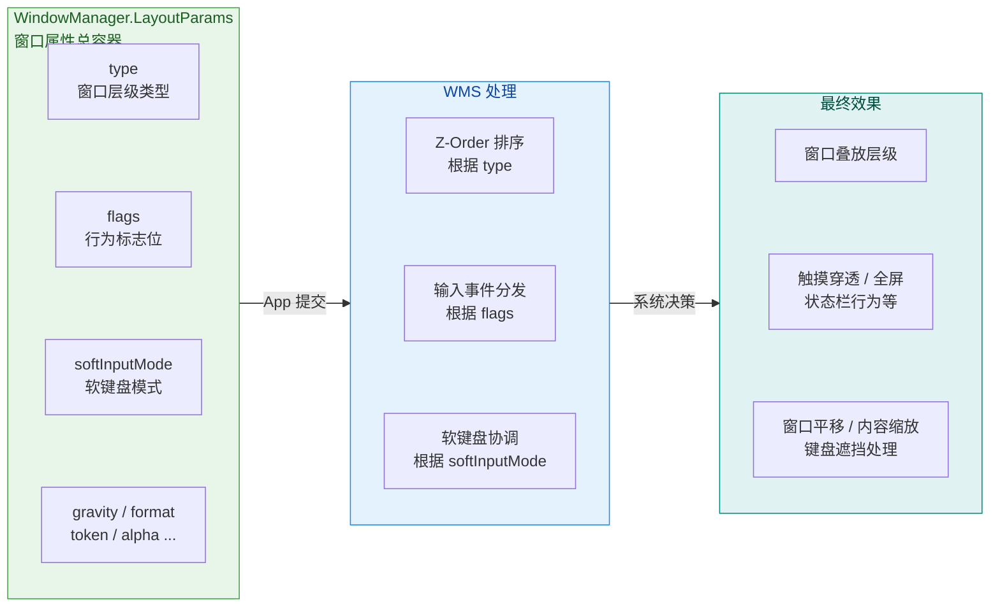

---

### Window.Type 层级类型

#### 一、Type 的本质：Z-Order 的决定因素

Android 的窗口系统是一个 **二维半（2.5D）** 的叠放模型——所有窗口在同一块屏幕上，沿 Z 轴（垂直于屏幕方向）分层叠放。用户看到的就是从上往下"俯视"的结果：Z 值高的窗口遮住 Z 值低的窗口。而 **`type` 字段**，正是 WMS 用来决定窗口初始 Z-Order 的首要依据。

`type` 是一个 `int` 值，定义在 `WindowManager.LayoutParams` 中，其取值范围被划分为三个大区间，每个区间对应一类窗口：

| 类别 | 常量范围 | 含义 | 典型举例 |
|------|---------|------|---------|
| **Application Window** | `1 ~ 99` | 应用窗口，依附于 Activity | `TYPE_BASE_APPLICATION (1)`、`TYPE_APPLICATION (2)` |
| **Sub-Window** | `1000 ~ 1999` | 子窗口，必须依附于父窗口 | `TYPE_APPLICATION_PANEL (1000)`、`TYPE_APPLICATION_MEDIA (1001)` |
| **System Window** | `2000 ~ 2999` | 系统窗口，需要特殊权限 | `TYPE_STATUS_BAR (2000)`、`TYPE_TOAST (2005)`、`TYPE_APPLICATION_OVERLAY (2038)` |

这个设计体现了一个清晰的分层哲学：**数值越大，层级越高**。系统窗口天然位于应用窗口之上，这就是为什么状态栏、导航栏、来电界面总能覆盖在普通 App 界面之上的根本原因。

#### 二、Application Window（应用窗口，1~99）

应用窗口是最常见的窗口类型，几乎每个 Activity 对应的 PhoneWindow 内部的 DecorView 都以应用窗口身份添加到 WMS。当 `ActivityThread` 执行 `handleResumeActivity()` 时，会通过 `WindowManager.addView(decorView, layoutParams)` 将 DecorView 添加到窗口系统中，此时 `layoutParams.type` 被设置为 `TYPE_BASE_APPLICATION` 或 `TYPE_APPLICATION`。

对于应用开发者而言，你几乎不需要手动设置应用窗口的 type——这一切由系统在 Activity 启动流程中自动完成。但理解这一点有助于解释一个现象：**为什么同一个 Task 内的多个 Activity 会按启动顺序叠放？** 答案是它们都属于同一区间的应用窗口，WMS 按照添加顺序在该区间内排列 Z-Order。

需要特别注意的是，`TYPE_BASE_APPLICATION (1)` 与 `TYPE_APPLICATION (2)` 的区别在语义上非常细微：`TYPE_BASE_APPLICATION` 是 Activity 的"基础窗口"，在实际 Framework 代码中，`PhoneWindow` 创建时默认使用 `TYPE_APPLICATION`，而 `TYPE_BASE_APPLICATION` 更多是标识"这个 token 代表的底层 Activity 窗口"。在日常开发中你不需要区分它们，只需知道它们都属于应用窗口区间。

#### 三、Sub-Window（子窗口，1000~1999）

子窗口是一类 **必须依附于父窗口** 的窗口。它不能独立存在——在调用 `WindowManager.addView()` 时，其 `LayoutParams.token` 必须指向一个已有的父窗口的 token（即父窗口的 `View.getWindowToken()`），否则 WMS 会拒绝添加并抛出 `BadTokenException`。

最典型的子窗口就是 **PopupWindow**。当你调用 `popupWindow.showAsDropDown(anchorView)` 时，PopupWindow 内部会将自己的 `LayoutParams.type` 设置为 `TYPE_APPLICATION_PANEL (1000)`，并将 `token` 设置为 `anchorView.getWindowToken()`。这意味着这个 PopupWindow 在 Z-Order 上紧随其父 Activity 窗口，并在父窗口销毁时自动移除。

子窗口与父窗口的生命周期是绑定的。当父窗口从 WMS 中移除时，所有依附于它的子窗口都会被一并清理。这在源码中体现为 WMS 的 `removeWindowLocked()` 方法会遍历并移除所有 `mChildWindows`。

常见的子窗口类型包括：

- **`TYPE_APPLICATION_PANEL (1000)`**：通用面板，PopupWindow 使用此类型
- **`TYPE_APPLICATION_MEDIA (1001)`**：用于 SurfaceView 等媒体内容显示，其 Z-Order 通常在宿主窗口 **之下**（注意：是之下，因为 SurfaceView 的"挖洞"机制需要将媒体 Surface 放在宿主窗口背后）
- **`TYPE_APPLICATION_SUB_PANEL (1002)`**：面板之上的子面板，用于多级弹出菜单
- **`TYPE_APPLICATION_ATTACHED_DIALOG (1003)`**：依附于 Activity 的对话框类窗口

#### 四、System Window（系统窗口，2000~2999）

系统窗口是层级最高的窗口类型，它们不依附于任何 Activity，可以显示在所有应用窗口之上。正因如此，系统窗口的创建需要 **特殊权限**——这是 Android 安全模型的重要一环。

在 Android 6.0 之前，使用 `TYPE_SYSTEM_ALERT (2003)` 等类型只需要声明 `SYSTEM_ALERT_WINDOW` 权限。但从 **Android 8.0 (API 26)** 开始，Google 引入了 `TYPE_APPLICATION_OVERLAY (2038)` 作为第三方应用创建悬浮窗的 **唯一合法途径**，同时废弃了 `TYPE_SYSTEM_ALERT`、`TYPE_SYSTEM_OVERLAY`、`TYPE_PHONE` 等旧类型。如果目标 SDK >= 26 的应用仍然使用旧类型，系统会直接抛出异常。

使用 `TYPE_APPLICATION_OVERLAY` 需要两步：

1. 在 `AndroidManifest.xml` 中声明权限：`<uses-permission android:name="android.permission.SYSTEM_ALERT_WINDOW" />`
2. 引导用户到系统设置页手动授权（这是一个特殊权限，不走运行时权限弹窗流程）

```kotlin
// 检查悬浮窗权限并引导用户授权
fun checkOverlayPermission(activity: Activity) {
    // Settings.canDrawOverlays() 判断当前应用是否已获得悬浮窗权限
    if (!Settings.canDrawOverlays(activity)) {
        // 构建跳转到"允许显示在其他应用上层"设置页的 Intent
        val intent = Intent(
            Settings.ACTION_MANAGE_OVERLAY_PERMISSION,
            // 携带当前应用的包名，直接定位到本应用的设置项
            Uri.parse("package:${activity.packageName}")
        )
        // 启动设置页，用户手动开启后返回
        activity.startActivityForResult(intent, REQUEST_OVERLAY)
    }
}
```

```kotlin
// 创建并显示一个系统悬浮窗
fun showOverlayWindow(context: Context) {
    // 获取系统级 WindowManager 服务
    val wm = context.getSystemService(Context.WINDOW_SERVICE) as WindowManager

    // 构造 LayoutParams，核心是设置 type 为 TYPE_APPLICATION_OVERLAY
    val params = WindowManager.LayoutParams(
        WindowManager.LayoutParams.WRAP_CONTENT,  // 宽度自适应
        WindowManager.LayoutParams.WRAP_CONTENT,  // 高度自适应
        WindowManager.LayoutParams.TYPE_APPLICATION_OVERLAY,  // 系统悬浮窗类型（API 26+）
        // FLAG_NOT_FOCUSABLE: 不抢焦点，不影响下层窗口的输入
        // FLAG_NOT_TOUCH_MODAL: 触摸事件不被此窗口独占，区域外的触摸传递给下层
        WindowManager.LayoutParams.FLAG_NOT_FOCUSABLE or
                WindowManager.LayoutParams.FLAG_NOT_TOUCH_MODAL,
        PixelFormat.TRANSLUCENT  // 支持透明像素
    )

    // 设置窗口的初始位置：左上角对齐 + 偏移量
    params.gravity = Gravity.TOP or Gravity.START
    params.x = 100  // 水平偏移 100px
    params.y = 200  // 垂直偏移 200px

    // 创建要显示的 View（这里用 TextView 做示例）
    val floatingView = TextView(context).apply {
        text = "悬浮窗"
        setBackgroundColor(0xCC000000.toInt())  // 半透明黑底
        setTextColor(0xFFFFFFFF.toInt())        // 白色文字
        setPadding(24, 16, 24, 16)
    }

    // 将 View 以系统窗口身份添加到屏幕
    wm.addView(floatingView, params)
}
```

关于系统窗口的 Z-Order 细节：虽然系统窗口整体高于应用窗口，但系统窗口内部也有层级差异。例如 `TYPE_STATUS_BAR (2000)` 的层级低于 `TYPE_TOAST (2005)`，而 `TYPE_TOAST` 又低于 `TYPE_APPLICATION_OVERLAY (2038)`。但最高层级始终属于 `TYPE_NAVIGATION_BAR (2019)` 和输入法窗口 `TYPE_INPUT_METHOD (2011)` 等核心系统组件。WMS 中有一张 **WindowPolicy 映射表**（在 `WindowManagerPolicy` 的实现类中），将每个 type 值映射到一个 **layer 值**，最终的 Z-Order 取决于 layer 值而非 type 数值本身。

#### 五、Type 值与 Token 验证的关系

回顾上一节讲到的 Token 验证机制，这里做一个呼应：WMS 在 `addWindow()` 时，会根据 `type` 值决定执行哪种 token 校验逻辑。应用窗口（1~99）要求 token 是一个合法的 Activity token（`ActivityRecord.Token`）；子窗口（1000~1999）要求 token 是已存在的父窗口的 `IWindow` token；系统窗口（2000~2999）则检查调用方是否具备相应权限。这三条验证路径构成了窗口安全模型的基石。

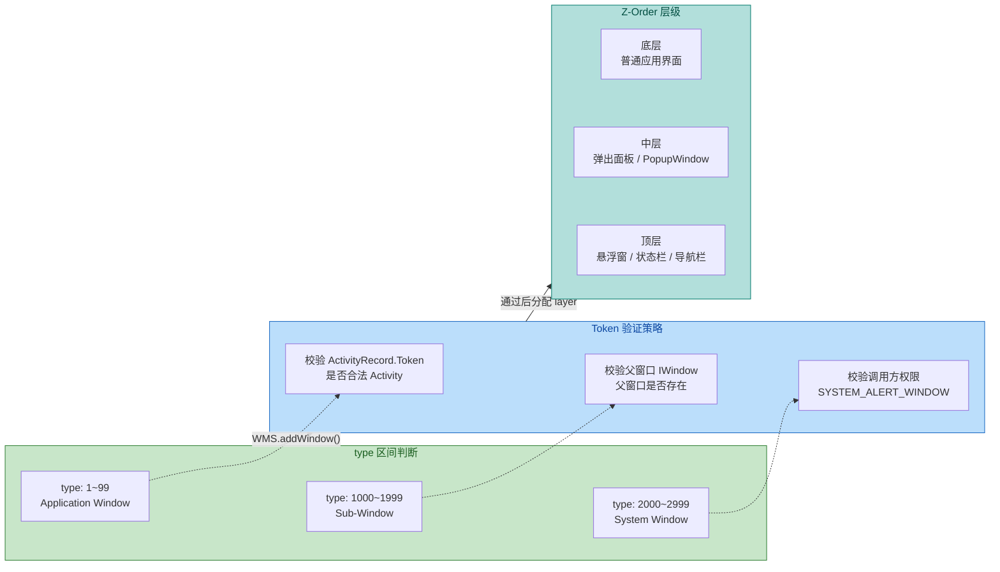

---

### Window.Flag 标志位

#### 一、Flags 的本质：窗口行为的位掩码控制

如果说 `type` 决定了窗口 **在哪一层**，那么 `flags` 则决定了窗口 **怎么表现**。`flags` 字段是一个 32 位的 `int` 值，采用经典的 **位掩码（Bitmask）** 设计——每一个二进制位对应一种独立的行为特征，多个标志位通过按位或（`or`/`|`）组合使用。

这种设计的优势在于高效和灵活：一个 `int` 就能承载多达 32 种独立的开关状态，且添加/移除某个标志位只需简单的位运算，不需要额外的数据结构。

应用层操作 flags 的 API 非常直观：

```kotlin
// 获取当前 Activity 的 Window 对象
val window = activity.window

// ---- 方式一：通过 addFlags / clearFlags 增删单个标志位 ----
// addFlags 内部执行 flags |= newFlag（按位或，置位）
window.addFlags(WindowManager.LayoutParams.FLAG_KEEP_SCREEN_ON)
// clearFlags 内部执行 flags &= ~removeFlag（按位与非，清位）
window.clearFlags(WindowManager.LayoutParams.FLAG_KEEP_SCREEN_ON)

// ---- 方式二：通过 setFlags 同时设置和清除 ----
// setFlags(flags, mask) 内部执行：
//   attrs.flags = (attrs.flags & ~mask) | (flags & mask)
// 即先清除 mask 对应的位，再设置 flags 对应的位
window.setFlags(
    WindowManager.LayoutParams.FLAG_FULLSCREEN,  // 要设置的标志位
    WindowManager.LayoutParams.FLAG_FULLSCREEN   // 作用掩码
)

// ---- 方式三：直接修改 LayoutParams 后手动更新 ----
val params = window.attributes   // 获取当前 LayoutParams 引用
params.flags = params.flags or WindowManager.LayoutParams.FLAG_SECURE  // 手动按位或
window.attributes = params       // 赋值回去会自动触发 WMS 更新
```

需要注意的是，`addFlags()` 和 `clearFlags()` 内部最终都会调用 `setFlags()`，而 `setFlags()` 会调用到 `WindowManager.updateViewLayout()`，进而通知 WMS 更新窗口属性。因此，**每次 flag 变更都是一次跨进程 IPC 调用**，在性能敏感场景应避免频繁修改。

#### 二、核心 Flag 逐一精讲

Android 定义了大量的 Window Flag，下面按照功能类别分组讲解最常用的标志位。

**（1）焦点与触摸控制**

**`FLAG_NOT_FOCUSABLE (0x00000008)`**：设置后，窗口不会获取输入焦点，意味着它无法接收按键事件（KeyEvent），也不会影响当前焦点窗口。这个标志位在悬浮窗场景中极其重要——如果悬浮窗不设置此标志位，它会抢夺底层应用的焦点，导致用户无法操作底层应用。此外，设置了 `FLAG_NOT_FOCUSABLE` 后会 **隐含启用 `FLAG_NOT_TOUCH_MODAL`**（在 WMS 的处理逻辑中），即触摸事件也不会被此窗口独占。

**`FLAG_NOT_TOUCHABLE (0x00000010)`**：设置后，窗口完全不响应任何触摸事件，所有触摸都会穿透到下层窗口。典型用途是纯视觉覆盖层（如全屏的暗色遮罩动画）。

**`FLAG_NOT_TOUCH_MODAL (0x00000020)`**：默认情况下，窗口是"模态"的——即使触摸落在窗口区域之外，事件也不会传递给下层窗口（会被系统消费或丢弃）。设置此标志后，**窗口区域外的触摸事件会正常传递给下层窗口**，而窗口区域内的触摸依然由本窗口处理。对话框（Dialog）默认不设置此标志位，因此你会发现点击 Dialog 外部的灰色区域时，底层 Activity 不会响应点击事件——这正是模态行为。

**`FLAG_WATCH_OUTSIDE_TOUCH (0x00040000)`**：与 `FLAG_NOT_TOUCH_MODAL` 配合使用。设置后，当触摸事件落在窗口区域之外时，窗口会收到一个 `ACTION_OUTSIDE` 事件（坐标为 0,0），通知窗口"用户点击了外部区域"。PopupWindow 利用此机制实现"点击外部自动关闭"的功能。

这四个标志位的组合决定了窗口的触摸交互模型，下面用一个表格总结：

| 标志位组合 | 区域内触摸 | 区域外触摸 | 典型场景 |
|-----------|-----------|-----------|---------|
| 无 (默认模态) | 本窗口处理 | 系统消费，不传递 | Dialog |
| `NOT_TOUCH_MODAL` | 本窗口处理 | 传递给下层窗口 | PopupWindow |
| `NOT_TOUCH_MODAL + WATCH_OUTSIDE` | 本窗口处理 | 传递给下层 + 本窗口收到 `ACTION_OUTSIDE` | 下拉菜单 |
| `NOT_FOCUSABLE` | 本窗口处理 | 传递给下层窗口 | 悬浮窗 |
| `NOT_TOUCHABLE` | 穿透到下层 | 穿透到下层 | 纯视觉遮罩 |

**（2）屏幕与显示控制**

**`FLAG_FULLSCREEN (0x00000400)`**：隐藏状态栏，使窗口内容占据整个屏幕。注意，从 Android 11 (API 30) 开始，Google 推荐使用 `WindowInsetsController` 替代此标志位来控制全屏行为（`FLAG_FULLSCREEN` 被标记为 `@Deprecated`），因为新的 Insets API 提供了更细粒度的控制和更好的动画支持。

**`FLAG_LAYOUT_NO_LIMITS (0x00000200)`**：允许窗口扩展到屏幕边界之外。通常窗口的布局被约束在屏幕可见区域内，设置此标志后窗口可以延伸到状态栏、导航栏甚至屏幕物理边缘以外的区域。在实现 edge-to-edge（沉浸式全面屏）设计时有时会用到。

**`FLAG_LAYOUT_IN_SCREEN (0x00000100)`** 和 **`FLAG_LAYOUT_INSET_DECOR (0x00010000)`**：这两个标志位通常配合使用。`FLAG_LAYOUT_IN_SCREEN` 请求窗口布局在整个屏幕区域内（包括被系统栏遮挡的区域）；`FLAG_LAYOUT_INSET_DECOR` 在此基础上让 DecorView 的内容区域适当内缩（inset），避免内容被系统栏遮挡。这就是传统的"透明状态栏"实现基础。

**`FLAG_TRANSLUCENT_STATUS (0x04000000)`** 和 **`FLAG_TRANSLUCENT_NAVIGATION (0x08000000)`**：分别使状态栏和导航栏变为半透明。设置后系统会自动添加 `FLAG_LAYOUT_IN_SCREEN` 和 `FLAG_LAYOUT_INSET_DECOR`，使内容可以延伸到系统栏区域。这两个标志位在 Android 4.4 (API 19) 引入，是早期沉浸式设计的核心手段，但在现代开发中同样被 `WindowInsetsController` + edge-to-edge 方案逐步取代。

**（3）安全与特殊行为**

**`FLAG_SECURE (0x00002000)`**：设置后，窗口内容会被标记为"安全内容"，系统将禁止对该窗口进行截屏、录屏和在最近任务列表中显示缩略图（会显示空白）。银行类 App、密码输入界面常用此标志位保护敏感信息。该标志位的实现依赖于 SurfaceFlinger 层面的保护——标记为 secure 的 Surface 在截屏合成时会被跳过。

**`FLAG_KEEP_SCREEN_ON (0x00000080)`**：保持屏幕常亮，防止自动熄屏。效果等同于在 View 上调用 `setKeepScreenOn(true)` 或在 XML 中设置 `android:keepScreenOn="true"`，但作用于窗口级别。视频播放、导航类 App 常用此标志位。注意，这只是阻止自动熄屏，用户仍然可以手动按下电源键关闭屏幕。

**`FLAG_SHOW_WHEN_LOCKED (0x00080000)`**（API 27 前）/ `Activity.setShowWhenLocked(true)`（API 27+）：允许窗口显示在锁屏界面之上。来电界面、闹钟界面使用此机制在不解锁的情况下展示内容。

**`FLAG_TURN_SCREEN_ON (0x00200000)`**（API 27 前）/ `Activity.setTurnScreenOn(true)`（API 27+）：窗口显示时自动点亮屏幕。与 `FLAG_SHOW_WHEN_LOCKED` 配合，可以实现"闹钟响铃时自动亮屏并显示在锁屏上"的效果。

**`FLAG_DIM_BEHIND (0x00000002)`**：在窗口后方添加一层暗色调光层。Dialog 默认使用此标志位来产生"背景变暗"效果。调光程度由 `LayoutParams.dimAmount` 控制，取值 0.0（完全透明）~ 1.0（完全不透明黑色），Dialog 默认值通常约 0.6。

#### 三、Flag 的设置时机与生效流程

理解 Flag 的生效时机对避免开发中的"设置了但没效果"问题非常重要。以 Activity 为例，Flag 的设置有以下几个常见时机：

1. **`onCreate()` 中 `setContentView()` 之前**：这是最推荐的设置时机。此时 PhoneWindow 已创建但 DecorView 尚未添加到 WMS，设置的 flags 会在 DecorView 首次被 `addView()` 到 WMS 时一并提交。
2. **`onCreate()` 中 `setContentView()` 之后**：同样有效，因为此时 DecorView 虽然已创建，但仍未在 `onResume()` 阶段被添加到 WMS。
3. **`onResume()` 之后**：此时 DecorView 已经 attach 到 WMS，Flag 变更会触发 `WindowManager.updateViewLayout()` → WMS 跨进程更新。效果可能会有短暂的视觉跳变（比如先看到状态栏再消失）。

```kotlin
class ImmersiveActivity : AppCompatActivity() {
    override fun onCreate(savedInstanceState: Bundle?) {
        super.onCreate(savedInstanceState)

        // 在 setContentView 之前设置全屏标志位（推荐时机）
        // 这样 DecorView 首次被 WMS 接收时就已经携带正确的 flags
        window.addFlags(WindowManager.LayoutParams.FLAG_LAYOUT_NO_LIMITS)

        // 设置安全标志位，禁止截屏
        window.addFlags(WindowManager.LayoutParams.FLAG_SECURE)

        setContentView(R.layout.activity_immersive)

        // 使用现代 WindowInsetsController API 控制系统栏（API 30+）
        if (Build.VERSION.SDK_INT >= Build.VERSION_CODES.R) {
            // 获取 WindowInsetsController 实例
            window.insetsController?.let { controller ->
                // 隐藏状态栏和导航栏
                controller.hide(WindowInsets.Type.systemBars())
                // 设置隐藏后的行为：滑动边缘时短暂显示后自动隐藏
                controller.systemBarsBehavior =
                    WindowInsetsController.BEHAVIOR_SHOW_TRANSIENT_BARS_BY_SWIPE
            }
        } else {
            // 低版本使用传统 Flag 方式
            @Suppress("DEPRECATION")
            window.addFlags(WindowManager.LayoutParams.FLAG_FULLSCREEN)
        }
    }
}
```

#### 四、窗口 Flag 全景图

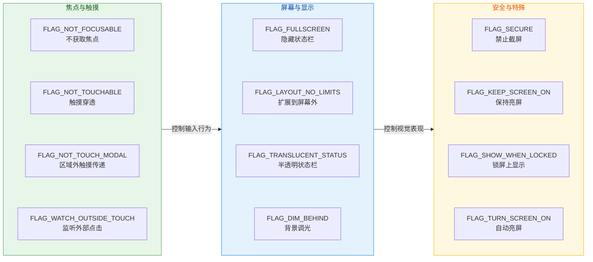

---

### SoftInputMode 软键盘模式

#### 一、为什么需要 SoftInputMode？

软键盘（Soft Input Method，即 IME）是 Android 特有的交互挑战。与 PC 的物理键盘不同，软键盘是一个 **动态弹出的窗口**，它会在屏幕底部占据相当大的区域（通常是屏幕高度的 40%~50%）。这就带来了一个关键问题：**软键盘弹出时，当前窗口应该如何调整自身布局，以确保用户正在操作的输入框不被遮挡？**

`softInputMode` 正是解决这个问题的窗口属性。它是 `WindowManager.LayoutParams` 中的一个 `int` 字段，但与 `flags` 不同的是，`softInputMode` 被分为两个独立的语义部分，通过按位或组合：

- **State（状态）部分**：控制软键盘在窗口获取焦点时的 **初始显示/隐藏** 行为
- **Adjust（调整）部分**：控制软键盘弹出后窗口的 **布局调整** 策略

这两部分各自拥有独立的掩码：`SOFT_INPUT_MASK_STATE (0x0F)` 和 `SOFT_INPUT_MASK_ADJUST (0xF0)`，互不干扰，可以自由组合。

#### 二、State（状态）部分

State 决定了"当这个窗口获得焦点时，软键盘是应该自动弹出、自动隐藏，还是维持当前状态"。常见取值如下：

**`SOFT_INPUT_STATE_UNSPECIFIED (0)`**：默认值。系统会根据窗口内容自行决定是否显示键盘。实践中，如果窗口首次显示时某个 `EditText` 获取了焦点，系统**可能**会弹出键盘（行为因设备和系统版本而异）。这个"不确定性"正是很多开发者头疼的根源——不同手机表现不一致。

**`SOFT_INPUT_STATE_UNCHANGED (1)`**：保持软键盘的上一个状态不变。如果从一个键盘已弹出的界面跳转过来，键盘保持弹出；如果从一个键盘已收起的界面过来，键盘保持收起。适合"输入流"场景，避免界面切换时键盘闪烁。

**`SOFT_INPUT_STATE_HIDDEN (2)`**：窗口获取焦点时 **自动隐藏** 软键盘。注意，这只在窗口 **首次** 获取焦点时生效——如果用户手动弹出了键盘，此状态不会强制收起它。这是列表页、详情页等"以浏览为主"界面的常用设置。

**`SOFT_INPUT_STATE_ALWAYS_HIDDEN (3)`**：只要窗口获取焦点，**总是** 隐藏软键盘。比 `STATE_HIDDEN` 更强硬——即使用户从另一个键盘弹出的窗口返回，键盘也会被收起。

**`SOFT_INPUT_STATE_VISIBLE (4)`**：窗口 **首次** 获取焦点时自动弹出软键盘。搜索页、登录页等"需要用户立即输入"的界面适合使用此值。

**`SOFT_INPUT_STATE_ALWAYS_VISIBLE (5)`**：只要窗口获取焦点，**总是** 弹出软键盘。即使用户通过 Back 键收起了键盘再返回此窗口，键盘也会再次弹出。

#### 三、Adjust（调整）部分

Adjust 才是 `softInputMode` 中真正影响布局的部分——它决定了软键盘弹出后，系统如何调整窗口，以避免输入框被遮挡。这是应用开发中最容易踩坑的地方。

**`SOFT_INPUT_ADJUST_UNSPECIFIED (0x00)`**：默认值。系统会根据窗口内容自动选择 `ADJUST_RESIZE` 或 `ADJUST_PAN`。具体规则是：如果窗口的内容区域包含可滚动的视图（如 `ScrollView`、`RecyclerView`），系统倾向于选择 `ADJUST_RESIZE`；如果没有可滚动视图，则选择 `ADJUST_PAN`。

**`SOFT_INPUT_ADJUST_RESIZE (0x10)`**：**重新调整窗口大小**。系统会缩小窗口的可用区域（减小窗口高度），为软键盘腾出空间。此时窗口内的视图会重新 layout，`RecyclerView` 等可滚动组件会自动适应新的高度。这是表单页、聊天页等场景的首选——键盘弹出后，整个布局重新排列，输入框自然位于键盘上方。

> ⚠️ **重要变更**：从 Android 11 (API 30) 开始，当应用使用 `ADJUST_RESIZE` 时，实际的窗口大小调整行为与 **WindowInsets** API 紧密耦合。从 **Android 15 (API 35，targetSdk 35）** 开始，`ADJUST_RESIZE` 被彻底废弃（`@Deprecated`），系统默认采用 edge-to-edge 模式，开发者必须通过 `ViewCompat.setOnApplyWindowInsetsListener()` 来响应软键盘的 insets 变化。

**`SOFT_INPUT_ADJUST_PAN (0x20)`**：**平移窗口**。系统不改变窗口大小，而是将整个窗口（包括 ActionBar/Toolbar）向上平移，直到当前获得焦点的 `EditText` 可见为止。这种模式的优点是布局不会发生 re-layout，性能开销小；缺点是窗口的上半部分可能被推出屏幕可见范围，用户无法看到标题栏或其他重要 UI 元素。

**`SOFT_INPUT_ADJUST_NOTHING (0x30)`**：**什么都不做**。系统不调整窗口大小，也不平移窗口。键盘直接覆盖在窗口上方。这种模式适合需要完全自定义键盘处理逻辑的场景（如游戏、自定义播放器），开发者通过监听 `WindowInsets` 变化自行处理布局。

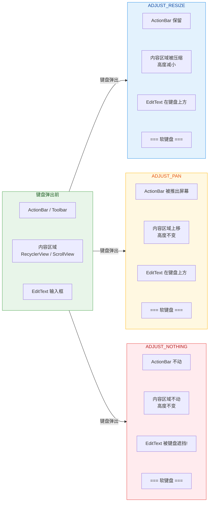

#### 四、如何设置 SoftInputMode

应用层有两种主要途径来设置 `softInputMode`：

**途径一：AndroidManifest.xml 静态声明**（推荐作为默认配置）

```xml
<!-- 在 Activity 声明中添加 windowSoftInputMode 属性 -->
<!-- 多个值通过 | 连接：state 部分 | adjust 部分 -->
<activity
    android:name=".ui.chat.ChatActivity"
    android:windowSoftInputMode="stateHidden|adjustResize" />
<!--
    stateHidden: 进入界面时不自动弹出键盘
    adjustResize: 键盘弹出时压缩窗口高度
    这是聊天界面的经典配置
-->
```

**途径二：Java/Kotlin 代码动态设置**

```kotlin
// 在 Activity 中动态修改 softInputMode
// 适合需要在运行时根据条件切换模式的场景
override fun onCreate(savedInstanceState: Bundle?) {
    super.onCreate(savedInstanceState)
    setContentView(R.layout.activity_search)

    // 搜索页：进入时自动弹出键盘 + 键盘弹出时压缩布局
    window.setSoftInputMode(
        // State 和 Adjust 通过按位或组合
        WindowManager.LayoutParams.SOFT_INPUT_STATE_VISIBLE or
                WindowManager.LayoutParams.SOFT_INPUT_ADJUST_RESIZE
    )
}

// 在某些场景下临时切换模式
fun switchToViewMode() {
    // 浏览模式：隐藏键盘 + 不调整布局
    window.setSoftInputMode(
        WindowManager.LayoutParams.SOFT_INPUT_STATE_HIDDEN or
                WindowManager.LayoutParams.SOFT_INPUT_ADJUST_NOTHING
    )
}
```

#### 五、ADJUST_RESIZE 的底层机制

`ADJUST_RESIZE` 是最常用也是机制最复杂的调整模式，值得深入剖析其工作原理。

当软键盘弹出时，InputMethodService 会通知 WMS 自己的窗口高度。WMS 在计算应用窗口的可用区域时，会从屏幕总高度中减去键盘窗口的高度，得到一个新的 **visible frame（可见框架）**。这个新的 visible frame 会通过 `ViewRootImpl` 的 `performTraversals()` 流程传递给视图树。

具体来说，`ViewRootImpl.performTraversals()` 在执行 `relayoutWindow()` 后会获得 WMS 返回的新窗口大小。如果窗口设置了 `ADJUST_RESIZE`，`ViewRootImpl` 会用新的可见区域尺寸来触发一次完整的 **measure → layout → draw** 流程。DecorView 的 `fitSystemWindows()` 方法会根据新的 WindowInsets（其中 `getSystemWindowInsetBottom()` 包含了键盘高度）来调整内容区域的 padding，从而实现布局重排。

而在现代 API（API 30+）中，键盘的弹出/收起是一个 **WindowInsets 动画** 过程。应用可以通过 `WindowInsetsAnimation.Callback` 逐帧监听键盘高度的变化，实现丝滑的同步动画效果：

```kotlin
// 现代方式：监听键盘 insets 动画（API 30+）
if (Build.VERSION.SDK_INT >= Build.VERSION_CODES.R) {
    // 获取内容根视图
    val rootView = findViewById<View>(android.R.id.content)

    // 设置 WindowInsets 动画回调
    rootView.setWindowInsetsAnimationCallback(
        object : WindowInsetsAnimation.Callback(DISPATCH_MODE_STOP) {

            // 动画进行中：每帧回调，参数包含当前 insets 值
            override fun onProgress(
                insets: WindowInsets,
                runningAnimations: MutableList<WindowInsetsAnimation>
            ): WindowInsets {
                // 获取当前帧 IME（输入法）的 insets 值
                val imeInsets = insets.getInsets(WindowInsets.Type.ime())
                // imeInsets.bottom 即为当前键盘高度（包含动画中间值）
                // 可以用这个值来同步移动自己的视图
                chatInputBar.translationY = -imeInsets.bottom.toFloat()
                return insets
            }
        }
    )
}
```

#### 六、常见踩坑场景与解决方案

**场景 1：全屏 Activity 中 ADJUST_RESIZE 失效**

当 Activity 设置了 `FLAG_FULLSCREEN`（或使用全屏主题），`ADJUST_RESIZE` 往往不会生效——键盘弹出时窗口不会缩小。这是因为全屏模式下，WMS 认为窗口不应该被系统 UI 元素（包括键盘）影响尺寸。解决方案有两种：

1. **放弃 `FLAG_FULLSCREEN`**，改用 `WindowInsetsController.hide(systemBars())` 配合 `ADJUST_RESIZE` 实现沉浸式 + 键盘适配
2. **自行计算键盘高度**，通过 `ViewTreeObserver.OnGlobalLayoutListener` 监听布局变化，手动调整视图

```kotlin
// 方案2：手动监听键盘高度（兼容全屏模式）
fun observeKeyboardHeight(rootView: View, onHeightChanged: (Int) -> Unit) {
    // 对根视图添加全局布局监听器
    rootView.viewTreeObserver.addOnGlobalLayoutListener {
        val rect = Rect()
        // 获取根视图的可见区域（排除被键盘遮挡的部分）
        rootView.getWindowVisibleDisplayFrame(rect)
        // 屏幕高度 - 可见区域底部 = 键盘高度（近似值）
        val screenHeight = rootView.height
        val keyboardHeight = screenHeight - rect.bottom
        // 回调键盘高度变化
        if (keyboardHeight > screenHeight * 0.15) {
            // 键盘高度超过屏幕15%，认为键盘已弹出
            onHeightChanged(keyboardHeight)
        } else {
            // 键盘已收起
            onHeightChanged(0)
        }
    }
}
```

**场景 2：Fragment 切换时键盘状态混乱**

`softInputMode` 是 **Window 级别** 的属性，而非 Fragment 级别。同一个 Activity 内的多个 Fragment 共享同一个 Window，因此无法为不同 Fragment 设置不同的 `softInputMode`。解决方案是在 Fragment 切换时（如 `onResume()`）动态修改宿主 Activity 的 `softInputMode`：

```kotlin
class SearchFragment : Fragment() {
    override fun onResume() {
        super.onResume()
        // 搜索 Fragment 需要自动弹出键盘
        activity?.window?.setSoftInputMode(
            WindowManager.LayoutParams.SOFT_INPUT_STATE_VISIBLE or
                    WindowManager.LayoutParams.SOFT_INPUT_ADJUST_RESIZE
        )
    }

    override fun onPause() {
        super.onPause()
        // 离开时恢复默认模式，避免影响其他 Fragment
        activity?.window?.setSoftInputMode(
            WindowManager.LayoutParams.SOFT_INPUT_STATE_HIDDEN or
                    WindowManager.LayoutParams.SOFT_INPUT_ADJUST_UNSPECIFIED
        )
    }
}
```

**场景 3：Android 15 (API 35) 的 Edge-to-Edge 强制行为**

从 targetSdkVersion 35 开始，Android 强制所有 Activity 采用 edge-to-edge 显示模式。这意味着 `ADJUST_RESIZE` 不再起作用——窗口始终占据全屏，键盘弹出时系统不再自动缩小窗口。开发者必须迁移到 **WindowInsets API**：

```kotlin
// Android 15+ 推荐方式：使用 ViewCompat 处理 Insets
ViewCompat.setOnApplyWindowInsetsListener(rootView) { view, windowInsets ->
    // 获取 IME（键盘）和系统栏的 insets
    val imeInsets = windowInsets.getInsets(WindowInsetsCompat.Type.ime())
    val systemBarInsets = windowInsets.getInsets(WindowInsetsCompat.Type.systemBars())

    // 将键盘高度和系统栏高度设置为 View 的 padding
    // 这样内容就不会被键盘或系统栏遮挡
    view.setPadding(
        systemBarInsets.left,    // 左侧系统栏（如折叠屏铰链区域）
        systemBarInsets.top,     // 顶部状态栏高度
        systemBarInsets.right,   // 右侧系统栏
        // 底部取键盘高度和导航栏高度的较大值
        maxOf(imeInsets.bottom, systemBarInsets.bottom)
    )

    // 返回已消费的 insets
    WindowInsetsCompat.CONSUMED
}
```

#### 七、SoftInputMode 组合速查表

| 场景 | 推荐 State | 推荐 Adjust | Manifest 写法 |
|------|-----------|-------------|--------------|
| 聊天页 | `stateHidden` | `adjustResize` | `stateHidden\|adjustResize` |
| 搜索页 | `stateVisible` | `adjustResize` | `stateVisible\|adjustResize` |
| 登录页 | `stateVisible` | `adjustPan` | `stateVisible\|adjustPan` |
| 列表浏览页 | `stateAlwaysHidden` | `adjustNothing` | `stateAlwaysHidden\|adjustNothing` |
| 游戏/视频全屏 | `stateHidden` | `adjustNothing` | `stateHidden\|adjustNothing` |
| 表单页(含滚动) | `stateHidden` | `adjustResize` | `stateHidden\|adjustResize` |

---

**📝 练习题**

在一个聊天应用中，用户从消息列表页（无 EditText）点击进入聊天页（底部有 EditText 输入框，上方是 RecyclerView 消息列表）。为了实现"进入时键盘不自动弹出，用户点击输入框后键盘弹出且消息列表自动上移不被遮挡"的效果，应该如何配置 `windowSoftInputMode`？

A. `stateVisible|adjustPan`


B. `stateHidden|adjustResize`


C. `stateUnspecified|adjustResize`


D. `stateHidden|adjustPan`


**【答案】** B

**【解析】** 本题考察 `softInputMode` 中 State 和 Adjust 两个维度的组合。**State 部分**：进入聊天页时不需要自动弹出键盘（用户先看消息再决定是否输入），因此需要 `stateHidden`，排除 A（`stateVisible` 会在进入时立即弹出键盘）。C 的 `stateUnspecified` 行为不确定，在一些设备上 EditText 获取焦点后可能自动弹出键盘，不够可靠。**Adjust 部分**：聊天页上方是 RecyclerView（可滚动列表），底部是输入框，最佳体验是键盘弹出后窗口整体缩小，RecyclerView 自动适应新高度，输入框自然位于键盘上方——这正是 `adjustResize` 的行为。如果用 `adjustPan`（选项 D），窗口会整体上移，标题栏可能被推出屏幕，而且 RecyclerView 无法重新 layout 适应新空间，体验较差。综合以上分析，B（`stateHidden|adjustResize`）是聊天页的经典配置。

---

**📝 练习题**

某个 App 有一个悬浮球功能（显示在所有应用上方的小圆点）。开发者使用以下代码添加悬浮窗，但用户反馈"悬浮球显示后，点击底层应用的按钮没有反应"。最可能的原因是什么？

```kotlin
val params = WindowManager.LayoutParams(
    100, 100,
    WindowManager.LayoutParams.TYPE_APPLICATION_OVERLAY,
    0,  // flags = 0，未设置任何标志位
    PixelFormat.TRANSLUCENT
)
windowManager.addView(floatingBubble, params)
```

A. `TYPE_APPLICATION_OVERLAY` 类型会自动拦截所有触摸事件


B. 未设置 `FLAG_NOT_FOCUSABLE`，导致悬浮窗以模态方式拦截了区域外的触摸事件


C. 未设置 `FLAG_SECURE`，导致系统安全机制阻断了触摸传递


D. `PixelFormat.TRANSLUCENT` 格式不支持触摸穿透


**【答案】** B

**【解析】** 当 `flags = 0` 时，窗口处于默认的"模态"状态——即使触摸落在窗口区域之外，事件也不会传递给下层窗口。这是 Window 的默认行为，与窗口类型无关（排除 A）。解决方案是设置 `FLAG_NOT_FOCUSABLE`（此标志隐含 `FLAG_NOT_TOUCH_MODAL` 行为），或者至少设置 `FLAG_NOT_TOUCH_MODAL` 以允许区域外触摸事件传递到下层应用。C 中 `FLAG_SECURE` 是禁止截屏的标志位，与触摸无关。D 中 `PixelFormat` 只控制像素格式和透明度渲染，与触摸事件分发无关。悬浮窗的标准做法是设置 `FLAG_NOT_FOCUSABLE or FLAG_NOT_TOUCH_MODAL`，确保只拦截悬浮球自身区域内的触摸，其余一律透传到下层。


---

## 子窗口与对话框

在 Android 窗口体系中，并非所有可见的 UI 区域都是独立的顶层窗口（top-level window）。很多时候，我们需要在一个已有的 Activity 窗口之上，再叠加一层交互界面——这就是 **子窗口（Sub-window）与对话框（Dialog）** 的核心场景。无论是弹出一个确认对话框、展示一个下拉菜单，还是显示一个悬浮提示气泡，其背后都涉及 **新 Window 的创建、Token 的校验、以及与宿主窗口的依附关系**。

从应用层开发者的视角来看，Dialog 和 PopupWindow 是两个最常用的"弹出式 UI"组件，但它们的底层实现路径截然不同：Dialog 拥有自己独立的 PhoneWindow，走的是与 Activity 类似的窗口添加流程；PopupWindow 则没有独立的 Window 对象，它直接通过 WindowManager.addView() 将一个 View 挂载到窗口系统中。理解这两者的差异，是掌握 Android 窗口架构的关键一环。

更进一步地，Android 系统对 **哪个 Context 可以创建哪种窗口** 有着严格的限制——用 Application Context 去弹 Dialog 会直接崩溃，这背后的原因与 **WindowManager Token 验证机制** 紧密相关。本节将从原理到实践，逐一拆解这三个核心知识点。

---

### Dialog 的 Window 创建

#### Dialog 本质：一个拥有独立 PhoneWindow 的组件

很多初学者会误以为 Dialog 只是 Activity 上面盖了一层半透明遮罩加一个居中卡片。事实上，**每一个 Dialog 实例都会创建一个全新的 PhoneWindow 对象**。这意味着 Dialog 拥有自己独立的 DecorView、独立的 View 树、独立的 Window 属性集合。它与 Activity 的 PhoneWindow 是平级关系——只不过 Dialog 的窗口类型（Window.Type）是 `TYPE_APPLICATION`，且它**复用了宿主 Activity 的 Window Token**。

当我们调用 `Dialog(context)` 构造函数时，内部会执行以下核心步骤：

1. **获取 WindowManager**：从传入的 Context 中取得 WindowManager 实例。这一步至关重要——如果传入的是 Activity，则获取到的 WindowManager 携带有 Activity 的 appToken；如果传入的是 Application Context，则没有合法的 appToken。

2. **创建 PhoneWindow**：调用 `new PhoneWindow(context)` 实例化一个全新的窗口对象。这个 PhoneWindow 与 Activity 的 PhoneWindow 一样，内部会创建 DecorView 作为视图根节点。

3. **设置窗口属性**：为这个新窗口设置默认的 `WindowManager.LayoutParams`，包括窗口类型 `TYPE_APPLICATION`、窗口标志 `FLAG_DIM_BEHIND`（背景变暗）等。

4. **关联 Callback**：将 Dialog 自身设置为 PhoneWindow 的 `Window.Callback`，这样 Dialog 就能接收到按键事件（如返回键）和触摸事件。

下面是 Dialog 构造函数的关键逻辑（简化自 AOSP 源码）：

```java
// Dialog 构造函数核心逻辑（简化版）
Dialog(@NonNull Context context, @StyleRes int themeResId) {
    // 1. 包装 Context，应用指定的主题样式
    //    ContextThemeWrapper 会将 themeResId 叠加到 context 的 theme 上
    final Context themeContext = new ContextThemeWrapper(context, themeResId);

    // 2. 从 Context 中获取 WindowManager 服务
    //    关键点：这里拿到的 WindowManager 携带了 context 所属的 window token
    //    如果 context 是 Activity，则 token 合法；否则可能为 null
    mWindowManager = (WindowManager) context.getSystemService(Context.WINDOW_SERVICE);

    // 3. 创建一个全新的 PhoneWindow 实例
    //    Dialog 拥有自己独立的 Window，与 Activity 的 Window 是不同对象
    final Window w = new PhoneWindow(themeContext);
    mWindow = w;

    // 4. 将 Dialog 自身设置为 Window.Callback
    //    这样按键事件（如 BACK 键）会回调到 Dialog.onKeyDown() 等方法
    w.setCallback(this);

    // 5. 设置 WindowManager 到这个新 Window 上
    //    第二个参数 appToken 来源于宿主 Activity 的 window token
    //    这一步把 Window 和 WindowManager 绑定，后续 addView 时会用到此 token
    w.setWindowManager(mWindowManager, null, null);

    // 6. 设置默认窗口属性：窗口居中显示
    w.setGravity(Gravity.CENTER);
}
```

#### Dialog.show() 的窗口添加流程

当调用 `dialog.show()` 时，真正的窗口添加操作才会发生。这个过程可以类比 Activity 的 `handleResumeActivity()` —— 都是将 DecorView 通过 WindowManager 添加到窗口系统中。

```java
// Dialog.show() 核心逻辑（简化版）
public void show() {
    // 1. 回调 onCreate —— 通常在这里调用 setContentView() 填充布局
    //    与 Activity 的 onCreate 类似，是初始化 UI 的入口
    onCreate(savedInstanceState);

    // 2. 回调 onStart —— 对应"窗口即将可见"
    onStart();

    // 3. 获取 DecorView
    //    PhoneWindow.getDecorView() 会确保 DecorView 已经被 installDecor() 初始化
    mDecor = mWindow.getDecorView();

    // 4. 获取当前窗口的 LayoutParams
    //    包含 type、flags、dimAmount 等窗口属性
    WindowManager.LayoutParams params = mWindow.getAttributes();

    // 5. 核心操作：通过 WindowManager 将 DecorView 添加到窗口系统
    //    这一步最终会调用 ViewRootImpl.setView()
    //    -> 通过 Binder IPC 调用 WMS.addWindow()
    //    -> WMS 校验 token 合法性，创建 WindowState
    mWindowManager.addView(mDecor, params);
}
```

整个流程可以用以下时序图来表达：

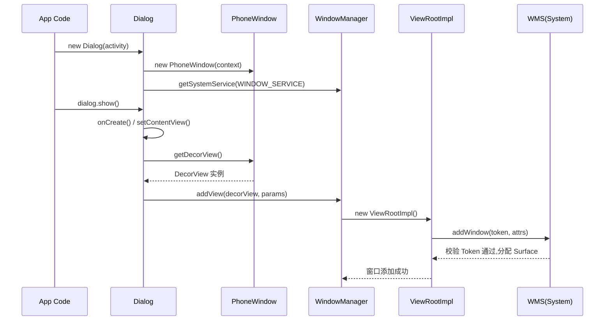

#### Dialog 与 Activity 的 Token 共享

这里有一个非常关键的设计细节：**Dialog 没有自己的 Token，它复用宿主 Activity 的 appToken**。

在 WMS（WindowManagerService）中，每个 Activity 窗口都有一个对应的 `AppWindowToken`（在较新版本中为 `ActivityRecord` 内部的 token）。当 Dialog 通过 `WindowManager.addView()` 向 WMS 注册窗口时，WMS 会检查这个 token 是否存在于当前的 window token 映射表中。由于 Dialog 使用的 WindowManager 来自 Activity，这个 token 就是 Activity 的合法 token，校验自然通过。

这也解释了为什么 **Activity 销毁后如果 Dialog 还没 dismiss，就会抛出 WindowLeaked 异常**。当 Activity 执行 `onDestroy()` 时，AMS 会通知 WMS 移除该 Activity 对应的 AppWindowToken。此时如果 Dialog 的窗口仍然存在（还在引用这个已失效的 token），系统就会检测到"泄漏的窗口"并抛出异常：

> `android.view.WindowLeaked: Activity xxx has leaked window DecorView@xxx that was originally added here`

因此，**最佳实践是在 Activity 的 onDestroy()（甚至 onPause() 或 onStop()）中主动调用 dialog.dismiss()**，确保 Dialog 的窗口在宿主 token 失效之前被正确移除。

#### AlertDialog —— Dialog 的 Builder 模式封装

日常开发中最常用的 `AlertDialog` 并不是一个独立的窗口类型，而是对 `Dialog` 的一层封装。`AlertDialog.Builder` 通过 Builder 模式提供了流式 API 来配置标题、消息、按钮等 UI 元素，最终调用 `create()` 方法创建出一个 AlertDialog 实例。这个实例的底层依然是一个 Dialog，拥有独立的 PhoneWindow 和 DecorView，只不过其 `setContentView()` 是自动完成的——Builder 会根据配置参数，加载一套系统预定义的布局（如 `alert_dialog.xml`），并将用户设置的标题、消息、按钮文本填充进去。

```kotlin
// AlertDialog 的典型使用方式
AlertDialog.Builder(this)                // this = Activity Context，提供合法 token
    .setTitle("确认删除")                 // 设置标题文本
    .setMessage("删除后不可恢复，确定？")   // 设置消息正文
    .setPositiveButton("确定") { _, _ ->  // 设置"确定"按钮的点击回调
        performDelete()                   // 执行删除逻辑
    }
    .setNegativeButton("取消", null)      // "取消"按钮，无额外操作
    .setCancelable(true)                  // 允许点击外部区域或按 BACK 键关闭
    .show()                               // 内部调用 create() + show()
```

#### DialogFragment —— 生命周期安全的对话框

直接使用 `Dialog` 或 `AlertDialog` 有一个显著缺陷：**它们不参与 Activity 的生命周期管理**。当屏幕旋转导致 Activity 重建时，手动创建的 Dialog 会丢失（因为旧 Activity 被销毁，Dialog 一起被回收），开发者必须自己在 `onSaveInstanceState` 中保存状态并手动重建。

`DialogFragment` 正是为解决这个问题而设计的。它是一个特殊的 Fragment，内部持有一个 Dialog 实例。由于 Fragment 参与了 FragmentManager 的状态保存与恢复机制，**当 Activity 重建时，FragmentManager 会自动重建 DialogFragment，并重新创建其内部的 Dialog**。

DialogFragment 的核心方法是 `onCreateDialog()`，开发者在其中返回一个 Dialog（通常是 AlertDialog）实例：

```kotlin
// 自定义 DialogFragment 示例
class ConfirmDeleteDialogFragment : DialogFragment() {

    // 重写 onCreateDialog 来创建并返回 Dialog 实例
    // 系统会在合适的时机自动调用 show/dismiss
    override fun onCreateDialog(savedInstanceState: Bundle?): Dialog {
        // 使用 requireActivity() 作为 Context，确保 token 合法
        return AlertDialog.Builder(requireActivity())
            .setTitle("确认删除")                       // 标题
            .setMessage("此操作不可恢复")                 // 正文
            .setPositiveButton("确定") { _, _ ->         // 确定按钮
                // 通过 parentFragment 或 Activity 回调结果
                (activity as? OnDeleteConfirmedListener)
                    ?.onDeleteConfirmed()
            }
            .setNegativeButton("取消", null)             // 取消按钮
            .create()                                    // 创建 Dialog，但不 show
    }
}

// 显示 DialogFragment 的方式
// FragmentManager 会管理其生命周期，屏幕旋转后自动恢复
ConfirmDeleteDialogFragment()
    .show(supportFragmentManager, "confirm_delete")     // tag 用于查找已有实例
```

DialogFragment 在内部的 `onStart()` 中调用 `dialog.show()`，在 `onStop()` 中调用 `dialog.hide()`，在 `onDestroyView()` 中调用 `dialog.dismiss()`。这套机制确保了 Dialog 的显示/隐藏与 Fragment 生命周期严格同步，避免了 WindowLeaked 等经典问题。

---

### PopupWindow 的 Window 依附

#### PopupWindow 的本质：无 PhoneWindow 的轻量窗口

与 Dialog 不同，**PopupWindow 不会创建 PhoneWindow 对象**。它是一种更轻量级的弹出机制，本质上是直接通过 `WindowManager.addView()` 将一个 View 添加到窗口系统中。这意味着 PopupWindow 没有 DecorView 的层级包装、没有标题栏/ActionBar 的概念，也不走 `setContentView()` -> `installDecor()` 的流程。

PopupWindow 的窗口类型是 `WindowManager.LayoutParams.TYPE_APPLICATION_PANEL`，这是一个 **子窗口类型（sub-window type）**。在 Android 的窗口类型体系中，子窗口类型（type 值范围 1000~1999）**必须依附于一个父窗口**，不能独立存在。具体来说，`TYPE_APPLICATION_PANEL` 的定义就是"应用窗口上的面板"，它的 Z-order 位于父窗口之上，但始终跟随父窗口的生命周期。

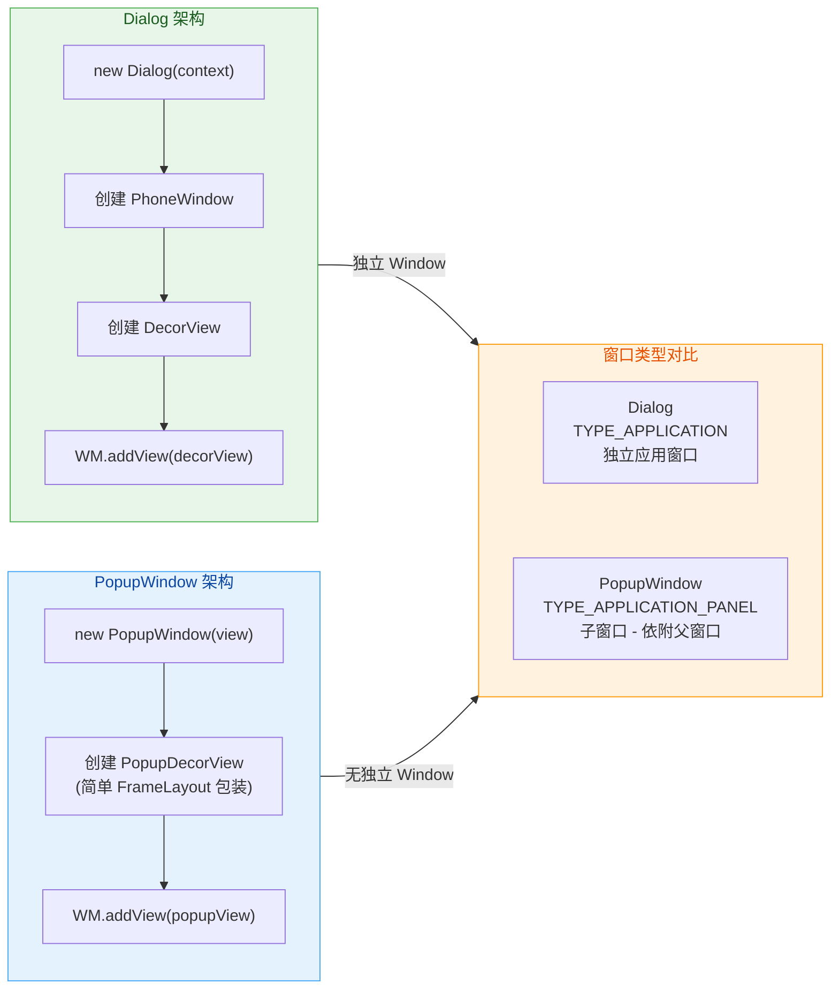

#### PopupWindow 的显示流程

PopupWindow 提供了两种主要的显示方式：`showAsDropDown(anchorView)` 和 `showAtLocation(parent, gravity, x, y)`。无论使用哪种方式，内部的核心流程都是相同的：

1. **创建包装 View**：PopupWindow 内部会创建一个 `PopupDecorView`（本质是一个自定义的 FrameLayout），将开发者设置的 contentView 包裹在其中。这个包装层负责处理触摸事件拦截（实现"点击外部关闭"的效果）。

2. **构建 LayoutParams**：根据显示方式计算窗口的位置（x, y 坐标）和大小（width, height），并设置窗口类型为 `TYPE_APPLICATION_PANEL`。最关键的一步是**设置 `token` 字段为锚点 View（或 parent View）所在窗口的 token**。

3. **调用 WindowManager.addView()**：将 PopupDecorView 和 LayoutParams 传给 WindowManager，触发 ViewRootImpl 的创建和 WMS 的窗口注册。

```java
// PopupWindow.showAsDropDown() 内部核心逻辑（高度简化）
public void showAsDropDown(View anchor, int xoff, int yoff, int gravity) {
    // 1. 创建 PopupDecorView 包裹 contentView
    //    PopupDecorView 继承自 FrameLayout，负责外部点击拦截等逻辑
    final PopupDecorView decorView = createDecorView(mContentView);

    // 2. 构建 WindowManager.LayoutParams
    final WindowManager.LayoutParams p = createPopupLayoutParams(
        anchor.getApplicationWindowToken()   // 获取锚点 View 所在窗口的 token
    );
    p.type = WindowManager.LayoutParams.TYPE_APPLICATION_PANEL; // 子窗口类型

    // 3. 根据 anchor 的屏幕位置计算 PopupWindow 的显示坐标
    //    考虑 anchor 的位置、偏移量、gravity 等因素
    findDropDownPosition(anchor, p, xoff, yoff, gravity);

    // 4. 获取 anchor 所在窗口的 WindowManager
    //    确保使用的 WindowManager 与父窗口关联
    final WindowManager wm = (WindowManager) anchor.getContext()
        .getSystemService(Context.WINDOW_SERVICE);

    // 5. 将包装后的 View 添加到窗口系统
    //    WMS 会校验 token，确认这是一个合法的子窗口请求
    wm.addView(decorView, p);
}
```

#### 子窗口的 Token 依附机制

PopupWindow 作为 `TYPE_APPLICATION_PANEL` 子窗口，其 token **不是 Activity 的 appToken，而是父窗口的 window token**（即 `View.getWindowToken()`）。这一点与 Dialog 不同：

- **Dialog**：使用 Activity 的 **appToken**（`Activity.getWindow().getAttributes().token`），类型为 `TYPE_APPLICATION`，是一个独立应用窗口。
- **PopupWindow**：使用父窗口的 **windowToken**（`View.getWindowToken()`），类型为 `TYPE_APPLICATION_PANEL`，是一个依附子窗口。

在 WMS 的窗口添加逻辑中，对于子窗口类型的请求，系统会查找 token 对应的父 WindowState。如果找不到（比如父窗口已经被移除），addWindow 会返回错误码，窗口添加失败。这也是为什么 **PopupWindow 必须在 anchor View 已经 attached to window 之后才能调用 show()** 的原因——如果 anchor 还没有被添加到窗口系统中，`getWindowToken()` 返回 null，子窗口就无法完成依附。

```kotlin
// 常见错误：在 View 还未 attach 时就尝试 show PopupWindow
override fun onCreate(savedInstanceState: Bundle?) {
    super.onCreate(savedInstanceState)
    setContentView(R.layout.activity_main)
    val anchor = findViewById<View>(R.id.btn_anchor)

    // ❌ 错误！此时 anchor 尚未 attached to window
    // anchor.getWindowToken() == null，PopupWindow 无法依附
    // popupWindow.showAsDropDown(anchor)

    // ✅ 正确！等待 View 完成 attach 后再显示
    anchor.post {
        // post 到消息队列末尾，确保当前 layout pass 完成
        // 此时 anchor 已经有合法的 windowToken
        popupWindow.showAsDropDown(anchor)
    }
}
```

#### PopupWindow 的点击外部关闭机制

PopupWindow 有一个经典的交互特性：**点击 PopupWindow 外部区域时自动关闭**。这个行为的实现机制颇为巧妙：

当 `setOutsideTouchable(true)` 时（配合 `setBackgroundDrawable()` 不为 null），PopupWindow 在创建 LayoutParams 时会加上 `FLAG_WATCH_OUTSIDE_TOUCH` 标志。有了这个标志，WMS 在分发触摸事件时，如果触摸点落在该窗口的边界之外，会发送一个 `MotionEvent.ACTION_OUTSIDE` 事件给该窗口。PopupDecorView 收到这个特殊事件后，调用 `dismiss()` 关闭自身。

另外一种实现方式更为常见：PopupWindow 内部会在 PopupDecorView 外层添加一个全屏大小的透明背景 View。当用户点击"外部"区域时，实际上点击的是这个透明背景，PopupDecorView 的 `onTouchEvent` 捕获到点击后执行 `dismiss()`。这就是为什么 **`setBackgroundDrawable()` 为 null 时，点击外部不会关闭 PopupWindow** 的原因——没有背景就没有那个透明点击区域。

```kotlin
// PopupWindow 正确配置示例
val popupView = LayoutInflater.from(this)
    .inflate(R.layout.popup_menu, null)        // 加载弹出菜单布局

val popupWindow = PopupWindow(
    popupView,                                  // 内容 View
    ViewGroup.LayoutParams.WRAP_CONTENT,        // 宽度自适应
    ViewGroup.LayoutParams.WRAP_CONTENT,        // 高度自适应
    true                                        // focusable = true，支持按键事件
).apply {
    // 设置背景 Drawable（即使是透明的也必须设置）
    // 这是"点击外部关闭"生效的前提条件
    setBackgroundDrawable(ColorDrawable(Color.TRANSPARENT))

    // 设置进入/退出动画
    animationStyle = R.style.PopupAnimation

    // 允许点击外部区域时关闭
    isOutsideTouchable = true

    // 设置 elevation 阴影（Material Design 推荐）
    elevation = 8f
}

// 在锚点 View 下方弹出，水平偏移 0，垂直偏移 4dp
popupWindow.showAsDropDown(anchorView, 0, 4.dp)
```

#### PopupWindow vs Dialog 选型指南

两者看似都是"弹出式 UI"，但适用场景不同：

| 维度 | Dialog | PopupWindow |
|------|--------|-------------|
| **Window 类型** | `TYPE_APPLICATION`（独立窗口） | `TYPE_APPLICATION_PANEL`（子窗口） |
| **PhoneWindow** | ✅ 有，包含完整 DecorView 层级 | ❌ 无，仅一个轻量 FrameLayout 包装 |
| **定位方式** | 默认居中，可自定义 gravity | 相对锚点 View 定位（dropDown/atLocation） |
| **生命周期** | 与 Activity token 绑定，可配合 DialogFragment | 与父窗口 token 绑定，需手动管理 |
| **典型场景** | 确认弹框、表单输入、全屏选择器 | 下拉菜单、Tooltip 提示、Spinner 列表 |
| **事件处理** | 支持 BACK 键关闭（Window.Callback） | 需额外配置 focusable + background |

简单来说：**需要阻断用户操作流的模态交互用 Dialog，需要锚定在某个 UI 元素附近的非模态辅助信息用 PopupWindow**。

---

### Application Context 启动限制

#### 问题现象：Application Context 弹 Dialog 崩溃

在 Android 开发中有一个经典的运行时异常：

> `android.view.WindowManager$BadTokenException: Unable to add window -- token null is not valid; is your activity running?`

这个异常通常发生在**使用 Application Context（或 Service Context）去创建并显示 Dialog** 的场景中。要理解这个错误的根因，需要从 Android 窗口系统的 Token 验证机制说起。

#### Token 验证机制深度剖析

在前面章节中，我们已经知道 Activity 启动时，AMS 会为其分配一个 `AppWindowToken`，并注册到 WMS 的 token 映射表中。当应用层代码通过 `WindowManager.addView()` 请求添加窗口时，WMS 的 `addWindow()` 方法会执行以下校验逻辑：

1. **提取 Token**：从 `WindowManager.LayoutParams` 中取出 `token` 字段。

2. **查找 Token 映射**：在 WMS 内部的 `mTokenMap` 中查找这个 token 对应的 `WindowToken` 对象。

3. **类型校验**：
   - 如果窗口类型是 `TYPE_APPLICATION`（Dialog 就是这个类型），WMS 会要求 token 必须对应一个 `AppWindowToken`（即 Activity 的 token）。
   - 如果窗口类型是 `TYPE_APPLICATION_PANEL`（PopupWindow 的类型），WMS 会要求 token 对应一个已存在的父窗口。

4. **校验失败处理**：如果 token 为 null 或不匹配期望类型，返回错误码 `WindowManagerGlobal.ADD_BAD_APP_TOKEN` 或 `ADD_BAD_SUBWINDOW_TOKEN`，客户端收到后抛出 `BadTokenException`。

**Application Context 的问题就出在这里**：Application 没有对应的 Activity，自然没有 `AppWindowToken`。当使用 Application Context 获取 WindowManager 时，返回的 WindowManager 实例中没有携带合法的 appToken。后续通过这个 WindowManager 添加 `TYPE_APPLICATION` 类型的窗口（Dialog）时，LayoutParams 中的 token 为 null，WMS 校验直接失败。

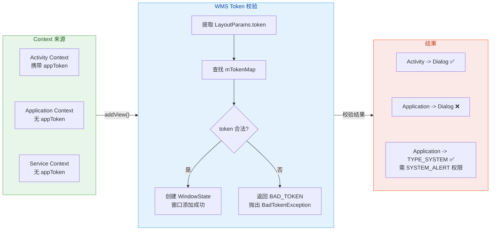

#### 各类 Context 的窗口能力对比

Android 中有多种 Context 类型，它们在窗口创建方面的能力差异很大：

- **Activity**：唯一一个在标准条件下可以直接创建 `TYPE_APPLICATION` 窗口的 Context。因为 Activity 在启动过程中会通过 `ActivityThread.performLaunchActivity()` 调用 `activity.attach()`，在 `attach()` 中会将 AMS 分配的 token 设置到 Activity 的 PhoneWindow 上，并创建一个携带此 token 的 WindowManager 实例。

- **Application / Service**：没有 Activity 生命周期，没有 appToken。通过这些 Context 获取的 WindowManager 是一个"空白"的实例，不携带任何窗口 token。如果尝试添加 `TYPE_APPLICATION` 类型的窗口，WMS 会拒绝。

- **BroadcastReceiver**：其 Context 更为特殊——它是一个 `ReceiverRestrictedContext`，直接禁止了 `bindService()` 等操作。虽然技术上可以获取 WindowManager，但同样没有 appToken，不能弹 Dialog。

#### 绕过限制的方式与风险

在某些特殊场景下（如悬浮窗、全局提示），确实需要在没有 Activity 的环境中显示窗口。Android 提供了 **系统窗口类型（System Window Type）** 来满足这个需求：

```kotlin
// 使用系统窗口类型绕过 Activity Token 限制
val windowManager = applicationContext
    .getSystemService(Context.WINDOW_SERVICE) as WindowManager

val params = WindowManager.LayoutParams(
    WindowManager.LayoutParams.WRAP_CONTENT,       // 宽度
    WindowManager.LayoutParams.WRAP_CONTENT,       // 高度
    // Android 8.0+ 必须使用 TYPE_APPLICATION_OVERLAY
    // 旧版本的 TYPE_SYSTEM_ALERT、TYPE_PHONE 等已废弃
    WindowManager.LayoutParams.TYPE_APPLICATION_OVERLAY,
    // 标志位：不获取焦点 + 不拦截触摸（悬浮信息类窗口常用）
    WindowManager.LayoutParams.FLAG_NOT_FOCUSABLE or
        WindowManager.LayoutParams.FLAG_NOT_TOUCH_MODAL,
    PixelFormat.TRANSLUCENT                        // 半透明像素格式
)

// 添加一个 TextView 作为悬浮窗内容
val floatingView = TextView(applicationContext).apply {
    text = "悬浮提示"
    setBackgroundColor(0xCC000000.toInt())
    setTextColor(Color.WHITE)
}

// 系统窗口类型不需要 Activity token
// 但需要 SYSTEM_ALERT_WINDOW 权限
windowManager.addView(floatingView, params)
```

使用系统窗口类型需要注意以下几点：

1. **权限要求**：必须在 AndroidManifest 中声明 `<uses-permission android:name="android.permission.SYSTEM_ALERT_WINDOW" />`，并且在 Android 6.0+ 上需要引导用户到设置页面手动授予"显示在其他应用上方"权限（通过 `Settings.ACTION_MANAGE_OVERLAY_PERMISSION`）。

2. **类型变更**：Android 8.0（API 26）废弃了 `TYPE_SYSTEM_ALERT`、`TYPE_PHONE`、`TYPE_TOAST` 等旧系统窗口类型，统一使用 `TYPE_APPLICATION_OVERLAY`。如果在 API 26+ 设备上使用旧类型，会抛出 `BadTokenException`。

3. **用户体验与安全**：系统窗口可以覆盖在其他 App 之上，存在安全隐患（如 Tapjacking 攻击）。Google Play 对使用 `SYSTEM_ALERT_WINDOW` 权限的应用审核较严格，非必要不应使用。

#### 正确的架构选择

在绝大多数业务场景中，使用 Application Context 弹 Dialog 并不是合理的需求——如果你需要弹 Dialog，说明当前应该有一个可见的 Activity。正确的做法是：

```kotlin
// ✅ 方案一：确保传入 Activity Context
fun showConfirmDialog(activity: Activity) {
    AlertDialog.Builder(activity)           // 使用 Activity Context
        .setTitle("提示")
        .setMessage("确定执行此操作？")
        .setPositiveButton("确定", null)
        .show()
}

// ✅ 方案二：在 ViewModel / Repository 中通过事件通知 UI 层弹窗
// 使用 LiveData / StateFlow / Channel 传递"需要弹窗"的事件
class MyViewModel : ViewModel() {
    // 使用 SharedFlow 发送一次性事件，避免重复消费
    private val _dialogEvent = MutableSharedFlow<DialogEvent>()
    val dialogEvent: SharedFlow<DialogEvent> = _dialogEvent

    fun onDeleteClicked() {
        viewModelScope.launch {
            // 发送事件，由 Activity/Fragment 订阅并弹窗
            _dialogEvent.emit(DialogEvent.ConfirmDelete(itemId = 42))
        }
    }
}

// Activity 中观察并响应
lifecycleScope.launch {
    viewModel.dialogEvent.collect { event ->
        when (event) {
            is DialogEvent.ConfirmDelete -> {
                // 在 Activity 作用域中弹窗，Context 合法
                showDeleteConfirmDialog(event.itemId)
            }
        }
    }
}
```

这种架构遵循了 **单一数据源（Single Source of Truth）** 和 **关注点分离（Separation of Concerns）** 原则：业务逻辑层不持有 Context 引用，UI 层负责实际的窗口创建，既避免了 BadTokenException，也杜绝了 Context 泄漏风险。

---

**📝 练习题**

在 Android 应用中，以下关于 Dialog 和 PopupWindow 的描述，哪一项是**正确**的？

A. Dialog 和 PopupWindow 都会创建独立的 PhoneWindow 对象，区别仅在于窗口类型不同


B. PopupWindow 使用 `TYPE_APPLICATION` 窗口类型，与 Dialog 相同，但 Token 来源不同


C. Dialog 拥有独立的 PhoneWindow 和 DecorView，而 PopupWindow 不创建 PhoneWindow，直接通过 WindowManager.addView() 添加 View


D. 使用 Application Context 创建的 Dialog 可以正常显示，因为 Application 也持有系统分配的 Window Token

**【答案】** C

**【解析】** Dialog 在构造时会创建一个全新的 PhoneWindow 实例，拥有完整的 DecorView 层级结构，窗口类型为 `TYPE_APPLICATION`，复用宿主 Activity 的 appToken。PopupWindow 则不会创建 PhoneWindow，它内部仅用一个 PopupDecorView（自定义 FrameLayout）包裹内容 View，然后直接通过 WindowManager.addView() 添加到窗口系统中，窗口类型为 `TYPE_APPLICATION_PANEL`（子窗口类型），依附于锚点 View 所在的父窗口。选项 A 错误是因为 PopupWindow 不创建 PhoneWindow；选项 B 错误是因为 PopupWindow 使用 `TYPE_APPLICATION_PANEL` 而非 `TYPE_APPLICATION`；选项 D 错误是因为 Application Context 没有 Activity 对应的 appToken，使用它创建 Dialog 并 show() 时 WMS 会校验 token 失败，抛出 `BadTokenException`。

---

**📝 练习题**

开发者在一个 Service 中需要显示一个全局悬浮窗提示，以下哪种做法是**正确且适配 Android 8.0+** 的？

A. 直接使用 `new Dialog(getApplicationContext()).show()`，因为 Service 有系统级权限


B. 使用 `WindowManager.LayoutParams.TYPE_SYSTEM_ALERT` 类型，并在 Manifest 中声明 `SYSTEM_ALERT_WINDOW` 权限


C. 使用 `WindowManager.LayoutParams.TYPE_APPLICATION_OVERLAY` 类型，在 Manifest 中声明 `SYSTEM_ALERT_WINDOW` 权限，并引导用户在设置中授予"悬浮窗"权限


D. 使用 `WindowManager.LayoutParams.TYPE_APPLICATION_PANEL` 子窗口类型，因为子窗口不需要 Activity Token

**【答案】** C

**【解析】** 在 Service 中显示全局悬浮窗，需要使用系统窗口类型，因为 Service 没有 Activity 的 appToken，不能创建 `TYPE_APPLICATION` 类型的窗口（排除 A）。Android 8.0（API 26）之后，Google 废弃了 `TYPE_SYSTEM_ALERT`、`TYPE_PHONE` 等旧系统窗口类型，统一要求使用 `TYPE_APPLICATION_OVERLAY`，使用旧类型会抛出 `BadTokenException`（排除 B）。`TYPE_APPLICATION_PANEL` 是子窗口类型，必须依附于已存在的父窗口，Service 中没有可依附的父窗口，无法使用（排除 D）。正确做法是使用 `TYPE_APPLICATION_OVERLAY` + `SYSTEM_ALERT_WINDOW` 权限，并且在 Android 6.0+ 上需要通过 `Settings.canDrawOverlays()` 检查并引导用户手动授权。

---

## 系统栏控制

Android 系统在屏幕的顶部和底部各保留了一条 **系统级 UI 区域**——顶部是 **StatusBar（状态栏）**，底部是 **NavigationBar（导航栏）**。这两条栏目由 SystemUI 进程绘制和管理，并不属于任何一个应用窗口的内容区域。但在应用层开发中，我们经常需要与这两条栏目"打交道"：有时希望内容延伸到状态栏下方实现沉浸式效果，有时又需要确保内容不被导航栏遮挡。整个系统栏控制的核心问题，归结为一句话：**应用窗口的内容区域与系统栏区域之间的空间关系如何协调？**

从 Android 4.4（KitKat）到 Android 15，Google 对系统栏控制 API 进行了多次迭代。早期通过 `SystemUiVisibility` flag 控制，如今已全面迁移到 **WindowInsetsController** 和 **WindowInsets** 体系。理解这段演进历史，有助于我们在实际项目中选择正确的适配方案。

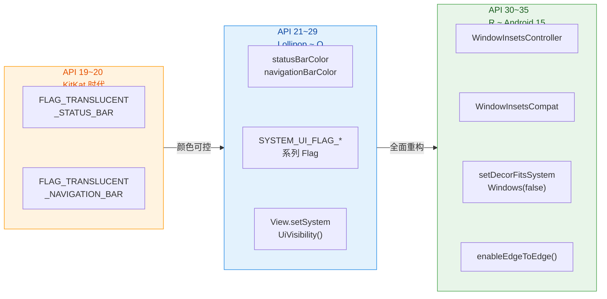

从上图可以看到，系统栏控制经历了三个大的阶段。早期 KitKat 时代只有"半透明"开关，粒度非常粗；Lollipop 引入了颜色属性和大量 `SYSTEM_UI_FLAG` 位标志，功能强大但 API 极为碎片化；到了 Android 11（API 30），Google 终于用 `WindowInsetsController` 统一收口，并在 AndroidX 的 `WindowInsetsControllerCompat` 中提供了向下兼容方案。**Android 15 更进一步，默认强制 edge-to-edge**，意味着应用必须正确处理系统栏 Insets，否则 UI 会出现遮挡。

---

### StatusBar 状态栏

状态栏是屏幕最顶端的那条窄带，显示时间、电量、通知图标和网络信号。从窗口管理的角度，StatusBar 是一个 **TYPE_STATUS_BAR** 类型的系统窗口，由 `SystemUIService` 在 SystemUI 进程中创建并添加到 WMS（WindowManagerService）。它的 Z-Order 非常高（layer 值大于绝大多数应用窗口），因此总是显示在最上层。

对于应用开发者来说，我们关心的并不是 StatusBar 窗口本身，而是以下几个关键问题：

**1. 状态栏颜色控制**

从 API 21（Lollipop）开始，`Window` 对象暴露了 `statusBarColor` 属性，允许应用直接设置状态栏背景色。在 Theme 中也可以通过 `android:statusBarColor` 指定。当设置为 `Color.TRANSPARENT` 时，状态栏变为完全透明，应用内容将延伸到状态栏背后——这就是"沉浸式状态栏"效果的基础。

```kotlin
// 在 Activity 中设置透明状态栏
window.statusBarColor = Color.TRANSPARENT  // 状态栏背景色设为透明
```

但仅仅设置颜色为透明是不够的。如果没有告诉系统"我的内容要延伸到状态栏区域"，系统仍会在状态栏下方留出一块空白填充区（即状态栏高度的 padding）。因此还需要配合布局标志一起使用，这一点在后面 FitSystemWindows 部分会详细展开。

**2. 状态栏图标颜色（亮色/暗色模式）**

当状态栏背景变为浅色或透明（且内容背景为浅色）时，默认的白色图标就会"消失"在背景中。从 API 23（Android M）开始，系统提供了 `SYSTEM_UI_FLAG_LIGHT_STATUS_BAR` 标志，将状态栏图标切换为深色。在现代 API 中，使用 `WindowInsetsController` 更加优雅：

```kotlin
// 现代方式：通过 WindowInsetsControllerCompat 设置状态栏图标为深色
val insetsController = WindowCompat.getInsetsController(window, window.decorView)
// isAppearanceLightStatusBars = true 表示状态栏使用浅色外观
// （即图标变为深色，适合浅色背景）
insetsController.isAppearanceLightStatusBars = true
```

这个属性的命名有一定迷惑性：`isAppearanceLightStatusBars = true` 意味着"状态栏的外观是浅色的"，所以**图标反而变成深色**以保持对比度。反之设为 `false`，图标恢复为白色，适合深色背景。

**3. 显示与隐藏状态栏**

有些场景需要完全隐藏状态栏，比如视频播放、游戏全屏、图片浏览。在旧 API 中需要组合多个 `SYSTEM_UI_FLAG`（如 `FULLSCREEN` | `IMMERSIVE_STICKY`），而现代 API 只需一行：

```kotlin
val insetsController = WindowCompat.getInsetsController(window, window.decorView)
// 隐藏状态栏
insetsController.hide(WindowInsetsCompat.Type.statusBars())
// 设置隐藏行为：BEHAVIOR_TRANSIENT_BARS_BY_SWIPE 表示
// 用户从边缘滑动时状态栏短暂出现，然后自动隐藏
insetsController.systemBarsBehavior =
    WindowInsetsControllerCompat.BEHAVIOR_TRANSIENT_BARS_BY_SWIPE
```

`hide()` 方法接受一个 Insets Type 位掩码，`statusBars()` 表示状态栏。系统收到指令后，WMS 会将状态栏窗口动画移出屏幕，同时将应用窗口的可用区域扩展到屏幕顶部。`BEHAVIOR_TRANSIENT_BARS_BY_SWIPE` 是最常用的行为模式——用户从屏幕顶部向下滑动时，状态栏会半透明地短暂出现，几秒后自动隐藏，不会抢夺应用的焦点和布局空间。

**4. 状态栏高度获取**

在适配布局时，经常需要知道状态栏的实际像素高度。传统方式是通过系统资源 ID 获取：

```kotlin
// 传统方式：通过资源名获取状态栏高度
val resourceId = resources.getIdentifier(
    "status_bar_height",  // 系统内部维护的状态栏高度资源名
    "dimen",              // 资源类型为 dimen（尺寸）
    "android"             // 所属包名为系统框架
)
val statusBarHeight = if (resourceId > 0) {
    resources.getDimensionPixelSize(resourceId)  // 获取像素值
} else {
    0  // 资源不存在时兜底为 0
}
```

现代方式则通过 WindowInsets 获取，更加可靠且能动态响应配置变化：

```kotlin
// 现代方式：通过 WindowInsets 获取状态栏高度
ViewCompat.setOnApplyWindowInsetsListener(view) { v, insets ->
    // 获取状态栏的 Insets 值
    val statusBarInsets = insets.getInsets(WindowInsetsCompat.Type.statusBars())
    // statusBarInsets.top 就是状态栏高度（像素）
    v.setPadding(0, statusBarInsets.top, 0, 0)  // 给 View 顶部加上对应的 padding
    insets  // 返回 insets，允许后续 View 继续消费
}
```

这种方式的优势在于：它是 **响应式** 的。当设备配置发生变化（如折叠屏展开、分屏模式切换），Insets 值会自动更新并重新触发回调，而硬编码资源 ID 的方式无法感知这类动态变化。

---

### NavigationBar 导航栏

导航栏位于屏幕底部（在某些设备上也可能在侧边），承载返回、主页和最近任务三个导航操作。它同样是 SystemUI 进程创建的 **TYPE_NAVIGATION_BAR** 类型系统窗口。随着 Android 10 引入手势导航，导航栏的形态发生了巨大变化——从传统的三键（Back/Home/Recent）变为一条窄小的"底部手势指示条"（gesture indicator bar），高度也从 48dp 缩小到了大约 16~20dp。

这一变化对应用层的影响是深远的：过去导航栏是一个"固定且不变"的区域，而如今它可能是三键模式（高度较大）、双键模式、或手势导航模式（高度很小），甚至在平板上可能根本不存在。因此，硬编码导航栏高度是一个严重的错误——必须通过 Insets 动态获取。

**1. 导航栏颜色与透明化**

与状态栏类似，API 21 起可通过 `window.navigationBarColor` 设置导航栏背景色。Android 10 的手势导航模式下，系统会强制导航栏为透明或半透明，忽略应用设置的颜色值。而在 Android 15 中，当 `targetSdkVersion >= 35` 时，**系统默认强制 edge-to-edge**，导航栏颜色设置被完全忽略，应用必须自行处理底部 Insets。

```kotlin
// 设置导航栏颜色（仅对三键导航模式有效，手势导航下可能被忽略）
window.navigationBarColor = Color.TRANSPARENT

// 设置导航栏图标为深色模式（浅色背景时使用）
val insetsController = WindowCompat.getInsetsController(window, window.decorView)
insetsController.isAppearanceLightNavigationBars = true  // 导航栏按钮变为深色
```

**2. 导航栏隐藏**

隐藏导航栏的场景比隐藏状态栏更需要谨慎——因为导航栏是用户回退和切换任务的核心入口。完全隐藏导航栏后，用户仍可以通过从底部边缘滑动触发系统手势。在沉浸式游戏或视频播放中，隐藏导航栏是常见做法：

```kotlin
val insetsController = WindowCompat.getInsetsController(window, window.decorView)
// 同时隐藏状态栏和导航栏
insetsController.hide(WindowInsetsCompat.Type.systemBars())
// 设为滑动时短暂显示
insetsController.systemBarsBehavior =
    WindowInsetsControllerCompat.BEHAVIOR_TRANSIENT_BARS_BY_SWIPE
```

`systemBars()` 是 `statusBars() | navigationBars()` 的组合，一次性控制所有系统栏。在底层，`WindowInsetsController.hide()` 会通过 IPC 通知 WMS，WMS 再将对应的系统栏窗口做动画移出可视区域，并更新应用窗口的 frame 和 Insets。

**3. 手势导航冲突处理**

手势导航模式下，系统会在屏幕左右两侧和底部注册 **手势排斥区（gesture exclusion zone）**。当用户从这些区域开始滑动时，系统会优先拦截手势用于导航（如底部上滑回到主页、左侧右滑返回）。但如果应用在这些区域有自己的交互需求（如侧滑菜单、底部滑动面板），就会产生冲突。

Android 提供了 `View.setSystemGestureExclusionRects()` API，允许应用声明哪些矩形区域需要排除系统手势拦截：

```kotlin
// 在自定义 View 中声明手势排斥区
override fun onLayout(changed: Boolean, l: Int, t: Int, r: Int, b: Int) {
    super.onLayout(changed, l, t, r, b)
    // 创建一个覆盖 View 左边 20dp 的矩形区域
    val exclusionWidth = (20 * resources.displayMetrics.density).toInt()
    val exclusionRect = Rect(0, 0, exclusionWidth, height)  // 左侧窄条
    // 设置手势排斥区列表，系统将不在此区域内拦截返回手势
    systemGestureExclusionRects = listOf(exclusionRect)
}
```

需要注意的是，系统对排斥区的总面积有上限限制（一般不超过屏幕高度的 200dp），超出部分会被忽略。而且 **底部手势区域（Home 手势）是不可排斥的**——这是 Google 有意为之，确保用户在任何界面都能回到主页。

**4. 导航栏类型检测**

在适配过程中，有时需要知道当前设备使用的是三键导航还是手势导航，以决定 UI 布局策略：

```kotlin
// 通过 WindowInsets 判断导航栏类型
ViewCompat.setOnApplyWindowInsetsListener(view) { v, insets ->
    val navigationBarInsets = insets.getInsets(WindowInsetsCompat.Type.navigationBars())
    // 手势导航模式下，底部 inset 很小（约 48~66px）
    // 三键导航模式下，底部 inset 较大（约 126~144px）
    val isGestureNavigation = navigationBarInsets.bottom < (48 * resources.displayMetrics.density).toInt()
    // 根据导航模式做不同的适配处理
    if (isGestureNavigation) {
        // 手势导航：内容可以更贴近底部，只需留出手势指示条高度
    } else {
        // 三键导航：需要留出完整的导航栏高度
    }
    insets
}
```

这种通过 inset 高度阈值来判断的方式虽然不够"正式"，但在实践中被广泛使用，因为 Android 并没有提供一个直接的公开 API 来查询导航模式类型。部分 OEM 设备有 `Settings.Secure` 中的私有字段（如 `navigation_mode`），但不具有跨厂商通用性。

---

### FitSystemWindows 适配原理

`FitSystemWindows` 是 Android 系统栏适配的核心机制，理解它的工作原理，是做好沉浸式 UI、edge-to-edge 适配的基础。它的本质是一个 **Insets 分发与消费** 的过程：系统告诉应用"哪些区域被系统 UI 占据了"，应用据此调整自己的布局，避免内容被遮挡。

**Insets 的来源**

当 ViewRootImpl 收到 WMS 下发的窗口布局结果（通过 `relayoutWindow()` 回调），其中包含一组 `WindowInsets`，描述了窗口周围各种系统 UI 占据的空间。这些 Insets 包括：

- **Status Bar Insets**：状态栏占据的顶部区域
- **Navigation Bar Insets**：导航栏占据的底部（或侧边）区域
- **IME Insets**：软键盘占据的底部区域
- **Display Cutout Insets**：刘海/挖孔屏的非安全区域
- **System Gesture Insets**：系统手势区域（比 NavigationBar 范围更大）
- **Mandatory System Gesture Insets**：不可排斥的强制手势区域（如底部 Home 手势）
- **Tappable Element Insets**：可点击元素应当避让的区域
- **Caption Bar Insets**：自由形式窗口（freeform）的标题栏区域

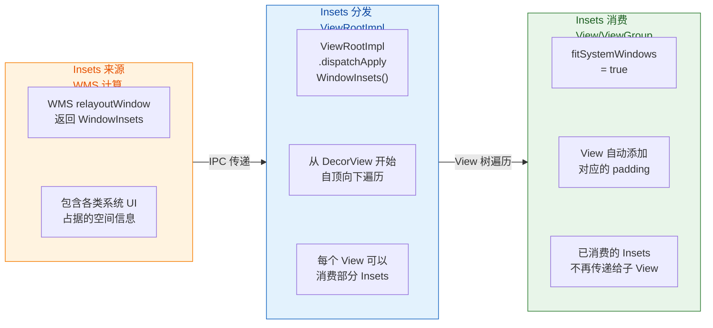

**FitSystemWindows 的传统行为**

当一个 View 设置了 `android:fitsSystemWindows="true"` 时，系统（具体是 `View.onApplyWindowInsets()` 的默认实现）会将 System Window Insets 作为 **padding** 应用到这个 View 上。例如，如果状态栏高度是 96px，那么该 View 的 `paddingTop` 就会被设为 96px，确保内容不会"钻到"状态栏背后。

这个机制有几个关键特性需要理解：

- **消费即终止**：一旦某个 View 消费了 Insets（将其转换为 padding），它传递给子 View 的 Insets 中对应方向的值就变为 0。这意味着 **只有第一个设置 `fitsSystemWindows="true"` 的 View 会生效**。
- **全量消费**：传统的 `fitSystemWindows` 是"贪婪"的，它会一次性消费所有方向的 Insets（top/bottom/left/right），不支持只消费顶部而保留底部给下层处理。
- **仅对直接子级有效**：Insets 的分发是沿 View 树自顶向下的，如果中间某个 ViewGroup 消费了 Insets，其所有后代 View 都不会再收到。

```xml
<!-- 典型用法：CoordinatorLayout 消费 Insets -->
<androidx.coordinatorlayout.widget.CoordinatorLayout
    android:layout_width="match_parent"
    android:layout_height="match_parent"
    android:fitsSystemWindows="true">  <!-- 消费系统栏 Insets，自身加 padding -->

    <com.google.android.material.appbar.AppBarLayout
        android:layout_width="match_parent"
        android:layout_height="wrap_content"
        android:fitsSystemWindows="true">  <!-- AppBarLayout 也声明，以便特殊处理 -->

        <!-- CollapsingToolbarLayout 内部会重新分发 Insets -->
        <com.google.android.material.appbar.CollapsingToolbarLayout
            android:layout_width="match_parent"
            android:layout_height="200dp"
            android:fitsSystemWindows="true">  <!-- 让背景图延伸到状态栏后 -->

            <ImageView
                android:layout_width="match_parent"
                android:layout_height="match_parent"
                android:fitsSystemWindows="true"  <!-- 背景图也需要声明 -->
                android:scaleType="centerCrop" />

        </com.google.android.material.appbar.CollapsingToolbarLayout>
    </com.google.android.material.appbar.AppBarLayout>
</androidx.coordinatorlayout.widget.CoordinatorLayout>
```

你会注意到上面的例子中，多层嵌套都设置了 `fitsSystemWindows="true"`。这是因为 Material Design 组件（如 `CoordinatorLayout`、`AppBarLayout`、`CollapsingToolbarLayout`）**重写了** `onApplyWindowInsets()` 方法，它们不再遵循"消费即终止"的默认行为，而是有选择地消费部分 Insets 并将剩余部分继续向下传递。这是 Google 在设计 Material 组件时的重要考量——如果完全遵循默认行为，嵌套布局的沉浸式效果根本无法实现。

**现代方案：WindowInsetsCompat + setOnApplyWindowInsetsListener**

从 AndroidX Core 1.5+ 开始，推荐使用 `ViewCompat.setOnApplyWindowInsetsListener()` 来精确控制每个 View 如何响应 Insets。这种方式比 XML 属性灵活得多：

```kotlin
// 步骤 1：告诉系统"我要自己处理系统栏区域，不要自动留白"
WindowCompat.setDecorFitsSystemWindows(window, false)  // 关闭默认的 DecorView padding 行为

// 步骤 2：为具体的 View 设置 Insets 监听
ViewCompat.setOnApplyWindowInsetsListener(findViewById(R.id.main_content)) { view, windowInsets ->
    // 获取系统栏（状态栏 + 导航栏）的 Insets
    val systemBarsInsets = windowInsets.getInsets(WindowInsetsCompat.Type.systemBars())

    // 只在顶部和底部设置 padding，左右保持为 0
    view.updatePadding(
        top = systemBarsInsets.top,       // 顶部留出状态栏高度
        bottom = systemBarsInsets.bottom  // 底部留出导航栏高度
    )

    // 返回 CONSUMED 表示此 View 已消费 Insets，子 View 不再收到
    // 返回原始 windowInsets 则允许子 View 继续处理
    WindowInsetsCompat.CONSUMED
}
```

这种方式的核心优势是 **精确控制**：你可以选择只消费某个方向的 Insets，或者只响应某种类型的 Insets（如只处理 IME 而忽略 NavigationBar）。而且回调是在每次 Insets 变化时触发的，能够正确处理折叠屏展开、分屏模式切换、软键盘弹出等动态场景。

**Edge-to-Edge 全面屏适配**

从 Android 15（API 35）开始，当应用的 `targetSdkVersion >= 35` 时，**系统默认强制 edge-to-edge 模式**。这意味着：

1. 状态栏和导航栏背景自动变为透明
2. 应用内容默认延伸到系统栏后面
3. `Window.setStatusBarColor()` 和 `Window.setNavigationBarColor()` 被完全忽略
4. 应用 **必须** 通过 WindowInsets 自行处理内容避让

AndroidX Activity 1.8+ 提供了 `enableEdgeToEdge()` 便捷方法，可以在所有 Android 版本上统一启用 edge-to-edge：

```kotlin
class MainActivity : AppCompatActivity() {
    override fun onCreate(savedInstanceState: Bundle?) {
        // 必须在 super.onCreate() 之前调用
        enableEdgeToEdge()  // 一行代码启用 edge-to-edge
        super.onCreate(savedInstanceState)
        setContentView(R.layout.activity_main)

        // 设置 Insets 监听，确保关键内容不被遮挡
        ViewCompat.setOnApplyWindowInsetsListener(findViewById(R.id.root)) { view, insets ->
            val systemBars = insets.getInsets(WindowInsetsCompat.Type.systemBars())
            // 为根布局设置 padding，保护内容区域
            view.setPadding(
                systemBars.left,    // 横屏时可能有左侧导航栏
                systemBars.top,     // 状态栏高度
                systemBars.right,   // 横屏时可能有右侧导航栏
                systemBars.bottom   // 导航栏高度
            )
            insets
        }
    }
}
```

`enableEdgeToEdge()` 内部做了什么？它主要执行以下操作：调用 `WindowCompat.setDecorFitsSystemWindows(window, false)` 关闭默认 padding；根据系统版本设置状态栏和导航栏为透明或半透明；设置合适的 `isAppearanceLightStatusBars` / `isAppearanceLightNavigationBars` 以匹配当前主题的明暗模式。这些操作在不同 API 级别有不同的实现路径，`enableEdgeToEdge()` 帮我们封装了所有兼容性细节。

**Insets 动画**

Android 11 引入了 `WindowInsetsAnimation` API，允许应用监听 Insets 变化的动画过程（最典型的场景是软键盘弹出/收起），并让自己的 UI 跟随动画同步移动。虽然这个 API 主要用于 IME 适配，但它同样适用于系统栏的显示/隐藏动画：

```kotlin
// 监听 Insets 动画（如键盘弹出/收起、系统栏显示/隐藏）
ViewCompat.setWindowInsetsAnimationCallback(
    view,
    object : WindowInsetsAnimationCompat.Callback(DISPATCH_MODE_STOP) {
        // 动画进行中，每帧回调
        override fun onProgress(
            insets: WindowInsetsCompat,
            runningAnimations: MutableList<WindowInsetsAnimationCompat>
        ): WindowInsetsCompat {
            // 获取当前帧的 IME 和系统栏 Insets
            val imeInsets = insets.getInsets(WindowInsetsCompat.Type.ime())
            val sysInsets = insets.getInsets(WindowInsetsCompat.Type.systemBars())
            // 取两者的最大值，确保内容始终在安全区域
            val maxBottom = maxOf(imeInsets.bottom, sysInsets.bottom)
            // 动态调整 View 的 translationY 或 padding
            view.translationY = -maxBottom.toFloat()
            return insets
        }
    }
)
```

**常见踩坑与最佳实践**

在实际项目中，系统栏适配有几个常见的坑：

1. **Fragment 中的 Insets 丢失**：如果 Activity 的根布局消费了所有 Insets，Fragment 的 View 就收不到 Insets 回调。解决方案是让 Activity 根布局 **不消费** Insets（返回原始 insets 而非 `CONSUMED`），或者使用 `ViewGroupCompat.setOnApplyWindowInsetsListener` 配合自定义分发逻辑。

2. **RecyclerView 底部 item 被导航栏遮挡**：启用 edge-to-edge 后，RecyclerView 的最后一个 item 可能"藏在"导航栏后面。正确做法是对 RecyclerView 设置 `clipToPadding="false"` 并通过 Insets 回调设置 `paddingBottom`：

```kotlin
ViewCompat.setOnApplyWindowInsetsListener(recyclerView) { view, insets ->
    val navBarInsets = insets.getInsets(WindowInsetsCompat.Type.navigationBars())
    // 设置底部 padding，但 clipToPadding=false 允许内容滚动到 padding 区域
    view.updatePadding(bottom = navBarInsets.bottom)
    insets  // 不消费，继续传递
}
```

```xml
<androidx.recyclerview.widget.RecyclerView
    android:id="@+id/recycler_view"
    android:layout_width="match_parent"
    android:layout_height="match_parent"
    android:clipToPadding="false" />  <!-- 关键：允许内容滚动穿透 padding 区域 -->
```

3. **多窗口/折叠屏下 Insets 变化**：进入分屏模式时，应用可能不再紧贴屏幕边缘，此时状态栏/导航栏 Insets 可能变为 0（因为系统栏不在该窗口范围内）。正确使用 Insets 回调而非硬编码高度值，就能自动处理这种场景。

4. **横屏导航栏位置**：在某些设备上，横屏时导航栏可能出现在屏幕右侧而非底部。此时 `navigationBarInsets.right` 会有值而 `bottom` 为 0。使用四个方向的 Insets（而非只关注 top/bottom）是正确的做法。

以下是一个完整的 edge-to-edge 适配模板，综合了以上所有最佳实践：

```kotlin
class EdgeToEdgeActivity : AppCompatActivity() {
    override fun onCreate(savedInstanceState: Bundle?) {
        enableEdgeToEdge()  // 启用 edge-to-edge，必须在 super.onCreate() 之前
        super.onCreate(savedInstanceState)
        setContentView(R.layout.activity_edge_to_edge)

        // Toolbar 只需要消费顶部 Insets
        ViewCompat.setOnApplyWindowInsetsListener(findViewById(R.id.toolbar)) { view, insets ->
            val systemBars = insets.getInsets(WindowInsetsCompat.Type.systemBars())
            view.updatePadding(top = systemBars.top)  // Toolbar 顶部留出状态栏高度
            insets  // 不消费，让其他 View 也能收到
        }

        // FAB 需要消费底部 Insets，避免被导航栏遮挡
        ViewCompat.setOnApplyWindowInsetsListener(findViewById(R.id.fab)) { view, insets ->
            val systemBars = insets.getInsets(WindowInsetsCompat.Type.systemBars())
            // 使用 margin 而非 padding，因为 FAB 是浮动元素
            val params = view.layoutParams as ViewGroup.MarginLayoutParams
            params.bottomMargin = systemBars.bottom + (16 * resources.displayMetrics.density).toInt()
            view.layoutParams = params
            insets
        }

        // RecyclerView 需要底部 padding + clipToPadding=false
        val recyclerView = findViewById<RecyclerView>(R.id.recycler_view)
        recyclerView.clipToPadding = false  // 允许内容滚动到 padding 区域
        ViewCompat.setOnApplyWindowInsetsListener(recyclerView) { view, insets ->
            val systemBars = insets.getInsets(WindowInsetsCompat.Type.systemBars())
            view.updatePadding(bottom = systemBars.bottom)  // 底部留出导航栏空间
            insets
        }
    }
}
```

---

**📝 练习题**

在 Android 15（targetSdkVersion 35）上，应用未做任何 WindowInsets 处理就直接运行，最可能出现什么问题？

A. 应用崩溃，抛出 WindowInsetsException


B. 状态栏和导航栏显示为黑色不透明


C. 应用内容延伸到系统栏后面，部分 UI 被状态栏和导航栏遮挡


D. 系统自动为应用添加 padding，UI 显示正常

**【答案】** C

**【解析】** Android 15 对 `targetSdkVersion >= 35` 的应用强制启用 edge-to-edge 模式。在该模式下，系统不再自动为应用内容留出系统栏空间（即 `DecorView` 不再默认添加系统栏高度的 padding），状态栏和导航栏背景变为透明，应用内容会延伸到整个屏幕。如果应用没有通过 `WindowInsets` 回调来手动处理内容避让，那么 Toolbar、底部按钮、列表末尾等 UI 元素就会被系统栏遮挡。这不会导致崩溃（排除 A），也不会像旧版本那样自动处理（排除 D）。选项 B 描述的是旧版本默认行为，在强制 edge-to-edge 下恰恰相反——系统栏是透明的。因此正确答案是 C。

---

**📝 练习题**

关于 `View.setSystemGestureExclusionRects()` 的说法，以下哪项是 **错误** 的？

A. 可以阻止系统在指定区域内拦截左侧边缘的返回手势


B. 可以阻止系统在指定区域内拦截底部的 Home 手势


C. 排斥区域的总面积有系统限制，超出部分会被忽略


D. 该 API 从 Android 10（API 29）开始引入

**【答案】** B

**【解析】** `setSystemGestureExclusionRects()` 允许应用声明特定矩形区域不被系统手势拦截，这主要用于解决应用侧滑操作与系统返回手势的冲突。它确实可以阻止左右边缘的返回手势（A 正确），系统对排斥区面积有上限限制（C 正确），该 API 从 API 29 引入（D 正确）。但是，**底部的 Home 手势属于 Mandatory System Gesture（强制系统手势），是不可被应用排斥的**。这是 Google 的安全设计——确保用户在任何界面下都能通过底部上滑回到主页，防止恶意应用"锁住"用户。因此 B 的说法是错误的。

---

## 显示与屏幕

Android 设备的屏幕千差万别——从 4 英寸的入门手机到 12 英寸的折叠屏平板，从 160dpi 的低密度设备到 640dpi 的旗舰手机。应用层开发者面临一个核心命题：**如何让同一份布局代码在所有屏幕上都呈现正确的视觉效果？** 这背后依赖的就是 Android 精心设计的"显示与屏幕"体系。该体系由三大支柱构成：`DisplayMetrics` 负责描述屏幕的物理与逻辑参数，`WindowManager.LayoutParams` 负责精确控制每一个窗口在屏幕上的定位、尺寸与行为，而 `Configuration` 则在屏幕旋转等运行时变化中充当状态载体，驱动 Activity 的重建或资源切换。理解这三者的协作关系，是写出高质量适配代码的基石。

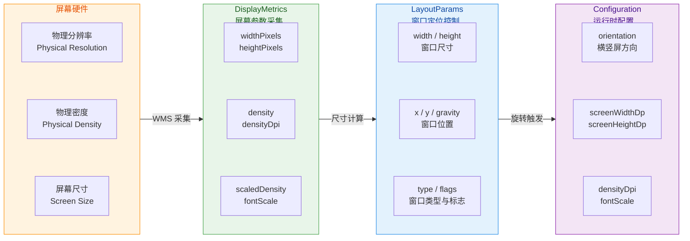

---

### DisplayMetrics 屏幕参数

#### 什么是 DisplayMetrics

`DisplayMetrics` 是 Android 框架中用来描述屏幕"度量信息"的数据类（data holder），位于 `android.util` 包下。它并不是一个服务或管理器，而是一个简单的 **值容器**——它把屏幕的分辨率、密度、缩放因子等核心参数收集到一个对象中，供应用层在布局计算、自定义绘制、动态适配等场景中使用。

每当你在代码中写 `24.dp`、`16sp` 时，系统内部都在用 DisplayMetrics 中的 `density` 和 `scaledDensity` 做乘法换算。可以说，**DisplayMetrics 是整个 Android 尺寸适配体系的数据源头**。

#### 核心字段详解

DisplayMetrics 的字段不多，但每个都承载着关键意义：

**分辨率字段：widthPixels 与 heightPixels**

这两个字段记录的是屏幕 **可用区域的像素数**，注意它们并不总是等于物理分辨率。在有系统装饰栏（StatusBar、NavigationBar）的情况下，`heightPixels` 反映的是去除装饰栏后的可用高度。从 Android 11（API 30）开始，Google 引入了 `WindowMetrics` API 来更精确地区分"当前窗口边界"和"最大窗口边界"，但 DisplayMetrics 仍然是最广泛使用的方式。

**密度字段：density 与 densityDpi**

`densityDpi` 表示屏幕的"每英寸像素点数"（dots per inch），这是一个与硬件直接相关的值。Android 将设备屏幕归类为若干标准密度桶（density bucket）：ldpi（120）、mdpi（160）、hdpi（240）、xhdpi（320）、xxhdpi（480）、xxxhdpi（640）。而 `density` 则是 `densityDpi / 160` 的浮点结果，它才是实际换算中用到的乘数因子。例如一台 xxhdpi 设备，`densityDpi = 480`，`density = 3.0`，那么 `1dp = 3px`。

为什么基准是 160？因为 Android 最初的参考设备（HTC G1）的屏幕密度恰好是 160dpi，Google 将其定义为 mdpi 基准，即在 160dpi 屏幕上 `1dp = 1px`。这个历史决策奠定了整个 dp 换算体系的基础。

**文字缩放：scaledDensity 与 fontScale**

`scaledDensity` 在默认情况下等于 `density`，但当用户在系统设置中调整了"字体大小"后，`scaledDensity` 会按比例增大或缩小。这就是 `sp`（scale-independent pixel）与 `dp` 的区别——sp 会响应用户的字体偏好，而 dp 不会。具体公式为 `scaledDensity = density × fontScale`，其中 `fontScale` 是用户设置的缩放倍率（默认 1.0）。

**xdpi 与 ydpi：不太可靠的物理密度**

这两个字段理论上反映屏幕在水平和垂直方向上的实际物理 DPI。但在实践中，许多厂商并不会精确填写这两个值，而是直接使用 `densityDpi` 的标准值代替。因此，**除非你在做非常精确的物理尺寸计算（如测量工具类 App），否则不应依赖 xdpi/ydpi**。

#### 获取 DisplayMetrics 的方式

获取 DisplayMetrics 有多种途径，每种方式的语义和适用场景略有不同：

```kotlin
// ========== 方式一：通过 Resources 获取（最常用）==========
// 这种方式获取的 DisplayMetrics 会反映当前 Context 的配置
// 如果 Activity 处于多窗口模式，返回的是该窗口的度量，而非整个物理屏幕
val dm: DisplayMetrics = resources.displayMetrics
// density 就是 dp 到 px 的换算因子
val density: Float = dm.density
// 拿到当前窗口可用的像素宽度
val screenWidthPx: Int = dm.widthPixels

// ========== 方式二：通过 WindowManager 获取 ==========
// 在 API 30 之前，这是获取"真实屏幕分辨率"（含系统栏区域）的常用手段
val wm = getSystemService(Context.WINDOW_SERVICE) as WindowManager
val realDm = DisplayMetrics()
// getRealMetrics 返回包含系统栏区域在内的完整分辨率
// 注意：此方法在 API 31 已被标记为 deprecated
wm.defaultDisplay.getRealMetrics(realDm)

// ========== 方式三：API 30+ 推荐的 WindowMetrics ==========
// WindowMetrics 提供了更清晰的"当前窗口"和"最大窗口"边界概念
if (Build.VERSION.SDK_INT >= Build.VERSION_CODES.R) {
    // currentWindowMetrics 返回当前窗口的实际边界（考虑多窗口、画中画等）
    val windowMetrics: WindowMetrics = wm.currentWindowMetrics
    // 获取宽度：右边界减去左边界
    val width = windowMetrics.bounds.width()
    // 获取高度：下边界减去上边界
    val height = windowMetrics.bounds.height()

    // 如果需要获取最大可用区域（即物理屏幕全区域）
    val maxMetrics: WindowMetrics = wm.maximumWindowMetrics
    val fullWidth = maxMetrics.bounds.width()
    val fullHeight = maxMetrics.bounds.height()
}
```

**方式一**（`resources.displayMetrics`）是最常用的，因为它天然与当前 Context 的 Configuration 绑定。在多窗口（split-screen）场景下，它返回的是 **该窗口实际分得的尺寸**，而非整个屏幕的尺寸，这通常是应用层布局计算所需要的值。

**方式二**（`Display.getRealMetrics()`）在 API 30 之后被废弃，取而代之的是 **方式三**（`WindowMetrics`）。`WindowMetrics` 的设计更加语义化：`currentWindowMetrics` 明确表示"当前窗口的边界"，`maximumWindowMetrics` 明确表示"如果窗口全屏展开能获得的最大边界"。这在折叠屏、自由窗口（freeform）等新形态设备上尤为重要。

#### dp / sp / px 换算原理

尺寸单位的换算是每个 Android 开发者的基本功，其核心就是 DisplayMetrics 提供的 `density` 和 `scaledDensity`：

```kotlin
// ========== dp 转 px ==========
// 公式：px = dp × density
// 加 0.5f 是为了四舍五入取整（正数场景）
fun Int.dpToPx(dm: DisplayMetrics): Int {
    return (this * dm.density + 0.5f).toInt()
}

// ========== sp 转 px ==========
// 公式：px = sp × scaledDensity
// scaledDensity 包含了用户字体缩放的影响
fun Int.spToPx(dm: DisplayMetrics): Int {
    return (this * dm.scaledDensity + 0.5f).toInt()
}

// ========== px 转 dp ==========
// 公式：dp = px / density
fun Int.pxToDp(dm: DisplayMetrics): Int {
    return (this / dm.density + 0.5f).toInt()
}

// ========== 使用 TypedValue（系统推荐方式）==========
// TypedValue.applyDimension 是系统内部在解析 XML 布局中 dp/sp 值时使用的方法
// 它比手动乘法更规范，内部会根据 unit 类型自动选择 density 或 scaledDensity
val px = TypedValue.applyDimension(
    TypedValue.COMPLEX_UNIT_DIP,  // 指定输入单位为 dp
    16f,                          // 输入值：16dp
    resources.displayMetrics      // 提供度量信息
)
```

这里有一个常见的陷阱：当用户在系统设置中改变字体大小后，`scaledDensity` 会变化。如果你的 App 中某些关键 UI 元素（如标题栏高度）使用了 `sp` 单位，那么在大字体模式下可能会出现布局溢出。因此，**固定高度的容器应使用 dp，文本尺寸使用 sp**，这是一条重要的适配原则。

#### DisplayMetrics 与多窗口 / 折叠屏

在 Android 7.0 引入多窗口模式后，DisplayMetrics 的语义发生了微妙变化。当 Activity 运行在分屏模式下时，通过 `resources.displayMetrics` 获取到的 `widthPixels` 和 `heightPixels` 反映的是 **当前分屏窗口的尺寸**，而非整个物理屏幕的尺寸。这意味着如果你此前的代码用 `displayMetrics.widthPixels` 来判断"设备是手机还是平板"，那在多窗口模式下可能会误判——一台平板的一半屏幕可能比手机全屏还窄。

正确的做法是使用 `Configuration.smallestScreenWidthDp` 来判断设备类型（这个值不会因为多窗口而缩小），而使用 `WindowMetrics` 或 `displayMetrics` 来做动态布局适配。

对于折叠屏设备，情况更加复杂：设备在展开和折叠状态下，物理屏幕尺寸会发生真实变化。系统会在折叠/展开时触发 Configuration Change，应用需要准备好在两套不同的 DisplayMetrics 之间平滑切换。Jetpack 提供的 `WindowSizeClass` 工具正是为简化这一适配而设计的。

---

### WindowManager.LayoutParams

#### 角色定位

如果说 DisplayMetrics 回答的是"屏幕有多大"，那 `WindowManager.LayoutParams` 回答的就是"我的窗口要放在哪里、多大、长什么样"。它是 `ViewGroup.LayoutParams` 的子类，继承了基础的 `width`/`height` 能力，又追加了大量窗口级别的控制参数，包括窗口类型（type）、标志位（flags）、位置（x/y/gravity）、透明度（alpha）、屏幕亮度覆盖（screenBrightness）等。

每一个被添加到 WindowManager 的 View，都必须携带一个 `WindowManager.LayoutParams` 对象。系统会将这些参数传递给 WMS（WindowManagerService），由 WMS 来决定这个窗口最终在屏幕上的渲染位置、层级和可见性。这是 **应用层与 WMS 之间最核心的通信协议之一**。

#### 宽高与位置控制

LayoutParams 的 `width` 和 `height` 支持三种设置方式：精确像素值、`MATCH_PARENT`（充满父窗口或屏幕）、`WRAP_CONTENT`（按内容自适应）。对于顶层窗口（直接添加到 WindowManager 的窗口），`MATCH_PARENT` 意味着充满整个屏幕可用区域。

位置控制通过 `x`、`y` 和 `gravity` 三个字段协同完成。`gravity` 指定窗口的"锚点"位置——类似于给窗口指定一个起始参考点。例如 `Gravity.TOP | Gravity.START` 表示以屏幕左上角为参考。而 `x` 和 `y` 则是相对于这个锚点的偏移量。如果 `gravity` 设为 `Gravity.CENTER`，那窗口先居中放置，再根据 `x`/`y` 做偏移。

```kotlin
// ========== 创建一个悬浮窗口的 LayoutParams ==========
val params = WindowManager.LayoutParams(
    // 宽度：300dp 转换为 px
    (300 * resources.displayMetrics.density).toInt(),
    // 高度：200dp 转换为 px
    (200 * resources.displayMetrics.density).toInt(),
    // 窗口类型：TYPE_APPLICATION_OVERLAY 是 API 26+ 的悬浮窗类型
    // 需要 SYSTEM_ALERT_WINDOW 权限
    WindowManager.LayoutParams.TYPE_APPLICATION_OVERLAY,
    // 标志位组合：不可聚焦 + 不拦截外部触摸
    WindowManager.LayoutParams.FLAG_NOT_FOCUSABLE or
            WindowManager.LayoutParams.FLAG_NOT_TOUCH_MODAL,
    // 像素格式：半透明
    PixelFormat.TRANSLUCENT
).apply {
    // 锚点设在屏幕左上角
    gravity = Gravity.TOP or Gravity.START
    // 相对于左上角锚点，水平偏移 100px
    x = 100
    // 相对于左上角锚点，垂直偏移 200px
    y = 200
}

// 将一个 View 作为独立窗口添加到屏幕上
// WindowManager 会将 params 发送给 WMS 进行窗口注册和布局计算
val windowManager = getSystemService(Context.WINDOW_SERVICE) as WindowManager
windowManager.addView(floatingView, params)
```

#### 关键属性深入

**type（窗口类型）** 在前一节"窗口属性详解"中已经深入讨论，这里再补充一点：`type` 字段直接决定了窗口的 **Z-order 层级**。WMS 维护着一张全局的窗口层级表，`type` 值越大的窗口越靠上（越接近用户）。应用窗口的 type 范围是 1~99，子窗口是 1000~1999，系统窗口是 2000~2999。如果你在代码中使用了错误的 type 值（比如非系统应用使用了系统窗口类型但没有权限），WMS 会直接拒绝添加并抛出 `BadTokenException`。

**flags（标志位）** 同样在前一节已详细展开。这里强调一点容易混淆的概念：`FLAG_NOT_FOCUSABLE` 和 `FLAG_NOT_TOUCHABLE` 的区别。`FLAG_NOT_FOCUSABLE` 意味着窗口不会获得键盘焦点（软键盘不会弹出、硬件按键事件不会路由到此窗口），**但窗口仍然可以接收触摸事件**。而 `FLAG_NOT_TOUCHABLE` 则是完全不接收触摸事件，触摸会穿透到下层窗口。

**alpha（透明度）** 范围 0.0（全透明）到 1.0（全不透明），控制的是整个窗口的透明度。注意这和 View 自身的 `setAlpha()` 不同——LayoutParams 的 alpha 作用在窗口合成阶段（SurfaceFlinger 层），比 View 级别的透明度效率更高但粒度更粗。

**screenBrightness 与 buttonBrightness**：取值 0.0 到 1.0，允许单个窗口 **覆盖系统亮度设置**。典型场景是视频播放器在全屏时调整屏幕亮度，或扫码页面强制提高亮度。设为 -1（默认值）表示不覆盖。

**dimAmount**：配合 `FLAG_DIM_BEHIND` 使用，控制窗口背后的遮罩暗度。Dialog 默认就使用了这个机制，让对话框后面的内容变暗以突出对话框本身。

**softInputMode**：控制软键盘弹出时窗口的行为（平移还是压缩），已在窗口属性章节详细讨论。这里补充一点：`softInputMode` 也是 LayoutParams 的一个字段，通过 `window.attributes` 可以动态修改它。

#### 动态更新 LayoutParams

窗口的 LayoutParams 不是一次性的——你可以在窗口显示后随时更新它们。典型的做法是修改 LayoutParams 对象的字段，然后调用 `WindowManager.updateViewLayout()` 通知 WMS 刷新：

```kotlin
// ========== 动态更新窗口位置（如实现悬浮窗拖拽）==========
// 假设 floatingView 是已经 addView 到 WindowManager 的悬浮视图
floatingView.setOnTouchListener { view, event ->
    when (event.action) {
        MotionEvent.ACTION_MOVE -> {
            // 获取当前窗口的 LayoutParams
            val lp = view.layoutParams as WindowManager.LayoutParams
            // 根据手指移动距离更新窗口位置
            // rawX/rawY 是相对于屏幕的绝对坐标
            lp.x = event.rawX.toInt() - view.width / 2
            lp.y = event.rawY.toInt() - view.height / 2
            // 调用 updateViewLayout 将新参数提交给 WMS
            // WMS 收到后会重新计算该窗口的位置并通知 SurfaceFlinger 刷新
            windowManager.updateViewLayout(view, lp)
        }
    }
    true
}
```

每次调用 `updateViewLayout()` 时，系统内部会经历一条完整的调用链：`WindowManagerImpl.updateViewLayout()` → `WindowManagerGlobal.updateViewLayout()` → `ViewRootImpl.setLayoutParams()` → 通过 Binder 调用 `WMS.relayoutWindow()`。WMS 收到请求后会重新计算窗口帧（frame）、可见性和层级，然后通知 SurfaceFlinger 在下一帧 VSYNC 信号到来时刷新合成。

**性能注意**：频繁调用 `updateViewLayout()` 会触发频繁的跨进程 Binder 调用和 WMS 重新布局计算。在实现拖拽悬浮窗时，建议对 `ACTION_MOVE` 事件做适当的节流（throttling），或利用 `Choreographer` 按帧同步更新，避免不必要的 IPC 开销。

#### LayoutParams 与 Activity 窗口

开发者在 Activity 中通常不需要直接 `new WindowManager.LayoutParams()`，因为 Activity 的 PhoneWindow 会自动创建并管理它。但你可以通过 `window.attributes` 获取并修改它：

```kotlin
// ========== 在 Activity 中修改窗口属性 ==========
// window.attributes 返回的就是当前 Activity 窗口的 LayoutParams
val attrs = window.attributes

// 设置窗口透明度为 80%
attrs.alpha = 0.8f

// 设置窗口全屏亮度（最大亮度）
attrs.screenBrightness = 1.0f

// 设置窗口背后的遮罩暗度（需要配合 FLAG_DIM_BEHIND）
attrs.dimAmount = 0.6f
window.addFlags(WindowManager.LayoutParams.FLAG_DIM_BEHIND)

// 将修改后的属性写回
// 这一步会触发 WMS 重新评估该窗口
window.attributes = attrs
```

需要注意，`window.attributes` 的 getter 返回的是内部对象的**引用**，但 setter 内部会做 **copyFrom** 操作并触发 WMS 更新。因此必须调用 `window.attributes = attrs` 才能让修改生效。

---

### 屏幕旋转 Configuration

#### Configuration 的本质

`Configuration` 对象（`android.content.res.Configuration`）是 Android 系统用来描述 **设备当前运行时配置** 的载体。它包含了大量维度的信息：语言区域（locale）、屏幕方向（orientation）、屏幕尺寸（screenWidthDp/screenHeightDp）、字体缩放（fontScale）、夜间模式（uiMode）、键盘状态等。

从应用层的角度看，Configuration 最重要的意义在于：**当 Configuration 中的某些字段发生变化时，系统默认会销毁并重建当前 Activity**。这就是著名的 Configuration Change 机制。屏幕旋转是触发这一机制最常见也最直观的场景。

#### 屏幕旋转的完整流程

当用户旋转设备时，系统传感器检测到重力方向变化，一连串的事件链被触发：

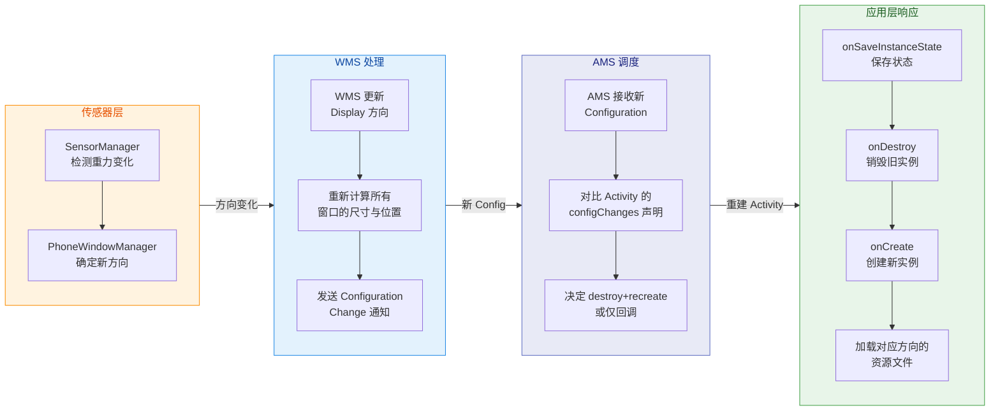

整个过程可以分为四个阶段：

**第一阶段：传感器与方向决策。** 设备的加速度传感器持续报告重力方向，`WindowOrientationListener` 监听这些数据并将其转化为屏幕方向（portrait/landscape）。`PhoneWindowManager`（WMS 的策略类）根据当前 Activity 声明的 `screenOrientation` 属性、系统设置中的"自动旋转"开关等条件，综合决策是否需要真正改变显示方向。

**第二阶段：WMS 更新显示参数。** 一旦方向确定要改变，WMS 会更新 Display 的 rotation 状态，并重新计算所有窗口的可见帧（visible frame）和内容帧（content frame）。此时 widthPixels 和 heightPixels 会互换（竖屏变横屏时宽变大、高变小），DisplayMetrics 会被更新。

**第三阶段：AMS 驱动 Configuration Change。** WMS 将新的 Configuration 传递给 AMS（ActivityManagerService），AMS 检查每个处于前台的 Activity 是否在 AndroidManifest 中声明了 `android:configChanges` 属性来处理 `orientation` 变化。如果没有声明（默认情况），AMS 会 **销毁并重建** 该 Activity。

**第四阶段：应用层响应。** Activity 经历完整的生命周期回调：`onPause()` → `onSaveInstanceState()` → `onStop()` → `onDestroy()` → `onCreate()` → `onStart()` → `onResume()`。在新的 `onCreate()` 中，系统会使用新的 Configuration 去加载对应的限定符资源（如 `layout-land/`、`values-land/`），从而实现不同方向使用不同布局。

#### configChanges：自行处理 vs. 重建

开发者可以在 AndroidManifest 中声明自行处理某些 Configuration 变化：

```xml
<!-- 声明 Activity 自行处理方向和屏幕尺寸变化 -->
<!-- 加上这些声明后，旋转屏幕时 Activity 不会被销毁重建 -->
<!-- 而是回调 onConfigurationChanged() 方法 -->
<activity
    android:name=".VideoPlayerActivity"
    android:configChanges="orientation|screenSize|screenLayout|smallestScreenSize" />
```

声明后，旋转时 Activity 不再销毁重建，而是回调 `onConfigurationChanged()`：

```kotlin
// ========== 自行处理 Configuration Change ==========
override fun onConfigurationChanged(newConfig: Configuration) {
    // 必须调用 super，让系统完成资源更新等基础工作
    super.onConfigurationChanged(newConfig)

    // 检查新的方向
    when (newConfig.orientation) {
        // 竖屏
        Configuration.ORIENTATION_PORTRAIT -> {
            // 调整播放器为竖屏布局
            adjustPlayerToPortrait()
        }
        // 横屏
        Configuration.ORIENTATION_LANDSCAPE -> {
            // 调整播放器为横屏布局
            adjustPlayerToLandscape()
        }
    }

    // 新的屏幕宽度（单位 dp），可用于响应式布局判断
    val widthDp = newConfig.screenWidthDp
    // 新的屏幕高度（单位 dp）
    val heightDp = newConfig.screenHeightDp
}
```

**何时该声明 configChanges？** 这是一个常见的争议点。Google 官方的建议是：**尽量不要声明 configChanges，而是通过正确保存和恢复状态来应对重建**。原因在于，声明 configChanges 后，系统不会自动重新加载限定符资源（如 `layout-land/`），开发者需要手动完成所有 UI 适配工作，这容易遗漏。但在以下场景中，声明 configChanges 是合理甚至必要的：

- **视频播放器**：重建 Activity 会中断播放体验，且播放器通常只需要调整 SurfaceView 的尺寸。
- **游戏**：OpenGL 上下文的重建代价极大，且游戏通常有自己的渲染管线，不依赖 Android 资源系统。
- **地图类应用**：地图的加载和缓存状态复杂，重建代价高。

#### Configuration 的关键字段

除了 `orientation`，Configuration 还有几个与屏幕密切相关的字段值得了解：

**screenWidthDp / screenHeightDp**：当前窗口的宽高，单位是 dp。注意这不是设备物理屏幕的尺寸——在多窗口模式下，这些值反映的是当前 Activity 窗口的实际可用尺寸。这两个值在资源限定符匹配中非常关键：系统用 `screenWidthDp` 来匹配 `w<N>dp` 限定符（如 `layout-w600dp/`）。

**smallestScreenWidthDp**：屏幕最短边的 dp 值，**不会因为旋转而改变**。这个值常被用于区分手机和平板（典型阈值：手机 < 600dp，7 英寸平板 ≥ 600dp，10 英寸平板 ≥ 720dp），对应资源限定符 `sw<N>dp`。由于它不受旋转影响，比 `screenWidthDp` 更适合做设备类型判断。

**densityDpi**：与 DisplayMetrics 中的 `densityDpi` 一致，但通过 Configuration 传递使得资源系统可以在运行时根据密度变化（如投屏到不同密度的显示器）重新加载资源。

**uiMode**：包含夜间模式信息（`UI_MODE_NIGHT_YES`/`UI_MODE_NIGHT_NO`），当用户切换深色模式时也会触发 Configuration Change。

**fontScale**：用户的字体缩放偏好。当用户在系统设置中调整字体大小后，fontScale 会改变，并触发 Configuration Change。这就是为什么 sp 单位的文字会自动响应用户字体偏好——因为每次 fontScale 变化时，Activity 会重建，新的 DisplayMetrics.scaledDensity 值会被应用。

#### 锁定方向与传感器策略

在 AndroidManifest 或代码中可以精确控制 Activity 的方向行为：

```kotlin
// ========== 代码中动态控制屏幕方向 ==========

// 锁定为竖屏（忽略传感器，强制 portrait）
requestedOrientation = ActivityInfo.SCREEN_ORIENTATION_PORTRAIT

// 锁定为横屏
requestedOrientation = ActivityInfo.SCREEN_ORIENTATION_LANDSCAPE

// 跟随传感器自由旋转（用户开启自动旋转时才生效）
requestedOrientation = ActivityInfo.SCREEN_ORIENTATION_SENSOR

// 全方向传感器（包括反向竖屏 180°，通常手机不支持但平板支持）
requestedOrientation = ActivityInfo.SCREEN_ORIENTATION_FULL_SENSOR

// 根据设备自然方向锁定（手机竖屏、平板横屏）
requestedOrientation = ActivityInfo.SCREEN_ORIENTATION_NOSENSOR

// 跟随用户设置（系统"自动旋转"开关）—— 这是默认行为
requestedOrientation = ActivityInfo.SCREEN_ORIENTATION_USER
```

`SCREEN_ORIENTATION_SENSOR` 和 `SCREEN_ORIENTATION_FULL_SENSOR` 的区别在于：前者只允许 0° 和 90°/270° 共三个方向（排除 180° 反向竖屏），而后者允许全部四个方向。大多数手机由于听筒在顶部，180° 反向竖屏体验不佳，所以默认不启用。

还有一个实用的值 `SCREEN_ORIENTATION_LOCKED`，它会将屏幕锁定在 **调用时的当前方向**。适合在某些关键操作（如拍照确认）期间临时阻止旋转：

```kotlin
// ========== 临时锁定当前方向 ==========
// 开始关键操作前锁定
requestedOrientation = ActivityInfo.SCREEN_ORIENTATION_LOCKED

// 操作完成后恢复跟随传感器
requestedOrientation = ActivityInfo.SCREEN_ORIENTATION_SENSOR
```

#### 旋转与 ViewModel 的配合

Activity 重建时，ViewModel **不会被销毁**——这正是 ViewModel 被设计出来的核心理由之一。当屏幕旋转导致 Activity 重建时，旧 Activity 的 ViewModel 会被 ViewModelStore 保持，新 Activity 在 `onCreate()` 中通过 `ViewModelProvider` 重新获取到同一个实例。这意味着：

- **不需要** 通过 `onSaveInstanceState()` 保存大量数据到 Bundle（Bundle 有 1MB 限制且仅支持可序列化数据）。
- **不需要** 声明 `configChanges` 来避免重建。
- ViewModel 中的 LiveData/StateFlow 在新 Activity 订阅后会自动回放最新状态。

这是 Google 推荐的现代 Android 旋转处理最佳实践：**让 Activity 自由重建，用 ViewModel 保持 UI 状态，用 SavedStateHandle 保存少量关键数据（以应对进程被杀的场景）**。

```kotlin
// ========== ViewModel 在旋转中的状态保持 ==========
class VideoViewModel(
    // SavedStateHandle 由框架自动注入
    // 它能在进程死亡后恢复数据（底层使用 onSaveInstanceState 机制）
    private val savedStateHandle: SavedStateHandle
) : ViewModel() {

    // 播放进度：使用 StateFlow 暴露给 UI 层
    // 旋转重建后，新 Activity 订阅时会立即收到最新的进度值
    private val _playbackPosition = MutableStateFlow(
        // 优先从 SavedStateHandle 恢复（应对进程被杀的情况）
        savedStateHandle.get<Long>("position") ?: 0L
    )
    val playbackPosition: StateFlow<Long> = _playbackPosition.asStateFlow()

    // 更新播放进度的方法
    fun updatePosition(positionMs: Long) {
        _playbackPosition.value = positionMs
        // 同时写入 SavedStateHandle，确保进程被杀后也能恢复
        savedStateHandle["position"] = positionMs
    }
}
```

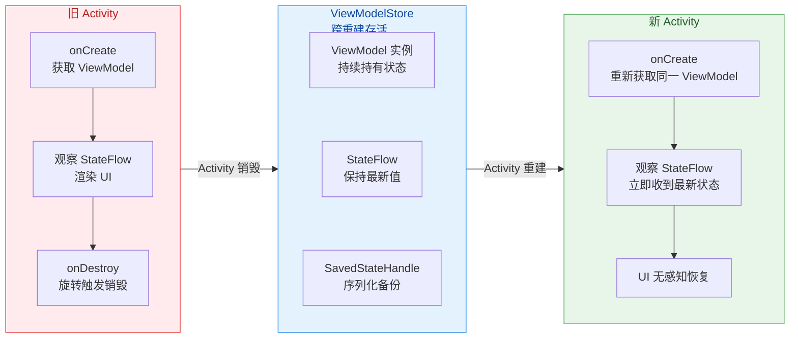

---

**📝 练习题**

在 Android 多窗口（分屏）模式下，Activity A 运行在上半屏。此时通过 `resources.displayMetrics.heightPixels` 获取到的值代表什么？

A. 整个物理屏幕的像素高度


B. 物理屏幕高度减去状态栏和导航栏的像素高度


C. Activity A 所在窗口的可用像素高度


D. 屏幕高度的一半（固定 50%）


**【答案】** C

**【解析】** 在 Android 7.0 引入多窗口模式后，`resources.displayMetrics` 返回的尺寸信息与当前 Activity 的 **窗口边界** 绑定，而非整个物理屏幕。当 Activity 处于分屏模式时，`heightPixels` 反映的是该 Activity 实际被分配到的窗口高度（包括系统可能在该窗口内绘制的装饰元素），而不是整个屏幕的高度。选项 A 是全屏场景下 `getRealMetrics()` 的语义；选项 B 是非多窗口时普通 `displayMetrics` 的近似表现（去除系统栏）；选项 D 则是错误假设——分屏比例可以由用户拖动调整，并非固定 50%。如果需要获取物理屏幕的完整尺寸，在 API 30+ 应使用 `WindowManager.maximumWindowMetrics`。

---

**📝 练习题**

关于 `Configuration.smallestScreenWidthDp`，以下说法正确的是：

A. 它会随着屏幕旋转而在 `screenWidthDp` 和 `screenHeightDp` 之间切换


B. 它在多窗口模式下会缩小为当前窗口最短边的 dp 值


C. 它始终反映设备物理屏幕最短边的 dp 值，不受旋转和多窗口影响


D. 它的值等于 `min(widthPixels, heightPixels) / density`，每次 Configuration Change 都重新计算


**【答案】** C

**【解析】** `smallestScreenWidthDp` 的设计目的就是提供一个 **稳定的设备尺寸标识符**，它取的是设备屏幕最短物理边的 dp 值。无论设备是竖屏还是横屏，这个值都不会改变（因为"最短边"不受旋转影响——竖屏时最短边是宽，横屏时最短边是高，但物理上是同一条边）。它也不会因为多窗口而缩小，仍然反映的是整块物理屏幕的特征。这使得它成为区分手机（< 600dp）和平板（≥ 600dp）的理想字段，对应资源限定符 `sw<N>dp`。选项 A 描述的是 `screenWidthDp` 的行为；选项 B 混淆了 `screenWidthDp`（会被多窗口影响）和 `smallestScreenWidthDp`（不受影响）；选项 D 的计算方式虽然形似，但 `smallestScreenWidthDp` 并不是每次 Configuration Change 都重新计算，且它不受多窗口影响。

---

## 触摸反馈基础

当用户手指触碰屏幕的那一刻，一次完整的输入事件之旅便开始了。从硬件驱动产生原始信号，到最终被应用层某个 View 消费，中间经过了 Linux 内核 → InputFlinger（Native 层）→ SystemServer（InputManagerService / WindowManagerService）→ 应用进程 这一条完整链路。对于应用开发者而言，我们不需要深入到内核驱动层面，但必须清楚理解 **事件如何从系统侧"投递"到我们的进程**、**进程内部如何接收并调度到 View 树** 以及 **如果处理太慢会发生什么（ANR）**。这三个问题分别对应本节的三个核心知识点：InputChannel 输入通道、InputEventReceiver 事件接收器、以及 ANR 触发机制。

理解这些底层投递机制，不仅能帮助我们写出更高效的触摸交互代码，还能在遇到"点击无响应""滑动卡顿""弹出 ANR 弹窗"等问题时，精准定位到问题根因——是主线程阻塞？是事件被错误拦截？还是 InputChannel 本身出了问题？

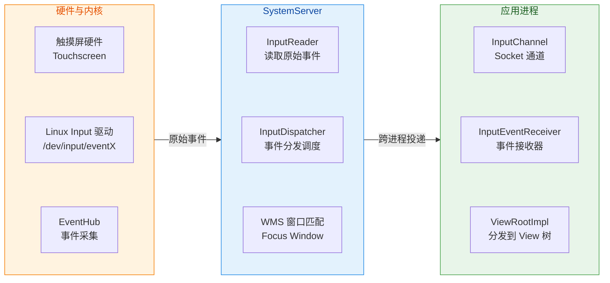

上图清晰地展示了一次触摸事件的完整生命周期——从硬件产生、经系统服务调度、最终到达应用进程。接下来我们逐一深入每个关键环节。

---

### InputChannel 输入通道

#### 什么是 InputChannel

InputChannel 是 Android 输入系统中实现 **跨进程事件传输** 的核心管道。从本质上讲，它是对 **Unix Domain Socket（本地域套接字）** 的一层封装。每一个拥有窗口（Window）的应用进程，在其窗口被添加到 WindowManagerService（WMS）时，系统都会为该窗口创建一对 InputChannel——一端留在 SystemServer 进程供 InputDispatcher 使用（称为 **server-side channel**），另一端通过 Binder 传递到应用进程供 ViewRootImpl 使用（称为 **client-side channel**）。

为什么选择 Socket 而不是 Binder 来传输输入事件？这是一个精妙的设计决策。Binder 是 Android 最主要的 IPC 机制，但它在传输高频、低延迟的数据时有天然劣势：Binder 调用涉及线程池调度、数据序列化/反序列化以及内核态的事务处理开销。触摸事件（尤其是 `ACTION_MOVE`）每秒可能产生数百次（高刷新率屏幕上甚至可达 240+ 次），如果每次都走 Binder 事务，会带来不可接受的延迟和 CPU 开销。而 Unix Domain Socket 是一种轻量级、双向的流式通信机制，数据直接在内核缓冲区中传输，无需复杂的事务管理，非常适合这种高频、小数据量的场景。

#### InputChannel 的创建时机

InputChannel 的创建与窗口的添加紧密绑定。当应用调用 `WindowManager.addView()` 时（Activity 启动、Dialog 显示、PopupWindow 弹出等场景都会触发），最终会通过 Binder 调用到达 WMS 的 `addWindow()` 方法。在这个方法内部，WMS 会调用 `InputChannel.openInputChannelPair()` 创建一对通道：

```java
// WindowManagerService.addWindow() 核心流程（简化）
// 当应用请求添加一个新窗口时，WMS 执行以下逻辑
public int addWindow(Session session, IWindow client,
        WindowManager.LayoutParams attrs, ...) {
    
    // 1. 创建 WindowState，代表系统侧对该窗口的管理对象
    final WindowState win = new WindowState(this, session, client, ...);
    
    // 2. 创建 InputChannel 对——一对基于 Socket 的通道
    //    name 通常为窗口标识，便于调试时识别
    InputChannel[] inputChannels = InputChannel.openInputChannelPair(attrs.getTitle());
    
    // 3. server 端通道注册到 InputDispatcher
    //    InputDispatcher 通过此通道向应用发送事件
    win.setInputChannel(inputChannels[0]);
    mInputManager.registerInputChannel(win.mInputChannel);
    
    // 4. client 端通道通过 Binder 回传给应用进程
    //    应用进程的 ViewRootImpl 会持有此通道
    inputChannels[1].transferTo(outInputChannel);
    
    return WindowManagerGlobal.ADD_OKAY;
}
```

这里的关键在于 `openInputChannelPair()` 方法——它在 Native 层调用 `socketpair(AF_UNIX, SOCK_SEQPACKET, 0, sockets)` 创建一对已连接的 Socket。`SOCK_SEQPACKET` 类型保证了消息边界（每次 `send` 对应一次 `recv`，不会像 `SOCK_STREAM` 那样粘包），这对于离散的输入事件传输非常重要。

#### InputChannel 的 fd 监听机制

应用进程拿到 client-side InputChannel 后，不能只是被动等待——它需要高效地监听这个 Socket fd（文件描述符）上是否有新数据到来。Android 使用的是 **Looper 的 epoll 机制**。ViewRootImpl 在初始化时会将 InputChannel 的 fd 注册到主线程 Looper 的 epoll 监听列表中。当 InputDispatcher 通过 server-side channel 发送一个事件时，client-side 的 Socket fd 变为可读状态，epoll 通知 Looper，Looper 回调到 InputEventReceiver 的 Native 端，从而触发事件接收流程。

这个设计非常优雅：输入事件的到来与 Message Queue 的消息处理共用同一个 Looper 循环，但输入事件并不是通过 `Handler.post()` 投递的 Message，而是通过 fd 事件直接在 Looper 的 `epoll_wait()` 返回时被处理。这意味着输入事件拥有 **比普通 Message 更高的响应优先级**——只要主线程从 `epoll_wait()` 中醒来，就能立刻处理到达的输入事件，不需要排队等待 MessageQueue 中前面的 Message 执行完毕（当然，如果主线程正在执行某个耗时的 Message，那它无法及时进入下一次 `epoll_wait()`，这正是 ANR 的根源之一）。

```kotlin
// 概念性伪代码：Looper 的核心循环
// 展示 InputChannel fd 如何与 MessageQueue 共存
fun looperLoop() {
    while (true) {
        // epoll_wait 同时监听：
        // 1. MessageQueue 的 wake pipe fd（有新 Message 时唤醒）
        // 2. InputChannel 的 socket fd（有新输入事件时唤醒）
        // 3. 其他注册的 fd（如 Choreographer 的 Vsync fd）
        val readyFds = epollWait(timeout)

        // 处理所有就绪的 fd
        for (fd in readyFds) {
            when (fd) {
                // 输入事件到达 —— 立即回调 InputEventReceiver
                inputChannelFd -> handleInputEvent()
                // 普通消息 —— 从队列取出 Message 执行
                messageQueueFd -> processNextMessage()
                // Vsync 信号 —— 触发 Choreographer 编排
                vsyncFd -> handleVsync()
            }
        }
    }
}
```

#### 多窗口场景下的 InputChannel

一个应用进程可以同时拥有多个窗口——比如一个 Activity 上弹出了一个 Dialog，Dialog 上又弹出了一个 PopupWindow。此时该进程中会存在 **多个 InputChannel**（每个窗口一个）。InputDispatcher 根据窗口的 Z-order、可见性、焦点状态等信息，决定将事件发往哪个窗口的 InputChannel。这也解释了为什么有时候 Dialog 弹出后，点击其后方的 Activity 区域没有反应——因为 InputDispatcher 将该区域的事件发给了 Dialog 的窗口，而 Dialog 可能设置了 `FLAG_NOT_TOUCH_MODAL` 来决定是否让事件"穿透"到后方窗口。

---

### InputEventReceiver 事件接收

#### InputEventReceiver 的角色定位

如果说 InputChannel 是事件传输的"物理管道"，那么 `InputEventReceiver` 就是管道应用侧的"接收站"。它是一个 Java 层的抽象类，负责 **从 InputChannel 中读取事件、转换为 Java 对象（InputEvent 及其子类 KeyEvent / MotionEvent）并回调给上层处理**。

在应用层，开发者几乎不会直接接触 `InputEventReceiver`，而是通过 View 的 `onTouchEvent()`、`OnClickListener` 等回调间接使用。但理解它的工作原理，对于分析事件延迟、丢帧、ANR 等问题至关重要。

#### WindowInputEventReceiver——应用层真正的接收者

`InputEventReceiver` 本身是抽象类，真正在应用中工作的实现类是 `ViewRootImpl` 中的内部类 `WindowInputEventReceiver`。每个 ViewRootImpl 实例在 `setView()` 阶段会创建一个 `WindowInputEventReceiver`，并将其与窗口的 client-side InputChannel 绑定：

```java
// ViewRootImpl.setView() 中的关键初始化（简化）
public void setView(View view, WindowManager.LayoutParams attrs, ...) {
    // ... 省略其他初始化 ...

    // 1. 通过 WMS 添加窗口，拿到 client-side InputChannel
    //    mInputChannel 就是从 WMS 传回的那一端
    res = mWindowSession.addToDisplayAsUser(..., mInputChannel, ...);

    // 2. 创建 WindowInputEventReceiver
    //    绑定 InputChannel + 主线程 Looper
    //    此后，当 InputChannel 有数据可读时，Looper 会触发回调
    mInputEventReceiver = new WindowInputEventReceiver(
            mInputChannel, Looper.myLooper());
}

// WindowInputEventReceiver 的实现
final class WindowInputEventReceiver extends InputEventReceiver {
    
    // 当底层检测到 InputChannel 有新事件时，此方法被回调
    // 这是事件从 Native 层进入 Java 层的入口
    @Override
    public void onInputEvent(InputEvent event) {
        // 将事件加入 ViewRootImpl 的输入事件处理管线
        enqueueInputEvent(event, this, 0, true);
    }

    // 当批量 MotionEvent 需要处理时触发
    // 用于 Vsync 对齐的批量事件消费优化
    @Override
    public void onBatchedInputEventPending() {
        // 安排在下一个 Vsync 时统一消费积攒的 Move 事件
        scheduleConsumeBatchedInput();
    }
}
```

#### Native 层的事件读取与 JNI 回调

`InputEventReceiver` 的核心逻辑其实在 Native 层（`android_view_InputEventReceiver.cpp`）。当它被创建时，Native 代码会将 InputChannel 的 fd 注册到 Looper 中。之后事件到达时的处理流程如下：

1. **InputDispatcher 写入数据**：SystemServer 进程中的 InputDispatcher 将序列化后的 InputMessage 写入 server-side Socket。
2. **epoll 唤醒 Looper**：应用进程的 Looper 在 `epoll_wait()` 中检测到 InputChannel fd 可读，回调到 `NativeInputEventReceiver::handleEvent()`。
3. **Native 反序列化**：`NativeInputEventReceiver` 调用 `InputConsumer::consume()` 从 Socket 中读取字节流，还原为 Native 层的 `InputMessage` 结构。
4. **构建 Java 对象**：根据事件类型，通过 JNI 创建 `MotionEvent` 或 `KeyEvent` 的 Java 对象（从对象池 `MotionEvent.obtain()` 中获取，避免频繁 GC）。
5. **JNI 回调到 Java**：调用 `InputEventReceiver.dispatchInputEvent()`，最终触发 `onInputEvent()` 回调。

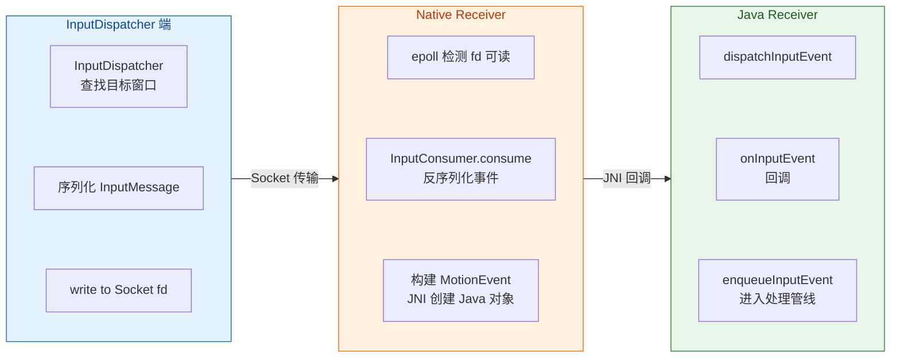

#### 事件处理管线（Input Stage Pipeline）

事件到达 `ViewRootImpl.enqueueInputEvent()` 后，并不是直接丢给 View 树的 `dispatchTouchEvent()`。ViewRootImpl 内部维护了一条 **Input Stage 责任链**（Pipeline），事件依次经过多个 Stage 处理。这种管线设计将不同类型的事件处理逻辑解耦，每个 Stage 可以选择"消费"事件或"转发"给下一个 Stage：

| Stage 名称 | 职责说明 |
|---|---|
| `NativePreImeInputStage` | Native 层的 IME 前置处理（系统级快捷键等） |
| `ViewPreImeInputStage` | 在输入法之前让 View 树有机会拦截按键事件（如 `onKeyPreIme()`） |
| `ImeInputStage` | 将事件传递给当前活跃的输入法（InputMethodManager） |
| `EarlyPostImeInputStage` | IME 处理后的早期阶段（如确定焦点窗口） |
| `NativePostImeInputStage` | Native 层的 IME 后置处理 |
| `ViewPostImeInputStage` | **最关键的 Stage**——将事件分发给 View 树的 `dispatchTouchEvent()` / `dispatchKeyEvent()` |
| `SyntheticInputStage` | 合成事件处理（如将轨迹球事件转为方向键事件） |

对于普通触摸事件，真正与应用开发者相关的是 `ViewPostImeInputStage`。它调用 `mView.dispatchPointerEvent(event)`（mView 就是 DecorView），从而进入我们熟悉的 View 树事件分发体系：`Activity.dispatchTouchEvent()` → `ViewGroup.dispatchTouchEvent()` → `View.onTouchEvent()`。

#### Batched Input——Move 事件的批处理优化

触摸屏的采样率通常为 120Hz~240Hz，而屏幕刷新率为 60Hz~120Hz。这意味着在两次 Vsync 之间，可能会收到多个 `ACTION_MOVE` 事件。如果每个 Move 事件都立即触发完整的 View 树遍历和重绘，不仅浪费 CPU/GPU 资源，还可能导致不必要的帧率抖动。

Android 对此的优化策略是 **Batched Input（批量输入）**。`InputEventReceiver` 的 `onBatchedInputEventPending()` 方法正是为此设计的：

- 当连续的 `ACTION_MOVE` 事件到达时，它们不会立即被 `onInputEvent()` 分发，而是在 Native 层的 `InputConsumer` 中暂存（batch）。
- `onBatchedInputEventPending()` 被调用时，ViewRootImpl 会通过 Choreographer 注册一个 `CALLBACK_INPUT` 类型的回调，安排在 **下一个 Vsync 信号** 到来时才统一消费这批 Move 事件。
- 消费时，会调用 `consumeBatchedInputEvents()`，此时多个 Move 事件被合并（最新一个作为当前事件，之前的放入 `MotionEvent` 的 historical 数据中），然后进行一次性分发。

这就是为什么在 `onTouchEvent()` 中处理 `ACTION_MOVE` 时，可以通过 `event.getHistoricalX()`、`event.getHistoricalY()` 等方法获取到"历史点"——这些历史点就是被 batch 的中间采样数据。对于绘图、手写等需要高精度轨迹的应用，遍历历史点可以获得更平滑的路径：

```kotlin
// 在自定义 View 的 onTouchEvent 中处理高精度绘图
override fun onTouchEvent(event: MotionEvent): Boolean {
    when (event.action) {
        MotionEvent.ACTION_MOVE -> {
            // 遍历历史点——这些是 Vsync 间隔内被 batch 的采样
            // 对于 120Hz 采样 + 60Hz 刷新，每个 Vsync 大约有 2 个历史点
            for (i in 0 until event.historySize) {
                // 获取第 i 个历史点的坐标和时间戳
                val hx = event.getHistoricalX(i)
                val hy = event.getHistoricalY(i)
                val ht = event.getHistoricalEventTime(i)
                // 将历史点加入绘制路径，确保轨迹平滑
                path.lineTo(hx, hy)
            }
            // 最后处理当前点（最新采样）
            path.lineTo(event.x, event.y)
            // 请求重绘
            invalidate()
        }
    }
    return true
}
```

#### 事件完成通知（Finish 机制）

事件处理完毕后，应用需要通过 InputChannel **反向通知** InputDispatcher："我已经处理完这个事件了。"这是通过 `InputEventReceiver.finishInputEvent()` 实现的。ViewRootImpl 在事件经过整个 Input Stage 管线后会自动调用此方法。

这个 finish 信号至关重要——InputDispatcher 使用它来跟踪"已投递但未处理完"的事件。如果投递了一个事件后，在规定时间内没有收到 finish 信号，InputDispatcher 就会认为应用"卡住了"，从而触发 ANR。这正是我们下一节要详细讨论的机制。

---

### ANR 触发机制

#### ANR 的本质

ANR（Application Not Responding）是 Android 系统对"应用无响应"的一种保护机制。它的核心逻辑很直观：**系统向应用投递了一个需要处理的事件或请求，但在规定的超时时间内没有得到回应，系统就判定应用无响应，弹出 ANR 对话框让用户选择等待或关闭应用**。

从用户体验角度看，ANR 是最严重的性能问题之一——它意味着应用完全"冻结"，无法响应任何操作。从技术角度看，ANR 通常是 **主线程（UI 线程）被长时间阻塞** 的直接后果。

#### 输入事件 ANR 的触发流程

与输入系统直接相关的 ANR 类型是 **Input Dispatching Timeout（输入分发超时）**，默认超时时间为 **5 秒**。整个触发机制如下：

1. **InputDispatcher 准备分发事件**：当 InputDispatcher 要向某个窗口发送一个新的输入事件时，它首先检查该窗口之前的事件是否已经处理完（即是否收到了 finish 信号）。

2. **检测等待超时**：如果发现上一个事件已经投递超过 5 秒但仍未收到 finish 信号，InputDispatcher 认为该窗口"可能卡死了"。需要注意的是，ANR 的检测不是一个独立的定时器在倒计时，而是 **由下一个待分发事件的到来触发检查** 的——也就是说，如果用户在应用卡住期间没有再触摸屏幕或按键，理论上不会立即触发 Input ANR（但可能触发其他类型的 ANR，如 Broadcast ANR）。

3. **通知 AMS**：InputDispatcher 通过回调通知 ActivityManagerService（AMS），报告某个应用的某个窗口输入超时。

4. **AMS 决策**：AMS 收到通知后，会进行一系列判断——应用是否正在被调试（debugger attached）？是否正在执行 instrumentation？如果是，则忽略 ANR。否则，AMS 会收集诊断信息（dump 各线程堆栈、CPU 使用率等），写入 `/data/anr/traces.txt`，最终弹出 ANR 对话框。

```mermaid
graph LR
    subgraph T1["事件投递"]
        direction TB
        E1["InputDispatcher\n投递事件 A"] ~~~ E2["启动计时\ntimeout = 5s"] ~~~ E3["等待 finish\n信号"]
    end

    subgraph T2["超时检测"]
        direction TB
        F1["新事件 B 到达\n触发检查"] ~~~ F2["发现事件 A\n超过 5s 未 finish"] ~~~ F3["标记窗口\nNot Responding"]
    end

    subgraph T3["ANR 处理"]
        direction TB
        G1["通知 AMS\nInput Timeout"] ~~~ G2["收集堆栈\ntraces.txt"] ~~~ G3["弹出 ANR\n对话框"]
    end

    T1 -->|"超时未响应"| T2 -->|"上报系统"| T3

    classDef phase1 fill:#E8F5E9,stroke:#388E3C,color:#1B5E20
    classDef phase2 fill:#FFF8E1,stroke:#F9A825,color:#F57F17
    classDef phase3 fill:#FFEBEE,stroke:#E53935,color:#B71C1C

    class T1 phase1
    class T2 phase2
    class T3 phase3
```

#### 三种主要的 ANR 类型及超时时间

虽然本节聚焦输入事件 ANR，但完整了解所有 ANR 类型有助于建立全局认知：

| ANR 类型 | 超时时间 | 触发场景 |
|---|---|---|
| **Input Dispatching Timeout** | **5 秒** | 输入事件投递后未在规定时间内处理完成 |
| **Broadcast Timeout** | 前台 10 秒 / 后台 60 秒 | BroadcastReceiver 的 `onReceive()` 执行超时 |
| **Service Timeout** | 前台 20 秒 / 后台 200 秒 | Service 的生命周期方法（`onCreate`/`onStartCommand` 等）执行超时 |
| **ContentProvider Timeout** | 10 秒 | ContentProvider 发布超时（应用启动阶段） |

Input Dispatching Timeout 是用户最容易感知的一种，因为它直接关联到"我点了屏幕没反应"这一糟糕体验。

#### 主线程阻塞的常见原因

理解 ANR 的触发机制后，更重要的是知道 **什么会导致主线程阻塞 5 秒以上**。以下是应用开发中最常见的"元凶"：

**1. 主线程执行 I/O 操作**：这是最经典的反面教材。在主线程中进行数据库查询、文件读写、网络请求（Android 4.0+ 默认禁止，但 SharedPreferences 的 `commit()` 仍在主线程同步写磁盘）。特别需要警惕的是 `SharedPreferences.commit()` 与 `apply()` 的区别——`apply()` 是异步写盘，但在 Activity `onPause()` 等生命周期节点会 **同步等待所有 pending 的 apply 完成**（通过 `QueuedWork.waitToFinish()`），这也是一个隐蔽的 ANR 来源。

**2. 主线程等待锁**：如果主线程尝试获取一个被后台线程长期持有的锁（synchronized / ReentrantLock），会直接阻塞。这在复杂的多线程架构中尤其常见，比如主线程读取某个缓存对象，而后台线程正在 holding lock 做大量写入。

**3. Binder 调用阻塞**：主线程发起的 Binder 调用（如获取系统服务信息）默认是同步的。如果对端进程（通常是 SystemServer）繁忙，主线程会被阻塞等待返回。在系统负载高的低端设备上，这种情况并不罕见。

**4. 过度复杂的 View 树布局与绘制**：虽然单次 `measure/layout/draw` 很少超过 5 秒，但如果 View 层级嵌套过深、或在 `onDraw()` 中执行了耗时计算（如大量 Path 运算），累积起来也可能导致帧处理时间暴增，间接拖慢事件处理。

**5. 死锁**：主线程和某个后台线程互相等待对方释放锁，永远无法继续执行。这是最严重的情况，不仅会触发 ANR，还会导致应用完全无法恢复。

#### ANR 的诊断——traces.txt 解读

当 ANR 发生时，系统会将所有线程的堆栈信息 dump 到 `/data/anr/traces.txt`。对于应用开发者而言，分析此文件是定位 ANR 根因的核心手段。以下是一个典型的 ANR 堆栈片段及分析方法：

```java
// ANR traces.txt 典型片段（简化示意）
// 关键信息在 "main" 线程的堆栈中
"main" prio=5 tid=1 Blocked
  // 线程状态为 Blocked —— 说明主线程正在等待某个锁
  | group="main" sCount=1 dsCount=0 flags=1 obj=0x... self=0x...
  | held mutexes=
  at com.example.app.DataManager.getData(DataManager.java:42)
  // ^^^ 这里显示阻塞在 DataManager 的第 42 行
  - waiting to lock <0x0abcdef0> (a java.lang.Object) held by thread 15
  // ^^^ 关键信息！正在等待锁 0x0abcdef0，该锁被线程 15 持有
  at com.example.app.MainActivity.onResume(MainActivity.java:28)
  at android.app.Activity.performResume(Activity.java:8100)
  // ... 后续是 Framework 调用栈 ...

// 继续查找线程 15 的堆栈
"AsyncTask #3" prio=5 tid=15 Runnable
  // 线程 15（AsyncTask #3）正在执行中
  at com.example.app.DataManager.syncAllData(DataManager.java:128)
  // ^^^ 正在执行大量数据同步，持有着那把锁
  - locked <0x0abcdef0> (a java.lang.Object)
  // ^^^ 确认：就是它持有着主线程等待的那把锁
```

分析思路：主线程在 `onResume()` 中调用 `DataManager.getData()`，试图获取一把锁，但这把锁被 AsyncTask 线程持有（正在执行 `syncAllData()`）。解决方案可能是：将 `getData()` 改为异步调用、使用读写锁代替排他锁、或避免在 `onResume()` 中同步获取需要加锁的数据。

#### 应用层的 ANR 预防策略

**保持主线程轻量**：这是最根本的原则。任何可能耗时超过几毫秒的操作都应该移到后台线程。使用 Kotlin Coroutines 的 `Dispatchers.IO`、`withContext(Dispatchers.Default)` 等方式将计算和 I/O 操作从主线程剥离。

**使用 StrictMode 检测主线程违规**：在 debug 构建中启用 StrictMode，可以在开发阶段提前发现主线程的磁盘读写和网络访问：

```kotlin
// 在 Application.onCreate() 中启用 StrictMode（仅 Debug 构建）
if (BuildConfig.DEBUG) {
    // 配置线程策略——检测主线程上的不当操作
    StrictMode.setThreadPolicy(
        StrictMode.ThreadPolicy.Builder()
            .detectDiskReads()      // 检测主线程磁盘读
            .detectDiskWrites()     // 检测主线程磁盘写
            .detectNetwork()        // 检测主线程网络访问
            .detectCustomSlowCalls() // 检测自定义慢操作
            .penaltyLog()           // 违规时输出日志
            .penaltyFlashScreen()   // 违规时闪烁屏幕（视觉提醒）
            .build()
    )
    // 配置 VM 策略——检测内存泄漏等问题
    StrictMode.setVmPolicy(
        StrictMode.VmPolicy.Builder()
            .detectLeakedClosableObjects() // 检测未关闭的 Closeable
            .detectActivityLeaks()          // 检测 Activity 泄漏
            .penaltyLog()
            .build()
    )
}
```

**监控与预警**：在生产环境中，可以通过 Android Vitals（Google Play Console 提供）监控 ANR 率，或集成第三方 APM（Application Performance Monitoring）工具进行实时监控。ANR 率超过 0.47%（Google 的 bad behavior threshold）会影响应用在 Play Store 的搜索排名和推荐权重。

**优化 SharedPreferences**：使用 `apply()` 代替 `commit()`；如果数据量较大，考虑迁移到 Jetpack DataStore（基于协程和 Flow 的异步数据存储方案）或 MMKV（基于 mmap 的高性能 KV 存储）。

**谨慎使用同步 Binder 调用**：避免在主线程频繁调用可能阻塞的系统服务接口。如果必须调用，考虑缓存结果或将调用移到后台线程。

---

**📝 练习题**

当用户快速滑动屏幕时，在两次 Vsync 信号之间产生了 4 个 `ACTION_MOVE` 事件。此时 ViewRootImpl 内部的 InputEventReceiver 会如何处理这些事件？

A. 立即逐个分发全部 4 个 `ACTION_MOVE` 事件到 View 树，触发 4 次 `onTouchEvent()` 回调


B. 丢弃前 3 个事件，只将最新的第 4 个 `ACTION_MOVE` 分发给 View 树


C. 将 4 个事件暂存，在下一个 Vsync 时合并为 1 个 `MotionEvent` 分发，前 3 个点可通过 `getHistoricalX/Y()` 获取


D. 将 4 个事件全部打包到一个 `Bundle` 中，通过 `Handler.post()` 发送到主线程 MessageQueue


**【答案】** C

**【解析】** Android 输入系统对 `ACTION_MOVE` 事件实施了 **Batched Input（批量输入）** 优化策略。当连续的 Move 事件到达时，`InputEventReceiver` 的 Native 层（`InputConsumer`）会将它们暂存（batch），而非立即分发。`WindowInputEventReceiver` 的 `onBatchedInputEventPending()` 会通过 Choreographer 安排在下一个 Vsync 信号到来时，调用 `consumeBatchedInputEvents()` 统一消费。此时，多个 Move 事件被合并为一个 `MotionEvent` 对象——最新的坐标作为当前值（`getX()/getY()`），之前积攒的坐标则存储为 historical 数据（通过 `getHistoricalX(pointerIndex, historyIndex)` 等方法访问）。这样既确保了与 Vsync 驱动的渲染流水线对齐（一帧只处理一次完整的触摸输入），又保留了完整的采样精度（历史数据不丢失），是在性能与精度之间取得的精妙平衡。选项 A 的"逐个分发"是未优化的理论行为；选项 B 的"丢弃"会导致精度损失；选项 D 的 `Bundle + Handler.post()` 完全不符合实际机制——输入事件走的是 InputChannel 的 fd 监听路径，而非 Message 机制。

---

**📝 练习题**

以下哪种场景 **最不可能** 导致 Input Dispatching Timeout（输入 ANR）？

A. 在 `Activity.onResume()` 中调用 `synchronized` 方法，而锁被一个正在进行大量数据库写入的后台线程持有


B. 在 `RecyclerView.Adapter.onBindViewHolder()` 中同步加载一张 8MB 的未压缩 Bitmap


C. 在后台 `IntentService` 的 `onHandleIntent()` 中执行一个耗时 30 秒的网络请求


D. 在 `View.onTouchEvent()` 中调用 `Thread.sleep(6000)` 模拟耗时操作


**【答案】** C

**【解析】** Input Dispatching Timeout ANR 的根本条件是 **主线程被阻塞超过 5 秒，导致无法在规定时间内完成输入事件的处理并返回 finish 信号**。选项 A 中，主线程在 `onResume()` 内等待锁，如果后台线程长时间持有锁做数据库写入，主线程会被阻塞，期间无法处理任何输入事件，极易触发 ANR。选项 B 中，`onBindViewHolder()` 运行在主线程上，同步加载 8MB 大图涉及磁盘 I/O 和内存分配，如果因内存压力触发 GC 或磁盘 I/O 缓慢，可能累计阻塞数秒。选项 D 直接在触摸事件回调中 sleep 6 秒，显然超过 5 秒阈值。**选项 C 最不可能**触发 Input ANR，因为 `IntentService.onHandleIntent()` 运行在 **独立的工作线程**（HandlerThread）上，而非主线程。即使它耗时 30 秒，也不会阻塞主线程处理输入事件。当然，如果后台操作间接占用了大量 CPU 或 I/O 资源导致主线程调度延迟，理论上有极小概率间接影响，但这不是"直接导致"，因此 C 是最不可能的选项。

---

## 本章小结

本章围绕 **窗口与视图架构（Window & View Architecture）** 这一 Android 应用层最核心的显示基础设施，从七个维度进行了系统性的剖析。在此做一个完整的回顾与串联，帮助读者在脑中构建起一幅从"Activity 启动"到"像素上屏"再到"触摸回传"的全景图。

---

### 全景回顾：从 Window 创建到触摸响应的完整链路

一切的起点是 **Window 管理机制**。当 ActivityThread 通过 `performLaunchActivity()` 创建 Activity 实例时，`attach()` 方法内部同步创建了该 Activity 唯一的 **PhoneWindow** 对象——它是抽象类 `Window` 在整个 Android 系统中唯一的实现类。PhoneWindow 本身并不是一个可见的 UI 元素，而是一个 **策略容器（Policy Container）**，它持有窗口的各种属性（Flag、Type、SoftInputMode）、管理着 DecorView 的生命周期，并充当 Activity 与底层 WindowManagerService（WMS）之间的桥梁。Activity 调用 `setContentView()` 时，PhoneWindow 内部执行 `installDecor()`，创建出 **DecorView** 这棵视图树的绝对根节点，并根据当前窗口 Feature（如 `FEATURE_NO_TITLE`、`FEATURE_ACTION_BAR`）选择合适的系统布局模板，其中 `@android:id/content` 对应的 FrameLayout 就是我们开发者 XML 布局的挂载点。随后，在 `handleResumeActivity()` 阶段，WindowManager（实际实现为 WindowManagerImpl → WindowManagerGlobal）通过 `addView()` 将 DecorView 真正添加到窗口系统中，这一步触发了 **ViewRootImpl** 的创建——整个视图体系中最关键的调度中枢就此启动。而贯穿这个过程的安全卫士是 **Token 验证机制**：每个 Activity 在 AMS 中持有唯一的 `ActivityRecord.Token`（一个 IBinder 对象），它随 `attach()` 传递给 PhoneWindow，再通过 `WindowManager.LayoutParams.token` 字段传递到 WMS。WMS 在 `addWindow()` 时严格校验该 Token，确保应用窗口（TYPE_APPLICATION）必须关联到合法的 Activity，这正是使用 Application Context 启动 Dialog 会抛出 `BadTokenException` 的根本原因。

紧接着，**视图层级结构** 将显示流水线的三大核心角色联结在一起。**ViewRootImpl** 是连接 Java 视图世界与 Native 渲染世界的枢纽，它持有 DecorView 的引用，实现了 `ViewParent` 接口（因此 `DecorView.getParent()` 返回的是 ViewRootImpl 而非某个 ViewGroup），并驱动着 measure → layout → draw 三大流程。当需要刷新时（比如调用 `View.invalidate()` 或 `View.requestLayout()`），请求会沿着 View 树向上冒泡，最终汇聚到 ViewRootImpl 的 `scheduleTraversals()` 方法。这个方法做了两件关键的事：第一，向 MessageQueue 中插入一个同步屏障（Sync Barrier），阻塞所有普通 Message 的执行；第二，向 **Choreographer** 注册一个 `CALLBACK_TRAVERSAL` 类型的回调。Choreographer——这位"编舞者"——监听来自底层 SurfaceFlinger 的 **VSYNC 信号**（通常每 16.6ms 一次，对应 60Hz），在下一个 VSYNC 到达时，按照 `INPUT → ANIMATION → INSETS_ANIMATION → TRAVERSAL → COMMIT` 的严格优先级顺序执行所有注册的回调。TRAVERSAL 回调最终触发 ViewRootImpl 的 `performTraversals()`，依次完成 `performMeasure()` → `performLayout()` → `performDraw()`。而绘制的最终目标是将像素数据写入 **Surface**——一个由 SurfaceFlinger 分配的、包含 BufferQueue 的图形缓冲区容器。在硬件加速路径下，ViewRootImpl 通过 `ThreadedRenderer`（内部持有 RenderNode 树）将 DisplayList 指令提交到 RenderThread，由 GPU 完成实际栅格化并将结果 Buffer 通过 `queueBuffer()` 送回 SurfaceFlinger 进行合成与上屏。

在理解了窗口创建与渲染管线之后，**窗口属性详解** 则揭示了开发者如何通过三组核心参数精确控制窗口行为。**Window.Type** 定义了窗口的 Z-Order 层级：应用窗口（1–99）依附于 Activity，子窗口（1000–1999）依附于父窗口，系统窗口（2000–2999）则由系统特权进程创建。Type 值越大，窗口在 WMS 中的 Z-Order 越高，这就是为什么 `TYPE_APPLICATION_OVERLAY`（2038）能浮于所有应用之上的原因（但从 Android 8.0 开始需要 `SYSTEM_ALERT_WINDOW` 权限）。**Window.Flag** 标志位是一个 32 位的位掩码，每一位控制一项窗口行为：`FLAG_NOT_FOCUSABLE` 使窗口不接收按键事件、`FLAG_NOT_TOUCHABLE` 使触摸事件穿透到下层窗口、`FLAG_KEEP_SCREEN_ON` 阻止屏幕熄灭、`FLAG_SECURE` 禁止截屏，等等。这些 Flag 在 WMS 的 `relayoutWindow()` 中生效，影响着 InputDispatcher 的事件分发策略和 SurfaceFlinger 的合成行为。**SoftInputMode** 则专门处理软键盘与窗口的交互关系，由 `state` 部分（控制键盘在窗口获焦时的可见性）和 `adjust` 部分（控制窗口内容区域如何适应键盘）两组 bit 组合而成。`ADJUST_RESIZE` 会触发 DecorView 的重新 layout，使 ContentView 的可用高度缩小；`ADJUST_PAN` 则通过平移整个窗口使焦点 View 不被遮挡；`ADJUST_NOTHING` 不做任何调整，完全由开发者使用 `WindowInsetsAnimation` 自行处理。

**子窗口与对话框** 则将 Window 的概念从 Activity 延展到了更丰富的 UI 形态。**Dialog** 在构造时就创建了自己独立的 PhoneWindow，并在 `show()` 时通过 `WindowManager.addView()` 将自己的 DecorView 添加到窗口系统中——因此 Dialog 是一个拥有独立 Window、独立 ViewRootImpl、独立 Surface 的完整窗口实体，而非仅仅是某个 ViewGroup。Dialog 使用的 WindowManager 来自其 Context 所对应的 Activity，因此它的 Token 就是 Activity Token，WMS 校验通过后允许添加。这也解释了为什么用 Application Context 创建 Dialog 会失败——Application 没有关联的 Activity Token，WMS 在 `addWindow()` 时找不到合法的父窗口记录。**PopupWindow** 则走了一条不同的路：它的窗口类型是 `TYPE_APPLICATION_PANEL`（子窗口），通过 `WindowManager.LayoutParams.token` 指向锚点 View 所在窗口的 Token 来完成依附。PopupWindow 没有自己的 PhoneWindow，而是直接创建一个 PopupDecorView 并通过 WindowManager 添加，其 Z-Order 在父窗口之上但不会脱离父窗口独立存在——父窗口被移除时，子窗口也随之销毁。

**系统栏控制** 讲述了应用如何与 StatusBar、NavigationBar 这两个由 SystemUI 进程管理的系统窗口和谐共处。传统的 `SYSTEM_UI_FLAG_*` 系列 API 通过 `View.setSystemUiVisibility()` 控制系统栏的显示隐藏与颜色，但从 Android 11（API 30）开始，Google 推出了 **WindowInsets / WindowInsetsController** 这套全新的 Insets API 来统一管理。`WindowInsets` 对象封装了系统栏、软键盘、刘海屏等各种系统区域的 Insets 值，通过 `View.setOnApplyWindowInsetsListener()` 分发到视图树。`fitSystemWindows` 的本质是 View 在接收到 WindowInsets 后，将对应的 Insets 值应用为自身的 padding（对于 FrameLayout 等基础容器）或 margin（对于 CoordinatorLayout 等行为容器），从而避免内容被系统栏遮挡。`WindowInsetsController` 则提供了 `show()`、`hide()`、`setSystemBarsBehavior()` 等现代化 API，允许应用以声明式的方式控制系统栏行为，并支持 `WindowInsetsAnimation` 实现键盘弹出的流畅跟手动画。

**显示与屏幕** 关注的是像素与物理世界的映射关系。**DisplayMetrics** 提供了屏幕的核心参数：`density`（逻辑密度系数，如 3.0 对应 480dpi）、`widthPixels / heightPixels`（屏幕分辨率）、`densityDpi`（实际 DPI 值）。Android 的 dp → px 换算公式 `px = dp × density` 正是基于这些参数实现的，而 sp 在此基础上还额外乘以用户的字体缩放系数 `fontScale`。**WindowManager.LayoutParams** 不仅包含前面讨论的 Type、Flag、Token，还包含窗口的位置（x/y）、尺寸（width/height）、gravity、format（像素格式）、alpha（透明度）等，它是应用向 WMS 表达"我要一个什么样的窗口"的完整描述符。**屏幕旋转** 时，AMS 检测到 `Configuration` 变化，默认情况下会销毁并重建 Activity（`onDestroy()` → `onCreate()`），期间通过 `onSaveInstanceState()` / `onRestoreInstanceState()` 保存恢复状态；若在 AndroidManifest 中声明了 `android:configChanges="orientation|screenSize"`，则只触发 `onConfigurationChanged()` 回调而不重建，此时 ViewRootImpl 会收到新的 Configuration 并触发视图树的重新 measure/layout。

最后，**触摸反馈基础** 补完了从"手指按下"到"App 收到 MotionEvent"的最后一公里。硬件产生的触摸中断经由 Linux Input 子系统（EventHub → InputReader）读取并转化为 `RawEvent`，再由 **InputDispatcher** 根据当前窗口的焦点状态和 Z-Order 选择目标窗口。应用进程通过 **InputChannel**——一对跨进程的 Unix Domain Socket——与 InputDispatcher 通信：server 端由 WMS 在 `addWindow()` 时注册到 InputDispatcher，client 端传递给 ViewRootImpl 并被封装进 **WindowInputEventReceiver**（继承自 `InputEventReceiver`）。当 InputDispatcher 将事件写入 server socket 后，client 端的 Looper 监听到可读事件，`WindowInputEventReceiver.onInputEvent()` 被调用，事件随即进入 ViewRootImpl 的 InputStage 责任链（SyntheticInputStage → ViewPostImeInputStage → NativePostImeInputStage → ...），最终由 `ViewPostImeInputStage` 调用 `DecorView.dispatchTouchEvent()` 开始经典的事件分发。如果应用进程在 **5 秒**内未对 InputEvent 做出 `finish()` 响应（对于按键事件则是 5 秒），InputDispatcher 会判定发生 **ANR（Application Not Responding）**，通知 AMS 弹出 ANR 对话框。ANR 的本质是 **主线程阻塞**——无论是死锁、耗时 IO、过度绘制还是 Binder 调用超时，都可能导致主线程无法及时处理 InputEvent 或 BroadcastReceiver/Service 的回调，从而触发超时。

---

### 核心知识脉络图

下面用一张 Mermaid 图将本章七大知识点的核心对象与交互关系串联起来，帮助读者形成系统性的整体认知：

```mermaid
graph LR
    subgraph A["Window 管理"]
        direction TB
        A1["Activity.attach()"]
        A2["PhoneWindow"]
        A3["DecorView"]
        A4["Token 验证"]
        A1 --> A2
        A2 --> A3
        A2 --> A4
    end

    subgraph B["视图层级"]
        direction TB
        B1["ViewRootImpl"]
        B2["Choreographer\nVSYNC 调度"]
        B3["Surface\nBufferQueue"]
        B1 --> B2
        B2 --> B3
    end

    subgraph C["窗口属性"]
        direction TB
        C1["Window.Type\nZ-Order 层级"]
        C2["Window.Flag\n行为标志位"]
        C3["SoftInputMode\n键盘交互"]
        C1 ~~~ C2
        C2 ~~~ C3
    end

    subgraph D["子窗口与系统栏"]
        direction TB
        D1["Dialog\n独立 Window"]
        D2["PopupWindow\n子窗口依附"]
        D3["WindowInsets\n系统栏适配"]
        D1 ~~~ D2
        D2 ~~~ D3
    end

    subgraph E["输入与显示"]
        direction TB
        E1["InputChannel\n跨进程 Socket"]
        E2["InputEventReceiver\n事件接收"]
        E3["DisplayMetrics\n屏幕参数"]
        E4["ANR 超时检测"]
        E1 --> E2
        E2 --> E4
        E1 ~~~ E3
    end

    A -->|"addView()"| B
    B -->|"LayoutParams"| C
    C -->|"Type/Token"| D
    D -->|"InputDispatcher"| E

    classDef appLayer fill:#C8E6C9,stroke:#388E3C,color:#1B5E20
    classDef fwkLayer fill:#BBDEFB,stroke:#1976D2,color:#0D47A1
    classDef sysLayer fill:#FFE0B2,stroke:#F57C00,color:#E65100

    class A appLayer
    class B fwkLayer
    class C fwkLayer
    class D appLayer
    class E sysLayer
```

### 关键结论提炼

通过本章的学习，有以下几条核心认知需要牢牢把握：

**第一，Window 是 Android 显示体系的基本单元，而非 Activity。** Activity 只是一个生命周期容器，真正承载 UI 显示的是 PhoneWindow → DecorView → ViewRootImpl → Surface 这条完整链路。理解这一点才能正确解释 Dialog、PopupWindow、Toast 等非 Activity UI 的显示原理。

**第二，ViewRootImpl 是应用层与系统层的分水岭。** 它上接 Java View 树（measure/layout/draw），下连 Native 渲染管线（Surface/RenderThread）和输入系统（InputChannel），还通过 Choreographer 与 VSYNC 信号同步。几乎所有的视图刷新、事件分发、窗口属性变更都必须经过 ViewRootImpl 的调度。

**第三，Token 机制是 Android 窗口安全模型的基石。** 它确保每个窗口的创建都可以被追溯到一个合法的"身份来源"（Activity Token、Application Token 等），从而防止恶意应用随意创建覆盖系统的窗口。理解 Token 校验流程，可以从根本上避免 `BadTokenException` 等常见崩溃。

**第四，Choreographer + VSYNC 构成了"帧驱动"的渲染节奏。** Android 并不是"有变化就立刻重绘"的模型，而是"有变化时注册回调，等 VSYNC 到来时统一处理"。这种设计避免了同一帧内重复绘制，也使得掉帧检测（`FrameMetrics`、Choreographer `doFrame` 耗时监控）成为可能。

**第五，输入事件从硬件到应用是一条完整的跨进程链路。** InputReader → InputDispatcher → InputChannel（Socket）→ InputEventReceiver → ViewRootImpl InputStage → View.dispatchTouchEvent()。链路中任何一环的阻塞都可能导致 ANR，而 ANR 的超时计时器在 InputDispatcher 侧启动，应用进程完全被动——只有及时 `finish()` 事件才能避免超时。

**第六，系统栏适配正在从命令式走向声明式。** 传统的 `SYSTEM_UI_FLAG_*` API 零散且易冲突，新的 `WindowInsetsController` + `WindowInsetsAnimation` 提供了更优雅、更可预测的控制方式。在新项目中应优先采用 Insets API，配合 `ViewCompat.setOnApplyWindowInsetsListener()` 实现向下兼容。

---

### 📝 练习题 1

在 Android 应用中，以下关于 Window 与 ViewRootImpl 的描述，哪一项是 **正确** 的？

A. `DecorView.getParent()` 返回的是 PhoneWindow 对象，因为 PhoneWindow 是 DecorView 的直接父容器


B. ViewRootImpl 在 `Activity.onCreate()` 中 `setContentView()` 被调用时同步创建


C. ViewRootImpl 实现了 `ViewParent` 接口，`DecorView.getParent()` 返回的实际上是 ViewRootImpl


D. 每个 Activity 可以拥有多个 ViewRootImpl，分别管理不同的内容视图片段


**【答案】** C

**【解析】** 这是一道考察 Window 与视图层级关系的基础题。PhoneWindow 虽然在概念上"持有"DecorView，但它并没有实现 `ViewParent` 接口，不是 View 树中的节点，因此 A 错误。ViewRootImpl 的创建时机是 `handleResumeActivity()` 阶段，在 `WindowManagerGlobal.addView()` 内部 `new ViewRootImpl()` 被调用，远晚于 `onCreate()` 中的 `setContentView()`，因此 B 错误。ViewRootImpl 确实实现了 `ViewParent` 接口，并在 `setView()` 方法中通过 `view.assignParent(this)` 将自己设置为 DecorView 的 parent，所以 `DecorView.getParent()` 返回的是 ViewRootImpl 实例，C 正确。对于标准的 Activity 窗口而言，一个 PhoneWindow 对应一个 DecorView，一个 DecorView 对应一个 ViewRootImpl，是严格的一对一关系（虽然通过 WindowManager 手动 addView 可以创建额外的 ViewRootImpl，但那属于独立的窗口，不是"同一个 Activity 的多个 ViewRootImpl 管理不同片段"），因此 D 的表述具有误导性，不是典型正确描述。

---

### 📝 练习题 2

开发者使用 `Application Context` 创建并显示一个 `AlertDialog`，结果抛出了 `BadTokenException`。以下关于此异常的分析，哪一项 **最准确**？

A. Application Context 没有关联 Theme，导致 Dialog 构建布局时出错


B. Application Context 的 `getSystemService(WINDOW_SERVICE)` 返回 null，无法获取 WindowManager


C. Application Context 没有关联的 Activity Token，WMS 在 `addWindow()` 时 Token 校验失败，拒绝创建应用类型窗口


D. Application Context 创建的 Dialog 默认使用 `TYPE_SYSTEM_ALERT`，该类型在 Android 8.0 以上被禁止


**【答案】** C

**【解析】** 这道题考察 Token 验证机制。Dialog 在 `show()` 时，通过其 Context 获取的 WindowManager 调用 `addView()`，LayoutParams 中的 token 字段来源于 Context 关联的窗口。Activity Context 关联了 ActivityRecord.Token（IBinder），因此 WMS 的 `addWindow()` 可以校验通过。而 Application Context 没有关联任何 Activity，其 WindowManager 也没有可用的 Activity Token，传递给 WMS 后 Token 校验失败，抛出 `WindowManager$BadTokenException: Unable to add window -- token null is not valid`。A 选项中 Theme 问题会导致 `IllegalStateException` 而非 `BadTokenException`。B 选项不对，`getSystemService(WINDOW_SERVICE)` 在 Application Context 上可以正常返回 WindowManagerImpl 实例。D 选项也不对，Dialog 默认使用的是 `TYPE_APPLICATION`（应用窗口类型），而非系统窗口类型。因此 C 是最准确的描述。

---

