---

# 约束布局与高级排版

---

## ConstraintLayout 核心

Android 的 UI 系统从最初的 `LinearLayout` 嵌套、`RelativeLayout` 相对定位，一路演进到今天的 `ConstraintLayout`，其核心目标始终只有一个——**在保持布局表达力的同时，最大限度地降低视图层级（View Hierarchy）深度**。`ConstraintLayout` 由 Google 在 2016 年的 I/O 大会上首次发布，属于 Jetpack（当时的 Support Library）的一部分，以独立于系统版本的方式提供给开发者。它不是 Framework 内置的 ViewGroup，而是一个 **Library-level 的布局容器**，因此可以在 API 9+ 的设备上使用，却拥有远超传统布局的能力。

理解 `ConstraintLayout` 的核心，需要从三个维度切入：它背后的 **Cassowary 线性约束求解算法**、它面向开发者的 **相对定位约束（Relative Positioning Constraints）** 体系，以及由此带来的 **扁平化布局优势**。这三者分别对应"底层怎么算"、"开发者怎么写"和"工程上为什么值得用"三个层面。把这三层理解透彻，后续的 Chains、Barrier、Flow 等高级特性都只是在此基础之上的扩展。

---

### Cassowary 算法简介

#### 从"布局"到"解方程"

当我们在 XML 中写下 `app:layout_constraintStart_toStartOf="parent"` 时，本质上是在向布局引擎声明一个 **约束等式**（或不等式）。例如"我的左边缘 = 父容器的左边缘"就是一个等式，而"我的宽度 ≥ 0"则是一个不等式。一个完整的布局 XML，其实就是一个由大量线性等式与不等式组成的 **约束系统（Constraint System）**。布局引擎要做的事，就是 **求解这个方程组**，得出每个 View 的 left、top、right、bottom 四个坐标值。

传统布局如 `LinearLayout`，其求解方式是"程序化的"：遍历子 View，按照方向（水平/垂直）依次累加宽高与间距，必要时做第二遍测量（如使用了 `layout_weight`）。这种方式简单直观，但一旦布局逻辑复杂（嵌套、权重交叉），就需要多层递归，时间复杂度随层级深度指数增长。

`ConstraintLayout` 选择了一条截然不同的路径：将所有约束收集起来，建立线性约束方程组，然后用数学方法一次性求解。这就是 **Cassowary 算法** 的核心思想。

#### Cassowary 算法的起源与原理

Cassowary 算法由 Greg Badros 和 Alan Borning 于 1998 年在华盛顿大学提出，最初发表在论文 *"The Cassowary Linear Arithmetic Constraint Solving Algorithm"* 中。它并非为 Android 而生，而是一种通用的 **增量式线性约束求解器（Incremental Linear Constraint Solver）**，最早被用于桌面 GUI 系统的布局管理。Apple 的 Auto Layout（iOS/macOS）同样基于 Cassowary。

Cassowary 算法的底层基于 **单纯形法（Simplex Method）** 的变体。经典单纯形法用于线性规划（Linear Programming），目标是在一组线性不等式约束下最大化或最小化一个线性目标函数。Cassowary 对此做了两个关键适配：

**第一，约束分为 Required 与 Preferential 两类。** Required 约束（强度 `REQUIRED`）是"必须满足的硬性条件"，例如"View 不能超出屏幕边界"。Preferential 约束（也叫 soft constraint）有不同的优先级（`STRONG`、`MEDIUM`、`WEAK`），当多个 soft constraint 相互冲突时，高优先级的被优先满足，低优先级的被尽可能满足但允许被违反。这套优先级机制，正是 `ConstraintLayout` 中 **Bias**、**chain style**、**dimension constraint** 等特性能够灵活工作的数学基础。

**第二，增量式更新。** GUI 布局中，约束大部分时间只发生局部变化（比如一个 View 改变了 visibility）。Cassowary 不需要每次都从零开始求解，而是在已有的求解表（Simplex Tableau）上做增量修改，只重新计算受影响的变量。这使得它的平均求解速度远快于完全重建，非常适合需要频繁布局更新的 UI 场景。

用直白的话总结：**Cassowary 就是一个能快速解出"一堆不等式方程"的数学引擎，而且当你只改了其中几个方程时，它不用全部重新算**。

#### 在 ConstraintLayout 中的应用

`ConstraintLayout` 内部有一个名为 `LinearSystem` 的核心类（位于 `androidx.constraintlayout.core.LinearSystem`），它实现了 Cassowary 算法的 Android 版本。整个求解过程可以概括为以下步骤：

1. **收集约束**：遍历每个子 View 的 `ConstraintWidget` 对象，将 XML 中声明的约束转换为线性等式 / 不等式，加入 `LinearSystem` 的方程表。
2. **构建增广矩阵**：所有约束形成一个增广矩阵（Augmented Matrix），行代表约束，列代表变量（View 的 left/top/right/bottom/width/height）。
3. **单纯形求解**：通过 Simplex 迭代求出每个变量的值，优先满足 Required 约束，再按优先级依次满足 Preferential 约束。
4. **回写坐标**：将求解结果写回每个 `ConstraintWidget`，最终映射到 View 的 `layout()` 调用。

值得强调的是，这一切在 **单次 measure-layout pass** 中完成。对于绝大多数布局（不含嵌套 `ConstraintLayout` 或复杂 wrap_content 依赖），`ConstraintLayout` 只需要 **一次测量 + 一次布局**，而同等复杂度的 `RelativeLayout` 或带 `weight` 的 `LinearLayout` 嵌套可能需要 2~4 次测量。

```kotlin
// 伪代码：ConstraintLayout 的 onMeasure 核心流程
override fun onMeasure(widthSpec: Int, heightSpec: Int) {
    // 1. 将每个子 View 的约束信息转换为 ConstraintWidget 上的锚点连接
    for (child in children) {
        val widget = getWidget(child)           // 获取子 View 对应的 ConstraintWidget
        applyConstraints(widget, child.layoutParams) // 读取 LayoutParams，建立约束关系
    }

    // 2. 将所有 ConstraintWidget 的约束写入线性方程组
    linearSystem.reset()                        // 重置方程组（增量模式下可做部分重置）
    rootWidget.addToSolver(linearSystem)         // 递归地将根 Widget 及其子 Widget 的约束加入求解器

    // 3. 调用 Cassowary/Simplex 求解
    linearSystem.minimize()                      // 执行单纯形法迭代，求出所有变量的值

    // 4. 将求解结果回写到 ConstraintWidget 的坐标字段
    rootWidget.updateFromSolver(linearSystem)    // 每个 Widget 从求解器读取 left, top, width, height

    // 5. 根据 Widget 坐标设置最终测量尺寸
    setMeasuredDimension(
        resolveSize(rootWidget.width, widthSpec),  // 结合 MeasureSpec 确定最终宽
        resolveSize(rootWidget.height, heightSpec)  // 结合 MeasureSpec 确定最终高
    )
}
```

上面的伪代码展示了 `ConstraintLayout` 的 `onMeasure` 核心逻辑。可以看到，**所有子 View 的位置计算被统一交给了线性方程组求解器**，而不是像传统布局那样在 `onMeasure` / `onLayout` 中写大量 if-else 分支。这也是 `ConstraintLayout` 能够支持如此多约束特性（Bias、Ratio、Chain、Barrier……）却不会导致代码分支爆炸的根本原因——这些特性只是向方程组中"添加新的等式"，求解逻辑本身不变。

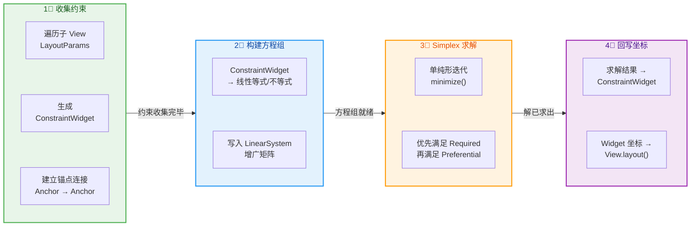

---

### 相对定位 Constraints

#### 约束的本质：锚点到锚点

如果说 Cassowary 算法回答了"引擎怎么算"的问题，那么 **相对定位约束** 就是开发者与引擎之间的"接口语言"。`ConstraintLayout` 中的每一条约束，本质上是在说：**"我的某条边（锚点），要跟另一个对象的某条边（锚点）对齐（或保持某个距离）。"**

每个子 View 有 **四条边锚点**（Start / End / Top / Bottom）和 **两个中心锚点**（Baseline 用于文字基线对齐）。约束的基本语法为：

```
app:layout_constraint[自身锚点]_to[目标锚点]Of="[目标id | parent]"
```

例如 `app:layout_constraintStart_toEndOf="@id/viewA"` 表示"我的 Start（左边缘）贴到 viewA 的 End（右边缘）"。这条约束翻译成 Cassowary 等式就是：

```
myView.start = viewA.end + margin
```

其中 `margin` 来自 `android:layout_marginStart`。如果没有设置 margin，则 `margin = 0`，即两条边完全贴合。

#### 水平与垂直约束独立正交

`ConstraintLayout` 的一个重要设计原则是：**水平方向的约束和垂直方向的约束彼此完全独立**。水平方向的锚点只有 Start（Left）和 End（Right），垂直方向的锚点只有 Top 和 Bottom（以及 Baseline）。你不能写出 `constraintStart_toTopOf` 这样的"跨维度"约束——引擎会直接忽略它。

这意味着，你需要分别为每个子 View 建立 **至少一条水平约束** 和 **至少一条垂直约束**，它才能被正确定位。如果缺少某个方向的约束，View 会在该方向上 **回落到 (0,0)**——这是开发中最常见的"控件跑到左上角"问题的根因。Android Studio 的布局编辑器会对缺少约束的 View 标记红色警告（`MissingConstraints` lint error），正是为了提醒这一点。

#### 完整约束属性列表

以下是 `ConstraintLayout` 支持的所有基础相对定位约束属性。它们按方向分为两组：

**水平约束（Horizontal Constraints）：**

| 属性 | 含义 |
|---|---|
| `layout_constraintStart_toStartOf` | 我的 Start 对齐目标的 Start |
| `layout_constraintStart_toEndOf` | 我的 Start 对齐目标的 End |
| `layout_constraintEnd_toStartOf` | 我的 End 对齐目标的 Start |
| `layout_constraintEnd_toEndOf` | 我的 End 对齐目标的 End |

**垂直约束（Vertical Constraints）：**

| 属性 | 含义 |
|---|---|
| `layout_constraintTop_toTopOf` | 我的 Top 对齐目标的 Top |
| `layout_constraintTop_toBottomOf` | 我的 Top 对齐目标的 Bottom |
| `layout_constraintBottom_toTopOf` | 我的 Bottom 对齐目标的 Top |
| `layout_constraintBottom_toBottomOf` | 我的 Bottom 对齐目标的 Bottom |
| `layout_constraintBaseline_toBaselineOf` | 文字基线对齐（用于多 TextView 对齐场景） |

另外还有 `Left/Right` 变体（如 `layout_constraintLeft_toLeftOf`），但在 RTL（Right-to-Left）适配中推荐统一使用 `Start/End` 替代 `Left/Right`。

#### 一个典型的约束定位示例

假设我们要实现一个经典的列表项布局：左侧头像、右侧上方标题、右侧下方副标题。在传统方案中你可能需要一个 `RelativeLayout` 嵌套一个竖向 `LinearLayout`。而用 `ConstraintLayout`，只需要一层：

```xml
<!-- 经典列表项：头像 + 标题 + 副标题，全部在同一层 ConstraintLayout 中 -->
<androidx.constraintlayout.widget.ConstraintLayout
    android:layout_width="match_parent"
    android:layout_height="wrap_content"
    android:padding="16dp">

    <!-- 头像：垂直居中于父容器，Start 贴父容器 Start -->
    <ImageView
        android:id="@+id/ivAvatar"
        android:layout_width="48dp"
        android:layout_height="48dp"
        app:layout_constraintStart_toStartOf="parent"
        app:layout_constraintTop_toTopOf="parent"
        app:layout_constraintBottom_toBottomOf="parent" />
    <!-- 
        水平方向：Start → parent.Start（贴左） 
        垂直方向：Top → parent.Top + Bottom → parent.Bottom（上下约束均存在 → 垂直居中）
    -->

    <!-- 标题：顶部对齐头像顶部，Start 在头像右侧 -->
    <TextView
        android:id="@+id/tvTitle"
        android:layout_width="0dp"
        android:layout_height="wrap_content"
        android:layout_marginStart="12dp"
        android:text="张三"
        app:layout_constraintStart_toEndOf="@id/ivAvatar"
        app:layout_constraintEnd_toEndOf="parent"
        app:layout_constraintTop_toTopOf="@id/ivAvatar" />
    <!--
        水平方向：Start → ivAvatar.End（头像右侧，间距 12dp）
                  End → parent.End（撑满剩余空间，因为宽度是 0dp/match_constraint）
        垂直方向：Top → ivAvatar.Top（顶部对齐头像）
    -->

    <!-- 副标题：顶部紧贴标题底部，水平范围与标题一致 -->
    <TextView
        android:id="@+id/tvSubtitle"
        android:layout_width="0dp"
        android:layout_height="wrap_content"
        android:layout_marginTop="4dp"
        android:text="最近消息内容..."
        app:layout_constraintStart_toStartOf="@id/tvTitle"
        app:layout_constraintEnd_toEndOf="@id/tvTitle"
        app:layout_constraintTop_toBottomOf="@id/tvTitle" />
    <!--
        水平方向：Start → tvTitle.Start + End → tvTitle.End（与标题完全左右对齐）
        垂直方向：Top → tvTitle.Bottom（紧贴标题下方，间距 4dp）
    -->

</androidx.constraintlayout.widget.ConstraintLayout>
```

这个例子有几个关键点值得细讲：

**① 垂直居中的实现原理。** 头像 `ivAvatar` 同时设置了 `Top → parent.Top` 和 `Bottom → parent.Bottom`，这两条约束形成了一对"拉力"。在 Cassowary 的方程组中，这对应一个目标函数：**使 View 中心点到上约束锚点的距离 = 到下约束锚点的距离**，即等分可用空间。默认情况下 Bias = 0.5（50:50），所以 View 正好居中。如果把 `layout_constraintVertical_bias` 设为 0.3，则 View 会偏向顶部（30:70 分配），这将在后文 Bias 章节详述。

**② `0dp` 的含义。** `tvTitle` 的宽度设为 `0dp`（等同于 `MATCH_CONSTRAINT`），意思是"我的宽度由约束决定"。由于它同时有 Start → ivAvatar.End 和 End → parent.End 两条水平约束，引擎会将 Start 和 End 的位置解出后，用 `End - Start` 得到宽度。换言之，**`0dp` 不是"宽度为零"，而是"请引擎根据约束来算宽度"**，这也会在尺寸控制章节展开。

**③ 对齐到同级控件。** `tvSubtitle` 的 Start 和 End 都约束到 `tvTitle`（而非 parent），这使得副标题的水平范围与标题完全一致。这种 **同级控件约束（Sibling Constraint）** 是 `ConstraintLayout` 的核心能力之一——你不需要把标题和副标题包在一个子 ViewGroup 中就能实现对齐关系。

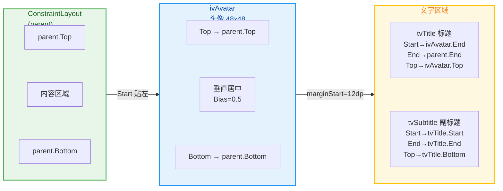

---

### 扁平化优势

#### 嵌套层级的性能代价

要理解 `ConstraintLayout` 扁平化布局的价值，首先要理解传统嵌套布局的性能代价。

Android 的 View 系统采用 **递归的 measure → layout → draw 三阶段流水线**。当 `ViewGroup.onMeasure()` 被调用时，它会对每个子 View 调用 `child.measure()`；如果子 View 自身也是 ViewGroup，则继续递归。一次完整的布局遍历的时间复杂度是 **O(n)**（n 为 View 树节点总数）。看上去是线性的，但问题在于——**有些 ViewGroup 会对子 View 做两次甚至更多次测量**。

最典型的例子就是 `LinearLayout` 配合 `layout_weight`。当子 View 使用了 `weight` 时，`LinearLayout` 需要先做一次测量获得所有子 View 的"自然尺寸"，然后根据剩余空间和权重比例做第二次测量。如果嵌套了 3 层带 weight 的 `LinearLayout`，最内层的 View 可能被测量 2³ = 8 次。每多嵌套一层带 weight 的 `LinearLayout`，测量次数就翻倍——这就是 **指数级测量膨胀（Exponential Measure Explosion）** 问题。

`RelativeLayout` 同样存在双重测量问题。它在 `onMeasure` 中分两轮处理子 View：第一轮解析水平方向的依赖关系并测量，第二轮解析垂直方向的依赖关系并测量。因此每个子 View 至少被测量 2 次。如果在 `RelativeLayout` 中嵌套 `RelativeLayout`，同样会产生指数增长。

Google 官方在 2017 年的性能分析中明确指出：**嵌套层级每增加一层，布局时间大约增加 20%~100%（取决于 ViewGroup 类型）**。对于一个有 80+ View 的复杂页面（如电商首页、社交动态流），3~4 层嵌套就可能导致单帧布局时间超过 16ms（60fps 的帧预算），从而引发掉帧。

#### ConstraintLayout 如何实现扁平化

`ConstraintLayout` 的扁平化能力源于一个核心设计：**它用约束方程组替代了嵌套关系来表达布局逻辑**。

在传统布局中，如果你想让 View C 在 View B 的下方，且 View B 在 View A 的右侧，你要么使用 `RelativeLayout`（但如果还有更复杂的对齐、权重需求就力不从心），要么使用嵌套：一个水平 `LinearLayout` 放 A 和 B，外面再套一个垂直 `LinearLayout` 放这个子容器和 C。**嵌套本质上是用"结构化的容器层级"来编码"位置关系"**。

而 `ConstraintLayout` 的思路是：**不管多复杂的位置关系，全部用约束声明来表达，然后交给求解器一次性算出所有坐标**。A、B、C 全部作为 `ConstraintLayout` 的直接子 View，没有中间嵌套层。它们之间的位置关系通过约束属性直接描述，不需要额外的 ViewGroup 来"承载"逻辑。

这带来了一个极其重要的结果：**无论布局多复杂，View 层级深度始终为 2（ConstraintLayout → 子 View）**。只有一层 parent-child 关系，没有 grandchild，没有 great-grandchild。这意味着：

1. **测量次数可控**：`ConstraintLayout` 的 onMeasure 内部调用求解器，求解器一次性处理所有约束。对于大多数布局，子 View 只需被测量 **1 次**（某些涉及 `wrap_content` 依赖的场景可能 2 次），不存在指数膨胀。
2. **Layout pass 极简**：onLayout 阶段只需遍历直接子 View 列表，依次调用 `child.layout(l, t, r, b)`，没有递归。
3. **Draw 调度更快**：View 层级浅意味着 `dispatchDraw` 的递归栈浅，invalidate 时需要重绘的区域判断也更少。

#### 量化对比

下面用一个具体场景来量化这种差异。假设我们要实现一个包含 3 行 × 3 列的信息卡片布局：

**传统方案（LinearLayout 嵌套）：**

```
LinearLayout (vertical)          → 第 1 层
├── LinearLayout (horizontal)    → 第 2 层
│   ├── View                     → 第 3 层
│   ├── View                     → 第 3 层
│   └── View                     → 第 3 层
├── LinearLayout (horizontal)    → 第 2 层
│   ├── View                     → 第 3 层
│   ├── View                     → 第 3 层
│   └── View                     → 第 3 层
└── LinearLayout (horizontal)    → 第 2 层
    ├── View                     → 第 3 层
    ├── View                     → 第 3 层
    └── View                     → 第 3 层

总节点数：13（1 + 3 + 9）
层级深度：3
如果使用 weight：每层 × 2 次测量 → 第 3 层 View 测量 2×2 = 4 次
```

**ConstraintLayout 方案：**

```
ConstraintLayout                → 第 1 层
├── View (row0-col0)            → 第 2 层
├── View (row0-col1)            → 第 2 层
├── View (row0-col2)            → 第 2 层
├── View (row1-col0)            → 第 2 层
├── View (row1-col1)            → 第 2 层
├── View (row1-col2)            → 第 2 层
├── View (row2-col0)            → 第 2 层
├── View (row2-col1)            → 第 2 层
└── View (row2-col2)            → 第 2 层

总节点数：10（1 + 9）
层级深度：2
子 View 测量次数：1（无嵌套，无指数膨胀）
```

节点减少 23%，层级从 3 降到 2，测量次数从 4 次降到 1 次。这只是 3×3 的简单情况。在实际的电商首页、新闻流、IM 聊天列表等复杂布局中，`ConstraintLayout` 带来的性能收益更加显著。Google 官方给出的数据是：**在同等复杂度下，ConstraintLayout 的布局性能比嵌套方案提升 40%~60%**。

#### 扁平化的额外好处

除了性能，扁平化还带来若干工程层面的好处：

**可读性**：所有 View 都在同一层级，打开 XML 就能看到完整的组件列表，不需要层层展开才找到某个深嵌的 View。配合 Android Studio 的 Design / Blueprint 视图，约束关系一目了然。

**可维护性**：修改某个 View 的位置，只需要改它自己的约束属性，不需要调整嵌套结构。在嵌套方案中，把一个 View 从"第二行第一列"挪到"第一行第三列"，可能需要剪切粘贴节点到另一个子 ViewGroup——这在大型 XML 中极易出错。

**动画友好**：`ConstraintLayout` 配合 `ConstraintSet` + `TransitionManager` 可以实现声明式的布局动画（后文会详述）。这要求所有参与动画的 View 在同一个 `ConstraintLayout` 中。扁平结构天然满足这个前提。

**工具链支持**：Android Studio 的可视化约束编辑器（Layout Editor）是专门为 `ConstraintLayout` 设计的。拖拽、约束连线、Bias 滑块等功能都建立在"所有 View 是同级"的假设上。嵌套层级多了，可视化编辑的体验急剧下降。

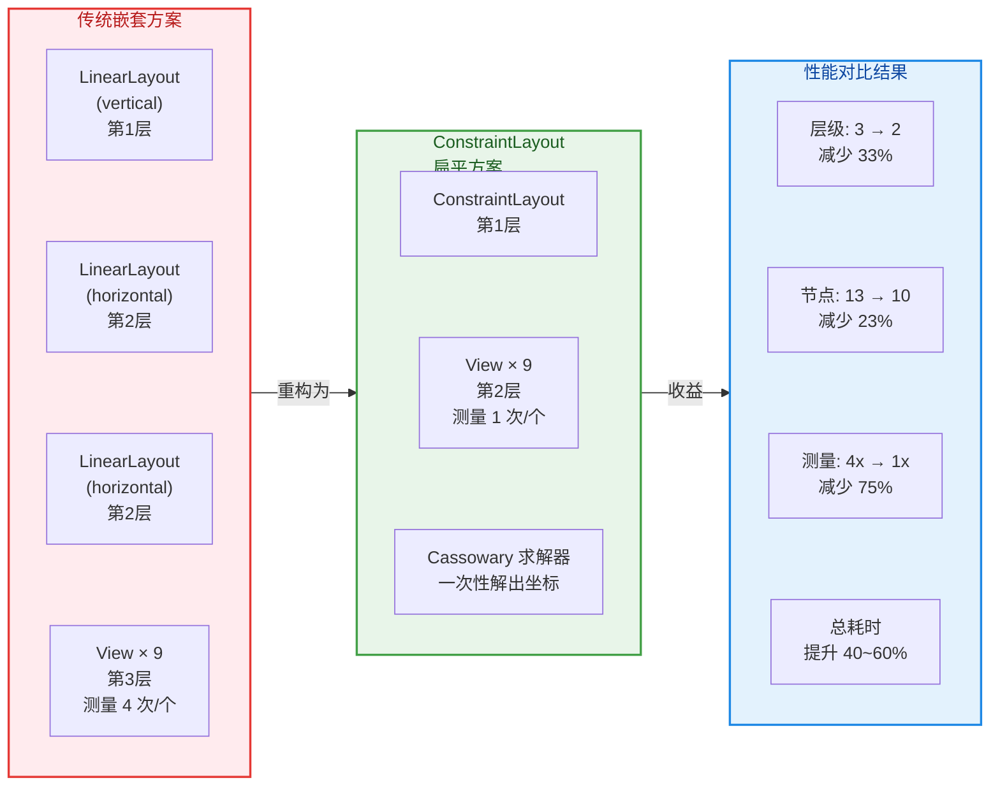

#### 何时不适用

尽管 `ConstraintLayout` 功能强大，但它并非"银弹"。以下场景中，传统布局可能仍然是更好的选择：

- **极简布局**：如果只是两三个 View 的线性排列，`LinearLayout` 的语义更直接，代码更简洁，性能差异可忽略。
- **列表项中的超高频布局**：`RecyclerView` 的 item 布局如果极其简单（如单行文字 + 图标），`ConstraintLayout` 的求解器初始化开销反而可能高于简单 `LinearLayout`。Google 的 Benchmark 显示，在子 View 少于 4~5 个的场景中，`ConstraintLayout` 的 inflate + measure 耗时与 `LinearLayout` 接近甚至略高。
- **纯代码动态布局**：如果布局结构完全由运行时数据决定（如动态 DSL 渲染引擎），直接使用 `addView` + `LayoutParams` 可能比构建 ConstraintSet 更灵活。

但在绝大多数真实项目中——特别是包含表单、卡片、详情页、对话框等复杂静态布局的场景——`ConstraintLayout` 都是 **首选且推荐** 的布局容器。

---

**📝 练习题**

在一个嵌套了 3 层的布局中，最外层是 `RelativeLayout`，中间是带 `layout_weight` 的 `LinearLayout`，最内层是 `RelativeLayout`。假设最内层有一个 `TextView`，那么这个 `TextView` 在一次完整的 measure pass 中，最少会被测量多少次？

A. 1 次


B. 4 次


C. 8 次


D. 16 次

**【答案】** C

**【解析】** `RelativeLayout` 对每个子 View 做 **2 次测量**（水平 pass + 垂直 pass），带 `layout_weight` 的 `LinearLayout` 同样做 **2 次测量**（自然尺寸 pass + 权重分配 pass）。三层嵌套的测量次数是乘积关系：最外层 `RelativeLayout`（×2）→ 中间 `LinearLayout` with weight（×2）→ 最内层 `RelativeLayout`（×2）→ 最终 `TextView` 被测量 2 × 2 × 2 = **8 次**。这正是嵌套布局"指数级测量膨胀"问题的典型体现。如果换成单层 `ConstraintLayout`，`TextView` 只需被测量 1 次（最多 2 次），性能提升极为显著。这也是 Google 推荐用 `ConstraintLayout` 替换深层嵌套布局的核心原因。

---

## 约束连接

ConstraintLayout 的灵魂在于 **约束（Constraint）**。每一条约束本质上是一个声明式的位置关系："我的某条边，应当与另一个目标的某条边对齐或保持一定距离"。这一小节将从最基础的 Parent 约束出发，逐步深入到同级控件约束、Bias 偏移比例以及极易被忽视却在实战中至关重要的 Gone Margin 机制，帮助你建立起对约束系统完整而精确的认知。

### Parent 约束

Parent 约束是最简单也是最常用的约束形式——将子控件的某条边锚定到 **ConstraintLayout 自身的对应边**。理解 Parent 约束是理解一切约束的起点。

**为什么叫"Parent 约束"？** 在传统的 RelativeLayout 中，我们使用 `layout_alignParentStart="true"` 这样的布尔属性来表达"贴靠父容器"。ConstraintLayout 对此进行了彻底重新设计——它不再使用布尔开关，而是使用一条 **显式的、方向化的连线** 来建立关系。例如 `app:layout_constraintStart_toStartOf="parent"` 表达的含义是："我的 Start 边 → 连线到 → parent 的 Start 边"。这条连线在 Cassowary 求解器内部会被翻译成一个线性等式或不等式约束，从而参与整体布局的求解。

**四个方向的 Parent 约束属性**：

| 属性 | 含义 |
|---|---|
| `layout_constraintStart_toStartOf="parent"` | 控件左边缘 → 父容器左边缘 |
| `layout_constraintEnd_toEndOf="parent"` | 控件右边缘 → 父容器右边缘 |
| `layout_constraintTop_toTopOf="parent"` | 控件上边缘 → 父容器上边缘 |
| `layout_constraintBottom_toBottomOf="parent"` | 控件下边缘 → 父容器下边缘 |

**核心规则：对轴双向约束 = 居中**。如果你对同一轴（水平轴或垂直轴）同时施加了两个方向相反的 Parent 约束，控件将会被 **居中放置**。这是因为两条约束对 Cassowary 求解器来说产生了两个方向相反、大小相等的"弹力"，求解器自然会将控件放在两力平衡的中点。

来看一个最经典的 **正中央定位** 示例：

```xml
<!-- 四条 Parent 约束同时施加：水平两条 + 垂直两条 -->
<!-- 结果：控件精确地出现在 ConstraintLayout 的正中心 -->
<TextView
    android:id="@+id/tvCenter"
    android:layout_width="wrap_content"
    android:layout_height="wrap_content"
    android:text="正中央"
    app:layout_constraintStart_toStartOf="parent"
    app:layout_constraintEnd_toEndOf="parent"
    app:layout_constraintTop_toTopOf="parent"
    app:layout_constraintBottom_toBottomOf="parent" />
```

上面这段 XML 中，`Start→parent.Start` 和 `End→parent.End` 这对水平约束使控件在水平方向居中；`Top→parent.Top` 和 `Bottom→parent.Bottom` 这对垂直约束使控件在垂直方向居中。四条约束共同作用，控件便稳稳地落在父容器的几何中心。

**仅单方向约束 = 贴边**。如果你只写了 `constraintStart_toStartOf="parent"` 而没有写 `End` 方向的约束，控件将直接贴靠到父容器的 Start 边（在 LTR 布局下即左边）。此时水平方向上只有一个单向的力，没有反向力来平衡，控件自然被"拉"到该边。

**Margin 与 Parent 约束的配合**：当你在 Parent 约束上叠加 `android:layout_marginStart="16dp"` 时，这个 margin 会被施加在 **约束连线上**。它的含义是"我的 Start 边与 parent 的 Start 边之间至少保持 16dp 的距离"。在居中场景下，两侧 margin 会同时作用——如果左右 margin 不等，控件会向 margin 较小的一侧偏移，但 Bias 提供了更精确的控制手段（后面会展开讲）。

```xml
<!-- 贴靠左上角，并留出 16dp 的安全边距 -->
<ImageView
    android:id="@+id/ivLogo"
    android:layout_width="48dp"
    android:layout_height="48dp"
    android:layout_marginStart="16dp"
    android:layout_marginTop="16dp"
    android:src="@drawable/ic_logo"
    app:layout_constraintStart_toStartOf="parent"
    app:layout_constraintTop_toTopOf="parent" />
<!-- 仅有 Start 和 Top 约束，控件贴靠左上角 -->
<!-- marginStart=16dp 使其与左边界保持 16dp -->
<!-- marginTop=16dp 使其与上边界保持 16dp -->
```

**一个常见的新手错误**：忘记给某个轴设置约束。ConstraintLayout 要求每个控件在水平和垂直方向上 **各至少有一条约束**，否则在编译时会收到警告，运行时控件会回退到 (0, 0) 位置。这与 FrameLayout 的默认左上角行为类似，但属于 **未定义行为**，不应依赖。

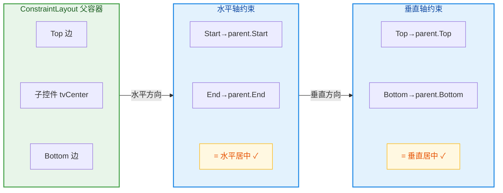

### 同级控件约束

同级控件约束（Sibling Constraint）是 ConstraintLayout 区别于传统线性排列思维的关键特性之一。它允许一个控件的边 **直接锚定到另一个同级控件的边**，而不必通过父容器做中转。这种能力使得我们无需嵌套 LinearLayout 或 RelativeLayout，就能在同一个扁平层级内表达复杂的相对位置关系。

**约束命名规则**：所有同级约束属性都遵循统一的命名模式——`layout_constraint{自身边}_to{目标边}Of="@id/目标控件"`。其中"自身边"和"目标边"可以是 Start、End、Top、Bottom、Baseline 五个锚点中的任意一个（但水平锚点只能连水平锚点，垂直锚点只能连垂直锚点，Baseline 是特殊的垂直锚点）。

**完整的连接组合**非常丰富，下面列举最常用的几种：

| 约束属性 | 语义 |
|---|---|
| `constraintStart_toEndOf="@id/A"` | 我的左边缘紧跟在 A 的右边缘之后 |
| `constraintEnd_toStartOf="@id/A"` | 我的右边缘在 A 的左边缘之前 |
| `constraintTop_toBottomOf="@id/A"` | 我的顶部在 A 的底部之下 |
| `constraintBottom_toTopOf="@id/A"` | 我的底部在 A 的顶部之上 |
| `constraintStart_toStartOf="@id/A"` | 我的左边缘与 A 的左边缘对齐 |
| `constraintBaseline_toBaselineOf="@id/A"` | 我的文字基线与 A 的文字基线对齐 |

**"toEndOf" 与 "toStartOf" 的区别**：这两个属性决定了控件是紧挨在目标控件的 **后面** 还是 **前面**。以水平排列为例，`constraintStart_toEndOf="@id/A"` 意味着"我出现在 A 的右边"，而 `constraintEnd_toStartOf="@id/A"` 意味着"我出现在 A 的左边"。两者结合 Margin 使用，可以精确控制控件之间的间距。

来看一个 **用户信息行** 的经典实战案例：头像在左，昵称在头像右边，时间戳贴靠右边：

```xml
<!-- 头像：贴靠父容器左边缘与顶部 -->
<ImageView
    android:id="@+id/ivAvatar"
    android:layout_width="40dp"
    android:layout_height="40dp"
    android:layout_marginStart="16dp"
    android:layout_marginTop="12dp"
    android:src="@drawable/avatar"
    app:layout_constraintStart_toStartOf="parent"
    app:layout_constraintTop_toTopOf="parent" />
<!-- Start→parent 表示贴左，Top→parent 表示贴上 -->

<!-- 昵称：左边紧跟在头像右边，垂直方向与头像顶部对齐 -->
<TextView
    android:id="@+id/tvName"
    android:layout_width="wrap_content"
    android:layout_height="wrap_content"
    android:layout_marginStart="12dp"
    android:text="用户昵称"
    app:layout_constraintStart_toEndOf="@id/ivAvatar"
    app:layout_constraintTop_toTopOf="@id/ivAvatar" />
<!-- Start→ivAvatar.End 表示"我在头像的右边" -->
<!-- Top→ivAvatar.Top 表示"我的顶部与头像的顶部对齐" -->
<!-- marginStart=12dp 是昵称与头像之间的水平间距 -->

<!-- 时间戳：贴靠父容器右边缘，垂直基线与昵称对齐 -->
<TextView
    android:id="@+id/tvTime"
    android:layout_width="wrap_content"
    android:layout_height="wrap_content"
    android:layout_marginEnd="16dp"
    android:text="3分钟前"
    app:layout_constraintEnd_toEndOf="parent"
    app:layout_constraintBaseline_toBaselineOf="@id/tvName" />
<!-- End→parent 表示"贴靠右边缘" -->
<!-- Baseline→tvName.Baseline 使两段文字的基线完美对齐 -->
<!-- 这比 Top 对齐更精确，因为不同字号的文字 Top 对齐会视觉不齐 -->
```

**Baseline 对齐的特殊价值**：当两个 TextView 使用不同的字号时，如果简单地 `Top_toTopOf` 对齐，视觉上文字会显得高低不齐——因为大号字的 ascender 更高。Baseline 约束直接对齐的是文字的 **排版基线**（即英文字母底部的那条虚线），这样无论字号差异多大，文字看起来都是在同一水平线上流畅阅读的。这在 ConstraintLayout 中只需一个属性即可实现，而在 LinearLayout 中则需要额外的 `baselineAligned` 配置甚至嵌套才能做到。

**同级约束也能实现"相对居中"**：与 Parent 约束的居中原理一样，如果你在两个同级控件之间同时施加双向约束，控件会被居中放置在两者之间。例如：

```xml
<!-- 在 A 和 B 之间水平居中放置 C -->
<View
    android:id="@+id/viewC"
    android:layout_width="60dp"
    android:layout_height="60dp"
    app:layout_constraintStart_toEndOf="@id/viewA"
    app:layout_constraintEnd_toStartOf="@id/viewB"
    app:layout_constraintTop_toTopOf="parent"
    app:layout_constraintBottom_toBottomOf="parent" />
<!-- Start→A.End + End→B.Start 在水平方向形成双向拉力 -->
<!-- 求解结果：C 被放置在 A 和 B 之间的正中央 -->
```

**循环依赖的陷阱**：同级约束很灵活，但需要注意不要形成 **循环约束**（如 A 依赖 B 的位置，B 又依赖 A 的位置，且两者都是 `wrap_content`）。Cassowary 求解器虽然不会崩溃，但会给出不确定的结果。实际开发中，保证约束链条有一个明确的"锚点起始控件"（通常是某个固定尺寸或连到 parent 的控件）是最佳实践。

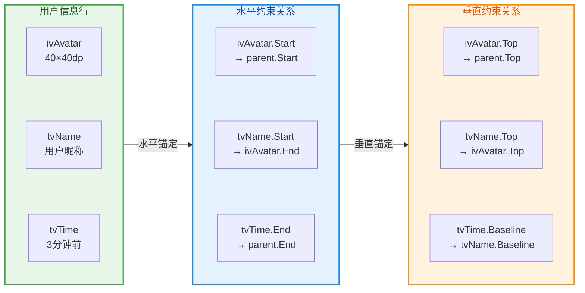

### Bias 偏移比例

当控件在某一轴上同时拥有两条方向相反的约束时，默认行为是居中——Bias 值为 0.5。而 **Bias（偏移比例）** 则允许你打破这种对称平衡，将控件向某一侧偏移，范围从 `0.0`（完全贴靠起始边）到 `1.0`（完全贴靠结束边）。

**Bias 的底层原理**：在 Cassowary 线性约束求解器的视角中，双向约束可以被理解为两根弹簧分别从两侧拉住控件。默认情况下两根弹簧的"刚度"相同，控件停在中点。Bias 参数本质上是在调整两根弹簧的 **刚度比**——`bias = 0.3` 意味着起始侧弹簧的刚度占比为 30%，结束侧为 70%，控件因此被"拉"向起始侧，最终停在距起始边 30% 的位置处。

**两个 Bias 属性**：

| 属性 | 作用轴 | 默认值 |
|---|---|---|
| `layout_constraintHorizontal_bias` | 水平轴 | 0.5 |
| `layout_constraintVertical_bias` | 垂直轴 | 0.5 |

**Bias 的精确定位公式**：假设父容器（或两个锚点之间）可用的空闲空间为 `S`（即总宽度减去控件自身宽度减去两侧 margin），那么控件距起始边的距离 = `S × bias`，距结束边的距离 = `S × (1 - bias)`。这意味着：

- `bias = 0.0`：控件紧贴起始边（类似 `gravity="start"`）
- `bias = 0.5`：控件居中（默认值）
- `bias = 1.0`：控件紧贴结束边（类似 `gravity="end"`）
- `bias = 0.33`：控件在距起始边三分之一处

**Bias 的一个关键优势是响应式（Responsive）定位**。与固定 margin 不同，Bias 是按比例分配的——当屏幕宽度变化（手机 vs 平板）时，控件始终保持在 "总空间的 X%" 这个相对位置上，而不是固定像素的绝对位置。这对于需要适配多种屏幕尺寸的应用来说非常有价值。

来看实际代码：

```xml
<!-- 场景：登录按钮在水平方向偏左 30% 处，垂直方向偏下 70% 处 -->
<Button
    android:id="@+id/btnLogin"
    android:layout_width="wrap_content"
    android:layout_height="wrap_content"
    android:text="登录"
    app:layout_constraintStart_toStartOf="parent"
    app:layout_constraintEnd_toEndOf="parent"
    app:layout_constraintTop_toTopOf="parent"
    app:layout_constraintBottom_toBottomOf="parent"
    app:layout_constraintHorizontal_bias="0.3"
    app:layout_constraintVertical_bias="0.7" />
<!-- 四条 Parent 约束建立了双向拉力 -->
<!-- horizontal_bias=0.3：水平空闲空间的 30% 分配给左侧，70% 给右侧 -->
<!-- vertical_bias=0.7：垂直空闲空间的 70% 分配给上方，30% 给下方 -->
<!-- 最终效果：按钮出现在左下方区域 -->
```

**Bias 与 Margin 的组合使用**：Bias 和 Margin 可以同时使用，但它们的作用层级不同。Margin 首先会 **缩减可用的空闲空间 S**，然后 Bias 再在剩余空间上按比例分配。例如，如果左侧 margin 为 20dp，右侧 margin 为 0，总空间 360dp，控件宽度 100dp，则 S = 360 - 100 - 20 - 0 = 240dp，bias=0.5 时控件距左边 margin 之后再偏移 120dp。

**编程动态修改 Bias**：在代码中可以通过 `ConstraintLayout.LayoutParams` 动态修改 Bias，这为实现动画和交互式位置调整提供了可能：

```kotlin
// 获取控件的约束布局参数
val params = btnLogin.layoutParams as ConstraintLayout.LayoutParams
// 将水平偏移比例从当前值修改为 0.8（偏右）
params.horizontalBias = 0.8f
// 将垂直偏移比例修改为 0.2（偏上）
params.verticalBias = 0.2f
// 重新应用参数，触发布局刷新
btnLogin.layoutParams = params
// 调用 requestLayout() 其实在 setLayoutParams 内部已自动触发
// 但如果你直接修改 params 字段而不调用 setter，则需要手动 requestLayout()
```

**Bias 在 ConstraintSet 中的使用**（预告后续章节内容）：在用 `ConstraintSet` 做布局切换动画时，Bias 是最常被动态修改的属性之一。你可以定义两个 ConstraintSet——一个 bias=0.1（控件在左），另一个 bias=0.9（控件在右），然后通过 `TransitionManager.beginDelayedTransition()` 让控件从左到右平滑滑动。这种基于 Bias 的动画比手动计算像素位移更简洁、更自适应。

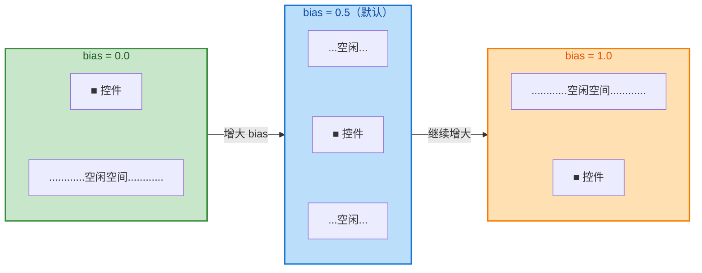

### Gone Margin

Gone Margin 是 ConstraintLayout 中一个 **极具匠心的设计**，它解决了一个在传统布局体系中非常头疼的问题：当约束链条中的某个控件被设置为 `View.GONE` 后，相邻控件的间距该如何自适应？

**问题背景**：假设有三个控件 A → B → C 水平排列，B 距 A 的 margin 为 8dp，C 距 B 的 margin 为 8dp。某天产品需求说"B 在某些条件下隐藏"。你将 B 设为 `GONE`。在传统布局中，B 虽然不可见了，但它 **仍然占据着原来的空间**（`INVISIBLE`）或者完全消失导致 C 的 margin 起始点变得不确定（`GONE` 在 LinearLayout 中的表现）。ConstraintLayout 的处理方式更智能：**当控件被设为 GONE 时，它在布局计算中被视为一个尺寸为 0 的点，但约束关系依然存在**。这意味着 C 原来锚定到 B 的 End，现在 B 缩成了一个零宽点，C 会直接紧贴到 B 原来的位置（也就是 A 的旁边）。

**这就引出了新问题**：C 原来距 B 的 margin 是 8dp，但现在 B 消失了，C 突然和 A 挨得太近（只有 B 残留的 0 宽度 + C 的 8dp margin = 8dp），而之前是 A 的宽度 + 8dp + B 的宽度 + 8dp。如果产品期望"B 消失后，C 和 A 之间的间距变为 24dp"，用传统 margin 就无法实现——你只有一个 `marginStart`，它在 B 存在和不存在时无法取不同值。

**Gone Margin 就是为此而生**。它是一组专门在 **约束目标控件为 GONE 时才生效的 margin**，与普通 margin 互斥切换：

| Gone Margin 属性 | 对应的普通 Margin | 生效条件 |
|---|---|---|
| `layout_goneMarginStart` | `layout_marginStart` | 约束目标 `GONE` 时生效 |
| `layout_goneMarginEnd` | `layout_marginEnd` | 约束目标 `GONE` 时生效 |
| `layout_goneMarginTop` | `layout_marginTop` | 约束目标 `GONE` 时生效 |
| `layout_goneMarginBottom` | `layout_marginBottom` | 约束目标 `GONE` 时生效 |

**切换机制**：ConstraintLayout 在布局计算时会检查每条约束的目标控件的 Visibility。如果目标控件是 `VISIBLE` 或 `INVISIBLE`，使用普通 `margin`；如果目标控件是 `GONE`，则使用 `goneMargin`（如果未设置 `goneMargin`，回退到 0）。这个判断发生在 **每次布局 pass** 中，是完全动态的。

来看具体的代码示例：

```xml
<!-- 场景：商品标签 A（固定显示）→ 促销标签 B（可能隐藏）→ 价格 C -->

<!-- A：促销图标，固定在左侧 -->
<ImageView
    android:id="@+id/ivTag"
    android:layout_width="wrap_content"
    android:layout_height="wrap_content"
    android:layout_marginStart="16dp"
    android:src="@drawable/ic_tag"
    app:layout_constraintStart_toStartOf="parent"
    app:layout_constraintTop_toTopOf="parent" />

<!-- B：促销文案，可能被后台控制隐藏 -->
<TextView
    android:id="@+id/tvPromo"
    android:layout_width="wrap_content"
    android:layout_height="wrap_content"
    android:layout_marginStart="8dp"
    android:text="限时折扣"
    android:visibility="gone"
    app:layout_constraintStart_toEndOf="@id/ivTag"
    app:layout_constraintBaseline_toBaselineOf="@id/ivTag" />
<!-- 正常情况下距 ivTag 右边 8dp -->
<!-- 当前 visibility="gone"，此控件被视为零尺寸点 -->

<!-- C：价格文字 -->
<TextView
    android:id="@+id/tvPrice"
    android:layout_width="wrap_content"
    android:layout_height="wrap_content"
    android:layout_marginStart="8dp"
    android:text="¥99.00"
    app:layout_goneMarginStart="16dp"
    app:layout_constraintStart_toEndOf="@id/tvPromo"
    app:layout_constraintBaseline_toBaselineOf="@id/ivTag" />
<!-- tvPrice 的 Start 锚定到 tvPromo 的 End -->
<!-- 当 tvPromo 可见时：marginStart = 8dp 生效，正常间距 -->
<!-- 当 tvPromo GONE 时：goneMarginStart = 16dp 生效 -->
<!-- 这个 16dp 补偿了 tvPromo 消失后的空间，让间距看起来合理 -->
```

用 ASCII 图来直观对比两种状态下的效果：

```text
【状态 1：tvPromo 可见】
┌──────────────────────────────────────────┐
│  [ivTag]  ←8dp→  [限时折扣]  ←8dp→  [¥99] │
│                   tvPromo               │
└──────────────────────────────────────────┘

【状态 2：tvPromo GONE】
┌──────────────────────────────────────────┐
│  [ivTag]  ←——— 16dp(goneMargin) ———→  [¥99] │
│           tvPromo 缩为零宽点            │
└──────────────────────────────────────────┘
```

**在代码中动态切换**：你不需要手动去改 margin——只要切换目标控件的 visibility，ConstraintLayout 会自动在普通 margin 和 gone margin 之间切换：

```kotlin
// 业务逻辑：根据后台接口判断是否显示促销标签
fun updatePromoVisibility(hasPromo: Boolean) {
    // 切换 tvPromo 的可见性
    binding.tvPromo.visibility = if (hasPromo) View.VISIBLE else View.GONE
    // 无需额外修改 tvPrice 的 margin！
    // ConstraintLayout 会自动检测 tvPromo 的 GONE 状态
    // 并将 tvPrice 的 marginStart 从 8dp 切换为 goneMarginStart 的 16dp
    // 这种自动化切换大大减少了手动布局调整的代码
}
```

**Gone Margin 的典型使用场景**：

1. **条件性标签/徽章**：如上例，促销标签、VIP 标志等可能出现也可能隐藏，后续控件需要自适应间距。
2. **可选的输入字段**：表单中某些字段根据用户选择动态显示或隐藏，下方字段的顶部间距需要自适应。
3. **多状态列表项**：RecyclerView 的 item 中，部分元素在某些数据下不显示，相邻元素需保持合理间距。
4. **响应式布局中的弹性排列**：在平板端显示但手机端隐藏的辅助信息栏，主内容区域需要自动调整间距。

**一个容易忽视的细节**：Gone Margin 是设置在 **依赖方** 而非被隐藏方上的。也就是说，`goneMarginStart` 写在 tvPrice 上（依赖 tvPromo 的控件），而不是写在 tvPromo 上。这很符合逻辑——因为是 tvPrice "关心"它的锚点目标消失后自己该怎么调整，而不是 tvPromo "关心"自己消失后别人该怎么办。

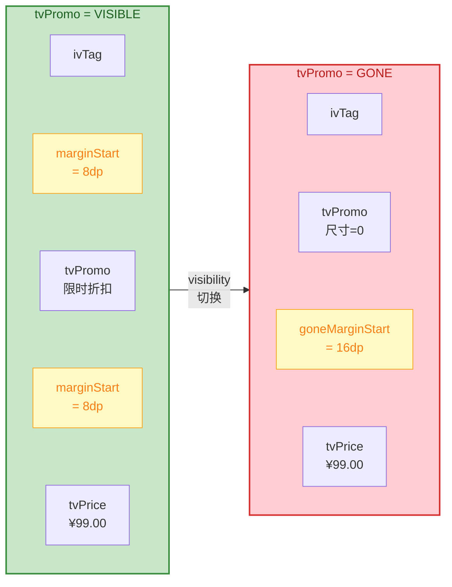

---

**📝 练习题**

在 ConstraintLayout 中，控件 C 的 `layout_constraintStart_toEndOf="@id/B"`，并设置了 `layout_marginStart="12dp"` 和 `layout_goneMarginStart="32dp"`。当 B 的 `visibility` 为 `GONE` 时，C 的实际起始边距是多少？


A. 12dp，因为 `marginStart` 始终优先


B. 32dp，因为 B 为 GONE 时 `goneMarginStart` 自动替代 `marginStart`


C. 44dp，因为两个 margin 会叠加


D. 0dp，因为 B 不存在了约束失效


**【答案】** B

**【解析】** ConstraintLayout 在每次布局计算时都会检查约束目标控件的 Visibility 状态。当目标控件（这里是 B）的 visibility 为 `GONE` 时，该控件在布局系统中被视为一个 **尺寸为 0 的点**，但约束关系依然保持有效（排除选项 D）。此时，ConstraintLayout 会自动将依赖方（C）的普通 `marginStart`（12dp）切换为 `goneMarginStart`（32dp），两者是 **互斥替换关系** 而非叠加（排除选项 C）。`goneMarginStart` 的设计目的正是为了在锚点控件消失后提供一个不同的间距值，以补偿被隐藏控件所留下的空间缺口。因此最终 C 距离 B 残留的零宽点的起始间距为 32dp。这种机制使得开发者无需编写额外的代码来手动调整间距，仅靠 XML 声明就能优雅地处理控件的动态显隐。

---

## 尺寸控制（match_parent 废弃、wrap_content、0dp/match_constraint、宽高比 Ratio）

ConstraintLayout 对子控件的尺寸管理方式与传统 ViewGroup（如 `LinearLayout`、`RelativeLayout`）存在本质差异。在传统布局体系中，我们习惯于将控件宽高设为 `match_parent` 来"填满父容器"、设为 `wrap_content` 来"包裹内容"，这套逻辑简单直观。然而 ConstraintLayout 引入了一种完全由 **约束关系（Constraints）** 驱动的尺寸计算模型——控件的最终大小并非仅由自身属性决定，还深度依赖于它与父容器边缘或其他同级控件之间建立的约束连接。这就导致 `match_parent` 这个"老朋友"在语义上与约束系统产生了根本冲突，最终被官方明确废弃，取而代之的是更加精确、灵活的 `0dp`（即 `match_constraint`）模式。

理解尺寸控制是掌握 ConstraintLayout 的关键一步。本节将从"为什么要废弃 match_parent"出发，逐一剖析 `wrap_content`、`0dp/match_constraint` 以及宽高比 `Ratio` 这几种尺寸策略的原理、行为差异和实战用法。

### match_parent 的废弃：语义冲突与布局歧义

要理解 `match_parent` 为何在 ConstraintLayout 中被废弃，首先需要回顾它在传统布局中的含义。当一个子控件的宽度或高度被设为 `match_parent` 时，传统 ViewGroup 的测量流程（`onMeasure`）会将父容器的可用空间直接作为该控件的尺寸——这是一种"**无条件填满**"的语义，控件不需要关心自己和谁有约束关系，它只需要知道父容器多大即可。

但 ConstraintLayout 的设计哲学截然不同。它的核心思想是：**一切尺寸与位置，都应该由约束关系来推导**。控件的左右边界应该被约束到某个锚点，然后由 Cassowary 线性求解器根据这些约束方程来计算最终位置和大小。`match_parent` 这种"跳过约束、直接取父容器大小"的方式，与约束驱动的模型在语义上产生了严重的冲突。

具体来说，当你在 ConstraintLayout 的子控件上同时设置了 `android:layout_width="match_parent"` 和 `app:layout_constraintStart_toStartOf="parent"` + `app:layout_constraintEnd_toEndOf="parent"` 时，就产生了**双重指令歧义**：约束系统试图通过左右两条约束来计算宽度，而 `match_parent` 又试图无条件填满父容器宽度。Cassowary 求解器无法判断应该优先服从哪个指令，可能导致不可预期的布局结果——控件可能忽略 `margin`，可能忽略 `bias`，甚至可能导致约束整体失效。

更严重的是，`match_parent` 在语义上完全绕开了约束链（Chain）的权重分配、Barrier 的动态边界计算等高级特性。如果一个链中的某个节点宽度写死为 `match_parent`，那么整条链的 Spread/Packed 分配算法就会被破坏，因为这个节点"不参与协商"。

因此，Google 官方在 ConstraintLayout 的文档和 Lint 规则中明确指出：**在 ConstraintLayout 的直接子控件中，不应使用 `match_parent`，应使用 `0dp`（match_constraint）配合完整的约束来替代**。虽然在运行时写 `match_parent` 不会直接崩溃（ConstraintLayout 内部会尝试兼容处理，通常将其等同于 `match_constraint`），但这种兼容行为并不可靠，不同版本的 ConstraintLayout 库处理方式可能存在差异，因此在工程实践中应该完全避免。

下面用一个对比来直观说明为什么 `0dp` + 约束能完美替代 `match_parent`：

```xml
<!-- ❌ 错误写法：在 ConstraintLayout 中使用 match_parent -->
<TextView
    android:layout_width="match_parent"
    android:layout_height="wrap_content"
    android:text="Hello" />
<!-- 
  问题：
  1. 缺少水平约束，控件位置由默认值(0,0)决定，与约束系统脱节
  2. match_parent 语义跳过了约束求解，margin/bias 可能失效
  3. Lint 会发出警告
-->

<!-- ✅ 正确写法：使用 0dp + 左右约束 -->
<TextView
    android:layout_width="0dp"
    android:layout_height="wrap_content"
    app:layout_constraintStart_toStartOf="parent"
    app:layout_constraintEnd_toEndOf="parent"
    android:text="Hello" />
<!--
  效果：
  1. 0dp 告诉系统"我的宽度由约束来决定"
  2. Start→parent.Start + End→parent.End 建立了完整的水平约束
  3. 求解器计算出宽度 = 父容器宽度 - startMargin - endMargin
  4. bias、margin、chain 等特性全部正常工作
-->
```

总结一下 `match_parent` 被废弃的三个核心原因：第一，**语义冲突**——它绕过了约束求解器；第二，**特性不兼容**——它破坏了 bias、chain、barrier 等约束特性的正常工作；第三，**可维护性差**——混用两套尺寸逻辑会让布局行为变得不可预测，尤其在团队协作中容易引发 bug。

### wrap_content：内容包裹与约束的微妙交互

`wrap_content` 在 ConstraintLayout 中的语义与传统布局基本一致——控件的尺寸由其内容大小决定。一个 `TextView` 设为 `wrap_content` 后，它的宽度就是文本渲染所需的宽度加上 padding。然而，当 `wrap_content` 遇到约束系统时，会产生一些需要特别注意的 **行为细节**。

**核心行为：约束影响位置，但不裁剪尺寸。** 当一个控件宽度为 `wrap_content` 并且同时建立了左右约束时，约束系统只用这两条约束来决定控件的 **水平位置**（配合 bias 进行居中或偏移），但 **不会** 用约束来限制控件的宽度。也就是说，如果文本非常长，控件的实际渲染宽度可能 **溢出约束边界**。

这一点经常让开发者感到困惑。举个例子：你把一个 `TextView` 约束在两个按钮之间，宽度设为 `wrap_content`，当文本较短时一切正常——文本在两个按钮之间居中显示。但当文本变得很长时，`TextView` 会向两侧溢出，甚至覆盖在按钮之上，因为 `wrap_content` 语义是"我要多大就多大"，约束只决定了居中锚点的位置，不限制尺寸上限。

为了解决这个溢出问题，ConstraintLayout 提供了一个专属属性 `app:layout_constrainedWidth`（对应高度为 `app:layout_constrainedHeight`）。当设为 `true` 时，它告诉约束求解器：**在 `wrap_content` 的基础上，额外施加约束边界作为尺寸上限**。此时控件的宽度 = `min(内容所需宽度, 约束空间宽度)`，从而保证不会溢出。

```xml
<!-- 场景：TextView 夹在两个按钮之间 -->
<Button
    android:id="@+id/btnLeft"
    android:layout_width="wrap_content"
    android:layout_height="wrap_content"
    android:text="Left"
    app:layout_constraintStart_toStartOf="parent"
    app:layout_constraintTop_toTopOf="parent" />

<TextView
    android:id="@+id/tvContent"
    android:layout_width="wrap_content"
    android:layout_height="wrap_content"
    android:text="这是一段可能非常非常非常长的文本内容..."
    android:ellipsize="end"
    android:maxLines="1"
    app:layout_constrainedWidth="true"
    app:layout_constraintStart_toEndOf="@id/btnLeft"
    app:layout_constraintEnd_toStartOf="@id/btnRight"
    app:layout_constraintTop_toTopOf="parent" />
<!-- 
  layout_constrainedWidth="true" 关键属性：
  - 当文本短时，宽度 = 文本自身宽度（wrap_content 正常行为）
  - 当文本长时，宽度 = 两个按钮之间的可用空间（约束上限生效）
  - 配合 ellipsize="end" 实现文本截断省略号效果
-->

<Button
    android:id="@+id/btnRight"
    android:layout_width="wrap_content"
    android:layout_height="wrap_content"
    android:text="Right"
    app:layout_constraintEnd_toEndOf="parent"
    app:layout_constraintTop_toTopOf="parent" />
```

下面用一个 Mermaid 图来对比 `wrap_content` 在**有无** `constrainedWidth` 时的不同表现：

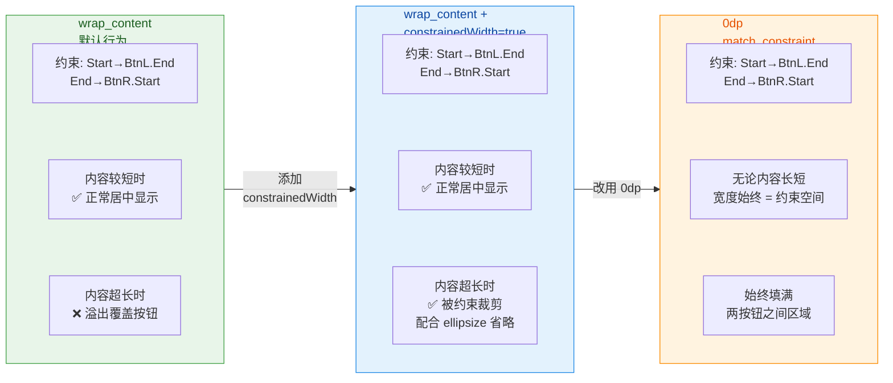

另外，`wrap_content` 还有一个常被忽视的细节：**它与 `minWidth`/`maxWidth` 的配合**。当控件设为 `wrap_content` 时，`android:minWidth` 和 `android:maxWidth` 会正常生效，分别设定尺寸的下限和上限。而当控件设为 `0dp` 时，这两个属性会被 ConstraintLayout 自己的 `app:layout_constraintWidth_min` 和 `app:layout_constraintWidth_max` 覆盖（后者优先级更高）。在实际开发中，推荐在 ConstraintLayout 环境下统一使用 `app:layout_constraintWidth_min/max` 来控制尺寸范围，以避免属性优先级混淆。

### 0dp / match_constraint：约束驱动的弹性尺寸

`0dp` 是 ConstraintLayout 中最核心、最强大的尺寸模式，官方称之为 `MATCH_CONSTRAINT`。当控件的宽度（或高度）被设为 `0dp` 时，它的含义是：**"我放弃自主决定尺寸，完全交由约束系统来计算我应该有多大。"** 这是一种"声明式弹性尺寸"——控件的实际大小由它所连接的约束锚点之间的距离来推导。

要让 `0dp` 正确工作，**必须在该维度上建立完整的约束对**。例如，如果宽度设为 `0dp`，就必须同时有 Start 和 End 约束（或 Left 和 Right 约束）。如果只有单侧约束，求解器无法计算出有意义的宽度，控件会塌缩为 0 宽度（在某些版本中）或回退到 `wrap_content` 行为（不可靠）。

`0dp` 模式下，ConstraintLayout 还提供了一个进一步细化行为的属性：`app:layout_constraintWidth_default`（高度对应 `layout_constraintHeight_default`），它有三个可选值：

1. **`spread`（默认值）**：控件宽度 = 约束空间的全部可用宽度（减去 margin）。这是最常用的模式，等效于"在约束范围内 match_parent"。

2. **`wrap`**：控件宽度 = `min(内容所需宽度, 约束空间宽度)`。行为上等价于 `wrap_content` + `constrainedWidth="true"`。这个模式在实际开发中使用较少，因为直接用 `wrap_content` + `constrainedWidth` 更加语义明确。

3. **`percent`**：控件宽度 = 父容器宽度 × 指定百分比。需要配合 `app:layout_constraintWidth_percent` 属性使用，取值范围为 0.0~1.0。这是实现响应式布局的利器，无需嵌套额外的 `FrameLayout` 或使用 `Guideline`。

```xml
<!-- 示例 1：spread 模式（默认） - 填满约束空间 -->
<View
    android:id="@+id/banner"
    android:layout_width="0dp"
    android:layout_height="200dp"
    android:background="#E3F2FD"
    app:layout_constraintStart_toStartOf="parent"
    app:layout_constraintEnd_toEndOf="parent"
    android:layout_marginStart="16dp"
    android:layout_marginEnd="16dp" />
<!--
  宽度 = 父容器宽度 - 16dp(左margin) - 16dp(右margin)
  layout_constraintWidth_default 默认就是 spread，无需显式声明
  效果类似传统的 match_parent + marginHorizontal
-->

<!-- 示例 2：percent 模式 - 占父容器 80% 宽度 -->
<View
    android:id="@+id/card"
    android:layout_width="0dp"
    android:layout_height="120dp"
    android:background="#FFF3E0"
    app:layout_constraintWidth_default="percent"
    app:layout_constraintWidth_percent="0.8"
    app:layout_constraintStart_toStartOf="parent"
    app:layout_constraintEnd_toEndOf="parent"
    app:layout_constraintTop_toBottomOf="@id/banner"
    android:layout_marginTop="16dp" />
<!--
  宽度 = 父容器宽度 × 0.8
  即使有 Start/End 约束到 parent，百分比优先于约束空间计算
  控件会居中显示（因为 bias 默认 0.5）
-->

<!-- 示例 3：wrap 模式 - 内容驱动但不超出约束 -->
<TextView
    android:id="@+id/label"
    android:layout_width="0dp"
    android:layout_height="wrap_content"
    android:text="动态文本"
    app:layout_constraintWidth_default="wrap"
    app:layout_constraintStart_toStartOf="parent"
    app:layout_constraintEnd_toEndOf="parent"
    app:layout_constraintTop_toBottomOf="@id/card"
    android:layout_marginTop="8dp" />
<!--
  当文本短时：宽度 = 文本宽度（wrap 行为）
  当文本超长时：宽度 = 父容器宽度（约束上限生效）
  等效于 wrap_content + constrainedWidth="true"
-->
```

在 `0dp` 模式下，`app:layout_constraintWidth_min` 和 `app:layout_constraintWidth_max` 属性用于设定尺寸的下限和上限，它们的优先级高于 `android:minWidth` 和 `android:maxWidth`。这两个属性接受具体的 dp 值或者特殊关键字 `wrap`（表示以内容大小作为下限/上限）。

```xml
<!-- 尺寸范围控制示例 -->
<TextView
    android:layout_width="0dp"
    android:layout_height="wrap_content"
    app:layout_constraintStart_toStartOf="parent"
    app:layout_constraintEnd_toEndOf="parent"
    app:layout_constraintWidth_min="100dp"
    app:layout_constraintWidth_max="300dp" />
<!--
  宽度由约束计算，但被钳制(clamp)在 [100dp, 300dp] 范围内
  - 若约束空间 < 100dp → 宽度 = 100dp（可能溢出）
  - 若约束空间在 100~300dp → 宽度 = 约束空间
  - 若约束空间 > 300dp → 宽度 = 300dp（居中由 bias 控制）
-->
```

下面这张图总结了三种尺寸模式在 ConstraintLayout 中的行为差异：

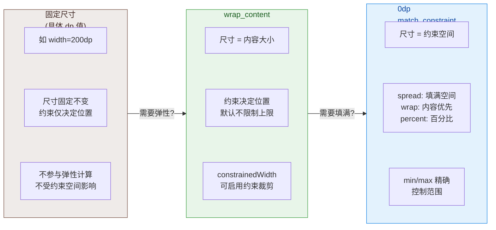

### 宽高比 Ratio：一个维度驱动另一个维度

宽高比（`app:layout_constraintDimensionRatio`）是 ConstraintLayout 尺寸控制中最精妙的特性之一。它允许你通过一个简单的比例声明，让控件的宽度和高度之间建立数学关系——只需确定一个维度的大小，另一个维度就会自动按比例计算。这在实际业务中非常常见：图片需要保持 16:9 的比例、头像需要保持 1:1 的正方形、卡片需要保持黄金比例等等。

**基本语法**：`app:layout_constraintDimensionRatio="W:H"`，其中 W 和 H 分别代表宽和高的比例值。例如 `"16:9"` 表示宽高比为 16:9，`"1:1"` 表示正方形。也可以写成浮点数形式，如 `"1.778"` 等同于 16÷9。

Ratio 的工作需要与尺寸模式配合。它的核心规则是：**至少有一个维度必须设为 `0dp`（match_constraint）**，这个维度就是"被计算的维度"，而另一个维度提供"已知值"供比例换算。具体来说有三种情况：

**情况一：宽度为 `0dp`，高度已知（固定值或 wrap_content）**。此时高度是已知维度，宽度由 `高度 × (W/H)` 计算得出。例如高度为 90dp，ratio 为 `"16:9"`，则宽度 = 90 × (16/9) = 160dp。

**情况二：高度为 `0dp`，宽度已知**。此时宽度是已知维度，高度由 `宽度 × (H/W)` 计算得出。例如宽度填满屏幕为 360dp，ratio 为 `"16:9"`，则高度 = 360 × (9/16) = 202.5dp。

**情况三：宽和高都设为 `0dp`**。这种情况下两个维度都是 match_constraint，系统无法自动判断应该"先算谁"。此时需要在 ratio 值前面加上 **维度前缀** 来指定哪个维度被约束计算。语法为 `"W,16:9"` 或 `"H,16:9"`：

- `"W,16:9"`：前缀 `W` 表示"**宽度**受比例约束"——先由高度的约束计算出高度，再用比例算出宽度。
- `"H,16:9"`：前缀 `H` 表示"**高度**受比例约束"——先由宽度的约束计算出宽度，再用比例算出高度。

这个前缀语法初看有些反直觉，但记住一个口诀：**前缀指定的是"被动维度"**，即"谁是根据比例被算出来的那个"。

```xml
<!-- 场景 1：视频播放器 - 宽度填满，高度按 16:9 自动计算 -->
<com.google.android.exoplayer2.ui.PlayerView
    android:id="@+id/playerView"
    android:layout_width="0dp"
    android:layout_height="0dp"
    app:layout_constraintStart_toStartOf="parent"
    app:layout_constraintEnd_toEndOf="parent"
    app:layout_constraintTop_toTopOf="parent"
    app:layout_constraintDimensionRatio="H,16:9" />
<!--
  宽高都为 0dp，需要前缀指定被动维度
  "H,16:9" → H 是被动维度（被比例算出来的）
  → 先算宽度：0dp + Start/End 约束 = 填满父容器宽度
  → 再算高度：宽度 × (9/16)
  → 最终效果：宽度撑满屏幕，高度自动保持 16:9 比例
-->

<!-- 场景 2：圆形头像 - 1:1 正方形 + 圆角裁剪 -->
<de.hdodenhof.circleimageview.CircleImageView
    android:id="@+id/avatar"
    android:layout_width="0dp"
    android:layout_height="0dp"
    app:layout_constraintWidth_percent="0.2"
    app:layout_constraintDimensionRatio="1:1"
    app:layout_constraintStart_toStartOf="parent"
    app:layout_constraintEnd_toEndOf="parent"
    app:layout_constraintTop_toBottomOf="@id/playerView"
    android:layout_marginTop="16dp" />
<!--
  宽度 = 父容器的 20%（通过 percent 控制）
  高度 = 宽度 × 1 = 与宽度相同（正方形）
  只有宽度设了 percent，高度的 0dp 由 ratio 驱动
  无需前缀，因为系统能自动推断：宽度有 percent 约束，高度靠 ratio
-->

<!-- 场景 3：固定高度，宽度按比例计算 -->
<ImageView
    android:id="@+id/thumbnail"
    android:layout_width="0dp"
    android:layout_height="80dp"
    android:scaleType="centerCrop"
    app:layout_constraintDimensionRatio="4:3"
    app:layout_constraintStart_toStartOf="parent"
    app:layout_constraintTop_toBottomOf="@id/avatar"
    android:layout_marginTop="16dp" />
<!--
  高度已知 = 80dp
  宽度 = 0dp，由 ratio 计算：80 × (4/3) ≈ 106.7dp
  "4:3" 中 4 是宽的比例，3 是高的比例
  无需前缀，因为只有宽度是 0dp，系统知道宽度是被动维度
-->
```

Ratio 在实战中最常见的应用场景包括：响应式图片卡片（宽度填满、高度按比例自适应）、等比缩放的 Banner 广告位、保持正方形的网格项（如 Instagram 风格的图片墙），以及视频播放器的固定宽高比容器。在使用 `RecyclerView` 的 `GridLayoutManager` 时，配合 Ratio 可以轻松实现每一项都是正方形的网格布局，无需在代码中动态计算和设置尺寸。

下面是一个综合实战示例，将 `0dp`、`percent`、`ratio` 结合使用来构建一个常见的视频卡片布局：

```xml
<!-- 综合实战：视频卡片布局 -->
<androidx.constraintlayout.widget.ConstraintLayout
    xmlns:android="http://schemas.android.com/apk/res/android"
    xmlns:app="http://schemas.android.com/apk/res-auto"
    android:layout_width="match_parent"
    android:layout_height="wrap_content"
    android:padding="12dp">

    <!-- 视频封面：宽度填满，高度按 16:9 自动计算 -->
    <ImageView
        android:id="@+id/ivCover"
        android:layout_width="0dp"
        android:layout_height="0dp"
        android:scaleType="centerCrop"
        android:background="#ECEFF1"
        app:layout_constraintStart_toStartOf="parent"
        app:layout_constraintEnd_toEndOf="parent"
        app:layout_constraintTop_toTopOf="parent"
        app:layout_constraintDimensionRatio="H,16:9" />
    <!--
      宽高都为 0dp，前缀 "H" 指定高度为被动维度
      宽度由 Start+End 约束 → 填满父容器（减去 padding）
      高度 = 宽度 × 9/16 → 自动保持 16:9
    -->

    <!-- 头像：占父容器 10% 宽度，正方形 -->
    <ImageView
        android:id="@+id/ivAvatar"
        android:layout_width="0dp"
        android:layout_height="0dp"
        android:background="#C8E6C9"
        app:layout_constraintWidth_percent="0.1"
        app:layout_constraintDimensionRatio="1:1"
        app:layout_constraintStart_toStartOf="parent"
        app:layout_constraintTop_toBottomOf="@id/ivCover"
        android:layout_marginTop="8dp" />
    <!--
      宽度 = 父容器 × 10%
      高度 = 宽度 × 1 = 正方形
    -->

    <!-- 标题：占据头像右侧到父容器右边的空间 -->
    <TextView
        android:id="@+id/tvTitle"
        android:layout_width="0dp"
        android:layout_height="wrap_content"
        android:text="ConstraintLayout 尺寸控制完全指南"
        android:textSize="14sp"
        android:textStyle="bold"
        android:maxLines="2"
        android:ellipsize="end"
        app:layout_constraintStart_toEndOf="@id/ivAvatar"
        app:layout_constraintEnd_toEndOf="parent"
        app:layout_constraintTop_toTopOf="@id/ivAvatar"
        android:layout_marginStart="8dp" />
    <!--
      宽度 0dp + Start(头像右侧) + End(父容器右边) → 自动填满剩余空间
      高度 wrap_content → 根据文本行数自适应
    -->

    <!-- 副标题：跟随标题下方 -->
    <TextView
        android:id="@+id/tvSubtitle"
        android:layout_width="0dp"
        android:layout_height="wrap_content"
        android:text="2.4万次观看 · 3天前"
        android:textSize="12sp"
        android:textColor="#757575"
        app:layout_constraintStart_toStartOf="@id/tvTitle"
        app:layout_constraintEnd_toEndOf="@id/tvTitle"
        app:layout_constraintTop_toBottomOf="@id/tvTitle"
        android:layout_marginTop="2dp" />
    <!--
      Start/End 对齐标题 → 宽度与标题一致
      0dp 在此确保文字区域不会溢出
    -->

</androidx.constraintlayout.widget.ConstraintLayout>
```

这个示例展示了现代 Android 布局的最佳实践：**零嵌套**——整个卡片只有一层 ConstraintLayout，没有任何嵌套的 `LinearLayout` 或 `RelativeLayout`；**全约束驱动**——没有一个控件使用 `match_parent`，所有弹性尺寸都通过 `0dp` + 约束来实现；**自适应**——无论屏幕宽度如何变化，视频封面始终保持 16:9，头像始终为正方形，文本区域自动填充剩余空间。

最后需要注意一个 **Ratio 的边界情况**：如果两个维度都是 `0dp`，且两个维度都有完整的约束（如四边都约束到 parent），但 **没有指定前缀**，ConstraintLayout 会尝试在满足比例的前提下，让控件尽可能大地填满约束空间。具体行为是：计算两种可能（以宽度为基准算高度 vs 以高度为基准算宽度），取不超出约束空间的那个结果。这种自动推断在大多数情况下能给出合理的结果，但在某些极端的约束组合下可能产生歧义，因此在双 `0dp` 场景下**始终建议显式指定前缀**（`W,` 或 `H,`），消除不确定性。

---

**📝 练习题**

在 ConstraintLayout 中，一个 `TextView` 的宽度设为 `wrap_content`，同时设置了 `app:layout_constraintStart_toStartOf="parent"` 和 `app:layout_constraintEnd_toEndOf="parent"`。当文本内容非常长（超过屏幕宽度）时，以下哪种描述是正确的？

A. 文本会自动被约束边界裁剪，不会超出父容器宽度


B. 文本宽度会超出约束边界，可能溢出到父容器之外，需要设置 `app:layout_constrainedWidth="true"` 才能使约束边界生效为尺寸上限


C. `wrap_content` 在 ConstraintLayout 中等同于 `0dp`，会自动填满父容器


D. 控件会直接崩溃，因为 `wrap_content` 与双向约束不兼容


**【答案】** B

**【解析】** 在 ConstraintLayout 中，`wrap_content` 的核心行为是"内容驱动尺寸"，而约束仅影响控件的 **位置**（通过 bias 实现居中或偏移），并不会对控件的尺寸施加上限。因此当文本超长时，`TextView` 的渲染宽度会超出约束锚点之间的空间，造成视觉溢出。要解决此问题，需要启用 `app:layout_constrainedWidth="true"`，这会告诉约束求解器将约束空间的边界作为 `wrap_content` 的尺寸上限，使得最终宽度 = `min(内容宽度, 约束空间宽度)`。选项 A 描述的是启用 `constrainedWidth` 后的行为，而非默认行为；选项 C 混淆了 `wrap_content` 和 `0dp` 这两种完全不同的尺寸模式；选项 D 纯属臆造，两者完全兼容。

---

**📝 练习题**

以下 XML 声明用于在 ConstraintLayout 中实现一个始终保持 16:9 宽高比的视频容器，其中宽度填满父容器。哪一项配置是正确的？

A. `layout_width="0dp"` + `layout_height="wrap_content"` + `constraintDimensionRatio="16:9"` 并添加 Start/End 约束到 parent


B. `layout_width="match_parent"` + `layout_height="0dp"` + `constraintDimensionRatio="16:9"`


C. `layout_width="0dp"` + `layout_height="0dp"` + `constraintDimensionRatio="H,16:9"` 并添加 Start/End 约束到 parent，Top 约束到某锚点


D. `layout_width="0dp"` + `layout_height="0dp"` + `constraintDimensionRatio="W,16:9"` 并添加 Start/End 约束到 parent，Top 约束到某锚点


**【答案】** C

**【解析】** 需求是"宽度填满父容器，高度按 16:9 比例自动计算"。当宽和高都设为 `0dp` 时，必须通过前缀指定哪个维度是"被动维度"（即由比例算出的维度）。此处高度是被动维度，因此前缀为 `H`，写作 `"H,16:9"`——含义是"高度受比例约束"：先由 Start/End 约束计算出宽度（填满父容器），再用比例 9/16 × 宽度算出高度。选项 A 的高度是 `wrap_content` 而非 `0dp`，对于一个视频容器来说没有"内容"可供 wrap，高度将为 0 或不确定；选项 B 使用了 `match_parent`，在 ConstraintLayout 中已被废弃；选项 D 的前缀为 `W`，意味着"宽度受比例约束"——会先算高度再算宽度，由于高度只有 Top 约束而没有 Bottom 约束，宽度无法被正确计算，导致布局异常。

---

## 链式结构 Chains

在 `ConstraintLayout` 的众多特性中，**链式结构（Chains）** 是最能体现其"以约束替代嵌套"设计哲学的功能之一。在传统布局体系里，要实现一组控件的等距分布、加权拉伸或居中打包，开发者通常需要借助 `LinearLayout` 的 `weight` 属性，或嵌套多层 `RelativeLayout` 来手动计算间距。Chains 将这些常见的排列模式抽象为 **一条逻辑上的双向链表**，让开发者仅凭约束声明即可完成复杂的分布排列，完全消除了为布局分布而额外嵌套 ViewGroup 的需要。

理解 Chains 的关键在于认识到它并非一种"新控件"或"新容器"，而是 `ConstraintLayout` 约束求解器在发现一组控件形成 **双向约束闭环** 时，自动激活的一种特殊布局行为。换言之，Chain 是约束关系的 **涌现效果（emergent behavior）**——你只需正确地建立约束，布局引擎就会识别并以链式规则来分配空间。

### 链的形成条件与 Head 概念

一条链（Chain）的形成需要满足一个核心条件：**一组控件之间形成双向约束闭环（bidirectional constraint loop）**。以水平链为例，假设有三个控件 A、B、C 需要组成一条水平链，则必须满足以下约束关系：

- A 的 `start` 约束到 parent（或某个锚点），A 的 `end` 约束到 B 的 `start`；
- B 的 `start` 约束到 A 的 `end`，B 的 `end` 约束到 C 的 `start`；
- C 的 `start` 约束到 B 的 `end`，C 的 `end` 约束到 parent（或某个锚点）。

这里的关键词是 **"双向"**：不仅 A 指向 B，B 也必须反向指回 A。如果只有单向约束（例如 B 的 start 指向 A 的 end，但 A 的 end 并未指向 B 的 start），那这只是普通的相对定位，并不会形成链。可以用一个直观的类比来理解：链就像现实中的锁链，每一环都同时扣住前一环和后一环，缺少任何一个扣合，链条就断裂了。

当双向闭环形成后，`ConstraintLayout` 会自动将这组控件识别为一条链，并将链中 **第一个元素** 标记为 **链头（Chain Head）**。对于水平链（Horizontal Chain），链头是最左侧（LTR 布局下）的控件；对于垂直链（Vertical Chain），链头是最顶部的控件。链头的地位非常特殊——**整条链的分布模式（Chain Style）由链头上设置的属性决定**。这意味着，如果你在非链头控件上设置 `chainStyle`，该属性会被忽略。这一设计也很合理：一条链只能有一种分布策略，由链头统一管控，避免了多个控件各自声明不同策略时的冲突。

下面用 XML 来展示一条最基础的三控件水平链的声明方式：

```xml
<!-- 控件 A：链头（Chain Head） -->
<!-- start 锚定到 parent，end 锚定到 B 的 start，形成前向约束 -->
<TextView
    android:id="@+id/tvA"
    android:layout_width="wrap_content"
    android:layout_height="wrap_content"
    android:text="A"
    app:layout_constraintStart_toStartOf="parent"
    app:layout_constraintEnd_toStartOf="@id/tvB" />

<!-- 控件 B：链中间节点 -->
<!-- start 反向锚定到 A 的 end，end 前向锚定到 C 的 start -->
<TextView
    android:id="@+id/tvB"
    android:layout_width="wrap_content"
    android:layout_height="wrap_content"
    android:text="B"
    app:layout_constraintStart_toEndOf="@id/tvA"
    app:layout_constraintEnd_toStartOf="@id/tvC" />

<!-- 控件 C：链尾 -->
<!-- start 反向锚定到 B 的 end，end 锚定到 parent，闭合整条链 -->
<TextView
    android:id="@+id/tvC"
    android:layout_width="wrap_content"
    android:layout_height="wrap_content"
    android:text="C"
    app:layout_constraintStart_toEndOf="@id/tvB"
    app:layout_constraintEnd_toEndOf="parent" />
```

你会注意到，上面的 XML 中并没有显式地写 `layout_constraintHorizontal_chainStyle`。这是因为默认的链样式就是 **`spread`**，无需额外声明。只有当你需要切换到其他模式时，才需要在 **链头** 上显式指定。

以下时序图展示了 `ConstraintLayout` 在一次 measure/layout pass 中如何识别并处理链式结构：

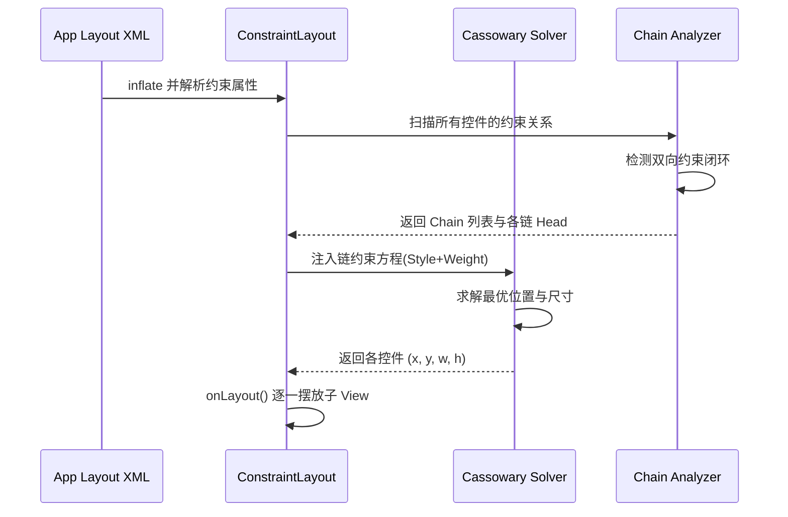

从图中可以看出，链的识别发生在约束求解 **之前**。`ConstraintLayout` 会先扫描所有子 View 的约束关系，找出所有双向闭环并标记链头，然后才将链的分布规则（style、weight 等）转化为线性方程注入 Cassowary 求解器。这也解释了为什么链的设置是 **声明式** 的——你不需要调用任何命令式 API 来"创建"一条链，只要约束关系正确，引擎会自动完成一切。

### Spread 展开模式

**Spread** 是链的 **默认模式（default chain style）**，也是最常用的分布方式。它的核心分布规则可以用一句话概括：**将链两端与 parent 边界之间、以及相邻控件之间的所有间距均等分配**。

假设 parent 的可用宽度为 `W`，链中有 `N` 个控件，控件本身的宽度之和为 `S`，那么剩余空间 `W - S` 会被平均分成 `N + 1` 份，分别填充到链的两端边距和每两个控件之间的间隙中。用数学表达式来说：

```
每段间距 = (W - S) / (N + 1)
```

这种分布与 CSS Flexbox 中 `justify-content: space-evenly` 的行为完全一致。它最显著的视觉特征是 **控件两端到 parent 边缘的距离 = 控件与控件之间的距离**，呈现出一种均匀、对称的散布效果。

在链头上显式设置 Spread（虽然不写也是默认）：

```xml
<!-- 在链头 tvA 上声明 chainStyle 为 spread -->
<!-- 该属性控制整条链的分布模式 -->
<TextView
    android:id="@+id/tvA"
    android:layout_width="wrap_content"
    android:layout_height="wrap_content"
    android:text="A"
    app:layout_constraintHorizontal_chainStyle="spread"
    app:layout_constraintStart_toStartOf="parent"
    app:layout_constraintEnd_toStartOf="@id/tvB" />
```

Spread 模式的典型应用场景包括：底部导航栏中多个 Tab 图标的等距分布、工具栏中多个操作按钮的均匀排列、表单中多个等宽输入框的水平对齐等。任何需要"将若干控件均匀散布在可用空间中"的场景，Spread 都是首选方案。

需要注意一个边界情况：如果控件宽度之和 `S` 大于或等于 parent 宽度 `W`（即剩余空间不足或为负），Spread 模式下控件会发生 **重叠（overlap）**。`ConstraintLayout` 不会像 `LinearLayout` 那样自动换行或裁剪，它会忠实地执行约束求解结果，即便这意味着控件彼此覆盖。在这种情况下，开发者需要考虑使用 `Flow` 虚拟布局或限制控件的最大宽度来避免视觉问题。

### Spread Inside 内部展开模式

**Spread Inside** 是 Spread 的一个变体，二者的核心差异在于 **链两端控件与 parent 边缘之间没有间距**。换句话说，链的第一个控件紧贴左边界（或上边界），最后一个控件紧贴右边界（或下边界），而中间的剩余空间则在 **相邻控件之间** 均等分配。

仍以 parent 宽度 `W`、N 个控件、控件宽度之和 `S` 为例，Spread Inside 的间距公式为：

```
每段间距 = (W - S) / (N - 1)
```

注意分母变成了 `N - 1` 而非 `N + 1`，因为两端不再有间距，间隙数量从 `N + 1` 减少到了 `N - 1`。这与 CSS Flexbox 中 `justify-content: space-between` 的行为完全对应。

当链中只有 **两个控件** 时，Spread Inside 会让它们分别贴在 parent 的左右两端（或上下两端），中间留出全部剩余空间。当链中只有 **一个控件** 时，由于不存在"中间间距"，该控件会被居中（退化为与 Spread 相同的行为）。

在链头上设置 Spread Inside：

```xml
<!-- 在链头声明 spread_inside -->
<!-- 首尾控件紧贴 parent 边缘，中间均匀分布 -->
<TextView
    android:id="@+id/tvA"
    android:layout_width="wrap_content"
    android:layout_height="wrap_content"
    android:text="A"
    app:layout_constraintHorizontal_chainStyle="spread_inside"
    app:layout_constraintStart_toStartOf="parent"
    app:layout_constraintEnd_toStartOf="@id/tvB" />

<!-- tvB：中间节点，与两侧等距 -->
<TextView
    android:id="@+id/tvB"
    android:layout_width="wrap_content"
    android:layout_height="wrap_content"
    android:text="B"
    app:layout_constraintStart_toEndOf="@id/tvA"
    app:layout_constraintEnd_toStartOf="@id/tvC" />

<!-- tvC：链尾，紧贴 parent 右边缘 -->
<TextView
    android:id="@+id/tvC"
    android:layout_width="wrap_content"
    android:layout_height="wrap_content"
    android:text="C"
    app:layout_constraintStart_toEndOf="@id/tvB"
    app:layout_constraintEnd_toEndOf="parent" />
```

Spread Inside 最经典的实战场景是 **底部导航栏（BottomNavigationBar）**：通常我们希望最左和最右的 Tab 分别紧贴屏幕边缘，中间的 Tab 等距排列。这恰好是 Spread Inside 的默认效果，无需任何额外的 margin 计算。此外，在实现 **两端对齐的文本标签行**（类似 Web 中 `text-align: justify` 的块级效果）时，Spread Inside 也非常好用。

下面用一张对比图来直观感受 Spread 与 Spread Inside 的差异：

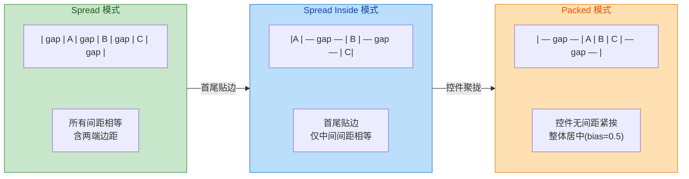

### Packed 打包模式

**Packed** 模式的行为与前两种截然不同：它将链中的所有控件 **紧密聚拢在一起（pack together）**，控件之间没有额外的分布间距（除非控件自身设置了 `margin`），然后将这个"控件组"作为一个整体，在可用空间中进行定位。

默认情况下，Packed 链会将控件组 **居中** 放置（等同于 bias = 0.5），即控件组左侧到 parent 左边缘的距离等于控件组右侧到 parent 右边缘的距离。但 Packed 模式真正强大的地方在于它可以与 **Bias（偏移比例）** 配合使用，实现控件组在可用空间中的 **任意比例定位**。

Bias 属性（`layout_constraintHorizontal_bias` 或 `layout_constraintVertical_bias`）的取值范围为 `0.0` 到 `1.0`：

- `bias = 0.0`：控件组紧贴链的起始端（左/上）；
- `bias = 0.5`（默认）：控件组居中；
- `bias = 1.0`：控件组紧贴链的结束端（右/下）；
- `bias = 0.3`：控件组偏向起始端，左侧占 30% 的剩余空间，右侧占 70%。

这种 **Packed + Bias** 的组合可以精确替代很多过去需要通过 `Guideline` + `margin` 或多层嵌套才能实现的偏移定位。例如，一个登录表单需要整体偏上（约在屏幕高度 35% 的位置），用一条垂直 Packed 链 + `bias = 0.35` 即可完美实现。

```xml
<!-- 链头设置 packed 模式，并通过 bias 控制整体偏移 -->
<TextView
    android:id="@+id/tvA"
    android:layout_width="wrap_content"
    android:layout_height="wrap_content"
    android:text="A"
    app:layout_constraintHorizontal_chainStyle="packed"
    app:layout_constraintHorizontal_bias="0.3"
    app:layout_constraintStart_toStartOf="parent"
    app:layout_constraintEnd_toStartOf="@id/tvB" />

<!-- tvB：紧跟 tvA，无额外间距 -->
<TextView
    android:id="@+id/tvB"
    android:layout_width="wrap_content"
    android:layout_height="wrap_content"
    android:text="B"
    app:layout_constraintStart_toEndOf="@id/tvA"
    app:layout_constraintEnd_toStartOf="@id/tvC" />

<!-- tvC：紧跟 tvB，整个 ABC 组作为整体偏左 30% -->
<TextView
    android:id="@+id/tvC"
    android:layout_width="wrap_content"
    android:layout_height="wrap_content"
    android:text="C"
    app:layout_constraintStart_toEndOf="@id/tvB"
    app:layout_constraintEnd_toEndOf="parent" />
```

在上面的例子中，三个 TextView 会紧挨在一起，形成一个整体"控件包"，然后这个包被放置在水平方向偏左 30% 的位置。如果不设 bias（默认 0.5），它们就会居中。

Packed 模式还有一个实战技巧：**如果你希望控件之间有固定间距但整体仍然居中**，只需在控件上设置 `marginStart` / `marginEnd`。这些 margin 会被包含在"控件包"内部，不会影响 Packed 的居中/偏移逻辑。例如让 B 的 `marginStart = 8dp`，则 A 与 B 之间会有 8dp 间距，但整个组（含间距）仍然按 bias 定位。

Packed 模式的典型应用场景包括：

1. **标签组居中**：多个 Chip/Tag 紧挨显示，整体在父容器中居中。
2. **图标 + 文字 组合**：一个图标紧跟一段文字，整体居中或偏移到特定位置。
3. **弹窗内容定位**：弹窗中的标题 + 内容 + 按钮作为一个垂直 Packed 链，整体偏上显示。
4. **动态位置切换**：通过代码动态修改 bias 值（配合 `ConstraintSet`），实现控件组的平滑位移动画。

### Weighted 权重分配

**Weighted Chain（加权链）** 是链式结构中最接近 `LinearLayout` 的 `weight` 机制的功能，但它运行在 `ConstraintLayout` 的扁平化架构中，因此不会引入额外的布局嵌套层级。Weighted 并不是一种独立的 `chainStyle`——它是在 **Spread** 或 **Spread Inside** 模式下，通过将控件的尺寸设为 **`0dp`（match_constraint）** 并指定 `layout_constraintHorizontal_weight`（或 `Vertical_weight`）来激活的行为。

权重分配的核心逻辑如下：

1. 链中某些控件的宽度（水平链）或高度（垂直链）被设置为 `0dp`。
2. 这些 `0dp` 控件会 **放弃自身固有尺寸**，转而参与剩余空间的按权重瓜分。
3. 链中非 `0dp` 的控件保持自身的 `wrap_content` 或固定尺寸，它们的空间先被扣除。
4. 剩余空间按各 `0dp` 控件的 `weight` 比例进行分配。

这套逻辑与 `LinearLayout` 的 weight 分配几乎完全一致，但有一个重要的性能优势：`LinearLayout` 在使用 weight 时会触发 **两次 measure**（第一次测量固有尺寸，第二次按 weight 重新分配），而 `ConstraintLayout` 的 Cassowary 求解器可以在 **一次 pass** 中同时求解所有约束方程（包括权重），因此在控件数量较多时性能更优。

下面演示一个经典的"三栏布局"——左侧固定宽度、中间占据剩余空间、右侧固定宽度：

```xml
<!-- 左栏：固定 80dp 宽度 -->
<!-- 作为链头，默认 spread 模式 -->
<View
    android:id="@+id/left"
    android:layout_width="80dp"
    android:layout_height="0dp"
    android:background="#C8E6C9"
    app:layout_constraintTop_toTopOf="parent"
    app:layout_constraintBottom_toBottomOf="parent"
    app:layout_constraintStart_toStartOf="parent"
    app:layout_constraintEnd_toStartOf="@id/center" />

<!-- 中栏：0dp 触发 match_constraint -->
<!-- weight=1 表示独占全部剩余水平空间 -->
<View
    android:id="@+id/center"
    android:layout_width="0dp"
    android:layout_height="0dp"
    android:background="#BBDEFB"
    app:layout_constraintHorizontal_weight="1"
    app:layout_constraintTop_toTopOf="parent"
    app:layout_constraintBottom_toBottomOf="parent"
    app:layout_constraintStart_toEndOf="@id/left"
    app:layout_constraintEnd_toStartOf="@id/right" />

<!-- 右栏：固定 80dp 宽度 -->
<!-- 链尾，end 锚定 parent 闭合链 -->
<View
    android:id="@+id/right"
    android:layout_width="80dp"
    android:layout_height="0dp"
    android:background="#FFE0B2"
    app:layout_constraintTop_toTopOf="parent"
    app:layout_constraintBottom_toBottomOf="parent"
    app:layout_constraintStart_toEndOf="@id/center"
    app:layout_constraintEnd_toEndOf="parent" />
```

在这个例子中，`left` 和 `right` 的宽度是固定的 80dp，它们不参与权重分配。`center` 的宽度为 `0dp` 且 weight 为 1，因此它独占所有剩余空间。如果将 `right` 的宽度也改为 `0dp` 且 weight 为 2，而 `center` 保持 weight 为 1，则 `center` 和 `right` 会按 1:2 的比例瓜分 `left` 占用后的剩余空间。

再看一个更贴近实际业务的例子——**多按钮等宽排列**，这在设置页、确认弹窗中极为常见：

```xml
<!-- 三个按钮等宽排列：每个 weight=1，宽度均为 0dp -->
<!-- 按钮 A：链头 -->
<Button
    android:id="@+id/btnA"
    android:layout_width="0dp"
    android:layout_height="wrap_content"
    android:text="取消"
    app:layout_constraintHorizontal_weight="1"
    app:layout_constraintHorizontal_chainStyle="spread"
    app:layout_constraintStart_toStartOf="parent"
    app:layout_constraintEnd_toStartOf="@id/btnB" />

<!-- 按钮 B：中间节点 -->
<Button
    android:id="@+id/btnB"
    android:layout_width="0dp"
    android:layout_height="wrap_content"
    android:text="稍后"
    app:layout_constraintHorizontal_weight="1"
    app:layout_constraintStart_toEndOf="@id/btnA"
    app:layout_constraintEnd_toStartOf="@id/btnC" />

<!-- 按钮 C：链尾 -->
<Button
    android:id="@+id/btnC"
    android:layout_width="0dp"
    android:layout_height="wrap_content"
    android:text="确认"
    app:layout_constraintHorizontal_weight="2"
    app:layout_constraintStart_toEndOf="@id/btnB"
    app:layout_constraintEnd_toEndOf="parent" />
```

这里 `btnA` 和 `btnB` 各占 1 份权重，`btnC`（确认按钮）占 2 份权重，因此 `btnC` 的宽度是其他按钮的两倍。这种"主操作按钮更宽"的设计在 Material Design 的对话框中非常常见。

**Weighted 与 Chain Style 的组合矩阵** 值得特别理解。下面的流程图总结了各种组合下的实际效果：

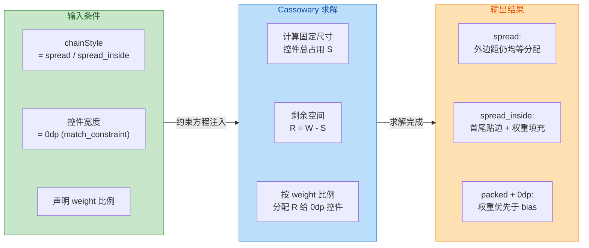

有一个常见的误解需要澄清：**Packed 模式下也可以使用 weight**，但行为会比较特殊。在 Packed + 0dp + weight 的组合中，控件仍会按权重比例分配空间，但 **不会留出两端间距**——效果类似于 Spread Inside + weight。实际开发中，weight 最常与 Spread 搭配使用，因为这最符合直觉：先均匀留出间距，再按权重分配剩余空间给可伸缩控件。

### 链的方向与交叉组合

到目前为止我们主要讨论的是水平链（Horizontal Chain），但所有概念同样适用于 **垂直链（Vertical Chain）**——只需将 `start/end` 替换为 `top/bottom`，将 `layout_constraintHorizontal_chainStyle` 替换为 `layout_constraintVertical_chainStyle`，将 `layout_constraintHorizontal_weight` 替换为 `layout_constraintVertical_weight` 即可。

更强大的是，**同一个控件可以同时属于一条水平链和一条垂直链**。例如，一个 3×3 的九宫格布局，可以通过 3 条水平链 + 3 条垂直链来实现，每个格子控件同时参与其所在行的水平链和所在列的垂直链。这种交叉链（Cross Chains）的设计可以完全替代 `GridLayout`，而且由于所有控件都是 `ConstraintLayout` 的直接子 View（无嵌套），性能更优。

```xml
<!-- 2x2 九宫格示例（简化为 4 格） -->
<!-- 第一行水平链：A <-> B -->
<!-- 第一列垂直链：A <-> C -->
<!-- A 同时属于行链和列链 -->
<View
    android:id="@+id/cellA"
    android:layout_width="0dp"
    android:layout_height="0dp"
    app:layout_constraintHorizontal_weight="1"
    app:layout_constraintVertical_weight="1"
    app:layout_constraintStart_toStartOf="parent"
    app:layout_constraintEnd_toStartOf="@id/cellB"
    app:layout_constraintTop_toTopOf="parent"
    app:layout_constraintBottom_toTopOf="@id/cellC" />

<!-- B：第一行右侧，第二列顶部 -->
<View
    android:id="@+id/cellB"
    android:layout_width="0dp"
    android:layout_height="0dp"
    app:layout_constraintHorizontal_weight="1"
    app:layout_constraintVertical_weight="1"
    app:layout_constraintStart_toEndOf="@id/cellA"
    app:layout_constraintEnd_toEndOf="parent"
    app:layout_constraintTop_toTopOf="parent"
    app:layout_constraintBottom_toTopOf="@id/cellD" />

<!-- C：第二行左侧，第一列底部 -->
<View
    android:id="@+id/cellC"
    android:layout_width="0dp"
    android:layout_height="0dp"
    app:layout_constraintHorizontal_weight="1"
    app:layout_constraintVertical_weight="1"
    app:layout_constraintStart_toStartOf="parent"
    app:layout_constraintEnd_toStartOf="@id/cellD"
    app:layout_constraintTop_toBottomOf="@id/cellA"
    app:layout_constraintBottom_toBottomOf="parent" />

<!-- D：第二行右侧，第二列底部 -->
<View
    android:id="@+id/cellD"
    android:layout_width="0dp"
    android:layout_height="0dp"
    app:layout_constraintHorizontal_weight="1"
    app:layout_constraintVertical_weight="1"
    app:layout_constraintStart_toEndOf="@id/cellC"
    app:layout_constraintEnd_toEndOf="parent"
    app:layout_constraintTop_toBottomOf="@id/cellB"
    app:layout_constraintBottom_toBottomOf="parent" />
```

### 链与 Gone 的交互行为

当链中某个控件的 visibility 被设置为 `GONE` 时，`ConstraintLayout` 会表现出一个非常智能的行为：**Gone 控件会被视为尺寸为 0 的点（zero-sized point），但它的约束关系仍然保持有效**。这意味着链不会"断裂"——Gone 控件的前后控件会自动"跨越"它，直接建立有效的分布关系。

举个例子，假设一条 Spread 水平链有 A、B、C 三个控件，当 B 被设为 `GONE` 时：

- 链仍然有效（A 和 C 通过 B 的"幽灵"约束间接相连）。
- 剩余空间现在只需在 A 和 C 之间分配（相当于只有两个可见控件的 Spread 链）。
- 如果 A 或 C 设置了 `layout_goneMarginStart` / `layout_goneMarginEnd`，这些 Gone Margin 会在 B 不可见时自动生效，让间距更加合理。

这种行为让链在响应式布局中非常好用：你可以根据业务状态动态隐藏链中的某些控件，而不需要重新构建约束关系或切换到另一套布局。链的结构天然支持"成员可隐藏"的弹性设计。

### 实战选型速查

总结一下四种链模式的选型决策逻辑，帮助你在实际开发中快速选择：

| 场景描述 | 推荐模式 | 关键设置 |
|---------|---------|---------|
| 控件等距分布，含两端间距 | **Spread** | `chainStyle="spread"` (默认) |
| 控件等距分布，首尾贴边 | **Spread Inside** | `chainStyle="spread_inside"` |
| 控件聚拢成组，整体定位 | **Packed** | `chainStyle="packed"` + `bias` |
| 控件按比例填充空间 | **Weighted** | `width="0dp"` + `weight` |
| 控件聚拢 + 整体偏移 | **Packed + Bias** | `chainStyle="packed"` + `bias=0.x` |
| 部分固定 + 部分伸缩 | **Spread + Weight** | 固定控件用 dp/wrap，伸缩用 0dp+weight |
| 网格布局（无嵌套） | **交叉链** | 同一控件同时加入行链和列链 |

---

**📝 练习题**

在一个 `ConstraintLayout` 中，有三个 `Button`（btnX、btnY、btnZ）组成一条水平链。btnX 是链头，`layout_width="0dp"`，`layout_constraintHorizontal_weight="2"`；btnY 的 `layout_width="100dp"`；btnZ 的 `layout_width="0dp"`，`layout_constraintHorizontal_weight="3"`。假设 parent 宽度为 500dp，且 chainStyle 为默认值（spread），没有设置任何 margin。请问 btnX 和 btnZ 的实际宽度分别是多少？


A. btnX = 200dp, btnZ = 300dp

B. btnX = 160dp, btnZ = 240dp

C. btnX = 150dp, btnZ = 250dp

D. btnX = 100dp, btnZ = 150dp


**【答案】** B

**【解析】** 首先确认链的默认模式是 **Spread**。在 Weighted Chain 中，权重分配的逻辑是：先扣除所有 **非 0dp 控件** 的固定尺寸，再将剩余空间按权重比例分配给 **0dp 控件**。btnY 的宽度固定为 100dp，因此剩余空间 = 500dp - 100dp = 400dp。btnX 的 weight 为 2，btnZ 的 weight 为 3，权重总和 = 2 + 3 = 5。btnX 的实际宽度 = 400 × (2/5) = **160dp**；btnZ 的实际宽度 = 400 × (3/5) = **240dp**。选项 A 的错误在于它没有扣除 btnY 的 100dp 就直接用 500dp 按比例分配了。选项 C 和 D 则是计算比例时出现了错误。需要注意的是，在 Spread 模式下使用 weight 时，**0dp 控件会拉伸以填充空间，Spread 的等距间距效果被 weight 的空间分配所替代**——当所有剩余空间都被 weight 控件瓜分后，不再有额外的"均等间距"。

---

## 辅助与虚拟对象

在 ConstraintLayout 的设计哲学中，所有子 View 都通过 **约束关系** 来确定位置与尺寸。然而，真实的 UI 需求远比"View 与 View 之间的直接连接"复杂——你可能需要一条不可见的参考线来统一对齐多个控件，需要一个"动态栅栏"来响应多个控件中最远边界的变化，需要一次性控制一组控件的可见性，甚至需要在运行时把一个 View "投射"到另一个占位区域。这些场景就是 **辅助与虚拟对象（Helper & Virtual Objects）** 的舞台。

所谓"虚拟对象"，指的是这些组件在布局文件中虽然作为 ConstraintLayout 的子节点存在，但它们 **不会绘制任何可见像素**，也 **不会参与触摸事件的分发**。从渲染管线来看，它们的 `onDraw()` 为空或被跳过，宽高在测量阶段被强制设为 0。但在 ConstraintLayout 的约束求解器（Cassowary Solver）中，它们作为 **辅助锚点（Anchor）** 或 **控件管理器（Controller）** 深度参与了约束方程的构建。这意味着你可以用极低的性能成本获得极大的布局表达力——这在传统的 RelativeLayout 或 LinearLayout 时代往往需要额外嵌套一层 ViewGroup 才能实现。

本节将逐一深入 **Guideline（引导线）**、**Barrier（屏障）**、**Group（批量控制）** 以及 **Placeholder（占位）** 四大辅助工具，讲清每个工具的使用场景、XML 配置方式、内部运作原理以及实战中的最佳实践。

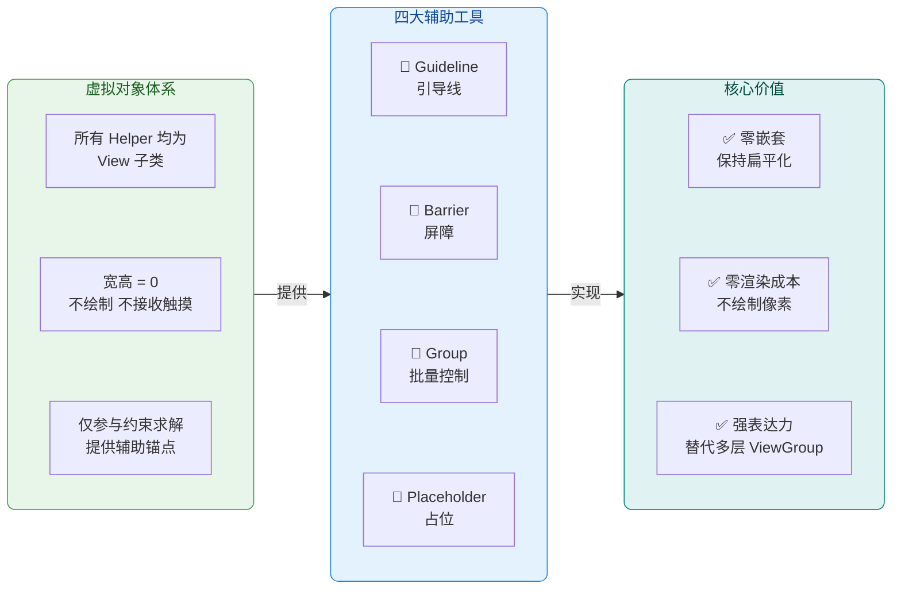

### Guideline 引导线

#### 概念与使用场景

Guideline 是 ConstraintLayout 中最基础也最常用的虚拟辅助组件。它的本质是一条 **不可见的直线**——可以是水平的，也可以是垂直的——其他 View 可以将自身的约束锚点连接到这条线上，从而实现精确的对齐与定位。

在传统布局体系中，如果你想让界面左侧留出 30% 的空间作为"标签区"，右侧 70% 作为"输入区"，通常的做法是嵌套一个 LinearLayout 并使用 `layout_weight`，或者用一个不可见的 Space 控件作为分隔。这两种方式要么增加了布局层级（LinearLayout 嵌套），要么让布局文件的语义变得含糊（Space 是什么？为什么在那里？）。Guideline 的出现彻底解决了这个问题：它明确声明"这里有一条参考线"，语义清晰，且完全不增加布局层级。

Guideline 继承自 `View`，但在 ConstraintLayout 内部被特殊对待。它的 `visibility` 始终为 `View.GONE`，但与普通 `GONE` 控件不同的是，它的 **约束锚点仍然有效**。也就是说，其他控件可以安全地约束到 Guideline 上，而 Guideline 本身不会占据任何实际的测量空间或渲染空间。

#### 三种定位模式

Guideline 提供了三种互斥的定位方式，开发者根据实际需求选择其中一种：

**第一种：绝对偏移（layout_constraintGuide_begin）。** 指定 Guideline 距离父布局 **起始边**（水平线距顶部，垂直线距左侧）的固定像素距离。这种模式适合固定间距的场景，比如 Toolbar 下方固定 56dp 处画一条线，所有内容从这条线以下开始排布。它的优点是直观简单，缺点是在不同屏幕尺寸下不具备自适应能力。

**第二种：绝对偏移（layout_constraintGuide_end）。** 指定 Guideline 距离父布局 **结束边**（水平线距底部，垂直线距右侧）的固定像素距离。它与 `begin` 完全对称，适用于从尾部计量的场景——例如底部导航栏上方固定 48dp 处设置一条分界线。

**第三种：百分比定位（layout_constraintGuide_percent）。** 这是最灵活也最常用的模式。指定 Guideline 位于父布局宽度或高度的某个 **百分比** 位置（取值范围 0.0 ~ 1.0）。例如 `0.3` 表示从起始边算起 30% 的位置。百分比模式天然具备屏幕适配能力：无论设备宽度是 360dp 还是 412dp，Guideline 始终占据相同的比例位置。

> **重要细节**：当同时设置多个属性时，优先级为 `percent > end > begin`。但实际开发中不应同时设置多个定位属性，这会造成语义混乱。

#### XML 配置详解

```xml
<!-- 水平引导线：位于父布局顶部 30% 处 -->
<!-- orientation="horizontal" 表示这是一条水平线（上下分割） -->
<!-- 水平线拥有 top/bottom 锚点，其他控件可以约束到它的上方或下方 -->
<androidx.constraintlayout.widget.Guideline
    android:id="@+id/guideline_horizontal"
    android:layout_width="wrap_content"
    android:layout_height="wrap_content"
    android:orientation="horizontal"
    app:layout_constraintGuide_percent="0.3" />

<!-- 垂直引导线：距离左侧固定 120dp -->
<!-- orientation="vertical" 表示这是一条垂直线（左右分割） -->
<!-- 垂直线拥有 start/end 锚点，其他控件可以约束到它的左侧或右侧 -->
<androidx.constraintlayout.widget.Guideline
    android:id="@+id/guideline_vertical"
    android:layout_width="wrap_content"
    android:layout_height="wrap_content"
    android:orientation="vertical"
    app:layout_constraintGuide_begin="120dp" />

<!-- 表单标签：右侧紧贴垂直引导线 -->
<!-- 标签的 end 约束到 Guideline，形成"标签右对齐到 120dp 处"的效果 -->
<TextView
    android:id="@+id/label_name"
    android:layout_width="wrap_content"
    android:layout_height="wrap_content"
    android:text="姓名："
    app:layout_constraintEnd_toStartOf="@id/guideline_vertical"
    app:layout_constraintTop_toTopOf="parent" />

<!-- 输入框：左侧紧贴垂直引导线 -->
<!-- 输入框的 start 约束到 Guideline，形成"输入区从 120dp 处开始"的效果 -->
<EditText
    android:id="@+id/input_name"
    android:layout_width="0dp"
    android:layout_height="wrap_content"
    app:layout_constraintStart_toEndOf="@id/guideline_vertical"
    app:layout_constraintEnd_toEndOf="parent"
    app:layout_constraintTop_toTopOf="parent" />
```

上面的配置实现了一个经典的 **"标签 + 输入框"** 表单布局：垂直 Guideline 位于左侧 120dp 处，标签右对齐到 Guideline 左侧，输入框从 Guideline 右侧延伸到父布局右边缘。整个布局完全扁平，没有任何嵌套。

#### 运行时动态调整

Guideline 在代码中同样可以动态修改位置，这在响应用户交互或屏幕旋转时非常有用：

```kotlin
// 获取 Guideline 引用
val guideline = findViewById<Guideline>(R.id.guideline_vertical)

// 获取 Guideline 的 LayoutParams，它是 ConstraintLayout.LayoutParams 类型
val params = guideline.layoutParams as ConstraintLayout.LayoutParams

// 方式一：设置百分比位置为 40%
// guidePercent 字段直接对应 XML 中的 layout_constraintGuide_percent
params.guidePercent = 0.4f

// 方式二：设置距离起始边 200px（注意这里是 px 不是 dp）
// 实际使用中建议用 TypedValue.applyDimension() 转换 dp 到 px
params.guideBegin = 200

// 将修改后的 params 回写，触发重新布局
guideline.layoutParams = params
```

#### 内部原理

从 ConstraintLayout 的求解器视角来看，一条垂直 Guideline 本质上是向 Cassowary 线性约束系统注入了一个 **单变量等式约束**。以百分比模式为例，如果 Guideline 的百分比为 0.3，父布局宽度为 `parentWidth`，那么求解器中会添加约束 `guideline.x = parentWidth × 0.3`。这个约束的优先级被设为 **FIXED（不可违反）**，所以 Guideline 的位置是确定性的，不会被其他约束"推动"。其他 View 约束到 Guideline 时，实际上是与这个已知变量建立关系，约束求解的复杂度并不会因此增加太多。

### Barrier 屏障

#### 概念与核心问题

Barrier 解决的是一个非常具体但极其常见的布局问题：**当多个控件的边界是动态的（取决于内容长度），而另一个控件需要始终位于这些动态边界的"最远处"之外时，该怎么办？**

举一个具体的例子：表单页面中有两行——"姓名"标签和"电子邮箱"标签。由于国际化或字体渲染的差异，这两个标签的宽度可能不同。右侧的输入框需要统一从"两个标签中较宽的那个"的右侧开始排列。如果用 Guideline，你必须手动猜一个固定的位置，一旦标签文字变长就会重叠。如果用 `wrap_content` + 嵌套 LinearLayout，又失去了扁平化优势。

Barrier 就是为此而生的。它像一面 **动态的墙壁**——你告诉它"监视这几个控件的右边缘（或左/上/下边缘）"，Barrier 会自动取所有被监视控件在该方向上的 **最大值**，然后将自己定位在那里。其他控件约束到 Barrier 上，就等于约束到了"一组控件中最远的那个边缘"。

#### Barrier 与 Guideline 的本质区别

从约束求解的角度理解，Guideline 向求解器注入的是一个 **常量约束**（位置固定不变），而 Barrier 注入的是一个 **依赖约束**（位置取决于其他变量的求解结果）。具体来说，假设 Barrier 监视 View A 和 View B 的右边缘（`barrierDirection="end"`），那么求解器中的约束等价于：

`barrier.x = max(A.right, B.right)`

这是一个 **非线性约束**（max 函数），Cassowary 算法本身并不直接支持非线性表达。ConstraintLayout 的实现方式是在每次测量过程中 **先求解所有被引用控件的位置**，然后在 Java 层计算 max 值，再将 Barrier 的位置作为一个 **新的固定锚点** 注入后续的约束求解。这意味着 Barrier 会引入一个 **两阶段求解过程**，但由于 ConstraintLayout 的求解器本身就支持多遍测量（multi-pass），这个额外开销在实践中是可以忽略的。

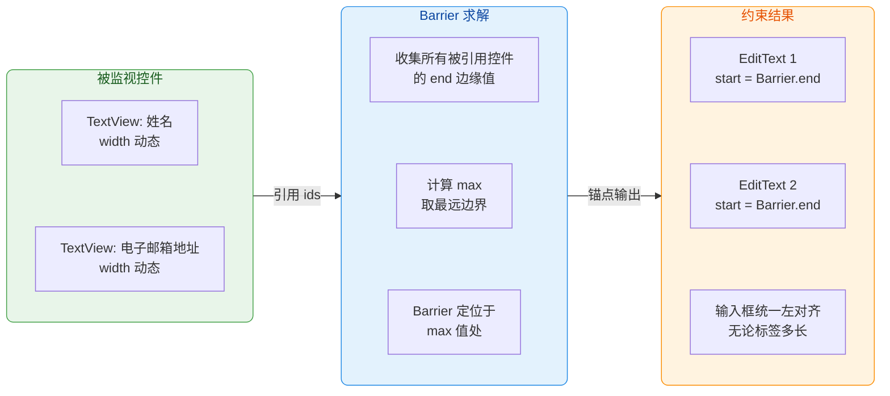

#### XML 配置详解

```xml
<!-- 标签 1：姓名 -->
<TextView
    android:id="@+id/label_name"
    android:layout_width="wrap_content"
    android:layout_height="wrap_content"
    android:text="姓名"
    app:layout_constraintStart_toStartOf="parent"
    app:layout_constraintTop_toTopOf="parent" />

<!-- 标签 2：电子邮箱地址（可能比"姓名"宽得多） -->
<TextView
    android:id="@+id/label_email"
    android:layout_width="wrap_content"
    android:layout_height="wrap_content"
    android:text="电子邮箱地址"
    app:layout_constraintStart_toStartOf="parent"
    app:layout_constraintTop_toBottomOf="@id/label_name" />

<!-- Barrier：监视两个标签的 end 边缘，取最远值 -->
<!-- barrierDirection="end" 表示 Barrier 位于被引用控件的右侧（RTL 下为左侧） -->
<!-- constraint_referenced_ids 用逗号分隔列出所有被监视控件的 id（不带 @+id/ 前缀） -->
<androidx.constraintlayout.widget.Barrier
    android:id="@+id/barrier_label_end"
    android:layout_width="wrap_content"
    android:layout_height="wrap_content"
    app:barrierDirection="end"
    app:constraint_referenced_ids="label_name,label_email" />

<!-- 输入框 1：start 约束到 Barrier -->
<!-- 无论"姓名"和"电子邮箱地址"谁更宽，输入框都从最宽标签的右侧开始 -->
<EditText
    android:id="@+id/input_name"
    android:layout_width="0dp"
    android:layout_height="wrap_content"
    android:layout_marginStart="8dp"
    app:layout_constraintStart_toEndOf="@id/barrier_label_end"
    app:layout_constraintEnd_toEndOf="parent"
    app:layout_constraintTop_toTopOf="@id/label_name" />

<!-- 输入框 2：同样约束到 Barrier，保证与输入框 1 左对齐 -->
<EditText
    android:id="@+id/input_email"
    android:layout_width="0dp"
    android:layout_height="wrap_content"
    android:layout_marginStart="8dp"
    app:layout_constraintStart_toEndOf="@id/barrier_label_end"
    app:layout_constraintEnd_toEndOf="parent"
    app:layout_constraintTop_toTopOf="@id/label_email" />
```

#### barrierDirection 全方向说明

`barrierDirection` 支持四个方向值，对应四种不同的"取最大边界"策略：

- **start**：Barrier 位于所有被引用控件的 **最左侧**（即 `min(A.left, B.left, ...)`）。适用于右侧内容需要右对齐到一组控件最左边界的场景。
- **end**：Barrier 位于所有被引用控件的 **最右侧**（即 `max(A.right, B.right, ...)`）。这是最常见的方向，用于表单标签对齐。
- **top**：Barrier 位于所有被引用控件的 **最上方**（即 `min(A.top, B.top, ...)`）。
- **bottom**：Barrier 位于所有被引用控件的 **最下方**（即 `max(A.bottom, B.bottom, ...)`）。适用于多列内容底部对齐的场景。

#### barrierAllowsGoneWidgets 属性

当 Barrier 引用的某个控件被设为 `View.GONE` 时，默认行为是 **仍然将该控件的边界纳入计算**（因为 `GONE` 控件的位置仍存在于约束系统中，只是宽高变为 0）。如果你希望 Barrier 在计算时 **忽略** 已经 GONE 的控件，可以设置：

```xml
<!-- barrierAllowsGoneWidgets="false" 表示忽略 GONE 控件的边界 -->
<!-- 这在某些动态显隐场景中非常有用：当某个标签被隐藏时，Barrier 不应该被它"拉"过去 -->
<androidx.constraintlayout.widget.Barrier
    android:id="@+id/barrier"
    android:layout_width="wrap_content"
    android:layout_height="wrap_content"
    app:barrierDirection="end"
    app:barrierAllowsGoneWidgets="false"
    app:constraint_referenced_ids="label_name,label_email" />
```

这个属性的默认值是 `true`（保持对 GONE 控件的感知），这与 ConstraintLayout 整体的 Gone Margin 设计理念一致。但在动态增删表单项的场景中，设为 `false` 通常是更合理的选择。

#### 运行时动态操作

```kotlin
// 获取 Barrier 引用
val barrier = findViewById<Barrier>(R.id.barrier_label_end)

// 动态修改被引用的控件 id 列表
// referencedIds 是一个 IntArray，接收 View 的资源 id
// 例如运行时新增了一个标签 label_phone，将其也纳入 Barrier 监视
barrier.referencedIds = intArrayOf(
    R.id.label_name,        // 原有：姓名标签
    R.id.label_email,       // 原有：邮箱标签
    R.id.label_phone        // 新增：电话标签
)

// 修改后无需手动调用 requestLayout()
// Barrier 内部会在 referencedIds setter 中自动触发父布局的重新测量
```

### Group 批量控制

#### 问题背景

在复杂界面中，你经常需要 **同时控制一组控件的可见性**。例如一个"加载中"状态下，内容区域的标题、副标题、图片和按钮都要隐藏；加载完成后，这些控件需要同时显示。传统做法是把这些控件放进一个 ViewGroup（如 FrameLayout），然后控制这个容器的 `visibility`。但这又引入了嵌套，违背了 ConstraintLayout 扁平化的核心理念。

`Group` 正是用来解决这个问题的。它允许你在不增加布局层级的前提下，通过一个虚拟对象 **批量控制多个控件的 `visibility` 属性**。

#### 工作机制

Group 的实现原理非常简洁：它内部维护了一个 `referencedIds` 数组（与 Barrier 相同的机制）。当你设置 Group 的 `visibility` 时，Group 会遍历所有引用的控件 id，并逐一将对应控件的 `visibility` 设为与 Group 相同的值。这个过程发生在 `updatePreLayout()` 阶段，即 ConstraintLayout 正式测量之前。

需要特别注意的是，Group **只控制 `visibility`**。它不会影响被引用控件的约束关系、尺寸、位置或任何其他属性。这一点与"将控件放入容器"有本质区别——容器隐藏后其内部控件的约束关系也会失效，但 Group 隐藏控件后，这些控件的约束关系仍然存在于求解系统中（只是 `GONE` 控件的宽高会塌缩为 0）。

#### XML 配置

```xml
<!-- 内容区域的控件 -->
<TextView android:id="@+id/tv_title" ... />
<TextView android:id="@+id/tv_subtitle" ... />
<ImageView android:id="@+id/iv_cover" ... />
<Button android:id="@+id/btn_action" ... />

<!-- Group：将上述四个控件编为一组 -->
<!-- constraint_referenced_ids 列出所有需要批量控制的控件 id -->
<!-- 设置 Group 的 visibility 等于同时设置这四个控件的 visibility -->
<androidx.constraintlayout.widget.Group
    android:id="@+id/group_content"
    android:layout_width="wrap_content"
    android:layout_height="wrap_content"
    android:visibility="visible"
    app:constraint_referenced_ids="tv_title,tv_subtitle,iv_cover,btn_action" />

<!-- 加载指示器：当 Group 隐藏时显示 -->
<ProgressBar
    android:id="@+id/progress_loading"
    android:layout_width="wrap_content"
    android:layout_height="wrap_content"
    android:visibility="gone"
    app:layout_constraintStart_toStartOf="parent"
    app:layout_constraintEnd_toEndOf="parent"
    app:layout_constraintTop_toTopOf="parent"
    app:layout_constraintBottom_toBottomOf="parent" />
```

#### 运行时切换状态

```kotlin
// 获取 Group 和 ProgressBar 的引用
val groupContent = findViewById<Group>(R.id.group_content)
val progressLoading = findViewById<ProgressBar>(R.id.progress_loading)

// 模拟加载开始：隐藏内容组，显示加载指示器
fun showLoading() {
    // 设置 Group 为 GONE，内部会遍历所有 referenced ids 并逐一设为 GONE
    groupContent.visibility = View.GONE
    // 显示加载指示器
    progressLoading.visibility = View.VISIBLE
}

// 模拟加载完成：显示内容组，隐藏加载指示器
fun showContent() {
    // 设置 Group 为 VISIBLE，内部会遍历所有 referenced ids 并逐一设为 VISIBLE
    groupContent.visibility = View.VISIBLE
    // 隐藏加载指示器
    progressLoading.visibility = View.GONE
}
```

#### Group 冲突问题

一个控件 **不应同时被多个 Group 引用**。如果控件 X 既在 Group A 中又在 Group B 中，当 A 设为 `VISIBLE` 而 B 设为 `GONE` 时，X 的最终可见性取决于 **XML 中声明顺序靠后的 Group**，因为后声明的 Group 在 `updatePreLayout()` 中后执行，会覆盖先执行的结果。这种行为是未定义且不稳定的，应该在架构设计阶段就避免。

如果确实需要更复杂的控件分组控制，推荐的方案是：

1. 确保各 Group 的引用控件集合 **互不重叠**。
2. 或者放弃 Group，改用 `ConstraintSet` 来精细控制每个控件的属性（将在"动态布局与动画"一节中详细介绍）。

#### 运行时动态修改引用列表

```kotlin
// 获取 Group 引用
val group = findViewById<Group>(R.id.group_content)

// 动态添加新的控件到 Group 的管理列表中
// 注意：referencedIds 是整体替换，不是追加
group.referencedIds = intArrayOf(
    R.id.tv_title,      // 保留原有
    R.id.tv_subtitle,   // 保留原有
    R.id.iv_cover,      // 保留原有
    R.id.btn_action,    // 保留原有
    R.id.tv_footer      // 新增：页脚文本
)
// 设置后立即生效：Group 当前的 visibility 会被应用到 tv_footer 上
```

### Placeholder 占位

#### 概念与独特定位

Placeholder 是四大虚拟辅助组件中最"特殊"的一个。如果说 Guideline 是辅助线、Barrier 是动态栅栏、Group 是批量开关，那么 Placeholder 就是一个 **"位置模板"**——它预先在布局中占据一个位置，然后在运行时可以把 **任意一个已存在的 View "吸引"过来**，让那个 View 以 Placeholder 的位置和尺寸显示。

这个机制有点像 PowerPoint 中的"占位符"：你在幻灯片模板中放了一个图片占位框，实际使用时可以把不同的图片填入其中。在 Android 开发中，Placeholder 的典型使用场景包括：

- **模板化布局**：一个通用的卡片模板，不同的页面可以把不同的 View "投射"到卡片的特定区域。
- **状态切换动画**：一个控件在不同状态下需要出现在不同位置——通过切换 Placeholder 的内容 id，配合 `TransitionManager`，可以实现平滑的位置动画。
- **低耦合组合**：Fragment 或自定义 View 内部预留 Placeholder，外部通过代码决定填入什么内容。

#### 工作原理

当你调用 `placeholder.setContentId(viewId)` 时，Placeholder 内部执行以下步骤：

1. **查找目标 View**：在同一个 ConstraintLayout 中根据 id 查找目标 View。
2. **记录目标的原始 `visibility`**，并将目标设为 `View.VISIBLE`。
3. **将目标的约束参数重置**，用 Placeholder 自身在布局中的约束信息覆盖目标 View 的位置。本质上，目标 View 的 `left/top/right/bottom` 会被设置为 Placeholder 计算出的值。
4. **Placeholder 自身变为 GONE**，将"舞台"让给目标 View。

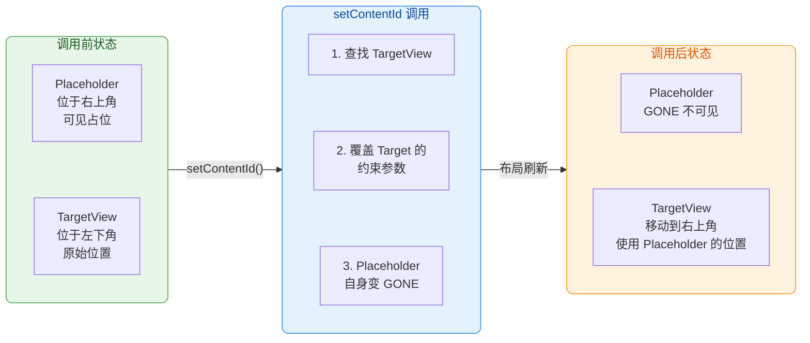

#### XML 配置与代码调用

```xml
<!-- 在布局右上角预留一个 Placeholder -->
<!-- Placeholder 自身会按照这些约束确定位置 -->
<!-- 稍后被"吸引"过来的 View 将占据这个位置 -->
<androidx.constraintlayout.widget.Placeholder
    android:id="@+id/placeholder_feature"
    android:layout_width="80dp"
    android:layout_height="80dp"
    app:layout_constraintEnd_toEndOf="parent"
    app:layout_constraintTop_toTopOf="parent"
    android:layout_marginEnd="16dp"
    android:layout_marginTop="16dp" />

<!-- 一个图标按钮，初始位于左下角 -->
<ImageButton
    android:id="@+id/btn_star"
    android:layout_width="48dp"
    android:layout_height="48dp"
    android:src="@drawable/ic_star"
    app:layout_constraintStart_toStartOf="parent"
    app:layout_constraintBottom_toBottomOf="parent"
    android:layout_marginStart="16dp"
    android:layout_marginBottom="16dp" />
```

```kotlin
// 获取 Placeholder 引用
val placeholder = findViewById<Placeholder>(R.id.placeholder_feature)

// 将 btn_star "吸引"到 Placeholder 的位置
// 调用后 btn_star 会从左下角"移动"到右上角（Placeholder 所在位置）
// 注意：这里只是立即改变布局参数，如果需要动画效果需配合 TransitionManager
placeholder.setContentId(R.id.btn_star)

// 如果需要动画过渡效果，可以在 setContentId 之前调用：
// TransitionManager.beginDelayedTransition(constraintLayout)
// 这样 btn_star 会平滑地从左下角动画移到右上角
```

#### 结合 TransitionManager 实现位置动画

Placeholder 最强大的用法是与 `TransitionManager` 搭配，实现控件在不同位置之间的 **平滑过渡动画**：

```kotlin
// 获取父布局和 Placeholder 引用
val constraintLayout = findViewById<ConstraintLayout>(R.id.root)
val placeholder = findViewById<Placeholder>(R.id.placeholder_feature)

// 先告诉 TransitionManager "我要开始变化了，请录制当前状态"
// beginDelayedTransition 会在下一帧自动计算差异并执行动画
TransitionManager.beginDelayedTransition(constraintLayout)

// 切换 Placeholder 的内容
// TransitionManager 会检测到 btn_star 的位置变化，自动生成平移动画
placeholder.setContentId(R.id.btn_star)
```

这种模式的优雅之处在于：你不需要手动编写任何动画代码（不需要 `ObjectAnimator`，不需要计算起止坐标），只需声明"这个 View 应该到那个位置去"，系统会自动处理过渡。

#### 注意事项

1. **Placeholder 和目标 View 必须在同一个 ConstraintLayout 中**。跨布局投射是不支持的。
2. **一个 Placeholder 同一时间只能承载一个 View**。再次调用 `setContentId()` 会替换之前的内容，原先的 View 会恢复到其在布局中的原始位置。
3. **目标 View 的原始尺寸会被忽略**，显示尺寸由 Placeholder 的约束决定。如果 Placeholder 宽高是 `80dp × 80dp`，即使目标 View 原本是 `48dp × 48dp`，它也会被拉伸或缩放到 80dp × 80dp（具体行为取决于 View 自身的 `scaleType` 等属性）。

### 四大虚拟对象对比总结

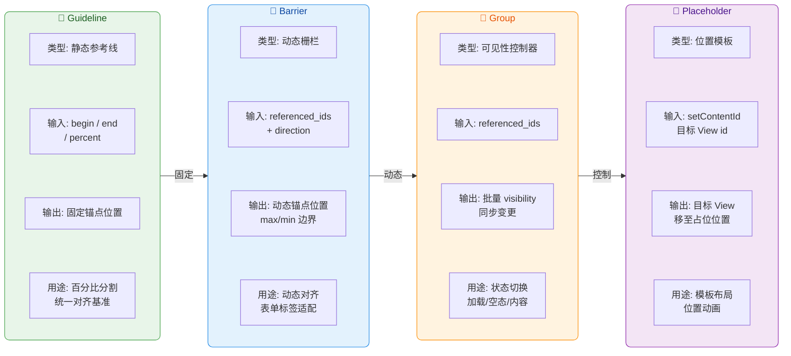

| 维度 | Guideline | Barrier | Group | Placeholder |
|------|-----------|---------|-------|-------------|
| **是否参与约束求解** | ✅ 提供固定锚点 | ✅ 提供动态锚点 | ❌ 不影响约束 | ✅ 覆盖目标约束 |
| **是否绘制像素** | ❌ | ❌ | ❌ | ❌ |
| **影响的属性** | 位置 | 位置 | visibility | 位置 + 尺寸 |
| **引用方式** | 其他 View 约束到它 | 它引用其他 View | 它引用其他 View | 代码设置 contentId |
| **动态性** | 静态（或代码修改） | 自动响应内容变化 | 手动切换 visibility | 手动设置 contentId |
| **性能影响** | 几乎为零 | 极低（多一次 max 计算） | 极低（遍历设 visibility） | 低（重置约束参数） |

---

**📝 练习题**

在一个表单布局中，有"用户名"、"电子邮箱地址"、"手机号码"三个标签，它们的宽度因文字长度不同而不同。三个标签右侧各有一个输入框，要求所有输入框的左边缘对齐到"三个标签中最宽的那个"的右侧。应该使用哪个虚拟辅助组件来实现？

A. Guideline，设置 `layout_constraintGuide_begin` 为一个足够大的固定值


B. Barrier，设置 `barrierDirection="end"` 并引用三个标签的 id


C. Group，将三个标签编为一组后控制其 visibility


D. Placeholder，依次将三个输入框投射到同一占位位置


**【答案】** B

**【解析】** 这道题的关键在于"三个标签的宽度是动态的"。Guideline 只能提供固定位置（begin/end/percent），无法根据控件内容自适应，因此 A 方案要么留太多空间浪费，要么留太少导致重叠。Group 仅控制 visibility，与对齐无关，排除 C。Placeholder 用于将一个 View "吸引"到预设位置，与多标签对齐的需求不匹配，排除 D。**Barrier** 恰恰为此设计：设置 `barrierDirection="end"` 后，Barrier 会自动计算三个标签中最宽的那个的 right 边缘，然后将自己定位于该边缘处。所有输入框只需将 `layout_constraintStart` 约束到 Barrier，就能实现统一的动态对齐。这也是 Barrier 最经典的使用场景——表单布局中的动态标签对齐。

---

**📝 练习题**

关于 ConstraintLayout 中 Group 的行为，以下哪项描述是正确的？

A. Group 会在被引用的控件外部创建一个不可见的 ViewGroup 容器


B. 一个控件可以安全地同时被多个 Group 引用，且行为完全确定


C. 设置 Group 的 visibility 为 GONE 后，被引用控件的约束关系会从求解系统中移除


D. Group 只同步控制被引用控件的 visibility 属性，不影响约束关系和布局位置


**【答案】** D

**【解析】** Group 的实现机制是在 `updatePreLayout()` 阶段遍历 `referencedIds` 数组，将每个被引用控件的 `visibility` 设为与 Group 自身相同的值。它 **不会创建任何 ViewGroup**（排除 A），被引用控件仍然是 ConstraintLayout 的直接子 View，布局结构完全扁平。当控件被设为 GONE 时，虽然宽高塌缩为 0，但 **约束关系仍然保留在求解系统中**（这也是 Gone Margin 能生效的前提），排除 C。至于 B 选项，同一控件被多个 Group 引用时，最终 visibility 取决于 XML 声明顺序中靠后的 Group（因为后执行的 `updatePreLayout()` 会覆盖先执行的结果），行为是 **不确定的且不推荐的**，排除 B。因此正确答案是 D：Group 只控制 visibility 这一个属性，不干预约束求解过程。

---

## 动态布局与动画

在传统 Android 开发中，如果需要在运行时改变布局结构——比如将一个按钮从屏幕左侧移到右侧、或者将一组表单从"编辑模式"切换到"展示模式"——开发者通常有两种做法：要么直接操作 `LayoutParams`，在 Java/Kotlin 代码中逐一修改每个控件的位置参数；要么准备两套 XML 布局文件，用 `ViewStub` 或手动 `inflate` 进行替换。前者代码冗长、可读性差，后者浪费内存且切换生硬。`ConstraintLayout` 为这一困境提供了一套优雅的解决方案：**ConstraintSet + TransitionManager**。它的核心思路是——把"布局状态"抽象成一个独立的数据对象（`ConstraintSet`），只需定义"起始状态"和"目标状态"两个约束集合，中间的过渡动画交给框架自动完成。开发者不再需要手写任何属性动画或帧动画，系统会根据约束差异自动计算位移、缩放、透明度等属性变化并插值执行。这个机制在本质上实现了**声明式动画**：你描述"从哪里到哪里"，而非"怎么移过去"。

更进一步，`MotionLayout`（`ConstraintLayout` 2.0 引入的子类）将这一思路扩展到了极致——它引入了 **MotionScene** 与 **KeyFrame** 体系，让开发者可以在起止状态之间插入任意数量的关键帧，精确控制动画路径上每个时间节点的属性值。这使得原本需要 `ObjectAnimator`、`AnimatorSet` 甚至自定义 `Interpolator` 才能实现的复杂交互动画，现在可以完全通过 XML 声明完成。本节将由浅入深，依次讲解 `ConstraintSet` 的克隆与应用机制、`TransitionManager` 的自动过渡原理，以及 `MotionLayout` 的 KeyFrame 关键帧体系。

### ConstraintSet 克隆与应用

#### ConstraintSet 的本质

`ConstraintSet` 是 `ConstraintLayout` 提供的一个**纯数据容器类**，它存储了一个布局中所有子控件的约束信息、尺寸信息、可见性、透明度、旋转角度等属性——但它**不持有任何 View 引用**。你可以把它理解为一份"布局快照"或"布局蓝图"：它完整描述了"每个控件应该在什么位置、多大、什么样子"，但它本身不是布局，也不会直接渲染任何东西。

这种设计的精妙之处在于**解耦**。传统做法中，控件的位置信息直接绑定在 `LayoutParams` 里，而 `LayoutParams` 又绑定在具体的 `View` 对象上，形成 `View ↔ LayoutParams ↔ 位置信息` 的紧耦合链条。而 `ConstraintSet` 把"位置信息"从这条链中抽离出来，变成一个可以独立存在、独立复制、独立修改的数据结构。这样一来，你可以准备多个 `ConstraintSet`（比如"折叠态"和"展开态"），在运行时快速切换，而无需重新创建或替换任何 `View`。

在内部实现上，`ConstraintSet` 使用一个 `SparseArray<Constraint>` 按控件 ID 索引，每个 `Constraint` 对象包含了 `Layout`、`PropertySet`、`Transform`、`Motion` 等内部类，分别对应约束参数、可见性/透明度、旋转缩放、动画参数等维度。当你调用 `applyTo(constraintLayout)` 时，它会遍历这个 `SparseArray`，把每个控件对应的参数批量写入其 `LayoutParams`，然后触发一次 `requestLayout()`，让布局系统重新测量和摆放所有子控件。

#### 获取 ConstraintSet 的三种方式

**方式一：从当前布局克隆（clone from live layout）**

这是最常用的方式。你先让 `ConstraintLayout` 正常加载 XML 布局，然后调用 `clone()` 方法把当前的所有约束"拍一张快照"保存下来。之后你可以对这个快照进行任意修改，再 `applyTo()` 回去。

```kotlin
// 创建一个空的 ConstraintSet 实例
val set = ConstraintSet()

// 从已经渲染好的 ConstraintLayout 中克隆所有约束信息
// 这会遍历 constraintLayout 的所有子 View，读取它们的 LayoutParams
// 并将约束数据复制到 set 内部的 SparseArray<Constraint> 中
set.clone(constraintLayout)

// 现在 set 就是当前布局的一份"快照"
// 对 set 的修改不会立即影响界面，直到你调用 applyTo()
```

这里有一个细节值得注意：`clone()` 是**深拷贝**，它会把每个 `Constraint` 对象中的所有字段都复制一份。因此你可以放心地修改克隆后的 `ConstraintSet`，不会影响原始布局的数据。

**方式二：从 XML 布局资源克隆（clone from layout resource）**

你可以准备一个只包含约束信息的"幽灵布局" XML（控件 ID 相同，但约束不同），然后从这个 XML 资源中克隆约束。这个方式特别适合"多状态切换"场景——比如准备 `layout_collapsed.xml` 和 `layout_expanded.xml`，运行时在两者之间切换。

```kotlin
// 从一个 XML 布局资源文件中克隆约束
// 框架会内部 inflate 这个 XML，读取其中的约束信息，然后丢弃 View 树
// 因此这个 XML 中的控件不需要设置 text、src 等显示属性
// 只需要保证 ID 与当前布局中的控件一一对应
val expandedSet = ConstraintSet()
expandedSet.clone(context, R.layout.activity_main_expanded)

// 同理，克隆"折叠态"的约束
val collapsedSet = ConstraintSet()
collapsedSet.clone(context, R.layout.activity_main_collapsed)
```

需要强调的是，从 XML 克隆时，框架内部确实会执行一次 `LayoutInflater.inflate()`，但**不会将 inflate 出来的 View 添加到任何 ViewGroup**——它只是借助 inflate 过程来解析 XML 属性，提取约束参数后立即释放 View 树。所以性能开销很小，不必担心内存问题。

**方式三：纯代码构建（programmatic construction）**

完全不依赖 XML，通过 `ConstraintSet` 的 API 逐条添加约束。这种方式灵活性最高，但代码量也最大，通常用于约束需要根据运行时数据动态计算的场景。

```kotlin
val set = ConstraintSet()

// 先克隆当前布局作为基础（避免从零开始配置每一个控件）
set.clone(constraintLayout)

// 然后修改特定控件的约束
// connect() 的四个参数：源控件ID、源锚点、目标控件ID、目标锚点
// 这里将 btnSubmit 的 START 边连接到 parent 的 START 边
set.connect(
    R.id.btnSubmit,              // 要修改约束的控件 ID
    ConstraintSet.START,         // 源控件的锚点（左边缘）
    ConstraintSet.PARENT_ID,     // 目标控件（parent）
    ConstraintSet.START,         // 目标锚点
    16.dp                        // 间距（margin），单位为像素
)

// 设置控件的宽度为 match_constraint（0dp）
set.constrainWidth(R.id.btnSubmit, ConstraintSet.MATCH_CONSTRAINT)

// 设置控件可见性
set.setVisibility(R.id.btnSubmit, View.VISIBLE)

// 设置水平偏移比例（Bias）
set.setHorizontalBias(R.id.btnSubmit, 0.3f)
```

#### applyTo() 的执行流程

当你调用 `constraintSet.applyTo(constraintLayout)` 时，内部会经历以下步骤：

1. **遍历内部 SparseArray**：逐个取出存储的 `Constraint` 对象。
2. **查找对应 View**：通过 `constraintLayout.getViewById(id)` 找到布局中对应 ID 的子控件。
3. **写入 LayoutParams**：将 `Constraint` 中的约束参数（start→start、top→bottom 等连接关系）、尺寸参数（width、height）、margin 等批量写入该 View 的 `ConstraintLayout.LayoutParams`。
4. **写入 View 属性**：将 `Constraint` 中的非布局属性（如 `visibility`、`alpha`、`rotation`、`elevation`）直接设置到 View 上。
5. **触发重布局**：最后调用 `constraintLayout.requestLayout()`，通知布局系统在下一帧重新执行 `onMeasure()` → `onLayout()` → `onDraw()` 流程。

如果没有配合 `TransitionManager`，这个过程是**瞬间完成**的——界面会在一帧之内从旧状态"跳变"到新状态，没有任何过渡效果。而 `TransitionManager` 的作用，正是在这个"跳变"中间插入平滑的属性动画。

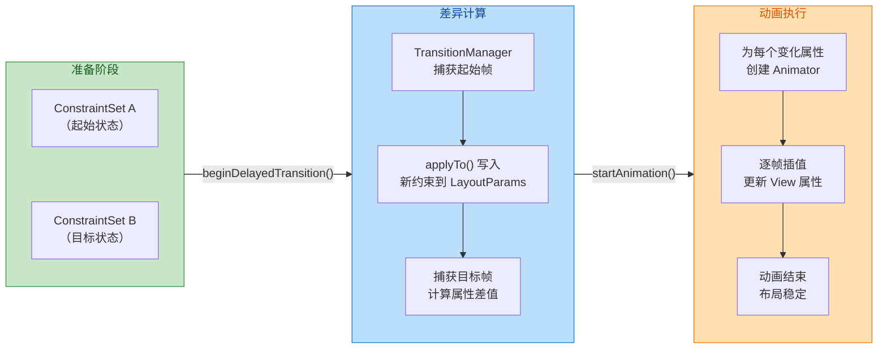

### TransitionManager 自动动画

#### 工作原理：Scene Capture 机制

`TransitionManager` 并非 `ConstraintLayout` 的专属 API，它属于 `androidx.transition` 包（最早在 Android 4.4 KitKat 引入），是一个通用的**场景过渡管理器**。它的核心思想极其简洁：

1. **记录"之前"的状态**（Before Snapshot）：在你修改布局之前，`TransitionManager` 遍历目标 `ViewGroup` 的所有子 View，记录它们当前的位置（left, top, right, bottom）、尺寸（width, height）、透明度（alpha）、可见性（visibility）等属性值。
2. **你执行布局变更**：调用 `constraintSet.applyTo()` 或其他任何会导致布局变化的操作。
3. **记录"之后"的状态**（After Snapshot）：在下一次布局 pass 之后，框架再次遍历所有子 View，记录新状态。
4. **计算差异并生成动画**：框架比较 Before 和 After 的每个属性值，对有变化的属性创建 `ObjectAnimator`，并并行执行。

整个过程中，开发者唯一需要做的就是在修改布局**之前**调用一行 `beginDelayedTransition()`——这行代码的作用是"通知框架：我马上要改布局了，请准备好捕获 Before 快照"。

```kotlin
// ========== 最简单的用法：一行代码实现自动过渡 ==========

// 第一步：通知 TransitionManager 开始监听布局变化
// 传入目标 ViewGroup（这里是 ConstraintLayout）
// 框架会立即捕获所有子 View 的当前状态（Before Snapshot）
TransitionManager.beginDelayedTransition(constraintLayout)

// 第二步：应用新的约束集合
// applyTo() 会修改 LayoutParams 并触发 requestLayout()
// 但由于上一步已经设置了延迟过渡监听
// 框架会在新布局计算完成后自动捕获 After Snapshot
// 然后对比差异，生成并执行平滑动画
expandedSet.applyTo(constraintLayout)

// 就这样！不需要手动创建任何 Animator
// 框架会自动为位置、尺寸、可见性等变化创建动画
```

#### 自定义 Transition 类型

`beginDelayedTransition()` 的第二个参数可以传入一个 `Transition` 对象来自定义动画效果。如果不传（或传 `null`），默认使用 `AutoTransition`，它包含三个按顺序执行的子过渡：**Fade Out**（消失的元素淡出）→ **ChangeBounds**（移动/缩放）→ **Fade In**（出现的元素淡入）。

常用的 `Transition` 子类包括：

- **`ChangeBounds`**：捕获 View 的边界（位置 + 尺寸）变化，生成平移和缩放动画。这是最常用的过渡类型，几乎所有布局调整都能用它覆盖。
- **`Fade`**：捕获 View 的可见性变化（VISIBLE ↔ INVISIBLE/GONE），生成透明度渐变动画。可以通过构造参数指定 `Fade.IN`、`Fade.OUT` 或 `Fade.IN | Fade.OUT`。
- **`TransitionSet`**：多个 `Transition` 的组合容器，可以设置 `ORDERING_TOGETHER`（并行执行）或 `ORDERING_SEQUENTIAL`（顺序执行）。
- **`Slide`**：让 View 从指定边缘（Gravity.START / END / TOP / BOTTOM）滑入或滑出。
- **`ChangeTransform`**：捕获 `scaleX`、`scaleY`、`rotation` 等变换属性的变化。
- **`ChangeClipBounds`**：捕获 `clipBounds` 的变化，可实现裁剪动画效果。

```kotlin
// ========== 自定义过渡效果示例 ==========

// 创建一个 TransitionSet，内部并行执行多种过渡
val transition = TransitionSet().apply {
    // 设置为并行执行（所有动画同时开始）
    ordering = TransitionSet.ORDERING_TOGETHER

    // 添加 ChangeBounds：处理位置和尺寸变化
    addTransition(ChangeBounds().apply {
        // 设置动画时长为 300ms
        duration = 300L
        // 使用 FastOutSlowIn 插值器（Material Design 标准曲线）
        interpolator = FastOutSlowInInterpolator()
    })

    // 添加 Fade：处理可见性变化
    addTransition(Fade().apply {
        duration = 200L
    })

    // 添加 ChangeTransform：处理旋转、缩放变化
    addTransition(ChangeTransform().apply {
        duration = 300L
    })
}

// 使用自定义 Transition 开始延迟过渡
TransitionManager.beginDelayedTransition(constraintLayout, transition)

// 应用新约束
targetSet.applyTo(constraintLayout)
```

#### 过渡作用范围的精细控制

有时候你只想让部分控件执行过渡动画，其余控件瞬间切换。`Transition` 提供了 `addTarget()` 和 `excludeTarget()` 两组方法来精确控制作用范围：

```kotlin
val transition = ChangeBounds().apply {
    duration = 400L

    // 方式一：白名单模式 —— 只对指定控件生效
    // 只有 btnSubmit 和 tvTitle 会有过渡动画，其余控件瞬间切换
    addTarget(R.id.btnSubmit)
    addTarget(R.id.tvTitle)

    // 方式二：黑名单模式 —— 排除指定控件
    // 除了 ivBackground 以外的所有控件都会有过渡动画
    // excludeTarget(R.id.ivBackground, true)

    // 还可以按 View 类型过滤
    // 比如排除所有 ImageView，只让非图片控件做动画
    // excludeTarget(ImageView::class.java, true)
}
```

#### 完整的多状态切换实战

下面演示一个典型场景：一个卡片有"折叠态"和"展开态"两种布局状态，点击按钮在两者之间平滑切换。

```kotlin
class CardActivity : AppCompatActivity() {

    // 定义两个 ConstraintSet 分别代表折叠态和展开态
    private val collapsedSet = ConstraintSet()
    private val expandedSet = ConstraintSet()

    // 用一个布尔值跟踪当前状态
    private var isExpanded = false

    // 持有根布局引用
    private lateinit var rootLayout: ConstraintLayout

    override fun onCreate(savedInstanceState: Bundle?) {
        super.onCreate(savedInstanceState)
        // 加载默认布局（折叠态）
        setContentView(R.layout.activity_card_collapsed)

        // 获取根布局引用
        rootLayout = findViewById(R.id.rootLayout)

        // 从当前已渲染的布局中克隆折叠态约束
        // 此时布局已经完成 inflate，所有约束都已就绪
        collapsedSet.clone(rootLayout)

        // 从另一个 XML 资源中克隆展开态约束
        // 该 XML 文件中的控件 ID 必须与当前布局一一对应
        // 但约束关系、尺寸、margin 等可以完全不同
        expandedSet.clone(this, R.layout.activity_card_expanded)

        // 设置切换按钮的点击事件
        findViewById<Button>(R.id.btnToggle).setOnClickListener {
            toggleCardState()
        }
    }

    private fun toggleCardState() {
        // 翻转状态标志
        isExpanded = !isExpanded

        // 构建自定义过渡动画
        val transition = TransitionSet().apply {
            ordering = TransitionSet.ORDERING_TOGETHER
            // ChangeBounds 处理控件的移动和大小变化
            addTransition(ChangeBounds().apply {
                duration = 350L
                interpolator = FastOutSlowInInterpolator()
            })
            // Fade 处理内容区域的显示/隐藏
            addTransition(Fade().apply {
                duration = 250L
                // 只对详情文本和额外按钮生效
                addTarget(R.id.tvDetails)
                addTarget(R.id.btnExtra)
            })
        }

        // 关键一步：在修改布局之前通知 TransitionManager
        TransitionManager.beginDelayedTransition(rootLayout, transition)

        // 根据当前状态应用对应的约束集合
        if (isExpanded) {
            expandedSet.applyTo(rootLayout)
        } else {
            collapsedSet.applyTo(rootLayout)
        }
    }
}
```

这段代码的精妙之处在于：无论"折叠态"和"展开态"的布局差异有多大——控件位置完全不同、某些控件隐藏/显示、尺寸大幅变化——你都**不需要手写任何 `ObjectAnimator`**。所有的动画计算和执行都由 `TransitionManager` 根据 Before/After 快照的差异自动完成。这就是声明式动画（Declarative Animation）的核心优势：**你描述状态，框架负责过渡**。

### KeyFrame 关键帧

#### 从 ConstraintSet 到 MotionLayout 的进化

`ConstraintSet + TransitionManager` 的组合非常强大，但它有一个本质局限：**它只能定义起点和终点两个状态，中间的动画路径完全由系统的线性插值（或你设置的 Interpolator）决定**。如果你想让一个按钮从左下角移动到右上角，但中间要"先向上弧形运动再折向右边"，或者在移动到 50% 位置时临时放大到 1.5 倍再缩回来，`TransitionManager` 就无能为力了。

这正是 `MotionLayout` 的用武之地。`MotionLayout` 是 `ConstraintLayout` 的子类（`class MotionLayout : ConstraintLayout`），在 ConstraintLayout 2.0 版本中引入。它的核心创新是引入了 **MotionScene**（动画场景描述文件）和 **KeyFrame**（关键帧）体系，让开发者可以在起止两个 `ConstraintSet` 之间的时间线上插入任意数量的关键帧，精确控制动画路径上每个时间节点的属性值。

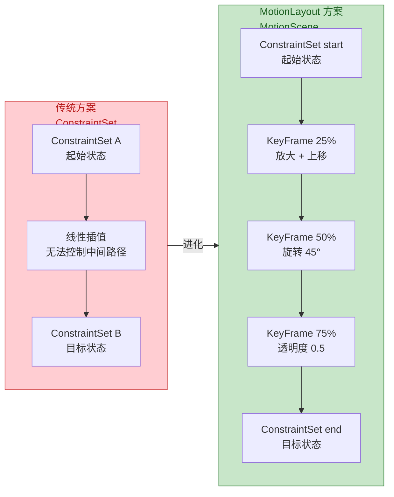

#### MotionScene 文件结构

`MotionLayout` 的动画不写在布局 XML 里，而是写在一个独立的 **MotionScene 文件**中（通常放在 `res/xml/` 目录下）。这个文件包含三大核心元素：

1. **`<Transition>`**：定义一个从起始状态到目标状态的过渡，包括时长、插值器、触发方式（点击 / 滑动）等。
2. **`<ConstraintSet>`**：定义起始和目标两个约束状态（类似于前面讲的 `ConstraintSet` 对象，但以 XML 声明）。
3. **`<KeyFrameSet>`**：嵌套在 `<Transition>` 内部，定义动画时间线上的关键帧。

```xml
<!-- res/xml/scene_card_expand.xml -->
<!-- MotionScene 是整个动画描述的根元素 -->
<MotionScene xmlns:android="http://schemas.android.com/apk/res/android"
    xmlns:app="http://schemas.android.com/apk/res-auto">

    <!-- Transition 定义一个完整的过渡 -->
    <!-- constraintSetStart：起始状态的 ConstraintSet ID -->
    <!-- constraintSetEnd：目标状态的 ConstraintSet ID -->
    <!-- duration：动画总时长（毫秒） -->
    <Transition
        app:constraintSetStart="@id/collapsed"
        app:constraintSetEnd="@id/expanded"
        app:duration="500">

        <!-- OnClick 触发器：点击 btnToggle 时执行过渡 -->
        <!-- clickAction="toggle" 表示点击时在 start/end 之间来回切换 -->
        <OnClick
            app:targetId="@id/btnToggle"
            app:clickAction="toggle" />

        <!-- KeyFrameSet 在这里定义，稍后详细讲解 -->
        <KeyFrameSet>
            <!-- 关键帧定义... -->
        </KeyFrameSet>

    </Transition>

    <!-- 起始状态：折叠态 -->
    <ConstraintSet android:id="@+id/collapsed">
        <Constraint android:id="@id/ivAvatar"
            android:layout_width="48dp"
            android:layout_height="48dp"
            app:layout_constraintStart_toStartOf="parent"
            app:layout_constraintTop_toTopOf="parent"
            android:layout_marginStart="16dp"
            android:layout_marginTop="16dp" />
        <!-- 其他控件的约束... -->
    </ConstraintSet>

    <!-- 目标状态：展开态 -->
    <ConstraintSet android:id="@+id/expanded">
        <Constraint android:id="@id/ivAvatar"
            android:layout_width="120dp"
            android:layout_height="120dp"
            app:layout_constraintStart_toStartOf="parent"
            app:layout_constraintEnd_toEndOf="parent"
            app:layout_constraintTop_toTopOf="parent"
            android:layout_marginTop="32dp" />
        <!-- 其他控件的约束... -->
    </ConstraintSet>

</MotionScene>
```

布局 XML 中只需将 `ConstraintLayout` 替换为 `MotionLayout`，并引用 MotionScene 文件：

```xml
<!-- res/layout/activity_card.xml -->
<!-- 将根布局声明为 MotionLayout（ConstraintLayout 的子类） -->
<androidx.constraintlayout.motion.widget.MotionLayout
    xmlns:android="http://schemas.android.com/apk/res/android"
    xmlns:app="http://schemas.android.com/apk/res-auto"
    android:id="@+id/motionLayout"
    android:layout_width="match_parent"
    android:layout_height="match_parent"
    app:layoutDescription="@xml/scene_card_expand">
    <!-- layoutDescription 指向 MotionScene 文件 -->
    <!-- 这是 MotionLayout 与普通 ConstraintLayout 唯一的区别 -->

    <!-- 子控件正常声明，ID 必须与 MotionScene 中的 Constraint ID 匹配 -->
    <ImageView android:id="@+id/ivAvatar" ... />
    <TextView android:id="@+id/tvName" ... />
    <Button android:id="@+id/btnToggle" ... />

</androidx.constraintlayout.motion.widget.MotionLayout>
```

#### 三种关键帧类型详解

`<KeyFrameSet>` 内部可以包含三种类型的关键帧，分别控制动画路径的不同维度：

**1. KeyPosition —— 控制运动路径**

`KeyPosition` 控制控件在动画过程中的**空间位置**。默认情况下，控件从起点到终点沿直线运动；通过 `KeyPosition` 你可以让它走弧线、折线或任意路径。

```xml
<KeyFrameSet>
    <!-- KeyPosition：在动画进度 50% 时，控制 ivAvatar 的位置 -->
    <!-- framePosition：时间轴位置，0-100 对应动画的 0%-100% -->
    <!-- motionTarget：作用于哪个控件 -->
    <!-- keyPositionType：坐标系类型 -->
    <!--   parentRelative = 相对于父容器的坐标（0,0 在父容器左上角） -->
    <!--   deltaRelative  = 相对于起止两点差值的坐标 -->
    <!--   pathRelative   = 相对于起止直线路径的坐标 -->
    <!-- percentX / percentY：在选定坐标系下的坐标值 -->
    <KeyPosition
        app:motionTarget="@id/ivAvatar"
        app:framePosition="50"
        app:keyPositionType="parentRelative"
        app:percentX="0.8"
        app:percentY="0.2" />
    <!-- 
        解读：当动画播放到 50% 时，ivAvatar 应该位于
        父容器宽度 80%、高度 20% 的位置。
        框架会自动将 0%→50%→100% 三个位置点用平滑曲线连接。
    -->
</KeyFrameSet>
```

三种坐标系的区别非常关键：

- **`parentRelative`**：以父容器为参考系，`(0,0)` 是父容器左上角，`(1,1)` 是右下角。适合"我要让控件经过屏幕的某个绝对位置"的场景。
- **`deltaRelative`**：以起点和终点的差值为参考系。`percentX=0.5` 表示 X 方向位移了起止差值的 50%。适合"我要让控件在运动方向上先快后慢"的场景。
- **`pathRelative`**：以起止直线为 X 轴，垂直方向为 Y 轴。`percentY=0.3` 表示偏离直线路径 30% 距离。**这是做弧形路径最直观的坐标系**。

**2. KeyAttribute —— 控制视觉属性**

`KeyAttribute` 控制控件在动画过程中某个时间点的**视觉属性**——透明度、旋转角度、缩放比例等。它不影响运动路径，只改变控件"看起来的样子"。

```xml
<KeyFrameSet>
    <!-- 在动画 30% 位置，让 ivAvatar 旋转 -15 度并放大到 1.3 倍 -->
    <KeyAttribute
        app:motionTarget="@id/ivAvatar"
        app:framePosition="30"
        android:rotation="-15"
        android:scaleX="1.3"
        android:scaleY="1.3" />

    <!-- 在动画 60% 位置，让 ivAvatar 半透明 -->
    <KeyAttribute
        app:motionTarget="@id/ivAvatar"
        app:framePosition="60"
        android:alpha="0.5" />

    <!-- 在动画 80% 位置，恢复为不透明且无旋转 -->
    <!-- 到 100%（end 状态）时会使用 ConstraintSet end 中定义的值 -->
    <KeyAttribute
        app:motionTarget="@id/ivAvatar"
        app:framePosition="80"
        android:alpha="1.0"
        android:rotation="0" />
</KeyFrameSet>
```

`KeyAttribute` 支持的属性包括：`alpha`、`rotation`、`rotationX`、`rotationY`、`scaleX`、`scaleY`、`translationX`、`translationY`、`translationZ`、`elevation` 等。框架会在相邻关键帧之间自动插值，默认使用线性插值，但可以通过 `app:transitionEasing` 属性指定缓动曲线。

**3. KeyCycle —— 控制周期性振荡**

`KeyCycle` 是最特殊的关键帧类型，它让属性在动画过程中产生**周期性振荡**效果——比如控件一边移动一边"抖动"、"摇摆"或"弹跳"。这种效果用传统动画 API 非常难实现，但 `KeyCycle` 只需几行 XML。

```xml
<KeyFrameSet>
    <!-- KeyCycle：让 ivAvatar 在移动过程中产生正弦波式的上下振荡 -->
    <!-- wavePeriod：振荡的完整周期数（在 framePosition 点附近） -->
    <!-- waveOffset：振荡的基准偏移值 -->
    <!-- waveShape：波形类型 sin/cos/sawtooth/square/bounce/reverseSawtooth -->
    <KeyCycle
        app:motionTarget="@id/ivAvatar"
        app:framePosition="50"
        android:translationY="20dp"
        app:wavePeriod="3"
        app:waveShape="sin" />
    <!--
        解读：在动画 50% 附近，ivAvatar 的 translationY
        会以 20dp 为振幅、3 个完整周期的正弦波振荡。
        视觉效果就像控件一边移动一边上下"弹跳"。
    -->
</KeyFrameSet>
```

`KeyCycle` 的数学原理是：在指定的 `framePosition` 附近，将目标属性值叠加一个周期函数 `value = amplitude × waveFunction(phase)`。`wavePeriod` 控制频率，属性值（如 `translationY="20dp"`）控制振幅，`waveShape` 控制波形。多个 `KeyCycle` 可以组合使用，在时间线的不同区段定义不同的振荡参数，实现"先剧烈振荡后逐渐平息"的阻尼效果。

#### 代码控制 MotionLayout

虽然 `MotionLayout` 的动画主要通过 XML 声明，但在代码中同样可以精确控制：

```kotlin
// 获取 MotionLayout 引用
val motionLayout = findViewById<MotionLayout>(R.id.motionLayout)

// 手动设置动画进度（0.0f = start 状态，1.0f = end 状态）
// 这在与 Slider、ScrollView 联动时非常有用
motionLayout.progress = 0.5f  // 直接跳到 50% 位置

// 手动触发从 start 到 end 的过渡动画
motionLayout.transitionToEnd()

// 手动触发从 end 到 start 的回退动画
motionLayout.transitionToStart()

// 监听过渡动画的各个阶段
motionLayout.setTransitionListener(object : MotionLayout.TransitionListener {
    // 过渡动画开始时回调
    override fun onTransitionStarted(layout: MotionLayout, startId: Int, endId: Int) {
        // startId 和 endId 是 ConstraintSet 的资源 ID
        Log.d("Motion", "动画开始：从 $startId 到 $endId")
    }

    // 过渡进度变化时回调（每帧都会调用）
    // progress 范围 0.0f ~ 1.0f
    override fun onTransitionChange(layout: MotionLayout, startId: Int, endId: Int, progress: Float) {
        // 可以在这里联动其他 UI 元素
        // 比如根据 progress 同步更新一个进度条或颜色渐变
        toolbar.alpha = progress  // 让 toolbar 的透明度与动画进度同步
    }

    // 过渡动画结束时回调
    override fun onTransitionCompleted(layout: MotionLayout, currentId: Int) {
        // currentId 是动画结束后的 ConstraintSet ID
        Log.d("Motion", "动画完成，当前状态：$currentId")
    }

    // 过渡动画触发状态变化时回调
    override fun onTransitionTrigger(layout: MotionLayout, triggerId: Int, positive: Boolean, progress: Float) {
        // 用于处理 KeyTrigger 触发的事件
    }
})
```

一个特别实用的技巧是**将 `MotionLayout` 的 `progress` 绑定到用户手势**。比如，你可以让一个展开/折叠动画完全跟随用户的手指滑动，而不是一次性播放完：

```xml
<!-- 在 MotionScene 的 Transition 中添加 OnSwipe 触发器 -->
<Transition
    app:constraintSetStart="@id/collapsed"
    app:constraintSetEnd="@id/expanded"
    app:duration="300">

    <!-- OnSwipe：通过滑动手势驱动动画 -->
    <!-- touchAnchorId：手势追踪的控件（手指在这个控件上滑动） -->
    <!-- touchAnchorSide：从控件的哪个边缘开始追踪 -->
    <!-- dragDirection：滑动方向（dragUp = 向上滑动） -->
    <OnSwipe
        app:touchAnchorId="@id/cardContent"
        app:touchAnchorSide="top"
        app:dragDirection="dragUp" />
</Transition>
```

配置了 `OnSwipe` 后，用户在 `cardContent` 上向上滑动时，动画进度会实时跟随手指位置从 0 变到 1；手指松开后，框架会根据当前进度和滑动速度自动判断是继续完成动画还是回弹到起始状态，提供了流畅的物理手感。

#### ConstraintSet 方案与 MotionLayout 方案的选型

两套方案并非替代关系，而是互补关系。选型原则如下：

| 维度 | ConstraintSet + TransitionManager | MotionLayout + MotionScene |
|------|-----------------------------------|----------------------------|
| **动画复杂度** | 简单的状态切换（A → B 直线过渡） | 复杂路径、多关键帧、周期振荡 |
| **手势驱动** | 不直接支持（需自行对接 `GestureDetector`） | 原生支持 `OnSwipe`，进度跟手 |
| **声明方式** | 代码为主（`ConstraintSet` API） | XML 为主（MotionScene 文件） |
| **可视化编辑** | 无 | Android Studio 提供 Motion Editor |
| **性能** | 轻量，适合偶发的状态切换 | 针对持续动画优化，逐帧计算高效 |
| **最低依赖** | `constraintlayout:2.0+` | 同上（`MotionLayout` 内含于此） |
| **典型场景** | 表单展开/折叠、多状态页面 | 启动动画、下拉刷新、CollapsingToolbar 替代 |

简单来说：如果你的动画只是"布局 A 变成布局 B，中间平滑过渡"，`ConstraintSet + TransitionManager` 足够且更简洁；如果动画路径是非线性的、需要跟随手势、或者有弹跳/振荡等复杂效果，`MotionLayout` 是更好的选择。

---

**📝 练习题**

在使用 `ConstraintSet + TransitionManager` 实现布局状态切换动画时，以下说法正确的是：

A. `TransitionManager.beginDelayedTransition()` 必须在 `applyTo()` 之后调用，因为它需要先知道目标状态


B. `ConstraintSet.clone()` 执行的是浅拷贝，修改克隆后的 ConstraintSet 会直接影响原始布局


C. `beginDelayedTransition()` 会在调用时捕获当前布局的 Before Snapshot，然后在下一次布局完成后捕获 After Snapshot，最后对比差异自动生成动画


D. `TransitionManager` 只能与 `ConstraintLayout` 配合使用，无法用于其他 `ViewGroup`


**【答案】** C

**【解析】** `TransitionManager` 的工作原理是经典的 **Scene Capture（场景捕获）** 机制：调用 `beginDelayedTransition(viewGroup)` 时，框架立即遍历该 ViewGroup 的所有子 View，记录它们当前的位置、尺寸、可见性等属性作为 Before Snapshot；随后开发者执行布局修改（如 `applyTo()`），触发 `requestLayout()`；在下一帧的布局 pass 完成后，框架再次记录所有子 View 的新状态作为 After Snapshot；最后对比两个快照的差异，为有变化的属性自动创建 `Animator` 并执行。因此 C 正确。

A 错误：`beginDelayedTransition()` **必须**在 `applyTo()` 之前调用，因为它需要在布局变更之前捕获 Before Snapshot。如果先调用 `applyTo()` 再调用 `beginDelayedTransition()`，Before Snapshot 已经是变更后的状态，差异为零，不会产生任何动画。B 错误：`clone()` 执行的是**深拷贝**，修改克隆后的 `ConstraintSet` 不会影响原始布局。D 错误：`TransitionManager` 属于 `androidx.transition` 包，是一个通用的过渡管理器，可以与任何 `ViewGroup` 配合使用（如 `FrameLayout`、`LinearLayout` 等），不局限于 `ConstraintLayout`。

---

## 性能对比与实战

ConstraintLayout 自 2016 年发布以来，Google 一直将其定位为 **下一代默认布局容器**。它不仅是 RelativeLayout 的功能超集，更在渲染性能、层级扁平化、可维护性三大维度上实现了质的飞跃。本节将从底层测量机制入手，用数据和实战案例说明"为什么应该全面迁移到 ConstraintLayout"，并深入演示复杂表单与多状态切换两大高频场景的最佳实践。

---

### RelativeLayout 替换

#### 为什么 RelativeLayout 会慢？——双重 Measure 的根源

要理解 ConstraintLayout 的性能优势，必须先搞清楚 RelativeLayout 的测量机制。Android 视图系统的渲染管线分为三个阶段：**Measure → Layout → Draw**。其中 Measure 阶段消耗最大，因为它需要递归遍历整棵视图树，为每个 View 计算宽高。

RelativeLayout 的核心问题在于它的 **双重测量（Double Measure Pass）** 机制。当 RelativeLayout 收到父容器传来的 MeasureSpec 后，它必须执行两次完整的子 View 遍历：

- **第一次遍历（水平方向）**：按照水平方向的约束关系（`layout_toLeftOf`、`layout_toRightOf`、`layout_alignLeft` 等）对所有子 View 进行一次测量，确定每个子 View 在横轴上的位置与宽度。此时竖直方向的值可能尚未确定，所以部分子 View 拿到的高度是临时估算值。
- **第二次遍历（垂直方向）**：再按照垂直方向的约束关系（`layout_above`、`layout_below`、`layout_alignTop` 等）对所有子 View 做第二次测量。这次会用第一次遍历中确定的水平结果来修正宽度，同时确定最终高度。

这意味着，如果一个 RelativeLayout 拥有 N 个子 View，每次布局至少执行 **2N 次 `onMeasure` 调用**。更致命的是，当 RelativeLayout 发生嵌套时，复杂度呈指数级增长。假设存在 3 层嵌套，每层 10 个子 View，最内层子 View 可能被测量 **2³ = 8 次**。这就是经典的 **measure 指数爆炸** 问题。

```text
// RelativeLayout 嵌套测量次数示意
// 层级 depth = d，每个 RelativeLayout 都做 2 次 measure pass

// depth=1: 子 View 被测量 2^1 = 2 次
// depth=2: 子 View 被测量 2^2 = 4 次
// depth=3: 子 View 被测量 2^3 = 8 次
// ...
// depth=d: 子 View 被测量 2^d 次
```

#### ConstraintLayout 的解法——Cassowary 一次求解

ConstraintLayout 则完全不同。它基于 **Cassowary 线性约束求解算法**，将所有子 View 之间的约束关系建模为一组线性等式/不等式方程组，然后在 **一次 resolve 过程** 中同时求解出所有子 View 的位置和尺寸。这不是"先水平再垂直"的分步策略，而是将二维约束统一放入 Solver，一次性输出结果。

因此，无论子 View 数量多少、约束关系多么复杂，ConstraintLayout 对子 View 的 **measure 调用通常只有一轮**（极少数涉及 `wrap_content` 和 `MATCH_CONSTRAINT` 混合的边界场景可能触发额外一轮，但远不会指数增长）。层级方面，ConstraintLayout 天然只需要 **一层扁平结构** 即可表达原本需要多层 RelativeLayout + LinearLayout 嵌套才能描述的布局，从根本上消灭了 measure 指数爆炸。

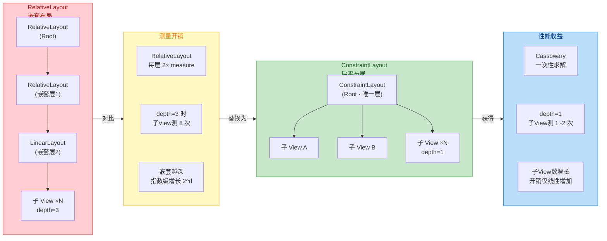

#### Google 官方性能基准数据

Google 在 ConstraintLayout 1.0 正式发布时曾公布过一组基准测试数据。测试场景是一个包含约 20 个控件的复杂布局，分别用"多层嵌套 RelativeLayout + LinearLayout"与"单层 ConstraintLayout"两种方式实现完全相同的视觉效果。在 Measure/Layout 阶段的耗时对比中，ConstraintLayout 版本相较嵌套版本快约 **40%**。在 Android Systrace 火焰图中可以明显看到，ConstraintLayout 的 `performTraversal` 调用栈更浅、执行时间更短。

这里需要强调一个常见误区：如果只是一个非常简单的布局（比如 3~4 个 View 的线性排列），RelativeLayout 或 LinearLayout 的绝对耗时可能与 ConstraintLayout 相差无几，甚至偶尔更快，因为 Cassowary 求解器本身有初始化开销。但在 **实际工程项目** 中，布局复杂度通常远超这个临界值，ConstraintLayout 的优势才会真正体现。更关键的是，ConstraintLayout 在视图树层级上的扁平化，减少了 **GPU 过度绘制（Overdraw）**，对帧率的提升有间接但显著的帮助。

#### 迁移策略——从 RelativeLayout 到 ConstraintLayout

实际项目中从 RelativeLayout 迁移到 ConstraintLayout，可以按以下策略进行：

**属性映射表**：大部分 RelativeLayout 属性都有直接对应的 ConstraintLayout 约束写法。

```kotlin
// ==================== RelativeLayout → ConstraintLayout 属性映射 ====================

// --- 相对于父容器 (Parent) 的定位 ---

// RelativeLayout: android:layout_alignParentStart="true"
// ConstraintLayout: 将 View 的 start 边约束到父容器的 start 边
// app:layout_constraintStart_toStartOf="parent"

// RelativeLayout: android:layout_alignParentEnd="true"
// ConstraintLayout: 将 View 的 end 边约束到父容器的 end 边
// app:layout_constraintEnd_toEndOf="parent"

// RelativeLayout: android:layout_alignParentTop="true"
// ConstraintLayout: 将 View 的 top 边约束到父容器的 top 边
// app:layout_constraintTop_toTopOf="parent"

// RelativeLayout: android:layout_alignParentBottom="true"
// ConstraintLayout: 将 View 的 bottom 边约束到父容器的 bottom 边
// app:layout_constraintBottom_toBottomOf="parent"

// RelativeLayout: android:layout_centerInParent="true"
// ConstraintLayout: 四边都约束到 parent → 自动居中
// app:layout_constraintStart_toStartOf="parent"
// app:layout_constraintEnd_toEndOf="parent"
// app:layout_constraintTop_toTopOf="parent"
// app:layout_constraintBottom_toBottomOf="parent"

// RelativeLayout: android:layout_centerHorizontal="true"
// ConstraintLayout: 水平方向两边约束到 parent
// app:layout_constraintStart_toStartOf="parent"
// app:layout_constraintEnd_toEndOf="parent"

// RelativeLayout: android:layout_centerVertical="true"
// ConstraintLayout: 垂直方向两边约束到 parent
// app:layout_constraintTop_toTopOf="parent"
// app:layout_constraintBottom_toBottomOf="parent"


// --- 相对于同级控件 (Sibling) 的定位 ---

// RelativeLayout: android:layout_toEndOf="@id/viewA"
// ConstraintLayout: 当前 View 的 start 边 → viewA 的 end 边
// app:layout_constraintStart_toEndOf="@id/viewA"

// RelativeLayout: android:layout_toStartOf="@id/viewA"
// ConstraintLayout: 当前 View 的 end 边 → viewA 的 start 边
// app:layout_constraintEnd_toStartOf="@id/viewA"

// RelativeLayout: android:layout_below="@id/viewA"
// ConstraintLayout: 当前 View 的 top 边 → viewA 的 bottom 边
// app:layout_constraintTop_toBottomOf="@id/viewA"

// RelativeLayout: android:layout_above="@id/viewA"
// ConstraintLayout: 当前 View 的 bottom 边 → viewA 的 top 边
// app:layout_constraintBottom_toTopOf="@id/viewA"


// --- 对齐 (Alignment) ---

// RelativeLayout: android:layout_alignStart="@id/viewA"
// ConstraintLayout: start 对 start 对齐
// app:layout_constraintStart_toStartOf="@id/viewA"

// RelativeLayout: android:layout_alignEnd="@id/viewA"
// ConstraintLayout: end 对 end 对齐
// app:layout_constraintEnd_toEndOf="@id/viewA"

// RelativeLayout: android:layout_alignTop="@id/viewA"
// ConstraintLayout: top 对 top 对齐
// app:layout_constraintTop_toTopOf="@id/viewA"

// RelativeLayout: android:layout_alignBottom="@id/viewA"
// ConstraintLayout: bottom 对 bottom 对齐
// app:layout_constraintBottom_toBottomOf="@id/viewA"

// RelativeLayout: android:layout_alignBaseline="@id/viewA"
// ConstraintLayout: 文字基线对齐
// app:layout_constraintBaseline_toBaselineOf="@id/viewA"
```

**Android Studio 自动转换**：在 Layout Editor 中，右键 RelativeLayout 根节点，选择 **"Convert view…" → ConstraintLayout**，IDE 会自动分析现有约束并生成对应的 `app:layout_constraint*` 属性。但自动转换的结果通常不完美——它倾向于生成大量绝对边距（`layout_marginStart="XXdp"`）而非优雅的相对约束。因此建议自动转换后，**手动审查并优化** 每个 View 的约束关系，将硬编码边距替换为相对定位 + Bias + Guideline 的组合。

**渐进式迁移**：不必一次性重写所有布局。ConstraintLayout 可以与其他布局容器共存——可以先将最复杂、嵌套最深的页面迁移，再逐步覆盖简单页面。衡量迁移优先级的指标是：**布局层级深度 > 3 层且子 View 数量 > 15** 的页面应优先迁移。

---

### 复杂表单布局

表单是 Android 应用开发中最常见也最容易写成"嵌套地狱"的场景之一。一个典型的注册/编辑表单可能包含：标签 + 输入框的行排列、必填标记、错误提示、下拉选择器、多行文本域、提交按钮等。在传统实现中，开发者往往使用多层 LinearLayout 嵌套（外层 vertical + 每行 horizontal），或者使用 RelativeLayout 配合大量 `layout_below` / `layout_toEndOf`。这两种方式在控件数量达到 15~20 个时，都会出现严重的维护性和性能问题。

ConstraintLayout 的扁平化能力让复杂表单只需要 **一层容器** 即可完美实现。下面以一个常见的用户信息编辑表单为例进行完整演示：

```xml
<?xml version="1.0" encoding="utf-8"?>
<!-- 整个表单只需要一个 ConstraintLayout 作为根容器 -->
<!-- 所有控件都是它的直接子 View，没有任何嵌套 -->
<androidx.constraintlayout.widget.ConstraintLayout
    xmlns:android="http://schemas.android.com/apk/res/android"
    xmlns:app="http://schemas.android.com/apk/res-auto"
    android:id="@+id/formRoot"
    android:layout_width="match_parent"
    android:layout_height="match_parent"
    android:padding="16dp">

    <!-- ======================== 辅助定位元素 ======================== -->

    <!-- 垂直引导线：将表单分为"标签列"和"输入列" -->
    <!-- 位于父容器宽度 28% 处，所有标签右对齐于此线，所有输入框左对齐于此线 -->
    <androidx.constraintlayout.widget.Guideline
        android:id="@+id/guidelineLabelEnd"
        android:layout_width="wrap_content"
        android:layout_height="wrap_content"
        android:orientation="vertical"
        app:layout_constraintGuide_percent="0.28" />

    <!-- 屏障：位于所有输入框的底部之下，用于动态定位提交按钮 -->
    <!-- 无论哪一行最长/最高，屏障都会自动取最大 bottom 值 -->
    <androidx.constraintlayout.widget.Barrier
        android:id="@+id/barrierFormBottom"
        android:layout_width="wrap_content"
        android:layout_height="wrap_content"
        app:barrierDirection="bottom"
        app:constraint_referenced_ids="inputName,inputEmail,inputPhone,inputBio" />

    <!-- ======================== 第 1 行：用户名 ======================== -->

    <!-- 用户名标签：右边缘对齐到 Guideline -->
    <TextView
        android:id="@+id/labelName"
        android:layout_width="0dp"
        android:layout_height="wrap_content"
        android:text="用户名"
        android:textSize="14sp"
        android:gravity="end"
        android:paddingEnd="12dp"
        app:layout_constraintEnd_toStartOf="@id/guidelineLabelEnd"
        app:layout_constraintStart_toStartOf="parent"
        app:layout_constraintTop_toTopOf="@id/inputName"
        app:layout_constraintBottom_toBottomOf="@id/inputName" />
    <!-- 标签在垂直方向上与对应输入框的 top/bottom 对齐 → 自动垂直居中 -->

    <!-- 用户名输入框：左边缘从 Guideline 开始，宽度填满剩余空间(0dp) -->
    <EditText
        android:id="@+id/inputName"
        android:layout_width="0dp"
        android:layout_height="wrap_content"
        android:hint="请输入用户名"
        android:inputType="textPersonName"
        android:maxLines="1"
        app:layout_constraintStart_toEndOf="@id/guidelineLabelEnd"
        app:layout_constraintEnd_toEndOf="parent"
        app:layout_constraintTop_toTopOf="parent" />
    <!-- 第一行顶部直接约束到 parent 顶部 -->

    <!-- 用户名错误提示：初始隐藏(gone)，通过 goneMarginTop 保留间距 -->
    <TextView
        android:id="@+id/errorName"
        android:layout_width="0dp"
        android:layout_height="wrap_content"
        android:text="用户名不能为空"
        android:textColor="#D32F2F"
        android:textSize="12sp"
        android:visibility="gone"
        app:layout_constraintStart_toEndOf="@id/guidelineLabelEnd"
        app:layout_constraintEnd_toEndOf="parent"
        app:layout_constraintTop_toBottomOf="@id/inputName" />
    <!-- 错误提示 gone 时不占空间，下一行通过 goneMarginTop 适配 -->

    <!-- ======================== 第 2 行：邮箱 ======================== -->

    <!-- 邮箱标签 -->
    <TextView
        android:id="@+id/labelEmail"
        android:layout_width="0dp"
        android:layout_height="wrap_content"
        android:text="邮箱"
        android:textSize="14sp"
        android:gravity="end"
        android:paddingEnd="12dp"
        app:layout_constraintEnd_toStartOf="@id/guidelineLabelEnd"
        app:layout_constraintStart_toStartOf="parent"
        app:layout_constraintTop_toTopOf="@id/inputEmail"
        app:layout_constraintBottom_toBottomOf="@id/inputEmail" />

    <!-- 邮箱输入框 -->
    <!-- 顶部约束到 errorName 的 bottom，但 errorName 为 gone 时 -->
    <!-- goneMarginTop=8dp 确保与 inputName 仍保持合理间距 -->
    <EditText
        android:id="@+id/inputEmail"
        android:layout_width="0dp"
        android:layout_height="wrap_content"
        android:hint="请输入邮箱地址"
        android:inputType="textEmailAddress"
        android:maxLines="1"
        android:layout_marginTop="8dp"
        app:layout_goneMarginTop="8dp"
        app:layout_constraintStart_toEndOf="@id/guidelineLabelEnd"
        app:layout_constraintEnd_toEndOf="parent"
        app:layout_constraintTop_toBottomOf="@id/errorName" />

    <!-- ======================== 第 3 行：手机号 ======================== -->

    <TextView
        android:id="@+id/labelPhone"
        android:layout_width="0dp"
        android:layout_height="wrap_content"
        android:text="手机号"
        android:textSize="14sp"
        android:gravity="end"
        android:paddingEnd="12dp"
        app:layout_constraintEnd_toStartOf="@id/guidelineLabelEnd"
        app:layout_constraintStart_toStartOf="parent"
        app:layout_constraintTop_toTopOf="@id/inputPhone"
        app:layout_constraintBottom_toBottomOf="@id/inputPhone" />

    <EditText
        android:id="@+id/inputPhone"
        android:layout_width="0dp"
        android:layout_height="wrap_content"
        android:hint="请输入手机号码"
        android:inputType="phone"
        android:maxLines="1"
        android:layout_marginTop="8dp"
        app:layout_constraintStart_toEndOf="@id/guidelineLabelEnd"
        app:layout_constraintEnd_toEndOf="parent"
        app:layout_constraintTop_toBottomOf="@id/inputEmail" />

    <!-- ======================== 第 4 行：个人简介（多行） ======================== -->

    <TextView
        android:id="@+id/labelBio"
        android:layout_width="0dp"
        android:layout_height="wrap_content"
        android:text="简介"
        android:textSize="14sp"
        android:gravity="end"
        android:paddingEnd="12dp"
        app:layout_constraintEnd_toStartOf="@id/guidelineLabelEnd"
        app:layout_constraintStart_toStartOf="parent"
        app:layout_constraintTop_toTopOf="@id/inputBio" />
    <!-- 多行输入时标签只与 inputBio 的 top 对齐，不做垂直居中 -->

    <EditText
        android:id="@+id/inputBio"
        android:layout_width="0dp"
        android:layout_height="0dp"
        android:hint="介绍一下自己..."
        android:inputType="textMultiLine"
        android:gravity="top|start"
        android:minHeight="100dp"
        android:layout_marginTop="8dp"
        app:layout_constraintHeight_min="100dp"
        app:layout_constraintHeight_max="200dp"
        app:layout_constraintStart_toEndOf="@id/guidelineLabelEnd"
        app:layout_constraintEnd_toEndOf="parent"
        app:layout_constraintTop_toBottomOf="@id/inputPhone" />
    <!-- 高度使用 0dp + min/max 约束，允许内容自适应但有上下限 -->

    <!-- ======================== 提交按钮 ======================== -->

    <!-- 按钮顶部约束到 Barrier（所有输入框最底部），无论哪行最高都不会重叠 -->
    <Button
        android:id="@+id/btnSubmit"
        android:layout_width="0dp"
        android:layout_height="wrap_content"
        android:text="提交"
        android:layout_marginTop="24dp"
        app:layout_constraintStart_toEndOf="@id/guidelineLabelEnd"
        app:layout_constraintEnd_toEndOf="parent"
        app:layout_constraintTop_toBottomOf="@id/barrierFormBottom" />

</androidx.constraintlayout.widget.ConstraintLayout>
```

上述表单布局有几个值得特别关注的设计要点：

**Guideline 分栏**：使用一条 `percent=0.28` 的垂直 Guideline 将整个表单划分为"标签区"和"输入区"。所有标签的 `end` 约束到 Guideline 的 `start`，所有输入框的 `start` 约束到 Guideline 的 `end`。这样不论屏幕宽度如何变化，标签和输入框的比例始终保持 28:72，实现了自适应分栏。传统做法需要嵌套 LinearLayout 并设 `layout_weight`，而这里一条 Guideline 就解决了问题。

**标签垂直居中**：每个标签通过同时约束到对应输入框的 `top` 和 `bottom`，自动获得垂直居中效果。这是 ConstraintLayout 的"相反约束 = 居中"原理的经典应用。而多行文本域（简介）的标签则只约束到输入框的 `top`，实现顶部对齐——这种灵活性在 RelativeLayout 中很难优雅实现。

**Gone Margin 处理错误提示**：错误提示 `errorName` 默认 `visibility="gone"`，不占空间。邮箱输入框的 `top` 约束到 `errorName` 的 `bottom`，但同时设置了 `app:layout_goneMarginTop="8dp"`。这意味着：当错误提示可见时，邮箱输入框与错误提示之间有正常 `marginTop`；当错误提示隐藏时，邮箱输入框退回到与用户名输入框保持 8dp 间距。整个过程不需要任何 Java/Kotlin 代码介入。

**Barrier 自适应按钮位置**：提交按钮没有硬编码到某个特定输入框的下方，而是约束到了一个 Barrier。Barrier 引用了所有输入框的 id，取它们的 `bottom` 最大值。这意味着如果未来增加新的表单行，只需在 Barrier 的 `constraint_referenced_ids` 中添加新 id，按钮就会自动下移——真正的 **数据驱动布局**。

---

### 多状态切换

在实际应用中，同一个页面经常需要在多个 UI 状态之间切换。例如：一个音乐播放器的控制面板可能有"收起态"（只显示歌曲名和播放按钮）和"展开态"（显示专辑封面、进度条、歌词）；一个商品详情页可能有"正常态"和"加入购物车后的确认态"。传统做法通常有两种：**多个布局文件 + `ViewStub` / `setVisibility` 切换**，或者 **在代码中大量动态修改 `LayoutParams`**。前者导致 XML 膨胀、维护困难；后者容易出错、难以预览。

ConstraintLayout 提供了一个优雅的解决方案：**ConstraintSet + TransitionManager**。其核心思想是：

1. **同一组 View**，始终存在于同一个 ConstraintLayout 中。
2. 为每个 UI 状态定义一组 **不同的约束关系**（用 ConstraintSet 描述）。
3. 切换状态时，将目标 ConstraintSet `apply` 到 ConstraintLayout 上。
4. 在 apply 之前调用 `TransitionManager.beginDelayedTransition()`，系统会自动对所有约束变化产生平滑动画。

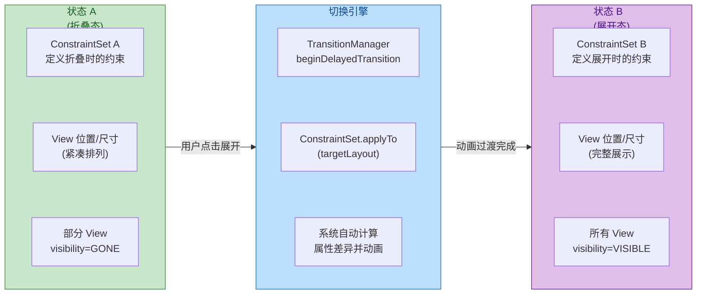

#### ConstraintSet 的三种定义方式

ConstraintSet 是一个纯数据类，它存储了一套完整的约束关系快照。你可以通过以下三种方式来构建一个 ConstraintSet：

**方式一：从现有 ConstraintLayout 克隆（Clone）**

这是最常用的起步方式。先在 XML 中定义好"默认状态"的布局，然后在代码中 `clone` 当前布局的约束作为基础集，再在此基础上做局部修改来生成其他状态。

```kotlin
// 创建两个 ConstraintSet 实例，分别代表折叠态和展开态
val collapsedSet = ConstraintSet()  // 折叠态约束集
val expandedSet = ConstraintSet()   // 展开态约束集

// 从当前布局 XML 克隆出"折叠态"的全部约束
// clone() 会完整复制 ConstraintLayout 中所有子 View 的约束、margin、尺寸等信息
collapsedSet.clone(binding.root)    // binding.root 是 ConstraintLayout

// 同样克隆一份作为"展开态"的基础
expandedSet.clone(binding.root)

// 在展开态基础上修改特定 View 的约束
// 例如：将详情区域从 GONE 改为 VISIBLE
expandedSet.setVisibility(R.id.detailSection, ConstraintSet.VISIBLE)

// 将封面图从 100dp 改为 250dp 高度
expandedSet.constrainHeight(R.id.albumCover, 250.dp)

// 将播放按钮从顶部偏移改为底部偏移
expandedSet.connect(
    R.id.btnPlay,                              // 目标 View 的 id
    ConstraintSet.TOP,                         // 目标 View 的 top 边
    R.id.albumCover,                           // 锚点 View 的 id
    ConstraintSet.BOTTOM,                      // 锚点 View 的 bottom 边
    16.dp                                      // margin = 16dp
)
```

**方式二：从独立的 XML 布局文件加载**

当两个状态差异巨大、修改项非常多时，不如直接维护两份独立的 XML 布局文件。注意：两份 XML 中的 **View id 必须完全一致**，因为 ConstraintSet 是通过 id 来匹配 View 的。

```kotlin
// 从两个不同的 XML 布局文件加载约束
val collapsedSet = ConstraintSet()
val expandedSet = ConstraintSet()

// R.layout.player_collapsed 和 R.layout.player_expanded
// 这两个 XML 包含完全相同的 View id 集合，但约束、尺寸、visibility 不同
collapsedSet.clone(context, R.layout.player_collapsed)  // 从布局资源加载
expandedSet.clone(context, R.layout.player_expanded)    // 从另一个布局资源加载
```

**方式三：纯代码构建**

极少数场景下需要完全在代码中构建约束（例如约束参数来自服务端配置）。此时可以直接调用 ConstraintSet 的 API 逐条添加约束。这种方式代码冗长、可读性差，不推荐作为常规方案。

```kotlin
// 纯代码构建约束集（不推荐作为日常方案，但展示 API 的灵活性）
val dynamicSet = ConstraintSet()

// 必须先 clone 或手动创建所有 View 的约束条目
dynamicSet.clone(binding.root)

// 清除某个 View 的全部约束，然后重新建立
dynamicSet.clear(R.id.titleText)

// 为 titleText 设置宽高
dynamicSet.constrainWidth(R.id.titleText, ConstraintSet.MATCH_CONSTRAINT)  // 0dp
dynamicSet.constrainHeight(R.id.titleText, ConstraintSet.WRAP_CONTENT)     // wrap

// 逐条添加约束连接
dynamicSet.connect(R.id.titleText, ConstraintSet.START, ConstraintSet.PARENT_ID, ConstraintSet.START, 16.dp)
dynamicSet.connect(R.id.titleText, ConstraintSet.END, ConstraintSet.PARENT_ID, ConstraintSet.END, 16.dp)
dynamicSet.connect(R.id.titleText, ConstraintSet.TOP, ConstraintSet.PARENT_ID, ConstraintSet.TOP, 24.dp)
```

#### 带动画的状态切换实战

下面演示一个完整的播放器面板折叠/展开切换，包含动画过渡：

```kotlin
class PlayerActivity : AppCompatActivity() {

    // 标记当前是否处于展开状态
    private var isExpanded = false

    // 两套约束集：折叠态 & 展开态
    private val collapsedSet = ConstraintSet()
    private val expandedSet = ConstraintSet()

    override fun onCreate(savedInstanceState: Bundle?) {
        super.onCreate(savedInstanceState)
        setContentView(R.layout.activity_player)

        // 获取根 ConstraintLayout 引用
        val root = findViewById<ConstraintLayout>(R.id.playerRoot)

        // ---- 初始化折叠态约束 ----
        // 直接克隆当前 XML 布局中的默认约束（XML 按折叠态设计）
        collapsedSet.clone(root)

        // ---- 初始化展开态约束 ----
        // 方案 A：从独立 XML 加载（推荐，两种状态差异大时更清晰）
        expandedSet.clone(this, R.layout.activity_player_expanded)

        // ---- 点击切换按钮触发状态切换 ----
        findViewById<View>(R.id.btnToggle).setOnClickListener {
            // 取反状态标记
            isExpanded = !isExpanded

            // 1. 开启延迟过渡动画
            //    TransitionManager 会记录当前所有子 View 的位置/尺寸/透明度/可见性
            //    然后在约束应用后，自动计算差异并生成补间动画
            val transition = AutoTransition().apply {
                duration = 300                     // 动画时长 300ms
                interpolator = FastOutSlowInInterpolator()  // Material Design 标准插值器
            }
            TransitionManager.beginDelayedTransition(root, transition)

            // 2. 根据目标状态选择对应的 ConstraintSet 并应用
            if (isExpanded) {
                expandedSet.applyTo(root)          // 应用展开态约束
            } else {
                collapsedSet.applyTo(root)         // 应用折叠态约束
            }
            // applyTo() 内部会重新设置每个子 View 的 LayoutParams
            // 然后触发 requestLayout()
            // TransitionManager 捕获到布局变化，自动执行动画
        }
    }
}
```

这段代码的核心流程可以归纳为：**记录旧状态 → 应用新约束 → 系统自动动画**。`TransitionManager.beginDelayedTransition()` 实际上做了两件事：它先对当前布局做一次"快照"（snapshot），然后在下一帧 Layout 完成后做第二次"快照"，最后对两次快照之间的差异自动生成属性动画（`ObjectAnimator`）。因此你不需要手动写任何动画代码——移动、缩放、淡入淡出全部由框架自动完成。

#### 多状态管理的架构建议

当页面存在 3 个及以上的 UI 状态时（例如：加载中 / 空数据 / 正常列表 / 错误页），建议采用以下架构：

```kotlin
// 定义一个枚举类来描述所有可能的 UI 状态
enum class PageState {
    LOADING,       // 加载中：显示骨架屏/进度条
    EMPTY,         // 空数据：显示空状态插画
    CONTENT,       // 正常内容：显示列表/表单
    ERROR          // 错误页：显示重试按钮
}

class MultiStateManager(
    private val root: ConstraintLayout,   // 目标 ConstraintLayout
    private val context: Context
) {
    // 使用 Map 存储每个状态对应的 ConstraintSet
    // key = PageState 枚举值，value = 对应的约束集
    private val stateSets = mutableMapOf<PageState, ConstraintSet>()

    // 记录当前状态，防止重复切换
    private var currentState: PageState? = null

    init {
        // 初始化时从不同的 XML 布局文件加载各状态约束
        stateSets[PageState.LOADING] = ConstraintSet().apply {
            clone(context, R.layout.state_loading)    // 加载态布局
        }
        stateSets[PageState.EMPTY] = ConstraintSet().apply {
            clone(context, R.layout.state_empty)      // 空数据布局
        }
        stateSets[PageState.CONTENT] = ConstraintSet().apply {
            clone(context, R.layout.state_content)    // 正常内容布局
        }
        stateSets[PageState.ERROR] = ConstraintSet().apply {
            clone(context, R.layout.state_error)      // 错误态布局
        }
    }

    /**
     * 切换到目标状态，带可选动画
     * @param target 目标状态枚举
     * @param animate 是否启用过渡动画，默认 true
     */
    fun transitionTo(target: PageState, animate: Boolean = true) {
        // 如果已处于目标状态，跳过
        if (target == currentState) return

        // 从 Map 中取出对应的 ConstraintSet
        val targetSet = stateSets[target] ?: return

        if (animate) {
            // 使用 ChangeBounds + Fade 组合过渡效果
            val transitionSet = TransitionSet().apply {
                addTransition(ChangeBounds())         // 位置/尺寸变化动画
                addTransition(Fade())                 // 可见性变化淡入淡出
                duration = 250                        // 统一时长
                interpolator = FastOutSlowInInterpolator()
            }
            TransitionManager.beginDelayedTransition(root, transitionSet)
        }

        // 应用目标约束集
        targetSet.applyTo(root)

        // 更新当前状态记录
        currentState = target
    }
}
```

这种 **"状态枚举 + ConstraintSet Map"** 模式的优势在于：

- **单一容器**：所有状态共享同一个 ConstraintLayout 和同一组子 View，不存在 `ViewStub` 延迟加载的复杂性。
- **声明式状态切换**：业务层只需调用 `transitionTo(PageState.LOADING)`，无需关心具体哪些 View 要 show/hide。
- **自动动画**：任何状态之间的切换都自带平滑过渡，无需额外动画代码。
- **可预览**：每个状态对应一个独立 XML 文件，可以在 Android Studio Preview 中直接预览效果。
- **与 MVVM/MVI 天然契合**：ViewModel 暴露 `LiveData<PageState>` 或 `StateFlow<PageState>`，UI 层 `observe` 后直接调用 `transitionTo()`，数据与视图完全解耦。

需要注意的是，当状态非常多（超过 5 个）或者不同状态之间的 View 集合差异太大（A 状态有 10 个 View，B 状态只用其中 2 个），ConstraintSet 方案可能导致大量 View 长期处于 `GONE` 状态却仍占据内存。此时应权衡考虑 **Fragment 切换** 或 **ViewStub 懒加载** 方案，或者结合 `RecyclerView` 的多 ViewType 机制来处理。

---

**📝 练习题**

在一个 ConstraintLayout 中有 20 个子 View 的复杂表单页面，原先使用 3 层嵌套的 RelativeLayout 实现。迁移到单层 ConstraintLayout 后，关于性能变化，以下哪项描述最准确？


A. Measure 阶段耗时不变，因为子 View 总数相同


B. 最内层子 View 的 onMeasure 调用次数从最多 8 次降至 1~2 次，Measure 阶段整体耗时显著下降


C. Draw 阶段耗时显著下降，但 Measure 阶段无变化


D. ConstraintLayout 因 Cassowary 求解器开销较大，在 20 个子 View 规模下性能反而不如嵌套 RelativeLayout


**【答案】** B

**【解析】** RelativeLayout 的核心性能问题在于双重测量机制——每一层 RelativeLayout 都会对其子 View 执行 2 次 Measure Pass。当存在 3 层嵌套时，最内层子 View 可能被测量 2³ = 8 次。ConstraintLayout 使用 Cassowary 线性约束求解算法，将所有约束关系建模为方程组一次性求解，因此子 View 通常只需经历 1~2 次 onMeasure 调用。此外，从 3 层嵌套降至 1 层扁平结构，也减少了视图树遍历深度，进一步缩短了 Measure/Layout 阶段的整体耗时。选项 A 忽略了嵌套带来的指数级测量开销；选项 C 虽然扁平化确实能减少 Overdraw 从而改善 Draw 阶段，但 Measure 阶段的改善才是核心收益；选项 D 的说法不成立——Cassowary 求解器的初始化开销在 3~4 个 View 的极简场景下才可能抵消优势，在 20 个 View 的规模下 ConstraintLayout 性能远优于嵌套 RelativeLayout。

---

**📝 练习题**

使用 ConstraintSet 实现页面多状态切换时，以下哪种做法是 **错误** 的？


A. 为每个 UI 状态维护一个独立的 XML 布局文件，确保所有文件中的 View id 保持一致


B. 在 `ConstraintSet.applyTo()` 之前调用 `TransitionManager.beginDelayedTransition()` 来实现自动过渡动画


C. 两个状态的 XML 布局文件可以包含完全不同的 View id 集合，ConstraintSet 会自动处理 View 的创建和销毁


D. 通过 `ConstraintSet.clone(context, R.layout.xxx)` 可以从一个布局资源文件中加载约束关系


**【答案】** C

**【解析】** ConstraintSet 是一个**纯约束数据容器**，它只存储约束关系（位置、尺寸、margin、visibility 等），**不负责创建或销毁 View**。当调用 `applyTo()` 时，ConstraintSet 通过 View id 在目标 ConstraintLayout 中查找已有的 View 并修改其 `LayoutParams`。如果某个 id 在 ConstraintSet 中有记录但在实际布局中不存在对应 View，该条约束会被忽略；反之，如果某个 View 存在但 ConstraintSet 中没有其约束记录，该 View 会保持原来的状态。因此，两个状态 XML 中的 View id 必须与实际 ConstraintLayout 中的子 View id **保持一致**。选项 A 的做法正确，是维护多状态的推荐方案；选项 B 正确描述了 TransitionManager 的调用时序；选项 D 是 ConstraintSet 加载约束的标准 API。

---

## 流式布局 Flow

在实际的 Android 应用开发中，我们经常会遇到这样一类 UI 需求：一组数量不固定的子控件（例如标签 Tag、筛选条件、技能芯片 Chip）需要像文本一样从左到右依次排列，排满一行后自动换到下一行。在传统方案中，开发者往往需要引入 `FlexboxLayout`（Google 提供的独立库）或者手写自定义 `ViewGroup` 来实现这种"流式"排列效果。而从 **ConstraintLayout 2.0** 开始，官方直接内置了一个名为 **`Flow`** 的虚拟辅助控件（Virtual Helper），它无需额外依赖，即可在 ConstraintLayout 的扁平化体系内优雅地实现流式布局。

`Flow` 的本质与前面章节介绍的 `Guideline`、`Barrier`、`Group` 一脉相承——它继承自 `VirtualLayout`，本身 **不参与绘制**（运行时宽高为 0），仅通过 **约束关系** 控制其所引用的子控件的位置与排列方式。但与简单的 `Group`（只做批量可见性控制）不同，`Flow` 拥有完善的 **排列算法**：它能够根据可用空间自动决定每一行（或每一列）放置多少个子控件，并在行内（或列内）按照指定的对齐与间距规则分配空间。这使得许多原本需要嵌套 `LinearLayout` 或引入第三方库才能完成的排版，现在仅用一个扁平的 ConstraintLayout 加一个 `Flow` 就能搞定，布局层级降低的同时，measure/layout 的性能也随之提升。

### Wrap 换行模式

`Flow` 最核心的属性是 **`flow_wrapMode`**，它决定了当子控件在主轴方向上排列"溢出"时，`Flow` 该如何处理。这个属性有三个可选值：`none`、`chain` 和 `aligned`，它们分别对应三种截然不同的排列策略。理解这三种模式是掌握 `Flow` 的关键。

**1. `none`（不换行）**

当 `flow_wrapMode="none"` 时，所有被 `Flow` 引用的子控件将被强制排列在 **同一行**（水平 Flow）或 **同一列**（垂直 Flow）中，无论空间是否足够。如果子控件总宽度超出了 `Flow` 本身的宽度，超出部分会被 **裁剪** 或溢出屏幕，而不会自动换行。这种模式在逻辑上最为简单——`Flow` 把所有子控件组织成一条 **单链（Chain）**，链的行为（Spread / SpreadInside / Packed）由 `flow_horizontalStyle`（或 `flow_verticalStyle`）属性控制。

`none` 模式适用于你能确定子控件数量和尺寸不会超出容器宽度的场景，例如底部固定的 3~4 个操作按钮。但在标签云这种数量动态变化的场景下，`none` 模式几乎不可用，因为它根本不具备"流式"能力。可以把 `none` 理解为 `Flow` 的一个 **退化形态**——它退化为一条普通的 Chain。

**2. `chain`（换行 + 独立链）**

这是 `Flow` 最常用的模式。当设置 `flow_wrapMode="chain"` 时，`Flow` 会在主轴方向上逐一放置子控件；一旦当前行（或列）剩余空间不足以容纳下一个子控件，就 **自动换行**，将该控件放到新的一行。每一行的子控件会被组织成一条 **独立的 Chain**，这意味着每一行都可以独立地按照指定的 Chain 风格（Spread、SpreadInside、Packed）来分配行内空间。

"独立链"这个概念非常重要。假设第一行放了 4 个控件，第二行放了 2 个控件，那么第一行的 4 个控件构成一条 Spread Chain，第二行的 2 个控件构成另一条 Spread Chain。两条链的间距分配是 **各自独立** 计算的，因此第二行的 2 个控件不会与第一行的 4 个控件产生列对齐效果——它们只是在各自行内均匀分布而已。这种行为与 CSS 中 `flex-wrap: wrap` 的默认效果非常类似。

**3. `aligned`（换行 + 列对齐）**

`aligned` 模式在 `chain` 的基础上增加了一个额外约束：**跨行的列对齐**。在此模式下，`Flow` 不仅会自动换行，还会确保不同行的子控件在交叉轴方向上"对齐成列"，视觉效果类似一个 **网格（Grid）**。具体来说，`Flow` 会根据第一行的控件数量（或所有行中控件数量最多的一行）来确定"列模板"，后续行的控件会尽量与上一行的列位置对齐。

`aligned` 非常适合构建轻量级的网格布局，例如设置页面中每行 3 个功能入口的九宫格。但需要注意：由于存在列对齐约束，行内空间分配不再像 `chain` 模式那样灵活，子控件的宽度和间距会受到"列宽"的限制。如果不同行的控件宽度差异较大，`aligned` 模式可能会产生不理想的留白。

下面通过一个对比示意图来直观理解三种模式的差异：

```mermaid
graph LR
    subgraph NoneMode["wrap_mode = none\n(不换行)"]
        direction TB
        N1["A B C D E F →溢出"]
        N2["所有控件强制单行排列"]
        N3["超出容器宽度则裁剪"]
        N1 ~~~ N2
        N2 ~~~ N3
    end

    subgraph ChainMode["wrap_mode = chain\n(换行+独立链)"]
        direction TB
        C1["A   B   C   D"]
        C2["E   F"]
        C3["每行独立分配间距\n行间无列对齐"]
        C1 ~~~ C2
        C2 ~~~ C3
    end

    subgraph AlignedMode["wrap_mode = aligned\n(换行+列对齐)"]
        direction TB
        A1["A   B   C   D"]
        A2["E   F        "]
        A3["跨行列对齐\n类似网格效果"]
        A1 ~~~ A2
        A2 ~~~ A3
    end

    NoneMode -->|"空间不足\n需要换行"| ChainMode -->|"需要列对齐"| AlignedMode

    classDef greenBox fill:#E8F5E9,stroke:#43A047,color:#1B5E20
    classDef blueBox fill:#E3F2FD,stroke:#1E88E5,color:#0D47A1
    classDef tealBox fill:#E0F2F1,stroke:#00897B,color:#004D40

    class NoneMode greenBox
    class ChainMode blueBox
    class AlignedMode tealBox
```

以下是三种模式在 XML 中的典型写法：

```xml
<!-- Flow 虚拟辅助控件：引用需要流式排列的子控件 ID -->
<androidx.constraintlayout.helper.widget.Flow
    android:id="@+id/flow_tags"
    android:layout_width="0dp"
    android:layout_height="wrap_content"
    
    <!-- 将 Flow 水平撑满父容器 -->
    app:layout_constraintStart_toStartOf="parent"
    app:layout_constraintEnd_toEndOf="parent"
    app:layout_constraintTop_toTopOf="parent"
    
    <!-- 核心属性：换行模式，可选 none / chain / aligned -->
    app:flow_wrapMode="chain"
    
    <!-- 排列方向：horizontal(默认)表示主轴水平，vertical 表示主轴垂直 -->
    app:flow_horizontalAlign="start"
    
    <!-- 引用需要被 Flow 管理的子控件 ID 列表 -->
    app:constraint_referenced_ids="chip1,chip2,chip3,chip4,chip5,chip6,chip7" />

<!-- 被 Flow 管理的子控件无需设置任何约束，Flow 会自动接管 -->
<com.google.android.material.chip.Chip
    android:id="@+id/chip1"
    android:layout_width="wrap_content"
    android:layout_height="wrap_content"
    android:text="Android" />

<!-- 其余 chip2 ~ chip7 同理省略 -->
```

关于 `flow_wrapMode` 的选型建议：如果你的场景是 **标签云 / 筛选条件**（控件数量动态、宽度不等），优先使用 `chain`；如果你的场景是 **功能网格 / 等宽卡片**（控件尺寸统一、需要对齐感），优先使用 `aligned`；只有在 **确保不换行** 的简单场景才使用 `none`。

### Gap 间距

在流式布局中，控件之间的间距控制至关重要。如果间距设置不合理，标签之间可能会挤在一起或者离得太远，严重影响视觉体验。`Flow` 提供了一套完善的间距属性体系，允许开发者分别控制 **主轴方向（行内）间距** 和 **交叉轴方向（行间）间距**。

**主轴间距（Horizontal Gap / Vertical Gap）**

对于水平方向的 `Flow`（默认情况），`flow_horizontalGap` 控制的是同一行内相邻控件之间的水平距离，而 `flow_verticalGap` 控制的是相邻行之间的垂直距离。如果 `Flow` 的方向是 `vertical`（纵向流），则这两个属性的作用轴交换：`flow_verticalGap` 变成列内间距，`flow_horizontalGap` 变成列间间距。

这两个属性的语义非常直观：

- **`flow_horizontalGap`**：同行相邻控件的水平间距（单位 dp）。
- **`flow_verticalGap`**：相邻行的垂直间距（单位 dp）。

这里有一个容易混淆的点需要特别说明：`flow_horizontalGap` 和 `flow_verticalGap` 设置的是 **控件之间的间距**，而不是控件到 `Flow` 边界的间距。如果你需要控制 `Flow` 整体的外边距，应该对 `Flow` 控件本身设置 `android:padding` 或在 `Flow` 的约束上使用 `margin`。

此外，Gap 间距与 Chain 风格之间存在一个微妙的交互关系。当 `flow_wrapMode="chain"` 且行内 Chain 风格为 `spread` 时，行内控件会被均匀分布，此时 `flow_horizontalGap` 实际上充当的是 **最小间距**——如果均匀分布后的间距大于 `flow_horizontalGap`，则以实际计算值为准；如果行内空间较紧，控件间距不会小于 `flow_horizontalGap`，而是会触发换行。而当 Chain 风格为 `packed` 时，控件会紧密排列在一起，此时 `flow_horizontalGap` 就是控件之间的 **精确间距**。

```xml
<androidx.constraintlayout.helper.widget.Flow
    android:id="@+id/flow_tags"
    android:layout_width="0dp"
    android:layout_height="wrap_content"
    app:layout_constraintStart_toStartOf="parent"
    app:layout_constraintEnd_toEndOf="parent"
    app:layout_constraintTop_toTopOf="parent"
    
    <!-- 换行模式：自动换行，每行独立链 -->
    app:flow_wrapMode="chain"
    
    <!-- 行内控件水平间距：8dp -->
    app:flow_horizontalGap="8dp"
    
    <!-- 行间垂直间距：12dp -->
    app:flow_verticalGap="12dp"
    
    <!-- 首行 Chain 风格：packed 表示控件紧密排列 -->
    app:flow_firstHorizontalStyle="packed"
    
    <!-- 首行对齐偏移：0 表示左对齐 (取值 0.0~1.0) -->
    app:flow_firstHorizontalBias="0"
    
    <!-- 引用被管理的子控件 -->
    app:constraint_referenced_ids="tag1,tag2,tag3,tag4,tag5,tag6" />
```

**间距与 `android:layout_margin` 的区别**

一个常见的疑问是：既然子控件本身可以设置 `layout_margin`，为什么还需要 `flow_horizontalGap`？答案在于语义和维护性。`layout_margin` 是控件自身的属性，每个控件可以不同；而 `flow_horizontalGap` 是 `Flow` 级别的统一配置，一处设置，全局生效。在流式布局场景中，通常希望所有标签之间保持一致的间距，此时用 `flow_horizontalGap` 远比在每个子控件上重复设置 `margin` 更加简洁和可维护。

如果同时设置了 `flow_horizontalGap` 和子控件的 `layout_marginStart`/`layout_marginEnd`，两者会 **叠加**。例如 `flow_horizontalGap="8dp"` 且子控件 `layout_marginEnd="4dp"`、下一个控件 `layout_marginStart="4dp"`，那么实际视觉间距将是 `8 + 4 + 4 = 16dp`。因此实践中建议 **只用其中一种方式** 控制间距，避免叠加导致难以预测的效果。

### 对齐方式

`Flow` 的对齐属性决定了子控件在行内（主轴）和行间（交叉轴）的排列方式。`Flow` 同时借鉴了 Chain 的风格概念和传统布局的对齐概念，提供了多个维度的对齐控制。

**1. 行内 Chain 风格（`flow_horizontalStyle` / `flow_verticalStyle`）**

这组属性控制 **每一行** 内部的子控件如何分配空间。可选值直接对应 Chain 的三种经典风格：

- **`spread`**：控件均匀分布，包括首尾与容器边界的间距也均等分配。这是默认值。
- **`spread_inside`**：首尾控件贴边，中间控件均匀分布。
- **`packed`**：所有控件紧密排列在一起（间距由 `flow_horizontalGap` 决定），整体位置由 `Bias` 控制。

特别地，`Flow` 允许对 **第一行** 和 **其余行** 分别设置不同的 Chain 风格：

- `flow_firstHorizontalStyle`：仅影响第一行的 Chain 风格。
- `flow_horizontalStyle`：影响除第一行外所有行的 Chain 风格。

这个设计看似奇怪，但在实际 UI 中很有用。例如，某些设计稿要求第一行标签居中展示（`packed` + `bias=0.5`），而后续行标签左对齐（`packed` + `bias=0`），通过区分首行与其余行的风格即可实现。

**2. 交叉轴对齐（`flow_horizontalAlign` / `flow_verticalAlign`）**

当 `flow_wrapMode` 为 `chain` 或 `aligned` 时，如果同一行内的子控件高度不一致（比如有的标签是单行文字，有的是双行），就需要 **行内交叉轴对齐** 来决定它们在垂直方向上的对齐方式。`flow_verticalAlign`（对于水平 Flow）提供以下选项：

- **`top`**：所有控件顶部对齐。
- **`bottom`**：所有控件底部对齐。
- **`center`**：所有控件垂直居中对齐。
- **`baseline`**：按文字基线对齐——这在标签中特别有用，因为不同字号的文字如果不按基线对齐，视觉上会显得参差不齐。

类似地，`flow_horizontalAlign`（对于垂直 Flow）控制列内水平对齐，可选值为 `start`、`end`、`center`。

**3. Bias 偏移**

当 Chain 风格为 `packed` 时，所有控件打包成一个整体，默认居中放置（`bias=0.5`）。通过设置 `flow_firstHorizontalBias` 和 `flow_horizontalBias`，可以控制打包整体在行内的偏移位置：

- `0.0`：整体靠左（水平 Flow）或靠顶（垂直 Flow）。
- `0.5`：整体居中（默认值）。
- `1.0`：整体靠右（水平 Flow）或靠底（垂直 Flow）。

下面用一个完整示例展示常见的"标签云左对齐"效果，这也是最高频的 `Flow` 使用场景：

```xml
<?xml version="1.0" encoding="utf-8"?>
<!-- 根布局：ConstraintLayout 作为唯一的扁平容器 -->
<androidx.constraintlayout.widget.ConstraintLayout
    xmlns:android="http://schemas.android.com/apk/res/android"
    xmlns:app="http://schemas.android.com/apk/res-auto"
    android:layout_width="match_parent"
    android:layout_height="wrap_content"
    android:padding="16dp">

    <!-- Flow 虚拟辅助控件：控制标签的流式排列 -->
    <androidx.constraintlayout.helper.widget.Flow
        android:id="@+id/flow_tag_cloud"
        android:layout_width="0dp"
        android:layout_height="wrap_content"
        
        <!-- Flow 自身约束：水平撑满父容器 -->
        app:layout_constraintStart_toStartOf="parent"
        app:layout_constraintEnd_toEndOf="parent"
        app:layout_constraintTop_toTopOf="parent"
        
        <!-- 换行模式：chain，自动换行且每行独立分配 -->
        app:flow_wrapMode="chain"
        
        <!-- 行内 Chain 风格：packed，控件紧密排列 -->
        app:flow_firstHorizontalStyle="packed"
        app:flow_horizontalStyle="packed"
        
        <!-- Bias 偏移：0 表示左对齐 -->
        app:flow_firstHorizontalBias="0"
        app:flow_horizontalBias="0"
        
        <!-- 行内交叉轴对齐：center，同行控件垂直居中 -->
        app:flow_verticalAlign="center"
        
        <!-- 间距控制 -->
        app:flow_horizontalGap="8dp"
        app:flow_verticalGap="8dp"
        
        <!-- 引用所有标签控件 -->
        app:constraint_referenced_ids="tag1,tag2,tag3,tag4,tag5,tag6,tag7,tag8" />

    <!-- 以下为被 Flow 管理的标签控件，无需设置约束 -->
    <TextView
        android:id="@+id/tag1"
        android:layout_width="wrap_content"
        android:layout_height="wrap_content"
        android:text="Kotlin"
        android:paddingHorizontal="12dp"
        android:paddingVertical="6dp"
        android:background="@drawable/tag_background" />

    <!-- tag2 ~ tag8 结构相同，仅 text 不同，此处省略 -->

</androidx.constraintlayout.widget.ConstraintLayout>
```

关键属性组合解读：`flow_wrapMode="chain"` + `flow_horizontalStyle="packed"` + `flow_horizontalBias="0"` 这三者配合，实现的效果是——每行内的控件紧密排列（`packed`），整体偏移到最左侧（`bias=0`），行满则自动换行（`chain`）。这就是标签云最经典的"左对齐、自动换行、均匀间距"效果。

**4. 对齐方式汇总**

以下用图表清晰总结 `Flow` 各种对齐属性之间的关系：

```mermaid
graph LR
    subgraph MainAxis["主轴方向控制\n(行内空间分配)"]
        direction TB
        MS["flow_horizontalStyle\n(非首行链风格)"]
        MF["flow_firstHorizontalStyle\n(首行链风格)"]
        MB["flow_horizontalBias\n(packed 时偏移量)"]
        MFB["flow_firstHorizontalBias\n(packed 首行偏移)"]
        MS ~~~ MF
        MF ~~~ MB
        MB ~~~ MFB
    end

    subgraph CrossAxis["交叉轴方向控制\n(行间对齐方式)"]
        direction TB
        CV["flow_verticalAlign\ntop/bottom/center/baseline"]
        CH["flow_horizontalAlign\nstart/end/center"]
        CN["适用于同行内\n控件高度不一致时"]
        CV ~~~ CH
        CH ~~~ CN
    end

    subgraph SpaceCtrl["间距控制"]
        direction TB
        SH["flow_horizontalGap\n行内水平间距"]
        SV["flow_verticalGap\n行间垂直间距"]
        SM["android:margin\n控件自身外边距(叠加)"]
        SH ~~~ SV
        SV ~~~ SM
    end

    MainAxis -->|"配合"| CrossAxis -->|"配合"| SpaceCtrl

    classDef greenStyle fill:#C8E6C9,stroke:#388E3C,color:#1B5E20
    classDef blueStyle fill:#BBDEFB,stroke:#1976D2,color:#0D47A1
    classDef amberStyle fill:#FFF9C4,stroke:#F9A825,color:#E65100

    class MainAxis greenStyle
    class CrossAxis blueStyle
    class SpaceCtrl amberStyle
```

**5. 代码中动态控制 Flow**

在某些场景下，标签数据来自服务端，数量和内容在编译期不确定。此时需要在代码中动态添加子控件并将其纳入 `Flow` 管理。`Flow` 提供了 `addView()` 和 `removeView()` 等 API 来实现动态管理：

```kotlin
// 获取 Flow 和父容器的引用
val flow = findViewById<Flow>(R.id.flow_tag_cloud) // 获取 Flow 虚拟辅助控件
val parent = findViewById<ConstraintLayout>(R.id.root) // 获取 ConstraintLayout 父容器

// 模拟从服务端获取的标签数据列表
val tags = listOf("Kotlin", "Compose", "Coroutine", "Flow", "Room", "Hilt", "Navigation")

// 遍历标签数据，动态创建 TextView 并添加到 Flow
tags.forEach { tagText ->
    // 创建 TextView 实例
    val chip = TextView(this).apply {
        id = View.generateViewId()            // 生成唯一 ID（Flow 通过 ID 引用控件）
        text = tagText                         // 设置标签文本
        setPadding(32, 16, 32, 16)            // 设置内边距（单位 px，实际应转 dp）
        setBackgroundResource(R.drawable.tag_bg) // 设置标签背景（圆角矩形等）
        setTextColor(Color.WHITE)              // 设置文字颜色
    }

    // 第一步：将 TextView 添加到 ConstraintLayout 中（此时控件还没有位置）
    parent.addView(chip)

    // 第二步：将该控件的 ID 注册到 Flow 中，Flow 会自动接管其定位
    flow.addView(chip)
}
```

需要注意的一个常见坑：`flow.addView(chip)` 内部实际上是把控件的 ID 追加到 `constraint_referenced_ids` 列表中，因此 **必须先确保控件已有有效 ID**（通过 `View.generateViewId()` 生成），否则 `Flow` 无法正确引用该控件。同时，控件 **必须先被添加到 ConstraintLayout 中**（`parent.addView(chip)`），然后再调用 `flow.addView(chip)`，顺序不能颠倒。

另外，如果需要在运行时清空所有标签并重新加载，建议先调用 `flow.setReferencedIds(intArrayOf())` 清空引用列表，再移除子控件，最后重新添加。直接逐个 `removeView()` 在控件数量较多时可能引发多次重排，性能不佳。

**实战技巧：Flow 与 `maxElementsWrap` 强制每行数量**

在 `aligned` 模式下，有时我们希望固定每行显示的控件数量（例如每行 3 个），而不是让 `Flow` 根据可用空间自动决定。`Flow` 提供了 `flow_maxElementsWrap` 属性来满足这个需求：

```xml
<androidx.constraintlayout.helper.widget.Flow
    android:id="@+id/flow_grid"
    android:layout_width="0dp"
    android:layout_height="wrap_content"
    app:layout_constraintStart_toStartOf="parent"
    app:layout_constraintEnd_toEndOf="parent"
    app:layout_constraintTop_toTopOf="parent"
    
    <!-- aligned 模式：换行 + 列对齐，呈现网格效果 -->
    app:flow_wrapMode="aligned"
    
    <!-- 每行最多放 3 个控件，超出则换行 -->
    app:flow_maxElementsWrap="3"
    
    <!-- 间距 -->
    app:flow_horizontalGap="12dp"
    app:flow_verticalGap="12dp"
    
    app:constraint_referenced_ids="item1,item2,item3,item4,item5,item6" />
```

设置 `flow_maxElementsWrap="3"` 后，即使一行还有空间放第 4 个控件，`Flow` 也会强制换行。配合 `aligned` 模式的列对齐特性，这就构成了一个简易的 **3 列网格**，无需引入 `RecyclerView` 的 `GridLayoutManager`，适合功能入口、设置分组等静态网格场景。

不过需要注意，`flow_maxElementsWrap` 在 `none` 模式下 **无效**（因为 `none` 根本不换行），在 `chain` 模式下有效但不会产生列对齐效果。只有在 `aligned` 模式下，`flow_maxElementsWrap` 才能发挥出"等分网格"的最佳效果。

---

**📝 练习题**

在 ConstraintLayout 中使用 `Flow` 实现标签云布局时，以下哪种属性组合能实现"自动换行、行内左对齐、标签紧密排列"的效果？

A. `flow_wrapMode="none"` + `flow_horizontalStyle="spread"` + `flow_horizontalBias="0"`


B. `flow_wrapMode="chain"` + `flow_horizontalStyle="packed"` + `flow_horizontalBias="0"`


C. `flow_wrapMode="aligned"` + `flow_horizontalStyle="spread"` + `flow_horizontalBias="0.5"`


D. `flow_wrapMode="chain"` + `flow_horizontalStyle="spread_inside"` + `flow_horizontalBias="0"`


**【答案】** B

**【解析】** 实现"自动换行、行内左对齐、标签紧密排列"需要三个条件同时满足：第一，`flow_wrapMode="chain"` 启用自动换行能力（排除 A，`none` 不换行）；第二，`flow_horizontalStyle="packed"` 使行内控件紧密排列而非均匀分散（排除 C 和 D，`spread` / `spread_inside` 会将控件均匀分布在行内，导致标签之间产生额外空隙，不符合"紧密排列"的要求）；第三，`flow_horizontalBias="0"` 将打包后的整体推向左侧实现左对齐。三者缺一不可：没有 `packed` 则标签不会紧密排列；没有 `bias=0` 则标签会居中而非左对齐；没有 `chain` 则根本不会换行。因此只有 B 选项完全匹配题目的三个要求。

---

**📝 练习题**

关于 `Flow` 的 `flow_maxElementsWrap` 属性，下列说法正确的是？

A. 在 `flow_wrapMode="none"` 模式下，设置 `flow_maxElementsWrap="3"` 可以强制每行显示 3 个控件


B. 在 `flow_wrapMode="chain"` 模式下，设置 `flow_maxElementsWrap="3"` 后，每行最多 3 个控件且跨行自动列对齐


C. 在 `flow_wrapMode="aligned"` 模式下，设置 `flow_maxElementsWrap="3"` 可以实现每行固定 3 个控件的网格布局


D. `flow_maxElementsWrap` 设置后会覆盖 `flow_horizontalGap` 的间距效果


**【答案】** C

**【解析】** `flow_maxElementsWrap` 用于限制每行（或每列）的最大控件数量。在 `none` 模式下，该属性无效，因为 `none` 模式根本不支持换行，所有控件始终排在一行中，因此 A 错误。在 `chain` 模式下，`flow_maxElementsWrap` 确实可以限制每行最多放 3 个控件，但 `chain` 模式的每一行是独立链，不具备跨行列对齐能力，因此 B 的"跨行自动列对齐"描述错误。在 `aligned` 模式下，`flow_maxElementsWrap="3"` 不仅限制每行最多 3 个控件，还能配合 `aligned` 的列对齐特性实现真正的网格效果，因此 C 正确。D 选项完全无关——`flow_maxElementsWrap` 控制的是每行元素数量，`flow_horizontalGap` 控制的是控件间距，两者互不干扰，可以同时使用。

---

## 本章小结

本章围绕 `ConstraintLayout` 这一 Android 现代布局的核心引擎，从底层算法原理到上层实战技巧进行了全景式梳理。下面从 **核心认知、关键技术脉络、性能思维、实践准则** 四个维度做一次系统回顾，帮助你把零散的知识点串联成一张完整的能力网络。

### 核心认知回顾

`ConstraintLayout` 之所以能够取代 `LinearLayout` 嵌套与 `RelativeLayout`，根本原因在于它将布局问题转化为一套 **线性约束方程组**，并通过 **Cassowary 增量求解算法** 在单次遍历（single-pass）中完成绝大多数场景的测量与定位。传统布局体系的最大痛点是 **嵌套层级带来的指数级 measure/layout 开销**——每多一层嵌套，子树就可能被重复测量 2^N 次。`ConstraintLayout` 通过把所有子 View 平铺在同一层级，用声明式约束替代嵌套关系，实现了真正的 **扁平化布局（Flat Hierarchy）**。这一设计哲学的核心可以浓缩为一句话：**用约束描述关系，用算法代替层级**。

理解这一点至关重要——它意味着你在编写 `ConstraintLayout` 时，心智模型应该是"我在声明一组数学关系"，而不是"我在嵌套一些容器"。每一条 `app:layout_constraintStart_toEndOf` 都是在向求解器添加一条等式或不等式，求解器会在全局范围内找到同时满足所有约束的最优解。当约束出现冲突时，系统会根据优先级和 Bias 值进行"柔性妥协"，这正是 Cassowary 算法中"弱约束 / 强约束"层次体系的应用层体现。

### 关键技术脉络梳理

本章覆盖的技术点可以按照 **"定位 → 尺寸 → 组织 → 辅助 → 动态 → 流式"** 这条主线串联起来。下面的 Mermaid 图将整章知识体系组织为一张全局地图：

```mermaid
graph LR
    subgraph Positioning["🎯 定位体系"]
        direction TB
        P1["Parent 约束\n四边锚定到父容器"]
        P2["同级约束\n控件之间相对定位"]
        P3["Bias 偏移\n水平/垂直百分比滑动"]
        P4["Gone Margin\n目标消失后的弹性间距"]
        P1 ~~~ P2
        P2 ~~~ P3
        P3 ~~~ P4
    end

    subgraph Sizing["📐 尺寸控制"]
        direction TB
        S1["wrap_content\n自适应内容"]
        S2["0dp match_constraint\n由约束决定尺寸"]
        S3["宽高比 Ratio\nW/H 比例锁定"]
        S4["Min / Max\n尺寸上下限"]
        S1 ~~~ S2
        S2 ~~~ S3
        S3 ~~~ S4
    end

    subgraph Structure["🔗 组织结构"]
        direction TB
        T1["Chain Spread\n均匀分布"]
        T2["Chain Spread Inside\n两端贴边"]
        T3["Chain Packed\n簇拥居中"]
        T4["Chain Weighted\n按权重分配"]
        T1 ~~~ T2
        T2 ~~~ T3
        T3 ~~~ T4
    end

    subgraph Helpers["🛠 辅助对象"]
        direction TB
        H1["Guideline\n百分比/固定参考线"]
        H2["Barrier\n多控件动态边界"]
        H3["Group\n批量可见性控制"]
        H4["Placeholder\n模板化占位替换"]
        H1 ~~~ H2
        H2 ~~~ H3
        H3 ~~~ H4
    end

    subgraph Dynamic["✨ 动态与流式"]
        direction TB
        D1["ConstraintSet\n运行时约束克隆与切换"]
        D2["TransitionManager\n自动补间动画"]
        D3["MotionLayout KeyFrame\n关键帧精细控制"]
        D4["Flow 流式布局\nWrap/Gap/Alignment"]
        D1 ~~~ D2
        D2 ~~~ D3
        D3 ~~~ D4
    end

    Positioning -->|"确定位置后"| Sizing -->|"确定大小后"| Structure -->|"组织排列后"| Helpers -->|"辅助增强后"| Dynamic

    classDef greenBox fill:#E8F5E9,stroke:#43A047,color:#1B5E20,rx:8
    classDef blueBox fill:#E3F2FD,stroke:#1E88E5,color:#0D47A1,rx:8
    classDef tealBox fill:#E0F2F1,stroke:#00897B,color:#004D40,rx:8
    classDef amberBox fill:#FFF8E1,stroke:#FFB300,color:#E65100,rx:8
    classDef purpleBox fill:#F3E5F5,stroke:#8E24AA,color:#4A148C,rx:8

    class Positioning greenBox
    class Sizing blueBox
    class Structure tealBox
    class Helpers amberBox
    class Dynamic purpleBox
```

**第一站：定位体系（Positioning）。** 一切布局的起点是"把控件放在哪里"。我们学习了四种约束锚定方式——Parent 约束将控件固定到父容器边缘；同级约束在控件之间建立相对关系（`toStartOf`、`toEndOf`、`toTopOf`、`toBottomOf`）；Bias 在双向约束中提供了百分比级别的精细偏移控制，从默认的 `0.5` 居中到任意位置；Gone Margin 则优雅地处理了目标控件消失后的间距坍塌问题，让布局不会因 `View.GONE` 而"变形"。这四个维度共同构成了一套完备的二维定位系统。

**第二站：尺寸控制（Sizing）。** 定位解决了"在哪"，尺寸解决了"多大"。`ConstraintLayout` 明确废弃了子 View 的 `match_parent`，取而代之的是语义更精确的 `0dp`（`match_constraint`），让控件尺寸完全由约束方程推导得出。`wrap_content` 保留了内容自适应能力，但可通过 `constrainedWidth/Height` 防止内容撑破约束边界。宽高比 `Ratio` 更是一大亮点——只需一行 `app:layout_constraintDimensionRatio="16:9"`，便可在任何屏幕上保持完美比例，广泛用于图片、视频、卡片等场景。

**第三站：组织结构（Chains）。** 当多个控件需要按规律分布时，Chain 链式结构是最强大的工具。`spread` 模式实现等间距分布，类似于 `LinearLayout` 的均分效果但无需嵌套；`spread_inside` 将首尾控件贴边、中间等分；`packed` 让所有控件簇拥在一起，配合 Bias 可整体偏移；`weighted` 通过 `layout_constraintHorizontal_weight` 实现类似 `layout_weight` 的弹性分配。链的核心价值在于：**用一维数据结构（链表）描述一组控件的分布策略，且全部在同一层级完成，零嵌套。**

**第四站：辅助与虚拟对象（Helpers）。** 真实项目中的布局需求远比"控件对齐控件"复杂。`Guideline` 提供了不可见的水平或垂直参考线，基于百分比或固定值定位，是实现"黄金分割""三分法"的利器。`Barrier` 则动态追踪一组控件的最远边缘，解决了多语言适配中"最宽标签对齐输入框"这类棘手问题。`Group` 用于批量控制一组控件的可见性，一行代码切换整个区域的显示/隐藏，避免逐个 `setVisibility()`。`Placeholder` 允许在布局模板中预留槽位，运行时将任意控件"填入"，实现布局模板化与内容解耦。这些辅助对象本身不绘制任何像素（`GONE` 状态存在），不参与渲染流水线，是真正意义上的"零成本抽象"。

**第五站：动态布局与动画（Dynamic）。** 静态布局只是起点，真正的用户体验在于"变化"。`ConstraintSet` 允许你在运行时完整克隆或手动构建一套约束集合，然后一次性 `applyTo()` 到目标 `ConstraintLayout`。配合 `TransitionManager.beginDelayedTransition()`，Android 会自动计算变更前后的差异并生成平滑的补间动画——不需要你写任何 `ObjectAnimator` 或 `ValueAnimator`。当动画需要更精细的控制时（路径弯曲、中间状态缩放旋转），`MotionLayout` 的 `KeyFrame`（`KeyPosition`、`KeyAttribute`、`KeyCycle`）提供了关键帧级别的自定义能力，让你像在时间轴编辑器中一样精确雕刻动画曲线。

**第六站：流式布局 Flow。** 作为 `ConstraintLayout` 2.0 引入的虚拟布局，`Flow` 解决了"动态数量子项自动换行"的经典问题。通过 `wrapMode` 的三种策略（`none` 不换行、`chain` 换行且每行为独立链、`aligned` 换行且跨行对齐），配合 `horizontalGap`、`verticalGap` 间距控制和多种对齐方式，`Flow` 在不引入 `RecyclerView` 的场景下优雅地实现了标签云、按钮组、网格等流式排列。它与 `Barrier`、`Group` 一样是零渲染开销的 Helper，不增加布局层级。

### 性能思维总结

性能优化贯穿本章始终，这里提炼出几条核心原则：

**原则一：扁平化是最大的性能优化。** 一个 5 层嵌套的 `LinearLayout + RelativeLayout` 结构，在每次 `requestLayout()` 时可能触发数十次冗余测量。将其改写为单层 `ConstraintLayout` 后，measure/layout pass 次数骤降，尤其在 `RecyclerView` 的 itemView 场景中，每帧节省的时间直接影响滚动流畅度。不要小看每个 item 节省的 0.5ms——在 60fps 要求下，每帧预算只有 16.6ms，乘以屏幕上可见的 10-15 个 item，这就是能否掉帧的决定因素。

**原则二：辅助对象优于嵌套容器。** 当你想"把这几个控件用一个 `LinearLayout` 包起来以便统一控制"时，停下来思考：`Group` 能否替代（批量可见性）？`Barrier` 能否替代（动态边界对齐）？`Chain` 能否替代（线性分布）？`Flow` 能否替代（换行排列）？绝大多数情况下，答案是肯定的，而且零额外层级。

**原则三：`ConstraintSet` 切换优于重新 inflate。** 多状态界面（展开/折叠、编辑/预览、横屏/竖屏）不要通过 `setContentView()` 或 `ViewStub.inflate()` 切换整个布局。更高效的方式是在同一个 `ConstraintLayout` 上，通过 `ConstraintSet.clone()` 加载不同的约束 XML，再 `applyTo()` 切换。控件对象不会重建，View 树不会重新 inflate，只是约束参数变了，配合 `TransitionManager` 还能自动获得动画效果。

**原则四：善用 `match_constraint` 而非 `wrap_content` + 嵌套限制。** 当你需要控件"填满剩余空间但不超过某个边界"时，`0dp` + 双向约束是最直接的表达。如果用 `wrap_content` 再嵌套一个容器来限制最大宽度，不但多了一层嵌套，还可能引发二次测量。

### 实践准则清单

以下是一份可直接用于 Code Review 的检查清单，涵盖本章所有核心知识点：

```text
┌─────────────────────────────────────────────────────────────────┐
│              ConstraintLayout 实践检查清单 (Checklist)            │
├──────────────────────────┬──────────────────────────────────────┤
│  检查项                   │  标准                                │
├──────────────────────────┼──────────────────────────────────────┤
│  布局层级                 │  嵌套深度 ≤ 2 层 (理想为 1 层)        │
│  match_parent            │  子 View 中不使用, 改用 0dp + 约束     │
│  约束完整性               │  每个 View 至少水平 + 垂直各一条约束    │
│  Bias 使用               │  非居中定位优先使用 Bias 而非 Margin    │
│  Gone Margin             │  有 GONE 切换的场景必须声明             │
│  Chain 选型              │  均分用 spread, 居中用 packed           │
│  辅助对象                 │  禁止为 Group/Barrier 功能额外嵌套     │
│  Guideline 单位          │  响应式用百分比, 固定栏用 dp            │
│  宽高比                   │  图片/视频/卡片 必须声明 Ratio          │
│  多状态切换               │  使用 ConstraintSet 而非多布局文件      │
│  Flow 换行               │  标签云/按钮组优先 Flow, 非 FlexboxLayout│
│  动画                    │  约束变更配合 TransitionManager          │
│  性能验证                 │  Layout Inspector 确认层级扁平          │
└──────────────────────────┴──────────────────────────────────────┘
```

### 从 ConstraintLayout 看 Android 布局演进

最后，值得从更宏观的视角理解 `ConstraintLayout` 在 Android 布局演进中的位置。Android 早期的布局系统（`LinearLayout`、`RelativeLayout`、`FrameLayout`）脱胎于传统的 **盒模型（Box Model）** 思想，通过嵌套容器构建层次结构。这种方式直观但低效——嵌套越深，测量和布局的计算量呈指数增长。`ConstraintLayout` 的出现（2016 年 Google I/O 首次发布）标志着 Android 布局从 **"嵌套盒模型"向"约束求解模型"** 的范式转变。

而后来的 **Jetpack Compose** 则更进一步，将布局完全融入声明式 UI 范式，其 `Layout` composable 本质上也是"测量约束 + 放置"的模型，与 `ConstraintLayout` 的思想一脉相承。Compose 中甚至直接提供了 `ConstraintLayout` composable，语法从 XML 变成了 Kotlin DSL，但底层的约束求解理念完全相同。因此，**深入理解 `ConstraintLayout` 的约束思维，是通向 Compose 布局系统的最佳桥梁**。

掌握本章内容后，你应该能够：用单层 `ConstraintLayout` 实现绝大多数复杂界面；灵活运用 Chain、Barrier、Flow 等工具消除嵌套；通过 `ConstraintSet` + `TransitionManager` 构建多状态动画界面；在 Code Review 中敏锐地识别布局性能隐患并给出优化方案。

---

**📝 练习题**

在一个 `ConstraintLayout` 中，View A 的左右分别约束到父容器的 `start` 和 `end`，宽度设置为 `0dp`，同时声明了 `app:layout_constraintWidth_percent="0.5"` 和 `app:layout_constraintHorizontalBias="0.3"`。关于 View A 的最终表现，下列说法正确的是：

A. View A 宽度为父容器的 50%，水平居中显示，Bias 设置被忽略


B. View A 宽度为父容器的 50%，靠左偏移显示（左侧空间占剩余空间的 30%）


C. View A 宽度为父容器的 30%，因为 Bias 覆盖了 percent 设置


D. 编译报错，`width_percent` 和 `horizontalBias` 不能同时使用

**【答案】** B

**【解析】** `layout_constraintWidth_percent` 和 `horizontalBias` 是两个完全独立的约束维度，前者控制 **尺寸**（View 宽度占父容器的百分比），后者控制 **位置**（View 在剩余可用空间中的偏移比例）。当 View 宽度为父容器的 50% 时，左右两侧共剩余 50% 的空间。Bias = 0.3 意味着左侧占剩余空间的 30%（即父容器宽度的 15%），右侧占 70%（即父容器宽度的 35%）。因此 View A 整体偏左显示。选项 A 错误在于 Bias 并未被忽略；选项 C 混淆了 percent 和 Bias 的作用域；选项 D 不成立，两者完全正交、可自由组合。这道题的关键在于理解 **约束求解的正交性**——`ConstraintLayout` 的尺寸计算和位置计算是两个独立的阶段，先由约束和 percent 确定尺寸，再由 Bias 在剩余空间中确定偏移。

---

**📝 练习题**

在使用 `ConstraintSet` 实现布局状态切换动画时，以下哪种做法是推荐的最佳实践？

A. 创建两个完全独立的 XML 布局文件，切换时分别调用 `setContentView()` 加载不同布局


B. 用 `ConstraintSet.clone()` 分别克隆两套约束（可来自不同 XML），切换时调用 `TransitionManager.beginDelayedTransition()` 后再 `applyTo()` 目标 `ConstraintLayout`


C. 在代码中逐个调用 `View.setLayoutParams()` 修改每个控件的位置和尺寸，然后手动调用 `requestLayout()`


D. 使用 `ViewFlipper` 在两个不同的 `ConstraintLayout` 之间切换

**【答案】** B

**【解析】** `ConstraintSet` 的核心优势在于 **约束级别的增量切换**——它不会重建 View 对象，不会重新 inflate 布局树，仅仅修改现有 View 的约束参数（位置、尺寸、可见性等），然后触发一次重新布局。配合 `TransitionManager.beginDelayedTransition()`，系统会自动捕获切换前后的布局快照，计算差异并生成平滑的补间动画，开发者无需手动编写任何 Animator 代码。选项 A 的 `setContentView()` 会完全销毁并重建整个 View 树，代价极高且无法自动产生过渡动画；选项 C 的逐个修改 `LayoutParams` 不仅代码繁琐、容易遗漏，而且多次 `requestLayout()` 可能触发不必要的多次测量；选项 D 的 `ViewFlipper` 内部维护了多个 View 树副本，内存占用翻倍，且切换动画能力有限。因此，`ConstraintSet` + `TransitionManager` 是性能最优、代码最简洁、动画效果最流畅的多状态切换方案。

---