---

# 绘制流水线原理

---

## 绘制流程概览

Android 的 UI 之所以能在屏幕上呈现出丰富的界面，背后依赖的是一条精密的 **绘制流水线（Rendering Pipeline）**。从开发者在 XML 中声明一个 `<TextView>`，到用户在屏幕上看到文字，中间经历了一系列高度协调的阶段。理解这条流水线，是掌握自定义 View、性能优化乃至排查 UI 卡顿问题的根基。本节将从全局视角出发，讲清三个核心问题：**谁来驱动绘制**（ViewRootImpl）、**绘制分哪几步**（Measure → Layout → Draw）、**什么时候开始绘制**（Vsync 信号调度）。

### ViewRootImpl.performTraversals —— 绘制流水线的总调度器

很多开发者对 `Activity.setContentView()` 非常熟悉，但很少有人追问：当我们把一棵 View 树交给 Window 之后，**到底是谁、在什么时机，驱动了这棵树的测量、定位和绘制？** 答案就是 `ViewRootImpl`。

#### ViewRootImpl 的本质与职责

`ViewRootImpl` 并不是一个 View，尽管它的名字里带有 "View" 和 "Root"。它是 **View 树与 WindowManagerService（WMS）之间的桥梁**，承担着以下关键职责：

- **管理 Surface**：每个 Window 都对应一个 Surface（绘图画布），`ViewRootImpl` 负责向 WMS 申请、持有并维护这块 Surface。所有 View 的绘制产物最终都写入这块 Surface，再由 SurfaceFlinger 合成到屏幕上。
- **接收并分发输入事件**：触摸事件从系统侧到达 App 进程后，首先经过 `ViewRootImpl` 内部的 `InputStage` 链条进行预处理，然后才分发给 View 树。
- **驱动绘制三大流程**：这是本章的重点——`ViewRootImpl` 内部的 `performTraversals()` 方法，是 Measure、Layout、Draw 的 **总入口和总调度器**。

当 `Activity` 启动并完成 `handleResumeActivity()` 后，`WindowManagerImpl.addView()` 最终会创建一个 `ViewRootImpl` 实例，并调用其 `setView()` 方法，将 DecorView（整棵 View 树的根）与之绑定。从此刻起，这棵 View 树的一切渲染工作，都由这个 `ViewRootImpl` 调度。

#### performTraversals() 的宏观流程

`performTraversals()` 是 Android Framework 中最长、最复杂的方法之一（源码超过 800 行），但它的 **核心骨架** 却非常清晰——就是依次执行三大流程。我们先给出它的精简逻辑模型：

```java
// ViewRootImpl.java —— 高度精简后的 performTraversals() 骨架
private void performTraversals() {
    // ============ 阶段 0：准备工作 ============
    // 获取 DecorView（整棵 View 树的根节点）
    final View host = mView;

    // 判断窗口尺寸是否发生变化（如屏幕旋转、窗口 resize）
    // 若变化，则需要重新协商 Surface 尺寸
    boolean windowSizeMayChange = /* ... */;

    // 计算出本次 traversal 的可用宽高（考虑系统栏、IME 等 Insets）
    int desiredWindowWidth = /* ... */;
    int desiredWindowHeight = /* ... */;

    // ============ 阶段 1：Measure（测量） ============
    // 通过 getRootMeasureSpec() 为根节点构建 MeasureSpec
    // 然后递归调用整棵 View 树的 measure()
    if (mLayoutRequested) {
        // 构建根 MeasureSpec（通常是 EXACTLY + 窗口宽高）
        int childWidthMeasureSpec = getRootMeasureSpec(desiredWindowWidth, lp.width);
        int childHeightMeasureSpec = getRootMeasureSpec(desiredWindowHeight, lp.height);
        // 递归测量整棵 View 树
        performMeasure(childWidthMeasureSpec, childHeightMeasureSpec);
    }

    // ============ 阶段 2：Layout（布局/定位） ============
    // 根据测量结果，为每个子 View 分配最终位置（left, top, right, bottom）
    if (didLayout) {
        performLayout(lp, desiredWindowWidth, desiredWindowHeight);
    }

    // ============ 阶段 3：Draw（绘制） ============
    // 将 View 树的视觉内容绘制到 Surface 上
    if (!cancelDraw) {
        performDraw();
    }
}
```

这段代码展示了 `performTraversals()` 的三段式结构：**先量大小（Measure）→ 再定位置（Layout）→ 最后画内容（Draw）**。这三个阶段在每一帧中顺序执行，任何一个阶段耗时过长，都会导致掉帧（jank）。

需要特别注意的是，`performTraversals()` 并不是每次都完整执行全部三个阶段。Framework 内部通过一系列标志位进行优化：

- 如果只是内容变化（比如 `TextView` 的文字颜色改了），可能只需要重新 Draw，而不需要 Measure 和 Layout。
- 如果调用了 `requestLayout()`，则 Measure 和 Layout 都会执行，Draw 也通常随之执行。
- 如果调用了 `invalidate()`，则只标记脏区，仅触发 Draw 阶段。

这种按需执行的策略，是 Android 渲染性能优化的基础之一。后续"刷新机制"一节会深入展开。

#### performTraversals() 是在哪个线程、由谁触发的？

这个问题至关重要。`performTraversals()` 运行在 **主线程（UI 线程）**，由 `Choreographer` 在收到 Vsync 信号后，通过 Handler 消息机制回调触发。具体的调用链条为：

1. 某处代码请求刷新（如 `View.invalidate()` 或 `View.requestLayout()`）。
2. `ViewRootImpl` 调用 `scheduleTraversals()`，向 `Choreographer` 注册一个 `CALLBACK_TRAVERSAL` 类型的回调。
3. `Choreographer` 等待下一个 Vsync 信号到达。
4. Vsync 到达后，`Choreographer` 在主线程的 Looper 中 post 一个消息，执行回调。
5. 回调中调用 `ViewRootImpl.doTraversal()` → `performTraversals()`。

这条链路清晰地说明了一个关键设计：**Android 的 UI 更新是"被动等待 Vsync"而非"主动死循环轮询"**。这既保证了刷新与屏幕硬件同步，又避免了不必要的 CPU 浪费。

### Measure → Layout → Draw 三大流程总览

在深入每个阶段之前（后续小节详细展开），我们先建立一个全局认知：三大流程各自解决什么问题，输入输出是什么，以及它们之间的依赖关系。

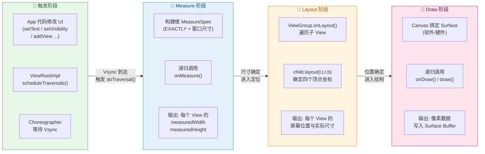

#### Measure —— "我该多大？"

Measure 阶段解决的核心问题是 **确定每个 View 的宽高**。这是一个从根节点到叶子节点的 **递归过程**：父 View 根据自身的空间限制（由更上层传递而来的 `MeasureSpec`）对子 View 提出尺寸约束，子 View 在约束范围内计算自己期望的尺寸，并通过 `setMeasuredDimension()` 将结果回报给父 View。

这个阶段的 **输入** 是根 MeasureSpec（由窗口尺寸和 DecorView 的 LayoutParams 决定），**输出** 是每个 View 节点上存储的 `mMeasuredWidth` 和 `mMeasuredHeight`。

Measure 是三大流程中最复杂的一个，因为它涉及 **父子协商**：父 View 可能说"你最多 200dp 宽"，但子 View 说"我内容需要 300dp"，这时候需要根据 MeasureSpec 的模式（EXACTLY / AT_MOST / UNSPECIFIED）来做出裁决。后续"测量阶段"小节会深入讲解这套协商机制。

#### Layout —— "我该放在哪？"

Layout 阶段在 Measure 完成后执行。它的任务是 **为每个 View 确定其在父容器坐标系中的精确位置**。具体来说，每个 View 最终会拥有四个坐标值：`mLeft`、`mTop`、`mRight`、`mBottom`，这四个值定义了它在父容器中的矩形区域。

对于 `View`（叶子节点），它通常不需要重写 `onLayout()`，因为它没有子 View 需要定位。而对于 `ViewGroup`，`onLayout()` 是一个 **必须重写的抽象方法**——它需要遍历所有子 View，根据布局策略（线性排列、相对定位、约束关系等）调用每个子 View 的 `layout(l, t, r, b)` 方法。

`LinearLayout` 之所以能让子 View 纵向排列，`RelativeLayout` 之所以能让子 View 相对于彼此定位，秘密就藏在各自的 `onLayout()` 实现中。

#### Draw —— "我该长什么样？"

Draw 阶段是最终的"渲染变现"环节。它将 Measure 和 Layout 的结果（尺寸 + 位置）转化为 **屏幕上的像素**。每个 View 的 `draw()` 方法内部按照固定顺序执行以下步骤：

1. **绘制背景**（`drawBackground()`）
2. **绘制自身内容**（`onDraw()`）——开发者自定义绘制的主战场
3. **绘制子 View**（`dispatchDraw()`）——ViewGroup 递归绘制子节点
4. **绘制前景与滚动条**（`onDrawForeground()`）

这个固定顺序保证了视觉层次的正确性：背景在最底层，前景（如涟漪效果）在最顶层，子 View 叠在自身内容之上。

Draw 阶段的载体是 `Canvas`。在软件绘制模式下，Canvas 直接操作一块 Bitmap；在硬件加速模式下（现代设备默认开启），Canvas 实际上是一个 `RecordingCanvas`（也叫 `DisplayListCanvas`），它 **不直接画像素，而是录制绘制指令**，后续由 RenderThread 在 GPU 上回放执行。这个机制会在"硬件加速"小节详细讲解。

### Vsync 信号 —— 绘制流水线的节拍器

理解了"谁来驱动"（ViewRootImpl）和"做什么"（三大流程）之后，最后一个关键问题是 **"什么时候做"**。答案是 **Vsync（Vertical Synchronization，垂直同步信号）**。

#### 为什么需要 Vsync？

在没有 Vsync 机制的早期 Android 版本（4.1 之前），UI 渲染存在一个严重问题：**App 想画就画，与屏幕刷新节奏不同步**。这会导致两种典型问题：

- **画面撕裂（Tearing）**：屏幕在读取 buffer 显示时，App 同时在写入同一块 buffer，导致屏幕上半部分显示的是旧帧，下半部分显示的是新帧。
- **帧率不稳定（Jank）**：App 有时在一个屏幕刷新周期内画了两帧（浪费），有时又一帧都没画完（掉帧），用户感受到的就是卡顿。

Android 4.1（API 16）引入了 **Project Butter**，其中最核心的改进之一就是引入了 Vsync 驱动的渲染机制。

#### Vsync 的工作原理

Vsync 信号由 **显示硬件（Display/Panel）** 周期性产生。在 60Hz 屏幕上，每隔约 16.67ms 产生一次；在 120Hz 屏幕上，每隔约 8.33ms 产生一次。这个信号通过 SurfaceFlinger 传递到 App 进程中的 `Choreographer`。

`Choreographer`（编舞者）是 Android 在应用侧的 Vsync 调度中枢。它的设计思想非常优雅：**不是让 App 自己决定什么时候画，而是让 App 向 Choreographer "预约"一次绘制，Choreographer 等到 Vsync 信号到来时统一触发**。

整个流程可以用如下时序图表示：

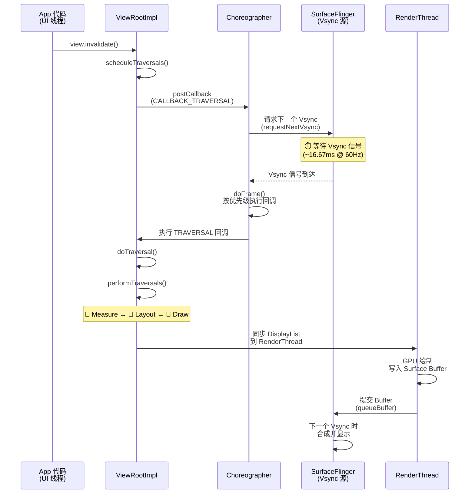

#### Choreographer 的回调优先级

`Choreographer` 并不只服务于 View 的绘制，它管理四种类型的回调，按优先级从高到低依次为：

1. **CALLBACK_INPUT**（输入事件处理）—— 最先执行，确保触摸响应及时
2. **CALLBACK_ANIMATION**（动画帧）—— 属性动画、ValueAnimator 的帧回调
3. **CALLBACK_INSETS_ANIMATION**（Insets 动画）—— 系统栏、输入法弹出/收起动画
4. **CALLBACK_TRAVERSAL**（View 遍历）—— 就是我们讨论的 Measure/Layout/Draw

这意味着，在每一个 Vsync 帧中，`Choreographer.doFrame()` 会 **先处理输入、再更新动画、最后执行 View 遍历**。这个顺序是经过精心设计的：动画值需要在 traversal 之前更新完毕，这样 Measure/Layout/Draw 才能使用到最新的动画值来绘制正确的帧。

#### 16ms 的"预算"

在 60Hz 屏幕上，两个 Vsync 之间的间隔是 **16.67ms**。这意味着 App 必须在这个时间窗口内完成 **输入处理 + 动画更新 + Measure + Layout + Draw + RenderThread GPU 绘制** 的全部工作。如果超时，当前帧无法赶上下一个 Vsync 的合成截止时间，SurfaceFlinger 就会复用上一帧的 buffer——用户看到的就是"卡了一帧"。

在 120Hz 屏幕上，这个预算进一步压缩到 **8.33ms**，对性能的要求更加苛刻。这也是为什么高刷屏时代，`RecyclerView` 的合理使用、过度绘制的消除、布局层级的优化变得更加重要。

#### 双缓冲与三缓冲

Vsync 机制通常与多缓冲（Multiple Buffering）配合工作。Android 使用的是 **三缓冲（Triple Buffering）** 策略：

- **Front Buffer**：屏幕正在读取并显示的 buffer。
- **Back Buffer**：App 正在绘制的 buffer。
- **第三块 Buffer**：当 App 来不及在一个 Vsync 周期内完成绘制时，第三块 buffer 允许 GPU/App 继续工作，而不必等待 Front Buffer 释放。这减少了因单次掉帧引发的 **连锁卡顿**。

通俗来说，双缓冲像两个人交替搬砖：一个人搬的时候另一个人装。如果一个人装慢了，另一个人必须等着，整个流水线就卡住了。三缓冲则多了一个人，即使某个环节偶尔慢了，整体流水线仍能保持流转。

### 从 Activity 启动到第一帧显示的完整链路

为了将上述知识点串成一条完整的线索，我们梳理一下从 `Activity` 启动到用户看到第一帧 UI 的关键步骤：

1. **AMS 调度启动**：`ActivityManagerService` 决定启动目标 Activity，通过 Binder 通知 App 进程。

2. **创建 Activity 与 Window**：App 进程在主线程执行 `Activity.onCreate()`，此时 `setContentView()` 将 XML 布局 inflate 为 View 树，并挂载到 `PhoneWindow` 的 DecorView 下。**但此时还没有 ViewRootImpl，View 树还不会被绘制。**

3. **handleResumeActivity()**：当 `onResume()` 执行完毕后，`ActivityThread.handleResumeActivity()` 会调用 `WindowManager.addView(decorView, layoutParams)`。这一步 **创建了 ViewRootImpl**，并将 DecorView 与之绑定。

4. **首次 scheduleTraversals()**：`ViewRootImpl.setView()` 内部会调用 `requestLayout()`，进而触发 `scheduleTraversals()`，向 Choreographer 注册 traversal 回调。

5. **Vsync 到达**：Choreographer 等待并接收到下一个 Vsync 信号，在主线程中触发 `performTraversals()`。

6. **首次 Measure → Layout → Draw**：整棵 View 树第一次被完整地测量、定位、绘制。绘制结果写入 Surface 的 back buffer。

7. **RenderThread 提交**：如果硬件加速开启（默认），RenderThread 将 DisplayList 指令在 GPU 上执行，将像素写入 buffer，然后 `queueBuffer()` 提交给 SurfaceFlinger。

8. **SurfaceFlinger 合成**：在下一个 Vsync 周期，SurfaceFlinger 取出 App 提交的 buffer，与状态栏、导航栏等其他 Layer 合成，最终输出到屏幕。用户看到第一帧画面。

这条链路清楚地解释了为什么 `onCreate()` 和 `onResume()` 中获取 View 的宽高总是返回 0——因为此时 Measure 还没有发生。要获取测量后的尺寸，必须使用 `View.post()` 或 `ViewTreeObserver.OnGlobalLayoutListener` 等机制，等到 `performTraversals()` 执行完毕后再读取。

```kotlin
// 典型问题：在 onCreate 中直接读取宽高
override fun onCreate(savedInstanceState: Bundle?) {
    super.onCreate(savedInstanceState)
    setContentView(R.layout.activity_main)

    val textView = findViewById<TextView>(R.id.text)

    // ❌ 此时 performTraversals() 还未执行，返回 0
    val width = textView.measuredWidth  // 0
    val height = textView.measuredHeight // 0

    // ✅ 方式 1：通过 View.post() 延迟到 traversal 完成后
    textView.post {
        // 此 Runnable 被 post 到主线程消息队列
        // 当它执行时，首次 performTraversals() 已经完成
        val w = textView.measuredWidth  // 正确值
        val h = textView.measuredHeight // 正确值
    }

    // ✅ 方式 2：通过 OnGlobalLayoutListener 监听 layout 完成事件
    textView.viewTreeObserver.addOnGlobalLayoutListener(
        object : ViewTreeObserver.OnGlobalLayoutListener {
            override fun onGlobalLayout() {
                // Layout 阶段完成后回调
                val w = textView.measuredWidth  // 正确值
                val h = textView.measuredHeight // 正确值
                // 移除监听，避免每次 layout 都触发
                textView.viewTreeObserver.removeOnGlobalLayoutListener(this)
            }
        }
    )
}
```

### 小结：绘制流水线的全景图

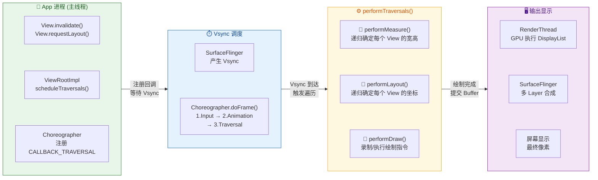

以上就是 Android 绘制流水线的全局概览。关键记忆点：

- **ViewRootImpl** 是 View 树的管理者，`performTraversals()` 是三大流程的总入口。
- **Measure → Layout → Draw** 三个阶段各司其职：量尺寸、定位置、画内容，严格顺序执行。
- **Vsync** 是整条流水线的时钟信号，由 Choreographer 在应用侧调度。App 不能"想画就画"，必须等待 Vsync 信号才开始工作。
- 三缓冲机制为偶发的掉帧提供了缓冲空间，避免连锁卡顿。
- `onCreate()` 中拿不到 View 尺寸是因为此时 performTraversals() 尚未执行，需要使用 `View.post()` 或 `OnGlobalLayoutListener` 延迟获取。

---

**📝 练习题**

在 Android 60Hz 屏幕设备上，`Choreographer` 收到 Vsync 信号后，在 `doFrame()` 中按顺序执行各类回调。以下关于回调执行顺序的描述，正确的是？


A. CALLBACK_TRAVERSAL → CALLBACK_ANIMATION → CALLBACK_INPUT


B. CALLBACK_INPUT → CALLBACK_TRAVERSAL → CALLBACK_ANIMATION


C. CALLBACK_ANIMATION → CALLBACK_INPUT → CALLBACK_TRAVERSAL


D. CALLBACK_INPUT → CALLBACK_ANIMATION → CALLBACK_TRAVERSAL


**【答案】** D

**【解析】** `Choreographer.doFrame()` 内部按照严格的优先级顺序依次执行四类回调：**CALLBACK_INPUT（输入）→ CALLBACK_ANIMATION（动画）→ CALLBACK_INSETS_ANIMATION（Insets 动画）→ CALLBACK_TRAVERSAL（View 遍历）**。这个顺序的设计逻辑是：输入事件（如触摸）必须最先响应，以保证交互的即时感；动画值需要在 View 遍历之前更新完毕，这样 `performTraversals()` 执行 Measure/Layout/Draw 时才能读取到当前帧最新的动画插值结果，绘制出正确的中间态画面。选项 D 的顺序 INPUT → ANIMATION → TRAVERSAL 与实际一致。选项 A、B、C 的顺序均错误。

---

## 测量阶段 Measure

Android 绘制流水线中，**测量（Measure）是三大流程的第一步**，也是最复杂的一步。它要解决的核心问题只有一个：**确定 View 树中每一个节点的宽高尺寸**。这听上去简单，但在一个深度嵌套、约束关系交织的 View 树里，"我到底该多大"从来不是一个节点能独立回答的问题——它必须和父容器进行一轮甚至多轮的 **协商（Negotiation）**。

在 `ViewRootImpl.performTraversals()` 中，系统首先调用的就是 `performMeasure()`，它会从 DecorView 出发，沿着 View 树 **自顶向下递归地** 把每个节点都测量一遍。理解这一阶段的关键在于吃透一个核心数据结构——`MeasureSpec`，以及由它驱动的 **父子协商循环**。

---

### MeasureSpec 模式与尺寸

#### 什么是 MeasureSpec

`MeasureSpec` 是 Android 测量系统的 **通信协议**。它用一个 **32 位 int** 值同时编码了两层信息：

| 位段 | 含义 | 说明 |
|------|------|------|
| 高 2 位 | **Mode（模式）** | 父容器对子 View 的 "约束类型" |
| 低 30 位 | **Size（尺寸）** | 父容器提供的 "参考尺寸"（像素） |

之所以把两个信息压缩进一个 int，纯粹是出于 **性能考量**：View 树可能有数百个节点，每次 measure 都会大量创建和传递 MeasureSpec，如果用对象封装（哪怕是轻量的 data class）都会在高频遍历中产生不可忽视的 GC 压力。用一个 primitive int 则完全避免了堆分配，这是 Android 团队在 Framework 层非常典型的 **"以可读性换性能"** 的设计决策。

`View.MeasureSpec` 类提供了三个静态工具方法来操作这个 int：

```java
// 将 mode 和 size 打包为一个 32-bit int
// mode 被左移 30 位占据高 2 位，size 与低 30 位掩码做 AND 保留尺寸
public static int makeMeasureSpec(int size, int mode) {
    return (size & ~MODE_MASK) | (mode & MODE_MASK);
    // MODE_MASK = 0x3 << 30 = 0xC0000000
}

// 从 32-bit int 中提取高 2 位的模式信息
public static int getMode(int measureSpec) {
    return (measureSpec & MODE_MASK);
    // 与 MODE_MASK 做 AND，清零低 30 位，只留模式
}

// 从 32-bit int 中提取低 30 位的尺寸信息
public static int getSize(int measureSpec) {
    return (measureSpec & ~MODE_MASK);
    // 与 MODE_MASK 取反做 AND，清零高 2 位，只留尺寸
}
```

#### 三种测量模式

MeasureSpec 的高 2 位可以表示三种模式，它们代表了父容器对子 View 尺寸的三种 **态度**：

**1. `EXACTLY`（精确模式，值 = `0x1 << 30`）**

含义是：**"你的大小就是这个值，别商量了。"** 对应的典型场景是子 View 的 `layout_width` 或 `layout_height` 设为固定 dp 值（如 `200dp`），或者设为 `match_parent`（此时父容器已经知道自己的可用空间，直接把这个空间作为精确值下发）。在 EXACTLY 模式下，子 View 无论内部内容有多少，最终宽/高都应该 **等于** MeasureSpec 中携带的 size。

**2. `AT_MOST`（最大模式，值 = `0x2 << 30`）**

含义是：**"你最大不能超过这个值，但可以更小。"** 最典型的场景就是子 View 设为 `wrap_content`——父容器不知道你到底要多大，但它知道自己最多能给你多少空间。子 View 需要 **自行计算** 内容所需的尺寸，但不能超过 size 上限。

**3. `UNSPECIFIED`（未指定模式，值 = `0x0 << 30`）**

含义是：**"你要多大就多大，我不限制你。"** 这种模式在日常开发中较少直接遇到，但在 `ScrollView`、`RecyclerView` 等可滚动容器中非常常见——因为滚动容器的可视区域是有限的，但它 **允许子 View 超过可视区域**，所以在测量子 View 时不给上限约束。此外，系统内部在某些预测量（pre-measure）阶段也会使用 UNSPECIFIED。

下面用一张 Mermaid 图把三种模式的触发场景和语义直观地呈现出来：

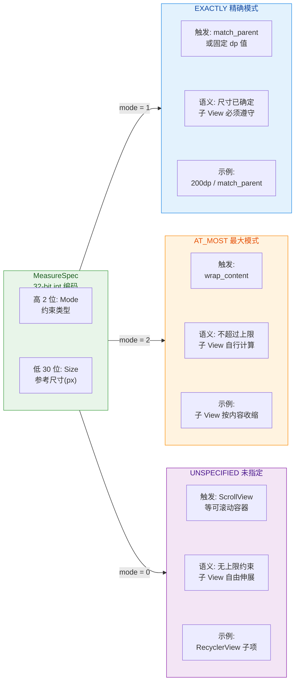

#### 为什么是"约束"而不是"命令"

理解 MeasureSpec 最重要的一点是：它表达的是父容器的 **约束意图（constraint intent）**，而不是不可违背的"命令"。子 View 的 `onMeasure()` 方法 **理论上** 可以调用 `setMeasuredDimension()` 设置任何值——即使这个值违反了 MeasureSpec 的约束。比如在 EXACTLY 模式下，你仍然可以把测量结果设为一个不同于 spec size 的值。编译器不会阻止你，运行时也不会崩溃。

但这样做几乎一定会导致 **布局异常**——因为父容器在后续的 `onLayout()` 阶段会根据自己下发的约束来安排子 View 的位置，如果子 View 的实际测量尺寸和父容器的预期不一致，裁剪（clipping）、溢出（overflow）、错位等问题就会出现。所以 MeasureSpec 虽然不是强制的硬约束，但它是一种 **契约（contract）**，遵守它是保证布局正确性的前提。

---

### onMeasure 递归

#### 递归的起点：ViewRootImpl

整个测量过程的起点在 `ViewRootImpl.performMeasure()` 中。它会先根据窗口（Window）的尺寸构造出 **根 MeasureSpec**——对于 Activity 的 DecorView 来说，这通常是两个 EXACTLY 模式的 spec，尺寸等于屏幕的可用宽高（减去系统栏占用的空间）。然后调用 `mView.measure(widthSpec, heightSpec)`，即对 DecorView 发起测量。

```java
// ViewRootImpl.performMeasure() 简化流程
private void performMeasure(int childWidthMeasureSpec, int childHeightMeasureSpec) {
    // mView 就是 DecorView，整棵 View 树的根节点
    // 调用其 measure() 方法，传入窗口级别的 MeasureSpec
    mView.measure(childWidthMeasureSpec, childHeightMeasureSpec);
}
```

#### View.measure() —— 公共入口与缓存机制

`View.measure(int widthMeasureSpec, int heightMeasureSpec)` 是一个 **`final` 方法**，子类无法覆写。这是一个精心的设计决策：系统需要在这个方法中做统一的 **缓存判断和状态管理**，如果允许子类覆写，这些逻辑可能被跳过，导致整个测量体系崩溃。

```java
// View.measure() 核心逻辑（简化版）
public final void measure(int widthMeasureSpec, int heightMeasureSpec) {
    // 1. 检查是否需要强制重新测量（通过 requestLayout 标记的 PFLAG_FORCE_LAYOUT）
    boolean forceLayout = (mPrivateFlags & PFLAG_FORCE_LAYOUT) == PFLAG_FORCE_LAYOUT;

    // 2. 检查 MeasureSpec 是否与上次相同（缓存命中判断）
    boolean specChanged = widthMeasureSpec != mOldWidthMeasureSpec
                       || heightMeasureSpec != mOldHeightMeasureSpec;

    // 3. 只有在 spec 变化或强制重新布局时才真正执行 onMeasure
    boolean needsLayout = specChanged || forceLayout;

    if (needsLayout) {
        // 清除 "已测量" 标记，表示即将重新测量
        mPrivateFlags &= ~PFLAG_MEASURED_DIMENSION_SET;

        // ★ 调用 onMeasure —— 这是子类的扩展点
        onMeasure(widthMeasureSpec, heightMeasureSpec);

        // 检查子类是否正确调用了 setMeasuredDimension()
        // 如果没调用，会抛出 IllegalStateException
        if ((mPrivateFlags & PFLAG_MEASURED_DIMENSION_SET) == 0) {
            throw new IllegalStateException("View#onMeasure() did not call"
                + " setMeasuredDimension()");
        }
    }

    // 4. 缓存当前的 MeasureSpec，下次可以比对
    mOldWidthMeasureSpec = widthMeasureSpec;
    mOldHeightMeasureSpec = heightMeasureSpec;
}
```

这里有几个关键设计值得注意：

- **缓存（Caching）**：如果 MeasureSpec 与上一次完全相同，且没有 `PFLAG_FORCE_LAYOUT` 标记，`onMeasure()` 会被跳过。这对于复杂 View 树的性能至关重要——比如一个只有某个叶子节点内容变化的场景，大量兄弟分支的测量可以直接跳过。
- **强制调用 `setMeasuredDimension()`**：`measure()` 方法末尾会检查 `PFLAG_MEASURED_DIMENSION_SET` 标记。如果子类的 `onMeasure()` 没有调用 `setMeasuredDimension()`，系统会直接抛异常。这就保证了测量结果一定会被写入 `mMeasuredWidth` 和 `mMeasuredHeight` 字段，后续的 layout 阶段可以安全地读取。

#### onMeasure() —— 子类的核心实现点

`onMeasure()` 是子类真正实现测量逻辑的地方。对于叶子节点（如 `TextView`、`ImageView`）和容器节点（如 `LinearLayout`、`FrameLayout`），它的实现逻辑有本质区别：

**叶子 View 的 onMeasure()**：只需要根据自身内容（文本长度、图片尺寸等）和父容器传入的 MeasureSpec，计算出自己的宽高，然后调用 `setMeasuredDimension()`。

**ViewGroup 的 onMeasure()**：除了自身的尺寸，还需要 **递归测量所有子 View**。典型流程是：

1. 遍历所有子 View
2. 为每个子 View 生成子 MeasureSpec（结合自身约束和子 View 的 LayoutParams）
3. 调用 `child.measure(childWidthSpec, childHeightSpec)`
4. 收集所有子 View 的测量结果，综合计算自身尺寸
5. 调用 `setMeasuredDimension()`

这就构成了一个 **自顶向下的递归**：

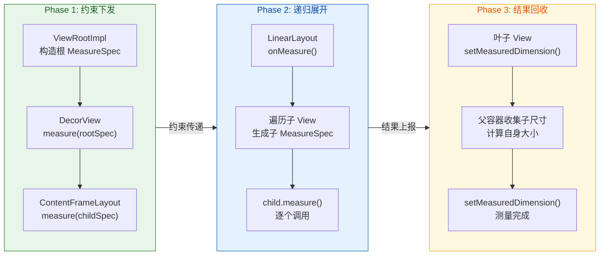

整个递归的数据流可以概括为：**约束自顶向下传递，结果自底向上回收**。父容器先把"你最多/最少/精确多大"的信息下发给子 View，子 View 测量完成后把"我实际要多大"的结果通过 `getMeasuredWidth()` / `getMeasuredHeight()` 反馈给父容器，父容器再根据所有子 View 的结果计算自己的尺寸。

#### 递归的深度与性能隐患

View 树的深度直接决定了测量递归的调用栈深度。对于普通的 UI 界面（深度 10~20 层），这不是问题。但某些病态的布局嵌套（比如多层 `LinearLayout` + `weight` 嵌套）会导致 **指数级的测量次数**——因为 `LinearLayout` 在有 `weight` 属性的子 View 时，需要进行 **两次测量**（第一次确定非 weight 子 View 的尺寸，第二次把剩余空间按 weight 分配）。如果多层 `LinearLayout` + weight 嵌套，测量次数会以 2^n 增长（n 为嵌套层数），这也是 Android 团队推荐使用 `ConstraintLayout` 扁平化布局的核心原因之一。

---

### 父子协商机制

#### 协商的核心：`getChildMeasureSpec()`

测量阶段最精妙的设计在于 **父子协商**——父容器不是简单地把自己的 MeasureSpec 透传给子 View，而是要 **结合子 View 的 LayoutParams** 重新计算出一个新的 childMeasureSpec。这个协商过程的核心逻辑封装在 `ViewGroup.getChildMeasureSpec()` 这个静态方法中。

先理解输入参数：

- `spec`：父容器自身的 MeasureSpec（父容器的 "预算"）
- `padding`：父容器已使用的空间（padding + 已占用的子 View 空间）
- `childDimension`：子 View 的 LayoutParams 中声明的尺寸值（可能是具体 dp 值、`MATCH_PARENT` 或 `WRAP_CONTENT`）

```java
// ViewGroup.getChildMeasureSpec() 完整逻辑
public static int getChildMeasureSpec(int spec, int padding, int childDimension) {
    // 提取父容器的模式和可用尺寸
    int specMode = MeasureSpec.getMode(spec);       // 父容器的约束模式
    int specSize = MeasureSpec.getSize(spec);        // 父容器的参考尺寸

    // 父容器可用空间 = 父尺寸 - 已用空间，不能为负
    int size = Math.max(0, specSize - padding);

    // 最终要输出的 mode 和 size
    int resultSize = 0;
    int resultMode = 0;

    switch (specMode) {
        // ── 情况 1：父容器是 EXACTLY（父尺寸已确定） ──
        case MeasureSpec.EXACTLY:
            if (childDimension >= 0) {
                // 子 View 指定了精确 dp 值 → 直接使用，模式为 EXACTLY
                resultSize = childDimension;
                resultMode = MeasureSpec.EXACTLY;
            } else if (childDimension == LayoutParams.MATCH_PARENT) {
                // 子 View 要求填满父容器 → 使用父容器剩余空间，模式为 EXACTLY
                resultSize = size;
                resultMode = MeasureSpec.EXACTLY;
            } else if (childDimension == LayoutParams.WRAP_CONTENT) {
                // 子 View 要求包裹内容 → 上限为父容器剩余空间，模式为 AT_MOST
                resultSize = size;
                resultMode = MeasureSpec.AT_MOST;
            }
            break;

        // ── 情况 2：父容器是 AT_MOST（父尺寸有上限但不确定） ──
        case MeasureSpec.AT_MOST:
            if (childDimension >= 0) {
                // 子 View 指定了精确 dp 值 → 直接使用，模式为 EXACTLY
                resultSize = childDimension;
                resultMode = MeasureSpec.EXACTLY;
            } else if (childDimension == LayoutParams.MATCH_PARENT) {
                // 子 View 要求填满父容器，但父自己也不确定 → 上限透传，模式为 AT_MOST
                resultSize = size;
                resultMode = MeasureSpec.AT_MOST;
            } else if (childDimension == LayoutParams.WRAP_CONTENT) {
                // 子 View 要求包裹内容 → 上限透传，模式为 AT_MOST
                resultSize = size;
                resultMode = MeasureSpec.AT_MOST;
            }
            break;

        // ── 情况 3：父容器是 UNSPECIFIED（无约束） ──
        case MeasureSpec.UNSPECIFIED:
            if (childDimension >= 0) {
                // 子 View 指定了精确 dp 值 → 直接使用
                resultSize = childDimension;
                resultMode = MeasureSpec.EXACTLY;
            } else if (childDimension == LayoutParams.MATCH_PARENT) {
                // 子 View 要求填满，但父无约束 → 尺寸为 0 或 size，模式 UNSPECIFIED
                resultSize = size;  // API 23+ 传 size; 之前传 0
                resultMode = MeasureSpec.UNSPECIFIED;
            } else if (childDimension == LayoutParams.WRAP_CONTENT) {
                // 子 View 包裹内容，父无约束 → 完全自由
                resultSize = size;
                resultMode = MeasureSpec.UNSPECIFIED;
            }
            break;
    }

    // 打包为 32-bit int 返回
    return MeasureSpec.makeMeasureSpec(resultSize, resultMode);
}
```

#### 协商矩阵

上面的 switch-case 本质上构成了一个 **3×3 的协商矩阵**。我们可以用一张表更清晰地呈现所有 9 种组合的输出结果：

| 父模式 ╲ 子LayoutParams | **具体 dp 值** | **MATCH_PARENT** | **WRAP_CONTENT** |
|:---|:---|:---|:---|
| **EXACTLY** | EXACTLY / childSize | EXACTLY / parentSize | AT_MOST / parentSize |
| **AT_MOST** | EXACTLY / childSize | AT_MOST / parentSize | AT_MOST / parentSize |
| **UNSPECIFIED** | EXACTLY / childSize | UNSPECIFIED / parentSize | UNSPECIFIED / parentSize |

从矩阵中可以提炼出几条重要规律：

1. **固定 dp 值的子 View 始终是 EXACTLY**：无论父容器是什么模式，只要子 View 指定了具体数值，就直接使用该数值。这很好理解——开发者显式指定了尺寸，说明意图非常明确，父容器会 "尊重" 这个意图。不过要注意，如果子 View 的固定尺寸大于父容器的可用空间，子 View 仍然会按指定值测量，但在绘制时可能会被裁剪。

2. **MATCH_PARENT 继承父模式**：子 View 要求 "和父容器一样大"，所以它的确定性完全取决于父容器——父是 EXACTLY 则子也 EXACTLY，父是 AT_MOST 则子也 AT_MOST。

3. **WRAP_CONTENT 总是 "不超过父容器"**：在 EXACTLY 和 AT_MOST 父模式下，子 View 拿到的都是 AT_MOST，尺寸上限等于父容器的剩余空间。在 UNSPECIFIED 下则完全自由。

4. **UNSPECIFIED 的 "传染性"**：当父容器是 UNSPECIFIED 时，除了固定 dp 值的子 View，其他子 View 也会变成 UNSPECIFIED。这就是为什么 `ScrollView` 内的子 View 可以无限扩展——UNSPECIFIED 从 ScrollView 开始沿着 View 树一路向下传染。

#### 协商不是一次性的

在某些 ViewGroup 中，父子协商可能发生 **不止一次**。最典型的例子是 `LinearLayout` 的 weight 机制：

- **第一次测量（Pre-measure）**：LinearLayout 先以正常方式测量所有子 View，此时 weight 子 View 的 `layout_width/height` 通常设为 `0dp`，所以测量结果为 0。
- **分配剩余空间**：LinearLayout 用自己的总可用空间减去第一次测量的总消耗，得到剩余空间，然后按 weight 比例分配。
- **第二次测量（Re-measure）**：以分配后的精确尺寸，对 weight 子 View 发起第二次 `child.measure()`，这次使用 EXACTLY 模式。

这种 "多次测量" 机制赋予了布局系统更大的灵活性，但也带来了前面提到的指数级性能隐患——这也是为什么 `ConstraintLayout` 能通过 **单次约束求解** 替代多次测量，成为性能更优的选择。

---

### WRAP_CONTENT 计算

`wrap_content` 是日常开发中使用频率最高的尺寸声明之一，但它的实现往往是自定义 View 时最容易出 Bug 的地方。让我们深入剖析它的运作细节。

#### View 默认实现的陷阱

先看 `View.onMeasure()` 的默认实现：

```java
// View.onMeasure() 默认实现
protected void onMeasure(int widthMeasureSpec, int heightMeasureSpec) {
    // getDefaultSize() 会根据 MeasureSpec 模式返回尺寸
    setMeasuredDimension(
        getDefaultSize(getSuggestedMinimumWidth(), widthMeasureSpec),
        getDefaultSize(getSuggestedMinimumHeight(), heightMeasureSpec)
    );
}

// View.getDefaultSize() 实现
public static int getDefaultSize(int size, int measureSpec) {
    int result = size;                              // 默认值为建议最小尺寸
    int specMode = MeasureSpec.getMode(measureSpec);
    int specSize = MeasureSpec.getSize(measureSpec);

    switch (specMode) {
        case MeasureSpec.UNSPECIFIED:
            // 无约束时，使用建议最小尺寸（minWidth/minHeight 或 background 尺寸）
            result = size;
            break;
        case MeasureSpec.AT_MOST:
            // ★ 注意这里！AT_MOST 和 EXACTLY 返回的都是 specSize
            result = specSize;
            break;
        case MeasureSpec.EXACTLY:
            // 精确模式，直接使用 spec 尺寸
            result = specSize;
            break;
    }
    return result;
}
```

关键问题在 `AT_MOST` 分支——它直接返回了 `specSize`，即父容器的剩余可用空间。这意味着 **如果直接继承 View 且不覆写 `onMeasure()`，`wrap_content` 的表现和 `match_parent` 完全一样！** 子 View 会填满父容器的所有剩余空间，根本不会"包裹内容"。

这是一个非常常见的 **自定义 View 陷阱**。所以，任何自定义 View 只要可能被设为 `wrap_content`，就 **必须** 覆写 `onMeasure()` 并在 `AT_MOST` 模式下正确计算内容尺寸。

#### 正确处理 WRAP_CONTENT 的模板

下面是自定义 View 中处理 `wrap_content` 的标准模板：

```kotlin
// 自定义 View 的 onMeasure 模板
override fun onMeasure(widthMeasureSpec: Int, heightMeasureSpec: Int) {
    // 1. 计算内容所需的"理想"宽高（不考虑任何外部约束）
    //    例如：文本宽度、图片宽度、绘制内容的边界等
    val desiredWidth = calculateContentWidth() + paddingLeft + paddingRight
    val desiredHeight = calculateContentHeight() + paddingTop + paddingBottom

    // 2. 使用 resolveSize() 将理想尺寸与 MeasureSpec 约束进行协商
    //    resolveSize 内部会根据 mode 做出正确选择
    val finalWidth = resolveSize(desiredWidth, widthMeasureSpec)
    val finalHeight = resolveSize(desiredHeight, heightMeasureSpec)

    // 3. 设置测量结果（必须调用，否则 measure() 会抛异常）
    setMeasuredDimension(finalWidth, finalHeight)
}
```

`View.resolveSize()` 是系统提供的辅助方法，本质上就是对三种 MeasureSpec 模式的规范化处理：

```java
// View.resolveSize() / resolveSizeAndState() 核心逻辑
public static int resolveSize(int size, int measureSpec) {
    int specMode = MeasureSpec.getMode(measureSpec);  // 父容器的约束模式
    int specSize = MeasureSpec.getSize(measureSpec);   // 父容器的参考尺寸
    int result;

    switch (specMode) {
        case MeasureSpec.AT_MOST:
            // ★ wrap_content 场景：取内容尺寸和上限的较小值
            // 这才是正确的处理 —— 既不超过父容器，又不浪费空间
            result = Math.min(size, specSize);
            break;
        case MeasureSpec.EXACTLY:
            // 精确模式：无论内容多大，都使用父容器指定的尺寸
            result = specSize;
            break;
        case MeasureSpec.UNSPECIFIED:
        default:
            // 无约束：完全使用内容尺寸
            result = size;
            break;
    }
    return result;
}
```

可以看到，`resolveSize()` 在 AT_MOST 模式下执行了 `Math.min(size, specSize)`——这就是 `wrap_content` 的精髓：**取内容实际需要的尺寸与父容器允许的最大尺寸的较小值**。

#### 具体 View 的 WRAP_CONTENT 实现

不同类型的 View 计算"内容尺寸"的方式各不相同：

**TextView** 的 `wrap_content` 计算可能是 Android 中最复杂的之一。它需要考虑文本内容、字体大小、行间距、最大行数限制（`maxLines`）、省略号（`ellipsize`）、CompoundDrawable 等多种因素。在 `onMeasure()` 中，TextView 会使用 `Layout`（如 `StaticLayout` 或 `BoringLayout`）来进行文本排版计算，得出文本渲染需要的精确宽高。

**ImageView** 相对简单：wrap_content 时，它以 Drawable 的固有尺寸（`intrinsicWidth`/`intrinsicHeight`）作为基准，再根据 `scaleType` 和 `adjustViewBounds` 等属性进行调整。

**ViewGroup 的 WRAP_CONTENT**：对于容器来说，wrap_content 意味着 **自身尺寸由所有子 View 的测量结果决定**。比如垂直方向的 `LinearLayout`，wrap_content 的高度等于所有子 View 高度之和加上间距和 padding；宽度则取所有子 View 中最宽的那个（加上 padding）。`FrameLayout` 的 wrap_content 则取最大子 View 的宽高。

#### resolveSizeAndState —— 被忽视的"状态位"

除了 `resolveSize()`，Android 还提供了一个增强版本 `resolveSizeAndState()`，它会在返回值的高位设置一个 `MEASURED_STATE_TOO_SMALL` 标记：

```java
// 当内容尺寸大于 specSize 时，设置"太小"状态位
if (specMode == MeasureSpec.AT_MOST && size > specSize) {
    // 在高位设置 MEASURED_STATE_TOO_SMALL 标记
    // 告诉父容器："你给的空间不够，我被迫缩小了"
    result = specSize | MEASURED_STATE_TOO_SMALL;
}
```

这个状态位的作用是向父容器传递 **"我被压缩了"** 的信号。父容器可以通过 `getMeasuredWidthAndState()` 读取这个状态位，然后在某些情况下（比如 Dialog 的自动调整大小）做出相应的调整。虽然在日常开发中很少直接使用这个特性，但它是 Android 测量系统 **双向信息传递** 设计的一个缩影——不仅约束自顶向下，测量结果（包括状态信息）也自底向上。

#### 一个完整的自定义 View WRAP_CONTENT 示例

以一个绘制圆形的自定义 View 为例，演示完整的测量处理：

```kotlin
class CircleView @JvmOverloads constructor(
    context: Context,
    attrs: AttributeSet? = null,    // XML 属性集
    defStyleAttr: Int = 0           // 默认样式属性
) : View(context, attrs, defStyleAttr) {

    // 圆的默认半径（当没有外部约束时使用）
    private val defaultRadius = 50.dp  // 假设有 dp 扩展属性

    // 画笔，用于绘制圆形
    private val paint = Paint(Paint.ANTI_ALIAS_FLAG).apply {
        color = Color.BLUE          // 蓝色填充
        style = Paint.Style.FILL    // 填充模式
    }

    override fun onMeasure(widthMeasureSpec: Int, heightMeasureSpec: Int) {
        // 1. 计算内容所需的理想尺寸
        //    圆形需要的空间 = 直径 + 左右/上下 padding
        val desiredWidth = (defaultRadius * 2).toInt() + paddingLeft + paddingRight
        val desiredHeight = (defaultRadius * 2).toInt() + paddingTop + paddingBottom

        // 2. 分别对宽和高进行 MeasureSpec 协商
        val measuredW = resolveSize(desiredWidth, widthMeasureSpec)
        val measuredH = resolveSize(desiredHeight, heightMeasureSpec)

        // 3. 设置最终测量结果
        //    圆形保持正方形，取宽高中的较小值保证不变形
        val size = minOf(measuredW, measuredH)
        setMeasuredDimension(size, size)
    }

    override fun onDraw(canvas: Canvas) {
        super.onDraw(canvas)
        // 计算实际可绘制区域的中心和半径
        val cx = width / 2f                         // 水平中心
        val cy = height / 2f                         // 垂直中心
        val radius = minOf(
            cx - paddingLeft,                        // 左侧可用半径
            cy - paddingTop                          // 上侧可用半径
        )
        canvas.drawCircle(cx, cy, radius, paint)     // 绘制圆
    }
}
```

这个示例展现了 `wrap_content` 处理的完整流程：先计算理想尺寸 → 通过 `resolveSize()` 与约束协商 → 设置结果。同时也演示了一个实用技巧：对于正方形 View，在测量阶段取 `minOf(width, height)` 可以保证不变形。

---

**📝 练习题**

自定义一个继承自 `View` 的 `MyView`，**没有覆写 `onMeasure()`**。在 XML 中将其 `layout_width` 设为 `wrap_content`，其父容器是一个宽度为 `300dp` 的 `FrameLayout`。请问 `MyView` 的最终测量宽度是多少？


A. 0dp，因为没有内容所以宽度为零


B. 300dp（减去 padding 后的父容器可用宽度），因为默认实现中 AT_MOST 和 EXACTLY 返回相同的 specSize


C. 取决于 `minWidth` 属性，默认为 0


D. 会抛出异常，因为必须覆写 `onMeasure()` 才能使用 `wrap_content`


**【答案】** B

**【解析】** `View.onMeasure()` 的默认实现调用 `getDefaultSize()`，在该方法中 `AT_MOST` 和 `EXACTLY` 两个分支都返回 `specSize`（即父容器的可用空间）。当子 View 设为 `wrap_content` 且父容器为 300dp 的 EXACTLY FrameLayout 时，子 View 收到的 MeasureSpec 模式为 `AT_MOST`、尺寸为 300dp（减去 FrameLayout 的 padding，如果没有 padding 则就是 300dp）。由于 `getDefaultSize()` 在 AT_MOST 下直接返回 specSize，MyView 的测量宽度就等于父容器的可用宽度——即表现得和 `match_parent` 一模一样。这正是自定义 View 必须覆写 `onMeasure()` 正确处理 `wrap_content` 的原因。选项 A 和 C 忽略了默认实现的实际行为；选项 D 不成立，因为 `onMeasure()` 不是抽象方法，不覆写也能正常运行，只是行为不符合预期。

---

## 布局阶段 Layout

在 Android 绘制流水线（Rendering Pipeline）中，**Layout 阶段**紧接 Measure 阶段执行，承担着"将测量结果落实为屏幕坐标"的核心职责。如果说 Measure 回答的是"每个 View **多大**"，那么 Layout 回答的就是"每个 View **在哪**"。这两个阶段协同，共同为后续的 Draw 阶段提供完整的几何信息：宽高 + 位置。

Layout 阶段的入口同样位于 `ViewRootImpl.performTraversals()` 方法中，在 `performMeasure()` 调用完成后，紧随其后执行 `performLayout()`。Framework 会从 DecorView（View 树根节点）开始，自顶向下递归调用每个 ViewGroup 的 `layout()` → `onLayout()` 方法，最终让 View 树中的每一个节点都获得相对于父容器的精确坐标（left, top, right, bottom）。一旦 Layout 完成，任何 View 都可以通过 `getLeft()`, `getTop()`, `getWidth()`, `getHeight()` 获取自身在父容器坐标系中的准确位置与尺寸。

我们先通过一张全局流程图，建立对 Layout 阶段在整条绘制流水线中所处位置的直觉认知：

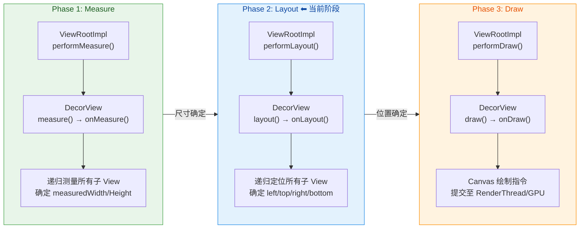

可以看到，Layout 阶段是 Measure 与 Draw 之间的关键桥梁——它消费 Measure 阶段产出的 `measuredWidth` / `measuredHeight`，将其转化为坐标系中的 `left / top / right / bottom`，为 Draw 阶段的 Canvas 坐标定位做好准备。

---

### onLayout 定位

#### layout() 方法——Framework 的调度入口

要理解 `onLayout`，首先必须理解它的上层调用者 `layout()` 方法。在 View 体系中，`layout(int l, int t, int r, int b)` 是一个由 **Framework 主动调用** 的 `public` 方法，它的四个参数代表 **父容器分配给该 View 的位置**，分别是相对于父容器左上角的 left、top、right、bottom 坐标值（单位：像素）。

`layout()` 方法的执行逻辑可以拆分为三个关键步骤：

1. **记录旧位置**：保存当前的 `mLeft`, `mTop`, `mRight`, `mBottom`，用于后续判断位置是否发生变化。
2. **调用 `setFrame()`**：将新的 l, t, r, b 值写入 `mLeft`, `mTop`, `mRight`, `mBottom` 四个成员变量。这一步是 View 坐标真正"落地"的时刻。同时，`setFrame()` 内部会比较新旧值，如果位置或尺寸发生了变化，会触发 `invalidate()` 标记重绘，并回调 `onSizeChanged()` 通知尺寸变更。
3. **调用 `onLayout()`**：`setFrame()` 完成后，`layout()` 紧接着调用 `onLayout(changed, l, t, r, b)`。这个方法是留给开发者重写的"定位回调"，ViewGroup 必须在此方法中确定每个子 View 的位置。

核心代码的简化版如下：

```java
// View.java 中的 layout() 方法（简化）
public void layout(int l, int t, int r, int b) {
    // 1. 如果有待处理的 measure 请求，先执行一次 measure 确保尺寸最新
    if (mPrivateFlags & PFLAG_FORCE_LAYOUT != 0) {
        onMeasure(mOldWidthMeasureSpec, mOldHeightMeasureSpec);
    }

    // 2. 保存旧的位置值，用于后续比较
    int oldL = mLeft;
    int oldT = mTop;
    int oldR = mRight;
    int oldB = mBottom;

    // 3. setFrame() 将新坐标写入成员变量，并返回位置是否发生了变化
    boolean changed = setFrame(l, t, r, b);

    // 4. 如果位置发生了变化，或者有 PFLAG_LAYOUT_REQUIRED 标记
    if (changed || (mPrivateFlags & PFLAG_LAYOUT_REQUIRED) != 0) {
        // 5. 回调 onLayout()，由子类决定如何放置子 View
        onLayout(changed, l, t, r, b);

        // 6. 通知已注册的 OnLayoutChangeListener
        if (mOnLayoutChangeListeners != null) {
            for (OnLayoutChangeListener listener : mOnLayoutChangeListeners) {
                // 同时传入旧位置和新位置，方便做动画差值计算
                listener.onLayoutChange(this, l, t, r, b, oldL, oldT, oldR, oldB);
            }
        }

        // 7. 清除 PFLAG_LAYOUT_REQUIRED 标记，避免重复布局
        mPrivateFlags &= ~PFLAG_LAYOUT_REQUIRED;
    }

    // 8. 清除 PFLAG_FORCE_LAYOUT 标记
    mPrivateFlags &= ~PFLAG_FORCE_LAYOUT;
}
```

从代码中可以看到一个重要的设计思想：**`layout()` 方法是模板方法模式（Template Method Pattern）的典型应用**。Framework 在 `layout()` 中完成了坐标赋值、变化检测、监听器回调等通用逻辑，然后将"如何排列子 View"的决策权通过 `onLayout()` 交给子类。这种设计将 **机制（mechanism）** 和 **策略（policy）** 解耦——`layout()` 是机制，`onLayout()` 是策略。

#### onLayout() 方法——开发者的定位策略

`onLayout(boolean changed, int left, int top, int right, int bottom)` 是一个 `protected` 方法，其五个参数的含义如下：

| 参数 | 含义 |
|------|------|
| `changed` | 当前 View 的位置或尺寸与上次 layout 相比是否发生了变化 |
| `left` | 当前 View 左边缘相对于父容器左边缘的距离 |
| `top` | 当前 View 上边缘相对于父容器上边缘的距离 |
| `right` | 当前 View 右边缘相对于父容器左边缘的距离 |
| `bottom` | 当前 View 下边缘相对于父容器上边缘的距离 |

对于 **叶子 View**（如 `TextView`, `ImageView`），`onLayout()` 通常不需要做任何事情，因为叶子节点没有子 View 需要定位。View 基类中的默认实现就是一个空方法。

对于 **ViewGroup**，情况完全不同。`ViewGroup.onLayout()` 被声明为 `abstract`——这意味着 **每个 ViewGroup 的子类必须实现 onLayout()**，在其中为每个子 View 调用 `child.layout(l, t, r, b)` 来分配位置。这是一个强制性的架构约定：Framework 不知道你的容器想要线性排列、网格排列还是自由定位，所以它把这个决策完全交给你。

让我们用一个极简的自定义 ViewGroup 来演示这个过程。假设我们要实现一个 **垂直堆叠容器**（类似简化版 LinearLayout vertical）：

```kotlin
// 自定义垂直布局容器：将所有子 View 从上到下依次排列
class SimpleVerticalLayout @JvmOverloads constructor(
    context: Context,
    attrs: AttributeSet? = null
) : ViewGroup(context, attrs) {

    override fun onLayout(changed: Boolean, l: Int, t: Int, r: Int, b: Int) {
        // currentTop 追踪当前可用的顶部位置，初始为 0（容器内部坐标系的起点）
        var currentTop = 0

        // 遍历所有子 View
        for (i in 0 until childCount) {
            // 获取第 i 个子 View
            val child = getChildAt(i)

            // 跳过 GONE 的子 View，它们不占据任何空间
            if (child.visibility == View.GONE) continue

            // 从 Measure 阶段获取子 View 的测量宽高
            val childWidth = child.measuredWidth
            val childHeight = child.measuredHeight

            // 为子 View 分配位置：
            //   left = 0（左对齐）
            //   top = currentTop（累计高度偏移）
            //   right = childWidth（左对齐时 right = width）
            //   bottom = currentTop + childHeight
            child.layout(0, currentTop, childWidth, currentTop + childHeight)

            // 更新 currentTop：下一个子 View 的顶部紧接当前子 View 的底部
            currentTop += childHeight
        }
    }

    override fun onMeasure(widthMeasureSpec: Int, heightMeasureSpec: Int) {
        // 简化版 onMeasure，仅为演示 onLayout 逻辑（略去详细实现）
        var totalHeight = 0
        var maxWidth = 0
        for (i in 0 until childCount) {
            val child = getChildAt(i)
            if (child.visibility == View.GONE) continue
            // 让每个子 View 自行测量
            measureChild(child, widthMeasureSpec, heightMeasureSpec)
            // 累加子 View 的高度
            totalHeight += child.measuredHeight
            // 取最宽的子 View 宽度
            maxWidth = maxOf(maxWidth, child.measuredWidth)
        }
        // 使用 resolveSize 兼容 MeasureSpec 模式
        setMeasuredDimension(
            resolveSize(maxWidth, widthMeasureSpec),
            resolveSize(totalHeight, heightMeasureSpec)
        )
    }
}
```

上面的代码揭示了 Layout 阶段的核心模式：**父容器读取子 View 的 `measuredWidth` / `measuredHeight`（Measure 阶段的产出），结合自身的排列策略（垂直堆叠），计算出每个子 View 的 l, t, r, b 坐标，然后调用 `child.layout()` 将坐标"写入"子 View。** 这就是 Measure 与 Layout 两阶段的协作契约。

#### 递归传递：自顶向下的坐标分配

Layout 阶段的递归方向与 Measure 阶段一致：**自顶向下（Top-Down）**。调用链如下：

```
ViewRootImpl.performLayout()
  → DecorView.layout(0, 0, screenWidth, screenHeight)
    → DecorView.onLayout()
      → ContentFrameLayout.layout(l, t, r, b)
        → ContentFrameLayout.onLayout()
          → YourRootLayout.layout(l, t, r, b)
            → YourRootLayout.onLayout()
              → ChildView1.layout(...)
              → ChildView2.layout(...)
                → ...（继续递归）
```

这里有一个容易被忽略但非常关键的细节：**`performLayout()` 传给 DecorView 的初始坐标是 `(0, 0, windowWidth, windowHeight)`**，也就是说 DecorView 的位置覆盖整个 Window。而 DecorView 的 `onLayout()` 会根据 Window 的装饰区域（状态栏、导航栏等）进一步将内容区域（ContentView）定位到合适的位置。这也是为什么你在 `Activity.setContentView()` 中设置的布局，最终会出现在状态栏下方、导航栏上方的内容区域——这一切都是在 Layout 阶段由 DecorView 的 `onLayout()` 精确计算出来的。

#### changed 参数的妙用

`onLayout()` 的第一个参数 `changed` 经常被开发者忽略，但它在某些场景下非常有用。当 `changed == true` 时，意味着当前 View 的位置或尺寸确实发生了变化（由 `setFrame()` 比较新旧值得出）。对于一些需要根据尺寸变化重新计算内部状态的 View（例如含有路径动画的自定义 View），可以利用 `changed` 避免不必要的重计算：

```kotlin
override fun onLayout(changed: Boolean, l: Int, t: Int, r: Int, b: Int) {
    // 只有在位置/尺寸真正发生变化时才重新计算路径
    if (changed) {
        recalculateAnimationPath(r - l, b - t)
    }
    // 正常的子 View 布局逻辑...
}
```

---

### getLeft/getTop 坐标系

#### 相对坐标体系：父容器即世界

Android View 坐标系的核心设计理念是 **相对坐标（Relative Coordinate）**：每个 View 存储的位置信息都是相对于其 **直接父容器（immediate parent）** 的左上角的偏移量，而不是相对于屏幕原点的绝对坐标。这套坐标体系由四个成员变量构成：

```
                    父容器 (Parent ViewGroup)
    ┌─────────────────────────────────────────────────┐
    │ (0,0)                                           │
    │    ·                                            │
    │    │ mTop                                       │
    │    ↓                                            │
    │  mLeft                                          │
    │ ←──→ ┌──────────────────────┐                   │
    │      │      Child View      │                   │
    │      │                      │                   │
    │      │  width = mRight-mLeft│                   │
    │      │  height= mBottom-mTop│                   │
    │      └──────────────────────┘                   │
    │ ←──────────→ mRight                             │
    │      ↕ mBottom                                  │
    │                                                 │
    └─────────────────────────────────────────────────┘
```

这四个值在 `layout()` 方法的 `setFrame(l, t, r, b)` 中被写入，对应的 getter 方法如下：

| 方法 | 返回值 | 含义 |
|------|--------|------|
| `getLeft()` | `mLeft` | View 左边缘到父容器左边缘的像素距离 |
| `getTop()` | `mTop` | View 上边缘到父容器上边缘的像素距离 |
| `getRight()` | `mRight` | View 右边缘到父容器左边缘的像素距离 |
| `getBottom()` | `mBottom` | View 下边缘到父容器上边缘的像素距离 |
| `getWidth()` | `mRight - mLeft` | View 实际布局宽度 |
| `getHeight()` | `mBottom - mTop` | View 实际布局高度 |

需要特别注意的是，`getWidth()` / `getHeight()` 与 `getMeasuredWidth()` / `getMeasuredHeight()` 在**大多数情况下**值是相同的，但它们代表的含义和赋值时机完全不同：

- **`getMeasuredWidth/Height()`**：在 Measure 阶段结束后可用，反映的是 View **期望的尺寸**（View's desired size）。值来自 `setMeasuredDimension()`。
- **`getWidth/Height()`**：在 Layout 阶段结束后可用，反映的是 View **实际被分配的尺寸**（View's actual size）。值由 `layout(l, t, r, b)` 传入的参数决定。

什么时候两者会不一致？当 **父容器在 `onLayout()` 中故意传入与 measuredWidth/Height 不同的坐标时**。例如：

```kotlin
// 父容器强制将子 View 拉伸到与自己等宽
override fun onLayout(changed: Boolean, l: Int, t: Int, r: Int, b: Int) {
    val child = getChildAt(0)
    // child.measuredWidth 可能是 200px
    // 但我们强制给它分配整个父容器的宽度 (r - l)
    child.layout(0, 0, r - l, child.measuredHeight)
    // 此时 child.getWidth() == r - l, 可能 != child.getMeasuredWidth()
}
```

这种做法虽然合法，但通常不推荐——因为它破坏了 Measure 和 Layout 的契约关系，可能导致子 View 内部的布局出现意料之外的行为（子 View 在 `onDraw()` 中可能仍按 measuredWidth 绘制，导致内容被截断或出现空白）。

#### 坐标系的层级嵌套

由于每个 View 的坐标都相对于其直接父容器，因此在一个多层嵌套的 View 树中，要获取某个 View 相对于屏幕（或某个祖先容器）的绝对坐标，需要逐层累加偏移量。Android 提供了几种便利方法来处理这种需求：

**方法一：`getLocationOnScreen(int[] outLocation)`**

```kotlin
// 获取 View 相对于屏幕左上角的绝对坐标
val location = IntArray(2)
// 此方法会沿 View 树向上遍历，累加所有父容器的偏移量
// 同时考虑 scrollX/scrollY、translationX/Y 等变换
myView.getLocationOnScreen(location)
val absoluteX = location[0]  // 相对于屏幕左上角的 X 坐标
val absoluteY = location[1]  // 相对于屏幕左上角的 Y 坐标
```

**方法二：`getLocationInWindow(int[] outLocation)`**

```kotlin
// 获取 View 相对于其所在 Window 左上角的坐标
val location = IntArray(2)
// 与 getLocationOnScreen 类似，但不包含 Window 相对于屏幕的偏移
myView.getLocationInWindow(location)
val windowX = location[0]  // 相对于 Window 左上角的 X 坐标
val windowY = location[1]  // 相对于 Window 左上角的 Y 坐标
```

这两个方法的区别在于：`getLocationOnScreen` 包含了 Window 本身在屏幕上的偏移（例如多窗口/浮窗模式下，Window 的位置不一定在屏幕原点），而 `getLocationInWindow` 只计算 View 在 Window 内部的坐标。对于全屏 Activity，两者在 Y 方向上的差值通常等于状态栏高度。

**方法三：手动累加（理解原理）**

```kotlin
// 手动沿 View 树向上累加偏移——理解 getLocationOnScreen 的内部原理
fun getAbsolutePosition(view: View): Pair<Int, Int> {
    var x = 0
    var y = 0
    var current: View? = view
    // 沿 View 树向上遍历直到根节点
    while (current != null) {
        // 累加当前 View 相对于父容器的偏移
        x += current.left
        y += current.top
        // 减去父容器的滚动偏移（ScrollView 等容器会改变 scrollX/scrollY）
        val parent = current.parent
        if (parent is View) {
            x -= parent.scrollX
            y -= parent.scrollY
        }
        // 向上移动到父容器
        current = if (parent is View) parent else null
    }
    return Pair(x, y)
}
```

这段代码揭示了一个重要的概念：**ScrollView 等可滚动容器通过改变 `scrollX` / `scrollY` 来影响子 View 的视觉位置，但并不改变子 View 的 `mLeft` / `mTop` 等布局坐标。** 也就是说，在一个滚动了 300px 的 ScrollView 中，子 View 的 `getTop()` 返回值不会因为滚动而改变——改变的只是 Canvas 的绘制偏移。这个设计使得 Layout 阶段的坐标具有"稳定性"，不会因为用户滚动操作而频繁触发重新布局。

#### Translation 属性与布局坐标的分离

Android 3.0（API 11）引入的属性动画系统带来了 `translationX` / `translationY` 属性。这两个属性提供了一种"不触发重新布局就能移动 View 视觉位置"的机制。View 在屏幕上的最终视觉位置由以下公式决定：

```
视觉 X 位置 = left + translationX
视觉 Y 位置 = top  + translationY
```

这意味着即使 `getLeft()` 返回 100，如果 `translationX` 被设为 50，View 在屏幕上实际显示在 X = 150 的位置。但 `getLeft()` 仍然返回 100——**translation 不影响布局坐标，只影响渲染位置**。

为了获取包含 translation 在内的位置，Android 提供了 `getX()` 和 `getY()` 方法：

```kotlin
// getX() = getLeft() + getTranslationX()
// getY() = getTop()  + getTranslationY()
val visualX = myView.x  // 包含 translation 的 X 位置
val visualY = myView.y  // 包含 translation 的 Y 位置
```

这种分离设计是非常精巧的：**Layout 坐标代表"结构位置"（View 在布局中应该在哪），Translation 代表"视觉偏移"（View 看起来在哪）。** 属性动画正是利用 Translation 来实现平移动画——只需要逐帧修改 `translationX/Y` 并触发重绘（invalidate），而不需要触发重新布局（requestLayout），因此动画性能极高。

我们可以用一张图来总结这些坐标概念的关系：

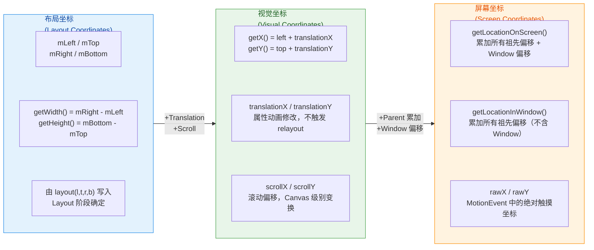

#### 常见陷阱：在 onCreate 中获取坐标

一个 Android 开发中极其经典的问题是：**在 `Activity.onCreate()` 或 `Fragment.onCreateView()` 中调用 `view.getWidth()` 返回 0**。原因很简单——此时 View 树尚未完成第一次 Measure + Layout 流程，`mLeft/mTop/mRight/mBottom` 全部为初始值 0。

正确的做法是使用 `ViewTreeObserver` 或 `View.post()` 延迟获取：

```kotlin
// 方法一：ViewTreeObserver.OnGlobalLayoutListener
// 在第一次 Layout 完成后回调
myView.viewTreeObserver.addOnGlobalLayoutListener(
    object : ViewTreeObserver.OnGlobalLayoutListener {
        override fun onGlobalLayout() {
            // 此时 Layout 已完成，可以安全获取坐标和尺寸
            val width = myView.width   // 正确值
            val height = myView.height // 正确值
            val left = myView.left     // 正确值
            // 移除监听器避免重复回调（如果只需要获取一次）
            myView.viewTreeObserver.removeOnGlobalLayoutListener(this)
        }
    }
)

// 方法二：View.post()
// 利用 Handler 机制，将 Runnable 投递到主线程消息队列尾部
// 确保在当前帧的 traversal 完成后执行
myView.post {
    val width = myView.width   // 正确值
    val height = myView.height // 正确值
}
```

`View.post()` 之所以有效，是因为 `performTraversals()` 是通过 `Choreographer` 调度的（在 Vsync 信号回调中执行），而 `View.post()` 的 Runnable 会被添加到主线程 `MessageQueue` 的尾部，确保在当前轮次的 traversal 完成后才执行。不过需要注意，如果 View 尚未 attach 到 Window（即 `view.isAttachedToWindow == false`），`View.post()` 的 Runnable 会被暂存在一个待处理队列（`RunQueue`）中，等到 `onAttachedToWindow()` 后才被真正投递。

---

### View 与 ViewGroup 职责

#### 角色划分：叶子节点 vs 容器节点

在 Layout 阶段，View 和 ViewGroup 扮演着截然不同的角色。这种角色划分遵循的是经典的 **组合模式（Composite Pattern）**——View 是叶子节点，ViewGroup 是容器节点，两者共享统一的 `layout()` 接口，但内部行为差异极大。

**View（叶子节点）的职责：**

1. **被动接收位置**：View 不负责确定自己的位置——位置完全由父容器在 `onLayout()` 中通过 `child.layout(l, t, r, b)` 指定。
2. **存储坐标**：`layout()` → `setFrame()` 将坐标写入 `mLeft/mTop/mRight/mBottom`。
3. **响应尺寸变化**：如果 `setFrame()` 检测到尺寸变化，回调 `onSizeChanged(w, h, oldw, oldh)`。
4. **不需要重写 `onLayout()`**：View 基类的 `onLayout()` 是空方法，叶子节点没有子 View 需要定位。

**ViewGroup（容器节点）的职责：**

1. **必须重写 `onLayout()`**：这是一个 `abstract` 方法（在 `ViewGroup` 中声明），子类必须实现。
2. **为每个子 View 分配位置**：遍历子 View，根据自身的布局策略计算坐标，调用 `child.layout(l, t, r, b)`。
3. **考虑 padding 和 margin**：padding 是容器自身的内边距，margin 是子 View 请求的外边距——两者都需要在坐标计算中考虑。
4. **考虑 gravity、weight 等属性**：不同的 ViewGroup 支持不同的布局属性，这些属性在 `onLayout()` 中被解析和应用。

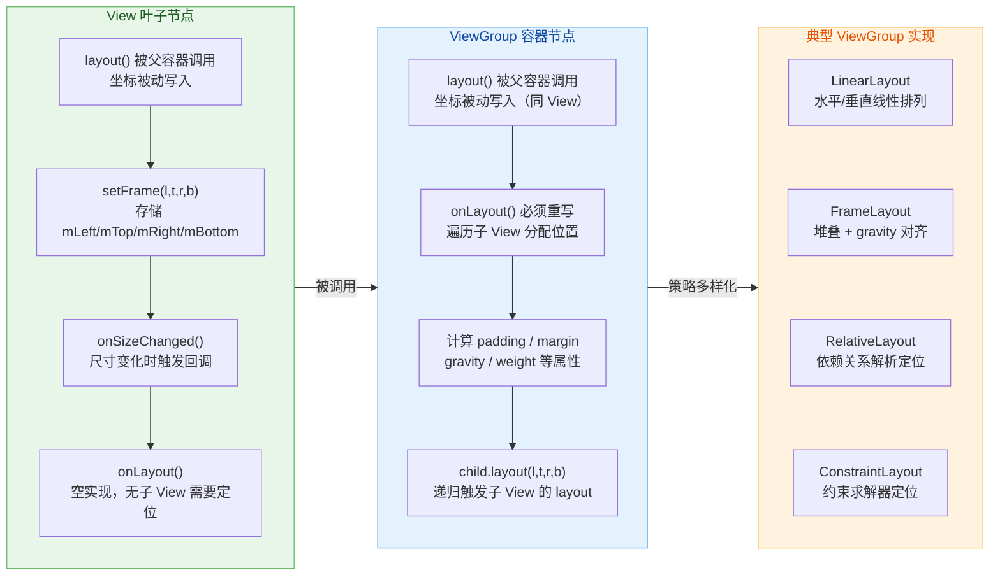

#### Padding 与 Margin 的处理差异

Padding 和 Margin 是 Layout 阶段中最容易混淆的两个概念。虽然两者都影响间距，但它们的"归属权"完全不同：

- **Padding（内边距）**：属于 **View 自身**。由 View 自己声明（`android:padding`），在布局时由 **ViewGroup 的 `onLayout()`** 或 **View 自身的 `onDraw()`** 中处理。Padding 缩小的是 View **内部的可用空间**。
- **Margin（外边距）**：属于 **LayoutParams**，是子 View 向父容器"请求"的外部间距。由 **父容器的 `onLayout()`** 负责处理。Margin 增加的是子 View **之间或子 View 与容器边缘之间的距离**。

以一个带 padding 和 margin 的垂直布局为例：

```kotlin
// 处理 padding 和 margin 的 onLayout 实现
override fun onLayout(changed: Boolean, l: Int, t: Int, r: Int, b: Int) {
    // 父容器的 padding 限制了子 View 可用区域的起始位置
    var currentTop = paddingTop       // 顶部留出 paddingTop 的空间
    val leftBound = paddingLeft       // 左侧起始位置考虑 paddingLeft
    val rightBound = (r - l) - paddingRight  // 右侧边界考虑 paddingRight

    for (i in 0 until childCount) {
        val child = getChildAt(i)
        if (child.visibility == View.GONE) continue

        // 获取子 View 的 LayoutParams，从中读取 margin 值
        val lp = child.layoutParams as MarginLayoutParams

        // margin 在子 View 外部增加间距
        currentTop += lp.topMargin

        // 计算子 View 的左边缘：父容器 paddingLeft + 子 View 的 leftMargin
        val childLeft = leftBound + lp.leftMargin

        // 计算子 View 的右边缘：左边缘 + 测量宽度
        val childRight = childLeft + child.measuredWidth

        // 计算子 View 的底边缘：当前 top + 测量高度
        val childBottom = currentTop + child.measuredHeight

        // 为子 View 分配最终位置
        child.layout(childLeft, currentTop, childRight, childBottom)

        // 更新 currentTop：加上子 View 高度 + 底部 margin
        currentTop = childBottom + lp.bottomMargin
    }
}

// 必须重写以支持 MarginLayoutParams
override fun generateLayoutParams(attrs: AttributeSet?): LayoutParams {
    // 返回 MarginLayoutParams 而非默认的 LayoutParams
    // 这样子 View 的 layout_margin 属性才会被正确解析
    return MarginLayoutParams(context, attrs)
}
```

这里有一个非常重要的细节：**如果你的自定义 ViewGroup 想要支持子 View 的 `layout_margin`，必须重写 `generateLayoutParams()` 方法返回 `MarginLayoutParams`（或其子类）。** 否则，XML 中声明的 `layout_marginTop` 等属性会被静默忽略，因为默认的 `ViewGroup.LayoutParams` 不包含 margin 字段。这是一个新手常犯的错误，且不会有任何编译时警告或运行时异常——只是 margin 不会生效。

#### 不同 ViewGroup 的 Layout 策略对比

不同的 ViewGroup 子类在 `onLayout()` 中实现了截然不同的定位策略，理解这些策略有助于在开发中做出正确的容器选型：

**FrameLayout** 的 onLayout 策略最为简单——所有子 View 默认堆叠在容器的左上角，通过 `layout_gravity` 属性调整对齐方式。它的核心逻辑是：对每个子 View，根据 gravity 计算出一个偏移量，然后 `child.layout(left + offset, top + offset, ...)`。由于所有子 View 的位置计算是独立的（不相互依赖），FrameLayout 的 Layout 阶段时间复杂度为 O(n)。

**LinearLayout** 维护一个累计偏移量（类似我们上面的 `SimpleVerticalLayout`），子 View 按声明顺序依次排列。当使用 `layout_weight` 属性时，LinearLayout 需要进行 **两次 Measure**——第一次测量不含 weight 的基础尺寸，第二次根据 weight 比例分配剩余空间。但在 Layout 阶段，它仍然是单次遍历 O(n)。

**RelativeLayout** 的 Layout 策略基于"依赖关系图（Dependency Graph）"。每个子 View 可以声明相对于其他 View 或父容器的位置约束（如 `layout_toRightOf`, `layout_below`）。RelativeLayout 在 Measure 阶段需要对依赖图进行拓扑排序，确保被依赖的 View 先被测量。在 Layout 阶段，它按照拓扑序为每个子 View 分配位置。由于存在水平和垂直两个方向的依赖关系，RelativeLayout 通常需要 **两次 Measure 遍历**（水平规则一次，垂直规则一次），这使得它在复杂场景下性能弱于 ConstraintLayout。

**ConstraintLayout** 使用了一个内置的 **线性约束求解器（Cassowary-like solver）** 来处理所有约束。它将所有子 View 的位置约束转化为线性方程组，通过数值求解一次性确定所有 View 的位置。这种方式的优势是：**无论约束多么复杂，ConstraintLayout 只需要一次 Measure + 一次 Layout 遍历**，扁平化的 View 层级也减少了递归深度。这就是为什么 Google 推荐使用 ConstraintLayout 替代深度嵌套的 LinearLayout + RelativeLayout 组合。

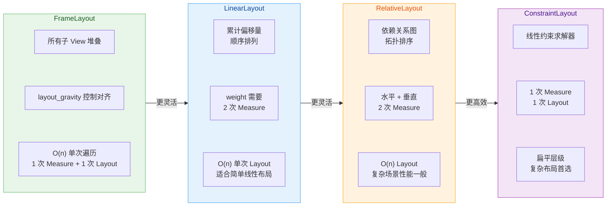

#### requestLayout 与 Layout 的联动

当一个 View 调用 `requestLayout()` 时，它会沿着 View 树向上传播，在路径上的每个 ViewGroup 都设置 `PFLAG_FORCE_LAYOUT` 标记，最终到达 ViewRootImpl。ViewRootImpl 会调度一次新的 `performTraversals()`，其中 **Measure 和 Layout 都会重新执行**（但只有被标记了 `PFLAG_FORCE_LAYOUT` 的分支会真正参与计算，未标记的分支会跳过）。

这意味着 `requestLayout()` 的代价远高于 `invalidate()`——后者只触发 Draw 阶段，而前者会触发完整的 Measure + Layout + Draw 流水线。因此，在性能敏感场景（如列表滚动、动画执行期间），应尽量避免频繁调用 `requestLayout()`。

一个实际开发中的优化案例：在 `RecyclerView` 的滚动过程中，如果 Item View 的尺寸是固定的，可以调用 `recyclerView.setHasFixedSize(true)`。这个标志告诉 RecyclerView：当数据集变化时（如 `notifyItemInserted`），不需要对整个 RecyclerView 调用 `requestLayout()`，只需对新增/变化的 Item 做局部布局即可。这显著减少了 Layout 阶段的计算量。

---

**📝 练习题**

在一个 Activity 的 `onCreate()` 方法中执行 `textView.width`，返回值是什么？如果想在 Layout 完成后安全获取宽度，以下哪种方式 **不可行**？

A. 使用 `textView.post { val w = textView.width }`


B. 使用 `ViewTreeObserver.addOnGlobalLayoutListener` 监听 Layout 完成


C. 在 `onResume()` 中直接调用 `textView.width`


D. 使用 `textView.doOnLayout { val w = it.width }` (KTX 扩展)


**【答案】** C

**【解析】** 在 `onCreate()` 中调用 `textView.width` 返回 0，因为此时 View 树尚未完成首次 `performTraversals()`（包含 Measure + Layout）。选项 A 利用 `View.post()` 将任务投递到消息队列尾部，确保在当前帧的 traversal 完成后执行；选项 B 通过 `OnGlobalLayoutListener` 监听全局 Layout 完成事件；选项 D 的 `doOnLayout` 是 AndroidX KTX 提供的便利扩展，在下一次 Layout 完成后回调。这三者都能正确获取宽度。选项 C **不可行**，因为 `onResume()` 在 Activity 生命周期中虽然晚于 `onCreate()`，但此时第一次 `performTraversals()` 尚未被调度执行——`performTraversals()` 由 `Choreographer` 在下一次 Vsync 信号到来时触发，而 `onResume()` 在同一个消息处理周期内就已经被调用。因此在 `onResume()` 中获取 `textView.width` 同样会返回 0。

---

**📝 练习题**

自定义一个 ViewGroup 时，在 XML 中为子 View 设置了 `android:layout_marginTop="16dp"`，但运行时发现 margin 完全没有生效。最可能的原因是什么？

A. 子 View 的 `onMeasure()` 中没有读取 margin 值


B. 自定义 ViewGroup 没有重写 `generateLayoutParams()` 返回 `MarginLayoutParams`


C. `layout_marginTop` 属性只在 `LinearLayout` 中有效


D. 自定义 ViewGroup 的 `onLayout()` 中使用了错误的坐标计算公式


**【答案】** B

**【解析】** 当 Android Framework 从 XML 中解析子 View 的 LayoutParams 时，会调用父容器的 `generateLayoutParams(AttributeSet)` 方法来创建 LayoutParams 对象。`ViewGroup` 基类的默认实现返回的是 `ViewGroup.LayoutParams`，该类只包含 `width` 和 `height` 两个字段，**不包含 margin 字段**。因此 XML 中的 `layout_margin*` 属性不会被解析。要支持 margin，必须重写 `generateLayoutParams()` 返回 `MarginLayoutParams`（或其子类如 `LinearLayout.LayoutParams`）。选项 A 不正确，margin 的读取发生在父容器的 `onLayout()` 中而非子 View 的 `onMeasure()` 中。选项 C 不正确，margin 是一个通用机制，任何正确支持 `MarginLayoutParams` 的 ViewGroup 都可以使用。选项 D 虽然可能导致 margin 值不正确，但"完全没有生效"最直接的原因是 LayoutParams 类型不对，margin 字段根本没有被创建和赋值。

---

## 绘制阶段 Draw

在 Android 绘制流水线（Rendering Pipeline）中，**Draw 阶段是最终将像素"画"到屏幕上的关键环节**。经历了 Measure 阶段确定每个 View 的宽高，以及 Layout 阶段确定每个 View 在父容器中的位置之后，系统已经掌握了完整的"画什么、画在哪"的信息。Draw 阶段的职责，就是按照一套 **严格的绘制顺序**，将背景、内容、子 View、前景、滚动条等视觉元素，逐层叠加地绘制到一块 Canvas 画布上，最终交给底层的 SurfaceFlinger 进行合成与显示。

理解 Draw 阶段，是掌握自定义 View、性能优化（过度绘制 Overdraw）、硬件加速行为差异、以及 Canvas 离屏缓冲（Off-screen Buffer）等高阶主题的基石。本节将从 `View.draw()` 的完整调度链路出发，逐步深入每一个绘制子步骤的原理与机制。

### View.draw() 的六步绘制协议

当 `ViewRootImpl.performTraversals()` 执行到绘制阶段时，最终会调用到 DecorView 的 `draw(Canvas)` 方法，进而按照 View 树的层级自顶向下递归。`View.draw(Canvas canvas)` 方法内部定义了一套 **严格且固定的六步绘制协议**（Six-step Drawing Protocol），这个顺序不可更改，也不应该被子类覆写——这是 Android Framework 的核心设计约定。

这六步的执行顺序如下：

1. **绘制背景**（Draw the background） — `drawBackground(canvas)`
2. **保存 Canvas 图层**（Save canvas layers，为 fading edge 做准备，可选步骤）
3. **绘制自身内容**（Draw the content） — `onDraw(canvas)`
4. **绘制子 View**（Draw children） — `dispatchDraw(canvas)`
5. **绘制渐变边缘与滚动条**（Draw fading edges and scrollbars） — `onDrawForeground(canvas)`
6. **绘制前景与默认焦点高亮**（Draw foreground, default focus highlight）

理解这个顺序至关重要：**后绘制的内容会覆盖先绘制的内容**。这就是为什么背景最先画（在最底层），前景和滚动条最后画（在最顶层）。这种分层叠加的模型，本质上就是经典的 **画家算法**（Painter's Algorithm）——像画家先画远处的山再画近处的树一样，先画的图层会被后画的图层遮盖。

我们来看 `View.draw()` 在源码中的核心骨架（简化后）：

```java
// View.java — draw() 核心绘制协议（简化版）
public void draw(Canvas canvas) {

    // ============ 第 1 步：绘制背景 ============
    // 背景 Drawable 永远在最底层，不受 padding 影响
    drawBackground(canvas);

    // ============ 第 2 步：保存图层（可选） ============
    // 仅当 View 设置了水平或垂直的 fading edge 时才执行
    // fading edge 是列表滚动到边缘时的渐变半透明效果
    // 需要先 saveLayer 创建离屏缓冲，后续与 fading shader 混合
    int saveCount = canvas.getSaveCount();
    if (horizontalEdges || verticalEdges) {
        canvas.saveLayerAlpha(left, top, right, bottom, 255);
    }

    // ============ 第 3 步：绘制自身内容 ============
    // 这就是开发者最熟悉的 onDraw() 回调
    // 自定义 View 的核心绑定绑点：画文字、图形、Bitmap 等
    onDraw(canvas);

    // ============ 第 4 步：绘制子 View ============
    // 对叶子 View（如 TextView）此方法为空
    // 对 ViewGroup，会遍历 children 依次调用 child.draw()
    dispatchDraw(canvas);

    // ============ 第 5 步：绘制渐变边缘 ============
    // 利用第 2 步保存的图层，叠加渐变 shader 实现半透明淡出
    if (horizontalEdges || verticalEdges) {
        // 绘制 top/bottom/left/right fading edge
        canvas.restoreToCount(saveCount);
    }

    // ============ 第 6 步：绘制前景和滚动条 ============
    // 前景 Drawable（foreground）+ 默认焦点高亮 + 滚动条
    onDrawForeground(canvas);

    // 绘制完成后，清除 PFLAG_DIRTY 标记
    // 表示该 View 已是"干净"状态，无需重复绘制
}
```

一个极其重要的设计细节是：**`draw()` 方法本身几乎不应被覆写**。Framework 文档明确建议开发者覆写 `onDraw()` 来绘制自身内容，而非覆写 `draw()`。如果你错误地 Override 了 `draw()` 却忘了调 `super.draw()`，那么背景、子 View、前景等一系列绘制将全部丢失，画面会出现严重异常。

下面这张流程图展示了完整的六步协议以及各方法在 View / ViewGroup 中的调用关系：

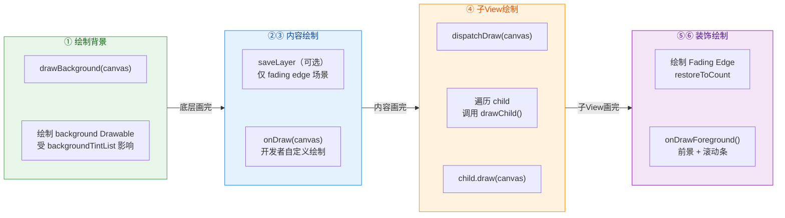

这个流程是 **每一个 View 节点** 在被绘制时都会经历的完整序列。整棵 View 树的绘制，本质上就是这六步协议在树的每个节点上递归执行的结果。

### drawBackground — 背景绘制的底层逻辑

背景绘制是六步协议的第一步，看似简单（"不就是画个颜色或图片吗？"），但其中隐藏着不少值得深挖的机制细节。

`drawBackground(canvas)` 是一个 `private` 方法（注意不是 protected），开发者 **无法覆写** 它。这体现了 Framework 的设计意图：**背景的绘制逻辑是固定的，不应被子类篡改**。

```java
// View.java — drawBackground 核心逻辑
private void drawBackground(Canvas canvas) {
    // 获取当前 View 的 background Drawable
    // 可以通过 xml 的 android:background 或代码 setBackground() 设置
    final Drawable background = mBackground;

    // 若没有设置背景，直接跳过，避免无意义的绘制开销
    if (background == null) {
        return;
    }

    // 根据 View 的布局结果设置 Drawable 的绘制边界
    // 这里用的是 mLeft/mRight/mTop/mBottom 对应的宽高
    // 注意：背景的范围 = View 的完整尺寸（包含 padding 区域）
    setBackgroundBounds();

    // 如果存在背景偏移（通常由 scrollX/scrollY 引起）
    // 需要先平移 Canvas 再绘制，画完再恢复
    final int scrollX = mScrollX;
    final int scrollY = mScrollY;
    if ((scrollX | scrollY) != 0) {
        // 将画布原点偏移到滚动位置
        canvas.translate(scrollX, scrollY);
    }

    // 调用 Drawable.draw(canvas) 将背景实际画出
    // 这里的 Drawable 可以是 ColorDrawable、BitmapDrawable、
    // GradientDrawable、RippleDrawable 等任意子类
    background.draw(canvas);

    // 恢复之前的偏移
    if ((scrollX | scrollY) != 0) {
        canvas.translate(-scrollX, -scrollY);
    }
}
```

几个关键要点需要特别留意：

**背景绘制范围包含 padding 区域。** 很多初学者会误以为背景只填充 content 区域，实际上 `setBackgroundBounds()` 调用时用的是 `(0, 0, mRight - mLeft, mBottom - mTop)`，即整个 View 的矩形区域。这就是为什么你给一个 `TextView` 设置背景色后，padding 区域也会被填充——因为背景是第一步画的，它覆盖了 View 的完整面积。

**背景受 scroll 偏移影响。** 当 View 内部发生了滚动（`scrollTo` / `scrollBy`），Canvas 会先 `translate` 到滚动偏移位置。这意味着背景 **会跟随内容一起滚动**。在大多数场景下，这个偏移量为 0，所以感知不明显。但如果你对一个自定义 View 调用了 `scrollTo()`，背景确实会跟着移动。

**背景 Drawable 的类型多样性。** `background.draw(canvas)` 这一行看起来简单，但 Drawable 体系本身非常丰富。一个 `<ripple>` 定义的 RippleDrawable 在这一步会绘制出水波纹动画；一个 `<shape>` 定义的 GradientDrawable 会绘制圆角矩形渐变；一个 `<selector>` 定义的 StateListDrawable 会根据 View 当前的 pressed/focused/enabled 等状态选择不同的子 Drawable 来绘制。所有这些复杂的视觉效果，都统一在 `drawBackground` 这一步完成。

### onDraw — 开发者的主战场

`onDraw(Canvas canvas)` 是 **开发者自定义绘制** 的核心回调，也是最常被覆写的方法。当你需要画一条自定义的进度条、一个波浪动画、一个复杂的图表、或者任何标准 Widget 无法满足的视觉效果时，`onDraw()` 就是你的"画板"。

从调用时序上看，`onDraw()` 在背景之后、子 View 之前执行。这意味着：

- 你在 `onDraw()` 里画的内容 **会叠加在背景之上**（不会被背景覆盖）。
- 你在 `onDraw()` 里画的内容 **会被子 View 覆盖**（如果该 View 是 ViewGroup 且有子 View）。

这个层级关系决定了一个常见的最佳实践：**如果你想给一个自定义 ViewGroup 绘制一些装饰性的底纹或分割线，在 `onDraw()` 中绘制即可**，它们自然会出现在子 View 的下方。

#### ViewGroup 的 onDraw 默认不执行

这是一个极其容易踩的坑。**ViewGroup 默认不会调用 `onDraw()`**，因为它的 `WILL_NOT_DRAW` flag 默认为 `true`。

为什么？从性能角度考虑：大多数 ViewGroup（如 LinearLayout、FrameLayout）仅仅是布局容器，它们自身不需要绘制任何内容，只需要转发绘制给子 View 即可。如果每个 ViewGroup 都走一遍 `onDraw()`（哪怕是空方法），在一棵深层嵌套的 View 树中，这些无意义的方法调用和 Canvas 状态保存/恢复会累积成不可忽视的性能开销。因此，`View` 类中有一个优化标记位 `PFLAG_SKIP_DRAW`，当 `WILL_NOT_DRAW = true` 且没有背景/前景时，系统会 **跳过** `draw()` 的完整六步流程，直接调用 `dispatchDraw()` 来绘制子 View。

所以，如果你自定义了一个 ViewGroup 并想在 `onDraw()` 中绘制内容，**必须** 调用：

```kotlin
// 在构造函数或 init 块中调用
// 告诉 Framework：这个 ViewGroup 自身有内容需要绘制
// 否则 onDraw() 将永远不会被回调
setWillNotDraw(false)
```

或者，给该 ViewGroup 设置一个 `background`（即使是透明色也行），系统检测到有背景 Drawable 时，也会自动清除 `WILL_NOT_DRAW` 标记，从而触发完整的 `draw()` 流程。

#### Canvas 绘制 API 概览

传入 `onDraw(canvas)` 的 `Canvas` 对象是开发者与绘制系统交互的唯一接口。Canvas 可以理解为一个 **绘制指令记录器**（在硬件加速模式下，它实际上是 `RecordingCanvas`，会将绘制指令录制到 DisplayList 中，而非立即执行像素操作）。Canvas 提供了大量绘制 API，主要分为以下几类：

**基本图形绘制：**
- `drawRect()` / `drawRoundRect()` — 矩形 / 圆角矩形
- `drawCircle()` / `drawOval()` — 圆形 / 椭圆
- `drawLine()` / `drawLines()` — 线段 / 批量线段
- `drawArc()` — 弧形 / 扇形
- `drawPath()` — 自定义路径（贝塞尔曲线、多边形等）
- `drawPoints()` — 点集

**图像绘制：**
- `drawBitmap()` — 位图绘制（可指定源区域和目标区域）
- `drawPicture()` — 绘制录制好的 Picture 对象

**文本绘制：**
- `drawText()` / `drawTextOnPath()` — 文本 / 沿路径文本
- `drawTextRun()` — 支持复杂文本排版（双向文本、连字等）

**Canvas 变换操作：**
- `translate()` / `rotate()` / `scale()` / `skew()` — 平移 / 旋转 / 缩放 / 倾斜
- `concat(Matrix)` — 应用自定义矩阵变换
- `clipRect()` / `clipPath()` — 裁剪区域

**状态管理：**
- `save()` / `restore()` — 保存 / 恢复 Canvas 状态（变换矩阵 + 裁剪区域）
- `saveLayer()` — 创建离屏图层（Off-screen Layer）

下面是一个典型的自定义 View 绘制示例，展示了 Canvas API 的常见用法：

```kotlin
class WaveProgressView @JvmOverloads constructor(
    context: Context,
    attrs: AttributeSet? = null
) : View(context, attrs) {

    // 背景圆环的画笔：描边模式，浅灰色
    private val bgPaint = Paint(Paint.ANTI_ALIAS_FLAG).apply {
        style = Paint.Style.STROKE       // 仅绘制轮廓（描边）
        strokeWidth = 12f.dp             // 描边宽度 12dp
        color = Color.parseColor("#E0E0E0") // 浅灰色
    }

    // 前景进度弧的画笔：描边模式，主题蓝
    private val progressPaint = Paint(Paint.ANTI_ALIAS_FLAG).apply {
        style = Paint.Style.STROKE       // 描边模式
        strokeWidth = 12f.dp             // 与背景圆环等宽
        strokeCap = Paint.Cap.ROUND      // 端点圆角，视觉更柔和
        color = Color.parseColor("#1E88E5") // Material Blue 600
    }

    // 中心百分比文字的画笔
    private val textPaint = Paint(Paint.ANTI_ALIAS_FLAG).apply {
        textSize = 48f.sp               // 文字大小 48sp
        textAlign = Paint.Align.CENTER   // 水平居中对齐
        color = Color.parseColor("#212121") // 近黑色文字
        typeface = Typeface.DEFAULT_BOLD // 粗体
    }

    // 进度值：0f ~ 1f
    var progress: Float = 0.65f
        set(value) {
            field = value.coerceIn(0f, 1f) // 限制在合法范围
            invalidate()  // 进度变化时触发重绘
        }

    // 弧形绘制区域（避免在 onDraw 中反复创建对象）
    private val arcRect = RectF()

    override fun onDraw(canvas: Canvas) {
        // 不调用 super.onDraw()——因为 View 基类的 onDraw 是空实现
        // 如果继承自具体 Widget（如 TextView），则通常需要调用 super

        // 计算圆心和半径
        val cx = width / 2f   // 水平中心 = View 宽度的一半
        val cy = height / 2f  // 垂直中心 = View 高度的一半
        val radius = minOf(cx, cy) - bgPaint.strokeWidth // 半径需减去描边宽度的一半避免裁剪

        // ---- 第一层：绘制完整的灰色背景圆环 ----
        canvas.drawCircle(cx, cy, radius, bgPaint)

        // ---- 第二层：绘制蓝色进度弧 ----
        // 设置弧形的外接矩形
        arcRect.set(cx - radius, cy - radius, cx + radius, cy + radius)
        // 从 12 点方向开始（-90°），顺时针扫过 progress 对应的角度
        val sweepAngle = 360f * progress
        canvas.drawArc(arcRect, -90f, sweepAngle, false, progressPaint)

        // ---- 第三层：绘制中心百分比文字 ----
        val text = "${(progress * 100).toInt()}%"
        // 计算文字垂直居中的 baseline：需加上 ascent 和 descent 的偏移
        val textY = cy - (textPaint.descent() + textPaint.ascent()) / 2f
        canvas.drawText(text, cx, textY, textPaint)
    }
}
```

这个例子清晰地展示了 `onDraw()` 中的典型模式：**使用 Paint 定义"怎么画"，使用 Canvas API 定义"画什么"**。Paint 控制颜色、粗细、字体等样式属性，Canvas 控制形状、位置、变换等空间属性，两者配合完成所有绘制工作。

另外值得注意的是代码中的 `invalidate()` 调用——当 `progress` 属性变化时，我们调用 `invalidate()` 触发重绘，系统会在下一个 VSync 信号到来时重新执行 `draw()` 流程，`onDraw()` 会被再次回调，从而以新的 progress 值重新绘制画面。这就是 Android 绘制流水线中 "状态变更 → invalidate → 重绘" 的核心循环。

### Canvas 图层 Layer 与离屏缓冲

Canvas 的 **图层机制**（Layer Mechanism）是 Draw 阶段中最容易被误解、也最影响性能的部分。理解它需要先建立一个核心心智模型：**Canvas 不是一张纸，而是一叠透明的画布**。

#### save() 与 restore() — 状态栈

最基础的 Canvas 状态管理是 `save()` 和 `restore()` 配对使用。它们管理的是一个 **状态栈**（State Stack），栈中保存的信息包括：

- 当前的 **变换矩阵**（Translation、Rotation、Scale 的累积结果）
- 当前的 **裁剪区域**（Clip Region）

```kotlin
// 状态栈的典型使用模式
override fun onDraw(canvas: Canvas) {
    // 当前状态入栈：记住 "原始" 的变换矩阵和裁剪区域
    canvas.save()

    // 在这个 save 范围内做任何变换，都不会影响外部
    canvas.translate(100f, 100f)  // 平移画布原点
    canvas.rotate(45f)            // 旋转 45 度
    canvas.drawRect(0f, 0f, 200f, 200f, paint)  // 画一个旋转的矩形

    // 弹出栈顶状态：变换矩阵和裁剪区域恢复到 save() 之前
    canvas.restore()

    // 这里的绘制不受上面 translate/rotate 的影响
    canvas.drawCircle(300f, 300f, 50f, paint)
}
```

`save()` / `restore()` **不会创建新的像素缓冲区**，它仅仅是保存和恢复"坐标系"和"裁剪区"的快照，性能开销极小。你可以把它想象成在本子上夹了个书签——翻来翻去最后还能回到书签的位置，但本子还是同一本。

#### saveLayer() — 真正的离屏缓冲

与轻量的 `save()` 不同，`saveLayer()` 是一个 **重量级操作**。它会创建一个全新的像素缓冲区（Off-screen Bitmap / FBO），后续所有的绘制操作都将发生在这块独立的缓冲区上，直到 `restore()` 时，这块缓冲区才会作为一个整体，按照指定的透明度（alpha）或混合模式（Xfermode / BlendMode）合成回主画布。

```kotlin
override fun onDraw(canvas: Canvas) {
    // 创建一个离屏图层，覆盖指定区域
    // 所有后续绘制都发生在这块独立的缓冲区上
    val count = canvas.saveLayer(0f, 0f, width.toFloat(), height.toFloat(), null)

    // 先画一个圆形（作为 DST 目标图像）
    canvas.drawCircle(200f, 200f, 150f, dstPaint)

    // 设置 PorterDuff 混合模式为 SRC_IN：
    // 只保留 SRC 和 DST 交集部分的 SRC 像素
    // 这就是常见的 "圆形头像裁剪" 原理
    srcPaint.xfermode = PorterDuffXfermode(PorterDuff.Mode.SRC_IN)

    // 再画一张方形图片（作为 SRC 源图像）
    canvas.drawBitmap(avatarBitmap, 50f, 50f, srcPaint)

    // 清除 xfermode，避免影响后续绘制
    srcPaint.xfermode = null

    // restore 时，离屏缓冲区的内容被合成到主画布上
    canvas.restoreToCount(count)
}
```

**为什么 PorterDuff 混合需要 saveLayer？** 这是最常见的疑问。原因在于 PorterDuff 混合模式（如 `SRC_IN`、`DST_OUT`、`XOR`）的计算是基于 **目标区域现有像素的 alpha 值** 进行的。如果不使用 `saveLayer()`，目标区域就是主画布——上面可能已经有背景色、前一个 View 的绘制残留等，这些"脏像素"会参与混合计算，导致结果完全不符合预期（典型症状是出现黑色背景或颜色异常）。`saveLayer()` 创建的离屏缓冲区初始状态是 **完全透明**（alpha = 0），这就提供了一个"干净"的环境，让 PorterDuff 混合能正确执行。

```text
┌─────────────────────────────────────────────────────────────┐
│  Main Canvas (主画布)                                        │
│  ┌──────────────────────────────────────────┐               │
│  │  Off-screen Layer (saveLayer 创建)        │               │
│  │  初始状态：全透明 (alpha = 0)              │               │
│  │                                           │               │
│  │   ① drawCircle → DST 像素写入             │               │
│  │   ② SRC_IN + drawBitmap → 混合计算        │               │
│  │   ③ 结果：圆形裁剪后的头像                 │               │
│  │                                           │               │
│  └──────────┬───────────────────────────────┘               │
│             │  restore() 时合成回主画布                       │
│             ▼                                                │
│  ┌──────────────────────────────────────────┐               │
│  │  主画布上显示：圆形头像（无黑底）           │               │
│  └──────────────────────────────────────────┘               │
└─────────────────────────────────────────────────────────────┘
```

**性能警告：** `saveLayer()` 是一个 **代价极高** 的操作。每次调用都会分配一块与指定区域等大的内存缓冲区（在硬件加速下是 GPU 的 FBO，在软件绘制下是一块 Bitmap）。如果 `saveLayer` 的区域是整个 View（比如 `0, 0, width, height`），那就是额外分配了一整个 View 大小的帧缓冲。Android 官方文档明确警告：

> 每一次不受限制的 saveLayer 调用都会增加一个与当前 Canvas 大小相当的额外渲染目标（render target），这在内存和 GPU 填充率上都很昂贵。

因此，最佳实践是：
1. **尽量缩小 saveLayer 的区域**：只传入真正需要混合的矩形区域，而非整个 View。
2. **避免在 onDraw 中频繁调用 saveLayer**：如果效果可以用其他方式实现（如 `BitmapShader` 替代圆形裁剪、`Outline` + `clipToOutline` 替代圆角裁剪），优先选择替代方案。
3. **注意硬件加速兼容性**：部分 `saveLayer` 的重载在硬件加速下行为有差异，特别是带 `Paint` 参数的版本。

#### View.setLayerType() — 硬件层与软件层

`saveLayer()` 是开发者在 `onDraw()` 内部主动创建离屏缓冲的方式。而 `View.setLayerType()` 则是从 **View 整体级别** 控制是否使用离屏缓冲。它有三种模式：

| LayerType | 含义 | 使用场景 |
|-----------|------|----------|
| `LAYER_TYPE_NONE` | 默认值，不使用离屏缓冲 | 普通 View |
| `LAYER_TYPE_HARDWARE` | 将 View 绘制结果缓存为 GPU 纹理（FBO） | 动画优化：View 内容不变但需频繁移动/透明度变化 |
| `LAYER_TYPE_SOFTWARE` | 强制使用软件 Bitmap 缓存 | 需要使用不支持硬件加速的绘制操作时 |

`LAYER_TYPE_HARDWARE` 最典型的用途是 **属性动画优化**。当你对一个 View 做 alpha、translationX/Y、rotation 等属性动画时，如果 View 的内容本身不变（只是位置/透明度在变），那么每一帧都重新执行 `onDraw()` 就是浪费。设置 `LAYER_TYPE_HARDWARE` 后，View 的绘制结果会被缓存为 GPU 纹理，后续帧只需要对这个纹理做变换即可，`onDraw()` 不会被重复调用。动画结束后应立即将 LayerType 恢复为 `NONE`，释放 GPU 纹理内存。

```kotlin
// 属性动画 + 硬件层优化的标准写法
view.setLayerType(View.LAYER_TYPE_HARDWARE, null)
view.animate()
    .alpha(0f)                    // 渐隐动画
    .translationX(300f)           // 平移动画
    .setDuration(500)
    .withEndAction {
        // 动画结束后立即释放硬件层，避免 GPU 内存泄漏
        view.setLayerType(View.LAYER_TYPE_NONE, null)
    }
    .start()
```

### dispatchDraw 与 drawChild — 子 View 的递归绘制

六步协议的第四步 `dispatchDraw(canvas)` 是 **ViewGroup 独有** 的绘制环节。对于叶子 View（如 `TextView`、`ImageView`），`dispatchDraw()` 是空实现。对于 ViewGroup，`dispatchDraw()` 承担着一个核心职责：**按照正确的顺序，将绘制任务逐一分发给每个子 View**。

```java
// ViewGroup.java — dispatchDraw 核心逻辑（大幅简化）
@Override
protected void dispatchDraw(Canvas canvas) {
    final int childrenCount = mChildrenCount;
    final View[] children = mChildren;

    // 如果设置了 childrenDrawingOrderEnabled，则使用自定义绘制顺序
    // 典型场景：ViewPager 需要先画两侧的 page 再画中间高亮的 page
    final boolean customOrder = isChildrenDrawingOrderEnabled();

    for (int i = 0; i < childrenCount; i++) {
        // 获取当前位置应该绘制的 child 索引
        // 默认情况下 getChildDrawingOrder 返回 i（按添加顺序绘制）
        final int childIndex = customOrder
                ? getChildDrawingOrder(childrenCount, i) : i;
        final View child = children[childIndex];

        // 仅绘制可见（VISIBLE）且不在动画中隐藏的子 View
        if ((child.mViewFlags & VISIBILITY_MASK) == VISIBLE
                || child.getAnimation() != null) {
            // 将绘制任务委托给 drawChild 方法
            drawChild(canvas, child, drawingTime);
        }
    }
}
```

**绘制顺序（Drawing Order）** 是一个经常被忽略但非常重要的概念。默认情况下，ViewGroup 按照 **子 View 添加的顺序**（即 XML 中的声明顺序）从前到后绘制。先添加的 child 先画（在底层），后添加的 child 后画（在上层，会遮盖前者）。这就是为什么在 FrameLayout 中，XML 里写在后面的子 View 会显示在上面。

但这个顺序可以被自定义。通过 `setChildrenDrawingOrderEnabled(true)` + 覆写 `getChildDrawingOrder()`，ViewGroup 可以控制子 View 的绘制顺序。一个典型的真实案例是 `ViewPager`——当用户滑动页面时，当前居中的 page 需要绘制在最上面，即使它在 children 数组中的位置不是最后一个。

`drawChild()` 方法内部，最终会调用到 `child.draw(canvas, parent, drawingTime)` 这个三参数版本的 `draw()` 方法（注意不是前面讲的一参数 `draw(Canvas)`）。这个三参数版本会处理子 View 的 **几何变换**（translation、scale、rotation）、**alpha 透明度**、**动画变换矩阵**，以及将 Canvas 裁剪/平移到子 View 的坐标空间，然后才调用一参数的 `child.draw(canvas)` 进入该子 View 的六步绘制流程。

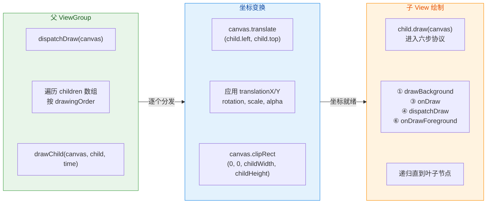

这个递归机制的美妙之处在于：**每个 View 在自己的 `onDraw()` 中只需要关心 "以自己左上角为原点" 的局部坐标系**。Canvas 的坐标变换已经由父 ViewGroup 在 `drawChild()` 中完成了。这就是为什么你在自定义 View 的 `onDraw()` 中 `drawCircle(0, 0, 50, paint)` 总是画在 View 的左上角，无论这个 View 在屏幕上的实际位置是哪里——因为 Canvas 已经被 `translate` 到了这个 View 的 `(left, top)` 位置。

### onDrawForeground — 前景与滚动条

六步协议的最后一步 `onDrawForeground(Canvas canvas)` 负责绘制 **前景 Drawable** 和 **滚动条**。这是 API 23（Android 6.0）引入的方法，在此之前，前景绘制仅 FrameLayout 支持。

前景的典型用途包括：

- **Ripple 触摸反馈覆盖层**：在 Material Design 中，很多可点击 View 的水波纹效果通过 `android:foreground="?attr/selectableItemBackground"` 实现，它在内容之上、响应触摸时绘制半透明的波纹。
- **遮罩层**：比如对一张图片叠加一层半透明的渐变黑色遮罩，让上面的白色文字更清晰。
- **滚动指示器（Scrollbar）**：垂直/水平滚动条也在这一步绘制，永远处于最顶层。

```java
// View.java — onDrawForeground 核心逻辑
public void onDrawForeground(Canvas canvas) {
    // 先绘制滚动指示器（如果有的话）
    onDrawScrollIndicators(canvas);

    // 再绘制滚动条
    onDrawScrollBars(canvas);

    // 最后绘制前景 Drawable
    final Drawable foreground = mForegroundInfo != null
            ? mForegroundInfo.mDrawable : null;
    if (foreground != null) {
        // 前景 Drawable 的 Gravity 影响绘制区域
        // 默认 Gravity.FILL 会填满整个 View
        if (mForegroundInfo.mBoundsChanged) {
            mForegroundInfo.mBoundsChanged = false;
            final Rect selfBounds = mForegroundInfo.mSelfBounds;
            final Rect overlayBounds = mForegroundInfo.mOverlayBounds;
            // 根据 foregroundGravity 计算 Drawable 的实际绘制区域
            Gravity.apply(
                mForegroundInfo.mGravity, foreground.getIntrinsicWidth(),
                foreground.getIntrinsicHeight(), selfBounds, overlayBounds
            );
            foreground.setBounds(overlayBounds);
        }
        // 将前景 Drawable 画到最顶层
        foreground.draw(canvas);
    }
}
```

### 完整绘制流程的时序总结

将以上所有内容串联起来，一棵 View 树在 Draw 阶段的完整执行过程可以用以下时序图来概括：

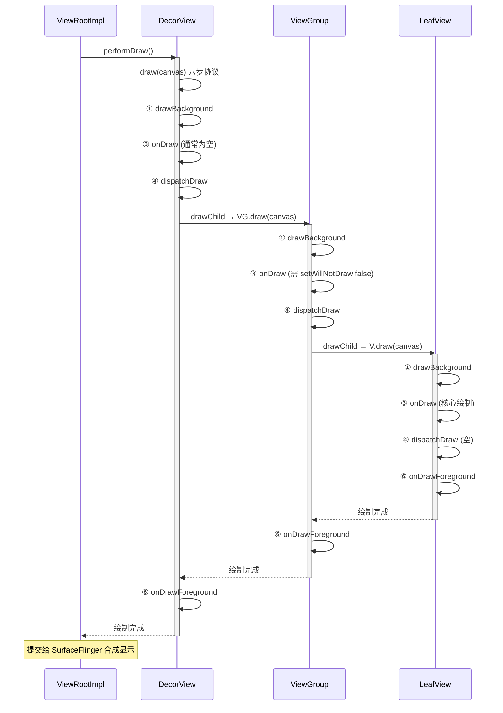

整棵树的绘制是一次 **深度优先遍历**（DFS）：先画父 View 的背景和内容，然后递归画每个子 View（子 View 内部又执行完整的六步协议），最后画父 View 的前景。当所有节点绘制完成后，最终的像素数据通过 Surface 提交给系统的 SurfaceFlinger 服务进行合成，与状态栏、导航栏、其他应用窗口等图层一起，合成出最终用户在屏幕上看到的画面。

**性能核心提醒**：`onDraw()` 可能在每一帧都被调用（16.6ms 一次，60fps 下），因此必须遵守以下黄金法则：

1. **禁止在 onDraw 中创建对象**（Paint、Rect、Path 等）——应在构造函数或 init 中预创建，`onDraw` 中复用。
2. **禁止在 onDraw 中做耗时操作**——不要读文件、不要做复杂计算。
3. **尽量减少 saveLayer 调用**——优先使用替代方案。
4. **减少绘制面积**——利用 `clipRect()` 限制绘制区域，减少 GPU 填充率压力。

---

**📝 练习题**

在自定义 ViewGroup 中覆写了 `onDraw()` 方法并绘制了自定义图形，但运行后发现 `onDraw()` 始终不被回调。以下哪种做法 **不能** 解决此问题？


A. 在构造函数中调用 `setWillNotDraw(false)`


B. 在 XML 中为该 ViewGroup 设置 `android:background="@android:color/transparent"`


C. 在构造函数中调用 `setLayerType(LAYER_TYPE_SOFTWARE, null)`


D. 在 XML 中为该 ViewGroup 设置一个非空的 `android:foreground`


**【答案】** C

**【解析】** ViewGroup 默认设置了 `WILL_NOT_DRAW` 标记位为 `true`，导致系统在绘制时会跳过完整的 `draw()` 六步流程，直接调用 `dispatchDraw()` 分发给子 View。要让 `onDraw()` 被回调，需要清除此标记位。选项 A 直接调用 `setWillNotDraw(false)` 是最标准的做法。选项 B 设置了 background（即使是透明色），系统检测到有 background Drawable 后会在 `setBackground()` 内部自动调用 `setWillNotDraw(false)`，也能解决。选项 D 设置 foreground 后，Framework 同样会触发 `computeOpaqueFlags()` 并清除 `PFLAG_SKIP_DRAW`，使完整的 `draw()` 流程得以执行。而选项 C `setLayerType(LAYER_TYPE_SOFTWARE, null)` 只是强制该 View 使用软件渲染方式（关闭硬件加速），它改变的是渲染管线的类型，**不会** 影响 `WILL_NOT_DRAW` 标记位的值，因此 `onDraw()` 仍然不会被回调。

---

## 刷新机制

Android 的 View 系统并非每帧都对整棵视图树执行完整的 Measure → Layout → Draw 三大流程。如果每次哪怕一个像素的变化都要从根节点重新遍历所有子 View，那性能开销将是灾难性的。为了在"正确性"和"效率"之间取得平衡，Framework 设计了一套 **精细化的刷新调度机制**：通过 **标志位（Flags）** 来标记"哪些 View 需要做什么"，再借助 **Choreographer + Vsync** 将多次请求合并到下一帧统一处理。这套机制的两大核心入口就是 `invalidate()` 和 `requestLayout()`——前者处理"外观变了但大小没变"的场景，后者处理"尺寸或位置可能变了"的场景。理解它们的内部运作原理，是写出高性能自定义 View、避免无意义重绘和布局抖动（Layout Thrashing）的关键。

### Invalidate 脏区重绘

#### 什么时候需要 Invalidate

`invalidate()` 的语义非常明确：**告诉系统"我这个 View 的绘制内容过期了，请在下一帧重新调用我的 `onDraw()`"**。典型场景包括：

- **颜色/文字/图片变化**：比如 `TextView.setText()` 改变了显示文字，`ImageView.setImageBitmap()` 更换了图片，`View.setBackgroundColor()` 切换了背景色。这些操作不会改变 View 的尺寸（或者调用者已经确认尺寸不变），只需要重新绘制即可。
- **动画帧更新**：属性动画（Property Animation）在每个 Vsync 周期通过 `invalidate()` 驱动 View 重绘，比如一个自定义进度条在 `onDraw()` 中根据当前进度值绘制弧线，每次进度变化后调用 `invalidate()` 触发下一帧绘制。
- **自定义 View 状态变化**：例如一个开关控件的 checked 状态切换，需要绘制不同的视觉效果，此时调用 `invalidate()` 即可。

关键要理解的是：`invalidate()` **只触发 Draw 流程，不触发 Measure 和 Layout**。这是它高效的根本原因——跳过了最耗时的测量和布局阶段。

#### Invalidate 的调用链与标志位传播

当你在某个 View 上调用 `invalidate()` 时，并不是立即执行 `onDraw()`，而是经历了一条 **从叶子节点向根节点逐层上报** 的标记传播链。我们来详细拆解这个过程：

**第一步：设置自身标志位。** 调用 `invalidate()` 后，View 内部会调用 `invalidateInternal()` 方法。这个方法首先检查当前 View 是否可见（`VISIBLE`）、是否有有效尺寸、是否已经处于 invalidated 状态等前置条件。如果一切正常，它会在 `mPrivateFlags` 上设置 `PFLAG_DIRTY` 标志位。这个标志位的含义是"我的绘制缓存已过期，下次遍历到我时需要重新执行 `onDraw()`"。在硬件加速模式下，实际设置的是 `PFLAG_INVALIDATED` 标志，告诉 RenderThread 该 View 的 DisplayList 需要重建。

**第二步：向父容器上报脏区。** 设置完自身标志后，View 调用 `p.invalidateChild(this, damage)`（在较新的 API 中是 `p.onDescendantInvalidated(this, this)`），将"脏矩形"（Dirty Rect）信息传递给父 ViewGroup。这里的 damage 是一个 `Rect` 对象，描述了需要重绘的区域范围，初始值就是该 View 自身的边界（`left, top, right, bottom`）。

**第三步：逐级向上传播。** 父 ViewGroup 收到 `invalidateChild()` 调用后，会做两件事：一是在自己的 `mPrivateFlags` 上设置 `PFLAG_DRAW_ANIMATION` 或相关标志，标记"我的某个子 View 需要重绘"；二是根据自身的偏移量（scroll offset）和变换矩阵（transformation matrix）对脏矩形做坐标变换，然后继续调用 **自己的父容器** 的 `invalidateChild()`。这个过程一层一层向上递归，直到到达 ViewRootImpl。

```java
// --- ViewGroup.invalidateChild() 简化逻辑 ---
public void invalidateChild(View child, final Rect dirty) {
    // 获取父容器引用，准备逐级上报
    ViewParent parent = this;

    do {
        // 每一层调用 invalidateChildInParent，做坐标变换并继续上传
        // location 数组存储当前层的 scrollX/scrollY 偏移
        parent = parent.invalidateChildInParent(location, dirty);
        // 循环直到 parent 为 null（即到达 ViewRootImpl 后结束）
    } while (parent != null);
}

// --- ViewGroup.invalidateChildInParent() 简化逻辑 ---
public ViewParent invalidateChildInParent(int[] location, Rect dirty) {
    // 根据当前 ViewGroup 的 scrollX/scrollY 偏移脏矩形
    dirty.offset(-location[0], -location[1]);

    // 如果有变换矩阵（如 rotation/scale），对脏矩形做矩阵变换
    // 确保脏区在父坐标系中的位置正确
    if (mTransformMatrix != null) {
        mTransformMatrix.mapRect(dirty);
    }

    // 标记自身需要重绘子节点
    mPrivateFlags |= PFLAG_DRAW_ANIMATION;

    // 返回自己的 parent，继续向上传播
    return mParent;
}
```

**第四步：到达 ViewRootImpl，调度下一帧。** 当脏区传播到 ViewRootImpl 时，`ViewRootImpl.invalidateChildInParent()` 会将脏矩形合并到全局脏区 `mDirty` 中，然后调用 `scheduleTraversals()`。这个方法是整个刷新机制的枢纽——它向 Choreographer 注册一个 `CALLBACK_TRAVERSAL` 类型的回调，等待下一个 Vsync 信号到来时执行 `performTraversals()`。

> 注意：如果在同一帧内多个 View 先后调用了 `invalidate()`，它们的脏矩形会在 ViewRootImpl 中被 **合并（union）** 成一个更大的矩形。`scheduleTraversals()` 内部有防重入机制（`mTraversalScheduled` 标志），保证同一帧内只注册一次遍历回调。这就是 Android "批处理"刷新请求的关键设计。

#### 脏区（Dirty Region）机制详解

"脏区"是一个非常经典的图形优化概念。它的核心思想是：**既然只有一小块区域的内容发生了变化，那就只重绘这一小块区域，而不是整个屏幕**。

在 **软件绘制（Software Rendering）** 模式下，脏区机制发挥着直接作用。当 `performDraw()` 执行时，Canvas 会被 clip 到 `mDirty` 矩形范围内。这意味着所有超出脏区的绘制指令都会被 Canvas 自动丢弃（clip out），只有脏区内的像素会被真正写入 Surface 的 Buffer。对于只有一个小角标变化的大界面来说，这可以极大减少像素填充量。

在 **硬件加速（Hardware Accelerated）** 模式下，脏区的处理方式有所不同。硬件加速不再使用传统的"像素级脏矩形裁剪"，而是以 **View 为粒度** 进行选择性重建。每个 View 的绘制指令被录制在独立的 DisplayList（在较新源码中称为 RenderNode）中。当一个 View 调用 `invalidate()` 后，只有该 View 的 DisplayList 会被标记为需要重建，其他 View 的 DisplayList 保持不变，RenderThread 在合成最终画面时直接复用它们。这种机制比逐像素的脏区裁剪更加高效，因为它 **完全跳过了未变化 View 的绑定指令录制过程**。

你可以通过 `invalidate(int l, int t, int r, int b)` 指定一个精确的脏区矩形（仅在软件绘制下有意义），也可以调用无参的 `invalidate()` 将整个 View 标记为脏。在硬件加速模式下，`invalidate(Rect)` 和 `invalidate()` 效果相同——都是标记整个 View 的 RenderNode 需要刷新。

#### postInvalidate() —— 跨线程的刷新入口

`invalidate()` 只能在 **主线程（UI Thread）** 调用，因为它会直接操作 View 的标志位和父子关系链。如果你在工作线程中需要触发重绘（比如一个后台计算完成后要刷新界面），应该使用 `postInvalidate()`。它的实现非常简单：通过 `ViewRootImpl` 内部的 Handler 将 `invalidate()` 调用 post 到主线程的 MessageQueue 中执行。这保证了线程安全，同时语义与 `invalidate()` 完全一致。

```java
// --- View.postInvalidate() 简化实现 ---
public void postInvalidate() {
    // 获取当前 View 绑定的 ViewRootImpl 中的 Handler
    final AttachInfo info = mAttachInfo;
    if (info != null) {
        // 通过 Handler 向主线程发送一条 MSG_INVALIDATE 消息
        // 消息被主线程 Looper 取出后会调用 view.invalidate()
        info.mViewRootImpl.dispatchInvalidateDelayed(this, 0);
    }
}
```

---

### RequestLayout 重新布局

#### 什么时候需要 RequestLayout

如果说 `invalidate()` 是"外观刷新"，那么 `requestLayout()` 就是"结构刷新"。**当一个 View 的尺寸或位置可能发生变化时，必须调用 `requestLayout()` 来触发完整的 Measure → Layout → Draw 流程**。典型场景：

- **文字内容变化导致尺寸变化**：`TextView.setText("一段更长的文字")` 会使 TextView 的宽/高发生变化，因此 `setText()` 内部除了 `invalidate()` 外还会调用 `requestLayout()`。
- **动态修改 LayoutParams**：比如将一个 View 的宽度从 `200dp` 改为 `MATCH_PARENT`，或者修改 `margin` 值。调用 `setLayoutParams()` 时内部会自动触发 `requestLayout()`。
- **添加/移除子 View**：`ViewGroup.addView()` 和 `removeView()` 会改变布局结构，需要重新测量和定位所有受影响的子 View。
- **Visibility 切换**：将一个 View 从 `GONE` 变为 `VISIBLE`（反之亦然），因为 `GONE` 的 View 在测量时不占空间，恢复可见后需要重新分配空间。

#### RequestLayout 的标志位传播机制

`requestLayout()` 的传播链与 `invalidate()` 类似，也是从当前 View 逐级向上传播到 ViewRootImpl，但它设置的标志位和触发的流程有本质不同：

**第一步：设置 `PFLAG_FORCE_LAYOUT` 标志。** 调用 `requestLayout()` 后，View 首先在自己的 `mPrivateFlags` 上设置 `PFLAG_FORCE_LAYOUT` 标志。这个标志的含义是："无论之前的 MeasureSpec 是否变化，下一帧都必须重新执行我的 `onMeasure()` 和 `onLayout()`。" 同时还会设置 `PFLAG_INVALIDATED`，因为尺寸变化后必然需要重绘。

**第二步：逐级上报。** View 调用 `mParent.requestLayout()`，父 ViewGroup 收到后同样在自身设置 `PFLAG_FORCE_LAYOUT`，然后继续向上调用自己 parent 的 `requestLayout()`。这条链路一直延伸到 ViewRootImpl。

```java
// --- View.requestLayout() 核心逻辑 ---
public void requestLayout() {
    // 清除测量缓存，确保下一次 measure() 不会使用旧的缓存结果
    if (mMeasureCache != null) mMeasureCache.clear();

    // 设置 PFLAG_FORCE_LAYOUT：强制重新执行 onMeasure + onLayout
    mPrivateFlags |= PFLAG_FORCE_LAYOUT;
    // 设置 PFLAG_INVALIDATED：标记绘制内容也需要刷新
    mPrivateFlags |= PFLAG_INVALIDATED;

    // 向父容器传播 requestLayout 请求
    if (mParent != null && !mParent.isLayoutRequested()) {
        // 注意这里的条件：如果父容器已经被标记过了，就不再重复传播
        // 这是一个关键优化，避免同一帧内多次 requestLayout 导致重复上报
        mParent.requestLayout();
    }
}
```

这段代码中有一个细节值得关注：`!mParent.isLayoutRequested()` 这个条件判断。`isLayoutRequested()` 检查的就是 `PFLAG_FORCE_LAYOUT` 标志是否已经设置。如果父容器已经被标记为需要重新布局（说明之前已经有其他子 View 或它自身发起过 `requestLayout()`），那么就不再向上继续传播了。这样做的好处是：**避免了同一帧内重复传播到 ViewRootImpl**，减少了不必要的函数调用开销。但也意味着只要路径上的任何一个父节点已经被标记，新的请求就会被"搭便车"处理——因为该父节点在下一帧的 `performTraversals()` 中一定会执行 Measure 和 Layout，自然也会遍历到新发起请求的子 View。

**第三步：ViewRootImpl 调度遍历。** 与 `invalidate()` 殊途同归，`requestLayout()` 最终也是到达 ViewRootImpl，后者调用 `scheduleTraversals()` 注册下一帧的遍历回调。

#### requestLayout 与 invalidate 在 performTraversals 中的区别

当 Vsync 到来、`performTraversals()` 执行时，它会根据标志位决定执行哪些阶段：

- **只有 `PFLAG_DIRTY`（由 `invalidate` 设置）**：ViewRootImpl 检测到 `mDirty` 非空但没有布局请求，只执行 `performDraw()`，跳过 `performMeasure()` 和 `performLayout()`。在 Draw 过程中，只有被标记为 dirty 的 View 会重新执行 `onDraw()`。
- **有 `PFLAG_FORCE_LAYOUT`（由 `requestLayout` 设置）**：ViewRootImpl 发现布局被请求，会依次执行 `performMeasure()` → `performLayout()` → `performDraw()`，完整走一遍三大流程。在 Measure 过程中，`View.measure()` 方法内部会检查 `PFLAG_FORCE_LAYOUT` 标志，如果存在则无条件调用 `onMeasure()`；如果不存在，则根据 MeasureSpec 是否变化来决定是否需要重新测量（缓存优化）。

这就是为什么 **`requestLayout()` 比 `invalidate()` 更"重"**——它可能触发整棵树的重新测量和布局。因此在开发中，如果你确定尺寸不变、只是外观变化，**应该只调用 `invalidate()` 而不是 `requestLayout()`**，以获得更好的性能。

#### requestLayout 后是否还需要 invalidate？

这是一个常见疑问。答案是：**通常不需要手动再调 `invalidate()`**。原因在于 `requestLayout()` 内部已经设置了 `PFLAG_INVALIDATED` 标志，而且 `performLayout()` 完成后，如果 View 的边界发生了变化（`l, t, r, b` 有任何改变），`View.setFrame()` 方法内部会自动调用 `invalidate(true)` 来标记重绘。即使边界没变（测量结果和原来一样），Layout 流程完成后通常也会走到 Draw 阶段。

但有极少数情况需要注意：如果你在自定义 ViewGroup 中覆写了 `onLayout()` 但没有改变任何子 View 的边界，且父容器的 `mDirty` 也没有被标记，Draw 阶段可能会被优化跳过。为了保险，在你同时改变绘制内容和尺寸时，可以同时调用两者，但绝大多数情况下 Framework 已经帮你处理好了。

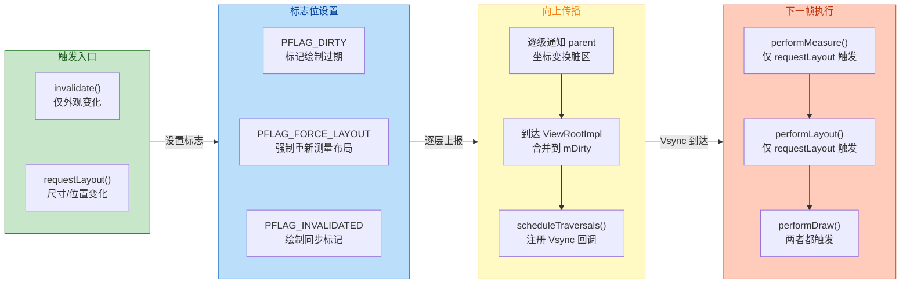

---

### View 树遍历优化

理解了 `invalidate()` 和 `requestLayout()` 的传播机制后，一个自然的问题浮出水面：**面对复杂的 View 树，Framework 如何避免做无用功？** Android 在 View 树的遍历过程中采用了多种优化策略，我们逐一剖析。

#### 标志位守卫——跳过无需处理的子树

这是最基础也是最重要的优化。在 Measure、Layout、Draw 的每一个阶段，父 ViewGroup 遍历子 View 时都会检查标志位，只有"需要处理"的子 View 才会被进入。

**Measure 阶段的守卫**：`View.measure()` 方法在入口处会检查两个条件——`PFLAG_FORCE_LAYOUT` 是否被设置，以及传入的 MeasureSpec 是否与上一次不同。只有满足其一，才会调用 `onMeasure()`；否则直接返回，使用上一次的测量缓存。这意味着如果整棵树中只有一个叶子节点调用了 `requestLayout()`，那么只有从根到该叶子节点路径上的 View 会被标记 `PFLAG_FORCE_LAYOUT`，路径外的所有 View 在 `measure()` 时会因为标志位不满足而直接跳过。

```java
// --- View.measure() 核心守卫逻辑（简化） ---
public final void measure(int widthMeasureSpec, int heightMeasureSpec) {
    // 检查 MeasureSpec 是否与上次完全相同
    final boolean specChanged =
            widthMeasureSpec != mOldWidthMeasureSpec
            || heightMeasureSpec != mOldHeightMeasureSpec;
    // 检查是否被强制要求重新测量
    final boolean isForceLayout =
            (mPrivateFlags & PFLAG_FORCE_LAYOUT) == PFLAG_FORCE_LAYOUT;
    // 检查 MeasureSpec 是否为 EXACTLY 模式且尺寸未变
    // （EXACTLY 模式下尺寸固定，即使 spec 对象不同只要值相同也可跳过）
    final boolean needsLayout = specChanged && !isSpecExactlyEqual();

    // 只有在 spec 变化或强制布局时才真正执行 onMeasure
    if (isForceLayout || needsLayout) {
        // 尝试从 MeasureCache 中查找缓存结果
        // MeasureCache 是一个 LongSparseLongArray，key 是 MeasureSpec 对，value 是 measuredSize
        int cacheIndex = mMeasureCache != null
                ? mMeasureCache.indexOfKey(key) : -1;

        if (cacheIndex < 0 || isForceLayout) {
            // 缓存未命中或强制布局：调用 onMeasure 进行实际测量
            onMeasure(widthMeasureSpec, heightMeasureSpec);
        } else {
            // 缓存命中：直接使用缓存的测量结果，跳过 onMeasure
            long value = mMeasureCache.valueAt(cacheIndex);
            setMeasuredDimensionRaw(
                    (int) (value >> 32), (int) value);
        }

        // 设置 PFLAG_LAYOUT_REQUIRED，通知后续 layout() 方法需要执行
        mPrivateFlags |= PFLAG_LAYOUT_REQUIRED;
    }

    // 保存本次 MeasureSpec，供下次比较
    mOldWidthMeasureSpec = widthMeasureSpec;
    mOldHeightMeasureSpec = heightMeasureSpec;
}
```

上面代码揭示了一个非常重要的缓存机制——**MeasureCache**。它是一个 `LongSparseLongArray`，以 `(widthMeasureSpec << 32 | heightMeasureSpec)` 为 key，以 `(measuredWidth << 32 | measuredHeight)` 为 value。当同一个 View 在不同场景下被多次 `measure()` 但 MeasureSpec 恰好相同时（这在复杂的嵌套布局中经常发生），可以直接返回缓存结果而无需再次执行 `onMeasure()` 中可能很昂贵的计算逻辑。

**Layout 阶段的守卫**：`View.layout()` 方法在入口处检查 `PFLAG_LAYOUT_REQUIRED` 标志（由 `measure()` 在成功执行后设置）以及边界是否发生了变化（`changed = setFrame(l, t, r, b)`）。如果两个条件都不满足，`onLayout()` 不会被调用。

**Draw 阶段的守卫**：在硬件加速模式下，`ViewGroup.drawChild()` 会检查子 View 的 RenderNode 是否被标记为 invalidated，如果没有则直接复用旧的 DisplayList，不执行 `onDraw()`。在软件绘制模式下，Canvas 的 clip 矩形与子 View 的边界做交集判断，如果子 View 完全在脏区之外，则跳过绘制。

#### PFLAG_FORCE_LAYOUT 的清除时机

一个容易忽略的细节是：`PFLAG_FORCE_LAYOUT` 标志是在 `View.layout()` 方法的 **末尾** 被清除的，而不是在 `measure()` 中。这意味着在 Measure 阶段设置的 `PFLAG_LAYOUT_REQUIRED` 不会被提前清除，Layout 阶段可以正确读取到它。完整的标志位生命周期如下：

1. `requestLayout()` → 设置 `PFLAG_FORCE_LAYOUT`
2. `measure()` → 读取 `PFLAG_FORCE_LAYOUT`，执行 `onMeasure()`，设置 `PFLAG_LAYOUT_REQUIRED`
3. `layout()` → 读取 `PFLAG_LAYOUT_REQUIRED`，执行 `onLayout()`，**清除** `PFLAG_FORCE_LAYOUT` 和 `PFLAG_LAYOUT_REQUIRED`

这种设计保证了 Measure 和 Layout 之间的 **状态一致性**——不会出现"测量了但没布局"或"布局了但没测量"的半成品状态。

#### 多次请求的合并——Choreographer 的批处理

前面提到，`scheduleTraversals()` 有防重入设计。这一节我们详细看看它的工作方式：

```java
// --- ViewRootImpl.scheduleTraversals() 简化逻辑 ---
void scheduleTraversals() {
    // mTraversalScheduled 标志：当前帧是否已经注册过遍历回调
    if (!mTraversalScheduled) {
        // 标记为已调度，后续调用会被短路
        mTraversalScheduled = true;

        // 设置同步屏障（SyncBarrier）
        // 阻塞 MessageQueue 中的同步消息，保证异步的 Vsync 回调优先执行
        mTraversalBarrier = mHandler.getLooper()
                .getQueue().postSyncBarrier();

        // 向 Choreographer 注册 CALLBACK_TRAVERSAL 类型的回调
        // 当下一个 Vsync 信号到来时，Choreographer 会调用 mTraversalRunnable
        mChoreographer.postCallback(
                Choreographer.CALLBACK_TRAVERSAL,
                mTraversalRunnable,  // 这个 Runnable 最终调用 doTraversal()
                null
        );
    }
}
```

这段代码中最关键的设计是 **同步屏障（Sync Barrier）**。`postSyncBarrier()` 会在主线程的 MessageQueue 中插入一条特殊的"屏障消息"，它的作用是 **暂时阻止所有普通（同步）消息的处理**，只允许 **异步消息** 通过。而 Choreographer 发送的 Vsync 回调消息正是异步消息。这样做确保了 UI 渲染在消息队列中拥有最高优先级——即使队列中积压了大量同步消息（如数据库查询回调、网络请求回调等），渲染任务也会被优先执行，从而减少掉帧。

当 `doTraversal()` 执行时，它会 **首先移除同步屏障**，然后调用 `performTraversals()`。`performTraversals()` 完成后，`mTraversalScheduled` 被重置为 `false`，允许下一帧的新请求注册进来。

这意味着：**无论你在一帧之内调用了多少次 `invalidate()` 和 `requestLayout()`，实际的遍历只会发生一次**。所有请求的脏区和标志位都会被累积，在下一个 Vsync 统一处理。这是 Android 避免过度绘制和布局抖动的核心机制。

#### 避免布局抖动（Layout Thrashing）

尽管 Framework 已经做了大量优化，开发者仍然可以写出让这些优化失效的代码。最典型的反模式就是 **Layout Thrashing**——在一帧之内交替读取布局属性（如 `getWidth()`、`getHeight()`）和写入布局属性（如 `setLayoutParams()`），导致系统被迫在同一帧内多次执行完整的 Measure + Layout。

问题出在哪里？当你调用 `requestLayout()` 后又立刻调用 `getWidth()`，此时新的布局还没有发生（要等到下一个 Vsync），你读取到的是 **旧值**。如果你用这个旧值来设置另一个 View 的 LayoutParams，然后又读取那个 View 的尺寸……这个循环看起来不会直接导致"多次 traversal"（因为 `scheduleTraversals` 有防重入），但它会导致 **逻辑错误**——你基于过时的尺寸做了不正确的布局计算。

更严重的情况出现在你绕过了正常调度、使用了强制同步布局的 API。比如某些第三方库或者旧代码可能调用 `View.measure(0, 0)` 和 `View.layout(...)` 来强制获取最新尺寸，这实际上是在主线程上同步执行了 Measure + Layout，如果在循环中这样做，性能会急剧下降。

**最佳实践**：

1. **永远不要在 `onLayout()` 或 `onMeasure()` 中调用 `requestLayout()`**，这会导致无限循环（虽然 Framework 有防护机制，但会打出 Warning 并可能导致显示异常）。
2. **读写分离**：把所有"读取尺寸"的操作集中在一起，把所有"修改 LayoutParams"的操作集中在一起，避免交替进行。
3. **使用 `View.doOnLayout {}` 或 `ViewTreeObserver.OnGlobalLayoutListener`** 来在布局完成后安全地读取尺寸，而不是同步强制布局。
4. **使用 `OnPreDrawListener`** 来在 Draw 之前的最后时刻做调整，此时所有 View 的尺寸和位置已经确定。

#### View 树深度与性能

View 树的深度直接影响 `invalidate()` 和 `requestLayout()` 的传播成本。每一次 `invalidate()` 都需要从叶子节点一路向上遍历到 ViewRootImpl；每一次 `requestLayout()` 同样如此。如果树的深度为 N，那么每次请求的传播开销就是 O(N)。

更重要的是，Measure 阶段的开销与树的拓扑结构密切相关。某些 ViewGroup（如 `LinearLayout` 带有 `layout_weight`、旧版 `RelativeLayout`）可能对每个子 View 执行 **两次测量**（double measurement）。如果这样的 ViewGroup 嵌套了多层，测量次数就会指数级增长（ 2^N 次，N 为嵌套层数）。这就是为什么 Google 推荐使用 `ConstraintLayout`——它通过约束求解器在 **单次测量** 中完成所有子 View 的定位，彻底避免了 double measurement 问题。同样，Jetpack Compose 从设计上禁止了多次测量，在编译期就杜绝了这种性能陷阱。

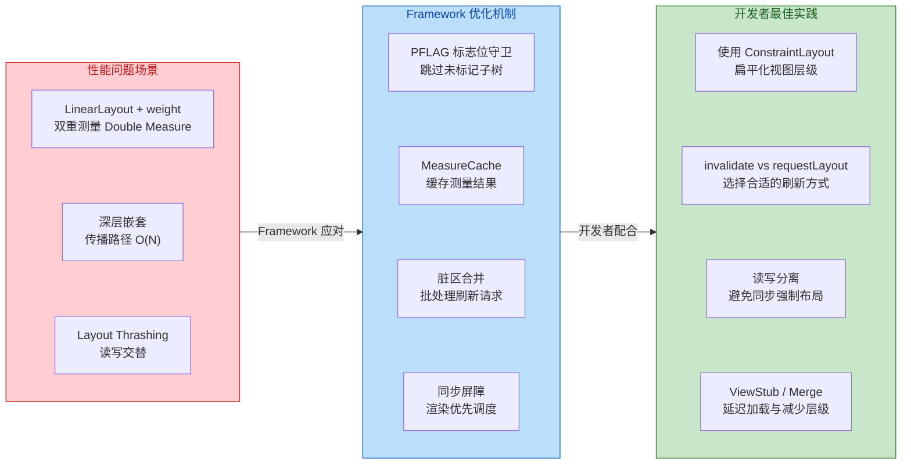

#### 小结：invalidate 与 requestLayout 对比

| 维度 | `invalidate()` | `requestLayout()` |
|---|---|---|
| **语义** | 绘制内容过期 | 尺寸/位置可能变化 |
| **设置的标志位** | `PFLAG_DIRTY` / `PFLAG_INVALIDATED` | `PFLAG_FORCE_LAYOUT` + `PFLAG_INVALIDATED` |
| **传播方向** | 叶子 → 根（携带脏矩形） | 叶子 → 根（设置 FORCE_LAYOUT） |
| **触发的流程** | 仅 Draw | Measure → Layout → Draw |
| **性能开销** | 较低（只重绘） | 较高（完整三流程） |
| **跨线程版本** | `postInvalidate()` | `post(() -> requestLayout())` 或主线程调用 |
| **去重机制** | 脏区合并 + `mTraversalScheduled` | `isLayoutRequested()` 短路 + `mTraversalScheduled` |

---

**📝 练习题**

在一个复杂的 RecyclerView 列表页面中，某个 ItemView 内部的"点赞数" TextView 需要从 "99" 更新为 "100"。假设这个 TextView 的宽度设置为 `wrap_content`，以下关于刷新机制的描述，哪一项是正确的？

A. 只需调用 `invalidate()` 即可，因为只是文字变化，不涉及尺寸改变


B. `TextView.setText()` 内部会同时调用 `requestLayout()` 和 `invalidate()`，因为 `wrap_content` 下文字变长可能导致宽度变化


C. 应该手动调用 `requestLayout()` 后再调用 `invalidate()`，否则 Framework 不会重绘该 View


D. `setText()` 只会调用 `invalidate()`，宽度变化由 RecyclerView 的 LayoutManager 单独处理


**【答案】** B

**【解析】** 当 TextView 的宽度被设置为 `wrap_content` 时，文字内容的变化（从 "99" 变为 "100"，多了一位数字）**有可能**导致 TextView 所需的宽度发生变化。`TextView.setText()` 的源码内部会调用 `requestLayout()` + `invalidate()` 的组合——`requestLayout()` 触发完整的 Measure → Layout → Draw 流程，确保父容器能够重新为 TextView 分配正确的空间；`invalidate()` 确保绘制内容被刷新。选项 A 的错误在于忽略了 `wrap_content` 下尺寸可能变化的事实，仅调用 `invalidate()` 会导致 TextView 虽然绘制了新文字，但仍然使用旧的边界，可能出现文字截断。选项 C 虽然操作方向正确，但 Framework 已在 `setText()` 内部自动处理了，无需开发者手动调用。选项 D 的说法完全错误，RecyclerView 的 LayoutManager 管理的是 ItemView 级别的布局，而 ItemView 内部子 View 的测量和布局仍然由标准的 View 树机制负责。

---

## 硬件加速（Hardware Acceleration）

在前几节中，我们从 `performTraversals` 出发，走完了 Measure → Layout → Draw 三大流程，并讨论了 `invalidate` 与 `requestLayout` 的刷新机制。然而，如果你认为 `Canvas.drawXxx()` 调用结束后像素就直接上屏了，那就忽略了 Android 渲染架构中最关键的一环——**硬件加速（Hardware Acceleration）**。

从 Android 3.0（API 11）引入、Android 4.0（API 14）默认全局开启以来，硬件加速彻底重塑了 View 绘制的底层执行路径。在软件绘制时代，`onDraw(Canvas)` 中的每一条绑定指令都会被 Skia 引擎 **立即光栅化（immediate rasterization）** 为 Bitmap 上的像素，这一切发生在主线程（UI Thread）上；而在硬件加速模式下，`onDraw` 中的绘制调用 **不再直接产生像素**，而是被 **录制（record）** 成一种中间数据结构——DisplayList（后来演变为 RenderNode），然后由一条独立的 **RenderThread** 异步地将这些指令翻译为 GPU 可执行的 OpenGL ES / Vulkan 命令，最终由 GPU 完成真正的像素渲染。

这种"录制—回放"（Record & Playback）的两阶段架构带来了三大核心收益：第一，**主线程解放**——CPU 密集的光栅化工作被移到 RenderThread 和 GPU 上，主线程仅需完成指令录制即可返回处理下一帧的输入事件或动画计算；第二，**局部更新**——当一个 View 内容发生变化时，只需重新录制该 View 的 DisplayList，其父容器和兄弟节点的 DisplayList 可以被直接复用，避免整棵 View Tree 重绘；第三，**属性动画零成本**——alpha、translationX/Y、rotation 等属性变化只需修改 RenderNode 上的变换矩阵，无需重新录制任何绘制指令，这就是为什么 `View.setAlpha()` 在硬件加速下几乎没有性能开销。

本节将深入这四个子主题：RenderThread 渲染线程的工作模型、DisplayList（RenderNode）的构建过程、GPU 指令录制与提交的完整链路、以及 LayerType 与软件绘制回退（Software Fallback）的机制。

---

### RenderThread 渲染线程

#### 为什么需要一条独立的渲染线程

在 Android 4.x 的早期硬件加速实现中，虽然绘制指令已经被录制为 DisplayList，但最终的 **OpenGL 指令提交（GL command flush）** 和 **SwapBuffers**（将渲染结果提交给 SurfaceFlinger 合成）仍然在主线程上执行。这意味着一旦 GPU 负载较重（比如绘制大量半透明图层、高斯模糊等），主线程会被阻塞在 `eglSwapBuffers` 调用上，直到 GPU 完成当前帧的所有渲染工作。此时用户的触摸事件、`Choreographer` 回调和动画计算全部被排队等待，界面表现为明显的卡顿。

为了彻底解决这一问题，Android 5.0（Lollipop）引入了 **RenderThread**——一条由系统自动管理的、专门负责 GPU 渲染的后台线程。它的核心职责可以概括为一句话：**接收主线程录制好的 DisplayList 树，将其翻译为 GPU 指令，提交渲染并完成 Buffer 交换**。有了 RenderThread 之后，主线程在完成 `draw()` 阶段的指令录制后就可以立即返回，去处理下一帧的 input 事件或执行 `Choreographer.doFrame()` 中的其他回调。渲染工作被完全异步化，主线程和渲染线程形成了流水线式的 **双线程并行** 架构。

#### RenderThread 的生命周期与初始化

RenderThread 并不是每个线程一个，而是 **进程级别的单例**。当应用进程第一次创建带有硬件加速窗口的 `ViewRootImpl` 时，`ThreadedRenderer`（硬件加速渲染器的 Java 侧入口）会通过 JNI 调用到 Native 层的 `RenderProxy`，`RenderProxy` 会检查当前进程的 RenderThread 是否已经启动——如果没有，则创建并启动它。从此以后，该进程中所有窗口（Activity、Dialog、PopupWindow 等）的 GPU 渲染工作都共享这同一条 RenderThread。

RenderThread 内部维护了一个 **消息队列（TaskQueue）**，主线程通过 `RenderProxy` 向其投递渲染任务（DrawFrameTask），RenderThread 则按序取出并执行。这种生产者-消费者模型使得两条线程之间的同步开销被控制在最小范围内——主线程只需在 `syncFrameState` 阶段短暂等待 RenderThread 完成 DisplayList 树的同步拷贝（tree sync），之后两条线程即可完全并行。

#### 双线程流水线模型

下面用一张时序示意图来展示 UI Thread 与 RenderThread 在连续两帧中的协作关系：

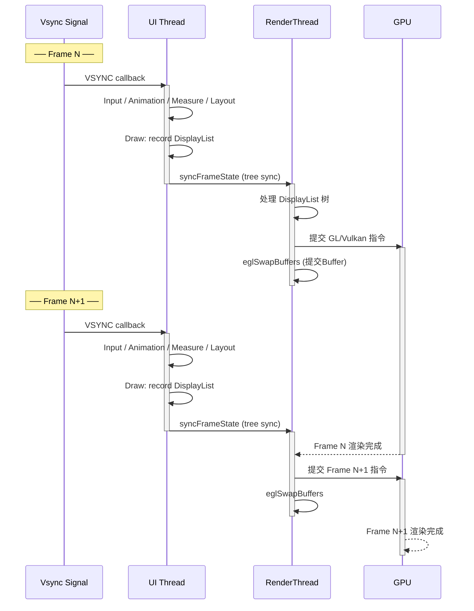

从图中可以看出，当 RenderThread 正在处理第 N 帧的 GPU 指令提交时，UI Thread 已经可以开始第 N+1 帧的 input 处理和 DisplayList 录制。两条线程像流水线上的两个工位一样交替工作，只要任何一个工位的耗时不超过一个 Vsync 周期（通常 16.6ms @60Hz），应用就能保持流畅的帧率。如果 UI Thread 的录制工作在 5ms 内完成，即使 RenderThread 的渲染耗时 12ms，总体依然不丢帧。只有当 **两者的总耗时之和超过 Vsync 周期** 并且它们发生时间段重叠不够时，才会出现掉帧。

#### syncFrameState：主线程与渲染线程的握手

在每一帧的绘制流程中，主线程完成 DisplayList 录制后会调用 `ThreadedRenderer.nSyncAndDrawFrame()`，这会触发 Native 层的 `DrawFrameTask`。在该 Task 的执行开始阶段，有一个关键的 **Tree Sync** 步骤——RenderThread 需要从主线程的 RenderNode 树中同步读取最新的 DisplayList 数据和属性值（alpha、translationX 等）。在此期间，主线程会短暂阻塞（通常在微秒级别），等待同步完成。一旦 Tree Sync 结束，主线程即刻释放，RenderThread 开始独立工作。

这个设计的精妙之处在于：**同步窗口极窄**。RenderThread 只拷贝了 DisplayList 的引用和 RenderNode 的属性快照，而不是深拷贝所有绘制指令数据。因此 Tree Sync 的耗时通常可以忽略不计，主线程几乎是"即投即走"的。

---

### DisplayList 构建

#### 从即时绘制到延迟录制

在理解 DisplayList 之前，有必要回顾一下软件绘制的模型。在软件绘制路径中，当 `View.draw(Canvas)` 被调用时，传入的 Canvas 背后直接持有一块 `Bitmap`。每调用一次 `canvas.drawRect()`，Skia 引擎就会立即将一个矩形光栅化到 Bitmap 的像素缓冲区中。这就是所谓的 **即时模式（Immediate Mode）** 渲染——指令发出后立即产生结果。

硬件加速模式下，传入 `onDraw` 的 Canvas 实际上是一个 **`RecordingCanvas`**（旧版本叫 `DisplayListCanvas` 或 `HardwareCanvas`）。这个 Canvas 的所有 `drawXxx()` 方法都 **不执行任何实际绘制**，而是将调用信息（操作类型、参数、Paint 属性等）序列化为一系列 **绘制操作（Draw Operations / DrawOps）**，追加到当前 View 关联的 **RenderNode** 内部的操作缓冲区中。这就是所谓的 **录制模式（Recording Mode / Retained Mode）**。

#### RenderNode：DisplayList 的现代封装

从 Android 5.0 开始，"DisplayList" 这个类已经被 **`RenderNode`** 替代（虽然社区仍然习惯用 "DisplayList" 来指代录制后的指令集合）。每一个 View 在创建时都会关联一个 RenderNode 对象（通过 `View.mRenderNode` 字段），它的角色类似于一个 **"绘制指令的容器 + 变换属性的持有者"**。

一个 RenderNode 包含两大类信息：

- **DisplayList 数据**：即 `onDraw` 中录制的所有 DrawOps——`drawRect`、`drawBitmap`、`drawText`、`drawRenderNode`（绘制子 View）等。这些操作按录制顺序排列，回放时按序执行。
- **显示属性（Display Properties）**：包括 `alpha`、`translationX/Y/Z`、`rotation`、`scaleX/Y`、`pivotX/Y`、`clipBounds`、`elevation` 等。这些属性被独立存储，修改它们 **不需要重新录制 DisplayList**——这正是硬件加速属性动画高效的秘密。

#### 录制流程详解

当 `ViewRootImpl.performDraw()` 走硬件加速路径时，调用链如下：

```kotlin
// ViewRootImpl 中触发硬件加速绘制
// 1. performDraw() 最终调用 ThreadedRenderer.draw()
mThreadedRenderer.draw(mView, mAttachInfo, mTraversalCallbacks)

// ThreadedRenderer.draw() 内部：
// 2. 调用根 View 的 updateDisplayListIfDirty() 来递归录制
// 这一步会遍历整棵 View 树，对所有标记为 dirty 的 View 重新录制 DisplayList
mRootNode.beginRecording(surfaceWidth, surfaceHeight) // 获取 RecordingCanvas
view.updateDisplayListIfDirty()                        // 递归录制整棵树
mRootNode.endRecording()                               // 完成录制

// 3. nSyncAndDrawFrame() 将录制结果投递给 RenderThread
nSyncAndDrawFrame(frameInfo)
```

`View.updateDisplayListIfDirty()` 是整个录制过程的核心方法。它的内部逻辑可以这样理解：

```kotlin
// View.updateDisplayListIfDirty() 的简化逻辑
fun updateDisplayListIfDirty() {
    // 获取当前 View 关联的 RenderNode
    val renderNode = mRenderNode

    // 检查是否需要重新录制：
    // - PFLAG_INVALIDATED 标记表示 invalidate() 被调用过
    // - 或者 RenderNode 的 DisplayList 尚未录制（首次绘制）
    if (mPrivateFlags and PFLAG_INVALIDATED != 0 || !renderNode.hasDisplayList()) {
        
        // 开始录制：获取一个 RecordingCanvas
        // RecordingCanvas 内部持有 native 层的 SkiaRecordingCanvas
        val canvas = renderNode.beginRecording(width, height)
        
        try {
            if (this is ViewGroup) {
                // ViewGroup：先绘制自身背景和内容，再递归绘制子 View
                // dispatchDraw 会遍历子 View，对每个子 View 调用：
                // canvas.drawRenderNode(child.mRenderNode)
                // 这意味着子 View 的 DisplayList 作为"引用"被嵌入父 DisplayList
                draw(canvas) // 内部调用 onDraw + dispatchDraw
            } else {
                // 叶子 View：只绘制自身
                draw(canvas) // 内部调用 onDraw
            }
        } finally {
            // 完成录制：将 RecordingCanvas 中积累的 DrawOps 
            // 固化到 RenderNode 的 DisplayList 中
            renderNode.endRecording()
        }
        
        // 清除 INVALIDATED 标记
        mPrivateFlags = mPrivateFlags and PFLAG_INVALIDATED.inv()
    }
}
```

这里有一个非常重要的设计细节：**ViewGroup 的 DisplayList 中不直接包含子 View 的绘制指令，而是包含一条 `DrawRenderNode` 操作，引用子 View 的 RenderNode**。这就形成了一棵 **RenderNode 树**，其结构与 View 树完全对应，但在数据层面是独立的。

```
RenderNode 树（与 View 树一一对应）
```
```text
RootRenderNode (DecorView 的 RenderNode)
├── DrawOps: drawBackground, drawRenderNode(childA), drawRenderNode(childB)
│
├── ChildA RenderNode (LinearLayout)
│   ├── DisplayProperties: alpha=1.0, translationY=0
│   ├── DrawOps: drawBackground, drawRenderNode(grandChildA1)
│   │
│   └── GrandChildA1 RenderNode (TextView)
│       ├── DisplayProperties: alpha=0.8
│       └── DrawOps: drawText("Hello")
│
└── ChildB RenderNode (ImageView)
    ├── DisplayProperties: scaleX=1.2, scaleY=1.2
    └── DrawOps: drawBitmap(photo.png)
```

#### 局部重录的优势

正是因为 RenderNode 树的存在，当某个 View 调用了 `invalidate()` 时，系统只需要重新录制 **该 View 自身的 DisplayList**，而其父节点的 DisplayList 中那条 `DrawRenderNode(child)` 引用不需要改变——它仍然指向同一个 RenderNode 对象，只是该对象内部的 DrawOps 被更新了而已。这就是 **O(1) 级别的局部更新**，而不是软件绘制时代那种需要从根节点开始、沿 dirty 路径逐层重绘的 O(depth) 级别开销。

举一个具体例子：一个包含 500 个 ItemView 的 RecyclerView 列表中，某一个 ItemView 中的 TextView 文字发生了变化。在硬件加速下，只有那一个 TextView 的 DisplayList 会被重新录制（可能只有几十个 DrawOps），RecyclerView、ItemView 甚至 TextView 的兄弟 View 的 DisplayList 全部被复用。这在性能上的差距是质的飞跃。

---

### GPU 指令录制

#### 从 DisplayList 到 GPU 指令的翻译

当 RenderThread 通过 Tree Sync 获取了最新的 RenderNode 树后，接下来要做的事情是将这棵树中的 DrawOps **翻译（translate）** 为 GPU 可以执行的底层图形指令。在 Android 的现代渲染管线中，这个翻译过程由 **Skia** 引擎的 GPU 后端来完成（从 Android 9.0 开始默认使用 **SkiaGL** 后端，Android 14+ 逐步迁移至 **Skia Vulkan** 后端）。

整个过程可以分为三个阶段：

**第一阶段：DisplayList 树遍历与排序（Prepare Phase）**

RenderThread 首先对 RenderNode 树进行一次 **深度优先遍历**。在遍历过程中，它需要完成几件事：

- **计算裁剪区域（Clip）**：根据每个 RenderNode 的 clipBounds、父节点的裁剪区域以及屏幕可见区域，判断哪些 DrawOps 完全位于屏幕之外（off-screen），直接跳过。
- **解析属性变换（Transform Resolution）**：将每个 RenderNode 的 translation/rotation/scale/pivot 等属性合成为最终的 4×4 变换矩阵，这个矩阵将在 GPU 顶点着色器阶段被使用。
- **处理 Z 排序（Z-ordering）**：带有 `elevation` 或 `translationZ` 的 View 需要按 Z 值排序——先绘制 Z 值较低的节点（背景层），再绘制 Z 值较高的节点（前景层、阴影层）。

**第二阶段：DrawOps 回放与 GPU 指令生成（Issue Phase）**

遍历排序完成后，RenderThread 按照最终确定的绘制顺序，逐一 **回放（playback）** 每个 DrawOp，并将其转换为 Skia GPU 后端的调用：

| DisplayList DrawOp | Skia GPU 后端行为 | 最终 GPU 操作 |
|---|---|---|
| `drawRect(rect, paint)` | 生成矩形顶点数据，设置着色器 | `glDrawArrays` / `vkCmdDraw` |
| `drawBitmap(bitmap, …)` | 上传纹理到 GPU（如需），绑定纹理采样器 | `glBindTexture` + `glDrawArrays` |
| `drawText(text, …)` | 文字栅格化为 Glyph 缓存纹理，批量绘制 | 纹理绘制 |
| `drawRoundRect(…)` | 生成圆角矩形的 SDF 着色器 | `glDrawArrays` with shader |
| `drawRenderNode(child)` | 递归处理子 RenderNode 的 DrawOps | 应用子节点变换矩阵后继续 |

在这个阶段，Skia 会进行大量的 **批处理（Batching）和合并（Merging）优化**。例如，连续的多个 `drawRect` 调用如果使用相同的 Paint（颜色、着色器等），Skia 会将它们合并为一次 GPU draw call，大幅减少 CPU-GPU 之间的通信开销。这也是为什么减少 `onDraw` 中的 Paint 切换次数能提升性能的底层原因。

**第三阶段：Buffer 提交（Swap Phase）**

所有 GPU 指令提交完成后，RenderThread 调用 `eglSwapBuffers()`（OpenGL ES 路径）或 `vkQueuePresentKHR()`（Vulkan 路径），将渲染完成的帧缓冲区（Frame Buffer）提交给 **SurfaceFlinger** 进行最终的屏幕合成。SurfaceFlinger 会在下一个 Vsync 信号到来时，将该 Buffer 与其他窗口（状态栏、导航栏、壁纸等）合成后输出到显示器。

#### GPU 指令录制的整体管线

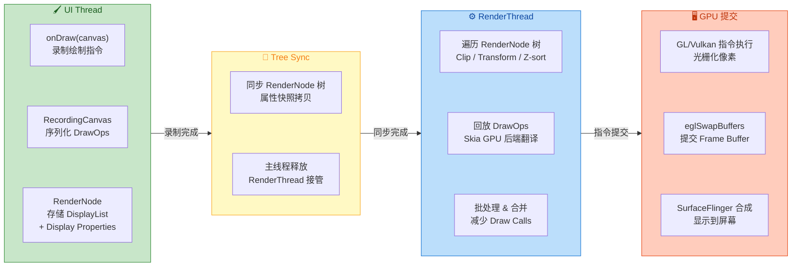

#### 文字渲染的特殊路径：Font Glyph Cache

文字绘制在 GPU 渲染管线中有一条特殊的优化路径值得单独说明。每个字符（glyph）不会在每帧被重新光栅化，而是在首次出现时由 CPU（Skia 的 FreeType 后端）光栅化一次，然后被上传到一张或多张 **GPU 纹理图集（Texture Atlas）** 中缓存。之后每次绘制该字符，只需从纹理图集中采样对应区域即可，速度极快。

这个 Glyph Cache 的大小是有限的（通常几个 MB），当缓存满了且需要绘制新字符时，会发生缓存驱逐（eviction），最久未使用的 glyph 被移除。在实际开发中，如果你的应用需要显示大量不同字号、不同字体的文字（比如富文本编辑器），可能会遇到 Glyph Cache 频繁 thrash 的问题，表现为文字绘制帧率下降。解决方案是尽量减少同时使用的字体变体数量，或者通过 `Typeface.create()` 复用已有的 Typeface 实例。

---

### LayerType 软件绘制回退

#### 三种 LayerType

Android 为每个 View 提供了 `setLayerType(int layerType, Paint paint)` 方法，它接受三个可能的值：

- **`LAYER_TYPE_NONE`（默认值）**：View 不使用离屏缓冲区，直接录制到父级的 DisplayList 中。这是最常见也是最高效的模式。
- **`LAYER_TYPE_HARDWARE`**：在硬件加速环境下，系统会为该 View 创建一个 **离屏 GPU 纹理（FBO, Frame Buffer Object）**，View 的 DisplayList 被渲染到这张纹理上而非直接渲染到主 Frame Buffer。之后，这张纹理作为一个整体参与父级的合成。
- **`LAYER_TYPE_SOFTWARE`**：**强制该 View 使用软件绘制**。系统会为其创建一个 `Bitmap` 作为离屏缓冲区，`onDraw` 中的所有绘制指令都走 Skia CPU 光栅化路径，完全绕过 GPU。绘制完成后，这个 Bitmap 被作为纹理上传到 GPU，再参与整体合成。

#### LAYER_TYPE_HARDWARE 的使用场景

硬件 Layer 最经典的使用场景是 **复杂动画的性能优化**。假设你有一个包含大量子 View 的复杂布局需要做一个渐变透明度动画。如果不使用 Layer，每一帧 RenderThread 都需要遍历这个布局的所有 DrawOps，逐一对每个子元素应用 alpha——这意味着大量的 GPU draw calls 和 alpha blending 操作。而如果你在动画开始前将该布局设置为 `LAYER_TYPE_HARDWARE`：

```kotlin
// 动画开始前：启用硬件 Layer，将整个 View 树渲染为一张 GPU 纹理
complexLayout.setLayerType(View.LAYER_TYPE_HARDWARE, null)

// 执行动画：alpha 变化只需修改这张纹理的透明度，O(1) 操作
complexLayout.animate()
    .alpha(0f)           // 只改变 RenderNode 的 alpha 属性
    .setDuration(300)
    .withEndAction {
        // 动画结束后：移除 Layer，释放 GPU 纹理内存
        complexLayout.setLayerType(View.LAYER_TYPE_NONE, null)
    }
    .start()
```

此时，整个复杂布局的渲染结果被缓存到一张 GPU 纹理上。动画每一帧只需将这张纹理以新的 alpha 值绘制一次（单次 draw call），而不需要重新遍历和渲染整棵子树。性能提升可以达到数倍甚至一个数量级。

但是，**硬件 Layer 不应该长期保持开启**。原因有两点：第一，额外的 GPU 纹理会占用显存（一个全屏 Layer 在 1080p 下约占 8MB）；第二，当 Layer 内部的 View 内容发生变化时（比如 TextView 文字更新），系统需要先重新渲染 Layer 内容到离屏纹理，再将纹理合成到屏幕，反而多了一步，性能更差。所以最佳实践是：**动画开始前设置 HARDWARE Layer，动画结束后立即恢复为 NONE**。

#### LAYER_TYPE_SOFTWARE 与软件绘制回退

虽然硬件加速是默认且推荐的渲染模式，但并非所有 Canvas 绘制操作在 GPU 上都有对应的实现。某些高级或罕见的操作在硬件加速 Canvas 上调用时可能产生异常效果，甚至完全不起作用。以下是一些已知不支持或表现不一致的操作：

| 不支持/受限的操作 | 表现 |
|---|---|
| `Canvas.drawPicture()` | 在硬件加速 Canvas 上可能被忽略 |
| `Paint.setMaskFilter()` (BlurMaskFilter) | 部分情况下不生效或效果不同 |
| `Canvas.drawVertices()` | API 28 前不支持 |
| `ComposeShader` 嵌套 | 复杂组合可能不生效 |
| `Canvas.drawBitmapMesh()` | 低版本可能有异常 |

当你遇到上述情况时，对该 View 设置 `LAYER_TYPE_SOFTWARE` 可以将其强制回退到软件绘制路径，确保所有 Canvas API 都能正确工作：

```kotlin
// 强制该 View 使用软件渲染
// 传入的 Paint 参数可以为 null，也可以指定一个带有
// ColorFilter 或 BlendMode 的 Paint，
// 该 Paint 会在软件渲染的 Bitmap 合成到屏幕时应用
customView.setLayerType(View.LAYER_TYPE_SOFTWARE, null)
```

需要特别注意的是，软件回退的性能代价是巨大的：

1. **CPU 光栅化开销**：所有 DrawOps 由 CPU 逐像素执行，对于大面积、复杂内容的 View 非常耗时。
2. **纹理上传开销**：软件渲染完成后，Bitmap 需要从 CPU 内存上传到 GPU 纹理（`glTexImage2D`），这是一个同步操作，会阻塞 RenderThread。
3. **内存双份**：CPU 侧的 Bitmap 和 GPU 侧的纹理各占一份内存。

因此，**LAYER_TYPE_SOFTWARE 应当被视为最后的兼容手段**，而非常规方案。在现代 Android 开发中（API 28+），绝大多数 Canvas API 已经在硬件加速路径上得到了良好支持，需要软件回退的场景越来越少。

#### 如何判断当前 View 的渲染路径

在开发调试时，你可以通过以下方式判断一个 View 是否处于硬件加速模式：

```kotlin
// 方法一：检查 Canvas 是否为硬件加速 Canvas
// 在 onDraw 中调用
override fun onDraw(canvas: Canvas) {
    // canvas.isHardwareAccelerated 为 true 表示当前使用硬件加速
    val isHwAccelerated = canvas.isHardwareAccelerated
    Log.d("RenderPath", "Hardware accelerated: $isHwAccelerated")
    super.onDraw(canvas)
}

// 方法二：检查 View 所属 Window 是否开启了硬件加速
// 在 View attach 到 Window 后调用
val isWindowHwAccelerated = view.isHardwareAccelerated
```

另外，Android 开发者选项中的 **"Show hardware layers updates"**（显示硬件层更新）是一个非常实用的调试工具。开启后，任何正在更新其硬件 Layer 内容的 View 会被绿色高亮闪烁。如果你看到某个 Layer 在动画期间每帧都在闪烁，说明 Layer 内容在被反复重绘——这正是性能杀手，你需要排查是谁在不断 `invalidate()` 那个 Layer 内部的 View。

#### 三种渲染路径的完整决策

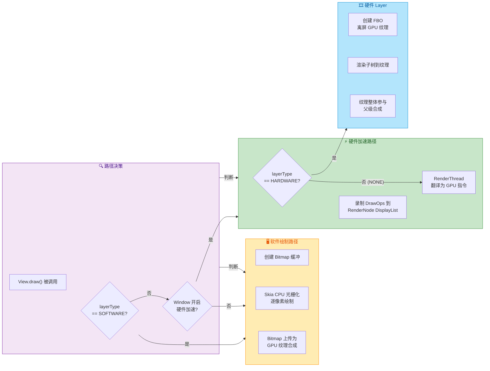

---

**📝 练习题**

**题目一**：在硬件加速模式下，当一个 View 调用 `setAlpha(0.5f)` 时，以下哪种描述最准确？

A. 系统会调用 `invalidate()`，触发 `onDraw()` 重新录制 DisplayList，将 alpha=0.5 应用到每个 DrawOp 上

B. 系统会调用 `invalidate()`，触发整棵 View Tree 从根节点重新绘制

C. 系统仅修改该 View 对应 RenderNode 的 Display Properties 中的 alpha 值，不触发 `onDraw()` 重新录制

D. 系统会将该 View 自动切换为 `LAYER_TYPE_SOFTWARE`，使用 CPU 绘制带透明度的 Bitmap


**【答案】** C

**【解析】** 这正是硬件加速 RenderNode 架构的精髓所在。RenderNode 将 **Display Properties**（alpha、translationX/Y/Z、rotation、scale 等）与 **DisplayList 数据**（DrawOps）分离存储。当调用 `View.setAlpha()` 时，Framework 会通过 `RenderNode.setAlpha()` 直接修改 Native 层 RenderNode 的 alpha 属性，并标记该 RenderNode 需要重新合成（而非重新录制）。在下一帧的渲染中，RenderThread 只需在回放该 RenderNode 的 DrawOps 之前应用新的 alpha 变换即可，不需要重新执行 `onDraw()`，也不需要重新录制 DisplayList。这就是为什么属性动画（`ObjectAnimator` 对 `alpha`/`translationX`/`rotation` 等属性做动画）在硬件加速下非常高效——每帧的成本仅仅是修改一个浮点数值和一个标记位。选项 A 描述的是 `setBackgroundColor()` 等会改变绘制内容的操作行为；选项 B 是软件绘制时代的全量重绘模型；选项 D 毫无根据。

---

**题目二**：以下关于 `LAYER_TYPE_HARDWARE` 的描述，哪一项是 **错误** 的？

A. 它会为该 View 创建一个离屏 GPU 纹理（FBO），View 的渲染结果被缓存到纹理上

B. 适合在执行复杂 View 的 alpha/rotation 动画时临时开启，可以显著减少每帧的渲染开销

C. 当 Layer 内部的子 View 内容频繁变化时，应保持 HARDWARE Layer 以持续获得性能提升

D. 动画结束后应通过 `setLayerType(LAYER_TYPE_NONE, null)` 及时关闭 Layer 以释放显存


**【答案】** C

**【解析】** 选项 C 恰恰是硬件 Layer 使用中最常见的误区。硬件 Layer 的性能优势建立在 **缓存内容不变** 的前提下——当 Layer 内部的子 View 内容不变时，每帧只需将缓存好的纹理做变换（平移、旋转、缩放、透明度变化）即可，这是极其高效的 O(1) 操作。但如果 Layer 内部的子 View 频繁 `invalidate()`，系统每帧都需要 **先重新渲染 Layer 内容到离屏纹理**（这本身就是一次完整的渲染），**然后再将纹理合成到屏幕**——相当于比不使用 Layer 时多了一步离屏渲染的开销，性能反而更差。开发者选项中的"显示硬件层更新"就是用来诊断这种问题的。选项 A、B、D 的描述均正确，分别对应了硬件 Layer 的实现原理、最佳使用时机和释放策略。

---

## 视图状态保存

Android 应用在运行过程中，随时可能因为配置变更（Configuration Change，如屏幕旋转）、系统内存回收（Low Memory Kill）等原因被销毁并重建。当 Activity 被系统"非用户主动"地销毁时，用户对界面的操作状态——例如 EditText 中输入的文字、ScrollView 的滚动位置、CheckBox 的选中状态——如果不加以保存，重建后就会全部丢失，用户体验将极其糟糕。为了解决这一问题，Android 在 Activity 和 View 两个层面都设计了一套 **状态保存与恢复（State Save & Restore）** 机制。

在 Activity 层面，开发者通常熟知 `Activity.onSaveInstanceState(Bundle)` 和 `onRestoreInstanceState(Bundle)` 这一对回调。但许多开发者忽略的是，**View 自身也有一套独立的状态保存体系**。事实上，Activity 在保存状态时，会自动触发整棵 View 树的状态保存流程，让每个 View 都有机会将自己的内部状态序列化到一个公共容器中。这个机制的核心由三部分组成：`View.onSaveInstanceState()` 钩子方法、View ID 作为唯一索引键、以及 `SparseArray<Parcelable>` 作为底层存储结构。理解这三者的协作方式，是编写健壮自定义 View 的关键。

### onSaveInstanceState 钩子

#### 触发时机与调用链

当系统即将销毁 Activity 时（注意：用户主动按返回键退出 **不会** 触发），Framework 会依次调用 `Activity.onSaveInstanceState(Bundle outState)`。在这个方法的默认实现中，Activity 会调用 `Window.saveHierarchyState()`，进而调用顶层 DecorView 的 `saveHierarchyState(SparseArray<Parcelable> container)` 方法。这个调用会以 **递归方式** 遍历整棵 View 树——对于 ViewGroup，它先调用自身的 `dispatchSaveInstanceState()`，再遍历每个子 View 调用同名方法；对于叶子 View，则直接执行 `saveHierarchyState()`。最终，每个 View 的 `onSaveInstanceState()` 都会被调用一次，返回一个 `Parcelable` 对象来表达自身需要保存的状态。

整个调用链可以概括为：

```
Activity.onSaveInstanceState(Bundle)
  → Window.saveHierarchyState()
    → DecorView.saveHierarchyState(SparseArray)
      → ViewGroup.dispatchSaveInstanceState(SparseArray)
        → 遍历 children: child.saveHierarchyState(SparseArray)
          → View.onSaveInstanceState() → 返回 Parcelable
```

在恢复阶段，对称的调用链会执行：`Activity.onRestoreInstanceState(Bundle)` → `Window.restoreHierarchyState()` → DecorView 递归调用 `restoreHierarchyState(SparseArray)` → 每个 View 的 `onRestoreInstanceState(Parcelable state)` 被回调，拿到之前保存的状态进行恢复。

这里有一个关键的设计决策：**Activity 把 View 树的状态保存到自己的 Bundle 中**。这意味着 View 状态的保存是 Activity 状态保存的子集——如果你 override 了 `Activity.onSaveInstanceState()` 却忘记调用 `super`，整棵 View 树的状态保存都会失效。

#### View 基类的默认保存行为

Android 系统的内置 Widget 大多已经实现了 `onSaveInstanceState()` 与 `onRestoreInstanceState()`。例如：

- **EditText / TextView**：保存光标位置、已输入的文本内容（需要设置 `freezesText` 属性或启用 `android:saveEnabled`）。
- **CheckBox / RadioButton**：保存选中状态（checked state）。
- **ScrollView**：保存滚动偏移量（scroll position）。
- **RecyclerView**：通过 `LayoutManager.onSaveInstanceState()` 保存滚动位置。

而 View 基类自身的 `onSaveInstanceState()` 默认返回 `BaseSavedState.EMPTY_STATE`，即不保存任何内容。只有子类 override 这个方法，才会真正产生有意义的状态数据。

#### 自定义 View 的状态保存实践

对于自定义 View，开发者需要手动实现状态保存逻辑。标准做法是定义一个继承自 `View.BaseSavedState` 的内部类，将需要持久化的字段写入其中：

```kotlin
// 自定义的可折叠面板 View
class CollapsiblePanel @JvmOverloads constructor(
    context: Context,
    attrs: AttributeSet? = null
) : LinearLayout(context, attrs) {

    // 面板是否处于展开状态，这是需要保存的核心状态
    var isExpanded: Boolean = false
        private set

    // -------- 状态保存 --------

    override fun onSaveInstanceState(): Parcelable {
        // 第一步：调用 super 获取父类保存的状态（不可跳过）
        val superState = super.onSaveInstanceState()
        // 第二步：创建自定义 SavedState，把父类状态传入构造器
        val savedState = SavedState(superState)
        // 第三步：将本 View 的关键字段写入 SavedState
        savedState.expanded = isExpanded
        // 返回自定义状态对象
        return savedState
    }

    override fun onRestoreInstanceState(state: Parcelable?) {
        // 类型检查：如果不是我们自定义的 SavedState，直接交给父类处理
        if (state !is SavedState) {
            super.onRestoreInstanceState(state)
            return
        }
        // 先把父类的状态部分交还给 super 恢复
        super.onRestoreInstanceState(state.superState)
        // 从 SavedState 中取回保存的字段，恢复到当前 View
        isExpanded = state.expanded
        // 根据恢复的状态刷新 UI（如重新展开/折叠）
        requestLayout()
    }

    // -------- 自定义 SavedState --------

    // 继承 BaseSavedState，遵循 Parcelable 协议
    internal class SavedState : BaseSavedState {
        // 需要保存的字段
        var expanded: Boolean = false

        // 从 onSaveInstanceState 调用的构造器
        constructor(superState: Parcelable?) : super(superState)

        // 从 Parcel 反序列化的构造器（恢复时由系统调用）
        constructor(source: Parcel) : super(source) {
            // 读取顺序必须与 writeToParcel 中的写入顺序严格一致
            expanded = source.readInt() == 1
        }

        override fun writeToParcel(out: Parcel, flags: Int) {
            // 先写父类数据
            super.writeToParcel(out, flags)
            // 再写自定义字段，boolean 用 int 表示（1=true, 0=false）
            out.writeInt(if (expanded) 1 else 0)
        }

        companion object CREATOR : Parcelable.Creator<SavedState> {
            // 反序列化：从 Parcel 创建 SavedState 实例
            override fun createFromParcel(source: Parcel): SavedState = SavedState(source)
            // 创建指定大小的数组（Parcelable 协议要求）
            override fun newArray(size: Int): Array<SavedState?> = arrayOfNulls(size)
        }
    }
}
```

上面的代码展示了一个完整的 pattern。几个需要特别注意的点：

**第一**，`onSaveInstanceState()` 中必须调用 `super.onSaveInstanceState()` 获取父类状态，并将其传入自定义 `SavedState` 的构造函数。这是因为 View 的继承链上每一层都可能有自己需要保存的状态（例如 `TextView` 保存文字，`View` 保存焦点状态），如果不调 `super`，上层保存的信息就会丢失。

**第二**，`SavedState` 必须严格实现 `Parcelable` 接口。这是因为 Bundle 最终要被序列化（可能写入磁盘或跨进程传递），而 Parcelable 是 Android 中最高效的序列化协议。`writeToParcel` 和 `Parcel` 构造器中的 **读写顺序必须一一对应**，这是 Parcelable 的铁律——它是纯顺序流协议，没有 key-value 的概念。

**第三**，恢复时务必调用 `requestLayout()` 或 `invalidate()` 来刷新 UI。状态恢复发生在 View 已经被重新创建之后，仅仅给字段赋值不会自动触发界面更新。

#### 不触发保存的场景

并非所有 Activity 销毁都会触发 `onSaveInstanceState`。以下场景 **不会** 调用：

- 用户主动按返回键（Back Press）退出 Activity——系统认为用户有意结束，不需要保存。
- 调用 `finish()` 主动关闭 Activity。
- 在 Android 12（API 31）之前，从"最近任务"列表划掉 App 也不会触发。

而以下场景 **会** 触发：

- 屏幕旋转等 Configuration Change。
- 用户按 Home 键将 App 切入后台。
- 启动新的 Activity 使当前 Activity 进入 `onStop()`。
- 系统因内存不足回收后台 Activity。

理解这些触发条件可以帮助开发者明确哪些数据应该放在 `onSaveInstanceState` 中保存（UI 临时状态），哪些应该放在 ViewModel 或持久化存储中（业务数据）。

### View ID 重要性

#### ID 作为状态索引键

View 状态保存机制能正常工作的一个 **硬性前提条件** 是：View 必须拥有一个唯一的 ID。如果一个 View 没有设置 `android:id`，那么即使它实现了 `onSaveInstanceState()`，系统也 **不会** 调用它来保存状态。

原因就藏在 `View.dispatchSaveInstanceState()` 的源码逻辑中：

```java
// View.java 中 dispatchSaveInstanceState 的关键逻辑（简化版）
protected void dispatchSaveInstanceState(SparseArray<Parcelable> container) {
    // 核心守卫条件：mID 不能是 NO_ID，并且 saveEnabled 标志位必须为 true
    if (mID != NO_ID && (mViewFlags & SAVE_DISABLED_MASK) == 0) {
        // 调用 onSaveInstanceState() 获取状态
        Parcelable state = onSaveInstanceState();
        // 以 View 的 ID 为 key，存入 SparseArray
        if (state != null) {
            container.put(mID, state);
        }
    }
}
```

代码非常清晰：**`mID` 就是 SparseArray 的 key**。没有 ID 的 View（`mID == NO_ID == -1`）直接被跳过，根本不进入保存流程。恢复时同理，系统会根据 ID 从 SparseArray 中查找对应的 `Parcelable`，找到了才回调 `onRestoreInstanceState()`。

这个设计传达了一个重要信息：**在 Android 的状态保存体系中，View ID 不仅仅是布局查找的辅助工具（`findViewById`），它更是状态保存与恢复的唯一标识符。** 如果你的自定义 View 需要保存状态，就必须在 XML 中为其分配一个 ID：

```xml
<!-- 正确：分配了 ID，状态保存机制生效 -->
<com.example.CollapsiblePanel
    android:id="@+id/panel_main"
    android:layout_width="match_parent"
    android:layout_height="wrap_content" />

<!-- 错误：没有 ID，onSaveInstanceState() 永远不会被调用 -->
<com.example.CollapsiblePanel
    android:layout_width="match_parent"
    android:layout_height="wrap_content" />
```

#### ID 重复引发的状态覆盖问题

既然 View ID 是 SparseArray 的 key，那么一个自然的推论就是：**同一个容器中如果有两个 View 使用了相同的 ID，它们的状态会互相覆盖**。

考虑这样一个场景：在一个 Fragment 的布局中有两个 EditText，不小心分配了同一个 `android:id`：

```xml
<LinearLayout ...>
    <!-- 两个 EditText 共享了同一个 ID（错误示范） -->
    <EditText android:id="@+id/input_field" ... />
    <EditText android:id="@+id/input_field" ... />
</LinearLayout>
```

保存时，第一个 EditText 的状态先以 `@+id/input_field` 为 key 写入 SparseArray，随后第二个 EditText 的状态以相同的 key **覆盖** 了前者。恢复时，两个 EditText 都会拿到第二个的状态——也就是说，两个输入框的内容会变成一模一样。这是一个非常隐蔽的 Bug，因为在正常使用时不会出现任何错误提示，只有在旋转屏幕后才会暴露。

在使用 `<include>` 标签或 `RecyclerView` 动态复用 Item 布局时，这种 ID 重复的问题尤其容易发生。解决方案：

- **确保 ID 唯一**：在同一个 View 层级树中，每个需要保存状态的 View 的 ID 应当不同。
- **Fragment 作为隔离边界**：不同 Fragment 各自独立管理自己的状态保存容器（每个 Fragment 有自己的 `SparseArray`），因此跨 Fragment 的 ID 重复不会互相干扰。
- **RecyclerView 不依赖此机制**：RecyclerView 中的 Item View 状态不应该依赖系统的 `onSaveInstanceState`，而应该通过 Adapter 数据源来驱动。

#### `saveEnabled` 标志位

除了 ID 之外，View 还有一个 `saveEnabled` 标志位（对应 XML 属性 `android:saveEnabled`，默认为 `true`）。如果将其设置为 `false`，即使 View 有 ID，系统也不会保存其状态。这在某些特殊场景下有用——例如你有一个始终由代码逻辑驱动的 View，不需要系统的自动状态保存，可以关闭它以避免不必要的序列化开销。

### SparseArray 状态存储

#### 为什么是 SparseArray 而不是 HashMap

在整个 View 状态保存体系中，`SparseArray<Parcelable>` 是贯穿始终的底层数据结构。Activity 为整棵 View 树创建一个 `SparseArray<Parcelable>` 实例，所有 View 的状态都存入这同一个容器，以各自的 `mID`（int 类型）为 key。

Android 选择 `SparseArray` 而非 `HashMap<Integer, Parcelable>` 是一个经过精心考量的设计决策，原因在于：

**内存效率**：`HashMap` 要求 key 必须是对象类型，而 Java 中的 `int` 是基本类型，使用 `HashMap` 就必须将其装箱为 `Integer` 对象。每个 `Integer` 对象占据约 16 字节内存，再加上 `HashMap.Entry` 本身的开销（存储 hash、key、value、next 指针，约 32-36 字节），对于一棵包含数十个 View 的树来说，累积的内存浪费相当可观。`SparseArray` 则直接使用两个原始数组——`int[] keys` 和 `Object[] values`——彻底避免了自动装箱和 Entry 对象的开销。

**缓存友好性**：`SparseArray` 的 key 数组是紧凑排列的连续内存，CPU 缓存命中率更高。而 `HashMap` 的 Entry 对象散落在堆内存各处，遍历时缓存失效频繁。

**查找方式**：`SparseArray` 内部的 key 数组是 **有序的**，查找时使用 **二分搜索（Binary Search）**，时间复杂度为 O(log n)。虽然比 `HashMap` 的 O(1) 均摊复杂度略高，但在 View 树规模（通常几十到几百个节点）下，O(log n) 与 O(1) 的性能差距微乎其微，而内存节省带来的收益更为显著。

可以用一个直观的内存对比来感受差异：

```text
假设 View 树中有 50 个需要保存状态的 View

HashMap<Integer, Parcelable> 方案：
  - 50 个 Integer 对象：50 × 16B = 800B
  - 50 个 Entry 对象：  50 × 32B = 1600B
  - 内部数组 + 开销：   约 512B
  - 合计：约 2.9 KB

SparseArray<Parcelable> 方案：
  - int[] keys：        50 × 4B  = 200B
  - Object[] values：   50 × 4B  = 200B（引用大小）
  - 合计：约 0.4 KB

内存节省约 86%
```

这种设计哲学贯穿了整个 Android Framework：在 View 体系中，`SparseArray` 及其变种（`SparseBooleanArray`、`SparseIntArray`、`LongSparseArray`）被大量使用，凡是以 `int` 或 `long` 为 key 的映射关系，都优先选择 Sparse 系列而非 HashMap。

#### 存储与恢复的完整流程

下面通过一张时序图，完整展示从 Activity 触发保存到 View 状态被存入 SparseArray，再到恢复的全过程：

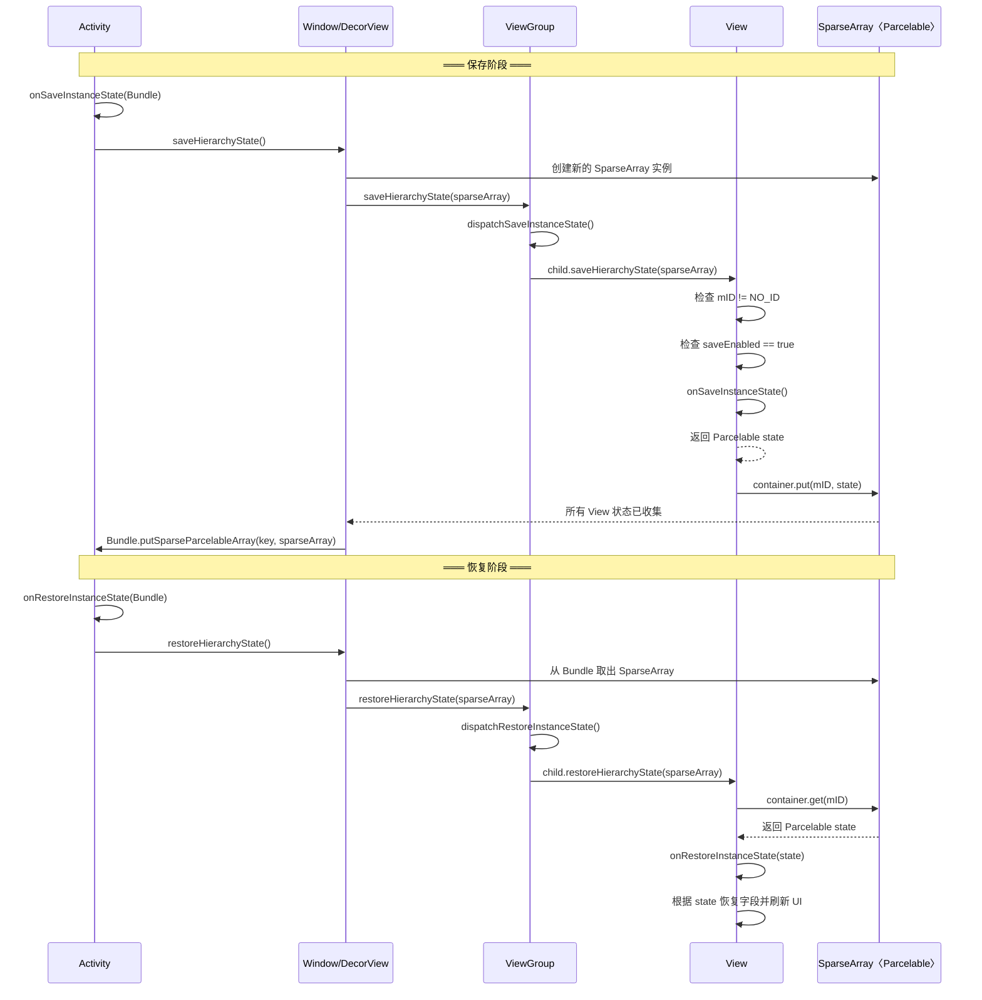

从图中可以看出几个重要细节：

**保存阶段**是一个自上而下的递归遍历。Activity 触发后，DecorView 作为根节点开始遍历，每个 ViewGroup 负责调用其 children 的 `saveHierarchyState()`。每个 View 在保存前会检查两个条件——ID 有效且 `saveEnabled` 为 true——然后才执行 `onSaveInstanceState()` 并将结果以 ID 为 key 存入 SparseArray。

**恢复阶段**同样是自上而下的递归遍历，但方向是从 SparseArray 中 **读取** 数据。每个 View 用自己的 `mID` 去 SparseArray 中查找，如果找到对应的 `Parcelable`，就回调 `onRestoreInstanceState()`。

**Bundle 是最终归宿**：SparseArray 本身只是一个中间容器，最终它会被存入 Activity 的 `Bundle outState` 中（通过 `Bundle.putSparseParcelableArray()`）。Bundle 会被 Framework 持有，在 Activity 重建时传回给 `onCreate(Bundle?)` 和 `onRestoreInstanceState(Bundle)`。

#### Fragment 的状态隔离

值得一提的是，Fragment 在状态保存上有自己的隔离性。每个 Fragment 会为其 View 树创建独立的 `SparseArray`，而不是共享 Activity 的那一个。这意味着：

- Fragment A 中 `id = @+id/title` 的 View 和 Fragment B 中 `id = @+id/title` 的 View 不会互相干扰，因为它们的状态分别存储在各自 Fragment 的 SparseArray 中。
- Fragment 自身的状态（包括其 View 树的 SparseArray）会作为一个整体被 FragmentManager 管理，最终打包进 Activity 的 Bundle。

这种分层隔离的设计，既避免了全局 ID 冲突的问题，又保证了 Fragment 的独立性与可复用性。

#### 性能与大小限制

虽然状态保存机制非常方便，但它有一个重要的 **隐性约束**：所有保存的数据最终都要序列化到 `Bundle` 中，而 Bundle 的传输（特别是跨进程通过 Binder）有大小限制。Binder 事务的缓冲区通常为 **1 MB**（所有正在进行的事务共享），如果 Bundle 太大，会抛出 `TransactionTooLargeException`。

因此，状态保存应当遵循以下原则：

- **只保存轻量级 UI 状态**：如选中状态、滚动位置、输入内容等。
- **不要保存大量数据**：如 Bitmap、大型列表数据。这些应该放在 ViewModel（内存级缓存，配置变更不销毁）或持久化存储（Room、DataStore）中。
- **不要保存可重新获取的数据**：如网络请求结果。重建后重新请求或从缓存读取即可。

一个常见的反模式是将整个 `RecyclerView` 的数据列表序列化到 `Bundle` 中——当列表有上千条记录时，很容易触发 `TransactionTooLargeException`。正确的做法是将数据存储在 ViewModel 中，仅保存用户的交互状态（如当前滚动位置、选中项的 ID）。

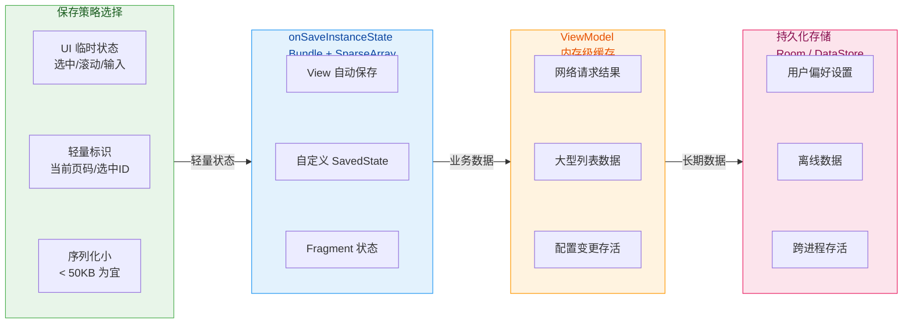

最后，用一段简洁的代码展示 Activity 层面如何配合 View 的状态保存机制：

```kotlin
class MainActivity : AppCompatActivity() {

    // ViewModel 持有大型业务数据，配置变更不丢失
    private val viewModel: MainViewModel by viewModels()

    override fun onSaveInstanceState(outState: Bundle) {
        // 【必须】调用 super，触发整棵 View 树的 onSaveInstanceState
        super.onSaveInstanceState(outState)

        // 仅保存轻量级的 UI 状态到 Bundle
        outState.putInt("current_tab_index", binding.tabLayout.selectedTabPosition)
        // 不要在这里保存大型数据列表！
    }

    override fun onRestoreInstanceState(savedInstanceState: Bundle) {
        // 【必须】调用 super，触发整棵 View 树的 onRestoreInstanceState
        super.onRestoreInstanceState(savedInstanceState)

        // 恢复轻量级 UI 状态
        val tabIndex = savedInstanceState.getInt("current_tab_index", 0)
        // 选中对应的 Tab
        binding.tabLayout.getTabAt(tabIndex)?.select()
        // 大型数据从 ViewModel 获取，无需从 Bundle 恢复
    }
}
```

---

**📝 练习题**

当用户旋转屏幕后，一个自定义 View `MyCustomView` 的 `onSaveInstanceState()` 已被正确 override 且返回了有效的 `Parcelable`，但恢复后状态依然丢失。以下哪项最可能是原因？

A. `MyCustomView` 没有在 XML 中设置 `android:id`


B. `MyCustomView` 的 `onDraw()` 方法没有调用 `super.onDraw()`


C. Activity 的 `onResume()` 中没有手动调用 `restoreHierarchyState()`


D. `MyCustomView` 没有设置 `android:clickable="true"`


**【答案】** A

**【解析】** View 状态保存机制的执行前提之一是 `mID != NO_ID`。在 `View.dispatchSaveInstanceState()` 中，系统首先检查 View 的 ID 是否有效（不等于 `View.NO_ID`，即 -1），只有通过这个守卫条件，才会继续调用 `onSaveInstanceState()` 并将结果以 ID 为 key 存入 `SparseArray<Parcelable>`。如果没有设置 `android:id`，View 的 `mID` 保持默认的 `NO_ID` 值，系统会直接跳过该 View 的状态保存流程——即使 `onSaveInstanceState()` 已被正确实现，也永远不会被调用。选项 B 中的 `onDraw()` 与状态保存完全无关；选项 C 是错误的认知，`restoreHierarchyState()` 由 Framework 在 `Activity.onRestoreInstanceState()` 中自动触发，无需手动调用；选项 D 中的 `clickable` 属性仅影响触摸事件分发，与状态保存机制无关。

---

**📝 练习题**

关于 Android View 状态保存中使用 `SparseArray<Parcelable>` 作为存储结构，以下说法正确的是？

A. `SparseArray` 使用哈希表实现，查找时间复杂度为 O(1)


B. 同一 Activity 的 View 树中如果两个 View 具有相同的 `android:id`，后者的状态会覆盖前者


C. 每个 View 都有独立的 `SparseArray` 来保存自身状态


D. `SparseArray` 的 key 是 View 的 `hashCode()`


**【答案】** B

**【解析】** `SparseArray` 以 View 的 `mID`（即 `android:id` 对应的整数值）为 key 存储状态。当同一个 SparseArray 中出现两个相同 key 的 `put()` 操作时，后写入的值会覆盖先写入的值——这正是选项 B 描述的情况。在 `dispatchSaveInstanceState()` 的递归遍历中，如果两个 View 共享同一 ID，第二个 View 的 `container.put(mID, state)` 会覆盖第一个 View 已存入的状态，导致恢复时两个 View 都拿到第二个的状态。选项 A 错误，`SparseArray` 内部使用有序 `int[]` 数组加 **二分搜索**，时间复杂度为 O(log n) 而非 O(1)。选项 C 错误，Activity 为整棵 View 树共用一个 `SparseArray`（Fragment 会有自己独立的）。选项 D 错误，key 是 `mID` 而非 `hashCode()`。

---

## 本章小结

本章围绕 Android 绘制流水线（Rendering Pipeline）这一核心主题，从宏观流程到微观实现，系统性地拆解了一个 View 从"数据变化"到"像素上屏"所经历的完整链路。下面对全章知识脉络进行回顾与提炼，帮助读者建立完整的认知框架。

### 全流程知识图谱

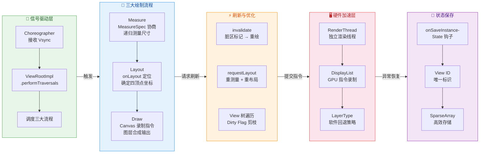

### 核心知识回顾

**一、绘制流程概览——信号驱动的流水线**

整个绘制流水线的起点是 **Vsync 信号**。Choreographer 作为编舞者角色，在每个 Vsync 到达时回调 `ViewRootImpl.performTraversals()`，这个方法是整条流水线的总调度入口。它按照严格顺序依次触发 `performMeasure()` → `performLayout()` → `performDraw()` 三大阶段。理解这一点至关重要：Android 的绘制不是随时发生的，而是 **帧同步（Frame-Synchronized）** 的，每帧约 16.6ms（60Hz 屏幕）的时间窗口内，必须完成从测量到上屏的全部工作，否则就会发生掉帧（Jank）。`performTraversals()` 并非每次都执行全部三个阶段，它通过内部的 dirty flag（如 `mLayoutRequested`、`PFLAG_DIRTY`）进行判断，只执行必要的步骤，这是框架层面的第一层优化。

**二、测量阶段 Measure——父子协商确定尺寸**

Measure 阶段解决的核心问题是：**每个 View 到底多大？** 这一阶段的精髓在于 `MeasureSpec` 的父子协商机制。`MeasureSpec` 是一个 32 位 int 值，高 2 位表示测量模式（`EXACTLY`、`AT_MOST`、`UNSPECIFIED`），低 30 位表示尺寸参考值。父 ViewGroup 根据自身可用空间与子 View 的 `LayoutParams` 联合计算出子 View 的 `MeasureSpec`，再递归传入子 View 的 `onMeasure()` 方法。这种 **"约束下放、结果上报"** 的递归机制，使得整棵 View 树的尺寸能够在一次深度优先遍历中从根到叶逐级确定。其中 `WRAP_CONTENT` 的处理最为复杂——自定义 View 若不在 `onMeasure()` 中主动处理 `AT_MOST` 模式，就会退化为 `MATCH_PARENT` 的效果，这是开发中最常见的陷阱之一。

**三、布局阶段 Layout——坐标系定位**

Layout 阶段解决的核心问题是：**每个 View 放在哪里？** 在 Measure 确定了每个 View 的宽高之后，`layout()` 方法被调用，通过 `setFrame()` 将 `left`、`top`、`right`、`bottom` 四个坐标写入 View 内部字段，从而确定该 View 在其 **父坐标系** 中的位置。需要特别注意的是，View 的坐标系是相对于父容器的，而非屏幕绝对坐标。`onLayout()` 是 ViewGroup 必须重写的方法，它负责遍历所有子 View 并调用 `child.layout(l, t, r, b)` 为每个子 View 分配位置。View 本身通常不需要重写 `onLayout()`，因为叶子节点没有子 View 需要定位。理解 View 与 ViewGroup 在 Layout 阶段的职责分工，是理解自定义布局容器的基础。

**四、绘制阶段 Draw——指令录制与图层合成**

Draw 阶段解决的核心问题是：**每个 View 长什么样？** 绘制流程遵循严格的分层顺序：`drawBackground()` 绘制背景 → `onDraw()` 绘制自身内容 → `dispatchDraw()` 绘制子 View → 绘制前景与装饰（如滚动条）。Canvas 是整个绘制阶段的核心抽象，它既可以对应一块软件 Bitmap，也可以对应一个硬件加速的 `DisplayListCanvas`（即 `RecordingCanvas`）。在硬件加速模式下，`onDraw()` 中的 Canvas 操作并不会直接产生像素，而是被 **录制** 为 GPU 指令序列（DisplayList），真正的光栅化（Rasterization）由 RenderThread 在独立线程中完成。`Canvas.saveLayer()` 可以创建离屏图层（Offscreen Layer），用于实现复杂的透明度、混合模式效果，但会触发额外的 GPU 纹理分配，属于性能敏感操作。

**五、刷新机制——精准触发最小重绘**

Android 提供了两种主要的刷新请求路径：`invalidate()` 与 `requestLayout()`。`invalidate()` 仅标记当前 View 为脏区（Dirty Region），只触发 Draw 阶段的重绘，不会重新测量和布局，适用于内容变化但尺寸位置不变的场景（如颜色改变、动画帧更新）。`requestLayout()` 则设置 `PFLAG_FORCE_LAYOUT` 标记，沿 View 树向上冒泡直到 ViewRootImpl，在下一帧触发完整的 Measure → Layout → Draw 流程，适用于尺寸或位置可能变化的场景。框架通过 **dirty flag 剪枝** 优化遍历：未被标记为脏的子树在遍历时直接跳过，避免对整棵 View 树做无差别的全量计算。开发者应当严格区分两种刷新方式——滥用 `requestLayout()` 会导致不必要的 Measure/Layout 开销，是布局性能劣化的常见原因。

**六、硬件加速——GPU 驱动的现代渲染架构**

自 Android 3.0 引入、4.0 默认开启的硬件加速机制，彻底改变了绘制流水线的执行模型。在硬件加速模式下，主线程（UI Thread）的 `onDraw()` 只负责将绘制指令录制到 **DisplayList**（`RenderNode`）中，真正的 GPU 指令提交与执行由 **RenderThread** 独立完成。这种 **录制-回放** 架构带来了两大优势：第一，UI 线程的绘制工作大幅减轻，`onDraw()` 本身变成了轻量的指令录制，而非像素级计算；第二，RenderThread 可以在 UI 线程处理下一帧的 Input/Animation 时并行执行上一帧的 GPU 渲染，实现流水线级并行。`LAYER_TYPE_HARDWARE` 会为 View 创建独立的 GPU 纹理（FBO），缓存其 DisplayList 的渲染结果，适用于内容不常变但频繁做变换动画的场景。`LAYER_TYPE_SOFTWARE` 则强制回退到 CPU 软件渲染路径，用于兼容不支持硬件加速的特定 Canvas API（如某些 `Path` 效果或 `BlurMaskFilter`）。

**七、视图状态保存——跨配置变更的数据存活**

当 Activity 因配置变更（如屏幕旋转）或被系统回收而销毁重建时，View 体系通过 `onSaveInstanceState()` / `onRestoreInstanceState()` 钩子自动保存和恢复状态。这一机制依赖 **View ID** 作为唯一标识——只有设置了 `android:id` 的 View 才会参与状态保存流程。状态通过 `SparseArray<Parcelable>` 存储，以 View ID 为键、Parcelable 状态对象为值，保证了高效的查找与序列化。自定义 View 若持有需要跨重建存活的内部状态（如用户输入的文本、滑块位置），必须重写这对钩子方法，并且确保在布局文件中为该 View 分配唯一 ID。忽略这一环节会导致用户在旋转屏幕后丢失操作状态，是常见的体验缺陷。

### 关键设计思想提炼

纵观整条绘制流水线，可以提炼出以下几条贯穿始终的设计哲学：

**1. 分治与递归（Divide and Conquer）**。View 树是一棵 N 叉树，Measure、Layout、Draw 三个阶段都采用深度优先递归遍历。每个阶段，父节点负责"分配约束"或"分配区域"，子节点负责"计算结果"或"执行绘制"，层层递归直至叶子节点。这种分治思想使得任意复杂的 UI 结构都可以被拆解为统一的 `View.measure()` → `View.layout()` → `View.draw()` 原子操作。

**2. 延迟合并与帧同步（Deferred Batching & Frame Sync）**。多次 `invalidate()` 或 `requestLayout()` 调用并不会立即触发绘制，而是通过 dirty flag 标记并等待下一个 Vsync 信号统一处理。这种"攒批"策略避免了同一帧内多次冗余遍历，是 Android 保证 60fps 流畅度的关键机制。开发者可以在一个方法中连续修改多个 View 属性，而不必担心触发多次重绘——框架会自动将它们合并到下一帧统一处理。

**3. 最小化重绘范围（Minimal Invalidation）**。从 `invalidate()` 的脏区机制到 DisplayList 的局部更新，框架始终在追求"只重绘变化的部分"。在硬件加速下，如果一个 View 的内容没有改变，只是做了平移或缩放变换，RenderThread 可以直接复用其 DisplayList，仅更新变换矩阵，完全跳过 `onDraw()` 的重新录制。理解这一机制，才能理解为什么属性动画（Property Animation）比在 `onDraw()` 中手动计算动画高效得多。

**4. 录制与回放分离（Record-Playback Separation）**。硬件加速的 DisplayList 架构将"描述画什么"和"执行怎么画"解耦到两个不同的线程。这不仅提升了并行度，也为 RenderThread 端的优化（如指令重排序、批量合并 Draw Call）提供了可能。这种 Producer-Consumer 模式是现代 GPU 渲染管线的经典范式。

**5. 防御性状态保存（Defensive State Preservation）**。Android 系统随时可能销毁并重建 Activity，View 层面的 `onSaveInstanceState()` 机制是 View 体系对这一不确定性的防御性设计。它与 Activity/Fragment 级别的状态保存形成互补——Activity 保存业务数据，View 保存 UI 交互状态，共同保证用户体验的连续性。

### 性能优化 Checklist

以下是基于本章内容的实战性能优化检查清单，供开发者在 Code Review 或性能调优时快速参考：

| 优化维度 | 推荐做法 | 避免做法 |
|---------|---------|---------|
| **布局层级** | 使用 `ConstraintLayout` 扁平化、`merge` 减少冗余层级 | 多层嵌套 `LinearLayout` + `RelativeLayout` |
| **Measure** | 自定义 View 正确处理 `AT_MOST` 模式 | `onMeasure()` 中不调用 `setMeasuredDimension()` |
| **Layout** | 避免在 `onLayout()` 中触发 `requestLayout()` | Layout 回调中修改 LayoutParams 引发循环布局 |
| **Draw** | `onDraw()` 中零对象分配、预创建 Paint | 在 `onDraw()` 中 new 对象、执行耗时计算 |
| **刷新策略** | 仅内容变化时用 `invalidate()`，尺寸变化才用 `requestLayout()` | 所有变化一律调用 `requestLayout()` |
| **硬件加速** | 变换动画使用 `LAYER_TYPE_HARDWARE` 缓存 | 内容频繁变化的 View 设置 Hardware Layer |
| **状态保存** | 为需要保存状态的自定义 View 设置唯一 ID 并重写状态钩子 | 忽略 `onSaveInstanceState()`，旋转后丢失状态 |
| **过度绘制** | 移除不可见背景、善用 `clipRect()` | 多层半透明背景叠加、全屏无差别绘制 |

### 调试工具速查

在实际开发中，上述知识需要结合调试工具来验证和诊断。本章涉及的绘制流水线相关问题，可以使用以下工具链进行排查：

- **Layout Inspector**：查看运行时 View 树结构、属性值、层级深度，直观定位冗余嵌套。
- **GPU Profiling（Profile GPU Rendering）**：在开发者选项中开启后，屏幕上以柱状图实时显示每帧的 Measure/Layout/Draw/Sync 等各阶段耗时，超过绿色基准线即表示掉帧。
- **Systrace / Perfetto**：系统级 Trace 工具，可以精确看到 `performTraversals()`、`draw()`、`RenderThread` 等各阶段在时间轴上的分布，定位主线程阻塞与渲染瓶颈。
- **Show GPU Overdraw**：开发者选项中的过度绘制可视化，颜色越深代表像素被重复绘制的次数越多，用于指导背景移除与 `clipRect()` 优化。
- **Hardware Layer Updates**：开发者选项中可高亮正在更新的 Hardware Layer，帮助判断 `LAYER_TYPE_HARDWARE` 是否被正确使用（频繁闪烁说明缓存未生效）。

---

**📝 练习题**

在 Android 硬件加速模式下，以下关于绘制流水线的描述，哪一项是 **正确** 的？


A. `onDraw()` 中的 Canvas 绑定的是一块 Bitmap，绘制指令直接生成像素写入 Bitmap


B. `invalidate()` 调用后，View 会在当前调用栈中立即执行 `onDraw()` 完成重绘


C. RenderThread 负责将 DisplayList 中录制的指令提交给 GPU 执行光栅化，与 UI 线程并行工作


D. `LAYER_TYPE_HARDWARE` 适合内容频繁变化的 View，因为 GPU 纹理可以快速更新


**【答案】** C

**【解析】** 硬件加速模式下的绘制流水线采用 **录制-回放（Record-Playback）** 架构。UI 线程在 `onDraw()` 中操作的 Canvas 实际上是 `RecordingCanvas`（又称 `DisplayListCanvas`），它并不直接生成像素，而是将绘制指令录制到 `RenderNode` 内部的 DisplayList 结构中（A 错误，A 描述的是软件渲染模式的行为）。`invalidate()` 仅设置脏标记并通过 Choreographer 注册下一帧的 Vsync 回调，绘制发生在下一个 Vsync 到来之后的 `performTraversals()` 流程中，而非当前调用栈（B 错误）。RenderThread 是独立于 UI 线程的渲染线程，它取走 DisplayList 后负责 GPU 指令的提交与执行，可以与 UI 线程处理下一帧的输入/动画并行运行（C 正确）。`LAYER_TYPE_HARDWARE` 会为 View 分配独立的 GPU 纹理（FBO）来缓存渲染结果，适用于内容稳定但需要频繁做变换动画的 View；如果内容频繁变化，每次都需要重新录制 DisplayList 并更新纹理，反而会增加额外的纹理分配与上传开销，导致性能劣化（D 错误）。

---

**📝 练习题**

某开发者自定义了一个 `CircleView extends View`，在 XML 中设置了 `android:layout_width="wrap_content"` 和 `android:layout_height="wrap_content"`，但在 `onMeasure()` 中直接调用了 `super.onMeasure(widthMeasureSpec, heightMeasureSpec)` 而未做任何额外处理。将该 View 放入一个 `FrameLayout`（`match_parent`）中，运行后发现 CircleView 占满了整个 FrameLayout。以下哪项最准确地解释了这一现象？


A. `FrameLayout` 的 `onMeasure()` 实现有 bug，没有正确处理 `wrap_content` 的子 View


B. `View.onMeasure()` 的默认实现在收到 `AT_MOST` 模式时，会将 MeasureSpec 中的 size 值直接作为测量结果，导致子 View 尺寸等于父容器可用空间


C. `wrap_content` 在没有设置 `minWidth`/`minHeight` 时默认就是 `match_parent` 行为，这是 Android 的设计规范


D. 硬件加速模式下 `wrap_content` 的计算被跳过，需要手动关闭硬件加速才能正常工作


**【答案】** B

**【解析】** 这是 Measure 阶段最经典的陷阱之一。当子 View 声明 `wrap_content` 且父 ViewGroup 自身为 `match_parent` 时，父容器传给子 View 的 MeasureSpec 模式为 `AT_MOST`，size 为父容器的可用空间大小。`View.onMeasure()` 的默认实现调用 `getDefaultSize()`，其内部逻辑是：对于 `AT_MOST` 和 `EXACTLY` 两种模式，**都直接使用 MeasureSpec 中的 size 值** 作为返回结果。这意味着在默认实现下，`wrap_content` 与 `match_parent` 的测量结果完全一致——都等于父容器可用空间（B 正确）。正确做法是在自定义 View 的 `onMeasure()` 中检测 `AT_MOST` 模式，根据自身内容（如圆的直径）计算出期望尺寸，再通过 `resolveSize()` 或手动 `Math.min()` 与 spec size 取较小值，最后调用 `setMeasuredDimension()` 设置结果。A 错误，FrameLayout 的实现完全正确；C 是无中生有的说法；D 与硬件加速无关，Measure 阶段在 UI 线程执行，与渲染模式无关。

---