---

# 自定义 View 实战

---

## 自定义 View 分类

Android 的视图系统（View System）是整个 UI 框架的基石。系统内置的 `TextView`、`ImageView`、`RecyclerView` 等控件已经覆盖了大量日常开发场景，但在面对高度定制化的 UI 需求时——比如一个带动画的环形进度条、一个不规则形状的按钮、一套全新的卡片式布局容器——开发者就必须走上"自定义 View"这条路。

自定义 View 并不是一种单一的技术，而是一个 **技术谱系**。根据继承的基类不同、重写的方法不同、最终实现的目标不同，自定义 View 可以被清晰地划分为四大类别：**继承 View 的绘制型**、**继承 ViewGroup 的布局型**、**组合现有控件的复合型**，以及 **继承现有控件的扩展型**。理解这四种分类的本质差异，是掌握自定义 View 的第一步——选错了基类，后续的 measure、layout、draw 每一步都会走弯路。

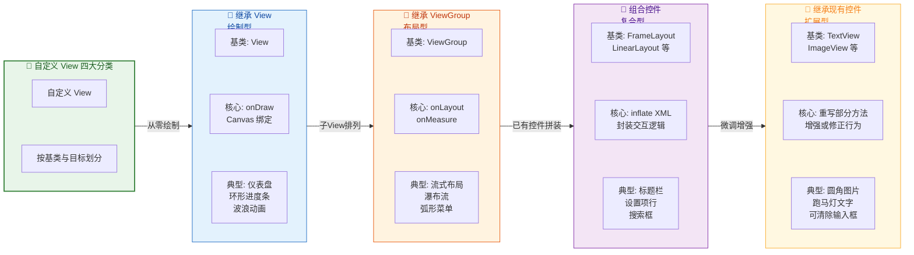

### 继承 View 绘制型

这是自定义 View 中最"底层"、最"自由"的一种方式。开发者直接继承 `android.view.View`，在一张"白纸"上通过 `Canvas`（画布）和 `Paint`（画笔）API 来绘制一切视觉元素。系统不会为你绘制任何默认内容——没有文字、没有背景、没有图片——一切都由你在 `onDraw(Canvas)` 方法中亲手完成。

**何时选择这种方式？** 当你需要展示的 UI 元素在系统中 **完全没有对应的现成控件** 时，继承 View 绘制型就是唯一选择。典型场景包括：自定义仪表盘（Dashboard）、环形/弧形进度条、股票 K 线图、波浪动画效果、粒子特效等。这些场景的共同特点是——UI 形态完全由几何图形、贝塞尔曲线、渐变色等图形学元素构成，无法用系统控件组合拼凑出来。

**开发者需要关注的核心方法链路：**

当一个 View 被添加到视图树中后，Android 的 `ViewRootImpl` 会驱动整棵视图树执行三大流程：**Measure → Layout → Draw**。对于继承 View 的绘制型自定义控件，开发者的工作重心分布在以下几个方法上：

1. **`onMeasure(int widthMeasureSpec, int heightMeasureSpec)`**：这是最容易被初学者忽略却又最关键的方法。如果你的自定义 View 需要支持 `wrap_content`，就 **必须** 重写此方法并调用 `setMeasuredDimension(width, height)` 来告知父布局自身期望的尺寸。如果不重写，`wrap_content` 会表现得和 `match_parent` 一样——因为 `View` 基类的默认实现会直接使用 MeasureSpec 中的建议尺寸（即父容器给的最大空间）。

2. **`onDraw(Canvas canvas)`**：这是绘制型自定义 View 的"灵魂方法"。系统在 draw 阶段会回调此方法，并传入一个与当前 View 关联的 `Canvas` 对象。开发者在这个方法里调用 `canvas.drawCircle()`、`canvas.drawPath()`、`canvas.drawBitmap()` 等 API 来绘制所有视觉内容。需要特别注意的是，`onDraw()` 可能会被频繁调用（比如动画场景下每帧都会触发 `invalidate()` → `onDraw()`），因此 **绝对不能在 `onDraw()` 中创建对象**（如 `new Paint()`、`new Rect()`），否则会引发频繁 GC，导致界面卡顿。

3. **`onSizeChanged(int w, int h, int oldw, int oldh)`**：当 View 的尺寸首次确定或发生变化时，系统会回调此方法。这是一个非常适合做"基于尺寸的预计算"的地方——比如根据宽高计算圆心坐标、半径、路径等，然后将结果缓存到成员变量中，供 `onDraw()` 直接使用。

下面通过一个环形进度条的例子来展示继承 View 绘制型的标准写法：

```kotlin
/**
 * 环形进度条 —— 典型的继承 View 绘制型自定义控件
 * 所有视觉元素完全由 Canvas + Paint 绘制，无任何子 View
 */
class RingProgressView @JvmOverloads constructor(
    context: Context,
    attrs: AttributeSet? = null,       // XML 属性集，用于从布局文件解析自定义属性
    defStyleAttr: Int = 0              // 默认样式属性，后续章节会详细讲解
) : View(context, attrs, defStyleAttr) {

    // ---------- 画笔对象在构造期创建，避免 onDraw 中重复分配 ----------
    // 背景环画笔：绘制灰色底环
    private val bgPaint = Paint(Paint.ANTI_ALIAS_FLAG).apply {
        style = Paint.Style.STROKE     // 描边模式，不填充
        strokeWidth = 20f              // 环的粗细，单位为像素
        color = 0xFFE0E0E0.toInt()     // 浅灰色背景环
    }

    // 前景环画笔：绘制彩色进度弧
    private val fgPaint = Paint(Paint.ANTI_ALIAS_FLAG).apply {
        style = Paint.Style.STROKE     // 同样是描边模式
        strokeWidth = 20f              // 与背景环等粗，保持视觉一致
        strokeCap = Paint.Cap.ROUND    // 线帽为圆形，弧线两端呈圆润效果
        color = 0xFF4CAF50.toInt()     // Material Green 500
    }

    // 绘制弧线需要的矩形边界，在 onSizeChanged 中计算一次即可
    private val arcRect = RectF()

    // 当前进度值：0 ~ 100
    var progress: Int = 0
        set(value) {
            field = value.coerceIn(0, 100) // 限制在合法范围内
            invalidate()                    // 通知系统重绘，触发 onDraw
        }

    /**
     * 尺寸变化回调 —— 在这里预计算绑定到尺寸的几何参数
     * 首次 layout 完成后、或 View 尺寸发生变化时调用
     */
    override fun onSizeChanged(w: Int, h: Int, oldw: Int, oldh: Int) {
        super.onSizeChanged(w, h, oldw, oldh)
        // 根据宽高和画笔粗细计算弧线的外接矩形
        // 需要向内收缩半个 strokeWidth，否则弧线会被裁剪
        val inset = fgPaint.strokeWidth / 2f
        arcRect.set(inset, inset, w - inset, h - inset)
    }

    /**
     * 测量回调 —— 支持 wrap_content 的关键
     * 如果不重写，wrap_content 会退化为 match_parent
     */
    override fun onMeasure(widthMeasureSpec: Int, heightMeasureSpec: Int) {
        // 默认期望尺寸为 200dp（转换为像素）
        val defaultSize = (200 * resources.displayMetrics.density).toInt()
        // resolveSize 会根据 MeasureSpec 的模式（EXACTLY/AT_MOST/UNSPECIFIED）
        // 智能地在"期望值"和"约束值"之间取合适的结果
        val width = resolveSize(defaultSize, widthMeasureSpec)
        val height = resolveSize(defaultSize, heightMeasureSpec)
        // 必须调用此方法存储测量结果，否则会抛出 IllegalStateException
        setMeasuredDimension(width, height)
    }

    /**
     * 绘制回调 —— 绘制型自定义 View 的核心
     * 注意：此方法内禁止创建任何对象（Paint/Rect/Path 等）
     */
    override fun onDraw(canvas: Canvas) {
        // 第一层：绘制 360° 的灰色背景完整圆环
        canvas.drawArc(arcRect, 0f, 360f, false, bgPaint)
        // 第二层：绘制从顶部（-90°）开始的绿色进度弧
        // sweepAngle = progress / 100 * 360，即进度百分比对应的角度
        val sweepAngle = progress / 100f * 360f
        canvas.drawArc(arcRect, -90f, sweepAngle, false, fgPaint)
    }
}
```

这段代码清晰地展示了继承 View 绘制型的三个核心特征：**自己度量尺寸**（`onMeasure` 中为 `wrap_content` 提供默认大小）、**自己预计算几何参数**（`onSizeChanged` 中根据宽高算出弧线矩形）、**自己绘制一切**（`onDraw` 中用 Canvas API 画出背景环和进度弧）。同时也体现了一个至关重要的性能原则——所有 `Paint`、`RectF` 对象都在构造期或 `onSizeChanged` 中创建和缓存，`onDraw` 中只做纯绘制操作，零对象分配。

**继承 View 绘制型的核心难点** 在于开发者必须对 `Canvas` 的坐标系统、`Paint` 的各种属性（抗锯齿、描边模式、线帽样式、着色器等）以及 `Path` 的贝塞尔曲线构建有扎实的理解。这些内容将在后续的"核心绘图 API"和"高级渲染效果"章节中详细展开。此外，如果你的自定义 View 需要响应触摸事件（比如一个可拖拽的滑块），还需要重写 `onTouchEvent(MotionEvent)` 方法来处理手势逻辑——这意味着绘制型 View 不仅要"画得出来"，还要"摸得到"。

### 继承 ViewGroup 布局型

如果说继承 View 绘制型关注的是"像素级别的绘制"，那么继承 ViewGroup 布局型关注的则是 **"子 View 的测量与摆放"**。开发者直接继承 `android.view.ViewGroup`（或其子类如 `FrameLayout`），通过重写 `onMeasure()` 和 `onLayout()` 来实现一套自定义的子 View 排列规则。

**何时选择这种方式？** 当系统提供的 `LinearLayout`、`RelativeLayout`、`FrameLayout`、`ConstraintLayout` 等布局容器无法满足你的排列需求时，就需要自己定义布局规则。典型场景包括：流式标签布局（FlowLayout，子 View 自动换行排列）、瀑布流布局（Waterfall Layout，列高度不等的多列布局）、弧形菜单（子 View 沿圆弧排列）、拖拽排序网格（子 View 可通过长按拖拽交换位置）等。

**与继承 View 绘制型的本质区别：**

继承 View 绘制型的"产出物"是 Canvas 上的像素——开发者调用 `drawCircle()`、`drawPath()` 等方法直接操控渲染管线。而继承 ViewGroup 布局型的"产出物"是 **子 View 的位置和大小**——开发者在 `onLayout()` 中调用每个子 View 的 `child.layout(left, top, right, bottom)` 方法来确定它们在屏幕上的矩形区域。ViewGroup 本身通常不需要绘制任何内容（默认 `setWillNotDraw(true)`），它的职责是"安排"而非"绘制"。

**核心方法链路：**

1. **`onMeasure(int widthMeasureSpec, int heightMeasureSpec)`**：这是自定义 ViewGroup 中最复杂的方法。它需要完成两件事：第一，遍历所有子 View，调用 `measureChild()` 或 `measureChildWithMargins()` 让每个子 View 自行测量（子 View 会递归地触发自身的 `onMeasure()`）；第二，根据所有子 View 的测量结果，计算出自身所需的总宽高，并调用 `setMeasuredDimension()` 保存。以流式布局为例，`onMeasure()` 需要逐个累加子 View 的宽度，当某一行的累计宽度超过父容器约束时就"换行"，最终得到总行数 × 行高 = 总高度。

2. **`onLayout(boolean changed, int l, int t, int r, int b)`**：这是 ViewGroup 的"灵魂方法"。系统调用此方法时，ViewGroup 已经知道了自身的确切尺寸，也知道了每个子 View 经过 measure 后的期望宽高（通过 `child.getMeasuredWidth()` / `child.getMeasuredHeight()` 获取）。开发者要做的就是 **计算每个子 View 的 left/top/right/bottom 坐标**，然后逐一调用 `child.layout(l, t, r, b)` 将其"放置"到正确的位置。

3. **`generateLayoutParams(AttributeSet attrs)`**：如果你的自定义 ViewGroup 需要支持子 View 在 XML 中声明额外的布局参数（比如 `layout_span`、`layout_weight` 等），就需要重写此方法以返回自定义的 `LayoutParams` 子类。这个机制正是 `LinearLayout.LayoutParams` 中 `layout_weight` 属性、`RelativeLayout.LayoutParams` 中 `layout_toRightOf` 属性得以工作的底层原理。

下面以一个简化版的流式布局（FlowLayout）为例，展示继承 ViewGroup 布局型的核心逻辑：

```kotlin
/**
 * 流式标签布局 —— 典型的继承 ViewGroup 布局型自定义控件
 * 子 View 从左到右排列，一行放不下时自动换行
 */
class FlowLayout @JvmOverloads constructor(
    context: Context,
    attrs: AttributeSet? = null,       // XML 属性集
    defStyleAttr: Int = 0
) : ViewGroup(context, attrs, defStyleAttr) {

    // 子 View 之间的水平间距（像素）
    private val horizontalSpacing = (8 * resources.displayMetrics.density).toInt()
    // 行与行之间的垂直间距（像素）
    private val verticalSpacing = (8 * resources.displayMetrics.density).toInt()

    /**
     * 测量阶段 —— 遍历所有子 View，模拟"排列"过程以计算自身所需的总宽高
     * 这是自定义 ViewGroup 中最复杂的方法
     */
    override fun onMeasure(widthMeasureSpec: Int, heightMeasureSpec: Int) {
        // 从 MeasureSpec 中解析出父容器给定的最大宽度约束
        val maxWidth = MeasureSpec.getSize(widthMeasureSpec)
        // paddingLeft + paddingRight 是 ViewGroup 自身的内边距，子 View 不能占据这部分空间
        val availableWidth = maxWidth - paddingLeft - paddingRight

        var currentLineWidth = 0   // 当前行已使用的宽度
        var currentLineHeight = 0  // 当前行的最大高度（取该行所有子 View 的最大值）
        var totalWidth = 0         // 所有行中最宽的那一行的宽度（用于 wrap_content 时报告自身宽度）
        var totalHeight = 0        // 所有行的高度累加（用于 wrap_content 时报告自身高度）

        // 遍历每一个子 View
        for (i in 0 until childCount) {
            val child = getChildAt(i)                // 获取第 i 个子 View
            if (child.visibility == GONE) continue   // 跳过 GONE 状态的子 View（不占空间）

            // 让子 View 自行测量：传入父容器的约束，子 View 会在内部执行自己的 onMeasure
            measureChild(child, widthMeasureSpec, heightMeasureSpec)

            val childWidth = child.measuredWidth     // 子 View 测量后的期望宽度
            val childHeight = child.measuredHeight   // 子 View 测量后的期望高度

            // 判断是否需要换行：当前行剩余空间放不下这个子 View
            if (currentLineWidth + childWidth > availableWidth) {
                // 换行前：将当前行的宽度与历史最大值比较，更新 totalWidth
                totalWidth = maxOf(totalWidth, currentLineWidth)
                // 将当前行高度累加到 totalHeight（如果不是第一行，还要加上行间距）
                totalHeight += currentLineHeight + verticalSpacing
                // 重置当前行的状态：新行从这个放不下的子 View 开始
                currentLineWidth = childWidth + horizontalSpacing
                currentLineHeight = childHeight
            } else {
                // 不换行：累加当前行宽度，更新当前行的最大高度
                currentLineWidth += childWidth + horizontalSpacing
                currentLineHeight = maxOf(currentLineHeight, childHeight)
            }
        }

        // 别忘了最后一行（循环结束时最后一行的数据还没有被累加）
        totalWidth = maxOf(totalWidth, currentLineWidth)
        totalHeight += currentLineHeight

        // 加上 ViewGroup 自身的 padding
        totalWidth += paddingLeft + paddingRight
        totalHeight += paddingTop + paddingBottom

        // resolveSize：根据 MeasureSpec 模式智能选择最终尺寸
        // EXACTLY 模式 → 使用 spec 给定的精确值
        // AT_MOST 模式 → 取 min(计算值, spec上限)
        // UNSPECIFIED 模式 → 直接使用计算值
        setMeasuredDimension(
            resolveSize(totalWidth, widthMeasureSpec),
            resolveSize(totalHeight, heightMeasureSpec)
        )
    }

    /**
     * 布局阶段 —— 将每个子 View "放置"到正确的 (left, top, right, bottom) 坐标
     * 逻辑与 onMeasure 中的"模拟排列"高度相似，但这次是真正地调用 child.layout()
     */
    override fun onLayout(changed: Boolean, l: Int, t: Int, r: Int, b: Int) {
        // 可用宽度 = ViewGroup 实际宽度 - 左右 padding
        val availableWidth = width - paddingLeft - paddingRight

        var xPos = paddingLeft     // 当前子 View 的 x 起始坐标（从左 padding 开始）
        var yPos = paddingTop      // 当前子 View 的 y 起始坐标（从顶 padding 开始）
        var currentLineHeight = 0  // 当前行最大高度，用于换行时计算下一行的 y 坐标

        for (i in 0 until childCount) {
            val child = getChildAt(i)
            if (child.visibility == GONE) continue   // GONE 的子 View 不参与布局

            val childWidth = child.measuredWidth      // 使用 measure 阶段确定的宽度
            val childHeight = child.measuredHeight    // 使用 measure 阶段确定的高度

            // 判断是否需要换行
            if (xPos + childWidth > paddingLeft + availableWidth) {
                // 换行：x 回到左边 padding 处，y 下移一行
                xPos = paddingLeft
                yPos += currentLineHeight + verticalSpacing
                currentLineHeight = 0                 // 新行高度重置
            }

            // 核心调用：将子 View 放置到 (xPos, yPos) 处
            // child.layout 的四个参数分别是 left, top, right, bottom
            child.layout(xPos, yPos, xPos + childWidth, yPos + childHeight)

            // 更新当前行状态
            xPos += childWidth + horizontalSpacing     // x 右移，为下一个子 View 留出位置
            currentLineHeight = maxOf(currentLineHeight, childHeight) // 更新行高
        }
    }
}
```

**`onMeasure()` 与 `onLayout()` 的"双遍历"模式** 是继承 ViewGroup 布局型最典型的代码结构。你会发现两个方法中的逻辑高度相似——都是遍历子 View、判断换行、累加坐标。这种"重复"并非设计失误，而是 Android 视图系统将 **测量** 与 **布局** 分离为两个独立阶段的必然结果：`onMeasure()` 阶段只负责"算出需要多大空间"，`onLayout()` 阶段才真正"把子 View 放上去"。这种分离让 ViewGroup 可以在 measure 阶段被父容器多次试探性地调用（比如 `LinearLayout` 的 `layout_weight` 需要两次 measure），而不会产生副作用。

**性能与复杂度提示：** 自定义 ViewGroup 的 `onMeasure()` 如果实现不当，可能会导致子 View 被重复测量多次（类似 `LinearLayout` 使用 `layout_weight` 时的双重 measure），引发严重的性能问题。特别是当 ViewGroup 嵌套层级较深时，测量次数会呈指数级增长。这也是 Google 推出 `ConstraintLayout` 的核心动机之一——它通过约束求解器在单次 measure pass 中完成所有子 View 的测量，从根本上解决了嵌套布局的性能问题。

### 组合控件（复合型）

组合控件是实际开发中 **使用频率最高** 的自定义 View 方式。它的核心思想极其简单——**将多个现有的系统控件"拼装"在一起，封装成一个独立的、可复用的组件**。开发者不需要关心 Canvas 绑定怎么画，也不需要操心子 View 的 measure/layout 逻辑，因为底层的排列工作完全交给了系统已有的布局容器（`FrameLayout`、`LinearLayout`、`RelativeLayout`、`ConstraintLayout` 等）来处理。

**何时选择这种方式？** 当你需要的 UI 可以用现有控件"拼"出来，只是需要将它们封装为一个整体以便复用和统一管理时，组合控件就是最佳选择。典型场景数不胜数：App 顶部的标题栏（左边返回按钮 + 中间标题 + 右边菜单按钮）、设置页面的每一行（左边图标 + 中间标题/副标题 + 右边开关）、搜索栏（搜索图标 + 输入框 + 清除按钮 + 语音按钮）、带加减按钮的数量选择器等。

**组合控件的实现路径：**

与前两种方式不同，组合控件通常 **不需要重写 `onMeasure()` 和 `onLayout()`**。开发者的工作重心在于：

1. **选择合适的根布局容器**：继承 `LinearLayout`（线性排列）、`FrameLayout`（层叠排列）、`ConstraintLayout`（约束排列）等。选择的依据是"内部子控件的排列方式最适合哪种布局"。

2. **定义 XML 布局文件**：在 `res/layout/` 下创建组合控件的内部布局 XML，将所有子控件声明在其中。

3. **在构造函数中 inflate 布局并绑定子 View**：通过 `LayoutInflater.from(context).inflate(R.layout.xxx, this, true)` 将 XML 布局加载到当前 ViewGroup 中，然后通过 `findViewById()` 或 ViewBinding 获取子 View 的引用。

4. **声明自定义属性并解析**：通过 `attrs.xml` 定义组件对外暴露的属性（如标题文字、图标资源、开关状态等），在构造函数中通过 `TypedArray` 解析这些属性并设置到对应的子 View 上。

5. **封装交互逻辑**：将子 View 的点击事件、状态变化等逻辑封装为组件对外暴露的方法或回调接口。

```kotlin
/**
 * 标题栏组合控件 —— 典型的组合型自定义 View
 * 继承 FrameLayout 作为根容器，内部 inflate 一个 XML 布局
 */
class TitleBarView @JvmOverloads constructor(
    context: Context,
    attrs: AttributeSet? = null,
    defStyleAttr: Int = 0
) : FrameLayout(context, attrs, defStyleAttr) {

    // 子 View 引用：通过 inflate 后的 findViewById 获取
    private val btnBack: ImageButton       // 左侧返回按钮
    private val tvTitle: TextView          // 中间标题文本
    private val btnMenu: ImageButton       // 右侧菜单按钮

    init {
        // 将 XML 布局加载到当前 FrameLayout 中
        // 第三个参数 true 表示将 inflate 出的根 View 直接 addView 到 this
        LayoutInflater.from(context).inflate(R.layout.view_title_bar, this, true)

        // 绑定子 View 引用
        btnBack = findViewById(R.id.btn_back)    // 查找返回按钮
        tvTitle = findViewById(R.id.tv_title)    // 查找标题 TextView
        btnMenu = findViewById(R.id.btn_menu)    // 查找菜单按钮

        // 解析 XML 中声明的自定义属性
        attrs?.let {
            // obtainStyledAttributes 返回 TypedArray，用完必须 recycle
            val ta = context.obtainStyledAttributes(it, R.styleable.TitleBarView)
            // 读取 app:title 属性，设置到标题 TextView
            tvTitle.text = ta.getString(R.styleable.TitleBarView_title) ?: ""
            // 读取 app:showBack 属性，控制返回按钮是否可见
            val showBack = ta.getBoolean(R.styleable.TitleBarView_showBack, true)
            btnBack.visibility = if (showBack) VISIBLE else GONE
            // 读取 app:menuIcon 属性，设置菜单按钮的图标
            val menuIcon = ta.getDrawable(R.styleable.TitleBarView_menuIcon)
            if (menuIcon != null) {
                btnMenu.setImageDrawable(menuIcon)   // 设置自定义图标
                btnMenu.visibility = VISIBLE          // 有图标才显示
            } else {
                btnMenu.visibility = GONE             // 无图标则隐藏
            }
            ta.recycle()   // 必须回收 TypedArray 以避免内存泄漏
        }
    }

    /**
     * 对外暴露的 API：设置返回按钮的点击回调
     * 使用 Kotlin 高阶函数简化回调写法
     */
    fun setOnBackClickListener(listener: () -> Unit) {
        btnBack.setOnClickListener { listener() }    // 将 View.OnClickListener 代理到 lambda
    }

    /**
     * 对外暴露的 API：动态修改标题文字
     */
    fun setTitle(title: String) {
        tvTitle.text = title    // 直接委托给内部 TextView
    }

    /**
     * 对外暴露的 API：设置菜单按钮的点击回调
     */
    fun setOnMenuClickListener(listener: () -> Unit) {
        btnMenu.setOnClickListener { listener() }
    }
}
```

对应的 XML 布局文件 `res/layout/view_title_bar.xml`：

```xml
<?xml version="1.0" encoding="utf-8"?>
<!-- 根元素使用 merge 标签，避免多一层无用的 ViewGroup 嵌套 -->
<!-- 因为 TitleBarView 本身已经是 FrameLayout，merge 的子 View 会直接成为其 children -->
<merge xmlns:android="http://schemas.android.com/apk/res/android"
    xmlns:tools="http://schemas.android.com/tools"
    tools:parentTag="android.widget.FrameLayout">

    <!-- 左侧返回按钮：固定在左边，垂直居中 -->
    <ImageButton
        android:id="@+id/btn_back"
        android:layout_width="48dp"
        android:layout_height="48dp"
        android:layout_gravity="start|center_vertical"
        android:background="?attr/selectableItemBackgroundBorderless"
        android:src="@drawable/ic_arrow_back"
        android:contentDescription="@string/back" />

    <!-- 中间标题文本：水平和垂直都居中 -->
    <TextView
        android:id="@+id/tv_title"
        android:layout_width="wrap_content"
        android:layout_height="wrap_content"
        android:layout_gravity="center"
        android:textSize="18sp"
        android:textColor="#DE000000"
        android:textStyle="bold"
        tools:text="页面标题" />

    <!-- 右侧菜单按钮：固定在右边，垂直居中 -->
    <ImageButton
        android:id="@+id/btn_menu"
        android:layout_width="48dp"
        android:layout_height="48dp"
        android:layout_gravity="end|center_vertical"
        android:background="?attr/selectableItemBackgroundBorderless"
        android:src="@drawable/ic_more_vert"
        android:contentDescription="@string/menu" />

</merge>
```

**`<merge>` 标签的关键作用：** 这是组合控件开发中一个非常重要但容易被忽略的优化点。如果布局 XML 的根元素使用普通的 `<FrameLayout>` 或 `<LinearLayout>`，那么 inflate 之后视图层级中会多出一层"冗余的容器"——因为 `TitleBarView` 本身已经是 `FrameLayout`，inflate 进来的 XML 又嵌了一层 `FrameLayout`，导致视图树白白多了一层。使用 `<merge>` 标签可以让 XML 中的子 View 直接挂载到 `TitleBarView` 这个 `FrameLayout` 下，消除冗余层级。

**组合控件的优势与局限：**

优势非常明显：**开发速度快、代码直观、容易维护**。大部分业务 UI 组件（标题栏、底部导航栏、设置项、搜索框等）都适合用这种方式来封装。对于团队协作而言，组合控件也是推广 Design System 的最佳载体——设计稿中反复出现的组件可以封装为组合控件，确保 UI 一致性。

局限在于 **性能上限受制于内部使用的系统布局容器**。如果组合控件内部嵌套层级较深（比如 `LinearLayout` 嵌 `RelativeLayout` 再嵌 `FrameLayout`），在视图树 measure/layout 阶段的开销就会增大。此外，组合控件无法实现纯图形学层面的自定义效果（如渐变、阴影、不规则形状），这些仍然需要依赖继承 View 绘制型。

### 继承现有控件（扩展型）

第四种方式是在 **已有控件的基础上做"微手术"**——继承一个具体的系统控件（如 `TextView`、`ImageView`、`EditText`、`RecyclerView`），通过重写其部分方法来增强或修改其行为。这种方式保留了原控件的 **全部已有功能**，开发者只需聚焦于"增量修改"的部分。

**何时选择这种方式？** 当你想要的效果与某个现有控件 **高度相似**，只需要在原有行为上做少量调整时，扩展型是最高效的选择。典型场景包括：

- **`CircleImageView` extends `ImageView`**：让图片以圆形显示，核心是在 `onDraw()` 中用 `BitmapShader` + `Canvas.drawCircle()` 替换默认的矩形绘制逻辑。
- **`MarqueeTextView` extends `TextView`**：让文字无条件启用跑马灯滚动效果，核心是重写 `isFocused()` 永远返回 `true`。
- **`ClearableEditText` extends `AppCompatEditText`**：在输入框右侧显示一个"清除"按钮，当有输入内容时点击即可一键清空。核心是通过 `setCompoundDrawables()` 动态控制右侧图标的显隐，并重写 `onTouchEvent()` 检测用户是否点击了图标区域。
- **`MaxHeightRecyclerView` extends `RecyclerView`**：限制 RecyclerView 的最大高度（在 ScrollView 中嵌套时常用），核心是在 `onMeasure()` 中将测量结果与 `maxHeight` 取较小值。

```kotlin
/**
 * 可清除内容的输入框 —— 典型的继承现有控件扩展型
 * 继承 AppCompatEditText，在原有全部功能的基础上增加"清除按钮"
 */
class ClearableEditText @JvmOverloads constructor(
    context: Context,
    attrs: AttributeSet? = null,
    // 使用 AppCompatEditText 的默认样式，确保 Material Design 兼容
    defStyleAttr: Int = androidx.appcompat.R.attr.editTextStyle
) : AppCompatEditText(context, attrs, defStyleAttr) {

    // 清除按钮的 Drawable 图标，在构造期加载一次
    private val clearDrawable: Drawable? =
        ContextCompat.getDrawable(context, R.drawable.ic_clear)?.apply {
            // 设置 Drawable 的绘制边界（intrinsicWidth/Height 是图片的原始宽高）
            setBounds(0, 0, intrinsicWidth, intrinsicHeight)
        }

    init {
        // 监听文本变化：有内容时显示清除图标，无内容时隐藏
        addTextChangedListener(object : TextWatcher {
            override fun beforeTextChanged(s: CharSequence?, start: Int, count: Int, after: Int) {}
            override fun onTextChanged(s: CharSequence?, start: Int, before: Int, count: Int) {
                // 根据是否有文本内容来决定清除图标的显隐
                updateClearIconVisibility(s?.isNotEmpty() == true)
            }
            override fun afterTextChanged(s: Editable?) {}
        })

        // 监听焦点变化：失去焦点时隐藏清除图标
        setOnFocusChangeListener { _, hasFocus ->
            updateClearIconVisibility(hasFocus && text?.isNotEmpty() == true)
        }
    }

    /**
     * 控制右侧清除图标的显示/隐藏
     * setCompoundDrawables 的四个参数分别对应：左/上/右/下 方向的 Drawable
     * 只修改右侧图标，其余三个方向传 null 表示不改变
     */
    private fun updateClearIconVisibility(visible: Boolean) {
        // compoundDrawables[0] 是当前左侧图标，保持不变
        setCompoundDrawables(
            compoundDrawables[0],    // 左侧图标保持原样
            compoundDrawables[1],    // 上方图标保持原样
            if (visible) clearDrawable else null,  // 右侧：有内容则显示清除图标
            compoundDrawables[3]     // 下方图标保持原样
        )
    }

    /**
     * 拦截触摸事件 —— 检测用户是否点击了右侧的清除图标区域
     * 这是扩展型自定义 View 的典型手法：在原有触摸逻辑的基础上"插入"额外处理
     */
    override fun onTouchEvent(event: MotionEvent): Boolean {
        // 只在 ACTION_UP（手指抬起）时响应，避免误触
        if (event.action == MotionEvent.ACTION_UP) {
            // 获取当前右侧 Drawable（可能为 null，表示清除图标未显示）
            val drawable = compoundDrawables[2]
            if (drawable != null) {
                // 计算清除图标的"可点击区域"左边界
                // totalPaddingRight 包含了 compoundDrawablePadding + drawable 宽度 + paddingRight
                val touchAreaLeft = width - totalPaddingRight
                // 如果触摸点的 x 坐标在清除图标区域内，则执行清除操作
                if (event.x >= touchAreaLeft) {
                    setText("")    // 清空文本内容
                    return true    // 消费此事件，不再传递给父 View
                }
            }
        }
        // 其他情况交给 AppCompatEditText 的默认触摸处理
        return super.onTouchEvent(event)
    }
}
```

**扩展型的精髓在于"最小化修改"原则。** 以 `ClearableEditText` 为例，我们并没有重写 `onDraw()` 去手动绘制清除按钮——那样做既复杂又容易破坏 `EditText` 原有的文字渲染逻辑。相反，我们利用了 `TextView`（`EditText` 的父类）自带的 `CompoundDrawable` 机制来显示图标，利用了 `TextWatcher` 机制来监听内容变化，只在 `onTouchEvent()` 中做了最小限度的"拦截"来处理图标点击。原控件的光标、选中、输入法交互等全部复杂逻辑完全不受影响。

**扩展型与绘制型的边界：** 有些场景处于二者之间的模糊地带。比如"圆角 ImageView"可以通过继承 `ImageView` + 重写 `onDraw()` 用 `BitmapShader` 实现（扩展型），也可以直接继承 `View` 从零绘制（绘制型）。一般原则是：**如果原控件的 80% 功能都需要保留**（如 ImageView 的 scaleType、src 属性解析、Drawable 缓存等），那就选择扩展型；如果你需要的效果与任何现有控件都差异巨大，才选择绘制型。

**四种方式的决策矩阵：**

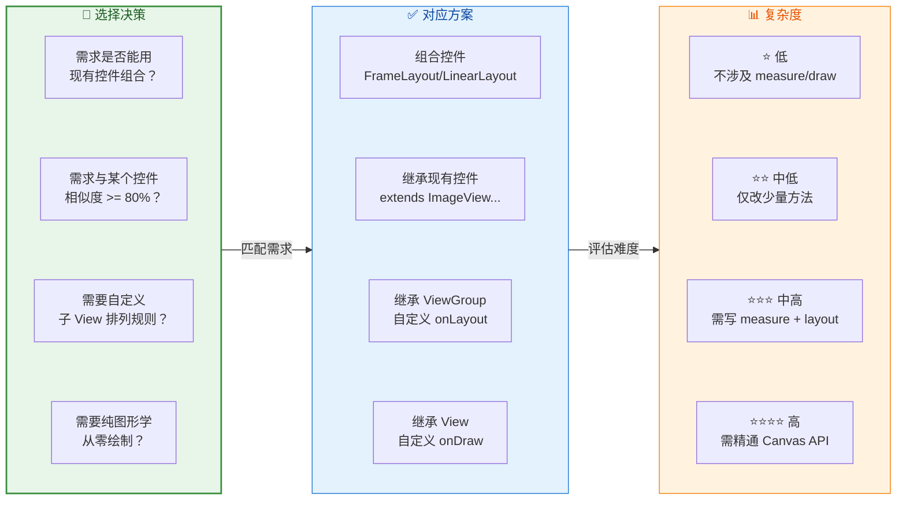

总结来说，四种自定义 View 方式构成了一个 **从简单到复杂** 的谱系：组合控件最简单（拼装现有控件，不涉及 measure/draw）→ 扩展型次之（在现有控件基础上做微调）→ 布局型较复杂（需要精确控制子 View 的测量与摆放）→ 绘制型最复杂（需要精通 Canvas/Paint/Path 整套图形 API）。实际开发中，**先评估需求是否能用更简单的方式实现**，不要一上来就选择最复杂的绘制型——过度设计（Over-engineering）在自定义 View 领域同样是大忌。

---

**📝 练习题**

在一个电商 App 中，产品经理要求实现一个"商品数量选择器"组件：左边一个"减号"按钮，中间一个显示当前数量的文本，右边一个"加号"按钮。点击加减按钮时数量相应变化。下列哪种自定义 View 方式最适合实现这个需求？

A. 继承 `View`，在 `onDraw()` 中绘制加减按钮和数字文本，在 `onTouchEvent()` 中判断点击区域


B. 继承 `ViewGroup`，重写 `onMeasure()` 和 `onLayout()` 手动测量和摆放三个子 View


C. 继承 `LinearLayout`，在构造函数中 inflate 一个包含两个 `Button` 和一个 `TextView` 的 XML 布局，封装加减逻辑


D. 继承 `TextView`，重写 `onDraw()` 在文字两侧额外绘制加减号图标


**【答案】** C

**【解析】** 这是一个典型的"组合控件"场景。分析需求可知，所需的 UI 元素——两个按钮和一个文本——都可以直接使用系统已有的 `Button` 和 `TextView` 来实现，不需要任何自定义绘制或自定义布局逻辑。选择 C（组合控件方式）继承 `LinearLayout` 并 inflate 一个水平排列的 XML 布局，然后在 Kotlin/Java 代码中封装加减逻辑和数量边界判断，是最简洁、最高效、最易维护的做法。

选项 A（继承 View 绘制型）虽然技术上可行，但属于严重的"过度设计"——手动绘制按钮和文字、手动处理触摸区域判断，代码量大且容易出错，还失去了系统按钮自带的水波纹反馈、无障碍支持等功能。选项 B（继承 ViewGroup）同样不必要，因为 `LinearLayout` 已经完美支持水平排列，没有理由手写 measure/layout 逻辑。选项 D（继承 TextView）方向完全错误，一个数量选择器的核心身份是"交互组件"而非"文本控件"，强行从 `TextView` 扩展会导致概念混乱和大量不自然的 hack 代码。

---

## 属性定义与解析

当我们创建一个自定义 View 时，仅仅完成绘制逻辑是远远不够的。一个真正可复用的自定义 View，必须能够让使用者在 XML 布局文件中像系统控件一样，通过声明式的属性来控制其外观与行为。Android 为此提供了一套完整的 **自定义属性（Custom Attributes）** 机制：从在资源文件中声明属性，到在构造函数中解析属性值，再到与 Theme/Style 体系深度集成。理解这套机制，是写出"专业级"自定义 View 的基础。

本节将从最基础的 `attrs.xml` 声明出发，逐步深入到 `TypedArray` 的获取与回收、`declare-styleable` 的工作原理，最终抵达开发者最容易混淆的 **defStyleAttr 与 defStyleRes 优先级** 问题，力求让你不仅知道"怎么写"，更明白"为什么这样写"以及"属性值到底从哪里来"。

---

### attrs.xml 声明

#### 什么是 attrs.xml

在 Android 资源体系中，`res/values/attrs.xml` 是专门用来声明**自定义属性**（Custom Attributes）的资源文件。严格来说，文件名并不强制必须叫 `attrs.xml`——Android 资源编译器（AAPT2）只关心 `<resources>` 根标签下的内容，而不关心文件名。但按照 Android 官方惯例与社区共识，我们将所有自定义属性声明集中放在 `attrs.xml` 中，就像把尺寸放在 `dimens.xml`、颜色放在 `colors.xml` 一样，这是一种 **约定优于配置（Convention over Configuration）** 的实践。

#### 属性声明的基本语法

一个最简单的属性声明如下：

```xml
<!-- res/values/attrs.xml -->
<resources>

    <!-- 声明一个名为 circleColor 的属性，类型为 color -->
    <attr name="circleColor" format="color" />

    <!-- 声明一个名为 circleRadius 的属性，类型为 dimension -->
    <attr name="circleRadius" format="dimension" />

</resources>
```

这里的 `<attr>` 标签定义了一个**全局属性**。所谓"全局"，是指这个属性名在整个应用的资源命名空间中是唯一的。一旦你在顶层声明了 `circleColor`，任何 `declare-styleable` 都可以引用它，但不能重复声明一个同名但 format 不同的属性——否则 AAPT2 会在编译期直接报错。

#### format 属性类型详解

`format` 决定了属性值可以接受的数据类型。Android 支持以下 format 值：

| format | 说明 | XML 中的写法示例 |
|---|---|---|
| `string` | 字符串 | `app:title="Hello"` |
| `integer` | 整数 | `app:count="5"` |
| `float` | 浮点数 | `app:ratio="0.75"` |
| `boolean` | 布尔值 | `app:showBorder="true"` |
| `color` | 颜色值 | `app:circleColor="#FF0000"` 或 `@color/red` |
| `dimension` | 尺寸值（dp/sp/px） | `app:circleRadius="24dp"` |
| `reference` | 资源引用 | `app:background="@drawable/bg"` |
| `fraction` | 百分比 | `app:pivot="50%"` |
| `enum` | 枚举（互斥单选） | `app:shape="circle"` |
| `flags` | 位标志（可组合） | `app:gravity="top\|center"` |

其中有两个特殊类型值得展开讲解：**enum** 和 **flags**。

**enum（枚举）** 表示属性值只能从一组预定义的常量中 **选其一**：

```xml
<resources>
    <!-- 声明一个枚举属性 shape，只能取 circle/square/triangle 之一 -->
    <attr name="shape" format="enum">
        <!-- 每个 enum 项都有一个 name 和一个 int 映射值 -->
        <enum name="circle" value="0" />
        <enum name="square" value="1" />
        <enum name="triangle" value="2" />
    </attr>
</resources>
```

**flags（位标志）** 则允许通过 `|` 运算符进行 **多值组合**，底层采用按位或（bitwise OR）实现：

```xml
<resources>
    <!-- 声明一个 flags 属性 textStyle，可多值组合 -->
    <attr name="textStyle" format="flags">
        <!-- 值必须是 2 的幂，以便按位或组合 -->
        <flag name="normal" value="0" />
        <flag name="bold" value="1" />      <!-- 0b0001 -->
        <flag name="italic" value="2" />    <!-- 0b0010 -->
        <flag name="underline" value="4" /> <!-- 0b0100 -->
    </attr>
</resources>
```

这样在 XML 中使用 `app:textStyle="bold|italic"` 时，实际传给 Java/Kotlin 层的 int 值就是 `1 | 2 = 3`。

需要特别注意的是，`enum` 和 `flags` 的关键区别不仅仅是"单选与多选"。从底层实现来看，`enum` 的 value 可以是任意整数，因为系统只会取其一进行精确匹配；而 `flags` 的 value 必须遵守 **2 的幂次规则**（0, 1, 2, 4, 8, 16...），因为系统需要通过位运算来进行组合与拆解。如果你给 `flags` 的两个 flag 赋了相同的位（比如都是 `1`），那么在代码中就无法将它们区分开来。

#### 多类型组合声明

有时候一个属性需要同时接受多种类型。最经典的例子是 Android 系统的 `android:background`——它既可以接受一个颜色值 `#FF0000`，也可以接受一个 Drawable 引用 `@drawable/bg`。实现方式是用 `|` 分隔多个 format：

```xml
<resources>
    <!-- 该属性既可以写颜色，也可以写资源引用 -->
    <attr name="overlayColor" format="color|reference" />
</resources>
```

在代码中解析时，你需要自行判断用户实际传入的是哪种类型，通常先尝试 `getColor()`，捕获异常后再尝试 `getDrawable()` 等。不过更常见的做法是根据业务语义只声明一种 format，避免解析歧义。

还有一种你经常看到但容易忽略的细节：当你声明 `format="color"` 时，其实已经隐含了对 `@color/xxx` 这种 `reference` 类型的支持。也就是说，`format="color"` 的属性既能接受 `#AARRGGBB` 字面值，也能接受 `@color/primary` 这类资源引用。这是因为 Android 资源系统在解析时会自动对资源引用进行一次 **间接寻址（dereference）**。这一点同样适用于 `dimension`、`string` 等大部分 format。因此，`format="color|reference"` 中的 `reference` 实际上更多是为了让属性还能接受其他非 color 类型的引用（如一个 Drawable 资源 ID），而非纯粹为了支持 `@color/xxx`。

---

### TypedArray 获取

#### 为什么需要 TypedArray

当你在 XML 中为自定义 View 设置了属性值后，这些值并不会自动赋给你的 View 成员变量。Android 的属性系统会将 XML 中的属性值存储在一个 `AttributeSet` 对象中，并在 View 构造函数被调用时传递进来。然而，`AttributeSet` 本身只是一个"原始字符串键值对"的集合，直接从中读取属性值既不类型安全，也无法正确处理 Style、Theme 的优先级覆盖。

你可以通过 `attrs.getAttributeValue()` 直接读取原始字符串，但这意味着你得自己去解析 `"24dp"` 到像素值的转换，自己去解析 `"@color/red"` 到实际 ARGB 值的映射，自己去处理 `style="@style/MyStyle"` 中间接指定的属性值——这些工作既繁琐又容易出错。

`TypedArray` 就是为了解决这些问题而存在的。它是通过 `Context.obtainStyledAttributes()` 方法创建的一个 **属性值结果集**，内部已经完成了：

1. **类型解析**：将字符串值转化为对应的 int、float、color、dimension 等 Java 类型。
2. **优先级合并**：按照 Android 规定的优先级（XML 直接设置 > Style > defStyleAttr > defStyleRes > Theme）合并属性值。
3. **资源引用解析**：将 `@color/red` 这类引用解析为实际的色值或资源 ID。
4. **单位转换**：自动将 `dp`、`sp` 等单位根据当前设备的 `DisplayMetrics` 转换为 `px`。

#### View 的四参数构造函数

要正确获取自定义属性，首先需要理解 View 的构造函数链。Android 的 View 类有四个构造函数，它们形成了一条 **链式委托（Constructor Chaining）** 关系：

```kotlin
// ① 代码中直接 new 时调用（如 val view = MyView(context)）
// 此构造函数无 AttributeSet，不涉及 XML 属性解析
constructor(context: Context)

// ② XML 布局加载时调用（LayoutInflater 反射创建 View 时使用）
// attrs 中包含了 XML 中声明的所有属性键值对
constructor(context: Context, attrs: AttributeSet?)

// ③ 带默认样式属性的构造函数
// defStyleAttr 是一个指向 Theme 中某属性的引用（如 R.attr.myViewStyle）
constructor(context: Context, attrs: AttributeSet?, defStyleAttr: Int)

// ④ 带默认样式资源的构造函数（API 21+ 正式公开）
// defStyleRes 是一个直接指向 Style 资源的引用（如 R.style.DefaultMyViewStyle）
constructor(context: Context, attrs: AttributeSet?, defStyleAttr: Int, defStyleRes: Int)
```

标准做法是让前三个构造函数逐级委托到第四个：

```kotlin
class CircleView : View {

    // 核心属性：圆的颜色与半径
    private var circleColor: Int = Color.RED
    private var circleRadius: Float = 50f

    // ① 代码创建 —— 委托给②
    constructor(context: Context) : this(context, null)

    // ② XML 加载 —— 委托给③
    constructor(context: Context, attrs: AttributeSet?) : this(context, attrs, 0)

    // ③ 带 defStyleAttr —— 委托给④
    constructor(context: Context, attrs: AttributeSet?, defStyleAttr: Int)
            : this(context, attrs, defStyleAttr, 0)

    // ④ 最终构造函数 —— 在此统一解析所有属性
    constructor(
        context: Context,
        attrs: AttributeSet?,
        defStyleAttr: Int,
        defStyleRes: Int
    ) : super(context, attrs, defStyleAttr, defStyleRes) {
        // 在此调用 obtainStyledAttributes 解析属性
        initAttributes(context, attrs, defStyleAttr, defStyleRes)
    }
}
```

用 Kotlin 的 `@JvmOverloads` 可以简化这一链条，但在自定义 View 场景中 **不建议使用** `@JvmOverloads`。原因是它生成的默认参数链可能会跳过中间的构造函数。例如，`@JvmOverloads` 会将 `defStyleAttr` 的默认值设为 `0`，但很多系统 View（如 `Button`、`EditText`）的第三个构造函数会传入一个非零的 `defStyleAttr`（如 `com.android.internal.R.attr.buttonStyle`），这个值是让 View 能够从 Theme 中获取默认样式的关键。如果你用 `@JvmOverloads` 将其默认值硬编码为 `0`，就会导致 Theme 中定义的默认样式被完全忽略，进而导致 View 在不同 Theme 下表现异常。

#### obtainStyledAttributes 的调用方式

获取 `TypedArray` 的核心方法是 `Context.obtainStyledAttributes()`，它有多个重载，最常用的是四参数版本：

```kotlin
private fun initAttributes(
    context: Context,
    attrs: AttributeSet?,   // XML 中的原始属性集
    defStyleAttr: Int,      // Theme 中指向默认 Style 的属性（如 R.attr.circleViewStyle）
    defStyleRes: Int         // 直接引用的默认 Style 资源（如 R.style.DefaultCircleViewStyle）
) {
    // obtainStyledAttributes 四参数版本：
    // 参数1: attrs —— 从 XML 中传入的属性集合
    // 参数2: R.styleable.CircleView —— 想要获取的属性 ID 数组（由 declare-styleable 生成）
    // 参数3: defStyleAttr —— 在 Theme 中查找默认 Style 的属性引用
    // 参数4: defStyleRes —— 当 defStyleAttr 为 0 或 Theme 中未定义时使用的兜底 Style
    val ta: TypedArray = context.obtainStyledAttributes(
        attrs,
        R.styleable.CircleView,
        defStyleAttr,
        defStyleRes
    )

    // 从 TypedArray 中按索引读取属性值
    // 索引常量由 declare-styleable 自动生成，格式为 R.styleable.{styleable名}_{属性名}
    // 第二个参数是默认值，当 XML/Style/Theme 都未定义时使用
    circleColor = ta.getColor(
        R.styleable.CircleView_circleColor,  // 属性索引
        Color.RED                             // 默认值：未配置时使用红色
    )

    circleRadius = ta.getDimension(
        R.styleable.CircleView_circleRadius,  // 属性索引
        50f                                    // 默认值：50px
    )

    // 【关键】用完后必须调用 recycle() 释放 TypedArray 对象
    // TypedArray 内部使用对象池（Pool）复用，不 recycle 会造成内存泄漏
    ta.recycle()
}
```

这里有一个非常重要的细节：**`TypedArray` 用完必须调用 `recycle()`**。这不是一个可选的"最佳实践"，而是一个 **强制要求**。原因在于 `TypedArray` 内部采用了 **对象池（Object Pool）** 模式。`obtainStyledAttributes()` 并非每次都 new 一个新对象，而是从池中取出一个已有的 `TypedArray` 实例，填充数据后返回给你。`recycle()` 的作用是将这个实例归还给池。如果你忘记调用 `recycle()`，池中的可用实例会逐渐耗尽，后续的获取操作要么被迫创建新对象（增加 GC 压力），要么直接触发 `RuntimeException`（在 StrictMode 开启时）。Android Lint 也会对未 `recycle()` 的 `TypedArray` 发出警告。

#### TypedArray 的常用读取方法

`TypedArray` 提供了一组类型化的 getter 方法，每个方法都对应一种 format：

```kotlin
// ——— 基本类型 ———
// 读取 color 属性，返回 ARGB int 值
val color: Int = ta.getColor(index, defaultValue)

// 读取 dimension 属性，自动将 dp/sp 转为 px，返回 float
val size: Float = ta.getDimension(index, defaultValue)

// 读取 dimension 属性，但返回四舍五入后的 int 像素值
val sizeInt: Int = ta.getDimensionPixelSize(index, defaultValue)

// 读取 dimension 属性，返回截断后的 int 像素值（向下取整）
val sizeOffset: Int = ta.getDimensionPixelOffset(index, defaultValue)

// 读取 boolean 属性
val flag: Boolean = ta.getBoolean(index, defaultValue)

// 读取 integer 属性（enum/flags 也用此方法，返回底层 int 值）
val count: Int = ta.getInt(index, defaultValue)

// 读取 float 属性
val ratio: Float = ta.getFloat(index, defaultValue)

// 读取 string 属性，返回 String?（可能为 null）
val title: String? = ta.getString(index)

// ——— 资源引用类型 ———
// 读取 reference 类型，返回资源 ID（如 R.drawable.bg），未定义时返回 defaultValue
val resId: Int = ta.getResourceId(index, defaultValue)

// 读取 Drawable 引用，直接返回 Drawable 对象
val drawable: Drawable? = ta.getDrawable(index)

// ——— 存在性检查 ———
// 判断某个属性是否被用户显式设置过（XML / Style / Theme 中定义过即为 true）
val hasValue: Boolean = ta.hasValue(index)
```

这里值得深入理解的是 `getDimension()`、`getDimensionPixelSize()` 和 `getDimensionPixelOffset()` 三者的区别。它们的输入都是一个带单位的尺寸值（如 `24dp`），区别仅在于输出：

- `getDimension()` → 返回精确的 `float` 像素值（如 `24dp` 在 2x 屏上返回 `48.0f`）。
- `getDimensionPixelSize()` → 返回 **四舍五入** 后的 `int` 像素值（`48.0f` → `48`，`48.3f` → `48`，`48.6f` → `49`），且保证至少为 1px（即使原值是 `0.3dp` 转换后不足 1px，也会被提升到 `1`）。
- `getDimensionPixelOffset()` → 返回 **直接截断** 的 `int` 像素值（`48.6f` → `48`），可以为 0。

在实际开发中，绘制相关的尺寸（如线条宽度、圆半径）通常用 `getDimension()` 获取 float 值；布局相关的尺寸（如 padding、margin）通常用 `getDimensionPixelSize()` 获取整数值。

---

### declare-styleable

#### 什么是 declare-styleable

在前面的 `attrs.xml` 声明中，我们定义了全局属性 `circleColor` 和 `circleRadius`。然而，这些属性目前只是"散落"在全局命名空间中，并没有与任何特定的 View 建立关联。`<declare-styleable>` 的作用就是将一组属性 **归组（Group）** 到一个名字下，通常这个名字与自定义 View 的类名一致。

```xml
<resources>

    <!-- 将 circleColor 和 circleRadius 归组到 CircleView 下 -->
    <declare-styleable name="CircleView">
        <!-- 引用已声明的全局属性 circleColor（注意这里不再写 format） -->
        <attr name="circleColor" />
        <!-- 也可以直接在 declare-styleable 内部声明新属性 -->
        <attr name="circleRadius" format="dimension" />
        <!-- 引用 Android 系统已定义的属性 -->
        <attr name="android:text" />
    </declare-styleable>

</resources>
```

上面这段代码有三种不同的属性声明方式，理解它们的区别非常重要：

1. **`<attr name="circleColor" />`**（无 format）：这是对一个 **已在外部声明过** 的全局属性的引用。因为 `circleColor` 已经在外面定义了 `format="color"`，这里只需引用其名字，AAPT2 就知道去全局空间中找它。如果你在这里再次写上 `format="color"`，且与全局定义一致，AAPT2 也能接受；但如果不一致（如写成 `format="integer"`），就会编译报错。

2. **`<attr name="circleRadius" format="dimension" />`**（带 format）：这是在 `declare-styleable` 内部 **同时声明** 一个新的全局属性并将其加入分组。如果 `circleRadius` 尚未在外部定义过，这种写法会自动创建它。这是一种简写——等价于先在外部声明 `<attr name="circleRadius" format="dimension" />`，然后在 `declare-styleable` 内部引用 `<attr name="circleRadius" />`。

3. **`<attr name="android:text" />`**：这是引用 **Android 系统框架** 已定义的属性。通过 `android:` 前缀，你可以将系统属性纳入自己的 styleable 分组中，使得用户可以在 XML 中直接使用 `android:text="Hello"` 来设置你的自定义 View 的文字，而无需额外定义一个 `app:text`。这种做法在保持 API 一致性方面非常有用。

#### AAPT2 生成的 R.styleable 常量

当你定义了 `<declare-styleable name="CircleView">` 之后，AAPT2 编译器会在 `R.java`（或 `R.class`）中自动生成一组常量。理解这些常量的结构，是理解 `obtainStyledAttributes()` 工作原理的基础。

```java
// AAPT2 自动生成的内容（位于 R.java 中）
public static final class styleable {

    // ① 属性 ID 数组：包含了 CircleView 分组中所有属性的资源 ID
    // 数组的顺序由 AAPT2 按属性名字母序排列（不是你在 XML 中写的顺序！）
    // 这个数组会作为 obtainStyledAttributes() 的第二个参数传入
    public static final int[] CircleView = {
        0x0101014f,  // android:text 的资源 ID（系统属性 ID 通常以 0x01 开头）
        0x7f040001,  // circleColor 的资源 ID（应用属性 ID 通常以 0x7f 开头）
        0x7f040002   // circleRadius 的资源 ID
    };

    // ② 索引常量：每个属性在上面数组中的下标
    // 命名规则：{styleable名}_{属性名}
    // 这些索引用于从 TypedArray 中读取对应位置的属性值
    public static final int CircleView_android_text = 0;
    public static final int CircleView_circleColor = 1;
    public static final int CircleView_circleRadius = 2;
}
```

这组常量的工作流程如下：

1. 你将 `R.styleable.CircleView`（一个 `int[]` 数组）传入 `obtainStyledAttributes()` 方法。
2. 系统根据这个数组中的属性 ID，从 `AttributeSet`、Style、Theme 等各个来源中 **按优先级** 查找每个属性的值。
3. 查找结果按照数组的顺序填入 `TypedArray` 中。
4. 你通过 `R.styleable.CircleView_circleColor`（值为 `1`，即数组下标 1）从 `TypedArray` 中读取 `circleColor` 的值。

这个流程揭示了一个本质：**`TypedArray` 其实就是一个按索引访问的数组**，而 `R.styleable.CircleView` 定义了"要查哪些属性"，`R.styleable.CircleView_xxx` 定义了"查到的结果在哪个位置"。

#### 在 XML 中使用自定义属性

定义好 `declare-styleable` 后，就可以在布局 XML 中使用自定义属性了。需要在根布局中声明命名空间：

```xml
<!-- 布局文件 res/layout/activity_main.xml -->
<!-- xmlns:app 声明了自定义属性的命名空间 -->
<!-- http://schemas.android.com/apk/res-auto 是一个通配符，会自动匹配当前应用包名 -->
<FrameLayout
    xmlns:android="http://schemas.android.com/apk/res/android"
    xmlns:app="http://schemas.android.com/apk/res-auto"
    android:layout_width="match_parent"
    android:layout_height="match_parent">

    <!-- 使用 app: 前缀设置自定义属性 -->
    <!-- 使用 android: 前缀设置系统属性（包括被 declare-styleable 引用的系统属性） -->
    <com.example.widget.CircleView
        android:layout_width="200dp"
        android:layout_height="200dp"
        android:text="Circle"
        app:circleColor="@color/blue"
        app:circleRadius="48dp" />

</FrameLayout>
```

这里的 `xmlns:app="http://schemas.android.com/apk/res-auto"` 是 Android Gradle Plugin 引入的便捷方式，等同于旧版的 `xmlns:app="http://schemas.android.com/apk/res/com.example.app"`（需要手动写包名）。使用 `res-auto` 可以避免在模块间移动代码时因包名不匹配而导致的编译错误。

---

### defStyleAttr/defStyleRes 优先级

#### Android 属性解析的五层来源

这是自定义属性体系中 **最核心也最令人困惑** 的部分。当系统执行 `obtainStyledAttributes(attrs, R.styleable.CircleView, defStyleAttr, defStyleRes)` 时，对于每一个属性，它会按照以下 **严格的优先级顺序** 从五个来源中查找属性值：

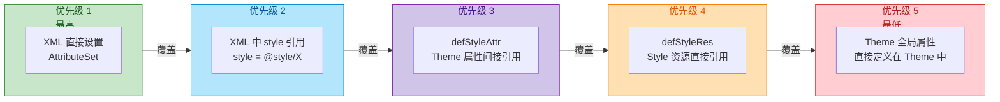

让我们逐层深入理解每个来源：

**优先级 1：XML 直接设置（AttributeSet）**

这是开发者在布局 XML 中直接写在 View 标签上的属性，拥有 **最高优先级**。例如 `app:circleColor="#FF0000"` 直接写在 `<CircleView>` 标签上。无论 Style、Theme 中定义了什么值，只要 XML 中直接写了，就以 XML 中的值为准。这符合直觉——"我亲手写的，就该听我的"。

**优先级 2：XML 中通过 style 引用**

当 View 标签上没有直接写某个属性，但指定了 `style="@style/MyCircleStyle"`，系统会从该 Style 中查找属性值。注意 `style` 是一个特殊属性，它没有命名空间前缀（既不是 `android:style`，也不是 `app:style`，就是裸写的 `style`）。

```xml
<!-- 定义一个 Style -->
<style name="GreenCircleStyle">
    <item name="circleColor">#00FF00</item>
    <item name="circleRadius">32dp</item>
</style>

<!-- 使用 Style：此处 circleColor 被 XML 直接值覆盖，circleRadius 从 Style 获取 -->
<com.example.widget.CircleView
    style="@style/GreenCircleStyle"
    app:circleColor="#FF0000"
    android:layout_width="wrap_content"
    android:layout_height="wrap_content" />
```

在上面的例子中，`circleColor` 最终是 `#FF0000`（XML 直接值，优先级 1），而 `circleRadius` 是 `32dp`（来自 Style，优先级 2）。

**优先级 3：defStyleAttr（Theme 中的属性间接引用）**

这是自定义属性体系中最精妙的一层设计。`defStyleAttr` 是一个 **间接寻址** 机制：它是一个属性（attribute），这个属性的 **值** 又指向一个 Style 资源。换句话说，它告诉系统："去当前 Theme 中找名为 `xxx` 的属性，那个属性的值就是一个 Style，然后从那个 Style 里读取属性值。"

这层间接关系看似复杂，但它赋予了自定义 View 一个强大的能力：**让 View 的默认外观跟随 Theme 变化**。

举一个完整的例子来说明这个链条：

**第一步：声明一个 attr 作为 Theme 的"钩子"**

```xml
<!-- res/values/attrs.xml -->
<resources>
    <!-- 这个属性将作为 Theme 中的"挂钩点"，值类型是 reference（指向一个 Style） -->
    <attr name="circleViewStyle" format="reference" />

    <declare-styleable name="CircleView">
        <attr name="circleColor" format="color" />
        <attr name="circleRadius" format="dimension" />
    </declare-styleable>
</resources>
```

**第二步：定义一个默认 Style**

```xml
<!-- res/values/styles.xml -->
<style name="Widget.App.CircleView">
    <item name="circleColor">#2196F3</item>   <!-- Material Blue -->
    <item name="circleRadius">40dp</item>
</style>
```

**第三步：在 Theme 中将 attr 指向该 Style**

```xml
<!-- res/values/themes.xml -->
<style name="AppTheme" parent="Theme.MaterialComponents.Light">
    <!-- 将 circleViewStyle 属性指向 Widget.App.CircleView 这个 Style -->
    <item name="circleViewStyle">@style/Widget.App.CircleView</item>
</style>
```

**第四步：在 View 构造函数中传入 defStyleAttr**

```kotlin
class CircleView : View {

    // 构造函数②：XML 加载时调用
    // 将 R.attr.circleViewStyle 作为 defStyleAttr 传入
    // 这就告诉系统："当 XML 和 style 都没定义某属性时，去 Theme 中找 circleViewStyle 属性指向的 Style"
    constructor(context: Context, attrs: AttributeSet?)
            : this(context, attrs, R.attr.circleViewStyle)

    constructor(context: Context, attrs: AttributeSet?, defStyleAttr: Int)
            : this(context, attrs, defStyleAttr, 0)

    constructor(context: Context, attrs: AttributeSet?, defStyleAttr: Int, defStyleRes: Int)
            : super(context, attrs, defStyleAttr, defStyleRes) {
        // 解析属性
        val ta = context.obtainStyledAttributes(attrs, R.styleable.CircleView, defStyleAttr, defStyleRes)
        // ... 读取属性 ...
        ta.recycle()
    }
}
```

现在的查找链条是：`R.attr.circleViewStyle` → Theme 中 `circleViewStyle` 的值 → `@style/Widget.App.CircleView` → 从该 Style 中读取 `circleColor` 和 `circleRadius`。

这种设计的妙处在于：当你切换 Theme 时（例如从日间模式切换到夜间模式），只需要在不同 Theme 中为 `circleViewStyle` 指向不同的 Style，你的 CircleView 的默认外观就会自动适配——**而无需修改任何 View 代码或布局文件**。这正是 Android 系统控件（如 `Button`、`TextView`）实现 Theme 适配的底层机制。`Button` 的构造函数中传入的 `defStyleAttr` 是 `com.android.internal.R.attr.buttonStyle`，系统的每一套 Theme（Holo、Material、Material3）都为 `buttonStyle` 指向了不同的 Style，因此 Button 在不同 Theme 下才能呈现不同的外观。

**优先级 4：defStyleRes（Style 资源直接引用）**

`defStyleRes` 是一个 **直接引用**，它直接指向一个 `@style/xxx` 资源，没有中间的 attr 跳转。它在以下两种情况下生效：

1. `defStyleAttr` 参数传入了 `0`（表示不使用 Theme 属性间接寻址）。
2. `defStyleAttr` 非零，但当前 Theme 中 **没有定义** 该属性（即 Theme 中找不到 `circleViewStyle` 对应的值）。

只有在上述两种情况下，系统才会去 `defStyleRes` 指向的 Style 中查找属性值。这使得 `defStyleRes` 成为一种"硬编码的兜底默认值"。

```kotlin
// defStyleAttr 传 0，defStyleRes 传一个具体的 Style 资源
// 此时属性值直接从 R.style.DefaultCircleViewStyle 中获取（如果 XML 和 style 都没设置的话）
constructor(context: Context, attrs: AttributeSet?)
        : this(context, attrs, 0, R.style.DefaultCircleViewStyle)
```

在实际开发中，推荐的做法是 **同时使用** `defStyleAttr` 和 `defStyleRes`：`defStyleAttr` 提供 Theme 级别的可定制性，`defStyleRes` 作为"保底方案"——当用户的 Theme 中没有定义你的自定义属性时，View 依然能获得一个合理的默认外观。

```kotlin
// 推荐写法：defStyleAttr 走 Theme 查找，defStyleRes 作为兜底
constructor(context: Context, attrs: AttributeSet?)
        : this(context, attrs, R.attr.circleViewStyle, R.style.Widget_App_CircleView_Default)
```

**优先级 5：Theme 全局属性（直接定义在 Theme 中）**

这是优先级最低的来源。如果一个属性直接定义在 Theme 中（而不是通过某个 Style 间接包含），它会作为最后的兜底。例如：

```xml
<style name="AppTheme" parent="Theme.MaterialComponents.Light">
    <!-- 直接在 Theme 中定义 circleColor，优先级最低 -->
    <item name="circleColor">#9E9E9E</item>
</style>
```

这个值只有在前面四层都没有定义 `circleColor` 的情况下，才会被采用。

#### 优先级覆盖的完整示例

为了让这五层优先级变得直观，我们来看一个完整的场景分析：

```xml
<!-- themes.xml -->
<style name="AppTheme" parent="Theme.MaterialComponents.Light">
    <!-- 优先级 5：Theme 全局直接定义 -->
    <item name="circleColor">#9E9E9E</item>
    <!-- 优先级 3 的桥梁：Theme 属性指向 Style -->
    <item name="circleViewStyle">@style/Widget.App.CircleView</item>
</style>

<!-- styles.xml -->
<!-- 优先级 3 的目标 Style -->
<style name="Widget.App.CircleView">
    <item name="circleColor">#2196F3</item>
    <item name="circleRadius">40dp</item>
</style>

<!-- 优先级 2 的 Style -->
<style name="RedCircleStyle">
    <item name="circleColor">#F44336</item>
    <item name="circleRadius">60dp</item>
</style>
```

```xml
<!-- layout.xml -->
<!-- 同时设置了 style（优先级 2）和直接属性（优先级 1） -->
<com.example.widget.CircleView
    style="@style/RedCircleStyle"
    app:circleColor="#4CAF50"
    android:layout_width="wrap_content"
    android:layout_height="wrap_content" />
```

对于 `circleColor` 属性的解析过程：
1. **优先级 1**：XML 直接设置了 `app:circleColor="#4CAF50"` ✅ → 最终值 = `#4CAF50`（绿色）。后续层级不再查找。

对于 `circleRadius` 属性的解析过程：
1. **优先级 1**：XML 中没有直接写 `app:circleRadius` → 继续。
2. **优先级 2**：`RedCircleStyle` 中定义了 `circleRadius=60dp` ✅ → 最终值 = `60dp`。后续层级不再查找。

假设我们把 `style="@style/RedCircleStyle"` 也去掉，那么 `circleRadius` 的解析会继续：
3. **优先级 3**：`defStyleAttr` = `R.attr.circleViewStyle` → Theme 中的值 = `@style/Widget.App.CircleView` → 该 Style 中定义了 `circleRadius=40dp` ✅ → 最终值 = `40dp`。

如果 Theme 中也没有定义 `circleViewStyle`：
4. **优先级 4**：`defStyleRes` 指向的 Style 中查找。
5. **优先级 5**：Theme 中直接定义的全局属性中查找。

#### defStyleAttr 与 defStyleRes 的关系总结

用一句话概括二者的关系：**defStyleAttr 是通过 Theme 的间接查找（灵活但可能缺失），defStyleRes 是直接引用的兜底方案（稳定但不随 Theme 变化）**。

它们的协作模式可以用如下伪代码表示：

```kotlin
// obtainStyledAttributes 内部对优先级 3、4 的处理逻辑（伪代码）
fun resolveDefStyle(defStyleAttr: Int, defStyleRes: Int): Style? {
    // 如果 defStyleAttr 非零，先尝试从 Theme 中查找
    if (defStyleAttr != 0) {
        // 从当前 Theme 中取出 defStyleAttr 属性的值
        val themeStyle = theme.resolveAttribute(defStyleAttr)
        // 如果 Theme 中确实定义了这个属性，就用它指向的 Style
        if (themeStyle != null) {
            return themeStyle  // 优先级 3 命中
        }
    }
    // 如果 defStyleAttr 为 0，或者 Theme 中没定义，则使用 defStyleRes
    if (defStyleRes != 0) {
        return resources.getStyle(defStyleRes)  // 优先级 4 兜底
    }
    // 都没有，返回 null，继续查 Theme 全局属性（优先级 5）
    return null
}
```

这段伪代码清晰地展示了一个关键行为：**只有当 defStyleAttr 为 0 或 Theme 中未定义该属性时，defStyleRes 才会生效**。如果 defStyleAttr 在 Theme 中成功解析到了一个 Style，那么 defStyleRes 就完全被忽略。

#### 实战建议

1. **始终在构造函数②中传入有意义的 defStyleAttr**：这让你的 View 能够跟随 Theme 变化，是专业级自定义 View 的标志。

2. **同时提供 defStyleRes 作为兜底**：防止用户使用了一个没有定义你的 attr 的 Theme 时，View 丢失所有默认样式。

3. **命名规范**：`defStyleAttr` 对应的 attr 建议命名为 `xxxStyle`（如 `circleViewStyle`），对应的默认 Style 命名为 `Widget.App.Xxx`（如 `Widget.App.CircleView`），与 Android 系统控件的命名惯例保持一致。

4. **文档化你的 Theme 属性**：在 `attrs.xml` 中为 `defStyleAttr` 对应的 attr 添加注释，告诉使用者可以通过在 Theme 中覆盖此属性来全局修改 View 的默认样式。

```xml
<resources>
    <!--
        在 Theme 中设置此属性可全局修改 CircleView 的默认样式。
        示例：<item name="circleViewStyle">@style/MyCustomCircleStyle</item>
    -->
    <attr name="circleViewStyle" format="reference" />
</resources>
```

---

**📝 练习题**

在自定义 View 的构造函数中调用 `context.obtainStyledAttributes(attrs, R.styleable.MyView, defStyleAttr, defStyleRes)` 后，对于属性 `app:cornerRadius`，以下哪种情况下 `defStyleRes` 指向的 Style 中定义的值会生效？

A. XML 布局中直接设置了 `app:cornerRadius="8dp"`，同时 `defStyleRes` 的 Style 中也定义了 `cornerRadius=16dp`


B. XML 布局中没有设置 `cornerRadius`，但 View 标签上 `style` 引用的 Style 中定义了 `cornerRadius=12dp`


C. XML 布局中没有设置 `cornerRadius`，没有设置 `style`，`defStyleAttr` 为 `R.attr.myViewStyle`，且当前 Theme 中为 `myViewStyle` 指向了一个包含 `cornerRadius=20dp` 的 Style


D. XML 布局中没有设置 `cornerRadius`，没有设置 `style`，`defStyleAttr` 为 `R.attr.myViewStyle`，但当前 Theme 中 **没有定义** `myViewStyle` 属性

**【答案】** D

**【解析】** `defStyleRes` 的生效条件是"前面所有更高优先级的来源都没有提供该属性的值"。选项 A 中 XML 直接设置（优先级 1）已命中，不会查找 defStyleRes；选项 B 中 style 引用（优先级 2）已命中；选项 C 中 defStyleAttr 在 Theme 中成功解析到了 Style（优先级 3 命中），defStyleRes 被跳过。只有选项 D 中，XML（优先级 1）、style（优先级 2）都为空，defStyleAttr 虽然非零但 Theme 中没有定义该属性（优先级 3 未命中），此时系统才会降级到 defStyleRes（优先级 4）指向的 Style 中查找 `cornerRadius`。这正是 defStyleRes 作为"兜底方案"的设计意图。

---

**📝 练习题**

以下关于 `TypedArray` 的使用，哪项说法是 **错误的**？

A. `TypedArray` 使用完毕后必须调用 `recycle()` 方法，否则可能导致内存泄漏


B. `getDimension()` 返回 `float` 类型的像素值，会自动根据 `DisplayMetrics` 将 `dp`/`sp` 转换为 `px`


C. `getDimensionPixelSize()` 与 `getDimensionPixelOffset()` 的区别在于前者四舍五入且保证最小 1px，后者直接截断可以为 0


D. 在 `declare-styleable` 中引用已存在的全局属性时，必须再次指定 `format`，否则编译会报错

**【答案】** D

**【解析】** 选项 D 的说法是错误的。在 `declare-styleable` 中引用一个已在外部声明过的全局属性时，**不需要**（也不建议）再次指定 `format`。只需写 `<attr name="circleColor" />`（不带 format）即可，AAPT2 会自动从全局声明中继承该属性的 format 定义。如果再次指定了 format 且与全局定义一致，编译不会报错；但如果不一致，才会报编译错误。选项 A 正确，TypedArray 内部采用对象池复用，不 recycle 会导致池对象泄漏。选项 B 正确，getDimension() 会根据设备密度自动完成单位转换。选项 C 正确，这两个方法的核心区别正是取整策略与最小值保证。

---

## 核心绘图 API

自定义 View 的视觉表现力，归根结底取决于你对 **绘图四大基石** 的掌握程度：**Canvas（画布）、Paint（画笔）、Path（路径）、Rect（矩形）**。它们在 Android 图形体系中各司其职又紧密协作——Canvas 决定"在哪里画、怎么变换坐标"，Paint 决定"用什么样式画"，Path 描述"沿着什么轨迹画"，Rect 则提供"区域的数学抽象"。理解这四者的内部模型与 API 设计哲学，是写出高性能、高表现力自定义 View 的前提。

在 `onDraw(canvas: Canvas)` 回调中，系统已经为我们准备好了一块与当前 View 尺寸匹配的画布。我们所做的一切绑定操作——画线、画圆、画文字——本质上都是在这块画布对应的底层 Bitmap（软件渲染）或 GPU DisplayList（硬件加速）上记录绘制指令。接下来，我们从最核心的 Canvas 开始，逐一拆解。

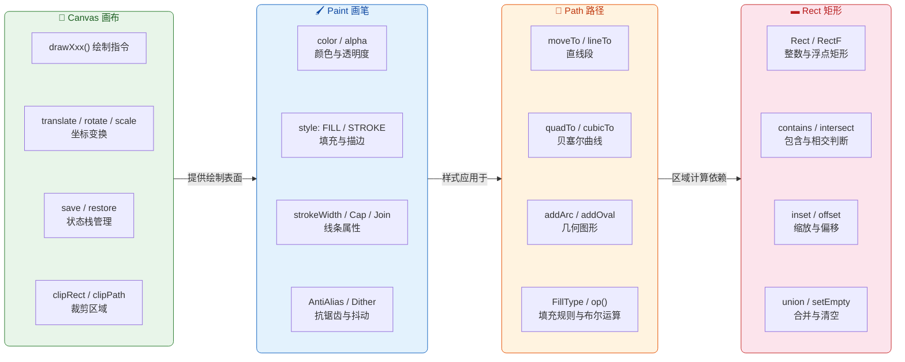

---

### Canvas 画布操作

#### 画布的本质：绘制指令的录制器

很多初学者会把 Canvas 理解为"一块像素矩阵"，但更准确的说法是：Canvas 是一个 **绘制指令的录制与坐标变换管理器**。在硬件加速模式下（Android 4.0+ 默认开启），`canvas.drawCircle(...)` 并不会立即写入像素，而是将这条指令记录到一个 **DisplayList**（在较新版本中称为 RenderNode）中。真正的光栅化（rasterization）发生在 RenderThread 将 DisplayList 提交给 GPU 的时候。而在软件渲染模式下，Canvas 直接操作一个 `Bitmap` 对象的像素缓冲区。

这一区分非常关键：它意味着 Canvas 上的某些操作在硬件加速下会有不同的行为甚至不被支持（例如早期版本中 `clipPath()` 在硬件加速下不生效）。因此，当你使用高级 Canvas API 时，务必确认目标 API Level 下的硬件加速兼容性。

#### 坐标系与基本绘制

Canvas 默认的坐标原点 `(0, 0)` 位于 View 的 **左上角**，X 轴向右增长，Y 轴向下增长。所有的 `drawXxx()` 方法都基于这个坐标系工作。Canvas 提供了丰富的绑制 API，覆盖了从基本几何图形到复杂位图的全部需求：

| 方法 | 用途 | 关键参数 |
|------|------|----------|
| `drawColor()` | 整块画布填色 | color, PorterDuff.Mode |
| `drawLine()` | 画直线 | startX, startY, stopX, stopY |
| `drawRect()` | 画矩形 | left, top, right, bottom |
| `drawRoundRect()` | 画圆角矩形 | RectF, rx, ry |
| `drawCircle()` | 画圆 | cx, cy, radius |
| `drawOval()` | 画椭圆 | RectF 包围盒 |
| `drawArc()` | 画弧线/扇形 | RectF, startAngle, sweepAngle, useCenter |
| `drawPath()` | 画任意路径 | Path 对象 |
| `drawBitmap()` | 画位图 | Bitmap, src/dst Rect |
| `drawText()` | 画文字 | text, x, y (基线位置) |

每个 `drawXxx()` 方法几乎都需要搭配一个 `Paint` 对象来定义颜色、线宽、填充模式等视觉属性。Canvas 本身只管"画什么形状"和"画在哪里"，不管"长什么样"。

下面演示最常用的几个绑制方法：

```kotlin
override fun onDraw(canvas: Canvas) {
    super.onDraw(canvas)

    // ---------- 1. 画一条从 (50,50) 到 (300,50) 的水平线 ----------
    // Paint 定义了颜色、线宽、抗锯齿等视觉属性
    canvas.drawLine(
        50f, 50f,   // 起点坐标 (startX, startY)
        300f, 50f,  // 终点坐标 (stopX, stopY)
        linePaint    // 使用预创建的 Paint 对象（避免在 onDraw 中 new）
    )

    // ---------- 2. 画一个填充矩形 ----------
    // RectF 使用 float 坐标，精度更高，适合绑制操作
    canvas.drawRect(
        50f,   // left：矩形左边界
        100f,  // top：矩形上边界
        300f,  // right：矩形右边界
        250f,  // bottom：矩形下边界
        fillPaint // style = FILL 的画笔
    )

    // ---------- 3. 画一个圆形 ----------
    canvas.drawCircle(
        175f,  // cx：圆心 X 坐标
        400f,  // cy：圆心 Y 坐标
        80f,   // radius：半径
        strokePaint // style = STROKE 的画笔，只画轮廓
    )

    // ---------- 4. 画一段弧线（扇形） ----------
    // 弧线基于一个椭圆的包围矩形来定义
    canvas.drawArc(
        ovalRect,   // RectF 椭圆包围盒
        0f,         // startAngle：起始角度（3点钟方向为0°）
        135f,       // sweepAngle：扫过角度（顺时针为正）
        true,       // useCenter：true=扇形(连接圆心), false=弧线
        arcPaint    // 画笔
    )
}
```

需要特别注意 `drawArc()` 的角度系统：**0° 对应 3 点钟方向（正右方），顺时针为正角度**。这与数学中逆时针为正的惯例相反，是 Android 绘图 API 的一个常见"陷阱"。另一个容易混淆的点是 `useCenter` 参数——当设为 `true` 时，弧线两端会与椭圆中心相连形成扇形（pie shape），非常适合做饼图；设为 `false` 时只画弧段本身（arc shape），更适合做进度条。

#### 坐标变换：translate、rotate、scale

Canvas 提供了一套完整的 **仿射变换**（Affine Transformation）API，让你无需手动计算每个点的新坐标，而是通过移动/旋转/缩放整个坐标系来简化绘制逻辑。这是自定义 View 中最强大的"降维打击"工具。

**核心思想**：Canvas 的变换并不移动已经画好的内容，而是改变后续所有 `drawXxx()` 操作所基于的坐标系。你可以把它想象成不是移动纸上的图案，而是移动"画纸"本身。

```kotlin
override fun onDraw(canvas: Canvas) {
    super.onDraw(canvas)

    // ---- 场景：在 View 中心画一个旋转45°的正方形 ----

    // 1. 保存当前坐标系状态（原点在左上角，无旋转）
    canvas.save()

    // 2. 将坐标原点平移到 View 的中心
    //    此后 (0, 0) 就是 View 的正中心
    canvas.translate(width / 2f, height / 2f)

    // 3. 以新原点为中心旋转 45°
    //    旋转影响后续所有 drawXxx 调用
    canvas.rotate(45f)

    // 4. 画一个中心在原点的正方形
    //    由于坐标系已经平移+旋转，实际效果是 View 中心的旋转方块
    val halfSize = 100f
    canvas.drawRect(
        -halfSize, // left：原点左侧 100px
        -halfSize, // top：原点上方 100px
        halfSize,  // right：原点右侧 100px
        halfSize,  // bottom：原点下方 100px
        rectPaint
    )

    // 5. 恢复到 save() 时保存的坐标系状态
    //    后续绘制不受上面的 translate/rotate 影响
    canvas.restore()
}
```

这里有一个极其重要的经验法则：**变换的执行顺序影响最终结果**。`translate → rotate` 和 `rotate → translate` 的效果截然不同。前者是"先移动坐标系，再原地旋转"，后者是"先旋转坐标系，再沿旋转后的轴方向平移"。实际开发中，最常见的模式是 **先 translate 到目标中心，再 rotate**，这样旋转始终围绕目标中心进行。

Canvas 还提供了 `scale(sx, sy)` 用于缩放坐标系，以及 `skew(sx, sy)` 用于错切变换。所有变换都可以叠加，形成复合变换矩阵。如果你需要更精细的控制，可以直接使用 `canvas.concat(matrix)` 传入一个 `Matrix` 对象来进行任意仿射变换。

#### 状态栈管理：save() 与 restore()

Canvas 的坐标变换和裁剪操作都是**累积的**——每次 `translate()` 或 `clipRect()` 都会在当前状态上叠加。如果不做管理，绘制逻辑会变得混乱不堪。`save()` / `restore()` 机制正是为此而生。

Canvas 内部维护了一个 **状态栈**（state stack）。每次调用 `save()` 会将当前的变换矩阵（Matrix）和裁剪区域（Clip）压入栈中；调用 `restore()` 则弹出栈顶状态，恢复到上一次 `save()` 时的坐标系和裁剪区域。

```kotlin
// save/restore 可以嵌套使用，形成多层状态栈
canvas.save()          // 状态栈: [S0]  — 保存初始状态
canvas.translate(100f, 0f)
canvas.save()          // 状态栈: [S0, S1] — 保存 translate 后的状态
canvas.rotate(30f)
canvas.drawRect(...)   // 此时坐标系 = translate(100,0) + rotate(30°)
canvas.restore()       // 弹出 S1，恢复到只有 translate(100,0) 的状态
canvas.drawCircle(...) // 此时坐标系 = translate(100,0)，无旋转
canvas.restore()       // 弹出 S0，恢复到初始坐标系
```

**实战铁律**：`save()` 和 `restore()` 必须严格配对。如果 `restore()` 多于 `save()`，会抛出 `IllegalStateException`。为了安全起见，可以使用 `canvas.saveCount` 检查当前栈深度，或使用 `restoreToCount(count)` 一次性恢复到指定层级。

Android 还提供了 `saveLayer()` 方法，它不仅保存状态，还会创建一个 **离屏缓冲区**（offscreen buffer / layer）。后续的绘制操作会先画到这个独立的 layer 上，`restore()` 时再将 layer 合成回主画布。这在实现半透明效果、Xfermode 混合等场景中至关重要——但代价是额外的内存分配和 GPU 纹理上传，应谨慎使用。

#### 裁剪区域：clipRect() 与 clipPath()

裁剪（Clipping）是另一个强大的 Canvas 工具。调用 `clipRect()` 或 `clipPath()` 后，后续的所有绘制操作只会影响裁剪区域内的像素，区域外的部分自动被丢弃。这在以下场景中非常实用：

- **局部重绘优化**：只重绘脏区域（dirty region），减少 GPU 负载。
- **异形遮罩**：将内容限制在圆形、圆角矩形等非矩形区域内。
- **滑动动画**：用 clipRect 模拟内容的"揭开"效果。

```kotlin
override fun onDraw(canvas: Canvas) {
    super.onDraw(canvas)

    // 保存状态，因为裁剪是破坏性操作
    canvas.save()

    // 设置一个圆角矩形裁剪区域
    // 此后所有绘制都只在这个圆角矩形内可见
    val clipPath = Path().apply {
        addRoundRect(
            RectF(0f, 0f, width.toFloat(), height.toFloat()), // 与 View 等大
            40f, 40f,   // 圆角半径 rx, ry
            Path.Direction.CW // 顺时针方向（影响填充规则）
        )
    }
    canvas.clipPath(clipPath) // 应用裁剪

    // 画一张全屏图片，但只有圆角矩形区域内可见
    canvas.drawBitmap(bitmap, 0f, 0f, null)

    // 恢复裁剪，后续绘制不受影响
    canvas.restore()
}
```

> ⚠️ **性能警告**：上面的代码在 `onDraw` 中创建了 `Path` 和 `RectF` 对象，这在实际项目中是严格禁止的（会引发频繁 GC）。正确做法是将这些对象声明为成员变量，在 `onSizeChanged()` 中初始化。此处仅为演示裁剪 API 的用法。

裁剪操作默认是 **取交集**（Region.Op.INTERSECT）——新裁剪区域与当前裁剪区域的交集。在 API 26 之前，你可以通过 `canvas.clipRect(rect, Region.Op.DIFFERENCE)` 等操作来实现更复杂的裁剪逻辑（差集、并集等），但 API 26+ 在硬件加速模式下只支持 `INTERSECT`。如需兼容，请在 `View` 层面设置 `setLayerType(LAYER_TYPE_SOFTWARE, null)` 降级为软件渲染。

---

### Paint 画笔属性

#### Paint 的角色定位

如果说 Canvas 是舞台，那 Paint 就是演员的"妆容设计师"。Paint 对象封装了几乎所有与**视觉样式**相关的属性：颜色、透明度、线宽、填充模式、抗锯齿、文字大小与字体、着色器（Shader）、滤镜效果（ColorFilter）以及混合模式（Xfermode）。每次调用 `canvas.drawXxx(... , paint)` 时，Canvas 会读取这个 Paint 对象的当前属性来决定最终的渲染效果。

Paint 是一个 **可变对象**（mutable object），这意味着你可以在多次绘制之间修改同一个 Paint 的属性来避免创建过多对象。但请务必注意：**在 `onDraw()` 中绝不应创建新的 Paint 对象**，否则每次重绘（可能每秒 60 次以上）都会产生对象分配，给 GC 带来压力。正确的做法是在构造函数或 `init` 块中预创建 Paint 实例，`onDraw()` 中只使用。

#### 基本属性详解

```kotlin
class MyCustomView(context: Context, attrs: AttributeSet?) : View(context, attrs) {

    // ===== 所有 Paint 在初始化阶段创建 =====

    // 填充画笔：用于绘制实心图形
    private val fillPaint = Paint().apply {
        color = Color.parseColor("#4CAF50") // Material Green 500
        style = Paint.Style.FILL            // 填充模式：只填充内部
        isAntiAlias = true                  // 开启抗锯齿，边缘更平滑
    }

    // 描边画笔：用于绘制轮廓线
    private val strokePaint = Paint().apply {
        color = Color.parseColor("#1565C0") // Material Blue 800
        style = Paint.Style.STROKE          // 描边模式：只画边线
        strokeWidth = 6f                    // 线宽 6px
        isAntiAlias = true                  // 开启抗锯齿
    }

    // 填充+描边画笔：同时填充内部并画边线
    private val fillAndStrokePaint = Paint().apply {
        color = Color.parseColor("#FF9800") // Material Orange 500
        style = Paint.Style.FILL_AND_STROKE // 两者兼具
        strokeWidth = 4f                    // 边线宽度
        isAntiAlias = true
    }
}
```

**三种 Style 的区别**是 Paint 最基础也最容易混淆的概念。以画一个矩形为例：

- **`FILL`**（默认值）：填充矩形内部区域。矩形的边界线本身没有宽度。
- **`STROKE`**：只画矩形的边框。边框宽度由 `strokeWidth` 决定，且**以几何边界为中心向两侧各扩展一半宽度**。比如 `strokeWidth = 10f`，那么边框向内挤入 5px，向外扩展 5px。
- **`FILL_AND_STROKE`**：先填充再描边，最终效果比纯 FILL 大出 `strokeWidth / 2` 的外扩。

这个"向两侧各扩展一半"的特性是布局偏移的常见 bug 来源。例如，你画了一个 `strokeWidth = 20f` 的圆形轮廓，圆的视觉半径实际上比你传入的 radius 大了 10px，可能超出 View 边界被截断。解决办法是将半径减去 `strokeWidth / 2`。

#### 线条细节控制

当 `style = STROKE` 时，Paint 提供了三个精细控制线条外观的属性：

**`strokeCap`（线帽）**：控制线段端点的形状。
- `Cap.BUTT`（默认）：平切端点，线段精确终止于端点坐标。
- `Cap.ROUND`：圆形端点，以端点为圆心、`strokeWidth / 2` 为半径画半圆，线段实际长度增加 `strokeWidth`。
- `Cap.SQUARE`：方形端点，从端点向外延伸 `strokeWidth / 2` 的距离，效果类似 BUTT 但稍长。

**`strokeJoin`（拐角）**：控制两条线段连接处的形状。
- `Join.MITER`（默认）：尖角连接，尖角过长时自动退化为 BEVEL（由 `strokeMiter` 限制）。
- `Join.ROUND`：圆角连接。
- `Join.BEVEL`：平切连接。

**`strokeMiter`**：当 `strokeJoin = MITER` 时，控制尖角的最大长度与线宽的比值。默认值为 4。当夹角过小导致尖角过长时，系统会自动切换为 BEVEL，防止出现难看的长针刺。

```kotlin
// 线帽与拐角的演示
private val capDemoPaint = Paint().apply {
    style = Paint.Style.STROKE
    strokeWidth = 20f
    color = Color.DKGRAY
    isAntiAlias = true
    strokeCap = Paint.Cap.ROUND   // 圆头线帽
    strokeJoin = Paint.Join.ROUND // 圆角拐角
}
```

#### 抗锯齿与抖动

**`isAntiAlias`（抗锯齿）** 是自定义 View 中最常设置的属性之一。开启后，绘制引擎会对图形边缘的像素进行亚像素混合（sub-pixel blending），使边缘看起来更加平滑而非"锯齿状"。对于几乎所有非矩形的图形（圆形、弧线、文字、斜线），都应当开启抗锯齿。唯一的例外是绘制与像素网格精确对齐的水平/垂直直线和矩形——此时抗锯齿反而可能导致边缘"发虚"。

**`isDither`（抖动）** 用于在低色深显示设备上改善色带效果（color banding）。在 ARGB_8888 格式的现代设备上，抖动的视觉影响微乎其微。但当你渲染渐变色或将 ARGB_8888 的内容绘制到 RGB_565 格式的 Surface 上时，开启 Dither 仍有积极意义。

```kotlin
// 推荐的 "万能" Paint 初始化模式
private val basePaint = Paint(Paint.ANTI_ALIAS_FLAG or Paint.DITHER_FLAG).apply {
    // 通过构造函数的 flags 参数同时开启抗锯齿和抖动
    // 比分别设置 isAntiAlias = true / isDither = true 更简洁
}
```

#### Paint 的文字相关属性

Paint 也是文字绘制的核心配置者。虽然文字绘制的细节将在后续"文字绘制基线"章节中展开，但这里有必要提及 Paint 的文字属性全景：

- **`textSize`**：文字大小，单位是像素（px），在自定义 View 中通常需要将 sp 转为 px。
- **`typeface`**：字体，可设为 `Typeface.DEFAULT`、`Typeface.MONOSPACE`，或通过 `Typeface.createFromAsset()` 加载自定义字体。
- **`textAlign`**：文字对齐方式（`LEFT` / `CENTER` / `RIGHT`），决定 `drawText(text, x, y, paint)` 中 `x` 坐标相对于文字的锚点位置。
- **`letterSpacing`**：字间距，API 21+。
- **`fontFeatureSettings`**：OpenType 字体特性，API 21+。

---

### Path 路径构建

#### 理解 Path 的内部模型

`Path` 是 Android 绘图体系中表达 **任意形状** 的核心抽象。如果 `drawRect()` / `drawCircle()` 等方法是"预制件"，那么 `Path` 就是"积木"——你可以用它拼出任何你能想象到的形状。

Path 的底层实现由 Skia 图形库（Android 的 2D 渲染引擎）提供。在 Java/Kotlin 层面，`Path` 对象实际上是一个 **指令序列**（verb array）+ **坐标点序列**（point array）的组合。每次你调用 `moveTo()`、`lineTo()`、`cubicTo()` 等方法时，就是在向这两个数组中追加数据。最终调用 `canvas.drawPath(path, paint)` 时，Skia 会遍历这些指令并执行光栅化。

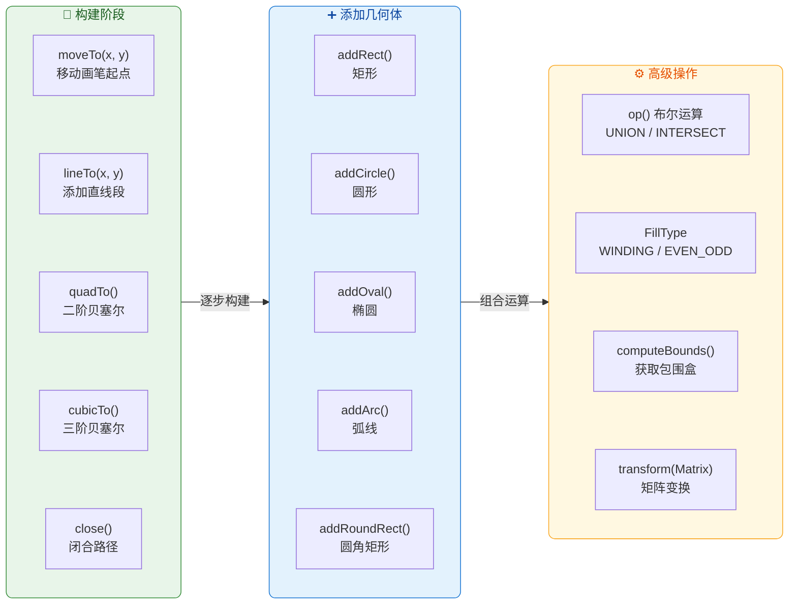

#### 基本路径指令

构建一个 Path 最原始的方式是使用 **moveTo / lineTo / close** 三件套，它们分别对应"提笔移动"、"落笔画线"和"闭合回起点"：

```kotlin
// 画一个等边三角形（手动计算三个顶点）
private val trianglePath = Path().apply {
    // 1. 移动到第一个顶点（底边左端）
    //    moveTo 不画线，只设定起始位置
    moveTo(100f, 300f)

    // 2. 从当前位置画直线到第二个顶点（底边右端）
    lineTo(300f, 300f)

    // 3. 画直线到第三个顶点（顶部中心）
    lineTo(200f, 127f) // 等边三角形高 = 边长 * √3/2 ≈ 200 * 0.866 ≈ 173

    // 4. 闭合路径：自动从当前位置画直线回到起点 (100, 300)
    //    如果不调用 close()，三角形的最后一条边会缺失（除非 style = FILL）
    close()
}
```

`close()` 的行为值得特别说明：它从当前点画一条直线回到 **最近一次 `moveTo()` 的位置**（即当前子路径的起点）。如果 `style = FILL`，即使不调用 `close()`，系统也会隐式闭合路径进行填充；但如果 `style = STROKE`，不调用 `close()` 就不会画最后一条回到起点的线段。另外，`close()` 生成的闭合线段与 `strokeJoin` 设置联动——使用 `ROUND` 拐角时，闭合处也会呈现圆滑过渡。

Path 还提供了 **相对坐标** 版本的指令：`rMoveTo(dx, dy)` / `rLineTo(dx, dy)` / `rQuadTo(...)` / `rCubicTo(...)`。这些方法的参数是相对于当前位置的偏移量，而非绝对坐标。在绘制具有规律性重复结构的图形时（如锯齿波形、阶梯线），相对坐标可以大幅简化计算。

#### 贝塞尔曲线

Path 支持两种贝塞尔曲线（Bézier Curve），它们是实现流畅曲线效果的核心：

**`quadTo(x1, y1, x2, y2)`——二阶贝塞尔曲线**：定义一个控制点 `(x1, y1)` 和终点 `(x2, y2)`（起点为当前位置）。曲线从起点出发，"被控制点吸引"后到达终点，形成一条抛物线形的平滑曲线。二阶贝塞尔只能表达一个弯曲方向，适合简单的弧线效果。

**`cubicTo(x1, y1, x2, y2, x3, y3)`——三阶贝塞尔曲线**：定义两个控制点 `(x1, y1)` / `(x2, y2)` 和终点 `(x3, y3)`。两个控制点让曲线可以呈现 S 形或更复杂的走势。三阶贝塞尔是矢量图形（SVG、字体轮廓、动画曲线）的基础。

```kotlin
// 使用三阶贝塞尔画一条 S 形曲线
private val bezierPath = Path().apply {
    // 起点在左侧中央
    moveTo(50f, 400f)

    // cubicTo 的六个参数含义：
    //   (x1, y1) = 第一个控制点，将曲线"向上拉"
    //   (x2, y2) = 第二个控制点，将曲线"向下拉"
    //   (x3, y3) = 终点
    cubicTo(
        150f, 100f,  // 控制点1：大幅上移，曲线前半段向上弯曲
        250f, 700f,  // 控制点2：大幅下移，曲线后半段向下弯曲
        350f, 400f   // 终点：回到与起点相同的 Y 坐标
    )
    // 最终形成一条优雅的 S 形曲线
}
```

**实战技巧**：如果你需要连接多段贝塞尔曲线形成一条完整的平滑路径（如手写签名、绘画轨迹），关键在于 **保证相邻曲线在连接点处的切线方向一致**。对于三阶贝塞尔，这意味着前一段的第二个控制点、连接点、后一段的第一个控制点必须共线（collinear）。Android 的 `Path` 类本身不提供"平滑连接"的便捷方法，需要自己维护控制点逻辑。

#### addXxx()——预制几何体

除了逐点构建路径，Path 还提供了一系列 `addXxx()` 方法来直接添加标准几何图形：

```kotlin
private val combinedPath = Path().apply {
    // 添加一个矩形到路径中
    // Direction.CW = 顺时针方向（clockwise），影响填充规则
    addRect(RectF(50f, 50f, 200f, 200f), Path.Direction.CW)

    // 添加一个圆形到路径中
    // 圆心 (300, 125)，半径 75
    addCircle(300f, 125f, 75f, Path.Direction.CW)

    // 添加一个圆角矩形
    addRoundRect(
        RectF(50f, 250f, 350f, 400f), // 矩形范围
        20f, 20f,                      // x方向和y方向圆角半径
        Path.Direction.CW
    )

    // 添加一段弧线（不连接到圆心，纯弧段）
    addArc(
        RectF(100f, 420f, 300f, 600f), // 椭圆包围盒
        0f,                             // 起始角度
        270f                            // 扫过角度
    )
}
```

`Path.Direction`（`CW` 顺时针 / `CCW` 逆时针）在大多数简单场景中看不出区别，但在以下两种场景中至关重要：

1. **FillType 为 EVEN_ODD 或 INVERSE_EVEN_ODD 时**：路径方向直接决定哪些区域被填充。
2. **PathMeasure 或 PathEffect 沿路径运动时**：方向决定了运动的前进方向。

#### FillType：填充规则

当一个 Path 包含多个子路径（sub-path）且它们存在重叠时，`FillType` 决定了重叠区域到底是"填充"还是"留空"。Android 支持四种填充规则：

- **`WINDING`**（默认）：非零环绕数规则（Non-Zero Winding Rule）。对于任意一点，从该点向任意方向发射一条射线，计算与路径的交叉次数——路径从左到右穿过射线时 +1，从右到左穿过时 -1。如果最终计数 ≠ 0，则该点在路径内部，被填充。在实际效果上，如果所有子路径方向相同（同为 CW 或同为 CCW），重叠区域也会被填充。
- **`EVEN_ODD`**：奇偶规则。射线与路径交叉奇数次 → 填充，偶数次 → 留空。不关心路径方向。这意味着当两个同方向的圆重叠时，重叠部分会被"镂空"。
- **`INVERSE_WINDING`** / **`INVERSE_EVEN_ODD`**：分别是上述两种规则的"反转"版本——原本填充的区域变为空白，原本空白的区域变为填充。

```kotlin
// 两个重叠圆的填充效果演示
private val evenOddPath = Path().apply {
    fillType = Path.FillType.EVEN_ODD   // 使用奇偶规则
    addCircle(150f, 200f, 100f, Path.Direction.CW) // 圆1
    addCircle(250f, 200f, 100f, Path.Direction.CW) // 圆2
    // 结果：重叠区域被镂空，形成"排除"效果
}
```

#### Path.op()——布尔运算

API 19+ 引入了 `Path.op(otherPath, op)` 方法，支持对两个路径进行布尔集合运算：

| 运算 | 说明 | 效果 |
|------|------|------|
| `UNION` | 并集 | 两个路径覆盖的所有区域 |
| `INTERSECT` | 交集 | 两个路径共同覆盖的区域 |
| `DIFFERENCE` | 差集 | 第一个路径减去第二个路径覆盖的区域 |
| `REVERSE_DIFFERENCE` | 反向差集 | 第二个路径减去第一个路径覆盖的区域 |
| `XOR` | 对称差 | 两个路径不重叠的区域（等同于 EVEN_ODD 双路径效果） |

```kotlin
// 布尔运算：矩形减去圆形 = 矩形带圆孔
val rectPath = Path().apply {
    addRect(RectF(50f, 50f, 350f, 350f), Path.Direction.CW) // 一个正方形
}
val circlePath = Path().apply {
    addCircle(200f, 200f, 80f, Path.Direction.CW) // 正方形中心的一个圆
}

// DIFFERENCE：从矩形中挖掉圆形区域
rectPath.op(circlePath, Path.Op.DIFFERENCE) // rectPath 现在是"带圆孔的矩形"
```

`Path.op()` 在实现复杂的异形裁剪（如不规则遮罩、拼图效果）时极为有用，但计算开销较大，应避免在 `onDraw()` 中频繁调用。最佳实践是在 `onSizeChanged()` 或数据变化时预计算好结果 Path，`onDraw()` 中直接使用。

---

### Rect 矩形运算

#### Rect 与 RectF：整数精度 vs 浮点精度

Android 提供了两个矩形类：`Rect`（四个 `int` 字段）和 `RectF`（四个 `float` 字段）。它们的内部表示完全相同——通过 `left`、`top`、`right`、`bottom` 四个边界值定义一个轴对齐矩形（Axis-Aligned Bounding Box，简称 AABB）。

选择标准非常明确：
- **Rect**：用于 **布局和触摸**——View 的位置（`getHitRect()`、`getGlobalVisibleRect()`）、Drawable 的 `bounds`、`invalidate(Rect)` 脏区域标记等，这些场景都使用像素级整数坐标。
- **RectF**：用于 **绑制**——`canvas.drawRect()`、`canvas.drawRoundRect()`、`canvas.drawOval()` 等绑制 API 接受 RectF 参数，因为绘制过程需要浮点精度来实现亚像素定位和平滑变换。

两者之间可以轻松互转：`RectF` 的构造函数接受 `Rect` 参数，`RectF.roundOut(Rect)` 可以将浮点矩形向外取整为整数矩形。

```kotlin
// Rect 与 RectF 互转
val intRect = Rect(10, 20, 300, 400)      // 整数矩形（用于布局计算）
val floatRect = RectF(intRect)             // 转为 float 矩形（用于绑制）

val backToInt = Rect()
floatRect.roundOut(backToInt)              // float → int，向外取整保证覆盖
// roundOut 向外扩展：left/top 向下取整，right/bottom 向上取整
// 确保 int 矩形完全包含原 float 矩形
```

#### 矩形的数学含义

Rect/RectF 遵循一个重要的数学契约：**`left < right` 且 `top < bottom`** 才是有效矩形。`width()` 返回 `right - left`，`height()` 返回 `bottom - top`。如果违反这个不变量（invariant），`isEmpty()` 会返回 `true`，某些操作（如 `intersect()`）的行为也会变得不可预测。

注意 `centerX()` / `centerY()` 在 `Rect`（int）中返回的是 **整数除法** 结果（向下取整），而 `exactCenterX()` / `exactCenterY()` 返回 `float`。在需要精确居中的绘制场景中，应使用 `exactCenterX()` 或直接使用 `RectF`。

#### 核心运算方法

Rect/RectF 提供了一套实用的矩形运算方法，在自定义 View 中应用广泛：

**`contains(x, y)` / `contains(Rect)`——包含判断**：检查一个点或另一个矩形是否完全被包含在当前矩形内。这在 **触摸事件处理** 中极为常用——判断触摸点是否落在某个绘制区域内：

```kotlin
override fun onTouchEvent(event: MotionEvent): Boolean {
    when (event.action) {
        MotionEvent.ACTION_DOWN -> {
            // 检查触摸点是否在按钮区域内
            // contains 对于 Rect 的判断规则是: left <= x < right 且 top <= y < bottom
            // 注意右边界和下边界是开区间（exclusive）
            if (buttonRect.contains(event.x.toInt(), event.y.toInt())) {
                // 处理点击
                isPressed = true
                invalidate() // 触发重绘以显示按下状态
                return true  // 消费事件
            }
        }
    }
    return super.onTouchEvent(event)
}
```

**`intersect(Rect)` 与 `setIntersect(Rect, Rect)`——相交运算**：`intersect()` 修改当前矩形为两者的交集，返回 `true` 表示确实存在交集；返回 `false` 时当前矩形不变（注意：早期版本中的 Rect 在返回 false 时可能会修改自身，这是一个历史 bug，RectF 中已修正）。`setIntersect()` 不修改两个输入矩形，而是将结果写入调用者自身。

```kotlin
val rect1 = RectF(0f, 0f, 200f, 200f)
val rect2 = RectF(100f, 100f, 300f, 300f)

// 方法1：修改 rect1 为交集
val hasIntersection = rect1.intersect(rect2)
// hasIntersection = true, rect1 现在变成 (100, 100, 200, 200)

// 方法2：不修改原矩形，结果写入新矩形
val result = RectF()
result.setIntersect(rect1, rect2) // result = (100, 100, 200, 200)
```

**`inset(dx, dy)`——向内收缩**：将矩形的左右边界各向内移动 `dx`，上下边界各向内移动 `dy`。如果 `dx/dy` 为负值，则向外扩展。这个方法在绘制 padding 效果或缩小触摸区域时非常实用：

```kotlin
// 在 View 内部画一个带 padding 的背景矩形
val bgRect = RectF(0f, 0f, width.toFloat(), height.toFloat())
bgRect.inset(16f, 16f) // 四边各内缩 16px，等效于 padding = 16
canvas.drawRoundRect(bgRect, 12f, 12f, bgPaint)
```

**`offset(dx, dy)`——平移矩形**：整体移动矩形的位置，`left/right` 加上 `dx`，`top/bottom` 加上 `dy`。大小不变，位置改变。`offsetTo(newLeft, newTop)` 是绝对定位版本。

**`union(x, y)` / `union(Rect)`——合并运算**：将当前矩形扩展为能同时包含自身和传入点/矩形的最小矩形。这在计算一组点或图形的包围盒（bounding box）时非常有用：

```kotlin
// 计算一组散点的包围盒
val boundingBox = RectF()
points.forEachIndexed { index, point ->
    if (index == 0) {
        // 第一个点：初始化矩形为零大小的点
        boundingBox.set(point.x, point.y, point.x, point.y)
    } else {
        // 后续点：扩展矩形以包含新点
        boundingBox.union(point.x, point.y)
    }
}
// boundingBox 现在是所有点的最小外接矩形
```

#### Rect 在绑制中的综合应用

在实际的自定义 View 中，Rect/RectF 几乎无处不在。以下是一个综合示例，展示如何利用矩形运算来构建一个自适应尺寸的仪表盘绘制区域：

```kotlin
// 成员变量：避免在 onDraw 中创建对象
private val drawArea = RectF()  // 可绘制区域（扣除 padding 后）
private val gaugeRect = RectF() // 仪表盘弧线的外接矩形（正方形）

override fun onSizeChanged(w: Int, h: Int, oldw: Int, oldh: Int) {
    super.onSizeChanged(w, h, oldw, oldh)

    // 1. 计算扣除 padding 后的可用区域
    drawArea.set(
        paddingLeft.toFloat(),       // left
        paddingTop.toFloat(),        // top
        (w - paddingRight).toFloat(),  // right
        (h - paddingBottom).toFloat()  // bottom
    )

    // 2. 在可用区域内计算最大正方形（仪表盘需要等宽高）
    val size = minOf(drawArea.width(), drawArea.height()) // 取短边
    gaugeRect.set(0f, 0f, size, size) // 先创建一个从原点开始的正方形

    // 3. 将正方形移到可用区域的中心
    val offsetX = drawArea.centerX() - gaugeRect.centerX()
    val offsetY = drawArea.centerY() - gaugeRect.centerY()
    gaugeRect.offset(offsetX, offsetY) // 平移到中心

    // 4. 内缩以留出弧线的 strokeWidth 空间
    gaugeRect.inset(arcStrokeWidth / 2f, arcStrokeWidth / 2f)
}

override fun onDraw(canvas: Canvas) {
    super.onDraw(canvas)
    // 直接使用预计算好的 gaugeRect 画弧线
    canvas.drawArc(gaugeRect, 135f, 270f, false, arcPaint)
}
```

这个例子展示了 Rect 运算的典型思路：**先确定可用区域 → 计算目标形状的外接矩形 → 居中对齐 → 考虑描边宽度内缩 → 在 `onDraw()` 中直接使用**。将所有计算前置到 `onSizeChanged()` 是性能优化的关键——`onDraw()` 中只做纯绘制操作，零计算、零分配。

---

**📝 练习题**

在自定义 View 的 `onDraw()` 方法中，以下哪种做法会导致频繁的垃圾回收（GC），影响绘制性能？

A. 在 `init {}` 块中创建 `Paint` 对象，`onDraw()` 中调用 `paint.color = xxx` 修改颜色


B. 在 `onDraw()` 中调用 `val rect = RectF(0f, 0f, width.toFloat(), height.toFloat())` 创建矩形


C. 在 `onSizeChanged()` 中预计算 `Path` 对象并缓存为成员变量


D. 在 `init {}` 块中通过 `Paint(Paint.ANTI_ALIAS_FLAG)` 构造画笔


**【答案】** B

**【解析】** `onDraw()` 方法在每一帧刷新时都可能被调用（60fps 意味着每秒调用 60 次）。选项 B 在 `onDraw()` 内部通过 `val rect = RectF(...)` 每帧都创建新的 `RectF` 对象，这些短生命周期对象会快速填满 Young Generation，触发频繁的 Minor GC，导致掉帧和卡顿。Android Lint 也会对此发出 `Avoid object allocations during draw/layout operations` 警告。正确做法是将 `RectF` 声明为成员变量，在 `onSizeChanged()` 中设置值，`onDraw()` 中直接使用。选项 A、C、D 都将对象创建放在了初始化或尺寸变化阶段，不会在每帧重复分配，是正确的做法。

---

**📝 练习题**

关于 `Canvas.save()` 和 `Canvas.restore()` 的工作机制，以下说法正确的是？

A. `save()` 会保存当前 Canvas 上已经绘制的像素内容，`restore()` 可以回滚到之前的画面


B. `save()` 保存的是当前的变换矩阵（Matrix）和裁剪区域（Clip），`restore()` 恢复这两者但不影响已绘制的内容


C. `restore()` 调用次数可以多于 `save()`，多余的 `restore()` 会被安全忽略


D. `saveLayer()` 与 `save()` 完全等价，都只保存坐标系状态


**【答案】** B

**【解析】** `Canvas.save()` 将当前的 **变换矩阵** 和 **裁剪区域** 压入内部状态栈，`restore()` 从栈顶弹出并恢复这两者。已经绘制到画布上的像素内容 **不会被回滚**——save/restore 影响的是"坐标系状态"而非"画面内容"，因此 A 错误。选项 C 也是错误的：如果 `restore()` 调用次数超过 `save()`（即试图弹出空栈），系统会抛出 `IllegalStateException: Underflow in restore`。选项 D 同样不正确：`saveLayer()` 除了保存状态之外，还会创建一个**离屏缓冲区**（offscreen buffer），后续绘制先画到离屏层上，`restore()` 时再将离屏层通过指定的 Paint（可附加 alpha、Xfermode 等）合成回主画布，这对实现图层混合效果至关重要，但会带来额外的内存和 GPU 开销。

---

## 高级渲染效果

在前一节中，我们掌握了 Canvas、Paint、Path、Rect 等核心绘图 API。这些 API 让我们能够在屏幕上绑定几何图形与基本色彩。然而，当产品设计稿中出现"渐变按钮"、"圆角纹理卡片"、"光晕扩散动效"这类视觉需求时，仅靠 `Paint.setColor()` 设定单一颜色便显得力不从心。Android 图形栈为此提供了一套强大的 **Shader（着色器）** 体系——它直接嵌入 Paint 渲染管线，在逐像素填充阶段决定"每一个像素应该呈现什么颜色"。理解并灵活运用 Shader，是从"能画形状"升级到"能画出设计稿级效果"的关键跳板。

### Shader 着色器

#### 什么是 Shader

`android.graphics.Shader` 是所有着色器的抽象基类。从应用层视角来看，Shader 的本质作用可以用一句话概括：**它为 Paint 提供了一个"颜色生成函数"——给定画布上任意一点 (x, y)，Shader 返回该点应填充的颜色值（ARGB）。** 这意味着，Paint 在实际光栅化（rasterization）每一个像素时，不再使用统一的 `mColor` 字段，而是查询挂载的 Shader 实例来获取颜色。因此，我们只要把不同的 Shader 子类 `set` 到同一个 Paint 上，就能让同一段 `canvas.drawXxx()` 调用产生截然不同的视觉效果——渐变、纹理、叠加，全部由 Shader 的内部算法决定。

在 Android SDK 中，Shader 的直接子类有五个：

| 子类 | 功能一句话描述 |
|---|---|
| **LinearGradient** | 沿一条直线方向进行颜色线性插值 |
| **RadialGradient** | 从一个中心点向外以圆形扩散插值 |
| **SweepGradient** | 围绕中心点做 360° 角度扫描插值 |
| **BitmapShader** | 用一张 Bitmap 作为"纹理贴图"来填充 |
| **ComposeShader** | 将两个 Shader 按 PorterDuff/BlendMode 叠加混合 |

前三个用于各种渐变，第四个用于图片纹理，第五个用于组合。它们共同继承了 Shader 的一个核心概念——**TileMode（平铺模式）**，用于定义当像素坐标超出 Shader 原始定义域时，如何"铺满"剩余区域。

#### TileMode 平铺模式

TileMode 是枚举类 `Shader.TileMode`，包含三个值：

- **CLAMP**：边缘拉伸。超出 Shader 定义区域的像素将使用边缘最后一个像素的颜色进行延伸。比如渐变从 x=0 到 x=200 定义为红→蓝，当 x=300 时，CLAMP 模式下该点颜色仍然是蓝色（边缘色）。这是最常用的默认策略，因为它让渐变"自然终止"，不会出现突兀的重复或翻转。
- **REPEAT**：平铺重复。超出后从头开始重复着色器图案，类似 CSS 的 `background-repeat: repeat`。适合需要无缝纹理填充的场景（如棋盘格、水印平铺）。
- **MIRROR**：镜像翻转。每次超出边界时图案翻转一次，形成对称效果。适合制作对称渐变条纹或呼吸灯动效。

下面用一张 Mermaid 图将 Shader 体系的类结构与 TileMode 的关系可视化呈现：

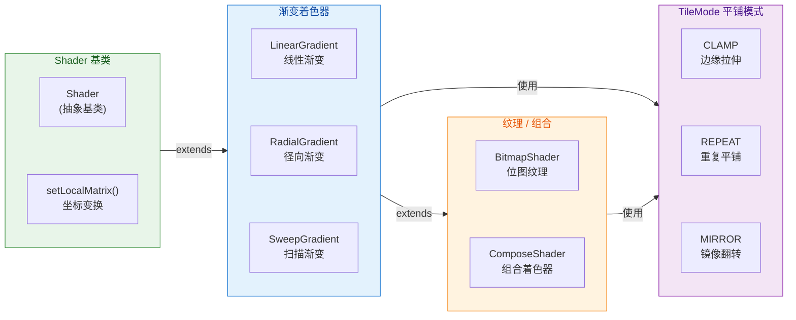

#### Shader 与 Paint 的绑定机制

从 API 使用角度，Shader 的挂载方式极其简单——只需一行 `paint.shader = myShader`。但它的内部生效逻辑值得理解：

1. **优先级规则**：一旦 Paint 设置了非 null 的 Shader，Paint 原先通过 `setColor()` 设定的颜色将 **被忽略**（对于填充操作而言）。Shader 的颜色输出完全覆盖了 Paint 的基础色。如果希望停用 Shader 恢复纯色，需要显式调用 `paint.shader = null`。
2. **坐标系**：Shader 内部的坐标默认是相对于 **Canvas 的原点（即 View 的左上角）** 而不是当前 `drawXxx()` 的几何图形左上角。这意味着，如果你在 (100, 100) 处画一个圆并挂了 LinearGradient(0,0,200,200,...)，渐变的起点并不在圆的左上角，而在 Canvas 原点。如果要让渐变"跟着图形走"，需要调整 Shader 的起始坐标，或者使用 `Shader.setLocalMatrix()` 平移。
3. **不可变性**：Shader 对象一旦创建，其核心参数（颜色数组、坐标区间等）无法修改。想更改渐变参数时，必须重新 `new` 一个新的 Shader 实例。在动画场景下，如果每一帧都创建新 Shader，会带来一定的 GC 压力，因此通常搭配 `setLocalMatrix()` 做矩阵动画，避免频繁实例化。

理解了 Shader 的通用机制后，我们逐个深入三种渐变着色器。

---

### LinearGradient 线性渐变

#### 基本概念

`LinearGradient` 是最常用的渐变类型。它沿着一条由起点 `(x0, y0)` 到终点 `(x1, y1)` 定义的直线，在其上进行颜色的线性插值。直线上每一个垂直截面的颜色相同，因此视觉效果呈现为"平行色带"。

它提供了两种构造方式：

**双色构造（Two-color）**：

```kotlin
// 仅指定起始色和结束色，渐变在两个颜色之间均匀过渡
val shader = LinearGradient(
    0f,   // x0: 起点 x 坐标
    0f,   // y0: 起点 y 坐标
    width.toFloat(),  // x1: 终点 x 坐标（通常为 View 宽度）
    0f,   // y1: 终点 y 坐标（y 相同则为水平渐变）
    Color.RED,         // startColor: 起始颜色
    Color.BLUE,        // endColor: 结束颜色
    Shader.TileMode.CLAMP  // tileMode: 边缘拉伸
)
```

**多色构造（Multi-color with positions）**：

```kotlin
// 可传入多个颜色和各自的位置（0.0~1.0），实现分段渐变
val colors = intArrayOf(
    Color.RED,        // 第 1 段起始色
    Color.YELLOW,     // 第 2 段颜色
    Color.GREEN,      // 第 3 段颜色
    Color.BLUE        // 第 4 段终止色
)
val positions = floatArrayOf(
    0.0f,   // RED 位于 0%（最左端）
    0.3f,   // YELLOW 位于 30% 处
    0.7f,   // GREEN 位于 70% 处
    1.0f    // BLUE 位于 100%（最右端）
)
val shader = LinearGradient(
    0f, 0f,                    // 起点
    width.toFloat(), 0f,       // 终点
    colors,                    // 颜色数组
    positions,                 // 位置数组（可为 null，null 则均分）
    Shader.TileMode.CLAMP      // 平铺模式
)
```

`positions` 数组的值必须严格单调递增（从 0.0 到 1.0）。如果传入 `null`，系统会将颜色均匀分配。例如 4 种颜色，自动产生 `[0.0, 0.33, 0.67, 1.0]`。

#### 渐变方向的控制

LinearGradient 的渐变方向完全由起点和终点两个坐标决定。我们可以通过改变这两对坐标来实现不同方向的渐变：

- **水平渐变（左→右）**：起点 `(0, 0)`，终点 `(width, 0)`。y 坐标相同，颜色沿 x 轴变化。
- **垂直渐变（上→下）**：起点 `(0, 0)`，终点 `(0, height)`。x 坐标相同，颜色沿 y 轴变化。
- **对角渐变（左上→右下）**：起点 `(0, 0)`，终点 `(width, height)`。颜色沿对角线变化。
- **任意角度渐变**：通过三角函数计算任意角度 `θ` 对应的终点坐标。例如要做 45° 渐变，可以 `x1 = cos(45°) * length`，`y1 = sin(45°) * length`。

一个重要的实践技巧：**渐变的长度（起点到终点的距离）决定了颜色过渡的"紧凑程度"**。距离越短，颜色变化越剧烈；距离越长，渐变越柔和。当起终点距离远大于绘制图形的尺寸时，图形上可能只看到渐变的一小部分，视觉上接近纯色。

#### 实战：渐变按钮背景

下面是一个完整的渐变按钮自定义 View 示例，将上述知识串联起来：

```kotlin
class GradientButton @JvmOverloads constructor(
    context: Context,
    attrs: AttributeSet? = null,
    defStyleAttr: Int = 0
) : View(context, attrs, defStyleAttr) {

    // 在构造器或 init 中初始化 Paint，避免 onDraw 中重复创建
    private val paint = Paint(Paint.ANTI_ALIAS_FLAG)

    // 圆角矩形的圆角半径
    private val cornerRadius = 24f.dp  // 假设有 dp 转 px 的扩展属性

    // RectF 复用对象，用于 drawRoundRect
    private val rectF = RectF()

    // Shader 延迟到 onSizeChanged 中创建，因为需要知道 View 的实际尺寸
    override fun onSizeChanged(w: Int, h: Int, oldw: Int, oldh: Int) {
        super.onSizeChanged(w, h, oldw, oldh)
        // 根据最新宽高创建 LinearGradient
        paint.shader = LinearGradient(
            0f, 0f,               // 起点：左上角
            w.toFloat(), 0f,      // 终点：右上角（水平渐变）
            intArrayOf(
                0xFF6200EE.toInt(),  // 起始色：Material Purple 500
                0xFF03DAC5.toInt()   // 终止色：Material Teal 200
            ),
            null,                  // positions 为 null → 均匀分布
            Shader.TileMode.CLAMP  // 边缘拉伸（此处渐变恰好覆盖全宽，CLAMP 最合适）
        )
        // 更新绘制矩形范围
        rectF.set(0f, 0f, w.toFloat(), h.toFloat())
    }

    override fun onDraw(canvas: Canvas) {
        // 直接绘制圆角矩形，颜色由 Shader 决定
        canvas.drawRoundRect(rectF, cornerRadius, cornerRadius, paint)
    }
}
```

这段代码有几个关键的设计考量：

- **Shader 在 `onSizeChanged` 中创建**：因为 LinearGradient 的终点坐标需要用到 View 的实际宽度，而 `onSizeChanged` 是第一个能拿到准确尺寸的回调。
- **Paint 和 RectF 作为成员变量提前创建**：遵循"onDraw 中零对象分配"的性能原则。
- **TileMode.CLAMP**：由于渐变区间 `[0, width]` 恰好覆盖整个 View，TileMode 实际上不会被触发。但习惯上选择 CLAMP，语义最清晰。

---

### RadialGradient 径向渐变

#### 基本概念

`RadialGradient`（径向/辐射渐变）从一个中心点出发，沿半径方向向外进行颜色插值。视觉效果呈同心圆状的颜色扩散——中心是第一个颜色，最外圈是最后一个颜色。它非常适合做按钮按下时的水波纹扩散效果（Ripple-like）、光晕（Glow）、聚光灯（Spotlight）等。

构造函数如下：

```kotlin
// 多色径向渐变构造器
val radialShader = RadialGradient(
    centerX,       // 圆心 x 坐标
    centerY,       // 圆心 y 坐标
    radius,        // 渐变半径（从圆心到最后一种颜色的距离）
    intArrayOf(    // 颜色数组
        Color.WHITE,    // 中心色：白色（高亮点）
        Color.YELLOW,   // 中间过渡色
        Color.TRANSPARENT // 边缘色：透明（自然消散）
    ),
    floatArrayOf(  // 各颜色的位置比例
        0.0f,      // WHITE 在 0%（圆心）
        0.4f,      // YELLOW 在 40% 半径处
        1.0f       // TRANSPARENT 在 100%（边缘）
    ),
    Shader.TileMode.CLAMP  // 超出半径后保持边缘色
)
```

与 LinearGradient 类似，`positions` 可传 `null` 实现均分。不同的是，RadialGradient 的"距离"是指从圆心到当前像素点的欧氏距离（Euclidean distance），而非沿某条直线的投影距离。

#### TileMode 对 RadialGradient 的影响

对于径向渐变来说，TileMode 的效果更加直观：

- **CLAMP**：半径之外的所有像素都使用边缘色。如果边缘色是透明的，渐变圆外面就是完全透明——这正是"光晕消散"效果的基础。
- **REPEAT**：渐变圆之外开始重复，形成一圈一圈的"靶环"效果（类似雷达波纹）。
- **MIRROR**：渐变圆之外镜像翻转，颜色先反转再正常再反转，形成"呼吸脉冲"式的同心圆。

在实际项目中，CLAMP 占绝大多数用例。REPEAT 和 MIRROR 更多出现在动效或装饰性背景中。

#### 实战：触摸水波纹效果

一个经典的自定义水波纹：用户点击 View 时，从触摸点开始扩散一个 RadialGradient 光圈，搭配属性动画让半径从 0 增大到对角线长度：

```kotlin
class RippleView @JvmOverloads constructor(
    context: Context,
    attrs: AttributeSet? = null
) : View(context, attrs) {

    // 水波纹画笔
    private val ripplePaint = Paint(Paint.ANTI_ALIAS_FLAG)

    // 触摸坐标
    private var touchX = 0f
    private var touchY = 0f

    // 当前动画半径（由 ValueAnimator 驱动）
    private var currentRadius = 0f

    // 水波纹最大半径（View 对角线长度，在 onSizeChanged 中计算）
    private var maxRadius = 0f

    override fun onSizeChanged(w: Int, h: Int, oldw: Int, oldh: Int) {
        super.onSizeChanged(w, h, oldw, oldh)
        // 计算对角线长度，确保水波能覆盖整个 View
        maxRadius = Math.hypot(w.toDouble(), h.toDouble()).toFloat()
    }

    override fun onTouchEvent(event: MotionEvent): Boolean {
        if (event.action == MotionEvent.ACTION_DOWN) {
            // 记录触摸点作为渐变圆心
            touchX = event.x
            touchY = event.y
            // 启动半径动画：从 0 扩散到 maxRadius
            startRippleAnimation()
            return true // 消费事件
        }
        return super.onTouchEvent(event)
    }

    private fun startRippleAnimation() {
        // ValueAnimator 将 currentRadius 从 0 过渡到 maxRadius
        ValueAnimator.ofFloat(0f, maxRadius).apply {
            duration = 400L  // 400ms 完成扩散
            interpolator = DecelerateInterpolator()  // 先快后慢，模拟物理衰减
            addUpdateListener { animation ->
                // 每一帧更新半径
                currentRadius = animation.animatedValue as Float
                // 更新 Shader：中心为触摸点，半径为当前值
                ripplePaint.shader = RadialGradient(
                    touchX, touchY,
                    // 防止半径为 0（Shader 要求 radius > 0）
                    currentRadius.coerceAtLeast(1f),
                    intArrayOf(
                        0x60FFFFFF,      // 中心半透明白
                        0x00FFFFFF       // 边缘全透明
                    ),
                    floatArrayOf(0.0f, 1.0f),
                    Shader.TileMode.CLAMP
                )
                // 请求重绘
                invalidate()
            }
        }.start()
    }

    override fun onDraw(canvas: Canvas) {
        super.onDraw(canvas)
        if (currentRadius > 0f) {
            // 以触摸点为圆心，当前半径画圆，颜色由 RadialGradient 决定
            canvas.drawCircle(touchX, touchY, currentRadius, ripplePaint)
        }
    }
}
```

注意这里有一个 **性能取舍**：每帧都 `new RadialGradient` 确实会产生对象分配。对于 400ms、60fps 共约 24 帧的短动画，这在现代设备上完全可以接受。如果是持续运行的循环动画，应改用 `setLocalMatrix()` 配合 `Matrix.setScale()` 来模拟半径变化，避免反复创建 Shader 对象。

---

### SweepGradient 扫描渐变

#### 基本概念

`SweepGradient`（扫描渐变/角度渐变）围绕一个中心点做 360° 的颜色角度扫描。你可以把它想象成"时钟的秒针扫过一圈"——从 3 点钟方向（0°）开始，顺时针旋转一周回到起点。视觉效果类似于色轮（Color Wheel）或锥形渐变（Conic Gradient）。

构造函数非常简洁，因为 **SweepGradient 没有 TileMode 参数**——它天然是一个完整的 360° 循环，不存在"超出范围"的问题：

```kotlin
// 基本用法：围绕中心点做 360° 全色扫描
val sweepShader = SweepGradient(
    centerX,       // 圆心 x
    centerY,       // 圆心 y
    intArrayOf(    // 颜色数组（从 0° 开始顺时针排列）
        Color.RED,
        Color.YELLOW,
        Color.GREEN,
        Color.CYAN,
        Color.BLUE,
        Color.MAGENTA,
        Color.RED      // 首尾同色，实现无缝闭合
    ),
    null           // positions 为 null → 均匀分布在 0°~360°
)
```

**关键细节——首尾闭合**：如果你希望渐变在 360° 处无缝衔接（没有突变色带），必须让颜色数组的第一个元素和最后一个元素 **相同**。否则，从最后一个颜色跳回第一个颜色时会出现一条明显的硬边（Hard Edge），在视觉上非常刺眼。

#### SweepGradient 的起始角度

SweepGradient 的默认起始方向是 **3 点钟方向（正右方、x 轴正方向、0°）**。如果你的设计需要从 12 点钟方向（正上方）开始，有两种办法：

1. **旋转 Canvas**：在 `onDraw` 中使用 `canvas.rotate(-90f, centerX, centerY)` 将整个画布逆时针旋转 90°，使得 SweepGradient 的 0° 对准正上方。
2. **使用 `setLocalMatrix()`**：创建一个旋转矩阵，挂载到 Shader 上：

```kotlin
val sweepShader = SweepGradient(centerX, centerY, colors, positions)
// 创建旋转矩阵：围绕中心点逆时针旋转 90°
val matrix = Matrix()
matrix.setRotate(-90f, centerX, centerY) // -90° 使起始角从 3 点变为 12 点
// 将矩阵设置到 Shader
sweepShader.setLocalMatrix(matrix)
```

第二种方式更推荐，因为它只影响 Shader 的坐标，不干扰 Canvas 上其他绘制操作。

#### 实战：环形进度条

SweepGradient 最经典的应用场景莫过于"渐变色环形进度条"。它的原理是：用 SweepGradient 作为画弧线的 Paint 着色器，通过 `drawArc` 控制弧度，达到进度效果：

```kotlin
class GradientProgressRing @JvmOverloads constructor(
    context: Context,
    attrs: AttributeSet? = null
) : View(context, attrs) {

    // 圆弧画笔：设置为描边模式
    private val arcPaint = Paint(Paint.ANTI_ALIAS_FLAG).apply {
        style = Paint.Style.STROKE     // 描边（空心圆弧）
        strokeWidth = 20f.dp           // 圆弧宽度
        strokeCap = Paint.Cap.ROUND    // 端点圆头，视觉更柔和
    }

    // 背景轨道画笔
    private val trackPaint = Paint(Paint.ANTI_ALIAS_FLAG).apply {
        style = Paint.Style.STROKE
        strokeWidth = 20f.dp
        color = 0xFFE0E0E0.toInt()     // 浅灰色轨道
    }

    // 圆弧绘制区域
    private val arcRect = RectF()

    // 当前进度 0~100
    var progress: Int = 0
        set(value) {
            field = value.coerceIn(0, 100)  // 约束 0~100
            invalidate()                     // 进度变化时重绘
        }

    override fun onSizeChanged(w: Int, h: Int, oldw: Int, oldh: Int) {
        super.onSizeChanged(w, h, oldw, oldh)
        // 内缩半个描边宽度，防止圆弧被裁切
        val inset = arcPaint.strokeWidth / 2f
        arcRect.set(inset, inset, w - inset, h - inset)

        val cx = w / 2f  // 中心 x
        val cy = h / 2f  // 中心 y

        // 创建 SweepGradient：从起始色到终止色
        val shader = SweepGradient(
            cx, cy,
            intArrayOf(
                0xFF4CAF50.toInt(),   // 起始色：Material Green 500
                0xFF81C784.toInt(),   // 中间过渡色：Green 300
                0xFFA5D6A7.toInt()    // 终止色：Green 200（柔和渐出）
            ),
            floatArrayOf(0f, 0.5f, 1f)
        )

        // 旋转 Shader 使渐变从 12 点钟开始
        val matrix = Matrix()
        matrix.setRotate(-90f, cx, cy)
        shader.setLocalMatrix(matrix)

        // 挂载到画笔
        arcPaint.shader = shader
    }

    override fun onDraw(canvas: Canvas) {
        // 1. 先画灰色背景轨道（完整 360°）
        canvas.drawOval(arcRect, trackPaint)

        // 2. 再画渐变前景弧线
        //    起始角 -90°（12 点钟方向），扫过角度 = progress / 100 * 360
        val sweepAngle = progress / 100f * 360f
        canvas.drawArc(
            arcRect,
            -90f,         // startAngle：12 点钟方向
            sweepAngle,   // sweepAngle：根据进度计算
            false,        // useCenter=false：不连接圆心（画弧而非扇形）
            arcPaint
        )
    }
}
```

这段代码展示了 SweepGradient 在实际业务中的一个典型整合方式。圆弧画笔设为 `STROKE` 描边模式后，`drawArc` 绘出的是一段粗圆弧（而非实心扇形），SweepGradient 着色器让这段圆弧随角度呈现渐变色彩。`setLocalMatrix` 的旋转操作保证了渐变的色彩起始方向与圆弧的绘制起始角一致（都从 12 点钟出发），避免颜色错位。

---

### BitmapShader 图片纹理

#### 基本概念

`BitmapShader` 是 Shader 家族中唯一以 **位图（Bitmap）** 作为颜色来源的着色器。它的核心思想是：将一张 Bitmap 视为一个"无限大的纹理平面"，用 TileMode 控制纹理在水平（tileX）和垂直（tileY）方向上的平铺行为，然后 Paint 在绘制任意图形时，按照该像素在纹理平面上的映射坐标去查找对应的 Bitmap 像素颜色。

构造函数如下：

```kotlin
val bitmapShader = BitmapShader(
    bitmap,                 // 要作为纹理的 Bitmap 对象
    Shader.TileMode.CLAMP,  // tileX：水平方向的平铺模式
    Shader.TileMode.CLAMP   // tileY：垂直方向的平铺模式
)
```

与渐变 Shader 不同，BitmapShader 允许在 X 和 Y 方向上 **分别** 指定 TileMode，提供了更灵活的纹理控制。例如，X 方向 REPEAT、Y 方向 CLAMP，可以做出"水平无限滚动但垂直不重复"的条纹纹理。

BitmapShader 的纹理映射默认同样从 Canvas 原点（View 左上角）开始，Bitmap 的左上角对齐到 (0, 0)。如果 Bitmap 尺寸小于 View，超出区域的行为由 TileMode 决定；如果 Bitmap 尺寸大于 View，只有 Bitmap 的左上部分可见（其余被裁切掉）。

#### BitmapShader 与 Matrix 的配合

在大多数实际场景中，Bitmap 的尺寸和 View 的尺寸不一致。为了让 Bitmap 完美 **填满（Cover）** 或 **适应（Fit）** 目标区域，我们需要通过 `setLocalMatrix()` 对 Shader 施加一个缩放矩阵。这与 `ImageView.ScaleType.CENTER_CROP` 的原理一模一样——计算 Bitmap 和 View 的宽高比，取较大的缩放因子，保证短边填满、长边居中裁切：

```kotlin
// 计算缩放矩阵：类似 CENTER_CROP 效果
private fun createCenterCropMatrix(
    bitmapWidth: Int,   // Bitmap 原始宽度
    bitmapHeight: Int,  // Bitmap 原始高度
    viewWidth: Int,     // View 宽度
    viewHeight: Int     // View 高度
): Matrix {
    val matrix = Matrix()

    // 计算宽和高各自的缩放比
    val scaleX = viewWidth.toFloat() / bitmapWidth
    val scaleY = viewHeight.toFloat() / bitmapHeight

    // 取较大值：保证 Bitmap 的短边恰好填满 View 对应边
    val scale = maxOf(scaleX, scaleY)

    // 缩放后 Bitmap 的实际尺寸
    val scaledWidth = bitmapWidth * scale
    val scaledHeight = bitmapHeight * scale

    // 将多余部分居中（平移偏移量 = (View尺寸 - 缩放后尺寸) / 2）
    val dx = (viewWidth - scaledWidth) / 2f
    val dy = (viewHeight - scaledHeight) / 2f

    // 先缩放再平移（注意 Matrix 变换顺序：postXxx 是后乘）
    matrix.setScale(scale, scale)
    matrix.postTranslate(dx, dy)

    return matrix
}
```

这个 Matrix 工具函数在圆形头像、圆角图片等所有 BitmapShader 场景中都会用到。

#### 实战：圆角图片 View

BitmapShader 最经典的应用——将方形图片绘制为圆角矩形。原理极其简洁：让 Paint 携带 BitmapShader，然后用 `drawRoundRect` 画一个圆角矩形。由于填充颜色来自 BitmapShader，画出来的自然就是圆角裁切的图片：

```kotlin
class RoundedImageView @JvmOverloads constructor(
    context: Context,
    attrs: AttributeSet? = null
) : View(context, attrs) {

    // 图片画笔
    private val bitmapPaint = Paint(Paint.ANTI_ALIAS_FLAG)

    // 绘制区域
    private val drawRect = RectF()

    // 圆角半径
    var cornerRadius = 16f.dp
        set(value) {
            field = value
            invalidate()
        }

    // 外部设置图片
    private var sourceBitmap: Bitmap? = null

    fun setImageBitmap(bitmap: Bitmap) {
        sourceBitmap = bitmap
        updateShader()   // 图片变更时重新构建 Shader
        invalidate()
    }

    override fun onSizeChanged(w: Int, h: Int, oldw: Int, oldh: Int) {
        super.onSizeChanged(w, h, oldw, oldh)
        drawRect.set(0f, 0f, w.toFloat(), h.toFloat())
        updateShader()   // 尺寸变更时重新计算缩放矩阵
    }

    private fun updateShader() {
        val bmp = sourceBitmap ?: return           // 没有图片则跳过
        if (width == 0 || height == 0) return      // 尺寸未确定则跳过

        // 1. 创建 BitmapShader
        val shader = BitmapShader(
            bmp,
            Shader.TileMode.CLAMP,   // CLAMP 防止边缘出现重复
            Shader.TileMode.CLAMP
        )

        // 2. 计算 CENTER_CROP 矩阵并挂载
        val matrix = createCenterCropMatrix(
            bmp.width, bmp.height, width, height
        )
        shader.setLocalMatrix(matrix)

        // 3. 赋给 Paint
        bitmapPaint.shader = shader
    }

    override fun onDraw(canvas: Canvas) {
        if (sourceBitmap == null) return
        // 一行代码画出圆角图片：圆角矩形 + BitmapShader
        canvas.drawRoundRect(drawRect, cornerRadius, cornerRadius, bitmapPaint)
    }
}
```

这种方案的优势在于：**不需要创建额外的 Bitmap 副本**（不像 `Bitmap.createBitmap` + `Canvas` 离屏绘制方案那样额外分配内存）。BitmapShader 直接引用原始 Bitmap 的像素数据，GPU 在硬件加速模式下可以高效完成纹理采样和裁切。

如果要做 **正圆形头像**，只需将 `drawRoundRect` 换成 `drawCircle`，并将圆的半径设为 `min(width, height) / 2f`：

```kotlin
override fun onDraw(canvas: Canvas) {
    if (sourceBitmap == null) return
    val cx = width / 2f   // 圆心 x
    val cy = height / 2f   // 圆心 y
    val r = minOf(cx, cy)  // 半径取宽高较小值的一半
    // 画圆，BitmapShader 自动填充纹理
    canvas.drawCircle(cx, cy, r, bitmapPaint)
}
```

这正是市面上 CircleImageView 等开源库的核心原理。

#### 三种 TileMode 在 BitmapShader 中的视觉对比

为了让你对 BitmapShader 的 TileMode 有更直观的理解，下面用一张图归纳三种模式在水平和垂直方向上的效果差异：

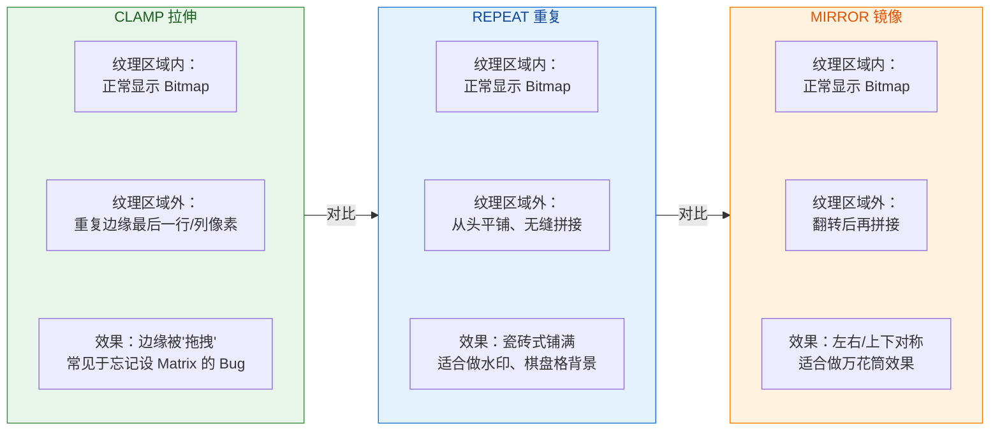

---

### Shader 的综合比较与选型指南

最后，将四种主要 Shader（不含 ComposeShader）做一个横向对比，帮助你在实际开发中快速选型：

| 维度 | LinearGradient | RadialGradient | SweepGradient | BitmapShader |
|---|---|---|---|---|
| **颜色来源** | 颜色数组线性插值 | 颜色数组径向插值 | 颜色数组角度插值 | Bitmap 像素采样 |
| **核心参数** | 起点、终点坐标 | 中心点、半径 | 中心点 | Bitmap 对象 |
| **TileMode** | 1 个（统一） | 1 个（统一） | 无（自然 360° 闭合） | 2 个（X/Y 独立） |
| **典型场景** | 渐变按钮、渐变文字 | 水波纹、光晕、聚光灯 | 环形进度条、色轮 | 圆形头像、圆角图片 |
| **性能关注** | 创建成本低 | 创建成本低 | 创建成本低 | 依赖 Bitmap 大小 |
| **动画策略** | setLocalMatrix 平移 | setLocalMatrix 缩放 | setLocalMatrix 旋转 | Matrix 缩放/平移 |

一条重要的实践原则：**尽量用 `setLocalMatrix()` 驱动动画，而非反复创建新 Shader 实例**。Matrix 操作只涉及 6 个浮点数的赋值，几乎零开销；而每次 `new Shader` 都会触发 Native 层资源分配和 Java 对象创建，频率过高时可能导致 GC 抖动。

---

**📝 练习题**

某位开发者在自定义 View 中使用 `LinearGradient` 实现渐变背景，发现每次 View 尺寸变化后渐变效果不正确。以下哪种做法最合理？

A. 在 `onDraw()` 中每帧重新创建 `LinearGradient` 并赋值给 Paint


B. 在 `onSizeChanged()` 中根据新的宽高重新创建 `LinearGradient` 并赋值给 Paint


C. 在构造函数中创建一次 `LinearGradient`，之后不再更新


D. 在 `onMeasure()` 中创建 `LinearGradient`，因为该回调比 `onDraw()` 更早

**【答案】** B

**【解析】** `LinearGradient` 的终点坐标通常依赖 View 的实际宽高，因此需要在尺寸确定后创建。`onSizeChanged(w, h, oldw, oldh)` 是系统在 View 尺寸发生变化时回调的方法，此时 `w` 和 `h` 已经是最终的测量结果，最适合用来构建 Shader。选项 A 虽然能"正确"工作，但在 `onDraw()` 中每帧创建对象违反了性能准则（avoid object allocation in onDraw）。选项 C 在构造函数中此时尺寸尚未确定（宽高为 0），创建的渐变区间无意义。选项 D 中 `onMeasure()` 可能被多次调用且获取的尺寸不一定是最终布局尺寸（因为父容器可能多次 measure），不如 `onSizeChanged()` 可靠。

---

**📝 练习题**

使用 `BitmapShader` 绘制圆形头像时，如果未设置 `setLocalMatrix()` 且 Bitmap 尺寸远大于 View 尺寸，最可能出现什么现象？

A. 图片被等比缩小以完整显示在圆形区域内


B. 只显示 Bitmap 左上角的一部分，因为纹理坐标从 (0,0) 开始映射


C. 图片自动居中裁切显示，类似 `ImageView` 的 `CENTER_CROP`


D. 程序抛出 `IllegalArgumentException`，因为 Bitmap 尺寸超出 View

**【答案】** B

**【解析】** `BitmapShader` 的默认纹理坐标原点对齐 Canvas 原点（View 左上角），且不会自动缩放。当 Bitmap 尺寸远大于 View 时，View 的绘制区域仅覆盖 Bitmap 的左上角部分像素——相当于一个"小窗口"看"大图片"的左上角。因此用户只能看到图片左上角的局部区域，人脸通常不在左上角，导致头像效果错误。要解决此问题，必须手动计算缩放矩阵（类似 CENTER_CROP 算法），通过 `shader.setLocalMatrix(matrix)` 将 Bitmap 缩放并居中到 View 大小。选项 A 描述的是 FIT_CENTER 行为，但 BitmapShader 不会自动做任何适配。选项 C 描述的 CENTER_CROP 行为也需要手动实现。选项 D 不会发生，BitmapShader 不校验尺寸关系。

---

## 图像混合模式

在自定义 View 的进阶绘制中，**图像混合模式（Image Compositing Mode）** 是一项极其核心的能力。它决定了当两个图像——"已有内容"（Destination, 简称 **Dst**）与"即将绘制的内容"（Source, 简称 **Src**）——在同一像素位置重叠时，最终输出的像素颜色和透明度该如何计算。Android 将经典的 Porter-Duff 合成代数以 `PorterDuff.Mode` 枚举的形式暴露给应用层，再通过 `Xfermode`（Transfer Mode）这一"传送模式"机制，让开发者可以在 `Canvas` 绑定的离屏缓冲区（Off-screen Buffer）上实现诸如**圆形头像裁剪、刮刮卡擦除、波浪进度条**等令人惊艳的视觉效果。

之所以把图像混合模式单独拿出来深入讨论，是因为它的学习曲线相当陡峭：官方文档给出的那张 Porter-Duff 示意图看似简单，但一旦忘记使用离屏缓冲、或者对 Src/Dst 区域的理解出现偏差，绘制结果就会与预期大相径庭。本节将从**数学公式**层面讲透每种模式的含义，再落地到实战中最常用的圆形头像案例，帮你真正掌握这一技术。

### PorterDuff.Mode 混合规则

#### 理论溯源：Porter-Duff 合成代数

1984 年，Thomas Porter 与 Tom Duff 在 SIGGRAPH 上发表了论文 *"Compositing Digital Images"*，首次系统地定义了两幅带有 Alpha 通道的图像叠合时的 **12 种合成运算**。这套理论后来成为几乎所有图形引擎的基石——从 Photoshop 的图层混合到浏览器的 `canvas.globalCompositeOperation`，再到 Android 的 `PorterDuff.Mode`，本质上都是同一套数学。

其核心思想可以用一句话概括：**最终像素 = f(Src 像素, Dst 像素)**，而 f 的具体形式由所选模式决定。每种模式其实就是在回答一个问题——在 Src 与 Dst 的四种区域组合（仅 Src、仅 Dst、两者重叠、两者皆无）中，分别**保留谁的颜色**。

#### 四象限区域模型

要理解 Porter-Duff，首先要建立一个"区域"思维模型。当 Src 和 Dst 叠放在一起时，画布上的像素可以划分为四个区域：

```
┌─────────────────────────────────────────────┐
│              整个画布/离屏缓冲区               │
│                                             │
│    ┌──────────────┐                         │
│    │              │                         │
│    │   Dst Only   │─────────┐               │
│    │  (仅 Dst)    │ Overlap │               │
│    │              │(Dst∩Src)│               │
│    └──────────────┤         │               │
│                   │ Src Only│               │
│                   │(仅 Src) │               │
│                   └─────────┘               │
│                                             │
│           Neither (两者皆无 → 透明)           │
└─────────────────────────────────────────────┘
```

每种 PorterDuff.Mode 本质上就是在告诉渲染引擎：**在这四个区域里，分别显示什么？** 显示 Src 的颜色？Dst 的颜色？两者混合？还是完全透明？

#### Android 中的 18 种模式全解

Android 的 `PorterDuff.Mode` 实际上包含了 **18 种**模式，比原始论文的 12 种更多，因为额外加入了若干算术混合模式（Arithmetic Blending）。下面按类别逐一讲解。为方便理解，我们用 **Sa** 表示 Src 的 Alpha，**Da** 表示 Dst 的 Alpha，**Sc** 表示 Src 的 Color（已预乘 Alpha），**Dc** 表示 Dst 的 Color（已预乘 Alpha）。

**第一类：清除与覆盖（基础操作）**

- **CLEAR**：公式为 `[0, 0]`。无论 Src 还是 Dst，重叠区域一律清零（完全透明）。应用场景极少，偶尔用于"擦除"画布上的特定区域。

- **SRC**：公式为 `[Sa, Sc]`。完全用 Src 覆盖，忽略 Dst。相当于"无视底层，直接贴上"。这是最暴力的模式。

- **DST**：公式为 `[Da, Dc]`。完全保留 Dst，忽略 Src。相当于"什么也不画"。看似没用，但在某些条件合成链路中会作为占位出现。

**第二类：经典 Porter-Duff 合成（12 种核心模式中的 9 种）**

- **SRC_OVER**（默认模式）：公式为 `[Sa + Da·(1-Sa), Sc + Dc·(1-Sa)]`。将 Src 画在 Dst "之上"，Src 的透明部分透出 Dst。这是 `Canvas.drawXxx()` 在不设置 Xfermode 时的默认行为，也是日常最常用的模式——你平时画的一切内容都是 SRC_OVER。

- **DST_OVER**：公式为 `[Da + Sa·(1-Da), Dc + Sc·(1-Da)]`。与 SRC_OVER 相反，将 Src 画在 Dst "之下"。Dst 的不透明部分遮住 Src。可用于实现"背景填充但不遮挡前景"的效果。

- **SRC_IN**：公式为 `[Sa·Da, Sc·Da]`。**只在两者重叠区域保留 Src 的颜色**，其余部分全部透明。这是实现**圆形头像**最关键的模式——先画一个圆形 Dst，再以 SRC_IN 画矩形头像 Src，结果就是"被圆形裁切后的头像"。

- **DST_IN**：公式为 `[Da·Sa, Dc·Sa]`。只在重叠区域保留 Dst 的颜色。与 SRC_IN 互为镜像。

- **SRC_OUT**：公式为 `[Sa·(1-Da), Sc·(1-Da)]`。只保留 Src **不与 Dst 重叠的部分**，重叠区域透明。可以理解为"用 Dst 的形状在 Src 上挖洞"。

- **DST_OUT**：公式为 `[Da·(1-Sa), Dc·(1-Sa)]`。只保留 Dst 中不被 Src 覆盖的部分。典型应用是**橡皮擦/刮刮卡效果**：手指滑过的区域（Src）把 Dst 的对应像素"擦掉"。

- **SRC_ATOP**：公式为 `[Da, Sc·Da + Dc·(1-Sa)]`。在重叠区域显示 Src，非重叠区域显示 Dst，且整体形状由 Dst 决定。可以理解为"给 Dst 的形状换了一层 Src 的皮肤"。

- **DST_ATOP**：公式为 `[Sa, Dc·Sa + Sc·(1-Da)]`。与 SRC_ATOP 镜像，整体形状由 Src 决定。

- **XOR**：公式为 `[Sa+Da-2·Sa·Da, Sc·(1-Da)+Dc·(1-Sa)]`。只保留不重叠的部分，重叠区域透明。像是"互相挖洞"。

**第三类：算术混合（Arithmetic Blending）**

这几种模式不属于原始 Porter-Duff 论文，而是来自 Photoshop 风格的**像素级颜色运算**，用于实现各种光影效果：

- **DARKEN**：取 Src 和 Dst 中**较暗**的像素。公式 `min(Sc, Dc)`。
- **LIGHTEN**：取较亮的像素。公式 `max(Sc, Dc)`。
- **MULTIPLY**：正片叠底。`Sc·Dc`，结果总是更暗。
- **SCREEN**：滤色。`Sc+Dc-Sc·Dc`，结果总是更亮。
- **ADD**：饱和相加。`min(Sc+Dc, 1)`，常用于发光效果。
- **OVERLAY**：叠加，结合 MULTIPLY 和 SCREEN，增强对比度。

下面用一张 Mermaid 图将最常用的模式按"保留区域"进行可视化分类：

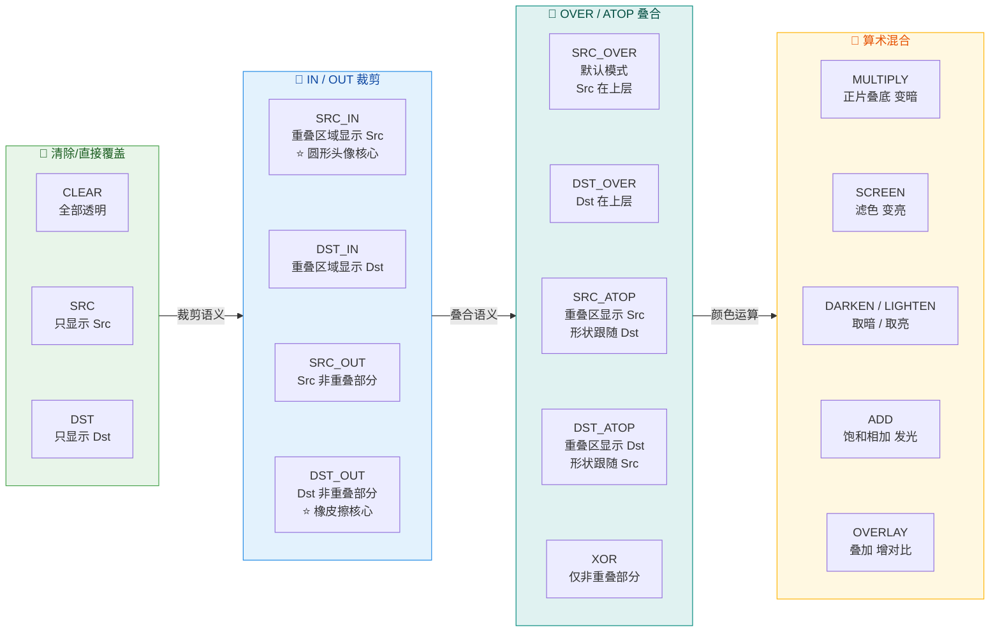

#### 最容易踩的坑：Src 与 Dst 的"区域"不是你以为的那样

初学者最常见的误区是：**认为 Dst 就是整个画布上已经绘制的所有内容，Src 就是即将绘制的内容**。在没有使用离屏缓冲区（Off-screen Buffer）时，这个理解确实没错——但结果往往不是你想要的。

为什么？因为当你直接在 View 的 Canvas 上使用 `SRC_IN` 时，Canvas 的底色是整个 View 的背景乃至 Window 的背景。Dst 区域可能覆盖了整个屏幕，导致 `SRC_IN` 的计算结果与预期完全不同——你期望只保留圆形区域的头像，结果却是整张矩形头像都保留了，因为 Dst（整个屏幕背景）的 Alpha 在各处都不为零。

**解决办法就是使用离屏缓冲区**，这正是下一节 Xfermode 图层合成要重点讲解的内容。

### Xfermode 图层合成

#### 什么是 Xfermode

`Xfermode` 是 Android Graphics 框架中的一个抽象类，代表"Transfer Mode"（传送模式）。它的唯一实用子类是 `PorterDuffXfermode`，构造时传入一个 `PorterDuff.Mode` 枚举值。当你将一个 `Xfermode` 设置给 `Paint` 后，该 Paint 后续的所有绘制操作都会使用指定的混合规则与底层画布进行合成，而不再是默认的 SRC_OVER。

核心 API 调用链非常简洁：

```kotlin
// 创建 Paint 并设置 Xfermode
val paint = Paint(Paint.ANTI_ALIAS_FLAG)  // 创建抗锯齿画笔
// 创建 PorterDuffXfermode，传入所需的混合模式
val xfermode = PorterDuffXfermode(PorterDuff.Mode.SRC_IN)

// 在绘制时：
paint.xfermode = xfermode   // 启用混合模式
canvas.drawBitmap(srcBitmap, 0f, 0f, paint)  // 此时 srcBitmap 将以 SRC_IN 模式与底层合成
paint.xfermode = null        // 用完后立即清除，避免影响后续绘制
```

但仅仅调用这几行代码远远不够——如果不配合**离屏缓冲区**，效果几乎一定会出错。

#### 离屏缓冲区（Off-screen Buffer）：saveLayer 的核心作用

前面提到，PorterDuff 合成的效果取决于 Src 和 Dst 各自所占的**区域**。如果 Dst 是整个 View 甚至 Window 的背景，那 Dst 的 Alpha 区域远大于你想要的形状区域，混合结果自然不对。

`Canvas.saveLayer()` 的作用就是**开辟一块独立的、全透明的离屏缓冲区**（本质是一个临时的 ARGB_8888 Bitmap）。在这块缓冲区上：
- 你先绘制的内容成为 **Dst**（例如一个圆形）；
- 设置 Xfermode 后绘制的内容成为 **Src**（例如矩形头像）；
- 两者的合成 **仅在这块独立缓冲区内计算**，不受外部背景干扰；
- 最后调用 `canvas.restore()` 时，合成结果才被"贴回"到原始 Canvas 上。

这就是离屏缓冲区的本质——**创建一个干净的、受控的合成环境**。

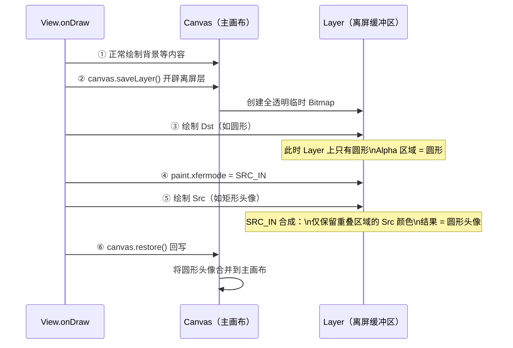

#### saveLayer 的性能代价与替代方案

`saveLayer()` 每次调用都会创建一个临时 Bitmap，大小等于你传入的 `RectF` 区域（如果传 `null` 则等于整个 Canvas）。在高刷新率场景（如动画 60fps）下，每帧都 `saveLayer` 会产生可观的内存分配与像素拷贝开销。Google 官方文档也明确标注了 `saveLayer` 是一个"expensive operation"。

替代方案有以下几种：

1. **`View.setLayerType(LAYER_TYPE_HARDWARE, paint)`**：将整个 View 渲染到一个硬件层（GPU Texture）。适合 View 整体需要混合的场景，但粒度较粗——你无法控制"只对某一部分绘制内容"使用混合模式。

2. **预处理 Bitmap**：在初始化阶段（如 `onSizeChanged`）就把圆形头像合成好，缓存为一张 Bitmap。`onDraw` 中只需 `drawBitmap` 即可，完全不需要 Xfermode，性能最优。这是**生产环境中最推荐的做法**。

3. **`BitmapShader` 方案**：用 `BitmapShader` 填充一个圆形 Path，同样可以实现圆形头像，且不需要离屏缓冲区。后面实战部分会对比两种方案。

4. **`canvas.clipPath()`**：直接用路径裁剪画布。简单粗暴，但在 API 18 以下不支持抗锯齿，圆形边缘会有明显锯齿。现在如果 minSdk ≥ 18 且开启了硬件加速，`clipPath` 的抗锯齿表现已经可以接受。

#### Xfermode 使用的完整模板代码

以下给出一段标准的 Xfermode 使用模板，可以作为所有 PorterDuff 混合效果的起点：

```kotlin
/**
 * 使用 Xfermode 进行图像合成的标准模板。
 * 关键三步：saveLayer → 绘制 Dst + 设置 Xfermode + 绘制 Src → restore
 */
class XfermodeDemoView @JvmOverloads constructor(
    context: Context,
    attrs: AttributeSet? = null
) : View(context, attrs) {

    // 画笔：抗锯齿 + 防抖动
    private val paint = Paint(Paint.ANTI_ALIAS_FLAG or Paint.DITHER_FLAG)

    // 混合模式对象，在构造期创建，避免 onDraw 中重复分配
    private val xfermode = PorterDuffXfermode(PorterDuff.Mode.SRC_IN)

    // 离屏缓冲区的矩形范围（在 onSizeChanged 中初始化）
    private lateinit var layerRect: RectF

    // Dst 图像（例如圆形遮罩）和 Src 图像（例如头像照片）
    private lateinit var dstBitmap: Bitmap
    private lateinit var srcBitmap: Bitmap

    override fun onSizeChanged(w: Int, h: Int, oldw: Int, oldh: Int) {
        super.onSizeChanged(w, h, oldw, oldh)
        // 初始化离屏缓冲区范围为整个 View 区域
        layerRect = RectF(0f, 0f, w.toFloat(), h.toFloat())
        // 此处应初始化 dstBitmap 和 srcBitmap（省略具体加载逻辑）
        dstBitmap = createCircleMask(w, h)   // 绘制一个圆形的纯色 Bitmap 作为 Dst
        srcBitmap = loadAvatarBitmap(w, h)    // 加载并缩放头像照片作为 Src
    }

    override fun onDraw(canvas: Canvas) {
        super.onDraw(canvas)

        // ========== 第一步：开辟离屏缓冲区 ==========
        // saveLayer 返回一个 save count，用于后续 restoreToCount
        val saveCount = canvas.saveLayer(layerRect, null)

        // ========== 第二步：在离屏缓冲区上绘制 Dst ==========
        // 先画圆形遮罩（此时它成为 Dst）
        canvas.drawBitmap(dstBitmap, 0f, 0f, paint)

        // ========== 第三步：设置 Xfermode，绘制 Src ==========
        // 此后绘制的内容将以 SRC_IN 模式与 Dst 合成
        paint.xfermode = xfermode
        // 画矩形头像（此时它成为 Src）
        canvas.drawBitmap(srcBitmap, 0f, 0f, paint)

        // ========== 第四步：清除 Xfermode ==========
        // 极其重要！不清除会影响后续所有绘制操作
        paint.xfermode = null

        // ========== 第五步：回写到主画布 ==========
        // restore 会将离屏缓冲区的合成结果"盖章"到原始 Canvas
        canvas.restoreToCount(saveCount)
    }
}
```

这段模板代码中有几个需要特别注意的细节：

1. **`saveLayer` 的参数**：第一个参数 `RectF` 决定了离屏缓冲区的大小。传入尽可能小的区域可以减少内存开销。第二个参数 `Paint` 传 `null` 即可，除非你需要在回写时对整个 Layer 施加额外效果（如透明度）。

2. **`paint.xfermode = null`**：这一行绝对不能忘。`Paint` 是一个可复用对象，如果不清除 Xfermode，后续使用同一个 Paint 绘制的所有内容都会继续应用 SRC_IN 模式，导致各种诡异的透明问题。

3. **`restoreToCount` vs `restore`**：使用 `restoreToCount(saveCount)` 比 `restore()` 更安全，可以确保精确恢复到 `saveLayer` 之前的状态，即使中间有嵌套的 `save/restore` 调用。

### 圆形头像实现原理

圆形头像是 PorterDuff 混合模式最经典的实战场景。下面我们将从原理到实现，深入剖析三种主流方案，并对比它们的优劣。

#### 方案一：Xfermode + SRC_IN（经典方案）

**原理**：先在离屏缓冲区上画一个**实心圆**（作为 Dst），然后以 `SRC_IN` 模式画头像 Bitmap（作为 Src）。根据 SRC_IN 的公式 `[Sa·Da, Sc·Da]`，只有在 Dst 有像素的地方（即圆形区域内部，Da = 1）才会保留 Src 的颜色；圆形外部 Da = 0，所以 Src 的像素被丢弃，最终得到一个圆形的头像。

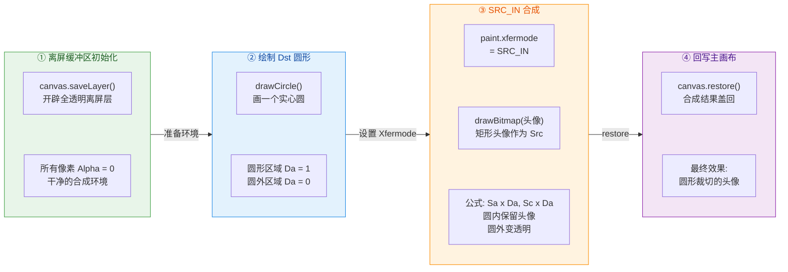

完整实现代码：

```kotlin
/**
 * 方案一：使用 Xfermode + SRC_IN 实现圆形头像。
 * 经典方案，原理清晰，适合学习理解 PorterDuff 合成。
 * 但每次 onDraw 都需要 saveLayer，性能不是最优。
 */
class CircleAvatarXfermodeView @JvmOverloads constructor(
    context: Context,
    attrs: AttributeSet? = null,
    defStyleAttr: Int = 0
) : View(context, attrs, defStyleAttr) {

    // 主画笔：启用抗锯齿以获得平滑的圆形边缘
    private val paint = Paint(Paint.ANTI_ALIAS_FLAG)

    // SRC_IN 混合模式对象（构造期创建，避免 onDraw 内分配）
    private val xfermode = PorterDuffXfermode(PorterDuff.Mode.SRC_IN)

    // 头像原始 Bitmap（由外部设置）
    private var avatarBitmap: Bitmap? = null

    // 离屏缓冲区范围
    private val layerRect = RectF()

    // 圆心坐标与半径（在 onSizeChanged 中计算）
    private var centerX = 0f
    private var centerY = 0f
    private var radius = 0f

    // 头像绘制的目标矩形（缩放适配用）
    private val dstRect = RectF()

    /**
     * 外部调用此方法设置头像 Bitmap
     */
    fun setAvatar(bitmap: Bitmap) {
        avatarBitmap = bitmap      // 保存引用
        invalidate()               // 触发重绘
    }

    override fun onSizeChanged(w: Int, h: Int, oldw: Int, oldh: Int) {
        super.onSizeChanged(w, h, oldw, oldh)
        // 考虑 padding 后的可用区域
        val availableWidth = w - paddingLeft - paddingRight     // 可用宽度
        val availableHeight = h - paddingTop - paddingBottom    // 可用高度
        // 取较小值作为直径，确保圆形不会超出 View 边界
        val diameter = minOf(availableWidth, availableHeight)
        // 计算圆心（居中放置）
        centerX = paddingLeft + availableWidth / 2f
        centerY = paddingTop + availableHeight / 2f
        // 半径为直径的一半
        radius = diameter / 2f
        // 离屏缓冲区范围（仅覆盖圆形区域，减小 saveLayer 开销）
        layerRect.set(
            centerX - radius,     // left
            centerY - radius,     // top
            centerX + radius,     // right
            centerY + radius      // bottom
        )
        // 头像绘制目标矩形与离屏缓冲区一致
        dstRect.set(layerRect)
    }

    override fun onDraw(canvas: Canvas) {
        super.onDraw(canvas)
        // 如果没有头像则不绘制
        val avatar = avatarBitmap ?: return

        // ① 开辟离屏缓冲区（关键！不能省略！）
        val saveCount = canvas.saveLayer(layerRect, null)

        // ② 绘制 Dst：一个实心圆
        //    此圆将定义 "保留区域" 的形状
        canvas.drawCircle(centerX, centerY, radius, paint)

        // ③ 设置 SRC_IN 混合模式
        paint.xfermode = xfermode

        // ④ 绘制 Src：头像 Bitmap
        //    drawBitmap(src, srcRect, dstRect, paint)
        //    srcRect 传 null 表示使用整个 Bitmap
        //    dstRect 将 Bitmap 缩放到目标矩形
        canvas.drawBitmap(avatar, null, dstRect, paint)

        // ⑤ 清除 Xfermode，防止污染后续绘制
        paint.xfermode = null

        // ⑥ 回写离屏缓冲区的合成结果到主画布
        canvas.restoreToCount(saveCount)
    }
}
```

#### 方案二：BitmapShader（推荐生产方案）

`BitmapShader` 是 Android 的 `Shader`（着色器）之一，它可以把一张 Bitmap 当作"纹理"来填充任何形状。思路是：将头像 Bitmap 设置为 Paint 的 Shader，然后用这支 Paint 画一个圆形——圆形内部就会被头像纹理填充，天然就是圆形头像。

**这个方案的最大优势是完全不需要 saveLayer，性能显著优于 Xfermode 方案**。

```kotlin
/**
 * 方案二：使用 BitmapShader 实现圆形头像。
 * 无需离屏缓冲区，性能最优，推荐用于生产环境。
 */
class CircleAvatarShaderView @JvmOverloads constructor(
    context: Context,
    attrs: AttributeSet? = null,
    defStyleAttr: Int = 0
) : View(context, attrs, defStyleAttr) {

    // 画笔
    private val paint = Paint(Paint.ANTI_ALIAS_FLAG)

    // 可选：边框画笔（圆形头像外圈白色描边）
    private val borderPaint = Paint(Paint.ANTI_ALIAS_FLAG).apply {
        style = Paint.Style.STROKE     // 描边模式
        color = Color.WHITE            // 白色边框
        strokeWidth = 4f               // 边框宽度 4px
    }

    // 头像 Bitmap
    private var avatarBitmap: Bitmap? = null

    // 圆心与半径
    private var centerX = 0f
    private var centerY = 0f
    private var radius = 0f

    // 用于将 Bitmap 缩放到目标尺寸的矩阵
    private val shaderMatrix = Matrix()

    fun setAvatar(bitmap: Bitmap) {
        avatarBitmap = bitmap
        updateShader()       // 每次设置新头像都重新配置 Shader
        invalidate()
    }

    override fun onSizeChanged(w: Int, h: Int, oldw: Int, oldh: Int) {
        super.onSizeChanged(w, h, oldw, oldh)
        val availableWidth = w - paddingLeft - paddingRight
        val availableHeight = h - paddingTop - paddingBottom
        val diameter = minOf(availableWidth, availableHeight)
        centerX = paddingLeft + availableWidth / 2f
        centerY = paddingTop + availableHeight / 2f
        radius = diameter / 2f
        updateShader()       // 尺寸变化时重新计算缩放矩阵
    }

    /**
     * 核心方法：配置 BitmapShader 及其缩放矩阵。
     * 目标是让头像 Bitmap 恰好 center-crop 填满圆形区域。
     */
    private fun updateShader() {
        val avatar = avatarBitmap ?: return   // 无头像则退出
        if (radius <= 0f) return               // 尺寸尚未确定则退出

        // 创建 BitmapShader：TileMode.CLAMP 表示边缘像素拉伸（不平铺）
        val shader = BitmapShader(
            avatar,                           // 纹理源 Bitmap
            Shader.TileMode.CLAMP,            // 水平方向：边缘拉伸
            Shader.TileMode.CLAMP             // 垂直方向：边缘拉伸
        )

        // 计算缩放比例（模拟 ImageView 的 CENTER_CROP 效果）
        val bitmapWidth = avatar.width.toFloat()
        val bitmapHeight = avatar.height.toFloat()
        val diameter = radius * 2              // 目标直径

        // 取宽高缩放比中的较大值，确保短边填满圆形
        val scale = maxOf(diameter / bitmapWidth, diameter / bitmapHeight)

        // 计算缩放后的偏移量（居中裁切）
        val dx = (diameter - bitmapWidth * scale) / 2f + (centerX - radius)
        val dy = (diameter - bitmapHeight * scale) / 2f + (centerY - radius)

        // 配置矩阵：先缩放，再平移
        shaderMatrix.reset()                   // 重置矩阵
        shaderMatrix.setScale(scale, scale)    // 设置缩放
        shaderMatrix.postTranslate(dx, dy)     // 设置平移偏移

        // 将矩阵应用到 Shader
        shader.setLocalMatrix(shaderMatrix)

        // 设置到画笔
        paint.shader = shader
    }

    override fun onDraw(canvas: Canvas) {
        super.onDraw(canvas)
        if (avatarBitmap == null) return

        // 直接画圆形，Paint 的 Shader 会自动用头像纹理填充
        // 无需 saveLayer，无需 Xfermode！
        canvas.drawCircle(centerX, centerY, radius, paint)

        // 可选：绘制圆形边框
        canvas.drawCircle(centerX, centerY, radius - borderPaint.strokeWidth / 2f, borderPaint)
    }
}
```

#### 方案三：clipPath（简易方案）

最简单的实现方式——直接用 `canvas.clipPath()` 将画布裁剪为圆形，然后在裁剪后的画布上绘制头像 Bitmap：

```kotlin
override fun onDraw(canvas: Canvas) {
    super.onDraw(canvas)
    val avatar = avatarBitmap ?: return

    // 构建圆形裁剪路径
    val clipPath = Path().apply {
        addCircle(centerX, centerY, radius, Path.Direction.CW)  // 顺时针添加圆形
    }

    canvas.save()                          // 保存画布状态
    canvas.clipPath(clipPath)              // 将画布裁剪为圆形
    canvas.drawBitmap(avatar, null, dstRect, paint)  // 在圆形画布上绘制头像
    canvas.restore()                       // 恢复画布状态
}
```

这种方案代码量最小，但有一个历史问题：在 Android 4.3（API 18）以前，`clipPath` 在硬件加速模式下不支持抗锯齿，圆形边缘会出现明显的锯齿。在现代 Android 版本上，这个问题已基本解决。如果你的 `minSdk ≥ 18`，`clipPath` 是一个完全可行的轻量方案。

#### 三种方案对比

| 维度 | Xfermode + SRC_IN | BitmapShader | clipPath |
|---|---|---|---|
| **原理** | 离屏合成，Dst 圆形 + Src 头像 | Shader 纹理填充圆形 | 裁剪画布为圆形后绘制 |
| **是否需要 saveLayer** | ✅ 需要 | ❌ 不需要 | ❌ 不需要 |
| **抗锯齿** | ✅ 优秀 | ✅ 优秀 | ⚠️ API 18 以下有锯齿 |
| **性能** | ⚠️ 中等（离屏缓冲开销） | ✅ 最优 | ✅ 良好 |
| **灵活性** | ✅ 最高（可切换任意 Mode） | 中等（仅填充形状） | 中等（仅裁剪形状） |
| **推荐场景** | 学习理解 / 需要多种混合效果 | **生产环境首选** | 快速原型 / minSdk ≥ 18 |

#### 实际工程中的最佳实践

在真实的 Android 项目中，绝大多数开发者不会自己手写圆形头像 View，而是使用成熟的图片加载库内置的变换能力：

- **Glide** 提供 `CircleCrop()` 变换，内部实现正是基于 `BitmapShader` + `drawCircle`，并自带内存缓存，性能极佳。
- **Coil**（Kotlin-first 图片加载库）提供 `CircleCropTransformation`，原理类似。
- **Google Material Components** 的 `ShapeableImageView` 支持通过 XML 配置圆形裁切，底层基于 `ShapeAppearance` + `clipPath`/`Outline` 机制。

但理解底层原理仍然非常重要——当你需要实现**刮刮卡效果**（DST_OUT）、**波浪进度条**（合成 + 动画路径）、**镂空文字**（DST_OUT + drawText）等复杂自定义效果时，Xfermode 是你唯一的武器。

---

**📝 练习题**

在自定义 View 中使用 `PorterDuff.Mode.SRC_IN` 实现圆形头像时，下列哪项操作是**不可或缺**的？

A. 必须调用 `View.setLayerType(LAYER_TYPE_SOFTWARE, null)` 关闭硬件加速


B. 必须调用 `canvas.saveLayer()` 开辟离屏缓冲区，确保 Dst 仅为圆形区域


C. 必须先绘制矩形头像（Src），再绘制圆形遮罩（Dst）


D. 必须使用 `BitmapShader` 配合 `SRC_IN` 才能生效


**【答案】** B

**【解析】** `SRC_IN` 的合成公式是 `[Sa·Da, Sc·Da]`，即只在 Dst 的 Alpha 不为 0 的区域保留 Src 的颜色。如果不使用 `canvas.saveLayer()` 开辟独立的离屏缓冲区，Dst 将是整个 View 乃至 Window 的背景——背景的 Alpha 在大部分区域都不为 0，导致 SRC_IN 无法正确"裁剪"出圆形。调用 `saveLayer()` 后，系统创建一块全透明（Alpha = 0）的临时 Bitmap，在这块干净的画布上，先画圆形（Da = 1 仅在圆内），再以 SRC_IN 画头像，才能得到正确的圆形头像效果。选项 A 错误，SRC_IN 在硬件加速下也能正常工作（前提是用了 saveLayer）；选项 C 错误，绘制顺序应该是先 Dst（圆形）后 Src（头像）；选项 D 错误，BitmapShader 是另一种完全独立的方案，不需要配合 SRC_IN 使用。

---

**📝 练习题**

以下关于 `BitmapShader` 实现圆形头像方案的描述，**正确**的是：

A. BitmapShader 需要配合 `canvas.saveLayer()` 才能实现圆形裁切


B. BitmapShader 的 TileMode 应设置为 `REPEAT` 以确保头像填满圆形


C. BitmapShader 通过将 Bitmap 作为 Paint 的纹理源，画圆形时自动用头像填充，无需离屏缓冲区


D. BitmapShader 方案不支持对头像进行缩放和居中裁切


**【答案】** C

**【解析】** BitmapShader 的核心思想是将一张 Bitmap 设置为 `Paint` 的着色器（Shader），之后使用该 Paint 绘制任何形状（圆形、圆角矩形等），形状内部都会被 Bitmap 纹理自动填充。这一过程完全在常规绘制流程中完成，不需要 `saveLayer` 创建离屏缓冲区，因此性能优于 Xfermode 方案。选项 A 错误，BitmapShader 不需要离屏缓冲区；选项 B 错误，圆形头像场景应使用 `TileMode.CLAMP`（边缘像素拉伸），`REPEAT` 会导致头像平铺重复；选项 D 错误，通过给 BitmapShader 设置 `setLocalMatrix(Matrix)` 可以实现缩放、平移等变换，从而实现类似 `CENTER_CROP` 的居中裁切效果。

---

## 文字绘制基线

在自定义 View 的世界中，文字绘制堪称最容易"踩坑"的环节之一。许多开发者第一次调用 `Canvas.drawText()` 时都会感到困惑——明明传入了一个 y 坐标，文字却并没有出现在期望的位置。这背后的根源在于：**`drawText` 的 y 参数并不是文字的"顶部"或"中心"，而是文字的 Baseline（基线）**。理解基线体系以及 Android 提供的 `Paint.FontMetrics`，是精准控制文字位置、实现居中对齐、多行混排等高级排版需求的基础。

本节将从字体排印学（Typography）的基本概念出发，逐层深入到 Android 的 `FontMetrics` 数据结构，再到实际开发中最常用的"文字垂直居中"算法，最终覆盖多种对齐场景的实战技巧。

---

### FontMetrics 字体度量

#### 排印学中的五条关键线

要理解 Android 的文字绘制模型，首先需要回到西文排印学中对字体度量的经典定义。一个字体（Font）在垂直方向上，至少由以下五条水平参考线来描述每个字形（Glyph）的空间分布：

1. **Top 线**：字体中所有字形能够到达的最高点。某些带有重音符号的字符（如 `Å`）或特殊装饰体的上端，会触及这条线。它代表了该字体"理论上的最大上边界"。
2. **Ascent 线（上升线）**：大多数常规字符（如大写字母 `A`、`H` 和小写字母 `b`、`d` 的上端）所能达到的最高位置。可以将它理解为"常规书写区域的上边界"。
3. **Baseline（基线）**：这是整个度量体系的 **原点参考线**。西文字母如 `a`、`x`、`m` 的底部就坐落在基线上。所有的 y 方向度量值都是相对于基线来表达的。
4. **Descent 线（下降线）**：部分字符的下端会延伸到基线以下，例如小写字母 `g`、`p`、`y` 的"尾巴"。Descent 线标记了这些下行笔画的常规下边界。
5. **Bottom 线**：与 Top 线对称，它代表字体中所有字形能够到达的最低点。某些特殊字符或装饰体的下端会触及这条线。

> **关键认知**：Baseline 是"零点"，Baseline 之上为负方向（y 减小），Baseline 之下为正方向（y 增大）。这与 Android 屏幕坐标系（y 向下为正）一致。

#### Android 中的 Paint.FontMetrics

Android 通过 `Paint.FontMetrics`（浮点版）和 `Paint.FontMetricsInt`（整数版）两个内部类，将上述五条线的位置以 **相对于 Baseline 的偏移量** 暴露给开发者。调用 `paint.getFontMetrics()` 即可获取一个 `FontMetrics` 对象，其核心字段如下：

| 字段 | 含义 | 符号 | 典型值（示例） |
|------|------|------|----------------|
| `top` | Top 线相对于 Baseline 的偏移 | 负值 | -42.8f |
| `ascent` | Ascent 线相对于 Baseline 的偏移 | 负值 | -37.2f |
| `descent` | Descent 线相对于 Baseline 的偏移 | 正值 | +9.8f |
| `bottom` | Bottom 线相对于 Baseline 的偏移 | 正值 | +10.7f |
| `leading` | 行间距（行与行之间额外留白） | 正值或 0 | 0.0f |

**为什么 `ascent` 和 `top` 是负值？** 因为它们位于 Baseline 之上，而在 Android 坐标系中 y 轴向下递增，所以从 Baseline 向上偏移意味着 y 值减小，自然是负数。这个符号规则是初学者最常混淆的地方，一旦理解了"Baseline 是零点，向上为负"就豁然开朗了。

下面用一张 Mermaid 图直观展示五条线与 Baseline 的空间关系，以及 `FontMetrics` 各字段的对应：

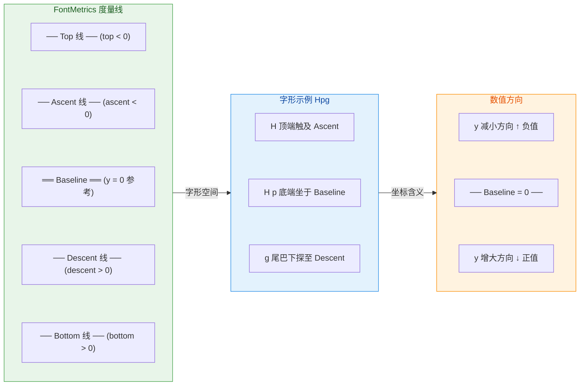

#### 获取 FontMetrics 的两种方式

在实际代码中，获取 `FontMetrics` 非常简单，但需要注意"创建时机"以避免在 `onDraw` 中反复分配对象：

```kotlin
// ========== 方式一：直接获取新对象 ==========
// getFontMetrics() 每次调用都会创建新的 FontMetrics 对象
// 不建议在 onDraw 中使用，会触发频繁 GC
val metrics: Paint.FontMetrics = paint.fontMetrics

// ========== 方式二：复用已有对象（推荐） ==========
// 在类成员级别预先创建一个 FontMetrics 实例
private val reusableMetrics = Paint.FontMetrics()

// 在 onDraw 中调用带参数的版本，将值填充到已有对象中
// 返回值是行间距（leading + descent - ascent）
override fun onDraw(canvas: Canvas) {
    // getFontMetrics(fm) 不创建新对象，而是填充传入的 fm
    val lineHeight = paint.getFontMetrics(reusableMetrics)
    // 现在 reusableMetrics.top / ascent / descent / bottom 已被更新
}
```

这里需要强调一点：`FontMetrics` 的值完全取决于 **当前 Paint 的字号（textSize）和字体（typeface）**。一旦你修改了 `paint.textSize` 或 `paint.typeface`，必须重新获取 `FontMetrics`，旧值便不再适用。

#### 行高的计算

在多行文字场景（如自定义 TextView 或弹幕控件）中，正确计算行高至关重要。Android 中单行文字的"占据高度"有两种常见口径：

- **紧凑行高（Tight）**：`descent - ascent`，仅包含常规字符的上下范围。这是最常用的行高定义。
- **完整行高（Full）**：`bottom - top`，涵盖所有字形（含极端装饰字符）的上下范围。
- **带行距行高**：`descent - ascent + leading`，在紧凑行高基础上加入字体自带的行间距。

```kotlin
// 计算不同口径的行高
val tightLineHeight = reusableMetrics.descent - reusableMetrics.ascent   // 常规行高
val fullLineHeight  = reusableMetrics.bottom - reusableMetrics.top       // 完整行高
val spacedLineHeight = tightLineHeight + reusableMetrics.leading         // 带行距行高
```

实际开发中，大部分场景使用 `descent - ascent` 就足够了。只有当你需要确保极端字符不被裁切时，才需要使用 `bottom - top`。

---

### 基线对齐计算

理解了 `FontMetrics` 各字段的含义后，下一个核心问题就是：**如何根据一个给定的矩形区域，计算出正确的 Baseline y 坐标，使得文字精准地出现在我们想要的位置？** 这就是"基线对齐计算"。

#### drawText 的坐标语义

先回顾一下 `Canvas.drawText()` 的签名：

```kotlin
// text: 要绘制的文本
// x: 文本绘制的起始 x 坐标（受 Paint.textAlign 影响：LEFT/CENTER/RIGHT）
// y: 文本 Baseline 的 y 坐标（不是顶部，不是中心！）
// paint: 画笔
canvas.drawText(text: String, x: Float, y: Float, paint: Paint)
```

**x 参数**：其含义受 `paint.textAlign` 控制。当设置为 `Paint.Align.LEFT` 时，x 是文字左边缘；设置为 `Paint.Align.CENTER` 时，x 是文字水平中心；设置为 `Paint.Align.RIGHT` 时，x 是文字右边缘。

**y 参数**：**始终代表 Baseline 的 y 坐标**，不受任何对齐属性影响。这意味着如果你传入 `y = 100`，那么 Baseline 就会画在 y=100 的位置，文字主体出现在 y=100 上方（ascent 区域），下行笔画出现在 y=100 下方（descent 区域）。

这就是为什么许多初学者在 `drawText(text, 0f, 0f, paint)` 后看不到文字——因为 Baseline 被放在了 View 的最顶端 y=0 处，文字主体全部在 `y<0` 的区域（即 View 可视区域之外）。

#### 五种常见的垂直对齐方式

在给定一个矩形区域 `(rectTop, rectBottom)` 的前提下，以下是五种最常见的对齐策略及其 Baseline 计算公式：

**1. 顶部对齐（Top Align）**

要求文字的最高点与矩形顶部齐平。也就是说，文字的 Top 线要与 `rectTop` 重合。

```kotlin
// Top 线 = baseline + metrics.top（因为 top 是负值，所以 Top 线 < baseline）
// 要让 Top 线 = rectTop，则 baseline + metrics.top = rectTop
// 所以 baseline = rectTop - metrics.top
val baselineY = rectTop - metrics.top
```

**2. Ascent 对齐**

要求常规字符的顶部（Ascent 线）与矩形顶部齐平。在实际 UI 中，这种对齐比 Top 对齐更常用，因为 Top 线包含了极端字符的余量，可能导致视觉上偏低。

```kotlin
// Ascent 线 = baseline + metrics.ascent
// 要让 Ascent 线 = rectTop，则 baseline = rectTop - metrics.ascent
val baselineY = rectTop - metrics.ascent
```

**3. 垂直居中对齐（Center Align）—— 最常用**

这是实际开发中出现频率最高的需求。后面会单独用一整个小节来详细推导。

**4. Descent 对齐**

要求文字的下行笔画底部与矩形底部齐平。

```kotlin
// Descent 线 = baseline + metrics.descent
// 要让 Descent 线 = rectBottom，则 baseline = rectBottom - metrics.descent
val baselineY = rectBottom - metrics.descent
```

**5. 底部对齐（Bottom Align）**

要求文字的最低点与矩形底部齐平。

```kotlin
// Bottom 线 = baseline + metrics.bottom
// 要让 Bottom 线 = rectBottom，则 baseline = rectBottom - metrics.bottom
val baselineY = rectBottom - metrics.bottom
```

#### 水平方向的精确测量

垂直方向有了 `FontMetrics`，水平方向则需要用到 `Paint.measureText()` 或 `Paint.getTextBounds()`，二者有重要区别：

- **`measureText(text)`**：返回文字的 **Advance Width**（推进宽度），即光标从文字起始位置到结束位置所走过的距离。它包含字符两侧的额外间距（Side Bearings），因此通常比文字"视觉宽度"略大。适合用于计算文字布局位置。
- **`getTextBounds(text, start, end, rect)`**：将文字的 **紧凑包围矩形**（Tight Bounding Box）写入传入的 `Rect`。这个矩形精确贴合文字像素的边缘，不包含额外间距。适合用于判断文字是否溢出、或精确绘制背景框。

```kotlin
// 方式一：获取推进宽度
val advanceWidth = paint.measureText("Hello")  // 例如返回 120.5f

// 方式二：获取紧凑包围盒
val bounds = Rect()                             // 复用的 Rect 对象
paint.getTextBounds("Hello", 0, 5, bounds)      // 填充 bounds
// bounds.left   -> 文字最左像素相对于 x 的偏移（通常接近 0 或微正）
// bounds.top    -> 文字最高像素相对于 baseline 的偏移（负值，因为在 baseline 上方）
// bounds.right  -> 文字最右像素相对于 x 的偏移
// bounds.bottom -> 文字最低像素相对于 baseline 的偏移（正值或 0）
```

在居中计算中，水平居中通常直接使用 `paint.textAlign = Paint.Align.CENTER` 配合矩形水平中心即可，也可以手动用 `measureText` 计算偏移。

---

### drawText 文字居中算法

垂直居中是自定义 View 文字绘制中最高频的需求，也是面试中的常客。下面从数学推导到代码实现，给出三种不同精度的居中方案。

#### 方案一：基于 Ascent/Descent 居中（最常用）

这是绝大多数场景下的标准做法。其核心思路是：**将 Ascent 线到 Descent 线所围成的"文字常规区域"的垂直中心点，与目标矩形的垂直中心点对齐**。

数学推导如下：

设目标矩形的垂直中心为 `centerY = (rectTop + rectBottom) / 2`。

文字常规区域的垂直中心相对于 Baseline 的偏移为：`(ascent + descent) / 2`。注意 `ascent` 为负、`descent` 为正，所以这个值通常是一个小的负数（因为 ascent 的绝对值大于 descent）。

我们要让"文字区域中心"与"矩形中心"重合：

```
Baseline + (ascent + descent) / 2 = centerY
```

解出 Baseline：

```
Baseline = centerY - (ascent + descent) / 2
```

完整代码实现：

```kotlin
/**
 * 方案一：基于 ascent/descent 的垂直居中
 * 适用于绝大多数 UI 场景，视觉效果最自然
 */
private fun drawTextCenteredV1(
    canvas: Canvas,
    text: String,
    centerX: Float,       // 目标矩形的水平中心
    rectTop: Float,       // 目标矩形的上边界
    rectBottom: Float,    // 目标矩形的下边界
    paint: Paint
) {
    // 获取 FontMetrics（建议使用成员变量复用）
    val fm = paint.fontMetrics
    // 计算矩形垂直中心点
    val centerY = (rectTop + rectBottom) / 2f
    // 核心公式：Baseline = 矩形中心 - 文字区域中心偏移
    // (fm.ascent + fm.descent) / 2 就是文字区域中心相对于 Baseline 的偏移
    val baselineY = centerY - (fm.ascent + fm.descent) / 2f
    // 设置水平居中对齐
    paint.textAlign = Paint.Align.CENTER
    // 绘制文字，x 传矩形水平中心，y 传计算出的 Baseline
    canvas.drawText(text, centerX, baselineY, paint)
}
```

**为什么这是最常用的方案？** 因为 `ascent` 到 `descent` 的区域涵盖了所有常规拉丁/中文字符的高度范围，且不包含极端装饰字符的额外空间。对于标准 UI 文字，这种居中的视觉效果最为自然和均衡。

#### 方案二：基于 Top/Bottom 居中（绝对安全）

如果你的场景中可能出现带有极端上下延伸的特殊字符（如数学符号、某些 Emoji 组合等），可以使用 `top` 和 `bottom` 来替代 `ascent` 和 `descent`：

```kotlin
/**
 * 方案二：基于 top/bottom 的垂直居中
 * 考虑所有字形的极端高度，确保任何字符都不会被裁切
 */
private fun drawTextCenteredV2(
    canvas: Canvas,
    text: String,
    centerX: Float,
    rectTop: Float,
    rectBottom: Float,
    paint: Paint
) {
    val fm = paint.fontMetrics
    val centerY = (rectTop + rectBottom) / 2f
    // 使用 top/bottom 替代 ascent/descent
    // top 为负值（更小），bottom 为正值（更大），覆盖所有字形
    val baselineY = centerY - (fm.top + fm.bottom) / 2f
    paint.textAlign = Paint.Align.CENTER
    canvas.drawText(text, centerX, baselineY, paint)
}
```

方案二与方案一的差异通常只有 1~3 个像素，但在某些字体（尤其是装饰体）中可能更为明显。实际工程中，方案一已经足够应对 99% 的场景。

#### 方案三：基于 getTextBounds 居中（像素级精确）

前两种方案使用的是"字体级别"的度量——它们反映的是整个字体的通用高度参数，而不是特定文本串的实际像素边界。例如，纯数字字符串 `"123"` 实际上没有下行笔画，但 `descent` 仍然会返回正值（因为该字体中存在 `g`、`p` 等字符）。

如果你需要针对特定文本内容的 **像素级精确居中**（例如一个只显示数字的计时器控件），可以使用 `getTextBounds`：

```kotlin
/**
 * 方案三：基于 getTextBounds 的像素级居中
 * 针对具体文本内容计算，最精确但有轻微性能开销
 */
// 成员级别复用 Rect，避免在 onDraw 中创建
private val textBounds = Rect()

private fun drawTextCenteredV3(
    canvas: Canvas,
    text: String,
    centerX: Float,
    rectTop: Float,
    rectBottom: Float,
    paint: Paint
) {
    // 获取文字实际像素边界（相对于 baseline 和 x=0）
    paint.getTextBounds(text, 0, text.length, textBounds)
    val centerY = (rectTop + rectBottom) / 2f
    // textBounds.top 是负值（文字最高像素在 baseline 上方）
    // textBounds.bottom 是正值或 0（文字最低像素在 baseline 下方或齐平）
    // 文字像素区域的中心偏移 = (textBounds.top + textBounds.bottom) / 2
    val baselineY = centerY - (textBounds.top + textBounds.bottom) / 2f
    paint.textAlign = Paint.Align.CENTER
    canvas.drawText(text, centerX, baselineY, paint)
}
```

**方案三的注意事项**：
- `getTextBounds` 的结果取决于具体文本内容。文本变化时（如数字滚动），Baseline 会随之微调，可能导致文字出现上下"跳动"。
- 如果文字内容频繁变化，建议仍使用方案一，以获得稳定的视觉位置。
- `getTextBounds` 返回的是整数 `Rect`，精度低于 `FontMetrics` 的浮点值。

#### 三种方案的对比总结

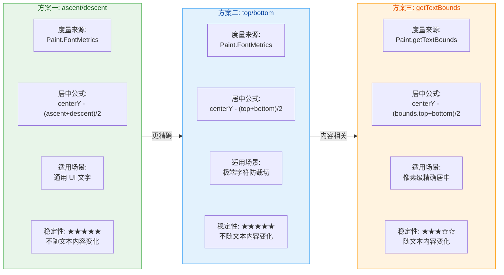

#### 完整实战：矩形内文字水平+垂直居中

将上述知识整合，以下是一个在自定义 View 中将文字完美居中于指定矩形区域的完整示例：

```kotlin
class CenteredTextView @JvmOverloads constructor(
    context: Context,
    attrs: AttributeSet? = null,
    defStyleAttr: Int = 0
) : View(context, attrs, defStyleAttr) {

    // ===== 画笔在构造阶段初始化，避免 onDraw 中创建 =====
    private val textPaint = Paint(Paint.ANTI_ALIAS_FLAG).apply {
        color = Color.BLACK           // 文字颜色
        textSize = 48f                // 文字大小（单位 px，实际应用中建议用 sp 转 px）
        textAlign = Paint.Align.CENTER // 水平居中模式
    }

    // 背景矩形画笔
    private val bgPaint = Paint(Paint.ANTI_ALIAS_FLAG).apply {
        color = Color.parseColor("#E0E0E0")  // 浅灰背景
        style = Paint.Style.FILL              // 填充模式
    }

    // 预分配的 FontMetrics 对象，避免 onDraw 中重复创建
    private val fontMetrics = Paint.FontMetrics()

    // 预分配的 RectF 对象，用于绘制背景
    private val bgRect = RectF()

    // 要绘制的文字
    private var displayText: String = "Hello, Android!"

    override fun onDraw(canvas: Canvas) {
        super.onDraw(canvas)

        // ===== Step 1：确定目标矩形区域 =====
        // 这里使用 View 自身的 padding 内区域作为目标矩形
        val left   = paddingLeft.toFloat()       // 矩形左边界
        val top    = paddingTop.toFloat()         // 矩形上边界
        val right  = (width - paddingRight).toFloat()   // 矩形右边界
        val bottom = (height - paddingBottom).toFloat() // 矩形下边界

        // ===== Step 2：绘制背景矩形（可视化对齐区域） =====
        bgRect.set(left, top, right, bottom)     // 设置矩形范围
        canvas.drawRoundRect(bgRect, 16f, 16f, bgPaint) // 绘制圆角矩形背景

        // ===== Step 3：计算水平居中 x 坐标 =====
        // 因为 textAlign = CENTER，x 取矩形水平中心即可
        val centerX = (left + right) / 2f

        // ===== Step 4：计算垂直居中的 Baseline y 坐标 =====
        // 使用方案一（ascent/descent 居中）
        textPaint.getFontMetrics(fontMetrics)     // 填充复用的 fontMetrics
        val centerY = (top + bottom) / 2f         // 矩形垂直中心
        // 核心居中公式
        val baselineY = centerY - (fontMetrics.ascent + fontMetrics.descent) / 2f

        // ===== Step 5：绘制文字 =====
        canvas.drawText(displayText, centerX, baselineY, textPaint)
    }
}
```

上述代码遵循了前面章节讲解的性能优化原则：所有对象（`Paint`、`FontMetrics`、`RectF`）都在构造阶段预创建，`onDraw` 中只做数值计算和绘制调用，不产生任何对象分配。

#### 多行文字的 Baseline 递推

当需要手动绘制多行文字时（例如自定义弹幕或歌词控件），每一行的 Baseline 需要依次递推。核心公式为：

```kotlin
// 第一行的 Baseline（顶部对齐 ascent）
var currentBaseline = rectTop - fontMetrics.ascent

// 行高 = descent - ascent + leading（标准行距）
val lineHeight = fontMetrics.descent - fontMetrics.ascent + fontMetrics.leading

// 逐行绘制
for (line in lines) {
    // 绘制当前行，y 为当前行的 Baseline
    canvas.drawText(line, centerX, currentBaseline, paint)
    // 下一行的 Baseline = 当前行 Baseline + 行高
    currentBaseline += lineHeight
}
```

每一行的 Baseline 等于上一行 Baseline 加上行高。`leading` 是行间的额外间距，许多字体的 `leading` 为 0，此时行高就是 `descent - ascent`。如果你需要自定义行间距，可以在 `lineHeight` 上加一个额外的 `extraSpacing` 值。

#### StaticLayout 的使用建议

对于复杂的多行文字排版场景（自动换行、对齐模式、省略号等），Android 提供了 `StaticLayout`（API 1+）和 `DynamicLayout`（支持 Spannable 的动态版本）。它们内部已经封装了完善的 Baseline 计算与换行算法：

```kotlin
// 使用 StaticLayout.Builder（API 23+）构建多行文字布局
val layout = StaticLayout.Builder
    .obtain(text, 0, text.length, textPaint, maxWidth)  // 文本、画笔、最大宽度
    .setAlignment(Layout.Alignment.ALIGN_CENTER)         // 对齐方式
    .setLineSpacing(extraSpacing, multiplier)            // 行间距
    .setIncludePad(false)                                // 是否包含 top/bottom 额外空间
    .build()

// 在 onDraw 中绘制
canvas.save()                        // 保存当前画布状态
canvas.translate(left, top)          // 将画布原点移动到目标区域左上角
layout.draw(canvas)                  // StaticLayout 自动处理多行 Baseline
canvas.restore()                     // 恢复画布状态
```

`setIncludePad(false)` 是一个关键参数——当设为 `true`（默认值）时，`StaticLayout` 会在首行上方和末行下方分别添加 `top - ascent` 和 `bottom - descent` 的额外内边距，导致文字看起来偏下。设为 `false` 后，排版会更紧凑，更符合精确对齐的需求。

---

**📝 练习题**

在自定义 View 的 `onDraw` 中，需要将文字 "OK" 绘制在一个矩形区域内垂直居中。已知 `FontMetrics` 的值为 `ascent = -36.0f`，`descent = 10.0f`，矩形区域 `rectTop = 100f`，`rectBottom = 200f`。使用 `ascent/descent` 居中方案，计算出的 Baseline y 坐标是多少？

A. 150f


B. 163f


C. 137f


D. 176f

**【答案】** B

**【解析】** 根据 ascent/descent 居中公式：`baselineY = centerY - (ascent + descent) / 2`。首先计算矩形垂直中心 `centerY = (100 + 200) / 2 = 150`。然后计算文字区域中心偏移 `(ascent + descent) / 2 = (-36 + 10) / 2 = -13`。最终 `baselineY = 150 - (-13) = 163`。直觉上理解：ascent 绝对值（36）远大于 descent（10），说明文字主体大部分在 Baseline 上方，因此 Baseline 需要偏向矩形下半部分（163 > 150），才能让整段文字看起来在视觉上居中。选项 B 正确。

---

**📝 练习题**

关于 `Paint.measureText()` 和 `Paint.getTextBounds()` 的区别，以下说法正确的是？

A. `measureText` 返回的宽度通常小于 `getTextBounds` 返回的宽度，因为它不包含字符间距


B. `getTextBounds` 返回的 `Rect.top` 是相对于 View 顶部的绝对坐标


C. `measureText` 返回的是 Advance Width（推进宽度），包含字符两侧的 Side Bearings，通常略大于 `getTextBounds` 的宽度


D. 两者返回的宽度值在任何字体下都完全相同

**【答案】** C

**【解析】** `measureText` 返回的是光标推进距离（Advance Width），它包含了字符左右两侧的额外空白（Side Bearings），因此通常比 `getTextBounds` 返回的紧凑包围盒宽度略大。`getTextBounds` 的 `Rect` 中所有坐标都是相对于绘制原点（x, baseline）的偏移，而非 View 的绝对坐标，所以 B 错误。A 说反了，D 忽略了两者的语义差异。在实际开发中，布局计算（如文字是否超出容器）建议使用 `measureText`，而精确的视觉边界判断（如绘制紧贴文字的背景框）则使用 `getTextBounds`。

---

## 视图生命周期

自定义 View 的质量，不仅取决于 `onDraw()` 里画得漂不漂亮，更取决于你是否在 **正确的时机** 做了正确的事。一个 View 从被 XML Inflater 解析创建，到被添加进 Window，再到尺寸确定、绑定绘制，最终被移除销毁——整个过程中，Framework 会在关键节点回调一系列生命周期方法。理解这些方法的 **调用时序、触发条件和设计意图**，是编写健壮自定义 View 的基石。

许多开发者习惯把所有初始化逻辑一股脑塞进构造函数，把所有资源释放逻辑忽略不写。这往往会导致两类隐蔽问题：第一，构造函数执行时 View 还没有被添加到父容器中，此时无法获取兄弟 View 的引用，也不知道自身最终尺寸；第二，忘记在 detach 时释放动画、取消网络监听，会直接造成 **内存泄漏（Memory Leak）**。正确的做法是把逻辑分散到 View 生命周期的各个回调中——在合适的时间点做合适的事情，这正是本节的核心议题。

在深入每个方法之前，先从宏观上看一下一个自定义 View 从诞生到消亡的完整回调链路：

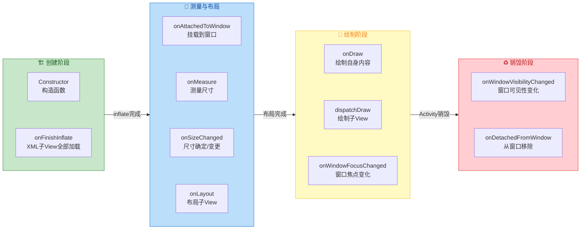

上图将整个 View 生命周期划分为四个阶段：**创建 → 测量布局 → 绘制 → 销毁**。在实际运行中，测量与绘制阶段可能因为 `requestLayout()` 或 `invalidate()` 被反复触发，但创建和销毁在一次 attach/detach 周期中通常只执行一次。接下来我们逐一深入每个关键回调。

---

### 构造函数：View 的诞生起点

View 有四个重载构造函数，这是自定义 View 的第一个生命周期入口。虽然构造函数不是一个典型的"回调方法"，但它是所有初始化的起点，理解其调用场景极其重要。

```kotlin
// 1-参构造：在代码中 new MyView(context) 时调用
// 适用于纯代码动态创建 View 的场景
constructor(context: Context) : this(context, null)

// 2-参构造：在 XML 中声明 <MyView .../> 时，LayoutInflater 调用此构造
// attrs 包含 XML 中声明的所有属性键值对
constructor(context: Context, attrs: AttributeSet?) : this(context, attrs, 0)

// 3-参构造：支持 defStyleAttr，用于从 Theme 中解析默认样式
// 当你继承系统控件（如 AppCompatButton）时，系统通常通过这个构造传入默认风格
constructor(context: Context, attrs: AttributeSet?, defStyleAttr: Int)
    : super(context, attrs, defStyleAttr) {
    // 在此处进行统一初始化
    init(context, attrs, defStyleAttr)
}

// 4-参构造（API 21+）：额外支持 defStyleRes，提供更细粒度的默认样式资源
// 实际开发中使用频率较低，通常由第三个构造间接完成
constructor(context: Context, attrs: AttributeSet?, defStyleAttr: Int, defStyleRes: Int)
    : super(context, attrs, defStyleAttr, defStyleRes)
```

构造函数中适合做的事情包括：初始化 `Paint`、`Path` 等绑定于 View 实例本身的轻量级绘图对象，解析自定义属性（TypedArray），设置默认值。但有两件事 **绝对不能** 在构造函数中做：第一，不要尝试获取 View 的宽高（此时尚未经过 measure，`getWidth()`/`getHeight()` 返回 0）；第二，不要调用 `findViewById()` 查找子 View（如果是 ViewGroup，此时子 View 还没被 inflate 添加进来）。

---

### onFinishInflate：XML 子 View 全部加载完成

```kotlin
// 当 LayoutInflater 将该 View 及其所有子 View 都从 XML 中解析并添加完成后回调
// 注意：仅在 XML inflate 场景触发；纯代码 new 出来的 View 不会触发此回调
override fun onFinishInflate() {
    // 必须调用 super，保证父类逻辑正常执行
    super.onFinishInflate()

    // 此时子 View 已全部添加完毕，可以安全地执行 findViewById
    titleView = findViewById(R.id.tv_title)
    iconView = findViewById(R.id.iv_icon)
}
```

`onFinishInflate()` 是 Framework 在 **XML 解析完毕** 后的一次性通知。它的调用时机非常精确：当 `LayoutInflater.inflate()` 递归解析完当前 View 标签内的所有子标签，并依次调用 `addView()` 把子 View 添加到当前 ViewGroup 后，就会回调这个方法。

这个回调对 **组合控件（Compound View）** 开发至关重要。典型场景是：你创建了一个继承 `LinearLayout` 的自定义控件，其内部布局通过 XML 定义了若干子 View（标题 TextView、图标 ImageView 等）。在构造函数中你调用 `inflate(R.layout.my_compound_view, this, true)` 将布局文件膨胀到自身。但如果你在构造函数中紧接着就 `findViewById`，虽然大多数情况下能工作（因为 `inflate` 是同步的），但从语义清晰度和代码可维护性来看，`onFinishInflate()` 才是查找子 View 引用的 **最佳语义位置**。

需要特别注意的一个边界场景：如果你的自定义 View **不是通过 XML** 创建的，而是在代码中直接 `new MyViewGroup(context)` 并手动调用 `addView()` 添加子 View，那么 `onFinishInflate()` **不会被调用**。因此，如果你需要兼容两种创建方式，初始化子 View 引用的逻辑不能仅依赖此回调，还需要在 `addView()` 或其他合适时机做兜底处理。

还有一点值得留意：`onFinishInflate()` 被调用时，View **尚未被 attach 到 Window**，也尚未经历 measure/layout。也就是说，此时你能安全地拿到子 View 的引用，但不能获取任何尺寸信息。

---

### onAttachedToWindow 与 onDetachedFromWindow：窗口挂载与卸载

这两个方法是 View 与 Window 建立/断开联系的核心回调，也是管理 **外部资源绑定与释放** 的黄金位置。

#### onAttachedToWindow：挂载到窗口

```kotlin
// 当 View 被添加到一个已经 attach 到 Window 的 ViewGroup 时触发
// 或者当包含此 View 的整个 View 树首次 attach 到 Window 时触发
override fun onAttachedToWindow() {
    // 必须先调用 super，父类会设置 mAttachInfo，后续许多操作依赖它
    super.onAttachedToWindow()

    // 此时可以安全地启动动画、注册监听器、开始轮询等
    // 因为 View 已经拥有了一个有效的 Window Token
    startBreathingAnimation()

    // 注册全局广播监听（如网络状态变化）
    context.registerReceiver(networkReceiver, networkIntentFilter)

    // 获取 ViewTreeObserver 注册布局监听也是安全的
    viewTreeObserver.addOnGlobalLayoutListener(layoutListener)
}
```

从 Framework 的角度看，`onAttachedToWindow()` 的触发流程是这样的：当 Activity 启动后，`ActivityThread` 通过 `WindowManagerImpl.addView()` 将 DecorView 添加到 Window，这个过程会创建一个 `ViewRootImpl`，并调用 `ViewRootImpl.setView()`。在第一次 traversal（遍历）开始前，`ViewRootImpl` 会递归调用整个 View 树的 `dispatchAttachedToWindow()`，每个 View 收到这个分发后就会回调 `onAttachedToWindow()`。

这意味着在此回调中，View 已经拥有了一个有效的 `AttachInfo` 对象，其中包含了 **Window Token、Handler、Display** 等关键信息。因此，你可以在这里安全地执行以下操作：

- **启动属性动画 / ValueAnimator**：动画需要通过 Choreographer 注册帧回调，而 Choreographer 是通过 AttachInfo 中的 Handler 绑定到主线程的。
- **注册 Observer / Listener**：比如 `ViewTreeObserver` 的各种监听、传感器监听、广播接收器等。
- **发起延迟消息**：通过 `postDelayed()` 投递的 Runnable 会进入 AttachInfo 中的 Handler 消息队列。

#### onDetachedFromWindow：从窗口卸载

```kotlin
// 当 View 从 Window 中移除时触发
// 典型触发场景：Activity 销毁、View 被 removeView()、ViewPager 回收页面
override fun onDetachedFromWindow() {
    // 停止所有正在运行的动画，避免动画持有 View 引用导致泄漏
    breathingAnimator?.cancel()
    breathingAnimator = null

    // 注销广播接收器，避免 IntentReceiver 泄漏
    context.unregisterReceiver(networkReceiver)

    // 移除布局监听器
    viewTreeObserver.removeOnGlobalLayoutListener(layoutListener)

    // 取消所有通过 post/postDelayed 投递的 Runnable
    removeCallbacks(pendingRunnable)

    // 如果持有 Bitmap 等大对象的缓存，可以在这里释放
    cacheBitmap?.recycle()
    cacheBitmap = null

    // 最后调用 super
    super.onDetachedFromWindow()
}
```

`onDetachedFromWindow()` 是自定义 View 中 **最容易被忽视** 却又 **最关键** 的一个生命周期回调。它的重要性等同于 Activity 的 `onDestroy()`。当 View 从 Window 移除时，Framework 会递归调用 `dispatchDetachedFromWindow()`，依次通知每个子 View。在此回调中，View 的 AttachInfo 即将被置为 null，之后 `post()`、`postDelayed()` 等依赖 Handler 的操作将不再生效。

**最常见的内存泄漏场景** 就发生在这里：如果你在 `onAttachedToWindow()` 中注册了一个 `SensorManager` 监听器，却忘记在 `onDetachedFromWindow()` 中注销，那么 SensorManager（系统服务，生命周期等同于进程）会一直持有你的 View 的引用，而 View 又持有 Activity 的 Context 引用，这条引用链会导致整个 Activity 无法被 GC 回收。

关于 `onAttachedToWindow` / `onDetachedFromWindow` 的配对关系，可以用下面的图来直观理解：

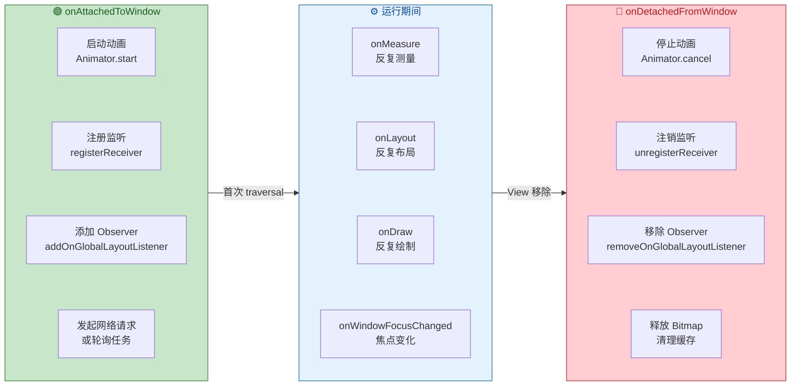

**核心原则：在 `onAttachedToWindow` 中申请的一切外部资源，必须在 `onDetachedFromWindow` 中对称释放。** 这是避免自定义 View 内存泄漏的第一法则。

---

### onMeasure：测量阶段（简述）

虽然 `onMeasure()` 不是本节的重点（它更多属于"测量与布局"专题），但它在生命周期中的位置非常重要，这里简要说明其调用时机。

`onMeasure()` 在 `onAttachedToWindow()` 之后、`onSizeChanged()` 之前被调用。它可能在 View 的整个生命期内被 **多次调用**——每当父容器需要重新计算布局（例如某个兄弟 View 的 visibility 变化、调用了 `requestLayout()`），measure 过程就会重新执行。`onMeasure()` 接收父容器传递下来的 `MeasureSpec`（包含 mode 和 size），View 在此确定自己的期望宽高并通过 `setMeasuredDimension()` 上报。

重要的是：**`onMeasure()` 执行完后，`getMeasuredWidth()` / `getMeasuredHeight()` 才有值**，但此时 `getWidth()` / `getHeight()` 仍可能为 0——因为 layout 还没执行。这是许多初学者混淆的点。

---

### onSizeChanged：尺寸确定与变更

```kotlin
// 当 View 的尺寸发生变化时回调（包括首次确定尺寸）
// w, h: 新的宽度和高度
// oldw, oldh: 旧的宽度和高度（首次调用时为 0）
override fun onSizeChanged(w: Int, h: Int, oldw: Int, oldh: Int) {
    super.onSizeChanged(w, h, oldw, oldh)

    // 根据新尺寸重新计算绘制区域
    // 例如：构建一个与 View 尺寸匹配的圆形裁剪路径
    clipPath.reset()
    // 以 View 中心为圆心，取宽高较小值的一半为半径
    val radius = min(w, h) / 2f
    // 向 Path 中添加一个圆形
    clipPath.addCircle(w / 2f, h / 2f, radius, Path.Direction.CW)

    // 如果使用了 Shader，也需要在此重建
    // 因为 LinearGradient 等渐变的坐标是基于 View 尺寸的
    gradient = LinearGradient(
        0f, 0f,       // 渐变起点：左上角
        w.toFloat(), h.toFloat(),  // 渐变终点：右下角
        startColor, endColor,       // 起止颜色
        Shader.TileMode.CLAMP       // 边缘拉伸模式
    )
    paint.shader = gradient

    // 重建与尺寸相关的 Bitmap 缓冲区
    bufferBitmap?.recycle()  // 先回收旧的，避免内存泄漏
    bufferBitmap = Bitmap.createBitmap(w, h, Bitmap.Config.ARGB_8888)
    bufferCanvas = Canvas(bufferBitmap!!)  // 用新 Bitmap 创建离屏 Canvas
}
```

`onSizeChanged()` 是 View 生命周期中一个极其实用但常被低估的回调。它由 `View.setFrame()` 方法在 layout 阶段触发——当 View 的四个边界（left, top, right, bottom）确定后，如果新的宽高与旧的不同，就会回调此方法。

**调用时机** 的关键特征：

1. **首次 layout 时必定触发**：因为 View 从 0×0 变为实际尺寸，`oldw` 和 `oldh` 为 0。
2. **尺寸变化时再次触发**：比如软键盘弹出导致可用空间缩小、屏幕旋转导致宽高互换、`LayoutParams` 被动态修改。
3. **如果尺寸未变则不触发**：即使 `requestLayout()` 导致重新 measure/layout，只要最终尺寸与之前相同，`onSizeChanged` 不会重复调用。

**为什么不在 `onDraw()` 中做尺寸相关的初始化？** 这是一个关键的设计考量。`onDraw()` 会在每次 `invalidate()` 时被调用，频率可能高达每秒 60 次（甚至 120 次）。如果你在 `onDraw()` 中创建 `LinearGradient`、分配 `Bitmap`，会导致频繁的对象分配和 GC 压力，严重影响帧率。而 `onSizeChanged()` 只在尺寸真正变化时才调用，天然适合做这些"与尺寸绑定的重量级初始化"。

一个对比表格可以帮助理解不同初始化逻辑的最佳归属：

| 初始化内容 | 推荐位置 | 原因 |
|---|---|---|
| `Paint` 基础属性（颜色、线宽） | 构造函数 | 与尺寸无关，只需初始化一次 |
| 子 View 引用（`findViewById`） | `onFinishInflate()` | XML 子 View 加载完才能查找 |
| `Shader` / `Gradient` | `onSizeChanged()` | 渐变坐标依赖 View 宽高 |
| 离屏 `Bitmap` 缓冲区 | `onSizeChanged()` | Bitmap 尺寸必须匹配 View 尺寸 |
| `Path`（圆形裁剪、波浪等） | `onSizeChanged()` | 路径坐标基于 View 边界计算 |
| 动画启动 / 监听注册 | `onAttachedToWindow()` | 需要有效的 Window 和 Handler |
| 资源释放 / 动画取消 | `onDetachedFromWindow()` | 与 attach 对称，防止泄漏 |

---

### onLayout：布局子 View

```kotlin
// 仅 ViewGroup 需要重写此方法
// changed: 当前 ViewGroup 的尺寸或位置是否发生了变化
// l, t, r, b: 当前 ViewGroup 相对于父容器的左、上、右、下边界
override fun onLayout(changed: Boolean, l: Int, t: Int, r: Int, b: Int) {
    // 遍历所有子 View，逐一调用 child.layout() 确定其位置
    for (i in 0 until childCount) {
        val child = getChildAt(i)               // 获取第 i 个子 View
        if (child.visibility == GONE) continue   // 跳过不可见的子 View

        // 根据自定义布局逻辑计算每个子 View 的边界
        val childLeft = calculateChildLeft(i)    // 计算子 View 左边界
        val childTop = calculateChildTop(i)      // 计算子 View 上边界
        val childRight = childLeft + child.measuredWidth   // 右 = 左 + 测量宽度
        val childBottom = childTop + child.measuredHeight  // 下 = 上 + 测量高度

        // 调用 child.layout() 将计算好的边界告知子 View
        // 这会触发子 View 的 setFrame()，进而可能触发子 View 的 onSizeChanged()
        child.layout(childLeft, childTop, childRight, childBottom)
    }
}
```

`onLayout()` 只有 **ViewGroup 的子类** 才需要关心。对于纯绘制型的 View（继承 View），Framework 已经在 `View.layout()` 中通过 `setFrame()` 确定了自身边界，不需要布局子 View。

`onLayout()` 的核心职责是：根据自定义的布局算法，为每个子 View 调用 `child.layout(l, t, r, b)` 确定其在当前 ViewGroup 坐标系中的精确位置。只有在 `layout()` 执行后，子 View 的 `getWidth()`、`getHeight()`、`getLeft()`、`getTop()` 等方法才会返回正确的值。

值得注意的是，`onLayout()` 与 `onSizeChanged()` 的关系：在 `View.layout()` 的源码中，`setFrame()` 先于 `onLayout()` 执行，而 `onSizeChanged()` 是在 `setFrame()` 内部被调用的。因此，**`onSizeChanged()` 的调用时机早于 `onLayout()`**。这意味着在 `onLayout()` 中你已经可以信赖 `getWidth()` / `getHeight()` 的值了。

---

### onWindowFocusChanged：窗口焦点变化

```kotlin
// 当包含此 View 的 Window 获得或失去焦点时回调
// hasWindowFocus: true 表示窗口获得焦点，false 表示失去焦点
override fun onWindowFocusChanged(hasWindowFocus: Boolean) {
    super.onWindowFocusChanged(hasWindowFocus)

    if (hasWindowFocus) {
        // 窗口获得焦点：恢复动画、继续播放等
        resumeAnimation()
    } else {
        // 窗口失去焦点：暂停动画以节省资源
        // 典型场景：用户按了 Home 键、弹出了 Dialog、下拉通知栏
        pauseAnimation()
    }
}
```

`onWindowFocusChanged()` 的一个经典用途是 **获取 View 的精确尺寸**。在 Activity 的 `onCreate()` 或 `onResume()` 中，View 可能尚未完成 layout，此时 `getWidth()` 返回 0。而当 `onWindowFocusChanged(true)` 首次回调时，整个 View 树已经完成了至少一次完整的 measure → layout → draw 流程，因此可以安全地获取任何 View 的精确尺寸。

但要注意，这个方法并 **不仅仅** 在 Activity 首次显示时调用一次。每当窗口焦点状态变化（弹出/关闭 Dialog、按 Home 键、下拉通知栏），它都会被调用。因此，如果你在这里做初始化，需要加一个 flag 保证只执行一次。

---

### onWindowVisibilityChanged：窗口可见性变化

```kotlin
// 当包含此 View 的 Window 可见性发生变化时回调
// visibility 的值为 View.VISIBLE、View.INVISIBLE 或 View.GONE
override fun onWindowVisibilityChanged(visibility: Int) {
    super.onWindowVisibilityChanged(visibility)

    when (visibility) {
        // Window 变为可见：Activity 从后台回到前台
        VISIBLE -> startTickRefresh()
        // Window 不可见：Activity 进入后台
        // 注意：INVISIBLE 和 GONE 在这里语义相同，都代表窗口不可见
        else -> stopTickRefresh()
    }
}
```

`onWindowVisibilityChanged()` 和 `onWindowFocusChanged()` 经常被搞混。关键区别在于：**Focus 是关于"是否能接收用户输入"，Visibility 是关于"是否在屏幕上可见"**。例如，当一个半透明 Dialog 弹出时，底层 Activity 的 Window 失去 Focus（用户在与 Dialog 交互），但仍然 Visible（用户能看到背后的 Activity）。而当用户按下 Home 键时，Activity 的 Window 既失去 Focus 又变为 Invisible。

对于耗资源的持续性操作（如自定义时钟的秒针刷新、粒子动画），`onWindowVisibilityChanged()` 是控制启停的理想位置——窗口不可见时暂停，可见时恢复。

---

### onVisibilityChanged：View 自身或祖先可见性变化

```kotlin
// 当 View 自身或其任意祖先 View 的 visibility 属性发生变化时回调
// changedView: 可见性实际发生变化的那个 View（可能是自身，也可能是某个祖先）
// visibility: 变化后的可见性值 (VISIBLE / INVISIBLE / GONE)
override fun onVisibilityChanged(changedView: View, visibility: Int) {
    super.onVisibilityChanged(changedView, visibility)

    // 只有当最终效果是 VISIBLE（自身和所有祖先都可见）时才有意义
    if (visibility == VISIBLE && isShown) {
        // View 真正可见了，可以恢复动画或数据刷新
        onBecomeVisible()
    } else {
        // View 被隐藏了，暂停耗资源操作
        onBecomeInvisible()
    }
}
```

这个回调与 `onWindowVisibilityChanged` 的区别在于粒度：`onWindowVisibilityChanged` 关注的是整个 **Window 级别** 的可见性变化（Activity 前后台切换），而 `onVisibilityChanged` 关注的是 **View 树内部** 的可见性变化（比如代码中调用 `parentLayout.visibility = View.GONE` 导致其所有子 View 不可见）。

注意 `isShown` 方法——它会递归检查从当前 View 到 ViewRoot 的所有祖先是否都是 VISIBLE。仅仅检查 `visibility == VISIBLE` 是不够的，因为可能是某个祖先变为 VISIBLE，但当前 View 自身仍然是 GONE。

---

### 完整生命周期调用时序

为了把所有回调串联起来，下面给出一个典型的 Activity 启动 → 显示 → 旋转屏幕 → 销毁 场景下，自定义 View 回调方法的完整调用顺序：

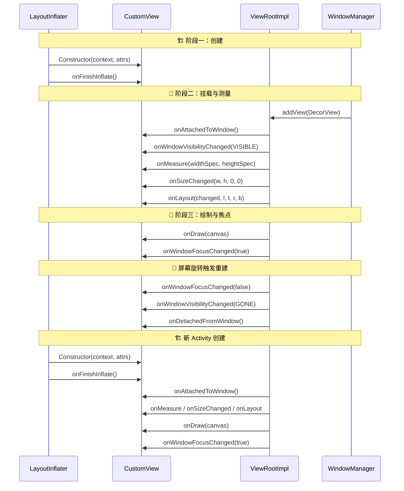

这个时序图清晰地展示了一个关键事实：**屏幕旋转会导致 View 完整经历一次 detach → 新建 → attach 的过程**。这就是为什么在 `onDetachedFromWindow()` 中做好资源清理如此重要——如果你不取消动画、不注销监听器，旧 View 实例会因为被这些外部引用持有而无法被 GC 回收，每旋转一次就泄漏一个 View 实例。

---

### 实战：一个资源安全的自定义 View 模板

综合以上生命周期知识，下面是一个涵盖完整生命周期管理的自定义 View 骨架：

```kotlin
class SafeCustomView @JvmOverloads constructor(
    context: Context,                           // 上下文
    attrs: AttributeSet? = null,                // XML 属性集
    defStyleAttr: Int = 0                       // 默认样式属性
) : View(context, attrs, defStyleAttr) {

    // ==================== 绘图对象（构造时初始化）====================
    private val paint = Paint(Paint.ANTI_ALIAS_FLAG).apply {
        color = Color.parseColor("#6200EE")     // Material 主题紫色
        style = Paint.Style.FILL                // 填充模式
    }
    private val clipPath = Path()               // 裁剪路径，onSizeChanged 中构建
    private var gradient: LinearGradient? = null // 渐变着色器，尺寸确定后创建

    // ==================== 动画（attach 时启动）====================
    private var pulseAnimator: ValueAnimator? = null  // 脉冲动画引用

    // ==================== 子 View 引用（组合控件场景）====================
    // 若继承 ViewGroup，在 onFinishInflate 中初始化

    // ==================== onFinishInflate ====================
    override fun onFinishInflate() {
        super.onFinishInflate()
        // 如果是 ViewGroup 组合控件，在此 findViewById 获取子 View 引用
    }

    // ==================== onAttachedToWindow ====================
    override fun onAttachedToWindow() {
        super.onAttachedToWindow()
        // 启动脉冲动画：从 0.8 到 1.0 的缩放动画
        pulseAnimator = ValueAnimator.ofFloat(0.8f, 1.0f).apply {
            duration = 1000L                    // 动画时长 1 秒
            repeatMode = ValueAnimator.REVERSE  // 来回播放
            repeatCount = ValueAnimator.INFINITE // 无限循环
            addUpdateListener {
                scaleX = it.animatedValue as Float  // 更新 X 轴缩放
                scaleY = it.animatedValue as Float  // 更新 Y 轴缩放
            }
            start()                             // 开始动画
        }
    }

    // ==================== onSizeChanged ====================
    override fun onSizeChanged(w: Int, h: Int, oldw: Int, oldh: Int) {
        super.onSizeChanged(w, h, oldw, oldh)
        // 构建圆形裁剪路径
        clipPath.reset()                        // 清空旧路径
        val radius = min(w, h) / 2f             // 取宽高较小值的一半
        clipPath.addCircle(                     // 添加圆形路径
            w / 2f, h / 2f, radius,             // 圆心在 View 中心
            Path.Direction.CW                   // 顺时针方向
        )
        // 创建对角线渐变
        gradient = LinearGradient(
            0f, 0f, w.toFloat(), h.toFloat(),   // 从左上到右下
            Color.parseColor("#6200EE"),        // 起始色：紫色
            Color.parseColor("#03DAC5"),         // 结束色：青色
            Shader.TileMode.CLAMP               // 边缘钳制
        )
        paint.shader = gradient                 // 应用渐变到画笔
    }

    // ==================== onDraw ====================
    override fun onDraw(canvas: Canvas) {
        super.onDraw(canvas)
        canvas.save()                           // 保存画布状态
        canvas.clipPath(clipPath)               // 应用圆形裁剪
        canvas.drawPaint(paint)                 // 用渐变画笔填充整个裁剪区域
        canvas.restore()                        // 恢复画布状态
    }

    // ==================== onWindowVisibilityChanged ====================
    override fun onWindowVisibilityChanged(visibility: Int) {
        super.onWindowVisibilityChanged(visibility)
        if (visibility == VISIBLE) {
            pulseAnimator?.resume()             // 窗口可见时恢复动画
        } else {
            pulseAnimator?.pause()              // 窗口不可见时暂停动画
        }
    }

    // ==================== onDetachedFromWindow ====================
    override fun onDetachedFromWindow() {
        // 彻底取消并释放动画
        pulseAnimator?.cancel()                 // 取消动画
        pulseAnimator?.removeAllUpdateListeners() // 移除所有监听器
        pulseAnimator = null                    // 解除引用

        // 清空 shader 引用
        paint.shader = null                     // 释放渐变对象
        gradient = null

        super.onDetachedFromWindow()            // 最后调用 super
    }
}
```

这个模板严格遵循了 **"在哪里申请，就在哪里释放"** 的对称原则：`Paint` 在构造函数中创建（无需释放，会随 View 一起被 GC）；`Shader` 在 `onSizeChanged` 中创建，在 `onDetachedFromWindow` 中置 null；动画在 `onAttachedToWindow` 中启动，在 `onWindowVisibilityChanged` 中暂停/恢复，在 `onDetachedFromWindow` 中彻底取消。

---

**📝 练习题**

在自定义 View 中，以下哪个回调方法是创建 `LinearGradient` 渐变对象的最佳位置？

A. 构造函数 `constructor(context, attrs, defStyleAttr)`


B. `onAttachedToWindow()`


C. `onSizeChanged(w, h, oldw, oldh)`


D. `onDraw(canvas)`


**【答案】** C

**【解析】** `LinearGradient` 的构造需要传入坐标参数（起点 x/y，终点 x/y），这些坐标通常基于 View 的实际宽高来计算。在构造函数（A）中，View 尚未经历 measure/layout，宽高为 0，无法正确构建渐变。在 `onAttachedToWindow()`（B）中，View 刚刚挂载到窗口，也尚未完成首次 layout，同样拿不到准确尺寸。`onDraw()`（D）虽然此时宽高已确定，但 `onDraw()` 会被频繁调用（每次 `invalidate()` 都触发），在其中创建 `LinearGradient` 对象会导致大量对象分配，引发 GC 抖动（GC churn），严重影响渲染性能。`onSizeChanged()`（C）仅在 View 的尺寸真正发生变化时才回调，既能保证宽高有效，又避免了不必要的重复创建，是最佳时机。

---

**📝 练习题**

一个自定义 View 在 `onAttachedToWindow()` 中通过 `context.registerReceiver()` 注册了一个广播接收器，但忘记在任何地方调用 `unregisterReceiver()`。当用户旋转屏幕后，以下哪个描述最准确？

A. 不会有任何问题，系统会自动注销旧 Activity 中注册的广播接收器


B. 旧 View 实例无法被 GC 回收，因为系统服务持有其引用，造成内存泄漏


C. 应用会立即崩溃并抛出 `IllegalStateException`


D. 广播接收器会自动迁移到新创建的 View 实例上继续工作


**【答案】** B

**【解析】** 屏幕旋转时，默认行为是 Activity 被销毁重建。旧 Activity 中的 View 会经历 `onDetachedFromWindow()` 回调，随后 View 引用在逻辑上"不再使用"。但 `registerReceiver()` 是向 `ContextImpl` 内部的 `LoadedApk` 注册的，而 `LoadedApk` 的生命周期与进程相同。它内部维护了一个 `ArrayMap` 保存着 `BroadcastReceiver` → `ReceiverDispatcher` 的映射，`ReceiverDispatcher` 持有 `BroadcastReceiver` 的强引用。如果 `BroadcastReceiver` 是一个内部类或匿名类，它又隐式持有外部 View 的引用，View 持有 Activity 的 Context 引用——这条引用链使得整个旧 Activity 无法被 GC 回收，造成内存泄漏。系统不会自动注销（A 错误），也不会立即崩溃（C 错误，崩溃只在 Activity `onDestroy` 后框架检测到泄漏时以日志 warning 形式出现），更不会自动迁移到新实例（D 错误）。正确做法是在 `onDetachedFromWindow()` 中对称地调用 `unregisterReceiver()`。

---

## 性能优化

自定义 View 的性能问题往往是"慢性毒药"——在开发阶段不易察觉，却在列表滚动、动画运行、低端设备等场景下集中爆发，表现为掉帧（Jank）、内存抖动（Memory Churn）甚至 ANR。其根本原因在于 `onDraw()` 方法处于 **渲染主路径（Critical Rendering Path）** 之上：Android 显示系统以 16.6ms（60fps）或 11.1ms（90fps）为一帧周期，而 `onDraw()` 在每帧的 **UI Thread → Record DisplayList** 阶段被调用，任何在此方法中的多余开销都会直接挤占帧预算。更严峻的是，一个复杂界面可能同时存在数十个自定义 View，它们的 `onDraw()` 累积耗时如果超过帧预算，就不可避免地造成丢帧。

因此，自定义 View 的性能优化不是"锦上添花"，而是 **工程底线**。本节从三个最核心的维度展开：`onDraw()` 内存分配治理、`clipRect` 裁剪区域优化、以及硬件加速兼容性处理。这三者分别对应了 **CPU 侧开销、GPU 侧过度绘制、以及渲染管线兼容性** 三大类问题，掌握它们足以解决自定义 View 中 90% 以上的性能瓶颈。

---

### onDraw 避免对象分配

#### 为什么 onDraw 中的对象分配如此危险

要理解这个问题，需要先厘清两个背景事实。

**第一，`onDraw()` 的调用频率极高。** 当 View 处于动画状态、被反复 `invalidate()` 或者位于滚动列表中时，`onDraw()` 可能每秒被调用 60~120 次。假设你在 `onDraw()` 内部每次创建一个 `Paint` 对象（约占 200~400 字节堆内存），那么一秒钟内就会产生数十个短命对象（Short-lived Objects）。这些对象在方法结束后立即变成垃圾，等待 GC 回收。

**第二，ART 的 GC 虽然已经很先进，但并非零开销。** Android Runtime（ART）采用 **Concurrent Copying GC**，在 Android 8.0+ 上大多数 GC 停顿已经降到亚毫秒级，但这并不意味着没有代价。GC 触发时仍需要遍历对象图（Object Graph）来确定可达性，分配压力越大，Minor GC 触发越频繁。即使单次停顿只有 0.1~0.5ms，高频触发下累积效应足以让某一帧"恰好"超出 16.6ms 预算。更致命的是，如果短时间内分配量极大，可能触发 **Young Generation 满溢**，迫使 ART 执行更昂贵的收集操作，停顿时间不可预测地飙升。

这种现象在 Android Studio Profiler 的 Memory 面板中表现为典型的 **"锯齿波"（Sawtooth Pattern）**——内存快速上升、GC 回收、再上升、再回收——这就是所谓的 **内存抖动（Memory Churn / Memory Thrashing）**。它是自定义 View 性能问题中最常见、也最容易被忽略的杀手。

#### 典型反模式与修复策略

**反模式一：在 onDraw 中 new 对象**

这是最直接、最常见的错误。开发者出于"方便"或"只用一次"的心理，在 `onDraw()` 内部直接创建 `Paint`、`Rect`、`Path`、`Matrix` 等对象：

```kotlin
// ❌ 反模式：每次 onDraw 都创建新对象
override fun onDraw(canvas: Canvas) {
    // 每帧都 new 一个 Paint，60fps 下每秒产生 60 个废弃对象
    val paint = Paint().apply {
        color = Color.RED          // 设置画笔颜色
        strokeWidth = 4f           // 设置线宽
        style = Paint.Style.STROKE // 设置描边模式
    }
    // 每帧都 new 一个 RectF，同样造成内存抖动
    val rect = RectF(0f, 0f, width.toFloat(), height.toFloat())
    // 使用临时对象绘制圆角矩形
    canvas.drawRoundRect(rect, 16f, 16f, paint)
}
```

正确做法是将对象提升为 **成员变量**，在构造函数或 `init` 块中一次性初始化：

```kotlin
// ✅ 正确：对象提升为成员变量，只创建一次
class OptimizedView(context: Context, attrs: AttributeSet?) : View(context, attrs) {

    // 在初始化阶段创建 Paint，整个 View 生命周期内复用
    private val strokePaint = Paint(Paint.ANTI_ALIAS_FLAG).apply {
        color = Color.RED          // 颜色固定则在此设置
        strokeWidth = 4f           // 线宽同理
        style = Paint.Style.STROKE // 描边模式
    }

    // RectF 也提升为成员变量，避免 onDraw 中反复分配
    private val drawRect = RectF()

    override fun onDraw(canvas: Canvas) {
        // 只更新 RectF 的值，不创建新对象
        drawRect.set(0f, 0f, width.toFloat(), height.toFloat())
        // 复用已有的 Paint 和 RectF 进行绘制
        canvas.drawRoundRect(drawRect, 16f, 16f, strokePaint)
    }
}
```

这样做的本质是将对象的 **生命周期** 从"每帧一次"拉长到"与 View 同生共死"，从根本上消灭了内存抖动的源头。

**反模式二：字符串拼接与格式化**

`onDraw()` 中的 `String.format()`、字符串模板 `"$value"` 或 `+` 拼接同样会产生临时字符串对象。如果绘制的文字内容在帧间不变，应缓存结果：

```kotlin
// ❌ 反模式：每帧都格式化新字符串
override fun onDraw(canvas: Canvas) {
    // String.format 每次调用都会创建新的 String 对象
    val label = String.format("Score: %d", currentScore)
    // drawText 内部还会根据字符串长度分配临时 char[]
    canvas.drawText(label, x, y, textPaint)
}
```

```kotlin
// ✅ 正确：数据变化时才更新缓存字符串
private var cachedLabel: String = ""  // 缓存的文字内容
private var lastScore: Int = -1       // 上一次的分数值，用于脏检查

override fun onDraw(canvas: Canvas) {
    // 只有当分数真正发生变化时，才重新生成字符串
    if (currentScore != lastScore) {
        cachedLabel = "Score: $currentScore"  // 更新缓存
        lastScore = currentScore              // 同步脏标记
    }
    // 直接使用缓存字符串，零分配
    canvas.drawText(cachedLabel, x, y, textPaint)
}
```

**反模式三：隐式装箱（Autoboxing）**

Kotlin 的基本类型在大多数场景下会编译为 JVM 原始类型（primitive），但在泛型集合（如 `List<Int>`、`Map<Int, Float>`）中会自动装箱为 `Integer`、`Float` 等包装对象。如果在 `onDraw()` 中频繁读写这类集合，每次装箱/拆箱都会产生临时对象。解决方案是使用 Android 提供的 **Sparse 系列容器**（`SparseIntArray`、`SparseLongArray`、`SparseArray`）或 AndroidX 的 `ArrayMap`，它们内部基于原始数组实现，完全避免装箱开销。

#### Lint 规则与工具辅助

Android Studio 内置的 Lint 检查器已经包含了规则 **`DrawAllocation`**，它会在检测到 `onDraw()`（及其调用链）内部存在 `new` 对象分配时抛出警告："Avoid object allocations during draw/layout operations"。开发者应将此规则视为 **Error 级别** 而非 Warning：

```xml
<!-- lint.xml：将 DrawAllocation 提升为 Error，CI 中强制拦截 -->
<issue id="DrawAllocation" severity="error" />
```

在运行时层面，**Android Studio Memory Profiler** 的 "Record Allocations" 功能可以精确追踪 `onDraw()` 执行期间的每一次堆分配，帮助定位残余的分配热点。此外，也可以在调试版本中通过 `StrictMode` 监控主线程的内存行为。

#### 量化评估标准

一个经过优化的 `onDraw()` 方法，在 **稳态运行**（即非首次绘制、无数据变更）时，应该做到 **零堆分配（Zero Allocation）**。你可以通过 Profiler 的 Allocation Tracker 验证：选中一段连续滑动的时间窗口，过滤到目标 View 类的 `onDraw()` 调用栈，确认分配计数为 0。这是自定义 View 性能的"金标准"。

---

### clipRect 裁剪区域

#### 过度绘制问题的本质

在 Android 的渲染管线中，每一个像素最终都要经过 **片元着色器（Fragment Shader）** 处理后写入帧缓冲区。如果同一个像素位置被多个 View 或多次 `draw` 调用反复着色，就产生了 **过度绘制（Overdraw）**。Android 开发者选项中的 "Show GPU Overdraw" 功能以颜色编码可视化这一问题：无色表示 1 次绘制（理想状态），蓝色 2 次，绿色 3 次，粉色 4 次，红色 4 次以上。

对于自定义 View 而言，过度绘制通常发生在以下场景：View 包含多个重叠的绘制层（如先画背景、再画内容、再画前景装饰），或者 `onDraw()` 中绘制了大量彼此遮挡的元素（如一个自定义折线图先填充了整个背景区域，再画网格线，再画折线，再画数据点）。虽然每一层看似必要，但很多区域实际上被上层完全覆盖，底层的绘制等于做了无用功。

`Canvas.clipRect()` 正是解决这个问题的核心武器。它的原理是在 Canvas 上设置一个 **裁剪矩形（Clip Rectangle）**，之后所有的绘制操作只有落在这个矩形内的部分才会真正光栅化，矩形外的部分在管线早期就被丢弃（Early Reject），大幅节省 GPU 填充率。

#### clipRect 的工作机制

`Canvas` 内部维护着一个 **裁剪栈（Clip Stack）**，每次调用 `clipRect()` 都会将新的矩形与当前裁剪区域做 **交集运算（Intersection）**，得到更小的有效绘制区域。配合 `save()` / `restore()` 可以精确控制裁剪的作用范围：

```kotlin
override fun onDraw(canvas: Canvas) {
    // === 绘制第一个区域：左半部分 ===
    canvas.save()                              // 保存当前 Canvas 状态（包括裁剪区域）
    canvas.clipRect(                           // 设置裁剪区域为左半部分
        0, 0,                                  // 左上角坐标
        width / 2, height                      // 右下角坐标
    )
    drawComplexBackground(canvas)              // 此方法内所有绘制只在左半区域生效
    canvas.restore()                           // 恢复到 save 时的状态，裁剪区域还原

    // === 绘制第二个区域：右半部分 ===
    canvas.save()                              // 再次保存状态
    canvas.clipRect(                           // 裁剪区域设为右半部分
        width / 2, 0,                          // 左上角
        width, height                          // 右下角
    )
    drawAnotherContent(canvas)                 // 此方法只在右半区域生效
    canvas.restore()                           // 恢复裁剪
}
```

这种模式的本质是 **将一次完整的绘制分解为多个空间上不重叠的子区域**，每个子区域只绘制必要的内容，从而消除区域间的过度绘制。

#### 经典实战：卡片堆叠控件

一个最能体现 `clipRect` 威力的经典案例是 **卡片堆叠视图**——多张卡片从左到右依次叠放，每张卡片露出一个边缘。如果不做优化，绘制 N 张卡片的过度绘制次数为 N（完全重叠区域被画了 N 次）。使用 `clipRect` 后，每个像素只被绘制 1 次：

```kotlin
class CardStackView(context: Context, attrs: AttributeSet?) : View(context, attrs) {

    // 卡片的 Bitmap 列表
    private val cards: List<Bitmap> = loadCards()
    // 每张卡片相对于前一张的水平偏移量
    private val cardOffset = 60

    override fun onDraw(canvas: Canvas) {
        // 遍历每一张卡片
        for (i in cards.indices) {
            // 计算当前卡片的左边缘 x 坐标
            val left = i * cardOffset

            canvas.save()  // 保存状态，准备设置裁剪

            if (i < cards.lastIndex) {
                // 非最后一张卡片：只裁剪出"露出来"的那一条区域
                // 因为右侧会被下一张卡片覆盖，所以没必要绘制完整卡片
                val clipRight = (i + 1) * cardOffset  // 下一张卡片的左边缘就是裁剪右边界
                canvas.clipRect(
                    left, 0,               // 裁剪区域左上角
                    clipRight, height      // 裁剪区域右下角
                )
            }
            // 最后一张卡片不需要裁剪，因为它完全可见

            // 在当前裁剪区域内绘制卡片，超出裁剪区的像素会被丢弃
            canvas.drawBitmap(cards[i], left.toFloat(), 0f, null)

            canvas.restore()  // 恢复裁剪区域，为下一张卡片准备
        }
    }
}
```

这段代码的核心思想是：**对于每张被部分遮挡的卡片，只绘制它实际可见的窄条区域。** `clipRect` 让 Canvas 跳过了被后续卡片覆盖的所有像素，将整体过度绘制从 O(N) 降到 O(1)。

#### quickReject：比裁剪更早的优化

在某些场景下，你甚至可以在调用 `clipRect` 之前，使用 `Canvas.quickReject()` 方法做一次 **快速拒绝测试**。该方法接受一个矩形区域，返回 `true` 表示该区域 **完全在当前裁剪区域之外**（即完全不可见），此时你可以直接跳过后续的所有绘制指令，连 `draw` 调用本身的开销都省掉了：

```kotlin
override fun onDraw(canvas: Canvas) {
    for (element in elements) {
        // 快速拒绝测试：如果元素的包围盒完全不在可见区域内
        if (canvas.quickReject(
                element.bounds,          // 元素的包围矩形
                Canvas.EdgeType.BW       // 使用黑白（非抗锯齿）边缘判断，速度更快
            )) {
            continue  // 直接跳过，不执行任何绘制操作
        }
        // 元素至少部分可见，正常绘制
        element.draw(canvas)
    }
}
```

`quickReject` 在自定义大型画布（如地图 Tile、长列表手绘）中效果尤为显著——当画布远大于屏幕可见区域时，绝大多数元素都在视口之外，`quickReject` 让它们的绘制开销趋近于零。

#### clipRect 使用注意事项

需要特别指出的是，从 **API 26（Android 8.0）** 开始，`clipRect()` 方法的带 `Region.Op` 参数的重载（如 `Region.Op.DIFFERENCE`、`Region.Op.XOR`）已被 **废弃**，并且在硬件加速模式下只支持 `Region.Op.INTERSECT`（默认行为）。这是因为硬件加速管线在底层使用 **矩形裁剪栈（Rectangular Clip Stack）** 优化，而差集、异或等复杂 Clip 操作无法被高效地表达为矩形序列。如果确实需要非矩形裁剪区域（如圆形裁剪），应改用 `clipPath()`，但要注意 `clipPath` 在硬件加速下也有诸多限制。总的原则是：**优先使用最简单的矩形裁剪，只在必要时才诉诸更复杂的裁剪形状。**

---

### 硬件加速兼容性

#### 硬件加速的架构与渲染模型

从 Android 3.0（API 11）引入、Android 4.0（API 14）默认全局开启的 **硬件加速（Hardware Acceleration）** 是 Android 渲染性能的最大功臣之一。要理解其兼容性问题，首先必须搞懂它与软件渲染的本质区别。

**软件渲染（Software Rendering）** 的流程是：`onDraw(canvas)` 中的每一条 Canvas API 调用（如 `drawRect`、`drawBitmap`）都 **立即执行**，由 CPU 通过 Skia 图形库在一块内存 Bitmap 上逐像素光栅化。整个过程是同步的、单线程的，`onDraw()` 执行完毕后，Bitmap 中就已经包含了完整的绘制结果。

**硬件加速渲染（Hardware Accelerated Rendering）** 的流程则完全不同。它引入了一个关键的中间层——**DisplayList（显示列表）**，也称为 **RenderNode**。`onDraw(canvas)` 中的 Canvas API 调用 **不再直接光栅化**，而是被 **录制（Record）** 为一系列轻量级的绘制指令存储在 DisplayList 中。真正的光栅化由独立的 **RenderThread** 在 GPU 上异步完成。

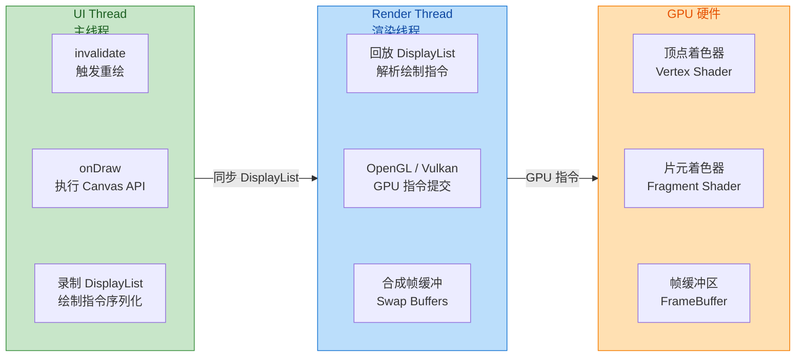

这套架构的核心优势有两点：**一是并行化**——UI Thread 和 RenderThread 可以同时工作，UI Thread 处理下一帧的布局计算时，RenderThread 正在渲染上一帧；**二是 DisplayList 缓存**——如果一个 View 没有调用 `invalidate()`，它的 DisplayList 可以被直接复用而无需重新录制，极大减少了 `onDraw()` 的调用次数。

#### 不支持硬件加速的 API 清单

然而，硬件加速并非万能。由于 GPU 管线的工作方式与 CPU 逐像素操作存在根本差异，**部分 Canvas / Paint API 在硬件加速模式下不受支持或行为异常**。这是自定义 View 开发中最容易踩的坑之一。以下是最关键的不兼容 API 分类：

**Canvas 类：**

| API | 硬件加速支持情况 | 说明 |
|-----|:---:|------|
| `drawBitmapMesh()` | ❌ 不支持 | 网格变形绘制，GPU 难以高效实现 |
| `drawPicture()` | ❌ 不支持 | Picture 录制的指令无法转为 DisplayList |
| `drawVertices()` | ❌ 不支持 | 自定义顶点绘制 |
| `clipPath()` | ⚠️ 部分支持 | API 18+ 支持，但性能开销大 |
| `clipRegion()` | ❌ 已废弃 | 被 clipRect/clipPath 替代 |

**Paint 类：**

| API | 硬件加速支持情况 | 说明 |
|-----|:---:|------|
| `setMaskFilter(BlurMaskFilter)` | ⚠️ 部分支持 | 外层模糊支持，内层模糊(INNER)不支持 |
| `setRasterizer()` | ❌ 已移除 | API 21 起完全移除 |
| `setShadowLayer()` | ⚠️ 仅文字 | 仅对 `drawText` 有效，图形阴影无效 |
| `setAntiAlias()` drawLine | ⚠️ | 某些 GPU 驱动下细线抗锯齿表现不一致 |

**ComposeShader 与 PorterDuffXfermode：**

部分复杂的 Shader 组合和 Xfermode 模式在硬件加速下可能渲染结果与软件渲染不一致。特别是涉及 **Alpha 通道混合** 的 PorterDuff 模式（如 `DST_OUT`、`XOR`），可能需要离屏缓冲（offscreen buffer）才能得到正确结果。

#### 兼容性处理的四种策略

**策略一：View 级别关闭硬件加速**

这是最简单直接的方式。如果确定某个自定义 View 使用了不兼容的 API，可以仅对该 View 关闭硬件加速，其余 View 仍享受硬件加速的红利：

```kotlin
class SoftwareRenderedView(context: Context, attrs: AttributeSet?) : View(context, attrs) {

    init {
        // 仅对当前 View 关闭硬件加速，切换到软件渲染
        // 参数 LAYER_TYPE_SOFTWARE 表示使用软件 Bitmap 作为离屏缓冲
        // 第二个参数 null 表示不需要额外的 Paint 处理
        setLayerType(LAYER_TYPE_SOFTWARE, null)
    }

    override fun onDraw(canvas: Canvas) {
        // 此时 canvas 是软件画布，所有 API 均可正常使用
        // 例如 drawBitmapMesh、完整的 setShadowLayer 等
        canvas.drawBitmapMesh(bitmap, meshWidth, meshHeight, verts, 0, null, 0, null)
    }
}
```

这种方式的代价是 **该 View 的绘制完全回退到 CPU**，无法享受 GPU 加速和 DisplayList 缓存。因此只应作为 **最后手段**，用于确实无法替代的 API。

**策略二：运行时检测并分支绘制**

更精细的做法是在运行时检测当前 Canvas 是否处于硬件加速模式，然后选择不同的绘制路径：

```kotlin
override fun onDraw(canvas: Canvas) {
    if (canvas.isHardwareAccelerated) {
        // 硬件加速路径：使用兼容的 API 实现相似效果
        // 例如用 ElevationShadow 或自绘渐变模拟阴影
        drawWithCompatibleAPIs(canvas)
    } else {
        // 软件渲染路径：可以使用全部 Canvas/Paint API
        drawWithFullAPIs(canvas)
    }
}
```

这种模式让 View 在硬件加速环境下仍然使用 GPU 管线，只有在软件渲染回退时才使用完整 API，是兼顾兼容性和性能的推荐方案。

**策略三：利用离屏缓冲（Off-Screen Buffer）解决 Xfermode 问题**

前面章节中提到过，`PorterDuff.Mode` 的混合操作在硬件加速下可能因为与屏幕上已有内容直接混合而产生错误结果。正确的做法是使用 `saveLayer()` 创建一个 **离屏 Layer**，让混合操作在一个隔离的画布上完成后再合成回主画布：

```kotlin
override fun onDraw(canvas: Canvas) {
    // 创建一个离屏图层，覆盖整个 View 区域
    // 注意：saveLayer 有性能开销，因为它会分配一个临时的 GPU 纹理
    val layerId = canvas.saveLayer(
        0f, 0f,                            // 图层左上角
        width.toFloat(), height.toFloat(), // 图层右下角
        null                               // 不需要额外的 Paint
    )

    // 在离屏图层中绘制 DST（目标层）
    canvas.drawBitmap(dstBitmap, 0f, 0f, null)

    // 设置混合模式并绘制 SRC（源层）
    xferPaint.xfermode = PorterDuffXfermode(PorterDuff.Mode.DST_IN)
    canvas.drawBitmap(srcBitmap, 0f, 0f, xferPaint)

    // 清除 Xfermode，防止影响后续绘制
    xferPaint.xfermode = null

    // 将离屏图层合成回主画布
    canvas.restoreToCount(layerId)
}
```

`saveLayer()` 的代价是会在 GPU 上分配一块临时纹理（Offscreen FBO），大小等于指定的矩形区域。因此应尽量 **缩小 saveLayer 的范围**——只包裹需要混合的最小区域，而不是整个 View。Google 官方文档也明确指出 "saveLayer is expensive and should be used sparingly"。

**策略四：硬件加速层级控制**

Android 的硬件加速可以在四个层级分别控制，从粗到细：

```kotlin
// ========== 层级 1：Application 级别（AndroidManifest.xml）==========
// <application android:hardwareAccelerated="true"> ... </application>
// 这是 API 14+ 的默认行为，全局开启硬件加速

// ========== 层级 2：Activity 级别 ==========
// <activity android:hardwareAccelerated="false"> ... </activity>
// 可以针对特定 Activity 关闭，例如使用了大量不兼容 API 的绘图页面

// ========== 层级 3：Window 级别（代码控制）==========
// 只能开启，不能关闭（Window 级无法向下覆盖 Application 的关闭设置）
window.setFlags(
    WindowManager.LayoutParams.FLAG_HARDWARE_ACCELERATED,  // 开启标志位
    WindowManager.LayoutParams.FLAG_HARDWARE_ACCELERATED   // 掩码
)

// ========== 层级 4：View 级别（最精细）==========
// 可以开启或关闭单个 View 的硬件加速
myView.setLayerType(View.LAYER_TYPE_SOFTWARE, null)  // 关闭：软件渲染
myView.setLayerType(View.LAYER_TYPE_HARDWARE, null)  // 开启：硬件图层
myView.setLayerType(View.LAYER_TYPE_NONE, null)      // 默认：跟随父级设置
```

最佳实践是 **全局开启、局部关闭**：保持 Application 级别的硬件加速开启，仅对确实不兼容的 View 使用 `LAYER_TYPE_SOFTWARE` 回退。

#### Hardware Layer 的进阶用法：动画加速

`LAYER_TYPE_HARDWARE` 还有一个经常被忽略的重要用途——**加速属性动画**。当你对一个 View 执行 `alpha`、`translationX`、`rotation` 等属性动画时，如果 View 被标记为硬件图层，渲染系统会将 View 的 DisplayList 光栅化为一张 **GPU 纹理** 并缓存。动画过程中不需要重新执行 `onDraw()`，GPU 直接对这张纹理做矩阵变换，效率极高：

```kotlin
// 动画开始前开启硬件图层缓存
myView.setLayerType(View.LAYER_TYPE_HARDWARE, null)

// 使用 ViewPropertyAnimator 执行动画
myView.animate()
    .alpha(0f)                     // 透明度动画
    .translationX(200f)            // 水平位移动画
    .setDuration(300)              // 动画时长 300ms
    .withEndAction {
        // 动画结束后务必关闭硬件图层，释放 GPU 纹理内存
        myView.setLayerType(View.LAYER_TYPE_NONE, null)
    }
    .start()
```

关键要点：**动画结束后必须恢复为 `LAYER_TYPE_NONE`**。如果忘记恢复，GPU 会一直持有那张纹理，造成不必要的显存占用。对于 `RecyclerView` 中的 item 动画，这个问题尤其严重——数百个 item 的纹理缓存可能导致 GPU 显存溢出，触发纹理淘汰和重新光栅化的恶性循环。

#### 综合性能优化检查清单

将以上所有策略汇总，形成一份自定义 View 性能优化的实战检查清单：

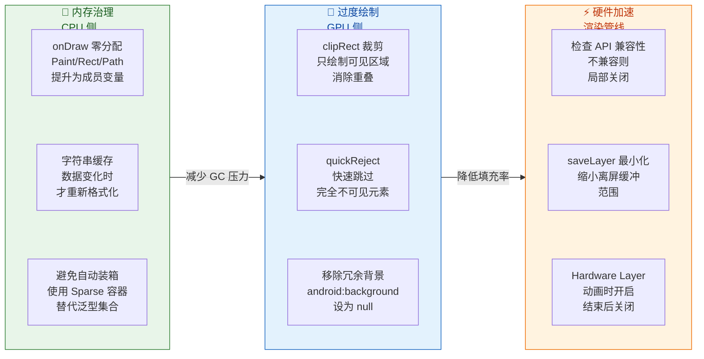

---

**📝 练习题**

在自定义 View 的 `onDraw()` 方法中，以下哪种做法 **不会** 导致内存抖动（Memory Churn）？

A. 使用 `String.format("%.1f", value)` 格式化温度文本并调用 `drawText()`


B. 每次 `onDraw` 调用 `canvas.saveLayer()` 创建离屏图层进行混合


C. 将 `Paint` 对象声明为类的成员变量，在 `init` 块中初始化，在 `onDraw` 中复用


D. 在 `onDraw` 中使用 `mutableListOf<Float>()` 构建临时坐标列表

**【答案】** C

**【解析】** 内存抖动的根源是在 **高频调用方法**（如 `onDraw()`）中反复创建短命对象，触发频繁 GC。选项 A 的 `String.format()` 每次调用都会创建新的 `String` 对象和内部的 `Formatter`、`StringBuilder` 等临时对象；选项 B 的 `saveLayer()` 虽然主要开销在 GPU 侧（分配离屏纹理），但在某些实现中也涉及堆分配，且本身就是性能敏感操作；选项 D 的 `mutableListOf<Float>()` 不仅创建 `ArrayList` 实例，其中的 `Float` 元素还会发生自动装箱，产生大量 `java.lang.Float` 包装对象。只有选项 C 将 `Paint` 提升为成员变量、一次性初始化后在 `onDraw()` 中直接复用，在稳态运行时实现零堆分配，是标准的最佳实践。

---

**📝 练习题**

关于 Android 硬件加速与自定义 View 的关系，以下说法正确的是：

A. `setLayerType(LAYER_TYPE_SOFTWARE, null)` 会关闭整个 Activity 的硬件加速


B. 硬件加速模式下，`Canvas.drawBitmapMesh()` 可以正常工作


C. `View.LAYER_TYPE_HARDWARE` 适合在属性动画期间临时开启，动画结束后应恢复为 `LAYER_TYPE_NONE`


D. `saveLayer()` 在硬件加速下不会产生任何额外性能开销

**【答案】** C

**【解析】** 选项 A 错误：`setLayerType()` 只影响调用它的那一个 View，不会波及 Activity 中的其他 View，这正是"View 级别"粒度控制的意义。选项 B 错误：`drawBitmapMesh()` 是硬件加速不支持的 API 之一，在硬件加速 Canvas 上调用不会产生任何绘制效果（静默失败）。选项 D 错误：`saveLayer()` 会在 GPU 上分配一个 **Offscreen Framebuffer Object（FBO）** 作为临时纹理，这涉及显存分配和额外的合成步骤，开销显著，Google 文档明确建议 "use sparingly"。选项 C 正确：将 View 设为 `LAYER_TYPE_HARDWARE` 后，系统会将其 DisplayList 光栅化为 GPU 纹理缓存，动画期间只需对纹理做矩阵变换，避免重复执行 `onDraw()`，性能极高；但动画结束后如果不恢复为 `LAYER_TYPE_NONE`，GPU 纹理会持续占用显存，并且 View 内容更新时需要额外的纹理重建开销，得不偿失。

---

## 本章小结

本章围绕 **自定义 View 实战** 这一 Android 应用层开发的核心技能展开，从分类体系、属性系统、绘图 API、高级渲染、图像合成、文字基线、视图生命周期到性能优化，构建了一套完整的自定义 View 知识图谱。下面对全章脉络进行系统性回顾与融合提炼。

---

### 全章知识脉络总览

一个自定义 View 从诞生到最终稳定渲染在屏幕上，其实经历了一条非常清晰的 **"声明 → 解析 → 度量 → 布局 → 绘制 → 交互 → 销毁"** 生命线。本章的八大知识模块恰好覆盖了这条生命线的每一个关键节点，它们之间并非孤立存在，而是彼此咬合、层层递进的。

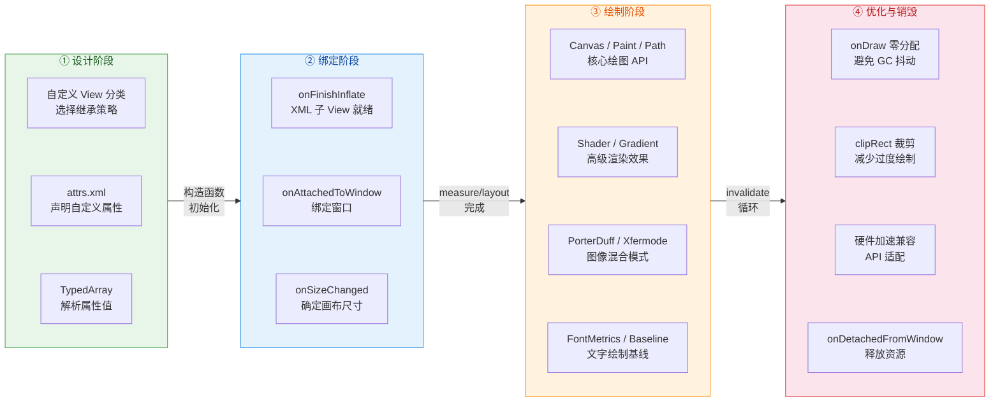

上图将全章内容浓缩为四个阶段。接下来逐一回顾每个模块的核心结论，并点明它们之间的联系。

---

### 模块一：自定义 View 分类 —— 一切的起点

自定义 View 的第一步不是写代码，而是做 **架构决策**：我到底该继承谁？本章将自定义 View 分为四大类型：

- **继承 View 绘制型**：适用于完全自绘的控件，如仪表盘、波形图、自定义进度条。你拥有对 `onDraw()` 的完全控制权，但也意味着你必须自己处理 `onMeasure()` 中的 `wrap_content` 逻辑，否则 `wrap_content` 会退化为 `match_parent`。这是最自由也最需要功底的方式。

- **继承 ViewGroup 布局型**：适用于需要管理子 View 排列方式的场景，如流式布局（FlowLayout）、标签云。核心挑战在于 `onMeasure()` 中递归测量所有子 View 并在 `onLayout()` 中精确摆放。它是对 Android 布局系统最深层次的运用。

- **组合控件型**：将已有控件组合封装，如带清除按钮的输入框、带标题的设置项。它不需要手动绘制，核心是对外暴露简洁的 API，对内管理子控件的状态联动。开发效率最高，适合 UI 复用。

- **继承现有控件型**：在系统控件基础上追加或修改行为，如可自动折叠的 TextView、带圆角的 ImageView。优势是能复用父类已有的测量、布局、绘制逻辑，仅做增量修改，代价最小。

**关键启示**：选择正确的分类，决定了你后续 80% 的工作量。如果只是修改文本绘制方式就去继承 View 从头绘制，那是用大炮打蚊子；如果需要完全自绘却去继承 TextView 做 hack，那将不断与父类逻辑冲突。

---

### 模块二：属性定义与解析 —— 让控件可配置

一个优秀的自定义 View 必须是 **可配置的**，而 Android 的自定义属性系统正是为此而生。本章详细拆解了从声明到解析的全链路：

`attrs.xml` 中通过 `<declare-styleable>` 声明属性名和类型 → 构造函数中通过 `context.obtainStyledAttributes()` 获取 `TypedArray` → 逐一读取属性值 → 最后调用 `recycle()` 回收到池中。这条链路看似简单，但暗藏一个非常重要的优先级机制：**XML 直接属性 > style 属性 > defStyleAttr（主题中指定的默认样式）> defStyleRes（硬编码的默认样式资源）**。理解这个四级优先级，才能正确设计控件的默认行为与覆盖策略。

**与后续模块的联系**：属性解析获得的值（如颜色、半径、字号）将在 `init{}` 或构造函数中初始化 Paint、Path 等绘图对象，直接影响模块三和模块四中的绘制行为。可以说，属性系统是连接"XML 声明"与"代码绘制"的桥梁。

---

### 模块三：核心绘图 API —— 自绘型控件的基石

这是本章篇幅最重的部分，也是自定义 View 最核心的能力。四大绘图基础对象构成了 Android 2D 绘图的完整能力矩阵：

| 对象 | 角色 | 核心能力 |
|------|------|----------|
| **Canvas** | 画布 | 坐标变换（translate/rotate/scale）、图层管理（save/restore）、裁剪（clipRect/clipPath） |
| **Paint** | 画笔 | 颜色、抗锯齿、线宽、填充模式、文字大小、着色器、混合模式 |
| **Path** | 路径 | 直线/贝塞尔曲线/弧线的任意组合，可用于绘制不规则图形、裁剪区域 |
| **Rect/RectF** | 矩形 | 区域定义、碰撞检测、集合运算（intersect/union） |

它们的协作关系是：**Canvas 决定"在哪画"和"怎么变换坐标"，Paint 决定"用什么样式画"，Path 决定"画什么形状"，Rect 定义"在什么区域内操作"**。这四者的排列组合几乎可以实现任意 2D 效果。

特别值得强调的是 `Canvas.save()` / `Canvas.restore()` 的配对使用——它们本质上操作的是一个 **状态栈**。每次 `save()` 将当前矩阵和裁剪区域压栈，`restore()` 弹出恢复。这使得你可以在一段绘制中自由变换坐标系而不影响后续绘制，是实现复杂图形（如仪表盘刻度、雷达图）的关键技巧。

---

### 模块四：高级渲染效果 —— 从"能画"到"画得漂亮"

掌握基础 API 后，高级渲染效果让自定义 View 从"能用"升级为"有质感"。本章聚焦 **Shader 着色器** 体系：

- **LinearGradient**：线性渐变，适用于渐变背景、进度条的色彩过渡。
- **RadialGradient**：径向渐变，适用于光晕、聚光灯效果。
- **SweepGradient**：扫描渐变，适用于圆形色盘、雷达扫描动画。
- **BitmapShader**：将 Bitmap 作为纹理填充，是实现圆形头像、圆角图片的底层基础。

Shader 的本质是 **告诉 Paint："你在填充每个像素时，不要使用单一颜色，而是根据像素坐标去查表计算颜色"**。它通过 `Paint.setShader()` 挂载后，对所有使用该 Paint 的绘制操作生效（drawRect、drawCircle、drawPath 均可）。TileMode（CLAMP / REPEAT / MIRROR）则决定了超出 Shader 定义范围时的像素填充策略。

**与后续模块的联系**：BitmapShader 是理解圆形头像原理的前提。当 BitmapShader 与 PorterDuff.Mode 结合使用时，可以实现更复杂的遮罩裁剪效果，这正是模块五的核心内容。

---

### 模块五：图像混合模式 —— 像素级合成的艺术

PorterDuff.Mode 定义了 **源像素（Src）** 和 **目标像素（Dst）** 在 Alpha 通道和颜色通道上的 18 种混合规则。这是 Android 2D 绘图中最精妙也最容易出错的部分。

本章重点讲解了 **Xfermode 图层合成** 的正确使用姿势：必须先 `saveLayer()` 开辟离屏缓冲 → 绘制 Dst → 设置 `Paint.xfermode = PorterDuffXfermode(mode)` → 绘制 Src → 恢复 xfermode 为 null → `restore()`。如果省略 `saveLayer()` 直接在主 Canvas 上操作，混合结果会受到整个 View 背景像素的干扰，产生黑色背景或错误的透明度。

**圆形头像** 是最经典的应用场景：先在离屏缓冲上画一个圆形（Dst），再用 `SRC_IN` 模式绘制 Bitmap（Src），最终只保留圆形区域内的 Bitmap 像素。另一种更高效的方案是直接使用 BitmapShader：将 Bitmap 包装为 BitmapShader 赋给 Paint，然后 `drawCircle()`，一步到位无需离屏缓冲。

**核心对比**：

```
Xfermode 方案：saveLayer → drawCircle(Dst) → setXfermode(SRC_IN) → drawBitmap(Src) → restore
  优势：灵活，可实现任意形状遮罩
  劣势：saveLayer 触发离屏缓冲，有性能开销

BitmapShader 方案：paint.shader = BitmapShader(bitmap) → drawCircle()
  优势：无需离屏缓冲，性能更好
  劣势：仅适用于简单几何形状的裁剪
```

---

### 模块六：文字绘制基线 —— 像素级的文字定位

文字绘制是自定义 View 中看似简单实则暗坑最多的领域。`Canvas.drawText(text, x, y, paint)` 中的 `y` 参数指的不是文字的顶部也不是底部，而是 **baseline（基线）**。如果不理解 FontMetrics 的五条线（top、ascent、baseline、descent、bottom），文字就永远无法精确居中。

本章给出的 **垂直居中公式** 是全章最实用的公式之一：

```
baselineY = centerY - (fontMetrics.ascent + fontMetrics.descent) / 2
```

它的推导逻辑是：ascent 为负值（基线以上），descent 为正值（基线以下），两者之和的一半代表文字视觉中心相对于基线的偏移量。用容器中心减去这个偏移量，就得到了基线的 Y 坐标。水平居中则简单得多，设置 `paint.textAlign = Paint.Align.CENTER` 后直接传入中心 X 即可。

**这个知识点为什么重要？** 因为几乎所有自绘型控件都涉及文字标注——仪表盘的数值、图表的标签、自定义按钮的文案——一旦基线计算错误，文字就会偏上或偏下，视觉上非常粗糙。

---

### 模块七：视图生命周期 —— 理解时机才能正确编码

自定义 View 的各项初始化操作必须放在 **正确的生命周期回调** 中，否则要么获取到错误的值（如在构造函数中获取宽高为 0），要么造成资源泄漏。本章梳理的关键回调时间线如下：

1. **构造函数**：解析属性、初始化 Paint/Path 等绘图对象。此时 View 尚未测量，宽高未知。
2. **`onFinishInflate()`**：XML 中所有子 View 已加载完毕，可安全地 `findViewById()` 查找子控件。仅对 XML 布局触发，代码创建的 View 不会回调。
3. **`onAttachedToWindow()`**：View 已绑定到 Window，可注册全局监听器、启动动画。与之配对的是 `onDetachedFromWindow()`。
4. **`onMeasure()` → `onSizeChanged()` → `onLayout()`**：测量-尺寸确定-布局三连。`onSizeChanged()` 是初始化 **依赖宽高的对象**（如居中坐标、渐变 Shader、Path）的最佳时机，因为此时宽高已确定且仅在尺寸真正变化时才被调用。
5. **`onDraw()`**：执行绘制。可能被频繁调用（每次 `invalidate()` 都会触发），因此必须保持高效。
6. **`onDetachedFromWindow()`**：释放资源、注销监听器、停止动画、取消异步任务，防止内存泄漏。

**关键认知**：`onSizeChanged()` 是全链路中最被低估的回调。很多开发者习惯在 `onDraw()` 中初始化依赖宽高的对象，导致每帧都在重复创建对象，严重影响性能。正确做法是将这些初始化移到 `onSizeChanged()` 中——它只在尺寸真正变化时回调，完美平衡了"时机正确"和"执行频率低"两个需求。

---

### 模块八：性能优化 —— 从"能跑"到"丝滑"

自定义 View 的性能优化贯穿全章，但在最后一个模块中做了系统总结。三大优化方向形成了一个完整的性能防护体系：

**第一道防线：`onDraw()` 零分配原则。** 任何在 `onDraw()` 中 `new` 出来的对象（Paint、Path、Rect、String 甚至 int[]）都会在下一次 GC 时被回收，而 `onDraw()` 可能每秒调用 60 次，这意味着每秒产生数十个临时对象，触发频繁的 Minor GC，导致界面掉帧。解决方案：所有对象在构造函数或 `onSizeChanged()` 中预创建，`onDraw()` 中只做 set 和 draw 操作。

**第二道防线：`clipRect()` 裁剪区域。** 如果你的自定义 View 只有局部发生了变化（如进度条的前进部分），可以通过 `canvas.clipRect()` 告诉系统只重绘这个区域，跳过其余部分的绘制计算。对于内容复杂的大面积 View（如自定义图表），这个优化可以带来显著的帧率提升。配合 `invalidate(Rect)` 传入 dirty 区域使用效果更佳。

**第三道防线：硬件加速兼容性。** Android 的硬件加速（Hardware Acceleration）将绘制操作委托给 GPU，显著提升了大多数场景的渲染性能。但并非所有 Canvas API 在硬件加速模式下都受支持——典型的如 `Canvas.drawBitmapMesh()`、某些 `PorterDuff.Mode`、`Paint.setShadowLayer()` 在部分 API Level 下不生效。当发现绘制结果异常时，可以通过 `setLayerType(LAYER_TYPE_SOFTWARE, null)` 将特定 View 降级为软件渲染，但这会损失该 View 的 GPU 加速性能，因此应尽量缩小降级范围。

---

### 跨模块知识融合：一个完整自定义 View 的思维清单

当你接到一个自定义 View 的需求时，可以按以下清单进行思考，每一步都对应本章的一个或多个知识模块：

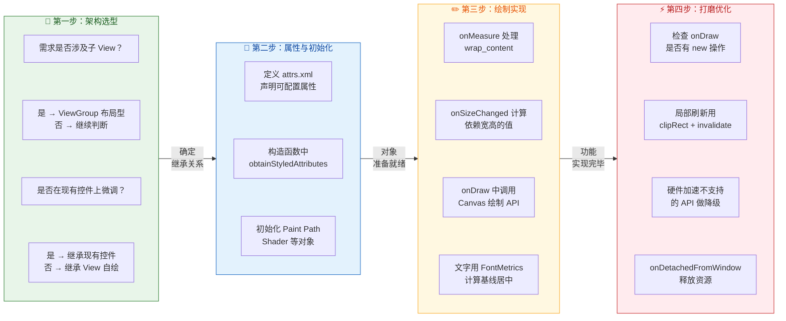

---

### 易错点与最佳实践速查表

| 序号 | 易错场景 | 错误做法 | 正确做法 | 涉及模块 |
|:---:|---------|---------|---------|:--------:|
| 1 | 继承 View 未处理 `wrap_content` | 依赖默认 `onMeasure` | 重写 `onMeasure` 并调用 `setMeasuredDimension` | 分类 |
| 2 | `TypedArray` 忘记 `recycle()` | 直接丢弃 | `finally` 块中调用 `recycle()` | 属性 |
| 3 | 在 `onDraw` 中 `new Paint()` | 每帧创建新对象 | 构造函数中预创建，`onDraw` 中复用 | 性能 |
| 4 | Xfermode 未用 `saveLayer` | 直接在主 Canvas 上混合 | `saveLayer` 开辟离屏缓冲再混合 | 混合模式 |
| 5 | `drawText` 的 y 传入 View 中心 | 文字偏上 | 用 FontMetrics 计算 baseline Y | 文字基线 |
| 6 | Shader 在 `onDraw` 中创建 | 每帧重建渐变 | 在 `onSizeChanged` 中创建 | 渲染 + 性能 |
| 7 | 动画未在 `onDetachedFromWindow` 停止 | View 销毁后仍回调 | `onDetachedFromWindow` 中 `cancel()` | 生命周期 |
| 8 | 硬件加速下使用不支持的 API | 绘制结果异常或不显示 | 对该 View 设置 `LAYER_TYPE_SOFTWARE` | 性能 |

---

### 从本章到后续章节的衔接

自定义 View 实战是 Android 应用层 UI 能力的 **基石层**。掌握本章内容后，你将具备以下能力延伸方向：

- **触摸事件与手势处理**：本章聚焦"画出来"，而下一步是"交互起来"。`onTouchEvent()` 的事件分发、`VelocityTracker` 速度追踪、`Scroller` 惯性滚动等将与本章的绘制能力结合，构建可交互的自定义控件（如可拖拽的进度条、可缩放的图片查看器）。

- **属性动画（Property Animation）**：本章中的静态绘制参数（如角度、半径、颜色值）一旦与 `ValueAnimator` / `ObjectAnimator` 结合，就能产生流畅的动画效果。动画本质上就是在每帧改变绘制参数并调用 `invalidate()` 触发重绘——这正是 `onDraw()` 性能优化如此重要的原因。

- **RecyclerView 自定义 ItemDecoration / LayoutManager**：这是自定义 ViewGroup 布局能力的高级应用，`onDraw()` 的 Canvas 操作和 `onLayout()` 的子 View 摆放逻辑都会被深度使用。

本章所建立的 **"Canvas + Paint + Path + 生命周期 + 性能意识"** 心智模型，将贯穿你整个 Android UI 开发生涯。

---

**📝 练习题**

在一个自定义 View 的 `onDraw()` 方法中，开发者需要绘制一张圆形头像图片。以下哪种实现方案在性能和正确性上都是最优的？

A. 在 `onDraw()` 中创建 `BitmapShader`，设置给 `Paint`，然后调用 `canvas.drawCircle()`


B. 在 `onSizeChanged()` 中创建 `BitmapShader` 并设置给预创建的 `Paint`，在 `onDraw()` 中调用 `canvas.drawCircle()`


C. 在 `onDraw()` 中调用 `canvas.saveLayer()` → 绘制圆形（Dst）→ 设置 `PorterDuffXfermode(SRC_IN)` → 绘制 Bitmap（Src）→ `restore()`，其中 `Paint` 和 `Xfermode` 在 `onDraw()` 中每次 new 创建


D. 在 `onDraw()` 中直接调用 `canvas.drawBitmap()` 绘制原图，然后用 `canvas.clipPath()` 裁剪为圆形

**【答案】** B

**【解析】** 本题考查圆形头像的最佳实现方案，涉及本章多个知识模块的综合运用。

**选项 B 正确**，原因如下：第一，`BitmapShader` 方案无需 `saveLayer()` 开辟离屏缓冲，性能优于 Xfermode 方案；第二，`BitmapShader` 在 `onSizeChanged()` 中创建（此时宽高已确定，可正确计算缩放矩阵），避免了在 `onDraw()` 中重复创建对象；第三，`Paint` 对象预创建复用，符合 `onDraw()` 零分配原则。整条链路完美契合 **"在正确的生命周期做正确的事 + 绘制帧零分配"** 的核心优化思想。

**选项 A 错误**：虽然使用了 BitmapShader 方案，但每次 `onDraw()` 都 `new BitmapShader()`，违反零分配原则，在高频刷新（如列表滚动、动画）时会产生大量临时对象触发 GC，导致掉帧。

**选项 C 错误**：两个问题叠加——其一，`saveLayer()` 强制开辟离屏缓冲，性能开销大于 BitmapShader 方案；其二，`Paint` 和 `Xfermode` 在 `onDraw()` 中每次 new，严重违反零分配原则。功能上可以正确实现圆形裁剪，但性能是四个选项中最差的。

**选项 D 错误**：`clipPath()` 在硬件加速环境下于 API 18 以前不支持抗锯齿，裁剪边缘会出现明显锯齿。即使在较新 API 上可用，`clipPath()` 的抗锯齿质量也不如 BitmapShader + `drawCircle()` 方案。此外，先画完整 Bitmap 再裁剪，意味着圆外的像素也被绘制了一遍，存在不必要的过度绘制。

---

