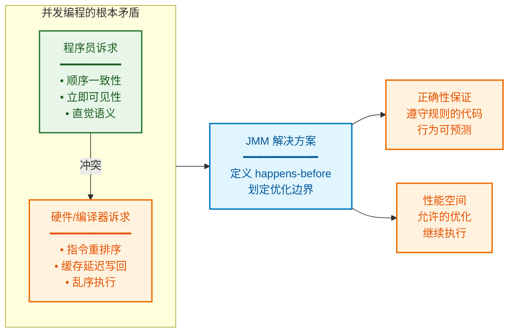
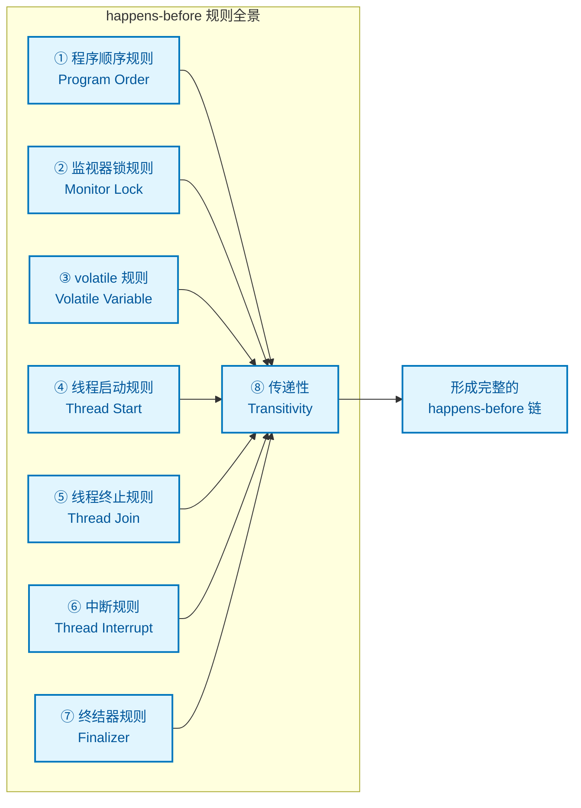
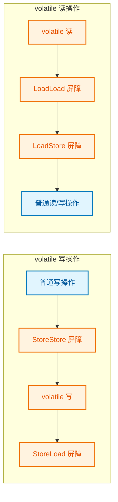

## 六、设计动机：JMM 为何而生

### 6.1 没有 JMM 的世界：混乱的并发语义

在 JMM 被正式定义之前（Java 1.5 之前的"旧 JMM"存在严重缺陷），编写正确的并发程序几乎是一场噩梦。让我们看看没有清晰内存模型会发生什么：

```java
// 线程共享变量
int a = 0;
boolean flag = false;

// 线程 A
void writer() {
    a = 42;           // ①
    flag = true;      // ②
}

// 线程 B  
void reader() {
    if (flag) {       // ③
        print(a);     // ④ 期望输出 42，实际可能输出 0！
    }
}
```

**直觉上**：如果 `flag == true`，那么 `a` 必然已被赋值为 42。

**实际上**：编译器可能将 ① 和 ② 重排序（因为它们之间没有数据依赖）；CPU 缓存可能让线程 B 看到 `flag` 的新值，却读到 `a` 的旧值。

JMM 的设计动机就是要**精确回答**：在什么条件下，④ 能保证看到 ① 的结果？

### 6.2 两难困境：正确性 vs 性能



JMM 的设计哲学是**最小化同步约束**：

* 对于**正确同步**的程序（使用 `volatile`、`synchronized`、`final` 等），JMM 提供顺序一致性保证
* 对于**未正确同步**的程序，JMM 不做任何承诺（数据竞争导致未定义行为）
* 在不违反同步语义的前提下，**允许任意优化**

这种设计使得 Java 程序在保证正确性的同时，能够享受现代硬件的性能红利。

---

## 七、happens-before：JMM 的核心规则体系

### 7.1 happens-before 的精确定义

**happens-before (先行发生)** 是 JMM 定义的一种**偏序关系**，记作 `A happens-before B`（简写 `A hb→ B`），表示：

> **操作 A 的结果对操作 B 可见，且 A 的执行顺序排在 B 之前（从内存可见性角度）**

**关键理解**：`A hb→ B` **不意味着** A 在物理时间上先于 B 执行！它只是一种**逻辑保证**——如果需要让 B 看到 A 的结果，JMM 承诺会通过某种机制（禁止重排序、插入内存屏障）确保这一点。

### 7.2 JMM 规定的 happens-before 规则



### 7.3 规则详解与代码示例

#### ① 程序顺序规则 (Program Order Rule)

> 同一线程中，按照程序代码顺序，前面的操作 happens-before 后面的操作

```kotlin
// 单线程内
var a = 1       // A
var b = 2       // B  
var c = a + b   // C

// A hb→ B hb→ C（单线程内天然成立）
```

**注意**：这只保证**单线程内**的语义，不涉及多线程可见性。

#### ② 监视器锁规则 (Monitor Lock Rule)

> 对一个锁的 unlock 操作 happens-before 后续对同一个锁的 lock 操作

```java
private int value = 0;
private final Object lock = new Object();

// 线程 A
synchronized (lock) {     // lock 获取
    value = 42;           // ① 写操作
}                         // unlock 释放 ←─┐
                          //               │ hb
// 线程 B                  //               │
synchronized (lock) {     // lock 获取 ←───┘
    int v = value;        // ② 读操作，保证看到 42
}
```

**Framework 实例**：`Handler` 的 `MessageQueue` 使用 `synchronized` 保护消息队列，这保证了生产者线程写入的消息数据对消费者线程可见。

#### ③ volatile 变量规则 (Volatile Variable Rule)

> 对一个 volatile 变量的写操作 happens-before 后续对同一个 volatile 变量的读操作

```java
private volatile boolean ready = false;
private int data = 0;

// 线程 A
void writer() {
    data = 42;            // ① 普通写
    ready = true;         // ② volatile 写 ←─┐
}                         //                  │ hb
                          //                  │
// 线程 B                  //                  │
void reader() {           //                  │
    if (ready) {          // ③ volatile 读 ←─┘
        assert data == 42; // ④ 保证成立！
    }
}
```

**深层原理**：volatile 写会**把该线程工作内存中的所有变量刷新到主内存**；volatile 读会**使该线程工作内存失效，从主内存重新加载**。这就是为什么 ④ 能看到 ① 的原因——通过 volatile 的"捎带同步"效应。

#### ④ 线程启动规则 (Thread Start Rule)

> `Thread.start()` 调用 happens-before 被启动线程中的任何操作

```kotlin
var sharedData = 0

fun main() {
    sharedData = 100          // ① 主线程写入
    
    val thread = Thread {
        println(sharedData)   // ② 子线程读取，保证看到 100
    }
    thread.start()            // start() hb→ 子线程所有操作
}
```

**ART 源码佐证**：`Thread.start()` 内部会执行内存屏障，确保启动前的写操作对新线程可见。

#### ⑤ 线程终止规则 (Thread Join Rule)

> 线程中的所有操作 happens-before 其他线程检测到该线程终止（`join()` 返回或 `isAlive()` 返回 false）

```kotlin
var result = 0

val worker = Thread {
    result = compute()    // ① 子线程写入
}

worker.start()
worker.join()             // 等待子线程结束，内含 hb 关系

println(result)           // ② 主线程读取，保证看到 ① 的结果
```

#### ⑧ 传递性 (Transitivity)

> 如果 A hb→ B，且 B hb→ C，则 A hb→ C

这是构建复杂同步场景的基础。回看 volatile 的例子：

```
① data=42  hb→  ② ready=true  (程序顺序规则)
② ready=true  hb→  ③ if(ready)  (volatile 规则)
━━━━━━━━━━━━━━━━━━━━━━━━━━━━━━━
∴ ① data=42  hb→  ③ if(ready)  (传递性)
∴ ④ 能看到 ① 的写入
```

---

## 八、内存屏障：JMM 的底层实现机制

### 8.1 什么是内存屏障

**内存屏障 (Memory Barrier / Memory Fence)** 是 CPU 指令，用于：

1. **阻止屏障两侧的指令重排序**
2. **强制刷新/失效缓存**

JMM 的 happens-before 规则在 JVM/ART 层面通过插入内存屏障来实现。

### 8.2 四种内存屏障类型

```kotlin
┌────────────────────────────────────────────────────────────────────┐
│                        内存屏障类型与语义                           │
├────────────┬───────────────────────────────────────────────────────┤
│  屏障类型   │  语义                                                 │
├────────────┼───────────────────────────────────────────────────────┤
│ LoadLoad   │ Load1; LoadLoad; Load2                                │
│            │ 确保 Load1 的数据装载先于 Load2 及其后续装载            │
├────────────┼───────────────────────────────────────────────────────┤
│ StoreStore │ Store1; StoreStore; Store2                            │
│            │ 确保 Store1 的数据对其他处理器可见先于 Store2 及后续存储 │
├────────────┼───────────────────────────────────────────────────────┤
│ LoadStore  │ Load1; LoadStore; Store2                              │
│            │ 确保 Load1 的数据装载先于 Store2 及后续存储刷新到主内存  │
├────────────┼───────────────────────────────────────────────────────┤
│ StoreLoad  │ Store1; StoreLoad; Load2                              │
│            │ 确保 Store1 的数据对其他处理器可见先于 Load2 及后续装载  │
│            │ 【开销最大，全能屏障】                                  │
└────────────┴───────────────────────────────────────────────────────┘
```

### 8.3 volatile 的屏障策略



**详细解读**：

**volatile 写** 的屏障插入：

1. **StoreStore 屏障**（写之前）：确保 volatile 写之前的所有普通写操作已刷新到主内存
2. **StoreLoad 屏障**（写之后）：确保 volatile 写对其他处理器可见后，才能执行后续读操作

**volatile 读** 的屏障插入：

1. **LoadLoad 屏障**（读之后）：确保 volatile 读之后的所有普通读操作从主内存重新加载
2. **LoadStore 屏障**（读之后）：确保 volatile 读完成后，才能执行后续写操作

这种屏障策略解释了 volatile 的两大语义：

* **可见性**：写时刷新，读时失效
* **有序性**：禁止与普通读写重排序
