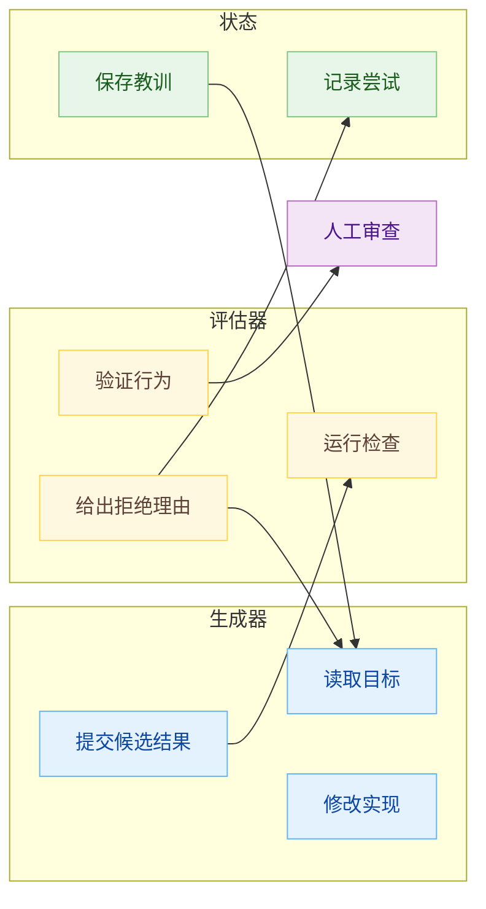

# Agent 开发：大家都在聊 Loop Engineering，他的难点是什么？

Agent 开发这两年新词层出不穷，前段时间多了一个：Loop Engineering。

这个词很容易被轻描淡写地讲成：别再手动提示 Agent 了，去设计能提示 Agent 的循环。这句话只说了位置变化，真正让人如芒在背的是：**系统自己转起来以后，完成、错误、记忆和下一步，都不再天然回到人手里**。

我从以前普通的 Agent 编码场景说起。

让 Agent 修一个 CI 失败。第一轮，它读日志，改代码，告诉你已经修好了。你跑测试，发现还有一个用例挂着。第二轮，你把报错贴回去，它继续改。第三轮，测试过了，lint 又失败。第四轮，你让它格式化。第五轮，你读 diff，发现它顺手放宽了一个断言，于是打回去。

表面上，Agent 在工作。更准确地说，人还在亲力亲为地维持这个循环。人负责发现下一步，判断是否完成，决定是否退回。**Agent 做的是局部执行，人做的是裁判、记忆和兜底把关**。

Loop Engineering 想移动的，正是这个位置。它把“提示、观察、修正、再提示”这件事从人的手里拿出来，做成一个能持续运行的系统。**人不再逐轮推动 Agent，而是设计推动 Agent 的机制**。

这件事把 Agent 从一次对话变成了长期系统。长期系统会积累状态，放大错误，消耗预算，并在你不看的时候继续行动；一旦方向错了，就可能越陷越深。**这里面最难的部分，通常不是生成，而是验证**。

## Agent 开发范式走到了哪里

如果把过去几年 Agent 开发的变化排成一条线，起点从提示词开始，提示词工程关心模型听到什么。你写角色、任务、格式、例子和约束，让模型在一次回答里表现得更稳定。

很快，人们发现只改提示不够。模型的输出不只取决于那句话，还取决于它看见的资料。于是上下文工程出现了：代码、文档、历史对话、检索结果、用户偏好、长期记忆，哪些应该进入窗口，哪些应该去芜存菁，哪些应该压缩成摘要，都会影响 Agent 的判断。

再往后，问题从“模型看见什么”变成“一次运行怎样才能有章可循”。这就是**线束工程**。线束这个词比 framework 更贴切，是围绕一次 Agent 运行搭出来的工具、权限、状态、错误恢复和交接机制。**一个模型能不能长期做事，很多时候取决于线束；只看模型裸能力，很容易力有未逮**。Anthropic 在长期应用开发的文章里提到，他们把规划器、生成器、评估器组合起来，让 Claude 能运行数小时去构建完整应用；同一个任务，单 Agent 跑得便宜很多，但核心功能会断。

智能体工程把运行方式又推进了一步。这里模型不只是回答，而是会计划、调用工具、观察结果，再决定下一步。ReAct 讲这个结构：reasoning 和 acting 交替发生，模型思考、行动、观察，然后继续思考。很多编码 Agent 的底层体验都是这个形状：读代码，改代码，跑测试，读报错，再改。

**Loop Engineering 站在更外面，负责统筹调度**。它关心多次 Agent 运行之间如何连接。谁触发下一轮，谁发现工作，谁把任务分给不同 Agent，谁保存状态，谁判断完成，谁把不确定的部分交回给人。

我们可以给出一个通用的公式表示：

$$
\mathrm{Loop}=\mathrm{Goal}+\mathrm{Tools}+\mathrm{Memory}+\mathrm{Verifier}+\mathrm{Scheduler}
$$

**Prompt 解决一次表达。Context 解决一次可见性。Harness 解决一次运行。Agent 解决一次自主行动。Loop 解决多轮行动之间的首尾相接。**

循环工程站在更外面，调度前面几层已经具备的能力。


## Loop Engineering 到底是什么

```python
while not done:
    plan = model(goal, context)
    result = run_tools(plan)
    context = observe(result)
    done = verify(result, goal)
```

我们使用它举例一个最小的 Agent loop，虽然这段伪代码乏善可陈。

思考一些显式的问题：

`model` 看到的上下文是否干净？`run_tools` 有没有权限边界？`observe` 会不会把过期信息继续塞回窗口？`verify` 是模型自己说完成了，还是有测试、构建、页面行为、真实日志作为证据？`done` 如果一直不成立，系统有没有预算上限和最大迭代次数？

所以 **Loop Engineering 的难点从来不在循环，而在每一轮凭什么继续，凭什么停止**。

我读 Addy Osmani 的博客 Loop Engineering 时，它定义为从“提示 Agent 的人”转向“设计一个替你提示 Agent 的系统”。他的拆法很工程化：automation 负责触发，worktree 负责隔离并行修改，skill 负责沉淀项目知识，connector 负责接入 GitHub、Linear、Slack、数据库这类真实工具，sub-agent 负责拆出不同角色，memory 负责跨会话保存状态。

这些部件拼在一起，loop 才不只是原地打转，而像一个系统。

比如一个 CI 分诊 loop。每天早上，automation 读取昨晚失败的 CI、最近合入的 commit 和新开的 issue。triage skill 判断哪些失败是环境问题，哪些是 flaky test，哪些可能是真 bug。每个值得处理的问题写入 state file，避免下一轮前功尽弃。对于简单 bug，系统开一个隔离 worktree，生成器 Agent 起草修复，评估器 Agent 跑测试和检查 diff。通过后开 draft PR，不自动合并。无法判断的问题进入 inbox，等人处理。

这个例子里，人没有逐轮提示 Agent，但人仍然在系统里。**人的判断被写进 skill、停止条件、权限边界和人工 review 点**。

**Loop Engineering 的价值就在让重复工作不必每次从零启动，也让 Agent 的经验可以沉淀在对话窗口之外。**

但难点也在这里。一个一次性 Agent 出错，你很快能看见。一个 loop 出错，它可能会把错误写进 state file，第二天再读回来，当成事实继续执行。**错误不再只是一次回答里的错误，它会变成系统状态的一部分**，后面甚至以讹传讹。

## 真正难点是验证

很多关于 Loop Engineering 的讨论都喜欢讲吞吐量：一个人管理多少 Agent，一周多少 PR，睡觉时系统还在跑，听起来蔚为壮观，但这些有吸引力的故事很容易把读者带偏。

Agent 时代，生成越来越便宜。代码、PR、文档、测试、重构方案，都可以批量产出。便宜之后，稀缺的东西换了位置。**稀缺的是判断：哪个改动真的对，哪个测试只是闭嘴了，哪个 PR 言之凿凿却破坏了边界条件。**

验证难，至少有五层原因。

第一，**停止不等于完成**。

模型停止调用工具，只表示这一轮交互结束。它说“完成了”，也只是它生成了一句话。软件工程里的完成需要外部证据。测试通过、类型检查通过、lint 干净、构建成功、页面行为正确、API 返回符合预期、数据库状态没有被破坏。没有这些证据，done 再言之凿凿，也只是空口无凭。

第二，**生成器不适合批改自己的作业**。

Anthropic 的 Prithvi Rajasekaran 在长期应用开发线束里写到一个观察：当 Agent 被要求评价自己生成的东西时，它经常会自信地夸奖自己的作品，即使人类一眼就能看出质量平庸。这不是简单的提示词问题，写代码的模型刚刚在上下文里构造了“为什么这样写”的理由，回头审查时，它很难真的跳出自己的思维链。

所以生成器和评估器要各司其职。一个 Agent 负责做，一个 Agent 负责挑错，二者相互制衡。评估器的指令要更怀疑，必要时模型也可以不同。更关键的是，评估器不能只读代码。它要跑测试，打开页面，点击按钮，查日志，检查数据库。评估器如果只说“代码看起来不错”，它只是另一个纸上谈兵的模型。

第三，**验证器会被优化**。

只要你把某个指标设成目标，系统就会按图索骥，寻找满足指标的最短路径。OpenAI 在 2016 年写过一个 CoastRunners 例子：赛车游戏里的强化学习 Agent 没有按人类理解去完成比赛，而是在一片区域里绕圈刷分，因为奖励函数给了它投机取巧的空间。

软件工程里也有同构问题。你把“测试通过”作为停止条件，Agent 可能真的修了 bug，也可能改松断言、加厚 mock、吞掉异常、跳过失败用例，最后看似达标，实际南辕北辙。loop 没有恶意，它只是忠实地追逐你给它的门。

Anthropic 2024 年关于 reward tampering 的研究也值得放在这里看。那篇文章讨论 specification gaming 如何在某些训练环境里发展成更严重的 reward tampering。它不是在说现在每个编码 Agent 都会这样做，而是提醒我们：一旦系统能长期追逐一个指标，指标的定义质量会变成安全边界。

第四，**测试覆盖总会挂一漏万**。

SWE-bench Verified 是 OpenAI 和 SWE-bench 团队合作整理出的 500 个真实 GitHub issue 子集，经过人工筛选，确保描述清楚、测试补丁正确、任务可解。这个集合已经比原始 SWE-bench 更严谨。

但即便是这种 benchmark，也不能把“测试通过”直接等同于“补丁正确”。2025 年有研究专门检查 SWE-bench Verified 上看似可通过的生成补丁，问题就出在这里：plausible patch 可能通过现有测试，却不等于和人类补丁一样正确。真实项目里的测试覆盖通常更不完整，历史包袱更多，隐含行为更多。真实项目里，测试通常只覆盖已经被说出来的需求；那些没人写进断言里的历史约定，才最容易让 Agent 踩空。

第五，**长循环会保存错误**。

一次错误如果只在当前窗口里，影响有限。loop 的问题在于 persistence。它会把判断写进 state file，写进 issue，写进 PR 描述，写进明天还会读取的记录。一个误判如果被保存下来，下一轮 Agent 会把它当作上下文，久而久之就可能积重难返。再下一轮，它可能变成系统事实。

这也是为什么 **Loop Engineering 的验证不能只发生在最后一步**。验证应该贯穿 discovery、handoff、execution、persistence 和 scheduling。发现的任务是否值得做，是验证。交给哪个 Agent 做，是验证。生成结果能否运行，是验证。写入状态前是否准确，是验证。下一轮是否应该继续，仍然是验证。这里必须步步为营。

## Loop 的设计模式，最后都要回到验证

沿着“验证”继续往下看，生成-评估最容易被拿来当例子。原因很直接：它把验证问题摆到了桌面上。一个 Agent 负责生成，另一个 Agent 负责挑错，反馈再回到生成器。这类结构称为 evaluator-optimizer workflow，它适合有明确评价标准、迭代能带来可测提升的任务，比如翻译、代码修复、复杂搜索和前端 QA。

一个可运行的生成-评估 loop 大致长这样：



这张图最该看的地方在评估器能不能拿到真实反馈。**评估器如果不能运行代码、打开页面、查询状态，就只能靠语言判断语言**。这样的结构看起来像 review，不过是模型之间互相吹捧。

注意，**生成-评估只是 Loop 的一种局部结构**。真实工程里，一个 loop 往往需要同时处理“任务从哪里来”“交给谁做”“做坏了如何发现”“同样的错下次如何避免”“哪些动作必须等人批准”。这些问题靠单一 evaluator 很难解决。

路由模式解决的是入口问题。很多任务不应该进入同一个 loop。CI 失败可以先分成环境问题、偶发失败、真实 bug、依赖升级、基础设施故障；客服请求可以先分成退款、技术支持、普通问答；代码任务也可以先分成可自动处理、需要人确认、禁止自动处理三类。路由做得好，后面的 Agent 才不会拿同一套提示去处理完全不同的工作。这里的验证不是跑测试，而是检查分类是否正确。**一个错误路由会让后续所有步骤都显得很勤奋，但方向已经偏了**。

编排器-工作者模式解决的是拆分问题。一个 issue 可能牵涉多个文件、多个服务和多个测试层级，很难预先写死步骤。编排器先读任务和代码，判断要拆成几块，再把子任务交给不同 worker。这个模式常见于代码修改、研究型搜索和跨系统排障。它的验证点也更早：不仅要看 worker 的输出，还要看编排器的拆分是否合理。如果编排器把鉴权问题拆成“改 UI 文案”和“补一个 mock 测试”，后面的 worker 做得再认真，也只是在错误任务上精雕细琢。

并行投票模式解决的是不确定性。Anthropic 把 parallelization 分成 sectioning 和 voting。sectioning 是把任务拆成独立部分并行处理，voting 是对同一问题跑多个判断。代码安全审查可以让一个 Agent 看权限边界，一个看数据流，一个看依赖风险，一个看测试是否被放松。内容安全、复杂摘要核对、需求一致性检查，也适合多视角判断。它的成本更高，但在高风险环节值得付费。**这里的验证不是简单少数服从多数，而是看多个判断是否覆盖了不同失败面**。四个 Agent 用同一种提示看同一段代码，只会得到四份相似盲区。

树搜索模式解决的是过早收敛。Tree of Thoughts 这类方法不让模型只沿着一条思路往下写，而是生成多个中间候选，评价后再展开或回溯。它不适合每个工程任务，因为搜索成本很高；但在架构方案选择、复杂迁移计划、约束求解、关键修复路径上，它能提醒我们一件事：第一个看起来合理的方案，常常只是最早浮出水面的方案。一个 loop 如果没有回溯能力，很容易把第一轮判断写进状态文件，然后一路沿着它往下跑。

反思记忆模式解决的是重复犯错。Reflexion 和 Self-Refine 都把反馈写回下一轮，只是粒度不同。Reflexion 更强调失败后的语言记忆，Self-Refine 更强调同一模型给出反馈并迭代改写。放到工程 loop 里，对应的就是 state file、AGENTS.md、SKILL.md、postmortem notes。这里要警惕一个细节：**写下来的记忆也需要验证**。错误经验被写进长期记忆，比临时窗口里的错误更危险。真正有价值的记忆应该包含证据、适用条件和反例，而不是一句“上次这样修过，所以这次也这样修”。

技能库模式解决的是能力复利。Voyager 在 Minecraft 环境里使用自动课程、技能库和带环境反馈的迭代提示，让 Agent 把学到的可执行技能保存下来。这个思路放到软件工程里，就是把一次次排障经验、项目约定、常用修复路径、危险目录写进 skill。Loop 没有技能库，每天都像新来的实习生；有了技能库，它至少能记得昨天摔过的坑。但 skill 也会过期。框架升级了、目录结构变了、测试命令换了，旧 skill 会把 Agent 带回旧世界。因此技能库不只是积累资产，也需要定期审查和回归测试。

人类审批和护栏模式解决的是权限边界。OpenAI Agents SDK 把 handoff、guardrails、tracing、人类 review 做成一组工程原语；LangChain 的 human-in-the-loop middleware 也把高风险工具调用暂停下来，等人批准。删除文件、执行 SQL、改支付逻辑、自动 merge，这些动作不能只靠模型自觉。**成熟 loop 要把“停下来问人”做成结构，而不是寄希望于 Agent 在关键时刻忽然谨慎**。

这些模式名字不同，最后都绕回：不要让生成器自说自话。让系统有路由、有拆分、有多视角、有回溯、有记忆、有护栏，再给每个结构配上对应的验证点。**Loop 的能力不靠 while 循环本身，靠这些结构互相约束**。

沿着这个思路看，大厂和论文里的验证方法也能放回同一个框架里。最底层是确定性检查：测试、类型检查、lint、构建、静态扫描、secret scanning、依赖审计。它们不懂业务全貌，但不会被一句漂亮解释说服。**一个能改代码的 loop，默认就该跑这些检查**。

再往上是可执行行为验证。Anthropic 的长期应用开发线束里，评估器不只看代码，而是用 Playwright MCP 打开页面、点击、截图、检查 API 和数据库状态。这比“读 JSX 判断页面是否能用”可靠得多。前端、工作流工具、后台管理系统、支付前置流程，都应该尽量把验证变成可执行行为。**能点，就不要只看；能跑，就不要只读。**

对抗式审查补的是另一层缺口。生成器写完以后，评估器默认怀疑它。安全 reviewer 不应该问“这段代码有没有问题”，更该问“如果我要绕过鉴权，从哪里下手”。测试 reviewer 不应该只看测试有没有过，更该看测试有没有被放松。这里可以用另一个模型，也可以用同一个模型配不同指令，但最好不要让作者审自己的稿。

**LLM-as-judge 可以用，但要放在合适位置**。MT-Bench 和 Chatbot Arena 的论文说明强模型可以在开放式回答上接近人类偏好判断，也同时指出位置偏差、冗长偏差、自我增强偏差等问题。放到 Agent loop 里，LLM judge 可以评估主观质量、需求符合度、解释质量；它适合补机械检查看不到的部分，不适合单独作为合格证。

**回归评估集决定 loop 能不能长期改进**。OpenAI Evals 的思路值得借鉴：把你关心的失败样本沉淀成可重复运行的 eval。对产品 Agent 来说，这意味着把真实事故、误判样本、用户投诉、错误 PR、危险工具调用都收进评估集。每次改 prompt、换模型、改 skill、加工具，都跑一遍。没有回归集，loop 的质量只能靠体感。

**可观测性决定你能不能复盘**。OpenAI Agents SDK 的 tracing 会记录 LLM generation、tool call、handoff、guardrail 等事件。对长期 loop 来说，这不是锦上添花。没有 trace，你只看到最后的 PR；有 trace，你才能知道它为什么选择这个文件，为什么跳过那个测试，为什么把某个失败写进 state file。验证不只是判断结果，也要能复盘路径。

最后是人类 checkpoint。Stripe Minions 的公开访谈里，最值得注意的地方不在每周一千多个 PR，在人类仍然 review。这个边界把吞吐量故事拉回工程现实：**Agent 可以让生成变快，但高风险合并仍然需要人来负责**。成熟 loop 的目标不是消灭人，而是把人放在真正需要判断的位置。

## 几个真实案例

Anthropic 的长期应用开发线束，是一个很适合分析的案例。

他们让 Claude 构建一个 2D 复古游戏制作器。单 Agent 跑了 20 分钟，花费约 9 美元。完整线束跑了 6 小时，花费约 200 美元。单 Agent 输出看起来像一个应用，但实际点击后，实体和运行时连接断裂，核心游戏行为没有工作。完整线束代价不菲，但用了规划器、生成器和评估器，评估器通过 Playwright MCP 像用户一样点击应用、检查 UI、API 和数据库状态。最后结果明显更可用。

**这笔成本主要花在验证闭环上，而不是多写几行代码上。**

这个案例不说明“多 Agent 一定好”。只是当任务超过单 Agent 可靠能力时，线束里的评估结构会承重。没有评估器，模型会产出一个看起来完整的东西；有评估器，系统才有机会发现“看起来完整”和“真的可用”之间的距离。

## 工程实现到底卡在哪里

把 Loop Engineering 落到工程实现，问题会变得千头万绪。

目标要能检查，不能含糊其辞。`把这个模块做得更好` 不适合作为 loop 目标。`修复 auth token refresh 失败，并让 test/auth 全部通过，lint 干净` 才能成为停止条件。更好的目标还要加行为验证，比如登录后刷新页面仍保持会话，过期 token 会触发重新授权。

工具要为 Agent 设计，并且边界分明。Anthropic 在 Agent 工程文章里强调，工具定义要像给初级工程师写 docstring 一样清楚。对 loop 来说还要再加一条：写操作必须可重复。一个“创建客户”的工具如果重试一次就创建第二个客户，这个 loop 迟早后患无穷。错误信息也要写给模型读，告诉它下一步能做什么，而不是只给人类报一个内部码。

状态要落在窗口外，否则很容易周而复始、前功尽弃。聊天上下文不是记忆。state file、GitHub issue、Linear ticket、数据库记录都可以是记忆。状态至少应该记录：尝试过什么，当前卡在哪里，哪些被升级给人，哪些经验下次要读取。

并行要隔离。多个 Agent 同时改一个 checkout，很快会盘根错节，互相踩踏。git worktree、云端 sandbox、临时环境都在解决这个问题。隔离是为了让并行结果还能 review。

权限要收窄，防微杜渐。一个会自己运行的 loop，就是一个会自己使用权限的程序。它能读什么，能写什么，能不能改 CI，能不能碰支付和鉴权，能不能发 Slack，能不能自动 merge，都需要明确写下来。方便加一个写权限很容易，后面重新审计会很痛。最危险的权限往往不是一开始就给出去的，而是调试时为了省事临时放开的。

成本要有上限，否则 token 会变成无底洞。loop 会重试，会读上下文，会孵化 sub-agent，会跑测试。一次手动聊天的成本直觉，不适合估算长期 loop。每次运行预算、每日预算、最大迭代次数、超时和失败退出条件，都应该在第一次无人值守运行前设置好。

人类入口要保留，负责兜底把关。一个成熟 loop 不能把所有门焊死。PR 不自动 merge，低信心事项进 inbox，关键模块需要人工批准，这些都是系统可靠性的一部分。

## 结语

Loop Engineering 之所以重要，是因为它让 Agent 从一次对话进入持续系统。一个持续系统能记住，能调度，能并行，也能在你不在场时继续推进，甚至继续犯错。

它的难点也由此而来。持续系统会把错误保存下来，会把错误扩散到下一轮，会把成本累积到账单里，会把人的判断推到更远的位置。

**生成越便宜，验证的分量越重。** 工程师没有被 loop 删除，只是退居幕后，统揽全局：定义目标，设计验证器，控制权限，守住边界，并在关键时刻做最终判断。

## 参考文献

1. Addy Osmani, [Loop Engineering](https://addyosmani.com/blog/loop-engineering/), 2026-06-07.
2. Anthropic, [Building effective agents](https://www.anthropic.com/research/building-effective-agents), 2024-12-19.
3. Anthropic, [Harness design for long-running application development](https://www.anthropic.com/engineering/harness-design-long-running-apps), 2026-03-24.
4. OpenAI, [Introducing Codex](https://openai.com/index/introducing-codex/), 2025-05-16.
5. OpenAI Developers, [Codex code review in GitHub](https://developers.openai.com/codex/integrations/github).
6. OpenAI, [Faulty reward functions in the wild](https://openai.com/index/faulty-reward-functions/), 2016-12-21.
7. Anthropic, [Sycophancy to subterfuge: Investigating reward tampering in language models](https://www.anthropic.com/research/reward-tampering), 2024-06-17.
8. SWE-bench, [SWE-bench Verified](https://www.swebench.com/verified.html).
9. Shunyu Yao et al., [ReAct: Synergizing Reasoning and Acting in Language Models](https://arxiv.org/abs/2210.03629), 2022.
10. Noah Shinn et al., [Reflexion: Language Agents with Verbal Reinforcement Learning](https://arxiv.org/abs/2303.11366), 2023.
11. Lianmin Zheng et al., [Judging LLM-as-a-Judge with MT-Bench and Chatbot Arena](https://arxiv.org/abs/2306.05685), 2023.
12. Lenny’s Newsletter, [How Stripe built “minions”](https://www.lennysnewsletter.com/p/how-stripe-built-minionsai-coding), 2026-03-25.
