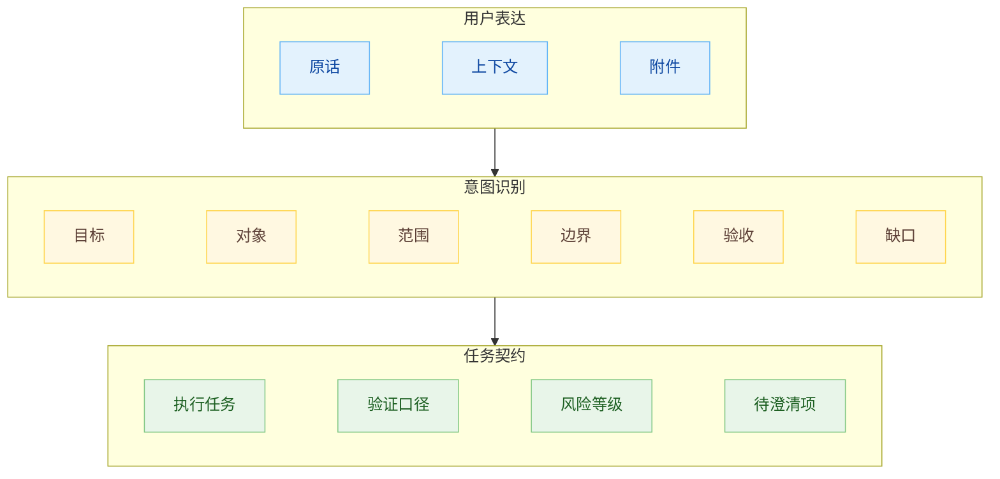
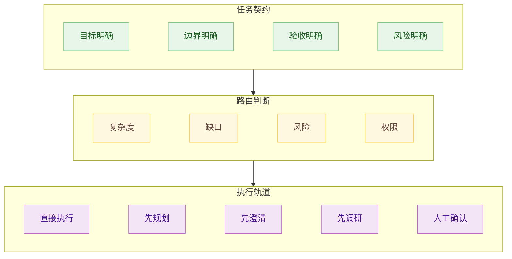
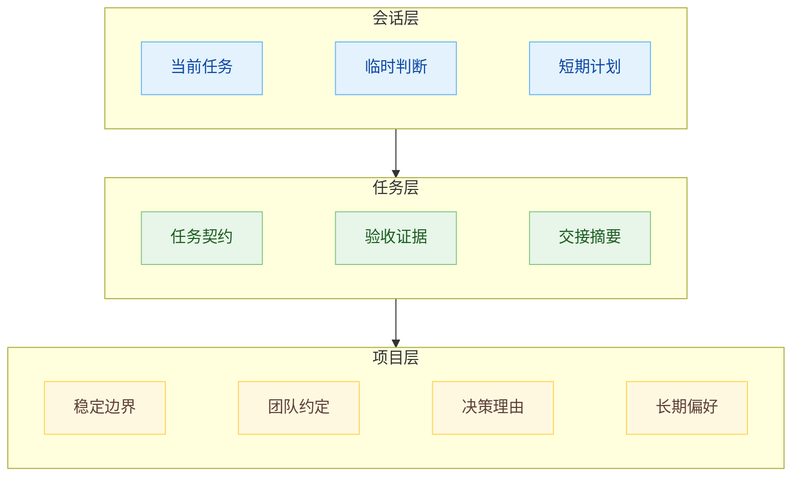

# Agent 开发：面对词不达意时的意图识别设计

给 Codex、Claude Code 这类 Agent 写提示词时，词不达意是常态。用户知道自己脑子里的背景，知道“优化一下”到底指向哪里，知道哪些文件不能碰，知道什么效果才算过关。Agent 面对的却是一句话、几段上下文、一些文件和工具权限。

“把这里改顺一点”“参考这个重写”“检查一下有没有问题”，这些话有大致对象，Agent 很容易马上进入执行状态。真正缺失的是目标、边界、取舍和验收口径。模型会把这些空白补齐，而且补得很流畅。

技术债在代码里，认知债在人脑里，意图债在没有被外化的目标、约束和理由里。Agent 可以读代码，可以解释代码，可以根据现状猜一个理由，但猜出来的理由不等于人的真实意图。Agent 系统一旦开始大量运行，未写下来的意图会被每一轮会话、每一个子 Agent、每一次上下文压缩重复收费。

所以意图识别在 Agent 系统里不能只做分类。把一句话分成“写代码”“查资料”“写文档”“修 Bug”，只解决入口分发的一小段问题。真正承重的是另一层：把人话翻译成任务契约，让后面的 Agent 知道要改变什么状态、哪些东西不能破坏、凭什么判断完成、缺了哪些信息。

## 词不达意是常态输入

人和人协作时，很多意图依靠默契传递。我们会根据项目历史、说话人的偏好、上一次讨论、团队惯例来补足语义。Agent 没有这种长期共事形成的默契，除非这些东西已经被写进 `AGENTS.md`、spec、issue、任务文件或历史记忆里。

这会产生一个很容易误判的状态：输入看起来足够具体，执行时却到处需要猜。

“优化一下”缺少评价尺度。“修一下”缺少预期行为。“按照之前的风格写”缺少可读的风格来源。“你看着办”缺少授权边界。Agent 如果继续推进，会把自己的默认偏好当成用户偏好，把常见工程习惯当成项目约束，把当前上下文里最显眼的材料当成真正重点。

这类偏差和模型工作方式有关。模型会在上下文里寻找最合理的下一步。当意图没有被写清楚时，最合理的下一步经常只是统计意义上的合理，和用户真正想要的东西隔着一层。

Agent 经常分不清“需求已经足够执行”和“需求还缺承重信息”。换到产品系统里，这意味着不能把意图识别完全交给模型的自觉。系统要有一层明确机制，逼它在执行前检查任务契约是否成立。

可以把一次用户输入写成：

$$
U = W + C + F
$$

`W` 是用户原话，`C` 是当前对话和历史上下文，`F` 是附件、代码、网页、截图等外部材料。很多系统把 `U` 直接交给执行 Agent。更稳的做法是先生成一个中间对象：

$$
I = (G, O, S, B, A, R, Q)
$$

`G` 是目标，`O` 是对象，`S` 是范围，`B` 是边界，`A` 是验收，`R` 是风险，`Q` 是缺口。这个 `I` 才是 Agent 真正应该执行的东西。

## 任务契约

意图识别的输出应该像一份小任务契约。它不用写成很长的 PRD，但必须把影响执行方向的要素列清楚。Agent 可以不知道所有细节，但不能不知道承重细节。

目标定义要改变的状态。对象定义这次要处理的材料。范围定义哪些地方纳入本轮，哪些地方暂时不动。边界定义看起来合理但禁止触碰的动作。验收定义完成后要留下什么证据。风险定义哪些动作会扩大影响面。缺口定义哪些信息不能靠猜。

给 Agent 的 spec 要覆盖目标、约束、边界、命令、测试和成功标准。这里可以再往前推一层：spec 并非只靠用户一次性写好，Agent 系统可以先从用户的压缩表达里抽出任务契约，再让用户修正。用户不擅长一次写出完整提示词，但擅长判断一份契约有没有偏题。

任务契约有一个很现实的好处：它让 Agent 的错误变得可定位。没有契约时，结果不对只能说“模型理解错了”。有契约以后，可以判断是目标提取错、范围判断错、边界漏掉、验收写虚，还是风险路由有问题。

重点是中间层。没有中间层，用户表达会直接压到执行器上，执行器只能一边做一边猜。有了任务契约，执行器拿到一组能约束行动的字段，一句松散的话被压进可检查结构。

目标、对象、验收不清楚，执行很容易空转。范围和边界不成形，执行很容易越界。风险没有被判断，系统就不知道该直接做、先问人，还是进入审批。

## 执行路由

识别出意图以后，系统还要决定下一步怎么走。很多 Agent 产品的问题出在这里：入口只有一个默认动作，也就是马上执行。用户表达清楚时，这条路很快；表达含糊时，这条路就会让系统显得鲁莽。

LLM 负责理解来信意图，工作流负责把结果放进受控、可审计的路径里。也就是说，模型给出语义判断，系统用确定性的流程承接判断。放到 Codex、Claude Code、云端 Agent 上，同样应该如此：意图识别层给出任务契约和风险判断，运行时再选择轨道。

清楚、低风险、可验证的输入，可以直接执行。目标清楚但路径较长，应该先进入计划模式。关键字段缺失，应该先澄清。资料不足，应该先调研。涉及删除、迁移、线上配置、账务、权限和外部发送，应该进入人工确认。

Claude Code 的 Plan Mode、Agent SDK 里的 `AskUserQuestion` 都说明同一件事：成熟的 Agent 系统需要把“停下来问”“先读不改”“等人确认”做成运行时能力，而不能只靠模型在回答里说一句“我建议先确认”。只要系统默认工具权限仍然开着，模型下一步就可能继续动手。

执行路由的价值在于减少返工，也减少惊险操作。它让 Agent 在该快的时候快，在该慢的时候慢。没有这层设计，系统只能在两个糟糕状态之间摇摆：要么过度谨慎，什么都问；要么急于表现，什么都做。

## 澄清问题

很多系统把澄清做成礼貌动作，开头问三五个泛泛的问题，看起来认真，实际没有降低多少不确定性。对 Agent 来说，澄清应该只服务一个目标：补齐会改变执行方向的信息。

好的澄清问题有承重性。用户回答之后，计划会变，工具选择会变，影响范围会变，验收方式会变，风险等级会变。回答之后什么都不变的问题，就不该问。

可以把缺口分成三类。目标缺口会影响要去哪里，边界缺口会影响不能碰哪里，验收缺口会影响怎么判定完成。其他问题如果只是让描述更漂亮，或者让 Agent 看起来更懂礼貌，应该压下去。

优先问那个最能提高执行确定性的问题。Agent 不需要把所有不确定性都问清楚，它只需要把足以影响行动的那几个不确定性问清楚。否则用户会被问烦。

澄清还有一个容易忽视的细节：问题应该带着当前理解。直接问“你想怎么做？”经常把负担推回给用户。更好的方式是给出系统已经识别出的契约草案，让用户修正其中的关键字段。

比如系统可以说：我理解本次目标是改动某个模块，范围限于这几个文件，验收以这组测试和页面表现为准；现在缺的是风险边界，请确认能否改数据结构。这里要设计的是交互结构。用户面对一份可修正的判断，比面对一张空白表更容易给出有效反馈。

一个问题也在这里：Agent 不一定天然知道该问什么。产品层应该给它缺口类型、问题预算和停止条件。否则它可能问太多、问太虚，也可能在最该问的时候猜下去。

## 意图沉淀

意图识别如果只存在于当前回复里很快就会丢。长任务会压缩上下文，子 Agent 会拿到截断后的任务，后台任务会隔几个小时恢复，用户会在同一个入口里插入别的问题。每一次状态切换，都会让原本没有外化的意图重新变成空洞。

意图要离开人的脑子，也要离开单轮对话，进入可读、可查、可交接的工件里。小任务可以写进计划摘要，较长任务可以写进 `task.md` 或 `spec.md`，项目级偏好和硬边界可以写进 `AGENTS.md`，决策理由可以进入 ADR 或 issue 评论，常驻代理还需要把稳定偏好和项目事实写进记忆层。

沉淀时要克制。很多中间推断只适合留在当前任务里。一次临时选择、一次错误猜测、一次过期 API 状态，如果被写成长期规则，会让 Agent 越跑越偏。可以把意图沉淀分成三层：

会话层服务当前对话，任务层服务本轮交付，项目层服务长期复用。写入层级错了，后果会很难受。短期猜测进了项目层，后面会持续污染判断；稳定边界只留在会话层，下次 Agent 接手就会忘。

这也能和注意力设计连起来。意图是注意力的方向，任务契约是把方向固定下来的介质。没有契约，Agent 的注意力会被当前最显眼的材料牵着走；契约写清楚以后，目标、边界、验收和风险会持续占住位置。

Agent 系统里的意图识别，最终要回答一个工程问题：这句话够不够变成行动。用户表达天然会省略，模型天然会补全，中间必须有一层把省略显性化，把猜测降到可控范围。它识别目标，也识别缺口；生成契约，也选择路由；能澄清，也能沉淀。

等这层做好以后，提示词写得差一点，系统仍然有机会把真实意图捞回来。

## 参考材料

- [The Intent Debt](https://addyosmani.com/blog/intent-debt/)
- [Interactive Agents to Overcome Ambiguity in Software Engineering](https://arxiv.org/html/2502.13069v1)
- [Claude Code Common Workflows](https://code.claude.com/docs/en/common-workflows)
