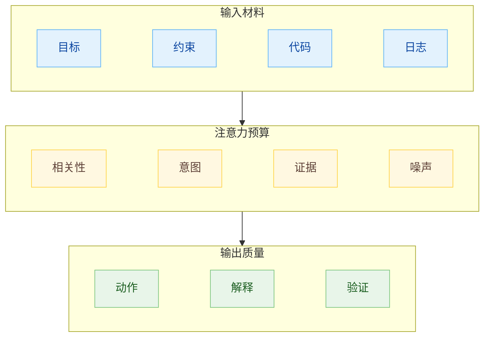
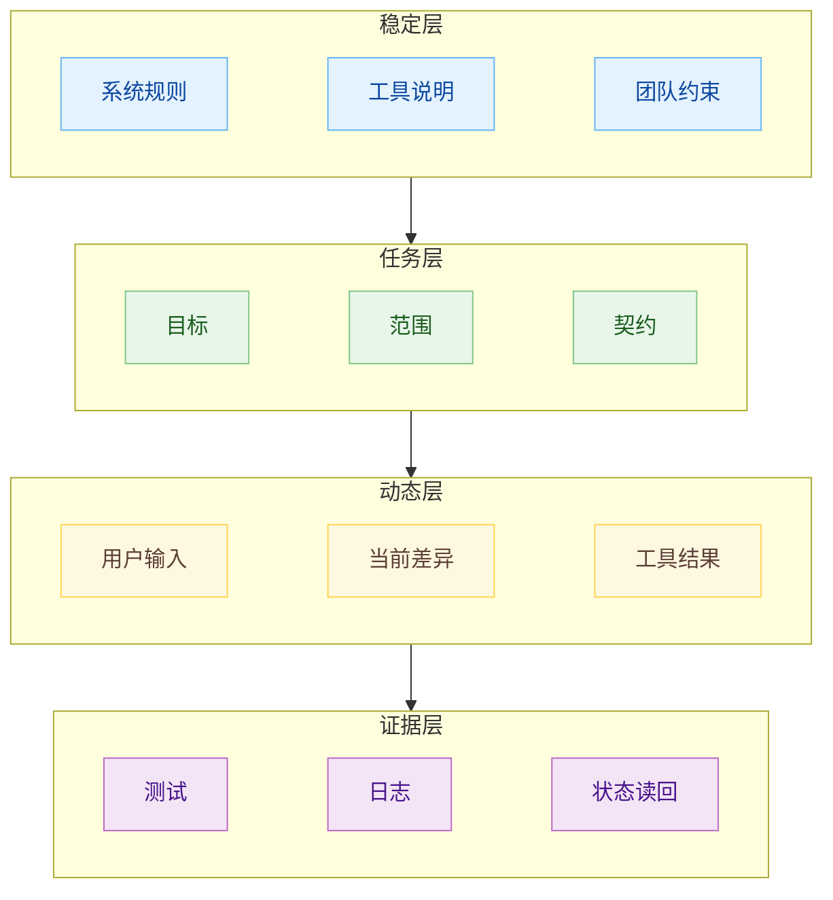
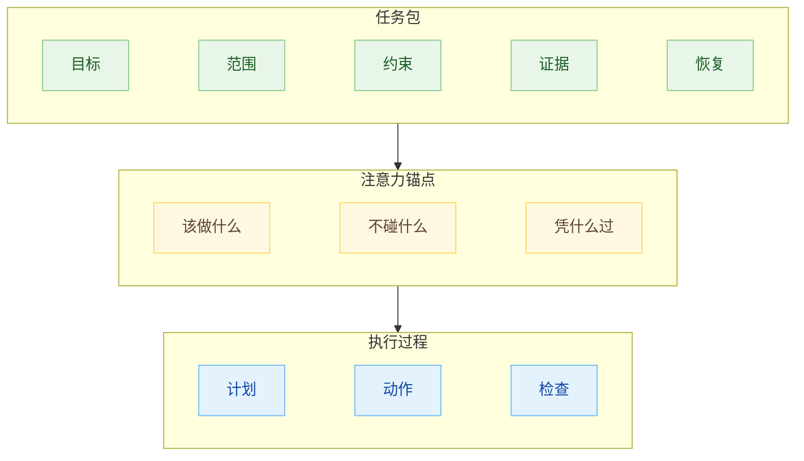
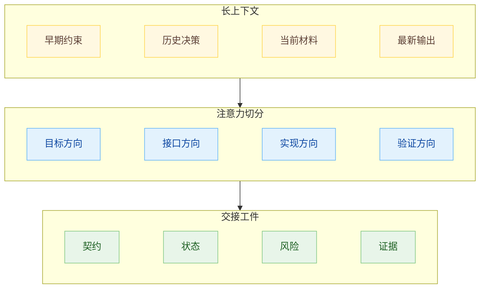
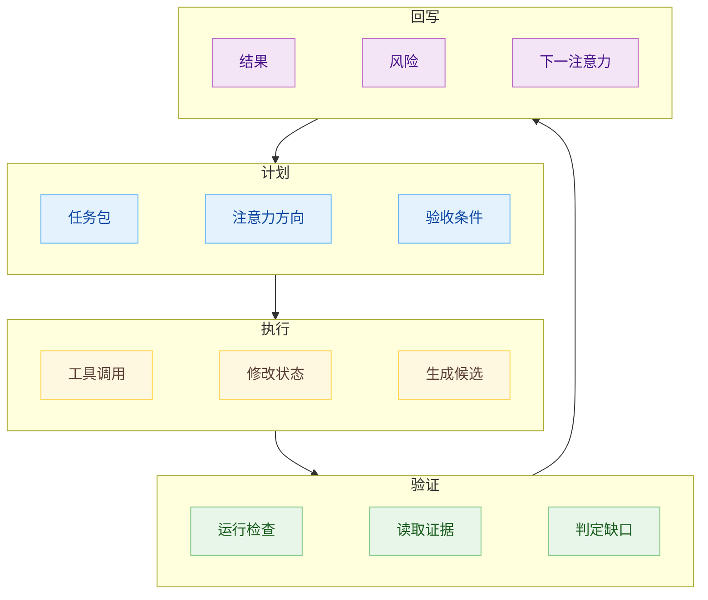
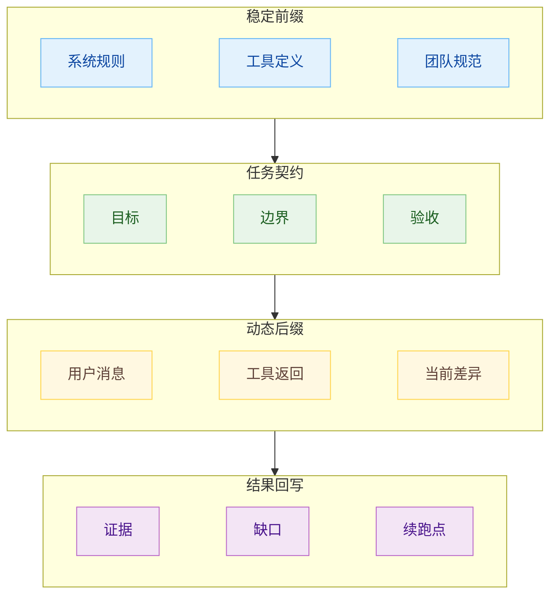
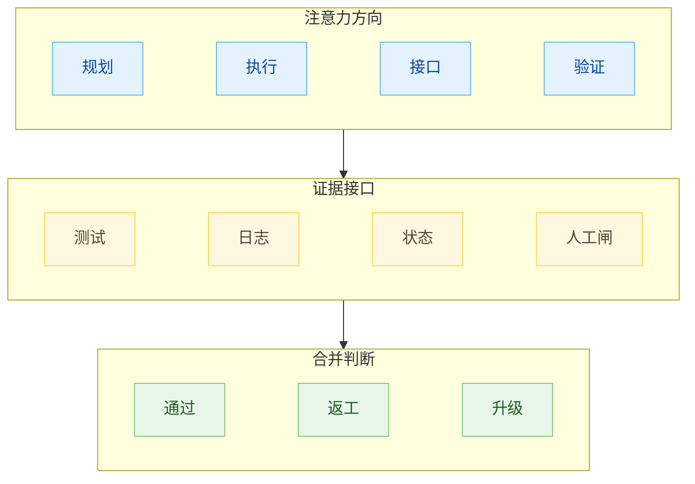
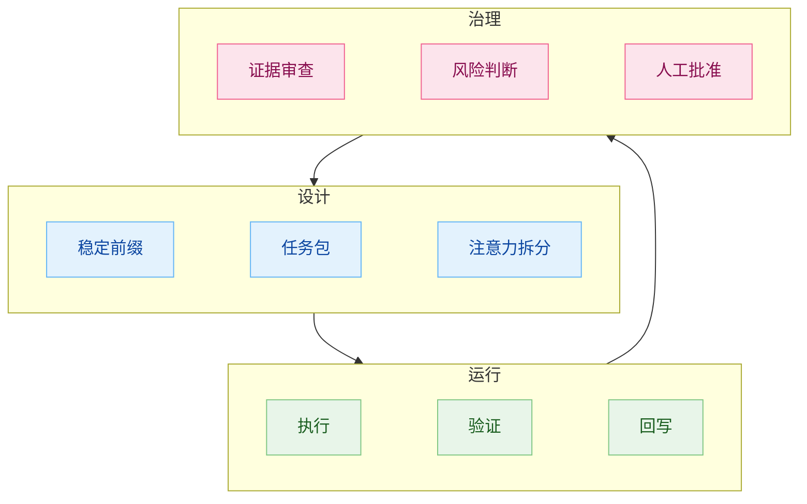

# Agent 系统里的注意力设计

Agent 系统里很多问题是注意力没有设计好。

上下文窗口变大以后，材料都能塞进去，代码、文档、日志、工具结果、历史对话、团队规范、产品目标一股脑进入窗口，Agent 仍然可能漏掉关键约束。那条约束仍在窗口里，但在生成过程中没有持续占住足够的注意力。

这也是上下文工程容易被误解的地方。很多人把它理解成“把资料喂全”，于是开始追求更大的窗口、更长的系统提示、更完整的仓库快照，结果经常适得其反。上下文窗口是容量，注意力是运行时资源。容量解决能不能放进去，注意力决定哪一部分会影响下一步输出。

prompt engineering、context engineering、loop engineering、多 Agent，都在处理同一种资源，也就是注意力。prompt 是瞄准一次调用的注意力，context 是决定注意力能触达什么，loop 是让注意力在时间上持续，多 Agent 是把多股注意力分配到不同方向。

可以先把一个 Agent 调用写成一个简化函数：

$$
y_t=M(x_t, C_t, S_t)
$$

`x_t` 是当前输入，`C_t` 是上下文，`S_t` 是系统状态，`y_t` 是这一步输出。这个式子还不够，因为它假设 `C_t` 里的内容会平等发挥作用。实际更接近这样：

$$
y_t=M(x_t,\ A(C_t),\ S_t)
$$

`A(C_t)` 表示模型在当前步骤实际分配到的注意力。上下文工程要管住 `A(C_t)`，单纯扩大 `C_t` 解决不了这件事。

写成一笔工程账，可以是：

$$
\mathrm{ContextValue}=
\frac{\mathrm{Relevant}+\mathrm{Intent}+\mathrm{Evidence}}
{\mathrm{Noise}+\mathrm{Drift}+\mathrm{SwitchCost}}
$$

`Relevant` 是相关信息，`Intent` 是意图和约束，`Evidence` 是可验证证据。分母里，`Noise` 是噪声材料，`Drift` 是长期运行时的偏移，`SwitchCost` 是人类来回接管监督的成本。很多上下文系统失败是分母被喂得太大。



## 上下文窗口不能当仓库

把上下文窗口当仓库，是很多 Agent 系统的第一层误区。

仓库的目标是尽量完整，窗口的目标是当下有效。仓库里可以放历史、备份、无关分支、旧方案和废弃决策，窗口里放这些东西就会抢注意力。模型不会因为某段文字对当前任务无关，就自动把它的影响降到零。它会根据位置、形式、语义显著性、近期生成内容和任务措辞来分配注意力。

所以“给 Agent 更多上下文”应该改成一个更窄的问题：这一步输出需要哪些上下文来约束它。

把上下文分成四层：

$$
C=C_{stable}+C_{task}+C_{dynamic}+C_{evidence}
$$

`C_stable` 是长期稳定的系统规则、工具说明、团队约束；`C_task` 是本轮任务的目标、范围和契约；`C_dynamic` 是当前用户输入、最新 diff、工具结果；`C_evidence` 是测试、日志、截图、状态读回等证据。

这四层的变更频率不同，作用也不同。稳定层应该在前面，越稳定越适合做 prompt cache 的前缀。任务层负责本轮注意力方向。动态层只应该携带当前需要的变化。证据层负责把输出拉回现实。



Prompt caching 文档里反复强调一件事：静态内容放前面，变化内容放后面，缓存断点要落在稳定前缀末尾。这个建议表面上是降成本、降延迟，放到 Agent 系统里看，它也在提醒我们：上下文应该有层次。稳定的规则应该形成前缀，变化的信息应该形成后缀。前缀一旦频繁被改，缓存失效；同样，稳定约束一旦被混进动态对话里，注意力也容易失焦。

技术上的 cache hit 和语义上的 attention hit，有相似的结构。前者要求前缀一致，后者要求约束稳定。你每轮都在改系统规则，每轮都在补充临时限制，Agent 就很难形成稳定的行为轨道。它会在不断变化的指令里临场判断，最后表现得时好时坏。

## 意图要变成锚点

只有材料，没有意图，Agent 会自己补题。

代码可以被 Agent 读回，人的意图却很难从代码里完整推回。模型可以根据现有实现猜一个理由，但猜出来的理由不等于当初的理由。对 Agent 系统来说，未写下来的意图会变成每一轮上下文里的空洞。Agent 每次遇到空洞，都会用看起来合理的常识去填。

这也是为什么好的 spec 不能只写任务列表。任务列表告诉 Agent 做什么，意图告诉 Agent 为什么这样做，边界告诉 Agent 哪些看似合理的动作不能做。

一个能承担注意力锚点的任务包，至少应该有五个部分：

$$
P=(G,S,K,E,R)
$$

`G` 是 goal，定义要到哪里；`S` 是 scope，定义本轮处理范围；`K` 是 constraints，定义不可破坏的约束；`E` 是 evidence，定义完成后要留下什么证据；`R` 是 recovery，定义失败后怎么回退或续跑。

其中 `K` 最容易被低估。很多团队会写目标，也会写验收，但不写约束背后的原因。Agent 看到目标以后，会选择最短路径。最短路径可能删掉一段看起来多余的防护，可能绕过一个历史上很关键的兼容规则，也可能把“暂时不做”的范围重新加回来。它会这样做，是因为那条边界没有足够分量。



## 长上下文会稀释早期约束

长上下文带来的问题，经常被描述成“模型忘了”，但我觉得这个描述不准确。

很多时候，早期内容仍然在窗口里，模型也能在被追问时找回来。问题发生在生成过程中：当前代码、最新工具输出、最近的用户要求、模型自己刚写出的推理，会不断挤占注意力。早期约束并没有消失，只是权重越来越低。它像一本放在桌角的规范，仍然存在，但手边正在展开的是另一摞材料。

可以把注意力份额写成：

$$
\sum_{i=1}^{n} a_i=1,\quad a_i\ge 0
$$

每加入一段上下文，都会参与这组分配。关键约束的实际影响取决于它在当前任务中的注意力份额，token 数只能解释其中一小部分：

$$
\mathrm{ConstraintForce}(k)=a_k\cdot w_k
$$

`a_k` 是模型分给这条约束的注意力份额，`w_k` 是这条约束在任务语义里的权重。上下文工程要做的事，就是同时提高 `a_k` 和 `w_k`：让约束放在容易被注意到的位置，也让提示明确告诉模型这条约束承担什么责任。

拆任务除了降低 token 数，还能让每个 Agent 的注意力份额集中在一个可承载的范围内。一个 Agent 同时背着目标、架构、接口、实现、测试、风险和进度，最后很容易顾此失彼。拆开以后，每个 Agent 只持有一段清晰的注意力方向，交接靠结构化工件完成。

还要小心另一种误区：按文件或模块粗暴拆分，可能把模块内部做得不错，却让接口缝隙无人负责。注意力不会凭空消失，它只会换地方漏。模块 Agent 盯模块，验证 Agent 盯证据，接口 Agent 就要盯契约和状态交接。



## 证据回写到上下文

Agent 系统里最危险的上下文，是不记录“我怎么证明它能用”。

自然语言总结很容易让人放松警惕。Agent 写一句“已完成并通过验证”，如果没有命令、输出、日志、截图、状态读回或其他证据，这句话只是声明。声明不能让下一个 Agent 继续工作，也不能让人类放心合并。下一轮 Agent 看到这句话，很可能把它当成事实继续推理，半可信状态就这样层层叠加。

所以每一轮执行结束后，证据应该回写成上下文的一部分。回写时不需要把所有日志塞进窗口，重点是把证据索引、结论和缺口写清楚。下一个 Agent 可以先读结论，再按需打开原始证据。

一个比较稳的验证包可以是：

```md
## Result
PASS 或 FAIL

## Evidence
本轮实际运行过的检查、状态读回、日志或截图。

## Blocking Issues
阻断进入下一阶段的问题。

## Known Gaps
没有覆盖的边界。

## Next Attention
下一轮最应该盯住的地方。
```

最后一项 `Next Attention` 很有用。它把“下一步做什么”改成“下一步该盯什么”。在长链路 Agent 系统里，任务流转本身不难，难的是注意力不丢。每一轮都写清楚下一轮要盯的约束、风险和证据，系统才不容易越跑越脏。

可以把循环写成：

$$
C_{t+1}=C_{stable}+P_t+V_t+\Delta_t
$$

`P_t` 是本轮任务包，`V_t` 是验证包，`\Delta_t` 是本轮产生的状态变化。



## Prompt caching 也在提醒上下文结构

Prompt caching 常被当作性能功能，但它对 Agent 系统有一个更大的启发：上下文应该按变化频率排列。

稳定的系统提示、工具定义、团队规范、输出格式、长期约束，适合放在前缀。任务目标、当前文件、用户输入、工具返回，适合放在后缀。

可以用一个很实用的判断式：

$$
\mathrm{Cacheable}(c_i)\Rightarrow \mathrm{Stable}(c_i)\land \mathrm{Reusable}(c_i)
$$

但 Agent 系统还需要多一项：

$$
\mathrm{Anchor}(c_i)\Rightarrow \mathrm{Stable}(c_i)\land \mathrm{Reusable}(c_i)\land \mathrm{Normative}(c_i)
$$

`Normative` 表示这段内容有约束力。工具说明可以缓存，但它未必是任务锚点。团队的安全边界、禁止动作、验收标准、代码风格、状态交接格式，既稳定又有约束力，更应该进入前缀，并且保持表达稳定。

所以我们应该把 Agent prompt 分成三类：

第一类是稳定规范。它应该被缓存，也应该被版本化。它的变化要谨慎，因为它会改变所有下游行为。

第二类是任务契约。它随任务变化，但在本轮内必须稳定。执行中频繁改契约，会让 Agent 左支右绌。

第三类是动态材料。它只服务当前判断，用完就变成证据或废料。动态材料不应该挤占稳定规范的位置。



## 多 Agent 的注意力方向

多 Agent 系统如果只是在 prompt 里写“你是 planner、你是 coder、你是 reviewer”，很容易变成角色扮演。有工程价值的是注意力方向不同。

执行 Agent 的方向是把候选结果做出来。验证 Agent 的方向是找候选结果和契约之间的偏差。接口 Agent 的方向是盯状态交接和边界一致性。调度 Agent 的方向是看预算、风险、阻塞和下一步。这些方向之间要有覆盖，也要有对抗。

可以把 Agent 设计写成向量：

$$
\vec{a_i}=(d_i,m_i,e_i)
$$

`d_i` 是方向，`m_i` 是强度，`e_i` 是证据接口。方向决定它盯什么，强度决定它在冲突时有多大权重，证据接口决定它能看见什么现实信号。

验证 Agent 不能只有“认真检查”的方向，还要有证据接口。没有测试、日志、截图、状态读回、实际运行结果，它只能读 diff 发表意见。意见可以有启发，但不能替代验证。Daniel Demmel 所说的 feedback loop engineering 里，有一个重要区分：工作代码和幸运代码不能只靠阅读判断。Agent 的注意力需要落到真实反馈上。



这和上一篇讨论的验证边界能接起来。角色是否需要分工，取决于注意力方向是否需要分离。执行和验证最好分开，因为它们的方向相反。模块和接口最好分开，因为它们覆盖不同区域。调度和合并最好分开，因为一个负责推进，一个负责风险拍板。

## 人类注意力应该留给哪里

Agent 系统的目标应该是把人的注意力从碎片化监督里释放出来，集中到少数高价值判断上。

碎片化监督很累。Agent 做一步，人看一步；Agent 等一句 continue，人切回来判断一次；Agent 出错，人再补一次上下文。几轮下来，人一直在切换尺度：刚看完架构，又要看一行代码；刚看完测试，又要想产品目标。切换成本比代码本身更耗人。

好的 Agent 系统应该让人少做这种来回切换，把注意力留给四件事：

- 意图是否写对。
- 边界是否立住。
- 证据是否可信。
- 风险是否可以接受。

这四件事很难完全交给模型。尤其是意图，它来自人类目标、业务取舍、团队经验和责任边界。

所以注意力设计的终点应该写成：让 Agent 持有过程中的局部注意力，让人类持有最终责任上的关键注意力。

## 一套可执行的检查表

如果要把这篇文章落到工程动作里，我会用下面这套检查表。

第一，写稳定前缀。系统规则、工具说明、团队规范、输出格式、禁止动作，放进稳定前缀，并尽量保持表达稳定。

第二，写任务包。每次执行前写清 `Goal`、`Scope`、`Constraints`、`Evidence`、`Recovery`。关键意图不能缺席。

第三，按注意力范围拆任务。一个 Agent 只处理它能持续盯住的范围。跨接口、跨状态、跨风险的地方，安排专门的接口或验证注意力。

第四，给验证 Agent 真实证据。能跑检查就跑检查，能读状态就读状态，能看日志就看日志。只读总结的 reviewer 很容易变成建议生成器。

第五，回写验证包。每轮结束留下 result、evidence、blocking issues、known gaps 和 next attention。下一轮从验证包续跑，不从聊天记录里捞线索。

第六，限制动态上下文。工具结果、临时讨论、探索性输出，用完就归档。该进入长期规范的内容再沉淀到稳定前缀或决策记录里。

第七，人类只在关键闸口接管。规格批准、风险接受、生产动作、合并判断，仍然需要人。



## 参考资料

1. Han Cheng e/acc, [Organize Attention, Not Tasks](https://x.com/ashfold/status/2064527446314225989), 2026-06-10.
2. Addy Osmani, [The Intent Debt](https://addyosmani.com/blog/intent-debt/), 2026-06-05.
3. Addy Osmani, [How to write a good spec for AI agents](https://addyosmani.com/blog/good-spec/), 2026-01-13.
4. OpenAI, [Prompt Caching](https://developers.openai.com/api/docs/guides/prompt-caching).
5. Anthropic, [Prompt caching](https://docs.claude.com/en/docs/build-with-claude/prompt-caching).
6. Jeonghoon Lee, [A Held-Out Transition-Pair Falsifier for Long-Horizon Non-Abelian State Tracking](https://arxiv.org/abs/2606.07254), 2026-06-05.
