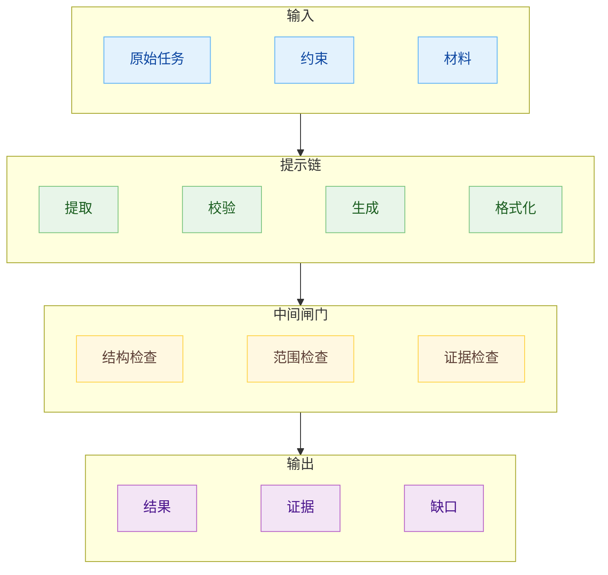
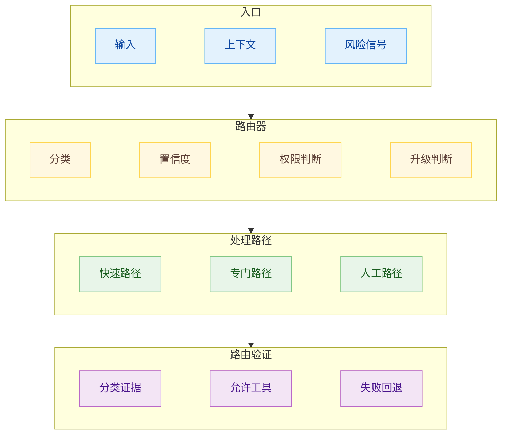
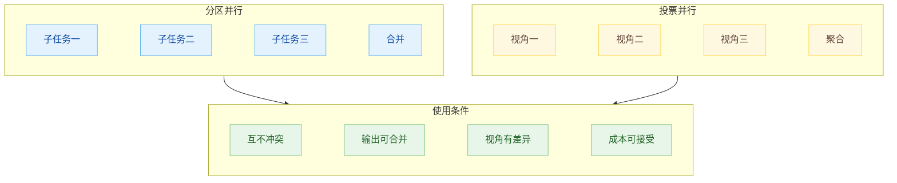
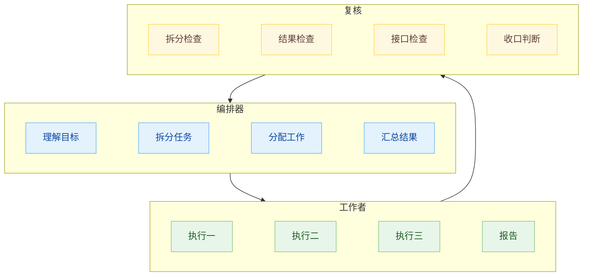
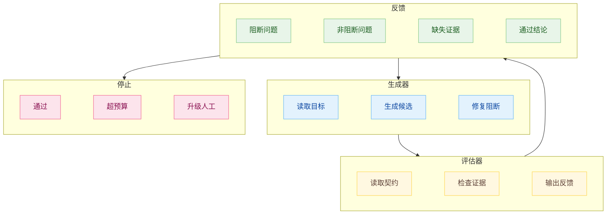
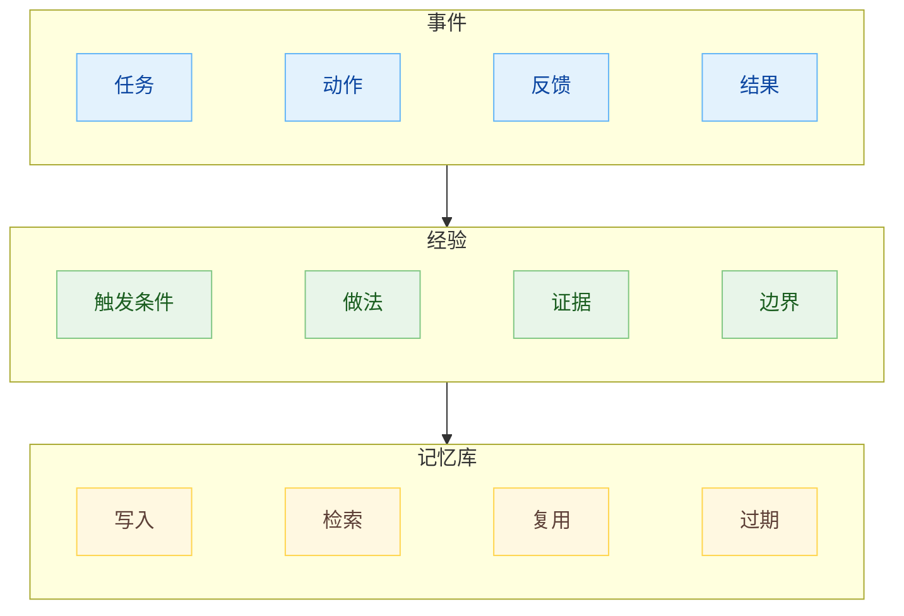
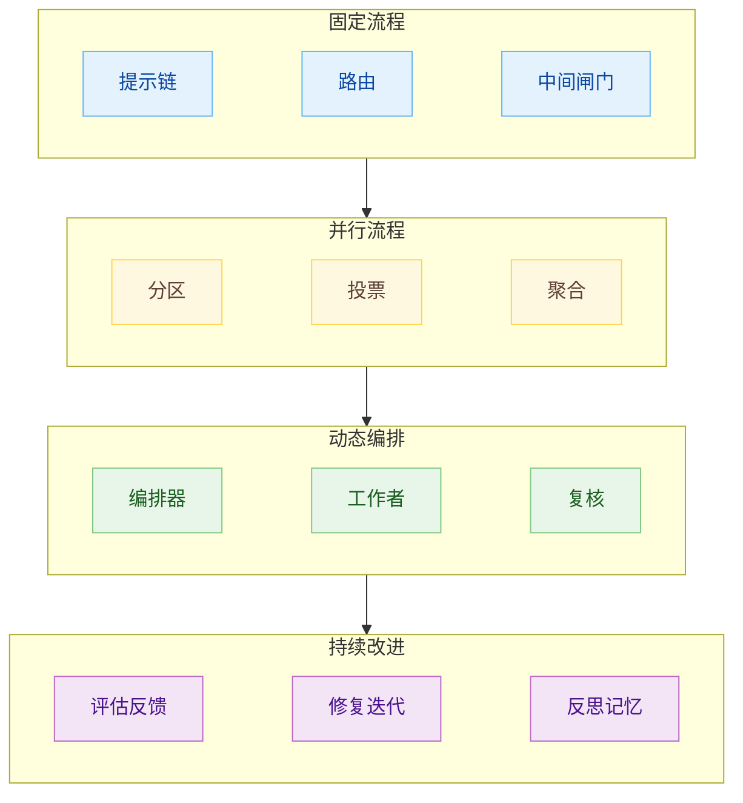

# Agent 设计模式

## Prompt Chaining：提示链

提示链把一个任务拆成一组固定步骤，每一步只处理一个更窄的问题。上一步的输出成为下一步的输入，中间可以插入 gate，用程序规则或模型判断拦住不合格结果。

它的基本形态是：

$$
x_0 \xrightarrow{L_1} y_1 \xrightarrow{g_1} x_1 \xrightarrow{L_2} y_2 \xrightarrow{g_2} x_2 \xrightarrow{L_3} y
$$

`L_i` 是一次 LLM 调用，`g_i` 是中间检查。没有 gate 的提示链，只会把一个长 prompt 拆成多段；有 gate 的提示链，才开始具备 workflow 的味道。因为它能在中间结果跑偏时提前停下，避免等最终答案出来后再整包返工。



提示链适合步骤稳定的任务。任务如果天然可以分成“读材料、抽结构、检查结构、生成结果、验证格式”，提示链通常比一次调用更稳。每一步的上下文更窄，模型需要同时维持的目标更少，错误也更容易定位。

提示链也适合把强约束提前。输出需要满足 schema 时，最好不要等最后一步才检查。可以先抽字段，再检查字段是否齐全，再生成正文，再做格式校验。这样每个 gate 都在降低后续步骤的错误空间。

一个提示链通常要写清四件事：

- 每一步的输入是什么。
- 每一步的输出格式是什么。
- 每个 gate 检查什么。
- gate 失败后是返工、降级、阻塞，还是交给人。

提示链最常见的问题是“链条过长”。每一步看起来都合理，连起来以后状态越来越重，错误来源越来越多。链条太长时，应该检查两件事：有些步骤能不能合并，有些步骤能不能变成确定性代码。LLM 不适合承担所有中间步骤。

## Routing：路由

路由先判断输入类型，再把任务交给不同处理路径。它解决的是入口分流问题。

$$
r=\mathrm{Router}(x),\quad y=H_r(x)
$$

`Router` 输出路由结果 `r`，下游处理器 `H_r` 根据这个结果选择提示、工具、模型、权限、上下文和验证方式。



路由适合输入差异很大的系统。同一套提示无法同时处理所有输入时，路由就开始有价值。不同输入可能需要不同工具、不同模型、不同上下文、不同验证标准，也可能需要不同权限边界。

路由的关键在于分错以后的代价控制。低风险路由可以允许自动尝试，失败后换路径。高风险路由需要低置信度即暂停，或者进入人工确认。路由如果直接决定权限，就必须把置信度和升级条件写进结构里。

路由器常见的失败方式有三种。

第一种是类别边界太软。类别看起来有名字，实际互相重叠。路由器只能靠语感判断，结果时好时坏。

第二种是路由只分类型，不分风险。低风险任务和高风险任务进入同一个处理路径，下游 Agent 拿到同一组工具和权限。

第三种是路由没有回退。分错以后，下游流程继续努力，最后输出一份很完整的错误结果。

路由器应该把“不确定”当成一等输出。很多系统路由失败，是因为它被迫在几个类别里选一个。更稳的设计是允许：

```text
UNKNOWN
NEED_MORE_CONTEXT
NEED_HUMAN_REVIEW
OUT_OF_SCOPE
```

路由模式在 Agent 系统里不只用于客服分诊。它也可以用于模型选择、上下文选择、工具选择、权限选择和验证策略选择。

## Parallelization：并行化

并行化让多个 Agent 或多个 LLM 调用同时处理任务，然后把结果聚合起来。它主要有两种形态：sectioning 和 voting。

Sectioning 是把任务拆成相互独立的部分：

$$
y=\mathrm{Merge}(A_1(x_1),A_2(x_2),...,A_n(x_n))
$$

Voting 是让多个调用处理同一个问题：

$$
y=\mathrm{Aggregate}(A_1(x),A_2(x),...,A_n(x))
$$



Sectioning 适合天然可拆的任务。每个子任务有自己的输入、输出和所有权，彼此不抢同一份状态。它的收益主要来自速度和专注度。每个 Agent 只看自己那一块，注意力更集中，执行也可以并行。

Sectioning 的前提是所有权隔离：

$$
O_i\cap O_j=\varnothing
$$

如果所有权集合有交集，就要先定义共享契约：

$$
O_i\cap O_j\ne\varnothing \Rightarrow C_{ij}\ \mathrm{required}
$$

没有所有权隔离的并行，很容易把速度收益变成合并成本。两个 Agent 同时改同一类状态，各自验证通过，合起来开始互相打架。并行应该让多个可独立验收的工作同时前进，单纯开更多进程没有这个效果。

Voting 适合降低漏判。多个 Agent 从不同视角看同一个对象，再由聚合器汇总。它常用于风险审查、需求一致性检查、主观质量判断和开放式答案评估。Voting 的关键在于视角差异。四个提示几乎一样的 reviewer，只会产生四份相似盲区。

可以把 Voting 的有效性写成：

$$
\mathrm{VotingGain}=\mathrm{Diversity}\times \mathrm{Independence}-\mathrm{AggregationCost}
$$

`Diversity` 是视角差异，`Independence` 是判断独立性。两个 Agent 共用同一份错误上下文，或者一个 Agent 先污染另一个 Agent 的判断，投票质量会下降。

聚合器也要有规则。常见聚合方式有三种：

- 任一阻断即失败。
- 多数通过才通过。
- 按风险权重加权。

高风险场景通常不适合简单多数。一个安全 reviewer 发现阻断问题，其他 reviewer 没看到，不应该被多数票压掉。更稳的做法是把输出分成 `blocking`、`non-blocking`、`unknown`，由聚合器按风险处理。

并行化的成本也很直接。它会增加调用次数、上下文准备、结果合并和冲突处理。并行前要先问：子任务能不能独立完成，结果能不能机械合并，冲突能不能定位。如果答案含糊，并行很可能只是把混乱铺开。

## Orchestrator Workers：编排器-工作者

编排器-工作者模式由一个中心 Agent 动态拆解任务，把子任务分配给多个 worker，再汇总结果。

$$
T=\mathrm{Decompose}(x),\quad y=\mathrm{Synthesize}(W_1(t_1),W_2(t_2),...,W_n(t_n))
$$

它和 sectioning 的区别在于：sectioning 的拆分通常事先确定，orchestrator-workers 的拆分由编排器根据当前输入动态决定。



这个模式适合子任务数量无法预先写死的任务。输入进来以后，系统才知道要拆几块、调哪些工具、读哪些材料、派几个 worker。它比固定 workflow 灵活，也比完全自主 Agent 更有结构。

编排器至少承担四个职责：

- 判断任务边界。
- 拆成 worker 能独立完成的小任务。
- 定义每个 worker 的输入、输出和验收标准。
- 汇总结果并处理冲突。

这个模式最大的风险是编排器拆错。拆分一旦错了，worker 越勤奋，偏差越大。编排器如果遗漏接口一致性，worker 分别把局部做完，汇总后才会发现交接物对不上。编排器输出本身也要被验收。

可以给编排器加一个拆分检查：

$$
\mathrm{ValidPlan}=
\mathrm{Covered}(T,G)\land
\mathrm{Isolated}(T)\land
\mathrm{Verifiable}(T)\land
\mathrm{Mergeable}(T)
$$

`Covered` 表示子任务覆盖全局目标，`Isolated` 表示子任务之间有足够隔离，`Verifiable` 表示每个子任务能验收，`Mergeable` 表示输出能合并。

编排器-工作者模式也需要收口机制。worker 输出多了以后，系统容易停在“每个 worker 都完成了”这个层面。最终还需要一个收口判断：结果是否满足原始目标，接口是否一致，风险是否可接受，缺口是否明确。

这个模式适合中到高复杂度任务。简单任务使用它会显得杀鸡用牛刀。因为它会增加拆分成本、worker 上下文成本、合并成本和复核成本。只有当动态拆分能显著降低单个 Agent 的认知负担时，才值得用。

## Evaluator Optimizer：评估器-优化器

评估器-优化器模式由生成器产出候选结果，评估器给出反馈，生成器根据反馈继续改进。

$$
c_t=G(x,f_{t-1}),\quad f_t=E(c_t),\quad c_{t+1}=G(x,f_t)
$$

停止条件可以写成：

$$
\mathrm{Pass}(c_t)\lor t\ge T_{\max}
$$



这个模式适合有明确评价标准，并且反馈能带来可测改进的任务。它不适合“审美上更好一点”这种边界很软、反馈也不稳定的任务，除非你先把评价标准写清楚。

评估器要和生成器分开。分开的价值不止多一个模型调用，更在于让评估方向发生变化。生成器关注“做出来”，评估器关注“哪里不符合契约”。如果评估器只说“整体不错，可以再优化”，这个模式就没有运行起来。

`Blocking Issues` 是最重要的部分。生成器下一轮应该优先修阻断问题，避免随意吸收所有建议。评估器如果把偏好、想法、范围外优化都写成阻断，循环会很难收敛。

评估器还必须有证据接口。只读候选文本，评估器给出的只是语言判断。能运行测试、读日志、打开页面、检查状态、对照 schema，反馈才更有分量。

这个模式需要预算上限。生成器和评估器如果无限循环，会变成消耗战。常见停止条件包括：

- 评估器给出 PASS。
- 达到最大迭代次数。
- 连续两轮没有实质改进。
- 出现需要人工判断的阻断问题。
- 验证证据不足。

评估器-优化器的收益来自闭环，不来自“多一个 reviewer”。闭环要能让候选结果变好，也要能在不值得继续时停下来。

## Reflection Memory：反思记忆

反思记忆把失败、修复和经验写成可复用工件，供后续任务读取。

$$
M_{t+1}=M_t+\mathrm{Lesson}(x,a_t,e_t)
$$

`x` 是任务，`a_t` 是当时采取的动作，`e_t` 是环境反馈或验证证据。反思记忆的目标是保存能改变下一次行为的经验，聊天记录只适合做原始材料。



反思记忆适合重复任务。任务一次性出现，写记忆的收益有限。任务经常重复，错误模式也稳定，记忆就能形成复利。它可以减少重复排障，保留项目约定，沉淀工具用法，也能让 Agent 少走旧路。

一条可用记忆应该有适用条件。只写“以后遇到类似问题要先跑测试”没有太大价值，因为它过于泛泛。更好的记忆要写清什么时候触发、为什么有效、证据来自哪里、什么时候不适用。

反思记忆最危险的问题是错误长期化。临时窗口里的错误，影响一轮；写进长期记忆的错误，会影响很多轮。错误经验如果被后续 Agent 反复读取，很快会积重难返。

所以记忆写入也要有 gate：

$$
\mathrm{WriteMemory}(l)=
\mathrm{Evidence}(l)\land
\mathrm{Scope}(l)\land
\mathrm{Review}(l)
$$

`Evidence` 表示有证据，`Scope` 表示适用范围清楚，`Review` 表示经过检查。低风险记忆可以自动写入草稿区，高风险记忆要人工确认后再进入长期规则。

记忆也会过期。工具升级、目录变化、模型能力变化、业务规则变化，都会让旧经验失效。反思记忆需要定期回看，不适合只增不减。可以给每条记忆加 `last_verified` 和 `expires_at`，也可以在关键 workflow 里让 Agent 检查记忆是否仍然成立。

反思记忆和状态交接要分开。状态交接回答“这次任务进行到哪里”，反思记忆回答“以后遇到类似情况要怎么做”。前者服务续跑，后者服务复用。两者混在一起，记忆库会变成聊天归档，有用经验反而难找。

## 模式组合

这些模式可以组合，但组合时要保持边界清楚。



常见组合有几种。

第一种是路由加提示链。入口先分流，不同类别进入不同固定步骤。适合类别清楚、每类流程稳定的系统。

第二种是路由加并行审查。入口先判断风险，高风险路径触发多视角 reviewer。适合漏判代价高的流程。

第三种是编排器加 worker 加评估器。编排器拆任务，worker 执行，评估器检查子任务和整体结果。适合动态拆分任务。

第四种是评估器加反思记忆。评估器发现失败面，修复后把可复用经验写入记忆。适合重复性强的工程任务。

组合时要避免模式堆叠。每加一个模式，都应该能回答它解决什么问题：

- 提示链解决步骤降难度。
- 路由解决入口分流。
- 并行化解决速度或漏判。
- 编排器解决动态拆分。
- 评估器解决候选质量。
- 反思记忆解决重复犯错。

如果一个模式说不清自己解决的控制流问题，它通常只是增加复杂度。

## 参考资料

1. Anthropic, [Building effective agents](https://www.anthropic.com/engineering/building-effective-agents), 2024.
2. OpenAI, [Agents guide](https://developers.openai.com/api/docs/guides/agents).
3. Google, [Agent Development Kit](https://adk.dev/).
4. Microsoft, [Semantic Kernel Agent Framework](https://learn.microsoft.com/en-us/semantic-kernel/frameworks/agent/).
