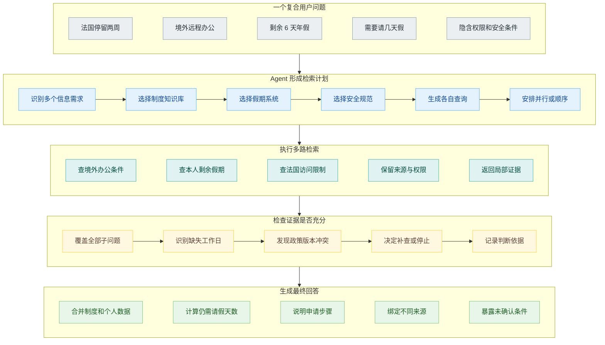
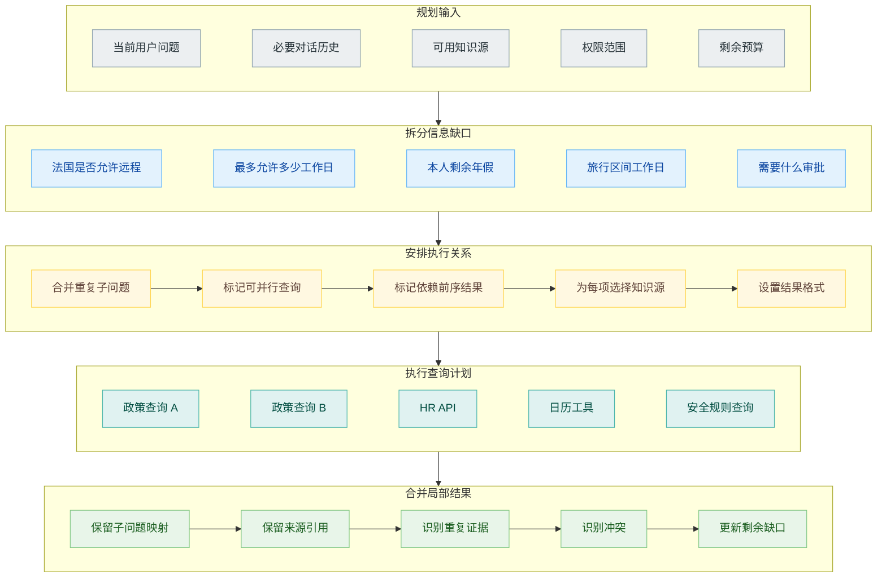
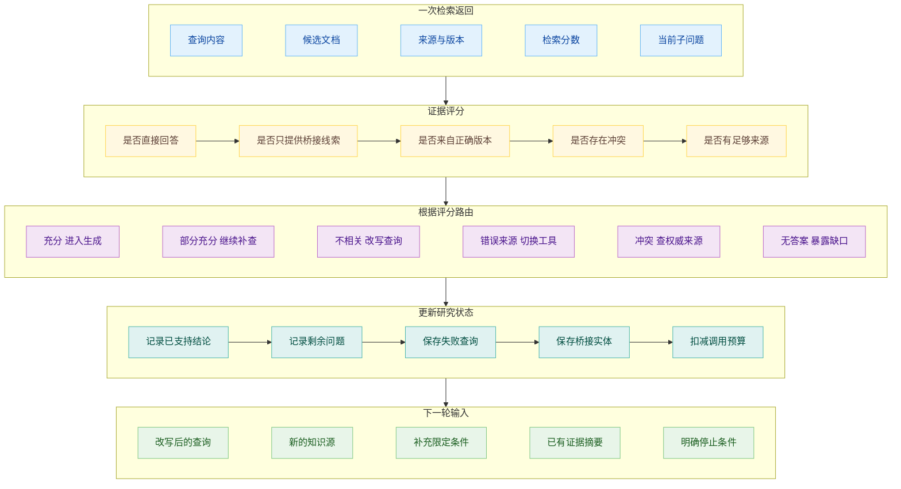

# Agentic RAG：让 Agent 决定去哪里查、要不要继续查

员工在内部助手里问：

> 我还有 6 天年假，准备去法国待两周。根据公司的远程办公政策，我能不能在当地办公，另外需要请几天假？

这个问题没有一份文档能够完整回答。公司制度知识库里写着境外远程办公的申请条件，人事系统保存员工剩余假期，安全规范里规定哪些国家或网络环境不能访问内部系统。用户还说了“两周”，系统要把工作日与假期拆开，才能判断是否需要额外请假。

固定 RAG 通常拿着整句话搜索一个知识库，取回几个相近片段，再交给模型回答。它可能找到远程办公制度，却不知道还应该查询员工假期；也可能搜到一份泛泛的居家办公说明，然后在缺少境外条款时继续生成。

Agentic RAG 把检索放进 Agent 的决策循环。Agent 可以判断当前问题是否需要检索、应该访问哪个知识源、是否要拆成几个子问题，以及第一次结果不够时要不要改写查询继续查。

“Agentic RAG”没有一份所有系统共同遵守的标准架构。有的实现只增加检索结果评分和 Query Rewrite，有的让模型选择多个工具，还有的会把复杂问题拆成并行子查询。它们共享的变化是：检索不再是一段执行一次就结束的固定预处理，而成为 Agent 可以观察、修改和再次执行的动作。

## 固定 RAG 没有人判断资料够不够

固定 RAG 的链路是：用户问题进入 Retriever，Retriever 返回 Top K，生成模型根据材料作答。它适合“上海住宿上限是多少”这类目标集中、一次检索就能找到主要证据的问题。

问题复杂以后，这条链路缺少一个角色判断检索结果是否完成任务。Retriever 只负责按照查询找相似内容，不知道用户的问题有几个组成部分；生成模型拿到材料以后，可能意识到缺了一半，却没有机会回到检索阶段补查。

有些应用会把 Query Rewrite、混合检索和 Reranker 固定在流水线里，这能提高单次检索质量，仍然无法根据本轮结果改变下一步。例如第一次查到“境外远程办公最多连续 10 个工作日”，系统才知道还要核对旅行期间有几个工作日。这个查询依赖前一轮发现，不适合在开工前一次写死。

Agentic RAG 增加的是决策点。模型可以直接回答简单寒暄，也可以调用 Retriever；拿到文档后，它可以判断相关、无关或证据不足；必要时修改问题、换数据源或继续搜索。最终回答成为循环结束后的动作。

这不意味着每个问题都应该跑 Agent 循环。用户只问某项明确政策时，固定链路更快、更便宜，也更容易复现。Agentic RAG 的收益主要出现在问题含糊、包含多个要求、跨越多个来源，或者第一次检索结果经常需要检查和补救的场景。

## 先判断去哪里查

企业应用里的“知识库”很少只有一座向量库。公司制度可能在文档索引里，员工假期需要调用带身份认证的 HR API，项目状态在数据库，公开信息来自网页搜索，历史讨论又在工单和聊天记录中。

Agent 要先把信息需求和知识源能力对应起来。远程办公政策适合文档检索，个人剩余年假属于结构化实时数据，不能从员工手册里推断。法国是否允许访问某套内部系统，可能位于安全团队单独维护的规则库，而且需要根据当前用户权限过滤。

Router 的输入不只是几个关键词。它还要考虑任务类型、数据新鲜度、是否涉及个人信息、工具是否可用以及当前身份能够访问什么。工具说明必须写清楚数据范围和返回内容，否则模型很容易拿“搜索公司 Wiki”去查个人余额，或者为了省事调用开放网页。

选择知识源以后，Agent 还要生成适配该工具的查询。向量库接受自然语言，SQL 或业务 API 需要明确字段，网页搜索需要把公司内部缩写展开。

知识源路由也可以部分规则化。涉及个人余额的请求强制走 HR API，明确的错误码先查技术知识库，公共新闻才允许网页搜索。模型适合处理自然语言里的灰度判断，确定的权限与合规规则仍应由应用控制。

## 复杂问题要拆成可执行的子查询

选择知识源之后，Agent 可以形成查询计划。Azure AI Search 的 Agentic Retrieval 就把这一步称为 Query Planning：LLM 根据用户问题和必要的对话历史，生成一组更聚焦的子查询，再把它们发送到一个或多个 Knowledge Source。

远程办公问题可以拆成四项：公司是否允许在法国远程办公，最多允许多少工作日，用户还有多少年假，指定日期区间包含多少工作日。前两项可以并行搜索政策，后两项分别调用 HR 与日历工具。等这些结果返回后，Agent 才能计算仍需请假的天数。

子查询并非越多越好。模型可能把一个简单问题拆成十几个措辞相近的查询，导致同一知识库被反复调用。计划需要保留每个子查询对应的信息缺口，合并重复目标，并控制允许访问的来源范围。

Azure 的实现会并行执行子查询，每路可以使用关键词、向量或混合检索，再分别经过语义重排，最后合并成统一结果。并行能够缩短等待时间，前提是子查询之间不依赖。后一个查询需要前一个结果中的桥接实体时，仍然要顺序执行。

查询计划最好作为结构化状态保存，而不是只存在于模型的一段思考中。每项子问题应该有目标、选择的工具、当前状态、返回证据和未解决原因。任务运行时间一长，Agent 才不会忘记为什么调用过某个来源，又重新查一遍。

## 检索结果需要经过评分

Retriever 返回了文本，不代表文本能回答问题。Agentic RAG 中常见的下一步，是让一个 Grader 检查结果与当前子问题的关系。

LangGraph 的 Custom RAG Agent 教程展示了一条紧凑流程。模型先决定调用 Retriever 还是直接回复；检索完成后，`grade_documents` 判断材料是否与问题相关。相关则进入答案生成，不相关则调用 `rewrite_question` 改写查询，再回到检索节点。

评分不应该只给“相关”或“不相关”一个模糊标签。实际系统更需要区分几种结果：材料直接回答了问题，材料只提供下一条线索，材料属于错误版本，材料互相冲突，或者当前来源根本没有答案。不同状态对应的下一步不同。

例如安全规则库返回“境外访问需要使用公司 VPN”，这与问题有关，却没有说明法国是否允许。它不能直接支持最终结论，但可以推动 Agent 继续查询国家白名单。将这类中间证据判成无关，会损失线索；判成已经充分，又会过早结束。

Grader 也会犯错。它可能因为文档没有复述用户原话，就把有效同义表达判成无关；也可能看到几个相同关键词，就接受一份并不支持结论的材料。检索评分器需要用真实相关与不相关样本校准，重要任务还要检查它是否偏爱某类来源。

## Query Rewrite 需要针对失败原因

结果不相关时重新措辞，是 Agentic RAG 最常见的补救动作。有效改写需要利用上一次失败提供的信息，而不是给原问题换一组同义词。

查询“法国远程办公”只找到公开招聘页面，说明知识源可能选错；查询公司制度库却没有结果，可能需要把“法国”抽象成“境外”或“欧盟地区”；找到 VPN 规定却缺少国家名单，则应当沿着“允许访问国家”这条新线索继续查。

改写也可能让查询越走越偏。模型为了得到结果，逐步删除用户的重要条件，最终找到一份宽泛的居家办公政策，再把它当成境外远程依据。因此，每轮查询都要保留原始问题和当前子目标，检查哪些条件被保留、哪些是从证据中新增的。

除了改写，还可以切换检索策略。精确政策编号适合关键词查询，概念性问题适合向量检索，时间和部门可以使用 Metadata Filter。一个知识源连续返回空结果时，Agent 可以换来源；没有授权时则必须停止，不能把权限失败当成搜索失败绕过去。

Query Rewrite 的评测不能只看新查询有没有返回内容。还要检查返回内容是否更接近原始任务，以及改写有没有改变用户意图。搜索结果从零变成十条，不一定是进步，可能只是查询被改得过宽。

## 循环须有停止条件

Agent 能继续查，不代表它知道何时停。没有停止规则的检索循环，会反复改写同一个问题、轮流调用多个数据源，最后在 Token 或时间耗尽时仓促回答。

停止可以来自几类条件。任务完成时，所有承重子问题都有足够证据；继续检索的边际收益很低时，已有材料已经重复；预算条件则限制最大轮次、工具调用、时间和成本。还有一种明确失败：知识库没有相关资料、权限不足或工具持续不可用，系统应该说明无法确认。

“资料足够”不能只由模型凭感觉判断。查询计划中的每个子问题可以标记状态，并写明支持证据。境外办公制度和剩余年假已经找到，但法国安全白名单没有返回，就不能生成无条件许可。最终回答可以给出已经确认的部分，同时把缺失条件留给用户或人工审批。

系统还要防止循环振荡。Agent 可能在两个知识源之间来回切换，或者交替生成“法国远程办公”和“境外办公法国”两条等价查询。查询指纹、失败路径和已访问来源可以帮助识别重复。

停止策略会直接影响质量和成本。规则太松，Agent 漫无边际地查；规则太紧，第一轮结果稍有缺口就提前结束。评测需要同时记录答案、检索轮次、不同来源调用、重复查询和未解决问题，而不只是看最后一句是否通顺。

## 结尾

Agentic RAG 与 Deep Research 在结构上很接近：都可能拆分问题、选择工具、评估证据和继续检索。两者处理的任务尺度通常不同。Agentic RAG 多数围绕一次有依据的问答或业务决策，查询范围相对明确；Deep Research 还要管理更宽的研究范围、多名 Researcher、来源综合、长期状态和最终报告。

不需要为了使用一个检索循环，就把产品包装成 Deep Research；也不能因为系统能调用向量库，就称它是 Agentic RAG。判断依据落在控制权上：检索路径是不是会根据当前结果发生变化，变化有没有被状态、预算和权限约束。

回到员工的问题。Agent 最终可能确认公司允许在法国远程办公 10 个工作日，用户的旅行区间包含 10 个工作日，因此 6 天年假并不是这次安排的必要条件；安全规范又要求提前申请 VPN 与境外访问审批。这个答案来自三类工具，任何一类缺失都会改变结论。

## 参考资料

1. LangChain, [Build a custom RAG agent with LangGraph](https://docs.langchain.com/oss/python/langgraph/agentic-rag).
2. Microsoft Learn, [Agentic Retrieval Overview](https://learn.microsoft.com/en-us/azure/search/agentic-retrieval-overview).
3. OpenAI Developers, [Retrieval](https://developers.openai.com/api/docs/guides/retrieval).
