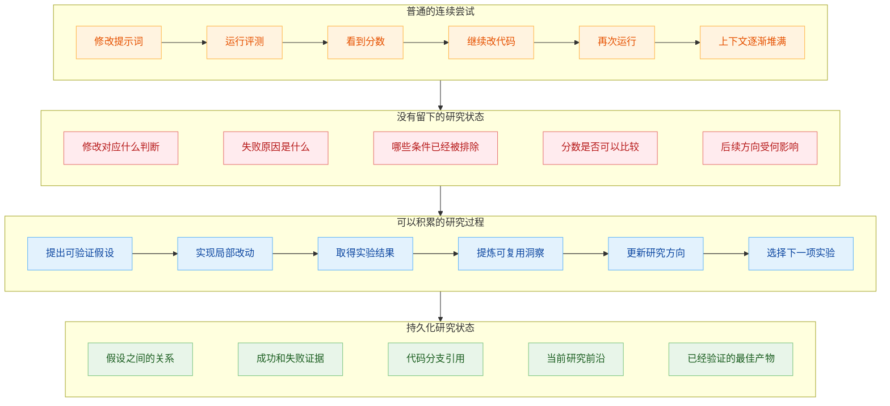
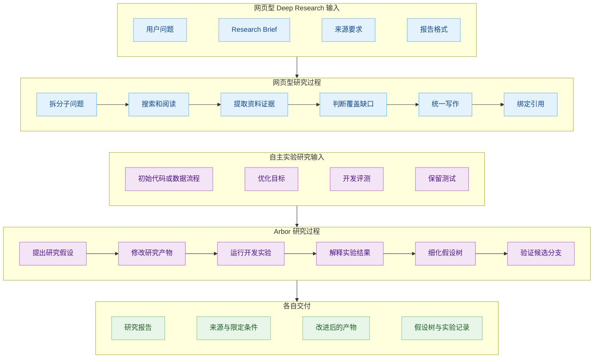
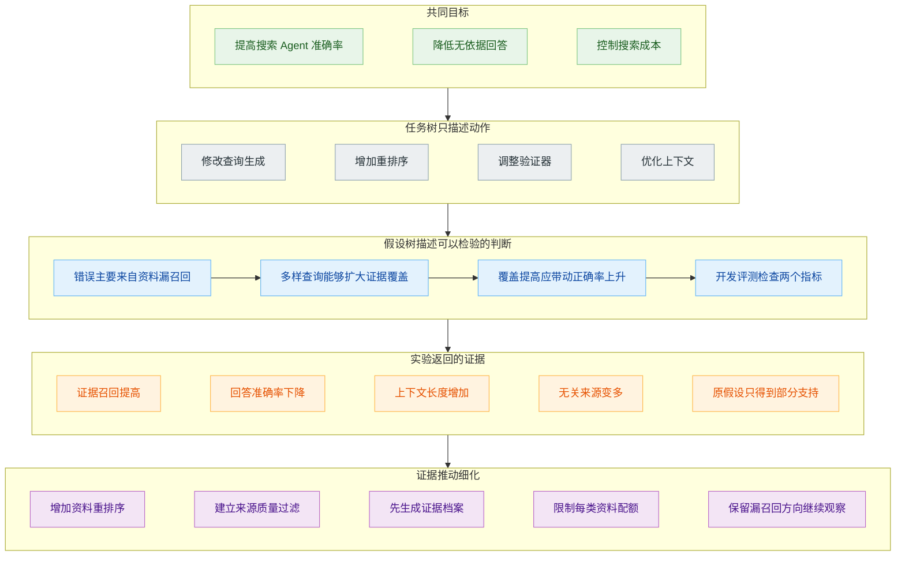
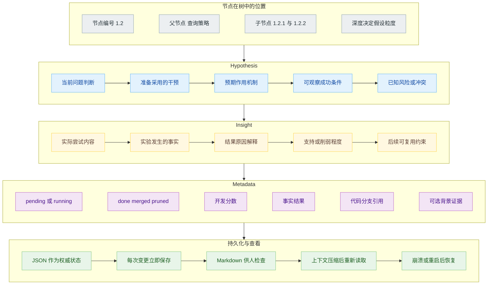
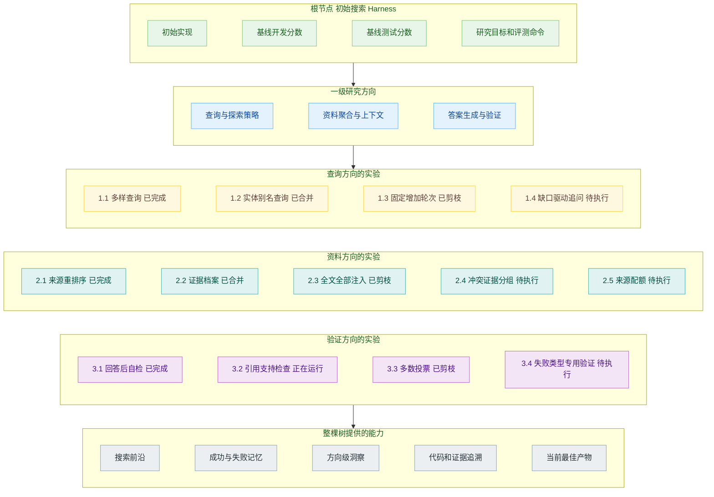
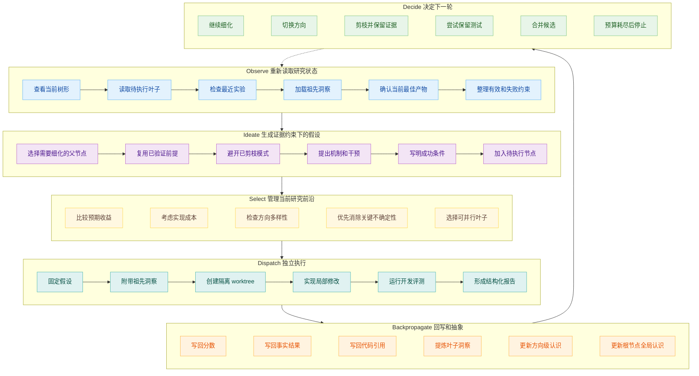
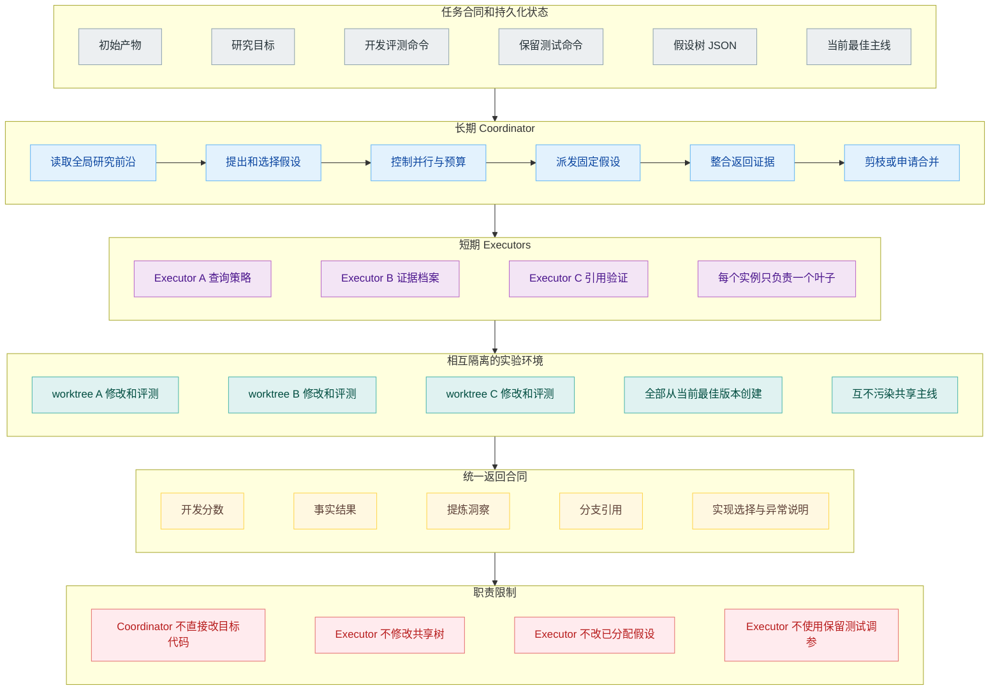
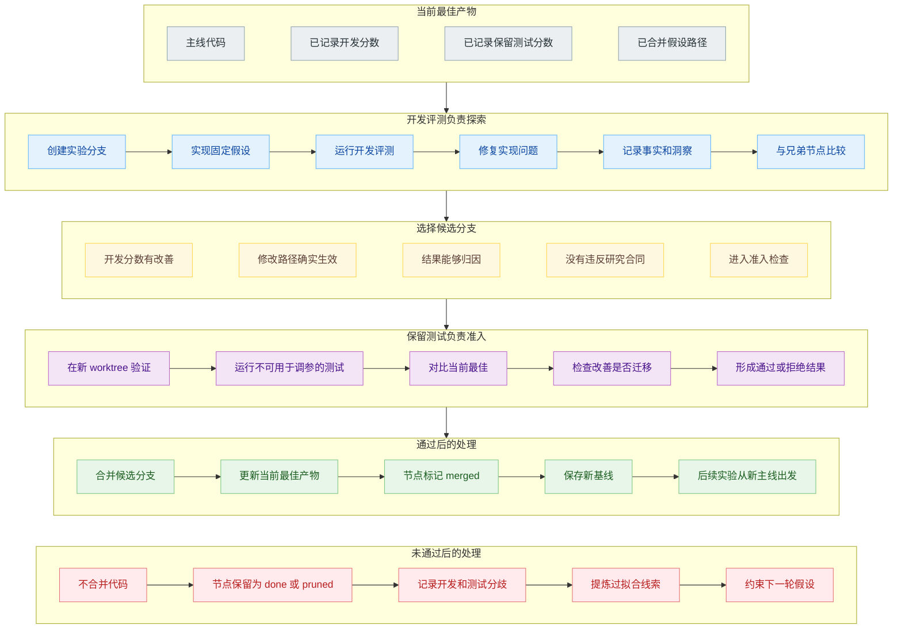
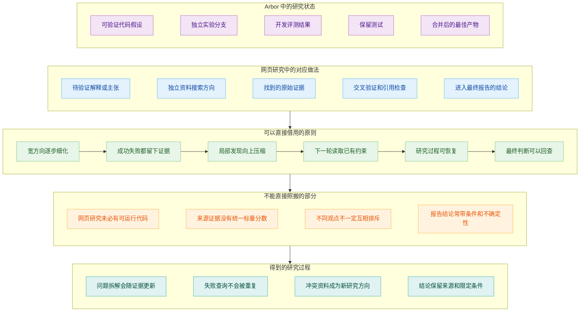

# Deep Research 如何积累研究进展：从一次次尝试到一棵假设树

一个 Agent 正在改进搜索系统。第一轮，它给查询生成器补了一段提示，让搜索词更具体；第二轮，它增加了查询数量；第三轮，它发现召回的网页太多，又在后面加了一层重排序；第四轮，它换了一套答案验证方法。

几十次实验跑下来，日志和代码分支越积越多。当前版本的分数可能比最初高，但有几件事已经说不清了：查询数量增加以后究竟带来了什么，重排序是在解决召回不足还是噪声太多，某个验证方案以前是否试过，以及下一轮为什么应该继续修改验证器。

Agent 一直在执行任务，研究却未必向前推进。一次实验得到的分数只对当前修改负责；如果实验背后的判断、失败原因和适用条件没有留下来，下一次尝试仍然要从一段冗长的历史里重新猜测。

[Arbor](https://arxiv.org/abs/2606.11926) 论文给出的 Hypothesis Tree Refinement，会把长期研究组织成一棵持续生长的假设树。树上保存的不只是接下来要做的实验，还有每个方向为什么值得尝试、实际发生了什么、结果支持或削弱了哪些判断，以及哪一个代码分支对应这份证据。

这和前面两篇文章讨论的网页型 Deep Research 不太一样。《Deep Research 是怎么工作的（上）》处理用户问题怎样变成研究任务，《Deep Research 是怎么工作的（下）》处理多路搜索结果怎样压缩、汇合并写成报告。Arbor 不以一份报告作为主要交付物。它面对的是一个能够反复修改和评测的研究产物，可能是一套模型训练代码、一个 Agent Harness，也可能是一条数据生成流水线。

## 研究对象被反复修改

Arbor 把自己的任务称为 Autonomous Optimization。系统拿到一份初始产物、一个自然语言目标和两套评测方式，在没有人逐步指定下一项实验的情况下，持续修改产物并验证效果。

例如，研究目标可以是提高 BrowseComp 上搜索 Agent 的回答准确率。初始产物是一套最小的 ReAct 搜索 Harness，Agent 可以修改查询生成、资料聚合、答案验证和上下文管理。每一次修改都能运行评测，所以研究过程会产生代码、分数和能够继续分析的错误案例。

网页型 Deep Research 的主要动作是搜索、阅读和综合。它从外部资料里收集证据，最后交付一份带引用的报告。Arbor 的主要动作是提出假设、修改代码和运行实验，最后交付改进后的产物，同时保留一棵完整的研究树。

这种区别决定了研究状态应该保存什么。网页研究需要把主张和资料来源对应起来；自主实验研究还要把假设、代码改动和评测结果对应起来。只保留最终代码，前面的失败会随分支一起被遗忘；只保留对话历史，Agent 又很难从几百次工具调用里恢复当前研究前沿。

Arbor 给出的任务接口里还有一个容易被忽略的条件：开发评测和保留测试使用不同证据。Agent 可以频繁查看开发评测，用它选择下一步；保留测试不能成为日常调参工具，只在判断一个候选方案是否应该进入当前最佳版本时使用。这样才能分清“适应了反复观察的开发反馈”和“得到可以迁移的真实改进”。

## 假设树和任务树

假设继续优化前面的搜索 Agent。任务列表里可能写着“修改查询生成器”“增加重排序”“改进答案验证”。这些任务能告诉 Executor 去哪里动手，却没有说明为什么要改，也没有给出实验以后如何判断方向的依据。

“给问题生成更多查询”仍然只是一个动作。更完整的假设应该说明：当前错误主要来自关键资料没有被召回；增加彼此不同的查询，可以扩大候选资料覆盖；如果判断成立，开发集上的证据召回和最终正确率应该一起提高。Executor 可以围绕这个判断实现实验，Coordinator 也能根据结果决定后续动作。

如果实验发现证据召回提高，回答准确率反而下降，这次尝试并非一无所获。它削弱了“召回不足是唯一问题”的判断，同时提供了一个新约束：后续方向要处理新增资料带来的噪声。于是树上可以继续长出“对资料做重排序”“按来源质量过滤”“先形成证据档案再回答”等更具体的子假设。

论文把树根设为初始产物。靠近根部的节点是宽泛的研究方向，越往下才越接近可以执行的局部干预。一级节点可以是查询、资料聚合、答案验证三个方向；“增加查询数量”还不够具体，可以继续细化成“针对实体别名生成查询”“根据早期结果追问缺失条件”等实验。

树的边表示假设的细化、替代或修正，不表示实验发生的先后顺序。两个先后运行的实验可能属于不同方向，同一方向里的子节点也可能并行执行。这样一来，树展示的是研究判断怎样演变，而不是另一份换了形状的时间线。

## 节点要留下的信息

Arbor 的节点把三类内容放在一起：Hypothesis、Insight 和 Metadata。

Hypothesis 是实验开始前写下的判断。它应当可以被实现和评测，而且一旦交给 Executor 就不再改写。宽泛方向可以放在内部节点，真正派发的叶子节点则要具体到 Executor 知道该改哪里、预期观察什么。

Insight 是对证据的解释。叶子节点的 Insight 需要说清楚做了什么、发生了什么，以及结果怎样支持、削弱或限制原假设。内部节点的 Insight 会综合子节点，把局部结果压缩成这个方向目前已经知道的事情。

Metadata 负责把语义判断落回可检查的产物，包括节点状态、开发分数、事实结果、Git 分支引用和可选的背景证据。代码本身不复制进树里，节点只保存分支或提交引用。

节点会经历 `pending`、`running`、`done`，之后可能成为 `merged` 或 `pruned`。这里的 `pruned` 不能简单理解成“删除”。节点仍然保存在树中，它只是退出当前待执行前沿。下一轮提出新假设时，Coordinator 会读取这些失败经验，避免换个说法再跑一遍同样的方向。

因此，这棵树同时做三份工作。待执行的叶子节点组成当前搜索前沿；已经完成的节点构成长程记忆；假设、证据和代码引用之间的联系又形成一份可审计记录。研究跑得越久，这种一物多用越重要。

上图是说明结构而构造的搜索 Harness 的示例，不是论文里某次实验的原样复刻。真正的树也不需要每个方向长出同样数量的节点。证据丰富、仍有潜力的方向可以继续展开；一个关键前提已经被否定的方向，可能只运行一次就停止。树的形状应该跟着研究结果走，不必整整齐齐。

## 实验怎样改变树

有了数据结构，Arbor 还需要一套让树持续更新的循环。论文把 Coordinator 的工作归纳为 Observe、Ideate、Select、Dispatch、Backpropagate 和 Decide。

Observe 不是简单回看上一轮消息。Coordinator 会重新读取持久化的树，找出待执行叶子、最近返回的结果、祖先节点里的洞察和当前最佳产物。即使聊天历史经过压缩，它也可以从树中恢复“哪些方向有效、哪些已经排除、哪里仍有矛盾”。

Ideate 在已有证据下面提出一小组子假设。得到验证的洞察可以成为下一步的前提，失败节点则成为负面约束。如果“无差别增加网页数量”已经导致噪声上升，新的节点就不应再次提出同一种干预，而应处理资料筛选、分组或冲突判断。

Select 决定下一批值得执行的叶子。它并非只挑预期分数最高的节点。有些实验即使失败，也能澄清一个承重假设；有些方向和刚完成的兄弟节点可以形成对照；还有些实验收益可能很高，但实现成本已经超过剩余预算。选择本身就是对研究前沿的管理。

Dispatch 把固定假设交给独立 Executor。Backpropagate 收回开发分数、事实结果、洞察和代码分支，把叶子结果写入对应节点，再沿祖先路径向上综合。Decide 最后判断继续展开、剪枝、停止，还是把候选分支送去保留测试。

这里的 Backpropagate 和树搜索里的数值回传不完全一样。Arbor 向上传递的不只有一个分数，还包括失败归因、适用条件和能够复用的经验。一个叶子发现“新加入的网页没有进入答案生成所使用的代码路径”，传到上层以后，可以形成“先验证干预是否真正作用于目标路径”的方向级约束。后续兄弟节点都会从中受益。

这也解释了为什么失败节点不能随手删掉。失败至少有三种情况：假设本身不成立，实现存在错误，或者评测没有真正覆盖修改路径。三者对下一步的影响完全不同。只有保存事实结果和解释，Coordinator 才知道该剪掉研究方向、让 Executor 修复实现，还是补一项更合适的评测。

## 方向，实验

长程研究里的全局判断和一次实验所需的工程工作，使用的是两种不同视野。

Coordinator 能看到整棵树，负责比较方向、控制预算、传播洞察和决定是否合并。它保持长期运行，却不直接进入每个分支改代码。Executor 生命周期较短，只接收一个叶子假设、相关祖先洞察、当前最佳产物和开发评测命令。它在独立 Git worktree 里完成修改、调试和评测，然后返回结构化结果。

Executor 可以修复自己的实现错误。例如评测脚本没有跑通，或者改动没有进入实际调用路径，它可以继续检查和重跑。它不能因为分数不好就把“增加来源质量过滤”悄悄换成“重写答案验证器”。如果执行时连假设也一起换掉，最后返回的分数就无法说明原节点是否成立，树里的因果归属也会变得含糊不清。

独立 worktree 也不只是为了并行。它让每份实验结果都有一个清楚的产物引用。未通过验证的修改留在自己的分支，不会污染当前最佳版本；需要比较兄弟节点时，几个 Executor 又可以从同一个起点出发，减少基础版本不同带来的干扰。

这种分工和常见的多 Agent 流程有一点差异。多个角色并不自动产生可靠研究，关键在于每个角色能看到什么、能修改什么，以及返回内容怎样进入持久状态。Arbor 用很窄的交接合同维持这层关系：Coordinator 派下去的是固定假设，Executor 交回来的是分数、事实、洞察和分支引用。

## 不能直接合并

如果 Agent 每轮都查看同一批开发问题，它迟早会摸到这批问题的脾气。某项修改可能只适合开发集，也可能钻了评测器的空子。继续用开发分数决定最终版本，容易把局部适配误当成研究进展。

Arbor 让开发评测负责探索。Executor 可以反复使用它检查修改是否有效，Coordinator 也依据开发结果选择和细化方向。候选分支要进入当前最佳主线，还必须在新的 worktree 中经过保留测试，并且确实优于当前最佳版本。保留测试只负责准入，不向普通 Executor 开放，也不能被拿来日常调参。

论文在 Terminal-Bench 2.0 上给出了一个很直观的例子。Claude Code 的开发通过率达到 `75.00`，高于 Arbor 的 `72.22`；到了保留测试，Claude Code 得到 `71.70`，Arbor 则达到 `77.36`。只看开发分数会选错候选，这正是 Merge Gate 要防住的事情。

测试没有通过的分支也不是白跑。开发集表现好、保留测试表现差，本身就是一份有价值的证据：当前方向可能在利用开发集特征，而没有产生可迁移改进。它会留在树里，影响下一轮选点和假设生成。

## 网页型 Deep Research

网页型 Deep Research 不一定要照搬 Arbor 的 Git worktree 和开发评测，因为它处理的主要产物是一组研究结论。不过，假设树对研究状态的组织方式仍然有参考价值。

网页研究也会遇到相互竞争的解释。例如研究“某个 Agent SDK 是否支持长期恢复”时，一个方向认为它提供原生工作流持久化，另一个方向认为它只保存对话历史。Researcher 可以分别寻找接口文档、代码实现和工程案例。树上的叶子不再绑定代码实验，而是绑定一项资料验证；事实结果保存找到的原文，Insight 记录证据支持哪种解释、还缺什么条件。

开发评测和保留测试也不必机械映射。网页研究可以借用的是“探索反馈与最终准入分开”这层关系：搜索摘要和单个网页可以帮助继续追查，但一个结论进入最终报告以前，还要检查来源质量、交叉验证、时间有效性和引用是否真的支持附近的主张。

前面的 Deep Research 文章已经讨论过 Research Brief、并行 Researcher、结果压缩和统一写作。假设树补上的，是这些步骤之间长期存在的研究状态。计划不再只是一份开工前生成的目录，它会被实验和证据持续修改；记忆也不再等同于聊天记录，而是能够参与下一轮选点的假设、结果和洞察。

把分散的尝试组织成有来有往的研究过程，让成功能够继续展开，让失败能够约束下一步，也让最终产物找得到一路走来的证据。

## 参考资料

1. Jiajie Jin et al., [Toward Generalist Autonomous Research via Hypothesis-Tree Refinement](https://arxiv.org/abs/2606.11926).
2. RUC-NLPIR, [Arbor](https://github.com/RUC-NLPIR/Arbor).
