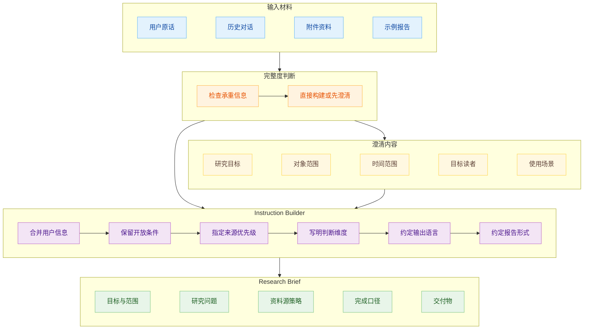
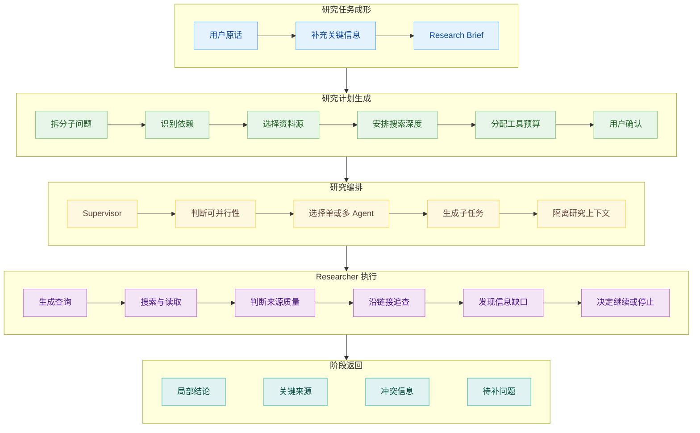
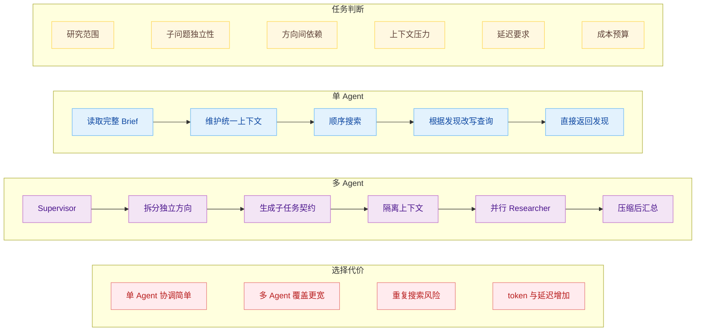

# Deep Research 是怎么工作的（上）：把用户问题变成研究任务

假设用户给 Deep Research Agent 一句话：

> 对比目前主流的 Agent SDK，判断哪一个更适合长期运行的任务。

“主流”包括哪些 SDK，“长期”指连续运行几小时，还是跨越几天暂停恢复，团队使用 Python 还是 TypeScript，最后需要一份功能列表，还是要据此完成技术选型，这些条件都会改变研究方向。所以这句话还不能直接拿去研究。

普通联网问答遇到这种输入，可以搜索几次，给出一个概览，再提醒用户根据场景选择。Deep Research 会投入更多时间和工具调用。它可能拆出十几个子问题，打开几十个网页，甚至让多个 Agent 并行查找。

因此，Deep Research 的第一步通常没有发生在搜索框里。系统要先把用户的自然语言整理成一份可以执行、也可以检查的研究任务。

## 先做 Research Brief

OpenAI 在 Agents SDK 的 Deep Research Cookbook 里给出了一套四 Agent 流程。Triage Agent 先判断当前信息是否足够；缺少承重信息时，Clarifier Agent 向用户提出两三个问题；Instruction Builder 再把原始问题和补充回答改写成详细研究指令；最后才交给 Deep Research 模型执行。

这里的四个 Agent 不是部署 Deep Research 的固定标准。这个例子更有价值的地方，是把两种容易混在一起的工作分开了：外围 Agent 负责弄清楚用户要什么，Deep Research 模型负责研究。OpenAI 的 API 不会自动替开发者完成澄清和提示改写，产品层是否补上这段流程，要由应用自己决定。

LangChain 的 Open Deep Research 把同一段工作称为 Scope，内部有两个动作：User Clarification 和 Brief Generation。用户与系统的对话可能很长，里面既有澄清回答，也可能有示例报告和临时补充。如果把整段聊天直接带进研究阶段，后续每个 Agent 都要重新辨认哪些话是目标，哪些只是讨论过程。LangChain 会把它们压成一份聚焦的 Research Brief，后面的 supervisor、researcher 和 writer 都回到这份 Brief 判断任务有没有完成。

前面的 SDK 选型问题经过这一步，可能变成下面这样：

> 为一个使用 TypeScript 的小团队比较 OpenAI Agents SDK、Google ADK 与 LangGraph。目标是构建能持续运行数小时、允许人工暂停并在进程重启后恢复的后台 Agent。重点考察状态持久化、失败恢复、人工介入、可观测性和部署复杂度。优先使用最近一年内的官方文档、代码仓库和公开工程案例。最终给出选型建议，并说明建议成立的条件和目前缺少的证据。

改写没有替用户偷偷做决定。用户没指定云平台，就应当保留为开放条件；没有要求最低成本，也不能擅自把价格放到第一优先级。必要但未指定的维度可以标记为开放，不能为了让指令看起来完整而编造约束。

Research Brief 的作用也不只是让搜索词更准确。它同时规定了研究对象、判断维度、来源偏好、时间范围、输出语言和交付形式。后面系统判断“资料够不够”时，需要有一个稳定参照。

## 计划不只是一份目录

任务明确以后，系统开始规划。影响研究过程的内容在：总问题怎样拆分，子问题之间有没有依赖，优先查哪些资料源，哪些方向值得并行，以及每个方向准备投入多少搜索预算。

关于 SDK 的长期任务能力，可以拆成状态持久化、恢复语义、人工介入、追踪与部署几个方向。调查“有没有持久化”时，官网功能列表或许够用；判断“进程崩溃后能不能接着跑”，就要继续读运行时文档、接口说明，甚至查看 issue。计划需要把问题和适合它的资料源连起来，不能只列出名词。

Google 的 Gemini Deep Research Agent 提供了协作规划。开启以后，Agent 先返回建议计划，用户可以继续修改，确认后再开始研究。Deep Research 综述把常见规划方式分成三类：有的系统根据原始输入直接规划；有的先澄清意图，再生成计划；还有一类先给出计划，让用户检查和修订。Google 属于第三种，OpenAI Cookbook 展示的多 Agent 流程更接近第二种。

这三种方式没有绝对高下。问题已经很具体时，反复追问只会拖慢任务；研究会影响重要决策时，让用户先看计划，可以尽早发现对象选错或范围失控。系统需要根据输入完整度和任务风险选择交互深度。

计划不能写成一份必须逐条执行的脚本。研究具有路径依赖。Agent 读到新资料以后，可能发现两个产品对“恢复”的定义完全不同，也可能发现某个候选方案已经在近期版本中重写运行时。原来的比较维度需要细化，已经过时的子问题则应该被删除。固定工作流适合结构明确、重复性高的研究；开放问题更需要动态规划，让后续动作能够被中间发现改变。

## 需要多 Researcher 的情况

研究计划确定后，系统还要决定由一个 Agent 顺着问题往下查，还是把不同方向交给多个 Researcher。

单 Agent 的优势是上下文连续。前一个发现可以直接影响后一个判断，不需要解释给另一个 Agent。问题范围较窄、子问题彼此依赖时，单 Agent 往往更省事。验证某个 SDK 的 checkpoint 能否在进程重启后恢复，就适合沿着官方文档、代码接口和相关 issue 一路追下去。

多 Agent 更适合宽度优先的问题。比较三个独立产品时，每个 Researcher 可以在自己的上下文里调查一个产品，互不占用对方的窗口。Anthropic 的 Research 系统采用 orchestrator-worker 结构：lead agent 分析用户查询并制定策略，再创建多个并行 subagent；subagent 反复调用搜索工具，最后把压缩后的发现交回 lead agent。

Anthropic 用“列出标普 500 信息技术公司全部董事会成员”说明这种结构的价值。任务可以按公司拆开，各个方向彼此独立，单 Agent 串行搜索会很慢。其内部评测中，Claude Opus 4 作为 lead agent、Claude Sonnet 4 作为 subagent 的系统，比单独使用 Claude Opus 4 高出 90.2%。这个数字来自 Anthropic 自己的研究评测，不能直接外推到所有任务，它说明宽度足够大时，并行搜索确实能换来覆盖率。

LangChain 的 supervisor 也不会看到复杂问题就固定创建一组 Agent。它先判断 Research Brief 能否拆成独立子主题，再决定派出多少 Researcher。简单问题可以只走一条研究线程，比较类和名单类问题才展开并行。这样做也控制了成本。Anthropic 披露，普通 Agent 大约使用聊天任务四倍的 token，多 Agent Research 约为十五倍。研究价值和可并行程度撑不起这笔开销时，增加 Agent 数量只会徒增协调成本。

每个 Researcher 收到的任务应该足够窄。它不需要同时操心整篇报告，只负责一个子问题。独立上下文带来了更深的搜索空间，也带来新的交接责任：subagent 最后必须把发现说清楚，让 supervisor 知道它查了什么、确认了什么、还缺什么。

## Researcher 怎样沿着线索继续查

Researcher 的内部形态通常是一个 tool-calling loop。模型根据子问题生成查询，调用搜索或浏览工具，阅读返回内容，再决定下一步。它不会在开头一次性列完所有查询，因为真正有用的搜索词经常藏在第一批资料里。

调查 LangGraph 的恢复能力时，第一轮可能只找到 persistence 文档。读完才知道核心对象叫 checkpoint、thread 和 checkpointer，下一轮查询随之变得具体。文档解释了接口，Researcher 还可能进入代码仓库确认存储后端，查看近期 issue 了解恢复限制。网页里的版本号、类名和引用链接不断改变搜索方向。

搜索也不等于只调用 Web Search。OpenAI Deep Research 支持公开网络、File Search、符合 search 与 fetch 接口的 MCP 服务，以及用于数据分析的 Code Interpreter。Gemini Deep Research Agent 可以使用 Google 搜索、网址上下文、代码执行、文件和外部 MCP 工具。企业研究还会接入内部文档和数据库。Researcher 要根据子问题选择工具，不能把所有信息都绕回网页搜索。

一条研究线程什么时候结束，没有一个通用数字。官方文档和源码已经相互印证，继续找转述文章不会增加多少信息；某个重要判断只有产品宣传，没有实现说明，Researcher 需要继续追查，或者明确报告证据不足。系统也会设置最大工具调用、时间和 token 预算，防止 Agent 对一个不存在的答案穷追不舍。

研究并非按照“计划、搜索、完成”单向流动。Researcher 的发现回到 supervisor 后，supervisor 会重新对照 Brief。覆盖不足时，它可以继续派出 Agent，或者把一个宽泛方向拆得更细。计划在执行中被逐步修正，这才是 Deep Research 与固定检索流水线拉开差距的地方。

上篇到这里，资料已经被找到，但报告还没有出现。Researcher 手里混着网页正文、搜索摘要、失败的工具调用、重复来源和自己的局部判断。把这些内容原样塞给 supervisor，长上下文很快会拥挤，最终写作也会被无关信息带偏。

下篇继续处理这段更容易被忽略的工作：搜索结果怎样被压缩成可交接的研究发现，多路发现怎样重新汇合，以及为什么多 Agent 适合查资料，却未必适合同时写报告。

## 参考资料

1. OpenAI Developers, [Deep research](https://developers.openai.com/api/docs/guides/deep-research).
2. OpenAI Cookbook, [Deep Research API with the Agents SDK](https://developers.openai.com/cookbook/examples/deep_research_api/introduction_to_deep_research_api_agents).
3. Google AI for Developers, [Gemini Deep Research Agent](https://ai.google.dev/gemini-api/docs/deep-research).
4. Anthropic, [How we built our multi-agent research system](https://www.anthropic.com/engineering/multi-agent-research-system).
5. LangChain, [Open Deep Research](https://www.langchain.com/blog/open-deep-research).
6. Yijia Zhang et al., [Deep Research Agents: A Systematic Examination and Roadmap](https://arxiv.org/abs/2506.18096).
