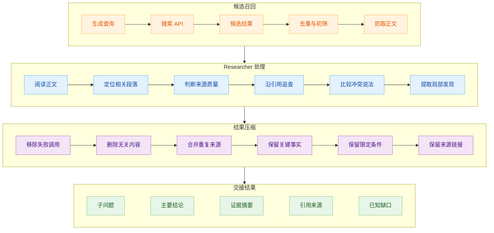
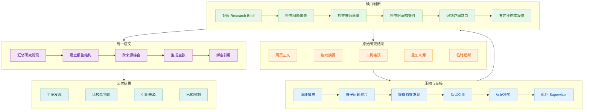
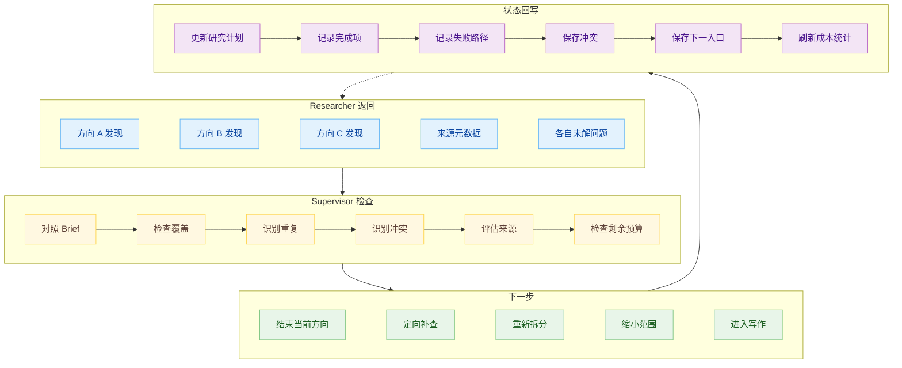
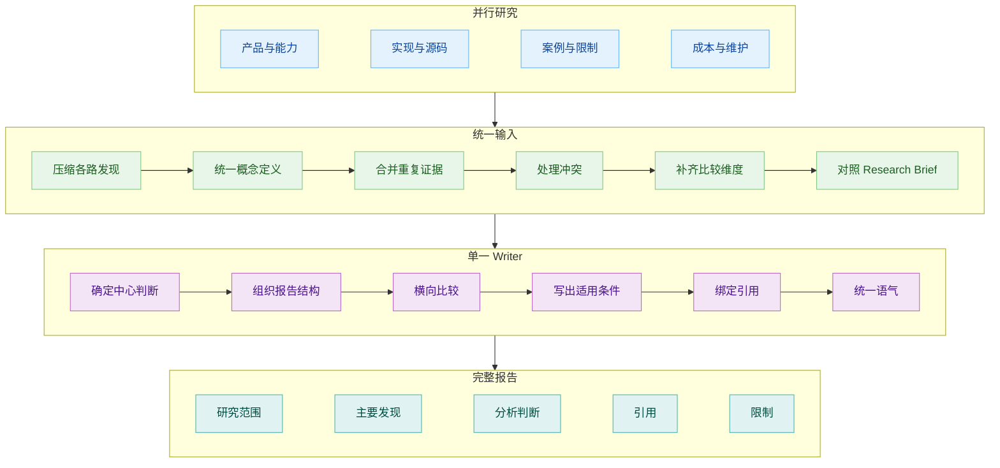
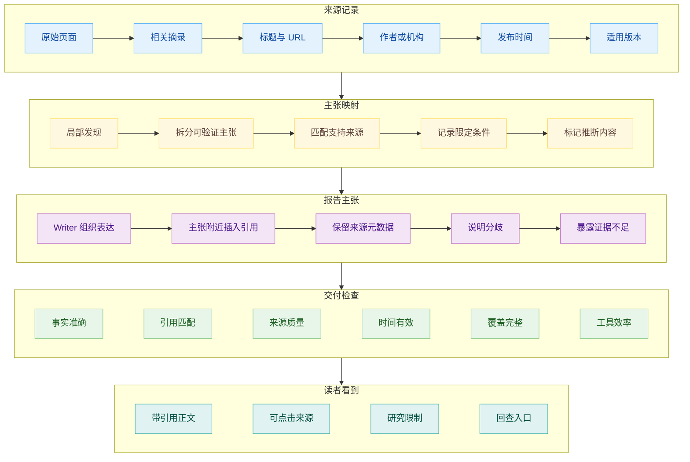

# Deep Research 是怎么工作的（下）：把搜索结果变成研究报告

一个 Researcher 完成子任务后，手里通常不是一份干净的研究结论。它刚刚经历了多轮工具调用，上下文里混着搜索结果页、抓取的网页正文、打不开的链接、重复报道、临时推断和已经过时的查询方向。

这些内容对上层 supervisor 未必有用。把几名 Researcher 的完整轨迹全部拼回主上下文，信息量虽然很大，但与研究任务有关的部分反而会被注意力稀释。

Deep Research 后半程先做压缩，写作排在后面。各条搜索线程要把原始工具返回整理成可以交接的研究发现，supervisor 再根据 Research Brief 判断资料是否充分。只有这两步完成，系统才有条件生成一篇前后连贯、引用能够落回来源的报告。

## 重新压缩

Anthropic 在介绍多 Agent Research 时写：搜索的本质是压缩。互联网或企业知识库是一片庞大语料，研究系统不可能把所有相关页面交给最终写作者。subagent 在独立上下文里探索一个方向，作用之一就是过滤信息，最后只把重要内容交回 lead agent。

这里至少发生两次压缩。搜索 API 先从大规模索引里找出候选页面，Researcher 阅读这些页面以后，再围绕当前子问题提取有用发现。第一层解决哪些页面可能相关，第二层解决页面里的什么内容能够推进研究。

每个 research sub-agent 完成工具循环后，会额外调用一次模型，把整个研究过程清洗成一份针对子问题的回答。原始反馈里可能包含抓取网页、无关站点和失败工具调用，直接返回会让 supervisor 花大量 token 重新筛选。清洗后的发现保留有用内容和来源，再交给上层。

Summarization 负责压缩搜索 API 结果，Research 模型驱动搜索 Agent，Compression 模型整理 Researcher 的最终发现，Final Report Model 负责成文。模型可以复用，职责却分得很清楚。搜索、压缩和写作面对的上下文不同，也不必使用同一套提示。

一份可交接的研究发现需要回答当前子问题，列出支持它的主要资料，并说明还没有解决的缺口。至于是否建设独立 evidence store、怎样保存网页全文，各个实现差异很大，不能写成 Deep Research 的统一部件。共同要求有：上层 Agent 接到的内容要比原始工具轨迹更短、更相关，还能回到来源。

## 判断资料够不够

Researcher 返回结果以后，supervisor 不能只检查每个子任务有没有一段文字。它要把发现重新放回 Research Brief，判断研究目标是否得到覆盖。

继续用 Agent SDK 选型举例。三名 Researcher 都可能返回“支持持久化”，表面上已经回答了问题。supervisor 还要检查它们说的是不是同一件事：保存的是对话历史、工作流状态还是任意应用数据；恢复能否跨进程；人工中断以后如何继续；默认存储能不能用于生产。功能名相同，证据指向的能力层级可能完全不同。

如果某个方向只有官网宣传，没有接口文档或实际案例，supervisor 可以派出补充 Researcher，专门核实这项能力。几份材料互相冲突时，也可以把冲突本身变成新的子任务，要求检查版本、日期和实验条件。LangChain 的 supervisor 就在每轮返回后判断 Brief 是否得到充分回答；需要更深时，它会继续创建 subagent，而不是一次分派以后直接进入写作。

这种循环需要保留研究状态。只靠主 Agent 的聊天上下文，运行时间一长就会丢失早期判断。Anthropic 会在阶段完成后总结工作，把必要信息放到外部 memory；上下文接近上限时，可以启动新的 subagent，再通过交接继续任务。它还提出让 subagent 把结构化结果直接写入文件系统，主 Agent 只拿轻量引用，减少大段内容在多层 Agent 之间反复转述造成的信息损失。

[Arbor 论文](https://arxiv.org/abs/2606.11926)把这件事又推进了一步。它研究的是自主实验，与网页报告生成面对的任务不同，但它对研究状态的处理很有启发：Hypothesis Tree 会持续保存提出过的假设、执行结果、失败经验和提炼出的认识。失败分支不会从记录里消失，而会变成后续搜索的约束。论文强调，这棵树不是工具调用日志，而是一份“试过什么、发生了什么、为什么发生、接下来如何受影响”的压缩记录。

网页 Deep Research 未必需要一棵假设树，却面对同样的问题。系统如果只保存成功找到的资料，下一轮可能重复走已经失败的搜索方向；如果只保存一段总结，又很难知道某个判断建立在哪些条件上。研究状态需要帮助 Agent 继续决策，而不只是方便事后展示过程。

## 一个 Writer 统一成文

资料覆盖充分以后，系统才进入写作。这里有一个很容易想当然的设计：既然多个 Researcher 能并行搜索，也可以让它们各写一章，最后把章节拼起来。LangChain 的早期版本就这样做过，速度快却不好。

每个写作 Agent 只看见自己的子问题，它会采用自己的概念定义、详略尺度和判断口径。几篇局部文章拼在一起以后会重复背景、遗漏过渡，对同一术语给出不同解释。研究任务能够独立，不代表报告章节也能独立。报告需要共同回答一个总问题，前后判断必须共享同一份 Research Brief。

Open Deep Research 后来把多 Agent 限定在 Research 阶段。subagent 返回清洗后的发现，supervisor 确认资料足够，再把 Research Brief 和所有发现一次性交给 Final Report Model，由一个 writer 统一生成报告。这里的一次写作并不表示模型临场发挥。它前面已经拿到结构化任务和压缩后的研究材料，写作负责组织，不再负责重新搜索。

这个取舍不是说长报告只能一次生成。更复杂的系统仍然可以先生成大纲、逐节写作再统一编辑。关键是要有一个共享全局判断的角色，负责处理章节之间的关系。把各路 Researcher 的局部答案直接相加，只会得到一叠资料，不会自动形成研究报告。

统一写作还要区分摘要和综合。摘要告诉读者每份资料说了什么，综合要比较不同资料之间的一致、冲突和适用条件。选型报告不能依次介绍三个 SDK 的功能，然后在结尾凭印象推荐一个。它需要围绕长期任务的判断维度横向比较，让结论能够从前面的证据中长出来。

## 引用不仅是补链接

Writer 能否正确引用，取决于来源信息有没有穿过前面的压缩和交接。Researcher 如果只返回“LangGraph 支持持久化”，writer 无从知道这句话来自官方文档、社区文章还是自己的推断。等报告写完再去搜索链接，很容易找到一篇主题相近却没有真正支持原句的页面。

OpenAI Deep Research 的返回结构把引用作为输出数据的一部分。最终文本中的 annotation 会记录引用对应的字符位置、来源标题和 URL；响应中还会保留 web search、code interpreter 和 MCP 等调用项。应用可以据此生成可点击引用，也能回看报告经历过哪些外部操作。

引用存在不等于引用正确。Anthropic 为 Research 系统设计的评分标准包括事实准确性、引用准确性、完整性、来源质量和工具效率。人工测试还发现过一个具体偏差：早期 Agent 更愿意选择搜索排名靠前的 SEO 内容站，而不是学术 PDF 或个人技术博客等更有价值的来源。团队后来把来源质量启发式写进提示，才改善这个问题。

因此，交付前至少要检查三个关系：主要判断能否找到支持它的来源，引用页面是否真的包含附近那句话表达的信息，报告有没有把存在分歧的材料写成确定事实。LLM-as-judge 可以批量执行一部分检查，高风险结论仍然需要人读原始来源。

一份好的 Deep Research 报告会让读者看见证据强弱。官方接口文档能够证明功能存在，代码仓库能够补充实现状态，工程案例可以说明使用条件，仍然缺乏材料的地方则应该明确保留。引用的价值不在于让报告显得资料丰富，而在于给判断留下回查入口。

## 为什么 Deep Research 要在后台运行

走到这里，一次研究已经经历用户澄清、Brief 生成、任务分派、多轮搜索、结果压缩、缺口补查、统一写作和引用处理。运行时间以分钟计算很正常，外部网页、搜索 API 和 MCP 服务中的任意一个也可能超时。

OpenAI 建议 Deep Research 请求使用 background mode，并通过轮询或 webhook 等待结果。Gemini Deep Research Agent 的开发文档直接要求后台执行，再轮询或流式接收更新。后台运行让长任务脱离一条始终在线的同步连接，界面上的进度展示只是它的外在表现。

生产系统还要处理恢复。Anthropic 提到，Research Agent 具有很强的状态性，错误会沿着长任务累积。某个工具失败时，从头重启既昂贵又影响用户体验，因此系统会结合检查点、重试和模型自身的适应能力，从失败位置继续。完整 tracing 也很重要，否则用户只会说“它没有找到一个很明显的信息”，开发者却无法判断是查询生成、来源选择还是工具调用出了问题。

并行执行同样不是免费午餐。Anthropic 当前公开的系统让 lead agent 同步等待一批 subagent 完成，协调简单，却可能被最慢的 Researcher 卡住。改成异步可以提高并行度，同时会引入状态一致性、错误传播和结果协调问题。Deep Research 的等待时间背后，既有模型在研究，也有系统在维持一项长程任务。

最后回到报告本身。用户看到的只是成文结果，系统内部真正流动的是几种不同密度的信息：宽泛问题被压成 Research Brief，庞大网页被压成局部发现，多路发现又被综合成一组能够支持结论的材料。每次压缩都可能丢信息，也都在为下一层 Agent 腾出注意力。

Deep Research 能否写出可靠报告，取决于这些交接有没有保住研究目标、关键发现和来源。缺少压缩，系统会被上下文淹没；压缩过头，报告又只剩没有来路的结论。真正的工程工作，就落在两者之间。

## 参考资料

1. OpenAI Developers, [Deep research](https://developers.openai.com/api/docs/guides/deep-research).
2. OpenAI Cookbook, [Introduction to deep research in the OpenAI API](https://developers.openai.com/cookbook/examples/deep_research_api/introduction_to_deep_research_api).
4. Google AI for Developers, [Gemini Deep Research Agent](https://ai.google.dev/gemini-api/docs/deep-research).
5. Anthropic, [How we built our multi-agent research system](https://www.anthropic.com/engineering/multi-agent-research-system).
6. LangChain, [Open Deep Research](https://www.langchain.com/blog/open-deep-research).
7. LangChain, [Open Deep Research repository](https://github.com/langchain-ai/open_deep_research).
8. Jiajie Jin et al., [Toward Generalist Autonomous Research via Hypothesis-Tree Refinement](https://arxiv.org/abs/2606.11926).
