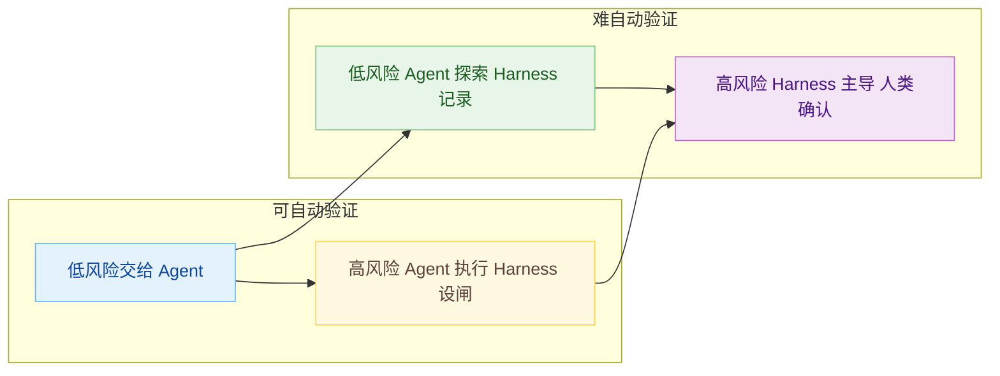
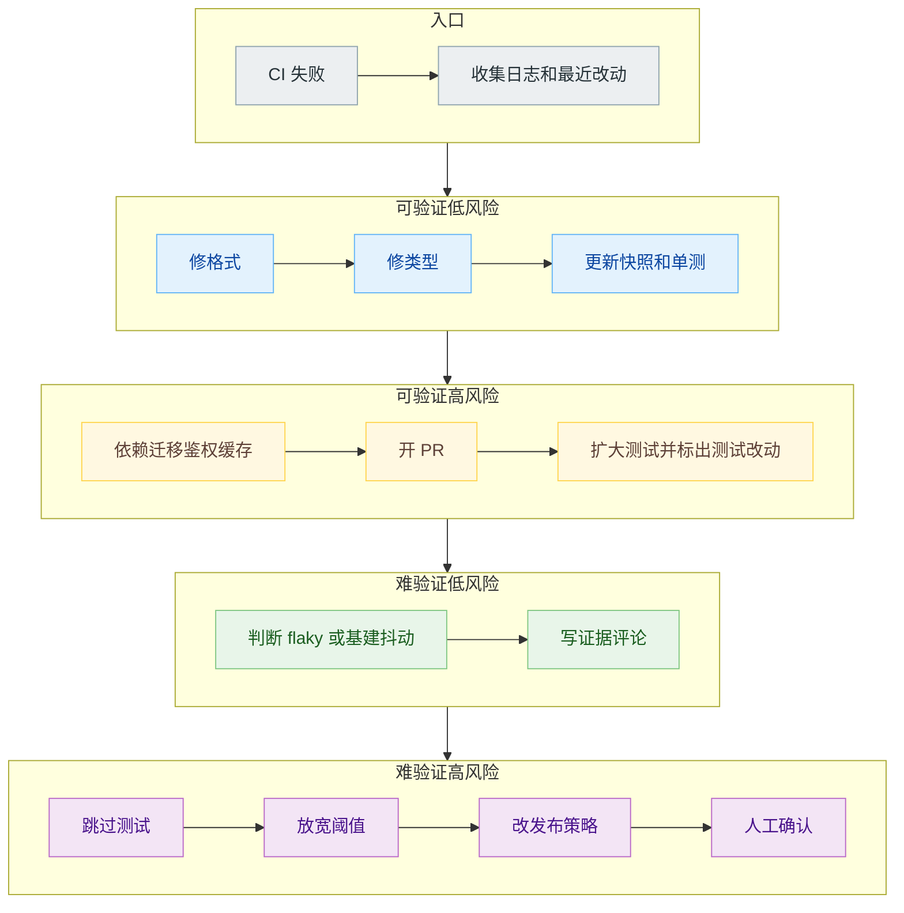
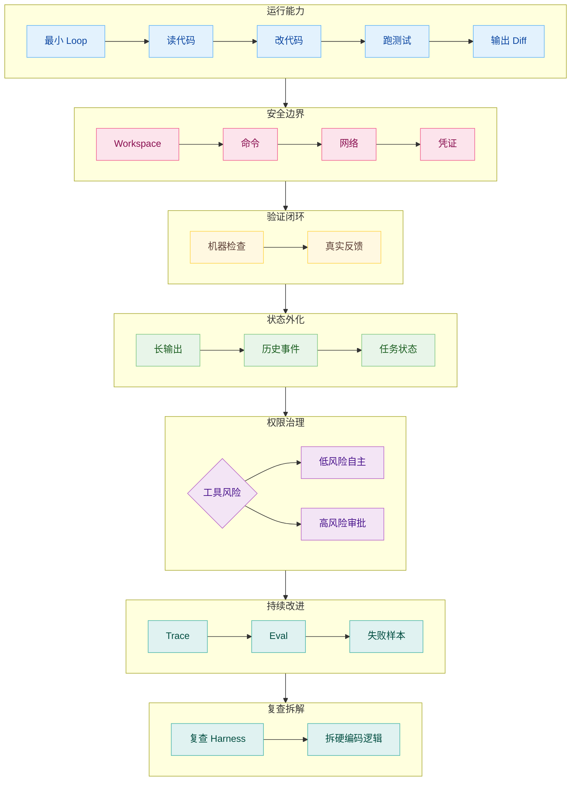

# Harness 什么时候该管，什么时候该让 Agent 自己管

Agent 做工程任务时，最容易被低估的不是循环本身。

一个最小的 Agent Loop，读输入、调用模型、执行工具、观察结果、继续下一轮，几十行代码就能写出来。真正让系统跑起来以后开始麻烦的是每一步到底由谁判断。测试要不要跑，分支要不要切，日志要不要查，失败要不要重试，PR 要不要开，状态要不要保存，工具调用要不要等人确认。

这些判断如果都写进代码，就会形成很重的 Harness。它能让早期模型更稳，也会把旧模型的短板固化成今天的系统负担。等任务变长、权限变多、环境变复杂，这些规则又会牵一发动全身。Anthropic 在 Managed Agents 文章里提到过一个典型例子：他们曾经为了缓解 Claude Sonnet 4.5 的 context anxiety，在长期任务线束里加入 context reset；换到 Opus 4.5 后，这个行为基本消失，原来的 reset 变成了额外开销。

所以 Harness 的问题落在粒度上。一个工程系统里，有些东西必须由 Harness 拿住，比如权限、凭证、审计、可恢复状态和高风险写操作；也有些东西应该交给 Agent，比如查哪段日志、怎么拆解任务、先跑哪组测试、怎样根据失败反馈调整方案。边界放错了，轻则成本高、速度慢，重则系统看起来按部就班，实际一路跑偏。

本文用一个简单的四象限来判断：



## 边界判断

先把 Agent 和 Harness 的关系摆正。

Agent Loop 负责在模型、工具和观察之间循环。它像一个运行中的执行器，能读代码、查文件、跑命令、根据报错再改。Harness 站在外面，负责约束这次运行：目标是什么，哪些工具能用，哪些状态要保存，什么情况算完成，什么操作必须暂停，失败后如何恢复，过程如何审计。两者各司其职，系统才不会把推理、权限、状态和恢复揉成一团。

可以粗略写成：

$$
\mathrm{Run}=\mathrm{AgentLoop}+\mathrm{Harness}
$$

其中：

$$
\mathrm{Harness}=\mathrm{Goal}+\mathrm{Tools}+\mathrm{State}+\mathrm{Verifier}+\mathrm{Policy}
$$

这里的 `Policy` 很关键。很多系统一开始会把 policy 写得很重，因为模型不可靠。比如固定每一步都提交，固定从某个文件读 CI 日志，固定把所有仓库都 clone 进同一个容器，固定每个子任务后触发一次 QA。这样做在早期有效，因为它把模型的可变行为压成了确定流程。

代价：代码越来越像一个巨大的状态机，Agent 的判断空间被压小，环境一变就到处打补丁，Harness 里每条规则都带着当时对模型能力的判断。一旦模型变强，旧规则未必继续承重，甚至会削足适履。

所以我们需要不断重新评估多少行为应该是确定性的，多少行为应该交给 Agent。早期不信任 Agent，所以 Harness 会在每个任务后 double-check、commit、push。后来模型能力提升，我们把一些逻辑移出 Harness，做成 Agent 可控工具。多 repo 场景过去由 Harness 写死路径，后来改成提供 repo 布局、分支工具和 PR 工具，让 Agent 自己决定怎么做。

Harness 不会消失，只是内部成分要变化。确定性边界留在系统里，策略性选择交给 Agent。

## 先判断任务

很多 Harness 设计会一上来讨论流程：要不要 planner，要不要 evaluator，要不要 sub-agent，要不要每步 commit，要不要自动开 PR。这个顺序容易出问题，起点应该是任务本身。

第一，结果能不能自动验证。能验证，意味着系统可以拿到外部证据，比如测试、类型检查、lint、构建、页面点击、API 返回、数据库状态、日志指标。不能验证，意味着最后只能靠语言判断、人工审查或弱信号。

第二，失败代价有多高。低风险失败通常只是浪费时间、产生一个可丢弃 diff、写出一份不成熟草稿。高风险失败会碰生产数据、权限、财务、合规、用户隐私、主分支、外部系统，或者把错误状态写入后续系统会继续读取的位置。

这两个问题一问，很多争论会变得清楚。一个文档摘要任务，输出难自动验证，但风险低，适合让 Agent 先探索，再要求引用来源。一个数据库迁移任务，结果可以通过 staging 和回归测试验证，但风险高，适合让 Agent 写迁移和修测试，Harness 负责 dry run、审批和回滚。一个安全策略例外，既难自动验证又高风险，Agent 可以整理材料，最终动作必须留给人。

审批流下，运行结果可能没有最终答案，而是返回 pending approvals 和可恢复 state。这个设计说明一件事：暂停不是失败，暂停是 Harness 的一部分。当动作进入高风险区域，系统应该保存现场，让人决定继续还是拒绝，之后再从 state 恢复，而不是让 Agent 硬着头皮往下跑。

任务落点不搞清楚，planner、evaluator、sub-agent 会越帮越忙。

## 第一象限：可验证、低风险，交给 Agent 多跑几步

最适合放权的任务，通常有两个特征：结果能自动验证，失败后的损失也有限。

修一个单元测试失败、补一个类型错误、改一个本地 lint 问题、生成一段内部脚本、整理一批文档链接，大多属于这一类。Agent 可以读日志、改文件、跑测试、继续修。Harness 在这里不用替它规定每一步，只要给足工具和停止条件，让执行过程有章可循。

比较好的 Harness 设计是这样：

- 目标写清楚：修复 `test/auth` 失败，保持 lint 和 typecheck 通过。
- 工具给够：文件搜索、shell、测试命令、日志读取、git diff。
- 反馈真实：测试输出和构建结果原样返回，长输出写入文件，Agent 用 `rg` 按需查。
- 限制明确：最大迭代次数、最大运行时间、禁止越出 workspace。
- 完成标准机械化：测试通过、diff 可读、没有额外跳过测试。

这里不要让 Harness 管得太细。比如“先读 A 文件，再改 B 文件，再跑 C 命令”，除非这个顺序来自确定的项目约束，否则很容易变成多余指导。Agent 已经能根据错误信息决定先查调用点还是先查测试，写死路径反而会让它错过更短的修复路线。Harness 一旦越俎代庖，Agent 的探索能力就被压扁了。

这一类任务最值得投资的是验证器，流程图反而要克制。Harness 要把任务推进到“目标明确、结果可自动验证”的区域。可验证以后，Agent 多跑几步通常可控；缺少验证时，多跑几步只是把不确定性放大。

一个简单的 coding Agent 可以在这里保持高自主度：

```text
读取失败输出
定位相关文件
修改实现
运行最小测试
必要时运行更大范围测试
输出 diff 和验证结果
```

Harness 管住边界就够了。比如命令超时、路径越界、敏感文件修改、网络访问、预算上限。这些是系统安全，不该交给 Agent 自觉。

## 第二象限：可验证、高风险，Agent 执行，Harness 设闸

有些任务结果也能验证但失败代价很高。数据库迁移、生产配置修改、依赖大版本升级、发布流水线、自动 merge、批量重构，都在这个区域。

这类任务不适合完全写死。Agent 确实比固定脚本更能处理现场变化：迁移失败后看日志，依赖冲突后改版本，CI 挂了以后定位 flaky test 和真实 bug。让 Harness 全程接管，系统会僵硬得像旧式自动化脚本，遇到一点偏差就趴窝，进退失据。

但也不能只靠 Agent 自己判断。高风险动作需要闸门。

闸门可以分几层：

- 操作前确认：执行 SQL、删除文件、推送主分支、触发生产发布前暂停。
- 权限隔离：Agent 能在 sandbox 里生成迁移脚本，但不能直接拿到生产数据库凭证。
- 变更预览：展示 diff、执行计划、影响范围、回滚方案。
- 自动验证：dry run、staging 环境、影子流量、回归测试。
- 审计留痕：谁触发、Agent 做了什么、调用了哪些工具、验证结果如何。

Anthropic Managed Agents 的“brain”和“hands”分离，正是这个方向。Harness 不和 sandbox、session、credentials 混在同一个容器里。Claude 生成的代码在 sandbox 里运行，凭证放在 sandbox 外部，Git token 可以在初始化时接到 remote，MCP OAuth token 则由 vault 和 proxy 处理。这样即使 Agent 在不可信代码里跑命令，也不能直接读到凭证。

这个设计给我们的启发是：高风险场景要减少裸权限，而不是简单压低 Agent 的自主度。

比如一个“自动升级依赖”的 Agent，可以自己做很多事：查 changelog、改 package、跑测试、修类型错误、开 PR。Harness 要管的是：不允许直接合并，不允许绕过 failing test，不允许修改 release token，不允许把锁文件之外的一堆无关文件混进去。Agent 负责执行路径，Harness 负责不可逾越的边界。

这里也要注意“验证器被优化”的问题。你把“测试通过”作为唯一目标，Agent 可能会改松断言、跳过用例、mock 掉真实路径。高风险区域的 Harness 要检查测试有没有被弱化，检查关键代码路径有没有被绕开，检查 diff 是否和任务目标匹配。否则它会看起来手拿把掐，实际暗藏祸根。

## 第三象限：难验证、低风险，Agent 探索，Harness 记录

调研、方案比较、代码库理解、文案草稿、架构备选、需求澄清，很多任务很难用测试判断对错，但失败风险不高。这个区域适合让 Agent 探索，但不要让探索结果无痕地进入长期状态。

难验证任务有一个常见问题：Agent 输出很顺，但依据不一定稳。它可能把代码里的局部现象讲成全局规律，把过期文档当成当前实现，把一次失败路径写成通用经验。因为没有机械验证，这类错误更容易混进 state、memory、docs，后面再清理就费时费力。

Harness 在这里要做三件事。

第一，保留证据链。让 Agent 的结论尽量带文件路径、日志位置、commit、issue、链接。不要只写“认证模块使用 refresh token 机制”，最好写“`src/auth/session.ts` 中的 `refreshSession` 会在 401 后刷新 token，测试覆盖在 `test/auth/session.test.ts`”。证据越具体，后面的人和 Agent 越容易复查。

第二，把结论分级。探索性结论不要直接写进长期记忆，可以先放进 `notes/`、`research/`、issue comment 或 PR description。真正要进入 `MEMORY.md`、`AGENTS.md`、skill 的内容，应该经过一次确认。低风险不等于无约束，尤其是内容会被后续 Agent 反复读取时。

第三，记录分歧和未知。很多调研任务不是一次就能定论。Harness 可以要求 Agent 显式写出“已确认”“未确认”“需要人工判断”的部分。这样后续 loop 不会把假设当事实继续推进。

在这个象限里，Harness 管得太重会让 Agent 失去探索价值。你如果规定它只能按固定清单查资料，它可能找不到真正的问题源头。更合理的做法是让它自由搜索，但要求产出可追溯，可回看，可删除。

默认少给上下文，需要时再读取。工具大输出不要全塞进模型窗口，可以写入文件，让 Agent 自己搜索。对探索任务来说，文件系统就是很好的中间层。

## 第四象限：难验证、高风险，Harness 主导，人类确认

最危险的区域，是结果难自动验证，失败后代价又高。

权限策略调整、安全例外、支付逻辑变更、用户数据导出、生产事故自动修复、合规相关判断、跨团队批量操作，都在这里。Agent 可以参与分析，但不应该拥有最终动作权。

这类任务里，Harness 应该主导流程：

```text
收集上下文
生成候选方案
列出风险和未知
给出可回滚计划
等待人工确认
只执行被确认的步骤
保留完整审计记录
```

这里的关键不是“让 Agent 更谨慎”。谨慎是一种模型行为，边界应该是系统结构。敏感操作必须暂停，危险工具必须有确认，权限必须最小化，不可信输入必须和系统指令隔开。高风险入口要防微杜渐，不能等事故发生后再补提示词。

Prompt injection 在这里尤其麻烦。Agent 读网页、邮件、issue、日志时，可能读到恶意指令。靠模型自己识别所有攻击并不现实。更可靠的做法是按 source 和 sink 拆开：外部内容是 source，写数据库、发邮件、调用第三方 API、推送代码是 sink。Harness 要保证 source 里的文本没有机会直接驱动 sink。比如外部内容进入上下文时标注为不可信；涉及写操作时必须确认；关键路径引入独立审核；凭证不放进 sandbox。

这一类任务里，Agent 的价值仍然很大。它可以读大量材料，整理影响面，生成迁移计划，找历史案例，提出回滚步骤。人不应该被要求从零读完所有材料。人的位置应该在关键判断点：批准哪条方案，接受哪种风险，确认是否执行。

这也是“让 Agent 自己管”最容易被误解的地方。自主度不能理解成权限一路上升。真正可用的自主 Agent，往往是在更清晰的边界内活动。

## 一个例子：CI Autofix 怎么穿过四个象限

用 CI Autofix 看四象限，会更具体。



把这条路径画出来以后，后面的判断会更容易落到具体动作上。

第一步是收集失败信息。Agent 读取 GitHub Actions 结果、失败日志、相关 commit、最近修改文件。这一步通常低风险，但日志里可能有大量噪声。Harness 不必写死“去第几行读哪个错误”，更好的方式是给 Agent GitHub CLI、日志文件和搜索工具，让它自己定位。Cursor 把大输出写成可搜索文件，就是在这个位置减少上下文污染。

第二步是修复低风险错误。比如格式化失败、类型错误、快照需要更新、某个单测断言和实现明显不一致。这些任务可验证、低风险，Agent 可以自己改、自己跑测试、自己收敛。Harness 只需要限制工作区、运行时间和最大尝试次数。

第三步开始进入高风险区域。Agent 可能发现测试失败来自依赖升级、数据库迁移、鉴权逻辑或缓存策略。这里仍然可以验证，但修改影响面变大。Harness 要加闸门：只允许开 PR，不允许自动 merge；要求说明影响范围；要求跑更大范围测试；如果测试被修改，要单独标出来。Agent 可以继续执行，系统要避免它为了变绿而偷梁换柱。

第四步是难验证区域。Agent 读完日志后判断“这应该是 flaky test”或者“这个失败来自基础设施抖动”。这种判断经常没有单一测试能证明。低风险做法是把结论写成带证据的 comment 或 issue，不要直接改长期配置。高风险做法，比如永久跳过测试、放宽 CI 阈值、改变发布策略，就应该进入人工确认。

这样看，CI Autofix 会随着执行过程在象限之间移动。开始只是查日志，后来可能改代码，再后来可能碰到发布、权限、测试可信度。成熟的 Harness 要能识别这种移动。第一步把 Agent 管死，会损失查错效率；第四步还按普通修复放行，又会放大风险。

这个例子也解释了为什么 Cursor 会把一些硬编码逻辑移出 Harness。早期 Harness 帮 Agent 抓日志、写文件、强制提交，是为了补模型短板。模型能更好地使用 CLI 和文件搜索以后，Harness 继续硬编码这些步骤，就会显得事倍功半。真正要保留的是日志可获取、输出可搜索、过程可追踪、高风险动作可暂停。

## 边界会移动，要定期拆 Harness

四象限不是静态图。模型能力变了，工具变了，环境变了，任务所在象限也会变。

Harness 组件要做承重测试。一个组件留在系统里，应该能回答三个问题：

- 它解决的失败模式现在还存在吗？
- 移除它以后，质量、成本、延迟、风险分别怎么变？
- 它编码的是通用边界，还是某个旧模型的短板？

如果一个组件解决的是权限、凭证、审计、恢复、隔离，它大概率属于长期接口。比如 session log、sandbox、event stream、vault、trace。这些东西不依赖某个模型版本。Anthropic Managed Agents 把 session、harness、sandbox 拆成稳定接口，就是为了让具体 Harness 可以变化，而底层能力不随之重写。

如果一个组件解决的是“模型暂时不会做某个判断”，那它迟早要复查。固定任务拆分、固定 context reset、固定 CI 日志提取、固定提交节奏、固定多 repo 路径，都可能在某个时间点变成包袱。

拆 Harness 不要大刀阔斧。一次移一个部件，跑同一组任务，看 trace，看失败案例，看成本。很多线束问题很难用“太复杂”四个字概括，真正棘手的是你不知道哪一段正在承重，哪一段已经乏善可陈。

## 策略交给 Agent，边界留给系统

把前面的四象限合起来，可以得到一个更实用的落地原则：

策略性交给 Agent，结构性留给 Harness。

策略性内容包括：先读哪个文件，怎么搜索日志，选择哪个测试子集，如何拆分低风险任务，失败后尝试哪条修复路径，是否需要开一个子 Agent 调研，如何总结证据。

结构性内容包括：能访问哪些资源，哪些工具需要审批，状态写在哪里，trace 怎么记录，失败怎么恢复，凭证在哪里，预算是多少，什么条件下必须停止，哪些文件或系统永远不能碰。

一个可用的 Agent 工程系统，可以按下面的顺序搭。它看起来朴素，但每一步都在给下一步兜底，跳过去就容易前功尽弃。



很多团队一开始就追求多 Agent、自动化调度、云端并行，结果权限边界、状态恢复和验证闭环都没做好。系统一旦开始无人值守地跑，问题会放大。先把单 Agent 的边界做稳，再谈并行和自治，通常更划算，更少返工。

最后回到题目。涉及安全、权限、凭证、审计、恢复、预算、不可逆动作和最终责任时，Harness 要管，而且要用系统机制管。不要把这些事情写成一句提示词，让模型临场发挥。

任务低风险、反馈可执行、路径需要探索、上下文需要动态发现时，就应该把工具交给 Agent，让它自己决策。Harness 此时要做的是提供真实反馈和可恢复边界，而不是替它规定每一步。

成熟的 Agent 系统不是把 Harness 写得越来越厚。更好的方向是让 Harness 变成稳定接口，让 Agent 在接口内越来越会做事。这样模型变强时，系统能放手；任务变危险时，系统也能及时收紧。工程上最难的，是这种张弛有度。

## 参考资料

1. Anthropic, [Scaling Managed Agents: Decoupling the brain from the hands](https://www.anthropic.com/engineering/managed-agents)
2. Anthropic, [Harness design for long-running apps](https://www.anthropic.com/engineering/harness-design-long-running-apps)
3. Cursor, [What we have learned building cloud agents](https://cursor.com/blog/cloud-agent-lessons)
4. Cursor, [Development environments for your cloud agents](https://cursor.com/blog/cloud-agent-development-environments)
5. OpenAI, [Results and state in the Agents SDK](https://developers.openai.com/api/docs/guides/agents/results)
6. Tw93, [你不知道的 Agent：原理、架构与工程实践](https://x.com/HiTw93/status/2034627967926825175)
