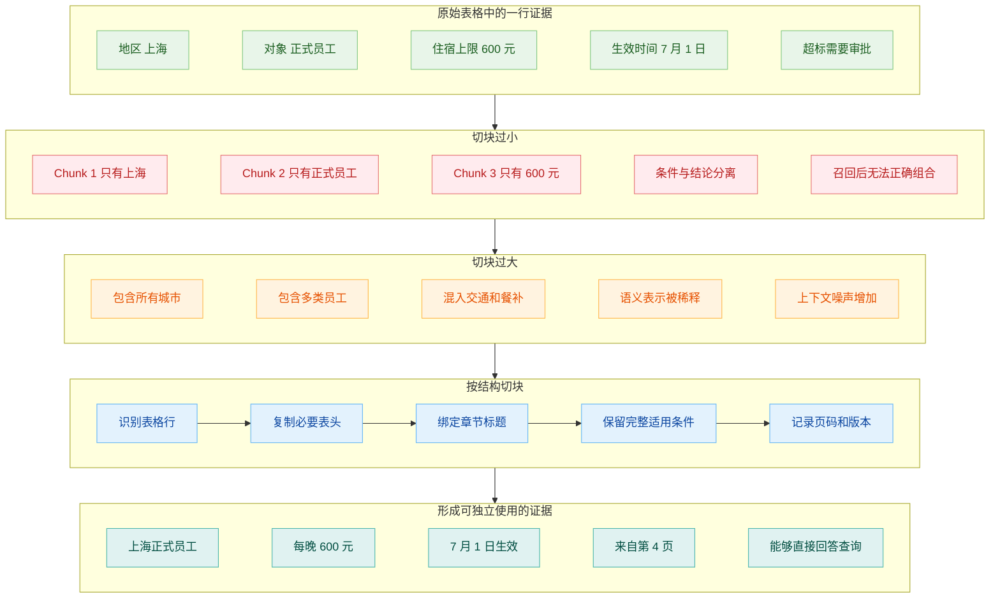
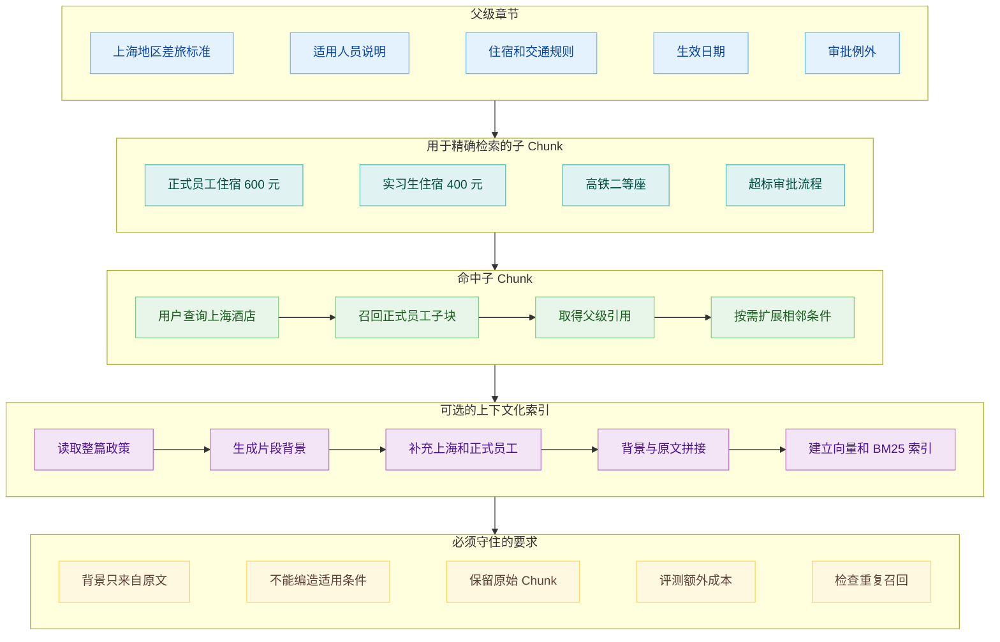
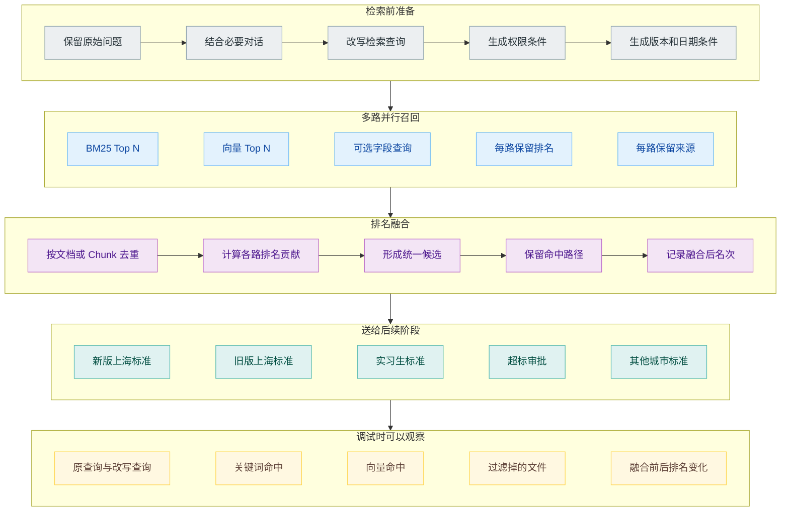
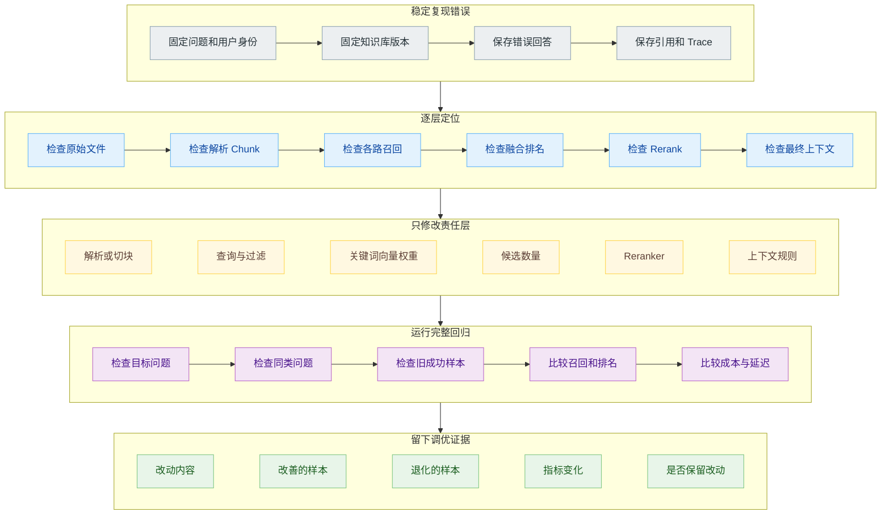

# RAG 为什么找不到正确片段：切块、混合检索与重排序

知识库里已经上传了最新版差旅政策。文件第 4 页写：2026 年 7 月开始，上海地区正式员工的住宿上限调整为每晚 600 元。

员工问内部助手同一个问题，得到的却是 500 元。打开引用一看，系统找到的是去年的旧政策。

这种故障容易被归结成“模型不聪明”，然后开发者开始换模型、改 Prompt，要求它认真阅读最新资料。问题可能根本没有发生在生成阶段。最新版 PDF 的表格也许没有被正确解析，“上海”和“600 元”可能被切进两个 Chunk；正确片段可能没有进入第一批候选，也可能已经进入候选，却在重排时输给了关键词更多的旧条款。

排查 RAG 检索，需要先回答三个问题：正确片段是否存在于索引中，查询时是否进入候选集合，进入以后是否被保留到最终上下文。

## 切块可能在检索前破坏证据

文档面向人排版，检索系统处理的是 Chunk。两者之间的转换，决定了以后能找到什么。

差旅政策可能用一个表格列出城市、员工类型、住宿上限和生效时间。解析器如果按视觉位置错误地读取表格，可能得到四列互不相关的文本；固定长度切分又恰好在“上海”后面断开，金额被放进下一块。索引里分别存在“上海地区住宿标准”和“每晚 600 元”，却没有一个片段能把两者联系起来。

块太大会出问题。整章同时包含北京、上海、广州的正式员工、实习生和外包人员标准，用户问题只需要其中一行。向量表示要概括整块内容，某一条规定的特征会被其他内容稀释；即使成功召回，模型还要在大量相似数字里重新找答案。

固定字数切分适合快速起步，不适合替代文档结构。合同要保住条款与子条款，制度文件要保住标题和适用范围，表格要让表头跟随数据行，代码要尽量让函数和类保持完整。真正的切块单位应当是一段可以独立解释、又没有塞入太多旁支信息的证据。

相邻重叠可以缓解边缘断裂，却不能修复所有结构问题。把每块重叠一半，确实更可能让跨边界句子完整出现，也会让大量重复 Chunk 一起进入候选集合。Reranker 看到五份几乎相同的片段，最终上下文也可能被同一条证据占满。

稳妥的设计常常会同时保存父子关系。子 Chunk 较短，用于精确检索；父 Chunk 保留完整章节，用于补足上下文。检索命中“上海正式员工每晚 600 元”这条子块后，系统可以回到它所属的小节，取出生效时间和超标审批条件。这样既不必拿整章做向量匹配，也不用把孤零零的一行交给模型。

Anthropic 的 Contextual Retrieval 选择了另一种补充方式。系统读取整篇文档，为每个 Chunk 生成一段简短背景，再用“背景加原片段”建立 Embedding 和 BM25 索引。原片段里的“公司收入增长 3%”得到公司名称、季度和文档类型以后，更容易响应包含这些条件的查询。

父子 Chunk、上下文化说明和重叠都不是必选部件。它们在不同位置补偿信息丢失，也会增加存储、预处理和检索复杂度。先用真实失败样本确认问题确实来自上下文缺失，再决定采用哪一种。

## 向量相似不等于能够回答

向量搜索会把问题和 Chunk 转换成 Embedding，再寻找语义上接近的内容。用户说“出差住酒店”，文档写“差旅住宿”，两边用词不同，语义仍然接近。这是向量搜索比纯关键词搜索灵活的地方。

灵活也意味着它会召回许多主题相关、答案却不匹配的片段。上海实习生标准、北京正式员工标准、酒店预订流程和住宿发票要求，都与问题在语义上接近。向量相似度无法单独判断哪个片段满足“上海、正式员工、7 月以后、金额上限”全部条件。

精确标识尤其容易暴露问题。政策编号 `BX-2026-07`、金额 `600`、产品型号、人名、缩写和错误码，往往更适合关键词匹配。Embedding 模型可能知道 `酒店` 与 `住宿` 相关，却未必应该把 `600` 和 `500` 拉开很远。

因此，关键词和向量分别提供不同的召回信号。关键词搜索关心词项是否出现以及出现位置，向量搜索关心整体语义是否接近。Metadata Filter 又处理另一类确定条件：文件是否生效、属于哪个部门、当前用户有没有权限。把三个问题都压给向量相似度，只会让调参越来越玄学。

这里还要区分检索分数和业务可信度。向量距离、BM25 分数和 Reranker 分数来自不同计算过程，不能直接拿数值大小互相比。一个向量结果的 `0.82` 与一个关键词结果的 `12.4` 没有天然可比性。混合检索需要先处理各路排名，再形成统一候选。

## 混合检索先扩大候选覆盖

混合检索通常让关键词和向量查询分别执行。两路各自返回一张排序表，再使用排名融合方法合并。常见的 Reciprocal Rank Fusion 更关心一个结果在每张表里的名次，而不是强行比较来自不同检索器的原始分数。

假设新版条款在关键词结果中排第 1，在向量结果中排第 5；旧版条款因为措辞和问题非常接近，在向量结果中排第 1，却在关键词结果中排第 8。融合后，两种证据都会进入候选集合。后面的 Reranker 和版本检查才有机会作出更细判断。

融合不能替代过滤。旧版政策如果已经明确失效，最有效的处理不是让 Reranker 每次判断新旧，而是在检索前根据状态和日期排除。权限也一样，用户无权访问的文件不应该先召回再指望模型忽略。

Query Rewrite 则发生在检索之前。它可以把“那上海呢”补成“2026 年 7 月后上海正式员工住宿报销上限”，也可以加入内部术语的标准写法。改写必须保留原问题，方便排查系统是否擅自添加了用户没有表达的条件。

混合检索的目标是让正确证据进入候选池，不是立即决定最终上下文。候选数量开得太小，某一路稍有偏差就会把正确片段挡在门外；开得太大，后面的重排成本和噪声都会上涨。这个平衡需要看真实问题中正确证据通常排在什么位置。

## Reranker 在候选中重新判断相关性

第一阶段检索面对整座知识库，需要速度和覆盖。Reranker 只面对几十个候选，可以花更多计算判断“这个片段是否真正回答当前问题”。

以 Cohere Rerank 一类模型为例，输入包含查询和候选文档。模型不再分别计算两边的独立向量，而是联合阅读查询与每个候选，再给出相关性排序。这让它能够注意到多个限定条件：同样写了上海和 600 元，其中一条适用于正式员工，另一条可能是会议酒店采购价。

Reranker 仍然不是事实裁判。它可以提高相关片段排名，未必知道哪份公司文件具有更高法律效力。版本、权限和来源等级最好由结构化规则处理；两个正式文件确实冲突时，应当保留冲突交给后续流程，而不是让一个相关性分数决定真伪。

第一阶段与第二阶段的职责要分清。正确 Chunk 没有进入 Top N，重排无法创造它；候选全部来自错误的旧版本，换更强的 Reranker 也只是从错误集合里选一个看起来最像的。

重排还会引入延迟和成本。候选越多、文本越长，Reranker 需要处理的内容越多。实际系统常用较便宜的检索器扩大召回，再把有限候选交给更贵的模型，原因就在这里。Top N 和 Top K 应该分别调整，不能用一个数字同时控制召回宽度与最终上下文长度。

## 评测要指出证据在哪一层消失

检索调优需要一批带证据标注的问题。每个样本至少包括用户问题、应该命中的文件和 Chunk，必要时还要标注适用版本、权限条件以及能够回答问题的多个证据片段。

第一项检查发生在入库以后：正确事实有没有形成可检索 Chunk。不存在就记录解析或切块失败，不进入召回评分。

第二项检查候选覆盖。正确 Chunk 是否进入关键词 Top N、向量 Top N 和融合 Top N。Recall@K 回答的是“该找的证据有没有出现在前 K 个结果里”。

第三项检查排名。正确证据排第 1 与排第 20，对最终上下文的影响不同。可以记录首个正确结果的位置、前几名中相关片段的比例，以及重排前后名次变化。

最后才检查上下文和回答。正确片段进入融合候选，却在 Rerank 后消失，问题属于第二阶段；片段已经进入 Prompt，模型仍回答旧金额，才属于生成忠实性或冲突处理。

困难负样本尤其重要。旧版上海政策与新版条款只有金额和日期不同，比一段完全无关的食堂制度更能检验检索系统。测试集如果只放一眼就能分开的正负样本，向量、混合检索和 Reranker 的结果都会显得很好，上线后仍会在相似版本之间翻车。

## 一次只改一层

回到 500 元的错误回答，可以按一条固定路径检查。

先在索引中直接查最新版文件，确认第 4 页表格是否解析成完整 Chunk。然后使用原始查询分别查看关键词与向量结果，检查正确 Chunk 的名次和过滤条件。再查看融合结果与 Reranker 输出，确认旧版为什么上升、新版在哪里掉出。最后打开实际送给模型的上下文，而不是只看搜索后台里的理想结果。

找到故障位置以后，一次只改一层。解析错误就修表格解析；条件被切断就调整结构化切块；编号查询漏召回就提高关键词路径作用；正确证据已经进入候选却排名过低，再处理 Reranker。几处一起改，最终分数上涨也无法知道哪项真正有效。

RAG 调优容易变成不断试 Chunk 大小、相似度阈值和 Top K。参数当然有作用，前提是开发者知道它们正在修哪一种错误。切块决定证据以什么单位存在，混合检索决定哪些候选有机会被看到，Reranker 决定有限上下文优先保留什么。三者处在不同位置，也需要不同的评测信号。

固定检索链路处理明确问题已经很有效。下一类困难来自查询本身：用户一次提出多个要求，资料分散在不同知识源，第一次召回又不足以判断下一步。

## 参考资料

1. Anthropic, [Contextual Retrieval](https://www.anthropic.com/news/contextual-retrieval).
2. Microsoft Learn, [Vector Search Overview](https://learn.microsoft.com/en-us/azure/search/vector-search-overview).
3. OpenAI Developers, [Retrieval](https://developers.openai.com/api/docs/guides/retrieval).
