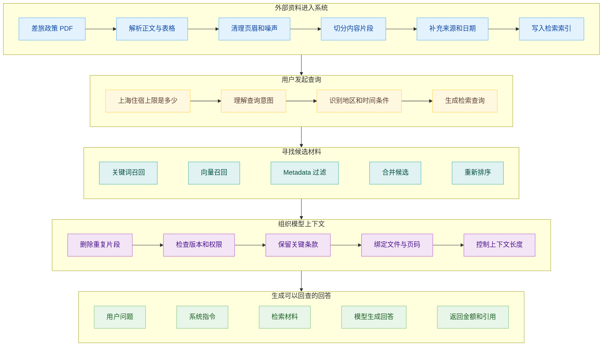
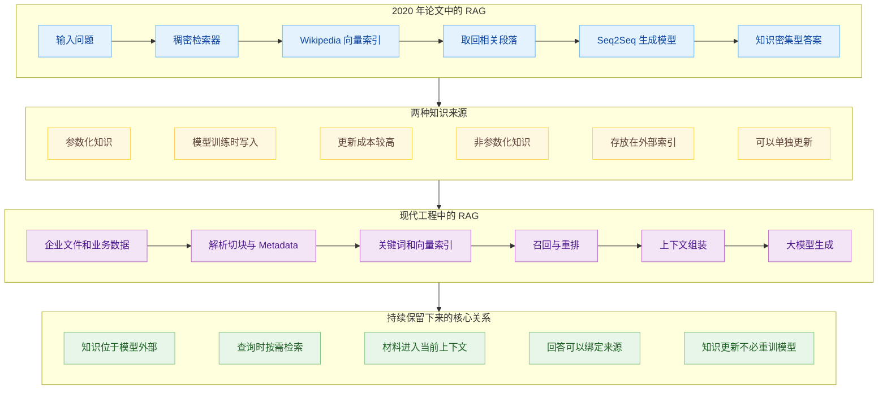
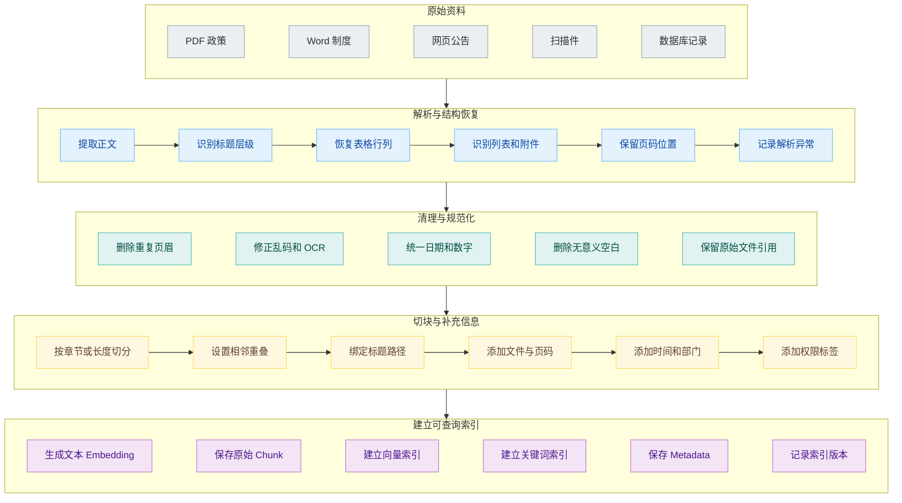
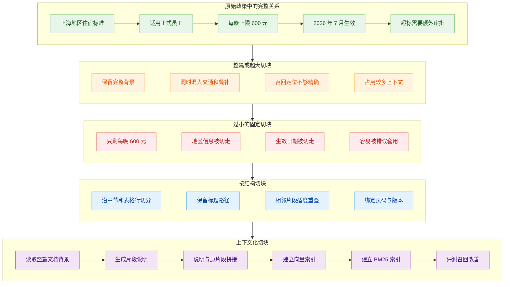
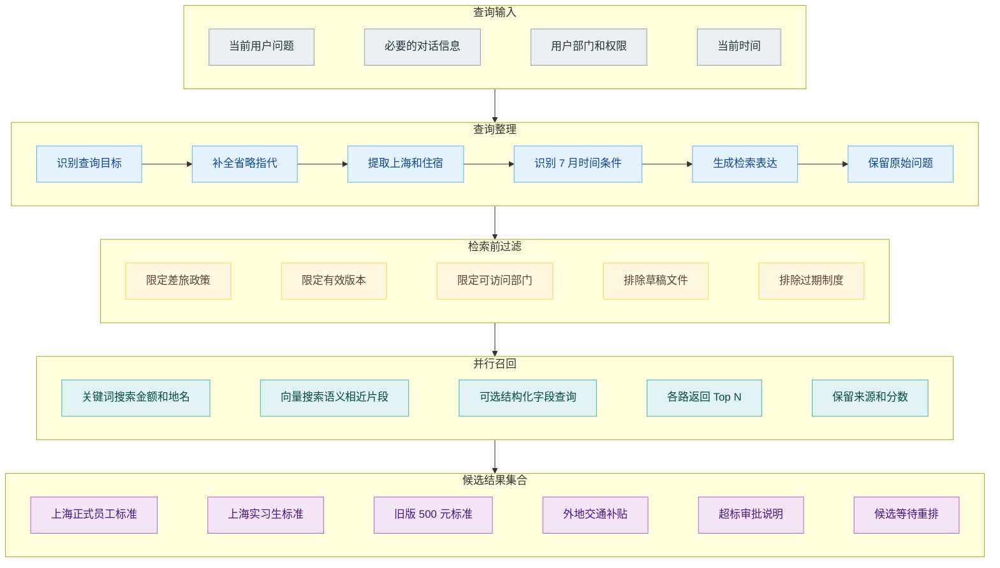
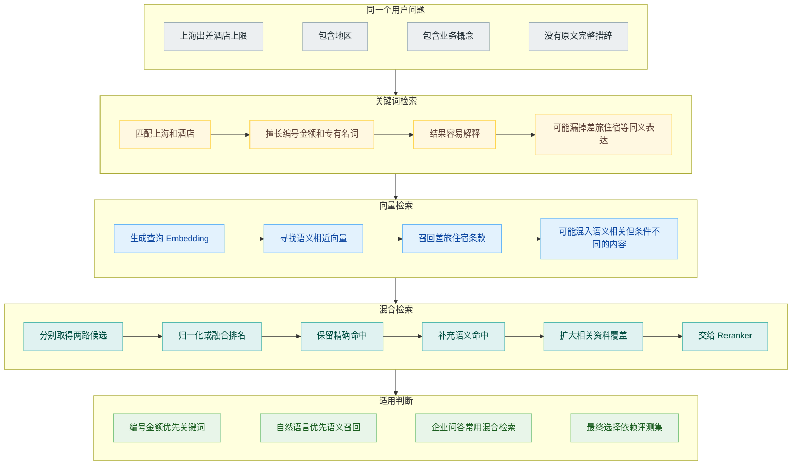
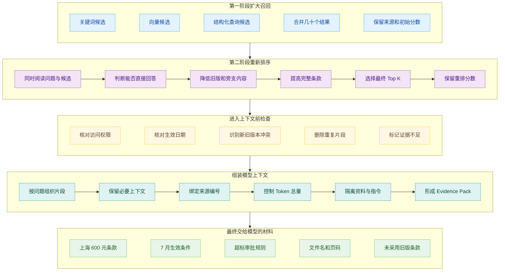
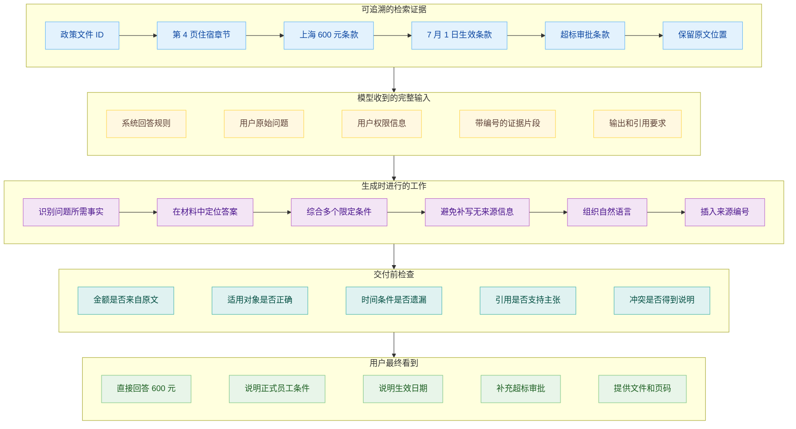
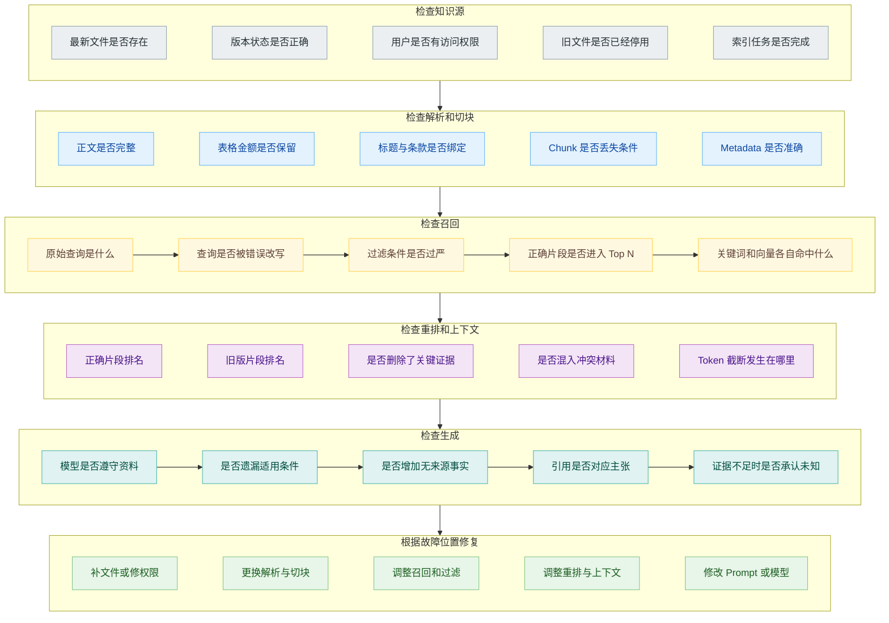

# RAG 是怎么工作的：从外部知识到模型回答

公司在 7 月发布了一份新的差旅报销政策。文件里写着各城市的住宿标准、交通费用、审批条件和生效日期，其中上海地区的酒店上限改成了每晚 600 元。

这份政策刚刚发布，基础模型训练时没有见过。员工在内部助手里询问：

> 上海出差住酒店，每晚最多可以报销多少钱？

让模型凭自己的知识回答，它会说不知道，也可能根据常见差旅标准猜一个数字。公司当然不能接受后者。开发者需要让模型在回答前找到最新政策，读到上海对应的条款，再把金额和生效条件说清楚。

RAG 处理的是这段连接。它的全称是 Retrieval-Augmented Generation，通常翻译成检索增强生成。外部文件不会因为进入知识库，就被重新训练进模型参数。每当用户提出问题，系统先去外部知识中寻找相关材料，再把找到的内容放进本次请求的上下文，最后让模型基于这些材料生成回答。

这条链路实际上由两段工作组成。文档入库发生在用户提问之前，负责把原始文件变成可以查询的索引；在线查询发生在用户提问之后，负责召回材料、整理上下文和生成答案。

## 外部知识没有写进模型参数

Patrick Lewis 等人在 2020 年发表的论文《Retrieval-Augmented Generation for Knowledge-Intensive NLP Tasks》，把模型使用的知识分成了两类。

一类知识保存在模型参数中。模型通过训练见过大量文本，语言规律、常见事实和概念关系被压进参数。它可以流畅地回答一般问题，但参数中的知识有更新时间，想改掉一条错误事实，通常也不能像修改数据库记录那样直接。

另一类知识放在模型之外。原始论文使用 Wikipedia 的稠密向量索引作为外部记忆，检索器根据输入找到相关段落，生成模型再结合这些段落输出答案。外部知识可以更新，也能为答案保留来源。论文里的实验系统还不是今天常见的企业知识库产品，但“生成以前先访问外部知识”这条思路保留了下来。

现在开发者说 RAG，范围已经宽得多。资料可以来自 PDF、Word、数据库、网页、工单或者代码仓库；检索可以使用关键词、向量、过滤条件和知识图谱；模型也未必与检索器联合训练。它们共同保留的关系是：知识存放在模型外部，系统在请求发生时按需取回一部分，生成模型只处理当前取回的内容。

因此，RAG 也不会让模型从此“记住”报销标准。系统下一次回答同类问题时，仍然需要检索。如果文件从知识库删除，或者权限过滤不允许当前用户访问，模型就不应该继续引用这条规定。外部知识的可更新、可控制和可追溯，恰好建立在它没有被写死进模型参数这件事上。

## 文档先被加工成检索索引

一份 PDF 不能原封不动地塞进向量数据库。入库链路要先把面向人阅读的文件，转换成面向检索的内容单元。

第一步是解析。系统需要从 PDF、Word、网页或扫描件中提取文字，识别标题、章节、列表和表格。差旅政策里的城市与金额很可能放在表格中，如果解析器只取到了表头，没有把每一行的城市和标准对应起来，后面使用再好的 Embedding 也无济于事。

解析以后还要清理。页眉、页脚、页码和重复导航会污染索引；扫描 OCR 可能把 `600` 识别成 `800`；附件和正文之间的关系也可能在转换中丢失。RAG 的知识质量从这一层就已经开始分化。

接下来是切块。文档通常比模型一次需要的证据长得多，搜索引擎也更适合返回一段具体条款，而不是整本员工手册。系统会把文档分成若干 Chunk，再为每个 Chunk 记录文件名、章节、页码、发布日期、部门、权限和版本等 Metadata。

最后才是生成 Embedding 和建立索引。Embedding 把文本转换成能够参与相似度比较的数字表示，索引则让系统可以在大量片段中快速找到候选。OpenAI 当前的 Vector Store 会在文件加入时自动执行切块、Embedding 和索引，默认切块大小是 800 Token、相邻片段重叠 400 Token；自建 RAG 时，这几步需要由应用或检索平台完成。

切块，块太大，一个结果里会混入许多不相关条款，占用上下文；块太小，金额可能和它所属的地区、人员类型或生效日期分开。固定长度切分实现简单，却可能从表格或句子中间落刀。按章节切分能保留结构，但有些章节又会长到无法直接使用。

相邻重叠可以减少边缘信息被切断的概率，代价是索引内容增加、召回结果更容易重复。另一种方法是给 Chunk 补充文档背景。Anthropic 的 Contextual Retrieval 会让模型根据整篇文档，为每个片段生成一小段说明，再把说明放到片段前面建立向量和 BM25 索引。

例如原始片段只有：

> 住宿标准调整为每晚 600 元，自 7 月 1 日起执行。

补充背景以后可以变成：

> 本片段来自 2026 年正式员工差旅政策的上海地区住宿章节。住宿标准调整为每晚 600 元，自 7 月 1 日起执行。

用户搜索“上海酒店报销上限”时，后者更容易被正确召回。这里增加的内容必须来自原文上下文，不能顺手编造文件里没有的条件。

没有一种切块策略能脱离文档类型直接成为标准答案。产品手册适合沿标题和段落切分，合同要尽量保住条款结构，表格需要让表头跟着数据行，代码则要考虑函数和类的范围。切块效果要回到真实问题上检查，而不是只看每段长度是否整齐。

## 用户问题经过多路检索找到候选

索引准备完成以后，用户问题才进入在线查询链路。

“上海出差住酒店，每晚最多可以报销多少钱”已经比较具体，但真实输入经常含糊得多。用户可能只写“上海住宿标准”，也可能在长对话后追问“那 7 月以后呢”。系统需要结合当前问题和必要的对话信息，整理出适合搜索的查询。

查询改写不是替用户添加条件，而是把对检索有用的信息说清楚。OpenAI Retrieval API 提供可选的自动 Query Rewrite；更复杂的应用也可能自己提取实体、缩写、时间范围和同义表达。与此同时，系统可以根据用户身份和问题内容生成 Metadata Filter，只在有效日期、指定部门和当前用户有权访问的文件中搜索。

随后会发生一项或多项检索。关键词检索查找明确出现的词语，向量检索把问题生成 Embedding，再寻找语义表示相近的片段。两路结果可以通过混合检索合并，形成一个覆盖较广的候选集合。

Embedding 容易被描述成某种会理解一切的语义魔法，实际职责窄得多。它把文本映射成一组数字，让意思接近的文本在表示空间中更容易靠近。查询写“出差酒店”，文档写“差旅住宿”，即使没有完全相同的词，向量搜索也有机会找到它。

这项能力不负责判断片段是否为最新版本，也不负责从条款中生成最终答案。产品编号、金额、法条编号、人名和公司内部缩写，有时更依赖精确匹配。用户搜索 `BX-2026-07`，关键词检索往往比单纯的语义相似更直接。

因此，关键词与向量不是非此即彼。Azure AI Search 对 Hybrid Search 的说明就是让两种查询并行执行，再把结果合并排序。OpenAI Retrieval API 也允许调整语义向量匹配和稀疏关键词匹配在混合检索中的权重。具体比例仍要根据业务问题评测。

第一次搜索通常倾向于多找一些。相关材料一旦没有进入候选集合，后面的模型和 Reranker 都无法把它救回来；候选稍多，还可以在下一阶段继续筛选。这个取舍对应检索中的召回与精度：前段尽量别漏，后段再减少噪声。

## 候选材料要经过重排和组装

向量相似度高，不等于片段最能回答当前问题。

候选集合里可能同时出现上海正式员工标准、实习生标准、去年的旧版本和超标审批流程。它们都和“上海住宿报销”有关，真正能够直接回答当前问题的却只有一部分。Reranker 会把用户问题和每个候选放在一起判断相关性，再重新排列顺序。

Cohere 的 Rerank 文档把它放在关键词或向量搜索之后：企业可以保留现有第一阶段检索，再把候选送入第二阶段重排。第一阶段适合从大规模索引快速取回几十甚至上百个候选，第二阶段计算更细，但只处理这批有限内容。Anthropic 的 Contextual Retrieval 实验也是先取回候选，再通过 Reranker 把最终送给模型的片段缩小。

重排之后还不能直接把结果连起来。上下文组装需要删除重复 Chunk，检查文件权限与版本，处理互相冲突的规定，并在 Token 预算内选择足够的证据。每个片段还要保留文件名、页码、标题路径或 URL，后面生成的主张才有引用入口。

Top K 也不是越大越好。增加片段可以减少漏掉条件的概率，同时会增加延迟、Token 成本和模型被无关材料干扰的风险。OpenAI File Search 允许限制返回结果数量，官方文档也明确提醒：数量下降可以减少 Token 和延迟，但可能损失回答质量。这个参数没有脱离业务问题的理想值。

上下文还要处理一种麻烦情况：两份文件都像正式规定，却给出不同金额。系统不能因为某个片段相似度高一点，就擅自宣布它正确。有效日期、文件状态和发布部门应该在检索或组装阶段参与判断；仍然无法消除的冲突，要一并交给模型，并要求回答明确说明分歧。

## 模型根据检索材料组织回答

完成检索和上下文组装后，生成模型才真正登场。

它收到的不只有用户问题。系统指令会规定回答方式，例如只能依据提供的资料、证据不足时不能猜测、主要事实需要标注来源。Evidence Pack 里保存被选中的条款及其文件信息。应用还可能附带用户身份、输出格式和安全要求。

模型负责综合这些输入，生成一段自然语言回答：

> 根据《2026 年员工差旅管理办法》第 4 页，上海地区正式员工的住宿标准自 7 月 1 日起为每晚不超过 600 元。超出标准需要提前申请额外审批。

这句话里其实包含三个可以分别核查的主张：适用对象是正式员工，金额是 600 元，生效时间是 7 月 1 日。引用应当支持附近的具体主张，而不是只在段末放一个主题相近的文件名。

引用能力从检索阶段就开始建立。如果 Chunk 没有保留文件和页码，Writer 写完以后再去猜来源，找到的页面可能与句子主题相似，却没有真正包含相应规定。OpenAI Retrieval API 的搜索结果会返回 Chunk、分数、文件和 Attributes，这些信息正是生成引用和回查入口的基础。

RAG 能给模型材料，不会自动强迫模型忠实。模型仍然可能忽略限定条件、混合两份冲突资料，或者调用参数记忆补上一句看似合理的话。Prompt、引用检查和交付前验证仍然有用。高风险的财务、法律或医疗内容，还需要更严格的规则与人工复核。

同样，找到了正确片段也不代表一定能回答。检索结果可能只是提到“上海住宿标准已调整”，却没有具体金额。可靠系统应该暴露证据缺口，而不是把“找到了相关内容”误判成“找到了答案”。

## 回答错误要沿着链路逐层检查

员工最后得到错误金额时，最显眼的是模型回答错了，问题却可能发生在前面任何一层。

知识库可能根本没有上传 2026 年政策，或者索引任务仍在处理中。PDF 解析可能丢掉表格中的一列。切块可能把“上海”与“600 元”分开。查询过滤可能错误地选中了实习生制度。向量召回找到了大量酒店相关内容，却漏掉精确金额。Reranker 可能把旧版政策排在最前面。上下文组装也可能同时放入 500 元和 600 元，却没有标注各自的生效日期。

直到前面的材料都正确，才轮到检查模型有没有忠实回答。只修改生成 Prompt，会让某些样本碰巧变好，却修复不了损坏的 PDF 表格和错误的版本过滤。

这也是 RAG 评测需要分层的原因。

一套生产知识库需要保留每次查询的检索结果、过滤条件、重排分数、最终上下文、模型回答和引用。没有这些 Trace，开发者只会收到一句“它没找到明明存在的规定”，然后在切块大小、Embedding、Prompt 和模型之间盲目试错。

回到最开始的差旅问题。新政策经过解析、切块、Metadata 补充和索引进入知识库；用户提问以后，系统结合关键词、向量和过滤条件找到候选，再经过重排和上下文组装，把上海 600 元的条款连同生效日期交给模型。模型负责表达答案，外部资料负责提供依据。

RAG 没有让模型永久记住这些文件。它为每一次回答临时准备了一份可以回查的参考材料。

这套固定链路适合目标明确、一次检索能够找到主要证据的问题。遇到含糊提问、多跳关系或跨多个数据源的任务，一轮召回可能还不够。

## 参考资料

1. Patrick Lewis et al., [Retrieval-Augmented Generation for Knowledge-Intensive NLP Tasks](https://arxiv.org/abs/2005.11401).
2. OpenAI Developers, [Retrieval](https://developers.openai.com/api/docs/guides/retrieval).
