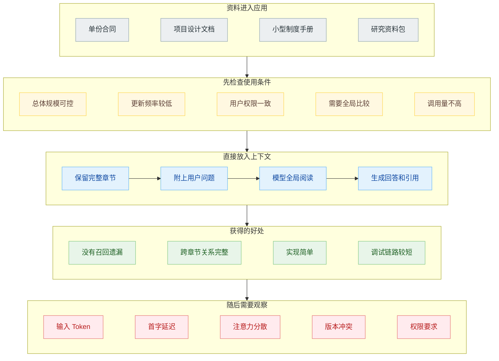
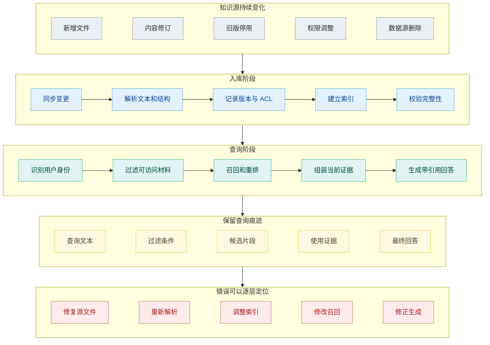
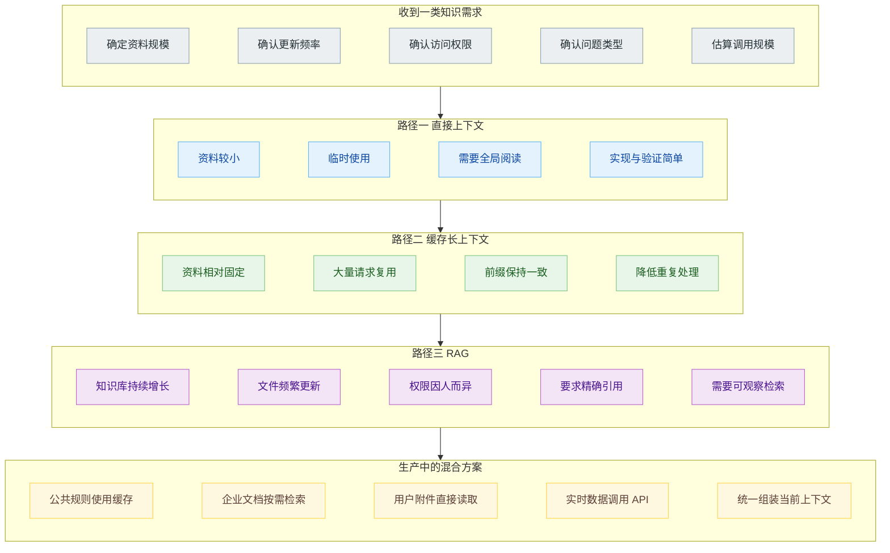

# 上下文窗口已经很长了，为什么还需要 RAG？

公司准备做一个内部制度助手，资料一共三百多页，主要是员工手册、差旅政策、信息安全规范和几个常用流程。模型的上下文窗口足以容纳这些文件，于是团队里出现了一个很自然的判断：既然整套资料都能塞进 Prompt，为什么还要切块、建索引、调召回和维护向量库？

这个判断并不草率。上下文窗口变长以后，直接把完整资料交给模型，确实从权宜之计变成了一种可以认真考虑的工程方案。Anthropic 在介绍 Contextual Retrieval 时也明确提到，如果知识库规模较小，可以直接把整套材料放进 Prompt；Prompt Caching 又能复用重复出现的前缀，减轻长资料被反复处理带来的延迟和费用。

但“能够放进去”和“适合一直放进去”是两件事。上下文窗口解决的是一次请求最多能携带多少内容，RAG 处理的是知识怎样进入系统、怎样更新、怎样按用户权限筛选、怎样找到当前问题需要的证据，以及回答以后怎样回到原文检查。

## 长上下文先改变了 RAG 的起点

早期做 RAG，最直接的理由是资料装不下。一本手册、一批合同或者整个技术文档库远远超过模型的输入限制，只能先搜索，再把少量片段送进上下文。

这个理由现在没有完全消失，但已经不再适用于所有项目。几十页产品说明、一份稳定的代码规范、一个规模有限的研究资料包，完全可以一次交给模型。这样省掉了切块与召回，模型还能同时看到章节之间的关系，不会因为 Chunk 把定义、例外条件和结论拆散。

直接上下文尤其适合几类任务：资料规模稳定，所有用户拥有相同权限，文件更新不频繁，需要跨整份文档比较，而且调用次数不高。比如分析一份招股书、审阅一份合同、总结一个项目的设计文档，整份读取常常比先搭知识库更省事。

因此，新项目不必因为出现“知识问答”四个字就立刻上向量数据库。先拿真实文件和真实问题测试整份上下文，是合理的基线。只有知道这个基线在哪里失效，后面的 RAG 才不是为了架构而架构。

## 装得下不表示每次都能找得准

长上下文容易让人把容量和注意力混为一谈。模型可以接收十几万甚至更多 Token，只能说明请求没有超过输入上限，不能保证每一条细小规定都得到同样关注。

一份差旅制度里可能同时出现 2025 年标准、2026 年修订说明、正式员工规则、实习生规则和多个地区的例外。用户只问“上海正式员工住宿上限”，真正有用的可能只有表格中的一行。整份文档都在上下文里时，模型仍要从大量相似数字中辨认适用对象、生效时间和地区。材料越相似，干扰越强。

问题还会随着文件数量增长。几十份政策里可能有重复页眉、历史附件、旧版通知和同名章节。模型看到了全部内容，却未必知道哪个版本仍然有效。RAG 至少可以在检索前用 Metadata 排除已经停用的文件，把地区、部门、版本和有效期作为过滤条件。整份上下文方案如果没有同等的数据治理，只是把筛选工作临时交给模型。

引用也有区别。长上下文可以要求模型标注页码，但前提是解析后的内容保留了稳定页码和文件身份。RAG 的每个候选通常天然携带文件 ID、Chunk ID、页码和版本信息，回答中的主张可以绑定到具体证据。对于需要审计的内部制度、法务和财务应用，这些信息不是装饰。

## Prompt Cache 省掉了重复计算

如果一百个员工每天都拿同一份员工手册提问，反复发送相同内容看上去很浪费。Prompt Caching 正好处理这类重复前缀。

OpenAI 的 Prompt Caching 要求可复用内容保持相同前缀，通常应把稳定的指令和资料放在前面，把每次变化的用户问题放在后面。命中缓存以后，系统可以复用模型处理该前缀时产生的中间状态。Anthropic 也支持为稳定内容设置缓存位置，让后续请求复用已经处理过的文档。

这会改变长上下文的成本和延迟，但不会把长上下文变成知识库。缓存不理解哪一章与当前问题有关，不负责过滤权限，也不会因为源文件更新就自动完成解析、版本替换和索引一致性。资料中有五个版本的差旅政策，缓存会更快地把五个版本交给模型，版本判断仍然没有解决。

缓存还依赖稳定前缀。系统提示、工具定义、文档顺序或文件内容发生变化时，相应部分可能无法继续命中。经常增删文件、每位用户看到不同资料、请求中资料排列不断变化的知识库，很难像固定手册那样获得稳定收益。

所以 Prompt Cache 和 RAG 并不是二选一。缓存优化的是重复输入，RAG 决定本轮输入什么。一个成熟应用可以先检索出稳定的业务说明和公共规则，把常用前缀缓存下来，再为每位用户补充经过权限过滤的动态证据。

## RAG 管理的是知识生命周期

把 RAG 理解成“向量搜索加 Prompt”，容易低估它在生产系统里的作用。企业知识库每天都在变化：新制度发布，旧制度失效，项目文档被修改，员工部门发生变化，数据源连接失败，某次索引任务只处理了一半。

这些变化需要一条可观察的链路。文件进入系统以后，要记录来源、版本、更新时间和权限；解析以后要确认正文、表格和图片是否完整；索引更新要能识别新增、修改与删除；查询时要保留过滤条件、候选结果和最终引用。用户发现答案错误时，开发者才能判断是源文件过期、解析丢失、召回失败，还是模型没有忠实使用证据。

直接上下文当然也能补上这些能力。你可以自己实现文件同步、权限筛选、版本管理、引用映射和日志追踪，再把过滤后的整份文件交给模型。做到这里，系统已经拥有一套知识管理层，只是查询阶段选择了“整份加载”，没有使用 Chunk 检索。

这也是 RAG 在长上下文时代仍然存在的主要原因。资料规模只是一个变量，知识更新、权限隔离、证据定位和故障排查同样会决定架构。

## 三种方案可以同时存在

工程上不必为整个应用选择唯一方案。不同知识源可以走不同路径。

一份长期稳定、所有用户都能访问的产品说明，可以直接放进上下文并使用缓存。上万份经常更新、权限各异的企业文档，适合先检索。用户本轮上传的一份临时合同没有必要立刻进入长期索引，可以作为附件直接读取。数据库里的订单状态既不属于长上下文，也不属于文档 RAG，应该通过业务 API 实时查询。

选择时可以按四个问题逐步收敛：资料是否稳定，用户是否拥有相同权限，问题是否需要全局阅读，调用规模是否值得维护缓存或索引。没有必要先争论哪种技术更先进，真实数据会很快给出答案。

最实用的起步方式，是先建立三个基线。第一个基线把整份资料直接交给模型，观察答案质量和延迟；第二个基线开启缓存，测量重复请求能省下多少；第三个基线使用最简单的检索链路，检查引用、更新和权限是否更容易控制。然后用自己的问题集比较正确率、证据完整性、延迟、成本和维护难度。

上下文窗口变长以后，RAG 不再是资料装不下时唯一的逃生通道。它更像一套知识选择与治理机制。资料小而稳定时，整份读取可以手拿把掐；知识量上来、版本开始变化、权限出现差异以后，检索层仍然承担着模型上下文窗口无法替代的工作。

## 参考资料

1. Anthropic, [Introducing Contextual Retrieval](https://www.anthropic.com/news/contextual-retrieval).
2. OpenAI Developers, [File search](https://developers.openai.com/api/docs/guides/tools-file-search).
3. OpenAI Developers, [Retrieval](https://developers.openai.com/api/docs/guides/retrieval).
