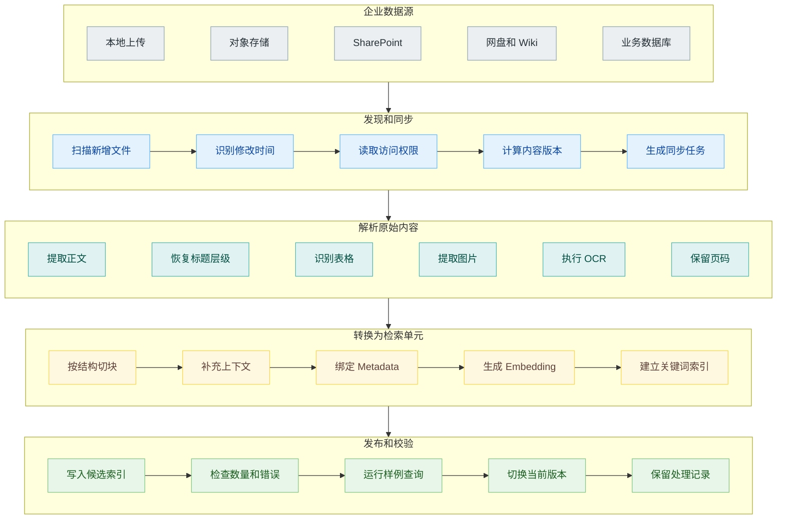
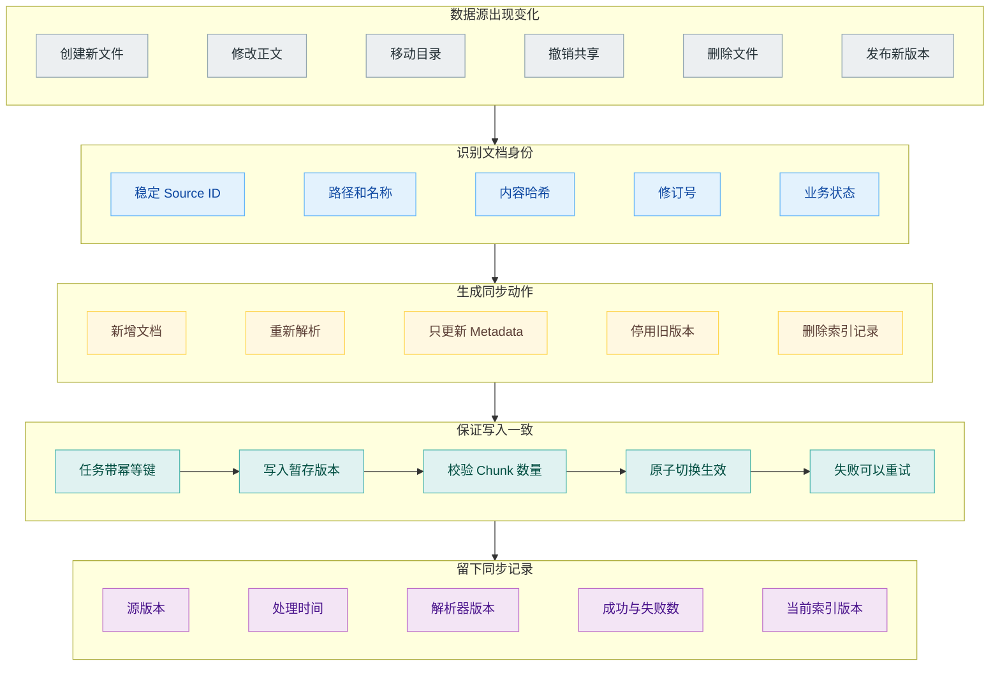
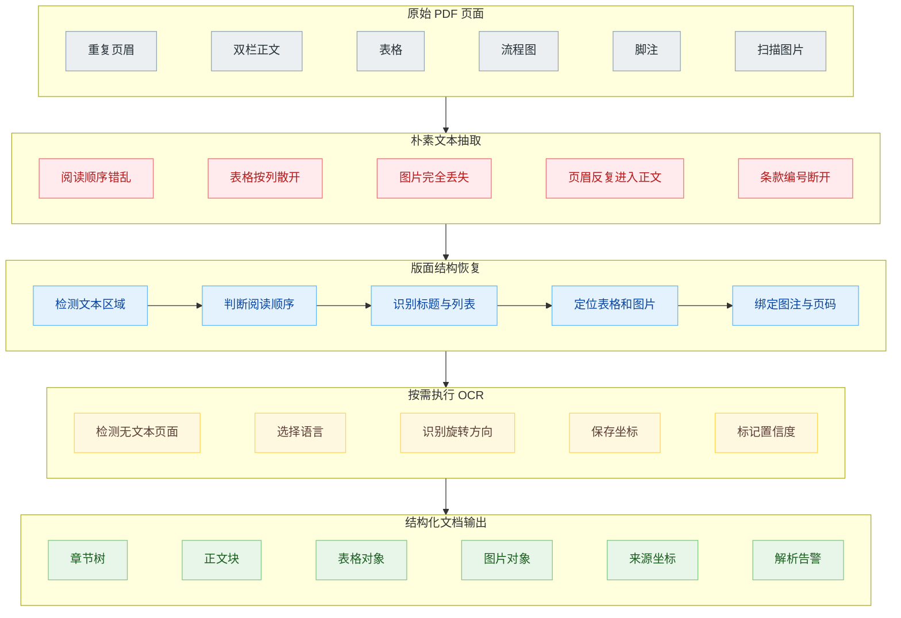
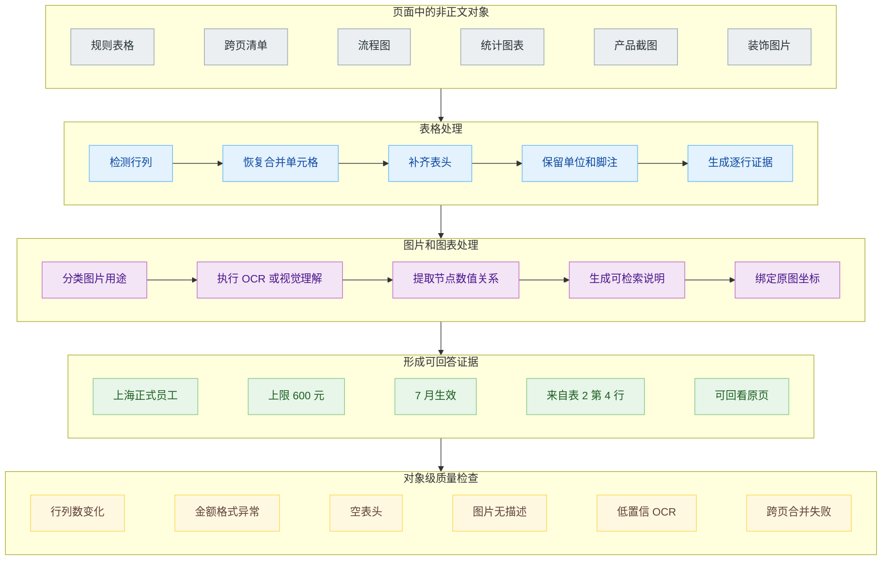
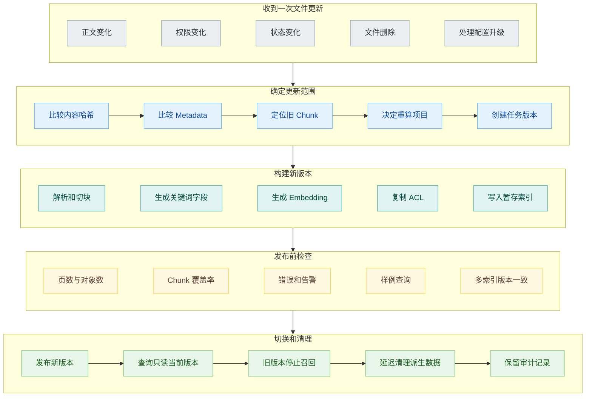

# 企业知识库怎样入库：PDF 解析、表格、图片与增量更新

公司把最新版采购制度上传到知识库，后台显示“处理完成”。员工随后询问一台 9000 元的笔记本需要谁审批，系统却只找到一句“采购申请应按照金额分级审批”，没有给出具体审批人。

打开原始 PDF，答案就在下一页的流程图里：5000 元以下由部门负责人审批，5000 到 20000 元需要部门负责人和财务共同审批，更高金额还要进入采购委员会。文件上传成功了，正文段落也能搜索，流程图里的金额与审批关系却从来没有进入索引。

企业知识库的第一道难关经常发生在检索之前。文件存在于对象存储，不等于知识存在于索引；页面能够被 OCR 识别，也不等于表格关系、章节层级和图片含义已经成为可回答的证据。

一条完整的入库链路，需要处理数据源同步、文件解析、结构恢复、切块、Metadata、Embedding、索引更新和质量检查。任何一步丢失信息，后面的混合检索和 Reranker 都只能在残缺材料上继续工作。

## 上传以后，入库才刚开始

知识库后台的“上传”动作，通常只是把文件交给一条异步处理流水线。系统要先确认文件来自哪里，读取正文和附件，识别标题、段落、表格与图片，再把适合检索的单元写入索引。

Azure AI Search 把 Indexer 的处理过程拆成几个清楚的阶段：从数据源取文档，进行 Document Cracking，完成字段映射，按需执行 OCR、文本切分和向量化等 Skillset，最后把输出字段写入搜索索引。NVIDIA NeMo Retriever 则把重点放在多模态内容提取，目标包括文本、表格、图表、图片和信息图。两套产品的侧重点不同，共同说明了一件事：Embedding 只是入库靠后的一个步骤。

这里每一步都应该产生可以检查的中间结果。原始文件、解析后的结构、最终 Chunk 和索引记录不能只留下最后一份。否则检索失败时，开发者看到的只有空荡荡的 Top K，不知道信息是在解析时消失，还是写索引时失败。

## 数据的变化

本地上传是最简单的数据源：用户选中一个文件，系统获得一份相对确定的快照。企业知识库更多时候连接的是持续变化的数据源，比如 SharePoint、Cloud Storage、OneDrive、数据库、Wiki 或工单系统。

不同数据源对“变化”的表达不一样。对象存储可以提供文件路径、更新时间和 ETag；数据库可能依靠更新时间字段或变更日志；Wiki 页面有独立的页面 ID 和修订版本；网盘中的文件可能改名、移动、共享给其他团队，也可能被删除。

同步器至少要分辨新增、修改、删除、移动和权限变化。只会发现新增文件的系统会不断积累旧版；只根据文件名判断身份，文件改名后可能被当成两份文档；只更新正文、不更新 ACL，又会让已经撤销权限的内容继续出现在检索结果中。

Azure Indexer 对部分数据源提供变更检测，可以按计划重新运行；高频更新场景则可能需要应用主动把源数据与搜索索引同时写入。托管服务可以代替团队处理连接与调度，却无法替团队定义业务上的版本含义。例如“制度修订稿”上传以后，是立刻生效，还是等审批状态变为已发布才替换现行制度，这个规则只存在于业务系统中。

知识库通常还需要区分“已接收”“解析中”“待校验”“已发布”和“已停用”。把刚上传的文件立即暴露给查询，可能让用户在解析只完成一半时得到残缺答案。把旧版本立即删除，又会在新版本处理失败时留下空档。

更稳妥的做法是先把新版本写进暂存区域，完成解析检查和样例查询以后，再切换当前版本。旧版本可以保留用于审计，但查询过滤必须明确排除它。

## PDF 解析先恢复页面结构

PDF 保存的是页面上的字符、坐标、字体、线条和图片。人看到的是标题、双栏正文、表格和脚注，朴素解析器看到的可能只是一串按内部对象顺序排列的字符。

双栏报告最容易暴露问题。解析器先读左栏第一行，再读右栏第一行，最后把两栏拼成一段语无伦次的文本。页眉和页脚在每一页重复出现，切块以后反而成为频率最高的内容。扫描版 PDF 没有可提取文字，只能 OCR；带文本层的扫描件又可能同时读出隐藏 OCR 和可见文字，导致正文重复。

解析阶段要恢复阅读顺序，识别标题层级，删除重复页眉页脚，保留列表编号、脚注关系和页码。对于合同与制度文件，条款号往往比字体大小更可靠；对于论文和财报，章节标题、图注和表注需要与正文建立关联。

解析器不可能对所有文件都表现一样。数字原生 PDF、扫描合同、PPT 导出的流程图、Excel 转成的宽表，需要不同策略。Amazon Bedrock Managed Knowledge Base 的 Smart Parsing 会根据文档类型选择解析方式，这类托管能力减少了接入工作，仍然需要用自己的文件验证结果。供应商宣称支持 PDF，只说明文件能够进入处理流程，没有证明你的跨页表格和盖章扫描件已经被正确理解。

## 表格要保住行列关系

表格是企业知识库里最容易被低估的内容。差旅标准、价格清单、权限矩阵、产品参数和 SLA 都喜欢放在表格中，而用户的问题往往只需要其中一个单元格及其表头条件。

把表格直接转成一串文本，可能让“上海”“正式员工”“600 元”和“2026 年 7 月生效”分散在不同位置。切块再从中间落刀，系统虽然索引了每个词，却没有任何一个 Chunk 能表达完整规则。

表格可以保留为结构化对象，同时生成适合检索的文本表示。每一行带上必要表头，复杂表格再附加表名、章节标题、单位和脚注。跨页表格要识别重复表头，合并同一张表的后续页面。合并单元格则需要把上级分类复制到具体数据行，避免孤立单元格失去含义。

图片与图表不能一概转成一句通用描述。产品截图可能需要 OCR 与界面元素识别，流程图需要提取节点和连接关系，柱状图需要读出图例、坐标轴与主要数值，普通装饰图可以直接忽略。每种对象都要保留原图位置，方便最终引用和人工复查。

NVIDIA NeMo Retriever 把文本、表格、图表和信息图都列为文档提取对象，反映的正是这个需求。多模态 RAG 除了让生成模型能看图，还要让图里的事实能够被查询找到。

## 切块发生在结构恢复之后

如果解析器已经恢复了章节、表格和列表，切块就不该再退回固定字数。制度文件按条款组织，技术文档按章节和代码块组织，工单按问题、处理过程和结论组织。切块要尊重这些单位。

短 Chunk 适合精确检索，父级章节适合补足上下文。系统可以为子 Chunk 建索引，命中后再回到父级章节，取出适用范围、例外条款和生效日期。表格的一行可以成为检索单元，表名、表头和脚注则作为它的上下文。

Anthropic 的 Contextual Retrieval 会根据整篇文档，为每个 Chunk 补一段简短背景，再用背景和原文建立 Embedding 与 BM25 索引。这种方法适合解决片段内部缺少公司名、时间或章节主题的问题，但生成的背景必须与原文一起保存，不能覆盖原始证据。

Metadata 同样在这里形成。一个可用的 Chunk 除了正文，至少需要知道自己来自哪个数据源、哪份文件、哪个版本、哪一页、哪一章节、何时生效、当前是否有效、哪些用户或群组可以访问。后面的过滤、引用、删除和故障排查都依赖这些字段。

切块参数需要版本化。解析器升级、Chunk 大小调整、Embedding 模型更换，都会让同一份文件产生不同索引结果。只记录文档版本，不记录处理配置，线上出现差异时就无法复现。

## 增量更新比首次全量导入更难

第一次导入一千份文件，失败了可以清空重来。知识库上线以后，索引一边服务查询，一边接收持续更新，事情会麻烦得多。

修改一份文件时，系统需要找到它过去产生的全部 Chunk，用新版本替换，并避免新旧 Chunk 同时可见。文件删除时，不能只删除对象存储中的原件，关键词索引、向量索引、缓存、引用映射和派生摘要都要跟着失效。权限变化往往只需要更新 Metadata，不应该每次都重新 OCR 和生成 Embedding。

处理任务还会失败。二百页 PDF 解析到第 180 页时超时，系统不能把前 179 页当成完整新版本发布；向量索引成功、关键词索引失败时，也不能让两路检索看到不同版本。任务需要幂等，重复执行不会生成重复 Chunk；发布需要有一致的版本标记，查询只能读到已经完成的版本。

增量更新的监控不能只看任务是否返回成功。还要看数据源最近一次扫描时间、待处理任务数量、解析失败率、低置信 OCR 页面、每份文件产生的 Chunk 数量、索引延迟和当前生效版本。某个连接器三天没有拉到新数据，可能没有任何报错，知识库却已经悄悄过期。

## 入库质量要用问题来检查

文件级统计只能发现明显故障。PDF 页数正确、Chunk 数量正常，不代表关键表格已经转对。最终还要用业务问题检查入库结果。

每种文档应准备少量黄金问题：答案位于正文、表格、图片、跨页内容、脚注和版本说明中。测试时先不看模型回答，直接检查正确证据能否在索引中找到，页码和 Metadata 是否正确，旧版本是否被过滤。这样可以把入库故障与生成故障分开。

解析器升级以后，要在固定样本集上比较结构变化。表格行数突然减少、平均 Chunk 长度大幅变化、空文本页面增加，往往比最终问答分数更早暴露问题。对金额、日期、版本号、错误码等关键字段，还可以增加规则校验。

如果文件类型普通、权限模型简单、目标是快速上线，托管能力很合适。遇到复杂工程图、特殊表格、严格的数据驻留、定制 Chunk、现有搜索集群或细粒度审计要求，团队可能需要自建部分处理链路。实际项目也常采用混合方式：连接器和基础 OCR 使用云服务，业务状态、版本规则、Metadata 与质量门禁留在自己的系统中。

后台出现绿色状态，只能说明处理任务已经结束。一份文件完成入库，还要保证关键事实以正确结构进入索引，携带可用的版本和权限信息，能够被真实问题找到，并且可以回到原页核对。把这条链路守住以后，后面的召回、重排和生成才有材料可用。

## 参考资料

1. Microsoft Learn, [Indexers in Azure AI Search](https://learn.microsoft.com/en-us/azure/search/search-indexer-overview).
2. Google Cloud, [RAG Engine overview](https://cloud.google.com/vertex-ai/generative-ai/docs/rag-engine/rag-overview).
